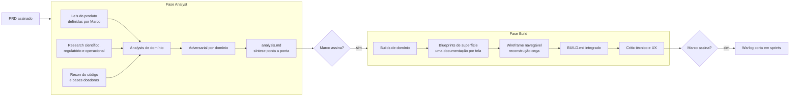

# Antessala

Prova de conceito para transformar a anamnese pré-anestésica de enfermagem em uma
necessidade operacional de agenda explicável e conduzir o caso até o resultado voltar ao
serviço solicitante.

> Nenhum gate está aprovado. O PRD aguarda assinatura; Analysts e Builds ainda exigem as
> rodadas indicadas no [tracker único](.context/review/STATUS.md) antes de qualquer
> assinatura. O [estado mecânico](hack/status.json) mantém o código de produto bloqueado.

## Problema e objetivo

A recepção precisa reservar a consulta, mas não deve interpretar comorbidades,
medicamentos ou exames. A enfermagem coleta a história; o Antessala deve traduzir essa
entrevista em um requisito operacional que uma pessoa autorizada confirma ou corrige com
justificativa. A recepção então reserva uma vaga compatível.

O produto acompanha o mesmo caso até o anestesiologista concluir ou abrir pendências e o
serviço solicitante receber o resultado.

## Fluxo principal

```text
médico solicitante indica procedimento
→ recepção registra o encaminhamento
→ enfermagem conduz anamnese pré-anestésica
→ sistema produz ou sugere uma necessidade operacional de agenda
→ profissional humano confirma ou altera com justificativa
→ recepção encontra e reserva vaga compatível
→ anestesiologista realiza a consulta
→ abre pendências e retorno quando necessário
→ finaliza resultado
→ serviço solicitante recebe o resultado
→ marcação da cirurgia continua externa
```

A triagem geral do SUS ocorre antes e está fora do produto. Cada encaminhamento abre um
caso autônomo: não existe cadastro longitudinal de paciente, deduplicação por nome nem
evolução entre casos. A marcação da cirurgia ocorre depois e também fica fora.

## O que o produto não faz

- não atribui ASA, aptidão anestésica, diagnóstico ou conduta clínica;
- não confunde gravidade, urgência, prioridade cirúrgica e duração da consulta;
- não transforma doença ou medicação isolada em urgência automática;
- não substitui a decisão da enfermagem ou do anestesiologista;
- não é prontuário, triagem geral do SUS, fila de chamada ou agenda cirúrgica;
- não alega reproduzir protocolo ou arquitetura do HCFMRP-USP.

## Atores

| Ator | Responsabilidade no Antessala |
|---|---|
| Recepção | registra o encaminhamento e reserva vaga compatível |
| Enfermagem | conduz a entrevista e confirma ou corrige o requisito operacional |
| Anestesiologista | avalia, abre pendências e retornos e finaliza o resultado |
| Serviço solicitante | recebe o resultado do próprio serviço |
| Administrador | prepara contas locais e configurações permitidas da demonstração |

Paciente e médico solicitante participam do fluxo, mas não entram no aplicativo no MVP.

## IA, memória e conhecimento

A prova de conceito deve demonstrar um uso real de IA e um de memória. A direção é
assistiva: transcrição pode originar propostas de preenchimento; cada proposta mostra sua
origem e continua rascunho até confirmação humana. Conhecimento global só nasce por
promoção explícita e versionada; identidade, narrativa integral e decisão isolada de um
caso nunca viram regra automática.

Uso de rede é opcional, informado e iniciado pela pessoa. Sem IA ou internet, caso,
agenda e handoff continuam funcionando. O contrato completo permanece no
[Analyst de IA, memória e conhecimento](hack/domains/ANALYST-ia-memoria-e-conhecimento.md),
ainda sujeito a pesquisa e adversarial.

## Base técnica atual

O repositório contém uma casca Electron com processo principal, preload e renderer React;
PGlite local; cliente TIPC tipado; catálogos versionados carregados sem rede; política de
egress do renderer; e PDF pelo motor de impressão do Electron. A casca ativa ainda expõe
somente Início, IA e Configurações: o fluxo clínico ponta a ponta não está implementado.

Gravação em WAV, peças de transcrição, RAG, grafo, memória e importadores existem em
estados incompletos ou dormentes. Existência no código não autoriza reativação. O inventário
com evidências e limites vive em [.context/architecture.yaml](.context/architecture.yaml).

## Mapa documental

Comece em [.context/manifest.yaml](.context/manifest.yaml). Ele define leitura obrigatória,
fontes e autoridade.

| Artefato | Pergunta que responde |
|---|---|
| [PRD](hack/PRD.md) | qual produto, problema, promessa e fronteira |
| [Analyst integrado](hack/analysis.md) e [índice](hack/ANALYST.md) | qual é a verdade lógica ponta a ponta |
| `hack/domains/ANALYST-*.md` | quais entidades, campos, estados, regras, papéis e falhas pertencem a cada domínio |
| [Build integrado](hack/BUILD.md) e `hack/domains/BUILD-*.md` | como um Analyst assinado será traduzido para este repositório |
| [.context/product.yaml](.context/product.yaml) | resumo estável do produto e Definition of Done |
| [.context/workflow.yaml](.context/workflow.yaml) | método, gates e momento futuro dos documentos de tela |
| [.context/review/STATUS.md](.context/review/STATUS.md) | única fila de pesquisa, recon e review por artefato |
| [status.json](hack/status.json) e [progress.md](hack/progress.md) | gate mecânico e recibo humano da fase |
| [Contrato de aprovação](hack/CONTRATO-DE-APROVACAO.md) | o que constitui assinatura válida de Marco |

`.context` é mapa cognitivo. Não substitui PRD, Analyst ou Build.

## Método



Research e adversarial pertencem ao Analyst. Analyst define comportamento sem escolher
tabela ou componente. Build traduz contratos fechados para arquitetura, DTOs, IPC,
transações, componentes e testes; não preenche lacuna analítica por conta própria.

### Review com GPT Pro

1. publicamos branch, SHA e artefato canônico;
2. GPT Pro pesquisa ou tenta quebrá-lo direto no repositório;
3. Marco traz a resposta ao chat principal;
4. o chat verifica fontes e corrige o artefato canônico;
5. atualiza o tracker e publica um novo SHA.

A resposta bruta é material de trabalho, não documentação do produto.

### Quando nascem os documentos de tela

`ANALYST-superficies` identifica as superfícies e seus trabalhos. Analysts fecham
semântica; Builds fecham DTOs e arquitetura. Só durante o fechamento do Build cada tela
com trabalho próprio recebe um Surface Blueprint em `hack/surfaces/`. Um modelo limpo
tenta reconstruir o wireframe apenas com esse pacote. Invenção necessária reabre o Build.
Nenhum Surface Blueprint deve existir antes disso.

### Do Build ao código

```text
Build integrado + Critic assinados
→ Warlog
→ Sprints
→ MiniSpec
→ Spec assinada
→ Plan assinado
→ primeiro teste TDD em RED
→ implementação
→ QA da minispec
→ QA final
```

Nenhuma seta avança sem a assinatura exigida de Marco. Uma IA nunca assina, presume
aprovação nem transforma pedido de revisão em autorização.

## Comandos atuais

```bash
npm install
npm run dev
npm run build
npm run typecheck
npm test
npm run test:e2e
```

Não existe script de lint no projeto. Validação documental usa YAML/JSON, links locais,
Mermaid e `git diff --check`; CI pesado só roda quando a superfície alterada justificar.

---

## Contrato de encerramento

- Artefato: `README.md`.
- Gate: definido em `hack/status.json` e `hack/CONTRATO-DE-APROVACAO.md`.
- Estado: `AGUARDANDO_ASSINATURA`.
- Assinatura de Marco: `PENDENTE`.
- Data, revisão Git e declaração: `PENDENTES`.

Sem assinatura válida, este arquivo não promove fase nem autoriza implementação.
