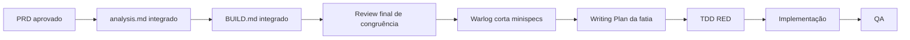

# Antessala

Prova de conceito para transformar a anamnese pré-anestésica de enfermagem em uma
necessidade operacional de agenda explicável e conduzir o caso até o resultado voltar ao
serviço solicitante.

> O PRD está aprovado, Analyst e BUILD foram consolidados, o Warlog cortou três fatias e a
> prova de conceito ponta a ponta está implementada. O fluxo-base funciona localmente sem
> Gemini; a IA é opcional e só cria rascunhos que exigem decisão humana.

## Problema e objetivo

A recepção precisa reservar a consulta, mas não deve interpretar comorbidades,
medicamentos ou exames. A enfermagem coleta a história; o Antessala deve traduzir essa
entrevista em um requisito operacional que uma pessoa autorizada confirma ou corrige com
justificativa. A recepção então reserva uma vaga compatível.

O produto acompanha o mesmo caso até o anestesiologista concluir ou abrir pendências e o
serviço solicitante receber o resultado.

## Fluxo principal

```text
médico solicitante indica procedimento
→ recepção registra o encaminhamento
→ enfermagem conduz anamnese pré-anestésica
→ sistema produz ou sugere uma necessidade operacional de agenda
→ profissional humano confirma ou altera com justificativa
→ recepção encontra e reserva vaga compatível
→ anestesiologista realiza a consulta
→ abre pendências e retorno quando necessário
→ finaliza resultado
→ serviço solicitante recebe o resultado
→ marcação da cirurgia continua externa
```

A triagem geral do SUS ocorre antes e está fora do produto. Cada encaminhamento abre um
caso autônomo: não existe cadastro longitudinal de paciente, deduplicação por nome nem
evolução entre casos. A marcação da cirurgia ocorre depois e também fica fora.

## O que o produto não faz

- não atribui ASA, aptidão anestésica, diagnóstico ou conduta clínica;
- não confunde gravidade, urgência, prioridade cirúrgica e duração da consulta;
- não transforma doença ou medicação isolada em urgência automática;
- não substitui a decisão da enfermagem ou do anestesiologista;
- não é prontuário, triagem geral do SUS, fila de chamada ou agenda cirúrgica;
- não alega reproduzir protocolo ou arquitetura do HCFMRP-USP.

## Atores

| Ator | Responsabilidade no Antessala |
|---|---|
| Recepção | registra o encaminhamento e reserva vaga compatível |
| Enfermagem | conduz a entrevista e confirma ou corrige o requisito operacional |
| Anestesiologista | avalia, abre pendências e retornos e finaliza o resultado |
| Serviço solicitante | recebe o resultado do próprio serviço |
| Administrador | prepara contas locais e configurações permitidas da demonstração |

Paciente e médico solicitante participam do fluxo, mas não entram no aplicativo no MVP.

## IA, memória e conhecimento

A prova de conceito deve demonstrar um uso real de IA e um de memória. A direção é
assistiva: transcrição pode originar propostas de preenchimento; cada proposta mostra sua
origem e continua rascunho até confirmação humana. Conhecimento global só nasce por
promoção explícita e versionada; identidade, narrativa integral e decisão isolada de um
caso nunca viram regra automática.

Uso de rede é opcional, informado e iniciado pela pessoa. A PoC usa Gemini somente com
fixtures sintéticas e sem fallback de provedor. Sem IA ou internet, caso, agenda e handoff
continuam funcionando. O contrato completo está no
[Analyst de IA, memória e conhecimento](hack/domains/ANALYST-ia-memoria-e-conhecimento.md).

## Base técnica atual

O repositório contém um aplicativo Electron com processo principal, preload e renderer
React; PGlite local; cliente TIPC tipado; catálogos versionados carregados sem rede; política
de egress do renderer; e PDF pelo motor de impressão do Electron. A casca ativa expõe a
operação por papel e Configurações apenas ao administrador.

O MVP implementa encaminhamento, entrevista, requisito explicável, confirmação humana,
vaga compatível, check-in, consulta, pendência, retorno, resultado versionado, entrega,
propostas Gemini em rascunho e memória local aprovada. As cinco contas fixture usam a senha
`demo123`; os botões da tela de entrada fazem o login sem exigir digitação durante o pitch.

Gravação em WAV, peças de STT, RAG, grafo e importadores legados continuam incompletos ou
dormentes. A prova atual usa transcript sintético digitado e memória textual mínima;
existência de código legado não autoriza reativação. O inventário
com evidências e limites vive em [.context/architecture.yaml](.context/architecture.yaml).

## Mapa documental

Comece em [.context/manifest.yaml](.context/manifest.yaml). Ele define leitura obrigatória,
fontes e autoridade.

| Artefato | Pergunta que responde |
|---|---|
| [PRD](hack/PRD.md) | qual produto, problema, promessa e fronteira |
| [Analyst integrado](hack/analysis.md) e [índice](hack/ANALYST.md) | qual é a verdade lógica ponta a ponta |
| `hack/domains/ANALYST-*.md` | quais entidades, campos, estados, regras, papéis e falhas pertencem a cada domínio |
| [BUILD integrado](hack/BUILD.md) | especificação técnica e autoridade para arquitetura, dados, UI e prova |
| `hack/domains/ANALYST-*.md` e `hack/domains/BUILD-*.md` | anexos de detalhe sem gate individual |
| [.context/product.yaml](.context/product.yaml) | resumo estável do produto e Definition of Done |
| [.context/workflow.yaml](.context/workflow.yaml) | fluxo PRD → Analyst → BUILD → Warlog → Writing Plans → código |
| [.context/review/STATUS.md](.context/review/STATUS.md) | única fila de pesquisa, recon e review por artefato |
| [status.json](hack/status.json) e [progress.md](hack/progress.md) | estado operacional e próxima ação |

`.context` é mapa cognitivo. Não substitui PRD, Analyst ou Build.

## Método



Research e adversarial melhoram os artefatos canônicos; não são gates separados. PRD,
Analyst e BUILD juntos são a especificação. Não existe `spec.md` por minispec.

### Review com GPT Pro

1. publicamos branch, SHA e artefato canônico;
2. GPT Pro pesquisa ou tenta quebrá-lo direto no repositório;
3. Marco traz a resposta ao chat principal;
4. o chat verifica fontes e corrige o artefato canônico;
5. atualiza o tracker e publica um novo SHA.

A resposta bruta é material de trabalho, não documentação do produto.

### Do Build ao código

```text
review final sem P0
→ Warlog corta minispecs
→ writing-plan.md da fatia
→ primeiro teste TDD em RED
→ implementação
→ QA da minispec
→ QA final
```

O Writing Plan define paths, passos e testes; não redecide produto ou arquitetura.

## Comandos atuais

```bash
npm install
npm run dev
npm run build
npm run typecheck
npm test
npm run test:e2e
```

Não existe script de lint no projeto. Validação documental usa YAML/JSON, links locais,
Mermaid e `git diff --check`; CI pesado só roda quando a superfície alterada justificar.

---

## Estado e prova

No fechamento do MVP: 58 arquivos/236 testes, typecheck, build Electron e E2E da janela
real passaram. O E2E abre uma base temporária nova, confirma o boot local, login por papel,
encaminhamento, navegação restrita e os três modos de tema.

Consulte [status.json](hack/status.json) para a fase operacional e
[STATUS.md](.context/review/STATUS.md) para o review final.
