# Antessala

Produto Electron para transformar a anamnese pré-anestésica de enfermagem em uma
necessidade operacional de agenda explicável e conduzir cada encaminhamento até o resultado
voltar ao serviço solicitante.

O PRD está aprovado. A documentação está sendo reconciliada para um review final
independente. Ainda não existe Warlog nem autorização para código.

## O problema

A recepção precisa reservar a consulta, mas não deve interpretar comorbidades,
medicamentos ou exames. A enfermagem coleta a história; o Antessala estrutura a entrevista e
produz uma proposta de requisito operacional. Uma pessoa confirma ou altera com
justificativa. Só então a recepção procura uma vaga compatível.

```text
médico solicitante indica procedimento
→ recepção registra encaminhamento e caso autônomo
→ enfermagem conduz anamnese pré-anestésica
→ sistema produz ou sugere requisito operacional
→ humano confirma ou altera com justificativa
→ recepção reserva vaga compatível
→ anestesiologista avalia
→ pendência e retorno, quando necessários
→ resultado final
→ serviço solicitante recebe
→ marcação da cirurgia continua externa
```

A triagem geral do SUS acontece antes e está fora. Não existe cadastro longitudinal de
paciente, deduplicação por nome, `patientId` ou evolução entre casos. O app não atribui ASA,
não declara aptidão e não substitui decisão clínica.

## Como a demonstração funciona

Uma única conta sintética abre todas as ferramentas da sidebar. Recepção, enfermagem,
anestesiologista, solicitante e admin continuam sendo responsabilidades diferentes: cada
ação usa sua projeção, regra, escopo e autoria. A conta integrada evita cinco logins durante
a demonstração; não simula autenticação hospitalar.

O menu do usuário contém Configurações, Tema Claro/Escuro/Sistema, Amostra de uso e Sair.

## Experiência exigida

### Anamnese

O editor porta e adapta a experiência do DietFlow: canvas único, 14 WidgetCards
pré-anestésicos, DnD, alternativa por teclado, collapse, remover/desfazer, drawer
multi-select e protocolos `SYSTEM` ou salvos. Protocolos guardam estrutura e configuração,
nunca respostas ou identidade de caso.

### Agenda

A agenda porta e adapta o FullCalendar do DietFlow: mês, semana, dia e programação,
toolbar/dropdowns, busca, filtros, fila “Para agendar”, eventos proporcionais, drawer,
capacidade/bloqueios, DnD e resize. A interface só envia intenção; o main revalida requisito,
duração, recursos, versão e conflito e reverte a interação se necessário.

O que informalmente foi chamado de “tipo de paciente ID” é um requisito operacional opaco
e versionado. Ele determina a compatibilidade da vaga; nunca identifica uma pessoa.

### IA e conhecimento

IA fica em `/assistente`. Não há painel global, toggle no header nem IA dentro de widget ou
agenda. Gemini é opcional e explícito. Propostas mostram origem/explicação e só alteram o
draft depois de aceitar ou corrigir. Sem rede, caso, anamnese, agenda, avaliação e handoff
continuam funcionando.

## Base técnica

O HEAD contém Electron main/preload/renderer, PGlite, TIPC tipado, seed local versionado,
tema, PDF via `printToPDF`, política de rede do renderer e peças de IA/conhecimento. Isso é
terreno, não prova de que o produto descrito já existe. O inventário com evidências está em
[.context/architecture.yaml](.context/architecture.yaml).

## Mapa documental

Comece por [.context/manifest.yaml](.context/manifest.yaml).

| Artefato | Papel |
|---|---|
| [PRD](hack/PRD.md) | produto aprovado |
| [ANALYST.md](hack/ANALYST.md) | índice dos oito contratos semânticos |
| [analysis.md](hack/analysis.md) | hub do fluxo e das dependências |
| `hack/domains/ANALYST-*.md` | fonte canônica da semântica de cada domínio |
| [BUILD.md](hack/BUILD.md) | hub técnico e grafo de ownership |
| `hack/domains/BUILD-*.md` | fonte canônica da arquitetura de cada domínio |
| [.context/review/STATUS.md](.context/review/STATUS.md) | único tracker de research/review |
| [status.json](hack/status.json) e [progress.md](hack/progress.md) | fase operacional e recibo |

Os hubs não superam os arquivos de domínio. Em conflito, pare e corrija o owner.

## Fluxo documental

```mermaid
flowchart LR
    PRD["PRD aprovado"] --> A["8 Analysts"]
    A --> AH["analysis.md hub"]
    AH --> B["8 Builds"]
    B --> BH["BUILD.md hub"]
    BH --> REVIEW["Review final independente"]
    REVIEW --> WARLOG["Warlog exaustivo"]
    WARLOG --> PLAN["Writing Plan da fatia"]
    PLAN --> RED["TDD RED"]
    RED --> CODE["Implementação"]
    CODE --> QA["QA"]
```



O futuro Warlog será escrito por outra IA. Ela precisa ler os 16 contratos completos,
construir rastreabilidade linha normativa → tarefa → prova e só depois cortar fatias. Não
há limite artificial: centenas ou cerca de mil tarefas são aceitáveis. Não existe Spec
intermediária; cada fatia gera Writing Plan direto.

## Comandos atuais

```bash
npm install
npm run dev
npm run build
npm run typecheck
npm test
npm run test:e2e
```

## Estado

Consulte [status.json](hack/status.json) e o
[tracker](.context/review/STATUS.md). PRD aprovado não significa que o código esteja pronto.
