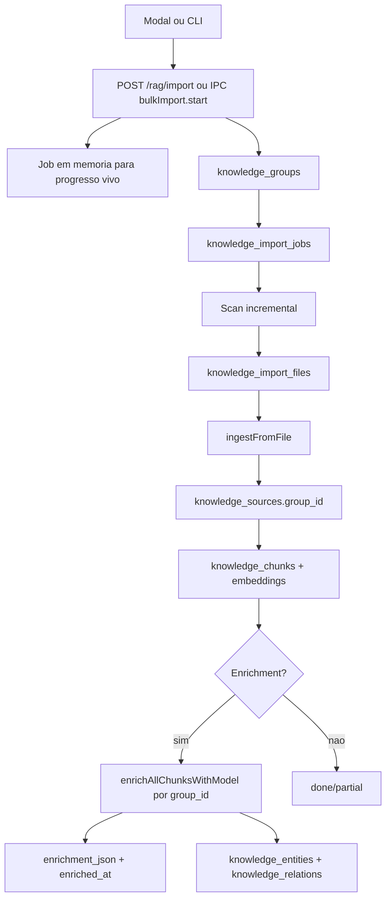
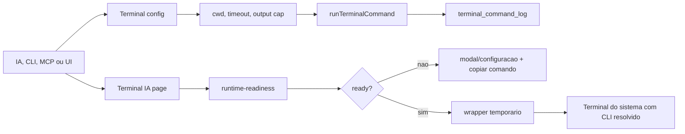

# Arquitetura — FlowKit

## Diagrama de Camadas

```
┌─ Renderer (React 19) ──────────────────────────────────┐
│  Paginas → Stores (Zustand) → Servicos (IPC client)    │
│  Componentes (shadcn/ui) + Hooks                       │
└──────────────── IPC (@egoist/tipc) ────────────────────┘
                        │
┌─ Main (Node.js) ──────────────────────────────────────┐
│  tipc.ts (router — todos os handlers)                  │
│  ├── db/ (PGlite + pgvector + pg_trgm + seed)         │
│  ├── knowledge/ (RAG pipeline + Knowledge Graph)       │
│  ├── ia/ (AI system + tools + streaming + discovery)   │
│  ├── terminal/ (CLI, exec, sessions)                    │
│  ├── config/ (APP_CONFIG + branding)                   │
│  ├── backup.ts (export/import ZIP)                     │
│  └── tool-server.ts (HTTP tool server local, token)    │
├────────────────────────────────────────────────────────┤
│  src/cli/ → CLI standalone (conecta via HTTP)          │
│  src/mcp/ → MCP server stdio (conecta via HTTP)        │
└────────────────────────────────────────────────────────┘
```

## Fluxo de Dados

```
Usuario digita mensagem
  → iaStore.enviarMensagem()
    → client['ia.chat.enviar']({ mensagem, contexto })
      → Main: discovery.ts monta briefing (memorias + RAG + page hints)
      → Main: system-prompt.ts injeta briefing no system instruction
      → Main: readiness.ts valida provider/modelo antes de chamar IA
      → Main: Vercel AI SDK envia pra Gemini/OpenRouter
        ou local-llm.ts envia para llama-server local (Gemma 4)
      → Main: Tool calls → tool-families.ts roteia → tools.ts executa
      → Main: Streaming events via IPC
    → iaStore.processarStreamEvent() atualiza UI em tempo real
```

## Decisoes Arquiteturais

### Por que PGlite?

Postgres embedded, zero configuracao, 100% offline. Suporta pgvector (busca por similaridade vetorial) e pg_trgm (fuzzy text search) como extensoes nativas. Nao precisa de servidor separado. O banco vive em `userData/flowkit-pg/`.

Alternativas descartadas: SQLite (sem vector search nativo), Postgres externo (requer instalacao separada, mata a experiencia offline).

### Por que 3 familias de tools?

Eficiencia de tokens. Em vez de expor 8+ tools individuais pro LLM (cada uma com schema proprio), colapsamos em 3 familias genéricas. O LLM escolhe familia + entidade, e o roteamento interno (`tool-families.ts`) resolve pra tool real. Menos tokens no system prompt = mais contexto disponivel pra conversa.

As familias publicas sao:

| Familia | Papel |
|---------|-------|
| `consultar_contexto` | Leitura e busca sob demanda |
| `editar_ficha` | CRUD/schema-driven |
| `executar_acao` | Acoes com efeito: backup, terminal_exec, operacoes de sistema |

O Terminal Harness entra pela familia `executar_acao` com acao `terminal_exec`. Quando o LLM usa essa acao, o comando precisa aparecer em `terminal_command_log` com `source = 'ia_tool'`; sem esse rastro, nao conta como acao comprovada.

### Por que readiness antes do chat?

Porque `baixado` nao significa `usavel`. O chat e o CLI consultam `ia/readiness.ts` antes de aceitar mensagem. Estados invalidos viram mensagens acionaveis:

| Reason | Significado | Acao |
|--------|-------------|------|
| `configure_provider` | IA nao configurada ou provider desativado | abrir Configuracoes |
| `configure_cloud_token` | provider cloud sem token | preencher chave |
| `download_local_model` | modelo local ausente | baixar modelo |
| `validate_local_model` | arquivo existe, mas ainda nao carregou | testar conexao |
| `local_model_error` | load falhou | remover/baixar de novo ou trocar provider |
| `ready` | chat pode rodar | seguir |

O `/health` expõe esse estado. A UI nao deve mostrar `Ativa` para IA local enquanto `usable !== true`.

### Por que Gemma 4 usa llama-server?

O modelo local padrao e `gemma-4-e2b-it-q4` (Gemma 4 E2B IT, GGUF Q4_K_M). O pacote `node-llama-cpp` instalado ainda falha com a arquitetura `gemma4`, entao o FlowKit usa um `llama-server` recente como sidecar local.

Ordem de descoberta do binario:

1. `FLOWKIT_LLAMA_SERVER_BIN`
2. `userData/runtimes/llama.cpp/<platform>-<arch>/llama-server`
3. `runtimes/llama.cpp/<platform>-<arch>/llama-server`
4. `tmp/llama-gemma4-build/bin/llama-server`
5. `process.resourcesPath/llama.cpp/...` no app empacotado

O runtime sobe em porta local livre, contexto `8192`, `--jinja` e `--reasoning off`, e expõe `/v1/chat/completions` para chat, tool calling e JSON de enrichment.

### Por que single scroll owner?

Previne bugs de scroll aninhado que sao endemicos em layouts com sidebar + chat panel. A regra e: so `<main>` tem `overflow-auto`. Todos os outros containers sao `overflow-hidden`. Isso garante que nao existam dois scroll areas competindo.

### Por que animacao de width no chat panel?

Animacao de `position` ou `transform` no painel de chat causa reflow no conteudo da pagina principal (texto re-wrapa, tabelas re-calculam). Animar `width` do painel e mais pesado em GPU mas garante que o layout ao redor se adapta suavemente sem "pulo".

### Por que tipc?

Type-safety end-to-end entre main e renderer. O tipo `Router` e inferido automaticamente do objeto router. No renderer, `client['handler.nome']()` tem autocomplete e checagem de tipos dos argumentos e retorno. Sem boilerplate de `ipcMain.handle` / `ipcRenderer.invoke` manual.

### Por que Zustand v5?

Leve (~1KB), sem boilerplate, sem providers. Cada store e uma funcao `create()` independente. Actions fazem IPC calls diretamente — sem middleware, sem sagas, sem thunks. Selectors sao funcoes puras.

## Tabelas do Banco

| Grupo | Tabelas | PK |
|-------|---------|-----|
| Core | config, configuracao_ia | TEXT / INTEGER |
| Knowledge | knowledge_groups, knowledge_import_jobs, knowledge_import_files, knowledge_sources, knowledge_chunks, knowledge_entities, knowledge_relations | SERIAL |
| IA Chat | ia_conversas, ia_mensagens, ia_memorias | TEXT (UUID) / SERIAL |
| Gallery | gallery_images | TEXT (UUID) |
| Terminal | terminal_command_log | SERIAL |

Indexes: GIN para FTS (tsvector) e trigram, HNSW para vector similarity (cosine), B-tree para foreign keys e filtros comuns.

## Modulos IA

| Modulo | Arquivo | Responsabilidade |
|--------|---------|------------------|
| Cliente | `ia/cliente.ts` | Envio de mensagens (normal + stream) |
| System Prompt | `ia/system-prompt.ts` | Montagem do system instruction |
| Tools | `ia/tools.ts` | Handlers internos (toolOk/toolError) |
| Familias | `ia/tool-families.ts` | 3 familias LLM-facing + routing |
| Discovery | `ia/discovery.ts` | Auto-injecao de contexto por pagina |
| Sessao | `ia/session-processor.ts` | Compactacao de sessao (threshold: 30k tokens) + auto-memory |
| Readiness | `ia/readiness.ts` | Gate de chat/CLI: provider, token, download, validacao local |
| Terminal Readiness | `ia/runtime-readiness.ts` | Gate do launcher: chat readiness + CLI + tools + SO |
| Local LLM | `ia/local-llm.ts` | Catalogo/download/status/validacao local |
| Llama Server | `ia/llama-server-runtime.ts` | Sidecar local para Gemma 4, chat, JSON e tool calling |
| Config | `ia/config.ts` | PROVIDER_DEFAULTS, resolveModel, resolveProviderApiKey |

## CLI + MCP

| Modulo | Arquivo | Responsabilidade |
|--------|---------|------------------|
| CLI | `cli/index.ts` | chat/search/import/status/tools/tool/jobs/rag/terminal/mcp via HTTP |
| MCP Server | `mcp/server.ts` | tools/resources de app, knowledge, instructions e terminal via stdio |
| MCP Entry | `mcp/index.ts` | Entry point StdioServerTransport |
| Tool Server | `tool-server.ts` | HTTP server porta 17380; `/health` aberto, ações protegidas por token local |

## Bulk RAG Import



O job em memoria serve para feedback imediato e cancel/pause/resume do processo vivo. As tabelas persistentes guardam colecao, run e arquivos para auditoria e UI; elas nao reidratam um worker apos restart. `pause/resume/cancel` exigem worker vivo.

O status final pode ser `done` ou `partial`. `partial` significa que dados foram
importados, mas houve erro em arquivo ou enrichment; a UI deve avisar e o CLI
`rag import --wait` deve sair com codigo 2.

O enrichment pode ser acionado por:

- Config global em Configuracoes: `knowledge.enrichment`.
- CLI: `rag import --enrich --wait`.
- CLI/manual: `rag enrich --group <id> --provider <provider> --model <modelo> --force-all`.
- IPC/API: endpoint `/rag/groups/:id/enrich`.

Selecao de modelo:

| Provider | Comportamento |
|----------|---------------|
| `auto` | Prefere local usavel; se nao houver, usa cloud disponivel |
| `local` | Exige modelo local baixado e validado |
| `gemini` | Exige Gemini habilitado e API key |
| `openrouter` | Exige token OpenRouter |

Um import so e considerado enriquecido quando `knowledge_chunks.enriched_at` e `enrichment_json` foram gravados e o resultado trouxe contadores (`chunks_enriquecidos`, `entities_count`, `relations_count`).

## Terminal Harness



`runTerminalCommand` e o primitivo baixo nivel. Entradas de produto usam `runTerminalCommandWithConfig`, que aplica cwd padrao, timeout e limite de saida, sempre rodando com as permissoes do usuario local. Se a configuracao do terminal nao puder ser lida, o comando falha em vez de cair silenciosamente para `$HOME`.

Conceitos separados:

- `terminal_exec`: executa um comando shell pontual e grava auditoria.
- `terminal sessions`: primitivo de shell vivo para API/teste; nao e a UX principal da pagina Terminal IA.
- `Terminal IA launcher`: pagina sem input interativo; mostra readiness, provider/modelo e comando copiavel; abre o CLI oficial no Terminal do sistema so quando a matriz esta pronta.
- Em dev, o comando usa `npm --prefix <repo> run cli -- chat --attach`; empacotado, usa `node <resources>/cli/index.js -- chat --attach`.
- O resultado de `terminal_exec` inclui `audit.logged`; falha de auditoria nao esconde stdout/exit_code, mas tambem nao pode ser chamada de auditoria comprovada.

O CLI e o chat lateral compartilham `configuracao_ia`, `resolveModel`,
`resolveProviderApiKey` e `ia/readiness.ts`. Sucesso de launcher nao prova
sucesso de IA; a prova real exige transcript literal do chat/CLI.

## Knowledge Pipeline

```
Arquivo/texto → ingest.ts (chunking + embedding + graph extraction)
  → knowledge_sources (documento original)
  → knowledge_chunks (chunks + vector embeddings + tsvector)
  → knowledge_entities + knowledge_relations (Knowledge Graph)

Busca → search.ts (hybrid: vector cosine + FTS + trigram)
  → Rankeamento combinado → Top N chunks → Contexto pro LLM
```

## Contrato de prova real

Testes de interface nao bastam para declarar IA/RAG/CLI prontos. Para esses fluxos:

| Fluxo | Prova minima |
|-------|--------------|
| Chat IA | registrar mensagem enviada e resposta literal |
| RAG import | job `done` ou `partial` explicado + source/chunks criados + busca encontra token unico |
| Enrichment | provider/modelo + contadores + `enriched_at`/`enrichment_json` no banco |
| Tool calling terminal | `terminal_command_log.source = 'ia_tool'`, comando, exit_code e efeito no disco |
| Terminal CLI | `terminal open-cli` com `opened: true` + resposta capturada do comando executado |

O contrato versionado desse incidente fica em `docs/IA-RAG-CLI-TERMINAL.md`; warlogs locais em `docs/superpowers/warlogs/` são artefatos de agente e não fazem parte do clone canônico.
