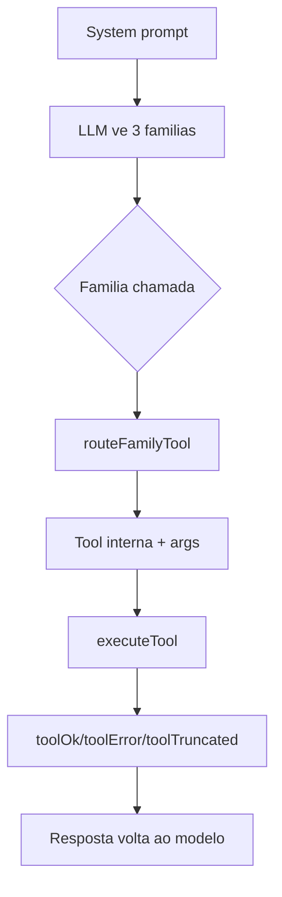

# Tool Calling — FlowKit

FlowKit expoe poucas tools para o LLM e mantem handlers internos pequenos e
testaveis. A regra e simples: o modelo conversa com **3 familias publicas**; o
codigo roteia para as **11 tools internas**.

## Por que 3 familias

Schemas de tool entram no contexto do modelo. Expor cada operacao como tool
publica aumenta tokens, piora escolha de ferramenta e deixa o modelo mais
propenso a chamar uma acao errada. As familias agrupam intencao:

| Familia publica | Uso |
|-----------------|-----|
| `consultar_contexto` | leitura, busca RAG, grafo, fontes, status, galeria |
| `editar_ficha` | memoria e documentos de conhecimento |
| `executar_acao` | acoes com efeito, como backup e terminal_exec |

O adapter fica em `src/main/ia/tool-families.ts`. Ele traduz a chamada publica
para uma tool interna e argumentos normalizados.

## Mapa atual

### `consultar_contexto`

| `entidade` | Tool interna | Observacao |
|------------|--------------|------------|
| `conhecimento` | `buscar_conhecimento` | busca hibrida RAG |
| `grafo` | `explorar_relacoes` | relacoes do Knowledge Graph |
| `fontes` | `listar_conhecimento` | fontes/documentos importados |
| `status` | `status_sistema` | stats do app, DB, knowledge |
| `galeria` | `listar_galeria` | imagens catalogadas |

### `editar_ficha`

| `entidade` | Operacao | Tool interna |
|------------|----------|--------------|
| `memoria` | criar/atualizar | `salvar_memoria` |
| `memoria` | deletar/remover | `remover_memoria` |
| `fonte` / `documento` | criar | `salvar_conhecimento` |

### `executar_acao`

| `acao` | Tool interna | Efeito |
|--------|--------------|--------|
| `backup` | `fazer_backup` | cria backup ZIP |
| `terminal_exec` | `terminal_exec` | executa comando shell local |

## Tools internas

As tools internas vivem em `src/main/ia/tools.ts`:

| Tool | Papel |
|------|-------|
| `buscar_conhecimento` | buscar chunks no RAG |
| `salvar_conhecimento` | salvar documento manual |
| `explorar_relacoes` | consultar Knowledge Graph |
| `listar_conhecimento` | listar fontes |
| `salvar_memoria` | criar/atualizar memoria |
| `remover_memoria` | remover memoria |
| `fazer_backup` | criar backup |
| `terminal_exec` | executar comando local via Terminal Harness |
| `status_sistema` | retornar status do sistema |
| `listar_galeria` | listar imagens |
| `analisar_imagem` | analise futura/placeholder de imagem |

## Fluxo



## Local, cloud e tool calling

Cloud (`gemini`, `openrouter`) usa Vercel AI SDK.

Local (`gemma-4-e2b-it-q4`) usa `llama-server` recente por
`src/main/ia/llama-server-runtime.ts`, com endpoint OpenAI-compatible
`/v1/chat/completions`. O runtime recebe as mesmas familias publicas, executa
tool calls em loop e devolve os mesmos eventos de stream da UI:

- `tool-call-start`
- `tool-result`
- `step-finish`
- `finish`

O limite atual e de 10 rodadas de tool calling por mensagem. Se o modelo nao
finalizar, a execucao falha de forma explicita.

## `terminal_exec`

`terminal_exec` e uma tool poderosa: roda comandos com as permissoes do usuario
local. Ela deve ser tratada como efeito real, nao como texto gerado.

Contrato:

1. O LLM chama:

```json
{
  "acao": "terminal_exec",
  "args": {
    "command": "pwd",
    "cwd": "/Users/marcoantonio",
    "timeout_ms": 30000,
    "max_output_chars": 20000
  }
}
```

2. `tool-families.ts` roteia para `terminal_exec`.
3. `tools.ts` chama `runTerminalCommandWithConfig(..., 'ia_tool')`.
4. `terminal/harness.ts` executa o shell e grava `terminal_command_log`.

Para considerar a acao comprovada, precisa existir linha em
`terminal_command_log` com:

- `source = 'ia_tool'`
- `command`
- `cwd`
- `status`
- `exit_code`
- `output_preview`

Sem esse rastro, a IA pode ter dito que fez, mas o produto nao provou que fez.

## Readiness antes de tool calling

Antes de chat app ou CLI, `ia/readiness.ts` valida:

| Estado | Bloqueia? | Motivo |
|--------|-----------|--------|
| sem provider | sim | nao ha IA configurada |
| cloud sem token | sim | API key ausente |
| local nao baixado | sim | GGUF ausente/incompleto |
| local baixado mas nao validado | sim | arquivo existe, mas nao carregou |
| local com erro de load | sim | runtime/modelo falhou |
| ready | nao | chat pode rodar |

Isso evita o bug de UX em que a UI mostrava `Ativa`, mas o chat estourava
`Failed to load model`.

## Como adicionar uma tool interna

1. Adicione o schema Zod em `src/main/ia/tools.ts`.
2. Adicione a entrada em `IA_TOOLS`.
3. Adicione o schema em `TOOL_SCHEMAS`.
4. Implemente o handler em `executeTool()`.
5. Roteie a nova intencao em `src/main/ia/tool-families.ts`.
6. Atualize os testes de routing/handlers.
7. Atualize este documento se a tool virar capacidade de produto.

## Prova minima

Para tool calling com efeito real, teste visual nao basta.

| Fluxo | Evidencia minima |
|-------|------------------|
| Chat simples | mensagem enviada + resposta literal |
| RAG | token unico importado + busca retornando source |
| Enrichment | `enriched_at` e `enrichment_json` no banco |
| Terminal | linha em `terminal_command_log` + efeito observado |
| CLI/Terminal app | comando aberto + saida capturada |

O contrato versionado de referencia fica em `docs/IA-RAG-CLI-TERMINAL.md`.
Warlogs locais em `docs/superpowers/warlogs/` são artefatos de agente e não fazem parte do clone canônico.
