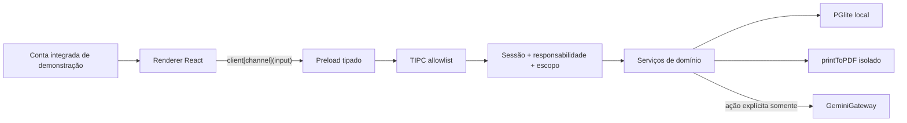
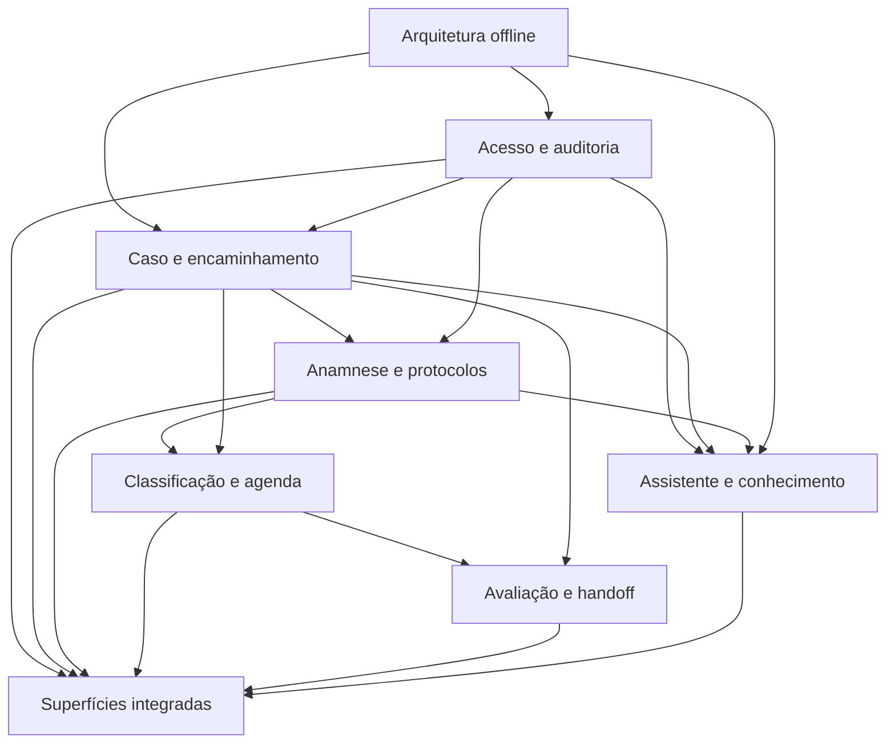

# BUILD — Hub técnico integrado

## Papel deste arquivo

Este arquivo é um mapa de arquitetura e dependências. Ele não substitui nenhum Build de
domínio, não é uma lista de tarefas e não autoriza código. Tabelas, DTOs, IPC, transações,
componentes, testes e rollback pertencem ao `BUILD-*` que possui o domínio.

Se este hub divergir de um Build canônico, o trabalho para e o contrato é reconciliado. O
Warlog futuro não pode usar este arquivo como atalho para deixar de ler os Builds.

## Entradas obrigatórias

1. [PRD aprovado](PRD.md)
2. [índice dos Analysts](ANALYST.md)
3. [síntese semântica](analysis.md)
4. todos os oito Analysts canônicos
5. todos os oito Builds canônicos listados abaixo
6. [arquitetura comprovada no HEAD](../.context/architecture.yaml)
7. [tracker único](../.context/review/STATUS.md)

## Builds canônicos

| Owner técnico | Build | Principais entregas físicas |
|---|---|---|
| Acesso e auditoria | [BUILD-acesso-e-auditoria.md](domains/BUILD-acesso-e-auditoria.md) | conta integrada, sessão, action authority, capabilities e auditoria |
| Caso e encaminhamento | [BUILD-caso-e-encaminhamento.md](domains/BUILD-caso-e-encaminhamento.md) | tabelas/DTOs/services do caso, snapshots, eventos e handoffs |
| Anamnese e catálogos | [BUILD-anamnese-e-catalogos.md](domains/BUILD-anamnese-e-catalogos.md) | revisão JSONB, 14 widgets, Composer, drawer, DnD e protocolos |
| Classificação e agenda | [BUILD-classificacao-e-agenda.md](domains/BUILD-classificacao-e-agenda.md) | requisito versionado, slots, booking, capacidade e FullCalendar |
| Avaliação, pendências e handoff | [BUILD-avaliacao-pendencias-e-handoff.md](domains/BUILD-avaliacao-pendencias-e-handoff.md) | encontros, pendências, retornos, resultados, entrega e PDF |
| Superfícies e configurações | [BUILD-superficies-e-configuracoes.md](domains/BUILD-superficies-e-configuracoes.md) | registry, shell integrado, páginas, estados e composição |
| Arquitetura offline e prova | [BUILD-arquitetura-offline-e-prova.md](domains/BUILD-arquitetura-offline-e-prova.md) | migrations, seed, boot, rede, Electron e harness |
| IA, memória e conhecimento | [BUILD-ia-memoria-e-conhecimento.md](domains/BUILD-ia-memoria-e-conhecimento.md) | Assistente isolado, Gemini, propostas, fontes e relações versionadas |

## Topologia alvo

Leis da topologia:

- renderer não envia ator, responsabilidade, timestamp, compatibilidade nem regra;
- cada command deriva conta + responsabilidade da action e grava auditoria;
- o fluxo-base não usa rede;
- Gemini só existe atrás do Assistente e de intenção explícita;
- PGlite é persistência local; migrations e seeds rodam antes de handlers;
- PDF usa o motor do Electron e bloqueia rede;
- não existe `patientId` nem tabela de paciente.

## Contratos de integração

### Sessão e superfícies

Uma fixture integrada autentica uma vez. A sidebar exibe todas as ferramentas. Isso não
transforma os cinco papéis em um superpapel sem regra: cada query/command declara uma
responsabilidade canônica, recebe a projeção correspondente e a revalida no main.

O user menu contém Configurações, Tema Claro/Escuro/Sistema, Amostra de uso e Sair. A
amostra repõe fixtures sintéticas por mecanismo delimitado de demonstração; não é reset
arbitrário do banco.

### Caso e pessoa

O caso guarda snapshots internos de pessoa, encaminhamento, procedimento e solicitante. O
nome pode se repetir. Não há cadastro, busca, FK, deduplicação ou evolução de paciente.

### Composer e protocolos

O editor de anamnese porta/adapta a arquitetura do DietFlow:

- canvas único com WidgetCards empilhados;
- os 14 widgets pré-anestésicos do contrato Antessala;
- DnD e alternativa por teclado;
- collapse, remover e desfazer;
- drawer multi-select para adicionar widgets;
- protocolos `SYSTEM` e salvos, versionados, sem respostas de caso;
- importar protocolo com modos tipados e confirmação quando houver perda de draft;
- toolbar, dirty guard, autosave/draft, estados de validação e autoria.

Os oito widgets nutricionais do DietFlow são doadores de padrão visual/técnico. Não são o
catálogo clínico final do Antessala. IA não aparece dentro desse editor.

### Requisito e agenda

`SchedulingCompatibilityIdentityDTO` carrega o que foi chamado informalmente de “tipo de
paciente ID”: `schedulingRequirementId`, versão, `slotClassId`, duração e necessidades de
recursos. O nome é opaco e operacional porque não identifica uma pessoa.

A agenda porta/adapta a experiência DietFlow usando FullCalendar v6:

- `dayGridMonth`, `timeGridWeek`, `timeGridDay` e `listWeek`;
- toolbar própria, anterior/hoje/próximo, busca e filtros;
- dropdown `Novo` e dropdown `Mais` definidos pelo Build dono;
- fila “Para agendar”;
- eventos proporcionais à duração;
- background events para capacidade e bloqueios;
- unified drawer;
- DnD e resize com command tipado, validação do main e `revert()`;
- tabela/lista acessível equivalente;
- preferências locais de visão.

FullCalendar só apresenta e coleta intenção. Compatibilidade, duração, recursos, conflito,
transição e auditoria continuam no serviço do domínio.

### Assistente e conhecimento

O painel global herdado sai da árvore ativa. `/assistente` é rota independente; pode abrir
contexto autorizado de caso, transcript sintético digitado, propostas e conhecimento.
Aceitar/corrigir uma proposta chama uma operação normal do draft. `/conhecimento` gerencia
relações sugeridas, aprovadas, ativas, superseded ou retiradas conforme o Build dono.

Não existe fallback OpenRouter, agente mutador, promoção automática de caso, IA dentro de
widget ou chamada de rede durante boot/fluxo-base.

## Dependências entre Builds

Essa ordem orienta dependências; não é um Writing Plan e não autoriza implementação em
blocos horizontais gigantes.

## Fronteiras de ownership

| Artefato | Owner único |
|---|---|
| sessão, capabilities, action authority e auditoria | acesso |
| caso, snapshots, lifecycle e timeline | caso |
| schema dos widgets, revisão e protocolos | anamnese |
| requisito, compatibilidade, slots, booking e capacidade | classificação/agenda |
| encontro, pendência, retorno, resultado e entrega | avaliação/handoff |
| routes, sidebar, páginas e composição | superfícies |
| migration runner, boot, network boundary e harness | arquitetura |
| invocation, proposal, fonte e knowledge relation | IA/conhecimento |

Um Build consumidor importa o contrato do owner. Não o redefine com shape reduzido,
enum paralelo ou tabela auxiliar.

## Current terrain

O código do HEAD ainda não materializa este produto completo. A prova do que existe, está
ativo, dormente, incompleto ou removido vive em
[.context/architecture.yaml](../.context/architecture.yaml). Nenhuma afirmação de capacidade
é herdada do FlowKit ou do DietFlow sem evidência de código.

Os repositórios doadores são fontes de padrões e código a portar/adaptar, não dependências em
runtime:

- DietFlow: Composer/WidgetCard/drawer/protocolos e FullCalendar/agenda;
- EscalaFlow: `printToPDF` via Electron;
- FlowKit/Antessala atual: Electron, PGlite, TIPC, tema, IA cloud e módulos de conhecimento.

## Prova integrada exigida

Os testes físicos pertencem aos Builds. A prova integrada, quando implementada, precisa
cobrir no mínimo:

1. boot local e login único;
2. caso sintético completo em uma sessão;
3. autoria por responsabilidade e escopo das projeções;
4. Composer, 14 widgets, drawer, DnD e protocolo salvo;
5. requisito confirmado/alterado e ID opaco;
6. FullCalendar nas quatro visões, filtros/dropdowns, drawer, conflito e reversão;
7. pendência, retorno, resultado versionado, PDF e recebimento;
8. user menu, três temas e amostra sintética;
9. Assistente isolado, proposta humana e recuperação de conhecimento;
10. zero rede no boot/fluxo-base e degradação segura sem Gemini;
11. teclado, estados vazios/erro/conflito, 0/1/100/1.000 itens e viewports contratados.

## Contrato para o futuro Warlog

O Warlog será produzido por outra IA depois do review final. Ele deve ler todos os 16
contratos canônicos integralmente e construir uma matriz `origem → tarefa → prova`.

É proibido:

- decompor somente este hub ou `analysis.md`;
- limitar artificialmente a quantidade de tarefas;
- omitir microcontratos de widget, estado, DTO, permissionamento, acessibilidade, escala,
  conflito, rollback ou teste;
- criar Specs intermediárias.

Depois da cobertura exaustiva, o Warlog corta fatias verticais. Cada fatia gera um Writing
Plan direto, com primeiro teste TDD em RED antes de código.

## Estado

- Builds de domínio: fontes canônicas, sem gate individual.
- Este hub: reconciliado para review final de congruência.
- Autorização de implementação: não.
- Warlog e Writing Plans: inexistentes.
