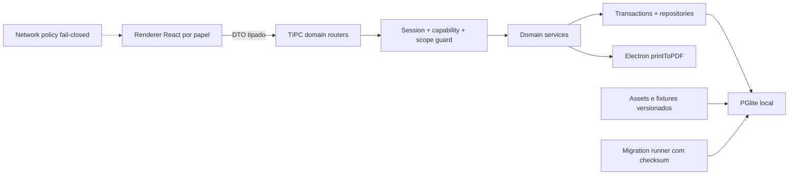
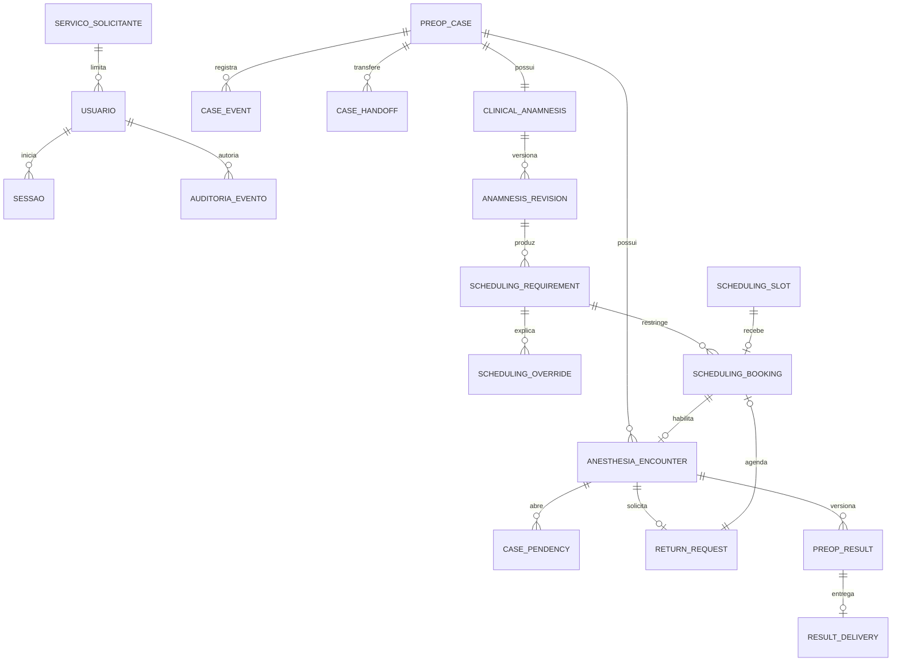
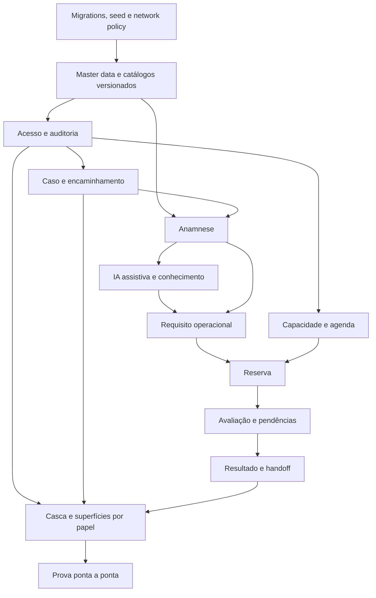

# BUILD — blueprint técnico integrado do Antessala

## State

- Tipo: síntese técnica Product → Backend → Frontend → Validation
- Estado: `ADJUSTED_PENDING_CONGRUENCE_RECHECK`
- Autoridade: especificação técnica integrada do hackathon
- Fonte do produto: [PRD.md](PRD.md)
- Fonte analítica: [analysis.md](analysis.md) e oito Analysts de domínio
- Próximo passo: verificar as correções no SHA publicado; sem P0 material, Warlog

Este BUILD incorpora os oito Builds de domínio e, junto do PRD e do Analyst integrado,
substitui uma Spec separada. Os Builds de domínio são anexos técnicos: em conflito, este
arquivo prevalece. O Warlog corta fatias; cada minispec recebe diretamente um Writing Plan.

## Goal

Traduzir o Analyst em uma arquitetura única para o MVP Electron local. Ao final da futura
implementação, cinco papéis percorrem um caso sintético do encaminhamento ao recebimento do
resultado, com autorização no processo principal, persistência PGlite, agenda sem dupla
reserva, autoria rastreável e primeiro boot sem rede.

## Inputs Consumed

| Domínio | Analyst | BUILD detalhado |
|---|---|---|
| Caso e encaminhamento | [ANALYST](domains/ANALYST-caso-e-encaminhamento.md) | [BUILD](domains/BUILD-caso-e-encaminhamento.md) |
| Acesso e auditoria | [ANALYST](domains/ANALYST-acesso-e-auditoria.md) | [BUILD](domains/BUILD-acesso-e-auditoria.md) |
| Anamnese e catálogos | [ANALYST](domains/ANALYST-anamnese-e-catalogos.md) | [BUILD](domains/BUILD-anamnese-e-catalogos.md) |
| Classificação e agenda | [ANALYST](domains/ANALYST-classificacao-e-agenda.md) | [BUILD](domains/BUILD-classificacao-e-agenda.md) |
| Avaliação, pendências e handoff | [ANALYST](domains/ANALYST-avaliacao-pendencias-e-handoff.md) | [BUILD](domains/BUILD-avaliacao-pendencias-e-handoff.md) |
| Superfícies e configurações | [ANALYST](domains/ANALYST-superficies-e-configuracoes.md) | [BUILD](domains/BUILD-superficies-e-configuracoes.md) |
| Arquitetura offline e prova | [ANALYST](domains/ANALYST-arquitetura-offline-e-prova.md) | [BUILD](domains/BUILD-arquitetura-offline-e-prova.md) |
| IA, memória e conhecimento | [ANALYST](domains/ANALYST-ia-memoria-e-conhecimento.md) | [BUILD de detalhe](domains/BUILD-ia-memoria-e-conhecimento.md) |

Hierarquia: PRD aprovado → `analysis.md` → este `BUILD.md` → Build de domínio → código e
testes. Nenhum Writing Plan escolhe silenciosamente uma versão divergente.

### Recibo de integração dos domínios

| Domínio | Contrato físico integrado |
|---|---|
| Caso | `preop_cases` como agregado, snapshots, eventos, handoff, receipts e CAS. |
| Acesso | usuários locais, sessão main-only, capabilities, escopo por serviço e auditoria sanitizada. |
| Anamnese | revisão versionada, respostas semânticas, 14 widgets, catálogos e publicação separada. |
| Classificação/agenda | requirement explicável, override, capacidade, ocupação, booking e concorrência. |
| Avaliação/handoff | encontros, pendências discriminadas, retorno, documentos metadata-only, resultado e entrega. |
| Superfícies | registry único de rotas/capabilities, projeções por papel e estados completos. |
| Arquitetura | migrations/checksums, seed offline, TIPC allowlisted, network policy e harness repetível. |
| IA/memória | Gemini sintético, proposta por campo, decisão humana e relações aprovadas/ativadas em ações separadas. |

## Current Terrain

- Electron, React, PGlite, TIPC, tema e handler PDF existem; a UI de PDF ainda não existe.
- A casca ativa possui somente Início, IA e Configurações.
- O banco clínico atual pertence à hipótese anterior e não é fonte canônica do novo fluxo.
- O composer headless e a serialização versionada são reutilizáveis; seus oito widgets
  nutricionais não formam o formulário pré-anestésico.
- CID, medicamentos, MET e comorbidades já são assets offline com hash.
- Não existem autenticação, autorização, caso canônico, agenda, avaliação ou telas por
  papel.
- IA cloud está ativa e opcional; knowledge/RAG/grafo/importadores permanecem no código,
  mas foram contidos no router ativo; gravação está dormente e STT está incompleto. Ver
  [`.context/architecture.yaml`](../.context/architecture.yaml).

## Recommended Architecture

Um monólito modular Electron é suficiente para a demonstração:



### Boundary laws

1. Renderer não recebe SQL, hash de senha, regra de autorização nem agregado clínico
   universal.
2. Main resolve a sessão ativa e ignora ator, papel, horários e autoria enviados pela UI.
3. Shared contém DTOs, enums e schemas puros; não importa Electron, React ou banco.
4. Cada comando clínico valida Zod, capability, escopo, estado e versão antes da mutação.
5. Cada mutação crítica grava estado e eventos/auditoria na mesma transação.
6. PGlite é a fonte de verdade; grade semanal, filas, contadores e calendário são
   projeções.
7. Boot e fluxo-base não precisam de internet. Uma capacidade opcional de IA pode usar
   rede somente por ação explícita e nunca bloqueia o caso, a agenda ou o handoff.

## Canonical Shared Contracts

```ts
import type { Papel } from '@/shared/auth'

type CaseStatus =
  | 'RECEIVED_AT_RECEPTION'
  | 'WAITING_NURSING'
  | 'NURSING_IN_PROGRESS'
  | 'TRIAGE_PENDING'
  | 'READY_FOR_SCHEDULING'
  | 'SCHEDULED'
  | 'WAITING_ANESTHESIA'
  | 'IN_ASSESSMENT'
  | 'PENDING'
  | 'WAITING_RETURN'
  | 'READY_FOR_HANDOFF'
  | 'DELIVERED_TO_REQUESTER'
  | 'CANCELLED'

type SlotClass = 'QUICK' | 'STANDARD' | 'EXTENDED'

type AnswerState =
  | 'ANSWERED'
  | 'UNKNOWN'
  | 'NOT_APPLICABLE'
  | 'NOT_ASKED'
  | 'REFUSED'
  | 'NOT_PERFORMED'

type DataClassification =
  | 'FICTIONAL_NON_DERIVED'
  | 'SYNTHETIC_DERIVED'
  | 'ANONYMIZED'
  | 'PSEUDONYMIZED'
  | 'IDENTIFIABLE'
  | 'SENSITIVE_HEALTH'
  | 'TEMPORARY_AUDIO'

type ProposalEvidence =
  | 'SUPPORTED'
  | 'AMBIGUOUS'
  | 'CONFLICTING'
  | 'NO_EVIDENCE'
  | 'OUT_OF_SCOPE'

type FieldProposalStatus = 'DRAFT' | 'ACCEPTED' | 'REJECTED' | 'CORRECTED'

type KnowledgeRelationStatus =
  | 'SUGGESTED'
  | 'APPROVED_INACTIVE'
  | 'ACTIVE'
  | 'REJECTED'
  | 'SUPERSEDED'
  | 'RETIRED'
```

Labels PT-BR pertencem à apresentação. Estado de sessão, anamnese, requisito, slot,
reserva, encontro, pendência, resultado e entrega possui enum próprio e nunca é misturado
com `CaseStatus`.

`Papel` e `PAPEIS` possuem um único owner: `src/shared/auth.ts`, conforme o BUILD de acesso.
Nenhum domínio declara `Role`, `CanonicalRole` ou outra união equivalente. `CurrentSession`
e `ActorContext` possuem owner único em `src/main/auth/*`; são tipos main-only e jamais são
exportados por `shared`, preload ou renderer. Serviços recebem o `ActorContext` derivado por
`requireSession`, nunca um `CommandContext` vindo do payload.

Uma `FieldProposal` identifica `caseId`, `anamnesisRevisionId`, `widgetType`, `fieldPath`,
`proposedAnswer`, `sourceExcerpt`, `evidence`, `instructionVersion`, `model`, `status` e a
decisão humana. Proposta `DRAFT` nunca alimenta o requisito operacional. Uma
`KnowledgeRelation` só participa de recuperação quando está `ACTIVE`, possui fonte,
versão, escopo, limitações, autor, aprovador e recibo de ativação. Aprovar e ativar são
ações distintas; nenhum caso promove conhecimento automaticamente.

### Regra operacional fechada da PoC

`demo-workload-v1` é uma `DEMO_DECISION` literal, não um modelo clínico:

| Grupo | Predicado permitido | Efeito |
|---|---|---:|
| Base | revisão completa | 20 minutos |
| Revisão de domínio | resposta explicitamente positiva nos paths versionados de alergia, histórico anestésico, cardiovascular, respiratório, sangramento, hábitos ou condições especiais | `+5` por grupo, máximo três grupos |
| Volume de medicamentos | uso positivo e pelo menos cinco itens | `+5` uma vez |
| Volume de diagnósticos | presença positiva e pelo menos três itens | `+5` uma vez |
| Accommodation | comunicação, mobilidade ou acompanhante explicitamente necessários | `+10` uma vez + união de capabilities |
| Documento pendente | item `MISSING` ou `REQUESTED` | `+0`; somente explicação/pêndencia |

Mapeamento: `20 → QUICK`, `25–35 → STANDARD`, `40–50 → EXTENDED`; acima de 50 retorna
`OUT_OF_DEMO_RANGE`, sem cap. `ANSWERED(false)`, `UNKNOWN`, `REFUSED`,
`NOT_PERFORMED`, texto clínico, CID, medicamento e valor vital não pontuam por inferência.
Os paths e predicados completos vivem na matriz homônima do Analyst e viram uma constante
literal testada. `desiredBy` é outro eixo: data planejada menos cinco dias úteis da demo ou
conclusão da triagem mais dez; ele filtra a janela, mas nunca altera classe ou duração.

## Backend Blueprint

### Module ownership

| Área futura | Responsabilidade | BUILD dono |
|---|---|---|
| `src/shared/auth/*`, `src/main/auth/*` | usuário, senha, sessão, capabilities | acesso e auditoria |
| `src/shared/clinical/case.ts`, `src/main/clinical/case-*` | caso, snapshots, lifecycle, handoffs | caso e encaminhamento |
| `src/shared/anamnese/*`, `src/main/clinical/anamnesis-*` | widgets, revisões, completude | anamnese e catálogos |
| `src/shared/scheduling/*`, `src/main/scheduling/*` | regra, requisito, slot, reserva | classificação e agenda |
| `src/shared/clinical/assessment.ts`, `src/main/clinical/{assessment,result,delivery}-*` | avaliação, pendência, resultado | avaliação e handoff |
| `src/main/db/migrations/*.sql` | schema versionado | arquitetura offline coordena; domínio fornece SQL puro |
| `src/main/db/seed.ts` e manifestos | assets e fixtures sintéticos | arquitetura offline coordena |
| `src/main/tipc.ts` | apenas composição de routers | todos os domínios |
| `src/main/export/pdf.ts` | motor genérico PDF | avaliação consome sem mover autoria ao exportador |
| `src/shared/ai/*`, `src/main/ai/*` | intenção Gemini, transcript, propostas e decisões humanas | IA, memória e conhecimento |
| `src/shared/knowledge/*`, `src/main/knowledge/*` | fontes e relações versionadas, ativação e recuperação | IA, memória e conhecimento |

### Database ownership

| Grupo | Tabelas canônicas | Dono |
|---|---|---|
| Infraestrutura | `schema_migrations`, `catalog_seed_state` | arquitetura offline |
| Acesso | `usuarios`, `sessoes`, `auditoria_eventos` | acesso e auditoria |
| Caso | `preop_cases`, `case_command_receipts`, `case_events`, `case_handoffs` | caso e encaminhamento |
| Anamnese | `clinical_anamneses`, `clinical_anamnesis_revisions`, `clinical_anamnesis_command_receipts` | anamnese |
| Master data da demo | `catalogo_procedimentos`, `catalogo_servicos_solicitantes` e catálogos clínicos existentes | anamnese/catálogos |
| Classificação | `scheduling_rule_sets`, `scheduling_requirements`, `scheduling_overrides` | classificação |
| Capacidade | `scheduling_slot_templates`, `scheduling_resources`, `scheduling_availability_windows`, `scheduling_window_resources`, `scheduling_blocks`, `scheduling_slots`, `scheduling_slot_resources`, `scheduling_resource_occupancies` | agenda |
| Reserva | `scheduling_bookings`, `scheduling_command_receipts` | agenda |
| Avaliação | `anesthesia_encounters`, `case_pendencies`, `return_requests`, `return_request_pendencies`, `assessment_command_receipts` | avaliação |
| Resultado | `preop_results`, `case_documents`, `result_deliveries` | avaliação/handoff |
| IA assistiva | `ai_invocations`, `case_transcripts`, `ai_field_proposals` | IA/memória |
| Conhecimento | `knowledge_sources`, `knowledge_relations` | IA/memória |

Nenhum domínio cria tabela paralela de caso, migração, sessão ou auditoria. Toda FK clínica
aponta para `preop_cases`, nunca para paciente. O profissional solicitante é snapshot do
encaminhamento, não master data. O serviço possui ID de fixture e revisão copiados no
snapshot; `preop_cases.requesting_service_id` é a projeção usada pelo escopo de
`SOLICITANTE`, nunca o nome.

Toda relação que armazena simultaneamente `case_id` e o ID de uma entidade filha usa FK
composta para provar pertencimento ao mesmo caso. O pai publica `UNIQUE (id, case_id)` e o
filho referencia o par — por exemplo requirement→anamnese/revisão,
booking→requirement/ReturnRequest, encounter→booking, pendência→encounter,
resultado→encounter e documento/entrega→pendency/result. FK simples paralela não substitui
essa prova e nenhum service pode aceitar IDs de casos diferentes para “validar depois”.

As migrations respeitam a dependência real: infraestrutura e master data → acesso → caso
→ anamnese/classificação → agenda base → avaliação/`return_requests` → migration de
integração pertencente à agenda, que adiciona as FKs cruzadas do booking RETURN e do
encontro. Nenhum domínio referencia uma tabela que ainda não existe nem redefine DDL do
outro para contornar um ciclo.

### Aggregate relations



### IPC protocol

Os IDs reais de canal pertencem a um único registry literal
`src/shared/ipc/channels.ts` (`MVP_CHANNELS`), importado por routers, preload e registry de
superfícies. Os namespaces canônicos são `auth.*`, `usuarios.*`, `auditoria.*`, `cases.*`,
`handoffs.*`, `clinicalAnamnesis.*`, `catalogs.*`, `scheduling.requirements.*`, `scheduling.slots.*`,
`scheduling.bookings.*`, `scheduling.capacity.*`, `encounters.*`, `pendencies.*`,
`documents.*`, `returnRequests.*`, `results.*`, `deliveries.*`, `config.*`, `localHealth.*`
e `home.*`. Nenhum domínio escreve string equivalente à mão, traduz nome ou cria alias.

O domínio assistivo acrescenta `ai.transcripts.*`, `ai.proposals.*`,
`knowledge.sources.*` e `knowledge.relations.*`. A configuração alvo aceita somente Gemini;
OpenRouter não aparece no registry, na UI nem em fallback. Toda intenção cloud carrega
finalidade fechada e classificação de dado; na PoC, somente fixture sintética é permitida.

As worklists e configurações também possuem um único contrato de leitura:
`cases.listForActor`, `encounters.list`, `pendencies.listAssigned`,
`returnRequests.listReady`, `results.listForActor`,
`scheduling.capacity.getConfiguration` e `config.catalogs.getStatus`. Todos usam DTOs
fechados do domínio owner; nenhuma superfície monta join próprio ou pede agregado clínico
universal.

```ts
type CoreErrorCode =
  | 'VALIDATION_ERROR'
  | 'UNAUTHENTICATED'
  | 'FORBIDDEN'
  | 'NOT_FOUND'
  | 'PAYLOAD_TOO_LARGE'
  | 'INTERNAL_ERROR'

type DomainErrorCode =
  | AuthErrorCode
  | CaseErrorCode
  | AnamnesisErrorCode
  | SchedulingErrorCode
  | AssessmentErrorCode

type ActionResult<
  T,
  C extends CoreErrorCode | DomainErrorCode = CoreErrorCode | DomainErrorCode,
> =
  | { ok: true; data: T }
  | {
      ok: false
      error: {
        code: C
        message: string
        fieldErrors?: Record<string, string>
        currentVersion?: number
        correlationId?: string
      }
    }
```

Cada BUILD exporta sua união fechada de códigos; o envelope apenas agrega essas unions.
`VERSION_CONFLICT`, `REFERENCE_REUSE_CONFIRMATION_REQUIRED`, erros de login e erros de scheduling não são
renomeados silenciosamente. Mensagens ao renderer são sanitizadas. Erro interno, payload
clínico, SQL, stack, senha e token nunca atravessam a fronteira.

### Critical transactions

1. Criar caso: snapshots + receipt + `CASE_OPENED` + handoff + `HANDOFF_SENT` + auditoria.
2. Corrigir entrada antes de existir revisão FINAL/requisito CALCULATED: CAS do caso + resolução dos
   catálogos + colunas de escopo/snapshots coerentes + invalidação explícita do contexto
   da anamnese + evento e auditoria; depois do submit, o MVP rejeita a correção.
3. Submeter triagem: revisão `FINAL` + requisito `CALCULATED` no mesmo commit; confirmar ou
   sobrescrever publica o caso para a agenda em outra transação explícita.
4. Reservar/reagendar: validar requirement ou `ReturnRequest`, ocupar todos os recursos no
   intervalo consulta+buffer, adquirir locks dos recursos em ordem lexical, rejeitar
   sobreposição, criar booking e receipt idempotente, atualizar caso e eventos.
5. Check-in: booking `INITIAL | RETURN` vira `CHECKED_IN` e o caso vai a
   `WAITING_ANESTHESIA`; iniciar encontro consome esse booking, conclui-o e move o caso a
   `IN_ASSESSMENT`, sem liberar a ocupação física antes do fim do slot.
6. Abrir/revisar pendência: união discriminada + impacto explícito + evidência registrada
   por metadata/hash. Submeter evidência não decide suficiência nem cria retorno; o
   anestesiologista aceita, reabre ou cancela e, em comando separado, retoma o encontro ou
   cria `ReturnRequest`. `canResumeReview` é query derivada, nunca coluna.
7. Finalizar resultado: validar zero pendência corrente com impacto
   `BLOCKS_CURRENT_RESULT` ainda não resolvida + assessment `COMPLETE`; criar versão 1
   `FINAL`, hash e head por caso.
8. Corrigir/aditar resultado: inserir versão imutável sucessora, avançar o head
   por CAS e abrir novo handoff quando a versão anterior já foi entregue.
9. Entregar/confirmar: versão corrente publicável/hash vigente + escopo do serviço +
   estado/eventos.
10. Cancelar caso: locks e versões do caso, handoff e booking + liberação da capacidade +
   `closedAt` + evento/auditoria, tudo ou nada.
11. Gerar propostas: snapshot da revisão DRAFT + transcript revisado + schema dos widgets +
    relações `KNOWLEDGE_ACTIVE`; Gemini devolve lote validado e cada campo persiste `DRAFT`
    com origem, evidência, modelo e versão da instrução. Lote inválido não escreve parcialmente.
12. Decidir proposta: capability + owner do campo + versão esperada; aceitar/corrigir aplica
    uma operação da anamnese e grava decisão na mesma transação; rejeitar não cria negativa.
13. Curar conhecimento: sugerir → aprovar inativo → ativar são comandos separados.
    Retirar/superseder remove a relação de novas buscas sem apagar histórico.

Lock otimista, constraints e idempotência são complementares. Um deles não substitui os
outros.

### Boot sequence

```text
abrir PGlite
→ aplicar schema_migrations por ID + checksum em transação
→ verificar/carregar catálogos locais por hash
→ aplicar fixtures sintéticas idempotentes
→ materializar capacidade como SYSTEM, sem fabricar usuário ou receipt de command USER
→ encerrar recibos de sessão deixados abertos
→ iniciar CurrentSession = null; ActorContext inexistente até auth.login
→ registrar routers e policy de rede
→ abrir janela em /login
```

Falha de migration, hash ou fixture bloqueante produz tela local de recuperação; não tenta
baixar correção.

## Frontend Blueprint

### Perfil de entrega do hackathon

O blueprint completo descreve a evolução segura do produto; não exige vinte páginas
independentes antes do pitch. O Warlog deve primeiro entregar um corte
`PITCH_CRITICAL` que cumpra o PRD ponta a ponta:

1. cinco contas fixture e criação mínima de conta pelo ADMIN;
2. entrada de um caso e timeline;
3. anamnese com 14 seções semânticas sobre renderer configurável comum;
4. matriz v1, explicação e confirmação/override humano;
5. slots fixture compatíveis, reserva e conflito;
6. avaliação, uma pendência/retorno, resultado versionado e recebimento;
7. uma proposta Gemini sobre transcript sintético e uma recuperação de relação ativa;
8. PDF, boot offline e E2E do caminho do pitch.

Esse corte pode compor o catálogo lógico abaixo em oito superfícies físicas: `/login`,
`/`, `/casos`, `/triagem/:caseId`, `/agenda`, `/avaliacao/:caseId`,
`/resultado/:caseId` e `/admin`. Worklists, criação, detalhe, conhecimento e configuração
podem ser regiões, tabs ou drawers dessas superfícies, consumindo os mesmos DTOs e guards.
Não se cria uma rota vazia para satisfazer uma linha do catálogo.

Depois do caminho crítico verde, o Warlog pode abrir `HARDENING` para separar rotas,
ampliar CRUD de capacidade, cobrir estados raros e completar superfícies administrativas.
Adiar `HARDENING` não autoriza remover RBAC no main, semântica das respostas, confirmação
humana, isolamento por serviço, reserva atômica, auditoria essencial ou offline.

### Active routes

| Superfície | Rota | Papel principal | Trabalho |
|---|---|---|---|
| Login | `/login` | público | autenticar conta local |
| Home | `/` | todos | próximos itens permitidos pelo papel |
| Nova entrada | `/casos/novo` | `RECEPCAO` | criar snapshots do encaminhamento |
| Caso | `/casos/:caseId` | projeção por papel | estado, responsabilidades derivadas, timeline e próximo passo |
| Triagens | `/triagens` | `ENFERMAGEM` | worklist de casos aguardando |
| Anamnese | `/casos/:caseId/triagem` | `ENFERMAGEM` | 14 widgets, completude e submissão |
| Para agendar | `/agendamentos` | `RECEPCAO` | casos com requisito confirmado |
| Agenda/reserva | `/agenda`, `/casos/:caseId/agendamento` | `RECEPCAO` | grade semanal + lista acessível |
| Avaliações | `/avaliacoes` | `ANESTESIOLOGISTA` | worklist de consultas |
| Avaliação | `/casos/:caseId/avaliacao` | `ANESTESIOLOGISTA` | encontro, pendência, retorno e conclusão |
| Resultados | `/resultados` | `SOLICITANTE` | caixa limitada ao serviço |
| Resultado/handoff | `/casos/:caseId/resultado` | projeção por papel | recepção vê status/entrega, anestesia e solicitante veem conteúdo autorizado; PDF/recebimento por capability própria |
| Usuários | `/configuracoes/usuarios` | `ADMIN` | CRUD local sem hard delete |
| Operação | `/configuracoes/operacao` | `ADMIN` | inventário read-only de serviços/procedimentos |
| Capacidade | `/configuracoes/agenda` | `ADMIN` | recursos, janelas e bloqueios |
| Catálogos | `/configuracoes/catalogos` | `ADMIN` | versão, hash e integridade read-only |
| Auditoria | `/configuracoes/auditoria` | `ADMIN` | eventos sanitizados |
| Assistência da entrevista | integrada em `/casos/:caseId/triagem` | `ENFERMAGEM` | transcript sintético/digitado, gerar e decidir propostas por campo |
| Conhecimento | `/conhecimento` | `ANESTESIOLOGISTA` | consultar, sugerir, aprovar, ativar, superseder e retirar relações |
| Configuração de IA | `/configuracoes/ia` | `ADMIN` | Gemini, modelo, segredo e saúde técnica sem conteúdo clínico |

Router, sidebar e breadcrumbs consomem um único registry de superfícies/capabilities. Uma
rota proibida não monta página nem dispara query. `ADMIN` não vê conteúdo clínico.

### UI composition

- `AuthProvider`, `ProtectedAppLayout`, `RoleSidebar` e `ProtectedRoute` formam a casca.
- `CaseHeader`, `CaseTimeline`, `CaseWorklist` e `ResourceStateView` são compostos
  compartilhados; cada papel recebe DTO próprio.
- O composer reutiliza shell e DnD, mas o template ativo contém somente os 14 widgets
  pré-anestésicos. Propostas de IA aparecem ao lado do campo-alvo, nunca aplicadas em lote.
- A agenda usa `WeeklyAgendaGrid` próprio e `AccessibleSlotTable` sobre a mesma projeção;
  não adiciona FullCalendar nem aceita drag-and-drop.
- Tema claro/escuro/sistema continua disponível. Para o hack, a entrada da IA pode ser um
  transcript sintético digitado; o STT de 478 MB não é dependência nem download do boot.
  Conhecimento usa busca textual local como piso; embeddings não são necessários à prova.

### Required UI states

Toda leitura representa `loading`, `ready`, `empty` e `error`. Formulários acrescentam
`dirty`, `validation-error`, `submitting`, `success` e `version-conflict`. Agenda acrescenta
`no-compatible-slot`, `selected`, `confirming` e `slot-conflict`. Resultado/PDF acrescenta
`unavailable`, `generating`, `export-error`, `delivered` e `acknowledged`.

Nenhum estado depende só de cor. Erro clínico mostra código/correlation ID sanitizado; não
expõe mensagem crua.

## Configurations And Fixtures

### Mutable through UI

- usuários: criar, listar, trocar papel/escopo, redefinir senha, ativar e desativar;
- recursos de agenda;
- janelas de disponibilidade;
- bloqueios e exceções operacionais.

### Versioned and read-only through UI

- serviços solicitantes e procedimentos da demo;
- classes QUICK/STANDARD/EXTENDED, durações e buffers;
- 14 widgets e template da anamnese;
- conjunto de regras `demo-workload-v1`;
- CID, medicamentos, MET e comorbidades;
- exames e documentos por texto livre estruturado; nenhum catálogo de exames é prometido.

### Not a cadastro

- paciente;
- profissional solicitante;
- encaminhamento;
- resultado clínico.

Fixtures criam uma conta por papel, serviço Gastroenterologia, procedimento Endoscopia,
três classes de slot, recursos/capacidade, casos QUICK/STANDARD/EXTENDED e uma jornada com
pendência. E-mails e senhas são sintéticos; a interface de pitch pode exibir credenciais da
demo fora de qualquer caso clínico, mas logs e IPC nunca retornam senha.

## Validation Strategy

| Camada | Prova mínima futura |
|---|---|
| Shared | schemas, enums, state machines, widgets, completude, regra e explicação |
| Migration | instalação vazia, upgrade, checksum divergente, FKs same-case, CHECKs por status e rollback transacional |
| Seed | hashes, contagens, idempotência e zero fetch |
| Auth/RBAC | senha, conta inativa, último admin, capability e escopo de serviço |
| Case | homônimos, replay do mesmo documento, snapshots, responsabilidade derivada e transições inválidas |
| Anamnese | 14 widgets, seis estados de resposta, proveniência, revisão e redaction |
| Agenda | compatibilidade, janela Mon–Fri same-day, lock/overlap, recurso com booking ativo imutável, materialização SYSTEM/USER, corrida, idempotência, cancelamento e no-show |
| Avaliação | draft parcial, validação completa no finalize, evidência metadata/hash, pendência discriminada, retorno com effective completo, versões imutáveis com head corrente e handoff |
| Renderer | cinco menus/homes, todos os estados, teclado, light/dark/system |
| Network | boot e jornada com egress HTTP/HTTPS/WS bloqueado |
| E2E | encaminhamento → triagem → reserva → avaliação → pendência/retorno → resultado → recebimento |
| IA/memória | Gemini sintético gera propostas com origem; decisão humana por campo; falha cloud não bloqueia; relação aprovada só aparece após ativação; busca vazia não conclui |

O E2E troca de contas no mesmo Mac. Ele prova o produto local sequencial, não operação
hospitalar multiusuário.

## Dependency Topology



Essa topologia informa o Warlog e as minispecs. Cada fatia gera um Writing Plan executável
com paths, testes RED e ordem de commits; não existe Spec intermediária.

## Rollback / Containment

- Migrations novas são expand-only; tabelas legadas permanecem isoladas até prova de
  migração ou descarte explícito.
- Cada domínio pode deixar seu router sem rota ativa até o slice vertical estar verde.
- Grade e lista usam a mesma projeção; falha visual não remove a reserva transacional.
- O produto não expõe backup, restore ou reset; provas repetíveis usam diretório temporário
  isolado do userData real.
- Código de IA/knowledge existente não é adotado por inércia: o novo domínio define a
  allowlist futura, promoção humana e política de rede antes de qualquer reuso.
- Nenhuma reversão destrói caso, revisão, booking, resultado ou evento já persistido.

## Risks

| Severity | Risk | Containment |
|---|---|---|
| critical | Vazamento clínico por DTO universal | projeções por papel + shape tests + guard no main |
| critical | Dupla reserva | constraints + transação condicional + idempotência + race test |
| critical | Regra sintética parecer decisão médica | copy operacional, versão/explicação e termos clínicos proibidos |
| high | Tabelas paralelas divergirem | ownership único acima + teste de arquitetura |
| high | Widgets omitirem dado consumido | registry exaustivo e contract test entre rule inputs e paths |
| high | Correção apagar autoria | anamnese/requisito pós-submit rejeitam correção na PoC; resultado corrigido nasce como nova versão vinculada e exige novo handoff |
| high | Rota escondida ainda consultar dados | registry/capability antes do mount e IPC fail-closed |
| high | Demo depender da rede | egress policy + teste offline de boot e jornada |
| medium | Catálogo recortado parecer completo | `coverage_note`, fallback livre e limite visível |
| medium | Um Mac ser confundido com arquitetura hospitalar | alegação explícita de demo sequencial e boundary futuro |

## Explicit Non-Goals

- Não existe cadastro longitudinal de paciente, prontuário ou evolução.
- Não existe classificação ASA, aptidão, emergência, pulseira ou prescrição automática.
- Não existe marcação de cirurgia ou gestão de sala cirúrgica.
- Não existe signup público, confirmação de e-mail, recuperação externa, SSO ou diretório.
- Não existe editor livre de widgets, regras ou catálogos clínicos.
- Não existe integração hospitalar, nuvem, Supabase, Stripe ou multiusuário real nesta fase.
- Não existe decisão clínica autônoma, promoção automática de caso para memória global nem
  base universal de relações clínicas. IA, transcript e autopreenchimento são assistivos;
  Gemini recebe somente fixtures sintéticas e sua falha preserva o caminho manual.

## Definition Of BUILD Ready For Warlog

- [x] PRD aprovado e Analyst integrado.
- [x] Oito Builds de domínio incorporados sob uma hierarquia explícita.
- [x] Ownership, tabelas, fronteiras, transações, rotas e estratégia de prova definidos.
- [x] IA/memória possuem contrato físico mínimo e não dependem de STT ou embeddings.
- [x] Perfil `PITCH_CRITICAL` separa o fluxo demonstrável do hardening sem enfraquecer os invariantes P0.
- [x] Decisões sintéticas estão rotuladas; produção institucional permanece fora do escopo.
- [x] Review final de congruência executado; bloqueadores confirmados foram incorporados.
- [ ] Correções verificadas no novo SHA sem bloqueador P0 material restante.

---

## Estado de consolidação

- Artefato canônico: `BUILD.md`.
- Estado: `ADJUSTED_PENDING_CONGRUENCE_RECHECK`.
- Anexos consumidos: oito `domains/BUILD-*.md`.
- Gate individual por anexo: inexistente.
- Próximo passo: recheck focado das correções; sem P0 aberto, criar Warlog e Writing Plans
  por minispec.
