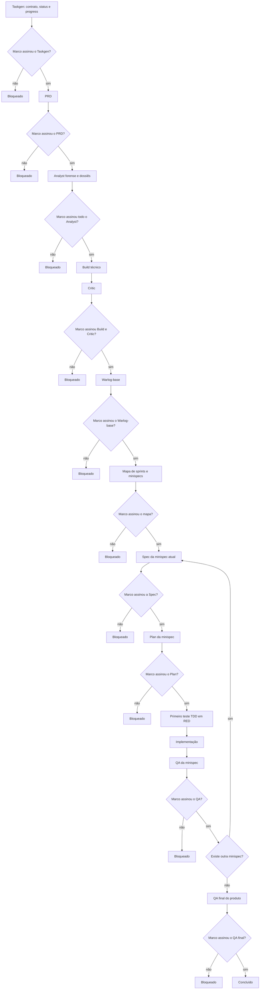

# Contrato de aprovação humana — Antessala

## Regra absoluta

Nenhum artefato termina sem assinatura explícita de Marco. Nenhuma fase começa enquanto o
artefato anterior estiver sem assinatura válida.

Uma IA não pode decidir, inferir ou fabricar essa assinatura. Ela pode apenas registrar uma
aprovação que Marco tenha declarado de forma explícita, nomeando o artefato ou gate. Silêncio,
continuidade da conversa, pedido de revisão ou elogio não significam aprovação.

## Autoria antecipada por ordem explícita

Marco pode mandar redigir um artefato posterior antes da assinatura do anterior. Essa ordem
autoriza somente a **autoria do rascunho**. Ela não aprova o artefato, não promove a fase no
`status.json`, não libera Plan, teste ou código e não permite que o rascunho invente uma
decisão ausente no artefato anterior.

Nesta revisão, Marco autorizou a redação conjunta dos dossiês do Analyst e de seus BUILDs
correspondentes. Nenhum está aprovado: alguns ainda exigem research, recon ou adversarial
antes de poderem chegar à assinatura. O fluxo formal continua no Taskgen, porque este
contrato, `status.json` e `progress.md` ainda não foram assinados.

## Assinatura válida

Cada assinatura deve registrar:

- decisão `APROVADO`;
- nome `Marco`;
- data e hora;
- revisão Git examinada;
- declaração que nomeia o artefato e autoriza a próxima fase.

Qualquer alteração material posterior invalida a assinatura. O artefato volta para
`AGUARDANDO_ASSINATURA` e a próxima fase volta para `blocked`.

## Fluxo forense do Antessala

## Estado e progresso

`status.json` controla a passagem mecânica. `progress.md` explica o estado para pessoas.
Antes de qualquer transição:

1. o artefato existe;
2. o executor da fase registra evidência;
3. QA ou Critic atua quando previsto;
4. Marco assina a revisão;
5. `status.json` registra a assinatura e libera a próxima fase;
6. `progress.md` registra o recibo.

Sem os seis itens, a fase seguinte permanece `blocked`.

---

## Contrato de encerramento deste arquivo

- Artefato: `CONTRATO-DE-APROVACAO.md`
- Próxima fase autorizada após assinatura: revisão e assinatura do PRD
- Estado: `AGUARDANDO_ASSINATURA`
- Assinatura de Marco: `PENDENTE`
- Data: `PENDENTE`
- Revisão Git examinada: `PENDENTE`
- Declaração: `PENDENTE`

Sem a assinatura válida de Marco, este contrato permanece rascunho e não libera o PRD.
