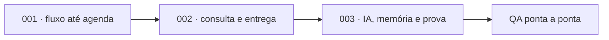

# Warlog — corte executável do Antessala

## Estado

- Fonte: PRD aprovado + `analysis.md` + `BUILD.md`.
- Perfil: `PITCH_CRITICAL`.
- Review de congruência: correções aplicadas e recheck local sem P0 material.
- Objetivo: três fatias verticais demonstráveis; nenhuma Spec intermediária.

## Lei do corte

Cada fatia termina em comportamento navegável e testado. Hardening institucional, dados
reais, STT, integração hospitalar, operação multiestação e base clínica universal ficam
fora. O fluxo-base funciona sem rede; Gemini é uma demonstração opcional com fixture
sintética.

## Fatias

| Ordem | Minispec | Resultado observável | Dependência |
|---:|---|---|---|
| 1 | `001-fluxo-ate-agenda` | login por papel → encaminhamento → anamnese → requisito humano → vaga compatível | nenhuma |
| 2 | `002-consulta-e-entrega` | check-in → avaliação → pendência/retorno → resultado versionado → PDF/handoff | 001 |
| 3 | `003-ia-memoria-e-prova` | proposta Gemini sintética + decisão por campo + relação aprovada recuperada + QA final | 001–002 |

## Ordem de execução

Uma fatia começa pelo teste relevante em RED, implementa o menor caminho completo e fecha
com testes focados, typecheck e prova visual/operacional proporcional. O próximo plano pode
ajustar arquivos, mas não redecide produto ou contratos integrados.

## Fora do caminho crítico

- OpenRouter, STT e download de modelo;
- paciente mestre, deduplicação ou evolução;
- ASA, aptidão, urgência ou conduta automática;
- Supabase, Stripe, SSO, e-mail, assinatura digital e prontuário;
- backup/restore de produto, multiusuário simultâneo e agenda institucional;
- perfeição regulatória ou catálogo clínico universal.

## Critério de encerramento

O Warlog termina quando um caso sintético atravessa as três fatias, cada papel vê apenas sua
responsabilidade, o app inicia offline, a IA falha sem bloquear o fluxo, autoria/eventos são
reconstruíveis e a suíte final está verde.

## Encerramento

As três fatias foram implementadas por TDD. A prova final passou com 58 arquivos e 236
testes, typecheck, build, empacotamento macOS e E2E da janela Electron. O artefato local
gerado é `dist/mac-arm64/Antessala.app`; a assinatura de distribuição ficou fora desta prova.
