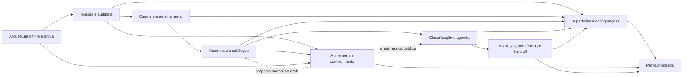

# WARLOG — Antessala

> **Como este arquivo chegou aqui (15/08/2026).** Foi escrito na branch
> `codex/warlog-exaustivo`, ancorado no SHA `73dedab`. A branch e a worktree que ele
> cita não existem mais — o conteúdo foi trazido para a `main` para não morrer junto.
>
> Ele **precede** duas decisões de 14/08/2026 que mudaram a agenda: a saída do
> FullCalendar (PR #9) e o fim da vaga pré-criada, com cota proporcional e encaixe
> dinâmico (PR #10). Onde o Warlog descrever `scheduling_slots`, materialização ou
> grade de calendário, quem manda é
> [`hack/domains/BUILD-classificacao-e-agenda.md`](domains/BUILD-classificacao-e-agenda.md),
> nos blocos `DEMO_DECISION`. O resto da decomposição segue de pé.

Decomposição canônica e executável dos oito pares Analyst/Build no SHA-base obrigatório. Este arquivo é o único Warlog desta fase; não é Spec, Writing Plan nem registro de implementação concluída.

## 1. Estado e base Git

| Evidência | Valor |
|---|---|
| Repositório | `nmarcofernandess/antessala` |
| Worktree isolada | `/Users/marcoantonio/antessala-warlog-exaustivo` |
| Branch de origem observada | `codex/retorno-documentacao` |
| Branch desta decomposição | `codex/warlog-exaustivo` |
| SHA obrigatório / HEAD de criação | `73dedab5bb1030f3bf4ec44120e978fda03f250e` |
| Estado da origem antes da criação | limpa; branch e `origin/codex/retorno-documentacao` no SHA obrigatório |
| Estado da nova worktree antes da edição | limpa; criada diretamente do SHA obrigatório |
| Mutação da origem | nenhuma |
| Merge | proibido e não realizado nesta fase |

Todo `arquivo + heading + linhas` abaixo referencia o conteúdo imutável de `73dedab5bb1030f3bf4ec44120e978fda03f250e`. “SHA da revisão” no recibo é o Git blob daquele arquivo nesse commit, não o futuro commit documental do Warlog.

## 2. Recibo de leitura

| Artefato | Papel | Linhas | SHA da revisão | Lido integralmente |
|---|---|---:|---|---|
| [.context/manifest.yaml](../.context/manifest.yaml) | Governança — manifesto | 96 | `684242901a89acce563a9bc45c64c9b608663fc7` | sim |
| [.context/product.yaml](../.context/product.yaml) | Governança — produto | 153 | `94dbf1fe743c1f0e5aabd86379e7fa757b7ad8f8` | sim |
| [.context/workflow.yaml](../.context/workflow.yaml) | Governança — workflow | 105 | `484b02e8dba6a5807b13ef0e08cb83315dfc10eb` | sim |
| [.context/architecture.yaml](../.context/architecture.yaml) | Governança — arquitetura | 545 | `d5503adb11a56b09b2aafa2d51906acf4a67ff49` | sim |
| [.context/review/STATUS.md](../.context/review/STATUS.md) | Tracker de review | 51 | `01bd5c8123f40d34f84354f0beb4e65fd0b5231b` | sim |
| [hack/PRD.md](PRD.md) | PRD aprovado | 384 | `ee24bd28cb1440bac0c27600eda2a8fc8098623a` | sim |
| [hack/status.json](status.json) | Tracker estruturado | 98 | `982ef0b3032357faafe4d6b14612f6d82613fdd7` | sim |
| [hack/progress.md](progress.md) | Tracker narrativo | 58 | `58cd267cf8ec051aca98b96f8d2d0821f3b5a3b1` | sim |
| [README.md](../README.md) | Entrada do repositório | 129 | `ae1924cf0f53e1163637bfb633d080ad45637424` | sim |
| [CLAUDE.md](../CLAUDE.md) | Instruções do repositório | 119 | `4b5dc6b7a3d0ff37b736e273de9effee7046fe1b` | sim |
| [AGENTS.md](../AGENTS.md) | Instruções do repositório | 119 | `4b5dc6b7a3d0ff37b736e273de9effee7046fe1b` | sim |
| [hack/ANALYST.md](ANALYST.md) | Hub dos Analysts; somente índice | 79 | `cc47ab1767c71adb8e8040237ef0833147c67e8b` | sim |
| [hack/analysis.md](analysis.md) | Hub analítico; somente índice | 186 | `5a87d2d1b096685887e3b5ece38768bc488a3959` | sim |
| [hack/BUILD.md](BUILD.md) | Hub dos Builds; somente índice | 220 | `affe59ce7512bae3adf191b742b54d618c8865a6` | sim |
| [hack/domains/ANALYST-acesso-e-auditoria.md](domains/ANALYST-acesso-e-auditoria.md) | Analyst canônico — acesso e auditoria | 435 | `36532e03d00f2c60de82a31c4ba5229ee5fd750a` | sim |
| [hack/domains/ANALYST-caso-e-encaminhamento.md](domains/ANALYST-caso-e-encaminhamento.md) | Analyst canônico — caso e encaminhamento | 507 | `e7064da4c094a61a2f71675490c9509b91e5f511` | sim |
| [hack/domains/ANALYST-anamnese-e-catalogos.md](domains/ANALYST-anamnese-e-catalogos.md) | Analyst canônico — anamnese e catálogos | 980 | `48bbf7f8deb4058f124b7737b9819b7c8ae187cf` | sim |
| [hack/domains/ANALYST-classificacao-e-agenda.md](domains/ANALYST-classificacao-e-agenda.md) | Analyst canônico — classificação e agenda | 601 | `aa18ddfb8ed86e15065b345a70acac9e007b56a2` | sim |
| [hack/domains/ANALYST-avaliacao-pendencias-e-handoff.md](domains/ANALYST-avaliacao-pendencias-e-handoff.md) | Analyst canônico — avaliação, pendências e handoff | 415 | `140fc989b2de6f0a7d4452e5f0d16a9fbfb6ce52` | sim |
| [hack/domains/ANALYST-superficies-e-configuracoes.md](domains/ANALYST-superficies-e-configuracoes.md) | Analyst canônico — superfícies e configurações | 770 | `d01bd76b7a68ff7bedeebccaf11a3cc3a2fe7339` | sim |
| [hack/domains/ANALYST-arquitetura-offline-e-prova.md](domains/ANALYST-arquitetura-offline-e-prova.md) | Analyst canônico — arquitetura offline e prova | 288 | `ebfa2c29b8efcb6708a2fd00a78ba7382df8130b` | sim |
| [hack/domains/ANALYST-ia-memoria-e-conhecimento.md](domains/ANALYST-ia-memoria-e-conhecimento.md) | Analyst canônico — IA, memória e conhecimento | 598 | `c09b8339da0376990e2f627a50f3ce5c4abfb369` | sim |
| [hack/domains/BUILD-acesso-e-auditoria.md](domains/BUILD-acesso-e-auditoria.md) | Build canônico — acesso e auditoria | 529 | `75a4a5cab65f53819f0736bcd8adf2f2edec62a2` | sim |
| [hack/domains/BUILD-caso-e-encaminhamento.md](domains/BUILD-caso-e-encaminhamento.md) | Build canônico — caso e encaminhamento | 785 | `09d963ebb418ab896219f0713ba7cb46106fd9e2` | sim |
| [hack/domains/BUILD-anamnese-e-catalogos.md](domains/BUILD-anamnese-e-catalogos.md) | Build canônico — anamnese e catálogos | 846 | `3dbf7560834526dc40336568bfaf132e53eb4b30` | sim |
| [hack/domains/BUILD-classificacao-e-agenda.md](domains/BUILD-classificacao-e-agenda.md) | Build canônico — classificação e agenda | 1353 | `16a82a574e8eba9d5675d2a9eabf19e740bd839d` | sim |
| [hack/domains/BUILD-avaliacao-pendencias-e-handoff.md](domains/BUILD-avaliacao-pendencias-e-handoff.md) | Build canônico — avaliação, pendências e handoff | 1520 | `eb4b7ee4b92f48f32326475ca806c8b1f3f5d7e1` | sim |
| [hack/domains/BUILD-superficies-e-configuracoes.md](domains/BUILD-superficies-e-configuracoes.md) | Build canônico — superfícies e configurações | 936 | `e2c8e8c43340354f8e7849182d1725074b648f3e` | sim |
| [hack/domains/BUILD-arquitetura-offline-e-prova.md](domains/BUILD-arquitetura-offline-e-prova.md) | Build canônico — arquitetura offline e prova | 456 | `ff7d91db0c69ef915e69007420979ca0484b86d0` | sim |
| [hack/domains/BUILD-ia-memoria-e-conhecimento.md](domains/BUILD-ia-memoria-e-conhecimento.md) | Build canônico — IA, memória e conhecimento | 453 | `96aa9d9d3f0d4d2a78cbbf748678fe3b186911ce` | sim |

Recibo: **30/30 artefatos**, **8/8 Analysts** e **8/8 Builds** lidos integralmente na ordem mandatória. Os hubs foram lidos como mapas de navegação; nenhuma tarefa foi gerada somente deles.

## 3. Hierarquia de autoridade

```text
decisões explícitas de Marco e PRD aprovado
→ Analyst canônico do domínio
→ Build canônico do domínio
→ Writing Plan futuro da fatia
→ código e testes do HEAD
→ hubs e documentação auxiliar
```

- O Analyst é owner da semântica; o Build é owner da tradução física.
- Um consumidor importa enum, DTO, tabela, command e query do owner; não abre segundo contrato.
- A conta integrada simplifica a demonstração, não funde responsibilities, capabilities, autoria ou escopo.
- Conflito material não é resolvido pelo Warlog. A tarefa afetada fica `BLOCKED` até reconciliação canônica.
- Drift com resolução inequívoca pela hierarquia gera exclusão/teste explícito; não vira implementação do texto stale.

## 4. Resultado da revisão de congruência

Foram encontrados **12 bloqueios materiais** capazes de quebrar a implementação. A decomposição do restante continua; somente as tarefas que dependem deles estão `BLOCKED`.

Dois tipos são separados: `DECISION_REQUIRED` exige fechar uma ambiguidade semântica; `BUILD_RECONCILIATION_REQUIRED` ocorre quando o Analyst já define o comportamento, mas o Build não consegue representá-lo. O segundo não reabre produto, porém ainda bloqueia o Writing Plan afetado: pela hierarquia, o Plan não pode inventar tabela, DTO, command ou lifecycle ausente.

| ID | Tipo | Conflito material | Por que impede implementar | Contratos conflitantes | Decisão/reconciliação necessária |
|---|---|---|---|---|---|
| BLK-01 | `DECISION_REQUIRED` | Escopo do serviço na conta integrada | A conta única não possui `requestingServiceId` confiável, o payload não pode fornecê-lo e as projeções do solicitante exigem isolamento por serviço. | `ANALYST-acesso-e-auditoria.md` L100-103; `BUILD-acesso-e-auditoria.md` L246-262; `BUILD-caso-e-encaminhamento.md` L539-543 | Definir fonte main-only do serviço da intenção sem criar login por papel. |
| BLK-02 | `BUILD_RECONCILIATION_REQUIRED` | Correção após final e antes da publicação | Os Analysts exigem invalidar revisão/proposta, preservar história e abrir novo draft; três Builds recusam qualquer correção após `FINAL/CALCULATED` e não possuem schema/command para a remediação. | `ANALYST-caso-e-encaminhamento.md` L284-303; `ANALYST-anamnese-e-catalogos.md` L361-365; `BUILD-caso-e-encaminhamento.md` L588-615; `BUILD-anamnese-e-catalogos.md` L615-653 | Reconciliar Build físico de vigência, invalidação, nova revisão e command atômico. |
| BLK-03 | `DECISION_REQUIRED` | Shapes dos 14 widgets e matriz de field paths | Analyst, matriz de completude e Build divergem em campos e tipos: alergias, medicações, capacidade funcional, diagnósticos, hábitos, condições especiais e fallback de procedimento. | `ANALYST-anamnese-e-catalogos.md` L326-604 e L605-742; `BUILD-anamnese-e-catalogos.md` L284-565 | Congelar shape canônico bidirecional antes de schema/editor/fixture dos widgets afetados. |
| BLK-04 | `DECISION_REQUIRED` | Acomodação operacional e minutos automáticos | O Analyst proíbe duração automática por campo isolado, mas a matriz fecha `+10` automático para acomodação; o Build materializa o acréscimo. | `ANALYST-classificacao-e-agenda.md` L297-308 e L338-347; `BUILD-classificacao-e-agenda.md` L182-199 | Decidir capability-only versus minutos e republicar regra versionada coerente. |
| BLK-05 | `BUILD_RECONCILIATION_REQUIRED` | `HUMAN_DEFINITION_REQUIRED` sem command | O Analyst permite definição humana justificada quando o motor não classifica; o Build aborta o submit sem revisão/requisito e não oferece command físico. | `ANALYST-classificacao-e-agenda.md` L192-231 e L355-366; `BUILD-classificacao-e-agenda.md` L977-1002 | Definir persistência e command explícito sem falsificar `CALCULATED`. |
| BLK-06 | `BUILD_RECONCILIATION_REQUIRED` | Recuperação após check-in sem encontro | Os Analysts exigem anulação, abandono e impossibilidade de início com owner/saída; os Builds proíbem cancel/no-show após check-in e não entregam commands de recuperação. | `ANALYST-caso-e-encaminhamento.md` L344-355; `ANALYST-classificacao-e-agenda.md` L456-470; `BUILD-classificacao-e-agenda.md` L1028-1048 | Fechar commands, eventos, receipts e transições para INITIAL e RETURN. |
| BLK-07 | `BUILD_RECONCILIATION_REQUIRED` | Lifecycle do encontro truncado | Razões `AGUARDANDO_EVIDENCIA`, `RETORNO_NECESSARIO`, `REVISAO_DOCUMENTAL_POSTERIOR`, `INTERROMPIDO` e `REGISTRO_INVALIDADO` não cabem no schema/commands do Build. | `ANALYST-avaliacao-pendencias-e-handoff.md` L122-146; `BUILD-avaliacao-pendencias-e-handoff.md` L76-113 e L837-877 | Publicar representação lossless e commands correspondentes. |
| BLK-08 | `BUILD_RECONCILIATION_REQUIRED` | Retorno incompleto e reabertura mecânica | Objetivo/modalidade não fazem round-trip e cancel/no-show reabre indefinidamente o mesmo request, contrariando nova decisão clínica por ciclo. | `ANALYST-avaliacao-pendencias-e-handoff.md` L215-227; `BUILD-avaliacao-pendencias-e-handoff.md` L202-234, L738-745 e L1311-1322 | Fechar persistência e decisão explícita de continuidade. |
| BLK-09 | `BUILD_RECONCILIATION_REQUIRED` | Resultado não representa recusas e conteúdo mínimo | O DTO omite `REFUSED` e não sela fontes, pendências resolvidas/abertas, contexto e vínculo entre versões exigidos pelo Analyst. | `ANALYST-avaliacao-pendencias-e-handoff.md` L229-260 e L299-314; `BUILD-avaliacao-pendencias-e-handoff.md` L467-570 | Reconciliar DTO/Zod/hash/PDF antes de finalizar resultado. |
| BLK-10 | `DECISION_REQUIRED` | Handoff local, transporte e autorização | O Analyst separa disponibilidade local, envio, falha, reconhecimento e supersessão; o Build reduz tudo a `SENT/RECEIVED`. Acesso ainda permite disparo por anestesia, enquanto o owner de handoff reserva operação à recepção. | `ANALYST-acesso-e-auditoria.md` L231-234; `ANALYST-avaliacao-pendencias-e-handoff.md` L267-297; `BUILD-avaliacao-pendencias-e-handoff.md` L403-439 | Fechar máquina, semântica local e capability owner antes da entrega. |
| BLK-11 | `BUILD_RECONCILIATION_REQUIRED` | Captura, transcript e proposta com estados/proveniência lossless | Build colapsa `STALE/INVALID`, não persiste intervalos de terceiro e omite dependências/proveniência exigidas; estados de captura/transcript divergem. | `ANALYST-ia-memoria-e-conhecimento.md` L199-256 e L343-356; `BUILD-ia-memoria-e-conhecimento.md` L103-197 e L269-343 | Reconciliar schema, reason codes, intervalos, channels e invalidação. |
| BLK-12 | `BUILD_RECONCILIATION_REQUIRED` | Resumo operacional e memória curada sem Build completo | `OperationalSignalSummary` não tem tabela/DTO/channel; `ApprovedKnowledgeSource`, `KnowledgeSuggestion`, `CuratedExample` e campos de `KnowledgeRelation` estão truncados ou ausentes. | `ANALYST-ia-memoria-e-conhecimento.md` L258-341; `BUILD-ia-memoria-e-conhecimento.md` L199-267 | Materializar os três níveis sem promoção automática e com lifecycle/versionamento completos. |

Drifts resolvidos pela hierarquia, com exclusão consciente e prova negativa:

| Drift | Resolução canônica no Warlog | Prova exigida |
|---|---|---|
| Build offline fala em cinco fixtures e troca por logout/login | prevalece conta única integrada do PRD + Analysts + Build de acesso | seed contém exatamente uma fixture; E2E percorre responsabilidades sem novo login |
| Build de acesso menciona CRUD de usuários/caixa plural de contas | excluir da UI e dos channels ativos | ausência de create/edit/deactivate/password/role switch |
| Build de acesso manda auditar e-mail tentado em login falho | prevalece sanitização do Analyst: nenhum e-mail tentado | shape test do evento de falha |
| Build de superfícies adiciona `/conhecimento` e aliases `assistant.*` | conhecimento/curadoria ficam dentro de `/assistente`; channels/capabilities vêm dos owners | registry e active-channel static tests |
| Analyst offline diz que preload não tem allowlist, mas o HEAD e Build IA provam allowlist existente | adaptar registry atual; não criar segunda allowlist | recon do grafo ativo + owner literal único |
| Build de superfícies/caso sugere `cases.get` ao solicitante | solicitante usa projeções próprias de pendência/resultado/entrega, nunca detalhe geral | shape + cross-service negative tests |
| Legado contém chat global, OpenRouter, entidades nutricionais e `patientId` donor | manter fora do grafo ativo; preservar somente código dormente até prova de consumidores | static imports/channels/routes + E2E |

Nenhum contrato foi reescrito nesta missão. Os bloqueios acima pedem decisão/reconciliação nos owners antes do Writing Plan das fatias afetadas.

## 5. Leis globais preservadas

- Uma conta sintética integrada expõe todas as ferramentas; os cinco papéis permanecem responsibilities/autorias por ação, nunca cinco logins.
- Não existe paciente longitudinal, `patientId`, deduplicação de pessoa nem evolução entre casos; cada encaminhamento abre caso autônomo.
- Triagem geral do SUS, cirurgia e agenda cirúrgica permanecem externas.
- O app não atribui ASA, não declara aptidão anestésica e não substitui decisão humana.
- Gravidade, urgência, prioridade cirúrgica, risco clínico e duração são eixos diferentes; doença/medicação isolada não gera urgência.
- Primeiro boot, fluxo-base, persistência, PDF e handoff local funcionam sem internet.
- Gemini é único, opcional, explícito e demo-only com fixture sintética; falha preserva caminho manual.
- IA, captura, propostas, resumo e curadoria vivem somente em `/assistente`; zero painel global, header toggle, widget ou agenda com IA.
- Toda saída generativa é DRAFT até decisão humana individual; nenhuma proposal aceita as demais.
- Caso, exemplo curado e regra global têm storage/lifecycle separados; caso individual nunca vira regra automaticamente.
- FullCalendar apresenta projeção e coleta intenção; compatibilidade, duração, recurso, capacidade e transição são revalidados no main.
- SchedulingCompatibilityIdentity usa requirement ID/version, slotClassId, duração e necessidades de recursos; nunca identidade de pessoa.
- Ausência de resposta, negativa, desconhecido, recusa, não perguntado, não aplicável e não realizado permanecem semanticamente distintos.
- Hash é integridade técnica, não assinatura, autenticidade clínica, emissor ou suficiência.
- Handoff local não se apresenta como envio institucional; correção de resultado exige nova disponibilidade/entrega.
- Nenhuma surface de configuração cria usuários, edita regra clínica livre, oferece backup/restore/reset ou transforma fixture em cadastro institucional.

## 6. Grafo de dependências entre domínios



| Owner | Exporta | Consumidores | Regra anti-duplicação |
|---|---|---|---|
| Acesso | sessão pública, responsibility/capability, guards, audit | todos | ator/papel/serviço nunca vêm do renderer |
| Caso | snapshots, lifecycle, context revision, handoff inicial | anamnese, agenda, avaliação, IA, surfaces | nenhum consumidor cria Patient/case status paralelo |
| Anamnese | Answer/provenance, widgets, FINAL, operations | classificação, avaliação readonly, IA | IA aplica operation; não escreve JSONB diretamente |
| Agenda | requirement identity, capacity, slots, booking | assessment, surfaces | FullCalendar nunca decide negócio |
| Avaliação | encounter, pendency, return, result, delivery | surfaces/PDF | agenda só integra FKs/booking RETURN |
| IA | capture/transcript/proposal/knowledge lifecycles | anamnese via operation, scheduling via signal | zero mutating tool/automatic promotion |
| Offline | migrations, seed, channel/network policies, harness | todos | um ledger/allowlist/choke point |
| Superfícies | registry, view/mutation state, composed projections | prova humana | importa owners; não redefine enums/DTOs |

## 7. Estratégia de fatias verticais

Cada minispec entrega uma promessa demonstrável e atravessa somente as camadas necessárias:

```text
schema/migration → seed/fixture → contrato compartilhado → service
→ TIPC/preload → estado/hook → superfície → teste → prova humana
```

- Fundações são pequenas e observáveis: runner offline, sessão/guard, shell e registry. Não existe “criar todo o banco/backend/frontend”.
- A fundação de rede de MS-01 é estritamente deny-all: W020/W021 fecham registration/imports e o vocabulário, sem habilitar Gemini nem depender das tarefas MS-39. MS-39 consome essa fundação em sentido único.
- Cada widget é uma fatia própria com 20 tarefas explícitas; componentes compartilhados não apagam sua cobertura.
- Agenda separa projeção, capacidade, booking e recovery; a matriz donor `PORT / ADAPT / EXCLUDE` possui tarefas individuais.
- Resultado é separável de entrega; Gemini/config é separável de captura/proposal; isso mantém fatias não bloqueadas executáveis.
- Só `MS-01` está desbloqueada agora. Ela pode receber Writing Plan ou alimentar implementação TDD direta pelo ledger, conforme a decisão operacional mais recente; as demais aguardam dependência/reconciliação e nenhuma está implementada.

## 8. Catálogo de minispecs

### MS-01 — Boot migrado, seed determinístico e prova offline

| Campo | Contrato |
|---|---|
| ID | MS-01 |
| Estado | `READY_FOR_WRITING_PLAN` |
| Promessa demonstrável | Boota banco vazio, mostra diagnóstico seguro ou Login e registra zero egress. |
| Usuário/responsabilidade | ADMIN / operador da prova |
| Entrada | Diretório temporário vazio e assets empacotados |
| Saída observável | Login ou diagnóstico local com versões/hashes |
| Domínios consumidos | OFFLINE, ACCESS |
| Dependências | — |
| Tarefas incluídas | ANT-W001–ANT-W025 (25) |
| Riscos | migration/seed/network; contenção deny-all do legado ativo |
| Critério de pronto | runner, seed e boot atômicos; nenhum transporte ativo antes do gateway futuro |
| Testes | unit + integração + Electron E2E |
| Prova visual/operacional | recibo offline e screenshot de boot |
| Permanece fora | feature de IA, fluxo clínico e backup |

### MS-02 — Login, sessão integrada e auditoria básica

| Campo | Contrato |
|---|---|
| ID | MS-02 |
| Estado | `BLOCKED_BY_DEPENDENCY` |
| Promessa demonstrável | Um login abre todas as ferramentas e cada ação registra conta + responsabilidade. |
| Usuário/responsabilidade | Conta integrada |
| Entrada | Credencial fixture |
| Saída observável | Sessão efêmera protegida e evento sanitizado |
| Domínios consumidos | ACCESS, OFFLINE |
| Dependências | MS-01 |
| Tarefas incluídas | ANT-W026–ANT-W039, ANT-W041–ANT-W059 (33) |
| Riscos | escopo do solicitante permanece BLK-01 |
| Critério de pronto | auth, guard e audit verdes |
| Testes | unit + DB + renderer + E2E |
| Prova visual/operacional | login/restart/audit |
| Permanece fora | gestão institucional de usuários |

### MS-03 — Shell, navegação, temas e amostra

| Campo | Contrato |
|---|---|
| ID | MS-03 |
| Estado | `BLOCKED_BY_DEPENDENCY` |
| Promessa demonstrável | Sidebar completa, menu do usuário e três temas funcionam por teclado em viewports contratados. |
| Usuário/responsabilidade | Conta integrada |
| Entrada | Sessão pública |
| Saída observável | Casca protegida navegável |
| Domínios consumidos | SURFACES, ACCESS |
| Dependências | MS-02 |
| Tarefas incluídas | ANT-W060–ANT-W074 (15) |
| Riscos | registry/capability drift |
| Critério de pronto | menu, logout, dirty guard e a11y |
| Testes | renderer + visual |
| Prova visual/operacional | screenshots light/dark |
| Permanece fora | telas clínicas profundas |

### MS-04 — Intake e caso autônomo

| Campo | Contrato |
|---|---|
| ID | MS-04 |
| Estado | `BLOCKED_BY_DEPENDENCY` |
| Promessa demonstrável | Cada encaminhamento cria caso novo com snapshots, mesmo para a mesma pessoa. |
| Usuário/responsabilidade | RECEPCAO |
| Entrada | Dados sintéticos do encaminhamento |
| Saída observável | Caso e handoff inicial auditáveis |
| Domínios consumidos | CASE, SURFACES |
| Dependências | MS-03 |
| Tarefas incluídas | ANT-W075–ANT-W096 (22) |
| Riscos | reentrada documental |
| Critério de pronto | service + formulário + E2E |
| Testes | unit + DB + renderer + E2E |
| Prova visual/operacional | dois casos iguais coexistem |
| Permanece fora | paciente mestre e deduplicação |

### MS-05 — Handoff inicial e fila de triagem

| Campo | Contrato |
|---|---|
| ID | MS-05 |
| Estado | `BLOCKED_BY_DEPENDENCY` |
| Promessa demonstrável | Enfermagem reconhece handoff e inicia draft sem race. |
| Usuário/responsabilidade | ENFERMAGEM |
| Entrada | Caso WAITING_NURSING |
| Saída observável | Caso NURSING_IN_PROGRESS e draft |
| Domínios consumidos | CASE, ANAMNESIS, SURFACES |
| Dependências | MS-04 |
| Tarefas incluídas | ANT-W097–ANT-W100 (4) |
| Riscos | concorrência correção/aceite |
| Critério de pronto | transação e worklist verdes |
| Testes | DB + renderer + E2E |
| Prova visual/operacional | timeline e fila |
| Permanece fora | conteúdo de widgets |

### MS-06 — Correção pré-final e rebase do draft

| Campo | Contrato |
|---|---|
| ID | MS-06 |
| Estado | `BLOCKED_BY_DEPENDENCY` |
| Promessa demonstrável | Recepção corrige contexto antes do FINAL e enfermagem reconfirma consumidores stale. |
| Usuário/responsabilidade | RECEPCAO + ENFERMAGEM |
| Entrada | Caso com draft |
| Saída observável | Snapshots revisados e draft reancorado |
| Domínios consumidos | CASE, ANAMNESIS |
| Dependências | MS-05 |
| Tarefas incluídas | ANT-W101–ANT-W107 (7) |
| Riscos | race com submit |
| Critério de pronto | CAS, stale e provenance |
| Testes | unit + integração |
| Prova visual/operacional | diff antes/depois |
| Permanece fora | correção pós-final |

### MS-07 — Correção pós-final pré-publicação

| Campo | Contrato |
|---|---|
| ID | MS-07 |
| Estado | `BLOCKED_BY_CONTRACT_CONFLICT` |
| Promessa demonstrável | Erro descoberto após FINAL invalida artefatos e abre nova revisão sem apagar história. |
| Usuário/responsabilidade | RECEPCAO + ENFERMAGEM |
| Entrada | FINAL + CALCULATED não publicado |
| Saída observável | Nova revisão efetiva; antigos INVALIDATED |
| Domínios consumidos | CASE, ANAMNESIS, SCHEDULING |
| Dependências | MS-06 |
| Tarefas incluídas | ANT-W108–ANT-W111 (4) |
| Riscos | BLK-02 |
| Critério de pronto | contrato reconciliado e fluxo provado |
| Testes | DB + E2E |
| Prova visual/operacional | histórico e bloqueio de consumidores |
| Permanece fora | correção pós-publicação |

### MS-08 — Composer, canvas e drawer

| Campo | Contrato |
|---|---|
| ID | MS-08 |
| Estado | `BLOCKED_BY_DEPENDENCY` |
| Promessa demonstrável | Composer DietFlow adaptado permite compor, mover e adicionar widgets sem mouse. |
| Usuário/responsabilidade | ENFERMAGEM |
| Entrada | Draft e registry |
| Saída observável | Canvas persistível e acessível |
| Domínios consumidos | ANAMNESIS, SURFACES |
| Dependências | MS-05 |
| Tarefas incluídas | ANT-W112–ANT-W137 (26) |
| Riscos | DnD/teclado/dirty state |
| Critério de pronto | canvas/drawer/undo verdes |
| Testes | renderer + integração + visual |
| Prova visual/operacional | comparação DietFlow |
| Permanece fora | campos clínicos de cada widget |

### MS-09 — Protocolos e templates versionados

| Campo | Contrato |
|---|---|
| ID | MS-09 |
| Estado | `BLOCKED_BY_DEPENDENCY` |
| Promessa demonstrável | Protocolo SYSTEM e templates salvos aplicam REPLACE/APPEND_MISSING com confirmação de perda. |
| Usuário/responsabilidade | ENFERMAGEM |
| Entrada | Composição do Composer |
| Saída observável | Composição versionada sem respostas copiadas |
| Domínios consumidos | ANAMNESIS, SURFACES |
| Dependências | MS-08 |
| Tarefas incluídas | ANT-W138–ANT-W149 (12) |
| Riscos | versionamento e perda de draft |
| Critério de pronto | CRUD permitido e apply modes |
| Testes | unit + renderer + integração |
| Prova visual/operacional | prova visual do drawer |
| Permanece fora | edição de regras clínicas SYSTEM |

### MS-10 — Widget Contexto do procedimento

| Campo | Contrato |
|---|---|
| ID | MS-10 |
| Estado | `BLOCKED_BY_CONTRACT_CONFLICT` |
| Promessa demonstrável | O widget procedure_context@1 completa o ciclo schema → editor → readonly → persistência → prova visual. |
| Usuário/responsabilidade | ENFERMAGEM / ANESTESIOLOGISTA |
| Entrada | Draft e contrato do widget |
| Saída observável | Resposta semântica versionada e resumo readonly |
| Domínios consumidos | ANAMNESIS, SURFACES |
| Dependências | MS-08 |
| Tarefas incluídas | ANT-W150–ANT-W169 (20) |
| Riscos | BLK-03 |
| Critério de pronto | 20 aspectos explícitos verdes |
| Testes | unit + integração + renderer |
| Prova visual/operacional | fixture e screenshot comparado |
| Permanece fora | decisão clínica automática |

### MS-11 — Widget Alergias e reações

| Campo | Contrato |
|---|---|
| ID | MS-11 |
| Estado | `BLOCKED_BY_CONTRACT_CONFLICT` |
| Promessa demonstrável | O widget allergies@1 completa o ciclo schema → editor → readonly → persistência → prova visual. |
| Usuário/responsabilidade | ENFERMAGEM / ANESTESIOLOGISTA |
| Entrada | Draft e contrato do widget |
| Saída observável | Resposta semântica versionada e resumo readonly |
| Domínios consumidos | ANAMNESIS, SURFACES |
| Dependências | MS-08 |
| Tarefas incluídas | ANT-W170–ANT-W189 (20) |
| Riscos | BLK-03 |
| Critério de pronto | 20 aspectos explícitos verdes |
| Testes | unit + integração + renderer |
| Prova visual/operacional | fixture e screenshot comparado |
| Permanece fora | decisão clínica automática |

### MS-12 — Widget História anestésica

| Campo | Contrato |
|---|---|
| ID | MS-12 |
| Estado | `BLOCKED_BY_DEPENDENCY` |
| Promessa demonstrável | O widget anesthesia_history@1 completa o ciclo schema → editor → readonly → persistência → prova visual. |
| Usuário/responsabilidade | ENFERMAGEM / ANESTESIOLOGISTA |
| Entrada | Draft e contrato do widget |
| Saída observável | Resposta semântica versionada e resumo readonly |
| Domínios consumidos | ANAMNESIS, SURFACES |
| Dependências | MS-08 |
| Tarefas incluídas | ANT-W190–ANT-W209 (20) |
| Riscos | condicionais e proveniência |
| Critério de pronto | 20 aspectos explícitos verdes |
| Testes | unit + integração + renderer |
| Prova visual/operacional | fixture e screenshot comparado |
| Permanece fora | decisão clínica automática |

### MS-13 — Widget Cardiovascular

| Campo | Contrato |
|---|---|
| ID | MS-13 |
| Estado | `BLOCKED_BY_DEPENDENCY` |
| Promessa demonstrável | O widget cardiovascular@1 completa o ciclo schema → editor → readonly → persistência → prova visual. |
| Usuário/responsabilidade | ENFERMAGEM / ANESTESIOLOGISTA |
| Entrada | Draft e contrato do widget |
| Saída observável | Resposta semântica versionada e resumo readonly |
| Domínios consumidos | ANAMNESIS, SURFACES |
| Dependências | MS-08 |
| Tarefas incluídas | ANT-W210–ANT-W229 (20) |
| Riscos | condicionais e proveniência |
| Critério de pronto | 20 aspectos explícitos verdes |
| Testes | unit + integração + renderer |
| Prova visual/operacional | fixture e screenshot comparado |
| Permanece fora | decisão clínica automática |

### MS-14 — Widget Respiratório

| Campo | Contrato |
|---|---|
| ID | MS-14 |
| Estado | `BLOCKED_BY_DEPENDENCY` |
| Promessa demonstrável | O widget respiratory@1 completa o ciclo schema → editor → readonly → persistência → prova visual. |
| Usuário/responsabilidade | ENFERMAGEM / ANESTESIOLOGISTA |
| Entrada | Draft e contrato do widget |
| Saída observável | Resposta semântica versionada e resumo readonly |
| Domínios consumidos | ANAMNESIS, SURFACES |
| Dependências | MS-08 |
| Tarefas incluídas | ANT-W230–ANT-W249 (20) |
| Riscos | condicionais e proveniência |
| Critério de pronto | 20 aspectos explícitos verdes |
| Testes | unit + integração + renderer |
| Prova visual/operacional | fixture e screenshot comparado |
| Permanece fora | decisão clínica automática |

### MS-15 — Widget Capacidade funcional

| Campo | Contrato |
|---|---|
| ID | MS-15 |
| Estado | `BLOCKED_BY_CONTRACT_CONFLICT` |
| Promessa demonstrável | O widget functional_capacity@1 completa o ciclo schema → editor → readonly → persistência → prova visual. |
| Usuário/responsabilidade | ENFERMAGEM / ANESTESIOLOGISTA |
| Entrada | Draft e contrato do widget |
| Saída observável | Resposta semântica versionada e resumo readonly |
| Domínios consumidos | ANAMNESIS, SURFACES |
| Dependências | MS-08 |
| Tarefas incluídas | ANT-W250–ANT-W269 (20) |
| Riscos | BLK-03 |
| Critério de pronto | 20 aspectos explícitos verdes |
| Testes | unit + integração + renderer |
| Prova visual/operacional | fixture e screenshot comparado |
| Permanece fora | decisão clínica automática |

### MS-16 — Widget Medicamentos

| Campo | Contrato |
|---|---|
| ID | MS-16 |
| Estado | `BLOCKED_BY_CONTRACT_CONFLICT` |
| Promessa demonstrável | O widget medications@1 completa o ciclo schema → editor → readonly → persistência → prova visual. |
| Usuário/responsabilidade | ENFERMAGEM / ANESTESIOLOGISTA |
| Entrada | Draft e contrato do widget |
| Saída observável | Resposta semântica versionada e resumo readonly |
| Domínios consumidos | ANAMNESIS, SURFACES |
| Dependências | MS-08 |
| Tarefas incluídas | ANT-W270–ANT-W289 (20) |
| Riscos | BLK-03 |
| Critério de pronto | 20 aspectos explícitos verdes |
| Testes | unit + integração + renderer |
| Prova visual/operacional | fixture e screenshot comparado |
| Permanece fora | decisão clínica automática |

### MS-17 — Widget Diagnósticos referidos

| Campo | Contrato |
|---|---|
| ID | MS-17 |
| Estado | `BLOCKED_BY_CONTRACT_CONFLICT` |
| Promessa demonstrável | O widget diagnoses@1 completa o ciclo schema → editor → readonly → persistência → prova visual. |
| Usuário/responsabilidade | ENFERMAGEM / ANESTESIOLOGISTA |
| Entrada | Draft e contrato do widget |
| Saída observável | Resposta semântica versionada e resumo readonly |
| Domínios consumidos | ANAMNESIS, SURFACES |
| Dependências | MS-08 |
| Tarefas incluídas | ANT-W290–ANT-W309 (20) |
| Riscos | BLK-03 |
| Critério de pronto | 20 aspectos explícitos verdes |
| Testes | unit + integração + renderer |
| Prova visual/operacional | fixture e screenshot comparado |
| Permanece fora | decisão clínica automática |

### MS-18 — Widget Sangramento e trombose

| Campo | Contrato |
|---|---|
| ID | MS-18 |
| Estado | `BLOCKED_BY_DEPENDENCY` |
| Promessa demonstrável | O widget bleeding_thrombosis@1 completa o ciclo schema → editor → readonly → persistência → prova visual. |
| Usuário/responsabilidade | ENFERMAGEM / ANESTESIOLOGISTA |
| Entrada | Draft e contrato do widget |
| Saída observável | Resposta semântica versionada e resumo readonly |
| Domínios consumidos | ANAMNESIS, SURFACES |
| Dependências | MS-08 |
| Tarefas incluídas | ANT-W310–ANT-W329 (20) |
| Riscos | condicionais e proveniência |
| Critério de pronto | 20 aspectos explícitos verdes |
| Testes | unit + integração + renderer |
| Prova visual/operacional | fixture e screenshot comparado |
| Permanece fora | decisão clínica automática |

### MS-19 — Widget Sinais vitais

| Campo | Contrato |
|---|---|
| ID | MS-19 |
| Estado | `BLOCKED_BY_DEPENDENCY` |
| Promessa demonstrável | O widget vital_signs@1 completa o ciclo schema → editor → readonly → persistência → prova visual. |
| Usuário/responsabilidade | ENFERMAGEM / ANESTESIOLOGISTA |
| Entrada | Draft e contrato do widget |
| Saída observável | Resposta semântica versionada e resumo readonly |
| Domínios consumidos | ANAMNESIS, SURFACES |
| Dependências | MS-08 |
| Tarefas incluídas | ANT-W330–ANT-W349 (20) |
| Riscos | condicionais e proveniência |
| Critério de pronto | 20 aspectos explícitos verdes |
| Testes | unit + integração + renderer |
| Prova visual/operacional | fixture e screenshot comparado |
| Permanece fora | decisão clínica automática |

### MS-20 — Widget Hábitos e substâncias

| Campo | Contrato |
|---|---|
| ID | MS-20 |
| Estado | `BLOCKED_BY_CONTRACT_CONFLICT` |
| Promessa demonstrável | O widget habits_substances@1 completa o ciclo schema → editor → readonly → persistência → prova visual. |
| Usuário/responsabilidade | ENFERMAGEM / ANESTESIOLOGISTA |
| Entrada | Draft e contrato do widget |
| Saída observável | Resposta semântica versionada e resumo readonly |
| Domínios consumidos | ANAMNESIS, SURFACES |
| Dependências | MS-08 |
| Tarefas incluídas | ANT-W350–ANT-W369 (20) |
| Riscos | BLK-03 |
| Critério de pronto | 20 aspectos explícitos verdes |
| Testes | unit + integração + renderer |
| Prova visual/operacional | fixture e screenshot comparado |
| Permanece fora | decisão clínica automática |

### MS-21 — Widget Condições especiais

| Campo | Contrato |
|---|---|
| ID | MS-21 |
| Estado | `BLOCKED_BY_CONTRACT_CONFLICT` |
| Promessa demonstrável | O widget special_conditions@1 completa o ciclo schema → editor → readonly → persistência → prova visual. |
| Usuário/responsabilidade | ENFERMAGEM / ANESTESIOLOGISTA |
| Entrada | Draft e contrato do widget |
| Saída observável | Resposta semântica versionada e resumo readonly |
| Domínios consumidos | ANAMNESIS, SURFACES |
| Dependências | MS-08 |
| Tarefas incluídas | ANT-W370–ANT-W389 (20) |
| Riscos | BLK-03 |
| Critério de pronto | 20 aspectos explícitos verdes |
| Testes | unit + integração + renderer |
| Prova visual/operacional | fixture e screenshot comparado |
| Permanece fora | decisão clínica automática |

### MS-22 — Widget Exames e informações pendentes

| Campo | Contrato |
|---|---|
| ID | MS-22 |
| Estado | `BLOCKED_BY_DEPENDENCY` |
| Promessa demonstrável | O widget exams_pending@1 completa o ciclo schema → editor → readonly → persistência → prova visual. |
| Usuário/responsabilidade | ENFERMAGEM / ANESTESIOLOGISTA |
| Entrada | Draft e contrato do widget |
| Saída observável | Resposta semântica versionada e resumo readonly |
| Domínios consumidos | ANAMNESIS, SURFACES |
| Dependências | MS-08 |
| Tarefas incluídas | ANT-W390–ANT-W409 (20) |
| Riscos | condicionais e proveniência |
| Critério de pronto | 20 aspectos explícitos verdes |
| Testes | unit + integração + renderer |
| Prova visual/operacional | fixture e screenshot comparado |
| Permanece fora | decisão clínica automática |

### MS-23 — Widget Notas clínicas

| Campo | Contrato |
|---|---|
| ID | MS-23 |
| Estado | `BLOCKED_BY_DEPENDENCY` |
| Promessa demonstrável | O widget clinical_notes@1 completa o ciclo schema → editor → readonly → persistência → prova visual. |
| Usuário/responsabilidade | ENFERMAGEM / ANESTESIOLOGISTA |
| Entrada | Draft e contrato do widget |
| Saída observável | Resposta semântica versionada e resumo readonly |
| Domínios consumidos | ANAMNESIS, SURFACES |
| Dependências | MS-08 |
| Tarefas incluídas | ANT-W410–ANT-W429 (20) |
| Riscos | condicionais e proveniência |
| Critério de pronto | 20 aspectos explícitos verdes |
| Testes | unit + integração + renderer |
| Prova visual/operacional | fixture e screenshot comparado |
| Permanece fora | decisão clínica automática |

### MS-24 — Completude, FINAL e proposta operacional

| Campo | Contrato |
|---|---|
| ID | MS-24 |
| Estado | `BLOCKED_BY_CONTRACT_CONFLICT` |
| Promessa demonstrável | Submit atômico sela anamnese e produz proposta explicável sem publicar agenda. |
| Usuário/responsabilidade | ENFERMAGEM |
| Entrada | 14 widgets tratados |
| Saída observável | FINAL + proposta CALCULATED ou estado humano explícito |
| Domínios consumidos | ANAMNESIS, SCHEDULING |
| Dependências | MS-10..MS-23 |
| Tarefas incluídas | ANT-W430–ANT-W449 (20) |
| Riscos | BLK-03/04/05 |
| Critério de pronto | atomicidade e zero parcial |
| Testes | unit + DB + integração |
| Prova visual/operacional | explicação e receipt |
| Permanece fora | confirmação/publicação |

### MS-25 — Confirmação ou override do requisito

| Campo | Contrato |
|---|---|
| ID | MS-25 |
| Estado | `BLOCKED_BY_CONTRACT_CONFLICT` |
| Promessa demonstrável | Humano confirma/ajusta classe, duração e recursos com justificativa. |
| Usuário/responsabilidade | ENFERMAGEM |
| Entrada | Proposta operacional |
| Saída observável | Requirement CONFIRMED/OVERRIDDEN e READY_FOR_SCHEDULING |
| Domínios consumidos | SCHEDULING |
| Dependências | MS-24 |
| Tarefas incluídas | ANT-W450–ANT-W457 (8) |
| Riscos | BLK-04/05 |
| Critério de pronto | requirement versionado publicado |
| Testes | unit + DB + renderer |
| Prova visual/operacional | timeline e explicação |
| Permanece fora | reserva |

### MS-26 — Recursos, janelas, bloqueios e capacidade

| Campo | Contrato |
|---|---|
| ID | MS-26 |
| Estado | `BLOCKED_BY_DEPENDENCY` |
| Promessa demonstrável | Admin configura capacidade datada e materializa slots idempotentes. |
| Usuário/responsabilidade | ADMIN |
| Entrada | Fixtures e formulários tipados |
| Saída observável | Slots/recursos/bloqueios auditáveis |
| Domínios consumidos | SCHEDULING, SURFACES |
| Dependências | MS-03 |
| Tarefas incluídas | ANT-W458–ANT-W475 (18) |
| Riscos | concorrência e timezone |
| Critério de pronto | CRUD permitido + materialização |
| Testes | unit + DB + renderer |
| Prova visual/operacional | config e background events |
| Permanece fora | recorrência genérica |

### MS-27 — Agenda FullCalendar e projeção acessível

| Campo | Contrato |
|---|---|
| ID | MS-27 |
| Estado | `BLOCKED_BY_DEPENDENCY` |
| Promessa demonstrável | Mês/semana/dia/lista/programação exibem a mesma disponibilidade compatível. |
| Usuário/responsabilidade | RECEPCAO |
| Entrada | Requirement + range |
| Saída observável | Calendar e tabela acessível equivalentes |
| Domínios consumidos | SCHEDULING, SURFACES |
| Dependências | MS-25, MS-26 |
| Tarefas incluídas | ANT-W476–ANT-W522 (47) |
| Riscos | densidade 0/1/100/1000 |
| Critério de pronto | PORT/ADAPT/EXCLUDE provados |
| Testes | unit + renderer + visual |
| Prova visual/operacional | comparação DietFlow |
| Permanece fora | motor de negócio no renderer |

### MS-28 — Reserva inicial

| Campo | Contrato |
|---|---|
| ID | MS-28 |
| Estado | `BLOCKED_BY_DEPENDENCY` |
| Promessa demonstrável | Recepção seleciona vaga e confirma booking compatível com validação no main. |
| Usuário/responsabilidade | RECEPCAO |
| Entrada | Slot e requirement versionados |
| Saída observável | Booking CONFIRMED e ocupações |
| Domínios consumidos | SCHEDULING |
| Dependências | MS-27 |
| Tarefas incluídas | ANT-W523–ANT-W530 (8) |
| Riscos | corrida e idempotência |
| Critério de pronto | transação booking completa |
| Testes | DB + renderer + E2E |
| Prova visual/operacional | drawer de confirmação |
| Permanece fora | retorno/check-in |

### MS-29 — Reagendamento, DnD, resize e concorrência

| Campo | Contrato |
|---|---|
| ID | MS-29 |
| Estado | `BLOCKED_BY_DEPENDENCY` |
| Promessa demonstrável | Mover/redimensionar envia intenção, revalida e chama revert em falha. |
| Usuário/responsabilidade | RECEPCAO |
| Entrada | Booking confirmado |
| Saída observável | Booking reagendado ou UI revertida |
| Domínios consumidos | SCHEDULING, SURFACES |
| Dependências | MS-28 |
| Tarefas incluídas | ANT-W531–ANT-W537 (7) |
| Riscos | slot tomado/stale |
| Critério de pronto | CAS + revert + reload |
| Testes | DB + renderer + E2E |
| Prova visual/operacional | vídeo/screenshot de conflito |
| Permanece fora | mudança de duração clínica por altura |

### MS-30 — Check-in, cancelamento e no-show inicial

| Campo | Contrato |
|---|---|
| ID | MS-30 |
| Estado | `BLOCKED_BY_CONTRACT_CONFLICT` |
| Promessa demonstrável | Recepção registra presença e estados de booking sem iniciar avaliação. |
| Usuário/responsabilidade | RECEPCAO |
| Entrada | Booking INITIAL |
| Saída observável | CHECKED_IN/CANCELLED/NO_SHOW auditável |
| Domínios consumidos | SCHEDULING, CASE |
| Dependências | MS-28 |
| Tarefas incluídas | ANT-W538–ANT-W544 (7) |
| Riscos | BLK-06 para pós-check-in |
| Critério de pronto | transições pré-check-in verdes |
| Testes | DB + E2E |
| Prova visual/operacional | timeline |
| Permanece fora | avaliação clínica |

### MS-31 — Encontro e avaliação em draft

| Campo | Contrato |
|---|---|
| ID | MS-31 |
| Estado | `BLOCKED_BY_CONTRACT_CONFLICT` |
| Promessa demonstrável | Anestesiologista inicia somente após check-in e salva avaliação com estados semânticos. |
| Usuário/responsabilidade | ANESTESIOLOGISTA |
| Entrada | Booking CHECKED_IN + FINAL |
| Saída observável | Encounter e draft versionados |
| Domínios consumidos | ASSESSMENT, SURFACES |
| Dependências | MS-30 |
| Tarefas incluídas | ANT-W545–ANT-W559 (15) |
| Riscos | BLK-07/09 |
| Critério de pronto | start/save/dirty/conflict |
| Testes | unit + DB + renderer |
| Prova visual/operacional | worklist e editor |
| Permanece fora | resultado/handoff |

### MS-32 — Pendência e documento metadata-only

| Campo | Contrato |
|---|---|
| ID | MS-32 |
| Estado | `BLOCKED_BY_DEPENDENCY` |
| Promessa demonstrável | Pendência explícita é atribuída e recebe evidência sem guardar bytes. |
| Usuário/responsabilidade | ANESTESIOLOGISTA + responsável |
| Entrada | Encounter e pedido discriminado |
| Saída observável | Pendency + receipt CONTENT_NOT_RETAINED |
| Domínios consumidos | ASSESSMENT, SURFACES |
| Dependências | MS-31 |
| Tarefas incluídas | ANT-W560–ANT-W573 (14) |
| Riscos | supersede/content receipt drift |
| Critério de pronto | owner/scope/hash testados |
| Testes | unit + DB + renderer + E2E |
| Prova visual/operacional | worklist atribuída |
| Permanece fora | storage documental real |

### MS-33 — Revisão de evidência e retomada

| Campo | Contrato |
|---|---|
| ID | MS-33 |
| Estado | `BLOCKED_BY_DEPENDENCY` |
| Promessa demonstrável | Só anestesiologista aceita/reabre/cancela/supersede e decide retomar. |
| Usuário/responsabilidade | ANESTESIOLOGISTA |
| Entrada | Evidência submetida |
| Saída observável | Pendency decidida e encounter retomado quando permitido |
| Domínios consumidos | ASSESSMENT |
| Dependências | MS-32 |
| Tarefas incluídas | ANT-W574–ANT-W585 (12) |
| Riscos | concorrência/blockers |
| Critério de pronto | predicado único canResumeReview |
| Testes | unit + DB + E2E |
| Prova visual/operacional | timeline |
| Permanece fora | retorno automático |

### MS-34 — Decisão e agendamento de retorno

| Campo | Contrato |
|---|---|
| ID | MS-34 |
| Estado | `BLOCKED_BY_DEPENDENCY` |
| Promessa demonstrável | Nova decisão clínica cria requirement RETURN próprio e volta à recepção. |
| Usuário/responsabilidade | ANESTESIOLOGISTA + RECEPCAO |
| Entrada | Review e objetivo do retorno |
| Saída observável | ReturnRequest reservado/check-in |
| Domínios consumidos | ASSESSMENT, SCHEDULING |
| Dependências | MS-33, MS-27 |
| Tarefas incluídas | ANT-W586–ANT-W595 (10) |
| Riscos | BLK-08 parcial |
| Critério de pronto | round-trip e booking discriminado |
| Testes | unit + DB + E2E |
| Prova visual/operacional | fila RETURN |
| Permanece fora | reuso automático do inicial |

### MS-35 — Cancel/no-show e multiciclo de retorno

| Campo | Contrato |
|---|---|
| ID | MS-35 |
| Estado | `BLOCKED_BY_CONTRACT_CONFLICT` |
| Promessa demonstrável | Histórico é preservado e continuidade exige nova decisão humana. |
| Usuário/responsabilidade | ANESTESIOLOGISTA + RECEPCAO |
| Entrada | Return booking cancelado/no-show |
| Saída observável | Decisão explícita de continuidade ou encerramento |
| Domínios consumidos | ASSESSMENT, SCHEDULING |
| Dependências | MS-34 |
| Tarefas incluídas | ANT-W596–ANT-W599 (4) |
| Riscos | BLK-08 |
| Critério de pronto | contrato reconciliado |
| Testes | DB + E2E |
| Prova visual/operacional | timeline multiciclo |
| Permanece fora | reabertura infinita |

### MS-36 — Resultado final versionado e PDF

| Campo | Contrato |
|---|---|
| ID | MS-36 |
| Estado | `BLOCKED_BY_CONTRACT_CONFLICT` |
| Promessa demonstrável | Avaliação completa sela resultado contextual e PDF offline não assinado. |
| Usuário/responsabilidade | ANESTESIOLOGISTA |
| Entrada | Encounter sem blocker |
| Saída observável | FINAL imutável + PDF/hash |
| Domínios consumidos | ASSESSMENT |
| Dependências | MS-31, MS-33 |
| Tarefas incluídas | ANT-W600–ANT-W611 (12) |
| Riscos | BLK-09 |
| Critério de pronto | conteúdo mínimo e hash |
| Testes | unit + DB + PDF + E2E |
| Prova visual/operacional | PDF/screenshot |
| Permanece fora | ASA/aptidão/cirurgia |

### MS-37 — Correção, adendo e supersessão de resultado

| Campo | Contrato |
|---|---|
| ID | MS-37 |
| Estado | `BLOCKED_BY_CONTRACT_CONFLICT` |
| Promessa demonstrável | Nova versão avança head por CAS e preserva entregas/história. |
| Usuário/responsabilidade | ANESTESIOLOGISTA |
| Entrada | Resultado corrente |
| Saída observável | CORRECTION/ADDENDUM e novo handoff |
| Domínios consumidos | ASSESSMENT |
| Dependências | MS-36 |
| Tarefas incluídas | ANT-W612–ANT-W617 (6) |
| Riscos | conteúdo/hash |
| Critério de pronto | versões imutáveis |
| Testes | DB + E2E |
| Prova visual/operacional | comparação de versões |
| Permanece fora | overwrite/delete |

### MS-38 — Disponibilidade local, entrega e reconhecimento

| Campo | Contrato |
|---|---|
| ID | MS-38 |
| Estado | `BLOCKED_BY_CONTRACT_CONFLICT` |
| Promessa demonstrável | Versão local distingue transporte, falha, supersessão e confirmação do serviço. |
| Usuário/responsabilidade | RECEPCAO + SOLICITANTE |
| Entrada | Resultado corrente |
| Saída observável | Lifecycle completo de handoff |
| Domínios consumidos | ASSESSMENT, ACCESS |
| Dependências | MS-36 |
| Tarefas incluídas | ANT-W040, ANT-W618–ANT-W627 (11) |
| Riscos | BLK-01/10 |
| Critério de pronto | máquina/capabilities reconciliadas |
| Testes | DB + renderer + E2E |
| Prova visual/operacional | recibos por serviço |
| Permanece fora | integração institucional real |

### MS-39 — Gemini, segredo e egress explícito

| Campo | Contrato |
|---|---|
| ID | MS-39 |
| Estado | `BLOCKED_BY_DEPENDENCY` |
| Promessa demonstrável | Config segura testa Gemini sem conteúdo e nenhum outro transporte fica ativo. |
| Usuário/responsabilidade | ADMIN |
| Entrada | Chave/modelo sintéticos |
| Saída observável | Gateway único e caminho manual preservado |
| Domínios consumidos | AI, OFFLINE |
| Dependências | MS-03 |
| Tarefas incluídas | ANT-W628–ANT-W639 (12) |
| Riscos | safeStorage indisponível |
| Critério de pronto | egress allowlisted |
| Testes | unit + integração + rede negativa |
| Prova visual/operacional | network receipt |
| Permanece fora | OpenRouter/chat global |

### MS-40 — Captura e transcript no Assistente

| Campo | Contrato |
|---|---|
| ID | MS-40 |
| Estado | `BLOCKED_BY_CONTRACT_CONFLICT` |
| Promessa demonstrável | Captura consentida/revisada descarta áudio e exclui fala de terceiro. |
| Usuário/responsabilidade | ENFERMAGEM |
| Entrada | Caso sintético DRAFT |
| Saída observável | Transcript humano confirmado |
| Domínios consumidos | AI |
| Dependências | MS-39, MS-08 |
| Tarefas incluídas | ANT-W640–ANT-W656 (17) |
| Riscos | BLK-11 |
| Critério de pronto | lifecycle lossless |
| Testes | unit + fs + renderer + E2E |
| Prova visual/operacional | teardown e transcript |
| Permanece fora | STT local/download |

### MS-41 — Propostas por campo

| Campo | Contrato |
|---|---|
| ID | MS-41 |
| Estado | `BLOCKED_BY_CONTRACT_CONFLICT` |
| Promessa demonstrável | Gemini gera DRAFTs e cada decisão aplica uma operação canônica no draft. |
| Usuário/responsabilidade | ENFERMAGEM |
| Entrada | Transcript ativo + schema |
| Saída observável | Aceite/correção/rejeição auditáveis |
| Domínios consumidos | AI, ANAMNESIS |
| Dependências | MS-40 |
| Tarefas incluídas | ANT-W657–ANT-W672 (16) |
| Riscos | BLK-03/11 |
| Critério de pronto | zero apply-all/partial |
| Testes | unit + DB + E2E |
| Prova visual/operacional | três decisões por campo |
| Permanece fora | IA embutida no widget |

### MS-42 — Resumo de sinais operacionais

| Campo | Contrato |
|---|---|
| ID | MS-42 |
| Estado | `BLOCKED_BY_CONTRACT_CONFLICT` |
| Promessa demonstrável | Resumo mostra sinais/fontes/lacunas sem publicar requirement. |
| Usuário/responsabilidade | ENFERMAGEM |
| Entrada | Propostas e conhecimento ativo |
| Saída observável | Summary reconhecido ou stale |
| Domínios consumidos | AI, SCHEDULING |
| Dependências | MS-41 |
| Tarefas incluídas | ANT-W673–ANT-W679 (7) |
| Riscos | BLK-12 |
| Critério de pronto | contrato físico publicado |
| Testes | unit + integração |
| Prova visual/operacional | resumo explicável |
| Permanece fora | score/urgência automática |

### MS-43 — Fontes e relações de conhecimento

| Campo | Contrato |
|---|---|
| ID | MS-43 |
| Estado | `BLOCKED_BY_CONTRACT_CONFLICT` |
| Promessa demonstrável | Fonte licenciada sustenta relação sugerida→aprovada→ativa→retirada. |
| Usuário/responsabilidade | ANESTESIOLOGISTA |
| Entrada | Fonte sintética revisada |
| Saída observável | Busca textual só em conhecimento ativo |
| Domínios consumidos | AI |
| Dependências | MS-39 |
| Tarefas incluídas | ANT-W680–ANT-W693 (14) |
| Riscos | BLK-12 |
| Critério de pronto | lifecycle/versionamento completos |
| Testes | unit + DB + renderer |
| Prova visual/operacional | busca vazia/conflito |
| Permanece fora | RAG obrigatório |

### MS-44 — Exemplo curado e sugestão de relação

| Campo | Contrato |
|---|---|
| ID | MS-44 |
| Estado | `BLOCKED_BY_CONTRACT_CONFLICT` |
| Promessa demonstrável | Exemplo mínimo promovido gera sugestão, nunca regra automática. |
| Usuário/responsabilidade | ANESTESIOLOGISTA |
| Entrada | Exemplo sintético explícito |
| Saída observável | Sugestão inativa revisável |
| Domínios consumidos | AI |
| Dependências | MS-43 |
| Tarefas incluídas | ANT-W694–ANT-W702 (9) |
| Riscos | BLK-12 |
| Critério de pronto | três níveis separados |
| Testes | unit + DB + E2E |
| Prova visual/operacional | prova de não promoção |
| Permanece fora | caso real/narrativa integral |

### MS-45 — Configurações, inventários e auditoria

| Campo | Contrato |
|---|---|
| ID | MS-45 |
| Estado | `BLOCKED_BY_DEPENDENCY` |
| Promessa demonstrável | Conta/fixtures/catálogos são read-only; somente capacidade/protocolos/Gemini têm writes autorizados. |
| Usuário/responsabilidade | ADMIN + ENFERMAGEM |
| Entrada | Sessão integrada e dados locais |
| Saída observável | Config deep-links e auditoria sanitizada |
| Domínios consumidos | SURFACES, ACCESS, OFFLINE |
| Dependências | MS-03, MS-09, MS-26, MS-39 |
| Tarefas incluídas | ANT-W703–ANT-W715 (13) |
| Riscos | drift de rotas/namespaces |
| Critério de pronto | matriz read/write provada |
| Testes | renderer + E2E |
| Prova visual/operacional | screenshots das abas |
| Permanece fora | CRUD usuário/regras livres/reset |

### MS-46 — Jornada integrada, escala e prova humana

| Campo | Contrato |
|---|---|
| ID | MS-46 |
| Estado | `BLOCKED_BY_DEPENDENCY` |
| Promessa demonstrável | Uma sessão percorre fluxo sintético offline com persistência, teclado, visual e escala contratada. |
| Usuário/responsabilidade | Operador da demonstração |
| Entrada | Todas as minispecs não bloqueadas |
| Saída observável | Recibo E2E + screenshots + contagens |
| Domínios consumidos | TODOS |
| Dependências | MS-01..MS-45 |
| Tarefas incluídas | ANT-W716–ANT-W731 (16) |
| Riscos | bloqueios materiais remanescentes |
| Critério de pronto | prova completa no SHA selado |
| Testes | E2E + visual + rede negativa |
| Prova visual/operacional | relatório sem dado clínico |
| Permanece fora | produção hospitalar |

## 9. Ledger completo de tarefas

Nenhuma tarefa está concluída. `TODO` significa contrato decomponível; `BLOCKED` significa que a unidade depende de um bloqueio material listado na seção 11.

| ID | Minispec | Domínio owner | Fonte | Regra coberta | Trabalho | Dependências | Áreas físicas | Aceite | Teste RED | Prova final | Risco | Estado |
|---|---|---|---|---|---|---|---|---|---|---|---|---|
| ANT-W001 | MS-01 | [ANALYST-arquitetura-offline-e-prova.md](domains/ANALYST-arquitetura-offline-e-prova.md) + [BUILD-arquitetura-offline-e-prova.md](domains/BUILD-arquitetura-offline-e-prova.md) | [ANALYST-arquitetura-offline-e-prova.md](domains/ANALYST-arquitetura-offline-e-prova.md) — Entities And State, L126-169<br>[BUILD-arquitetura-offline-e-prova.md](domains/BUILD-arquitetura-offline-e-prova.md) — Schema de infraestrutura e integração, L83-184 | `SchemaMigration` possui id, checksum, versão e appliedAt; SQL aplicado é imutável. | Definir manifest tipado e ordenação imutável de migrations. | — | `src/main/db/{migrate,migrations,seed,catalog-manifest}*`; `src/shared/ipc/channels.ts`; `src/main/ipc/*`; `src/main/network/*`; `src/main/index.ts`; `scripts/proof/*`; `tests/{main,e2e}/*` | Manifest rejeita ID/checksum duplicado. | Manifest permissivo aceita duplicata. | contract test do manifest | alto | `TODO` |
| ANT-W002 | MS-01 | [ANALYST-arquitetura-offline-e-prova.md](domains/ANALYST-arquitetura-offline-e-prova.md) + [BUILD-arquitetura-offline-e-prova.md](domains/BUILD-arquitetura-offline-e-prova.md) | [ANALYST-arquitetura-offline-e-prova.md](domains/ANALYST-arquitetura-offline-e-prova.md) — Entities And State, L126-169<br>[BUILD-arquitetura-offline-e-prova.md](domains/BUILD-arquitetura-offline-e-prova.md) — Schema de infraestrutura e integração, L83-184 | `schema_migrations(id, checksum, app_version, applied_at)` é o ledger único. | Criar bootstrap mínimo e repositório do ledger. | — | `src/main/db/{migrate,migrations,seed,catalog-manifest}*`; `src/shared/ipc/channels.ts`; `src/main/ipc/*`; `src/main/network/*`; `src/main/index.ts`; `scripts/proof/*`; `tests/{main,e2e}/*` | Banco vazio cria exatamente a tabela/PK/campos contratados. | Consulta ao ledger falha no banco vazio. | teste DB de schema | alto | `TODO` |
| ANT-W003 | MS-01 | [ANALYST-arquitetura-offline-e-prova.md](domains/ANALYST-arquitetura-offline-e-prova.md) + [BUILD-arquitetura-offline-e-prova.md](domains/BUILD-arquitetura-offline-e-prova.md) | [ANALYST-arquitetura-offline-e-prova.md](domains/ANALYST-arquitetura-offline-e-prova.md) — Entities And State, L126-169<br>[BUILD-arquitetura-offline-e-prova.md](domains/BUILD-arquitetura-offline-e-prova.md) — Schema de infraestrutura e integração, L83-184 | Checksum divergente para ID aplicado bloqueia boot. | Comparar SHA-256 antes de qualquer SQL pendente. | — | `src/main/db/{migrate,migrations,seed,catalog-manifest}*`; `src/shared/ipc/channels.ts`; `src/main/ipc/*`; `src/main/network/*`; `src/main/index.ts`; `scripts/proof/*`; `tests/{main,e2e}/*` | Mismatch retorna erro seguro sem alterar DB. | Runner reaplica ou ignora checksum divergente. | teste de integração | crítico | `TODO` |
| ANT-W004 | MS-01 | [ANALYST-arquitetura-offline-e-prova.md](domains/ANALYST-arquitetura-offline-e-prova.md) + [BUILD-arquitetura-offline-e-prova.md](domains/BUILD-arquitetura-offline-e-prova.md) | [ANALYST-arquitetura-offline-e-prova.md](domains/ANALYST-arquitetura-offline-e-prova.md) — Entities And State, L126-169<br>[BUILD-arquitetura-offline-e-prova.md](domains/BUILD-arquitetura-offline-e-prova.md) — Schema de infraestrutura e integração, L83-184 | Cada migration e seu receipt confirmam atomicamente. | Executar SQL + insert no ledger numa transação. | — | `src/main/db/{migrate,migrations,seed,catalog-manifest}*`; `src/shared/ipc/channels.ts`; `src/main/ipc/*`; `src/main/network/*`; `src/main/index.ts`; `scripts/proof/*`; `tests/{main,e2e}/*` | Falha intermediária deixa zero DDL/receipt parcial. | Migration quebrada deixa ledger gravado. | teste de rollback | crítico | `TODO` |
| ANT-W005 | MS-01 | [ANALYST-arquitetura-offline-e-prova.md](domains/ANALYST-arquitetura-offline-e-prova.md) + [BUILD-arquitetura-offline-e-prova.md](domains/BUILD-arquitetura-offline-e-prova.md) | [ANALYST-arquitetura-offline-e-prova.md](domains/ANALYST-arquitetura-offline-e-prova.md) — Entities And State, L126-169<br>[BUILD-arquitetura-offline-e-prova.md](domains/BUILD-arquitetura-offline-e-prova.md) — Schema de infraestrutura e integração, L83-184 | Duas inicializações não aplicam migration duas vezes. | Implementar lock/advisory local compatível com PGlite. | — | `src/main/db/{migrate,migrations,seed,catalog-manifest}*`; `src/shared/ipc/channels.ts`; `src/main/ipc/*`; `src/main/network/*`; `src/main/index.ts`; `scripts/proof/*`; `tests/{main,e2e}/*` | Corrida produz um único receipt. | Teste concorrente duplica aplicação. | teste concorrente | alto | `TODO` |
| ANT-W006 | MS-01 | [ANALYST-arquitetura-offline-e-prova.md](domains/ANALYST-arquitetura-offline-e-prova.md) + [BUILD-arquitetura-offline-e-prova.md](domains/BUILD-arquitetura-offline-e-prova.md) | [ANALYST-arquitetura-offline-e-prova.md](domains/ANALYST-arquitetura-offline-e-prova.md) — Entities And State, L126-169<br>[BUILD-arquitetura-offline-e-prova.md](domains/BUILD-arquitetura-offline-e-prova.md) — Schema de infraestrutura e integração, L83-184 | Upgrade preserva fixtures e dados suportados. | Criar matriz banco vazio + versões suportadas. | — | `src/main/db/{migrate,migrations,seed,catalog-manifest}*`; `src/shared/ipc/channels.ts`; `src/main/ipc/*`; `src/main/network/*`; `src/main/index.ts`; `scripts/proof/*`; `tests/{main,e2e}/*` | Todas chegam ao mesmo schema sem perda. | Snapshot antigo perde linha fixture. | matriz de integração | alto | `TODO` |
| ANT-W007 | MS-01 | [ANALYST-arquitetura-offline-e-prova.md](domains/ANALYST-arquitetura-offline-e-prova.md) + [BUILD-arquitetura-offline-e-prova.md](domains/BUILD-arquitetura-offline-e-prova.md) | [ANALYST-arquitetura-offline-e-prova.md](domains/ANALYST-arquitetura-offline-e-prova.md) — Entities And State, L126-169<br>[BUILD-arquitetura-offline-e-prova.md](domains/BUILD-arquitetura-offline-e-prova.md) — Schema de infraestrutura e integração, L83-184 | `catalog_seed_state` guarda key/hash/version/count/coverage/appliedAt sem tabela paralela. | Migrar/reusar ledger e mapear todos os campos. | — | `src/main/db/{migrate,migrations,seed,catalog-manifest}*`; `src/shared/ipc/channels.ts`; `src/main/ipc/*`; `src/main/network/*`; `src/main/index.ts`; `scripts/proof/*`; `tests/{main,e2e}/*` | Round-trip distingue FULL/SUBSET/REFERENCE_ONLY. | Schema omite coverage ou count. | teste DB | alto | `TODO` |
| ANT-W008 | MS-01 | [ANALYST-arquitetura-offline-e-prova.md](domains/ANALYST-arquitetura-offline-e-prova.md) + [BUILD-arquitetura-offline-e-prova.md](domains/BUILD-arquitetura-offline-e-prova.md) | [ANALYST-arquitetura-offline-e-prova.md](domains/ANALYST-arquitetura-offline-e-prova.md) — Entities And State, L126-169<br>[BUILD-arquitetura-offline-e-prova.md](domains/BUILD-arquitetura-offline-e-prova.md) — Schema de infraestrutura e integração, L83-184 | Manifesto inclui 13 chaves, kind, versão, hash, contagem, cobertura, origem e licença. | Criar registry fechado dos assets. | — | `src/main/db/{migrate,migrations,seed,catalog-manifest}*`; `src/shared/ipc/channels.ts`; `src/main/ipc/*`; `src/main/network/*`; `src/main/index.ts`; `scripts/proof/*`; `tests/{main,e2e}/*` | Todas as chaves e metadados validam; extra/missing falha. | Manifest incompleto passa. | contract test | alto | `TODO` |
| ANT-W009 | MS-01 | [ANALYST-arquitetura-offline-e-prova.md](domains/ANALYST-arquitetura-offline-e-prova.md) + [BUILD-arquitetura-offline-e-prova.md](domains/BUILD-arquitetura-offline-e-prova.md) | [ANALYST-arquitetura-offline-e-prova.md](domains/ANALYST-arquitetura-offline-e-prova.md) — Entities And State, L126-169<br>[BUILD-arquitetura-offline-e-prova.md](domains/BUILD-arquitetura-offline-e-prova.md) — Schema de infraestrutura e integração, L83-184 | Asset alterado substitui somente o catálogo alvo e preserva revisão anterior em falha. | Implementar seed transacional por asset. | — | `src/main/db/{migrate,migrations,seed,catalog-manifest}*`; `src/shared/ipc/channels.ts`; `src/main/ipc/*`; `src/main/network/*`; `src/main/index.ts`; `scripts/proof/*`; `tests/{main,e2e}/*` | No-op idempotente e rollback seletivo são observáveis. | JSON inválido corrompe estado anterior. | teste integração | crítico | `TODO` |
| ANT-W010 | MS-01 | [ANALYST-arquitetura-offline-e-prova.md](domains/ANALYST-arquitetura-offline-e-prova.md) + [BUILD-arquitetura-offline-e-prova.md](domains/BUILD-arquitetura-offline-e-prova.md) | [ANALYST-arquitetura-offline-e-prova.md](domains/ANALYST-arquitetura-offline-e-prova.md) — Entities And State, L126-169<br>[BUILD-arquitetura-offline-e-prova.md](domains/BUILD-arquitetura-offline-e-prova.md) — Schema de infraestrutura e integração, L83-184 | Widgets/templates/rules validam IDs e versões internos. | Cruzar conteúdo dos JSONs com manifest. | — | `src/main/db/{migrate,migrations,seed,catalog-manifest}*`; `src/shared/ipc/channels.ts`; `src/main/ipc/*`; `src/main/network/*`; `src/main/index.ts`; `scripts/proof/*`; `tests/{main,e2e}/*` | Drift interno bloqueia boot. | Hash externo válido mascara ID interno errado. | fixture negativa | alto | `TODO` |
| ANT-W011 | MS-01 | [ANALYST-arquitetura-offline-e-prova.md](domains/ANALYST-arquitetura-offline-e-prova.md) + [BUILD-arquitetura-offline-e-prova.md](domains/BUILD-arquitetura-offline-e-prova.md) | [ANALYST-arquitetura-offline-e-prova.md](domains/ANALYST-arquitetura-offline-e-prova.md) — Runtime / Data Flow; Rules And Invariants, L178-223<br>[BUILD-arquitetura-offline-e-prova.md](domains/BUILD-arquitetura-offline-e-prova.md) — Boot, network policy e prova segura, L260-310 | Boot executa DB → lock/migrate → assets/seed → materialização SYSTEM → sessão null → routers/guards → window. | Orquestrar sequência fail-closed no main. | ANT-W004, ANT-W009 | `src/main/db/{migrate,migrations,seed,catalog-manifest}*`; `src/shared/ipc/channels.ts`; `src/main/ipc/*`; `src/main/network/*`; `src/main/index.ts`; `scripts/proof/*`; `tests/{main,e2e}/*` | BrowserWindow clínica só nasce após readiness. | Janela monta antes de migration falhar. | integração main | crítico | `TODO` |
| ANT-W012 | MS-01 | [ANALYST-arquitetura-offline-e-prova.md](domains/ANALYST-arquitetura-offline-e-prova.md) + [BUILD-arquitetura-offline-e-prova.md](domains/BUILD-arquitetura-offline-e-prova.md) | [ANALYST-arquitetura-offline-e-prova.md](domains/ANALYST-arquitetura-offline-e-prova.md) — Runtime / Data Flow; Rules And Invariants, L178-223<br>[BUILD-arquitetura-offline-e-prova.md](domains/BUILD-arquitetura-offline-e-prova.md) — Boot, network policy e prova segura, L260-310 | Falha de migration/seed abre somente diagnóstico acionável e sanitizado. | Criar envelope/caminho de erro local. | ANT-W004, ANT-W009 | `src/main/db/{migrate,migrations,seed,catalog-manifest}*`; `src/shared/ipc/channels.ts`; `src/main/ipc/*`; `src/main/network/*`; `src/main/index.ts`; `scripts/proof/*`; `tests/{main,e2e}/*` | Nenhum handler clínico fica registrado na falha. | Erro parcial ainda expõe rota clínica. | E2E de boot inválido | alto | `TODO` |
| ANT-W013 | MS-01 | [ANALYST-arquitetura-offline-e-prova.md](domains/ANALYST-arquitetura-offline-e-prova.md) + [BUILD-arquitetura-offline-e-prova.md](domains/BUILD-arquitetura-offline-e-prova.md) | [ANALYST-arquitetura-offline-e-prova.md](domains/ANALYST-arquitetura-offline-e-prova.md) — Runtime / Data Flow; Rules And Invariants, L178-223<br>[BUILD-arquitetura-offline-e-prova.md](domains/BUILD-arquitetura-offline-e-prova.md) — Boot, network policy e prova segura, L260-310 | Materialização de boot usa ator SYSTEM, cause/runId e não fabrica receipt USER. | Separar idempotência SYSTEM por generation_key. | ANT-W004, ANT-W009 | `src/main/db/{migrate,migrations,seed,catalog-manifest}*`; `src/shared/ipc/channels.ts`; `src/main/ipc/*`; `src/main/network/*`; `src/main/index.ts`; `scripts/proof/*`; `tests/{main,e2e}/*` | Relatório entra em LocalHealth, não auditoria humana. | Seed cria actorId falso. | teste DB | alto | `TODO` |
| ANT-W014 | MS-01 | [ANALYST-arquitetura-offline-e-prova.md](domains/ANALYST-arquitetura-offline-e-prova.md) + [BUILD-arquitetura-offline-e-prova.md](domains/BUILD-arquitetura-offline-e-prova.md) | [ANALYST-arquitetura-offline-e-prova.md](domains/ANALYST-arquitetura-offline-e-prova.md) — Runtime / Data Flow; Rules And Invariants, L178-223<br>[BUILD-arquitetura-offline-e-prova.md](domains/BUILD-arquitetura-offline-e-prova.md) — Boot, network policy e prova segura, L260-310 | Boot/reopen sempre inicia `CurrentSession=null`. | Chamar hook canônico e encerrar recibos abertos. | ANT-W004, ANT-W009 | `src/main/db/{migrate,migrations,seed,catalog-manifest}*`; `src/shared/ipc/channels.ts`; `src/main/ipc/*`; `src/main/network/*`; `src/main/index.ts`; `scripts/proof/*`; `tests/{main,e2e}/*` | Reabertura exige login novo sem restaurar authority. | Sessão antiga reaparece. | E2E restart | crítico | `TODO` |
| ANT-W015 | MS-01 | [ANALYST-arquitetura-offline-e-prova.md](domains/ANALYST-arquitetura-offline-e-prova.md) + [BUILD-arquitetura-offline-e-prova.md](domains/BUILD-arquitetura-offline-e-prova.md) | [ANALYST-arquitetura-offline-e-prova.md](domains/ANALYST-arquitetura-offline-e-prova.md) — Runtime / Data Flow; Rules And Invariants, L178-223<br>[BUILD-arquitetura-offline-e-prova.md](domains/BUILD-arquitetura-offline-e-prova.md) — Boot, network policy e prova segura, L260-310 | `MVP_CHANNELS` é owner literal único de main/preload/surfaces. | Criar registry e importar nos três lados. | ANT-W004, ANT-W009 | `src/main/db/{migrate,migrations,seed,catalog-manifest}*`; `src/shared/ipc/channels.ts`; `src/main/ipc/*`; `src/main/network/*`; `src/main/index.ts`; `scripts/proof/*`; `tests/{main,e2e}/*` | Alias/string fora do registry falha static test. | Canal ad hoc compila. | teste arquitetural | alto | `TODO` |
| ANT-W016 | MS-01 | [ANALYST-arquitetura-offline-e-prova.md](domains/ANALYST-arquitetura-offline-e-prova.md) + [BUILD-arquitetura-offline-e-prova.md](domains/BUILD-arquitetura-offline-e-prova.md) | [ANALYST-arquitetura-offline-e-prova.md](domains/ANALYST-arquitetura-offline-e-prova.md) — Runtime / Data Flow; Rules And Invariants, L178-223<br>[BUILD-arquitetura-offline-e-prova.md](domains/BUILD-arquitetura-offline-e-prova.md) — Boot, network policy e prova segura, L260-310 | Somente routers ativos allowlisted registram handlers; legado oculto não é bypass. | Criar active router registry fail-closed. | ANT-W004, ANT-W009 | `src/main/db/{migrate,migrations,seed,catalog-manifest}*`; `src/shared/ipc/channels.ts`; `src/main/ipc/*`; `src/main/network/*`; `src/main/index.ts`; `scripts/proof/*`; `tests/{main,e2e}/*` | Handler fora da allowlist retorna indisponível. | Router legado registra por import lateral. | teste arquitetural | crítico | `TODO` |
| ANT-W017 | MS-01 | [ANALYST-arquitetura-offline-e-prova.md](domains/ANALYST-arquitetura-offline-e-prova.md) + [BUILD-arquitetura-offline-e-prova.md](domains/BUILD-arquitetura-offline-e-prova.md) | [ANALYST-arquitetura-offline-e-prova.md](domains/ANALYST-arquitetura-offline-e-prova.md) — Runtime / Data Flow; Rules And Invariants, L178-223<br>[BUILD-arquitetura-offline-e-prova.md](domains/BUILD-arquitetura-offline-e-prova.md) — Boot, network policy e prova segura, L260-310 | IPC usa Zod strict, limite de payload e envelope seguro. | Centralizar parse e redaction. | ANT-W004, ANT-W009 | `src/main/db/{migrate,migrations,seed,catalog-manifest}*`; `src/shared/ipc/channels.ts`; `src/main/ipc/*`; `src/main/network/*`; `src/main/index.ts`; `scripts/proof/*`; `tests/{main,e2e}/*` | Extra fields/payload grande/enum inválido falham sem stack/SQL/path. | Handler aceita campo extra. | unit + integração | alto | `TODO` |
| ANT-W018 | MS-01 | [ANALYST-arquitetura-offline-e-prova.md](domains/ANALYST-arquitetura-offline-e-prova.md) + [BUILD-arquitetura-offline-e-prova.md](domains/BUILD-arquitetura-offline-e-prova.md) | [ANALYST-arquitetura-offline-e-prova.md](domains/ANALYST-arquitetura-offline-e-prova.md) — Runtime / Data Flow; Rules And Invariants, L178-223<br>[BUILD-arquitetura-offline-e-prova.md](domains/BUILD-arquitetura-offline-e-prova.md) — Boot, network policy e prova segura, L260-310 | Renderer bloqueia http/https/ws/wss; dev origin é exceção somente em dev. | Preservar/adaptar policy fail-closed. | ANT-W004, ANT-W009 | `src/main/db/{migrate,migrations,seed,catalog-manifest}*`; `src/shared/ipc/channels.ts`; `src/main/ipc/*`; `src/main/network/*`; `src/main/index.ts`; `scripts/proof/*`; `tests/{main,e2e}/*` | Sentinela registra zero hits no fluxo-base. | Renderer alcança URL de fixture. | network proof | crítico | `TODO` |
| ANT-W019 | MS-01 | [ANALYST-arquitetura-offline-e-prova.md](domains/ANALYST-arquitetura-offline-e-prova.md) + [BUILD-arquitetura-offline-e-prova.md](domains/BUILD-arquitetura-offline-e-prova.md) | [ANALYST-arquitetura-offline-e-prova.md](domains/ANALYST-arquitetura-offline-e-prova.md) — Runtime / Data Flow; Rules And Invariants, L178-223<br>[BUILD-arquitetura-offline-e-prova.md](domains/BUILD-arquitetura-offline-e-prova.md) — Boot, network policy e prova segura, L260-310 | PDF usa sessão isolada, JavaScript off e bloqueia toda request. | Manter engine isolado e instrumentar rede. | ANT-W004, ANT-W009 | `src/main/db/{migrate,migrations,seed,catalog-manifest}*`; `src/shared/ipc/channels.ts`; `src/main/ipc/*`; `src/main/network/*`; `src/main/index.ts`; `scripts/proof/*`; `tests/{main,e2e}/*` | Export offline registra zero request. | PDF carrega asset remoto. | teste PDF + rede | crítico | `TODO` |
| ANT-W020 | MS-01 | [ANALYST-arquitetura-offline-e-prova.md](domains/ANALYST-arquitetura-offline-e-prova.md) + [BUILD-arquitetura-offline-e-prova.md](domains/BUILD-arquitetura-offline-e-prova.md) | [ANALYST-arquitetura-offline-e-prova.md](domains/ANALYST-arquitetura-offline-e-prova.md) — Runtime / Data Flow; Rules And Invariants, L178-223<br>[BUILD-arquitetura-offline-e-prova.md](domains/BUILD-arquitetura-offline-e-prova.md) — Boot, network policy e prova segura, L260-310 | Antes da feature opcional de IA, o runtime ativo nasce deny-all: `NetworkIntent` é o único choke point futuro e nenhum transporte genérico é registrado ou público; legado pode permanecer somente dormente e inalcançável. | Criar owner de policy no main com default deny, import/registration guard e zero provider habilitado nesta fatia. | ANT-W004, ANT-W009 | `src/main/db/{migrate,migrations,seed,catalog-manifest}*`; `src/shared/ipc/channels.ts`; `src/main/ipc/*`; `src/main/network/*`; `src/main/index.ts`; `scripts/proof/*`; `tests/{main,e2e}/*` | Boot e fluxo-base registram zero egress; side effect legado não alcança router, channel ou transporte ativo sem depender de MS-39. | Import legado registra cliente cloud durante boot. | static graph + boot network test | crítico | `TODO` |
| ANT-W021 | MS-01 | [ANALYST-arquitetura-offline-e-prova.md](domains/ANALYST-arquitetura-offline-e-prova.md) + [BUILD-arquitetura-offline-e-prova.md](domains/BUILD-arquitetura-offline-e-prova.md) | [ANALYST-arquitetura-offline-e-prova.md](domains/ANALYST-arquitetura-offline-e-prova.md) — Runtime / Data Flow; Rules And Invariants, L178-223<br>[BUILD-arquitetura-offline-e-prova.md](domains/BUILD-arquitetura-offline-e-prova.md) — Boot, network policy e prova segura, L260-310 | O vocabulário futuro de egress é fechado a teste Gemini, transcrição sintética confirmada e geração de propostas, mas MS-01 não habilita nenhuma delas. | Codificar somente a union/validação deny-by-default; activation pertence a MS-39/MS-40/MS-41. | ANT-W004, ANT-W009 | `src/main/db/{migrate,migrations,seed,catalog-manifest}*`; `src/shared/ipc/channels.ts`; `src/main/ipc/*`; `src/main/network/*`; `src/main/index.ts`; `scripts/proof/*`; `tests/{main,e2e}/*` | Finalidade extra/URL arbitrária/redirect falha e finalidade válida continua indisponível sem gateway configurado. | Declarar a finalidade já habilita rede. | unit + graph test | crítico | `TODO` |
| ANT-W022 | MS-01 | [ANALYST-arquitetura-offline-e-prova.md](domains/ANALYST-arquitetura-offline-e-prova.md) + [BUILD-arquitetura-offline-e-prova.md](domains/BUILD-arquitetura-offline-e-prova.md) | [ANALYST-arquitetura-offline-e-prova.md](domains/ANALYST-arquitetura-offline-e-prova.md) — Runtime / Data Flow; Rules And Invariants, L178-223<br>[BUILD-arquitetura-offline-e-prova.md](domains/BUILD-arquitetura-offline-e-prova.md) — Boot, network policy e prova segura, L260-310 | Harness usa mkdtemp próprio e rejeita userData real, home, raiz ou path alheio. | Criar guard de ownership do diretório de prova. | ANT-W004, ANT-W009 | `src/main/db/{migrate,migrations,seed,catalog-manifest}*`; `src/shared/ipc/channels.ts`; `src/main/ipc/*`; `src/main/network/*`; `src/main/index.ts`; `scripts/proof/*`; `tests/{main,e2e}/*` | Teardown remove somente diretório emitido pela execução. | Guard aceita path amplo. | teste filesystem | crítico | `TODO` |
| ANT-W023 | MS-01 | [ANALYST-arquitetura-offline-e-prova.md](domains/ANALYST-arquitetura-offline-e-prova.md) + [BUILD-arquitetura-offline-e-prova.md](domains/BUILD-arquitetura-offline-e-prova.md) | [ANALYST-arquitetura-offline-e-prova.md](domains/ANALYST-arquitetura-offline-e-prova.md) — Runtime / Data Flow; Rules And Invariants, L178-223<br>[BUILD-arquitetura-offline-e-prova.md](domains/BUILD-arquitetura-offline-e-prova.md) — Boot, network policy e prova segura, L260-310 | Duas provas independentes produzem fixtures/hashes iguais. | Criar seed e relatório determinísticos. | ANT-W004, ANT-W009 | `src/main/db/{migrate,migrations,seed,catalog-manifest}*`; `src/shared/ipc/channels.ts`; `src/main/ipc/*`; `src/main/network/*`; `src/main/index.ts`; `scripts/proof/*`; `tests/{main,e2e}/*` | Relatórios iguais salvo timestamps permitidos. | Execuções divergem em IDs/hashes. | E2E repetido | alto | `TODO` |
| ANT-W024 | MS-01 | [ANALYST-arquitetura-offline-e-prova.md](domains/ANALYST-arquitetura-offline-e-prova.md) + [BUILD-arquitetura-offline-e-prova.md](domains/BUILD-arquitetura-offline-e-prova.md) | [ANALYST-arquitetura-offline-e-prova.md](domains/ANALYST-arquitetura-offline-e-prova.md) — Runtime / Data Flow; Rules And Invariants, L178-223<br>[BUILD-arquitetura-offline-e-prova.md](domains/BUILD-arquitetura-offline-e-prova.md) — Boot, network policy e prova segura, L260-310 | LocalHealthDTO expõe schema, migrations, catálogos, contagens e modo LOCAL_DEMO sem segredo. | Implementar query/projeção config:read. | ANT-W004, ANT-W009 | `src/main/db/{migrate,migrations,seed,catalog-manifest}*`; `src/shared/ipc/channels.ts`; `src/main/ipc/*`; `src/main/network/*`; `src/main/index.ts`; `scripts/proof/*`; `tests/{main,e2e}/*` | Payload contém só campos allowlisted. | DTO vaza linha clínica/token/path. | shape + redaction test | alto | `TODO` |
| ANT-W025 | MS-01 | [ANALYST-arquitetura-offline-e-prova.md](domains/ANALYST-arquitetura-offline-e-prova.md) + [BUILD-arquitetura-offline-e-prova.md](domains/BUILD-arquitetura-offline-e-prova.md) | [ANALYST-arquitetura-offline-e-prova.md](domains/ANALYST-arquitetura-offline-e-prova.md) — Runtime / Data Flow; Rules And Invariants, L178-223<br>[BUILD-arquitetura-offline-e-prova.md](domains/BUILD-arquitetura-offline-e-prova.md) — Boot, network policy e prova segura, L260-310 | Prova gera `{appVersion,schemaVersion,catalogHashes,networkAttempts,result}` sem conteúdo clínico. | Serializar recibo operacional. | ANT-W004, ANT-W009 | `src/main/db/{migrate,migrations,seed,catalog-manifest}*`; `src/shared/ipc/channels.ts`; `src/main/ipc/*`; `src/main/network/*`; `src/main/index.ts`; `scripts/proof/*`; `tests/{main,e2e}/*` | Relatório valida e contém networkAttempts=0 no fluxo-base. | Relatório inclui snapshot de caso. | E2E + inspeção | alto | `TODO` |
| ANT-W026 | MS-02 | [ANALYST-acesso-e-auditoria.md](domains/ANALYST-acesso-e-auditoria.md) + [BUILD-acesso-e-auditoria.md](domains/BUILD-acesso-e-auditoria.md) | [ANALYST-acesso-e-auditoria.md](domains/ANALYST-acesso-e-auditoria.md) — Product Promise; entidades; sessão, L89-213<br>[BUILD-acesso-e-auditoria.md](domains/BUILD-acesso-e-auditoria.md) — Product; shared types; schema; sessão; actions, L73-292 | Existem exatamente ADMIN, RECEPCAO, ENFERMAGEM, ANESTESIOLOGISTA e SOLICITANTE como responsabilidades. | Definir `PAPEIS`/`PapelResponsabilidade` únicos. | ANT-W014, ANT-W015 | `src/shared/auth.ts`; `src/main/auth/*`; `src/main/audit/*`; `src/main/db/migrations/*`; `src/renderer/src/auth/*`; `tests/{shared,main,renderer,e2e}/*` | Union possui cinco chaves e nenhum login por papel. | Enum aceita sexto papel/Role paralelo. | type + runtime contract | alto | `TODO` |
| ANT-W027 | MS-02 | [ANALYST-acesso-e-auditoria.md](domains/ANALYST-acesso-e-auditoria.md) + [BUILD-acesso-e-auditoria.md](domains/BUILD-acesso-e-auditoria.md) | [ANALYST-acesso-e-auditoria.md](domains/ANALYST-acesso-e-auditoria.md) — Product Promise; entidades; sessão, L89-213<br>[BUILD-acesso-e-auditoria.md](domains/BUILD-acesso-e-auditoria.md) — Product; shared types; schema; sessão; actions, L73-292 | `AccessMode`, `Capability`, `LoginPublicErrorCode`, `UsuarioPublico`, `SessaoPublica`, `LoginInput` e `ActionAuthority` têm shapes fechados. | Materializar shared types sem segredo/papel corrente/token. | ANT-W014, ANT-W015 | `src/shared/auth.ts`; `src/main/auth/*`; `src/main/audit/*`; `src/main/db/migrations/*`; `src/renderer/src/auth/*`; `tests/{shared,main,renderer,e2e}/*` | Shape test rejeita campos proibidos. | DTO público aceita senha/token/actingRole. | type + Zod shape | alto | `TODO` |
| ANT-W028 | MS-02 | [ANALYST-acesso-e-auditoria.md](domains/ANALYST-acesso-e-auditoria.md) + [BUILD-acesso-e-auditoria.md](domains/BUILD-acesso-e-auditoria.md) | [ANALYST-acesso-e-auditoria.md](domains/ANALYST-acesso-e-auditoria.md) — Product Promise; entidades; sessão, L89-213<br>[BUILD-acesso-e-auditoria.md](domains/BUILD-acesso-e-auditoria.md) — Product; shared types; schema; sessão; actions, L73-292 | `usuarios` representa conta fixture: identidade, email normalizado, access mode, ativo, origem, versão e timestamps. | Criar migration owned por acesso com campos/checks. | ANT-W014, ANT-W015 | `src/shared/auth.ts`; `src/main/auth/*`; `src/main/audit/*`; `src/main/db/migrations/*`; `src/renderer/src/auth/*`; `tests/{shared,main,renderer,e2e}/*` | Round-trip e constraints preservam uma identidade local. | DDL permite modo/origem arbitrários. | DB contract | alto | `TODO` |
| ANT-W029 | MS-02 | [ANALYST-acesso-e-auditoria.md](domains/ANALYST-acesso-e-auditoria.md) + [BUILD-acesso-e-auditoria.md](domains/BUILD-acesso-e-auditoria.md) | [ANALYST-acesso-e-auditoria.md](domains/ANALYST-acesso-e-auditoria.md) — Product Promise; entidades; sessão, L89-213<br>[BUILD-acesso-e-auditoria.md](domains/BUILD-acesso-e-auditoria.md) — Product; shared types; schema; sessão; actions, L73-292 | Email normalizado é indexado/único para login, não para paciente. | Criar índice/constraint e normalizador. | ANT-W014, ANT-W015 | `src/shared/auth.ts`; `src/main/auth/*`; `src/main/audit/*`; `src/main/db/migrations/*`; `src/renderer/src/auth/*`; `tests/{shared,main,renderer,e2e}/*` | Variação de caixa não cria segunda conta. | Dois emails equivalentes persistem. | DB test | médio | `TODO` |
| ANT-W030 | MS-02 | [ANALYST-acesso-e-auditoria.md](domains/ANALYST-acesso-e-auditoria.md) + [BUILD-acesso-e-auditoria.md](domains/BUILD-acesso-e-auditoria.md) | [ANALYST-acesso-e-auditoria.md](domains/ANALYST-acesso-e-auditoria.md) — Product Promise; entidades; sessão, L89-213<br>[BUILD-acesso-e-auditoria.md](domains/BUILD-acesso-e-auditoria.md) — Product; shared types; schema; sessão; actions, L73-292 | `sessoes` é receipt de início/fim, não fonte de authority restaurável. | Criar tabela/índices/razões de encerramento canônicas. | ANT-W014, ANT-W015 | `src/shared/auth.ts`; `src/main/auth/*`; `src/main/audit/*`; `src/main/db/migrations/*`; `src/renderer/src/auth/*`; `tests/{shared,main,renderer,e2e}/*` | Reopen fecha receipt órfão e mantém sessão null. | Receipt restaura sessão. | DB + restart | alto | `TODO` |
| ANT-W031 | MS-02 | [ANALYST-acesso-e-auditoria.md](domains/ANALYST-acesso-e-auditoria.md) + [BUILD-acesso-e-auditoria.md](domains/BUILD-acesso-e-auditoria.md) | [ANALYST-acesso-e-auditoria.md](domains/ANALYST-acesso-e-auditoria.md) — Product Promise; entidades; sessão, L89-213<br>[BUILD-acesso-e-auditoria.md](domains/BUILD-acesso-e-auditoria.md) — Product; shared types; schema; sessão; actions, L73-292 | `auditoria_eventos` guarda IDs técnicos, action/entity/result/reason/safeChanges/correlation/time/account/responsibility. | Criar tabela append-only sanitizada. | ANT-W014, ANT-W015 | `src/shared/auth.ts`; `src/main/auth/*`; `src/main/audit/*`; `src/main/db/migrations/*`; `src/renderer/src/auth/*`; `tests/{shared,main,renderer,e2e}/*` | Shape cobre conta + responsabilidade sem conteúdo clínico. | Evento aceita payload clínico livre. | DB shape | crítico | `TODO` |
| ANT-W032 | MS-02 | [ANALYST-acesso-e-auditoria.md](domains/ANALYST-acesso-e-auditoria.md) + [BUILD-acesso-e-auditoria.md](domains/BUILD-acesso-e-auditoria.md) | [ANALYST-acesso-e-auditoria.md](domains/ANALYST-acesso-e-auditoria.md) — Product Promise; entidades; sessão, L89-213<br>[BUILD-acesso-e-auditoria.md](domains/BUILD-acesso-e-auditoria.md) — Product; shared types; schema; sessão; actions, L73-292 | UPDATE/DELETE de auditoria são bloqueados. | Criar trigger e prova negativa. | ANT-W014, ANT-W015 | `src/shared/auth.ts`; `src/main/auth/*`; `src/main/audit/*`; `src/main/db/migrations/*`; `src/renderer/src/auth/*`; `tests/{shared,main,renderer,e2e}/*` | Ambas operações falham. | DELETE remove evento. | DB trigger test | alto | `TODO` |
| ANT-W033 | MS-02 | [ANALYST-acesso-e-auditoria.md](domains/ANALYST-acesso-e-auditoria.md) + [BUILD-acesso-e-auditoria.md](domains/BUILD-acesso-e-auditoria.md) | [ANALYST-acesso-e-auditoria.md](domains/ANALYST-acesso-e-auditoria.md) — Product Promise; entidades; sessão, L89-213<br>[BUILD-acesso-e-auditoria.md](domains/BUILD-acesso-e-auditoria.md) — Product; shared types; schema; sessão; actions, L73-292 | Senha 8–128 usa scrypt N=16384,r=8,p=1,keyLength=64,salt=16 e timingSafeEqual. | Implementar hash/verify e formato versionado. | ANT-W014, ANT-W015 | `src/shared/auth.ts`; `src/main/auth/*`; `src/main/audit/*`; `src/main/db/migrations/*`; `src/renderer/src/auth/*`; `tests/{shared,main,renderer,e2e}/*` | Mesma senha gera salts diferentes e verifica. | Hash determinístico/truncado passa. | unit crypto | crítico | `TODO` |
| ANT-W034 | MS-02 | [ANALYST-acesso-e-auditoria.md](domains/ANALYST-acesso-e-auditoria.md) + [BUILD-acesso-e-auditoria.md](domains/BUILD-acesso-e-auditoria.md) | [ANALYST-acesso-e-auditoria.md](domains/ANALYST-acesso-e-auditoria.md) — Product Promise; entidades; sessão, L89-213<br>[BUILD-acesso-e-auditoria.md](domains/BUILD-acesso-e-auditoria.md) — Product; shared types; schema; sessão; actions, L73-292 | Ausente/inativo/senha errada percorrem dummy hash e retornam apenas INVALID_CREDENTIALS. | Uniformizar caminho público e timing lógico. | ANT-W014, ANT-W015 | `src/shared/auth.ts`; `src/main/auth/*`; `src/main/audit/*`; `src/main/db/migrations/*`; `src/renderer/src/auth/*`; `tests/{shared,main,renderer,e2e}/*` | Três cenários têm mesmo envelope. | Erro revela existência/estado. | unit + integration | crítico | `TODO` |
| ANT-W035 | MS-02 | [ANALYST-acesso-e-auditoria.md](domains/ANALYST-acesso-e-auditoria.md) + [BUILD-acesso-e-auditoria.md](domains/BUILD-acesso-e-auditoria.md) | [ANALYST-acesso-e-auditoria.md](domains/ANALYST-acesso-e-auditoria.md) — Product Promise; entidades; sessão, L89-213<br>[BUILD-acesso-e-auditoria.md](domains/BUILD-acesso-e-auditoria.md) — Product; shared types; schema; sessão; actions, L73-292 | Seed mantém exatamente uma conta FIXTURE INTEGRATED_DEMO, ID/email estáveis e sem texto puro. | Implementar reconcile idempotente. | ANT-W014, ANT-W015 | `src/shared/auth.ts`; `src/main/auth/*`; `src/main/audit/*`; `src/main/db/migrations/*`; `src/renderer/src/auth/*`; `tests/{shared,main,renderer,e2e}/*` | Pós-check encontra uma linha e zero contas por papel. | Seed cria cinco contas. | DB seed test | crítico | `TODO` |
| ANT-W036 | MS-02 | [ANALYST-acesso-e-auditoria.md](domains/ANALYST-acesso-e-auditoria.md) + [BUILD-acesso-e-auditoria.md](domains/BUILD-acesso-e-auditoria.md) | [ANALYST-acesso-e-auditoria.md](domains/ANALYST-acesso-e-auditoria.md) — Product Promise; entidades; sessão, L89-213<br>[BUILD-acesso-e-auditoria.md](domains/BUILD-acesso-e-auditoria.md) — Product; shared types; schema; sessão; actions, L73-292 | `CurrentSession` e `ActorContext` vivem somente no main e autoridade é efêmera. | Implementar store main-only com revisão de credencial. | ANT-W014, ANT-W015 | `src/shared/auth.ts`; `src/main/auth/*`; `src/main/audit/*`; `src/main/db/migrations/*`; `src/renderer/src/auth/*`; `tests/{shared,main,renderer,e2e}/*` | Renderer/preload não importam tipos privados. | Sessão é serializada no shared. | static import + unit | crítico | `TODO` |
| ANT-W037 | MS-02 | [ANALYST-acesso-e-auditoria.md](domains/ANALYST-acesso-e-auditoria.md) + [BUILD-acesso-e-auditoria.md](domains/BUILD-acesso-e-auditoria.md) | [ANALYST-acesso-e-auditoria.md](domains/ANALYST-acesso-e-auditoria.md) — Product Promise; entidades; sessão, L89-213<br>[BUILD-acesso-e-auditoria.md](domains/BUILD-acesso-e-auditoria.md) — Product; shared types; schema; sessão; actions, L73-292 | Cada action associa exatamente uma responsibility + capability main-only. | Criar registry e `requireAction`. | ANT-W014, ANT-W015 | `src/shared/auth.ts`; `src/main/auth/*`; `src/main/audit/*`; `src/main/db/migrations/*`; `src/renderer/src/auth/*`; `tests/{shared,main,renderer,e2e}/*` | Toda action ativa tem uma entrada única. | Handler sem policy registra. | coverage truth-table | crítico | `TODO` |
| ANT-W038 | MS-02 | [ANALYST-acesso-e-auditoria.md](domains/ANALYST-acesso-e-auditoria.md) + [BUILD-acesso-e-auditoria.md](domains/BUILD-acesso-e-auditoria.md) | [ANALYST-acesso-e-auditoria.md](domains/ANALYST-acesso-e-auditoria.md) — Product Promise; entidades; sessão, L89-213<br>[BUILD-acesso-e-auditoria.md](domains/BUILD-acesso-e-auditoria.md) — Product; shared types; schema; sessão; actions, L73-292 | Cada chamada revalida ativo e credencialVersion; alteração invalida antes do commit/resposta. | Implementar requireSession sem cache stale. | ANT-W014, ANT-W015 | `src/shared/auth.ts`; `src/main/auth/*`; `src/main/audit/*`; `src/main/db/migrations/*`; `src/renderer/src/auth/*`; `tests/{shared,main,renderer,e2e}/*` | Desativação concorrente impede leitura/write. | Authority antiga confirma mutação. | integration race | crítico | `TODO` |
| ANT-W039 | MS-02 | [ANALYST-acesso-e-auditoria.md](domains/ANALYST-acesso-e-auditoria.md) + [BUILD-acesso-e-auditoria.md](domains/BUILD-acesso-e-auditoria.md) | [ANALYST-acesso-e-auditoria.md](domains/ANALYST-acesso-e-auditoria.md) — Product Promise; entidades; sessão, L89-213<br>[BUILD-acesso-e-auditoria.md](domains/BUILD-acesso-e-auditoria.md) — Product; shared types; schema; sessão; actions, L73-292 | Lista/detalhe/erro/vazio/paginação passam pelo mesmo filtro de scope antes da projeção. | Implementar requireCaseScope e repositories scoped. | ANT-W014, ANT-W015 | `src/shared/auth.ts`; `src/main/auth/*`; `src/main/audit/*`; `src/main/db/migrations/*`; `src/renderer/src/auth/*`; `tests/{shared,main,renderer,e2e}/*` | Outro serviço não distingue not-found de forbidden. | Contagem global vaza. | negative shape/query test | crítico | `TODO` |
| ANT-W040 | MS-38 | [ANALYST-acesso-e-auditoria.md](domains/ANALYST-acesso-e-auditoria.md) + [BUILD-acesso-e-auditoria.md](domains/BUILD-acesso-e-auditoria.md) | [ANALYST-acesso-e-auditoria.md](domains/ANALYST-acesso-e-auditoria.md) — Product Promise; entidades; sessão, L89-213<br>[BUILD-acesso-e-auditoria.md](domains/BUILD-acesso-e-auditoria.md) — Product; shared types; schema; sessão; actions, L73-292 | O serviço do solicitante deve vir de fonte confiável main-only, nunca payload; contrato atual não a define. | Aguardar reconciliação BLK-01 e então materializar source + invalidation. | ANT-W014, ANT-W015 | `src/shared/auth.ts`; `src/main/auth/*`; `src/main/audit/*`; `src/main/db/migrations/*`; `src/renderer/src/auth/*`; `tests/{shared,main,renderer,e2e}/*` | Dois serviços isolam lista, detalhe, pendência e resultado. | Conta integrada acessa ambos sem contexto confiável. | E2E dois serviços | crítico | `BLOCKED` |
| ANT-W041 | MS-02 | [ANALYST-acesso-e-auditoria.md](domains/ANALYST-acesso-e-auditoria.md) + [BUILD-acesso-e-auditoria.md](domains/BUILD-acesso-e-auditoria.md) | [ANALYST-acesso-e-auditoria.md](domains/ANALYST-acesso-e-auditoria.md) — Product Promise; entidades; sessão, L89-213<br>[BUILD-acesso-e-auditoria.md](domains/BUILD-acesso-e-auditoria.md) — Product; shared types; schema; sessão; actions, L73-292 | `auth.login` é único endpoint com senha e cria sessão/receipt atomically. | Implementar handler strict e audit seguro. | ANT-W014, ANT-W015 | `src/shared/auth.ts`; `src/main/auth/*`; `src/main/audit/*`; `src/main/db/migrations/*`; `src/renderer/src/auth/*`; `tests/{shared,main,renderer,e2e}/*` | Sucesso retorna SessaoPublica; falha não deixa authority. | Falha parcial deixa sessão. | integration | crítico | `TODO` |
| ANT-W042 | MS-02 | [ANALYST-acesso-e-auditoria.md](domains/ANALYST-acesso-e-auditoria.md) + [BUILD-acesso-e-auditoria.md](domains/BUILD-acesso-e-auditoria.md) | [ANALYST-acesso-e-auditoria.md](domains/ANALYST-acesso-e-auditoria.md) — Product Promise; entidades; sessão, L89-213<br>[BUILD-acesso-e-auditoria.md](domains/BUILD-acesso-e-auditoria.md) — Product; shared types; schema; sessão; actions, L73-292 | `auth.sessao.obter` retorna SessaoPublica ou null sem restaurar authority. | Implementar query pública do store corrente. | ANT-W014, ANT-W015 | `src/shared/auth.ts`; `src/main/auth/*`; `src/main/audit/*`; `src/main/db/migrations/*`; `src/renderer/src/auth/*`; `tests/{shared,main,renderer,e2e}/*` | Boot retorna null; pós-login retorna shape mínimo. | Consulta lê receipt histórico. | unit + integration | alto | `TODO` |
| ANT-W043 | MS-02 | [ANALYST-acesso-e-auditoria.md](domains/ANALYST-acesso-e-auditoria.md) + [BUILD-acesso-e-auditoria.md](domains/BUILD-acesso-e-auditoria.md) | [ANALYST-acesso-e-auditoria.md](domains/ANALYST-acesso-e-auditoria.md) — Product Promise; entidades; sessão, L89-213<br>[BUILD-acesso-e-auditoria.md](domains/BUILD-acesso-e-auditoria.md) — Product; shared types; schema; sessão; actions, L73-292 | Logout descarta authority/projeções antes do sucesso e fecha receipt. | Implementar clearCurrentSession idempotente. | ANT-W014, ANT-W015 | `src/shared/auth.ts`; `src/main/auth/*`; `src/main/audit/*`; `src/main/db/migrations/*`; `src/renderer/src/auth/*`; `tests/{shared,main,renderer,e2e}/*` | Queries protegidas falham imediatamente após resposta. | Cache protegido permanece utilizável. | integration | alto | `TODO` |
| ANT-W044 | MS-02 | [ANALYST-acesso-e-auditoria.md](domains/ANALYST-acesso-e-auditoria.md) + [BUILD-acesso-e-auditoria.md](domains/BUILD-acesso-e-auditoria.md) | [ANALYST-acesso-e-auditoria.md](domains/ANALYST-acesso-e-auditoria.md) — Product Promise; entidades; sessão, L89-213<br>[BUILD-acesso-e-auditoria.md](domains/BUILD-acesso-e-auditoria.md) — Product; shared types; schema; sessão; actions, L73-292 | Mutação + SUCESSO entram na mesma transação; falhas são auditadas minimamente fora do rollback. | Implementar mutateWithAudit. | ANT-W014, ANT-W015 | `src/shared/auth.ts`; `src/main/auth/*`; `src/main/audit/*`; `src/main/db/migrations/*`; `src/renderer/src/auth/*`; `tests/{shared,main,renderer,e2e}/*` | Rollback não deixa SUCESSO; negativa deixa metadata segura. | Evento diz sucesso sem efeito. | DB transaction test | crítico | `TODO` |
| ANT-W045 | MS-02 | [ANALYST-acesso-e-auditoria.md](domains/ANALYST-acesso-e-auditoria.md) + [BUILD-acesso-e-auditoria.md](domains/BUILD-acesso-e-auditoria.md) | [ANALYST-acesso-e-auditoria.md](domains/ANALYST-acesso-e-auditoria.md) — Product Promise; entidades; sessão, L89-213<br>[BUILD-acesso-e-auditoria.md](domains/BUILD-acesso-e-auditoria.md) — Product; shared types; schema; sessão; actions, L73-292 | safeChanges é allowlist por action; senha/hash/token/anamnese/PDF jamais entram. | Criar schemas por action e redactor. | ANT-W014, ANT-W015 | `src/shared/auth.ts`; `src/main/auth/*`; `src/main/audit/*`; `src/main/db/migrations/*`; `src/renderer/src/auth/*`; `tests/{shared,main,renderer,e2e}/*` | Chaves proibidas fazem teste falhar. | Denylist deixa chave desconhecida clínica. | property/unit | crítico | `TODO` |
| ANT-W046 | MS-02 | [ANALYST-acesso-e-auditoria.md](domains/ANALYST-acesso-e-auditoria.md) + [BUILD-acesso-e-auditoria.md](domains/BUILD-acesso-e-auditoria.md) | [ANALYST-acesso-e-auditoria.md](domains/ANALYST-acesso-e-auditoria.md) — Product Promise; entidades; sessão, L89-213<br>[BUILD-acesso-e-auditoria.md](domains/BUILD-acesso-e-auditoria.md) — Product; shared types; schema; sessão; actions, L73-292 | Login falho não registra email tentado; usa categoria/motivo interno sanitizado. | Aplicar Analyst sobre linha stale do Build. | ANT-W014, ANT-W015 | `src/shared/auth.ts`; `src/main/auth/*`; `src/main/audit/*`; `src/main/db/migrations/*`; `src/renderer/src/auth/*`; `tests/{shared,main,renderer,e2e}/*` | Evento não contém email/senha/hash. | Audit row contém email normalizado. | shape inspection | alto | `TODO` |
| ANT-W047 | MS-02 | [ANALYST-acesso-e-auditoria.md](domains/ANALYST-acesso-e-auditoria.md) + [BUILD-acesso-e-auditoria.md](domains/BUILD-acesso-e-auditoria.md) | [ANALYST-acesso-e-auditoria.md](domains/ANALYST-acesso-e-auditoria.md) — Product Promise; entidades; sessão, L89-213<br>[BUILD-acesso-e-auditoria.md](domains/BUILD-acesso-e-auditoria.md) — Product; shared types; schema; sessão; actions, L73-292 | `auditoria.listar` filtra período/conta/responsabilidade/action/entity/result e pagina por cursor. | Implementar projeção admin sanitizada. | ANT-W014, ANT-W015 | `src/shared/auth.ts`; `src/main/auth/*`; `src/main/audit/*`; `src/main/db/migrations/*`; `src/renderer/src/auth/*`; `tests/{shared,main,renderer,e2e}/*` | Paginação estável não expõe safe payload extra. | Filtro no renderer recebe coleção global. | integration + renderer | alto | `TODO` |
| ANT-W048 | MS-02 | [ANALYST-acesso-e-auditoria.md](domains/ANALYST-acesso-e-auditoria.md) + [BUILD-acesso-e-auditoria.md](domains/BUILD-acesso-e-auditoria.md) | [ANALYST-acesso-e-auditoria.md](domains/ANALYST-acesso-e-auditoria.md) — Matriz semântica de capabilities, L215-248<br>[BUILD-acesso-e-auditoria.md](domains/BUILD-acesso-e-auditoria.md) — Capability map, L294-345 | Capabilities de intake/read/cancel/handoff e scope de caso; modo integrado é união de menu, não autorização genérica. | Codificar e testar truth-table do grupo case com responsibility fixa, state gate e scope. | ANT-W037 | `src/shared/auth.ts`; `src/main/auth/*`; `src/main/audit/*`; `src/main/db/migrations/*`; `src/renderer/src/auth/*`; `tests/{shared,main,renderer,e2e}/*` | Casos positivos/negativos do grupo case coincidem com a matriz. | Uma responsibility indevida atravessa o guard case. | unit truth-table + integration negativa | crítico | `TODO` |
| ANT-W049 | MS-02 | [ANALYST-acesso-e-auditoria.md](domains/ANALYST-acesso-e-auditoria.md) + [BUILD-acesso-e-auditoria.md](domains/BUILD-acesso-e-auditoria.md) | [ANALYST-acesso-e-auditoria.md](domains/ANALYST-acesso-e-auditoria.md) — Matriz semântica de capabilities, L215-248<br>[BUILD-acesso-e-auditoria.md](domains/BUILD-acesso-e-auditoria.md) — Capability map, L294-345 | Capabilities de read/edit/protocols com FINAL readonly; modo integrado é união de menu, não autorização genérica. | Codificar e testar truth-table do grupo anamnesis com responsibility fixa, state gate e scope. | ANT-W037 | `src/shared/auth.ts`; `src/main/auth/*`; `src/main/audit/*`; `src/main/db/migrations/*`; `src/renderer/src/auth/*`; `tests/{shared,main,renderer,e2e}/*` | Casos positivos/negativos do grupo anamnesis coincidem com a matriz. | Uma responsibility indevida atravessa o guard anamnesis. | unit truth-table + integration negativa | crítico | `TODO` |
| ANT-W050 | MS-02 | [ANALYST-acesso-e-auditoria.md](domains/ANALYST-acesso-e-auditoria.md) + [BUILD-acesso-e-auditoria.md](domains/BUILD-acesso-e-auditoria.md) | [ANALYST-acesso-e-auditoria.md](domains/ANALYST-acesso-e-auditoria.md) — Matriz semântica de capabilities, L215-248<br>[BUILD-acesso-e-auditoria.md](domains/BUILD-acesso-e-auditoria.md) — Capability map, L294-345 | Capabilities de queue/read/manage/check-in/capacity separados; modo integrado é união de menu, não autorização genérica. | Codificar e testar truth-table do grupo scheduling com responsibility fixa, state gate e scope. | ANT-W037 | `src/shared/auth.ts`; `src/main/auth/*`; `src/main/audit/*`; `src/main/db/migrations/*`; `src/renderer/src/auth/*`; `tests/{shared,main,renderer,e2e}/*` | Casos positivos/negativos do grupo scheduling coincidem com a matriz. | Uma responsibility indevida atravessa o guard scheduling. | unit truth-table + integration negativa | crítico | `TODO` |
| ANT-W051 | MS-02 | [ANALYST-acesso-e-auditoria.md](domains/ANALYST-acesso-e-auditoria.md) + [BUILD-acesso-e-auditoria.md](domains/BUILD-acesso-e-auditoria.md) | [ANALYST-acesso-e-auditoria.md](domains/ANALYST-acesso-e-auditoria.md) — Matriz semântica de capabilities, L215-248<br>[BUILD-acesso-e-auditoria.md](domains/BUILD-acesso-e-auditoria.md) — Capability map, L294-345 | Capabilities de read/write/pendency/evidence separados; modo integrado é união de menu, não autorização genérica. | Codificar e testar truth-table do grupo assessment com responsibility fixa, state gate e scope. | ANT-W037 | `src/shared/auth.ts`; `src/main/auth/*`; `src/main/audit/*`; `src/main/db/migrations/*`; `src/renderer/src/auth/*`; `tests/{shared,main,renderer,e2e}/*` | Casos positivos/negativos do grupo assessment coincidem com a matriz. | Uma responsibility indevida atravessa o guard assessment. | unit truth-table + integration negativa | crítico | `TODO` |
| ANT-W052 | MS-02 | [ANALYST-acesso-e-auditoria.md](domains/ANALYST-acesso-e-auditoria.md) + [BUILD-acesso-e-auditoria.md](domains/BUILD-acesso-e-auditoria.md) | [ANALYST-acesso-e-auditoria.md](domains/ANALYST-acesso-e-auditoria.md) — Matriz semântica de capabilities, L215-248<br>[BUILD-acesso-e-auditoria.md](domains/BUILD-acesso-e-auditoria.md) — Capability map, L294-345 | Capabilities de status/content/export/delivery/ack separados; modo integrado é união de menu, não autorização genérica. | Codificar e testar truth-table do grupo result com responsibility fixa, state gate e scope. | ANT-W037 | `src/shared/auth.ts`; `src/main/auth/*`; `src/main/audit/*`; `src/main/db/migrations/*`; `src/renderer/src/auth/*`; `tests/{shared,main,renderer,e2e}/*` | Casos positivos/negativos do grupo result coincidem com a matriz. | Uma responsibility indevida atravessa o guard result. | unit truth-table + integration negativa | crítico | `TODO` |
| ANT-W053 | MS-02 | [ANALYST-acesso-e-auditoria.md](domains/ANALYST-acesso-e-auditoria.md) + [BUILD-acesso-e-auditoria.md](domains/BUILD-acesso-e-auditoria.md) | [ANALYST-acesso-e-auditoria.md](domains/ANALYST-acesso-e-auditoria.md) — Matriz semântica de capabilities, L215-248<br>[BUILD-acesso-e-auditoria.md](domains/BUILD-acesso-e-auditoria.md) — Capability map, L294-345 | Capabilities de proposal generate/decide/config e assistant use separados; modo integrado é união de menu, não autorização genérica. | Codificar e testar truth-table do grupo assistant com responsibility fixa, state gate e scope. | ANT-W037 | `src/shared/auth.ts`; `src/main/auth/*`; `src/main/audit/*`; `src/main/db/migrations/*`; `src/renderer/src/auth/*`; `tests/{shared,main,renderer,e2e}/*` | Casos positivos/negativos do grupo assistant coincidem com a matriz. | Uma responsibility indevida atravessa o guard assistant. | unit truth-table + integration negativa | crítico | `TODO` |
| ANT-W054 | MS-02 | [ANALYST-acesso-e-auditoria.md](domains/ANALYST-acesso-e-auditoria.md) + [BUILD-acesso-e-auditoria.md](domains/BUILD-acesso-e-auditoria.md) | [ANALYST-acesso-e-auditoria.md](domains/ANALYST-acesso-e-auditoria.md) — Matriz semântica de capabilities, L215-248<br>[BUILD-acesso-e-auditoria.md](domains/BUILD-acesso-e-auditoria.md) — Capability map, L294-345 | Capabilities de read/suggest/approve/activate separados; modo integrado é união de menu, não autorização genérica. | Codificar e testar truth-table do grupo knowledge com responsibility fixa, state gate e scope. | ANT-W037 | `src/shared/auth.ts`; `src/main/auth/*`; `src/main/audit/*`; `src/main/db/migrations/*`; `src/renderer/src/auth/*`; `tests/{shared,main,renderer,e2e}/*` | Casos positivos/negativos do grupo knowledge coincidem com a matriz. | Uma responsibility indevida atravessa o guard knowledge. | unit truth-table + integration negativa | crítico | `TODO` |
| ANT-W055 | MS-02 | [ANALYST-acesso-e-auditoria.md](domains/ANALYST-acesso-e-auditoria.md) + [BUILD-acesso-e-auditoria.md](domains/BUILD-acesso-e-auditoria.md) | [ANALYST-acesso-e-auditoria.md](domains/ANALYST-acesso-e-auditoria.md) — Matriz semântica de capabilities, L215-248<br>[BUILD-acesso-e-auditoria.md](domains/BUILD-acesso-e-auditoria.md) — Capability map, L294-345 | Capabilities de config/audit sem herança clínica; modo integrado é união de menu, não autorização genérica. | Codificar e testar truth-table do grupo admin com responsibility fixa, state gate e scope. | ANT-W037 | `src/shared/auth.ts`; `src/main/auth/*`; `src/main/audit/*`; `src/main/db/migrations/*`; `src/renderer/src/auth/*`; `tests/{shared,main,renderer,e2e}/*` | Casos positivos/negativos do grupo admin coincidem com a matriz. | Uma responsibility indevida atravessa o guard admin. | unit truth-table + integration negativa | crítico | `TODO` |
| ANT-W056 | MS-02 | [ANALYST-acesso-e-auditoria.md](domains/ANALYST-acesso-e-auditoria.md) + [BUILD-acesso-e-auditoria.md](domains/BUILD-acesso-e-auditoria.md) | [ANALYST-acesso-e-auditoria.md](domains/ANALYST-acesso-e-auditoria.md) — Failure/Recovery e Acceptance, L322-394<br>[BUILD-acesso-e-auditoria.md](domains/BUILD-acesso-e-auditoria.md) — Frontend e Validation, L373-455 | AuthProvider usa loading/anonymous/authenticated/error e não pisca shell. | Implementar state machine e cache invalidation. | ANT-W041, ANT-W042, ANT-W043 | `src/shared/auth.ts`; `src/main/auth/*`; `src/main/audit/*`; `src/main/db/migrations/*`; `src/renderer/src/auth/*`; `tests/{shared,main,renderer,e2e}/*` | Child protegido só monta autenticado. | Shell monta durante loading. | renderer integration | alto | `TODO` |
| ANT-W057 | MS-02 | [ANALYST-acesso-e-auditoria.md](domains/ANALYST-acesso-e-auditoria.md) + [BUILD-acesso-e-auditoria.md](domains/BUILD-acesso-e-auditoria.md) | [ANALYST-acesso-e-auditoria.md](domains/ANALYST-acesso-e-auditoria.md) — Failure/Recovery e Acceptance, L322-394<br>[BUILD-acesso-e-auditoria.md](domains/BUILD-acesso-e-auditoria.md) — Frontend e Validation, L373-455 | Login tem email/senha, show-hide acessível, Enter, aria-busy e erro genérico. | Implementar LoginPagina para uma conta integrada. | ANT-W041, ANT-W042, ANT-W043 | `src/shared/auth.ts`; `src/main/auth/*`; `src/main/audit/*`; `src/main/db/migrations/*`; `src/renderer/src/auth/*`; `tests/{shared,main,renderer,e2e}/*` | Teclado e estados idle/submitting/error/success passam. | Form exibe lista plural de contas. | renderer + a11y | médio | `TODO` |
| ANT-W058 | MS-02 | [ANALYST-acesso-e-auditoria.md](domains/ANALYST-acesso-e-auditoria.md) + [BUILD-acesso-e-auditoria.md](domains/BUILD-acesso-e-auditoria.md) | [ANALYST-acesso-e-auditoria.md](domains/ANALYST-acesso-e-auditoria.md) — Failure/Recovery e Acceptance, L322-394<br>[BUILD-acesso-e-auditoria.md](domains/BUILD-acesso-e-auditoria.md) — Frontend e Validation, L373-455 | FORBIDDEN mantém sessão, não monta conteúdo e oferece home; UNAUTHENTICATED volta ao login. | Implementar tratamento discriminado. | ANT-W041, ANT-W042, ANT-W043 | `src/shared/auth.ts`; `src/main/auth/*`; `src/main/audit/*`; `src/main/db/migrations/*`; `src/renderer/src/auth/*`; `tests/{shared,main,renderer,e2e}/*` | Shape protegido nunca é buscado em forbidden. | Componente faz fetch antes do guard. | renderer integration | alto | `TODO` |
| ANT-W059 | MS-02 | [ANALYST-acesso-e-auditoria.md](domains/ANALYST-acesso-e-auditoria.md) + [BUILD-acesso-e-auditoria.md](domains/BUILD-acesso-e-auditoria.md) | [ANALYST-acesso-e-auditoria.md](domains/ANALYST-acesso-e-auditoria.md) — Failure/Recovery e Acceptance, L322-394<br>[BUILD-acesso-e-auditoria.md](domains/BUILD-acesso-e-auditoria.md) — Frontend e Validation, L373-455 | Uma identidade percorre recepção/enfermagem/anestesia, auditoria mostra responsabilidades e restart exige login. | Criar E2E isolado. | ANT-W041, ANT-W042, ANT-W043 | `src/shared/auth.ts`; `src/main/auth/*`; `src/main/audit/*`; `src/main/db/migrations/*`; `src/renderer/src/auth/*`; `tests/{shared,main,renderer,e2e}/*` | Fluxo prova zero troca de conta/papel. | Roteiro faz logout entre papéis. | Electron E2E | alto | `TODO` |
| ANT-W060 | MS-03 | [ANALYST-superficies-e-configuracoes.md](domains/ANALYST-superficies-e-configuracoes.md) + [BUILD-superficies-e-configuracoes.md](domains/BUILD-superficies-e-configuracoes.md) | [ANALYST-superficies-e-configuracoes.md](domains/ANALYST-superficies-e-configuracoes.md) — Entities, view state e runtime, L158-235<br>[BUILD-superficies-e-configuracoes.md](domains/BUILD-superficies-e-configuracoes.md) — Product, enums, registry e state unions, L124-290 | ResourceState e MutationState são unions fechadas para loading/ready/empty/error e idle/submitting/success/validation/conflict/error. | Criar contratos/hooks sem booleans impossíveis. | ANT-W056 | `src/shared/view-contracts.ts`; `src/renderer/src/navigation/*`; `src/renderer/src/App.tsx`; `src/renderer/src/componentes/*`; `src/renderer/src/paginas/*`; `tests/{renderer,e2e}/*` | Exhaustiveness test cobre todos os discriminantes. | Hook produz data+error simultâneos. | type + unit | alto | `TODO` |
| ANT-W061 | MS-03 | [ANALYST-superficies-e-configuracoes.md](domains/ANALYST-superficies-e-configuracoes.md) + [BUILD-superficies-e-configuracoes.md](domains/BUILD-superficies-e-configuracoes.md) | [ANALYST-superficies-e-configuracoes.md](domains/ANALYST-superficies-e-configuracoes.md) — Entities, view state e runtime, L158-235<br>[BUILD-superficies-e-configuracoes.md](domains/BUILD-superficies-e-configuracoes.md) — Product, enums, registry e state unions, L124-290 | SurfaceDefinition, AccessRule allOf/anyOf e nav metadata são canônicos. | Criar registry literal único. | ANT-W056 | `src/shared/view-contracts.ts`; `src/renderer/src/navigation/*`; `src/renderer/src/App.tsx`; `src/renderer/src/componentes/*`; `src/renderer/src/paginas/*`; `tests/{renderer,e2e}/*` | IDs/paths únicos e access não vazio. | Rota sem rule entra. | static contract | alto | `TODO` |
| ANT-W062 | MS-03 | [ANALYST-superficies-e-configuracoes.md](domains/ANALYST-superficies-e-configuracoes.md) + [BUILD-superficies-e-configuracoes.md](domains/BUILD-superficies-e-configuracoes.md) | [ANALYST-superficies-e-configuracoes.md](domains/ANALYST-superficies-e-configuracoes.md) — Entities, view state e runtime, L158-235<br>[BUILD-superficies-e-configuracoes.md](domains/BUILD-superficies-e-configuracoes.md) — Product, enums, registry e state unions, L124-290 | Registrar S00–S17 do Analyst; conhecimento/curadoria ficam dentro de `/assistente`. | Mapear rotas, menu e breadcrumbs sem S18 paralelo. | ANT-W056 | `src/shared/view-contracts.ts`; `src/renderer/src/navigation/*`; `src/renderer/src/App.tsx`; `src/renderer/src/componentes/*`; `src/renderer/src/paginas/*`; `tests/{renderer,e2e}/*` | Cada surface contratada resolve elemento e acesso. | Build adiciona `/conhecimento` ativo. | registry test | alto | `TODO` |
| ANT-W063 | MS-03 | [ANALYST-superficies-e-configuracoes.md](domains/ANALYST-superficies-e-configuracoes.md) + [BUILD-superficies-e-configuracoes.md](domains/BUILD-superficies-e-configuracoes.md) | [ANALYST-superficies-e-configuracoes.md](domains/ANALYST-superficies-e-configuracoes.md) — Entities, view state e runtime, L158-235<br>[BUILD-superficies-e-configuracoes.md](domains/BUILD-superficies-e-configuracoes.md) — Product, enums, registry e state unions, L124-290 | routeAccess decide montagem; navAccess só visibilidade. | Implementar ProtectedRoute fail-closed. | ANT-W056 | `src/shared/view-contracts.ts`; `src/renderer/src/navigation/*`; `src/renderer/src/App.tsx`; `src/renderer/src/componentes/*`; `src/renderer/src/paginas/*`; `tests/{renderer,e2e}/*` | Truth table allOf/anyOf e 403 passa. | Nav escondida autoriza rota. | renderer integration | crítico | `TODO` |
| ANT-W064 | MS-03 | [ANALYST-superficies-e-configuracoes.md](domains/ANALYST-superficies-e-configuracoes.md) + [BUILD-superficies-e-configuracoes.md](domains/BUILD-superficies-e-configuracoes.md) | [ANALYST-superficies-e-configuracoes.md](domains/ANALYST-superficies-e-configuracoes.md) — Entities, view state e runtime, L158-235<br>[BUILD-superficies-e-configuracoes.md](domains/BUILD-superficies-e-configuracoes.md) — Product, enums, registry e state unions, L124-290 | Rotas usam lazy/error boundary sem expor error.message cru. | Compor suspense e correlation ID/restart. | ANT-W056 | `src/shared/view-contracts.ts`; `src/renderer/src/navigation/*`; `src/renderer/src/App.tsx`; `src/renderer/src/componentes/*`; `src/renderer/src/paginas/*`; `tests/{renderer,e2e}/*` | Erro clínico é redigido. | Stack/message cru aparece. | renderer test | alto | `TODO` |
| ANT-W065 | MS-03 | [ANALYST-superficies-e-configuracoes.md](domains/ANALYST-superficies-e-configuracoes.md) + [BUILD-superficies-e-configuracoes.md](domains/BUILD-superficies-e-configuracoes.md) | [ANALYST-superficies-e-configuracoes.md](domains/ANALYST-superficies-e-configuracoes.md) — Entities, view state e runtime, L158-235<br>[BUILD-superficies-e-configuracoes.md](domains/BUILD-superficies-e-configuracoes.md) — Product, enums, registry e state unions, L124-290 | Sidebar deriva todos os grupos do registry sem switch(role). | Adaptar CapabilitySidebar. | ANT-W056 | `src/shared/view-contracts.ts`; `src/renderer/src/navigation/*`; `src/renderer/src/App.tsx`; `src/renderer/src/componentes/*`; `src/renderer/src/paginas/*`; `tests/{renderer,e2e}/*` | Conta integrada vê FLUXO/CLINICO/CONHECIMENTO/SISTEMA. | Menu omite ferramenta por role corrente. | renderer + snapshot | alto | `TODO` |
| ANT-W066 | MS-03 | [ANALYST-superficies-e-configuracoes.md](domains/ANALYST-superficies-e-configuracoes.md) + [BUILD-superficies-e-configuracoes.md](domains/BUILD-superficies-e-configuracoes.md) | [ANALYST-superficies-e-configuracoes.md](domains/ANALYST-superficies-e-configuracoes.md) — Entities, view state e runtime, L158-235<br>[BUILD-superficies-e-configuracoes.md](domains/BUILD-superficies-e-configuracoes.md) — Product, enums, registry e state unions, L124-290 | Dropdown contém Configurações, Tema, Amostra de uso e Sair; nenhum role/user CRUD. | Implementar footer/menu acessível. | ANT-W056 | `src/shared/view-contracts.ts`; `src/renderer/src/navigation/*`; `src/renderer/src/App.tsx`; `src/renderer/src/componentes/*`; `src/renderer/src/paginas/*`; `tests/{renderer,e2e}/*` | Quatro entradas funcionam por teclado. | Menu oferece troca de papel. | renderer a11y | médio | `TODO` |
| ANT-W067 | MS-03 | [ANALYST-superficies-e-configuracoes.md](domains/ANALYST-superficies-e-configuracoes.md) + [BUILD-superficies-e-configuracoes.md](domains/BUILD-superficies-e-configuracoes.md) | [ANALYST-superficies-e-configuracoes.md](domains/ANALYST-superficies-e-configuracoes.md) — Entities, view state e runtime, L158-235<br>[BUILD-superficies-e-configuracoes.md](domains/BUILD-superficies-e-configuracoes.md) — Product, enums, registry e state unions, L124-290 | Claro/Escuro/Sistema persistem localmente, respeitam sistema e independem da rede. | Implementar ThemeSelector/tokens. | ANT-W056 | `src/shared/view-contracts.ts`; `src/renderer/src/navigation/*`; `src/renderer/src/App.tsx`; `src/renderer/src/componentes/*`; `src/renderer/src/paginas/*`; `tests/{renderer,e2e}/*` | Reload preserva escolha e contraste. | Tema exige backend/rede. | renderer + visual | médio | `TODO` |
| ANT-W068 | MS-03 | [ANALYST-superficies-e-configuracoes.md](domains/ANALYST-superficies-e-configuracoes.md) + [BUILD-superficies-e-configuracoes.md](domains/BUILD-superficies-e-configuracoes.md) | [ANALYST-superficies-e-configuracoes.md](domains/ANALYST-superficies-e-configuracoes.md) — Entities, view state e runtime, L158-235<br>[BUILD-superficies-e-configuracoes.md](domains/BUILD-superficies-e-configuracoes.md) — Product, enums, registry e state unions, L124-290 | Amostra de uso explica fixtures e repõe somente dados sintéticos via harness explícito. | Implementar ação demo delimitada, sem backup/reset genérico. | ANT-W056 | `src/shared/view-contracts.ts`; `src/renderer/src/navigation/*`; `src/renderer/src/App.tsx`; `src/renderer/src/componentes/*`; `src/renderer/src/paginas/*`; `tests/{renderer,e2e}/*` | Guard nunca toca userData real. | Botão apaga DB do app. | integration + renderer | crítico | `TODO` |
| ANT-W069 | MS-03 | [ANALYST-superficies-e-configuracoes.md](domains/ANALYST-superficies-e-configuracoes.md) + [BUILD-superficies-e-configuracoes.md](domains/BUILD-superficies-e-configuracoes.md) | [ANALYST-superficies-e-configuracoes.md](domains/ANALYST-superficies-e-configuracoes.md) — Entities, view state e runtime, L158-235<br>[BUILD-superficies-e-configuracoes.md](domains/BUILD-superficies-e-configuracoes.md) — Product, enums, registry e state unions, L124-290 | Logout/route/close respeitam dirty guard e devolvem foco. | Integrar blocker ao shell. | ANT-W056 | `src/shared/view-contracts.ts`; `src/renderer/src/navigation/*`; `src/renderer/src/App.tsx`; `src/renderer/src/componentes/*`; `src/renderer/src/paginas/*`; `tests/{renderer,e2e}/*` | Cancelar mantém draft; confirmar sai. | Logout descarta dirty silenciosamente. | renderer + E2E | alto | `TODO` |
| ANT-W070 | MS-03 | [ANALYST-superficies-e-configuracoes.md](domains/ANALYST-superficies-e-configuracoes.md) + [BUILD-superficies-e-configuracoes.md](domains/BUILD-superficies-e-configuracoes.md) | [ANALYST-superficies-e-configuracoes.md](domains/ANALYST-superficies-e-configuracoes.md) — Entities, view state e runtime, L158-235<br>[BUILD-superficies-e-configuracoes.md](domains/BUILD-superficies-e-configuracoes.md) — Product, enums, registry e state unions, L124-290 | Sidebar, dropdown, dialogs e ações são alcançáveis sem hover/mouse. | Aplicar semântica/focus trap/return. | ANT-W056 | `src/shared/view-contracts.ts`; `src/renderer/src/navigation/*`; `src/renderer/src/App.tsx`; `src/renderer/src/componentes/*`; `src/renderer/src/paginas/*`; `tests/{renderer,e2e}/*` | Percurso teclado termina em cada rota. | Ação existe só por hover. | a11y integration | alto | `TODO` |
| ANT-W071 | MS-03 | [ANALYST-superficies-e-configuracoes.md](domains/ANALYST-superficies-e-configuracoes.md) + [BUILD-superficies-e-configuracoes.md](domains/BUILD-superficies-e-configuracoes.md) | [ANALYST-superficies-e-configuracoes.md](domains/ANALYST-superficies-e-configuracoes.md) — Entities, view state e runtime, L158-235<br>[BUILD-superficies-e-configuracoes.md](domains/BUILD-superficies-e-configuracoes.md) — Product, enums, registry e state unions, L124-290 | Em 1024×640 sidebar colapsa, form vira coluna e ação primária permanece. | Criar layout responsivo contratado. | ANT-W056 | `src/shared/view-contracts.ts`; `src/renderer/src/navigation/*`; `src/renderer/src/App.tsx`; `src/renderer/src/componentes/*`; `src/renderer/src/paginas/*`; `tests/{renderer,e2e}/*` | Screenshot não corta CTA. | CTA sai do viewport. | visual 1024×640 | médio | `TODO` |
| ANT-W072 | MS-03 | [ANALYST-superficies-e-configuracoes.md](domains/ANALYST-superficies-e-configuracoes.md) + [BUILD-superficies-e-configuracoes.md](domains/BUILD-superficies-e-configuracoes.md) | [ANALYST-superficies-e-configuracoes.md](domains/ANALYST-superficies-e-configuracoes.md) — Entities, view state e runtime, L158-235<br>[BUILD-superficies-e-configuracoes.md](domains/BUILD-superficies-e-configuracoes.md) — Product, enums, registry e state unions, L124-290 | Em 1280×720 sidebar e ações principais ficam visíveis. | Selar viewport do pitch. | ANT-W056 | `src/shared/view-contracts.ts`; `src/renderer/src/navigation/*`; `src/renderer/src/App.tsx`; `src/renderer/src/componentes/*`; `src/renderer/src/paginas/*`; `tests/{renderer,e2e}/*` | Screenshot passa baseline. | Header/CTA sobrepõe. | visual 1280×720 | médio | `TODO` |
| ANT-W073 | MS-03 | [ANALYST-superficies-e-configuracoes.md](domains/ANALYST-superficies-e-configuracoes.md) + [BUILD-superficies-e-configuracoes.md](domains/BUILD-superficies-e-configuracoes.md) | [ANALYST-superficies-e-configuracoes.md](domains/ANALYST-superficies-e-configuracoes.md) — Entities, view state e runtime, L158-235<br>[BUILD-superficies-e-configuracoes.md](domains/BUILD-superficies-e-configuracoes.md) — Product, enums, registry e state unions, L124-290 | Em 1440×900+ max-width evita forms esticados e agenda usa largura. | Aplicar containers responsivos. | ANT-W056 | `src/shared/view-contracts.ts`; `src/renderer/src/navigation/*`; `src/renderer/src/App.tsx`; `src/renderer/src/componentes/*`; `src/renderer/src/paginas/*`; `tests/{renderer,e2e}/*` | Layout permanece legível. | Form ocupa largura sem limite. | visual 1440×900 | baixo | `TODO` |
| ANT-W074 | MS-03 | [ANALYST-superficies-e-configuracoes.md](domains/ANALYST-superficies-e-configuracoes.md) + [BUILD-superficies-e-configuracoes.md](domains/BUILD-superficies-e-configuracoes.md) | [ANALYST-superficies-e-configuracoes.md](domains/ANALYST-superficies-e-configuracoes.md) — Entities, view state e runtime, L158-235<br>[BUILD-superficies-e-configuracoes.md](domains/BUILD-superficies-e-configuracoes.md) — Product, enums, registry e state unions, L124-290 | Transições respeitam prefers-reduced-motion; status não depende só de cor. | Adicionar tokens/queries e labels. | ANT-W056 | `src/shared/view-contracts.ts`; `src/renderer/src/navigation/*`; `src/renderer/src/App.tsx`; `src/renderer/src/componentes/*`; `src/renderer/src/paginas/*`; `tests/{renderer,e2e}/*` | Teste reduz animação e mantém texto. | Estado só por cor. | a11y + visual | médio | `TODO` |
| ANT-W075 | MS-04 | [ANALYST-caso-e-encaminhamento.md](domains/ANALYST-caso-e-encaminhamento.md) + [BUILD-caso-e-encaminhamento.md](domains/BUILD-caso-e-encaminhamento.md) | [ANALYST-caso-e-encaminhamento.md](domains/ANALYST-caso-e-encaminhamento.md) — Product, entidades e identidade, L86-227<br>[BUILD-caso-e-encaminhamento.md](domains/BUILD-caso-e-encaminhamento.md) — Product, tables e DTOs, L79-518 | CaseStatus é único, compartilhado e sem paciente/evolução. | Definir enum/lifecycle importável, sem owner persistido. | ANT-W062, ANT-W048 | `src/shared/clinical/case.ts`; `src/main/cases/*`; `src/main/db/migrations/*`; `src/renderer/src/paginas/casos/*`; `tests/{shared,main,renderer,e2e}/*` | Todos os estados têm label/owner/saída. | Enum paralelo diverge. | type + state table | crítico | `TODO` |
| ANT-W076 | MS-04 | [ANALYST-caso-e-encaminhamento.md](domains/ANALYST-caso-e-encaminhamento.md) + [BUILD-caso-e-encaminhamento.md](domains/BUILD-caso-e-encaminhamento.md) | [ANALYST-caso-e-encaminhamento.md](domains/ANALYST-caso-e-encaminhamento.md) — Product, entidades e identidade, L86-227<br>[BUILD-caso-e-encaminhamento.md](domains/BUILD-caso-e-encaminhamento.md) — Product, tables e DTOs, L79-518 | `preop_cases` guarda id/displayCode/status/version, snapshots, requesting_service_id, revisão/context fingerprint e timestamps. | Criar DDL expand-only com JSON object checks e FKs operacionais. | ANT-W062, ANT-W048 | `src/shared/clinical/case.ts`; `src/main/cases/*`; `src/main/db/migrations/*`; `src/renderer/src/paginas/casos/*`; `tests/{shared,main,renderer,e2e}/*` | Round-trip preserva quatro snapshots e nenhuma FK paciente. | DDL contém patient_id. | DB contract | crítico | `TODO` |
| ANT-W077 | MS-04 | [ANALYST-caso-e-encaminhamento.md](domains/ANALYST-caso-e-encaminhamento.md) + [BUILD-caso-e-encaminhamento.md](domains/BUILD-caso-e-encaminhamento.md) | [ANALYST-caso-e-encaminhamento.md](domains/ANALYST-caso-e-encaminhamento.md) — Product, entidades e identidade, L86-227<br>[BUILD-caso-e-encaminhamento.md](domains/BUILD-caso-e-encaminhamento.md) — Product, tables e DTOs, L79-518 | Display code opaco ANT-ano-sequência usa sequence local e não autoriza enumeração. | Criar sequence/formatter e projeções non-enumerable. | ANT-W062, ANT-W048 | `src/shared/clinical/case.ts`; `src/main/cases/*`; `src/main/db/migrations/*`; `src/renderer/src/paginas/casos/*`; `tests/{shared,main,renderer,e2e}/*` | Dois casos recebem códigos distintos; ID técnico não vaza. | Código dá acesso por enumeração. | DB + authorization | alto | `TODO` |
| ANT-W078 | MS-04 | [ANALYST-caso-e-encaminhamento.md](domains/ANALYST-caso-e-encaminhamento.md) + [BUILD-caso-e-encaminhamento.md](domains/BUILD-caso-e-encaminhamento.md) | [ANALYST-caso-e-encaminhamento.md](domains/ANALYST-caso-e-encaminhamento.md) — Product, entidades e identidade, L86-227<br>[BUILD-caso-e-encaminhamento.md](domains/BUILD-caso-e-encaminhamento.md) — Product, tables e DTOs, L79-518 | PersonSnapshot guarda fullName, birthDate ou ageAtOpening, sexReported e originIdentifier; não cria master. | Definir DTO/Zod/JSONB versionado. | ANT-W062, ANT-W048 | `src/shared/clinical/case.ts`; `src/main/cases/*`; `src/main/db/migrations/*`; `src/renderer/src/paginas/casos/*`; `tests/{shared,main,renderer,e2e}/*` | Mesma pessoa pode aparecer em casos independentes. | Repository tenta lookup de pessoa. | shape + DB | crítico | `TODO` |
| ANT-W079 | MS-04 | [ANALYST-caso-e-encaminhamento.md](domains/ANALYST-caso-e-encaminhamento.md) + [BUILD-caso-e-encaminhamento.md](domains/BUILD-caso-e-encaminhamento.md) | [ANALYST-caso-e-encaminhamento.md](domains/ANALYST-caso-e-encaminhamento.md) — Product, entidades e identidade, L86-227<br>[BUILD-caso-e-encaminhamento.md](domains/BUILD-caso-e-encaminhamento.md) — Product, tables e DTOs, L79-518 | ReferralSnapshot guarda referralId, sourceReference opcional, issued/received, texto e label documental. | Definir DTO e normalização somente para alerta. | ANT-W062, ANT-W048 | `src/shared/clinical/case.ts`; `src/main/cases/*`; `src/main/db/migrations/*`; `src/renderer/src/paginas/casos/*`; `tests/{shared,main,renderer,e2e}/*` | Referência igual não viola uniqueness. | Constraint bloqueia segundo caso. | shape + DB | alto | `TODO` |
| ANT-W080 | MS-04 | [ANALYST-caso-e-encaminhamento.md](domains/ANALYST-caso-e-encaminhamento.md) + [BUILD-caso-e-encaminhamento.md](domains/BUILD-caso-e-encaminhamento.md) | [ANALYST-caso-e-encaminhamento.md](domains/ANALYST-caso-e-encaminhamento.md) — Product, entidades e identidade, L86-227<br>[BUILD-caso-e-encaminhamento.md](domains/BUILD-caso-e-encaminhamento.md) — Product, tables e DTOs, L79-518 | ProcedureSnapshot guarda descrição/catálogo/revisão/lateralidade/notas como snapshot. | Resolver catálogo ativo e copiar labels/revision no main. | ANT-W062, ANT-W048 | `src/shared/clinical/case.ts`; `src/main/cases/*`; `src/main/db/migrations/*`; `src/renderer/src/paginas/casos/*`; `tests/{shared,main,renderer,e2e}/*` | Mudança futura de catálogo não reescreve caso. | Renderer fornece label autoritativa. | integration | alto | `TODO` |
| ANT-W081 | MS-04 | [ANALYST-caso-e-encaminhamento.md](domains/ANALYST-caso-e-encaminhamento.md) + [BUILD-caso-e-encaminhamento.md](domains/BUILD-caso-e-encaminhamento.md) | [ANALYST-caso-e-encaminhamento.md](domains/ANALYST-caso-e-encaminhamento.md) — Product, entidades e identidade, L86-227<br>[BUILD-caso-e-encaminhamento.md](domains/BUILD-caso-e-encaminhamento.md) — Product, tables e DTOs, L79-518 | RequesterSnapshot guarda service/revision/name/physician/specialty/contact/originIdentifier. | Compor snapshot sem master de profissional. | ANT-W062, ANT-W048 | `src/shared/clinical/case.ts`; `src/main/cases/*`; `src/main/db/migrations/*`; `src/renderer/src/paginas/casos/*`; `tests/{shared,main,renderer,e2e}/*` | service FK projeta scope; physician é texto snapshot. | Sistema cria cadastro de médico. | shape + DB | alto | `TODO` |
| ANT-W082 | MS-04 | [ANALYST-caso-e-encaminhamento.md](domains/ANALYST-caso-e-encaminhamento.md) + [BUILD-caso-e-encaminhamento.md](domains/BUILD-caso-e-encaminhamento.md) | [ANALYST-caso-e-encaminhamento.md](domains/ANALYST-caso-e-encaminhamento.md) — Product, entidades e identidade, L86-227<br>[BUILD-caso-e-encaminhamento.md](domains/BUILD-caso-e-encaminhamento.md) — Product, tables e DTOs, L79-518 | CaseContextRevision preserva before/after hashes, motivo, autor, paths e versão. | Criar evento/revisão append-only. | ANT-W062, ANT-W048 | `src/shared/clinical/case.ts`; `src/main/cases/*`; `src/main/db/migrations/*`; `src/renderer/src/paginas/casos/*`; `tests/{shared,main,renderer,e2e}/*` | Correção nunca apaga snapshot anterior. | UPDATE perde before. | DB history | crítico | `TODO` |
| ANT-W083 | MS-04 | [ANALYST-caso-e-encaminhamento.md](domains/ANALYST-caso-e-encaminhamento.md) + [BUILD-caso-e-encaminhamento.md](domains/BUILD-caso-e-encaminhamento.md) | [ANALYST-caso-e-encaminhamento.md](domains/ANALYST-caso-e-encaminhamento.md) — Product, entidades e identidade, L86-227<br>[BUILD-caso-e-encaminhamento.md](domains/BUILD-caso-e-encaminhamento.md) — Product, tables e DTOs, L79-518 | case_events usa sequence global + commandEventIndex, commandId e receipt domain/id. | Criar tabela/índice e alocação sob lock. | ANT-W062, ANT-W048 | `src/shared/clinical/case.ts`; `src/main/cases/*`; `src/main/db/migrations/*`; `src/renderer/src/paginas/casos/*`; `tests/{shared,main,renderer,e2e}/*` | Ordem é única por caso e reproduz comandos multi-evento. | Corrida duplica sequence. | DB concurrency | crítico | `TODO` |
| ANT-W084 | MS-04 | [ANALYST-caso-e-encaminhamento.md](domains/ANALYST-caso-e-encaminhamento.md) + [BUILD-caso-e-encaminhamento.md](domains/BUILD-caso-e-encaminhamento.md) | [ANALYST-caso-e-encaminhamento.md](domains/ANALYST-caso-e-encaminhamento.md) — Product, entidades e identidade, L86-227<br>[BUILD-caso-e-encaminhamento.md](domains/BUILD-caso-e-encaminhamento.md) — Product, tables e DTOs, L79-518 | InitialHandoff persiste SENT/ACKNOWLEDGED/SUPERSEDED e revisão do contexto. | Criar DDL/constraints e vínculo ao caso. | ANT-W062, ANT-W048 | `src/shared/clinical/case.ts`; `src/main/cases/*`; `src/main/db/migrations/*`; `src/renderer/src/paginas/casos/*`; `tests/{shared,main,renderer,e2e}/*` | Acknowledge só vale para revisão corrente. | Handoff velho é aceito. | DB state test | alto | `TODO` |
| ANT-W085 | MS-04 | [ANALYST-caso-e-encaminhamento.md](domains/ANALYST-caso-e-encaminhamento.md) + [BUILD-caso-e-encaminhamento.md](domains/BUILD-caso-e-encaminhamento.md) | [ANALYST-caso-e-encaminhamento.md](domains/ANALYST-caso-e-encaminhamento.md) — Product, entidades e identidade, L86-227<br>[BUILD-caso-e-encaminhamento.md](domains/BUILD-caso-e-encaminhamento.md) — Product, tables e DTOs, L79-518 | case_command_receipts separa replay de reentrada e fingerprints payload/action. | Criar ledger idempotente. | ANT-W062, ANT-W048 | `src/shared/clinical/case.ts`; `src/main/cases/*`; `src/main/db/migrations/*`; `src/renderer/src/paginas/casos/*`; `tests/{shared,main,renderer,e2e}/*` | Mesmo ID+fingerprint retorna entidade; payload diferente falha. | Receipt vira credencial. | DB idempotency | crítico | `TODO` |
| ANT-W086 | MS-04 | [ANALYST-caso-e-encaminhamento.md](domains/ANALYST-caso-e-encaminhamento.md) + [BUILD-caso-e-encaminhamento.md](domains/BUILD-caso-e-encaminhamento.md) | [ANALYST-caso-e-encaminhamento.md](domains/ANALYST-caso-e-encaminhamento.md) — Product, entidades e identidade, L86-227<br>[BUILD-caso-e-encaminhamento.md](domains/BUILD-caso-e-encaminhamento.md) — Product, tables e DTOs, L79-518 | CreateCaseDTO contém quatro inputs + idempotencyKey; ator/autoria ausentes. | Criar Zod strict e tipos. | ANT-W062, ANT-W048 | `src/shared/clinical/case.ts`; `src/main/cases/*`; `src/main/db/migrations/*`; `src/renderer/src/paginas/casos/*`; `tests/{shared,main,renderer,e2e}/*` | Extra actor/patientId é rejeitado. | Payload aceita patientId. | schema test | crítico | `TODO` |
| ANT-W087 | MS-04 | [ANALYST-caso-e-encaminhamento.md](domains/ANALYST-caso-e-encaminhamento.md) + [BUILD-caso-e-encaminhamento.md](domains/BUILD-caso-e-encaminhamento.md) | [ANALYST-caso-e-encaminhamento.md](domains/ANALYST-caso-e-encaminhamento.md) — Product, entidades e identidade, L86-227<br>[BUILD-caso-e-encaminhamento.md](domains/BUILD-caso-e-encaminhamento.md) — Product, tables e DTOs, L79-518 | AuthorizedCaseDetailDTO discrimina view e redige por responsibility/scope. | Implementar projeções INTAKE/CLINICAL_CONTEXT/operacionais. | ANT-W062, ANT-W048 | `src/shared/clinical/case.ts`; `src/main/cases/*`; `src/main/db/migrations/*`; `src/renderer/src/paginas/casos/*`; `tests/{shared,main,renderer,e2e}/*` | Shapes proibidos não atravessam. | JSX esconde campo já recebido. | shape + negative | crítico | `TODO` |
| ANT-W088 | MS-04 | [ANALYST-caso-e-encaminhamento.md](domains/ANALYST-caso-e-encaminhamento.md) + [BUILD-caso-e-encaminhamento.md](domains/BUILD-caso-e-encaminhamento.md) | [ANALYST-caso-e-encaminhamento.md](domains/ANALYST-caso-e-encaminhamento.md) — Product, entidades e identidade, L86-227<br>[BUILD-caso-e-encaminhamento.md](domains/BUILD-caso-e-encaminhamento.md) — Product, tables e DTOs, L79-518 | Case list/cursor filtra no SQL e não revela volume global por erro/vazio/count. | Implementar repository paginado scoped. | ANT-W062, ANT-W048 | `src/shared/clinical/case.ts`; `src/main/cases/*`; `src/main/db/migrations/*`; `src/renderer/src/paginas/casos/*`; `tests/{shared,main,renderer,e2e}/*` | Outro serviço obtém resposta indistinguível. | total global vaza. | integration | crítico | `TODO` |
| ANT-W089 | MS-04 | [ANALYST-caso-e-encaminhamento.md](domains/ANALYST-caso-e-encaminhamento.md) + [BUILD-caso-e-encaminhamento.md](domains/BUILD-caso-e-encaminhamento.md) | [ANALYST-caso-e-encaminhamento.md](domains/ANALYST-caso-e-encaminhamento.md) — Product, entidades e identidade, L86-227<br>[BUILD-caso-e-encaminhamento.md](domains/BUILD-caso-e-encaminhamento.md) — Product, tables e DTOs, L79-518 | Serviços/procedimentos ativos chegam como opções versionadas e OUTRO permite descrição livre. | Implementar queries tipadas. | ANT-W062, ANT-W048 | `src/shared/clinical/case.ts`; `src/main/cases/*`; `src/main/db/migrations/*`; `src/renderer/src/paginas/casos/*`; `tests/{shared,main,renderer,e2e}/*` | Snapshot usa revisão retornada pelo main. | Renderer persiste label própria. | integration | médio | `TODO` |
| ANT-W090 | MS-04 | [ANALYST-caso-e-encaminhamento.md](domains/ANALYST-caso-e-encaminhamento.md) + [BUILD-caso-e-encaminhamento.md](domains/BUILD-caso-e-encaminhamento.md) | [ANALYST-caso-e-encaminhamento.md](domains/ANALYST-caso-e-encaminhamento.md) — Product, entidades e identidade, L86-227<br>[BUILD-caso-e-encaminhamento.md](domains/BUILD-caso-e-encaminhamento.md) — Product, tables e DTOs, L79-518 | Create normaliza/valida datas, idade, texto, catálogos e snapshots inteiros. | Implementar service strict. | ANT-W062, ANT-W048 | `src/shared/clinical/case.ts`; `src/main/cases/*`; `src/main/db/migrations/*`; `src/renderer/src/paginas/casos/*`; `tests/{shared,main,renderer,e2e}/*` | Campos inválidos falham sem efeito. | Caso parcial é inserido. | unit + DB | alto | `TODO` |
| ANT-W091 | MS-04 | [ANALYST-caso-e-encaminhamento.md](domains/ANALYST-caso-e-encaminhamento.md) + [BUILD-caso-e-encaminhamento.md](domains/BUILD-caso-e-encaminhamento.md) | [ANALYST-caso-e-encaminhamento.md](domains/ANALYST-caso-e-encaminhamento.md) — Product, entidades e identidade, L86-227<br>[BUILD-caso-e-encaminhamento.md](domains/BUILD-caso-e-encaminhamento.md) — Product, tables e DTOs, L79-518 | sourceReference repetida no mesmo serviço pede confirmação/motivo, nunca mescla ou bloqueia definitivamente. | Implementar PossibleReferralReentry autorizada. | ANT-W062, ANT-W048 | `src/shared/clinical/case.ts`; `src/main/cases/*`; `src/main/db/migrations/*`; `src/renderer/src/paginas/casos/*`; `tests/{shared,main,renderer,e2e}/*` | Confirmação cria segundo caso e audita receipt. | Nome/data deduplicam pessoa. | integration + renderer | alto | `TODO` |
| ANT-W092 | MS-04 | [ANALYST-caso-e-encaminhamento.md](domains/ANALYST-caso-e-encaminhamento.md) + [BUILD-caso-e-encaminhamento.md](domains/BUILD-caso-e-encaminhamento.md) | [ANALYST-caso-e-encaminhamento.md](domains/ANALYST-caso-e-encaminhamento.md) — Product, entidades e identidade, L86-227<br>[BUILD-caso-e-encaminhamento.md](domains/BUILD-caso-e-encaminhamento.md) — Product, tables e DTOs, L79-518 | Create insere caso RECEIVED, receipt, CASE_OPENED, handoff SENT, HANDOFF_SENT e WAITING_NURSING atomicamente. | Implementar transação e audit. | ANT-W062, ANT-W048 | `src/shared/clinical/case.ts`; `src/main/cases/*`; `src/main/db/migrations/*`; `src/renderer/src/paginas/casos/*`; `tests/{shared,main,renderer,e2e}/*` | Falha em qualquer passo deixa zero timeline parcial. | Handoff fica sem caso. | DB transaction | crítico | `TODO` |
| ANT-W093 | MS-04 | [ANALYST-caso-e-encaminhamento.md](domains/ANALYST-caso-e-encaminhamento.md) + [BUILD-caso-e-encaminhamento.md](domains/BUILD-caso-e-encaminhamento.md) | [ANALYST-caso-e-encaminhamento.md](domains/ANALYST-caso-e-encaminhamento.md) — Product, entidades e identidade, L86-227<br>[BUILD-caso-e-encaminhamento.md](domains/BUILD-caso-e-encaminhamento.md) — Product, tables e DTOs, L79-518 | Corrida do mesmo idempotencyKey devolve o mesmo caso; referência igual com keys diferentes cria casos distintos. | Testar unique receipt + reload autorizado. | ANT-W062, ANT-W048 | `src/shared/clinical/case.ts`; `src/main/cases/*`; `src/main/db/migrations/*`; `src/renderer/src/paginas/casos/*`; `tests/{shared,main,renderer,e2e}/*` | Resultados observados correspondem ao contrato. | Corrida cria duplicata do clique. | concurrency test | crítico | `TODO` |
| ANT-W094 | MS-04 | [ANALYST-caso-e-encaminhamento.md](domains/ANALYST-caso-e-encaminhamento.md) + [BUILD-caso-e-encaminhamento.md](domains/BUILD-caso-e-encaminhamento.md) | [ANALYST-caso-e-encaminhamento.md](domains/ANALYST-caso-e-encaminhamento.md) — Product, entidades e identidade, L86-227<br>[BUILD-caso-e-encaminhamento.md](domains/BUILD-caso-e-encaminhamento.md) — Product, tables e DTOs, L79-518 | Nova entrada possui labels, validação, double-submit guard, success e conflito de referência. | Construir S02 com opções canônicas. | ANT-W062, ANT-W048 | `src/shared/clinical/case.ts`; `src/main/cases/*`; `src/main/db/migrations/*`; `src/renderer/src/paginas/casos/*`; `tests/{shared,main,renderer,e2e}/*` | Fluxo teclado cria caso e mostra código. | Botão duplo cria dois casos. | renderer + E2E | alto | `TODO` |
| ANT-W095 | MS-04 | [ANALYST-caso-e-encaminhamento.md](domains/ANALYST-caso-e-encaminhamento.md) + [BUILD-caso-e-encaminhamento.md](domains/BUILD-caso-e-encaminhamento.md) | [ANALYST-caso-e-encaminhamento.md](domains/ANALYST-caso-e-encaminhamento.md) — Product, entidades e identidade, L86-227<br>[BUILD-caso-e-encaminhamento.md](domains/BUILD-caso-e-encaminhamento.md) — Product, tables e DTOs, L79-518 | S03 mostra estado, próximo responsável, timeline redigida e actions autorizadas. | Construir detalhe responsibility-aware. | ANT-W062, ANT-W048 | `src/shared/clinical/case.ts`; `src/main/cases/*`; `src/main/db/migrations/*`; `src/renderer/src/paginas/casos/*`; `tests/{shared,main,renderer,e2e}/*` | Não existe megatela/campo proibido. | Solicitante recebe caso completo. | renderer shape | alto | `TODO` |
| ANT-W096 | MS-04 | [ANALYST-caso-e-encaminhamento.md](domains/ANALYST-caso-e-encaminhamento.md) + [BUILD-caso-e-encaminhamento.md](domains/BUILD-caso-e-encaminhamento.md) | [ANALYST-caso-e-encaminhamento.md](domains/ANALYST-caso-e-encaminhamento.md) — Product, entidades e identidade, L86-227<br>[BUILD-caso-e-encaminhamento.md](domains/BUILD-caso-e-encaminhamento.md) — Product, tables e DTOs, L79-518 | Nenhum path/DTO/tabela/consulta positivo contém `patientId`, Patient master, dedup ou evolution. | Adicionar guard arquitetural e fixtures duplicadas. | ANT-W062, ANT-W048 | `src/shared/clinical/case.ts`; `src/main/cases/*`; `src/main/db/migrations/*`; `src/renderer/src/paginas/casos/*`; `tests/{shared,main,renderer,e2e}/*` | Busca falha em qualquer ocorrência ativa positiva. | Adapter introduz patientId. | static + E2E | crítico | `TODO` |
| ANT-W097 | MS-05 | [ANALYST-caso-e-encaminhamento.md](domains/ANALYST-caso-e-encaminhamento.md) + [BUILD-caso-e-encaminhamento.md](domains/BUILD-caso-e-encaminhamento.md) | [ANALYST-caso-e-encaminhamento.md](domains/ANALYST-caso-e-encaminhamento.md) — Handoff e correção concorrente, L228-251<br>[BUILD-caso-e-encaminhamento.md](domains/BUILD-caso-e-encaminhamento.md) — Acknowledge handoff transaction, L617-624 | Fila de triagem lista somente handoffs/casos autorizados WAITING_NURSING. | Implementar projection/worklist S04. | ANT-W092 | `src/shared/clinical/case.ts`; `src/main/cases/*`; `src/main/db/migrations/*`; `src/renderer/src/paginas/casos/*`; `tests/{shared,main,renderer,e2e}/*` | Empty/filter/error e cursor são scoped. | Renderer filtra coleção global. | integration + renderer | alto | `TODO` |
| ANT-W098 | MS-05 | [ANALYST-caso-e-encaminhamento.md](domains/ANALYST-caso-e-encaminhamento.md) + [BUILD-caso-e-encaminhamento.md](domains/BUILD-caso-e-encaminhamento.md) | [ANALYST-caso-e-encaminhamento.md](domains/ANALYST-caso-e-encaminhamento.md) — Handoff e correção concorrente, L228-251<br>[BUILD-caso-e-encaminhamento.md](domains/BUILD-caso-e-encaminhamento.md) — Acknowledge handoff transaction, L617-624 | Acknowledge exige handoff SENT/revisão corrente e move caso a NURSING_IN_PROGRESS. | Implementar command/receipt/event atomic. | ANT-W092 | `src/shared/clinical/case.ts`; `src/main/cases/*`; `src/main/db/migrations/*`; `src/renderer/src/paginas/casos/*`; `tests/{shared,main,renderer,e2e}/*` | Handoff velho/stale falha sem efeito. | Ack aceita revisão obsoleta. | DB transaction | crítico | `TODO` |
| ANT-W099 | MS-05 | [ANALYST-caso-e-encaminhamento.md](domains/ANALYST-caso-e-encaminhamento.md) + [BUILD-caso-e-encaminhamento.md](domains/BUILD-caso-e-encaminhamento.md) | [ANALYST-caso-e-encaminhamento.md](domains/ANALYST-caso-e-encaminhamento.md) — Handoff e correção concorrente, L228-251<br>[BUILD-caso-e-encaminhamento.md](domains/BUILD-caso-e-encaminhamento.md) — Acknowledge handoff transaction, L617-624 | Correção que vence supersede handoff; ack que vence impede correção stale pelo CAS. | Testar lock/expected versions. | ANT-W092 | `src/shared/clinical/case.ts`; `src/main/cases/*`; `src/main/db/migrations/*`; `src/renderer/src/paginas/casos/*`; `tests/{shared,main,renderer,e2e}/*` | Existe vencedor único e retry explícito. | Dois comandos confirmam. | concurrency test | crítico | `TODO` |
| ANT-W100 | MS-05 | [ANALYST-caso-e-encaminhamento.md](domains/ANALYST-caso-e-encaminhamento.md) + [BUILD-caso-e-encaminhamento.md](domains/BUILD-caso-e-encaminhamento.md) | [ANALYST-caso-e-encaminhamento.md](domains/ANALYST-caso-e-encaminhamento.md) — Handoff e correção concorrente, L228-251<br>[BUILD-caso-e-encaminhamento.md](domains/BUILD-caso-e-encaminhamento.md) — Acknowledge handoff transaction, L617-624 | UI aguarda ack bem-sucedido antes de habilitar anamnesis.start. | Compor mutations sem optimistic chaining. | ANT-W092 | `src/shared/clinical/case.ts`; `src/main/cases/*`; `src/main/db/migrations/*`; `src/renderer/src/paginas/casos/*`; `tests/{shared,main,renderer,e2e}/*` | Start direto em WAITING_NURSING falha. | UI dispara ambas paralelas. | renderer + integration | alto | `TODO` |
| ANT-W101 | MS-06 | [ANALYST-caso-e-encaminhamento.md](domains/ANALYST-caso-e-encaminhamento.md) + [BUILD-caso-e-encaminhamento.md](domains/BUILD-caso-e-encaminhamento.md) | [ANALYST-caso-e-encaminhamento.md](domains/ANALYST-caso-e-encaminhamento.md) — Impacto e race correctIntake × submitFinal, L252-283<br>[BUILD-caso-e-encaminhamento.md](domains/BUILD-caso-e-encaminhamento.md) — Correct intake transaction, L588-615 | CorrectIntakeDTO exige patch não vazio, motivo 10–1000, expectedVersion e idempotencyKey. | Criar schema strict. | ANT-W098 | `src/shared/clinical/case.ts`; `src/main/cases/*`; `src/main/db/migrations/*`; `src/renderer/src/paginas/casos/*`; `tests/{shared,main,renderer,e2e}/*` | Patch/actor vazio/extra falha. | Command aceita replace total acidental. | schema test | alto | `TODO` |
| ANT-W102 | MS-06 | [ANALYST-caso-e-encaminhamento.md](domains/ANALYST-caso-e-encaminhamento.md) + [BUILD-caso-e-encaminhamento.md](domains/BUILD-caso-e-encaminhamento.md) | [ANALYST-caso-e-encaminhamento.md](domains/ANALYST-caso-e-encaminhamento.md) — Impacto e race correctIntake × submitFinal, L252-283<br>[BUILD-caso-e-encaminhamento.md](domains/BUILD-caso-e-encaminhamento.md) — Correct intake transaction, L588-615 | Matriz classifica mudanças de pessoa/referral/procedure/service/provenance/contact e consumidores stale. | Codificar dependency map sem apagar respostas. | ANT-W098 | `src/shared/clinical/case.ts`; `src/main/cases/*`; `src/main/db/migrations/*`; `src/renderer/src/paginas/casos/*`; `tests/{shared,main,renderer,e2e}/*` | Cada path marca exatamente consumidores exigidos. | Correção ortográfica invalida tudo ou nada. | unit matrix | crítico | `TODO` |
| ANT-W103 | MS-06 | [ANALYST-caso-e-encaminhamento.md](domains/ANALYST-caso-e-encaminhamento.md) + [BUILD-caso-e-encaminhamento.md](domains/BUILD-caso-e-encaminhamento.md) | [ANALYST-caso-e-encaminhamento.md](domains/ANALYST-caso-e-encaminhamento.md) — Impacto e race correctIntake × submitFinal, L252-283<br>[BUILD-caso-e-encaminhamento.md](domains/BUILD-caso-e-encaminhamento.md) — Correct intake transaction, L588-615 | Lock case/draft, CAS versões, atualizar snapshots/context e gravar hashes/event/audit atomicamente. | Implementar correctIntake pré-final. | ANT-W098 | `src/shared/clinical/case.ts`; `src/main/cases/*`; `src/main/db/migrations/*`; `src/renderer/src/paginas/casos/*`; `tests/{shared,main,renderer,e2e}/*` | Falha não altera snapshot nem evento. | Context muda sem draft stale. | DB transaction | crítico | `TODO` |
| ANT-W104 | MS-06 | [ANALYST-caso-e-encaminhamento.md](domains/ANALYST-caso-e-encaminhamento.md) + [BUILD-caso-e-encaminhamento.md](domains/BUILD-caso-e-encaminhamento.md) | [ANALYST-caso-e-encaminhamento.md](domains/ANALYST-caso-e-encaminhamento.md) — Impacto e race correctIntake × submitFinal, L252-283<br>[BUILD-caso-e-encaminhamento.md](domains/BUILD-caso-e-encaminhamento.md) — Correct intake transaction, L588-615 | Mudança de serviço expira projeções antigas e supersede handoff pendente. | Invalidar scope/cache no commit. | ANT-W098 | `src/shared/clinical/case.ts`; `src/main/cases/*`; `src/main/db/migrations/*`; `src/renderer/src/paginas/casos/*`; `tests/{shared,main,renderer,e2e}/*` | Serviço anterior não lê nova resposta. | Worklist antiga continua válida. | authorization integration | crítico | `TODO` |
| ANT-W105 | MS-06 | [ANALYST-caso-e-encaminhamento.md](domains/ANALYST-caso-e-encaminhamento.md) + [BUILD-caso-e-encaminhamento.md](domains/BUILD-caso-e-encaminhamento.md) | [ANALYST-caso-e-encaminhamento.md](domains/ANALYST-caso-e-encaminhamento.md) — Impacto e race correctIntake × submitFinal, L252-283<br>[BUILD-caso-e-encaminhamento.md](domains/BUILD-caso-e-encaminhamento.md) — Correct intake transaction, L588-615 | Draft pré-final preserva respostas não afetadas e exige reconfirmação das stale. | Chamar markCaseContextStale/rebase explicitamente. | ANT-W098 | `src/shared/clinical/case.ts`; `src/main/cases/*`; `src/main/db/migrations/*`; `src/renderer/src/paginas/casos/*`; `tests/{shared,main,renderer,e2e}/*` | Nunca copia texto novo para Answer. | Rebase silencioso em read/save. | integration | crítico | `TODO` |
| ANT-W106 | MS-06 | [ANALYST-caso-e-encaminhamento.md](domains/ANALYST-caso-e-encaminhamento.md) + [BUILD-caso-e-encaminhamento.md](domains/BUILD-caso-e-encaminhamento.md) | [ANALYST-caso-e-encaminhamento.md](domains/ANALYST-caso-e-encaminhamento.md) — Impacto e race correctIntake × submitFinal, L252-283<br>[BUILD-caso-e-encaminhamento.md](domains/BUILD-caso-e-encaminhamento.md) — Correct intake transaction, L588-615 | correctIntake e submitFinal comparam a mesma revisão e têm vencedor único. | Criar race test bidirecional. | ANT-W098 | `src/shared/clinical/case.ts`; `src/main/cases/*`; `src/main/db/migrations/*`; `src/renderer/src/paginas/casos/*`; `tests/{shared,main,renderer,e2e}/*` | Perdedor falha sem artefato parcial e retry é possível. | Ambos confirmam. | concurrency test | crítico | `TODO` |
| ANT-W107 | MS-06 | [ANALYST-caso-e-encaminhamento.md](domains/ANALYST-caso-e-encaminhamento.md) + [BUILD-caso-e-encaminhamento.md](domains/BUILD-caso-e-encaminhamento.md) | [ANALYST-caso-e-encaminhamento.md](domains/ANALYST-caso-e-encaminhamento.md) — Impacto e race correctIntake × submitFinal, L252-283<br>[BUILD-caso-e-encaminhamento.md](domains/BUILD-caso-e-encaminhamento.md) — Correct intake transaction, L588-615 | Detalhe mostra diff/motivo/stale e enfermagem revisa consumidores antes de submit. | Construir fluxo S03↔S05. | ANT-W098 | `src/shared/clinical/case.ts`; `src/main/cases/*`; `src/main/db/migrations/*`; `src/renderer/src/paginas/casos/*`; `tests/{shared,main,renderer,e2e}/*` | Dirty/conflict/success ficam explícitos. | Correção sobrescreve editor aberto. | renderer + E2E | alto | `TODO` |
| ANT-W108 | MS-07 | [ANALYST-caso-e-encaminhamento.md](domains/ANALYST-caso-e-encaminhamento.md) + [BUILD-caso-e-encaminhamento.md](domains/BUILD-caso-e-encaminhamento.md) | [ANALYST-caso-e-encaminhamento.md](domains/ANALYST-caso-e-encaminhamento.md) — Correção depois da submissão e antes da publicação, L284-303<br>[BUILD-caso-e-encaminhamento.md](domains/BUILD-caso-e-encaminhamento.md) — Build contraditório: bloqueia FINAL/CALCULATED, L588-615 | Final/proposta antigas tornam-se INVALIDATED e históricas; novo draft nasce no contexto corrigido. | Reconciliar contrato físico entre case/anamnesis/scheduling. | ANT-W106 | `src/shared/clinical/case.ts`; `src/main/cases/*`; `src/main/db/migrations/*`; `src/renderer/src/paginas/casos/*`; `tests/{shared,main,renderer,e2e}/*` | DDL/DTO/commands representam vigência sem overwrite. | Schema permite apenas FINAL terminal sem invalidation. | contract review + DB test | crítico | `BLOCKED` |
| ANT-W109 | MS-07 | [ANALYST-caso-e-encaminhamento.md](domains/ANALYST-caso-e-encaminhamento.md) + [BUILD-caso-e-encaminhamento.md](domains/BUILD-caso-e-encaminhamento.md) | [ANALYST-caso-e-encaminhamento.md](domains/ANALYST-caso-e-encaminhamento.md) — Correção depois da submissão e antes da publicação, L284-303<br>[BUILD-caso-e-encaminhamento.md](domains/BUILD-caso-e-encaminhamento.md) — Build contraditório: bloqueia FINAL/CALCULATED, L588-615 | Recepção registra correção/motivo e transação invalida consumidores antes de atualizar contexto. | Implementar command após contrato reconciliado. | ANT-W106 | `src/shared/clinical/case.ts`; `src/main/cases/*`; `src/main/db/migrations/*`; `src/renderer/src/paginas/casos/*`; `tests/{shared,main,renderer,e2e}/*` | Agenda/assessment/PDF/AI/memory ignoram artefato invalidado. | Requirement antigo continua elegível. | integration negativa | crítico | `BLOCKED` |
| ANT-W110 | MS-07 | [ANALYST-caso-e-encaminhamento.md](domains/ANALYST-caso-e-encaminhamento.md) + [BUILD-caso-e-encaminhamento.md](domains/BUILD-caso-e-encaminhamento.md) | [ANALYST-caso-e-encaminhamento.md](domains/ANALYST-caso-e-encaminhamento.md) — Correção depois da submissão e antes da publicação, L284-303<br>[BUILD-caso-e-encaminhamento.md](domains/BUILD-caso-e-encaminhamento.md) — Build contraditório: bloqueia FINAL/CALCULATED, L588-615 | Abrir novo draft ancorado e reaproveitar só respostas não afetadas com provenance. | Implementar operação explícita da enfermagem. | ANT-W106 | `src/shared/clinical/case.ts`; `src/main/cases/*`; `src/main/db/migrations/*`; `src/renderer/src/paginas/casos/*`; `tests/{shared,main,renderer,e2e}/*` | Nova FINAL é única efetiva; antiga permanece legível no histórico autorizado. | Revisão antiga sofre UPDATE. | DB + E2E | crítico | `BLOCKED` |
| ANT-W111 | MS-07 | [ANALYST-caso-e-encaminhamento.md](domains/ANALYST-caso-e-encaminhamento.md) + [BUILD-caso-e-encaminhamento.md](domains/BUILD-caso-e-encaminhamento.md) | [ANALYST-caso-e-encaminhamento.md](domains/ANALYST-caso-e-encaminhamento.md) — Correção depois da submissão e antes da publicação, L284-303<br>[BUILD-caso-e-encaminhamento.md](domains/BUILD-caso-e-encaminhamento.md) — Build contraditório: bloqueia FINAL/CALCULATED, L588-615 | Correção pós-final concorre com confirm/override e tem vencedor único. | Fechar locks/CAS cross-domain. | ANT-W106 | `src/shared/clinical/case.ts`; `src/main/cases/*`; `src/main/db/migrations/*`; `src/renderer/src/paginas/casos/*`; `tests/{shared,main,renderer,e2e}/*` | Publicação vencedora bloqueia correção; correção vencedora invalida publish input. | Ambas avançam. | concurrency test | crítico | `BLOCKED` |
| ANT-W112 | MS-08 | [ANALYST-anamnese-e-catalogos.md](domains/ANALYST-anamnese-e-catalogos.md) + [BUILD-anamnese-e-catalogos.md](domains/BUILD-anamnese-e-catalogos.md) | [ANALYST-anamnese-e-catalogos.md](domains/ANALYST-anamnese-e-catalogos.md) — Entities, Answer, provenance e experiência canônica, L150-318<br>[BUILD-anamnese-e-catalogos.md](domains/BUILD-anamnese-e-catalogos.md) — Product, schema, envelope e validação, L78-303 | Answer distingue ANSWERED, UNKNOWN, REFUSED, NOT_ASKED, NOT_APPLICABLE e NOT_PERFORMED. | Definir union discriminada e Zod por valor/ausência. | ANT-W100 | `src/shared/anamnese/*`; `src/main/clinical/anamnesis.ts`; `src/main/db/migrations/*`; `src/renderer/src/anamnese/*`; `src/renderer/src/paginas/TriagemPagina.tsx`; `tests/{shared,main,renderer}/*` | Cada estado round-tripa sem boolean opcional. | UNKNOWN aceita value. | unit schema | crítico | `TODO` |
| ANT-W113 | MS-08 | [ANALYST-anamnese-e-catalogos.md](domains/ANALYST-anamnese-e-catalogos.md) + [BUILD-anamnese-e-catalogos.md](domains/BUILD-anamnese-e-catalogos.md) | [ANALYST-anamnese-e-catalogos.md](domains/ANALYST-anamnese-e-catalogos.md) — Entities, Answer, provenance e experiência canônica, L150-318<br>[BUILD-anamnese-e-catalogos.md](domains/BUILD-anamnese-e-catalogos.md) — Product, schema, envelope e validação, L78-303 | Negativa é ANSWERED(false) obtida explicitamente; silêncio/lista vazia/default nunca a fabricam. | Adicionar refinements e defaults NOT_ASKED. | ANT-W100 | `src/shared/anamnese/*`; `src/main/clinical/anamnesis.ts`; `src/main/db/migrations/*`; `src/renderer/src/anamnese/*`; `src/renderer/src/paginas/TriagemPagina.tsx`; `tests/{shared,main,renderer}/*` | Fixture vazia não vira negativa. | Editor inicial persiste false. | unit property | crítico | `TODO` |
| ANT-W114 | MS-08 | [ANALYST-anamnese-e-catalogos.md](domains/ANALYST-anamnese-e-catalogos.md) + [BUILD-anamnese-e-catalogos.md](domains/BUILD-anamnese-e-catalogos.md) | [ANALYST-anamnese-e-catalogos.md](domains/ANALYST-anamnese-e-catalogos.md) — Entities, Answer, provenance e experiência canônica, L150-318<br>[BUILD-anamnese-e-catalogos.md](domains/BUILD-anamnese-e-catalogos.md) — Product, schema, envelope e validação, L78-303 | Campo dependente só vira NOT_APPLICABLE quando regra versionada permite; controlador desconhecido/recusado/não perguntado não resolve dependente. | Implementar matriz por fieldPath. | ANT-W100 | `src/shared/anamnese/*`; `src/main/clinical/anamnesis.ts`; `src/main/db/migrations/*`; `src/renderer/src/anamnese/*`; `src/renderer/src/paginas/TriagemPagina.tsx`; `tests/{shared,main,renderer}/*` | Todas combinações controladoras têm resultado esperado. | UNKNOWN propaga NOT_APPLICABLE. | unit matrix | crítico | `TODO` |
| ANT-W115 | MS-08 | [ANALYST-anamnese-e-catalogos.md](domains/ANALYST-anamnese-e-catalogos.md) + [BUILD-anamnese-e-catalogos.md](domains/BUILD-anamnese-e-catalogos.md) | [ANALYST-anamnese-e-catalogos.md](domains/ANALYST-anamnese-e-catalogos.md) — Entities, Answer, provenance e experiência canônica, L150-318<br>[BUILD-anamnese-e-catalogos.md](domains/BUILD-anamnese-e-catalogos.md) — Product, schema, envelope e validação, L78-303 | Resposta tratada guarda informante/vínculo, coletor/categoria, tempo, roteiro, origem/método e catálogo; ausência guarda motivo. | Definir provenance versionada strict. | ANT-W100 | `src/shared/anamnese/*`; `src/main/clinical/anamnesis.ts`; `src/main/db/migrations/*`; `src/renderer/src/anamnese/*`; `src/renderer/src/paginas/TriagemPagina.tsx`; `tests/{shared,main,renderer}/*` | NOT_ASKED exige null; tratados exigem provenance. | Actor fictício nasce no default. | schema + round-trip | crítico | `TODO` |
| ANT-W116 | MS-08 | [ANALYST-anamnese-e-catalogos.md](domains/ANALYST-anamnese-e-catalogos.md) + [BUILD-anamnese-e-catalogos.md](domains/BUILD-anamnese-e-catalogos.md) | [ANALYST-anamnese-e-catalogos.md](domains/ANALYST-anamnese-e-catalogos.md) — Entities, Answer, provenance e experiência canônica, L150-318<br>[BUILD-anamnese-e-catalogos.md](domains/BUILD-anamnese-e-catalogos.md) — Product, schema, envelope e validação, L78-303 | Item de lista preserva criação, alteração, remoção e receipts append-only sequenciais. | Definir ProvenancedListItem/ListMutationReceipt. | ANT-W100 | `src/shared/anamnese/*`; `src/main/clinical/anamnesis.ts`; `src/main/db/migrations/*`; `src/renderer/src/anamnese/*`; `src/renderer/src/paginas/TriagemPagina.tsx`; `tests/{shared,main,renderer}/*` | Remoção não apaga item/receipt. | DELETE físico perde origem. | unit + DB | alto | `TODO` |
| ANT-W117 | MS-08 | [ANALYST-anamnese-e-catalogos.md](domains/ANALYST-anamnese-e-catalogos.md) + [BUILD-anamnese-e-catalogos.md](domains/BUILD-anamnese-e-catalogos.md) | [ANALYST-anamnese-e-catalogos.md](domains/ANALYST-anamnese-e-catalogos.md) — Entities, Answer, provenance e experiência canônica, L150-318<br>[BUILD-anamnese-e-catalogos.md](domains/BUILD-anamnese-e-catalogos.md) — Product, schema, envelope e validação, L78-303 | PreAnesthesiaContent v3 contém protocol, blocks, mutation log, completedAt e completeness. | Definir envelope/serialization canônicos. | ANT-W100 | `src/shared/anamnese/*`; `src/main/clinical/anamnesis.ts`; `src/main/db/migrations/*`; `src/renderer/src/anamnese/*`; `src/renderer/src/paginas/TriagemPagina.tsx`; `tests/{shared,main,renderer}/*` | _v=3/template/widget versions são literais. | Envelope aceita versão solta. | schema contract | crítico | `TODO` |
| ANT-W118 | MS-08 | [ANALYST-anamnese-e-catalogos.md](domains/ANALYST-anamnese-e-catalogos.md) + [BUILD-anamnese-e-catalogos.md](domains/BUILD-anamnese-e-catalogos.md) | [ANALYST-anamnese-e-catalogos.md](domains/ANALYST-anamnese-e-catalogos.md) — Entities, Answer, provenance e experiência canônica, L150-318<br>[BUILD-anamnese-e-catalogos.md](domains/BUILD-anamnese-e-catalogos.md) — Product, schema, envelope e validação, L78-303 | Cada block tem ID estável, type widget, widgetType, schemaVersion, data e timestamps. | Criar registry discriminado dos 14 tipos. | ANT-W100 | `src/shared/anamnese/*`; `src/main/clinical/anamnesis.ts`; `src/main/db/migrations/*`; `src/renderer/src/anamnese/*`; `src/renderer/src/paginas/TriagemPagina.tsx`; `tests/{shared,main,renderer}/*` | Unknown/duplicate type falha. | ID muda ao reorder. | unit registry | alto | `TODO` |
| ANT-W119 | MS-08 | [ANALYST-anamnese-e-catalogos.md](domains/ANALYST-anamnese-e-catalogos.md) + [BUILD-anamnese-e-catalogos.md](domains/BUILD-anamnese-e-catalogos.md) | [ANALYST-anamnese-e-catalogos.md](domains/ANALYST-anamnese-e-catalogos.md) — Entities, Answer, provenance e experiência canônica, L150-318<br>[BUILD-anamnese-e-catalogos.md](domains/BUILD-anamnese-e-catalogos.md) — Product, schema, envelope e validação, L78-303 | clinical_anamneses guarda case/context/draft/status/version sem paciente. | Criar migration após case com constraints JSONB/status. | ANT-W100 | `src/shared/anamnese/*`; `src/main/clinical/anamnesis.ts`; `src/main/db/migrations/*`; `src/renderer/src/anamnese/*`; `src/renderer/src/paginas/TriagemPagina.tsx`; `tests/{shared,main,renderer}/*` | Uma anamnese por caso e draft versionado. | Tabela contém patientId ou múltiplas ativas. | DB contract | crítico | `TODO` |
| ANT-W120 | MS-08 | [ANALYST-anamnese-e-catalogos.md](domains/ANALYST-anamnese-e-catalogos.md) + [BUILD-anamnese-e-catalogos.md](domains/BUILD-anamnese-e-catalogos.md) | [ANALYST-anamnese-e-catalogos.md](domains/ANALYST-anamnese-e-catalogos.md) — Entities, Answer, provenance e experiência canônica, L150-318<br>[BUILD-anamnese-e-catalogos.md](domains/BUILD-anamnese-e-catalogos.md) — Product, schema, envelope e validação, L78-303 | clinical_anamnesis_revisions sela FINAL imutável, content hash, author/time e context anchor. | Criar tabela/índice/trigger de imutabilidade. | ANT-W100 | `src/shared/anamnese/*`; `src/main/clinical/anamnesis.ts`; `src/main/db/migrations/*`; `src/renderer/src/anamnese/*`; `src/renderer/src/paginas/TriagemPagina.tsx`; `tests/{shared,main,renderer}/*` | UPDATE/DELETE falham; hash reproduz. | Final é editável. | DB test | crítico | `TODO` |
| ANT-W121 | MS-08 | [ANALYST-anamnese-e-catalogos.md](domains/ANALYST-anamnese-e-catalogos.md) + [BUILD-anamnese-e-catalogos.md](domains/BUILD-anamnese-e-catalogos.md) | [ANALYST-anamnese-e-catalogos.md](domains/ANALYST-anamnese-e-catalogos.md) — Entities, Answer, provenance e experiência canônica, L150-318<br>[BUILD-anamnese-e-catalogos.md](domains/BUILD-anamnese-e-catalogos.md) — Product, schema, envelope e validação, L78-303 | clinical_anamnesis_command_receipts garante requestId+fingerprint. | Criar ledger e replay seguro. | ANT-W100 | `src/shared/anamnese/*`; `src/main/clinical/anamnesis.ts`; `src/main/db/migrations/*`; `src/renderer/src/anamnese/*`; `src/renderer/src/paginas/TriagemPagina.tsx`; `tests/{shared,main,renderer}/*` | Mesmo input retorna resultado; diferente falha. | Replay aplica duas vezes. | DB idempotency | alto | `TODO` |
| ANT-W122 | MS-08 | [ANALYST-anamnese-e-catalogos.md](domains/ANALYST-anamnese-e-catalogos.md) + [BUILD-anamnese-e-catalogos.md](domains/BUILD-anamnese-e-catalogos.md) | [ANALYST-anamnese-e-catalogos.md](domains/ANALYST-anamnese-e-catalogos.md) — Entities, Answer, provenance e experiência canônica, L150-318<br>[BUILD-anamnese-e-catalogos.md](domains/BUILD-anamnese-e-catalogos.md) — Product, schema, envelope e validação, L78-303 | clinicalAnamnesis.start exige caso NURSING_IN_PROGRESS, handoff reconhecido e ausência de anamnese. | Implementar command atômico com protocolo SYSTEM. | ANT-W100 | `src/shared/anamnese/*`; `src/main/clinical/anamnesis.ts`; `src/main/db/migrations/*`; `src/renderer/src/anamnese/*`; `src/renderer/src/paginas/TriagemPagina.tsx`; `tests/{shared,main,renderer}/*` | Cria draft NOT_ASKED uma vez. | Start direto/duplicado funciona. | integration | crítico | `TODO` |
| ANT-W123 | MS-08 | [ANALYST-anamnese-e-catalogos.md](domains/ANALYST-anamnese-e-catalogos.md) + [BUILD-anamnese-e-catalogos.md](domains/BUILD-anamnese-e-catalogos.md) | [ANALYST-anamnese-e-catalogos.md](domains/ANALYST-anamnese-e-catalogos.md) — Entities, Answer, provenance e experiência canônica, L150-318<br>[BUILD-anamnese-e-catalogos.md](domains/BUILD-anamnese-e-catalogos.md) — Product, schema, envelope e validação, L78-303 | getClinical projeta draft para enfermagem e FINAL readonly para anestesia; recepção nunca recebe widgets. | Implementar queries redigidas. | ANT-W100 | `src/shared/anamnese/*`; `src/main/clinical/anamnesis.ts`; `src/main/db/migrations/*`; `src/renderer/src/anamnese/*`; `src/renderer/src/paginas/TriagemPagina.tsx`; `tests/{shared,main,renderer}/*` | Shape tests por responsibility passam. | Recepção recebe content JSONB. | authorization shape | crítico | `TODO` |
| ANT-W124 | MS-08 | [ANALYST-anamnese-e-catalogos.md](domains/ANALYST-anamnese-e-catalogos.md) + [BUILD-anamnese-e-catalogos.md](domains/BUILD-anamnese-e-catalogos.md) | [ANALYST-anamnese-e-catalogos.md](domains/ANALYST-anamnese-e-catalogos.md) — Entities, Answer, provenance e experiência canônica, L150-318<br>[BUILD-anamnese-e-catalogos.md](domains/BUILD-anamnese-e-catalogos.md) — Product, schema, envelope e validação, L78-303 | saveDraft aplica operações fechadas sob expected draft/context version. | Implementar CAS e receipt. | ANT-W100 | `src/shared/anamnese/*`; `src/main/clinical/anamnesis.ts`; `src/main/db/migrations/*`; `src/renderer/src/anamnese/*`; `src/renderer/src/paginas/TriagemPagina.tsx`; `tests/{shared,main,renderer}/*` | Stale retorna conflict sem write. | Last-write-wins silencioso. | DB integration | crítico | `TODO` |
| ANT-W125 | MS-08 | [ANALYST-anamnese-e-catalogos.md](domains/ANALYST-anamnese-e-catalogos.md) + [BUILD-anamnese-e-catalogos.md](domains/BUILD-anamnese-e-catalogos.md) | [ANALYST-anamnese-e-catalogos.md](domains/ANALYST-anamnese-e-catalogos.md) — Entities, Answer, provenance e experiência canônica, L150-318<br>[BUILD-anamnese-e-catalogos.md](domains/BUILD-anamnese-e-catalogos.md) — Product, schema, envelope e validação, L78-303 | markPending exige missingFieldPaths e motivo; move caso a TRIAGE_PENDING sem declarar completude. | Implementar command/event. | ANT-W100 | `src/shared/anamnese/*`; `src/main/clinical/anamnesis.ts`; `src/main/db/migrations/*`; `src/renderer/src/anamnese/*`; `src/renderer/src/paginas/TriagemPagina.tsx`; `tests/{shared,main,renderer}/*` | Pending paths existem no registry. | Motivo vazio ou path inexistente passa. | unit + DB | alto | `TODO` |
| ANT-W126 | MS-08 | [ANALYST-anamnese-e-catalogos.md](domains/ANALYST-anamnese-e-catalogos.md) + [BUILD-anamnese-e-catalogos.md](domains/BUILD-anamnese-e-catalogos.md) | [ANALYST-anamnese-e-catalogos.md](domains/ANALYST-anamnese-e-catalogos.md) — Entities, Answer, provenance e experiência canônica, L150-318<br>[BUILD-anamnese-e-catalogos.md](domains/BUILD-anamnese-e-catalogos.md) — Product, schema, envelope e validação, L78-303 | resume volta TRIAGE_PENDING a NURSING_IN_PROGRESS sem apagar ausência/provenance. | Implementar command idempotente. | ANT-W100 | `src/shared/anamnese/*`; `src/main/clinical/anamnesis.ts`; `src/main/db/migrations/*`; `src/renderer/src/anamnese/*`; `src/renderer/src/paginas/TriagemPagina.tsx`; `tests/{shared,main,renderer}/*` | Draft idêntico é retomado. | Resume cria novo draft. | integration | alto | `TODO` |
| ANT-W127 | MS-08 | [ANALYST-anamnese-e-catalogos.md](domains/ANALYST-anamnese-e-catalogos.md) + [BUILD-anamnese-e-catalogos.md](domains/BUILD-anamnese-e-catalogos.md) | [ANALYST-anamnese-e-catalogos.md](domains/ANALYST-anamnese-e-catalogos.md) — Entities, Answer, provenance e experiência canônica, L150-318<br>[BUILD-anamnese-e-catalogos.md](domains/BUILD-anamnese-e-catalogos.md) — Product, schema, envelope e validação, L78-303 | Composer/MainGenericEditor adaptado usa canvas único e toolbar/sticky actions. | Portar shell de produção do DietFlow sobre contrato v3. | ANT-W100 | `src/shared/anamnese/*`; `src/main/clinical/anamnesis.ts`; `src/main/db/migrations/*`; `src/renderer/src/anamnese/*`; `src/renderer/src/paginas/TriagemPagina.tsx`; `tests/{shared,main,renderer}/*` | Hierarquia/ações funcionam em surface real. | Form simplificado substitui Composer. | renderer + visual | alto | `TODO` |
| ANT-W128 | MS-08 | [ANALYST-anamnese-e-catalogos.md](domains/ANALYST-anamnese-e-catalogos.md) + [BUILD-anamnese-e-catalogos.md](domains/BUILD-anamnese-e-catalogos.md) | [ANALYST-anamnese-e-catalogos.md](domains/ANALYST-anamnese-e-catalogos.md) — Entities, Answer, provenance e experiência canônica, L150-318<br>[BUILD-anamnese-e-catalogos.md](domains/BUILD-anamnese-e-catalogos.md) — Product, schema, envelope e validação, L78-303 | WidgetCard exibe título, resumo recolhido, expand/recolher, status e actions. | Adaptar card compartilhado. | ANT-W100 | `src/shared/anamnese/*`; `src/main/clinical/anamnesis.ts`; `src/main/db/migrations/*`; `src/renderer/src/anamnese/*`; `src/renderer/src/paginas/TriagemPagina.tsx`; `tests/{shared,main,renderer}/*` | Collapse preserva state/focus. | Recolher desmonta e perde resposta. | renderer integration | médio | `TODO` |
| ANT-W129 | MS-08 | [ANALYST-anamnese-e-catalogos.md](domains/ANALYST-anamnese-e-catalogos.md) + [BUILD-anamnese-e-catalogos.md](domains/BUILD-anamnese-e-catalogos.md) | [ANALYST-anamnese-e-catalogos.md](domains/ANALYST-anamnese-e-catalogos.md) — Entities, Answer, provenance e experiência canônica, L150-318<br>[BUILD-anamnese-e-catalogos.md](domains/BUILD-anamnese-e-catalogos.md) — Product, schema, envelope e validação, L78-303 | Dirty state e autosave/draft são explícitos e conflito não perde edição. | Integrar hook de draft/CAS. | ANT-W100 | `src/shared/anamnese/*`; `src/main/clinical/anamnesis.ts`; `src/main/db/migrations/*`; `src/renderer/src/anamnese/*`; `src/renderer/src/paginas/TriagemPagina.tsx`; `tests/{shared,main,renderer}/*` | Save success limpa dirty; conflict mantém dados. | Autosave sobrescreve versão nova. | renderer + integration | alto | `TODO` |
| ANT-W130 | MS-08 | [ANALYST-anamnese-e-catalogos.md](domains/ANALYST-anamnese-e-catalogos.md) + [BUILD-anamnese-e-catalogos.md](domains/BUILD-anamnese-e-catalogos.md) | [ANALYST-anamnese-e-catalogos.md](domains/ANALYST-anamnese-e-catalogos.md) — Entities, Answer, provenance e experiência canônica, L150-318<br>[BUILD-anamnese-e-catalogos.md](domains/BUILD-anamnese-e-catalogos.md) — Product, schema, envelope e validação, L78-303 | DnD reordena por IDs estáveis e mostra placeholder de movimento. | Portar interaction com operação MOVE_BLOCK. | ANT-W100 | `src/shared/anamnese/*`; `src/main/clinical/anamnesis.ts`; `src/main/db/migrations/*`; `src/renderer/src/anamnese/*`; `src/renderer/src/paginas/TriagemPagina.tsx`; `tests/{shared,main,renderer}/*` | Ordem persiste e reload mantém IDs. | Índice visual vira identidade. | renderer + integration | alto | `TODO` |
| ANT-W131 | MS-08 | [ANALYST-anamnese-e-catalogos.md](domains/ANALYST-anamnese-e-catalogos.md) + [BUILD-anamnese-e-catalogos.md](domains/BUILD-anamnese-e-catalogos.md) | [ANALYST-anamnese-e-catalogos.md](domains/ANALYST-anamnese-e-catalogos.md) — Entities, Answer, provenance e experiência canônica, L150-318<br>[BUILD-anamnese-e-catalogos.md](domains/BUILD-anamnese-e-catalogos.md) — Product, schema, envelope e validação, L78-303 | Alternativa por teclado move widget e anuncia posição em aria-live. | Implementar comandos move up/down/position. | ANT-W100 | `src/shared/anamnese/*`; `src/main/clinical/anamnesis.ts`; `src/main/db/migrations/*`; `src/renderer/src/anamnese/*`; `src/renderer/src/paginas/TriagemPagina.tsx`; `tests/{shared,main,renderer}/*` | Mesmo resultado do DnD sem mouse. | Keyboard só foca sem mover. | a11y integration | alto | `TODO` |
| ANT-W132 | MS-08 | [ANALYST-anamnese-e-catalogos.md](domains/ANALYST-anamnese-e-catalogos.md) + [BUILD-anamnese-e-catalogos.md](domains/BUILD-anamnese-e-catalogos.md) | [ANALYST-anamnese-e-catalogos.md](domains/ANALYST-anamnese-e-catalogos.md) — Entities, Answer, provenance e experiência canônica, L150-318<br>[BUILD-anamnese-e-catalogos.md](domains/BUILD-anamnese-e-catalogos.md) — Product, schema, envelope e validação, L78-303 | Remoção é operação auditável e desfazer restaura block/posição sem perder provenance. | Implementar REMOVE_BLOCK + undo delimitado. | ANT-W100 | `src/shared/anamnese/*`; `src/main/clinical/anamnesis.ts`; `src/main/db/migrations/*`; `src/renderer/src/anamnese/*`; `src/renderer/src/paginas/TriagemPagina.tsx`; `tests/{shared,main,renderer}/*` | Undo round-trip mantém ID/data. | Undo cria bloco novo. | unit + renderer | alto | `TODO` |
| ANT-W133 | MS-08 | [ANALYST-anamnese-e-catalogos.md](domains/ANALYST-anamnese-e-catalogos.md) + [BUILD-anamnese-e-catalogos.md](domains/BUILD-anamnese-e-catalogos.md) | [ANALYST-anamnese-e-catalogos.md](domains/ANALYST-anamnese-e-catalogos.md) — Entities, Answer, provenance e experiência canônica, L150-318<br>[BUILD-anamnese-e-catalogos.md](domains/BUILD-anamnese-e-catalogos.md) — Product, schema, envelope e validação, L78-303 | Drawer busca por label/descrição e filtra categorias. | Criar WidgetDrawer tipado. | ANT-W100 | `src/shared/anamnese/*`; `src/main/clinical/anamnesis.ts`; `src/main/db/migrations/*`; `src/renderer/src/anamnese/*`; `src/renderer/src/paginas/TriagemPagina.tsx`; `tests/{shared,main,renderer}/*` | Busca vazia, sem resultado e reset funcionam. | Filtro oculta item selecionado indevidamente. | renderer | médio | `TODO` |
| ANT-W134 | MS-08 | [ANALYST-anamnese-e-catalogos.md](domains/ANALYST-anamnese-e-catalogos.md) + [BUILD-anamnese-e-catalogos.md](domains/BUILD-anamnese-e-catalogos.md) | [ANALYST-anamnese-e-catalogos.md](domains/ANALYST-anamnese-e-catalogos.md) — Entities, Answer, provenance e experiência canônica, L150-318<br>[BUILD-anamnese-e-catalogos.md](domains/BUILD-anamnese-e-catalogos.md) — Product, schema, envelope e validação, L78-303 | Drawer suporta multisseleção, contador e adicionar em lote na ordem do registry. | Implementar ADD_BLOCKS atomic UI op. | ANT-W100 | `src/shared/anamnese/*`; `src/main/clinical/anamnesis.ts`; `src/main/db/migrations/*`; `src/renderer/src/anamnese/*`; `src/renderer/src/paginas/TriagemPagina.tsx`; `tests/{shared,main,renderer}/*` | Lote sem duplicatas entra uma vez. | Double click duplica widget. | renderer + integration | alto | `TODO` |
| ANT-W135 | MS-08 | [ANALYST-anamnese-e-catalogos.md](domains/ANALYST-anamnese-e-catalogos.md) + [BUILD-anamnese-e-catalogos.md](domains/BUILD-anamnese-e-catalogos.md) | [ANALYST-anamnese-e-catalogos.md](domains/ANALYST-anamnese-e-catalogos.md) — Entities, Answer, provenance e experiência canônica, L150-318<br>[BUILD-anamnese-e-catalogos.md](domains/BUILD-anamnese-e-catalogos.md) — Product, schema, envelope e validação, L78-303 | Tipos já presentes ficam desabilitados/explicados; backend também rejeita duplicata. | Aplicar defesa dupla. | ANT-W100 | `src/shared/anamnese/*`; `src/main/clinical/anamnesis.ts`; `src/main/db/migrations/*`; `src/renderer/src/anamnese/*`; `src/renderer/src/paginas/TriagemPagina.tsx`; `tests/{shared,main,renderer}/*` | UI e Zod falham no duplicate. | Payload manual duplica. | unit + renderer | alto | `TODO` |
| ANT-W136 | MS-08 | [ANALYST-anamnese-e-catalogos.md](domains/ANALYST-anamnese-e-catalogos.md) + [BUILD-anamnese-e-catalogos.md](domains/BUILD-anamnese-e-catalogos.md) | [ANALYST-anamnese-e-catalogos.md](domains/ANALYST-anamnese-e-catalogos.md) — Entities, Answer, provenance e experiência canônica, L150-318<br>[BUILD-anamnese-e-catalogos.md](domains/BUILD-anamnese-e-catalogos.md) — Product, schema, envelope e validação, L78-303 | Canvas/drawer/cards possuem headings, labels, focus return, alerts e icon names. | Fechar matriz WCAG operacional. | ANT-W100 | `src/shared/anamnese/*`; `src/main/clinical/anamnesis.ts`; `src/main/db/migrations/*`; `src/renderer/src/anamnese/*`; `src/renderer/src/paginas/TriagemPagina.tsx`; `tests/{shared,main,renderer}/*` | axe/keyboard não encontra bloqueio crítico. | Placeholder substitui label. | a11y suite | alto | `TODO` |
| ANT-W137 | MS-08 | [ANALYST-anamnese-e-catalogos.md](domains/ANALYST-anamnese-e-catalogos.md) + [BUILD-anamnese-e-catalogos.md](domains/BUILD-anamnese-e-catalogos.md) | [ANALYST-anamnese-e-catalogos.md](domains/ANALYST-anamnese-e-catalogos.md) — Entities, Answer, provenance e experiência canônica, L150-318<br>[BUILD-anamnese-e-catalogos.md](domains/BUILD-anamnese-e-catalogos.md) — Product, schema, envelope e validação, L78-303 | Comparação visual com DietFlow prova densidade, hierarquia e prazer de uso sem copiar catálogo nutricional. | Criar fixture/viewport lado a lado. | ANT-W100 | `src/shared/anamnese/*`; `src/main/clinical/anamnesis.ts`; `src/main/db/migrations/*`; `src/renderer/src/anamnese/*`; `src/renderer/src/paginas/TriagemPagina.tsx`; `tests/{shared,main,renderer}/*` | Reviewer reconhece padrão portado/adaptado. | Screenshot mostra form genérico. | visual proof | médio | `TODO` |
| ANT-W138 | MS-09 | [ANALYST-anamnese-e-catalogos.md](domains/ANALYST-anamnese-e-catalogos.md) + [BUILD-anamnese-e-catalogos.md](domains/BUILD-anamnese-e-catalogos.md) | [ANALYST-anamnese-e-catalogos.md](domains/ANALYST-anamnese-e-catalogos.md) — Protocolos, templates e ações do editor, L279-309<br>[BUILD-anamnese-e-catalogos.md](domains/BUILD-anamnese-e-catalogos.md) — Tabelas de protocolos/templates; frontend, L116-137 | Protocolo SYSTEM `pre_anesthesia_mvp@1` contém exatamente 14 widgets na ordem versionada e é readonly. | Criar seed/registry/hash do protocolo. | ANT-W127, ANT-W134 | `src/shared/anamnese/*`; `src/main/clinical/anamnesis.ts`; `src/main/db/migrations/*`; `src/renderer/src/anamnese/*`; `src/renderer/src/paginas/TriagemPagina.tsx`; `tests/{shared,main,renderer}/*` | Ausência, extra, duplicate ou reorder não versionado falha. | UI edita SYSTEM. | contract + seed test | crítico | `TODO` |
| ANT-W139 | MS-09 | [ANALYST-anamnese-e-catalogos.md](domains/ANALYST-anamnese-e-catalogos.md) + [BUILD-anamnese-e-catalogos.md](domains/BUILD-anamnese-e-catalogos.md) | [ANALYST-anamnese-e-catalogos.md](domains/ANALYST-anamnese-e-catalogos.md) — Protocolos, templates e ações do editor, L279-309<br>[BUILD-anamnese-e-catalogos.md](domains/BUILD-anamnese-e-catalogos.md) — Tabelas de protocolos/templates; frontend, L116-137 | Templates salvos guardam id/version/name/description/blocks/order/config/status/author/time sem respostas/caso. | Criar DDL e Zod. | ANT-W127, ANT-W134 | `src/shared/anamnese/*`; `src/main/clinical/anamnesis.ts`; `src/main/db/migrations/*`; `src/renderer/src/anamnese/*`; `src/renderer/src/paginas/TriagemPagina.tsx`; `tests/{shared,main,renderer}/*` | JSON nunca contém data clínico/provenance de caso. | Salvar template copia answers. | DB shape | alto | `TODO` |
| ANT-W140 | MS-09 | [ANALYST-anamnese-e-catalogos.md](domains/ANALYST-anamnese-e-catalogos.md) + [BUILD-anamnese-e-catalogos.md](domains/BUILD-anamnese-e-catalogos.md) | [ANALYST-anamnese-e-catalogos.md](domains/ANALYST-anamnese-e-catalogos.md) — Protocolos, templates e ações do editor, L279-309<br>[BUILD-anamnese-e-catalogos.md](domains/BUILD-anamnese-e-catalogos.md) — Tabelas de protocolos/templates; frontend, L116-137 | Listar SYSTEM + SAVED com versão/status e preview. | Implementar query/ProtocolDrawer. | ANT-W127, ANT-W134 | `src/shared/anamnese/*`; `src/main/clinical/anamnesis.ts`; `src/main/db/migrations/*`; `src/renderer/src/anamnese/*`; `src/renderer/src/paginas/TriagemPagina.tsx`; `tests/{shared,main,renderer}/*` | Loading/empty/error e readonly são claros. | Query mistura arquivados sem label. | renderer + integration | médio | `TODO` |
| ANT-W141 | MS-09 | [ANALYST-anamnese-e-catalogos.md](domains/ANALYST-anamnese-e-catalogos.md) + [BUILD-anamnese-e-catalogos.md](domains/BUILD-anamnese-e-catalogos.md) | [ANALYST-anamnese-e-catalogos.md](domains/ANALYST-anamnese-e-catalogos.md) — Protocolos, templates e ações do editor, L279-309<br>[BUILD-anamnese-e-catalogos.md](domains/BUILD-anamnese-e-catalogos.md) — Tabelas de protocolos/templates; frontend, L116-137 | Salvar composição como template captura tipos/ordem/configuração, não respostas. | Implementar command versionado. | ANT-W127, ANT-W134 | `src/shared/anamnese/*`; `src/main/clinical/anamnesis.ts`; `src/main/db/migrations/*`; `src/renderer/src/anamnese/*`; `src/renderer/src/paginas/TriagemPagina.tsx`; `tests/{shared,main,renderer}/*` | Template aplicado a outro draft nasce NOT_ASKED. | Resposta do caso reaparece. | DB + E2E | crítico | `TODO` |
| ANT-W142 | MS-09 | [ANALYST-anamnese-e-catalogos.md](domains/ANALYST-anamnese-e-catalogos.md) + [BUILD-anamnese-e-catalogos.md](domains/BUILD-anamnese-e-catalogos.md) | [ANALYST-anamnese-e-catalogos.md](domains/ANALYST-anamnese-e-catalogos.md) — Protocolos, templates e ações do editor, L279-309<br>[BUILD-anamnese-e-catalogos.md](domains/BUILD-anamnese-e-catalogos.md) — Tabelas de protocolos/templates; frontend, L116-137 | Editar metadados cria versão/CAS conforme contrato e não reescreve história. | Implementar update permitido. | ANT-W127, ANT-W134 | `src/shared/anamnese/*`; `src/main/clinical/anamnesis.ts`; `src/main/db/migrations/*`; `src/renderer/src/anamnese/*`; `src/renderer/src/paginas/TriagemPagina.tsx`; `tests/{shared,main,renderer}/*` | Stale conflict não altera versão. | Update in-place perde autor. | DB concurrency | alto | `TODO` |
| ANT-W143 | MS-09 | [ANALYST-anamnese-e-catalogos.md](domains/ANALYST-anamnese-e-catalogos.md) + [BUILD-anamnese-e-catalogos.md](domains/BUILD-anamnese-e-catalogos.md) | [ANALYST-anamnese-e-catalogos.md](domains/ANALYST-anamnese-e-catalogos.md) — Protocolos, templates e ações do editor, L279-309<br>[BUILD-anamnese-e-catalogos.md](domains/BUILD-anamnese-e-catalogos.md) — Tabelas de protocolos/templates; frontend, L116-137 | Duplicar template cria identidade própria e provenance de origem. | Implementar command. | ANT-W127, ANT-W134 | `src/shared/anamnese/*`; `src/main/clinical/anamnesis.ts`; `src/main/db/migrations/*`; `src/renderer/src/anamnese/*`; `src/renderer/src/paginas/TriagemPagina.tsx`; `tests/{shared,main,renderer}/*` | Cópia preserva composição sem respostas. | Duplicate referencia mutable original. | integration | médio | `TODO` |
| ANT-W144 | MS-09 | [ANALYST-anamnese-e-catalogos.md](domains/ANALYST-anamnese-e-catalogos.md) + [BUILD-anamnese-e-catalogos.md](domains/BUILD-anamnese-e-catalogos.md) | [ANALYST-anamnese-e-catalogos.md](domains/ANALYST-anamnese-e-catalogos.md) — Protocolos, templates e ações do editor, L279-309<br>[BUILD-anamnese-e-catalogos.md](domains/BUILD-anamnese-e-catalogos.md) — Tabelas de protocolos/templates; frontend, L116-137 | Arquivar remove de novas escolhas e preserva drafts/histórico. | Implementar status/command. | ANT-W127, ANT-W134 | `src/shared/anamnese/*`; `src/main/clinical/anamnesis.ts`; `src/main/db/migrations/*`; `src/renderer/src/anamnese/*`; `src/renderer/src/paginas/TriagemPagina.tsx`; `tests/{shared,main,renderer}/*` | Template aplicado antes continua resolvível. | DELETE quebra draft. | DB + renderer | alto | `TODO` |
| ANT-W145 | MS-09 | [ANALYST-anamnese-e-catalogos.md](domains/ANALYST-anamnese-e-catalogos.md) + [BUILD-anamnese-e-catalogos.md](domains/BUILD-anamnese-e-catalogos.md) | [ANALYST-anamnese-e-catalogos.md](domains/ANALYST-anamnese-e-catalogos.md) — Protocolos, templates e ações do editor, L279-309<br>[BUILD-anamnese-e-catalogos.md](domains/BUILD-anamnese-e-catalogos.md) — Tabelas de protocolos/templates; frontend, L116-137 | REPLACE substitui composição inteira somente após confirmação de perda de draft. | Implementar APPLY_PROTOCOL discriminado. | ANT-W127, ANT-W134 | `src/shared/anamnese/*`; `src/main/clinical/anamnesis.ts`; `src/main/db/migrations/*`; `src/renderer/src/anamnese/*`; `src/renderer/src/paginas/TriagemPagina.tsx`; `tests/{shared,main,renderer}/*` | Cancelar preserva bytes; confirmar cria operação auditável. | Replace ocorre sem dialog. | renderer + integration | crítico | `TODO` |
| ANT-W146 | MS-09 | [ANALYST-anamnese-e-catalogos.md](domains/ANALYST-anamnese-e-catalogos.md) + [BUILD-anamnese-e-catalogos.md](domains/BUILD-anamnese-e-catalogos.md) | [ANALYST-anamnese-e-catalogos.md](domains/ANALYST-anamnese-e-catalogos.md) — Protocolos, templates e ações do editor, L279-309<br>[BUILD-anamnese-e-catalogos.md](domains/BUILD-anamnese-e-catalogos.md) — Tabelas de protocolos/templates; frontend, L116-137 | APPEND_MISSING adiciona apenas tipos ausentes, preservando ordem/respostas existentes. | Implementar merge determinístico. | ANT-W127, ANT-W134 | `src/shared/anamnese/*`; `src/main/clinical/anamnesis.ts`; `src/main/db/migrations/*`; `src/renderer/src/anamnese/*`; `src/renderer/src/paginas/TriagemPagina.tsx`; `tests/{shared,main,renderer}/*` | Nenhuma duplicata/resposta alterada. | Append reordena canvas. | unit + renderer | alto | `TODO` |
| ANT-W147 | MS-09 | [ANALYST-anamnese-e-catalogos.md](domains/ANALYST-anamnese-e-catalogos.md) + [BUILD-anamnese-e-catalogos.md](domains/BUILD-anamnese-e-catalogos.md) | [ANALYST-anamnese-e-catalogos.md](domains/ANALYST-anamnese-e-catalogos.md) — Protocolos, templates e ações do editor, L279-309<br>[BUILD-anamnese-e-catalogos.md](domains/BUILD-anamnese-e-catalogos.md) — Tabelas de protocolos/templates; frontend, L116-137 | Draft referencia template id+version; versão nova nunca muda draft antigo. | Persistir pin e resolver exato. | ANT-W127, ANT-W134 | `src/shared/anamnese/*`; `src/main/clinical/anamnesis.ts`; `src/main/db/migrations/*`; `src/renderer/src/anamnese/*`; `src/renderer/src/paginas/TriagemPagina.tsx`; `tests/{shared,main,renderer}/*` | Reload usa versão original. | Query pega latest implicitamente. | DB regression | crítico | `TODO` |
| ANT-W148 | MS-09 | [ANALYST-anamnese-e-catalogos.md](domains/ANALYST-anamnese-e-catalogos.md) + [BUILD-anamnese-e-catalogos.md](domains/BUILD-anamnese-e-catalogos.md) | [ANALYST-anamnese-e-catalogos.md](domains/ANALYST-anamnese-e-catalogos.md) — Protocolos, templates e ações do editor, L279-309<br>[BUILD-anamnese-e-catalogos.md](domains/BUILD-anamnese-e-catalogos.md) — Tabelas de protocolos/templates; frontend, L116-137 | ProtocolDrawer tem busca, preview, modo, confirmação, focus trap/return e teclado. | Construir superfície acessível. | ANT-W127, ANT-W134 | `src/shared/anamnese/*`; `src/main/clinical/anamnesis.ts`; `src/main/db/migrations/*`; `src/renderer/src/anamnese/*`; `src/renderer/src/paginas/TriagemPagina.tsx`; `tests/{shared,main,renderer}/*` | Fluxo completo sem mouse passa. | Dialog perde foco. | a11y integration | médio | `TODO` |
| ANT-W149 | MS-09 | [ANALYST-anamnese-e-catalogos.md](domains/ANALYST-anamnese-e-catalogos.md) + [BUILD-anamnese-e-catalogos.md](domains/BUILD-anamnese-e-catalogos.md) | [ANALYST-anamnese-e-catalogos.md](domains/ANALYST-anamnese-e-catalogos.md) — Protocolos, templates e ações do editor, L279-309<br>[BUILD-anamnese-e-catalogos.md](domains/BUILD-anamnese-e-catalogos.md) — Tabelas de protocolos/templates; frontend, L116-137 | Configurações/protocolos permite somente saved templates; SYSTEM/regras/catálogos são read-only. | Construir rota/guards. | ANT-W127, ANT-W134 | `src/shared/anamnese/*`; `src/main/clinical/anamnesis.ts`; `src/main/db/migrations/*`; `src/renderer/src/anamnese/*`; `src/renderer/src/paginas/TriagemPagina.tsx`; `tests/{shared,main,renderer}/*` | Matriz de buttons coincide com commands. | Botão edita regra SYSTEM. | renderer truth-table | alto | `TODO` |
| ANT-W150 | MS-10 | [ANALYST-anamnese-e-catalogos.md](domains/ANALYST-anamnese-e-catalogos.md) + [BUILD-anamnese-e-catalogos.md](domains/BUILD-anamnese-e-catalogos.md) | [ANALYST-anamnese-e-catalogos.md](domains/ANALYST-anamnese-e-catalogos.md) — Contexto do procedimento — procedure_context@1, L326-366<br>[BUILD-anamnese-e-catalogos.md](domains/BUILD-anamnese-e-catalogos.md) — Envelope/commands/frontend/validation compartilhados, L284-303,305-565,655-773 | Contrato e versão de procedure_context@1; campos semânticos: indication, plannedDate, laterality, referralNotes; projeção read-only de procedimento/serviço. | Declarar `procedure_context@1` no registry com owner, label, category e version literals. | ANT-W118 | `src/shared/anamnese/*`; `src/main/clinical/anamnesis.ts`; `src/main/db/migrations/*`; `src/renderer/src/anamnese/*`; `src/renderer/src/paginas/TriagemPagina.tsx`; `tests/{shared,main,renderer}/*` | Registry resolve uma definição única e versionada. | Widget ausente/duplicado/versão livre passa. | contract test | alto | `BLOCKED` |
| ANT-W151 | MS-10 | [ANALYST-anamnese-e-catalogos.md](domains/ANALYST-anamnese-e-catalogos.md) + [BUILD-anamnese-e-catalogos.md](domains/BUILD-anamnese-e-catalogos.md) | [ANALYST-anamnese-e-catalogos.md](domains/ANALYST-anamnese-e-catalogos.md) — Contexto do procedimento — procedure_context@1, L326-366<br>[BUILD-anamnese-e-catalogos.md](domains/BUILD-anamnese-e-catalogos.md) — Envelope/commands/frontend/validation compartilhados, L284-303,305-565,655-773 | Schema de procedure_context@1; campos semânticos: indication, plannedDate, laterality, referralNotes; projeção read-only de procedimento/serviço. | Materializar DTO/Zod strict do shape canônico. | ANT-W150 | `src/shared/anamnese/*`; `src/main/clinical/anamnesis.ts`; `src/main/db/migrations/*`; `src/renderer/src/anamnese/*`; `src/renderer/src/paginas/TriagemPagina.tsx`; `tests/{shared,main,renderer}/*` | Valores válidos round-trip; extra/type mismatch falham. | Campo extra é aceito. | unit schema | alto | `BLOCKED` |
| ANT-W152 | MS-10 | [ANALYST-anamnese-e-catalogos.md](domains/ANALYST-anamnese-e-catalogos.md) + [BUILD-anamnese-e-catalogos.md](domains/BUILD-anamnese-e-catalogos.md) | [ANALYST-anamnese-e-catalogos.md](domains/ANALYST-anamnese-e-catalogos.md) — Contexto do procedimento — procedure_context@1, L326-366<br>[BUILD-anamnese-e-catalogos.md](domains/BUILD-anamnese-e-catalogos.md) — Envelope/commands/frontend/validation compartilhados, L284-303,305-565,655-773 | Defaults de procedure_context@1; campos semânticos: indication, plannedDate, laterality, referralNotes; projeção read-only de procedimento/serviço. | Criar bloco inicial com Answers NOT_ASKED, listas vazias sem significado clínico e IDs estáveis. | ANT-W150 | `src/shared/anamnese/*`; `src/main/clinical/anamnesis.ts`; `src/main/db/migrations/*`; `src/renderer/src/anamnese/*`; `src/renderer/src/paginas/TriagemPagina.tsx`; `tests/{shared,main,renderer}/*` | Default não fabrica autoria/negativa/completude. | Default contém ANSWERED(false). | unit snapshot | médio | `BLOCKED` |
| ANT-W153 | MS-10 | [ANALYST-anamnese-e-catalogos.md](domains/ANALYST-anamnese-e-catalogos.md) + [BUILD-anamnese-e-catalogos.md](domains/BUILD-anamnese-e-catalogos.md) | [ANALYST-anamnese-e-catalogos.md](domains/ANALYST-anamnese-e-catalogos.md) — Contexto do procedimento — procedure_context@1, L326-366<br>[BUILD-anamnese-e-catalogos.md](domains/BUILD-anamnese-e-catalogos.md) — Envelope/commands/frontend/validation compartilhados, L284-303,305-565,655-773 | Semântica de vazio de procedure_context@1; campos semânticos: indication, plannedDate, laterality, referralNotes; projeção read-only de procedimento/serviço. | Definir vazio, ausência, negativa e não aplicabilidade por fieldPath. | ANT-W150 | `src/shared/anamnese/*`; `src/main/clinical/anamnesis.ts`; `src/main/db/migrations/*`; `src/renderer/src/anamnese/*`; `src/renderer/src/paginas/TriagemPagina.tsx`; `tests/{shared,main,renderer}/*` | Lista vazia nunca equivale a negativa sem controlador explícito. | Empty é tratado como sem condição. | property test | médio | `BLOCKED` |
| ANT-W154 | MS-10 | [ANALYST-anamnese-e-catalogos.md](domains/ANALYST-anamnese-e-catalogos.md) + [BUILD-anamnese-e-catalogos.md](domains/BUILD-anamnese-e-catalogos.md) | [ANALYST-anamnese-e-catalogos.md](domains/ANALYST-anamnese-e-catalogos.md) — Contexto do procedimento — procedure_context@1, L326-366<br>[BUILD-anamnese-e-catalogos.md](domains/BUILD-anamnese-e-catalogos.md) — Envelope/commands/frontend/validation compartilhados, L284-303,305-565,655-773 | Campos de procedure_context@1; campos semânticos: indication, plannedDate, laterality, referralNotes; projeção read-only de procedimento/serviço. | Cobrir todos os campos: indication, plannedDate, laterality, referralNotes; projeção read-only de procedimento/serviço. | ANT-W150 | `src/shared/anamnese/*`; `src/main/clinical/anamnesis.ts`; `src/main/db/migrations/*`; `src/renderer/src/anamnese/*`; `src/renderer/src/paginas/TriagemPagina.tsx`; `tests/{shared,main,renderer}/*` | Mapa schema↔fieldPath↔editor é bidirecional e sem órfãs. | Um campo do contrato não possui path/control. | coverage contract | alto | `BLOCKED` |
| ANT-W155 | MS-10 | [ANALYST-anamnese-e-catalogos.md](domains/ANALYST-anamnese-e-catalogos.md) + [BUILD-anamnese-e-catalogos.md](domains/BUILD-anamnese-e-catalogos.md) | [ANALYST-anamnese-e-catalogos.md](domains/ANALYST-anamnese-e-catalogos.md) — Contexto do procedimento — procedure_context@1, L326-366<br>[BUILD-anamnese-e-catalogos.md](domains/BUILD-anamnese-e-catalogos.md) — Envelope/commands/frontend/validation compartilhados, L284-303,305-565,655-773 | Condicionais de procedure_context@1; campos semânticos: indication, plannedDate, laterality, referralNotes; projeção read-only de procedimento/serviço. | Codificar controllers/dependentes e visibilidade sem alterar semantic state silenciosamente. | ANT-W150 | `src/shared/anamnese/*`; `src/main/clinical/anamnesis.ts`; `src/main/db/migrations/*`; `src/renderer/src/anamnese/*`; `src/renderer/src/paginas/TriagemPagina.tsx`; `tests/{shared,main,renderer}/*` | Combinações positive/negative/unknown/refused são provadas. | Ocultar limpa resposta sem receipt. | unit matrix | médio | `BLOCKED` |
| ANT-W156 | MS-10 | [ANALYST-anamnese-e-catalogos.md](domains/ANALYST-anamnese-e-catalogos.md) + [BUILD-anamnese-e-catalogos.md](domains/BUILD-anamnese-e-catalogos.md) | [ANALYST-anamnese-e-catalogos.md](domains/ANALYST-anamnese-e-catalogos.md) — Contexto do procedimento — procedure_context@1, L326-366<br>[BUILD-anamnese-e-catalogos.md](domains/BUILD-anamnese-e-catalogos.md) — Envelope/commands/frontend/validation compartilhados, L284-303,305-565,655-773 | Catálogos de procedure_context@1; campos semânticos: indication, plannedDate, laterality, referralNotes; projeção read-only de procedimento/serviço. | Ligar somente catálogos contratados, preservar version/release e fallback textual. | ANT-W150 | `src/shared/anamnese/*`; `src/main/clinical/anamnesis.ts`; `src/main/db/migrations/*`; `src/renderer/src/anamnese/*`; `src/renderer/src/paginas/TriagemPagina.tsx`; `tests/{shared,main,renderer}/*` | Item fora do recorte continua registrável quando permitido. | Catálogo vira bloqueio indevido. | integration fixture | médio | `BLOCKED` |
| ANT-W157 | MS-10 | [ANALYST-anamnese-e-catalogos.md](domains/ANALYST-anamnese-e-catalogos.md) + [BUILD-anamnese-e-catalogos.md](domains/BUILD-anamnese-e-catalogos.md) | [ANALYST-anamnese-e-catalogos.md](domains/ANALYST-anamnese-e-catalogos.md) — Contexto do procedimento — procedure_context@1, L326-366<br>[BUILD-anamnese-e-catalogos.md](domains/BUILD-anamnese-e-catalogos.md) — Envelope/commands/frontend/validation compartilhados, L284-303,305-565,655-773 | Validação de procedure_context@1; campos semânticos: indication, plannedDate, laterality, referralNotes; projeção read-only de procedimento/serviço. | Aplicar limites, tipos, datas, números, listas e refinements do widget. | ANT-W150 | `src/shared/anamnese/*`; `src/main/clinical/anamnesis.ts`; `src/main/db/migrations/*`; `src/renderer/src/anamnese/*`; `src/renderer/src/paginas/TriagemPagina.tsx`; `tests/{shared,main,renderer}/*` | Cada boundary min/max e erro de campo é determinístico. | Valor fora do limite persiste. | unit boundary | alto | `BLOCKED` |
| ANT-W158 | MS-10 | [ANALYST-anamnese-e-catalogos.md](domains/ANALYST-anamnese-e-catalogos.md) + [BUILD-anamnese-e-catalogos.md](domains/BUILD-anamnese-e-catalogos.md) | [ANALYST-anamnese-e-catalogos.md](domains/ANALYST-anamnese-e-catalogos.md) — Contexto do procedimento — procedure_context@1, L326-366<br>[BUILD-anamnese-e-catalogos.md](domains/BUILD-anamnese-e-catalogos.md) — Envelope/commands/frontend/validation compartilhados, L284-303,305-565,655-773 | Completude de procedure_context@1; campos semânticos: indication, plannedDate, laterality, referralNotes; projeção read-only de procedimento/serviço. | Mapear cada fieldPath obrigatório, NOT_APPLICABLE permitido e pending reason. | ANT-W150 | `src/shared/anamnese/*`; `src/main/clinical/anamnesis.ts`; `src/main/db/migrations/*`; `src/renderer/src/anamnese/*`; `src/renderer/src/paginas/TriagemPagina.tsx`; `tests/{shared,main,renderer}/*` | Completude aponta paths exatos e não confunde capture com resolution. | Widget-level boolean mascara campo pendente. | unit completeness | alto | `BLOCKED` |
| ANT-W159 | MS-10 | [ANALYST-anamnese-e-catalogos.md](domains/ANALYST-anamnese-e-catalogos.md) + [BUILD-anamnese-e-catalogos.md](domains/BUILD-anamnese-e-catalogos.md) | [ANALYST-anamnese-e-catalogos.md](domains/ANALYST-anamnese-e-catalogos.md) — Contexto do procedimento — procedure_context@1, L326-366<br>[BUILD-anamnese-e-catalogos.md](domains/BUILD-anamnese-e-catalogos.md) — Envelope/commands/frontend/validation compartilhados, L284-303,305-565,655-773 | Editor de procedure_context@1; campos semânticos: indication, plannedDate, laterality, referralNotes; projeção read-only de procedimento/serviço. | Construir editor controlado shadcn usando operação canônica, labels e error summary. | ANT-W150, ANT-W128 | `src/shared/anamnese/*`; `src/main/clinical/anamnesis.ts`; `src/main/db/migrations/*`; `src/renderer/src/anamnese/*`; `src/renderer/src/paginas/TriagemPagina.tsx`; `tests/{shared,main,renderer}/*` | Editar cada campo produz operação válida e dirty state. | Editor muta JSONB diretamente. | renderer integration | médio | `BLOCKED` |
| ANT-W160 | MS-10 | [ANALYST-anamnese-e-catalogos.md](domains/ANALYST-anamnese-e-catalogos.md) + [BUILD-anamnese-e-catalogos.md](domains/BUILD-anamnese-e-catalogos.md) | [ANALYST-anamnese-e-catalogos.md](domains/ANALYST-anamnese-e-catalogos.md) — Contexto do procedimento — procedure_context@1, L326-366<br>[BUILD-anamnese-e-catalogos.md](domains/BUILD-anamnese-e-catalogos.md) — Envelope/commands/frontend/validation compartilhados, L284-303,305-565,655-773 | Resumo de procedure_context@1; campos semânticos: indication, plannedDate, laterality, referralNotes; projeção read-only de procedimento/serviço. | Criar resumo recolhido factual, incluindo estados de ausência sem inferência. | ANT-W150, ANT-W128 | `src/shared/anamnese/*`; `src/main/clinical/anamnesis.ts`; `src/main/db/migrations/*`; `src/renderer/src/anamnese/*`; `src/renderer/src/paginas/TriagemPagina.tsx`; `tests/{shared,main,renderer}/*` | Resumo distingue negativo, desconhecido, recusado e não realizado. | Resumo diz “não” para UNKNOWN. | unit + visual | médio | `BLOCKED` |
| ANT-W161 | MS-10 | [ANALYST-anamnese-e-catalogos.md](domains/ANALYST-anamnese-e-catalogos.md) + [BUILD-anamnese-e-catalogos.md](domains/BUILD-anamnese-e-catalogos.md) | [ANALYST-anamnese-e-catalogos.md](domains/ANALYST-anamnese-e-catalogos.md) — Contexto do procedimento — procedure_context@1, L326-366<br>[BUILD-anamnese-e-catalogos.md](domains/BUILD-anamnese-e-catalogos.md) — Envelope/commands/frontend/validation compartilhados, L284-303,305-565,655-773 | Readonly de procedure_context@1; campos semânticos: indication, plannedDate, laterality, referralNotes; projeção read-only de procedimento/serviço. | Criar leitura final do anestesiologista sem controles mutadores. | ANT-W150, ANT-W128 | `src/shared/anamnese/*`; `src/main/clinical/anamnesis.ts`; `src/main/db/migrations/*`; `src/renderer/src/anamnese/*`; `src/renderer/src/paginas/TriagemPagina.tsx`; `tests/{shared,main,renderer}/*` | Snapshot FINAL mostra provenance e não expõe save. | Readonly permite editar via teclado/devtools. | renderer shape | médio | `BLOCKED` |
| ANT-W162 | MS-10 | [ANALYST-anamnese-e-catalogos.md](domains/ANALYST-anamnese-e-catalogos.md) + [BUILD-anamnese-e-catalogos.md](domains/BUILD-anamnese-e-catalogos.md) | [ANALYST-anamnese-e-catalogos.md](domains/ANALYST-anamnese-e-catalogos.md) — Contexto do procedimento — procedure_context@1, L326-366<br>[BUILD-anamnese-e-catalogos.md](domains/BUILD-anamnese-e-catalogos.md) — Envelope/commands/frontend/validation compartilhados, L284-303,305-565,655-773 | renderToText de procedure_context@1; campos semânticos: indication, plannedDate, laterality, referralNotes; projeção read-only de procedimento/serviço. | Renderizar texto determinístico, sanitizado e semanticamente fiel para consumidores/PDF. | ANT-W150 | `src/shared/anamnese/*`; `src/main/clinical/anamnesis.ts`; `src/main/db/migrations/*`; `src/renderer/src/anamnese/*`; `src/renderer/src/paginas/TriagemPagina.tsx`; `tests/{shared,main,renderer}/*` | Mesmo conteúdo gera mesmo texto; HTML arbitrário é escapado. | Render omite recusa ou injeta HTML. | unit golden | médio | `BLOCKED` |
| ANT-W163 | MS-10 | [ANALYST-anamnese-e-catalogos.md](domains/ANALYST-anamnese-e-catalogos.md) + [BUILD-anamnese-e-catalogos.md](domains/BUILD-anamnese-e-catalogos.md) | [ANALYST-anamnese-e-catalogos.md](domains/ANALYST-anamnese-e-catalogos.md) — Contexto do procedimento — procedure_context@1, L326-366<br>[BUILD-anamnese-e-catalogos.md](domains/BUILD-anamnese-e-catalogos.md) — Envelope/commands/frontend/validation compartilhados, L284-303,305-565,655-773 | Persistência de procedure_context@1; campos semânticos: indication, plannedDate, laterality, referralNotes; projeção read-only de procedimento/serviço. | Serializar/deserializar o bloco JSONB v3 sem perda e com migration/version guard. | ANT-W150, ANT-W124 | `src/shared/anamnese/*`; `src/main/clinical/anamnesis.ts`; `src/main/db/migrations/*`; `src/renderer/src/anamnese/*`; `src/renderer/src/paginas/TriagemPagina.tsx`; `tests/{shared,main,renderer}/*` | Round-trip preserva IDs, states e values. | Reload muda tipo/ordem. | DB round-trip | alto | `BLOCKED` |
| ANT-W164 | MS-10 | [ANALYST-anamnese-e-catalogos.md](domains/ANALYST-anamnese-e-catalogos.md) + [BUILD-anamnese-e-catalogos.md](domains/BUILD-anamnese-e-catalogos.md) | [ANALYST-anamnese-e-catalogos.md](domains/ANALYST-anamnese-e-catalogos.md) — Contexto do procedimento — procedure_context@1, L326-366<br>[BUILD-anamnese-e-catalogos.md](domains/BUILD-anamnese-e-catalogos.md) — Envelope/commands/frontend/validation compartilhados, L284-303,305-565,655-773 | Proveniência de procedure_context@1; campos semânticos: indication, plannedDate, laterality, referralNotes; projeção read-only de procedimento/serviço. | Persistir origem/autoria/tempo/catalog e receipts de lista em toda mutação. | ANT-W150 | `src/shared/anamnese/*`; `src/main/clinical/anamnesis.ts`; `src/main/db/migrations/*`; `src/renderer/src/anamnese/*`; `src/renderer/src/paginas/TriagemPagina.tsx`; `tests/{shared,main,renderer}/*` | Cada Answer tratado e item reconstruem origem. | Campo muda sem update provenance. | unit + DB | alto | `BLOCKED` |
| ANT-W165 | MS-10 | [ANALYST-anamnese-e-catalogos.md](domains/ANALYST-anamnese-e-catalogos.md) + [BUILD-anamnese-e-catalogos.md](domains/BUILD-anamnese-e-catalogos.md) | [ANALYST-anamnese-e-catalogos.md](domains/ANALYST-anamnese-e-catalogos.md) — Contexto do procedimento — procedure_context@1, L326-366<br>[BUILD-anamnese-e-catalogos.md](domains/BUILD-anamnese-e-catalogos.md) — Envelope/commands/frontend/validation compartilhados, L284-303,305-565,655-773 | Acessibilidade de procedure_context@1; campos semânticos: indication, plannedDate, laterality, referralNotes; projeção read-only de procedimento/serviço. | Garantir heading/fieldset/labels/description/errors/live/focus e teclado. | ANT-W150, ANT-W128 | `src/shared/anamnese/*`; `src/main/clinical/anamnesis.ts`; `src/main/db/migrations/*`; `src/renderer/src/anamnese/*`; `src/renderer/src/paginas/TriagemPagina.tsx`; `tests/{shared,main,renderer}/*` | Axe e percurso teclado cobrem todos os controles. | Campo depende só de placeholder/cor. | a11y renderer | médio | `BLOCKED` |
| ANT-W166 | MS-10 | [ANALYST-anamnese-e-catalogos.md](domains/ANALYST-anamnese-e-catalogos.md) + [BUILD-anamnese-e-catalogos.md](domains/BUILD-anamnese-e-catalogos.md) | [ANALYST-anamnese-e-catalogos.md](domains/ANALYST-anamnese-e-catalogos.md) — Contexto do procedimento — procedure_context@1, L326-366<br>[BUILD-anamnese-e-catalogos.md](domains/BUILD-anamnese-e-catalogos.md) — Envelope/commands/frontend/validation compartilhados, L284-303,305-565,655-773 | Testes unitários de procedure_context@1; campos semânticos: indication, plannedDate, laterality, referralNotes; projeção read-only de procedimento/serviço. | Cobrir schema, defaults, empty, conditionals, validation, completeness, summary e renderToText. | ANT-W150 | `src/shared/anamnese/*`; `src/main/clinical/anamnesis.ts`; `src/main/db/migrations/*`; `src/renderer/src/anamnese/*`; `src/renderer/src/paginas/TriagemPagina.tsx`; `tests/{shared,main,renderer}/*` | Matriz unitária falha em mutação proposital. | Aspecto fica sem caso RED. | unit suite | médio | `BLOCKED` |
| ANT-W167 | MS-10 | [ANALYST-anamnese-e-catalogos.md](domains/ANALYST-anamnese-e-catalogos.md) + [BUILD-anamnese-e-catalogos.md](domains/BUILD-anamnese-e-catalogos.md) | [ANALYST-anamnese-e-catalogos.md](domains/ANALYST-anamnese-e-catalogos.md) — Contexto do procedimento — procedure_context@1, L326-366<br>[BUILD-anamnese-e-catalogos.md](domains/BUILD-anamnese-e-catalogos.md) — Envelope/commands/frontend/validation compartilhados, L284-303,305-565,655-773 | Testes de integração de procedure_context@1; campos semânticos: indication, plannedDate, laterality, referralNotes; projeção read-only de procedimento/serviço. | Cobrir operation→save/CAS→reload→readonly e redaction por role. | ANT-W150, ANT-W124 | `src/shared/anamnese/*`; `src/main/clinical/anamnesis.ts`; `src/main/db/migrations/*`; `src/renderer/src/anamnese/*`; `src/renderer/src/paginas/TriagemPagina.tsx`; `tests/{shared,main,renderer}/*` | Fluxo preserva contrato e conflito. | Save sem reload proof passa. | integration suite | alto | `BLOCKED` |
| ANT-W168 | MS-10 | [ANALYST-anamnese-e-catalogos.md](domains/ANALYST-anamnese-e-catalogos.md) + [BUILD-anamnese-e-catalogos.md](domains/BUILD-anamnese-e-catalogos.md) | [ANALYST-anamnese-e-catalogos.md](domains/ANALYST-anamnese-e-catalogos.md) — Contexto do procedimento — procedure_context@1, L326-366<br>[BUILD-anamnese-e-catalogos.md](domains/BUILD-anamnese-e-catalogos.md) — Envelope/commands/frontend/validation compartilhados, L284-303,305-565,655-773 | Fixtures de procedure_context@1; campos semânticos: indication, plannedDate, laterality, referralNotes; projeção read-only de procedimento/serviço. | Criar fixture empty, negative, positive, unknown/refused e boundary, sempre sintética. | ANT-W150 | `src/shared/anamnese/*`; `src/main/clinical/anamnesis.ts`; `src/main/db/migrations/*`; `src/renderer/src/anamnese/*`; `src/renderer/src/paginas/TriagemPagina.tsx`; `tests/{shared,main,renderer}/*` | Todas validam e alimentam testes/Story visual sem dado real. | Fixture omite branch contratada. | fixture validator | médio | `BLOCKED` |
| ANT-W169 | MS-10 | [ANALYST-anamnese-e-catalogos.md](domains/ANALYST-anamnese-e-catalogos.md) + [BUILD-anamnese-e-catalogos.md](domains/BUILD-anamnese-e-catalogos.md) | [ANALYST-anamnese-e-catalogos.md](domains/ANALYST-anamnese-e-catalogos.md) — Contexto do procedimento — procedure_context@1, L326-366<br>[BUILD-anamnese-e-catalogos.md](domains/BUILD-anamnese-e-catalogos.md) — Envelope/commands/frontend/validation compartilhados, L284-303,305-565,655-773 | Prova visual de procedure_context@1; campos semânticos: indication, plannedDate, laterality, referralNotes; projeção read-only de procedimento/serviço. | Capturar expanded/collapsed/error/readonly em light/dark no viewport do pitch. | ANT-W150, ANT-W128 | `src/shared/anamnese/*`; `src/main/clinical/anamnesis.ts`; `src/main/db/migrations/*`; `src/renderer/src/anamnese/*`; `src/renderer/src/paginas/TriagemPagina.tsx`; `tests/{shared,main,renderer}/*` | Screenshot mostra hierarquia, estados e foco sem overflow. | Só happy path expandido é capturado. | visual proof | médio | `BLOCKED` |
| ANT-W170 | MS-11 | [ANALYST-anamnese-e-catalogos.md](domains/ANALYST-anamnese-e-catalogos.md) + [BUILD-anamnese-e-catalogos.md](domains/BUILD-anamnese-e-catalogos.md) | [ANALYST-anamnese-e-catalogos.md](domains/ANALYST-anamnese-e-catalogos.md) — Alergias e reações — allergies@1, L367-387<br>[BUILD-anamnese-e-catalogos.md](domains/BUILD-anamnese-e-catalogos.md) — Envelope/commands/frontend/validation compartilhados, L284-303,305-565,655-773 | Contrato e versão de allergies@1; campos semânticos: hasAllergy; items.id, substance, reaction, documentedSeverity, occurredAtOrPeriod, reactionKind. | Declarar `allergies@1` no registry com owner, label, category e version literals. | ANT-W118 | `src/shared/anamnese/*`; `src/main/clinical/anamnesis.ts`; `src/main/db/migrations/*`; `src/renderer/src/anamnese/*`; `src/renderer/src/paginas/TriagemPagina.tsx`; `tests/{shared,main,renderer}/*` | Registry resolve uma definição única e versionada. | Widget ausente/duplicado/versão livre passa. | contract test | alto | `BLOCKED` |
| ANT-W171 | MS-11 | [ANALYST-anamnese-e-catalogos.md](domains/ANALYST-anamnese-e-catalogos.md) + [BUILD-anamnese-e-catalogos.md](domains/BUILD-anamnese-e-catalogos.md) | [ANALYST-anamnese-e-catalogos.md](domains/ANALYST-anamnese-e-catalogos.md) — Alergias e reações — allergies@1, L367-387<br>[BUILD-anamnese-e-catalogos.md](domains/BUILD-anamnese-e-catalogos.md) — Envelope/commands/frontend/validation compartilhados, L284-303,305-565,655-773 | Schema de allergies@1; campos semânticos: hasAllergy; items.id, substance, reaction, documentedSeverity, occurredAtOrPeriod, reactionKind. | Materializar DTO/Zod strict do shape canônico. | ANT-W170 | `src/shared/anamnese/*`; `src/main/clinical/anamnesis.ts`; `src/main/db/migrations/*`; `src/renderer/src/anamnese/*`; `src/renderer/src/paginas/TriagemPagina.tsx`; `tests/{shared,main,renderer}/*` | Valores válidos round-trip; extra/type mismatch falham. | Campo extra é aceito. | unit schema | alto | `BLOCKED` |
| ANT-W172 | MS-11 | [ANALYST-anamnese-e-catalogos.md](domains/ANALYST-anamnese-e-catalogos.md) + [BUILD-anamnese-e-catalogos.md](domains/BUILD-anamnese-e-catalogos.md) | [ANALYST-anamnese-e-catalogos.md](domains/ANALYST-anamnese-e-catalogos.md) — Alergias e reações — allergies@1, L367-387<br>[BUILD-anamnese-e-catalogos.md](domains/BUILD-anamnese-e-catalogos.md) — Envelope/commands/frontend/validation compartilhados, L284-303,305-565,655-773 | Defaults de allergies@1; campos semânticos: hasAllergy; items.id, substance, reaction, documentedSeverity, occurredAtOrPeriod, reactionKind. | Criar bloco inicial com Answers NOT_ASKED, listas vazias sem significado clínico e IDs estáveis. | ANT-W170 | `src/shared/anamnese/*`; `src/main/clinical/anamnesis.ts`; `src/main/db/migrations/*`; `src/renderer/src/anamnese/*`; `src/renderer/src/paginas/TriagemPagina.tsx`; `tests/{shared,main,renderer}/*` | Default não fabrica autoria/negativa/completude. | Default contém ANSWERED(false). | unit snapshot | médio | `BLOCKED` |
| ANT-W173 | MS-11 | [ANALYST-anamnese-e-catalogos.md](domains/ANALYST-anamnese-e-catalogos.md) + [BUILD-anamnese-e-catalogos.md](domains/BUILD-anamnese-e-catalogos.md) | [ANALYST-anamnese-e-catalogos.md](domains/ANALYST-anamnese-e-catalogos.md) — Alergias e reações — allergies@1, L367-387<br>[BUILD-anamnese-e-catalogos.md](domains/BUILD-anamnese-e-catalogos.md) — Envelope/commands/frontend/validation compartilhados, L284-303,305-565,655-773 | Semântica de vazio de allergies@1; campos semânticos: hasAllergy; items.id, substance, reaction, documentedSeverity, occurredAtOrPeriod, reactionKind. | Definir vazio, ausência, negativa e não aplicabilidade por fieldPath. | ANT-W170 | `src/shared/anamnese/*`; `src/main/clinical/anamnesis.ts`; `src/main/db/migrations/*`; `src/renderer/src/anamnese/*`; `src/renderer/src/paginas/TriagemPagina.tsx`; `tests/{shared,main,renderer}/*` | Lista vazia nunca equivale a negativa sem controlador explícito. | Empty é tratado como sem condição. | property test | médio | `BLOCKED` |
| ANT-W174 | MS-11 | [ANALYST-anamnese-e-catalogos.md](domains/ANALYST-anamnese-e-catalogos.md) + [BUILD-anamnese-e-catalogos.md](domains/BUILD-anamnese-e-catalogos.md) | [ANALYST-anamnese-e-catalogos.md](domains/ANALYST-anamnese-e-catalogos.md) — Alergias e reações — allergies@1, L367-387<br>[BUILD-anamnese-e-catalogos.md](domains/BUILD-anamnese-e-catalogos.md) — Envelope/commands/frontend/validation compartilhados, L284-303,305-565,655-773 | Campos de allergies@1; campos semânticos: hasAllergy; items.id, substance, reaction, documentedSeverity, occurredAtOrPeriod, reactionKind. | Cobrir todos os campos: hasAllergy; items.id, substance, reaction, documentedSeverity, occurredAtOrPeriod, reactionKind. | ANT-W170 | `src/shared/anamnese/*`; `src/main/clinical/anamnesis.ts`; `src/main/db/migrations/*`; `src/renderer/src/anamnese/*`; `src/renderer/src/paginas/TriagemPagina.tsx`; `tests/{shared,main,renderer}/*` | Mapa schema↔fieldPath↔editor é bidirecional e sem órfãs. | Um campo do contrato não possui path/control. | coverage contract | alto | `BLOCKED` |
| ANT-W175 | MS-11 | [ANALYST-anamnese-e-catalogos.md](domains/ANALYST-anamnese-e-catalogos.md) + [BUILD-anamnese-e-catalogos.md](domains/BUILD-anamnese-e-catalogos.md) | [ANALYST-anamnese-e-catalogos.md](domains/ANALYST-anamnese-e-catalogos.md) — Alergias e reações — allergies@1, L367-387<br>[BUILD-anamnese-e-catalogos.md](domains/BUILD-anamnese-e-catalogos.md) — Envelope/commands/frontend/validation compartilhados, L284-303,305-565,655-773 | Condicionais de allergies@1; campos semânticos: hasAllergy; items.id, substance, reaction, documentedSeverity, occurredAtOrPeriod, reactionKind. | Codificar controllers/dependentes e visibilidade sem alterar semantic state silenciosamente. | ANT-W170 | `src/shared/anamnese/*`; `src/main/clinical/anamnesis.ts`; `src/main/db/migrations/*`; `src/renderer/src/anamnese/*`; `src/renderer/src/paginas/TriagemPagina.tsx`; `tests/{shared,main,renderer}/*` | Combinações positive/negative/unknown/refused são provadas. | Ocultar limpa resposta sem receipt. | unit matrix | médio | `BLOCKED` |
| ANT-W176 | MS-11 | [ANALYST-anamnese-e-catalogos.md](domains/ANALYST-anamnese-e-catalogos.md) + [BUILD-anamnese-e-catalogos.md](domains/BUILD-anamnese-e-catalogos.md) | [ANALYST-anamnese-e-catalogos.md](domains/ANALYST-anamnese-e-catalogos.md) — Alergias e reações — allergies@1, L367-387<br>[BUILD-anamnese-e-catalogos.md](domains/BUILD-anamnese-e-catalogos.md) — Envelope/commands/frontend/validation compartilhados, L284-303,305-565,655-773 | Catálogos de allergies@1; campos semânticos: hasAllergy; items.id, substance, reaction, documentedSeverity, occurredAtOrPeriod, reactionKind. | Ligar somente catálogos contratados, preservar version/release e fallback textual. | ANT-W170 | `src/shared/anamnese/*`; `src/main/clinical/anamnesis.ts`; `src/main/db/migrations/*`; `src/renderer/src/anamnese/*`; `src/renderer/src/paginas/TriagemPagina.tsx`; `tests/{shared,main,renderer}/*` | Item fora do recorte continua registrável quando permitido. | Catálogo vira bloqueio indevido. | integration fixture | médio | `BLOCKED` |
| ANT-W177 | MS-11 | [ANALYST-anamnese-e-catalogos.md](domains/ANALYST-anamnese-e-catalogos.md) + [BUILD-anamnese-e-catalogos.md](domains/BUILD-anamnese-e-catalogos.md) | [ANALYST-anamnese-e-catalogos.md](domains/ANALYST-anamnese-e-catalogos.md) — Alergias e reações — allergies@1, L367-387<br>[BUILD-anamnese-e-catalogos.md](domains/BUILD-anamnese-e-catalogos.md) — Envelope/commands/frontend/validation compartilhados, L284-303,305-565,655-773 | Validação de allergies@1; campos semânticos: hasAllergy; items.id, substance, reaction, documentedSeverity, occurredAtOrPeriod, reactionKind. | Aplicar limites, tipos, datas, números, listas e refinements do widget. | ANT-W170 | `src/shared/anamnese/*`; `src/main/clinical/anamnesis.ts`; `src/main/db/migrations/*`; `src/renderer/src/anamnese/*`; `src/renderer/src/paginas/TriagemPagina.tsx`; `tests/{shared,main,renderer}/*` | Cada boundary min/max e erro de campo é determinístico. | Valor fora do limite persiste. | unit boundary | alto | `BLOCKED` |
| ANT-W178 | MS-11 | [ANALYST-anamnese-e-catalogos.md](domains/ANALYST-anamnese-e-catalogos.md) + [BUILD-anamnese-e-catalogos.md](domains/BUILD-anamnese-e-catalogos.md) | [ANALYST-anamnese-e-catalogos.md](domains/ANALYST-anamnese-e-catalogos.md) — Alergias e reações — allergies@1, L367-387<br>[BUILD-anamnese-e-catalogos.md](domains/BUILD-anamnese-e-catalogos.md) — Envelope/commands/frontend/validation compartilhados, L284-303,305-565,655-773 | Completude de allergies@1; campos semânticos: hasAllergy; items.id, substance, reaction, documentedSeverity, occurredAtOrPeriod, reactionKind. | Mapear cada fieldPath obrigatório, NOT_APPLICABLE permitido e pending reason. | ANT-W170 | `src/shared/anamnese/*`; `src/main/clinical/anamnesis.ts`; `src/main/db/migrations/*`; `src/renderer/src/anamnese/*`; `src/renderer/src/paginas/TriagemPagina.tsx`; `tests/{shared,main,renderer}/*` | Completude aponta paths exatos e não confunde capture com resolution. | Widget-level boolean mascara campo pendente. | unit completeness | alto | `BLOCKED` |
| ANT-W179 | MS-11 | [ANALYST-anamnese-e-catalogos.md](domains/ANALYST-anamnese-e-catalogos.md) + [BUILD-anamnese-e-catalogos.md](domains/BUILD-anamnese-e-catalogos.md) | [ANALYST-anamnese-e-catalogos.md](domains/ANALYST-anamnese-e-catalogos.md) — Alergias e reações — allergies@1, L367-387<br>[BUILD-anamnese-e-catalogos.md](domains/BUILD-anamnese-e-catalogos.md) — Envelope/commands/frontend/validation compartilhados, L284-303,305-565,655-773 | Editor de allergies@1; campos semânticos: hasAllergy; items.id, substance, reaction, documentedSeverity, occurredAtOrPeriod, reactionKind. | Construir editor controlado shadcn usando operação canônica, labels e error summary. | ANT-W170, ANT-W128 | `src/shared/anamnese/*`; `src/main/clinical/anamnesis.ts`; `src/main/db/migrations/*`; `src/renderer/src/anamnese/*`; `src/renderer/src/paginas/TriagemPagina.tsx`; `tests/{shared,main,renderer}/*` | Editar cada campo produz operação válida e dirty state. | Editor muta JSONB diretamente. | renderer integration | médio | `BLOCKED` |
| ANT-W180 | MS-11 | [ANALYST-anamnese-e-catalogos.md](domains/ANALYST-anamnese-e-catalogos.md) + [BUILD-anamnese-e-catalogos.md](domains/BUILD-anamnese-e-catalogos.md) | [ANALYST-anamnese-e-catalogos.md](domains/ANALYST-anamnese-e-catalogos.md) — Alergias e reações — allergies@1, L367-387<br>[BUILD-anamnese-e-catalogos.md](domains/BUILD-anamnese-e-catalogos.md) — Envelope/commands/frontend/validation compartilhados, L284-303,305-565,655-773 | Resumo de allergies@1; campos semânticos: hasAllergy; items.id, substance, reaction, documentedSeverity, occurredAtOrPeriod, reactionKind. | Criar resumo recolhido factual, incluindo estados de ausência sem inferência. | ANT-W170, ANT-W128 | `src/shared/anamnese/*`; `src/main/clinical/anamnesis.ts`; `src/main/db/migrations/*`; `src/renderer/src/anamnese/*`; `src/renderer/src/paginas/TriagemPagina.tsx`; `tests/{shared,main,renderer}/*` | Resumo distingue negativo, desconhecido, recusado e não realizado. | Resumo diz “não” para UNKNOWN. | unit + visual | médio | `BLOCKED` |
| ANT-W181 | MS-11 | [ANALYST-anamnese-e-catalogos.md](domains/ANALYST-anamnese-e-catalogos.md) + [BUILD-anamnese-e-catalogos.md](domains/BUILD-anamnese-e-catalogos.md) | [ANALYST-anamnese-e-catalogos.md](domains/ANALYST-anamnese-e-catalogos.md) — Alergias e reações — allergies@1, L367-387<br>[BUILD-anamnese-e-catalogos.md](domains/BUILD-anamnese-e-catalogos.md) — Envelope/commands/frontend/validation compartilhados, L284-303,305-565,655-773 | Readonly de allergies@1; campos semânticos: hasAllergy; items.id, substance, reaction, documentedSeverity, occurredAtOrPeriod, reactionKind. | Criar leitura final do anestesiologista sem controles mutadores. | ANT-W170, ANT-W128 | `src/shared/anamnese/*`; `src/main/clinical/anamnesis.ts`; `src/main/db/migrations/*`; `src/renderer/src/anamnese/*`; `src/renderer/src/paginas/TriagemPagina.tsx`; `tests/{shared,main,renderer}/*` | Snapshot FINAL mostra provenance e não expõe save. | Readonly permite editar via teclado/devtools. | renderer shape | médio | `BLOCKED` |
| ANT-W182 | MS-11 | [ANALYST-anamnese-e-catalogos.md](domains/ANALYST-anamnese-e-catalogos.md) + [BUILD-anamnese-e-catalogos.md](domains/BUILD-anamnese-e-catalogos.md) | [ANALYST-anamnese-e-catalogos.md](domains/ANALYST-anamnese-e-catalogos.md) — Alergias e reações — allergies@1, L367-387<br>[BUILD-anamnese-e-catalogos.md](domains/BUILD-anamnese-e-catalogos.md) — Envelope/commands/frontend/validation compartilhados, L284-303,305-565,655-773 | renderToText de allergies@1; campos semânticos: hasAllergy; items.id, substance, reaction, documentedSeverity, occurredAtOrPeriod, reactionKind. | Renderizar texto determinístico, sanitizado e semanticamente fiel para consumidores/PDF. | ANT-W170 | `src/shared/anamnese/*`; `src/main/clinical/anamnesis.ts`; `src/main/db/migrations/*`; `src/renderer/src/anamnese/*`; `src/renderer/src/paginas/TriagemPagina.tsx`; `tests/{shared,main,renderer}/*` | Mesmo conteúdo gera mesmo texto; HTML arbitrário é escapado. | Render omite recusa ou injeta HTML. | unit golden | médio | `BLOCKED` |
| ANT-W183 | MS-11 | [ANALYST-anamnese-e-catalogos.md](domains/ANALYST-anamnese-e-catalogos.md) + [BUILD-anamnese-e-catalogos.md](domains/BUILD-anamnese-e-catalogos.md) | [ANALYST-anamnese-e-catalogos.md](domains/ANALYST-anamnese-e-catalogos.md) — Alergias e reações — allergies@1, L367-387<br>[BUILD-anamnese-e-catalogos.md](domains/BUILD-anamnese-e-catalogos.md) — Envelope/commands/frontend/validation compartilhados, L284-303,305-565,655-773 | Persistência de allergies@1; campos semânticos: hasAllergy; items.id, substance, reaction, documentedSeverity, occurredAtOrPeriod, reactionKind. | Serializar/deserializar o bloco JSONB v3 sem perda e com migration/version guard. | ANT-W170, ANT-W124 | `src/shared/anamnese/*`; `src/main/clinical/anamnesis.ts`; `src/main/db/migrations/*`; `src/renderer/src/anamnese/*`; `src/renderer/src/paginas/TriagemPagina.tsx`; `tests/{shared,main,renderer}/*` | Round-trip preserva IDs, states e values. | Reload muda tipo/ordem. | DB round-trip | alto | `BLOCKED` |
| ANT-W184 | MS-11 | [ANALYST-anamnese-e-catalogos.md](domains/ANALYST-anamnese-e-catalogos.md) + [BUILD-anamnese-e-catalogos.md](domains/BUILD-anamnese-e-catalogos.md) | [ANALYST-anamnese-e-catalogos.md](domains/ANALYST-anamnese-e-catalogos.md) — Alergias e reações — allergies@1, L367-387<br>[BUILD-anamnese-e-catalogos.md](domains/BUILD-anamnese-e-catalogos.md) — Envelope/commands/frontend/validation compartilhados, L284-303,305-565,655-773 | Proveniência de allergies@1; campos semânticos: hasAllergy; items.id, substance, reaction, documentedSeverity, occurredAtOrPeriod, reactionKind. | Persistir origem/autoria/tempo/catalog e receipts de lista em toda mutação. | ANT-W170 | `src/shared/anamnese/*`; `src/main/clinical/anamnesis.ts`; `src/main/db/migrations/*`; `src/renderer/src/anamnese/*`; `src/renderer/src/paginas/TriagemPagina.tsx`; `tests/{shared,main,renderer}/*` | Cada Answer tratado e item reconstruem origem. | Campo muda sem update provenance. | unit + DB | alto | `BLOCKED` |
| ANT-W185 | MS-11 | [ANALYST-anamnese-e-catalogos.md](domains/ANALYST-anamnese-e-catalogos.md) + [BUILD-anamnese-e-catalogos.md](domains/BUILD-anamnese-e-catalogos.md) | [ANALYST-anamnese-e-catalogos.md](domains/ANALYST-anamnese-e-catalogos.md) — Alergias e reações — allergies@1, L367-387<br>[BUILD-anamnese-e-catalogos.md](domains/BUILD-anamnese-e-catalogos.md) — Envelope/commands/frontend/validation compartilhados, L284-303,305-565,655-773 | Acessibilidade de allergies@1; campos semânticos: hasAllergy; items.id, substance, reaction, documentedSeverity, occurredAtOrPeriod, reactionKind. | Garantir heading/fieldset/labels/description/errors/live/focus e teclado. | ANT-W170, ANT-W128 | `src/shared/anamnese/*`; `src/main/clinical/anamnesis.ts`; `src/main/db/migrations/*`; `src/renderer/src/anamnese/*`; `src/renderer/src/paginas/TriagemPagina.tsx`; `tests/{shared,main,renderer}/*` | Axe e percurso teclado cobrem todos os controles. | Campo depende só de placeholder/cor. | a11y renderer | médio | `BLOCKED` |
| ANT-W186 | MS-11 | [ANALYST-anamnese-e-catalogos.md](domains/ANALYST-anamnese-e-catalogos.md) + [BUILD-anamnese-e-catalogos.md](domains/BUILD-anamnese-e-catalogos.md) | [ANALYST-anamnese-e-catalogos.md](domains/ANALYST-anamnese-e-catalogos.md) — Alergias e reações — allergies@1, L367-387<br>[BUILD-anamnese-e-catalogos.md](domains/BUILD-anamnese-e-catalogos.md) — Envelope/commands/frontend/validation compartilhados, L284-303,305-565,655-773 | Testes unitários de allergies@1; campos semânticos: hasAllergy; items.id, substance, reaction, documentedSeverity, occurredAtOrPeriod, reactionKind. | Cobrir schema, defaults, empty, conditionals, validation, completeness, summary e renderToText. | ANT-W170 | `src/shared/anamnese/*`; `src/main/clinical/anamnesis.ts`; `src/main/db/migrations/*`; `src/renderer/src/anamnese/*`; `src/renderer/src/paginas/TriagemPagina.tsx`; `tests/{shared,main,renderer}/*` | Matriz unitária falha em mutação proposital. | Aspecto fica sem caso RED. | unit suite | médio | `BLOCKED` |
| ANT-W187 | MS-11 | [ANALYST-anamnese-e-catalogos.md](domains/ANALYST-anamnese-e-catalogos.md) + [BUILD-anamnese-e-catalogos.md](domains/BUILD-anamnese-e-catalogos.md) | [ANALYST-anamnese-e-catalogos.md](domains/ANALYST-anamnese-e-catalogos.md) — Alergias e reações — allergies@1, L367-387<br>[BUILD-anamnese-e-catalogos.md](domains/BUILD-anamnese-e-catalogos.md) — Envelope/commands/frontend/validation compartilhados, L284-303,305-565,655-773 | Testes de integração de allergies@1; campos semânticos: hasAllergy; items.id, substance, reaction, documentedSeverity, occurredAtOrPeriod, reactionKind. | Cobrir operation→save/CAS→reload→readonly e redaction por role. | ANT-W170, ANT-W124 | `src/shared/anamnese/*`; `src/main/clinical/anamnesis.ts`; `src/main/db/migrations/*`; `src/renderer/src/anamnese/*`; `src/renderer/src/paginas/TriagemPagina.tsx`; `tests/{shared,main,renderer}/*` | Fluxo preserva contrato e conflito. | Save sem reload proof passa. | integration suite | alto | `BLOCKED` |
| ANT-W188 | MS-11 | [ANALYST-anamnese-e-catalogos.md](domains/ANALYST-anamnese-e-catalogos.md) + [BUILD-anamnese-e-catalogos.md](domains/BUILD-anamnese-e-catalogos.md) | [ANALYST-anamnese-e-catalogos.md](domains/ANALYST-anamnese-e-catalogos.md) — Alergias e reações — allergies@1, L367-387<br>[BUILD-anamnese-e-catalogos.md](domains/BUILD-anamnese-e-catalogos.md) — Envelope/commands/frontend/validation compartilhados, L284-303,305-565,655-773 | Fixtures de allergies@1; campos semânticos: hasAllergy; items.id, substance, reaction, documentedSeverity, occurredAtOrPeriod, reactionKind. | Criar fixture empty, negative, positive, unknown/refused e boundary, sempre sintética. | ANT-W170 | `src/shared/anamnese/*`; `src/main/clinical/anamnesis.ts`; `src/main/db/migrations/*`; `src/renderer/src/anamnese/*`; `src/renderer/src/paginas/TriagemPagina.tsx`; `tests/{shared,main,renderer}/*` | Todas validam e alimentam testes/Story visual sem dado real. | Fixture omite branch contratada. | fixture validator | médio | `BLOCKED` |
| ANT-W189 | MS-11 | [ANALYST-anamnese-e-catalogos.md](domains/ANALYST-anamnese-e-catalogos.md) + [BUILD-anamnese-e-catalogos.md](domains/BUILD-anamnese-e-catalogos.md) | [ANALYST-anamnese-e-catalogos.md](domains/ANALYST-anamnese-e-catalogos.md) — Alergias e reações — allergies@1, L367-387<br>[BUILD-anamnese-e-catalogos.md](domains/BUILD-anamnese-e-catalogos.md) — Envelope/commands/frontend/validation compartilhados, L284-303,305-565,655-773 | Prova visual de allergies@1; campos semânticos: hasAllergy; items.id, substance, reaction, documentedSeverity, occurredAtOrPeriod, reactionKind. | Capturar expanded/collapsed/error/readonly em light/dark no viewport do pitch. | ANT-W170, ANT-W128 | `src/shared/anamnese/*`; `src/main/clinical/anamnesis.ts`; `src/main/db/migrations/*`; `src/renderer/src/anamnese/*`; `src/renderer/src/paginas/TriagemPagina.tsx`; `tests/{shared,main,renderer}/*` | Screenshot mostra hierarquia, estados e foco sem overflow. | Só happy path expandido é capturado. | visual proof | médio | `BLOCKED` |
| ANT-W190 | MS-12 | [ANALYST-anamnese-e-catalogos.md](domains/ANALYST-anamnese-e-catalogos.md) + [BUILD-anamnese-e-catalogos.md](domains/BUILD-anamnese-e-catalogos.md) | [ANALYST-anamnese-e-catalogos.md](domains/ANALYST-anamnese-e-catalogos.md) — História anestésica — anesthesia_history@1, L388-404<br>[BUILD-anamnese-e-catalogos.md](domains/BUILD-anamnese-e-catalogos.md) — Envelope/commands/frontend/validation compartilhados, L284-303,305-565,655-773 | Contrato e versão de anesthesia_history@1; campos semânticos: previousAnesthesia, personalComplication, personalComplicationDescription, difficultAirwayHistory, postoperativeNauseaVomiting, familyAnesthesiaComplication, familyComplicationDescription. | Declarar `anesthesia_history@1` no registry com owner, label, category e version literals. | ANT-W118 | `src/shared/anamnese/*`; `src/main/clinical/anamnesis.ts`; `src/main/db/migrations/*`; `src/renderer/src/anamnese/*`; `src/renderer/src/paginas/TriagemPagina.tsx`; `tests/{shared,main,renderer}/*` | Registry resolve uma definição única e versionada. | Widget ausente/duplicado/versão livre passa. | contract test | alto | `TODO` |
| ANT-W191 | MS-12 | [ANALYST-anamnese-e-catalogos.md](domains/ANALYST-anamnese-e-catalogos.md) + [BUILD-anamnese-e-catalogos.md](domains/BUILD-anamnese-e-catalogos.md) | [ANALYST-anamnese-e-catalogos.md](domains/ANALYST-anamnese-e-catalogos.md) — História anestésica — anesthesia_history@1, L388-404<br>[BUILD-anamnese-e-catalogos.md](domains/BUILD-anamnese-e-catalogos.md) — Envelope/commands/frontend/validation compartilhados, L284-303,305-565,655-773 | Schema de anesthesia_history@1; campos semânticos: previousAnesthesia, personalComplication, personalComplicationDescription, difficultAirwayHistory, postoperativeNauseaVomiting, familyAnesthesiaComplication, familyComplicationDescription. | Materializar DTO/Zod strict do shape canônico. | ANT-W190 | `src/shared/anamnese/*`; `src/main/clinical/anamnesis.ts`; `src/main/db/migrations/*`; `src/renderer/src/anamnese/*`; `src/renderer/src/paginas/TriagemPagina.tsx`; `tests/{shared,main,renderer}/*` | Valores válidos round-trip; extra/type mismatch falham. | Campo extra é aceito. | unit schema | alto | `TODO` |
| ANT-W192 | MS-12 | [ANALYST-anamnese-e-catalogos.md](domains/ANALYST-anamnese-e-catalogos.md) + [BUILD-anamnese-e-catalogos.md](domains/BUILD-anamnese-e-catalogos.md) | [ANALYST-anamnese-e-catalogos.md](domains/ANALYST-anamnese-e-catalogos.md) — História anestésica — anesthesia_history@1, L388-404<br>[BUILD-anamnese-e-catalogos.md](domains/BUILD-anamnese-e-catalogos.md) — Envelope/commands/frontend/validation compartilhados, L284-303,305-565,655-773 | Defaults de anesthesia_history@1; campos semânticos: previousAnesthesia, personalComplication, personalComplicationDescription, difficultAirwayHistory, postoperativeNauseaVomiting, familyAnesthesiaComplication, familyComplicationDescription. | Criar bloco inicial com Answers NOT_ASKED, listas vazias sem significado clínico e IDs estáveis. | ANT-W190 | `src/shared/anamnese/*`; `src/main/clinical/anamnesis.ts`; `src/main/db/migrations/*`; `src/renderer/src/anamnese/*`; `src/renderer/src/paginas/TriagemPagina.tsx`; `tests/{shared,main,renderer}/*` | Default não fabrica autoria/negativa/completude. | Default contém ANSWERED(false). | unit snapshot | médio | `TODO` |
| ANT-W193 | MS-12 | [ANALYST-anamnese-e-catalogos.md](domains/ANALYST-anamnese-e-catalogos.md) + [BUILD-anamnese-e-catalogos.md](domains/BUILD-anamnese-e-catalogos.md) | [ANALYST-anamnese-e-catalogos.md](domains/ANALYST-anamnese-e-catalogos.md) — História anestésica — anesthesia_history@1, L388-404<br>[BUILD-anamnese-e-catalogos.md](domains/BUILD-anamnese-e-catalogos.md) — Envelope/commands/frontend/validation compartilhados, L284-303,305-565,655-773 | Semântica de vazio de anesthesia_history@1; campos semânticos: previousAnesthesia, personalComplication, personalComplicationDescription, difficultAirwayHistory, postoperativeNauseaVomiting, familyAnesthesiaComplication, familyComplicationDescription. | Definir vazio, ausência, negativa e não aplicabilidade por fieldPath. | ANT-W190 | `src/shared/anamnese/*`; `src/main/clinical/anamnesis.ts`; `src/main/db/migrations/*`; `src/renderer/src/anamnese/*`; `src/renderer/src/paginas/TriagemPagina.tsx`; `tests/{shared,main,renderer}/*` | Lista vazia nunca equivale a negativa sem controlador explícito. | Empty é tratado como sem condição. | property test | médio | `TODO` |
| ANT-W194 | MS-12 | [ANALYST-anamnese-e-catalogos.md](domains/ANALYST-anamnese-e-catalogos.md) + [BUILD-anamnese-e-catalogos.md](domains/BUILD-anamnese-e-catalogos.md) | [ANALYST-anamnese-e-catalogos.md](domains/ANALYST-anamnese-e-catalogos.md) — História anestésica — anesthesia_history@1, L388-404<br>[BUILD-anamnese-e-catalogos.md](domains/BUILD-anamnese-e-catalogos.md) — Envelope/commands/frontend/validation compartilhados, L284-303,305-565,655-773 | Campos de anesthesia_history@1; campos semânticos: previousAnesthesia, personalComplication, personalComplicationDescription, difficultAirwayHistory, postoperativeNauseaVomiting, familyAnesthesiaComplication, familyComplicationDescription. | Cobrir todos os campos: previousAnesthesia, personalComplication, personalComplicationDescription, difficultAirwayHistory, postoperativeNauseaVomiting, familyAnesthesiaComplication, familyComplicationDescription. | ANT-W190 | `src/shared/anamnese/*`; `src/main/clinical/anamnesis.ts`; `src/main/db/migrations/*`; `src/renderer/src/anamnese/*`; `src/renderer/src/paginas/TriagemPagina.tsx`; `tests/{shared,main,renderer}/*` | Mapa schema↔fieldPath↔editor é bidirecional e sem órfãs. | Um campo do contrato não possui path/control. | coverage contract | alto | `TODO` |
| ANT-W195 | MS-12 | [ANALYST-anamnese-e-catalogos.md](domains/ANALYST-anamnese-e-catalogos.md) + [BUILD-anamnese-e-catalogos.md](domains/BUILD-anamnese-e-catalogos.md) | [ANALYST-anamnese-e-catalogos.md](domains/ANALYST-anamnese-e-catalogos.md) — História anestésica — anesthesia_history@1, L388-404<br>[BUILD-anamnese-e-catalogos.md](domains/BUILD-anamnese-e-catalogos.md) — Envelope/commands/frontend/validation compartilhados, L284-303,305-565,655-773 | Condicionais de anesthesia_history@1; campos semânticos: previousAnesthesia, personalComplication, personalComplicationDescription, difficultAirwayHistory, postoperativeNauseaVomiting, familyAnesthesiaComplication, familyComplicationDescription. | Codificar controllers/dependentes e visibilidade sem alterar semantic state silenciosamente. | ANT-W190 | `src/shared/anamnese/*`; `src/main/clinical/anamnesis.ts`; `src/main/db/migrations/*`; `src/renderer/src/anamnese/*`; `src/renderer/src/paginas/TriagemPagina.tsx`; `tests/{shared,main,renderer}/*` | Combinações positive/negative/unknown/refused são provadas. | Ocultar limpa resposta sem receipt. | unit matrix | médio | `TODO` |
| ANT-W196 | MS-12 | [ANALYST-anamnese-e-catalogos.md](domains/ANALYST-anamnese-e-catalogos.md) + [BUILD-anamnese-e-catalogos.md](domains/BUILD-anamnese-e-catalogos.md) | [ANALYST-anamnese-e-catalogos.md](domains/ANALYST-anamnese-e-catalogos.md) — História anestésica — anesthesia_history@1, L388-404<br>[BUILD-anamnese-e-catalogos.md](domains/BUILD-anamnese-e-catalogos.md) — Envelope/commands/frontend/validation compartilhados, L284-303,305-565,655-773 | Catálogos de anesthesia_history@1; campos semânticos: previousAnesthesia, personalComplication, personalComplicationDescription, difficultAirwayHistory, postoperativeNauseaVomiting, familyAnesthesiaComplication, familyComplicationDescription. | Ligar somente catálogos contratados, preservar version/release e fallback textual. | ANT-W190 | `src/shared/anamnese/*`; `src/main/clinical/anamnesis.ts`; `src/main/db/migrations/*`; `src/renderer/src/anamnese/*`; `src/renderer/src/paginas/TriagemPagina.tsx`; `tests/{shared,main,renderer}/*` | Item fora do recorte continua registrável quando permitido. | Catálogo vira bloqueio indevido. | integration fixture | médio | `TODO` |
| ANT-W197 | MS-12 | [ANALYST-anamnese-e-catalogos.md](domains/ANALYST-anamnese-e-catalogos.md) + [BUILD-anamnese-e-catalogos.md](domains/BUILD-anamnese-e-catalogos.md) | [ANALYST-anamnese-e-catalogos.md](domains/ANALYST-anamnese-e-catalogos.md) — História anestésica — anesthesia_history@1, L388-404<br>[BUILD-anamnese-e-catalogos.md](domains/BUILD-anamnese-e-catalogos.md) — Envelope/commands/frontend/validation compartilhados, L284-303,305-565,655-773 | Validação de anesthesia_history@1; campos semânticos: previousAnesthesia, personalComplication, personalComplicationDescription, difficultAirwayHistory, postoperativeNauseaVomiting, familyAnesthesiaComplication, familyComplicationDescription. | Aplicar limites, tipos, datas, números, listas e refinements do widget. | ANT-W190 | `src/shared/anamnese/*`; `src/main/clinical/anamnesis.ts`; `src/main/db/migrations/*`; `src/renderer/src/anamnese/*`; `src/renderer/src/paginas/TriagemPagina.tsx`; `tests/{shared,main,renderer}/*` | Cada boundary min/max e erro de campo é determinístico. | Valor fora do limite persiste. | unit boundary | alto | `TODO` |
| ANT-W198 | MS-12 | [ANALYST-anamnese-e-catalogos.md](domains/ANALYST-anamnese-e-catalogos.md) + [BUILD-anamnese-e-catalogos.md](domains/BUILD-anamnese-e-catalogos.md) | [ANALYST-anamnese-e-catalogos.md](domains/ANALYST-anamnese-e-catalogos.md) — História anestésica — anesthesia_history@1, L388-404<br>[BUILD-anamnese-e-catalogos.md](domains/BUILD-anamnese-e-catalogos.md) — Envelope/commands/frontend/validation compartilhados, L284-303,305-565,655-773 | Completude de anesthesia_history@1; campos semânticos: previousAnesthesia, personalComplication, personalComplicationDescription, difficultAirwayHistory, postoperativeNauseaVomiting, familyAnesthesiaComplication, familyComplicationDescription. | Mapear cada fieldPath obrigatório, NOT_APPLICABLE permitido e pending reason. | ANT-W190 | `src/shared/anamnese/*`; `src/main/clinical/anamnesis.ts`; `src/main/db/migrations/*`; `src/renderer/src/anamnese/*`; `src/renderer/src/paginas/TriagemPagina.tsx`; `tests/{shared,main,renderer}/*` | Completude aponta paths exatos e não confunde capture com resolution. | Widget-level boolean mascara campo pendente. | unit completeness | alto | `TODO` |
| ANT-W199 | MS-12 | [ANALYST-anamnese-e-catalogos.md](domains/ANALYST-anamnese-e-catalogos.md) + [BUILD-anamnese-e-catalogos.md](domains/BUILD-anamnese-e-catalogos.md) | [ANALYST-anamnese-e-catalogos.md](domains/ANALYST-anamnese-e-catalogos.md) — História anestésica — anesthesia_history@1, L388-404<br>[BUILD-anamnese-e-catalogos.md](domains/BUILD-anamnese-e-catalogos.md) — Envelope/commands/frontend/validation compartilhados, L284-303,305-565,655-773 | Editor de anesthesia_history@1; campos semânticos: previousAnesthesia, personalComplication, personalComplicationDescription, difficultAirwayHistory, postoperativeNauseaVomiting, familyAnesthesiaComplication, familyComplicationDescription. | Construir editor controlado shadcn usando operação canônica, labels e error summary. | ANT-W190, ANT-W128 | `src/shared/anamnese/*`; `src/main/clinical/anamnesis.ts`; `src/main/db/migrations/*`; `src/renderer/src/anamnese/*`; `src/renderer/src/paginas/TriagemPagina.tsx`; `tests/{shared,main,renderer}/*` | Editar cada campo produz operação válida e dirty state. | Editor muta JSONB diretamente. | renderer integration | médio | `TODO` |
| ANT-W200 | MS-12 | [ANALYST-anamnese-e-catalogos.md](domains/ANALYST-anamnese-e-catalogos.md) + [BUILD-anamnese-e-catalogos.md](domains/BUILD-anamnese-e-catalogos.md) | [ANALYST-anamnese-e-catalogos.md](domains/ANALYST-anamnese-e-catalogos.md) — História anestésica — anesthesia_history@1, L388-404<br>[BUILD-anamnese-e-catalogos.md](domains/BUILD-anamnese-e-catalogos.md) — Envelope/commands/frontend/validation compartilhados, L284-303,305-565,655-773 | Resumo de anesthesia_history@1; campos semânticos: previousAnesthesia, personalComplication, personalComplicationDescription, difficultAirwayHistory, postoperativeNauseaVomiting, familyAnesthesiaComplication, familyComplicationDescription. | Criar resumo recolhido factual, incluindo estados de ausência sem inferência. | ANT-W190, ANT-W128 | `src/shared/anamnese/*`; `src/main/clinical/anamnesis.ts`; `src/main/db/migrations/*`; `src/renderer/src/anamnese/*`; `src/renderer/src/paginas/TriagemPagina.tsx`; `tests/{shared,main,renderer}/*` | Resumo distingue negativo, desconhecido, recusado e não realizado. | Resumo diz “não” para UNKNOWN. | unit + visual | médio | `TODO` |
| ANT-W201 | MS-12 | [ANALYST-anamnese-e-catalogos.md](domains/ANALYST-anamnese-e-catalogos.md) + [BUILD-anamnese-e-catalogos.md](domains/BUILD-anamnese-e-catalogos.md) | [ANALYST-anamnese-e-catalogos.md](domains/ANALYST-anamnese-e-catalogos.md) — História anestésica — anesthesia_history@1, L388-404<br>[BUILD-anamnese-e-catalogos.md](domains/BUILD-anamnese-e-catalogos.md) — Envelope/commands/frontend/validation compartilhados, L284-303,305-565,655-773 | Readonly de anesthesia_history@1; campos semânticos: previousAnesthesia, personalComplication, personalComplicationDescription, difficultAirwayHistory, postoperativeNauseaVomiting, familyAnesthesiaComplication, familyComplicationDescription. | Criar leitura final do anestesiologista sem controles mutadores. | ANT-W190, ANT-W128 | `src/shared/anamnese/*`; `src/main/clinical/anamnesis.ts`; `src/main/db/migrations/*`; `src/renderer/src/anamnese/*`; `src/renderer/src/paginas/TriagemPagina.tsx`; `tests/{shared,main,renderer}/*` | Snapshot FINAL mostra provenance e não expõe save. | Readonly permite editar via teclado/devtools. | renderer shape | médio | `TODO` |
| ANT-W202 | MS-12 | [ANALYST-anamnese-e-catalogos.md](domains/ANALYST-anamnese-e-catalogos.md) + [BUILD-anamnese-e-catalogos.md](domains/BUILD-anamnese-e-catalogos.md) | [ANALYST-anamnese-e-catalogos.md](domains/ANALYST-anamnese-e-catalogos.md) — História anestésica — anesthesia_history@1, L388-404<br>[BUILD-anamnese-e-catalogos.md](domains/BUILD-anamnese-e-catalogos.md) — Envelope/commands/frontend/validation compartilhados, L284-303,305-565,655-773 | renderToText de anesthesia_history@1; campos semânticos: previousAnesthesia, personalComplication, personalComplicationDescription, difficultAirwayHistory, postoperativeNauseaVomiting, familyAnesthesiaComplication, familyComplicationDescription. | Renderizar texto determinístico, sanitizado e semanticamente fiel para consumidores/PDF. | ANT-W190 | `src/shared/anamnese/*`; `src/main/clinical/anamnesis.ts`; `src/main/db/migrations/*`; `src/renderer/src/anamnese/*`; `src/renderer/src/paginas/TriagemPagina.tsx`; `tests/{shared,main,renderer}/*` | Mesmo conteúdo gera mesmo texto; HTML arbitrário é escapado. | Render omite recusa ou injeta HTML. | unit golden | médio | `TODO` |
| ANT-W203 | MS-12 | [ANALYST-anamnese-e-catalogos.md](domains/ANALYST-anamnese-e-catalogos.md) + [BUILD-anamnese-e-catalogos.md](domains/BUILD-anamnese-e-catalogos.md) | [ANALYST-anamnese-e-catalogos.md](domains/ANALYST-anamnese-e-catalogos.md) — História anestésica — anesthesia_history@1, L388-404<br>[BUILD-anamnese-e-catalogos.md](domains/BUILD-anamnese-e-catalogos.md) — Envelope/commands/frontend/validation compartilhados, L284-303,305-565,655-773 | Persistência de anesthesia_history@1; campos semânticos: previousAnesthesia, personalComplication, personalComplicationDescription, difficultAirwayHistory, postoperativeNauseaVomiting, familyAnesthesiaComplication, familyComplicationDescription. | Serializar/deserializar o bloco JSONB v3 sem perda e com migration/version guard. | ANT-W190, ANT-W124 | `src/shared/anamnese/*`; `src/main/clinical/anamnesis.ts`; `src/main/db/migrations/*`; `src/renderer/src/anamnese/*`; `src/renderer/src/paginas/TriagemPagina.tsx`; `tests/{shared,main,renderer}/*` | Round-trip preserva IDs, states e values. | Reload muda tipo/ordem. | DB round-trip | alto | `TODO` |
| ANT-W204 | MS-12 | [ANALYST-anamnese-e-catalogos.md](domains/ANALYST-anamnese-e-catalogos.md) + [BUILD-anamnese-e-catalogos.md](domains/BUILD-anamnese-e-catalogos.md) | [ANALYST-anamnese-e-catalogos.md](domains/ANALYST-anamnese-e-catalogos.md) — História anestésica — anesthesia_history@1, L388-404<br>[BUILD-anamnese-e-catalogos.md](domains/BUILD-anamnese-e-catalogos.md) — Envelope/commands/frontend/validation compartilhados, L284-303,305-565,655-773 | Proveniência de anesthesia_history@1; campos semânticos: previousAnesthesia, personalComplication, personalComplicationDescription, difficultAirwayHistory, postoperativeNauseaVomiting, familyAnesthesiaComplication, familyComplicationDescription. | Persistir origem/autoria/tempo/catalog e receipts de lista em toda mutação. | ANT-W190 | `src/shared/anamnese/*`; `src/main/clinical/anamnesis.ts`; `src/main/db/migrations/*`; `src/renderer/src/anamnese/*`; `src/renderer/src/paginas/TriagemPagina.tsx`; `tests/{shared,main,renderer}/*` | Cada Answer tratado e item reconstruem origem. | Campo muda sem update provenance. | unit + DB | alto | `TODO` |
| ANT-W205 | MS-12 | [ANALYST-anamnese-e-catalogos.md](domains/ANALYST-anamnese-e-catalogos.md) + [BUILD-anamnese-e-catalogos.md](domains/BUILD-anamnese-e-catalogos.md) | [ANALYST-anamnese-e-catalogos.md](domains/ANALYST-anamnese-e-catalogos.md) — História anestésica — anesthesia_history@1, L388-404<br>[BUILD-anamnese-e-catalogos.md](domains/BUILD-anamnese-e-catalogos.md) — Envelope/commands/frontend/validation compartilhados, L284-303,305-565,655-773 | Acessibilidade de anesthesia_history@1; campos semânticos: previousAnesthesia, personalComplication, personalComplicationDescription, difficultAirwayHistory, postoperativeNauseaVomiting, familyAnesthesiaComplication, familyComplicationDescription. | Garantir heading/fieldset/labels/description/errors/live/focus e teclado. | ANT-W190, ANT-W128 | `src/shared/anamnese/*`; `src/main/clinical/anamnesis.ts`; `src/main/db/migrations/*`; `src/renderer/src/anamnese/*`; `src/renderer/src/paginas/TriagemPagina.tsx`; `tests/{shared,main,renderer}/*` | Axe e percurso teclado cobrem todos os controles. | Campo depende só de placeholder/cor. | a11y renderer | médio | `TODO` |
| ANT-W206 | MS-12 | [ANALYST-anamnese-e-catalogos.md](domains/ANALYST-anamnese-e-catalogos.md) + [BUILD-anamnese-e-catalogos.md](domains/BUILD-anamnese-e-catalogos.md) | [ANALYST-anamnese-e-catalogos.md](domains/ANALYST-anamnese-e-catalogos.md) — História anestésica — anesthesia_history@1, L388-404<br>[BUILD-anamnese-e-catalogos.md](domains/BUILD-anamnese-e-catalogos.md) — Envelope/commands/frontend/validation compartilhados, L284-303,305-565,655-773 | Testes unitários de anesthesia_history@1; campos semânticos: previousAnesthesia, personalComplication, personalComplicationDescription, difficultAirwayHistory, postoperativeNauseaVomiting, familyAnesthesiaComplication, familyComplicationDescription. | Cobrir schema, defaults, empty, conditionals, validation, completeness, summary e renderToText. | ANT-W190 | `src/shared/anamnese/*`; `src/main/clinical/anamnesis.ts`; `src/main/db/migrations/*`; `src/renderer/src/anamnese/*`; `src/renderer/src/paginas/TriagemPagina.tsx`; `tests/{shared,main,renderer}/*` | Matriz unitária falha em mutação proposital. | Aspecto fica sem caso RED. | unit suite | médio | `TODO` |
| ANT-W207 | MS-12 | [ANALYST-anamnese-e-catalogos.md](domains/ANALYST-anamnese-e-catalogos.md) + [BUILD-anamnese-e-catalogos.md](domains/BUILD-anamnese-e-catalogos.md) | [ANALYST-anamnese-e-catalogos.md](domains/ANALYST-anamnese-e-catalogos.md) — História anestésica — anesthesia_history@1, L388-404<br>[BUILD-anamnese-e-catalogos.md](domains/BUILD-anamnese-e-catalogos.md) — Envelope/commands/frontend/validation compartilhados, L284-303,305-565,655-773 | Testes de integração de anesthesia_history@1; campos semânticos: previousAnesthesia, personalComplication, personalComplicationDescription, difficultAirwayHistory, postoperativeNauseaVomiting, familyAnesthesiaComplication, familyComplicationDescription. | Cobrir operation→save/CAS→reload→readonly e redaction por role. | ANT-W190, ANT-W124 | `src/shared/anamnese/*`; `src/main/clinical/anamnesis.ts`; `src/main/db/migrations/*`; `src/renderer/src/anamnese/*`; `src/renderer/src/paginas/TriagemPagina.tsx`; `tests/{shared,main,renderer}/*` | Fluxo preserva contrato e conflito. | Save sem reload proof passa. | integration suite | alto | `TODO` |
| ANT-W208 | MS-12 | [ANALYST-anamnese-e-catalogos.md](domains/ANALYST-anamnese-e-catalogos.md) + [BUILD-anamnese-e-catalogos.md](domains/BUILD-anamnese-e-catalogos.md) | [ANALYST-anamnese-e-catalogos.md](domains/ANALYST-anamnese-e-catalogos.md) — História anestésica — anesthesia_history@1, L388-404<br>[BUILD-anamnese-e-catalogos.md](domains/BUILD-anamnese-e-catalogos.md) — Envelope/commands/frontend/validation compartilhados, L284-303,305-565,655-773 | Fixtures de anesthesia_history@1; campos semânticos: previousAnesthesia, personalComplication, personalComplicationDescription, difficultAirwayHistory, postoperativeNauseaVomiting, familyAnesthesiaComplication, familyComplicationDescription. | Criar fixture empty, negative, positive, unknown/refused e boundary, sempre sintética. | ANT-W190 | `src/shared/anamnese/*`; `src/main/clinical/anamnesis.ts`; `src/main/db/migrations/*`; `src/renderer/src/anamnese/*`; `src/renderer/src/paginas/TriagemPagina.tsx`; `tests/{shared,main,renderer}/*` | Todas validam e alimentam testes/Story visual sem dado real. | Fixture omite branch contratada. | fixture validator | médio | `TODO` |
| ANT-W209 | MS-12 | [ANALYST-anamnese-e-catalogos.md](domains/ANALYST-anamnese-e-catalogos.md) + [BUILD-anamnese-e-catalogos.md](domains/BUILD-anamnese-e-catalogos.md) | [ANALYST-anamnese-e-catalogos.md](domains/ANALYST-anamnese-e-catalogos.md) — História anestésica — anesthesia_history@1, L388-404<br>[BUILD-anamnese-e-catalogos.md](domains/BUILD-anamnese-e-catalogos.md) — Envelope/commands/frontend/validation compartilhados, L284-303,305-565,655-773 | Prova visual de anesthesia_history@1; campos semânticos: previousAnesthesia, personalComplication, personalComplicationDescription, difficultAirwayHistory, postoperativeNauseaVomiting, familyAnesthesiaComplication, familyComplicationDescription. | Capturar expanded/collapsed/error/readonly em light/dark no viewport do pitch. | ANT-W190, ANT-W128 | `src/shared/anamnese/*`; `src/main/clinical/anamnesis.ts`; `src/main/db/migrations/*`; `src/renderer/src/anamnese/*`; `src/renderer/src/paginas/TriagemPagina.tsx`; `tests/{shared,main,renderer}/*` | Screenshot mostra hierarquia, estados e foco sem overflow. | Só happy path expandido é capturado. | visual proof | médio | `TODO` |
| ANT-W210 | MS-13 | [ANALYST-anamnese-e-catalogos.md](domains/ANALYST-anamnese-e-catalogos.md) + [BUILD-anamnese-e-catalogos.md](domains/BUILD-anamnese-e-catalogos.md) | [ANALYST-anamnese-e-catalogos.md](domains/ANALYST-anamnese-e-catalogos.md) — Cardiovascular — cardiovascular@1, L405-421<br>[BUILD-anamnese-e-catalogos.md](domains/BUILD-anamnese-e-catalogos.md) — Envelope/commands/frontend/validation compartilhados, L284-303,305-565,655-773 | Contrato e versão de cardiovascular@1; campos semânticos: chestPain, dyspneaAtRest, syncope, palpitation, edema, knownCardiovascularDisease, detail. | Declarar `cardiovascular@1` no registry com owner, label, category e version literals. | ANT-W118 | `src/shared/anamnese/*`; `src/main/clinical/anamnesis.ts`; `src/main/db/migrations/*`; `src/renderer/src/anamnese/*`; `src/renderer/src/paginas/TriagemPagina.tsx`; `tests/{shared,main,renderer}/*` | Registry resolve uma definição única e versionada. | Widget ausente/duplicado/versão livre passa. | contract test | alto | `TODO` |
| ANT-W211 | MS-13 | [ANALYST-anamnese-e-catalogos.md](domains/ANALYST-anamnese-e-catalogos.md) + [BUILD-anamnese-e-catalogos.md](domains/BUILD-anamnese-e-catalogos.md) | [ANALYST-anamnese-e-catalogos.md](domains/ANALYST-anamnese-e-catalogos.md) — Cardiovascular — cardiovascular@1, L405-421<br>[BUILD-anamnese-e-catalogos.md](domains/BUILD-anamnese-e-catalogos.md) — Envelope/commands/frontend/validation compartilhados, L284-303,305-565,655-773 | Schema de cardiovascular@1; campos semânticos: chestPain, dyspneaAtRest, syncope, palpitation, edema, knownCardiovascularDisease, detail. | Materializar DTO/Zod strict do shape canônico. | ANT-W210 | `src/shared/anamnese/*`; `src/main/clinical/anamnesis.ts`; `src/main/db/migrations/*`; `src/renderer/src/anamnese/*`; `src/renderer/src/paginas/TriagemPagina.tsx`; `tests/{shared,main,renderer}/*` | Valores válidos round-trip; extra/type mismatch falham. | Campo extra é aceito. | unit schema | alto | `TODO` |
| ANT-W212 | MS-13 | [ANALYST-anamnese-e-catalogos.md](domains/ANALYST-anamnese-e-catalogos.md) + [BUILD-anamnese-e-catalogos.md](domains/BUILD-anamnese-e-catalogos.md) | [ANALYST-anamnese-e-catalogos.md](domains/ANALYST-anamnese-e-catalogos.md) — Cardiovascular — cardiovascular@1, L405-421<br>[BUILD-anamnese-e-catalogos.md](domains/BUILD-anamnese-e-catalogos.md) — Envelope/commands/frontend/validation compartilhados, L284-303,305-565,655-773 | Defaults de cardiovascular@1; campos semânticos: chestPain, dyspneaAtRest, syncope, palpitation, edema, knownCardiovascularDisease, detail. | Criar bloco inicial com Answers NOT_ASKED, listas vazias sem significado clínico e IDs estáveis. | ANT-W210 | `src/shared/anamnese/*`; `src/main/clinical/anamnesis.ts`; `src/main/db/migrations/*`; `src/renderer/src/anamnese/*`; `src/renderer/src/paginas/TriagemPagina.tsx`; `tests/{shared,main,renderer}/*` | Default não fabrica autoria/negativa/completude. | Default contém ANSWERED(false). | unit snapshot | médio | `TODO` |
| ANT-W213 | MS-13 | [ANALYST-anamnese-e-catalogos.md](domains/ANALYST-anamnese-e-catalogos.md) + [BUILD-anamnese-e-catalogos.md](domains/BUILD-anamnese-e-catalogos.md) | [ANALYST-anamnese-e-catalogos.md](domains/ANALYST-anamnese-e-catalogos.md) — Cardiovascular — cardiovascular@1, L405-421<br>[BUILD-anamnese-e-catalogos.md](domains/BUILD-anamnese-e-catalogos.md) — Envelope/commands/frontend/validation compartilhados, L284-303,305-565,655-773 | Semântica de vazio de cardiovascular@1; campos semânticos: chestPain, dyspneaAtRest, syncope, palpitation, edema, knownCardiovascularDisease, detail. | Definir vazio, ausência, negativa e não aplicabilidade por fieldPath. | ANT-W210 | `src/shared/anamnese/*`; `src/main/clinical/anamnesis.ts`; `src/main/db/migrations/*`; `src/renderer/src/anamnese/*`; `src/renderer/src/paginas/TriagemPagina.tsx`; `tests/{shared,main,renderer}/*` | Lista vazia nunca equivale a negativa sem controlador explícito. | Empty é tratado como sem condição. | property test | médio | `TODO` |
| ANT-W214 | MS-13 | [ANALYST-anamnese-e-catalogos.md](domains/ANALYST-anamnese-e-catalogos.md) + [BUILD-anamnese-e-catalogos.md](domains/BUILD-anamnese-e-catalogos.md) | [ANALYST-anamnese-e-catalogos.md](domains/ANALYST-anamnese-e-catalogos.md) — Cardiovascular — cardiovascular@1, L405-421<br>[BUILD-anamnese-e-catalogos.md](domains/BUILD-anamnese-e-catalogos.md) — Envelope/commands/frontend/validation compartilhados, L284-303,305-565,655-773 | Campos de cardiovascular@1; campos semânticos: chestPain, dyspneaAtRest, syncope, palpitation, edema, knownCardiovascularDisease, detail. | Cobrir todos os campos: chestPain, dyspneaAtRest, syncope, palpitation, edema, knownCardiovascularDisease, detail. | ANT-W210 | `src/shared/anamnese/*`; `src/main/clinical/anamnesis.ts`; `src/main/db/migrations/*`; `src/renderer/src/anamnese/*`; `src/renderer/src/paginas/TriagemPagina.tsx`; `tests/{shared,main,renderer}/*` | Mapa schema↔fieldPath↔editor é bidirecional e sem órfãs. | Um campo do contrato não possui path/control. | coverage contract | alto | `TODO` |
| ANT-W215 | MS-13 | [ANALYST-anamnese-e-catalogos.md](domains/ANALYST-anamnese-e-catalogos.md) + [BUILD-anamnese-e-catalogos.md](domains/BUILD-anamnese-e-catalogos.md) | [ANALYST-anamnese-e-catalogos.md](domains/ANALYST-anamnese-e-catalogos.md) — Cardiovascular — cardiovascular@1, L405-421<br>[BUILD-anamnese-e-catalogos.md](domains/BUILD-anamnese-e-catalogos.md) — Envelope/commands/frontend/validation compartilhados, L284-303,305-565,655-773 | Condicionais de cardiovascular@1; campos semânticos: chestPain, dyspneaAtRest, syncope, palpitation, edema, knownCardiovascularDisease, detail. | Codificar controllers/dependentes e visibilidade sem alterar semantic state silenciosamente. | ANT-W210 | `src/shared/anamnese/*`; `src/main/clinical/anamnesis.ts`; `src/main/db/migrations/*`; `src/renderer/src/anamnese/*`; `src/renderer/src/paginas/TriagemPagina.tsx`; `tests/{shared,main,renderer}/*` | Combinações positive/negative/unknown/refused são provadas. | Ocultar limpa resposta sem receipt. | unit matrix | médio | `TODO` |
| ANT-W216 | MS-13 | [ANALYST-anamnese-e-catalogos.md](domains/ANALYST-anamnese-e-catalogos.md) + [BUILD-anamnese-e-catalogos.md](domains/BUILD-anamnese-e-catalogos.md) | [ANALYST-anamnese-e-catalogos.md](domains/ANALYST-anamnese-e-catalogos.md) — Cardiovascular — cardiovascular@1, L405-421<br>[BUILD-anamnese-e-catalogos.md](domains/BUILD-anamnese-e-catalogos.md) — Envelope/commands/frontend/validation compartilhados, L284-303,305-565,655-773 | Catálogos de cardiovascular@1; campos semânticos: chestPain, dyspneaAtRest, syncope, palpitation, edema, knownCardiovascularDisease, detail. | Ligar somente catálogos contratados, preservar version/release e fallback textual. | ANT-W210 | `src/shared/anamnese/*`; `src/main/clinical/anamnesis.ts`; `src/main/db/migrations/*`; `src/renderer/src/anamnese/*`; `src/renderer/src/paginas/TriagemPagina.tsx`; `tests/{shared,main,renderer}/*` | Item fora do recorte continua registrável quando permitido. | Catálogo vira bloqueio indevido. | integration fixture | médio | `TODO` |
| ANT-W217 | MS-13 | [ANALYST-anamnese-e-catalogos.md](domains/ANALYST-anamnese-e-catalogos.md) + [BUILD-anamnese-e-catalogos.md](domains/BUILD-anamnese-e-catalogos.md) | [ANALYST-anamnese-e-catalogos.md](domains/ANALYST-anamnese-e-catalogos.md) — Cardiovascular — cardiovascular@1, L405-421<br>[BUILD-anamnese-e-catalogos.md](domains/BUILD-anamnese-e-catalogos.md) — Envelope/commands/frontend/validation compartilhados, L284-303,305-565,655-773 | Validação de cardiovascular@1; campos semânticos: chestPain, dyspneaAtRest, syncope, palpitation, edema, knownCardiovascularDisease, detail. | Aplicar limites, tipos, datas, números, listas e refinements do widget. | ANT-W210 | `src/shared/anamnese/*`; `src/main/clinical/anamnesis.ts`; `src/main/db/migrations/*`; `src/renderer/src/anamnese/*`; `src/renderer/src/paginas/TriagemPagina.tsx`; `tests/{shared,main,renderer}/*` | Cada boundary min/max e erro de campo é determinístico. | Valor fora do limite persiste. | unit boundary | alto | `TODO` |
| ANT-W218 | MS-13 | [ANALYST-anamnese-e-catalogos.md](domains/ANALYST-anamnese-e-catalogos.md) + [BUILD-anamnese-e-catalogos.md](domains/BUILD-anamnese-e-catalogos.md) | [ANALYST-anamnese-e-catalogos.md](domains/ANALYST-anamnese-e-catalogos.md) — Cardiovascular — cardiovascular@1, L405-421<br>[BUILD-anamnese-e-catalogos.md](domains/BUILD-anamnese-e-catalogos.md) — Envelope/commands/frontend/validation compartilhados, L284-303,305-565,655-773 | Completude de cardiovascular@1; campos semânticos: chestPain, dyspneaAtRest, syncope, palpitation, edema, knownCardiovascularDisease, detail. | Mapear cada fieldPath obrigatório, NOT_APPLICABLE permitido e pending reason. | ANT-W210 | `src/shared/anamnese/*`; `src/main/clinical/anamnesis.ts`; `src/main/db/migrations/*`; `src/renderer/src/anamnese/*`; `src/renderer/src/paginas/TriagemPagina.tsx`; `tests/{shared,main,renderer}/*` | Completude aponta paths exatos e não confunde capture com resolution. | Widget-level boolean mascara campo pendente. | unit completeness | alto | `TODO` |
| ANT-W219 | MS-13 | [ANALYST-anamnese-e-catalogos.md](domains/ANALYST-anamnese-e-catalogos.md) + [BUILD-anamnese-e-catalogos.md](domains/BUILD-anamnese-e-catalogos.md) | [ANALYST-anamnese-e-catalogos.md](domains/ANALYST-anamnese-e-catalogos.md) — Cardiovascular — cardiovascular@1, L405-421<br>[BUILD-anamnese-e-catalogos.md](domains/BUILD-anamnese-e-catalogos.md) — Envelope/commands/frontend/validation compartilhados, L284-303,305-565,655-773 | Editor de cardiovascular@1; campos semânticos: chestPain, dyspneaAtRest, syncope, palpitation, edema, knownCardiovascularDisease, detail. | Construir editor controlado shadcn usando operação canônica, labels e error summary. | ANT-W210, ANT-W128 | `src/shared/anamnese/*`; `src/main/clinical/anamnesis.ts`; `src/main/db/migrations/*`; `src/renderer/src/anamnese/*`; `src/renderer/src/paginas/TriagemPagina.tsx`; `tests/{shared,main,renderer}/*` | Editar cada campo produz operação válida e dirty state. | Editor muta JSONB diretamente. | renderer integration | médio | `TODO` |
| ANT-W220 | MS-13 | [ANALYST-anamnese-e-catalogos.md](domains/ANALYST-anamnese-e-catalogos.md) + [BUILD-anamnese-e-catalogos.md](domains/BUILD-anamnese-e-catalogos.md) | [ANALYST-anamnese-e-catalogos.md](domains/ANALYST-anamnese-e-catalogos.md) — Cardiovascular — cardiovascular@1, L405-421<br>[BUILD-anamnese-e-catalogos.md](domains/BUILD-anamnese-e-catalogos.md) — Envelope/commands/frontend/validation compartilhados, L284-303,305-565,655-773 | Resumo de cardiovascular@1; campos semânticos: chestPain, dyspneaAtRest, syncope, palpitation, edema, knownCardiovascularDisease, detail. | Criar resumo recolhido factual, incluindo estados de ausência sem inferência. | ANT-W210, ANT-W128 | `src/shared/anamnese/*`; `src/main/clinical/anamnesis.ts`; `src/main/db/migrations/*`; `src/renderer/src/anamnese/*`; `src/renderer/src/paginas/TriagemPagina.tsx`; `tests/{shared,main,renderer}/*` | Resumo distingue negativo, desconhecido, recusado e não realizado. | Resumo diz “não” para UNKNOWN. | unit + visual | médio | `TODO` |
| ANT-W221 | MS-13 | [ANALYST-anamnese-e-catalogos.md](domains/ANALYST-anamnese-e-catalogos.md) + [BUILD-anamnese-e-catalogos.md](domains/BUILD-anamnese-e-catalogos.md) | [ANALYST-anamnese-e-catalogos.md](domains/ANALYST-anamnese-e-catalogos.md) — Cardiovascular — cardiovascular@1, L405-421<br>[BUILD-anamnese-e-catalogos.md](domains/BUILD-anamnese-e-catalogos.md) — Envelope/commands/frontend/validation compartilhados, L284-303,305-565,655-773 | Readonly de cardiovascular@1; campos semânticos: chestPain, dyspneaAtRest, syncope, palpitation, edema, knownCardiovascularDisease, detail. | Criar leitura final do anestesiologista sem controles mutadores. | ANT-W210, ANT-W128 | `src/shared/anamnese/*`; `src/main/clinical/anamnesis.ts`; `src/main/db/migrations/*`; `src/renderer/src/anamnese/*`; `src/renderer/src/paginas/TriagemPagina.tsx`; `tests/{shared,main,renderer}/*` | Snapshot FINAL mostra provenance e não expõe save. | Readonly permite editar via teclado/devtools. | renderer shape | médio | `TODO` |
| ANT-W222 | MS-13 | [ANALYST-anamnese-e-catalogos.md](domains/ANALYST-anamnese-e-catalogos.md) + [BUILD-anamnese-e-catalogos.md](domains/BUILD-anamnese-e-catalogos.md) | [ANALYST-anamnese-e-catalogos.md](domains/ANALYST-anamnese-e-catalogos.md) — Cardiovascular — cardiovascular@1, L405-421<br>[BUILD-anamnese-e-catalogos.md](domains/BUILD-anamnese-e-catalogos.md) — Envelope/commands/frontend/validation compartilhados, L284-303,305-565,655-773 | renderToText de cardiovascular@1; campos semânticos: chestPain, dyspneaAtRest, syncope, palpitation, edema, knownCardiovascularDisease, detail. | Renderizar texto determinístico, sanitizado e semanticamente fiel para consumidores/PDF. | ANT-W210 | `src/shared/anamnese/*`; `src/main/clinical/anamnesis.ts`; `src/main/db/migrations/*`; `src/renderer/src/anamnese/*`; `src/renderer/src/paginas/TriagemPagina.tsx`; `tests/{shared,main,renderer}/*` | Mesmo conteúdo gera mesmo texto; HTML arbitrário é escapado. | Render omite recusa ou injeta HTML. | unit golden | médio | `TODO` |
| ANT-W223 | MS-13 | [ANALYST-anamnese-e-catalogos.md](domains/ANALYST-anamnese-e-catalogos.md) + [BUILD-anamnese-e-catalogos.md](domains/BUILD-anamnese-e-catalogos.md) | [ANALYST-anamnese-e-catalogos.md](domains/ANALYST-anamnese-e-catalogos.md) — Cardiovascular — cardiovascular@1, L405-421<br>[BUILD-anamnese-e-catalogos.md](domains/BUILD-anamnese-e-catalogos.md) — Envelope/commands/frontend/validation compartilhados, L284-303,305-565,655-773 | Persistência de cardiovascular@1; campos semânticos: chestPain, dyspneaAtRest, syncope, palpitation, edema, knownCardiovascularDisease, detail. | Serializar/deserializar o bloco JSONB v3 sem perda e com migration/version guard. | ANT-W210, ANT-W124 | `src/shared/anamnese/*`; `src/main/clinical/anamnesis.ts`; `src/main/db/migrations/*`; `src/renderer/src/anamnese/*`; `src/renderer/src/paginas/TriagemPagina.tsx`; `tests/{shared,main,renderer}/*` | Round-trip preserva IDs, states e values. | Reload muda tipo/ordem. | DB round-trip | alto | `TODO` |
| ANT-W224 | MS-13 | [ANALYST-anamnese-e-catalogos.md](domains/ANALYST-anamnese-e-catalogos.md) + [BUILD-anamnese-e-catalogos.md](domains/BUILD-anamnese-e-catalogos.md) | [ANALYST-anamnese-e-catalogos.md](domains/ANALYST-anamnese-e-catalogos.md) — Cardiovascular — cardiovascular@1, L405-421<br>[BUILD-anamnese-e-catalogos.md](domains/BUILD-anamnese-e-catalogos.md) — Envelope/commands/frontend/validation compartilhados, L284-303,305-565,655-773 | Proveniência de cardiovascular@1; campos semânticos: chestPain, dyspneaAtRest, syncope, palpitation, edema, knownCardiovascularDisease, detail. | Persistir origem/autoria/tempo/catalog e receipts de lista em toda mutação. | ANT-W210 | `src/shared/anamnese/*`; `src/main/clinical/anamnesis.ts`; `src/main/db/migrations/*`; `src/renderer/src/anamnese/*`; `src/renderer/src/paginas/TriagemPagina.tsx`; `tests/{shared,main,renderer}/*` | Cada Answer tratado e item reconstruem origem. | Campo muda sem update provenance. | unit + DB | alto | `TODO` |
| ANT-W225 | MS-13 | [ANALYST-anamnese-e-catalogos.md](domains/ANALYST-anamnese-e-catalogos.md) + [BUILD-anamnese-e-catalogos.md](domains/BUILD-anamnese-e-catalogos.md) | [ANALYST-anamnese-e-catalogos.md](domains/ANALYST-anamnese-e-catalogos.md) — Cardiovascular — cardiovascular@1, L405-421<br>[BUILD-anamnese-e-catalogos.md](domains/BUILD-anamnese-e-catalogos.md) — Envelope/commands/frontend/validation compartilhados, L284-303,305-565,655-773 | Acessibilidade de cardiovascular@1; campos semânticos: chestPain, dyspneaAtRest, syncope, palpitation, edema, knownCardiovascularDisease, detail. | Garantir heading/fieldset/labels/description/errors/live/focus e teclado. | ANT-W210, ANT-W128 | `src/shared/anamnese/*`; `src/main/clinical/anamnesis.ts`; `src/main/db/migrations/*`; `src/renderer/src/anamnese/*`; `src/renderer/src/paginas/TriagemPagina.tsx`; `tests/{shared,main,renderer}/*` | Axe e percurso teclado cobrem todos os controles. | Campo depende só de placeholder/cor. | a11y renderer | médio | `TODO` |
| ANT-W226 | MS-13 | [ANALYST-anamnese-e-catalogos.md](domains/ANALYST-anamnese-e-catalogos.md) + [BUILD-anamnese-e-catalogos.md](domains/BUILD-anamnese-e-catalogos.md) | [ANALYST-anamnese-e-catalogos.md](domains/ANALYST-anamnese-e-catalogos.md) — Cardiovascular — cardiovascular@1, L405-421<br>[BUILD-anamnese-e-catalogos.md](domains/BUILD-anamnese-e-catalogos.md) — Envelope/commands/frontend/validation compartilhados, L284-303,305-565,655-773 | Testes unitários de cardiovascular@1; campos semânticos: chestPain, dyspneaAtRest, syncope, palpitation, edema, knownCardiovascularDisease, detail. | Cobrir schema, defaults, empty, conditionals, validation, completeness, summary e renderToText. | ANT-W210 | `src/shared/anamnese/*`; `src/main/clinical/anamnesis.ts`; `src/main/db/migrations/*`; `src/renderer/src/anamnese/*`; `src/renderer/src/paginas/TriagemPagina.tsx`; `tests/{shared,main,renderer}/*` | Matriz unitária falha em mutação proposital. | Aspecto fica sem caso RED. | unit suite | médio | `TODO` |
| ANT-W227 | MS-13 | [ANALYST-anamnese-e-catalogos.md](domains/ANALYST-anamnese-e-catalogos.md) + [BUILD-anamnese-e-catalogos.md](domains/BUILD-anamnese-e-catalogos.md) | [ANALYST-anamnese-e-catalogos.md](domains/ANALYST-anamnese-e-catalogos.md) — Cardiovascular — cardiovascular@1, L405-421<br>[BUILD-anamnese-e-catalogos.md](domains/BUILD-anamnese-e-catalogos.md) — Envelope/commands/frontend/validation compartilhados, L284-303,305-565,655-773 | Testes de integração de cardiovascular@1; campos semânticos: chestPain, dyspneaAtRest, syncope, palpitation, edema, knownCardiovascularDisease, detail. | Cobrir operation→save/CAS→reload→readonly e redaction por role. | ANT-W210, ANT-W124 | `src/shared/anamnese/*`; `src/main/clinical/anamnesis.ts`; `src/main/db/migrations/*`; `src/renderer/src/anamnese/*`; `src/renderer/src/paginas/TriagemPagina.tsx`; `tests/{shared,main,renderer}/*` | Fluxo preserva contrato e conflito. | Save sem reload proof passa. | integration suite | alto | `TODO` |
| ANT-W228 | MS-13 | [ANALYST-anamnese-e-catalogos.md](domains/ANALYST-anamnese-e-catalogos.md) + [BUILD-anamnese-e-catalogos.md](domains/BUILD-anamnese-e-catalogos.md) | [ANALYST-anamnese-e-catalogos.md](domains/ANALYST-anamnese-e-catalogos.md) — Cardiovascular — cardiovascular@1, L405-421<br>[BUILD-anamnese-e-catalogos.md](domains/BUILD-anamnese-e-catalogos.md) — Envelope/commands/frontend/validation compartilhados, L284-303,305-565,655-773 | Fixtures de cardiovascular@1; campos semânticos: chestPain, dyspneaAtRest, syncope, palpitation, edema, knownCardiovascularDisease, detail. | Criar fixture empty, negative, positive, unknown/refused e boundary, sempre sintética. | ANT-W210 | `src/shared/anamnese/*`; `src/main/clinical/anamnesis.ts`; `src/main/db/migrations/*`; `src/renderer/src/anamnese/*`; `src/renderer/src/paginas/TriagemPagina.tsx`; `tests/{shared,main,renderer}/*` | Todas validam e alimentam testes/Story visual sem dado real. | Fixture omite branch contratada. | fixture validator | médio | `TODO` |
| ANT-W229 | MS-13 | [ANALYST-anamnese-e-catalogos.md](domains/ANALYST-anamnese-e-catalogos.md) + [BUILD-anamnese-e-catalogos.md](domains/BUILD-anamnese-e-catalogos.md) | [ANALYST-anamnese-e-catalogos.md](domains/ANALYST-anamnese-e-catalogos.md) — Cardiovascular — cardiovascular@1, L405-421<br>[BUILD-anamnese-e-catalogos.md](domains/BUILD-anamnese-e-catalogos.md) — Envelope/commands/frontend/validation compartilhados, L284-303,305-565,655-773 | Prova visual de cardiovascular@1; campos semânticos: chestPain, dyspneaAtRest, syncope, palpitation, edema, knownCardiovascularDisease, detail. | Capturar expanded/collapsed/error/readonly em light/dark no viewport do pitch. | ANT-W210, ANT-W128 | `src/shared/anamnese/*`; `src/main/clinical/anamnesis.ts`; `src/main/db/migrations/*`; `src/renderer/src/anamnese/*`; `src/renderer/src/paginas/TriagemPagina.tsx`; `tests/{shared,main,renderer}/*` | Screenshot mostra hierarquia, estados e foco sem overflow. | Só happy path expandido é capturado. | visual proof | médio | `TODO` |
| ANT-W230 | MS-14 | [ANALYST-anamnese-e-catalogos.md](domains/ANALYST-anamnese-e-catalogos.md) + [BUILD-anamnese-e-catalogos.md](domains/BUILD-anamnese-e-catalogos.md) | [ANALYST-anamnese-e-catalogos.md](domains/ANALYST-anamnese-e-catalogos.md) — Respiratório — respiratory@1, L422-438<br>[BUILD-anamnese-e-catalogos.md](domains/BUILD-anamnese-e-catalogos.md) — Envelope/commands/frontend/validation compartilhados, L284-303,305-565,655-773 | Contrato e versão de respiratory@1; campos semânticos: dyspnea, wheezing, recentRespiratoryInfection, chronicCough, sleepApneaDiagnosis, usesRespiratorySupport, supportDescription, detail. | Declarar `respiratory@1` no registry com owner, label, category e version literals. | ANT-W118 | `src/shared/anamnese/*`; `src/main/clinical/anamnesis.ts`; `src/main/db/migrations/*`; `src/renderer/src/anamnese/*`; `src/renderer/src/paginas/TriagemPagina.tsx`; `tests/{shared,main,renderer}/*` | Registry resolve uma definição única e versionada. | Widget ausente/duplicado/versão livre passa. | contract test | alto | `TODO` |
| ANT-W231 | MS-14 | [ANALYST-anamnese-e-catalogos.md](domains/ANALYST-anamnese-e-catalogos.md) + [BUILD-anamnese-e-catalogos.md](domains/BUILD-anamnese-e-catalogos.md) | [ANALYST-anamnese-e-catalogos.md](domains/ANALYST-anamnese-e-catalogos.md) — Respiratório — respiratory@1, L422-438<br>[BUILD-anamnese-e-catalogos.md](domains/BUILD-anamnese-e-catalogos.md) — Envelope/commands/frontend/validation compartilhados, L284-303,305-565,655-773 | Schema de respiratory@1; campos semânticos: dyspnea, wheezing, recentRespiratoryInfection, chronicCough, sleepApneaDiagnosis, usesRespiratorySupport, supportDescription, detail. | Materializar DTO/Zod strict do shape canônico. | ANT-W230 | `src/shared/anamnese/*`; `src/main/clinical/anamnesis.ts`; `src/main/db/migrations/*`; `src/renderer/src/anamnese/*`; `src/renderer/src/paginas/TriagemPagina.tsx`; `tests/{shared,main,renderer}/*` | Valores válidos round-trip; extra/type mismatch falham. | Campo extra é aceito. | unit schema | alto | `TODO` |
| ANT-W232 | MS-14 | [ANALYST-anamnese-e-catalogos.md](domains/ANALYST-anamnese-e-catalogos.md) + [BUILD-anamnese-e-catalogos.md](domains/BUILD-anamnese-e-catalogos.md) | [ANALYST-anamnese-e-catalogos.md](domains/ANALYST-anamnese-e-catalogos.md) — Respiratório — respiratory@1, L422-438<br>[BUILD-anamnese-e-catalogos.md](domains/BUILD-anamnese-e-catalogos.md) — Envelope/commands/frontend/validation compartilhados, L284-303,305-565,655-773 | Defaults de respiratory@1; campos semânticos: dyspnea, wheezing, recentRespiratoryInfection, chronicCough, sleepApneaDiagnosis, usesRespiratorySupport, supportDescription, detail. | Criar bloco inicial com Answers NOT_ASKED, listas vazias sem significado clínico e IDs estáveis. | ANT-W230 | `src/shared/anamnese/*`; `src/main/clinical/anamnesis.ts`; `src/main/db/migrations/*`; `src/renderer/src/anamnese/*`; `src/renderer/src/paginas/TriagemPagina.tsx`; `tests/{shared,main,renderer}/*` | Default não fabrica autoria/negativa/completude. | Default contém ANSWERED(false). | unit snapshot | médio | `TODO` |
| ANT-W233 | MS-14 | [ANALYST-anamnese-e-catalogos.md](domains/ANALYST-anamnese-e-catalogos.md) + [BUILD-anamnese-e-catalogos.md](domains/BUILD-anamnese-e-catalogos.md) | [ANALYST-anamnese-e-catalogos.md](domains/ANALYST-anamnese-e-catalogos.md) — Respiratório — respiratory@1, L422-438<br>[BUILD-anamnese-e-catalogos.md](domains/BUILD-anamnese-e-catalogos.md) — Envelope/commands/frontend/validation compartilhados, L284-303,305-565,655-773 | Semântica de vazio de respiratory@1; campos semânticos: dyspnea, wheezing, recentRespiratoryInfection, chronicCough, sleepApneaDiagnosis, usesRespiratorySupport, supportDescription, detail. | Definir vazio, ausência, negativa e não aplicabilidade por fieldPath. | ANT-W230 | `src/shared/anamnese/*`; `src/main/clinical/anamnesis.ts`; `src/main/db/migrations/*`; `src/renderer/src/anamnese/*`; `src/renderer/src/paginas/TriagemPagina.tsx`; `tests/{shared,main,renderer}/*` | Lista vazia nunca equivale a negativa sem controlador explícito. | Empty é tratado como sem condição. | property test | médio | `TODO` |
| ANT-W234 | MS-14 | [ANALYST-anamnese-e-catalogos.md](domains/ANALYST-anamnese-e-catalogos.md) + [BUILD-anamnese-e-catalogos.md](domains/BUILD-anamnese-e-catalogos.md) | [ANALYST-anamnese-e-catalogos.md](domains/ANALYST-anamnese-e-catalogos.md) — Respiratório — respiratory@1, L422-438<br>[BUILD-anamnese-e-catalogos.md](domains/BUILD-anamnese-e-catalogos.md) — Envelope/commands/frontend/validation compartilhados, L284-303,305-565,655-773 | Campos de respiratory@1; campos semânticos: dyspnea, wheezing, recentRespiratoryInfection, chronicCough, sleepApneaDiagnosis, usesRespiratorySupport, supportDescription, detail. | Cobrir todos os campos: dyspnea, wheezing, recentRespiratoryInfection, chronicCough, sleepApneaDiagnosis, usesRespiratorySupport, supportDescription, detail. | ANT-W230 | `src/shared/anamnese/*`; `src/main/clinical/anamnesis.ts`; `src/main/db/migrations/*`; `src/renderer/src/anamnese/*`; `src/renderer/src/paginas/TriagemPagina.tsx`; `tests/{shared,main,renderer}/*` | Mapa schema↔fieldPath↔editor é bidirecional e sem órfãs. | Um campo do contrato não possui path/control. | coverage contract | alto | `TODO` |
| ANT-W235 | MS-14 | [ANALYST-anamnese-e-catalogos.md](domains/ANALYST-anamnese-e-catalogos.md) + [BUILD-anamnese-e-catalogos.md](domains/BUILD-anamnese-e-catalogos.md) | [ANALYST-anamnese-e-catalogos.md](domains/ANALYST-anamnese-e-catalogos.md) — Respiratório — respiratory@1, L422-438<br>[BUILD-anamnese-e-catalogos.md](domains/BUILD-anamnese-e-catalogos.md) — Envelope/commands/frontend/validation compartilhados, L284-303,305-565,655-773 | Condicionais de respiratory@1; campos semânticos: dyspnea, wheezing, recentRespiratoryInfection, chronicCough, sleepApneaDiagnosis, usesRespiratorySupport, supportDescription, detail. | Codificar controllers/dependentes e visibilidade sem alterar semantic state silenciosamente. | ANT-W230 | `src/shared/anamnese/*`; `src/main/clinical/anamnesis.ts`; `src/main/db/migrations/*`; `src/renderer/src/anamnese/*`; `src/renderer/src/paginas/TriagemPagina.tsx`; `tests/{shared,main,renderer}/*` | Combinações positive/negative/unknown/refused são provadas. | Ocultar limpa resposta sem receipt. | unit matrix | médio | `TODO` |
| ANT-W236 | MS-14 | [ANALYST-anamnese-e-catalogos.md](domains/ANALYST-anamnese-e-catalogos.md) + [BUILD-anamnese-e-catalogos.md](domains/BUILD-anamnese-e-catalogos.md) | [ANALYST-anamnese-e-catalogos.md](domains/ANALYST-anamnese-e-catalogos.md) — Respiratório — respiratory@1, L422-438<br>[BUILD-anamnese-e-catalogos.md](domains/BUILD-anamnese-e-catalogos.md) — Envelope/commands/frontend/validation compartilhados, L284-303,305-565,655-773 | Catálogos de respiratory@1; campos semânticos: dyspnea, wheezing, recentRespiratoryInfection, chronicCough, sleepApneaDiagnosis, usesRespiratorySupport, supportDescription, detail. | Ligar somente catálogos contratados, preservar version/release e fallback textual. | ANT-W230 | `src/shared/anamnese/*`; `src/main/clinical/anamnesis.ts`; `src/main/db/migrations/*`; `src/renderer/src/anamnese/*`; `src/renderer/src/paginas/TriagemPagina.tsx`; `tests/{shared,main,renderer}/*` | Item fora do recorte continua registrável quando permitido. | Catálogo vira bloqueio indevido. | integration fixture | médio | `TODO` |
| ANT-W237 | MS-14 | [ANALYST-anamnese-e-catalogos.md](domains/ANALYST-anamnese-e-catalogos.md) + [BUILD-anamnese-e-catalogos.md](domains/BUILD-anamnese-e-catalogos.md) | [ANALYST-anamnese-e-catalogos.md](domains/ANALYST-anamnese-e-catalogos.md) — Respiratório — respiratory@1, L422-438<br>[BUILD-anamnese-e-catalogos.md](domains/BUILD-anamnese-e-catalogos.md) — Envelope/commands/frontend/validation compartilhados, L284-303,305-565,655-773 | Validação de respiratory@1; campos semânticos: dyspnea, wheezing, recentRespiratoryInfection, chronicCough, sleepApneaDiagnosis, usesRespiratorySupport, supportDescription, detail. | Aplicar limites, tipos, datas, números, listas e refinements do widget. | ANT-W230 | `src/shared/anamnese/*`; `src/main/clinical/anamnesis.ts`; `src/main/db/migrations/*`; `src/renderer/src/anamnese/*`; `src/renderer/src/paginas/TriagemPagina.tsx`; `tests/{shared,main,renderer}/*` | Cada boundary min/max e erro de campo é determinístico. | Valor fora do limite persiste. | unit boundary | alto | `TODO` |
| ANT-W238 | MS-14 | [ANALYST-anamnese-e-catalogos.md](domains/ANALYST-anamnese-e-catalogos.md) + [BUILD-anamnese-e-catalogos.md](domains/BUILD-anamnese-e-catalogos.md) | [ANALYST-anamnese-e-catalogos.md](domains/ANALYST-anamnese-e-catalogos.md) — Respiratório — respiratory@1, L422-438<br>[BUILD-anamnese-e-catalogos.md](domains/BUILD-anamnese-e-catalogos.md) — Envelope/commands/frontend/validation compartilhados, L284-303,305-565,655-773 | Completude de respiratory@1; campos semânticos: dyspnea, wheezing, recentRespiratoryInfection, chronicCough, sleepApneaDiagnosis, usesRespiratorySupport, supportDescription, detail. | Mapear cada fieldPath obrigatório, NOT_APPLICABLE permitido e pending reason. | ANT-W230 | `src/shared/anamnese/*`; `src/main/clinical/anamnesis.ts`; `src/main/db/migrations/*`; `src/renderer/src/anamnese/*`; `src/renderer/src/paginas/TriagemPagina.tsx`; `tests/{shared,main,renderer}/*` | Completude aponta paths exatos e não confunde capture com resolution. | Widget-level boolean mascara campo pendente. | unit completeness | alto | `TODO` |
| ANT-W239 | MS-14 | [ANALYST-anamnese-e-catalogos.md](domains/ANALYST-anamnese-e-catalogos.md) + [BUILD-anamnese-e-catalogos.md](domains/BUILD-anamnese-e-catalogos.md) | [ANALYST-anamnese-e-catalogos.md](domains/ANALYST-anamnese-e-catalogos.md) — Respiratório — respiratory@1, L422-438<br>[BUILD-anamnese-e-catalogos.md](domains/BUILD-anamnese-e-catalogos.md) — Envelope/commands/frontend/validation compartilhados, L284-303,305-565,655-773 | Editor de respiratory@1; campos semânticos: dyspnea, wheezing, recentRespiratoryInfection, chronicCough, sleepApneaDiagnosis, usesRespiratorySupport, supportDescription, detail. | Construir editor controlado shadcn usando operação canônica, labels e error summary. | ANT-W230, ANT-W128 | `src/shared/anamnese/*`; `src/main/clinical/anamnesis.ts`; `src/main/db/migrations/*`; `src/renderer/src/anamnese/*`; `src/renderer/src/paginas/TriagemPagina.tsx`; `tests/{shared,main,renderer}/*` | Editar cada campo produz operação válida e dirty state. | Editor muta JSONB diretamente. | renderer integration | médio | `TODO` |
| ANT-W240 | MS-14 | [ANALYST-anamnese-e-catalogos.md](domains/ANALYST-anamnese-e-catalogos.md) + [BUILD-anamnese-e-catalogos.md](domains/BUILD-anamnese-e-catalogos.md) | [ANALYST-anamnese-e-catalogos.md](domains/ANALYST-anamnese-e-catalogos.md) — Respiratório — respiratory@1, L422-438<br>[BUILD-anamnese-e-catalogos.md](domains/BUILD-anamnese-e-catalogos.md) — Envelope/commands/frontend/validation compartilhados, L284-303,305-565,655-773 | Resumo de respiratory@1; campos semânticos: dyspnea, wheezing, recentRespiratoryInfection, chronicCough, sleepApneaDiagnosis, usesRespiratorySupport, supportDescription, detail. | Criar resumo recolhido factual, incluindo estados de ausência sem inferência. | ANT-W230, ANT-W128 | `src/shared/anamnese/*`; `src/main/clinical/anamnesis.ts`; `src/main/db/migrations/*`; `src/renderer/src/anamnese/*`; `src/renderer/src/paginas/TriagemPagina.tsx`; `tests/{shared,main,renderer}/*` | Resumo distingue negativo, desconhecido, recusado e não realizado. | Resumo diz “não” para UNKNOWN. | unit + visual | médio | `TODO` |
| ANT-W241 | MS-14 | [ANALYST-anamnese-e-catalogos.md](domains/ANALYST-anamnese-e-catalogos.md) + [BUILD-anamnese-e-catalogos.md](domains/BUILD-anamnese-e-catalogos.md) | [ANALYST-anamnese-e-catalogos.md](domains/ANALYST-anamnese-e-catalogos.md) — Respiratório — respiratory@1, L422-438<br>[BUILD-anamnese-e-catalogos.md](domains/BUILD-anamnese-e-catalogos.md) — Envelope/commands/frontend/validation compartilhados, L284-303,305-565,655-773 | Readonly de respiratory@1; campos semânticos: dyspnea, wheezing, recentRespiratoryInfection, chronicCough, sleepApneaDiagnosis, usesRespiratorySupport, supportDescription, detail. | Criar leitura final do anestesiologista sem controles mutadores. | ANT-W230, ANT-W128 | `src/shared/anamnese/*`; `src/main/clinical/anamnesis.ts`; `src/main/db/migrations/*`; `src/renderer/src/anamnese/*`; `src/renderer/src/paginas/TriagemPagina.tsx`; `tests/{shared,main,renderer}/*` | Snapshot FINAL mostra provenance e não expõe save. | Readonly permite editar via teclado/devtools. | renderer shape | médio | `TODO` |
| ANT-W242 | MS-14 | [ANALYST-anamnese-e-catalogos.md](domains/ANALYST-anamnese-e-catalogos.md) + [BUILD-anamnese-e-catalogos.md](domains/BUILD-anamnese-e-catalogos.md) | [ANALYST-anamnese-e-catalogos.md](domains/ANALYST-anamnese-e-catalogos.md) — Respiratório — respiratory@1, L422-438<br>[BUILD-anamnese-e-catalogos.md](domains/BUILD-anamnese-e-catalogos.md) — Envelope/commands/frontend/validation compartilhados, L284-303,305-565,655-773 | renderToText de respiratory@1; campos semânticos: dyspnea, wheezing, recentRespiratoryInfection, chronicCough, sleepApneaDiagnosis, usesRespiratorySupport, supportDescription, detail. | Renderizar texto determinístico, sanitizado e semanticamente fiel para consumidores/PDF. | ANT-W230 | `src/shared/anamnese/*`; `src/main/clinical/anamnesis.ts`; `src/main/db/migrations/*`; `src/renderer/src/anamnese/*`; `src/renderer/src/paginas/TriagemPagina.tsx`; `tests/{shared,main,renderer}/*` | Mesmo conteúdo gera mesmo texto; HTML arbitrário é escapado. | Render omite recusa ou injeta HTML. | unit golden | médio | `TODO` |
| ANT-W243 | MS-14 | [ANALYST-anamnese-e-catalogos.md](domains/ANALYST-anamnese-e-catalogos.md) + [BUILD-anamnese-e-catalogos.md](domains/BUILD-anamnese-e-catalogos.md) | [ANALYST-anamnese-e-catalogos.md](domains/ANALYST-anamnese-e-catalogos.md) — Respiratório — respiratory@1, L422-438<br>[BUILD-anamnese-e-catalogos.md](domains/BUILD-anamnese-e-catalogos.md) — Envelope/commands/frontend/validation compartilhados, L284-303,305-565,655-773 | Persistência de respiratory@1; campos semânticos: dyspnea, wheezing, recentRespiratoryInfection, chronicCough, sleepApneaDiagnosis, usesRespiratorySupport, supportDescription, detail. | Serializar/deserializar o bloco JSONB v3 sem perda e com migration/version guard. | ANT-W230, ANT-W124 | `src/shared/anamnese/*`; `src/main/clinical/anamnesis.ts`; `src/main/db/migrations/*`; `src/renderer/src/anamnese/*`; `src/renderer/src/paginas/TriagemPagina.tsx`; `tests/{shared,main,renderer}/*` | Round-trip preserva IDs, states e values. | Reload muda tipo/ordem. | DB round-trip | alto | `TODO` |
| ANT-W244 | MS-14 | [ANALYST-anamnese-e-catalogos.md](domains/ANALYST-anamnese-e-catalogos.md) + [BUILD-anamnese-e-catalogos.md](domains/BUILD-anamnese-e-catalogos.md) | [ANALYST-anamnese-e-catalogos.md](domains/ANALYST-anamnese-e-catalogos.md) — Respiratório — respiratory@1, L422-438<br>[BUILD-anamnese-e-catalogos.md](domains/BUILD-anamnese-e-catalogos.md) — Envelope/commands/frontend/validation compartilhados, L284-303,305-565,655-773 | Proveniência de respiratory@1; campos semânticos: dyspnea, wheezing, recentRespiratoryInfection, chronicCough, sleepApneaDiagnosis, usesRespiratorySupport, supportDescription, detail. | Persistir origem/autoria/tempo/catalog e receipts de lista em toda mutação. | ANT-W230 | `src/shared/anamnese/*`; `src/main/clinical/anamnesis.ts`; `src/main/db/migrations/*`; `src/renderer/src/anamnese/*`; `src/renderer/src/paginas/TriagemPagina.tsx`; `tests/{shared,main,renderer}/*` | Cada Answer tratado e item reconstruem origem. | Campo muda sem update provenance. | unit + DB | alto | `TODO` |
| ANT-W245 | MS-14 | [ANALYST-anamnese-e-catalogos.md](domains/ANALYST-anamnese-e-catalogos.md) + [BUILD-anamnese-e-catalogos.md](domains/BUILD-anamnese-e-catalogos.md) | [ANALYST-anamnese-e-catalogos.md](domains/ANALYST-anamnese-e-catalogos.md) — Respiratório — respiratory@1, L422-438<br>[BUILD-anamnese-e-catalogos.md](domains/BUILD-anamnese-e-catalogos.md) — Envelope/commands/frontend/validation compartilhados, L284-303,305-565,655-773 | Acessibilidade de respiratory@1; campos semânticos: dyspnea, wheezing, recentRespiratoryInfection, chronicCough, sleepApneaDiagnosis, usesRespiratorySupport, supportDescription, detail. | Garantir heading/fieldset/labels/description/errors/live/focus e teclado. | ANT-W230, ANT-W128 | `src/shared/anamnese/*`; `src/main/clinical/anamnesis.ts`; `src/main/db/migrations/*`; `src/renderer/src/anamnese/*`; `src/renderer/src/paginas/TriagemPagina.tsx`; `tests/{shared,main,renderer}/*` | Axe e percurso teclado cobrem todos os controles. | Campo depende só de placeholder/cor. | a11y renderer | médio | `TODO` |
| ANT-W246 | MS-14 | [ANALYST-anamnese-e-catalogos.md](domains/ANALYST-anamnese-e-catalogos.md) + [BUILD-anamnese-e-catalogos.md](domains/BUILD-anamnese-e-catalogos.md) | [ANALYST-anamnese-e-catalogos.md](domains/ANALYST-anamnese-e-catalogos.md) — Respiratório — respiratory@1, L422-438<br>[BUILD-anamnese-e-catalogos.md](domains/BUILD-anamnese-e-catalogos.md) — Envelope/commands/frontend/validation compartilhados, L284-303,305-565,655-773 | Testes unitários de respiratory@1; campos semânticos: dyspnea, wheezing, recentRespiratoryInfection, chronicCough, sleepApneaDiagnosis, usesRespiratorySupport, supportDescription, detail. | Cobrir schema, defaults, empty, conditionals, validation, completeness, summary e renderToText. | ANT-W230 | `src/shared/anamnese/*`; `src/main/clinical/anamnesis.ts`; `src/main/db/migrations/*`; `src/renderer/src/anamnese/*`; `src/renderer/src/paginas/TriagemPagina.tsx`; `tests/{shared,main,renderer}/*` | Matriz unitária falha em mutação proposital. | Aspecto fica sem caso RED. | unit suite | médio | `TODO` |
| ANT-W247 | MS-14 | [ANALYST-anamnese-e-catalogos.md](domains/ANALYST-anamnese-e-catalogos.md) + [BUILD-anamnese-e-catalogos.md](domains/BUILD-anamnese-e-catalogos.md) | [ANALYST-anamnese-e-catalogos.md](domains/ANALYST-anamnese-e-catalogos.md) — Respiratório — respiratory@1, L422-438<br>[BUILD-anamnese-e-catalogos.md](domains/BUILD-anamnese-e-catalogos.md) — Envelope/commands/frontend/validation compartilhados, L284-303,305-565,655-773 | Testes de integração de respiratory@1; campos semânticos: dyspnea, wheezing, recentRespiratoryInfection, chronicCough, sleepApneaDiagnosis, usesRespiratorySupport, supportDescription, detail. | Cobrir operation→save/CAS→reload→readonly e redaction por role. | ANT-W230, ANT-W124 | `src/shared/anamnese/*`; `src/main/clinical/anamnesis.ts`; `src/main/db/migrations/*`; `src/renderer/src/anamnese/*`; `src/renderer/src/paginas/TriagemPagina.tsx`; `tests/{shared,main,renderer}/*` | Fluxo preserva contrato e conflito. | Save sem reload proof passa. | integration suite | alto | `TODO` |
| ANT-W248 | MS-14 | [ANALYST-anamnese-e-catalogos.md](domains/ANALYST-anamnese-e-catalogos.md) + [BUILD-anamnese-e-catalogos.md](domains/BUILD-anamnese-e-catalogos.md) | [ANALYST-anamnese-e-catalogos.md](domains/ANALYST-anamnese-e-catalogos.md) — Respiratório — respiratory@1, L422-438<br>[BUILD-anamnese-e-catalogos.md](domains/BUILD-anamnese-e-catalogos.md) — Envelope/commands/frontend/validation compartilhados, L284-303,305-565,655-773 | Fixtures de respiratory@1; campos semânticos: dyspnea, wheezing, recentRespiratoryInfection, chronicCough, sleepApneaDiagnosis, usesRespiratorySupport, supportDescription, detail. | Criar fixture empty, negative, positive, unknown/refused e boundary, sempre sintética. | ANT-W230 | `src/shared/anamnese/*`; `src/main/clinical/anamnesis.ts`; `src/main/db/migrations/*`; `src/renderer/src/anamnese/*`; `src/renderer/src/paginas/TriagemPagina.tsx`; `tests/{shared,main,renderer}/*` | Todas validam e alimentam testes/Story visual sem dado real. | Fixture omite branch contratada. | fixture validator | médio | `TODO` |
| ANT-W249 | MS-14 | [ANALYST-anamnese-e-catalogos.md](domains/ANALYST-anamnese-e-catalogos.md) + [BUILD-anamnese-e-catalogos.md](domains/BUILD-anamnese-e-catalogos.md) | [ANALYST-anamnese-e-catalogos.md](domains/ANALYST-anamnese-e-catalogos.md) — Respiratório — respiratory@1, L422-438<br>[BUILD-anamnese-e-catalogos.md](domains/BUILD-anamnese-e-catalogos.md) — Envelope/commands/frontend/validation compartilhados, L284-303,305-565,655-773 | Prova visual de respiratory@1; campos semânticos: dyspnea, wheezing, recentRespiratoryInfection, chronicCough, sleepApneaDiagnosis, usesRespiratorySupport, supportDescription, detail. | Capturar expanded/collapsed/error/readonly em light/dark no viewport do pitch. | ANT-W230, ANT-W128 | `src/shared/anamnese/*`; `src/main/clinical/anamnesis.ts`; `src/main/db/migrations/*`; `src/renderer/src/anamnese/*`; `src/renderer/src/paginas/TriagemPagina.tsx`; `tests/{shared,main,renderer}/*` | Screenshot mostra hierarquia, estados e foco sem overflow. | Só happy path expandido é capturado. | visual proof | médio | `TODO` |
| ANT-W250 | MS-15 | [ANALYST-anamnese-e-catalogos.md](domains/ANALYST-anamnese-e-catalogos.md) + [BUILD-anamnese-e-catalogos.md](domains/BUILD-anamnese-e-catalogos.md) | [ANALYST-anamnese-e-catalogos.md](domains/ANALYST-anamnese-e-catalogos.md) — Capacidade funcional — functional_capacity@1, L439-453<br>[BUILD-anamnese-e-catalogos.md](domains/BUILD-anamnese-e-catalogos.md) — Envelope/commands/frontend/validation compartilhados, L284-303,305-565,655-773 | Contrato e versão de functional_capacity@1; campos semânticos: activity, limitedBySymptoms, limitationDescription; MET somente metadado de catálogo. | Declarar `functional_capacity@1` no registry com owner, label, category e version literals. | ANT-W118 | `src/shared/anamnese/*`; `src/main/clinical/anamnesis.ts`; `src/main/db/migrations/*`; `src/renderer/src/anamnese/*`; `src/renderer/src/paginas/TriagemPagina.tsx`; `tests/{shared,main,renderer}/*` | Registry resolve uma definição única e versionada. | Widget ausente/duplicado/versão livre passa. | contract test | alto | `BLOCKED` |
| ANT-W251 | MS-15 | [ANALYST-anamnese-e-catalogos.md](domains/ANALYST-anamnese-e-catalogos.md) + [BUILD-anamnese-e-catalogos.md](domains/BUILD-anamnese-e-catalogos.md) | [ANALYST-anamnese-e-catalogos.md](domains/ANALYST-anamnese-e-catalogos.md) — Capacidade funcional — functional_capacity@1, L439-453<br>[BUILD-anamnese-e-catalogos.md](domains/BUILD-anamnese-e-catalogos.md) — Envelope/commands/frontend/validation compartilhados, L284-303,305-565,655-773 | Schema de functional_capacity@1; campos semânticos: activity, limitedBySymptoms, limitationDescription; MET somente metadado de catálogo. | Materializar DTO/Zod strict do shape canônico. | ANT-W250 | `src/shared/anamnese/*`; `src/main/clinical/anamnesis.ts`; `src/main/db/migrations/*`; `src/renderer/src/anamnese/*`; `src/renderer/src/paginas/TriagemPagina.tsx`; `tests/{shared,main,renderer}/*` | Valores válidos round-trip; extra/type mismatch falham. | Campo extra é aceito. | unit schema | alto | `BLOCKED` |
| ANT-W252 | MS-15 | [ANALYST-anamnese-e-catalogos.md](domains/ANALYST-anamnese-e-catalogos.md) + [BUILD-anamnese-e-catalogos.md](domains/BUILD-anamnese-e-catalogos.md) | [ANALYST-anamnese-e-catalogos.md](domains/ANALYST-anamnese-e-catalogos.md) — Capacidade funcional — functional_capacity@1, L439-453<br>[BUILD-anamnese-e-catalogos.md](domains/BUILD-anamnese-e-catalogos.md) — Envelope/commands/frontend/validation compartilhados, L284-303,305-565,655-773 | Defaults de functional_capacity@1; campos semânticos: activity, limitedBySymptoms, limitationDescription; MET somente metadado de catálogo. | Criar bloco inicial com Answers NOT_ASKED, listas vazias sem significado clínico e IDs estáveis. | ANT-W250 | `src/shared/anamnese/*`; `src/main/clinical/anamnesis.ts`; `src/main/db/migrations/*`; `src/renderer/src/anamnese/*`; `src/renderer/src/paginas/TriagemPagina.tsx`; `tests/{shared,main,renderer}/*` | Default não fabrica autoria/negativa/completude. | Default contém ANSWERED(false). | unit snapshot | médio | `BLOCKED` |
| ANT-W253 | MS-15 | [ANALYST-anamnese-e-catalogos.md](domains/ANALYST-anamnese-e-catalogos.md) + [BUILD-anamnese-e-catalogos.md](domains/BUILD-anamnese-e-catalogos.md) | [ANALYST-anamnese-e-catalogos.md](domains/ANALYST-anamnese-e-catalogos.md) — Capacidade funcional — functional_capacity@1, L439-453<br>[BUILD-anamnese-e-catalogos.md](domains/BUILD-anamnese-e-catalogos.md) — Envelope/commands/frontend/validation compartilhados, L284-303,305-565,655-773 | Semântica de vazio de functional_capacity@1; campos semânticos: activity, limitedBySymptoms, limitationDescription; MET somente metadado de catálogo. | Definir vazio, ausência, negativa e não aplicabilidade por fieldPath. | ANT-W250 | `src/shared/anamnese/*`; `src/main/clinical/anamnesis.ts`; `src/main/db/migrations/*`; `src/renderer/src/anamnese/*`; `src/renderer/src/paginas/TriagemPagina.tsx`; `tests/{shared,main,renderer}/*` | Lista vazia nunca equivale a negativa sem controlador explícito. | Empty é tratado como sem condição. | property test | médio | `BLOCKED` |
| ANT-W254 | MS-15 | [ANALYST-anamnese-e-catalogos.md](domains/ANALYST-anamnese-e-catalogos.md) + [BUILD-anamnese-e-catalogos.md](domains/BUILD-anamnese-e-catalogos.md) | [ANALYST-anamnese-e-catalogos.md](domains/ANALYST-anamnese-e-catalogos.md) — Capacidade funcional — functional_capacity@1, L439-453<br>[BUILD-anamnese-e-catalogos.md](domains/BUILD-anamnese-e-catalogos.md) — Envelope/commands/frontend/validation compartilhados, L284-303,305-565,655-773 | Campos de functional_capacity@1; campos semânticos: activity, limitedBySymptoms, limitationDescription; MET somente metadado de catálogo. | Cobrir todos os campos: activity, limitedBySymptoms, limitationDescription; MET somente metadado de catálogo. | ANT-W250 | `src/shared/anamnese/*`; `src/main/clinical/anamnesis.ts`; `src/main/db/migrations/*`; `src/renderer/src/anamnese/*`; `src/renderer/src/paginas/TriagemPagina.tsx`; `tests/{shared,main,renderer}/*` | Mapa schema↔fieldPath↔editor é bidirecional e sem órfãs. | Um campo do contrato não possui path/control. | coverage contract | alto | `BLOCKED` |
| ANT-W255 | MS-15 | [ANALYST-anamnese-e-catalogos.md](domains/ANALYST-anamnese-e-catalogos.md) + [BUILD-anamnese-e-catalogos.md](domains/BUILD-anamnese-e-catalogos.md) | [ANALYST-anamnese-e-catalogos.md](domains/ANALYST-anamnese-e-catalogos.md) — Capacidade funcional — functional_capacity@1, L439-453<br>[BUILD-anamnese-e-catalogos.md](domains/BUILD-anamnese-e-catalogos.md) — Envelope/commands/frontend/validation compartilhados, L284-303,305-565,655-773 | Condicionais de functional_capacity@1; campos semânticos: activity, limitedBySymptoms, limitationDescription; MET somente metadado de catálogo. | Codificar controllers/dependentes e visibilidade sem alterar semantic state silenciosamente. | ANT-W250 | `src/shared/anamnese/*`; `src/main/clinical/anamnesis.ts`; `src/main/db/migrations/*`; `src/renderer/src/anamnese/*`; `src/renderer/src/paginas/TriagemPagina.tsx`; `tests/{shared,main,renderer}/*` | Combinações positive/negative/unknown/refused são provadas. | Ocultar limpa resposta sem receipt. | unit matrix | médio | `BLOCKED` |
| ANT-W256 | MS-15 | [ANALYST-anamnese-e-catalogos.md](domains/ANALYST-anamnese-e-catalogos.md) + [BUILD-anamnese-e-catalogos.md](domains/BUILD-anamnese-e-catalogos.md) | [ANALYST-anamnese-e-catalogos.md](domains/ANALYST-anamnese-e-catalogos.md) — Capacidade funcional — functional_capacity@1, L439-453<br>[BUILD-anamnese-e-catalogos.md](domains/BUILD-anamnese-e-catalogos.md) — Envelope/commands/frontend/validation compartilhados, L284-303,305-565,655-773 | Catálogos de functional_capacity@1; campos semânticos: activity, limitedBySymptoms, limitationDescription; MET somente metadado de catálogo. | Ligar somente catálogos contratados, preservar version/release e fallback textual. | ANT-W250 | `src/shared/anamnese/*`; `src/main/clinical/anamnesis.ts`; `src/main/db/migrations/*`; `src/renderer/src/anamnese/*`; `src/renderer/src/paginas/TriagemPagina.tsx`; `tests/{shared,main,renderer}/*` | Item fora do recorte continua registrável quando permitido. | Catálogo vira bloqueio indevido. | integration fixture | médio | `BLOCKED` |
| ANT-W257 | MS-15 | [ANALYST-anamnese-e-catalogos.md](domains/ANALYST-anamnese-e-catalogos.md) + [BUILD-anamnese-e-catalogos.md](domains/BUILD-anamnese-e-catalogos.md) | [ANALYST-anamnese-e-catalogos.md](domains/ANALYST-anamnese-e-catalogos.md) — Capacidade funcional — functional_capacity@1, L439-453<br>[BUILD-anamnese-e-catalogos.md](domains/BUILD-anamnese-e-catalogos.md) — Envelope/commands/frontend/validation compartilhados, L284-303,305-565,655-773 | Validação de functional_capacity@1; campos semânticos: activity, limitedBySymptoms, limitationDescription; MET somente metadado de catálogo. | Aplicar limites, tipos, datas, números, listas e refinements do widget. | ANT-W250 | `src/shared/anamnese/*`; `src/main/clinical/anamnesis.ts`; `src/main/db/migrations/*`; `src/renderer/src/anamnese/*`; `src/renderer/src/paginas/TriagemPagina.tsx`; `tests/{shared,main,renderer}/*` | Cada boundary min/max e erro de campo é determinístico. | Valor fora do limite persiste. | unit boundary | alto | `BLOCKED` |
| ANT-W258 | MS-15 | [ANALYST-anamnese-e-catalogos.md](domains/ANALYST-anamnese-e-catalogos.md) + [BUILD-anamnese-e-catalogos.md](domains/BUILD-anamnese-e-catalogos.md) | [ANALYST-anamnese-e-catalogos.md](domains/ANALYST-anamnese-e-catalogos.md) — Capacidade funcional — functional_capacity@1, L439-453<br>[BUILD-anamnese-e-catalogos.md](domains/BUILD-anamnese-e-catalogos.md) — Envelope/commands/frontend/validation compartilhados, L284-303,305-565,655-773 | Completude de functional_capacity@1; campos semânticos: activity, limitedBySymptoms, limitationDescription; MET somente metadado de catálogo. | Mapear cada fieldPath obrigatório, NOT_APPLICABLE permitido e pending reason. | ANT-W250 | `src/shared/anamnese/*`; `src/main/clinical/anamnesis.ts`; `src/main/db/migrations/*`; `src/renderer/src/anamnese/*`; `src/renderer/src/paginas/TriagemPagina.tsx`; `tests/{shared,main,renderer}/*` | Completude aponta paths exatos e não confunde capture com resolution. | Widget-level boolean mascara campo pendente. | unit completeness | alto | `BLOCKED` |
| ANT-W259 | MS-15 | [ANALYST-anamnese-e-catalogos.md](domains/ANALYST-anamnese-e-catalogos.md) + [BUILD-anamnese-e-catalogos.md](domains/BUILD-anamnese-e-catalogos.md) | [ANALYST-anamnese-e-catalogos.md](domains/ANALYST-anamnese-e-catalogos.md) — Capacidade funcional — functional_capacity@1, L439-453<br>[BUILD-anamnese-e-catalogos.md](domains/BUILD-anamnese-e-catalogos.md) — Envelope/commands/frontend/validation compartilhados, L284-303,305-565,655-773 | Editor de functional_capacity@1; campos semânticos: activity, limitedBySymptoms, limitationDescription; MET somente metadado de catálogo. | Construir editor controlado shadcn usando operação canônica, labels e error summary. | ANT-W250, ANT-W128 | `src/shared/anamnese/*`; `src/main/clinical/anamnesis.ts`; `src/main/db/migrations/*`; `src/renderer/src/anamnese/*`; `src/renderer/src/paginas/TriagemPagina.tsx`; `tests/{shared,main,renderer}/*` | Editar cada campo produz operação válida e dirty state. | Editor muta JSONB diretamente. | renderer integration | médio | `BLOCKED` |
| ANT-W260 | MS-15 | [ANALYST-anamnese-e-catalogos.md](domains/ANALYST-anamnese-e-catalogos.md) + [BUILD-anamnese-e-catalogos.md](domains/BUILD-anamnese-e-catalogos.md) | [ANALYST-anamnese-e-catalogos.md](domains/ANALYST-anamnese-e-catalogos.md) — Capacidade funcional — functional_capacity@1, L439-453<br>[BUILD-anamnese-e-catalogos.md](domains/BUILD-anamnese-e-catalogos.md) — Envelope/commands/frontend/validation compartilhados, L284-303,305-565,655-773 | Resumo de functional_capacity@1; campos semânticos: activity, limitedBySymptoms, limitationDescription; MET somente metadado de catálogo. | Criar resumo recolhido factual, incluindo estados de ausência sem inferência. | ANT-W250, ANT-W128 | `src/shared/anamnese/*`; `src/main/clinical/anamnesis.ts`; `src/main/db/migrations/*`; `src/renderer/src/anamnese/*`; `src/renderer/src/paginas/TriagemPagina.tsx`; `tests/{shared,main,renderer}/*` | Resumo distingue negativo, desconhecido, recusado e não realizado. | Resumo diz “não” para UNKNOWN. | unit + visual | médio | `BLOCKED` |
| ANT-W261 | MS-15 | [ANALYST-anamnese-e-catalogos.md](domains/ANALYST-anamnese-e-catalogos.md) + [BUILD-anamnese-e-catalogos.md](domains/BUILD-anamnese-e-catalogos.md) | [ANALYST-anamnese-e-catalogos.md](domains/ANALYST-anamnese-e-catalogos.md) — Capacidade funcional — functional_capacity@1, L439-453<br>[BUILD-anamnese-e-catalogos.md](domains/BUILD-anamnese-e-catalogos.md) — Envelope/commands/frontend/validation compartilhados, L284-303,305-565,655-773 | Readonly de functional_capacity@1; campos semânticos: activity, limitedBySymptoms, limitationDescription; MET somente metadado de catálogo. | Criar leitura final do anestesiologista sem controles mutadores. | ANT-W250, ANT-W128 | `src/shared/anamnese/*`; `src/main/clinical/anamnesis.ts`; `src/main/db/migrations/*`; `src/renderer/src/anamnese/*`; `src/renderer/src/paginas/TriagemPagina.tsx`; `tests/{shared,main,renderer}/*` | Snapshot FINAL mostra provenance e não expõe save. | Readonly permite editar via teclado/devtools. | renderer shape | médio | `BLOCKED` |
| ANT-W262 | MS-15 | [ANALYST-anamnese-e-catalogos.md](domains/ANALYST-anamnese-e-catalogos.md) + [BUILD-anamnese-e-catalogos.md](domains/BUILD-anamnese-e-catalogos.md) | [ANALYST-anamnese-e-catalogos.md](domains/ANALYST-anamnese-e-catalogos.md) — Capacidade funcional — functional_capacity@1, L439-453<br>[BUILD-anamnese-e-catalogos.md](domains/BUILD-anamnese-e-catalogos.md) — Envelope/commands/frontend/validation compartilhados, L284-303,305-565,655-773 | renderToText de functional_capacity@1; campos semânticos: activity, limitedBySymptoms, limitationDescription; MET somente metadado de catálogo. | Renderizar texto determinístico, sanitizado e semanticamente fiel para consumidores/PDF. | ANT-W250 | `src/shared/anamnese/*`; `src/main/clinical/anamnesis.ts`; `src/main/db/migrations/*`; `src/renderer/src/anamnese/*`; `src/renderer/src/paginas/TriagemPagina.tsx`; `tests/{shared,main,renderer}/*` | Mesmo conteúdo gera mesmo texto; HTML arbitrário é escapado. | Render omite recusa ou injeta HTML. | unit golden | médio | `BLOCKED` |
| ANT-W263 | MS-15 | [ANALYST-anamnese-e-catalogos.md](domains/ANALYST-anamnese-e-catalogos.md) + [BUILD-anamnese-e-catalogos.md](domains/BUILD-anamnese-e-catalogos.md) | [ANALYST-anamnese-e-catalogos.md](domains/ANALYST-anamnese-e-catalogos.md) — Capacidade funcional — functional_capacity@1, L439-453<br>[BUILD-anamnese-e-catalogos.md](domains/BUILD-anamnese-e-catalogos.md) — Envelope/commands/frontend/validation compartilhados, L284-303,305-565,655-773 | Persistência de functional_capacity@1; campos semânticos: activity, limitedBySymptoms, limitationDescription; MET somente metadado de catálogo. | Serializar/deserializar o bloco JSONB v3 sem perda e com migration/version guard. | ANT-W250, ANT-W124 | `src/shared/anamnese/*`; `src/main/clinical/anamnesis.ts`; `src/main/db/migrations/*`; `src/renderer/src/anamnese/*`; `src/renderer/src/paginas/TriagemPagina.tsx`; `tests/{shared,main,renderer}/*` | Round-trip preserva IDs, states e values. | Reload muda tipo/ordem. | DB round-trip | alto | `BLOCKED` |
| ANT-W264 | MS-15 | [ANALYST-anamnese-e-catalogos.md](domains/ANALYST-anamnese-e-catalogos.md) + [BUILD-anamnese-e-catalogos.md](domains/BUILD-anamnese-e-catalogos.md) | [ANALYST-anamnese-e-catalogos.md](domains/ANALYST-anamnese-e-catalogos.md) — Capacidade funcional — functional_capacity@1, L439-453<br>[BUILD-anamnese-e-catalogos.md](domains/BUILD-anamnese-e-catalogos.md) — Envelope/commands/frontend/validation compartilhados, L284-303,305-565,655-773 | Proveniência de functional_capacity@1; campos semânticos: activity, limitedBySymptoms, limitationDescription; MET somente metadado de catálogo. | Persistir origem/autoria/tempo/catalog e receipts de lista em toda mutação. | ANT-W250 | `src/shared/anamnese/*`; `src/main/clinical/anamnesis.ts`; `src/main/db/migrations/*`; `src/renderer/src/anamnese/*`; `src/renderer/src/paginas/TriagemPagina.tsx`; `tests/{shared,main,renderer}/*` | Cada Answer tratado e item reconstruem origem. | Campo muda sem update provenance. | unit + DB | alto | `BLOCKED` |
| ANT-W265 | MS-15 | [ANALYST-anamnese-e-catalogos.md](domains/ANALYST-anamnese-e-catalogos.md) + [BUILD-anamnese-e-catalogos.md](domains/BUILD-anamnese-e-catalogos.md) | [ANALYST-anamnese-e-catalogos.md](domains/ANALYST-anamnese-e-catalogos.md) — Capacidade funcional — functional_capacity@1, L439-453<br>[BUILD-anamnese-e-catalogos.md](domains/BUILD-anamnese-e-catalogos.md) — Envelope/commands/frontend/validation compartilhados, L284-303,305-565,655-773 | Acessibilidade de functional_capacity@1; campos semânticos: activity, limitedBySymptoms, limitationDescription; MET somente metadado de catálogo. | Garantir heading/fieldset/labels/description/errors/live/focus e teclado. | ANT-W250, ANT-W128 | `src/shared/anamnese/*`; `src/main/clinical/anamnesis.ts`; `src/main/db/migrations/*`; `src/renderer/src/anamnese/*`; `src/renderer/src/paginas/TriagemPagina.tsx`; `tests/{shared,main,renderer}/*` | Axe e percurso teclado cobrem todos os controles. | Campo depende só de placeholder/cor. | a11y renderer | médio | `BLOCKED` |
| ANT-W266 | MS-15 | [ANALYST-anamnese-e-catalogos.md](domains/ANALYST-anamnese-e-catalogos.md) + [BUILD-anamnese-e-catalogos.md](domains/BUILD-anamnese-e-catalogos.md) | [ANALYST-anamnese-e-catalogos.md](domains/ANALYST-anamnese-e-catalogos.md) — Capacidade funcional — functional_capacity@1, L439-453<br>[BUILD-anamnese-e-catalogos.md](domains/BUILD-anamnese-e-catalogos.md) — Envelope/commands/frontend/validation compartilhados, L284-303,305-565,655-773 | Testes unitários de functional_capacity@1; campos semânticos: activity, limitedBySymptoms, limitationDescription; MET somente metadado de catálogo. | Cobrir schema, defaults, empty, conditionals, validation, completeness, summary e renderToText. | ANT-W250 | `src/shared/anamnese/*`; `src/main/clinical/anamnesis.ts`; `src/main/db/migrations/*`; `src/renderer/src/anamnese/*`; `src/renderer/src/paginas/TriagemPagina.tsx`; `tests/{shared,main,renderer}/*` | Matriz unitária falha em mutação proposital. | Aspecto fica sem caso RED. | unit suite | médio | `BLOCKED` |
| ANT-W267 | MS-15 | [ANALYST-anamnese-e-catalogos.md](domains/ANALYST-anamnese-e-catalogos.md) + [BUILD-anamnese-e-catalogos.md](domains/BUILD-anamnese-e-catalogos.md) | [ANALYST-anamnese-e-catalogos.md](domains/ANALYST-anamnese-e-catalogos.md) — Capacidade funcional — functional_capacity@1, L439-453<br>[BUILD-anamnese-e-catalogos.md](domains/BUILD-anamnese-e-catalogos.md) — Envelope/commands/frontend/validation compartilhados, L284-303,305-565,655-773 | Testes de integração de functional_capacity@1; campos semânticos: activity, limitedBySymptoms, limitationDescription; MET somente metadado de catálogo. | Cobrir operation→save/CAS→reload→readonly e redaction por role. | ANT-W250, ANT-W124 | `src/shared/anamnese/*`; `src/main/clinical/anamnesis.ts`; `src/main/db/migrations/*`; `src/renderer/src/anamnese/*`; `src/renderer/src/paginas/TriagemPagina.tsx`; `tests/{shared,main,renderer}/*` | Fluxo preserva contrato e conflito. | Save sem reload proof passa. | integration suite | alto | `BLOCKED` |
| ANT-W268 | MS-15 | [ANALYST-anamnese-e-catalogos.md](domains/ANALYST-anamnese-e-catalogos.md) + [BUILD-anamnese-e-catalogos.md](domains/BUILD-anamnese-e-catalogos.md) | [ANALYST-anamnese-e-catalogos.md](domains/ANALYST-anamnese-e-catalogos.md) — Capacidade funcional — functional_capacity@1, L439-453<br>[BUILD-anamnese-e-catalogos.md](domains/BUILD-anamnese-e-catalogos.md) — Envelope/commands/frontend/validation compartilhados, L284-303,305-565,655-773 | Fixtures de functional_capacity@1; campos semânticos: activity, limitedBySymptoms, limitationDescription; MET somente metadado de catálogo. | Criar fixture empty, negative, positive, unknown/refused e boundary, sempre sintética. | ANT-W250 | `src/shared/anamnese/*`; `src/main/clinical/anamnesis.ts`; `src/main/db/migrations/*`; `src/renderer/src/anamnese/*`; `src/renderer/src/paginas/TriagemPagina.tsx`; `tests/{shared,main,renderer}/*` | Todas validam e alimentam testes/Story visual sem dado real. | Fixture omite branch contratada. | fixture validator | médio | `BLOCKED` |
| ANT-W269 | MS-15 | [ANALYST-anamnese-e-catalogos.md](domains/ANALYST-anamnese-e-catalogos.md) + [BUILD-anamnese-e-catalogos.md](domains/BUILD-anamnese-e-catalogos.md) | [ANALYST-anamnese-e-catalogos.md](domains/ANALYST-anamnese-e-catalogos.md) — Capacidade funcional — functional_capacity@1, L439-453<br>[BUILD-anamnese-e-catalogos.md](domains/BUILD-anamnese-e-catalogos.md) — Envelope/commands/frontend/validation compartilhados, L284-303,305-565,655-773 | Prova visual de functional_capacity@1; campos semânticos: activity, limitedBySymptoms, limitationDescription; MET somente metadado de catálogo. | Capturar expanded/collapsed/error/readonly em light/dark no viewport do pitch. | ANT-W250, ANT-W128 | `src/shared/anamnese/*`; `src/main/clinical/anamnesis.ts`; `src/main/db/migrations/*`; `src/renderer/src/anamnese/*`; `src/renderer/src/paginas/TriagemPagina.tsx`; `tests/{shared,main,renderer}/*` | Screenshot mostra hierarquia, estados e foco sem overflow. | Só happy path expandido é capturado. | visual proof | médio | `BLOCKED` |
| ANT-W270 | MS-16 | [ANALYST-anamnese-e-catalogos.md](domains/ANALYST-anamnese-e-catalogos.md) + [BUILD-anamnese-e-catalogos.md](domains/BUILD-anamnese-e-catalogos.md) | [ANALYST-anamnese-e-catalogos.md](domains/ANALYST-anamnese-e-catalogos.md) — Medicamentos — medications@1, L454-480<br>[BUILD-anamnese-e-catalogos.md](domains/BUILD-anamnese-e-catalogos.md) — Envelope/commands/frontend/validation compartilhados, L284-303,305-565,655-773 | Contrato e versão de medications@1; campos semânticos: usesMedication; items.id, catalogId, name, activeIngredient, dose, route, frequency, actualUse, lastUse, reason, productKind, sourceText. | Declarar `medications@1` no registry com owner, label, category e version literals. | ANT-W118 | `src/shared/anamnese/*`; `src/main/clinical/anamnesis.ts`; `src/main/db/migrations/*`; `src/renderer/src/anamnese/*`; `src/renderer/src/paginas/TriagemPagina.tsx`; `tests/{shared,main,renderer}/*` | Registry resolve uma definição única e versionada. | Widget ausente/duplicado/versão livre passa. | contract test | alto | `BLOCKED` |
| ANT-W271 | MS-16 | [ANALYST-anamnese-e-catalogos.md](domains/ANALYST-anamnese-e-catalogos.md) + [BUILD-anamnese-e-catalogos.md](domains/BUILD-anamnese-e-catalogos.md) | [ANALYST-anamnese-e-catalogos.md](domains/ANALYST-anamnese-e-catalogos.md) — Medicamentos — medications@1, L454-480<br>[BUILD-anamnese-e-catalogos.md](domains/BUILD-anamnese-e-catalogos.md) — Envelope/commands/frontend/validation compartilhados, L284-303,305-565,655-773 | Schema de medications@1; campos semânticos: usesMedication; items.id, catalogId, name, activeIngredient, dose, route, frequency, actualUse, lastUse, reason, productKind, sourceText. | Materializar DTO/Zod strict do shape canônico. | ANT-W270 | `src/shared/anamnese/*`; `src/main/clinical/anamnesis.ts`; `src/main/db/migrations/*`; `src/renderer/src/anamnese/*`; `src/renderer/src/paginas/TriagemPagina.tsx`; `tests/{shared,main,renderer}/*` | Valores válidos round-trip; extra/type mismatch falham. | Campo extra é aceito. | unit schema | alto | `BLOCKED` |
| ANT-W272 | MS-16 | [ANALYST-anamnese-e-catalogos.md](domains/ANALYST-anamnese-e-catalogos.md) + [BUILD-anamnese-e-catalogos.md](domains/BUILD-anamnese-e-catalogos.md) | [ANALYST-anamnese-e-catalogos.md](domains/ANALYST-anamnese-e-catalogos.md) — Medicamentos — medications@1, L454-480<br>[BUILD-anamnese-e-catalogos.md](domains/BUILD-anamnese-e-catalogos.md) — Envelope/commands/frontend/validation compartilhados, L284-303,305-565,655-773 | Defaults de medications@1; campos semânticos: usesMedication; items.id, catalogId, name, activeIngredient, dose, route, frequency, actualUse, lastUse, reason, productKind, sourceText. | Criar bloco inicial com Answers NOT_ASKED, listas vazias sem significado clínico e IDs estáveis. | ANT-W270 | `src/shared/anamnese/*`; `src/main/clinical/anamnesis.ts`; `src/main/db/migrations/*`; `src/renderer/src/anamnese/*`; `src/renderer/src/paginas/TriagemPagina.tsx`; `tests/{shared,main,renderer}/*` | Default não fabrica autoria/negativa/completude. | Default contém ANSWERED(false). | unit snapshot | médio | `BLOCKED` |
| ANT-W273 | MS-16 | [ANALYST-anamnese-e-catalogos.md](domains/ANALYST-anamnese-e-catalogos.md) + [BUILD-anamnese-e-catalogos.md](domains/BUILD-anamnese-e-catalogos.md) | [ANALYST-anamnese-e-catalogos.md](domains/ANALYST-anamnese-e-catalogos.md) — Medicamentos — medications@1, L454-480<br>[BUILD-anamnese-e-catalogos.md](domains/BUILD-anamnese-e-catalogos.md) — Envelope/commands/frontend/validation compartilhados, L284-303,305-565,655-773 | Semântica de vazio de medications@1; campos semânticos: usesMedication; items.id, catalogId, name, activeIngredient, dose, route, frequency, actualUse, lastUse, reason, productKind, sourceText. | Definir vazio, ausência, negativa e não aplicabilidade por fieldPath. | ANT-W270 | `src/shared/anamnese/*`; `src/main/clinical/anamnesis.ts`; `src/main/db/migrations/*`; `src/renderer/src/anamnese/*`; `src/renderer/src/paginas/TriagemPagina.tsx`; `tests/{shared,main,renderer}/*` | Lista vazia nunca equivale a negativa sem controlador explícito. | Empty é tratado como sem condição. | property test | médio | `BLOCKED` |
| ANT-W274 | MS-16 | [ANALYST-anamnese-e-catalogos.md](domains/ANALYST-anamnese-e-catalogos.md) + [BUILD-anamnese-e-catalogos.md](domains/BUILD-anamnese-e-catalogos.md) | [ANALYST-anamnese-e-catalogos.md](domains/ANALYST-anamnese-e-catalogos.md) — Medicamentos — medications@1, L454-480<br>[BUILD-anamnese-e-catalogos.md](domains/BUILD-anamnese-e-catalogos.md) — Envelope/commands/frontend/validation compartilhados, L284-303,305-565,655-773 | Campos de medications@1; campos semânticos: usesMedication; items.id, catalogId, name, activeIngredient, dose, route, frequency, actualUse, lastUse, reason, productKind, sourceText. | Cobrir todos os campos: usesMedication; items.id, catalogId, name, activeIngredient, dose, route, frequency, actualUse, lastUse, reason, productKind, sourceText. | ANT-W270 | `src/shared/anamnese/*`; `src/main/clinical/anamnesis.ts`; `src/main/db/migrations/*`; `src/renderer/src/anamnese/*`; `src/renderer/src/paginas/TriagemPagina.tsx`; `tests/{shared,main,renderer}/*` | Mapa schema↔fieldPath↔editor é bidirecional e sem órfãs. | Um campo do contrato não possui path/control. | coverage contract | alto | `BLOCKED` |
| ANT-W275 | MS-16 | [ANALYST-anamnese-e-catalogos.md](domains/ANALYST-anamnese-e-catalogos.md) + [BUILD-anamnese-e-catalogos.md](domains/BUILD-anamnese-e-catalogos.md) | [ANALYST-anamnese-e-catalogos.md](domains/ANALYST-anamnese-e-catalogos.md) — Medicamentos — medications@1, L454-480<br>[BUILD-anamnese-e-catalogos.md](domains/BUILD-anamnese-e-catalogos.md) — Envelope/commands/frontend/validation compartilhados, L284-303,305-565,655-773 | Condicionais de medications@1; campos semânticos: usesMedication; items.id, catalogId, name, activeIngredient, dose, route, frequency, actualUse, lastUse, reason, productKind, sourceText. | Codificar controllers/dependentes e visibilidade sem alterar semantic state silenciosamente. | ANT-W270 | `src/shared/anamnese/*`; `src/main/clinical/anamnesis.ts`; `src/main/db/migrations/*`; `src/renderer/src/anamnese/*`; `src/renderer/src/paginas/TriagemPagina.tsx`; `tests/{shared,main,renderer}/*` | Combinações positive/negative/unknown/refused são provadas. | Ocultar limpa resposta sem receipt. | unit matrix | médio | `BLOCKED` |
| ANT-W276 | MS-16 | [ANALYST-anamnese-e-catalogos.md](domains/ANALYST-anamnese-e-catalogos.md) + [BUILD-anamnese-e-catalogos.md](domains/BUILD-anamnese-e-catalogos.md) | [ANALYST-anamnese-e-catalogos.md](domains/ANALYST-anamnese-e-catalogos.md) — Medicamentos — medications@1, L454-480<br>[BUILD-anamnese-e-catalogos.md](domains/BUILD-anamnese-e-catalogos.md) — Envelope/commands/frontend/validation compartilhados, L284-303,305-565,655-773 | Catálogos de medications@1; campos semânticos: usesMedication; items.id, catalogId, name, activeIngredient, dose, route, frequency, actualUse, lastUse, reason, productKind, sourceText. | Ligar somente catálogos contratados, preservar version/release e fallback textual. | ANT-W270 | `src/shared/anamnese/*`; `src/main/clinical/anamnesis.ts`; `src/main/db/migrations/*`; `src/renderer/src/anamnese/*`; `src/renderer/src/paginas/TriagemPagina.tsx`; `tests/{shared,main,renderer}/*` | Item fora do recorte continua registrável quando permitido. | Catálogo vira bloqueio indevido. | integration fixture | médio | `BLOCKED` |
| ANT-W277 | MS-16 | [ANALYST-anamnese-e-catalogos.md](domains/ANALYST-anamnese-e-catalogos.md) + [BUILD-anamnese-e-catalogos.md](domains/BUILD-anamnese-e-catalogos.md) | [ANALYST-anamnese-e-catalogos.md](domains/ANALYST-anamnese-e-catalogos.md) — Medicamentos — medications@1, L454-480<br>[BUILD-anamnese-e-catalogos.md](domains/BUILD-anamnese-e-catalogos.md) — Envelope/commands/frontend/validation compartilhados, L284-303,305-565,655-773 | Validação de medications@1; campos semânticos: usesMedication; items.id, catalogId, name, activeIngredient, dose, route, frequency, actualUse, lastUse, reason, productKind, sourceText. | Aplicar limites, tipos, datas, números, listas e refinements do widget. | ANT-W270 | `src/shared/anamnese/*`; `src/main/clinical/anamnesis.ts`; `src/main/db/migrations/*`; `src/renderer/src/anamnese/*`; `src/renderer/src/paginas/TriagemPagina.tsx`; `tests/{shared,main,renderer}/*` | Cada boundary min/max e erro de campo é determinístico. | Valor fora do limite persiste. | unit boundary | alto | `BLOCKED` |
| ANT-W278 | MS-16 | [ANALYST-anamnese-e-catalogos.md](domains/ANALYST-anamnese-e-catalogos.md) + [BUILD-anamnese-e-catalogos.md](domains/BUILD-anamnese-e-catalogos.md) | [ANALYST-anamnese-e-catalogos.md](domains/ANALYST-anamnese-e-catalogos.md) — Medicamentos — medications@1, L454-480<br>[BUILD-anamnese-e-catalogos.md](domains/BUILD-anamnese-e-catalogos.md) — Envelope/commands/frontend/validation compartilhados, L284-303,305-565,655-773 | Completude de medications@1; campos semânticos: usesMedication; items.id, catalogId, name, activeIngredient, dose, route, frequency, actualUse, lastUse, reason, productKind, sourceText. | Mapear cada fieldPath obrigatório, NOT_APPLICABLE permitido e pending reason. | ANT-W270 | `src/shared/anamnese/*`; `src/main/clinical/anamnesis.ts`; `src/main/db/migrations/*`; `src/renderer/src/anamnese/*`; `src/renderer/src/paginas/TriagemPagina.tsx`; `tests/{shared,main,renderer}/*` | Completude aponta paths exatos e não confunde capture com resolution. | Widget-level boolean mascara campo pendente. | unit completeness | alto | `BLOCKED` |
| ANT-W279 | MS-16 | [ANALYST-anamnese-e-catalogos.md](domains/ANALYST-anamnese-e-catalogos.md) + [BUILD-anamnese-e-catalogos.md](domains/BUILD-anamnese-e-catalogos.md) | [ANALYST-anamnese-e-catalogos.md](domains/ANALYST-anamnese-e-catalogos.md) — Medicamentos — medications@1, L454-480<br>[BUILD-anamnese-e-catalogos.md](domains/BUILD-anamnese-e-catalogos.md) — Envelope/commands/frontend/validation compartilhados, L284-303,305-565,655-773 | Editor de medications@1; campos semânticos: usesMedication; items.id, catalogId, name, activeIngredient, dose, route, frequency, actualUse, lastUse, reason, productKind, sourceText. | Construir editor controlado shadcn usando operação canônica, labels e error summary. | ANT-W270, ANT-W128 | `src/shared/anamnese/*`; `src/main/clinical/anamnesis.ts`; `src/main/db/migrations/*`; `src/renderer/src/anamnese/*`; `src/renderer/src/paginas/TriagemPagina.tsx`; `tests/{shared,main,renderer}/*` | Editar cada campo produz operação válida e dirty state. | Editor muta JSONB diretamente. | renderer integration | médio | `BLOCKED` |
| ANT-W280 | MS-16 | [ANALYST-anamnese-e-catalogos.md](domains/ANALYST-anamnese-e-catalogos.md) + [BUILD-anamnese-e-catalogos.md](domains/BUILD-anamnese-e-catalogos.md) | [ANALYST-anamnese-e-catalogos.md](domains/ANALYST-anamnese-e-catalogos.md) — Medicamentos — medications@1, L454-480<br>[BUILD-anamnese-e-catalogos.md](domains/BUILD-anamnese-e-catalogos.md) — Envelope/commands/frontend/validation compartilhados, L284-303,305-565,655-773 | Resumo de medications@1; campos semânticos: usesMedication; items.id, catalogId, name, activeIngredient, dose, route, frequency, actualUse, lastUse, reason, productKind, sourceText. | Criar resumo recolhido factual, incluindo estados de ausência sem inferência. | ANT-W270, ANT-W128 | `src/shared/anamnese/*`; `src/main/clinical/anamnesis.ts`; `src/main/db/migrations/*`; `src/renderer/src/anamnese/*`; `src/renderer/src/paginas/TriagemPagina.tsx`; `tests/{shared,main,renderer}/*` | Resumo distingue negativo, desconhecido, recusado e não realizado. | Resumo diz “não” para UNKNOWN. | unit + visual | médio | `BLOCKED` |
| ANT-W281 | MS-16 | [ANALYST-anamnese-e-catalogos.md](domains/ANALYST-anamnese-e-catalogos.md) + [BUILD-anamnese-e-catalogos.md](domains/BUILD-anamnese-e-catalogos.md) | [ANALYST-anamnese-e-catalogos.md](domains/ANALYST-anamnese-e-catalogos.md) — Medicamentos — medications@1, L454-480<br>[BUILD-anamnese-e-catalogos.md](domains/BUILD-anamnese-e-catalogos.md) — Envelope/commands/frontend/validation compartilhados, L284-303,305-565,655-773 | Readonly de medications@1; campos semânticos: usesMedication; items.id, catalogId, name, activeIngredient, dose, route, frequency, actualUse, lastUse, reason, productKind, sourceText. | Criar leitura final do anestesiologista sem controles mutadores. | ANT-W270, ANT-W128 | `src/shared/anamnese/*`; `src/main/clinical/anamnesis.ts`; `src/main/db/migrations/*`; `src/renderer/src/anamnese/*`; `src/renderer/src/paginas/TriagemPagina.tsx`; `tests/{shared,main,renderer}/*` | Snapshot FINAL mostra provenance e não expõe save. | Readonly permite editar via teclado/devtools. | renderer shape | médio | `BLOCKED` |
| ANT-W282 | MS-16 | [ANALYST-anamnese-e-catalogos.md](domains/ANALYST-anamnese-e-catalogos.md) + [BUILD-anamnese-e-catalogos.md](domains/BUILD-anamnese-e-catalogos.md) | [ANALYST-anamnese-e-catalogos.md](domains/ANALYST-anamnese-e-catalogos.md) — Medicamentos — medications@1, L454-480<br>[BUILD-anamnese-e-catalogos.md](domains/BUILD-anamnese-e-catalogos.md) — Envelope/commands/frontend/validation compartilhados, L284-303,305-565,655-773 | renderToText de medications@1; campos semânticos: usesMedication; items.id, catalogId, name, activeIngredient, dose, route, frequency, actualUse, lastUse, reason, productKind, sourceText. | Renderizar texto determinístico, sanitizado e semanticamente fiel para consumidores/PDF. | ANT-W270 | `src/shared/anamnese/*`; `src/main/clinical/anamnesis.ts`; `src/main/db/migrations/*`; `src/renderer/src/anamnese/*`; `src/renderer/src/paginas/TriagemPagina.tsx`; `tests/{shared,main,renderer}/*` | Mesmo conteúdo gera mesmo texto; HTML arbitrário é escapado. | Render omite recusa ou injeta HTML. | unit golden | médio | `BLOCKED` |
| ANT-W283 | MS-16 | [ANALYST-anamnese-e-catalogos.md](domains/ANALYST-anamnese-e-catalogos.md) + [BUILD-anamnese-e-catalogos.md](domains/BUILD-anamnese-e-catalogos.md) | [ANALYST-anamnese-e-catalogos.md](domains/ANALYST-anamnese-e-catalogos.md) — Medicamentos — medications@1, L454-480<br>[BUILD-anamnese-e-catalogos.md](domains/BUILD-anamnese-e-catalogos.md) — Envelope/commands/frontend/validation compartilhados, L284-303,305-565,655-773 | Persistência de medications@1; campos semânticos: usesMedication; items.id, catalogId, name, activeIngredient, dose, route, frequency, actualUse, lastUse, reason, productKind, sourceText. | Serializar/deserializar o bloco JSONB v3 sem perda e com migration/version guard. | ANT-W270, ANT-W124 | `src/shared/anamnese/*`; `src/main/clinical/anamnesis.ts`; `src/main/db/migrations/*`; `src/renderer/src/anamnese/*`; `src/renderer/src/paginas/TriagemPagina.tsx`; `tests/{shared,main,renderer}/*` | Round-trip preserva IDs, states e values. | Reload muda tipo/ordem. | DB round-trip | alto | `BLOCKED` |
| ANT-W284 | MS-16 | [ANALYST-anamnese-e-catalogos.md](domains/ANALYST-anamnese-e-catalogos.md) + [BUILD-anamnese-e-catalogos.md](domains/BUILD-anamnese-e-catalogos.md) | [ANALYST-anamnese-e-catalogos.md](domains/ANALYST-anamnese-e-catalogos.md) — Medicamentos — medications@1, L454-480<br>[BUILD-anamnese-e-catalogos.md](domains/BUILD-anamnese-e-catalogos.md) — Envelope/commands/frontend/validation compartilhados, L284-303,305-565,655-773 | Proveniência de medications@1; campos semânticos: usesMedication; items.id, catalogId, name, activeIngredient, dose, route, frequency, actualUse, lastUse, reason, productKind, sourceText. | Persistir origem/autoria/tempo/catalog e receipts de lista em toda mutação. | ANT-W270 | `src/shared/anamnese/*`; `src/main/clinical/anamnesis.ts`; `src/main/db/migrations/*`; `src/renderer/src/anamnese/*`; `src/renderer/src/paginas/TriagemPagina.tsx`; `tests/{shared,main,renderer}/*` | Cada Answer tratado e item reconstruem origem. | Campo muda sem update provenance. | unit + DB | alto | `BLOCKED` |
| ANT-W285 | MS-16 | [ANALYST-anamnese-e-catalogos.md](domains/ANALYST-anamnese-e-catalogos.md) + [BUILD-anamnese-e-catalogos.md](domains/BUILD-anamnese-e-catalogos.md) | [ANALYST-anamnese-e-catalogos.md](domains/ANALYST-anamnese-e-catalogos.md) — Medicamentos — medications@1, L454-480<br>[BUILD-anamnese-e-catalogos.md](domains/BUILD-anamnese-e-catalogos.md) — Envelope/commands/frontend/validation compartilhados, L284-303,305-565,655-773 | Acessibilidade de medications@1; campos semânticos: usesMedication; items.id, catalogId, name, activeIngredient, dose, route, frequency, actualUse, lastUse, reason, productKind, sourceText. | Garantir heading/fieldset/labels/description/errors/live/focus e teclado. | ANT-W270, ANT-W128 | `src/shared/anamnese/*`; `src/main/clinical/anamnesis.ts`; `src/main/db/migrations/*`; `src/renderer/src/anamnese/*`; `src/renderer/src/paginas/TriagemPagina.tsx`; `tests/{shared,main,renderer}/*` | Axe e percurso teclado cobrem todos os controles. | Campo depende só de placeholder/cor. | a11y renderer | médio | `BLOCKED` |
| ANT-W286 | MS-16 | [ANALYST-anamnese-e-catalogos.md](domains/ANALYST-anamnese-e-catalogos.md) + [BUILD-anamnese-e-catalogos.md](domains/BUILD-anamnese-e-catalogos.md) | [ANALYST-anamnese-e-catalogos.md](domains/ANALYST-anamnese-e-catalogos.md) — Medicamentos — medications@1, L454-480<br>[BUILD-anamnese-e-catalogos.md](domains/BUILD-anamnese-e-catalogos.md) — Envelope/commands/frontend/validation compartilhados, L284-303,305-565,655-773 | Testes unitários de medications@1; campos semânticos: usesMedication; items.id, catalogId, name, activeIngredient, dose, route, frequency, actualUse, lastUse, reason, productKind, sourceText. | Cobrir schema, defaults, empty, conditionals, validation, completeness, summary e renderToText. | ANT-W270 | `src/shared/anamnese/*`; `src/main/clinical/anamnesis.ts`; `src/main/db/migrations/*`; `src/renderer/src/anamnese/*`; `src/renderer/src/paginas/TriagemPagina.tsx`; `tests/{shared,main,renderer}/*` | Matriz unitária falha em mutação proposital. | Aspecto fica sem caso RED. | unit suite | médio | `BLOCKED` |
| ANT-W287 | MS-16 | [ANALYST-anamnese-e-catalogos.md](domains/ANALYST-anamnese-e-catalogos.md) + [BUILD-anamnese-e-catalogos.md](domains/BUILD-anamnese-e-catalogos.md) | [ANALYST-anamnese-e-catalogos.md](domains/ANALYST-anamnese-e-catalogos.md) — Medicamentos — medications@1, L454-480<br>[BUILD-anamnese-e-catalogos.md](domains/BUILD-anamnese-e-catalogos.md) — Envelope/commands/frontend/validation compartilhados, L284-303,305-565,655-773 | Testes de integração de medications@1; campos semânticos: usesMedication; items.id, catalogId, name, activeIngredient, dose, route, frequency, actualUse, lastUse, reason, productKind, sourceText. | Cobrir operation→save/CAS→reload→readonly e redaction por role. | ANT-W270, ANT-W124 | `src/shared/anamnese/*`; `src/main/clinical/anamnesis.ts`; `src/main/db/migrations/*`; `src/renderer/src/anamnese/*`; `src/renderer/src/paginas/TriagemPagina.tsx`; `tests/{shared,main,renderer}/*` | Fluxo preserva contrato e conflito. | Save sem reload proof passa. | integration suite | alto | `BLOCKED` |
| ANT-W288 | MS-16 | [ANALYST-anamnese-e-catalogos.md](domains/ANALYST-anamnese-e-catalogos.md) + [BUILD-anamnese-e-catalogos.md](domains/BUILD-anamnese-e-catalogos.md) | [ANALYST-anamnese-e-catalogos.md](domains/ANALYST-anamnese-e-catalogos.md) — Medicamentos — medications@1, L454-480<br>[BUILD-anamnese-e-catalogos.md](domains/BUILD-anamnese-e-catalogos.md) — Envelope/commands/frontend/validation compartilhados, L284-303,305-565,655-773 | Fixtures de medications@1; campos semânticos: usesMedication; items.id, catalogId, name, activeIngredient, dose, route, frequency, actualUse, lastUse, reason, productKind, sourceText. | Criar fixture empty, negative, positive, unknown/refused e boundary, sempre sintética. | ANT-W270 | `src/shared/anamnese/*`; `src/main/clinical/anamnesis.ts`; `src/main/db/migrations/*`; `src/renderer/src/anamnese/*`; `src/renderer/src/paginas/TriagemPagina.tsx`; `tests/{shared,main,renderer}/*` | Todas validam e alimentam testes/Story visual sem dado real. | Fixture omite branch contratada. | fixture validator | médio | `BLOCKED` |
| ANT-W289 | MS-16 | [ANALYST-anamnese-e-catalogos.md](domains/ANALYST-anamnese-e-catalogos.md) + [BUILD-anamnese-e-catalogos.md](domains/BUILD-anamnese-e-catalogos.md) | [ANALYST-anamnese-e-catalogos.md](domains/ANALYST-anamnese-e-catalogos.md) — Medicamentos — medications@1, L454-480<br>[BUILD-anamnese-e-catalogos.md](domains/BUILD-anamnese-e-catalogos.md) — Envelope/commands/frontend/validation compartilhados, L284-303,305-565,655-773 | Prova visual de medications@1; campos semânticos: usesMedication; items.id, catalogId, name, activeIngredient, dose, route, frequency, actualUse, lastUse, reason, productKind, sourceText. | Capturar expanded/collapsed/error/readonly em light/dark no viewport do pitch. | ANT-W270, ANT-W128 | `src/shared/anamnese/*`; `src/main/clinical/anamnesis.ts`; `src/main/db/migrations/*`; `src/renderer/src/anamnese/*`; `src/renderer/src/paginas/TriagemPagina.tsx`; `tests/{shared,main,renderer}/*` | Screenshot mostra hierarquia, estados e foco sem overflow. | Só happy path expandido é capturado. | visual proof | médio | `BLOCKED` |
| ANT-W290 | MS-17 | [ANALYST-anamnese-e-catalogos.md](domains/ANALYST-anamnese-e-catalogos.md) + [BUILD-anamnese-e-catalogos.md](domains/BUILD-anamnese-e-catalogos.md) | [ANALYST-anamnese-e-catalogos.md](domains/ANALYST-anamnese-e-catalogos.md) — Diagnósticos referidos — diagnoses@1, L481-501<br>[BUILD-anamnese-e-catalogos.md](domains/BUILD-anamnese-e-catalogos.md) — Envelope/commands/frontend/validation compartilhados, L284-303,305-565,655-773 | Contrato e versão de diagnoses@1; campos semânticos: hasDiagnosis; items.id, cidId, code, name, controlStatement, currentSymptoms, detail. | Declarar `diagnoses@1` no registry com owner, label, category e version literals. | ANT-W118 | `src/shared/anamnese/*`; `src/main/clinical/anamnesis.ts`; `src/main/db/migrations/*`; `src/renderer/src/anamnese/*`; `src/renderer/src/paginas/TriagemPagina.tsx`; `tests/{shared,main,renderer}/*` | Registry resolve uma definição única e versionada. | Widget ausente/duplicado/versão livre passa. | contract test | alto | `BLOCKED` |
| ANT-W291 | MS-17 | [ANALYST-anamnese-e-catalogos.md](domains/ANALYST-anamnese-e-catalogos.md) + [BUILD-anamnese-e-catalogos.md](domains/BUILD-anamnese-e-catalogos.md) | [ANALYST-anamnese-e-catalogos.md](domains/ANALYST-anamnese-e-catalogos.md) — Diagnósticos referidos — diagnoses@1, L481-501<br>[BUILD-anamnese-e-catalogos.md](domains/BUILD-anamnese-e-catalogos.md) — Envelope/commands/frontend/validation compartilhados, L284-303,305-565,655-773 | Schema de diagnoses@1; campos semânticos: hasDiagnosis; items.id, cidId, code, name, controlStatement, currentSymptoms, detail. | Materializar DTO/Zod strict do shape canônico. | ANT-W290 | `src/shared/anamnese/*`; `src/main/clinical/anamnesis.ts`; `src/main/db/migrations/*`; `src/renderer/src/anamnese/*`; `src/renderer/src/paginas/TriagemPagina.tsx`; `tests/{shared,main,renderer}/*` | Valores válidos round-trip; extra/type mismatch falham. | Campo extra é aceito. | unit schema | alto | `BLOCKED` |
| ANT-W292 | MS-17 | [ANALYST-anamnese-e-catalogos.md](domains/ANALYST-anamnese-e-catalogos.md) + [BUILD-anamnese-e-catalogos.md](domains/BUILD-anamnese-e-catalogos.md) | [ANALYST-anamnese-e-catalogos.md](domains/ANALYST-anamnese-e-catalogos.md) — Diagnósticos referidos — diagnoses@1, L481-501<br>[BUILD-anamnese-e-catalogos.md](domains/BUILD-anamnese-e-catalogos.md) — Envelope/commands/frontend/validation compartilhados, L284-303,305-565,655-773 | Defaults de diagnoses@1; campos semânticos: hasDiagnosis; items.id, cidId, code, name, controlStatement, currentSymptoms, detail. | Criar bloco inicial com Answers NOT_ASKED, listas vazias sem significado clínico e IDs estáveis. | ANT-W290 | `src/shared/anamnese/*`; `src/main/clinical/anamnesis.ts`; `src/main/db/migrations/*`; `src/renderer/src/anamnese/*`; `src/renderer/src/paginas/TriagemPagina.tsx`; `tests/{shared,main,renderer}/*` | Default não fabrica autoria/negativa/completude. | Default contém ANSWERED(false). | unit snapshot | médio | `BLOCKED` |
| ANT-W293 | MS-17 | [ANALYST-anamnese-e-catalogos.md](domains/ANALYST-anamnese-e-catalogos.md) + [BUILD-anamnese-e-catalogos.md](domains/BUILD-anamnese-e-catalogos.md) | [ANALYST-anamnese-e-catalogos.md](domains/ANALYST-anamnese-e-catalogos.md) — Diagnósticos referidos — diagnoses@1, L481-501<br>[BUILD-anamnese-e-catalogos.md](domains/BUILD-anamnese-e-catalogos.md) — Envelope/commands/frontend/validation compartilhados, L284-303,305-565,655-773 | Semântica de vazio de diagnoses@1; campos semânticos: hasDiagnosis; items.id, cidId, code, name, controlStatement, currentSymptoms, detail. | Definir vazio, ausência, negativa e não aplicabilidade por fieldPath. | ANT-W290 | `src/shared/anamnese/*`; `src/main/clinical/anamnesis.ts`; `src/main/db/migrations/*`; `src/renderer/src/anamnese/*`; `src/renderer/src/paginas/TriagemPagina.tsx`; `tests/{shared,main,renderer}/*` | Lista vazia nunca equivale a negativa sem controlador explícito. | Empty é tratado como sem condição. | property test | médio | `BLOCKED` |
| ANT-W294 | MS-17 | [ANALYST-anamnese-e-catalogos.md](domains/ANALYST-anamnese-e-catalogos.md) + [BUILD-anamnese-e-catalogos.md](domains/BUILD-anamnese-e-catalogos.md) | [ANALYST-anamnese-e-catalogos.md](domains/ANALYST-anamnese-e-catalogos.md) — Diagnósticos referidos — diagnoses@1, L481-501<br>[BUILD-anamnese-e-catalogos.md](domains/BUILD-anamnese-e-catalogos.md) — Envelope/commands/frontend/validation compartilhados, L284-303,305-565,655-773 | Campos de diagnoses@1; campos semânticos: hasDiagnosis; items.id, cidId, code, name, controlStatement, currentSymptoms, detail. | Cobrir todos os campos: hasDiagnosis; items.id, cidId, code, name, controlStatement, currentSymptoms, detail. | ANT-W290 | `src/shared/anamnese/*`; `src/main/clinical/anamnesis.ts`; `src/main/db/migrations/*`; `src/renderer/src/anamnese/*`; `src/renderer/src/paginas/TriagemPagina.tsx`; `tests/{shared,main,renderer}/*` | Mapa schema↔fieldPath↔editor é bidirecional e sem órfãs. | Um campo do contrato não possui path/control. | coverage contract | alto | `BLOCKED` |
| ANT-W295 | MS-17 | [ANALYST-anamnese-e-catalogos.md](domains/ANALYST-anamnese-e-catalogos.md) + [BUILD-anamnese-e-catalogos.md](domains/BUILD-anamnese-e-catalogos.md) | [ANALYST-anamnese-e-catalogos.md](domains/ANALYST-anamnese-e-catalogos.md) — Diagnósticos referidos — diagnoses@1, L481-501<br>[BUILD-anamnese-e-catalogos.md](domains/BUILD-anamnese-e-catalogos.md) — Envelope/commands/frontend/validation compartilhados, L284-303,305-565,655-773 | Condicionais de diagnoses@1; campos semânticos: hasDiagnosis; items.id, cidId, code, name, controlStatement, currentSymptoms, detail. | Codificar controllers/dependentes e visibilidade sem alterar semantic state silenciosamente. | ANT-W290 | `src/shared/anamnese/*`; `src/main/clinical/anamnesis.ts`; `src/main/db/migrations/*`; `src/renderer/src/anamnese/*`; `src/renderer/src/paginas/TriagemPagina.tsx`; `tests/{shared,main,renderer}/*` | Combinações positive/negative/unknown/refused são provadas. | Ocultar limpa resposta sem receipt. | unit matrix | médio | `BLOCKED` |
| ANT-W296 | MS-17 | [ANALYST-anamnese-e-catalogos.md](domains/ANALYST-anamnese-e-catalogos.md) + [BUILD-anamnese-e-catalogos.md](domains/BUILD-anamnese-e-catalogos.md) | [ANALYST-anamnese-e-catalogos.md](domains/ANALYST-anamnese-e-catalogos.md) — Diagnósticos referidos — diagnoses@1, L481-501<br>[BUILD-anamnese-e-catalogos.md](domains/BUILD-anamnese-e-catalogos.md) — Envelope/commands/frontend/validation compartilhados, L284-303,305-565,655-773 | Catálogos de diagnoses@1; campos semânticos: hasDiagnosis; items.id, cidId, code, name, controlStatement, currentSymptoms, detail. | Ligar somente catálogos contratados, preservar version/release e fallback textual. | ANT-W290 | `src/shared/anamnese/*`; `src/main/clinical/anamnesis.ts`; `src/main/db/migrations/*`; `src/renderer/src/anamnese/*`; `src/renderer/src/paginas/TriagemPagina.tsx`; `tests/{shared,main,renderer}/*` | Item fora do recorte continua registrável quando permitido. | Catálogo vira bloqueio indevido. | integration fixture | médio | `BLOCKED` |
| ANT-W297 | MS-17 | [ANALYST-anamnese-e-catalogos.md](domains/ANALYST-anamnese-e-catalogos.md) + [BUILD-anamnese-e-catalogos.md](domains/BUILD-anamnese-e-catalogos.md) | [ANALYST-anamnese-e-catalogos.md](domains/ANALYST-anamnese-e-catalogos.md) — Diagnósticos referidos — diagnoses@1, L481-501<br>[BUILD-anamnese-e-catalogos.md](domains/BUILD-anamnese-e-catalogos.md) — Envelope/commands/frontend/validation compartilhados, L284-303,305-565,655-773 | Validação de diagnoses@1; campos semânticos: hasDiagnosis; items.id, cidId, code, name, controlStatement, currentSymptoms, detail. | Aplicar limites, tipos, datas, números, listas e refinements do widget. | ANT-W290 | `src/shared/anamnese/*`; `src/main/clinical/anamnesis.ts`; `src/main/db/migrations/*`; `src/renderer/src/anamnese/*`; `src/renderer/src/paginas/TriagemPagina.tsx`; `tests/{shared,main,renderer}/*` | Cada boundary min/max e erro de campo é determinístico. | Valor fora do limite persiste. | unit boundary | alto | `BLOCKED` |
| ANT-W298 | MS-17 | [ANALYST-anamnese-e-catalogos.md](domains/ANALYST-anamnese-e-catalogos.md) + [BUILD-anamnese-e-catalogos.md](domains/BUILD-anamnese-e-catalogos.md) | [ANALYST-anamnese-e-catalogos.md](domains/ANALYST-anamnese-e-catalogos.md) — Diagnósticos referidos — diagnoses@1, L481-501<br>[BUILD-anamnese-e-catalogos.md](domains/BUILD-anamnese-e-catalogos.md) — Envelope/commands/frontend/validation compartilhados, L284-303,305-565,655-773 | Completude de diagnoses@1; campos semânticos: hasDiagnosis; items.id, cidId, code, name, controlStatement, currentSymptoms, detail. | Mapear cada fieldPath obrigatório, NOT_APPLICABLE permitido e pending reason. | ANT-W290 | `src/shared/anamnese/*`; `src/main/clinical/anamnesis.ts`; `src/main/db/migrations/*`; `src/renderer/src/anamnese/*`; `src/renderer/src/paginas/TriagemPagina.tsx`; `tests/{shared,main,renderer}/*` | Completude aponta paths exatos e não confunde capture com resolution. | Widget-level boolean mascara campo pendente. | unit completeness | alto | `BLOCKED` |
| ANT-W299 | MS-17 | [ANALYST-anamnese-e-catalogos.md](domains/ANALYST-anamnese-e-catalogos.md) + [BUILD-anamnese-e-catalogos.md](domains/BUILD-anamnese-e-catalogos.md) | [ANALYST-anamnese-e-catalogos.md](domains/ANALYST-anamnese-e-catalogos.md) — Diagnósticos referidos — diagnoses@1, L481-501<br>[BUILD-anamnese-e-catalogos.md](domains/BUILD-anamnese-e-catalogos.md) — Envelope/commands/frontend/validation compartilhados, L284-303,305-565,655-773 | Editor de diagnoses@1; campos semânticos: hasDiagnosis; items.id, cidId, code, name, controlStatement, currentSymptoms, detail. | Construir editor controlado shadcn usando operação canônica, labels e error summary. | ANT-W290, ANT-W128 | `src/shared/anamnese/*`; `src/main/clinical/anamnesis.ts`; `src/main/db/migrations/*`; `src/renderer/src/anamnese/*`; `src/renderer/src/paginas/TriagemPagina.tsx`; `tests/{shared,main,renderer}/*` | Editar cada campo produz operação válida e dirty state. | Editor muta JSONB diretamente. | renderer integration | médio | `BLOCKED` |
| ANT-W300 | MS-17 | [ANALYST-anamnese-e-catalogos.md](domains/ANALYST-anamnese-e-catalogos.md) + [BUILD-anamnese-e-catalogos.md](domains/BUILD-anamnese-e-catalogos.md) | [ANALYST-anamnese-e-catalogos.md](domains/ANALYST-anamnese-e-catalogos.md) — Diagnósticos referidos — diagnoses@1, L481-501<br>[BUILD-anamnese-e-catalogos.md](domains/BUILD-anamnese-e-catalogos.md) — Envelope/commands/frontend/validation compartilhados, L284-303,305-565,655-773 | Resumo de diagnoses@1; campos semânticos: hasDiagnosis; items.id, cidId, code, name, controlStatement, currentSymptoms, detail. | Criar resumo recolhido factual, incluindo estados de ausência sem inferência. | ANT-W290, ANT-W128 | `src/shared/anamnese/*`; `src/main/clinical/anamnesis.ts`; `src/main/db/migrations/*`; `src/renderer/src/anamnese/*`; `src/renderer/src/paginas/TriagemPagina.tsx`; `tests/{shared,main,renderer}/*` | Resumo distingue negativo, desconhecido, recusado e não realizado. | Resumo diz “não” para UNKNOWN. | unit + visual | médio | `BLOCKED` |
| ANT-W301 | MS-17 | [ANALYST-anamnese-e-catalogos.md](domains/ANALYST-anamnese-e-catalogos.md) + [BUILD-anamnese-e-catalogos.md](domains/BUILD-anamnese-e-catalogos.md) | [ANALYST-anamnese-e-catalogos.md](domains/ANALYST-anamnese-e-catalogos.md) — Diagnósticos referidos — diagnoses@1, L481-501<br>[BUILD-anamnese-e-catalogos.md](domains/BUILD-anamnese-e-catalogos.md) — Envelope/commands/frontend/validation compartilhados, L284-303,305-565,655-773 | Readonly de diagnoses@1; campos semânticos: hasDiagnosis; items.id, cidId, code, name, controlStatement, currentSymptoms, detail. | Criar leitura final do anestesiologista sem controles mutadores. | ANT-W290, ANT-W128 | `src/shared/anamnese/*`; `src/main/clinical/anamnesis.ts`; `src/main/db/migrations/*`; `src/renderer/src/anamnese/*`; `src/renderer/src/paginas/TriagemPagina.tsx`; `tests/{shared,main,renderer}/*` | Snapshot FINAL mostra provenance e não expõe save. | Readonly permite editar via teclado/devtools. | renderer shape | médio | `BLOCKED` |
| ANT-W302 | MS-17 | [ANALYST-anamnese-e-catalogos.md](domains/ANALYST-anamnese-e-catalogos.md) + [BUILD-anamnese-e-catalogos.md](domains/BUILD-anamnese-e-catalogos.md) | [ANALYST-anamnese-e-catalogos.md](domains/ANALYST-anamnese-e-catalogos.md) — Diagnósticos referidos — diagnoses@1, L481-501<br>[BUILD-anamnese-e-catalogos.md](domains/BUILD-anamnese-e-catalogos.md) — Envelope/commands/frontend/validation compartilhados, L284-303,305-565,655-773 | renderToText de diagnoses@1; campos semânticos: hasDiagnosis; items.id, cidId, code, name, controlStatement, currentSymptoms, detail. | Renderizar texto determinístico, sanitizado e semanticamente fiel para consumidores/PDF. | ANT-W290 | `src/shared/anamnese/*`; `src/main/clinical/anamnesis.ts`; `src/main/db/migrations/*`; `src/renderer/src/anamnese/*`; `src/renderer/src/paginas/TriagemPagina.tsx`; `tests/{shared,main,renderer}/*` | Mesmo conteúdo gera mesmo texto; HTML arbitrário é escapado. | Render omite recusa ou injeta HTML. | unit golden | médio | `BLOCKED` |
| ANT-W303 | MS-17 | [ANALYST-anamnese-e-catalogos.md](domains/ANALYST-anamnese-e-catalogos.md) + [BUILD-anamnese-e-catalogos.md](domains/BUILD-anamnese-e-catalogos.md) | [ANALYST-anamnese-e-catalogos.md](domains/ANALYST-anamnese-e-catalogos.md) — Diagnósticos referidos — diagnoses@1, L481-501<br>[BUILD-anamnese-e-catalogos.md](domains/BUILD-anamnese-e-catalogos.md) — Envelope/commands/frontend/validation compartilhados, L284-303,305-565,655-773 | Persistência de diagnoses@1; campos semânticos: hasDiagnosis; items.id, cidId, code, name, controlStatement, currentSymptoms, detail. | Serializar/deserializar o bloco JSONB v3 sem perda e com migration/version guard. | ANT-W290, ANT-W124 | `src/shared/anamnese/*`; `src/main/clinical/anamnesis.ts`; `src/main/db/migrations/*`; `src/renderer/src/anamnese/*`; `src/renderer/src/paginas/TriagemPagina.tsx`; `tests/{shared,main,renderer}/*` | Round-trip preserva IDs, states e values. | Reload muda tipo/ordem. | DB round-trip | alto | `BLOCKED` |
| ANT-W304 | MS-17 | [ANALYST-anamnese-e-catalogos.md](domains/ANALYST-anamnese-e-catalogos.md) + [BUILD-anamnese-e-catalogos.md](domains/BUILD-anamnese-e-catalogos.md) | [ANALYST-anamnese-e-catalogos.md](domains/ANALYST-anamnese-e-catalogos.md) — Diagnósticos referidos — diagnoses@1, L481-501<br>[BUILD-anamnese-e-catalogos.md](domains/BUILD-anamnese-e-catalogos.md) — Envelope/commands/frontend/validation compartilhados, L284-303,305-565,655-773 | Proveniência de diagnoses@1; campos semânticos: hasDiagnosis; items.id, cidId, code, name, controlStatement, currentSymptoms, detail. | Persistir origem/autoria/tempo/catalog e receipts de lista em toda mutação. | ANT-W290 | `src/shared/anamnese/*`; `src/main/clinical/anamnesis.ts`; `src/main/db/migrations/*`; `src/renderer/src/anamnese/*`; `src/renderer/src/paginas/TriagemPagina.tsx`; `tests/{shared,main,renderer}/*` | Cada Answer tratado e item reconstruem origem. | Campo muda sem update provenance. | unit + DB | alto | `BLOCKED` |
| ANT-W305 | MS-17 | [ANALYST-anamnese-e-catalogos.md](domains/ANALYST-anamnese-e-catalogos.md) + [BUILD-anamnese-e-catalogos.md](domains/BUILD-anamnese-e-catalogos.md) | [ANALYST-anamnese-e-catalogos.md](domains/ANALYST-anamnese-e-catalogos.md) — Diagnósticos referidos — diagnoses@1, L481-501<br>[BUILD-anamnese-e-catalogos.md](domains/BUILD-anamnese-e-catalogos.md) — Envelope/commands/frontend/validation compartilhados, L284-303,305-565,655-773 | Acessibilidade de diagnoses@1; campos semânticos: hasDiagnosis; items.id, cidId, code, name, controlStatement, currentSymptoms, detail. | Garantir heading/fieldset/labels/description/errors/live/focus e teclado. | ANT-W290, ANT-W128 | `src/shared/anamnese/*`; `src/main/clinical/anamnesis.ts`; `src/main/db/migrations/*`; `src/renderer/src/anamnese/*`; `src/renderer/src/paginas/TriagemPagina.tsx`; `tests/{shared,main,renderer}/*` | Axe e percurso teclado cobrem todos os controles. | Campo depende só de placeholder/cor. | a11y renderer | médio | `BLOCKED` |
| ANT-W306 | MS-17 | [ANALYST-anamnese-e-catalogos.md](domains/ANALYST-anamnese-e-catalogos.md) + [BUILD-anamnese-e-catalogos.md](domains/BUILD-anamnese-e-catalogos.md) | [ANALYST-anamnese-e-catalogos.md](domains/ANALYST-anamnese-e-catalogos.md) — Diagnósticos referidos — diagnoses@1, L481-501<br>[BUILD-anamnese-e-catalogos.md](domains/BUILD-anamnese-e-catalogos.md) — Envelope/commands/frontend/validation compartilhados, L284-303,305-565,655-773 | Testes unitários de diagnoses@1; campos semânticos: hasDiagnosis; items.id, cidId, code, name, controlStatement, currentSymptoms, detail. | Cobrir schema, defaults, empty, conditionals, validation, completeness, summary e renderToText. | ANT-W290 | `src/shared/anamnese/*`; `src/main/clinical/anamnesis.ts`; `src/main/db/migrations/*`; `src/renderer/src/anamnese/*`; `src/renderer/src/paginas/TriagemPagina.tsx`; `tests/{shared,main,renderer}/*` | Matriz unitária falha em mutação proposital. | Aspecto fica sem caso RED. | unit suite | médio | `BLOCKED` |
| ANT-W307 | MS-17 | [ANALYST-anamnese-e-catalogos.md](domains/ANALYST-anamnese-e-catalogos.md) + [BUILD-anamnese-e-catalogos.md](domains/BUILD-anamnese-e-catalogos.md) | [ANALYST-anamnese-e-catalogos.md](domains/ANALYST-anamnese-e-catalogos.md) — Diagnósticos referidos — diagnoses@1, L481-501<br>[BUILD-anamnese-e-catalogos.md](domains/BUILD-anamnese-e-catalogos.md) — Envelope/commands/frontend/validation compartilhados, L284-303,305-565,655-773 | Testes de integração de diagnoses@1; campos semânticos: hasDiagnosis; items.id, cidId, code, name, controlStatement, currentSymptoms, detail. | Cobrir operation→save/CAS→reload→readonly e redaction por role. | ANT-W290, ANT-W124 | `src/shared/anamnese/*`; `src/main/clinical/anamnesis.ts`; `src/main/db/migrations/*`; `src/renderer/src/anamnese/*`; `src/renderer/src/paginas/TriagemPagina.tsx`; `tests/{shared,main,renderer}/*` | Fluxo preserva contrato e conflito. | Save sem reload proof passa. | integration suite | alto | `BLOCKED` |
| ANT-W308 | MS-17 | [ANALYST-anamnese-e-catalogos.md](domains/ANALYST-anamnese-e-catalogos.md) + [BUILD-anamnese-e-catalogos.md](domains/BUILD-anamnese-e-catalogos.md) | [ANALYST-anamnese-e-catalogos.md](domains/ANALYST-anamnese-e-catalogos.md) — Diagnósticos referidos — diagnoses@1, L481-501<br>[BUILD-anamnese-e-catalogos.md](domains/BUILD-anamnese-e-catalogos.md) — Envelope/commands/frontend/validation compartilhados, L284-303,305-565,655-773 | Fixtures de diagnoses@1; campos semânticos: hasDiagnosis; items.id, cidId, code, name, controlStatement, currentSymptoms, detail. | Criar fixture empty, negative, positive, unknown/refused e boundary, sempre sintética. | ANT-W290 | `src/shared/anamnese/*`; `src/main/clinical/anamnesis.ts`; `src/main/db/migrations/*`; `src/renderer/src/anamnese/*`; `src/renderer/src/paginas/TriagemPagina.tsx`; `tests/{shared,main,renderer}/*` | Todas validam e alimentam testes/Story visual sem dado real. | Fixture omite branch contratada. | fixture validator | médio | `BLOCKED` |
| ANT-W309 | MS-17 | [ANALYST-anamnese-e-catalogos.md](domains/ANALYST-anamnese-e-catalogos.md) + [BUILD-anamnese-e-catalogos.md](domains/BUILD-anamnese-e-catalogos.md) | [ANALYST-anamnese-e-catalogos.md](domains/ANALYST-anamnese-e-catalogos.md) — Diagnósticos referidos — diagnoses@1, L481-501<br>[BUILD-anamnese-e-catalogos.md](domains/BUILD-anamnese-e-catalogos.md) — Envelope/commands/frontend/validation compartilhados, L284-303,305-565,655-773 | Prova visual de diagnoses@1; campos semânticos: hasDiagnosis; items.id, cidId, code, name, controlStatement, currentSymptoms, detail. | Capturar expanded/collapsed/error/readonly em light/dark no viewport do pitch. | ANT-W290, ANT-W128 | `src/shared/anamnese/*`; `src/main/clinical/anamnesis.ts`; `src/main/db/migrations/*`; `src/renderer/src/anamnese/*`; `src/renderer/src/paginas/TriagemPagina.tsx`; `tests/{shared,main,renderer}/*` | Screenshot mostra hierarquia, estados e foco sem overflow. | Só happy path expandido é capturado. | visual proof | médio | `BLOCKED` |
| ANT-W310 | MS-18 | [ANALYST-anamnese-e-catalogos.md](domains/ANALYST-anamnese-e-catalogos.md) + [BUILD-anamnese-e-catalogos.md](domains/BUILD-anamnese-e-catalogos.md) | [ANALYST-anamnese-e-catalogos.md](domains/ANALYST-anamnese-e-catalogos.md) — Sangramento e trombose — bleeding_thrombosis@1, L502-516<br>[BUILD-anamnese-e-catalogos.md](domains/BUILD-anamnese-e-catalogos.md) — Envelope/commands/frontend/validation compartilhados, L284-303,305-565,655-773 | Contrato e versão de bleeding_thrombosis@1; campos semânticos: abnormalBleeding, easyBruising, priorThrombosis, familyBleedingDisorder, receivesAnticoagulantOrAntiplatelet, detail. | Declarar `bleeding_thrombosis@1` no registry com owner, label, category e version literals. | ANT-W118 | `src/shared/anamnese/*`; `src/main/clinical/anamnesis.ts`; `src/main/db/migrations/*`; `src/renderer/src/anamnese/*`; `src/renderer/src/paginas/TriagemPagina.tsx`; `tests/{shared,main,renderer}/*` | Registry resolve uma definição única e versionada. | Widget ausente/duplicado/versão livre passa. | contract test | alto | `TODO` |
| ANT-W311 | MS-18 | [ANALYST-anamnese-e-catalogos.md](domains/ANALYST-anamnese-e-catalogos.md) + [BUILD-anamnese-e-catalogos.md](domains/BUILD-anamnese-e-catalogos.md) | [ANALYST-anamnese-e-catalogos.md](domains/ANALYST-anamnese-e-catalogos.md) — Sangramento e trombose — bleeding_thrombosis@1, L502-516<br>[BUILD-anamnese-e-catalogos.md](domains/BUILD-anamnese-e-catalogos.md) — Envelope/commands/frontend/validation compartilhados, L284-303,305-565,655-773 | Schema de bleeding_thrombosis@1; campos semânticos: abnormalBleeding, easyBruising, priorThrombosis, familyBleedingDisorder, receivesAnticoagulantOrAntiplatelet, detail. | Materializar DTO/Zod strict do shape canônico. | ANT-W310 | `src/shared/anamnese/*`; `src/main/clinical/anamnesis.ts`; `src/main/db/migrations/*`; `src/renderer/src/anamnese/*`; `src/renderer/src/paginas/TriagemPagina.tsx`; `tests/{shared,main,renderer}/*` | Valores válidos round-trip; extra/type mismatch falham. | Campo extra é aceito. | unit schema | alto | `TODO` |
| ANT-W312 | MS-18 | [ANALYST-anamnese-e-catalogos.md](domains/ANALYST-anamnese-e-catalogos.md) + [BUILD-anamnese-e-catalogos.md](domains/BUILD-anamnese-e-catalogos.md) | [ANALYST-anamnese-e-catalogos.md](domains/ANALYST-anamnese-e-catalogos.md) — Sangramento e trombose — bleeding_thrombosis@1, L502-516<br>[BUILD-anamnese-e-catalogos.md](domains/BUILD-anamnese-e-catalogos.md) — Envelope/commands/frontend/validation compartilhados, L284-303,305-565,655-773 | Defaults de bleeding_thrombosis@1; campos semânticos: abnormalBleeding, easyBruising, priorThrombosis, familyBleedingDisorder, receivesAnticoagulantOrAntiplatelet, detail. | Criar bloco inicial com Answers NOT_ASKED, listas vazias sem significado clínico e IDs estáveis. | ANT-W310 | `src/shared/anamnese/*`; `src/main/clinical/anamnesis.ts`; `src/main/db/migrations/*`; `src/renderer/src/anamnese/*`; `src/renderer/src/paginas/TriagemPagina.tsx`; `tests/{shared,main,renderer}/*` | Default não fabrica autoria/negativa/completude. | Default contém ANSWERED(false). | unit snapshot | médio | `TODO` |
| ANT-W313 | MS-18 | [ANALYST-anamnese-e-catalogos.md](domains/ANALYST-anamnese-e-catalogos.md) + [BUILD-anamnese-e-catalogos.md](domains/BUILD-anamnese-e-catalogos.md) | [ANALYST-anamnese-e-catalogos.md](domains/ANALYST-anamnese-e-catalogos.md) — Sangramento e trombose — bleeding_thrombosis@1, L502-516<br>[BUILD-anamnese-e-catalogos.md](domains/BUILD-anamnese-e-catalogos.md) — Envelope/commands/frontend/validation compartilhados, L284-303,305-565,655-773 | Semântica de vazio de bleeding_thrombosis@1; campos semânticos: abnormalBleeding, easyBruising, priorThrombosis, familyBleedingDisorder, receivesAnticoagulantOrAntiplatelet, detail. | Definir vazio, ausência, negativa e não aplicabilidade por fieldPath. | ANT-W310 | `src/shared/anamnese/*`; `src/main/clinical/anamnesis.ts`; `src/main/db/migrations/*`; `src/renderer/src/anamnese/*`; `src/renderer/src/paginas/TriagemPagina.tsx`; `tests/{shared,main,renderer}/*` | Lista vazia nunca equivale a negativa sem controlador explícito. | Empty é tratado como sem condição. | property test | médio | `TODO` |
| ANT-W314 | MS-18 | [ANALYST-anamnese-e-catalogos.md](domains/ANALYST-anamnese-e-catalogos.md) + [BUILD-anamnese-e-catalogos.md](domains/BUILD-anamnese-e-catalogos.md) | [ANALYST-anamnese-e-catalogos.md](domains/ANALYST-anamnese-e-catalogos.md) — Sangramento e trombose — bleeding_thrombosis@1, L502-516<br>[BUILD-anamnese-e-catalogos.md](domains/BUILD-anamnese-e-catalogos.md) — Envelope/commands/frontend/validation compartilhados, L284-303,305-565,655-773 | Campos de bleeding_thrombosis@1; campos semânticos: abnormalBleeding, easyBruising, priorThrombosis, familyBleedingDisorder, receivesAnticoagulantOrAntiplatelet, detail. | Cobrir todos os campos: abnormalBleeding, easyBruising, priorThrombosis, familyBleedingDisorder, receivesAnticoagulantOrAntiplatelet, detail. | ANT-W310 | `src/shared/anamnese/*`; `src/main/clinical/anamnesis.ts`; `src/main/db/migrations/*`; `src/renderer/src/anamnese/*`; `src/renderer/src/paginas/TriagemPagina.tsx`; `tests/{shared,main,renderer}/*` | Mapa schema↔fieldPath↔editor é bidirecional e sem órfãs. | Um campo do contrato não possui path/control. | coverage contract | alto | `TODO` |
| ANT-W315 | MS-18 | [ANALYST-anamnese-e-catalogos.md](domains/ANALYST-anamnese-e-catalogos.md) + [BUILD-anamnese-e-catalogos.md](domains/BUILD-anamnese-e-catalogos.md) | [ANALYST-anamnese-e-catalogos.md](domains/ANALYST-anamnese-e-catalogos.md) — Sangramento e trombose — bleeding_thrombosis@1, L502-516<br>[BUILD-anamnese-e-catalogos.md](domains/BUILD-anamnese-e-catalogos.md) — Envelope/commands/frontend/validation compartilhados, L284-303,305-565,655-773 | Condicionais de bleeding_thrombosis@1; campos semânticos: abnormalBleeding, easyBruising, priorThrombosis, familyBleedingDisorder, receivesAnticoagulantOrAntiplatelet, detail. | Codificar controllers/dependentes e visibilidade sem alterar semantic state silenciosamente. | ANT-W310 | `src/shared/anamnese/*`; `src/main/clinical/anamnesis.ts`; `src/main/db/migrations/*`; `src/renderer/src/anamnese/*`; `src/renderer/src/paginas/TriagemPagina.tsx`; `tests/{shared,main,renderer}/*` | Combinações positive/negative/unknown/refused são provadas. | Ocultar limpa resposta sem receipt. | unit matrix | médio | `TODO` |
| ANT-W316 | MS-18 | [ANALYST-anamnese-e-catalogos.md](domains/ANALYST-anamnese-e-catalogos.md) + [BUILD-anamnese-e-catalogos.md](domains/BUILD-anamnese-e-catalogos.md) | [ANALYST-anamnese-e-catalogos.md](domains/ANALYST-anamnese-e-catalogos.md) — Sangramento e trombose — bleeding_thrombosis@1, L502-516<br>[BUILD-anamnese-e-catalogos.md](domains/BUILD-anamnese-e-catalogos.md) — Envelope/commands/frontend/validation compartilhados, L284-303,305-565,655-773 | Catálogos de bleeding_thrombosis@1; campos semânticos: abnormalBleeding, easyBruising, priorThrombosis, familyBleedingDisorder, receivesAnticoagulantOrAntiplatelet, detail. | Ligar somente catálogos contratados, preservar version/release e fallback textual. | ANT-W310 | `src/shared/anamnese/*`; `src/main/clinical/anamnesis.ts`; `src/main/db/migrations/*`; `src/renderer/src/anamnese/*`; `src/renderer/src/paginas/TriagemPagina.tsx`; `tests/{shared,main,renderer}/*` | Item fora do recorte continua registrável quando permitido. | Catálogo vira bloqueio indevido. | integration fixture | médio | `TODO` |
| ANT-W317 | MS-18 | [ANALYST-anamnese-e-catalogos.md](domains/ANALYST-anamnese-e-catalogos.md) + [BUILD-anamnese-e-catalogos.md](domains/BUILD-anamnese-e-catalogos.md) | [ANALYST-anamnese-e-catalogos.md](domains/ANALYST-anamnese-e-catalogos.md) — Sangramento e trombose — bleeding_thrombosis@1, L502-516<br>[BUILD-anamnese-e-catalogos.md](domains/BUILD-anamnese-e-catalogos.md) — Envelope/commands/frontend/validation compartilhados, L284-303,305-565,655-773 | Validação de bleeding_thrombosis@1; campos semânticos: abnormalBleeding, easyBruising, priorThrombosis, familyBleedingDisorder, receivesAnticoagulantOrAntiplatelet, detail. | Aplicar limites, tipos, datas, números, listas e refinements do widget. | ANT-W310 | `src/shared/anamnese/*`; `src/main/clinical/anamnesis.ts`; `src/main/db/migrations/*`; `src/renderer/src/anamnese/*`; `src/renderer/src/paginas/TriagemPagina.tsx`; `tests/{shared,main,renderer}/*` | Cada boundary min/max e erro de campo é determinístico. | Valor fora do limite persiste. | unit boundary | alto | `TODO` |
| ANT-W318 | MS-18 | [ANALYST-anamnese-e-catalogos.md](domains/ANALYST-anamnese-e-catalogos.md) + [BUILD-anamnese-e-catalogos.md](domains/BUILD-anamnese-e-catalogos.md) | [ANALYST-anamnese-e-catalogos.md](domains/ANALYST-anamnese-e-catalogos.md) — Sangramento e trombose — bleeding_thrombosis@1, L502-516<br>[BUILD-anamnese-e-catalogos.md](domains/BUILD-anamnese-e-catalogos.md) — Envelope/commands/frontend/validation compartilhados, L284-303,305-565,655-773 | Completude de bleeding_thrombosis@1; campos semânticos: abnormalBleeding, easyBruising, priorThrombosis, familyBleedingDisorder, receivesAnticoagulantOrAntiplatelet, detail. | Mapear cada fieldPath obrigatório, NOT_APPLICABLE permitido e pending reason. | ANT-W310 | `src/shared/anamnese/*`; `src/main/clinical/anamnesis.ts`; `src/main/db/migrations/*`; `src/renderer/src/anamnese/*`; `src/renderer/src/paginas/TriagemPagina.tsx`; `tests/{shared,main,renderer}/*` | Completude aponta paths exatos e não confunde capture com resolution. | Widget-level boolean mascara campo pendente. | unit completeness | alto | `TODO` |
| ANT-W319 | MS-18 | [ANALYST-anamnese-e-catalogos.md](domains/ANALYST-anamnese-e-catalogos.md) + [BUILD-anamnese-e-catalogos.md](domains/BUILD-anamnese-e-catalogos.md) | [ANALYST-anamnese-e-catalogos.md](domains/ANALYST-anamnese-e-catalogos.md) — Sangramento e trombose — bleeding_thrombosis@1, L502-516<br>[BUILD-anamnese-e-catalogos.md](domains/BUILD-anamnese-e-catalogos.md) — Envelope/commands/frontend/validation compartilhados, L284-303,305-565,655-773 | Editor de bleeding_thrombosis@1; campos semânticos: abnormalBleeding, easyBruising, priorThrombosis, familyBleedingDisorder, receivesAnticoagulantOrAntiplatelet, detail. | Construir editor controlado shadcn usando operação canônica, labels e error summary. | ANT-W310, ANT-W128 | `src/shared/anamnese/*`; `src/main/clinical/anamnesis.ts`; `src/main/db/migrations/*`; `src/renderer/src/anamnese/*`; `src/renderer/src/paginas/TriagemPagina.tsx`; `tests/{shared,main,renderer}/*` | Editar cada campo produz operação válida e dirty state. | Editor muta JSONB diretamente. | renderer integration | médio | `TODO` |
| ANT-W320 | MS-18 | [ANALYST-anamnese-e-catalogos.md](domains/ANALYST-anamnese-e-catalogos.md) + [BUILD-anamnese-e-catalogos.md](domains/BUILD-anamnese-e-catalogos.md) | [ANALYST-anamnese-e-catalogos.md](domains/ANALYST-anamnese-e-catalogos.md) — Sangramento e trombose — bleeding_thrombosis@1, L502-516<br>[BUILD-anamnese-e-catalogos.md](domains/BUILD-anamnese-e-catalogos.md) — Envelope/commands/frontend/validation compartilhados, L284-303,305-565,655-773 | Resumo de bleeding_thrombosis@1; campos semânticos: abnormalBleeding, easyBruising, priorThrombosis, familyBleedingDisorder, receivesAnticoagulantOrAntiplatelet, detail. | Criar resumo recolhido factual, incluindo estados de ausência sem inferência. | ANT-W310, ANT-W128 | `src/shared/anamnese/*`; `src/main/clinical/anamnesis.ts`; `src/main/db/migrations/*`; `src/renderer/src/anamnese/*`; `src/renderer/src/paginas/TriagemPagina.tsx`; `tests/{shared,main,renderer}/*` | Resumo distingue negativo, desconhecido, recusado e não realizado. | Resumo diz “não” para UNKNOWN. | unit + visual | médio | `TODO` |
| ANT-W321 | MS-18 | [ANALYST-anamnese-e-catalogos.md](domains/ANALYST-anamnese-e-catalogos.md) + [BUILD-anamnese-e-catalogos.md](domains/BUILD-anamnese-e-catalogos.md) | [ANALYST-anamnese-e-catalogos.md](domains/ANALYST-anamnese-e-catalogos.md) — Sangramento e trombose — bleeding_thrombosis@1, L502-516<br>[BUILD-anamnese-e-catalogos.md](domains/BUILD-anamnese-e-catalogos.md) — Envelope/commands/frontend/validation compartilhados, L284-303,305-565,655-773 | Readonly de bleeding_thrombosis@1; campos semânticos: abnormalBleeding, easyBruising, priorThrombosis, familyBleedingDisorder, receivesAnticoagulantOrAntiplatelet, detail. | Criar leitura final do anestesiologista sem controles mutadores. | ANT-W310, ANT-W128 | `src/shared/anamnese/*`; `src/main/clinical/anamnesis.ts`; `src/main/db/migrations/*`; `src/renderer/src/anamnese/*`; `src/renderer/src/paginas/TriagemPagina.tsx`; `tests/{shared,main,renderer}/*` | Snapshot FINAL mostra provenance e não expõe save. | Readonly permite editar via teclado/devtools. | renderer shape | médio | `TODO` |
| ANT-W322 | MS-18 | [ANALYST-anamnese-e-catalogos.md](domains/ANALYST-anamnese-e-catalogos.md) + [BUILD-anamnese-e-catalogos.md](domains/BUILD-anamnese-e-catalogos.md) | [ANALYST-anamnese-e-catalogos.md](domains/ANALYST-anamnese-e-catalogos.md) — Sangramento e trombose — bleeding_thrombosis@1, L502-516<br>[BUILD-anamnese-e-catalogos.md](domains/BUILD-anamnese-e-catalogos.md) — Envelope/commands/frontend/validation compartilhados, L284-303,305-565,655-773 | renderToText de bleeding_thrombosis@1; campos semânticos: abnormalBleeding, easyBruising, priorThrombosis, familyBleedingDisorder, receivesAnticoagulantOrAntiplatelet, detail. | Renderizar texto determinístico, sanitizado e semanticamente fiel para consumidores/PDF. | ANT-W310 | `src/shared/anamnese/*`; `src/main/clinical/anamnesis.ts`; `src/main/db/migrations/*`; `src/renderer/src/anamnese/*`; `src/renderer/src/paginas/TriagemPagina.tsx`; `tests/{shared,main,renderer}/*` | Mesmo conteúdo gera mesmo texto; HTML arbitrário é escapado. | Render omite recusa ou injeta HTML. | unit golden | médio | `TODO` |
| ANT-W323 | MS-18 | [ANALYST-anamnese-e-catalogos.md](domains/ANALYST-anamnese-e-catalogos.md) + [BUILD-anamnese-e-catalogos.md](domains/BUILD-anamnese-e-catalogos.md) | [ANALYST-anamnese-e-catalogos.md](domains/ANALYST-anamnese-e-catalogos.md) — Sangramento e trombose — bleeding_thrombosis@1, L502-516<br>[BUILD-anamnese-e-catalogos.md](domains/BUILD-anamnese-e-catalogos.md) — Envelope/commands/frontend/validation compartilhados, L284-303,305-565,655-773 | Persistência de bleeding_thrombosis@1; campos semânticos: abnormalBleeding, easyBruising, priorThrombosis, familyBleedingDisorder, receivesAnticoagulantOrAntiplatelet, detail. | Serializar/deserializar o bloco JSONB v3 sem perda e com migration/version guard. | ANT-W310, ANT-W124 | `src/shared/anamnese/*`; `src/main/clinical/anamnesis.ts`; `src/main/db/migrations/*`; `src/renderer/src/anamnese/*`; `src/renderer/src/paginas/TriagemPagina.tsx`; `tests/{shared,main,renderer}/*` | Round-trip preserva IDs, states e values. | Reload muda tipo/ordem. | DB round-trip | alto | `TODO` |
| ANT-W324 | MS-18 | [ANALYST-anamnese-e-catalogos.md](domains/ANALYST-anamnese-e-catalogos.md) + [BUILD-anamnese-e-catalogos.md](domains/BUILD-anamnese-e-catalogos.md) | [ANALYST-anamnese-e-catalogos.md](domains/ANALYST-anamnese-e-catalogos.md) — Sangramento e trombose — bleeding_thrombosis@1, L502-516<br>[BUILD-anamnese-e-catalogos.md](domains/BUILD-anamnese-e-catalogos.md) — Envelope/commands/frontend/validation compartilhados, L284-303,305-565,655-773 | Proveniência de bleeding_thrombosis@1; campos semânticos: abnormalBleeding, easyBruising, priorThrombosis, familyBleedingDisorder, receivesAnticoagulantOrAntiplatelet, detail. | Persistir origem/autoria/tempo/catalog e receipts de lista em toda mutação. | ANT-W310 | `src/shared/anamnese/*`; `src/main/clinical/anamnesis.ts`; `src/main/db/migrations/*`; `src/renderer/src/anamnese/*`; `src/renderer/src/paginas/TriagemPagina.tsx`; `tests/{shared,main,renderer}/*` | Cada Answer tratado e item reconstruem origem. | Campo muda sem update provenance. | unit + DB | alto | `TODO` |
| ANT-W325 | MS-18 | [ANALYST-anamnese-e-catalogos.md](domains/ANALYST-anamnese-e-catalogos.md) + [BUILD-anamnese-e-catalogos.md](domains/BUILD-anamnese-e-catalogos.md) | [ANALYST-anamnese-e-catalogos.md](domains/ANALYST-anamnese-e-catalogos.md) — Sangramento e trombose — bleeding_thrombosis@1, L502-516<br>[BUILD-anamnese-e-catalogos.md](domains/BUILD-anamnese-e-catalogos.md) — Envelope/commands/frontend/validation compartilhados, L284-303,305-565,655-773 | Acessibilidade de bleeding_thrombosis@1; campos semânticos: abnormalBleeding, easyBruising, priorThrombosis, familyBleedingDisorder, receivesAnticoagulantOrAntiplatelet, detail. | Garantir heading/fieldset/labels/description/errors/live/focus e teclado. | ANT-W310, ANT-W128 | `src/shared/anamnese/*`; `src/main/clinical/anamnesis.ts`; `src/main/db/migrations/*`; `src/renderer/src/anamnese/*`; `src/renderer/src/paginas/TriagemPagina.tsx`; `tests/{shared,main,renderer}/*` | Axe e percurso teclado cobrem todos os controles. | Campo depende só de placeholder/cor. | a11y renderer | médio | `TODO` |
| ANT-W326 | MS-18 | [ANALYST-anamnese-e-catalogos.md](domains/ANALYST-anamnese-e-catalogos.md) + [BUILD-anamnese-e-catalogos.md](domains/BUILD-anamnese-e-catalogos.md) | [ANALYST-anamnese-e-catalogos.md](domains/ANALYST-anamnese-e-catalogos.md) — Sangramento e trombose — bleeding_thrombosis@1, L502-516<br>[BUILD-anamnese-e-catalogos.md](domains/BUILD-anamnese-e-catalogos.md) — Envelope/commands/frontend/validation compartilhados, L284-303,305-565,655-773 | Testes unitários de bleeding_thrombosis@1; campos semânticos: abnormalBleeding, easyBruising, priorThrombosis, familyBleedingDisorder, receivesAnticoagulantOrAntiplatelet, detail. | Cobrir schema, defaults, empty, conditionals, validation, completeness, summary e renderToText. | ANT-W310 | `src/shared/anamnese/*`; `src/main/clinical/anamnesis.ts`; `src/main/db/migrations/*`; `src/renderer/src/anamnese/*`; `src/renderer/src/paginas/TriagemPagina.tsx`; `tests/{shared,main,renderer}/*` | Matriz unitária falha em mutação proposital. | Aspecto fica sem caso RED. | unit suite | médio | `TODO` |
| ANT-W327 | MS-18 | [ANALYST-anamnese-e-catalogos.md](domains/ANALYST-anamnese-e-catalogos.md) + [BUILD-anamnese-e-catalogos.md](domains/BUILD-anamnese-e-catalogos.md) | [ANALYST-anamnese-e-catalogos.md](domains/ANALYST-anamnese-e-catalogos.md) — Sangramento e trombose — bleeding_thrombosis@1, L502-516<br>[BUILD-anamnese-e-catalogos.md](domains/BUILD-anamnese-e-catalogos.md) — Envelope/commands/frontend/validation compartilhados, L284-303,305-565,655-773 | Testes de integração de bleeding_thrombosis@1; campos semânticos: abnormalBleeding, easyBruising, priorThrombosis, familyBleedingDisorder, receivesAnticoagulantOrAntiplatelet, detail. | Cobrir operation→save/CAS→reload→readonly e redaction por role. | ANT-W310, ANT-W124 | `src/shared/anamnese/*`; `src/main/clinical/anamnesis.ts`; `src/main/db/migrations/*`; `src/renderer/src/anamnese/*`; `src/renderer/src/paginas/TriagemPagina.tsx`; `tests/{shared,main,renderer}/*` | Fluxo preserva contrato e conflito. | Save sem reload proof passa. | integration suite | alto | `TODO` |
| ANT-W328 | MS-18 | [ANALYST-anamnese-e-catalogos.md](domains/ANALYST-anamnese-e-catalogos.md) + [BUILD-anamnese-e-catalogos.md](domains/BUILD-anamnese-e-catalogos.md) | [ANALYST-anamnese-e-catalogos.md](domains/ANALYST-anamnese-e-catalogos.md) — Sangramento e trombose — bleeding_thrombosis@1, L502-516<br>[BUILD-anamnese-e-catalogos.md](domains/BUILD-anamnese-e-catalogos.md) — Envelope/commands/frontend/validation compartilhados, L284-303,305-565,655-773 | Fixtures de bleeding_thrombosis@1; campos semânticos: abnormalBleeding, easyBruising, priorThrombosis, familyBleedingDisorder, receivesAnticoagulantOrAntiplatelet, detail. | Criar fixture empty, negative, positive, unknown/refused e boundary, sempre sintética. | ANT-W310 | `src/shared/anamnese/*`; `src/main/clinical/anamnesis.ts`; `src/main/db/migrations/*`; `src/renderer/src/anamnese/*`; `src/renderer/src/paginas/TriagemPagina.tsx`; `tests/{shared,main,renderer}/*` | Todas validam e alimentam testes/Story visual sem dado real. | Fixture omite branch contratada. | fixture validator | médio | `TODO` |
| ANT-W329 | MS-18 | [ANALYST-anamnese-e-catalogos.md](domains/ANALYST-anamnese-e-catalogos.md) + [BUILD-anamnese-e-catalogos.md](domains/BUILD-anamnese-e-catalogos.md) | [ANALYST-anamnese-e-catalogos.md](domains/ANALYST-anamnese-e-catalogos.md) — Sangramento e trombose — bleeding_thrombosis@1, L502-516<br>[BUILD-anamnese-e-catalogos.md](domains/BUILD-anamnese-e-catalogos.md) — Envelope/commands/frontend/validation compartilhados, L284-303,305-565,655-773 | Prova visual de bleeding_thrombosis@1; campos semânticos: abnormalBleeding, easyBruising, priorThrombosis, familyBleedingDisorder, receivesAnticoagulantOrAntiplatelet, detail. | Capturar expanded/collapsed/error/readonly em light/dark no viewport do pitch. | ANT-W310, ANT-W128 | `src/shared/anamnese/*`; `src/main/clinical/anamnesis.ts`; `src/main/db/migrations/*`; `src/renderer/src/anamnese/*`; `src/renderer/src/paginas/TriagemPagina.tsx`; `tests/{shared,main,renderer}/*` | Screenshot mostra hierarquia, estados e foco sem overflow. | Só happy path expandido é capturado. | visual proof | médio | `TODO` |
| ANT-W330 | MS-19 | [ANALYST-anamnese-e-catalogos.md](domains/ANALYST-anamnese-e-catalogos.md) + [BUILD-anamnese-e-catalogos.md](domains/BUILD-anamnese-e-catalogos.md) | [ANALYST-anamnese-e-catalogos.md](domains/ANALYST-anamnese-e-catalogos.md) — Sinais vitais — vital_signs@1, L517-535<br>[BUILD-anamnese-e-catalogos.md](domains/BUILD-anamnese-e-catalogos.md) — Envelope/commands/frontend/validation compartilhados, L284-303,305-565,655-773 | Contrato e versão de vital_signs@1; campos semânticos: measuredAt, systolicBpMmHg, diastolicBpMmHg, heartRateBpm, oxygenSaturationPct, weightKg, heightCm, temperatureC. | Declarar `vital_signs@1` no registry com owner, label, category e version literals. | ANT-W118 | `src/shared/anamnese/*`; `src/main/clinical/anamnesis.ts`; `src/main/db/migrations/*`; `src/renderer/src/anamnese/*`; `src/renderer/src/paginas/TriagemPagina.tsx`; `tests/{shared,main,renderer}/*` | Registry resolve uma definição única e versionada. | Widget ausente/duplicado/versão livre passa. | contract test | alto | `TODO` |
| ANT-W331 | MS-19 | [ANALYST-anamnese-e-catalogos.md](domains/ANALYST-anamnese-e-catalogos.md) + [BUILD-anamnese-e-catalogos.md](domains/BUILD-anamnese-e-catalogos.md) | [ANALYST-anamnese-e-catalogos.md](domains/ANALYST-anamnese-e-catalogos.md) — Sinais vitais — vital_signs@1, L517-535<br>[BUILD-anamnese-e-catalogos.md](domains/BUILD-anamnese-e-catalogos.md) — Envelope/commands/frontend/validation compartilhados, L284-303,305-565,655-773 | Schema de vital_signs@1; campos semânticos: measuredAt, systolicBpMmHg, diastolicBpMmHg, heartRateBpm, oxygenSaturationPct, weightKg, heightCm, temperatureC. | Materializar DTO/Zod strict do shape canônico. | ANT-W330 | `src/shared/anamnese/*`; `src/main/clinical/anamnesis.ts`; `src/main/db/migrations/*`; `src/renderer/src/anamnese/*`; `src/renderer/src/paginas/TriagemPagina.tsx`; `tests/{shared,main,renderer}/*` | Valores válidos round-trip; extra/type mismatch falham. | Campo extra é aceito. | unit schema | alto | `TODO` |
| ANT-W332 | MS-19 | [ANALYST-anamnese-e-catalogos.md](domains/ANALYST-anamnese-e-catalogos.md) + [BUILD-anamnese-e-catalogos.md](domains/BUILD-anamnese-e-catalogos.md) | [ANALYST-anamnese-e-catalogos.md](domains/ANALYST-anamnese-e-catalogos.md) — Sinais vitais — vital_signs@1, L517-535<br>[BUILD-anamnese-e-catalogos.md](domains/BUILD-anamnese-e-catalogos.md) — Envelope/commands/frontend/validation compartilhados, L284-303,305-565,655-773 | Defaults de vital_signs@1; campos semânticos: measuredAt, systolicBpMmHg, diastolicBpMmHg, heartRateBpm, oxygenSaturationPct, weightKg, heightCm, temperatureC. | Criar bloco inicial com Answers NOT_ASKED, listas vazias sem significado clínico e IDs estáveis. | ANT-W330 | `src/shared/anamnese/*`; `src/main/clinical/anamnesis.ts`; `src/main/db/migrations/*`; `src/renderer/src/anamnese/*`; `src/renderer/src/paginas/TriagemPagina.tsx`; `tests/{shared,main,renderer}/*` | Default não fabrica autoria/negativa/completude. | Default contém ANSWERED(false). | unit snapshot | médio | `TODO` |
| ANT-W333 | MS-19 | [ANALYST-anamnese-e-catalogos.md](domains/ANALYST-anamnese-e-catalogos.md) + [BUILD-anamnese-e-catalogos.md](domains/BUILD-anamnese-e-catalogos.md) | [ANALYST-anamnese-e-catalogos.md](domains/ANALYST-anamnese-e-catalogos.md) — Sinais vitais — vital_signs@1, L517-535<br>[BUILD-anamnese-e-catalogos.md](domains/BUILD-anamnese-e-catalogos.md) — Envelope/commands/frontend/validation compartilhados, L284-303,305-565,655-773 | Semântica de vazio de vital_signs@1; campos semânticos: measuredAt, systolicBpMmHg, diastolicBpMmHg, heartRateBpm, oxygenSaturationPct, weightKg, heightCm, temperatureC. | Definir vazio, ausência, negativa e não aplicabilidade por fieldPath. | ANT-W330 | `src/shared/anamnese/*`; `src/main/clinical/anamnesis.ts`; `src/main/db/migrations/*`; `src/renderer/src/anamnese/*`; `src/renderer/src/paginas/TriagemPagina.tsx`; `tests/{shared,main,renderer}/*` | Lista vazia nunca equivale a negativa sem controlador explícito. | Empty é tratado como sem condição. | property test | médio | `TODO` |
| ANT-W334 | MS-19 | [ANALYST-anamnese-e-catalogos.md](domains/ANALYST-anamnese-e-catalogos.md) + [BUILD-anamnese-e-catalogos.md](domains/BUILD-anamnese-e-catalogos.md) | [ANALYST-anamnese-e-catalogos.md](domains/ANALYST-anamnese-e-catalogos.md) — Sinais vitais — vital_signs@1, L517-535<br>[BUILD-anamnese-e-catalogos.md](domains/BUILD-anamnese-e-catalogos.md) — Envelope/commands/frontend/validation compartilhados, L284-303,305-565,655-773 | Campos de vital_signs@1; campos semânticos: measuredAt, systolicBpMmHg, diastolicBpMmHg, heartRateBpm, oxygenSaturationPct, weightKg, heightCm, temperatureC. | Cobrir todos os campos: measuredAt, systolicBpMmHg, diastolicBpMmHg, heartRateBpm, oxygenSaturationPct, weightKg, heightCm, temperatureC. | ANT-W330 | `src/shared/anamnese/*`; `src/main/clinical/anamnesis.ts`; `src/main/db/migrations/*`; `src/renderer/src/anamnese/*`; `src/renderer/src/paginas/TriagemPagina.tsx`; `tests/{shared,main,renderer}/*` | Mapa schema↔fieldPath↔editor é bidirecional e sem órfãs. | Um campo do contrato não possui path/control. | coverage contract | alto | `TODO` |
| ANT-W335 | MS-19 | [ANALYST-anamnese-e-catalogos.md](domains/ANALYST-anamnese-e-catalogos.md) + [BUILD-anamnese-e-catalogos.md](domains/BUILD-anamnese-e-catalogos.md) | [ANALYST-anamnese-e-catalogos.md](domains/ANALYST-anamnese-e-catalogos.md) — Sinais vitais — vital_signs@1, L517-535<br>[BUILD-anamnese-e-catalogos.md](domains/BUILD-anamnese-e-catalogos.md) — Envelope/commands/frontend/validation compartilhados, L284-303,305-565,655-773 | Condicionais de vital_signs@1; campos semânticos: measuredAt, systolicBpMmHg, diastolicBpMmHg, heartRateBpm, oxygenSaturationPct, weightKg, heightCm, temperatureC. | Codificar controllers/dependentes e visibilidade sem alterar semantic state silenciosamente. | ANT-W330 | `src/shared/anamnese/*`; `src/main/clinical/anamnesis.ts`; `src/main/db/migrations/*`; `src/renderer/src/anamnese/*`; `src/renderer/src/paginas/TriagemPagina.tsx`; `tests/{shared,main,renderer}/*` | Combinações positive/negative/unknown/refused são provadas. | Ocultar limpa resposta sem receipt. | unit matrix | médio | `TODO` |
| ANT-W336 | MS-19 | [ANALYST-anamnese-e-catalogos.md](domains/ANALYST-anamnese-e-catalogos.md) + [BUILD-anamnese-e-catalogos.md](domains/BUILD-anamnese-e-catalogos.md) | [ANALYST-anamnese-e-catalogos.md](domains/ANALYST-anamnese-e-catalogos.md) — Sinais vitais — vital_signs@1, L517-535<br>[BUILD-anamnese-e-catalogos.md](domains/BUILD-anamnese-e-catalogos.md) — Envelope/commands/frontend/validation compartilhados, L284-303,305-565,655-773 | Catálogos de vital_signs@1; campos semânticos: measuredAt, systolicBpMmHg, diastolicBpMmHg, heartRateBpm, oxygenSaturationPct, weightKg, heightCm, temperatureC. | Ligar somente catálogos contratados, preservar version/release e fallback textual. | ANT-W330 | `src/shared/anamnese/*`; `src/main/clinical/anamnesis.ts`; `src/main/db/migrations/*`; `src/renderer/src/anamnese/*`; `src/renderer/src/paginas/TriagemPagina.tsx`; `tests/{shared,main,renderer}/*` | Item fora do recorte continua registrável quando permitido. | Catálogo vira bloqueio indevido. | integration fixture | médio | `TODO` |
| ANT-W337 | MS-19 | [ANALYST-anamnese-e-catalogos.md](domains/ANALYST-anamnese-e-catalogos.md) + [BUILD-anamnese-e-catalogos.md](domains/BUILD-anamnese-e-catalogos.md) | [ANALYST-anamnese-e-catalogos.md](domains/ANALYST-anamnese-e-catalogos.md) — Sinais vitais — vital_signs@1, L517-535<br>[BUILD-anamnese-e-catalogos.md](domains/BUILD-anamnese-e-catalogos.md) — Envelope/commands/frontend/validation compartilhados, L284-303,305-565,655-773 | Validação de vital_signs@1; campos semânticos: measuredAt, systolicBpMmHg, diastolicBpMmHg, heartRateBpm, oxygenSaturationPct, weightKg, heightCm, temperatureC. | Aplicar limites, tipos, datas, números, listas e refinements do widget. | ANT-W330 | `src/shared/anamnese/*`; `src/main/clinical/anamnesis.ts`; `src/main/db/migrations/*`; `src/renderer/src/anamnese/*`; `src/renderer/src/paginas/TriagemPagina.tsx`; `tests/{shared,main,renderer}/*` | Cada boundary min/max e erro de campo é determinístico. | Valor fora do limite persiste. | unit boundary | alto | `TODO` |
| ANT-W338 | MS-19 | [ANALYST-anamnese-e-catalogos.md](domains/ANALYST-anamnese-e-catalogos.md) + [BUILD-anamnese-e-catalogos.md](domains/BUILD-anamnese-e-catalogos.md) | [ANALYST-anamnese-e-catalogos.md](domains/ANALYST-anamnese-e-catalogos.md) — Sinais vitais — vital_signs@1, L517-535<br>[BUILD-anamnese-e-catalogos.md](domains/BUILD-anamnese-e-catalogos.md) — Envelope/commands/frontend/validation compartilhados, L284-303,305-565,655-773 | Completude de vital_signs@1; campos semânticos: measuredAt, systolicBpMmHg, diastolicBpMmHg, heartRateBpm, oxygenSaturationPct, weightKg, heightCm, temperatureC. | Mapear cada fieldPath obrigatório, NOT_APPLICABLE permitido e pending reason. | ANT-W330 | `src/shared/anamnese/*`; `src/main/clinical/anamnesis.ts`; `src/main/db/migrations/*`; `src/renderer/src/anamnese/*`; `src/renderer/src/paginas/TriagemPagina.tsx`; `tests/{shared,main,renderer}/*` | Completude aponta paths exatos e não confunde capture com resolution. | Widget-level boolean mascara campo pendente. | unit completeness | alto | `TODO` |
| ANT-W339 | MS-19 | [ANALYST-anamnese-e-catalogos.md](domains/ANALYST-anamnese-e-catalogos.md) + [BUILD-anamnese-e-catalogos.md](domains/BUILD-anamnese-e-catalogos.md) | [ANALYST-anamnese-e-catalogos.md](domains/ANALYST-anamnese-e-catalogos.md) — Sinais vitais — vital_signs@1, L517-535<br>[BUILD-anamnese-e-catalogos.md](domains/BUILD-anamnese-e-catalogos.md) — Envelope/commands/frontend/validation compartilhados, L284-303,305-565,655-773 | Editor de vital_signs@1; campos semânticos: measuredAt, systolicBpMmHg, diastolicBpMmHg, heartRateBpm, oxygenSaturationPct, weightKg, heightCm, temperatureC. | Construir editor controlado shadcn usando operação canônica, labels e error summary. | ANT-W330, ANT-W128 | `src/shared/anamnese/*`; `src/main/clinical/anamnesis.ts`; `src/main/db/migrations/*`; `src/renderer/src/anamnese/*`; `src/renderer/src/paginas/TriagemPagina.tsx`; `tests/{shared,main,renderer}/*` | Editar cada campo produz operação válida e dirty state. | Editor muta JSONB diretamente. | renderer integration | médio | `TODO` |
| ANT-W340 | MS-19 | [ANALYST-anamnese-e-catalogos.md](domains/ANALYST-anamnese-e-catalogos.md) + [BUILD-anamnese-e-catalogos.md](domains/BUILD-anamnese-e-catalogos.md) | [ANALYST-anamnese-e-catalogos.md](domains/ANALYST-anamnese-e-catalogos.md) — Sinais vitais — vital_signs@1, L517-535<br>[BUILD-anamnese-e-catalogos.md](domains/BUILD-anamnese-e-catalogos.md) — Envelope/commands/frontend/validation compartilhados, L284-303,305-565,655-773 | Resumo de vital_signs@1; campos semânticos: measuredAt, systolicBpMmHg, diastolicBpMmHg, heartRateBpm, oxygenSaturationPct, weightKg, heightCm, temperatureC. | Criar resumo recolhido factual, incluindo estados de ausência sem inferência. | ANT-W330, ANT-W128 | `src/shared/anamnese/*`; `src/main/clinical/anamnesis.ts`; `src/main/db/migrations/*`; `src/renderer/src/anamnese/*`; `src/renderer/src/paginas/TriagemPagina.tsx`; `tests/{shared,main,renderer}/*` | Resumo distingue negativo, desconhecido, recusado e não realizado. | Resumo diz “não” para UNKNOWN. | unit + visual | médio | `TODO` |
| ANT-W341 | MS-19 | [ANALYST-anamnese-e-catalogos.md](domains/ANALYST-anamnese-e-catalogos.md) + [BUILD-anamnese-e-catalogos.md](domains/BUILD-anamnese-e-catalogos.md) | [ANALYST-anamnese-e-catalogos.md](domains/ANALYST-anamnese-e-catalogos.md) — Sinais vitais — vital_signs@1, L517-535<br>[BUILD-anamnese-e-catalogos.md](domains/BUILD-anamnese-e-catalogos.md) — Envelope/commands/frontend/validation compartilhados, L284-303,305-565,655-773 | Readonly de vital_signs@1; campos semânticos: measuredAt, systolicBpMmHg, diastolicBpMmHg, heartRateBpm, oxygenSaturationPct, weightKg, heightCm, temperatureC. | Criar leitura final do anestesiologista sem controles mutadores. | ANT-W330, ANT-W128 | `src/shared/anamnese/*`; `src/main/clinical/anamnesis.ts`; `src/main/db/migrations/*`; `src/renderer/src/anamnese/*`; `src/renderer/src/paginas/TriagemPagina.tsx`; `tests/{shared,main,renderer}/*` | Snapshot FINAL mostra provenance e não expõe save. | Readonly permite editar via teclado/devtools. | renderer shape | médio | `TODO` |
| ANT-W342 | MS-19 | [ANALYST-anamnese-e-catalogos.md](domains/ANALYST-anamnese-e-catalogos.md) + [BUILD-anamnese-e-catalogos.md](domains/BUILD-anamnese-e-catalogos.md) | [ANALYST-anamnese-e-catalogos.md](domains/ANALYST-anamnese-e-catalogos.md) — Sinais vitais — vital_signs@1, L517-535<br>[BUILD-anamnese-e-catalogos.md](domains/BUILD-anamnese-e-catalogos.md) — Envelope/commands/frontend/validation compartilhados, L284-303,305-565,655-773 | renderToText de vital_signs@1; campos semânticos: measuredAt, systolicBpMmHg, diastolicBpMmHg, heartRateBpm, oxygenSaturationPct, weightKg, heightCm, temperatureC. | Renderizar texto determinístico, sanitizado e semanticamente fiel para consumidores/PDF. | ANT-W330 | `src/shared/anamnese/*`; `src/main/clinical/anamnesis.ts`; `src/main/db/migrations/*`; `src/renderer/src/anamnese/*`; `src/renderer/src/paginas/TriagemPagina.tsx`; `tests/{shared,main,renderer}/*` | Mesmo conteúdo gera mesmo texto; HTML arbitrário é escapado. | Render omite recusa ou injeta HTML. | unit golden | médio | `TODO` |
| ANT-W343 | MS-19 | [ANALYST-anamnese-e-catalogos.md](domains/ANALYST-anamnese-e-catalogos.md) + [BUILD-anamnese-e-catalogos.md](domains/BUILD-anamnese-e-catalogos.md) | [ANALYST-anamnese-e-catalogos.md](domains/ANALYST-anamnese-e-catalogos.md) — Sinais vitais — vital_signs@1, L517-535<br>[BUILD-anamnese-e-catalogos.md](domains/BUILD-anamnese-e-catalogos.md) — Envelope/commands/frontend/validation compartilhados, L284-303,305-565,655-773 | Persistência de vital_signs@1; campos semânticos: measuredAt, systolicBpMmHg, diastolicBpMmHg, heartRateBpm, oxygenSaturationPct, weightKg, heightCm, temperatureC. | Serializar/deserializar o bloco JSONB v3 sem perda e com migration/version guard. | ANT-W330, ANT-W124 | `src/shared/anamnese/*`; `src/main/clinical/anamnesis.ts`; `src/main/db/migrations/*`; `src/renderer/src/anamnese/*`; `src/renderer/src/paginas/TriagemPagina.tsx`; `tests/{shared,main,renderer}/*` | Round-trip preserva IDs, states e values. | Reload muda tipo/ordem. | DB round-trip | alto | `TODO` |
| ANT-W344 | MS-19 | [ANALYST-anamnese-e-catalogos.md](domains/ANALYST-anamnese-e-catalogos.md) + [BUILD-anamnese-e-catalogos.md](domains/BUILD-anamnese-e-catalogos.md) | [ANALYST-anamnese-e-catalogos.md](domains/ANALYST-anamnese-e-catalogos.md) — Sinais vitais — vital_signs@1, L517-535<br>[BUILD-anamnese-e-catalogos.md](domains/BUILD-anamnese-e-catalogos.md) — Envelope/commands/frontend/validation compartilhados, L284-303,305-565,655-773 | Proveniência de vital_signs@1; campos semânticos: measuredAt, systolicBpMmHg, diastolicBpMmHg, heartRateBpm, oxygenSaturationPct, weightKg, heightCm, temperatureC. | Persistir origem/autoria/tempo/catalog e receipts de lista em toda mutação. | ANT-W330 | `src/shared/anamnese/*`; `src/main/clinical/anamnesis.ts`; `src/main/db/migrations/*`; `src/renderer/src/anamnese/*`; `src/renderer/src/paginas/TriagemPagina.tsx`; `tests/{shared,main,renderer}/*` | Cada Answer tratado e item reconstruem origem. | Campo muda sem update provenance. | unit + DB | alto | `TODO` |
| ANT-W345 | MS-19 | [ANALYST-anamnese-e-catalogos.md](domains/ANALYST-anamnese-e-catalogos.md) + [BUILD-anamnese-e-catalogos.md](domains/BUILD-anamnese-e-catalogos.md) | [ANALYST-anamnese-e-catalogos.md](domains/ANALYST-anamnese-e-catalogos.md) — Sinais vitais — vital_signs@1, L517-535<br>[BUILD-anamnese-e-catalogos.md](domains/BUILD-anamnese-e-catalogos.md) — Envelope/commands/frontend/validation compartilhados, L284-303,305-565,655-773 | Acessibilidade de vital_signs@1; campos semânticos: measuredAt, systolicBpMmHg, diastolicBpMmHg, heartRateBpm, oxygenSaturationPct, weightKg, heightCm, temperatureC. | Garantir heading/fieldset/labels/description/errors/live/focus e teclado. | ANT-W330, ANT-W128 | `src/shared/anamnese/*`; `src/main/clinical/anamnesis.ts`; `src/main/db/migrations/*`; `src/renderer/src/anamnese/*`; `src/renderer/src/paginas/TriagemPagina.tsx`; `tests/{shared,main,renderer}/*` | Axe e percurso teclado cobrem todos os controles. | Campo depende só de placeholder/cor. | a11y renderer | médio | `TODO` |
| ANT-W346 | MS-19 | [ANALYST-anamnese-e-catalogos.md](domains/ANALYST-anamnese-e-catalogos.md) + [BUILD-anamnese-e-catalogos.md](domains/BUILD-anamnese-e-catalogos.md) | [ANALYST-anamnese-e-catalogos.md](domains/ANALYST-anamnese-e-catalogos.md) — Sinais vitais — vital_signs@1, L517-535<br>[BUILD-anamnese-e-catalogos.md](domains/BUILD-anamnese-e-catalogos.md) — Envelope/commands/frontend/validation compartilhados, L284-303,305-565,655-773 | Testes unitários de vital_signs@1; campos semânticos: measuredAt, systolicBpMmHg, diastolicBpMmHg, heartRateBpm, oxygenSaturationPct, weightKg, heightCm, temperatureC. | Cobrir schema, defaults, empty, conditionals, validation, completeness, summary e renderToText. | ANT-W330 | `src/shared/anamnese/*`; `src/main/clinical/anamnesis.ts`; `src/main/db/migrations/*`; `src/renderer/src/anamnese/*`; `src/renderer/src/paginas/TriagemPagina.tsx`; `tests/{shared,main,renderer}/*` | Matriz unitária falha em mutação proposital. | Aspecto fica sem caso RED. | unit suite | médio | `TODO` |
| ANT-W347 | MS-19 | [ANALYST-anamnese-e-catalogos.md](domains/ANALYST-anamnese-e-catalogos.md) + [BUILD-anamnese-e-catalogos.md](domains/BUILD-anamnese-e-catalogos.md) | [ANALYST-anamnese-e-catalogos.md](domains/ANALYST-anamnese-e-catalogos.md) — Sinais vitais — vital_signs@1, L517-535<br>[BUILD-anamnese-e-catalogos.md](domains/BUILD-anamnese-e-catalogos.md) — Envelope/commands/frontend/validation compartilhados, L284-303,305-565,655-773 | Testes de integração de vital_signs@1; campos semânticos: measuredAt, systolicBpMmHg, diastolicBpMmHg, heartRateBpm, oxygenSaturationPct, weightKg, heightCm, temperatureC. | Cobrir operation→save/CAS→reload→readonly e redaction por role. | ANT-W330, ANT-W124 | `src/shared/anamnese/*`; `src/main/clinical/anamnesis.ts`; `src/main/db/migrations/*`; `src/renderer/src/anamnese/*`; `src/renderer/src/paginas/TriagemPagina.tsx`; `tests/{shared,main,renderer}/*` | Fluxo preserva contrato e conflito. | Save sem reload proof passa. | integration suite | alto | `TODO` |
| ANT-W348 | MS-19 | [ANALYST-anamnese-e-catalogos.md](domains/ANALYST-anamnese-e-catalogos.md) + [BUILD-anamnese-e-catalogos.md](domains/BUILD-anamnese-e-catalogos.md) | [ANALYST-anamnese-e-catalogos.md](domains/ANALYST-anamnese-e-catalogos.md) — Sinais vitais — vital_signs@1, L517-535<br>[BUILD-anamnese-e-catalogos.md](domains/BUILD-anamnese-e-catalogos.md) — Envelope/commands/frontend/validation compartilhados, L284-303,305-565,655-773 | Fixtures de vital_signs@1; campos semânticos: measuredAt, systolicBpMmHg, diastolicBpMmHg, heartRateBpm, oxygenSaturationPct, weightKg, heightCm, temperatureC. | Criar fixture empty, negative, positive, unknown/refused e boundary, sempre sintética. | ANT-W330 | `src/shared/anamnese/*`; `src/main/clinical/anamnesis.ts`; `src/main/db/migrations/*`; `src/renderer/src/anamnese/*`; `src/renderer/src/paginas/TriagemPagina.tsx`; `tests/{shared,main,renderer}/*` | Todas validam e alimentam testes/Story visual sem dado real. | Fixture omite branch contratada. | fixture validator | médio | `TODO` |
| ANT-W349 | MS-19 | [ANALYST-anamnese-e-catalogos.md](domains/ANALYST-anamnese-e-catalogos.md) + [BUILD-anamnese-e-catalogos.md](domains/BUILD-anamnese-e-catalogos.md) | [ANALYST-anamnese-e-catalogos.md](domains/ANALYST-anamnese-e-catalogos.md) — Sinais vitais — vital_signs@1, L517-535<br>[BUILD-anamnese-e-catalogos.md](domains/BUILD-anamnese-e-catalogos.md) — Envelope/commands/frontend/validation compartilhados, L284-303,305-565,655-773 | Prova visual de vital_signs@1; campos semânticos: measuredAt, systolicBpMmHg, diastolicBpMmHg, heartRateBpm, oxygenSaturationPct, weightKg, heightCm, temperatureC. | Capturar expanded/collapsed/error/readonly em light/dark no viewport do pitch. | ANT-W330, ANT-W128 | `src/shared/anamnese/*`; `src/main/clinical/anamnesis.ts`; `src/main/db/migrations/*`; `src/renderer/src/anamnese/*`; `src/renderer/src/paginas/TriagemPagina.tsx`; `tests/{shared,main,renderer}/*` | Screenshot mostra hierarquia, estados e foco sem overflow. | Só happy path expandido é capturado. | visual proof | médio | `TODO` |
| ANT-W350 | MS-20 | [ANALYST-anamnese-e-catalogos.md](domains/ANALYST-anamnese-e-catalogos.md) + [BUILD-anamnese-e-catalogos.md](domains/BUILD-anamnese-e-catalogos.md) | [ANALYST-anamnese-e-catalogos.md](domains/ANALYST-anamnese-e-catalogos.md) — Hábitos e substâncias — habits_substances@1, L536-554<br>[BUILD-anamnese-e-catalogos.md](domains/BUILD-anamnese-e-catalogos.md) — Envelope/commands/frontend/validation compartilhados, L284-303,305-565,655-773 | Contrato e versão de habits_substances@1; campos semânticos: tobacco.status, tobaccoAmountPerDay, tobaccoStoppedAtOrPeriod, alcohol.status, alcoholFrequency, recreationalSubstances, substancesDescription, recentUse. | Declarar `habits_substances@1` no registry com owner, label, category e version literals. | ANT-W118 | `src/shared/anamnese/*`; `src/main/clinical/anamnesis.ts`; `src/main/db/migrations/*`; `src/renderer/src/anamnese/*`; `src/renderer/src/paginas/TriagemPagina.tsx`; `tests/{shared,main,renderer}/*` | Registry resolve uma definição única e versionada. | Widget ausente/duplicado/versão livre passa. | contract test | alto | `BLOCKED` |
| ANT-W351 | MS-20 | [ANALYST-anamnese-e-catalogos.md](domains/ANALYST-anamnese-e-catalogos.md) + [BUILD-anamnese-e-catalogos.md](domains/BUILD-anamnese-e-catalogos.md) | [ANALYST-anamnese-e-catalogos.md](domains/ANALYST-anamnese-e-catalogos.md) — Hábitos e substâncias — habits_substances@1, L536-554<br>[BUILD-anamnese-e-catalogos.md](domains/BUILD-anamnese-e-catalogos.md) — Envelope/commands/frontend/validation compartilhados, L284-303,305-565,655-773 | Schema de habits_substances@1; campos semânticos: tobacco.status, tobaccoAmountPerDay, tobaccoStoppedAtOrPeriod, alcohol.status, alcoholFrequency, recreationalSubstances, substancesDescription, recentUse. | Materializar DTO/Zod strict do shape canônico. | ANT-W350 | `src/shared/anamnese/*`; `src/main/clinical/anamnesis.ts`; `src/main/db/migrations/*`; `src/renderer/src/anamnese/*`; `src/renderer/src/paginas/TriagemPagina.tsx`; `tests/{shared,main,renderer}/*` | Valores válidos round-trip; extra/type mismatch falham. | Campo extra é aceito. | unit schema | alto | `BLOCKED` |
| ANT-W352 | MS-20 | [ANALYST-anamnese-e-catalogos.md](domains/ANALYST-anamnese-e-catalogos.md) + [BUILD-anamnese-e-catalogos.md](domains/BUILD-anamnese-e-catalogos.md) | [ANALYST-anamnese-e-catalogos.md](domains/ANALYST-anamnese-e-catalogos.md) — Hábitos e substâncias — habits_substances@1, L536-554<br>[BUILD-anamnese-e-catalogos.md](domains/BUILD-anamnese-e-catalogos.md) — Envelope/commands/frontend/validation compartilhados, L284-303,305-565,655-773 | Defaults de habits_substances@1; campos semânticos: tobacco.status, tobaccoAmountPerDay, tobaccoStoppedAtOrPeriod, alcohol.status, alcoholFrequency, recreationalSubstances, substancesDescription, recentUse. | Criar bloco inicial com Answers NOT_ASKED, listas vazias sem significado clínico e IDs estáveis. | ANT-W350 | `src/shared/anamnese/*`; `src/main/clinical/anamnesis.ts`; `src/main/db/migrations/*`; `src/renderer/src/anamnese/*`; `src/renderer/src/paginas/TriagemPagina.tsx`; `tests/{shared,main,renderer}/*` | Default não fabrica autoria/negativa/completude. | Default contém ANSWERED(false). | unit snapshot | médio | `BLOCKED` |
| ANT-W353 | MS-20 | [ANALYST-anamnese-e-catalogos.md](domains/ANALYST-anamnese-e-catalogos.md) + [BUILD-anamnese-e-catalogos.md](domains/BUILD-anamnese-e-catalogos.md) | [ANALYST-anamnese-e-catalogos.md](domains/ANALYST-anamnese-e-catalogos.md) — Hábitos e substâncias — habits_substances@1, L536-554<br>[BUILD-anamnese-e-catalogos.md](domains/BUILD-anamnese-e-catalogos.md) — Envelope/commands/frontend/validation compartilhados, L284-303,305-565,655-773 | Semântica de vazio de habits_substances@1; campos semânticos: tobacco.status, tobaccoAmountPerDay, tobaccoStoppedAtOrPeriod, alcohol.status, alcoholFrequency, recreationalSubstances, substancesDescription, recentUse. | Definir vazio, ausência, negativa e não aplicabilidade por fieldPath. | ANT-W350 | `src/shared/anamnese/*`; `src/main/clinical/anamnesis.ts`; `src/main/db/migrations/*`; `src/renderer/src/anamnese/*`; `src/renderer/src/paginas/TriagemPagina.tsx`; `tests/{shared,main,renderer}/*` | Lista vazia nunca equivale a negativa sem controlador explícito. | Empty é tratado como sem condição. | property test | médio | `BLOCKED` |
| ANT-W354 | MS-20 | [ANALYST-anamnese-e-catalogos.md](domains/ANALYST-anamnese-e-catalogos.md) + [BUILD-anamnese-e-catalogos.md](domains/BUILD-anamnese-e-catalogos.md) | [ANALYST-anamnese-e-catalogos.md](domains/ANALYST-anamnese-e-catalogos.md) — Hábitos e substâncias — habits_substances@1, L536-554<br>[BUILD-anamnese-e-catalogos.md](domains/BUILD-anamnese-e-catalogos.md) — Envelope/commands/frontend/validation compartilhados, L284-303,305-565,655-773 | Campos de habits_substances@1; campos semânticos: tobacco.status, tobaccoAmountPerDay, tobaccoStoppedAtOrPeriod, alcohol.status, alcoholFrequency, recreationalSubstances, substancesDescription, recentUse. | Cobrir todos os campos: tobacco.status, tobaccoAmountPerDay, tobaccoStoppedAtOrPeriod, alcohol.status, alcoholFrequency, recreationalSubstances, substancesDescription, recentUse. | ANT-W350 | `src/shared/anamnese/*`; `src/main/clinical/anamnesis.ts`; `src/main/db/migrations/*`; `src/renderer/src/anamnese/*`; `src/renderer/src/paginas/TriagemPagina.tsx`; `tests/{shared,main,renderer}/*` | Mapa schema↔fieldPath↔editor é bidirecional e sem órfãs. | Um campo do contrato não possui path/control. | coverage contract | alto | `BLOCKED` |
| ANT-W355 | MS-20 | [ANALYST-anamnese-e-catalogos.md](domains/ANALYST-anamnese-e-catalogos.md) + [BUILD-anamnese-e-catalogos.md](domains/BUILD-anamnese-e-catalogos.md) | [ANALYST-anamnese-e-catalogos.md](domains/ANALYST-anamnese-e-catalogos.md) — Hábitos e substâncias — habits_substances@1, L536-554<br>[BUILD-anamnese-e-catalogos.md](domains/BUILD-anamnese-e-catalogos.md) — Envelope/commands/frontend/validation compartilhados, L284-303,305-565,655-773 | Condicionais de habits_substances@1; campos semânticos: tobacco.status, tobaccoAmountPerDay, tobaccoStoppedAtOrPeriod, alcohol.status, alcoholFrequency, recreationalSubstances, substancesDescription, recentUse. | Codificar controllers/dependentes e visibilidade sem alterar semantic state silenciosamente. | ANT-W350 | `src/shared/anamnese/*`; `src/main/clinical/anamnesis.ts`; `src/main/db/migrations/*`; `src/renderer/src/anamnese/*`; `src/renderer/src/paginas/TriagemPagina.tsx`; `tests/{shared,main,renderer}/*` | Combinações positive/negative/unknown/refused são provadas. | Ocultar limpa resposta sem receipt. | unit matrix | médio | `BLOCKED` |
| ANT-W356 | MS-20 | [ANALYST-anamnese-e-catalogos.md](domains/ANALYST-anamnese-e-catalogos.md) + [BUILD-anamnese-e-catalogos.md](domains/BUILD-anamnese-e-catalogos.md) | [ANALYST-anamnese-e-catalogos.md](domains/ANALYST-anamnese-e-catalogos.md) — Hábitos e substâncias — habits_substances@1, L536-554<br>[BUILD-anamnese-e-catalogos.md](domains/BUILD-anamnese-e-catalogos.md) — Envelope/commands/frontend/validation compartilhados, L284-303,305-565,655-773 | Catálogos de habits_substances@1; campos semânticos: tobacco.status, tobaccoAmountPerDay, tobaccoStoppedAtOrPeriod, alcohol.status, alcoholFrequency, recreationalSubstances, substancesDescription, recentUse. | Ligar somente catálogos contratados, preservar version/release e fallback textual. | ANT-W350 | `src/shared/anamnese/*`; `src/main/clinical/anamnesis.ts`; `src/main/db/migrations/*`; `src/renderer/src/anamnese/*`; `src/renderer/src/paginas/TriagemPagina.tsx`; `tests/{shared,main,renderer}/*` | Item fora do recorte continua registrável quando permitido. | Catálogo vira bloqueio indevido. | integration fixture | médio | `BLOCKED` |
| ANT-W357 | MS-20 | [ANALYST-anamnese-e-catalogos.md](domains/ANALYST-anamnese-e-catalogos.md) + [BUILD-anamnese-e-catalogos.md](domains/BUILD-anamnese-e-catalogos.md) | [ANALYST-anamnese-e-catalogos.md](domains/ANALYST-anamnese-e-catalogos.md) — Hábitos e substâncias — habits_substances@1, L536-554<br>[BUILD-anamnese-e-catalogos.md](domains/BUILD-anamnese-e-catalogos.md) — Envelope/commands/frontend/validation compartilhados, L284-303,305-565,655-773 | Validação de habits_substances@1; campos semânticos: tobacco.status, tobaccoAmountPerDay, tobaccoStoppedAtOrPeriod, alcohol.status, alcoholFrequency, recreationalSubstances, substancesDescription, recentUse. | Aplicar limites, tipos, datas, números, listas e refinements do widget. | ANT-W350 | `src/shared/anamnese/*`; `src/main/clinical/anamnesis.ts`; `src/main/db/migrations/*`; `src/renderer/src/anamnese/*`; `src/renderer/src/paginas/TriagemPagina.tsx`; `tests/{shared,main,renderer}/*` | Cada boundary min/max e erro de campo é determinístico. | Valor fora do limite persiste. | unit boundary | alto | `BLOCKED` |
| ANT-W358 | MS-20 | [ANALYST-anamnese-e-catalogos.md](domains/ANALYST-anamnese-e-catalogos.md) + [BUILD-anamnese-e-catalogos.md](domains/BUILD-anamnese-e-catalogos.md) | [ANALYST-anamnese-e-catalogos.md](domains/ANALYST-anamnese-e-catalogos.md) — Hábitos e substâncias — habits_substances@1, L536-554<br>[BUILD-anamnese-e-catalogos.md](domains/BUILD-anamnese-e-catalogos.md) — Envelope/commands/frontend/validation compartilhados, L284-303,305-565,655-773 | Completude de habits_substances@1; campos semânticos: tobacco.status, tobaccoAmountPerDay, tobaccoStoppedAtOrPeriod, alcohol.status, alcoholFrequency, recreationalSubstances, substancesDescription, recentUse. | Mapear cada fieldPath obrigatório, NOT_APPLICABLE permitido e pending reason. | ANT-W350 | `src/shared/anamnese/*`; `src/main/clinical/anamnesis.ts`; `src/main/db/migrations/*`; `src/renderer/src/anamnese/*`; `src/renderer/src/paginas/TriagemPagina.tsx`; `tests/{shared,main,renderer}/*` | Completude aponta paths exatos e não confunde capture com resolution. | Widget-level boolean mascara campo pendente. | unit completeness | alto | `BLOCKED` |
| ANT-W359 | MS-20 | [ANALYST-anamnese-e-catalogos.md](domains/ANALYST-anamnese-e-catalogos.md) + [BUILD-anamnese-e-catalogos.md](domains/BUILD-anamnese-e-catalogos.md) | [ANALYST-anamnese-e-catalogos.md](domains/ANALYST-anamnese-e-catalogos.md) — Hábitos e substâncias — habits_substances@1, L536-554<br>[BUILD-anamnese-e-catalogos.md](domains/BUILD-anamnese-e-catalogos.md) — Envelope/commands/frontend/validation compartilhados, L284-303,305-565,655-773 | Editor de habits_substances@1; campos semânticos: tobacco.status, tobaccoAmountPerDay, tobaccoStoppedAtOrPeriod, alcohol.status, alcoholFrequency, recreationalSubstances, substancesDescription, recentUse. | Construir editor controlado shadcn usando operação canônica, labels e error summary. | ANT-W350, ANT-W128 | `src/shared/anamnese/*`; `src/main/clinical/anamnesis.ts`; `src/main/db/migrations/*`; `src/renderer/src/anamnese/*`; `src/renderer/src/paginas/TriagemPagina.tsx`; `tests/{shared,main,renderer}/*` | Editar cada campo produz operação válida e dirty state. | Editor muta JSONB diretamente. | renderer integration | médio | `BLOCKED` |
| ANT-W360 | MS-20 | [ANALYST-anamnese-e-catalogos.md](domains/ANALYST-anamnese-e-catalogos.md) + [BUILD-anamnese-e-catalogos.md](domains/BUILD-anamnese-e-catalogos.md) | [ANALYST-anamnese-e-catalogos.md](domains/ANALYST-anamnese-e-catalogos.md) — Hábitos e substâncias — habits_substances@1, L536-554<br>[BUILD-anamnese-e-catalogos.md](domains/BUILD-anamnese-e-catalogos.md) — Envelope/commands/frontend/validation compartilhados, L284-303,305-565,655-773 | Resumo de habits_substances@1; campos semânticos: tobacco.status, tobaccoAmountPerDay, tobaccoStoppedAtOrPeriod, alcohol.status, alcoholFrequency, recreationalSubstances, substancesDescription, recentUse. | Criar resumo recolhido factual, incluindo estados de ausência sem inferência. | ANT-W350, ANT-W128 | `src/shared/anamnese/*`; `src/main/clinical/anamnesis.ts`; `src/main/db/migrations/*`; `src/renderer/src/anamnese/*`; `src/renderer/src/paginas/TriagemPagina.tsx`; `tests/{shared,main,renderer}/*` | Resumo distingue negativo, desconhecido, recusado e não realizado. | Resumo diz “não” para UNKNOWN. | unit + visual | médio | `BLOCKED` |
| ANT-W361 | MS-20 | [ANALYST-anamnese-e-catalogos.md](domains/ANALYST-anamnese-e-catalogos.md) + [BUILD-anamnese-e-catalogos.md](domains/BUILD-anamnese-e-catalogos.md) | [ANALYST-anamnese-e-catalogos.md](domains/ANALYST-anamnese-e-catalogos.md) — Hábitos e substâncias — habits_substances@1, L536-554<br>[BUILD-anamnese-e-catalogos.md](domains/BUILD-anamnese-e-catalogos.md) — Envelope/commands/frontend/validation compartilhados, L284-303,305-565,655-773 | Readonly de habits_substances@1; campos semânticos: tobacco.status, tobaccoAmountPerDay, tobaccoStoppedAtOrPeriod, alcohol.status, alcoholFrequency, recreationalSubstances, substancesDescription, recentUse. | Criar leitura final do anestesiologista sem controles mutadores. | ANT-W350, ANT-W128 | `src/shared/anamnese/*`; `src/main/clinical/anamnesis.ts`; `src/main/db/migrations/*`; `src/renderer/src/anamnese/*`; `src/renderer/src/paginas/TriagemPagina.tsx`; `tests/{shared,main,renderer}/*` | Snapshot FINAL mostra provenance e não expõe save. | Readonly permite editar via teclado/devtools. | renderer shape | médio | `BLOCKED` |
| ANT-W362 | MS-20 | [ANALYST-anamnese-e-catalogos.md](domains/ANALYST-anamnese-e-catalogos.md) + [BUILD-anamnese-e-catalogos.md](domains/BUILD-anamnese-e-catalogos.md) | [ANALYST-anamnese-e-catalogos.md](domains/ANALYST-anamnese-e-catalogos.md) — Hábitos e substâncias — habits_substances@1, L536-554<br>[BUILD-anamnese-e-catalogos.md](domains/BUILD-anamnese-e-catalogos.md) — Envelope/commands/frontend/validation compartilhados, L284-303,305-565,655-773 | renderToText de habits_substances@1; campos semânticos: tobacco.status, tobaccoAmountPerDay, tobaccoStoppedAtOrPeriod, alcohol.status, alcoholFrequency, recreationalSubstances, substancesDescription, recentUse. | Renderizar texto determinístico, sanitizado e semanticamente fiel para consumidores/PDF. | ANT-W350 | `src/shared/anamnese/*`; `src/main/clinical/anamnesis.ts`; `src/main/db/migrations/*`; `src/renderer/src/anamnese/*`; `src/renderer/src/paginas/TriagemPagina.tsx`; `tests/{shared,main,renderer}/*` | Mesmo conteúdo gera mesmo texto; HTML arbitrário é escapado. | Render omite recusa ou injeta HTML. | unit golden | médio | `BLOCKED` |
| ANT-W363 | MS-20 | [ANALYST-anamnese-e-catalogos.md](domains/ANALYST-anamnese-e-catalogos.md) + [BUILD-anamnese-e-catalogos.md](domains/BUILD-anamnese-e-catalogos.md) | [ANALYST-anamnese-e-catalogos.md](domains/ANALYST-anamnese-e-catalogos.md) — Hábitos e substâncias — habits_substances@1, L536-554<br>[BUILD-anamnese-e-catalogos.md](domains/BUILD-anamnese-e-catalogos.md) — Envelope/commands/frontend/validation compartilhados, L284-303,305-565,655-773 | Persistência de habits_substances@1; campos semânticos: tobacco.status, tobaccoAmountPerDay, tobaccoStoppedAtOrPeriod, alcohol.status, alcoholFrequency, recreationalSubstances, substancesDescription, recentUse. | Serializar/deserializar o bloco JSONB v3 sem perda e com migration/version guard. | ANT-W350, ANT-W124 | `src/shared/anamnese/*`; `src/main/clinical/anamnesis.ts`; `src/main/db/migrations/*`; `src/renderer/src/anamnese/*`; `src/renderer/src/paginas/TriagemPagina.tsx`; `tests/{shared,main,renderer}/*` | Round-trip preserva IDs, states e values. | Reload muda tipo/ordem. | DB round-trip | alto | `BLOCKED` |
| ANT-W364 | MS-20 | [ANALYST-anamnese-e-catalogos.md](domains/ANALYST-anamnese-e-catalogos.md) + [BUILD-anamnese-e-catalogos.md](domains/BUILD-anamnese-e-catalogos.md) | [ANALYST-anamnese-e-catalogos.md](domains/ANALYST-anamnese-e-catalogos.md) — Hábitos e substâncias — habits_substances@1, L536-554<br>[BUILD-anamnese-e-catalogos.md](domains/BUILD-anamnese-e-catalogos.md) — Envelope/commands/frontend/validation compartilhados, L284-303,305-565,655-773 | Proveniência de habits_substances@1; campos semânticos: tobacco.status, tobaccoAmountPerDay, tobaccoStoppedAtOrPeriod, alcohol.status, alcoholFrequency, recreationalSubstances, substancesDescription, recentUse. | Persistir origem/autoria/tempo/catalog e receipts de lista em toda mutação. | ANT-W350 | `src/shared/anamnese/*`; `src/main/clinical/anamnesis.ts`; `src/main/db/migrations/*`; `src/renderer/src/anamnese/*`; `src/renderer/src/paginas/TriagemPagina.tsx`; `tests/{shared,main,renderer}/*` | Cada Answer tratado e item reconstruem origem. | Campo muda sem update provenance. | unit + DB | alto | `BLOCKED` |
| ANT-W365 | MS-20 | [ANALYST-anamnese-e-catalogos.md](domains/ANALYST-anamnese-e-catalogos.md) + [BUILD-anamnese-e-catalogos.md](domains/BUILD-anamnese-e-catalogos.md) | [ANALYST-anamnese-e-catalogos.md](domains/ANALYST-anamnese-e-catalogos.md) — Hábitos e substâncias — habits_substances@1, L536-554<br>[BUILD-anamnese-e-catalogos.md](domains/BUILD-anamnese-e-catalogos.md) — Envelope/commands/frontend/validation compartilhados, L284-303,305-565,655-773 | Acessibilidade de habits_substances@1; campos semânticos: tobacco.status, tobaccoAmountPerDay, tobaccoStoppedAtOrPeriod, alcohol.status, alcoholFrequency, recreationalSubstances, substancesDescription, recentUse. | Garantir heading/fieldset/labels/description/errors/live/focus e teclado. | ANT-W350, ANT-W128 | `src/shared/anamnese/*`; `src/main/clinical/anamnesis.ts`; `src/main/db/migrations/*`; `src/renderer/src/anamnese/*`; `src/renderer/src/paginas/TriagemPagina.tsx`; `tests/{shared,main,renderer}/*` | Axe e percurso teclado cobrem todos os controles. | Campo depende só de placeholder/cor. | a11y renderer | médio | `BLOCKED` |
| ANT-W366 | MS-20 | [ANALYST-anamnese-e-catalogos.md](domains/ANALYST-anamnese-e-catalogos.md) + [BUILD-anamnese-e-catalogos.md](domains/BUILD-anamnese-e-catalogos.md) | [ANALYST-anamnese-e-catalogos.md](domains/ANALYST-anamnese-e-catalogos.md) — Hábitos e substâncias — habits_substances@1, L536-554<br>[BUILD-anamnese-e-catalogos.md](domains/BUILD-anamnese-e-catalogos.md) — Envelope/commands/frontend/validation compartilhados, L284-303,305-565,655-773 | Testes unitários de habits_substances@1; campos semânticos: tobacco.status, tobaccoAmountPerDay, tobaccoStoppedAtOrPeriod, alcohol.status, alcoholFrequency, recreationalSubstances, substancesDescription, recentUse. | Cobrir schema, defaults, empty, conditionals, validation, completeness, summary e renderToText. | ANT-W350 | `src/shared/anamnese/*`; `src/main/clinical/anamnesis.ts`; `src/main/db/migrations/*`; `src/renderer/src/anamnese/*`; `src/renderer/src/paginas/TriagemPagina.tsx`; `tests/{shared,main,renderer}/*` | Matriz unitária falha em mutação proposital. | Aspecto fica sem caso RED. | unit suite | médio | `BLOCKED` |
| ANT-W367 | MS-20 | [ANALYST-anamnese-e-catalogos.md](domains/ANALYST-anamnese-e-catalogos.md) + [BUILD-anamnese-e-catalogos.md](domains/BUILD-anamnese-e-catalogos.md) | [ANALYST-anamnese-e-catalogos.md](domains/ANALYST-anamnese-e-catalogos.md) — Hábitos e substâncias — habits_substances@1, L536-554<br>[BUILD-anamnese-e-catalogos.md](domains/BUILD-anamnese-e-catalogos.md) — Envelope/commands/frontend/validation compartilhados, L284-303,305-565,655-773 | Testes de integração de habits_substances@1; campos semânticos: tobacco.status, tobaccoAmountPerDay, tobaccoStoppedAtOrPeriod, alcohol.status, alcoholFrequency, recreationalSubstances, substancesDescription, recentUse. | Cobrir operation→save/CAS→reload→readonly e redaction por role. | ANT-W350, ANT-W124 | `src/shared/anamnese/*`; `src/main/clinical/anamnesis.ts`; `src/main/db/migrations/*`; `src/renderer/src/anamnese/*`; `src/renderer/src/paginas/TriagemPagina.tsx`; `tests/{shared,main,renderer}/*` | Fluxo preserva contrato e conflito. | Save sem reload proof passa. | integration suite | alto | `BLOCKED` |
| ANT-W368 | MS-20 | [ANALYST-anamnese-e-catalogos.md](domains/ANALYST-anamnese-e-catalogos.md) + [BUILD-anamnese-e-catalogos.md](domains/BUILD-anamnese-e-catalogos.md) | [ANALYST-anamnese-e-catalogos.md](domains/ANALYST-anamnese-e-catalogos.md) — Hábitos e substâncias — habits_substances@1, L536-554<br>[BUILD-anamnese-e-catalogos.md](domains/BUILD-anamnese-e-catalogos.md) — Envelope/commands/frontend/validation compartilhados, L284-303,305-565,655-773 | Fixtures de habits_substances@1; campos semânticos: tobacco.status, tobaccoAmountPerDay, tobaccoStoppedAtOrPeriod, alcohol.status, alcoholFrequency, recreationalSubstances, substancesDescription, recentUse. | Criar fixture empty, negative, positive, unknown/refused e boundary, sempre sintética. | ANT-W350 | `src/shared/anamnese/*`; `src/main/clinical/anamnesis.ts`; `src/main/db/migrations/*`; `src/renderer/src/anamnese/*`; `src/renderer/src/paginas/TriagemPagina.tsx`; `tests/{shared,main,renderer}/*` | Todas validam e alimentam testes/Story visual sem dado real. | Fixture omite branch contratada. | fixture validator | médio | `BLOCKED` |
| ANT-W369 | MS-20 | [ANALYST-anamnese-e-catalogos.md](domains/ANALYST-anamnese-e-catalogos.md) + [BUILD-anamnese-e-catalogos.md](domains/BUILD-anamnese-e-catalogos.md) | [ANALYST-anamnese-e-catalogos.md](domains/ANALYST-anamnese-e-catalogos.md) — Hábitos e substâncias — habits_substances@1, L536-554<br>[BUILD-anamnese-e-catalogos.md](domains/BUILD-anamnese-e-catalogos.md) — Envelope/commands/frontend/validation compartilhados, L284-303,305-565,655-773 | Prova visual de habits_substances@1; campos semânticos: tobacco.status, tobaccoAmountPerDay, tobaccoStoppedAtOrPeriod, alcohol.status, alcoholFrequency, recreationalSubstances, substancesDescription, recentUse. | Capturar expanded/collapsed/error/readonly em light/dark no viewport do pitch. | ANT-W350, ANT-W128 | `src/shared/anamnese/*`; `src/main/clinical/anamnesis.ts`; `src/main/db/migrations/*`; `src/renderer/src/anamnese/*`; `src/renderer/src/paginas/TriagemPagina.tsx`; `tests/{shared,main,renderer}/*` | Screenshot mostra hierarquia, estados e foco sem overflow. | Só happy path expandido é capturado. | visual proof | médio | `BLOCKED` |
| ANT-W370 | MS-21 | [ANALYST-anamnese-e-catalogos.md](domains/ANALYST-anamnese-e-catalogos.md) + [BUILD-anamnese-e-catalogos.md](domains/BUILD-anamnese-e-catalogos.md) | [ANALYST-anamnese-e-catalogos.md](domains/ANALYST-anamnese-e-catalogos.md) — Condições especiais — special_conditions@1, L555-572<br>[BUILD-anamnese-e-catalogos.md](domains/BUILD-anamnese-e-catalogos.md) — Envelope/commands/frontend/validation compartilhados, L284-303,305-565,655-773 | Contrato e versão de special_conditions@1; campos semânticos: pregnant, lactating, communicationAccommodation, mobilityAccommodation, legalRepresentativeNeeded, otherCondition. | Declarar `special_conditions@1` no registry com owner, label, category e version literals. | ANT-W118 | `src/shared/anamnese/*`; `src/main/clinical/anamnesis.ts`; `src/main/db/migrations/*`; `src/renderer/src/anamnese/*`; `src/renderer/src/paginas/TriagemPagina.tsx`; `tests/{shared,main,renderer}/*` | Registry resolve uma definição única e versionada. | Widget ausente/duplicado/versão livre passa. | contract test | alto | `BLOCKED` |
| ANT-W371 | MS-21 | [ANALYST-anamnese-e-catalogos.md](domains/ANALYST-anamnese-e-catalogos.md) + [BUILD-anamnese-e-catalogos.md](domains/BUILD-anamnese-e-catalogos.md) | [ANALYST-anamnese-e-catalogos.md](domains/ANALYST-anamnese-e-catalogos.md) — Condições especiais — special_conditions@1, L555-572<br>[BUILD-anamnese-e-catalogos.md](domains/BUILD-anamnese-e-catalogos.md) — Envelope/commands/frontend/validation compartilhados, L284-303,305-565,655-773 | Schema de special_conditions@1; campos semânticos: pregnant, lactating, communicationAccommodation, mobilityAccommodation, legalRepresentativeNeeded, otherCondition. | Materializar DTO/Zod strict do shape canônico. | ANT-W370 | `src/shared/anamnese/*`; `src/main/clinical/anamnesis.ts`; `src/main/db/migrations/*`; `src/renderer/src/anamnese/*`; `src/renderer/src/paginas/TriagemPagina.tsx`; `tests/{shared,main,renderer}/*` | Valores válidos round-trip; extra/type mismatch falham. | Campo extra é aceito. | unit schema | alto | `BLOCKED` |
| ANT-W372 | MS-21 | [ANALYST-anamnese-e-catalogos.md](domains/ANALYST-anamnese-e-catalogos.md) + [BUILD-anamnese-e-catalogos.md](domains/BUILD-anamnese-e-catalogos.md) | [ANALYST-anamnese-e-catalogos.md](domains/ANALYST-anamnese-e-catalogos.md) — Condições especiais — special_conditions@1, L555-572<br>[BUILD-anamnese-e-catalogos.md](domains/BUILD-anamnese-e-catalogos.md) — Envelope/commands/frontend/validation compartilhados, L284-303,305-565,655-773 | Defaults de special_conditions@1; campos semânticos: pregnant, lactating, communicationAccommodation, mobilityAccommodation, legalRepresentativeNeeded, otherCondition. | Criar bloco inicial com Answers NOT_ASKED, listas vazias sem significado clínico e IDs estáveis. | ANT-W370 | `src/shared/anamnese/*`; `src/main/clinical/anamnesis.ts`; `src/main/db/migrations/*`; `src/renderer/src/anamnese/*`; `src/renderer/src/paginas/TriagemPagina.tsx`; `tests/{shared,main,renderer}/*` | Default não fabrica autoria/negativa/completude. | Default contém ANSWERED(false). | unit snapshot | médio | `BLOCKED` |
| ANT-W373 | MS-21 | [ANALYST-anamnese-e-catalogos.md](domains/ANALYST-anamnese-e-catalogos.md) + [BUILD-anamnese-e-catalogos.md](domains/BUILD-anamnese-e-catalogos.md) | [ANALYST-anamnese-e-catalogos.md](domains/ANALYST-anamnese-e-catalogos.md) — Condições especiais — special_conditions@1, L555-572<br>[BUILD-anamnese-e-catalogos.md](domains/BUILD-anamnese-e-catalogos.md) — Envelope/commands/frontend/validation compartilhados, L284-303,305-565,655-773 | Semântica de vazio de special_conditions@1; campos semânticos: pregnant, lactating, communicationAccommodation, mobilityAccommodation, legalRepresentativeNeeded, otherCondition. | Definir vazio, ausência, negativa e não aplicabilidade por fieldPath. | ANT-W370 | `src/shared/anamnese/*`; `src/main/clinical/anamnesis.ts`; `src/main/db/migrations/*`; `src/renderer/src/anamnese/*`; `src/renderer/src/paginas/TriagemPagina.tsx`; `tests/{shared,main,renderer}/*` | Lista vazia nunca equivale a negativa sem controlador explícito. | Empty é tratado como sem condição. | property test | médio | `BLOCKED` |
| ANT-W374 | MS-21 | [ANALYST-anamnese-e-catalogos.md](domains/ANALYST-anamnese-e-catalogos.md) + [BUILD-anamnese-e-catalogos.md](domains/BUILD-anamnese-e-catalogos.md) | [ANALYST-anamnese-e-catalogos.md](domains/ANALYST-anamnese-e-catalogos.md) — Condições especiais — special_conditions@1, L555-572<br>[BUILD-anamnese-e-catalogos.md](domains/BUILD-anamnese-e-catalogos.md) — Envelope/commands/frontend/validation compartilhados, L284-303,305-565,655-773 | Campos de special_conditions@1; campos semânticos: pregnant, lactating, communicationAccommodation, mobilityAccommodation, legalRepresentativeNeeded, otherCondition. | Cobrir todos os campos: pregnant, lactating, communicationAccommodation, mobilityAccommodation, legalRepresentativeNeeded, otherCondition. | ANT-W370 | `src/shared/anamnese/*`; `src/main/clinical/anamnesis.ts`; `src/main/db/migrations/*`; `src/renderer/src/anamnese/*`; `src/renderer/src/paginas/TriagemPagina.tsx`; `tests/{shared,main,renderer}/*` | Mapa schema↔fieldPath↔editor é bidirecional e sem órfãs. | Um campo do contrato não possui path/control. | coverage contract | alto | `BLOCKED` |
| ANT-W375 | MS-21 | [ANALYST-anamnese-e-catalogos.md](domains/ANALYST-anamnese-e-catalogos.md) + [BUILD-anamnese-e-catalogos.md](domains/BUILD-anamnese-e-catalogos.md) | [ANALYST-anamnese-e-catalogos.md](domains/ANALYST-anamnese-e-catalogos.md) — Condições especiais — special_conditions@1, L555-572<br>[BUILD-anamnese-e-catalogos.md](domains/BUILD-anamnese-e-catalogos.md) — Envelope/commands/frontend/validation compartilhados, L284-303,305-565,655-773 | Condicionais de special_conditions@1; campos semânticos: pregnant, lactating, communicationAccommodation, mobilityAccommodation, legalRepresentativeNeeded, otherCondition. | Codificar controllers/dependentes e visibilidade sem alterar semantic state silenciosamente. | ANT-W370 | `src/shared/anamnese/*`; `src/main/clinical/anamnesis.ts`; `src/main/db/migrations/*`; `src/renderer/src/anamnese/*`; `src/renderer/src/paginas/TriagemPagina.tsx`; `tests/{shared,main,renderer}/*` | Combinações positive/negative/unknown/refused são provadas. | Ocultar limpa resposta sem receipt. | unit matrix | médio | `BLOCKED` |
| ANT-W376 | MS-21 | [ANALYST-anamnese-e-catalogos.md](domains/ANALYST-anamnese-e-catalogos.md) + [BUILD-anamnese-e-catalogos.md](domains/BUILD-anamnese-e-catalogos.md) | [ANALYST-anamnese-e-catalogos.md](domains/ANALYST-anamnese-e-catalogos.md) — Condições especiais — special_conditions@1, L555-572<br>[BUILD-anamnese-e-catalogos.md](domains/BUILD-anamnese-e-catalogos.md) — Envelope/commands/frontend/validation compartilhados, L284-303,305-565,655-773 | Catálogos de special_conditions@1; campos semânticos: pregnant, lactating, communicationAccommodation, mobilityAccommodation, legalRepresentativeNeeded, otherCondition. | Ligar somente catálogos contratados, preservar version/release e fallback textual. | ANT-W370 | `src/shared/anamnese/*`; `src/main/clinical/anamnesis.ts`; `src/main/db/migrations/*`; `src/renderer/src/anamnese/*`; `src/renderer/src/paginas/TriagemPagina.tsx`; `tests/{shared,main,renderer}/*` | Item fora do recorte continua registrável quando permitido. | Catálogo vira bloqueio indevido. | integration fixture | médio | `BLOCKED` |
| ANT-W377 | MS-21 | [ANALYST-anamnese-e-catalogos.md](domains/ANALYST-anamnese-e-catalogos.md) + [BUILD-anamnese-e-catalogos.md](domains/BUILD-anamnese-e-catalogos.md) | [ANALYST-anamnese-e-catalogos.md](domains/ANALYST-anamnese-e-catalogos.md) — Condições especiais — special_conditions@1, L555-572<br>[BUILD-anamnese-e-catalogos.md](domains/BUILD-anamnese-e-catalogos.md) — Envelope/commands/frontend/validation compartilhados, L284-303,305-565,655-773 | Validação de special_conditions@1; campos semânticos: pregnant, lactating, communicationAccommodation, mobilityAccommodation, legalRepresentativeNeeded, otherCondition. | Aplicar limites, tipos, datas, números, listas e refinements do widget. | ANT-W370 | `src/shared/anamnese/*`; `src/main/clinical/anamnesis.ts`; `src/main/db/migrations/*`; `src/renderer/src/anamnese/*`; `src/renderer/src/paginas/TriagemPagina.tsx`; `tests/{shared,main,renderer}/*` | Cada boundary min/max e erro de campo é determinístico. | Valor fora do limite persiste. | unit boundary | alto | `BLOCKED` |
| ANT-W378 | MS-21 | [ANALYST-anamnese-e-catalogos.md](domains/ANALYST-anamnese-e-catalogos.md) + [BUILD-anamnese-e-catalogos.md](domains/BUILD-anamnese-e-catalogos.md) | [ANALYST-anamnese-e-catalogos.md](domains/ANALYST-anamnese-e-catalogos.md) — Condições especiais — special_conditions@1, L555-572<br>[BUILD-anamnese-e-catalogos.md](domains/BUILD-anamnese-e-catalogos.md) — Envelope/commands/frontend/validation compartilhados, L284-303,305-565,655-773 | Completude de special_conditions@1; campos semânticos: pregnant, lactating, communicationAccommodation, mobilityAccommodation, legalRepresentativeNeeded, otherCondition. | Mapear cada fieldPath obrigatório, NOT_APPLICABLE permitido e pending reason. | ANT-W370 | `src/shared/anamnese/*`; `src/main/clinical/anamnesis.ts`; `src/main/db/migrations/*`; `src/renderer/src/anamnese/*`; `src/renderer/src/paginas/TriagemPagina.tsx`; `tests/{shared,main,renderer}/*` | Completude aponta paths exatos e não confunde capture com resolution. | Widget-level boolean mascara campo pendente. | unit completeness | alto | `BLOCKED` |
| ANT-W379 | MS-21 | [ANALYST-anamnese-e-catalogos.md](domains/ANALYST-anamnese-e-catalogos.md) + [BUILD-anamnese-e-catalogos.md](domains/BUILD-anamnese-e-catalogos.md) | [ANALYST-anamnese-e-catalogos.md](domains/ANALYST-anamnese-e-catalogos.md) — Condições especiais — special_conditions@1, L555-572<br>[BUILD-anamnese-e-catalogos.md](domains/BUILD-anamnese-e-catalogos.md) — Envelope/commands/frontend/validation compartilhados, L284-303,305-565,655-773 | Editor de special_conditions@1; campos semânticos: pregnant, lactating, communicationAccommodation, mobilityAccommodation, legalRepresentativeNeeded, otherCondition. | Construir editor controlado shadcn usando operação canônica, labels e error summary. | ANT-W370, ANT-W128 | `src/shared/anamnese/*`; `src/main/clinical/anamnesis.ts`; `src/main/db/migrations/*`; `src/renderer/src/anamnese/*`; `src/renderer/src/paginas/TriagemPagina.tsx`; `tests/{shared,main,renderer}/*` | Editar cada campo produz operação válida e dirty state. | Editor muta JSONB diretamente. | renderer integration | médio | `BLOCKED` |
| ANT-W380 | MS-21 | [ANALYST-anamnese-e-catalogos.md](domains/ANALYST-anamnese-e-catalogos.md) + [BUILD-anamnese-e-catalogos.md](domains/BUILD-anamnese-e-catalogos.md) | [ANALYST-anamnese-e-catalogos.md](domains/ANALYST-anamnese-e-catalogos.md) — Condições especiais — special_conditions@1, L555-572<br>[BUILD-anamnese-e-catalogos.md](domains/BUILD-anamnese-e-catalogos.md) — Envelope/commands/frontend/validation compartilhados, L284-303,305-565,655-773 | Resumo de special_conditions@1; campos semânticos: pregnant, lactating, communicationAccommodation, mobilityAccommodation, legalRepresentativeNeeded, otherCondition. | Criar resumo recolhido factual, incluindo estados de ausência sem inferência. | ANT-W370, ANT-W128 | `src/shared/anamnese/*`; `src/main/clinical/anamnesis.ts`; `src/main/db/migrations/*`; `src/renderer/src/anamnese/*`; `src/renderer/src/paginas/TriagemPagina.tsx`; `tests/{shared,main,renderer}/*` | Resumo distingue negativo, desconhecido, recusado e não realizado. | Resumo diz “não” para UNKNOWN. | unit + visual | médio | `BLOCKED` |
| ANT-W381 | MS-21 | [ANALYST-anamnese-e-catalogos.md](domains/ANALYST-anamnese-e-catalogos.md) + [BUILD-anamnese-e-catalogos.md](domains/BUILD-anamnese-e-catalogos.md) | [ANALYST-anamnese-e-catalogos.md](domains/ANALYST-anamnese-e-catalogos.md) — Condições especiais — special_conditions@1, L555-572<br>[BUILD-anamnese-e-catalogos.md](domains/BUILD-anamnese-e-catalogos.md) — Envelope/commands/frontend/validation compartilhados, L284-303,305-565,655-773 | Readonly de special_conditions@1; campos semânticos: pregnant, lactating, communicationAccommodation, mobilityAccommodation, legalRepresentativeNeeded, otherCondition. | Criar leitura final do anestesiologista sem controles mutadores. | ANT-W370, ANT-W128 | `src/shared/anamnese/*`; `src/main/clinical/anamnesis.ts`; `src/main/db/migrations/*`; `src/renderer/src/anamnese/*`; `src/renderer/src/paginas/TriagemPagina.tsx`; `tests/{shared,main,renderer}/*` | Snapshot FINAL mostra provenance e não expõe save. | Readonly permite editar via teclado/devtools. | renderer shape | médio | `BLOCKED` |
| ANT-W382 | MS-21 | [ANALYST-anamnese-e-catalogos.md](domains/ANALYST-anamnese-e-catalogos.md) + [BUILD-anamnese-e-catalogos.md](domains/BUILD-anamnese-e-catalogos.md) | [ANALYST-anamnese-e-catalogos.md](domains/ANALYST-anamnese-e-catalogos.md) — Condições especiais — special_conditions@1, L555-572<br>[BUILD-anamnese-e-catalogos.md](domains/BUILD-anamnese-e-catalogos.md) — Envelope/commands/frontend/validation compartilhados, L284-303,305-565,655-773 | renderToText de special_conditions@1; campos semânticos: pregnant, lactating, communicationAccommodation, mobilityAccommodation, legalRepresentativeNeeded, otherCondition. | Renderizar texto determinístico, sanitizado e semanticamente fiel para consumidores/PDF. | ANT-W370 | `src/shared/anamnese/*`; `src/main/clinical/anamnesis.ts`; `src/main/db/migrations/*`; `src/renderer/src/anamnese/*`; `src/renderer/src/paginas/TriagemPagina.tsx`; `tests/{shared,main,renderer}/*` | Mesmo conteúdo gera mesmo texto; HTML arbitrário é escapado. | Render omite recusa ou injeta HTML. | unit golden | médio | `BLOCKED` |
| ANT-W383 | MS-21 | [ANALYST-anamnese-e-catalogos.md](domains/ANALYST-anamnese-e-catalogos.md) + [BUILD-anamnese-e-catalogos.md](domains/BUILD-anamnese-e-catalogos.md) | [ANALYST-anamnese-e-catalogos.md](domains/ANALYST-anamnese-e-catalogos.md) — Condições especiais — special_conditions@1, L555-572<br>[BUILD-anamnese-e-catalogos.md](domains/BUILD-anamnese-e-catalogos.md) — Envelope/commands/frontend/validation compartilhados, L284-303,305-565,655-773 | Persistência de special_conditions@1; campos semânticos: pregnant, lactating, communicationAccommodation, mobilityAccommodation, legalRepresentativeNeeded, otherCondition. | Serializar/deserializar o bloco JSONB v3 sem perda e com migration/version guard. | ANT-W370, ANT-W124 | `src/shared/anamnese/*`; `src/main/clinical/anamnesis.ts`; `src/main/db/migrations/*`; `src/renderer/src/anamnese/*`; `src/renderer/src/paginas/TriagemPagina.tsx`; `tests/{shared,main,renderer}/*` | Round-trip preserva IDs, states e values. | Reload muda tipo/ordem. | DB round-trip | alto | `BLOCKED` |
| ANT-W384 | MS-21 | [ANALYST-anamnese-e-catalogos.md](domains/ANALYST-anamnese-e-catalogos.md) + [BUILD-anamnese-e-catalogos.md](domains/BUILD-anamnese-e-catalogos.md) | [ANALYST-anamnese-e-catalogos.md](domains/ANALYST-anamnese-e-catalogos.md) — Condições especiais — special_conditions@1, L555-572<br>[BUILD-anamnese-e-catalogos.md](domains/BUILD-anamnese-e-catalogos.md) — Envelope/commands/frontend/validation compartilhados, L284-303,305-565,655-773 | Proveniência de special_conditions@1; campos semânticos: pregnant, lactating, communicationAccommodation, mobilityAccommodation, legalRepresentativeNeeded, otherCondition. | Persistir origem/autoria/tempo/catalog e receipts de lista em toda mutação. | ANT-W370 | `src/shared/anamnese/*`; `src/main/clinical/anamnesis.ts`; `src/main/db/migrations/*`; `src/renderer/src/anamnese/*`; `src/renderer/src/paginas/TriagemPagina.tsx`; `tests/{shared,main,renderer}/*` | Cada Answer tratado e item reconstruem origem. | Campo muda sem update provenance. | unit + DB | alto | `BLOCKED` |
| ANT-W385 | MS-21 | [ANALYST-anamnese-e-catalogos.md](domains/ANALYST-anamnese-e-catalogos.md) + [BUILD-anamnese-e-catalogos.md](domains/BUILD-anamnese-e-catalogos.md) | [ANALYST-anamnese-e-catalogos.md](domains/ANALYST-anamnese-e-catalogos.md) — Condições especiais — special_conditions@1, L555-572<br>[BUILD-anamnese-e-catalogos.md](domains/BUILD-anamnese-e-catalogos.md) — Envelope/commands/frontend/validation compartilhados, L284-303,305-565,655-773 | Acessibilidade de special_conditions@1; campos semânticos: pregnant, lactating, communicationAccommodation, mobilityAccommodation, legalRepresentativeNeeded, otherCondition. | Garantir heading/fieldset/labels/description/errors/live/focus e teclado. | ANT-W370, ANT-W128 | `src/shared/anamnese/*`; `src/main/clinical/anamnesis.ts`; `src/main/db/migrations/*`; `src/renderer/src/anamnese/*`; `src/renderer/src/paginas/TriagemPagina.tsx`; `tests/{shared,main,renderer}/*` | Axe e percurso teclado cobrem todos os controles. | Campo depende só de placeholder/cor. | a11y renderer | médio | `BLOCKED` |
| ANT-W386 | MS-21 | [ANALYST-anamnese-e-catalogos.md](domains/ANALYST-anamnese-e-catalogos.md) + [BUILD-anamnese-e-catalogos.md](domains/BUILD-anamnese-e-catalogos.md) | [ANALYST-anamnese-e-catalogos.md](domains/ANALYST-anamnese-e-catalogos.md) — Condições especiais — special_conditions@1, L555-572<br>[BUILD-anamnese-e-catalogos.md](domains/BUILD-anamnese-e-catalogos.md) — Envelope/commands/frontend/validation compartilhados, L284-303,305-565,655-773 | Testes unitários de special_conditions@1; campos semânticos: pregnant, lactating, communicationAccommodation, mobilityAccommodation, legalRepresentativeNeeded, otherCondition. | Cobrir schema, defaults, empty, conditionals, validation, completeness, summary e renderToText. | ANT-W370 | `src/shared/anamnese/*`; `src/main/clinical/anamnesis.ts`; `src/main/db/migrations/*`; `src/renderer/src/anamnese/*`; `src/renderer/src/paginas/TriagemPagina.tsx`; `tests/{shared,main,renderer}/*` | Matriz unitária falha em mutação proposital. | Aspecto fica sem caso RED. | unit suite | médio | `BLOCKED` |
| ANT-W387 | MS-21 | [ANALYST-anamnese-e-catalogos.md](domains/ANALYST-anamnese-e-catalogos.md) + [BUILD-anamnese-e-catalogos.md](domains/BUILD-anamnese-e-catalogos.md) | [ANALYST-anamnese-e-catalogos.md](domains/ANALYST-anamnese-e-catalogos.md) — Condições especiais — special_conditions@1, L555-572<br>[BUILD-anamnese-e-catalogos.md](domains/BUILD-anamnese-e-catalogos.md) — Envelope/commands/frontend/validation compartilhados, L284-303,305-565,655-773 | Testes de integração de special_conditions@1; campos semânticos: pregnant, lactating, communicationAccommodation, mobilityAccommodation, legalRepresentativeNeeded, otherCondition. | Cobrir operation→save/CAS→reload→readonly e redaction por role. | ANT-W370, ANT-W124 | `src/shared/anamnese/*`; `src/main/clinical/anamnesis.ts`; `src/main/db/migrations/*`; `src/renderer/src/anamnese/*`; `src/renderer/src/paginas/TriagemPagina.tsx`; `tests/{shared,main,renderer}/*` | Fluxo preserva contrato e conflito. | Save sem reload proof passa. | integration suite | alto | `BLOCKED` |
| ANT-W388 | MS-21 | [ANALYST-anamnese-e-catalogos.md](domains/ANALYST-anamnese-e-catalogos.md) + [BUILD-anamnese-e-catalogos.md](domains/BUILD-anamnese-e-catalogos.md) | [ANALYST-anamnese-e-catalogos.md](domains/ANALYST-anamnese-e-catalogos.md) — Condições especiais — special_conditions@1, L555-572<br>[BUILD-anamnese-e-catalogos.md](domains/BUILD-anamnese-e-catalogos.md) — Envelope/commands/frontend/validation compartilhados, L284-303,305-565,655-773 | Fixtures de special_conditions@1; campos semânticos: pregnant, lactating, communicationAccommodation, mobilityAccommodation, legalRepresentativeNeeded, otherCondition. | Criar fixture empty, negative, positive, unknown/refused e boundary, sempre sintética. | ANT-W370 | `src/shared/anamnese/*`; `src/main/clinical/anamnesis.ts`; `src/main/db/migrations/*`; `src/renderer/src/anamnese/*`; `src/renderer/src/paginas/TriagemPagina.tsx`; `tests/{shared,main,renderer}/*` | Todas validam e alimentam testes/Story visual sem dado real. | Fixture omite branch contratada. | fixture validator | médio | `BLOCKED` |
| ANT-W389 | MS-21 | [ANALYST-anamnese-e-catalogos.md](domains/ANALYST-anamnese-e-catalogos.md) + [BUILD-anamnese-e-catalogos.md](domains/BUILD-anamnese-e-catalogos.md) | [ANALYST-anamnese-e-catalogos.md](domains/ANALYST-anamnese-e-catalogos.md) — Condições especiais — special_conditions@1, L555-572<br>[BUILD-anamnese-e-catalogos.md](domains/BUILD-anamnese-e-catalogos.md) — Envelope/commands/frontend/validation compartilhados, L284-303,305-565,655-773 | Prova visual de special_conditions@1; campos semânticos: pregnant, lactating, communicationAccommodation, mobilityAccommodation, legalRepresentativeNeeded, otherCondition. | Capturar expanded/collapsed/error/readonly em light/dark no viewport do pitch. | ANT-W370, ANT-W128 | `src/shared/anamnese/*`; `src/main/clinical/anamnesis.ts`; `src/main/db/migrations/*`; `src/renderer/src/anamnese/*`; `src/renderer/src/paginas/TriagemPagina.tsx`; `tests/{shared,main,renderer}/*` | Screenshot mostra hierarquia, estados e foco sem overflow. | Só happy path expandido é capturado. | visual proof | médio | `BLOCKED` |
| ANT-W390 | MS-22 | [ANALYST-anamnese-e-catalogos.md](domains/ANALYST-anamnese-e-catalogos.md) + [BUILD-anamnese-e-catalogos.md](domains/BUILD-anamnese-e-catalogos.md) | [ANALYST-anamnese-e-catalogos.md](domains/ANALYST-anamnese-e-catalogos.md) — Exames e informações pendentes — exams_pending@1, L573-593<br>[BUILD-anamnese-e-catalogos.md](domains/BUILD-anamnese-e-catalogos.md) — Envelope/commands/frontend/validation compartilhados, L284-303,305-565,655-773 | Contrato e versão de exams_pending@1; campos semânticos: documentsAvailable; items.id, kind, name, requestedBy, requestedAt, dueAt, status, note. | Declarar `exams_pending@1` no registry com owner, label, category e version literals. | ANT-W118 | `src/shared/anamnese/*`; `src/main/clinical/anamnesis.ts`; `src/main/db/migrations/*`; `src/renderer/src/anamnese/*`; `src/renderer/src/paginas/TriagemPagina.tsx`; `tests/{shared,main,renderer}/*` | Registry resolve uma definição única e versionada. | Widget ausente/duplicado/versão livre passa. | contract test | alto | `TODO` |
| ANT-W391 | MS-22 | [ANALYST-anamnese-e-catalogos.md](domains/ANALYST-anamnese-e-catalogos.md) + [BUILD-anamnese-e-catalogos.md](domains/BUILD-anamnese-e-catalogos.md) | [ANALYST-anamnese-e-catalogos.md](domains/ANALYST-anamnese-e-catalogos.md) — Exames e informações pendentes — exams_pending@1, L573-593<br>[BUILD-anamnese-e-catalogos.md](domains/BUILD-anamnese-e-catalogos.md) — Envelope/commands/frontend/validation compartilhados, L284-303,305-565,655-773 | Schema de exams_pending@1; campos semânticos: documentsAvailable; items.id, kind, name, requestedBy, requestedAt, dueAt, status, note. | Materializar DTO/Zod strict do shape canônico. | ANT-W390 | `src/shared/anamnese/*`; `src/main/clinical/anamnesis.ts`; `src/main/db/migrations/*`; `src/renderer/src/anamnese/*`; `src/renderer/src/paginas/TriagemPagina.tsx`; `tests/{shared,main,renderer}/*` | Valores válidos round-trip; extra/type mismatch falham. | Campo extra é aceito. | unit schema | alto | `TODO` |
| ANT-W392 | MS-22 | [ANALYST-anamnese-e-catalogos.md](domains/ANALYST-anamnese-e-catalogos.md) + [BUILD-anamnese-e-catalogos.md](domains/BUILD-anamnese-e-catalogos.md) | [ANALYST-anamnese-e-catalogos.md](domains/ANALYST-anamnese-e-catalogos.md) — Exames e informações pendentes — exams_pending@1, L573-593<br>[BUILD-anamnese-e-catalogos.md](domains/BUILD-anamnese-e-catalogos.md) — Envelope/commands/frontend/validation compartilhados, L284-303,305-565,655-773 | Defaults de exams_pending@1; campos semânticos: documentsAvailable; items.id, kind, name, requestedBy, requestedAt, dueAt, status, note. | Criar bloco inicial com Answers NOT_ASKED, listas vazias sem significado clínico e IDs estáveis. | ANT-W390 | `src/shared/anamnese/*`; `src/main/clinical/anamnesis.ts`; `src/main/db/migrations/*`; `src/renderer/src/anamnese/*`; `src/renderer/src/paginas/TriagemPagina.tsx`; `tests/{shared,main,renderer}/*` | Default não fabrica autoria/negativa/completude. | Default contém ANSWERED(false). | unit snapshot | médio | `TODO` |
| ANT-W393 | MS-22 | [ANALYST-anamnese-e-catalogos.md](domains/ANALYST-anamnese-e-catalogos.md) + [BUILD-anamnese-e-catalogos.md](domains/BUILD-anamnese-e-catalogos.md) | [ANALYST-anamnese-e-catalogos.md](domains/ANALYST-anamnese-e-catalogos.md) — Exames e informações pendentes — exams_pending@1, L573-593<br>[BUILD-anamnese-e-catalogos.md](domains/BUILD-anamnese-e-catalogos.md) — Envelope/commands/frontend/validation compartilhados, L284-303,305-565,655-773 | Semântica de vazio de exams_pending@1; campos semânticos: documentsAvailable; items.id, kind, name, requestedBy, requestedAt, dueAt, status, note. | Definir vazio, ausência, negativa e não aplicabilidade por fieldPath. | ANT-W390 | `src/shared/anamnese/*`; `src/main/clinical/anamnesis.ts`; `src/main/db/migrations/*`; `src/renderer/src/anamnese/*`; `src/renderer/src/paginas/TriagemPagina.tsx`; `tests/{shared,main,renderer}/*` | Lista vazia nunca equivale a negativa sem controlador explícito. | Empty é tratado como sem condição. | property test | médio | `TODO` |
| ANT-W394 | MS-22 | [ANALYST-anamnese-e-catalogos.md](domains/ANALYST-anamnese-e-catalogos.md) + [BUILD-anamnese-e-catalogos.md](domains/BUILD-anamnese-e-catalogos.md) | [ANALYST-anamnese-e-catalogos.md](domains/ANALYST-anamnese-e-catalogos.md) — Exames e informações pendentes — exams_pending@1, L573-593<br>[BUILD-anamnese-e-catalogos.md](domains/BUILD-anamnese-e-catalogos.md) — Envelope/commands/frontend/validation compartilhados, L284-303,305-565,655-773 | Campos de exams_pending@1; campos semânticos: documentsAvailable; items.id, kind, name, requestedBy, requestedAt, dueAt, status, note. | Cobrir todos os campos: documentsAvailable; items.id, kind, name, requestedBy, requestedAt, dueAt, status, note. | ANT-W390 | `src/shared/anamnese/*`; `src/main/clinical/anamnesis.ts`; `src/main/db/migrations/*`; `src/renderer/src/anamnese/*`; `src/renderer/src/paginas/TriagemPagina.tsx`; `tests/{shared,main,renderer}/*` | Mapa schema↔fieldPath↔editor é bidirecional e sem órfãs. | Um campo do contrato não possui path/control. | coverage contract | alto | `TODO` |
| ANT-W395 | MS-22 | [ANALYST-anamnese-e-catalogos.md](domains/ANALYST-anamnese-e-catalogos.md) + [BUILD-anamnese-e-catalogos.md](domains/BUILD-anamnese-e-catalogos.md) | [ANALYST-anamnese-e-catalogos.md](domains/ANALYST-anamnese-e-catalogos.md) — Exames e informações pendentes — exams_pending@1, L573-593<br>[BUILD-anamnese-e-catalogos.md](domains/BUILD-anamnese-e-catalogos.md) — Envelope/commands/frontend/validation compartilhados, L284-303,305-565,655-773 | Condicionais de exams_pending@1; campos semânticos: documentsAvailable; items.id, kind, name, requestedBy, requestedAt, dueAt, status, note. | Codificar controllers/dependentes e visibilidade sem alterar semantic state silenciosamente. | ANT-W390 | `src/shared/anamnese/*`; `src/main/clinical/anamnesis.ts`; `src/main/db/migrations/*`; `src/renderer/src/anamnese/*`; `src/renderer/src/paginas/TriagemPagina.tsx`; `tests/{shared,main,renderer}/*` | Combinações positive/negative/unknown/refused são provadas. | Ocultar limpa resposta sem receipt. | unit matrix | médio | `TODO` |
| ANT-W396 | MS-22 | [ANALYST-anamnese-e-catalogos.md](domains/ANALYST-anamnese-e-catalogos.md) + [BUILD-anamnese-e-catalogos.md](domains/BUILD-anamnese-e-catalogos.md) | [ANALYST-anamnese-e-catalogos.md](domains/ANALYST-anamnese-e-catalogos.md) — Exames e informações pendentes — exams_pending@1, L573-593<br>[BUILD-anamnese-e-catalogos.md](domains/BUILD-anamnese-e-catalogos.md) — Envelope/commands/frontend/validation compartilhados, L284-303,305-565,655-773 | Catálogos de exams_pending@1; campos semânticos: documentsAvailable; items.id, kind, name, requestedBy, requestedAt, dueAt, status, note. | Ligar somente catálogos contratados, preservar version/release e fallback textual. | ANT-W390 | `src/shared/anamnese/*`; `src/main/clinical/anamnesis.ts`; `src/main/db/migrations/*`; `src/renderer/src/anamnese/*`; `src/renderer/src/paginas/TriagemPagina.tsx`; `tests/{shared,main,renderer}/*` | Item fora do recorte continua registrável quando permitido. | Catálogo vira bloqueio indevido. | integration fixture | médio | `TODO` |
| ANT-W397 | MS-22 | [ANALYST-anamnese-e-catalogos.md](domains/ANALYST-anamnese-e-catalogos.md) + [BUILD-anamnese-e-catalogos.md](domains/BUILD-anamnese-e-catalogos.md) | [ANALYST-anamnese-e-catalogos.md](domains/ANALYST-anamnese-e-catalogos.md) — Exames e informações pendentes — exams_pending@1, L573-593<br>[BUILD-anamnese-e-catalogos.md](domains/BUILD-anamnese-e-catalogos.md) — Envelope/commands/frontend/validation compartilhados, L284-303,305-565,655-773 | Validação de exams_pending@1; campos semânticos: documentsAvailable; items.id, kind, name, requestedBy, requestedAt, dueAt, status, note. | Aplicar limites, tipos, datas, números, listas e refinements do widget. | ANT-W390 | `src/shared/anamnese/*`; `src/main/clinical/anamnesis.ts`; `src/main/db/migrations/*`; `src/renderer/src/anamnese/*`; `src/renderer/src/paginas/TriagemPagina.tsx`; `tests/{shared,main,renderer}/*` | Cada boundary min/max e erro de campo é determinístico. | Valor fora do limite persiste. | unit boundary | alto | `TODO` |
| ANT-W398 | MS-22 | [ANALYST-anamnese-e-catalogos.md](domains/ANALYST-anamnese-e-catalogos.md) + [BUILD-anamnese-e-catalogos.md](domains/BUILD-anamnese-e-catalogos.md) | [ANALYST-anamnese-e-catalogos.md](domains/ANALYST-anamnese-e-catalogos.md) — Exames e informações pendentes — exams_pending@1, L573-593<br>[BUILD-anamnese-e-catalogos.md](domains/BUILD-anamnese-e-catalogos.md) — Envelope/commands/frontend/validation compartilhados, L284-303,305-565,655-773 | Completude de exams_pending@1; campos semânticos: documentsAvailable; items.id, kind, name, requestedBy, requestedAt, dueAt, status, note. | Mapear cada fieldPath obrigatório, NOT_APPLICABLE permitido e pending reason. | ANT-W390 | `src/shared/anamnese/*`; `src/main/clinical/anamnesis.ts`; `src/main/db/migrations/*`; `src/renderer/src/anamnese/*`; `src/renderer/src/paginas/TriagemPagina.tsx`; `tests/{shared,main,renderer}/*` | Completude aponta paths exatos e não confunde capture com resolution. | Widget-level boolean mascara campo pendente. | unit completeness | alto | `TODO` |
| ANT-W399 | MS-22 | [ANALYST-anamnese-e-catalogos.md](domains/ANALYST-anamnese-e-catalogos.md) + [BUILD-anamnese-e-catalogos.md](domains/BUILD-anamnese-e-catalogos.md) | [ANALYST-anamnese-e-catalogos.md](domains/ANALYST-anamnese-e-catalogos.md) — Exames e informações pendentes — exams_pending@1, L573-593<br>[BUILD-anamnese-e-catalogos.md](domains/BUILD-anamnese-e-catalogos.md) — Envelope/commands/frontend/validation compartilhados, L284-303,305-565,655-773 | Editor de exams_pending@1; campos semânticos: documentsAvailable; items.id, kind, name, requestedBy, requestedAt, dueAt, status, note. | Construir editor controlado shadcn usando operação canônica, labels e error summary. | ANT-W390, ANT-W128 | `src/shared/anamnese/*`; `src/main/clinical/anamnesis.ts`; `src/main/db/migrations/*`; `src/renderer/src/anamnese/*`; `src/renderer/src/paginas/TriagemPagina.tsx`; `tests/{shared,main,renderer}/*` | Editar cada campo produz operação válida e dirty state. | Editor muta JSONB diretamente. | renderer integration | médio | `TODO` |
| ANT-W400 | MS-22 | [ANALYST-anamnese-e-catalogos.md](domains/ANALYST-anamnese-e-catalogos.md) + [BUILD-anamnese-e-catalogos.md](domains/BUILD-anamnese-e-catalogos.md) | [ANALYST-anamnese-e-catalogos.md](domains/ANALYST-anamnese-e-catalogos.md) — Exames e informações pendentes — exams_pending@1, L573-593<br>[BUILD-anamnese-e-catalogos.md](domains/BUILD-anamnese-e-catalogos.md) — Envelope/commands/frontend/validation compartilhados, L284-303,305-565,655-773 | Resumo de exams_pending@1; campos semânticos: documentsAvailable; items.id, kind, name, requestedBy, requestedAt, dueAt, status, note. | Criar resumo recolhido factual, incluindo estados de ausência sem inferência. | ANT-W390, ANT-W128 | `src/shared/anamnese/*`; `src/main/clinical/anamnesis.ts`; `src/main/db/migrations/*`; `src/renderer/src/anamnese/*`; `src/renderer/src/paginas/TriagemPagina.tsx`; `tests/{shared,main,renderer}/*` | Resumo distingue negativo, desconhecido, recusado e não realizado. | Resumo diz “não” para UNKNOWN. | unit + visual | médio | `TODO` |
| ANT-W401 | MS-22 | [ANALYST-anamnese-e-catalogos.md](domains/ANALYST-anamnese-e-catalogos.md) + [BUILD-anamnese-e-catalogos.md](domains/BUILD-anamnese-e-catalogos.md) | [ANALYST-anamnese-e-catalogos.md](domains/ANALYST-anamnese-e-catalogos.md) — Exames e informações pendentes — exams_pending@1, L573-593<br>[BUILD-anamnese-e-catalogos.md](domains/BUILD-anamnese-e-catalogos.md) — Envelope/commands/frontend/validation compartilhados, L284-303,305-565,655-773 | Readonly de exams_pending@1; campos semânticos: documentsAvailable; items.id, kind, name, requestedBy, requestedAt, dueAt, status, note. | Criar leitura final do anestesiologista sem controles mutadores. | ANT-W390, ANT-W128 | `src/shared/anamnese/*`; `src/main/clinical/anamnesis.ts`; `src/main/db/migrations/*`; `src/renderer/src/anamnese/*`; `src/renderer/src/paginas/TriagemPagina.tsx`; `tests/{shared,main,renderer}/*` | Snapshot FINAL mostra provenance e não expõe save. | Readonly permite editar via teclado/devtools. | renderer shape | médio | `TODO` |
| ANT-W402 | MS-22 | [ANALYST-anamnese-e-catalogos.md](domains/ANALYST-anamnese-e-catalogos.md) + [BUILD-anamnese-e-catalogos.md](domains/BUILD-anamnese-e-catalogos.md) | [ANALYST-anamnese-e-catalogos.md](domains/ANALYST-anamnese-e-catalogos.md) — Exames e informações pendentes — exams_pending@1, L573-593<br>[BUILD-anamnese-e-catalogos.md](domains/BUILD-anamnese-e-catalogos.md) — Envelope/commands/frontend/validation compartilhados, L284-303,305-565,655-773 | renderToText de exams_pending@1; campos semânticos: documentsAvailable; items.id, kind, name, requestedBy, requestedAt, dueAt, status, note. | Renderizar texto determinístico, sanitizado e semanticamente fiel para consumidores/PDF. | ANT-W390 | `src/shared/anamnese/*`; `src/main/clinical/anamnesis.ts`; `src/main/db/migrations/*`; `src/renderer/src/anamnese/*`; `src/renderer/src/paginas/TriagemPagina.tsx`; `tests/{shared,main,renderer}/*` | Mesmo conteúdo gera mesmo texto; HTML arbitrário é escapado. | Render omite recusa ou injeta HTML. | unit golden | médio | `TODO` |
| ANT-W403 | MS-22 | [ANALYST-anamnese-e-catalogos.md](domains/ANALYST-anamnese-e-catalogos.md) + [BUILD-anamnese-e-catalogos.md](domains/BUILD-anamnese-e-catalogos.md) | [ANALYST-anamnese-e-catalogos.md](domains/ANALYST-anamnese-e-catalogos.md) — Exames e informações pendentes — exams_pending@1, L573-593<br>[BUILD-anamnese-e-catalogos.md](domains/BUILD-anamnese-e-catalogos.md) — Envelope/commands/frontend/validation compartilhados, L284-303,305-565,655-773 | Persistência de exams_pending@1; campos semânticos: documentsAvailable; items.id, kind, name, requestedBy, requestedAt, dueAt, status, note. | Serializar/deserializar o bloco JSONB v3 sem perda e com migration/version guard. | ANT-W390, ANT-W124 | `src/shared/anamnese/*`; `src/main/clinical/anamnesis.ts`; `src/main/db/migrations/*`; `src/renderer/src/anamnese/*`; `src/renderer/src/paginas/TriagemPagina.tsx`; `tests/{shared,main,renderer}/*` | Round-trip preserva IDs, states e values. | Reload muda tipo/ordem. | DB round-trip | alto | `TODO` |
| ANT-W404 | MS-22 | [ANALYST-anamnese-e-catalogos.md](domains/ANALYST-anamnese-e-catalogos.md) + [BUILD-anamnese-e-catalogos.md](domains/BUILD-anamnese-e-catalogos.md) | [ANALYST-anamnese-e-catalogos.md](domains/ANALYST-anamnese-e-catalogos.md) — Exames e informações pendentes — exams_pending@1, L573-593<br>[BUILD-anamnese-e-catalogos.md](domains/BUILD-anamnese-e-catalogos.md) — Envelope/commands/frontend/validation compartilhados, L284-303,305-565,655-773 | Proveniência de exams_pending@1; campos semânticos: documentsAvailable; items.id, kind, name, requestedBy, requestedAt, dueAt, status, note. | Persistir origem/autoria/tempo/catalog e receipts de lista em toda mutação. | ANT-W390 | `src/shared/anamnese/*`; `src/main/clinical/anamnesis.ts`; `src/main/db/migrations/*`; `src/renderer/src/anamnese/*`; `src/renderer/src/paginas/TriagemPagina.tsx`; `tests/{shared,main,renderer}/*` | Cada Answer tratado e item reconstruem origem. | Campo muda sem update provenance. | unit + DB | alto | `TODO` |
| ANT-W405 | MS-22 | [ANALYST-anamnese-e-catalogos.md](domains/ANALYST-anamnese-e-catalogos.md) + [BUILD-anamnese-e-catalogos.md](domains/BUILD-anamnese-e-catalogos.md) | [ANALYST-anamnese-e-catalogos.md](domains/ANALYST-anamnese-e-catalogos.md) — Exames e informações pendentes — exams_pending@1, L573-593<br>[BUILD-anamnese-e-catalogos.md](domains/BUILD-anamnese-e-catalogos.md) — Envelope/commands/frontend/validation compartilhados, L284-303,305-565,655-773 | Acessibilidade de exams_pending@1; campos semânticos: documentsAvailable; items.id, kind, name, requestedBy, requestedAt, dueAt, status, note. | Garantir heading/fieldset/labels/description/errors/live/focus e teclado. | ANT-W390, ANT-W128 | `src/shared/anamnese/*`; `src/main/clinical/anamnesis.ts`; `src/main/db/migrations/*`; `src/renderer/src/anamnese/*`; `src/renderer/src/paginas/TriagemPagina.tsx`; `tests/{shared,main,renderer}/*` | Axe e percurso teclado cobrem todos os controles. | Campo depende só de placeholder/cor. | a11y renderer | médio | `TODO` |
| ANT-W406 | MS-22 | [ANALYST-anamnese-e-catalogos.md](domains/ANALYST-anamnese-e-catalogos.md) + [BUILD-anamnese-e-catalogos.md](domains/BUILD-anamnese-e-catalogos.md) | [ANALYST-anamnese-e-catalogos.md](domains/ANALYST-anamnese-e-catalogos.md) — Exames e informações pendentes — exams_pending@1, L573-593<br>[BUILD-anamnese-e-catalogos.md](domains/BUILD-anamnese-e-catalogos.md) — Envelope/commands/frontend/validation compartilhados, L284-303,305-565,655-773 | Testes unitários de exams_pending@1; campos semânticos: documentsAvailable; items.id, kind, name, requestedBy, requestedAt, dueAt, status, note. | Cobrir schema, defaults, empty, conditionals, validation, completeness, summary e renderToText. | ANT-W390 | `src/shared/anamnese/*`; `src/main/clinical/anamnesis.ts`; `src/main/db/migrations/*`; `src/renderer/src/anamnese/*`; `src/renderer/src/paginas/TriagemPagina.tsx`; `tests/{shared,main,renderer}/*` | Matriz unitária falha em mutação proposital. | Aspecto fica sem caso RED. | unit suite | médio | `TODO` |
| ANT-W407 | MS-22 | [ANALYST-anamnese-e-catalogos.md](domains/ANALYST-anamnese-e-catalogos.md) + [BUILD-anamnese-e-catalogos.md](domains/BUILD-anamnese-e-catalogos.md) | [ANALYST-anamnese-e-catalogos.md](domains/ANALYST-anamnese-e-catalogos.md) — Exames e informações pendentes — exams_pending@1, L573-593<br>[BUILD-anamnese-e-catalogos.md](domains/BUILD-anamnese-e-catalogos.md) — Envelope/commands/frontend/validation compartilhados, L284-303,305-565,655-773 | Testes de integração de exams_pending@1; campos semânticos: documentsAvailable; items.id, kind, name, requestedBy, requestedAt, dueAt, status, note. | Cobrir operation→save/CAS→reload→readonly e redaction por role. | ANT-W390, ANT-W124 | `src/shared/anamnese/*`; `src/main/clinical/anamnesis.ts`; `src/main/db/migrations/*`; `src/renderer/src/anamnese/*`; `src/renderer/src/paginas/TriagemPagina.tsx`; `tests/{shared,main,renderer}/*` | Fluxo preserva contrato e conflito. | Save sem reload proof passa. | integration suite | alto | `TODO` |
| ANT-W408 | MS-22 | [ANALYST-anamnese-e-catalogos.md](domains/ANALYST-anamnese-e-catalogos.md) + [BUILD-anamnese-e-catalogos.md](domains/BUILD-anamnese-e-catalogos.md) | [ANALYST-anamnese-e-catalogos.md](domains/ANALYST-anamnese-e-catalogos.md) — Exames e informações pendentes — exams_pending@1, L573-593<br>[BUILD-anamnese-e-catalogos.md](domains/BUILD-anamnese-e-catalogos.md) — Envelope/commands/frontend/validation compartilhados, L284-303,305-565,655-773 | Fixtures de exams_pending@1; campos semânticos: documentsAvailable; items.id, kind, name, requestedBy, requestedAt, dueAt, status, note. | Criar fixture empty, negative, positive, unknown/refused e boundary, sempre sintética. | ANT-W390 | `src/shared/anamnese/*`; `src/main/clinical/anamnesis.ts`; `src/main/db/migrations/*`; `src/renderer/src/anamnese/*`; `src/renderer/src/paginas/TriagemPagina.tsx`; `tests/{shared,main,renderer}/*` | Todas validam e alimentam testes/Story visual sem dado real. | Fixture omite branch contratada. | fixture validator | médio | `TODO` |
| ANT-W409 | MS-22 | [ANALYST-anamnese-e-catalogos.md](domains/ANALYST-anamnese-e-catalogos.md) + [BUILD-anamnese-e-catalogos.md](domains/BUILD-anamnese-e-catalogos.md) | [ANALYST-anamnese-e-catalogos.md](domains/ANALYST-anamnese-e-catalogos.md) — Exames e informações pendentes — exams_pending@1, L573-593<br>[BUILD-anamnese-e-catalogos.md](domains/BUILD-anamnese-e-catalogos.md) — Envelope/commands/frontend/validation compartilhados, L284-303,305-565,655-773 | Prova visual de exams_pending@1; campos semânticos: documentsAvailable; items.id, kind, name, requestedBy, requestedAt, dueAt, status, note. | Capturar expanded/collapsed/error/readonly em light/dark no viewport do pitch. | ANT-W390, ANT-W128 | `src/shared/anamnese/*`; `src/main/clinical/anamnesis.ts`; `src/main/db/migrations/*`; `src/renderer/src/anamnese/*`; `src/renderer/src/paginas/TriagemPagina.tsx`; `tests/{shared,main,renderer}/*` | Screenshot mostra hierarquia, estados e foco sem overflow. | Só happy path expandido é capturado. | visual proof | médio | `TODO` |
| ANT-W410 | MS-23 | [ANALYST-anamnese-e-catalogos.md](domains/ANALYST-anamnese-e-catalogos.md) + [BUILD-anamnese-e-catalogos.md](domains/BUILD-anamnese-e-catalogos.md) | [ANALYST-anamnese-e-catalogos.md](domains/ANALYST-anamnese-e-catalogos.md) — Notas clínicas — clinical_notes@1, L594-604<br>[BUILD-anamnese-e-catalogos.md](domains/BUILD-anamnese-e-catalogos.md) — Envelope/commands/frontend/validation compartilhados, L284-303,305-565,655-773 | Contrato e versão de clinical_notes@1; campos semânticos: note sem HTML arbitrário. | Declarar `clinical_notes@1` no registry com owner, label, category e version literals. | ANT-W118 | `src/shared/anamnese/*`; `src/main/clinical/anamnesis.ts`; `src/main/db/migrations/*`; `src/renderer/src/anamnese/*`; `src/renderer/src/paginas/TriagemPagina.tsx`; `tests/{shared,main,renderer}/*` | Registry resolve uma definição única e versionada. | Widget ausente/duplicado/versão livre passa. | contract test | alto | `TODO` |
| ANT-W411 | MS-23 | [ANALYST-anamnese-e-catalogos.md](domains/ANALYST-anamnese-e-catalogos.md) + [BUILD-anamnese-e-catalogos.md](domains/BUILD-anamnese-e-catalogos.md) | [ANALYST-anamnese-e-catalogos.md](domains/ANALYST-anamnese-e-catalogos.md) — Notas clínicas — clinical_notes@1, L594-604<br>[BUILD-anamnese-e-catalogos.md](domains/BUILD-anamnese-e-catalogos.md) — Envelope/commands/frontend/validation compartilhados, L284-303,305-565,655-773 | Schema de clinical_notes@1; campos semânticos: note sem HTML arbitrário. | Materializar DTO/Zod strict do shape canônico. | ANT-W410 | `src/shared/anamnese/*`; `src/main/clinical/anamnesis.ts`; `src/main/db/migrations/*`; `src/renderer/src/anamnese/*`; `src/renderer/src/paginas/TriagemPagina.tsx`; `tests/{shared,main,renderer}/*` | Valores válidos round-trip; extra/type mismatch falham. | Campo extra é aceito. | unit schema | alto | `TODO` |
| ANT-W412 | MS-23 | [ANALYST-anamnese-e-catalogos.md](domains/ANALYST-anamnese-e-catalogos.md) + [BUILD-anamnese-e-catalogos.md](domains/BUILD-anamnese-e-catalogos.md) | [ANALYST-anamnese-e-catalogos.md](domains/ANALYST-anamnese-e-catalogos.md) — Notas clínicas — clinical_notes@1, L594-604<br>[BUILD-anamnese-e-catalogos.md](domains/BUILD-anamnese-e-catalogos.md) — Envelope/commands/frontend/validation compartilhados, L284-303,305-565,655-773 | Defaults de clinical_notes@1; campos semânticos: note sem HTML arbitrário. | Criar bloco inicial com Answers NOT_ASKED, listas vazias sem significado clínico e IDs estáveis. | ANT-W410 | `src/shared/anamnese/*`; `src/main/clinical/anamnesis.ts`; `src/main/db/migrations/*`; `src/renderer/src/anamnese/*`; `src/renderer/src/paginas/TriagemPagina.tsx`; `tests/{shared,main,renderer}/*` | Default não fabrica autoria/negativa/completude. | Default contém ANSWERED(false). | unit snapshot | médio | `TODO` |
| ANT-W413 | MS-23 | [ANALYST-anamnese-e-catalogos.md](domains/ANALYST-anamnese-e-catalogos.md) + [BUILD-anamnese-e-catalogos.md](domains/BUILD-anamnese-e-catalogos.md) | [ANALYST-anamnese-e-catalogos.md](domains/ANALYST-anamnese-e-catalogos.md) — Notas clínicas — clinical_notes@1, L594-604<br>[BUILD-anamnese-e-catalogos.md](domains/BUILD-anamnese-e-catalogos.md) — Envelope/commands/frontend/validation compartilhados, L284-303,305-565,655-773 | Semântica de vazio de clinical_notes@1; campos semânticos: note sem HTML arbitrário. | Definir vazio, ausência, negativa e não aplicabilidade por fieldPath. | ANT-W410 | `src/shared/anamnese/*`; `src/main/clinical/anamnesis.ts`; `src/main/db/migrations/*`; `src/renderer/src/anamnese/*`; `src/renderer/src/paginas/TriagemPagina.tsx`; `tests/{shared,main,renderer}/*` | Lista vazia nunca equivale a negativa sem controlador explícito. | Empty é tratado como sem condição. | property test | médio | `TODO` |
| ANT-W414 | MS-23 | [ANALYST-anamnese-e-catalogos.md](domains/ANALYST-anamnese-e-catalogos.md) + [BUILD-anamnese-e-catalogos.md](domains/BUILD-anamnese-e-catalogos.md) | [ANALYST-anamnese-e-catalogos.md](domains/ANALYST-anamnese-e-catalogos.md) — Notas clínicas — clinical_notes@1, L594-604<br>[BUILD-anamnese-e-catalogos.md](domains/BUILD-anamnese-e-catalogos.md) — Envelope/commands/frontend/validation compartilhados, L284-303,305-565,655-773 | Campos de clinical_notes@1; campos semânticos: note sem HTML arbitrário. | Cobrir todos os campos: note sem HTML arbitrário. | ANT-W410 | `src/shared/anamnese/*`; `src/main/clinical/anamnesis.ts`; `src/main/db/migrations/*`; `src/renderer/src/anamnese/*`; `src/renderer/src/paginas/TriagemPagina.tsx`; `tests/{shared,main,renderer}/*` | Mapa schema↔fieldPath↔editor é bidirecional e sem órfãs. | Um campo do contrato não possui path/control. | coverage contract | alto | `TODO` |
| ANT-W415 | MS-23 | [ANALYST-anamnese-e-catalogos.md](domains/ANALYST-anamnese-e-catalogos.md) + [BUILD-anamnese-e-catalogos.md](domains/BUILD-anamnese-e-catalogos.md) | [ANALYST-anamnese-e-catalogos.md](domains/ANALYST-anamnese-e-catalogos.md) — Notas clínicas — clinical_notes@1, L594-604<br>[BUILD-anamnese-e-catalogos.md](domains/BUILD-anamnese-e-catalogos.md) — Envelope/commands/frontend/validation compartilhados, L284-303,305-565,655-773 | Condicionais de clinical_notes@1; campos semânticos: note sem HTML arbitrário. | Codificar controllers/dependentes e visibilidade sem alterar semantic state silenciosamente. | ANT-W410 | `src/shared/anamnese/*`; `src/main/clinical/anamnesis.ts`; `src/main/db/migrations/*`; `src/renderer/src/anamnese/*`; `src/renderer/src/paginas/TriagemPagina.tsx`; `tests/{shared,main,renderer}/*` | Combinações positive/negative/unknown/refused são provadas. | Ocultar limpa resposta sem receipt. | unit matrix | médio | `TODO` |
| ANT-W416 | MS-23 | [ANALYST-anamnese-e-catalogos.md](domains/ANALYST-anamnese-e-catalogos.md) + [BUILD-anamnese-e-catalogos.md](domains/BUILD-anamnese-e-catalogos.md) | [ANALYST-anamnese-e-catalogos.md](domains/ANALYST-anamnese-e-catalogos.md) — Notas clínicas — clinical_notes@1, L594-604<br>[BUILD-anamnese-e-catalogos.md](domains/BUILD-anamnese-e-catalogos.md) — Envelope/commands/frontend/validation compartilhados, L284-303,305-565,655-773 | Catálogos de clinical_notes@1; campos semânticos: note sem HTML arbitrário. | Ligar somente catálogos contratados, preservar version/release e fallback textual. | ANT-W410 | `src/shared/anamnese/*`; `src/main/clinical/anamnesis.ts`; `src/main/db/migrations/*`; `src/renderer/src/anamnese/*`; `src/renderer/src/paginas/TriagemPagina.tsx`; `tests/{shared,main,renderer}/*` | Item fora do recorte continua registrável quando permitido. | Catálogo vira bloqueio indevido. | integration fixture | médio | `TODO` |
| ANT-W417 | MS-23 | [ANALYST-anamnese-e-catalogos.md](domains/ANALYST-anamnese-e-catalogos.md) + [BUILD-anamnese-e-catalogos.md](domains/BUILD-anamnese-e-catalogos.md) | [ANALYST-anamnese-e-catalogos.md](domains/ANALYST-anamnese-e-catalogos.md) — Notas clínicas — clinical_notes@1, L594-604<br>[BUILD-anamnese-e-catalogos.md](domains/BUILD-anamnese-e-catalogos.md) — Envelope/commands/frontend/validation compartilhados, L284-303,305-565,655-773 | Validação de clinical_notes@1; campos semânticos: note sem HTML arbitrário. | Aplicar limites, tipos, datas, números, listas e refinements do widget. | ANT-W410 | `src/shared/anamnese/*`; `src/main/clinical/anamnesis.ts`; `src/main/db/migrations/*`; `src/renderer/src/anamnese/*`; `src/renderer/src/paginas/TriagemPagina.tsx`; `tests/{shared,main,renderer}/*` | Cada boundary min/max e erro de campo é determinístico. | Valor fora do limite persiste. | unit boundary | alto | `TODO` |
| ANT-W418 | MS-23 | [ANALYST-anamnese-e-catalogos.md](domains/ANALYST-anamnese-e-catalogos.md) + [BUILD-anamnese-e-catalogos.md](domains/BUILD-anamnese-e-catalogos.md) | [ANALYST-anamnese-e-catalogos.md](domains/ANALYST-anamnese-e-catalogos.md) — Notas clínicas — clinical_notes@1, L594-604<br>[BUILD-anamnese-e-catalogos.md](domains/BUILD-anamnese-e-catalogos.md) — Envelope/commands/frontend/validation compartilhados, L284-303,305-565,655-773 | Completude de clinical_notes@1; campos semânticos: note sem HTML arbitrário. | Mapear cada fieldPath obrigatório, NOT_APPLICABLE permitido e pending reason. | ANT-W410 | `src/shared/anamnese/*`; `src/main/clinical/anamnesis.ts`; `src/main/db/migrations/*`; `src/renderer/src/anamnese/*`; `src/renderer/src/paginas/TriagemPagina.tsx`; `tests/{shared,main,renderer}/*` | Completude aponta paths exatos e não confunde capture com resolution. | Widget-level boolean mascara campo pendente. | unit completeness | alto | `TODO` |
| ANT-W419 | MS-23 | [ANALYST-anamnese-e-catalogos.md](domains/ANALYST-anamnese-e-catalogos.md) + [BUILD-anamnese-e-catalogos.md](domains/BUILD-anamnese-e-catalogos.md) | [ANALYST-anamnese-e-catalogos.md](domains/ANALYST-anamnese-e-catalogos.md) — Notas clínicas — clinical_notes@1, L594-604<br>[BUILD-anamnese-e-catalogos.md](domains/BUILD-anamnese-e-catalogos.md) — Envelope/commands/frontend/validation compartilhados, L284-303,305-565,655-773 | Editor de clinical_notes@1; campos semânticos: note sem HTML arbitrário. | Construir editor controlado shadcn usando operação canônica, labels e error summary. | ANT-W410, ANT-W128 | `src/shared/anamnese/*`; `src/main/clinical/anamnesis.ts`; `src/main/db/migrations/*`; `src/renderer/src/anamnese/*`; `src/renderer/src/paginas/TriagemPagina.tsx`; `tests/{shared,main,renderer}/*` | Editar cada campo produz operação válida e dirty state. | Editor muta JSONB diretamente. | renderer integration | médio | `TODO` |
| ANT-W420 | MS-23 | [ANALYST-anamnese-e-catalogos.md](domains/ANALYST-anamnese-e-catalogos.md) + [BUILD-anamnese-e-catalogos.md](domains/BUILD-anamnese-e-catalogos.md) | [ANALYST-anamnese-e-catalogos.md](domains/ANALYST-anamnese-e-catalogos.md) — Notas clínicas — clinical_notes@1, L594-604<br>[BUILD-anamnese-e-catalogos.md](domains/BUILD-anamnese-e-catalogos.md) — Envelope/commands/frontend/validation compartilhados, L284-303,305-565,655-773 | Resumo de clinical_notes@1; campos semânticos: note sem HTML arbitrário. | Criar resumo recolhido factual, incluindo estados de ausência sem inferência. | ANT-W410, ANT-W128 | `src/shared/anamnese/*`; `src/main/clinical/anamnesis.ts`; `src/main/db/migrations/*`; `src/renderer/src/anamnese/*`; `src/renderer/src/paginas/TriagemPagina.tsx`; `tests/{shared,main,renderer}/*` | Resumo distingue negativo, desconhecido, recusado e não realizado. | Resumo diz “não” para UNKNOWN. | unit + visual | médio | `TODO` |
| ANT-W421 | MS-23 | [ANALYST-anamnese-e-catalogos.md](domains/ANALYST-anamnese-e-catalogos.md) + [BUILD-anamnese-e-catalogos.md](domains/BUILD-anamnese-e-catalogos.md) | [ANALYST-anamnese-e-catalogos.md](domains/ANALYST-anamnese-e-catalogos.md) — Notas clínicas — clinical_notes@1, L594-604<br>[BUILD-anamnese-e-catalogos.md](domains/BUILD-anamnese-e-catalogos.md) — Envelope/commands/frontend/validation compartilhados, L284-303,305-565,655-773 | Readonly de clinical_notes@1; campos semânticos: note sem HTML arbitrário. | Criar leitura final do anestesiologista sem controles mutadores. | ANT-W410, ANT-W128 | `src/shared/anamnese/*`; `src/main/clinical/anamnesis.ts`; `src/main/db/migrations/*`; `src/renderer/src/anamnese/*`; `src/renderer/src/paginas/TriagemPagina.tsx`; `tests/{shared,main,renderer}/*` | Snapshot FINAL mostra provenance e não expõe save. | Readonly permite editar via teclado/devtools. | renderer shape | médio | `TODO` |
| ANT-W422 | MS-23 | [ANALYST-anamnese-e-catalogos.md](domains/ANALYST-anamnese-e-catalogos.md) + [BUILD-anamnese-e-catalogos.md](domains/BUILD-anamnese-e-catalogos.md) | [ANALYST-anamnese-e-catalogos.md](domains/ANALYST-anamnese-e-catalogos.md) — Notas clínicas — clinical_notes@1, L594-604<br>[BUILD-anamnese-e-catalogos.md](domains/BUILD-anamnese-e-catalogos.md) — Envelope/commands/frontend/validation compartilhados, L284-303,305-565,655-773 | renderToText de clinical_notes@1; campos semânticos: note sem HTML arbitrário. | Renderizar texto determinístico, sanitizado e semanticamente fiel para consumidores/PDF. | ANT-W410 | `src/shared/anamnese/*`; `src/main/clinical/anamnesis.ts`; `src/main/db/migrations/*`; `src/renderer/src/anamnese/*`; `src/renderer/src/paginas/TriagemPagina.tsx`; `tests/{shared,main,renderer}/*` | Mesmo conteúdo gera mesmo texto; HTML arbitrário é escapado. | Render omite recusa ou injeta HTML. | unit golden | médio | `TODO` |
| ANT-W423 | MS-23 | [ANALYST-anamnese-e-catalogos.md](domains/ANALYST-anamnese-e-catalogos.md) + [BUILD-anamnese-e-catalogos.md](domains/BUILD-anamnese-e-catalogos.md) | [ANALYST-anamnese-e-catalogos.md](domains/ANALYST-anamnese-e-catalogos.md) — Notas clínicas — clinical_notes@1, L594-604<br>[BUILD-anamnese-e-catalogos.md](domains/BUILD-anamnese-e-catalogos.md) — Envelope/commands/frontend/validation compartilhados, L284-303,305-565,655-773 | Persistência de clinical_notes@1; campos semânticos: note sem HTML arbitrário. | Serializar/deserializar o bloco JSONB v3 sem perda e com migration/version guard. | ANT-W410, ANT-W124 | `src/shared/anamnese/*`; `src/main/clinical/anamnesis.ts`; `src/main/db/migrations/*`; `src/renderer/src/anamnese/*`; `src/renderer/src/paginas/TriagemPagina.tsx`; `tests/{shared,main,renderer}/*` | Round-trip preserva IDs, states e values. | Reload muda tipo/ordem. | DB round-trip | alto | `TODO` |
| ANT-W424 | MS-23 | [ANALYST-anamnese-e-catalogos.md](domains/ANALYST-anamnese-e-catalogos.md) + [BUILD-anamnese-e-catalogos.md](domains/BUILD-anamnese-e-catalogos.md) | [ANALYST-anamnese-e-catalogos.md](domains/ANALYST-anamnese-e-catalogos.md) — Notas clínicas — clinical_notes@1, L594-604<br>[BUILD-anamnese-e-catalogos.md](domains/BUILD-anamnese-e-catalogos.md) — Envelope/commands/frontend/validation compartilhados, L284-303,305-565,655-773 | Proveniência de clinical_notes@1; campos semânticos: note sem HTML arbitrário. | Persistir origem/autoria/tempo/catalog e receipts de lista em toda mutação. | ANT-W410 | `src/shared/anamnese/*`; `src/main/clinical/anamnesis.ts`; `src/main/db/migrations/*`; `src/renderer/src/anamnese/*`; `src/renderer/src/paginas/TriagemPagina.tsx`; `tests/{shared,main,renderer}/*` | Cada Answer tratado e item reconstruem origem. | Campo muda sem update provenance. | unit + DB | alto | `TODO` |
| ANT-W425 | MS-23 | [ANALYST-anamnese-e-catalogos.md](domains/ANALYST-anamnese-e-catalogos.md) + [BUILD-anamnese-e-catalogos.md](domains/BUILD-anamnese-e-catalogos.md) | [ANALYST-anamnese-e-catalogos.md](domains/ANALYST-anamnese-e-catalogos.md) — Notas clínicas — clinical_notes@1, L594-604<br>[BUILD-anamnese-e-catalogos.md](domains/BUILD-anamnese-e-catalogos.md) — Envelope/commands/frontend/validation compartilhados, L284-303,305-565,655-773 | Acessibilidade de clinical_notes@1; campos semânticos: note sem HTML arbitrário. | Garantir heading/fieldset/labels/description/errors/live/focus e teclado. | ANT-W410, ANT-W128 | `src/shared/anamnese/*`; `src/main/clinical/anamnesis.ts`; `src/main/db/migrations/*`; `src/renderer/src/anamnese/*`; `src/renderer/src/paginas/TriagemPagina.tsx`; `tests/{shared,main,renderer}/*` | Axe e percurso teclado cobrem todos os controles. | Campo depende só de placeholder/cor. | a11y renderer | médio | `TODO` |
| ANT-W426 | MS-23 | [ANALYST-anamnese-e-catalogos.md](domains/ANALYST-anamnese-e-catalogos.md) + [BUILD-anamnese-e-catalogos.md](domains/BUILD-anamnese-e-catalogos.md) | [ANALYST-anamnese-e-catalogos.md](domains/ANALYST-anamnese-e-catalogos.md) — Notas clínicas — clinical_notes@1, L594-604<br>[BUILD-anamnese-e-catalogos.md](domains/BUILD-anamnese-e-catalogos.md) — Envelope/commands/frontend/validation compartilhados, L284-303,305-565,655-773 | Testes unitários de clinical_notes@1; campos semânticos: note sem HTML arbitrário. | Cobrir schema, defaults, empty, conditionals, validation, completeness, summary e renderToText. | ANT-W410 | `src/shared/anamnese/*`; `src/main/clinical/anamnesis.ts`; `src/main/db/migrations/*`; `src/renderer/src/anamnese/*`; `src/renderer/src/paginas/TriagemPagina.tsx`; `tests/{shared,main,renderer}/*` | Matriz unitária falha em mutação proposital. | Aspecto fica sem caso RED. | unit suite | médio | `TODO` |
| ANT-W427 | MS-23 | [ANALYST-anamnese-e-catalogos.md](domains/ANALYST-anamnese-e-catalogos.md) + [BUILD-anamnese-e-catalogos.md](domains/BUILD-anamnese-e-catalogos.md) | [ANALYST-anamnese-e-catalogos.md](domains/ANALYST-anamnese-e-catalogos.md) — Notas clínicas — clinical_notes@1, L594-604<br>[BUILD-anamnese-e-catalogos.md](domains/BUILD-anamnese-e-catalogos.md) — Envelope/commands/frontend/validation compartilhados, L284-303,305-565,655-773 | Testes de integração de clinical_notes@1; campos semânticos: note sem HTML arbitrário. | Cobrir operation→save/CAS→reload→readonly e redaction por role. | ANT-W410, ANT-W124 | `src/shared/anamnese/*`; `src/main/clinical/anamnesis.ts`; `src/main/db/migrations/*`; `src/renderer/src/anamnese/*`; `src/renderer/src/paginas/TriagemPagina.tsx`; `tests/{shared,main,renderer}/*` | Fluxo preserva contrato e conflito. | Save sem reload proof passa. | integration suite | alto | `TODO` |
| ANT-W428 | MS-23 | [ANALYST-anamnese-e-catalogos.md](domains/ANALYST-anamnese-e-catalogos.md) + [BUILD-anamnese-e-catalogos.md](domains/BUILD-anamnese-e-catalogos.md) | [ANALYST-anamnese-e-catalogos.md](domains/ANALYST-anamnese-e-catalogos.md) — Notas clínicas — clinical_notes@1, L594-604<br>[BUILD-anamnese-e-catalogos.md](domains/BUILD-anamnese-e-catalogos.md) — Envelope/commands/frontend/validation compartilhados, L284-303,305-565,655-773 | Fixtures de clinical_notes@1; campos semânticos: note sem HTML arbitrário. | Criar fixture empty, negative, positive, unknown/refused e boundary, sempre sintética. | ANT-W410 | `src/shared/anamnese/*`; `src/main/clinical/anamnesis.ts`; `src/main/db/migrations/*`; `src/renderer/src/anamnese/*`; `src/renderer/src/paginas/TriagemPagina.tsx`; `tests/{shared,main,renderer}/*` | Todas validam e alimentam testes/Story visual sem dado real. | Fixture omite branch contratada. | fixture validator | médio | `TODO` |
| ANT-W429 | MS-23 | [ANALYST-anamnese-e-catalogos.md](domains/ANALYST-anamnese-e-catalogos.md) + [BUILD-anamnese-e-catalogos.md](domains/BUILD-anamnese-e-catalogos.md) | [ANALYST-anamnese-e-catalogos.md](domains/ANALYST-anamnese-e-catalogos.md) — Notas clínicas — clinical_notes@1, L594-604<br>[BUILD-anamnese-e-catalogos.md](domains/BUILD-anamnese-e-catalogos.md) — Envelope/commands/frontend/validation compartilhados, L284-303,305-565,655-773 | Prova visual de clinical_notes@1; campos semânticos: note sem HTML arbitrário. | Capturar expanded/collapsed/error/readonly em light/dark no viewport do pitch. | ANT-W410, ANT-W128 | `src/shared/anamnese/*`; `src/main/clinical/anamnesis.ts`; `src/main/db/migrations/*`; `src/renderer/src/anamnese/*`; `src/renderer/src/paginas/TriagemPagina.tsx`; `tests/{shared,main,renderer}/*` | Screenshot mostra hierarquia, estados e foco sem overflow. | Só happy path expandido é capturado. | visual proof | médio | `TODO` |
| ANT-W430 | MS-24 | [ANALYST-anamnese-e-catalogos.md](domains/ANALYST-anamnese-e-catalogos.md) + [BUILD-anamnese-e-catalogos.md](domains/BUILD-anamnese-e-catalogos.md) | [ANALYST-anamnese-e-catalogos.md](domains/ANALYST-anamnese-e-catalogos.md) — Validações, completude, operações, regras e aceite, L615-787,833-927<br>[BUILD-anamnese-e-catalogos.md](domains/BUILD-anamnese-e-catalogos.md) — Validação, atomicidade, provas e DoC, L284-303,633-653,747-837 | Os 14 widgets, cada fieldPath, estado semântico, provenance e completude precisam validar no mesmo candidato. | Criar agregador de schema/completeness sem lista aproximada por widget. | ANT-W124, ANT-W427 | `src/shared/anamnese/*`; `src/main/clinical/anamnesis.ts`; `src/main/db/migrations/*`; `src/renderer/src/anamnese/*`; `src/renderer/src/paginas/TriagemPagina.tsx`; `tests/{shared,main,renderer}/*` | Coverage guard prova zero field path órfão. | Novo campo não entra na completude. | contract coverage | crítico | `BLOCKED` |
| ANT-W431 | MS-24 | [ANALYST-anamnese-e-catalogos.md](domains/ANALYST-anamnese-e-catalogos.md) + [BUILD-anamnese-e-catalogos.md](domains/BUILD-anamnese-e-catalogos.md) | [ANALYST-anamnese-e-catalogos.md](domains/ANALYST-anamnese-e-catalogos.md) — Validações, completude, operações, regras e aceite, L615-787,833-927<br>[BUILD-anamnese-e-catalogos.md](domains/BUILD-anamnese-e-catalogos.md) — Validação, atomicidade, provas e DoC, L284-303,633-653,747-837 | CAPTURE_COMPLETE, INFORMATION_RESOLVED, OPERATIONAL_REQUIREMENT_CONFIRMED e MEDICAL_EVALUATION_COMPLETE permanecem marcos independentes. | Projetar DTO/labels sem fundi-los em complete boolean. | ANT-W124, ANT-W427 | `src/shared/anamnese/*`; `src/main/clinical/anamnesis.ts`; `src/main/db/migrations/*`; `src/renderer/src/anamnese/*`; `src/renderer/src/paginas/TriagemPagina.tsx`; `tests/{shared,main,renderer}/*` | UNKNOWN/REFUSED/NOT_PERFORMED tratam pergunta sem resolver informação. | Capture complete publica requirement. | unit state test | crítico | `BLOCKED` |
| ANT-W432 | MS-24 | [ANALYST-anamnese-e-catalogos.md](domains/ANALYST-anamnese-e-catalogos.md) + [BUILD-anamnese-e-catalogos.md](domains/BUILD-anamnese-e-catalogos.md) | [ANALYST-anamnese-e-catalogos.md](domains/ANALYST-anamnese-e-catalogos.md) — Validações, completude, operações, regras e aceite, L615-787,833-927<br>[BUILD-anamnese-e-catalogos.md](domains/BUILD-anamnese-e-catalogos.md) — Validação, atomicidade, provas e DoC, L284-303,633-653,747-837 | submitFinal exige case/anamnesis/draft/context versions e requestId; renderer não envia resultado do motor. | Criar Zod strict. | ANT-W124, ANT-W427 | `src/shared/anamnese/*`; `src/main/clinical/anamnesis.ts`; `src/main/db/migrations/*`; `src/renderer/src/anamnese/*`; `src/renderer/src/paginas/TriagemPagina.tsx`; `tests/{shared,main,renderer}/*` | Campo derivado/actor/result extra falha. | Renderer escolhe slot class. | schema test | crítico | `BLOCKED` |
| ANT-W433 | MS-24 | [ANALYST-anamnese-e-catalogos.md](domains/ANALYST-anamnese-e-catalogos.md) + [BUILD-anamnese-e-catalogos.md](domains/BUILD-anamnese-e-catalogos.md) | [ANALYST-anamnese-e-catalogos.md](domains/ANALYST-anamnese-e-catalogos.md) — Validações, completude, operações, regras e aceite, L615-787,833-927<br>[BUILD-anamnese-e-catalogos.md](domains/BUILD-anamnese-e-catalogos.md) — Validação, atomicidade, provas e DoC, L284-303,633-653,747-837 | Validar candidato v3, protocolo, 14 blocks, paths e context VALID sob lock. | Implementar preconditions. | ANT-W124, ANT-W427 | `src/shared/anamnese/*`; `src/main/clinical/anamnesis.ts`; `src/main/db/migrations/*`; `src/renderer/src/anamnese/*`; `src/renderer/src/paginas/TriagemPagina.tsx`; `tests/{shared,main,renderer}/*` | Qualquer lacuna deixa draft/case intactos. | Final parcial é inserida. | DB integration | crítico | `BLOCKED` |
| ANT-W434 | MS-24 | [ANALYST-anamnese-e-catalogos.md](domains/ANALYST-anamnese-e-catalogos.md) + [BUILD-anamnese-e-catalogos.md](domains/BUILD-anamnese-e-catalogos.md) | [ANALYST-anamnese-e-catalogos.md](domains/ANALYST-anamnese-e-catalogos.md) — Validações, completude, operações, regras e aceite, L615-787,833-927<br>[BUILD-anamnese-e-catalogos.md](domains/BUILD-anamnese-e-catalogos.md) — Validação, atomicidade, provas e DoC, L284-303,633-653,747-837 | FINAL + hash + proposal/requirement calculado + receipt/event/audit entram num commit. | Compor serviço de anamnese com motor puro. | ANT-W124, ANT-W427 | `src/shared/anamnese/*`; `src/main/clinical/anamnesis.ts`; `src/main/db/migrations/*`; `src/renderer/src/anamnese/*`; `src/renderer/src/paginas/TriagemPagina.tsx`; `tests/{shared,main,renderer}/*` | Falha do motor reverte toda revisão. | FINAL existe sem proposal. | transaction test | crítico | `BLOCKED` |
| ANT-W435 | MS-24 | [ANALYST-anamnese-e-catalogos.md](domains/ANALYST-anamnese-e-catalogos.md) + [BUILD-anamnese-e-catalogos.md](domains/BUILD-anamnese-e-catalogos.md) | [ANALYST-anamnese-e-catalogos.md](domains/ANALYST-anamnese-e-catalogos.md) — Validações, completude, operações, regras e aceite, L615-787,833-927<br>[BUILD-anamnese-e-catalogos.md](domains/BUILD-anamnese-e-catalogos.md) — Validação, atomicidade, provas e DoC, L284-303,633-653,747-837 | Após final efetiva, save/rebase/start/segunda submissão falham; anestesia lê snapshot. | Aplicar trigger/state guards. | ANT-W124, ANT-W427 | `src/shared/anamnese/*`; `src/main/clinical/anamnesis.ts`; `src/main/db/migrations/*`; `src/renderer/src/anamnese/*`; `src/renderer/src/paginas/TriagemPagina.tsx`; `tests/{shared,main,renderer}/*` | Todas mutações pós-FINAL falham sem evento. | Update direto altera JSONB. | DB negative | crítico | `BLOCKED` |
| ANT-W436 | MS-24 | [ANALYST-anamnese-e-catalogos.md](domains/ANALYST-anamnese-e-catalogos.md) + [BUILD-anamnese-e-catalogos.md](domains/BUILD-anamnese-e-catalogos.md) | [ANALYST-anamnese-e-catalogos.md](domains/ANALYST-anamnese-e-catalogos.md) — Validações, completude, operações, regras e aceite, L615-787,833-927<br>[BUILD-anamnese-e-catalogos.md](domains/BUILD-anamnese-e-catalogos.md) — Validação, atomicidade, provas e DoC, L284-303,633-653,747-837 | renderToText agregado preserva ordem, estados e provenance permitida. | Compor renderers dos 14 widgets. | ANT-W124, ANT-W427 | `src/shared/anamnese/*`; `src/main/clinical/anamnesis.ts`; `src/main/db/migrations/*`; `src/renderer/src/anamnese/*`; `src/renderer/src/paginas/TriagemPagina.tsx`; `tests/{shared,main,renderer}/*` | Golden inclui cada widget e ausência distinta. | Widget some do PDF/context. | golden contract | alto | `BLOCKED` |
| ANT-W437 | MS-24 | [ANALYST-anamnese-e-catalogos.md](domains/ANALYST-anamnese-e-catalogos.md) + [BUILD-anamnese-e-catalogos.md](domains/BUILD-anamnese-e-catalogos.md) | [ANALYST-anamnese-e-catalogos.md](domains/ANALYST-anamnese-e-catalogos.md) — Validações, completude, operações, regras e aceite, L615-787,833-927<br>[BUILD-anamnese-e-catalogos.md](domains/BUILD-anamnese-e-catalogos.md) — Validação, atomicidade, provas e DoC, L284-303,633-653,747-837 | Fixtures completas QUICK/STANDARD/EXTENDED e não classificável passam pelo schema real. | Criar casos sintéticos versionados. | ANT-W124, ANT-W427 | `src/shared/anamnese/*`; `src/main/clinical/anamnesis.ts`; `src/main/db/migrations/*`; `src/renderer/src/anamnese/*`; `src/renderer/src/paginas/TriagemPagina.tsx`; `tests/{shared,main,renderer}/*` | Cada branch produz oracle esperado ou HUMAN_DEFINITION_REQUIRED. | Fixture bypassa Zod. | fixture + integration | alto | `BLOCKED` |
| ANT-W438 | MS-24 | [ANALYST-anamnese-e-catalogos.md](domains/ANALYST-anamnese-e-catalogos.md) + [BUILD-anamnese-e-catalogos.md](domains/BUILD-anamnese-e-catalogos.md) | [ANALYST-anamnese-e-catalogos.md](domains/ANALYST-anamnese-e-catalogos.md) — Validações, completude, operações, regras e aceite, L615-787,833-927<br>[BUILD-anamnese-e-catalogos.md](domains/BUILD-anamnese-e-catalogos.md) — Validação, atomicidade, provas e DoC, L284-303,633-653,747-837 | Composer completo salva, reload, submit, readonly e timeline numa sessão. | Criar E2E de enfermagem. | ANT-W124, ANT-W427 | `src/shared/anamnese/*`; `src/main/clinical/anamnesis.ts`; `src/main/db/migrations/*`; `src/renderer/src/anamnese/*`; `src/renderer/src/paginas/TriagemPagina.tsx`; `tests/{shared,main,renderer}/*` | Nenhum widget/field perde valor ou provenance. | E2E usa payload pronto sem UI. | Electron E2E | alto | `BLOCKED` |
| ANT-W439 | MS-24 | [ANALYST-classificacao-e-agenda.md](domains/ANALYST-classificacao-e-agenda.md) + [BUILD-classificacao-e-agenda.md](domains/BUILD-classificacao-e-agenda.md) | [ANALYST-classificacao-e-agenda.md](domains/ANALYST-classificacao-e-agenda.md) — Eixos, entidades, três classes e regra demonstrativa, L88-366<br>[BUILD-classificacao-e-agenda.md](domains/BUILD-classificacao-e-agenda.md) — Product, tipos e tabelas da regra/requisito, L69-292 | Gravidade, urgência, prioridade cirúrgica, risco clínico e duração são eixos independentes. | Criar types/redação que não convertem sinais em eixos proibidos. | ANT-W432 | `src/shared/scheduling/*`; `src/main/scheduling/*`; `src/main/db/migrations/*`; `src/renderer/src/paginas/AgendaPagina.tsx`; `src/renderer/src/componentes/agenda/*`; `tests/{shared,main,renderer,e2e}/*` | Static/oracle não contém ASA/urgency/priority/risk output. | Engine retorna risk score. | unit negative | crítico | `BLOCKED` |
| ANT-W440 | MS-24 | [ANALYST-classificacao-e-agenda.md](domains/ANALYST-classificacao-e-agenda.md) + [BUILD-classificacao-e-agenda.md](domains/BUILD-classificacao-e-agenda.md) | [ANALYST-classificacao-e-agenda.md](domains/ANALYST-classificacao-e-agenda.md) — Eixos, entidades, três classes e regra demonstrativa, L88-366<br>[BUILD-classificacao-e-agenda.md](domains/BUILD-classificacao-e-agenda.md) — Product, tipos e tabelas da regra/requisito, L69-292 | SlotClass QUICK/STANDARD/EXTENDED possui id/version/duração/buffer/recursos fechados. | Definir types e seed rule/template versionados. | ANT-W432 | `src/shared/scheduling/*`; `src/main/scheduling/*`; `src/main/db/migrations/*`; `src/renderer/src/paginas/AgendaPagina.tsx`; `src/renderer/src/componentes/agenda/*`; `tests/{shared,main,renderer,e2e}/*` | Classes mantêm chaves/durações aprovadas. | Label localizada vira chave. | contract + seed | alto | `BLOCKED` |
| ANT-W441 | MS-24 | [ANALYST-classificacao-e-agenda.md](domains/ANALYST-classificacao-e-agenda.md) + [BUILD-classificacao-e-agenda.md](domains/BUILD-classificacao-e-agenda.md) | [ANALYST-classificacao-e-agenda.md](domains/ANALYST-classificacao-e-agenda.md) — Eixos, entidades, três classes e regra demonstrativa, L88-366<br>[BUILD-classificacao-e-agenda.md](domains/BUILD-classificacao-e-agenda.md) — Product, tipos e tabelas da regra/requisito, L69-292 | OperationalNeedProposal distingue CALCULATED de HUMAN_DEFINITION_REQUIRED e guarda explanation/inputs/ruleVersion. | Definir union discriminada sem fallback silencioso. | ANT-W432 | `src/shared/scheduling/*`; `src/main/scheduling/*`; `src/main/db/migrations/*`; `src/renderer/src/paginas/AgendaPagina.tsx`; `src/renderer/src/componentes/agenda/*`; `tests/{shared,main,renderer,e2e}/*` | Cada variante exige somente seus campos. | Não classificável cai em STANDARD. | schema test | crítico | `BLOCKED` |
| ANT-W442 | MS-24 | [ANALYST-classificacao-e-agenda.md](domains/ANALYST-classificacao-e-agenda.md) + [BUILD-classificacao-e-agenda.md](domains/BUILD-classificacao-e-agenda.md) | [ANALYST-classificacao-e-agenda.md](domains/ANALYST-classificacao-e-agenda.md) — Eixos, entidades, três classes e regra demonstrativa, L88-366<br>[BUILD-classificacao-e-agenda.md](domains/BUILD-classificacao-e-agenda.md) — Product, tipos e tabelas da regra/requisito, L69-292 | OperationalRequirement possui CALCULATED/CONFIRMED/OVERRIDDEN/SUPERSEDED e autoria/justificativa/version. | Definir lifecycle canônico. | ANT-W432 | `src/shared/scheduling/*`; `src/main/scheduling/*`; `src/main/db/migrations/*`; `src/renderer/src/paginas/AgendaPagina.tsx`; `src/renderer/src/componentes/agenda/*`; `tests/{shared,main,renderer,e2e}/*` | Somente confirm/override publica. | CALCULATED aparece na agenda. | unit state | crítico | `BLOCKED` |
| ANT-W443 | MS-24 | [ANALYST-classificacao-e-agenda.md](domains/ANALYST-classificacao-e-agenda.md) + [BUILD-classificacao-e-agenda.md](domains/BUILD-classificacao-e-agenda.md) | [ANALYST-classificacao-e-agenda.md](domains/ANALYST-classificacao-e-agenda.md) — Eixos, entidades, três classes e regra demonstrativa, L88-366<br>[BUILD-classificacao-e-agenda.md](domains/BUILD-classificacao-e-agenda.md) — Product, tipos e tabelas da regra/requisito, L69-292 | SchedulingCompatibilityIdentity contém requirementId/version/slotClassId/duration/resource needs, nunca patientId. | Definir type/DTO único. | ANT-W432 | `src/shared/scheduling/*`; `src/main/scheduling/*`; `src/main/db/migrations/*`; `src/renderer/src/paginas/AgendaPagina.tsx`; `src/renderer/src/componentes/agenda/*`; `tests/{shared,main,renderer,e2e}/*` | Identity muda quando requirement efetivo muda. | Compatibilidade usa tipo de paciente. | type + static | crítico | `BLOCKED` |
| ANT-W444 | MS-24 | [ANALYST-classificacao-e-agenda.md](domains/ANALYST-classificacao-e-agenda.md) + [BUILD-classificacao-e-agenda.md](domains/BUILD-classificacao-e-agenda.md) | [ANALYST-classificacao-e-agenda.md](domains/ANALYST-classificacao-e-agenda.md) — Eixos, entidades, três classes e regra demonstrativa, L88-366<br>[BUILD-classificacao-e-agenda.md](domains/BUILD-classificacao-e-agenda.md) — Product, tipos e tabelas da regra/requisito, L69-292 | Motor recebe snapshot final, facts semanticamente answered e rule/template versions; não recebe labels/atores. | Definir input strict. | ANT-W432 | `src/shared/scheduling/*`; `src/main/scheduling/*`; `src/main/db/migrations/*`; `src/renderer/src/paginas/AgendaPagina.tsx`; `src/renderer/src/componentes/agenda/*`; `tests/{shared,main,renderer,e2e}/*` | UNKNOWN/REFUSED não viram false. | Input lê JSON livre. | schema test | crítico | `BLOCKED` |
| ANT-W445 | MS-24 | [ANALYST-classificacao-e-agenda.md](domains/ANALYST-classificacao-e-agenda.md) + [BUILD-classificacao-e-agenda.md](domains/BUILD-classificacao-e-agenda.md) | [ANALYST-classificacao-e-agenda.md](domains/ANALYST-classificacao-e-agenda.md) — Eixos, entidades, três classes e regra demonstrativa, L88-366<br>[BUILD-classificacao-e-agenda.md](domains/BUILD-classificacao-e-agenda.md) — Product, tipos e tabelas da regra/requisito, L69-292 | Matriz demo-workload-v1 cobre pesos/base e branches fechadas. | Implementar função pura determinística. | ANT-W432 | `src/shared/scheduling/*`; `src/main/scheduling/*`; `src/main/db/migrations/*`; `src/renderer/src/paginas/AgendaPagina.tsx`; `src/renderer/src/componentes/agenda/*`; `tests/{shared,main,renderer,e2e}/*` | Oráculos para cada linha passam. | Order dos facts muda resultado. | unit table | crítico | `BLOCKED` |
| ANT-W446 | MS-24 | [ANALYST-classificacao-e-agenda.md](domains/ANALYST-classificacao-e-agenda.md) + [BUILD-classificacao-e-agenda.md](domains/BUILD-classificacao-e-agenda.md) | [ANALYST-classificacao-e-agenda.md](domains/ANALYST-classificacao-e-agenda.md) — Eixos, entidades, três classes e regra demonstrativa, L88-366<br>[BUILD-classificacao-e-agenda.md](domains/BUILD-classificacao-e-agenda.md) — Product, tipos e tabelas da regra/requisito, L69-292 | Acomodação não pode simultaneamente impor +10 automático e exigir decisão humana. | Aguardar decisão BLK-04 e codificar uma única semântica versionada. | ANT-W432 | `src/shared/scheduling/*`; `src/main/scheduling/*`; `src/main/db/migrations/*`; `src/renderer/src/paginas/AgendaPagina.tsx`; `src/renderer/src/componentes/agenda/*`; `tests/{shared,main,renderer,e2e}/*` | Oracle e explicação coincidem com contrato reconciliado. | Engine mantém ambas regras. | contract + unit | crítico | `BLOCKED` |
| ANT-W447 | MS-24 | [ANALYST-classificacao-e-agenda.md](domains/ANALYST-classificacao-e-agenda.md) + [BUILD-classificacao-e-agenda.md](domains/BUILD-classificacao-e-agenda.md) | [ANALYST-classificacao-e-agenda.md](domains/ANALYST-classificacao-e-agenda.md) — Eixos, entidades, três classes e regra demonstrativa, L88-366<br>[BUILD-classificacao-e-agenda.md](domains/BUILD-classificacao-e-agenda.md) — Product, tipos e tabelas da regra/requisito, L69-292 | Doença/medicação/sinal isolado nunca cria urgência, prioridade, aptidão ou booking. | Adicionar invariantes e mutantes negativos. | ANT-W432 | `src/shared/scheduling/*`; `src/main/scheduling/*`; `src/main/db/migrations/*`; `src/renderer/src/paginas/AgendaPagina.tsx`; `src/renderer/src/componentes/agenda/*`; `tests/{shared,main,renderer,e2e}/*` | Todas fixtures isoladas só afetam carga permitida. | Condição isolada pula fila. | property test | crítico | `BLOCKED` |
| ANT-W448 | MS-24 | [ANALYST-classificacao-e-agenda.md](domains/ANALYST-classificacao-e-agenda.md) + [BUILD-classificacao-e-agenda.md](domains/BUILD-classificacao-e-agenda.md) | [ANALYST-classificacao-e-agenda.md](domains/ANALYST-classificacao-e-agenda.md) — Eixos, entidades, três classes e regra demonstrativa, L88-366<br>[BUILD-classificacao-e-agenda.md](domains/BUILD-classificacao-e-agenda.md) — Product, tipos e tabelas da regra/requisito, L69-292 | Explicação lista fatos tratados, lacunas, relações e regra sem score opaco. | Implementar renderer seguro por responsibility. | ANT-W432 | `src/shared/scheduling/*`; `src/main/scheduling/*`; `src/main/db/migrations/*`; `src/renderer/src/paginas/AgendaPagina.tsx`; `src/renderer/src/componentes/agenda/*`; `tests/{shared,main,renderer,e2e}/*` | Recepção vê necessidade operacional, não clínica. | Explanation vaza anamnese. | shape + snapshot | alto | `BLOCKED` |
| ANT-W449 | MS-24 | [ANALYST-classificacao-e-agenda.md](domains/ANALYST-classificacao-e-agenda.md) + [BUILD-classificacao-e-agenda.md](domains/BUILD-classificacao-e-agenda.md) | [ANALYST-classificacao-e-agenda.md](domains/ANALYST-classificacao-e-agenda.md) — Eixos, entidades, três classes e regra demonstrativa, L88-366<br>[BUILD-classificacao-e-agenda.md](domains/BUILD-classificacao-e-agenda.md) — Product, tipos e tabelas da regra/requisito, L69-292 | Rule/template hash/version ficam no proposal/requirement e nunca mudam retroativamente. | Persistir snapshot/version pin. | ANT-W432 | `src/shared/scheduling/*`; `src/main/scheduling/*`; `src/main/db/migrations/*`; `src/renderer/src/paginas/AgendaPagina.tsx`; `src/renderer/src/componentes/agenda/*`; `tests/{shared,main,renderer,e2e}/*` | Re-seed não altera requirement antigo. | Query recalcula com latest. | DB regression | crítico | `BLOCKED` |
| ANT-W450 | MS-25 | [ANALYST-classificacao-e-agenda.md](domains/ANALYST-classificacao-e-agenda.md) + [BUILD-classificacao-e-agenda.md](domains/BUILD-classificacao-e-agenda.md) | [ANALYST-classificacao-e-agenda.md](domains/ANALYST-classificacao-e-agenda.md) — Confirmação, projeção e ownership, L355-388,474-531<br>[BUILD-classificacao-e-agenda.md](domains/BUILD-classificacao-e-agenda.md) — DTOs, queries, commands e imutabilidade, L765-1057 | HUMAN_DEFINITION_REQUIRED preserva FINAL e oferece decisão humana justificada sem falsificar CALCULATED. | Aguardar BLK-05 e implementar command/persistência próprios. | ANT-W442, ANT-W448 | `src/shared/scheduling/*`; `src/main/scheduling/*`; `src/main/db/migrations/*`; `src/renderer/src/paginas/AgendaPagina.tsx`; `src/renderer/src/componentes/agenda/*`; `tests/{shared,main,renderer,e2e}/*` | Caso não classificável tem saída/owner e nenhum default. | Submit reverte final e abandona caso. | DB + renderer | crítico | `BLOCKED` |
| ANT-W451 | MS-25 | [ANALYST-classificacao-e-agenda.md](domains/ANALYST-classificacao-e-agenda.md) + [BUILD-classificacao-e-agenda.md](domains/BUILD-classificacao-e-agenda.md) | [ANALYST-classificacao-e-agenda.md](domains/ANALYST-classificacao-e-agenda.md) — Confirmação, projeção e ownership, L355-388,474-531<br>[BUILD-classificacao-e-agenda.md](domains/BUILD-classificacao-e-agenda.md) — DTOs, queries, commands e imutabilidade, L765-1057 | Confirm exige requirement CALCULATED/version/current case e requestId. | Definir input/handler strict. | ANT-W442, ANT-W448 | `src/shared/scheduling/*`; `src/main/scheduling/*`; `src/main/db/migrations/*`; `src/renderer/src/paginas/AgendaPagina.tsx`; `src/renderer/src/componentes/agenda/*`; `tests/{shared,main,renderer,e2e}/*` | Confirmação stale falha sem efeito. | Renderer envia class/duration arbitrários. | schema + integration | alto | `BLOCKED` |
| ANT-W452 | MS-25 | [ANALYST-classificacao-e-agenda.md](domains/ANALYST-classificacao-e-agenda.md) + [BUILD-classificacao-e-agenda.md](domains/BUILD-classificacao-e-agenda.md) | [ANALYST-classificacao-e-agenda.md](domains/ANALYST-classificacao-e-agenda.md) — Confirmação, projeção e ownership, L355-388,474-531<br>[BUILD-classificacao-e-agenda.md](domains/BUILD-classificacao-e-agenda.md) — DTOs, queries, commands e imutabilidade, L765-1057 | Confirm sela valores calculados com ator humano e publica READY_FOR_SCHEDULING. | Implementar transação/event/audit/receipt. | ANT-W442, ANT-W448 | `src/shared/scheduling/*`; `src/main/scheduling/*`; `src/main/db/migrations/*`; `src/renderer/src/paginas/AgendaPagina.tsx`; `src/renderer/src/componentes/agenda/*`; `tests/{shared,main,renderer,e2e}/*` | Requirement CONFIRMED é imutável e vigente. | Case muda antes do requirement. | DB transaction | crítico | `BLOCKED` |
| ANT-W453 | MS-25 | [ANALYST-classificacao-e-agenda.md](domains/ANALYST-classificacao-e-agenda.md) + [BUILD-classificacao-e-agenda.md](domains/BUILD-classificacao-e-agenda.md) | [ANALYST-classificacao-e-agenda.md](domains/ANALYST-classificacao-e-agenda.md) — Confirmação, projeção e ownership, L355-388,474-531<br>[BUILD-classificacao-e-agenda.md](domains/BUILD-classificacao-e-agenda.md) — DTOs, queries, commands e imutabilidade, L765-1057 | Override exige class/duration/resources válidos e justificativa explícita. | Definir input bounds e capability. | ANT-W442, ANT-W448 | `src/shared/scheduling/*`; `src/main/scheduling/*`; `src/main/db/migrations/*`; `src/renderer/src/paginas/AgendaPagina.tsx`; `src/renderer/src/componentes/agenda/*`; `tests/{shared,main,renderer,e2e}/*` | Sem motivo ou valor incompatível falha. | Override aceita duration zero. | schema test | alto | `BLOCKED` |
| ANT-W454 | MS-25 | [ANALYST-classificacao-e-agenda.md](domains/ANALYST-classificacao-e-agenda.md) + [BUILD-classificacao-e-agenda.md](domains/BUILD-classificacao-e-agenda.md) | [ANALYST-classificacao-e-agenda.md](domains/ANALYST-classificacao-e-agenda.md) — Confirmação, projeção e ownership, L355-388,474-531<br>[BUILD-classificacao-e-agenda.md](domains/BUILD-classificacao-e-agenda.md) — DTOs, queries, commands e imutabilidade, L765-1057 | Override cria versão OVERRIDDEN e supersede efetiva anterior sem apagar. | Implementar CAS e timeline. | ANT-W442, ANT-W448 | `src/shared/scheduling/*`; `src/main/scheduling/*`; `src/main/db/migrations/*`; `src/renderer/src/paginas/AgendaPagina.tsx`; `src/renderer/src/componentes/agenda/*`; `tests/{shared,main,renderer,e2e}/*` | Agenda consome só effective head. | UPDATE reescreve CALCULATED. | DB versioning | crítico | `BLOCKED` |
| ANT-W455 | MS-25 | [ANALYST-classificacao-e-agenda.md](domains/ANALYST-classificacao-e-agenda.md) + [BUILD-classificacao-e-agenda.md](domains/BUILD-classificacao-e-agenda.md) | [ANALYST-classificacao-e-agenda.md](domains/ANALYST-classificacao-e-agenda.md) — Confirmação, projeção e ownership, L355-388,474-531<br>[BUILD-classificacao-e-agenda.md](domains/BUILD-classificacao-e-agenda.md) — DTOs, queries, commands e imutabilidade, L765-1057 | Depois da publicação, requirement é imutável; alteração futura cria supersessão explícita e revalida booking. | Adicionar guards/projections. | ANT-W442, ANT-W448 | `src/shared/scheduling/*`; `src/main/scheduling/*`; `src/main/db/migrations/*`; `src/renderer/src/paginas/AgendaPagina.tsx`; `src/renderer/src/componentes/agenda/*`; `tests/{shared,main,renderer,e2e}/*` | Edit endpoint inexistente/falha. | Config UI edita requirement. | static + DB | alto | `BLOCKED` |
| ANT-W456 | MS-25 | [ANALYST-classificacao-e-agenda.md](domains/ANALYST-classificacao-e-agenda.md) + [BUILD-classificacao-e-agenda.md](domains/BUILD-classificacao-e-agenda.md) | [ANALYST-classificacao-e-agenda.md](domains/ANALYST-classificacao-e-agenda.md) — Confirmação, projeção e ownership, L355-388,474-531<br>[BUILD-classificacao-e-agenda.md](domains/BUILD-classificacao-e-agenda.md) — DTOs, queries, commands e imutabilidade, L765-1057 | S05 mostra CALCULATED_AWAITING_DECISION com explicação, confirmar/override e conflict. | Construir CTA sem preview mutável paralelo. | ANT-W442, ANT-W448 | `src/shared/scheduling/*`; `src/main/scheduling/*`; `src/main/db/migrations/*`; `src/renderer/src/paginas/AgendaPagina.tsx`; `src/renderer/src/componentes/agenda/*`; `tests/{shared,main,renderer,e2e}/*` | Confirm/override têm autoria e consequência visível. | UI apresenta classe como decisão do app. | renderer + visual | alto | `BLOCKED` |
| ANT-W457 | MS-25 | [ANALYST-classificacao-e-agenda.md](domains/ANALYST-classificacao-e-agenda.md) + [BUILD-classificacao-e-agenda.md](domains/BUILD-classificacao-e-agenda.md) | [ANALYST-classificacao-e-agenda.md](domains/ANALYST-classificacao-e-agenda.md) — Confirmação, projeção e ownership, L355-388,474-531<br>[BUILD-classificacao-e-agenda.md](domains/BUILD-classificacao-e-agenda.md) — DTOs, queries, commands e imutabilidade, L765-1057 | Recepção vê class/duration/resources/status e ID opaco, nunca clinical facts. | Implementar RequirementOperationalDTO redigido. | ANT-W442, ANT-W448 | `src/shared/scheduling/*`; `src/main/scheduling/*`; `src/main/db/migrations/*`; `src/renderer/src/paginas/AgendaPagina.tsx`; `src/renderer/src/componentes/agenda/*`; `tests/{shared,main,renderer,e2e}/*` | Shape não contém answers/explanation clínica. | JSX esconde payload completo. | shape negative | crítico | `BLOCKED` |
| ANT-W458 | MS-26 | [ANALYST-classificacao-e-agenda.md](domains/ANALYST-classificacao-e-agenda.md) + [BUILD-classificacao-e-agenda.md](domains/BUILD-classificacao-e-agenda.md) | [ANALYST-classificacao-e-agenda.md](domains/ANALYST-classificacao-e-agenda.md) — CapacityOffer, agenda e recuperação, L233-269,389-470<br>[BUILD-classificacao-e-agenda.md](domains/BUILD-classificacao-e-agenda.md) — Capacidade, DTOs e validação, L294-620,1203-1258 | ResourceKind e ResourceCapability são enums separados; recurso não é usuário. | Definir types/DTOs admin. | ANT-W007, ANT-W062 | `src/shared/scheduling/*`; `src/main/scheduling/*`; `src/main/db/migrations/*`; `src/renderer/src/paginas/AgendaPagina.tsx`; `src/renderer/src/componentes/agenda/*`; `tests/{shared,main,renderer,e2e}/*` | Capability bundle não contém userId/patientId. | Recurso referencia conta. | unit + DB + renderer conforme tarefa | alto | `TODO` |
| ANT-W459 | MS-26 | [ANALYST-classificacao-e-agenda.md](domains/ANALYST-classificacao-e-agenda.md) + [BUILD-classificacao-e-agenda.md](domains/BUILD-classificacao-e-agenda.md) | [ANALYST-classificacao-e-agenda.md](domains/ANALYST-classificacao-e-agenda.md) — CapacityOffer, agenda e recuperação, L233-269,389-470<br>[BUILD-classificacao-e-agenda.md](domains/BUILD-classificacao-e-agenda.md) — Capacidade, DTOs e validação, L294-620,1203-1258 | scheduling_resources guarda id/kind/name/capabilities/status/version/timestamps. | Criar DDL/checks/índices. | ANT-W007, ANT-W062 | `src/shared/scheduling/*`; `src/main/scheduling/*`; `src/main/db/migrations/*`; `src/renderer/src/paginas/AgendaPagina.tsx`; `src/renderer/src/componentes/agenda/*`; `tests/{shared,main,renderer,e2e}/*` | Round-trip e retire sem hard delete. | DELETE remove recurso referenciado. | unit + DB + renderer conforme tarefa | crítico | `TODO` |
| ANT-W460 | MS-26 | [ANALYST-classificacao-e-agenda.md](domains/ANALYST-classificacao-e-agenda.md) + [BUILD-classificacao-e-agenda.md](domains/BUILD-classificacao-e-agenda.md) | [ANALYST-classificacao-e-agenda.md](domains/ANALYST-classificacao-e-agenda.md) — CapacityOffer, agenda e recuperação, L233-269,389-470<br>[BUILD-classificacao-e-agenda.md](domains/BUILD-classificacao-e-agenda.md) — Capacidade, DTOs e validação, L294-620,1203-1258 | dated availability windows guardam start/end/timezone/capability/version/status, sem recorrência MVP. | Criar DDL/check overlap permitido pelo service. | ANT-W007, ANT-W062 | `src/shared/scheduling/*`; `src/main/scheduling/*`; `src/main/db/migrations/*`; `src/renderer/src/paginas/AgendaPagina.tsx`; `src/renderer/src/componentes/agenda/*`; `tests/{shared,main,renderer,e2e}/*` | Janela datada valida start<end. | RRULE vira fonte autoritativa. | unit + DB + renderer conforme tarefa | crítico | `TODO` |
| ANT-W461 | MS-26 | [ANALYST-classificacao-e-agenda.md](domains/ANALYST-classificacao-e-agenda.md) + [BUILD-classificacao-e-agenda.md](domains/BUILD-classificacao-e-agenda.md) | [ANALYST-classificacao-e-agenda.md](domains/ANALYST-classificacao-e-agenda.md) — CapacityOffer, agenda e recuperação, L233-269,389-470<br>[BUILD-classificacao-e-agenda.md](domains/BUILD-classificacao-e-agenda.md) — Capacidade, DTOs e validação, L294-620,1203-1258 | resource_blocks guarda resource/start/end/reason/status/version. | Criar DDL/índice por intervalo. | ANT-W007, ANT-W062 | `src/shared/scheduling/*`; `src/main/scheduling/*`; `src/main/db/migrations/*`; `src/renderer/src/paginas/AgendaPagina.tsx`; `src/renderer/src/componentes/agenda/*`; `tests/{shared,main,renderer,e2e}/*` | Block ativo retira capacidade sem apagar slot. | Block sem motivo passa. | unit + DB + renderer conforme tarefa | crítico | `TODO` |
| ANT-W462 | MS-26 | [ANALYST-classificacao-e-agenda.md](domains/ANALYST-classificacao-e-agenda.md) + [BUILD-classificacao-e-agenda.md](domains/BUILD-classificacao-e-agenda.md) | [ANALYST-classificacao-e-agenda.md](domains/ANALYST-classificacao-e-agenda.md) — CapacityOffer, agenda e recuperação, L233-269,389-470<br>[BUILD-classificacao-e-agenda.md](domains/BUILD-classificacao-e-agenda.md) — Capacidade, DTOs e validação, L294-620,1203-1258 | slot_templates versiona class/duração/buffer/needs e seed. | Criar asset/DDL imutável. | ANT-W007, ANT-W062 | `src/shared/scheduling/*`; `src/main/scheduling/*`; `src/main/db/migrations/*`; `src/renderer/src/paginas/AgendaPagina.tsx`; `src/renderer/src/componentes/agenda/*`; `tests/{shared,main,renderer,e2e}/*` | Template antigo resolve booking existente. | Config edita class livremente. | unit + DB + renderer conforme tarefa | alto | `TODO` |
| ANT-W463 | MS-26 | [ANALYST-classificacao-e-agenda.md](domains/ANALYST-classificacao-e-agenda.md) + [BUILD-classificacao-e-agenda.md](domains/BUILD-classificacao-e-agenda.md) | [ANALYST-classificacao-e-agenda.md](domains/ANALYST-classificacao-e-agenda.md) — CapacityOffer, agenda e recuperação, L233-269,389-470<br>[BUILD-classificacao-e-agenda.md](domains/BUILD-classificacao-e-agenda.md) — Capacidade, DTOs e validação, L294-620,1203-1258 | scheduling_slots guarda template/window, starts/consultationEnds/ends, generation_key e status. | Criar DDL/unique generation. | ANT-W007, ANT-W062 | `src/shared/scheduling/*`; `src/main/scheduling/*`; `src/main/db/migrations/*`; `src/renderer/src/paginas/AgendaPagina.tsx`; `src/renderer/src/componentes/agenda/*`; `tests/{shared,main,renderer,e2e}/*` | Mesmo materialize não duplica. | Slot duration nasce da UI. | unit + DB + renderer conforme tarefa | crítico | `TODO` |
| ANT-W464 | MS-26 | [ANALYST-classificacao-e-agenda.md](domains/ANALYST-classificacao-e-agenda.md) + [BUILD-classificacao-e-agenda.md](domains/BUILD-classificacao-e-agenda.md) | [ANALYST-classificacao-e-agenda.md](domains/ANALYST-classificacao-e-agenda.md) — CapacityOffer, agenda e recuperação, L233-269,389-470<br>[BUILD-classificacao-e-agenda.md](domains/BUILD-classificacao-e-agenda.md) — Capacidade, DTOs e validação, L294-620,1203-1258 | scheduling_resource_occupancies bloqueia recurso/intervalo por slot/booking. | Criar DDL/índices/constraint de overlap via transação. | ANT-W007, ANT-W062 | `src/shared/scheduling/*`; `src/main/scheduling/*`; `src/main/db/migrations/*`; `src/renderer/src/paginas/AgendaPagina.tsx`; `src/renderer/src/componentes/agenda/*`; `tests/{shared,main,renderer,e2e}/*` | Corrida deixa uma ocupação válida. | Dois bookings ocupam recurso. | unit + DB + renderer conforme tarefa | crítico | `TODO` |
| ANT-W465 | MS-26 | [ANALYST-classificacao-e-agenda.md](domains/ANALYST-classificacao-e-agenda.md) + [BUILD-classificacao-e-agenda.md](domains/BUILD-classificacao-e-agenda.md) | [ANALYST-classificacao-e-agenda.md](domains/ANALYST-classificacao-e-agenda.md) — CapacityOffer, agenda e recuperação, L233-269,389-470<br>[BUILD-classificacao-e-agenda.md](domains/BUILD-classificacao-e-agenda.md) — Capacidade, DTOs e validação, L294-620,1203-1258 | resources.create valida input, capability e audit. | Implementar command CAS/idempotente. | ANT-W007, ANT-W062 | `src/shared/scheduling/*`; `src/main/scheduling/*`; `src/main/db/migrations/*`; `src/renderer/src/paginas/AgendaPagina.tsx`; `src/renderer/src/componentes/agenda/*`; `tests/{shared,main,renderer,e2e}/*` | Recurso aparece em config e materialização. | Renderer grava SQL direto. | unit + DB + renderer conforme tarefa | alto | `TODO` |
| ANT-W466 | MS-26 | [ANALYST-classificacao-e-agenda.md](domains/ANALYST-classificacao-e-agenda.md) + [BUILD-classificacao-e-agenda.md](domains/BUILD-classificacao-e-agenda.md) | [ANALYST-classificacao-e-agenda.md](domains/ANALYST-classificacao-e-agenda.md) — CapacityOffer, agenda e recuperação, L233-269,389-470<br>[BUILD-classificacao-e-agenda.md](domains/BUILD-classificacao-e-agenda.md) — Capacidade, DTOs e validação, L294-620,1203-1258 | resources.update preserva history/version e não altera bookings passados. | Implementar CAS. | ANT-W007, ANT-W062 | `src/shared/scheduling/*`; `src/main/scheduling/*`; `src/main/db/migrations/*`; `src/renderer/src/paginas/AgendaPagina.tsx`; `src/renderer/src/componentes/agenda/*`; `tests/{shared,main,renderer,e2e}/*` | Stale conflict falha. | Update muda snapshot antigo. | unit + DB + renderer conforme tarefa | alto | `TODO` |
| ANT-W467 | MS-26 | [ANALYST-classificacao-e-agenda.md](domains/ANALYST-classificacao-e-agenda.md) + [BUILD-classificacao-e-agenda.md](domains/BUILD-classificacao-e-agenda.md) | [ANALYST-classificacao-e-agenda.md](domains/ANALYST-classificacao-e-agenda.md) — CapacityOffer, agenda e recuperação, L233-269,389-470<br>[BUILD-classificacao-e-agenda.md](domains/BUILD-classificacao-e-agenda.md) — Capacidade, DTOs e validação, L294-620,1203-1258 | windows.create aceita apenas intervalo datado/timezone fechado. | Implementar command. | ANT-W007, ANT-W062 | `src/shared/scheduling/*`; `src/main/scheduling/*`; `src/main/db/migrations/*`; `src/renderer/src/paginas/AgendaPagina.tsx`; `src/renderer/src/componentes/agenda/*`; `tests/{shared,main,renderer,e2e}/*` | Máximo e bounds válidos. | Recorrência infinita entra. | unit + DB + renderer conforme tarefa | alto | `TODO` |
| ANT-W468 | MS-26 | [ANALYST-classificacao-e-agenda.md](domains/ANALYST-classificacao-e-agenda.md) + [BUILD-classificacao-e-agenda.md](domains/BUILD-classificacao-e-agenda.md) | [ANALYST-classificacao-e-agenda.md](domains/ANALYST-classificacao-e-agenda.md) — CapacityOffer, agenda e recuperação, L233-269,389-470<br>[BUILD-classificacao-e-agenda.md](domains/BUILD-classificacao-e-agenda.md) — Capacidade, DTOs e validação, L294-620,1203-1258 | windows.replace cria substituta e retira anterior sem overwrite. | Implementar command. | ANT-W007, ANT-W062 | `src/shared/scheduling/*`; `src/main/scheduling/*`; `src/main/db/migrations/*`; `src/renderer/src/paginas/AgendaPagina.tsx`; `src/renderer/src/componentes/agenda/*`; `tests/{shared,main,renderer,e2e}/*` | Slots futuros são rematerializados com provenance. | UPDATE silencioso muda slot confirmado. | unit + DB + renderer conforme tarefa | alto | `TODO` |
| ANT-W469 | MS-26 | [ANALYST-classificacao-e-agenda.md](domains/ANALYST-classificacao-e-agenda.md) + [BUILD-classificacao-e-agenda.md](domains/BUILD-classificacao-e-agenda.md) | [ANALYST-classificacao-e-agenda.md](domains/ANALYST-classificacao-e-agenda.md) — CapacityOffer, agenda e recuperação, L233-269,389-470<br>[BUILD-classificacao-e-agenda.md](domains/BUILD-classificacao-e-agenda.md) — Capacidade, DTOs e validação, L294-620,1203-1258 | windows.retire impede novas gerações e preserva slots/booking históricos. | Implementar command. | ANT-W007, ANT-W062 | `src/shared/scheduling/*`; `src/main/scheduling/*`; `src/main/db/migrations/*`; `src/renderer/src/paginas/AgendaPagina.tsx`; `src/renderer/src/componentes/agenda/*`; `tests/{shared,main,renderer,e2e}/*` | Histórico continua consultável. | DELETE quebra FK. | unit + DB + renderer conforme tarefa | alto | `TODO` |
| ANT-W470 | MS-26 | [ANALYST-classificacao-e-agenda.md](domains/ANALYST-classificacao-e-agenda.md) + [BUILD-classificacao-e-agenda.md](domains/BUILD-classificacao-e-agenda.md) | [ANALYST-classificacao-e-agenda.md](domains/ANALYST-classificacao-e-agenda.md) — CapacityOffer, agenda e recuperação, L233-269,389-470<br>[BUILD-classificacao-e-agenda.md](domains/BUILD-classificacao-e-agenda.md) — Capacidade, DTOs e validação, L294-620,1203-1258 | blocks.create valida recurso, intervalo e razão. | Implementar command e invalidar disponibilidade. | ANT-W007, ANT-W062 | `src/shared/scheduling/*`; `src/main/scheduling/*`; `src/main/db/migrations/*`; `src/renderer/src/paginas/AgendaPagina.tsx`; `src/renderer/src/componentes/agenda/*`; `tests/{shared,main,renderer,e2e}/*` | Consulta retorna background block. | Calendar bloqueia só visualmente. | unit + DB + renderer conforme tarefa | alto | `TODO` |
| ANT-W471 | MS-26 | [ANALYST-classificacao-e-agenda.md](domains/ANALYST-classificacao-e-agenda.md) + [BUILD-classificacao-e-agenda.md](domains/BUILD-classificacao-e-agenda.md) | [ANALYST-classificacao-e-agenda.md](domains/ANALYST-classificacao-e-agenda.md) — CapacityOffer, agenda e recuperação, L233-269,389-470<br>[BUILD-classificacao-e-agenda.md](domains/BUILD-classificacao-e-agenda.md) — Capacidade, DTOs e validação, L294-620,1203-1258 | blocks.cancel preserva receipt e reabre capacidade futura após materialize. | Implementar command. | ANT-W007, ANT-W062 | `src/shared/scheduling/*`; `src/main/scheduling/*`; `src/main/db/migrations/*`; `src/renderer/src/paginas/AgendaPagina.tsx`; `src/renderer/src/componentes/agenda/*`; `tests/{shared,main,renderer,e2e}/*` | Cancel não apaga história. | DELETE do block. | unit + DB + renderer conforme tarefa | alto | `TODO` |
| ANT-W472 | MS-26 | [ANALYST-classificacao-e-agenda.md](domains/ANALYST-classificacao-e-agenda.md) + [BUILD-classificacao-e-agenda.md](domains/BUILD-classificacao-e-agenda.md) | [ANALYST-classificacao-e-agenda.md](domains/ANALYST-classificacao-e-agenda.md) — CapacityOffer, agenda e recuperação, L233-269,389-470<br>[BUILD-classificacao-e-agenda.md](domains/BUILD-classificacao-e-agenda.md) — Capacidade, DTOs e validação, L294-620,1203-1258 | capacity.materialize cobre no máximo 30 dias e é idempotente por generation_key. | Implementar service SYSTEM/USER separado. | ANT-W007, ANT-W062 | `src/shared/scheduling/*`; `src/main/scheduling/*`; `src/main/db/migrations/*`; `src/renderer/src/paginas/AgendaPagina.tsx`; `src/renderer/src/componentes/agenda/*`; `tests/{shared,main,renderer,e2e}/*` | Relatório created/skipped/conflicts determinístico. | Segunda execução duplica slots. | unit + DB + renderer conforme tarefa | crítico | `TODO` |
| ANT-W473 | MS-26 | [ANALYST-classificacao-e-agenda.md](domains/ANALYST-classificacao-e-agenda.md) + [BUILD-classificacao-e-agenda.md](domains/BUILD-classificacao-e-agenda.md) | [ANALYST-classificacao-e-agenda.md](domains/ANALYST-classificacao-e-agenda.md) — CapacityOffer, agenda e recuperação, L233-269,389-470<br>[BUILD-classificacao-e-agenda.md](domains/BUILD-classificacao-e-agenda.md) — Capacidade, DTOs e validação, L294-620,1203-1258 | Falta de capacidade retorna CapacityShortageDTO com reason/classes/range, não slot fake. | Implementar query/result union. | ANT-W007, ANT-W062 | `src/shared/scheduling/*`; `src/main/scheduling/*`; `src/main/db/migrations/*`; `src/renderer/src/paginas/AgendaPagina.tsx`; `src/renderer/src/componentes/agenda/*`; `tests/{shared,main,renderer,e2e}/*` | Zero slot é distinguido de erro/empty. | UI mostra calendário vazio sem razão. | unit + DB + renderer conforme tarefa | alto | `TODO` |
| ANT-W474 | MS-26 | [ANALYST-classificacao-e-agenda.md](domains/ANALYST-classificacao-e-agenda.md) + [BUILD-classificacao-e-agenda.md](domains/BUILD-classificacao-e-agenda.md) | [ANALYST-classificacao-e-agenda.md](domains/ANALYST-classificacao-e-agenda.md) — CapacityOffer, agenda e recuperação, L233-269,389-470<br>[BUILD-classificacao-e-agenda.md](domains/BUILD-classificacao-e-agenda.md) — Capacidade, DTOs e validação, L294-620,1203-1258 | S14 lista recursos/janelas/bloqueios e forms tipados; templates/classes/buffers são readonly. | Construir configuração deep-link. | ANT-W007, ANT-W062 | `src/shared/scheduling/*`; `src/main/scheduling/*`; `src/main/db/migrations/*`; `src/renderer/src/paginas/AgendaPagina.tsx`; `src/renderer/src/componentes/agenda/*`; `tests/{shared,main,renderer,e2e}/*` | Matriz read/write coincide com commands. | UI oferece editor de regra. | unit + DB + renderer conforme tarefa | alto | `TODO` |
| ANT-W475 | MS-26 | [ANALYST-classificacao-e-agenda.md](domains/ANALYST-classificacao-e-agenda.md) + [BUILD-classificacao-e-agenda.md](domains/BUILD-classificacao-e-agenda.md) | [ANALYST-classificacao-e-agenda.md](domains/ANALYST-classificacao-e-agenda.md) — CapacityOffer, agenda e recuperação, L233-269,389-470<br>[BUILD-classificacao-e-agenda.md](domains/BUILD-classificacao-e-agenda.md) — Capacidade, DTOs e validação, L294-620,1203-1258 | Provar timezone, DST, overlaps, block, materialize 0/1/100/1000 e concorrência. | Criar suite DB/property. | ANT-W007, ANT-W062 | `src/shared/scheduling/*`; `src/main/scheduling/*`; `src/main/db/migrations/*`; `src/renderer/src/paginas/AgendaPagina.tsx`; `src/renderer/src/componentes/agenda/*`; `tests/{shared,main,renderer,e2e}/*` | Oráculos e runtime proporcional passam. | Só fixture feliz pequena existe. | unit + DB + renderer conforme tarefa | alto | `TODO` |
| ANT-W476 | MS-27 | [ANALYST-classificacao-e-agenda.md](domains/ANALYST-classificacao-e-agenda.md) + [BUILD-classificacao-e-agenda.md](domains/BUILD-classificacao-e-agenda.md) | [ANALYST-classificacao-e-agenda.md](domains/ANALYST-classificacao-e-agenda.md) — Projeção, agenda, capacidade e aceite, L368-470,546-575<br>[BUILD-classificacao-e-agenda.md](domains/BUILD-classificacao-e-agenda.md) — Frontend, estados e E2E, L1059-1202,1259-1278 | Instalar FullCalendar v6 React, dayGrid, timeGrid, interaction, list e rrule nas versões compatíveis. | Atualizar package/lock e smoke de import. | ANT-W457, ANT-W473, ANT-W067 | `src/shared/scheduling/*`; `src/main/scheduling/*`; `src/main/db/migrations/*`; `src/renderer/src/paginas/AgendaPagina.tsx`; `src/renderer/src/componentes/agenda/*`; `tests/{shared,main,renderer,e2e}/*` | Build/test carrega plugins sem duplicate React. | Versão major solta quebra runtime. | renderer/integration/visual conforme tarefa | médio | `BLOCKED` |
| ANT-W477 | MS-27 | [ANALYST-classificacao-e-agenda.md](domains/ANALYST-classificacao-e-agenda.md) + [BUILD-classificacao-e-agenda.md](domains/BUILD-classificacao-e-agenda.md) | [ANALYST-classificacao-e-agenda.md](domains/ANALYST-classificacao-e-agenda.md) — Projeção, agenda, capacidade e aceite, L368-470,546-575<br>[BUILD-classificacao-e-agenda.md](domains/BUILD-classificacao-e-agenda.md) — Frontend, estados e E2E, L1059-1202,1259-1278 | Adapter transforma slots/bookings/capacidade/bloqueios em events; nunca decide compatibilidade. | Criar função pura com IDs opacos. | ANT-W457, ANT-W473, ANT-W067 | `src/shared/scheduling/*`; `src/main/scheduling/*`; `src/main/db/migrations/*`; `src/renderer/src/paginas/AgendaPagina.tsx`; `src/renderer/src/componentes/agenda/*`; `tests/{shared,main,renderer,e2e}/*` | Event extendedProps contém bookingId/slotId/caseId/requirement identity, nunca patientId. | Adapter filtra por regra clínica. | renderer/integration/visual conforme tarefa | alto | `BLOCKED` |
| ANT-W478 | MS-27 | [ANALYST-classificacao-e-agenda.md](domains/ANALYST-classificacao-e-agenda.md) + [BUILD-classificacao-e-agenda.md](domains/BUILD-classificacao-e-agenda.md) | [ANALYST-classificacao-e-agenda.md](domains/ANALYST-classificacao-e-agenda.md) — Projeção, agenda, capacidade e aceite, L368-470,546-575<br>[BUILD-classificacao-e-agenda.md](domains/BUILD-classificacao-e-agenda.md) — Frontend, estados e E2E, L1059-1202,1259-1278 | Consulta recebe rangeStart/rangeEndExclusive/timezone/filtros/cursor e busca backend. | Implementar query por intervalo. | ANT-W457, ANT-W473, ANT-W067 | `src/shared/scheduling/*`; `src/main/scheduling/*`; `src/main/db/migrations/*`; `src/renderer/src/paginas/AgendaPagina.tsx`; `src/renderer/src/componentes/agenda/*`; `tests/{shared,main,renderer,e2e}/*` | Troca de view carrega exatamente range visível. | Frontend carrega tudo e filtra. | renderer/integration/visual conforme tarefa | alto | `BLOCKED` |
| ANT-W479 | MS-27 | [ANALYST-classificacao-e-agenda.md](domains/ANALYST-classificacao-e-agenda.md) + [BUILD-classificacao-e-agenda.md](domains/BUILD-classificacao-e-agenda.md) | [ANALYST-classificacao-e-agenda.md](domains/ANALYST-classificacao-e-agenda.md) — Projeção, agenda, capacidade e aceite, L368-470,546-575<br>[BUILD-classificacao-e-agenda.md](domains/BUILD-classificacao-e-agenda.md) — Frontend, estados e E2E, L1059-1202,1259-1278 | dayGridMonth apresenta dias, eventos, background capacity e seleção. | Configurar view mês. | ANT-W457, ANT-W473, ANT-W067 | `src/shared/scheduling/*`; `src/main/scheduling/*`; `src/main/db/migrations/*`; `src/renderer/src/paginas/AgendaPagina.tsx`; `src/renderer/src/componentes/agenda/*`; `tests/{shared,main,renderer,e2e}/*` | Navegação preserva filtros/selection. | Mês usa dados estáticos. | renderer/integration/visual conforme tarefa | médio | `BLOCKED` |
| ANT-W480 | MS-27 | [ANALYST-classificacao-e-agenda.md](domains/ANALYST-classificacao-e-agenda.md) + [BUILD-classificacao-e-agenda.md](domains/BUILD-classificacao-e-agenda.md) | [ANALYST-classificacao-e-agenda.md](domains/ANALYST-classificacao-e-agenda.md) — Projeção, agenda, capacidade e aceite, L368-470,546-575<br>[BUILD-classificacao-e-agenda.md](domains/BUILD-classificacao-e-agenda.md) — Frontend, estados e E2E, L1059-1202,1259-1278 | timeGridWeek apresenta horas, business hours e altura proporcional à duração. | Configurar semana. | ANT-W457, ANT-W473, ANT-W067 | `src/shared/scheduling/*`; `src/main/scheduling/*`; `src/main/db/migrations/*`; `src/renderer/src/paginas/AgendaPagina.tsx`; `src/renderer/src/componentes/agenda/*`; `tests/{shared,main,renderer,e2e}/*` | Altura reflete duration do DTO. | UI deriva duração da altura. | renderer/integration/visual conforme tarefa | médio | `BLOCKED` |
| ANT-W481 | MS-27 | [ANALYST-classificacao-e-agenda.md](domains/ANALYST-classificacao-e-agenda.md) + [BUILD-classificacao-e-agenda.md](domains/BUILD-classificacao-e-agenda.md) | [ANALYST-classificacao-e-agenda.md](domains/ANALYST-classificacao-e-agenda.md) — Projeção, agenda, capacidade e aceite, L368-470,546-575<br>[BUILD-classificacao-e-agenda.md](domains/BUILD-classificacao-e-agenda.md) — Frontend, estados e E2E, L1059-1202,1259-1278 | timeGridDay apresenta dia com mesmos events/actions. | Configurar dia. | ANT-W457, ANT-W473, ANT-W067 | `src/shared/scheduling/*`; `src/main/scheduling/*`; `src/main/db/migrations/*`; `src/renderer/src/paginas/AgendaPagina.tsx`; `src/renderer/src/componentes/agenda/*`; `tests/{shared,main,renderer,e2e}/*` | IDs/actions iguais à week. | Day usa adapter paralelo. | renderer/integration/visual conforme tarefa | médio | `BLOCKED` |
| ANT-W482 | MS-27 | [ANALYST-classificacao-e-agenda.md](domains/ANALYST-classificacao-e-agenda.md) + [BUILD-classificacao-e-agenda.md](domains/BUILD-classificacao-e-agenda.md) | [ANALYST-classificacao-e-agenda.md](domains/ANALYST-classificacao-e-agenda.md) — Projeção, agenda, capacidade e aceite, L368-470,546-575<br>[BUILD-classificacao-e-agenda.md](domains/BUILD-classificacao-e-agenda.md) — Frontend, estados e E2E, L1059-1202,1259-1278 | listWeek apresenta programação cronológica acessível. | Configurar list view. | ANT-W457, ANT-W473, ANT-W067 | `src/shared/scheduling/*`; `src/main/scheduling/*`; `src/main/db/migrations/*`; `src/renderer/src/paginas/AgendaPagina.tsx`; `src/renderer/src/componentes/agenda/*`; `tests/{shared,main,renderer,e2e}/*` | Mesmos booking IDs e actions. | Lista omite conflitos. | renderer/integration/visual conforme tarefa | médio | `BLOCKED` |
| ANT-W483 | MS-27 | [ANALYST-classificacao-e-agenda.md](domains/ANALYST-classificacao-e-agenda.md) + [BUILD-classificacao-e-agenda.md](domains/BUILD-classificacao-e-agenda.md) | [ANALYST-classificacao-e-agenda.md](domains/ANALYST-classificacao-e-agenda.md) — Projeção, agenda, capacidade e aceite, L368-470,546-575<br>[BUILD-classificacao-e-agenda.md](domains/BUILD-classificacao-e-agenda.md) — Frontend, estados e E2E, L1059-1202,1259-1278 | Programação no seletor corresponde a listWeek e copy contratada. | Adicionar label/route state. | ANT-W457, ANT-W473, ANT-W067 | `src/shared/scheduling/*`; `src/main/scheduling/*`; `src/main/db/migrations/*`; `src/renderer/src/paginas/AgendaPagina.tsx`; `src/renderer/src/componentes/agenda/*`; `tests/{shared,main,renderer,e2e}/*` | Seleção persiste local preference. | Cria motor/lista separada. | renderer/integration/visual conforme tarefa | médio | `BLOCKED` |
| ANT-W484 | MS-27 | [ANALYST-classificacao-e-agenda.md](domains/ANALYST-classificacao-e-agenda.md) + [BUILD-classificacao-e-agenda.md](domains/BUILD-classificacao-e-agenda.md) | [ANALYST-classificacao-e-agenda.md](domains/ANALYST-classificacao-e-agenda.md) — Projeção, agenda, capacidade e aceite, L368-470,546-575<br>[BUILD-classificacao-e-agenda.md](domains/BUILD-classificacao-e-agenda.md) — Frontend, estados e E2E, L1059-1202,1259-1278 | Fila Para agendar discrimina INITIAL e RETURN e mostra ID/versão/duração/recursos. | Implementar S06 projection. | ANT-W457, ANT-W473, ANT-W067 | `src/shared/scheduling/*`; `src/main/scheduling/*`; `src/main/db/migrations/*`; `src/renderer/src/paginas/AgendaPagina.tsx`; `src/renderer/src/componentes/agenda/*`; `tests/{shared,main,renderer,e2e}/*` | Itens não perdem kind. | RETURN vira “paciente tipo”. | renderer/integration/visual conforme tarefa | alto | `BLOCKED` |
| ANT-W485 | MS-27 | [ANALYST-classificacao-e-agenda.md](domains/ANALYST-classificacao-e-agenda.md) + [BUILD-classificacao-e-agenda.md](domains/BUILD-classificacao-e-agenda.md) | [ANALYST-classificacao-e-agenda.md](domains/ANALYST-classificacao-e-agenda.md) — Projeção, agenda, capacidade e aceite, L368-470,546-575<br>[BUILD-classificacao-e-agenda.md](domains/BUILD-classificacao-e-agenda.md) — Frontend, estados e E2E, L1059-1202,1259-1278 | Toolbar integra anterior/hoje/próximo, seletor de visão e title. | Portar shell DietFlow. | ANT-W457, ANT-W473, ANT-W067 | `src/shared/scheduling/*`; `src/main/scheduling/*`; `src/main/db/migrations/*`; `src/renderer/src/paginas/AgendaPagina.tsx`; `src/renderer/src/componentes/agenda/*`; `tests/{shared,main,renderer,e2e}/*` | Todos controles funcionam por teclado. | Botão depende de hover. | renderer/integration/visual conforme tarefa | médio | `BLOCKED` |
| ANT-W486 | MS-27 | [ANALYST-classificacao-e-agenda.md](domains/ANALYST-classificacao-e-agenda.md) + [BUILD-classificacao-e-agenda.md](domains/BUILD-classificacao-e-agenda.md) | [ANALYST-classificacao-e-agenda.md](domains/ANALYST-classificacao-e-agenda.md) — Projeção, agenda, capacidade e aceite, L368-470,546-575<br>[BUILD-classificacao-e-agenda.md](domains/BUILD-classificacao-e-agenda.md) — Frontend, estados e E2E, L1059-1202,1259-1278 | Anterior calcula range pela API do calendar e consulta backend. | Conectar prev. | ANT-W457, ANT-W473, ANT-W067 | `src/shared/scheduling/*`; `src/main/scheduling/*`; `src/main/db/migrations/*`; `src/renderer/src/paginas/AgendaPagina.tsx`; `src/renderer/src/componentes/agenda/*`; `tests/{shared,main,renderer,e2e}/*` | Uma ação gera uma query/range correto. | Manipula data manual errada. | renderer/integration/visual conforme tarefa | médio | `BLOCKED` |
| ANT-W487 | MS-27 | [ANALYST-classificacao-e-agenda.md](domains/ANALYST-classificacao-e-agenda.md) + [BUILD-classificacao-e-agenda.md](domains/BUILD-classificacao-e-agenda.md) | [ANALYST-classificacao-e-agenda.md](domains/ANALYST-classificacao-e-agenda.md) — Projeção, agenda, capacidade e aceite, L368-470,546-575<br>[BUILD-classificacao-e-agenda.md](domains/BUILD-classificacao-e-agenda.md) — Frontend, estados e E2E, L1059-1202,1259-1278 | Hoje retorna à data local America/Sao_Paulo. | Conectar today. | ANT-W457, ANT-W473, ANT-W067 | `src/shared/scheduling/*`; `src/main/scheduling/*`; `src/main/db/migrations/*`; `src/renderer/src/paginas/AgendaPagina.tsx`; `src/renderer/src/componentes/agenda/*`; `tests/{shared,main,renderer,e2e}/*` | DST/timezone test passa. | Usa UTC como dia local. | renderer/integration/visual conforme tarefa | médio | `BLOCKED` |
| ANT-W488 | MS-27 | [ANALYST-classificacao-e-agenda.md](domains/ANALYST-classificacao-e-agenda.md) + [BUILD-classificacao-e-agenda.md](domains/BUILD-classificacao-e-agenda.md) | [ANALYST-classificacao-e-agenda.md](domains/ANALYST-classificacao-e-agenda.md) — Projeção, agenda, capacidade e aceite, L368-470,546-575<br>[BUILD-classificacao-e-agenda.md](domains/BUILD-classificacao-e-agenda.md) — Frontend, estados e E2E, L1059-1202,1259-1278 | Próximo calcula range e preserva filtros. | Conectar next. | ANT-W457, ANT-W473, ANT-W067 | `src/shared/scheduling/*`; `src/main/scheduling/*`; `src/main/db/migrations/*`; `src/renderer/src/paginas/AgendaPagina.tsx`; `src/renderer/src/componentes/agenda/*`; `tests/{shared,main,renderer,e2e}/*` | Query não perde state. | Next reseta busca. | renderer/integration/visual conforme tarefa | médio | `BLOCKED` |
| ANT-W489 | MS-27 | [ANALYST-classificacao-e-agenda.md](domains/ANALYST-classificacao-e-agenda.md) + [BUILD-classificacao-e-agenda.md](domains/BUILD-classificacao-e-agenda.md) | [ANALYST-classificacao-e-agenda.md](domains/ANALYST-classificacao-e-agenda.md) — Projeção, agenda, capacidade e aceite, L368-470,546-575<br>[BUILD-classificacao-e-agenda.md](domains/BUILD-classificacao-e-agenda.md) — Frontend, estados e E2E, L1059-1202,1259-1278 | Seletor oferece mês/semana/dia/programação e guarda preferência por conta local. | Implementar preference contract, não truth de negócio. | ANT-W457, ANT-W473, ANT-W067 | `src/shared/scheduling/*`; `src/main/scheduling/*`; `src/main/db/migrations/*`; `src/renderer/src/paginas/AgendaPagina.tsx`; `src/renderer/src/componentes/agenda/*`; `tests/{shared,main,renderer,e2e}/*` | Reload restaura view válida. | localStorage guarda booking data. | renderer/integration/visual conforme tarefa | médio | `BLOCKED` |
| ANT-W490 | MS-27 | [ANALYST-classificacao-e-agenda.md](domains/ANALYST-classificacao-e-agenda.md) + [BUILD-classificacao-e-agenda.md](domains/BUILD-classificacao-e-agenda.md) | [ANALYST-classificacao-e-agenda.md](domains/ANALYST-classificacao-e-agenda.md) — Projeção, agenda, capacidade e aceite, L368-470,546-575<br>[BUILD-classificacao-e-agenda.md](domains/BUILD-classificacao-e-agenda.md) — Frontend, estados e E2E, L1059-1202,1259-1278 | Busca delayed 250ms ocorre no backend e cobre código/nome snapshot permitido. | Implementar input/query. | ANT-W457, ANT-W473, ANT-W067 | `src/shared/scheduling/*`; `src/main/scheduling/*`; `src/main/db/migrations/*`; `src/renderer/src/paginas/AgendaPagina.tsx`; `src/renderer/src/componentes/agenda/*`; `tests/{shared,main,renderer,e2e}/*` | Clear restaura e não vaza volume. | JS filtra lista global. | renderer/integration/visual conforme tarefa | médio | `BLOCKED` |
| ANT-W491 | MS-27 | [ANALYST-classificacao-e-agenda.md](domains/ANALYST-classificacao-e-agenda.md) + [BUILD-classificacao-e-agenda.md](domains/BUILD-classificacao-e-agenda.md) | [ANALYST-classificacao-e-agenda.md](domains/ANALYST-classificacao-e-agenda.md) — Projeção, agenda, capacidade e aceite, L368-470,546-575<br>[BUILD-classificacao-e-agenda.md](domains/BUILD-classificacao-e-agenda.md) — Frontend, estados e E2E, L1059-1202,1259-1278 | Filtros classe/recurso/status/kind combinam query sem inventar compatibilidade. | Implementar typed filters. | ANT-W457, ANT-W473, ANT-W067 | `src/shared/scheduling/*`; `src/main/scheduling/*`; `src/main/db/migrations/*`; `src/renderer/src/paginas/AgendaPagina.tsx`; `src/renderer/src/componentes/agenda/*`; `tests/{shared,main,renderer,e2e}/*` | Reset e filter-empty têm copy distinta. | Filtro habilita slot incompatível. | renderer/integration/visual conforme tarefa | médio | `BLOCKED` |
| ANT-W492 | MS-27 | [ANALYST-classificacao-e-agenda.md](domains/ANALYST-classificacao-e-agenda.md) + [BUILD-classificacao-e-agenda.md](domains/BUILD-classificacao-e-agenda.md) | [ANALYST-classificacao-e-agenda.md](domains/ANALYST-classificacao-e-agenda.md) — Projeção, agenda, capacidade e aceite, L368-470,546-575<br>[BUILD-classificacao-e-agenda.md](domains/BUILD-classificacao-e-agenda.md) — Frontend, estados e E2E, L1059-1202,1259-1278 | Dropdown Novo contém somente ações contratadas e capability-guarded. | Portar menu adaptado. | ANT-W457, ANT-W473, ANT-W067 | `src/shared/scheduling/*`; `src/main/scheduling/*`; `src/main/db/migrations/*`; `src/renderer/src/paginas/AgendaPagina.tsx`; `src/renderer/src/componentes/agenda/*`; `tests/{shared,main,renderer,e2e}/*` | Itens nutricionais/tarefas não aparecem. | Menu cria compromisso genérico. | renderer/integration/visual conforme tarefa | médio | `BLOCKED` |
| ANT-W493 | MS-27 | [ANALYST-classificacao-e-agenda.md](domains/ANALYST-classificacao-e-agenda.md) + [BUILD-classificacao-e-agenda.md](domains/BUILD-classificacao-e-agenda.md) | [ANALYST-classificacao-e-agenda.md](domains/ANALYST-classificacao-e-agenda.md) — Projeção, agenda, capacidade e aceite, L368-470,546-575<br>[BUILD-classificacao-e-agenda.md](domains/BUILD-classificacao-e-agenda.md) — Frontend, estados e E2E, L1059-1202,1259-1278 | Dropdown Mais contém preferências/alternativas permitidas, sem WhatsApp/financeiro. | Portar/adaptar menu. | ANT-W457, ANT-W473, ANT-W067 | `src/shared/scheduling/*`; `src/main/scheduling/*`; `src/main/db/migrations/*`; `src/renderer/src/paginas/AgendaPagina.tsx`; `src/renderer/src/componentes/agenda/*`; `tests/{shared,main,renderer,e2e}/*` | EXCLUDE static test passa. | Ação donor indevida aparece. | renderer/integration/visual conforme tarefa | médio | `BLOCKED` |
| ANT-W494 | MS-27 | [ANALYST-classificacao-e-agenda.md](domains/ANALYST-classificacao-e-agenda.md) + [BUILD-classificacao-e-agenda.md](domains/BUILD-classificacao-e-agenda.md) | [ANALYST-classificacao-e-agenda.md](domains/ANALYST-classificacao-e-agenda.md) — Projeção, agenda, capacidade e aceite, L368-470,546-575<br>[BUILD-classificacao-e-agenda.md](domains/BUILD-classificacao-e-agenda.md) — Frontend, estados e E2E, L1059-1202,1259-1278 | Toggle de fins de semana é preferência visual e não muda capacidade. | Implementar UI. | ANT-W457, ANT-W473, ANT-W067 | `src/shared/scheduling/*`; `src/main/scheduling/*`; `src/main/db/migrations/*`; `src/renderer/src/paginas/AgendaPagina.tsx`; `src/renderer/src/componentes/agenda/*`; `tests/{shared,main,renderer,e2e}/*` | Slots permanecem no backend/projeção. | Toggle apaga disponibilidade. | renderer/integration/visual conforme tarefa | médio | `BLOCKED` |
| ANT-W495 | MS-27 | [ANALYST-classificacao-e-agenda.md](domains/ANALYST-classificacao-e-agenda.md) + [BUILD-classificacao-e-agenda.md](domains/BUILD-classificacao-e-agenda.md) | [ANALYST-classificacao-e-agenda.md](domains/ANALYST-classificacao-e-agenda.md) — Projeção, agenda, capacidade e aceite, L368-470,546-575<br>[BUILD-classificacao-e-agenda.md](domains/BUILD-classificacao-e-agenda.md) — Frontend, estados e E2E, L1059-1202,1259-1278 | Horário expandido altera janela visual, não regra de slot. | Implementar preference. | ANT-W457, ANT-W473, ANT-W067 | `src/shared/scheduling/*`; `src/main/scheduling/*`; `src/main/db/migrations/*`; `src/renderer/src/paginas/AgendaPagina.tsx`; `src/renderer/src/componentes/agenda/*`; `tests/{shared,main,renderer,e2e}/*` | Consulta/compatibilidade permanecem autoritativas. | UI fabrica horário disponível. | renderer/integration/visual conforme tarefa | médio | `BLOCKED` |
| ANT-W496 | MS-27 | [ANALYST-classificacao-e-agenda.md](domains/ANALYST-classificacao-e-agenda.md) + [BUILD-classificacao-e-agenda.md](domains/BUILD-classificacao-e-agenda.md) | [ANALYST-classificacao-e-agenda.md](domains/ANALYST-classificacao-e-agenda.md) — Projeção, agenda, capacidade e aceite, L368-470,546-575<br>[BUILD-classificacao-e-agenda.md](domains/BUILD-classificacao-e-agenda.md) — Frontend, estados e E2E, L1059-1202,1259-1278 | Eventos têm altura proporcional a consultation duration e buffer visualmente distinto se mostrado. | Implementar renderer. | ANT-W457, ANT-W473, ANT-W067 | `src/shared/scheduling/*`; `src/main/scheduling/*`; `src/main/db/migrations/*`; `src/renderer/src/paginas/AgendaPagina.tsx`; `src/renderer/src/componentes/agenda/*`; `tests/{shared,main,renderer,e2e}/*` | QUICK/STANDARD/EXTENDED diferem corretamente. | CSS atribui duração fixa. | renderer/integration/visual conforme tarefa | médio | `BLOCKED` |
| ANT-W497 | MS-27 | [ANALYST-classificacao-e-agenda.md](domains/ANALYST-classificacao-e-agenda.md) + [BUILD-classificacao-e-agenda.md](domains/BUILD-classificacao-e-agenda.md) | [ANALYST-classificacao-e-agenda.md](domains/ANALYST-classificacao-e-agenda.md) — Projeção, agenda, capacidade e aceite, L368-470,546-575<br>[BUILD-classificacao-e-agenda.md](domains/BUILD-classificacao-e-agenda.md) — Frontend, estados e E2E, L1059-1202,1259-1278 | Capacidade aparece como background event e bloqueios como indisponibilidade explicada. | Mapear DTOs no adapter. | ANT-W457, ANT-W473, ANT-W067 | `src/shared/scheduling/*`; `src/main/scheduling/*`; `src/main/db/migrations/*`; `src/renderer/src/paginas/AgendaPagina.tsx`; `src/renderer/src/componentes/agenda/*`; `tests/{shared,main,renderer,e2e}/*` | Background não é selecionável como booking. | Background vira slot confirmável. | renderer/integration/visual conforme tarefa | médio | `BLOCKED` |
| ANT-W498 | MS-27 | [ANALYST-classificacao-e-agenda.md](domains/ANALYST-classificacao-e-agenda.md) + [BUILD-classificacao-e-agenda.md](domains/BUILD-classificacao-e-agenda.md) | [ANALYST-classificacao-e-agenda.md](domains/ANALYST-classificacao-e-agenda.md) — Projeção, agenda, capacidade e aceite, L368-470,546-575<br>[BUILD-classificacao-e-agenda.md](domains/BUILD-classificacao-e-agenda.md) — Frontend, estados e E2E, L1059-1202,1259-1278 | Janela extra aparece com provenance/config id. | Renderizar capacidade adicional. | ANT-W457, ANT-W473, ANT-W067 | `src/shared/scheduling/*`; `src/main/scheduling/*`; `src/main/db/migrations/*`; `src/renderer/src/paginas/AgendaPagina.tsx`; `src/renderer/src/componentes/agenda/*`; `tests/{shared,main,renderer,e2e}/*` | Usuário distingue extra de padrão. | Janela extra vira recorrência. | renderer/integration/visual conforme tarefa | médio | `BLOCKED` |
| ANT-W499 | MS-27 | [ANALYST-classificacao-e-agenda.md](domains/ANALYST-classificacao-e-agenda.md) + [BUILD-classificacao-e-agenda.md](domains/BUILD-classificacao-e-agenda.md) | [ANALYST-classificacao-e-agenda.md](domains/ANALYST-classificacao-e-agenda.md) — Projeção, agenda, capacidade e aceite, L368-470,546-575<br>[BUILD-classificacao-e-agenda.md](domains/BUILD-classificacao-e-agenda.md) — Frontend, estados e E2E, L1059-1202,1259-1278 | Sala, profissional e apoio aparecem como necessidades/recursos separados. | Renderizar bundles e filtros. | ANT-W457, ANT-W473, ANT-W067 | `src/shared/scheduling/*`; `src/main/scheduling/*`; `src/main/db/migrations/*`; `src/renderer/src/paginas/AgendaPagina.tsx`; `src/renderer/src/componentes/agenda/*`; `tests/{shared,main,renderer,e2e}/*` | Missing resource explica incompatibilidade. | Professional vira userId. | renderer/integration/visual conforme tarefa | médio | `BLOCKED` |
| ANT-W500 | MS-27 | [ANALYST-classificacao-e-agenda.md](domains/ANALYST-classificacao-e-agenda.md) + [BUILD-classificacao-e-agenda.md](domains/BUILD-classificacao-e-agenda.md) | [ANALYST-classificacao-e-agenda.md](domains/ANALYST-classificacao-e-agenda.md) — Projeção, agenda, capacidade e aceite, L368-470,546-575<br>[BUILD-classificacao-e-agenda.md](domains/BUILD-classificacao-e-agenda.md) — Frontend, estados e E2E, L1059-1202,1259-1278 | UnifiedAgendaDrawer compartilha selection/create/reserve/reschedule/cancel/check-in states. | Portar/adaptar drawer. | ANT-W457, ANT-W473, ANT-W067 | `src/shared/scheduling/*`; `src/main/scheduling/*`; `src/main/db/migrations/*`; `src/renderer/src/paginas/AgendaPagina.tsx`; `src/renderer/src/componentes/agenda/*`; `tests/{shared,main,renderer,e2e}/*` | Troca de item com dirty state exige decisão. | Vários dialogs divergentes. | renderer/integration/visual conforme tarefa | alto | `BLOCKED` |
| ANT-W501 | MS-27 | [ANALYST-classificacao-e-agenda.md](domains/ANALYST-classificacao-e-agenda.md) + [BUILD-classificacao-e-agenda.md](domains/BUILD-classificacao-e-agenda.md) | [ANALYST-classificacao-e-agenda.md](domains/ANALYST-classificacao-e-agenda.md) — Projeção, agenda, capacidade e aceite, L368-470,546-575<br>[BUILD-classificacao-e-agenda.md](domains/BUILD-classificacao-e-agenda.md) — Frontend, estados e E2E, L1059-1202,1259-1278 | Drawer dirty guard protege close/selection/route. | Implementar blocker. | ANT-W457, ANT-W473, ANT-W067 | `src/shared/scheduling/*`; `src/main/scheduling/*`; `src/main/db/migrations/*`; `src/renderer/src/paginas/AgendaPagina.tsx`; `src/renderer/src/componentes/agenda/*`; `tests/{shared,main,renderer,e2e}/*` | Cancel preserva edição. | Click event perde dados. | renderer/integration/visual conforme tarefa | médio | `BLOCKED` |
| ANT-W502 | MS-27 | [ANALYST-classificacao-e-agenda.md](domains/ANALYST-classificacao-e-agenda.md) + [BUILD-classificacao-e-agenda.md](domains/BUILD-classificacao-e-agenda.md) | [ANALYST-classificacao-e-agenda.md](domains/ANALYST-classificacao-e-agenda.md) — Projeção, agenda, capacidade e aceite, L368-470,546-575<br>[BUILD-classificacao-e-agenda.md](domains/BUILD-classificacao-e-agenda.md) — Frontend, estados e E2E, L1059-1202,1259-1278 | Tabela/lista acessível recebe mesma projeção, slots, seleção e actions do calendar. | Criar AccessibleSlotTable. | ANT-W457, ANT-W473, ANT-W067 | `src/shared/scheduling/*`; `src/main/scheduling/*`; `src/main/db/migrations/*`; `src/renderer/src/paginas/AgendaPagina.tsx`; `src/renderer/src/componentes/agenda/*`; `tests/{shared,main,renderer,e2e}/*` | Set de slotIds/actions é idêntico. | Fallback tem dados reduzidos. | renderer/integration/visual conforme tarefa | alto | `BLOCKED` |
| ANT-W503 | MS-27 | [ANALYST-classificacao-e-agenda.md](domains/ANALYST-classificacao-e-agenda.md) + [BUILD-classificacao-e-agenda.md](domains/BUILD-classificacao-e-agenda.md) | [ANALYST-classificacao-e-agenda.md](domains/ANALYST-classificacao-e-agenda.md) — Projeção, agenda, capacidade e aceite, L368-470,546-575<br>[BUILD-classificacao-e-agenda.md](domains/BUILD-classificacao-e-agenda.md) — Frontend, estados e E2E, L1059-1202,1259-1278 | Seleção/reserva/move equivalents são alcançáveis por teclado. | Criar interaction alternativa. | ANT-W457, ANT-W473, ANT-W067 | `src/shared/scheduling/*`; `src/main/scheduling/*`; `src/main/db/migrations/*`; `src/renderer/src/paginas/AgendaPagina.tsx`; `src/renderer/src/componentes/agenda/*`; `tests/{shared,main,renderer,e2e}/*` | Fluxo reserva sem mouse passa. | DnD é único caminho. | renderer/integration/visual conforme tarefa | médio | `BLOCKED` |
| ANT-W504 | MS-27 | [ANALYST-classificacao-e-agenda.md](domains/ANALYST-classificacao-e-agenda.md) + [BUILD-classificacao-e-agenda.md](domains/BUILD-classificacao-e-agenda.md) | [ANALYST-classificacao-e-agenda.md](domains/ANALYST-classificacao-e-agenda.md) — Projeção, agenda, capacidade e aceite, L368-470,546-575<br>[BUILD-classificacao-e-agenda.md](domains/BUILD-classificacao-e-agenda.md) — Frontend, estados e E2E, L1059-1202,1259-1278 | Agenda respeita Claro/Escuro/Sistema, contraste e reduced motion. | Adaptar CSS/tokens. | ANT-W457, ANT-W473, ANT-W067 | `src/shared/scheduling/*`; `src/main/scheduling/*`; `src/main/db/migrations/*`; `src/renderer/src/paginas/AgendaPagina.tsx`; `src/renderer/src/componentes/agenda/*`; `tests/{shared,main,renderer,e2e}/*` | Visual proof nos três temas. | FullCalendar fica ilegível no dark. | renderer/integration/visual conforme tarefa | médio | `BLOCKED` |
| ANT-W505 | MS-27 | [ANALYST-classificacao-e-agenda.md](domains/ANALYST-classificacao-e-agenda.md) + [BUILD-classificacao-e-agenda.md](domains/BUILD-classificacao-e-agenda.md) | [ANALYST-classificacao-e-agenda.md](domains/ANALYST-classificacao-e-agenda.md) — Projeção, agenda, capacidade e aceite, L368-470,546-575<br>[BUILD-classificacao-e-agenda.md](domains/BUILD-classificacao-e-agenda.md) — Frontend, estados e E2E, L1059-1202,1259-1278 | Projeção/render cobre 0, 1, 100 e 1.000 itens sem alterar semântica. | Criar fixtures/perf budget e virtualization/limits se previstos. | ANT-W457, ANT-W473, ANT-W067 | `src/shared/scheduling/*`; `src/main/scheduling/*`; `src/main/db/migrations/*`; `src/renderer/src/paginas/AgendaPagina.tsx`; `src/renderer/src/componentes/agenda/*`; `tests/{shared,main,renderer,e2e}/*` | Resultados/contagens/IDs consistentes. | 1.000 itens trava ou perde evento. | renderer/integration/visual conforme tarefa | alto | `BLOCKED` |
| ANT-W506 | MS-27 | [ANALYST-classificacao-e-agenda.md](domains/ANALYST-classificacao-e-agenda.md) + [BUILD-classificacao-e-agenda.md](domains/BUILD-classificacao-e-agenda.md) | [ANALYST-classificacao-e-agenda.md](domains/ANALYST-classificacao-e-agenda.md) — Projeção, agenda, capacidade e aceite, L368-470,546-575<br>[BUILD-classificacao-e-agenda.md](domains/BUILD-classificacao-e-agenda.md) — Frontend, estados e E2E, L1059-1202,1259-1278 | Testes unitários cobrem adapter, range, view mapping, filtros, IDs opacos, duração e estados de evento. | Criar suíte com oráculos por view e mutantes negativos. | ANT-W457, ANT-W473, ANT-W067 | `src/shared/scheduling/*`; `src/main/scheduling/*`; `src/main/db/migrations/*`; `src/renderer/src/paginas/AgendaPagina.tsx`; `src/renderer/src/componentes/agenda/*`; `tests/{shared,main,renderer,e2e}/*` | Cada branch pura possui RED e prova verde futura. | Somente snapshot amplo cobre adapter. | renderer/integration/visual conforme tarefa | médio | `BLOCKED` |
| ANT-W507 | MS-27 | [ANALYST-classificacao-e-agenda.md](domains/ANALYST-classificacao-e-agenda.md) + [BUILD-classificacao-e-agenda.md](domains/BUILD-classificacao-e-agenda.md) | [ANALYST-classificacao-e-agenda.md](domains/ANALYST-classificacao-e-agenda.md) — Projeção, agenda, capacidade e aceite, L368-470,546-575<br>[BUILD-classificacao-e-agenda.md](domains/BUILD-classificacao-e-agenda.md) — Frontend, estados e E2E, L1059-1202,1259-1278 | Testes de integração cobrem query por range, compatibility/shortage, resources, selection e projection equivalente. | Criar suite main↔DTO↔renderer sem regra clínica no browser. | ANT-W457, ANT-W473, ANT-W067 | `src/shared/scheduling/*`; `src/main/scheduling/*`; `src/main/db/migrations/*`; `src/renderer/src/paginas/AgendaPagina.tsx`; `src/renderer/src/componentes/agenda/*`; `tests/{shared,main,renderer,e2e}/*` | Calendar e tabela recebem o mesmo conjunto autoritativo. | Renderer filtra payload global. | renderer/integration/visual conforme tarefa | médio | `BLOCKED` |
| ANT-W508 | MS-27 | [ANALYST-classificacao-e-agenda.md](domains/ANALYST-classificacao-e-agenda.md) + [BUILD-classificacao-e-agenda.md](domains/BUILD-classificacao-e-agenda.md) | [ANALYST-classificacao-e-agenda.md](domains/ANALYST-classificacao-e-agenda.md) — Projeção, agenda, capacidade e aceite, L368-470,546-575<br>[BUILD-classificacao-e-agenda.md](domains/BUILD-classificacao-e-agenda.md) — Frontend, estados e E2E, L1059-1202,1259-1278 | E2E cobre views, toolbar, busca/filtros, fila, reserva, DnD, resize, conflict e revert. | Criar jornada Electron determinística com clock/fixtures. | ANT-W457, ANT-W473, ANT-W067 | `src/shared/scheduling/*`; `src/main/scheduling/*`; `src/main/db/migrations/*`; `src/renderer/src/paginas/AgendaPagina.tsx`; `src/renderer/src/componentes/agenda/*`; `tests/{shared,main,renderer,e2e}/*` | Todas as interações e failures são observadas. | E2E pula FullCalendar via API. | renderer/integration/visual conforme tarefa | médio | `BLOCKED` |
| ANT-W509 | MS-27 | [ANALYST-classificacao-e-agenda.md](domains/ANALYST-classificacao-e-agenda.md) + [BUILD-classificacao-e-agenda.md](domains/BUILD-classificacao-e-agenda.md) | [ANALYST-classificacao-e-agenda.md](domains/ANALYST-classificacao-e-agenda.md) — Projeção, agenda, capacidade e aceite, L368-470,546-575<br>[BUILD-classificacao-e-agenda.md](domains/BUILD-classificacao-e-agenda.md) — Frontend, estados e E2E, L1059-1202,1259-1278 | Prova visual compara Agenda Antessala ao donor DietFlow em light/dark e 1280×720. | Capturar mês/semana/dia/programação, queue e drawer. | ANT-W457, ANT-W473, ANT-W067 | `src/shared/scheduling/*`; `src/main/scheduling/*`; `src/main/db/migrations/*`; `src/renderer/src/paginas/AgendaPagina.tsx`; `src/renderer/src/componentes/agenda/*`; `tests/{shared,main,renderer,e2e}/*` | Densidade/hierarquia portadas ficam auditáveis sem entidades donor. | Só uma screenshot happy path existe. | renderer/integration/visual conforme tarefa | médio | `BLOCKED` |
| ANT-W510 | MS-27 | [ANALYST-classificacao-e-agenda.md](domains/ANALYST-classificacao-e-agenda.md) + [BUILD-classificacao-e-agenda.md](domains/BUILD-classificacao-e-agenda.md) | [ANALYST-classificacao-e-agenda.md](domains/ANALYST-classificacao-e-agenda.md) — Agenda e capacidade, L389-470<br>[BUILD-classificacao-e-agenda.md](domains/BUILD-classificacao-e-agenda.md) — Matriz PORT / ADAPT / EXCLUDE, L1130-1150 | PORT mês/semana/dia/range query mantendo experiência FullCalendar sobre DTO Antessala. | Provar quatro views e query por range. | ANT-W477 | `src/shared/scheduling/*`; `src/main/scheduling/*`; `src/main/db/migrations/*`; `src/renderer/src/paginas/AgendaPagina.tsx`; `src/renderer/src/componentes/agenda/*`; `tests/{shared,main,renderer,e2e}/*` | Item port-views possui implementação ou exclusão testada explicitamente. | Matriz port-views não possui teste/artefato. | contract + renderer + static | alto | `BLOCKED` |
| ANT-W511 | MS-27 | [ANALYST-classificacao-e-agenda.md](domains/ANALYST-classificacao-e-agenda.md) + [BUILD-classificacao-e-agenda.md](domains/BUILD-classificacao-e-agenda.md) | [ANALYST-classificacao-e-agenda.md](domains/ANALYST-classificacao-e-agenda.md) — Agenda e capacidade, L389-470<br>[BUILD-classificacao-e-agenda.md](domains/BUILD-classificacao-e-agenda.md) — Matriz PORT / ADAPT / EXCLUDE, L1130-1150 | PORT toolbar/dropdowns/search/filters. | Provar controles e nenhum command donor. | ANT-W477 | `src/shared/scheduling/*`; `src/main/scheduling/*`; `src/main/db/migrations/*`; `src/renderer/src/paginas/AgendaPagina.tsx`; `src/renderer/src/componentes/agenda/*`; `tests/{shared,main,renderer,e2e}/*` | Item port-toolbar possui implementação ou exclusão testada explicitamente. | Matriz port-toolbar não possui teste/artefato. | contract + renderer + static | alto | `BLOCKED` |
| ANT-W512 | MS-27 | [ANALYST-classificacao-e-agenda.md](domains/ANALYST-classificacao-e-agenda.md) + [BUILD-classificacao-e-agenda.md](domains/BUILD-classificacao-e-agenda.md) | [ANALYST-classificacao-e-agenda.md](domains/ANALYST-classificacao-e-agenda.md) — Agenda e capacidade, L389-470<br>[BUILD-classificacao-e-agenda.md](domains/BUILD-classificacao-e-agenda.md) — Matriz PORT / ADAPT / EXCLUDE, L1130-1150 | PORT business hours/background events/bloqueios. | Provar capacidade visual sem business rule no renderer. | ANT-W477 | `src/shared/scheduling/*`; `src/main/scheduling/*`; `src/main/db/migrations/*`; `src/renderer/src/paginas/AgendaPagina.tsx`; `src/renderer/src/componentes/agenda/*`; `tests/{shared,main,renderer,e2e}/*` | Item port-business possui implementação ou exclusão testada explicitamente. | Matriz port-business não possui teste/artefato. | contract + renderer + static | alto | `BLOCKED` |
| ANT-W513 | MS-27 | [ANALYST-classificacao-e-agenda.md](domains/ANALYST-classificacao-e-agenda.md) + [BUILD-classificacao-e-agenda.md](domains/BUILD-classificacao-e-agenda.md) | [ANALYST-classificacao-e-agenda.md](domains/ANALYST-classificacao-e-agenda.md) — Agenda e capacidade, L389-470<br>[BUILD-classificacao-e-agenda.md](domains/BUILD-classificacao-e-agenda.md) — Matriz PORT / ADAPT / EXCLUDE, L1130-1150 | PORT DnD/resize/revert. | Provar intents + revert. | ANT-W477 | `src/shared/scheduling/*`; `src/main/scheduling/*`; `src/main/db/migrations/*`; `src/renderer/src/paginas/AgendaPagina.tsx`; `src/renderer/src/componentes/agenda/*`; `tests/{shared,main,renderer,e2e}/*` | Item port-dnd possui implementação ou exclusão testada explicitamente. | Matriz port-dnd não possui teste/artefato. | contract + renderer + static | alto | `BLOCKED` |
| ANT-W514 | MS-27 | [ANALYST-classificacao-e-agenda.md](domains/ANALYST-classificacao-e-agenda.md) + [BUILD-classificacao-e-agenda.md](domains/BUILD-classificacao-e-agenda.md) | [ANALYST-classificacao-e-agenda.md](domains/ANALYST-classificacao-e-agenda.md) — Agenda e capacidade, L389-470<br>[BUILD-classificacao-e-agenda.md](domains/BUILD-classificacao-e-agenda.md) — Matriz PORT / ADAPT / EXCLUDE, L1130-1150 | PORT UnifiedAgendaDrawer/dirty guard. | Provar state machine compartilhada. | ANT-W477 | `src/shared/scheduling/*`; `src/main/scheduling/*`; `src/main/db/migrations/*`; `src/renderer/src/paginas/AgendaPagina.tsx`; `src/renderer/src/componentes/agenda/*`; `tests/{shared,main,renderer,e2e}/*` | Item port-drawer possui implementação ou exclusão testada explicitamente. | Matriz port-drawer não possui teste/artefato. | contract + renderer + static | alto | `BLOCKED` |
| ANT-W515 | MS-27 | [ANALYST-classificacao-e-agenda.md](domains/ANALYST-classificacao-e-agenda.md) + [BUILD-classificacao-e-agenda.md](domains/BUILD-classificacao-e-agenda.md) | [ANALYST-classificacao-e-agenda.md](domains/ANALYST-classificacao-e-agenda.md) — Agenda e capacidade, L389-470<br>[BUILD-classificacao-e-agenda.md](domains/BUILD-classificacao-e-agenda.md) — Matriz PORT / ADAPT / EXCLUDE, L1130-1150 | PORT preferências de view sem localStorage como fonte de verdade clínica. | Provar persistence somente visual. | ANT-W477 | `src/shared/scheduling/*`; `src/main/scheduling/*`; `src/main/db/migrations/*`; `src/renderer/src/paginas/AgendaPagina.tsx`; `src/renderer/src/componentes/agenda/*`; `tests/{shared,main,renderer,e2e}/*` | Item port-preferences possui implementação ou exclusão testada explicitamente. | Matriz port-preferences não possui teste/artefato. | contract + renderer + static | alto | `BLOCKED` |
| ANT-W516 | MS-27 | [ANALYST-classificacao-e-agenda.md](domains/ANALYST-classificacao-e-agenda.md) + [BUILD-classificacao-e-agenda.md](domains/BUILD-classificacao-e-agenda.md) | [ANALYST-classificacao-e-agenda.md](domains/ANALYST-classificacao-e-agenda.md) — Agenda e capacidade, L389-470<br>[BUILD-classificacao-e-agenda.md](domains/BUILD-classificacao-e-agenda.md) — Matriz PORT / ADAPT / EXCLUDE, L1130-1150 | PORT compactação por duração/tema. | Provar QUICK/STANDARD/EXTENDED light/dark. | ANT-W477 | `src/shared/scheduling/*`; `src/main/scheduling/*`; `src/main/db/migrations/*`; `src/renderer/src/paginas/AgendaPagina.tsx`; `src/renderer/src/componentes/agenda/*`; `tests/{shared,main,renderer,e2e}/*` | Item port-density possui implementação ou exclusão testada explicitamente. | Matriz port-density não possui teste/artefato. | contract + renderer + static | alto | `BLOCKED` |
| ANT-W517 | MS-27 | [ANALYST-classificacao-e-agenda.md](domains/ANALYST-classificacao-e-agenda.md) + [BUILD-classificacao-e-agenda.md](domains/BUILD-classificacao-e-agenda.md) | [ANALYST-classificacao-e-agenda.md](domains/ANALYST-classificacao-e-agenda.md) — Agenda e capacidade, L389-470<br>[BUILD-classificacao-e-agenda.md](domains/BUILD-classificacao-e-agenda.md) — Matriz PORT / ADAPT / EXCLUDE, L1130-1150 | ADAPT Atendimento para SchedulingBooking e Patient/planoAtendimentoId para case + schedulingRequirementId. | Static test impede entidades donor. | ANT-W477 | `src/shared/scheduling/*`; `src/main/scheduling/*`; `src/main/db/migrations/*`; `src/renderer/src/paginas/AgendaPagina.tsx`; `src/renderer/src/componentes/agenda/*`; `tests/{shared,main,renderer,e2e}/*` | Item adapt-entities possui implementação ou exclusão testada explicitamente. | Matriz adapt-entities não possui teste/artefato. | contract + renderer + static | alto | `BLOCKED` |
| ANT-W518 | MS-27 | [ANALYST-classificacao-e-agenda.md](domains/ANALYST-classificacao-e-agenda.md) + [BUILD-classificacao-e-agenda.md](domains/BUILD-classificacao-e-agenda.md) | [ANALYST-classificacao-e-agenda.md](domains/ANALYST-classificacao-e-agenda.md) — Agenda e capacidade, L389-470<br>[BUILD-classificacao-e-agenda.md](domains/BUILD-classificacao-e-agenda.md) — Matriz PORT / ADAPT / EXCLUDE, L1130-1150 | ADAPT professional/location para resource/capability bundle. | Provar sala/profissional/apoio independentes. | ANT-W477 | `src/shared/scheduling/*`; `src/main/scheduling/*`; `src/main/db/migrations/*`; `src/renderer/src/paginas/AgendaPagina.tsx`; `src/renderer/src/componentes/agenda/*`; `tests/{shared,main,renderer,e2e}/*` | Item adapt-resources possui implementação ou exclusão testada explicitamente. | Matriz adapt-resources não possui teste/artefato. | contract + renderer + static | alto | `BLOCKED` |
| ANT-W519 | MS-27 | [ANALYST-classificacao-e-agenda.md](domains/ANALYST-classificacao-e-agenda.md) + [BUILD-classificacao-e-agenda.md](domains/BUILD-classificacao-e-agenda.md) | [ANALYST-classificacao-e-agenda.md](domains/ANALYST-classificacao-e-agenda.md) — Agenda e capacidade, L389-470<br>[BUILD-classificacao-e-agenda.md](domains/BUILD-classificacao-e-agenda.md) — Matriz PORT / ADAPT / EXCLUDE, L1130-1150 | ADAPT EXPANDE/BLOQUEIA para extra window/resource block. | Provar config provenance. | ANT-W477 | `src/shared/scheduling/*`; `src/main/scheduling/*`; `src/main/db/migrations/*`; `src/renderer/src/paginas/AgendaPagina.tsx`; `src/renderer/src/componentes/agenda/*`; `tests/{shared,main,renderer,e2e}/*` | Item adapt-window possui implementação ou exclusão testada explicitamente. | Matriz adapt-window não possui teste/artefato. | contract + renderer + static | alto | `BLOCKED` |
| ANT-W520 | MS-27 | [ANALYST-classificacao-e-agenda.md](domains/ANALYST-classificacao-e-agenda.md) + [BUILD-classificacao-e-agenda.md](domains/BUILD-classificacao-e-agenda.md) | [ANALYST-classificacao-e-agenda.md](domains/ANALYST-classificacao-e-agenda.md) — Agenda e capacidade, L389-470<br>[BUILD-classificacao-e-agenda.md](domains/BUILD-classificacao-e-agenda.md) — Matriz PORT / ADAPT / EXCLUDE, L1130-1150 | EXCLUDE planejamento longitudinal/cadência. | Static/UX prova ausência. | ANT-W477 | `src/shared/scheduling/*`; `src/main/scheduling/*`; `src/main/db/migrations/*`; `src/renderer/src/paginas/AgendaPagina.tsx`; `src/renderer/src/componentes/agenda/*`; `tests/{shared,main,renderer,e2e}/*` | Item exclude-longitudinal possui implementação ou exclusão testada explicitamente. | Matriz exclude-longitudinal não possui teste/artefato. | contract + renderer + static | alto | `BLOCKED` |
| ANT-W521 | MS-27 | [ANALYST-classificacao-e-agenda.md](domains/ANALYST-classificacao-e-agenda.md) + [BUILD-classificacao-e-agenda.md](domains/BUILD-classificacao-e-agenda.md) | [ANALYST-classificacao-e-agenda.md](domains/ANALYST-classificacao-e-agenda.md) — Agenda e capacidade, L389-470<br>[BUILD-classificacao-e-agenda.md](domains/BUILD-classificacao-e-agenda.md) — Matriz PORT / ADAPT / EXCLUDE, L1130-1150 | EXCLUDE tasks/WhatsApp/finance/clinical history. | Static/menu prova ausência. | ANT-W477 | `src/shared/scheduling/*`; `src/main/scheduling/*`; `src/main/db/migrations/*`; `src/renderer/src/paginas/AgendaPagina.tsx`; `src/renderer/src/componentes/agenda/*`; `tests/{shared,main,renderer,e2e}/*` | Item exclude-integrations possui implementação ou exclusão testada explicitamente. | Matriz exclude-integrations não possui teste/artefato. | contract + renderer + static | alto | `BLOCKED` |
| ANT-W522 | MS-27 | [ANALYST-classificacao-e-agenda.md](domains/ANALYST-classificacao-e-agenda.md) + [BUILD-classificacao-e-agenda.md](domains/BUILD-classificacao-e-agenda.md) | [ANALYST-classificacao-e-agenda.md](domains/ANALYST-classificacao-e-agenda.md) — Agenda e capacidade, L389-470<br>[BUILD-classificacao-e-agenda.md](domains/BUILD-classificacao-e-agenda.md) — Matriz PORT / ADAPT / EXCLUDE, L1130-1150 | EXCLUDE patientId/evolution. | Static contract prova zero positivo. | ANT-W477 | `src/shared/scheduling/*`; `src/main/scheduling/*`; `src/main/db/migrations/*`; `src/renderer/src/paginas/AgendaPagina.tsx`; `src/renderer/src/componentes/agenda/*`; `tests/{shared,main,renderer,e2e}/*` | Item exclude-patient possui implementação ou exclusão testada explicitamente. | Matriz exclude-patient não possui teste/artefato. | contract + renderer + static | alto | `BLOCKED` |
| ANT-W523 | MS-28 | [ANALYST-classificacao-e-agenda.md](domains/ANALYST-classificacao-e-agenda.md) + [BUILD-classificacao-e-agenda.md](domains/BUILD-classificacao-e-agenda.md) | [ANALYST-classificacao-e-agenda.md](domains/ANALYST-classificacao-e-agenda.md) — Compatibilidade, reserva e recuperação, L421-470<br>[BUILD-classificacao-e-agenda.md](domains/BUILD-classificacao-e-agenda.md) — Booking topology, DTOs, queries e commands, L621-976 | scheduling_bookings suporta INITIAL/RETURN, case, requirement/request version, slot, status, timestamps e completed_by_encounter. | Criar migration base INITIAL e integração RETURN posterior na ordem canônica. | ANT-W502 | `src/shared/scheduling/*`; `src/main/scheduling/*`; `src/main/db/migrations/*`; `src/renderer/src/paginas/AgendaPagina.tsx`; `src/renderer/src/componentes/agenda/*`; `tests/{shared,main,renderer,e2e}/*` | FKs/checks impedem referências cruzadas. | Migration cria ciclo DDL impossível. | DB + renderer + E2E | crítico | `BLOCKED` |
| ANT-W524 | MS-28 | [ANALYST-classificacao-e-agenda.md](domains/ANALYST-classificacao-e-agenda.md) + [BUILD-classificacao-e-agenda.md](domains/BUILD-classificacao-e-agenda.md) | [ANALYST-classificacao-e-agenda.md](domains/ANALYST-classificacao-e-agenda.md) — Compatibilidade, reserva e recuperação, L421-470<br>[BUILD-classificacao-e-agenda.md](domains/BUILD-classificacao-e-agenda.md) — Booking topology, DTOs, queries e commands, L621-976 | scheduling_command_receipts garante idempotência/fingerprint por command USER. | Criar ledger. | ANT-W502 | `src/shared/scheduling/*`; `src/main/scheduling/*`; `src/main/db/migrations/*`; `src/renderer/src/paginas/AgendaPagina.tsx`; `src/renderer/src/componentes/agenda/*`; `tests/{shared,main,renderer,e2e}/*` | Replay seguro e payload diferente falha. | Receipt SYSTEM mistura com USER. | DB + renderer + E2E | crítico | `BLOCKED` |
| ANT-W525 | MS-28 | [ANALYST-classificacao-e-agenda.md](domains/ANALYST-classificacao-e-agenda.md) + [BUILD-classificacao-e-agenda.md](domains/BUILD-classificacao-e-agenda.md) | [ANALYST-classificacao-e-agenda.md](domains/ANALYST-classificacao-e-agenda.md) — Compatibilidade, reserva e recuperação, L421-470<br>[BUILD-classificacao-e-agenda.md](domains/BUILD-classificacao-e-agenda.md) — Booking topology, DTOs, queries e commands, L621-976 | ConfirmBookingInput contém caseId, versões, slotId, need INITIAL\|RETURN e requestId; não contém starts/duration/resources/actor. | Definir Zod strict. | ANT-W502 | `src/shared/scheduling/*`; `src/main/scheduling/*`; `src/main/db/migrations/*`; `src/renderer/src/paginas/AgendaPagina.tsx`; `src/renderer/src/componentes/agenda/*`; `tests/{shared,main,renderer,e2e}/*` | Campos derivados são rejeitados. | Renderer escolhe startsAt. | DB + renderer + E2E | crítico | `BLOCKED` |
| ANT-W526 | MS-28 | [ANALYST-classificacao-e-agenda.md](domains/ANALYST-classificacao-e-agenda.md) + [BUILD-classificacao-e-agenda.md](domains/BUILD-classificacao-e-agenda.md) | [ANALYST-classificacao-e-agenda.md](domains/ANALYST-classificacao-e-agenda.md) — Compatibilidade, reserva e recuperação, L421-470<br>[BUILD-classificacao-e-agenda.md](domains/BUILD-classificacao-e-agenda.md) — Booking topology, DTOs, queries e commands, L621-976 | listCompatible retorna SLOTS ou CAPACITY_SHORTAGE usando SchedulingCompatibilityIdentityDTO. | Implementar query/adapter de compatibilidade no main. | ANT-W502 | `src/shared/scheduling/*`; `src/main/scheduling/*`; `src/main/db/migrations/*`; `src/renderer/src/paginas/AgendaPagina.tsx`; `src/renderer/src/componentes/agenda/*`; `tests/{shared,main,renderer,e2e}/*` | Slot incompatível não vira confirmável. | Calendar decide compatibilidade. | DB + renderer + E2E | crítico | `BLOCKED` |
| ANT-W527 | MS-28 | [ANALYST-classificacao-e-agenda.md](domains/ANALYST-classificacao-e-agenda.md) + [BUILD-classificacao-e-agenda.md](domains/BUILD-classificacao-e-agenda.md) | [ANALYST-classificacao-e-agenda.md](domains/ANALYST-classificacao-e-agenda.md) — Compatibilidade, reserva e recuperação, L421-470<br>[BUILD-classificacao-e-agenda.md](domains/BUILD-classificacao-e-agenda.md) — Booking topology, DTOs, queries e commands, L621-976 | Confirm locka need/slot/resources, revalida versões e insere booking+occupancies+case transition+receipt/event/audit. | Implementar transação. | ANT-W502 | `src/shared/scheduling/*`; `src/main/scheduling/*`; `src/main/db/migrations/*`; `src/renderer/src/paginas/AgendaPagina.tsx`; `src/renderer/src/componentes/agenda/*`; `tests/{shared,main,renderer,e2e}/*` | Corrida deixa um vencedor; falha zero parcial. | Dois bookings ocupam slot. | DB + renderer + E2E | crítico | `BLOCKED` |
| ANT-W528 | MS-28 | [ANALYST-classificacao-e-agenda.md](domains/ANALYST-classificacao-e-agenda.md) + [BUILD-classificacao-e-agenda.md](domains/BUILD-classificacao-e-agenda.md) | [ANALYST-classificacao-e-agenda.md](domains/ANALYST-classificacao-e-agenda.md) — Compatibilidade, reserva e recuperação, L421-470<br>[BUILD-classificacao-e-agenda.md](domains/BUILD-classificacao-e-agenda.md) — Booking topology, DTOs, queries e commands, L621-976 | Selecionar slot abre drawer com requisito, recursos, duração e consequência. | Construir state selected/confirming/conflict/success. | ANT-W502 | `src/shared/scheduling/*`; `src/main/scheduling/*`; `src/main/db/migrations/*`; `src/renderer/src/paginas/AgendaPagina.tsx`; `src/renderer/src/componentes/agenda/*`; `tests/{shared,main,renderer,e2e}/*` | Double submit protegido. | Click confirma diretamente. | DB + renderer + E2E | crítico | `BLOCKED` |
| ANT-W529 | MS-28 | [ANALYST-classificacao-e-agenda.md](domains/ANALYST-classificacao-e-agenda.md) + [BUILD-classificacao-e-agenda.md](domains/BUILD-classificacao-e-agenda.md) | [ANALYST-classificacao-e-agenda.md](domains/ANALYST-classificacao-e-agenda.md) — Compatibilidade, reserva e recuperação, L421-470<br>[BUILD-classificacao-e-agenda.md](domains/BUILD-classificacao-e-agenda.md) — Booking topology, DTOs, queries e commands, L621-976 | Mesmo request/fingerprint retorna booking; diferente retorna reused error. | Criar integration race. | ANT-W502 | `src/shared/scheduling/*`; `src/main/scheduling/*`; `src/main/db/migrations/*`; `src/renderer/src/paginas/AgendaPagina.tsx`; `src/renderer/src/componentes/agenda/*`; `tests/{shared,main,renderer,e2e}/*` | Sem booking/event duplicado. | Retry duplica booking. | DB + renderer + E2E | crítico | `BLOCKED` |
| ANT-W530 | MS-28 | [ANALYST-classificacao-e-agenda.md](domains/ANALYST-classificacao-e-agenda.md) + [BUILD-classificacao-e-agenda.md](domains/BUILD-classificacao-e-agenda.md) | [ANALYST-classificacao-e-agenda.md](domains/ANALYST-classificacao-e-agenda.md) — Compatibilidade, reserva e recuperação, L421-470<br>[BUILD-classificacao-e-agenda.md](domains/BUILD-classificacao-e-agenda.md) — Booking topology, DTOs, queries e commands, L621-976 | Ocupações permanecem até slot.endsAt mesmo após encounter consumir booking. | Implementar lifecycle de occupancy. | ANT-W502 | `src/shared/scheduling/*`; `src/main/scheduling/*`; `src/main/db/migrations/*`; `src/renderer/src/paginas/AgendaPagina.tsx`; `src/renderer/src/componentes/agenda/*`; `tests/{shared,main,renderer,e2e}/*` | Capacidade não é liberada cedo. | Check-in/completed libera slot. | DB + renderer + E2E | crítico | `BLOCKED` |
| ANT-W531 | MS-29 | [ANALYST-classificacao-e-agenda.md](domains/ANALYST-classificacao-e-agenda.md) + [BUILD-classificacao-e-agenda.md](domains/BUILD-classificacao-e-agenda.md) | [ANALYST-classificacao-e-agenda.md](domains/ANALYST-classificacao-e-agenda.md) — Reserva e recuperação, L456-470<br>[BUILD-classificacao-e-agenda.md](domains/BUILD-classificacao-e-agenda.md) — Commands, transações e E2E, L927-1057,1259-1278 | MoveBookingIntent leva IDs/versions/novo slot, nunca datas autoritativas. | Definir input strict. | ANT-W527 | `src/shared/scheduling/*`; `src/main/scheduling/*`; `src/main/db/migrations/*`; `src/renderer/src/paginas/AgendaPagina.tsx`; `src/renderer/src/componentes/agenda/*`; `tests/{shared,main,renderer,e2e}/*` | Extra duration/actor é rejeitado. | UI envia startsAt como truth. | DB concurrency + renderer/E2E | crítico | `BLOCKED` |
| ANT-W532 | MS-29 | [ANALYST-classificacao-e-agenda.md](domains/ANALYST-classificacao-e-agenda.md) + [BUILD-classificacao-e-agenda.md](domains/BUILD-classificacao-e-agenda.md) | [ANALYST-classificacao-e-agenda.md](domains/ANALYST-classificacao-e-agenda.md) — Reserva e recuperação, L456-470<br>[BUILD-classificacao-e-agenda.md](domains/BUILD-classificacao-e-agenda.md) — Commands, transações e E2E, L927-1057,1259-1278 | ResizeBookingIntent representa intenção compatível com requirement, não nova duração clínica. | Definir contrato permitido ou recusar resize que muda requirement. | ANT-W527 | `src/shared/scheduling/*`; `src/main/scheduling/*`; `src/main/db/migrations/*`; `src/renderer/src/paginas/AgendaPagina.tsx`; `src/renderer/src/componentes/agenda/*`; `tests/{shared,main,renderer,e2e}/*` | Main determina resultado. | Altura muda duração final. | DB concurrency + renderer/E2E | crítico | `BLOCKED` |
| ANT-W533 | MS-29 | [ANALYST-classificacao-e-agenda.md](domains/ANALYST-classificacao-e-agenda.md) + [BUILD-classificacao-e-agenda.md](domains/BUILD-classificacao-e-agenda.md) | [ANALYST-classificacao-e-agenda.md](domains/ANALYST-classificacao-e-agenda.md) — Reserva e recuperação, L456-470<br>[BUILD-classificacao-e-agenda.md](domains/BUILD-classificacao-e-agenda.md) — Commands, transações e E2E, L927-1057,1259-1278 | Reschedule trava booking/need/novo slot/occupancies e move atomicamente. | Implementar service CAS. | ANT-W527 | `src/shared/scheduling/*`; `src/main/scheduling/*`; `src/main/db/migrations/*`; `src/renderer/src/paginas/AgendaPagina.tsx`; `src/renderer/src/componentes/agenda/*`; `tests/{shared,main,renderer,e2e}/*` | Slot antigo só libera após novo reservado. | Falha perde reserva antiga. | DB concurrency + renderer/E2E | crítico | `BLOCKED` |
| ANT-W534 | MS-29 | [ANALYST-classificacao-e-agenda.md](domains/ANALYST-classificacao-e-agenda.md) + [BUILD-classificacao-e-agenda.md](domains/BUILD-classificacao-e-agenda.md) | [ANALYST-classificacao-e-agenda.md](domains/ANALYST-classificacao-e-agenda.md) — Reserva e recuperação, L456-470<br>[BUILD-classificacao-e-agenda.md](domains/BUILD-classificacao-e-agenda.md) — Commands, transações e E2E, L927-1057,1259-1278 | eventDrop chama command e `revert()` + reload em qualquer falha/conflict. | Integrar FullCalendar. | ANT-W527 | `src/shared/scheduling/*`; `src/main/scheduling/*`; `src/main/db/migrations/*`; `src/renderer/src/paginas/AgendaPagina.tsx`; `src/renderer/src/componentes/agenda/*`; `tests/{shared,main,renderer,e2e}/*` | UI volta exatamente à posição anterior. | Erro deixa evento fantasma. | DB concurrency + renderer/E2E | crítico | `BLOCKED` |
| ANT-W535 | MS-29 | [ANALYST-classificacao-e-agenda.md](domains/ANALYST-classificacao-e-agenda.md) + [BUILD-classificacao-e-agenda.md](domains/BUILD-classificacao-e-agenda.md) | [ANALYST-classificacao-e-agenda.md](domains/ANALYST-classificacao-e-agenda.md) — Reserva e recuperação, L456-470<br>[BUILD-classificacao-e-agenda.md](domains/BUILD-classificacao-e-agenda.md) — Commands, transações e E2E, L927-1057,1259-1278 | eventResize chama command e `revert()` + reload em recusa. | Integrar FullCalendar. | ANT-W527 | `src/shared/scheduling/*`; `src/main/scheduling/*`; `src/main/db/migrations/*`; `src/renderer/src/paginas/AgendaPagina.tsx`; `src/renderer/src/componentes/agenda/*`; `tests/{shared,main,renderer,e2e}/*` | Sem duração derivada local. | Resize fica otimista após falha. | DB concurrency + renderer/E2E | crítico | `BLOCKED` |
| ANT-W536 | MS-29 | [ANALYST-classificacao-e-agenda.md](domains/ANALYST-classificacao-e-agenda.md) + [BUILD-classificacao-e-agenda.md](domains/BUILD-classificacao-e-agenda.md) | [ANALYST-classificacao-e-agenda.md](domains/ANALYST-classificacao-e-agenda.md) — Reserva e recuperação, L456-470<br>[BUILD-classificacao-e-agenda.md](domains/BUILD-classificacao-e-agenda.md) — Commands, transações e E2E, L927-1057,1259-1278 | Duas recepções disputando slot/move recebem vencedor único e erro estável. | Criar race E2E/DB. | ANT-W527 | `src/shared/scheduling/*`; `src/main/scheduling/*`; `src/main/db/migrations/*`; `src/renderer/src/paginas/AgendaPagina.tsx`; `src/renderer/src/componentes/agenda/*`; `tests/{shared,main,renderer,e2e}/*` | Loser recarrega disponibilidade. | Last write wins. | DB concurrency + renderer/E2E | crítico | `BLOCKED` |
| ANT-W537 | MS-29 | [ANALYST-classificacao-e-agenda.md](domains/ANALYST-classificacao-e-agenda.md) + [BUILD-classificacao-e-agenda.md](domains/BUILD-classificacao-e-agenda.md) | [ANALYST-classificacao-e-agenda.md](domains/ANALYST-classificacao-e-agenda.md) — Reserva e recuperação, L456-470<br>[BUILD-classificacao-e-agenda.md](domains/BUILD-classificacao-e-agenda.md) — Commands, transações e E2E, L927-1057,1259-1278 | Cancel CONFIRMED exige motivo/version e libera occupancies conforme contrato. | Implementar command/event/audit. | ANT-W527 | `src/shared/scheduling/*`; `src/main/scheduling/*`; `src/main/db/migrations/*`; `src/renderer/src/paginas/AgendaPagina.tsx`; `src/renderer/src/componentes/agenda/*`; `tests/{shared,main,renderer,e2e}/*` | CANCELLED histórico permanece. | DELETE booking. | DB concurrency + renderer/E2E | crítico | `BLOCKED` |
| ANT-W538 | MS-30 | [ANALYST-classificacao-e-agenda.md](domains/ANALYST-classificacao-e-agenda.md) + [BUILD-classificacao-e-agenda.md](domains/BUILD-classificacao-e-agenda.md) | [ANALYST-classificacao-e-agenda.md](domains/ANALYST-classificacao-e-agenda.md) — Recuperação, failures e invariants, L456-470,486-531<br>[BUILD-classificacao-e-agenda.md](domains/BUILD-classificacao-e-agenda.md) — Transações e UX states, L977-1057,1152-1175 | Check-in recebe booking/version/requestId; ator/timestamp não vêm do renderer. | Definir schema strict. | ANT-W527 | `src/shared/scheduling/*`; `src/main/scheduling/*`; `src/main/db/migrations/*`; `src/renderer/src/paginas/AgendaPagina.tsx`; `src/renderer/src/componentes/agenda/*`; `tests/{shared,main,renderer,e2e}/*` | Payload forjado falha. | UI envia actor. | DB + renderer + E2E | crítico | `BLOCKED` |
| ANT-W539 | MS-30 | [ANALYST-classificacao-e-agenda.md](domains/ANALYST-classificacao-e-agenda.md) + [BUILD-classificacao-e-agenda.md](domains/BUILD-classificacao-e-agenda.md) | [ANALYST-classificacao-e-agenda.md](domains/ANALYST-classificacao-e-agenda.md) — Recuperação, failures e invariants, L456-470,486-531<br>[BUILD-classificacao-e-agenda.md](domains/BUILD-classificacao-e-agenda.md) — Transações e UX states, L977-1057,1152-1175 | Check-in só em CONFIRMED e janela [startsAt-30min, consultationEndsAt]. | Implementar clock-injected guard. | ANT-W527 | `src/shared/scheduling/*`; `src/main/scheduling/*`; `src/main/db/migrations/*`; `src/renderer/src/paginas/AgendaPagina.tsx`; `src/renderer/src/componentes/agenda/*`; `tests/{shared,main,renderer,e2e}/*` | Antes/depois falha sem efeito. | Qualquer horário aceita. | DB + renderer + E2E | crítico | `BLOCKED` |
| ANT-W540 | MS-30 | [ANALYST-classificacao-e-agenda.md](domains/ANALYST-classificacao-e-agenda.md) + [BUILD-classificacao-e-agenda.md](domains/BUILD-classificacao-e-agenda.md) | [ANALYST-classificacao-e-agenda.md](domains/ANALYST-classificacao-e-agenda.md) — Recuperação, failures e invariants, L456-470,486-531<br>[BUILD-classificacao-e-agenda.md](domains/BUILD-classificacao-e-agenda.md) — Transações e UX states, L977-1057,1152-1175 | Check-in marca booking, RETURN request se aplicável, caso WAITING_ANESTHESIA e eventos/receipt atomically. | Implementar transação. | ANT-W527 | `src/shared/scheduling/*`; `src/main/scheduling/*`; `src/main/db/migrations/*`; `src/renderer/src/paginas/AgendaPagina.tsx`; `src/renderer/src/componentes/agenda/*`; `tests/{shared,main,renderer,e2e}/*` | Não inicia encounter. | Check-in cria avaliação. | DB + renderer + E2E | crítico | `BLOCKED` |
| ANT-W541 | MS-30 | [ANALYST-classificacao-e-agenda.md](domains/ANALYST-classificacao-e-agenda.md) + [BUILD-classificacao-e-agenda.md](domains/BUILD-classificacao-e-agenda.md) | [ANALYST-classificacao-e-agenda.md](domains/ANALYST-classificacao-e-agenda.md) — Recuperação, failures e invariants, L456-470,486-531<br>[BUILD-classificacao-e-agenda.md](domains/BUILD-classificacao-e-agenda.md) — Transações e UX states, L977-1057,1152-1175 | markNoShow só antes de check-in, preserva booking e reabre need conforme kind. | Implementar command. | ANT-W527 | `src/shared/scheduling/*`; `src/main/scheduling/*`; `src/main/db/migrations/*`; `src/renderer/src/paginas/AgendaPagina.tsx`; `src/renderer/src/componentes/agenda/*`; `tests/{shared,main,renderer,e2e}/*` | NO_SHOW não apaga slot/history. | No-show vira cancel genérico. | DB + renderer + E2E | crítico | `BLOCKED` |
| ANT-W542 | MS-30 | [ANALYST-classificacao-e-agenda.md](domains/ANALYST-classificacao-e-agenda.md) + [BUILD-classificacao-e-agenda.md](domains/BUILD-classificacao-e-agenda.md) | [ANALYST-classificacao-e-agenda.md](domains/ANALYST-classificacao-e-agenda.md) — Recuperação, failures e invariants, L456-470,486-531<br>[BUILD-classificacao-e-agenda.md](domains/BUILD-classificacao-e-agenda.md) — Transações e UX states, L977-1057,1152-1175 | Cancel antes do check-in distingue booking cancel de case cancel. | Testar transitions/event types. | ANT-W527 | `src/shared/scheduling/*`; `src/main/scheduling/*`; `src/main/db/migrations/*`; `src/renderer/src/paginas/AgendaPagina.tsx`; `src/renderer/src/componentes/agenda/*`; `tests/{shared,main,renderer,e2e}/*` | Case permanece válido quando aplicável. | Cancel booking cancela caso. | DB + renderer + E2E | crítico | `BLOCKED` |
| ANT-W543 | MS-30 | [ANALYST-classificacao-e-agenda.md](domains/ANALYST-classificacao-e-agenda.md) + [BUILD-classificacao-e-agenda.md](domains/BUILD-classificacao-e-agenda.md) | [ANALYST-classificacao-e-agenda.md](domains/ANALYST-classificacao-e-agenda.md) — Recuperação, failures e invariants, L456-470,486-531<br>[BUILD-classificacao-e-agenda.md](domains/BUILD-classificacao-e-agenda.md) — Transações e UX states, L977-1057,1152-1175 | Após check-in, anulação/abandono/impossibilidade têm commands, autoria, saída e retorno correto. | Aguardar BLK-06 para implementar undo/presence-without-start/unable-to-start. | ANT-W527 | `src/shared/scheduling/*`; `src/main/scheduling/*`; `src/main/db/migrations/*`; `src/renderer/src/paginas/AgendaPagina.tsx`; `src/renderer/src/componentes/agenda/*`; `tests/{shared,main,renderer,e2e}/*` | Todo estado não terminal tem owner/saída. | CHECKED_IN fica preso. | DB + renderer + E2E | crítico | `BLOCKED` |
| ANT-W544 | MS-30 | [ANALYST-classificacao-e-agenda.md](domains/ANALYST-classificacao-e-agenda.md) + [BUILD-classificacao-e-agenda.md](domains/BUILD-classificacao-e-agenda.md) | [ANALYST-classificacao-e-agenda.md](domains/ANALYST-classificacao-e-agenda.md) — Recuperação, failures e invariants, L456-470,486-531<br>[BUILD-classificacao-e-agenda.md](domains/BUILD-classificacao-e-agenda.md) — Transações e UX states, L977-1057,1152-1175 | Agenda mostra CONFIRMED/CHECKED_IN/CANCELLED/COMPLETED/NO_SHOW em texto+ícone/cor. | Criar labels/actions canônicas. | ANT-W527 | `src/shared/scheduling/*`; `src/main/scheduling/*`; `src/main/db/migrations/*`; `src/renderer/src/paginas/AgendaPagina.tsx`; `src/renderer/src/componentes/agenda/*`; `tests/{shared,main,renderer,e2e}/*` | Ações disponíveis coincidem state/capability. | Status depende só de cor. | DB + renderer + E2E | crítico | `BLOCKED` |
| ANT-W545 | MS-31 | [ANALYST-avaliacao-pendencias-e-handoff.md](domains/ANALYST-avaliacao-pendencias-e-handoff.md) + [BUILD-avaliacao-pendencias-e-handoff.md](domains/BUILD-avaliacao-pendencias-e-handoff.md) | [ANALYST-avaliacao-pendencias-e-handoff.md](domains/ANALYST-avaliacao-pendencias-e-handoff.md) — Atores, encontro, razões e regras, L103-147,289-315<br>[BUILD-avaliacao-pendencias-e-handoff.md](domains/BUILD-avaliacao-pendencias-e-handoff.md) — Encounter, conteúdo, outputs e start, L74-117,465-570,837-901,1253-1275 | anesthesia_encounters guarda id/case/booking/sequence/type/status/reviewCycle/reason/actor snapshot/content/version/times e índices de ativo único. | Criar migration/constraints/FKs na ordem após agenda base. | ANT-W540, ANT-W435 | `src/shared/clinical/assessment.ts`; `src/main/clinical/{assessment,result,delivery}-service.ts`; `src/main/db/migrations/*`; `src/renderer/src/paginas/{avaliacao,retornos,resultados}/*`; `tests/{main,renderer,e2e}/*` | Um booking inicia no máximo um encounter e um case tem um ativo. | Dois encounters ativos persistem. | unit + DB + renderer/E2E conforme tarefa | crítico | `BLOCKED` |
| ANT-W546 | MS-31 | [ANALYST-avaliacao-pendencias-e-handoff.md](domains/ANALYST-avaliacao-pendencias-e-handoff.md) + [BUILD-avaliacao-pendencias-e-handoff.md](domains/BUILD-avaliacao-pendencias-e-handoff.md) | [ANALYST-avaliacao-pendencias-e-handoff.md](domains/ANALYST-avaliacao-pendencias-e-handoff.md) — Atores, encontro, razões e regras, L103-147,289-315<br>[BUILD-avaliacao-pendencias-e-handoff.md](domains/BUILD-avaliacao-pendencias-e-handoff.md) — Encounter, conteúdo, outputs e start, L74-117,465-570,837-901,1253-1275 | AssessmentDraftContentV1 contém confirmation, interview, examination, reviewedDocuments e synthesis com NOT_RECORDED. | Definir Zod strict e default determinístico. | ANT-W540, ANT-W435 | `src/shared/clinical/assessment.ts`; `src/main/clinical/{assessment,result,delivery}-service.ts`; `src/main/db/migrations/*`; `src/renderer/src/paginas/{avaliacao,retornos,resultados}/*`; `tests/{main,renderer,e2e}/*` | Start cria exatamente o default; extra field falha. | Draft exige completude final. | unit + DB + renderer/E2E conforme tarefa | crítico | `BLOCKED` |
| ANT-W547 | MS-31 | [ANALYST-avaliacao-pendencias-e-handoff.md](domains/ANALYST-avaliacao-pendencias-e-handoff.md) + [BUILD-avaliacao-pendencias-e-handoff.md](domains/BUILD-avaliacao-pendencias-e-handoff.md) | [ANALYST-avaliacao-pendencias-e-handoff.md](domains/ANALYST-avaliacao-pendencias-e-handoff.md) — Atores, encontro, razões e regras, L103-147,289-315<br>[BUILD-avaliacao-pendencias-e-handoff.md](domains/BUILD-avaliacao-pendencias-e-handoff.md) — Encounter, conteúdo, outputs e start, L74-117,465-570,837-901,1253-1275 | Narrativas preservam ANSWERED/UNKNOWN/REFUSED/NOT_APPLICABLE/NOT_PERFORMED e nunca fabricam negativa. | Reconciliar union clínica com Analyst. | ANT-W540, ANT-W435 | `src/shared/clinical/assessment.ts`; `src/main/clinical/{assessment,result,delivery}-service.ts`; `src/main/db/migrations/*`; `src/renderer/src/paginas/{avaliacao,retornos,resultados}/*`; `tests/{main,renderer,e2e}/*` | Cada ausência round-tripa e aparece no readonly. | REFUSED é perdido. | unit + DB + renderer/E2E conforme tarefa | crítico | `BLOCKED` |
| ANT-W548 | MS-31 | [ANALYST-avaliacao-pendencias-e-handoff.md](domains/ANALYST-avaliacao-pendencias-e-handoff.md) + [BUILD-avaliacao-pendencias-e-handoff.md](domains/BUILD-avaliacao-pendencias-e-handoff.md) | [ANALYST-avaliacao-pendencias-e-handoff.md](domains/ANALYST-avaliacao-pendencias-e-handoff.md) — Atores, encontro, razões e regras, L103-147,289-315<br>[BUILD-avaliacao-pendencias-e-handoff.md](domains/BUILD-avaliacao-pendencias-e-handoff.md) — Encounter, conteúdo, outputs e start, L74-117,465-570,837-901,1253-1275 | StartEncounterInput exige booking/case versions/requestId; actor/type vêm do main/booking. | Definir Zod strict. | ANT-W540, ANT-W435 | `src/shared/clinical/assessment.ts`; `src/main/clinical/{assessment,result,delivery}-service.ts`; `src/main/db/migrations/*`; `src/renderer/src/paginas/{avaliacao,retornos,resultados}/*`; `tests/{main,renderer,e2e}/*` | Payload actor/encounterType é rejeitado. | Renderer escolhe médico/type. | unit + DB + renderer/E2E conforme tarefa | crítico | `BLOCKED` |
| ANT-W549 | MS-31 | [ANALYST-avaliacao-pendencias-e-handoff.md](domains/ANALYST-avaliacao-pendencias-e-handoff.md) + [BUILD-avaliacao-pendencias-e-handoff.md](domains/BUILD-avaliacao-pendencias-e-handoff.md) | [ANALYST-avaliacao-pendencias-e-handoff.md](domains/ANALYST-avaliacao-pendencias-e-handoff.md) — Atores, encontro, razões e regras, L103-147,289-315<br>[BUILD-avaliacao-pendencias-e-handoff.md](domains/BUILD-avaliacao-pendencias-e-handoff.md) — Encounter, conteúdo, outputs e start, L74-117,465-570,837-901,1253-1275 | Start exige anestesiologista, CHECKED_IN e WAITING_ANESTHESIA; cria draft, completa booking e move case IN_ASSESSMENT atomicamente. | Implementar service/receipt/events. | ANT-W540, ANT-W435 | `src/shared/clinical/assessment.ts`; `src/main/clinical/{assessment,result,delivery}-service.ts`; `src/main/db/migrations/*`; `src/renderer/src/paginas/{avaliacao,retornos,resultados}/*`; `tests/{main,renderer,e2e}/*` | Sem check-in falha; occupancy permanece até slot.end. | Start libera recurso cedo. | unit + DB + renderer/E2E conforme tarefa | crítico | `BLOCKED` |
| ANT-W550 | MS-31 | [ANALYST-avaliacao-pendencias-e-handoff.md](domains/ANALYST-avaliacao-pendencias-e-handoff.md) + [BUILD-avaliacao-pendencias-e-handoff.md](domains/BUILD-avaliacao-pendencias-e-handoff.md) | [ANALYST-avaliacao-pendencias-e-handoff.md](domains/ANALYST-avaliacao-pendencias-e-handoff.md) — Atores, encontro, razões e regras, L103-147,289-315<br>[BUILD-avaliacao-pendencias-e-handoff.md](domains/BUILD-avaliacao-pendencias-e-handoff.md) — Encounter, conteúdo, outputs e start, L74-117,465-570,837-901,1253-1275 | Encounter RETURN deriva request CHECKED_IN, consome request e fecha fonte com vínculo, sem copiar avaliação. | Implementar branch transacional. | ANT-W540, ANT-W435 | `src/shared/clinical/assessment.ts`; `src/main/clinical/{assessment,result,delivery}-service.ts`; `src/main/db/migrations/*`; `src/renderer/src/paginas/{avaliacao,retornos,resultados}/*`; `tests/{main,renderer,e2e}/*` | Novo sequence/type é independente. | Retorno edita encounter antigo. | unit + DB + renderer/E2E conforme tarefa | crítico | `BLOCKED` |
| ANT-W551 | MS-31 | [ANALYST-avaliacao-pendencias-e-handoff.md](domains/ANALYST-avaliacao-pendencias-e-handoff.md) + [BUILD-avaliacao-pendencias-e-handoff.md](domains/BUILD-avaliacao-pendencias-e-handoff.md) | [ANALYST-avaliacao-pendencias-e-handoff.md](domains/ANALYST-avaliacao-pendencias-e-handoff.md) — Atores, encontro, razões e regras, L103-147,289-315<br>[BUILD-avaliacao-pendencias-e-handoff.md](domains/BUILD-avaliacao-pendencias-e-handoff.md) — Encounter, conteúdo, outputs e start, L74-117,465-570,837-901,1253-1275 | SaveAssessmentInput leva expectedVersion/content draft/requestId e não aceita FINAL/actor. | Definir schema strict. | ANT-W540, ANT-W435 | `src/shared/clinical/assessment.ts`; `src/main/clinical/{assessment,result,delivery}-service.ts`; `src/main/db/migrations/*`; `src/renderer/src/paginas/{avaliacao,retornos,resultados}/*`; `tests/{main,renderer,e2e}/*` | Stale/complete payload falha. | Save escreve state COMPLETE. | unit + DB + renderer/E2E conforme tarefa | crítico | `BLOCKED` |
| ANT-W552 | MS-31 | [ANALYST-avaliacao-pendencias-e-handoff.md](domains/ANALYST-avaliacao-pendencias-e-handoff.md) + [BUILD-avaliacao-pendencias-e-handoff.md](domains/BUILD-avaliacao-pendencias-e-handoff.md) | [ANALYST-avaliacao-pendencias-e-handoff.md](domains/ANALYST-avaliacao-pendencias-e-handoff.md) — Atores, encontro, razões e regras, L103-147,289-315<br>[BUILD-avaliacao-pendencias-e-handoff.md](domains/BUILD-avaliacao-pendencias-e-handoff.md) — Encounter, conteúdo, outputs e start, L74-117,465-570,837-901,1253-1275 | Save sob CAS preserva autoria do encontro e dirty state. | Implementar service. | ANT-W540, ANT-W435 | `src/shared/clinical/assessment.ts`; `src/main/clinical/{assessment,result,delivery}-service.ts`; `src/main/db/migrations/*`; `src/renderer/src/paginas/{avaliacao,retornos,resultados}/*`; `tests/{main,renderer,e2e}/*` | Conflict não perde candidate. | Last-write-wins. | unit + DB + renderer/E2E conforme tarefa | crítico | `BLOCKED` |
| ANT-W553 | MS-31 | [ANALYST-avaliacao-pendencias-e-handoff.md](domains/ANALYST-avaliacao-pendencias-e-handoff.md) + [BUILD-avaliacao-pendencias-e-handoff.md](domains/BUILD-avaliacao-pendencias-e-handoff.md) | [ANALYST-avaliacao-pendencias-e-handoff.md](domains/ANALYST-avaliacao-pendencias-e-handoff.md) — Atores, encontro, razões e regras, L103-147,289-315<br>[BUILD-avaliacao-pendencias-e-handoff.md](domains/BUILD-avaliacao-pendencias-e-handoff.md) — Encounter, conteúdo, outputs e start, L74-117,465-570,837-901,1253-1275 | encounters.list projeta pool CHECKED_IN/ativos sem resource.userId ou “meus compromissos”. | Implementar query/cursor scoped. | ANT-W540, ANT-W435 | `src/shared/clinical/assessment.ts`; `src/main/clinical/{assessment,result,delivery}-service.ts`; `src/main/db/migrations/*`; `src/renderer/src/paginas/{avaliacao,retornos,resultados}/*`; `tests/{main,renderer,e2e}/*` | Qualquer anestesiologista autorizado pode start; ator real fica no encounter. | Conta é vinculada a recurso. | unit + DB + renderer/E2E conforme tarefa | crítico | `BLOCKED` |
| ANT-W554 | MS-31 | [ANALYST-avaliacao-pendencias-e-handoff.md](domains/ANALYST-avaliacao-pendencias-e-handoff.md) + [BUILD-avaliacao-pendencias-e-handoff.md](domains/BUILD-avaliacao-pendencias-e-handoff.md) | [ANALYST-avaliacao-pendencias-e-handoff.md](domains/ANALYST-avaliacao-pendencias-e-handoff.md) — Atores, encontro, razões e regras, L103-147,289-315<br>[BUILD-avaliacao-pendencias-e-handoff.md](domains/BUILD-avaliacao-pendencias-e-handoff.md) — Encounter, conteúdo, outputs e start, L74-117,465-570,837-901,1253-1275 | encounters.getClinical inclui FINAL da enfermagem readonly, booking, encounter, pendências e resultado permitido. | Implementar projeção mínima. | ANT-W540, ANT-W435 | `src/shared/clinical/assessment.ts`; `src/main/clinical/{assessment,result,delivery}-service.ts`; `src/main/db/migrations/*`; `src/renderer/src/paginas/{avaliacao,retornos,resultados}/*`; `tests/{main,renderer,e2e}/*` | Sem dados de outros casos/serviços. | DTO universal vaza tudo. | unit + DB + renderer/E2E conforme tarefa | crítico | `BLOCKED` |
| ANT-W555 | MS-31 | [ANALYST-avaliacao-pendencias-e-handoff.md](domains/ANALYST-avaliacao-pendencias-e-handoff.md) + [BUILD-avaliacao-pendencias-e-handoff.md](domains/BUILD-avaliacao-pendencias-e-handoff.md) | [ANALYST-avaliacao-pendencias-e-handoff.md](domains/ANALYST-avaliacao-pendencias-e-handoff.md) — Atores, encontro, razões e regras, L103-147,289-315<br>[BUILD-avaliacao-pendencias-e-handoff.md](domains/BUILD-avaliacao-pendencias-e-handoff.md) — Encounter, conteúdo, outputs e start, L74-117,465-570,837-901,1253-1275 | S08/S09 cobrem loading/empty/error, confirmation, sections, docs, synthesis, dirty/conflict e actions. | Construir worklist/editor. | ANT-W540, ANT-W435 | `src/shared/clinical/assessment.ts`; `src/main/clinical/{assessment,result,delivery}-service.ts`; `src/main/db/migrations/*`; `src/renderer/src/paginas/{avaliacao,retornos,resultados}/*`; `tests/{main,renderer,e2e}/*` | Teclado/error summary/sticky bar passam. | Megtela esconde campos proibidos. | unit + DB + renderer/E2E conforme tarefa | crítico | `BLOCKED` |
| ANT-W556 | MS-31 | [ANALYST-avaliacao-pendencias-e-handoff.md](domains/ANALYST-avaliacao-pendencias-e-handoff.md) + [BUILD-avaliacao-pendencias-e-handoff.md](domains/BUILD-avaliacao-pendencias-e-handoff.md) | [ANALYST-avaliacao-pendencias-e-handoff.md](domains/ANALYST-avaliacao-pendencias-e-handoff.md) — Atores, encontro, razões e regras, L103-147,289-315<br>[BUILD-avaliacao-pendencias-e-handoff.md](domains/BUILD-avaliacao-pendencias-e-handoff.md) — Encounter, conteúdo, outputs e start, L74-117,465-570,837-901,1253-1275 | AGUARDANDO_EVIDENCIA suspende avaliação sem concluir automaticamente. | Aguardar BLK-07 e materializar state/reason/command. | ANT-W540, ANT-W435 | `src/shared/clinical/assessment.ts`; `src/main/clinical/{assessment,result,delivery}-service.ts`; `src/main/db/migrations/*`; `src/renderer/src/paginas/{avaliacao,retornos,resultados}/*`; `tests/{main,renderer,e2e}/*` | Encounter/case/owner/saída são explícitos. | Abrir pendência é único estado implícito. | unit + DB + renderer/E2E conforme tarefa | crítico | `BLOCKED` |
| ANT-W557 | MS-31 | [ANALYST-avaliacao-pendencias-e-handoff.md](domains/ANALYST-avaliacao-pendencias-e-handoff.md) + [BUILD-avaliacao-pendencias-e-handoff.md](domains/BUILD-avaliacao-pendencias-e-handoff.md) | [ANALYST-avaliacao-pendencias-e-handoff.md](domains/ANALYST-avaliacao-pendencias-e-handoff.md) — Atores, encontro, razões e regras, L103-147,289-315<br>[BUILD-avaliacao-pendencias-e-handoff.md](domains/BUILD-avaliacao-pendencias-e-handoff.md) — Encounter, conteúdo, outputs e start, L74-117,465-570,837-901,1253-1275 | REVISAO_DOCUMENTAL_POSTERIOR possui decisão/owner/saída se admitida na demo. | Aguardar BLK-07 e criar representação/command ou exclusão canônica. | ANT-W540, ANT-W435 | `src/shared/clinical/assessment.ts`; `src/main/clinical/{assessment,result,delivery}-service.ts`; `src/main/db/migrations/*`; `src/renderer/src/paginas/{avaliacao,retornos,resultados}/*`; `tests/{main,renderer,e2e}/*` | Nenhum estado fica órfão. | UI promete fluxo sem backend. | unit + DB + renderer/E2E conforme tarefa | crítico | `BLOCKED` |
| ANT-W558 | MS-31 | [ANALYST-avaliacao-pendencias-e-handoff.md](domains/ANALYST-avaliacao-pendencias-e-handoff.md) + [BUILD-avaliacao-pendencias-e-handoff.md](domains/BUILD-avaliacao-pendencias-e-handoff.md) | [ANALYST-avaliacao-pendencias-e-handoff.md](domains/ANALYST-avaliacao-pendencias-e-handoff.md) — Atores, encontro, razões e regras, L103-147,289-315<br>[BUILD-avaliacao-pendencias-e-handoff.md](domains/BUILD-avaliacao-pendencias-e-handoff.md) — Encounter, conteúdo, outputs e start, L74-117,465-570,837-901,1253-1275 | INTERROMPIDO preserva motivo/autoria e não inventa resultado. | Aguardar BLK-07 e implementar command. | ANT-W540, ANT-W435 | `src/shared/clinical/assessment.ts`; `src/main/clinical/{assessment,result,delivery}-service.ts`; `src/main/db/migrations/*`; `src/renderer/src/paginas/{avaliacao,retornos,resultados}/*`; `tests/{main,renderer,e2e}/*` | Booking/case/encounter distinguem interrupção. | Interrupção vira cancel booking. | unit + DB + renderer/E2E conforme tarefa | crítico | `BLOCKED` |
| ANT-W559 | MS-31 | [ANALYST-avaliacao-pendencias-e-handoff.md](domains/ANALYST-avaliacao-pendencias-e-handoff.md) + [BUILD-avaliacao-pendencias-e-handoff.md](domains/BUILD-avaliacao-pendencias-e-handoff.md) | [ANALYST-avaliacao-pendencias-e-handoff.md](domains/ANALYST-avaliacao-pendencias-e-handoff.md) — Atores, encontro, razões e regras, L103-147,289-315<br>[BUILD-avaliacao-pendencias-e-handoff.md](domains/BUILD-avaliacao-pendencias-e-handoff.md) — Encounter, conteúdo, outputs e start, L74-117,465-570,837-901,1253-1275 | REGISTRO_INVALIDADO preserva episódio e remove vigência. | Aguardar BLK-07 e implementar command/guard. | ANT-W540, ANT-W435 | `src/shared/clinical/assessment.ts`; `src/main/clinical/{assessment,result,delivery}-service.ts`; `src/main/db/migrations/*`; `src/renderer/src/paginas/{avaliacao,retornos,resultados}/*`; `tests/{main,renderer,e2e}/*` | Registro segue auditável e não alimenta resultado. | DELETE encounter. | unit + DB + renderer/E2E conforme tarefa | crítico | `BLOCKED` |
| ANT-W560 | MS-32 | [ANALYST-avaliacao-pendencias-e-handoff.md](domains/ANALYST-avaliacao-pendencias-e-handoff.md) + [BUILD-avaliacao-pendencias-e-handoff.md](domains/BUILD-avaliacao-pendencias-e-handoff.md) | [ANALYST-avaliacao-pendencias-e-handoff.md](domains/ANALYST-avaliacao-pendencias-e-handoff.md) — Pendências, evidência, visibilidade, L148-214,289-315<br>[BUILD-avaliacao-pendencias-e-handoff.md](domains/BUILD-avaliacao-pendencias-e-handoff.md) — Pendency/document tables, inputs e outputs, L118-201,353-402,572-836,901-1199 | case_pendencies guarda case/encounter/cycle/kind/owner/service/impact/description/request/due/status/evidence/review/cancel/version e checks. | Criar DDL integral e índices por encounter/cycle/status. | ANT-W549 | `src/shared/clinical/assessment.ts`; `src/main/clinical/{assessment,result,delivery}-service.ts`; `src/main/db/migrations/*`; `src/renderer/src/paginas/{avaliacao,retornos,resultados}/*`; `tests/{main,renderer,e2e}/*` | Todos fields/constraints round-trip. | Owner SOLICITANTE sem service persiste. | unit + DB + renderer/E2E | crítico | `BLOCKED` |
| ANT-W561 | MS-32 | [ANALYST-avaliacao-pendencias-e-handoff.md](domains/ANALYST-avaliacao-pendencias-e-handoff.md) + [BUILD-avaliacao-pendencias-e-handoff.md](domains/BUILD-avaliacao-pendencias-e-handoff.md) | [ANALYST-avaliacao-pendencias-e-handoff.md](domains/ANALYST-avaliacao-pendencias-e-handoff.md) — Pendências, evidência, visibilidade, L148-214,289-315<br>[BUILD-avaliacao-pendencias-e-handoff.md](domains/BUILD-avaliacao-pendencias-e-handoff.md) — Pendency/document tables, inputs e outputs, L118-201,353-402,572-836,901-1199 | Impactos BLOCKS_CURRENT_RESULT, FOLLOW_UP_WITHOUT_BLOCKING, MAY_PREVENT_PROCEDURE, OPERATIONAL_ONLY, INDETERMINATE_PENDING_REVIEW são decisão explícita. | Definir enum/labels/Zod. | ANT-W549 | `src/shared/clinical/assessment.ts`; `src/main/clinical/{assessment,result,delivery}-service.ts`; `src/main/db/migrations/*`; `src/renderer/src/paginas/{avaliacao,retornos,resultados}/*`; `tests/{main,renderer,e2e}/*` | Tipo não infere impacto. | EXAM sempre bloqueia. | unit + DB + renderer/E2E | alto | `BLOCKED` |
| ANT-W562 | MS-32 | [ANALYST-avaliacao-pendencias-e-handoff.md](domains/ANALYST-avaliacao-pendencias-e-handoff.md) + [BUILD-avaliacao-pendencias-e-handoff.md](domains/BUILD-avaliacao-pendencias-e-handoff.md) | [ANALYST-avaliacao-pendencias-e-handoff.md](domains/ANALYST-avaliacao-pendencias-e-handoff.md) — Pendências, evidência, visibilidade, L148-214,289-315<br>[BUILD-avaliacao-pendencias-e-handoff.md](domains/BUILD-avaliacao-pendencias-e-handoff.md) — Pendency/document tables, inputs e outputs, L118-201,353-402,572-836,901-1199 | Famílias EXAM/INFORMATION/DOCUMENT/OTHER permanecem extensíveis sem ontologia universal. | Definir union discriminada requested/evidence payload. | ANT-W549 | `src/shared/clinical/assessment.ts`; `src/main/clinical/{assessment,result,delivery}-service.ts`; `src/main/db/migrations/*`; `src/renderer/src/paginas/{avaliacao,retornos,resultados}/*`; `tests/{main,renderer,e2e}/*` | Cada kind valida somente seu payload. | Payload livre passa. | unit + DB + renderer/E2E | alto | `BLOCKED` |
| ANT-W563 | MS-32 | [ANALYST-avaliacao-pendencias-e-handoff.md](domains/ANALYST-avaliacao-pendencias-e-handoff.md) + [BUILD-avaliacao-pendencias-e-handoff.md](domains/BUILD-avaliacao-pendencias-e-handoff.md) | [ANALYST-avaliacao-pendencias-e-handoff.md](domains/ANALYST-avaliacao-pendencias-e-handoff.md) — Pendências, evidência, visibilidade, L148-214,289-315<br>[BUILD-avaliacao-pendencias-e-handoff.md](domains/BUILD-avaliacao-pendencias-e-handoff.md) — Pendency/document tables, inputs e outputs, L118-201,353-402,572-836,901-1199 | Owner role e target service seguem regras; solicitante exige service, demais proíbem. | Codificar checks e scope. | ANT-W549 | `src/shared/clinical/assessment.ts`; `src/main/clinical/{assessment,result,delivery}-service.ts`; `src/main/db/migrations/*`; `src/renderer/src/paginas/{avaliacao,retornos,resultados}/*`; `tests/{main,renderer,e2e}/*` | Cross-owner submit falha. | Renderer escolhe role autoritativa. | unit + DB + renderer/E2E | crítico | `BLOCKED` |
| ANT-W564 | MS-32 | [ANALYST-avaliacao-pendencias-e-handoff.md](domains/ANALYST-avaliacao-pendencias-e-handoff.md) + [BUILD-avaliacao-pendencias-e-handoff.md](domains/BUILD-avaliacao-pendencias-e-handoff.md) | [ANALYST-avaliacao-pendencias-e-handoff.md](domains/ANALYST-avaliacao-pendencias-e-handoff.md) — Pendências, evidência, visibilidade, L148-214,289-315<br>[BUILD-avaliacao-pendencias-e-handoff.md](domains/BUILD-avaliacao-pendencias-e-handoff.md) — Pendency/document tables, inputs e outputs, L118-201,353-402,572-836,901-1199 | dueAt opcional exige dueAtBasis declarada e posterior a openedAt. | Validar schema/DB. | ANT-W549 | `src/shared/clinical/assessment.ts`; `src/main/clinical/{assessment,result,delivery}-service.ts`; `src/main/db/migrations/*`; `src/renderer/src/paginas/{avaliacao,retornos,resultados}/*`; `tests/{main,renderer,e2e}/*` | Data sem base falha. | Prazo vira SLA automático. | unit + DB + renderer/E2E | alto | `BLOCKED` |
| ANT-W565 | MS-32 | [ANALYST-avaliacao-pendencias-e-handoff.md](domains/ANALYST-avaliacao-pendencias-e-handoff.md) + [BUILD-avaliacao-pendencias-e-handoff.md](domains/BUILD-avaliacao-pendencias-e-handoff.md) | [ANALYST-avaliacao-pendencias-e-handoff.md](domains/ANALYST-avaliacao-pendencias-e-handoff.md) — Pendências, evidência, visibilidade, L148-214,289-315<br>[BUILD-avaliacao-pendencias-e-handoff.md](domains/BUILD-avaliacao-pendencias-e-handoff.md) — Pendency/document tables, inputs e outputs, L118-201,353-402,572-836,901-1199 | OpenPendencyInput exige encounter/cycle/versions/kind/impact/owner/request/due/requestId. | Definir Zod strict. | ANT-W549 | `src/shared/clinical/assessment.ts`; `src/main/clinical/{assessment,result,delivery}-service.ts`; `src/main/db/migrations/*`; `src/renderer/src/paginas/{avaliacao,retornos,resultados}/*`; `tests/{main,renderer,e2e}/*` | Extra return/slot/actor falha. | Command aceita booking. | unit + DB + renderer/E2E | alto | `BLOCKED` |
| ANT-W566 | MS-32 | [ANALYST-avaliacao-pendencias-e-handoff.md](domains/ANALYST-avaliacao-pendencias-e-handoff.md) + [BUILD-avaliacao-pendencias-e-handoff.md](domains/BUILD-avaliacao-pendencias-e-handoff.md) | [ANALYST-avaliacao-pendencias-e-handoff.md](domains/ANALYST-avaliacao-pendencias-e-handoff.md) — Pendências, evidência, visibilidade, L148-214,289-315<br>[BUILD-avaliacao-pendencias-e-handoff.md](domains/BUILD-avaliacao-pendencias-e-handoff.md) — Pendency/document tables, inputs e outputs, L118-201,353-402,572-836,901-1199 | Open em encounter ativo cria REQUESTED e primeiro item move encounter WAITING_PENDING/case PENDING. | Implementar transação/receipt/events. | ANT-W549 | `src/shared/clinical/assessment.ts`; `src/main/clinical/{assessment,result,delivery}-service.ts`; `src/main/db/migrations/*`; `src/renderer/src/paginas/{avaliacao,retornos,resultados}/*`; `tests/{main,renderer,e2e}/*` | Itens adicionais não repetem transition. | Abrir item cria retorno. | unit + DB + renderer/E2E | crítico | `BLOCKED` |
| ANT-W567 | MS-32 | [ANALYST-avaliacao-pendencias-e-handoff.md](domains/ANALYST-avaliacao-pendencias-e-handoff.md) + [BUILD-avaliacao-pendencias-e-handoff.md](domains/BUILD-avaliacao-pendencias-e-handoff.md) | [ANALYST-avaliacao-pendencias-e-handoff.md](domains/ANALYST-avaliacao-pendencias-e-handoff.md) — Pendências, evidência, visibilidade, L148-214,289-315<br>[BUILD-avaliacao-pendencias-e-handoff.md](domains/BUILD-avaliacao-pendencias-e-handoff.md) — Pendency/document tables, inputs e outputs, L118-201,353-402,572-836,901-1199 | case_documents guarda metadata declarada, sha256, content state, actor/time e vínculo pendency/case; nunca bytes/base64/path. | Criar DDL imutável incluindo CONTENT_NOT_RETAINED. | ANT-W549 | `src/shared/clinical/assessment.ts`; `src/main/clinical/{assessment,result,delivery}-service.ts`; `src/main/db/migrations/*`; `src/renderer/src/paginas/{avaliacao,retornos,resultados}/*`; `tests/{main,renderer,e2e}/*` | Static/DB shape prova ausência de blob/path. | Path local persiste. | unit + DB + renderer/E2E | crítico | `BLOCKED` |
| ANT-W568 | MS-32 | [ANALYST-avaliacao-pendencias-e-handoff.md](domains/ANALYST-avaliacao-pendencias-e-handoff.md) + [BUILD-avaliacao-pendencias-e-handoff.md](domains/BUILD-avaliacao-pendencias-e-handoff.md) | [ANALYST-avaliacao-pendencias-e-handoff.md](domains/ANALYST-avaliacao-pendencias-e-handoff.md) — Pendências, evidência, visibilidade, L148-214,289-315<br>[BUILD-avaliacao-pendencias-e-handoff.md](domains/BUILD-avaliacao-pendencias-e-handoff.md) — Pendency/document tables, inputs e outputs, L118-201,353-402,572-836,901-1199 | RegisterDocumentMetadataInput exige nome/MIME/size/hash/origin/content-not-retained e versions. | Definir schema strict. | ANT-W549 | `src/shared/clinical/assessment.ts`; `src/main/clinical/{assessment,result,delivery}-service.ts`; `src/main/db/migrations/*`; `src/renderer/src/paginas/{avaliacao,retornos,resultados}/*`; `tests/{main,renderer,e2e}/*` | Hash 64 e bounds validados. | Hash é tratado como autenticidade. | unit + DB + renderer/E2E | alto | `BLOCKED` |
| ANT-W569 | MS-32 | [ANALYST-avaliacao-pendencias-e-handoff.md](domains/ANALYST-avaliacao-pendencias-e-handoff.md) + [BUILD-avaliacao-pendencias-e-handoff.md](domains/BUILD-avaliacao-pendencias-e-handoff.md) | [ANALYST-avaliacao-pendencias-e-handoff.md](domains/ANALYST-avaliacao-pendencias-e-handoff.md) — Pendências, evidência, visibilidade, L148-214,289-315<br>[BUILD-avaliacao-pendencias-e-handoff.md](domains/BUILD-avaliacao-pendencias-e-handoff.md) — Pendency/document tables, inputs e outputs, L118-201,353-402,572-836,901-1199 | Register metadata trava case/pendency, insere receipt/document e não muda pendency. | Implementar transaction. | ANT-W549 | `src/shared/clinical/assessment.ts`; `src/main/clinical/{assessment,result,delivery}-service.ts`; `src/main/db/migrations/*`; `src/renderer/src/paginas/{avaliacao,retornos,resultados}/*`; `tests/{main,renderer,e2e}/*` | Rollback/replay seguros. | Documento fecha pedido. | unit + DB + renderer/E2E | crítico | `BLOCKED` |
| ANT-W570 | MS-32 | [ANALYST-avaliacao-pendencias-e-handoff.md](domains/ANALYST-avaliacao-pendencias-e-handoff.md) + [BUILD-avaliacao-pendencias-e-handoff.md](domains/BUILD-avaliacao-pendencias-e-handoff.md) | [ANALYST-avaliacao-pendencias-e-handoff.md](domains/ANALYST-avaliacao-pendencias-e-handoff.md) — Pendências, evidência, visibilidade, L148-214,289-315<br>[BUILD-avaliacao-pendencias-e-handoff.md](domains/BUILD-avaliacao-pendencias-e-handoff.md) — Pendency/document tables, inputs e outputs, L118-201,353-402,572-836,901-1199 | Renderer calcula SHA-256 local, mostra nome/MIME/tamanho/hash e copy “arquivo não será armazenado”. | Construir selector metadata-only. | ANT-W549 | `src/shared/clinical/assessment.ts`; `src/main/clinical/{assessment,result,delivery}-service.ts`; `src/main/db/migrations/*`; `src/renderer/src/paginas/{avaliacao,retornos,resultados}/*`; `tests/{main,renderer,e2e}/*` | TIPC não recebe bytes/path. | Upload envia base64. | unit + DB + renderer/E2E | alto | `BLOCKED` |
| ANT-W571 | MS-32 | [ANALYST-avaliacao-pendencias-e-handoff.md](domains/ANALYST-avaliacao-pendencias-e-handoff.md) + [BUILD-avaliacao-pendencias-e-handoff.md](domains/BUILD-avaliacao-pendencias-e-handoff.md) | [ANALYST-avaliacao-pendencias-e-handoff.md](domains/ANALYST-avaliacao-pendencias-e-handoff.md) — Pendências, evidência, visibilidade, L148-214,289-315<br>[BUILD-avaliacao-pendencias-e-handoff.md](domains/BUILD-avaliacao-pendencias-e-handoff.md) — Pendency/document tables, inputs e outputs, L118-201,353-402,572-836,901-1199 | AssignedPendencyDTO discrimina owner/service/case context/request/evidence sem encounter inteiro. | Implementar query projection. | ANT-W549 | `src/shared/clinical/assessment.ts`; `src/main/clinical/{assessment,result,delivery}-service.ts`; `src/main/db/migrations/*`; `src/renderer/src/paginas/{avaliacao,retornos,resultados}/*`; `tests/{main,renderer,e2e}/*` | Cada role recebe mínimo autorizado. | Frontend filtra coleção global. | unit + DB + renderer/E2E | crítico | `BLOCKED` |
| ANT-W572 | MS-32 | [ANALYST-avaliacao-pendencias-e-handoff.md](domains/ANALYST-avaliacao-pendencias-e-handoff.md) + [BUILD-avaliacao-pendencias-e-handoff.md](domains/BUILD-avaliacao-pendencias-e-handoff.md) | [ANALYST-avaliacao-pendencias-e-handoff.md](domains/ANALYST-avaliacao-pendencias-e-handoff.md) — Pendências, evidência, visibilidade, L148-214,289-315<br>[BUILD-avaliacao-pendencias-e-handoff.md](domains/BUILD-avaliacao-pendencias-e-handoff.md) — Pendency/document tables, inputs e outputs, L118-201,353-402,572-836,901-1199 | /pendencias cobre loading/empty/filter-empty/hashing/invalid/saving/submitted/conflict/forbidden/error. | Construir S04A. | ANT-W549 | `src/shared/clinical/assessment.ts`; `src/main/clinical/{assessment,result,delivery}-service.ts`; `src/main/db/migrations/*`; `src/renderer/src/paginas/{avaliacao,retornos,resultados}/*`; `tests/{main,renderer,e2e}/*` | States e retry/keyboard passam. | Sucesso assume evidence aceita. | unit + DB + renderer/E2E | alto | `BLOCKED` |
| ANT-W573 | MS-32 | [ANALYST-avaliacao-pendencias-e-handoff.md](domains/ANALYST-avaliacao-pendencias-e-handoff.md) + [BUILD-avaliacao-pendencias-e-handoff.md](domains/BUILD-avaliacao-pendencias-e-handoff.md) | [ANALYST-avaliacao-pendencias-e-handoff.md](domains/ANALYST-avaliacao-pendencias-e-handoff.md) — Pendências, evidência, visibilidade, L148-214,289-315<br>[BUILD-avaliacao-pendencias-e-handoff.md](domains/BUILD-avaliacao-pendencias-e-handoff.md) — Pendency/document tables, inputs e outputs, L118-201,353-402,572-836,901-1199 | Lista atribuída cobre 0/1/100/1000 com cursor e busca backend. | Criar fixtures/perf tests. | ANT-W549 | `src/shared/clinical/assessment.ts`; `src/main/clinical/{assessment,result,delivery}-service.ts`; `src/main/db/migrations/*`; `src/renderer/src/paginas/{avaliacao,retornos,resultados}/*`; `tests/{main,renderer,e2e}/*` | Sem total global vazar. | Renderer baixa tudo. | unit + DB + renderer/E2E | alto | `BLOCKED` |
| ANT-W574 | MS-33 | [ANALYST-avaliacao-pendencias-e-handoff.md](domains/ANALYST-avaliacao-pendencias-e-handoff.md) + [BUILD-avaliacao-pendencias-e-handoff.md](domains/BUILD-avaliacao-pendencias-e-handoff.md) | [ANALYST-avaliacao-pendencias-e-handoff.md](domains/ANALYST-avaliacao-pendencias-e-handoff.md) — Ciclo, regras e falhas, L150-192,299-358<br>[BUILD-avaliacao-pendencias-e-handoff.md](domains/BUILD-avaliacao-pendencias-e-handoff.md) — Commands, transactions e validation, L1202-1309,1392-1459 | SubmitEvidenceInput é discriminado por kind, exige owner/scope/versions/requestId e documentIds do mesmo caso/pendency. | Definir Zod strict. | ANT-W566, ANT-W572 | `src/shared/clinical/assessment.ts`; `src/main/clinical/{assessment,result,delivery}-service.ts`; `src/main/db/migrations/*`; `src/renderer/src/paginas/{avaliacao,retornos,resultados}/*`; `tests/{main,renderer,e2e}/*` | Cross-case/doc/kind falha. | Payload genérico aceita tudo. | unit + DB + renderer/E2E | crítico | `BLOCKED` |
| ANT-W575 | MS-33 | [ANALYST-avaliacao-pendencias-e-handoff.md](domains/ANALYST-avaliacao-pendencias-e-handoff.md) + [BUILD-avaliacao-pendencias-e-handoff.md](domains/BUILD-avaliacao-pendencias-e-handoff.md) | [ANALYST-avaliacao-pendencias-e-handoff.md](domains/ANALYST-avaliacao-pendencias-e-handoff.md) — Ciclo, regras e falhas, L150-192,299-358<br>[BUILD-avaliacao-pendencias-e-handoff.md](domains/BUILD-avaliacao-pendencias-e-handoff.md) — Commands, transactions e validation, L1202-1309,1392-1459 | Submit REQUESTED/INSUFFICIENT_REOPENED → EVIDENCE_SUBMITTED; nunca resolve, retoma, retorna ou finaliza. | Implementar transaction. | ANT-W566, ANT-W572 | `src/shared/clinical/assessment.ts`; `src/main/clinical/{assessment,result,delivery}-service.ts`; `src/main/db/migrations/*`; `src/renderer/src/paginas/{avaliacao,retornos,resultados}/*`; `tests/{main,renderer,e2e}/*` | Só evidence fields/author/time/status mudam. | Último item fecha encounter. | unit + DB + renderer/E2E | crítico | `BLOCKED` |
| ANT-W576 | MS-33 | [ANALYST-avaliacao-pendencias-e-handoff.md](domains/ANALYST-avaliacao-pendencias-e-handoff.md) + [BUILD-avaliacao-pendencias-e-handoff.md](domains/BUILD-avaliacao-pendencias-e-handoff.md) | [ANALYST-avaliacao-pendencias-e-handoff.md](domains/ANALYST-avaliacao-pendencias-e-handoff.md) — Ciclo, regras e falhas, L150-192,299-358<br>[BUILD-avaliacao-pendencias-e-handoff.md](domains/BUILD-avaliacao-pendencias-e-handoff.md) — Commands, transactions e validation, L1202-1309,1392-1459 | ReviewEvidenceInput aceita ACCEPT ou REOPEN_AS_INSUFFICIENT, motivo, versions e requestId. | Definir schema. | ANT-W566, ANT-W572 | `src/shared/clinical/assessment.ts`; `src/main/clinical/{assessment,result,delivery}-service.ts`; `src/main/db/migrations/*`; `src/renderer/src/paginas/{avaliacao,retornos,resultados}/*`; `tests/{main,renderer,e2e}/*` | Motivo/autoria obrigatórios. | Responsável autoaceita. | unit + DB + renderer/E2E | crítico | `BLOCKED` |
| ANT-W577 | MS-33 | [ANALYST-avaliacao-pendencias-e-handoff.md](domains/ANALYST-avaliacao-pendencias-e-handoff.md) + [BUILD-avaliacao-pendencias-e-handoff.md](domains/BUILD-avaliacao-pendencias-e-handoff.md) | [ANALYST-avaliacao-pendencias-e-handoff.md](domains/ANALYST-avaliacao-pendencias-e-handoff.md) — Ciclo, regras e falhas, L150-192,299-358<br>[BUILD-avaliacao-pendencias-e-handoff.md](domains/BUILD-avaliacao-pendencias-e-handoff.md) — Commands, transactions e validation, L1202-1309,1392-1459 | Anestesiologista aceita como RESOLVED_ACCEPTED em commit. | Implementar service. | ANT-W566, ANT-W572 | `src/shared/clinical/assessment.ts`; `src/main/clinical/{assessment,result,delivery}-service.ts`; `src/main/db/migrations/*`; `src/renderer/src/paginas/{avaliacao,retornos,resultados}/*`; `tests/{main,renderer,e2e}/*` | Evidência submetida continua distinta da aceita no histórico. | Status pula review. | unit + DB + renderer/E2E | crítico | `BLOCKED` |
| ANT-W578 | MS-33 | [ANALYST-avaliacao-pendencias-e-handoff.md](domains/ANALYST-avaliacao-pendencias-e-handoff.md) + [BUILD-avaliacao-pendencias-e-handoff.md](domains/BUILD-avaliacao-pendencias-e-handoff.md) | [ANALYST-avaliacao-pendencias-e-handoff.md](domains/ANALYST-avaliacao-pendencias-e-handoff.md) — Ciclo, regras e falhas, L150-192,299-358<br>[BUILD-avaliacao-pendencias-e-handoff.md](domains/BUILD-avaliacao-pendencias-e-handoff.md) — Commands, transactions e validation, L1202-1309,1392-1459 | Rejeição vira INSUFFICIENT_REOPENED e permite nova evidência. | Implementar cycle sem apagar evidence anterior. | ANT-W566, ANT-W572 | `src/shared/clinical/assessment.ts`; `src/main/clinical/{assessment,result,delivery}-service.ts`; `src/main/db/migrations/*`; `src/renderer/src/paginas/{avaliacao,retornos,resultados}/*`; `tests/{main,renderer,e2e}/*` | Histórico de tentativas permanece. | UPDATE sobrescreve evidence. | unit + DB + renderer/E2E | crítico | `BLOCKED` |
| ANT-W579 | MS-33 | [ANALYST-avaliacao-pendencias-e-handoff.md](domains/ANALYST-avaliacao-pendencias-e-handoff.md) + [BUILD-avaliacao-pendencias-e-handoff.md](domains/BUILD-avaliacao-pendencias-e-handoff.md) | [ANALYST-avaliacao-pendencias-e-handoff.md](domains/ANALYST-avaliacao-pendencias-e-handoff.md) — Ciclo, regras e falhas, L150-192,299-358<br>[BUILD-avaliacao-pendencias-e-handoff.md](domains/BUILD-avaliacao-pendencias-e-handoff.md) — Commands, transactions e validation, L1202-1309,1392-1459 | Cancel pendency ainda não terminal exige motivo e preserva história. | Implementar command/receipt. | ANT-W566, ANT-W572 | `src/shared/clinical/assessment.ts`; `src/main/clinical/{assessment,result,delivery}-service.ts`; `src/main/db/migrations/*`; `src/renderer/src/paginas/{avaliacao,retornos,resultados}/*`; `tests/{main,renderer,e2e}/*` | CANCELLED deixa de bloquear. | DELETE item. | unit + DB + renderer/E2E | crítico | `BLOCKED` |
| ANT-W580 | MS-33 | [ANALYST-avaliacao-pendencias-e-handoff.md](domains/ANALYST-avaliacao-pendencias-e-handoff.md) + [BUILD-avaliacao-pendencias-e-handoff.md](domains/BUILD-avaliacao-pendencias-e-handoff.md) | [ANALYST-avaliacao-pendencias-e-handoff.md](domains/ANALYST-avaliacao-pendencias-e-handoff.md) — Ciclo, regras e falhas, L150-192,299-358<br>[BUILD-avaliacao-pendencias-e-handoff.md](domains/BUILD-avaliacao-pendencias-e-handoff.md) — Commands, transactions e validation, L1202-1309,1392-1459 | Supersede substitui pedido por outro mais específico, com command/receipt/motivo próprios. | Completar command ausente no Build sem disfarçar cancel. | ANT-W566, ANT-W572 | `src/shared/clinical/assessment.ts`; `src/main/clinical/{assessment,result,delivery}-service.ts`; `src/main/db/migrations/*`; `src/renderer/src/paginas/{avaliacao,retornos,resultados}/*`; `tests/{main,renderer,e2e}/*` | SUPERSEDED liga motivo/substituto e deixa de bloquear. | Status é setado sem API/audit. | unit + DB + renderer/E2E | crítico | `BLOCKED` |
| ANT-W581 | MS-33 | [ANALYST-avaliacao-pendencias-e-handoff.md](domains/ANALYST-avaliacao-pendencias-e-handoff.md) + [BUILD-avaliacao-pendencias-e-handoff.md](domains/BUILD-avaliacao-pendencias-e-handoff.md) | [ANALYST-avaliacao-pendencias-e-handoff.md](domains/ANALYST-avaliacao-pendencias-e-handoff.md) — Ciclo, regras e falhas, L150-192,299-358<br>[BUILD-avaliacao-pendencias-e-handoff.md](domains/BUILD-avaliacao-pendencias-e-handoff.md) — Commands, transactions e validation, L1202-1309,1392-1459 | Só BLOCKS_CURRENT_RESULT não terminal impede emissão; outros impactos ficam visíveis. | Centralizar expressão SQL compartilhada. | ANT-W566, ANT-W572 | `src/shared/clinical/assessment.ts`; `src/main/clinical/{assessment,result,delivery}-service.ts`; `src/main/db/migrations/*`; `src/renderer/src/paginas/{avaliacao,retornos,resultados}/*`; `tests/{main,renderer,e2e}/*` | Query/command/CTA usam mesmo predicate. | UI e service divergem. | unit + DB + renderer/E2E | crítico | `BLOCKED` |
| ANT-W582 | MS-33 | [ANALYST-avaliacao-pendencias-e-handoff.md](domains/ANALYST-avaliacao-pendencias-e-handoff.md) + [BUILD-avaliacao-pendencias-e-handoff.md](domains/BUILD-avaliacao-pendencias-e-handoff.md) | [ANALYST-avaliacao-pendencias-e-handoff.md](domains/ANALYST-avaliacao-pendencias-e-handoff.md) — Ciclo, regras e falhas, L150-192,299-358<br>[BUILD-avaliacao-pendencias-e-handoff.md](domains/BUILD-avaliacao-pendencias-e-handoff.md) — Commands, transactions e validation, L1202-1309,1392-1459 | ResumeReview exige expected versions/requestId; canResume não vem do renderer. | Definir schema strict. | ANT-W566, ANT-W572 | `src/shared/clinical/assessment.ts`; `src/main/clinical/{assessment,result,delivery}-service.ts`; `src/main/db/migrations/*`; `src/renderer/src/paginas/{avaliacao,retornos,resultados}/*`; `tests/{main,renderer,e2e}/*` | Payload canResume é rejeitado. | Renderer força true. | unit + DB + renderer/E2E | crítico | `BLOCKED` |
| ANT-W583 | MS-33 | [ANALYST-avaliacao-pendencias-e-handoff.md](domains/ANALYST-avaliacao-pendencias-e-handoff.md) + [BUILD-avaliacao-pendencias-e-handoff.md](domains/BUILD-avaliacao-pendencias-e-handoff.md) | [ANALYST-avaliacao-pendencias-e-handoff.md](domains/ANALYST-avaliacao-pendencias-e-handoff.md) — Ciclo, regras e falhas, L150-192,299-358<br>[BUILD-avaliacao-pendencias-e-handoff.md](domains/BUILD-avaliacao-pendencias-e-handoff.md) — Commands, transactions e validation, L1202-1309,1392-1459 | Zero blocker + zero return ativo move encounter a IN_PROGRESS, incrementa cycle e case IN_ASSESSMENT. | Implementar transaction. | ANT-W566, ANT-W572 | `src/shared/clinical/assessment.ts`; `src/main/clinical/{assessment,result,delivery}-service.ts`; `src/main/db/migrations/*`; `src/renderer/src/paginas/{avaliacao,retornos,resultados}/*`; `tests/{main,renderer,e2e}/*` | Stale/new blocker antes commit recusa. | Race finaliza com blocker. | unit + DB + renderer/E2E | crítico | `BLOCKED` |
| ANT-W584 | MS-33 | [ANALYST-avaliacao-pendencias-e-handoff.md](domains/ANALYST-avaliacao-pendencias-e-handoff.md) + [BUILD-avaliacao-pendencias-e-handoff.md](domains/BUILD-avaliacao-pendencias-e-handoff.md) | [ANALYST-avaliacao-pendencias-e-handoff.md](domains/ANALYST-avaliacao-pendencias-e-handoff.md) — Ciclo, regras e falhas, L150-192,299-358<br>[BUILD-avaliacao-pendencias-e-handoff.md](domains/BUILD-avaliacao-pendencias-e-handoff.md) — Commands, transactions e validation, L1202-1309,1392-1459 | Assessment mostra requested/submitted/accepted/insufficient/cancelled/superseded e ações autorizadas. | Construir cards/timeline. | ANT-W566, ANT-W572 | `src/shared/clinical/assessment.ts`; `src/main/clinical/{assessment,result,delivery}-service.ts`; `src/main/db/migrations/*`; `src/renderer/src/paginas/{avaliacao,retornos,resultados}/*`; `tests/{main,renderer,e2e}/*` | Estado não depende só de cor e evidence ≠ accepted. | UI chama submitted de resolvido. | unit + DB + renderer/E2E | crítico | `BLOCKED` |
| ANT-W585 | MS-33 | [ANALYST-avaliacao-pendencias-e-handoff.md](domains/ANALYST-avaliacao-pendencias-e-handoff.md) + [BUILD-avaliacao-pendencias-e-handoff.md](domains/BUILD-avaliacao-pendencias-e-handoff.md) | [ANALYST-avaliacao-pendencias-e-handoff.md](domains/ANALYST-avaliacao-pendencias-e-handoff.md) — Ciclo, regras e falhas, L150-192,299-358<br>[BUILD-avaliacao-pendencias-e-handoff.md](domains/BUILD-avaliacao-pendencias-e-handoff.md) — Commands, transactions e validation, L1202-1309,1392-1459 | Submit/review/cancel/supersede/resume concorrentes têm vencedor único e receipts idempotentes. | Criar race suite. | ANT-W566, ANT-W572 | `src/shared/clinical/assessment.ts`; `src/main/clinical/{assessment,result,delivery}-service.ts`; `src/main/db/migrations/*`; `src/renderer/src/paginas/{avaliacao,retornos,resultados}/*`; `tests/{main,renderer,e2e}/*` | Nenhuma transição impossível/partial. | Duas decisões confirmam. | unit + DB + renderer/E2E | crítico | `BLOCKED` |
| ANT-W586 | MS-34 | [ANALYST-avaliacao-pendencias-e-handoff.md](domains/ANALYST-avaliacao-pendencias-e-handoff.md) + [BUILD-avaliacao-pendencias-e-handoff.md](domains/BUILD-avaliacao-pendencias-e-handoff.md) | [ANALYST-avaliacao-pendencias-e-handoff.md](domains/ANALYST-avaliacao-pendencias-e-handoff.md) — Retorno, L215-228<br>[BUILD-avaliacao-pendencias-e-handoff.md](domains/BUILD-avaliacao-pendencias-e-handoff.md) — Return table, inputs e transaction, L202-287,654-836,1311-1323 | return_requests guarda case/sourceEncounter/cycle/objective/modality/effective requirement snapshot/status/version/times e links a pendencies. | Completar DDL para round-trip sem copiar requisito inicial. | ANT-W577, ANT-W457 | `src/shared/clinical/assessment.ts`; `src/main/clinical/{assessment,result,delivery}-service.ts`; `src/main/db/migrations/*`; `src/renderer/src/paginas/{avaliacao,retornos,resultados}/*`; `tests/{main,renderer,e2e}/*` | Todos dados definidos pelo médico reaparecem. | Objective some após reload. | unit + DB + renderer/E2E | crítico | `BLOCKED` |
| ANT-W587 | MS-34 | [ANALYST-avaliacao-pendencias-e-handoff.md](domains/ANALYST-avaliacao-pendencias-e-handoff.md) + [BUILD-avaliacao-pendencias-e-handoff.md](domains/BUILD-avaliacao-pendencias-e-handoff.md) | [ANALYST-avaliacao-pendencias-e-handoff.md](domains/ANALYST-avaliacao-pendencias-e-handoff.md) — Retorno, L215-228<br>[BUILD-avaliacao-pendencias-e-handoff.md](domains/BUILD-avaliacao-pendencias-e-handoff.md) — Return table, inputs e transaction, L202-287,654-836,1311-1323 | READY_FOR_BOOKING/BOOKED/CHECKED_IN/CONSUMED têm checks e um request ativo por case/cycle. | Criar índices/constraints. | ANT-W577, ANT-W457 | `src/shared/clinical/assessment.ts`; `src/main/clinical/{assessment,result,delivery}-service.ts`; `src/main/db/migrations/*`; `src/renderer/src/paginas/{avaliacao,retornos,resultados}/*`; `tests/{main,renderer,e2e}/*` | Transições inválidas falham. | Dois requests ativos. | unit + DB + renderer/E2E | crítico | `BLOCKED` |
| ANT-W588 | MS-34 | [ANALYST-avaliacao-pendencias-e-handoff.md](domains/ANALYST-avaliacao-pendencias-e-handoff.md) + [BUILD-avaliacao-pendencias-e-handoff.md](domains/BUILD-avaliacao-pendencias-e-handoff.md) | [ANALYST-avaliacao-pendencias-e-handoff.md](domains/ANALYST-avaliacao-pendencias-e-handoff.md) — Retorno, L215-228<br>[BUILD-avaliacao-pendencias-e-handoff.md](domains/BUILD-avaliacao-pendencias-e-handoff.md) — Return table, inputs e transaction, L202-287,654-836,1311-1323 | DecideReturnInput exige objective, modality, duration/window/resources, source encounter/cycle/versions/requestId. | Definir DTO strict usando RequirementEffectiveDTO completo. | ANT-W577, ANT-W457 | `src/shared/clinical/assessment.ts`; `src/main/clinical/{assessment,result,delivery}-service.ts`; `src/main/db/migrations/*`; `src/renderer/src/paginas/{avaliacao,retornos,resultados}/*`; `tests/{main,renderer,e2e}/*` | Nada é copiado implicitamente. | Input omite objective. | unit + DB + renderer/E2E | crítico | `BLOCKED` |
| ANT-W589 | MS-34 | [ANALYST-avaliacao-pendencias-e-handoff.md](domains/ANALYST-avaliacao-pendencias-e-handoff.md) + [BUILD-avaliacao-pendencias-e-handoff.md](domains/BUILD-avaliacao-pendencias-e-handoff.md) | [ANALYST-avaliacao-pendencias-e-handoff.md](domains/ANALYST-avaliacao-pendencias-e-handoff.md) — Retorno, L215-228<br>[BUILD-avaliacao-pendencias-e-handoff.md](domains/BUILD-avaliacao-pendencias-e-handoff.md) — Return table, inputs e transaction, L202-287,654-836,1311-1323 | Após evidências revisadas, médico cria exatamente um request e move case WAITING_RETURN. | Implementar transaction. | ANT-W577, ANT-W457 | `src/shared/clinical/assessment.ts`; `src/main/clinical/{assessment,result,delivery}-service.ts`; `src/main/db/migrations/*`; `src/renderer/src/paginas/{avaliacao,retornos,resultados}/*`; `tests/{main,renderer,e2e}/*` | Não é chamado por submit/review/last blocker. | Último blocker cria return. | unit + DB + renderer/E2E | crítico | `BLOCKED` |
| ANT-W590 | MS-34 | [ANALYST-avaliacao-pendencias-e-handoff.md](domains/ANALYST-avaliacao-pendencias-e-handoff.md) + [BUILD-avaliacao-pendencias-e-handoff.md](domains/BUILD-avaliacao-pendencias-e-handoff.md) | [ANALYST-avaliacao-pendencias-e-handoff.md](domains/ANALYST-avaliacao-pendencias-e-handoff.md) — Retorno, L215-228<br>[BUILD-avaliacao-pendencias-e-handoff.md](domains/BUILD-avaliacao-pendencias-e-handoff.md) — Return table, inputs e transaction, L202-287,654-836,1311-1323 | Fila S06 discrimina RETURN, objetivo mínimo redigido, requirement identity/version. | Implementar listReady scoped. | ANT-W577, ANT-W457 | `src/shared/clinical/assessment.ts`; `src/main/clinical/{assessment,result,delivery}-service.ts`; `src/main/db/migrations/*`; `src/renderer/src/paginas/{avaliacao,retornos,resultados}/*`; `tests/{main,renderer,e2e}/*` | Nunca usa patientId/tipo paciente. | Return é misturado com INITIAL sem kind. | unit + DB + renderer/E2E | crítico | `BLOCKED` |
| ANT-W591 | MS-34 | [ANALYST-avaliacao-pendencias-e-handoff.md](domains/ANALYST-avaliacao-pendencias-e-handoff.md) + [BUILD-avaliacao-pendencias-e-handoff.md](domains/BUILD-avaliacao-pendencias-e-handoff.md) | [ANALYST-avaliacao-pendencias-e-handoff.md](domains/ANALYST-avaliacao-pendencias-e-handoff.md) — Retorno, L215-228<br>[BUILD-avaliacao-pendencias-e-handoff.md](domains/BUILD-avaliacao-pendencias-e-handoff.md) — Return table, inputs e transaction, L202-287,654-836,1311-1323 | SchedulingCompatibilityIdentityDTO discrimina INITIAL/RETURN sem campos impossíveis. | Reconciliar DTO e adapter. | ANT-W577, ANT-W457 | `src/shared/clinical/assessment.ts`; `src/main/clinical/{assessment,result,delivery}-service.ts`; `src/main/db/migrations/*`; `src/renderer/src/paginas/{avaliacao,retornos,resultados}/*`; `tests/{main,renderer,e2e}/*` | RETURN usa requestId/version/duration/resources próprios. | DTO só aceita initial requirementId. | unit + DB + renderer/E2E | crítico | `BLOCKED` |
| ANT-W592 | MS-34 | [ANALYST-avaliacao-pendencias-e-handoff.md](domains/ANALYST-avaliacao-pendencias-e-handoff.md) + [BUILD-avaliacao-pendencias-e-handoff.md](domains/BUILD-avaliacao-pendencias-e-handoff.md) | [ANALYST-avaliacao-pendencias-e-handoff.md](domains/ANALYST-avaliacao-pendencias-e-handoff.md) — Retorno, L215-228<br>[BUILD-avaliacao-pendencias-e-handoff.md](domains/BUILD-avaliacao-pendencias-e-handoff.md) — Return table, inputs e transaction, L202-287,654-836,1311-1323 | Confirm RETURN valida request/version/slot, grava FK e muda request BOOKED sem escolher slot no assessment. | Integrar services. | ANT-W577, ANT-W457 | `src/shared/clinical/assessment.ts`; `src/main/clinical/{assessment,result,delivery}-service.ts`; `src/main/db/migrations/*`; `src/renderer/src/paginas/{avaliacao,retornos,resultados}/*`; `tests/{main,renderer,e2e}/*` | Assessment não chama booking. | Médico seleciona data. | unit + DB + renderer/E2E | crítico | `BLOCKED` |
| ANT-W593 | MS-34 | [ANALYST-avaliacao-pendencias-e-handoff.md](domains/ANALYST-avaliacao-pendencias-e-handoff.md) + [BUILD-avaliacao-pendencias-e-handoff.md](domains/BUILD-avaliacao-pendencias-e-handoff.md) | [ANALYST-avaliacao-pendencias-e-handoff.md](domains/ANALYST-avaliacao-pendencias-e-handoff.md) — Retorno, L215-228<br>[BUILD-avaliacao-pendencias-e-handoff.md](domains/BUILD-avaliacao-pendencias-e-handoff.md) — Return table, inputs e transaction, L202-287,654-836,1311-1323 | Check-in RETURN muda request CHECKED_IN e case WAITING_ANESTHESIA atomicamente. | Integrar agenda/assessment. | ANT-W577, ANT-W457 | `src/shared/clinical/assessment.ts`; `src/main/clinical/{assessment,result,delivery}-service.ts`; `src/main/db/migrations/*`; `src/renderer/src/paginas/{avaliacao,retornos,resultados}/*`; `tests/{main,renderer,e2e}/*` | Mesmo case/request/booking são validados. | Cross-case request entra. | unit + DB + renderer/E2E | crítico | `BLOCKED` |
| ANT-W594 | MS-34 | [ANALYST-avaliacao-pendencias-e-handoff.md](domains/ANALYST-avaliacao-pendencias-e-handoff.md) + [BUILD-avaliacao-pendencias-e-handoff.md](domains/BUILD-avaliacao-pendencias-e-handoff.md) | [ANALYST-avaliacao-pendencias-e-handoff.md](domains/ANALYST-avaliacao-pendencias-e-handoff.md) — Retorno, L215-228<br>[BUILD-avaliacao-pendencias-e-handoff.md](domains/BUILD-avaliacao-pendencias-e-handoff.md) — Return table, inputs e transaction, L202-287,654-836,1311-1323 | Start RETURN consome request e cria novo encounter sequence sem reusar avaliação. | Integrar transação. | ANT-W577, ANT-W457 | `src/shared/clinical/assessment.ts`; `src/main/clinical/{assessment,result,delivery}-service.ts`; `src/main/db/migrations/*`; `src/renderer/src/paginas/{avaliacao,retornos,resultados}/*`; `tests/{main,renderer,e2e}/*` | Request CONSUMED é histórico. | Request volta READY após start. | unit + DB + renderer/E2E | crítico | `BLOCKED` |
| ANT-W595 | MS-34 | [ANALYST-avaliacao-pendencias-e-handoff.md](domains/ANALYST-avaliacao-pendencias-e-handoff.md) + [BUILD-avaliacao-pendencias-e-handoff.md](domains/BUILD-avaliacao-pendencias-e-handoff.md) | [ANALYST-avaliacao-pendencias-e-handoff.md](domains/ANALYST-avaliacao-pendencias-e-handoff.md) — Retorno, L215-228<br>[BUILD-avaliacao-pendencias-e-handoff.md](domains/BUILD-avaliacao-pendencias-e-handoff.md) — Return table, inputs e transaction, L202-287,654-836,1311-1323 | Assessment coleta decisão/objetivo/modalidade/duração/janela/recursos; recepção agenda em outra surface. | Construir forms/projections separados. | ANT-W577, ANT-W457 | `src/shared/clinical/assessment.ts`; `src/main/clinical/{assessment,result,delivery}-service.ts`; `src/main/db/migrations/*`; `src/renderer/src/paginas/{avaliacao,retornos,resultados}/*`; `tests/{main,renderer,e2e}/*` | Nenhum date picker de slot no assessment. | Surface médica reserva vaga. | unit + DB + renderer/E2E | crítico | `BLOCKED` |
| ANT-W596 | MS-35 | [ANALYST-avaliacao-pendencias-e-handoff.md](domains/ANALYST-avaliacao-pendencias-e-handoff.md) + [BUILD-avaliacao-pendencias-e-handoff.md](domains/BUILD-avaliacao-pendencias-e-handoff.md) | [ANALYST-avaliacao-pendencias-e-handoff.md](domains/ANALYST-avaliacao-pendencias-e-handoff.md) — Retorno multiciclo, L215-228<br>[BUILD-avaliacao-pendencias-e-handoff.md](domains/BUILD-avaliacao-pendencias-e-handoff.md) — Integração booking contraditória, L263-287,1311-1323 | Cancel booking RETURN preserva request/booking/encounter source e motivo. | Modelar estado/fato sem apagar. | ANT-W592 | `src/shared/clinical/assessment.ts`; `src/main/clinical/{assessment,result,delivery}-service.ts`; `src/main/db/migrations/*`; `src/renderer/src/paginas/{avaliacao,retornos,resultados}/*`; `tests/{main,renderer,e2e}/*` | Timeline reconstrói ciclo. | Cancel limpa vínculo. | DB + E2E multiciclo | crítico | `BLOCKED` |
| ANT-W597 | MS-35 | [ANALYST-avaliacao-pendencias-e-handoff.md](domains/ANALYST-avaliacao-pendencias-e-handoff.md) + [BUILD-avaliacao-pendencias-e-handoff.md](domains/BUILD-avaliacao-pendencias-e-handoff.md) | [ANALYST-avaliacao-pendencias-e-handoff.md](domains/ANALYST-avaliacao-pendencias-e-handoff.md) — Retorno multiciclo, L215-228<br>[BUILD-avaliacao-pendencias-e-handoff.md](domains/BUILD-avaliacao-pendencias-e-handoff.md) — Integração booking contraditória, L263-287,1311-1323 | No-show preserva autoria/tempo e não reabre automaticamente para sempre. | Modelar state/receipt. | ANT-W592 | `src/shared/clinical/assessment.ts`; `src/main/clinical/{assessment,result,delivery}-service.ts`; `src/main/db/migrations/*`; `src/renderer/src/paginas/{avaliacao,retornos,resultados}/*`; `tests/{main,renderer,e2e}/*` | Request exige nova decisão. | Status volta READY automaticamente. | DB + E2E multiciclo | crítico | `BLOCKED` |
| ANT-W598 | MS-35 | [ANALYST-avaliacao-pendencias-e-handoff.md](domains/ANALYST-avaliacao-pendencias-e-handoff.md) + [BUILD-avaliacao-pendencias-e-handoff.md](domains/BUILD-avaliacao-pendencias-e-handoff.md) | [ANALYST-avaliacao-pendencias-e-handoff.md](domains/ANALYST-avaliacao-pendencias-e-handoff.md) — Retorno multiciclo, L215-228<br>[BUILD-avaliacao-pendencias-e-handoff.md](domains/BUILD-avaliacao-pendencias-e-handoff.md) — Integração booking contraditória, L263-287,1311-1323 | Anestesiologista decide CONTINUE_NEW_REQUEST ou CLOSE após cancel/no-show. | Criar command/lifecycle reconciliado. | ANT-W592 | `src/shared/clinical/assessment.ts`; `src/main/clinical/{assessment,result,delivery}-service.ts`; `src/main/db/migrations/*`; `src/renderer/src/paginas/{avaliacao,retornos,resultados}/*`; `tests/{main,renderer,e2e}/*` | Nova request tem nova versão/objetivo se continuar. | Mesmo request é reciclado. | DB + E2E multiciclo | crítico | `BLOCKED` |
| ANT-W599 | MS-35 | [ANALYST-avaliacao-pendencias-e-handoff.md](domains/ANALYST-avaliacao-pendencias-e-handoff.md) + [BUILD-avaliacao-pendencias-e-handoff.md](domains/BUILD-avaliacao-pendencias-e-handoff.md) | [ANALYST-avaliacao-pendencias-e-handoff.md](domains/ANALYST-avaliacao-pendencias-e-handoff.md) — Retorno multiciclo, L215-228<br>[BUILD-avaliacao-pendencias-e-handoff.md](domains/BUILD-avaliacao-pendencias-e-handoff.md) — Integração booking contraditória, L263-287,1311-1323 | Dois ou mais ciclos podem coexistir historicamente com um ativo por vez. | Criar constraints/query/tests. | ANT-W592 | `src/shared/clinical/assessment.ts`; `src/main/clinical/{assessment,result,delivery}-service.ts`; `src/main/db/migrations/*`; `src/renderer/src/paginas/{avaliacao,retornos,resultados}/*`; `tests/{main,renderer,e2e}/*` | E2E percorre cancel→decide→book→no-show→close. | Histórico é sobrescrito. | DB + E2E multiciclo | crítico | `BLOCKED` |
| ANT-W600 | MS-36 | [ANALYST-avaliacao-pendencias-e-handoff.md](domains/ANALYST-avaliacao-pendencias-e-handoff.md) + [BUILD-avaliacao-pendencias-e-handoff.md](domains/BUILD-avaliacao-pendencias-e-handoff.md) | [ANALYST-avaliacao-pendencias-e-handoff.md](domains/ANALYST-avaliacao-pendencias-e-handoff.md) — Resultado, regras, falhas e aceite, L229-266,299-358,386-402<br>[BUILD-avaliacao-pendencias-e-handoff.md](domains/BUILD-avaliacao-pendencias-e-handoff.md) — Result schema/DTO/transactions/PDF/E2E, L288-352,465-570,837-1199,1324-1336,1462-1478 | AssessmentContentV1 COMPLETE preserva todos estados semânticos, confirmações, entrevista, exame, documentos e síntese. | Reconciliar Zod final sem perder REFUSED. | ANT-W552, ANT-W581 | `src/shared/clinical/assessment.ts`; `src/main/clinical/{assessment,result,delivery}-service.ts`; `src/main/db/migrations/*`; `src/renderer/src/paginas/{avaliacao,retornos,resultados}/*`; `tests/{main,renderer,e2e}/*` | Draft→complete só após validação. | Conversão troca apenas string state e perde semântica. | unit + DB + PDF + renderer/E2E | crítico | `BLOCKED` |
| ANT-W601 | MS-36 | [ANALYST-avaliacao-pendencias-e-handoff.md](domains/ANALYST-avaliacao-pendencias-e-handoff.md) + [BUILD-avaliacao-pendencias-e-handoff.md](domains/BUILD-avaliacao-pendencias-e-handoff.md) | [ANALYST-avaliacao-pendencias-e-handoff.md](domains/ANALYST-avaliacao-pendencias-e-handoff.md) — Resultado, regras, falhas e aceite, L229-266,299-358,386-402<br>[BUILD-avaliacao-pendencias-e-handoff.md](domains/BUILD-avaliacao-pendencias-e-handoff.md) — Result schema/DTO/transactions/PDF/E2E, L288-352,465-570,837-1199,1324-1336,1462-1478 | PreopResultContent contém caso/contexto, encounter, autor/registro, tempo, síntese, fontes, limitações/unknown/refusal, pendências resolvidas/abertas, conclusão, recomendações, retorno, escopo e versões. | Reconciliar DTO/Zod com Analyst. | ANT-W552, ANT-W581 | `src/shared/clinical/assessment.ts`; `src/main/clinical/{assessment,result,delivery}-service.ts`; `src/main/db/migrations/*`; `src/renderer/src/paginas/{avaliacao,retornos,resultados}/*`; `tests/{main,renderer,e2e}/*` | Coverage shape prova todos os campos. | DTO mínimo omite fontes/pendências. | unit + DB + PDF + renderer/E2E | crítico | `BLOCKED` |
| ANT-W602 | MS-36 | [ANALYST-avaliacao-pendencias-e-handoff.md](domains/ANALYST-avaliacao-pendencias-e-handoff.md) + [BUILD-avaliacao-pendencias-e-handoff.md](domains/BUILD-avaliacao-pendencias-e-handoff.md) | [ANALYST-avaliacao-pendencias-e-handoff.md](domains/ANALYST-avaliacao-pendencias-e-handoff.md) — Resultado, regras, falhas e aceite, L229-266,299-358,386-402<br>[BUILD-avaliacao-pendencias-e-handoff.md](domains/BUILD-avaliacao-pendencias-e-handoff.md) — Result schema/DTO/transactions/PDF/E2E, L288-352,465-570,837-1199,1324-1336,1462-1478 | preop_results guarda immutable version/type/predecessor/content/hash/finalizer/time/signatureState separado. | Criar DDL/checks/trigger. | ANT-W552, ANT-W581 | `src/shared/clinical/assessment.ts`; `src/main/clinical/{assessment,result,delivery}-service.ts`; `src/main/db/migrations/*`; `src/renderer/src/paginas/{avaliacao,retornos,resultados}/*`; `tests/{main,renderer,e2e}/*` | FINAL/CORRECTION/ADDENDUM round-trip e UPDATE/DELETE falham. | Assinatura é inferida de hash. | unit + DB + PDF + renderer/E2E | crítico | `BLOCKED` |
| ANT-W603 | MS-36 | [ANALYST-avaliacao-pendencias-e-handoff.md](domains/ANALYST-avaliacao-pendencias-e-handoff.md) + [BUILD-avaliacao-pendencias-e-handoff.md](domains/BUILD-avaliacao-pendencias-e-handoff.md) | [ANALYST-avaliacao-pendencias-e-handoff.md](domains/ANALYST-avaliacao-pendencias-e-handoff.md) — Resultado, regras, falhas e aceite, L229-266,299-358,386-402<br>[BUILD-avaliacao-pendencias-e-handoff.md](domains/BUILD-avaliacao-pendencias-e-handoff.md) — Result schema/DTO/transactions/PDF/E2E, L288-352,465-570,837-1199,1324-1336,1462-1478 | preop_result_heads mantém um current por contexto com CAS/version. | Criar tabela/FK/constraint. | ANT-W552, ANT-W581 | `src/shared/clinical/assessment.ts`; `src/main/clinical/{assessment,result,delivery}-service.ts`; `src/main/db/migrations/*`; `src/renderer/src/paginas/{avaliacao,retornos,resultados}/*`; `tests/{main,renderer,e2e}/*` | Concorrência avança uma versão. | Duas versões correntes. | unit + DB + PDF + renderer/E2E | crítico | `BLOCKED` |
| ANT-W604 | MS-36 | [ANALYST-avaliacao-pendencias-e-handoff.md](domains/ANALYST-avaliacao-pendencias-e-handoff.md) + [BUILD-avaliacao-pendencias-e-handoff.md](domains/BUILD-avaliacao-pendencias-e-handoff.md) | [ANALYST-avaliacao-pendencias-e-handoff.md](domains/ANALYST-avaliacao-pendencias-e-handoff.md) — Resultado, regras, falhas e aceite, L229-266,299-358,386-402<br>[BUILD-avaliacao-pendencias-e-handoff.md](domains/BUILD-avaliacao-pendencias-e-handoff.md) — Result schema/DTO/transactions/PDF/E2E, L288-352,465-570,837-1199,1324-1336,1462-1478 | FinalizeResultInput exige encounter/case versions/content/requestId e não aceita actor/hash/status. | Definir schema strict. | ANT-W552, ANT-W581 | `src/shared/clinical/assessment.ts`; `src/main/clinical/{assessment,result,delivery}-service.ts`; `src/main/db/migrations/*`; `src/renderer/src/paginas/{avaliacao,retornos,resultados}/*`; `tests/{main,renderer,e2e}/*` | Campos derivados rejeitados. | Renderer envia finalizedBy. | unit + DB + PDF + renderer/E2E | crítico | `BLOCKED` |
| ANT-W605 | MS-36 | [ANALYST-avaliacao-pendencias-e-handoff.md](domains/ANALYST-avaliacao-pendencias-e-handoff.md) + [BUILD-avaliacao-pendencias-e-handoff.md](domains/BUILD-avaliacao-pendencias-e-handoff.md) | [ANALYST-avaliacao-pendencias-e-handoff.md](domains/ANALYST-avaliacao-pendencias-e-handoff.md) — Resultado, regras, falhas e aceite, L229-266,299-358,386-402<br>[BUILD-avaliacao-pendencias-e-handoff.md](domains/BUILD-avaliacao-pendencias-e-handoff.md) — Result schema/DTO/transactions/PDF/E2E, L288-352,465-570,837-1199,1324-1336,1462-1478 | Finalize exige encounter IN_PROGRESS, case IN_ASSESSMENT, zero blocker e nenhuma current final. | Centralizar predicate sob lock. | ANT-W552, ANT-W581 | `src/shared/clinical/assessment.ts`; `src/main/clinical/{assessment,result,delivery}-service.ts`; `src/main/db/migrations/*`; `src/renderer/src/paginas/{avaliacao,retornos,resultados}/*`; `tests/{main,renderer,e2e}/*` | Novo blocker concorrente impede commit. | UI check antigo permite final. | unit + DB + PDF + renderer/E2E | crítico | `BLOCKED` |
| ANT-W606 | MS-36 | [ANALYST-avaliacao-pendencias-e-handoff.md](domains/ANALYST-avaliacao-pendencias-e-handoff.md) + [BUILD-avaliacao-pendencias-e-handoff.md](domains/BUILD-avaliacao-pendencias-e-handoff.md) | [ANALYST-avaliacao-pendencias-e-handoff.md](domains/ANALYST-avaliacao-pendencias-e-handoff.md) — Resultado, regras, falhas e aceite, L229-266,299-358,386-402<br>[BUILD-avaliacao-pendencias-e-handoff.md](domains/BUILD-avaliacao-pendencias-e-handoff.md) — Result schema/DTO/transactions/PDF/E2E, L288-352,465-570,837-1199,1324-1336,1462-1478 | Persistir assessment COMPLETE, result v1 FINAL, hash/head, encounter RESULT_FINALIZED, case READY_FOR_HANDOFF, events/audit/receipt atomically. | Implementar transaction. | ANT-W552, ANT-W581 | `src/shared/clinical/assessment.ts`; `src/main/clinical/{assessment,result,delivery}-service.ts`; `src/main/db/migrations/*`; `src/renderer/src/paginas/{avaliacao,retornos,resultados}/*`; `tests/{main,renderer,e2e}/*` | Falha deixa zero parcial. | Case ready sem result. | unit + DB + PDF + renderer/E2E | crítico | `BLOCKED` |
| ANT-W607 | MS-36 | [ANALYST-avaliacao-pendencias-e-handoff.md](domains/ANALYST-avaliacao-pendencias-e-handoff.md) + [BUILD-avaliacao-pendencias-e-handoff.md](domains/BUILD-avaliacao-pendencias-e-handoff.md) | [ANALYST-avaliacao-pendencias-e-handoff.md](domains/ANALYST-avaliacao-pendencias-e-handoff.md) — Resultado, regras, falhas e aceite, L229-266,299-358,386-402<br>[BUILD-avaliacao-pendencias-e-handoff.md](domains/BUILD-avaliacao-pendencias-e-handoff.md) — Result schema/DTO/transactions/PDF/E2E, L288-352,465-570,837-1199,1324-1336,1462-1478 | Content hash usa JSON canônico incluindo contexto/version e reproduz no PDF. | Implementar canonical serializer. | ANT-W552, ANT-W581 | `src/shared/clinical/assessment.ts`; `src/main/clinical/{assessment,result,delivery}-service.ts`; `src/main/db/migrations/*`; `src/renderer/src/paginas/{avaliacao,retornos,resultados}/*`; `tests/{main,renderer,e2e}/*` | Mesmo conteúdo gera hash; mudança mínima altera. | Hash ignora campo contratual. | unit + DB + PDF + renderer/E2E | crítico | `BLOCKED` |
| ANT-W608 | MS-36 | [ANALYST-avaliacao-pendencias-e-handoff.md](domains/ANALYST-avaliacao-pendencias-e-handoff.md) + [BUILD-avaliacao-pendencias-e-handoff.md](domains/BUILD-avaliacao-pendencias-e-handoff.md) | [ANALYST-avaliacao-pendencias-e-handoff.md](domains/ANALYST-avaliacao-pendencias-e-handoff.md) — Resultado, regras, falhas e aceite, L229-266,299-358,386-402<br>[BUILD-avaliacao-pendencias-e-handoff.md](domains/BUILD-avaliacao-pendencias-e-handoff.md) — Result schema/DTO/transactions/PDF/E2E, L288-352,465-570,837-1199,1324-1336,1462-1478 | HTML/PDF determinístico mostra conteúdo/provenance permitida e “Protótipo ... não assinado digitalmente”. | Implementar result-document/export offline. | ANT-W552, ANT-W581 | `src/shared/clinical/assessment.ts`; `src/main/clinical/{assessment,result,delivery}-service.ts`; `src/main/db/migrations/*`; `src/renderer/src/paginas/{avaliacao,retornos,resultados}/*`; `tests/{main,renderer,e2e}/*` | Sem ASA/aptidão/cirurgia, network=0. | PDF diz assinado. | unit + DB + PDF + renderer/E2E | crítico | `BLOCKED` |
| ANT-W609 | MS-36 | [ANALYST-avaliacao-pendencias-e-handoff.md](domains/ANALYST-avaliacao-pendencias-e-handoff.md) + [BUILD-avaliacao-pendencias-e-handoff.md](domains/BUILD-avaliacao-pendencias-e-handoff.md) | [ANALYST-avaliacao-pendencias-e-handoff.md](domains/ANALYST-avaliacao-pendencias-e-handoff.md) — Resultado, regras, falhas e aceite, L229-266,299-358,386-402<br>[BUILD-avaliacao-pendencias-e-handoff.md](domains/BUILD-avaliacao-pendencias-e-handoff.md) — Result schema/DTO/transactions/PDF/E2E, L288-352,465-570,837-1199,1324-1336,1462-1478 | results status/content queries são separadas por capability e service scope. | Implementar projections. | ANT-W552, ANT-W581 | `src/shared/clinical/assessment.ts`; `src/main/clinical/{assessment,result,delivery}-service.ts`; `src/main/db/migrations/*`; `src/renderer/src/paginas/{avaliacao,retornos,resultados}/*`; `tests/{main,renderer,e2e}/*` | Recepção vê status/version sem content; solicitante só próprio serviço. | Status query inclui laudo. | unit + DB + PDF + renderer/E2E | crítico | `BLOCKED` |
| ANT-W610 | MS-36 | [ANALYST-avaliacao-pendencias-e-handoff.md](domains/ANALYST-avaliacao-pendencias-e-handoff.md) + [BUILD-avaliacao-pendencias-e-handoff.md](domains/BUILD-avaliacao-pendencias-e-handoff.md) | [ANALYST-avaliacao-pendencias-e-handoff.md](domains/ANALYST-avaliacao-pendencias-e-handoff.md) — Resultado, regras, falhas e aceite, L229-266,299-358,386-402<br>[BUILD-avaliacao-pendencias-e-handoff.md](domains/BUILD-avaliacao-pendencias-e-handoff.md) — Result schema/DTO/transactions/PDF/E2E, L288-352,465-570,837-1199,1324-1336,1462-1478 | S09 finalize e S10/S11 unavailable/available/generating/error usam confirmação irreversível. | Construir surfaces. | ANT-W552, ANT-W581 | `src/shared/clinical/assessment.ts`; `src/main/clinical/{assessment,result,delivery}-service.ts`; `src/main/db/migrations/*`; `src/renderer/src/paginas/{avaliacao,retornos,resultados}/*`; `tests/{main,renderer,e2e}/*` | Blocking errors/focus/dirty guard passam. | Double submit finaliza duas vezes. | unit + DB + PDF + renderer/E2E | crítico | `BLOCKED` |
| ANT-W611 | MS-36 | [ANALYST-avaliacao-pendencias-e-handoff.md](domains/ANALYST-avaliacao-pendencias-e-handoff.md) + [BUILD-avaliacao-pendencias-e-handoff.md](domains/BUILD-avaliacao-pendencias-e-handoff.md) | [ANALYST-avaliacao-pendencias-e-handoff.md](domains/ANALYST-avaliacao-pendencias-e-handoff.md) — Resultado, regras, falhas e aceite, L229-266,299-358,386-402<br>[BUILD-avaliacao-pendencias-e-handoff.md](domains/BUILD-avaliacao-pendencias-e-handoff.md) — Result schema/DTO/transactions/PDF/E2E, L288-352,465-570,837-1199,1324-1336,1462-1478 | Provar unknown/refused, nonblocking open, blocker race, imutabilidade, PDF offline/redaction e ausência de ASA. | Criar suíte integrada. | ANT-W552, ANT-W581 | `src/shared/clinical/assessment.ts`; `src/main/clinical/{assessment,result,delivery}-service.ts`; `src/main/db/migrations/*`; `src/renderer/src/paginas/{avaliacao,retornos,resultados}/*`; `tests/{main,renderer,e2e}/*` | Todos oráculos falham sob mutante. | Só happy path testado. | unit + DB + PDF + renderer/E2E | crítico | `BLOCKED` |
| ANT-W612 | MS-37 | [ANALYST-avaliacao-pendencias-e-handoff.md](domains/ANALYST-avaliacao-pendencias-e-handoff.md) + [BUILD-avaliacao-pendencias-e-handoff.md](domains/BUILD-avaliacao-pendencias-e-handoff.md) | [ANALYST-avaliacao-pendencias-e-handoff.md](domains/ANALYST-avaliacao-pendencias-e-handoff.md) — Versões e correções, L244-266<br>[BUILD-avaliacao-pendencias-e-handoff.md](domains/BUILD-avaliacao-pendencias-e-handoff.md) — Result versions e transaction, L288-352,1337-1347 | ReviseResultInput exige predecessor current, head version, type CORRECTION\|ADDENDUM, motivo, conteúdo e requestId. | Definir Zod strict. | ANT-W606 | `src/shared/clinical/assessment.ts`; `src/main/clinical/{assessment,result,delivery}-service.ts`; `src/main/db/migrations/*`; `src/renderer/src/paginas/{avaliacao,retornos,resultados}/*`; `tests/{main,renderer,e2e}/*` | Predecessor stale/motivo vazio falha. | UI edita versão antiga. | DB + renderer/E2E | crítico | `BLOCKED` |
| ANT-W613 | MS-37 | [ANALYST-avaliacao-pendencias-e-handoff.md](domains/ANALYST-avaliacao-pendencias-e-handoff.md) + [BUILD-avaliacao-pendencias-e-handoff.md](domains/BUILD-avaliacao-pendencias-e-handoff.md) | [ANALYST-avaliacao-pendencias-e-handoff.md](domains/ANALYST-avaliacao-pendencias-e-handoff.md) — Versões e correções, L244-266<br>[BUILD-avaliacao-pendencias-e-handoff.md](domains/BUILD-avaliacao-pendencias-e-handoff.md) — Result versions e transaction, L288-352,1337-1347 | Correção/adendo insere n+1 imutável ligado à predecessora e avança head por CAS. | Implementar transaction. | ANT-W606 | `src/shared/clinical/assessment.ts`; `src/main/clinical/{assessment,result,delivery}-service.ts`; `src/main/db/migrations/*`; `src/renderer/src/paginas/{avaliacao,retornos,resultados}/*`; `tests/{main,renderer,e2e}/*` | Versão anterior/hashes permanecem. | UPDATE substitui v1. | DB + renderer/E2E | crítico | `BLOCKED` |
| ANT-W614 | MS-37 | [ANALYST-avaliacao-pendencias-e-handoff.md](domains/ANALYST-avaliacao-pendencias-e-handoff.md) + [BUILD-avaliacao-pendencias-e-handoff.md](domains/BUILD-avaliacao-pendencias-e-handoff.md) | [ANALYST-avaliacao-pendencias-e-handoff.md](domains/ANALYST-avaliacao-pendencias-e-handoff.md) — Versões e correções, L244-266<br>[BUILD-avaliacao-pendencias-e-handoff.md](domains/BUILD-avaliacao-pendencias-e-handoff.md) — Result versions e transaction, L288-352,1337-1347 | Head anterior deixa de corrente sem apagar; vínculo/version relation aparece na projeção. | Implementar query/timeline. | ANT-W606 | `src/shared/clinical/assessment.ts`; `src/main/clinical/{assessment,result,delivery}-service.ts`; `src/main/db/migrations/*`; `src/renderer/src/paginas/{avaliacao,retornos,resultados}/*`; `tests/{main,renderer,e2e}/*` | Só uma current por contexto. | Duas currents. | DB + renderer/E2E | crítico | `BLOCKED` |
| ANT-W615 | MS-37 | [ANALYST-avaliacao-pendencias-e-handoff.md](domains/ANALYST-avaliacao-pendencias-e-handoff.md) + [BUILD-avaliacao-pendencias-e-handoff.md](domains/BUILD-avaliacao-pendencias-e-handoff.md) | [ANALYST-avaliacao-pendencias-e-handoff.md](domains/ANALYST-avaliacao-pendencias-e-handoff.md) — Versões e correções, L244-266<br>[BUILD-avaliacao-pendencias-e-handoff.md](domains/BUILD-avaliacao-pendencias-e-handoff.md) — Result versions e transaction, L288-352,1337-1347 | Se predecessora teve handoff, nova versão volta READY_FOR_HANDOFF e exige ciclo novo. | Integrar result/delivery sem alterar receipt velho. | ANT-W606 | `src/shared/clinical/assessment.ts`; `src/main/clinical/{assessment,result,delivery}-service.ts`; `src/main/db/migrations/*`; `src/renderer/src/paginas/{avaliacao,retornos,resultados}/*`; `tests/{main,renderer,e2e}/*` | Ack antigo não encerra nova versão. | Delivery é atualizado para result novo. | DB + renderer/E2E | crítico | `BLOCKED` |
| ANT-W616 | MS-37 | [ANALYST-avaliacao-pendencias-e-handoff.md](domains/ANALYST-avaliacao-pendencias-e-handoff.md) + [BUILD-avaliacao-pendencias-e-handoff.md](domains/BUILD-avaliacao-pendencias-e-handoff.md) | [ANALYST-avaliacao-pendencias-e-handoff.md](domains/ANALYST-avaliacao-pendencias-e-handoff.md) — Versões e correções, L244-266<br>[BUILD-avaliacao-pendencias-e-handoff.md](domains/BUILD-avaliacao-pendencias-e-handoff.md) — Result versions e transaction, L288-352,1337-1347 | UI compara versões, motivo, autor, hora e hash; sem linguagem de assinatura digital. | Construir viewer. | ANT-W606 | `src/shared/clinical/assessment.ts`; `src/main/clinical/{assessment,result,delivery}-service.ts`; `src/main/db/migrations/*`; `src/renderer/src/paginas/{avaliacao,retornos,resultados}/*`; `tests/{main,renderer,e2e}/*` | Keyboard/visual mostra current e history. | Histórico fica oculto. | DB + renderer/E2E | crítico | `BLOCKED` |
| ANT-W617 | MS-37 | [ANALYST-avaliacao-pendencias-e-handoff.md](domains/ANALYST-avaliacao-pendencias-e-handoff.md) + [BUILD-avaliacao-pendencias-e-handoff.md](domains/BUILD-avaliacao-pendencias-e-handoff.md) | [ANALYST-avaliacao-pendencias-e-handoff.md](domains/ANALYST-avaliacao-pendencias-e-handoff.md) — Versões e correções, L244-266<br>[BUILD-avaliacao-pendencias-e-handoff.md](domains/BUILD-avaliacao-pendencias-e-handoff.md) — Result versions e transaction, L288-352,1337-1347 | Duas revisões concorrentes têm vencedor head CAS e loser VERSION_CONFLICT. | Criar race test. | ANT-W606 | `src/shared/clinical/assessment.ts`; `src/main/clinical/{assessment,result,delivery}-service.ts`; `src/main/db/migrations/*`; `src/renderer/src/paginas/{avaliacao,retornos,resultados}/*`; `tests/{main,renderer,e2e}/*` | Uma n+1 only. | Ambas viram current. | DB + renderer/E2E | crítico | `BLOCKED` |
| ANT-W618 | MS-38 | [ANALYST-avaliacao-pendencias-e-handoff.md](domains/ANALYST-avaliacao-pendencias-e-handoff.md) + [BUILD-avaliacao-pendencias-e-handoff.md](domains/BUILD-avaliacao-pendencias-e-handoff.md) | [ANALYST-avaliacao-pendencias-e-handoff.md](domains/ANALYST-avaliacao-pendencias-e-handoff.md) — Handoff, visibilidade, regras e falhas, L267-315,316-358<br>[BUILD-avaliacao-pendencias-e-handoff.md](domains/BUILD-avaliacao-pendencias-e-handoff.md) — Delivery schema/DTO/transactions, L403-463,1039-1199,1348-1365 | result_deliveries representa MADE_AVAILABLE_LOCALLY, SENT, DELIVERY_FAILED, ACKNOWLEDGED e SUPERSEDED por result version/service, com actors/times/reasons/version. | Aguardar BLK-10 e reconciliar DDL. | ANT-W606, ANT-W040 | `src/shared/clinical/assessment.ts`; `src/main/clinical/{assessment,result,delivery}-service.ts`; `src/main/db/migrations/*`; `src/renderer/src/paginas/{avaliacao,retornos,resultados}/*`; `tests/{main,renderer,e2e}/*` | Máquina completa round-trip; LOCAL_DEMO não vira SENT. | Tabela só aceita SENT/RECEIVED. | DB + shape + renderer/E2E | crítico | `BLOCKED` |
| ANT-W619 | MS-38 | [ANALYST-avaliacao-pendencias-e-handoff.md](domains/ANALYST-avaliacao-pendencias-e-handoff.md) + [BUILD-avaliacao-pendencias-e-handoff.md](domains/BUILD-avaliacao-pendencias-e-handoff.md) | [ANALYST-avaliacao-pendencias-e-handoff.md](domains/ANALYST-avaliacao-pendencias-e-handoff.md) — Handoff, visibilidade, regras e falhas, L267-315,316-358<br>[BUILD-avaliacao-pendencias-e-handoff.md](domains/BUILD-avaliacao-pendencias-e-handoff.md) — Delivery schema/DTO/transactions, L403-463,1039-1199,1348-1365 | Finalização cria disponibilidade local selada sem alegar transporte. | Implementar transition/receipt. | ANT-W606, ANT-W040 | `src/shared/clinical/assessment.ts`; `src/main/clinical/{assessment,result,delivery}-service.ts`; `src/main/db/migrations/*`; `src/renderer/src/paginas/{avaliacao,retornos,resultados}/*`; `tests/{main,renderer,e2e}/*` | PoC local exibe MADE_AVAILABLE_LOCALLY. | App diz enviado. | DB + shape + renderer/E2E | crítico | `BLOCKED` |
| ANT-W620 | MS-38 | [ANALYST-avaliacao-pendencias-e-handoff.md](domains/ANALYST-avaliacao-pendencias-e-handoff.md) + [BUILD-avaliacao-pendencias-e-handoff.md](domains/BUILD-avaliacao-pendencias-e-handoff.md) | [ANALYST-avaliacao-pendencias-e-handoff.md](domains/ANALYST-avaliacao-pendencias-e-handoff.md) — Handoff, visibilidade, regras e falhas, L267-315,316-358<br>[BUILD-avaliacao-pendencias-e-handoff.md](domains/BUILD-avaliacao-pendencias-e-handoff.md) — Delivery schema/DTO/transactions, L403-463,1039-1199,1348-1365 | Envio externo só vira SENT após tentativa real; recepção opera payload selado sem content read. | Implementar capability/transaction após contrato. | ANT-W606, ANT-W040 | `src/shared/clinical/assessment.ts`; `src/main/clinical/{assessment,result,delivery}-service.ts`; `src/main/db/migrations/*`; `src/renderer/src/paginas/{avaliacao,retornos,resultados}/*`; `tests/{main,renderer,e2e}/*` | Sender não obtém conteúdo clínico. | Service chama getCurrent com privilégio. | DB + shape + renderer/E2E | crítico | `BLOCKED` |
| ANT-W621 | MS-38 | [ANALYST-avaliacao-pendencias-e-handoff.md](domains/ANALYST-avaliacao-pendencias-e-handoff.md) + [BUILD-avaliacao-pendencias-e-handoff.md](domains/BUILD-avaliacao-pendencias-e-handoff.md) | [ANALYST-avaliacao-pendencias-e-handoff.md](domains/ANALYST-avaliacao-pendencias-e-handoff.md) — Handoff, visibilidade, regras e falhas, L267-315,316-358<br>[BUILD-avaliacao-pendencias-e-handoff.md](domains/BUILD-avaliacao-pendencias-e-handoff.md) — Delivery schema/DTO/transactions, L403-463,1039-1199,1348-1365 | Falha de canal vira DELIVERY_FAILED com código seguro/retry explícito. | Implementar transition. | ANT-W606, ANT-W040 | `src/shared/clinical/assessment.ts`; `src/main/clinical/{assessment,result,delivery}-service.ts`; `src/main/db/migrations/*`; `src/renderer/src/paginas/{avaliacao,retornos,resultados}/*`; `tests/{main,renderer,e2e}/*` | Erro não perde disponibilidade/history. | Falha genérica deixa SENT. | DB + shape + renderer/E2E | crítico | `BLOCKED` |
| ANT-W622 | MS-38 | [ANALYST-avaliacao-pendencias-e-handoff.md](domains/ANALYST-avaliacao-pendencias-e-handoff.md) + [BUILD-avaliacao-pendencias-e-handoff.md](domains/BUILD-avaliacao-pendencias-e-handoff.md) | [ANALYST-avaliacao-pendencias-e-handoff.md](domains/ANALYST-avaliacao-pendencias-e-handoff.md) — Handoff, visibilidade, regras e falhas, L267-315,316-358<br>[BUILD-avaliacao-pendencias-e-handoff.md](domains/BUILD-avaliacao-pendencias-e-handoff.md) — Delivery schema/DTO/transactions, L403-463,1039-1199,1348-1365 | Solicitante do serviço confiável reconhece versão específica; outra versão/service falha. | Implementar scope/receipt. | ANT-W606, ANT-W040 | `src/shared/clinical/assessment.ts`; `src/main/clinical/{assessment,result,delivery}-service.ts`; `src/main/db/migrations/*`; `src/renderer/src/paginas/{avaliacao,retornos,resultados}/*`; `tests/{main,renderer,e2e}/*` | ACKNOWLEDGED encerra somente current. | Conta integrada sem service reconhece qualquer. | DB + shape + renderer/E2E | crítico | `BLOCKED` |
| ANT-W623 | MS-38 | [ANALYST-avaliacao-pendencias-e-handoff.md](domains/ANALYST-avaliacao-pendencias-e-handoff.md) + [BUILD-avaliacao-pendencias-e-handoff.md](domains/BUILD-avaliacao-pendencias-e-handoff.md) | [ANALYST-avaliacao-pendencias-e-handoff.md](domains/ANALYST-avaliacao-pendencias-e-handoff.md) — Handoff, visibilidade, regras e falhas, L267-315,316-358<br>[BUILD-avaliacao-pendencias-e-handoff.md](domains/BUILD-avaliacao-pendencias-e-handoff.md) — Delivery schema/DTO/transactions, L403-463,1039-1199,1348-1365 | Nova result version supersede disponibilidade/envio anterior e cria novo ciclo. | Implementar transaction. | ANT-W606, ANT-W040 | `src/shared/clinical/assessment.ts`; `src/main/clinical/{assessment,result,delivery}-service.ts`; `src/main/db/migrations/*`; `src/renderer/src/paginas/{avaliacao,retornos,resultados}/*`; `tests/{main,renderer,e2e}/*` | Receipts antigos ficam históricos. | Delivery row é reusada. | DB + shape + renderer/E2E | crítico | `BLOCKED` |
| ANT-W624 | MS-38 | [ANALYST-avaliacao-pendencias-e-handoff.md](domains/ANALYST-avaliacao-pendencias-e-handoff.md) + [BUILD-avaliacao-pendencias-e-handoff.md](domains/BUILD-avaliacao-pendencias-e-handoff.md) | [ANALYST-avaliacao-pendencias-e-handoff.md](domains/ANALYST-avaliacao-pendencias-e-handoff.md) — Handoff, visibilidade, regras e falhas, L267-315,316-358<br>[BUILD-avaliacao-pendencias-e-handoff.md](domains/BUILD-avaliacao-pendencias-e-handoff.md) — Delivery schema/DTO/transactions, L403-463,1039-1199,1348-1365 | Resolver conflito: recepção opera entrega; anestesia acompanha ou também dispara conforme decisão canônica. | Aguardar BLK-10 e atualizar registry único. | ANT-W606, ANT-W040 | `src/shared/clinical/assessment.ts`; `src/main/clinical/{assessment,result,delivery}-service.ts`; `src/main/db/migrations/*`; `src/renderer/src/paginas/{avaliacao,retornos,resultados}/*`; `tests/{main,renderer,e2e}/*` | Truth-table coincide entre Analysts/Build. | Dois owners divergem. | DB + shape + renderer/E2E | crítico | `BLOCKED` |
| ANT-W625 | MS-38 | [ANALYST-avaliacao-pendencias-e-handoff.md](domains/ANALYST-avaliacao-pendencias-e-handoff.md) + [BUILD-avaliacao-pendencias-e-handoff.md](domains/BUILD-avaliacao-pendencias-e-handoff.md) | [ANALYST-avaliacao-pendencias-e-handoff.md](domains/ANALYST-avaliacao-pendencias-e-handoff.md) — Handoff, visibilidade, regras e falhas, L267-315,316-358<br>[BUILD-avaliacao-pendencias-e-handoff.md](domains/BUILD-avaliacao-pendencias-e-handoff.md) — Delivery schema/DTO/transactions, L403-463,1039-1199,1348-1365 | Reception vê status/version/recipient sem content; requester vê content/PDF do próprio service; admin só audit. | Implementar DTOs redigidos. | ANT-W606, ANT-W040 | `src/shared/clinical/assessment.ts`; `src/main/clinical/{assessment,result,delivery}-service.ts`; `src/main/db/migrations/*`; `src/renderer/src/paginas/{avaliacao,retornos,resultados}/*`; `tests/{main,renderer,e2e}/*` | Shape tests por responsibility passam. | JSX esconde payload universal. | DB + shape + renderer/E2E | crítico | `BLOCKED` |
| ANT-W626 | MS-38 | [ANALYST-avaliacao-pendencias-e-handoff.md](domains/ANALYST-avaliacao-pendencias-e-handoff.md) + [BUILD-avaliacao-pendencias-e-handoff.md](domains/BUILD-avaliacao-pendencias-e-handoff.md) | [ANALYST-avaliacao-pendencias-e-handoff.md](domains/ANALYST-avaliacao-pendencias-e-handoff.md) — Handoff, visibilidade, regras e falhas, L267-315,316-358<br>[BUILD-avaliacao-pendencias-e-handoff.md](domains/BUILD-avaliacao-pendencias-e-handoff.md) — Delivery schema/DTO/transactions, L403-463,1039-1199,1348-1365 | S11 mostra unavailable/local/sending/sent/failed/ack/superseded e retry permitido. | Construir state machine acessível. | ANT-W606, ANT-W040 | `src/shared/clinical/assessment.ts`; `src/main/clinical/{assessment,result,delivery}-service.ts`; `src/main/db/migrations/*`; `src/renderer/src/paginas/{avaliacao,retornos,resultados}/*`; `tests/{main,renderer,e2e}/*` | Copy nunca confunde local com externo. | Botão “enviado” para LOCAL_DEMO. | DB + shape + renderer/E2E | crítico | `BLOCKED` |
| ANT-W627 | MS-38 | [ANALYST-avaliacao-pendencias-e-handoff.md](domains/ANALYST-avaliacao-pendencias-e-handoff.md) + [BUILD-avaliacao-pendencias-e-handoff.md](domains/BUILD-avaliacao-pendencias-e-handoff.md) | [ANALYST-avaliacao-pendencias-e-handoff.md](domains/ANALYST-avaliacao-pendencias-e-handoff.md) — Handoff, visibilidade, regras e falhas, L267-315,316-358<br>[BUILD-avaliacao-pendencias-e-handoff.md](domains/BUILD-avaliacao-pendencias-e-handoff.md) — Delivery schema/DTO/transactions, L403-463,1039-1199,1348-1365 | Provar disponibilidade local, cross-service denial, ack, correction supersede e nova entrega. | Criar E2E com dois serviços sintéticos. | ANT-W606, ANT-W040 | `src/shared/clinical/assessment.ts`; `src/main/clinical/{assessment,result,delivery}-service.ts`; `src/main/db/migrations/*`; `src/renderer/src/paginas/{avaliacao,retornos,resultados}/*`; `tests/{main,renderer,e2e}/*` | Timeline/receipts/hash/version consistentes. | E2E usa uma projeção sem scope. | DB + shape + renderer/E2E | crítico | `BLOCKED` |
| ANT-W628 | MS-39 | [ANALYST-ia-memoria-e-conhecimento.md](domains/ANALYST-ia-memoria-e-conhecimento.md) + [BUILD-ia-memoria-e-conhecimento.md](domains/BUILD-ia-memoria-e-conhecimento.md) | [ANALYST-ia-memoria-e-conhecimento.md](domains/ANALYST-ia-memoria-e-conhecimento.md) — Superfície, leis, rede, contenção e falhas, L77-142,369-408,431-464<br>[BUILD-ia-memoria-e-conhecimento.md](domains/BUILD-ia-memoria-e-conhecimento.md) — Terreno, contrato, egress, superfícies e provas, L35-101,345-375,398-421 | Remover `/ia` do router ativo e manter somente `/assistente`; módulos legados podem ficar dormentes até prova de consumidores. | Substituir route/import sem apagar código ainda referenciado. | ANT-W020, ANT-W062 | `src/shared/ai/*`; `src/main/{ai,knowledge,network}/*`; `src/main/db/migrations/*`; `src/renderer/src/paginas/AssistentePagina.tsx`; `src/renderer/src/componentes/assistente/*`; `tests/{shared,main,renderer,e2e}/*` | Static active graph não monta IaChatPanel/IaChatPagina. | Chat legado continua navegável. | static + unit + integration/network/renderer | crítico | `TODO` |
| ANT-W629 | MS-39 | [ANALYST-ia-memoria-e-conhecimento.md](domains/ANALYST-ia-memoria-e-conhecimento.md) + [BUILD-ia-memoria-e-conhecimento.md](domains/BUILD-ia-memoria-e-conhecimento.md) | [ANALYST-ia-memoria-e-conhecimento.md](domains/ANALYST-ia-memoria-e-conhecimento.md) — Superfície, leis, rede, contenção e falhas, L77-142,369-408,431-464<br>[BUILD-ia-memoria-e-conhecimento.md](domains/BUILD-ia-memoria-e-conhecimento.md) — Terreno, contrato, egress, superfícies e provas, L35-101,345-375,398-421 | Nenhum painel/toggle IA aparece no shell, header, agenda, Composer ou widget. | Retirar mounts/toggle e criar prova negativa. | ANT-W020, ANT-W062 | `src/shared/ai/*`; `src/main/{ai,knowledge,network}/*`; `src/main/db/migrations/*`; `src/renderer/src/paginas/AssistentePagina.tsx`; `src/renderer/src/componentes/assistente/*`; `tests/{shared,main,renderer,e2e}/*` | Busca de imports ativos retorna zero. | Painel só fica hidden por CSS. | static + unit + integration/network/renderer | crítico | `TODO` |
| ANT-W630 | MS-39 | [ANALYST-ia-memoria-e-conhecimento.md](domains/ANALYST-ia-memoria-e-conhecimento.md) + [BUILD-ia-memoria-e-conhecimento.md](domains/BUILD-ia-memoria-e-conhecimento.md) | [ANALYST-ia-memoria-e-conhecimento.md](domains/ANALYST-ia-memoria-e-conhecimento.md) — Superfície, leis, rede, contenção e falhas, L77-142,369-408,431-464<br>[BUILD-ia-memoria-e-conhecimento.md](domains/BUILD-ia-memoria-e-conhecimento.md) — Terreno, contrato, egress, superfícies e provas, L35-101,345-375,398-421 | Chat/conversas/memórias automáticas/importadores/grafo extraído/STT downloader ficam fora de MVP_CHANNELS/routers ativos. | Conter handlers e preload methods. | ANT-W020, ANT-W062 | `src/shared/ai/*`; `src/main/{ai,knowledge,network}/*`; `src/main/db/migrations/*`; `src/renderer/src/paginas/AssistentePagina.tsx`; `src/renderer/src/componentes/assistente/*`; `tests/{shared,main,renderer,e2e}/*` | Invoke de canal legado retorna indisponível. | Canal oculto segue callable. | static + unit + integration/network/renderer | crítico | `TODO` |
| ANT-W631 | MS-39 | [ANALYST-ia-memoria-e-conhecimento.md](domains/ANALYST-ia-memoria-e-conhecimento.md) + [BUILD-ia-memoria-e-conhecimento.md](domains/BUILD-ia-memoria-e-conhecimento.md) | [ANALYST-ia-memoria-e-conhecimento.md](domains/ANALYST-ia-memoria-e-conhecimento.md) — Superfície, leis, rede, contenção e falhas, L77-142,369-408,431-464<br>[BUILD-ia-memoria-e-conhecimento.md](domains/BUILD-ia-memoria-e-conhecimento.md) — Terreno, contrato, egress, superfícies e provas, L35-101,345-375,398-421 | Gemini é único provider alvo; OpenRouter/fallback não aparecem em rota, config, channel ou chamada ativa. | Remover branch/provider do active graph. | ANT-W020, ANT-W062 | `src/shared/ai/*`; `src/main/{ai,knowledge,network}/*`; `src/main/db/migrations/*`; `src/renderer/src/paginas/AssistentePagina.tsx`; `src/renderer/src/componentes/assistente/*`; `tests/{shared,main,renderer,e2e}/*` | Static/network test prova um host/provider. | Fallback silencioso abre outro provider. | static + unit + integration/network/renderer | crítico | `TODO` |
| ANT-W632 | MS-39 | [ANALYST-ia-memoria-e-conhecimento.md](domains/ANALYST-ia-memoria-e-conhecimento.md) + [BUILD-ia-memoria-e-conhecimento.md](domains/BUILD-ia-memoria-e-conhecimento.md) | [ANALYST-ia-memoria-e-conhecimento.md](domains/ANALYST-ia-memoria-e-conhecimento.md) — Superfície, leis, rede, contenção e falhas, L77-142,369-408,431-464<br>[BUILD-ia-memoria-e-conhecimento.md](domains/BUILD-ia-memoria-e-conhecimento.md) — Terreno, contrato, egress, superfícies e provas, L35-101,345-375,398-421 | Config Gemini guarda provider/model/ciphertext/status/version/timestamps; nunca token claro. | Criar/migrar storage seguro. | ANT-W020, ANT-W062 | `src/shared/ai/*`; `src/main/{ai,knowledge,network}/*`; `src/main/db/migrations/*`; `src/renderer/src/paginas/AssistentePagina.tsx`; `src/renderer/src/componentes/assistente/*`; `tests/{shared,main,renderer,e2e}/*` | Consulta nunca retorna segredo. | PGlite guarda API key plain. | static + unit + integration/network/renderer | crítico | `TODO` |
| ANT-W633 | MS-39 | [ANALYST-ia-memoria-e-conhecimento.md](domains/ANALYST-ia-memoria-e-conhecimento.md) + [BUILD-ia-memoria-e-conhecimento.md](domains/BUILD-ia-memoria-e-conhecimento.md) | [ANALYST-ia-memoria-e-conhecimento.md](domains/ANALYST-ia-memoria-e-conhecimento.md) — Superfície, leis, rede, contenção e falhas, L77-142,369-408,431-464<br>[BUILD-ia-memoria-e-conhecimento.md](domains/BUILD-ia-memoria-e-conhecimento.md) — Terreno, contrato, egress, superfícies e provas, L35-101,345-375,398-421 | Salvar/testar usa electron.safeStorage; indisponível retorna SECRET_STORAGE_UNAVAILABLE e manual segue. | Implementar encryption boundary. | ANT-W020, ANT-W062 | `src/shared/ai/*`; `src/main/{ai,knowledge,network}/*`; `src/main/db/migrations/*`; `src/renderer/src/paginas/AssistentePagina.tsx`; `src/renderer/src/componentes/assistente/*`; `tests/{shared,main,renderer,e2e}/*` | Ciphertext difere do token e decrypt só no gateway. | Fallback grava plain. | static + unit + integration/network/renderer | crítico | `TODO` |
| ANT-W634 | MS-39 | [ANALYST-ia-memoria-e-conhecimento.md](domains/ANALYST-ia-memoria-e-conhecimento.md) + [BUILD-ia-memoria-e-conhecimento.md](domains/BUILD-ia-memoria-e-conhecimento.md) | [ANALYST-ia-memoria-e-conhecimento.md](domains/ANALYST-ia-memoria-e-conhecimento.md) — Superfície, leis, rede, contenção e falhas, L77-142,369-408,431-464<br>[BUILD-ia-memoria-e-conhecimento.md](domains/BUILD-ia-memoria-e-conhecimento.md) — Terreno, contrato, egress, superfícies e provas, L35-101,345-375,398-421 | ia.configuracao.obter/salvar/testar usa ai:config:manage, Zod strict e teste sem conteúdo clínico. | Implementar handlers. | ANT-W020, ANT-W062 | `src/shared/ai/*`; `src/main/{ai,knowledge,network}/*`; `src/main/db/migrations/*`; `src/renderer/src/paginas/AssistentePagina.tsx`; `src/renderer/src/componentes/assistente/*`; `tests/{shared,main,renderer,e2e}/*` | ADMIN apenas; teste usa payload técnico. | Admin envia transcript no teste. | static + unit + integration/network/renderer | alto | `TODO` |
| ANT-W635 | MS-39 | [ANALYST-ia-memoria-e-conhecimento.md](domains/ANALYST-ia-memoria-e-conhecimento.md) + [BUILD-ia-memoria-e-conhecimento.md](domains/BUILD-ia-memoria-e-conhecimento.md) | [ANALYST-ia-memoria-e-conhecimento.md](domains/ANALYST-ia-memoria-e-conhecimento.md) — Superfície, leis, rede, contenção e falhas, L77-142,369-408,431-464<br>[BUILD-ia-memoria-e-conhecimento.md](domains/BUILD-ia-memoria-e-conhecimento.md) — Terreno, contrato, egress, superfícies e provas, L35-101,345-375,398-421 | GeminiGateway recebe finalidade fechada, host fixo, timeout, redirect:error, JSON/payload limit. | Implementar gateway único sobre NetworkIntent. | ANT-W020, ANT-W062 | `src/shared/ai/*`; `src/main/{ai,knowledge,network}/*`; `src/main/db/migrations/*`; `src/renderer/src/paginas/AssistentePagina.tsx`; `src/renderer/src/componentes/assistente/*`; `tests/{shared,main,renderer,e2e}/*` | URL/redirect/purpose extra falha. | Caller fornece URL. | static + unit + integration/network/renderer | crítico | `TODO` |
| ANT-W636 | MS-39 | [ANALYST-ia-memoria-e-conhecimento.md](domains/ANALYST-ia-memoria-e-conhecimento.md) + [BUILD-ia-memoria-e-conhecimento.md](domains/BUILD-ia-memoria-e-conhecimento.md) | [ANALYST-ia-memoria-e-conhecimento.md](domains/ANALYST-ia-memoria-e-conhecimento.md) — Superfície, leis, rede, contenção e falhas, L77-142,369-408,431-464<br>[BUILD-ia-memoria-e-conhecimento.md](domains/BUILD-ia-memoria-e-conhecimento.md) — Terreno, contrato, egress, superfícies e provas, L35-101,345-375,398-421 | Antes de egress, UI mostra Gemini, finalidade e categorias sintéticas; cancelar faz zero chamada. | Criar disclosure/confirmation. | ANT-W020, ANT-W062 | `src/shared/ai/*`; `src/main/{ai,knowledge,network}/*`; `src/main/db/migrations/*`; `src/renderer/src/paginas/AssistentePagina.tsx`; `src/renderer/src/componentes/assistente/*`; `tests/{shared,main,renderer,e2e}/*` | Network sentinel vê 0 ao cancelar. | Autosave chama provider. | static + unit + integration/network/renderer | alto | `TODO` |
| ANT-W637 | MS-39 | [ANALYST-ia-memoria-e-conhecimento.md](domains/ANALYST-ia-memoria-e-conhecimento.md) + [BUILD-ia-memoria-e-conhecimento.md](domains/BUILD-ia-memoria-e-conhecimento.md) | [ANALYST-ia-memoria-e-conhecimento.md](domains/ANALYST-ia-memoria-e-conhecimento.md) — Superfície, leis, rede, contenção e falhas, L77-142,369-408,431-464<br>[BUILD-ia-memoria-e-conhecimento.md](domains/BUILD-ia-memoria-e-conhecimento.md) — Terreno, contrato, egress, superfícies e provas, L35-101,345-375,398-421 | PROVIDER_UNAVAILABLE, NETWORK_UNAVAILABLE, INVALID_PROVIDER_RESPONSE, SECRET_STORAGE_UNAVAILABLE, FORBIDDEN e VERSION_CONFLICT são códigos seguros. | Mapear erros sem stack/token/content. | ANT-W020, ANT-W062 | `src/shared/ai/*`; `src/main/{ai,knowledge,network}/*`; `src/main/db/migrations/*`; `src/renderer/src/paginas/AssistentePagina.tsx`; `src/renderer/src/componentes/assistente/*`; `tests/{shared,main,renderer,e2e}/*` | Cada falha preserva caminho manual. | Erro público contém prompt. | static + unit + integration/network/renderer | alto | `TODO` |
| ANT-W638 | MS-39 | [ANALYST-ia-memoria-e-conhecimento.md](domains/ANALYST-ia-memoria-e-conhecimento.md) + [BUILD-ia-memoria-e-conhecimento.md](domains/BUILD-ia-memoria-e-conhecimento.md) | [ANALYST-ia-memoria-e-conhecimento.md](domains/ANALYST-ia-memoria-e-conhecimento.md) — Superfície, leis, rede, contenção e falhas, L77-142,369-408,431-464<br>[BUILD-ia-memoria-e-conhecimento.md](domains/BUILD-ia-memoria-e-conhecimento.md) — Terreno, contrato, egress, superfícies e provas, L35-101,345-375,398-421 | Logs/audit guardam invocation/model/hashes/duração/código, nunca token/transcript/prompt/proposta. | Criar sanitizer/shape tests. | ANT-W020, ANT-W062 | `src/shared/ai/*`; `src/main/{ai,knowledge,network}/*`; `src/main/db/migrations/*`; `src/renderer/src/paginas/AssistentePagina.tsx`; `src/renderer/src/componentes/assistente/*`; `tests/{shared,main,renderer,e2e}/*` | Forbidden keys falham. | Audit replica payload. | static + unit + integration/network/renderer | crítico | `TODO` |
| ANT-W639 | MS-39 | [ANALYST-ia-memoria-e-conhecimento.md](domains/ANALYST-ia-memoria-e-conhecimento.md) + [BUILD-ia-memoria-e-conhecimento.md](domains/BUILD-ia-memoria-e-conhecimento.md) | [ANALYST-ia-memoria-e-conhecimento.md](domains/ANALYST-ia-memoria-e-conhecimento.md) — Superfície, leis, rede, contenção e falhas, L77-142,369-408,431-464<br>[BUILD-ia-memoria-e-conhecimento.md](domains/BUILD-ia-memoria-e-conhecimento.md) — Terreno, contrato, egress, superfícies e provas, L35-101,345-375,398-421 | Boot/fluxo base registra zero egress; ação explícita permite somente host Gemini durante janela. | Instrumentar webRequest e APIs HTTP main. | ANT-W020, ANT-W062 | `src/shared/ai/*`; `src/main/{ai,knowledge,network}/*`; `src/main/db/migrations/*`; `src/renderer/src/paginas/AssistentePagina.tsx`; `src/renderer/src/componentes/assistente/*`; `tests/{shared,main,renderer,e2e}/*` | Relatório separa zero-base de chamada opcional. | Prova exige desligar Wi-Fi. | static + unit + integration/network/renderer | crítico | `TODO` |
| ANT-W640 | MS-40 | [ANALYST-ia-memoria-e-conhecimento.md](domains/ANALYST-ia-memoria-e-conhecimento.md) + [BUILD-ia-memoria-e-conhecimento.md](domains/BUILD-ia-memoria-e-conhecimento.md) | [ANALYST-ia-memoria-e-conhecimento.md](domains/ANALYST-ia-memoria-e-conhecimento.md) — Fluxo, CaptureAuthorization, InterviewCapture, Transcript, rede e aceite, L157-240,369-408,449-464,525-550<br>[BUILD-ia-memoria-e-conhecimento.md](domains/BUILD-ia-memoria-e-conhecimento.md) — Persistence, channels, transactions, surfaces e proofs, L103-164,269-343,362-375,398-421 | CaptureAuthorization guarda case/finalidade/explicador/decisão/time/textVersion e estados NOT_REQUESTED/GRANTED/REFUSED/REVOKED. | Reconciliar entity/schema com receipt físico. | ANT-W635, ANT-W124 | `src/shared/ai/*`; `src/main/{ai,knowledge,network}/*`; `src/main/db/migrations/*`; `src/renderer/src/paginas/AssistentePagina.tsx`; `src/renderer/src/componentes/assistente/*`; `tests/{shared,main,renderer,e2e}/*` | Recusa/revogação mantém formulário manual e não é base legal. | Ausência é tratada como grant. | unit + DB/filesystem + renderer/E2E | crítico | `BLOCKED` |
| ANT-W641 | MS-40 | [ANALYST-ia-memoria-e-conhecimento.md](domains/ANALYST-ia-memoria-e-conhecimento.md) + [BUILD-ia-memoria-e-conhecimento.md](domains/BUILD-ia-memoria-e-conhecimento.md) | [ANALYST-ia-memoria-e-conhecimento.md](domains/ANALYST-ia-memoria-e-conhecimento.md) — Fluxo, CaptureAuthorization, InterviewCapture, Transcript, rede e aceite, L157-240,369-408,449-464,525-550<br>[BUILD-ia-memoria-e-conhecimento.md](domains/BUILD-ia-memoria-e-conhecimento.md) — Persistence, channels, transactions, surfaces e proofs, L103-164,269-343,362-375,398-421 | case_audio_capture_receipts guarda case/anamnesis/draft, choice, lifecycle, duration/hash/actors/times/version e unique case relation. | Reconciliar DDL com todos estados de captura. | ANT-W635, ANT-W124 | `src/shared/ai/*`; `src/main/{ai,knowledge,network}/*`; `src/main/db/migrations/*`; `src/renderer/src/paginas/AssistentePagina.tsx`; `src/renderer/src/componentes/assistente/*`; `tests/{shared,main,renderer,e2e}/*` | State checks e round-trip lossless. | READY/STOPPED colapsam pause/transcribing sem reason. | unit + DB/filesystem + renderer/E2E | crítico | `BLOCKED` |
| ANT-W642 | MS-40 | [ANALYST-ia-memoria-e-conhecimento.md](domains/ANALYST-ia-memoria-e-conhecimento.md) + [BUILD-ia-memoria-e-conhecimento.md](domains/BUILD-ia-memoria-e-conhecimento.md) | [ANALYST-ia-memoria-e-conhecimento.md](domains/ANALYST-ia-memoria-e-conhecimento.md) — Fluxo, CaptureAuthorization, InterviewCapture, Transcript, rede e aceite, L157-240,369-408,449-464,525-550<br>[BUILD-ia-memoria-e-conhecimento.md](domains/BUILD-ia-memoria-e-conhecimento.md) — Persistence, channels, transactions, surfaces e proofs, L103-164,269-343,362-375,398-421 | Intervalos de fala de terceiro guardam capture, start/end, reason, actor/time e status de exclusão. | Criar entity/constraints ausente no Build. | ANT-W635, ANT-W124 | `src/shared/ai/*`; `src/main/{ai,knowledge,network}/*`; `src/main/db/migrations/*`; `src/renderer/src/paginas/AssistentePagina.tsx`; `src/renderer/src/componentes/assistente/*`; `tests/{shared,main,renderer,e2e}/*` | Overlaps/bounds validados; nenhum texto/áudio persiste. | Channel exclui só em memória volátil. | unit + DB/filesystem + renderer/E2E | crítico | `BLOCKED` |
| ANT-W643 | MS-40 | [ANALYST-ia-memoria-e-conhecimento.md](domains/ANALYST-ia-memoria-e-conhecimento.md) + [BUILD-ia-memoria-e-conhecimento.md](domains/BUILD-ia-memoria-e-conhecimento.md) | [ANALYST-ia-memoria-e-conhecimento.md](domains/ANALYST-ia-memoria-e-conhecimento.md) — Fluxo, CaptureAuthorization, InterviewCapture, Transcript, rede e aceite, L157-240,369-408,449-464,525-550<br>[BUILD-ia-memoria-e-conhecimento.md](domains/BUILD-ia-memoria-e-conhecimento.md) — Persistence, channels, transactions, surfaces e proofs, L103-164,269-343,362-375,398-421 | case_transcripts guarda case/anamnesis/draft/capture/kind/classification/content/hash/language/original+reviewed/status/confirm actor/time/version. | Reconciliar RAW_DRAFT/HUMAN_REVIEWED/SUPERSEDED/DISCARDED lossless. | ANT-W635, ANT-W124 | `src/shared/ai/*`; `src/main/{ai,knowledge,network}/*`; `src/main/db/migrations/*`; `src/renderer/src/paginas/AssistentePagina.tsx`; `src/renderer/src/componentes/assistente/*`; `tests/{shared,main,renderer,e2e}/*` | Correção preserva texto recebido e revisão humana. | ACTIVE/INVALIDATED apaga motivo. | unit + DB/filesystem + renderer/E2E | crítico | `BLOCKED` |
| ANT-W644 | MS-40 | [ANALYST-ia-memoria-e-conhecimento.md](domains/ANALYST-ia-memoria-e-conhecimento.md) + [BUILD-ia-memoria-e-conhecimento.md](domains/BUILD-ia-memoria-e-conhecimento.md) | [ANALYST-ia-memoria-e-conhecimento.md](domains/ANALYST-ia-memoria-e-conhecimento.md) — Fluxo, CaptureAuthorization, InterviewCapture, Transcript, rede e aceite, L157-240,369-408,449-464,525-550<br>[BUILD-ia-memoria-e-conhecimento.md](domains/BUILD-ia-memoria-e-conhecimento.md) — Persistence, channels, transactions, surfaces e proofs, L103-164,269-343,362-375,398-421 | prepare exige caso sintético, DRAFT/version e escolha explícita; emite temp dir/file delimitado sem iniciar microfone. | Implementar channel/service. | ANT-W635, ANT-W124 | `src/shared/ai/*`; `src/main/{ai,knowledge,network}/*`; `src/main/db/migrations/*`; `src/renderer/src/paginas/AssistentePagina.tsx`; `src/renderer/src/componentes/assistente/*`; `tests/{shared,main,renderer,e2e}/*` | Path só existe no main e pertence à execução. | Renderer escolhe path. | unit + DB/filesystem + renderer/E2E | crítico | `BLOCKED` |
| ANT-W645 | MS-40 | [ANALYST-ia-memoria-e-conhecimento.md](domains/ANALYST-ia-memoria-e-conhecimento.md) + [BUILD-ia-memoria-e-conhecimento.md](domains/BUILD-ia-memoria-e-conhecimento.md) | [ANALYST-ia-memoria-e-conhecimento.md](domains/ANALYST-ia-memoria-e-conhecimento.md) — Fluxo, CaptureAuthorization, InterviewCapture, Transcript, rede e aceite, L157-240,369-408,449-464,525-550<br>[BUILD-ia-memoria-e-conhecimento.md](domains/BUILD-ia-memoria-e-conhecimento.md) — Persistence, channels, transactions, surfaces e proofs, L103-164,269-343,362-375,398-421 | start exige GRANTED e mostra indicador visível. | Implementar lifecycle. | ANT-W635, ANT-W124 | `src/shared/ai/*`; `src/main/{ai,knowledge,network}/*`; `src/main/db/migrations/*`; `src/renderer/src/paginas/AssistentePagina.tsx`; `src/renderer/src/componentes/assistente/*`; `tests/{shared,main,renderer,e2e}/*` | Refused/revoked falha sem arquivo ativo. | Captura invisível inicia. | unit + DB/filesystem + renderer/E2E | crítico | `BLOCKED` |
| ANT-W646 | MS-40 | [ANALYST-ia-memoria-e-conhecimento.md](domains/ANALYST-ia-memoria-e-conhecimento.md) + [BUILD-ia-memoria-e-conhecimento.md](domains/BUILD-ia-memoria-e-conhecimento.md) | [ANALYST-ia-memoria-e-conhecimento.md](domains/ANALYST-ia-memoria-e-conhecimento.md) — Fluxo, CaptureAuthorization, InterviewCapture, Transcript, rede e aceite, L157-240,369-408,449-464,525-550<br>[BUILD-ia-memoria-e-conhecimento.md](domains/BUILD-ia-memoria-e-conhecimento.md) — Persistence, channels, transactions, surfaces e proofs, L103-164,269-343,362-375,398-421 | pause preserva temporário/offset e muda estado explícito. | Implementar command/receipt. | ANT-W635, ANT-W124 | `src/shared/ai/*`; `src/main/{ai,knowledge,network}/*`; `src/main/db/migrations/*`; `src/renderer/src/paginas/AssistentePagina.tsx`; `src/renderer/src/componentes/assistente/*`; `tests/{shared,main,renderer,e2e}/*` | Resume continua mesma capture/version. | Pause equivale a stop. | unit + DB/filesystem + renderer/E2E | crítico | `BLOCKED` |
| ANT-W647 | MS-40 | [ANALYST-ia-memoria-e-conhecimento.md](domains/ANALYST-ia-memoria-e-conhecimento.md) + [BUILD-ia-memoria-e-conhecimento.md](domains/BUILD-ia-memoria-e-conhecimento.md) | [ANALYST-ia-memoria-e-conhecimento.md](domains/ANALYST-ia-memoria-e-conhecimento.md) — Fluxo, CaptureAuthorization, InterviewCapture, Transcript, rede e aceite, L157-240,369-408,449-464,525-550<br>[BUILD-ia-memoria-e-conhecimento.md](domains/BUILD-ia-memoria-e-conhecimento.md) — Persistence, channels, transactions, surfaces e proofs, L103-164,269-343,362-375,398-421 | resume só de PAUSED e autorização vigente. | Implementar guard. | ANT-W635, ANT-W124 | `src/shared/ai/*`; `src/main/{ai,knowledge,network}/*`; `src/main/db/migrations/*`; `src/renderer/src/paginas/AssistentePagina.tsx`; `src/renderer/src/componentes/assistente/*`; `tests/{shared,main,renderer,e2e}/*` | Revocation durante pause impede resume e descarta. | Resume após revoke. | unit + DB/filesystem + renderer/E2E | crítico | `BLOCKED` |
| ANT-W648 | MS-40 | [ANALYST-ia-memoria-e-conhecimento.md](domains/ANALYST-ia-memoria-e-conhecimento.md) + [BUILD-ia-memoria-e-conhecimento.md](domains/BUILD-ia-memoria-e-conhecimento.md) | [ANALYST-ia-memoria-e-conhecimento.md](domains/ANALYST-ia-memoria-e-conhecimento.md) — Fluxo, CaptureAuthorization, InterviewCapture, Transcript, rede e aceite, L157-240,369-408,449-464,525-550<br>[BUILD-ia-memoria-e-conhecimento.md](domains/BUILD-ia-memoria-e-conhecimento.md) — Persistence, channels, transactions, surfaces e proofs, L103-164,269-343,362-375,398-421 | stop sela duration/hash e habilita revisão/egress, sem persistir bytes. | Implementar command. | ANT-W635, ANT-W124 | `src/shared/ai/*`; `src/main/{ai,knowledge,network}/*`; `src/main/db/migrations/*`; `src/renderer/src/paginas/AssistentePagina.tsx`; `src/renderer/src/componentes/assistente/*`; `tests/{shared,main,renderer,e2e}/*` | DB contém receipt, não path/audio. | Audio blob entra no DB. | unit + DB/filesystem + renderer/E2E | crítico | `BLOCKED` |
| ANT-W649 | MS-40 | [ANALYST-ia-memoria-e-conhecimento.md](domains/ANALYST-ia-memoria-e-conhecimento.md) + [BUILD-ia-memoria-e-conhecimento.md](domains/BUILD-ia-memoria-e-conhecimento.md) | [ANALYST-ia-memoria-e-conhecimento.md](domains/ANALYST-ia-memoria-e-conhecimento.md) — Fluxo, CaptureAuthorization, InterviewCapture, Transcript, rede e aceite, L157-240,369-408,449-464,525-550<br>[BUILD-ia-memoria-e-conhecimento.md](domains/BUILD-ia-memoria-e-conhecimento.md) — Persistence, channels, transactions, surfaces e proofs, L103-164,269-343,362-375,398-421 | cancel/revoke/failure descartam temp idempotentemente e registram reason seguro. | Implementar teardown. | ANT-W635, ANT-W124 | `src/shared/ai/*`; `src/main/{ai,knowledge,network}/*`; `src/main/db/migrations/*`; `src/renderer/src/paginas/AssistentePagina.tsx`; `src/renderer/src/componentes/assistente/*`; `tests/{shared,main,renderer,e2e}/*` | Filesystem proof encontra zero bytes. | Arquivo sobrevive. | unit + DB/filesystem + renderer/E2E | crítico | `BLOCKED` |
| ANT-W650 | MS-40 | [ANALYST-ia-memoria-e-conhecimento.md](domains/ANALYST-ia-memoria-e-conhecimento.md) + [BUILD-ia-memoria-e-conhecimento.md](domains/BUILD-ia-memoria-e-conhecimento.md) | [ANALYST-ia-memoria-e-conhecimento.md](domains/ANALYST-ia-memoria-e-conhecimento.md) — Fluxo, CaptureAuthorization, InterviewCapture, Transcript, rede e aceite, L157-240,369-408,449-464,525-550<br>[BUILD-ia-memoria-e-conhecimento.md](domains/BUILD-ia-memoria-e-conhecimento.md) — Persistence, channels, transactions, surfaces e proofs, L103-164,269-343,362-375,398-421 | excludeSegment valida intervalos e remove fala de terceiro antes do egress/transcript confirmado. | Implementar command + transform. | ANT-W635, ANT-W124 | `src/shared/ai/*`; `src/main/{ai,knowledge,network}/*`; `src/main/db/migrations/*`; `src/renderer/src/paginas/AssistentePagina.tsx`; `src/renderer/src/componentes/assistente/*`; `tests/{shared,main,renderer,e2e}/*` | Trecho não aparece em transcript/proposal/memory. | Somente UI oculta texto. | unit + DB/filesystem + renderer/E2E | crítico | `BLOCKED` |
| ANT-W651 | MS-40 | [ANALYST-ia-memoria-e-conhecimento.md](domains/ANALYST-ia-memoria-e-conhecimento.md) + [BUILD-ia-memoria-e-conhecimento.md](domains/BUILD-ia-memoria-e-conhecimento.md) | [ANALYST-ia-memoria-e-conhecimento.md](domains/ANALYST-ia-memoria-e-conhecimento.md) — Fluxo, CaptureAuthorization, InterviewCapture, Transcript, rede e aceite, L157-240,369-408,449-464,525-550<br>[BUILD-ia-memoria-e-conhecimento.md](domains/BUILD-ia-memoria-e-conhecimento.md) — Persistence, channels, transactions, surfaces e proofs, L103-164,269-343,362-375,398-421 | createSynthetic cria transcript digitado FICTIONAL_NON_DERIVED local e hashado, sem rede. | Implementar fallback. | ANT-W635, ANT-W124 | `src/shared/ai/*`; `src/main/{ai,knowledge,network}/*`; `src/main/db/migrations/*`; `src/renderer/src/paginas/AssistentePagina.tsx`; `src/renderer/src/componentes/assistente/*`; `tests/{shared,main,renderer,e2e}/*` | Pode seguir mesmo sem microfone/provider. | Digitação chama Gemini. | unit + DB/filesystem + renderer/E2E | crítico | `BLOCKED` |
| ANT-W652 | MS-40 | [ANALYST-ia-memoria-e-conhecimento.md](domains/ANALYST-ia-memoria-e-conhecimento.md) + [BUILD-ia-memoria-e-conhecimento.md](domains/BUILD-ia-memoria-e-conhecimento.md) | [ANALYST-ia-memoria-e-conhecimento.md](domains/ANALYST-ia-memoria-e-conhecimento.md) — Fluxo, CaptureAuthorization, InterviewCapture, Transcript, rede e aceite, L157-240,369-408,449-464,525-550<br>[BUILD-ia-memoria-e-conhecimento.md](domains/BUILD-ia-memoria-e-conhecimento.md) — Persistence, channels, transactions, surfaces e proofs, L103-164,269-343,362-375,398-421 | transcribeCapture exige disclosure, remove segments, trava receipt, chama Gemini uma vez e sempre descarta audio. | Implementar transaction/saga com retry matrix. | ANT-W635, ANT-W124 | `src/shared/ai/*`; `src/main/{ai,knowledge,network}/*`; `src/main/db/migrations/*`; `src/renderer/src/paginas/AssistentePagina.tsx`; `src/renderer/src/componentes/assistente/*`; `tests/{shared,main,renderer,e2e}/*` | Success/fail/cancel não deixam bytes; failure não altera draft. | Retry duplica transcript/write. | unit + DB/filesystem + renderer/E2E | crítico | `BLOCKED` |
| ANT-W653 | MS-40 | [ANALYST-ia-memoria-e-conhecimento.md](domains/ANALYST-ia-memoria-e-conhecimento.md) + [BUILD-ia-memoria-e-conhecimento.md](domains/BUILD-ia-memoria-e-conhecimento.md) | [ANALYST-ia-memoria-e-conhecimento.md](domains/ANALYST-ia-memoria-e-conhecimento.md) — Fluxo, CaptureAuthorization, InterviewCapture, Transcript, rede e aceite, L157-240,369-408,449-464,525-550<br>[BUILD-ia-memoria-e-conhecimento.md](domains/BUILD-ia-memoria-e-conhecimento.md) — Persistence, channels, transactions, surfaces e proofs, L103-164,269-343,362-375,398-421 | saveReview preserva original e texto humano; confirm torna HUMAN_REVIEWED elegível. | Implementar CAS. | ANT-W635, ANT-W124 | `src/shared/ai/*`; `src/main/{ai,knowledge,network}/*`; `src/main/db/migrations/*`; `src/renderer/src/paginas/AssistentePagina.tsx`; `src/renderer/src/componentes/assistente/*`; `tests/{shared,main,renderer,e2e}/*` | Somente confirmado gera propostas. | Raw draft gera proposal. | unit + DB/filesystem + renderer/E2E | crítico | `BLOCKED` |
| ANT-W654 | MS-40 | [ANALYST-ia-memoria-e-conhecimento.md](domains/ANALYST-ia-memoria-e-conhecimento.md) + [BUILD-ia-memoria-e-conhecimento.md](domains/BUILD-ia-memoria-e-conhecimento.md) | [ANALYST-ia-memoria-e-conhecimento.md](domains/ANALYST-ia-memoria-e-conhecimento.md) — Fluxo, CaptureAuthorization, InterviewCapture, Transcript, rede e aceite, L157-240,369-408,449-464,525-550<br>[BUILD-ia-memoria-e-conhecimento.md](domains/BUILD-ia-memoria-e-conhecimento.md) — Persistence, channels, transactions, surfaces e proofs, L103-164,269-343,362-375,398-421 | Mudança de intake/draft/schema supersede/stale transcript/propostas dependentes sem apagar histórico. | Implementar dependency invalidation após contrato. | ANT-W635, ANT-W124 | `src/shared/ai/*`; `src/main/{ai,knowledge,network}/*`; `src/main/db/migrations/*`; `src/renderer/src/paginas/AssistentePagina.tsx`; `src/renderer/src/componentes/assistente/*`; `tests/{shared,main,renderer,e2e}/*` | Derivados antigos ficam não aplicáveis. | Transcript antigo segue ACTIVE. | unit + DB/filesystem + renderer/E2E | crítico | `BLOCKED` |
| ANT-W655 | MS-40 | [ANALYST-ia-memoria-e-conhecimento.md](domains/ANALYST-ia-memoria-e-conhecimento.md) + [BUILD-ia-memoria-e-conhecimento.md](domains/BUILD-ia-memoria-e-conhecimento.md) | [ANALYST-ia-memoria-e-conhecimento.md](domains/ANALYST-ia-memoria-e-conhecimento.md) — Fluxo, CaptureAuthorization, InterviewCapture, Transcript, rede e aceite, L157-240,369-408,449-464,525-550<br>[BUILD-ia-memoria-e-conhecimento.md](domains/BUILD-ia-memoria-e-conhecimento.md) — Persistence, channels, transactions, surfaces e proofs, L103-164,269-343,362-375,398-421 | `/assistente` contém CaptureDisclosure, controls, ThirdPartySegmentEditor, TranscriptReview e typed panel; nada entra no Composer. | Construir superfície isolada. | ANT-W635, ANT-W124 | `src/shared/ai/*`; `src/main/{ai,knowledge,network}/*`; `src/main/db/migrations/*`; `src/renderer/src/paginas/AssistentePagina.tsx`; `src/renderer/src/componentes/assistente/*`; `tests/{shared,main,renderer,e2e}/*` | Loading/denied/fail/review/stale passam por teclado. | Widget incorpora botão IA. | unit + DB/filesystem + renderer/E2E | crítico | `BLOCKED` |
| ANT-W656 | MS-40 | [ANALYST-ia-memoria-e-conhecimento.md](domains/ANALYST-ia-memoria-e-conhecimento.md) + [BUILD-ia-memoria-e-conhecimento.md](domains/BUILD-ia-memoria-e-conhecimento.md) | [ANALYST-ia-memoria-e-conhecimento.md](domains/ANALYST-ia-memoria-e-conhecimento.md) — Fluxo, CaptureAuthorization, InterviewCapture, Transcript, rede e aceite, L157-240,369-408,449-464,525-550<br>[BUILD-ia-memoria-e-conhecimento.md](domains/BUILD-ia-memoria-e-conhecimento.md) — Persistence, channels, transactions, surfaces e proofs, L103-164,269-343,362-375,398-421 | Provar refuse/manual, pause/revoke/cancel, segment exclusion, Gemini fail, typed fallback e teardown. | Criar suite unit/fs/renderer/E2E. | ANT-W635, ANT-W124 | `src/shared/ai/*`; `src/main/{ai,knowledge,network}/*`; `src/main/db/migrations/*`; `src/renderer/src/paginas/AssistentePagina.tsx`; `src/renderer/src/componentes/assistente/*`; `tests/{shared,main,renderer,e2e}/*` | Todas branches geram recibo e zero leak. | Só happy audio success existe. | unit + DB/filesystem + renderer/E2E | crítico | `BLOCKED` |
| ANT-W657 | MS-41 | [ANALYST-ia-memoria-e-conhecimento.md](domains/ANALYST-ia-memoria-e-conhecimento.md) + [BUILD-ia-memoria-e-conhecimento.md](domains/BUILD-ia-memoria-e-conhecimento.md) | [ANALYST-ia-memoria-e-conhecimento.md](domains/ANALYST-ia-memoria-e-conhecimento.md) — FieldProposal, provenance, permissions, invariants e aceite, L241-257,343-356,409-464,525-550<br>[BUILD-ia-memoria-e-conhecimento.md](domains/BUILD-ia-memoria-e-conhecimento.md) — AI tables, DTOs, transactions e proofs, L147-197,269-360,362-375,398-421 | ai_invocations guarda case/transcript/provider GEMINI/model/instruction/inputHash/status/error/actor/times e FK composta. | Criar DDL/checks. | ANT-W653, ANT-W124 | `src/shared/ai/*`; `src/main/{ai,knowledge,network}/*`; `src/main/db/migrations/*`; `src/renderer/src/paginas/AssistentePagina.tsx`; `src/renderer/src/componentes/assistente/*`; `tests/{shared,main,renderer,e2e}/*` | Invocation falha sem clinical partial write. | Provider livre/OpenRouter persiste. | unit + DB + renderer/E2E | crítico | `BLOCKED` |
| ANT-W658 | MS-41 | [ANALYST-ia-memoria-e-conhecimento.md](domains/ANALYST-ia-memoria-e-conhecimento.md) + [BUILD-ia-memoria-e-conhecimento.md](domains/BUILD-ia-memoria-e-conhecimento.md) | [ANALYST-ia-memoria-e-conhecimento.md](domains/ANALYST-ia-memoria-e-conhecimento.md) — FieldProposal, provenance, permissions, invariants e aceite, L241-257,343-356,409-464,525-550<br>[BUILD-ia-memoria-e-conhecimento.md](domains/BUILD-ia-memoria-e-conhecimento.md) — AI tables, DTOs, transactions e proofs, L147-197,269-360,362-375,398-421 | ai_field_proposals guarda invocation/case/anamnesis/draft/widget+version/field/context+transcript versions/proposedAnswer/source excerpts/relations/explanation/evidence/status/decision/version. | Reconciliar DDL/provenance completa. | ANT-W653, ANT-W124 | `src/shared/ai/*`; `src/main/{ai,knowledge,network}/*`; `src/main/db/migrations/*`; `src/renderer/src/paginas/AssistentePagina.tsx`; `src/renderer/src/componentes/assistente/*`; `tests/{shared,main,renderer,e2e}/*` | Cada requisito do Analyst round-tripa. | Tabela omite widget version/relations/explanation. | unit + DB + renderer/E2E | crítico | `BLOCKED` |
| ANT-W659 | MS-41 | [ANALYST-ia-memoria-e-conhecimento.md](domains/ANALYST-ia-memoria-e-conhecimento.md) + [BUILD-ia-memoria-e-conhecimento.md](domains/BUILD-ia-memoria-e-conhecimento.md) | [ANALYST-ia-memoria-e-conhecimento.md](domains/ANALYST-ia-memoria-e-conhecimento.md) — FieldProposal, provenance, permissions, invariants e aceite, L241-257,343-356,409-464,525-550<br>[BUILD-ia-memoria-e-conhecimento.md](domains/BUILD-ia-memoria-e-conhecimento.md) — AI tables, DTOs, transactions e proofs, L147-197,269-360,362-375,398-421 | FieldProposal distingue DRAFT/ACCEPTED/REJECTED/CORRECTED/STALE/INVALID com reason; stale ≠ schema invalid. | Reconciliar lifecycle/checks. | ANT-W653, ANT-W124 | `src/shared/ai/*`; `src/main/{ai,knowledge,network}/*`; `src/main/db/migrations/*`; `src/renderer/src/paginas/AssistentePagina.tsx`; `src/renderer/src/componentes/assistente/*`; `tests/{shared,main,renderer,e2e}/*` | Cada transition/terminalidade é lossless. | INVALIDATED colapsa causas. | unit + DB + renderer/E2E | crítico | `BLOCKED` |
| ANT-W660 | MS-41 | [ANALYST-ia-memoria-e-conhecimento.md](domains/ANALYST-ia-memoria-e-conhecimento.md) + [BUILD-ia-memoria-e-conhecimento.md](domains/BUILD-ia-memoria-e-conhecimento.md) | [ANALYST-ia-memoria-e-conhecimento.md](domains/ANALYST-ia-memoria-e-conhecimento.md) — FieldProposal, provenance, permissions, invariants e aceite, L241-257,343-356,409-464,525-550<br>[BUILD-ia-memoria-e-conhecimento.md](domains/BUILD-ia-memoria-e-conhecimento.md) — AI tables, DTOs, transactions e proofs, L147-197,269-360,362-375,398-421 | GenerateFieldProposalsInput exige case/anamnesis/draft/transcript/ack SYNTHETIC_DEMO_ONLY/requestId. | Definir schema strict. | ANT-W653, ANT-W124 | `src/shared/ai/*`; `src/main/{ai,knowledge,network}/*`; `src/main/db/migrations/*`; `src/renderer/src/paginas/AssistentePagina.tsx`; `src/renderer/src/componentes/assistente/*`; `tests/{shared,main,renderer,e2e}/*` | Dado real/classification proibida falha antes da rede. | Ack opcional. | unit + DB + renderer/E2E | crítico | `BLOCKED` |
| ANT-W661 | MS-41 | [ANALYST-ia-memoria-e-conhecimento.md](domains/ANALYST-ia-memoria-e-conhecimento.md) + [BUILD-ia-memoria-e-conhecimento.md](domains/BUILD-ia-memoria-e-conhecimento.md) | [ANALYST-ia-memoria-e-conhecimento.md](domains/ANALYST-ia-memoria-e-conhecimento.md) — FieldProposal, provenance, permissions, invariants e aceite, L241-257,343-356,409-464,525-550<br>[BUILD-ia-memoria-e-conhecimento.md](domains/BUILD-ia-memoria-e-conhecimento.md) — AI tables, DTOs, transactions e proofs, L147-197,269-360,362-375,398-421 | Generation monta somente schema dos fields permitidos, contexto mínimo e knowledge ACTIVE versionado. | Criar prompt/input DTO main-only. | ANT-W653, ANT-W124 | `src/shared/ai/*`; `src/main/{ai,knowledge,network}/*`; `src/main/db/migrations/*`; `src/renderer/src/paginas/AssistentePagina.tsx`; `src/renderer/src/componentes/assistente/*`; `tests/{shared,main,renderer,e2e}/*` | Nome/identificador/narrativa extra ausentes. | Envia caso inteiro. | unit + DB + renderer/E2E | crítico | `BLOCKED` |
| ANT-W662 | MS-41 | [ANALYST-ia-memoria-e-conhecimento.md](domains/ANALYST-ia-memoria-e-conhecimento.md) + [BUILD-ia-memoria-e-conhecimento.md](domains/BUILD-ia-memoria-e-conhecimento.md) | [ANALYST-ia-memoria-e-conhecimento.md](domains/ANALYST-ia-memoria-e-conhecimento.md) — FieldProposal, provenance, permissions, invariants e aceite, L241-257,343-356,409-464,525-550<br>[BUILD-ia-memoria-e-conhecimento.md](domains/BUILD-ia-memoria-e-conhecimento.md) — AI tables, DTOs, transactions e proofs, L147-197,269-360,362-375,398-421 | Resposta Gemini usa Zod `.strict()` por widget/field e valida Answer state/value/provenance evidence. | Criar parser batch atomic. | ANT-W653, ANT-W124 | `src/shared/ai/*`; `src/main/{ai,knowledge,network}/*`; `src/main/db/migrations/*`; `src/renderer/src/paginas/AssistentePagina.tsx`; `src/renderer/src/componentes/assistente/*`; `tests/{shared,main,renderer,e2e}/*` | Uma proposal inválida rejeita lote sem writes clínicos. | Campos desconhecidos são ignorados. | unit + DB + renderer/E2E | crítico | `BLOCKED` |
| ANT-W663 | MS-41 | [ANALYST-ia-memoria-e-conhecimento.md](domains/ANALYST-ia-memoria-e-conhecimento.md) + [BUILD-ia-memoria-e-conhecimento.md](domains/BUILD-ia-memoria-e-conhecimento.md) | [ANALYST-ia-memoria-e-conhecimento.md](domains/ANALYST-ia-memoria-e-conhecimento.md) — FieldProposal, provenance, permissions, invariants e aceite, L241-257,343-356,409-464,525-550<br>[BUILD-ia-memoria-e-conhecimento.md](domains/BUILD-ia-memoria-e-conhecimento.md) — AI tables, DTOs, transactions e proofs, L147-197,269-360,362-375,398-421 | Generate cria REQUESTED, chama uma vez, persiste SUCCEEDED+proposals DRAFT ou FAILED sem draft mutation. | Implementar saga/transaction boundaries. | ANT-W653, ANT-W124 | `src/shared/ai/*`; `src/main/{ai,knowledge,network}/*`; `src/main/db/migrations/*`; `src/renderer/src/paginas/AssistentePagina.tsx`; `src/renderer/src/componentes/assistente/*`; `tests/{shared,main,renderer,e2e}/*` | Retry idempotente e zero partial proposals. | Metade do lote persiste. | unit + DB + renderer/E2E | crítico | `BLOCKED` |
| ANT-W664 | MS-41 | [ANALYST-ia-memoria-e-conhecimento.md](domains/ANALYST-ia-memoria-e-conhecimento.md) + [BUILD-ia-memoria-e-conhecimento.md](domains/BUILD-ia-memoria-e-conhecimento.md) | [ANALYST-ia-memoria-e-conhecimento.md](domains/ANALYST-ia-memoria-e-conhecimento.md) — FieldProposal, provenance, permissions, invariants e aceite, L241-257,343-356,409-464,525-550<br>[BUILD-ia-memoria-e-conhecimento.md](domains/BUILD-ia-memoria-e-conhecimento.md) — AI tables, DTOs, transactions e proofs, L147-197,269-360,362-375,398-421 | List retorna somente case/draft/revision autorizados e estados/provenance necessários. | Implementar scoped query. | ANT-W653, ANT-W124 | `src/shared/ai/*`; `src/main/{ai,knowledge,network}/*`; `src/main/db/migrations/*`; `src/renderer/src/paginas/AssistentePagina.tsx`; `src/renderer/src/componentes/assistente/*`; `tests/{shared,main,renderer,e2e}/*` | Outro caso/role recebe FORBIDDEN sem payload. | Conta integrada enumera proposals. | unit + DB + renderer/E2E | crítico | `BLOCKED` |
| ANT-W665 | MS-41 | [ANALYST-ia-memoria-e-conhecimento.md](domains/ANALYST-ia-memoria-e-conhecimento.md) + [BUILD-ia-memoria-e-conhecimento.md](domains/BUILD-ia-memoria-e-conhecimento.md) | [ANALYST-ia-memoria-e-conhecimento.md](domains/ANALYST-ia-memoria-e-conhecimento.md) — FieldProposal, provenance, permissions, invariants e aceite, L241-257,343-356,409-464,525-550<br>[BUILD-ia-memoria-e-conhecimento.md](domains/BUILD-ia-memoria-e-conhecimento.md) — AI tables, DTOs, transactions e proofs, L147-197,269-360,362-375,398-421 | DecideFieldProposalInput exige proposal/version, ACCEPT\|REJECT\|CORRECT, correctedAnswer/reason/requestId. | Definir refinements. | ANT-W653, ANT-W124 | `src/shared/ai/*`; `src/main/{ai,knowledge,network}/*`; `src/main/db/migrations/*`; `src/renderer/src/paginas/AssistentePagina.tsx`; `src/renderer/src/componentes/assistente/*`; `tests/{shared,main,renderer,e2e}/*` | CORRECT sem answer e ACCEPT com extra inválido falham. | Apply-all é aceito. | unit + DB + renderer/E2E | crítico | `BLOCKED` |
| ANT-W666 | MS-41 | [ANALYST-ia-memoria-e-conhecimento.md](domains/ANALYST-ia-memoria-e-conhecimento.md) + [BUILD-ia-memoria-e-conhecimento.md](domains/BUILD-ia-memoria-e-conhecimento.md) | [ANALYST-ia-memoria-e-conhecimento.md](domains/ANALYST-ia-memoria-e-conhecimento.md) — FieldProposal, provenance, permissions, invariants e aceite, L241-257,343-356,409-464,525-550<br>[BUILD-ia-memoria-e-conhecimento.md](domains/BUILD-ia-memoria-e-conhecimento.md) — AI tables, DTOs, transactions e proofs, L147-197,269-360,362-375,398-421 | ACCEPT trava proposal+draft, aplica uma operação canônica e receipt/decision atomically. | Integrar anamnese operation service. | ANT-W653, ANT-W124 | `src/shared/ai/*`; `src/main/{ai,knowledge,network}/*`; `src/main/db/migrations/*`; `src/renderer/src/paginas/AssistentePagina.tsx`; `src/renderer/src/componentes/assistente/*`; `tests/{shared,main,renderer,e2e}/*` | Só proposal escolhida muda field. | Aceite aplica lote. | unit + DB + renderer/E2E | crítico | `BLOCKED` |
| ANT-W667 | MS-41 | [ANALYST-ia-memoria-e-conhecimento.md](domains/ANALYST-ia-memoria-e-conhecimento.md) + [BUILD-ia-memoria-e-conhecimento.md](domains/BUILD-ia-memoria-e-conhecimento.md) | [ANALYST-ia-memoria-e-conhecimento.md](domains/ANALYST-ia-memoria-e-conhecimento.md) — FieldProposal, provenance, permissions, invariants e aceite, L241-257,343-356,409-464,525-550<br>[BUILD-ia-memoria-e-conhecimento.md](domains/BUILD-ia-memoria-e-conhecimento.md) — AI tables, DTOs, transactions e proofs, L147-197,269-360,362-375,398-421 | CORRECT valida answer corrigida pelo schema do field e aplica valor humano. | Implementar branch. | ANT-W653, ANT-W124 | `src/shared/ai/*`; `src/main/{ai,knowledge,network}/*`; `src/main/db/migrations/*`; `src/renderer/src/paginas/AssistentePagina.tsx`; `src/renderer/src/componentes/assistente/*`; `tests/{shared,main,renderer,e2e}/*` | Guarda proposto e efetivamente aplicado. | Correção sobrescreve provenance da IA como autor. | unit + DB + renderer/E2E | crítico | `BLOCKED` |
| ANT-W668 | MS-41 | [ANALYST-ia-memoria-e-conhecimento.md](domains/ANALYST-ia-memoria-e-conhecimento.md) + [BUILD-ia-memoria-e-conhecimento.md](domains/BUILD-ia-memoria-e-conhecimento.md) | [ANALYST-ia-memoria-e-conhecimento.md](domains/ANALYST-ia-memoria-e-conhecimento.md) — FieldProposal, provenance, permissions, invariants e aceite, L241-257,343-356,409-464,525-550<br>[BUILD-ia-memoria-e-conhecimento.md](domains/BUILD-ia-memoria-e-conhecimento.md) — AI tables, DTOs, transactions e proofs, L147-197,269-360,362-375,398-421 | REJECT registra decisão/motivo e não altera draft. | Implementar branch. | ANT-W653, ANT-W124 | `src/shared/ai/*`; `src/main/{ai,knowledge,network}/*`; `src/main/db/migrations/*`; `src/renderer/src/paginas/AssistentePagina.tsx`; `src/renderer/src/componentes/assistente/*`; `tests/{shared,main,renderer,e2e}/*` | Campo continua exatamente igual. | Reject fabrica ANSWERED(false). | unit + DB + renderer/E2E | crítico | `BLOCKED` |
| ANT-W669 | MS-41 | [ANALYST-ia-memoria-e-conhecimento.md](domains/ANALYST-ia-memoria-e-conhecimento.md) + [BUILD-ia-memoria-e-conhecimento.md](domains/BUILD-ia-memoria-e-conhecimento.md) | [ANALYST-ia-memoria-e-conhecimento.md](domains/ANALYST-ia-memoria-e-conhecimento.md) — FieldProposal, provenance, permissions, invariants e aceite, L241-257,343-356,409-464,525-550<br>[BUILD-ia-memoria-e-conhecimento.md](domains/BUILD-ia-memoria-e-conhecimento.md) — AI tables, DTOs, transactions e proofs, L147-197,269-360,362-375,398-421 | Mudança de transcript/schema/intake/draft torna DRAFT STALE; INVALID nunca aplica; decididas ficam receipts. | Implementar invalidation dependencies. | ANT-W653, ANT-W124 | `src/shared/ai/*`; `src/main/{ai,knowledge,network}/*`; `src/main/db/migrations/*`; `src/renderer/src/paginas/AssistentePagina.tsx`; `src/renderer/src/componentes/assistente/*`; `tests/{shared,main,renderer,e2e}/*` | Decide stale retorna PROPOSAL_STALE. | Proposal antiga reaplica. | unit + DB + renderer/E2E | crítico | `BLOCKED` |
| ANT-W670 | MS-41 | [ANALYST-ia-memoria-e-conhecimento.md](domains/ANALYST-ia-memoria-e-conhecimento.md) + [BUILD-ia-memoria-e-conhecimento.md](domains/BUILD-ia-memoria-e-conhecimento.md) | [ANALYST-ia-memoria-e-conhecimento.md](domains/ANALYST-ia-memoria-e-conhecimento.md) — FieldProposal, provenance, permissions, invariants e aceite, L241-257,343-356,409-464,525-550<br>[BUILD-ia-memoria-e-conhecimento.md](domains/BUILD-ia-memoria-e-conhecimento.md) — AI tables, DTOs, transactions e proofs, L147-197,269-360,362-375,398-421 | FieldProposalReview mostra alvo, trecho/origem, explicação, versões, evidence e três ações; sem apply-all. | Construir componente isolado. | ANT-W653, ANT-W124 | `src/shared/ai/*`; `src/main/{ai,knowledge,network}/*`; `src/main/db/migrations/*`; `src/renderer/src/paginas/AssistentePagina.tsx`; `src/renderer/src/componentes/assistente/*`; `tests/{shared,main,renderer,e2e}/*` | Decisão individual/foco/error states passam. | Widget recebe estado IA. | unit + DB + renderer/E2E | crítico | `BLOCKED` |
| ANT-W671 | MS-41 | [ANALYST-ia-memoria-e-conhecimento.md](domains/ANALYST-ia-memoria-e-conhecimento.md) + [BUILD-ia-memoria-e-conhecimento.md](domains/BUILD-ia-memoria-e-conhecimento.md) | [ANALYST-ia-memoria-e-conhecimento.md](domains/ANALYST-ia-memoria-e-conhecimento.md) — FieldProposal, provenance, permissions, invariants e aceite, L241-257,343-356,409-464,525-550<br>[BUILD-ia-memoria-e-conhecimento.md](domains/BUILD-ia-memoria-e-conhecimento.md) — AI tables, DTOs, transactions e proofs, L147-197,269-360,362-375,398-421 | Audit/logs contêm metadata/decision/hashes, nunca excerpt/prompt/answer clinical. | Aplicar sanitizer. | ANT-W653, ANT-W124 | `src/shared/ai/*`; `src/main/{ai,knowledge,network}/*`; `src/main/db/migrations/*`; `src/renderer/src/paginas/AssistentePagina.tsx`; `src/renderer/src/componentes/assistente/*`; `tests/{shared,main,renderer,e2e}/*` | Shape negative passa. | Audit replica proposal. | unit + DB + renderer/E2E | crítico | `BLOCKED` |
| ANT-W672 | MS-41 | [ANALYST-ia-memoria-e-conhecimento.md](domains/ANALYST-ia-memoria-e-conhecimento.md) + [BUILD-ia-memoria-e-conhecimento.md](domains/BUILD-ia-memoria-e-conhecimento.md) | [ANALYST-ia-memoria-e-conhecimento.md](domains/ANALYST-ia-memoria-e-conhecimento.md) — FieldProposal, provenance, permissions, invariants e aceite, L241-257,343-356,409-464,525-550<br>[BUILD-ia-memoria-e-conhecimento.md](domains/BUILD-ia-memoria-e-conhecimento.md) — AI tables, DTOs, transactions e proofs, L147-197,269-360,362-375,398-421 | Provar dois+ fields, accept/correct/reject, not-mentioned NOT_ASKED, unknown/refusal, invalid output, stale e cross-case isolation. | Criar unit/DB/E2E. | ANT-W653, ANT-W124 | `src/shared/ai/*`; `src/main/{ai,knowledge,network}/*`; `src/main/db/migrations/*`; `src/renderer/src/paginas/AssistentePagina.tsx`; `src/renderer/src/componentes/assistente/*`; `tests/{shared,main,renderer,e2e}/*` | Matriz cobre todos states/branches. | Teste só ACCEPT. | unit + DB + renderer/E2E | crítico | `BLOCKED` |
| ANT-W673 | MS-42 | [ANALYST-ia-memoria-e-conhecimento.md](domains/ANALYST-ia-memoria-e-conhecimento.md) + [BUILD-ia-memoria-e-conhecimento.md](domains/BUILD-ia-memoria-e-conhecimento.md) | [ANALYST-ia-memoria-e-conhecimento.md](domains/ANALYST-ia-memoria-e-conhecimento.md) — OperationalSignalSummary, provenance, RAG, invariants e aceite, L258-266,343-368,431-464,525-550<br>[BUILD-ia-memoria-e-conhecimento.md](domains/BUILD-ia-memoria-e-conhecimento.md) — Contrato físico omisso e fronteiras, L96-101,377-391 | OperationalSignalSummary guarda sinais, fontes, lacunas, relações e states DRAFT/HUMAN_ACKNOWLEDGED/STALE/UNAVAILABLE. | Publicar DTO/storage/channel owner após BLK-12. | ANT-W663 | `src/shared/ai/*`; `src/main/{ai,knowledge,network}/*`; `src/main/db/migrations/*`; `src/renderer/src/paginas/AssistentePagina.tsx`; `src/renderer/src/componentes/assistente/*`; `tests/{shared,main,renderer,e2e}/*` | Todos fields/states possuem round-trip. | Summary existe só como texto efêmero. | contract + unit + renderer/E2E | crítico | `BLOCKED` |
| ANT-W674 | MS-42 | [ANALYST-ia-memoria-e-conhecimento.md](domains/ANALYST-ia-memoria-e-conhecimento.md) + [BUILD-ia-memoria-e-conhecimento.md](domains/BUILD-ia-memoria-e-conhecimento.md) | [ANALYST-ia-memoria-e-conhecimento.md](domains/ANALYST-ia-memoria-e-conhecimento.md) — OperationalSignalSummary, provenance, RAG, invariants e aceite, L258-266,343-368,431-464,525-550<br>[BUILD-ia-memoria-e-conhecimento.md](domains/BUILD-ia-memoria-e-conhecimento.md) — Contrato físico omisso e fronteiras, L96-101,377-391 | Resumo deriva de proposals/knowledge permitidos e nunca transforma não encontrado em negativo. | Implementar função/command sem tool mutadora. | ANT-W663 | `src/shared/ai/*`; `src/main/{ai,knowledge,network}/*`; `src/main/db/migrations/*`; `src/renderer/src/paginas/AssistentePagina.tsx`; `src/renderer/src/componentes/assistente/*`; `tests/{shared,main,renderer,e2e}/*` | Nenhum score opaco/ASA/urgência. | LLM produz conclusão clínica. | contract + unit + renderer/E2E | crítico | `BLOCKED` |
| ANT-W675 | MS-42 | [ANALYST-ia-memoria-e-conhecimento.md](domains/ANALYST-ia-memoria-e-conhecimento.md) + [BUILD-ia-memoria-e-conhecimento.md](domains/BUILD-ia-memoria-e-conhecimento.md) | [ANALYST-ia-memoria-e-conhecimento.md](domains/ANALYST-ia-memoria-e-conhecimento.md) — OperationalSignalSummary, provenance, RAG, invariants e aceite, L258-266,343-368,431-464,525-550<br>[BUILD-ia-memoria-e-conhecimento.md](domains/BUILD-ia-memoria-e-conhecimento.md) — Contrato físico omisso e fronteiras, L96-101,377-391 | DURATION_HINT apenas pede revisão dentro de relação ativa; não define class/duration. | Codificar output e UI. | ANT-W663 | `src/shared/ai/*`; `src/main/{ai,knowledge,network}/*`; `src/main/db/migrations/*`; `src/renderer/src/paginas/AssistentePagina.tsx`; `src/renderer/src/componentes/assistente/*`; `tests/{shared,main,renderer,e2e}/*` | Requirement permanece unchanged. | Summary altera minutes. | contract + unit + renderer/E2E | crítico | `BLOCKED` |
| ANT-W676 | MS-42 | [ANALYST-ia-memoria-e-conhecimento.md](domains/ANALYST-ia-memoria-e-conhecimento.md) + [BUILD-ia-memoria-e-conhecimento.md](domains/BUILD-ia-memoria-e-conhecimento.md) | [ANALYST-ia-memoria-e-conhecimento.md](domains/ANALYST-ia-memoria-e-conhecimento.md) — OperationalSignalSummary, provenance, RAG, invariants e aceite, L258-266,343-368,431-464,525-550<br>[BUILD-ia-memoria-e-conhecimento.md](domains/BUILD-ia-memoria-e-conhecimento.md) — Contrato físico omisso e fronteiras, L96-101,377-391 | Humano reconhece/stale summary com autoria/version; reconhecimento não publica requirement. | Implementar command/receipt. | ANT-W663 | `src/shared/ai/*`; `src/main/{ai,knowledge,network}/*`; `src/main/db/migrations/*`; `src/renderer/src/paginas/AssistentePagina.tsx`; `src/renderer/src/componentes/assistente/*`; `tests/{shared,main,renderer,e2e}/*` | Scheduling confirm continua separado. | Ack chama confirm. | contract + unit + renderer/E2E | crítico | `BLOCKED` |
| ANT-W677 | MS-42 | [ANALYST-ia-memoria-e-conhecimento.md](domains/ANALYST-ia-memoria-e-conhecimento.md) + [BUILD-ia-memoria-e-conhecimento.md](domains/BUILD-ia-memoria-e-conhecimento.md) | [ANALYST-ia-memoria-e-conhecimento.md](domains/ANALYST-ia-memoria-e-conhecimento.md) — OperationalSignalSummary, provenance, RAG, invariants e aceite, L258-266,343-368,431-464,525-550<br>[BUILD-ia-memoria-e-conhecimento.md](domains/BUILD-ia-memoria-e-conhecimento.md) — Contrato físico omisso e fronteiras, L96-101,377-391 | Mudança de fonte/context/transcript torna summary STALE e o exclui de novos consumidores. | Implementar dependency graph. | ANT-W663 | `src/shared/ai/*`; `src/main/{ai,knowledge,network}/*`; `src/main/db/migrations/*`; `src/renderer/src/paginas/AssistentePagina.tsx`; `src/renderer/src/componentes/assistente/*`; `tests/{shared,main,renderer,e2e}/*` | Histórico permanece. | Summary velho entra no motor. | contract + unit + renderer/E2E | crítico | `BLOCKED` |
| ANT-W678 | MS-42 | [ANALYST-ia-memoria-e-conhecimento.md](domains/ANALYST-ia-memoria-e-conhecimento.md) + [BUILD-ia-memoria-e-conhecimento.md](domains/BUILD-ia-memoria-e-conhecimento.md) | [ANALYST-ia-memoria-e-conhecimento.md](domains/ANALYST-ia-memoria-e-conhecimento.md) — OperationalSignalSummary, provenance, RAG, invariants e aceite, L258-266,343-368,431-464,525-550<br>[BUILD-ia-memoria-e-conhecimento.md](domains/BUILD-ia-memoria-e-conhecimento.md) — Contrato físico omisso e fronteiras, L96-101,377-391 | KnowledgeEvidencePanel mostra signals/gaps/sources/conflicts e ausência explícita. | Construir na rota Assistente. | ANT-W663 | `src/shared/ai/*`; `src/main/{ai,knowledge,network}/*`; `src/main/db/migrations/*`; `src/renderer/src/paginas/AssistentePagina.tsx`; `src/renderer/src/componentes/assistente/*`; `tests/{shared,main,renderer,e2e}/*` | Sem painel global ou widget. | Resumo aparece no header. | contract + unit + renderer/E2E | crítico | `BLOCKED` |
| ANT-W679 | MS-42 | [ANALYST-ia-memoria-e-conhecimento.md](domains/ANALYST-ia-memoria-e-conhecimento.md) + [BUILD-ia-memoria-e-conhecimento.md](domains/BUILD-ia-memoria-e-conhecimento.md) | [ANALYST-ia-memoria-e-conhecimento.md](domains/ANALYST-ia-memoria-e-conhecimento.md) — OperationalSignalSummary, provenance, RAG, invariants e aceite, L258-266,343-368,431-464,525-550<br>[BUILD-ia-memoria-e-conhecimento.md](domains/BUILD-ia-memoria-e-conhecimento.md) — Contrato físico omisso e fronteiras, L96-101,377-391 | Provar empty/conflict/stale/unavailable/no automatic requirement. | Criar contract/integration/E2E. | ANT-W663 | `src/shared/ai/*`; `src/main/{ai,knowledge,network}/*`; `src/main/db/migrations/*`; `src/renderer/src/paginas/AssistentePagina.tsx`; `src/renderer/src/componentes/assistente/*`; `tests/{shared,main,renderer,e2e}/*` | Mutante que publica requirement falha. | Sem negative test. | contract + unit + renderer/E2E | crítico | `BLOCKED` |
| ANT-W680 | MS-43 | [ANALYST-ia-memoria-e-conhecimento.md](domains/ANALYST-ia-memoria-e-conhecimento.md) + [BUILD-ia-memoria-e-conhecimento.md](domains/BUILD-ia-memoria-e-conhecimento.md) | [ANALYST-ia-memoria-e-conhecimento.md](domains/ANALYST-ia-memoria-e-conhecimento.md) — Relations, sources, levels, retrieval, permissions e aceite, L267-294,310-368,409-464,525-550<br>[BUILD-ia-memoria-e-conhecimento.md](domains/BUILD-ia-memoria-e-conhecimento.md) — Knowledge schema, channels, transactions e proofs, L199-267,269-375,398-421 | ApprovedKnowledgeSource versiona id/version/title/locator/license/basis/scope/limitations/status/author/approver/vigência/review times. | Reconciliar DDL DRAFT/ACTIVE/SUPERSEDED/INACTIVE. | ANT-W634 | `src/shared/ai/*`; `src/main/{ai,knowledge,network}/*`; `src/main/db/migrations/*`; `src/renderer/src/paginas/AssistentePagina.tsx`; `src/renderer/src/componentes/assistente/*`; `tests/{shared,main,renderer,e2e}/*` | Uma versão ACTIVE sustenta busca; antigas resolvem histórico. | ACTIVE/RETIRED perde aprovação/vigência. | unit + DB + renderer/E2E | crítico | `BLOCKED` |
| ANT-W681 | MS-43 | [ANALYST-ia-memoria-e-conhecimento.md](domains/ANALYST-ia-memoria-e-conhecimento.md) + [BUILD-ia-memoria-e-conhecimento.md](domains/BUILD-ia-memoria-e-conhecimento.md) | [ANALYST-ia-memoria-e-conhecimento.md](domains/ANALYST-ia-memoria-e-conhecimento.md) — Relations, sources, levels, retrieval, permissions e aceite, L267-294,310-368,409-464,525-550<br>[BUILD-ia-memoria-e-conhecimento.md](domains/BUILD-ia-memoria-e-conhecimento.md) — Knowledge schema, channels, transactions e proofs, L199-267,269-375,398-421 | Criar/revisar/ativar/supersede/desativar fonte são ações humanas auditadas e separadas. | Criar DTOs/channels/CAS. | ANT-W634 | `src/shared/ai/*`; `src/main/{ai,knowledge,network}/*`; `src/main/db/migrations/*`; `src/renderer/src/paginas/AssistentePagina.tsx`; `src/renderer/src/componentes/assistente/*`; `tests/{shared,main,renderer,e2e}/*` | Fonte importada nunca nasce ACTIVE. | Upload vira fonte ativa. | unit + DB + renderer/E2E | crítico | `BLOCKED` |
| ANT-W682 | MS-43 | [ANALYST-ia-memoria-e-conhecimento.md](domains/ANALYST-ia-memoria-e-conhecimento.md) + [BUILD-ia-memoria-e-conhecimento.md](domains/BUILD-ia-memoria-e-conhecimento.md) | [ANALYST-ia-memoria-e-conhecimento.md](domains/ANALYST-ia-memoria-e-conhecimento.md) — Relations, sources, levels, retrieval, permissions e aceite, L267-294,310-368,409-464,525-550<br>[BUILD-ia-memoria-e-conhecimento.md](domains/BUILD-ia-memoria-e-conhecimento.md) — Knowledge schema, channels, transactions e proofs, L199-267,269-375,398-421 | KnowledgeRelation guarda predecessor, subject/predicate/object limitado, scope, justification, source version, semantic version, validity, status, actors/times/reasons e CAS lock. | Reconciliar DDL completo. | ANT-W634 | `src/shared/ai/*`; `src/main/{ai,knowledge,network}/*`; `src/main/db/migrations/*`; `src/renderer/src/paginas/AssistentePagina.tsx`; `src/renderer/src/componentes/assistente/*`; `tests/{shared,main,renderer,e2e}/*` | Version semântica ≠ version_lock; história imutável. | Editar active faz UPDATE. | unit + DB + renderer/E2E | crítico | `BLOCKED` |
| ANT-W683 | MS-43 | [ANALYST-ia-memoria-e-conhecimento.md](domains/ANALYST-ia-memoria-e-conhecimento.md) + [BUILD-ia-memoria-e-conhecimento.md](domains/BUILD-ia-memoria-e-conhecimento.md) | [ANALYST-ia-memoria-e-conhecimento.md](domains/ANALYST-ia-memoria-e-conhecimento.md) — Relations, sources, levels, retrieval, permissions e aceite, L267-294,310-368,409-464,525-550<br>[BUILD-ia-memoria-e-conhecimento.md](domains/BUILD-ia-memoria-e-conhecimento.md) — Knowledge schema, channels, transactions e proofs, L199-267,269-375,398-421 | Predicate permite REVIEW_NEEDED, DURATION_HINT, RESOURCE_HINT; nunca urgência/ASA/aptidão/conduta. | Definir enum/Zod e copy. | ANT-W634 | `src/shared/ai/*`; `src/main/{ai,knowledge,network}/*`; `src/main/db/migrations/*`; `src/renderer/src/paginas/AssistentePagina.tsx`; `src/renderer/src/componentes/assistente/*`; `tests/{shared,main,renderer,e2e}/*` | Valor proibido falha. | Texto livre vira regra. | unit + DB + renderer/E2E | crítico | `BLOCKED` |
| ANT-W684 | MS-43 | [ANALYST-ia-memoria-e-conhecimento.md](domains/ANALYST-ia-memoria-e-conhecimento.md) + [BUILD-ia-memoria-e-conhecimento.md](domains/BUILD-ia-memoria-e-conhecimento.md) | [ANALYST-ia-memoria-e-conhecimento.md](domains/ANALYST-ia-memoria-e-conhecimento.md) — Relations, sources, levels, retrieval, permissions e aceite, L267-294,310-368,409-464,525-550<br>[BUILD-ia-memoria-e-conhecimento.md](domains/BUILD-ia-memoria-e-conhecimento.md) — Knowledge schema, channels, transactions e proofs, L199-267,269-375,398-421 | suggest cria SUGGESTED com fonte/justificativa; não entra em busca. | Implementar command. | ANT-W634 | `src/shared/ai/*`; `src/main/{ai,knowledge,network}/*`; `src/main/db/migrations/*`; `src/renderer/src/paginas/AssistentePagina.tsx`; `src/renderer/src/componentes/assistente/*`; `tests/{shared,main,renderer,e2e}/*` | Search não retorna suggested. | Cadastro manual nasce ACTIVE. | unit + DB + renderer/E2E | crítico | `BLOCKED` |
| ANT-W685 | MS-43 | [ANALYST-ia-memoria-e-conhecimento.md](domains/ANALYST-ia-memoria-e-conhecimento.md) + [BUILD-ia-memoria-e-conhecimento.md](domains/BUILD-ia-memoria-e-conhecimento.md) | [ANALYST-ia-memoria-e-conhecimento.md](domains/ANALYST-ia-memoria-e-conhecimento.md) — Relations, sources, levels, retrieval, permissions e aceite, L267-294,310-368,409-464,525-550<br>[BUILD-ia-memoria-e-conhecimento.md](domains/BUILD-ia-memoria-e-conhecimento.md) — Knowledge schema, channels, transactions e proofs, L199-267,269-375,398-421 | approve/reject por anestesiologista cria APPROVED_INACTIVE/REJECTED e receipt; aprovar não ativa. | Implementar CAS. | ANT-W634 | `src/shared/ai/*`; `src/main/{ai,knowledge,network}/*`; `src/main/db/migrations/*`; `src/renderer/src/paginas/AssistentePagina.tsx`; `src/renderer/src/componentes/assistente/*`; `tests/{shared,main,renderer,e2e}/*` | Status separado e auditável. | Approve publica. | unit + DB + renderer/E2E | crítico | `BLOCKED` |
| ANT-W686 | MS-43 | [ANALYST-ia-memoria-e-conhecimento.md](domains/ANALYST-ia-memoria-e-conhecimento.md) + [BUILD-ia-memoria-e-conhecimento.md](domains/BUILD-ia-memoria-e-conhecimento.md) | [ANALYST-ia-memoria-e-conhecimento.md](domains/ANALYST-ia-memoria-e-conhecimento.md) — Relations, sources, levels, retrieval, permissions e aceite, L267-294,310-368,409-464,525-550<br>[BUILD-ia-memoria-e-conhecimento.md](domains/BUILD-ia-memoria-e-conhecimento.md) — Knowledge schema, channels, transactions e proofs, L199-267,269-375,398-421 | activate exige approved/source active e cria ACTIVE. | Implementar command/CAS. | ANT-W634 | `src/shared/ai/*`; `src/main/{ai,knowledge,network}/*`; `src/main/db/migrations/*`; `src/renderer/src/paginas/AssistentePagina.tsx`; `src/renderer/src/componentes/assistente/*`; `tests/{shared,main,renderer,e2e}/*` | Só active indexa. | Source inactive ainda ativa relation. | unit + DB + renderer/E2E | crítico | `BLOCKED` |
| ANT-W687 | MS-43 | [ANALYST-ia-memoria-e-conhecimento.md](domains/ANALYST-ia-memoria-e-conhecimento.md) + [BUILD-ia-memoria-e-conhecimento.md](domains/BUILD-ia-memoria-e-conhecimento.md) | [ANALYST-ia-memoria-e-conhecimento.md](domains/ANALYST-ia-memoria-e-conhecimento.md) — Relations, sources, levels, retrieval, permissions e aceite, L267-294,310-368,409-464,525-550<br>[BUILD-ia-memoria-e-conhecimento.md](domains/BUILD-ia-memoria-e-conhecimento.md) — Knowledge schema, channels, transactions e proofs, L199-267,269-375,398-421 | Editar relation active cria nova versão/predecessor e supersede antiga com motivo. | Implementar command. | ANT-W634 | `src/shared/ai/*`; `src/main/{ai,knowledge,network}/*`; `src/main/db/migrations/*`; `src/renderer/src/paginas/AssistentePagina.tsx`; `src/renderer/src/componentes/assistente/*`; `tests/{shared,main,renderer,e2e}/*` | Casos históricos mantêm version usada. | Update reescreve. | unit + DB + renderer/E2E | crítico | `BLOCKED` |
| ANT-W688 | MS-43 | [ANALYST-ia-memoria-e-conhecimento.md](domains/ANALYST-ia-memoria-e-conhecimento.md) + [BUILD-ia-memoria-e-conhecimento.md](domains/BUILD-ia-memoria-e-conhecimento.md) | [ANALYST-ia-memoria-e-conhecimento.md](domains/ANALYST-ia-memoria-e-conhecimento.md) — Relations, sources, levels, retrieval, permissions e aceite, L267-294,310-368,409-464,525-550<br>[BUILD-ia-memoria-e-conhecimento.md](domains/BUILD-ia-memoria-e-conhecimento.md) — Knowledge schema, channels, transactions e proofs, L199-267,269-375,398-421 | Retire remove imediatamente de novas buscas, preserva história/reason. | Implementar command/index update antes do sucesso. | ANT-W634 | `src/shared/ai/*`; `src/main/{ai,knowledge,network}/*`; `src/main/db/migrations/*`; `src/renderer/src/paginas/AssistentePagina.tsx`; `src/renderer/src/componentes/assistente/*`; `tests/{shared,main,renderer,e2e}/*` | Search pós-success não retorna. | Cache serve retired. | unit + DB + renderer/E2E | crítico | `BLOCKED` |
| ANT-W689 | MS-43 | [ANALYST-ia-memoria-e-conhecimento.md](domains/ANALYST-ia-memoria-e-conhecimento.md) + [BUILD-ia-memoria-e-conhecimento.md](domains/BUILD-ia-memoria-e-conhecimento.md) | [ANALYST-ia-memoria-e-conhecimento.md](domains/ANALYST-ia-memoria-e-conhecimento.md) — Relations, sources, levels, retrieval, permissions e aceite, L267-294,310-368,409-464,525-550<br>[BUILD-ia-memoria-e-conhecimento.md](domains/BUILD-ia-memoria-e-conhecimento.md) — Knowledge schema, channels, transactions e proofs, L199-267,269-375,398-421 | Índice textual busca apenas ACTIVE por subject/predicate/object e retorna source/limitations/version. | Implementar fallback piso. | ANT-W634 | `src/shared/ai/*`; `src/main/{ai,knowledge,network}/*`; `src/main/db/migrations/*`; `src/renderer/src/paginas/AssistentePagina.tsx`; `src/renderer/src/componentes/assistente/*`; `tests/{shared,main,renderer,e2e}/*` | Empty retorna coleção vazia/copy neutra. | No result vira “sem risco”. | unit + DB + renderer/E2E | crítico | `BLOCKED` |
| ANT-W690 | MS-43 | [ANALYST-ia-memoria-e-conhecimento.md](domains/ANALYST-ia-memoria-e-conhecimento.md) + [BUILD-ia-memoria-e-conhecimento.md](domains/BUILD-ia-memoria-e-conhecimento.md) | [ANALYST-ia-memoria-e-conhecimento.md](domains/ANALYST-ia-memoria-e-conhecimento.md) — Relations, sources, levels, retrieval, permissions e aceite, L267-294,310-368,409-464,525-550<br>[BUILD-ia-memoria-e-conhecimento.md](domains/BUILD-ia-memoria-e-conhecimento.md) — Knowledge schema, channels, transactions e proofs, L199-267,269-375,398-421 | Relações conflitantes são retornadas juntas; nenhum peso/ranking decide verdade. | Implementar projection/UI. | ANT-W634 | `src/shared/ai/*`; `src/main/{ai,knowledge,network}/*`; `src/main/db/migrations/*`; `src/renderer/src/paginas/AssistentePagina.tsx`; `src/renderer/src/componentes/assistente/*`; `tests/{shared,main,renderer,e2e}/*` | Conflito exige humano. | Maior peso vence. | unit + DB + renderer/E2E | crítico | `BLOCKED` |
| ANT-W691 | MS-43 | [ANALYST-ia-memoria-e-conhecimento.md](domains/ANALYST-ia-memoria-e-conhecimento.md) + [BUILD-ia-memoria-e-conhecimento.md](domains/BUILD-ia-memoria-e-conhecimento.md) | [ANALYST-ia-memoria-e-conhecimento.md](domains/ANALYST-ia-memoria-e-conhecimento.md) — Relations, sources, levels, retrieval, permissions e aceite, L267-294,310-368,409-464,525-550<br>[BUILD-ia-memoria-e-conhecimento.md](domains/BUILD-ia-memoria-e-conhecimento.md) — Knowledge schema, channels, transactions e proofs, L199-267,269-375,398-421 | Conhecimento global não tem FK/promoção automática de case/transcript/proposal. | Adicionar schema/static/security guard. | ANT-W634 | `src/shared/ai/*`; `src/main/{ai,knowledge,network}/*`; `src/main/db/migrations/*`; `src/renderer/src/paginas/AssistentePagina.tsx`; `src/renderer/src/componentes/assistente/*`; `tests/{shared,main,renderer,e2e}/*` | Tentativa de promotion automática falha/audita. | CaseId entra na relation. | unit + DB + renderer/E2E | crítico | `BLOCKED` |
| ANT-W692 | MS-43 | [ANALYST-ia-memoria-e-conhecimento.md](domains/ANALYST-ia-memoria-e-conhecimento.md) + [BUILD-ia-memoria-e-conhecimento.md](domains/BUILD-ia-memoria-e-conhecimento.md) | [ANALYST-ia-memoria-e-conhecimento.md](domains/ANALYST-ia-memoria-e-conhecimento.md) — Relations, sources, levels, retrieval, permissions e aceite, L267-294,310-368,409-464,525-550<br>[BUILD-ia-memoria-e-conhecimento.md](domains/BUILD-ia-memoria-e-conhecimento.md) — Knowledge schema, channels, transactions e proofs, L199-267,269-375,398-421 | Curadoria/busca vivem dentro de `/assistente`, com tabs/fila/actions separadas. | Construir components sem `/conhecimento` ativa. | ANT-W634 | `src/shared/ai/*`; `src/main/{ai,knowledge,network}/*`; `src/main/db/migrations/*`; `src/renderer/src/paginas/AssistentePagina.tsx`; `src/renderer/src/componentes/assistente/*`; `tests/{shared,main,renderer,e2e}/*` | Acesso/keyboard/loading/empty/conflict passam. | Rota paralela de IA aparece. | unit + DB + renderer/E2E | crítico | `BLOCKED` |
| ANT-W693 | MS-43 | [ANALYST-ia-memoria-e-conhecimento.md](domains/ANALYST-ia-memoria-e-conhecimento.md) + [BUILD-ia-memoria-e-conhecimento.md](domains/BUILD-ia-memoria-e-conhecimento.md) | [ANALYST-ia-memoria-e-conhecimento.md](domains/ANALYST-ia-memoria-e-conhecimento.md) — Relations, sources, levels, retrieval, permissions e aceite, L267-294,310-368,409-464,525-550<br>[BUILD-ia-memoria-e-conhecimento.md](domains/BUILD-ia-memoria-e-conhecimento.md) — Knowledge schema, channels, transactions e proofs, L199-267,269-375,398-421 | Provar suggest→approve→activate→supersede/retire, source version/license, empty/conflict e history. | Criar unit/DB/renderer/E2E. | ANT-W634 | `src/shared/ai/*`; `src/main/{ai,knowledge,network}/*`; `src/main/db/migrations/*`; `src/renderer/src/paginas/AssistentePagina.tsx`; `src/renderer/src/componentes/assistente/*`; `tests/{shared,main,renderer,e2e}/*` | Cada transition e forbidden role cobertos. | Aprovação/ativação colapsam. | unit + DB + renderer/E2E | crítico | `BLOCKED` |
| ANT-W694 | MS-44 | [ANALYST-ia-memoria-e-conhecimento.md](domains/ANALYST-ia-memoria-e-conhecimento.md) + [BUILD-ia-memoria-e-conhecimento.md](domains/BUILD-ia-memoria-e-conhecimento.md) | [ANALYST-ia-memoria-e-conhecimento.md](domains/ANALYST-ia-memoria-e-conhecimento.md) — Suggestions, examples, levels, containment e aceite, L295-341,396-464,525-550<br>[BUILD-ia-memoria-e-conhecimento.md](domains/BUILD-ia-memoria-e-conhecimento.md) — Contrato físico — ausência de CuratedExample/KnowledgeSuggestion, L96-375 | CuratedExample é sintético, mínimo, sem identidade/narrativa, separa fatos/decisão/justificativa e states DRAFT/APPROVED_FOR_DEMO/WITHDRAWN. | Criar storage/checks ausente no Build. | ANT-W685 | `src/shared/ai/*`; `src/main/{ai,knowledge,network}/*`; `src/main/db/migrations/*`; `src/renderer/src/paginas/AssistentePagina.tsx`; `src/renderer/src/componentes/assistente/*`; `tests/{shared,main,renderer,e2e}/*` | Redaction/schema impedem case snapshot. | Exemplo copia transcript. | contract + DB + renderer/E2E | crítico | `BLOCKED` |
| ANT-W695 | MS-44 | [ANALYST-ia-memoria-e-conhecimento.md](domains/ANALYST-ia-memoria-e-conhecimento.md) + [BUILD-ia-memoria-e-conhecimento.md](domains/BUILD-ia-memoria-e-conhecimento.md) | [ANALYST-ia-memoria-e-conhecimento.md](domains/ANALYST-ia-memoria-e-conhecimento.md) — Suggestions, examples, levels, containment e aceite, L295-341,396-464,525-550<br>[BUILD-ia-memoria-e-conhecimento.md](domains/BUILD-ia-memoria-e-conhecimento.md) — Contrato físico — ausência de CuratedExample/KnowledgeSuggestion, L96-375 | Promoção exige ação humana explícita e cria artefato novo; não move caso. | Criar command/capability/receipt. | ANT-W685 | `src/shared/ai/*`; `src/main/{ai,knowledge,network}/*`; `src/main/db/migrations/*`; `src/renderer/src/paginas/AssistentePagina.tsx`; `src/renderer/src/componentes/assistente/*`; `tests/{shared,main,renderer,e2e}/*` | Nenhuma decisão repetida auto-promove. | Observer de case cria example. | contract + DB + renderer/E2E | crítico | `BLOCKED` |
| ANT-W696 | MS-44 | [ANALYST-ia-memoria-e-conhecimento.md](domains/ANALYST-ia-memoria-e-conhecimento.md) + [BUILD-ia-memoria-e-conhecimento.md](domains/BUILD-ia-memoria-e-conhecimento.md) | [ANALYST-ia-memoria-e-conhecimento.md](domains/ANALYST-ia-memoria-e-conhecimento.md) — Suggestions, examples, levels, containment e aceite, L295-341,396-464,525-550<br>[BUILD-ia-memoria-e-conhecimento.md](domains/BUILD-ia-memoria-e-conhecimento.md) — Contrato físico — ausência de CuratedExample/KnowledgeSuggestion, L96-375 | Withdraw remove example de novas suggestions e preserva history. | Implementar command/CAS. | ANT-W685 | `src/shared/ai/*`; `src/main/{ai,knowledge,network}/*`; `src/main/db/migrations/*`; `src/renderer/src/paginas/AssistentePagina.tsx`; `src/renderer/src/componentes/assistente/*`; `tests/{shared,main,renderer,e2e}/*` | Sugestões antigas mantêm reference. | DELETE perde origem. | contract + DB + renderer/E2E | crítico | `BLOCKED` |
| ANT-W697 | MS-44 | [ANALYST-ia-memoria-e-conhecimento.md](domains/ANALYST-ia-memoria-e-conhecimento.md) + [BUILD-ia-memoria-e-conhecimento.md](domains/BUILD-ia-memoria-e-conhecimento.md) | [ANALYST-ia-memoria-e-conhecimento.md](domains/ANALYST-ia-memoria-e-conhecimento.md) — Suggestions, examples, levels, containment e aceite, L295-341,396-464,525-550<br>[BUILD-ia-memoria-e-conhecimento.md](domains/BUILD-ia-memoria-e-conhecimento.md) — Contrato físico — ausência de CuratedExample/KnowledgeSuggestion, L96-375 | KnowledgeSuggestion guarda candidate relations, example versions, explanation/model e states DRAFT/REJECTED/CORRECTED/PROMOTED/STALE. | Criar storage/DTO. | ANT-W685 | `src/shared/ai/*`; `src/main/{ai,knowledge,network}/*`; `src/main/db/migrations/*`; `src/renderer/src/paginas/AssistentePagina.tsx`; `src/renderer/src/componentes/assistente/*`; `tests/{shared,main,renderer,e2e}/*` | Round-trip e stale dependencies completos. | Suggestion é relation diretamente. | contract + DB + renderer/E2E | crítico | `BLOCKED` |
| ANT-W698 | MS-44 | [ANALYST-ia-memoria-e-conhecimento.md](domains/ANALYST-ia-memoria-e-conhecimento.md) + [BUILD-ia-memoria-e-conhecimento.md](domains/BUILD-ia-memoria-e-conhecimento.md) | [ANALYST-ia-memoria-e-conhecimento.md](domains/ANALYST-ia-memoria-e-conhecimento.md) — Suggestions, examples, levels, containment e aceite, L295-341,396-464,525-550<br>[BUILD-ia-memoria-e-conhecimento.md](domains/BUILD-ia-memoria-e-conhecimento.md) — Contrato físico — ausência de CuratedExample/KnowledgeSuggestion, L96-375 | Gemini gera suggestion só de examples APPROVED_FOR_DEMO sintéticos por ação explícita. | Implementar gateway purpose/parser strict. | ANT-W685 | `src/shared/ai/*`; `src/main/{ai,knowledge,network}/*`; `src/main/db/migrations/*`; `src/renderer/src/paginas/AssistentePagina.tsx`; `src/renderer/src/componentes/assistente/*`; `tests/{shared,main,renderer,e2e}/*` | Zero case/transcript real no payload. | Busca automática observa casos. | contract + DB + renderer/E2E | crítico | `BLOCKED` |
| ANT-W699 | MS-44 | [ANALYST-ia-memoria-e-conhecimento.md](domains/ANALYST-ia-memoria-e-conhecimento.md) + [BUILD-ia-memoria-e-conhecimento.md](domains/BUILD-ia-memoria-e-conhecimento.md) | [ANALYST-ia-memoria-e-conhecimento.md](domains/ANALYST-ia-memoria-e-conhecimento.md) — Suggestions, examples, levels, containment e aceite, L295-341,396-464,525-550<br>[BUILD-ia-memoria-e-conhecimento.md](domains/BUILD-ia-memoria-e-conhecimento.md) — Contrato físico — ausência de CuratedExample/KnowledgeSuggestion, L96-375 | Reject/correct/promote é humano; PROMOTED cria relation APPROVED_INACTIVE, nunca ACTIVE. | Implementar transaction. | ANT-W685 | `src/shared/ai/*`; `src/main/{ai,knowledge,network}/*`; `src/main/db/migrations/*`; `src/renderer/src/paginas/AssistentePagina.tsx`; `src/renderer/src/componentes/assistente/*`; `tests/{shared,main,renderer,e2e}/*` | Outra ação activate continua necessária. | Promote ativa relation. | contract + DB + renderer/E2E | crítico | `BLOCKED` |
| ANT-W700 | MS-44 | [ANALYST-ia-memoria-e-conhecimento.md](domains/ANALYST-ia-memoria-e-conhecimento.md) + [BUILD-ia-memoria-e-conhecimento.md](domains/BUILD-ia-memoria-e-conhecimento.md) | [ANALYST-ia-memoria-e-conhecimento.md](domains/ANALYST-ia-memoria-e-conhecimento.md) — Suggestions, examples, levels, containment e aceite, L295-341,396-464,525-550<br>[BUILD-ia-memoria-e-conhecimento.md](domains/BUILD-ia-memoria-e-conhecimento.md) — Contrato físico — ausência de CuratedExample/KnowledgeSuggestion, L96-375 | Caso, exemplo e regra usam storage/lifecycle/capabilities separados. | Criar architecture test. | ANT-W685 | `src/shared/ai/*`; `src/main/{ai,knowledge,network}/*`; `src/main/db/migrations/*`; `src/renderer/src/paginas/AssistentePagina.tsx`; `src/renderer/src/componentes/assistente/*`; `tests/{shared,main,renderer,e2e}/*` | Import graph/schema não permite colapso. | Tabela genérica memory mistura tudo. | contract + DB + renderer/E2E | crítico | `BLOCKED` |
| ANT-W701 | MS-44 | [ANALYST-ia-memoria-e-conhecimento.md](domains/ANALYST-ia-memoria-e-conhecimento.md) + [BUILD-ia-memoria-e-conhecimento.md](domains/BUILD-ia-memoria-e-conhecimento.md) | [ANALYST-ia-memoria-e-conhecimento.md](domains/ANALYST-ia-memoria-e-conhecimento.md) — Suggestions, examples, levels, containment e aceite, L295-341,396-464,525-550<br>[BUILD-ia-memoria-e-conhecimento.md](domains/BUILD-ia-memoria-e-conhecimento.md) — Contrato físico — ausência de CuratedExample/KnowledgeSuggestion, L96-375 | Assistente mostra examples/suggestions/provenance sem narrativa integral. | Construir review surface. | ANT-W685 | `src/shared/ai/*`; `src/main/{ai,knowledge,network}/*`; `src/main/db/migrations/*`; `src/renderer/src/paginas/AssistentePagina.tsx`; `src/renderer/src/componentes/assistente/*`; `tests/{shared,main,renderer,e2e}/*` | Fields mínimos e actions por teclado. | UI exibe nome/transcript. | contract + DB + renderer/E2E | crítico | `BLOCKED` |
| ANT-W702 | MS-44 | [ANALYST-ia-memoria-e-conhecimento.md](domains/ANALYST-ia-memoria-e-conhecimento.md) + [BUILD-ia-memoria-e-conhecimento.md](domains/BUILD-ia-memoria-e-conhecimento.md) | [ANALYST-ia-memoria-e-conhecimento.md](domains/ANALYST-ia-memoria-e-conhecimento.md) — Suggestions, examples, levels, containment e aceite, L295-341,396-464,525-550<br>[BUILD-ia-memoria-e-conhecimento.md](domains/BUILD-ia-memoria-e-conhecimento.md) — Contrato físico — ausência de CuratedExample/KnowledgeSuggestion, L96-375 | Provar zero auto-promotion, redaction, stale, withdraw e promote inactive. | Criar security/DB/E2E suite. | ANT-W685 | `src/shared/ai/*`; `src/main/{ai,knowledge,network}/*`; `src/main/db/migrations/*`; `src/renderer/src/paginas/AssistentePagina.tsx`; `src/renderer/src/componentes/assistente/*`; `tests/{shared,main,renderer,e2e}/*` | Mutante automático falha. | Sem negative promotion test. | contract + DB + renderer/E2E | crítico | `BLOCKED` |
| ANT-W703 | MS-45 | [ANALYST-superficies-e-configuracoes.md](domains/ANALYST-superficies-e-configuracoes.md) + [BUILD-superficies-e-configuracoes.md](domains/BUILD-superficies-e-configuracoes.md) | [ANALYST-superficies-e-configuracoes.md](domains/ANALYST-superficies-e-configuracoes.md) — Config surfaces, decisions, rules e aceite, L462-529,551-637,690-743<br>[BUILD-superficies-e-configuracoes.md](domains/BUILD-superficies-e-configuracoes.md) — Admin DTOs, composition, states e validation, L517-587,638-735,792-871 | /configuracoes redireciona conta e tabs/deep-links cobrem conta, operação, agenda, protocolos, catálogos, Gemini e auditoria. | Construir config layout usando registry. | ANT-W066 | `src/shared/view-contracts.ts`; `src/renderer/src/navigation/*`; `src/renderer/src/App.tsx`; `src/renderer/src/componentes/*`; `src/renderer/src/paginas/*`; `tests/{renderer,e2e}/*` | Cada child route tem access e breadcrumb. | Config vira megatela. | renderer + static/integration/E2E | alto | `TODO` |
| ANT-W704 | MS-45 | [ANALYST-superficies-e-configuracoes.md](domains/ANALYST-superficies-e-configuracoes.md) + [BUILD-superficies-e-configuracoes.md](domains/BUILD-superficies-e-configuracoes.md) | [ANALYST-superficies-e-configuracoes.md](domains/ANALYST-superficies-e-configuracoes.md) — Config surfaces, decisions, rules e aceite, L462-529,551-637,690-743<br>[BUILD-superficies-e-configuracoes.md](domains/BUILD-superficies-e-configuracoes.md) — Admin DTOs, composition, states e validation, L517-587,638-735,792-871 | Conta mostra única fixture integrada e responsabilidades; zero create/edit/activate/password/role switch. | Construir S12 readonly. | ANT-W066 | `src/shared/view-contracts.ts`; `src/renderer/src/navigation/*`; `src/renderer/src/App.tsx`; `src/renderer/src/componentes/*`; `src/renderer/src/paginas/*`; `tests/{renderer,e2e}/*` | Nenhum mutation/channel usuário. | CRUD mínimo admin aparece. | renderer + static/integration/E2E | crítico | `TODO` |
| ANT-W705 | MS-45 | [ANALYST-superficies-e-configuracoes.md](domains/ANALYST-superficies-e-configuracoes.md) + [BUILD-superficies-e-configuracoes.md](domains/BUILD-superficies-e-configuracoes.md) | [ANALYST-superficies-e-configuracoes.md](domains/ANALYST-superficies-e-configuracoes.md) — Config surfaces, decisions, rules e aceite, L462-529,551-637,690-743<br>[BUILD-superficies-e-configuracoes.md](domains/BUILD-superficies-e-configuracoes.md) — Admin DTOs, composition, states e validation, L517-587,638-735,792-871 | Operação lista serviços/procedimentos source/revision/active readonly. | Construir S13. | ANT-W066 | `src/shared/view-contracts.ts`; `src/renderer/src/navigation/*`; `src/renderer/src/App.tsx`; `src/renderer/src/componentes/*`; `src/renderer/src/paginas/*`; `tests/{renderer,e2e}/*` | Zero create/edit/upload/publish/json textarea. | Fixture é editável. | renderer + static/integration/E2E | alto | `TODO` |
| ANT-W706 | MS-45 | [ANALYST-superficies-e-configuracoes.md](domains/ANALYST-superficies-e-configuracoes.md) + [BUILD-superficies-e-configuracoes.md](domains/BUILD-superficies-e-configuracoes.md) | [ANALYST-superficies-e-configuracoes.md](domains/ANALYST-superficies-e-configuracoes.md) — Config surfaces, decisions, rules e aceite, L462-529,551-637,690-743<br>[BUILD-superficies-e-configuracoes.md](domains/BUILD-superficies-e-configuracoes.md) — Admin DTOs, composition, states e validation, L517-587,638-735,792-871 | Catálogos lista key/version/hash/count/state/source/license read-only. | Construir S15 sobre LocalHealth/CatalogStatusDTO. | ANT-W066 | `src/shared/view-contracts.ts`; `src/renderer/src/navigation/*`; `src/renderer/src/App.tsx`; `src/renderer/src/componentes/*`; `src/renderer/src/paginas/*`; `tests/{renderer,e2e}/*` | Missing/divergent/error distintos. | UI baixa catálogo. | renderer + static/integration/E2E | alto | `TODO` |
| ANT-W707 | MS-45 | [ANALYST-superficies-e-configuracoes.md](domains/ANALYST-superficies-e-configuracoes.md) + [BUILD-superficies-e-configuracoes.md](domains/BUILD-superficies-e-configuracoes.md) | [ANALYST-superficies-e-configuracoes.md](domains/ANALYST-superficies-e-configuracoes.md) — Config surfaces, decisions, rules e aceite, L462-529,551-637,690-743<br>[BUILD-superficies-e-configuracoes.md](domains/BUILD-superficies-e-configuracoes.md) — Admin DTOs, composition, states e validation, L517-587,638-735,792-871 | Agenda config compõe forms owners de resource/window/block/materialize e templates readonly. | Integrar S14 sem duplicar FullCalendar. | ANT-W066 | `src/shared/view-contracts.ts`; `src/renderer/src/navigation/*`; `src/renderer/src/App.tsx`; `src/renderer/src/componentes/*`; `src/renderer/src/paginas/*`; `tests/{renderer,e2e}/*` | Matriz read/write passa. | Desenho altera requirement. | renderer + static/integration/E2E | alto | `TODO` |
| ANT-W708 | MS-45 | [ANALYST-superficies-e-configuracoes.md](domains/ANALYST-superficies-e-configuracoes.md) + [BUILD-superficies-e-configuracoes.md](domains/BUILD-superficies-e-configuracoes.md) | [ANALYST-superficies-e-configuracoes.md](domains/ANALYST-superficies-e-configuracoes.md) — Config surfaces, decisions, rules e aceite, L462-529,551-637,690-743<br>[BUILD-superficies-e-configuracoes.md](domains/BUILD-superficies-e-configuracoes.md) — Admin DTOs, composition, states e validation, L517-587,638-735,792-871 | Protocolos configura saved templates versionados, não respostas/SYSTEM rules. | Integrar MS-09. | ANT-W066 | `src/shared/view-contracts.ts`; `src/renderer/src/navigation/*`; `src/renderer/src/App.tsx`; `src/renderer/src/componentes/*`; `src/renderer/src/paginas/*`; `tests/{renderer,e2e}/*` | Commands permitidos únicos. | JSON editor livre. | renderer + static/integration/E2E | alto | `TODO` |
| ANT-W709 | MS-45 | [ANALYST-superficies-e-configuracoes.md](domains/ANALYST-superficies-e-configuracoes.md) + [BUILD-superficies-e-configuracoes.md](domains/BUILD-superficies-e-configuracoes.md) | [ANALYST-superficies-e-configuracoes.md](domains/ANALYST-superficies-e-configuracoes.md) — Config surfaces, decisions, rules e aceite, L462-529,551-637,690-743<br>[BUILD-superficies-e-configuracoes.md](domains/BUILD-superficies-e-configuracoes.md) — Admin DTOs, composition, states e validation, L517-587,638-735,792-871 | Gemini mostra model/secret masked/test/network disclosure sem conteúdo. | Integrar MS-39. | ANT-W066 | `src/shared/view-contracts.ts`; `src/renderer/src/navigation/*`; `src/renderer/src/App.tsx`; `src/renderer/src/componentes/*`; `src/renderer/src/paginas/*`; `tests/{renderer,e2e}/*` | Secret nunca volta ao renderer. | Campo preenche token persistido. | renderer + static/integration/E2E | alto | `TODO` |
| ANT-W710 | MS-45 | [ANALYST-superficies-e-configuracoes.md](domains/ANALYST-superficies-e-configuracoes.md) + [BUILD-superficies-e-configuracoes.md](domains/BUILD-superficies-e-configuracoes.md) | [ANALYST-superficies-e-configuracoes.md](domains/ANALYST-superficies-e-configuracoes.md) — Config surfaces, decisions, rules e aceite, L462-529,551-637,690-743<br>[BUILD-superficies-e-configuracoes.md](domains/BUILD-superficies-e-configuracoes.md) — Admin DTOs, composition, states e validation, L517-587,638-735,792-871 | Auditoria usa cursor/filtros/safeChanges e nenhum edit/delete/export. | Construir S16. | ANT-W066 | `src/shared/view-contracts.ts`; `src/renderer/src/navigation/*`; `src/renderer/src/App.tsx`; `src/renderer/src/componentes/*`; `src/renderer/src/paginas/*`; `tests/{renderer,e2e}/*` | Conteúdo clínico/segredo ausentes. | Row mostra payload bruto. | renderer + static/integration/E2E | alto | `TODO` |
| ANT-W711 | MS-45 | [ANALYST-superficies-e-configuracoes.md](domains/ANALYST-superficies-e-configuracoes.md) + [BUILD-superficies-e-configuracoes.md](domains/BUILD-superficies-e-configuracoes.md) | [ANALYST-superficies-e-configuracoes.md](domains/ANALYST-superficies-e-configuracoes.md) — Config surfaces, decisions, rules e aceite, L462-529,551-637,690-743<br>[BUILD-superficies-e-configuracoes.md](domains/BUILD-superficies-e-configuracoes.md) — Admin DTOs, composition, states e validation, L517-587,638-735,792-871 | Saúde local mostra schema/catalog revisions/counts/mode/limitations read-only. | Construir LocalHealthPanel. | ANT-W066 | `src/shared/view-contracts.ts`; `src/renderer/src/navigation/*`; `src/renderer/src/App.tsx`; `src/renderer/src/componentes/*`; `src/renderer/src/paginas/*`; `tests/{renderer,e2e}/*` | Error sanitizado/correlation ID. | Path/SQL cru aparece. | renderer + static/integration/E2E | alto | `TODO` |
| ANT-W712 | MS-45 | [ANALYST-superficies-e-configuracoes.md](domains/ANALYST-superficies-e-configuracoes.md) + [BUILD-superficies-e-configuracoes.md](domains/BUILD-superficies-e-configuracoes.md) | [ANALYST-superficies-e-configuracoes.md](domains/ANALYST-superficies-e-configuracoes.md) — Config surfaces, decisions, rules e aceite, L462-529,551-637,690-743<br>[BUILD-superficies-e-configuracoes.md](domains/BUILD-superficies-e-configuracoes.md) — Admin DTOs, composition, states e validation, L517-587,638-735,792-871 | Static registry prova somente resources/windows/blocks/saved protocols/Gemini têm writes config. | Criar architecture test. | ANT-W066 | `src/shared/view-contracts.ts`; `src/renderer/src/navigation/*`; `src/renderer/src/App.tsx`; `src/renderer/src/componentes/*`; `src/renderer/src/paginas/*`; `tests/{renderer,e2e}/*` | Qualquer extra mutation falha. | Catalog/user reset handler ativo. | renderer + static/integration/E2E | crítico | `TODO` |
| ANT-W713 | MS-45 | [ANALYST-superficies-e-configuracoes.md](domains/ANALYST-superficies-e-configuracoes.md) + [BUILD-superficies-e-configuracoes.md](domains/BUILD-superficies-e-configuracoes.md) | [ANALYST-superficies-e-configuracoes.md](domains/ANALYST-superficies-e-configuracoes.md) — Config surfaces, decisions, rules e aceite, L462-529,551-637,690-743<br>[BUILD-superficies-e-configuracoes.md](domains/BUILD-superficies-e-configuracoes.md) — Admin DTOs, composition, states e validation, L517-587,638-735,792-871 | Não existe rota/button/TIPC de backup/restore/reset; sample/harness não são produto. | Criar static + renderer negative test. | ANT-W066 | `src/shared/view-contracts.ts`; `src/renderer/src/navigation/*`; `src/renderer/src/App.tsx`; `src/renderer/src/componentes/*`; `src/renderer/src/paginas/*`; `tests/{renderer,e2e}/*` | Busca ativa retorna zero. | Reset genérico aparece. | renderer + static/integration/E2E | crítico | `TODO` |
| ANT-W714 | MS-45 | [ANALYST-superficies-e-configuracoes.md](domains/ANALYST-superficies-e-configuracoes.md) + [BUILD-superficies-e-configuracoes.md](domains/BUILD-superficies-e-configuracoes.md) | [ANALYST-superficies-e-configuracoes.md](domains/ANALYST-superficies-e-configuracoes.md) — Config surfaces, decisions, rules e aceite, L462-529,551-637,690-743<br>[BUILD-superficies-e-configuracoes.md](domains/BUILD-superficies-e-configuracoes.md) — Admin DTOs, composition, states e validation, L517-587,638-735,792-871 | Cada config cobre loading/empty/dialog/invalid/saving/conflict/warning e readonly loaded/missing/divergent/error. | Criar state matrix tests. | ANT-W066 | `src/shared/view-contracts.ts`; `src/renderer/src/navigation/*`; `src/renderer/src/App.tsx`; `src/renderer/src/componentes/*`; `src/renderer/src/paginas/*`; `tests/{renderer,e2e}/*` | Todas branches observáveis. | Form assume success. | renderer + static/integration/E2E | alto | `TODO` |
| ANT-W715 | MS-45 | [ANALYST-superficies-e-configuracoes.md](domains/ANALYST-superficies-e-configuracoes.md) + [BUILD-superficies-e-configuracoes.md](domains/BUILD-superficies-e-configuracoes.md) | [ANALYST-superficies-e-configuracoes.md](domains/ANALYST-superficies-e-configuracoes.md) — Config surfaces, decisions, rules e aceite, L462-529,551-637,690-743<br>[BUILD-superficies-e-configuracoes.md](domains/BUILD-superficies-e-configuracoes.md) — Admin DTOs, composition, states e validation, L517-587,638-735,792-871 | Tabs/forms/tables/dialogs possuem labels, focus, live/alert, keyboard e contraste três temas. | Executar a11y/visual. | ANT-W066 | `src/shared/view-contracts.ts`; `src/renderer/src/navigation/*`; `src/renderer/src/App.tsx`; `src/renderer/src/componentes/*`; `src/renderer/src/paginas/*`; `tests/{renderer,e2e}/*` | Sem bloqueio crítico nos viewports. | Icon-only sem nome. | renderer + static/integration/E2E | alto | `TODO` |
| ANT-W716 | MS-46 | [ANALYST-arquitetura-offline-e-prova.md](domains/ANALYST-arquitetura-offline-e-prova.md) + [BUILD-arquitetura-offline-e-prova.md](domains/BUILD-arquitetura-offline-e-prova.md) | [ANALYST-arquitetura-offline-e-prova.md](domains/ANALYST-arquitetura-offline-e-prova.md) — Acceptance Criteria, L255-271<br>[BUILD-arquitetura-offline-e-prova.md](domains/BUILD-arquitetura-offline-e-prova.md) — Validation, E2E e Definition of Build Complete, L335-449 | Nenhuma implementação começa antes de selecionar uma minispec desbloqueada e observar seu primeiro teste TDD RED; Writing Plan é opcional quando o Warlog já fecha o contrato executável. | Criar gate/checklist operacional consumindo estados do Warlog. | ANT-W025, ANT-W072 | `src/main/db/{migrate,migrations,seed,catalog-manifest}*`; `src/shared/ipc/channels.ts`; `src/main/ipc/*`; `src/main/network/*`; `src/main/index.ts`; `scripts/proof/*`; `tests/{main,e2e}/*` | Primeira mudança de produto exige minispec/task IDs + RED receipt; se houver Plan, registrar seu path. | Task é marcada done sem RED ou sem vínculo ao Warlog. | E2E/visual/static receipt | alto | `TODO` |
| ANT-W717 | MS-46 | [ANALYST-arquitetura-offline-e-prova.md](domains/ANALYST-arquitetura-offline-e-prova.md) + [BUILD-arquitetura-offline-e-prova.md](domains/BUILD-arquitetura-offline-e-prova.md) | [ANALYST-arquitetura-offline-e-prova.md](domains/ANALYST-arquitetura-offline-e-prova.md) — Acceptance Criteria, L255-271<br>[BUILD-arquitetura-offline-e-prova.md](domains/BUILD-arquitetura-offline-e-prova.md) — Validation, E2E e Definition of Build Complete, L335-449 | Boot, login, shell, intake e persistência funcionam com egress bloqueado. | Criar E2E base em userData temporário. | ANT-W025, ANT-W072 | `src/main/db/{migrate,migrations,seed,catalog-manifest}*`; `src/shared/ipc/channels.ts`; `src/main/ipc/*`; `src/main/network/*`; `src/main/index.ts`; `scripts/proof/*`; `tests/{main,e2e}/*` | NetworkAttempts=0 e reopen preserva caso. | Teste usa servidor/cloud. | E2E/visual/static receipt | alto | `TODO` |
| ANT-W718 | MS-46 | [ANALYST-arquitetura-offline-e-prova.md](domains/ANALYST-arquitetura-offline-e-prova.md) + [BUILD-arquitetura-offline-e-prova.md](domains/BUILD-arquitetura-offline-e-prova.md) | [ANALYST-arquitetura-offline-e-prova.md](domains/ANALYST-arquitetura-offline-e-prova.md) — Acceptance Criteria, L255-271<br>[BUILD-arquitetura-offline-e-prova.md](domains/BUILD-arquitetura-offline-e-prova.md) — Validation, E2E e Definition of Build Complete, L335-449 | Uma sessão percorre responsabilidades sem trocar login e auditoria registra action responsibility. | Criar jornada multi-surface. | ANT-W025, ANT-W072 | `src/main/db/{migrate,migrations,seed,catalog-manifest}*`; `src/shared/ipc/channels.ts`; `src/main/ipc/*`; `src/main/network/*`; `src/main/index.ts`; `scripts/proof/*`; `tests/{main,e2e}/*` | Zero role switch/five accounts. | Roteiro faz login repetido. | E2E/visual/static receipt | alto | `TODO` |
| ANT-W719 | MS-46 | [ANALYST-arquitetura-offline-e-prova.md](domains/ANALYST-arquitetura-offline-e-prova.md) + [BUILD-arquitetura-offline-e-prova.md](domains/BUILD-arquitetura-offline-e-prova.md) | [ANALYST-arquitetura-offline-e-prova.md](domains/ANALYST-arquitetura-offline-e-prova.md) — Acceptance Criteria, L255-271<br>[BUILD-arquitetura-offline-e-prova.md](domains/BUILD-arquitetura-offline-e-prova.md) — Validation, E2E e Definition of Build Complete, L335-449 | Intake→handoff→Composer→requirement→agenda→check-in→assessment→pendency/return→result→handoff em uma sessão. | Compor E2E após bloqueios reconciliados. | ANT-W025, ANT-W072 | `src/main/db/{migrate,migrations,seed,catalog-manifest}*`; `src/shared/ipc/channels.ts`; `src/main/ipc/*`; `src/main/network/*`; `src/main/index.ts`; `scripts/proof/*`; `tests/{main,e2e}/*` | Cada transição/owner/proof coincide com contracts. | E2E pula services via DB setup. | E2E/visual/static receipt | alto | `BLOCKED` |
| ANT-W720 | MS-46 | [ANALYST-arquitetura-offline-e-prova.md](domains/ANALYST-arquitetura-offline-e-prova.md) + [BUILD-arquitetura-offline-e-prova.md](domains/BUILD-arquitetura-offline-e-prova.md) | [ANALYST-arquitetura-offline-e-prova.md](domains/ANALYST-arquitetura-offline-e-prova.md) — Acceptance Criteria, L255-271<br>[BUILD-arquitetura-offline-e-prova.md](domains/BUILD-arquitetura-offline-e-prova.md) — Validation, E2E e Definition of Build Complete, L335-449 | Fixtures QUICK/STANDARD/EXTENDED geram disponibilidade/duração diferenciadas sem urgência. | Executar três casos. | ANT-W025, ANT-W072 | `src/main/db/{migrate,migrations,seed,catalog-manifest}*`; `src/shared/ipc/channels.ts`; `src/main/ipc/*`; `src/main/network/*`; `src/main/index.ts`; `scripts/proof/*`; `tests/{main,e2e}/*` | Oracle das classes e events passa. | Uma classe só é provada. | E2E/visual/static receipt | alto | `BLOCKED` |
| ANT-W721 | MS-46 | [ANALYST-arquitetura-offline-e-prova.md](domains/ANALYST-arquitetura-offline-e-prova.md) + [BUILD-arquitetura-offline-e-prova.md](domains/BUILD-arquitetura-offline-e-prova.md) | [ANALYST-arquitetura-offline-e-prova.md](domains/ANALYST-arquitetura-offline-e-prova.md) — Acceptance Criteria, L255-271<br>[BUILD-arquitetura-offline-e-prova.md](domains/BUILD-arquitetura-offline-e-prova.md) — Validation, E2E e Definition of Build Complete, L335-449 | Worklists/agenda cobrem 0/1/100/1000 com mesmos filtros/IDs/actions e tempo registrado. | Executar scale suite. | ANT-W025, ANT-W072 | `src/main/db/{migrate,migrations,seed,catalog-manifest}*`; `src/shared/ipc/channels.ts`; `src/main/ipc/*`; `src/main/network/*`; `src/main/index.ts`; `scripts/proof/*`; `tests/{main,e2e}/*` | Contagens por DTO e render coincidem. | Itens são truncados silenciosamente. | E2E/visual/static receipt | alto | `TODO` |
| ANT-W722 | MS-46 | [ANALYST-arquitetura-offline-e-prova.md](domains/ANALYST-arquitetura-offline-e-prova.md) + [BUILD-arquitetura-offline-e-prova.md](domains/BUILD-arquitetura-offline-e-prova.md) | [ANALYST-arquitetura-offline-e-prova.md](domains/ANALYST-arquitetura-offline-e-prova.md) — Acceptance Criteria, L255-271<br>[BUILD-arquitetura-offline-e-prova.md](domains/BUILD-arquitetura-offline-e-prova.md) — Validation, E2E e Definition of Build Complete, L335-449 | Jornada usa caminho tabela/lista e todos dialogs/actions por teclado ao menos uma vez. | Criar E2E accessibility path. | ANT-W025, ANT-W072 | `src/main/db/{migrate,migrations,seed,catalog-manifest}*`; `src/shared/ipc/channels.ts`; `src/main/ipc/*`; `src/main/network/*`; `src/main/index.ts`; `scripts/proof/*`; `tests/{main,e2e}/*` | Focus/aria announcements assertions passam. | Teste só clica coordenadas. | E2E/visual/static receipt | alto | `TODO` |
| ANT-W723 | MS-46 | [ANALYST-arquitetura-offline-e-prova.md](domains/ANALYST-arquitetura-offline-e-prova.md) + [BUILD-arquitetura-offline-e-prova.md](domains/BUILD-arquitetura-offline-e-prova.md) | [ANALYST-arquitetura-offline-e-prova.md](domains/ANALYST-arquitetura-offline-e-prova.md) — Acceptance Criteria, L255-271<br>[BUILD-arquitetura-offline-e-prova.md](domains/BUILD-arquitetura-offline-e-prova.md) — Validation, E2E e Definition of Build Complete, L335-449 | Capturar 1280×720 light das surfaces-chave e comparar DietFlow em Composer/Agenda. | Executar visual proof. | ANT-W025, ANT-W072 | `src/main/db/{migrate,migrations,seed,catalog-manifest}*`; `src/shared/ipc/channels.ts`; `src/main/ipc/*`; `src/main/network/*`; `src/main/index.ts`; `scripts/proof/*`; `tests/{main,e2e}/*` | Sem overflow/painel IA/estado ausente. | Screenshots só placeholders. | E2E/visual/static receipt | alto | `TODO` |
| ANT-W724 | MS-46 | [ANALYST-arquitetura-offline-e-prova.md](domains/ANALYST-arquitetura-offline-e-prova.md) + [BUILD-arquitetura-offline-e-prova.md](domains/BUILD-arquitetura-offline-e-prova.md) | [ANALYST-arquitetura-offline-e-prova.md](domains/ANALYST-arquitetura-offline-e-prova.md) — Acceptance Criteria, L255-271<br>[BUILD-arquitetura-offline-e-prova.md](domains/BUILD-arquitetura-offline-e-prova.md) — Validation, E2E e Definition of Build Complete, L335-449 | Capturar 1280×720 dark e contraste/status. | Executar visual proof. | ANT-W025, ANT-W072 | `src/main/db/{migrate,migrations,seed,catalog-manifest}*`; `src/shared/ipc/channels.ts`; `src/main/ipc/*`; `src/main/network/*`; `src/main/index.ts`; `scripts/proof/*`; `tests/{main,e2e}/*` | Baseline/review humano registrado. | Dark não é testado. | E2E/visual/static receipt | alto | `TODO` |
| ANT-W725 | MS-46 | [ANALYST-arquitetura-offline-e-prova.md](domains/ANALYST-arquitetura-offline-e-prova.md) + [BUILD-arquitetura-offline-e-prova.md](domains/BUILD-arquitetura-offline-e-prova.md) | [ANALYST-arquitetura-offline-e-prova.md](domains/ANALYST-arquitetura-offline-e-prova.md) — Acceptance Criteria, L255-271<br>[BUILD-arquitetura-offline-e-prova.md](domains/BUILD-arquitetura-offline-e-prova.md) — Validation, E2E e Definition of Build Complete, L335-449 | Capturar 1024×640, 1280×720 e 1440×900+ para shell/forms/worklists/agenda. | Executar matrix visual. | ANT-W025, ANT-W072 | `src/main/db/{migrate,migrations,seed,catalog-manifest}*`; `src/shared/ipc/channels.ts`; `src/main/ipc/*`; `src/main/network/*`; `src/main/index.ts`; `scripts/proof/*`; `tests/{main,e2e}/*` | CTA e conteúdo permanecem utilizáveis. | Mobile substitui target contratado. | E2E/visual/static receipt | alto | `TODO` |
| ANT-W726 | MS-46 | [ANALYST-arquitetura-offline-e-prova.md](domains/ANALYST-arquitetura-offline-e-prova.md) + [BUILD-arquitetura-offline-e-prova.md](domains/BUILD-arquitetura-offline-e-prova.md) | [ANALYST-arquitetura-offline-e-prova.md](domains/ANALYST-arquitetura-offline-e-prova.md) — Acceptance Criteria, L255-271<br>[BUILD-arquitetura-offline-e-prova.md](domains/BUILD-arquitetura-offline-e-prova.md) — Validation, E2E e Definition of Build Complete, L335-449 | Export PDF determinístico offline, não assinado e sem ASA/aptidão/cirurgia. | Executar PDF/network/content assertions. | ANT-W025, ANT-W072 | `src/main/db/{migrate,migrations,seed,catalog-manifest}*`; `src/shared/ipc/channels.ts`; `src/main/ipc/*`; `src/main/network/*`; `src/main/index.ts`; `scripts/proof/*`; `tests/{main,e2e}/*` | Hash/labels/network=0. | PDF usa remote font. | E2E/visual/static receipt | alto | `BLOCKED` |
| ANT-W727 | MS-46 | [ANALYST-arquitetura-offline-e-prova.md](domains/ANALYST-arquitetura-offline-e-prova.md) + [BUILD-arquitetura-offline-e-prova.md](domains/BUILD-arquitetura-offline-e-prova.md) | [ANALYST-arquitetura-offline-e-prova.md](domains/ANALYST-arquitetura-offline-e-prova.md) — Acceptance Criteria, L255-271<br>[BUILD-arquitetura-offline-e-prova.md](domains/BUILD-arquitetura-offline-e-prova.md) — Validation, E2E e Definition of Build Complete, L335-449 | Provar zero IA em header/widget/agenda e zero OpenRouter; ação Gemini opcional fica em Assistente. | Executar static + E2E/network. | ANT-W025, ANT-W072 | `src/main/db/{migrate,migrations,seed,catalog-manifest}*`; `src/shared/ipc/channels.ts`; `src/main/ipc/*`; `src/main/network/*`; `src/main/index.ts`; `scripts/proof/*`; `tests/{main,e2e}/*` | Manual segue quando provider cai. | Chat global monta. | E2E/visual/static receipt | alto | `TODO` |
| ANT-W728 | MS-46 | [ANALYST-arquitetura-offline-e-prova.md](domains/ANALYST-arquitetura-offline-e-prova.md) + [BUILD-arquitetura-offline-e-prova.md](domains/BUILD-arquitetura-offline-e-prova.md) | [ANALYST-arquitetura-offline-e-prova.md](domains/ANALYST-arquitetura-offline-e-prova.md) — Acceptance Criteria, L255-271<br>[BUILD-arquitetura-offline-e-prova.md](domains/BUILD-arquitetura-offline-e-prova.md) — Validation, E2E e Definition of Build Complete, L335-449 | Provar zero patientId/modelo longitudinal em schema/DTO/routes/adapters e dois casos iguais. | Executar static + DB/E2E. | ANT-W025, ANT-W072 | `src/main/db/{migrate,migrations,seed,catalog-manifest}*`; `src/shared/ipc/channels.ts`; `src/main/ipc/*`; `src/main/network/*`; `src/main/index.ts`; `scripts/proof/*`; `tests/{main,e2e}/*` | Busca positiva permitida apenas em proibições/docs. | patientId aparece no event adapter. | E2E/visual/static receipt | alto | `TODO` |
| ANT-W729 | MS-46 | [ANALYST-arquitetura-offline-e-prova.md](domains/ANALYST-arquitetura-offline-e-prova.md) + [BUILD-arquitetura-offline-e-prova.md](domains/BUILD-arquitetura-offline-e-prova.md) | [ANALYST-arquitetura-offline-e-prova.md](domains/ANALYST-arquitetura-offline-e-prova.md) — Acceptance Criteria, L255-271<br>[BUILD-arquitetura-offline-e-prova.md](domains/BUILD-arquitetura-offline-e-prova.md) — Validation, E2E e Definition of Build Complete, L335-449 | Logs/audit/errors/PDF não contêm password/token/transcript/prompt/raw clinical payload/path. | Executar scanners com canários. | ANT-W025, ANT-W072 | `src/main/db/{migrate,migrations,seed,catalog-manifest}*`; `src/shared/ipc/channels.ts`; `src/main/ipc/*`; `src/main/network/*`; `src/main/index.ts`; `scripts/proof/*`; `tests/{main,e2e}/*` | Todos canários ausentes. | Sanitizer só usa denylist. | E2E/visual/static receipt | alto | `TODO` |
| ANT-W730 | MS-46 | [ANALYST-arquitetura-offline-e-prova.md](domains/ANALYST-arquitetura-offline-e-prova.md) + [BUILD-arquitetura-offline-e-prova.md](domains/BUILD-arquitetura-offline-e-prova.md) | [ANALYST-arquitetura-offline-e-prova.md](domains/ANALYST-arquitetura-offline-e-prova.md) — Acceptance Criteria, L255-271<br>[BUILD-arquitetura-offline-e-prova.md](domains/BUILD-arquitetura-offline-e-prova.md) — Validation, E2E e Definition of Build Complete, L335-449 | Gerar contagens de tarefas por domain/minispec/state e matriz sem órfãs a partir do Warlog. | Executar validator determinístico. | ANT-W025, ANT-W072 | `src/main/db/{migrate,migrations,seed,catalog-manifest}*`; `src/shared/ipc/channels.ts`; `src/main/ipc/*`; `src/main/network/*`; `src/main/index.ts`; `scripts/proof/*`; `tests/{main,e2e}/*` | Totais batem com seções finais. | Contagem manual diverge. | E2E/visual/static receipt | alto | `TODO` |
| ANT-W731 | MS-46 | [ANALYST-arquitetura-offline-e-prova.md](domains/ANALYST-arquitetura-offline-e-prova.md) + [BUILD-arquitetura-offline-e-prova.md](domains/BUILD-arquitetura-offline-e-prova.md) | [ANALYST-arquitetura-offline-e-prova.md](domains/ANALYST-arquitetura-offline-e-prova.md) — Acceptance Criteria, L255-271<br>[BUILD-arquitetura-offline-e-prova.md](domains/BUILD-arquitetura-offline-e-prova.md) — Validation, E2E e Definition of Build Complete, L335-449 | Validar links Markdown, Mermaid, JSON/YAML afetado, diff check e termos proibidos positivos. | Executar checks proporcionais docs-only. | ANT-W025, ANT-W072 | `src/main/db/{migrate,migrations,seed,catalog-manifest}*`; `src/shared/ipc/channels.ts`; `src/main/ipc/*`; `src/main/network/*`; `src/main/index.ts`; `scripts/proof/*`; `tests/{main,e2e}/*` | Todos receipts registrados no commit. | CI pesado substitui validação docs. | E2E/visual/static receipt | alto | `TODO` |

## 10. Matriz reversa de cobertura

Normalização source-first usada: um extrator executado nesta missão percorreu os corpos semânticos/normativos declarados dos 16 contratos e formou cláusulas a partir de parágrafos, listas, linhas de schema/código e linhas de tabela. Só depois vinculou cada cláusula ao conjunto coletivo de tarefas do owner que cita o mesmo intervalo; resumos/escopo sem intervalo direto usam o conjunto completo do owner. Não existe linker fuzzy. A passagem reversa apenas acrescenta uma tarefa a uma cláusula real já extraída; ela nunca fabrica uma linha da matriz a partir do ledger. A coluna “Tarefas” é um conjunto responsável coletivamente, não a afirmação de que cada ID isolado cobre toda a linha. Campos/estados/enums permanecem visíveis no texto-fonte. Linhas com tarefas `BLOCKED` continuam cobertas, mas não são fingidas como resolvidas.

| Classe exigida | Como foi normalizada e provada |
|---|---|
| MUST / MUST NOT / invariantes | tasks de guard, state, negative/static/property tests |
| Entidades, campos, DTOs, tabelas, índices e constraints | task de contract/schema/DDL lista fields e exige round-trip/constraint test |
| Estados, transições, commands, queries e recovery | tasks state/command/transaction/query com RED e receipt |
| Atores, capabilities, scope e redaction | truth tables, shape tests e cross-service negatives |
| Fixtures, acessibilidade, escala 0/1/100/1.000 e prova visual | tasks próprias, nunca subtítulo implícito |
| PORT / ADAPT / EXCLUDE | treze tasks `agenda-port-*`, `agenda-adapt-*`, `agenda-exclude-*` |
| Definition of Complete | cláusulas fonte da seção e tasks de suíte/receipt/MS-46, sem estado concluído |

### [ANALYST-acesso-e-auditoria.md](domains/ANALYST-acesso-e-auditoria.md)

| Fonte | Seção/linhas | Regra | Tarefas | Coberta |
|---|---|---|---|---|
| ANALYST-acesso-e-auditoria.md | TL;DR, L14-18 | O MVP usa uma conta local sintética, sem cadastro público. Depois do login, a mesma sessão abre todas as ferramentas da demonstração. `ADMIN`, `RECEPCAO`, `ENFERMAGEM`, `ANESTESIOLOGISTA` e `SOLICITANTE` são responsabilidades do fluxo, não cinco identidades da prova. Conta, sessão e responsabilidade da ação são resolvidas na fronteira confiável e nunca aceitas do payload. | ANT-W026–ANT-W059 | sim — conjunto misto; dependências bloqueadas (BLK-01) |
| ANALYST-acesso-e-auditoria.md | TL;DR, L20-23 | Cada handler declara uma responsabilidade fixa. A conta integrada pode chamar os handlers da prova, mas não pode transformar uma ação de recepção em ação clínica enviando um papel. Projeção, erro, arquivo, PDF, IA, conhecimento e auditoria seguem o contrato do domínio. A IA cloud usa apenas dados sintéticos por ação explícita na rota própria do Assistente. | ANT-W026–ANT-W059 | sim — conjunto misto; dependências bloqueadas (BLK-01) |
| ANALYST-acesso-e-auditoria.md | TL;DR, L25-28 | O HEAD auditado possui handlers diretamente chamáveis, preload genérico, tokens cloud no PGlite e backend de conhecimento alcançável. Isso é terreno legado, não contrato autorizado. Até existir a fronteira canônica, o produto não pode alegar autenticação, RBAC, privacidade por serviço ou auditoria e não pode receber dado real. | ANT-W026–ANT-W059 | sim — conjunto misto; dependências bloqueadas (BLK-01) |
| ANALYST-acesso-e-auditoria.md | Dentro, L46 | - login, logout e autoridade local não restaurável; | ANT-W026–ANT-W059 | sim — conjunto misto; dependências bloqueadas (BLK-01) |
| ANALYST-acesso-e-auditoria.md | Dentro, L47 | - uma conta fixture integrada e sintética; | ANT-W026–ANT-W059 | sim — conjunto misto; dependências bloqueadas (BLK-01) |
| ANALYST-acesso-e-auditoria.md | Dentro, L48 | - cinco responsabilidades, capabilities semânticas e escopo por ação; | ANT-W026–ANT-W059 | sim — conjunto misto; dependências bloqueadas (BLK-01) |
| ANALYST-acesso-e-auditoria.md | Dentro, L49 | - não interferência em listas, buscas, contagens, detalhes, erros e identificadores; | ANT-W026–ANT-W059 | sim — conjunto misto; dependências bloqueadas (BLK-01) |
| ANALYST-acesso-e-auditoria.md | Dentro, L50 | - revogação, concorrência e validade da sessão; | ANT-W026–ANT-W059 | sim — conjunto misto; dependências bloqueadas (BLK-01) |
| ANALYST-acesso-e-auditoria.md | Dentro, L51 | - projeções protegidas e descarte de estado efêmero; | ANT-W026–ANT-W059 | sim — conjunto misto; dependências bloqueadas (BLK-01) |
| ANALYST-acesso-e-auditoria.md | Dentro, L52 | - auditoria sanitizada, autoria e limites de integridade; | ANT-W026–ANT-W059 | sim — conjunto misto; dependências bloqueadas (BLK-01) |
| ANALYST-acesso-e-auditoria.md | Dentro, L53 | - autorização de áudio, IA, rede e conhecimento; | ANT-W026–ANT-W059 | sim — conjunto misto; dependências bloqueadas (BLK-01) |
| ANALYST-acesso-e-auditoria.md | Dentro, L54 | - indisponibilidade de handlers legados até serem guardados. | ANT-W026–ANT-W059 | sim — conjunto misto; dependências bloqueadas (BLK-01) |
| ANALYST-acesso-e-auditoria.md | Fora, L58 | - cadastro público, convite, confirmação ou recuperação por e-mail; | — | sim — exclusão explícita do contrato |
| ANALYST-acesso-e-auditoria.md | Fora, L59 | - OAuth, SSO, LDAP, Active Directory, MFA ou identidade profissional institucional; | — | sim — exclusão explícita do contrato |
| ANALYST-acesso-e-auditoria.md | Fora, L60 | - conta de paciente, prontuário ou dados reais; | — | sim — exclusão explícita do contrato |
| ANALYST-acesso-e-auditoria.md | Fora, L61 | - sincronização remota e operação hospitalar multiestação; | — | sim — exclusão explícita do contrato |
| ANALYST-acesso-e-auditoria.md | Fora, L62-63 | - escolha de hash, parâmetros criptográficos, schema físico, locks, DTOs, IPC, componentes, migrations e testes; | — | sim — exclusão explícita do contrato |
| ANALYST-acesso-e-auditoria.md | Fora, L64 | - política institucional definitiva de LGPD, retenção ou não repúdio. | — | sim — exclusão explícita do contrato |
| ANALYST-acesso-e-auditoria.md | Fora, L65 | - CRUD institucional de usuários, segregação real por conta, IdP e troca de papel. | — | sim — exclusão explícita do contrato |
| ANALYST-acesso-e-auditoria.md | Product Promise, L91-94 | O operador entra uma vez e percorre o fluxo inteiro. A barra lateral organiza ferramentas por responsabilidade. O processo principal associa cada canal à responsabilidade que o possui, valida estado e escopo e registra a dupla `conta + responsabilidade`. A sessão integrada simplifica a apresentação; não vira modelo institucional de autorização. | ANT-W026–ANT-W047 | sim — conjunto misto; dependências bloqueadas (BLK-01) |
| ANALYST-acesso-e-auditoria.md | `PRODUCT_LAW`, L100 | - existem exatamente cinco responsabilidades canônicas; | ANT-W026–ANT-W047 | sim — conjunto misto; dependências bloqueadas (BLK-01) |
| ANALYST-acesso-e-auditoria.md | `PRODUCT_LAW`, L101-102 | - a conta integrada não pertence a uma delas; ela exerce a responsabilidade fixa do handler chamado; | ANT-W026–ANT-W047 | sim — conjunto misto; dependências bloqueadas (BLK-01) |
| ANALYST-acesso-e-auditoria.md | `PRODUCT_LAW`, L103 | - conta, responsabilidade, serviço, autoria e capabilities nunca vêm do payload; | ANT-W026–ANT-W047 | sim — conjunto misto; dependências bloqueadas (BLK-01) |
| ANALYST-acesso-e-auditoria.md | `PRODUCT_LAW`, L104 | - esconder rota ou botão não autoriza nem desautoriza handler; | ANT-W026–ANT-W047 | sim — conjunto misto; dependências bloqueadas (BLK-01) |
| ANALYST-acesso-e-auditoria.md | `PRODUCT_LAW`, L105 | - `ADMIN` não herda leitura clínica; | ANT-W026–ANT-W047 | sim — conjunto misto; dependências bloqueadas (BLK-01) |
| ANALYST-acesso-e-auditoria.md | `PRODUCT_LAW`, L106 | - dados são minimizados antes de atravessar a fronteira de confiança; | ANT-W026–ANT-W047 | sim — conjunto misto; dependências bloqueadas (BLK-01) |
| ANALYST-acesso-e-auditoria.md | `PRODUCT_LAW`, L107 | - solicitante não recebe listagem ou detalhe geral do caso; | ANT-W026–ANT-W047 | sim — conjunto misto; dependências bloqueadas (BLK-01) |
| ANALYST-acesso-e-auditoria.md | `PRODUCT_LAW`, L108 | - recepção não lê resultado clínico nem recebe documento legível; | ANT-W026–ANT-W047 | sim — conjunto misto; dependências bloqueadas (BLK-01) |
| ANALYST-acesso-e-auditoria.md | `PRODUCT_LAW`, L109 | - sugestão de IA e conhecimento não promovido nunca produzem efeito por autorização implícita; | ANT-W026–ANT-W047 | sim — conjunto misto; dependências bloqueadas (BLK-01) |
| ANALYST-acesso-e-auditoria.md | `PRODUCT_LAW`, L110 | - auditoria não replica conteúdo clínico ou segredo; | ANT-W026–ANT-W047 | sim — conjunto misto; dependências bloqueadas (BLK-01) |
| ANALYST-acesso-e-auditoria.md | `PRODUCT_LAW`, L111 | - sessão não é restaurada após reinício; | ANT-W026–ANT-W047 | sim — conjunto misto; dependências bloqueadas (BLK-01) |
| ANALYST-acesso-e-auditoria.md | `PRODUCT_LAW`, L112 | - primeiro boot e fluxo-base funcionam offline. | ANT-W026–ANT-W047 | sim — conjunto misto; dependências bloqueadas (BLK-01) |
| ANALYST-acesso-e-auditoria.md | `DEMO_DECISION`, L116 | - uma conta fixture integrada; | ANT-W026–ANT-W047 | sim — conjunto misto; dependências bloqueadas (BLK-01) |
| ANALYST-acesso-e-auditoria.md | `DEMO_DECISION`, L117 | - uma pessoa opera a instalação por vez na apresentação; | ANT-W026–ANT-W047 | sim — conjunto misto; dependências bloqueadas (BLK-01) |
| ANALYST-acesso-e-auditoria.md | `DEMO_DECISION`, L118 | - a conta fixture é imutável pela interface; | ANT-W026–ANT-W047 | sim — conjunto misto; dependências bloqueadas (BLK-01) |
| ANALYST-acesso-e-auditoria.md | `DEMO_DECISION`, L119 | - ausência de self-service, recuperação, expiração e bloqueio progressivo; | ANT-W026–ANT-W047 | sim — conjunto misto; dependências bloqueadas (BLK-01) |
| ANALYST-acesso-e-auditoria.md | `DEMO_DECISION`, L120 | - autoridade corrente fica somente durante a execução da instalação; | ANT-W026–ANT-W047 | sim — conjunto misto; dependências bloqueadas (BLK-01) |
| ANALYST-acesso-e-auditoria.md | `DEMO_DECISION`, L121 | - IA cloud, quando usada, recebe apenas dados sintéticos numa intenção explícita; | ANT-W026–ANT-W047 | sim — conjunto misto; dependências bloqueadas (BLK-01) |
| ANALYST-acesso-e-auditoria.md | `DEMO_DECISION`, L122 | - identificador exibido ao solicitante é opaco e não revela sequência global; | ANT-W026–ANT-W047 | sim — conjunto misto; dependências bloqueadas (BLK-01) |
| ANALYST-acesso-e-auditoria.md | `DEMO_DECISION`, L123 | - auditoria administrativa usa códigos e categorias fechadas. | ANT-W026–ANT-W047 | sim — conjunto misto; dependências bloqueadas (BLK-01) |
| ANALYST-acesso-e-auditoria.md | `UNRESOLVED`, L127 | - IdP, MFA, expiração, lockout, retenção e segregação institucional; | ANT-W026–ANT-W047 | sim — conjunto misto; dependências bloqueadas (BLK-01) |
| ANALYST-acesso-e-auditoria.md | `UNRESOLVED`, L128 | - execução em múltiplas estações/processos numa implantação real; | ANT-W026–ANT-W047 | sim — conjunto misto; dependências bloqueadas (BLK-01) |
| ANALYST-acesso-e-auditoria.md | `UNRESOLVED`, L129 | - proteção do segredo cloud no ambiente de produção; | ANT-W026–ANT-W047 | sim — conjunto misto; dependências bloqueadas (BLK-01) |
| ANALYST-acesso-e-auditoria.md | `UNRESOLVED`, L130 | - fornecedor, região, base legal e tratamento de dados reais; | ANT-W026–ANT-W047 | sim — conjunto misto; dependências bloqueadas (BLK-01) |
| ANALYST-acesso-e-auditoria.md | `UNRESOLVED`, L131 | - resistência a adulteração e não repúdio fora das operações normais do app. | ANT-W026–ANT-W047 | sim — conjunto misto; dependências bloqueadas (BLK-01) |
| ANALYST-acesso-e-auditoria.md | Atores e fronteiras, L135 | \| Ator \| Responsabilidade autorizada \| Proibição central \| | ANT-W026–ANT-W047 | sim — conjunto misto; dependências bloqueadas (BLK-01) |
| ANALYST-acesso-e-auditoria.md | Atores e fronteiras, L137 | \| `ADMIN` \| capacidade, inventários, saúde técnica, tema e auditoria sanitizada \| usar a configuração para alterar conteúdo clínico \| | ANT-W026–ANT-W047 | sim — conjunto misto; dependências bloqueadas (BLK-01) |
| ANALYST-acesso-e-auditoria.md | Atores e fronteiras, L138 | \| `RECEPCAO` \| intake, handoff inicial, agenda, check-in, status e entrega selada \| anamnese, avaliação, explicação clínica, transcript e PDF legível \| | ANT-W026–ANT-W047 | sim — conjunto misto; dependências bloqueadas (BLK-01) |
| ANALYST-acesso-e-auditoria.md | Atores e fronteiras, L139 | \| `ENFERMAGEM` \| coleta estruturada, revisão conforme qualificação e proposta operacional da demo \| avaliação médica e promoção de regra global \| | ANT-W026–ANT-W047 | sim — conjunto misto; dependências bloqueadas (BLK-01) |
| ANALYST-acesso-e-auditoria.md | Atores e fronteiras, L140 | \| `ANESTESIOLOGISTA` \| avaliação, pendência, retorno, resultado, consulta e curadoria de conhecimento \| reescrever anamnese final ou escolher vaga \| | ANT-W026–ANT-W047 | sim — conjunto misto; dependências bloqueadas (BLK-01) |
| ANALYST-acesso-e-auditoria.md | Atores e fronteiras, L141 | \| `SOLICITANTE` \| cumprir pendência atribuída e receber resultado/entrega do próprio serviço \| caso geral, outro serviço, anamnese, avaliação, IA e memória \| | ANT-W026–ANT-W047 | sim — conjunto misto; dependências bloqueadas (BLK-01) |
| ANALYST-acesso-e-auditoria.md | Atores e fronteiras, L142 | \| Sistema \| resolver autoridade, filtrar, redigir, auditar e revogar \| inferir papel, clínica ou escopo a partir do renderer \| | ANT-W026–ANT-W047 | sim — conjunto misto; dependências bloqueadas (BLK-01) |
| ANALYST-acesso-e-auditoria.md | `Account`, L148-150 | Identidade local de demonstração: nome, e-mail normalizado, modo `INTEGRATED_DEMO`, estado, origem fixture e revisão da autoridade. Senha é segredo verificável, nunca informação retornável. Conta não é identidade institucional. | ANT-W026–ANT-W047 | sim — conjunto misto; dependências bloqueadas (BLK-01) |
| ANALYST-acesso-e-auditoria.md | `SessionAuthority`, L154-155 | Autoridade efêmera derivada após login válido. Conhece conta, modo da sessão, revisão e capabilities da demonstração. Não é restaurada por recibo antigo nem ampliada pelo renderer. | ANT-W026–ANT-W047 | sim — conjunto misto; dependências bloqueadas (BLK-01) |
| ANALYST-acesso-e-auditoria.md | `ActionResponsibility`, L159-162 | Responsabilidade fixa declarada pelo handler e pelo serviço de domínio. Ela determina o contrato semântico, a projeção e a autoria do efeito. O renderer não envia `actingRole`, `papel` ou equivalente. A auditoria registra a conta integrada e a responsabilidade exercida. | ANT-W026–ANT-W047 | sim — conjunto misto; dependências bloqueadas (BLK-01) |
| ANALYST-acesso-e-auditoria.md | `CapabilityGrant`, L166-167 | Permissão semântica para uma ação e uma classe de informação. Capability não substitui estado, ownership ou escopo: todas as condições precisam ser verdadeiras na mesma decisão. | ANT-W026–ANT-W047 | sim — conjunto misto; dependências bloqueadas (BLK-01) |
| ANALYST-acesso-e-auditoria.md | `ProtectedProjection`, L171-173 | Resposta mínima criada depois do filtro de escopo. Possui validade ligada à autoridade e à revisão de vínculo usadas para produzi-la. Lista, contagem, busca, paginação, detalhe, arquivo, erro e estado vazio são projeções e obedecem à mesma regra. | ANT-W026–ANT-W047 | sim — conjunto misto; dependências bloqueadas (BLK-01) |
| ANALYST-acesso-e-auditoria.md | `AuditEvent`, L177-179 | Fato append-only sobre quem tentou qual ação, sobre qual alvo técnico, quando e com qual resultado. Usa categorias e valores seguros por ação. Não é jornada clínica, cópia do agregado, assinatura digital nem prova contra adulteração local. | ANT-W026–ANT-W047 | sim — conjunto misto; dependências bloqueadas (BLK-01) |
| ANALYST-acesso-e-auditoria.md | `CloudIntent`, L183-185 | Pedido explícito de uso externo que declara ator, finalidade fechada, caso/revisão, categorias mínimas de dados sintéticos, provedor/modelo e confirmação. Não existe intenção de chat livre, leitura arbitrária de arquivo ou promoção automática de conhecimento. | ANT-W026–ANT-W047 | sim — conjunto misto; dependências bloqueadas (BLK-01) |
| ANALYST-acesso-e-auditoria.md | Sessão, revogação e concorrência, L190 | stateDiagram-v2 | ANT-W026–ANT-W047 | sim — conjunto misto; dependências bloqueadas (BLK-01) |
| ANALYST-acesso-e-auditoria.md | Sessão, revogação e concorrência, L191 | [*] --> SEM_SESSAO | ANT-W026–ANT-W047 | sim — conjunto misto; dependências bloqueadas (BLK-01) |
| ANALYST-acesso-e-auditoria.md | Sessão, revogação e concorrência, L192 | SEM_SESSAO --> ATIVA: login válido | ANT-W026–ANT-W047 | sim — conjunto misto; dependências bloqueadas (BLK-01) |
| ANALYST-acesso-e-auditoria.md | Sessão, revogação e concorrência, L193 | ATIVA --> ENCERRADA: logout ou fechamento | ANT-W026–ANT-W047 | sim — conjunto misto; dependências bloqueadas (BLK-01) |
| ANALYST-acesso-e-auditoria.md | Sessão, revogação e concorrência, L194 | ATIVA --> INVALIDADA: conta ou credencial alterada | ANT-W026–ANT-W047 | sim — conjunto misto; dependências bloqueadas (BLK-01) |
| ANALYST-acesso-e-auditoria.md | Sessão, revogação e concorrência, L195 | INVALIDADA --> SEM_SESSAO: contexto protegido descartado | ANT-W026–ANT-W047 | sim — conjunto misto; dependências bloqueadas (BLK-01) |
| ANALYST-acesso-e-auditoria.md | Sessão, revogação e concorrência, L196 | ENCERRADA --> SEM_SESSAO | ANT-W026–ANT-W047 | sim — conjunto misto; dependências bloqueadas (BLK-01) |
| ANALYST-acesso-e-auditoria.md | Sessão, revogação e concorrência, L199 | \| Evento \| Resultado obrigatório \| | ANT-W026–ANT-W047 | sim — conjunto misto; dependências bloqueadas (BLK-01) |
| ANALYST-acesso-e-auditoria.md | Sessão, revogação e concorrência, L201 | \| boot ou reabertura \| começa sem autoridade; recibo antigo não autentica \| | ANT-W026–ANT-W047 | sim — conjunto misto; dependências bloqueadas (BLK-01) |
| ANALYST-acesso-e-auditoria.md | Sessão, revogação e concorrência, L202 | \| login ausente, inativo ou senha errada \| mesma resposta pública; motivo interno sanitizado \| | ANT-W026–ANT-W047 | sim — conjunto misto; dependências bloqueadas (BLK-01) |
| ANALYST-acesso-e-auditoria.md | Sessão, revogação e concorrência, L203 | \| logout \| autoridade e projeções protegidas deixam de ser utilizáveis antes do sucesso \| | ANT-W026–ANT-W047 | sim — conjunto misto; dependências bloqueadas (BLK-01) |
| ANALYST-acesso-e-auditoria.md | Sessão, revogação e concorrência, L204 | \| reset de senha ou desativação \| nenhuma mutação confirma e nenhuma nova resposta protegida usa a autoridade anterior \| | ANT-W026–ANT-W047 | sim — conjunto misto; dependências bloqueadas (BLK-01) |
| ANALYST-acesso-e-auditoria.md | Sessão, revogação e concorrência, L205 | \| mudança do serviço vinculado ao caso \| nenhuma resposta nova é emitida ao serviço anterior; worklists e projeções antigas expiram \| | ANT-W026–ANT-W047 | sim — conjunto misto; dependências bloqueadas (BLK-01) |
| ANALYST-acesso-e-auditoria.md | Sessão, revogação e concorrência, L206 | \| resposta já exibida antes da mudança \| não pode ser “desvista”; não autoriza nova leitura, ação ou cache persistente \| | ANT-W026–ANT-W047 | sim — conjunto misto; dependências bloqueadas (BLK-01) |
| ANALYST-acesso-e-auditoria.md | Sessão, revogação e concorrência, L207 | \| duas instâncias tentam escrever \| o invariante de autorização e último admin continua valendo; PoC não aceita dois writers sem coordenação \| | ANT-W026–ANT-W047 | sim — conjunto misto; dependências bloqueadas (BLK-01) |
| ANALYST-acesso-e-auditoria.md | Sessão, revogação e concorrência, L208 | \| replay de comando \| revalida autoridade e escopo atuais; recibo não é credencial \| | ANT-W026–ANT-W047 | sim — conjunto misto; dependências bloqueadas (BLK-01) |
| ANALYST-acesso-e-auditoria.md | Sessão, revogação e concorrência, L210-213 | Para mutação, autoridade, estado do alvo e efeito pertencem a uma única decisão lógica: se qualquer um mudar antes da confirmação, não existe commit parcial. Para leitura, filtro de escopo e conteúdo projetado pertencem a uma visão consistente; a autoridade é revalidada antes da resposta. A forma física de serialização pertence ao Build. | ANT-W026–ANT-W047 | sim — conjunto misto; dependências bloqueadas (BLK-01) |
| ANALYST-acesso-e-auditoria.md | Matriz semântica de capabilities, L217 | \| Ação ou informação \| RECEPCAO \| ENFERMAGEM \| ANESTESIOLOGISTA \| SOLICITANTE \| ADMIN \| | ANT-W048–ANT-W055 | sim — conjunto owner TODO |
| ANALYST-acesso-e-auditoria.md | Matriz semântica de capabilities, L219 | \| abrir/corrigir/cancelar intake \| sim \| não \| não \| não \| não \| | ANT-W048–ANT-W055 | sim — conjunto owner TODO |
| ANALYST-acesso-e-auditoria.md | Matriz semântica de capabilities, L220 | \| ler identidade e encaminhamento necessários \| sim \| sim \| sim \| mínimo da pendência própria \| não \| | ANT-W048–ANT-W055 | sim — conjunto owner TODO |
| ANALYST-acesso-e-auditoria.md | Matriz semântica de capabilities, L221 | \| aceitar handoff inicial \| não \| sim \| não \| não \| não \| | ANT-W048–ANT-W055 | sim — conjunto owner TODO |
| ANALYST-acesso-e-auditoria.md | Matriz semântica de capabilities, L222 | \| registrar dados da coleta \| não \| sim, conforme qualificação/supervisão \| não \| não \| não \| | ANT-W048–ANT-W055 | sim — conjunto owner TODO |
| ANALYST-acesso-e-auditoria.md | Matriz semântica de capabilities, L223 | \| revisar e declarar `CAPTURE_COMPLETE` \| não \| sim, pela responsabilidade de enfermagem \| não \| não \| não \| | ANT-W048–ANT-W055 | sim — conjunto owner TODO |
| ANALYST-acesso-e-auditoria.md | Matriz semântica de capabilities, L224 | \| ler anamnese final \| não \| sim \| sim \| não \| não \| | ANT-W048–ANT-W055 | sim — conjunto owner TODO |
| ANALYST-acesso-e-auditoria.md | Matriz semântica de capabilities, L225 | \| confirmar/alterar requisito operacional \| não \| sim, com autoria e justificativa no override \| não \| não \| não \| | ANT-W048–ANT-W055 | sim — conjunto owner TODO |
| ANALYST-acesso-e-auditoria.md | Matriz semântica de capabilities, L226 | \| ler classe, duração e status operacionais \| sim \| sim \| sim \| não \| não \| | ANT-W048–ANT-W055 | sim — conjunto owner TODO |
| ANALYST-acesso-e-auditoria.md | Matriz semântica de capabilities, L227 | \| reservar/reagendar/cancelar/check-in \| sim \| não \| não \| não \| capacidade, não booking clínico \| | ANT-W048–ANT-W055 | sim — conjunto owner TODO |
| ANALYST-acesso-e-auditoria.md | Matriz semântica de capabilities, L228 | \| iniciar/salvar/finalizar avaliação \| não \| não \| sim \| não \| não \| | ANT-W048–ANT-W055 | sim — conjunto owner TODO |
| ANALYST-acesso-e-auditoria.md | Matriz semântica de capabilities, L229 | \| abrir/cancelar/decidir pendência \| não \| não \| sim \| não \| não \| | ANT-W048–ANT-W055 | sim — conjunto owner TODO |
| ANALYST-acesso-e-auditoria.md | Matriz semântica de capabilities, L230 | \| registrar evidência de pendência atribuída \| se owner \| se owner \| se owner \| próprio serviço \| não \| | ANT-W048–ANT-W055 | sim — conjunto owner TODO |
| ANALYST-acesso-e-auditoria.md | Matriz semântica de capabilities, L231 | \| ler status do resultado \| sim \| não \| sim \| próprio serviço \| não \| | ANT-W048–ANT-W055 | sim — conjunto owner TODO |
| ANALYST-acesso-e-auditoria.md | Matriz semântica de capabilities, L232 | \| ler conteúdo do resultado \| não \| não \| sim \| próprio serviço \| não \| | ANT-W048–ANT-W055 | sim — conjunto owner TODO |
| ANALYST-acesso-e-auditoria.md | Matriz semântica de capabilities, L233 | \| exportar PDF legível \| não \| não \| sim \| próprio serviço \| não \| | ANT-W048–ANT-W055 | sim — conjunto owner TODO |
| ANALYST-acesso-e-auditoria.md | Matriz semântica de capabilities, L234 | \| disparar/acompanhar entrega selada \| sim \| não \| sim \| confirmar próprio serviço \| não \| | ANT-W048–ANT-W055 | sim — conjunto owner TODO |
| ANALYST-acesso-e-auditoria.md | Matriz semântica de capabilities, L235 | \| iniciar/parar captura consentida \| não \| sim \| não \| não \| não \| | ANT-W048–ANT-W055 | sim — conjunto owner TODO |
| ANALYST-acesso-e-auditoria.md | Matriz semântica de capabilities, L236 | \| revisar transcript do caso \| não \| sim \| sim, após confirmação humana \| não \| não \| | ANT-W048–ANT-W055 | sim — conjunto owner TODO |
| ANALYST-acesso-e-auditoria.md | Matriz semântica de capabilities, L237 | \| gerar proposta de campo \| não \| sim \| não \| não \| não \| | ANT-W048–ANT-W055 | sim — conjunto owner TODO |
| ANALYST-acesso-e-auditoria.md | Matriz semântica de capabilities, L238 | \| aceitar/rejeitar/corrigir proposta de anamnese \| não \| sim, no próprio draft \| não \| não \| não \| | ANT-W048–ANT-W055 | sim — conjunto owner TODO |
| ANALYST-acesso-e-auditoria.md | Matriz semântica de capabilities, L239 | \| consultar conhecimento aprovado \| não \| somente para o campo em trabalho \| sim \| não \| estado técnico, sem conteúdo \| | ANT-W048–ANT-W055 | sim — conjunto owner TODO |
| ANALYST-acesso-e-auditoria.md | Matriz semântica de capabilities, L240 | \| criar relação candidata \| não \| não \| sim \| não \| não \| | ANT-W048–ANT-W055 | sim — conjunto owner TODO |
| ANALYST-acesso-e-auditoria.md | Matriz semântica de capabilities, L241 | \| aprovar/versionar/desativar relação \| não \| não \| sim, ação separada \| não \| não \| | ANT-W048–ANT-W055 | sim — conjunto owner TODO |
| ANALYST-acesso-e-auditoria.md | Matriz semântica de capabilities, L242 | \| iniciar intenção cloud autorizada \| não \| para proposta sintética \| para consulta sintética \| não \| não \| | ANT-W048–ANT-W055 | sim — conjunto owner TODO |
| ANALYST-acesso-e-auditoria.md | Matriz semântica de capabilities, L243 | \| configurar capacidade técnica de IA \| não \| não \| não \| não \| sim, sem conteúdo clínico \| | ANT-W048–ANT-W055 | sim — conjunto owner TODO |
| ANALYST-acesso-e-auditoria.md | Matriz semântica de capabilities, L244 | \| consultar auditoria sanitizada e configuração técnica \| não \| não \| não \| não \| sim \| | ANT-W048–ANT-W055 | sim — conjunto owner TODO |
| ANALYST-acesso-e-auditoria.md | Matriz semântica de capabilities, L246-248 | Cada linha representa permissão diferente. “Acesso clínico”, “IA” ou “configuração” não são guards genéricos. No modo integrado, elas descrevem a responsabilidade fixa de cada ação, não o menu disponível para a conta. O Build não pode fundir essas fronteiras. | ANT-W048–ANT-W055 | sim — conjunto owner TODO |
| ANALYST-acesso-e-auditoria.md | Redação e não interferência, L252 | \| Classe \| ADMIN \| RECEPCAO \| ENFERMAGEM \| ANESTESIOLOGISTA \| SOLICITANTE \| | ANT-W026–ANT-W059 | sim — conjunto misto; dependências bloqueadas (BLK-01) |
| ANALYST-acesso-e-auditoria.md | Redação e não interferência, L254 | \| identidade do caso \| nenhuma \| mínima operacional \| necessária \| necessária \| mínima da pendência/resultado próprio \| | ANT-W026–ANT-W059 | sim — conjunto misto; dependências bloqueadas (BLK-01) |
| ANALYST-acesso-e-auditoria.md | Redação e não interferência, L255 | \| encaminhamento \| nenhum \| operacional \| necessário à entrevista \| completo \| resumo mínimo próprio \| | ANT-W026–ANT-W059 | sim — conjunto misto; dependências bloqueadas (BLK-01) |
| ANALYST-acesso-e-auditoria.md | Redação e não interferência, L256 | \| anamnese \| nenhuma \| nenhuma \| completa \| final completa \| nenhuma \| | ANT-W026–ANT-W059 | sim — conjunto misto; dependências bloqueadas (BLK-01) |
| ANALYST-acesso-e-auditoria.md | Redação e não interferência, L257 | \| explicação da classificação \| nenhuma \| classe/duração sem causas \| completa \| completa \| nenhuma \| | ANT-W026–ANT-W059 | sim — conjunto misto; dependências bloqueadas (BLK-01) |
| ANALYST-acesso-e-auditoria.md | Redação e não interferência, L258 | \| avaliação \| nenhuma \| status \| status \| completa \| nenhuma \| | ANT-W026–ANT-W059 | sim — conjunto misto; dependências bloqueadas (BLK-01) |
| ANALYST-acesso-e-auditoria.md | Redação e não interferência, L259 | \| pendência \| nenhuma \| status/pedido se owner \| pedido se owner \| completa \| pedido próprio \| | ANT-W026–ANT-W059 | sim — conjunto misto; dependências bloqueadas (BLK-01) |
| ANALYST-acesso-e-auditoria.md | Redação e não interferência, L260 | \| resultado \| nenhuma \| status \| nenhum \| completo \| completo do próprio serviço \| | ANT-W026–ANT-W059 | sim — conjunto misto; dependências bloqueadas (BLK-01) |
| ANALYST-acesso-e-auditoria.md | Redação e não interferência, L261 | \| PDF \| nenhum \| nenhum \| nenhum \| legível \| legível do próprio serviço \| | ANT-W026–ANT-W059 | sim — conjunto misto; dependências bloqueadas (BLK-01) |
| ANALYST-acesso-e-auditoria.md | Redação e não interferência, L262 | \| áudio/transcript \| nenhum \| nenhum \| caso corrente \| confirmado \| nenhum \| | ANT-W026–ANT-W059 | sim — conjunto misto; dependências bloqueadas (BLK-01) |
| ANALYST-acesso-e-auditoria.md | Redação e não interferência, L263 | \| IA/conhecimento \| saúde/contagem técnica \| nenhum \| propostas e consulta autorizada \| consulta/curadoria \| nenhum \| | ANT-W026–ANT-W059 | sim — conjunto misto; dependências bloqueadas (BLK-01) |
| ANALYST-acesso-e-auditoria.md | Redação e não interferência, L264 | \| auditoria \| eventos sanitizados \| nenhuma \| nenhuma \| nenhuma \| nenhuma \| | ANT-W026–ANT-W059 | sim — conjunto misto; dependências bloqueadas (BLK-01) |
| ANALYST-acesso-e-auditoria.md | Redação e não interferência, L266 | Não interferência por serviço exige: | ANT-W026–ANT-W059 | sim — conjunto misto; dependências bloqueadas (BLK-01) |
| ANALYST-acesso-e-auditoria.md | Redação e não interferência, L268 | - filtrar antes de carregar e projetar, nunca buscar todos e esconder na interface; | ANT-W026–ANT-W059 | sim — conjunto misto; dependências bloqueadas (BLK-01) |
| ANALYST-acesso-e-auditoria.md | Redação e não interferência, L269-270 | - aplicar o mesmo escopo a lista, busca, contagem, paginação, detalhe, pendência, resultado, entrega, loading, vazio, erro e existência; | ANT-W026–ANT-W059 | sim — conjunto misto; dependências bloqueadas (BLK-01) |
| ANALYST-acesso-e-auditoria.md | Redação e não interferência, L271 | - responder de forma indistinguível para alvo inexistente e alvo de outro serviço; | ANT-W026–ANT-W059 | sim — conjunto misto; dependências bloqueadas (BLK-01) |
| ANALYST-acesso-e-auditoria.md | Redação e não interferência, L272 | - não mostrar totais, posições ou códigos que revelem cardinalidade global; | ANT-W026–ANT-W059 | sim — conjunto misto; dependências bloqueadas (BLK-01) |
| ANALYST-acesso-e-auditoria.md | Redação e não interferência, L273 | - usar identificador opaco e não sequencial na projeção restrita; | ANT-W026–ANT-W059 | sim — conjunto misto; dependências bloqueadas (BLK-01) |
| ANALYST-acesso-e-auditoria.md | Redação e não interferência, L274 | - invalidar store, cache, tela aberta e trabalho em voo quando autoridade ou vínculo mudar; | ANT-W026–ANT-W059 | sim — conjunto misto; dependências bloqueadas (BLK-01) |
| ANALYST-acesso-e-auditoria.md | Redação e não interferência, L275 | - impedir que replay devolva projeção histórica não mais autorizada. | ANT-W026–ANT-W059 | sim — conjunto misto; dependências bloqueadas (BLK-01) |
| ANALYST-acesso-e-auditoria.md | Contrato de auditoria sanitizada, L279 | \| Categoria \| Registra \| Valores seguros \| Nunca registra \| | ANT-W026–ANT-W059 | sim — conjunto misto; dependências bloqueadas (BLK-01) |
| ANALYST-acesso-e-auditoria.md | Contrato de auditoria sanitizada, L281 | \| login/logout/revogação \| ação, resultado, conta técnica quando conhecida, revisão \| código fechado de resultado/motivo \| e-mail tentado, senha, hash, token \| | ANT-W026–ANT-W059 | sim — conjunto misto; dependências bloqueadas (BLK-01) |
| ANALYST-acesso-e-auditoria.md | Contrato de auditoria sanitizada, L282 | \| autorização negada \| capability tentada, tipo/ID técnico seguro, correlação \| `UNAUTHENTICATED`, `FORBIDDEN`, `SCOPE_CHANGED` \| payload, existência protegida, conteúdo \| | ANT-W026–ANT-W059 | sim — conjunto misto; dependências bloqueadas (BLK-01) |
| ANALYST-acesso-e-auditoria.md | Contrato de auditoria sanitizada, L283 | \| administração de conta \| alvo técnico e categoria alterada \| papel, estado, serviço técnico, revisão anterior/nova \| senha, hash, nome clínico, texto livre \| | ANT-W026–ANT-W059 | sim — conjunto misto; dependências bloqueadas (BLK-01) |
| ANALYST-acesso-e-auditoria.md | Contrato de auditoria sanitizada, L284 | \| intake/caso \| ação, caso técnico, segmentos alterados, estado/revisão \| categorias como `PERSON_CONTEXT`, `REQUESTER`, `PROCEDURE` \| nome, encaminhamento, field path clínico, motivo livre \| | ANT-W026–ANT-W059 | sim — conjunto misto; dependências bloqueadas (BLK-01) |
| ANALYST-acesso-e-auditoria.md | Contrato de auditoria sanitizada, L285 | \| anamnese/classificação \| ação, revisão, contagens e estados \| `DRAFT`, `FINAL`, `PROPOSED`, `CONFIRMED`, `OVERRIDDEN` \| respostas, diagnóstico, medicamento, alergia, sinal \| | ANT-W026–ANT-W059 | sim — conjunto misto; dependências bloqueadas (BLK-01) |
| ANALYST-acesso-e-auditoria.md | Contrato de auditoria sanitizada, L286 | \| agenda \| ação, IDs técnicos, intervalo, classe e transição \| estados/códigos operacionais \| explicação clínica \| | ANT-W026–ANT-W059 | sim — conjunto misto; dependências bloqueadas (BLK-01) |
| ANALYST-acesso-e-auditoria.md | Contrato de auditoria sanitizada, L287 | \| avaliação/pendência \| ação, ownerRole, tipo operacional, contagem, estado \| códigos fechados \| pedido, evidência, conclusão, documento, hash correlacionável \| | ANT-W026–ANT-W059 | sim — conjunto misto; dependências bloqueadas (BLK-01) |
| ANALYST-acesso-e-auditoria.md | Contrato de auditoria sanitizada, L288 | \| resultado/entrega/PDF \| ação, IDs, versão, horário e resultado \| estado da entrega/exportação \| conteúdo, HTML, PDF, filename, path \| | ANT-W026–ANT-W059 | sim — conjunto misto; dependências bloqueadas (BLK-01) |
| ANALYST-acesso-e-auditoria.md | Contrato de auditoria sanitizada, L289 | \| IA cloud \| finalidade, provedor/modelo, categorias e contagens, resultado \| códigos de consentimento/rede \| prompt, resposta, transcript, token, trecho recuperado \| | ANT-W026–ANT-W059 | sim — conjunto misto; dependências bloqueadas (BLK-01) |
| ANALYST-acesso-e-auditoria.md | Contrato de auditoria sanitizada, L290 | \| conhecimento \| relação/fonte técnica, versão, estado, autor/aprovador \| `SUGGESTED`, `APPROVED`, `INACTIVE`, `SUPERSEDED` \| texto-fonte integral ou narrativa de caso \| | ANT-W026–ANT-W059 | sim — conjunto misto; dependências bloqueadas (BLK-01) |
| ANALYST-acesso-e-auditoria.md | Contrato de auditoria sanitizada, L292-294 | O motivo administrativo é código fechado por ação. Justificativa clínica livre permanece no agregado clínico e só aparece em sua projeção autorizada. A auditoria informa que a ação ocorreu; não explica a clínica que a motivou. | ANT-W026–ANT-W059 | sim — conjunto misto; dependências bloqueadas (BLK-01) |
| ANALYST-acesso-e-auditoria.md | Rede, arquivos, PDF e handlers legados, L298 | 1. O fluxo-base e o boot não usam rede. | ANT-W026–ANT-W059 | sim — conjunto misto; dependências bloqueadas (BLK-01) |
| ANALYST-acesso-e-auditoria.md | Rede, arquivos, PDF e handlers legados, L299-300 | 2. Uma intenção cloud da PoC é explícita, usa somente dado sintético mínimo, informa provedor/finalidade/categorias e exige confirmação humana. | ANT-W026–ANT-W059 | sim — conjunto misto; dependências bloqueadas (BLK-01) |
| ANALYST-acesso-e-auditoria.md | Rede, arquivos, PDF e handlers legados, L301-302 | 3. Chat livre, envio de histórico integral e egress em background não são capacidades do produto. | ANT-W026–ANT-W059 | sim — conjunto misto; dependências bloqueadas (BLK-01) |
| ANALYST-acesso-e-auditoria.md | Rede, arquivos, PDF e handlers legados, L303 | 4. Leitura arbitrária de path fornecido pelo renderer não pode compor uma intenção cloud. | ANT-W026–ANT-W059 | sim — conjunto misto; dependências bloqueadas (BLK-01) |
| ANALYST-acesso-e-auditoria.md | Rede, arquivos, PDF e handlers legados, L304-305 | 5. Token cloud não integra banco clínico, DTO, log, auditoria ou exportação. Sem fronteira de segredo aceita, a capacidade permanece indisponível. | ANT-W026–ANT-W059 | sim — conjunto misto; dependências bloqueadas (BLK-01) |
| ANALYST-acesso-e-auditoria.md | Rede, arquivos, PDF e handlers legados, L306 | 6. Conteúdo generativo de grafo ou memória nasce inativo e exige promoção humana separada. | ANT-W026–ANT-W059 | sim — conjunto misto; dependências bloqueadas (BLK-01) |
| ANALYST-acesso-e-auditoria.md | Rede, arquivos, PDF e handlers legados, L307 | 7. PDF final nasce de resultado canônico autorizado. Renderer não fornece HTML clínico. | ANT-W026–ANT-W059 | sim — conjunto misto; dependências bloqueadas (BLK-01) |
| ANALYST-acesso-e-auditoria.md | Rede, arquivos, PDF e handlers legados, L308-309 | 8. Recepção opera status e entrega selada sem receber bytes, preview, path ou documento legível; anestesiologista e solicitante do serviço correto podem exportar conteúdo. | ANT-W026–ANT-W059 | sim — conjunto misto; dependências bloqueadas (BLK-01) |
| ANALYST-acesso-e-auditoria.md | Rede, arquivos, PDF e handlers legados, L310-311 | 9. Handler herdado sem sessão, capability, escopo e projeção redigida não pertence ao router público do produto, mesmo que tenha arquivo, teste ou tela oculta. | ANT-W026–ANT-W059 | sim — conjunto misto; dependências bloqueadas (BLK-01) |
| ANALYST-acesso-e-auditoria.md | Rede, arquivos, PDF e handlers legados, L312-313 | 10. Erro público usa código opaco e correlação. Stack, SQL, path, provedor e mensagem interna não atravessam para a interface. | ANT-W026–ANT-W059 | sim — conjunto misto; dependências bloqueadas (BLK-01) |
| ANALYST-acesso-e-auditoria.md | Limite da auditoria local, L317-320 | “Append-only” significa que as operações normais do aplicativo não atualizam nem excluem o evento e que sucesso e mutação pertencem ao mesmo resultado lógico. Não significa criptografia em repouso, assinatura, não repúdio ou resistência a um usuário, malware ou processo com acesso direto ao diretório do PGlite. A PoC não pode alegar essas propriedades. | ANT-W026–ANT-W059 | sim — conjunto misto; dependências bloqueadas (BLK-01) |
| ANALYST-acesso-e-auditoria.md | Failure And Recovery Matrix, L324 | \| Falha ou ataque \| Resultado obrigatório \| | ANT-W056–ANT-W059 | sim — conjunto owner TODO |
| ANALYST-acesso-e-auditoria.md | Failure And Recovery Matrix, L326 | \| renderer envia papel, ator ou responsabilidade \| campo rejeitado/ignorado; responsabilidade vem do handler \| | ANT-W056–ANT-W059 | sim — conjunto owner TODO |
| ANALYST-acesso-e-auditoria.md | Failure And Recovery Matrix, L327 | \| rota escondida chama handler legado \| indisponível ou negado antes de tocar recurso \| | ANT-W056–ANT-W059 | sim — conjunto owner TODO |
| ANALYST-acesso-e-auditoria.md | Failure And Recovery Matrix, L328 | \| conta muda durante mutação \| nenhuma confirmação com autoridade antiga; operação sem efeito \| | ANT-W056–ANT-W059 | sim — conjunto owner TODO |
| ANALYST-acesso-e-auditoria.md | Failure And Recovery Matrix, L329 | \| serviço do caso muda durante leitura \| nenhuma resposta nova ao serviço antigo; projeções expiram \| | ANT-W056–ANT-W059 | sim — conjunto owner TODO |
| ANALYST-acesso-e-auditoria.md | Failure And Recovery Matrix, L330 | \| solicitante consulta outro serviço \| resposta indistinguível de inexistente e sem cardinalidade \| | ANT-W056–ANT-W059 | sim — conjunto owner TODO |
| ANALYST-acesso-e-auditoria.md | Failure And Recovery Matrix, L331 | \| cache contém projeção antiga \| descartado; não autoriza ação ou nova leitura \| | ANT-W056–ANT-W059 | sim — conjunto owner TODO |
| ANALYST-acesso-e-auditoria.md | Failure And Recovery Matrix, L332 | \| login inexistente/inativo/senha errada \| mesma resposta pública \| | ANT-W056–ANT-W059 | sim — conjunto owner TODO |
| ANALYST-acesso-e-auditoria.md | Failure And Recovery Matrix, L333 | \| renderer envia HTML para PDF \| rejeitado; documento é derivado do resultado canônico \| | ANT-W056–ANT-W059 | sim — conjunto owner TODO |
| ANALYST-acesso-e-auditoria.md | Failure And Recovery Matrix, L334 | \| recepção tenta abrir/exportar resultado \| recebe somente status; conteúdo negado \| | ANT-W056–ANT-W059 | sim — conjunto owner TODO |
| ANALYST-acesso-e-auditoria.md | Failure And Recovery Matrix, L335 | \| arquivo local é combinado com cloud \| intenção inválida; nenhum arquivo arbitrário é lido/enviado \| | ANT-W056–ANT-W059 | sim — conjunto owner TODO |
| ANALYST-acesso-e-auditoria.md | Failure And Recovery Matrix, L336 | \| LLM produz relação \| permanece candidata inativa até promoção humana \| | ANT-W056–ANT-W059 | sim — conjunto owner TODO |
| ANALYST-acesso-e-auditoria.md | Failure And Recovery Matrix, L337 | \| erro inesperado \| código opaco e correlação; detalhe fica no main sanitizado \| | ANT-W056–ANT-W059 | sim — conjunto owner TODO |
| ANALYST-acesso-e-auditoria.md | Failure And Recovery Matrix, L338 | \| mutação falha \| nenhum evento de sucesso; falha auditada sem payload quando seguro \| | ANT-W056–ANT-W059 | sim — conjunto owner TODO |
| ANALYST-acesso-e-auditoria.md | Failure And Recovery Matrix, L339 | \| PGlite é alterado externamente \| fora da garantia append-only; produto não alega integridade contra host \| | ANT-W056–ANT-W059 | sim — conjunto owner TODO |
| ANALYST-acesso-e-auditoria.md | Rules And Invariants, L343 | 1. MUST resolver conta, responsabilidade, serviço e capability fora do payload. | ANT-W056–ANT-W059 | sim — conjunto owner TODO |
| ANALYST-acesso-e-auditoria.md | Rules And Invariants, L344 | 2. MUST aplicar autorização a leitura, mutação, arquivo, PDF, rede, IA e conhecimento. | ANT-W056–ANT-W059 | sim — conjunto owner TODO |
| ANALYST-acesso-e-auditoria.md | Rules And Invariants, L345 | 3. MUST NOT considerar menu, rota ou tipo TypeScript como fronteira de segurança. | ANT-W056–ANT-W059 | sim — conjunto owner TODO |
| ANALYST-acesso-e-auditoria.md | Rules And Invariants, L346 | 4. MUST NOT confirmar mutação se conta, revisão, responsabilidade ou escopo deixarem de corresponder. | ANT-W056–ANT-W059 | sim — conjunto owner TODO |
| ANALYST-acesso-e-auditoria.md | Rules And Invariants, L347 | 5. MUST NOT emitir resposta protegida usando serviço ou vínculo anterior. | ANT-W056–ANT-W059 | sim — conjunto owner TODO |
| ANALYST-acesso-e-auditoria.md | Rules And Invariants, L348 | 6. MUST invalidar estado efêmero protegido em logout, revogação ou mudança de escopo. | ANT-W056–ANT-W059 | sim — conjunto owner TODO |
| ANALYST-acesso-e-auditoria.md | Rules And Invariants, L349 | 7. MUST NOT permitir que a responsabilidade `ADMIN` leia clínica por auditoria, contagem ou erro. | ANT-W056–ANT-W059 | sim — conjunto owner TODO |
| ANALYST-acesso-e-auditoria.md | Rules And Invariants, L350 | 9. MUST aplicar não interferência a todas as formas de consulta e existência. | ANT-W056–ANT-W059 | sim — conjunto owner TODO |
| ANALYST-acesso-e-auditoria.md | Rules And Invariants, L351 | 10. MUST usar identificador restrito que não revele sequência global. | ANT-W056–ANT-W059 | sim — conjunto owner TODO |
| ANALYST-acesso-e-auditoria.md | Rules And Invariants, L352 | 11. MUST restringir recepção a status e entrega selada, sem PDF legível. | ANT-W056–ANT-W059 | sim — conjunto owner TODO |
| ANALYST-acesso-e-auditoria.md | Rules And Invariants, L353 | 12. MUST derivar PDF de resultado canônico e autorizado. | ANT-W056–ANT-W059 | sim — conjunto owner TODO |
| ANALYST-acesso-e-auditoria.md | Rules And Invariants, L354 | 13. MUST registrar somente allowlist sanitizada por categoria de ação. | ANT-W056–ANT-W059 | sim — conjunto owner TODO |
| ANALYST-acesso-e-auditoria.md | Rules And Invariants, L355 | 14. MUST usar motivo administrativo categórico, nunca justificativa clínica livre. | ANT-W056–ANT-W059 | sim — conjunto owner TODO |
| ANALYST-acesso-e-auditoria.md | Rules And Invariants, L356 | 15. MUST revalidar autorização em replay; recibo nunca é credencial. | ANT-W056–ANT-W059 | sim — conjunto owner TODO |
| ANALYST-acesso-e-auditoria.md | Rules And Invariants, L357 | 16. MUST manter sugestão de IA/conhecimento inativa até decisão humana própria. | ANT-W056–ANT-W059 | sim — conjunto owner TODO |
| ANALYST-acesso-e-auditoria.md | Rules And Invariants, L358 | 17. MUST NOT expor caminho genérico de arquivo para cloud. | ANT-W056–ANT-W059 | sim — conjunto owner TODO |
| ANALYST-acesso-e-auditoria.md | Rules And Invariants, L359 | 18. MUST NOT persistir ou duplicar token cloud no banco clínico. | ANT-W056–ANT-W059 | sim — conjunto owner TODO |
| ANALYST-acesso-e-auditoria.md | Rules And Invariants, L360 | 19. MUST apresentar erro público opaco e estável. | ANT-W056–ANT-W059 | sim — conjunto owner TODO |
| ANALYST-acesso-e-auditoria.md | Rules And Invariants, L361 | 20. MUST limitar a promessa append-only às operações normais do aplicativo. | ANT-W056–ANT-W059 | sim — conjunto owner TODO |
| ANALYST-acesso-e-auditoria.md | Rules And Invariants, L362 | 20. MUST começar todo boot sem sessão autenticada. | ANT-W056–ANT-W059 | sim — conjunto owner TODO |
| ANALYST-acesso-e-auditoria.md | Rules And Invariants, L363 | 21. MUST preservar a conta fixture integrada e impedir sua mutação pela interface. | ANT-W056–ANT-W059 | sim — conjunto owner TODO |
| ANALYST-acesso-e-auditoria.md | Rules And Invariants, L364 | 22. MUST registrar `accountId` e `actionResponsibility` em toda mutação auditável. | ANT-W056–ANT-W059 | sim — conjunto owner TODO |
| ANALYST-acesso-e-auditoria.md | Acceptance Scenarios, L368 | \| # \| Cenário \| Resultado obrigatório \| | ANT-W056–ANT-W059 | sim — conjunto owner TODO |
| ANALYST-acesso-e-auditoria.md | Acceptance Scenarios, L370 | \| 1 \| renderer envia ator/papel falsos \| valores ignorados ou rejeitados; responsabilidade do handler aplicada \| | ANT-W056–ANT-W059 | sim — conjunto owner TODO |
| ANALYST-acesso-e-auditoria.md | Acceptance Scenarios, L371 | \| 2 \| solicitante lista/busca/conta casos de outro serviço \| zero inferência de existência ou cardinalidade \| | ANT-W056–ANT-W059 | sim — conjunto owner TODO |
| ANALYST-acesso-e-auditoria.md | Acceptance Scenarios, L372 | \| 3 \| solicitante tenta detalhe de outro serviço \| resposta opaca e nenhum dado \| | ANT-W056–ANT-W059 | sim — conjunto owner TODO |
| ANALYST-acesso-e-auditoria.md | Acceptance Scenarios, L373 | \| 4 \| serviço errado confirma entrega \| falha sem mutação \| | ANT-W056–ANT-W059 | sim — conjunto owner TODO |
| ANALYST-acesso-e-auditoria.md | Acceptance Scenarios, L374 | \| 5 \| responsabilidade enviada tenta ampliar handler \| nenhum efeito além do contrato fixo do handler \| | ANT-W056–ANT-W059 | sim — conjunto owner TODO |
| ANALYST-acesso-e-auditoria.md | Acceptance Scenarios, L375 | \| 6 \| conta é desativada entre leitura e escrita \| mutação não confirma \| | ANT-W056–ANT-W059 | sim — conjunto owner TODO |
| ANALYST-acesso-e-auditoria.md | Acceptance Scenarios, L376 | \| 7 \| operador tenta alterar a conta fixture pela interface \| negado \| | ANT-W056–ANT-W059 | sim — conjunto owner TODO |
| ANALYST-acesso-e-auditoria.md | Acceptance Scenarios, L377 | \| 8 \| menu exibe todas as ferramentas \| navegação completa sem conceder semântica extra ao payload \| | ANT-W056–ANT-W059 | sim — conjunto owner TODO |
| ANALYST-acesso-e-auditoria.md | Acceptance Scenarios, L378 | \| 9 \| fixture recebe mutação direta \| negado sem alterar revisão \| | ANT-W056–ANT-W059 | sim — conjunto owner TODO |
| ANALYST-acesso-e-auditoria.md | Acceptance Scenarios, L379 | \| 10 \| segundo boot \| a mesma conta integrada é reconciliada sem duplicação \| | ANT-W056–ANT-W059 | sim — conjunto owner TODO |
| ANALYST-acesso-e-auditoria.md | Acceptance Scenarios, L380 | \| 11 \| login ausente, inativo e senha errada \| mesma mensagem e forma pública \| | ANT-W056–ANT-W059 | sim — conjunto owner TODO |
| ANALYST-acesso-e-auditoria.md | Acceptance Scenarios, L381 | \| 12 \| app reinicia \| exige novo login \| | ANT-W056–ANT-W059 | sim — conjunto owner TODO |
| ANALYST-acesso-e-auditoria.md | Acceptance Scenarios, L382 | \| 13 \| recepção tenta ler ou exportar PDF clínico \| somente status; conteúdo negado \| | ANT-W056–ANT-W059 | sim — conjunto owner TODO |
| ANALYST-acesso-e-auditoria.md | Acceptance Scenarios, L383 | \| 14 \| enfermagem tenta editar após final vigente \| negado \| | ANT-W056–ANT-W059 | sim — conjunto owner TODO |
| ANALYST-acesso-e-auditoria.md | Acceptance Scenarios, L384 | \| 15 \| solicitante cumpre pendência própria \| recebe somente projeção suficiente do pedido \| | ANT-W056–ANT-W059 | sim — conjunto owner TODO |
| ANALYST-acesso-e-auditoria.md | Acceptance Scenarios, L385 | \| 16 \| admin consulta auditoria \| nenhum nome clínico, field path, texto, hash correlacionável ou segredo \| | ANT-W056–ANT-W059 | sim — conjunto owner TODO |
| ANALYST-acesso-e-auditoria.md | Acceptance Scenarios, L386 | \| 17 \| writer falha depois de iniciar mutação \| não existe sucesso auditado ou efeito parcial \| | ANT-W056–ANT-W059 | sim — conjunto owner TODO |
| ANALYST-acesso-e-auditoria.md | Acceptance Scenarios, L387 | \| 18 \| renderer chama handler herdado diretamente \| indisponível/negado antes de DB, arquivo ou rede \| | ANT-W056–ANT-W059 | sim — conjunto owner TODO |
| ANALYST-acesso-e-auditoria.md | Acceptance Scenarios, L388 | \| 19 \| intenção cloud tenta histórico ou arquivo arbitrário \| rejeitada; somente categorias sintéticas allowlisted \| | ANT-W056–ANT-W059 | sim — conjunto owner TODO |
| ANALYST-acesso-e-auditoria.md | Acceptance Scenarios, L389 | \| 20 \| usuário com acesso ao host altera PGlite \| limitação é declarada; nenhuma alegação de tamper evidence \| | ANT-W056–ANT-W059 | sim — conjunto owner TODO |
| ANALYST-acesso-e-auditoria.md | Acceptance Scenarios, L390 | \| 21 \| mudança de serviço do caso concorre com leitura \| nenhuma resposta nova ao serviço antigo; cache expira \| | ANT-W056–ANT-W059 | sim — conjunto owner TODO |
| ANALYST-acesso-e-auditoria.md | Acceptance Scenarios, L391 | \| 22 \| payload inclui HTML, path, estado ou horário confiável \| dados sensíveis derivados no main ou rejeitados \| | ANT-W056–ANT-W059 | sim — conjunto owner TODO |
| ANALYST-acesso-e-auditoria.md | Acceptance Scenarios, L392 | \| 23 \| erro contém SQL/path/provedor \| renderer recebe código opaco e correlação \| | ANT-W056–ANT-W059 | sim — conjunto owner TODO |
| ANALYST-acesso-e-auditoria.md | Acceptance Scenarios, L393 | \| 24 \| LLM sugere relação de conhecimento \| fica inativa até aprovação humana separada \| | ANT-W056–ANT-W059 | sim — conjunto owner TODO |
| ANALYST-acesso-e-auditoria.md | Acceptance Scenarios, L394 | \| 25 \| ação percorre recepção, enfermagem e anestesiologia na mesma sessão \| auditoria preserva uma conta e três responsabilidades distintas \| | ANT-W056–ANT-W059 | sim — conjunto owner TODO |
| ANALYST-acesso-e-auditoria.md | Boundary With Build, L398-399 | Este Analyst define atores, informação, capabilities, escopo, concorrência, revogação, não interferência, redaction, falhas e limites. O Build será owner de: | ANT-W026–ANT-W059 | sim — conjunto misto; dependências bloqueadas (BLK-01) |
| ANALYST-acesso-e-auditoria.md | Boundary With Build, L401 | - armazenamento e verificação de segredo/senha; | ANT-W026–ANT-W059 | sim — conjunto misto; dependências bloqueadas (BLK-01) |
| ANALYST-acesso-e-auditoria.md | Boundary With Build, L402 | - schema, migrations, constraints, transações, coordenação e prova de dois writers; | ANT-W026–ANT-W059 | sim — conjunto misto; dependências bloqueadas (BLK-01) |
| ANALYST-acesso-e-auditoria.md | Boundary With Build, L403 | - sessão em memória e representação de recibos; | ANT-W026–ANT-W059 | sim — conjunto misto; dependências bloqueadas (BLK-01) |
| ANALYST-acesso-e-auditoria.md | Boundary With Build, L404 | - allowlist do preload, canais IPC, DTOs, errors e guards; | ANT-W026–ANT-W059 | sim — conjunto misto; dependências bloqueadas (BLK-01) |
| ANALYST-acesso-e-auditoria.md | Boundary With Build, L405 | - composição do router público e isolamento de handlers legados; | ANT-W026–ANT-W059 | sim — conjunto misto; dependências bloqueadas (BLK-01) |
| ANALYST-acesso-e-auditoria.md | Boundary With Build, L406 | - descarte de stores/caches e projeções da interface; | ANT-W026–ANT-W059 | sim — conjunto misto; dependências bloqueadas (BLK-01) |
| ANALYST-acesso-e-auditoria.md | Boundary With Build, L407 | - derivação do PDF canônico e entrega selada; | ANT-W026–ANT-W059 | sim — conjunto misto; dependências bloqueadas (BLK-01) |
| ANALYST-acesso-e-auditoria.md | Boundary With Build, L408 | - testes de chamadas diretas, concorrência, rollback e egress. | ANT-W026–ANT-W059 | sim — conjunto misto; dependências bloqueadas (BLK-01) |
| ANALYST-acesso-e-auditoria.md | Boundary With Build, L410-411 | O Build de acesso traduz estas decisões. Parâmetro criptográfico, nome de tabela, path, componente ou lock não substitui esta semântica. | ANT-W026–ANT-W059 | sim — conjunto misto; dependências bloqueadas (BLK-01) |

### [ANALYST-caso-e-encaminhamento.md](domains/ANALYST-caso-e-encaminhamento.md)

| Fonte | Seção/linhas | Regra | Tarefas | Coberta |
|---|---|---|---|---|
| ANALYST-caso-e-encaminhamento.md | TL;DR, L14-17 | O Antessala identifica um caso pré-anestésico, não cadastra um paciente. Cada encaminhamento abre um caso autônomo, mesmo quando nome, pessoa, procedimento ou referência externa se repetem. A única repetição que não produz novo efeito é o replay comprovado da mesma intenção lógica. | ANT-W075–ANT-W111 | sim — conjunto misto; dependências bloqueadas (BLK-02) |
| ANALYST-caso-e-encaminhamento.md | TL;DR, L19-22 | `sourceReference` é proveniência e ajuda a localizar uma possível reentrada documental; não é identidade, não causa merge e não bloqueia um novo encaminhamento. Correções preservam a história e declaram quais consumidores ficaram obsoletos. Handoff, anamnese, proposta de IA e necessidade operacional nunca podem continuar silenciosamente ligados a um contexto anterior. | ANT-W075–ANT-W111 | sim — conjunto misto; dependências bloqueadas (BLK-02) |
| ANALYST-caso-e-encaminhamento.md | TL;DR, L24-28 | Uma revisão final errada, descoberta antes da publicação da necessidade operacional, pode ser invalidada com motivo e autoria. Ela permanece histórica, deixa de alimentar agenda e avaliação e exige nova revisão da enfermagem. Depois do check-in, erro, abandono ou impossibilidade de iniciar a consulta possuem owner e saída; nenhum caso fica preso em `WAITING_ANESTHESIA`. | ANT-W075–ANT-W111 | sim — conjunto misto; dependências bloqueadas (BLK-02) |
| ANALYST-caso-e-encaminhamento.md | Dentro, L46 | - identidade local do caso e do encaminhamento; | ANT-W075–ANT-W111 | sim — conjunto misto; dependências bloqueadas (BLK-02) |
| ANALYST-caso-e-encaminhamento.md | Dentro, L47 | - snapshots descartáveis da pessoa, encaminhamento, procedimento e solicitante; | ANT-W075–ANT-W111 | sim — conjunto misto; dependências bloqueadas (BLK-02) |
| ANALYST-caso-e-encaminhamento.md | Dentro, L48 | - possível reentrada documental sem rejeição automática; | ANT-W075–ANT-W111 | sim — conjunto misto; dependências bloqueadas (BLK-02) |
| ANALYST-caso-e-encaminhamento.md | Dentro, L49 | - tentativa lógica, idempotência e comandos fora de ordem; | ANT-W075–ANT-W111 | sim — conjunto misto; dependências bloqueadas (BLK-02) |
| ANALYST-caso-e-encaminhamento.md | Dentro, L50 | - correção, impacto semântico e concorrência com submissão final; | ANT-W075–ANT-W111 | sim — conjunto misto; dependências bloqueadas (BLK-02) |
| ANALYST-caso-e-encaminhamento.md | Dentro, L51 | - handoff inicial e conhecimento explícito da revisão recebida; | ANT-W075–ANT-W111 | sim — conjunto misto; dependências bloqueadas (BLK-02) |
| ANALYST-caso-e-encaminhamento.md | Dentro, L52 | - lifecycle agregado e owners dos comandos; | ANT-W075–ANT-W111 | sim — conjunto misto; dependências bloqueadas (BLK-02) |
| ANALYST-caso-e-encaminhamento.md | Dentro, L53 | - invalidação pré-publicação e recuperação após check-in; | ANT-W075–ANT-W111 | sim — conjunto misto; dependências bloqueadas (BLK-02) |
| ANALYST-caso-e-encaminhamento.md | Dentro, L54 | - escopo mínimo do serviço solicitante. | ANT-W075–ANT-W111 | sim — conjunto misto; dependências bloqueadas (BLK-02) |
| ANALYST-caso-e-encaminhamento.md | Fora, L58 | - cadastro, busca ou histórico longitudinal de paciente; | — | sim — exclusão explícita do contrato |
| ANALYST-caso-e-encaminhamento.md | Fora, L59 | - triagem geral do SUS; | — | sim — exclusão explícita do contrato |
| ANALYST-caso-e-encaminhamento.md | Fora, L60 | - conteúdo e completude clínica da anamnese; | — | sim — exclusão explícita do contrato |
| ANALYST-caso-e-encaminhamento.md | Fora, L61 | - fórmula da necessidade operacional; | — | sim — exclusão explícita do contrato |
| ANALYST-caso-e-encaminhamento.md | Fora, L62 | - oferta, reserva e concorrência física da agenda; | — | sim — exclusão explícita do contrato |
| ANALYST-caso-e-encaminhamento.md | Fora, L63 | - avaliação, decisão anestésica e resultado clínico; | — | sim — exclusão explícita do contrato |
| ANALYST-caso-e-encaminhamento.md | Fora, L64 | - tabelas, colunas, migrations, DTOs físicos, IPC, serviços, locks, componentes e testes. | — | sim — exclusão explícita do contrato |
| ANALYST-caso-e-encaminhamento.md | Fora, L66-70 | O caso mantém o lifecycle agregado para que a jornada seja compreensível. Cada transição, porém, possui um único Analyst dono do comando: este domínio abre/corrige/cancela o caso e entrega o handoff inicial; anamnese finaliza a entrevista; classificação publica a necessidade; agenda reserva e registra presença; avaliação inicia a consulta e produz o resultado; entrega conclui o handoff ao solicitante. | — | sim — exclusão explícita do contrato |
| ANALYST-caso-e-encaminhamento.md | Product Promise, L88-91 | A recepção registra o encaminhamento e entrega à enfermagem um caso inequívoco, com origem e contexto conhecidos, sem procurar ou cadastrar um paciente. Correções chegam aos consumidores afetados sem reescrever o passado. O serviço solicitante recebe apenas pendências atribuídas ao próprio serviço e o resultado final; não acompanha o caso inteiro por inferência. | ANT-W075–ANT-W096 | sim — conjunto owner TODO |
| ANALYST-caso-e-encaminhamento.md | `PRODUCT_LAW`, L97 | - cada encaminhamento recebido pode abrir um caso autônomo; | ANT-W075–ANT-W096 | sim — conjunto owner TODO |
| ANALYST-caso-e-encaminhamento.md | `PRODUCT_LAW`, L98 | - dois casos podem representar a mesma pessoa e manter o mesmo nome; | ANT-W075–ANT-W096 | sim — conjunto owner TODO |
| ANALYST-caso-e-encaminhamento.md | `PRODUCT_LAW`, L99 | - nenhuma semelhança de pessoa, procedimento ou referência mescla casos; | ANT-W075–ANT-W096 | sim — conjunto owner TODO |
| ANALYST-caso-e-encaminhamento.md | `PRODUCT_LAW`, L100 | - não existe `patientId`, cadastro mestre ou evolução entre casos; | ANT-W075–ANT-W096 | sim — conjunto owner TODO |
| ANALYST-caso-e-encaminhamento.md | `PRODUCT_LAW`, L101 | - recepção não interpreta nem escreve anamnese clínica; | ANT-W075–ANT-W096 | sim — conjunto owner TODO |
| ANALYST-caso-e-encaminhamento.md | `PRODUCT_LAW`, L102 | - toda ação preserva autoria e nenhuma correção apaga o valor anterior; | ANT-W075–ANT-W096 | sim — conjunto owner TODO |
| ANALYST-caso-e-encaminhamento.md | `PRODUCT_LAW`, L103 | - todo estado não terminal possui um ator responsável e uma saída; | ANT-W075–ANT-W096 | sim — conjunto owner TODO |
| ANALYST-caso-e-encaminhamento.md | `PRODUCT_LAW`, L104 | - solicitante recebe pendência própria e resultado final, sempre no escopo do serviço. | ANT-W075–ANT-W096 | sim — conjunto owner TODO |
| ANALYST-caso-e-encaminhamento.md | `DEMO_DECISION`, L108 | - campos mínimos digitados na entrada; | ANT-W075–ANT-W096 | sim — conjunto owner TODO |
| ANALYST-caso-e-encaminhamento.md | `DEMO_DECISION`, L109 | - alerta de possível reentrada por forma normalizada da referência; | ANT-W075–ANT-W096 | sim — conjunto owner TODO |
| ANALYST-caso-e-encaminhamento.md | `DEMO_DECISION`, L110 | - correção pré-publicação com invalidação da revisão final afetada; | ANT-W075–ANT-W096 | sim — conjunto owner TODO |
| ANALYST-caso-e-encaminhamento.md | `DEMO_DECISION`, L111 | - política de recuperação depois do check-in; | ANT-W075–ANT-W096 | sim — conjunto owner TODO |
| ANALYST-caso-e-encaminhamento.md | `DEMO_DECISION`, L112 | - idempotência sem prazo de expiração durante a execução local da PoC; | ANT-W075–ANT-W096 | sim — conjunto owner TODO |
| ANALYST-caso-e-encaminhamento.md | `DEMO_DECISION`, L113 | - projeção mínima usada para cumprir uma pendência atribuída ao solicitante. | ANT-W075–ANT-W096 | sim — conjunto owner TODO |
| ANALYST-caso-e-encaminhamento.md | `UNRESOLVED`, L117 | - semântica institucional de protocolos e referências externas; | ANT-W075–ANT-W096 | sim — conjunto owner TODO |
| ANALYST-caso-e-encaminhamento.md | `UNRESOLVED`, L118 | - política institucional para correção depois que a consulta já começou; | ANT-W075–ANT-W096 | sim — conjunto owner TODO |
| ANALYST-caso-e-encaminhamento.md | `UNRESOLVED`, L119 | - prazo de retenção de recibos idempotentes fora da PoC; | ANT-W075–ANT-W096 | sim — conjunto owner TODO |
| ANALYST-caso-e-encaminhamento.md | `UNRESOLVED`, L120 | - campos reais que o hospital exigiria no intake. | ANT-W075–ANT-W096 | sim — conjunto owner TODO |
| ANALYST-caso-e-encaminhamento.md | Atores e ownership, L124 | \| Ator \| Faz neste domínio \| Não pode fazer \| | ANT-W075–ANT-W096 | sim — conjunto owner TODO |
| ANALYST-caso-e-encaminhamento.md | Atores e ownership, L126 | \| `RECEPCAO` \| abrir caso, confirmar que uma referência repetida é novo encaminhamento, corrigir intake, enviar handoff e cancelar administrativamente quando permitido \| responder anamnese ou inferir clínica \| | ANT-W075–ANT-W096 | sim — conjunto owner TODO |
| ANALYST-caso-e-encaminhamento.md | Atores e ownership, L127 | \| `ENFERMAGEM` \| aceitar uma revisão conhecida do caso, reconhecer correção posterior e revisar conteúdo afetado \| mudar intake da recepção \| | ANT-W075–ANT-W096 | sim — conjunto owner TODO |
| ANALYST-caso-e-encaminhamento.md | Atores e ownership, L128 | \| `ANESTESIOLOGISTA` \| iniciar consulta ou registrar que ela não pôde começar após check-in \| alterar silenciosamente intake ou handoff anterior \| | ANT-W075–ANT-W096 | sim — conjunto owner TODO |
| ANALYST-caso-e-encaminhamento.md | Atores e ownership, L129 | \| `SOLICITANTE` \| cumprir pendência atribuída e receber resultado final do próprio serviço \| navegar o caso completo antes do resultado \| | ANT-W075–ANT-W096 | sim — conjunto owner TODO |
| ANALYST-caso-e-encaminhamento.md | Atores e ownership, L130 | \| `ADMIN` \| nenhuma ação sobre conteúdo do caso \| ler caso por ser administrador \| | ANT-W075–ANT-W096 | sim — conjunto owner TODO |
| ANALYST-caso-e-encaminhamento.md | Atores e ownership, L131 | \| Sistema \| garantir identidade, histórico, exclusão mútua, projeção e recuperação \| decidir clínica ou transformar referência em identidade \| | ANT-W075–ANT-W096 | sim — conjunto owner TODO |
| ANALYST-caso-e-encaminhamento.md | `PreopCase`, L137-139 | Unidade autônoma aberta por um encaminhamento. Possui identidade local inequívoca, código humano opaco, revisão corrente do contexto, status, histórico e relações com anamnese, agenda, avaliação e entrega. Não possui relação longitudinal com outro caso. | ANT-W075–ANT-W096 | sim — conjunto owner TODO |
| ANALYST-caso-e-encaminhamento.md | `PersonSnapshot`, L143-145 | Identificação descartável daquela entrada: nome, idade ou data de nascimento, sexo informado e identificador de origem opcional. Serve somente ao caso. Nunca é chave de busca, deduplicação ou vínculo futuro. | ANT-W075–ANT-W096 | sim — conjunto owner TODO |
| ANALYST-caso-e-encaminhamento.md | `ReferralSnapshot`, L149-151 | Representação do encaminhamento recebido: identidade local, referência externa opcional, datas, descrição e rótulo do documento. A referência original é preservada como proveniência. Uma forma normalizada pode apoiar busca e alerta, mas nunca provar identidade. | ANT-W075–ANT-W096 | sim — conjunto owner TODO |
| ANALYST-caso-e-encaminhamento.md | `ProcedureSnapshot`, L155-158 | Procedimento indicado em texto estruturado, fonte, identificador local opcional, lateralidade/local e observação daquela entrada. Se houver catálogo formal, sua revisão é preservada; enquanto fonte, licença e cobertura não estiverem fechadas, ausência de código não bloqueia o caso e nenhum `OUTRO` inventado substitui o texto original. | ANT-W075–ANT-W096 | sim — conjunto owner TODO |
| ANALYST-caso-e-encaminhamento.md | `RequesterSnapshot`, L162-163 | Serviço, médico e contato de retorno do encaminhamento naquele momento. O ID estável do serviço define o destino atual; nome ou label não concede acesso. | ANT-W075–ANT-W096 | sim — conjunto owner TODO |
| ANALYST-caso-e-encaminhamento.md | `CaseContextRevision`, L167-169 | Versão conjunta dos quatro snapshots aceita como contexto atual. Toda correção cria nova revisão e declara os segmentos alterados, motivo, autoria e consumidores afetados. Um consumidor só pode concluir trabalho se sua âncora ainda corresponder à revisão corrente. | ANT-W075–ANT-W096 | sim — conjunto owner TODO |
| ANALYST-caso-e-encaminhamento.md | `LogicalCommandAttempt`, L173-175 | Intenção de executar uma ação em um domínio, comando, ator e escopo determinados. Distingue replay do mesmo efeito de um novo encaminhamento, mesmo quando a referência externa coincide. O recibo de um efeito não concede acesso nem substitui autorização atual. | ANT-W075–ANT-W096 | sim — conjunto owner TODO |
| ANALYST-caso-e-encaminhamento.md | `PossibleReferralReentry`, L179-182 | Alerta não bloqueante de que uma referência semelhante já apareceu no mesmo serviço. A recepção pode abrir o caso existente quando reconhece replay documental ou confirmar que é um novo encaminhamento. A segunda escolha sempre cria novo caso e registra a decisão; nunca mescla pessoas. | ANT-W075–ANT-W096 | sim — conjunto owner TODO |
| ANALYST-caso-e-encaminhamento.md | `InitialHandoff`, L186-188 | Entrega da recepção à enfermagem. Registra qual revisão do contexto foi enviada e qual foi explicitamente aceita. Um handoff pendente não pode representar silenciosamente contexto antigo. | ANT-W075–ANT-W096 | sim — conjunto owner TODO |
| ANALYST-caso-e-encaminhamento.md | `ContextChangeNotice`, L192-194 | Aviso obrigatório criado quando uma correção ocorre depois do aceite inicial. Informa os segmentos alterados e os consumidores que precisam de revisão, sem transportar anamnese ou explicação clínica. | ANT-W075–ANT-W096 | sim — conjunto owner TODO |
| ANALYST-caso-e-encaminhamento.md | `PrepublicationInvalidation`, L198-200 | Invalidação auditável de uma revisão final e de sua proposta operacional quando o intake incorreto é descoberto antes da publicação. Preserva o artefato anterior como histórico, retira sua vigência e exige nova revisão coerente. | ANT-W075–ANT-W096 | sim — conjunto owner TODO |
| ANALYST-caso-e-encaminhamento.md | `PreAssessmentInterruption`, L204-206 | Fato registrado depois do check-in e antes do início do encontro: check-in equivocado, abandono antes da consulta ou impossibilidade de iniciar. Possui autor, motivo, tipo de consulta e destino operacional explícito. | ANT-W075–ANT-W096 | sim — conjunto owner TODO |
| ANALYST-caso-e-encaminhamento.md | `PreAssessmentInterruption`, L208-211 | Cancelamento de booking, interrupção de encontro, suspensão clínica e invalidação de registro são eventos distintos. Um encontro iniciado pode terminar `INTERROMPIDO`, com motivo e autoria, sem ser falsamente chamado de consulta concluída ou cancelamento anterior ao atendimento. | ANT-W075–ANT-W096 | sim — conjunto owner TODO |
| ANALYST-caso-e-encaminhamento.md | Contrato de identidade, L215-216 | 1. A identidade canônica é local ao caso; o código humano serve somente à conferência, é opaco e não revela sequência ou cardinalidade global a um escopo restrito. | ANT-W075–ANT-W096 | sim — conjunto owner TODO |
| ANALYST-caso-e-encaminhamento.md | Contrato de identidade, L217 | 2. Cada abertura lógica nova produz um caso novo, ainda que todos os snapshots coincidam. | ANT-W075–ANT-W096 | sim — conjunto owner TODO |
| ANALYST-caso-e-encaminhamento.md | Contrato de identidade, L218 | 3. `sourceReference` é proveniência opcional, não identidade universal. | ANT-W075–ANT-W096 | sim — conjunto owner TODO |
| ANALYST-caso-e-encaminhamento.md | Contrato de identidade, L219-220 | 4. A forma original da referência é preservada. Normalização serve somente à busca e ao alerta de possível reentrada. | ANT-W075–ANT-W096 | sim — conjunto owner TODO |
| ANALYST-caso-e-encaminhamento.md | Contrato de identidade, L221 | 5. Coincidência da referência nunca rejeita automaticamente, mescla ou aponta para pessoa. | ANT-W075–ANT-W096 | sim — conjunto owner TODO |
| ANALYST-caso-e-encaminhamento.md | Contrato de identidade, L222-223 | 6. A recepção distingue “reabrir o caso já criado” de “novo encaminhamento com referência reutilizada”. A segunda opção exige confirmação e gera novo caso. | ANT-W075–ANT-W096 | sim — conjunto owner TODO |
| ANALYST-caso-e-encaminhamento.md | Contrato de identidade, L224-225 | 7. Repetir a mesma intenção lógica comprovada não cria novo efeito; isso é idempotência, não deduplicação documental. | ANT-W075–ANT-W096 | sim — conjunto owner TODO |
| ANALYST-caso-e-encaminhamento.md | Contrato de identidade, L226 | 8. Homônimos aparecem sempre com código do caso, procedimento e serviço solicitante. | ANT-W075–ANT-W096 | sim — conjunto owner TODO |
| ANALYST-caso-e-encaminhamento.md | Antes do aceite, L232-233 | - uma correção que vence cancela o handoff `SENT` anterior e envia outro ligado à nova revisão de contexto; | ANT-W097–ANT-W100 | sim — conjunto owner TODO |
| ANALYST-caso-e-encaminhamento.md | Antes do aceite, L234 | - o handoff anterior permanece histórico e não pode mais ser aceito; | ANT-W097–ANT-W100 | sim — conjunto owner TODO |
| ANALYST-caso-e-encaminhamento.md | Antes do aceite, L235 | - o aceite precisa declarar a revisão recebida; revisão antiga falha sem efeito. | ANT-W097–ANT-W100 | sim — conjunto owner TODO |
| ANALYST-caso-e-encaminhamento.md | Aceite concorrente com correção, L239-241 | Exatamente uma ação produz efeito sobre a revisão corrente. Se o aceite vencer, a correção posterior segue o contrato “depois do aceite”. Se a correção vencer, o aceite da revisão antiga falha e a enfermagem recebe o novo handoff. Nenhum resultado parcial é permitido. | ANT-W097–ANT-W100 | sim — conjunto owner TODO |
| ANALYST-caso-e-encaminhamento.md | Depois do aceite, L245 | - o handoff recebido permanece prova histórica da revisão que a enfermagem recebeu; | ANT-W097–ANT-W100 | sim — conjunto owner TODO |
| ANALYST-caso-e-encaminhamento.md | Depois do aceite, L246 | - a correção cria `ContextChangeNotice` e nova revisão corrente; | ANT-W097–ANT-W100 | sim — conjunto owner TODO |
| ANALYST-caso-e-encaminhamento.md | Depois do aceite, L247 | - a enfermagem precisa reconhecer a mudança antes de finalizar; | ANT-W097–ANT-W100 | sim — conjunto owner TODO |
| ANALYST-caso-e-encaminhamento.md | Depois do aceite, L248 | - draft, proposta de IA, resumo ou regra afetados seguem a matriz de impacto; | ANT-W097–ANT-W100 | sim — conjunto owner TODO |
| ANALYST-caso-e-encaminhamento.md | Depois do aceite, L249-250 | - mudança de serviço altera imediatamente o destino atual e futuras autorizações; histórico de acesso anterior permanece apenas na auditoria. | ANT-W097–ANT-W100 | sim — conjunto owner TODO |
| ANALYST-caso-e-encaminhamento.md | Matriz semântica de impacto da correção, L254 | \| Mudança \| Efeito mínimo \| Consumidores obrigatórios \| | ANT-W101–ANT-W107 | sim — conjunto owner TODO |
| ANALYST-caso-e-encaminhamento.md | Matriz semântica de impacto da correção, L256 | \| data de nascimento, idade ou sexo informado \| contexto clínico obsoleto; reavaliar perguntas condicionais e respostas dependentes \| anamnese, classificação, IA e resumo \| | ANT-W101–ANT-W107 | sim — conjunto owner TODO |
| ANALYST-caso-e-encaminhamento.md | Matriz semântica de impacto da correção, L257 | \| texto, indicação, data ou conteúdo do encaminhamento \| contexto obsoleto quando muda interpretação; enfermagem precisa revisar \| anamnese, classificação, IA e avaliação futura \| | ANT-W101–ANT-W107 | sim — conjunto owner TODO |
| ANALYST-caso-e-encaminhamento.md | Matriz semântica de impacto da correção, L258 | \| procedimento, lateralidade ou local \| contexto integral obsoleto \| anamnese, classificação, IA, agenda e avaliação \| | ANT-W101–ANT-W107 | sim — conjunto owner TODO |
| ANALYST-caso-e-encaminhamento.md | Matriz semântica de impacto da correção, L259 | \| serviço solicitante \| destino e escopo mudam imediatamente; handoff pendente é substituído \| acesso, handoff, pendências futuras e entrega \| | ANT-W101–ANT-W107 | sim — conjunto owner TODO |
| ANALYST-caso-e-encaminhamento.md | Matriz semântica de impacto da correção, L260 | \| correção ortográfica de nome \| reconfirmar identidade; respostas podem ser preservadas se nenhuma condição mudou \| handoff e superfícies de identificação \| | ANT-W101–ANT-W107 | sim — conjunto owner TODO |
| ANALYST-caso-e-encaminhamento.md | Matriz semântica de impacto da correção, L261 | \| referência externa ou rótulo documental \| atualizar proveniência; só invalida consumidores se mudar a interpretação da origem \| handoff e auditoria; demais conforme impacto \| | ANT-W101–ANT-W107 | sim — conjunto owner TODO |
| ANALYST-caso-e-encaminhamento.md | Matriz semântica de impacto da correção, L262 | \| contato operacional \| atualizar destino; não invalida resposta clínica por si só \| entrega e comunicação operacional \| | ANT-W101–ANT-W107 | sim — conjunto owner TODO |
| ANALYST-caso-e-encaminhamento.md | Matriz semântica de impacto da correção, L263 | \| qualquer campo lido por regra, pergunta condicional ou proposta de IA \| invalidar exatamente o consumidor dependente \| owner do consumidor \| | ANT-W101–ANT-W107 | sim — conjunto owner TODO |
| ANALYST-caso-e-encaminhamento.md | Matriz semântica de impacto da correção, L265-266 | “Obsoleto” nunca significa apagar resposta. O consumidor preserva o valor anterior, mostra o que mudou e exige revisão ou reconfirmação explícita. | ANT-W101–ANT-W107 | sim — conjunto owner TODO |
| ANALYST-caso-e-encaminhamento.md | `correctIntake × submitFinal`, L270 | `correctIntake` e `submitFinal` são mutuamente excludentes sobre a mesma revisão do contexto: | ANT-W101–ANT-W107 | sim — conjunto owner TODO |
| ANALYST-caso-e-encaminhamento.md | `correctIntake × submitFinal`, L272-273 | - `submitFinal` só conclui quando sua âncora e todos os campos consumidos continuam iguais à revisão corrente; | ANT-W101–ANT-W107 | sim — conjunto owner TODO |
| ANALYST-caso-e-encaminhamento.md | `correctIntake × submitFinal`, L274-275 | - se a correção vencer, a submissão falha como contexto obsoleto e não cria revisão final, proposta ou efeito parcial; | ANT-W101–ANT-W107 | sim — conjunto owner TODO |
| ANALYST-caso-e-encaminhamento.md | `correctIntake × submitFinal`, L276 | - se a submissão vencer, a correção concorrente falha por mudança de estado e não escreve; | ANT-W101–ANT-W107 | sim — conjunto owner TODO |
| ANALYST-caso-e-encaminhamento.md | `correctIntake × submitFinal`, L277 | - uma nova tentativa explícita de correção pode seguir a remediação pré-publicação abaixo; | ANT-W101–ANT-W107 | sim — conjunto owner TODO |
| ANALYST-caso-e-encaminhamento.md | `correctIntake × submitFinal`, L278-279 | - nenhum comando antecipado fica esperando predecessor; falha sem efeito e pode ser tentado novamente após o estado legítimo existir. | ANT-W101–ANT-W107 | sim — conjunto owner TODO |
| ANALYST-caso-e-encaminhamento.md | `correctIntake × submitFinal`, L281-282 | O Analyst determina o vencedor semântico e o resultado. A forma física de garantir exclusão mútua pertence ao Build. | ANT-W101–ANT-W107 | sim — conjunto owner TODO |
| ANALYST-caso-e-encaminhamento.md | Correção depois da submissão e antes da publicação, L286-287 | Quando um erro de intake é descoberto após a revisão final, mas antes de a necessidade operacional ser confirmada ou alterada: | ANT-W108–ANT-W111 | sim — conjunto bloqueado (BLK-02) |
| ANALYST-caso-e-encaminhamento.md | Correção depois da submissão e antes da publicação, L289 | 1. a recepção registra a correção e o motivo; | ANT-W108–ANT-W111 | sim — conjunto bloqueado (BLK-02) |
| ANALYST-caso-e-encaminhamento.md | Correção depois da submissão e antes da publicação, L290 | 2. a revisão final anterior e toda proposta derivada tornam-se `INVALIDATED`; | ANT-W108–ANT-W111 | sim — conjunto bloqueado (BLK-02) |
| ANALYST-caso-e-encaminhamento.md | Correção depois da submissão e antes da publicação, L291-292 | 3. os artefatos permanecem históricos, mas deixam de ser vigentes e não alimentam agenda, avaliação, PDF ou memória; | ANT-W108–ANT-W111 | sim — conjunto bloqueado (BLK-02) |
| ANALYST-caso-e-encaminhamento.md | Correção depois da submissão e antes da publicação, L293 | 4. o caso permanece com a enfermagem e ganha novo draft ancorado na revisão corrigida; | ANT-W108–ANT-W111 | sim — conjunto bloqueado (BLK-02) |
| ANALYST-caso-e-encaminhamento.md | Correção depois da submissão e antes da publicação, L294-295 | 5. respostas não afetadas podem ser reaproveitadas com proveniência; respostas afetadas exigem revisão explícita; | ANT-W108–ANT-W111 | sim — conjunto bloqueado (BLK-02) |
| ANALYST-caso-e-encaminhamento.md | Correção depois da submissão e antes da publicação, L296 | 6. a enfermagem produz nova revisão final; somente ela pode originar nova proposta; | ANT-W108–ANT-W111 | sim — conjunto bloqueado (BLK-02) |
| ANALYST-caso-e-encaminhamento.md | Correção depois da submissão e antes da publicação, L297 | 7. nenhuma invalidação é chamada de evolução entre casos ou adendo clínico. | ANT-W108–ANT-W111 | sim — conjunto bloqueado (BLK-02) |
| ANALYST-caso-e-encaminhamento.md | Correção depois da submissão e antes da publicação, L299-303 | Depois da publicação, o conteúdo não é alterado silenciosamente. Uma decisão operacional pode ser superseded pelo domínio de classificação, mas correção material do intake segue governança separada e permanece `UNRESOLVED` para operação institucional. Na PoC, erro material descoberto após publicação bloqueia uso do artefato, exige cancelamento ou reagendamento explícito e nunca é escondido por override. | ANT-W108–ANT-W111 | sim — conjunto bloqueado (BLK-02) |
| ANALYST-caso-e-encaminhamento.md | Lifecycle agregado e owners, L308 | stateDiagram-v2 | ANT-W075–ANT-W111 | sim — conjunto misto; dependências bloqueadas (BLK-02) |
| ANALYST-caso-e-encaminhamento.md | Lifecycle agregado e owners, L309 | [*] --> RECEIVED_AT_RECEPTION: recepção abre caso | ANT-W075–ANT-W111 | sim — conjunto misto; dependências bloqueadas (BLK-02) |
| ANALYST-caso-e-encaminhamento.md | Lifecycle agregado e owners, L310 | RECEIVED_AT_RECEPTION --> WAITING_NURSING: recepção envia handoff inicial | ANT-W075–ANT-W111 | sim — conjunto misto; dependências bloqueadas (BLK-02) |
| ANALYST-caso-e-encaminhamento.md | Lifecycle agregado e owners, L311 | WAITING_NURSING --> NURSING_IN_PROGRESS: enfermagem aceita revisão corrente | ANT-W075–ANT-W111 | sim — conjunto misto; dependências bloqueadas (BLK-02) |
| ANALYST-caso-e-encaminhamento.md | Lifecycle agregado e owners, L312 | NURSING_IN_PROGRESS --> TRIAGE_PENDING: enfermagem registra bloqueio | ANT-W075–ANT-W111 | sim — conjunto misto; dependências bloqueadas (BLK-02) |
| ANALYST-caso-e-encaminhamento.md | Lifecycle agregado e owners, L313 | TRIAGE_PENDING --> NURSING_IN_PROGRESS: enfermagem retoma | ANT-W075–ANT-W111 | sim — conjunto misto; dependências bloqueadas (BLK-02) |
| ANALYST-caso-e-encaminhamento.md | Lifecycle agregado e owners, L314 | NURSING_IN_PROGRESS --> READY_FOR_SCHEDULING: necessidade publicada pela enfermagem | ANT-W075–ANT-W111 | sim — conjunto misto; dependências bloqueadas (BLK-02) |
| ANALYST-caso-e-encaminhamento.md | Lifecycle agregado e owners, L315 | READY_FOR_SCHEDULING --> SCHEDULED: recepção reserva | ANT-W075–ANT-W111 | sim — conjunto misto; dependências bloqueadas (BLK-02) |
| ANALYST-caso-e-encaminhamento.md | Lifecycle agregado e owners, L316 | SCHEDULED --> READY_FOR_SCHEDULING: reserva inicial cancelada ou no-show | ANT-W075–ANT-W111 | sim — conjunto misto; dependências bloqueadas (BLK-02) |
| ANALYST-caso-e-encaminhamento.md | Lifecycle agregado e owners, L317 | SCHEDULED --> WAITING_ANESTHESIA: recepção registra check-in | ANT-W075–ANT-W111 | sim — conjunto misto; dependências bloqueadas (BLK-02) |
| ANALYST-caso-e-encaminhamento.md | Lifecycle agregado e owners, L318 | WAITING_ANESTHESIA --> SCHEDULED: recepção anula check-in equivocado | ANT-W075–ANT-W111 | sim — conjunto misto; dependências bloqueadas (BLK-02) |
| ANALYST-caso-e-encaminhamento.md | Lifecycle agregado e owners, L319 | WAITING_ANESTHESIA --> READY_FOR_SCHEDULING: presença sem início exige nova consulta inicial | ANT-W075–ANT-W111 | sim — conjunto misto; dependências bloqueadas (BLK-02) |
| ANALYST-caso-e-encaminhamento.md | Lifecycle agregado e owners, L320 | WAITING_ANESTHESIA --> WAITING_RETURN: presença sem início reabre retorno | ANT-W075–ANT-W111 | sim — conjunto misto; dependências bloqueadas (BLK-02) |
| ANALYST-caso-e-encaminhamento.md | Lifecycle agregado e owners, L321 | WAITING_ANESTHESIA --> IN_ASSESSMENT: anestesiologista inicia encontro | ANT-W075–ANT-W111 | sim — conjunto misto; dependências bloqueadas (BLK-02) |
| ANALYST-caso-e-encaminhamento.md | Lifecycle agregado e owners, L322 | IN_ASSESSMENT --> PENDING: anestesiologista abre pendência | ANT-W075–ANT-W111 | sim — conjunto misto; dependências bloqueadas (BLK-02) |
| ANALYST-caso-e-encaminhamento.md | Lifecycle agregado e owners, L323 | PENDING --> IN_ASSESSMENT: anestesiologista retoma sem retorno | ANT-W075–ANT-W111 | sim — conjunto misto; dependências bloqueadas (BLK-02) |
| ANALYST-caso-e-encaminhamento.md | Lifecycle agregado e owners, L324 | PENDING --> WAITING_RETURN: avaliação exige retorno | ANT-W075–ANT-W111 | sim — conjunto misto; dependências bloqueadas (BLK-02) |
| ANALYST-caso-e-encaminhamento.md | Lifecycle agregado e owners, L325 | WAITING_RETURN --> WAITING_ANESTHESIA: recepção registra check-in de retorno | ANT-W075–ANT-W111 | sim — conjunto misto; dependências bloqueadas (BLK-02) |
| ANALYST-caso-e-encaminhamento.md | Lifecycle agregado e owners, L326 | IN_ASSESSMENT --> READY_FOR_HANDOFF: anestesiologista finaliza resultado | ANT-W075–ANT-W111 | sim — conjunto misto; dependências bloqueadas (BLK-02) |
| ANALYST-caso-e-encaminhamento.md | Lifecycle agregado e owners, L327 | READY_FOR_HANDOFF --> DELIVERED_TO_REQUESTER: solicitante confirma recebimento | ANT-W075–ANT-W111 | sim — conjunto misto; dependências bloqueadas (BLK-02) |
| ANALYST-caso-e-encaminhamento.md | Lifecycle agregado e owners, L328 | RECEIVED_AT_RECEPTION --> CANCELLED: recepção cancela caso | ANT-W075–ANT-W111 | sim — conjunto misto; dependências bloqueadas (BLK-02) |
| ANALYST-caso-e-encaminhamento.md | Lifecycle agregado e owners, L329 | WAITING_NURSING --> CANCELLED: recepção cancela caso | ANT-W075–ANT-W111 | sim — conjunto misto; dependências bloqueadas (BLK-02) |
| ANALYST-caso-e-encaminhamento.md | Lifecycle agregado e owners, L330 | NURSING_IN_PROGRESS --> CANCELLED: recepção cancela caso | ANT-W075–ANT-W111 | sim — conjunto misto; dependências bloqueadas (BLK-02) |
| ANALYST-caso-e-encaminhamento.md | Lifecycle agregado e owners, L331 | TRIAGE_PENDING --> CANCELLED: recepção cancela caso | ANT-W075–ANT-W111 | sim — conjunto misto; dependências bloqueadas (BLK-02) |
| ANALYST-caso-e-encaminhamento.md | Lifecycle agregado e owners, L332 | READY_FOR_SCHEDULING --> CANCELLED: recepção cancela caso | ANT-W075–ANT-W111 | sim — conjunto misto; dependências bloqueadas (BLK-02) |
| ANALYST-caso-e-encaminhamento.md | Lifecycle agregado e owners, L333 | SCHEDULED --> CANCELLED: recepção cancela caso e reserva | ANT-W075–ANT-W111 | sim — conjunto misto; dependências bloqueadas (BLK-02) |
| ANALYST-caso-e-encaminhamento.md | Lifecycle agregado e owners, L334 | WAITING_ANESTHESIA --> CANCELLED: interrupção pré-consulta registrada e recepção cancela caso | ANT-W075–ANT-W111 | sim — conjunto misto; dependências bloqueadas (BLK-02) |
| ANALYST-caso-e-encaminhamento.md | Lifecycle agregado e owners, L335 | DELIVERED_TO_REQUESTER --> [*] | ANT-W075–ANT-W111 | sim — conjunto misto; dependências bloqueadas (BLK-02) |
| ANALYST-caso-e-encaminhamento.md | Lifecycle agregado e owners, L336 | CANCELLED --> [*] | ANT-W075–ANT-W111 | sim — conjunto misto; dependências bloqueadas (BLK-02) |
| ANALYST-caso-e-encaminhamento.md | Lifecycle agregado e owners, L339-342 | Este diagrama integra a jornada; não transfere ownership. Agenda é dona de reserva, check-in, anulação e no-show. Avaliação é dona de início do encontro, pendências, interrupção por impossibilidade de iniciar e resultado. Caso é dono da identidade e do cancelamento terminal. | ANT-W075–ANT-W111 | sim — conjunto misto; dependências bloqueadas (BLK-02) |
| ANALYST-caso-e-encaminhamento.md | Recuperação depois do check-in, L346 | \| Situação antes do encontro \| Quem registra \| Resultado obrigatório \| | ANT-W075–ANT-W111 | sim — conjunto misto; dependências bloqueadas (BLK-02) |
| ANALYST-caso-e-encaminhamento.md | Recuperação depois do check-in, L348 | \| check-in da pessoa, caso ou consulta errados \| recepção \| anula check-in com motivo; booking e caso retornam exatamente ao estado anterior \| | ANT-W075–ANT-W111 | sim — conjunto misto; dependências bloqueadas (BLK-02) |
| ANALYST-caso-e-encaminhamento.md | Recuperação depois do check-in, L349 | \| pessoa comparece e sai antes do início \| recepção \| registra presença sem início; INITIAL volta a `READY_FOR_SCHEDULING`, RETURN reabre a mesma solicitação \| | ANT-W075–ANT-W111 | sim — conjunto misto; dependências bloqueadas (BLK-02) |
| ANALYST-caso-e-encaminhamento.md | Recuperação depois do check-in, L350 | \| anestesiologista não pode iniciar \| anestesiologista \| registra impossibilidade e motivo operacional seguro; INITIAL volta ao agendamento, RETURN reabre a solicitação \| | ANT-W075–ANT-W111 | sim — conjunto misto; dependências bloqueadas (BLK-02) |
| ANALYST-caso-e-encaminhamento.md | Recuperação depois do check-in, L351 | \| pessoa ou serviço desiste depois da presença \| recepção, após registrar interrupção \| cancela o caso com motivo distinto de cancelamento de reserva \| | ANT-W075–ANT-W111 | sim — conjunto misto; dependências bloqueadas (BLK-02) |
| ANALYST-caso-e-encaminhamento.md | Recuperação depois do check-in, L353-355 | Nenhuma dessas ações declara gravidade, aptidão ou conduta. A anulação não apaga o check-in; a interrupção preserva comparecimento e autoria. Se não houver encontro iniciado, não existe resultado anestésico fictício. | ANT-W075–ANT-W111 | sim — conjunto misto; dependências bloqueadas (BLK-02) |
| ANALYST-caso-e-encaminhamento.md | Contrato transversal de idempotência, L359 | 1. A chave identifica `domínio + comando + ator + escopo + intenção lógica`. | ANT-W075–ANT-W111 | sim — conjunto misto; dependências bloqueadas (BLK-02) |
| ANALYST-caso-e-encaminhamento.md | Contrato transversal de idempotência, L360-361 | 2. Mesmo conteúdo de intenção depois de efeito confirmado produz o mesmo efeito lógico, sem segunda mutação. | ANT-W075–ANT-W111 | sim — conjunto misto; dependências bloqueadas (BLK-02) |
| ANALYST-caso-e-encaminhamento.md | Contrato transversal de idempotência, L362 | 3. Mesma chave com intenção divergente retorna conflito e nunca executa outra ação. | ANT-W075–ANT-W111 | sim — conjunto misto; dependências bloqueadas (BLK-02) |
| ANALYST-caso-e-encaminhamento.md | Contrato transversal de idempotência, L363 | 4. Toda repetição revalida sessão, papel e escopo atuais antes de retornar projeção. | ANT-W075–ANT-W111 | sim — conjunto misto; dependências bloqueadas (BLK-02) |
| ANALYST-caso-e-encaminhamento.md | Contrato transversal de idempotência, L364 | 5. O recibo prova que um efeito ocorreu; não é credencial e não autoriza acesso histórico. | ANT-W075–ANT-W111 | sim — conjunto misto; dependências bloqueadas (BLK-02) |
| ANALYST-caso-e-encaminhamento.md | Contrato transversal de idempotência, L365 | 6. A resposta diferencia recibo histórico de projeção atual autorizada. | ANT-W075–ANT-W111 | sim — conjunto misto; dependências bloqueadas (BLK-02) |
| ANALYST-caso-e-encaminhamento.md | Contrato transversal de idempotência, L366-367 | 7. Falha sem mutação não consome a intenção como efeito concluído; depois de uma mudança legítima de estado, nova tentativa pode ser reavaliada. | ANT-W075–ANT-W111 | sim — conjunto misto; dependências bloqueadas (BLK-02) |
| ANALYST-caso-e-encaminhamento.md | Contrato transversal de idempotência, L368 | 8. Comando fora de ordem falha sem buffering e segue a mesma política de nova tentativa. | ANT-W075–ANT-W111 | sim — conjunto misto; dependências bloqueadas (BLK-02) |
| ANALYST-caso-e-encaminhamento.md | Contrato transversal de idempotência, L369 | 9. A referência externa nunca substitui esse contrato. | ANT-W075–ANT-W111 | sim — conjunto misto; dependências bloqueadas (BLK-02) |
| ANALYST-caso-e-encaminhamento.md | Contrato transversal de idempotência, L371 | Representação, assinatura do conteúdo, armazenamento e retenção física pertencem ao Build. | ANT-W075–ANT-W111 | sim — conjunto misto; dependências bloqueadas (BLK-02) |
| ANALYST-caso-e-encaminhamento.md | Escopo do solicitante, L375 | Sem alterar o PRD, aplica-se a opção de menor privilégio: | ANT-W075–ANT-W111 | sim — conjunto misto; dependências bloqueadas (BLK-02) |
| ANALYST-caso-e-encaminhamento.md | Escopo do solicitante, L377 | - antes do resultado, `SOLICITANTE` não possui listagem geral nem detalhe completo do caso; | ANT-W075–ANT-W111 | sim — conjunto misto; dependências bloqueadas (BLK-02) |
| ANALYST-caso-e-encaminhamento.md | Escopo do solicitante, L378-379 | - pode ver somente pendência explicitamente atribuída ao próprio serviço, com código do caso, nome, procedimento, pedido, prazo e status necessários para cumpri-la; | ANT-W075–ANT-W111 | sim — conjunto misto; dependências bloqueadas (BLK-02) |
| ANALYST-caso-e-encaminhamento.md | Escopo do solicitante, L380-381 | - não recebe anamnese, classificação, avaliação, transcript, justificativa clínica ou pendência de outro owner; | ANT-W075–ANT-W111 | sim — conjunto misto; dependências bloqueadas (BLK-02) |
| ANALYST-caso-e-encaminhamento.md | Escopo do solicitante, L382 | - depois da finalização, recebe o resultado autorizado e o estado da entrega; | ANT-W075–ANT-W111 | sim — conjunto misto; dependências bloqueadas (BLK-02) |
| ANALYST-caso-e-encaminhamento.md | Escopo do solicitante, L383 | - toda leitura ou ação revalida o serviço atual; | ANT-W075–ANT-W111 | sim — conjunto misto; dependências bloqueadas (BLK-02) |
| ANALYST-caso-e-encaminhamento.md | Escopo do solicitante, L384-385 | - corrigir o serviço revoga futuras leituras/comandos do serviço anterior, redireciona o handoff final e impede replay de devolver projeção antiga; | ANT-W075–ANT-W111 | sim — conjunto misto; dependências bloqueadas (BLK-02) |
| ANALYST-caso-e-encaminhamento.md | Escopo do solicitante, L386-387 | - acesso ocorrido antes da correção permanece apenas como auditoria histórica; cache já exibido não pode ser “desvisto”, mas perde validade para nova leitura ou ação; | ANT-W075–ANT-W111 | sim — conjunto misto; dependências bloqueadas (BLK-02) |
| ANALYST-caso-e-encaminhamento.md | Escopo do solicitante, L388-389 | - nenhuma resposta protegida iniciada sob o serviço anterior pode ser emitida depois da correção; worklists, contagens, telas e stores vinculados à revisão antiga expiram. | ANT-W075–ANT-W111 | sim — conjunto misto; dependências bloqueadas (BLK-02) |
| ANALYST-caso-e-encaminhamento.md | Glossário canônico, L393 | \| Termo \| Significado único \| | ANT-W075–ANT-W111 | sim — conjunto misto; dependências bloqueadas (BLK-02) |
| ANALYST-caso-e-encaminhamento.md | Glossário canônico, L395 | \| cancelamento do caso \| encerra o caso como `CANCELLED` e exige motivo \| | ANT-W075–ANT-W111 | sim — conjunto misto; dependências bloqueadas (BLK-02) |
| ANALYST-caso-e-encaminhamento.md | Glossário canônico, L396 | \| cancelamento da reserva \| libera uma marcação; não encerra o caso por si só \| | ANT-W075–ANT-W111 | sim — conjunto misto; dependências bloqueadas (BLK-02) |
| ANALYST-caso-e-encaminhamento.md | Glossário canônico, L397 | \| anulação de check-in \| corrige presença registrada por engano e retorna ao estado anterior \| | ANT-W075–ANT-W111 | sim — conjunto misto; dependências bloqueadas (BLK-02) |
| ANALYST-caso-e-encaminhamento.md | Glossário canônico, L398 | \| presença sem início \| comparecimento seguido de abandono ou impedimento antes do encontro \| | ANT-W075–ANT-W111 | sim — conjunto misto; dependências bloqueadas (BLK-02) |
| ANALYST-caso-e-encaminhamento.md | Glossário canônico, L399 | \| handoff inicial \| entrega da recepção à enfermagem \| | ANT-W075–ANT-W111 | sim — conjunto misto; dependências bloqueadas (BLK-02) |
| ANALYST-caso-e-encaminhamento.md | Glossário canônico, L400 | \| entrega final \| envio do resultado ao serviço solicitante \| | ANT-W075–ANT-W111 | sim — conjunto misto; dependências bloqueadas (BLK-02) |
| ANALYST-caso-e-encaminhamento.md | Glossário canônico, L401 | \| anamnese concluída \| revisão final vigente da entrevista \| | ANT-W075–ANT-W111 | sim — conjunto misto; dependências bloqueadas (BLK-02) |
| ANALYST-caso-e-encaminhamento.md | Glossário canônico, L402 | \| proposta operacional \| saída ainda não publicada para decisão humana \| | ANT-W075–ANT-W111 | sim — conjunto misto; dependências bloqueadas (BLK-02) |
| ANALYST-caso-e-encaminhamento.md | Glossário canônico, L403 | \| necessidade publicada \| decisão operacional confirmada ou alterada, visível à recepção \| | ANT-W075–ANT-W111 | sim — conjunto misto; dependências bloqueadas (BLK-02) |
| ANALYST-caso-e-encaminhamento.md | Glossário canônico, L404 | \| booking consumido \| consulta efetivamente iniciada; não significa caso concluído \| | ANT-W075–ANT-W111 | sim — conjunto misto; dependências bloqueadas (BLK-02) |
| ANALYST-caso-e-encaminhamento.md | Glossário canônico, L405 | \| encontro concluído \| avaliação encerrada com resultado ou fluxo de pendência definido \| | ANT-W075–ANT-W111 | sim — conjunto misto; dependências bloqueadas (BLK-02) |
| ANALYST-caso-e-encaminhamento.md | Failure And Recovery Matrix, L409 | \| Falha \| Resultado \| Recuperação \| | ANT-W075–ANT-W111 | sim — conjunto misto; dependências bloqueadas (BLK-02) |
| ANALYST-caso-e-encaminhamento.md | Failure And Recovery Matrix, L411 | \| referência semelhante \| alerta não bloqueante \| abrir existente ou confirmar novo encaminhamento \| | ANT-W075–ANT-W111 | sim — conjunto misto; dependências bloqueadas (BLK-02) |
| ANALYST-caso-e-encaminhamento.md | Failure And Recovery Matrix, L412 | \| replay comprovado \| nenhum novo efeito \| retornar projeção atual se ainda autorizada \| | ANT-W075–ANT-W111 | sim — conjunto misto; dependências bloqueadas (BLK-02) |
| ANALYST-caso-e-encaminhamento.md | Failure And Recovery Matrix, L413 | \| mesma chave, intenção diferente \| conflito \| nova intenção usa nova chave \| | ANT-W075–ANT-W111 | sim — conjunto misto; dependências bloqueadas (BLK-02) |
| ANALYST-caso-e-encaminhamento.md | Failure And Recovery Matrix, L414 | \| comando fora de ordem \| falha sem efeito \| executar predecessor e tentar novamente \| | ANT-W075–ANT-W111 | sim — conjunto misto; dependências bloqueadas (BLK-02) |
| ANALYST-caso-e-encaminhamento.md | Failure And Recovery Matrix, L415 | \| correção vence submissão \| contexto obsoleto \| revisar draft e submeter novamente \| | ANT-W075–ANT-W111 | sim — conjunto misto; dependências bloqueadas (BLK-02) |
| ANALYST-caso-e-encaminhamento.md | Failure And Recovery Matrix, L416 | \| submissão vence correção concorrente \| correção sem efeito \| iniciar correção pré-publicação explícita \| | ANT-W075–ANT-W111 | sim — conjunto misto; dependências bloqueadas (BLK-02) |
| ANALYST-caso-e-encaminhamento.md | Failure And Recovery Matrix, L417 | \| handoff antigo após correção \| aceite recusado \| aceitar handoff da revisão corrente \| | ANT-W075–ANT-W111 | sim — conjunto misto; dependências bloqueadas (BLK-02) |
| ANALYST-caso-e-encaminhamento.md | Failure And Recovery Matrix, L418 | \| correção depois do aceite \| contexto alterado \| reconhecer aviso e revisar consumidores afetados \| | ANT-W075–ANT-W111 | sim — conjunto misto; dependências bloqueadas (BLK-02) |
| ANALYST-caso-e-encaminhamento.md | Failure And Recovery Matrix, L419 | \| final errada antes da publicação \| revisão/proposta invalidadas \| corrigir intake e produzir nova revisão \| | ANT-W075–ANT-W111 | sim — conjunto misto; dependências bloqueadas (BLK-02) |
| ANALYST-caso-e-encaminhamento.md | Failure And Recovery Matrix, L420 | \| mudança de serviço \| acesso e destinos anteriores deixam de ser atuais \| usar serviço novo; preservar auditoria \| | ANT-W075–ANT-W111 | sim — conjunto misto; dependências bloqueadas (BLK-02) |
| ANALYST-caso-e-encaminhamento.md | Failure And Recovery Matrix, L421 | \| check-in equivocado \| check-in anulado \| voltar ao estado anterior \| | ANT-W075–ANT-W111 | sim — conjunto misto; dependências bloqueadas (BLK-02) |
| ANALYST-caso-e-encaminhamento.md | Failure And Recovery Matrix, L422 | \| presença sem início \| consulta não consumida \| reagendar, reabrir retorno ou cancelar caso explicitamente \| | ANT-W075–ANT-W111 | sim — conjunto misto; dependências bloqueadas (BLK-02) |
| ANALYST-caso-e-encaminhamento.md | Rules And Invariants, L426 | 1. MUST NOT criar, buscar ou referenciar paciente mestre. | ANT-W075–ANT-W111 | sim — conjunto misto; dependências bloqueadas (BLK-02) |
| ANALYST-caso-e-encaminhamento.md | Rules And Invariants, L427 | 2. MUST criar caso novo para encaminhamento novo, mesmo com snapshots ou referência iguais. | ANT-W075–ANT-W111 | sim — conjunto misto; dependências bloqueadas (BLK-02) |
| ANALYST-caso-e-encaminhamento.md | Rules And Invariants, L428 | 3. MUST NOT usar `sourceReference` normalizada para negar abertura ou mesclar casos. | ANT-W075–ANT-W111 | sim — conjunto misto; dependências bloqueadas (BLK-02) |
| ANALYST-caso-e-encaminhamento.md | Rules And Invariants, L429 | 4. MUST separar possível reentrada documental de replay idempotente. | ANT-W075–ANT-W111 | sim — conjunto misto; dependências bloqueadas (BLK-02) |
| ANALYST-caso-e-encaminhamento.md | Rules And Invariants, L430 | 5. MUST preservar revisão anterior, autor, horário, motivo e segmentos alterados. | ANT-W075–ANT-W111 | sim — conjunto misto; dependências bloqueadas (BLK-02) |
| ANALYST-caso-e-encaminhamento.md | Rules And Invariants, L431 | 6. MUST declarar consumidores obsoletos em toda correção. | ANT-W075–ANT-W111 | sim — conjunto misto; dependências bloqueadas (BLK-02) |
| ANALYST-caso-e-encaminhamento.md | Rules And Invariants, L432 | 7. MUST exigir que handoff e submissão apontem para a revisão corrente do contexto. | ANT-W075–ANT-W111 | sim — conjunto misto; dependências bloqueadas (BLK-02) |
| ANALYST-caso-e-encaminhamento.md | Rules And Invariants, L433 | 8. MUST garantir vencedor único entre correção, aceite e submissão concorrentes. | ANT-W075–ANT-W111 | sim — conjunto misto; dependências bloqueadas (BLK-02) |
| ANALYST-caso-e-encaminhamento.md | Rules And Invariants, L434 | 9. MUST NOT permitir que revisão invalidada alimente agenda, avaliação, PDF, IA ou memória. | ANT-W075–ANT-W111 | sim — conjunto misto; dependências bloqueadas (BLK-02) |
| ANALYST-caso-e-encaminhamento.md | Rules And Invariants, L435 | 10. MUST revalidar autorização em todo replay; recibo nunca concede acesso. | ANT-W075–ANT-W111 | sim — conjunto misto; dependências bloqueadas (BLK-02) |
| ANALYST-caso-e-encaminhamento.md | Rules And Invariants, L436 | 11. MUST NOT armazenar falha sem efeito como se fosse efeito concluído. | ANT-W075–ANT-W111 | sim — conjunto misto; dependências bloqueadas (BLK-02) |
| ANALYST-caso-e-encaminhamento.md | Rules And Invariants, L437 | 12. MUST tratar comando fora de ordem como falha sem buffering e permitir nova tentativa. | ANT-W075–ANT-W111 | sim — conjunto misto; dependências bloqueadas (BLK-02) |
| ANALYST-caso-e-encaminhamento.md | Rules And Invariants, L438 | 13. MUST dar owner e saída a todo estado não terminal. | ANT-W075–ANT-W111 | sim — conjunto misto; dependências bloqueadas (BLK-02) |
| ANALYST-caso-e-encaminhamento.md | Rules And Invariants, L439 | 14. MUST diferenciar cancelamento do caso, cancelamento da reserva e anulação de check-in. | ANT-W075–ANT-W111 | sim — conjunto misto; dependências bloqueadas (BLK-02) |
| ANALYST-caso-e-encaminhamento.md | Rules And Invariants, L440 | 15. MUST restringir solicitante a pendência própria, resultado e entrega do próprio serviço. | ANT-W075–ANT-W111 | sim — conjunto misto; dependências bloqueadas (BLK-02) |
| ANALYST-caso-e-encaminhamento.md | Rules And Invariants, L441 | 16. MUST NOT expor anamnese ou avaliação ao solicitante antes do resultado. | ANT-W075–ANT-W111 | sim — conjunto misto; dependências bloqueadas (BLK-02) |
| ANALYST-caso-e-encaminhamento.md | Rules And Invariants, L442 | 17. MUST preservar autoria de check-in, anulação, comparecimento e interrupção. | ANT-W075–ANT-W111 | sim — conjunto misto; dependências bloqueadas (BLK-02) |
| ANALYST-caso-e-encaminhamento.md | Rules And Invariants, L443 | 18. MUST NOT inventar resultado anestésico quando o encontro não começou. | ANT-W075–ANT-W111 | sim — conjunto misto; dependências bloqueadas (BLK-02) |
| ANALYST-caso-e-encaminhamento.md | Rules And Invariants, L444 | 19. MUST NOT revelar volume global por código, busca, contagem, paginação, vazio ou erro. | ANT-W075–ANT-W111 | sim — conjunto misto; dependências bloqueadas (BLK-02) |
| ANALYST-caso-e-encaminhamento.md | Rules And Invariants, L445 | 20. MUST invalidar projeção efêmera quando autoridade ou serviço do caso mudar. | ANT-W075–ANT-W111 | sim — conjunto misto; dependências bloqueadas (BLK-02) |
| ANALYST-caso-e-encaminhamento.md | Acceptance Scenarios, L449 | \| # \| Cenário \| Resultado obrigatório \| | ANT-W075–ANT-W111 | sim — conjunto misto; dependências bloqueadas (BLK-02) |
| ANALYST-caso-e-encaminhamento.md | Acceptance Scenarios, L451 | \| 1 \| mesma chave e mesma intenção após resposta perdida \| um caso; nenhum segundo efeito; autorização atual revalidada \| | ANT-W075–ANT-W111 | sim — conjunto misto; dependências bloqueadas (BLK-02) |
| ANALYST-caso-e-encaminhamento.md | Acceptance Scenarios, L452 | \| 2 \| nova chave e referência igual após dúvida sobre commit \| alerta de possível reentrada; recepção escolhe existente ou novo caso \| | ANT-W075–ANT-W111 | sim — conjunto misto; dependências bloqueadas (BLK-02) |
| ANALYST-caso-e-encaminhamento.md | Acceptance Scenarios, L453 | \| 3 \| dois encaminhamentos legítimos com mesma referência \| dois casos distintos após confirmação de novo encaminhamento \| | ANT-W075–ANT-W111 | sim — conjunto misto; dependências bloqueadas (BLK-02) |
| ANALYST-caso-e-encaminhamento.md | Acceptance Scenarios, L454 | \| 4 \| homônimos com referências diferentes ou ausentes \| dois casos e códigos distintos \| | ANT-W075–ANT-W111 | sim — conjunto misto; dependências bloqueadas (BLK-02) |
| ANALYST-caso-e-encaminhamento.md | Acceptance Scenarios, L455 | \| 5 \| referência ausente \| caso abre normalmente \| | ANT-W075–ANT-W111 | sim — conjunto misto; dependências bloqueadas (BLK-02) |
| ANALYST-caso-e-encaminhamento.md | Acceptance Scenarios, L456 | \| 6 \| aceite do handoff concorre com correção \| um vence; revisão antiga nunca é aceita silenciosamente \| | ANT-W075–ANT-W111 | sim — conjunto misto; dependências bloqueadas (BLK-02) |
| ANALYST-caso-e-encaminhamento.md | Acceptance Scenarios, L457 | \| 7 \| `submitFinal` concorre com correção de qualquer segmento \| um vence; outro falha sem artefato parcial \| | ANT-W075–ANT-W111 | sim — conjunto misto; dependências bloqueadas (BLK-02) |
| ANALYST-caso-e-encaminhamento.md | Acceptance Scenarios, L458 | \| 8 \| erro descoberto após final e antes da publicação \| final/proposta anteriores são invalidadas; nova revisão é exigida \| | ANT-W075–ANT-W111 | sim — conjunto misto; dependências bloqueadas (BLK-02) |
| ANALYST-caso-e-encaminhamento.md | Acceptance Scenarios, L459 | \| 9 \| cancelamento do caso agendado \| caso terminal; reserva cancelada; fatos preservados \| | ANT-W075–ANT-W111 | sim — conjunto misto; dependências bloqueadas (BLK-02) |
| ANALYST-caso-e-encaminhamento.md | Acceptance Scenarios, L460 | \| 10 \| no-show de consulta inicial \| caso volta ao agendamento \| | ANT-W075–ANT-W111 | sim — conjunto misto; dependências bloqueadas (BLK-02) |
| ANALYST-caso-e-encaminhamento.md | Acceptance Scenarios, L461 | \| 11 \| no-show de retorno \| mesma solicitação de retorno reabre \| | ANT-W075–ANT-W111 | sim — conjunto misto; dependências bloqueadas (BLK-02) |
| ANALYST-caso-e-encaminhamento.md | Acceptance Scenarios, L462 | \| 12 \| check-in equivocado ou presença sem início \| há anulação/interrupção e destino explícito; caso não fica preso \| | ANT-W075–ANT-W111 | sim — conjunto misto; dependências bloqueadas (BLK-02) |
| ANALYST-caso-e-encaminhamento.md | Acceptance Scenarios, L463 | \| 13 \| serviço A corrigido para B \| B rege futuras leituras, handoffs e entrega; A deixa de autorizar \| | ANT-W075–ANT-W111 | sim — conjunto misto; dependências bloqueadas (BLK-02) |
| ANALYST-caso-e-encaminhamento.md | Acceptance Scenarios, L464 | \| 14 \| conta do serviço antigo tenta nova leitura \| acesso negado sem esconder a auditoria histórica \| | ANT-W075–ANT-W111 | sim — conjunto misto; dependências bloqueadas (BLK-02) |
| ANALYST-caso-e-encaminhamento.md | Acceptance Scenarios, L465 | \| 15 \| serviço errado tenta confirmar entrega \| falha sem mutação \| | ANT-W075–ANT-W111 | sim — conjunto misto; dependências bloqueadas (BLK-02) |
| ANALYST-caso-e-encaminhamento.md | Acceptance Scenarios, L466 | \| 16 \| replay após mudança de papel ou serviço \| autorização revalidada; nenhuma projeção antiga vaza \| | ANT-W075–ANT-W111 | sim — conjunto misto; dependências bloqueadas (BLK-02) |
| ANALYST-caso-e-encaminhamento.md | Acceptance Scenarios, L467 | \| 17 \| idade, sexo ou encaminhamento muda com draft existente \| consumidores afetados ficam obsoletos e exigem revisão \| | ANT-W075–ANT-W111 | sim — conjunto misto; dependências bloqueadas (BLK-02) |
| ANALYST-caso-e-encaminhamento.md | Acceptance Scenarios, L468 | \| 18 \| comando chega antes do predecessor e depois é repetido \| primeira tentativa falha sem efeito; nova tentativa é reavaliada \| | ANT-W075–ANT-W111 | sim — conjunto misto; dependências bloqueadas (BLK-02) |
| ANALYST-caso-e-encaminhamento.md | Acceptance Scenarios, L469 | \| 19 \| leitura do serviço antigo concorre com correção para outro serviço \| nenhuma resposta nova usa o vínculo anterior; projeções antigas expiram \| | ANT-W075–ANT-W111 | sim — conjunto misto; dependências bloqueadas (BLK-02) |
| ANALYST-caso-e-encaminhamento.md | Acceptance Scenarios, L470 | \| 20 \| solicitante compara códigos e páginas do próprio serviço \| não infere quantidade ou ritmo global de outros serviços \| | ANT-W075–ANT-W111 | sim — conjunto misto; dependências bloqueadas (BLK-02) |
| ANALYST-caso-e-encaminhamento.md | Boundary With Build, L474-475 | Este Analyst define identidade, estados, atores, resultados de corrida, falhas, recuperações, privacidade e invariantes. O Build será owner de: | ANT-W075–ANT-W111 | sim — conjunto misto; dependências bloqueadas (BLK-02) |
| ANALYST-caso-e-encaminhamento.md | Boundary With Build, L477 | - persistência, schema, constraints, migrations e representação de revisões; | ANT-W075–ANT-W111 | sim — conjunto misto; dependências bloqueadas (BLK-02) |
| ANALYST-caso-e-encaminhamento.md | Boundary With Build, L478 | - DTOs, validação runtime, nomes de comandos e canais; | ANT-W075–ANT-W111 | sim — conjunto misto; dependências bloqueadas (BLK-02) |
| ANALYST-caso-e-encaminhamento.md | Boundary With Build, L479 | - exclusão mútua física, locks, recibos e retenção; | ANT-W075–ANT-W111 | sim — conjunto misto; dependências bloqueadas (BLK-02) |
| ANALYST-caso-e-encaminhamento.md | Boundary With Build, L480 | - componentes, rotas, Surface Blueprints e estratégia de testes; | ANT-W075–ANT-W111 | sim — conjunto misto; dependências bloqueadas (BLK-02) |
| ANALYST-caso-e-encaminhamento.md | Boundary With Build, L481 | - prova PGlite de upgrade, concorrência, rollback e autorização. | ANT-W075–ANT-W111 | sim — conjunto misto; dependências bloqueadas (BLK-02) |
| ANALYST-caso-e-encaminhamento.md | Boundary With Build, L483 | O `hack/BUILD.md` incorporou estas correções. Nenhum detalhe físico substitui este contrato. | ANT-W075–ANT-W111 | sim — conjunto misto; dependências bloqueadas (BLK-02) |

### [ANALYST-anamnese-e-catalogos.md](domains/ANALYST-anamnese-e-catalogos.md)

| Fonte | Seção/linhas | Regra | Tarefas | Coberta |
|---|---|---|---|---|
| ANALYST-anamnese-e-catalogos.md | TL;DR, L14-21 | O envelope versionado, o registry, a validação Zod, o composer e os catálogos offline do Antessala podem ser reutilizados. Os oito widgets herdados do DietFlow não formam uma anamnese pré-anestésica: três são adaptáveis, um fornece apenas um recorte reaproveitável e quatro são excluídos. A proposta atual contém 14 grupos de coleta, respostas semânticas, proveniência por campo e revisões do mesmo caso autônomo; nenhum paciente será cadastrado. Os grupos, campos e condicionais ainda são candidatos de demonstração, não protocolo clínico validado. Este artefato permanece aberto até pesquisa clínica, regulatória, de licenças e review multiprofissional. | ANT-W112–ANT-W438 | sim — conjunto misto; dependências bloqueadas (BLK-03) |
| ANALYST-anamnese-e-catalogos.md | Source And Scope, L35-36 | - Input source: PRD congelado e implementação existente nos repositórios Antessala e DietFlow. | ANT-W112–ANT-W438 | sim — conjunto misto; dependências bloqueadas (BLK-03) |
| ANALYST-anamnese-e-catalogos.md | Source And Scope, L37-38 | - In scope: caso local, contexto do procedimento, anamnese de enfermagem, catálogos embarcados, pendências de dados, resumo por papel, versionamento e exportação. | ANT-W112–ANT-W438 | sim — conjunto misto; dependências bloqueadas (BLK-03) |
| ANALYST-anamnese-e-catalogos.md | Source And Scope, L39-40 | - Out of scope: protocolo institucional, prontuário longitudinal, histórico entre casos, prescrição, decisão de aptidão, recomendação de suspensão medicamentosa e dados reais. | ANT-W112–ANT-W438 | sim — conjunto misto; dependências bloqueadas (BLK-03) |
| ANALYST-anamnese-e-catalogos.md | Source And Scope, L41-42 | - `PRODUCT_LAW`: a demonstração pode decidir regras operacionais explícitas, sempre rotuladas. Regra clínica ou institucional não comprovada permanece `UNRESOLVED`. | ANT-W112–ANT-W438 | sim — conjunto misto; dependências bloqueadas (BLK-03) |
| ANALYST-anamnese-e-catalogos.md | Product Promise, L46-51 | A enfermagem registra uma **coleta estruturada para subsidiar a avaliação pré-anestésica**, sem transformar silêncio em resposta negativa. O sistema preserva o que foi dito, medido, observado ou copiado de documento, mostra lacunas e entrega à recepção somente a necessidade operacional confirmada por humano. O anestesiologista recebe as revisões efetivas e a origem de cada informação. A coleta não é avaliação anestésica, não libera procedimento e não decide via aérea, risco, ASA, aptidão ou conduta. | ANT-W112–ANT-W438 | sim — conjunto misto; dependências bloqueadas (BLK-03) |
| ANALYST-anamnese-e-catalogos.md | Story de Usuario, L55-56 | - Como profissional de enfermagem autorizado, quero registrar fatos e saber quais perguntas ainda não foram feitas, sem confundir coleta encerrada com informação resolvida. | ANT-W112–ANT-W438 | sim — conjunto misto; dependências bloqueadas (BLK-03) |
| ANALYST-anamnese-e-catalogos.md | Story de Usuario, L57-58 | - Como enfermeiro responsável pela revisão, quero distinguir o que foi coletado por mim ou por membro supervisionado antes de declarar `CAPTURE_COMPLETE`. | ANT-W112–ANT-W438 | sim — conjunto misto; dependências bloqueadas (BLK-03) |
| ANALYST-anamnese-e-catalogos.md | Story de Usuario, L59-60 | - Como recepcionista, quero receber apenas a categoria de vaga, o prazo e os recursos, para agendar sem interpretar diagnóstico, medicação ou exame. | ANT-W112–ANT-W438 | sim — conjunto misto; dependências bloqueadas (BLK-03) |
| ANALYST-anamnese-e-catalogos.md | Story de Usuario, L61-62 | - Como anestesiologista, quero ler os dados, a fonte e as pendências do caso, para distinguir relato, documento, aferição e observação profissional. | ANT-W112–ANT-W438 | sim — conjunto misto; dependências bloqueadas (BLK-03) |
| ANALYST-anamnese-e-catalogos.md | Story de Usuario, L63-64 | - Como paciente, quero que cada novo encaminhamento seja tratado como um caso próprio, sem busca, deduplicação ou mistura com uma pessoa de mesmo nome. | ANT-W112–ANT-W438 | sim — conjunto misto; dependências bloqueadas (BLK-03) |
| ANALYST-anamnese-e-catalogos.md | Story Tecnica, L68-75 | Como sistema, o Antessala deve persistir a coleta autônoma do caso, validar estrutura e preservar proveniência. Texto livre é obrigatório quando nenhum catálogo corresponde; item parecido nunca vira código verdadeiro. O fluxo separa `CAPTURE_COMPLETE`, `INFORMATION_RESOLVED`, `OPERATIONAL_REQUIREMENT_CONFIRMED` e `MEDICAL_EVALUATION_COMPLETE`. Uma revisão final é imutável, mas erro não é incorrigível: correção cria adendo ou versão substitutiva vinculada, sem apagar o original. O formato físico, os comandos e a repercussão pós-publicação pertencem ao Build somente depois que a semântica estiver consolidada no Analyst integrado. | ANT-W112–ANT-W438 | sim — conjunto misto; dependências bloqueadas (BLK-03) |
| ANALYST-anamnese-e-catalogos.md | Fronteira profissional, L137 | O papel autenticado continua `ENFERMAGEM`; ele não apaga a categoria profissional. | ANT-W112–ANT-W438 | sim — conjunto misto; dependências bloqueadas (BLK-03) |
| ANALYST-anamnese-e-catalogos.md | Fronteira profissional, L139 | \| Ação semântica \| Enfermeiro \| Técnico/auxiliar \| Anestesiologista \| Software \| | ANT-W112–ANT-W438 | sim — conjunto misto; dependências bloqueadas (BLK-03) |
| ANALYST-anamnese-e-catalogos.md | Fronteira profissional, L141 | \| Registrar entrevista e observação compatíveis com protocolo \| sim \| participa conforme habilitação e supervisão \| pode aprofundar \| guia e registra fonte \| | ANT-W112–ANT-W438 | sim — conjunto misto; dependências bloqueadas (BLK-03) |
| ANALYST-anamnese-e-catalogos.md | Fronteira profissional, L142 | \| Revisar a coleta e declarar `CAPTURE_COMPLETE` \| sim \| não autonomamente \| não substitui o registro de enfermagem \| calcula lacunas; não julga suficiência clínica \| | ANT-W112–ANT-W438 | sim — conjunto misto; dependências bloqueadas (BLK-03) |
| ANALYST-anamnese-e-catalogos.md | Fronteira profissional, L143 | \| Confirmar necessidade operacional \| `UNRESOLVED` \| `UNRESOLVED` \| não deve ser obrigado a operar agenda \| pode sugerir somente como `DEMO_DECISION` \| | ANT-W112–ANT-W438 | sim — conjunto misto; dependências bloqueadas (BLK-03) |
| ANALYST-anamnese-e-catalogos.md | Fronteira profissional, L144 | \| Declarar `MEDICAL_EVALUATION_COMPLETE`, ASA, risco, aptidão ou conduta \| não \| não \| sim \| proibido \| | ANT-W112–ANT-W438 | sim — conjunto misto; dependências bloqueadas (BLK-03) |
| ANALYST-anamnese-e-catalogos.md | Fronteira profissional, L146-148 | Para a encenação, a conta `ENFERMAGEM` que revisa/finaliza é explicitamente uma conta de enfermeiro. Credencial profissional, delegação e supervisão reais continuam `UNRESOLVED` e precisam de decisão institucional antes de qualquer operação real. | ANT-W112–ANT-W438 | sim — conjunto misto; dependências bloqueadas (BLK-03) |
| ANALYST-anamnese-e-catalogos.md | Entities And State, L153 | ENTITY: CasoPreAnestesico | ANT-W112–ANT-W137 | sim — conjunto owner TODO |
| ANALYST-anamnese-e-catalogos.md | Entities And State, L154 | - Attributes: id, personSnapshot, referralSnapshot, procedureSnapshot, requesterSnapshot, | ANT-W112–ANT-W137 | sim — conjunto owner TODO |
| ANALYST-anamnese-e-catalogos.md | Entities And State, L155 | status, createdAt | ANT-W112–ANT-W137 | sim — conjunto owner TODO |
| ANALYST-anamnese-e-catalogos.md | Entities And State, L156 | - Actions: receber, iniciar/finalizar enfermagem, encaminhar para agenda, agendar, atender, | ANT-W112–ANT-W137 | sim — conjunto owner TODO |
| ANALYST-anamnese-e-catalogos.md | Entities And State, L157 | registrar pendência/retorno, liberar laudo, entregar ou cancelar | ANT-W112–ANT-W137 | sim — conjunto owner TODO |
| ANALYST-anamnese-e-catalogos.md | Entities And State, L158 | - Relations: 1 encaminhamento, no máximo 1 anamnese, 1 revisão efetiva por vez e revisões | ANT-W112–ANT-W137 | sim — conjunto owner TODO |
| ANALYST-anamnese-e-catalogos.md | Entities And State, L159 | históricas preservadas, N pendências | ANT-W112–ANT-W137 | sim — conjunto owner TODO |
| ANALYST-anamnese-e-catalogos.md | Entities And State, L160 | - Source of truth: PGlite local do protótipo | ANT-W112–ANT-W137 | sim — conjunto owner TODO |
| ANALYST-anamnese-e-catalogos.md | Entities And State, L161 | - Runtime states: RECEIVED_AT_RECEPTION, WAITING_NURSING, NURSING_IN_PROGRESS, | ANT-W112–ANT-W137 | sim — conjunto owner TODO |
| ANALYST-anamnese-e-catalogos.md | Entities And State, L162 | TRIAGE_PENDING, READY_FOR_SCHEDULING, SCHEDULED, WAITING_ANESTHESIA, IN_ASSESSMENT, | ANT-W112–ANT-W137 | sim — conjunto owner TODO |
| ANALYST-anamnese-e-catalogos.md | Entities And State, L163 | PENDING, WAITING_RETURN, READY_FOR_HANDOFF, DELIVERED_TO_REQUESTER, CANCELLED | ANT-W112–ANT-W137 | sim — conjunto owner TODO |
| ANALYST-anamnese-e-catalogos.md | Entities And State, L164 | - Invalid states: patientId; deduplicação por nome; dois casos compartilhando anamnese | ANT-W112–ANT-W137 | sim — conjunto owner TODO |
| ANALYST-anamnese-e-catalogos.md | Entities And State, L166 | ENTITY: Anamnese | ANT-W112–ANT-W137 | sim — conjunto owner TODO |
| ANALYST-anamnese-e-catalogos.md | Entities And State, L167 | - Attributes: id, caseId, envelopeVersion, templateId, templateVersion, status, | ANT-W112–ANT-W137 | sim — conjunto owner TODO |
| ANALYST-anamnese-e-catalogos.md | Entities And State, L168 | draftVersion, finalRevision | ANT-W112–ANT-W137 | sim — conjunto owner TODO |
| ANALYST-anamnese-e-catalogos.md | Entities And State, L169 | - Actions: iniciar, salvar rascunho, submeter versão final | ANT-W112–ANT-W137 | sim — conjunto owner TODO |
| ANALYST-anamnese-e-catalogos.md | Entities And State, L170 | - Relations: 1 caso, no máximo 1 revisão FINAL efetiva, revisões sucedidas/invalidadas históricas, | ANT-W112–ANT-W137 | sim — conjunto owner TODO |
| ANALYST-anamnese-e-catalogos.md | Entities And State, L171 | 14 widgets e 1 resultado classificatório vigente | ANT-W112–ANT-W137 | sim — conjunto owner TODO |
| ANALYST-anamnese-e-catalogos.md | Entities And State, L172 | - Source of truth: snapshot JSONB validado | ANT-W112–ANT-W137 | sim — conjunto owner TODO |
| ANALYST-anamnese-e-catalogos.md | Entities And State, L173 | - Runtime states: DRAFT, COMPLETE | ANT-W112–ANT-W137 | sim — conjunto owner TODO |
| ANALYST-anamnese-e-catalogos.md | Entities And State, L174 | - Invalid states: COMPLETE com campo obrigatório NOT_ASKED; mais de uma revisão FINAL efetiva; | ANT-W112–ANT-W137 | sim — conjunto owner TODO |
| ANALYST-anamnese-e-catalogos.md | Entities And State, L175 | overwrite de revisão FINAL; correção sem autoria, motivo e vínculo com a anterior | ANT-W112–ANT-W137 | sim — conjunto owner TODO |
| ANALYST-anamnese-e-catalogos.md | Entities And State, L177 | ENTITY: RespostaClinica | ANT-W112–ANT-W137 | sim — conjunto owner TODO |
| ANALYST-anamnese-e-catalogos.md | Entities And State, L178 | - Attributes: collectionState, value nullable, absenceReason nullable, provenance | ANT-W112–ANT-W137 | sim — conjunto owner TODO |
| ANALYST-anamnese-e-catalogos.md | Entities And State, L179 | - Actions: responder, registrar negativa explícita, ausência, recusa ou observação não realizada | ANT-W112–ANT-W137 | sim — conjunto owner TODO |
| ANALYST-anamnese-e-catalogos.md | Entities And State, L180 | - Relations: pertence a campo de widget | ANT-W112–ANT-W137 | sim — conjunto owner TODO |
| ANALYST-anamnese-e-catalogos.md | Entities And State, L181 | - Source of truth: JSONB da revisão | ANT-W112–ANT-W137 | sim — conjunto owner TODO |
| ANALYST-anamnese-e-catalogos.md | Entities And State, L182 | - Runtime states: ANSWERED, UNKNOWN, NOT_APPLICABLE, NOT_ASKED, REFUSED, NOT_PERFORMED | ANT-W112–ANT-W137 | sim — conjunto owner TODO |
| ANALYST-anamnese-e-catalogos.md | Entities And State, L183 | - Invalid states: valor default fingindo resposta; ausência sem motivo; negativa inferida de | ANT-W112–ANT-W137 | sim — conjunto owner TODO |
| ANALYST-anamnese-e-catalogos.md | Entities And State, L184 | lista vazia; NOT_PERFORMED tratado como normal ou não aplicável | ANT-W112–ANT-W137 | sim — conjunto owner TODO |
| ANALYST-anamnese-e-catalogos.md | Entities And State, L186 | ENTITY: CatalogItem | ANT-W112–ANT-W137 | sim — conjunto owner TODO |
| ANALYST-anamnese-e-catalogos.md | Entities And State, L187 | - Attributes: catalogId, itemId, label, source, revision, active | ANT-W112–ANT-W137 | sim — conjunto owner TODO |
| ANALYST-anamnese-e-catalogos.md | Entities And State, L188 | - Actions: seed, buscar, referenciar | ANT-W112–ANT-W137 | sim — conjunto owner TODO |
| ANALYST-anamnese-e-catalogos.md | Entities And State, L189 | - Relations: pode ser referenciado por respostas | ANT-W112–ANT-W137 | sim — conjunto owner TODO |
| ANALYST-anamnese-e-catalogos.md | Entities And State, L190 | - Source of truth: asset versionado + tabela PGlite | ANT-W112–ANT-W137 | sim — conjunto owner TODO |
| ANALYST-anamnese-e-catalogos.md | Entities And State, L191 | - Runtime states: ACTIVE, RETIRED | ANT-W112–ANT-W137 | sim — conjunto owner TODO |
| ANALYST-anamnese-e-catalogos.md | Entities And State, L192 | - Invalid states: referência silenciosa a item inexistente; texto livre fingindo item catalogado | ANT-W112–ANT-W137 | sim — conjunto owner TODO |
| ANALYST-anamnese-e-catalogos.md | Contrato semântico comum de resposta, L197-199 | `ANSWERED` contém um valor conhecido, inclusive `false`, zero ou lista vazia quando esse valor foi explicitamente obtido. Uma negativa documentada é `ANSWERED(false)`; nunca nasce de default, silêncio ou lista vazia. Os demais estados explicam ausência de valor: | ANT-W112–ANT-W137 | sim — conjunto owner TODO |
| ANALYST-anamnese-e-catalogos.md | Contrato semântico comum de resposta, L201 | \| Estado \| Significado \| Pergunta tratada? \| Informação resolvida? \| | ANT-W112–ANT-W137 | sim — conjunto owner TODO |
| ANALYST-anamnese-e-catalogos.md | Contrato semântico comum de resposta, L203 | \| `ANSWERED` \| valor documentado, inclusive `false` \| sim \| sim, se válido \| | ANT-W112–ANT-W137 | sim — conjunto owner TODO |
| ANALYST-anamnese-e-catalogos.md | Contrato semântico comum de resposta, L204 | \| `UNKNOWN` \| houve tentativa, mas valor não é conhecido \| sim \| não \| | ANT-W112–ANT-W137 | sim — conjunto owner TODO |
| ANALYST-anamnese-e-catalogos.md | Contrato semântico comum de resposta, L205 | \| `REFUSED` \| informante recusou responder \| sim \| não \| | ANT-W112–ANT-W137 | sim — conjunto owner TODO |
| ANALYST-anamnese-e-catalogos.md | Contrato semântico comum de resposta, L206 | \| `NOT_ASKED` \| pergunta não foi feita \| não \| não \| | ANT-W112–ANT-W137 | sim — conjunto owner TODO |
| ANALYST-anamnese-e-catalogos.md | Contrato semântico comum de resposta, L207 | \| `NOT_APPLICABLE` \| regra versionada diz que o elemento não possui valor neste contexto \| sim \| sim quanto à aplicabilidade \| | ANT-W112–ANT-W137 | sim — conjunto owner TODO |
| ANALYST-anamnese-e-catalogos.md | Contrato semântico comum de resposta, L208 | \| `NOT_PERFORMED` \| aferição, observação ou teste não foi realizado \| sim quanto à tentativa \| não \| | ANT-W112–ANT-W137 | sim — conjunto owner TODO |
| ANALYST-anamnese-e-catalogos.md | Contrato semântico comum de resposta, L210-211 | Campo dependente não vira `NOT_APPLICABLE` quando o controlador é `UNKNOWN`, `REFUSED` ou `NOT_ASKED`. O template nasce `NOT_ASKED`, sem valor e sem autor fictício. | ANT-W112–ANT-W137 | sim — conjunto owner TODO |
| ANALYST-anamnese-e-catalogos.md | Proveniência mínima, L215-220 | Cada resposta registra informante e vínculo, coletor, categoria profissional, data/hora, roteiro/versão, documento ou método/dispositivo de origem, catálogo/release quando houver e motivo de ausência. Sugestão automatizada acrescenta provedor, modelo/versão, trecho-fonte, relações recuperadas e decisão humana. Mutação de lista preserva criação, última alteração e remoção append-only. Divergências entre relato, documento e observação permanecem visíveis; uma fonte não sobrescreve silenciosamente a outra. | ANT-W112–ANT-W137 | sim — conjunto owner TODO |
| ANALYST-anamnese-e-catalogos.md | Quatro marcos independentes, L224 | \| Marco \| Significado \| Autoridade \| | ANT-W112–ANT-W137 | sim — conjunto owner TODO |
| ANALYST-anamnese-e-catalogos.md | Quatro marcos independentes, L226 | \| `CAPTURE_COMPLETE` \| perguntas obrigatórias daquele estágio foram tratadas \| enfermeiro na demo; política real `UNRESOLVED` \| | ANT-W112–ANT-W137 | sim — conjunto owner TODO |
| ANALYST-anamnese-e-catalogos.md | Quatro marcos independentes, L227 | \| `INFORMATION_RESOLVED` \| não resta informação necessária desconhecida, recusada ou não realizada \| enfermagem identifica; suficiência clínica é médica \| | ANT-W112–ANT-W137 | sim — conjunto owner TODO |
| ANALYST-anamnese-e-catalogos.md | Quatro marcos independentes, L228 | \| `OPERATIONAL_REQUIREMENT_CONFIRMED` \| necessidade da agenda da demo foi confirmada ou alterada por humano \| `UNRESOLVED`; não pode ser inferida por campo isolado \| | ANT-W112–ANT-W137 | sim — conjunto owner TODO |
| ANALYST-anamnese-e-catalogos.md | Quatro marcos independentes, L229 | \| `MEDICAL_EVALUATION_COMPLETE` \| avaliação pré-anestésica e decisão médica concluídas \| anestesiologista \| | ANT-W112–ANT-W137 | sim — conjunto owner TODO |
| ANALYST-anamnese-e-catalogos.md | Quatro marcos independentes, L231-233 | `UNKNOWN`, `REFUSED` ou `NOT_PERFORMED` podem encerrar a tentativa de coleta conforme regra local, mas não tornam a informação resolvida. Esses marcos pertencem ao mesmo caso; não criam histórico longitudinal entre pessoas ou encaminhamentos. | ANT-W112–ANT-W137 | sim — conjunto owner TODO |
| ANALYST-anamnese-e-catalogos.md | Envelope lógico provisório, L237-238 | Este exemplo apenas mostra que a coleta é versionada e composta por blocos. Nomes físicos, versão, campos derivados e forma de persistência pertencem ao Build futuro. | ANT-W112–ANT-W137 | sim — conjunto owner TODO |
| ANALYST-anamnese-e-catalogos.md | Envelope lógico provisório, L241 | type PreAnesthesiaContent = { | ANT-W112–ANT-W137 | sim — conjunto owner TODO |
| ANALYST-anamnese-e-catalogos.md | Envelope lógico provisório, L242 | _v: 3 | ANT-W112–ANT-W137 | sim — conjunto owner TODO |
| ANALYST-anamnese-e-catalogos.md | Envelope lógico provisório, L243 | protocol: { id: string; version: number; kind: 'SYSTEM_PROTOCOL' \| 'SAVED_TEMPLATE' } | ANT-W112–ANT-W137 | sim — conjunto owner TODO |
| ANALYST-anamnese-e-catalogos.md | Envelope lógico provisório, L244 | blocks: PreAnesthesiaBlock[] | ANT-W112–ANT-W137 | sim — conjunto owner TODO |
| ANALYST-anamnese-e-catalogos.md | Envelope lógico provisório, L245 | listMutationLog: ListMutationReceipt[] | ANT-W112–ANT-W137 | sim — conjunto owner TODO |
| ANALYST-anamnese-e-catalogos.md | Envelope lógico provisório, L246 | completedAt: string \| null | ANT-W112–ANT-W137 | sim — conjunto owner TODO |
| ANALYST-anamnese-e-catalogos.md | Envelope lógico provisório, L247 | completeness: { complete: boolean; pendingFieldPaths: string[] } | ANT-W112–ANT-W137 | sim — conjunto owner TODO |
| ANALYST-anamnese-e-catalogos.md | Envelope lógico provisório, L250 | type PreAnesthesiaBlock<T> = { | ANT-W112–ANT-W137 | sim — conjunto owner TODO |
| ANALYST-anamnese-e-catalogos.md | Envelope lógico provisório, L251 | id: string | ANT-W112–ANT-W137 | sim — conjunto owner TODO |
| ANALYST-anamnese-e-catalogos.md | Envelope lógico provisório, L252 | type: 'widget' | ANT-W112–ANT-W137 | sim — conjunto owner TODO |
| ANALYST-anamnese-e-catalogos.md | Envelope lógico provisório, L253 | widgetType: PreAnesthesiaWidgetType | ANT-W112–ANT-W137 | sim — conjunto owner TODO |
| ANALYST-anamnese-e-catalogos.md | Envelope lógico provisório, L254 | schemaVersion: 1 | ANT-W112–ANT-W137 | sim — conjunto owner TODO |
| ANALYST-anamnese-e-catalogos.md | Envelope lógico provisório, L255 | data: T | ANT-W112–ANT-W137 | sim — conjunto owner TODO |
| ANALYST-anamnese-e-catalogos.md | Envelope lógico provisório, L256 | createdAt: string | ANT-W112–ANT-W137 | sim — conjunto owner TODO |
| ANALYST-anamnese-e-catalogos.md | Envelope lógico provisório, L257 | updatedAt: string | ANT-W112–ANT-W137 | sim — conjunto owner TODO |
| ANALYST-anamnese-e-catalogos.md | Experiência canônica da anamnese, L263-265 | O editor adota a experiência comprovada do Composer do DietFlow, mas não seu conteúdo nutricional nem seu vínculo com paciente. Esta seção é contrato de produto, não sugestão de layout. | ANT-W112–ANT-W137 | sim — conjunto owner TODO |
| ANALYST-anamnese-e-catalogos.md | Canvas e widgets, L269 | - A anamnese abre num único canvas vertical com cards de widget empilhados. | ANT-W112–ANT-W137 | sim — conjunto owner TODO |
| ANALYST-anamnese-e-catalogos.md | Canvas e widgets, L270 | - Os 14 tipos pré-anestésicos pertencem ao registry e ficam disponíveis no drawer. | ANT-W112–ANT-W137 | sim — conjunto owner TODO |
| ANALYST-anamnese-e-catalogos.md | Canvas e widgets, L271 | - Cada card mostra título, descrição curta, estado semântico e resumo quando recolhido. | ANT-W112–ANT-W137 | sim — conjunto owner TODO |
| ANALYST-anamnese-e-catalogos.md | Canvas e widgets, L272 | - Em `DRAFT`, a pessoa pode recolher, expandir, reordenar por DnD e remover bloco com undo. | ANT-W112–ANT-W137 | sim — conjunto owner TODO |
| ANALYST-anamnese-e-catalogos.md | Canvas e widgets, L273-274 | - DnD muda somente a ordem dos blocos. Não altera resposta, proveniência, regra de obrigatoriedade ou resultado operacional. | ANT-W112–ANT-W137 | sim — conjunto owner TODO |
| ANALYST-anamnese-e-catalogos.md | Canvas e widgets, L275 | - Teclado oferece o mesmo poder de reordenação. Estado nunca depende apenas de cor. | ANT-W112–ANT-W137 | sim — conjunto owner TODO |
| ANALYST-anamnese-e-catalogos.md | Canvas e widgets, L276 | - `COMPLETE` preserva exatamente a composição e a ordem submetidas em modo somente leitura. | ANT-W112–ANT-W137 | sim — conjunto owner TODO |
| ANALYST-anamnese-e-catalogos.md | Canvas e widgets, L277 | - A interface não mostra evolução, comparação com outro caso nem qualquer `patientId`. | ANT-W112–ANT-W137 | sim — conjunto owner TODO |
| ANALYST-anamnese-e-catalogos.md | Drawer de adição, L281-284 | O comando `Adicionar widgets` abre um drawer com busca, categorias, cards selecionáveis, multisseleção, contador no rodapé, `Limpar` e `Adicionar`. O drawer impede IDs duplicados e não fecha a cada seleção. Ao confirmar, insere todos os blocos escolhidos e leva o foco ao primeiro bloco novo. | ANT-W112–ANT-W149 | sim — conjunto owner TODO |
| ANALYST-anamnese-e-catalogos.md | Protocolos e templates salvos, L288-289 | `AnamnesisProtocol` é uma composição versionada de blocos. Nunca contém respostas, pessoa, caso, identificador externo, proveniência clínica ou resultado. | ANT-W112–ANT-W149 | sim — conjunto owner TODO |
| ANALYST-anamnese-e-catalogos.md | Protocolos e templates salvos, L291 | \| Tipo \| Uso \| Lei \| | ANT-W112–ANT-W149 | sim — conjunto owner TODO |
| ANALYST-anamnese-e-catalogos.md | Protocolos e templates salvos, L293 | \| `SYSTEM_PROTOCOL` \| `pre_anesthesia_mvp` da prova \| contém os 14 widgets candidatos e não é editado in-place \| | ANT-W112–ANT-W149 | sim — conjunto owner TODO |
| ANALYST-anamnese-e-catalogos.md | Protocolos e templates salvos, L294 | \| `SAVED_TEMPLATE` \| composição salva pelo operador \| guarda nome, descrição, ordem e configuração dos widgets; toda alteração cria versão \| | ANT-W112–ANT-W149 | sim — conjunto owner TODO |
| ANALYST-anamnese-e-catalogos.md | Protocolos e templates salvos, L296-299 | Aplicar um protocolo a um draft novo usa `REPLACE`. Em draft com conteúdo, a pessoa escolhe `APPEND_MISSING` ou `REPLACE_WITH_CONFIRMATION`. `APPEND_MISSING` não duplica tipo de widget; `REPLACE_WITH_CONFIRMATION` explica que respostas ainda não salvas serão removidas. Nenhuma aplicação importa respostas ou proveniência de outro caso. | ANT-W112–ANT-W149 | sim — conjunto owner TODO |
| ANALYST-anamnese-e-catalogos.md | Protocolos e templates salvos, L301-303 | Um template pode omitir widgets, mas isso não relaxa a completude. `submitFinal` continua validando a matriz do protocolo ativo e as exigências do domínio. O protocolo de sistema é o único caminho feliz garantido da demonstração. | ANT-W112–ANT-W149 | sim — conjunto owner TODO |
| ANALYST-anamnese-e-catalogos.md | Ações do editor, L307-309 | O cabeçalho oferece `Adicionar widgets`, `Protocolos`, `Salvar como template`, `Copiar texto`, `Exportar PDF` e `Salvar`. Finalizar a anamnese continua uma ação separada, com validação integral e confirmação explícita. | ANT-W112–ANT-W149 | sim — conjunto owner TODO |
| ANALYST-anamnese-e-catalogos.md | Fronteira com IA, L313-317 | A anamnese não contém painel de IA, chat, badge de proposta nem botão de aceitar sugestão. O Assistente vive em `/assistente`. Lá, a pessoa escolhe um caso, gera propostas, revisa origem e decide `ACCEPT \| REJECT \| CORRECT`. Apenas uma decisão aceita ou corrigida chama a operação canônica do draft; quando a pessoa volta à anamnese, vê um campo normal com proveniência. A IA nunca altera o card diretamente. | ANT-W112–ANT-W137 | sim — conjunto owner TODO |
| ANALYST-anamnese-e-catalogos.md | Inventário candidato de grupos da coleta, L321-324 | Os 14 grupos abaixo formam o template da demonstração como `DEMO_DECISION`; não são um mínimo clínico universal. Campo, obrigatoriedade, wording, população e ramo condicional continuam `UNRESOLVED` até validação multiprofissional. Os shapes são inventário semântico para revisar perguntas — não DTOs autorizados. | ANT-W112–ANT-W438 | sim — conjunto misto; dependências bloqueadas (BLK-03) |
| ANALYST-anamnese-e-catalogos.md | 1. `procedure_context@1`, L329 | type ProcedureContextData = { | ANT-W150–ANT-W169 | sim — conjunto bloqueado (BLK-03) |
| ANALYST-anamnese-e-catalogos.md | 1. `procedure_context@1`, L330 | indication: Answer<string> | ANT-W150–ANT-W169 | sim — conjunto bloqueado (BLK-03) |
| ANALYST-anamnese-e-catalogos.md | 1. `procedure_context@1`, L331 | plannedDate: Answer<string> | ANT-W150–ANT-W169 | sim — conjunto bloqueado (BLK-03) |
| ANALYST-anamnese-e-catalogos.md | 1. `procedure_context@1`, L332 | laterality: Answer<'LEFT' \| 'RIGHT' \| 'BILATERAL'> | ANT-W150–ANT-W169 | sim — conjunto bloqueado (BLK-03) |
| ANALYST-anamnese-e-catalogos.md | 1. `procedure_context@1`, L333 | referralNotes: Answer<string> | ANT-W150–ANT-W169 | sim — conjunto bloqueado (BLK-03) |
| ANALYST-anamnese-e-catalogos.md | 1. `procedure_context@1`, L336 | type ProcedureContextProjectionDTO = { | ANT-W150–ANT-W169 | sim — conjunto bloqueado (BLK-03) |
| ANALYST-anamnese-e-catalogos.md | 1. `procedure_context@1`, L337 | caseVersion: number | ANT-W150–ANT-W169 | sim — conjunto bloqueado (BLK-03) |
| ANALYST-anamnese-e-catalogos.md | 1. `procedure_context@1`, L338 | contextFingerprint: string | ANT-W150–ANT-W169 | sim — conjunto bloqueado (BLK-03) |
| ANALYST-anamnese-e-catalogos.md | 1. `procedure_context@1`, L339 | procedure: { catalogId: string; code: string \| null; name: string } | ANT-W150–ANT-W169 | sim — conjunto bloqueado (BLK-03) |
| ANALYST-anamnese-e-catalogos.md | 1. `procedure_context@1`, L340 | requestingService: { serviceId: string; name: string } | ANT-W150–ANT-W169 | sim — conjunto bloqueado (BLK-03) |
| ANALYST-anamnese-e-catalogos.md | 1. `procedure_context@1`, L344-349 | Procedimento e serviço solicitante são projeções read-only de `preop_cases`; não pertencem ao JSONB da anamnese e não aceitam `SET_ANSWER`. O header compõe `ProcedureContextProjectionDTO` em cada leitura. A anamnese persiste somente indicação, data planejada, lateralidade e notas clínicas. Procedimento, serviço e indicação precisam estar presentes para finalizar; data e lateralidade admitem `NOT_APPLICABLE` conforme a matriz abaixo. Consumidores: perguntas condicionais e resumo do caso. | ANT-W150–ANT-W169 | sim — conjunto bloqueado (BLK-03) |
| ANALYST-anamnese-e-catalogos.md | 1. `procedure_context@1`, L351-355 | Ao iniciar o draft, a anamnese ancora a revisão conjunta de pessoa, encaminhamento, procedimento e solicitante. Toda correção aplica a matriz semântica do Analyst de caso: idade/data de nascimento, sexo, conteúdo do encaminhamento, procedimento ou serviço tornam os consumidores dependentes `STALE`; correção ortográfica ou de proveniência exige ao menos reconhecimento explícito. Texto novo nunca é copiado automaticamente para resposta clínica. | ANT-W150–ANT-W169 | sim — conjunto bloqueado (BLK-03) |
| ANALYST-anamnese-e-catalogos.md | 1. `procedure_context@1`, L357-359 | Enquanto estiver `DRAFT`, a enfermagem revisa a mudança, preserva respostas não afetadas com sua proveniência e reconfirma ou corrige as afetadas antes de submeter. `submitFinal` e `correctIntake` têm vencedor único e comparam a mesma revisão do contexto. | ANT-W150–ANT-W169 | sim — conjunto bloqueado (BLK-03) |
| ANALYST-anamnese-e-catalogos.md | 1. `procedure_context@1`, L361-365 | Se o intake incorreto for descoberto depois da revisão final e antes da publicação da necessidade, a revisão e a proposta derivada tornam-se `INVALIDATED`, deixam de alimentar agenda, avaliação, PDF, IA ou memória e permanecem históricas. Abre-se novo draft ancorado no contexto corrigido; somente nova revisão da enfermagem pode voltar a ser efetiva. Isso é correção dentro do caso, não evolução longitudinal ou edição silenciosa da revisão anterior. | ANT-W150–ANT-W169 | sim — conjunto bloqueado (BLK-03) |
| ANALYST-anamnese-e-catalogos.md | 2. `allergies@1`, L370 | type AllergiesData = { | ANT-W170–ANT-W189 | sim — conjunto bloqueado (BLK-03) |
| ANALYST-anamnese-e-catalogos.md | 2. `allergies@1`, L371 | hasAllergy: Answer<boolean> | ANT-W170–ANT-W189 | sim — conjunto bloqueado (BLK-03) |
| ANALYST-anamnese-e-catalogos.md | 2. `allergies@1`, L372 | items: Array<ProvenancedListItem<{ | ANT-W170–ANT-W189 | sim — conjunto bloqueado (BLK-03) |
| ANALYST-anamnese-e-catalogos.md | 2. `allergies@1`, L373 | id: string | ANT-W170–ANT-W189 | sim — conjunto bloqueado (BLK-03) |
| ANALYST-anamnese-e-catalogos.md | 2. `allergies@1`, L374 | substance: Answer<string> | ANT-W170–ANT-W189 | sim — conjunto bloqueado (BLK-03) |
| ANALYST-anamnese-e-catalogos.md | 2. `allergies@1`, L375 | reaction: Answer<string> | ANT-W170–ANT-W189 | sim — conjunto bloqueado (BLK-03) |
| ANALYST-anamnese-e-catalogos.md | 2. `allergies@1`, L376 | documentedSeverity: Answer<'MILD' \| 'MODERATE' \| 'SEVERE'> | ANT-W170–ANT-W189 | sim — conjunto bloqueado (BLK-03) |
| ANALYST-anamnese-e-catalogos.md | 2. `allergies@1`, L377 | occurredAtOrPeriod: Answer<string> | ANT-W170–ANT-W189 | sim — conjunto bloqueado (BLK-03) |
| ANALYST-anamnese-e-catalogos.md | 2. `allergies@1`, L378 | reactionKind: Answer<'ALLERGY' \| 'INTOLERANCE' \| 'OTHER_ADVERSE_REACTION'> | ANT-W170–ANT-W189 | sim — conjunto bloqueado (BLK-03) |
| ANALYST-anamnese-e-catalogos.md | 2. `allergies@1`, L379 | }>> | ANT-W170–ANT-W189 | sim — conjunto bloqueado (BLK-03) |
| ANALYST-anamnese-e-catalogos.md | 2. `allergies@1`, L383-386 | Negativa exige pergunta explícita e lista ativa vazia; positivo exige substância e reação factual. Gravidade e tipo só são registrados quando explicitamente documentados ou observados, nunca inferidos pelo coletor. O fallback textual permanece disponível. Consumidor: revisão humana, nunca diagnóstico, urgência ou conduta automática. | ANT-W170–ANT-W189 | sim — conjunto bloqueado (BLK-03) |
| ANALYST-anamnese-e-catalogos.md | 3. `anesthesia_history@1`, L391 | type AnesthesiaHistoryData = { | ANT-W190–ANT-W209 | sim — conjunto owner TODO |
| ANALYST-anamnese-e-catalogos.md | 3. `anesthesia_history@1`, L392 | previousAnesthesia: Answer<boolean> | ANT-W190–ANT-W209 | sim — conjunto owner TODO |
| ANALYST-anamnese-e-catalogos.md | 3. `anesthesia_history@1`, L393 | personalComplication: Answer<boolean> | ANT-W190–ANT-W209 | sim — conjunto owner TODO |
| ANALYST-anamnese-e-catalogos.md | 3. `anesthesia_history@1`, L394 | personalComplicationDescription: Answer<string> | ANT-W190–ANT-W209 | sim — conjunto owner TODO |
| ANALYST-anamnese-e-catalogos.md | 3. `anesthesia_history@1`, L395 | difficultAirwayHistory: Answer<boolean> | ANT-W190–ANT-W209 | sim — conjunto owner TODO |
| ANALYST-anamnese-e-catalogos.md | 3. `anesthesia_history@1`, L396 | postoperativeNauseaVomiting: Answer<boolean> | ANT-W190–ANT-W209 | sim — conjunto owner TODO |
| ANALYST-anamnese-e-catalogos.md | 3. `anesthesia_history@1`, L397 | familyAnesthesiaComplication: Answer<boolean> | ANT-W190–ANT-W209 | sim — conjunto owner TODO |
| ANALYST-anamnese-e-catalogos.md | 3. `anesthesia_history@1`, L398 | familyComplicationDescription: Answer<string> | ANT-W190–ANT-W209 | sim — conjunto owner TODO |
| ANALYST-anamnese-e-catalogos.md | 3. `anesthesia_history@1`, L402-403 | Descrições são obrigatórias quando a resposta correspondente é positiva. Consumidor: estimativa de carga e destaque para leitura médica. | ANT-W190–ANT-W209 | sim — conjunto owner TODO |
| ANALYST-anamnese-e-catalogos.md | 4. `cardiovascular@1`, L408 | type CardiovascularData = { | ANT-W210–ANT-W229 | sim — conjunto owner TODO |
| ANALYST-anamnese-e-catalogos.md | 4. `cardiovascular@1`, L409 | chestPain: Answer<boolean> | ANT-W210–ANT-W229 | sim — conjunto owner TODO |
| ANALYST-anamnese-e-catalogos.md | 4. `cardiovascular@1`, L410 | dyspneaAtRest: Answer<boolean> | ANT-W210–ANT-W229 | sim — conjunto owner TODO |
| ANALYST-anamnese-e-catalogos.md | 4. `cardiovascular@1`, L411 | syncope: Answer<boolean> | ANT-W210–ANT-W229 | sim — conjunto owner TODO |
| ANALYST-anamnese-e-catalogos.md | 4. `cardiovascular@1`, L412 | palpitation: Answer<boolean> | ANT-W210–ANT-W229 | sim — conjunto owner TODO |
| ANALYST-anamnese-e-catalogos.md | 4. `cardiovascular@1`, L413 | edema: Answer<boolean> | ANT-W210–ANT-W229 | sim — conjunto owner TODO |
| ANALYST-anamnese-e-catalogos.md | 4. `cardiovascular@1`, L414 | knownCardiovascularDisease: Answer<boolean> | ANT-W210–ANT-W229 | sim — conjunto owner TODO |
| ANALYST-anamnese-e-catalogos.md | 4. `cardiovascular@1`, L415 | detail: Answer<string> | ANT-W210–ANT-W229 | sim — conjunto owner TODO |
| ANALYST-anamnese-e-catalogos.md | 4. `cardiovascular@1`, L419-420 | `detail` é obrigatório se qualquer item for positivo. Consumidor: carga operacional e resumo clínico, não ASA/RCRI. | ANT-W210–ANT-W229 | sim — conjunto owner TODO |
| ANALYST-anamnese-e-catalogos.md | 5. `respiratory@1`, L425 | type RespiratoryData = { | ANT-W230–ANT-W249 | sim — conjunto owner TODO |
| ANALYST-anamnese-e-catalogos.md | 5. `respiratory@1`, L426 | dyspnea: Answer<boolean> | ANT-W230–ANT-W249 | sim — conjunto owner TODO |
| ANALYST-anamnese-e-catalogos.md | 5. `respiratory@1`, L427 | wheezing: Answer<boolean> | ANT-W230–ANT-W249 | sim — conjunto owner TODO |
| ANALYST-anamnese-e-catalogos.md | 5. `respiratory@1`, L428 | recentRespiratoryInfection: Answer<boolean> | ANT-W230–ANT-W249 | sim — conjunto owner TODO |
| ANALYST-anamnese-e-catalogos.md | 5. `respiratory@1`, L429 | chronicCough: Answer<boolean> | ANT-W230–ANT-W249 | sim — conjunto owner TODO |
| ANALYST-anamnese-e-catalogos.md | 5. `respiratory@1`, L430 | sleepApneaDiagnosis: Answer<boolean> | ANT-W230–ANT-W249 | sim — conjunto owner TODO |
| ANALYST-anamnese-e-catalogos.md | 5. `respiratory@1`, L431 | usesRespiratorySupport: Answer<boolean> | ANT-W230–ANT-W249 | sim — conjunto owner TODO |
| ANALYST-anamnese-e-catalogos.md | 5. `respiratory@1`, L432 | supportDescription: Answer<string> | ANT-W230–ANT-W249 | sim — conjunto owner TODO |
| ANALYST-anamnese-e-catalogos.md | 5. `respiratory@1`, L433 | detail: Answer<string> | ANT-W230–ANT-W249 | sim — conjunto owner TODO |
| ANALYST-anamnese-e-catalogos.md | 5. `respiratory@1`, L437 | O widget `sono` DietFlow não atravessa: somente o fato respiratório relevante é remodelado. | ANT-W230–ANT-W249 | sim — conjunto owner TODO |
| ANALYST-anamnese-e-catalogos.md | 6. `functional_capacity@1`, L442 | type FunctionalCapacityData = { | ANT-W250–ANT-W269 | sim — conjunto bloqueado (BLK-03) |
| ANALYST-anamnese-e-catalogos.md | 6. `functional_capacity@1`, L443 | activity: Answer<{ catalogId: string \| null; label: string }> | ANT-W250–ANT-W269 | sim — conjunto bloqueado (BLK-03) |
| ANALYST-anamnese-e-catalogos.md | 6. `functional_capacity@1`, L444 | limitedBySymptoms: Answer<boolean> | ANT-W250–ANT-W269 | sim — conjunto bloqueado (BLK-03) |
| ANALYST-anamnese-e-catalogos.md | 6. `functional_capacity@1`, L445 | limitationDescription: Answer<string> | ANT-W250–ANT-W269 | sim — conjunto bloqueado (BLK-03) |
| ANALYST-anamnese-e-catalogos.md | 6. `functional_capacity@1`, L449-452 | Registrar atividade relatada e sintomas limitantes. MET, quando exibido, é metadado do catálogo sobre custo energético médio da atividade; não é valor individual da pessoa, não entra na resposta clínica e não calcula capacidade, risco ou aptidão. Instrumento como DASI permanece `UNRESOLVED` até escolha, licença, população e interpretação serem aprovadas. | ANT-W250–ANT-W269 | sim — conjunto bloqueado (BLK-03) |
| ANALYST-anamnese-e-catalogos.md | 7. `medications@1`, L457 | type MedicationsData = { | ANT-W270–ANT-W289 | sim — conjunto bloqueado (BLK-03) |
| ANALYST-anamnese-e-catalogos.md | 7. `medications@1`, L458 | usesMedication: Answer<boolean> | ANT-W270–ANT-W289 | sim — conjunto bloqueado (BLK-03) |
| ANALYST-anamnese-e-catalogos.md | 7. `medications@1`, L459 | items: Array<ProvenancedListItem<{ | ANT-W270–ANT-W289 | sim — conjunto bloqueado (BLK-03) |
| ANALYST-anamnese-e-catalogos.md | 7. `medications@1`, L460 | id: string | ANT-W270–ANT-W289 | sim — conjunto bloqueado (BLK-03) |
| ANALYST-anamnese-e-catalogos.md | 7. `medications@1`, L461 | catalogId: string \| null | ANT-W270–ANT-W289 | sim — conjunto bloqueado (BLK-03) |
| ANALYST-anamnese-e-catalogos.md | 7. `medications@1`, L462 | name: string | ANT-W270–ANT-W289 | sim — conjunto bloqueado (BLK-03) |
| ANALYST-anamnese-e-catalogos.md | 7. `medications@1`, L463 | activeIngredient: string \| null | ANT-W270–ANT-W289 | sim — conjunto bloqueado (BLK-03) |
| ANALYST-anamnese-e-catalogos.md | 7. `medications@1`, L464 | dose: Answer<string> | ANT-W270–ANT-W289 | sim — conjunto bloqueado (BLK-03) |
| ANALYST-anamnese-e-catalogos.md | 7. `medications@1`, L465 | route: Answer<string> | ANT-W270–ANT-W289 | sim — conjunto bloqueado (BLK-03) |
| ANALYST-anamnese-e-catalogos.md | 7. `medications@1`, L466 | frequency: Answer<string> | ANT-W270–ANT-W289 | sim — conjunto bloqueado (BLK-03) |
| ANALYST-anamnese-e-catalogos.md | 7. `medications@1`, L467 | actualUse: Answer<string> | ANT-W270–ANT-W289 | sim — conjunto bloqueado (BLK-03) |
| ANALYST-anamnese-e-catalogos.md | 7. `medications@1`, L468 | lastUse: Answer<string> | ANT-W270–ANT-W289 | sim — conjunto bloqueado (BLK-03) |
| ANALYST-anamnese-e-catalogos.md | 7. `medications@1`, L469 | reason: Answer<string> | ANT-W270–ANT-W289 | sim — conjunto bloqueado (BLK-03) |
| ANALYST-anamnese-e-catalogos.md | 7. `medications@1`, L470 | productKind: Answer<'PRESCRIBED' \| 'OTC' \| 'HERBAL' \| 'SUPPLEMENT' \| 'PRN' \| 'OTHER'> | ANT-W270–ANT-W289 | sim — conjunto bloqueado (BLK-03) |
| ANALYST-anamnese-e-catalogos.md | 7. `medications@1`, L471 | sourceText: string | ANT-W270–ANT-W289 | sim — conjunto bloqueado (BLK-03) |
| ANALYST-anamnese-e-catalogos.md | 7. `medications@1`, L472 | }>> | ANT-W270–ANT-W289 | sim — conjunto bloqueado (BLK-03) |
| ANALYST-anamnese-e-catalogos.md | 7. `medications@1`, L476-479 | Adapta `medicacoes`; preserva texto original, uso real, via, frequência, última utilização e fonte. Inclui prescrito, OTC, fitoterápico, suplemento, PRN e fallback livre. Ausência no recorte de 382 itens nunca bloqueia o registro. Grupo de “risco”, peso, conduta e orientação de suspensão/manutenção ficam fora do contrato clínico. | ANT-W270–ANT-W289 | sim — conjunto bloqueado (BLK-03) |
| ANALYST-anamnese-e-catalogos.md | 8. `diagnoses@1`, L484 | type DiagnosesData = { | ANT-W290–ANT-W309 | sim — conjunto bloqueado (BLK-03) |
| ANALYST-anamnese-e-catalogos.md | 8. `diagnoses@1`, L485 | hasDiagnosis: Answer<boolean> | ANT-W290–ANT-W309 | sim — conjunto bloqueado (BLK-03) |
| ANALYST-anamnese-e-catalogos.md | 8. `diagnoses@1`, L486 | items: Array<ProvenancedListItem<{ | ANT-W290–ANT-W309 | sim — conjunto bloqueado (BLK-03) |
| ANALYST-anamnese-e-catalogos.md | 8. `diagnoses@1`, L487 | id: string | ANT-W290–ANT-W309 | sim — conjunto bloqueado (BLK-03) |
| ANALYST-anamnese-e-catalogos.md | 8. `diagnoses@1`, L488 | cidId: string \| null | ANT-W290–ANT-W309 | sim — conjunto bloqueado (BLK-03) |
| ANALYST-anamnese-e-catalogos.md | 8. `diagnoses@1`, L489 | code: string \| null | ANT-W290–ANT-W309 | sim — conjunto bloqueado (BLK-03) |
| ANALYST-anamnese-e-catalogos.md | 8. `diagnoses@1`, L490 | name: string | ANT-W290–ANT-W309 | sim — conjunto bloqueado (BLK-03) |
| ANALYST-anamnese-e-catalogos.md | 8. `diagnoses@1`, L491 | controlStatement: Answer<string> | ANT-W290–ANT-W309 | sim — conjunto bloqueado (BLK-03) |
| ANALYST-anamnese-e-catalogos.md | 8. `diagnoses@1`, L492 | currentSymptoms: Answer<boolean> | ANT-W290–ANT-W309 | sim — conjunto bloqueado (BLK-03) |
| ANALYST-anamnese-e-catalogos.md | 8. `diagnoses@1`, L493 | detail: Answer<string> | ANT-W290–ANT-W309 | sim — conjunto bloqueado (BLK-03) |
| ANALYST-anamnese-e-catalogos.md | 8. `diagnoses@1`, L494 | }>> | ANT-W290–ANT-W309 | sim — conjunto bloqueado (BLK-03) |
| ANALYST-anamnese-e-catalogos.md | 8. `diagnoses@1`, L498-500 | Adapta `problemas_saude`; preserva condição referida/documentada, tratamento, sintomas, mudança recente e fallback livre. `controlStatement` só reproduz afirmação da fonte; não é conclusão da enfermagem nem do software. Um array vazio nunca significa “sem diagnóstico”. | ANT-W290–ANT-W309 | sim — conjunto bloqueado (BLK-03) |
| ANALYST-anamnese-e-catalogos.md | 9. `bleeding_thrombosis@1`, L505 | type BleedingThrombosisData = { | ANT-W310–ANT-W329 | sim — conjunto owner TODO |
| ANALYST-anamnese-e-catalogos.md | 9. `bleeding_thrombosis@1`, L506 | abnormalBleeding: Answer<boolean> | ANT-W310–ANT-W329 | sim — conjunto owner TODO |
| ANALYST-anamnese-e-catalogos.md | 9. `bleeding_thrombosis@1`, L507 | easyBruising: Answer<boolean> | ANT-W310–ANT-W329 | sim — conjunto owner TODO |
| ANALYST-anamnese-e-catalogos.md | 9. `bleeding_thrombosis@1`, L508 | priorThrombosis: Answer<boolean> | ANT-W310–ANT-W329 | sim — conjunto owner TODO |
| ANALYST-anamnese-e-catalogos.md | 9. `bleeding_thrombosis@1`, L509 | familyBleedingDisorder: Answer<boolean> | ANT-W310–ANT-W329 | sim — conjunto owner TODO |
| ANALYST-anamnese-e-catalogos.md | 9. `bleeding_thrombosis@1`, L510 | receivesAnticoagulantOrAntiplatelet: Answer<boolean> | ANT-W310–ANT-W329 | sim — conjunto owner TODO |
| ANALYST-anamnese-e-catalogos.md | 9. `bleeding_thrombosis@1`, L511 | detail: Answer<string> | ANT-W310–ANT-W329 | sim — conjunto owner TODO |
| ANALYST-anamnese-e-catalogos.md | 9. `bleeding_thrombosis@1`, L515 | Obrigatório perguntar todos os fatos. Detalhe é obrigatório para qualquer positivo. | ANT-W310–ANT-W329 | sim — conjunto owner TODO |
| ANALYST-anamnese-e-catalogos.md | 10. `vital_signs@1`, L520 | type VitalSignsData = { | ANT-W330–ANT-W349 | sim — conjunto owner TODO |
| ANALYST-anamnese-e-catalogos.md | 10. `vital_signs@1`, L521 | measuredAt: Answer<string> | ANT-W330–ANT-W349 | sim — conjunto owner TODO |
| ANALYST-anamnese-e-catalogos.md | 10. `vital_signs@1`, L522 | systolicBpMmHg: Answer<number> | ANT-W330–ANT-W349 | sim — conjunto owner TODO |
| ANALYST-anamnese-e-catalogos.md | 10. `vital_signs@1`, L523 | diastolicBpMmHg: Answer<number> | ANT-W330–ANT-W349 | sim — conjunto owner TODO |
| ANALYST-anamnese-e-catalogos.md | 10. `vital_signs@1`, L524 | heartRateBpm: Answer<number> | ANT-W330–ANT-W349 | sim — conjunto owner TODO |
| ANALYST-anamnese-e-catalogos.md | 10. `vital_signs@1`, L525 | oxygenSaturationPct: Answer<number> | ANT-W330–ANT-W349 | sim — conjunto owner TODO |
| ANALYST-anamnese-e-catalogos.md | 10. `vital_signs@1`, L526 | weightKg: Answer<number> | ANT-W330–ANT-W349 | sim — conjunto owner TODO |
| ANALYST-anamnese-e-catalogos.md | 10. `vital_signs@1`, L527 | heightCm: Answer<number> | ANT-W330–ANT-W349 | sim — conjunto owner TODO |
| ANALYST-anamnese-e-catalogos.md | 10. `vital_signs@1`, L528 | temperatureC: Answer<number> | ANT-W330–ANT-W349 | sim — conjunto owner TODO |
| ANALYST-anamnese-e-catalogos.md | 10. `vital_signs@1`, L532-534 | Cada valor aferido registra autor, data/hora, unidade e, quando pertinente, método ou dispositivo. Medida não feita usa `NOT_PERFORMED`, não `NOT_APPLICABLE`, normalidade ou default. Frequência respiratória e dor permanecem `UNRESOLVED` para decisão institucional. | ANT-W330–ANT-W349 | sim — conjunto owner TODO |
| ANALYST-anamnese-e-catalogos.md | 11. `habits_substances@1`, L539 | type HabitsSubstancesData = { | ANT-W350–ANT-W369 | sim — conjunto bloqueado (BLK-03) |
| ANALYST-anamnese-e-catalogos.md | 11. `habits_substances@1`, L540 | tobacco: Answer<{ status: 'NEVER' \| 'FORMER' \| 'CURRENT' }> | ANT-W350–ANT-W369 | sim — conjunto bloqueado (BLK-03) |
| ANALYST-anamnese-e-catalogos.md | 11. `habits_substances@1`, L541 | tobaccoAmountPerDay: Answer<number> | ANT-W350–ANT-W369 | sim — conjunto bloqueado (BLK-03) |
| ANALYST-anamnese-e-catalogos.md | 11. `habits_substances@1`, L542 | tobaccoStoppedAtOrPeriod: Answer<string> | ANT-W350–ANT-W369 | sim — conjunto bloqueado (BLK-03) |
| ANALYST-anamnese-e-catalogos.md | 11. `habits_substances@1`, L543 | alcohol: Answer<{ status: 'NEVER' \| 'FORMER' \| 'CURRENT' }> | ANT-W350–ANT-W369 | sim — conjunto bloqueado (BLK-03) |
| ANALYST-anamnese-e-catalogos.md | 11. `habits_substances@1`, L544 | alcoholFrequency: Answer<string> | ANT-W350–ANT-W369 | sim — conjunto bloqueado (BLK-03) |
| ANALYST-anamnese-e-catalogos.md | 11. `habits_substances@1`, L545 | recreationalSubstances: Answer<boolean> | ANT-W350–ANT-W369 | sim — conjunto bloqueado (BLK-03) |
| ANALYST-anamnese-e-catalogos.md | 11. `habits_substances@1`, L546 | substancesDescription: Answer<string> | ANT-W350–ANT-W369 | sim — conjunto bloqueado (BLK-03) |
| ANALYST-anamnese-e-catalogos.md | 11. `habits_substances@1`, L547 | recentUse: Answer<string> | ANT-W350–ANT-W369 | sim — conjunto bloqueado (BLK-03) |
| ANALYST-anamnese-e-catalogos.md | 11. `habits_substances@1`, L551-553 | Tabaco e álcool distinguem nunca, uso anterior e uso atual; quantidade, unidade, frequência, cessação e última utilização são independentes e admitem desconhecimento ou recusa. Linguagem não estigmatizante e nenhuma inferência de dependência, risco ou urgência. | ANT-W350–ANT-W369 | sim — conjunto bloqueado (BLK-03) |
| ANALYST-anamnese-e-catalogos.md | 12. `special_conditions@1`, L558 | type SpecialConditionsData = { | ANT-W370–ANT-W389 | sim — conjunto bloqueado (BLK-03) |
| ANALYST-anamnese-e-catalogos.md | 12. `special_conditions@1`, L559 | pregnant: Answer<boolean> | ANT-W370–ANT-W389 | sim — conjunto bloqueado (BLK-03) |
| ANALYST-anamnese-e-catalogos.md | 12. `special_conditions@1`, L560 | lactating: Answer<boolean> | ANT-W370–ANT-W389 | sim — conjunto bloqueado (BLK-03) |
| ANALYST-anamnese-e-catalogos.md | 12. `special_conditions@1`, L561 | communicationAccommodation: Answer<string> | ANT-W370–ANT-W389 | sim — conjunto bloqueado (BLK-03) |
| ANALYST-anamnese-e-catalogos.md | 12. `special_conditions@1`, L562 | mobilityAccommodation: Answer<string> | ANT-W370–ANT-W389 | sim — conjunto bloqueado (BLK-03) |
| ANALYST-anamnese-e-catalogos.md | 12. `special_conditions@1`, L563 | legalRepresentativeNeeded: Answer<boolean> | ANT-W370–ANT-W389 | sim — conjunto bloqueado (BLK-03) |
| ANALYST-anamnese-e-catalogos.md | 12. `special_conditions@1`, L564 | otherCondition: Answer<string> | ANT-W370–ANT-W389 | sim — conjunto bloqueado (BLK-03) |
| ANALYST-anamnese-e-catalogos.md | 12. `special_conditions@1`, L568-571 | O sistema não infere aplicabilidade por sexo ou gênero. Possibilidade/estado de gravidez e lactação são independentes, distinguem autorrelato de teste/documento e admitem `UNKNOWN`/`REFUSED`, conforme política institucional ainda `UNRESOLVED`. Necessidades de comunicação/mobilidade podem afetar recurso operacional, nunca diagnóstico ou urgência. | ANT-W370–ANT-W389 | sim — conjunto bloqueado (BLK-03) |
| ANALYST-anamnese-e-catalogos.md | 13. `exams_pending@1`, L576 | type ExamsPendingData = { | ANT-W390–ANT-W409 | sim — conjunto owner TODO |
| ANALYST-anamnese-e-catalogos.md | 13. `exams_pending@1`, L577 | documentsAvailable: Answer<boolean> | ANT-W390–ANT-W409 | sim — conjunto owner TODO |
| ANALYST-anamnese-e-catalogos.md | 13. `exams_pending@1`, L578 | items: Array<ProvenancedListItem<{ | ANT-W390–ANT-W409 | sim — conjunto owner TODO |
| ANALYST-anamnese-e-catalogos.md | 13. `exams_pending@1`, L579 | id: string | ANT-W390–ANT-W409 | sim — conjunto owner TODO |
| ANALYST-anamnese-e-catalogos.md | 13. `exams_pending@1`, L580 | kind: 'EXAM' \| 'REPORT' \| 'INFORMATION' | ANT-W390–ANT-W409 | sim — conjunto owner TODO |
| ANALYST-anamnese-e-catalogos.md | 13. `exams_pending@1`, L581 | name: string | ANT-W390–ANT-W409 | sim — conjunto owner TODO |
| ANALYST-anamnese-e-catalogos.md | 13. `exams_pending@1`, L582 | requestedBy: Answer<string> | ANT-W390–ANT-W409 | sim — conjunto owner TODO |
| ANALYST-anamnese-e-catalogos.md | 13. `exams_pending@1`, L583 | requestedAt: Answer<string> | ANT-W390–ANT-W409 | sim — conjunto owner TODO |
| ANALYST-anamnese-e-catalogos.md | 13. `exams_pending@1`, L584 | dueAt: Answer<string> | ANT-W390–ANT-W409 | sim — conjunto owner TODO |
| ANALYST-anamnese-e-catalogos.md | 13. `exams_pending@1`, L585 | status: 'PRESENT' \| 'MISSING' \| 'REQUESTED' | ANT-W390–ANT-W409 | sim — conjunto owner TODO |
| ANALYST-anamnese-e-catalogos.md | 13. `exams_pending@1`, L586 | note: Answer<string> | ANT-W390–ANT-W409 | sim — conjunto owner TODO |
| ANALYST-anamnese-e-catalogos.md | 13. `exams_pending@1`, L587 | }>> | ANT-W390–ANT-W409 | sim — conjunto owner TODO |
| ANALYST-anamnese-e-catalogos.md | 13. `exams_pending@1`, L591-592 | Na triagem, itens ausentes geram pendência de dado. Após consulta anestésica, novos pedidos usam a entidade de pendência do caso, não reescrevem esta revisão. | ANT-W390–ANT-W409 | sim — conjunto owner TODO |
| ANALYST-anamnese-e-catalogos.md | 14. `clinical_notes@1`, L597 | type ClinicalNotesData = { | ANT-W410–ANT-W429 | sim — conjunto owner TODO |
| ANALYST-anamnese-e-catalogos.md | 14. `clinical_notes@1`, L598 | note: Answer<string> | ANT-W410–ANT-W429 | sim — conjunto owner TODO |
| ANALYST-anamnese-e-catalogos.md | 14. `clinical_notes@1`, L602-603 | Adapta `observacoes_gerais`, remove HTML arbitrário do DTO e registra autoria. É opcional e nunca substitui campo estruturado obrigatório. | ANT-W410–ANT-W429 | sim — conjunto owner TODO |
| ANALYST-anamnese-e-catalogos.md | Matriz provisória de pesquisa — não normativa, L607-613 | As duas matrizes abaixo preservam o inventário dos campos candidatos, mas **não autorizam schema, DTO, obrigatoriedade nem implementação**. Qualquer regra incompatível com o contrato semântico corrigido acima está invalidada. Em especial: `ANSWERED(false)` é valor legítimo obtido explicitamente; medida não feita usa `NOT_PERFORMED`; `metMin/metMax`, `controlled` e `pregnancyApplicable` foram retirados do contrato clínico; limites numéricos e quantidade máxima são `DEMO_DECISION`; campos obrigatórios/condicionais continuam `UNRESOLVED` até revisão multiprofissional. | ANT-W112–ANT-W438 | sim — conjunto misto; dependências bloqueadas (BLK-03) |
| ANALYST-anamnese-e-catalogos.md | Inventário de validações candidatas do template, L617 | \| Grupo \| Contrato sintático e semântico \| | ANT-W430–ANT-W438 | sim — conjunto bloqueado (BLK-03) |
| ANALYST-anamnese-e-catalogos.md | Inventário de validações candidatas do template, L619 | \| IDs de bloco/item \| UUID/texto opaco não vazio; únicos dentro do envelope/lista \| | ANT-W430–ANT-W438 | sim — conjunto bloqueado (BLK-03) |
| ANALYST-anamnese-e-catalogos.md | Inventário de validações candidatas do template, L620 | \| Texto curto \| trim, 1–200 caracteres \| | ANT-W430–ANT-W438 | sim — conjunto bloqueado (BLK-03) |
| ANALYST-anamnese-e-catalogos.md | Inventário de validações candidatas do template, L621 | \| Texto descritivo \| trim, 1–2.000 caracteres \| | ANT-W430–ANT-W438 | sim — conjunto bloqueado (BLK-03) |
| ANALYST-anamnese-e-catalogos.md | Inventário de validações candidatas do template, L622 | \| Nota clínica \| trim, 1–4.000 caracteres \| | ANT-W430–ANT-W438 | sim — conjunto bloqueado (BLK-03) |
| ANALYST-anamnese-e-catalogos.md | Inventário de validações candidatas do template, L623 | \| Datas \| ISO `YYYY-MM-DD`; `dueAt` não pode preceder `requestedAt` \| | ANT-W430–ANT-W438 | sim — conjunto bloqueado (BLK-03) |
| ANALYST-anamnese-e-catalogos.md | Inventário de validações candidatas do template, L624 | \| Instantes \| ISO 8601 com offset; `measuredAt` não pode estar no futuro da captura \| | ANT-W430–ANT-W438 | sim — conjunto bloqueado (BLK-03) |
| ANALYST-anamnese-e-catalogos.md | Inventário de validações candidatas do template, L625 | \| Listas clínicas \| máximo 100 itens; IDs únicos; ordem preservada \| | ANT-W430–ANT-W438 | sim — conjunto bloqueado (BLK-03) |
| ANALYST-anamnese-e-catalogos.md | Inventário de validações candidatas do template, L626 | \| Valores catalogados \| ID e label precisam corresponder à mesma revisão; fallback usa ID nulo \| | ANT-W430–ANT-W438 | sim — conjunto bloqueado (BLK-03) |
| ANALYST-anamnese-e-catalogos.md | Inventário de validações candidatas do template, L627 | \| Booleanos \| `ANSWERED(true/false)` é válido quando explicitamente obtido; default ou lista vazia não é resposta \| | ANT-W430–ANT-W438 | sim — conjunto bloqueado (BLK-03) |
| ANALYST-anamnese-e-catalogos.md | Inventário de validações candidatas do template, L628 | \| Defaults \| todos os campos `NOT_ASKED`, sem valor e com `provenance=null` \| | ANT-W430–ANT-W438 | sim — conjunto bloqueado (BLK-03) |
| ANALYST-anamnese-e-catalogos.md | Inventário de validações candidatas do template, L630 | Refinamentos por widget: | ANT-W430–ANT-W438 | sim — conjunto bloqueado (BLK-03) |
| ANALYST-anamnese-e-catalogos.md | Inventário de validações candidatas do template, L632-634 | - `procedure_context`: procedimento e serviço vêm somente da projeção read-only do caso; indicação usa texto descritivo; data planejada é ISO; lateralidade aceita somente o enum e apenas quando aplicável. | ANT-W430–ANT-W438 | sim — conjunto bloqueado (BLK-03) |
| ANALYST-anamnese-e-catalogos.md | Inventário de validações candidatas do template, L635-636 | - `allergies`: máximo 50 itens; substância 1–200, reação 1–1.000; IDs únicos; positivo exige item e negativo exige lista vazia. | ANT-W430–ANT-W438 | sim — conjunto bloqueado (BLK-03) |
| ANALYST-anamnese-e-catalogos.md | Inventário de validações candidatas do template, L637-638 | - `anesthesia_history`, `cardiovascular` e `respiratory`: detalhe condicionado usa 1–2.000 caracteres; suporte respiratório positivo exige descrição. | ANT-W430–ANT-W438 | sim — conjunto bloqueado (BLK-03) |
| ANALYST-anamnese-e-catalogos.md | Inventário de validações candidatas do template, L639-640 | - `functional_capacity`: atividade relatada e limitação preservam texto/fonte; MET fica somente como metadado do catálogo e não como valor individual. | ANT-W430–ANT-W438 | sim — conjunto bloqueado (BLK-03) |
| ANALYST-anamnese-e-catalogos.md | Inventário de validações candidatas do template, L641-643 | - `medications`: máximo 100 itens; nome 1–200, texto de origem 1–500; dose, frequência, último uso e motivo usam 1–200 quando respondidos; positivo exige item e negativo exige lista vazia. | ANT-W430–ANT-W438 | sim — conjunto bloqueado (BLK-03) |
| ANALYST-anamnese-e-catalogos.md | Inventário de validações candidatas do template, L644-645 | - `diagnoses`: máximo 100 itens; nome 1–200; código 1–20; positivo exige item e negativo exige lista vazia; detalhe é obrigatório para sintomas atuais positivos. | ANT-W430–ANT-W438 | sim — conjunto bloqueado (BLK-03) |
| ANALYST-anamnese-e-catalogos.md | Inventário de validações candidatas do template, L646 | - `bleeding_thrombosis`: qualquer positivo exige detalhe de 1–2.000. | ANT-W430–ANT-W438 | sim — conjunto bloqueado (BLK-03) |
| ANALYST-anamnese-e-catalogos.md | Inventário de validações candidatas do template, L647-650 | - `vital_signs`: pressão sistólica 20–350 mmHg; diastólica 10–250; frequência 10–300 bpm; saturação 0–100%; peso 0,5–600 kg; altura 20–300 cm; temperatura 20–50 °C. Faixa é validação de entrada da demo, não interpretação clínica. Quando não aferido, cada campo fica `NOT_PERFORMED`, `UNKNOWN` ou `NOT_ASKED`. | ANT-W430–ANT-W438 | sim — conjunto bloqueado (BLK-03) |
| ANALYST-anamnese-e-catalogos.md | Inventário de validações candidatas do template, L651-652 | - `habits_substances`: tabaco/álcool distinguem `NEVER`, `FORMER` e `CURRENT`; quantidade, unidade e temporalidade continuam candidatas à validação institucional. | ANT-W430–ANT-W438 | sim — conjunto bloqueado (BLK-03) |
| ANALYST-anamnese-e-catalogos.md | Inventário de validações candidatas do template, L653-654 | - `special_conditions`: não existe `pregnancyApplicable`; gravidez e lactação são independentes, respeitam recusa e política institucional. | ANT-W430–ANT-W438 | sim — conjunto bloqueado (BLK-03) |
| ANALYST-anamnese-e-catalogos.md | Inventário de validações candidatas do template, L655-656 | - `exams_pending`: máximo 100 itens; nome 1–200; datas ISO; `PRESENT` exige documento disponível e `MISSING/REQUESTED` produz pendência operacional. | ANT-W430–ANT-W438 | sim — conjunto bloqueado (BLK-03) |
| ANALYST-anamnese-e-catalogos.md | Inventário de validações candidatas do template, L657 | - `clinical_notes`: nota opcional; quando respondida usa 1–4.000 caracteres. | ANT-W430–ANT-W438 | sim — conjunto bloqueado (BLK-03) |
| ANALYST-anamnese-e-catalogos.md | Inventário provisório de completude por `fieldPath`, L661 | Legenda: | ANT-W430–ANT-W438 | sim — conjunto bloqueado (BLK-03) |
| ANALYST-anamnese-e-catalogos.md | Inventário provisório de completude por `fieldPath`, L663 | - `RO-R`: projeção read-only obrigatória do caso; não é `Answer` e não entra no JSONB. | ANT-W430–ANT-W438 | sim — conjunto bloqueado (BLK-03) |
| ANALYST-anamnese-e-catalogos.md | Inventário provisório de completude por `fieldPath`, L664-665 | - `R`: resposta obrigatoriamente tratada; `NOT_ASKED` bloqueia. `UNKNOWN`/`REFUSED` tratam a pergunta, mas podem gerar pendência. | ANT-W430–ANT-W438 | sim — conjunto bloqueado (BLK-03) |
| ANALYST-anamnese-e-catalogos.md | Inventário provisório de completude por `fieldPath`, L666-667 | - `C`: obrigatória quando a condição é verdadeira; quando falsa, o campo deve ser `NOT_APPLICABLE`, salvo indicação diferente na tabela. | ANT-W430–ANT-W438 | sim — conjunto bloqueado (BLK-03) |
| ANALYST-anamnese-e-catalogos.md | Inventário provisório de completude por `fieldPath`, L668 | - `O`: opcional; pode permanecer `NOT_ASKED` sem bloquear. Se preenchida, valida normalmente. | ANT-W430–ANT-W438 | sim — conjunto bloqueado (BLK-03) |
| ANALYST-anamnese-e-catalogos.md | Inventário provisório de completude por `fieldPath`, L669-670 | - `I-R`/`I-O`/`I-C`: a mesma semântica aplicada a cada item ativo da lista. Campos escalares `I-R` não usam `Answer`, mas exigem valor e recebem proveniência pela mutação do item. | ANT-W430–ANT-W438 | sim — conjunto bloqueado (BLK-03) |
| ANALYST-anamnese-e-catalogos.md | Inventário provisório de completude por `fieldPath`, L672-677 | `NOT_APPLICABLE` é aceito **somente** por regra de aplicabilidade versionada. Negativa explícita é sempre `ANSWERED(false)`, preservando pergunta, escopo e proveniência. Quando o controlador de um campo `C` está `UNKNOWN` ou `REFUSED`, o dependente pode permanecer `NOT_ASKED` sem bloquear; a completude reporta o controlador como tratado porém indeterminado e não inventa aplicabilidade. Se o controlador for corrigido depois, o dependente volta a obedecer imediatamente ao ramo positivo/negativo. | ANT-W430–ANT-W438 | sim — conjunto bloqueado (BLK-03) |
| ANALYST-anamnese-e-catalogos.md | Inventário provisório de completude por `fieldPath`, L679 | \| `fieldPath` canônico \| Classe \| Condição de obrigatoriedade / `NOT_APPLICABLE` \| | ANT-W430–ANT-W438 | sim — conjunto bloqueado (BLK-03) |
| ANALYST-anamnese-e-catalogos.md | Inventário provisório de completude por `fieldPath`, L681 | \| `$case.procedureSnapshot.description` \| `RO-R` \| Não vazio no caso; projetado no header e usado na completude contextual. \| | ANT-W430–ANT-W438 | sim — conjunto bloqueado (BLK-03) |
| ANALYST-anamnese-e-catalogos.md | Inventário provisório de completude por `fieldPath`, L682 | \| `$case.requesterSnapshot.serviceName` \| `RO-R` \| Não vazio no caso; projetado no header. `serviceId` e nome são obrigatórios. \| | ANT-W430–ANT-W438 | sim — conjunto bloqueado (BLK-03) |
| ANALYST-anamnese-e-catalogos.md | Inventário provisório de completude por `fieldPath`, L683 | \| `procedure_context.indication` \| `R` \| Sem `NOT_APPLICABLE`; `UNKNOWN`/`REFUSED` são tratados e sinalizados. \| | ANT-W430–ANT-W438 | sim — conjunto bloqueado (BLK-03) |
| ANALYST-anamnese-e-catalogos.md | Inventário provisório de completude por `fieldPath`, L684 | \| `procedure_context.plannedDate` \| `O` \| `NOT_APPLICABLE` apenas quando não há data planejada. \| | ANT-W430–ANT-W438 | sim — conjunto bloqueado (BLK-03) |
| ANALYST-anamnese-e-catalogos.md | Inventário provisório de completude por `fieldPath`, L685 | \| `procedure_context.laterality` \| `O` \| `NOT_APPLICABLE` quando o procedimento/sítio não possui lateralidade aplicável. \| | ANT-W430–ANT-W438 | sim — conjunto bloqueado (BLK-03) |
| ANALYST-anamnese-e-catalogos.md | Inventário provisório de completude por `fieldPath`, L686 | \| `procedure_context.referralNotes` \| `O` \| `NOT_APPLICABLE` quando o encaminhamento não traz observação adicional. \| | ANT-W430–ANT-W438 | sim — conjunto bloqueado (BLK-03) |
| ANALYST-anamnese-e-catalogos.md | Inventário provisório de completude por `fieldPath`, L687 | \| `allergies.hasAllergy` \| `R` \| `ANSWERED(false)` exige lista ativa vazia; `ANSWERED(true)` exige ao menos um item. \| | ANT-W430–ANT-W438 | sim — conjunto bloqueado (BLK-03) |
| ANALYST-anamnese-e-catalogos.md | Inventário provisório de completude por `fieldPath`, L688 | \| `allergies.items[*].substance` \| `I-R` \| Todo item ativo; sem `NOT_APPLICABLE`. \| | ANT-W430–ANT-W438 | sim — conjunto bloqueado (BLK-03) |
| ANALYST-anamnese-e-catalogos.md | Inventário provisório de completude por `fieldPath`, L689 | \| `allergies.items[*].reaction` \| `I-R` \| Todo item ativo; `UNKNOWN`/`REFUSED` admitidos, não `NOT_APPLICABLE`. \| | ANT-W430–ANT-W438 | sim — conjunto bloqueado (BLK-03) |
| ANALYST-anamnese-e-catalogos.md | Inventário provisório de completude por `fieldPath`, L690 | \| `allergies.items[*].severity` \| `I-R` \| Todo item ativo; desconhecimento usa estado `UNKNOWN` ou o valor legado `UNKNOWN`, nunca silêncio. \| | ANT-W430–ANT-W438 | sim — conjunto bloqueado (BLK-03) |
| ANALYST-anamnese-e-catalogos.md | Inventário provisório de completude por `fieldPath`, L691 | \| `anesthesia_history.previousAnesthesia` \| `R` \| `ANSWERED(true)` ativa os três fatos pessoais abaixo; `ANSWERED(false)` os torna `NOT_APPLICABLE`. \| | ANT-W430–ANT-W438 | sim — conjunto bloqueado (BLK-03) |
| ANALYST-anamnese-e-catalogos.md | Inventário provisório de completude por `fieldPath`, L692 | \| `anesthesia_history.personalComplication`<br>`anesthesia_history.difficultAirwayHistory`<br>`anesthesia_history.postoperativeNauseaVomiting` \| `C` \| Obrigatórios se `previousAnesthesia=ANSWERED(true)`; `NOT_APPLICABLE` se `previousAnesthesia=ANSWERED(false)`. \| | ANT-W430–ANT-W438 | sim — conjunto bloqueado (BLK-03) |
| ANALYST-anamnese-e-catalogos.md | Inventário provisório de completude por `fieldPath`, L693 | \| `anesthesia_history.personalComplicationDescription` \| `C` \| Obrigatória se `personalComplication=ANSWERED`; `NOT_APPLICABLE` em qualquer outro estado tratado. \| | ANT-W430–ANT-W438 | sim — conjunto bloqueado (BLK-03) |
| ANALYST-anamnese-e-catalogos.md | Inventário provisório de completude por `fieldPath`, L694 | \| `anesthesia_history.familyAnesthesiaComplication` \| `R` \| Independente de anestesia pessoal prévia. \| | ANT-W430–ANT-W438 | sim — conjunto bloqueado (BLK-03) |
| ANALYST-anamnese-e-catalogos.md | Inventário provisório de completude por `fieldPath`, L695 | \| `anesthesia_history.familyComplicationDescription` \| `C` \| Obrigatória se a complicação familiar for positiva; `NOT_APPLICABLE` caso contrário. \| | ANT-W430–ANT-W438 | sim — conjunto bloqueado (BLK-03) |
| ANALYST-anamnese-e-catalogos.md | Inventário provisório de completude por `fieldPath`, L696 | \| `cardiovascular.chestPain`<br>`cardiovascular.dyspneaAtRest`<br>`cardiovascular.syncope`<br>`cardiovascular.palpitation`<br>`cardiovascular.edema`<br>`cardiovascular.knownCardiovascularDisease` \| `R` \| Cada fato precisa ser tratado; sem `NOT_APPLICABLE`. \| | ANT-W430–ANT-W438 | sim — conjunto bloqueado (BLK-03) |
| ANALYST-anamnese-e-catalogos.md | Inventário provisório de completude por `fieldPath`, L697 | \| `cardiovascular.detail` \| `C` \| Obrigatório se qualquer fato cardiovascular for positivo; `NOT_APPLICABLE` se nenhum for positivo. \| | ANT-W430–ANT-W438 | sim — conjunto bloqueado (BLK-03) |
| ANALYST-anamnese-e-catalogos.md | Inventário provisório de completude por `fieldPath`, L698 | \| `respiratory.dyspnea`<br>`respiratory.wheezing`<br>`respiratory.recentRespiratoryInfection`<br>`respiratory.chronicCough`<br>`respiratory.sleepApneaDiagnosis`<br>`respiratory.usesRespiratorySupport` \| `R` \| Cada fato precisa ser tratado; sem `NOT_APPLICABLE`. \| | ANT-W430–ANT-W438 | sim — conjunto bloqueado (BLK-03) |
| ANALYST-anamnese-e-catalogos.md | Inventário provisório de completude por `fieldPath`, L699 | \| `respiratory.supportDescription` \| `C` \| Obrigatória se `usesRespiratorySupport=ANSWERED`; `NOT_APPLICABLE` caso contrário. \| | ANT-W430–ANT-W438 | sim — conjunto bloqueado (BLK-03) |
| ANALYST-anamnese-e-catalogos.md | Inventário provisório de completude por `fieldPath`, L700 | \| `respiratory.detail` \| `C` \| Obrigatório se qualquer fato respiratório for positivo; `NOT_APPLICABLE` se nenhum for positivo. \| | ANT-W430–ANT-W438 | sim — conjunto bloqueado (BLK-03) |
| ANALYST-anamnese-e-catalogos.md | Inventário provisório de completude por `fieldPath`, L701 | \| `functional_capacity.activity` \| `R` \| Seleção catalogada ou fallback livre; incapacidade declarada usa valor explícito versionado, nunca estado de ausência. \| | ANT-W430–ANT-W438 | sim — conjunto bloqueado (BLK-03) |
| ANALYST-anamnese-e-catalogos.md | Inventário provisório de completude por `fieldPath`, L702 | \| metadado MET da atividade \| `O` \| Somente apoio de linguagem do catálogo; não é resposta individual nem entra na completude. \| | ANT-W430–ANT-W438 | sim — conjunto bloqueado (BLK-03) |
| ANALYST-anamnese-e-catalogos.md | Inventário provisório de completude por `fieldPath`, L703 | \| `functional_capacity.limitedBySymptoms` \| `R` \| Sem `NOT_APPLICABLE`. \| | ANT-W430–ANT-W438 | sim — conjunto bloqueado (BLK-03) |
| ANALYST-anamnese-e-catalogos.md | Inventário provisório de completude por `fieldPath`, L704 | \| `functional_capacity.limitationDescription` \| `C` \| Obrigatória se limitação positiva; `NOT_APPLICABLE` caso contrário. \| | ANT-W430–ANT-W438 | sim — conjunto bloqueado (BLK-03) |
| ANALYST-anamnese-e-catalogos.md | Inventário provisório de completude por `fieldPath`, L705 | \| `medications.usesMedication` \| `R` \| `ANSWERED(false)` exige lista ativa vazia; `ANSWERED(true)` exige ao menos um item. \| | ANT-W430–ANT-W438 | sim — conjunto bloqueado (BLK-03) |
| ANALYST-anamnese-e-catalogos.md | Inventário provisório de completude por `fieldPath`, L706 | \| `medications.items[*].name`<br>`medications.items[*].sourceText` \| `I-R` \| Texto não vazio em todo item ativo. \| | ANT-W430–ANT-W438 | sim — conjunto bloqueado (BLK-03) |
| ANALYST-anamnese-e-catalogos.md | Inventário provisório de completude por `fieldPath`, L707 | \| `medications.items[*].catalogId`<br>`medications.items[*].activeIngredient` \| `I-O` \| Escalares nulos no fallback livre; não usam `Answer`. \| | ANT-W430–ANT-W438 | sim — conjunto bloqueado (BLK-03) |
| ANALYST-anamnese-e-catalogos.md | Inventário provisório de completude por `fieldPath`, L708 | \| `medications.items[*].dose`<br>`medications.items[*].frequency`<br>`medications.items[*].lastUse` \| `I-R` \| Cada pergunta é tratada; desconhecimento usa `UNKNOWN`/`REFUSED`, não `NOT_APPLICABLE`. \| | ANT-W430–ANT-W438 | sim — conjunto bloqueado (BLK-03) |
| ANALYST-anamnese-e-catalogos.md | Inventário provisório de completude por `fieldPath`, L709 | \| `medications.items[*].reason` \| `I-R` \| Tratada em cada item; `NOT_APPLICABLE` permitido quando não há motivo informado/aplicável. \| | ANT-W430–ANT-W438 | sim — conjunto bloqueado (BLK-03) |
| ANALYST-anamnese-e-catalogos.md | Inventário provisório de completude por `fieldPath`, L710 | \| `diagnoses.hasDiagnosis` \| `R` \| `ANSWERED(false)` exige lista ativa vazia; `ANSWERED(true)` exige ao menos um item. \| | ANT-W430–ANT-W438 | sim — conjunto bloqueado (BLK-03) |
| ANALYST-anamnese-e-catalogos.md | Inventário provisório de completude por `fieldPath`, L711 | \| `diagnoses.items[*].name` \| `I-R` \| Texto não vazio em todo item ativo. \| | ANT-W430–ANT-W438 | sim — conjunto bloqueado (BLK-03) |
| ANALYST-anamnese-e-catalogos.md | Inventário provisório de completude por `fieldPath`, L712 | \| `diagnoses.items[*].cidId`<br>`diagnoses.items[*].code` \| `I-O` \| Escalares nulos no fallback livre; não usam `Answer`. \| | ANT-W430–ANT-W438 | sim — conjunto bloqueado (BLK-03) |
| ANALYST-anamnese-e-catalogos.md | Inventário provisório de completude por `fieldPath`, L713 | \| `diagnoses.items[*].controlStatement` \| `I-O` \| Somente frase atribuída ao paciente/documento; nunca conclusão da enfermagem/software. \| | ANT-W430–ANT-W438 | sim — conjunto bloqueado (BLK-03) |
| ANALYST-anamnese-e-catalogos.md | Inventário provisório de completude por `fieldPath`, L714 | \| `diagnoses.items[*].currentSymptoms` \| `I-R` \| Sem `NOT_APPLICABLE`; negativo usa `ANSWERED(false)`. \| | ANT-W430–ANT-W438 | sim — conjunto bloqueado (BLK-03) |
| ANALYST-anamnese-e-catalogos.md | Inventário provisório de completude por `fieldPath`, L715 | \| `diagnoses.items[*].detail` \| `I-C` \| Obrigatório se sintomas atuais forem positivos; `NOT_APPLICABLE` caso contrário. \| | ANT-W430–ANT-W438 | sim — conjunto bloqueado (BLK-03) |
| ANALYST-anamnese-e-catalogos.md | Inventário provisório de completude por `fieldPath`, L716 | \| `bleeding_thrombosis.abnormalBleeding`<br>`bleeding_thrombosis.easyBruising`<br>`bleeding_thrombosis.priorThrombosis`<br>`bleeding_thrombosis.familyBleedingDisorder`<br>`bleeding_thrombosis.receivesAnticoagulantOrAntiplatelet` \| `R` \| Cada fato precisa ser tratado; sem `NOT_APPLICABLE`. \| | ANT-W430–ANT-W438 | sim — conjunto bloqueado (BLK-03) |
| ANALYST-anamnese-e-catalogos.md | Inventário provisório de completude por `fieldPath`, L717 | \| `bleeding_thrombosis.detail` \| `C` \| Obrigatório se qualquer fato for positivo; `NOT_APPLICABLE` caso contrário. \| | ANT-W430–ANT-W438 | sim — conjunto bloqueado (BLK-03) |
| ANALYST-anamnese-e-catalogos.md | Inventário provisório de completude por `fieldPath`, L718 | \| `vital_signs.measuredAt` \| `C` \| `ANSWERED` quando qualquer valor foi aferido; ausência de aferição usa `NOT_PERFORMED`. \| | ANT-W430–ANT-W438 | sim — conjunto bloqueado (BLK-03) |
| ANALYST-anamnese-e-catalogos.md | Inventário provisório de completude por `fieldPath`, L719 | \| `vital_signs.systolicBpMmHg`<br>`vital_signs.diastolicBpMmHg`<br>`vital_signs.heartRateBpm`<br>`vital_signs.oxygenSaturationPct`<br>`vital_signs.weightKg`<br>`vital_signs.heightCm`<br>`vital_signs.temperatureC` \| `C` \| Cada medida feita tem valor/unidade/proveniência; medida não feita usa `NOT_PERFORMED`. \| | ANT-W430–ANT-W438 | sim — conjunto bloqueado (BLK-03) |
| ANALYST-anamnese-e-catalogos.md | Inventário provisório de completude por `fieldPath`, L720 | \| `habits_substances.tobacco` \| `C` \| Valor distingue `NEVER`, `FORMER` e `CURRENT`; ausência de coleta não vira nunca fumou. \| | ANT-W430–ANT-W438 | sim — conjunto bloqueado (BLK-03) |
| ANALYST-anamnese-e-catalogos.md | Inventário provisório de completude por `fieldPath`, L721 | \| `habits_substances.tobaccoAmountPerDay` \| `C` \| Tratada se tabaco positivo; `NOT_APPLICABLE` se tabaco negativo. \| | ANT-W430–ANT-W438 | sim — conjunto bloqueado (BLK-03) |
| ANALYST-anamnese-e-catalogos.md | Inventário provisório de completude por `fieldPath`, L722 | \| `habits_substances.alcohol` \| `C` \| Valor distingue `NEVER`, `FORMER` e `CURRENT`. \| | ANT-W430–ANT-W438 | sim — conjunto bloqueado (BLK-03) |
| ANALYST-anamnese-e-catalogos.md | Inventário provisório de completude por `fieldPath`, L723 | \| `habits_substances.alcoholFrequency` \| `C` \| Tratada se álcool positivo; `NOT_APPLICABLE` se álcool negativo. \| | ANT-W430–ANT-W438 | sim — conjunto bloqueado (BLK-03) |
| ANALYST-anamnese-e-catalogos.md | Inventário provisório de completude por `fieldPath`, L724 | \| `habits_substances.recreationalSubstances` \| `R` \| Presença usa `ANSWERED(true)`; ausência confirmada usa `ANSWERED(false)`. \| | ANT-W430–ANT-W438 | sim — conjunto bloqueado (BLK-03) |
| ANALYST-anamnese-e-catalogos.md | Inventário provisório de completude por `fieldPath`, L725 | \| `habits_substances.substancesDescription`<br>`habits_substances.recentUse` \| `C` \| Tratadas se substância recreativa for positiva; `NOT_APPLICABLE` caso contrário. \| | ANT-W430–ANT-W438 | sim — conjunto bloqueado (BLK-03) |
| ANALYST-anamnese-e-catalogos.md | Inventário provisório de completude por `fieldPath`, L726 | \| `special_conditions.pregnant`<br>`special_conditions.lactating` \| `C` \| Independentes; política de pergunta/teste, consentimento e confidencialidade é `UNRESOLVED`. \| | ANT-W430–ANT-W438 | sim — conjunto bloqueado (BLK-03) |
| ANALYST-anamnese-e-catalogos.md | Inventário provisório de completude por `fieldPath`, L727 | \| `special_conditions.communicationAccommodation`<br>`special_conditions.mobilityAccommodation` \| `R` \| `ANSWERED(true)` carrega a necessidade; `ANSWERED(false)` significa nenhuma. Não usar string vazia. \| | ANT-W430–ANT-W438 | sim — conjunto bloqueado (BLK-03) |
| ANALYST-anamnese-e-catalogos.md | Inventário provisório de completude por `fieldPath`, L728 | \| `special_conditions.legalRepresentativeNeeded` \| `R` \| Presença usa `ANSWERED(true)`; ausência confirmada usa `ANSWERED(false)`. \| | ANT-W430–ANT-W438 | sim — conjunto bloqueado (BLK-03) |
| ANALYST-anamnese-e-catalogos.md | Inventário provisório de completude por `fieldPath`, L729 | \| `special_conditions.otherCondition` \| `O` \| Pode ficar `NOT_ASKED`; `ANSWERED(false)` pode registrar explicitamente nenhuma outra condição. \| | ANT-W430–ANT-W438 | sim — conjunto bloqueado (BLK-03) |
| ANALYST-anamnese-e-catalogos.md | Inventário provisório de completude por `fieldPath`, L730 | \| `exams_pending.documentsAvailable` \| `R` \| Qualquer item `PRESENT` exige `ANSWERED(true)`; `ANSWERED(false)` significa nenhum documento disponível. \| | ANT-W430–ANT-W438 | sim — conjunto bloqueado (BLK-03) |
| ANALYST-anamnese-e-catalogos.md | Inventário provisório de completude por `fieldPath`, L731 | \| `exams_pending.items[*].kind`<br>`exams_pending.items[*].name`<br>`exams_pending.items[*].status` \| `I-R` \| Escalares obrigatórios em todo item ativo; não usam `Answer`. \| | ANT-W430–ANT-W438 | sim — conjunto bloqueado (BLK-03) |
| ANALYST-anamnese-e-catalogos.md | Inventário provisório de completude por `fieldPath`, L732 | \| `exams_pending.items[*].requestedBy`<br>`exams_pending.items[*].requestedAt` \| `I-C` \| Tratados quando `status=REQUESTED`; `NOT_APPLICABLE` quando o item não foi solicitado. \| | ANT-W430–ANT-W438 | sim — conjunto bloqueado (BLK-03) |
| ANALYST-anamnese-e-catalogos.md | Inventário provisório de completude por `fieldPath`, L733 | \| `exams_pending.items[*].dueAt` \| `I-O` \| `NOT_APPLICABLE` quando não existe prazo; se respondido, não precede `requestedAt`. \| | ANT-W430–ANT-W438 | sim — conjunto bloqueado (BLK-03) |
| ANALYST-anamnese-e-catalogos.md | Inventário provisório de completude por `fieldPath`, L734 | \| `exams_pending.items[*].note` \| `I-O` \| Pode ficar `NOT_ASKED`; não substitui nome/status. \| | ANT-W430–ANT-W438 | sim — conjunto bloqueado (BLK-03) |
| ANALYST-anamnese-e-catalogos.md | Inventário provisório de completude por `fieldPath`, L735 | \| `clinical_notes.note` \| `O` \| Pode ficar `NOT_ASKED`; nunca satisfaz outro campo. \| | ANT-W430–ANT-W438 | sim — conjunto bloqueado (BLK-03) |
| ANALYST-anamnese-e-catalogos.md | Inventário provisório de completude por `fieldPath`, L737-742 | Em `allergies`, `medications` e `diagnoses`, controlador positivo exige ao menos um item; `ANSWERED(false)`, `UNKNOWN` ou `REFUSED` exigem lista ativa vazia. Em `exams_pending`, a lista é independente: `documentsAvailable=ANSWERED(false)` proíbe apenas item `PRESENT`, mas admite `MISSING/REQUESTED`; qualquer item `PRESENT` exige controlador positivo. Um item ativo sempre satisfaz todos os `I-R`/`I-C` aplicáveis e possui ID único. `listMutationLog` e `itemProvenance` são metadados gerados pelo main, não campos de completude editáveis. | ANT-W430–ANT-W438 | sim — conjunto bloqueado (BLK-03) |
| ANALYST-anamnese-e-catalogos.md | Operações lógicas candidatas do rascunho, L746-748 | O exemplo abaixo registra a necessidade semântica de alterar respostas e listas com autoria. Tipos, Zod, paths e granularidade física permanecem inválidos para implementação até o Build ser refeito. | ANT-W430–ANT-W438 | sim — conjunto bloqueado (BLK-03) |
| ANALYST-anamnese-e-catalogos.md | Operações lógicas candidatas do rascunho, L750 | O renderer nunca envia o envelope inteiro nem um patch JSON arbitrário. A união fechada é: | ANT-W430–ANT-W438 | sim — conjunto bloqueado (BLK-03) |
| ANALYST-anamnese-e-catalogos.md | Operações lógicas candidatas do rascunho, L753 | type DraftOperation = | ANT-W430–ANT-W438 | sim — conjunto bloqueado (BLK-03) |
| ANALYST-anamnese-e-catalogos.md | Operações lógicas candidatas do rascunho, L754 | \| { | ANT-W430–ANT-W438 | sim — conjunto bloqueado (BLK-03) |
| ANALYST-anamnese-e-catalogos.md | Operações lógicas candidatas do rascunho, L755 | type: 'SET_ANSWER' | ANT-W430–ANT-W438 | sim — conjunto bloqueado (BLK-03) |
| ANALYST-anamnese-e-catalogos.md | Operações lógicas candidatas do rascunho, L756 | fieldPath: RootAnswerFieldPath | ANT-W430–ANT-W438 | sim — conjunto bloqueado (BLK-03) |
| ANALYST-anamnese-e-catalogos.md | Operações lógicas candidatas do rascunho, L757 | answer: AnswerInputForFieldPath | ANT-W430–ANT-W438 | sim — conjunto bloqueado (BLK-03) |
| ANALYST-anamnese-e-catalogos.md | Operações lógicas candidatas do rascunho, L759 | \| { | ANT-W430–ANT-W438 | sim — conjunto bloqueado (BLK-03) |
| ANALYST-anamnese-e-catalogos.md | Operações lógicas candidatas do rascunho, L760 | type: 'ADD_ITEM' | ANT-W430–ANT-W438 | sim — conjunto bloqueado (BLK-03) |
| ANALYST-anamnese-e-catalogos.md | Operações lógicas candidatas do rascunho, L761 | listPath: ClinicalListPath | ANT-W430–ANT-W438 | sim — conjunto bloqueado (BLK-03) |
| ANALYST-anamnese-e-catalogos.md | Operações lógicas candidatas do rascunho, L762 | item: NewItemInputForListPath | ANT-W430–ANT-W438 | sim — conjunto bloqueado (BLK-03) |
| ANALYST-anamnese-e-catalogos.md | Operações lógicas candidatas do rascunho, L763 | source: ClinicalSource | ANT-W430–ANT-W438 | sim — conjunto bloqueado (BLK-03) |
| ANALYST-anamnese-e-catalogos.md | Operações lógicas candidatas do rascunho, L765 | \| { | ANT-W430–ANT-W438 | sim — conjunto bloqueado (BLK-03) |
| ANALYST-anamnese-e-catalogos.md | Operações lógicas candidatas do rascunho, L766 | type: 'UPDATE_ITEM' | ANT-W430–ANT-W438 | sim — conjunto bloqueado (BLK-03) |
| ANALYST-anamnese-e-catalogos.md | Operações lógicas candidatas do rascunho, L767 | listPath: ClinicalListPath | ANT-W430–ANT-W438 | sim — conjunto bloqueado (BLK-03) |
| ANALYST-anamnese-e-catalogos.md | Operações lógicas candidatas do rascunho, L768 | itemId: string | ANT-W430–ANT-W438 | sim — conjunto bloqueado (BLK-03) |
| ANALYST-anamnese-e-catalogos.md | Operações lógicas candidatas do rascunho, L769 | patch: NonEmptyItemPatchForListPath | ANT-W430–ANT-W438 | sim — conjunto bloqueado (BLK-03) |
| ANALYST-anamnese-e-catalogos.md | Operações lógicas candidatas do rascunho, L770 | source: ClinicalSource | ANT-W430–ANT-W438 | sim — conjunto bloqueado (BLK-03) |
| ANALYST-anamnese-e-catalogos.md | Operações lógicas candidatas do rascunho, L772 | \| { | ANT-W430–ANT-W438 | sim — conjunto bloqueado (BLK-03) |
| ANALYST-anamnese-e-catalogos.md | Operações lógicas candidatas do rascunho, L773 | type: 'REMOVE_ITEM' | ANT-W430–ANT-W438 | sim — conjunto bloqueado (BLK-03) |
| ANALYST-anamnese-e-catalogos.md | Operações lógicas candidatas do rascunho, L774 | listPath: ClinicalListPath | ANT-W430–ANT-W438 | sim — conjunto bloqueado (BLK-03) |
| ANALYST-anamnese-e-catalogos.md | Operações lógicas candidatas do rascunho, L775 | itemId: string | ANT-W430–ANT-W438 | sim — conjunto bloqueado (BLK-03) |
| ANALYST-anamnese-e-catalogos.md | Operações lógicas candidatas do rascunho, L776 | source: ClinicalSource | ANT-W430–ANT-W438 | sim — conjunto bloqueado (BLK-03) |
| ANALYST-anamnese-e-catalogos.md | Operações lógicas candidatas do rascunho, L780-787 | `RootAnswerFieldPath` contém somente os paths sem `items[*]` enumerados na matriz. `ClinicalListPath` contém exatamente `allergies.items`, `medications.items`, `diagnoses.items` e `exams_pending.items`. Cada combinação de path possui schema Zod próprio; não existe `unknown`, `Record<string, unknown>`, path dinâmico nem merge profundo. `SET_ANSWER` não alcança campo de item. `ADD_ITEM` valida o objeto completo; `UPDATE_ITEM` aceita patch estrito e não vazio; `REMOVE_ITEM` exige item ativo. O main injeta autoria e horário, atualiza `itemProvenance` e acrescenta receipt append-only em `listMutationLog` para toda mutação de lista. | ANT-W430–ANT-W438 | sim — conjunto bloqueado (BLK-03) |
| ANALYST-anamnese-e-catalogos.md | Classificação dos oito widgets DietFlow, L791 | \| Widget herdado \| Decisão \| Destino \| | ANT-W112–ANT-W438 | sim — conjunto misto; dependências bloqueadas (BLK-03) |
| ANALYST-anamnese-e-catalogos.md | Classificação dos oito widgets DietFlow, L793 | \| `problemas_saude` \| ADAPTAR \| `diagnoses@1`, com CID estável, resposta negativa e sintomas atuais. \| | ANT-W112–ANT-W438 | sim — conjunto misto; dependências bloqueadas (BLK-03) |
| ANALYST-anamnese-e-catalogos.md | Classificação dos oito widgets DietFlow, L794 | \| `medicacoes` \| ADAPTAR \| `medications@1`, com ID catalogado, último uso e origem. \| | ANT-W112–ANT-W438 | sim — conjunto misto; dependências bloqueadas (BLK-03) |
| ANALYST-anamnese-e-catalogos.md | Classificação dos oito widgets DietFlow, L795 | \| `observacoes_gerais` \| ADAPTAR \| `clinical_notes@1`, texto puro e autoria. \| | ANT-W112–ANT-W438 | sim — conjunto misto; dependências bloqueadas (BLK-03) |
| ANALYST-anamnese-e-catalogos.md | Classificação dos oito widgets DietFlow, L796 | \| `sono` \| EXTRAIR RECORTE \| Apneia e suporte entram em `respiratory`; ISI-3/ISI-7 ficam fora. \| | ANT-W112–ANT-W438 | sim — conjunto misto; dependências bloqueadas (BLK-03) |
| ANALYST-anamnese-e-catalogos.md | Classificação dos oito widgets DietFlow, L797 | \| `rotina_alimentar` \| REJEITAR \| Não cumpre promessa pré-anestésica do MVP. \| | ANT-W112–ANT-W438 | sim — conjunto misto; dependências bloqueadas (BLK-03) |
| ANALYST-anamnese-e-catalogos.md | Classificação dos oito widgets DietFlow, L798 | \| `hidratacao` \| REJEITAR \| Meta hídrica nutricional e default 2 L ficam fora. \| | ANT-W112–ANT-W438 | sim — conjunto misto; dependências bloqueadas (BLK-03) |
| ANALYST-anamnese-e-catalogos.md | Classificação dos oito widgets DietFlow, L799 | \| `bristol` \| REJEITAR \| Bristol/GI score ficam fora do template do MVP. \| | ANT-W112–ANT-W438 | sim — conjunto misto; dependências bloqueadas (BLK-03) |
| ANALYST-anamnese-e-catalogos.md | Classificação dos oito widgets DietFlow, L800 | \| `adesao` \| REJEITAR \| Adesão a dieta e estimativa calórica ficam fora. \| | ANT-W112–ANT-W438 | sim — conjunto misto; dependências bloqueadas (BLK-03) |
| ANALYST-anamnese-e-catalogos.md | Runtime / Data Flow, L805 | sequenceDiagram | ANT-W112–ANT-W438 | sim — conjunto misto; dependências bloqueadas (BLK-03) |
| ANALYST-anamnese-e-catalogos.md | Runtime / Data Flow, L806 | participant R as "Recepção" | ANT-W112–ANT-W438 | sim — conjunto misto; dependências bloqueadas (BLK-03) |
| ANALYST-anamnese-e-catalogos.md | Runtime / Data Flow, L807 | participant N as "Enfermagem" | ANT-W112–ANT-W438 | sim — conjunto misto; dependências bloqueadas (BLK-03) |
| ANALYST-anamnese-e-catalogos.md | Runtime / Data Flow, L808 | participant A as "Antessala" | ANT-W112–ANT-W438 | sim — conjunto misto; dependências bloqueadas (BLK-03) |
| ANALYST-anamnese-e-catalogos.md | Runtime / Data Flow, L809 | participant DB as "PGlite" | ANT-W112–ANT-W438 | sim — conjunto misto; dependências bloqueadas (BLK-03) |
| ANALYST-anamnese-e-catalogos.md | Runtime / Data Flow, L810 | participant M as "Anestesiologista" | ANT-W112–ANT-W438 | sim — conjunto misto; dependências bloqueadas (BLK-03) |
| ANALYST-anamnese-e-catalogos.md | Runtime / Data Flow, L812 | R->>A: abre caso com encaminhamento e snapshot da pessoa | ANT-W112–ANT-W438 | sim — conjunto misto; dependências bloqueadas (BLK-03) |
| ANALYST-anamnese-e-catalogos.md | Runtime / Data Flow, L813 | A->>DB: persiste caso sem patientId | ANT-W112–ANT-W438 | sim — conjunto misto; dependências bloqueadas (BLK-03) |
| ANALYST-anamnese-e-catalogos.md | Runtime / Data Flow, L814 | N->>A: aplica protocolo pre_anesthesia_mvp@1 | ANT-W112–ANT-W438 | sim — conjunto misto; dependências bloqueadas (BLK-03) |
| ANALYST-anamnese-e-catalogos.md | Runtime / Data Flow, L815 | loop "cada campo" | ANT-W112–ANT-W438 | sim — conjunto misto; dependências bloqueadas (BLK-03) |
| ANALYST-anamnese-e-catalogos.md | Runtime / Data Flow, L816 | N->>A: registra Answer + Provenance | ANT-W112–ANT-W438 | sim — conjunto misto; dependências bloqueadas (BLK-03) |
| ANALYST-anamnese-e-catalogos.md | Runtime / Data Flow, L817 | A->>A: valida schema e semântica | ANT-W112–ANT-W438 | sim — conjunto misto; dependências bloqueadas (BLK-03) |
| ANALYST-anamnese-e-catalogos.md | Runtime / Data Flow, L818 | end | ANT-W112–ANT-W438 | sim — conjunto misto; dependências bloqueadas (BLK-03) |
| ANALYST-anamnese-e-catalogos.md | Runtime / Data Flow, L819 | N->>A: solicita encerramento da captura | ANT-W112–ANT-W438 | sim — conjunto misto; dependências bloqueadas (BLK-03) |
| ANALYST-anamnese-e-catalogos.md | Runtime / Data Flow, L820 | A->>A: calcula pendingFieldPaths | ANT-W112–ANT-W438 | sim — conjunto misto; dependências bloqueadas (BLK-03) |
| ANALYST-anamnese-e-catalogos.md | Runtime / Data Flow, L821 | alt "há NOT_ASKED obrigatório" | ANT-W112–ANT-W438 | sim — conjunto misto; dependências bloqueadas (BLK-03) |
| ANALYST-anamnese-e-catalogos.md | Runtime / Data Flow, L822 | A-->>N: bloqueia e lista campos | ANT-W112–ANT-W438 | sim — conjunto misto; dependências bloqueadas (BLK-03) |
| ANALYST-anamnese-e-catalogos.md | Runtime / Data Flow, L823 | else "tentativa de coleta encerrável" | ANT-W112–ANT-W438 | sim — conjunto misto; dependências bloqueadas (BLK-03) |
| ANALYST-anamnese-e-catalogos.md | Runtime / Data Flow, L824 | N->>A: enfermeiro revisa e declara CAPTURE_COMPLETE | ANT-W112–ANT-W438 | sim — conjunto misto; dependências bloqueadas (BLK-03) |
| ANALYST-anamnese-e-catalogos.md | Runtime / Data Flow, L825 | A->>DB: grava revisão imutável com lacunas e proveniência | ANT-W112–ANT-W438 | sim — conjunto misto; dependências bloqueadas (BLK-03) |
| ANALYST-anamnese-e-catalogos.md | Runtime / Data Flow, L826 | A->>A: produz somente proposta operacional rotulada | ANT-W112–ANT-W438 | sim — conjunto misto; dependências bloqueadas (BLK-03) |
| ANALYST-anamnese-e-catalogos.md | Runtime / Data Flow, L827 | N->>A: humano confirma, altera com motivo ou abstém | ANT-W112–ANT-W438 | sim — conjunto misto; dependências bloqueadas (BLK-03) |
| ANALYST-anamnese-e-catalogos.md | Runtime / Data Flow, L828 | A->>DB: grava OPERATIONAL_REQUIREMENT_CONFIRMED separadamente | ANT-W112–ANT-W438 | sim — conjunto misto; dependências bloqueadas (BLK-03) |
| ANALYST-anamnese-e-catalogos.md | Runtime / Data Flow, L829 | A-->>M: disponibiliza revisão efetiva, lacunas e fontes | ANT-W112–ANT-W438 | sim — conjunto misto; dependências bloqueadas (BLK-03) |
| ANALYST-anamnese-e-catalogos.md | Runtime / Data Flow, L830 | end | ANT-W112–ANT-W438 | sim — conjunto misto; dependências bloqueadas (BLK-03) |
| ANALYST-anamnese-e-catalogos.md | Rules And Invariants, L835 | - MUST criar um caso novo para cada encaminhamento. | ANT-W430–ANT-W438 | sim — conjunto bloqueado (BLK-03) |
| ANALYST-anamnese-e-catalogos.md | Rules And Invariants, L836 | - MUST NOT buscar, deduplicar ou ligar o caso a uma tabela de pacientes. | ANT-W430–ANT-W438 | sim — conjunto bloqueado (BLK-03) |
| ANALYST-anamnese-e-catalogos.md | Rules And Invariants, L837 | - MUST persistir o envelope somente após validação runtime integral. | ANT-W430–ANT-W438 | sim — conjunto bloqueado (BLK-03) |
| ANALYST-anamnese-e-catalogos.md | Rules And Invariants, L838 | - MUST registrar provenance em cada resposta. | ANT-W430–ANT-W438 | sim — conjunto bloqueado (BLK-03) |
| ANALYST-anamnese-e-catalogos.md | Rules And Invariants, L839 | - MUST registrar provenance append-only em cada adição, alteração ou remoção de item. | ANT-W430–ANT-W438 | sim — conjunto bloqueado (BLK-03) |
| ANALYST-anamnese-e-catalogos.md | Rules And Invariants, L840 | - MUST representar explicitamente a resposta negativa. | ANT-W430–ANT-W438 | sim — conjunto bloqueado (BLK-03) |
| ANALYST-anamnese-e-catalogos.md | Rules And Invariants, L841-842 | - MUST bloquear `CAPTURE_COMPLETE` se pergunta obrigatória daquele estágio permanecer `NOT_ASKED`. | ANT-W430–ANT-W438 | sim — conjunto bloqueado (BLK-03) |
| ANALYST-anamnese-e-catalogos.md | Rules And Invariants, L843 | - MUST permitir `ANSWERED(false)` quando explicitamente obtido. | ANT-W430–ANT-W438 | sim — conjunto bloqueado (BLK-03) |
| ANALYST-anamnese-e-catalogos.md | Rules And Invariants, L844-845 | - MUST permitir `UNKNOWN`, `REFUSED` e `NOT_PERFORMED`; esses estados podem encerrar a tentativa, mas nunca viram negativa nem informação resolvida. | ANT-W430–ANT-W438 | sim — conjunto bloqueado (BLK-03) |
| ANALYST-anamnese-e-catalogos.md | Rules And Invariants, L846 | - MUST preservar texto livre quando catálogo não encontrar item, com ID catalogado nulo. | ANT-W430–ANT-W438 | sim — conjunto bloqueado (BLK-03) |
| ANALYST-anamnese-e-catalogos.md | Rules And Invariants, L847 | - MUST gravar o ID do catálogo quando houver seleção confirmada. | ANT-W430–ANT-W438 | sim — conjunto bloqueado (BLK-03) |
| ANALYST-anamnese-e-catalogos.md | Rules And Invariants, L848 | - MUST congelar a revisão usada pela classificação. | ANT-W430–ANT-W438 | sim — conjunto bloqueado (BLK-03) |
| ANALYST-anamnese-e-catalogos.md | Rules And Invariants, L849-850 | - MUST projetar procedimento/serviço do caso como read-only; o widget não duplica esses snapshots no JSONB. | ANT-W430–ANT-W438 | sim — conjunto bloqueado (BLK-03) |
| ANALYST-anamnese-e-catalogos.md | Rules And Invariants, L851-852 | - MUST separar captura, resolução informacional, proposta e confirmação operacional; o software não publica necessidade de agenda só porque a captura encerrou. | ANT-W430–ANT-W438 | sim — conjunto bloqueado (BLK-03) |
| ANALYST-anamnese-e-catalogos.md | Rules And Invariants, L853-854 | - MUST ancorar o draft na revisão conjunta do contexto e aplicar, a cada correção, a matriz de impacto do Analyst de caso a anamnese, classificação, IA e resumo. | ANT-W430–ANT-W438 | sim — conjunto bloqueado (BLK-03) |
| ANALYST-anamnese-e-catalogos.md | Rules And Invariants, L855 | - MUST exigir revisão explícita de todo consumidor `STALE` antes de salvar ou submeter. | ANT-W430–ANT-W438 | sim — conjunto bloqueado (BLK-03) |
| ANALYST-anamnese-e-catalogos.md | Rules And Invariants, L856-857 | - MUST garantir vencedor único entre `submitFinal` e `correctIntake`; nenhum resultado parcial é aceito. | ANT-W430–ANT-W438 | sim — conjunto bloqueado (BLK-03) |
| ANALYST-anamnese-e-catalogos.md | Rules And Invariants, L858-860 | - MUST NOT sobrescrever revisão FINAL. Nesta PoC, correção posterior é rejeitada; informação nova pertence ao encontro ou à evidência de pendência e recebe autoria e horário nesse domínio. A revisão FINAL da enfermagem permanece preservada. | ANT-W430–ANT-W438 | sim — conjunto bloqueado (BLK-03) |
| ANALYST-anamnese-e-catalogos.md | Rules And Invariants, L861-863 | - IF a correção ocorrer antes da publicação operacional, THEN invalidar derivados e exigir nova confirmação. Depois da publicação, repercussão em requisito/reserva é `UNRESOLVED` e nunca pode ocorrer silenciosamente. | ANT-W430–ANT-W438 | sim — conjunto bloqueado (BLK-03) |
| ANALYST-anamnese-e-catalogos.md | Rules And Invariants, L864-865 | - IF a necessidade já estiver publicada, THEN correção material não é escondida por override; bloqueia o uso e segue governança ainda `UNRESOLVED` para operação real. | ANT-W430–ANT-W438 | sim — conjunto bloqueado (BLK-03) |
| ANALYST-anamnese-e-catalogos.md | Rules And Invariants, L866 | - IF um item catalogado for retirado, THEN manter label e revisão capturados no snapshot. | ANT-W430–ANT-W438 | sim — conjunto bloqueado (BLK-03) |
| ANALYST-anamnese-e-catalogos.md | Rules And Invariants, L867-868 | - IF um procedimento não estiver catalogado, THEN usar `catalogId=null`, preservar nome e aplicar o template geral completo. | ANT-W430–ANT-W438 | sim — conjunto bloqueado (BLK-03) |
| ANALYST-anamnese-e-catalogos.md | Rules And Invariants, L869 | - MUST NOT produzir ASA, RCRI, aptidão, manejo medicamentoso ou conduta clínica. | ANT-W430–ANT-W438 | sim — conjunto bloqueado (BLK-03) |
| ANALYST-anamnese-e-catalogos.md | Rules And Invariants, L870 | - MUST NOT expor diagnóstico, medicação ou nota clínica à recepção. | ANT-W430–ANT-W438 | sim — conjunto bloqueado (BLK-03) |
| ANALYST-anamnese-e-catalogos.md | Rules And Invariants, L871 | - MUST manter os 14 widgets pré-anestésicos no registry e no protocolo de sistema. | ANT-W430–ANT-W438 | sim — conjunto bloqueado (BLK-03) |
| ANALYST-anamnese-e-catalogos.md | Rules And Invariants, L872 | - MUST permitir DnD, drawer multisseleção e templates salvos somente em `DRAFT`. | ANT-W430–ANT-W438 | sim — conjunto bloqueado (BLK-03) |
| ANALYST-anamnese-e-catalogos.md | Rules And Invariants, L873 | - MUST NOT salvar resposta, identidade ou proveniência clínica em protocolo/template. | ANT-W430–ANT-W438 | sim — conjunto bloqueado (BLK-03) |
| ANALYST-anamnese-e-catalogos.md | Rules And Invariants, L874 | - MUST aplicar protocolo por `REPLACE`, `APPEND_MISSING` ou confirmação explícita. | ANT-W430–ANT-W438 | sim — conjunto bloqueado (BLK-03) |
| ANALYST-anamnese-e-catalogos.md | Rules And Invariants, L875-876 | - MUST manter toda interação de IA na rota `/assistente`; o editor só consome operações de draft já decididas por humano. | ANT-W430–ANT-W438 | sim — conjunto bloqueado (BLK-03) |
| ANALYST-anamnese-e-catalogos.md | Architecture Risks, L880 | \| Severity \| Risk \| Evidence \| Fix direction \| | ANT-W430–ANT-W438 | sim — conjunto bloqueado (BLK-03) |
| ANALYST-anamnese-e-catalogos.md | Architecture Risks, L882 | \| critical \| Defaults herdados simulam resposta \| `tests/shared/anamnese/widgets.spec.ts:28-49` \| Todos os novos campos nascem `NOT_ASKED`. \| | ANT-W430–ANT-W438 | sim — conjunto bloqueado (BLK-03) |
| ANALYST-anamnese-e-catalogos.md | Architecture Risks, L883 | \| critical \| DTO livre perde identidade do catálogo \| `src/shared/anamnese/widgets/medicacoes.ts:19-38` \| Persistir `catalogId` e snapshot do label. \| | ANT-W430–ANT-W438 | sim — conjunto bloqueado (BLK-03) |
| ANALYST-anamnese-e-catalogos.md | Architecture Risks, L884 | \| high \| Registro legado não representa caso/encaminhamento \| `src/main/db/clinical-schema.ts:3-25` \| Nova entidade de caso; legado somente leitura/migração. \| | ANT-W430–ANT-W438 | sim — conjunto bloqueado (BLK-03) |
| ANALYST-anamnese-e-catalogos.md | Architecture Risks, L885 | \| high \| Atualização substitui JSONB sem controle de versão \| `src/main/tipc.ts:303-313` \| Revisões imutáveis + correção vinculada, sem overwrite. \| | ANT-W430–ANT-W438 | sim — conjunto bloqueado (BLK-03) |
| ANALYST-anamnese-e-catalogos.md | Architecture Risks, L886 | \| high \| Correção do caso pode invalidar evidência já finalizada \| contrato transversal de contexto \| Vencedor único; antes da publicação, invalidar revisão e derivados e exigir nova revisão. \| | ANT-W430–ANT-W438 | sim — conjunto bloqueado (BLK-03) |
| ANALYST-anamnese-e-catalogos.md | Architecture Risks, L887 | \| high \| Catálogo medicamentoso é recorte e licença é pendente \| `src/data/catalogos/README.md:27-38` \| Alegação limitada à demo; fallback livre; não redistribuir publicamente sem revisão. \| | ANT-W430–ANT-W438 | sim — conjunto bloqueado (BLK-03) |
| ANALYST-anamnese-e-catalogos.md | Architecture Risks, L888 | \| medium \| Blocos snapshot/resultado carregam semântica nutricional \| `src/shared/anamnese/types.ts:56-98` \| Template pré-anestésico aceita somente widget blocks. \| | ANT-W430–ANT-W438 | sim — conjunto bloqueado (BLK-03) |
| ANALYST-anamnese-e-catalogos.md | Architecture Risks, L889 | \| medium \| HTML histórico pode vazar para export \| `src/shared/anamnese/text-formatter.ts:40-62` \| DTO novo usa texto puro e escaping no export. \| | ANT-W430–ANT-W438 | sim — conjunto bloqueado (BLK-03) |
| ANALYST-anamnese-e-catalogos.md | Handoff semântico bloqueado, L893-896 | O Build deverá traduzir este domínio em contratos físicos somente depois de pesquisa, adversarial multiprofissional para operação real. Nenhum path, tabela, DTO, seed, componente ou constraint deste anexo sobrepõe o BUILD integrado quando depender de `UNRESOLVED` ou `DEMO_DECISION`. | ANT-W430–ANT-W438 | sim — conjunto bloqueado (BLK-03) |
| ANALYST-anamnese-e-catalogos.md | Acceptance Criteria, L900-901 | - [ ] Os 14 grupos candidatos estão explicitamente rotulados `DEMO_DECISION`; a seleção clínica final permanece aberta. | ANT-W430–ANT-W438 | sim — conjunto bloqueado (BLK-03) |
| ANALYST-anamnese-e-catalogos.md | Acceptance Criteria, L902 | - [ ] Todo campo começa `NOT_ASKED`; nenhum default clínico conta como resposta. | ANT-W430–ANT-W438 | sim — conjunto bloqueado (BLK-03) |
| ANALYST-anamnese-e-catalogos.md | Acceptance Criteria, L903 | - [ ] `ANSWERED(false)` explícito é preservado; silêncio/default nunca vira negativa. | ANT-W430–ANT-W438 | sim — conjunto bloqueado (BLK-03) |
| ANALYST-anamnese-e-catalogos.md | Acceptance Criteria, L904 | - [ ] A captura lista campos não perguntados e separa tentativa encerrada de informação resolvida. | ANT-W430–ANT-W438 | sim — conjunto bloqueado (BLK-03) |
| ANALYST-anamnese-e-catalogos.md | Acceptance Criteria, L905 | - [ ] A matriz de `fieldPath` é exaustiva e o parser recusa `NOT_APPLICABLE` fora da condição declarada. | ANT-W430–ANT-W438 | sim — conjunto bloqueado (BLK-03) |
| ANALYST-anamnese-e-catalogos.md | Acceptance Criteria, L906 | - [ ] Medicação e diagnóstico preservam ID de catálogo ou fallback livre explícito. | ANT-W430–ANT-W438 | sim — conjunto bloqueado (BLK-03) |
| ANALYST-anamnese-e-catalogos.md | Acceptance Criteria, L907 | - [ ] Cada resposta exibe fonte, autor, papel e horário para o anestesiologista. | ANT-W430–ANT-W438 | sim — conjunto bloqueado (BLK-03) |
| ANALYST-anamnese-e-catalogos.md | Acceptance Criteria, L908 | - [ ] Cada item ativo mostra autoria de criação/última alteração e remoções permanecem no log. | ANT-W430–ANT-W438 | sim — conjunto bloqueado (BLK-03) |
| ANALYST-anamnese-e-catalogos.md | Acceptance Criteria, L909 | - [ ] `DraftOperation` rejeita path livre, patch vazio, campo desconhecido e mutação de item por `SET_ANSWER`. | ANT-W430–ANT-W438 | sim — conjunto bloqueado (BLK-03) |
| ANALYST-anamnese-e-catalogos.md | Acceptance Criteria, L910 | - [ ] Tabaco e álcool distinguem nunca, ex e atual sem inventar exposição ausente. | ANT-W430–ANT-W438 | sim — conjunto bloqueado (BLK-03) |
| ANALYST-anamnese-e-catalogos.md | Acceptance Criteria, L911-912 | - [ ] Pessoa, encaminhamento, procedimento e serviço vêm da revisão corrente do caso; correção aplica a matriz de impacto e bloqueia consumidores obsoletos até revisão. | ANT-W430–ANT-W438 | sim — conjunto bloqueado (BLK-03) |
| ANALYST-anamnese-e-catalogos.md | Acceptance Criteria, L913 | - [ ] Procedimento sem catálogo preserva texto/fonte e não bloqueia o caso. | ANT-W430–ANT-W438 | sim — conjunto bloqueado (BLK-03) |
| ANALYST-anamnese-e-catalogos.md | Acceptance Criteria, L914 | - [ ] Encerramento da captura, proposta e confirmação operacional são marcos separados. | ANT-W430–ANT-W438 | sim — conjunto bloqueado (BLK-03) |
| ANALYST-anamnese-e-catalogos.md | Acceptance Criteria, L915-916 | - [ ] Revisão final é imutável; correção clínica posterior pertence ao encontro ou à evidência de pendência, nunca a um overwrite da entrevista. | ANT-W430–ANT-W438 | sim — conjunto bloqueado (BLK-03) |
| ANALYST-anamnese-e-catalogos.md | Acceptance Criteria, L917 | - [ ] Recepção recebe somente requisito operacional e pendência administrativa. | ANT-W430–ANT-W438 | sim — conjunto bloqueado (BLK-03) |
| ANALYST-anamnese-e-catalogos.md | Acceptance Criteria, L918-919 | - [ ] Erro descoberto depois da finalização preserva a versão anterior e controla o impacto nos derivados; política pós-publicação continua visivelmente aberta. | ANT-W430–ANT-W438 | sim — conjunto bloqueado (BLK-03) |
| ANALYST-anamnese-e-catalogos.md | Acceptance Criteria, L920 | - [ ] Um novo encaminhamento cria novo caso mesmo com nome idêntico. | ANT-W430–ANT-W438 | sim — conjunto bloqueado (BLK-03) |
| ANALYST-anamnese-e-catalogos.md | Acceptance Criteria, L921 | - [ ] O boot carrega catálogos sem rede e o app funciona com dados sintéticos. | ANT-W430–ANT-W438 | sim — conjunto bloqueado (BLK-03) |
| ANALYST-anamnese-e-catalogos.md | Acceptance Criteria, L922 | - [ ] Nenhuma saída usa ASA, RCRI, aptidão ou orientação de suspensão medicamentosa. | ANT-W430–ANT-W438 | sim — conjunto bloqueado (BLK-03) |
| ANALYST-anamnese-e-catalogos.md | Acceptance Criteria, L923 | - [ ] O protocolo de sistema abre os 14 widgets em cards empilhados e reordenáveis. | ANT-W430–ANT-W438 | sim — conjunto bloqueado (BLK-03) |
| ANALYST-anamnese-e-catalogos.md | Acceptance Criteria, L924 | - [ ] Drawer adiciona vários widgets por busca/categoria e preserva foco. | ANT-W430–ANT-W438 | sim — conjunto bloqueado (BLK-03) |
| ANALYST-anamnese-e-catalogos.md | Acceptance Criteria, L925 | - [ ] Um template salvo reaplica somente a composição; nenhuma resposta atravessa casos. | ANT-W430–ANT-W438 | sim — conjunto bloqueado (BLK-03) |
| ANALYST-anamnese-e-catalogos.md | Acceptance Criteria, L926 | - [ ] A anamnese não monta IA; propostas são decididas exclusivamente em `/assistente`. | ANT-W430–ANT-W438 | sim — conjunto bloqueado (BLK-03) |
| ANALYST-anamnese-e-catalogos.md | Catálogos: verdade atual e gate de publicação, L930 | \| Ativo embarcado \| Verdade comprovada \| Limite obrigatório \| | ANT-W112–ANT-W438 | sim — conjunto misto; dependências bloqueadas (BLK-03) |
| ANALYST-anamnese-e-catalogos.md | Catálogos: verdade atual e gate de publicação, L932 | \| CID-10, 14.793 itens \| snapshot offline e hash versionado \| release, tradução, extrator e licença do arquivo exato `UNRESOLVED`; fallback livre obrigatório \| | ANT-W112–ANT-W438 | sim — conjunto misto; dependências bloqueadas (BLK-03) |
| ANALYST-anamnese-e-catalogos.md | Catálogos: verdade atual e gate de publicação, L933 | \| Medicamentos, 382 itens/1.447 aliases \| recorte perioperatório local \| não é base ANVISA; ausência nunca bloqueia; DCB/registro/ATC têm finalidades distintas \| | ANT-W112–ANT-W438 | sim — conjunto misto; dependências bloqueadas (BLK-03) |
| ANALYST-anamnese-e-catalogos.md | Catálogos: verdade atual e gate de publicação, L934 | \| 12 grupos de “risco” \| arquivo local com peso/conduta \| sem fonte clínica reproduzível; fora do contrato clínico ou fixture não clínica \| | ANT-W112–ANT-W438 | sim — conjunto misto; dependências bloqueadas (BLK-03) |
| ANALYST-anamnese-e-catalogos.md | Catálogos: verdade atual e gate de publicação, L935 | \| MET, 94 atividades \| catálogo offline de atividades \| fonte/tradução/licença abertas; apoio de linguagem, não capacidade individual \| | ANT-W112–ANT-W438 | sim — conjunto misto; dependências bloqueadas (BLK-03) |
| ANALYST-anamnese-e-catalogos.md | Catálogos: verdade atual e gate de publicação, L936 | \| 14 comorbidades/17 CIDs \| atalhos locais \| `DEMO_DECISION`, não catálogo universal \| | ANT-W112–ANT-W438 | sim — conjunto misto; dependências bloqueadas (BLK-03) |
| ANALYST-anamnese-e-catalogos.md | Catálogos: verdade atual e gate de publicação, L937 | \| Procedimentos \| nenhum catálogo documentado \| texto estruturado + fonte até escolha SIGTAP/local/híbrida \| | ANT-W112–ANT-W438 | sim — conjunto misto; dependências bloqueadas (BLK-03) |
| ANALYST-anamnese-e-catalogos.md | Catálogos: verdade atual e gate de publicação, L938 | \| Exames \| nenhum catálogo documentado \| inventário textual no MVP \| | ANT-W112–ANT-W438 | sim — conjunto misto; dependências bloqueadas (BLK-03) |
| ANALYST-anamnese-e-catalogos.md | Catálogos: verdade atual e gate de publicação, L940-943 | Qualquer release futuro registra steward, URL, versão/competência, data, idioma, cobertura, hash do original e do derivado, transformação reproduzível, licença, direito de redistribuição offline, atualização, depreciação e fallback. Download público não prova direito de adaptação ou redistribuição. | ANT-W112–ANT-W438 | sim — conjunto misto; dependências bloqueadas (BLK-03) |
| ANALYST-anamnese-e-catalogos.md | Decisões da demonstração, L947-953 | Permanecem `DEMO_DECISION`: exatamente 14 grupos e a ordem inicial do protocolo de sistema; wording, obrigatoriedade e ramos; forma física da negativa; critérios para encerrar captura com lacuna; conta `ENFERMAGEM` representando enfermeiro; QUICK/STANDARD/EXTENDED, minutos, buffers, prazos, pesos e caps; uso dos recortes de medicamentos, MET e comorbidades; faixas de plausibilidade; fixtures de procedimento/serviço; recursos de acessibilidade; campos que alimentam a explicação operacional; e se o sistema sugere ou a enfermagem redige a necessidade. | ANT-W112–ANT-W438 | sim — conjunto misto; dependências bloqueadas (BLK-03) |
| ANALYST-anamnese-e-catalogos.md | Decisões da demonstração, L955-957 | Toda decisão demonstrativa deve aparecer como não validada na interface, apresentação, fixtures e testes. Não representa protocolo hospitalar, risco, urgência, ASA, aptidão, duração real ou necessidade assistencial. | ANT-W112–ANT-W438 | sim — conjunto misto; dependências bloqueadas (BLK-03) |

### [ANALYST-classificacao-e-agenda.md](domains/ANALYST-classificacao-e-agenda.md)

| Fonte | Seção/linhas | Regra | Tarefas | Coberta |
|---|---|---|---|---|
| ANALYST-classificacao-e-agenda.md | TL;DR, L14-17 | Rápida, normal e estendida são classes sintéticas de capacidade da demonstração. Não são pulseiras, risco, gravidade, urgência, ASA, aptidão ou prioridade cirúrgica. A regra pode propor uma necessidade operacional, mas uma pessoa autorizada precisa confirmar ou alterar essa proposta com justificativa antes de a recepção vê-la. | ANT-W439–ANT-W544 | sim — conjunto misto; dependências bloqueadas (BLK-03, BLK-04, BLK-05, BLK-06) |
| ANALYST-classificacao-e-agenda.md | TL;DR, L19-23 | Os valores `20/35/50`, buffers, pesos, limites, prazos, calendário, recursos e política de substituição são `DEMO_DECISION`. A pesquisa encontrou evidência de que contexto, tratamentos, comorbidades e disponibilidade de informação podem influenciar a duração da consulta, mas não validou os números ou a fórmula do Antessala. `UNKNOWN`, `REFUSED`, documento pendente e achado clínico não recebem minutos universais. | ANT-W439–ANT-W544 | sim — conjunto misto; dependências bloqueadas (BLK-03, BLK-04, BLK-05, BLK-06) |
| ANALYST-classificacao-e-agenda.md | TL;DR, L25-28 | O contrato possui saídas explícitas para dado incompleto, definição humana necessária e caso fora do alcance da regra. Falta de capacidade nunca reduz a necessidade. A recepção recebe somente a consequência operacional publicada, sem os fatos clínicos que a originaram. | ANT-W439–ANT-W544 | sim — conjunto misto; dependências bloqueadas (BLK-03, BLK-04, BLK-05, BLK-06) |
| ANALYST-classificacao-e-agenda.md | Dentro, L46 | - proposta explicável de carga operacional; | ANT-W439–ANT-W544 | sim — conjunto misto; dependências bloqueadas (BLK-03, BLK-04, BLK-05, BLK-06) |
| ANALYST-classificacao-e-agenda.md | Dentro, L47 | - confirmação ou override auditável antes da publicação; | ANT-W439–ANT-W544 | sim — conjunto misto; dependências bloqueadas (BLK-03, BLK-04, BLK-05, BLK-06) |
| ANALYST-classificacao-e-agenda.md | Dentro, L48 | - classes demonstrativas de duração; | ANT-W439–ANT-W544 | sim — conjunto misto; dependências bloqueadas (BLK-03, BLK-04, BLK-05, BLK-06) |
| ANALYST-classificacao-e-agenda.md | Dentro, L49 | - data-alvo administrativa; | ANT-W439–ANT-W544 | sim — conjunto misto; dependências bloqueadas (BLK-03, BLK-04, BLK-05, BLK-06) |
| ANALYST-classificacao-e-agenda.md | Dentro, L50 | - recursos, capabilities, disponibilidade e bloqueios como conceitos; | ANT-W439–ANT-W544 | sim — conjunto misto; dependências bloqueadas (BLK-03, BLK-04, BLK-05, BLK-06) |
| ANALYST-classificacao-e-agenda.md | Dentro, L51 | - compatibilidade, reserva, conflito, cancelamento, reagendamento, check-in e no-show; | ANT-W439–ANT-W544 | sim — conjunto misto; dependências bloqueadas (BLK-03, BLK-04, BLK-05, BLK-06) |
| ANALYST-classificacao-e-agenda.md | Dentro, L52 | - requisito operacional de retorno consumido da avaliação; | ANT-W439–ANT-W544 | sim — conjunto misto; dependências bloqueadas (BLK-03, BLK-04, BLK-05, BLK-06) |
| ANALYST-classificacao-e-agenda.md | Dentro, L53 | - projeção mínima para recepção. | ANT-W439–ANT-W544 | sim — conjunto misto; dependências bloqueadas (BLK-03, BLK-04, BLK-05, BLK-06) |
| ANALYST-classificacao-e-agenda.md | Fora, L57 | - classificação clínica ou de emergência; | — | sim — exclusão explícita do contrato |
| ANALYST-classificacao-e-agenda.md | Fora, L58 | - ASA, RCRI, aptidão, prescrição ou suspensão de medicamento; | — | sim — exclusão explícita do contrato |
| ANALYST-classificacao-e-agenda.md | Fora, L59 | - prioridade cirúrgica, fila física ou ordem de chamada no dia; | — | sim — exclusão explícita do contrato |
| ANALYST-classificacao-e-agenda.md | Fora, L60 | - operação real, escala profissional, calendário ou SLA do hospital; | — | sim — exclusão explícita do contrato |
| ANALYST-classificacao-e-agenda.md | Fora, L61 | - definição clínica do retorno, que pertence ao anestesiologista; | — | sim — exclusão explícita do contrato |
| ANALYST-classificacao-e-agenda.md | Fora, L62 | - tabelas, SQL, migrations, DTOs físicos, IPC, componentes, locks e testes; | — | sim — exclusão explícita do contrato |
| ANALYST-classificacao-e-agenda.md | Fora, L63 | - reutilização do classificador histórico de risco. | — | sim — exclusão explícita do contrato |
| ANALYST-classificacao-e-agenda.md | Product Promise, L82-86 | A enfermagem transforma a entrevista em uma necessidade operacional explicável. A recepção recebe duração, ocupação, capabilities, data-alvo e vagas compatíveis sem acessar comorbidades, medicamentos, exames, respostas, recusa ou transcript. A agenda não modifica a necessidade para acomodar a oferta: quando falta capacidade, o sistema informa a falta e preserva a decisão publicada. | ANT-W439–ANT-W544 | sim — conjunto misto; dependências bloqueadas (BLK-03, BLK-04, BLK-05, BLK-06) |
| ANALYST-classificacao-e-agenda.md | Cinco eixos independentes, L90 | \| Eixo \| Pergunta \| Autoridade \| Saída admissível no Antessala \| Inferência proibida \| | ANT-W439–ANT-W449 | sim — conjunto bloqueado (BLK-03, BLK-04) |
| ANALYST-classificacao-e-agenda.md | Cinco eixos independentes, L92 | \| Gravidade clínica \| Qual é a intensidade ou instabilidade do quadro? \| profissional clínico no fluxo assistencial aplicável \| preservar fatos; nunca concluir gravidade \| gravidade a partir de classe, minutos ou doença isolada \| | ANT-W439–ANT-W449 | sim — conjunto bloqueado (BLK-03, BLK-04) |
| ANALYST-classificacao-e-agenda.md | Cinco eixos independentes, L93 | \| Urgência de atendimento \| A avaliação precisa ocorrer mais cedo por razão clínica? \| profissional e protocolo assistencial autorizado \| nenhum cálculo automático; fluxo externo quando aplicável \| `EXTENDED`, sintomas ou data do procedimento virarem urgência \| | ANT-W439–ANT-W449 | sim — conjunto bloqueado (BLK-03, BLK-04) |
| ANALYST-classificacao-e-agenda.md | Cinco eixos independentes, L94 | \| Prioridade cirúrgica \| Qual procedimento ocorre primeiro? \| serviço cirúrgico externo \| nenhuma decisão \| usar agenda pré-anestésica como fila cirúrgica \| | ANT-W439–ANT-W449 | sim — conjunto bloqueado (BLK-03, BLK-04) |
| ANALYST-classificacao-e-agenda.md | Cinco eixos independentes, L95 | \| Carga operacional \| Quanto tempo, apoio e recurso a consulta pode exigir? \| enfermagem confirma a necessidade inicial; anestesiologista define a do retorno \| duração, ocupação e capabilities operacionais \| tratar carga como risco, ASA ou aptidão \| | ANT-W439–ANT-W449 | sim — conjunto bloqueado (BLK-03, BLK-04) |
| ANALYST-classificacao-e-agenda.md | Cinco eixos independentes, L96 | \| Data-alvo e capacidade \| Qual é o alvo administrativo e qual oferta existe? \| origem autorizada define o alvo; recepção reserva; admin mantém oferta \| alvo, disponibilidade, conflito e falta de capacidade \| capacidade disponível reduzir necessidade ou criar urgência \| | ANT-W439–ANT-W449 | sim — conjunto bloqueado (BLK-03, BLK-04) |
| ANALYST-classificacao-e-agenda.md | Cinco eixos independentes, L99 | flowchart TD | ANT-W439–ANT-W449 | sim — conjunto bloqueado (BLK-03, BLK-04) |
| ANALYST-classificacao-e-agenda.md | Cinco eixos independentes, L100 | FACTS["Fatos da anamnese"] --> COMPLETE{"Informação suficiente?"} | ANT-W439–ANT-W449 | sim — conjunto bloqueado (BLK-03, BLK-04) |
| ANALYST-classificacao-e-agenda.md | Cinco eixos independentes, L101 | COMPLETE -->\|"não"\| INCOMPLETE["INCOMPLETE"] | ANT-W439–ANT-W449 | sim — conjunto bloqueado (BLK-03, BLK-04) |
| ANALYST-classificacao-e-agenda.md | Cinco eixos independentes, L102 | COMPLETE -->\|"sim"\| SCOPE{"Regra demonstrativa aplicável?"} | ANT-W439–ANT-W449 | sim — conjunto bloqueado (BLK-03, BLK-04) |
| ANALYST-classificacao-e-agenda.md | Cinco eixos independentes, L103 | SCOPE -->\|"não"\| MANUAL["HUMAN_DEFINITION_REQUIRED"] | ANT-W439–ANT-W449 | sim — conjunto bloqueado (BLK-03, BLK-04) |
| ANALYST-classificacao-e-agenda.md | Cinco eixos independentes, L104 | SCOPE -->\|"sim"\| PROPOSAL["PROPOSED"] | ANT-W439–ANT-W449 | sim — conjunto bloqueado (BLK-03, BLK-04) |
| ANALYST-classificacao-e-agenda.md | Cinco eixos independentes, L105 | PROPOSAL --> HUMAN{"Enfermagem decide"} | ANT-W439–ANT-W449 | sim — conjunto bloqueado (BLK-03, BLK-04) |
| ANALYST-classificacao-e-agenda.md | Cinco eixos independentes, L106 | MANUAL --> HUMAN | ANT-W439–ANT-W449 | sim — conjunto bloqueado (BLK-03, BLK-04) |
| ANALYST-classificacao-e-agenda.md | Cinco eixos independentes, L107 | HUMAN -->\|"confirma"\| CONFIRMED["CONFIRMED"] | ANT-W439–ANT-W449 | sim — conjunto bloqueado (BLK-03, BLK-04) |
| ANALYST-classificacao-e-agenda.md | Cinco eixos independentes, L108 | HUMAN -->\|"altera e justifica"\| OVERRIDDEN["OVERRIDDEN"] | ANT-W439–ANT-W449 | sim — conjunto bloqueado (BLK-03, BLK-04) |
| ANALYST-classificacao-e-agenda.md | Cinco eixos independentes, L109 | CONFIRMED --> RECEPTION["Projeção operacional para recepção"] | ANT-W439–ANT-W449 | sim — conjunto bloqueado (BLK-03, BLK-04) |
| ANALYST-classificacao-e-agenda.md | Cinco eixos independentes, L110 | OVERRIDDEN --> RECEPTION | ANT-W439–ANT-W449 | sim — conjunto bloqueado (BLK-03, BLK-04) |
| ANALYST-classificacao-e-agenda.md | Cinco eixos independentes, L111 | RECEPTION --> CAPACITY{"Capacidade compatível?"} | ANT-W439–ANT-W449 | sim — conjunto bloqueado (BLK-03, BLK-04) |
| ANALYST-classificacao-e-agenda.md | Cinco eixos independentes, L112 | CAPACITY -->\|"sim"\| BOOKING["Reserva"] | ANT-W439–ANT-W449 | sim — conjunto bloqueado (BLK-03, BLK-04) |
| ANALYST-classificacao-e-agenda.md | Cinco eixos independentes, L113 | CAPACITY -->\|"não"\| SHORTAGE["Falta de capacidade sem mudar a necessidade"] | ANT-W439–ANT-W449 | sim — conjunto bloqueado (BLK-03, BLK-04) |
| ANALYST-classificacao-e-agenda.md | Cinco eixos independentes, L116-118 | Quando um conteúdo estiver fora do alcance da regra, o Antessala não cria urgência nem executa triagem clínica paralela. A enfermagem define manualmente a necessidade operacional permitida pelo PRD e segue, fora do produto, qualquer fluxo assistencial aplicável. | ANT-W439–ANT-W449 | sim — conjunto bloqueado (BLK-03, BLK-04) |
| ANALYST-classificacao-e-agenda.md | Research Evidence Matrix, L122-123 | Pesquisa verificada em `2026-08-14`. Uma fonte internacional ou de outro serviço sustenta apenas a conclusão estreita registrada abaixo; não descreve o HCFMRP-USP. | ANT-W439–ANT-W449 | sim — conjunto bloqueado (BLK-03, BLK-04) |
| ANALYST-classificacao-e-agenda.md | Research Evidence Matrix, L125 | \| Classificação \| Fonte primária \| O que sustenta \| Limite \| | ANT-W439–ANT-W449 | sim — conjunto bloqueado (BLK-03, BLK-04) |
| ANALYST-classificacao-e-agenda.md | Research Evidence Matrix, L127 | \| `EVIDENCE_BACKED` \| [Resolução CFM 2.174/2017](https://sistemas.cfm.org.br/normas/visualizar/resolucoes/BR/2017/2174), art. 1º \| conhecer previamente as condições e decidir sobre o ato anestésico cabe ao anestesiologista \| não define duração, classe, SLA ou agenda \| | ANT-W439–ANT-W449 | sim — conjunto bloqueado (BLK-03, BLK-04) |
| ANALYST-classificacao-e-agenda.md | Research Evidence Matrix, L128 | \| `EVIDENCE_BACKED` \| [Resolução COFEN 736/2024](https://www.cofen.gov.br/wp-content/uploads/2024/01/Resolucao-736-2024.pdf), arts. 1º–4º \| o Processo de Enfermagem deve ter suporte teórico; instrumentos validados e protocolos baseados em evidências estão entre as bases possíveis \| não valida a soma demonstrativa do Antessala \| | ANT-W439–ANT-W449 | sim — conjunto bloqueado (BLK-03, BLK-04) |
| ANALYST-classificacao-e-agenda.md | Research Evidence Matrix, L129 | \| `EVIDENCE_BACKED` \| [Parecer COFEN 10/2026](https://www.cofen.gov.br/parecer-no-10-2026-camaras-tecnicas-de-enfermagem/), itens 22–28 \| não há quota nacional rígida; dimensionamento precisa considerar complexidade e realidade local \| não define o tempo da anamnese ou consulta pré-anestésica do HC \| | ANT-W439–ANT-W449 | sim — conjunto bloqueado (BLK-03, BLK-04) |
| ANALYST-classificacao-e-agenda.md | Research Evidence Matrix, L130 | \| `EVIDENCE_BACKED` \| [Compère et al., 2022](https://pubmed.ncbi.nlm.nih.gov/35180166/) \| contexto, tratamentos e comorbidades se associaram à duração; modelo multicêntrico teve desempenho moderado \| não valida classes, pesos ou transferência para outro serviço \| | ANT-W439–ANT-W449 | sim — conjunto bloqueado (BLK-03, BLK-04) |
| ANALYST-classificacao-e-agenda.md | Research Evidence Matrix, L131 | \| `EVIDENCE_BACKED` \| [Dexter et al., 2012](https://pubmed.ncbi.nlm.nih.gov/22190552/) \| contagem de medicamentos foi um preditor útil naquele serviço \| não valida corte de cinco medicamentos nem incremento de cinco minutos \| | ANT-W439–ANT-W449 | sim — conjunto bloqueado (BLK-03, BLK-04) |
| ANALYST-classificacao-e-agenda.md | Research Evidence Matrix, L132 | \| `EVIDENCE_BACKED` \| [James e Thampi, 2018](https://pubmed.ncbi.nlm.nih.gov/29416146/) \| houve ampla variação de consulta e espera, influenciada também pela organização local \| não estabelece template universal de agenda \| | ANT-W439–ANT-W449 | sim — conjunto bloqueado (BLK-03, BLK-04) |
| ANALYST-classificacao-e-agenda.md | Research Evidence Matrix, L133 | \| `EVIDENCE_BACKED` \| [Correll et al., 2006](https://pubmed.ncbi.nlm.nih.gov/17122589/) \| informação faltante pode exigir busca, avaliação adicional, atraso ou cancelamento \| não converte documento ausente em minutos fixos \| | ANT-W439–ANT-W449 | sim — conjunto bloqueado (BLK-03, BLK-04) |
| ANALYST-classificacao-e-agenda.md | Research Evidence Matrix, L134 | \| `EVIDENCE_BACKED` \| [Lei 13.146/2015](https://planalto.gov.br/ccivil_03/_ato2015-2018/2015/lei/l13146.htm), arts. 3º, 24 e 25 \| acessibilidade e comunicação precisam ser garantidas nos serviços de saúde \| não determina acréscimo uniforme de duração \| | ANT-W439–ANT-W449 | sim — conjunto bloqueado (BLK-03, BLK-04) |
| ANALYST-classificacao-e-agenda.md | Research Evidence Matrix, L135 | \| `EVIDENCE_BACKED` \| [Fagan et al., 2003](https://pubmed.ncbi.nlm.nih.gov/12911645/) \| impacto temporal de interpretação variou conforme o método e o serviço \| não sustenta `+10` universal para comunicação \| | ANT-W439–ANT-W449 | sim — conjunto bloqueado (BLK-03, BLK-04) |
| ANALYST-classificacao-e-agenda.md | Conclusão da pesquisa, L139-143 | É legítimo investigar uma necessidade operacional diferenciada e validar uma regra prospectivamente. Não é legítimo apresentar a fórmula atual como protocolo clínico, instrumento validado ou previsão generalizável. Toda relação numérica permanece `DEMO_DECISION` até calibração local; qualquer futura validação precisará medir erro, subestimação, sobrestimação, desempenho por subgrupo e impacto na capacidade. | ANT-W439–ANT-W449 | sim — conjunto bloqueado (BLK-03, BLK-04) |
| ANALYST-classificacao-e-agenda.md | `PRODUCT_LAW`, L149 | - as cinco dimensões acima são independentes; | ANT-W439–ANT-W449 | sim — conjunto bloqueado (BLK-03, BLK-04) |
| ANALYST-classificacao-e-agenda.md | `PRODUCT_LAW`, L150 | - a saída inicial depende de confirmação ou alteração humana; | ANT-W439–ANT-W449 | sim — conjunto bloqueado (BLK-03, BLK-04) |
| ANALYST-classificacao-e-agenda.md | `PRODUCT_LAW`, L151 | - recepção recebe consequência operacional, não conteúdo clínico; | ANT-W439–ANT-W449 | sim — conjunto bloqueado (BLK-03, BLK-04) |
| ANALYST-classificacao-e-agenda.md | `PRODUCT_LAW`, L152 | - falta de capacidade não muda a necessidade; | ANT-W439–ANT-W449 | sim — conjunto bloqueado (BLK-03, BLK-04) |
| ANALYST-classificacao-e-agenda.md | `PRODUCT_LAW`, L153 | - o app não atribui ASA, aptidão, risco, urgência ou prioridade cirúrgica; | ANT-W439–ANT-W449 | sim — conjunto bloqueado (BLK-03, BLK-04) |
| ANALYST-classificacao-e-agenda.md | `PRODUCT_LAW`, L154 | - booking incompatível não pode ser confirmado; | ANT-W439–ANT-W449 | sim — conjunto bloqueado (BLK-03, BLK-04) |
| ANALYST-classificacao-e-agenda.md | `PRODUCT_LAW`, L155 | - conflito e falta de capacidade são estados visíveis e recuperáveis. | ANT-W439–ANT-W449 | sim — conjunto bloqueado (BLK-03, BLK-04) |
| ANALYST-classificacao-e-agenda.md | `EVIDENCE_BACKED`, L159 | - duração de avaliação pré-anestésica varia entre pessoas, contextos e serviços; | ANT-W439–ANT-W449 | sim — conjunto bloqueado (BLK-03, BLK-04) |
| ANALYST-classificacao-e-agenda.md | `EVIDENCE_BACKED`, L160-161 | - quantidade de tratamentos e comorbidades pode contribuir para prever carga, sem precisão universal; | ANT-W439–ANT-W449 | sim — conjunto bloqueado (BLK-03, BLK-04) |
| ANALYST-classificacao-e-agenda.md | `EVIDENCE_BACKED`, L162 | - informação indisponível pode exigir busca ou impedir continuidade; | ANT-W439–ANT-W449 | sim — conjunto bloqueado (BLK-03, BLK-04) |
| ANALYST-classificacao-e-agenda.md | `EVIDENCE_BACKED`, L163-164 | - acessibilidade e comunicação são requisitos legítimos, mas não possuem acréscimo temporal uniforme demonstrado; | ANT-W439–ANT-W449 | sim — conjunto bloqueado (BLK-03, BLK-04) |
| ANALYST-classificacao-e-agenda.md | `EVIDENCE_BACKED`, L165 | - decisão anestésica pertence ao anestesiologista. | ANT-W439–ANT-W449 | sim — conjunto bloqueado (BLK-03, BLK-04) |
| ANALYST-classificacao-e-agenda.md | `DEMO_DECISION`, L169 | - nomes `QUICK`, `STANDARD` e `EXTENDED`; | ANT-W439–ANT-W449 | sim — conjunto bloqueado (BLK-03, BLK-04) |
| ANALYST-classificacao-e-agenda.md | `DEMO_DECISION`, L170 | - durações, buffers e ocupações `20+5`, `35+5` e `50+10`; | ANT-W439–ANT-W449 | sim — conjunto bloqueado (BLK-03, BLK-04) |
| ANALYST-classificacao-e-agenda.md | `DEMO_DECISION`, L171 | - qualquer peso, limiar ou agrupamento da regra demonstrativa; | ANT-W439–ANT-W449 | sim — conjunto bloqueado (BLK-03, BLK-04) |
| ANALYST-classificacao-e-agenda.md | `DEMO_DECISION`, L172 | - cinco ou dez dias úteis, segunda a sexta, feriados ignorados e horizonte de trinta dias; | ANT-W439–ANT-W449 | sim — conjunto bloqueado (BLK-03, BLK-04) |
| ANALYST-classificacao-e-agenda.md | `DEMO_DECISION`, L173 | - timezone `America/Sao_Paulo` e janelas contidas na mesma data; | ANT-W439–ANT-W449 | sim — conjunto bloqueado (BLK-03, BLK-04) |
| ANALYST-classificacao-e-agenda.md | `DEMO_DECISION`, L174 | - recursos e capabilities das fixtures; | ANT-W439–ANT-W449 | sim — conjunto bloqueado (BLK-03, BLK-04) |
| ANALYST-classificacao-e-agenda.md | `DEMO_DECISION`, L175 | - igualdade exata entre classe da necessidade e classe da vaga; | ANT-W439–ANT-W449 | sim — conjunto bloqueado (BLK-03, BLK-04) |
| ANALYST-classificacao-e-agenda.md | `DEMO_DECISION`, L176 | - janela de check-in, momento de no-show e política de atraso; | ANT-W439–ANT-W449 | sim — conjunto bloqueado (BLK-03, BLK-04) |
| ANALYST-classificacao-e-agenda.md | `DEMO_DECISION`, L177 | - calendário completo com mês, semana, dia, programação acessível, DnD e resize validados; | ANT-W439–ANT-W449 | sim — conjunto bloqueado (BLK-03, BLK-04) |
| ANALYST-classificacao-e-agenda.md | `DEMO_DECISION`, L178 | - vocabulário e limites de justificativa. | ANT-W439–ANT-W449 | sim — conjunto bloqueado (BLK-03, BLK-04) |
| ANALYST-classificacao-e-agenda.md | `UNRESOLVED`, L182 | - quais campos e combinações seriam legítimos em uma regra institucional real; | ANT-W439–ANT-W449 | sim — conjunto bloqueado (BLK-03, BLK-04) |
| ANALYST-classificacao-e-agenda.md | `UNRESOLVED`, L183 | - distribuição real de duração e capacidade; | ANT-W439–ANT-W449 | sim — conjunto bloqueado (BLK-03, BLK-04) |
| ANALYST-classificacao-e-agenda.md | `UNRESOLVED`, L184 | - recursos, accommodations e política de substituição reais; | ANT-W439–ANT-W449 | sim — conjunto bloqueado (BLK-03, BLK-04) |
| ANALYST-classificacao-e-agenda.md | `UNRESOLVED`, L185 | - origem autorizada e SLA de cada data-alvo; | ANT-W439–ANT-W449 | sim — conjunto bloqueado (BLK-03, BLK-04) |
| ANALYST-classificacao-e-agenda.md | `UNRESOLVED`, L186 | - calendário, feriados, tolerância de atraso e no-show; | ANT-W439–ANT-W449 | sim — conjunto bloqueado (BLK-03, BLK-04) |
| ANALYST-classificacao-e-agenda.md | `UNRESOLVED`, L187 | - tipos e necessidade operacional dos retornos; | ANT-W439–ANT-W449 | sim — conjunto bloqueado (BLK-03, BLK-04) |
| ANALYST-classificacao-e-agenda.md | `UNRESOLVED`, L188 | - governança e validação prospectiva de futura regra institucional. | ANT-W439–ANT-W449 | sim — conjunto bloqueado (BLK-03, BLK-04) |
| ANALYST-classificacao-e-agenda.md | `OperationalNeedProposal`, L194-197 | Proposta não publicada produzida a partir de uma revisão final efetiva da anamnese e de uma revisão conhecida do contexto do caso. Preserva essas âncoras, a versão da regra, as categorias de sinais utilizadas, os limites encontrados e a sugestão de duração/capabilities. Nunca contém ASA, risco, urgência ou aptidão. | ANT-W439–ANT-W449 | sim — conjunto bloqueado (BLK-03, BLK-04) |
| ANALYST-classificacao-e-agenda.md | `OperationalNeedProposal`, L199 | Estados: | ANT-W439–ANT-W449 | sim — conjunto bloqueado (BLK-03, BLK-04) |
| ANALYST-classificacao-e-agenda.md | `OperationalNeedProposal`, L201 | - `PROPOSED`: regra aplicável gerou proposta dentro do alcance demonstrado; | ANT-W439–ANT-W449 | sim — conjunto bloqueado (BLK-03, BLK-04) |
| ANALYST-classificacao-e-agenda.md | `OperationalNeedProposal`, L202 | - `INCOMPLETE`: falta informação que o Analyst de anamnese declarou obrigatória; | ANT-W439–ANT-W449 | sim — conjunto bloqueado (BLK-03, BLK-04) |
| ANALYST-classificacao-e-agenda.md | `OperationalNeedProposal`, L203-204 | - `HUMAN_DEFINITION_REQUIRED`: estado semântico, combinação ou caso não pode ser convertido de forma segura pela regra; | ANT-W439–ANT-W449 | sim — conjunto bloqueado (BLK-03, BLK-04) |
| ANALYST-classificacao-e-agenda.md | `OperationalNeedProposal`, L205 | - `OUT_OF_DEMO_RANGE`: a necessidade não cabe nas três fixtures sem truncamento. | ANT-W439–ANT-W449 | sim — conjunto bloqueado (BLK-03, BLK-04) |
| ANALYST-classificacao-e-agenda.md | `OperationalNeedProposal`, L206-207 | - `INVALIDATED`: a revisão da anamnese ou o contexto-fonte perdeu vigência antes da publicação; a proposta permanece histórica e nunca pode ser confirmada. | ANT-W439–ANT-W449 | sim — conjunto bloqueado (BLK-03, BLK-04) |
| ANALYST-classificacao-e-agenda.md | `OperationalNeedProposal`, L209-213 | `INCOMPLETE` não gera requisito. `HUMAN_DEFINITION_REQUIRED` não atribui gravidade: pede que a enfermagem defina e justifique uma consequência operacional que caiba honestamente no contrato da demonstração. `OUT_OF_DEMO_RANGE` também não publica requisito nem permite booking na PoC; permanece como exceção operacional visível até resolução fora do alcance da demo, sem truncamento e sem criar uma consulta prévia com anestesiologista. | ANT-W439–ANT-W449 | sim — conjunto bloqueado (BLK-03, BLK-04) |
| ANALYST-classificacao-e-agenda.md | `OperationalRequirement`, L217-219 | Decisão operacional publicada para recepção. Contém classe demonstrativa, duração, buffer, ocupação, data-alvo, tipos de recurso, capabilities, autoria, horário, origem da decisão e versão. | ANT-W439–ANT-W449 | sim — conjunto bloqueado (BLK-03, BLK-04) |
| ANALYST-classificacao-e-agenda.md | `OperationalRequirement`, L221 | Estados: | ANT-W439–ANT-W449 | sim — conjunto bloqueado (BLK-03, BLK-04) |
| ANALYST-classificacao-e-agenda.md | `OperationalRequirement`, L223 | - `CONFIRMED`: a enfermagem aceitou a proposta; | ANT-W439–ANT-W449 | sim — conjunto bloqueado (BLK-03, BLK-04) |
| ANALYST-classificacao-e-agenda.md | `OperationalRequirement`, L224 | - `OVERRIDDEN`: a enfermagem definiu valor diferente e justificou. | ANT-W439–ANT-W449 | sim — conjunto bloqueado (BLK-03, BLK-04) |
| ANALYST-classificacao-e-agenda.md | `OperationalRequirement`, L226-231 | Existe apenas uma decisão publicada por caso na PoC. `CONFIRMED` e `OVERRIDDEN` são terminais e imutáveis; erro percebido depois da publicação fica visível como exceção e não é corrigido silenciosamente, reclassificado ou devolvido à enfermagem. Correção operacional pós-publicação e correção do conteúdo `FINAL` pertencem à operação futura. Isso não se confunde com resultado anestésico: resultado finalizado admite nova versão de correção ou adendo conforme o domínio de avaliação/handoff. | ANT-W439–ANT-W449 | sim — conjunto bloqueado (BLK-03, BLK-04) |
| ANALYST-classificacao-e-agenda.md | `SchedulingCompatibilityIdentity`, L235-238 | Identidade opaca que liga o caso autônomo a uma necessidade agendável publicada. Ela carrega conceitualmente `caseId`, `requirementId`, classe, duração, buffer, tipos de recurso e capabilities. A vaga candidata anuncia as mesmas dimensões. A recepção escolhe um par `necessidade + vaga`; o processo confiável refaz a compatibilidade antes de reservar. | ANT-W439–ANT-W449, ANT-W458–ANT-W475 | sim — conjunto misto; dependências bloqueadas (BLK-03, BLK-04) |
| ANALYST-classificacao-e-agenda.md | `SchedulingCompatibilityIdentity`, L240-243 | Esta identidade substitui o que, no vocabulário informal, foi chamado de “tipo de paciente ID”. O Antessala não cria tipo de paciente, ficha mestre nem `patientId`. Duas pessoas com o mesmo nome continuam sendo casos e requisitos distintos. A interface não calcula compatibilidade por label, cor ou posição no calendário. | ANT-W439–ANT-W449, ANT-W458–ANT-W475 | sim — conjunto misto; dependências bloqueadas (BLK-03, BLK-04) |
| ANALYST-classificacao-e-agenda.md | `CapacityOffer`, L247 | Capacidade combina semanticamente: | ANT-W439–ANT-W449, ANT-W458–ANT-W475 | sim — conjunto misto; dependências bloqueadas (BLK-03, BLK-04) |
| ANALYST-classificacao-e-agenda.md | `CapacityOffer`, L249 | - recurso: oferta identificável de profissional, ambiente ou apoio; | ANT-W439–ANT-W449, ANT-W458–ANT-W475 | sim — conjunto misto; dependências bloqueadas (BLK-03, BLK-04) |
| ANALYST-classificacao-e-agenda.md | `CapacityOffer`, L250 | - capability: propriedade necessária, como acessibilidade ou apoio de comunicação; | ANT-W439–ANT-W449, ANT-W458–ANT-W475 | sim — conjunto misto; dependências bloqueadas (BLK-03, BLK-04) |
| ANALYST-classificacao-e-agenda.md | `CapacityOffer`, L251 | - janela: intervalo em que a oferta pode ser usada; | ANT-W439–ANT-W449, ANT-W458–ANT-W475 | sim — conjunto misto; dependências bloqueadas (BLK-03, BLK-04) |
| ANALYST-classificacao-e-agenda.md | `CapacityOffer`, L252 | - bloqueio: retirada explícita de capacidade; | ANT-W439–ANT-W449, ANT-W458–ANT-W475 | sim — conjunto misto; dependências bloqueadas (BLK-03, BLK-04) |
| ANALYST-classificacao-e-agenda.md | `CapacityOffer`, L253 | - vaga candidata: intervalo que satisfaz integralmente a necessidade; | ANT-W439–ANT-W449, ANT-W458–ANT-W475 | sim — conjunto misto; dependências bloqueadas (BLK-03, BLK-04) |
| ANALYST-classificacao-e-agenda.md | `CapacityOffer`, L254 | - booking: consumo confirmado dessa capacidade por um caso. | ANT-W439–ANT-W449, ANT-W458–ANT-W475 | sim — conjunto misto; dependências bloqueadas (BLK-03, BLK-04) |
| ANALYST-classificacao-e-agenda.md | `CapacityOffer`, L256 | Calendário é projeção. A fonte física e a estratégia de concorrência pertencem ao Build. | ANT-W439–ANT-W449, ANT-W458–ANT-W475 | sim — conjunto misto; dependências bloqueadas (BLK-03, BLK-04) |
| ANALYST-classificacao-e-agenda.md | `ReturnOperationalNeed`, L260-263 | O anestesiologista define ou confirma explicitamente a duração, o alvo e os recursos do retorno conforme seu objetivo atual. A necessidade inicial pode aparecer como referência não vinculante; não é copiada automaticamente. A agenda consome a decisão publicada sem recalcular sua justificativa clínica. | ANT-W439–ANT-W449, ANT-W458–ANT-W475 | sim — conjunto misto; dependências bloqueadas (BLK-03, BLK-04) |
| ANALYST-classificacao-e-agenda.md | `ReturnOperationalNeed`, L265-268 | A decisão nasce depois da revisão clínica que concluiu ser necessário outro encontro. Modalidade, duração, janela e recursos pertencem ao novo objetivo e não são herdados da consulta inicial. Cumprimento de pendência, passagem do tempo, no-show ou último item respondido não criam nem reabrem retorno automaticamente. | ANT-W439–ANT-W449, ANT-W458–ANT-W475 | sim — conjunto misto; dependências bloqueadas (BLK-03, BLK-04) |
| ANALYST-classificacao-e-agenda.md | Contrato das três classes, L272 | Todos os valores desta tabela são `DEMO_DECISION`. | ANT-W439–ANT-W449 | sim — conjunto bloqueado (BLK-03, BLK-04) |
| ANALYST-classificacao-e-agenda.md | Contrato das três classes, L274 | \| Classe \| Duração \| Buffer \| Ocupação \| Significado permitido \| | ANT-W439–ANT-W449 | sim — conjunto bloqueado (BLK-03, BLK-04) |
| ANALYST-classificacao-e-agenda.md | Contrato das três classes, L276 | \| `QUICK` / Rápida \| 20 min \| 5 min \| 25 min \| menor duração operacional da fixture \| | ANT-W439–ANT-W449 | sim — conjunto bloqueado (BLK-03, BLK-04) |
| ANALYST-classificacao-e-agenda.md | Contrato das três classes, L277 | \| `STANDARD` / Normal \| 35 min \| 5 min \| 40 min \| duração intermediária da fixture \| | ANT-W439–ANT-W449 | sim — conjunto bloqueado (BLK-03, BLK-04) |
| ANALYST-classificacao-e-agenda.md | Contrato das três classes, L278 | \| `EXTENDED` / Estendida \| 50 min \| 10 min \| 60 min \| maior duração operacional da fixture \| | ANT-W439–ANT-W449 | sim — conjunto bloqueado (BLK-03, BLK-04) |
| ANALYST-classificacao-e-agenda.md | Contrato das três classes, L280-281 | “Rápida” nunca significa urgente. “Estendida” nunca significa grave. O nome exibido sempre vem acompanhado de “categoria demonstrativa de duração”. | ANT-W439–ANT-W449 | sim — conjunto bloqueado (BLK-03, BLK-04) |
| ANALYST-classificacao-e-agenda.md | Contrato das três classes, L283-286 | Para a demonstração inicial, `desiredBy` pode usar cinco dias úteis antes de uma data planejada informada ou dez dias úteis após a triagem quando ela não existir. Esses valores são alvo administrativo sintético; não expressam urgência, prioridade ou SLA do hospital. Alvo vencido, alvo fora do horizonte e ausência de capacidade são situações distintas. | ANT-W439–ANT-W449 | sim — conjunto bloqueado (BLK-03, BLK-04) |
| ANALYST-classificacao-e-agenda.md | Boundary de entrada, L292-295 | O Analyst de anamnese continua owner da completude. A regra recebe `completeness.pendingFieldPaths` já calculado e somente os paths literais desta seção. Campo novo, nota livre, CID, nome de doença, nome de medicamento, valor vital ou item fora da tabela não entra no cálculo por varredura ou semelhança. | ANT-W439–ANT-W449 | sim — conjunto bloqueado (BLK-03, BLK-04) |
| ANALYST-classificacao-e-agenda.md | Tratamentos obrigatórios, L299 | \| Situação \| Resultado semântico \| | ANT-W439–ANT-W449 | sim — conjunto bloqueado (BLK-03, BLK-04) |
| ANALYST-classificacao-e-agenda.md | Tratamentos obrigatórios, L301 | \| campo obrigatório `NOT_ASKED` \| `INCOMPLETE`; sem requisito \| | ANT-W439–ANT-W449 | sim — conjunto bloqueado (BLK-03, BLK-04) |
| ANALYST-classificacao-e-agenda.md | Tratamentos obrigatórios, L302 | \| `UNKNOWN` ou `REFUSED` \| nunca recebe minutos universais; segue a criticidade do campo \| | ANT-W439–ANT-W449 | sim — conjunto bloqueado (BLK-03, BLK-04) |
| ANALYST-classificacao-e-agenda.md | Tratamentos obrigatórios, L303 | \| `ANSWERED(false)` \| negativa explícita confirmada; nunca equivale a silêncio ou lista vazia \| | ANT-W439–ANT-W449 | sim — conjunto bloqueado (BLK-03, BLK-04) |
| ANALYST-classificacao-e-agenda.md | Tratamentos obrigatórios, L304 | \| `NOT_APPLICABLE` \| aceito somente quando a condição de aplicabilidade estiver satisfeita \| | ANT-W439–ANT-W449 | sim — conjunto bloqueado (BLK-03, BLK-04) |
| ANALYST-classificacao-e-agenda.md | Tratamentos obrigatórios, L305 | \| documento indispensável ausente \| pendência; não recebe minutos por padrão \| | ANT-W439–ANT-W449 | sim — conjunto bloqueado (BLK-03, BLK-04) |
| ANALYST-classificacao-e-agenda.md | Tratamentos obrigatórios, L306 | \| accommodation de comunicação ou mobilidade \| capability necessária; tempo só se definido pela decisão humana ou futura validação \| | ANT-W439–ANT-W449 | sim — conjunto bloqueado (BLK-03, BLK-04) |
| ANALYST-classificacao-e-agenda.md | Tratamentos obrigatórios, L307 | \| achado fora da matriz aprovada \| `HUMAN_DEFINITION_REQUIRED` \| | ANT-W439–ANT-W449 | sim — conjunto bloqueado (BLK-03, BLK-04) |
| ANALYST-classificacao-e-agenda.md | Tratamentos obrigatórios, L308 | \| combinação acima do alcance da demo \| `OUT_OF_DEMO_RANGE`; nenhum requisito ou booking na PoC e nenhum truncamento \| | ANT-W439–ANT-W449 | sim — conjunto bloqueado (BLK-03, BLK-04) |
| ANALYST-classificacao-e-agenda.md | Matriz fechada `demo-workload-v1`, L312-313 | Toda a matriz é `DEMO_DECISION`. Ela demonstra tradução operacional explicável; não é score clínico, protocolo ou modelo validado. | ANT-W439–ANT-W449 | sim — conjunto bloqueado (BLK-03, BLK-04) |
| ANALYST-classificacao-e-agenda.md | Matriz fechada `demo-workload-v1`, L315 | Predicados auxiliares: | ANT-W439–ANT-W449 | sim — conjunto bloqueado (BLK-03, BLK-04) |
| ANALYST-classificacao-e-agenda.md | Matriz fechada `demo-workload-v1`, L317 | - `positive(a)`: `a.status === 'ANSWERED' && a.value === true`; | ANT-W439–ANT-W449 | sim — conjunto bloqueado (BLK-03, BLK-04) |
| ANALYST-classificacao-e-agenda.md | Matriz fechada `demo-workload-v1`, L318 | - `current(a)`: `a.status === 'ANSWERED' && a.value.current === true`; | ANT-W439–ANT-W449 | sim — conjunto bloqueado (BLK-03, BLK-04) |
| ANALYST-classificacao-e-agenda.md | Matriz fechada `demo-workload-v1`, L319 | - `answeredText(a)`: `a.status === 'ANSWERED' && a.value.trim().length > 0`. | ANT-W439–ANT-W449 | sim — conjunto bloqueado (BLK-03, BLK-04) |
| ANALYST-classificacao-e-agenda.md | Matriz fechada `demo-workload-v1`, L321-323 | `ANSWERED(false)` não casa. `UNKNOWN`, `REFUSED`, `NOT_PERFORMED` e `NOT_APPLICABLE` nunca recebem minutos automáticos. Quando ocorrerem em path obrigatório, a completude ou a definição humana decide antes do motor. | ANT-W439–ANT-W449 | sim — conjunto bloqueado (BLK-03, BLK-04) |
| ANALYST-classificacao-e-agenda.md | Matriz fechada `demo-workload-v1`, L325 | \| `signalCode` \| `fieldPaths` literais \| Predicado \| Efeito demonstrativo \| | ANT-W439–ANT-W449 | sim — conjunto bloqueado (BLK-03, BLK-04) |
| ANALYST-classificacao-e-agenda.md | Matriz fechada `demo-workload-v1`, L327 | \| `REQUIRED_FIELD_NOT_ASKED` \| `completeness.pendingFieldPaths[*]` \| lista não vazia \| `INCOMPLETE`; nenhum requisito \| | ANT-W439–ANT-W449 | sim — conjunto bloqueado (BLK-03, BLK-04) |
| ANALYST-classificacao-e-agenda.md | Matriz fechada `demo-workload-v1`, L328 | \| `ALLERGY_REVIEW` \| `allergies.hasAllergy` \| `positive` \| `+5`, grupo `DOMAIN_REVIEW` \| | ANT-W439–ANT-W449 | sim — conjunto bloqueado (BLK-03, BLK-04) |
| ANALYST-classificacao-e-agenda.md | Matriz fechada `demo-workload-v1`, L329 | \| `ANESTHESIA_HISTORY_REVIEW` \| `anesthesia_history.personalComplication`; `anesthesia_history.difficultAirwayHistory`; `anesthesia_history.postoperativeNauseaVomiting`; `anesthesia_history.familyAnesthesiaComplication` \| `positive` em qualquer path \| `+5`, grupo `DOMAIN_REVIEW` \| | ANT-W439–ANT-W449 | sim — conjunto bloqueado (BLK-03, BLK-04) |
| ANALYST-classificacao-e-agenda.md | Matriz fechada `demo-workload-v1`, L330 | \| `CARDIOVASCULAR_REVIEW` \| `cardiovascular.chestPain`; `cardiovascular.dyspneaAtRest`; `cardiovascular.syncope`; `cardiovascular.palpitation`; `cardiovascular.edema`; `cardiovascular.knownCardiovascularDisease` \| `positive` em qualquer path \| `+5`, grupo `DOMAIN_REVIEW` \| | ANT-W439–ANT-W449 | sim — conjunto bloqueado (BLK-03, BLK-04) |
| ANALYST-classificacao-e-agenda.md | Matriz fechada `demo-workload-v1`, L331 | \| `RESPIRATORY_REVIEW` \| `respiratory.dyspnea`; `respiratory.wheezing`; `respiratory.recentRespiratoryInfection`; `respiratory.chronicCough`; `respiratory.sleepApneaDiagnosis`; `respiratory.usesRespiratorySupport` \| `positive` em qualquer path \| `+5`, grupo `DOMAIN_REVIEW` \| | ANT-W439–ANT-W449 | sim — conjunto bloqueado (BLK-03, BLK-04) |
| ANALYST-classificacao-e-agenda.md | Matriz fechada `demo-workload-v1`, L332 | \| `BLEEDING_THROMBOSIS_REVIEW` \| `bleeding_thrombosis.abnormalBleeding`; `bleeding_thrombosis.easyBruising`; `bleeding_thrombosis.priorThrombosis`; `bleeding_thrombosis.familyBleedingDisorder`; `bleeding_thrombosis.receivesAnticoagulantOrAntiplatelet` \| `positive` em qualquer path \| `+5`, grupo `DOMAIN_REVIEW` \| | ANT-W439–ANT-W449 | sim — conjunto bloqueado (BLK-03, BLK-04) |
| ANALYST-classificacao-e-agenda.md | Matriz fechada `demo-workload-v1`, L333 | \| `HABITS_SUBSTANCES_REVIEW` \| `habits_substances.tobacco`; `habits_substances.alcohol`; `habits_substances.recreationalSubstances` \| `current` nos dois primeiros ou `positive` no último \| `+5`, grupo `DOMAIN_REVIEW` \| | ANT-W439–ANT-W449 | sim — conjunto bloqueado (BLK-03, BLK-04) |
| ANALYST-classificacao-e-agenda.md | Matriz fechada `demo-workload-v1`, L334 | \| `SPECIAL_CONDITION_REVIEW` \| `special_conditions.pregnant`; `special_conditions.lactating`; `special_conditions.otherCondition` \| `positive` nos booleanos ou `answeredText` no texto \| `+5`, grupo `DOMAIN_REVIEW` \| | ANT-W439–ANT-W449 | sim — conjunto bloqueado (BLK-03, BLK-04) |
| ANALYST-classificacao-e-agenda.md | Matriz fechada `demo-workload-v1`, L335 | \| `MEDICATION_VOLUME` \| `medications.usesMedication`; `medications.items[*].id` \| uso positivo e `items.length >= 5` \| `+5` uma vez \| | ANT-W439–ANT-W449 | sim — conjunto bloqueado (BLK-03, BLK-04) |
| ANALYST-classificacao-e-agenda.md | Matriz fechada `demo-workload-v1`, L336 | \| `DIAGNOSIS_VOLUME` \| `diagnoses.hasDiagnosis`; `diagnoses.items[*].id` \| diagnóstico positivo e `items.length >= 3` \| `+5` uma vez \| | ANT-W439–ANT-W449 | sim — conjunto bloqueado (BLK-03, BLK-04) |
| ANALYST-classificacao-e-agenda.md | Matriz fechada `demo-workload-v1`, L337 | \| `DOCUMENT_PENDING` \| `exams_pending.items[*].status` \| existe `MISSING` ou `REQUESTED` \| `+0`; explicação/pêndencia, nunca peso \| | ANT-W439–ANT-W449 | sim — conjunto bloqueado (BLK-03, BLK-04) |
| ANALYST-classificacao-e-agenda.md | Matriz fechada `demo-workload-v1`, L338 | \| `ACCOMMODATION_COMMUNICATION` \| `special_conditions.communicationAccommodation` \| `answeredText` \| grupo `ACCOMMODATION`; `+10` uma vez e `INTERPRETER` \| | ANT-W439–ANT-W449 | sim — conjunto bloqueado (BLK-03, BLK-04) |
| ANALYST-classificacao-e-agenda.md | Matriz fechada `demo-workload-v1`, L339 | \| `ACCOMMODATION_MOBILITY` \| `special_conditions.mobilityAccommodation` \| `answeredText` \| grupo `ACCOMMODATION`; `+10` uma vez e `ACCESSIBLE_ROOM` \| | ANT-W439–ANT-W449 | sim — conjunto bloqueado (BLK-03, BLK-04) |
| ANALYST-classificacao-e-agenda.md | Matriz fechada `demo-workload-v1`, L340 | \| `ACCOMMODATION_COMPANION` \| `special_conditions.legalRepresentativeNeeded` \| `positive` \| grupo `ACCOMMODATION`; `+10` uma vez e `COMPANION_SPACE` \| | ANT-W439–ANT-W449 | sim — conjunto bloqueado (BLK-03, BLK-04) |
| ANALYST-classificacao-e-agenda.md | Matriz fechada `demo-workload-v1`, L341 | \| `DESIRED_BY_PLANNED_DATE` \| `procedure_context.plannedDate` \| data ISO respondida \| `plannedDate - 5` dias úteis da demo \| | ANT-W439–ANT-W449 | sim — conjunto bloqueado (BLK-03, BLK-04) |
| ANALYST-classificacao-e-agenda.md | Matriz fechada `demo-workload-v1`, L342 | \| `DESIRED_BY_DEFAULT` \| `clinical_anamnesis_revisions.completed_at` \| data planejada ausente \| `completedAt + 10` dias úteis da demo \| | ANT-W439–ANT-W449 | sim — conjunto bloqueado (BLK-03, BLK-04) |
| ANALYST-classificacao-e-agenda.md | Matriz fechada `demo-workload-v1`, L344-349 | O cálculo começa em 20 minutos. `DOMAIN_REVIEW` aplica no máximo três sinais, na ordem da tabela, totalizando até `+15`; sinais adicionais continuam registrados com `appliedMinutes=0` e `capReason=DOMAIN_REVIEW_CAP`. Medicação e diagnóstico somam uma vez cada. `ACCOMMODATION` soma `+10` uma vez, preservando a união das capabilities. Documento pendente soma zero. Não existe `GLOBAL_50_CAP`: total acima de 50 produz `OUT_OF_DEMO_RANGE`, sem truncamento. | ANT-W439–ANT-W449 | sim — conjunto bloqueado (BLK-03, BLK-04) |
| ANALYST-classificacao-e-agenda.md | Matriz fechada `demo-workload-v1`, L351-353 | Mapeamento: `20 → QUICK`; `25–35 → STANDARD`; `40–50 → EXTENDED`. O template normaliza 25/30 para 35 e 40/45 para 50. `desiredBy` é calculado em eixo separado, nunca altera minutos ou classe e nunca é chamado de urgência ou prioridade. | ANT-W439–ANT-W449 | sim — conjunto bloqueado (BLK-03, BLK-04) |
| ANALYST-classificacao-e-agenda.md | Explicação e confirmação, L357 | A pessoa clínica que confirma vê: | ANT-W439–ANT-W457 | sim — conjunto bloqueado (BLK-03, BLK-04, BLK-05) |
| ANALYST-classificacao-e-agenda.md | Explicação e confirmação, L359 | - versão e natureza demonstrativa da regra; | ANT-W439–ANT-W457 | sim — conjunto bloqueado (BLK-03, BLK-04, BLK-05) |
| ANALYST-classificacao-e-agenda.md | Explicação e confirmação, L360 | - categorias de sinais e fontes na anamnese; | ANT-W439–ANT-W457 | sim — conjunto bloqueado (BLK-03, BLK-04, BLK-05) |
| ANALYST-classificacao-e-agenda.md | Explicação e confirmação, L361 | - lacunas e limitações; | ANT-W439–ANT-W457 | sim — conjunto bloqueado (BLK-03, BLK-04, BLK-05) |
| ANALYST-classificacao-e-agenda.md | Explicação e confirmação, L362 | - sugestão, alternativas permitidas e capabilities; | ANT-W439–ANT-W457 | sim — conjunto bloqueado (BLK-03, BLK-04, BLK-05) |
| ANALYST-classificacao-e-agenda.md | Explicação e confirmação, L363 | - aviso de que a saída não representa risco ou protocolo hospitalar. | ANT-W439–ANT-W457 | sim — conjunto bloqueado (BLK-03, BLK-04, BLK-05) |
| ANALYST-classificacao-e-agenda.md | Explicação e confirmação, L365-366 | A enfermagem pode confirmar, alterar ou definir manualmente. Alteração exige justificativa e preserva proposta e decisão. A regra nunca publica diretamente para recepção. | ANT-W439–ANT-W457 | sim — conjunto bloqueado (BLK-03, BLK-04, BLK-05) |
| ANALYST-classificacao-e-agenda.md | Projeção da recepção, L370 | A recepção pode receber somente: | ANT-W450–ANT-W457, ANT-W476–ANT-W509 | sim — conjunto bloqueado (BLK-05, BLK-03) |
| ANALYST-classificacao-e-agenda.md | Projeção da recepção, L372 | - identificador operacional do caso; | ANT-W450–ANT-W457, ANT-W476–ANT-W509 | sim — conjunto bloqueado (BLK-05, BLK-03) |
| ANALYST-classificacao-e-agenda.md | Projeção da recepção, L373 | - classe demonstrativa; | ANT-W450–ANT-W457, ANT-W476–ANT-W509 | sim — conjunto bloqueado (BLK-05, BLK-03) |
| ANALYST-classificacao-e-agenda.md | Projeção da recepção, L374 | - duração, buffer e ocupação; | ANT-W450–ANT-W457, ANT-W476–ANT-W509 | sim — conjunto bloqueado (BLK-05, BLK-03) |
| ANALYST-classificacao-e-agenda.md | Projeção da recepção, L375 | - capabilities e tipos de recurso necessários; | ANT-W450–ANT-W457, ANT-W476–ANT-W509 | sim — conjunto bloqueado (BLK-05, BLK-03) |
| ANALYST-classificacao-e-agenda.md | Projeção da recepção, L376 | - data-alvo administrativa; | ANT-W450–ANT-W457, ANT-W476–ANT-W509 | sim — conjunto bloqueado (BLK-05, BLK-03) |
| ANALYST-classificacao-e-agenda.md | Projeção da recepção, L377 | - status e versão da decisão; | ANT-W450–ANT-W457, ANT-W476–ANT-W509 | sim — conjunto bloqueado (BLK-05, BLK-03) |
| ANALYST-classificacao-e-agenda.md | Projeção da recepção, L378 | - autoria e horário da confirmação; | ANT-W450–ANT-W457, ANT-W476–ANT-W509 | sim — conjunto bloqueado (BLK-05, BLK-03) |
| ANALYST-classificacao-e-agenda.md | Projeção da recepção, L379 | - opções compatíveis e motivo operacional genérico. | ANT-W450–ANT-W457, ANT-W476–ANT-W509 | sim — conjunto bloqueado (BLK-05, BLK-03) |
| ANALYST-classificacao-e-agenda.md | Projeção da recepção, L381 | É proibido expor: | ANT-W450–ANT-W457, ANT-W476–ANT-W509 | sim — conjunto bloqueado (BLK-05, BLK-03) |
| ANALYST-classificacao-e-agenda.md | Projeção da recepção, L383 | - diagnósticos, medicamentos, alergias, sintomas ou exames; | ANT-W450–ANT-W457, ANT-W476–ANT-W509 | sim — conjunto bloqueado (BLK-05, BLK-03) |
| ANALYST-classificacao-e-agenda.md | Projeção da recepção, L384 | - o domínio clínico que originou um sinal; | ANT-W450–ANT-W457, ANT-W476–ANT-W509 | sim — conjunto bloqueado (BLK-05, BLK-03) |
| ANALYST-classificacao-e-agenda.md | Projeção da recepção, L385 | - `UNKNOWN`, `REFUSED` ou paths da anamnese; | ANT-W450–ANT-W457, ANT-W476–ANT-W509 | sim — conjunto bloqueado (BLK-05, BLK-03) |
| ANALYST-classificacao-e-agenda.md | Projeção da recepção, L386 | - notas, transcript, prompt ou saída bruta de IA; | ANT-W450–ANT-W457, ANT-W476–ANT-W509 | sim — conjunto bloqueado (BLK-05, BLK-03) |
| ANALYST-classificacao-e-agenda.md | Projeção da recepção, L387 | - score, pesos ou explicação clínica detalhada. | ANT-W450–ANT-W457, ANT-W476–ANT-W509 | sim — conjunto bloqueado (BLK-05, BLK-03) |
| ANALYST-classificacao-e-agenda.md | Experiência operacional canônica, L393-395 | A agenda precisa ter densidade e ergonomia equivalentes à agenda do DietFlow, adaptadas ao caso pré-anestésico. O calendário é uma projeção interativa da capacidade e das reservas; nunca vira fonte de verdade paralela. | ANT-W458–ANT-W522 | sim — conjunto misto; dependências bloqueadas (BLK-03) |
| ANALYST-classificacao-e-agenda.md | Experiência operacional canônica, L397 | - Modos: `Agenda`, `Programação` acessível e `Para agendar`. | ANT-W458–ANT-W522 | sim — conjunto misto; dependências bloqueadas (BLK-03) |
| ANALYST-classificacao-e-agenda.md | Experiência operacional canônica, L398 | - Visões: mês, semana e dia. | ANT-W458–ANT-W522 | sim — conjunto misto; dependências bloqueadas (BLK-03) |
| ANALYST-classificacao-e-agenda.md | Experiência operacional canônica, L399 | - Navegação: anterior, hoje e próximo. | ANT-W458–ANT-W522 | sim — conjunto misto; dependências bloqueadas (BLK-03) |
| ANALYST-classificacao-e-agenda.md | Experiência operacional canônica, L400 | - Busca: identificador do caso, nome no snapshot, procedimento e serviço solicitante. | ANT-W458–ANT-W522 | sim — conjunto misto; dependências bloqueadas (BLK-03) |
| ANALYST-classificacao-e-agenda.md | Experiência operacional canônica, L401 | - Filtros: consulta `INITIAL \| RETURN`, status, `QUICK \| STANDARD \| EXTENDED` e recurso. | ANT-W458–ANT-W522 | sim — conjunto misto; dependências bloqueadas (BLK-03) |
| ANALYST-classificacao-e-agenda.md | Experiência operacional canônica, L402 | - Dropdown `Novo`: reserva, bloqueio e janela extra de capacidade. | ANT-W458–ANT-W522 | sim — conjunto misto; dependências bloqueadas (BLK-03) |
| ANALYST-classificacao-e-agenda.md | Experiência operacional canônica, L403 | - Dropdown `Mais`: configurações, imprimir/exportar, fins de semana e horário expandido. | ANT-W458–ANT-W522 | sim — conjunto misto; dependências bloqueadas (BLK-03) |
| ANALYST-classificacao-e-agenda.md | Experiência operacional canônica, L404-405 | - Eventos mostram horário, identificador do caso, procedimento, classe e estado sem expor fatos clínicos. | ANT-W458–ANT-W522 | sim — conjunto misto; dependências bloqueadas (BLK-03) |
| ANALYST-classificacao-e-agenda.md | Experiência operacional canônica, L406-407 | - Altura do evento representa a duração real. Evento curto não é inflado até parecer uma consulta longa. | ANT-W458–ANT-W522 | sim — conjunto misto; dependências bloqueadas (BLK-03) |
| ANALYST-classificacao-e-agenda.md | Experiência operacional canônica, L408-409 | - DnD e resize são ações propostas: o backend valida requisito, vaga, recursos, bloqueios, concorrência e estado. Falha reverte o evento e explica o conflito. | ANT-W458–ANT-W522 | sim — conjunto misto; dependências bloqueadas (BLK-03) |
| ANALYST-classificacao-e-agenda.md | Experiência operacional canônica, L410-411 | - Abrir, criar ou mover item usa um drawer unificado com dirty guard, loading, erro, conflito e sucesso. | ANT-W458–ANT-W522 | sim — conjunto misto; dependências bloqueadas (BLK-03) |
| ANALYST-classificacao-e-agenda.md | Experiência operacional canônica, L412-413 | - Calendário e tabela/lista acessível consomem a mesma projeção. Teclado executa as ações essenciais sem DnD. | ANT-W458–ANT-W522 | sim — conjunto misto; dependências bloqueadas (BLK-03) |
| ANALYST-classificacao-e-agenda.md | Experiência operacional canônica, L414-415 | - Preferências de visão pertencem à conta da demonstração. Uma mudança temporária forçada pela navegação não sobrescreve a preferência escolhida. | ANT-W458–ANT-W522 | sim — conjunto misto; dependências bloqueadas (BLK-03) |
| ANALYST-classificacao-e-agenda.md | Experiência operacional canônica, L417-419 | `Planejamento` longitudinal, cadência de atendimento, tarefas nutricionais, WhatsApp, financeiro e histórico de paciente do DietFlow não atravessam. `Para agendar` é uma worklist de requisitos autônomos, não acompanhamento de pessoa. | ANT-W458–ANT-W522 | sim — conjunto misto; dependências bloqueadas (BLK-03) |
| ANALYST-classificacao-e-agenda.md | Compatibilidade, L423 | Uma vaga é compatível quando: | ANT-W458–ANT-W530 | sim — conjunto misto; dependências bloqueadas (BLK-03) |
| ANALYST-classificacao-e-agenda.md | Compatibilidade, L425 | 1. cobre toda a ocupação exigida; | ANT-W458–ANT-W530 | sim — conjunto misto; dependências bloqueadas (BLK-03) |
| ANALYST-classificacao-e-agenda.md | Compatibilidade, L426 | 2. fornece todos os tipos de recurso; | ANT-W458–ANT-W530 | sim — conjunto misto; dependências bloqueadas (BLK-03) |
| ANALYST-classificacao-e-agenda.md | Compatibilidade, L427 | 3. fornece todas as capabilities; | ANT-W458–ANT-W530 | sim — conjunto misto; dependências bloqueadas (BLK-03) |
| ANALYST-classificacao-e-agenda.md | Compatibilidade, L428 | 4. pertence a oferta ativa e não bloqueada; | ANT-W458–ANT-W530 | sim — conjunto misto; dependências bloqueadas (BLK-03) |
| ANALYST-classificacao-e-agenda.md | Compatibilidade, L429 | 5. não conflita com booking ativo de recurso exclusivo; | ANT-W458–ANT-W530 | sim — conjunto misto; dependências bloqueadas (BLK-03) |
| ANALYST-classificacao-e-agenda.md | Compatibilidade, L430 | 6. continua disponível no momento da confirmação. | ANT-W458–ANT-W530 | sim — conjunto misto; dependências bloqueadas (BLK-03) |
| ANALYST-classificacao-e-agenda.md | Compatibilidade, L432-434 | Compatibilidade não é uma comparação apenas de `slotClass`. A decisão autoritativa usa a identidade e versão do requisito, ocupação completa, recursos e capabilities. Dropdowns apenas filtram e selecionam; não autorizam booking. | ANT-W458–ANT-W530 | sim — conjunto misto; dependências bloqueadas (BLK-03) |
| ANALYST-classificacao-e-agenda.md | Compatibilidade, L436-438 | A demo exige igualdade entre classes. Essa política é conservadora e `DEMO_DECISION`; capacidade menor nunca satisfaz maior, e uso futuro de capacidade maior para necessidade menor depende de regra operacional ainda não validada. | ANT-W458–ANT-W530 | sim — conjunto misto; dependências bloqueadas (BLK-03) |
| ANALYST-classificacao-e-agenda.md | Falta de capacidade, L442 | O produto diferencia: | ANT-W458–ANT-W530 | sim — conjunto misto; dependências bloqueadas (BLK-03) |
| ANALYST-classificacao-e-agenda.md | Falta de capacidade, L444 | \| Situação \| Consequência operacional \| | ANT-W458–ANT-W530 | sim — conjunto misto; dependências bloqueadas (BLK-03) |
| ANALYST-classificacao-e-agenda.md | Falta de capacidade, L446 | \| nada publicado no período consultado \| fora do horizonte publicado \| | ANT-W458–ANT-W530 | sim — conjunto misto; dependências bloqueadas (BLK-03) |
| ANALYST-classificacao-e-agenda.md | Falta de capacidade, L447 | \| falta capability \| capability indisponível \| | ANT-W458–ANT-W530 | sim — conjunto misto; dependências bloqueadas (BLK-03) |
| ANALYST-classificacao-e-agenda.md | Falta de capacidade, L448 | \| recurso retirado por bloqueio \| recurso bloqueado \| | ANT-W458–ANT-W530 | sim — conjunto misto; dependências bloqueadas (BLK-03) |
| ANALYST-classificacao-e-agenda.md | Falta de capacidade, L449 | \| vaga consumida entre seleção e confirmação \| conflito de reserva \| | ANT-W458–ANT-W530 | sim — conjunto misto; dependências bloqueadas (BLK-03) |
| ANALYST-classificacao-e-agenda.md | Falta de capacidade, L450 | \| nenhuma oferta satisfaz a necessidade \| sem capacidade compatível \| | ANT-W458–ANT-W530 | sim — conjunto misto; dependências bloqueadas (BLK-03) |
| ANALYST-classificacao-e-agenda.md | Falta de capacidade, L451 | \| requisito não definido \| aguardando definição humana \| | ANT-W458–ANT-W530 | sim — conjunto misto; dependências bloqueadas (BLK-03) |
| ANALYST-classificacao-e-agenda.md | Falta de capacidade, L453-454 | Nenhuma dessas situações reduz duração, remove capability, cria urgência ou autoriza vaga incompatível. | ANT-W458–ANT-W530 | sim — conjunto misto; dependências bloqueadas (BLK-03) |
| ANALYST-classificacao-e-agenda.md | Reserva e recuperação, L458 | - um recurso exclusivo não pode sustentar bookings ativos sobrepostos; | ANT-W458–ANT-W544 | sim — conjunto misto; dependências bloqueadas (BLK-03, BLK-06) |
| ANALYST-classificacao-e-agenda.md | Reserva e recuperação, L459 | - uma necessidade não mantém duas reservas ativas; | ANT-W458–ANT-W544 | sim — conjunto misto; dependências bloqueadas (BLK-03, BLK-06) |
| ANALYST-classificacao-e-agenda.md | Reserva e recuperação, L460 | - conflito falha integralmente e mantém o caso disponível para nova escolha; | ANT-W458–ANT-W544 | sim — conjunto misto; dependências bloqueadas (BLK-03, BLK-06) |
| ANALYST-classificacao-e-agenda.md | Reserva e recuperação, L461 | - cancelamento libera capacidade futura e preserva autoria e motivo; | ANT-W458–ANT-W544 | sim — conjunto misto; dependências bloqueadas (BLK-03, BLK-06) |
| ANALYST-classificacao-e-agenda.md | Reserva e recuperação, L462 | - reagendamento é explícito, não move a reserva silenciosamente; | ANT-W458–ANT-W544 | sim — conjunto misto; dependências bloqueadas (BLK-03, BLK-06) |
| ANALYST-classificacao-e-agenda.md | Reserva e recuperação, L463-464 | - arrastar ou redimensionar chama reagendamento autoritativo; em falha, a UI reverte e mantém a reserva original; | ANT-W458–ANT-W544 | sim — conjunto misto; dependências bloqueadas (BLK-03, BLK-06) |
| ANALYST-classificacao-e-agenda.md | Reserva e recuperação, L465 | - no-show inicial devolve o caso ao agendamento; | ANT-W458–ANT-W544 | sim — conjunto misto; dependências bloqueadas (BLK-03, BLK-06) |
| ANALYST-classificacao-e-agenda.md | Reserva e recuperação, L466 | - no-show de retorno preserva a solicitação de retorno; | ANT-W458–ANT-W544 | sim — conjunto misto; dependências bloqueadas (BLK-03, BLK-06) |
| ANALYST-classificacao-e-agenda.md | Reserva e recuperação, L467-468 | - check-in equivocado pode ser anulado antes do encontro e retorna booking/caso ao estado anterior, preservando o fato e o motivo; | ANT-W458–ANT-W544 | sim — conjunto misto; dependências bloqueadas (BLK-03, BLK-06) |
| ANALYST-classificacao-e-agenda.md | Reserva e recuperação, L469-470 | - presença sem início ou impossibilidade de iniciar não consome a consulta: INITIAL volta ao agendamento e RETURN reabre a mesma solicitação; | ANT-W458–ANT-W544 | sim — conjunto misto; dependências bloqueadas (BLK-03, BLK-06) |
| ANALYST-classificacao-e-agenda.md | Reserva e recuperação, L471 | - check-in, tolerância de atraso e no-show são políticas de demo exibidas como tais; | ANT-W439–ANT-W544 | sim — conjunto misto; dependências bloqueadas (BLK-03, BLK-04, BLK-05, BLK-06) |
| ANALYST-classificacao-e-agenda.md | Reserva e recuperação, L472 | - atraso depende de decisão humana, não de uma regra implícita do relógio. | ANT-W439–ANT-W544 | sim — conjunto misto; dependências bloqueadas (BLK-03, BLK-04, BLK-05, BLK-06) |
| ANALYST-classificacao-e-agenda.md | Atores, ownership e limites, L476 | \| Ator \| Conhece \| Decide \| Não pode fazer \| | ANT-W450–ANT-W457 | sim — conjunto bloqueado (BLK-05, BLK-03) |
| ANALYST-classificacao-e-agenda.md | Atores, ownership e limites, L478 | \| `ENFERMAGEM` \| anamnese, lacunas, proposta e explicação \| confirmar ou alterar a proposta antes da publicação \| atribuir ASA, aptidão, urgência ou prioridade cirúrgica \| | ANT-W450–ANT-W457 | sim — conjunto bloqueado (BLK-05, BLK-03) |
| ANALYST-classificacao-e-agenda.md | Atores, ownership e limites, L479 | \| `RECEPCAO` \| projeção operacional e capacidade \| reservar, cancelar, reagendar, check-in e no-show conforme política \| ler clínica, mudar necessidade ou aceitar vaga incompatível \| | ANT-W450–ANT-W457 | sim — conjunto bloqueado (BLK-05, BLK-03) |
| ANALYST-classificacao-e-agenda.md | Atores, ownership e limites, L480 | \| `ANESTESIOLOGISTA` \| caso clínico, necessidade reservada e objetivo do retorno \| definir necessidade operacional de retorno, conduzir avaliação ou registrar impossibilidade de início \| alterar silenciosamente decisão histórica \| | ANT-W450–ANT-W457 | sim — conjunto bloqueado (BLK-05, BLK-03) |
| ANALYST-classificacao-e-agenda.md | Atores, ownership e limites, L481 | \| `ADMIN` \| recursos, janelas, bloqueios e saúde técnica \| manter capacidade da demo \| ler clínica ou mudar necessidade do caso \| | ANT-W450–ANT-W457 | sim — conjunto bloqueado (BLK-05, BLK-03) |
| ANALYST-classificacao-e-agenda.md | Atores, ownership e limites, L482 | \| `SOLICITANTE` \| somente pendência atribuída e resultado autorizado do próprio serviço \| cumprir solicitações e receber resultado \| acompanhar o caso, reservar ou interpretar requisito da enfermagem \| | ANT-W450–ANT-W457 | sim — conjunto bloqueado (BLK-05, BLK-03) |
| ANALYST-classificacao-e-agenda.md | Atores, ownership e limites, L483 | \| Sistema \| entrada permitida e regra versionada \| propor, validar compatibilidade e detectar conflito \| publicar sozinho ou decidir clínica \| | ANT-W450–ANT-W457 | sim — conjunto bloqueado (BLK-05, BLK-03) |
| ANALYST-classificacao-e-agenda.md | Atores, ownership e limites, L484 | \| IA \| conteúdo explicitamente permitido \| sugerir rascunho com origem \| escolher pesos, publicar requisito ou agir sobre agenda \| | ANT-W450–ANT-W457 | sim — conjunto bloqueado (BLK-05, BLK-03) |
| ANALYST-classificacao-e-agenda.md | Failure And Recovery Matrix, L488 | \| Falha \| Estado visível \| Recuperação \| | ANT-W450–ANT-W457, ANT-W538–ANT-W544 | sim — conjunto bloqueado (BLK-05, BLK-03, BLK-06) |
| ANALYST-classificacao-e-agenda.md | Failure And Recovery Matrix, L490 | \| campo obrigatório ausente \| `INCOMPLETE` \| enfermagem completa ou registra estado permitido \| | ANT-W450–ANT-W457, ANT-W538–ANT-W544 | sim — conjunto bloqueado (BLK-05, BLK-03, BLK-06) |
| ANALYST-classificacao-e-agenda.md | Failure And Recovery Matrix, L491 | \| regra sem cobertura \| `HUMAN_DEFINITION_REQUIRED` \| enfermagem define e justifica \| | ANT-W450–ANT-W457, ANT-W538–ANT-W544 | sim — conjunto bloqueado (BLK-05, BLK-03, BLK-06) |
| ANALYST-classificacao-e-agenda.md | Failure And Recovery Matrix, L492 | \| necessidade acima das fixtures \| `OUT_OF_DEMO_RANGE` \| exceção operacional visível, sem requisito, booking ou truncamento na PoC \| | ANT-W450–ANT-W457, ANT-W538–ANT-W544 | sim — conjunto bloqueado (BLK-05, BLK-03, BLK-06) |
| ANALYST-classificacao-e-agenda.md | Failure And Recovery Matrix, L493 | \| conflito de reserva \| conflito recuperável \| atualizar oferta e selecionar outra vaga \| | ANT-W450–ANT-W457, ANT-W538–ANT-W544 | sim — conjunto bloqueado (BLK-05, BLK-03, BLK-06) |
| ANALYST-classificacao-e-agenda.md | Failure And Recovery Matrix, L494 | \| falta de capability \| capability indisponível \| preservar necessidade e buscar nova oferta \| | ANT-W450–ANT-W457, ANT-W538–ANT-W544 | sim — conjunto bloqueado (BLK-05, BLK-03, BLK-06) |
| ANALYST-classificacao-e-agenda.md | Failure And Recovery Matrix, L495 | \| falta dentro do horizonte \| fora do horizonte publicado \| ampliar consulta ou registrar falta; não inferir inexistência total \| | ANT-W450–ANT-W457, ANT-W538–ANT-W544 | sim — conjunto bloqueado (BLK-05, BLK-03, BLK-06) |
| ANALYST-classificacao-e-agenda.md | Failure And Recovery Matrix, L496 | \| erro percebido depois da publicação \| exceção visível; requirement permanece imutável \| fluxo manual fora da PoC; nenhuma reclassificação silenciosa \| | ANT-W450–ANT-W457, ANT-W538–ANT-W544 | sim — conjunto bloqueado (BLK-05, BLK-03, BLK-06) |
| ANALYST-classificacao-e-agenda.md | Failure And Recovery Matrix, L497 | \| atraso \| decisão humana necessária \| check-in, reagendamento ou no-show segundo política explícita \| | ANT-W450–ANT-W457, ANT-W538–ANT-W544 | sim — conjunto bloqueado (BLK-05, BLK-03, BLK-06) |
| ANALYST-classificacao-e-agenda.md | Failure And Recovery Matrix, L498 | \| check-in equivocado \| presença anulada com motivo \| retornar exatamente ao estado anterior, sem apagar o check-in \| | ANT-W450–ANT-W457, ANT-W538–ANT-W544 | sim — conjunto bloqueado (BLK-05, BLK-03, BLK-06) |
| ANALYST-classificacao-e-agenda.md | Failure And Recovery Matrix, L499 | \| presença sem encontro \| consulta não iniciada \| INITIAL volta ao agendamento; RETURN reabre a solicitação \| | ANT-W450–ANT-W457, ANT-W538–ANT-W544 | sim — conjunto bloqueado (BLK-05, BLK-03, BLK-06) |
| ANALYST-classificacao-e-agenda.md | Failure And Recovery Matrix, L500 | \| fonte da proposta invalidada \| `INVALIDATED` \| impedir confirmação e aguardar nova revisão/proposta \| | ANT-W450–ANT-W457, ANT-W538–ANT-W544 | sim — conjunto bloqueado (BLK-05, BLK-03, BLK-06) |
| ANALYST-classificacao-e-agenda.md | Rules And Invariants, L504 | 1. MUST NOT chamar ou adaptar `classificarRisco` como motor deste produto. | ANT-W450–ANT-W457, ANT-W538–ANT-W544 | sim — conjunto bloqueado (BLK-05, BLK-03, BLK-06) |
| ANALYST-classificacao-e-agenda.md | Rules And Invariants, L505-506 | 2. MUST NOT produzir ou armazenar ASA, RCRI, aptidão, gravidade, urgência ou prioridade cirúrgica como saída do domínio. | ANT-W450–ANT-W457, ANT-W538–ANT-W544 | sim — conjunto bloqueado (BLK-05, BLK-03, BLK-06) |
| ANALYST-classificacao-e-agenda.md | Rules And Invariants, L507 | 3. MUST rotular toda duração, peso, cap, prazo e fixture como `DEMO_DECISION`. | ANT-W450–ANT-W457, ANT-W538–ANT-W544 | sim — conjunto bloqueado (BLK-05, BLK-03, BLK-06) |
| ANALYST-classificacao-e-agenda.md | Rules And Invariants, L508 | 4. MUST preservar versão da regra, proposta, decisão humana, autoria, horário e motivo. | ANT-W450–ANT-W457, ANT-W538–ANT-W544 | sim — conjunto bloqueado (BLK-05, BLK-03, BLK-06) |
| ANALYST-classificacao-e-agenda.md | Rules And Invariants, L509 | 5. MUST NOT publicar proposta sem confirmação ou alteração humana. | ANT-W450–ANT-W457, ANT-W538–ANT-W544 | sim — conjunto bloqueado (BLK-05, BLK-03, BLK-06) |
| ANALYST-classificacao-e-agenda.md | Rules And Invariants, L510 | 6. MUST NOT atribuir minutos universais a `UNKNOWN`, `REFUSED` ou documento ausente. | ANT-W450–ANT-W457, ANT-W538–ANT-W544 | sim — conjunto bloqueado (BLK-05, BLK-03, BLK-06) |
| ANALYST-classificacao-e-agenda.md | Rules And Invariants, L511 | 7. MUST NOT descartar sinal por ordem editorial ou truncar caso para caber em 50 minutos. | ANT-W450–ANT-W457, ANT-W538–ANT-W544 | sim — conjunto bloqueado (BLK-05, BLK-03, BLK-06) |
| ANALYST-classificacao-e-agenda.md | Rules And Invariants, L512 | 8. MUST separar requisito de capacidade; falta de oferta nunca altera a demanda. | ANT-W450–ANT-W457, ANT-W538–ANT-W544 | sim — conjunto bloqueado (BLK-05, BLK-03, BLK-06) |
| ANALYST-classificacao-e-agenda.md | Rules And Invariants, L513 | 9. MUST separar explicação clínica da projeção mínima da recepção. | ANT-W450–ANT-W457, ANT-W538–ANT-W544 | sim — conjunto bloqueado (BLK-05, BLK-03, BLK-06) |
| ANALYST-classificacao-e-agenda.md | Rules And Invariants, L514 | 10. MUST confirmar apenas vaga integralmente compatível e ainda disponível. | ANT-W450–ANT-W457, ANT-W538–ANT-W544 | sim — conjunto bloqueado (BLK-05, BLK-03, BLK-06) |
| ANALYST-classificacao-e-agenda.md | Rules And Invariants, L515 | 11. MUST impedir sobreposição de recurso exclusivo e duplicidade de booking ativo. | ANT-W450–ANT-W457, ANT-W538–ANT-W544 | sim — conjunto bloqueado (BLK-05, BLK-03, BLK-06) |
| ANALYST-classificacao-e-agenda.md | Rules And Invariants, L516-517 | 12. MUST preservar cancelamento, conflito, no-show e reagendamento como fatos auditáveis; requirement publicado não possui substituição na PoC. | ANT-W450–ANT-W457, ANT-W538–ANT-W544 | sim — conjunto bloqueado (BLK-05, BLK-03, BLK-06) |
| ANALYST-classificacao-e-agenda.md | Rules And Invariants, L518 | 13. MUST tratar `desiredBy` como alvo administrativo, nunca urgência. | ANT-W450–ANT-W457, ANT-W538–ANT-W544 | sim — conjunto bloqueado (BLK-05, BLK-03, BLK-06) |
| ANALYST-classificacao-e-agenda.md | Rules And Invariants, L519-520 | 14. MUST permitir que o requisito do retorno seja definido ou confirmado pelo anestesiologista; requisito inicial é apenas referência. | ANT-W450–ANT-W457, ANT-W538–ANT-W544 | sim — conjunto bloqueado (BLK-05, BLK-03, BLK-06) |
| ANALYST-classificacao-e-agenda.md | Rules And Invariants, L521 | 15. MUST NOT afirmar que a demo reproduz protocolo, agenda ou SLA do HCFMRP-USP. | ANT-W450–ANT-W457, ANT-W538–ANT-W544 | sim — conjunto bloqueado (BLK-05, BLK-03, BLK-06) |
| ANALYST-classificacao-e-agenda.md | Rules And Invariants, L522-523 | 16. MUST invalidar toda proposta cuja revisão de anamnese ou contexto-fonte perdeu vigência; proposta inválida nunca é confirmada, alterada ou publicada. | ANT-W450–ANT-W457, ANT-W538–ANT-W544 | sim — conjunto bloqueado (BLK-05, BLK-03, BLK-06) |
| ANALYST-classificacao-e-agenda.md | Rules And Invariants, L524-525 | 17. MUST tratar anulação de check-in e presença sem início como fatos distintos de cancelamento da reserva e cancelamento do caso. | ANT-W450–ANT-W457, ANT-W538–ANT-W544 | sim — conjunto bloqueado (BLK-05, BLK-03, BLK-06) |
| ANALYST-classificacao-e-agenda.md | Rules And Invariants, L526-527 | 18. MUST usar `SchedulingCompatibilityIdentity`, nunca `patientId`, tipo de paciente ou label visual, para validar vaga. | ANT-W450–ANT-W457, ANT-W538–ANT-W544 | sim — conjunto bloqueado (BLK-05, BLK-03, BLK-06) |
| ANALYST-classificacao-e-agenda.md | Rules And Invariants, L528 | 19. MUST oferecer mês, semana, dia, Programação e Para agendar sobre a mesma fonte. | ANT-W450–ANT-W457, ANT-W538–ANT-W544 | sim — conjunto bloqueado (BLK-05, BLK-03, BLK-06) |
| ANALYST-classificacao-e-agenda.md | Rules And Invariants, L529 | 20. MUST revalidar DnD/resize no processo confiável e reverter a interação em falha. | ANT-W450–ANT-W457, ANT-W538–ANT-W544 | sim — conjunto bloqueado (BLK-05, BLK-03, BLK-06) |
| ANALYST-classificacao-e-agenda.md | Rules And Invariants, L530 | 21. MUST manter busca, filtros e dropdowns como projeções; nenhum decide compatibilidade. | ANT-W450–ANT-W457, ANT-W538–ANT-W544 | sim — conjunto bloqueado (BLK-05, BLK-03, BLK-06) |
| ANALYST-classificacao-e-agenda.md | Boundary With Build, L534-535 | Este Analyst define conceitos, estados, atores, regras, falhas e proibições. O Build correspondente será owner de: | ANT-W439–ANT-W544 | sim — conjunto misto; dependências bloqueadas (BLK-03, BLK-04, BLK-05, BLK-06) |
| ANALYST-classificacao-e-agenda.md | Boundary With Build, L537 | - tabelas, colunas, constraints, migrations e seed; | ANT-W439–ANT-W544 | sim — conjunto misto; dependências bloqueadas (BLK-03, BLK-04, BLK-05, BLK-06) |
| ANALYST-classificacao-e-agenda.md | Boundary With Build, L538 | - DTOs, schemas runtime e nomes de canais; | ANT-W439–ANT-W544 | sim — conjunto misto; dependências bloqueadas (BLK-03, BLK-04, BLK-05, BLK-06) |
| ANALYST-classificacao-e-agenda.md | Boundary With Build, L539 | - serviços, transações, locks, idempotência e concorrência física; | ANT-W439–ANT-W544 | sim — conjunto misto; dependências bloqueadas (BLK-03, BLK-04, BLK-05, BLK-06) |
| ANALYST-classificacao-e-agenda.md | Boundary With Build, L540 | - rotas, componentes e Surface Blueprints; | ANT-W439–ANT-W544 | sim — conjunto misto; dependências bloqueadas (BLK-03, BLK-04, BLK-05, BLK-06) |
| ANALYST-classificacao-e-agenda.md | Boundary With Build, L541 | - estratégia, arquivos e comandos de teste. | ANT-W439–ANT-W544 | sim — conjunto misto; dependências bloqueadas (BLK-03, BLK-04, BLK-05, BLK-06) |
| ANALYST-classificacao-e-agenda.md | Boundary With Build, L543-544 | Nenhum detalhe físico existente no Build atual ganha validade enquanto não for reconciliado com o contrato integrado e implementado pela minispec correta. | ANT-W439–ANT-W544 | sim — conjunto misto; dependências bloqueadas (BLK-03, BLK-04, BLK-05, BLK-06) |
| ANALYST-classificacao-e-agenda.md | Acceptance Criteria, L548 | - [ ] A UI e os documentos chamam as classes de categorias demonstrativas de duração. | ANT-W476–ANT-W509 | sim — conjunto bloqueado (BLK-03) |
| ANALYST-classificacao-e-agenda.md | Acceptance Criteria, L549 | - [ ] Os cinco eixos permanecem separados no comportamento e na linguagem. | ANT-W476–ANT-W509 | sim — conjunto bloqueado (BLK-03) |
| ANALYST-classificacao-e-agenda.md | Acceptance Criteria, L550 | - [ ] Campo obrigatório ausente não vira negativa nem requisito. | ANT-W476–ANT-W509 | sim — conjunto bloqueado (BLK-03) |
| ANALYST-classificacao-e-agenda.md | Acceptance Criteria, L551 | - [ ] `UNKNOWN`, `REFUSED` e documento pendente não recebem minutos universais. | ANT-W476–ANT-W509 | sim — conjunto bloqueado (BLK-03) |
| ANALYST-classificacao-e-agenda.md | Acceptance Criteria, L552 | - [ ] Há saída explícita para definição humana e fora da faixa da demo. | ANT-W476–ANT-W509 | sim — conjunto bloqueado (BLK-03) |
| ANALYST-classificacao-e-agenda.md | Acceptance Criteria, L553 | - [ ] Nenhum caso é truncado para caber em 50 minutos. | ANT-W476–ANT-W509 | sim — conjunto bloqueado (BLK-03) |
| ANALYST-classificacao-e-agenda.md | Acceptance Criteria, L554 | - [ ] Enfermagem confirma ou altera antes da publicação. | ANT-W476–ANT-W509 | sim — conjunto bloqueado (BLK-03) |
| ANALYST-classificacao-e-agenda.md | Acceptance Criteria, L555-556 | - [ ] Correção pré-publicação invalida proposta derivada e exige nova revisão; a proposta anterior não pode ser confirmada. | ANT-W476–ANT-W509 | sim — conjunto bloqueado (BLK-03) |
| ANALYST-classificacao-e-agenda.md | Acceptance Criteria, L557 | - [ ] Requirement publicado rejeita correção, nova submissão e reclassificação. | ANT-W476–ANT-W509 | sim — conjunto bloqueado (BLK-03) |
| ANALYST-classificacao-e-agenda.md | Acceptance Criteria, L558 | - [ ] Recepção recebe somente consequência operacional. | ANT-W476–ANT-W509 | sim — conjunto bloqueado (BLK-03) |
| ANALYST-classificacao-e-agenda.md | Acceptance Criteria, L559 | - [ ] Vaga incompatível nunca é confirmada. | ANT-W476–ANT-W509 | sim — conjunto bloqueado (BLK-03) |
| ANALYST-classificacao-e-agenda.md | Acceptance Criteria, L560 | - [ ] Falta de capacidade preserva a necessidade. | ANT-W476–ANT-W509 | sim — conjunto bloqueado (BLK-03) |
| ANALYST-classificacao-e-agenda.md | Acceptance Criteria, L561 | - [ ] Conflito, cancelamento, reagendamento, check-in e no-show têm recuperação explícita. | ANT-W476–ANT-W509 | sim — conjunto bloqueado (BLK-03) |
| ANALYST-classificacao-e-agenda.md | Acceptance Criteria, L562-563 | - [ ] Check-in equivocado, abandono e impossibilidade de iniciar não deixam o caso em `WAITING_ANESTHESIA` sem saída. | ANT-W476–ANT-W509 | sim — conjunto bloqueado (BLK-03) |
| ANALYST-classificacao-e-agenda.md | Acceptance Criteria, L564 | - [ ] Anestesiologista define ou confirma o requisito de retorno. | ANT-W476–ANT-W509 | sim — conjunto bloqueado (BLK-03) |
| ANALYST-classificacao-e-agenda.md | Acceptance Criteria, L565 | - [ ] Regra, versão, decisão e override são reconstruíveis. | ANT-W476–ANT-W509 | sim — conjunto bloqueado (BLK-03) |
| ANALYST-classificacao-e-agenda.md | Acceptance Criteria, L566 | - [ ] Teste literal cobre todos os `signalCode`, paths, predicados e efeitos da matriz v1. | ANT-W476–ANT-W509 | sim — conjunto bloqueado (BLK-03) |
| ANALYST-classificacao-e-agenda.md | Acceptance Criteria, L567 | - [ ] `desiredBy` muda a janela consultada sem mudar duração, gravidade ou prioridade. | ANT-W476–ANT-W509 | sim — conjunto bloqueado (BLK-03) |
| ANALYST-classificacao-e-agenda.md | Acceptance Criteria, L568 | - [ ] Nenhum texto afirma validação clínica ou institucional inexistente. | ANT-W476–ANT-W509 | sim — conjunto bloqueado (BLK-03) |
| ANALYST-classificacao-e-agenda.md | Acceptance Criteria, L569 | - [ ] Detalhes físicos permanecem exclusivamente no Build. | ANT-W476–ANT-W509 | sim — conjunto bloqueado (BLK-03) |
| ANALYST-classificacao-e-agenda.md | Acceptance Criteria, L570 | - [ ] Mês, semana, dia, Programação e Para agendar consomem a mesma projeção. | ANT-W476–ANT-W509 | sim — conjunto bloqueado (BLK-03) |
| ANALYST-classificacao-e-agenda.md | Acceptance Criteria, L571 | - [ ] Dropdowns de visão, filtro, novo item e configurações funcionam sem expor clínica. | ANT-W476–ANT-W509 | sim — conjunto bloqueado (BLK-03) |
| ANALYST-classificacao-e-agenda.md | Acceptance Criteria, L572 | - [ ] DnD/resize incompatível reverte sem alterar booking ou ocupação. | ANT-W476–ANT-W509 | sim — conjunto bloqueado (BLK-03) |
| ANALYST-classificacao-e-agenda.md | Acceptance Criteria, L573-574 | - [ ] A identidade agendável é o requirement do caso; não existe `patientId` ou tipo de paciente persistido. | ANT-W476–ANT-W509 | sim — conjunto bloqueado (BLK-03) |

### [ANALYST-avaliacao-pendencias-e-handoff.md](domains/ANALYST-avaliacao-pendencias-e-handoff.md)

| Fonte | Seção/linhas | Regra | Tarefas | Coberta |
|---|---|---|---|---|
| ANALYST-avaliacao-pendencias-e-handoff.md | TL;DR, L14-17 | A recepção registra a chegada; o anestesiologista conduz e documenta a avaliação médica. Uma pendência representa uma necessidade não resolvida, mas não é automaticamente um bloqueio. A submissão de evidência não equivale à sua aceitação clínica. Somente o anestesiologista decide suficiência, impacto, necessidade de retorno e conclusão. | ANT-W545–ANT-W627 | sim — conjunto bloqueado (BLK-03, BLK-09, BLK-07, BLK-08, BLK-10, BLK-01) |
| ANALYST-avaliacao-pendencias-e-handoff.md | TL;DR, L19-22 | Uma versão finalizada do resultado nunca é sobrescrita ou apagada. Correção, adendo ou supersessão produzem outra versão, com autoria, motivo e vínculo com a anterior. O handoff distingue disponibilidade local, envio real e confirmação de recebimento; funcionamento offline nunca é descrito como entrega externa. | ANT-W545–ANT-W627 | sim — conjunto bloqueado (BLK-03, BLK-09, BLK-07, BLK-08, BLK-10, BLK-01) |
| ANALYST-avaliacao-pendencias-e-handoff.md | Classificação das afirmações, L26 | \| Marca \| Significado \| | ANT-W545–ANT-W627 | sim — conjunto bloqueado (BLK-03, BLK-09, BLK-07, BLK-08, BLK-10, BLK-01) |
| ANALYST-avaliacao-pendencias-e-handoff.md | Classificação das afirmações, L28 | \| `PRODUCT_LAW` \| decisão explícita de Marco ou do PRD \| | ANT-W545–ANT-W627 | sim — conjunto bloqueado (BLK-03, BLK-09, BLK-07, BLK-08, BLK-10, BLK-01) |
| ANALYST-avaliacao-pendencias-e-handoff.md | Classificação das afirmações, L29 | \| `EVIDENCE_BACKED` \| obrigação ou capacidade sustentada por fonte identificada \| | ANT-W545–ANT-W627 | sim — conjunto bloqueado (BLK-03, BLK-09, BLK-07, BLK-08, BLK-10, BLK-01) |
| ANALYST-avaliacao-pendencias-e-handoff.md | Classificação das afirmações, L30 | \| `DEMO_DECISION` \| escolha limitada aos dados sintéticos da prova de conceito \| | ANT-W545–ANT-W627 | sim — conjunto bloqueado (BLK-03, BLK-09, BLK-07, BLK-08, BLK-10, BLK-01) |
| ANALYST-avaliacao-pendencias-e-handoff.md | Classificação das afirmações, L31 | \| `UNRESOLVED` \| depende de protocolo, governança ou pesquisa ainda ausente \| | ANT-W545–ANT-W627 | sim — conjunto bloqueado (BLK-03, BLK-09, BLK-07, BLK-08, BLK-10, BLK-01) |
| ANALYST-avaliacao-pendencias-e-handoff.md | Classificação das afirmações, L33-34 | Diretrizes profissionais e evidência científica orientam o desenho, mas não são apresentadas como protocolo do hospital. | ANT-W545–ANT-W627 | sim — conjunto bloqueado (BLK-03, BLK-09, BLK-07, BLK-08, BLK-10, BLK-01) |
| ANALYST-avaliacao-pendencias-e-handoff.md | Fontes e limites, L38-39 | - `PRODUCT_LAW`: o produto não atribui ASA, não declara aptidão, não decide urgência ou conduta e não marca cirurgia. | ANT-W545–ANT-W627 | sim — conjunto bloqueado (BLK-03, BLK-09, BLK-07, BLK-08, BLK-10, BLK-01) |
| ANALYST-avaliacao-pendencias-e-handoff.md | Fontes e limites, L40-41 | - `PRODUCT_LAW`: enfermagem e anestesiologista possuem autorias distintas; o sistema não converte anamnese de enfermagem em avaliação médica. | ANT-W545–ANT-W627 | sim — conjunto bloqueado (BLK-03, BLK-09, BLK-07, BLK-08, BLK-10, BLK-01) |
| ANALYST-avaliacao-pendencias-e-handoff.md | Fontes e limites, L42-43 | - `EVIDENCE_BACKED`: a regulamentação profissional brasileira atribui ao anestesiologista a avaliação pré-anestésica e exige documentação cronológica e autoria profissional. | ANT-W545–ANT-W627 | sim — conjunto bloqueado (BLK-03, BLK-09, BLK-07, BLK-08, BLK-10, BLK-01) |
| ANALYST-avaliacao-pendencias-e-handoff.md | Fontes e limites, L44-45 | - `EVIDENCE_BACKED`: o processo de enfermagem possui avaliação e registro próprios, dentro de sua competência. | ANT-W545–ANT-W627 | sim — conjunto bloqueado (BLK-03, BLK-09, BLK-07, BLK-08, BLK-10, BLK-01) |
| ANALYST-avaliacao-pendencias-e-handoff.md | Fontes e limites, L46-47 | - `EVIDENCE_BACKED`: integridade, autenticidade, confidencialidade e proteção contra alteração não autorizada são propriedades distintas; hash isolado não satisfaz todas. | ANT-W545–ANT-W627 | sim — conjunto bloqueado (BLK-03, BLK-09, BLK-07, BLK-08, BLK-10, BLK-01) |
| ANALYST-avaliacao-pendencias-e-handoff.md | Fontes e limites, L48-49 | - `UNRESOLVED`: se o Antessala integra prontuário formal, quem custodia os registros, qual assinatura é aceita e qual canal realiza entrega real. | ANT-W545–ANT-W627 | sim — conjunto bloqueado (BLK-03, BLK-09, BLK-07, BLK-08, BLK-10, BLK-01) |
| ANALYST-avaliacao-pendencias-e-handoff.md | Fontes e limites, L51-52 | Código e Builds podem provar capacidade técnica ou revelar contradições. Eles não definem conteúdo clínico, validade documental, papel profissional ou regra de retorno. | ANT-W545–ANT-W627 | sim — conjunto bloqueado (BLK-03, BLK-09, BLK-07, BLK-08, BLK-10, BLK-01) |
| ANALYST-avaliacao-pendencias-e-handoff.md | Fontes primárias incorporadas, L56 | \| Fonte \| Sustenta \| Não sustenta \| | ANT-W545–ANT-W627 | sim — conjunto bloqueado (BLK-03, BLK-09, BLK-07, BLK-08, BLK-10, BLK-01) |
| ANALYST-avaliacao-pendencias-e-handoff.md | Fontes primárias incorporadas, L58 | \| [Resolução CFM nº 2.174/2017](https://portal.cfm.org.br/noticias/novas-regras-para-a-pratica-do-ato-anestesico-reforcam-seguranca-do-paciente/) \| responsabilidade do anestesiologista e documentação pré-anestésica \| workflow, prazo ou retorno automático do Antessala \| | ANT-W545–ANT-W627 | sim — conjunto bloqueado (BLK-03, BLK-09, BLK-07, BLK-08, BLK-10, BLK-01) |
| ANALYST-avaliacao-pendencias-e-handoff.md | Fontes primárias incorporadas, L59 | \| [Código de Ética Médica, Resolução CFM nº 2.217/2018, art. 87](https://www.cem.cfm.org.br/) \| cronologia, autoria, data, hora, assinatura e CRM no registro médico \| que login e hash sejam assinatura jurídica suficiente \| | ANT-W545–ANT-W627 | sim — conjunto bloqueado (BLK-03, BLK-09, BLK-07, BLK-08, BLK-10, BLK-01) |
| ANALYST-avaliacao-pendencias-e-handoff.md | Fontes primárias incorporadas, L60 | \| [Resolução Cofen nº 736/2024](https://www.cofen.gov.br/resolucao-cofen-no-736-de-17-de-janeiro-de-2024/) \| avaliação, processo e documentação próprios da enfermagem \| conclusão médica pré-anestésica pela enfermagem \| | ANT-W545–ANT-W627 | sim — conjunto bloqueado (BLK-03, BLK-09, BLK-07, BLK-08, BLK-10, BLK-01) |
| ANALYST-avaliacao-pendencias-e-handoff.md | Fontes primárias incorporadas, L61 | \| [Lei nº 13.787/2018](https://www.planalto.gov.br/ccivil_03/_ato2015-2018/2018/lei/l13787.htm) \| integridade, autenticidade, confidencialidade, proteção e retenção de prontuário \| que hash sem conteúdo cumpra todas as propriedades \| | ANT-W545–ANT-W627 | sim — conjunto bloqueado (BLK-03, BLK-09, BLK-07, BLK-08, BLK-10, BLK-01) |
| ANALYST-avaliacao-pendencias-e-handoff.md | Fontes primárias incorporadas, L62 | \| [Lei nº 14.063/2020](https://www.planalto.gov.br/ccivil_03/_ato2019-2022/2020/lei/l14063.htm) \| classes e requisitos de assinaturas eletrônicas \| nível aceito pela instituição para este documento \| | ANT-W545–ANT-W627 | sim — conjunto bloqueado (BLK-03, BLK-09, BLK-07, BLK-08, BLK-10, BLK-01) |
| ANALYST-avaliacao-pendencias-e-handoff.md | Fontes primárias incorporadas, L63 | \| [Portaria MS nº 1.820/2009](https://bvsms.saude.gov.br/bvs/saudelegis/gm/2009/prt1820_13_08_2009.html) \| contexto, motivo, identificação, autoria e data no encaminhamento do SUS \| canal tecnológico ou estados de entrega do HC \| | ANT-W545–ANT-W627 | sim — conjunto bloqueado (BLK-03, BLK-09, BLK-07, BLK-08, BLK-10, BLK-01) |
| ANALYST-avaliacao-pendencias-e-handoff.md | Fontes primárias incorporadas, L65-67 | Diretrizes internacionais e pareceres regionais citados na pesquisa permanecem material de apoio, não lei nacional nem protocolo institucional. O próximo adversarial deve conferir vigência, aplicabilidade e texto integral antes de qualquer operação real. | ANT-W545–ANT-W627 | sim — conjunto bloqueado (BLK-03, BLK-09, BLK-07, BLK-08, BLK-10, BLK-01) |
| ANALYST-avaliacao-pendencias-e-handoff.md | Promessa do domínio, L71 | O sistema deve permitir reconstruir: | ANT-W545–ANT-W627 | sim — conjunto bloqueado (BLK-03, BLK-09, BLK-07, BLK-08, BLK-10, BLK-01) |
| ANALYST-avaliacao-pendencias-e-handoff.md | Promessa do domínio, L73 | 1. quem chegou e qual booking originou o encontro; | ANT-W545–ANT-W627 | sim — conjunto bloqueado (BLK-03, BLK-09, BLK-07, BLK-08, BLK-10, BLK-01) |
| ANALYST-avaliacao-pendencias-e-handoff.md | Promessa do domínio, L74 | 2. quem praticou cada ato e com qual papel; | ANT-W545–ANT-W627 | sim — conjunto bloqueado (BLK-03, BLK-09, BLK-07, BLK-08, BLK-10, BLK-01) |
| ANALYST-avaliacao-pendencias-e-handoff.md | Promessa do domínio, L75 | 3. o que foi investigado, observado, declarado e revisado; | ANT-W545–ANT-W627 | sim — conjunto bloqueado (BLK-03, BLK-09, BLK-07, BLK-08, BLK-10, BLK-01) |
| ANALYST-avaliacao-pendencias-e-handoff.md | Promessa do domínio, L76 | 4. qual necessidade ficou pendente e qual seu impacto; | ANT-W545–ANT-W627 | sim — conjunto bloqueado (BLK-03, BLK-09, BLK-07, BLK-08, BLK-10, BLK-01) |
| ANALYST-avaliacao-pendencias-e-handoff.md | Promessa do domínio, L77 | 5. quem submeteu evidência e quem julgou sua suficiência; | ANT-W545–ANT-W627 | sim — conjunto bloqueado (BLK-03, BLK-09, BLK-07, BLK-08, BLK-10, BLK-01) |
| ANALYST-avaliacao-pendencias-e-handoff.md | Promessa do domínio, L78 | 6. por que houve retomada, retorno, interrupção ou conclusão; | ANT-W545–ANT-W627 | sim — conjunto bloqueado (BLK-03, BLK-09, BLK-07, BLK-08, BLK-10, BLK-01) |
| ANALYST-avaliacao-pendencias-e-handoff.md | Promessa do domínio, L79 | 7. qual versão de resultado foi emitida, corrigida ou supersedida; | ANT-W545–ANT-W627 | sim — conjunto bloqueado (BLK-03, BLK-09, BLK-07, BLK-08, BLK-10, BLK-01) |
| ANALYST-avaliacao-pendencias-e-handoff.md | Promessa do domínio, L80 | 8. qual versão foi disponibilizada, enviada e reconhecida pelo serviço correto. | ANT-W545–ANT-W627 | sim — conjunto bloqueado (BLK-03, BLK-09, BLK-07, BLK-08, BLK-10, BLK-01) |
| ANALYST-avaliacao-pendencias-e-handoff.md | Conceitos que não podem ser fundidos, L84 | \| Conceito \| Significado \| Não significa \| | ANT-W545–ANT-W627 | sim — conjunto bloqueado (BLK-03, BLK-09, BLK-07, BLK-08, BLK-10, BLK-01) |
| ANALYST-avaliacao-pendencias-e-handoff.md | Conceitos que não podem ser fundidos, L86 | \| Encontro \| episódio assistencial conduzido por profissional identificado \| slot, booking ou resultado \| | ANT-W545–ANT-W627 | sim — conjunto bloqueado (BLK-03, BLK-09, BLK-07, BLK-08, BLK-10, BLK-01) |
| ANALYST-avaliacao-pendencias-e-handoff.md | Conceitos que não podem ser fundidos, L87 | \| Avaliação \| investigação e julgamento clínico documentado \| aptidão automática ou cópia da anamnese \| | ANT-W545–ANT-W627 | sim — conjunto bloqueado (BLK-03, BLK-09, BLK-07, BLK-08, BLK-10, BLK-01) |
| ANALYST-avaliacao-pendencias-e-handoff.md | Conceitos que não podem ser fundidos, L88 | \| Pendência \| necessidade ainda não resolvida \| bloqueio obrigatório \| | ANT-W545–ANT-W627 | sim — conjunto bloqueado (BLK-03, BLK-09, BLK-07, BLK-08, BLK-10, BLK-01) |
| ANALYST-avaliacao-pendencias-e-handoff.md | Conceitos que não podem ser fundidos, L89 | \| Evidência submetida \| informação ou documento fornecido \| suficiência, autenticidade ou aceitação clínica \| | ANT-W545–ANT-W627 | sim — conjunto bloqueado (BLK-03, BLK-09, BLK-07, BLK-08, BLK-10, BLK-01) |
| ANALYST-avaliacao-pendencias-e-handoff.md | Conceitos que não podem ser fundidos, L90 | \| Retorno \| novo encontro decidido pelo anestesiologista \| efeito automático de pendência \| | ANT-W545–ANT-W627 | sim — conjunto bloqueado (BLK-03, BLK-09, BLK-07, BLK-08, BLK-10, BLK-01) |
| ANALYST-avaliacao-pendencias-e-handoff.md | Conceitos que não podem ser fundidos, L91 | \| Resultado \| comunicação clínica versionada e contextual \| autorização para cirurgia ou verdade permanente \| | ANT-W545–ANT-W627 | sim — conjunto bloqueado (BLK-03, BLK-09, BLK-07, BLK-08, BLK-10, BLK-01) |
| ANALYST-avaliacao-pendencias-e-handoff.md | Conceitos que não podem ser fundidos, L92 | \| Handoff \| disponibilização e recebimento controlados \| marcação da cirurgia ou prova de compreensão \| | ANT-W545–ANT-W627 | sim — conjunto bloqueado (BLK-03, BLK-09, BLK-07, BLK-08, BLK-10, BLK-01) |
| ANALYST-avaliacao-pendencias-e-handoff.md | Conceitos que não podem ser fundidos, L95 | estado operacional do encontro | ANT-W545–ANT-W627 | sim — conjunto bloqueado (BLK-03, BLK-09, BLK-07, BLK-08, BLK-10, BLK-01) |
| ANALYST-avaliacao-pendencias-e-handoff.md | Conceitos que não podem ser fundidos, L96 | ≠ estado da avaliação clínica | ANT-W545–ANT-W627 | sim — conjunto bloqueado (BLK-03, BLK-09, BLK-07, BLK-08, BLK-10, BLK-01) |
| ANALYST-avaliacao-pendencias-e-handoff.md | Conceitos que não podem ser fundidos, L97 | ≠ estado das pendências | ANT-W545–ANT-W627 | sim — conjunto bloqueado (BLK-03, BLK-09, BLK-07, BLK-08, BLK-10, BLK-01) |
| ANALYST-avaliacao-pendencias-e-handoff.md | Conceitos que não podem ser fundidos, L98 | ≠ estado da agenda | ANT-W545–ANT-W627 | sim — conjunto bloqueado (BLK-03, BLK-09, BLK-07, BLK-08, BLK-10, BLK-01) |
| ANALYST-avaliacao-pendencias-e-handoff.md | Conceitos que não podem ser fundidos, L99 | ≠ estado do resultado | ANT-W545–ANT-W627 | sim — conjunto bloqueado (BLK-03, BLK-09, BLK-07, BLK-08, BLK-10, BLK-01) |
| ANALYST-avaliacao-pendencias-e-handoff.md | Conceitos que não podem ser fundidos, L100 | ≠ estado da entrega | ANT-W545–ANT-W627 | sim — conjunto bloqueado (BLK-03, BLK-09, BLK-07, BLK-08, BLK-10, BLK-01) |
| ANALYST-avaliacao-pendencias-e-handoff.md | Atores e autoridade, L105 | \| Ato \| Autoridade \| | ANT-W545–ANT-W559 | sim — conjunto bloqueado (BLK-03, BLK-09, BLK-07) |
| ANALYST-avaliacao-pendencias-e-handoff.md | Atores e autoridade, L107 | \| chegada, check-in e agendamento \| `RECEPCAO` \| | ANT-W545–ANT-W559 | sim — conjunto bloqueado (BLK-03, BLK-09, BLK-07) |
| ANALYST-avaliacao-pendencias-e-handoff.md | Atores e autoridade, L108 | \| anamnese e processo de enfermagem \| `ENFERMAGEM` \| | ANT-W545–ANT-W559 | sim — conjunto bloqueado (BLK-03, BLK-09, BLK-07) |
| ANALYST-avaliacao-pendencias-e-handoff.md | Atores e autoridade, L109 | \| iniciar, suspender, retomar e concluir avaliação médica \| `ANESTESIOLOGISTA` \| | ANT-W545–ANT-W559 | sim — conjunto bloqueado (BLK-03, BLK-09, BLK-07) |
| ANALYST-avaliacao-pendencias-e-handoff.md | Atores e autoridade, L110 | \| abrir pendência clínica e decidir seu impacto \| `ANESTESIOLOGISTA` \| | ANT-W545–ANT-W559 | sim — conjunto bloqueado (BLK-03, BLK-09, BLK-07) |
| ANALYST-avaliacao-pendencias-e-handoff.md | Atores e autoridade, L111 | \| submeter evidência \| ator ou serviço efetivamente responsável \| | ANT-W545–ANT-W559 | sim — conjunto bloqueado (BLK-03, BLK-09, BLK-07) |
| ANALYST-avaliacao-pendencias-e-handoff.md | Atores e autoridade, L112 | \| aceitar ou rejeitar suficiência clínica \| `ANESTESIOLOGISTA` \| | ANT-W545–ANT-W559 | sim — conjunto bloqueado (BLK-03, BLK-09, BLK-07) |
| ANALYST-avaliacao-pendencias-e-handoff.md | Atores e autoridade, L113 | \| decidir retorno e sua necessidade operacional \| `ANESTESIOLOGISTA` \| | ANT-W545–ANT-W559 | sim — conjunto bloqueado (BLK-03, BLK-09, BLK-07) |
| ANALYST-avaliacao-pendencias-e-handoff.md | Atores e autoridade, L114 | \| reservar retorno compatível \| `RECEPCAO` \| | ANT-W545–ANT-W559 | sim — conjunto bloqueado (BLK-03, BLK-09, BLK-07) |
| ANALYST-avaliacao-pendencias-e-handoff.md | Atores e autoridade, L115 | \| emitir, corrigir ou aditar resultado \| anestesiologista legitimado, com autoria própria \| | ANT-W545–ANT-W559 | sim — conjunto bloqueado (BLK-03, BLK-09, BLK-07) |
| ANALYST-avaliacao-pendencias-e-handoff.md | Atores e autoridade, L116 | \| reconhecer recebimento \| `SOLICITANTE` autenticado e vinculado ao serviço do caso \| | ANT-W545–ANT-W559 | sim — conjunto bloqueado (BLK-03, BLK-09, BLK-07) |
| ANALYST-avaliacao-pendencias-e-handoff.md | Atores e autoridade, L118-120 | `ADMIN` não herda leitura clínica. O renderer nunca escolhe papel, autoria, serviço ou projeção. A recepção vê estado e opera entrega selada; não recebe conteúdo clínico por conveniência operacional. | ANT-W545–ANT-W559 | sim — conjunto bloqueado (BLK-03, BLK-09, BLK-07) |
| ANALYST-avaliacao-pendencias-e-handoff.md | Encontro e avaliação, L124-127 | O encontro pode começar quando há caso identificável, booking apto ao atendimento, anestesiologista responsável e confirmação ou divergência documentada de pessoa e procedimento. O início não exige falsa completude: `UNKNOWN`, `REFUSED` e informação indisponível podem permanecer quando visíveis e considerados pelo profissional. | ANT-W545–ANT-W559 | sim — conjunto bloqueado (BLK-03, BLK-09, BLK-07) |
| ANALYST-avaliacao-pendencias-e-handoff.md | Encontro e avaliação, L129-132 | Durante o encontro, o anestesiologista pode revisar dados sem assumir autoria alheia, corrigir o próprio rascunho, registrar limitações, abrir pendências, suspender a avaliação, decidir revisão documental posterior ou retorno e emitir uma versão de resultado quando clinicamente possível. | ANT-W545–ANT-W559 | sim — conjunto bloqueado (BLK-03, BLK-09, BLK-07) |
| ANALYST-avaliacao-pendencias-e-handoff.md | Razões de encerramento de um encontro, L136 | \| Razão \| Efeito semântico \| | ANT-W545–ANT-W559 | sim — conjunto bloqueado (BLK-03, BLK-09, BLK-07) |
| ANALYST-avaliacao-pendencias-e-handoff.md | Razões de encerramento de um encontro, L138 | \| `RESULTADO_FINALIZADO` \| uma versão final foi emitida \| | ANT-W545–ANT-W559 | sim — conjunto bloqueado (BLK-03, BLK-09, BLK-07) |
| ANALYST-avaliacao-pendencias-e-handoff.md | Razões de encerramento de um encontro, L139 | \| `AGUARDANDO_EVIDENCIA` \| avaliação suspensa sem conclusão automática \| | ANT-W545–ANT-W559 | sim — conjunto bloqueado (BLK-03, BLK-09, BLK-07) |
| ANALYST-avaliacao-pendencias-e-handoff.md | Razões de encerramento de um encontro, L140 | \| `RETORNO_NECESSARIO` \| novo encontro foi decidido \| | ANT-W545–ANT-W559 | sim — conjunto bloqueado (BLK-03, BLK-09, BLK-07) |
| ANALYST-avaliacao-pendencias-e-handoff.md | Razões de encerramento de um encontro, L141 | \| `REVISAO_DOCUMENTAL_POSTERIOR` \| análise posterior prevista, se admitida pela operação \| | ANT-W545–ANT-W559 | sim — conjunto bloqueado (BLK-03, BLK-09, BLK-07) |
| ANALYST-avaliacao-pendencias-e-handoff.md | Razões de encerramento de um encontro, L142 | \| `INTERROMPIDO` \| encontro iniciado e não concluído, com motivo \| | ANT-W545–ANT-W559 | sim — conjunto bloqueado (BLK-03, BLK-09, BLK-07) |
| ANALYST-avaliacao-pendencias-e-handoff.md | Razões de encerramento de um encontro, L143 | \| `REGISTRO_INVALIDADO` \| episódio indevido preservado para auditoria \| | ANT-W545–ANT-W559 | sim — conjunto bloqueado (BLK-03, BLK-09, BLK-07) |
| ANALYST-avaliacao-pendencias-e-handoff.md | Razões de encerramento de um encontro, L145-146 | Consumir o booking não conclui a avaliação. Interromper encontro, cancelar booking, suspender avaliação e invalidar registro são fatos diferentes. | ANT-W545–ANT-W559 | sim — conjunto bloqueado (BLK-03, BLK-09, BLK-07) |
| ANALYST-avaliacao-pendencias-e-handoff.md | Impacto explícito, L152 | Cada pendência declara um impacto decidido pelo anestesiologista: | ANT-W560–ANT-W585 | sim — conjunto bloqueado (BLK-03) |
| ANALYST-avaliacao-pendencias-e-handoff.md | Impacto explícito, L154 | \| Impacto \| Consequência \| | ANT-W560–ANT-W585 | sim — conjunto bloqueado (BLK-03) |
| ANALYST-avaliacao-pendencias-e-handoff.md | Impacto explícito, L156 | \| `BLOCKS_CURRENT_RESULT` \| impede emissão da versão atual até resolução clínica \| | ANT-W560–ANT-W585 | sim — conjunto bloqueado (BLK-03) |
| ANALYST-avaliacao-pendencias-e-handoff.md | Impacto explícito, L157 | \| `FOLLOW_UP_WITHOUT_BLOCKING` \| permanece visível, mas não impede conclusão contextual \| | ANT-W560–ANT-W585 | sim — conjunto bloqueado (BLK-03) |
| ANALYST-avaliacao-pendencias-e-handoff.md | Impacto explícito, L158 | \| `MAY_PREVENT_PROCEDURE` \| alerta clínico para decisão externa; não agenda nem cancela cirurgia \| | ANT-W560–ANT-W585 | sim — conjunto bloqueado (BLK-03) |
| ANALYST-avaliacao-pendencias-e-handoff.md | Impacto explícito, L159 | \| `OPERATIONAL_ONLY` \| tarefa operacional sem se passar por bloqueio clínico \| | ANT-W560–ANT-W585 | sim — conjunto bloqueado (BLK-03) |
| ANALYST-avaliacao-pendencias-e-handoff.md | Impacto explícito, L160 | \| `INDETERMINATE_PENDING_REVIEW` \| impacto ainda não decidido e não autoriza conclusão silenciosa \| | ANT-W560–ANT-W585 | sim — conjunto bloqueado (BLK-03) |
| ANALYST-avaliacao-pendencias-e-handoff.md | Impacto explícito, L162-164 | Tipo não determina automaticamente impacto ou retorno. As famílias iniciais — informação, exame/resultado, documento, avaliação especializada e questão operacional — são extensíveis e não formam ontologia clínica universal. | ANT-W560–ANT-W585 | sim — conjunto bloqueado (BLK-03) |
| ANALYST-avaliacao-pendencias-e-handoff.md | Ciclo semântico, L169 | stateDiagram-v2 | ANT-W560–ANT-W585 | sim — conjunto bloqueado (BLK-03) |
| ANALYST-avaliacao-pendencias-e-handoff.md | Ciclo semântico, L170 | [*] --> REQUESTED | ANT-W560–ANT-W585 | sim — conjunto bloqueado (BLK-03) |
| ANALYST-avaliacao-pendencias-e-handoff.md | Ciclo semântico, L171 | REQUESTED --> EVIDENCE_SUBMITTED: responsável fornece evidência | ANT-W560–ANT-W585 | sim — conjunto bloqueado (BLK-03) |
| ANALYST-avaliacao-pendencias-e-handoff.md | Ciclo semântico, L172 | EVIDENCE_SUBMITTED --> RESOLVED_ACCEPTED: anestesiologista aceita como suficiente | ANT-W560–ANT-W585 | sim — conjunto bloqueado (BLK-03) |
| ANALYST-avaliacao-pendencias-e-handoff.md | Ciclo semântico, L173 | EVIDENCE_SUBMITTED --> INSUFFICIENT_REOPENED: anestesiologista rejeita como insuficiente | ANT-W560–ANT-W585 | sim — conjunto bloqueado (BLK-03) |
| ANALYST-avaliacao-pendencias-e-handoff.md | Ciclo semântico, L174 | INSUFFICIENT_REOPENED --> EVIDENCE_SUBMITTED: nova evidência | ANT-W560–ANT-W585 | sim — conjunto bloqueado (BLK-03) |
| ANALYST-avaliacao-pendencias-e-handoff.md | Ciclo semântico, L175 | REQUESTED --> CANCELLED: perdeu aplicabilidade com motivo | ANT-W560–ANT-W585 | sim — conjunto bloqueado (BLK-03) |
| ANALYST-avaliacao-pendencias-e-handoff.md | Ciclo semântico, L176 | REQUESTED --> SUPERSEDED: necessidade substituída | ANT-W560–ANT-W585 | sim — conjunto bloqueado (BLK-03) |
| ANALYST-avaliacao-pendencias-e-handoff.md | Ciclo semântico, L177 | INSUFFICIENT_REOPENED --> SUPERSEDED: pedido mais específico | ANT-W560–ANT-W585 | sim — conjunto bloqueado (BLK-03) |
| ANALYST-avaliacao-pendencias-e-handoff.md | Ciclo semântico, L180-181 | Esses nomes são `DEMO_DECISION` para orientar a PoC; o Build pode propor representação física somente pelo BUILD integrado. | ANT-W560–ANT-W585 | sim — conjunto bloqueado (BLK-03) |
| ANALYST-avaliacao-pendencias-e-handoff.md | Conteúdo mínimo, L185-188 | Uma pendência registra objetivo, motivo, impacto, responsável, serviço-alvo quando aplicável, evidência esperada, ciclo e histórico de decisões. Data-alvo é opcional. Quando existir, sua base deve ser declarada como decisão clínica, protocolo institucional, restrição do solicitante ou decisão de demo. | ANT-W560–ANT-W585 | sim — conjunto bloqueado (BLK-03) |
| ANALYST-avaliacao-pendencias-e-handoff.md | Conteúdo mínimo, L190-192 | Submeter evidência jamais fecha pendência, retoma encontro, cria retorno ou emite resultado automaticamente. A decisão de suficiência é exclusiva do anestesiologista. Pendência resolvida, cancelada ou supersedida permanece auditável. | ANT-W560–ANT-W585 | sim — conjunto bloqueado (BLK-03) |
| ANALYST-avaliacao-pendencias-e-handoff.md | Evidência e documento, L196 | O sistema distingue: | ANT-W560–ANT-W573 | sim — conjunto bloqueado (BLK-03) |
| ANALYST-avaliacao-pendencias-e-handoff.md | Evidência e documento, L198 | 1. metadados declarados; | ANT-W560–ANT-W573 | sim — conjunto bloqueado (BLK-03) |
| ANALYST-avaliacao-pendencias-e-handoff.md | Evidência e documento, L199 | 2. conteúdo acessível ao revisor; | ANT-W560–ANT-W573 | sim — conjunto bloqueado (BLK-03) |
| ANALYST-avaliacao-pendencias-e-handoff.md | Evidência e documento, L200 | 3. hash calculado; | ANT-W560–ANT-W573 | sim — conjunto bloqueado (BLK-03) |
| ANALYST-avaliacao-pendencias-e-handoff.md | Evidência e documento, L201 | 4. assinatura eletrônica e sua validação; | ANT-W560–ANT-W573 | sim — conjunto bloqueado (BLK-03) |
| ANALYST-avaliacao-pendencias-e-handoff.md | Evidência e documento, L202 | 5. origem declarada ou confirmada; | ANT-W560–ANT-W573 | sim — conjunto bloqueado (BLK-03) |
| ANALYST-avaliacao-pendencias-e-handoff.md | Evidência e documento, L203 | 6. revisão clínica; | ANT-W560–ANT-W573 | sim — conjunto bloqueado (BLK-03) |
| ANALYST-avaliacao-pendencias-e-handoff.md | Evidência e documento, L204 | 7. decisão de suficiência. | ANT-W560–ANT-W573 | sim — conjunto bloqueado (BLK-03) |
| ANALYST-avaliacao-pendencias-e-handoff.md | Evidência e documento, L206-208 | Nenhum item implica automaticamente o seguinte. Hash não prova emissor, veracidade, assinatura nem suficiência. Quando conteúdo fundamenta decisão, ele deve estar acessível ao profissional ou possuir referência externa recuperável e controlada. | ANT-W560–ANT-W573 | sim — conjunto bloqueado (BLK-03) |
| ANALYST-avaliacao-pendencias-e-handoff.md | Evidência e documento, L210-213 | Se a demonstração não retiver o conteúdo, o recibo deve declarar `CONTENT_NOT_RETAINED`. Nesse caso o produto não chama o documento de verificado, autêntico ou revisável posteriormente. Onde bytes, PDFs e documentos externos ficarão é `UNRESOLVED` institucional e arquitetural. | ANT-W560–ANT-W573 | sim — conjunto bloqueado (BLK-03) |
| ANALYST-avaliacao-pendencias-e-handoff.md | Retorno, L217-218 | Retorno é uma nova decisão clínica depois da revisão do que já existe. Não nasce ao abrir pendência e não é consequência automática do último item respondido. | ANT-W586–ANT-W599 | sim — conjunto bloqueado (BLK-03, BLK-08) |
| ANALYST-avaliacao-pendencias-e-handoff.md | Retorno, L220-223 | Quando novo encontro for necessário, o anestesiologista define para esse retorno objetivo, modalidade, duração estimada, janela desejável e recursos necessários. Nada disso é copiado automaticamente do requisito inicial. Datas, durações e recursos da demo permanecem `DEMO_DECISION`, não SLA, protocolo ou urgência. | ANT-W586–ANT-W599 | sim — conjunto bloqueado (BLK-03, BLK-08) |
| ANALYST-avaliacao-pendencias-e-handoff.md | Retorno, L225-227 | Múltiplos ciclos são permitidos. Cancelamento ou falta preservam o histórico e exigem nova decisão sobre continuidade; não reabrem mecanicamente a mesma solicitação para sempre. Revisão documental sem novo encontro só existe se a política institucional a admitir. | ANT-W586–ANT-W599 | sim — conjunto bloqueado (BLK-03, BLK-08) |
| ANALYST-avaliacao-pendencias-e-handoff.md | Conteúdo semântico mínimo da PoC, L233-238 | Uma versão final contém identificação do caso e contexto avaliado, encontro de origem, autor e registro profissional, data e hora, síntese relevante, fontes consideradas, limitações/desconhecidos/recusas materialmente relevantes, pendências resolvidas e pendências não bloqueadoras ainda abertas, conclusão escrita pelo anestesiologista, recomendações, necessidade de nova avaliação, escopo contextual e relação com versões anteriores. | ANT-W600–ANT-W611 | sim — conjunto bloqueado (BLK-09) |
| ANALYST-avaliacao-pendencias-e-handoff.md | Conteúdo semântico mínimo da PoC, L240-242 | Isso não é checklist clínico universal. Sintomas, exame, via aérea, sinais vitais, medicamentos, alergias, anestesias anteriores, exames e especialistas são condicionais ao julgamento profissional e ao contrato clínico que ainda exige research. | ANT-W600–ANT-W611 | sim — conjunto bloqueado (BLK-09) |
| ANALYST-avaliacao-pendencias-e-handoff.md | Versões e correções, L247 | flowchart LR | ANT-W600–ANT-W617 | sim — conjunto bloqueado (BLK-09) |
| ANALYST-avaliacao-pendencias-e-handoff.md | Versões e correções, L248 | D["Rascunho no encontro"] --> V1["Versão 1 · FINALIZED"] | ANT-W600–ANT-W617 | sim — conjunto bloqueado (BLK-09) |
| ANALYST-avaliacao-pendencias-e-handoff.md | Versões e correções, L249 | V1 -->\|"informação complementar"\| A2["Versão 2 · ADDENDUM"] | ANT-W600–ANT-W617 | sim — conjunto bloqueado (BLK-09) |
| ANALYST-avaliacao-pendencias-e-handoff.md | Versões e correções, L250 | V1 -->\|"erro factual"\| C2["Versão 2 · CORRECTION"] | ANT-W600–ANT-W617 | sim — conjunto bloqueado (BLK-09) |
| ANALYST-avaliacao-pendencias-e-handoff.md | Versões e correções, L251 | A2 --> CURRENT["versão corrente"] | ANT-W600–ANT-W617 | sim — conjunto bloqueado (BLK-09) |
| ANALYST-avaliacao-pendencias-e-handoff.md | Versões e correções, L252 | C2 --> CURRENT | ANT-W600–ANT-W617 | sim — conjunto bloqueado (BLK-09) |
| ANALYST-avaliacao-pendencias-e-handoff.md | Versões e correções, L253 | X2 --> CURRENT | ANT-W600–ANT-W617 | sim — conjunto bloqueado (BLK-09) |
| ANALYST-avaliacao-pendencias-e-handoff.md | Versões e correções, L254 | V1 --> HISTORY["histórico preservado · SUPERSEDED quando aplicável"] | ANT-W600–ANT-W617 | sim — conjunto bloqueado (BLK-09) |
| ANALYST-avaliacao-pendencias-e-handoff.md | Versões e correções, L257-260 | O diagrama é semântico: cada versão finalizada é imutável. Correção, adendo ou supersessão criam outra versão vinculada, com autor, horário e motivo; nenhuma versão anterior é apagada. Só uma versão é corrente por contexto avaliado. Conteúdo corrigido que já foi entregue exige novo handoff. | ANT-W600–ANT-W617 | sim — conjunto bloqueado (BLK-09) |
| ANALYST-avaliacao-pendencias-e-handoff.md | Versões e correções, L262-265 | `finalizedBy`, horário, auditoria e hash são proveniência operacional e integridade técnica local. Não constituem, isoladamente, assinatura avançada, assinatura qualificada, certificado profissional, carimbo do tempo ou validação jurídica. O estado de assinatura é separado e permanece `UNRESOLVED`. | ANT-W600–ANT-W617 | sim — conjunto bloqueado (BLK-09) |
| ANALYST-avaliacao-pendencias-e-handoff.md | Handoff e entrega, L270 | stateDiagram-v2 | ANT-W618–ANT-W627 | sim — conjunto bloqueado (BLK-10, BLK-01) |
| ANALYST-avaliacao-pendencias-e-handoff.md | Handoff e entrega, L271 | [*] --> READY_FOR_HANDOFF | ANT-W618–ANT-W627 | sim — conjunto bloqueado (BLK-10, BLK-01) |
| ANALYST-avaliacao-pendencias-e-handoff.md | Handoff e entrega, L272 | READY_FOR_HANDOFF --> MADE_AVAILABLE_LOCALLY: versão selada disponível no app | ANT-W618–ANT-W627 | sim — conjunto bloqueado (BLK-10, BLK-01) |
| ANALYST-avaliacao-pendencias-e-handoff.md | Handoff e entrega, L273 | MADE_AVAILABLE_LOCALLY --> SENT: canal externo executou tentativa real | ANT-W618–ANT-W627 | sim — conjunto bloqueado (BLK-10, BLK-01) |
| ANALYST-avaliacao-pendencias-e-handoff.md | Handoff e entrega, L274 | SENT --> ACKNOWLEDGED: serviço correto confirma versão específica | ANT-W618–ANT-W627 | sim — conjunto bloqueado (BLK-10, BLK-01) |
| ANALYST-avaliacao-pendencias-e-handoff.md | Handoff e entrega, L275 | SENT --> DELIVERY_FAILED: canal informa falha | ANT-W618–ANT-W627 | sim — conjunto bloqueado (BLK-10, BLK-01) |
| ANALYST-avaliacao-pendencias-e-handoff.md | Handoff e entrega, L276 | MADE_AVAILABLE_LOCALLY --> SUPERSEDED: versão corrigida substitui corrente | ANT-W618–ANT-W627 | sim — conjunto bloqueado (BLK-10, BLK-01) |
| ANALYST-avaliacao-pendencias-e-handoff.md | Handoff e entrega, L277 | SENT --> SUPERSEDED: correção exige novo handoff | ANT-W618–ANT-W627 | sim — conjunto bloqueado (BLK-10, BLK-01) |
| ANALYST-avaliacao-pendencias-e-handoff.md | Handoff e entrega, L280-282 | Em uma PoC exclusivamente local, `MADE_AVAILABLE_LOCALLY` é o máximo que o sistema afirma sem integração externa. A conta sintética do solicitante pode reconhecer no próprio app a versão disponível; isso é prova da demo, não prova de transporte institucional. | ANT-W618–ANT-W627 | sim — conjunto bloqueado (BLK-10, BLK-01) |
| ANALYST-avaliacao-pendencias-e-handoff.md | Handoff e entrega, L284-287 | O destinatário deriva do serviço do caso. Usuário de outro serviço não vê conteúdo nem reconhece recebimento. A recepção acompanha estado e opera a entrega selada, mas não lê, visualiza ou exporta conteúdo clínico. O serviço solicitante recebe o resultado; a marcação da cirurgia continua fora do Antessala. | ANT-W618–ANT-W627 | sim — conjunto bloqueado (BLK-10, BLK-01) |
| ANALYST-avaliacao-pendencias-e-handoff.md | Visibilidade por papel, L291 | \| Papel \| Encontro \| Pendências \| Resultado \| Handoff \| | ANT-W545–ANT-W573, ANT-W618–ANT-W627 | sim — conjunto bloqueado (BLK-03, BLK-09, BLK-07, BLK-10, BLK-01) |
| ANALYST-avaliacao-pendencias-e-handoff.md | Visibilidade por papel, L293 | \| `ANESTESIOLOGISTA` \| conteúdo autorizado \| pedido, evidência e revisão \| versões e conteúdo \| estado e recibo \| | ANT-W545–ANT-W573, ANT-W618–ANT-W627 | sim — conjunto bloqueado (BLK-03, BLK-09, BLK-07, BLK-10, BLK-01) |
| ANALYST-avaliacao-pendencias-e-handoff.md | Visibilidade por papel, L294 | \| `RECEPCAO` \| estado operacional \| dono, impacto e prazo operacional, sem conteúdo indevido \| estado e versão corrente, sem conteúdo \| operar entrega selada \| | ANT-W545–ANT-W573, ANT-W618–ANT-W627 | sim — conjunto bloqueado (BLK-03, BLK-09, BLK-07, BLK-10, BLK-01) |
| ANALYST-avaliacao-pendencias-e-handoff.md | Visibilidade por papel, L295 | \| `ENFERMAGEM` \| própria autoria e estado permitido \| itens atribuídos e evidência que pode fornecer \| sem conteúdo por padrão \| sem ação \| | ANT-W545–ANT-W573, ANT-W618–ANT-W627 | sim — conjunto bloqueado (BLK-03, BLK-09, BLK-07, BLK-10, BLK-01) |
| ANALYST-avaliacao-pendencias-e-handoff.md | Visibilidade por papel, L296 | \| `SOLICITANTE` \| sem encontro completo \| apenas itens atribuídos ao seu serviço \| versão autorizada do próprio serviço \| reconhecer versão específica \| | ANT-W545–ANT-W573, ANT-W618–ANT-W627 | sim — conjunto bloqueado (BLK-03, BLK-09, BLK-07, BLK-10, BLK-01) |
| ANALYST-avaliacao-pendencias-e-handoff.md | Visibilidade por papel, L297 | \| `ADMIN` \| sem conteúdo \| sem conteúdo \| sem conteúdo \| auditoria sanitizada \| | ANT-W545–ANT-W573, ANT-W618–ANT-W627 | sim — conjunto bloqueado (BLK-03, BLK-09, BLK-07, BLK-10, BLK-01) |
| ANALYST-avaliacao-pendencias-e-handoff.md | Regras e proibições, L301 | 1. Check-in não inicia avaliação e consumo do booking não conclui encontro. | ANT-W545–ANT-W585, ANT-W600–ANT-W611, ANT-W618–ANT-W627 | sim — conjunto bloqueado (BLK-03, BLK-09, BLK-07, BLK-10, BLK-01) |
| ANALYST-avaliacao-pendencias-e-handoff.md | Regras e proibições, L302 | 2. Enfermagem não assume autoria médica; anestesiologista não assume autoria da coleta. | ANT-W545–ANT-W585, ANT-W600–ANT-W611, ANT-W618–ANT-W627 | sim — conjunto bloqueado (BLK-03, BLK-09, BLK-07, BLK-10, BLK-01) |
| ANALYST-avaliacao-pendencias-e-handoff.md | Regras e proibições, L303 | 3. Nem toda pendência bloqueia; impacto é decisão explícita do anestesiologista. | ANT-W545–ANT-W585, ANT-W600–ANT-W611, ANT-W618–ANT-W627 | sim — conjunto bloqueado (BLK-03, BLK-09, BLK-07, BLK-10, BLK-01) |
| ANALYST-avaliacao-pendencias-e-handoff.md | Regras e proibições, L304 | 4. Evidência submetida não é evidência aceita. | ANT-W545–ANT-W585, ANT-W600–ANT-W611, ANT-W618–ANT-W627 | sim — conjunto bloqueado (BLK-03, BLK-09, BLK-07, BLK-10, BLK-01) |
| ANALYST-avaliacao-pendencias-e-handoff.md | Regras e proibições, L305 | 5. Emissão exige zero pendência bloqueadora sem resolução clínica, não zero item aberto. | ANT-W545–ANT-W585, ANT-W600–ANT-W611, ANT-W618–ANT-W627 | sim — conjunto bloqueado (BLK-03, BLK-09, BLK-07, BLK-10, BLK-01) |
| ANALYST-avaliacao-pendencias-e-handoff.md | Regras e proibições, L306 | 6. Desconhecido ou recusa visível não vira negativa nem força dado inventado. | ANT-W545–ANT-W585, ANT-W600–ANT-W611, ANT-W618–ANT-W627 | sim — conjunto bloqueado (BLK-03, BLK-09, BLK-07, BLK-10, BLK-01) |
| ANALYST-avaliacao-pendencias-e-handoff.md | Regras e proibições, L307 | 7. Retorno é decisão nova e não herda automaticamente duração, janela ou recurso. | ANT-W545–ANT-W585, ANT-W600–ANT-W611, ANT-W618–ANT-W627 | sim — conjunto bloqueado (BLK-03, BLK-09, BLK-07, BLK-10, BLK-01) |
| ANALYST-avaliacao-pendencias-e-handoff.md | Regras e proibições, L308 | 8. Nenhum relógio, cumprimento ou último item finaliza encontro ou resultado. | ANT-W545–ANT-W585, ANT-W600–ANT-W611, ANT-W618–ANT-W627 | sim — conjunto bloqueado (BLK-03, BLK-09, BLK-07, BLK-10, BLK-01) |
| ANALYST-avaliacao-pendencias-e-handoff.md | Regras e proibições, L309 | 9. Versão finalizada não sofre overwrite ou delete. | ANT-W545–ANT-W585, ANT-W600–ANT-W611, ANT-W618–ANT-W627 | sim — conjunto bloqueado (BLK-03, BLK-09, BLK-07, BLK-10, BLK-01) |
| ANALYST-avaliacao-pendencias-e-handoff.md | Regras e proibições, L310 | 10. Correção, adendo e supersessão preservam versões anteriores. | ANT-W545–ANT-W585, ANT-W600–ANT-W611, ANT-W618–ANT-W627 | sim — conjunto bloqueado (BLK-03, BLK-09, BLK-07, BLK-10, BLK-01) |
| ANALYST-avaliacao-pendencias-e-handoff.md | Regras e proibições, L311 | 11. Hash não é assinatura, autenticidade clínica nem prova de conteúdo não retido. | ANT-W545–ANT-W585, ANT-W600–ANT-W611, ANT-W618–ANT-W627 | sim — conjunto bloqueado (BLK-03, BLK-09, BLK-07, BLK-10, BLK-01) |
| ANALYST-avaliacao-pendencias-e-handoff.md | Regras e proibições, L312 | 12. Handoff local não é apresentado como envio externo. | ANT-W545–ANT-W585, ANT-W600–ANT-W611, ANT-W618–ANT-W627 | sim — conjunto bloqueado (BLK-03, BLK-09, BLK-07, BLK-10, BLK-01) |
| ANALYST-avaliacao-pendencias-e-handoff.md | Regras e proibições, L313 | 13. Resultado não atribui ASA, não declara aptidão universal e não marca cirurgia. | ANT-W545–ANT-W585, ANT-W600–ANT-W611, ANT-W618–ANT-W627 | sim — conjunto bloqueado (BLK-03, BLK-09, BLK-07, BLK-10, BLK-01) |
| ANALYST-avaliacao-pendencias-e-handoff.md | Regras e proibições, L314 | 14. Caso individual não cria regra clínica global nem evolução entre casos. | ANT-W545–ANT-W585, ANT-W600–ANT-W611, ANT-W618–ANT-W627 | sim — conjunto bloqueado (BLK-03, BLK-09, BLK-07, BLK-10, BLK-01) |
| ANALYST-avaliacao-pendencias-e-handoff.md | Falhas que o produto deve tornar explícitas, L318 | \| Situação \| Comportamento semântico esperado \| | ANT-W574–ANT-W585, ANT-W600–ANT-W611, ANT-W618–ANT-W627 | sim — conjunto bloqueado (BLK-03, BLK-09, BLK-10, BLK-01) |
| ANALYST-avaliacao-pendencias-e-handoff.md | Falhas que o produto deve tornar explícitas, L320 | \| documento ilegível ou irrelevante \| evidência submetida, depois insuficiente/reaberta \| | ANT-W574–ANT-W585, ANT-W600–ANT-W611, ANT-W618–ANT-W627 | sim — conjunto bloqueado (BLK-03, BLK-09, BLK-10, BLK-01) |
| ANALYST-avaliacao-pendencias-e-handoff.md | Falhas que o produto deve tornar explícitas, L321 | \| emissor declarado não confirmado \| origem não verificada, sem promoção silenciosa \| | ANT-W574–ANT-W585, ANT-W600–ANT-W611, ANT-W618–ANT-W627 | sim — conjunto bloqueado (BLK-03, BLK-09, BLK-10, BLK-01) |
| ANALYST-avaliacao-pendencias-e-handoff.md | Falhas que o produto deve tornar explícitas, L322 | \| pendência administrativa aberta \| pode coexistir com resultado quando não bloqueadora \| | ANT-W574–ANT-W585, ANT-W600–ANT-W611, ANT-W618–ANT-W627 | sim — conjunto bloqueado (BLK-03, BLK-09, BLK-10, BLK-01) |
| ANALYST-avaliacao-pendencias-e-handoff.md | Falhas que o produto deve tornar explícitas, L323 | \| retorno deixa de ser necessário \| decisão registrada; nenhum booking automático \| | ANT-W574–ANT-W585, ANT-W600–ANT-W611, ANT-W618–ANT-W627 | sim — conjunto bloqueado (BLK-03, BLK-09, BLK-10, BLK-01) |
| ANALYST-avaliacao-pendencias-e-handoff.md | Falhas que o produto deve tornar explícitas, L324 | \| falta repetida \| histórico preservado e nova decisão de continuidade \| | ANT-W574–ANT-W585, ANT-W600–ANT-W611, ANT-W618–ANT-W627 | sim — conjunto bloqueado (BLK-03, BLK-09, BLK-10, BLK-01) |
| ANALYST-avaliacao-pendencias-e-handoff.md | Falhas que o produto deve tornar explícitas, L325 | \| erro após entrega \| nova versão corrigida e novo handoff \| | ANT-W574–ANT-W585, ANT-W600–ANT-W611, ANT-W618–ANT-W627 | sim — conjunto bloqueado (BLK-03, BLK-09, BLK-10, BLK-01) |
| ANALYST-avaliacao-pendencias-e-handoff.md | Falhas que o produto deve tornar explícitas, L326 | \| autor original indisponível \| substituto legitimado assume autoria própria; política permanece `UNRESOLVED` \| | ANT-W574–ANT-W585, ANT-W600–ANT-W611, ANT-W618–ANT-W627 | sim — conjunto bloqueado (BLK-03, BLK-09, BLK-10, BLK-01) |
| ANALYST-avaliacao-pendencias-e-handoff.md | Falhas que o produto deve tornar explícitas, L327 | \| outro serviço tenta acessar \| operação negada sem vazamento de existência/conteúdo \| | ANT-W574–ANT-W585, ANT-W600–ANT-W611, ANT-W618–ANT-W627 | sim — conjunto bloqueado (BLK-03, BLK-09, BLK-10, BLK-01) |
| ANALYST-avaliacao-pendencias-e-handoff.md | Falhas que o produto deve tornar explícitas, L328 | \| app offline \| fluxo-base continua; nenhum envio externo é alegado \| | ANT-W574–ANT-W585, ANT-W600–ANT-W611, ANT-W618–ANT-W627 | sim — conjunto bloqueado (BLK-03, BLK-09, BLK-10, BLK-01) |
| ANALYST-avaliacao-pendencias-e-handoff.md | Falhas que o produto deve tornar explícitas, L329 | \| encontro interrompido \| razão explícita, sem falso resultado ou conclusão \| | ANT-W574–ANT-W585, ANT-W600–ANT-W611, ANT-W618–ANT-W627 | sim — conjunto bloqueado (BLK-03, BLK-09, BLK-10, BLK-01) |
| ANALYST-avaliacao-pendencias-e-handoff.md | Falhas que o produto deve tornar explícitas, L330 | \| documento-fonte deixa de estar acessível \| limitação de auditabilidade fica visível \| | ANT-W574–ANT-W585, ANT-W600–ANT-W611, ANT-W618–ANT-W627 | sim — conjunto bloqueado (BLK-03, BLK-09, BLK-10, BLK-01) |
| ANALYST-avaliacao-pendencias-e-handoff.md | Cenários obrigatórios do próximo adversarial, L334 | 1. Documento submetido, mas ilegível. | ANT-W574–ANT-W585, ANT-W600–ANT-W611, ANT-W618–ANT-W627 | sim — conjunto bloqueado (BLK-03, BLK-09, BLK-10, BLK-01) |
| ANALYST-avaliacao-pendencias-e-handoff.md | Cenários obrigatórios do próximo adversarial, L335 | 2. Hash confere, mas o emissor declarado é falso. | ANT-W574–ANT-W585, ANT-W600–ANT-W611, ANT-W618–ANT-W627 | sim — conjunto bloqueado (BLK-03, BLK-09, BLK-10, BLK-01) |
| ANALYST-avaliacao-pendencias-e-handoff.md | Cenários obrigatórios do próximo adversarial, L336 | 3. Evidência não responde à pergunta clínica. | ANT-W574–ANT-W585, ANT-W600–ANT-W611, ANT-W618–ANT-W627 | sim — conjunto bloqueado (BLK-03, BLK-09, BLK-10, BLK-01) |
| ANALYST-avaliacao-pendencias-e-handoff.md | Cenários obrigatórios do próximo adversarial, L337 | 4. Pendência administrativa aberta não bloqueia resultado. | ANT-W574–ANT-W585, ANT-W600–ANT-W611, ANT-W618–ANT-W627 | sim — conjunto bloqueado (BLK-03, BLK-09, BLK-10, BLK-01) |
| ANALYST-avaliacao-pendencias-e-handoff.md | Cenários obrigatórios do próximo adversarial, L338 | 5. Pendência clínica não bloqueadora aparece como limitação. | ANT-W574–ANT-W585, ANT-W600–ANT-W611, ANT-W618–ANT-W627 | sim — conjunto bloqueado (BLK-03, BLK-09, BLK-10, BLK-01) |
| ANALYST-avaliacao-pendencias-e-handoff.md | Cenários obrigatórios do próximo adversarial, L339 | 6. Retorno muda depois da revisão. | ANT-W574–ANT-W585, ANT-W600–ANT-W611, ANT-W618–ANT-W627 | sim — conjunto bloqueado (BLK-03, BLK-09, BLK-10, BLK-01) |
| ANALYST-avaliacao-pendencias-e-handoff.md | Cenários obrigatórios do próximo adversarial, L340 | 7. A pessoa falta duas vezes ao retorno. | ANT-W574–ANT-W585, ANT-W600–ANT-W611, ANT-W618–ANT-W627 | sim — conjunto bloqueado (BLK-03, BLK-09, BLK-10, BLK-01) |
| ANALYST-avaliacao-pendencias-e-handoff.md | Cenários obrigatórios do próximo adversarial, L341 | 8. Surge informação nova no segundo ciclo. | ANT-W574–ANT-W585, ANT-W600–ANT-W611, ANT-W618–ANT-W627 | sim — conjunto bloqueado (BLK-03, BLK-09, BLK-10, BLK-01) |
| ANALYST-avaliacao-pendencias-e-handoff.md | Cenários obrigatórios do próximo adversarial, L342 | 9. Erro factual é descoberto após acknowledgement. | ANT-W574–ANT-W585, ANT-W600–ANT-W611, ANT-W618–ANT-W627 | sim — conjunto bloqueado (BLK-03, BLK-09, BLK-10, BLK-01) |
| ANALYST-avaliacao-pendencias-e-handoff.md | Cenários obrigatórios do próximo adversarial, L343 | 10. Autor original está indisponível para corrigir. | ANT-W574–ANT-W585, ANT-W600–ANT-W611, ANT-W618–ANT-W627 | sim — conjunto bloqueado (BLK-03, BLK-09, BLK-10, BLK-01) |
| ANALYST-avaliacao-pendencias-e-handoff.md | Cenários obrigatórios do próximo adversarial, L344 | 11. Recepção tenta exportar conteúdo. | ANT-W574–ANT-W585, ANT-W600–ANT-W611, ANT-W618–ANT-W627 | sim — conjunto bloqueado (BLK-03, BLK-09, BLK-10, BLK-01) |
| ANALYST-avaliacao-pendencias-e-handoff.md | Cenários obrigatórios do próximo adversarial, L345 | 12. Outro serviço tenta reconhecer recebimento. | ANT-W574–ANT-W585, ANT-W600–ANT-W611, ANT-W618–ANT-W627 | sim — conjunto bloqueado (BLK-03, BLK-09, BLK-10, BLK-01) |
| ANALYST-avaliacao-pendencias-e-handoff.md | Cenários obrigatórios do próximo adversarial, L346 | 13. PDF impresso perde validação eletrônica. | ANT-W574–ANT-W585, ANT-W600–ANT-W611, ANT-W618–ANT-W627 | sim — conjunto bloqueado (BLK-03, BLK-09, BLK-10, BLK-01) |
| ANALYST-avaliacao-pendencias-e-handoff.md | Cenários obrigatórios do próximo adversarial, L347 | 14. App offline não enviou nada para fora. | ANT-W574–ANT-W585, ANT-W600–ANT-W611, ANT-W618–ANT-W627 | sim — conjunto bloqueado (BLK-03, BLK-09, BLK-10, BLK-01) |
| ANALYST-avaliacao-pendencias-e-handoff.md | Cenários obrigatórios do próximo adversarial, L348 | 15. Pendência perde aplicabilidade e é cancelada. | ANT-W574–ANT-W585, ANT-W600–ANT-W611, ANT-W618–ANT-W627 | sim — conjunto bloqueado (BLK-03, BLK-09, BLK-10, BLK-01) |
| ANALYST-avaliacao-pendencias-e-handoff.md | Cenários obrigatórios do próximo adversarial, L349 | 16. Pendência é supersedida por outra mais específica. | ANT-W574–ANT-W585, ANT-W600–ANT-W611, ANT-W618–ANT-W627 | sim — conjunto bloqueado (BLK-03, BLK-09, BLK-10, BLK-01) |
| ANALYST-avaliacao-pendencias-e-handoff.md | Cenários obrigatórios do próximo adversarial, L350 | 17. Enfermagem submete evidência e tenta aprovar suficiência médica. | ANT-W574–ANT-W585, ANT-W600–ANT-W611, ANT-W618–ANT-W627 | sim — conjunto bloqueado (BLK-03, BLK-09, BLK-10, BLK-01) |
| ANALYST-avaliacao-pendencias-e-handoff.md | Cenários obrigatórios do próximo adversarial, L351 | 18. Solicitante acessa somente resultado do próprio serviço. | ANT-W574–ANT-W585, ANT-W600–ANT-W611, ANT-W618–ANT-W627 | sim — conjunto bloqueado (BLK-03, BLK-09, BLK-10, BLK-01) |
| ANALYST-avaliacao-pendencias-e-handoff.md | Cenários obrigatórios do próximo adversarial, L352 | 19. Versão corrigida exige novo handoff. | ANT-W574–ANT-W585, ANT-W600–ANT-W611, ANT-W618–ANT-W627 | sim — conjunto bloqueado (BLK-03, BLK-09, BLK-10, BLK-01) |
| ANALYST-avaliacao-pendencias-e-handoff.md | Cenários obrigatórios do próximo adversarial, L353 | 20. Alguém tenta usar o resultado para marcar cirurgia automaticamente. | ANT-W574–ANT-W585, ANT-W600–ANT-W611, ANT-W618–ANT-W627 | sim — conjunto bloqueado (BLK-03, BLK-09, BLK-10, BLK-01) |
| ANALYST-avaliacao-pendencias-e-handoff.md | Cenários obrigatórios do próximo adversarial, L354 | 21. Contexto clínico muda após a avaliação. | ANT-W574–ANT-W585, ANT-W600–ANT-W611, ANT-W618–ANT-W627 | sim — conjunto bloqueado (BLK-03, BLK-09, BLK-10, BLK-01) |
| ANALYST-avaliacao-pendencias-e-handoff.md | Cenários obrigatórios do próximo adversarial, L355 | 22. Documento-fonte deixa de estar acessível. | ANT-W574–ANT-W585, ANT-W600–ANT-W611, ANT-W618–ANT-W627 | sim — conjunto bloqueado (BLK-03, BLK-09, BLK-10, BLK-01) |
| ANALYST-avaliacao-pendencias-e-handoff.md | Cenários obrigatórios do próximo adversarial, L356 | 23. Resultado explicita desconhecidos e recusas relevantes. | ANT-W574–ANT-W585, ANT-W600–ANT-W611, ANT-W618–ANT-W627 | sim — conjunto bloqueado (BLK-03, BLK-09, BLK-10, BLK-01) |
| ANALYST-avaliacao-pendencias-e-handoff.md | Cenários obrigatórios do próximo adversarial, L357 | 24. Encontro iniciado é interrompido sem resultado. | ANT-W574–ANT-W585, ANT-W600–ANT-W611, ANT-W618–ANT-W627 | sim — conjunto bloqueado (BLK-03, BLK-09, BLK-10, BLK-01) |
| ANALYST-avaliacao-pendencias-e-handoff.md | Cenários obrigatórios do próximo adversarial, L358 | 25. Booking é consumido, mas encontro continua clinicamente aberto. | ANT-W574–ANT-W585, ANT-W600–ANT-W611, ANT-W618–ANT-W627 | sim — conjunto bloqueado (BLK-03, BLK-09, BLK-10, BLK-01) |
| ANALYST-avaliacao-pendencias-e-handoff.md | Fronteira com o Build, L362-364 | Este Analyst define significado, autoridade, estados semânticos, visibilidade, falhas e proibições. Tabelas, colunas, índices, migrations, DTOs, schemas de validação, IPC, services, paths, locks, receipts, componentes e testes pertencem ao Build. | ANT-W545–ANT-W627 | sim — conjunto bloqueado (BLK-03, BLK-09, BLK-07, BLK-08, BLK-10, BLK-01) |
| ANALYST-avaliacao-pendencias-e-handoff.md | Fronteira com o Build, L366-368 | O Build canônico deste domínio deve materializar esta mudança; o hub técnico apenas a indexa. Writing Plans não podem reintroduzir pendência sempre bloqueadora, resultado único ou entrega externa fictícia. | ANT-W545–ANT-W627 | sim — conjunto bloqueado (BLK-03, BLK-09, BLK-07, BLK-08, BLK-10, BLK-01) |
| ANALYST-avaliacao-pendencias-e-handoff.md | Lacunas institucionais, L372 | - enquadramento do Antessala como prontuário ou ferramenta auxiliar; | ANT-W545–ANT-W627 | sim — conjunto bloqueado (BLK-03, BLK-09, BLK-07, BLK-08, BLK-10, BLK-01) |
| ANALYST-avaliacao-pendencias-e-handoff.md | Lacunas institucionais, L373 | - controlador, custodiante, retenção e direito de acesso/correção; | ANT-W545–ANT-W627 | sim — conjunto bloqueado (BLK-03, BLK-09, BLK-07, BLK-08, BLK-10, BLK-01) |
| ANALYST-avaliacao-pendencias-e-handoff.md | Lacunas institucionais, L374 | - vocabulário institucional da conclusão pré-anestésica; | ANT-W545–ANT-W627 | sim — conjunto bloqueado (BLK-03, BLK-09, BLK-07, BLK-08, BLK-10, BLK-01) |
| ANALYST-avaliacao-pendencias-e-handoff.md | Lacunas institucionais, L375 | - pendências bloqueadoras e não bloqueadoras no serviço real; | ANT-W545–ANT-W627 | sim — conjunto bloqueado (BLK-03, BLK-09, BLK-07, BLK-08, BLK-10, BLK-01) |
| ANALYST-avaliacao-pendencias-e-handoff.md | Lacunas institucionais, L376 | - revisão documental assíncrona e modalidades de retorno admitidas; | ANT-W545–ANT-W627 | sim — conjunto bloqueado (BLK-03, BLK-09, BLK-07, BLK-08, BLK-10, BLK-01) |
| ANALYST-avaliacao-pendencias-e-handoff.md | Lacunas institucionais, L377 | - SLA, feriados e disponibilidade operacional; | ANT-W545–ANT-W627 | sim — conjunto bloqueado (BLK-03, BLK-09, BLK-07, BLK-08, BLK-10, BLK-01) |
| ANALYST-avaliacao-pendencias-e-handoff.md | Lacunas institucionais, L378 | - guarda e validação de documentos externos; | ANT-W545–ANT-W627 | sim — conjunto bloqueado (BLK-03, BLK-09, BLK-07, BLK-08, BLK-10, BLK-01) |
| ANALYST-avaliacao-pendencias-e-handoff.md | Lacunas institucionais, L379 | - assinatura eletrônica aceita e contingência em papel; | ANT-W545–ANT-W627 | sim — conjunto bloqueado (BLK-03, BLK-09, BLK-07, BLK-08, BLK-10, BLK-01) |
| ANALYST-avaliacao-pendencias-e-handoff.md | Lacunas institucionais, L380 | - canal real de entrega e política de exportação/impressão; | ANT-W545–ANT-W627 | sim — conjunto bloqueado (BLK-03, BLK-09, BLK-07, BLK-08, BLK-10, BLK-01) |
| ANALYST-avaliacao-pendencias-e-handoff.md | Lacunas institucionais, L381 | - correção quando o autor não está disponível e comunicação urgente de versão corrigida; | ANT-W545–ANT-W627 | sim — conjunto bloqueado (BLK-03, BLK-09, BLK-07, BLK-08, BLK-10, BLK-01) |
| ANALYST-avaliacao-pendencias-e-handoff.md | Lacunas institucionais, L382 | - tratamento de mudança clínica e urgência/emergência fora do fluxo eletivo. | ANT-W545–ANT-W627 | sim — conjunto bloqueado (BLK-03, BLK-09, BLK-07, BLK-08, BLK-10, BLK-01) |
| ANALYST-avaliacao-pendencias-e-handoff.md | Lacunas institucionais, L384 | Nenhuma dessas lacunas pode ser resolvida silenciosamente por enum, constante ou Build. | ANT-W545–ANT-W627 | sim — conjunto bloqueado (BLK-03, BLK-09, BLK-07, BLK-08, BLK-10, BLK-01) |
| ANALYST-avaliacao-pendencias-e-handoff.md | Critérios de aceite do Analyst, L388 | - [x] Check-in, encontro, avaliação, pendência, retorno, resultado e handoff estão separados. | ANT-W600–ANT-W611 | sim — conjunto bloqueado (BLK-09) |
| ANALYST-avaliacao-pendencias-e-handoff.md | Critérios de aceite do Analyst, L389 | - [x] Evidência submetida e suficiência clínica são decisões diferentes. | ANT-W600–ANT-W611 | sim — conjunto bloqueado (BLK-09) |
| ANALYST-avaliacao-pendencias-e-handoff.md | Critérios de aceite do Analyst, L390 | - [x] Pendência não bloqueadora pode coexistir com resultado e permanece visível. | ANT-W600–ANT-W611 | sim — conjunto bloqueado (BLK-09) |
| ANALYST-avaliacao-pendencias-e-handoff.md | Critérios de aceite do Analyst, L391 | - [x] Data-alvo é opcional e possui fundamento explícito quando usada. | ANT-W600–ANT-W611 | sim — conjunto bloqueado (BLK-09) |
| ANALYST-avaliacao-pendencias-e-handoff.md | Critérios de aceite do Analyst, L392 | - [x] Retorno possui decisão própria; não herda requisito inicial. | ANT-W600–ANT-W611 | sim — conjunto bloqueado (BLK-09) |
| ANALYST-avaliacao-pendencias-e-handoff.md | Critérios de aceite do Analyst, L393 | - [x] Documento metadata-only declara `CONTENT_NOT_RETAINED`. | ANT-W600–ANT-W611 | sim — conjunto bloqueado (BLK-09) |
| ANALYST-avaliacao-pendencias-e-handoff.md | Critérios de aceite do Analyst, L394 | - [x] Resultado finalizado é imutável, mas corrigível por versão sucessora. | ANT-W600–ANT-W611 | sim — conjunto bloqueado (BLK-09) |
| ANALYST-avaliacao-pendencias-e-handoff.md | Critérios de aceite do Analyst, L395 | - [x] Nova versão entregue exige novo handoff. | ANT-W600–ANT-W611 | sim — conjunto bloqueado (BLK-09) |
| ANALYST-avaliacao-pendencias-e-handoff.md | Critérios de aceite do Analyst, L396 | - [x] Fluxo offline não declara envio externo inexistente. | ANT-W600–ANT-W611 | sim — conjunto bloqueado (BLK-09) |
| ANALYST-avaliacao-pendencias-e-handoff.md | Critérios de aceite do Analyst, L397 | - [x] Recepção não recebe conteúdo clínico. | ANT-W600–ANT-W611 | sim — conjunto bloqueado (BLK-09) |
| ANALYST-avaliacao-pendencias-e-handoff.md | Critérios de aceite do Analyst, L398 | - [x] Limites clínicos e autoria humana estão explícitos. | ANT-W600–ANT-W611 | sim — conjunto bloqueado (BLK-09) |
| ANALYST-avaliacao-pendencias-e-handoff.md | Critérios de aceite do Analyst, L399 | - [x] Detalhes físicos foram retirados do Analyst. | ANT-W600–ANT-W611 | sim — conjunto bloqueado (BLK-09) |
| ANALYST-avaliacao-pendencias-e-handoff.md | Critérios de aceite do Analyst, L400 | - [ ] Lacunas institucionais receberam decisão ou limite aceito por Marco. | ANT-W600–ANT-W611 | sim — conjunto bloqueado (BLK-09) |
| ANALYST-avaliacao-pendencias-e-handoff.md | Critérios de aceite do Analyst, L401 | - [ ] Os 25 cenários foram repetidos no texto corrigido. | ANT-W600–ANT-W611 | sim — conjunto bloqueado (BLK-09) |
| ANALYST-avaliacao-pendencias-e-handoff.md | Critérios de aceite do Analyst, L402 | - [x] Conteúdo da PoC incorporado ao Analyst integrado; operação real permanece fora do escopo. | ANT-W600–ANT-W611 | sim — conjunto bloqueado (BLK-09) |

### [ANALYST-superficies-e-configuracoes.md](domains/ANALYST-superficies-e-configuracoes.md)

| Fonte | Seção/linhas | Regra | Tarefas | Coberta |
|---|---|---|---|---|
| ANALYST-superficies-e-configuracoes.md | TL;DR, L14-18 | O produto não cabe nas três rotas herdadas. O MVP exige uma casca autenticada e superfícies explícitas para entrada do encaminhamento, fila de triagem, anamnese, casos prontos para agendar, agenda, avaliação anestésica, pendências/retornos, entrega do resultado, Assistente e configuração. Uma conta sintética integrada enxerga todas as ferramentas na barra lateral. Cada ferramenta continua identificada pela responsabilidade que exerce. | ANT-W060–ANT-W074, ANT-W703–ANT-W715 | sim — conjunto owner TODO |
| ANALYST-superficies-e-configuracoes.md | TL;DR, L20-23 | `Configurações` permanece. O Assistente ocupa `/assistente`, sem painel global e sem IA dentro dos widgets. O catálogo S00–S17 e seus viewports são `DEMO_DECISION`; não constituem Surface Blueprints. Esses blueprints só nascem durante o fechamento do Build, em `hack/surfaces/`. | ANT-W060–ANT-W074, ANT-W703–ANT-W715 | sim — conjunto owner TODO |
| ANALYST-superficies-e-configuracoes.md | Phase 0 Grill, L27 | \| Signal \| Verdict \| Notes \| | ANT-W060–ANT-W074, ANT-W703–ANT-W715 | sim — conjunto owner TODO |
| ANALYST-superficies-e-configuracoes.md | Phase 0 Grill, L29 | \| Action clear \| `PASS` \| Enumerar toda superfície necessária para executar o fluxo do login ao handoff. \| | ANT-W060–ANT-W074, ANT-W703–ANT-W715 | sim — conjunto owner TODO |
| ANALYST-superficies-e-configuracoes.md | Phase 0 Grill, L30 | \| Persona clear \| `PASS` \| Uma conta demo percorre cinco responsabilidades; paciente não usa o app. \| | ANT-W060–ANT-W074, ANT-W703–ANT-W715 | sim — conjunto owner TODO |
| ANALYST-superficies-e-configuracoes.md | Phase 0 Grill, L31 | \| Input/output clear \| `PASS` \| Cada tela recebe um estado/DTO e produz uma ação/estado seguinte definido. \| | ANT-W060–ANT-W074, ANT-W703–ANT-W715 | sim — conjunto owner TODO |
| ANALYST-superficies-e-configuracoes.md | Phase 0 Grill, L32 | \| Scope clear \| `PASS` \| Desktop Electron para demo; sem portal do paciente, cirurgia ou integração hospitalar. \| | ANT-W060–ANT-W074, ANT-W703–ANT-W715 | sim — conjunto owner TODO |
| ANALYST-superficies-e-configuracoes.md | Phase 0 Grill, L33 | \| Objective criteria clear \| `PASS` \| A sessão integrada completa o cenário sem rota órfã e audita a responsabilidade de cada ação. \| | ANT-W060–ANT-W074, ANT-W703–ANT-W715 | sim — conjunto owner TODO |
| ANALYST-superficies-e-configuracoes.md | In scope, L39 | - login, logout e casca integrada; | ANT-W060–ANT-W074, ANT-W703–ANT-W715 | sim — conjunto owner TODO |
| ANALYST-superficies-e-configuracoes.md | In scope, L40 | - home geral com atalhos para todas as responsabilidades; | ANT-W060–ANT-W074, ANT-W703–ANT-W715 | sim — conjunto owner TODO |
| ANALYST-superficies-e-configuracoes.md | In scope, L41 | - listas de trabalho e filtros mínimos; | ANT-W060–ANT-W074, ANT-W703–ANT-W715 | sim — conjunto owner TODO |
| ANALYST-superficies-e-configuracoes.md | In scope, L42 | - entrada do encaminhamento; | ANT-W060–ANT-W074, ANT-W703–ANT-W715 | sim — conjunto owner TODO |
| ANALYST-superficies-e-configuracoes.md | In scope, L43 | - visão compartilhada e role-aware do caso; | ANT-W060–ANT-W074, ANT-W703–ANT-W715 | sim — conjunto owner TODO |
| ANALYST-superficies-e-configuracoes.md | In scope, L44 | - anamnese de enfermagem; | ANT-W060–ANT-W074, ANT-W703–ANT-W715 | sim — conjunto owner TODO |
| ANALYST-superficies-e-configuracoes.md | In scope, L45 | - resumo operacional para recepção; | ANT-W060–ANT-W074, ANT-W703–ANT-W715 | sim — conjunto owner TODO |
| ANALYST-superficies-e-configuracoes.md | In scope, L46 | - procura e confirmação de vaga; | ANT-W060–ANT-W074, ANT-W703–ANT-W715 | sim — conjunto owner TODO |
| ANALYST-superficies-e-configuracoes.md | In scope, L47 | - agenda FullCalendar com mês, semana, dia, Programação e Para agendar; | ANT-W060–ANT-W074, ANT-W703–ANT-W715 | sim — conjunto owner TODO |
| ANALYST-superficies-e-configuracoes.md | In scope, L48 | - avaliação anestésica, pendência, retorno e conclusão; | ANT-W060–ANT-W074, ANT-W703–ANT-W715 | sim — conjunto owner TODO |
| ANALYST-superficies-e-configuracoes.md | In scope, L49 | - caixa de resultados do solicitante e confirmação de recebimento; | ANT-W060–ANT-W074, ANT-W703–ANT-W715 | sim — conjunto owner TODO |
| ANALYST-superficies-e-configuracoes.md | In scope, L50 | - configurações da demonstração e menu do usuário; | ANT-W060–ANT-W074, ANT-W703–ANT-W715 | sim — conjunto owner TODO |
| ANALYST-superficies-e-configuracoes.md | In scope, L51 | - inventários versionados de serviços/procedimentos e configuração da capacidade da demo; | ANT-W060–ANT-W074, ANT-W703–ANT-W715 | sim — conjunto owner TODO |
| ANALYST-superficies-e-configuracoes.md | In scope, L52 | - componentes, estados vazios/erro/loading/conflito, responsividade e acessibilidade; | ANT-W060–ANT-W074, ANT-W703–ANT-W715 | sim — conjunto owner TODO |
| ANALYST-superficies-e-configuracoes.md | In scope, L53 | - Assistente isolado em `/assistente`, com IA/memória pelos contratos do domínio canônico. | ANT-W060–ANT-W074, ANT-W703–ANT-W715 | sim — conjunto owner TODO |
| ANALYST-superficies-e-configuracoes.md | Out of scope, L57 | - triagem geral do SUS, fila física do dia e classificação de emergência; | — | sim — exclusão explícita do contrato |
| ANALYST-superficies-e-configuracoes.md | Out of scope, L58 | - portal/totem do paciente; | — | sim — exclusão explícita do contrato |
| ANALYST-superficies-e-configuracoes.md | Out of scope, L59 | - marcação da cirurgia e mapa cirúrgico; | — | sim — exclusão explícita do contrato |
| ANALYST-superficies-e-configuracoes.md | Out of scope, L60 | - prontuário completo e evolução longitudinal; | — | sim — exclusão explícita do contrato |
| ANALYST-superficies-e-configuracoes.md | Out of scope, L61 | - chat genérico sem vínculo com a entrevista ou com um caso; | — | sim — exclusão explícita do contrato |
| ANALYST-superficies-e-configuracoes.md | Out of scope, L62 | - gravação invisível, transcrição sem consentimento ou autopreenchimento sem confirmação; | — | sim — exclusão explícita do contrato |
| ANALYST-superficies-e-configuracoes.md | Out of scope, L63 | - editor administrativo de widgets, regras clínicas ou parecer; | — | sim — exclusão explícita do contrato |
| ANALYST-superficies-e-configuracoes.md | Out of scope, L64 | - integração com e-mail, WhatsApp, agenda externa ou API do HC; | — | sim — exclusão explícita do contrato |
| ANALYST-superficies-e-configuracoes.md | Out of scope, L65 | - backup, restore ou reset como função do produto; limpeza de dados existe apenas no harness de teste; | — | sim — exclusão explícita do contrato |
| ANALYST-superficies-e-configuracoes.md | Out of scope, L66 | - viewport de celular como alvo de entrega. | — | sim — exclusão explícita do contrato |
| ANALYST-superficies-e-configuracoes.md | Assumptions fixed for the MVP, L70 | - O alvo primário é Electron em `1280 × 720`; `1024 × 640` deve permanecer funcional. | ANT-W060–ANT-W074, ANT-W703–ANT-W715 | sim — conjunto owner TODO |
| ANALYST-superficies-e-configuracoes.md | Assumptions fixed for the MVP, L71 | - O sistema usa dados sintéticos e um único estabelecimento fixture. | ANT-W060–ANT-W074, ANT-W703–ANT-W715 | sim — conjunto owner TODO |
| ANALYST-superficies-e-configuracoes.md | Assumptions fixed for the MVP, L72 | - Paciente é identidade embutida no caso, não um cadastro pesquisável ou deduplicado. | ANT-W060–ANT-W074, ANT-W703–ANT-W715 | sim — conjunto owner TODO |
| ANALYST-superficies-e-configuracoes.md | Assumptions fixed for the MVP, L73 | - Nome repetido não é conflito; o caso é identificado pelo seu código/ID. | ANT-W060–ANT-W074, ANT-W703–ANT-W715 | sim — conjunto owner TODO |
| ANALYST-superficies-e-configuracoes.md | Assumptions fixed for the MVP, L74-77 | - Existe uma conta fixture integrada; gestão institucional de usuários fica fora. Serviços e procedimentos são fixtures versionadas selecionáveis; o profissional solicitante é snapshot do encaminhamento. Catálogos clínicos e regras são assets versionados; protocolos/templates de anamnese possuem lifecycle próprio. | ANT-W060–ANT-W074, ANT-W703–ANT-W715 | sim — conjunto owner TODO |
| ANALYST-superficies-e-configuracoes.md | Assumptions fixed for the MVP, L78 | - A agenda porta FullCalendar do DietFlow. O componente visual nunca é fonte da capacidade. | ANT-W060–ANT-W074, ANT-W703–ANT-W715 | sim — conjunto owner TODO |
| ANALYST-superficies-e-configuracoes.md | Product Promise, L82-86 | Ao entrar, o operador vê todas as ferramentas do fluxo na barra lateral. Ele percorre recepção, enfermagem, agenda, anestesiologia, pendências, resultado e configuração sem trocar identidade. Cada rota exibe sua responsabilidade e aplica o contrato correspondente. A agenda e a anamnese têm a mesma densidade de interação dos doadores DietFlow; o Assistente permanece separado. | ANT-W060–ANT-W074, ANT-W703–ANT-W715 | sim — conjunto owner TODO |
| ANALYST-superficies-e-configuracoes.md | Story de Usuario, L90 | - Como recepcionista, quero uma caixa de entrada e um formulário curto de encaminhamento, para criar o caso e enviá-lo à enfermagem. | ANT-W060–ANT-W074, ANT-W703–ANT-W715 | sim — conjunto owner TODO |
| ANALYST-superficies-e-configuracoes.md | Story de Usuario, L91 | - Como enfermeiro, quero uma lista de triagens e um editor que marque completude, para produzir a necessidade operacional sem deixar silêncio parecer resposta negativa. | ANT-W060–ANT-W074, ANT-W703–ANT-W715 | sim — conjunto owner TODO |
| ANALYST-superficies-e-configuracoes.md | Story de Usuario, L92 | - Como recepcionista, quero ver apenas vagas compatíveis e confirmar uma delas, para não interpretar dados clínicos. | ANT-W060–ANT-W074, ANT-W703–ANT-W715 | sim — conjunto owner TODO |
| ANALYST-superficies-e-configuracoes.md | Story de Usuario, L93 | - Como anestesiologista, quero uma agenda/lista do dia e o detalhe clínico preservado, para concluir, abrir pendência ou solicitar retorno sem assumir o agendamento da recepção. | ANT-W060–ANT-W074, ANT-W703–ANT-W715 | sim — conjunto owner TODO |
| ANALYST-superficies-e-configuracoes.md | Story de Usuario, L94 | - Como solicitante, quero uma caixa de resultados do meu serviço, para confirmar recebimento e continuar o planejamento. | ANT-W060–ANT-W074, ANT-W703–ANT-W715 | sim — conjunto owner TODO |
| ANALYST-superficies-e-configuracoes.md | Story de Usuario, L95-96 | - Como operador, quero preparar recursos, disponibilidade, tema e fixtures da demo e conferir sua integridade sem editar o banco manualmente. | ANT-W060–ANT-W074, ANT-W703–ANT-W715 | sim — conjunto owner TODO |
| ANALYST-superficies-e-configuracoes.md | Story Tecnica, L100-103 | Como renderer, preciso derivar rota, navegação, componente e ação do registry; consumir DTOs mínimos por superfície; representar loading, vazio, erro, ausência de vaga, conflito, pendência e conclusão; e manter dirty state. Como main, preciso associar cada action à responsabilidade canônica, fornecer a projeção adequada e impedir papel forjado no payload. | ANT-W060–ANT-W074, ANT-W703–ANT-W715 | sim — conjunto owner TODO |
| ANALYST-superficies-e-configuracoes.md | ENTITY: SurfaceDefinition, L162 | - Attributes: `id`, `path`, `label`, `routeAccess`, `navAccess`, `navGroup`, `breadcrumb`, `featureState`; cada regra usa `allOf` e/ou `anyOf` de `Capability`. | ANT-W060–ANT-W074 | sim — conjunto owner TODO |
| ANALYST-superficies-e-configuracoes.md | ENTITY: SurfaceDefinition, L163 | - Actions: resolver rota, menu e fallback. | ANT-W060–ANT-W074 | sim — conjunto owner TODO |
| ANALYST-superficies-e-configuracoes.md | ENTITY: SurfaceDefinition, L164 | - Relations: o renderer avalia `SessaoPublica.capabilities`; `routeAccess` protege montagem e `navAccess` controla apenas o menu. A página consome um ou mais view DTOs já guardados/redigidos no main. | ANT-W060–ANT-W074 | sim — conjunto owner TODO |
| ANALYST-superficies-e-configuracoes.md | ENTITY: SurfaceDefinition, L165 | - Source of truth: `src/renderer/src/navigation/surfaces.ts` tipado. | ANT-W060–ANT-W074 | sim — conjunto owner TODO |
| ANALYST-superficies-e-configuracoes.md | ENTITY: SurfaceDefinition, L166 | - Runtime states: `ACTIVE`, `DORMANT`, `REMOVED`. | ANT-W060–ANT-W074 | sim — conjunto owner TODO |
| ANALYST-superficies-e-configuracoes.md | ENTITY: SurfaceDefinition, L167 | - Invalid states to prevent: rota ativa sem menu/entrada deliberada; item de menu sem rota; capability só no JSX; chat herdado tratado como superfície clínica sem contrato do domínio de IA. | ANT-W060–ANT-W074 | sim — conjunto owner TODO |
| ANALYST-superficies-e-configuracoes.md | ENTITY: ViewState, L171 | - Attributes: `loading`, `data`, `error`, `emptyReason`, `isDirty`, `isSubmitting`, `conflict`. | ANT-W060–ANT-W074 | sim — conjunto owner TODO |
| ANALYST-superficies-e-configuracoes.md | ENTITY: ViewState, L172 | - Actions: load, retry, edit, validate, submit, discard/reload. | ANT-W060–ANT-W074 | sim — conjunto owner TODO |
| ANALYST-superficies-e-configuracoes.md | ENTITY: ViewState, L173 | - Relations: pertence a uma superfície e a uma versão de DTO. | ANT-W060–ANT-W074 | sim — conjunto owner TODO |
| ANALYST-superficies-e-configuracoes.md | ENTITY: ViewState, L174 | - Source of truth: hook do domínio; dados persistidos continuam no main/PGlite. | ANT-W060–ANT-W074 | sim — conjunto owner TODO |
| ANALYST-superficies-e-configuracoes.md | ENTITY: ViewState, L175 | - Runtime states: `LOADING`, `READY`, `EMPTY`, `FILTER_EMPTY`, `VALIDATION_ERROR`, `SUBMITTING`, `ERROR`, `FORBIDDEN`, `VERSION_CONFLICT`. | ANT-W060–ANT-W074 | sim — conjunto owner TODO |
| ANALYST-superficies-e-configuracoes.md | ENTITY: ViewState, L176 | - Invalid states to prevent: spinner infinito; formulário editável antes de load; mensagem vazia genérica para contextos diferentes; write duplicado por double-click. | ANT-W060–ANT-W074 | sim — conjunto owner TODO |
| ANALYST-superficies-e-configuracoes.md | ENTITY: ConfiguracaoOperacional, L180 | - Attributes: recursos, janelas datadas e bloqueios de capacidade da demo. | ANT-W060–ANT-W074 | sim — conjunto owner TODO |
| ANALYST-superficies-e-configuracoes.md | ENTITY: ConfiguracaoOperacional, L181 | - Actions: listar, ativar/desativar recurso, criar/substituir/retirar janela datada e criar/cancelar bloqueio com versão. | ANT-W060–ANT-W074 | sim — conjunto owner TODO |
| ANALYST-superficies-e-configuracoes.md | ENTITY: ConfiguracaoOperacional, L182 | - Relations: materializa slots da agenda; não modifica classes/durações versionadas. | ANT-W060–ANT-W074 | sim — conjunto owner TODO |
| ANALYST-superficies-e-configuracoes.md | ENTITY: ConfiguracaoOperacional, L183 | - Source of truth: tabelas `scheduling_resources`, `scheduling_availability_windows` e `scheduling_blocks` do Build de classificação/agenda. | ANT-W060–ANT-W074 | sim — conjunto owner TODO |
| ANALYST-superficies-e-configuracoes.md | ENTITY: ConfiguracaoOperacional, L184 | - Runtime states: `ACTIVE`, `RETIRED` ou bloqueio vigente/expirado conforme o contrato de agenda. | ANT-W060–ANT-W074 | sim — conjunto owner TODO |
| ANALYST-superficies-e-configuracoes.md | ENTITY: ConfiguracaoOperacional, L185 | - Invalid states to prevent: recurso retirado gerando slot novo; janela inválida/sobreposta; classe/duração alterada pela UI; hard delete de dado já usado. | ANT-W060–ANT-W074 | sim — conjunto owner TODO |
| ANALYST-superficies-e-configuracoes.md | ENTITY: ConfiguracaoVersionada, L189 | - Attributes: `tipo`, `versao`, `hash`, `quantidade`, `publicada_em`, `status`. | ANT-W060–ANT-W074 | sim — conjunto owner TODO |
| ANALYST-superficies-e-configuracoes.md | ENTITY: ConfiguracaoVersionada, L190 | - Actions: consultar no MVP; substituir somente por asset versionado em futura build. | ANT-W060–ANT-W074 | sim — conjunto owner TODO |
| ANALYST-superficies-e-configuracoes.md | ENTITY: ConfiguracaoVersionada, L191 | - Relations: catálogos CID/medicamentos/MET e templates/widgets publicados. | ANT-W060–ANT-W074 | sim — conjunto owner TODO |
| ANALYST-superficies-e-configuracoes.md | ENTITY: ConfiguracaoVersionada, L192 | - Source of truth: arquivos versionados + seed state local. | ANT-W060–ANT-W074 | sim — conjunto owner TODO |
| ANALYST-superficies-e-configuracoes.md | ENTITY: ConfiguracaoVersionada, L193 | - Runtime states: `CARREGADO`, `DIVERGENTE`, `AUSENTE`. | ANT-W060–ANT-W074 | sim — conjunto owner TODO |
| ANALYST-superficies-e-configuracoes.md | ENTITY: ConfiguracaoVersionada, L194 | - Invalid states to prevent: editor JSON na interface; alteração clínica sem versão; app operando silenciosamente com asset divergente. | ANT-W060–ANT-W074 | sim — conjunto owner TODO |
| ANALYST-superficies-e-configuracoes.md | Jornada de superfícies, L201 | flowchart TD | ANT-W060–ANT-W074 | sim — conjunto owner TODO |
| ANALYST-superficies-e-configuracoes.md | Jornada de superfícies, L202 | login["S00 Login integrado"] --> home["S01 Home da demonstração"] | ANT-W060–ANT-W074 | sim — conjunto owner TODO |
| ANALYST-superficies-e-configuracoes.md | Jornada de superfícies, L203 | home --> intake["S02 Entrada do encaminhamento"] | ANT-W060–ANT-W074 | sim — conjunto owner TODO |
| ANALYST-superficies-e-configuracoes.md | Jornada de superfícies, L204 | intake --> nursingList["S04 Fila de triagem"] | ANT-W060–ANT-W074 | sim — conjunto owner TODO |
| ANALYST-superficies-e-configuracoes.md | Jornada de superfícies, L205 | nursingList --> triage["S05 Anamnese de enfermagem"] | ANT-W060–ANT-W074 | sim — conjunto owner TODO |
| ANALYST-superficies-e-configuracoes.md | Jornada de superfícies, L206 | triage --> bookingList["S06 Casos para agendar"] | ANT-W060–ANT-W074 | sim — conjunto owner TODO |
| ANALYST-superficies-e-configuracoes.md | Jornada de superfícies, L207 | bookingList --> schedule["S07 Agenda e reserva"] | ANT-W060–ANT-W074 | sim — conjunto owner TODO |
| ANALYST-superficies-e-configuracoes.md | Jornada de superfícies, L208 | schedule --> anesthesiaList["S08 Avaliações do anestesiologista"] | ANT-W060–ANT-W074 | sim — conjunto owner TODO |
| ANALYST-superficies-e-configuracoes.md | Jornada de superfícies, L209 | anesthesiaList --> evaluation["S09 Avaliação anestésica"] | ANT-W060–ANT-W074 | sim — conjunto owner TODO |
| ANALYST-superficies-e-configuracoes.md | Jornada de superfícies, L210 | evaluation -->\|"abre pendência"\| assigned["S04A Pendências atribuídas"] | ANT-W060–ANT-W074 | sim — conjunto owner TODO |
| ANALYST-superficies-e-configuracoes.md | Jornada de superfícies, L211 | home --> assigned | ANT-W060–ANT-W074 | sim — conjunto owner TODO |
| ANALYST-superficies-e-configuracoes.md | Jornada de superfícies, L212 | assigned -->\|"evidência submetida"\| evaluation | ANT-W060–ANT-W074 | sim — conjunto owner TODO |
| ANALYST-superficies-e-configuracoes.md | Jornada de superfícies, L213 | evaluation -->\|"concluída"\| requester["S10 Resultados do serviço"] | ANT-W060–ANT-W074 | sim — conjunto owner TODO |
| ANALYST-superficies-e-configuracoes.md | Jornada de superfícies, L214 | requester --> handoff["S11 Resultado e confirmação"] | ANT-W060–ANT-W074 | sim — conjunto owner TODO |
| ANALYST-superficies-e-configuracoes.md | Jornada de superfícies, L215 | home --> caseDetail["S03 Detalhe e linha do tempo"] | ANT-W060–ANT-W074 | sim — conjunto owner TODO |
| ANALYST-superficies-e-configuracoes.md | Jornada de superfícies, L216 | caseDetail --> triage | ANT-W060–ANT-W074 | sim — conjunto owner TODO |
| ANALYST-superficies-e-configuracoes.md | Jornada de superfícies, L217 | caseDetail --> schedule | ANT-W060–ANT-W074 | sim — conjunto owner TODO |
| ANALYST-superficies-e-configuracoes.md | Jornada de superfícies, L218 | caseDetail --> evaluation | ANT-W060–ANT-W074 | sim — conjunto owner TODO |
| ANALYST-superficies-e-configuracoes.md | Jornada de superfícies, L219 | home --> settings["S12–S16 Configurações"] | ANT-W060–ANT-W074 | sim — conjunto owner TODO |
| ANALYST-superficies-e-configuracoes.md | Jornada de superfícies, L220 | home --> assistant["S17 Assistente isolado"] | ANT-W060–ANT-W074 | sim — conjunto owner TODO |
| ANALYST-superficies-e-configuracoes.md | Configurações, L226 | flowchart LR | ANT-W060–ANT-W074 | sim — conjunto owner TODO |
| ANALYST-superficies-e-configuracoes.md | Configurações, L227 | config["Configurações da demonstração"] --> account["Conta fixture — leitura"] | ANT-W060–ANT-W074 | sim — conjunto owner TODO |
| ANALYST-superficies-e-configuracoes.md | Configurações, L228 | config --> operation["Serviços/procedimentos — leitura"] | ANT-W060–ANT-W074 | sim — conjunto owner TODO |
| ANALYST-superficies-e-configuracoes.md | Configurações, L229 | config --> capacity["Agenda e capacidade"] | ANT-W060–ANT-W074 | sim — conjunto owner TODO |
| ANALYST-superficies-e-configuracoes.md | Configurações, L230 | config --> catalogs["Catálogos e formulários — leitura"] | ANT-W060–ANT-W074 | sim — conjunto owner TODO |
| ANALYST-superficies-e-configuracoes.md | Configurações, L231 | config --> audit["Auditoria — leitura"] | ANT-W060–ANT-W074 | sim — conjunto owner TODO |
| ANALYST-superficies-e-configuracoes.md | Configurações, L232 | theme["Tema claro/escuro/sistema"] --> shell["Rodapé da casca — preferência local"] | ANT-W060–ANT-W074 | sim — conjunto owner TODO |
| ANALYST-superficies-e-configuracoes.md | Configurações, L233 | ai["IA, memória e conhecimento"] --> assistant["/assistente — rota própria"] | ANT-W060–ANT-W074 | sim — conjunto owner TODO |
| ANALYST-superficies-e-configuracoes.md | Estados do caso que dirigem as superfícies, L239 | stateDiagram-v2 | ANT-W060–ANT-W074, ANT-W703–ANT-W715 | sim — conjunto owner TODO |
| ANALYST-superficies-e-configuracoes.md | Estados do caso que dirigem as superfícies, L240 | [*] --> RECEIVED_AT_RECEPTION | ANT-W060–ANT-W074, ANT-W703–ANT-W715 | sim — conjunto owner TODO |
| ANALYST-superficies-e-configuracoes.md | Estados do caso que dirigem as superfícies, L241 | RECEIVED_AT_RECEPTION --> WAITING_NURSING | ANT-W060–ANT-W074, ANT-W703–ANT-W715 | sim — conjunto owner TODO |
| ANALYST-superficies-e-configuracoes.md | Estados do caso que dirigem as superfícies, L242 | WAITING_NURSING --> NURSING_IN_PROGRESS | ANT-W060–ANT-W074, ANT-W703–ANT-W715 | sim — conjunto owner TODO |
| ANALYST-superficies-e-configuracoes.md | Estados do caso que dirigem as superfícies, L243 | NURSING_IN_PROGRESS --> TRIAGE_PENDING: falta dado para concluir | ANT-W060–ANT-W074, ANT-W703–ANT-W715 | sim — conjunto owner TODO |
| ANALYST-superficies-e-configuracoes.md | Estados do caso que dirigem as superfícies, L244 | TRIAGE_PENDING --> NURSING_IN_PROGRESS: dado recebido e triagem retomada | ANT-W060–ANT-W074, ANT-W703–ANT-W715 | sim — conjunto owner TODO |
| ANALYST-superficies-e-configuracoes.md | Estados do caso que dirigem as superfícies, L245 | NURSING_IN_PROGRESS --> READY_FOR_SCHEDULING: revisão FINAL + requisito confirmado/override | ANT-W060–ANT-W074, ANT-W703–ANT-W715 | sim — conjunto owner TODO |
| ANALYST-superficies-e-configuracoes.md | Estados do caso que dirigem as superfícies, L246 | READY_FOR_SCHEDULING --> SCHEDULED: reserva confirmada | ANT-W060–ANT-W074, ANT-W703–ANT-W715 | sim — conjunto owner TODO |
| ANALYST-superficies-e-configuracoes.md | Estados do caso que dirigem as superfícies, L247 | SCHEDULED --> READY_FOR_SCHEDULING: booking INITIAL cancelado ou no-show | ANT-W060–ANT-W074, ANT-W703–ANT-W715 | sim — conjunto owner TODO |
| ANALYST-superficies-e-configuracoes.md | Estados do caso que dirigem as superfícies, L248 | SCHEDULED --> WAITING_ANESTHESIA: check-in INITIAL pela recepção | ANT-W060–ANT-W074, ANT-W703–ANT-W715 | sim — conjunto owner TODO |
| ANALYST-superficies-e-configuracoes.md | Estados do caso que dirigem as superfícies, L249 | WAITING_ANESTHESIA --> IN_ASSESSMENT: anestesiologista inicia encontro | ANT-W060–ANT-W074, ANT-W703–ANT-W715 | sim — conjunto owner TODO |
| ANALYST-superficies-e-configuracoes.md | Estados do caso que dirigem as superfícies, L250 | IN_ASSESSMENT --> PENDING: exame ou informação solicitada | ANT-W060–ANT-W074, ANT-W703–ANT-W715 | sim — conjunto owner TODO |
| ANALYST-superficies-e-configuracoes.md | Estados do caso que dirigem as superfícies, L251 | PENDING --> IN_ASSESSMENT: anestesiologista retoma revisão sem retorno presencial | ANT-W060–ANT-W074, ANT-W703–ANT-W715 | sim — conjunto owner TODO |
| ANALYST-superficies-e-configuracoes.md | Estados do caso que dirigem as superfícies, L252 | PENDING --> WAITING_RETURN: anestesiologista decide novo encontro | ANT-W060–ANT-W074, ANT-W703–ANT-W715 | sim — conjunto owner TODO |
| ANALYST-superficies-e-configuracoes.md | Estados do caso que dirigem as superfícies, L253 | WAITING_RETURN --> WAITING_RETURN: recepção confirma booking RETURN | ANT-W060–ANT-W074, ANT-W703–ANT-W715 | sim — conjunto owner TODO |
| ANALYST-superficies-e-configuracoes.md | Estados do caso que dirigem as superfícies, L254 | WAITING_RETURN --> WAITING_RETURN: cancelamento/no-show reabre a mesma solicitação | ANT-W060–ANT-W074, ANT-W703–ANT-W715 | sim — conjunto owner TODO |
| ANALYST-superficies-e-configuracoes.md | Estados do caso que dirigem as superfícies, L255 | WAITING_RETURN --> WAITING_ANESTHESIA: check-in RETURN pela recepção | ANT-W060–ANT-W074, ANT-W703–ANT-W715 | sim — conjunto owner TODO |
| ANALYST-superficies-e-configuracoes.md | Estados do caso que dirigem as superfícies, L256 | IN_ASSESSMENT --> READY_FOR_HANDOFF: avaliação concluída | ANT-W060–ANT-W074, ANT-W703–ANT-W715 | sim — conjunto owner TODO |
| ANALYST-superficies-e-configuracoes.md | Estados do caso que dirigem as superfícies, L257 | READY_FOR_HANDOFF --> DELIVERED_TO_REQUESTER: recebimento confirmado | ANT-W060–ANT-W074, ANT-W703–ANT-W715 | sim — conjunto owner TODO |
| ANALYST-superficies-e-configuracoes.md | Estados do caso que dirigem as superfícies, L258 | RECEIVED_AT_RECEPTION --> CANCELLED | ANT-W060–ANT-W074, ANT-W703–ANT-W715 | sim — conjunto owner TODO |
| ANALYST-superficies-e-configuracoes.md | Estados do caso que dirigem as superfícies, L259 | WAITING_NURSING --> CANCELLED | ANT-W060–ANT-W074, ANT-W703–ANT-W715 | sim — conjunto owner TODO |
| ANALYST-superficies-e-configuracoes.md | Estados do caso que dirigem as superfícies, L260 | NURSING_IN_PROGRESS --> CANCELLED | ANT-W060–ANT-W074, ANT-W703–ANT-W715 | sim — conjunto owner TODO |
| ANALYST-superficies-e-configuracoes.md | Estados do caso que dirigem as superfícies, L261 | TRIAGE_PENDING --> CANCELLED | ANT-W060–ANT-W074, ANT-W703–ANT-W715 | sim — conjunto owner TODO |
| ANALYST-superficies-e-configuracoes.md | Estados do caso que dirigem as superfícies, L262 | READY_FOR_SCHEDULING --> CANCELLED | ANT-W060–ANT-W074, ANT-W703–ANT-W715 | sim — conjunto owner TODO |
| ANALYST-superficies-e-configuracoes.md | Estados do caso que dirigem as superfícies, L263 | SCHEDULED --> CANCELLED | ANT-W060–ANT-W074, ANT-W703–ANT-W715 | sim — conjunto owner TODO |
| ANALYST-superficies-e-configuracoes.md | Estados do caso que dirigem as superfícies, L264 | DELIVERED_TO_REQUESTER --> [*] | ANT-W060–ANT-W074, ANT-W703–ANT-W715 | sim — conjunto owner TODO |
| ANALYST-superficies-e-configuracoes.md | Estados do caso que dirigem as superfícies, L265 | CANCELLED --> [*] | ANT-W060–ANT-W074, ANT-W703–ANT-W715 | sim — conjunto owner TODO |
| ANALYST-superficies-e-configuracoes.md | Estados do caso que dirigem as superfícies, L268-272 | As páginas não criam estados paralelos. `loading`, `dirty`, `submitting` e `version conflict` são estados de interface; o lifecycle acima é estado persistido do caso. Cancelamento administrativo existe somente até `SCHEDULED`, conforme a matriz do Analyst de caso; depois do check-in, anulação, presença sem início e impossibilidade de iniciar possuem recuperação explícita sem inventar resultado clínico. | ANT-W060–ANT-W074, ANT-W703–ANT-W715 | sim — conjunto owner TODO |
| ANALYST-superficies-e-configuracoes.md | S00 — Login integrado (`/login`), L278 | - Actor: operador da demonstração sem sessão. | ANT-W060–ANT-W074, ANT-W703–ANT-W715 | sim — conjunto owner TODO |
| ANALYST-superficies-e-configuracoes.md | S00 — Login integrado (`/login`), L279 | - Input: e-mail e senha. | ANT-W060–ANT-W074, ANT-W703–ANT-W715 | sim — conjunto owner TODO |
| ANALYST-superficies-e-configuracoes.md | S00 — Login integrado (`/login`), L280 | - Output: sessão `INTEGRATED_DEMO` e redirecionamento à home geral. | ANT-W060–ANT-W074, ANT-W703–ANT-W715 | sim — conjunto owner TODO |
| ANALYST-superficies-e-configuracoes.md | S00 — Login integrado (`/login`), L281 | - Components: marca Antessala, `LoginForm`, password reveal, submit, error alert. | ANT-W060–ANT-W074, ANT-W703–ANT-W715 | sim — conjunto owner TODO |
| ANALYST-superficies-e-configuracoes.md | S00 — Login integrado (`/login`), L282-284 | - States: idle, submitting, generic credential failure and local database error. Conta ausente, senha errada e conta inativa usam a mesma mensagem pública; somente auditoria e administração distinguem o motivo. | ANT-W060–ANT-W074, ANT-W703–ANT-W715 | sim — conjunto owner TODO |
| ANALYST-superficies-e-configuracoes.md | S00 — Login integrado (`/login`), L285 | - Forbidden: cadastro, confirmação, recuperação, social login e seleção manual de papel. | ANT-W060–ANT-W074, ANT-W703–ANT-W715 | sim — conjunto owner TODO |
| ANALYST-superficies-e-configuracoes.md | S01 — Home da demonstração (`/`), L289 | - Actor: todos autenticados. | ANT-W060–ANT-W074, ANT-W703–ANT-W715 | sim — conjunto owner TODO |
| ANALYST-superficies-e-configuracoes.md | S01 — Home da demonstração (`/`), L290 | - Input: `IntegratedHomeSummaryDTO` com contagens operacionais sintéticas. | ANT-W060–ANT-W074, ANT-W703–ANT-W715 | sim — conjunto owner TODO |
| ANALYST-superficies-e-configuracoes.md | S01 — Home da demonstração (`/`), L291 | - Output: navegação para o próximo conjunto de trabalho. | ANT-W060–ANT-W074, ANT-W703–ANT-W715 | sim — conjunto owner TODO |
| ANALYST-superficies-e-configuracoes.md | S01 — Home da demonstração (`/`), L292-293 | - Regiões: `Recepção`, `Enfermagem`, `Agenda`, `Anestesiologia`, `Solicitante` e `Configuração`, cada uma com contagens e próxima ação. | ANT-W060–ANT-W074, ANT-W703–ANT-W715 | sim — conjunto owner TODO |
| ANALYST-superficies-e-configuracoes.md | S01 — Home da demonstração (`/`), L294-295 | - Atalhos: Nova entrada, Triagens, Para agendar, Agenda, Avaliações, Pendências, Resultados, Assistente e Configurações. | ANT-W060–ANT-W074, ANT-W703–ANT-W715 | sim — conjunto owner TODO |
| ANALYST-superficies-e-configuracoes.md | S01 — Home da demonstração (`/`), L296 | - States: loading skeleton, zero work, erro com retry e fixture vazia. | ANT-W060–ANT-W074, ANT-W703–ANT-W715 | sim — conjunto owner TODO |
| ANALYST-superficies-e-configuracoes.md | S02 — Entrada do encaminhamento (`/casos/novo`), L300 | - Actor: `RECEPCAO`. | ANT-W060–ANT-W074, ANT-W703–ANT-W715 | sim — conjunto owner TODO |
| ANALYST-superficies-e-configuracoes.md | S02 — Entrada do encaminhamento (`/casos/novo`), L301-305 | - Input fields: pessoa (`fullName`, data de nascimento **ou** idade, `sexReported`, identificador de origem opcional), encaminhamento (`sourceReference` opcional, datas, texto e rótulo documental), procedimento e serviço solicitante escolhidos das fixtures, mais médico/especialidade/contato. `referralId`, `caseId`, `displayCode`, label e revisão do serviço são carimbados pelo main, não digitados. | ANT-W060–ANT-W074, ANT-W703–ANT-W715 | sim — conjunto owner TODO |
| ANALYST-superficies-e-configuracoes.md | S02 — Entrada do encaminhamento (`/casos/novo`), L306 | - Output: caso criado em `WAITING_NURSING` e protocolo visível/imprimível; `RECEIVED_AT_RECEPTION` permanece registrado como evento imediatamente anterior. | ANT-W060–ANT-W074, ANT-W703–ANT-W715 | sim — conjunto owner TODO |
| ANALYST-superficies-e-configuracoes.md | S02 — Entrada do encaminhamento (`/casos/novo`), L307 | - Components: `CaseIntakeForm`, selects de cadastro, resumo antes de confirmar. | ANT-W060–ANT-W074, ANT-W703–ANT-W715 | sim — conjunto owner TODO |
| ANALYST-superficies-e-configuracoes.md | S02 — Entrada do encaminhamento (`/casos/novo`), L308-309 | - States: pristine, dirty, validation error, submitting, created, possible source-reference reentry, catalog unavailable. | ANT-W060–ANT-W074, ANT-W703–ANT-W715 | sim — conjunto owner TODO |
| ANALYST-superficies-e-configuracoes.md | S02 — Entrada do encaminhamento (`/casos/novo`), L310-313 | - Rule: nome, idade e identificador da pessoa nunca acionam deduplicação. Somente a mesma `sourceReference` não vazia dentro do mesmo serviço gera alerta não bloqueante. A recepção escolhe abrir o caso existente ou confirma que é novo encaminhamento; a segunda escolha sempre cria outro caso e registra o motivo. | ANT-W060–ANT-W074, ANT-W703–ANT-W715 | sim — conjunto owner TODO |
| ANALYST-superficies-e-configuracoes.md | S03 — Detalhe do caso (`/casos/:casoId`), L317-318 | - Actor: `RECEPCAO`, `ENFERMAGEM` ou `ANESTESIOLOGISTA` conforme responsabilidade. `SOLICITANTE` não abre detalhe geral; usa apenas Pendências e Resultado. | ANT-W060–ANT-W074, ANT-W703–ANT-W715 | sim — conjunto owner TODO |
| ANALYST-superficies-e-configuracoes.md | S03 — Detalhe do caso (`/casos/:casoId`), L319-320 | - Header: protocolo, paciente embutido, procedimento, serviço, estado, responsáveis atuais e próximos derivados do lifecycle. | ANT-W060–ANT-W074, ANT-W703–ANT-W715 | sim — conjunto owner TODO |
| ANALYST-superficies-e-configuracoes.md | S03 — Detalhe do caso (`/casos/:casoId`), L321 | - Sections: `Resumo`, `Linha do tempo`, e atalhos autorizados para Triagem/Agendamento/Avaliação/Resultado. | ANT-W060–ANT-W074, ANT-W703–ANT-W715 | sim — conjunto owner TODO |
| ANALYST-superficies-e-configuracoes.md | S03 — Detalhe do caso (`/casos/:casoId`), L322 | - Reception projection omite conteúdo clínico; admin e solicitante não acessam esta rota. | ANT-W060–ANT-W074, ANT-W703–ANT-W715 | sim — conjunto owner TODO |
| ANALYST-superficies-e-configuracoes.md | S03 — Detalhe do caso (`/casos/:casoId`), L323-327 | - Actions conforme capability e estado, nunca conforme botão visível. Correção concorrente ao submit tem vencedor único. Antes da publicação, erro descoberto depois de `FINAL` invalida revisão/proposta com motivo, abre novo draft e devolve o trabalho à enfermagem; artefatos inválidos permanecem históricos e nunca alimentam agenda. Cancelamento do caso, cancelamento da reserva e anulação de check-in são ações distintas. | ANT-W060–ANT-W074, ANT-W703–ANT-W715 | sim — conjunto owner TODO |
| ANALYST-superficies-e-configuracoes.md | S03 — Detalhe do caso (`/casos/:casoId`), L328 | - States: loading, not found, forbidden, stale/reload, case closed. | ANT-W060–ANT-W074, ANT-W703–ANT-W715 | sim — conjunto owner TODO |
| ANALYST-superficies-e-configuracoes.md | S03 — Detalhe do caso (`/casos/:casoId`), L329 | - Timeline is domain journey, not security audit. | ANT-W060–ANT-W074, ANT-W703–ANT-W715 | sim — conjunto owner TODO |
| ANALYST-superficies-e-configuracoes.md | S04 — Fila de triagem (`/triagens`), L333 | - Actor: `ENFERMAGEM`. | ANT-W060–ANT-W074, ANT-W703–ANT-W715 | sim — conjunto owner TODO |
| ANALYST-superficies-e-configuracoes.md | S04 — Fila de triagem (`/triagens`), L334-336 | - Rows: protocolo, paciente, procedimento, serviço, chegada, completude e status, incluindo `PROPOSAL_AWAITING_DECISION` enquanto o caso ainda está `NURSING_IN_PROGRESS` após o submit final. | ANT-W060–ANT-W074, ANT-W703–ANT-W715 | sim — conjunto owner TODO |
| ANALYST-superficies-e-configuracoes.md | S04 — Fila de triagem (`/triagens`), L337 | - Filters: busca por protocolo/nome, procedimento, serviço, estado; default “aguardando”. | ANT-W060–ANT-W074, ANT-W703–ANT-W715 | sim — conjunto owner TODO |
| ANALYST-superficies-e-configuracoes.md | S04 — Fila de triagem (`/triagens`), L338-341 | - Actions: em `WAITING_NURSING`, aceitar primeiro com `handoffs.acknowledge` e, somente após a resposta atualizar o caso para `NURSING_IN_PROGRESS`, executar `clinicalAnamnesis.start`; em rascunho, continuar triagem. Nenhuma ordenação clínica automática é inventada na UI. | ANT-W060–ANT-W074, ANT-W703–ANT-W715 | sim — conjunto owner TODO |
| ANALYST-superficies-e-configuracoes.md | S04 — Fila de triagem (`/triagens`), L342 | - States: loading, no pending cases, no filter results, error. | ANT-W060–ANT-W074, ANT-W703–ANT-W715 | sim — conjunto owner TODO |
| ANALYST-superficies-e-configuracoes.md | S04A — Pendências atribuídas (`/pendencias`), L346-347 | - Actor: `RECEPCAO`, `ENFERMAGEM`, `ANESTESIOLOGISTA` ou `SOLICITANTE`; a rota pode abrir vazia, mas só lista itens em que a sessão é owner. `ADMIN` não acessa. | ANT-W060–ANT-W074, ANT-W703–ANT-W715 | sim — conjunto owner TODO |
| ANALYST-superficies-e-configuracoes.md | S04A — Pendências atribuídas (`/pendencias`), L348-350 | - Query: `pendencies.listAssigned` retorna a projeção canônica `AssignedPendencyDTO` somente para itens ainda acionáveis cujo `ownerRole` coincide com a sessão; para `SOLICITANTE`, também exige `targetServiceId` igual ao serviço da sessão. | ANT-W060–ANT-W074, ANT-W703–ANT-W715 | sim — conjunto owner TODO |
| ANALYST-superficies-e-configuracoes.md | S04A — Pendências atribuídas (`/pendencias`), L351-352 | - Rows: protocolo, pessoa embutida, procedimento, tipo, pedido autorizado, responsável, prazo, atraso derivado e ação. Conteúdo do encontro e anamnese não acompanham a lista. | ANT-W060–ANT-W074, ANT-W703–ANT-W715 | sim — conjunto owner TODO |
| ANALYST-superficies-e-configuracoes.md | S04A — Pendências atribuídas (`/pendencias`), L353-355 | - Actions: abrir detalhe redigido, registrar metadados/hash de `CaseDocument` e submeter evidência pela união discriminada do kind. Arquivo local pode ser escolhido apenas para calcular SHA-256; bytes e path não são enviados nem persistidos. | ANT-W060–ANT-W074, ANT-W703–ANT-W715 | sim — conjunto owner TODO |
| ANALYST-superficies-e-configuracoes.md | S04A — Pendências atribuídas (`/pendencias`), L356-357 | - Commands: `documents.registerMetadata` e `pendencies.submitEvidence`, ambos sob `pendency:evidence:register`, ownership, escopo, versão e mesmo `caseId/pendencyId`. | ANT-W060–ANT-W074, ANT-W703–ANT-W715 | sim — conjunto owner TODO |
| ANALYST-superficies-e-configuracoes.md | S04A — Pendências atribuídas (`/pendencias`), L358-359 | - States: loading, sem itens atribuídos, filtro vazio, documento calculando hash, form inválido, saving, evidence submitted, version conflict, forbidden e erro recuperável. | ANT-W060–ANT-W074, ANT-W703–ANT-W715 | sim — conjunto owner TODO |
| ANALYST-superficies-e-configuracoes.md | S05 — Anamnese de enfermagem (`/casos/:casoId/triagem`), L363 | - Actor: `ENFERMAGEM`; read-only para anestesiologista após submissão. | ANT-W060–ANT-W074, ANT-W703–ANT-W715 | sim — conjunto owner TODO |
| ANALYST-superficies-e-configuracoes.md | S05 — Anamnese de enfermagem (`/casos/:casoId/triagem`), L364-366 | - Structure: shell de editor DietFlow, contexto do caso, toolbar, canvas único de `WidgetCard`, DnD, drawer multisseleção, protocolos/templates, provenance, validação e decisão explícita de confirmar ou sobrescrever a necessidade. | ANT-W060–ANT-W074, ANT-W703–ANT-W715 | sim — conjunto owner TODO |
| ANALYST-superficies-e-configuracoes.md | S05 — Anamnese de enfermagem (`/casos/:casoId/triagem`), L367-370 | - Output em duas etapas: `clinicalAnamnesis.submitFinal` grava a revisão final efetiva e o resultado `PROPOSED`, `HUMAN_DEFINITION_REQUIRED` ou `OUT_OF_DEMO_RANGE`; somente `confirm` ou `override` de proposta válida publica a necessidade e move o caso para `READY_FOR_SCHEDULING`. | ANT-W060–ANT-W074, ANT-W703–ANT-W715 | sim — conjunto owner TODO |
| ANALYST-superficies-e-configuracoes.md | S05 — Anamnese de enfermagem (`/casos/:casoId/triagem`), L371 | - `TRIAGE_PENDING` significa exclusivamente incompletude registrada por `clinicalAnamnesis.markPending` com paths ausentes e motivo; `resume` volta ao draft `NURSING_IN_PROGRESS`. Submit final nunca produz `TRIAGE_PENDING`. | ANT-W060–ANT-W074, ANT-W703–ANT-W715 | sim — conjunto owner TODO |
| ANALYST-superficies-e-configuracoes.md | S05 — Anamnese de enfermagem (`/casos/:casoId/triagem`), L372-374 | - Correção aplica a matriz de impacto à revisão conjunta do contexto. Em `DRAFT`, exige revisão dos consumidores `STALE`. Depois de `FINAL` e antes da publicação, invalida a revisão/proposta anterior e abre novo draft; não edita a final anterior. | ANT-W060–ANT-W074, ANT-W703–ANT-W715 | sim — conjunto owner TODO |
| ANALYST-superficies-e-configuracoes.md | S05 — Anamnese de enfermagem (`/casos/:casoId/triagem`), L375 | - States: loading, draft clean, draft dirty, autosave/saving, incomplete, ready, submit confirmation, proposing atomically, proposal awaiting decision, confirming/overriding, published/read-only, version conflict, save error. | ANT-W060–ANT-W074, ANT-W703–ANT-W715 | sim — conjunto owner TODO |
| ANALYST-superficies-e-configuracoes.md | S05 — Anamnese de enfermagem (`/casos/:casoId/triagem`), L376 | - Não existe prévia de classificação mutável. Antes da submissão há apenas validação/completude; depois dela a tela renderiza o requirement canônico calculado e exige uma decisão auditável. | ANT-W060–ANT-W074, ANT-W703–ANT-W715 | sim — conjunto owner TODO |
| ANALYST-superficies-e-configuracoes.md | S05 — Anamnese de enfermagem (`/casos/:casoId/triagem`), L377 | - A saída clínica e os campos exatos pertencem ao Analyst de widgets/classificação; esta superfície não adiciona campo por conta própria. | ANT-W060–ANT-W074, ANT-W703–ANT-W715 | sim — conjunto owner TODO |
| ANALYST-superficies-e-configuracoes.md | S05 — Anamnese de enfermagem (`/casos/:casoId/triagem`), L378-379 | - Nenhum painel, chat, badge ou ação de IA é montado nesta rota. Propostas são decididas em S17 e só então aplicadas ao draft como operação clínica comum. | ANT-W060–ANT-W074, ANT-W703–ANT-W715 | sim — conjunto owner TODO |
| ANALYST-superficies-e-configuracoes.md | S06 — Casos para agendar (`/agendamentos`), L383 | - Actor: `RECEPCAO`. | ANT-W060–ANT-W074, ANT-W703–ANT-W715 | sim — conjunto owner TODO |
| ANALYST-superficies-e-configuracoes.md | S06 — Casos para agendar (`/agendamentos`), L384-386 | - Rows: união discriminada de need `INITIAL` — casos `READY_FOR_SCHEDULING` — e need `RETURN` — `ReturnRequest READY_FOR_BOOKING`; cada linha mostra protocolo, pessoa, procedimento, categoria operacional, duração requerida, prazo operacional e status de vaga. | ANT-W060–ANT-W074, ANT-W703–ANT-W715 | sim — conjunto owner TODO |
| ANALYST-superficies-e-configuracoes.md | S06 — Casos para agendar (`/agendamentos`), L387 | - Deliberately omitted: comorbidades, medicamentos, respostas e explicação clínica detalhada. | ANT-W060–ANT-W074, ANT-W703–ANT-W715 | sim — conjunto owner TODO |
| ANALYST-superficies-e-configuracoes.md | S06 — Casos para agendar (`/agendamentos`), L388 | - Actions: procurar vaga, abrir detalhe operacional. | ANT-W060–ANT-W074, ANT-W703–ANT-W715 | sim — conjunto owner TODO |
| ANALYST-superficies-e-configuracoes.md | S06 — Casos para agendar (`/agendamentos`), L389 | - States: loading, empty, filter empty, “sem vaga compatível”, error. | ANT-W060–ANT-W074, ANT-W703–ANT-W715 | sim — conjunto owner TODO |
| ANALYST-superficies-e-configuracoes.md | S07 — Agenda e reserva (`/agenda`, `/casos/:casoId/agendamento`), L393-394 | - Actor: somente `RECEPCAO`. O anestesiologista vê a fila compartilhada de capacidade em S08, sem montar a rota operacional de agenda. | ANT-W060–ANT-W074, ANT-W703–ANT-W715 | sim — conjunto owner TODO |
| ANALYST-superficies-e-configuracoes.md | S07 — Agenda e reserva (`/agenda`, `/casos/:casoId/agendamento`), L395 | - Views: FullCalendar em mês/semana/dia, Programação acessível e Para agendar. | ANT-W060–ANT-W074, ANT-W703–ANT-W715 | sim — conjunto owner TODO |
| ANALYST-superficies-e-configuracoes.md | S07 — Agenda e reserva (`/agenda`, `/casos/:casoId/agendamento`), L396 | - Input: categoria/duração/prazo do caso; range de datas. | ANT-W060–ANT-W074, ANT-W703–ANT-W715 | sim — conjunto owner TODO |
| ANALYST-superficies-e-configuracoes.md | S07 — Agenda e reserva (`/agenda`, `/casos/:casoId/agendamento`), L397 | - Output: `BookingDTO` discriminado ou conflito recuperável. | ANT-W060–ANT-W074, ANT-W703–ANT-W715 | sim — conjunto owner TODO |
| ANALYST-superficies-e-configuracoes.md | S07 — Agenda e reserva (`/agenda`, `/casos/:casoId/agendamento`), L398-399 | - Components: `AgendaHeaderBar`, `AgendaCalendar`, `AgendaProgramacao`, `AgendaParaAgendar` e `UnifiedAgendaDrawer`. | ANT-W060–ANT-W074, ANT-W703–ANT-W715 | sim — conjunto owner TODO |
| ANALYST-superficies-e-configuracoes.md | S07 — Agenda e reserva (`/agenda`, `/casos/:casoId/agendamento`), L400 | - States: loading, available, no compatible slot, slot selected, confirming, `CONFIRMED`, `CHECKED_IN`, `CANCELLED`, `COMPLETED`, `NO_SHOW`, concurrent conflict/reload. | ANT-W060–ANT-W074, ANT-W703–ANT-W715 | sim — conjunto owner TODO |
| ANALYST-superficies-e-configuracoes.md | S07 — Agenda e reserva (`/agenda`, `/casos/:casoId/agendamento`), L401 | - Confirmar, reagendar, cancelar e no-show exigem `scheduling:booking:manage`; check-in é command explícito da `RECEPCAO` sob `scheduling:booking:check-in` e só habilita entre `slot.startsAt - 30 minutos` e `slot.consultationEndsAt`. `COMPLETED` é publicado atomicamente quando o anestesiologista inicia o encounter após o check-in, não por ação desta tela; a occupancy permanece até `slot.endsAt`. | ANT-W060–ANT-W074, ANT-W703–ANT-W715 | sim — conjunto owner TODO |
| ANALYST-superficies-e-configuracoes.md | S07 — Agenda e reserva (`/agenda`, `/casos/:casoId/agendamento`), L402-404 | - Antes do encontro, a tela permite anular check-in equivocado com motivo. Presença sem início ou impossibilidade registrada devolve INITIAL ao agendamento e reabre RETURN; a UI nunca comprime isso em no-show ou resultado clínico. | ANT-W060–ANT-W074, ANT-W703–ANT-W715 | sim — conjunto owner TODO |
| ANALYST-superficies-e-configuracoes.md | S07 — Agenda e reserva (`/agenda`, `/casos/:casoId/agendamento`), L405 | - Rule: só slots retornados pelo backend como compatíveis podem ser selecionados; UI não calcula capacidade. | ANT-W060–ANT-W074, ANT-W703–ANT-W715 | sim — conjunto owner TODO |
| ANALYST-superficies-e-configuracoes.md | S07 — Agenda e reserva (`/agenda`, `/casos/:casoId/agendamento`), L406-407 | - Toolbar: dropdowns de modo/visão, busca, filtros de tipo/status/classe/recurso, `Novo` e `Mais`, iguais em comportamento ao padrão DietFlow adaptado. | ANT-W060–ANT-W074, ANT-W703–ANT-W715 | sim — conjunto owner TODO |
| ANALYST-superficies-e-configuracoes.md | S07 — Agenda e reserva (`/agenda`, `/casos/:casoId/agendamento`), L408 | - DnD/resize sempre chama o backend. Rejeição executa revert e preserva a reserva. | ANT-W060–ANT-W074, ANT-W703–ANT-W715 | sim — conjunto owner TODO |
| ANALYST-superficies-e-configuracoes.md | S07 — Agenda e reserva (`/agenda`, `/casos/:casoId/agendamento`), L409-410 | - A identidade que filtra slots é `schedulingRequirementId`/ReturnRequest, nunca `patientId`, tipo de paciente ou label visual. | ANT-W060–ANT-W074, ANT-W703–ANT-W715 | sim — conjunto owner TODO |
| ANALYST-superficies-e-configuracoes.md | S08 — Avaliações do anestesiologista (`/avaliacoes`), L414 | - Actor: `ANESTESIOLOGISTA`. | ANT-W060–ANT-W074, ANT-W703–ANT-W715 | sim — conjunto owner TODO |
| ANALYST-superficies-e-configuracoes.md | S08 — Avaliações do anestesiologista (`/avaliacoes`), L415-417 | - Groups: hoje, próximas, pendentes e retornos do pool. Não existe relação entre a conta e o recurso `ANESTHESIA_PROFESSIONAL`; qualquer anestesiologista autorizado inicia um booking checked-in, e o encontro registra o ator real. | ANT-W060–ANT-W074, ANT-W703–ANT-W715 | sim — conjunto owner TODO |
| ANALYST-superficies-e-configuracoes.md | S08 — Avaliações do anestesiologista (`/avaliacoes`), L418 | - Rows: horário, protocolo, paciente, procedimento, categoria/duração, pendência. | ANT-W060–ANT-W074, ANT-W703–ANT-W715 | sim — conjunto owner TODO |
| ANALYST-superficies-e-configuracoes.md | S08 — Avaliações do anestesiologista (`/avaliacoes`), L419 | - Actions: abrir avaliação; não reagendar. | ANT-W060–ANT-W074, ANT-W703–ANT-W715 | sim — conjunto owner TODO |
| ANALYST-superficies-e-configuracoes.md | S08 — Avaliações do anestesiologista (`/avaliacoes`), L420 | - States: loading, no cases today, filter empty, error. | ANT-W060–ANT-W074, ANT-W703–ANT-W715 | sim — conjunto owner TODO |
| ANALYST-superficies-e-configuracoes.md | S09 — Avaliação anestésica (`/casos/:casoId/avaliacao`), L424 | - Actor: `ANESTESIOLOGISTA`. | ANT-W060–ANT-W074, ANT-W703–ANT-W715 | sim — conjunto owner TODO |
| ANALYST-superficies-e-configuracoes.md | S09 — Avaliação anestésica (`/casos/:casoId/avaliacao`), L425 | - Read: referral, submitted nursing snapshot, classification provenance, timeline and pending items under `assessment:read`; prior result content, when shown, separately requires `result:content:read`. | ANT-W060–ANT-W074, ANT-W703–ANT-W715 | sim — conjunto owner TODO |
| ANALYST-superficies-e-configuracoes.md | S09 — Avaliação anestésica (`/casos/:casoId/avaliacao`), L426-427 | - Write: avaliação médica, decisão, pendências, evidências revisadas, impacto explícito, necessidade de novo encontro por decisão explícita e resultado/handoff versionado. | ANT-W060–ANT-W074, ANT-W703–ANT-W715 | sim — conjunto owner TODO |
| ANALYST-superficies-e-configuracoes.md | S09 — Avaliação anestésica (`/casos/:casoId/avaliacao`), L428 | - Outcomes: save draft, `PENDING`, `WAITING_RETURN` ou `READY_FOR_HANDOFF`. | ANT-W060–ANT-W074, ANT-W703–ANT-W715 | sim — conjunto owner TODO |
| ANALYST-superficies-e-configuracoes.md | S09 — Avaliação anestésica (`/casos/:casoId/avaliacao`), L429 | - States: loading, draft, dirty, incomplete, submitting, pending, return, completed/read-only, version conflict, error. | ANT-W060–ANT-W074, ANT-W703–ANT-W715 | sim — conjunto owner TODO |
| ANALYST-superficies-e-configuracoes.md | S09 — Avaliação anestésica (`/casos/:casoId/avaliacao`), L430-435 | - Rule: nunca sobrescreve o snapshot FINAL da enfermagem. Informação nova vive no encontro ou na evidência da pendência, sempre com autoria. Evidência submetida aguarda revisão; o anestesiologista decide suficiência, impacto e necessidade de retorno depois de revisar. Somente a `RECEPCAO`, em S06/S07, consulta retornos decididos e confirma a reserva `RETURN`. Nesta PoC, correção da anamnese após `FINAL` é rejeitada; informação posterior vive no encontro ou na evidência da pendência, sem reabrir o snapshot da enfermagem. | ANT-W060–ANT-W074, ANT-W703–ANT-W715 | sim — conjunto owner TODO |
| ANALYST-superficies-e-configuracoes.md | S10 — Resultados do serviço (`/resultados`), L439 | - Actor/projeção: `RECEPCAO` com `result:status:read` vê somente status operacional; `ANESTESIOLOGISTA` com `result:content:read` vê conteúdo clínico; `SOLICITANTE` vê conteúdo/entrega somente do `serviceId` da sessão. | ANT-W060–ANT-W074, ANT-W703–ANT-W715 | sim — conjunto owner TODO |
| ANALYST-superficies-e-configuracoes.md | S10 — Resultados do serviço (`/resultados`), L440-441 | - Rows: identificador opaco no escopo, pessoa mínima, procedimento, status atual, indicador de novo resultado e data de conclusão; sem sequência ou total global. | ANT-W060–ANT-W074, ANT-W703–ANT-W715 | sim — conjunto owner TODO |
| ANALYST-superficies-e-configuracoes.md | S10 — Resultados do serviço (`/resultados`), L442 | - Groups: em avaliação, pendência que requires requester, resultado disponível, recebido. | ANT-W060–ANT-W074, ANT-W703–ANT-W715 | sim — conjunto owner TODO |
| ANALYST-superficies-e-configuracoes.md | S10 — Resultados do serviço (`/resultados`), L443 | - Output: navigate to authorized result. | ANT-W060–ANT-W074, ANT-W703–ANT-W715 | sim — conjunto owner TODO |
| ANALYST-superficies-e-configuracoes.md | S10 — Resultados do serviço (`/resultados`), L444 | - States: loading, no cases, no new results, filter empty, error. | ANT-W060–ANT-W074, ANT-W703–ANT-W715 | sim — conjunto owner TODO |
| ANALYST-superficies-e-configuracoes.md | S11 — Resultado e handoff (`/casos/:casoId/resultado`), L448 | - Actor: `SOLICITANTE` for matching service; anesthesiologist can review; reception only sees operational status. | ANT-W060–ANT-W074, ANT-W703–ANT-W715 | sim — conjunto owner TODO |
| ANALYST-superficies-e-configuracoes.md | S11 — Resultado e handoff (`/casos/:casoId/resultado`), L449-450 | - Content: versão corrente autorizada, relação com versões anteriores, pendências/limitações pertinentes, autoria, horários e recibo de handoff. | ANT-W060–ANT-W074, ANT-W703–ANT-W715 | sim — conjunto owner TODO |
| ANALYST-superficies-e-configuracoes.md | S11 — Resultado e handoff (`/casos/:casoId/resultado`), L451-454 | - Actions: recepção abre status com `result:status:read`, registra o envio da entrega com `delivery:manage` sem receber bytes, preview, path ou documento legível; anestesiologista lê conteúdo e exporta com permissões próprias; solicitante lê e pode exportar conteúdo do próprio serviço e confirma recebimento separadamente. | ANT-W060–ANT-W074, ANT-W703–ANT-W715 | sim — conjunto owner TODO |
| ANALYST-superficies-e-configuracoes.md | S11 — Resultado e handoff (`/casos/:casoId/resultado`), L455-456 | - States: loading, pending/not final, available, confirming, received, and forbidden. Authorized exporter additionally has PDF generating/error states. | ANT-W060–ANT-W074, ANT-W703–ANT-W715 | sim — conjunto owner TODO |
| ANALYST-superficies-e-configuracoes.md | S11 — Resultado e handoff (`/casos/:casoId/resultado`), L457-460 | - Rule: handoff distingue disponibilidade local, tentativa real de envio, falha, acknowledgement de versão específica e supersessão. Operação local não finge envio externo. Autoria, horário e hash aparecem como proveniência local, nunca assinatura digital. Nova versão corrigida exige novo handoff. A confirmação não agenda cirurgia. | ANT-W060–ANT-W074, ANT-W703–ANT-W715 | sim — conjunto owner TODO |
| ANALYST-superficies-e-configuracoes.md | S12 — Conta da demonstração (`/configuracoes/conta`), L464 | - Actor: responsabilidade `ADMIN` da sessão integrada. | ANT-W703–ANT-W715 | sim — conjunto owner TODO |
| ANALYST-superficies-e-configuracoes.md | S12 — Conta da demonstração (`/configuracoes/conta`), L465 | - Content: nome, e-mail, modo `INTEGRATED_DEMO`, estado e último login. | ANT-W703–ANT-W715 | sim — conjunto owner TODO |
| ANALYST-superficies-e-configuracoes.md | S12 — Conta da demonstração (`/configuracoes/conta`), L466 | - Actions: nenhuma mutação de identidade ou papel. A conta fixture é somente leitura. | ANT-W703–ANT-W715 | sim — conjunto owner TODO |
| ANALYST-superficies-e-configuracoes.md | S12 — Conta da demonstração (`/configuracoes/conta`), L467 | - Contract: `ANALYST-acesso-e-auditoria.md`. | ANT-W703–ANT-W715 | sim — conjunto owner TODO |
| ANALYST-superficies-e-configuracoes.md | S13 — Inventário operacional da demo (`/configuracoes/operacao`), L471 | - Actor: `ADMIN`. | ANT-W703–ANT-W715 | sim — conjunto owner TODO |
| ANALYST-superficies-e-configuracoes.md | S13 — Inventário operacional da demo (`/configuracoes/operacao`), L472 | - Read-only fixtures: | ANT-W703–ANT-W715 | sim — conjunto owner TODO |
| ANALYST-superficies-e-configuracoes.md | S13 — Inventário operacional da demo (`/configuracoes/operacao`), L473 | - Serviços: ID, nome, especialidade, source e revision. | ANT-W703–ANT-W715 | sim — conjunto owner TODO |
| ANALYST-superficies-e-configuracoes.md | S13 — Inventário operacional da demo (`/configuracoes/operacao`), L474 | - Procedimentos: ID/código, nome, question set/version, source e revision. | ANT-W703–ANT-W715 | sim — conjunto owner TODO |
| ANALYST-superficies-e-configuracoes.md | S13 — Inventário operacional da demo (`/configuracoes/operacao`), L475 | - O profissional solicitante é digitado/copiado para `RequesterSnapshot`; não existe tabela ou CRUD de profissionais no MVP. | ANT-W703–ANT-W715 | sim — conjunto owner TODO |
| ANALYST-superficies-e-configuracoes.md | S13 — Inventário operacional da demo (`/configuracoes/operacao`), L476-477 | - Actions: nenhuma mutação. Reload repete a leitura; não repara seed, não publica e não altera serviço ou procedimento. | ANT-W703–ANT-W715 | sim — conjunto owner TODO |
| ANALYST-superficies-e-configuracoes.md | S13 — Inventário operacional da demo (`/configuracoes/operacao`), L478 | - Consumers: intake options, requester service scope e procedure-specific question set. | ANT-W703–ANT-W715 | sim — conjunto owner TODO |
| ANALYST-superficies-e-configuracoes.md | S13 — Inventário operacional da demo (`/configuracoes/operacao`), L479 | - States: loading, loaded, missing fixture, revision/hash divergent e seed error. | ANT-W703–ANT-W715 | sim — conjunto owner TODO |
| ANALYST-superficies-e-configuracoes.md | S14 — Agenda e capacidade (`/configuracoes/agenda`), L483 | - Actor: `ADMIN`. | ANT-W703–ANT-W715 | sim — conjunto owner TODO |
| ANALYST-superficies-e-configuracoes.md | S14 — Agenda e capacidade (`/configuracoes/agenda`), L484 | - Read-only templates: `QUICK = 20 + 5`, `STANDARD = 35 + 5`, `EXTENDED = 50 + 10` minutos. | ANT-W703–ANT-W715 | sim — conjunto owner TODO |
| ANALYST-superficies-e-configuracoes.md | S14 — Agenda e capacidade (`/configuracoes/agenda`), L485 | - Writable capacity: recursos, janelas datadas e bloqueios; relatório/preview derivado da materialização idempotente. | ANT-W703–ANT-W715 | sim — conjunto owner TODO |
| ANALYST-superficies-e-configuracoes.md | S14 — Agenda e capacidade (`/configuracoes/agenda`), L486 | - Class keys, labels, durations, buffers, deadline rules and classification rules are versioned demo fixtures and cannot be edited here. | ANT-W703–ANT-W715 | sim — conjunto owner TODO |
| ANALYST-superficies-e-configuracoes.md | S14 — Agenda e capacidade (`/configuracoes/agenda`), L487 | - States: loading, fixture defaults, dirty, invalid overlap, saving, conflict, preview empty. | ANT-W703–ANT-W715 | sim — conjunto owner TODO |
| ANALYST-superficies-e-configuracoes.md | S14 — Agenda e capacidade (`/configuracoes/agenda`), L488 | - Weekly slot preview is derived; persisted resources/dated windows/blocks are the source of truth. DTOs, validações e actions de capacidade pertencem ao Build de agenda; esta superfície apenas apresenta seus formulários e resultados. | ANT-W703–ANT-W715 | sim — conjunto owner TODO |
| ANALYST-superficies-e-configuracoes.md | S15 — Catálogos e formulários (`/configuracoes/catalogos`), L492 | - Actor: `ADMIN`. | ANT-W703–ANT-W715 | sim — conjunto owner TODO |
| ANALYST-superficies-e-configuracoes.md | S15 — Catálogos e formulários (`/configuracoes/catalogos`), L493 | - Read-only cards: CID-10, medicamentos/classes, MET, comorbidades, groups; each displays version/hash/count/load status. | ANT-W703–ANT-W715 | sim — conjunto owner TODO |
| ANALYST-superficies-e-configuracoes.md | S15 — Catálogos e formulários (`/configuracoes/catalogos`), L494 | - Read-only cards: active widget registry, published triage template and procedure links. | ANT-W703–ANT-W715 | sim — conjunto owner TODO |
| ANALYST-superficies-e-configuracoes.md | S15 — Catálogos e formulários (`/configuracoes/catalogos`), L495-496 | - Actions: somente recarregar a leitura. Não repara/resemeia dados e não oferece JSON editor, upload ou publicação clínica no MVP. | ANT-W703–ANT-W715 | sim — conjunto owner TODO |
| ANALYST-superficies-e-configuracoes.md | S15 — Catálogos e formulários (`/configuracoes/catalogos`), L497 | - States: loaded, missing, hash divergence, seed error. | ANT-W703–ANT-W715 | sim — conjunto owner TODO |
| ANALYST-superficies-e-configuracoes.md | S16 — Auditoria (`/configuracoes/auditoria`), L501 | - Actor: `ADMIN`. | ANT-W703–ANT-W715 | sim — conjunto owner TODO |
| ANALYST-superficies-e-configuracoes.md | S16 — Auditoria (`/configuracoes/auditoria`), L502 | - Content: sanitized security/operation events; filters and cursor pagination. | ANT-W703–ANT-W715 | sim — conjunto owner TODO |
| ANALYST-superficies-e-configuracoes.md | S16 — Auditoria (`/configuracoes/auditoria`), L503 | - Contract: `ANALYST-acesso-e-auditoria.md`. | ANT-W703–ANT-W715 | sim — conjunto owner TODO |
| ANALYST-superficies-e-configuracoes.md | S16 — Auditoria (`/configuracoes/auditoria`), L504 | - No edit/delete/export in MVP. | ANT-W703–ANT-W715 | sim — conjunto owner TODO |
| ANALYST-superficies-e-configuracoes.md | S17 — Assistente (`/assistente`), L508-509 | - Actor: sessão integrada, com responsabilidade `ENFERMAGEM` para proposta de campo e `ANESTESIOLOGISTA` para consulta/curadoria de conhecimento. | ANT-W703–ANT-W715 | sim — conjunto owner TODO |
| ANALYST-superficies-e-configuracoes.md | S17 — Assistente (`/assistente`), L510-511 | - Layout: contexto à esquerda, conversa/transcript sintético ao centro e revisão de propostas/relacionamentos à direita ou em drawer conforme viewport. | ANT-W703–ANT-W715 | sim — conjunto owner TODO |
| ANALYST-superficies-e-configuracoes.md | S17 — Assistente (`/assistente`), L512-513 | - Case scope: a pessoa escolhe explicitamente um caso e revisão `DRAFT`. Sem caso, o Assistente opera apenas fixture sintética e não aplica nada. | ANT-W703–ANT-W715 | sim — conjunto owner TODO |
| ANALYST-superficies-e-configuracoes.md | S17 — Assistente (`/assistente`), L514-515 | - Actions: gerar propostas, inspecionar origem/explicação, aceitar, rejeitar ou corrigir; consultar conhecimento; sugerir relação; aprovar e ativar em ações separadas. | ANT-W703–ANT-W715 | sim — conjunto owner TODO |
| ANALYST-superficies-e-configuracoes.md | S17 — Assistente (`/assistente`), L516-517 | - Output: decisões aceitas/corrigidas chamam operações canônicas da anamnese. A tela de anamnese não recebe UI de IA. | ANT-W703–ANT-W715 | sim — conjunto owner TODO |
| ANALYST-superficies-e-configuracoes.md | S17 — Assistente (`/assistente`), L518-519 | - Forbidden: painel global, overlay, botão IA no header, aplicação em lote sem revisão, mudança de requirement/booking e chat sem finalidade. | ANT-W703–ANT-W715 | sim — conjunto owner TODO |
| ANALYST-superficies-e-configuracoes.md | S17 — Assistente (`/assistente`), L520-521 | - States: sem caso, sem configuração, offline, gerando, proposta draft, conflito de versão, conhecimento vazio, erro cloud e fallback manual. | ANT-W703–ANT-W715 | sim — conjunto owner TODO |
| ANALYST-superficies-e-configuracoes.md | Global surfaces, L525 | - `403`: session exists but capability/scope is absent; no protected content mounts. | ANT-W703–ANT-W715 | sim — conjunto owner TODO |
| ANALYST-superficies-e-configuracoes.md | Global surfaces, L526 | - `404`: route/object not found without leaking whether an unauthorized case exists. | ANT-W703–ANT-W715 | sim — conjunto owner TODO |
| ANALYST-superficies-e-configuracoes.md | Global surfaces, L527 | - Fatal boundary: local recovery message, restart action and correlation ID; no raw stack in UI. | ANT-W703–ANT-W715 | sim — conjunto owner TODO |
| ANALYST-superficies-e-configuracoes.md | Global surfaces, L528 | - Logout confirmation appears only if current form is dirty; otherwise immediate. | ANT-W703–ANT-W715 | sim — conjunto owner TODO |
| ANALYST-superficies-e-configuracoes.md | Navegação integrada, L532-534 | `SessaoPublica.capabilities` contém o conjunto da demonstração. A sidebar não filtra por papel e não oferece seletor de papel. `routeAccess` garante sessão; actions continuam associadas no main à responsabilidade do domínio. | ANT-W060–ANT-W074, ANT-W703–ANT-W715 | sim — conjunto owner TODO |
| ANALYST-superficies-e-configuracoes.md | Navegação integrada, L536 | \| Grupo \| Itens \| | ANT-W060–ANT-W074, ANT-W703–ANT-W715 | sim — conjunto owner TODO |
| ANALYST-superficies-e-configuracoes.md | Navegação integrada, L538 | \| Visão geral \| Início \| | ANT-W060–ANT-W074, ANT-W703–ANT-W715 | sim — conjunto owner TODO |
| ANALYST-superficies-e-configuracoes.md | Navegação integrada, L539 | \| Recepção \| Nova entrada · Pendências · Para agendar · Agenda · Resultados \| | ANT-W060–ANT-W074, ANT-W703–ANT-W715 | sim — conjunto owner TODO |
| ANALYST-superficies-e-configuracoes.md | Navegação integrada, L540 | \| Enfermagem \| Triagens \| | ANT-W060–ANT-W074, ANT-W703–ANT-W715 | sim — conjunto owner TODO |
| ANALYST-superficies-e-configuracoes.md | Navegação integrada, L541 | \| Anestesiologia \| Avaliações · Pendências · Resultados \| | ANT-W060–ANT-W074, ANT-W703–ANT-W715 | sim — conjunto owner TODO |
| ANALYST-superficies-e-configuracoes.md | Navegação integrada, L542 | \| Inteligência \| Assistente \| | ANT-W060–ANT-W074, ANT-W703–ANT-W715 | sim — conjunto owner TODO |
| ANALYST-superficies-e-configuracoes.md | Navegação integrada, L543 | \| Sistema \| Configurações \| | ANT-W060–ANT-W074, ANT-W703–ANT-W715 | sim — conjunto owner TODO |
| ANALYST-superficies-e-configuracoes.md | Navegação integrada, L545 | Case detail is reached from worklists and need not become a permanent menu item. | ANT-W060–ANT-W074, ANT-W703–ANT-W715 | sim — conjunto owner TODO |
| ANALYST-superficies-e-configuracoes.md | Navegação integrada, L547-549 | O dropdown do usuário contém `Configurações`, `Claro \| Escuro \| Sistema`, `Amostra de uso` e `Sair`. `Amostra de uso` explica o roteiro e pode repor somente fixtures sintéticas da demonstração após confirmação; nunca apaga ou reinterpreta um caso fora desse conjunto. | ANT-W060–ANT-W074, ANT-W703–ANT-W715 | sim — conjunto owner TODO |
| ANALYST-superficies-e-configuracoes.md | Configuration Decisions, L553 | \| Domain \| Editable in MVP? \| Why / source \| | ANT-W703–ANT-W715 | sim — conjunto owner TODO |
| ANALYST-superficies-e-configuracoes.md | Configuration Decisions, L555 | \| Conta integrada \| no, fixture read-only \| Um login percorre toda a prova; RBAC institucional fica futuro. \| | ANT-W703–ANT-W715 | sim — conjunto owner TODO |
| ANALYST-superficies-e-configuracoes.md | Configuration Decisions, L556 | \| Services and procedures \| no, read-only fixtures \| Required as stable synthetic snapshots; changing them needs seed/version review. \| | ANT-W703–ANT-W715 | sim — conjunto owner TODO |
| ANALYST-superficies-e-configuracoes.md | Configuration Decisions, L557 | \| Requester professionals \| no master cadastro \| Name/specialty/contact are captured in the referral snapshot. \| | ANT-W703–ANT-W715 | sim — conjunto owner TODO |
| ANALYST-superficies-e-configuracoes.md | Configuration Decisions, L558 | \| Slot classes/durations/buffers \| no, read-only fixtures \| `QUICK 20+5`, `STANDARD 35+5`, `EXTENDED 50+10` são `DEMO_DECISION` congeladas para a PoC, não evidência institucional. \| | ANT-W703–ANT-W715 | sim — conjunto owner TODO |
| ANALYST-superficies-e-configuracoes.md | Configuration Decisions, L559 | \| Resources, dated availability windows and blocks \| yes \| Admin prepares capacity without changing classification semantics or exposing a recurrence editor. \| | ANT-W703–ANT-W715 | sim — conjunto owner TODO |
| ANALYST-superficies-e-configuracoes.md | Configuration Decisions, L560 | \| CID, medications, MET, comorbidities \| no, read-only integrity \| Versioned clinical catalogs must not drift through ad-hoc UI. \| | ANT-W703–ANT-W715 | sim — conjunto owner TODO |
| ANALYST-superficies-e-configuracoes.md | Configuration Decisions, L561 | \| Widget definitions \| no, registry versionado \| Campos clínicos exigem artefato e teste. \| | ANT-W703–ANT-W715 | sim — conjunto owner TODO |
| ANALYST-superficies-e-configuracoes.md | Configuration Decisions, L562 | \| Protocolos/templates de anamnese \| sim, composição versionada \| Guarda widgets/ordem; nunca respostas ou caso. \| | ANT-W703–ANT-W715 | sim — conjunto owner TODO |
| ANALYST-superficies-e-configuracoes.md | Configuration Decisions, L563 | \| Classification rules \| no \| Rule editing is unsafe and outside hack; fixture/version is displayed. \| | ANT-W703–ANT-W715 | sim — conjunto owner TODO |
| ANALYST-superficies-e-configuracoes.md | Configuration Decisions, L564 | \| Institution/location \| no \| Single synthetic facility fixture. \| | ANT-W703–ANT-W715 | sim — conjunto owner TODO |
| ANALYST-superficies-e-configuracoes.md | Configuration Decisions, L565 | \| Theme \| dropdown do usuário \| `Claro/Escuro/Sistema`, sem significado clínico. \| | ANT-W703–ANT-W715 | sim — conjunto owner TODO |
| ANALYST-superficies-e-configuracoes.md | Configuration Decisions, L566 | \| Gemini/modelo/token \| sim, configuração técnica \| Somente Gemini; uso sintético e ação explícita. \| | ANT-W703–ANT-W715 | sim — conjunto owner TODO |
| ANALYST-superficies-e-configuracoes.md | Configuration Decisions, L567 | \| Conhecimento \| sim, lifecycle próprio \| Sugestão, aprovação e ativação são ações separadas. \| | ANT-W703–ANT-W715 | sim — conjunto owner TODO |
| ANALYST-superficies-e-configuracoes.md | Configuration Decisions, L568 | \| Backup/reset/retention \| no \| Operational tooling outside pitch; reset is test harness only. \| | ANT-W703–ANT-W715 | sim — conjunto owner TODO |
| ANALYST-superficies-e-configuracoes.md | Rules And Invariants, L572 | 1. Every active route exists in one typed surface registry with `routeAccess`; every menu entry also has `navAccess`, each expressed with `allOf`/`anyOf`. | ANT-W703–ANT-W715 | sim — conjunto owner TODO |
| ANALYST-superficies-e-configuracoes.md | Rules And Invariants, L573 | 2. Sidebar items derive from the same registry; no separate hand-maintained list. | ANT-W703–ANT-W715 | sim — conjunto owner TODO |
| ANALYST-superficies-e-configuracoes.md | Rules And Invariants, L574 | 3. Route protection occurs before page mount/data fetch. | ANT-W703–ANT-W715 | sim — conjunto owner TODO |
| ANALYST-superficies-e-configuracoes.md | Rules And Invariants, L575 | 4. A hidden item is not authorization; main guards remain mandatory. | ANT-W703–ANT-W715 | sim — conjunto owner TODO |
| ANALYST-superficies-e-configuracoes.md | Rules And Invariants, L576 | 5. Every page renders a defined loading, ready, empty/filter-empty, error and forbidden path when applicable. | ANT-W703–ANT-W715 | sim — conjunto owner TODO |
| ANALYST-superficies-e-configuracoes.md | Rules And Invariants, L577 | 6. Every mutation disables duplicate submit and reports a stable outcome. | ANT-W703–ANT-W715 | sim — conjunto owner TODO |
| ANALYST-superficies-e-configuracoes.md | Rules And Invariants, L578 | 7. Dirty form navigation requires `Salvar e sair`, `Descartar` or `Continuar editando`. | ANT-W703–ANT-W715 | sim — conjunto owner TODO |
| ANALYST-superficies-e-configuracoes.md | Rules And Invariants, L579 | 8. `VERSION_CONFLICT` never silently overwrites; reload and compare are offered. | ANT-W703–ANT-W715 | sim — conjunto owner TODO |
| ANALYST-superficies-e-configuracoes.md | Rules And Invariants, L580 | 9. Color is secondary: category/status always includes text/icon accessible name. | ANT-W703–ANT-W715 | sim — conjunto owner TODO |
| ANALYST-superficies-e-configuracoes.md | Rules And Invariants, L581 | 10. Focus moves to dialog title on open, returns to trigger on close and moves to error summary after invalid submit. | ANT-W703–ANT-W715 | sim — conjunto owner TODO |
| ANALYST-superficies-e-configuracoes.md | Rules And Invariants, L582 | 11. All controls have visible label or accessible name; icon-only actions have tooltip and `aria-label`. | ANT-W703–ANT-W715 | sim — conjunto owner TODO |
| ANALYST-superficies-e-configuracoes.md | Rules And Invariants, L583 | 12. Tables keep headers; at `1024 × 640`, nonessential columns collapse into row detail instead of horizontal page overflow. | ANT-W703–ANT-W715 | sim — conjunto owner TODO |
| ANALYST-superficies-e-configuracoes.md | Rules And Invariants, L584 | 13. Agenda offers a keyboard-operable list view equivalent to month/week/day calendar actions. | ANT-W703–ANT-W715 | sim — conjunto owner TODO |
| ANALYST-superficies-e-configuracoes.md | Rules And Invariants, L585 | 14. Target viewports: 1024×640 minimum functional, 1280×720 proof, 1440×900 comfort. Mobile below 768 is not an acceptance target. | ANT-W703–ANT-W715 | sim — conjunto owner TODO |
| ANALYST-superficies-e-configuracoes.md | Rules And Invariants, L586 | 15. Theme selector remains `Claro/Escuro/Sistema`; no clinical meaning depends on theme. | ANT-W703–ANT-W715 | sim — conjunto owner TODO |
| ANALYST-superficies-e-configuracoes.md | Rules And Invariants, L587 | 16. Chat genérico, Memory legado e painel global não viram produto por reuso automático; somente superfícies assistivas fechadas pelo domínio de IA entram no shell. | ANT-W703–ANT-W715 | sim — conjunto owner TODO |
| ANALYST-superficies-e-configuracoes.md | Rules And Invariants, L588 | 17. Patient is not a cadastro. Creating a case embeds a patient snapshot; equal names are allowed. | ANT-W703–ANT-W715 | sim — conjunto owner TODO |
| ANALYST-superficies-e-configuracoes.md | Rules And Invariants, L589 | 18. A fixture retired in a new version remains renderable in historical case snapshots but cannot be selected for new cases. | ANT-W703–ANT-W715 | sim — conjunto owner TODO |
| ANALYST-superficies-e-configuracoes.md | Rules And Invariants, L590 | 19. Configurations with clinical meaning are versioned/read-only; admin does not edit JSON. | ANT-W703–ANT-W715 | sim — conjunto owner TODO |
| ANALYST-superficies-e-configuracoes.md | Rules And Invariants, L591 | 20. Admin settings never expose clinical case content. | ANT-W703–ANT-W715 | sim — conjunto owner TODO |
| ANALYST-superficies-e-configuracoes.md | Rules And Invariants, L592 | 21. Reception projections omit anamnese; requester has only assigned pendency and final-result projections for its service; admin projections omit cases. | ANT-W703–ANT-W715 | sim — conjunto owner TODO |
| ANALYST-superficies-e-configuracoes.md | Rules And Invariants, L593-594 | 22. FullCalendar, Programação e Para agendar exibem a projeção do backend; nenhum deriva slot, duração ou compatibilidade. | ANT-W703–ANT-W715 | sim — conjunto owner TODO |
| ANALYST-superficies-e-configuracoes.md | Rules And Invariants, L595 | 23. A rota `Configurações` não expõe controles cloud herdados sem contrato aprovado de segredo, rede, permissão e falha segura. | ANT-W703–ANT-W715 | sim — conjunto owner TODO |
| ANALYST-superficies-e-configuracoes.md | Rules And Invariants, L596-597 | 24. A conta integrada recebe o menu completo; `CurrentSession`/`ActorContext` nunca chegam ao renderer, e a responsabilidade da action pertence ao registry main-only. | ANT-W703–ANT-W715 | sim — conjunto owner TODO |
| ANALYST-superficies-e-configuracoes.md | Rules And Invariants, L598-606 | 25. `SOLICITANTE` não possui query geral de casos. Pendência e resultado exigem `serviceId` da sessão no main e retornam payload redigido; mudança de serviço revoga leituras e replay não devolve projeção antiga. 25a. Logout, revogação da sessão ou mudança do serviço do caso desmontam a projeção protegida e limpam store/cache correspondente; resposta em voo revalida o escopo antes de aparecer. 25b. Lista, busca, contagem, paginação, vazio, erro e identificador restrito não revelam existência ou cardinalidade de outro serviço. Erro inesperado mostra somente código opaco e correlação, nunca stack, SQL, path ou mensagem do provedor. | ANT-W703–ANT-W715 | sim — conjunto owner TODO |
| ANALYST-superficies-e-configuracoes.md | Rules And Invariants, L607-608 | 26. S05 não publica na submissão: revisão final efetiva + resultado classificatório são uma unidade; apenas `confirm/override` de proposta vigente publica a necessidade. | ANT-W703–ANT-W715 | sim — conjunto owner TODO |
| ANALYST-superficies-e-configuracoes.md | Rules And Invariants, L609-611 | 27. S09 cria pendência com impacto explícito; evidência submetida não é suficiência. Somente decisão clínica posterior cria retorno, e somente a recepção agenda, reagenda e registra check-in. | ANT-W703–ANT-W715 | sim — conjunto owner TODO |
| ANALYST-superficies-e-configuracoes.md | Rules And Invariants, L612 | 28. Os cinco estados de `BookingDTO` — `CONFIRMED`, `CHECKED_IN`, `CANCELLED`, `COMPLETED`, `NO_SHOW` — têm representação explícita e não são comprimidos em booleanos. | ANT-W703–ANT-W715 | sim — conjunto owner TODO |
| ANALYST-superficies-e-configuracoes.md | Rules And Invariants, L613 | 29. DTOs/actions de capacidade pertencem ao domínio agenda; configurações só consome e apresenta recursos, janelas datadas, bloqueios e materialização. | ANT-W703–ANT-W715 | sim — conjunto owner TODO |
| ANALYST-superficies-e-configuracoes.md | Rules And Invariants, L614 | 30. O produto não expõe backup, restore ou reset. Reset de dados é operação exclusiva do harness de teste. | ANT-W703–ANT-W715 | sim — conjunto owner TODO |
| ANALYST-superficies-e-configuracoes.md | Rules And Invariants, L615 | 31. `/agenda` e `/agendamentos` exigem capabilities de operação da recepção; anestesiologista usa `/avaliacoes`. | ANT-W703–ANT-W715 | sim — conjunto owner TODO |
| ANALYST-superficies-e-configuracoes.md | Rules And Invariants, L616 | 32. Resultados/handoff usam `anyOf` de status, conteúdo ou entrega para entrada, mas cada leitura e ação exige sua capability exata no main. | ANT-W703–ANT-W715 | sim — conjunto owner TODO |
| ANALYST-superficies-e-configuracoes.md | Rules And Invariants, L617 | 33. Correção/cancelamento do caso, check-in, gestão de pendência, registro de evidência, leitura de status/conteúdo, delivery, export e acknowledge nunca compartilham um guard genérico. | ANT-W703–ANT-W715 | sim — conjunto owner TODO |
| ANALYST-superficies-e-configuracoes.md | Rules And Invariants, L618-620 | 34. `correctIntake × submitFinal` tem vencedor único. Se o erro for descoberto depois da finalização e antes da publicação, a UI oferece invalidação auditável e nova revisão, nunca edição da revisão anterior. | ANT-W703–ANT-W715 | sim — conjunto owner TODO |
| ANALYST-superficies-e-configuracoes.md | Rules And Invariants, L621-622 | 35. Correção de pessoa, encaminhamento, procedimento ou serviço mostra os consumidores obsoletos; handoff, anamnese e propostas dependentes exigem revisão explícita. | ANT-W703–ANT-W715 | sim — conjunto owner TODO |
| ANALYST-superficies-e-configuracoes.md | Rules And Invariants, L623-624 | 36. S04 sempre confirma `handoffs.acknowledge` antes de chamar `clinicalAnamnesis.start`; visibilidade da linha não substitui a transição. | ANT-W703–ANT-W715 | sim — conjunto owner TODO |
| ANALYST-superficies-e-configuracoes.md | Rules And Invariants, L625-626 | 37. `/pendencias` é a worklist compartilhada por ownership. A query nunca retorna pendência de outro papel/serviço, e os commands reaplicam ownership, escopo e versão no main. | ANT-W703–ANT-W715 | sim — conjunto owner TODO |
| ANALYST-superficies-e-configuracoes.md | Rules And Invariants, L627-628 | 38. `CaseDocument` guarda somente metadados e SHA-256; bytes e path local não atravessam o command nem são persistidos. | ANT-W703–ANT-W715 | sim — conjunto owner TODO |
| ANALYST-superficies-e-configuracoes.md | Rules And Invariants, L629 | 39. S06 une needs `INITIAL` e `RETURN` com discriminante explícito; não converte um em outro. | ANT-W703–ANT-W715 | sim — conjunto owner TODO |
| ANALYST-superficies-e-configuracoes.md | Rules And Invariants, L630-631 | 40. A fila S08 é do pool; recurso de agenda não identifica usuário, e o encounter carimba o anestesiologista que iniciou de fato. | ANT-W703–ANT-W715 | sim — conjunto owner TODO |
| ANALYST-superficies-e-configuracoes.md | Rules And Invariants, L632-633 | 41. S11 não possui cancelamento de entrega; `finalizedBy`, `finalizedAt` e `contentHash` são proveniência, não assinatura digital. | ANT-W703–ANT-W715 | sim — conjunto owner TODO |
| ANALYST-superficies-e-configuracoes.md | Rules And Invariants, L634 | 42. A anamnese usa Composer, DnD, drawer e protocolos/templates; nunca monta IA. | ANT-W703–ANT-W715 | sim — conjunto owner TODO |
| ANALYST-superficies-e-configuracoes.md | Rules And Invariants, L635 | 43. `/assistente` é a única superfície de IA; não existe painel global ou toggle no header. | ANT-W703–ANT-W715 | sim — conjunto owner TODO |
| ANALYST-superficies-e-configuracoes.md | Rules And Invariants, L636-637 | 44. A agenda usa `schedulingRequirementId`/ReturnRequest para compatibilidade, nunca `patientId` ou tipo de paciente. | ANT-W703–ANT-W715 | sim — conjunto owner TODO |
| ANALYST-superficies-e-configuracoes.md | Architecture Risks, L641 | \| Severity \| Risk \| Evidence \| Fix direction \| | ANT-W060–ANT-W074, ANT-W703–ANT-W715 | sim — conjunto owner TODO |
| ANALYST-superficies-e-configuracoes.md | Architecture Risks, L643 | \| critical \| Construir só triagem/fila encerra produto antes do anestesiologista e handoff. \| PRD flow `hack/PRD.md:56-73`; current router has no screens (`App.tsx:49-56`). \| Implement surface catalog end-to-end before visual polish. \| | ANT-W060–ANT-W074, ANT-W703–ANT-W715 | sim — conjunto owner TODO |
| ANALYST-superficies-e-configuracoes.md | Architecture Risks, L644 | \| critical \| Router/sidebar can expose same UI to every role. \| `AppSidebar.tsx:28-32`. \| Typed surface registry + ProtectedRoute + main guard. \| | ANT-W060–ANT-W074, ANT-W703–ANT-W715 | sim — conjunto owner TODO |
| ANALYST-superficies-e-configuracoes.md | Architecture Risks, L645 | \| high \| `Configurações` atuais enviam conteúdo/token cloud sem o contrato de privacidade do novo domínio. \| `ConfiguracoesPagina.tsx:205-209`. \| Não adotar como está; substituir ou adaptar somente depois do Build de IA. \| | ANT-W060–ANT-W074, ANT-W703–ANT-W715 | sim — conjunto owner TODO |
| ANALYST-superficies-e-configuracoes.md | Architecture Risks, L646 | \| high \| Painel global de IA pode receber texto clínico por acidente. \| `App.tsx:42`; `IaChatPanel.tsx:8-43`. \| Remover o mount global; futuras superfícies precisam ser delimitadas por caso, ator e finalidade. \| | ANT-W060–ANT-W074, ANT-W703–ANT-W715 | sim — conjunto owner TODO |
| ANALYST-superficies-e-configuracoes.md | Architecture Risks, L647 | \| high \| FullCalendar virar fonte de verdade. \| No agenda exists in current code. \| range DTO do backend, actions main-only e revert obrigatório. \| | ANT-W060–ANT-W074, ANT-W703–ANT-W715 | sim — conjunto owner TODO |
| ANALYST-superficies-e-configuracoes.md | Architecture Risks, L648 | \| high \| Uma tela de caso genérica pode vazar campos entre papéis. \| Current app has no role projections. \| DTO-specific projections; component sections gated by data/capability. \| | ANT-W060–ANT-W074, ANT-W703–ANT-W715 | sim — conjunto owner TODO |
| ANALYST-superficies-e-configuracoes.md | Architecture Risks, L649 | \| high \| Pendência atribuída sem worklist compartilhada fica invisível para recepção, enfermagem ou solicitante. \| Quatro papéis podem ser owner pelo contrato de avaliação. \| `/pendencias` + query filtrada no main + ownership no command. \| | ANT-W060–ANT-W074, ANT-W703–ANT-W715 | sim — conjunto owner TODO |
| ANALYST-superficies-e-configuracoes.md | Architecture Risks, L650 | \| medium \| Existing tests freeze obsolete three-item menu. \| `tests/e2e/app-flow.spec.ts:13-30`. \| Replace with per-role route and journey tests. \| | ANT-W060–ANT-W074, ANT-W703–ANT-W715 | sim — conjunto owner TODO |
| ANALYST-superficies-e-configuracoes.md | Architecture Risks, L651 | \| medium \| `useApiData` lacks mutation/conflict semantics. \| `useApiData.ts:3-27`. \| Domain resource/mutation hooks with explicit union states. \| | ANT-W060–ANT-W074, ANT-W703–ANT-W715 | sim — conjunto owner TODO |
| ANALYST-superficies-e-configuracoes.md | Architecture Risks, L652 | \| medium \| Configuração clínica ad-hoc cria regras sem versão. \| Widget registry exists but selection is empty. \| Read-only version/hash; publishing outside MVP. \| | ANT-W060–ANT-W074, ANT-W703–ANT-W715 | sim — conjunto owner TODO |
| ANALYST-superficies-e-configuracoes.md | Blueprint Handoff, L656 | \| Path/Area \| Action \| Reason \| Validation \| | ANT-W060–ANT-W074, ANT-W703–ANT-W715 | sim — conjunto owner TODO |
| ANALYST-superficies-e-configuracoes.md | Blueprint Handoff, L658 | \| `src/renderer/src/navigation/surfaces.ts` \| new registry \| One map for paths/nav/capabilities. \| registry uniqueness/coverage test. \| | ANT-W060–ANT-W074, ANT-W703–ANT-W715 | sim — conjunto owner TODO |
| ANALYST-superficies-e-configuracoes.md | Blueprint Handoff, L659 | \| `src/renderer/src/App.tsx` \| rebuild route composition \| Cobrir o catálogo canônico e retirar o painel global herdado; superfícies assistivas entram por contrato próprio. \| per-role router tests. \| | ANT-W060–ANT-W074, ANT-W703–ANT-W715 | sim — conjunto owner TODO |
| ANALYST-superficies-e-configuracoes.md | Blueprint Handoff, L660 | \| `src/renderer/src/componentes/AppSidebar.tsx` \| integrated nav \| Todos os grupos e user dropdown. \| menu completo + teclado. \| | ANT-W060–ANT-W074, ANT-W703–ANT-W715 | sim — conjunto owner TODO |
| ANALYST-superficies-e-configuracoes.md | Blueprint Handoff, L661 | \| `src/renderer/src/paginas/Dashboard.tsx` \| integrated home \| Replace placeholder. \| all responsibility fixtures. \| | ANT-W060–ANT-W074, ANT-W703–ANT-W715 | sim — conjunto owner TODO |
| ANALYST-superficies-e-configuracoes.md | Blueprint Handoff, L662 | \| `src/renderer/src/paginas/casos/*` \| new \| Intake/detail/timeline. \| form, DTO redaction, not found/forbidden. \| | ANT-W060–ANT-W074, ANT-W703–ANT-W715 | sim — conjunto owner TODO |
| ANALYST-superficies-e-configuracoes.md | Blueprint Handoff, L663 | \| `src/renderer/src/paginas/triagens/*` \| new \| Worklist and anamnese. \| widget/completude/dirty/conflict tests. \| | ANT-W060–ANT-W074, ANT-W703–ANT-W715 | sim — conjunto owner TODO |
| ANALYST-superficies-e-configuracoes.md | Blueprint Handoff, L664 | \| `src/renderer/src/paginas/pendencias/*` \| new \| Worklist compartilhada por owner e registro de evidência. \| role/service scope, metadata-only document and evidence-submission tests. \| | ANT-W060–ANT-W074, ANT-W703–ANT-W715 | sim — conjunto owner TODO |
| ANALYST-superficies-e-configuracoes.md | Blueprint Handoff, L665 | \| `src/renderer/src/paginas/agenda/*` \| new \| FullCalendar, Programação, Para agendar e drawer. \| DnD/revert, no-slot e conflito. \| | ANT-W060–ANT-W074, ANT-W703–ANT-W715 | sim — conjunto owner TODO |
| ANALYST-superficies-e-configuracoes.md | Blueprint Handoff, L666 | \| `src/renderer/src/paginas/avaliacoes/*` \| new \| Medical workflow. \| pending/return/complete. \| | ANT-W060–ANT-W074, ANT-W703–ANT-W715 | sim — conjunto owner TODO |
| ANALYST-superficies-e-configuracoes.md | Blueprint Handoff, L667 | \| `src/renderer/src/paginas/resultados/*` \| new \| Requester handoff. \| service scoping and PDF. \| | ANT-W060–ANT-W074, ANT-W703–ANT-W715 | sim — conjunto owner TODO |
| ANALYST-superficies-e-configuracoes.md | Blueprint Handoff, L668 | \| `src/renderer/src/paginas/assistente/*` \| new \| IA isolada e revisão de propostas. \| sem mount global ou aplicação automática. \| | ANT-W060–ANT-W074, ANT-W703–ANT-W715 | sim — conjunto owner TODO |
| ANALYST-superficies-e-configuracoes.md | Blueprint Handoff, L669 | \| `src/renderer/src/paginas/configuracoes/*` \| new \| Conta fixture, inventários, capacidade, catálogos e auditoria. \| write/read-only boundaries. \| | ANT-W060–ANT-W074, ANT-W703–ANT-W715 | sim — conjunto owner TODO |
| ANALYST-superficies-e-configuracoes.md | Blueprint Handoff, L670 | \| `src/renderer/src/paginas/ConfiguracoesPagina.tsx` \| reavaliar após o Build de IA \| Provider, segredo e finalidade de rede ainda não têm contrato aprovado. \| nenhum controle cloud herdado sem guard, aviso e fallback. \| | ANT-W060–ANT-W074, ANT-W703–ANT-W715 | sim — conjunto owner TODO |
| ANALYST-superficies-e-configuracoes.md | Blueprint Handoff, L671 | \| `src/renderer/src/componentes/IaChatPanel.tsx` \| não montar globalmente \| Não equivale às futuras superfícies assistivas vinculadas ao caso. \| scan de mount global + teste de escopo futuro. \| | ANT-W060–ANT-W074, ANT-W703–ANT-W715 | sim — conjunto owner TODO |
| ANALYST-superficies-e-configuracoes.md | Blueprint Handoff, L672 | \| `tests/renderer/*` \| update/new \| Component/state matrix. \| Vitest. \| | ANT-W060–ANT-W074, ANT-W703–ANT-W715 | sim — conjunto owner TODO |
| ANALYST-superficies-e-configuracoes.md | Blueprint Handoff, L673 | \| `tests/e2e/app-flow.spec.ts` \| replace \| Current contract is obsolete. \| one-session end-to-end. \| | ANT-W060–ANT-W074, ANT-W703–ANT-W715 | sim — conjunto owner TODO |
| ANALYST-superficies-e-configuracoes.md | View DTO boundaries, L677 | - `HomeSummaryDTO`: counts/next items already authorized; never raw clinical answers. | ANT-W060–ANT-W074, ANT-W703–ANT-W715 | sim — conjunto owner TODO |
| ANALYST-superficies-e-configuracoes.md | View DTO boundaries, L678 | - `CaseIntakeOptionsDTO`: active read-only services/procedures and form version; no professional master. | ANT-W060–ANT-W074, ANT-W703–ANT-W715 | sim — conjunto owner TODO |
| ANALYST-superficies-e-configuracoes.md | View DTO boundaries, L679 | - `CaseOperationalDTO`: identity/referral/category/status + `SchedulingRequirementDTO` e `BookingDTO` importados do Build de agenda. | ANT-W060–ANT-W074, ANT-W703–ANT-W715 | sim — conjunto owner TODO |
| ANALYST-superficies-e-configuracoes.md | View DTO boundaries, L680 | - `CaseNursingDTO`: identity/referral + editable/submitted anamnese + requirement calculado/publicado canônico; sem cálculo paralelo de renderer. | ANT-W060–ANT-W074, ANT-W703–ANT-W715 | sim — conjunto owner TODO |
| ANALYST-superficies-e-configuracoes.md | View DTO boundaries, L681 | - `CaseAnesthesiaDTO`: referral + immutable nursing snapshot + os DTOs importados `AnesthesiaEncounterDTO`, `CasePendencyDTO`, `ReturnRequestDTO`, `PreopResultDTO`, `ResultDeliveryDTO` e `AuthorizedResultDTO`. | ANT-W060–ANT-W074, ANT-W703–ANT-W715 | sim — conjunto owner TODO |
| ANALYST-superficies-e-configuracoes.md | View DTO boundaries, L682-683 | - `AssignedPendencyDTO`: projeção canônica importada do domínio de avaliação; contém pedido autorizado, prazo/atraso e ação discriminada, sem conteúdo do encounter ou anamnese. | ANT-W060–ANT-W074, ANT-W703–ANT-W715 | sim — conjunto owner TODO |
| ANALYST-superficies-e-configuracoes.md | View DTO boundaries, L684-685 | - `CaseDocumentDTO`: recibo canônico de metadados, autoria e SHA-256; nunca contém bytes, base64, URL ou path local. | ANT-W060–ANT-W074, ANT-W703–ANT-W715 | sim — conjunto owner TODO |
| ANALYST-superficies-e-configuracoes.md | View DTO boundaries, L686 | - `CaseRequesterDTO`: status do próprio `serviceId`, projeção redigida e resultado/entrega autorizados; nunca recebe coleção global. | ANT-W060–ANT-W074, ANT-W703–ANT-W715 | sim — conjunto owner TODO |
| ANALYST-superficies-e-configuracoes.md | View DTO boundaries, L687 | - `AgendaWeekDTO`: canonical `SlotCardDTO[]` with opaque `slotId`; UI does not build a reservation from arbitrary timestamps. | ANT-W060–ANT-W074, ANT-W703–ANT-W715 | sim — conjunto owner TODO |
| ANALYST-superficies-e-configuracoes.md | View DTO boundaries, L688 | - `AdminCatalogStatusDTO`: asset name/version/hash/count/state; no clinical item editor. | ANT-W060–ANT-W074, ANT-W703–ANT-W715 | sim — conjunto owner TODO |
| ANALYST-superficies-e-configuracoes.md | Acceptance Criteria, L692 | - [ ] Uma instalação limpa abre `/login`, não a casca clínica. | ANT-W703–ANT-W715 | sim — conjunto owner TODO |
| ANALYST-superficies-e-configuracoes.md | Acceptance Criteria, L693 | - [ ] A fixture integrada abre a home geral e todos os grupos da sidebar. | ANT-W703–ANT-W715 | sim — conjunto owner TODO |
| ANALYST-superficies-e-configuracoes.md | Acceptance Criteria, L694 | - [ ] Renderer usa somente `SessaoPublica`; testes de `routeAccess/navAccess` cobrem `allOf` parcial/completo e cada alternativa de `anyOf`. | ANT-W703–ANT-W715 | sim — conjunto owner TODO |
| ANALYST-superficies-e-configuracoes.md | Acceptance Criteria, L695 | - [ ] O fluxo completo passa por S02 → S05 → S07 → S09 → S11 sem rota improvisada. | ANT-W703–ANT-W715 | sim — conjunto owner TODO |
| ANALYST-superficies-e-configuracoes.md | Acceptance Criteria, L696 | - [ ] O detalhe do caso mostra o próximo responsável e apenas seções autorizadas. | ANT-W703–ANT-W715 | sim — conjunto owner TODO |
| ANALYST-superficies-e-configuracoes.md | Acceptance Criteria, L697 | - [ ] S03 guarda separadamente correção (`case:intake:correct`), cancelamento (`case:cancel`) e evidência de pendência (`pendency:evidence:register`). | ANT-W703–ANT-W715 | sim — conjunto owner TODO |
| ANALYST-superficies-e-configuracoes.md | Acceptance Criteria, L698-699 | - [ ] Correção e submit concorrentes têm vencedor único; erro descoberto depois da finalização e antes da publicação invalida final/proposta anteriores e exige nova revisão. | ANT-W703–ANT-W715 | sim — conjunto owner TODO |
| ANALYST-superficies-e-configuracoes.md | Acceptance Criteria, L700 | - [ ] Recepção não vê widgets/respostas clínicas em tela ou payload. | ANT-W703–ANT-W715 | sim — conjunto owner TODO |
| ANALYST-superficies-e-configuracoes.md | Acceptance Criteria, L701-702 | - [ ] Solicitante não possui detalhe/listagem geral; vê somente pendência própria e resultado final do serviço atual. | ANT-W703–ANT-W715 | sim — conjunto owner TODO |
| ANALYST-superficies-e-configuracoes.md | Acceptance Criteria, L703 | - [ ] A configuração não usa a responsabilidade ADMIN para alterar conteúdo clínico. | ANT-W703–ANT-W715 | sim — conjunto owner TODO |
| ANALYST-superficies-e-configuracoes.md | Acceptance Criteria, L704 | - [ ] Conta `origin=FIXTURE` aparece somente leitura e não possui CRUD institucional. | ANT-W703–ANT-W715 | sim — conjunto owner TODO |
| ANALYST-superficies-e-configuracoes.md | Acceptance Criteria, L705-706 | - [ ] Entrada permite nomes, conteúdo e referência iguais; referência repetida gera alerta e confirmação de novo encaminhamento, nunca bloqueio automático. | ANT-W703–ANT-W715 | sim — conjunto owner TODO |
| ANALYST-superficies-e-configuracoes.md | Acceptance Criteria, L707 | - [ ] Triagem diferencia rascunho, incompleto, pronto, submitted, conflito e erro. | ANT-W703–ANT-W715 | sim — conjunto owner TODO |
| ANALYST-superficies-e-configuracoes.md | Acceptance Criteria, L708 | - [ ] S04 exige `handoffs.acknowledge` concluído antes de `clinicalAnamnesis.start`. | ANT-W703–ANT-W715 | sim — conjunto owner TODO |
| ANALYST-superficies-e-configuracoes.md | Acceptance Criteria, L709-710 | - [ ] Submit grava revisão final efetiva + resultado classificatório; somente proposta vigente confirmada/alterada publica e libera S06. | ANT-W703–ANT-W715 | sim — conjunto owner TODO |
| ANALYST-superficies-e-configuracoes.md | Acceptance Criteria, L711 | - [ ] `TRIAGE_PENDING` nasce somente de incompletude com paths/motivo e volta ao draft por `resume`. | ANT-W703–ANT-W715 | sim — conjunto owner TODO |
| ANALYST-superficies-e-configuracoes.md | Acceptance Criteria, L712-713 | - [ ] Correção aplica a matriz de impacto; revisão final inválida permanece histórica e não alimenta agenda, enquanto nova revisão é produzida. | ANT-W703–ANT-W715 | sim — conjunto owner TODO |
| ANALYST-superficies-e-configuracoes.md | Acceptance Criteria, L714 | - [ ] Agendamento oferece somente slots compatíveis e trata falta de vaga/conflito. | ANT-W703–ANT-W715 | sim — conjunto owner TODO |
| ANALYST-superficies-e-configuracoes.md | Acceptance Criteria, L715-716 | - [ ] FullCalendar oferece mês/semana/dia, Programação e Para agendar com dropdowns, DnD e revert autoritativo. | ANT-W703–ANT-W715 | sim — conjunto owner TODO |
| ANALYST-superficies-e-configuracoes.md | Acceptance Criteria, L717-718 | - [ ] S06 mostra em uma única fila discriminada casos `INITIAL READY_FOR_SCHEDULING` e retornos `READY_FOR_BOOKING`, sem perder a origem da need. | ANT-W703–ANT-W715 | sim — conjunto owner TODO |
| ANALYST-superficies-e-configuracoes.md | Acceptance Criteria, L719 | - [ ] Agenda representa os cinco estados de `BookingDTO`; check-in exige `scheduling:booking:check-in`, separado das demais ações `scheduling:booking:manage`. | ANT-W703–ANT-W715 | sim — conjunto owner TODO |
| ANALYST-superficies-e-configuracoes.md | Acceptance Criteria, L720-721 | - [ ] Check-in equivocado, abandono e impossibilidade de início possuem ações, motivos e destinos distintos; nenhum caso fica preso aguardando encontro. | ANT-W703–ANT-W715 | sim — conjunto owner TODO |
| ANALYST-superficies-e-configuracoes.md | Acceptance Criteria, L722 | - [ ] Avaliação trata rascunho, pendência, `ReturnRequest` e conclusão; anestesiologista não escolhe vaga de retorno. | ANT-W703–ANT-W715 | sim — conjunto owner TODO |
| ANALYST-superficies-e-configuracoes.md | Acceptance Criteria, L723-724 | - [ ] `/pendencias` mostra a cada papel somente pendências acionáveis atribuídas; solicitante é filtrado também por `serviceId`, e owner incorreto falha mesmo por chamada direta. | ANT-W703–ANT-W715 | sim — conjunto owner TODO |
| ANALYST-superficies-e-configuracoes.md | Acceptance Criteria, L725-726 | - [ ] Documento de evidência persiste somente metadados e SHA-256 do mesmo caso/pendência; bytes e path local não entram no payload nem no banco. | ANT-W703–ANT-W715 | sim — conjunto owner TODO |
| ANALYST-superficies-e-configuracoes.md | Acceptance Criteria, L727-728 | - [ ] Handoff pode ser confirmado pelo solicitante; anestesiologista e solicitante do serviço correto exportam somente a versão final; recepção nunca recebe PDF legível. | ANT-W703–ANT-W715 | sim — conjunto owner TODO |
| ANALYST-superficies-e-configuracoes.md | Acceptance Criteria, L729-730 | - [ ] S11 permite `deliveries.send` e `deliveries.acknowledge`, não cancelamento; tela e PDF chamam autoria/horário/hash de proveniência e declaram ausência de assinatura digital. | ANT-W703–ANT-W715 | sim — conjunto owner TODO |
| ANALYST-superficies-e-configuracoes.md | Acceptance Criteria, L731-732 | - [ ] Resultado de recepção é status-only; delivery selado, conteúdo, export e acknowledge têm autorizações independentes. | ANT-W703–ANT-W715 | sim — conjunto owner TODO |
| ANALYST-superficies-e-configuracoes.md | Acceptance Criteria, L733 | - [ ] Serviços e procedimentos aparecem com source/revision e sem controles de mutação; profissional solicitante permanece snapshot do encaminhamento. | ANT-W703–ANT-W715 | sim — conjunto owner TODO |
| ANALYST-superficies-e-configuracoes.md | Acceptance Criteria, L734 | - [ ] Admin prepara recursos, janelas datadas e bloqueios pelos contratos do domínio agenda; classes/durações/buffers permanecem read-only e a agenda mostra materialização derivada. | ANT-W703–ANT-W715 | sim — conjunto owner TODO |
| ANALYST-superficies-e-configuracoes.md | Acceptance Criteria, L735 | - [ ] Catálogos/widgets/regras aparecem com versão e integridade, sem editor clínico. | ANT-W703–ANT-W715 | sim — conjunto owner TODO |
| ANALYST-superficies-e-configuracoes.md | Acceptance Criteria, L736-737 | - [ ] `/assistente` concentra IA/memória e não existe IA dentro de anamnese, header ou painel global. | ANT-W703–ANT-W715 | sim — conjunto owner TODO |
| ANALYST-superficies-e-configuracoes.md | Acceptance Criteria, L738 | - [ ] Tema claro/escuro/sistema continua acessível no dropdown do usuário. | ANT-W703–ANT-W715 | sim — conjunto owner TODO |
| ANALYST-superficies-e-configuracoes.md | Acceptance Criteria, L739 | - [ ] Todas as superfícies têm loading, vazio, erro e forbidden pertinentes. | ANT-W703–ANT-W715 | sim — conjunto owner TODO |
| ANALYST-superficies-e-configuracoes.md | Acceptance Criteria, L740 | - [ ] Teclado completa login, formulários, dialogs, listas e reserva via list view. | ANT-W703–ANT-W715 | sim — conjunto owner TODO |
| ANALYST-superficies-e-configuracoes.md | Acceptance Criteria, L741 | - [ ] 1024×640 não perde ação primária; 1280×720 é a prova visual do pitch. | ANT-W703–ANT-W715 | sim — conjunto owner TODO |
| ANALYST-superficies-e-configuracoes.md | Acceptance Criteria, L742 | - [ ] Teste E2E percorre o caso ponta a ponta na mesma conta integrada. | ANT-W703–ANT-W715 | sim — conjunto owner TODO |
| ANALYST-superficies-e-configuracoes.md | Acceptance Criteria, L743 | - [ ] Não existe rota/action de backup, restore ou reset do produto; a limpeza E2E permanece no harness. | ANT-W703–ANT-W715 | sim — conjunto owner TODO |

### [ANALYST-arquitetura-offline-e-prova.md](domains/ANALYST-arquitetura-offline-e-prova.md)

| Fonte | Seção/linhas | Regra | Tarefas | Coberta |
|---|---|---|---|---|
| ANALYST-arquitetura-offline-e-prova.md | TL;DR, L14-20 | O primeiro boot e o fluxo-base devem funcionar sem internet. A IA cloud pode usar rede somente por ação explícita e sua falha não bloqueia caso, agenda ou handoff. O terreno atual precisa ser reconciliado: o backend de knowledge foi contido no router ativo, STT está incompleto, preload não possui allowlist e não há autenticação/guardas. Capacidades comprovadas vivem em `.context/architecture.yaml`; este Analyst define comportamento futuro, não afirma que o Build proposto já existe. | ANT-W001–ANT-W025, ANT-W716–ANT-W731 | sim — conjunto misto; dependências bloqueadas (BLK-01, BLK-03, BLK-04, BLK-05, BLK-09, BLK-10) |
| ANALYST-arquitetura-offline-e-prova.md | Phase 0 Grill, L24 | \| Pergunta que derruba o produto \| Resposta fechada para o MVP \| | ANT-W001–ANT-W025, ANT-W716–ANT-W731 | sim — conjunto misto; dependências bloqueadas (BLK-01, BLK-03, BLK-04, BLK-05, BLK-09, BLK-10) |
| ANALYST-arquitetura-offline-e-prova.md | Phase 0 Grill, L26 | \| O primeiro boot depende da internet? \| Não. Esquema, seed, fontes, catálogos e UI vêm do pacote/repositório. \| | ANT-W001–ANT-W025, ANT-W716–ANT-W731 | sim — conjunto misto; dependências bloqueadas (BLK-01, BLK-03, BLK-04, BLK-05, BLK-09, BLK-10) |
| ANALYST-arquitetura-offline-e-prova.md | Phase 0 Grill, L27 | \| Onde está a verdade? \| No PGlite local da instalação; renderer e PDF são projeções. \| | ANT-W001–ANT-W025, ANT-W716–ANT-W731 | sim — conjunto misto; dependências bloqueadas (BLK-01, BLK-03, BLK-04, BLK-05, BLK-09, BLK-10) |
| ANALYST-arquitetura-offline-e-prova.md | Phase 0 Grill, L28 | \| Como o schema evolui? \| Migrations numeradas, atômicas e registradas em `schema_migrations`. \| | ANT-W001–ANT-W025, ANT-W716–ANT-W731 | sim — conjunto misto; dependências bloqueadas (BLK-01, BLK-03, BLK-04, BLK-05, BLK-09, BLK-10) |
| ANALYST-arquitetura-offline-e-prova.md | Phase 0 Grill, L29 | \| Como provar que não houve chamada externa? \| Teste com interceptação fail-closed no Electron e servidor sentinela, além da policy existente. \| | ANT-W001–ANT-W025, ANT-W716–ANT-W731 | sim — conjunto misto; dependências bloqueadas (BLK-01, BLK-03, BLK-04, BLK-05, BLK-09, BLK-10) |
| ANALYST-arquitetura-offline-e-prova.md | Phase 0 Grill, L30 | \| Quem autoriza writes? \| A `CurrentSession` autenticada pelo `auth.login` canônico; o main deriva dela o `ActorContext` imutável consumido pelos serviços. \| | ANT-W001–ANT-W025, ANT-W716–ANT-W731 | sim — conjunto misto; dependências bloqueadas (BLK-01, BLK-03, BLK-04, BLK-05, BLK-09, BLK-10) |
| ANALYST-arquitetura-offline-e-prova.md | Phase 0 Grill, L31 | \| A demo possui login real? \| Sim, local: uma conta fixture integrada com e-mail e senha em hash. Ela abre todas as ferramentas, sem se apresentar como autenticação institucional. \| | ANT-W001–ANT-W025, ANT-W716–ANT-W731 | sim — conjunto misto; dependências bloqueadas (BLK-01, BLK-03, BLK-04, BLK-05, BLK-09, BLK-10) |
| ANALYST-arquitetura-offline-e-prova.md | Phase 0 Grill, L32 | \| Como repetir a demonstração? \| O harness cria um diretório de dados temporário e executa seed determinístico. Não há botão destrutivo no produto. \| | ANT-W001–ANT-W025, ANT-W716–ANT-W731 | sim — conjunto misto; dependências bloqueadas (BLK-01, BLK-03, BLK-04, BLK-05, BLK-09, BLK-10) |
| ANALYST-arquitetura-offline-e-prova.md | Source And Scope, L36 | Fontes normativas: | ANT-W001–ANT-W025, ANT-W716–ANT-W731 | sim — conjunto misto; dependências bloqueadas (BLK-01, BLK-03, BLK-04, BLK-05, BLK-09, BLK-10) |
| ANALYST-arquitetura-offline-e-prova.md | Source And Scope, L38 | - `hack/PRD.md:133-168` exige contratos e restringe o MVP a uma demonstração local sem integração inventada. | ANT-W001–ANT-W025, ANT-W716–ANT-W731 | sim — conjunto misto; dependências bloqueadas (BLK-01, BLK-03, BLK-04, BLK-05, BLK-09, BLK-10) |
| ANALYST-arquitetura-offline-e-prova.md | Source And Scope, L39 | - `hack/PRD.md:211-239` exige estados, aceite verificável e fluxo ponta a ponta. | ANT-W001–ANT-W025, ANT-W716–ANT-W731 | sim — conjunto misto; dependências bloqueadas (BLK-01, BLK-03, BLK-04, BLK-05, BLK-09, BLK-10) |
| ANALYST-arquitetura-offline-e-prova.md | Source And Scope, L40-42 | - `hack/domains/ANALYST-acesso-e-auditoria.md` é a fonte semântica de autenticação local, contas fixture, autoridade, escopo, revogação e auditoria. Detalhes físicos só poderão vir do BUILD integrado e do Writing Plan da fatia. | ANT-W001–ANT-W025, ANT-W716–ANT-W731 | sim — conjunto misto; dependências bloqueadas (BLK-01, BLK-03, BLK-04, BLK-05, BLK-09, BLK-10) |
| ANALYST-arquitetura-offline-e-prova.md | Source And Scope, L43 | - `src/main/db/pglite.ts:12-48` define a persistência embarcada e o diretório do banco. | ANT-W001–ANT-W025, ANT-W716–ANT-W731 | sim — conjunto misto; dependências bloqueadas (BLK-01, BLK-03, BLK-04, BLK-05, BLK-09, BLK-10) |
| ANALYST-arquitetura-offline-e-prova.md | Source And Scope, L44 | - `src/main/db/schema.ts:8-24` e `src/main/db/schema.ts:31-164` mostram DDL atual para configuração, IA, RAG e chat. | ANT-W001–ANT-W025, ANT-W716–ANT-W731 | sim — conjunto misto; dependências bloqueadas (BLK-01, BLK-03, BLK-04, BLK-05, BLK-09, BLK-10) |
| ANALYST-arquitetura-offline-e-prova.md | Source And Scope, L45 | - `src/main/db/schema.ts:239-246` mostra a criação sequencial de tabelas por `CREATE TABLE IF NOT EXISTS`. | ANT-W001–ANT-W025, ANT-W716–ANT-W731 | sim — conjunto misto; dependências bloqueadas (BLK-01, BLK-03, BLK-04, BLK-05, BLK-09, BLK-10) |
| ANALYST-arquitetura-offline-e-prova.md | Source And Scope, L46 | - `src/main/db/seed.ts:63-94`, `src/main/db/seed.ts:128-150` e `src/main/db/seed.ts:157-285` provam assets locais, hash, seed e refresh transacional. | ANT-W001–ANT-W025, ANT-W716–ANT-W731 | sim — conjunto misto; dependências bloqueadas (BLK-01, BLK-03, BLK-04, BLK-05, BLK-09, BLK-10) |
| ANALYST-arquitetura-offline-e-prova.md | Source And Scope, L47 | - `src/main/index.ts:32-63`, `src/main/index.ts:154-169` provam isolamento parcial da janela e boot DB → schema → seed → TIPC → UI. | ANT-W001–ANT-W025, ANT-W716–ANT-W731 | sim — conjunto misto; dependências bloqueadas (BLK-01, BLK-03, BLK-04, BLK-05, BLK-09, BLK-10) |
| ANALYST-arquitetura-offline-e-prova.md | Source And Scope, L48 | - `src/main/renderer-network-policy.ts:3-69` bloqueia rede no renderer fora do origin de dev. | ANT-W001–ANT-W025, ANT-W716–ANT-W731 | sim — conjunto misto; dependências bloqueadas (BLK-01, BLK-03, BLK-04, BLK-05, BLK-09, BLK-10) |
| ANALYST-arquitetura-offline-e-prova.md | Source And Scope, L49 | - `src/main/export/pdf.ts:16-91` endurece a janela de PDF. | ANT-W001–ANT-W025, ANT-W716–ANT-W731 | sim — conjunto misto; dependências bloqueadas (BLK-01, BLK-03, BLK-04, BLK-05, BLK-09, BLK-10) |
| ANALYST-arquitetura-offline-e-prova.md | Source And Scope, L50 | - `src/data/catalogos/README.md:13-38` declara volume, origem e limites dos catálogos atuais. | ANT-W001–ANT-W025, ANT-W716–ANT-W731 | sim — conjunto misto; dependências bloqueadas (BLK-01, BLK-03, BLK-04, BLK-05, BLK-09, BLK-10) |
| ANALYST-arquitetura-offline-e-prova.md | Source And Scope, L52 | Fora do escopo: Supabase, Stripe, sync entre máquinas, integração HC, autenticação institucional, prontuário real, dados reais, update remoto de catálogos e produção multiusuário. | ANT-W001–ANT-W025, ANT-W716–ANT-W731 | sim — conjunto misto; dependências bloqueadas (BLK-01, BLK-03, BLK-04, BLK-05, BLK-09, BLK-10) |
| ANALYST-arquitetura-offline-e-prova.md | Product Promise, L56-59 | Uma pessoa consegue instalar/abrir o app, entrar com a conta fixture integrada, percorrer a demonstração com dados locais, fechar e reabrir sem perder os dados e exportar o resultado sem que o primeiro boot ou o fluxo clínico precisem da rede. A sessão não sobrevive ao reinício: reabrir exige novo login. | ANT-W001–ANT-W025, ANT-W716–ANT-W731 | sim — conjunto misto; dependências bloqueadas (BLK-01, BLK-03, BLK-04, BLK-05, BLK-09, BLK-10) |
| ANALYST-arquitetura-offline-e-prova.md | Story de Usuário, L63 | Como demonstrador, quero abrir o Antessala em qualquer rede ou sem rede e executar o caso completo, para que a apresentação não dependa de serviço externo. | ANT-W001–ANT-W025, ANT-W716–ANT-W731 | sim — conjunto misto; dependências bloqueadas (BLK-01, BLK-03, BLK-04, BLK-05, BLK-09, BLK-10) |
| ANALYST-arquitetura-offline-e-prova.md | Story de Usuário, L65-68 | Como avaliador, quero entrar uma vez e alternar entre ferramentas de recepção, enfermagem, anestesia e solicitante, vendo qual responsabilidade assina cada ação, para percorrer o caso completo sem simular cinco pessoas nem confundir a conta de demonstração com identidade hospitalar. | ANT-W001–ANT-W025, ANT-W716–ANT-W731 | sim — conjunto misto; dependências bloqueadas (BLK-01, BLK-03, BLK-04, BLK-05, BLK-09, BLK-10) |
| ANALYST-arquitetura-offline-e-prova.md | Story Técnica, L72 | Como sistema Electron, quero aplicar migrations e seeds locais antes de expor handlers, rejeitar toda entrada inválida no main, bloquear rede não autorizada e produzir evidências automáticas de persistência, segurança e ausência de chamadas externas. Como harness, quero iniciar cada prova em diretório temporário para repetir fixtures sem oferecer reset destrutivo no produto. | ANT-W001–ANT-W025, ANT-W716–ANT-W731 | sim — conjunto misto; dependências bloqueadas (BLK-01, BLK-03, BLK-04, BLK-05, BLK-09, BLK-10) |
| ANALYST-arquitetura-offline-e-prova.md | Implementation Map, L113 | \| Camada \| Arquivo/área futura \| Responsabilidade \| | ANT-W001–ANT-W025, ANT-W716–ANT-W731 | sim — conjunto misto; dependências bloqueadas (BLK-01, BLK-03, BLK-04, BLK-05, BLK-09, BLK-10) |
| ANALYST-arquitetura-offline-e-prova.md | Implementation Map, L115 | \| Schema \| `src/main/db/migrations/*` \| migrations ordenadas e expand-only \| | ANT-W001–ANT-W025, ANT-W716–ANT-W731 | sim — conjunto misto; dependências bloqueadas (BLK-01, BLK-03, BLK-04, BLK-05, BLK-09, BLK-10) |
| ANALYST-arquitetura-offline-e-prova.md | Implementation Map, L116 | \| Runner \| `src/main/db/migrate.ts` \| lock, checksum, ledger e transação \| | ANT-W001–ANT-W025, ANT-W716–ANT-W731 | sim — conjunto misto; dependências bloqueadas (BLK-01, BLK-03, BLK-04, BLK-05, BLK-09, BLK-10) |
| ANALYST-arquitetura-offline-e-prova.md | Implementation Map, L117 | \| Catálogos \| `src/main/db/seed.ts`, `src/data/catalogos/*` \| seed por hash e manifesto de versão \| | ANT-W001–ANT-W025, ANT-W716–ANT-W731 | sim — conjunto misto; dependências bloqueadas (BLK-01, BLK-03, BLK-04, BLK-05, BLK-09, BLK-10) |
| ANALYST-arquitetura-offline-e-prova.md | Implementation Map, L118 | \| Acesso canônico \| `hack/domains/ANALYST-acesso-e-auditoria.md` \| consumir autoridade, escopo, revogação e auditoria sem inventar contrato físico \| | ANT-W001–ANT-W025, ANT-W716–ANT-W731 | sim — conjunto misto; dependências bloqueadas (BLK-01, BLK-03, BLK-04, BLK-05, BLK-09, BLK-10) |
| ANALYST-arquitetura-offline-e-prova.md | Implementation Map, L119 | \| Integração de boot \| hook do domínio de acesso \| inicia sem sessão, encerra recibos abertos e semeia a conta fixture integrada \| | ANT-W001–ANT-W025, ANT-W716–ANT-W731 | sim — conjunto misto; dependências bloqueadas (BLK-01, BLK-03, BLK-04, BLK-05, BLK-09, BLK-10) |
| ANALYST-arquitetura-offline-e-prova.md | Implementation Map, L120 | \| IPC \| routers clínicos + `src/main/tipc.ts` \| Zod, errors tipados e services \| | ANT-W001–ANT-W025, ANT-W716–ANT-W731 | sim — conjunto misto; dependências bloqueadas (BLK-01, BLK-03, BLK-04, BLK-05, BLK-09, BLK-10) |
| ANALYST-arquitetura-offline-e-prova.md | Implementation Map, L121 | \| Rede \| fronteira futura de intenção \| nenhuma chamada implícita; allowlist fechada por finalidade da prova \| | ANT-W001–ANT-W025, ANT-W716–ANT-W731 | sim — conjunto misto; dependências bloqueadas (BLK-01, BLK-03, BLK-04, BLK-05, BLK-09, BLK-10) |
| ANALYST-arquitetura-offline-e-prova.md | Implementation Map, L122 | \| Auditoria \| serviço canônico do domínio de acesso \| consumir `auditoria_eventos`; esta fatia não cria DDL nem writer paralelo \| | ANT-W001–ANT-W025, ANT-W716–ANT-W731 | sim — conjunto misto; dependências bloqueadas (BLK-01, BLK-03, BLK-04, BLK-05, BLK-09, BLK-10) |
| ANALYST-arquitetura-offline-e-prova.md | Implementation Map, L123 | \| Boot \| `src/main/index.ts` \| migrate → seed → acesso sem sessão → routers → window \| | ANT-W001–ANT-W025, ANT-W716–ANT-W731 | sim — conjunto misto; dependências bloqueadas (BLK-01, BLK-03, BLK-04, BLK-05, BLK-09, BLK-10) |
| ANALYST-arquitetura-offline-e-prova.md | Implementation Map, L124 | \| Prova \| `tests/main/*`, `tests/e2e/*`, `scripts/proof/*` \| offline, migrations, guards, persistência e fluxo \| | ANT-W001–ANT-W025, ANT-W716–ANT-W731 | sim — conjunto misto; dependências bloqueadas (BLK-01, BLK-03, BLK-04, BLK-05, BLK-09, BLK-10) |
| ANALYST-arquitetura-offline-e-prova.md | `SchemaMigration`, L130 | - Campos: `id`, `checksum`, `appliedAt`, `appVersion`. | ANT-W001–ANT-W010 | sim — conjunto owner TODO |
| ANALYST-arquitetura-offline-e-prova.md | `SchemaMigration`, L131 | - Estados: `PENDING → APPLIED`; checksum divergente é `FAILED` e bloqueia boot. | ANT-W001–ANT-W010 | sim — conjunto owner TODO |
| ANALYST-arquitetura-offline-e-prova.md | `SchemaMigration`, L132 | - Regra: migration aplicada não é editada; mudança ganha novo id. | ANT-W001–ANT-W010 | sim — conjunto owner TODO |
| ANALYST-arquitetura-offline-e-prova.md | `CatalogRevision`, L136 | - Reusar o ledger de seed existente ou consolidá-lo, sem criar duas fontes. | ANT-W001–ANT-W010 | sim — conjunto owner TODO |
| ANALYST-arquitetura-offline-e-prova.md | `CatalogRevision`, L137 | - Campos: assetKey, kind, hash, contagem, versão, coverage/licença e aplicado em. | ANT-W001–ANT-W010 | sim — conjunto owner TODO |
| ANALYST-arquitetura-offline-e-prova.md | `CatalogRevision`, L138 | - Estados: `ABSENT \| CURRENT \| STALE \| INVALID`. | ANT-W001–ANT-W010 | sim — conjunto owner TODO |
| ANALYST-arquitetura-offline-e-prova.md | `CatalogRevision`, L139 | - Regra: `INVALID` bloqueia aquele catálogo e exibe erro; não baixa correção. | ANT-W001–ANT-W010 | sim — conjunto owner TODO |
| ANALYST-arquitetura-offline-e-prova.md | `CatalogRevision`, L140-143 | - Manifesto obrigatório: CID, medicamentos, grupos perioperatórios, MET, comorbidades, serviços solicitantes, procedimentos, registry dos 14 widgets, template `pre_anesthesia_mvp`, regra `demo-workload-v1`, templates de slot, recursos e janelas iniciais da demo. Asset sem entrada no manifesto não pode participar do seed nem da UI. | ANT-W001–ANT-W010 | sim — conjunto owner TODO |
| ANALYST-arquitetura-offline-e-prova.md | `CurrentSession` e `ActorContext` canônicos, L147-149 | - O comportamento pertence semanticamente a `hack/domains/ANALYST-acesso-e-auditoria.md`; representação física só poderá vir do Build integrado, e esta fatia não a inventa. | ANT-W001–ANT-W010 | sim — conjunto owner TODO |
| ANALYST-arquitetura-offline-e-prova.md | `CurrentSession` e `ActorContext` canônicos, L150-151 | - `auth.login` valida e-mail e senha contra `usuarios`, cria a `CurrentSession` integrada em memória no main e devolve a `SessaoPublica` redigida. | ANT-W001–ANT-W010 | sim — conjunto owner TODO |
| ANALYST-arquitetura-offline-e-prova.md | `CurrentSession` e `ActorContext` canônicos, L152-153 | - O `ActorContext` entregue aos serviços é uma projeção imutável da `CurrentSession`; papel, autoria, escopo, `sessionId` e horário nunca vêm do renderer. | ANT-W001–ANT-W010 | sim — conjunto owner TODO |
| ANALYST-arquitetura-offline-e-prova.md | `CurrentSession` e `ActorContext` canônicos, L154-155 | - Responsabilidades canônicas: `ADMIN \| RECEPCAO \| ENFERMAGEM \| ANESTESIOLOGISTA \| SOLICITANTE`; são autoridade de ação, não cinco contas. | ANT-W001–ANT-W010 | sim — conjunto owner TODO |
| ANALYST-arquitetura-offline-e-prova.md | `CurrentSession` e `ActorContext` canônicos, L156 | - Estados: `SEM_SESSAO \| ATIVA \| INVALIDADA \| ENCERRADA`. | ANT-W001–ANT-W010 | sim — conjunto owner TODO |
| ANALYST-arquitetura-offline-e-prova.md | `CurrentSession` e `ActorContext` canônicos, L157-158 | - `sessoes` registra o ciclo como recibo auditável, mas nunca restaura autoridade. Todo boot começa `SEM_SESSAO` e exige novo `auth.login`. | ANT-W001–ANT-W010 | sim — conjunto owner TODO |
| ANALYST-arquitetura-offline-e-prova.md | Auditoria consumida, L162-164 | - A semântica da auditoria pertence exclusivamente ao `hack/domains/ANALYST-acesso-e-auditoria.md`; DDL, índices, trigger e writer só serão definidos pelo Build posterior. | ANT-W001–ANT-W010 | sim — conjunto owner TODO |
| ANALYST-arquitetura-offline-e-prova.md | Auditoria consumida, L165-167 | - `schema_migrations` é o recibo das migrations, inclusive das que rodam antes de existir o domínio de acesso. Depois da migration de acesso, seed e falhas de segurança usam o writer canônico de auditoria, sem replay artificial dos passos anteriores. | ANT-W001–ANT-W010 | sim — conjunto owner TODO |
| ANALYST-arquitetura-offline-e-prova.md | Auditoria consumida, L168 | - Nenhum componente deste domínio cria `audit_events`, outro ledger ou outro writer. | ANT-W001–ANT-W010 | sim — conjunto owner TODO |
| ANALYST-arquitetura-offline-e-prova.md | Lifecycle canônico do caso, L172-176 | Esta arquitetura importa o `CaseStatus` e a máquina completa do Analyst de caso; não redeclara transições. Em especial, `TRIAGE_PENDING` retorna a `NURSING_IN_PROGRESS`, check-in explícito produz `WAITING_ANESTHESIA` e retorno também passa por check-in. Encontro, pendência, resultado, entrega e migration possuem estados internos próprios e não reutilizam `CaseStatus`. | ANT-W001–ANT-W025, ANT-W716–ANT-W731 | sim — conjunto misto; dependências bloqueadas (BLK-01, BLK-03, BLK-04, BLK-05, BLK-09, BLK-10) |
| ANALYST-arquitetura-offline-e-prova.md | Runtime / Data Flow, L181 | flowchart TD | ANT-W011–ANT-W025 | sim — conjunto owner TODO |
| ANALYST-arquitetura-offline-e-prova.md | Runtime / Data Flow, L182 | START["Electron main inicia"] --> DB["Abre PGlite local"] | ANT-W011–ANT-W025 | sim — conjunto owner TODO |
| ANALYST-arquitetura-offline-e-prova.md | Runtime / Data Flow, L183 | DB --> MIG["Valida e aplica migrations"] | ANT-W011–ANT-W025 | sim — conjunto owner TODO |
| ANALYST-arquitetura-offline-e-prova.md | Runtime / Data Flow, L184 | MIG --> SEED["Valida assets e semeia catálogos por hash"] | ANT-W011–ANT-W025 | sim — conjunto owner TODO |
| ANALYST-arquitetura-offline-e-prova.md | Runtime / Data Flow, L185 | SEED --> AUTH["Inicializa acesso sem sessão ativa"] | ANT-W011–ANT-W025 | sim — conjunto owner TODO |
| ANALYST-arquitetura-offline-e-prova.md | Runtime / Data Flow, L186 | AUTH --> ROUTERS["Registra TIPC + guards"] | ANT-W011–ANT-W025 | sim — conjunto owner TODO |
| ANALYST-arquitetura-offline-e-prova.md | Runtime / Data Flow, L187 | ROUTERS --> WINDOW["Abre renderer"] | ANT-W011–ANT-W025 | sim — conjunto owner TODO |
| ANALYST-arquitetura-offline-e-prova.md | Runtime / Data Flow, L188 | WINDOW --> LOGIN["Operador faz auth.login com conta fixture"] | ANT-W011–ANT-W025 | sim — conjunto owner TODO |
| ANALYST-arquitetura-offline-e-prova.md | Runtime / Data Flow, L189 | LOGIN --> SESSION["Main cria CurrentSession e ActorContext"] | ANT-W011–ANT-W025 | sim — conjunto owner TODO |
| ANALYST-arquitetura-offline-e-prova.md | Runtime / Data Flow, L190 | SESSION --> CMD["Ação clínica"] | ANT-W011–ANT-W025 | sim — conjunto owner TODO |
| ANALYST-arquitetura-offline-e-prova.md | Runtime / Data Flow, L191 | CMD --> PARSE["Zod + sessão + autorização"] | ANT-W011–ANT-W025 | sim — conjunto owner TODO |
| ANALYST-arquitetura-offline-e-prova.md | Runtime / Data Flow, L192 | PARSE --> TX["Service + transação PGlite"] | ANT-W011–ANT-W025 | sim — conjunto owner TODO |
| ANALYST-arquitetura-offline-e-prova.md | Runtime / Data Flow, L193 | TX --> DTO["DTO sem SQL"] | ANT-W011–ANT-W025 | sim — conjunto owner TODO |
| ANALYST-arquitetura-offline-e-prova.md | Runtime / Data Flow, L194 | DTO --> WINDOW | ANT-W011–ANT-W025 | sim — conjunto owner TODO |
| ANALYST-arquitetura-offline-e-prova.md | Runtime / Data Flow, L195 | WINDOW -. "nenhuma rede clínica" .-> BLOCK["Network policy fail-closed"] | ANT-W011–ANT-W025 | sim — conjunto owner TODO |
| ANALYST-arquitetura-offline-e-prova.md | Rules And Invariants, L200 | 1. Primeiro boot e fluxo clínico não fazem HTTP, HTTPS, WebSocket, download, telemetry ou load remoto. | ANT-W011–ANT-W025 | sim — conjunto owner TODO |
| ANALYST-arquitetura-offline-e-prova.md | Rules And Invariants, L201 | 2. O boot só abre arquivos empacotados/versionados e o PGlite local. | ANT-W011–ANT-W025 | sim — conjunto owner TODO |
| ANALYST-arquitetura-offline-e-prova.md | Rules And Invariants, L202 | 3. Renderer nunca recebe acesso a PGlite, filesystem irrestrito, token ou papel mutável por payload. | ANT-W011–ANT-W025 | sim — conjunto owner TODO |
| ANALYST-arquitetura-offline-e-prova.md | Rules And Invariants, L203 | 4. Todo write clínico passa por Zod estrito, `ActorContext`, autorização, service transacional, idempotência e versão esperada. | ANT-W011–ANT-W025 | sim — conjunto owner TODO |
| ANALYST-arquitetura-offline-e-prova.md | Rules And Invariants, L204-205 | 5. Papéis são exatamente `ADMIN \| RECEPCAO \| ENFERMAGEM \| ANESTESIOLOGISTA \| SOLICITANTE`. `QUICK \| STANDARD \| EXTENDED` são classes de slot, não papéis nem estados. | ANT-W011–ANT-W025 | sim — conjunto owner TODO |
| ANALYST-arquitetura-offline-e-prova.md | Rules And Invariants, L206 | 6. `ADMIN` administra a demo; não ganha autoridade clínica implícita para finalizar avaliação. | ANT-W011–ANT-W025 | sim — conjunto owner TODO |
| ANALYST-arquitetura-offline-e-prova.md | Rules And Invariants, L207-208 | 7. `auth.login`, `CurrentSession`, `ActorContext`, usuários, sessões, guards e auditoria são consumidos do domínio de acesso; este domínio não os redefine. | ANT-W011–ANT-W025 | sim — conjunto owner TODO |
| ANALYST-arquitetura-offline-e-prova.md | Rules And Invariants, L209 | 8. Todo boot começa sem sessão ativa. `sessoes` nunca é fonte de autoridade no boot. | ANT-W011–ANT-W025 | sim — conjunto owner TODO |
| ANALYST-arquitetura-offline-e-prova.md | Rules And Invariants, L210 | 9. Toda ação auditável usa o writer canônico de `auditoria_eventos`; tabelas paralelas de auditoria são proibidas. | ANT-W011–ANT-W025 | sim — conjunto owner TODO |
| ANALYST-arquitetura-offline-e-prova.md | Rules And Invariants, L211 | 10. Migrations aplicadas são imutáveis e verificadas por checksum antes da abertura da UI; `schema_migrations` é o ledger único. | ANT-W011–ANT-W025 | sim — conjunto owner TODO |
| ANALYST-arquitetura-offline-e-prova.md | Rules And Invariants, L212 | 11. Falha de migration ou seed bloqueia o boot com diagnóstico local; nunca tenta reparar pela internet. | ANT-W011–ANT-W025 | sim — conjunto owner TODO |
| ANALYST-arquitetura-offline-e-prova.md | Rules And Invariants, L213 | 12. Catálogo guarda hash, versão e contagem. A UI não afirma cobertura que o asset não possui. | ANT-W011–ANT-W025 | sim — conjunto owner TODO |
| ANALYST-arquitetura-offline-e-prova.md | Rules And Invariants, L214-217 | 13. IA em nuvem não participa de boot, seed, agenda, resultado ou PDF. Na prova, pode ser chamada somente por ação humana explícita para proposta assistiva ou consulta autorizada, usando dados sintéticos mínimos, finalidade fechada e confirmação prévia. Chat livre, histórico integral e egress em background permanecem fora do router público. | ANT-W011–ANT-W025 | sim — conjunto owner TODO |
| ANALYST-arquitetura-offline-e-prova.md | Rules And Invariants, L218 | 14. Logs contêm ids técnicos, ação, resultado e duração; não contêm conteúdo clínico, snapshots completos ou credenciais. | ANT-W011–ANT-W025 | sim — conjunto owner TODO |
| ANALYST-arquitetura-offline-e-prova.md | Rules And Invariants, L219 | 15. Backup, restore e reset não possuem rota, menu ou handler no MVP. | ANT-W011–ANT-W025 | sim — conjunto owner TODO |
| ANALYST-arquitetura-offline-e-prova.md | Rules And Invariants, L220 | 16. O harness pode apagar somente o seu próprio diretório temporário e recriá-lo por seed; nunca toca o diretório real do usuário. | ANT-W011–ANT-W025 | sim — conjunto owner TODO |
| ANALYST-arquitetura-offline-e-prova.md | Rules And Invariants, L221 | 17. PDF continua com JavaScript e rede desativados e é gerado de DTO canônico do main. | ANT-W011–ANT-W025 | sim — conjunto owner TODO |
| ANALYST-arquitetura-offline-e-prova.md | Rules And Invariants, L222 | 18. Nenhuma prova offline depende de “desligar o Wi-Fi”; ela intercepta e falha qualquer tentativa de rede do app. | ANT-W011–ANT-W025 | sim — conjunto owner TODO |
| ANALYST-arquitetura-offline-e-prova.md | Architecture Risks, L226 | \| Risco \| Severidade \| Evidência \| Resposta obrigatória \| | ANT-W001–ANT-W025, ANT-W716–ANT-W731 | sim — conjunto misto; dependências bloqueadas (BLK-01, BLK-03, BLK-04, BLK-05, BLK-09, BLK-10) |
| ANALYST-arquitetura-offline-e-prova.md | Architecture Risks, L228 | \| DDL sem ledger divergir silenciosamente \| Alta \| `src/main/db/schema.ts:239-246` \| Migrations + checksum + teste de upgrade. \| | ANT-W001–ANT-W025, ANT-W716–ANT-W731 | sim — conjunto misto; dependências bloqueadas (BLK-01, BLK-03, BLK-04, BLK-05, BLK-09, BLK-10) |
| ANALYST-arquitetura-offline-e-prova.md | Architecture Risks, L229 | \| Handler confiar no renderer \| Crítica \| `src/main/tipc.ts:265-335` \| Zod, ActorContext e guard no main. \| | ANT-W001–ANT-W025, ANT-W716–ANT-W731 | sim — conjunto misto; dependências bloqueadas (BLK-01, BLK-03, BLK-04, BLK-05, BLK-09, BLK-10) |
| ANALYST-arquitetura-offline-e-prova.md | Architecture Risks, L230 | \| Sessão persistida virar login automático \| Crítica \| Contrato canônico de acesso \| Autoridade somente em memória; boot encerra recibos abertos e exige novo login. \| | ANT-W001–ANT-W025, ANT-W716–ANT-W731 | sim — conjunto misto; dependências bloqueadas (BLK-01, BLK-03, BLK-04, BLK-05, BLK-09, BLK-10) |
| ANALYST-arquitetura-offline-e-prova.md | Architecture Risks, L231 | \| Auditoria fragmentar em tabelas concorrentes \| Alta \| Contrato canônico de acesso \| Usar somente `auditoria_eventos`. \| | ANT-W001–ANT-W025, ANT-W716–ANT-W731 | sim — conjunto misto; dependências bloqueadas (BLK-01, BLK-03, BLK-04, BLK-05, BLK-09, BLK-10) |
| ANALYST-arquitetura-offline-e-prova.md | Architecture Risks, L232 | \| IA no main escapar da policy do renderer \| Crítica \| `src/main/ia/cliente.ts:52-107` \| Legado indisponível, intenção explícita allowlisted e teste do grafo/egress do processo inteiro. \| | ANT-W001–ANT-W025, ANT-W716–ANT-W731 | sim — conjunto misto; dependências bloqueadas (BLK-01, BLK-03, BLK-04, BLK-05, BLK-09, BLK-10) |
| ANALYST-arquitetura-offline-e-prova.md | Architecture Risks, L233 | \| `sandbox: false` ampliar impacto do preload \| Alta \| `src/main/index.ts:32-63` \| Threat model e teste antes de habilitar sandbox; não alegar isolamento total. \| | ANT-W001–ANT-W025, ANT-W716–ANT-W731 | sim — conjunto misto; dependências bloqueadas (BLK-01, BLK-03, BLK-04, BLK-05, BLK-09, BLK-10) |
| ANALYST-arquitetura-offline-e-prova.md | Architecture Risks, L234 | \| Token persistido como texto \| Alta \| `src/main/tipc.ts:42-129` \| Ocultar/desabilitar IA no MVP ou migrar segredo para armazenamento seguro antes de uso real. \| | ANT-W001–ANT-W025, ANT-W716–ANT-W731 | sim — conjunto misto; dependências bloqueadas (BLK-01, BLK-03, BLK-04, BLK-05, BLK-09, BLK-10) |
| ANALYST-arquitetura-offline-e-prova.md | Architecture Risks, L235 | \| Harness apagar dados reais \| Alta \| Prova precisa de estado limpo \| Diretório temporário obrigatório + guard que rejeita o userData real. \| | ANT-W001–ANT-W025, ANT-W716–ANT-W731 | sim — conjunto misto; dependências bloqueadas (BLK-01, BLK-03, BLK-04, BLK-05, BLK-09, BLK-10) |
| ANALYST-arquitetura-offline-e-prova.md | Architecture Risks, L236 | \| Medicamentos incompletos/licença pendente \| Alta \| `src/data/catalogos/README.md:13-38` \| Rotular subset e não usar como catálogo institucional. \| | ANT-W001–ANT-W025, ANT-W716–ANT-W731 | sim — conjunto misto; dependências bloqueadas (BLK-01, BLK-03, BLK-04, BLK-05, BLK-09, BLK-10) |
| ANALYST-arquitetura-offline-e-prova.md | Architecture Risks, L237 | \| Teste unitário “offline” não provar Electron \| Média \| testes atuais \| E2E com interception/sentinela em app empacotável. \| | ANT-W001–ANT-W025, ANT-W716–ANT-W731 | sim — conjunto misto; dependências bloqueadas (BLK-01, BLK-03, BLK-04, BLK-05, BLK-09, BLK-10) |
| ANALYST-arquitetura-offline-e-prova.md | Blueprint Handoff, L241 | O Build deve fechar: | ANT-W001–ANT-W025, ANT-W716–ANT-W731 | sim — conjunto misto; dependências bloqueadas (BLK-01, BLK-03, BLK-04, BLK-05, BLK-09, BLK-10) |
| ANALYST-arquitetura-offline-e-prova.md | Blueprint Handoff, L243 | - formato e runner de migrations, ordem de boot e comportamento em falha; | ANT-W001–ANT-W025, ANT-W716–ANT-W731 | sim — conjunto misto; dependências bloqueadas (BLK-01, BLK-03, BLK-04, BLK-05, BLK-09, BLK-10) |
| ANALYST-arquitetura-offline-e-prova.md | Blueprint Handoff, L244 | - manifesto de catálogos e política de seed/reseed sem rede; | ANT-W001–ANT-W025, ANT-W716–ANT-W731 | sim — conjunto misto; dependências bloqueadas (BLK-01, BLK-03, BLK-04, BLK-05, BLK-09, BLK-10) |
| ANALYST-arquitetura-offline-e-prova.md | Blueprint Handoff, L245 | - integração com `auth.login`, `CurrentSession`, `ActorContext`, fixtures e matriz de capabilities do domínio de acesso, sem contrato paralelo; | ANT-W001–ANT-W025, ANT-W716–ANT-W731 | sim — conjunto misto; dependências bloqueadas (BLK-01, BLK-03, BLK-04, BLK-05, BLK-09, BLK-10) |
| ANALYST-arquitetura-offline-e-prova.md | Blueprint Handoff, L246 | - envelope de erro TIPC, validação e limites de payload; | ANT-W001–ANT-W025, ANT-W716–ANT-W731 | sim — conjunto misto; dependências bloqueadas (BLK-01, BLK-03, BLK-04, BLK-05, BLK-09, BLK-10) |
| ANALYST-arquitetura-offline-e-prova.md | Blueprint Handoff, L247 | - isolamento do diretório temporário usado por provas repetíveis; | ANT-W001–ANT-W025, ANT-W716–ANT-W731 | sim — conjunto misto; dependências bloqueadas (BLK-01, BLK-03, BLK-04, BLK-05, BLK-09, BLK-10) |
| ANALYST-arquitetura-offline-e-prova.md | Blueprint Handoff, L248-249 | - composição allowlisted do router, indisponibilidade do legado cloud e contrato fechado para cada intenção sintética permitida no main; | ANT-W001–ANT-W025, ANT-W716–ANT-W731 | sim — conjunto misto; dependências bloqueadas (BLK-01, BLK-03, BLK-04, BLK-05, BLK-09, BLK-10) |
| ANALYST-arquitetura-offline-e-prova.md | Blueprint Handoff, L250 | - hardening incremental da janela e do preload; | ANT-W001–ANT-W025, ANT-W716–ANT-W731 | sim — conjunto misto; dependências bloqueadas (BLK-01, BLK-03, BLK-04, BLK-05, BLK-09, BLK-10) |
| ANALYST-arquitetura-offline-e-prova.md | Blueprint Handoff, L251 | - matriz de testes unitários, integração e E2E com prova negativa de rede; | ANT-W001–ANT-W025, ANT-W716–ANT-W731 | sim — conjunto misto; dependências bloqueadas (BLK-01, BLK-03, BLK-04, BLK-05, BLK-09, BLK-10) |
| ANALYST-arquitetura-offline-e-prova.md | Blueprint Handoff, L252 | - reuso do Antessala/DietFlow/EscalaFlow e rejeições explícitas; | ANT-W001–ANT-W025, ANT-W716–ANT-W731 | sim — conjunto misto; dependências bloqueadas (BLK-01, BLK-03, BLK-04, BLK-05, BLK-09, BLK-10) |
| ANALYST-arquitetura-offline-e-prova.md | Blueprint Handoff, L253 | - limites do futuro para impedir que o MVP seja vendido como arquitetura hospitalar. | ANT-W001–ANT-W025, ANT-W716–ANT-W731 | sim — conjunto misto; dependências bloqueadas (BLK-01, BLK-03, BLK-04, BLK-05, BLK-09, BLK-10) |
| ANALYST-arquitetura-offline-e-prova.md | Acceptance Criteria, L257 | - [ ] Banco vazio aplica todas as migrations e registra seus checksums antes de abrir a UI. | ANT-W716–ANT-W731 | sim — conjunto misto; dependências bloqueadas (BLK-01, BLK-03, BLK-04, BLK-05, BLK-09, BLK-10) |
| ANALYST-arquitetura-offline-e-prova.md | Acceptance Criteria, L258 | - [ ] Banco de versão anterior migra sem perder dados sintéticos válidos. | ANT-W716–ANT-W731 | sim — conjunto misto; dependências bloqueadas (BLK-01, BLK-03, BLK-04, BLK-05, BLK-09, BLK-10) |
| ANALYST-arquitetura-offline-e-prova.md | Acceptance Criteria, L259 | - [ ] Alterar migration aplicada bloqueia o boot com erro local legível. | ANT-W716–ANT-W731 | sim — conjunto misto; dependências bloqueadas (BLK-01, BLK-03, BLK-04, BLK-05, BLK-09, BLK-10) |
| ANALYST-arquitetura-offline-e-prova.md | Acceptance Criteria, L260 | - [ ] Seed lê somente assets locais, verifica hash/contagem e é idempotente. | ANT-W716–ANT-W731 | sim — conjunto misto; dependências bloqueadas (BLK-01, BLK-03, BLK-04, BLK-05, BLK-09, BLK-10) |
| ANALYST-arquitetura-offline-e-prova.md | Acceptance Criteria, L261 | - [ ] Primeiro boot e fluxo ponta a ponta passam com um trap que falha qualquer rede não permitida. | ANT-W716–ANT-W731 | sim — conjunto misto; dependências bloqueadas (BLK-01, BLK-03, BLK-04, BLK-05, BLK-09, BLK-10) |
| ANALYST-arquitetura-offline-e-prova.md | Acceptance Criteria, L262 | - [ ] Toda ação clínica rejeita payload malformado e papel indevido no main. | ANT-W716–ANT-W731 | sim — conjunto misto; dependências bloqueadas (BLK-01, BLK-03, BLK-04, BLK-05, BLK-09, BLK-10) |
| ANALYST-arquitetura-offline-e-prova.md | Acceptance Criteria, L263 | - [ ] Renderer não escolhe autoria, papel, horário, estado ou hash; ele envia somente e-mail e senha a `auth.login`. | ANT-W716–ANT-W731 | sim — conjunto misto; dependências bloqueadas (BLK-01, BLK-03, BLK-04, BLK-05, BLK-09, BLK-10) |
| ANALYST-arquitetura-offline-e-prova.md | Acceptance Criteria, L264-265 | - [ ] A conta fixture integrada autentica, exibe todas as ferramentas e cada ação registra exatamente uma responsabilidade canônica. | ANT-W716–ANT-W731 | sim — conjunto misto; dependências bloqueadas (BLK-01, BLK-03, BLK-04, BLK-05, BLK-09, BLK-10) |
| ANALYST-arquitetura-offline-e-prova.md | Acceptance Criteria, L266 | - [ ] `sessoes` registra login, encerramento e invalidação, mas reinício sempre volta sem sessão ativa. | ANT-W716–ANT-W731 | sim — conjunto misto; dependências bloqueadas (BLK-01, BLK-03, BLK-04, BLK-05, BLK-09, BLK-10) |
| ANALYST-arquitetura-offline-e-prova.md | Acceptance Criteria, L267 | - [ ] Toda auditoria usa `auditoria_eventos`; não existe ledger paralelo. | ANT-W716–ANT-W731 | sim — conjunto misto; dependências bloqueadas (BLK-01, BLK-03, BLK-04, BLK-05, BLK-09, BLK-10) |
| ANALYST-arquitetura-offline-e-prova.md | Acceptance Criteria, L268 | - [ ] Não existe rota/handler de backup, restore ou reset; o harness recria apenas seu próprio diretório temporário. | ANT-W716–ANT-W731 | sim — conjunto misto; dependências bloqueadas (BLK-01, BLK-03, BLK-04, BLK-05, BLK-09, BLK-10) |
| ANALYST-arquitetura-offline-e-prova.md | Acceptance Criteria, L269 | - [ ] Logs de teste não contêm conteúdo clínico nem credenciais. | ANT-W716–ANT-W731 | sim — conjunto misto; dependências bloqueadas (BLK-01, BLK-03, BLK-04, BLK-05, BLK-09, BLK-10) |
| ANALYST-arquitetura-offline-e-prova.md | Acceptance Criteria, L270 | - [ ] PDF final continua sem JavaScript e sem rede. | ANT-W716–ANT-W731 | sim — conjunto misto; dependências bloqueadas (BLK-01, BLK-03, BLK-04, BLK-05, BLK-09, BLK-10) |
| ANALYST-arquitetura-offline-e-prova.md | Acceptance Criteria, L271 | - [ ] A UI declara que papel, dados e entrega são de demonstração local. | ANT-W716–ANT-W731 | sim — conjunto misto; dependências bloqueadas (BLK-01, BLK-03, BLK-04, BLK-05, BLK-09, BLK-10) |

### [ANALYST-ia-memoria-e-conhecimento.md](domains/ANALYST-ia-memoria-e-conhecimento.md)

| Fonte | Seção/linhas | Regra | Tarefas | Coberta |
|---|---|---|---|---|
| ANALYST-ia-memoria-e-conhecimento.md | Legenda de autoridade, L14 | \| Rótulo \| Significado \| | ANT-W628–ANT-W702 | sim — conjunto misto; dependências bloqueadas (BLK-11, BLK-03, BLK-12) |
| ANALYST-ia-memoria-e-conhecimento.md | Legenda de autoridade, L16 | \| `PRODUCT_LAW` \| Lei declarada por Marco que nenhuma implementação pode contrariar. \| | ANT-W628–ANT-W702 | sim — conjunto misto; dependências bloqueadas (BLK-11, BLK-03, BLK-12) |
| ANALYST-ia-memoria-e-conhecimento.md | Legenda de autoridade, L17 | \| `EVIDENCE_BACKED` \| Fato verificado no código ou em artefato canônico; não prova validade clínica. \| | ANT-W628–ANT-W702 | sim — conjunto misto; dependências bloqueadas (BLK-11, BLK-03, BLK-12) |
| ANALYST-ia-memoria-e-conhecimento.md | Legenda de autoridade, L18 | \| `DEMO_DECISION` \| Escolha delimitada para a prova de conceito; não descreve protocolo do HC. \| | ANT-W628–ANT-W702 | sim — conjunto misto; dependências bloqueadas (BLK-11, BLK-03, BLK-12) |
| ANALYST-ia-memoria-e-conhecimento.md | Legenda de autoridade, L19 | \| `UNRESOLVED` \| Pesquisa ou decisão ainda necessária para operação futura. \| | ANT-W628–ANT-W702 | sim — conjunto misto; dependências bloqueadas (BLK-11, BLK-03, BLK-12) |
| ANALYST-ia-memoria-e-conhecimento.md | TL;DR, L23-27 | O uso concreto de IA no Antessala é assistir a entrevista de enfermagem: transcrever uma captura consentida, propor valores de campos com a origem visível e resumir sinais que podem afetar a necessidade operacional da consulta. Cada proposta nasce `DRAFT` e só entra na anamnese quando a enfermagem a aceita ou corrige. A IA não atribui ASA, gravidade, urgência, prioridade, aptidão nem conduta. | ANT-W628–ANT-W702 | sim — conjunto misto; dependências bloqueadas (BLK-11, BLK-03, BLK-12) |
| ANALYST-ia-memoria-e-conhecimento.md | TL;DR, L29-33 | A memória global contém somente relações mínimas, versionadas e aprovadas por um profissional autorizado. Um caso nunca vira regra por uso, frequência ou confirmação da IA. A prova demonstra uma relação criada por pessoa, uma relação sugerida pela IA e uma consulta real a conhecimento aprovado. O fluxo-base continua funcional sem IA, sem modelo local e sem rede. | ANT-W628–ANT-W702 | sim — conjunto misto; dependências bloqueadas (BLK-11, BLK-03, BLK-12) |
| ANALYST-ia-memoria-e-conhecimento.md | TL;DR, L35-38 | `DEMO_DECISION`: o único provedor cloud da prova é o Gemini, acionado somente com dados sintéticos. OpenRouter não pertence ao produto-alvo. A escolha de capturar áudio não define base legal para tratamento, e esta PoC não autoriza uso de Gemini com atendimento ou dado clínico real. Operação real exige novo ciclo institucional, contratual e regulatório. | ANT-W628–ANT-W702 | sim — conjunto misto; dependências bloqueadas (BLK-11, BLK-03, BLK-12) |
| ANALYST-ia-memoria-e-conhecimento.md | Problema do domínio, L59-61 | A entrevista produz fala livre, respostas estruturadas e sinais dispersos. Digitar tudo durante a conversa aumenta atrito; copiar uma transcrição sem origem pode inventar certeza; e transformar decisões de casos em “memória” pode criar uma regra clínica falsa. | ANT-W628–ANT-W702 | sim — conjunto misto; dependências bloqueadas (BLK-11, BLK-03, BLK-12) |
| ANALYST-ia-memoria-e-conhecimento.md | Promessa da prova, L65-66 | - `DEMO_DECISION`: a enfermagem pode capturar fala ou digitar normalmente, revisar a transcrição e receber propostas de preenchimento por campo. | ANT-W628–ANT-W702 | sim — conjunto misto; dependências bloqueadas (BLK-11, BLK-03, BLK-12) |
| ANALYST-ia-memoria-e-conhecimento.md | Promessa da prova, L67 | - `PRODUCT_LAW`: cada proposta mostra de qual trecho, resposta ou relação aprovada veio. | ANT-W628–ANT-W702 | sim — conjunto misto; dependências bloqueadas (BLK-11, BLK-03, BLK-12) |
| ANALYST-ia-memoria-e-conhecimento.md | Promessa da prova, L68-69 | - `PRODUCT_LAW`: aceitar uma proposta é um ato humano auditável; a IA nunca finaliza a anamnese. | ANT-W628–ANT-W702 | sim — conjunto misto; dependências bloqueadas (BLK-11, BLK-03, BLK-12) |
| ANALYST-ia-memoria-e-conhecimento.md | Promessa da prova, L70-71 | - `DEMO_DECISION`: um resumo assistivo reúne sinais relevantes para revisão, duração ou recurso, sem produzir a classificação operacional canônica. | ANT-W628–ANT-W702 | sim — conjunto misto; dependências bloqueadas (BLK-11, BLK-03, BLK-12) |
| ANALYST-ia-memoria-e-conhecimento.md | Promessa da prova, L72-73 | - `DEMO_DECISION`: conhecimento aprovado pode ser recuperado por busca textual, RAG ou grafo, desde que a resposta devolva sua proveniência e versão. | ANT-W628–ANT-W702 | sim — conjunto misto; dependências bloqueadas (BLK-11, BLK-03, BLK-12) |
| ANALYST-ia-memoria-e-conhecimento.md | Promessa da prova, L74-75 | - `PRODUCT_LAW`: ausência de conhecimento ou resposta da IA nunca vira ausência clínica, resposta negativa ou autorização para avançar. | ANT-W628–ANT-W702 | sim — conjunto misto; dependências bloqueadas (BLK-11, BLK-03, BLK-12) |
| ANALYST-ia-memoria-e-conhecimento.md | Fronteira de superfície, L79 | - `PRODUCT_LAW`: IA trabalha somente na rota própria `/assistente`. | ANT-W628–ANT-W639 | sim — conjunto owner TODO |
| ANALYST-ia-memoria-e-conhecimento.md | Fronteira de superfície, L80-81 | - `PRODUCT_LAW`: não existe painel global, toggle no header, bolha flutuante, chat sobre a agenda, proposta inline no widget nem execução automática ao abrir ou salvar um caso. | ANT-W628–ANT-W639 | sim — conjunto owner TODO |
| ANALYST-ia-memoria-e-conhecimento.md | Fronteira de superfície, L82-84 | - `PRODUCT_LAW`: a anamnese continua sendo um editor humano normal. O Assistente pode abrir o contexto autorizado do caso, gerar propostas e mostrar origem/explicação; aceitar ou corrigir uma proposta produz uma operação comum no draft. | ANT-W628–ANT-W639 | sim — conjunto owner TODO |
| ANALYST-ia-memoria-e-conhecimento.md | Fronteira de superfície, L85-86 | - `PRODUCT_LAW`: navegar para `/assistente` e voltar preserva o draft; indisponibilidade da rota ou da rede não reduz nenhuma capacidade manual. | ANT-W628–ANT-W639 | sim — conjunto owner TODO |
| ANALYST-ia-memoria-e-conhecimento.md | Dentro da prova de conceito, L92 | 1. Captura opcional de áudio durante a entrevista, após ação e autorização operacional explícitas. | ANT-W628–ANT-W639 | sim — conjunto owner TODO |
| ANALYST-ia-memoria-e-conhecimento.md | Dentro da prova de conceito, L93 | 2. Transcrição literal, revisável e ligada somente ao caso corrente. | ANT-W628–ANT-W639 | sim — conjunto owner TODO |
| ANALYST-ia-memoria-e-conhecimento.md | Dentro da prova de conceito, L94 | 3. Propostas `DRAFT` para campos dos widgets, com fonte e explicação. | ANT-W628–ANT-W639 | sim — conjunto owner TODO |
| ANALYST-ia-memoria-e-conhecimento.md | Dentro da prova de conceito, L95 | 4. Aceite, rejeição e correção humana por proposta. | ANT-W628–ANT-W639 | sim — conjunto owner TODO |
| ANALYST-ia-memoria-e-conhecimento.md | Dentro da prova de conceito, L96 | 5. Resumo assistivo dos sinais que merecem revisão operacional. | ANT-W628–ANT-W639 | sim — conjunto owner TODO |
| ANALYST-ia-memoria-e-conhecimento.md | Dentro da prova de conceito, L97-98 | 6. Cadastro humano mínimo de relações entre condição, procedimento, necessidade de revisão, duração ou recurso. | ANT-W628–ANT-W639 | sim — conjunto owner TODO |
| ANALYST-ia-memoria-e-conhecimento.md | Dentro da prova de conceito, L99 | 7. Sugestão de nova relação pela IA a partir de exemplos explicitamente promovidos. | ANT-W628–ANT-W639 | sim — conjunto owner TODO |
| ANALYST-ia-memoria-e-conhecimento.md | Dentro da prova de conceito, L100 | 8. Aprovação, versionamento, desativação, consulta e auditoria de relações. | ANT-W628–ANT-W639 | sim — conjunto owner TODO |
| ANALYST-ia-memoria-e-conhecimento.md | Dentro da prova de conceito, L101-102 | 9. Uma demonstração real de proposta por IA e uma demonstração real de recuperação de conhecimento aprovado. | ANT-W628–ANT-W639 | sim — conjunto owner TODO |
| ANALYST-ia-memoria-e-conhecimento.md | Dentro da prova de conceito, L103-104 | 10. Chamada Gemini única, explícita e limitada a fixture sintética, com caminho manual se a rede ou o provedor falharem. | ANT-W628–ANT-W639 | sim — conjunto owner TODO |
| ANALYST-ia-memoria-e-conhecimento.md | Dentro da prova de conceito, L105-106 | 11. Classificação do dado enviado, contenção de conteúdo não confiável e lifecycle de aprovação separado do lifecycle de ativação do conhecimento. | ANT-W628–ANT-W639 | sim — conjunto owner TODO |
| ANALYST-ia-memoria-e-conhecimento.md | Fora da prova de conceito, L110 | - base universal de doenças, medicamentos, procedimentos e condutas; | ANT-W628–ANT-W639 | sim — conjunto owner TODO |
| ANALYST-ia-memoria-e-conhecimento.md | Fora da prova de conceito, L111 | - aprendizado automático por observação de casos; | ANT-W628–ANT-W639 | sim — conjunto owner TODO |
| ANALYST-ia-memoria-e-conhecimento.md | Fora da prova de conceito, L112 | - paciente longitudinal, prontuário ou evolução entre encaminhamentos; | ANT-W628–ANT-W639 | sim — conjunto owner TODO |
| ANALYST-ia-memoria-e-conhecimento.md | Fora da prova de conceito, L113 | - atribuição de ASA, aptidão anestésica, gravidade, urgência ou prioridade cirúrgica; | ANT-W628–ANT-W639 | sim — conjunto owner TODO |
| ANALYST-ia-memoria-e-conhecimento.md | Fora da prova de conceito, L114 | - recomendação de suspensão de medicamento, exame, diagnóstico ou tratamento; | ANT-W628–ANT-W639 | sim — conjunto owner TODO |
| ANALYST-ia-memoria-e-conhecimento.md | Fora da prova de conceito, L115 | - resumo enviado diretamente à recepção ou ao serviço solicitante; | ANT-W628–ANT-W639 | sim — conjunto owner TODO |
| ANALYST-ia-memoria-e-conhecimento.md | Fora da prova de conceito, L116 | - gravação invisível, permanente ou obrigatória; | ANT-W628–ANT-W639 | sim — conjunto owner TODO |
| ANALYST-ia-memoria-e-conhecimento.md | Fora da prova de conceito, L117 | - promoção automática de transcrição, conversa ou decisão para memória global; | ANT-W628–ANT-W639 | sim — conjunto owner TODO |
| ANALYST-ia-memoria-e-conhecimento.md | Fora da prova de conceito, L118 | - chat genérico, fallback entre provedores ou agente com ferramenta mutadora; | ANT-W628–ANT-W639 | sim — conjunto owner TODO |
| ANALYST-ia-memoria-e-conhecimento.md | Fora da prova de conceito, L119 | - OpenRouter como provedor-alvo; | ANT-W628–ANT-W639 | sim — conjunto owner TODO |
| ANALYST-ia-memoria-e-conhecimento.md | Fora da prova de conceito, L120 | - operação com dados reais, consulta clínica real ou envio de dado de saúde ao Gemini. | ANT-W628–ANT-W639 | sim — conjunto owner TODO |
| ANALYST-ia-memoria-e-conhecimento.md | Leis do produto aplicadas ao domínio, L124-125 | 1. `PRODUCT_LAW`: o caso é autônomo; a IA não procura nem combina atendimentos anteriores da mesma pessoa. | ANT-W628–ANT-W639 | sim — conjunto owner TODO |
| ANALYST-ia-memoria-e-conhecimento.md | Leis do produto aplicadas ao domínio, L126 | 2. `PRODUCT_LAW`: não existe evolução clínica entre casos. | ANT-W628–ANT-W639 | sim — conjunto owner TODO |
| ANALYST-ia-memoria-e-conhecimento.md | Leis do produto aplicadas ao domínio, L127 | 3. `PRODUCT_LAW`: o primeiro boot e o fluxo-base funcionam sem internet. | ANT-W628–ANT-W639 | sim — conjunto owner TODO |
| ANALYST-ia-memoria-e-conhecimento.md | Leis do produto aplicadas ao domínio, L128-129 | 4. `PRODUCT_LAW`: qualquer rede exige ação explícita e informa provedor, finalidade e dados que sairão do computador. | ANT-W628–ANT-W639 | sim — conjunto owner TODO |
| ANALYST-ia-memoria-e-conhecimento.md | Leis do produto aplicadas ao domínio, L130-131 | 5. `PRODUCT_LAW`: indisponibilidade da IA não bloqueia anamnese, classificação humana, agendamento, avaliação ou handoff. | ANT-W628–ANT-W639 | sim — conjunto owner TODO |
| ANALYST-ia-memoria-e-conhecimento.md | Leis do produto aplicadas ao domínio, L132-133 | 6. `PRODUCT_LAW`: toda saída generativa nasce como rascunho e não produz efeito de domínio sem confirmação humana. | ANT-W628–ANT-W639 | sim — conjunto owner TODO |
| ANALYST-ia-memoria-e-conhecimento.md | Leis do produto aplicadas ao domínio, L134 | 7. `PRODUCT_LAW`: o app não atribui ASA, não declara aptidão e não substitui decisão médica. | ANT-W628–ANT-W639 | sim — conjunto owner TODO |
| ANALYST-ia-memoria-e-conhecimento.md | Leis do produto aplicadas ao domínio, L135-136 | 8. `PRODUCT_LAW`: gravidade, urgência, prioridade cirúrgica e duração necessária da consulta são eixos diferentes. | ANT-W628–ANT-W639 | sim — conjunto owner TODO |
| ANALYST-ia-memoria-e-conhecimento.md | Leis do produto aplicadas ao domínio, L137 | 9. `PRODUCT_LAW`: nenhuma doença, medicação ou relação isolada cria urgência automática. | ANT-W628–ANT-W639 | sim — conjunto owner TODO |
| ANALYST-ia-memoria-e-conhecimento.md | Leis do produto aplicadas ao domínio, L138 | 10. `PRODUCT_LAW`: dado de um caso não entra na memória global sem promoção humana explícita. | ANT-W628–ANT-W639 | sim — conjunto owner TODO |
| ANALYST-ia-memoria-e-conhecimento.md | Leis do produto aplicadas ao domínio, L139 | 11. `PRODUCT_LAW`: memória global não guarda identidade nem narrativa integral da pessoa. | ANT-W628–ANT-W639 | sim — conjunto owner TODO |
| ANALYST-ia-memoria-e-conhecimento.md | Leis do produto aplicadas ao domínio, L140-141 | 12. `PRODUCT_LAW`: inferência sem fonte ou sem compatibilidade com o schema não é exibida como dado preenchível. | ANT-W628–ANT-W639 | sim — conjunto owner TODO |
| ANALYST-ia-memoria-e-conhecimento.md | Atores e responsabilidades, L145 | \| Ator \| Pode \| Não pode \| | ANT-W628–ANT-W702 | sim — conjunto misto; dependências bloqueadas (BLK-11, BLK-03, BLK-12) |
| ANALYST-ia-memoria-e-conhecimento.md | Atores e responsabilidades, L147 | \| `ENFERMAGEM` \| Explicar e solicitar autorização de captura; iniciar/parar captura; revisar transcrição; aceitar, rejeitar ou corrigir propostas dos campos que coleta. \| Finalizar por lote sem revisão; aprovar regra global; enviar conteúdo à nuvem em segundo plano. \| | ANT-W628–ANT-W702 | sim — conjunto misto; dependências bloqueadas (BLK-11, BLK-03, BLK-12) |
| ANALYST-ia-memoria-e-conhecimento.md | Atores e responsabilidades, L148 | \| `ANESTESIOLOGISTA` \| Ler a transcrição confirmada no caso; consultar conhecimento aprovado; criar relação manual; aprovar, rejeitar, corrigir, versionar ou desativar relação clínica no escopo da demo. \| Alterar a anamnese final; promover caso automaticamente; delegar aprovação à IA. \| | ANT-W628–ANT-W702 | sim — conjunto misto; dependências bloqueadas (BLK-11, BLK-03, BLK-12) |
| ANALYST-ia-memoria-e-conhecimento.md | Atores e responsabilidades, L149 | \| `ADMIN` \| Habilitar ou desabilitar a capacidade técnica, selecionar modo permitido e ver saúde sem conteúdo clínico. \| Aprovar significado clínico por ser admin; ler transcrições, prompts ou propostas por padrão. \| | ANT-W628–ANT-W702 | sim — conjunto misto; dependências bloqueadas (BLK-11, BLK-03, BLK-12) |
| ANALYST-ia-memoria-e-conhecimento.md | Atores e responsabilidades, L150 | \| `RECEPCAO` \| Consumir apenas o requisito operacional já confirmado por humano. \| Ler áudio, transcrição, anamnese, propostas, relações ou explicações clínicas. \| | ANT-W628–ANT-W702 | sim — conjunto misto; dependências bloqueadas (BLK-11, BLK-03, BLK-12) |
| ANALYST-ia-memoria-e-conhecimento.md | Atores e responsabilidades, L151 | \| `SOLICITANTE` \| Consumir o resultado final entregue conforme seu domínio. \| Consultar material de trabalho da entrevista ou memória interna. \| | ANT-W628–ANT-W702 | sim — conjunto misto; dependências bloqueadas (BLK-11, BLK-03, BLK-12) |
| ANALYST-ia-memoria-e-conhecimento.md | Atores e responsabilidades, L152 | \| Pessoa entrevistada \| Aceitar ou recusar gravação sem perder atendimento; pedir interrupção da captura. \| Operar o aplicativo no MVP. \| | ANT-W628–ANT-W702 | sim — conjunto misto; dependências bloqueadas (BLK-11, BLK-03, BLK-12) |
| ANALYST-ia-memoria-e-conhecimento.md | Atores e responsabilidades, L154-155 | `DEMO_DECISION`: o anestesiologista é o aprovador clínico das relações na demonstração. Essa escolha precisa de adversarial e não prova governança institucional. | ANT-W628–ANT-W702 | sim — conjunto misto; dependências bloqueadas (BLK-11, BLK-03, BLK-12) |
| ANALYST-ia-memoria-e-conhecimento.md | Fluxo canônico, L160 | flowchart TD | ANT-W640–ANT-W656 | sim — conjunto bloqueado (BLK-11) |
| ANALYST-ia-memoria-e-conhecimento.md | Fluxo canônico, L161 | START["Enfermagem conduz entrevista no Composer"] | ANT-W640–ANT-W656 | sim — conjunto bloqueado (BLK-11) |
| ANALYST-ia-memoria-e-conhecimento.md | Fluxo canônico, L162 | CONSENT{"Captura autorizada?"} | ANT-W640–ANT-W656 | sim — conjunto bloqueado (BLK-11) |
| ANALYST-ia-memoria-e-conhecimento.md | Fluxo canônico, L163 | AUDIO["Captura temporária de áudio"] | ANT-W640–ANT-W656 | sim — conjunto bloqueado (BLK-11) |
| ANALYST-ia-memoria-e-conhecimento.md | Fluxo canônico, L164 | MANUAL["Registro manual continua disponível"] | ANT-W640–ANT-W656 | sim — conjunto bloqueado (BLK-11) |
| ANALYST-ia-memoria-e-conhecimento.md | Fluxo canônico, L165 | TRANSCRIPT["Transcrição literal em revisão"] | ANT-W640–ANT-W656 | sim — conjunto bloqueado (BLK-11) |
| ANALYST-ia-memoria-e-conhecimento.md | Fluxo canônico, L166 | ASSIST["Abre /assistente sem painel global"] | ANT-W640–ANT-W656 | sim — conjunto bloqueado (BLK-11) |
| ANALYST-ia-memoria-e-conhecimento.md | Fluxo canônico, L167 | REQUEST["Ação explícita solicita assistência"] | ANT-W640–ANT-W656 | sim — conjunto bloqueado (BLK-11) |
| ANALYST-ia-memoria-e-conhecimento.md | Fluxo canônico, L168 | CONTEXT["Schema dos widgets + caso corrente + conhecimento aprovado"] | ANT-W640–ANT-W656 | sim — conjunto bloqueado (BLK-11) |
| ANALYST-ia-memoria-e-conhecimento.md | Fluxo canônico, L169 | DRAFTS["Propostas DRAFT por campo + origem + explicação"] | ANT-W640–ANT-W656 | sim — conjunto bloqueado (BLK-11) |
| ANALYST-ia-memoria-e-conhecimento.md | Fluxo canônico, L170 | HUMAN{"Enfermagem decide cada proposta"} | ANT-W640–ANT-W656 | sim — conjunto bloqueado (BLK-11) |
| ANALYST-ia-memoria-e-conhecimento.md | Fluxo canônico, L171 | ACCEPT["Aceita"] | ANT-W640–ANT-W656 | sim — conjunto bloqueado (BLK-11) |
| ANALYST-ia-memoria-e-conhecimento.md | Fluxo canônico, L172 | CORRECT["Corrige"] | ANT-W640–ANT-W656 | sim — conjunto bloqueado (BLK-11) |
| ANALYST-ia-memoria-e-conhecimento.md | Fluxo canônico, L173 | REJECT["Rejeita"] | ANT-W640–ANT-W656 | sim — conjunto bloqueado (BLK-11) |
| ANALYST-ia-memoria-e-conhecimento.md | Fluxo canônico, L174 | FORM["Anamnese permanece DRAFT"] | ANT-W640–ANT-W656 | sim — conjunto bloqueado (BLK-11) |
| ANALYST-ia-memoria-e-conhecimento.md | Fluxo canônico, L175 | SUMMARY["Resumo assistivo de sinais"] | ANT-W640–ANT-W656 | sim — conjunto bloqueado (BLK-11) |
| ANALYST-ia-memoria-e-conhecimento.md | Fluxo canônico, L176 | DOMAIN["Classificação e confirmação humanas em seu domínio"] | ANT-W640–ANT-W656 | sim — conjunto bloqueado (BLK-11) |
| ANALYST-ia-memoria-e-conhecimento.md | Fluxo canônico, L178 | START --> CONSENT | ANT-W640–ANT-W656 | sim — conjunto bloqueado (BLK-11) |
| ANALYST-ia-memoria-e-conhecimento.md | Fluxo canônico, L179 | CONSENT -->\|"sim"\| AUDIO --> TRANSCRIPT | ANT-W640–ANT-W656 | sim — conjunto bloqueado (BLK-11) |
| ANALYST-ia-memoria-e-conhecimento.md | Fluxo canônico, L180 | CONSENT -->\|"não"\| MANUAL | ANT-W640–ANT-W656 | sim — conjunto bloqueado (BLK-11) |
| ANALYST-ia-memoria-e-conhecimento.md | Fluxo canônico, L181 | TRANSCRIPT --> ASSIST --> REQUEST | ANT-W640–ANT-W656 | sim — conjunto bloqueado (BLK-11) |
| ANALYST-ia-memoria-e-conhecimento.md | Fluxo canônico, L182 | MANUAL --> ASSIST | ANT-W640–ANT-W656 | sim — conjunto bloqueado (BLK-11) |
| ANALYST-ia-memoria-e-conhecimento.md | Fluxo canônico, L183 | CONTEXT --> REQUEST | ANT-W640–ANT-W656 | sim — conjunto bloqueado (BLK-11) |
| ANALYST-ia-memoria-e-conhecimento.md | Fluxo canônico, L184 | REQUEST --> DRAFTS --> HUMAN | ANT-W640–ANT-W656 | sim — conjunto bloqueado (BLK-11) |
| ANALYST-ia-memoria-e-conhecimento.md | Fluxo canônico, L185 | HUMAN --> ACCEPT --> FORM | ANT-W640–ANT-W656 | sim — conjunto bloqueado (BLK-11) |
| ANALYST-ia-memoria-e-conhecimento.md | Fluxo canônico, L186 | HUMAN --> CORRECT --> FORM | ANT-W640–ANT-W656 | sim — conjunto bloqueado (BLK-11) |
| ANALYST-ia-memoria-e-conhecimento.md | Fluxo canônico, L187 | HUMAN --> REJECT --> FORM | ANT-W640–ANT-W656 | sim — conjunto bloqueado (BLK-11) |
| ANALYST-ia-memoria-e-conhecimento.md | Fluxo canônico, L188 | DRAFTS --> SUMMARY --> DOMAIN | ANT-W640–ANT-W656 | sim — conjunto bloqueado (BLK-11) |
| ANALYST-ia-memoria-e-conhecimento.md | Fluxo canônico, L189 | FORM --> DOMAIN | ANT-W640–ANT-W656 | sim — conjunto bloqueado (BLK-11) |
| ANALYST-ia-memoria-e-conhecimento.md | Fluxo canônico, L192-193 | Nenhuma seta da IA aponta diretamente para anamnese `COMPLETE`, necessidade operacional publicada, reserva, resultado ou handoff. | ANT-W640–ANT-W656 | sim — conjunto bloqueado (BLK-11) |
| ANALYST-ia-memoria-e-conhecimento.md | Entidades lógicas e campos semânticos, L197 | Esta seção define significado, não tabela, arquivo, DTO físico ou canal IPC. | ANT-W640–ANT-W656 | sim — conjunto bloqueado (BLK-11) |
| ANALYST-ia-memoria-e-conhecimento.md | `CaptureAuthorization`, L201-202 | - Identifica caso, finalidade da captura, ator que explicou, decisão da pessoa, horário e versão do texto apresentado. | ANT-W640–ANT-W656 | sim — conjunto bloqueado (BLK-11) |
| ANALYST-ia-memoria-e-conhecimento.md | `CaptureAuthorization`, L203 | - Estados: `NOT_REQUESTED`, `GRANTED`, `REFUSED`, `REVOKED`. | ANT-W640–ANT-W656 | sim — conjunto bloqueado (BLK-11) |
| ANALYST-ia-memoria-e-conhecimento.md | `CaptureAuthorization`, L204 | - `REFUSED` e `REVOKED` mantêm o formulário manual disponível. | ANT-W640–ANT-W656 | sim — conjunto bloqueado (BLK-11) |
| ANALYST-ia-memoria-e-conhecimento.md | `CaptureAuthorization`, L205-206 | - `GRANTED` registra uma escolha operacional de captura; não escolhe nem prova base legal da LGPD. | ANT-W640–ANT-W656 | sim — conjunto bloqueado (BLK-11) |
| ANALYST-ia-memoria-e-conhecimento.md | `CaptureAuthorization`, L207-208 | - Base legal por finalidade, dever de informação, retenção, controlador, operadores e transferência são contratos diferentes e permanecem `UNRESOLVED` para operação real. | ANT-W640–ANT-W656 | sim — conjunto bloqueado (BLK-11) |
| ANALYST-ia-memoria-e-conhecimento.md | `DataClassification`, L212-213 | - Classifica cada entrada e saída como `FICTIONAL_NON_DERIVED`, `SYNTHETIC_DERIVED`, `ANONYMIZED`, `PSEUDONYMIZED`, `IDENTIFIABLE`, `SENSITIVE_HEALTH` ou `TEMPORARY_AUDIO`. | ANT-W640–ANT-W656 | sim — conjunto bloqueado (BLK-11) |
| ANALYST-ia-memoria-e-conhecimento.md | `DataClassification`, L214 | - Os nomes são categorias semânticas do produto, não conclusão jurídica automática. | ANT-W640–ANT-W656 | sim — conjunto bloqueado (BLK-11) |
| ANALYST-ia-memoria-e-conhecimento.md | `DataClassification`, L215-216 | - Pseudonimização não é anonimização. A prova cloud aceita somente `FICTIONAL_NON_DERIVED` ou `SYNTHETIC_DERIVED` sem vínculo com pessoa real. | ANT-W640–ANT-W656 | sim — conjunto bloqueado (BLK-11) |
| ANALYST-ia-memoria-e-conhecimento.md | `InterviewCapture`, L220 | - Pertence a um único caso e a uma sessão de entrevista. | ANT-W640–ANT-W656 | sim — conjunto bloqueado (BLK-11) |
| ANALYST-ia-memoria-e-conhecimento.md | `InterviewCapture`, L221 | - Mantém estado técnico, duração e vínculo com a autorização; não entra na memória global. | ANT-W640–ANT-W656 | sim — conjunto bloqueado (BLK-11) |
| ANALYST-ia-memoria-e-conhecimento.md | `InterviewCapture`, L222 | - Estados: `IDLE`, `RECORDING`, `TRANSCRIBING`, `TRANSCRIBED`, `DISCARDED`, `FAILED`. | ANT-W640–ANT-W656 | sim — conjunto bloqueado (BLK-11) |
| ANALYST-ia-memoria-e-conhecimento.md | `InterviewCapture`, L223-224 | - `DEMO_DECISION`: áudio bruto é temporário e descartado após transcrição ou cancelamento; não existe galeria de gravações. | ANT-W640–ANT-W656 | sim — conjunto bloqueado (BLK-11) |
| ANALYST-ia-memoria-e-conhecimento.md | `InterviewCapture`, L225-226 | - Iniciar, pausar, retomar e parar são ações visíveis. Cancelamento e falha eliminam os temporários da tentativa. | ANT-W640–ANT-W656 | sim — conjunto bloqueado (BLK-11) |
| ANALYST-ia-memoria-e-conhecimento.md | `InterviewCapture`, L227-228 | - Fala de terceiro marca o intervalo como inválido: o trecho é excluído e não entra em transcript, proposta, exemplo ou memória. | ANT-W640–ANT-W656 | sim — conjunto bloqueado (BLK-11) |
| ANALYST-ia-memoria-e-conhecimento.md | `InterviewCapture`, L229-230 | - Estado inválido: captura após recusa/revogação, gravação sem indicador visível ou áudio associado a mais de um caso. | ANT-W640–ANT-W656 | sim — conjunto bloqueado (BLK-11) |
| ANALYST-ia-memoria-e-conhecimento.md | `CaseTranscript`, L234-235 | - Guarda texto literal, idioma, origem da captura, estado de revisão, autor da confirmação e referências de trecho usadas pelas propostas. | ANT-W640–ANT-W656 | sim — conjunto bloqueado (BLK-11) |
| ANALYST-ia-memoria-e-conhecimento.md | `CaseTranscript`, L236 | - Estados: `RAW_DRAFT`, `HUMAN_REVIEWED`, `SUPERSEDED`, `DISCARDED`. | ANT-W640–ANT-W656 | sim — conjunto bloqueado (BLK-11) |
| ANALYST-ia-memoria-e-conhecimento.md | `CaseTranscript`, L237-238 | - Correção preserva o texto recebido e a decisão humana; não finge que a máquina ouviu a versão corrigida. | ANT-W640–ANT-W656 | sim — conjunto bloqueado (BLK-11) |
| ANALYST-ia-memoria-e-conhecimento.md | `CaseTranscript`, L239 | - Não é anamnese, memória global, regra ou resultado. | ANT-W640–ANT-W656 | sim — conjunto bloqueado (BLK-11) |
| ANALYST-ia-memoria-e-conhecimento.md | `FieldProposal`, L243-244 | - Aponta para caso, revisão do contexto do intake, revisão do transcript, versão do widget e campo-alvo. | ANT-W657–ANT-W672 | sim — conjunto bloqueado (BLK-11, BLK-03) |
| ANALYST-ia-memoria-e-conhecimento.md | `FieldProposal`, L245-247 | - Contém valor semântico proposto, estado de resposta proposto, trechos exatos de origem, relações aprovadas consultadas, explicação, provedor/modelo, versão da instrução e horário da geração. | ANT-W657–ANT-W672 | sim — conjunto bloqueado (BLK-11, BLK-03) |
| ANALYST-ia-memoria-e-conhecimento.md | `FieldProposal`, L248-249 | - Estado da evidência: `SUPPORTED`, `AMBIGUOUS`, `CONFLICTING`, `NO_EVIDENCE` ou `OUT_OF_SCOPE`; não existe probabilidade numérica sem calibração demonstrada. | ANT-W657–ANT-W672 | sim — conjunto bloqueado (BLK-11, BLK-03) |
| ANALYST-ia-memoria-e-conhecimento.md | `FieldProposal`, L250 | - Estados: `DRAFT`, `ACCEPTED`, `REJECTED`, `CORRECTED`, `STALE`, `INVALID`. | ANT-W657–ANT-W672 | sim — conjunto bloqueado (BLK-11, BLK-03) |
| ANALYST-ia-memoria-e-conhecimento.md | `FieldProposal`, L251 | - Aceite/correção registra ator, horário e valor efetivamente aplicado. | ANT-W657–ANT-W672 | sim — conjunto bloqueado (BLK-11, BLK-03) |
| ANALYST-ia-memoria-e-conhecimento.md | `FieldProposal`, L252-253 | - Mudar transcript, schema, dado-fonte ou qualquer campo de intake consumido torna a proposta não decidida `STALE`. | ANT-W657–ANT-W672 | sim — conjunto bloqueado (BLK-11, BLK-03) |
| ANALYST-ia-memoria-e-conhecimento.md | `FieldProposal`, L254 | - `INVALID` nunca pode ser aplicado; `DRAFT` nunca aparece como resposta clínica confirmada. | ANT-W657–ANT-W672 | sim — conjunto bloqueado (BLK-11, BLK-03) |
| ANALYST-ia-memoria-e-conhecimento.md | `FieldProposal`, L255-256 | - Saída inválida falha por inteiro; aceitar uma proposta não aceita as demais; rejeitar ou ignorar nunca cria resposta negativa. | ANT-W657–ANT-W672 | sim — conjunto bloqueado (BLK-11, BLK-03) |
| ANALYST-ia-memoria-e-conhecimento.md | `OperationalSignalSummary`, L260 | - Lista sinais observados, fontes, lacunas e relações aprovadas relevantes. | ANT-W673–ANT-W679 | sim — conjunto bloqueado (BLK-12) |
| ANALYST-ia-memoria-e-conhecimento.md | `OperationalSignalSummary`, L261 | - Pode explicar por que um item merece revisão de duração ou recurso; não publica o requisito. | ANT-W673–ANT-W679 | sim — conjunto bloqueado (BLK-12) |
| ANALYST-ia-memoria-e-conhecimento.md | `OperationalSignalSummary`, L262-263 | - `DURATION_HINT` apenas indica necessidade de revisão dentro de uma relação aprovada; não define classe, duração final, prioridade, prazo ou reserva. | ANT-W673–ANT-W679 | sim — conjunto bloqueado (BLK-12) |
| ANALYST-ia-memoria-e-conhecimento.md | `OperationalSignalSummary`, L264 | - Não contém score opaco nem transforma “não encontrado” em negativo. | ANT-W673–ANT-W679 | sim — conjunto bloqueado (BLK-12) |
| ANALYST-ia-memoria-e-conhecimento.md | `OperationalSignalSummary`, L265 | - Estados: `DRAFT`, `HUMAN_ACKNOWLEDGED`, `STALE`, `UNAVAILABLE`. | ANT-W673–ANT-W679 | sim — conjunto bloqueado (BLK-12) |
| ANALYST-ia-memoria-e-conhecimento.md | `KnowledgeRelation`, L269-271 | - Representa uma relação simples entre um antecedente aprovado — condição, medicamento, procedimento ou contexto — e uma consequência operacional limitada a `REVIEW_NEEDED`, `DURATION_HINT` ou `RESOURCE_HINT`. | ANT-W680–ANT-W693 | sim — conjunto bloqueado (BLK-12) |
| ANALYST-ia-memoria-e-conhecimento.md | `KnowledgeRelation`, L272-273 | - Campos semânticos: sujeito, relação, objeto/valor, escopo, justificativa, fontes, autor, aprovador, versão, vigência, estado e motivo de substituição/desativação. | ANT-W680–ANT-W693 | sim — conjunto bloqueado (BLK-12) |
| ANALYST-ia-memoria-e-conhecimento.md | `KnowledgeRelation`, L274-275 | - Estados: `RELATION_SUGGESTED`, `RELATION_APPROVED_INACTIVE`, `KNOWLEDGE_ACTIVE`, `REJECTED`, `SUPERSEDED`, `RETIRED`. | ANT-W680–ANT-W693 | sim — conjunto bloqueado (BLK-12) |
| ANALYST-ia-memoria-e-conhecimento.md | `KnowledgeRelation`, L276 | - Aprovar não ativa. Apenas `KNOWLEDGE_ACTIVE` participa de consulta operacional. | ANT-W680–ANT-W693 | sim — conjunto bloqueado (BLK-12) |
| ANALYST-ia-memoria-e-conhecimento.md | `KnowledgeRelation`, L277 | - Uma nova versão não altera silenciosamente o significado da versão usada por um caso. | ANT-W680–ANT-W693 | sim — conjunto bloqueado (BLK-12) |
| ANALYST-ia-memoria-e-conhecimento.md | `KnowledgeRelation`, L278 | - A relação nunca significa urgência, gravidade, prioridade, aptidão ou conduta. | ANT-W680–ANT-W693 | sim — conjunto bloqueado (BLK-12) |
| ANALYST-ia-memoria-e-conhecimento.md | `KnowledgeRelation`, L279-281 | - `DEMO_DECISION`: na prova sintética, o mesmo anestesiologista pode cadastrar e depois aprovar a relação em duas ações explícitas; separação institucional de funções permanece `UNRESOLVED`. | ANT-W680–ANT-W693 | sim — conjunto bloqueado (BLK-12) |
| ANALYST-ia-memoria-e-conhecimento.md | `ApprovedKnowledgeSource`, L285-286 | - Representa catálogo, documento ou referência cuja origem, licença, versão e finalidade de uso foram verificadas por humano. | ANT-W680–ANT-W693 | sim — conjunto bloqueado (BLK-12) |
| ANALYST-ia-memoria-e-conhecimento.md | `ApprovedKnowledgeSource`, L287 | - Estados: `DRAFT`, `ACTIVE`, `SUPERSEDED`, `INACTIVE`. | ANT-W680–ANT-W693 | sim — conjunto bloqueado (BLK-12) |
| ANALYST-ia-memoria-e-conhecimento.md | `ApprovedKnowledgeSource`, L288-289 | - Apenas uma versão `ACTIVE` pode sustentar recuperação; toda relação mantém referência à versão consultada. | ANT-W680–ANT-W693 | sim — conjunto bloqueado (BLK-12) |
| ANALYST-ia-memoria-e-conhecimento.md | `ApprovedKnowledgeSource`, L290 | - Desativação remove a fonte de novas consultas sem apagar decisões históricas. | ANT-W680–ANT-W693 | sim — conjunto bloqueado (BLK-12) |
| ANALYST-ia-memoria-e-conhecimento.md | `ApprovedKnowledgeSource`, L291 | - Fonte importada, resposta de chat e texto sem licença conhecida nunca nascem `ACTIVE`. | ANT-W680–ANT-W693 | sim — conjunto bloqueado (BLK-12) |
| ANALYST-ia-memoria-e-conhecimento.md | `ApprovedKnowledgeSource`, L292-293 | - Fonte ativa registra versão, data, localização verificável, licença ou fundamento de uso, escopo, limitações, aprovador, vigência e data de revisão. | ANT-W680–ANT-W693 | sim — conjunto bloqueado (BLK-12) |
| ANALYST-ia-memoria-e-conhecimento.md | `KnowledgeSuggestion`, L297 | - Proposta de relação gerada a partir de exemplos humanos explicitamente promovidos. | ANT-W694–ANT-W702 | sim — conjunto bloqueado (BLK-12) |
| ANALYST-ia-memoria-e-conhecimento.md | `KnowledgeSuggestion`, L298 | - Contém relações candidatas, exemplos de origem, explicação, modelo e decisão humana. | ANT-W694–ANT-W702 | sim — conjunto bloqueado (BLK-12) |
| ANALYST-ia-memoria-e-conhecimento.md | `KnowledgeSuggestion`, L299 | - Estados: `DRAFT`, `REJECTED`, `CORRECTED`, `PROMOTED`, `STALE`. | ANT-W694–ANT-W702 | sim — conjunto bloqueado (BLK-12) |
| ANALYST-ia-memoria-e-conhecimento.md | `KnowledgeSuggestion`, L300-301 | - `PROMOTED` cria uma `KnowledgeRelation` em `RELATION_APPROVED_INACTIVE` somente por ação humana; outra ação explícita é necessária para `KNOWLEDGE_ACTIVE`. | ANT-W694–ANT-W702 | sim — conjunto bloqueado (BLK-12) |
| ANALYST-ia-memoria-e-conhecimento.md | `CuratedExample`, L305 | - Exemplo estruturado, mínimo e sem identidade, promovido deliberadamente por profissional. | ANT-W694–ANT-W702 | sim — conjunto bloqueado (BLK-12) |
| ANALYST-ia-memoria-e-conhecimento.md | `CuratedExample`, L306 | - Distingue fatos de entrada, decisão humana e justificativa; não contém narrativa integral. | ANT-W694–ANT-W702 | sim — conjunto bloqueado (BLK-12) |
| ANALYST-ia-memoria-e-conhecimento.md | `CuratedExample`, L307 | - Estados: `DRAFT`, `APPROVED_FOR_DEMO`, `WITHDRAWN`. | ANT-W694–ANT-W702 | sim — conjunto bloqueado (BLK-12) |
| ANALYST-ia-memoria-e-conhecimento.md | `CuratedExample`, L308 | - `DEMO_DECISION`: o hack usa somente exemplos sintéticos. Dado real permanece proibido. | ANT-W694–ANT-W702 | sim — conjunto bloqueado (BLK-12) |
| ANALYST-ia-memoria-e-conhecimento.md | Três níveis que não podem colapsar, L312 | \| Nível \| Conteúdo \| Efeito permitido \| Proibição \| | ANT-W680–ANT-W702 | sim — conjunto bloqueado (BLK-12) |
| ANALYST-ia-memoria-e-conhecimento.md | Três níveis que não podem colapsar, L314 | \| Caso individual \| Transcrição, respostas, propostas e decisão daquele encaminhamento. \| Assistir o caso atual. \| Consultar outro caso ou alimentar memória automaticamente. \| | ANT-W680–ANT-W702 | sim — conjunto bloqueado (BLK-12) |
| ANALYST-ia-memoria-e-conhecimento.md | Três níveis que não podem colapsar, L315 | \| Exemplo humano \| Recorte sintético, mínimo e explicitamente promovido. \| Sustentar uma sugestão de relação. \| Ser tratado como regra ou carregar identidade/narrativa. \| | ANT-W680–ANT-W702 | sim — conjunto bloqueado (BLK-12) |
| ANALYST-ia-memoria-e-conhecimento.md | Três níveis que não podem colapsar, L316 | \| Regra global \| Relação versionada e aprovada por humano. \| Ser recuperada como apoio explicável. \| Decidir urgência, aptidão ou requisito sem confirmação humana. \| | ANT-W680–ANT-W702 | sim — conjunto bloqueado (BLK-12) |
| ANALYST-ia-memoria-e-conhecimento.md | Três níveis que não podem colapsar, L318-319 | Contagem de exemplos, repetição de decisões ou “confiança” do modelo não promove nenhum nível automaticamente. | ANT-W680–ANT-W702 | sim — conjunto bloqueado (BLK-12) |
| ANALYST-ia-memoria-e-conhecimento.md | Pode entrar por ação humana explícita, L325-326 | - versão `KNOWLEDGE_ACTIVE` de `KnowledgeRelation`, com fonte, justificativa, autor, aprovador e ativador; | ANT-W680–ANT-W702 | sim — conjunto bloqueado (BLK-12) |
| ANALYST-ia-memoria-e-conhecimento.md | Pode entrar por ação humana explícita, L327 | - versão `ACTIVE` de `ApprovedKnowledgeSource`, se origem e licença forem adequadas; | ANT-W680–ANT-W702 | sim — conjunto bloqueado (BLK-12) |
| ANALYST-ia-memoria-e-conhecimento.md | Pode entrar por ação humana explícita, L328 | - `CuratedExample` sintético e mínimo, separado do índice de regras ativas; | ANT-W680–ANT-W702 | sim — conjunto bloqueado (BLK-12) |
| ANALYST-ia-memoria-e-conhecimento.md | Pode entrar por ação humana explícita, L329 | - recibos sanitizados de criação, aprovação, correção, substituição e desativação. | ANT-W680–ANT-W702 | sim — conjunto bloqueado (BLK-12) |
| ANALYST-ia-memoria-e-conhecimento.md | Nunca entra, L333 | - nome, identificador, áudio, transcript integral ou narrativa da pessoa; | ANT-W680–ANT-W702 | sim — conjunto bloqueado (BLK-12) |
| ANALYST-ia-memoria-e-conhecimento.md | Nunca entra, L334 | - snapshot completo de anamnese, encaminhamento, avaliação, resultado ou PDF; | ANT-W680–ANT-W702 | sim — conjunto bloqueado (BLK-12) |
| ANALYST-ia-memoria-e-conhecimento.md | Nunca entra, L335 | - decisão de caso apenas porque foi confirmada, repetida ou considerada bem-sucedida; | ANT-W680–ANT-W702 | sim — conjunto bloqueado (BLK-12) |
| ANALYST-ia-memoria-e-conhecimento.md | Nunca entra, L336 | - `FieldProposal` ou `KnowledgeSuggestion` ainda não promovida; | ANT-W680–ANT-W702 | sim — conjunto bloqueado (BLK-12) |
| ANALYST-ia-memoria-e-conhecimento.md | Nunca entra, L337 | - prompt, resposta livre de chat, token, credencial ou log técnico bruto; | ANT-W680–ANT-W702 | sim — conjunto bloqueado (BLK-12) |
| ANALYST-ia-memoria-e-conhecimento.md | Nunca entra, L338 | - relação extraída automaticamente de conversa, documento ou grafo. | ANT-W680–ANT-W702 | sim — conjunto bloqueado (BLK-12) |
| ANALYST-ia-memoria-e-conhecimento.md | Nunca entra, L340-341 | Promoção explícita cria um novo artefato mínimo e auditável; ela não move nem copia o caso inteiro para outro repositório. | ANT-W680–ANT-W702 | sim — conjunto bloqueado (BLK-12) |
| ANALYST-ia-memoria-e-conhecimento.md | Origem, explicação e autoria, L345 | Toda saída assistiva deve permitir reconstruir: | ANT-W657–ANT-W693 | sim — conjunto bloqueado (BLK-11, BLK-03, BLK-12) |
| ANALYST-ia-memoria-e-conhecimento.md | Origem, explicação e autoria, L347 | 1. qual caso e qual versão de entrada foram usados; | ANT-W657–ANT-W693 | sim — conjunto bloqueado (BLK-11, BLK-03, BLK-12) |
| ANALYST-ia-memoria-e-conhecimento.md | Origem, explicação e autoria, L348 | 2. quais trechos sustentam cada proposta; | ANT-W657–ANT-W693 | sim — conjunto bloqueado (BLK-11, BLK-03, BLK-12) |
| ANALYST-ia-memoria-e-conhecimento.md | Origem, explicação e autoria, L349 | 3. quais relações `KNOWLEDGE_ACTIVE`, com versão, foram recuperadas; | ANT-W657–ANT-W693 | sim — conjunto bloqueado (BLK-11, BLK-03, BLK-12) |
| ANALYST-ia-memoria-e-conhecimento.md | Origem, explicação e autoria, L350 | 4. qual provedor/modelo produziu a proposta; | ANT-W657–ANT-W693 | sim — conjunto bloqueado (BLK-11, BLK-03, BLK-12) |
| ANALYST-ia-memoria-e-conhecimento.md | Origem, explicação e autoria, L351 | 5. qual humano aceitou, rejeitou ou corrigiu; | ANT-W657–ANT-W693 | sim — conjunto bloqueado (BLK-11, BLK-03, BLK-12) |
| ANALYST-ia-memoria-e-conhecimento.md | Origem, explicação e autoria, L352 | 6. o valor proposto e o valor efetivamente aplicado; | ANT-W657–ANT-W693 | sim — conjunto bloqueado (BLK-11, BLK-03, BLK-12) |
| ANALYST-ia-memoria-e-conhecimento.md | Origem, explicação e autoria, L353 | 7. quando a proposta ficou obsoleta; | ANT-W657–ANT-W693 | sim — conjunto bloqueado (BLK-11, BLK-03, BLK-12) |
| ANALYST-ia-memoria-e-conhecimento.md | Origem, explicação e autoria, L354 | 8. se houve rede e qual finalidade foi informada. | ANT-W657–ANT-W693 | sim — conjunto bloqueado (BLK-11, BLK-03, BLK-12) |
| ANALYST-ia-memoria-e-conhecimento.md | Origem, explicação e autoria, L356 | “A IA achou” não é proveniência. Explicação sem fonte é rascunho inválido. | ANT-W657–ANT-W693 | sim — conjunto bloqueado (BLK-11, BLK-03, BLK-12) |
| ANALYST-ia-memoria-e-conhecimento.md | Consulta por RAG ou grafo, L360 | - `DEMO_DECISION`: a consulta busca apenas fontes ativas e relações `KNOWLEDGE_ACTIVE`. | ANT-W673–ANT-W693 | sim — conjunto bloqueado (BLK-12) |
| ANALYST-ia-memoria-e-conhecimento.md | Consulta por RAG ou grafo, L361 | - `PRODUCT_LAW`: sugestões, casos e exemplos não aprovados ficam fora do índice ativo. | ANT-W673–ANT-W693 | sim — conjunto bloqueado (BLK-12) |
| ANALYST-ia-memoria-e-conhecimento.md | Consulta por RAG ou grafo, L362-363 | - `DEMO_DECISION`: a resposta retorna as relações e fontes recuperadas; o texto gerado é uma camada de apresentação, não a fonte. | ANT-W673–ANT-W693 | sim — conjunto bloqueado (BLK-12) |
| ANALYST-ia-memoria-e-conhecimento.md | Consulta por RAG ou grafo, L364-365 | - `PRODUCT_LAW`: busca vazia resulta em “nenhum conhecimento aprovado encontrado”, nunca em “não há risco” ou resposta negativa. | ANT-W673–ANT-W693 | sim — conjunto bloqueado (BLK-12) |
| ANALYST-ia-memoria-e-conhecimento.md | Consulta por RAG ou grafo, L366 | - `DEMO_DECISION`: busca textual é fallback válido; embeddings não são requisito do boot. | ANT-W673–ANT-W693 | sim — conjunto bloqueado (BLK-12) |
| ANALYST-ia-memoria-e-conhecimento.md | Consulta por RAG ou grafo, L367 | - `UNRESOLVED`: estratégia final de ranking, conflito entre fontes e limiar de recuperação. | ANT-W673–ANT-W693 | sim — conjunto bloqueado (BLK-12) |
| ANALYST-ia-memoria-e-conhecimento.md | Rede, privacidade e autorização de captura, L371-372 | 1. `PRODUCT_LAW`: nenhuma chamada de IA ocorre no boot, em autosave, ao trocar de tela ou em background. | ANT-W628–ANT-W656 | sim — conjunto misto; dependências bloqueadas (BLK-11) |
| ANALYST-ia-memoria-e-conhecimento.md | Rede, privacidade e autorização de captura, L373-374 | 2. `PRODUCT_LAW`: a ação mostra se é local ou cloud; em cloud, mostra Gemini, finalidade e categorias de dados enviadas antes da confirmação. | ANT-W628–ANT-W656 | sim — conjunto misto; dependências bloqueadas (BLK-11) |
| ANALYST-ia-memoria-e-conhecimento.md | Rede, privacidade e autorização de captura, L375-376 | 3. `DEMO_DECISION`: a prova usa Gemini somente com dados sintéticos e sem fallback para outro provedor. | ANT-W628–ANT-W656 | sim — conjunto misto; dependências bloqueadas (BLK-11) |
| ANALYST-ia-memoria-e-conhecimento.md | Rede, privacidade e autorização de captura, L377 | 4. `PRODUCT_LAW`: cancelar, negar autorização ou perder rede mantém o registro manual. | ANT-W628–ANT-W656 | sim — conjunto misto; dependências bloqueadas (BLK-11) |
| ANALYST-ia-memoria-e-conhecimento.md | Rede, privacidade e autorização de captura, L378 | 5. `PRODUCT_LAW`: token, áudio, transcript, prompt e resposta não entram em logs técnicos. | ANT-W628–ANT-W656 | sim — conjunto misto; dependências bloqueadas (BLK-11) |
| ANALYST-ia-memoria-e-conhecimento.md | Rede, privacidade e autorização de captura, L379 | 6. `DEMO_DECISION`: memória e relações aprovadas permanecem no PGlite local da demo. | ANT-W628–ANT-W656 | sim — conjunto misto; dependências bloqueadas (BLK-11) |
| ANALYST-ia-memoria-e-conhecimento.md | Rede, privacidade e autorização de captura, L380-382 | 7. `UNRESOLVED`: fornecedor elegível, contrato de tratamento, retenção, região, segredo e redação jurídica para uso com dados reais. Os termos atuais do Gemini não autorizam esta rota para prática clínica real; isso não bloqueia a demonstração sintética. | ANT-W628–ANT-W656 | sim — conjunto misto; dependências bloqueadas (BLK-11) |
| ANALYST-ia-memoria-e-conhecimento.md | Rede, privacidade e autorização de captura, L383 | 8. `PRODUCT_LAW`: nenhum modelo de centenas de megabytes é baixado no primeiro boot. | ANT-W628–ANT-W656 | sim — conjunto misto; dependências bloqueadas (BLK-11) |
| ANALYST-ia-memoria-e-conhecimento.md | Elegibilidade da rota de IA na prova, L387 | \| Rota \| Classe de dado \| Estado \| Consequência \| | ANT-W628–ANT-W656 | sim — conjunto misto; dependências bloqueadas (BLK-11) |
| ANALYST-ia-memoria-e-conhecimento.md | Elegibilidade da rota de IA na prova, L389 | \| Gemini \| Fixture sintética sem derivação de pessoa real \| `DEMO_ONLY` \| Permitida por ação explícita para a apresentação. \| | ANT-W628–ANT-W656 | sim — conjunto misto; dependências bloqueadas (BLK-11) |
| ANALYST-ia-memoria-e-conhecimento.md | Elegibilidade da rota de IA na prova, L390 | \| Gemini \| Identificável, pseudonimizada ou dado sensível de saúde real \| `PROHIBITED_BY_PROVIDER_TERMS` \| Não enviar; operação real exige outra rota e novo review. \| | ANT-W628–ANT-W656 | sim — conjunto misto; dependências bloqueadas (BLK-11) |
| ANALYST-ia-memoria-e-conhecimento.md | Elegibilidade da rota de IA na prova, L391 | \| STT local \| Áudio sintético \| `UNRESOLVED` \| Só usar após provar artefato, revisão, hash, licença e tamanho; texto digitado é fallback. \| | ANT-W628–ANT-W656 | sim — conjunto misto; dependências bloqueadas (BLK-11) |
| ANALYST-ia-memoria-e-conhecimento.md | Elegibilidade da rota de IA na prova, L393-394 | Não existe troca dinâmica de provedor. Falha, indisponibilidade ou recusa da chamada cloud devolvem o usuário ao caminho manual sem alterar o caso. | ANT-W628–ANT-W656 | sim — conjunto misto; dependências bloqueadas (BLK-11) |
| ANALYST-ia-memoria-e-conhecimento.md | Conteúdo não confiável e contenção de efeitos, L398-399 | - Áudio, transcript, campo livre, documento importado, trecho recuperado por RAG e resposta do modelo são dados não confiáveis, mesmo quando parecem instruções. | ANT-W628–ANT-W656, ANT-W694–ANT-W702 | sim — conjunto misto; dependências bloqueadas (BLK-11, BLK-12) |
| ANALYST-ia-memoria-e-conhecimento.md | Conteúdo não confiável e contenção de efeitos, L400-401 | - Conteúdo não confiável não amplia finalidade, papel, campos permitidos, rede, ferramentas ou transições de estado. | ANT-W628–ANT-W656, ANT-W694–ANT-W702 | sim — conjunto misto; dependências bloqueadas (BLK-11, BLK-12) |
| ANALYST-ia-memoria-e-conhecimento.md | Conteúdo não confiável e contenção de efeitos, L402-403 | - A IA não possui ferramenta mutadora. Uma saída só produz efeito após ação humana autorizada no contrato do campo ou da relação. | ANT-W628–ANT-W656, ANT-W694–ANT-W702 | sim — conjunto misto; dependências bloqueadas (BLK-11, BLK-12) |
| ANALYST-ia-memoria-e-conhecimento.md | Conteúdo não confiável e contenção de efeitos, L404-405 | - O produto promete contenção e zero efeito automático; não promete tornar o modelo imune a prompt injection ou poisoning. | ANT-W628–ANT-W656, ANT-W694–ANT-W702 | sim — conjunto misto; dependências bloqueadas (BLK-11, BLK-12) |
| ANALYST-ia-memoria-e-conhecimento.md | Conteúdo não confiável e contenção de efeitos, L406-407 | - Prompt, resposta e narrativa integral não entram em logs. A auditoria guarda metadados, versões, decisão humana e referências mínimas. | ANT-W628–ANT-W656, ANT-W694–ANT-W702 | sim — conjunto misto; dependências bloqueadas (BLK-11, BLK-12) |
| ANALYST-ia-memoria-e-conhecimento.md | Permissões e redação por papel, L411 | - A fronteira de confiança deriva ator e papel da sessão do main, nunca do payload. | ANT-W657–ANT-W672, ANT-W680–ANT-W702 | sim — conjunto bloqueado (BLK-11, BLK-03, BLK-12) |
| ANALYST-ia-memoria-e-conhecimento.md | Permissões e redação por papel, L412 | - Toda consulta de caso valida escopo antes de recuperar transcript ou proposta. | ANT-W657–ANT-W672, ANT-W680–ANT-W702 | sim — conjunto bloqueado (BLK-11, BLK-03, BLK-12) |
| ANALYST-ia-memoria-e-conhecimento.md | Permissões e redação por papel, L413 | - Recepção e solicitante recebem DTOs sem conteúdo clínico deste domínio. | ANT-W657–ANT-W672, ANT-W680–ANT-W702 | sim — conjunto bloqueado (BLK-11, BLK-03, BLK-12) |
| ANALYST-ia-memoria-e-conhecimento.md | Permissões e redação por papel, L414 | - Admin recebe saúde/configuração, nunca payload clínico por padrão. | ANT-W657–ANT-W672, ANT-W680–ANT-W702 | sim — conjunto bloqueado (BLK-11, BLK-03, BLK-12) |
| ANALYST-ia-memoria-e-conhecimento.md | Permissões e redação por papel, L415 | - Somente quem possui a responsabilidade do campo pode aplicar uma proposta nesse campo. | ANT-W657–ANT-W672, ANT-W680–ANT-W702 | sim — conjunto bloqueado (BLK-11, BLK-03, BLK-12) |
| ANALYST-ia-memoria-e-conhecimento.md | Permissões e redação por papel, L416 | - Aprovação de conhecimento e aceitação de campo são capacidades diferentes. | ANT-W657–ANT-W672, ANT-W680–ANT-W702 | sim — conjunto bloqueado (BLK-11, BLK-03, BLK-12) |
| ANALYST-ia-memoria-e-conhecimento.md | Permissões e redação por papel, L417 | - Auditoria registra metadados e decisões; não replica conteúdo clínico integral. | ANT-W657–ANT-W672, ANT-W680–ANT-W702 | sim — conjunto bloqueado (BLK-11, BLK-03, BLK-12) |
| ANALYST-ia-memoria-e-conhecimento.md | Permissões e redação por papel, L418-419 | - Enfermagem pode capturar áudio consentido, revisar transcript, gerar e decidir propostas apenas dos campos sob sua responsabilidade. | ANT-W657–ANT-W672, ANT-W680–ANT-W702 | sim — conjunto bloqueado (BLK-11, BLK-03, BLK-12) |
| ANALYST-ia-memoria-e-conhecimento.md | Permissões e redação por papel, L420-421 | - Anestesiologista pode ler transcript confirmado, consultar conhecimento aprovado, criar relação candidata e, em ação separada, aprovar, versionar ou desativar relação. | ANT-W657–ANT-W672, ANT-W680–ANT-W702 | sim — conjunto bloqueado (BLK-11, BLK-03, BLK-12) |
| ANALYST-ia-memoria-e-conhecimento.md | Permissões e redação por papel, L422-423 | - Uma intenção cloud autorizada é diferente de captura, revisão, proposta, decisão de campo, consulta de conhecimento e curadoria; nenhuma capability agrega essas ações. | ANT-W657–ANT-W672, ANT-W680–ANT-W702 | sim — conjunto bloqueado (BLK-11, BLK-03, BLK-12) |
| ANALYST-ia-memoria-e-conhecimento.md | Permissões e redação por papel, L424-425 | - Admin pode configurar disponibilidade técnica e ver saúde/contagens, mas não iniciar uma intenção com conteúdo clínico nem aprovar significado. | ANT-W657–ANT-W672, ANT-W680–ANT-W702 | sim — conjunto bloqueado (BLK-11, BLK-03, BLK-12) |
| ANALYST-ia-memoria-e-conhecimento.md | Permissões e redação por papel, L427-429 | A matriz semântica exaustiva de capabilities e redação vive no `ANALYST-acesso-e-auditoria.md`. O Build poderá nomear contratos físicos, mas não fundir, redistribuir ou ampliar essas fronteiras. | ANT-W657–ANT-W672, ANT-W680–ANT-W702 | sim — conjunto bloqueado (BLK-11, BLK-03, BLK-12) |
| ANALYST-ia-memoria-e-conhecimento.md | Regras e invariantes, L433 | 1. Uma proposta não aceita não altera o formulário. | ANT-W628–ANT-W639, ANT-W657–ANT-W702 | sim — conjunto misto; dependências bloqueadas (BLK-11, BLK-03, BLK-12) |
| ANALYST-ia-memoria-e-conhecimento.md | Regras e invariantes, L434 | 2. Aceitar todas por lote é proibido na prova. | ANT-W628–ANT-W639, ANT-W657–ANT-W702 | sim — conjunto misto; dependências bloqueadas (BLK-11, BLK-03, BLK-12) |
| ANALYST-ia-memoria-e-conhecimento.md | Regras e invariantes, L435 | 3. Proposta incompatível com o estado semântico do campo é `INVALID`. | ANT-W628–ANT-W639, ANT-W657–ANT-W702 | sim — conjunto misto; dependências bloqueadas (BLK-11, BLK-03, BLK-12) |
| ANALYST-ia-memoria-e-conhecimento.md | Regras e invariantes, L436 | 4. Texto não mencionado não gera `ANSWERED(false)`; silêncio continua `NOT_ASKED`. | ANT-W628–ANT-W639, ANT-W657–ANT-W702 | sim — conjunto misto; dependências bloqueadas (BLK-11, BLK-03, BLK-12) |
| ANALYST-ia-memoria-e-conhecimento.md | Regras e invariantes, L437 | 5. “Não sei” e recusa preservam seus estados semânticos; a IA não os normaliza para “não”. | ANT-W628–ANT-W639, ANT-W657–ANT-W702 | sim — conjunto misto; dependências bloqueadas (BLK-11, BLK-03, BLK-12) |
| ANALYST-ia-memoria-e-conhecimento.md | Regras e invariantes, L438 | 6. Resumo não substitui os campos nem oculta lacunas. | ANT-W628–ANT-W639, ANT-W657–ANT-W702 | sim — conjunto misto; dependências bloqueadas (BLK-11, BLK-03, BLK-12) |
| ANALYST-ia-memoria-e-conhecimento.md | Regras e invariantes, L439 | 7. Relação sugerida nunca é consultável como ativa. | ANT-W628–ANT-W639, ANT-W657–ANT-W702 | sim — conjunto misto; dependências bloqueadas (BLK-11, BLK-03, BLK-12) |
| ANALYST-ia-memoria-e-conhecimento.md | Regras e invariantes, L440 | 8. Relação manual também precisa de versão, autor, justificativa e aprovação clínica. | ANT-W628–ANT-W639, ANT-W657–ANT-W702 | sim — conjunto misto; dependências bloqueadas (BLK-11, BLK-03, BLK-12) |
| ANALYST-ia-memoria-e-conhecimento.md | Regras e invariantes, L441 | 9. Desativar uma relação preserva sua história e os casos que a referenciaram. | ANT-W628–ANT-W639, ANT-W657–ANT-W702 | sim — conjunto misto; dependências bloqueadas (BLK-11, BLK-03, BLK-12) |
| ANALYST-ia-memoria-e-conhecimento.md | Regras e invariantes, L442 | 10. Relações conflitantes são exibidas como conflito; nenhum peso escolhe verdade sozinho. | ANT-W628–ANT-W639, ANT-W657–ANT-W702 | sim — conjunto misto; dependências bloqueadas (BLK-11, BLK-03, BLK-12) |
| ANALYST-ia-memoria-e-conhecimento.md | Regras e invariantes, L443 | 11. Editar uma relação ativa cria nova versão; não reescreve auditoria. | ANT-W628–ANT-W639, ANT-W657–ANT-W702 | sim — conjunto misto; dependências bloqueadas (BLK-11, BLK-03, BLK-12) |
| ANALYST-ia-memoria-e-conhecimento.md | Regras e invariantes, L444 | 12. Memória automática permanece desligada; não existe opt-in implícito. | ANT-W628–ANT-W639, ANT-W657–ANT-W702 | sim — conjunto misto; dependências bloqueadas (BLK-11, BLK-03, BLK-12) |
| ANALYST-ia-memoria-e-conhecimento.md | Regras e invariantes, L445 | 13. Conversa genérica de chat não é a superfície nem o contrato deste domínio. | ANT-W628–ANT-W639, ANT-W657–ANT-W702 | sim — conjunto misto; dependências bloqueadas (BLK-11, BLK-03, BLK-12) |
| ANALYST-ia-memoria-e-conhecimento.md | Regras e invariantes, L446 | 14. A IA não consome nome, identificador ou narrativa além do mínimo necessário ao pedido. | ANT-W628–ANT-W639, ANT-W657–ANT-W702 | sim — conjunto misto; dependências bloqueadas (BLK-11, BLK-03, BLK-12) |
| ANALYST-ia-memoria-e-conhecimento.md | Regras e invariantes, L447 | 15. Falha depois da geração, mas antes da confirmação, não deixa mutação parcial. | ANT-W628–ANT-W639, ANT-W657–ANT-W702 | sim — conjunto misto; dependências bloqueadas (BLK-11, BLK-03, BLK-12) |
| ANALYST-ia-memoria-e-conhecimento.md | Falhas e comportamento esperado, L451 | \| Falha \| Comportamento obrigatório \| | ANT-W628–ANT-W702 | sim — conjunto misto; dependências bloqueadas (BLK-11, BLK-03, BLK-12) |
| ANALYST-ia-memoria-e-conhecimento.md | Falhas e comportamento esperado, L453 | \| Microfone negado ou captura falha \| Interromper captura, descartar temporário e manter formulário manual. \| | ANT-W628–ANT-W702 | sim — conjunto misto; dependências bloqueadas (BLK-11, BLK-03, BLK-12) |
| ANALYST-ia-memoria-e-conhecimento.md | Falhas e comportamento esperado, L454 | \| Transcrição indisponível \| Não baixar modelo no boot; informar indisponibilidade e permitir digitação. \| | ANT-W628–ANT-W702 | sim — conjunto misto; dependências bloqueadas (BLK-11, BLK-03, BLK-12) |
| ANALYST-ia-memoria-e-conhecimento.md | Falhas e comportamento esperado, L455 | \| Rede/provedor indisponível \| Zero mutação; propostas anteriores continuam identificadas; fluxo-base segue. \| | ANT-W628–ANT-W702 | sim — conjunto misto; dependências bloqueadas (BLK-11, BLK-03, BLK-12) |
| ANALYST-ia-memoria-e-conhecimento.md | Falhas e comportamento esperado, L456 | \| Saída fora do schema \| Marcar `INVALID`, não aplicar e registrar falha sanitizada. \| | ANT-W628–ANT-W702 | sim — conjunto misto; dependências bloqueadas (BLK-11, BLK-03, BLK-12) |
| ANALYST-ia-memoria-e-conhecimento.md | Falhas e comportamento esperado, L457 | \| Fonte ausente \| Não exibir proposta como aplicável. \| | ANT-W628–ANT-W702 | sim — conjunto misto; dependências bloqueadas (BLK-11, BLK-03, BLK-12) |
| ANALYST-ia-memoria-e-conhecimento.md | Falhas e comportamento esperado, L458 | \| Transcript/schema mudou \| Marcar propostas pendentes `STALE`. \| | ANT-W628–ANT-W702 | sim — conjunto misto; dependências bloqueadas (BLK-11, BLK-03, BLK-12) |
| ANALYST-ia-memoria-e-conhecimento.md | Falhas e comportamento esperado, L459 | \| Intake ou revisão final perdeu vigência \| Marcar propostas e resumos dependentes `STALE`; nenhum derivado inválido entra na anamnese, agenda ou memória. \| | ANT-W628–ANT-W702 | sim — conjunto misto; dependências bloqueadas (BLK-11, BLK-03, BLK-12) |
| ANALYST-ia-memoria-e-conhecimento.md | Falhas e comportamento esperado, L460 | \| RAG/grafo sem resultado \| Exibir ausência de conhecimento aprovado, sem inferir negativo. \| | ANT-W628–ANT-W702 | sim — conjunto misto; dependências bloqueadas (BLK-11, BLK-03, BLK-12) |
| ANALYST-ia-memoria-e-conhecimento.md | Falhas e comportamento esperado, L461 | \| Relações ativas conflitantes \| Mostrar conflito e exigir decisão humana; não calcular desempate opaco. \| | ANT-W628–ANT-W702 | sim — conjunto misto; dependências bloqueadas (BLK-11, BLK-03, BLK-12) |
| ANALYST-ia-memoria-e-conhecimento.md | Falhas e comportamento esperado, L462 | \| Tentativa de promoção automática \| Rejeitar e auditar o evento de segurança. \| | ANT-W628–ANT-W702 | sim — conjunto misto; dependências bloqueadas (BLK-11, BLK-03, BLK-12) |
| ANALYST-ia-memoria-e-conhecimento.md | Falhas e comportamento esperado, L463 | \| Papel sem permissão \| Falhar no main sem retornar conteúdo protegido. \| | ANT-W628–ANT-W702 | sim — conjunto misto; dependências bloqueadas (BLK-11, BLK-03, BLK-12) |
| ANALYST-ia-memoria-e-conhecimento.md | Falhas e comportamento esperado, L464 | \| Segredo ou conteúdo em log \| Falha crítica de segurança; prova não pode ser aprovada. \| | ANT-W628–ANT-W702 | sim — conjunto misto; dependências bloqueadas (BLK-11, BLK-03, BLK-12) |
| ANALYST-ia-memoria-e-conhecimento.md | Integrações e consumidores, L468 | \| Domínio consumidor \| Contrato lógico consumido \| | ANT-W628–ANT-W702 | sim — conjunto misto; dependências bloqueadas (BLK-11, BLK-03, BLK-12) |
| ANALYST-ia-memoria-e-conhecimento.md | Integrações e consumidores, L470 | \| Anamnese e catálogos \| Propostas de campo, transcript revisado e decisões humanas; nunca escrita direta. \| | ANT-W628–ANT-W702 | sim — conjunto misto; dependências bloqueadas (BLK-11, BLK-03, BLK-12) |
| ANALYST-ia-memoria-e-conhecimento.md | Integrações e consumidores, L471 | \| Classificação e agenda \| Resumo assistivo e relações aprovadas como explicação; requisito continua sob seu motor e confirmação humana. \| | ANT-W628–ANT-W702 | sim — conjunto misto; dependências bloqueadas (BLK-11, BLK-03, BLK-12) |
| ANALYST-ia-memoria-e-conhecimento.md | Integrações e consumidores, L472 | \| Avaliação e pendências \| Leitura do transcript confirmado e das fontes usadas, dentro do caso. \| | ANT-W628–ANT-W702 | sim — conjunto misto; dependências bloqueadas (BLK-11, BLK-03, BLK-12) |
| ANALYST-ia-memoria-e-conhecimento.md | Integrações e consumidores, L473 | \| Acesso e auditoria \| Ator, capabilities, escopo e recibos sanitizados. \| | ANT-W628–ANT-W702 | sim — conjunto misto; dependências bloqueadas (BLK-11, BLK-03, BLK-12) |
| ANALYST-ia-memoria-e-conhecimento.md | Integrações e consumidores, L474 | \| Superfícies \| Rota `/assistente`, revisão por proposta, estados de falha e conhecimento versionado; zero IA dentro do Composer. \| | ANT-W628–ANT-W702 | sim — conjunto misto; dependências bloqueadas (BLK-11, BLK-03, BLK-12) |
| ANALYST-ia-memoria-e-conhecimento.md | Integrações e consumidores, L475 | \| Arquitetura offline \| Chamada de rede explícita, fallback offline e nenhuma dependência de boot. \| | ANT-W628–ANT-W702 | sim — conjunto misto; dependências bloqueadas (BLK-11, BLK-03, BLK-12) |
| ANALYST-ia-memoria-e-conhecimento.md | Critérios de aceite do domínio, L527 | - [ ] A pessoa pode recusar gravação e concluir a entrevista pelo caminho manual. | ANT-W640–ANT-W702 | sim — conjunto bloqueado (BLK-11, BLK-03, BLK-12) |
| ANALYST-ia-memoria-e-conhecimento.md | Critérios de aceite do domínio, L528 | - [ ] A autorização de captura não é exibida nem persistida como base legal universal. | ANT-W640–ANT-W702 | sim — conjunto bloqueado (BLK-11, BLK-03, BLK-12) |
| ANALYST-ia-memoria-e-conhecimento.md | Critérios de aceite do domínio, L529 | - [ ] Fala de terceiro é excluída e não alimenta transcript, proposta ou memória. | ANT-W640–ANT-W702 | sim — conjunto bloqueado (BLK-11, BLK-03, BLK-12) |
| ANALYST-ia-memoria-e-conhecimento.md | Critérios de aceite do domínio, L530 | - [ ] Captura consentida produz transcript revisável sem persistir áudio bruto na demo. | ANT-W640–ANT-W702 | sim — conjunto bloqueado (BLK-11, BLK-03, BLK-12) |
| ANALYST-ia-memoria-e-conhecimento.md | Critérios de aceite do domínio, L531 | - [ ] IA propõe ao menos dois campos com trechos de origem e versão de widget. | ANT-W640–ANT-W702 | sim — conjunto bloqueado (BLK-11, BLK-03, BLK-12) |
| ANALYST-ia-memoria-e-conhecimento.md | Critérios de aceite do domínio, L532-533 | - [ ] Enfermagem aceita um, corrige outro e rejeita outro; só os dois primeiros afetam o rascunho, com autoria reconstruível. | ANT-W640–ANT-W702 | sim — conjunto bloqueado (BLK-11, BLK-03, BLK-12) |
| ANALYST-ia-memoria-e-conhecimento.md | Critérios de aceite do domínio, L534 | - [ ] Campo não mencionado permanece `NOT_ASKED`; “não sei” e recusa preservam semântica. | ANT-W640–ANT-W702 | sim — conjunto bloqueado (BLK-11, BLK-03, BLK-12) |
| ANALYST-ia-memoria-e-conhecimento.md | Critérios de aceite do domínio, L535-536 | - [ ] Correção de idade, sexo, encaminhamento, procedimento ou serviço torna `STALE` toda proposta/resumo que consumiu a revisão anterior e exige nova decisão humana. | ANT-W640–ANT-W702 | sim — conjunto bloqueado (BLK-11, BLK-03, BLK-12) |
| ANALYST-ia-memoria-e-conhecimento.md | Critérios de aceite do domínio, L537-538 | - [ ] Resumo mostra sinais, lacunas e relações consultadas sem atribuir ASA, aptidão, gravidade, urgência ou prioridade. | ANT-W640–ANT-W702 | sim — conjunto bloqueado (BLK-11, BLK-03, BLK-12) |
| ANALYST-ia-memoria-e-conhecimento.md | Critérios de aceite do domínio, L539 | - [ ] Uma relação manual é versionada, aprovada e recuperada com fonte e aprovador. | ANT-W640–ANT-W702 | sim — conjunto bloqueado (BLK-11, BLK-03, BLK-12) |
| ANALYST-ia-memoria-e-conhecimento.md | Critérios de aceite do domínio, L540 | - [ ] Aprovar uma relação não a ativa; relação retirada deixa novas buscas imediatamente. | ANT-W640–ANT-W702 | sim — conjunto bloqueado (BLK-11, BLK-03, BLK-12) |
| ANALYST-ia-memoria-e-conhecimento.md | Critérios de aceite do domínio, L541 | - [ ] Uma sugestão de relação permanece inativa até promoção humana explícita. | ANT-W640–ANT-W702 | sim — conjunto bloqueado (BLK-11, BLK-03, BLK-12) |
| ANALYST-ia-memoria-e-conhecimento.md | Critérios de aceite do domínio, L542 | - [ ] Uma decisão de caso não cria memória, exemplo ou relação automaticamente. | ANT-W640–ANT-W702 | sim — conjunto bloqueado (BLK-11, BLK-03, BLK-12) |
| ANALYST-ia-memoria-e-conhecimento.md | Critérios de aceite do domínio, L543 | - [ ] Busca vazia e relações conflitantes não produzem conclusão automática. | ANT-W640–ANT-W702 | sim — conjunto bloqueado (BLK-11, BLK-03, BLK-12) |
| ANALYST-ia-memoria-e-conhecimento.md | Critérios de aceite do domínio, L544 | - [ ] Cada papel recebe apenas o conteúdo necessário à sua responsabilidade. | ANT-W640–ANT-W702 | sim — conjunto bloqueado (BLK-11, BLK-03, BLK-12) |
| ANALYST-ia-memoria-e-conhecimento.md | Critérios de aceite do domínio, L545 | - [ ] Falha da IA ou ausência de rede mantém anamnese, agenda, avaliação e handoff utilizáveis. | ANT-W640–ANT-W702 | sim — conjunto bloqueado (BLK-11, BLK-03, BLK-12) |
| ANALYST-ia-memoria-e-conhecimento.md | Critérios de aceite do domínio, L546 | - [ ] A chamada cloud usa somente Gemini e fixture sintética; não existe fallback de provedor. | ANT-W640–ANT-W702 | sim — conjunto bloqueado (BLK-11, BLK-03, BLK-12) |
| ANALYST-ia-memoria-e-conhecimento.md | Critérios de aceite do domínio, L547 | - [ ] Prompt injection não amplia campos, capabilities, rede, ferramentas ou estado. | ANT-W640–ANT-W702 | sim — conjunto bloqueado (BLK-11, BLK-03, BLK-12) |
| ANALYST-ia-memoria-e-conhecimento.md | Critérios de aceite do domínio, L548 | - [ ] STT só participa da prova se hash, revisão, licença e tamanho estiverem comprovados. | ANT-W640–ANT-W702 | sim — conjunto bloqueado (BLK-11, BLK-03, BLK-12) |
| ANALYST-ia-memoria-e-conhecimento.md | Critérios de aceite do domínio, L549 | - [ ] A prova registra ao menos um uso real de IA e um uso real de memória aprovada. | ANT-W640–ANT-W702 | sim — conjunto bloqueado (BLK-11, BLK-03, BLK-12) |
| ANALYST-ia-memoria-e-conhecimento.md | Critérios de aceite do domínio, L550 | - [ ] Nenhum token, áudio, transcript, prompt ou resposta aparece em log, auditoria ou PDF. | ANT-W640–ANT-W702 | sim — conjunto bloqueado (BLK-11, BLK-03, BLK-12) |

### [BUILD-acesso-e-auditoria.md](domains/BUILD-acesso-e-auditoria.md)

| Fonte | Seção/linhas | Regra | Tarefas | Coberta |
|---|---|---|---|---|
| BUILD-acesso-e-auditoria.md | Goal, L14-17 | Introduzir uma fronteira de confiança local e pequena: uma conta fixture integrada, senha com hash, sessão no processo principal, responsabilidade fixa por handler e auditoria append-only. O renderer solicita ações e apresenta ferramentas; nunca escolhe identidade, responsabilidade ou permissão. | ANT-W026–ANT-W059 | sim — conjunto misto; dependências bloqueadas (BLK-01) |
| BUILD-acesso-e-auditoria.md | Recommended Path, L41 | Usar somente recursos já disponíveis no runtime: PGlite, TIPC e `node:crypto`. Não adicionar servidor, Auth.js, Supabase ou serviço de e-mail. O main mantém uma `CurrentSession` em memória e persiste apenas o registro auditável da sessão. Todo handler ativo chama um guard central; toda mutação usa um helper transacional que grava o dado e o evento de auditoria juntos. | ANT-W026–ANT-W059 | sim — conjunto misto; dependências bloqueadas (BLK-01) |
| BUILD-acesso-e-auditoria.md | Recommended Path, L43 | O caminho é deliberadamente específico para um protótipo Electron em um único computador. Ele não deve ser divulgado como arquitetura institucional. | ANT-W026–ANT-W059 | sim — conjunto misto; dependências bloqueadas (BLK-01) |
| BUILD-acesso-e-auditoria.md | Product, L75 | - Não existe cadastro público. | ANT-W026–ANT-W047 | sim — conjunto misto; dependências bloqueadas (BLK-01) |
| BUILD-acesso-e-auditoria.md | Product, L76 | - O seed cria uma conta `INTEGRATED_DEMO` com nome, e-mail e senha sintéticos. | ANT-W026–ANT-W047 | sim — conjunto misto; dependências bloqueadas (BLK-01) |
| BUILD-acesso-e-auditoria.md | Product, L77 | - A interface não cria, edita, desativa nem troca o papel dessa conta. | ANT-W026–ANT-W047 | sim — conjunto misto; dependências bloqueadas (BLK-01) |
| BUILD-acesso-e-auditoria.md | Product, L78 | - Um login abre a casca com todas as ferramentas agrupadas por responsabilidade. | ANT-W026–ANT-W047 | sim — conjunto misto; dependências bloqueadas (BLK-01) |
| BUILD-acesso-e-auditoria.md | Product, L79 | - Cada action possui uma responsabilidade fixa no main; o renderer não a envia. | ANT-W026–ANT-W047 | sim — conjunto misto; dependências bloqueadas (BLK-01) |
| BUILD-acesso-e-auditoria.md | Product, L80 | - Logout volta imediatamente para `/login`. | ANT-W026–ANT-W047 | sim — conjunto misto; dependências bloqueadas (BLK-01) |
| BUILD-acesso-e-auditoria.md | Product, L81 | - Fechar o aplicativo encerra a sessão; abrir exige login novo. | ANT-W026–ANT-W047 | sim — conjunto misto; dependências bloqueadas (BLK-01) |
| BUILD-acesso-e-auditoria.md | Product, L82 | - A auditoria registra a conta integrada e a responsabilidade exercida. | ANT-W026–ANT-W047 | sim — conjunto misto; dependências bloqueadas (BLK-01) |
| BUILD-acesso-e-auditoria.md | Shared types, L87 | export const PAPEIS = [ | ANT-W026–ANT-W047 | sim — conjunto misto; dependências bloqueadas (BLK-01) |
| BUILD-acesso-e-auditoria.md | Shared types, L88 | 'ADMIN', | ANT-W026–ANT-W047 | sim — conjunto misto; dependências bloqueadas (BLK-01) |
| BUILD-acesso-e-auditoria.md | Shared types, L89 | 'RECEPCAO', | ANT-W026–ANT-W047 | sim — conjunto misto; dependências bloqueadas (BLK-01) |
| BUILD-acesso-e-auditoria.md | Shared types, L90 | 'ENFERMAGEM', | ANT-W026–ANT-W047 | sim — conjunto misto; dependências bloqueadas (BLK-01) |
| BUILD-acesso-e-auditoria.md | Shared types, L91 | 'ANESTESIOLOGISTA', | ANT-W026–ANT-W047 | sim — conjunto misto; dependências bloqueadas (BLK-01) |
| BUILD-acesso-e-auditoria.md | Shared types, L92 | 'SOLICITANTE', | ANT-W026–ANT-W047 | sim — conjunto misto; dependências bloqueadas (BLK-01) |
| BUILD-acesso-e-auditoria.md | Shared types, L93 | ] as const | ANT-W026–ANT-W047 | sim — conjunto misto; dependências bloqueadas (BLK-01) |
| BUILD-acesso-e-auditoria.md | Shared types, L95 | export type PapelResponsabilidade = (typeof PAPEIS)[number] | ANT-W026–ANT-W047 | sim — conjunto misto; dependências bloqueadas (BLK-01) |
| BUILD-acesso-e-auditoria.md | Shared types, L96 | export type AccessMode = 'INTEGRATED_DEMO' | ANT-W026–ANT-W047 | sim — conjunto misto; dependências bloqueadas (BLK-01) |
| BUILD-acesso-e-auditoria.md | Shared types, L97 | export type Capability = keyof typeof CAPABILITIES | ANT-W026–ANT-W047 | sim — conjunto misto; dependências bloqueadas (BLK-01) |
| BUILD-acesso-e-auditoria.md | Shared types, L98 | export type LoginPublicErrorCode = 'INVALID_CREDENTIALS' | ANT-W026–ANT-W047 | sim — conjunto misto; dependências bloqueadas (BLK-01) |
| BUILD-acesso-e-auditoria.md | Shared types, L100 | export interface UsuarioPublico { | ANT-W026–ANT-W047 | sim — conjunto misto; dependências bloqueadas (BLK-01) |
| BUILD-acesso-e-auditoria.md | Shared types, L101 | id: string | ANT-W026–ANT-W047 | sim — conjunto misto; dependências bloqueadas (BLK-01) |
| BUILD-acesso-e-auditoria.md | Shared types, L102 | nome: string | ANT-W026–ANT-W047 | sim — conjunto misto; dependências bloqueadas (BLK-01) |
| BUILD-acesso-e-auditoria.md | Shared types, L103 | email: string | ANT-W026–ANT-W047 | sim — conjunto misto; dependências bloqueadas (BLK-01) |
| BUILD-acesso-e-auditoria.md | Shared types, L104 | accessMode: AccessMode | ANT-W026–ANT-W047 | sim — conjunto misto; dependências bloqueadas (BLK-01) |
| BUILD-acesso-e-auditoria.md | Shared types, L105 | ativo: boolean | ANT-W026–ANT-W047 | sim — conjunto misto; dependências bloqueadas (BLK-01) |
| BUILD-acesso-e-auditoria.md | Shared types, L106 | origem: 'FIXTURE' | ANT-W026–ANT-W047 | sim — conjunto misto; dependências bloqueadas (BLK-01) |
| BUILD-acesso-e-auditoria.md | Shared types, L107 | versao: number | ANT-W026–ANT-W047 | sim — conjunto misto; dependências bloqueadas (BLK-01) |
| BUILD-acesso-e-auditoria.md | Shared types, L108 | criadoEm: string | ANT-W026–ANT-W047 | sim — conjunto misto; dependências bloqueadas (BLK-01) |
| BUILD-acesso-e-auditoria.md | Shared types, L109 | atualizadoEm: string | ANT-W026–ANT-W047 | sim — conjunto misto; dependências bloqueadas (BLK-01) |
| BUILD-acesso-e-auditoria.md | Shared types, L112 | export interface SessaoPublica { | ANT-W026–ANT-W047 | sim — conjunto misto; dependências bloqueadas (BLK-01) |
| BUILD-acesso-e-auditoria.md | Shared types, L113 | sessaoId: string | ANT-W026–ANT-W047 | sim — conjunto misto; dependências bloqueadas (BLK-01) |
| BUILD-acesso-e-auditoria.md | Shared types, L114 | usuario: Pick< | ANT-W026–ANT-W047 | sim — conjunto misto; dependências bloqueadas (BLK-01) |
| BUILD-acesso-e-auditoria.md | Shared types, L115 | UsuarioPublico, | ANT-W026–ANT-W047 | sim — conjunto misto; dependências bloqueadas (BLK-01) |
| BUILD-acesso-e-auditoria.md | Shared types, L116 | 'id' \| 'nome' \| 'email' \| 'accessMode' | ANT-W026–ANT-W047 | sim — conjunto misto; dependências bloqueadas (BLK-01) |
| BUILD-acesso-e-auditoria.md | Shared types, L117 | > | ANT-W026–ANT-W047 | sim — conjunto misto; dependências bloqueadas (BLK-01) |
| BUILD-acesso-e-auditoria.md | Shared types, L118 | capabilities: Capability[] | ANT-W026–ANT-W047 | sim — conjunto misto; dependências bloqueadas (BLK-01) |
| BUILD-acesso-e-auditoria.md | Shared types, L119 | iniciadaEm: string | ANT-W026–ANT-W047 | sim — conjunto misto; dependências bloqueadas (BLK-01) |
| BUILD-acesso-e-auditoria.md | Shared types, L122 | export interface LoginInput { email: string; senha: string } | ANT-W026–ANT-W047 | sim — conjunto misto; dependências bloqueadas (BLK-01) |
| BUILD-acesso-e-auditoria.md | Shared types, L123 | export interface ActionAuthority { | ANT-W026–ANT-W047 | sim — conjunto misto; dependências bloqueadas (BLK-01) |
| BUILD-acesso-e-auditoria.md | Shared types, L124 | accountId: string | ANT-W026–ANT-W047 | sim — conjunto misto; dependências bloqueadas (BLK-01) |
| BUILD-acesso-e-auditoria.md | Shared types, L125 | responsibility: PapelResponsabilidade | ANT-W026–ANT-W047 | sim — conjunto misto; dependências bloqueadas (BLK-01) |
| BUILD-acesso-e-auditoria.md | Shared types, L126 | capability: Capability | ANT-W026–ANT-W047 | sim — conjunto misto; dependências bloqueadas (BLK-01) |
| BUILD-acesso-e-auditoria.md | Shared types, L127 | requestingServiceId?: string | ANT-W026–ANT-W047 | sim — conjunto misto; dependências bloqueadas (BLK-01) |
| BUILD-acesso-e-auditoria.md | Shared types, L131-134 | O tipo público não admite `senha`, `senhaHash`, `credencialVersao`, papel corrente ou token. O main deriva `SessaoPublica.capabilities` do modo `INTEGRATED_DEMO`. Cada handler combina uma capability com uma responsabilidade fixa e produz `ActionAuthority`; nenhum desses valores vem do renderer. | ANT-W026–ANT-W047 | sim — conjunto misto; dependências bloqueadas (BLK-01) |
| BUILD-acesso-e-auditoria.md | Backend — schema, L138-142 | O único artefato DDL entregue por este domínio é `src/main/db/migrations/NNN_access_audit.sql`, migração numerada consumida pelo runner e pelo ledger de migrations da arquitetura. `src/main/db/schema.ts` permanece contido e não recebe as tabelas abaixo nem um segundo runner. A migração deve ser equivalente ao contrato abaixo; nomes podem ser ajustados somente se DTOs e testes continuarem canônicos. | ANT-W026–ANT-W047 | sim — conjunto misto; dependências bloqueadas (BLK-01) |
| BUILD-acesso-e-auditoria.md | Backend — schema, L145 | CREATE TABLE IF NOT EXISTS usuarios ( | ANT-W026–ANT-W047 | sim — conjunto misto; dependências bloqueadas (BLK-01) |
| BUILD-acesso-e-auditoria.md | Backend — schema, L146 | id TEXT PRIMARY KEY DEFAULT gen_random_uuid()::text, | ANT-W026–ANT-W047 | sim — conjunto misto; dependências bloqueadas (BLK-01) |
| BUILD-acesso-e-auditoria.md | Backend — schema, L147 | nome_exibicao TEXT NOT NULL CHECK (length(trim(nome_exibicao)) BETWEEN 2 AND 120), | ANT-W026–ANT-W047 | sim — conjunto misto; dependências bloqueadas (BLK-01) |
| BUILD-acesso-e-auditoria.md | Backend — schema, L148 | email TEXT NOT NULL, | ANT-W026–ANT-W047 | sim — conjunto misto; dependências bloqueadas (BLK-01) |
| BUILD-acesso-e-auditoria.md | Backend — schema, L149 | email_normalizado TEXT NOT NULL UNIQUE, | ANT-W026–ANT-W047 | sim — conjunto misto; dependências bloqueadas (BLK-01) |
| BUILD-acesso-e-auditoria.md | Backend — schema, L150 | senha_hash TEXT NOT NULL CHECK (senha_hash LIKE 'scrypt$%'), | ANT-W026–ANT-W047 | sim — conjunto misto; dependências bloqueadas (BLK-01) |
| BUILD-acesso-e-auditoria.md | Backend — schema, L151 | modo_acesso TEXT NOT NULL CHECK (modo_acesso = 'INTEGRATED_DEMO'), | ANT-W026–ANT-W047 | sim — conjunto misto; dependências bloqueadas (BLK-01) |
| BUILD-acesso-e-auditoria.md | Backend — schema, L152 | ativo BOOLEAN NOT NULL DEFAULT TRUE, | ANT-W026–ANT-W047 | sim — conjunto misto; dependências bloqueadas (BLK-01) |
| BUILD-acesso-e-auditoria.md | Backend — schema, L153 | origem TEXT NOT NULL CHECK (origem = 'FIXTURE'), | ANT-W026–ANT-W047 | sim — conjunto misto; dependências bloqueadas (BLK-01) |
| BUILD-acesso-e-auditoria.md | Backend — schema, L154 | credencial_versao INTEGER NOT NULL DEFAULT 1 CHECK (credencial_versao > 0), | ANT-W026–ANT-W047 | sim — conjunto misto; dependências bloqueadas (BLK-01) |
| BUILD-acesso-e-auditoria.md | Backend — schema, L155 | versao INTEGER NOT NULL DEFAULT 1 CHECK (versao > 0), | ANT-W026–ANT-W047 | sim — conjunto misto; dependências bloqueadas (BLK-01) |
| BUILD-acesso-e-auditoria.md | Backend — schema, L156 | criado_em TIMESTAMPTZ NOT NULL DEFAULT NOW(), | ANT-W026–ANT-W047 | sim — conjunto misto; dependências bloqueadas (BLK-01) |
| BUILD-acesso-e-auditoria.md | Backend — schema, L157 | atualizado_em TIMESTAMPTZ NOT NULL DEFAULT NOW(), | ANT-W026–ANT-W047 | sim — conjunto misto; dependências bloqueadas (BLK-01) |
| BUILD-acesso-e-auditoria.md | Backend — schema, L158 | ultimo_login_em TIMESTAMPTZ | ANT-W026–ANT-W047 | sim — conjunto misto; dependências bloqueadas (BLK-01) |
| BUILD-acesso-e-auditoria.md | Backend — schema, L161 | CREATE TABLE IF NOT EXISTS sessoes ( | ANT-W026–ANT-W047 | sim — conjunto misto; dependências bloqueadas (BLK-01) |
| BUILD-acesso-e-auditoria.md | Backend — schema, L162 | id TEXT PRIMARY KEY DEFAULT gen_random_uuid()::text, | ANT-W026–ANT-W047 | sim — conjunto misto; dependências bloqueadas (BLK-01) |
| BUILD-acesso-e-auditoria.md | Backend — schema, L163 | usuario_id TEXT NOT NULL REFERENCES usuarios(id) ON DELETE RESTRICT, | ANT-W026–ANT-W047 | sim — conjunto misto; dependências bloqueadas (BLK-01) |
| BUILD-acesso-e-auditoria.md | Backend — schema, L164 | modo_acesso_snapshot TEXT NOT NULL CHECK (modo_acesso_snapshot = 'INTEGRATED_DEMO'), | ANT-W026–ANT-W047 | sim — conjunto misto; dependências bloqueadas (BLK-01) |
| BUILD-acesso-e-auditoria.md | Backend — schema, L165 | credencial_versao INTEGER NOT NULL, | ANT-W026–ANT-W047 | sim — conjunto misto; dependências bloqueadas (BLK-01) |
| BUILD-acesso-e-auditoria.md | Backend — schema, L166 | iniciada_em TIMESTAMPTZ NOT NULL DEFAULT NOW(), | ANT-W026–ANT-W047 | sim — conjunto misto; dependências bloqueadas (BLK-01) |
| BUILD-acesso-e-auditoria.md | Backend — schema, L167 | ultimo_uso_em TIMESTAMPTZ NOT NULL DEFAULT NOW(), | ANT-W026–ANT-W047 | sim — conjunto misto; dependências bloqueadas (BLK-01) |
| BUILD-acesso-e-auditoria.md | Backend — schema, L168 | encerrada_em TIMESTAMPTZ, | ANT-W026–ANT-W047 | sim — conjunto misto; dependências bloqueadas (BLK-01) |
| BUILD-acesso-e-auditoria.md | Backend — schema, L169 | motivo_encerramento TEXT CHECK (motivo_encerramento IN ( | ANT-W026–ANT-W047 | sim — conjunto misto; dependências bloqueadas (BLK-01) |
| BUILD-acesso-e-auditoria.md | Backend — schema, L170 | 'LOGOUT', 'APP_ENCERRADO', 'NOVA_SESSAO', 'CREDENCIAL_INVALIDADA' | ANT-W026–ANT-W047 | sim — conjunto misto; dependências bloqueadas (BLK-01) |
| BUILD-acesso-e-auditoria.md | Backend — schema, L174 | CREATE TABLE IF NOT EXISTS auditoria_eventos ( | ANT-W026–ANT-W047 | sim — conjunto misto; dependências bloqueadas (BLK-01) |
| BUILD-acesso-e-auditoria.md | Backend — schema, L175 | id BIGSERIAL PRIMARY KEY, | ANT-W026–ANT-W047 | sim — conjunto misto; dependências bloqueadas (BLK-01) |
| BUILD-acesso-e-auditoria.md | Backend — schema, L176 | ocorrido_em TIMESTAMPTZ NOT NULL DEFAULT NOW(), | ANT-W026–ANT-W047 | sim — conjunto misto; dependências bloqueadas (BLK-01) |
| BUILD-acesso-e-auditoria.md | Backend — schema, L177 | correlation_id TEXT NOT NULL, | ANT-W026–ANT-W047 | sim — conjunto misto; dependências bloqueadas (BLK-01) |
| BUILD-acesso-e-auditoria.md | Backend — schema, L178 | sessao_id TEXT REFERENCES sessoes(id) ON DELETE RESTRICT, | ANT-W026–ANT-W047 | sim — conjunto misto; dependências bloqueadas (BLK-01) |
| BUILD-acesso-e-auditoria.md | Backend — schema, L179 | usuario_id TEXT REFERENCES usuarios(id) ON DELETE RESTRICT, | ANT-W026–ANT-W047 | sim — conjunto misto; dependências bloqueadas (BLK-01) |
| BUILD-acesso-e-auditoria.md | Backend — schema, L180 | usuario_nome_snapshot TEXT, | ANT-W026–ANT-W047 | sim — conjunto misto; dependências bloqueadas (BLK-01) |
| BUILD-acesso-e-auditoria.md | Backend — schema, L181 | responsabilidade_snapshot TEXT CHECK (responsabilidade_snapshot IN ( | ANT-W026–ANT-W047 | sim — conjunto misto; dependências bloqueadas (BLK-01) |
| BUILD-acesso-e-auditoria.md | Backend — schema, L182 | 'ADMIN', 'RECEPCAO', 'ENFERMAGEM', 'ANESTESIOLOGISTA', 'SOLICITANTE', 'SYSTEM' | ANT-W026–ANT-W047 | sim — conjunto misto; dependências bloqueadas (BLK-01) |
| BUILD-acesso-e-auditoria.md | Backend — schema, L184 | acao TEXT NOT NULL, | ANT-W026–ANT-W047 | sim — conjunto misto; dependências bloqueadas (BLK-01) |
| BUILD-acesso-e-auditoria.md | Backend — schema, L185 | entidade_tipo TEXT NOT NULL, | ANT-W026–ANT-W047 | sim — conjunto misto; dependências bloqueadas (BLK-01) |
| BUILD-acesso-e-auditoria.md | Backend — schema, L186 | entidade_id TEXT, | ANT-W026–ANT-W047 | sim — conjunto misto; dependências bloqueadas (BLK-01) |
| BUILD-acesso-e-auditoria.md | Backend — schema, L187 | resultado TEXT NOT NULL CHECK (resultado IN ('SUCESSO', 'FALHA', 'NEGADO')), | ANT-W026–ANT-W047 | sim — conjunto misto; dependências bloqueadas (BLK-01) |
| BUILD-acesso-e-auditoria.md | Backend — schema, L188 | motivo TEXT, | ANT-W026–ANT-W047 | sim — conjunto misto; dependências bloqueadas (BLK-01) |
| BUILD-acesso-e-auditoria.md | Backend — schema, L189 | mudancas_json JSONB NOT NULL DEFAULT '{}'::jsonb | ANT-W026–ANT-W047 | sim — conjunto misto; dependências bloqueadas (BLK-01) |
| BUILD-acesso-e-auditoria.md | Backend — schema, L192 | CREATE INDEX IF NOT EXISTS idx_auditoria_tempo | ANT-W026–ANT-W047 | sim — conjunto misto; dependências bloqueadas (BLK-01) |
| BUILD-acesso-e-auditoria.md | Backend — schema, L193 | ON auditoria_eventos(ocorrido_em DESC, id DESC); | ANT-W026–ANT-W047 | sim — conjunto misto; dependências bloqueadas (BLK-01) |
| BUILD-acesso-e-auditoria.md | Backend — schema, L194 | CREATE INDEX IF NOT EXISTS idx_auditoria_entidade | ANT-W026–ANT-W047 | sim — conjunto misto; dependências bloqueadas (BLK-01) |
| BUILD-acesso-e-auditoria.md | Backend — schema, L195 | ON auditoria_eventos(entidade_tipo, entidade_id, ocorrido_em DESC); | ANT-W026–ANT-W047 | sim — conjunto misto; dependências bloqueadas (BLK-01) |
| BUILD-acesso-e-auditoria.md | Backend — schema, L196 | CREATE INDEX IF NOT EXISTS idx_auditoria_usuario | ANT-W026–ANT-W047 | sim — conjunto misto; dependências bloqueadas (BLK-01) |
| BUILD-acesso-e-auditoria.md | Backend — schema, L197 | ON auditoria_eventos(usuario_id, ocorrido_em DESC); | ANT-W026–ANT-W047 | sim — conjunto misto; dependências bloqueadas (BLK-01) |
| BUILD-acesso-e-auditoria.md | Backend — schema, L200-201 | Este domínio não depende do catálogo de serviços para autenticar. O serviço solicitante é escopo do caso e da action; a sessão integrada não carrega um serviço global. | ANT-W026–ANT-W047 | sim — conjunto misto; dependências bloqueadas (BLK-01) |
| BUILD-acesso-e-auditoria.md | Backend — schema, L203 | Trigger obrigatório: | ANT-W026–ANT-W047 | sim — conjunto misto; dependências bloqueadas (BLK-01) |
| BUILD-acesso-e-auditoria.md | Backend — schema, L206 | CREATE OR REPLACE FUNCTION bloquear_mutacao_auditoria() | ANT-W026–ANT-W047 | sim — conjunto misto; dependências bloqueadas (BLK-01) |
| BUILD-acesso-e-auditoria.md | Backend — schema, L207 | RETURNS trigger AS $$ | ANT-W026–ANT-W047 | sim — conjunto misto; dependências bloqueadas (BLK-01) |
| BUILD-acesso-e-auditoria.md | Backend — schema, L208 | BEGIN | ANT-W026–ANT-W047 | sim — conjunto misto; dependências bloqueadas (BLK-01) |
| BUILD-acesso-e-auditoria.md | Backend — schema, L209 | RAISE EXCEPTION 'auditoria_eventos é append-only'; | ANT-W026–ANT-W047 | sim — conjunto misto; dependências bloqueadas (BLK-01) |
| BUILD-acesso-e-auditoria.md | Backend — schema, L210 | END; | ANT-W026–ANT-W047 | sim — conjunto misto; dependências bloqueadas (BLK-01) |
| BUILD-acesso-e-auditoria.md | Backend — schema, L211 | $$ LANGUAGE plpgsql; | ANT-W026–ANT-W047 | sim — conjunto misto; dependências bloqueadas (BLK-01) |
| BUILD-acesso-e-auditoria.md | Backend — schema, L213 | CREATE TRIGGER auditoria_append_only | ANT-W026–ANT-W047 | sim — conjunto misto; dependências bloqueadas (BLK-01) |
| BUILD-acesso-e-auditoria.md | Backend — schema, L214 | BEFORE UPDATE OR DELETE ON auditoria_eventos | ANT-W026–ANT-W047 | sim — conjunto misto; dependências bloqueadas (BLK-01) |
| BUILD-acesso-e-auditoria.md | Backend — schema, L215 | FOR EACH ROW EXECUTE FUNCTION bloquear_mutacao_auditoria(); | ANT-W026–ANT-W047 | sim — conjunto misto; dependências bloqueadas (BLK-01) |
| BUILD-acesso-e-auditoria.md | Backend — password, L221 | const PARAMS = { N: 16_384, r: 8, p: 1, keyLength: 64, saltBytes: 16 } | ANT-W026–ANT-W047 | sim — conjunto misto; dependências bloqueadas (BLK-01) |
| BUILD-acesso-e-auditoria.md | Backend — password, L223 | async function hashPassword(plain: string): Promise<string> | ANT-W026–ANT-W047 | sim — conjunto misto; dependências bloqueadas (BLK-01) |
| BUILD-acesso-e-auditoria.md | Backend — password, L224 | async function verifyPassword(plain: string, encoded: string): Promise<boolean> | ANT-W026–ANT-W047 | sim — conjunto misto; dependências bloqueadas (BLK-01) |
| BUILD-acesso-e-auditoria.md | Backend — password, L227 | - `hashPassword` valida 8–128 caracteres, gera salt com `randomBytes` e serializa os parâmetros. | ANT-W026–ANT-W047 | sim — conjunto misto; dependências bloqueadas (BLK-01) |
| BUILD-acesso-e-auditoria.md | Backend — password, L228 | - `verifyPassword` rejeita formato desconhecido sem lançar detalhe ao usuário e usa `timingSafeEqual` em buffers do mesmo comprimento. | ANT-W026–ANT-W047 | sim — conjunto misto; dependências bloqueadas (BLK-01) |
| BUILD-acesso-e-auditoria.md | Backend — password, L229-230 | - Usuário ausente, inativo e senha incorreta executam uma verificação contra hash dummy válido antes do mesmo erro público, evitando distinguir existência por um caminho rápido. | ANT-W026–ANT-W047 | sim — conjunto misto; dependências bloqueadas (BLK-01) |
| BUILD-acesso-e-auditoria.md | Backend — password, L231-233 | - Os três casos retornam publicamente apenas `INVALID_CREDENTIALS`. O main pode auditar o motivo interno `USER_NOT_FOUND \| USER_INACTIVE \| PASSWORD_MISMATCH`; essa union não é exportada por `src/shared/auth.ts` nem atravessa o TIPC. | ANT-W026–ANT-W047 | sim — conjunto misto; dependências bloqueadas (BLK-01) |
| BUILD-acesso-e-auditoria.md | Backend — password, L234 | - Logs e mensagens nunca recebem `plain`, encoded hash ou salt. | ANT-W026–ANT-W047 | sim — conjunto misto; dependências bloqueadas (BLK-01) |
| BUILD-acesso-e-auditoria.md | Backend — fixture reconciliation, L238-239 | - O seed mantém exatamente uma linha `origin=FIXTURE`, ativa, com ID/e-mail estáveis e `modo_acesso=INTEGRATED_DEMO`. | ANT-W026–ANT-W047 | sim — conjunto misto; dependências bloqueadas (BLK-01) |
| BUILD-acesso-e-auditoria.md | Backend — fixture reconciliation, L240 | - O reconcile só atualiza a identidade reservada dessa fixture e não cria contas por papel. | ANT-W026–ANT-W047 | sim — conjunto misto; dependências bloqueadas (BLK-01) |
| BUILD-acesso-e-auditoria.md | Backend — fixture reconciliation, L241 | - O pós-check exige uma fixture integrada e nenhuma credencial em texto puro. | ANT-W026–ANT-W047 | sim — conjunto misto; dependências bloqueadas (BLK-01) |
| BUILD-acesso-e-auditoria.md | Backend — current session, L246 | interface ActorContext { | ANT-W026–ANT-W047 | sim — conjunto misto; dependências bloqueadas (BLK-01) |
| BUILD-acesso-e-auditoria.md | Backend — current session, L247 | actorId: string | ANT-W026–ANT-W047 | sim — conjunto misto; dependências bloqueadas (BLK-01) |
| BUILD-acesso-e-auditoria.md | Backend — current session, L248 | displayName: string | ANT-W026–ANT-W047 | sim — conjunto misto; dependências bloqueadas (BLK-01) |
| BUILD-acesso-e-auditoria.md | Backend — current session, L249 | accessMode: 'INTEGRATED_DEMO' | ANT-W026–ANT-W047 | sim — conjunto misto; dependências bloqueadas (BLK-01) |
| BUILD-acesso-e-auditoria.md | Backend — current session, L252 | interface CurrentSession { | ANT-W026–ANT-W047 | sim — conjunto misto; dependências bloqueadas (BLK-01) |
| BUILD-acesso-e-auditoria.md | Backend — current session, L253 | id: string | ANT-W026–ANT-W047 | sim — conjunto misto; dependências bloqueadas (BLK-01) |
| BUILD-acesso-e-auditoria.md | Backend — current session, L254 | usuarioId: string | ANT-W026–ANT-W047 | sim — conjunto misto; dependências bloqueadas (BLK-01) |
| BUILD-acesso-e-auditoria.md | Backend — current session, L255 | nome: string | ANT-W026–ANT-W047 | sim — conjunto misto; dependências bloqueadas (BLK-01) |
| BUILD-acesso-e-auditoria.md | Backend — current session, L256 | email: string | ANT-W026–ANT-W047 | sim — conjunto misto; dependências bloqueadas (BLK-01) |
| BUILD-acesso-e-auditoria.md | Backend — current session, L257 | accessMode: 'INTEGRATED_DEMO' | ANT-W026–ANT-W047 | sim — conjunto misto; dependências bloqueadas (BLK-01) |
| BUILD-acesso-e-auditoria.md | Backend — current session, L258 | capabilities: readonly Capability[] | ANT-W026–ANT-W047 | sim — conjunto misto; dependências bloqueadas (BLK-01) |
| BUILD-acesso-e-auditoria.md | Backend — current session, L259 | actorContext: ActorContext | ANT-W026–ANT-W047 | sim — conjunto misto; dependências bloqueadas (BLK-01) |
| BUILD-acesso-e-auditoria.md | Backend — current session, L260 | credencialVersao: number | ANT-W026–ANT-W047 | sim — conjunto misto; dependências bloqueadas (BLK-01) |
| BUILD-acesso-e-auditoria.md | Backend — current session, L261 | iniciadaEm: string | ANT-W026–ANT-W047 | sim — conjunto misto; dependências bloqueadas (BLK-01) |
| BUILD-acesso-e-auditoria.md | Backend — current session, L264 | function getCurrentSession(): CurrentSession \| null | ANT-W026–ANT-W047 | sim — conjunto misto; dependências bloqueadas (BLK-01) |
| BUILD-acesso-e-auditoria.md | Backend — current session, L265 | async function requireSession(): Promise<CurrentSession> | ANT-W026–ANT-W047 | sim — conjunto misto; dependências bloqueadas (BLK-01) |
| BUILD-acesso-e-auditoria.md | Backend — current session, L266 | async function requireAction( | ANT-W026–ANT-W047 | sim — conjunto misto; dependências bloqueadas (BLK-01) |
| BUILD-acesso-e-auditoria.md | Backend — current session, L267 | action: DomainAction, | ANT-W026–ANT-W047 | sim — conjunto misto; dependências bloqueadas (BLK-01) |
| BUILD-acesso-e-auditoria.md | Backend — current session, L268 | responsibility: PapelResponsabilidade, | ANT-W026–ANT-W047 | sim — conjunto misto; dependências bloqueadas (BLK-01) |
| BUILD-acesso-e-auditoria.md | Backend — current session, L269 | ): Promise<ActionAuthority> | ANT-W026–ANT-W047 | sim — conjunto misto; dependências bloqueadas (BLK-01) |
| BUILD-acesso-e-auditoria.md | Backend — current session, L270 | async function requireCaseScope(caseId: string, action: DomainAction): Promise<ActionAuthority> | ANT-W026–ANT-W047 | sim — conjunto misto; dependências bloqueadas (BLK-01) |
| BUILD-acesso-e-auditoria.md | Backend — current session, L271 | async function clearCurrentSession(reason: SessionEndReason): Promise<void> | ANT-W026–ANT-W047 | sim — conjunto misto; dependências bloqueadas (BLK-01) |
| BUILD-acesso-e-auditoria.md | Backend — current session, L274-281 | `CurrentSession` e `ActorContext` vivem somente em `src/main/auth/*`: não são declarados em `src/shared/auth.ts`, não atravessam preload e jamais são importados no renderer. O renderer recebe apenas `SessaoPublica`. `requireSession` consulta `usuarios.ativo` e `credencial_versao`. `requireAction` consulta o registry main-only que associa cada action a uma única responsabilidade e capability. Pode usar cache curtíssimo somente se toda mudança administrativa chamar invalidação síncrona; para o MVP, a consulta local por chamada é preferida à possibilidade de permissão stale. | ANT-W026–ANT-W047 | sim — conjunto misto; dependências bloqueadas (BLK-01) |
| BUILD-acesso-e-auditoria.md | Backend — TIPC actions, L285 | \| Action \| Input \| Output \| Guard \| | ANT-W026–ANT-W047 | sim — conjunto misto; dependências bloqueadas (BLK-01) |
| BUILD-acesso-e-auditoria.md | Backend — TIPC actions, L287 | \| `auth.login` \| `LoginInput` \| `SessaoPublica` \| pública; só endpoint com senha \| | ANT-W026–ANT-W047 | sim — conjunto misto; dependências bloqueadas (BLK-01) |
| BUILD-acesso-e-auditoria.md | Backend — TIPC actions, L288 | \| `auth.sessao.obter` \| `void` \| `SessaoPublica \\| null` \| pública \| | ANT-W026–ANT-W047 | sim — conjunto misto; dependências bloqueadas (BLK-01) |
| BUILD-acesso-e-auditoria.md | Backend — TIPC actions, L289 | \| `auth.logout` \| `void` \| `{ ok: true }` \| sessão \| | ANT-W026–ANT-W047 | sim — conjunto misto; dependências bloqueadas (BLK-01) |
| BUILD-acesso-e-auditoria.md | Backend — TIPC actions, L290 | \| `auditoria.listar` \| filtros + cursor \| página de `EventoAuditoriaPublico` \| responsabilidade ADMIN \| | ANT-W026–ANT-W047 | sim — conjunto misto; dependências bloqueadas (BLK-01) |
| BUILD-acesso-e-auditoria.md | Backend — TIPC actions, L292 | Todos os demais handlers ativos recebem um guard de uma capability declarada. Handlers herdados sem rota ficam fora do router ativo ou recebem `FEATURE_DISABLED`; não permanecem como bypass por estarem “escondidos”. | ANT-W026–ANT-W047 | sim — conjunto misto; dependências bloqueadas (BLK-01) |
| BUILD-acesso-e-auditoria.md | Backend — capability map, L297 | export const CAPABILITY_RESPONSIBILITY = { | ANT-W048–ANT-W055 | sim — conjunto owner TODO |
| BUILD-acesso-e-auditoria.md | Backend — capability map, L298 | 'home:read': ['ADMIN', 'RECEPCAO', 'ENFERMAGEM', 'ANESTESIOLOGISTA', 'SOLICITANTE'], | ANT-W048–ANT-W055 | sim — conjunto owner TODO |
| BUILD-acesso-e-auditoria.md | Backend — capability map, L299 | 'case:intake:create': ['RECEPCAO'], | ANT-W048–ANT-W055 | sim — conjunto owner TODO |
| BUILD-acesso-e-auditoria.md | Backend — capability map, L300 | 'case:intake:correct': ['RECEPCAO'], | ANT-W048–ANT-W055 | sim — conjunto owner TODO |
| BUILD-acesso-e-auditoria.md | Backend — capability map, L301 | 'case:read': ['RECEPCAO', 'ENFERMAGEM', 'ANESTESIOLOGISTA'], | ANT-W048–ANT-W055 | sim — conjunto owner TODO |
| BUILD-acesso-e-auditoria.md | Backend — capability map, L302 | 'case:read:assigned': ['RECEPCAO', 'ENFERMAGEM', 'ANESTESIOLOGISTA', 'SOLICITANTE'], | ANT-W048–ANT-W055 | sim — conjunto owner TODO |
| BUILD-acesso-e-auditoria.md | Backend — capability map, L303 | 'case:cancel': ['RECEPCAO'], | ANT-W048–ANT-W055 | sim — conjunto owner TODO |
| BUILD-acesso-e-auditoria.md | Backend — capability map, L304 | 'handoff:receive': ['ENFERMAGEM'], | ANT-W048–ANT-W055 | sim — conjunto owner TODO |
| BUILD-acesso-e-auditoria.md | Backend — capability map, L305 | 'triage:worklist:read': ['ENFERMAGEM'], | ANT-W048–ANT-W055 | sim — conjunto owner TODO |
| BUILD-acesso-e-auditoria.md | Backend — capability map, L306 | 'clinical:anamnesis:read': ['ENFERMAGEM', 'ANESTESIOLOGISTA'], | ANT-W048–ANT-W055 | sim — conjunto owner TODO |
| BUILD-acesso-e-auditoria.md | Backend — capability map, L307 | 'clinical:anamnesis:edit': ['ENFERMAGEM'], | ANT-W048–ANT-W055 | sim — conjunto owner TODO |
| BUILD-acesso-e-auditoria.md | Backend — capability map, L308 | 'scheduling:queue:read': ['RECEPCAO'], | ANT-W048–ANT-W055 | sim — conjunto owner TODO |
| BUILD-acesso-e-auditoria.md | Backend — capability map, L309 | 'scheduling:read': ['RECEPCAO', 'ANESTESIOLOGISTA'], | ANT-W048–ANT-W055 | sim — conjunto owner TODO |
| BUILD-acesso-e-auditoria.md | Backend — capability map, L310 | 'scheduling:booking:manage': ['RECEPCAO'], | ANT-W048–ANT-W055 | sim — conjunto owner TODO |
| BUILD-acesso-e-auditoria.md | Backend — capability map, L311 | 'scheduling:booking:check-in': ['RECEPCAO'], | ANT-W048–ANT-W055 | sim — conjunto owner TODO |
| BUILD-acesso-e-auditoria.md | Backend — capability map, L312 | 'assessment:read': ['ANESTESIOLOGISTA'], | ANT-W048–ANT-W055 | sim — conjunto owner TODO |
| BUILD-acesso-e-auditoria.md | Backend — capability map, L313 | 'assessment:write': ['ANESTESIOLOGISTA'], | ANT-W048–ANT-W055 | sim — conjunto owner TODO |
| BUILD-acesso-e-auditoria.md | Backend — capability map, L314 | 'pendency:evidence:register': ['RECEPCAO', 'ENFERMAGEM', 'ANESTESIOLOGISTA', 'SOLICITANTE'], | ANT-W048–ANT-W055 | sim — conjunto owner TODO |
| BUILD-acesso-e-auditoria.md | Backend — capability map, L315 | 'pendency:manage': ['ANESTESIOLOGISTA'], | ANT-W048–ANT-W055 | sim — conjunto owner TODO |
| BUILD-acesso-e-auditoria.md | Backend — capability map, L316 | 'result:status:read': ['RECEPCAO', 'ANESTESIOLOGISTA', 'SOLICITANTE'], | ANT-W048–ANT-W055 | sim — conjunto owner TODO |
| BUILD-acesso-e-auditoria.md | Backend — capability map, L317 | 'result:content:read': ['ANESTESIOLOGISTA', 'SOLICITANTE'], | ANT-W048–ANT-W055 | sim — conjunto owner TODO |
| BUILD-acesso-e-auditoria.md | Backend — capability map, L318 | 'result:export': ['ANESTESIOLOGISTA', 'SOLICITANTE'], | ANT-W048–ANT-W055 | sim — conjunto owner TODO |
| BUILD-acesso-e-auditoria.md | Backend — capability map, L319 | 'delivery:manage': ['RECEPCAO'], | ANT-W048–ANT-W055 | sim — conjunto owner TODO |
| BUILD-acesso-e-auditoria.md | Backend — capability map, L320 | 'delivery:acknowledge': ['SOLICITANTE'], | ANT-W048–ANT-W055 | sim — conjunto owner TODO |
| BUILD-acesso-e-auditoria.md | Backend — capability map, L321 | 'config:read': ['ADMIN'], | ANT-W048–ANT-W055 | sim — conjunto owner TODO |
| BUILD-acesso-e-auditoria.md | Backend — capability map, L322 | 'scheduling:capacity:manage': ['ADMIN'], | ANT-W048–ANT-W055 | sim — conjunto owner TODO |
| BUILD-acesso-e-auditoria.md | Backend — capability map, L323 | 'clinical:protocols:manage': ['ENFERMAGEM'], | ANT-W048–ANT-W055 | sim — conjunto owner TODO |
| BUILD-acesso-e-auditoria.md | Backend — capability map, L324 | 'assistant:use': ['ENFERMAGEM', 'ANESTESIOLOGISTA'], | ANT-W048–ANT-W055 | sim — conjunto owner TODO |
| BUILD-acesso-e-auditoria.md | Backend — capability map, L325 | 'assistant:configure': ['ADMIN'], | ANT-W048–ANT-W055 | sim — conjunto owner TODO |
| BUILD-acesso-e-auditoria.md | Backend — capability map, L326 | 'ai:proposal:generate': ['ENFERMAGEM'], | ANT-W048–ANT-W055 | sim — conjunto owner TODO |
| BUILD-acesso-e-auditoria.md | Backend — capability map, L327 | 'ai:proposal:decide': ['ENFERMAGEM'], | ANT-W048–ANT-W055 | sim — conjunto owner TODO |
| BUILD-acesso-e-auditoria.md | Backend — capability map, L328 | 'ai:config:manage': ['ADMIN'], | ANT-W048–ANT-W055 | sim — conjunto owner TODO |
| BUILD-acesso-e-auditoria.md | Backend — capability map, L329 | 'knowledge:read': ['ENFERMAGEM', 'ANESTESIOLOGISTA'], | ANT-W048–ANT-W055 | sim — conjunto owner TODO |
| BUILD-acesso-e-auditoria.md | Backend — capability map, L330 | 'knowledge:suggest': ['ANESTESIOLOGISTA'], | ANT-W048–ANT-W055 | sim — conjunto owner TODO |
| BUILD-acesso-e-auditoria.md | Backend — capability map, L331 | 'knowledge:approve': ['ANESTESIOLOGISTA'], | ANT-W048–ANT-W055 | sim — conjunto owner TODO |
| BUILD-acesso-e-auditoria.md | Backend — capability map, L332 | 'knowledge:activate': ['ANESTESIOLOGISTA'], | ANT-W048–ANT-W055 | sim — conjunto owner TODO |
| BUILD-acesso-e-auditoria.md | Backend — capability map, L333 | 'audit:read': ['ADMIN'], | ANT-W048–ANT-W055 | sim — conjunto owner TODO |
| BUILD-acesso-e-auditoria.md | Backend — capability map, L334 | } as const satisfies Record<string, readonly PapelResponsabilidade[]> | ANT-W048–ANT-W055 | sim — conjunto owner TODO |
| BUILD-acesso-e-auditoria.md | Backend — capability map, L337-345 | O modo integrado recebe a união dessas capabilities, mas toda action continua presa à responsabilidade declarada e aos estados do caso. Actions `SOLICITANTE` ainda passam por escopo do serviço do caso. `clinical:anamnesis:read` permite à responsabilidade anestesiológica ler o snapshot submetido, mas somente a enfermagem possui `clinical:anamnesis:edit` enquanto o registro está `DRAFT`. `submitFinal` publica `COMPLETE` e encerra qualquer escrita na anamnese; nota médica usa `assessment:write`. `scheduling:booking:check-in`, `pendency:evidence:register`, `pendency:manage`, `result:status:read` e `result:content:read` permanecem capabilities distintas e fail-closed. | ANT-W048–ANT-W055 | sim — conjunto owner TODO |
| BUILD-acesso-e-auditoria.md | Backend — audit, L350 | interface AuditInput { | ANT-W026–ANT-W059 | sim — conjunto misto; dependências bloqueadas (BLK-01) |
| BUILD-acesso-e-auditoria.md | Backend — audit, L351 | correlationId: string | ANT-W026–ANT-W059 | sim — conjunto misto; dependências bloqueadas (BLK-01) |
| BUILD-acesso-e-auditoria.md | Backend — audit, L352 | action: string | ANT-W026–ANT-W059 | sim — conjunto misto; dependências bloqueadas (BLK-01) |
| BUILD-acesso-e-auditoria.md | Backend — audit, L353 | entityType: string | ANT-W026–ANT-W059 | sim — conjunto misto; dependências bloqueadas (BLK-01) |
| BUILD-acesso-e-auditoria.md | Backend — audit, L354 | entityId?: string | ANT-W026–ANT-W059 | sim — conjunto misto; dependências bloqueadas (BLK-01) |
| BUILD-acesso-e-auditoria.md | Backend — audit, L355 | result: 'SUCESSO' \| 'FALHA' \| 'NEGADO' | ANT-W026–ANT-W059 | sim — conjunto misto; dependências bloqueadas (BLK-01) |
| BUILD-acesso-e-auditoria.md | Backend — audit, L356 | reason?: string | ANT-W026–ANT-W059 | sim — conjunto misto; dependências bloqueadas (BLK-01) |
| BUILD-acesso-e-auditoria.md | Backend — audit, L357 | safeChanges?: Record<string, string \| number \| boolean \| null> | ANT-W026–ANT-W059 | sim — conjunto misto; dependências bloqueadas (BLK-01) |
| BUILD-acesso-e-auditoria.md | Backend — audit, L360 | async function mutateWithAudit<T>( | ANT-W026–ANT-W059 | sim — conjunto misto; dependências bloqueadas (BLK-01) |
| BUILD-acesso-e-auditoria.md | Backend — audit, L361 | meta: Omit<AuditInput, 'result'>, | ANT-W026–ANT-W059 | sim — conjunto misto; dependências bloqueadas (BLK-01) |
| BUILD-acesso-e-auditoria.md | Backend — audit, L362 | mutation: (tx: DbTransaction) => Promise<T>, | ANT-W026–ANT-W059 | sim — conjunto misto; dependências bloqueadas (BLK-01) |
| BUILD-acesso-e-auditoria.md | Backend — audit, L363 | ): Promise<T> | ANT-W026–ANT-W059 | sim — conjunto misto; dependências bloqueadas (BLK-01) |
| BUILD-acesso-e-auditoria.md | Backend — audit, L366 | - `mutateWithAudit` usa uma única transação e só escreve `SUCESSO` após a mutação. | ANT-W026–ANT-W059 | sim — conjunto misto; dependências bloqueadas (BLK-01) |
| BUILD-acesso-e-auditoria.md | Backend — audit, L367 | - Falhas de validação/autorização são auditadas fora da transação abortada, com payload mínimo. | ANT-W026–ANT-W059 | sim — conjunto misto; dependências bloqueadas (BLK-01) |
| BUILD-acesso-e-auditoria.md | Backend — audit, L368 | - `safeChanges` nasce de allowlist por action. Uma denylist não é suficiente. | ANT-W026–ANT-W059 | sim — conjunto misto; dependências bloqueadas (BLK-01) |
| BUILD-acesso-e-auditoria.md | Backend — audit, L369-371 | - Login falho registra `entityType = AUTH`, e-mail normalizado e motivo interno sanitizado — inclusive `USER_INACTIVE` quando aplicável —, nunca senha. O retorno público continua invariavelmente `INVALID_CREDENTIALS`. | ANT-W026–ANT-W059 | sim — conjunto misto; dependências bloqueadas (BLK-01) |
| BUILD-acesso-e-auditoria.md | `AuthProvider`, L377 | Estados fechados: | ANT-W056–ANT-W059 | sim — conjunto owner TODO |
| BUILD-acesso-e-auditoria.md | `AuthProvider`, L380 | type AuthState = | ANT-W056–ANT-W059 | sim — conjunto owner TODO |
| BUILD-acesso-e-auditoria.md | `AuthProvider`, L381 | \| { status: 'loading' } | ANT-W056–ANT-W059 | sim — conjunto owner TODO |
| BUILD-acesso-e-auditoria.md | `AuthProvider`, L382 | \| { status: 'anonymous' } | ANT-W056–ANT-W059 | sim — conjunto owner TODO |
| BUILD-acesso-e-auditoria.md | `AuthProvider`, L383 | \| { status: 'authenticated'; session: SessaoPublica } | ANT-W056–ANT-W059 | sim — conjunto owner TODO |
| BUILD-acesso-e-auditoria.md | `AuthProvider`, L384 | \| { status: 'error'; message: string } | ANT-W056–ANT-W059 | sim — conjunto owner TODO |
| BUILD-acesso-e-auditoria.md | `AuthProvider`, L387 | - Na montagem chama `auth.sessao.obter`. | ANT-W056–ANT-W059 | sim — conjunto owner TODO |
| BUILD-acesso-e-auditoria.md | `AuthProvider`, L388 | - `UNAUTHENTICATED` em qualquer client call transita para `anonymous` e navega a `/login`. | ANT-W056–ANT-W059 | sim — conjunto owner TODO |
| BUILD-acesso-e-auditoria.md | `AuthProvider`, L389 | - `FORBIDDEN` mantém sessão, mostra mensagem e oferece voltar à home; não revela conteúdo da rota. | ANT-W056–ANT-W059 | sim — conjunto owner TODO |
| BUILD-acesso-e-auditoria.md | `AuthProvider`, L390 | - Login bem-sucedido substitui history para que “voltar” não exponha formulário preenchido. | ANT-W056–ANT-W059 | sim — conjunto owner TODO |
| BUILD-acesso-e-auditoria.md | Login page, L394 | - Campos `E-mail` e `Senha`, botão `Entrar`. | ANT-W056–ANT-W059 | sim — conjunto owner TODO |
| BUILD-acesso-e-auditoria.md | Login page, L395 | - Senha tem alternância mostrar/ocultar acessível. | ANT-W056–ANT-W059 | sim — conjunto owner TODO |
| BUILD-acesso-e-auditoria.md | Login page, L396 | - Submit por Enter. | ANT-W056–ANT-W059 | sim — conjunto owner TODO |
| BUILD-acesso-e-auditoria.md | Login page, L397 | - Durante submit: botão desabilitado e `aria-busy`. | ANT-W056–ANT-W059 | sim — conjunto owner TODO |
| BUILD-acesso-e-auditoria.md | Login page, L398 | - Erro de e-mail/senha é genérico. | ANT-W056–ANT-W059 | sim — conjunto owner TODO |
| BUILD-acesso-e-auditoria.md | Login page, L399 | - Não há “Criar conta”, “Esqueci”, confirmação ou provedor social. | ANT-W056–ANT-W059 | sim — conjunto owner TODO |
| BUILD-acesso-e-auditoria.md | Login page, L400 | - Uma caixa “Contas da demonstração” pode existir somente em build de demo, listando papéis/e-mails, nunca hashes; a senha comum pode ser exibida no roteiro do pitch. | ANT-W056–ANT-W059 | sim — conjunto owner TODO |
| BUILD-acesso-e-auditoria.md | Menu do usuário, L404 | - Exibe nome da conta sintética e badge `Demonstração integrada`. | ANT-W056–ANT-W059 | sim — conjunto owner TODO |
| BUILD-acesso-e-auditoria.md | Menu do usuário, L405 | - Abre `Configurações`, seletor `Claro \| Escuro \| Sistema`, `Amostra de uso` e `Sair`. | ANT-W056–ANT-W059 | sim — conjunto owner TODO |
| BUILD-acesso-e-auditoria.md | Menu do usuário, L406 | - Não oferece troca de papel, criação de usuário nem edição de credencial. | ANT-W056–ANT-W059 | sim — conjunto owner TODO |
| BUILD-acesso-e-auditoria.md | Menu do usuário, L407 | - `Amostra de uso` explica, com dados sintéticos, como percorrer as ferramentas da esquerda. | ANT-W056–ANT-W059 | sim — conjunto owner TODO |
| BUILD-acesso-e-auditoria.md | Audit page, L411 | - Filtros por período, usuário, papel, ação, entidade e resultado. | ANT-W056–ANT-W059 | sim — conjunto owner TODO |
| BUILD-acesso-e-auditoria.md | Audit page, L412 | - Tabela paginada por cursor; detalhes mostram somente `safeChanges`. | ANT-W056–ANT-W059 | sim — conjunto owner TODO |
| BUILD-acesso-e-auditoria.md | Audit page, L413 | - Sem botão editar/excluir/exportar no MVP. | ANT-W056–ANT-W059 | sim — conjunto owner TODO |
| BUILD-acesso-e-auditoria.md | Unit, L419 | - hash produz salts/hashes diferentes para a mesma senha e ambos verificam; | ANT-W056–ANT-W059 | sim — conjunto owner TODO |
| BUILD-acesso-e-auditoria.md | Unit, L420 | - senha incorreta, hash truncado e parâmetros inválidos falham; | ANT-W056–ANT-W059 | sim — conjunto owner TODO |
| BUILD-acesso-e-auditoria.md | Unit, L421 | - matriz de capability cobre todas as actions ativas; | ANT-W056–ANT-W059 | sim — conjunto owner TODO |
| BUILD-acesso-e-auditoria.md | Unit, L422-423 | - `clinical:anamnesis:edit` autoriza apenas enfermagem em `DRAFT`; depois de `submitFinal`, `COMPLETE` recusa toda escrita, enquanto a leitura da anestesiologia continua autorizada; | ANT-W056–ANT-W059 | sim — conjunto owner TODO |
| BUILD-acesso-e-auditoria.md | Unit, L424 | - sanitizador rejeita chaves como `senha`, `hash`, `token`, `apiKey`, `anamnese`, `parecerHtml`; | ANT-W056–ANT-W059 | sim — conjunto owner TODO |
| BUILD-acesso-e-auditoria.md | Unit, L425 | - filtros de serviço não permitem `null` como acesso global para solicitante. | ANT-W056–ANT-W059 | sim — conjunto owner TODO |
| BUILD-acesso-e-auditoria.md | Database / integration, L429 | - constraints de modo/e-mail; | ANT-W056–ANT-W059 | sim — conjunto owner TODO |
| BUILD-acesso-e-auditoria.md | Database / integration, L430 | - seed idempotente mantém exatamente uma conta `origin=FIXTURE` em modo integrado; | ANT-W056–ANT-W059 | sim — conjunto owner TODO |
| BUILD-acesso-e-auditoria.md | Database / integration, L431 | - senha não aparece em nenhuma coluna fora de `senha_hash` e não é texto claro; | ANT-W056–ANT-W059 | sim — conjunto owner TODO |
| BUILD-acesso-e-auditoria.md | Database / integration, L432 | - optimistic version recusa write stale; | ANT-W056–ANT-W059 | sim — conjunto owner TODO |
| BUILD-acesso-e-auditoria.md | Database / integration, L433 | - trigger bloqueia UPDATE/DELETE da auditoria; | ANT-W056–ANT-W059 | sim — conjunto owner TODO |
| BUILD-acesso-e-auditoria.md | Database / integration, L434 | - rollback da mutação não deixa evento `SUCESSO`. | ANT-W056–ANT-W059 | sim — conjunto owner TODO |
| BUILD-acesso-e-auditoria.md | Renderer, L438 | - loading não pisca shell protegido; | ANT-W056–ANT-W059 | sim — conjunto owner TODO |
| BUILD-acesso-e-auditoria.md | Renderer, L439 | - anônimo só vê login; | ANT-W056–ANT-W059 | sim — conjunto owner TODO |
| BUILD-acesso-e-auditoria.md | Renderer, L440 | - menu mostra todas as ferramentas da demonstração; | ANT-W056–ANT-W059 | sim — conjunto owner TODO |
| BUILD-acesso-e-auditoria.md | Renderer, L441 | - cada action auditada carrega a responsabilidade fixa do handler; | ANT-W056–ANT-W059 | sim — conjunto owner TODO |
| BUILD-acesso-e-auditoria.md | Renderer, L442 | - dialogs validam e preservam foco; | ANT-W056–ANT-W059 | sim — conjunto owner TODO |
| BUILD-acesso-e-auditoria.md | Renderer, L443 | - sessão invalidada volta ao login; | ANT-W056–ANT-W059 | sim — conjunto owner TODO |
| BUILD-acesso-e-auditoria.md | Renderer, L444 | - página proibida não monta componentes que buscariam dados. | ANT-W056–ANT-W059 | sim — conjunto owner TODO |
| BUILD-acesso-e-auditoria.md | E2E, L448-449 | 1. O harness cria um diretório `userData` temporário e isolado para o Electron e o descarta ao terminar; nunca apaga nem “reseta” os dados reais do aplicativo. | ANT-W056–ANT-W059 | sim — conjunto owner TODO |
| BUILD-acesso-e-auditoria.md | E2E, L450 | 2. Entrar com a fixture integrada e conferir todos os grupos do menu. | ANT-W056–ANT-W059 | sim — conjunto owner TODO |
| BUILD-acesso-e-auditoria.md | E2E, L451 | 3. Percorrer recepção, enfermagem e anestesiologia sem trocar identidade. | ANT-W056–ANT-W059 | sim — conjunto owner TODO |
| BUILD-acesso-e-auditoria.md | E2E, L452 | 4. Forjar `papel`/`responsibility` no payload e provar que o handler ignora ou rejeita. | ANT-W056–ANT-W059 | sim — conjunto owner TODO |
| BUILD-acesso-e-auditoria.md | E2E, L453 | 5. Verificar auditoria com uma conta e responsabilidades distintas. | ANT-W056–ANT-W059 | sim — conjunto owner TODO |
| BUILD-acesso-e-auditoria.md | E2E, L454 | 6. Reiniciar Electron e provar novo login. | ANT-W056–ANT-W059 | sim — conjunto owner TODO |
| BUILD-acesso-e-auditoria.md | Runtime Sequence, L459 | flowchart TD | ANT-W026–ANT-W059 | sim — conjunto misto; dependências bloqueadas (BLK-01) |
| BUILD-acesso-e-auditoria.md | Runtime Sequence, L460 | boot["Electron inicia"] --> ddl["Runner aplica migration numerada"] | ANT-W026–ANT-W059 | sim — conjunto misto; dependências bloqueadas (BLK-01) |
| BUILD-acesso-e-auditoria.md | Runtime Sequence, L461 | ddl --> fixtures["Seed da conta integrada"] | ANT-W026–ANT-W059 | sim — conjunto misto; dependências bloqueadas (BLK-01) |
| BUILD-acesso-e-auditoria.md | Runtime Sequence, L462 | fixtures --> noSession["Sessão corrente vazia"] | ANT-W026–ANT-W059 | sim — conjunto misto; dependências bloqueadas (BLK-01) |
| BUILD-acesso-e-auditoria.md | Runtime Sequence, L463 | noSession --> login["Login local"] | ANT-W026–ANT-W059 | sim — conjunto misto; dependências bloqueadas (BLK-01) |
| BUILD-acesso-e-auditoria.md | Runtime Sequence, L464 | login --> guard["Guard no main"] | ANT-W026–ANT-W059 | sim — conjunto misto; dependências bloqueadas (BLK-01) |
| BUILD-acesso-e-auditoria.md | Runtime Sequence, L465 | guard -->\|"permitido"\| tx["Mutação + auditoria na mesma transação"] | ANT-W026–ANT-W059 | sim — conjunto misto; dependências bloqueadas (BLK-01) |
| BUILD-acesso-e-auditoria.md | Runtime Sequence, L466 | guard -->\|"negado"\| deny["Auditoria NEGADO + erro FORBIDDEN"] | ANT-W026–ANT-W059 | sim — conjunto misto; dependências bloqueadas (BLK-01) |
| BUILD-acesso-e-auditoria.md | Runtime Sequence, L467 | tx --> ui["DTO público para interface"] | ANT-W026–ANT-W059 | sim — conjunto misto; dependências bloqueadas (BLK-01) |
| BUILD-acesso-e-auditoria.md | Runtime Sequence, L468 | deny --> ui | ANT-W026–ANT-W059 | sim — conjunto misto; dependências bloqueadas (BLK-01) |
| BUILD-acesso-e-auditoria.md | Sequence, L473 | 1. Adicionar tipos, errors e capability map compartilhados. | ANT-W026–ANT-W059 | sim — conjunto misto; dependências bloqueadas (BLK-01) |
| BUILD-acesso-e-auditoria.md | Sequence, L474 | 2. Criar DDL/índices/triggers e testes de constraints. | ANT-W026–ANT-W059 | sim — conjunto misto; dependências bloqueadas (BLK-01) |
| BUILD-acesso-e-auditoria.md | Sequence, L475 | 3. Implementar password hashing e seed da fixture integrada. | ANT-W026–ANT-W059 | sim — conjunto misto; dependências bloqueadas (BLK-01) |
| BUILD-acesso-e-auditoria.md | Sequence, L476 | 4. Implementar current session, login/logout e invalidação. | ANT-W026–ANT-W059 | sim — conjunto misto; dependências bloqueadas (BLK-01) |
| BUILD-acesso-e-auditoria.md | Sequence, L477 | 5. Implementar auditoria e `mutateWithAudit`. | ANT-W026–ANT-W059 | sim — conjunto misto; dependências bloqueadas (BLK-01) |
| BUILD-acesso-e-auditoria.md | Sequence, L478 | 6. Implementar guards e envolver cada handler ativo. | ANT-W026–ANT-W059 | sim — conjunto misto; dependências bloqueadas (BLK-01) |
| BUILD-acesso-e-auditoria.md | Sequence, L479 | 7. Implementar provider/gates de renderer. | ANT-W026–ANT-W059 | sim — conjunto misto; dependências bloqueadas (BLK-01) |
| BUILD-acesso-e-auditoria.md | Sequence, L480 | 8. Implementar login, shell integrada e menu do usuário. | ANT-W026–ANT-W059 | sim — conjunto misto; dependências bloqueadas (BLK-01) |
| BUILD-acesso-e-auditoria.md | Sequence, L481 | 9. Implementar auditoria e sua projeção administrativa sanitizada. | ANT-W026–ANT-W059 | sim — conjunto misto; dependências bloqueadas (BLK-01) |
| BUILD-acesso-e-auditoria.md | Sequence, L482 | 10. Executar integração e E2E negativos antes do caminho feliz completo. | ANT-W026–ANT-W059 | sim — conjunto misto; dependências bloqueadas (BLK-01) |
| BUILD-acesso-e-auditoria.md | Sequence, L484-485 | Essa ordem é dependência técnica; o Writing Plan da fatia transforma cada passo em tarefa TDD pequena, sem redecidir o contrato. | ANT-W026–ANT-W059 | sim — conjunto misto; dependências bloqueadas (BLK-01) |
| BUILD-acesso-e-auditoria.md | Recommended Next Phase, L489-491 | O hub `hack/BUILD.md` indexa este blueprint e segue para a revisão final de congruência. Outra IA criará o Warlog lendo este arquivo integralmente. Não existe Spec intermediária nem gate individual deste domínio. | ANT-W026–ANT-W059 | sim — conjunto misto; dependências bloqueadas (BLK-01) |
| BUILD-acesso-e-auditoria.md | Rollback / Containment, L495 | - Introduzir tabelas novas; não renomear nem remover tabelas herdadas nesta fatia. | ANT-W026–ANT-W059 | sim — conjunto misto; dependências bloqueadas (BLK-01) |
| BUILD-acesso-e-auditoria.md | Rollback / Containment, L496 | - Manter login sob uma flag de desenvolvimento apenas durante implementação. A flag não pode chegar à prova final desligada. | ANT-W026–ANT-W059 | sim — conjunto misto; dependências bloqueadas (BLK-01) |
| BUILD-acesso-e-auditoria.md | Rollback / Containment, L497 | - A conta integrada é requisito da prova; falha de login bloqueia a demonstração. | ANT-W026–ANT-W059 | sim — conjunto misto; dependências bloqueadas (BLK-01) |
| BUILD-acesso-e-auditoria.md | Rollback / Containment, L498 | - Se auditoria falhar dentro de uma mutação, a mutação inteira falha. Não existe modo “continua sem auditar”. | ANT-W026–ANT-W059 | sim — conjunto misto; dependências bloqueadas (BLK-01) |
| BUILD-acesso-e-auditoria.md | Rollback / Containment, L499 | - Reverter a fatia remove composição de router/provider, mas preserva tabelas adicionadas até uma migração destrutiva explicitamente aprovada. | ANT-W026–ANT-W059 | sim — conjunto misto; dependências bloqueadas (BLK-01) |
| BUILD-acesso-e-auditoria.md | Risks, L503 | \| Risk \| Containment \| | ANT-W026–ANT-W059 | sim — conjunto misto; dependências bloqueadas (BLK-01) |
| BUILD-acesso-e-auditoria.md | Risks, L505 | \| TIPC esquecido sem guard \| Teste enumera chaves do router ativo e exige policy registrada. \| | ANT-W026–ANT-W059 | sim — conjunto misto; dependências bloqueadas (BLK-01) |
| BUILD-acesso-e-auditoria.md | Risks, L506 | \| Role spoof via input \| DTOs não aceitam `usuarioId`/`papel`; main injeta conta e responsabilidade. \| | ANT-W026–ANT-W059 | sim — conjunto misto; dependências bloqueadas (BLK-01) |
| BUILD-acesso-e-auditoria.md | Risks, L507 | \| Deadlock/erro ao auditar \| Um único helper de transação e testes de rollback. \| | ANT-W026–ANT-W059 | sim — conjunto misto; dependências bloqueadas (BLK-01) |
| BUILD-acesso-e-auditoria.md | Risks, L508 | \| Segredo vazando em log/audit \| Allowlist de `safeChanges`, teste adversarial e redaction antes de logger. \| | ANT-W026–ANT-W059 | sim — conjunto misto; dependências bloqueadas (BLK-01) |
| BUILD-acesso-e-auditoria.md | Risks, L509 | \| Sessão stale após mudança técnica da fixture \| `credencial_versao` comparada em toda chamada. \| | ANT-W026–ANT-W059 | sim — conjunto misto; dependências bloqueadas (BLK-01) |
| BUILD-acesso-e-auditoria.md | Risks, L510 | \| Fixture confundida com segurança de produção \| Badge/README “dados sintéticos” e não fazer alegação institucional. \| | ANT-W026–ANT-W059 | sim — conjunto misto; dependências bloqueadas (BLK-01) |
| BUILD-acesso-e-auditoria.md | Risks, L511 | \| Admin clínico acidental \| Capability map fail-closed; ausência significa negado. \| | ANT-W026–ANT-W059 | sim — conjunto misto; dependências bloqueadas (BLK-01) |
| BUILD-acesso-e-auditoria.md | Explicit Non-Goals, L515 | - Não implementar e-mail, recuperação, confirmação, MFA, SSO ou servidor. | — | sim — exclusão explícita do contrato |
| BUILD-acesso-e-auditoria.md | Explicit Non-Goals, L516 | - Não reutilizar o chat de IA para autenticação ou auditoria. | — | sim — exclusão explícita do contrato |
| BUILD-acesso-e-auditoria.md | Explicit Non-Goals, L517 | - Não guardar senha em `config` JSONB. | — | sim — exclusão explícita do contrato |
| BUILD-acesso-e-auditoria.md | Explicit Non-Goals, L518 | - Não usar `localStorage` como fonte de sessão. | — | sim — exclusão explícita do contrato |
| BUILD-acesso-e-auditoria.md | Explicit Non-Goals, L519 | - Não registrar payload clínico integral na auditoria. | — | sim — exclusão explícita do contrato |
| BUILD-acesso-e-auditoria.md | Explicit Non-Goals, L520 | - Não apresentar a conta integrada como modelo de segurança hospitalar. | — | sim — exclusão explícita do contrato |

### [BUILD-caso-e-encaminhamento.md](domains/BUILD-caso-e-encaminhamento.md)

| Fonte | Seção/linhas | Regra | Tarefas | Coberta |
|---|---|---|---|---|
| BUILD-caso-e-encaminhamento.md | Goal, L24-26 | Criar a fundação técnica de um caso pré-anestésico autônomo. A recepção registra snapshots da pessoa, encaminhamento, procedimento e solicitante; o sistema grava evento e handoff atômicos; a enfermagem aceita o caso. Nenhuma tabela longitudinal de paciente participa. | ANT-W075–ANT-W111 | sim — conjunto misto; dependências bloqueadas (BLK-02) |
| BUILD-caso-e-encaminhamento.md | Recommended Path, L43-46 | Adicionar tabelas canônicas, um serviço transacional e DTOs validados. Manter o schema legado isolado durante a transição; não renomear suas tabelas nem convertê-las por efeito colateral. O renderer consome somente DTOs camelCase. O main process converte linhas SQL e aplica permissionamento, idempotência e optimistic locking. | ANT-W075–ANT-W111 | sim — conjunto misto; dependências bloqueadas (BLK-02) |
| BUILD-caso-e-encaminhamento.md | Recommended Path, L49 | flowchart TD | ANT-W075–ANT-W111 | sim — conjunto misto; dependências bloqueadas (BLK-02) |
| BUILD-caso-e-encaminhamento.md | Recommended Path, L50 | form["Formulário de encaminhamento"] --> client["Client TIPC tipado"] | ANT-W075–ANT-W111 | sim — conjunto misto; dependências bloqueadas (BLK-02) |
| BUILD-caso-e-encaminhamento.md | Recommended Path, L51 | client --> parse["Zod + ActorContext + permission guard"] | ANT-W075–ANT-W111 | sim — conjunto misto; dependências bloqueadas (BLK-02) |
| BUILD-caso-e-encaminhamento.md | Recommended Path, L52 | parse --> service["CaseService"] | ANT-W075–ANT-W111 | sim — conjunto misto; dependências bloqueadas (BLK-02) |
| BUILD-caso-e-encaminhamento.md | Recommended Path, L53 | service --> tx["Transação PGlite"] | ANT-W075–ANT-W111 | sim — conjunto misto; dependências bloqueadas (BLK-02) |
| BUILD-caso-e-encaminhamento.md | Recommended Path, L54 | tx --> cases["preop_cases"] | ANT-W075–ANT-W111 | sim — conjunto misto; dependências bloqueadas (BLK-02) |
| BUILD-caso-e-encaminhamento.md | Recommended Path, L55 | tx --> events["case_events"] | ANT-W075–ANT-W111 | sim — conjunto misto; dependências bloqueadas (BLK-02) |
| BUILD-caso-e-encaminhamento.md | Recommended Path, L56 | tx --> handoffs["case_handoffs"] | ANT-W075–ANT-W111 | sim — conjunto misto; dependências bloqueadas (BLK-02) |
| BUILD-caso-e-encaminhamento.md | Recommended Path, L57 | tx --> out["AuthorizedCaseDetailDTO"] | ANT-W075–ANT-W111 | sim — conjunto misto; dependências bloqueadas (BLK-02) |
| BUILD-caso-e-encaminhamento.md | Recommended Path, L58 | out --> reception["Recepção"] | ANT-W075–ANT-W111 | sim — conjunto misto; dependências bloqueadas (BLK-02) |
| BUILD-caso-e-encaminhamento.md | Recommended Path, L59 | out --> nursing["Enfermagem"] | ANT-W075–ANT-W111 | sim — conjunto misto; dependências bloqueadas (BLK-02) |
| BUILD-caso-e-encaminhamento.md | Product Blueprint, L81 | - A recepção abre um caso a partir do encaminhamento. | ANT-W075–ANT-W096 | sim — conjunto owner TODO |
| BUILD-caso-e-encaminhamento.md | Product Blueprint, L82 | - A recepção pode corrigir dados de entrada com motivo; não escreve anamnese. | ANT-W075–ANT-W096 | sim — conjunto owner TODO |
| BUILD-caso-e-encaminhamento.md | Product Blueprint, L83 | - A enfermagem vê casos destinados a ela e aceita o handoff. | ANT-W075–ANT-W096 | sim — conjunto owner TODO |
| BUILD-caso-e-encaminhamento.md | Product Blueprint, L84 | - O produto não oferece “buscar paciente”, “paciente já existe” ou “mesclar cadastro”. | ANT-W075–ANT-W096 | sim — conjunto owner TODO |
| BUILD-caso-e-encaminhamento.md | Product Blueprint, L85 | - Nome sempre aparece com `displayCode`, procedimento e solicitante. | ANT-W075–ANT-W096 | sim — conjunto owner TODO |
| BUILD-caso-e-encaminhamento.md | Tables, L92 | CREATE SEQUENCE preop_case_display_code_seq; | ANT-W075–ANT-W096 | sim — conjunto owner TODO |
| BUILD-caso-e-encaminhamento.md | Tables, L94 | CREATE TABLE preop_cases ( | ANT-W075–ANT-W096 | sim — conjunto owner TODO |
| BUILD-caso-e-encaminhamento.md | Tables, L95 | id TEXT PRIMARY KEY, | ANT-W075–ANT-W096 | sim — conjunto owner TODO |
| BUILD-caso-e-encaminhamento.md | Tables, L96 | display_code TEXT NOT NULL UNIQUE, | ANT-W075–ANT-W096 | sim — conjunto owner TODO |
| BUILD-caso-e-encaminhamento.md | Tables, L97 | requesting_service_id TEXT NOT NULL | ANT-W075–ANT-W096 | sim — conjunto owner TODO |
| BUILD-caso-e-encaminhamento.md | Tables, L98 | REFERENCES catalogo_servicos_solicitantes(id) ON DELETE RESTRICT, | ANT-W075–ANT-W096 | sim — conjunto owner TODO |
| BUILD-caso-e-encaminhamento.md | Tables, L99 | referral_source_reference_normalized TEXT, | ANT-W075–ANT-W096 | sim — conjunto owner TODO |
| BUILD-caso-e-encaminhamento.md | Tables, L100 | person_snapshot JSONB NOT NULL, | ANT-W075–ANT-W096 | sim — conjunto owner TODO |
| BUILD-caso-e-encaminhamento.md | Tables, L101 | referral_snapshot JSONB NOT NULL, | ANT-W075–ANT-W096 | sim — conjunto owner TODO |
| BUILD-caso-e-encaminhamento.md | Tables, L102 | procedure_snapshot JSONB NOT NULL, | ANT-W075–ANT-W096 | sim — conjunto owner TODO |
| BUILD-caso-e-encaminhamento.md | Tables, L103 | requester_snapshot JSONB NOT NULL, | ANT-W075–ANT-W096 | sim — conjunto owner TODO |
| BUILD-caso-e-encaminhamento.md | Tables, L104 | status TEXT NOT NULL, | ANT-W075–ANT-W096 | sim — conjunto owner TODO |
| BUILD-caso-e-encaminhamento.md | Tables, L105 | version INTEGER NOT NULL DEFAULT 1 CHECK (version > 0), | ANT-W075–ANT-W096 | sim — conjunto owner TODO |
| BUILD-caso-e-encaminhamento.md | Tables, L106 | opened_at TIMESTAMPTZ NOT NULL, | ANT-W075–ANT-W096 | sim — conjunto owner TODO |
| BUILD-caso-e-encaminhamento.md | Tables, L107 | updated_at TIMESTAMPTZ NOT NULL, | ANT-W075–ANT-W096 | sim — conjunto owner TODO |
| BUILD-caso-e-encaminhamento.md | Tables, L108 | closed_at TIMESTAMPTZ, | ANT-W075–ANT-W096 | sim — conjunto owner TODO |
| BUILD-caso-e-encaminhamento.md | Tables, L109 | CHECK (status IN ( | ANT-W075–ANT-W096 | sim — conjunto owner TODO |
| BUILD-caso-e-encaminhamento.md | Tables, L110 | 'RECEIVED_AT_RECEPTION', 'WAITING_NURSING', 'NURSING_IN_PROGRESS', | ANT-W075–ANT-W096 | sim — conjunto owner TODO |
| BUILD-caso-e-encaminhamento.md | Tables, L111 | 'TRIAGE_PENDING', 'READY_FOR_SCHEDULING', 'SCHEDULED', | ANT-W075–ANT-W096 | sim — conjunto owner TODO |
| BUILD-caso-e-encaminhamento.md | Tables, L112 | 'WAITING_ANESTHESIA', 'IN_ASSESSMENT', 'PENDING', 'WAITING_RETURN', | ANT-W075–ANT-W096 | sim — conjunto owner TODO |
| BUILD-caso-e-encaminhamento.md | Tables, L113 | 'READY_FOR_HANDOFF', 'DELIVERED_TO_REQUESTER', 'CANCELLED' | ANT-W075–ANT-W096 | sim — conjunto owner TODO |
| BUILD-caso-e-encaminhamento.md | Tables, L115 | CHECK (jsonb_typeof(person_snapshot) = 'object'), | ANT-W075–ANT-W096 | sim — conjunto owner TODO |
| BUILD-caso-e-encaminhamento.md | Tables, L116 | CHECK (jsonb_typeof(referral_snapshot) = 'object'), | ANT-W075–ANT-W096 | sim — conjunto owner TODO |
| BUILD-caso-e-encaminhamento.md | Tables, L117 | CHECK (jsonb_typeof(procedure_snapshot) = 'object'), | ANT-W075–ANT-W096 | sim — conjunto owner TODO |
| BUILD-caso-e-encaminhamento.md | Tables, L118 | CHECK (jsonb_typeof(requester_snapshot) = 'object'), | ANT-W075–ANT-W096 | sim — conjunto owner TODO |
| BUILD-caso-e-encaminhamento.md | Tables, L119 | CHECK (person_snapshot ? '_v' AND person_snapshot ->> '_v' = '1'), | ANT-W075–ANT-W096 | sim — conjunto owner TODO |
| BUILD-caso-e-encaminhamento.md | Tables, L120 | CHECK (referral_snapshot ? '_v' AND referral_snapshot ->> '_v' = '1'), | ANT-W075–ANT-W096 | sim — conjunto owner TODO |
| BUILD-caso-e-encaminhamento.md | Tables, L121 | CHECK (procedure_snapshot ? '_v' AND procedure_snapshot ->> '_v' = '1'), | ANT-W075–ANT-W096 | sim — conjunto owner TODO |
| BUILD-caso-e-encaminhamento.md | Tables, L122 | CHECK (requester_snapshot ? '_v' AND requester_snapshot ->> '_v' = '1'), | ANT-W075–ANT-W096 | sim — conjunto owner TODO |
| BUILD-caso-e-encaminhamento.md | Tables, L123 | CHECK ( | ANT-W075–ANT-W096 | sim — conjunto owner TODO |
| BUILD-caso-e-encaminhamento.md | Tables, L124 | requester_snapshot ? 'serviceId' | ANT-W075–ANT-W096 | sim — conjunto owner TODO |
| BUILD-caso-e-encaminhamento.md | Tables, L125 | AND requester_snapshot ->> 'serviceId' = requesting_service_id | ANT-W075–ANT-W096 | sim — conjunto owner TODO |
| BUILD-caso-e-encaminhamento.md | Tables, L127 | CHECK ( | ANT-W075–ANT-W096 | sim — conjunto owner TODO |
| BUILD-caso-e-encaminhamento.md | Tables, L128 | (status IN ('DELIVERED_TO_REQUESTER', 'CANCELLED') AND closed_at IS NOT NULL) | ANT-W075–ANT-W096 | sim — conjunto owner TODO |
| BUILD-caso-e-encaminhamento.md | Tables, L129 | OR (status NOT IN ('DELIVERED_TO_REQUESTER', 'CANCELLED') AND closed_at IS NULL) | ANT-W075–ANT-W096 | sim — conjunto owner TODO |
| BUILD-caso-e-encaminhamento.md | Tables, L131 | CHECK ( | ANT-W075–ANT-W096 | sim — conjunto owner TODO |
| BUILD-caso-e-encaminhamento.md | Tables, L132 | referral_source_reference_normalized IS NULL | ANT-W075–ANT-W096 | sim — conjunto owner TODO |
| BUILD-caso-e-encaminhamento.md | Tables, L133 | OR length(trim(referral_source_reference_normalized)) BETWEEN 1 AND 100 | ANT-W075–ANT-W096 | sim — conjunto owner TODO |
| BUILD-caso-e-encaminhamento.md | Tables, L137 | CREATE INDEX idx_preop_cases_requesting_service | ANT-W075–ANT-W096 | sim — conjunto owner TODO |
| BUILD-caso-e-encaminhamento.md | Tables, L138 | ON preop_cases(requesting_service_id, updated_at DESC); | ANT-W075–ANT-W096 | sim — conjunto owner TODO |
| BUILD-caso-e-encaminhamento.md | Tables, L140 | CREATE INDEX idx_preop_cases_source_reference_warning | ANT-W075–ANT-W096 | sim — conjunto owner TODO |
| BUILD-caso-e-encaminhamento.md | Tables, L141 | ON preop_cases(requesting_service_id, referral_source_reference_normalized) | ANT-W075–ANT-W096 | sim — conjunto owner TODO |
| BUILD-caso-e-encaminhamento.md | Tables, L142 | WHERE referral_source_reference_normalized IS NOT NULL; | ANT-W075–ANT-W096 | sim — conjunto owner TODO |
| BUILD-caso-e-encaminhamento.md | Tables, L144 | CREATE TABLE case_command_receipts ( | ANT-W075–ANT-W096 | sim — conjunto owner TODO |
| BUILD-caso-e-encaminhamento.md | Tables, L145 | idempotency_key TEXT PRIMARY KEY, | ANT-W075–ANT-W096 | sim — conjunto owner TODO |
| BUILD-caso-e-encaminhamento.md | Tables, L146 | action TEXT NOT NULL CHECK (action IN ( | ANT-W075–ANT-W096 | sim — conjunto owner TODO |
| BUILD-caso-e-encaminhamento.md | Tables, L147 | 'CREATE', 'CORRECT_INTAKE', 'ACKNOWLEDGE_HANDOFF', 'CANCEL' | ANT-W075–ANT-W096 | sim — conjunto owner TODO |
| BUILD-caso-e-encaminhamento.md | Tables, L149 | actor_id TEXT NOT NULL REFERENCES usuarios(id) ON DELETE RESTRICT, | ANT-W075–ANT-W096 | sim — conjunto owner TODO |
| BUILD-caso-e-encaminhamento.md | Tables, L150 | case_id TEXT NOT NULL REFERENCES preop_cases(id) ON DELETE RESTRICT, | ANT-W075–ANT-W096 | sim — conjunto owner TODO |
| BUILD-caso-e-encaminhamento.md | Tables, L151 | input_fingerprint TEXT NOT NULL, | ANT-W075–ANT-W096 | sim — conjunto owner TODO |
| BUILD-caso-e-encaminhamento.md | Tables, L152 | result_json JSONB NOT NULL, | ANT-W075–ANT-W096 | sim — conjunto owner TODO |
| BUILD-caso-e-encaminhamento.md | Tables, L153 | created_at TIMESTAMPTZ NOT NULL DEFAULT NOW(), | ANT-W075–ANT-W096 | sim — conjunto owner TODO |
| BUILD-caso-e-encaminhamento.md | Tables, L154 | CHECK (jsonb_typeof(result_json) = 'object') | ANT-W075–ANT-W096 | sim — conjunto owner TODO |
| BUILD-caso-e-encaminhamento.md | Tables, L157 | CREATE TABLE case_events ( | ANT-W075–ANT-W096 | sim — conjunto owner TODO |
| BUILD-caso-e-encaminhamento.md | Tables, L158 | id BIGSERIAL PRIMARY KEY, | ANT-W075–ANT-W096 | sim — conjunto owner TODO |
| BUILD-caso-e-encaminhamento.md | Tables, L159 | case_id TEXT NOT NULL REFERENCES preop_cases(id) ON DELETE RESTRICT, | ANT-W075–ANT-W096 | sim — conjunto owner TODO |
| BUILD-caso-e-encaminhamento.md | Tables, L160 | event_type TEXT NOT NULL CHECK (event_type IN ( | ANT-W075–ANT-W096 | sim — conjunto owner TODO |
| BUILD-caso-e-encaminhamento.md | Tables, L161 | 'CASE_OPENED', 'HANDOFF_SENT', 'HANDOFF_ACKNOWLEDGED', 'INTAKE_CORRECTED', | ANT-W075–ANT-W096 | sim — conjunto owner TODO |
| BUILD-caso-e-encaminhamento.md | Tables, L162 | 'ANAMNESIS_CONTEXT_STALE', 'TRIAGE_MARKED_PENDING', 'TRIAGE_RESUMED', | ANT-W075–ANT-W096 | sim — conjunto owner TODO |
| BUILD-caso-e-encaminhamento.md | Tables, L163 | 'ANAMNESIS_FINALIZED', 'REQUIREMENT_CALCULATED', 'REQUIREMENT_CONFIRMED', | ANT-W075–ANT-W096 | sim — conjunto owner TODO |
| BUILD-caso-e-encaminhamento.md | Tables, L164 | 'REQUIREMENT_OVERRIDDEN', 'BOOKING_CONFIRMED', 'BOOKING_CHECKED_IN', | ANT-W075–ANT-W096 | sim — conjunto owner TODO |
| BUILD-caso-e-encaminhamento.md | Tables, L165 | 'BOOKING_CANCELLED', 'BOOKING_RESCHEDULED', 'BOOKING_NO_SHOW', | ANT-W075–ANT-W096 | sim — conjunto owner TODO |
| BUILD-caso-e-encaminhamento.md | Tables, L166 | 'ENCOUNTER_STARTED', 'PENDENCY_OPENED', 'PENDENCY_EVIDENCE_SUBMITTED', | ANT-W075–ANT-W096 | sim — conjunto owner TODO |
| BUILD-caso-e-encaminhamento.md | Tables, L167 | 'PENDENCY_EVIDENCE_REVIEWED', 'PENDENCY_CANCELLED', 'RETURN_REQUEST_CREATED', 'RETURN_REQUEST_BOOKED', | ANT-W075–ANT-W096 | sim — conjunto owner TODO |
| BUILD-caso-e-encaminhamento.md | Tables, L168 | 'RETURN_REQUEST_CHECKED_IN', 'RETURN_REQUEST_CONSUMED', | ANT-W075–ANT-W096 | sim — conjunto owner TODO |
| BUILD-caso-e-encaminhamento.md | Tables, L169 | 'ASSESSMENT_REVIEW_RESUMED', 'RESULT_FINALIZED', 'RESULT_REVISED', 'DELIVERY_SENT', | ANT-W075–ANT-W096 | sim — conjunto owner TODO |
| BUILD-caso-e-encaminhamento.md | Tables, L170 | 'DELIVERY_RECEIVED', 'CASE_CANCELLED' | ANT-W075–ANT-W096 | sim — conjunto owner TODO |
| BUILD-caso-e-encaminhamento.md | Tables, L172 | from_status TEXT, | ANT-W075–ANT-W096 | sim — conjunto owner TODO |
| BUILD-caso-e-encaminhamento.md | Tables, L173 | to_status TEXT NOT NULL, | ANT-W075–ANT-W096 | sim — conjunto owner TODO |
| BUILD-caso-e-encaminhamento.md | Tables, L174 | actor_snapshot JSONB NOT NULL, | ANT-W075–ANT-W096 | sim — conjunto owner TODO |
| BUILD-caso-e-encaminhamento.md | Tables, L175 | reason TEXT, | ANT-W075–ANT-W096 | sim — conjunto owner TODO |
| BUILD-caso-e-encaminhamento.md | Tables, L176 | payload JSONB NOT NULL DEFAULT '{}'::jsonb, | ANT-W075–ANT-W096 | sim — conjunto owner TODO |
| BUILD-caso-e-encaminhamento.md | Tables, L177 | occurred_at TIMESTAMPTZ NOT NULL, | ANT-W075–ANT-W096 | sim — conjunto owner TODO |
| BUILD-caso-e-encaminhamento.md | Tables, L178 | correlation_id TEXT NOT NULL, | ANT-W075–ANT-W096 | sim — conjunto owner TODO |
| BUILD-caso-e-encaminhamento.md | Tables, L179 | command_id TEXT NOT NULL, | ANT-W075–ANT-W096 | sim — conjunto owner TODO |
| BUILD-caso-e-encaminhamento.md | Tables, L180 | receipt_domain TEXT NOT NULL CHECK (length(trim(receipt_domain)) BETWEEN 1 AND 40), | ANT-W075–ANT-W096 | sim — conjunto owner TODO |
| BUILD-caso-e-encaminhamento.md | Tables, L181 | receipt_id TEXT NOT NULL CHECK (length(trim(receipt_id)) BETWEEN 1 AND 200), | ANT-W075–ANT-W096 | sim — conjunto owner TODO |
| BUILD-caso-e-encaminhamento.md | Tables, L182 | command_event_index INTEGER NOT NULL CHECK (command_event_index > 0), | ANT-W075–ANT-W096 | sim — conjunto owner TODO |
| BUILD-caso-e-encaminhamento.md | Tables, L183 | event_sequence INTEGER NOT NULL CHECK (event_sequence > 0), | ANT-W075–ANT-W096 | sim — conjunto owner TODO |
| BUILD-caso-e-encaminhamento.md | Tables, L184 | CHECK (length(trim(command_id)) BETWEEN 1 AND 200), | ANT-W075–ANT-W096 | sim — conjunto owner TODO |
| BUILD-caso-e-encaminhamento.md | Tables, L185 | CHECK (jsonb_typeof(actor_snapshot) = 'object'), | ANT-W075–ANT-W096 | sim — conjunto owner TODO |
| BUILD-caso-e-encaminhamento.md | Tables, L186 | CHECK (jsonb_typeof(payload) = 'object'), | ANT-W075–ANT-W096 | sim — conjunto owner TODO |
| BUILD-caso-e-encaminhamento.md | Tables, L187 | UNIQUE (id, case_id), | ANT-W075–ANT-W096 | sim — conjunto owner TODO |
| BUILD-caso-e-encaminhamento.md | Tables, L188 | UNIQUE (case_id, event_sequence), | ANT-W075–ANT-W096 | sim — conjunto owner TODO |
| BUILD-caso-e-encaminhamento.md | Tables, L189 | UNIQUE (receipt_domain, receipt_id, command_event_index) | ANT-W075–ANT-W096 | sim — conjunto owner TODO |
| BUILD-caso-e-encaminhamento.md | Tables, L192 | CREATE TABLE case_handoffs ( | ANT-W075–ANT-W096 | sim — conjunto owner TODO |
| BUILD-caso-e-encaminhamento.md | Tables, L193 | id TEXT PRIMARY KEY, | ANT-W075–ANT-W096 | sim — conjunto owner TODO |
| BUILD-caso-e-encaminhamento.md | Tables, L194 | case_id TEXT NOT NULL REFERENCES preop_cases(id) ON DELETE RESTRICT, | ANT-W075–ANT-W096 | sim — conjunto owner TODO |
| BUILD-caso-e-encaminhamento.md | Tables, L195 | from_role TEXT NOT NULL, | ANT-W075–ANT-W096 | sim — conjunto owner TODO |
| BUILD-caso-e-encaminhamento.md | Tables, L196 | to_role TEXT NOT NULL, | ANT-W075–ANT-W096 | sim — conjunto owner TODO |
| BUILD-caso-e-encaminhamento.md | Tables, L197 | handoff_type TEXT NOT NULL, | ANT-W075–ANT-W096 | sim — conjunto owner TODO |
| BUILD-caso-e-encaminhamento.md | Tables, L198 | payload_snapshot JSONB NOT NULL, | ANT-W075–ANT-W096 | sim — conjunto owner TODO |
| BUILD-caso-e-encaminhamento.md | Tables, L199 | status TEXT NOT NULL CHECK (status IN ('SENT', 'RECEIVED', 'CANCELLED')), | ANT-W075–ANT-W096 | sim — conjunto owner TODO |
| BUILD-caso-e-encaminhamento.md | Tables, L200 | sent_by JSONB NOT NULL, | ANT-W075–ANT-W096 | sim — conjunto owner TODO |
| BUILD-caso-e-encaminhamento.md | Tables, L201 | sent_at TIMESTAMPTZ NOT NULL, | ANT-W075–ANT-W096 | sim — conjunto owner TODO |
| BUILD-caso-e-encaminhamento.md | Tables, L202 | received_by JSONB, | ANT-W075–ANT-W096 | sim — conjunto owner TODO |
| BUILD-caso-e-encaminhamento.md | Tables, L203 | received_at TIMESTAMPTZ, | ANT-W075–ANT-W096 | sim — conjunto owner TODO |
| BUILD-caso-e-encaminhamento.md | Tables, L204 | cancelled_by JSONB, | ANT-W075–ANT-W096 | sim — conjunto owner TODO |
| BUILD-caso-e-encaminhamento.md | Tables, L205 | cancelled_at TIMESTAMPTZ, | ANT-W075–ANT-W096 | sim — conjunto owner TODO |
| BUILD-caso-e-encaminhamento.md | Tables, L206 | cancellation_reason TEXT, | ANT-W075–ANT-W096 | sim — conjunto owner TODO |
| BUILD-caso-e-encaminhamento.md | Tables, L207 | version INTEGER NOT NULL DEFAULT 1 CHECK (version > 0), | ANT-W075–ANT-W096 | sim — conjunto owner TODO |
| BUILD-caso-e-encaminhamento.md | Tables, L208 | CHECK ( | ANT-W075–ANT-W096 | sim — conjunto owner TODO |
| BUILD-caso-e-encaminhamento.md | Tables, L209 | jsonb_typeof(payload_snapshot) = 'object' | ANT-W075–ANT-W096 | sim — conjunto owner TODO |
| BUILD-caso-e-encaminhamento.md | Tables, L210 | AND payload_snapshot ? '_v' | ANT-W075–ANT-W096 | sim — conjunto owner TODO |
| BUILD-caso-e-encaminhamento.md | Tables, L211 | AND payload_snapshot ->> '_v' = '1' | ANT-W075–ANT-W096 | sim — conjunto owner TODO |
| BUILD-caso-e-encaminhamento.md | Tables, L213 | CHECK (jsonb_typeof(sent_by) = 'object'), | ANT-W075–ANT-W096 | sim — conjunto owner TODO |
| BUILD-caso-e-encaminhamento.md | Tables, L214 | CHECK (from_role <> to_role), | ANT-W075–ANT-W096 | sim — conjunto owner TODO |
| BUILD-caso-e-encaminhamento.md | Tables, L215 | CHECK (from_role IN ('ADMIN', 'RECEPCAO', 'ENFERMAGEM', 'ANESTESIOLOGISTA', 'SOLICITANTE')), | ANT-W075–ANT-W096 | sim — conjunto owner TODO |
| BUILD-caso-e-encaminhamento.md | Tables, L216 | CHECK (to_role IN ('ADMIN', 'RECEPCAO', 'ENFERMAGEM', 'ANESTESIOLOGISTA', 'SOLICITANTE')), | ANT-W075–ANT-W096 | sim — conjunto owner TODO |
| BUILD-caso-e-encaminhamento.md | Tables, L217 | CHECK ( | ANT-W075–ANT-W096 | sim — conjunto owner TODO |
| BUILD-caso-e-encaminhamento.md | Tables, L218 | (status = 'SENT' | ANT-W075–ANT-W096 | sim — conjunto owner TODO |
| BUILD-caso-e-encaminhamento.md | Tables, L219 | AND received_by IS NULL AND received_at IS NULL | ANT-W075–ANT-W096 | sim — conjunto owner TODO |
| BUILD-caso-e-encaminhamento.md | Tables, L220 | AND cancelled_by IS NULL AND cancelled_at IS NULL AND cancellation_reason IS NULL) | ANT-W075–ANT-W096 | sim — conjunto owner TODO |
| BUILD-caso-e-encaminhamento.md | Tables, L221 | OR (status = 'RECEIVED' | ANT-W075–ANT-W096 | sim — conjunto owner TODO |
| BUILD-caso-e-encaminhamento.md | Tables, L222 | AND received_by IS NOT NULL AND received_at IS NOT NULL | ANT-W075–ANT-W096 | sim — conjunto owner TODO |
| BUILD-caso-e-encaminhamento.md | Tables, L223 | AND cancelled_by IS NULL AND cancelled_at IS NULL AND cancellation_reason IS NULL) | ANT-W075–ANT-W096 | sim — conjunto owner TODO |
| BUILD-caso-e-encaminhamento.md | Tables, L224 | OR (status = 'CANCELLED' | ANT-W075–ANT-W096 | sim — conjunto owner TODO |
| BUILD-caso-e-encaminhamento.md | Tables, L225 | AND received_by IS NULL AND received_at IS NULL | ANT-W075–ANT-W096 | sim — conjunto owner TODO |
| BUILD-caso-e-encaminhamento.md | Tables, L226 | AND cancelled_by IS NOT NULL AND cancelled_at IS NOT NULL | ANT-W075–ANT-W096 | sim — conjunto owner TODO |
| BUILD-caso-e-encaminhamento.md | Tables, L227 | AND cancellation_reason IS NOT NULL | ANT-W075–ANT-W096 | sim — conjunto owner TODO |
| BUILD-caso-e-encaminhamento.md | Tables, L228 | AND length(trim(cancellation_reason)) BETWEEN 10 AND 500) | ANT-W075–ANT-W096 | sim — conjunto owner TODO |
| BUILD-caso-e-encaminhamento.md | Tables, L230 | UNIQUE (id, case_id) | ANT-W075–ANT-W096 | sim — conjunto owner TODO |
| BUILD-caso-e-encaminhamento.md | Tables, L234-239 | `case_events` recebe trigger que rejeita `UPDATE` e `DELETE`, seguindo a intenção append-only já demonstrada em `src/main/db/clinical-schema.ts:42-52`. `event_sequence` é global e monotônica dentro do caso, alocada sob lock. `command_id` identifica o comando; `receipt_domain + receipt_id` aponta para o ledger idempotente do domínio que o executou sem FK exclusiva a `case_command_receipts`. `command_event_index` ordena os vários eventos do mesmo receipt. | ANT-W075–ANT-W096 | sim — conjunto owner TODO |
| BUILD-caso-e-encaminhamento.md | DTOs, L244 | import type { Papel } from '@/shared/auth' | ANT-W075–ANT-W096 | sim — conjunto owner TODO |
| BUILD-caso-e-encaminhamento.md | DTOs, L246 | type CaseStatus = | ANT-W075–ANT-W096 | sim — conjunto owner TODO |
| BUILD-caso-e-encaminhamento.md | DTOs, L247 | \| 'RECEIVED_AT_RECEPTION' | ANT-W075–ANT-W096 | sim — conjunto owner TODO |
| BUILD-caso-e-encaminhamento.md | DTOs, L248 | \| 'WAITING_NURSING' | ANT-W075–ANT-W096 | sim — conjunto owner TODO |
| BUILD-caso-e-encaminhamento.md | DTOs, L249 | \| 'NURSING_IN_PROGRESS' | ANT-W075–ANT-W096 | sim — conjunto owner TODO |
| BUILD-caso-e-encaminhamento.md | DTOs, L250 | \| 'TRIAGE_PENDING' | ANT-W075–ANT-W096 | sim — conjunto owner TODO |
| BUILD-caso-e-encaminhamento.md | DTOs, L251 | \| 'READY_FOR_SCHEDULING' | ANT-W075–ANT-W096 | sim — conjunto owner TODO |
| BUILD-caso-e-encaminhamento.md | DTOs, L252 | \| 'SCHEDULED' | ANT-W075–ANT-W096 | sim — conjunto owner TODO |
| BUILD-caso-e-encaminhamento.md | DTOs, L253 | \| 'WAITING_ANESTHESIA' | ANT-W075–ANT-W096 | sim — conjunto owner TODO |
| BUILD-caso-e-encaminhamento.md | DTOs, L254 | \| 'IN_ASSESSMENT' | ANT-W075–ANT-W096 | sim — conjunto owner TODO |
| BUILD-caso-e-encaminhamento.md | DTOs, L255 | \| 'PENDING' | ANT-W075–ANT-W096 | sim — conjunto owner TODO |
| BUILD-caso-e-encaminhamento.md | DTOs, L256 | \| 'WAITING_RETURN' | ANT-W075–ANT-W096 | sim — conjunto owner TODO |
| BUILD-caso-e-encaminhamento.md | DTOs, L257 | \| 'READY_FOR_HANDOFF' | ANT-W075–ANT-W096 | sim — conjunto owner TODO |
| BUILD-caso-e-encaminhamento.md | DTOs, L258 | \| 'DELIVERED_TO_REQUESTER' | ANT-W075–ANT-W096 | sim — conjunto owner TODO |
| BUILD-caso-e-encaminhamento.md | DTOs, L259 | \| 'CANCELLED' | ANT-W075–ANT-W096 | sim — conjunto owner TODO |
| BUILD-caso-e-encaminhamento.md | DTOs, L261 | type SexReported = 'FEMALE' \| 'MALE' \| 'INTERSEX' \| 'NOT_INFORMED' | ANT-W075–ANT-W096 | sim — conjunto owner TODO |
| BUILD-caso-e-encaminhamento.md | DTOs, L263 | interface PersonSnapshotDTO { | ANT-W075–ANT-W096 | sim — conjunto owner TODO |
| BUILD-caso-e-encaminhamento.md | DTOs, L264 | _v: 1 | ANT-W075–ANT-W096 | sim — conjunto owner TODO |
| BUILD-caso-e-encaminhamento.md | DTOs, L265 | fullName: string | ANT-W075–ANT-W096 | sim — conjunto owner TODO |
| BUILD-caso-e-encaminhamento.md | DTOs, L266 | birthDate: string \| null | ANT-W075–ANT-W096 | sim — conjunto owner TODO |
| BUILD-caso-e-encaminhamento.md | DTOs, L267 | ageYearsAtOpening: number | ANT-W075–ANT-W096 | sim — conjunto owner TODO |
| BUILD-caso-e-encaminhamento.md | DTOs, L268 | sexReported: SexReported | ANT-W075–ANT-W096 | sim — conjunto owner TODO |
| BUILD-caso-e-encaminhamento.md | DTOs, L269 | originIdentifier: string \| null | ANT-W075–ANT-W096 | sim — conjunto owner TODO |
| BUILD-caso-e-encaminhamento.md | DTOs, L272 | interface ReferralSnapshotDTO { | ANT-W075–ANT-W096 | sim — conjunto owner TODO |
| BUILD-caso-e-encaminhamento.md | DTOs, L273 | _v: 1 | ANT-W075–ANT-W096 | sim — conjunto owner TODO |
| BUILD-caso-e-encaminhamento.md | DTOs, L274 | referralId: string | ANT-W075–ANT-W096 | sim — conjunto owner TODO |
| BUILD-caso-e-encaminhamento.md | DTOs, L275 | sourceReference: string \| null | ANT-W075–ANT-W096 | sim — conjunto owner TODO |
| BUILD-caso-e-encaminhamento.md | DTOs, L276 | issuedAt: string \| null | ANT-W075–ANT-W096 | sim — conjunto owner TODO |
| BUILD-caso-e-encaminhamento.md | DTOs, L277 | receivedAt: string | ANT-W075–ANT-W096 | sim — conjunto owner TODO |
| BUILD-caso-e-encaminhamento.md | DTOs, L278 | freeTextReference: string | ANT-W075–ANT-W096 | sim — conjunto owner TODO |
| BUILD-caso-e-encaminhamento.md | DTOs, L279 | sourceDocumentLabel: string \| null | ANT-W075–ANT-W096 | sim — conjunto owner TODO |
| BUILD-caso-e-encaminhamento.md | DTOs, L282 | interface ProcedureSnapshotDTO { | ANT-W075–ANT-W096 | sim — conjunto owner TODO |
| BUILD-caso-e-encaminhamento.md | DTOs, L283 | _v: 1 | ANT-W075–ANT-W096 | sim — conjunto owner TODO |
| BUILD-caso-e-encaminhamento.md | DTOs, L284 | description: string | ANT-W075–ANT-W096 | sim — conjunto owner TODO |
| BUILD-caso-e-encaminhamento.md | DTOs, L285 | catalogId: string | ANT-W075–ANT-W096 | sim — conjunto owner TODO |
| BUILD-caso-e-encaminhamento.md | DTOs, L286 | catalogVersion: string | ANT-W075–ANT-W096 | sim — conjunto owner TODO |
| BUILD-caso-e-encaminhamento.md | DTOs, L287 | lateralityOrSite: string \| null | ANT-W075–ANT-W096 | sim — conjunto owner TODO |
| BUILD-caso-e-encaminhamento.md | DTOs, L288 | notes: string \| null | ANT-W075–ANT-W096 | sim — conjunto owner TODO |
| BUILD-caso-e-encaminhamento.md | DTOs, L291 | interface RequesterSnapshotDTO { | ANT-W075–ANT-W096 | sim — conjunto owner TODO |
| BUILD-caso-e-encaminhamento.md | DTOs, L292 | _v: 1 | ANT-W075–ANT-W096 | sim — conjunto owner TODO |
| BUILD-caso-e-encaminhamento.md | DTOs, L293 | serviceId: string | ANT-W075–ANT-W096 | sim — conjunto owner TODO |
| BUILD-caso-e-encaminhamento.md | DTOs, L294 | serviceCatalogRevision: string | ANT-W075–ANT-W096 | sim — conjunto owner TODO |
| BUILD-caso-e-encaminhamento.md | DTOs, L295 | serviceName: string | ANT-W075–ANT-W096 | sim — conjunto owner TODO |
| BUILD-caso-e-encaminhamento.md | DTOs, L296 | physicianName: string | ANT-W075–ANT-W096 | sim — conjunto owner TODO |
| BUILD-caso-e-encaminhamento.md | DTOs, L297 | specialty: string \| null | ANT-W075–ANT-W096 | sim — conjunto owner TODO |
| BUILD-caso-e-encaminhamento.md | DTOs, L298 | returnContact: string \| null | ANT-W075–ANT-W096 | sim — conjunto owner TODO |
| BUILD-caso-e-encaminhamento.md | DTOs, L299 | originIdentifier: string \| null | ANT-W075–ANT-W096 | sim — conjunto owner TODO |
| BUILD-caso-e-encaminhamento.md | DTOs, L302 | type PersonInputDTO = | ANT-W075–ANT-W096 | sim — conjunto owner TODO |
| BUILD-caso-e-encaminhamento.md | DTOs, L303 | \| Omit<PersonSnapshotDTO, '_v' \| 'ageYearsAtOpening'> & { birthDate: string } | ANT-W075–ANT-W096 | sim — conjunto owner TODO |
| BUILD-caso-e-encaminhamento.md | DTOs, L304 | \| Omit<PersonSnapshotDTO, '_v' \| 'birthDate'> & { | ANT-W075–ANT-W096 | sim — conjunto owner TODO |
| BUILD-caso-e-encaminhamento.md | DTOs, L305 | birthDate: null | ANT-W075–ANT-W096 | sim — conjunto owner TODO |
| BUILD-caso-e-encaminhamento.md | DTOs, L306 | ageYearsAtOpening: number | ANT-W075–ANT-W096 | sim — conjunto owner TODO |
| BUILD-caso-e-encaminhamento.md | DTOs, L309 | type ReferralInputDTO = Omit<ReferralSnapshotDTO, '_v' \| 'referralId'> | ANT-W075–ANT-W096 | sim — conjunto owner TODO |
| BUILD-caso-e-encaminhamento.md | DTOs, L311 | interface ProcedureInputDTO { | ANT-W075–ANT-W096 | sim — conjunto owner TODO |
| BUILD-caso-e-encaminhamento.md | DTOs, L312 | catalogId: string | ANT-W075–ANT-W096 | sim — conjunto owner TODO |
| BUILD-caso-e-encaminhamento.md | DTOs, L313 | freeTextDescription: string \| null | ANT-W075–ANT-W096 | sim — conjunto owner TODO |
| BUILD-caso-e-encaminhamento.md | DTOs, L314 | lateralityOrSite: string \| null | ANT-W075–ANT-W096 | sim — conjunto owner TODO |
| BUILD-caso-e-encaminhamento.md | DTOs, L315 | notes: string \| null | ANT-W075–ANT-W096 | sim — conjunto owner TODO |
| BUILD-caso-e-encaminhamento.md | DTOs, L318 | interface RequesterInputDTO { | ANT-W075–ANT-W096 | sim — conjunto owner TODO |
| BUILD-caso-e-encaminhamento.md | DTOs, L319 | serviceId: string | ANT-W075–ANT-W096 | sim — conjunto owner TODO |
| BUILD-caso-e-encaminhamento.md | DTOs, L320 | physicianName: string | ANT-W075–ANT-W096 | sim — conjunto owner TODO |
| BUILD-caso-e-encaminhamento.md | DTOs, L321 | specialty: string \| null | ANT-W075–ANT-W096 | sim — conjunto owner TODO |
| BUILD-caso-e-encaminhamento.md | DTOs, L322 | returnContact: string \| null | ANT-W075–ANT-W096 | sim — conjunto owner TODO |
| BUILD-caso-e-encaminhamento.md | DTOs, L323 | originIdentifier: string \| null | ANT-W075–ANT-W096 | sim — conjunto owner TODO |
| BUILD-caso-e-encaminhamento.md | DTOs, L326 | interface CreateCaseDTO { | ANT-W075–ANT-W096 | sim — conjunto owner TODO |
| BUILD-caso-e-encaminhamento.md | DTOs, L327 | person: PersonInputDTO | ANT-W075–ANT-W096 | sim — conjunto owner TODO |
| BUILD-caso-e-encaminhamento.md | DTOs, L328 | referral: ReferralInputDTO | ANT-W075–ANT-W096 | sim — conjunto owner TODO |
| BUILD-caso-e-encaminhamento.md | DTOs, L329 | procedure: ProcedureInputDTO | ANT-W075–ANT-W096 | sim — conjunto owner TODO |
| BUILD-caso-e-encaminhamento.md | DTOs, L330 | requester: RequesterInputDTO | ANT-W075–ANT-W096 | sim — conjunto owner TODO |
| BUILD-caso-e-encaminhamento.md | DTOs, L331 | duplicateReferenceAcknowledgement: null \| { | ANT-W075–ANT-W096 | sim — conjunto owner TODO |
| BUILD-caso-e-encaminhamento.md | DTOs, L332 | decision: 'CREATE_NEW' | ANT-W075–ANT-W096 | sim — conjunto owner TODO |
| BUILD-caso-e-encaminhamento.md | DTOs, L333 | matchedCaseIds: string[] | ANT-W075–ANT-W096 | sim — conjunto owner TODO |
| BUILD-caso-e-encaminhamento.md | DTOs, L334 | reason: string | ANT-W075–ANT-W096 | sim — conjunto owner TODO |
| BUILD-caso-e-encaminhamento.md | DTOs, L336 | idempotencyKey: string | ANT-W075–ANT-W096 | sim — conjunto owner TODO |
| BUILD-caso-e-encaminhamento.md | DTOs, L339 | type AtLeastOne<T> = { | ANT-W075–ANT-W096 | sim — conjunto owner TODO |
| BUILD-caso-e-encaminhamento.md | DTOs, L340 | [K in keyof T]-?: Required<Pick<T, K>> & Partial<Omit<T, K>> | ANT-W075–ANT-W096 | sim — conjunto owner TODO |
| BUILD-caso-e-encaminhamento.md | DTOs, L341 | }[keyof T] | ANT-W075–ANT-W096 | sim — conjunto owner TODO |
| BUILD-caso-e-encaminhamento.md | DTOs, L343 | type CorrectableIntake = Pick< | ANT-W075–ANT-W096 | sim — conjunto owner TODO |
| BUILD-caso-e-encaminhamento.md | DTOs, L344 | CreateCaseDTO, | ANT-W075–ANT-W096 | sim — conjunto owner TODO |
| BUILD-caso-e-encaminhamento.md | DTOs, L345 | 'person' \| 'referral' \| 'procedure' \| 'requester' | ANT-W075–ANT-W096 | sim — conjunto owner TODO |
| BUILD-caso-e-encaminhamento.md | DTOs, L346 | > | ANT-W075–ANT-W096 | sim — conjunto owner TODO |
| BUILD-caso-e-encaminhamento.md | DTOs, L348 | interface CorrectIntakeDTO { | ANT-W075–ANT-W096 | sim — conjunto owner TODO |
| BUILD-caso-e-encaminhamento.md | DTOs, L349 | caseId: string | ANT-W075–ANT-W096 | sim — conjunto owner TODO |
| BUILD-caso-e-encaminhamento.md | DTOs, L350 | expectedVersion: number | ANT-W075–ANT-W096 | sim — conjunto owner TODO |
| BUILD-caso-e-encaminhamento.md | DTOs, L351 | patch: AtLeastOne<CorrectableIntake> | ANT-W075–ANT-W096 | sim — conjunto owner TODO |
| BUILD-caso-e-encaminhamento.md | DTOs, L352 | reason: string | ANT-W075–ANT-W096 | sim — conjunto owner TODO |
| BUILD-caso-e-encaminhamento.md | DTOs, L353 | idempotencyKey: string | ANT-W075–ANT-W096 | sim — conjunto owner TODO |
| BUILD-caso-e-encaminhamento.md | DTOs, L356 | interface AcknowledgeHandoffDTO { | ANT-W075–ANT-W096 | sim — conjunto owner TODO |
| BUILD-caso-e-encaminhamento.md | DTOs, L357 | caseId: string | ANT-W075–ANT-W096 | sim — conjunto owner TODO |
| BUILD-caso-e-encaminhamento.md | DTOs, L358 | handoffId: string | ANT-W075–ANT-W096 | sim — conjunto owner TODO |
| BUILD-caso-e-encaminhamento.md | DTOs, L359 | expectedCaseVersion: number | ANT-W075–ANT-W096 | sim — conjunto owner TODO |
| BUILD-caso-e-encaminhamento.md | DTOs, L360 | expectedHandoffVersion: number | ANT-W075–ANT-W096 | sim — conjunto owner TODO |
| BUILD-caso-e-encaminhamento.md | DTOs, L361 | idempotencyKey: string | ANT-W075–ANT-W096 | sim — conjunto owner TODO |
| BUILD-caso-e-encaminhamento.md | DTOs, L364 | interface CancelCaseDTO { | ANT-W075–ANT-W096 | sim — conjunto owner TODO |
| BUILD-caso-e-encaminhamento.md | DTOs, L365 | caseId: string | ANT-W075–ANT-W096 | sim — conjunto owner TODO |
| BUILD-caso-e-encaminhamento.md | DTOs, L366 | expectedCaseVersion: number | ANT-W075–ANT-W096 | sim — conjunto owner TODO |
| BUILD-caso-e-encaminhamento.md | DTOs, L367 | reason: string | ANT-W075–ANT-W096 | sim — conjunto owner TODO |
| BUILD-caso-e-encaminhamento.md | DTOs, L368 | idempotencyKey: string | ANT-W075–ANT-W096 | sim — conjunto owner TODO |
| BUILD-caso-e-encaminhamento.md | DTOs, L371 | interface CaseCommandReceiptResult { | ANT-W075–ANT-W096 | sim — conjunto owner TODO |
| BUILD-caso-e-encaminhamento.md | DTOs, L372 | caseId: string | ANT-W075–ANT-W096 | sim — conjunto owner TODO |
| BUILD-caso-e-encaminhamento.md | DTOs, L373 | displayCode: string | ANT-W075–ANT-W096 | sim — conjunto owner TODO |
| BUILD-caso-e-encaminhamento.md | DTOs, L374 | resultingCaseVersion: number | ANT-W075–ANT-W096 | sim — conjunto owner TODO |
| BUILD-caso-e-encaminhamento.md | DTOs, L377 | type ActorSnapshotDTO = { actorId: string; displayName: string; role: Papel } | ANT-W075–ANT-W096 | sim — conjunto owner TODO |
| BUILD-caso-e-encaminhamento.md | DTOs, L379 | type CaseEventPayloadByType = { | ANT-W075–ANT-W096 | sim — conjunto owner TODO |
| BUILD-caso-e-encaminhamento.md | DTOs, L380 | CASE_OPENED: { referralId: string } | ANT-W075–ANT-W096 | sim — conjunto owner TODO |
| BUILD-caso-e-encaminhamento.md | DTOs, L381 | HANDOFF_SENT: { handoffId: string; toRole: Papel } | ANT-W075–ANT-W096 | sim — conjunto owner TODO |
| BUILD-caso-e-encaminhamento.md | DTOs, L382 | HANDOFF_ACKNOWLEDGED: { handoffId: string; byRole: Papel } | ANT-W075–ANT-W096 | sim — conjunto owner TODO |
| BUILD-caso-e-encaminhamento.md | DTOs, L383 | INTAKE_CORRECTED: { | ANT-W075–ANT-W096 | sim — conjunto owner TODO |
| BUILD-caso-e-encaminhamento.md | DTOs, L384 | changedPaths: string[] | ANT-W075–ANT-W096 | sim — conjunto owner TODO |
| BUILD-caso-e-encaminhamento.md | DTOs, L385 | beforeHash: string | ANT-W075–ANT-W096 | sim — conjunto owner TODO |
| BUILD-caso-e-encaminhamento.md | DTOs, L386 | afterHash: string | ANT-W075–ANT-W096 | sim — conjunto owner TODO |
| BUILD-caso-e-encaminhamento.md | DTOs, L388 | ANAMNESIS_CONTEXT_STALE: { anamnesisId: string; contextFingerprint: string } | ANT-W075–ANT-W096 | sim — conjunto owner TODO |
| BUILD-caso-e-encaminhamento.md | DTOs, L389 | TRIAGE_MARKED_PENDING: { anamnesisId: string; missingFieldPaths: string[] } | ANT-W075–ANT-W096 | sim — conjunto owner TODO |
| BUILD-caso-e-encaminhamento.md | DTOs, L390 | TRIAGE_RESUMED: { anamnesisId: string } | ANT-W075–ANT-W096 | sim — conjunto owner TODO |
| BUILD-caso-e-encaminhamento.md | DTOs, L391 | ANAMNESIS_FINALIZED: { anamnesisId: string; revision: 1 } | ANT-W075–ANT-W096 | sim — conjunto owner TODO |
| BUILD-caso-e-encaminhamento.md | DTOs, L392 | REQUIREMENT_CALCULATED: { requirementId: string } | ANT-W075–ANT-W096 | sim — conjunto owner TODO |
| BUILD-caso-e-encaminhamento.md | DTOs, L393 | REQUIREMENT_CONFIRMED: { requirementId: string } | ANT-W075–ANT-W096 | sim — conjunto owner TODO |
| BUILD-caso-e-encaminhamento.md | DTOs, L394 | REQUIREMENT_OVERRIDDEN: { requirementId: string; overrideId: string } | ANT-W075–ANT-W096 | sim — conjunto owner TODO |
| BUILD-caso-e-encaminhamento.md | DTOs, L395 | BOOKING_CONFIRMED: { bookingId: string; kind: 'INITIAL' \| 'RETURN' } | ANT-W075–ANT-W096 | sim — conjunto owner TODO |
| BUILD-caso-e-encaminhamento.md | DTOs, L396 | BOOKING_CHECKED_IN: { bookingId: string; kind: 'INITIAL' \| 'RETURN' } | ANT-W075–ANT-W096 | sim — conjunto owner TODO |
| BUILD-caso-e-encaminhamento.md | DTOs, L397 | BOOKING_CANCELLED: { bookingId: string } | ANT-W075–ANT-W096 | sim — conjunto owner TODO |
| BUILD-caso-e-encaminhamento.md | DTOs, L398 | BOOKING_RESCHEDULED: { previousBookingId: string; bookingId: string } | ANT-W075–ANT-W096 | sim — conjunto owner TODO |
| BUILD-caso-e-encaminhamento.md | DTOs, L399 | BOOKING_NO_SHOW: { bookingId: string } | ANT-W075–ANT-W096 | sim — conjunto owner TODO |
| BUILD-caso-e-encaminhamento.md | DTOs, L400 | ENCOUNTER_STARTED: { encounterId: string; bookingId: string } | ANT-W075–ANT-W096 | sim — conjunto owner TODO |
| BUILD-caso-e-encaminhamento.md | DTOs, L401 | PENDENCY_OPENED: { pendencyId: string; ownerRole: Papel; impact: string } | ANT-W075–ANT-W096 | sim — conjunto owner TODO |
| BUILD-caso-e-encaminhamento.md | DTOs, L402 | PENDENCY_EVIDENCE_SUBMITTED: { pendencyId: string } | ANT-W075–ANT-W096 | sim — conjunto owner TODO |
| BUILD-caso-e-encaminhamento.md | DTOs, L403 | PENDENCY_EVIDENCE_REVIEWED: { pendencyId: string; decision: 'ACCEPT' \| 'REOPEN_AS_INSUFFICIENT' } | ANT-W075–ANT-W096 | sim — conjunto owner TODO |
| BUILD-caso-e-encaminhamento.md | DTOs, L404 | PENDENCY_CANCELLED: { pendencyId: string } | ANT-W075–ANT-W096 | sim — conjunto owner TODO |
| BUILD-caso-e-encaminhamento.md | DTOs, L405 | RETURN_REQUEST_CREATED: { returnRequestId: string } | ANT-W075–ANT-W096 | sim — conjunto owner TODO |
| BUILD-caso-e-encaminhamento.md | DTOs, L406 | RETURN_REQUEST_BOOKED: { returnRequestId: string; bookingId: string } | ANT-W075–ANT-W096 | sim — conjunto owner TODO |
| BUILD-caso-e-encaminhamento.md | DTOs, L407 | RETURN_REQUEST_CHECKED_IN: { returnRequestId: string; bookingId: string } | ANT-W075–ANT-W096 | sim — conjunto owner TODO |
| BUILD-caso-e-encaminhamento.md | DTOs, L408 | RETURN_REQUEST_CONSUMED: { returnRequestId: string; encounterId: string } | ANT-W075–ANT-W096 | sim — conjunto owner TODO |
| BUILD-caso-e-encaminhamento.md | DTOs, L409 | ASSESSMENT_REVIEW_RESUMED: { encounterId: string; reviewCycle: number } | ANT-W075–ANT-W096 | sim — conjunto owner TODO |
| BUILD-caso-e-encaminhamento.md | DTOs, L410 | RESULT_FINALIZED: { resultId: string; contentHash: string } | ANT-W075–ANT-W096 | sim — conjunto owner TODO |
| BUILD-caso-e-encaminhamento.md | DTOs, L411 | RESULT_REVISED: { resultId: string; predecessorResultId: string; emissionType: 'CORRECTION' \| 'ADDENDUM' } | ANT-W075–ANT-W096 | sim — conjunto owner TODO |
| BUILD-caso-e-encaminhamento.md | DTOs, L412 | DELIVERY_SENT: { deliveryId: string; targetServiceId: string } | ANT-W075–ANT-W096 | sim — conjunto owner TODO |
| BUILD-caso-e-encaminhamento.md | DTOs, L413 | DELIVERY_RECEIVED: { deliveryId: string; targetServiceId: string } | ANT-W075–ANT-W096 | sim — conjunto owner TODO |
| BUILD-caso-e-encaminhamento.md | DTOs, L414 | CASE_CANCELLED: { cancelledBookingId: string \| null; cancelledHandoffId: string \| null } | ANT-W075–ANT-W096 | sim — conjunto owner TODO |
| BUILD-caso-e-encaminhamento.md | DTOs, L417 | type CaseEventDTO = { | ANT-W075–ANT-W096 | sim — conjunto owner TODO |
| BUILD-caso-e-encaminhamento.md | DTOs, L418 | [K in keyof CaseEventPayloadByType]: { | ANT-W075–ANT-W096 | sim — conjunto owner TODO |
| BUILD-caso-e-encaminhamento.md | DTOs, L419 | id: string | ANT-W075–ANT-W096 | sim — conjunto owner TODO |
| BUILD-caso-e-encaminhamento.md | DTOs, L420 | caseId: string | ANT-W075–ANT-W096 | sim — conjunto owner TODO |
| BUILD-caso-e-encaminhamento.md | DTOs, L421 | eventType: K | ANT-W075–ANT-W096 | sim — conjunto owner TODO |
| BUILD-caso-e-encaminhamento.md | DTOs, L422 | fromStatus: CaseStatus \| null | ANT-W075–ANT-W096 | sim — conjunto owner TODO |
| BUILD-caso-e-encaminhamento.md | DTOs, L423 | toStatus: CaseStatus | ANT-W075–ANT-W096 | sim — conjunto owner TODO |
| BUILD-caso-e-encaminhamento.md | DTOs, L424 | actor: ActorSnapshotDTO | ANT-W075–ANT-W096 | sim — conjunto owner TODO |
| BUILD-caso-e-encaminhamento.md | DTOs, L425 | reason: string \| null | ANT-W075–ANT-W096 | sim — conjunto owner TODO |
| BUILD-caso-e-encaminhamento.md | DTOs, L426 | payload: CaseEventPayloadByType[K] | ANT-W075–ANT-W096 | sim — conjunto owner TODO |
| BUILD-caso-e-encaminhamento.md | DTOs, L427 | occurredAt: string | ANT-W075–ANT-W096 | sim — conjunto owner TODO |
| BUILD-caso-e-encaminhamento.md | DTOs, L428 | correlationId: string | ANT-W075–ANT-W096 | sim — conjunto owner TODO |
| BUILD-caso-e-encaminhamento.md | DTOs, L429 | commandId: string | ANT-W075–ANT-W096 | sim — conjunto owner TODO |
| BUILD-caso-e-encaminhamento.md | DTOs, L430 | receipt: { domain: 'CASE' \| 'ANAMNESIS' \| 'SCHEDULING' \| 'ASSESSMENT'; id: string } | ANT-W075–ANT-W096 | sim — conjunto owner TODO |
| BUILD-caso-e-encaminhamento.md | DTOs, L431 | commandEventIndex: number | ANT-W075–ANT-W096 | sim — conjunto owner TODO |
| BUILD-caso-e-encaminhamento.md | DTOs, L432 | sequence: number | ANT-W075–ANT-W096 | sim — conjunto owner TODO |
| BUILD-caso-e-encaminhamento.md | DTOs, L434 | }[keyof CaseEventPayloadByType] | ANT-W075–ANT-W096 | sim — conjunto owner TODO |
| BUILD-caso-e-encaminhamento.md | DTOs, L436 | interface CaseHandoffPayloadV1 { | ANT-W075–ANT-W096 | sim — conjunto owner TODO |
| BUILD-caso-e-encaminhamento.md | DTOs, L437 | _v: 1 | ANT-W075–ANT-W096 | sim — conjunto owner TODO |
| BUILD-caso-e-encaminhamento.md | DTOs, L438 | caseId: string | ANT-W075–ANT-W096 | sim — conjunto owner TODO |
| BUILD-caso-e-encaminhamento.md | DTOs, L439 | displayCode: string | ANT-W075–ANT-W096 | sim — conjunto owner TODO |
| BUILD-caso-e-encaminhamento.md | DTOs, L440 | procedureDescription: string | ANT-W075–ANT-W096 | sim — conjunto owner TODO |
| BUILD-caso-e-encaminhamento.md | DTOs, L441 | requestingServiceId: string | ANT-W075–ANT-W096 | sim — conjunto owner TODO |
| BUILD-caso-e-encaminhamento.md | DTOs, L444 | interface CaseHandoffDTO { | ANT-W075–ANT-W096 | sim — conjunto owner TODO |
| BUILD-caso-e-encaminhamento.md | DTOs, L445 | id: string | ANT-W075–ANT-W096 | sim — conjunto owner TODO |
| BUILD-caso-e-encaminhamento.md | DTOs, L446 | caseId: string | ANT-W075–ANT-W096 | sim — conjunto owner TODO |
| BUILD-caso-e-encaminhamento.md | DTOs, L447 | fromRole: Papel | ANT-W075–ANT-W096 | sim — conjunto owner TODO |
| BUILD-caso-e-encaminhamento.md | DTOs, L448 | toRole: Papel | ANT-W075–ANT-W096 | sim — conjunto owner TODO |
| BUILD-caso-e-encaminhamento.md | DTOs, L449 | type: string | ANT-W075–ANT-W096 | sim — conjunto owner TODO |
| BUILD-caso-e-encaminhamento.md | DTOs, L450 | payloadSnapshot: CaseHandoffPayloadV1 | ANT-W075–ANT-W096 | sim — conjunto owner TODO |
| BUILD-caso-e-encaminhamento.md | DTOs, L451 | status: 'SENT' \| 'RECEIVED' \| 'CANCELLED' | ANT-W075–ANT-W096 | sim — conjunto owner TODO |
| BUILD-caso-e-encaminhamento.md | DTOs, L452 | sentBy: ActorSnapshotDTO | ANT-W075–ANT-W096 | sim — conjunto owner TODO |
| BUILD-caso-e-encaminhamento.md | DTOs, L453 | sentAt: string | ANT-W075–ANT-W096 | sim — conjunto owner TODO |
| BUILD-caso-e-encaminhamento.md | DTOs, L454 | receivedBy: ActorSnapshotDTO \| null | ANT-W075–ANT-W096 | sim — conjunto owner TODO |
| BUILD-caso-e-encaminhamento.md | DTOs, L455 | receivedAt: string \| null | ANT-W075–ANT-W096 | sim — conjunto owner TODO |
| BUILD-caso-e-encaminhamento.md | DTOs, L456 | cancelledBy: ActorSnapshotDTO \| null | ANT-W075–ANT-W096 | sim — conjunto owner TODO |
| BUILD-caso-e-encaminhamento.md | DTOs, L457 | cancelledAt: string \| null | ANT-W075–ANT-W096 | sim — conjunto owner TODO |
| BUILD-caso-e-encaminhamento.md | DTOs, L458 | cancellationReason: string \| null | ANT-W075–ANT-W096 | sim — conjunto owner TODO |
| BUILD-caso-e-encaminhamento.md | DTOs, L459 | version: number | ANT-W075–ANT-W096 | sim — conjunto owner TODO |
| BUILD-caso-e-encaminhamento.md | DTOs, L462 | interface CaseSummaryDTO { | ANT-W075–ANT-W096 | sim — conjunto owner TODO |
| BUILD-caso-e-encaminhamento.md | DTOs, L463 | id: string | ANT-W075–ANT-W096 | sim — conjunto owner TODO |
| BUILD-caso-e-encaminhamento.md | DTOs, L464 | displayCode: string | ANT-W075–ANT-W096 | sim — conjunto owner TODO |
| BUILD-caso-e-encaminhamento.md | DTOs, L465 | personName: string | ANT-W075–ANT-W096 | sim — conjunto owner TODO |
| BUILD-caso-e-encaminhamento.md | DTOs, L466 | procedureDescription: string | ANT-W075–ANT-W096 | sim — conjunto owner TODO |
| BUILD-caso-e-encaminhamento.md | DTOs, L467 | requesterLabel: string | ANT-W075–ANT-W096 | sim — conjunto owner TODO |
| BUILD-caso-e-encaminhamento.md | DTOs, L468 | status: CaseStatus | ANT-W075–ANT-W096 | sim — conjunto owner TODO |
| BUILD-caso-e-encaminhamento.md | DTOs, L469 | responsibility: { | ANT-W075–ANT-W096 | sim — conjunto owner TODO |
| BUILD-caso-e-encaminhamento.md | DTOs, L470 | currentRoles: Papel[] | ANT-W075–ANT-W096 | sim — conjunto owner TODO |
| BUILD-caso-e-encaminhamento.md | DTOs, L471 | nextRoles: Papel[] | ANT-W075–ANT-W096 | sim — conjunto owner TODO |
| BUILD-caso-e-encaminhamento.md | DTOs, L472 | reasonCode: string | ANT-W075–ANT-W096 | sim — conjunto owner TODO |
| BUILD-caso-e-encaminhamento.md | DTOs, L474 | version: number | ANT-W075–ANT-W096 | sim — conjunto owner TODO |
| BUILD-caso-e-encaminhamento.md | DTOs, L475 | updatedAt: string | ANT-W075–ANT-W096 | sim — conjunto owner TODO |
| BUILD-caso-e-encaminhamento.md | DTOs, L478 | type CaseDetailCommonDTO = CaseSummaryDTO | ANT-W075–ANT-W096 | sim — conjunto owner TODO |
| BUILD-caso-e-encaminhamento.md | DTOs, L480 | type AuthorizedCaseDetailDTO = | ANT-W075–ANT-W096 | sim — conjunto owner TODO |
| BUILD-caso-e-encaminhamento.md | DTOs, L481 | \| (CaseDetailCommonDTO & { | ANT-W075–ANT-W096 | sim — conjunto owner TODO |
| BUILD-caso-e-encaminhamento.md | DTOs, L482 | view: 'INTAKE' | ANT-W075–ANT-W096 | sim — conjunto owner TODO |
| BUILD-caso-e-encaminhamento.md | DTOs, L483 | person: PersonSnapshotDTO | ANT-W075–ANT-W096 | sim — conjunto owner TODO |
| BUILD-caso-e-encaminhamento.md | DTOs, L484 | referral: ReferralSnapshotDTO | ANT-W075–ANT-W096 | sim — conjunto owner TODO |
| BUILD-caso-e-encaminhamento.md | DTOs, L485 | procedure: ProcedureSnapshotDTO | ANT-W075–ANT-W096 | sim — conjunto owner TODO |
| BUILD-caso-e-encaminhamento.md | DTOs, L486 | requester: RequesterSnapshotDTO | ANT-W075–ANT-W096 | sim — conjunto owner TODO |
| BUILD-caso-e-encaminhamento.md | DTOs, L487 | timeline: CaseEventDTO[] | ANT-W075–ANT-W096 | sim — conjunto owner TODO |
| BUILD-caso-e-encaminhamento.md | DTOs, L488 | openHandoff: CaseHandoffDTO \| null | ANT-W075–ANT-W096 | sim — conjunto owner TODO |
| BUILD-caso-e-encaminhamento.md | DTOs, L490 | \| (CaseDetailCommonDTO & { | ANT-W075–ANT-W096 | sim — conjunto owner TODO |
| BUILD-caso-e-encaminhamento.md | DTOs, L491 | view: 'CLINICAL_CONTEXT' | ANT-W075–ANT-W096 | sim — conjunto owner TODO |
| BUILD-caso-e-encaminhamento.md | DTOs, L492 | person: PersonSnapshotDTO | ANT-W075–ANT-W096 | sim — conjunto owner TODO |
| BUILD-caso-e-encaminhamento.md | DTOs, L493 | referral: Pick<ReferralSnapshotDTO, '_v' \| 'referralId' \| 'issuedAt' \| 'receivedAt'> | ANT-W075–ANT-W096 | sim — conjunto owner TODO |
| BUILD-caso-e-encaminhamento.md | DTOs, L494 | procedure: ProcedureSnapshotDTO | ANT-W075–ANT-W096 | sim — conjunto owner TODO |
| BUILD-caso-e-encaminhamento.md | DTOs, L495 | requester: Pick<RequesterSnapshotDTO, '_v' \| 'serviceId' \| 'serviceName' \| 'physicianName' \| 'specialty'> | ANT-W075–ANT-W096 | sim — conjunto owner TODO |
| BUILD-caso-e-encaminhamento.md | DTOs, L496 | timeline: CaseEventDTO[] | ANT-W075–ANT-W096 | sim — conjunto owner TODO |
| BUILD-caso-e-encaminhamento.md | DTOs, L497 | openHandoff: CaseHandoffDTO \| null | ANT-W075–ANT-W096 | sim — conjunto owner TODO |
| BUILD-caso-e-encaminhamento.md | DTOs, L501-503 | `SOLICITANTE` não recebe `AuthorizedCaseDetailDTO` nem chama `cases.get`; sua única visão é composta por `pendencies.listAssigned`, `results.listForActor/getCurrent` e delivery do próprio `serviceId`. | ANT-W075–ANT-W096 | sim — conjunto owner TODO |
| BUILD-caso-e-encaminhamento.md | DTOs, L505-509 | O main carimba `_v: 1`, calcula idade na data `referral.receivedAt` quando há `birthDate`, resolve labels/revisions de serviço e procedimento a partir dos IDs e rejeita label/revision enviados como campos extras. `freeTextDescription` é aceito somente quando o item `OUTRO` está selecionado. Os limites de string/data/idade são exatamente os da matriz de validação do Analyst deste domínio. | ANT-W075–ANT-W096 | sim — conjunto owner TODO |
| BUILD-caso-e-encaminhamento.md | DTOs, L511-517 | `birthDate` não pode ser futura e precisa produzir idade de 0 a 130 na data ISO `referral.receivedAt`; esta também não pode estar no futuro local. `issuedAt`, quando presente, não supera `receivedAt`. `sourceReference` original recebe trim e permanece no snapshot. A chave derivada usa, nesta ordem, Unicode NFKC, trim, colapso de qualquer whitespace para um espaço ASCII e uppercase locale-independent; pontuação não é removida. Input presente que normalize para vazio ou para mais de 100 caracteres falha, não vira `null` silenciosamente. | ANT-W075–ANT-W096 | sim — conjunto owner TODO |
| BUILD-caso-e-encaminhamento.md | Actions, L521 | \| TIPC action \| Permission \| Input \| Output \| Atomic effect \| | ANT-W075–ANT-W111 | sim — conjunto misto; dependências bloqueadas (BLK-02) |
| BUILD-caso-e-encaminhamento.md | Actions, L523 | \| `cases.create` \| `case:intake:create` \| `CreateCaseDTO` \| `AuthorizedCaseDetailDTO` view `INTAKE` \| case + receipt + `CASE_OPENED` + handoff + `HANDOFF_SENT` \| | ANT-W075–ANT-W111 | sim — conjunto misto; dependências bloqueadas (BLK-02) |
| BUILD-caso-e-encaminhamento.md | Actions, L524 | \| `cases.listForActor` \| `case:read:assigned` \| filters/cursor \| page of summaries \| read only \| | ANT-W075–ANT-W111 | sim — conjunto misto; dependências bloqueadas (BLK-02) |
| BUILD-caso-e-encaminhamento.md | Actions, L525 | \| `cases.get` \| `case:read` \| caseId \| `AuthorizedCaseDetailDTO` derivado da sessão \| read only \| | ANT-W075–ANT-W111 | sim — conjunto misto; dependências bloqueadas (BLK-02) |
| BUILD-caso-e-encaminhamento.md | Actions, L526 | \| `cases.correctIntake` \| `case:intake:correct` \| `CorrectIntakeDTO` \| `AuthorizedCaseDetailDTO` view `INTAKE` \| snapshots + derivados + stale/rebase somente de anamnese `DRAFT` + receipt/event \| | ANT-W075–ANT-W111 | sim — conjunto misto; dependências bloqueadas (BLK-02) |
| BUILD-caso-e-encaminhamento.md | Actions, L527 | \| `handoffs.acknowledge` \| `handoff:receive` \| `AcknowledgeHandoffDTO` \| `AuthorizedCaseDetailDTO` view `CLINICAL_CONTEXT` \| handoff + case status/versions + event \| | ANT-W075–ANT-W111 | sim — conjunto misto; dependências bloqueadas (BLK-02) |
| BUILD-caso-e-encaminhamento.md | Actions, L528 | \| `cases.cancel` \| `case:cancel` \| `CancelCaseDTO` \| `AuthorizedCaseDetailDTO` view `INTAKE` \| case + booking/handoff aplicáveis + receipt/event/audit \| | ANT-W075–ANT-W111 | sim — conjunto misto; dependências bloqueadas (BLK-02) |
| BUILD-caso-e-encaminhamento.md | Actions, L530-531 | Every action parses input at runtime, obtains `ActorContext` from the local session boundary and ignores actor data supplied by the renderer. | ANT-W075–ANT-W111 | sim — conjunto misto; dependências bloqueadas (BLK-02) |
| BUILD-caso-e-encaminhamento.md | Actions, L533-537 | Em todo comando pertencente a este domínio, `commandId=idempotencyKey`, `receiptDomain=CASE`, `receiptId=idempotencyKey` e `commandEventIndex` começa em 1 dentro do comando; `event_sequence` continua a sequência global do caso sob lock. Comando pertencente a outro domínio, como check-in, usa seu próprio `commandId` e receipt, mantendo apenas a referência `receiptDomain + receiptId` — nunca uma FK ao ledger privado de casos. | ANT-W075–ANT-W111 | sim — conjunto misto; dependências bloqueadas (BLK-02) |
| BUILD-caso-e-encaminhamento.md | Actions, L539-545 | Para `SOLICITANTE`, `ActorContext.requestingServiceId` é obrigatório. Tanto `cases.listForActor` quanto `cases.get` acrescentam no SQL `preop_cases.requesting_service_id = ActorContext.requestingServiceId`; nome/label jamais autoriza. Acesso a outro serviço retorna a resposta não enumerável canônica e existe teste negativo com dois serviços. Recepção, enfermagem e anestesia seguem suas projeções por estado/capability. `currentRoles` é somente quem pode executar a ação atual; não há owner persistido. | ANT-W075–ANT-W111 | sim — conjunto misto; dependências bloqueadas (BLK-02) |
| BUILD-caso-e-encaminhamento.md | Actions, L547-550 | `CaseService` deriva `responsibility` pela matriz do Analyst correspondente. Para `PENDING`, consulta somente `owner_role` das pendências bloqueantes abertas; nenhum conteúdo clínico entra na projeção. Não existe coluna `current_owner_role` a ser atualizada ou capaz de divergir do lifecycle. | ANT-W075–ANT-W111 | sim — conjunto misto; dependências bloqueadas (BLK-02) |
| BUILD-caso-e-encaminhamento.md | Actions, L552-556 | Em `READY_FOR_HANDOFF`, a responsabilidade também consulta a entrega derivada: sem delivery, `RECEPCAO`; delivery `SENT`, `SOLICITANTE` do serviço alvo; delivery `RECEIVED`, nenhuma ação operacional porque o caso já transiciona atomicamente para `DELIVERED_TO_REQUESTER`. O caso não precisa de um status intermediário e a recepção não continua aparecendo como owner após o envio. | ANT-W075–ANT-W111 | sim — conjunto misto; dependências bloqueadas (BLK-02) |
| BUILD-caso-e-encaminhamento.md | Create transaction, L560-561 | 1. Normalize e valide o input; resolva `serviceId` e `catalogId` ativos e copie labels/revisions das fixtures. Procedimento livre só existe com `catalogId=OUTRO`. | ANT-W075–ANT-W111 | sim — conjunto misto; dependências bloqueadas (BLK-02) |
| BUILD-caso-e-encaminhamento.md | Create transaction, L562-564 | 2. Consulte `case_command_receipts.idempotency_key` pelo `idempotencyKey`. Mesmo action `CREATE` + fingerprint devolve `CaseCommandReceiptResult`; action ou fingerprint diferente retorna `DUPLICATE_REQUEST`. | ANT-W075–ANT-W111 | sim — conjunto misto; dependências bloqueadas (BLK-02) |
| BUILD-caso-e-encaminhamento.md | Create transaction, L565-569 | 3. Se `sourceReference` existir, normalize e procure coincidências no mesmo `requesting_service_id`. Sem `duplicateReferenceAcknowledgement`, devolva `REFERENCE_REUSE_CONFIRMATION_REQUIRED` com os display codes autorizados; com a confirmação e motivo, continue e registre ambos no receipt/auditoria. A referência nunca participa de constraint de unicidade. | ANT-W075–ANT-W111 | sim — conjunto misto; dependências bloqueadas (BLK-02) |
| BUILD-caso-e-encaminhamento.md | Create transaction, L570-571 | 4. Gere `caseId` e `referralId` com `crypto.randomUUID()` e obtenha o próximo valor de `preop_case_display_code_seq` para `displayCode = ANT-<ano-local>-<sequência padded>`. | ANT-W075–ANT-W111 | sim — conjunto misto; dependências bloqueadas (BLK-02) |
| BUILD-caso-e-encaminhamento.md | Create transaction, L572 | 5. Insira o caso primeiro em `RECEIVED_AT_RECEPTION`. | ANT-W075–ANT-W111 | sim — conjunto misto; dependências bloqueadas (BLK-02) |
| BUILD-caso-e-encaminhamento.md | Create transaction, L573-576 | 6. Insira receipt `CASE`, evento `CASE_OPENED` com `sequence=1/commandEventIndex=1`, handoff `SENT` e evento `HANDOFF_SENT` com `sequence=2/commandEventIndex=2`; os eventos carregam `commandId=idempotencyKey`, `receiptDomain=CASE` e `receiptId=idempotencyKey`. Atualize o caso para `WAITING_NURSING` e versão 2. | ANT-W075–ANT-W111 | sim — conjunto misto; dependências bloqueadas (BLK-02) |
| BUILD-caso-e-encaminhamento.md | Create transaction, L577 | 7. Grave auditoria sanitizada e commit. Qualquer falha reverte todos os itens. | ANT-W075–ANT-W111 | sim — conjunto misto; dependências bloqueadas (BLK-02) |
| BUILD-caso-e-encaminhamento.md | Create transaction, L579-586 | Uma corrida da mesma `idempotencyKey` perde na constraint do receipt, reabre o caso existente e retorna o resultado anterior. Referências iguais podem criar casos diferentes; somente a confirmação humana evita que um clique acidental passe silenciosamente. Nunca há timeline parcial. `result_json` contém somente `CaseCommandReceiptResult`, que já é conhecido antes dos IDs BIGSERIAL dos eventos. No replay, o service usa `caseId` para montar um `AuthorizedCaseDetailDTO` atual e autorizada; a promessa idempotente é a mesma entidade, não uma projeção clínica congelada e potencialmente vazada. | ANT-W075–ANT-W111 | sim — conjunto misto; dependências bloqueadas (BLK-02) |
| BUILD-caso-e-encaminhamento.md | Correct intake transaction, L590 | 1. Parse estrito exige patch não vazio, motivo 10–1.000 e `idempotencyKey` UUID. | ANT-W101–ANT-W111 | sim — conjunto misto; dependências bloqueadas (BLK-02) |
| BUILD-caso-e-encaminhamento.md | Correct intake transaction, L591-595 | 2. Lock do caso e CAS por `expectedVersion`; exige estado em `RECEIVED_AT_RECEPTION \| WAITING_NURSING \| NURSING_IN_PROGRESS \| TRIAGE_PENDING` e consulta, na mesma transação, revisão/requirement vinculados. Revisão `FINAL/COMPLETE` ou requirement `CALCULATED/CONFIRMED/OVERRIDDEN` retorna `INVALID_TRANSITION` antes de qualquer escrita, mesmo se o caso ainda está `NURSING_IN_PROGRESS`. | ANT-W101–ANT-W111 | sim — conjunto misto; dependências bloqueadas (BLK-02) |
| BUILD-caso-e-encaminhamento.md | Correct intake transaction, L596 | 3. Receipt `CORRECT_INTAKE` segue action + fingerprint. | ANT-W101–ANT-W111 | sim — conjunto misto; dependências bloqueadas (BLK-02) |
| BUILD-caso-e-encaminhamento.md | Correct intake transaction, L597-598 | 4. Preserve `referralId` e todo segmento ausente. Segmento presente é validado por inteiro; labels/revisions vêm do catálogo, nunca do renderer. | ANT-W101–ANT-W111 | sim — conjunto misto; dependências bloqueadas (BLK-02) |
| BUILD-caso-e-encaminhamento.md | Correct intake transaction, L599-602 | 5. Recalcule `requesting_service_id` e `referral_source_reference_normalized` junto dos snapshots. Se `birthDate` ou `referral.receivedAt` mudou, recalcule também `ageYearsAtOpening`. Coincidência com outro caso gera somente alerta auditável; não bloqueia nem mescla. | ANT-W101–ANT-W111 | sim — conjunto misto; dependências bloqueadas (BLK-02) |
| BUILD-caso-e-encaminhamento.md | Correct intake transaction, L603-605 | 6. Se procedure/requester mudou e existe anamnese ainda `DRAFT`, antes da publicação do requirement, chame `markCaseContextStale(caseId,newCaseVersion)` na mesma transação e exija seu rebase. Nenhum conteúdo clínico é copiado para o evento. | ANT-W101–ANT-W111 | sim — conjunto misto; dependências bloqueadas (BLK-02) |
| BUILD-caso-e-encaminhamento.md | Correct intake transaction, L606-609 | 7. Atualize snapshots/version/updated_at; aloque o próximo `event_sequence`; grave `INTAKE_CORRECTED` com paths, segmentos before/after, hashes e motivo. O DTO da timeline aplica projeção por papel; `auditoria_eventos` e logs recebem apenas IDs/hashes. Grave auditoria e commit. | ANT-W101–ANT-W111 | sim — conjunto misto; dependências bloqueadas (BLK-02) |
| BUILD-caso-e-encaminhamento.md | Correct intake transaction, L611-615 | Revisão `FINAL/COMPLETE` e requirement `CALCULATED/CONFIRMED/OVERRIDDEN` fecham `cases.correctIntake` antes mesmo da troca de status do caso. Assim que `CONFIRMED/OVERRIDDEN` publica `READY_FOR_SCHEDULING`, a fronteira também fica expressa no lifecycle. O MVP não marca stale, não reclassifica e não regride depois de qualquer desses marcos. | ANT-W101–ANT-W111 | sim — conjunto misto; dependências bloqueadas (BLK-02) |
| BUILD-caso-e-encaminhamento.md | Acknowledge handoff transaction, L619-623 | `ENFERMAGEM` confirma um handoff `SENT` dirigido a ela. O service trava caso e handoff, compara `expectedCaseVersion` e `expectedHandoffVersion`, muda o handoff para `RECEIVED`, injeta `receivedBy/receivedAt`, incrementa ambas as versões, move o caso `WAITING_NURSING → NURSING_IN_PROGRESS`, grava receipt `ACKNOWLEDGE_HANDOFF`, próximo evento global `HANDOFF_ACKNOWLEDGED` e auditoria. Não cria nem atualiza owner. | ANT-W097–ANT-W100 | sim — conjunto owner TODO |
| BUILD-caso-e-encaminhamento.md | Cancellation transaction, L627-628 | Somente `RECEPCAO` cancela casos em `RECEIVED_AT_RECEPTION \| WAITING_NURSING \| NURSING_IN_PROGRESS \| TRIAGE_PENDING \| READY_FOR_SCHEDULING \| SCHEDULED`. A transação: | ANT-W075–ANT-W111 | sim — conjunto misto; dependências bloqueadas (BLK-02) |
| BUILD-caso-e-encaminhamento.md | Cancellation transaction, L630-631 | 1. valida motivo 10–500, action/fingerprint do receipt e `expectedCaseVersion`, depois trava caso, handoff `SENT` e booking ativo, quando existirem; | ANT-W075–ANT-W111 | sim — conjunto misto; dependências bloqueadas (BLK-02) |
| BUILD-caso-e-encaminhamento.md | Cancellation transaction, L632-633 | 2. em `SCHEDULED`, chama a primitiva de cancelamento da agenda no mesmo PGlite, muda o booking para `CANCELLED` e libera a capacidade derivada; qualquer falha aborta tudo; | ANT-W075–ANT-W111 | sim — conjunto misto; dependências bloqueadas (BLK-02) |
| BUILD-caso-e-encaminhamento.md | Cancellation transaction, L634-635 | 3. muda handoff ainda `SENT` para `CANCELLED` com ator/horário/motivo; handoff já recebido é preservado; | ANT-W075–ANT-W111 | sim — conjunto misto; dependências bloqueadas (BLK-02) |
| BUILD-caso-e-encaminhamento.md | Cancellation transaction, L636-637 | 4. move o caso para `CANCELLED`, define `closed_at`, incrementa versão, grava receipt `CANCEL`, próximo evento global `CASE_CANCELLED` e auditoria sanitizada; | ANT-W075–ANT-W111 | sim — conjunto misto; dependências bloqueadas (BLK-02) |
| BUILD-caso-e-encaminhamento.md | Cancellation transaction, L638-639 | 5. commit sem delete físico. `WAITING_ANESTHESIA` ou estado posterior retorna `INVALID_TRANSITION` antes de escrever. | ANT-W075–ANT-W111 | sim — conjunto misto; dependências bloqueadas (BLK-02) |
| BUILD-caso-e-encaminhamento.md | Cancellation transaction, L641-643 | Toda mudança de booking que possa concorrer com cancelamento também incrementa a versão do caso na própria transação. Assim `expectedCaseVersion` protege o agregado sem exigir que o renderer invente versão de relação que não recebeu. | ANT-W075–ANT-W111 | sim — conjunto misto; dependências bloqueadas (BLK-02) |
| BUILD-caso-e-encaminhamento.md | Explicit check-in contract, L647-652 | Check-in pertence a `scheduling.bookings.checkIn`, nunca a cron ou comparação de horário. A recepção envia booking/case e versões esperadas; agenda trava ambos, valida booking `CONFIRMED`, janela permitida e tipo coerente (`INITIAL` com `SCHEDULED`, `RETURN` com `WAITING_RETURN`), marca `CHECKED_IN`, incrementa versões, move o caso para `WAITING_ANESTHESIA` e grava o próximo `case_events.sequence` com `receiptDomain=SCHEDULING`. Somente depois `encounters.start` é permitido. | ANT-W075–ANT-W111 | sim — conjunto misto; dependências bloqueadas (BLK-02) |
| BUILD-caso-e-encaminhamento.md | Explicit check-in contract, L654-657 | `ADMIN` administra a demo, mas não herda permissão clínica. `RECEPCAO`, `ENFERMAGEM`, `ANESTESIOLOGISTA` e `SOLICITANTE` são os únicos papéis operacionais. Estados internos de handoff permanecem separados de `CaseStatus`; `QUICK \| STANDARD \| EXTENDED`, quando consumidos, são classes de slot e nunca estados do caso. | ANT-W075–ANT-W111 | sim — conjunto misto; dependências bloqueadas (BLK-02) |
| BUILD-caso-e-encaminhamento.md | Explicit check-in contract, L659-663 | A transição canônica da triagem é `NURSING_IN_PROGRESS → TRIAGE_PENDING → NURSING_IN_PROGRESS` quando falta e depois chega informação. Somente a enfermagem de volta em `NURSING_IN_PROGRESS` pode publicar o requirement `CONFIRMED/OVERRIDDEN` e avançar para `READY_FOR_SCHEDULING`; `TRIAGE_PENDING` não salta diretamente para a agenda. Essa publicação fecha `cases.correctIntake` de forma irreversível no MVP. | ANT-W075–ANT-W111 | sim — conjunto misto; dependências bloqueadas (BLK-02) |
| BUILD-caso-e-encaminhamento.md | Errors, L667 | \| Code \| Meaning \| UI behavior \| | ANT-W075–ANT-W111 | sim — conjunto misto; dependências bloqueadas (BLK-02) |
| BUILD-caso-e-encaminhamento.md | Errors, L669 | \| `VALIDATION_ERROR` \| Field failed schema. \| Show field errors; keep draft. \| | ANT-W075–ANT-W111 | sim — conjunto misto; dependências bloqueadas (BLK-02) |
| BUILD-caso-e-encaminhamento.md | Errors, L670 | \| `FORBIDDEN` \| Actor lacks permission. \| Replace actions with role explanation. \| | ANT-W075–ANT-W111 | sim — conjunto misto; dependências bloqueadas (BLK-02) |
| BUILD-caso-e-encaminhamento.md | Errors, L671 | \| `NOT_FOUND` \| Case or handoff does not exist/visible. \| Route to list with toast. \| | ANT-W075–ANT-W111 | sim — conjunto misto; dependências bloqueadas (BLK-02) |
| BUILD-caso-e-encaminhamento.md | Errors, L672 | \| `VERSION_CONFLICT` \| `expectedVersion` is stale. \| Reload detail and show changed fields. \| | ANT-W075–ANT-W111 | sim — conjunto misto; dependências bloqueadas (BLK-02) |
| BUILD-caso-e-encaminhamento.md | Errors, L673 | \| `DUPLICATE_REQUEST` \| Same idempotency key has incompatible payload. \| Stop and show receipt reference. \| | ANT-W075–ANT-W111 | sim — conjunto misto; dependências bloqueadas (BLK-02) |
| BUILD-caso-e-encaminhamento.md | Errors, L674 | \| `REFERENCE_REUSE_CONFIRMATION_REQUIRED` \| A mesma referência não vazia aparece no serviço e o comando ainda não contém confirmação. \| Mostrar casos autorizados; permitir abrir um deles ou confirmar novo encaminhamento com motivo. \| | ANT-W075–ANT-W111 | sim — conjunto misto; dependências bloqueadas (BLK-02) |
| BUILD-caso-e-encaminhamento.md | Errors, L675 | \| `INVALID_TRANSITION` \| Event does not match current state. \| Keep state; explain allowed next step. \| | ANT-W075–ANT-W111 | sim — conjunto misto; dependências bloqueadas (BLK-02) |
| BUILD-caso-e-encaminhamento.md | Reception list, L681 | - Columns/cards: code, person, procedure, requester, state, updated time, next action. | ANT-W075–ANT-W111 | sim — conjunto misto; dependências bloqueadas (BLK-02) |
| BUILD-caso-e-encaminhamento.md | Reception list, L682 | - Filters: state and free text over code/name/procedure/requester. | ANT-W075–ANT-W111 | sim — conjunto misto; dependências bloqueadas (BLK-02) |
| BUILD-caso-e-encaminhamento.md | Reception list, L683 | - Empty: “Nenhum encaminhamento registrado”; primary action “Registrar encaminhamento”. | ANT-W075–ANT-W111 | sim — conjunto misto; dependências bloqueadas (BLK-02) |
| BUILD-caso-e-encaminhamento.md | Reception list, L684 | - Loading: structural rows, never a blank page. | ANT-W075–ANT-W111 | sim — conjunto misto; dependências bloqueadas (BLK-02) |
| BUILD-caso-e-encaminhamento.md | Reception list, L685 | - Error: retry action and readable failure. | ANT-W075–ANT-W111 | sim — conjunto misto; dependências bloqueadas (BLK-02) |
| BUILD-caso-e-encaminhamento.md | New case, L689 | - Four sections: Pessoa, Encaminhamento, Procedimento and Solicitante. | ANT-W075–ANT-W111 | sim — conjunto misto; dependências bloqueadas (BLK-02) |
| BUILD-caso-e-encaminhamento.md | New case, L690 | - Validate on blur and submit; focus the first invalid field. | ANT-W075–ANT-W111 | sim — conjunto misto; dependências bloqueadas (BLK-02) |
| BUILD-caso-e-encaminhamento.md | New case, L691 | - Submit disables only while the request is pending. | ANT-W075–ANT-W111 | sim — conjunto misto; dependências bloqueadas (BLK-02) |
| BUILD-caso-e-encaminhamento.md | New case, L692 | - Success navigates to case detail and shows `displayCode`. | ANT-W075–ANT-W111 | sim — conjunto misto; dependências bloqueadas (BLK-02) |
| BUILD-caso-e-encaminhamento.md | New case, L693-694 | - `referralId` and `displayCode` are generated by the main process. The optional `sourceReference` is copied from the paper and checked only inside the chosen service. | ANT-W075–ANT-W111 | sim — conjunto misto; dependências bloqueadas (BLK-02) |
| BUILD-caso-e-encaminhamento.md | New case, L695-696 | - No patient search or patient history. Coincidência de referência gera aviso documental não bloqueante; confirmar novo encaminhamento sempre produz novos `caseId` e `referralId`. | ANT-W075–ANT-W111 | sim — conjunto misto; dependências bloqueadas (BLK-02) |
| BUILD-caso-e-encaminhamento.md | Case detail, L700 | - Header: `displayCode`, person, procedure, requester and responsibility projection. | ANT-W075–ANT-W111 | sim — conjunto misto; dependências bloqueadas (BLK-02) |
| BUILD-caso-e-encaminhamento.md | Case detail, L701 | - Timeline: append-only events and handoff receipts. | ANT-W075–ANT-W111 | sim — conjunto misto; dependências bloqueadas (BLK-02) |
| BUILD-caso-e-encaminhamento.md | Case detail, L702 | - Actions depend on permissions from `AuthorizedCaseDetailDTO`, not duplicated role checks. | ANT-W075–ANT-W111 | sim — conjunto misto; dependências bloqueadas (BLK-02) |
| BUILD-caso-e-encaminhamento.md | Case detail, L703 | - Conflict state offers “Recarregar alterações”; it never overwrites silently. | ANT-W075–ANT-W111 | sim — conjunto misto; dependências bloqueadas (BLK-02) |
| BUILD-caso-e-encaminhamento.md | Validation Strategy, L707 | - Unit: every Zod schema, derived display label and transition predicate. | ANT-W075–ANT-W111 | sim — conjunto misto; dependências bloqueadas (BLK-02) |
| BUILD-caso-e-encaminhamento.md | Validation Strategy, L708-709 | - Unit table: NFKC/trim/whitespace/uppercase equivalences collide; punctuation distinct does not; birth/received/issued dates and `OUTRO` refinement cover every boundary. | ANT-W075–ANT-W111 | sim — conjunto misto; dependências bloqueadas (BLK-02) |
| BUILD-caso-e-encaminhamento.md | Validation Strategy, L710-712 | - DB integration: snapshot `_v`, requester service equality, global per-case event sequence, domain-neutral receipt reference, handoff state CHECKs, idempotency, rollback and stale version. | ANT-W075–ANT-W111 | sim — conjunto misto; dependências bloqueadas (BLK-02) |
| BUILD-caso-e-encaminhamento.md | Validation Strategy, L713-714 | - Permission: positive and negative test for every action, including SOLICITANTE attempting list/get across two different service IDs. | ANT-W075–ANT-W111 | sim — conjunto misto; dependências bloqueadas (BLK-02) |
| BUILD-caso-e-encaminhamento.md | Validation Strategy, L715-718 | - Correction: empty patch fails; source reference repetida apenas gera alerta; os quatro estados aceitam somente sem revisão `FINAL/COMPLETE` e sem requirement `CALCULATED/CONFIRMED/OVERRIDDEN`; cada marco e `READY_FOR_SCHEDULING+` falha sem escrita, inclusive com caso ainda `NURSING_IN_PROGRESS`; correção válida recalcula idade/derivados e marca stale/rebase somente na anamnese `DRAFT`. | ANT-W075–ANT-W111 | sim — conjunto misto; dependências bloqueadas (BLK-02) |
| BUILD-caso-e-encaminhamento.md | Validation Strategy, L719-720 | - Cancellation: each of the six allowed origins succeeds atomically; booking/handoff failure rolls everything back; `WAITING_ANESTHESIA+` remains unchanged. | ANT-W075–ANT-W111 | sim — conjunto misto; dependências bloqueadas (BLK-02) |
| BUILD-caso-e-encaminhamento.md | Validation Strategy, L721-722 | - Check-in: explicit INITIAL/RETURN success paths and wrong type/window/version failures; advancing wall clock alone never changes case or booking. | ANT-W075–ANT-W111 | sim — conjunto misto; dependências bloqueadas (BLK-02) |
| BUILD-caso-e-encaminhamento.md | Validation Strategy, L723 | - Renderer: field errors, empty/loading/error/conflict/forbidden/success. | ANT-W075–ANT-W111 | sim — conjunto misto; dependências bloqueadas (BLK-02) |
| BUILD-caso-e-encaminhamento.md | Validation Strategy, L724-726 | - E2E: create equal-person cases with different/absent source references; repeated non-empty reference first asks for acknowledgement and then creates a distinct case; accept handoff as nursing and reconstruct the two-event opening timeline. | ANT-W075–ANT-W111 | sim — conjunto misto; dependências bloqueadas (BLK-02) |
| BUILD-caso-e-encaminhamento.md | Validation Strategy, L727 | - Regression: legacy `registros` does not appear in new service imports. | ANT-W075–ANT-W111 | sim — conjunto misto; dependências bloqueadas (BLK-02) |
| BUILD-caso-e-encaminhamento.md | Operations Blueprint, L731 | - Migration creates new tables only; no data conversion occurs in this slice. | ANT-W075–ANT-W111 | sim — conjunto misto; dependências bloqueadas (BLK-02) |
| BUILD-caso-e-encaminhamento.md | Operations Blueprint, L732-733 | - Cada prova inicia em `userData` temporário criado pelo harness; reset e exclusão direta do banco não são ações do produto. | ANT-W075–ANT-W111 | sim — conjunto misto; dependências bloqueadas (BLK-02) |
| BUILD-caso-e-encaminhamento.md | Operations Blueprint, L734 | - Logs contain case ID and event type, never full snapshots. | ANT-W075–ANT-W111 | sim — conjunto misto; dependências bloqueadas (BLK-02) |
| BUILD-caso-e-encaminhamento.md | Rollout Sequence, L738 | 1. Land shared schemas and the numbered domain migration consumed by the architecture-owned runner. | ANT-W075–ANT-W111 | sim — conjunto misto; dependências bloqueadas (BLK-02) |
| BUILD-caso-e-encaminhamento.md | Rollout Sequence, L739 | 2. Add mappers and transactional service. | ANT-W075–ANT-W111 | sim — conjunto misto; dependências bloqueadas (BLK-02) |
| BUILD-caso-e-encaminhamento.md | Rollout Sequence, L740 | 3. Add guarded TIPC actions and contract tests. | ANT-W075–ANT-W111 | sim — conjunto misto; dependências bloqueadas (BLK-02) |
| BUILD-caso-e-encaminhamento.md | Rollout Sequence, L741 | 4. Add renderer service and reception surfaces. | ANT-W075–ANT-W111 | sim — conjunto misto; dependências bloqueadas (BLK-02) |
| BUILD-caso-e-encaminhamento.md | Rollout Sequence, L742 | 5. Add role-scoped case detail and handoff receipt. | ANT-W075–ANT-W111 | sim — conjunto misto; dependências bloqueadas (BLK-02) |
| BUILD-caso-e-encaminhamento.md | Rollout Sequence, L743 | 6. Add E2E and verify the legacy boundary. | ANT-W075–ANT-W111 | sim — conjunto misto; dependências bloqueadas (BLK-02) |
| BUILD-caso-e-encaminhamento.md | Rollout Sequence, L745 | This is dependency order for Build. The Writing Plan must split it into executable, testable tasks. | ANT-W075–ANT-W111 | sim — conjunto misto; dependências bloqueadas (BLK-02) |
| BUILD-caso-e-encaminhamento.md | Rollback And Containment, L749 | - New tables are expand-only and isolated from legacy tables. | ANT-W075–ANT-W111 | sim — conjunto misto; dependências bloqueadas (BLK-02) |
| BUILD-caso-e-encaminhamento.md | Rollback And Containment, L750 | - New routes can remain unregistered until the minispec is complete. | ANT-W075–ANT-W111 | sim — conjunto misto; dependências bloqueadas (BLK-02) |
| BUILD-caso-e-encaminhamento.md | Rollback And Containment, L751 | - A failed UI rollout leaves legacy code untouched. | ANT-W075–ANT-W111 | sim — conjunto misto; dependências bloqueadas (BLK-02) |
| BUILD-caso-e-encaminhamento.md | Rollback And Containment, L752 | - Rollback disables new routes/actions; it does not drop data. | ANT-W075–ANT-W111 | sim — conjunto misto; dependências bloqueadas (BLK-02) |
| BUILD-caso-e-encaminhamento.md | Rollback And Containment, L753 | - Destructive removal of `registros` requires a later migration after consumer proof. | ANT-W075–ANT-W111 | sim — conjunto misto; dependências bloqueadas (BLK-02) |
| BUILD-caso-e-encaminhamento.md | Risks, L757 | \| Risk \| Mitigation \| | ANT-W075–ANT-W111 | sim — conjunto misto; dependências bloqueadas (BLK-02) |
| BUILD-caso-e-encaminhamento.md | Risks, L759 | \| Snapshot JSON drifts. \| `_v` in each snapshot, Zod parse and migration function. \| | ANT-W075–ANT-W111 | sim — conjunto misto; dependências bloqueadas (BLK-02) |
| BUILD-caso-e-encaminhamento.md | Risks, L760 | \| Two clicks create two cases. \| Client idempotency key plus receipt/fingerprint replay. \| | ANT-W075–ANT-W111 | sim — conjunto misto; dependências bloqueadas (BLK-02) |
| BUILD-caso-e-encaminhamento.md | Risks, L761 | \| Same paper is entered twice. \| Busca normalizada e confirmação explícita de novo caso; sem UNIQUE, merge ou dedup de pessoa. \| | ANT-W075–ANT-W111 | sim — conjunto misto; dependências bloqueadas (BLK-02) |
| BUILD-caso-e-encaminhamento.md | Risks, L762 | \| Actor spoofing from renderer. \| Actor comes from main-process session only. \| | ANT-W075–ANT-W111 | sim — conjunto misto; dependências bloqueadas (BLK-02) |
| BUILD-caso-e-encaminhamento.md | Risks, L763 | \| Corrections destroy provenance. \| Optimistic lock and append-only correction event. \| | ANT-W075–ANT-W111 | sim — conjunto misto; dependências bloqueadas (BLK-02) |
| BUILD-caso-e-encaminhamento.md | Risks, L764 | \| Case status conflicts with other domains. \| Shared enum reviewed by the Build synthesis before Plan. \| | ANT-W075–ANT-W111 | sim — conjunto misto; dependências bloqueadas (BLK-02) |
| BUILD-caso-e-encaminhamento.md | Risks, L765 | \| Legacy becomes accidental fallback. \| Import boundary and regression test. \| | ANT-W075–ANT-W111 | sim — conjunto misto; dependências bloqueadas (BLK-02) |
| BUILD-caso-e-encaminhamento.md | Reuse And Rejection, L769 | \| Origem \| Reusar \| Rejeitar \| | ANT-W075–ANT-W111 | sim — conjunto misto; dependências bloqueadas (BLK-02) |
| BUILD-caso-e-encaminhamento.md | Reuse And Rejection, L771 | \| Antessala \| PGlite, helpers transacionais, TIPC tipado e componentes de shell \| `registros`/jornada provisórios como domínio canônico e writes sem ator confiável \| | ANT-W075–ANT-W111 | sim — conjunto misto; dependências bloqueadas (BLK-02) |
| BUILD-caso-e-encaminhamento.md | Reuse And Rejection, L772 | \| DietFlow \| envelope JSON versionado e contrato headless onde necessário \| `patientId`, cadastro mestre, deduplicação e histórico longitudinal \| | ANT-W075–ANT-W111 | sim — conjunto misto; dependências bloqueadas (BLK-02) |
| BUILD-caso-e-encaminhamento.md | Reuse And Rejection, L773 | \| EscalaFlow \| nenhuma peça necessária para identidade do caso \| schema, atores e regras de escala; PDF pertence ao domínio de resultado \| | ANT-W075–ANT-W111 | sim — conjunto misto; dependências bloqueadas (BLK-02) |

### [BUILD-anamnese-e-catalogos.md](domains/BUILD-anamnese-e-catalogos.md)

| Fonte | Seção/linhas | Regra | Tarefas | Coberta |
|---|---|---|---|---|
| BUILD-anamnese-e-catalogos.md | Goal, L14-19 | Substituir o registro clínico legado por um caso autônomo com encaminhamento, anamnese pré-anestésica versionada e catálogos offline. Entregar à enfermagem um editor Composer com 14 widgets, DnD, drawer e protocolos/templates salvos; ao anestesiologista, um snapshot com proveniência; e à recepção, somente a consequência operacional. Não criar paciente mestre, histórico longitudinal ou decisão clínica automática. | ANT-W112–ANT-W438 | sim — conjunto misto; dependências bloqueadas (BLK-03) |
| BUILD-anamnese-e-catalogos.md | Recommended Path, L38-47 | Aplicar uma expansão isolada: novas tabelas canônicas e novos handlers convivem com o legado, sem reinterpretar seus dados. Reutilizar a infraestrutura de registry/serialization, mas criar tipos v3 e definitions pré-anestésicas em namespace próprio. Persistir rascunho mutável com versão otimista; `submitFinal` cria a única revisão imutável, marca o agregado `COMPLETE` e grava o requisito `CALCULATED` no mesmo commit. Catálogos permanecem seed-first e read-only no MVP. A UI usa o Composer do DietFlow como padrão de interação, adaptado a shadcn e aos 14 widgets pré-anestésicos. Protocolos versionam somente a composição; não há cadastro de paciente. Procedimento e serviço são compostos a partir do caso em leitura; o conteúdo clínico guarda apenas indicação, data, lateralidade e notas, ancorado por versão e fingerprint para detectar correção pré-final do caso. | ANT-W112–ANT-W438 | sim — conjunto misto; dependências bloqueadas (BLK-03) |
| BUILD-anamnese-e-catalogos.md | Product, L82 | - Um encaminhamento cria um caso; nunca procura pessoa existente. | ANT-W112–ANT-W137 | sim — conjunto owner TODO |
| BUILD-anamnese-e-catalogos.md | Product, L83-85 | - Identificação é snapshot local do caso: `fullName`, `birthDate` ou idade na abertura, `sexReported` e `originIdentifier` opcional. Este domínio não acrescenta `planoOuOrigem` nem outro campo de pessoa. | ANT-W112–ANT-W137 | sim — conjunto owner TODO |
| BUILD-anamnese-e-catalogos.md | Product, L86 | - Enfermagem edita somente `DRAFT` e cria a única revisão `FINAL` por `submitFinal`. | ANT-W112–ANT-W137 | sim — conjunto owner TODO |
| BUILD-anamnese-e-catalogos.md | Product, L87 | - Anestesiologista lê o snapshot final; nenhum papel o edita, reabre ou revisa no MVP. | ANT-W112–ANT-W137 | sim — conjunto owner TODO |
| BUILD-anamnese-e-catalogos.md | Product, L88 | - Recepção nunca recebe conteúdo dos widgets. | ANT-W112–ANT-W137 | sim — conjunto owner TODO |
| BUILD-anamnese-e-catalogos.md | Product, L89 | - O protocolo `pre_anesthesia_mvp@1` contém exatamente os 14 widgets do Analyst. | ANT-W112–ANT-W137 | sim — conjunto owner TODO |
| BUILD-anamnese-e-catalogos.md | Product, L90 | - Em `DRAFT`, composição e ordem podem mudar; isso nunca altera a matriz clínica. | ANT-W112–ANT-W137 | sim — conjunto owner TODO |
| BUILD-anamnese-e-catalogos.md | Product, L91 | - Protocolos/templates guardam somente blueprint de widgets, nunca respostas ou caso. | ANT-W112–ANT-W137 | sim — conjunto owner TODO |
| BUILD-anamnese-e-catalogos.md | Product, L92-93 | - A rota de anamnese não monta IA. Ela recebe apenas operações já decididas em `/assistente`. | ANT-W112–ANT-W137 | sim — conjunto owner TODO |
| BUILD-anamnese-e-catalogos.md | Product, L94 | - Toda tela mostra que os dados são sintéticos e a ferramenta não decide aptidão. | ANT-W112–ANT-W137 | sim — conjunto owner TODO |
| BUILD-anamnese-e-catalogos.md | Infraestrutura de migration, L100-106 | Este Build não cria nem altera ledger, manifesto, runner ou `schema_migrations`. Ele entrega duas migrations de domínio numeradas para `src/main/db/migrations/`: a primeira cria somente `catalogo_procedimentos` e `catalogo_servicos_solicitantes` antes de `usuarios`; a segunda, depois de `preop_cases`, cria anamnese, revisão FINAL e receipts. Ambas são consumidas pelo manifesto/runner do Build de arquitetura. ID, checksum, ordem, lock, transação e falha de boot pertencem exclusivamente à arquitetura offline. `CREATE TABLE IF NOT EXISTS` deixa de ser o mecanismo de evolução clínica. | ANT-W112–ANT-W137 | sim — conjunto owner TODO |
| BUILD-anamnese-e-catalogos.md | Dependência canônica de caso e tabelas próprias, L110-114 | Este domínio **não cria caso, encaminhamento ou auditoria paralelos**. Ele consome `preop_cases`, `case_events` e `auditoria_eventos`, definidos respectivamente pelos Builds de caso/encaminhamento e acesso/auditoria. O vínculo abaixo é com o caso descartável, não com paciente. `preop_cases` guarda os snapshots de pessoa, encaminhamento, procedimento e solicitante; portanto não há `clinical_referrals` nem duplicação desses JSONs. | ANT-W112–ANT-W137 | sim — conjunto owner TODO |
| BUILD-anamnese-e-catalogos.md | Dependência canônica de caso e tabelas próprias, L117 | CREATE TABLE clinical_anamnesis_protocols ( | ANT-W112–ANT-W149 | sim — conjunto owner TODO |
| BUILD-anamnese-e-catalogos.md | Dependência canônica de caso e tabelas próprias, L118 | id TEXT PRIMARY KEY, | ANT-W112–ANT-W149 | sim — conjunto owner TODO |
| BUILD-anamnese-e-catalogos.md | Dependência canônica de caso e tabelas próprias, L119 | kind TEXT NOT NULL CHECK (kind IN ('SYSTEM_PROTOCOL','SAVED_TEMPLATE')), | ANT-W112–ANT-W149 | sim — conjunto owner TODO |
| BUILD-anamnese-e-catalogos.md | Dependência canônica de caso e tabelas próprias, L120 | name TEXT NOT NULL CHECK (length(trim(name)) BETWEEN 2 AND 120), | ANT-W112–ANT-W149 | sim — conjunto owner TODO |
| BUILD-anamnese-e-catalogos.md | Dependência canônica de caso e tabelas próprias, L121 | description TEXT NOT NULL DEFAULT '', | ANT-W112–ANT-W149 | sim — conjunto owner TODO |
| BUILD-anamnese-e-catalogos.md | Dependência canônica de caso e tabelas próprias, L122 | active_version INTEGER NOT NULL CHECK (active_version > 0), | ANT-W112–ANT-W149 | sim — conjunto owner TODO |
| BUILD-anamnese-e-catalogos.md | Dependência canônica de caso e tabelas próprias, L123 | active BOOLEAN NOT NULL DEFAULT TRUE, | ANT-W112–ANT-W149 | sim — conjunto owner TODO |
| BUILD-anamnese-e-catalogos.md | Dependência canônica de caso e tabelas próprias, L124 | created_by_actor_id TEXT REFERENCES usuarios(id) ON DELETE RESTRICT, | ANT-W112–ANT-W149 | sim — conjunto owner TODO |
| BUILD-anamnese-e-catalogos.md | Dependência canônica de caso e tabelas próprias, L125 | created_at TIMESTAMPTZ NOT NULL DEFAULT NOW(), | ANT-W112–ANT-W149 | sim — conjunto owner TODO |
| BUILD-anamnese-e-catalogos.md | Dependência canônica de caso e tabelas próprias, L126 | updated_at TIMESTAMPTZ NOT NULL DEFAULT NOW() | ANT-W112–ANT-W149 | sim — conjunto owner TODO |
| BUILD-anamnese-e-catalogos.md | Dependência canônica de caso e tabelas próprias, L129 | CREATE TABLE clinical_anamnesis_protocol_versions ( | ANT-W112–ANT-W149 | sim — conjunto owner TODO |
| BUILD-anamnese-e-catalogos.md | Dependência canônica de caso e tabelas próprias, L130 | protocol_id TEXT NOT NULL REFERENCES clinical_anamnesis_protocols(id) ON DELETE RESTRICT, | ANT-W112–ANT-W149 | sim — conjunto owner TODO |
| BUILD-anamnese-e-catalogos.md | Dependência canônica de caso e tabelas próprias, L131 | version INTEGER NOT NULL CHECK (version > 0), | ANT-W112–ANT-W149 | sim — conjunto owner TODO |
| BUILD-anamnese-e-catalogos.md | Dependência canônica de caso e tabelas próprias, L132 | blueprint JSONB NOT NULL, | ANT-W112–ANT-W149 | sim — conjunto owner TODO |
| BUILD-anamnese-e-catalogos.md | Dependência canônica de caso e tabelas próprias, L133 | created_by_actor_id TEXT REFERENCES usuarios(id) ON DELETE RESTRICT, | ANT-W112–ANT-W149 | sim — conjunto owner TODO |
| BUILD-anamnese-e-catalogos.md | Dependência canônica de caso e tabelas próprias, L134 | created_at TIMESTAMPTZ NOT NULL DEFAULT NOW(), | ANT-W112–ANT-W149 | sim — conjunto owner TODO |
| BUILD-anamnese-e-catalogos.md | Dependência canônica de caso e tabelas próprias, L135 | PRIMARY KEY (protocol_id, version) | ANT-W112–ANT-W149 | sim — conjunto owner TODO |
| BUILD-anamnese-e-catalogos.md | Dependência canônica de caso e tabelas próprias, L138 | CREATE TABLE clinical_anamneses ( | ANT-W112–ANT-W137 | sim — conjunto owner TODO |
| BUILD-anamnese-e-catalogos.md | Dependência canônica de caso e tabelas próprias, L139 | id TEXT PRIMARY KEY, | ANT-W112–ANT-W137 | sim — conjunto owner TODO |
| BUILD-anamnese-e-catalogos.md | Dependência canônica de caso e tabelas próprias, L140 | case_id TEXT NOT NULL UNIQUE REFERENCES preop_cases(id) ON DELETE RESTRICT, | ANT-W112–ANT-W137 | sim — conjunto owner TODO |
| BUILD-anamnese-e-catalogos.md | Dependência canônica de caso e tabelas próprias, L141 | protocol_id TEXT NOT NULL, | ANT-W112–ANT-W137 | sim — conjunto owner TODO |
| BUILD-anamnese-e-catalogos.md | Dependência canônica de caso e tabelas próprias, L142 | protocol_version INTEGER NOT NULL CHECK (protocol_version > 0), | ANT-W112–ANT-W137 | sim — conjunto owner TODO |
| BUILD-anamnese-e-catalogos.md | Dependência canônica de caso e tabelas próprias, L143 | status TEXT NOT NULL CHECK (status IN ('DRAFT','COMPLETE')), | ANT-W112–ANT-W137 | sim — conjunto owner TODO |
| BUILD-anamnese-e-catalogos.md | Dependência canônica de caso e tabelas próprias, L144 | draft_content JSONB, | ANT-W112–ANT-W137 | sim — conjunto owner TODO |
| BUILD-anamnese-e-catalogos.md | Dependência canônica de caso e tabelas próprias, L145 | draft_version INTEGER NOT NULL DEFAULT 0 CHECK (draft_version >= 0), | ANT-W112–ANT-W137 | sim — conjunto owner TODO |
| BUILD-anamnese-e-catalogos.md | Dependência canônica de caso e tabelas próprias, L146 | final_revision INTEGER CHECK (final_revision = 1), | ANT-W112–ANT-W137 | sim — conjunto owner TODO |
| BUILD-anamnese-e-catalogos.md | Dependência canônica de caso e tabelas próprias, L147 | case_context_version INTEGER NOT NULL CHECK (case_context_version > 0), | ANT-W112–ANT-W137 | sim — conjunto owner TODO |
| BUILD-anamnese-e-catalogos.md | Dependência canônica de caso e tabelas próprias, L148 | case_context_fingerprint TEXT NOT NULL, | ANT-W112–ANT-W137 | sim — conjunto owner TODO |
| BUILD-anamnese-e-catalogos.md | Dependência canônica de caso e tabelas próprias, L149 | context_state TEXT NOT NULL DEFAULT 'VALID' CHECK (context_state IN ('VALID','STALE')), | ANT-W112–ANT-W137 | sim — conjunto owner TODO |
| BUILD-anamnese-e-catalogos.md | Dependência canônica de caso e tabelas próprias, L150 | completed_at TIMESTAMPTZ, | ANT-W112–ANT-W137 | sim — conjunto owner TODO |
| BUILD-anamnese-e-catalogos.md | Dependência canônica de caso e tabelas próprias, L151 | updated_at TIMESTAMPTZ NOT NULL DEFAULT NOW(), | ANT-W112–ANT-W137 | sim — conjunto owner TODO |
| BUILD-anamnese-e-catalogos.md | Dependência canônica de caso e tabelas próprias, L152 | CHECK ( | ANT-W112–ANT-W137 | sim — conjunto owner TODO |
| BUILD-anamnese-e-catalogos.md | Dependência canônica de caso e tabelas próprias, L153 | (status = 'DRAFT' AND draft_content IS NOT NULL | ANT-W112–ANT-W137 | sim — conjunto owner TODO |
| BUILD-anamnese-e-catalogos.md | Dependência canônica de caso e tabelas próprias, L154 | AND final_revision IS NULL AND completed_at IS NULL) | ANT-W112–ANT-W137 | sim — conjunto owner TODO |
| BUILD-anamnese-e-catalogos.md | Dependência canônica de caso e tabelas próprias, L155 | OR | ANT-W112–ANT-W137 | sim — conjunto owner TODO |
| BUILD-anamnese-e-catalogos.md | Dependência canônica de caso e tabelas próprias, L156 | (status = 'COMPLETE' AND draft_content IS NULL | ANT-W112–ANT-W137 | sim — conjunto owner TODO |
| BUILD-anamnese-e-catalogos.md | Dependência canônica de caso e tabelas próprias, L157 | AND final_revision = 1 AND completed_at IS NOT NULL) | ANT-W112–ANT-W137 | sim — conjunto owner TODO |
| BUILD-anamnese-e-catalogos.md | Dependência canônica de caso e tabelas próprias, L159 | CHECK (context_state = 'VALID' OR status = 'DRAFT'), | ANT-W112–ANT-W137 | sim — conjunto owner TODO |
| BUILD-anamnese-e-catalogos.md | Dependência canônica de caso e tabelas próprias, L160 | UNIQUE (id, case_id), | ANT-W112–ANT-W137 | sim — conjunto owner TODO |
| BUILD-anamnese-e-catalogos.md | Dependência canônica de caso e tabelas próprias, L161 | FOREIGN KEY (protocol_id, protocol_version) | ANT-W112–ANT-W137 | sim — conjunto owner TODO |
| BUILD-anamnese-e-catalogos.md | Dependência canônica de caso e tabelas próprias, L162 | REFERENCES clinical_anamnesis_protocol_versions(protocol_id, version) ON DELETE RESTRICT | ANT-W112–ANT-W137 | sim — conjunto owner TODO |
| BUILD-anamnese-e-catalogos.md | Dependência canônica de caso e tabelas próprias, L165 | CREATE TABLE clinical_anamnesis_revisions ( | ANT-W112–ANT-W137 | sim — conjunto owner TODO |
| BUILD-anamnese-e-catalogos.md | Dependência canônica de caso e tabelas próprias, L166 | id BIGSERIAL PRIMARY KEY, | ANT-W112–ANT-W137 | sim — conjunto owner TODO |
| BUILD-anamnese-e-catalogos.md | Dependência canônica de caso e tabelas próprias, L167 | anamnesis_id TEXT NOT NULL, | ANT-W112–ANT-W137 | sim — conjunto owner TODO |
| BUILD-anamnese-e-catalogos.md | Dependência canônica de caso e tabelas próprias, L168 | case_id TEXT NOT NULL, | ANT-W112–ANT-W137 | sim — conjunto owner TODO |
| BUILD-anamnese-e-catalogos.md | Dependência canônica de caso e tabelas próprias, L169 | revision INTEGER NOT NULL CHECK (revision = 1), | ANT-W112–ANT-W137 | sim — conjunto owner TODO |
| BUILD-anamnese-e-catalogos.md | Dependência canônica de caso e tabelas próprias, L170 | status TEXT NOT NULL DEFAULT 'FINAL' CHECK (status = 'FINAL'), | ANT-W112–ANT-W137 | sim — conjunto owner TODO |
| BUILD-anamnese-e-catalogos.md | Dependência canônica de caso e tabelas próprias, L171 | content JSONB NOT NULL, | ANT-W112–ANT-W137 | sim — conjunto owner TODO |
| BUILD-anamnese-e-catalogos.md | Dependência canônica de caso e tabelas próprias, L172 | case_context_version INTEGER NOT NULL CHECK (case_context_version > 0), | ANT-W112–ANT-W137 | sim — conjunto owner TODO |
| BUILD-anamnese-e-catalogos.md | Dependência canônica de caso e tabelas próprias, L173 | case_context_fingerprint TEXT NOT NULL, | ANT-W112–ANT-W137 | sim — conjunto owner TODO |
| BUILD-anamnese-e-catalogos.md | Dependência canônica de caso e tabelas próprias, L174 | reason TEXT NOT NULL CHECK (reason = 'INITIAL_NURSING_INTERVIEW'), | ANT-W112–ANT-W137 | sim — conjunto owner TODO |
| BUILD-anamnese-e-catalogos.md | Dependência canônica de caso e tabelas próprias, L175 | created_by_actor_id TEXT NOT NULL REFERENCES usuarios(id) ON DELETE RESTRICT, | ANT-W112–ANT-W137 | sim — conjunto owner TODO |
| BUILD-anamnese-e-catalogos.md | Dependência canônica de caso e tabelas próprias, L176 | created_by_role TEXT NOT NULL CHECK (created_by_role = 'ENFERMAGEM'), | ANT-W112–ANT-W137 | sim — conjunto owner TODO |
| BUILD-anamnese-e-catalogos.md | Dependência canônica de caso e tabelas próprias, L177 | created_at TIMESTAMPTZ NOT NULL DEFAULT NOW(), | ANT-W112–ANT-W137 | sim — conjunto owner TODO |
| BUILD-anamnese-e-catalogos.md | Dependência canônica de caso e tabelas próprias, L178 | UNIQUE (id, case_id), | ANT-W112–ANT-W137 | sim — conjunto owner TODO |
| BUILD-anamnese-e-catalogos.md | Dependência canônica de caso e tabelas próprias, L179 | UNIQUE (anamnesis_id), | ANT-W112–ANT-W137 | sim — conjunto owner TODO |
| BUILD-anamnese-e-catalogos.md | Dependência canônica de caso e tabelas próprias, L180 | UNIQUE (anamnesis_id, revision), | ANT-W112–ANT-W137 | sim — conjunto owner TODO |
| BUILD-anamnese-e-catalogos.md | Dependência canônica de caso e tabelas próprias, L181 | UNIQUE (anamnesis_id, revision, case_id), | ANT-W112–ANT-W137 | sim — conjunto owner TODO |
| BUILD-anamnese-e-catalogos.md | Dependência canônica de caso e tabelas próprias, L182 | FOREIGN KEY (anamnesis_id, case_id) | ANT-W112–ANT-W137 | sim — conjunto owner TODO |
| BUILD-anamnese-e-catalogos.md | Dependência canônica de caso e tabelas próprias, L183 | REFERENCES clinical_anamneses(id, case_id) ON DELETE RESTRICT | ANT-W112–ANT-W137 | sim — conjunto owner TODO |
| BUILD-anamnese-e-catalogos.md | Dependência canônica de caso e tabelas próprias, L186 | ALTER TABLE clinical_anamneses | ANT-W112–ANT-W137 | sim — conjunto owner TODO |
| BUILD-anamnese-e-catalogos.md | Dependência canônica de caso e tabelas próprias, L187 | ADD CONSTRAINT clinical_anamneses_final_revision_fk | ANT-W112–ANT-W137 | sim — conjunto owner TODO |
| BUILD-anamnese-e-catalogos.md | Dependência canônica de caso e tabelas próprias, L188 | FOREIGN KEY (id, final_revision) | ANT-W112–ANT-W137 | sim — conjunto owner TODO |
| BUILD-anamnese-e-catalogos.md | Dependência canônica de caso e tabelas próprias, L189 | REFERENCES clinical_anamnesis_revisions(anamnesis_id, revision) | ANT-W112–ANT-W137 | sim — conjunto owner TODO |
| BUILD-anamnese-e-catalogos.md | Dependência canônica de caso e tabelas próprias, L190 | ON DELETE RESTRICT | ANT-W112–ANT-W137 | sim — conjunto owner TODO |
| BUILD-anamnese-e-catalogos.md | Dependência canônica de caso e tabelas próprias, L191 | DEFERRABLE INITIALLY DEFERRED; | ANT-W112–ANT-W137 | sim — conjunto owner TODO |
| BUILD-anamnese-e-catalogos.md | Dependência canônica de caso e tabelas próprias, L193 | CREATE TABLE clinical_anamnesis_command_receipts ( | ANT-W112–ANT-W137 | sim — conjunto owner TODO |
| BUILD-anamnese-e-catalogos.md | Dependência canônica de caso e tabelas próprias, L194 | request_id TEXT PRIMARY KEY, | ANT-W112–ANT-W137 | sim — conjunto owner TODO |
| BUILD-anamnese-e-catalogos.md | Dependência canônica de caso e tabelas próprias, L195 | command TEXT NOT NULL CHECK (command IN ('SUBMIT_FINAL','REBASE_CONTEXT')), | ANT-W112–ANT-W137 | sim — conjunto owner TODO |
| BUILD-anamnese-e-catalogos.md | Dependência canônica de caso e tabelas próprias, L196 | actor_id TEXT NOT NULL REFERENCES usuarios(id) ON DELETE RESTRICT, | ANT-W112–ANT-W137 | sim — conjunto owner TODO |
| BUILD-anamnese-e-catalogos.md | Dependência canônica de caso e tabelas próprias, L197 | input_fingerprint TEXT NOT NULL, | ANT-W112–ANT-W137 | sim — conjunto owner TODO |
| BUILD-anamnese-e-catalogos.md | Dependência canônica de caso e tabelas próprias, L198 | result JSONB NOT NULL, | ANT-W112–ANT-W137 | sim — conjunto owner TODO |
| BUILD-anamnese-e-catalogos.md | Dependência canônica de caso e tabelas próprias, L199 | created_at TIMESTAMPTZ NOT NULL DEFAULT NOW() | ANT-W112–ANT-W137 | sim — conjunto owner TODO |
| BUILD-anamnese-e-catalogos.md | Dependência canônica de caso e tabelas próprias, L202 | CREATE FUNCTION reject_final_anamnesis_revision_mutation() | ANT-W112–ANT-W137 | sim — conjunto owner TODO |
| BUILD-anamnese-e-catalogos.md | Dependência canônica de caso e tabelas próprias, L203 | RETURNS trigger LANGUAGE plpgsql AS $$ | ANT-W112–ANT-W137 | sim — conjunto owner TODO |
| BUILD-anamnese-e-catalogos.md | Dependência canônica de caso e tabelas próprias, L204 | BEGIN | ANT-W112–ANT-W137 | sim — conjunto owner TODO |
| BUILD-anamnese-e-catalogos.md | Dependência canônica de caso e tabelas próprias, L205 | RAISE EXCEPTION 'clinical anamnesis FINAL is immutable'; | ANT-W112–ANT-W137 | sim — conjunto owner TODO |
| BUILD-anamnese-e-catalogos.md | Dependência canônica de caso e tabelas próprias, L206 | END; | ANT-W112–ANT-W137 | sim — conjunto owner TODO |
| BUILD-anamnese-e-catalogos.md | Dependência canônica de caso e tabelas próprias, L207 | $$; | ANT-W112–ANT-W137 | sim — conjunto owner TODO |
| BUILD-anamnese-e-catalogos.md | Dependência canônica de caso e tabelas próprias, L209 | CREATE TRIGGER clinical_anamnesis_revision_is_immutable | ANT-W112–ANT-W137 | sim — conjunto owner TODO |
| BUILD-anamnese-e-catalogos.md | Dependência canônica de caso e tabelas próprias, L210 | BEFORE UPDATE OR DELETE ON clinical_anamnesis_revisions | ANT-W112–ANT-W137 | sim — conjunto owner TODO |
| BUILD-anamnese-e-catalogos.md | Dependência canônica de caso e tabelas próprias, L211 | FOR EACH ROW EXECUTE FUNCTION reject_final_anamnesis_revision_mutation(); | ANT-W112–ANT-W137 | sim — conjunto owner TODO |
| BUILD-anamnese-e-catalogos.md | Dependência canônica de caso e tabelas próprias, L213 | CREATE FUNCTION reject_complete_anamnesis_mutation() | ANT-W112–ANT-W137 | sim — conjunto owner TODO |
| BUILD-anamnese-e-catalogos.md | Dependência canônica de caso e tabelas próprias, L214 | RETURNS trigger LANGUAGE plpgsql AS $$ | ANT-W112–ANT-W137 | sim — conjunto owner TODO |
| BUILD-anamnese-e-catalogos.md | Dependência canônica de caso e tabelas próprias, L215 | BEGIN | ANT-W112–ANT-W137 | sim — conjunto owner TODO |
| BUILD-anamnese-e-catalogos.md | Dependência canônica de caso e tabelas próprias, L216 | IF OLD.status = 'COMPLETE' AND NEW IS DISTINCT FROM OLD THEN | ANT-W112–ANT-W137 | sim — conjunto owner TODO |
| BUILD-anamnese-e-catalogos.md | Dependência canônica de caso e tabelas próprias, L217 | RAISE EXCEPTION 'clinical anamnesis COMPLETE is terminal'; | ANT-W112–ANT-W137 | sim — conjunto owner TODO |
| BUILD-anamnese-e-catalogos.md | Dependência canônica de caso e tabelas próprias, L218 | END IF; | ANT-W112–ANT-W137 | sim — conjunto owner TODO |
| BUILD-anamnese-e-catalogos.md | Dependência canônica de caso e tabelas próprias, L219 | RETURN NEW; | ANT-W112–ANT-W137 | sim — conjunto owner TODO |
| BUILD-anamnese-e-catalogos.md | Dependência canônica de caso e tabelas próprias, L220 | END; | ANT-W112–ANT-W137 | sim — conjunto owner TODO |
| BUILD-anamnese-e-catalogos.md | Dependência canônica de caso e tabelas próprias, L221 | $$; | ANT-W112–ANT-W137 | sim — conjunto owner TODO |
| BUILD-anamnese-e-catalogos.md | Dependência canônica de caso e tabelas próprias, L223 | CREATE TRIGGER clinical_anamnesis_complete_is_terminal | ANT-W112–ANT-W137 | sim — conjunto owner TODO |
| BUILD-anamnese-e-catalogos.md | Dependência canônica de caso e tabelas próprias, L224 | BEFORE UPDATE ON clinical_anamneses | ANT-W112–ANT-W137 | sim — conjunto owner TODO |
| BUILD-anamnese-e-catalogos.md | Dependência canônica de caso e tabelas próprias, L225 | FOR EACH ROW EXECUTE FUNCTION reject_complete_anamnesis_mutation(); | ANT-W112–ANT-W137 | sim — conjunto owner TODO |
| BUILD-anamnese-e-catalogos.md | Dependência canônica de caso e tabelas próprias, L228-231 | O par `(anamnesis_id, case_id)` torna impossível anexar uma revisão a anamnese de outro caso. A migration de classificação referencia `(anamnesis_id, revision, case_id)` para que o requisito também carregue a mesma prova relacional; validação de service não substitui a FK composta. | ANT-W112–ANT-W137 | sim — conjunto owner TODO |
| BUILD-anamnese-e-catalogos.md | Dependência canônica de caso e tabelas próprias, L233-236 | Não existe coluna `patient_id`, tabela `patients` ou índice de deduplicação. Eventos de transição vão a `case_events`; autoria/auditoria transversal vai a `auditoria_eventos` pelo helper transacional do domínio de acesso. Nenhuma dessas tabelas recebe o JSON clínico integral como metadata. | ANT-W112–ANT-W137 | sim — conjunto owner TODO |
| BUILD-anamnese-e-catalogos.md | Dependência canônica de caso e tabelas próprias, L238-247 | `case_context_fingerprint` é SHA-256 da serialização canônica de `{procedureSnapshot, requesterSnapshot}`. `case_context_version` registra a versão global do caso usada como CAS/auditoria, mas mudança de status ou owner sem alteração desses snapshots não invalida a anamnese. A anamnese não duplica os snapshots em `draft_content` ou `content`: guarda somente versão/fingerprint. A leitura compõe a projeção read-only diretamente de `preop_cases`. Eventos append-only de correção do caso preservam a reconstrução histórica enquanto o agregado estiver `DRAFT`. `draft_version` e `revision=1` são versionamento técnico de concorrência e proveniência; não representam evolução clínica. A constraint `UNIQUE (anamnesis_id)` torna fisicamente impossível criar uma segunda revisão final. | ANT-W112–ANT-W137 | sim — conjunto owner TODO |
| BUILD-anamnese-e-catalogos.md | Catálogos novos, L252 | CREATE TABLE catalogo_procedimentos ( | ANT-W112–ANT-W137 | sim — conjunto owner TODO |
| BUILD-anamnese-e-catalogos.md | Catálogos novos, L253 | id TEXT PRIMARY KEY, | ANT-W112–ANT-W137 | sim — conjunto owner TODO |
| BUILD-anamnese-e-catalogos.md | Catálogos novos, L254 | codigo TEXT UNIQUE, | ANT-W112–ANT-W137 | sim — conjunto owner TODO |
| BUILD-anamnese-e-catalogos.md | Catálogos novos, L255 | nome TEXT NOT NULL, | ANT-W112–ANT-W137 | sim — conjunto owner TODO |
| BUILD-anamnese-e-catalogos.md | Catálogos novos, L256 | ativo BOOLEAN NOT NULL DEFAULT TRUE, | ANT-W112–ANT-W137 | sim — conjunto owner TODO |
| BUILD-anamnese-e-catalogos.md | Catálogos novos, L257 | question_set_id TEXT NOT NULL DEFAULT 'pre_anesthesia_mvp', | ANT-W112–ANT-W137 | sim — conjunto owner TODO |
| BUILD-anamnese-e-catalogos.md | Catálogos novos, L258 | question_set_version INTEGER NOT NULL DEFAULT 1, | ANT-W112–ANT-W137 | sim — conjunto owner TODO |
| BUILD-anamnese-e-catalogos.md | Catálogos novos, L259 | source TEXT NOT NULL, | ANT-W112–ANT-W137 | sim — conjunto owner TODO |
| BUILD-anamnese-e-catalogos.md | Catálogos novos, L260 | revision TEXT NOT NULL | ANT-W112–ANT-W137 | sim — conjunto owner TODO |
| BUILD-anamnese-e-catalogos.md | Catálogos novos, L263 | CREATE TABLE catalogo_servicos_solicitantes ( | ANT-W112–ANT-W137 | sim — conjunto owner TODO |
| BUILD-anamnese-e-catalogos.md | Catálogos novos, L264 | id TEXT PRIMARY KEY, | ANT-W112–ANT-W137 | sim — conjunto owner TODO |
| BUILD-anamnese-e-catalogos.md | Catálogos novos, L265 | nome TEXT NOT NULL UNIQUE, | ANT-W112–ANT-W137 | sim — conjunto owner TODO |
| BUILD-anamnese-e-catalogos.md | Catálogos novos, L266 | especialidade TEXT NOT NULL, | ANT-W112–ANT-W137 | sim — conjunto owner TODO |
| BUILD-anamnese-e-catalogos.md | Catálogos novos, L267 | ativo BOOLEAN NOT NULL DEFAULT TRUE, | ANT-W112–ANT-W137 | sim — conjunto owner TODO |
| BUILD-anamnese-e-catalogos.md | Catálogos novos, L268 | source TEXT NOT NULL, | ANT-W112–ANT-W137 | sim — conjunto owner TODO |
| BUILD-anamnese-e-catalogos.md | Catálogos novos, L269 | revision TEXT NOT NULL | ANT-W112–ANT-W137 | sim — conjunto owner TODO |
| BUILD-anamnese-e-catalogos.md | Catálogos novos, L273 | Seed mínimo da demo: | ANT-W112–ANT-W137 | sim — conjunto owner TODO |
| BUILD-anamnese-e-catalogos.md | Catálogos novos, L275 | - procedimento `ENDOSCOPIA_DIGESTIVA_ALTA`, nome “Endoscopia digestiva alta”; | ANT-W112–ANT-W137 | sim — conjunto owner TODO |
| BUILD-anamnese-e-catalogos.md | Catálogos novos, L276 | - procedimento `OUTRO`, nome preservado pelo operador; | ANT-W112–ANT-W137 | sim — conjunto owner TODO |
| BUILD-anamnese-e-catalogos.md | Catálogos novos, L277 | - serviço `GASTROENTEROLOGIA_DEMO`; | ANT-W112–ANT-W137 | sim — conjunto owner TODO |
| BUILD-anamnese-e-catalogos.md | Catálogos novos, L278 | - todos marcados `source=DEMO`, nunca apresentados como cadastro do HC. | ANT-W112–ANT-W137 | sim — conjunto owner TODO |
| BUILD-anamnese-e-catalogos.md | Catálogos novos, L280-282 | Os catálogos CID, medicamentos, MET e comorbidades continuam nas tabelas atuais. O Build adiciona `source_revision` ao DTO e mantém o hash global de seed. Nenhum handler cria, edita ou remove catálogo no MVP. | ANT-W112–ANT-W137 | sim — conjunto owner TODO |
| BUILD-anamnese-e-catalogos.md | Envelope e validação, L286 | O código usa os tipos definidos no Analyst. Zod aplica as seguintes refinements: | ANT-W112–ANT-W137, ANT-W150–ANT-W438 | sim — conjunto misto; dependências bloqueadas (BLK-03) |
| BUILD-anamnese-e-catalogos.md | Envelope e validação, L288 | 1. `ANSWERED` exige `value`; os demais estados proíbem `value`. | ANT-W112–ANT-W137, ANT-W150–ANT-W438 | sim — conjunto misto; dependências bloqueadas (BLK-03) |
| BUILD-anamnese-e-catalogos.md | Envelope e validação, L289 | 2. `NOT_ASKED` exige `provenance=null`; todo estado tratado exige provenance confiável. | ANT-W112–ANT-W137, ANT-W150–ANT-W438 | sim — conjunto misto; dependências bloqueadas (BLK-03) |
| BUILD-anamnese-e-catalogos.md | Envelope e validação, L290-291 | 3. Negativa explícita usa `ANSWERED` com valor `false`; silêncio, lista vazia ou default nunca fabricam essa resposta. | ANT-W112–ANT-W137, ANT-W150–ANT-W438 | sim — conjunto misto; dependências bloqueadas (BLK-03) |
| BUILD-anamnese-e-catalogos.md | Envelope e validação, L292 | 4. condição positiva exige item/detalhe condicionado. | ANT-W112–ANT-W137, ANT-W150–ANT-W438 | sim — conjunto misto; dependências bloqueadas (BLK-03) |
| BUILD-anamnese-e-catalogos.md | Envelope e validação, L293 | 5. `COMPLETE` proíbe `NOT_ASKED` obrigatório. | ANT-W112–ANT-W137, ANT-W150–ANT-W438 | sim — conjunto misto; dependências bloqueadas (BLK-03) |
| BUILD-anamnese-e-catalogos.md | Envelope e validação, L294-295 | 6. no protocolo de sistema, os 14 `widgetType` aparecem exatamente uma vez e na ordem versionada; templates salvos não duplicam tipo nem relaxam completude. | ANT-W112–ANT-W137, ANT-W150–ANT-W438 | sim — conjunto misto; dependências bloqueadas (BLK-03) |
| BUILD-anamnese-e-catalogos.md | Envelope e validação, L296 | 7. toda provenance tratada usa timestamp ISO, actor e papel permitido. | ANT-W112–ANT-W137, ANT-W150–ANT-W438 | sim — conjunto misto; dependências bloqueadas (BLK-03) |
| BUILD-anamnese-e-catalogos.md | Envelope e validação, L297 | 8. `content._v=3`, `template.version=1` e `schemaVersion=1` são literais. | ANT-W112–ANT-W137, ANT-W150–ANT-W438 | sim — conjunto misto; dependências bloqueadas (BLK-03) |
| BUILD-anamnese-e-catalogos.md | Envelope e validação, L298 | 9. limites de texto, listas, datas e números seguem integralmente a matriz do Analyst. | ANT-W112–ANT-W137, ANT-W150–ANT-W438 | sim — conjunto misto; dependências bloqueadas (BLK-03) |
| BUILD-anamnese-e-catalogos.md | Envelope e validação, L299 | 10. procedimento/serviço são proibidos dentro de `procedure_context.data`. | ANT-W112–ANT-W137, ANT-W150–ANT-W438 | sim — conjunto misto; dependências bloqueadas (BLK-03) |
| BUILD-anamnese-e-catalogos.md | Envelope e validação, L300-301 | 11. todo item ativo possui `itemProvenance`; toda operação de lista possui receipt sequencial em `listMutationLog`, inclusive remoção. | ANT-W112–ANT-W137, ANT-W150–ANT-W438 | sim — conjunto misto; dependências bloqueadas (BLK-03) |
| BUILD-anamnese-e-catalogos.md | Envelope e validação, L302-303 | 12. `NOT_APPLICABLE` e completude seguem a matriz exaustiva por `fieldPath`, não uma lista aproximada por widget. | ANT-W112–ANT-W137, ANT-W150–ANT-W438 | sim — conjunto misto; dependências bloqueadas (BLK-03) |
| BUILD-anamnese-e-catalogos.md | Commands e queries, L308 | type ClinicalSource = | ANT-W150–ANT-W429 | sim — conjunto misto; dependências bloqueadas (BLK-03) |
| BUILD-anamnese-e-catalogos.md | Commands e queries, L309 | \| 'PATIENT_REPORT' | ANT-W150–ANT-W429 | sim — conjunto misto; dependências bloqueadas (BLK-03) |
| BUILD-anamnese-e-catalogos.md | Commands e queries, L310 | \| 'REFERRAL' | ANT-W150–ANT-W429 | sim — conjunto misto; dependências bloqueadas (BLK-03) |
| BUILD-anamnese-e-catalogos.md | Commands e queries, L311 | \| 'MEASUREMENT' | ANT-W150–ANT-W429 | sim — conjunto misto; dependências bloqueadas (BLK-03) |
| BUILD-anamnese-e-catalogos.md | Commands e queries, L312 | \| 'PROFESSIONAL_OBSERVATION' | ANT-W150–ANT-W429 | sim — conjunto misto; dependências bloqueadas (BLK-03) |
| BUILD-anamnese-e-catalogos.md | Commands e queries, L314 | type AnswerInput<T> = | ANT-W150–ANT-W429 | sim — conjunto misto; dependências bloqueadas (BLK-03) |
| BUILD-anamnese-e-catalogos.md | Commands e queries, L315 | \| { | ANT-W150–ANT-W429 | sim — conjunto misto; dependências bloqueadas (BLK-03) |
| BUILD-anamnese-e-catalogos.md | Commands e queries, L316 | status: 'ANSWERED' | ANT-W150–ANT-W429 | sim — conjunto misto; dependências bloqueadas (BLK-03) |
| BUILD-anamnese-e-catalogos.md | Commands e queries, L317 | value: T | ANT-W150–ANT-W429 | sim — conjunto misto; dependências bloqueadas (BLK-03) |
| BUILD-anamnese-e-catalogos.md | Commands e queries, L318 | source: ClinicalSource | ANT-W150–ANT-W429 | sim — conjunto misto; dependências bloqueadas (BLK-03) |
| BUILD-anamnese-e-catalogos.md | Commands e queries, L320 | \| { | ANT-W150–ANT-W429 | sim — conjunto misto; dependências bloqueadas (BLK-03) |
| BUILD-anamnese-e-catalogos.md | Commands e queries, L321 | status: 'UNKNOWN' \| 'NOT_APPLICABLE' \| 'NOT_ASKED' \| 'NOT_PERFORMED' \| 'REFUSED' | ANT-W150–ANT-W429 | sim — conjunto misto; dependências bloqueadas (BLK-03) |
| BUILD-anamnese-e-catalogos.md | Commands e queries, L322 | source: ClinicalSource | ANT-W150–ANT-W429 | sim — conjunto misto; dependências bloqueadas (BLK-03) |
| BUILD-anamnese-e-catalogos.md | Commands e queries, L325 | type RootAnswerValueByPath = { | ANT-W150–ANT-W429 | sim — conjunto misto; dependências bloqueadas (BLK-03) |
| BUILD-anamnese-e-catalogos.md | Commands e queries, L326 | 'procedure_context.indication': string | ANT-W150–ANT-W429 | sim — conjunto misto; dependências bloqueadas (BLK-03) |
| BUILD-anamnese-e-catalogos.md | Commands e queries, L327 | 'procedure_context.plannedDate': string | ANT-W150–ANT-W429 | sim — conjunto misto; dependências bloqueadas (BLK-03) |
| BUILD-anamnese-e-catalogos.md | Commands e queries, L328 | 'procedure_context.laterality': 'LEFT' \| 'RIGHT' \| 'BILATERAL' | ANT-W150–ANT-W429 | sim — conjunto misto; dependências bloqueadas (BLK-03) |
| BUILD-anamnese-e-catalogos.md | Commands e queries, L329 | 'procedure_context.referralNotes': string | ANT-W150–ANT-W429 | sim — conjunto misto; dependências bloqueadas (BLK-03) |
| BUILD-anamnese-e-catalogos.md | Commands e queries, L330 | 'allergies.hasAllergy': boolean | ANT-W150–ANT-W429 | sim — conjunto misto; dependências bloqueadas (BLK-03) |
| BUILD-anamnese-e-catalogos.md | Commands e queries, L331 | 'anesthesia_history.previousAnesthesia': boolean | ANT-W150–ANT-W429 | sim — conjunto misto; dependências bloqueadas (BLK-03) |
| BUILD-anamnese-e-catalogos.md | Commands e queries, L332 | 'anesthesia_history.personalComplication': boolean | ANT-W150–ANT-W429 | sim — conjunto misto; dependências bloqueadas (BLK-03) |
| BUILD-anamnese-e-catalogos.md | Commands e queries, L333 | 'anesthesia_history.personalComplicationDescription': string | ANT-W150–ANT-W429 | sim — conjunto misto; dependências bloqueadas (BLK-03) |
| BUILD-anamnese-e-catalogos.md | Commands e queries, L334 | 'anesthesia_history.difficultAirwayHistory': boolean | ANT-W150–ANT-W429 | sim — conjunto misto; dependências bloqueadas (BLK-03) |
| BUILD-anamnese-e-catalogos.md | Commands e queries, L335 | 'anesthesia_history.postoperativeNauseaVomiting': boolean | ANT-W150–ANT-W429 | sim — conjunto misto; dependências bloqueadas (BLK-03) |
| BUILD-anamnese-e-catalogos.md | Commands e queries, L336 | 'anesthesia_history.familyAnesthesiaComplication': boolean | ANT-W150–ANT-W429 | sim — conjunto misto; dependências bloqueadas (BLK-03) |
| BUILD-anamnese-e-catalogos.md | Commands e queries, L337 | 'anesthesia_history.familyComplicationDescription': string | ANT-W150–ANT-W429 | sim — conjunto misto; dependências bloqueadas (BLK-03) |
| BUILD-anamnese-e-catalogos.md | Commands e queries, L338 | 'cardiovascular.chestPain': boolean | ANT-W150–ANT-W429 | sim — conjunto misto; dependências bloqueadas (BLK-03) |
| BUILD-anamnese-e-catalogos.md | Commands e queries, L339 | 'cardiovascular.dyspneaAtRest': boolean | ANT-W150–ANT-W429 | sim — conjunto misto; dependências bloqueadas (BLK-03) |
| BUILD-anamnese-e-catalogos.md | Commands e queries, L340 | 'cardiovascular.syncope': boolean | ANT-W150–ANT-W429 | sim — conjunto misto; dependências bloqueadas (BLK-03) |
| BUILD-anamnese-e-catalogos.md | Commands e queries, L341 | 'cardiovascular.palpitation': boolean | ANT-W150–ANT-W429 | sim — conjunto misto; dependências bloqueadas (BLK-03) |
| BUILD-anamnese-e-catalogos.md | Commands e queries, L342 | 'cardiovascular.edema': boolean | ANT-W150–ANT-W429 | sim — conjunto misto; dependências bloqueadas (BLK-03) |
| BUILD-anamnese-e-catalogos.md | Commands e queries, L343 | 'cardiovascular.knownCardiovascularDisease': boolean | ANT-W150–ANT-W429 | sim — conjunto misto; dependências bloqueadas (BLK-03) |
| BUILD-anamnese-e-catalogos.md | Commands e queries, L344 | 'cardiovascular.detail': string | ANT-W150–ANT-W429 | sim — conjunto misto; dependências bloqueadas (BLK-03) |
| BUILD-anamnese-e-catalogos.md | Commands e queries, L345 | 'respiratory.dyspnea': boolean | ANT-W150–ANT-W429 | sim — conjunto misto; dependências bloqueadas (BLK-03) |
| BUILD-anamnese-e-catalogos.md | Commands e queries, L346 | 'respiratory.wheezing': boolean | ANT-W150–ANT-W429 | sim — conjunto misto; dependências bloqueadas (BLK-03) |
| BUILD-anamnese-e-catalogos.md | Commands e queries, L347 | 'respiratory.recentRespiratoryInfection': boolean | ANT-W150–ANT-W429 | sim — conjunto misto; dependências bloqueadas (BLK-03) |
| BUILD-anamnese-e-catalogos.md | Commands e queries, L348 | 'respiratory.chronicCough': boolean | ANT-W150–ANT-W429 | sim — conjunto misto; dependências bloqueadas (BLK-03) |
| BUILD-anamnese-e-catalogos.md | Commands e queries, L349 | 'respiratory.sleepApneaDiagnosis': boolean | ANT-W150–ANT-W429 | sim — conjunto misto; dependências bloqueadas (BLK-03) |
| BUILD-anamnese-e-catalogos.md | Commands e queries, L350 | 'respiratory.usesRespiratorySupport': boolean | ANT-W150–ANT-W429 | sim — conjunto misto; dependências bloqueadas (BLK-03) |
| BUILD-anamnese-e-catalogos.md | Commands e queries, L351 | 'respiratory.supportDescription': string | ANT-W150–ANT-W429 | sim — conjunto misto; dependências bloqueadas (BLK-03) |
| BUILD-anamnese-e-catalogos.md | Commands e queries, L352 | 'respiratory.detail': string | ANT-W150–ANT-W429 | sim — conjunto misto; dependências bloqueadas (BLK-03) |
| BUILD-anamnese-e-catalogos.md | Commands e queries, L353 | 'functional_capacity.activity': { catalogId: string \| null; label: string } | ANT-W150–ANT-W429 | sim — conjunto misto; dependências bloqueadas (BLK-03) |
| BUILD-anamnese-e-catalogos.md | Commands e queries, L354 | 'functional_capacity.metMin': number | ANT-W150–ANT-W429 | sim — conjunto misto; dependências bloqueadas (BLK-03) |
| BUILD-anamnese-e-catalogos.md | Commands e queries, L355 | 'functional_capacity.metMax': number | ANT-W150–ANT-W429 | sim — conjunto misto; dependências bloqueadas (BLK-03) |
| BUILD-anamnese-e-catalogos.md | Commands e queries, L356 | 'functional_capacity.limitedBySymptoms': boolean | ANT-W150–ANT-W429 | sim — conjunto misto; dependências bloqueadas (BLK-03) |
| BUILD-anamnese-e-catalogos.md | Commands e queries, L357 | 'functional_capacity.limitationDescription': string | ANT-W150–ANT-W429 | sim — conjunto misto; dependências bloqueadas (BLK-03) |
| BUILD-anamnese-e-catalogos.md | Commands e queries, L358 | 'medications.usesMedication': boolean | ANT-W150–ANT-W429 | sim — conjunto misto; dependências bloqueadas (BLK-03) |
| BUILD-anamnese-e-catalogos.md | Commands e queries, L359 | 'diagnoses.hasDiagnosis': boolean | ANT-W150–ANT-W429 | sim — conjunto misto; dependências bloqueadas (BLK-03) |
| BUILD-anamnese-e-catalogos.md | Commands e queries, L360 | 'bleeding_thrombosis.abnormalBleeding': boolean | ANT-W150–ANT-W429 | sim — conjunto misto; dependências bloqueadas (BLK-03) |
| BUILD-anamnese-e-catalogos.md | Commands e queries, L361 | 'bleeding_thrombosis.easyBruising': boolean | ANT-W150–ANT-W429 | sim — conjunto misto; dependências bloqueadas (BLK-03) |
| BUILD-anamnese-e-catalogos.md | Commands e queries, L362 | 'bleeding_thrombosis.priorThrombosis': boolean | ANT-W150–ANT-W429 | sim — conjunto misto; dependências bloqueadas (BLK-03) |
| BUILD-anamnese-e-catalogos.md | Commands e queries, L363 | 'bleeding_thrombosis.familyBleedingDisorder': boolean | ANT-W150–ANT-W429 | sim — conjunto misto; dependências bloqueadas (BLK-03) |
| BUILD-anamnese-e-catalogos.md | Commands e queries, L364 | 'bleeding_thrombosis.receivesAnticoagulantOrAntiplatelet': boolean | ANT-W150–ANT-W429 | sim — conjunto misto; dependências bloqueadas (BLK-03) |
| BUILD-anamnese-e-catalogos.md | Commands e queries, L365 | 'bleeding_thrombosis.detail': string | ANT-W150–ANT-W429 | sim — conjunto misto; dependências bloqueadas (BLK-03) |
| BUILD-anamnese-e-catalogos.md | Commands e queries, L366 | 'vital_signs.measuredAt': string | ANT-W150–ANT-W429 | sim — conjunto misto; dependências bloqueadas (BLK-03) |
| BUILD-anamnese-e-catalogos.md | Commands e queries, L367 | 'vital_signs.systolicBpMmHg': number | ANT-W150–ANT-W429 | sim — conjunto misto; dependências bloqueadas (BLK-03) |
| BUILD-anamnese-e-catalogos.md | Commands e queries, L368 | 'vital_signs.diastolicBpMmHg': number | ANT-W150–ANT-W429 | sim — conjunto misto; dependências bloqueadas (BLK-03) |
| BUILD-anamnese-e-catalogos.md | Commands e queries, L369 | 'vital_signs.heartRateBpm': number | ANT-W150–ANT-W429 | sim — conjunto misto; dependências bloqueadas (BLK-03) |
| BUILD-anamnese-e-catalogos.md | Commands e queries, L370 | 'vital_signs.oxygenSaturationPct': number | ANT-W150–ANT-W429 | sim — conjunto misto; dependências bloqueadas (BLK-03) |
| BUILD-anamnese-e-catalogos.md | Commands e queries, L371 | 'vital_signs.weightKg': number | ANT-W150–ANT-W429 | sim — conjunto misto; dependências bloqueadas (BLK-03) |
| BUILD-anamnese-e-catalogos.md | Commands e queries, L372 | 'vital_signs.heightCm': number | ANT-W150–ANT-W429 | sim — conjunto misto; dependências bloqueadas (BLK-03) |
| BUILD-anamnese-e-catalogos.md | Commands e queries, L373 | 'vital_signs.temperatureC': number | ANT-W150–ANT-W429 | sim — conjunto misto; dependências bloqueadas (BLK-03) |
| BUILD-anamnese-e-catalogos.md | Commands e queries, L374 | 'habits_substances.tobacco': { current: true } | ANT-W150–ANT-W429 | sim — conjunto misto; dependências bloqueadas (BLK-03) |
| BUILD-anamnese-e-catalogos.md | Commands e queries, L375 | 'habits_substances.tobaccoAmountPerDay': number | ANT-W150–ANT-W429 | sim — conjunto misto; dependências bloqueadas (BLK-03) |
| BUILD-anamnese-e-catalogos.md | Commands e queries, L376 | 'habits_substances.alcohol': { current: true } | ANT-W150–ANT-W429 | sim — conjunto misto; dependências bloqueadas (BLK-03) |
| BUILD-anamnese-e-catalogos.md | Commands e queries, L377 | 'habits_substances.alcoholFrequency': string | ANT-W150–ANT-W429 | sim — conjunto misto; dependências bloqueadas (BLK-03) |
| BUILD-anamnese-e-catalogos.md | Commands e queries, L378 | 'habits_substances.recreationalSubstances': boolean | ANT-W150–ANT-W429 | sim — conjunto misto; dependências bloqueadas (BLK-03) |
| BUILD-anamnese-e-catalogos.md | Commands e queries, L379 | 'habits_substances.substancesDescription': string | ANT-W150–ANT-W429 | sim — conjunto misto; dependências bloqueadas (BLK-03) |
| BUILD-anamnese-e-catalogos.md | Commands e queries, L380 | 'habits_substances.recentUse': string | ANT-W150–ANT-W429 | sim — conjunto misto; dependências bloqueadas (BLK-03) |
| BUILD-anamnese-e-catalogos.md | Commands e queries, L381 | 'special_conditions.pregnancyApplicable': boolean | ANT-W150–ANT-W429 | sim — conjunto misto; dependências bloqueadas (BLK-03) |
| BUILD-anamnese-e-catalogos.md | Commands e queries, L382 | 'special_conditions.pregnant': boolean | ANT-W150–ANT-W429 | sim — conjunto misto; dependências bloqueadas (BLK-03) |
| BUILD-anamnese-e-catalogos.md | Commands e queries, L383 | 'special_conditions.lactating': boolean | ANT-W150–ANT-W429 | sim — conjunto misto; dependências bloqueadas (BLK-03) |
| BUILD-anamnese-e-catalogos.md | Commands e queries, L384 | 'special_conditions.communicationAccommodation': string | ANT-W150–ANT-W429 | sim — conjunto misto; dependências bloqueadas (BLK-03) |
| BUILD-anamnese-e-catalogos.md | Commands e queries, L385 | 'special_conditions.mobilityAccommodation': string | ANT-W150–ANT-W429 | sim — conjunto misto; dependências bloqueadas (BLK-03) |
| BUILD-anamnese-e-catalogos.md | Commands e queries, L386 | 'special_conditions.legalRepresentativeNeeded': boolean | ANT-W150–ANT-W429 | sim — conjunto misto; dependências bloqueadas (BLK-03) |
| BUILD-anamnese-e-catalogos.md | Commands e queries, L387 | 'special_conditions.otherCondition': string | ANT-W150–ANT-W429 | sim — conjunto misto; dependências bloqueadas (BLK-03) |
| BUILD-anamnese-e-catalogos.md | Commands e queries, L388 | 'exams_pending.documentsAvailable': boolean | ANT-W150–ANT-W429 | sim — conjunto misto; dependências bloqueadas (BLK-03) |
| BUILD-anamnese-e-catalogos.md | Commands e queries, L389 | 'clinical_notes.note': string | ANT-W150–ANT-W429 | sim — conjunto misto; dependências bloqueadas (BLK-03) |
| BUILD-anamnese-e-catalogos.md | Commands e queries, L392 | type RootAnswerFieldPath = keyof RootAnswerValueByPath | ANT-W150–ANT-W429 | sim — conjunto misto; dependências bloqueadas (BLK-03) |
| BUILD-anamnese-e-catalogos.md | Commands e queries, L393 | type ClinicalListPath = | ANT-W150–ANT-W429 | sim — conjunto misto; dependências bloqueadas (BLK-03) |
| BUILD-anamnese-e-catalogos.md | Commands e queries, L394 | \| 'allergies.items' | ANT-W150–ANT-W429 | sim — conjunto misto; dependências bloqueadas (BLK-03) |
| BUILD-anamnese-e-catalogos.md | Commands e queries, L395 | \| 'medications.items' | ANT-W150–ANT-W429 | sim — conjunto misto; dependências bloqueadas (BLK-03) |
| BUILD-anamnese-e-catalogos.md | Commands e queries, L396 | \| 'diagnoses.items' | ANT-W150–ANT-W429 | sim — conjunto misto; dependências bloqueadas (BLK-03) |
| BUILD-anamnese-e-catalogos.md | Commands e queries, L397 | \| 'exams_pending.items' | ANT-W150–ANT-W429 | sim — conjunto misto; dependências bloqueadas (BLK-03) |
| BUILD-anamnese-e-catalogos.md | Commands e queries, L399 | type AllergyItemInput = { | ANT-W150–ANT-W429 | sim — conjunto misto; dependências bloqueadas (BLK-03) |
| BUILD-anamnese-e-catalogos.md | Commands e queries, L400 | id: string | ANT-W150–ANT-W429 | sim — conjunto misto; dependências bloqueadas (BLK-03) |
| BUILD-anamnese-e-catalogos.md | Commands e queries, L401 | substance: AnswerInput<string> | ANT-W150–ANT-W429 | sim — conjunto misto; dependências bloqueadas (BLK-03) |
| BUILD-anamnese-e-catalogos.md | Commands e queries, L402 | reaction: AnswerInput<string> | ANT-W150–ANT-W429 | sim — conjunto misto; dependências bloqueadas (BLK-03) |
| BUILD-anamnese-e-catalogos.md | Commands e queries, L403 | severity: AnswerInput<'MILD' \| 'MODERATE' \| 'SEVERE' \| 'UNKNOWN'> | ANT-W150–ANT-W429 | sim — conjunto misto; dependências bloqueadas (BLK-03) |
| BUILD-anamnese-e-catalogos.md | Commands e queries, L406 | type MedicationItemInput = { | ANT-W150–ANT-W429 | sim — conjunto misto; dependências bloqueadas (BLK-03) |
| BUILD-anamnese-e-catalogos.md | Commands e queries, L407 | id: string | ANT-W150–ANT-W429 | sim — conjunto misto; dependências bloqueadas (BLK-03) |
| BUILD-anamnese-e-catalogos.md | Commands e queries, L408 | catalogId: string \| null | ANT-W150–ANT-W429 | sim — conjunto misto; dependências bloqueadas (BLK-03) |
| BUILD-anamnese-e-catalogos.md | Commands e queries, L409 | name: string | ANT-W150–ANT-W429 | sim — conjunto misto; dependências bloqueadas (BLK-03) |
| BUILD-anamnese-e-catalogos.md | Commands e queries, L410 | activeIngredient: string \| null | ANT-W150–ANT-W429 | sim — conjunto misto; dependências bloqueadas (BLK-03) |
| BUILD-anamnese-e-catalogos.md | Commands e queries, L411 | dose: AnswerInput<string> | ANT-W150–ANT-W429 | sim — conjunto misto; dependências bloqueadas (BLK-03) |
| BUILD-anamnese-e-catalogos.md | Commands e queries, L412 | frequency: AnswerInput<string> | ANT-W150–ANT-W429 | sim — conjunto misto; dependências bloqueadas (BLK-03) |
| BUILD-anamnese-e-catalogos.md | Commands e queries, L413 | lastUse: AnswerInput<string> | ANT-W150–ANT-W429 | sim — conjunto misto; dependências bloqueadas (BLK-03) |
| BUILD-anamnese-e-catalogos.md | Commands e queries, L414 | reason: AnswerInput<string> | ANT-W150–ANT-W429 | sim — conjunto misto; dependências bloqueadas (BLK-03) |
| BUILD-anamnese-e-catalogos.md | Commands e queries, L415 | sourceText: string | ANT-W150–ANT-W429 | sim — conjunto misto; dependências bloqueadas (BLK-03) |
| BUILD-anamnese-e-catalogos.md | Commands e queries, L418 | type DiagnosisItemInput = { | ANT-W150–ANT-W429 | sim — conjunto misto; dependências bloqueadas (BLK-03) |
| BUILD-anamnese-e-catalogos.md | Commands e queries, L419 | id: string | ANT-W150–ANT-W429 | sim — conjunto misto; dependências bloqueadas (BLK-03) |
| BUILD-anamnese-e-catalogos.md | Commands e queries, L420 | cidId: string \| null | ANT-W150–ANT-W429 | sim — conjunto misto; dependências bloqueadas (BLK-03) |
| BUILD-anamnese-e-catalogos.md | Commands e queries, L421 | code: string \| null | ANT-W150–ANT-W429 | sim — conjunto misto; dependências bloqueadas (BLK-03) |
| BUILD-anamnese-e-catalogos.md | Commands e queries, L422 | name: string | ANT-W150–ANT-W429 | sim — conjunto misto; dependências bloqueadas (BLK-03) |
| BUILD-anamnese-e-catalogos.md | Commands e queries, L423 | controlled: AnswerInput<boolean> | ANT-W150–ANT-W429 | sim — conjunto misto; dependências bloqueadas (BLK-03) |
| BUILD-anamnese-e-catalogos.md | Commands e queries, L424 | currentSymptoms: AnswerInput<boolean> | ANT-W150–ANT-W429 | sim — conjunto misto; dependências bloqueadas (BLK-03) |
| BUILD-anamnese-e-catalogos.md | Commands e queries, L425 | detail: AnswerInput<string> | ANT-W150–ANT-W429 | sim — conjunto misto; dependências bloqueadas (BLK-03) |
| BUILD-anamnese-e-catalogos.md | Commands e queries, L428 | type ExamPendingItemInput = { | ANT-W150–ANT-W429 | sim — conjunto misto; dependências bloqueadas (BLK-03) |
| BUILD-anamnese-e-catalogos.md | Commands e queries, L429 | id: string | ANT-W150–ANT-W429 | sim — conjunto misto; dependências bloqueadas (BLK-03) |
| BUILD-anamnese-e-catalogos.md | Commands e queries, L430 | kind: 'EXAM' \| 'REPORT' \| 'INFORMATION' | ANT-W150–ANT-W429 | sim — conjunto misto; dependências bloqueadas (BLK-03) |
| BUILD-anamnese-e-catalogos.md | Commands e queries, L431 | name: string | ANT-W150–ANT-W429 | sim — conjunto misto; dependências bloqueadas (BLK-03) |
| BUILD-anamnese-e-catalogos.md | Commands e queries, L432 | requestedBy: AnswerInput<string> | ANT-W150–ANT-W429 | sim — conjunto misto; dependências bloqueadas (BLK-03) |
| BUILD-anamnese-e-catalogos.md | Commands e queries, L433 | requestedAt: AnswerInput<string> | ANT-W150–ANT-W429 | sim — conjunto misto; dependências bloqueadas (BLK-03) |
| BUILD-anamnese-e-catalogos.md | Commands e queries, L434 | dueAt?: AnswerInput<string> | ANT-W150–ANT-W429 | sim — conjunto misto; dependências bloqueadas (BLK-03) |
| BUILD-anamnese-e-catalogos.md | Commands e queries, L435 | status: 'PRESENT' \| 'MISSING' \| 'REQUESTED' | ANT-W150–ANT-W429 | sim — conjunto misto; dependências bloqueadas (BLK-03) |
| BUILD-anamnese-e-catalogos.md | Commands e queries, L436 | note?: AnswerInput<string> | ANT-W150–ANT-W429 | sim — conjunto misto; dependências bloqueadas (BLK-03) |
| BUILD-anamnese-e-catalogos.md | Commands e queries, L439 | type NewItemInputByListPath = { | ANT-W150–ANT-W429 | sim — conjunto misto; dependências bloqueadas (BLK-03) |
| BUILD-anamnese-e-catalogos.md | Commands e queries, L440 | 'allergies.items': AllergyItemInput | ANT-W150–ANT-W429 | sim — conjunto misto; dependências bloqueadas (BLK-03) |
| BUILD-anamnese-e-catalogos.md | Commands e queries, L441 | 'medications.items': MedicationItemInput | ANT-W150–ANT-W429 | sim — conjunto misto; dependências bloqueadas (BLK-03) |
| BUILD-anamnese-e-catalogos.md | Commands e queries, L442 | 'diagnoses.items': DiagnosisItemInput | ANT-W150–ANT-W429 | sim — conjunto misto; dependências bloqueadas (BLK-03) |
| BUILD-anamnese-e-catalogos.md | Commands e queries, L443 | 'exams_pending.items': ExamPendingItemInput | ANT-W150–ANT-W429 | sim — conjunto misto; dependências bloqueadas (BLK-03) |
| BUILD-anamnese-e-catalogos.md | Commands e queries, L446 | type AtLeastOne<T> = { | ANT-W150–ANT-W429 | sim — conjunto misto; dependências bloqueadas (BLK-03) |
| BUILD-anamnese-e-catalogos.md | Commands e queries, L447 | [K in keyof T]-?: Required<Pick<T, K>> & Partial<Omit<T, K>> | ANT-W150–ANT-W429 | sim — conjunto misto; dependências bloqueadas (BLK-03) |
| BUILD-anamnese-e-catalogos.md | Commands e queries, L448 | }[keyof T] | ANT-W150–ANT-W429 | sim — conjunto misto; dependências bloqueadas (BLK-03) |
| BUILD-anamnese-e-catalogos.md | Commands e queries, L450 | type ItemPatchByListPath = { | ANT-W150–ANT-W429 | sim — conjunto misto; dependências bloqueadas (BLK-03) |
| BUILD-anamnese-e-catalogos.md | Commands e queries, L451 | [P in ClinicalListPath]: AtLeastOne<Omit<NewItemInputByListPath[P], 'id'>> | ANT-W150–ANT-W429 | sim — conjunto misto; dependências bloqueadas (BLK-03) |
| BUILD-anamnese-e-catalogos.md | Commands e queries, L454 | type SetAnswerOperation = { | ANT-W150–ANT-W429 | sim — conjunto misto; dependências bloqueadas (BLK-03) |
| BUILD-anamnese-e-catalogos.md | Commands e queries, L455 | [P in RootAnswerFieldPath]: { | ANT-W150–ANT-W429 | sim — conjunto misto; dependências bloqueadas (BLK-03) |
| BUILD-anamnese-e-catalogos.md | Commands e queries, L456 | type: 'SET_ANSWER' | ANT-W150–ANT-W429 | sim — conjunto misto; dependências bloqueadas (BLK-03) |
| BUILD-anamnese-e-catalogos.md | Commands e queries, L457 | fieldPath: P | ANT-W150–ANT-W429 | sim — conjunto misto; dependências bloqueadas (BLK-03) |
| BUILD-anamnese-e-catalogos.md | Commands e queries, L458 | answer: AnswerInput<RootAnswerValueByPath[P]> | ANT-W150–ANT-W429 | sim — conjunto misto; dependências bloqueadas (BLK-03) |
| BUILD-anamnese-e-catalogos.md | Commands e queries, L460 | }[RootAnswerFieldPath] | ANT-W150–ANT-W429 | sim — conjunto misto; dependências bloqueadas (BLK-03) |
| BUILD-anamnese-e-catalogos.md | Commands e queries, L462 | type AddItemOperation = { | ANT-W150–ANT-W429 | sim — conjunto misto; dependências bloqueadas (BLK-03) |
| BUILD-anamnese-e-catalogos.md | Commands e queries, L463 | [P in ClinicalListPath]: { | ANT-W150–ANT-W429 | sim — conjunto misto; dependências bloqueadas (BLK-03) |
| BUILD-anamnese-e-catalogos.md | Commands e queries, L464 | type: 'ADD_ITEM' | ANT-W150–ANT-W429 | sim — conjunto misto; dependências bloqueadas (BLK-03) |
| BUILD-anamnese-e-catalogos.md | Commands e queries, L465 | listPath: P | ANT-W150–ANT-W429 | sim — conjunto misto; dependências bloqueadas (BLK-03) |
| BUILD-anamnese-e-catalogos.md | Commands e queries, L466 | item: NewItemInputByListPath[P] | ANT-W150–ANT-W429 | sim — conjunto misto; dependências bloqueadas (BLK-03) |
| BUILD-anamnese-e-catalogos.md | Commands e queries, L467 | source: ClinicalSource | ANT-W150–ANT-W429 | sim — conjunto misto; dependências bloqueadas (BLK-03) |
| BUILD-anamnese-e-catalogos.md | Commands e queries, L469 | }[ClinicalListPath] | ANT-W150–ANT-W429 | sim — conjunto misto; dependências bloqueadas (BLK-03) |
| BUILD-anamnese-e-catalogos.md | Commands e queries, L471 | type UpdateItemOperation = { | ANT-W150–ANT-W429 | sim — conjunto misto; dependências bloqueadas (BLK-03) |
| BUILD-anamnese-e-catalogos.md | Commands e queries, L472 | [P in ClinicalListPath]: { | ANT-W150–ANT-W429 | sim — conjunto misto; dependências bloqueadas (BLK-03) |
| BUILD-anamnese-e-catalogos.md | Commands e queries, L473 | type: 'UPDATE_ITEM' | ANT-W150–ANT-W429 | sim — conjunto misto; dependências bloqueadas (BLK-03) |
| BUILD-anamnese-e-catalogos.md | Commands e queries, L474 | listPath: P | ANT-W150–ANT-W429 | sim — conjunto misto; dependências bloqueadas (BLK-03) |
| BUILD-anamnese-e-catalogos.md | Commands e queries, L475 | itemId: string | ANT-W150–ANT-W429 | sim — conjunto misto; dependências bloqueadas (BLK-03) |
| BUILD-anamnese-e-catalogos.md | Commands e queries, L476 | patch: ItemPatchByListPath[P] | ANT-W150–ANT-W429 | sim — conjunto misto; dependências bloqueadas (BLK-03) |
| BUILD-anamnese-e-catalogos.md | Commands e queries, L477 | source: ClinicalSource | ANT-W150–ANT-W429 | sim — conjunto misto; dependências bloqueadas (BLK-03) |
| BUILD-anamnese-e-catalogos.md | Commands e queries, L479 | }[ClinicalListPath] | ANT-W150–ANT-W429 | sim — conjunto misto; dependências bloqueadas (BLK-03) |
| BUILD-anamnese-e-catalogos.md | Commands e queries, L481 | type RemoveItemOperation = { | ANT-W150–ANT-W429 | sim — conjunto misto; dependências bloqueadas (BLK-03) |
| BUILD-anamnese-e-catalogos.md | Commands e queries, L482 | type: 'REMOVE_ITEM' | ANT-W150–ANT-W429 | sim — conjunto misto; dependências bloqueadas (BLK-03) |
| BUILD-anamnese-e-catalogos.md | Commands e queries, L483 | listPath: ClinicalListPath | ANT-W150–ANT-W429 | sim — conjunto misto; dependências bloqueadas (BLK-03) |
| BUILD-anamnese-e-catalogos.md | Commands e queries, L484 | itemId: string | ANT-W150–ANT-W429 | sim — conjunto misto; dependências bloqueadas (BLK-03) |
| BUILD-anamnese-e-catalogos.md | Commands e queries, L485 | source: ClinicalSource | ANT-W150–ANT-W429 | sim — conjunto misto; dependências bloqueadas (BLK-03) |
| BUILD-anamnese-e-catalogos.md | Commands e queries, L488 | type DraftOperation = | ANT-W150–ANT-W429 | sim — conjunto misto; dependências bloqueadas (BLK-03) |
| BUILD-anamnese-e-catalogos.md | Commands e queries, L489 | \| SetAnswerOperation | ANT-W150–ANT-W429 | sim — conjunto misto; dependências bloqueadas (BLK-03) |
| BUILD-anamnese-e-catalogos.md | Commands e queries, L490 | \| AddItemOperation | ANT-W150–ANT-W429 | sim — conjunto misto; dependências bloqueadas (BLK-03) |
| BUILD-anamnese-e-catalogos.md | Commands e queries, L491 | \| UpdateItemOperation | ANT-W150–ANT-W429 | sim — conjunto misto; dependências bloqueadas (BLK-03) |
| BUILD-anamnese-e-catalogos.md | Commands e queries, L492 | \| RemoveItemOperation | ANT-W150–ANT-W429 | sim — conjunto misto; dependências bloqueadas (BLK-03) |
| BUILD-anamnese-e-catalogos.md | Commands e queries, L494 | type SaveDraftInput = { | ANT-W150–ANT-W429 | sim — conjunto misto; dependências bloqueadas (BLK-03) |
| BUILD-anamnese-e-catalogos.md | Commands e queries, L495 | anamnesisId: string | ANT-W150–ANT-W429 | sim — conjunto misto; dependências bloqueadas (BLK-03) |
| BUILD-anamnese-e-catalogos.md | Commands e queries, L496 | expectedDraftVersion: number | ANT-W150–ANT-W429 | sim — conjunto misto; dependências bloqueadas (BLK-03) |
| BUILD-anamnese-e-catalogos.md | Commands e queries, L497 | operations: DraftOperation[] | ANT-W150–ANT-W429 | sim — conjunto misto; dependências bloqueadas (BLK-03) |
| BUILD-anamnese-e-catalogos.md | Commands e queries, L500 | type SubmitFinalAnamnesisInput = { | ANT-W150–ANT-W429 | sim — conjunto misto; dependências bloqueadas (BLK-03) |
| BUILD-anamnese-e-catalogos.md | Commands e queries, L501 | requestId: string | ANT-W150–ANT-W429 | sim — conjunto misto; dependências bloqueadas (BLK-03) |
| BUILD-anamnese-e-catalogos.md | Commands e queries, L502 | caseId: string | ANT-W150–ANT-W429 | sim — conjunto misto; dependências bloqueadas (BLK-03) |
| BUILD-anamnese-e-catalogos.md | Commands e queries, L503 | anamnesisId: string | ANT-W150–ANT-W429 | sim — conjunto misto; dependências bloqueadas (BLK-03) |
| BUILD-anamnese-e-catalogos.md | Commands e queries, L504 | expectedDraftVersion: number | ANT-W150–ANT-W429 | sim — conjunto misto; dependências bloqueadas (BLK-03) |
| BUILD-anamnese-e-catalogos.md | Commands e queries, L505 | expectedCaseVersion: number | ANT-W150–ANT-W429 | sim — conjunto misto; dependências bloqueadas (BLK-03) |
| BUILD-anamnese-e-catalogos.md | Commands e queries, L508 | type SubmitFinalAnamnesisResult = { | ANT-W150–ANT-W429 | sim — conjunto misto; dependências bloqueadas (BLK-03) |
| BUILD-anamnese-e-catalogos.md | Commands e queries, L509 | anamnesisId: string | ANT-W150–ANT-W429 | sim — conjunto misto; dependências bloqueadas (BLK-03) |
| BUILD-anamnese-e-catalogos.md | Commands e queries, L510 | anamnesisStatus: 'COMPLETE' | ANT-W150–ANT-W429 | sim — conjunto misto; dependências bloqueadas (BLK-03) |
| BUILD-anamnese-e-catalogos.md | Commands e queries, L511 | finalRevision: 1 | ANT-W150–ANT-W429 | sim — conjunto misto; dependências bloqueadas (BLK-03) |
| BUILD-anamnese-e-catalogos.md | Commands e queries, L512 | requirementId: string | ANT-W150–ANT-W429 | sim — conjunto misto; dependências bloqueadas (BLK-03) |
| BUILD-anamnese-e-catalogos.md | Commands e queries, L513 | requirementStatus: 'CALCULATED' | ANT-W150–ANT-W429 | sim — conjunto misto; dependências bloqueadas (BLK-03) |
| BUILD-anamnese-e-catalogos.md | Commands e queries, L514 | caseStatus: 'NURSING_IN_PROGRESS' | ANT-W150–ANT-W429 | sim — conjunto misto; dependências bloqueadas (BLK-03) |
| BUILD-anamnese-e-catalogos.md | Commands e queries, L517 | type RebaseCaseContextInput = { | ANT-W150–ANT-W429 | sim — conjunto misto; dependências bloqueadas (BLK-03) |
| BUILD-anamnese-e-catalogos.md | Commands e queries, L518 | requestId: string | ANT-W150–ANT-W429 | sim — conjunto misto; dependências bloqueadas (BLK-03) |
| BUILD-anamnese-e-catalogos.md | Commands e queries, L519 | caseId: string | ANT-W150–ANT-W429 | sim — conjunto misto; dependências bloqueadas (BLK-03) |
| BUILD-anamnese-e-catalogos.md | Commands e queries, L520 | anamnesisId: string | ANT-W150–ANT-W429 | sim — conjunto misto; dependências bloqueadas (BLK-03) |
| BUILD-anamnese-e-catalogos.md | Commands e queries, L521 | expectedDraftVersion: number | ANT-W150–ANT-W429 | sim — conjunto misto; dependências bloqueadas (BLK-03) |
| BUILD-anamnese-e-catalogos.md | Commands e queries, L522 | expectedCaseVersion: number | ANT-W150–ANT-W429 | sim — conjunto misto; dependências bloqueadas (BLK-03) |
| BUILD-anamnese-e-catalogos.md | Commands e queries, L523 | reason: string | ANT-W150–ANT-W429 | sim — conjunto misto; dependências bloqueadas (BLK-03) |
| BUILD-anamnese-e-catalogos.md | Commands e queries, L526 | type AnamnesisErrorCode = | ANT-W150–ANT-W429 | sim — conjunto misto; dependências bloqueadas (BLK-03) |
| BUILD-anamnese-e-catalogos.md | Commands e queries, L527 | \| 'INVALID_TRANSITION' | ANT-W150–ANT-W429 | sim — conjunto misto; dependências bloqueadas (BLK-03) |
| BUILD-anamnese-e-catalogos.md | Commands e queries, L528 | \| 'VERSION_CONFLICT' | ANT-W150–ANT-W429 | sim — conjunto misto; dependências bloqueadas (BLK-03) |
| BUILD-anamnese-e-catalogos.md | Commands e queries, L529 | \| 'CASE_CONTEXT_STALE' | ANT-W150–ANT-W429 | sim — conjunto misto; dependências bloqueadas (BLK-03) |
| BUILD-anamnese-e-catalogos.md | Commands e queries, L530 | \| 'VALIDATION_ERROR' | ANT-W150–ANT-W429 | sim — conjunto misto; dependências bloqueadas (BLK-03) |
| BUILD-anamnese-e-catalogos.md | Commands e queries, L531 | \| 'NOT_FOUND' | ANT-W150–ANT-W429 | sim — conjunto misto; dependências bloqueadas (BLK-03) |
| BUILD-anamnese-e-catalogos.md | Commands e queries, L532 | \| 'FORBIDDEN' | ANT-W150–ANT-W429 | sim — conjunto misto; dependências bloqueadas (BLK-03) |
| BUILD-anamnese-e-catalogos.md | Commands e queries, L533 | \| 'IDEMPOTENCY_KEY_REUSED' | ANT-W150–ANT-W429 | sim — conjunto misto; dependências bloqueadas (BLK-03) |
| BUILD-anamnese-e-catalogos.md | Commands e queries, L536 | Os schemas executáveis são quatro unions estritas, nunca um parser de path genérico: | ANT-W150–ANT-W429 | sim — conjunto misto; dependências bloqueadas (BLK-03) |
| BUILD-anamnese-e-catalogos.md | Commands e queries, L539 | type AnswerSchemaRegistry = { | ANT-W150–ANT-W429 | sim — conjunto misto; dependências bloqueadas (BLK-03) |
| BUILD-anamnese-e-catalogos.md | Commands e queries, L540 | [P in RootAnswerFieldPath]: z.ZodType<AnswerInput<RootAnswerValueByPath[P]>> | ANT-W150–ANT-W429 | sim — conjunto misto; dependências bloqueadas (BLK-03) |
| BUILD-anamnese-e-catalogos.md | Commands e queries, L543 | type NewItemSchemaRegistry = { | ANT-W150–ANT-W429 | sim — conjunto misto; dependências bloqueadas (BLK-03) |
| BUILD-anamnese-e-catalogos.md | Commands e queries, L544 | [P in ClinicalListPath]: z.ZodType<NewItemInputByListPath[P]> | ANT-W150–ANT-W429 | sim — conjunto misto; dependências bloqueadas (BLK-03) |
| BUILD-anamnese-e-catalogos.md | Commands e queries, L547 | type ItemPatchSchemaRegistry = { | ANT-W150–ANT-W429 | sim — conjunto misto; dependências bloqueadas (BLK-03) |
| BUILD-anamnese-e-catalogos.md | Commands e queries, L548 | [P in ClinicalListPath]: z.ZodType<ItemPatchByListPath[P]> | ANT-W150–ANT-W429 | sim — conjunto misto; dependências bloqueadas (BLK-03) |
| BUILD-anamnese-e-catalogos.md | Commands e queries, L551 | const draftOperationSchema = z.union([ | ANT-W150–ANT-W429 | sim — conjunto misto; dependências bloqueadas (BLK-03) |
| BUILD-anamnese-e-catalogos.md | Commands e queries, L552 | setAnswerOperationSchema, | ANT-W150–ANT-W429 | sim — conjunto misto; dependências bloqueadas (BLK-03) |
| BUILD-anamnese-e-catalogos.md | Commands e queries, L553 | addItemOperationSchema, | ANT-W150–ANT-W429 | sim — conjunto misto; dependências bloqueadas (BLK-03) |
| BUILD-anamnese-e-catalogos.md | Commands e queries, L554 | updateItemOperationSchema, | ANT-W150–ANT-W429 | sim — conjunto misto; dependências bloqueadas (BLK-03) |
| BUILD-anamnese-e-catalogos.md | Commands e queries, L555 | removeItemOperationSchema, | ANT-W150–ANT-W429 | sim — conjunto misto; dependências bloqueadas (BLK-03) |
| BUILD-anamnese-e-catalogos.md | Commands e queries, L559-564 | `answerSchemaByFieldPath`, `newItemSchemaByListPath` e `itemPatchSchemaByListPath` usam `satisfies` contra os três registries acima: chave ausente ou extra falha no typecheck. Cada objeto Zod é `.strict()`. O parser primeiro discrimina `type`, depois seleciona o schema pela chave literal e por fim roda `superRefine` do envelope para as condições da matriz. Patch vazio, troca de `id`, item inexistente, path `items[*]` em `SET_ANSWER`, `NOT_APPLICABLE` fora da condição e campo desconhecido falham como `VALIDATION_ERROR`. | ANT-W150–ANT-W429 | sim — conjunto misto; dependências bloqueadas (BLK-03) |
| BUILD-anamnese-e-catalogos.md | Commands e queries, L566 | Handlers: | ANT-W112–ANT-W438 | sim — conjunto misto; dependências bloqueadas (BLK-03) |
| BUILD-anamnese-e-catalogos.md | Commands e queries, L568 | \| Channel \| Papel \| Efeito \| | ANT-W112–ANT-W438 | sim — conjunto misto; dependências bloqueadas (BLK-03) |
| BUILD-anamnese-e-catalogos.md | Commands e queries, L570 | \| `clinicalAnamnesis.getClinical` \| ENFERMAGEM/ANESTESIOLOGISTA \| caso + draft ou único FINAL + provenance \| | ANT-W112–ANT-W438 | sim — conjunto misto; dependências bloqueadas (BLK-03) |
| BUILD-anamnese-e-catalogos.md | Commands e queries, L571 | \| `clinicalAnamnesis.start` \| ENFERMAGEM \| cria draft a partir de protocolo/version \| | ANT-W112–ANT-W438 | sim — conjunto misto; dependências bloqueadas (BLK-03) |
| BUILD-anamnese-e-catalogos.md | Commands e queries, L572 | \| `clinicalAnamnesis.saveDraft` \| ENFERMAGEM \| CAS por `expectedDraftVersion`; somente DRAFT \| | ANT-W112–ANT-W438 | sim — conjunto misto; dependências bloqueadas (BLK-03) |
| BUILD-anamnese-e-catalogos.md | Commands e queries, L573 | \| `clinicalAnamnesis.submitFinal` \| ENFERMAGEM \| FINAL/COMPLETE + requirement CALCULATED; mantém NURSING_IN_PROGRESS \| | ANT-W112–ANT-W438 | sim — conjunto misto; dependências bloqueadas (BLK-03) |
| BUILD-anamnese-e-catalogos.md | Commands e queries, L574 | \| `clinicalAnamnesis.rebaseCaseContext` \| ENFERMAGEM \| reancora contexto somente em DRAFT e antes de FINAL/CALCULATED \| | ANT-W112–ANT-W438 | sim — conjunto misto; dependências bloqueadas (BLK-03) |
| BUILD-anamnese-e-catalogos.md | Commands e queries, L575 | \| `catalogs.procedures.search` \| RECEPCAO/ENFERMAGEM \| busca read-only \| | ANT-W112–ANT-W438 | sim — conjunto misto; dependências bloqueadas (BLK-03) |
| BUILD-anamnese-e-catalogos.md | Commands e queries, L576 | \| `catalogs.services.search` \| RECEPCAO \| busca read-only \| | ANT-W112–ANT-W438 | sim — conjunto misto; dependências bloqueadas (BLK-03) |
| BUILD-anamnese-e-catalogos.md | Commands e queries, L577 | \| `catalogs.cid10.search` \| ENFERMAGEM \| busca read-only \| | ANT-W112–ANT-W438 | sim — conjunto misto; dependências bloqueadas (BLK-03) |
| BUILD-anamnese-e-catalogos.md | Commands e queries, L578 | \| `catalogs.medications.search` \| ENFERMAGEM \| busca read-only \| | ANT-W112–ANT-W438 | sim — conjunto misto; dependências bloqueadas (BLK-03) |
| BUILD-anamnese-e-catalogos.md | Commands e queries, L579 | \| `catalogs.met.search` \| ENFERMAGEM \| busca read-only \| | ANT-W112–ANT-W438 | sim — conjunto misto; dependências bloqueadas (BLK-03) |
| BUILD-anamnese-e-catalogos.md | Commands e queries, L580 | \| `clinicalAnamnesis.export` \| ENFERMAGEM/ANESTESIOLOGISTA \| produz DTO sanitizado do único FINAL para PDF \| | ANT-W112–ANT-W438 | sim — conjunto misto; dependências bloqueadas (BLK-03) |
| BUILD-anamnese-e-catalogos.md | Commands e queries, L581 | \| `clinicalAnamnesis.protocols.list` \| sessão integrada \| lista sistema/templates salvos sem conteúdo clínico \| | ANT-W112–ANT-W438 | sim — conjunto misto; dependências bloqueadas (BLK-03) |
| BUILD-anamnese-e-catalogos.md | Commands e queries, L582 | \| `clinicalAnamnesis.protocols.get` \| sessão integrada \| devolve blueprint versionado \| | ANT-W112–ANT-W438 | sim — conjunto misto; dependências bloqueadas (BLK-03) |
| BUILD-anamnese-e-catalogos.md | Commands e queries, L583 | \| `clinicalAnamnesis.protocols.saveCurrentAsTemplate` \| sessão integrada \| cria nova versão sem respostas \| | ANT-W112–ANT-W438 | sim — conjunto misto; dependências bloqueadas (BLK-03) |
| BUILD-anamnese-e-catalogos.md | Commands e queries, L584 | \| `clinicalAnamnesis.protocols.apply` \| ENFERMAGEM \| `REPLACE` ou `APPEND_MISSING` no DRAFT com CAS \| | ANT-W112–ANT-W438 | sim — conjunto misto; dependências bloqueadas (BLK-03) |
| BUILD-anamnese-e-catalogos.md | Commands e queries, L586-590 | Os handlers de leitura e exportação exigem `clinical:anamnesis:read`. `start`, `saveDraft`, `rebaseCaseContext` e `submitFinal` exigem `clinical:anamnesis:edit`, que o mapa canônico de acesso concede somente à `ENFERMAGEM`; o estado `DRAFT` e os guards transacionais continuam obrigatórios mesmo com a capability. Depois de `COMPLETE`, não existe capability que autorize escrita. | ANT-W112–ANT-W438 | sim — conjunto misto; dependências bloqueadas (BLK-03) |
| BUILD-anamnese-e-catalogos.md | Commands e queries, L592-603 | Todo input passa por Zod no processo main. Cada comando aceita de 1 a 100 operações. No mesmo comando, `SET_ANSWER` não repete `fieldPath` e só existe uma operação para cada par `(listPath,itemId)`; combinações ambíguas como adicionar e remover o mesmo item falham. O service recebe o `ActorContext` main-only do domínio de acesso, derivado por `requireSession`; esse tipo não é redeclarado neste domínio e nunca faz parte do payload do renderer. O renderer escolhe a origem da resposta, mas nunca envia SQL, papel, ator, timestamp de captura ou HTML clínico como fonte de verdade; o main carrega o draft, aplica os patches e injeta autoria/horário na provenance antes de validar e persistir. `ADD_ITEM` cria `itemProvenance.created` e `lastUpdated`; `UPDATE_ITEM` preserva `created` e troca `lastUpdated`; `REMOVE_ITEM` apaga somente o item ativo. As três operações acrescentam receipt sequencial em `listMutationLog`, inclusive a remoção. | ANT-W112–ANT-W438 | sim — conjunto misto; dependências bloqueadas (BLK-03) |
| BUILD-anamnese-e-catalogos.md | Commands e queries, L605-613 | Toda leitura clínica compõe `ProcedureContextProjectionDTO` com o caso atual. Antes de `start`, `saveDraft`, `submitFinal` ou `rebaseCaseContext`, o service recalcula o fingerprint. Enquanto a anamnese estiver `DRAFT` e não houver revisão `FINAL` nem linha em `scheduling_requirements`, o write path de correção do caso chama `markCaseContextStale(caseId, newCaseVersion)` na mesma transação e emite `ANAMNESIS_CONTEXT_STALE`. Divergência muda `context_state` para `STALE` e bloqueia save ou submit com `CASE_CONTEXT_STALE`. `rebaseCaseContext` exige `DRAFT`, `context_state=STALE`, as versões atuais do draft/caso e ausência de revisão `FINAL` e requirement; então atualiza somente âncora/fingerprint, volta a `VALID` e incrementa `draft_version`. | ANT-W112–ANT-W438 | sim — conjunto misto; dependências bloqueadas (BLK-03) |
| BUILD-anamnese-e-catalogos.md | Commands e queries, L615-622 | O serviço de caso possui cross-guard obrigatório para qualquer `cases.correctIntake` de `person_snapshot`, `referral_snapshot`, `procedure_snapshot` ou `requester_snapshot`. Na mesma transação, ele bloqueia `preop_cases`, `clinical_anamneses`, `clinical_anamnesis_revisions` e `scheduling_requirements`. Se encontrar revisão `FINAL` ou qualquer requirement já criado — inicialmente `CALCULATED`, depois possivelmente `CONFIRMED` ou `OVERRIDDEN` — rejeita com `INVALID_TRANSITION` antes de alterar snapshot, versão ou evento. A regra vale inclusive para caso ainda em `NURSING_IN_PROGRESS`. Não existe caminho de rebase depois desse marco. | ANT-W112–ANT-W438 | sim — conjunto misto; dependências bloqueadas (BLK-03) |
| BUILD-anamnese-e-catalogos.md | Commands e queries, L624-631 | O lifecycle de `preop_cases.status` é compartilhado por todos os domínios e não pode ser substituído por estados internos da anamnese. Para este Build, as transições escritas são: `RECEIVED_AT_RECEPTION → WAITING_NURSING → NURSING_IN_PROGRESS`; rascunho incompleto que aguarda dado usa `TRIAGE_PENDING` e retoma para `NURSING_IN_PROGRESS`. `submitFinal` verde mantém `NURSING_IN_PROGRESS`; somente `scheduling.requirements.confirm` ou `scheduling.requirements.override`, pertencentes à agenda, movem o caso para `READY_FOR_SCHEDULING`. Cada command valida origem, destino, versão esperada, papel e auditoria na mesma transação. | ANT-W112–ANT-W438 | sim — conjunto misto; dependências bloqueadas (BLK-03) |
| BUILD-anamnese-e-catalogos.md | Atomicidade e versão, L635-636 | - Save draft executa `UPDATE ... WHERE status='DRAFT' AND draft_version = expected` e exige uma linha afetada. | ANT-W430–ANT-W438 | sim — conjunto bloqueado (BLK-03) |
| BUILD-anamnese-e-catalogos.md | Atomicidade e versão, L637-639 | - `submitFinal` exige caso `NURSING_IN_PROGRESS`, anamnese `DRAFT`, contexto `VALID`, ausência de revisão/requirement e versões atuais. Ele valida o candidato e executa o motor no mesmo commit. | ANT-W430–ANT-W438 | sim — conjunto bloqueado (BLK-03) |
| BUILD-anamnese-e-catalogos.md | Atomicidade e versão, L640-641 | - Resultado não classificável reverte tudo: não cria revisão, requirement, evento ou receipt terminal e mantém o draft/caso. | ANT-W430–ANT-W438 | sim — conjunto bloqueado (BLK-03) |
| BUILD-anamnese-e-catalogos.md | Atomicidade e versão, L642-644 | - Resultado calculado insere a revisão `FINAL` número 1, grava requirement `CALCULATED`, limpa a cópia mutável `draft_content`, muda a anamnese para `COMPLETE`, mantém o caso `NURSING_IN_PROGRESS` e persiste evento/auditoria/receipt em um único commit. | ANT-W430–ANT-W438 | sim — conjunto bloqueado (BLK-03) |
| BUILD-anamnese-e-catalogos.md | Atomicidade e versão, L645-646 | - `requestId` é persistido em `clinical_anamnesis_command_receipts`; mesmo ID e fingerprint devolvem o mesmo resultado, enquanto mesmo ID com payload diferente falha fechado. | ANT-W430–ANT-W438 | sim — conjunto bloqueado (BLK-03) |
| BUILD-anamnese-e-catalogos.md | Atomicidade e versão, L647-649 | - Rebase usa receipt e lock simultâneo de `preop_cases.version`, `draft_version`, `case_context_fingerprint`, revisão e requirement; nunca reancora silenciosamente durante leitura ou save. | ANT-W430–ANT-W438 | sim — conjunto bloqueado (BLK-03) |
| BUILD-anamnese-e-catalogos.md | Atomicidade e versão, L650 | - Conteúdo final nunca recebe `UPDATE` ou `DELETE`. | ANT-W430–ANT-W438 | sim — conjunto bloqueado (BLK-03) |
| BUILD-anamnese-e-catalogos.md | Atomicidade e versão, L651-653 | - Depois de `COMPLETE`, save, rebase e segunda submissão falham `INVALID_TRANSITION`; não existe command de edição ou revisão adicional. `start` para um caso que já possui anamnese também falha `INVALID_TRANSITION`. | ANT-W430–ANT-W438 | sim — conjunto bloqueado (BLK-03) |
| BUILD-anamnese-e-catalogos.md | Rotas, L659 | - `/casos/:caseId/triagem` — enfermagem, editor dos 14 widgets. | ANT-W150–ANT-W429 | sim — conjunto misto; dependências bloqueadas (BLK-03) |
| BUILD-anamnese-e-catalogos.md | Rotas, L660 | - `/casos/:caseId/revisao` — anestesiologista, leitura do snapshot FINAL. | ANT-W150–ANT-W429 | sim — conjunto misto; dependências bloqueadas (BLK-03) |
| BUILD-anamnese-e-catalogos.md | Rotas, L661 | - A recepção usa sua superfície operacional; ela não importa componentes de widget. | ANT-W150–ANT-W429 | sim — conjunto misto; dependências bloqueadas (BLK-03) |
| BUILD-anamnese-e-catalogos.md | Composição da triagem, L665-666 | 1. Shell de editor no padrão `MainGenericEditor`: título do caso, estado, dirty indicator, salvar e ações secundárias. | ANT-W150–ANT-W429 | sim — conjunto misto; dependências bloqueadas (BLK-03) |
| BUILD-anamnese-e-catalogos.md | Composição da triagem, L667-668 | 2. Contexto do caso read-only: identificador, procedimento e serviço. Nunca existe busca de paciente ou link para histórico. | ANT-W150–ANT-W429 | sim — conjunto misto; dependências bloqueadas (BLK-03) |
| BUILD-anamnese-e-catalogos.md | Composição da triagem, L669-670 | 3. Toolbar: `Adicionar widgets`, `Protocolos`, `Salvar como template`, `Copiar texto`, `Exportar PDF`, `Salvar rascunho` e `Finalizar anamnese`. | ANT-W150–ANT-W429 | sim — conjunto misto; dependências bloqueadas (BLK-03) |
| BUILD-anamnese-e-catalogos.md | Composição da triagem, L671-672 | 4. Canvas único e responsivo com todos os `WidgetCard` empilhados. Cada card oferece drag handle, recolher/expandir, resumo, remover e undo em `DRAFT`. | ANT-W150–ANT-W429 | sim — conjunto misto; dependências bloqueadas (BLK-03) |
| BUILD-anamnese-e-catalogos.md | Composição da triagem, L673-674 | 5. DnD usa `dnd-kit`, aceita teclado e publica uma operação de ordem por CAS. Arrastar não desmonta editor nem perde draft intermediário. | ANT-W150–ANT-W429 | sim — conjunto misto; dependências bloqueadas (BLK-03) |
| BUILD-anamnese-e-catalogos.md | Composição da triagem, L675-676 | 6. `WidgetDrawer` abre à direita com busca, categorias, cards multisselecionáveis, contador, `Limpar` e `Adicionar`. Confirmação insere em lote e foca o primeiro bloco. | ANT-W150–ANT-W429 | sim — conjunto misto; dependências bloqueadas (BLK-03) |
| BUILD-anamnese-e-catalogos.md | Composição da triagem, L677-679 | 7. `ProtocolDrawer` lista protocolo de sistema e templates salvos, mostra widgets/versão e aplica `REPLACE` em novo draft ou `APPEND_MISSING \| REPLACE_WITH_CONFIRMATION` em draft existente. | ANT-W150–ANT-W429 | sim — conjunto misto; dependências bloqueadas (BLK-03) |
| BUILD-anamnese-e-catalogos.md | Composição da triagem, L680 | 8. Drawer de pendências aparece somente ao finalizar e leva ao primeiro campo inválido. | ANT-W150–ANT-W429 | sim — conjunto misto; dependências bloqueadas (BLK-03) |
| BUILD-anamnese-e-catalogos.md | Composição da triagem, L682-685 | Cada `Answer` usa componente comum com “Não”, “Não sabe”, “Não se aplica” e “Prefere não responder” apenas quando o campo permite. A IA não aparece nesta rota: sem chat, painel, badge ou botão de proposta. Uma decisão tomada em `/assistente` chega como operação comum do draft com provenance. | ANT-W150–ANT-W429 | sim — conjunto misto; dependências bloqueadas (BLK-03) |
| BUILD-anamnese-e-catalogos.md | Fidelidade ao DietFlow, L689 | \| Elemento doador \| Decisão Antessala \| | ANT-W150–ANT-W429 | sim — conjunto misto; dependências bloqueadas (BLK-03) |
| BUILD-anamnese-e-catalogos.md | Fidelidade ao DietFlow, L691 | \| `MainGenericEditor` \| portar hierarquia de título, dirty/save e ações; adaptar ao shell Electron/shadcn \| | ANT-W150–ANT-W429 | sim — conjunto misto; dependências bloqueadas (BLK-03) |
| BUILD-anamnese-e-catalogos.md | Fidelidade ao DietFlow, L692 | \| `ComposerUniversal` \| portar composição controlada, DnD e inserção em lote \| | ANT-W150–ANT-W429 | sim — conjunto misto; dependências bloqueadas (BLK-03) |
| BUILD-anamnese-e-catalogos.md | Fidelidade ao DietFlow, L693 | \| `WidgetCard` \| portar card, resumo recolhido, drag handle, remoção e readonly \| | ANT-W150–ANT-W429 | sim — conjunto misto; dependências bloqueadas (BLK-03) |
| BUILD-anamnese-e-catalogos.md | Fidelidade ao DietFlow, L694 | \| `SelectionDrawer` \| portar busca, categorias, multisseleção e footer de confirmação \| | ANT-W150–ANT-W429 | sim — conjunto misto; dependências bloqueadas (BLK-03) |
| BUILD-anamnese-e-catalogos.md | Fidelidade ao DietFlow, L695 | \| Importar favoritos/templates \| adaptar para protocolos e templates locais versionados \| | ANT-W150–ANT-W429 | sim — conjunto misto; dependências bloqueadas (BLK-03) |
| BUILD-anamnese-e-catalogos.md | Fidelidade ao DietFlow, L696 | \| `patientId` e evolução \| excluir integralmente \| | ANT-W150–ANT-W429 | sim — conjunto misto; dependências bloqueadas (BLK-03) |
| BUILD-anamnese-e-catalogos.md | Fidelidade ao DietFlow, L697 | \| oito widgets nutricionais \| usar apenas como referência visual/técnica; não como conteúdo clínico \| | ANT-W150–ANT-W429 | sim — conjunto misto; dependências bloqueadas (BLK-03) |
| BUILD-anamnese-e-catalogos.md | Contrato visual e de prazer de uso, L701-702 | - O canvas usa uma única coluna editorial confortável; não cria dashboard de mini-cards nem formulário monolítico de checkboxes. | ANT-W150–ANT-W429 | sim — conjunto misto; dependências bloqueadas (BLK-03) |
| BUILD-anamnese-e-catalogos.md | Contrato visual e de prazer de uso, L703-705 | - `WidgetCard` preserva a hierarquia DietFlow: superfície única com borda sutil, título e descrição curtos, drag handle previsível, ações discretas no header, conteúdo respirando e resumo útil quando recolhido. Não existe card dentro de card. | ANT-W150–ANT-W429 | sim — conjunto misto; dependências bloqueadas (BLK-03) |
| BUILD-anamnese-e-catalogos.md | Contrato visual e de prazer de uso, L706-707 | - Campos relacionados formam grupos por proximidade, label e ajuda; divisores e cor só reforçam estrutura. Texto explicativo não compete com o preenchimento. | ANT-W150–ANT-W429 | sim — conjunto misto; dependências bloqueadas (BLK-03) |
| BUILD-anamnese-e-catalogos.md | Contrato visual e de prazer de uso, L708-709 | - Header e barra de ações permanecem acessíveis durante anamnese longa; salvar/finalizar não exigem voltar ao topo. A densidade suporta 14 widgets sem parecer uma planilha esmagada. | ANT-W150–ANT-W429 | sim — conjunto misto; dependências bloqueadas (BLK-03) |
| BUILD-anamnese-e-catalogos.md | Contrato visual e de prazer de uso, L710-711 | - Drawer tem busca no topo, cards selecionáveis em grid/lista responsiva e footer fixo com contagem e ação primária. Seleção nunca fecha o drawer a cada item. | ANT-W150–ANT-W429 | sim — conjunto misto; dependências bloqueadas (BLK-03) |
| BUILD-anamnese-e-catalogos.md | Contrato visual e de prazer de uso, L712-713 | - Feedback de DnD mostra origem, destino e placeholder; animação respeita `prefers-reduced-motion`. Drop inválido restaura posição sem perder foco ou conteúdo. | ANT-W150–ANT-W429 | sim — conjunto misto; dependências bloqueadas (BLK-03) |
| BUILD-anamnese-e-catalogos.md | Contrato visual e de prazer de uso, L714-715 | - Claro, escuro e sistema preservam contraste, bordas, estados e foco. Nenhum estado depende apenas de cor. | ANT-W150–ANT-W429 | sim — conjunto misto; dependências bloqueadas (BLK-03) |
| BUILD-anamnese-e-catalogos.md | Contrato visual e de prazer de uso, L716-718 | - Aceite visual exige comparação lado a lado com o Composer/WidgetCard/drawer do DietFlow em `1280×720` e `1440×900`, mais reconstrução cega a partir deste Build. Qualquer invenção necessária volta ao contrato antes do Writing Plan. | ANT-W150–ANT-W429 | sim — conjunto misto; dependências bloqueadas (BLK-03) |
| BUILD-anamnese-e-catalogos.md | Estados UX, L722 | \| Estado \| Comportamento \| | ANT-W150–ANT-W429 | sim — conjunto misto; dependências bloqueadas (BLK-03) |
| BUILD-anamnese-e-catalogos.md | Estados UX, L724 | \| loading \| skeleton do header e seções \| | ANT-W150–ANT-W429 | sim — conjunto misto; dependências bloqueadas (BLK-03) |
| BUILD-anamnese-e-catalogos.md | Estados UX, L725 | \| empty/new \| template criado com todos os campos `NOT_ASKED` \| | ANT-W150–ANT-W429 | sim — conjunto misto; dependências bloqueadas (BLK-03) |
| BUILD-anamnese-e-catalogos.md | Estados UX, L726 | \| dirty \| indicador local + save explícito/debounce com revisão \| | ANT-W150–ANT-W429 | sim — conjunto misto; dependências bloqueadas (BLK-03) |
| BUILD-anamnese-e-catalogos.md | Estados UX, L727 | \| saving \| ações desabilitadas, conteúdo permanece visível \| | ANT-W150–ANT-W429 | sim — conjunto misto; dependências bloqueadas (BLK-03) |
| BUILD-anamnese-e-catalogos.md | Estados UX, L728 | \| saved \| revisão do draft exibida \| | ANT-W150–ANT-W429 | sim — conjunto misto; dependências bloqueadas (BLK-03) |
| BUILD-anamnese-e-catalogos.md | Estados UX, L729 | \| conflict \| banner bloqueante, recarregar ou copiar mudanças; nunca merge silencioso \| | ANT-W150–ANT-W429 | sim — conjunto misto; dependências bloqueadas (BLK-03) |
| BUILD-anamnese-e-catalogos.md | Estados UX, L730 | \| context-stale \| somente DRAFT: procedimento/serviço atualizados em read-only; salvar/submeter bloqueados até rebase explícito \| | ANT-W150–ANT-W429 | sim — conjunto misto; dependências bloqueadas (BLK-03) |
| BUILD-anamnese-e-catalogos.md | Estados UX, L731 | \| invalid \| foco no primeiro campo e lista completa de pendências \| | ANT-W150–ANT-W429 | sim — conjunto misto; dependências bloqueadas (BLK-03) |
| BUILD-anamnese-e-catalogos.md | Estados UX, L732 | \| complete \| terminal e readonly para todos os papéis; sem ação de mutação clínica \| | ANT-W150–ANT-W429 | sim — conjunto misto; dependências bloqueadas (BLK-03) |
| BUILD-anamnese-e-catalogos.md | Estados UX, L733 | \| catalog miss \| mantém texto livre e rotula “não vinculado ao catálogo” \| | ANT-W150–ANT-W429 | sim — conjunto misto; dependências bloqueadas (BLK-03) |
| BUILD-anamnese-e-catalogos.md | Estados UX, L734 | \| error \| mensagem recuperável, retry e nenhum falso “salvo” \| | ANT-W150–ANT-W429 | sim — conjunto misto; dependências bloqueadas (BLK-03) |
| BUILD-anamnese-e-catalogos.md | Estados UX, L735 | \| protocol-empty \| protocolo de sistema continua disponível; templates salvos podem estar vazios \| | ANT-W150–ANT-W429 | sim — conjunto misto; dependências bloqueadas (BLK-03) |
| BUILD-anamnese-e-catalogos.md | Estados UX, L736 | \| protocol-apply-conflict \| nenhuma composição muda; recarregar ou reaplicar após revisão \| | ANT-W150–ANT-W429 | sim — conjunto misto; dependências bloqueadas (BLK-03) |
| BUILD-anamnese-e-catalogos.md | Estados UX, L737 | \| removed \| toast com undo restaura bloco, posição e respostas enquanto DRAFT \| | ANT-W150–ANT-W429 | sim — conjunto misto; dependências bloqueadas (BLK-03) |
| BUILD-anamnese-e-catalogos.md | Acessibilidade, L741 | - Seções com headings reais e navegação por teclado. | ANT-W150–ANT-W429 | sim — conjunto misto; dependências bloqueadas (BLK-03) |
| BUILD-anamnese-e-catalogos.md | Acessibilidade, L742 | - Estado nunca comunicado apenas por cor. | ANT-W150–ANT-W429 | sim — conjunto misto; dependências bloqueadas (BLK-03) |
| BUILD-anamnese-e-catalogos.md | Acessibilidade, L743 | - Erros ligados por `aria-describedby`. | ANT-W150–ANT-W429 | sim — conjunto misto; dependências bloqueadas (BLK-03) |
| BUILD-anamnese-e-catalogos.md | Acessibilidade, L744 | - Radio/checkbox têm legend e descrição. | ANT-W150–ANT-W429 | sim — conjunto misto; dependências bloqueadas (BLK-03) |
| BUILD-anamnese-e-catalogos.md | Acessibilidade, L745 | - Foco vai para erro, conflito ou confirmação de finalização. | ANT-W150–ANT-W429 | sim — conjunto misto; dependências bloqueadas (BLK-03) |
| BUILD-anamnese-e-catalogos.md | Validation, L749 | \| Camada \| Prova \| | ANT-W150–ANT-W438 | sim — conjunto misto; dependências bloqueadas (BLK-03) |
| BUILD-anamnese-e-catalogos.md | Validation, L751 | \| DTO \| tabela parametrizada dos seis estados de resposta por campo \| | ANT-W150–ANT-W438 | sim — conjunto misto; dependências bloqueadas (BLK-03) |
| BUILD-anamnese-e-catalogos.md | Validation, L752 | \| Registry \| exatamente 14 tipos e um definition por tipo \| | ANT-W150–ANT-W438 | sim — conjunto misto; dependências bloqueadas (BLK-03) |
| BUILD-anamnese-e-catalogos.md | Validation, L753 | \| Protocol \| sistema tem 14 widgets; versão/ordem estáveis; template nunca contém respostas \| | ANT-W150–ANT-W438 | sim — conjunto misto; dependências bloqueadas (BLK-03) |
| BUILD-anamnese-e-catalogos.md | Validation, L754 | \| Composer \| DnD mouse/teclado, collapse, remoção+undo, inserção em lote e nenhum draft perdido \| | ANT-W150–ANT-W438 | sim — conjunto misto; dependências bloqueadas (BLK-03) |
| BUILD-anamnese-e-catalogos.md | Validation, L755 | \| Serialization \| round-trip v3, ID duplicado, versão errada e widget desconhecido \| | ANT-W150–ANT-W438 | sim — conjunto misto; dependências bloqueadas (BLK-03) |
| BUILD-anamnese-e-catalogos.md | Validation, L756 | \| Completeness \| positivo condicionado, NOT_ASKED, UNKNOWN, REFUSED e NA \| | ANT-W150–ANT-W438 | sim — conjunto misto; dependências bloqueadas (BLK-03) |
| BUILD-anamnese-e-catalogos.md | Validation, L757 | \| Field matrix \| cada path da matriz possui schema; required/optional/NA e condições cobertos parametrizadamente \| | ANT-W150–ANT-W438 | sim — conjunto misto; dependências bloqueadas (BLK-03) |
| BUILD-anamnese-e-catalogos.md | Validation, L758 | \| Operations \| quatro discriminantes; path/item inválido, patch vazio, duplicate target e unknown key falham \| | ANT-W150–ANT-W438 | sim — conjunto misto; dependências bloqueadas (BLK-03) |
| BUILD-anamnese-e-catalogos.md | Validation, L759 | \| Item provenance \| add/update/remove injetam autoria; remoção deixa receipt e não deixa item ativo \| | ANT-W150–ANT-W438 | sim — conjunto misto; dependências bloqueadas (BLK-03) |
| BUILD-anamnese-e-catalogos.md | Validation, L760 | \| Case projection \| correção pré-final gera stale/rebase; após FINAL ou requirement, case service falha `INVALID_TRANSITION` sem mutação \| | ANT-W150–ANT-W438 | sim — conjunto misto; dependências bloqueadas (BLK-03) |
| BUILD-anamnese-e-catalogos.md | Validation, L761 | \| Persistence \| caso sem patientId, homônimos, dois casos simultâneos; no máximo um FINAL por anamnese \| | ANT-W150–ANT-W438 | sim — conjunto misto; dependências bloqueadas (BLK-03) |
| BUILD-anamnese-e-catalogos.md | Validation, L762 | \| Concurrency \| dois saves com mesma versão: um vence, outro recebe VERSION_CONFLICT \| | ANT-W150–ANT-W438 | sim — conjunto misto; dependências bloqueadas (BLK-03) |
| BUILD-anamnese-e-catalogos.md | Validation, L763 | \| Submit atomicity \| FINAL/COMPLETE e requirement CALCULATED nascem juntos; falha deixa zero artefatos e caso NURSING_IN_PROGRESS \| | ANT-W150–ANT-W438 | sim — conjunto misto; dependências bloqueadas (BLK-03) |
| BUILD-anamnese-e-catalogos.md | Validation, L764 | \| Idempotency \| receipt de SUBMIT_FINAL/REBASE_CONTEXT devolve mesmo resultado por fingerprint e recusa chave reutilizada \| | ANT-W150–ANT-W438 | sim — conjunto misto; dependências bloqueadas (BLK-03) |
| BUILD-anamnese-e-catalogos.md | Validation, L765 | \| Immutability \| UPDATE/DELETE, segundo FINAL, save, rebase e nova submissão após COMPLETE falham \| | ANT-W150–ANT-W438 | sim — conjunto misto; dependências bloqueadas (BLK-03) |
| BUILD-anamnese-e-catalogos.md | Validation, L766 | \| Terminal capability \| capability de edição não contorna estado; start/save/rebase/submit após COMPLETE falham INVALID_TRANSITION \| | ANT-W150–ANT-W438 | sim — conjunto misto; dependências bloqueadas (BLK-03) |
| BUILD-anamnese-e-catalogos.md | Validation, L767 | \| RBAC \| recepção não obtém content; enfermagem não usa papel médico \| | ANT-W150–ANT-W438 | sim — conjunto misto; dependências bloqueadas (BLK-03) |
| BUILD-anamnese-e-catalogos.md | Validation, L768 | \| Catalog \| IDs válidos, fallback livre, hash e seed idempotente \| | ANT-W150–ANT-W438 | sim — conjunto misto; dependências bloqueadas (BLK-03) |
| BUILD-anamnese-e-catalogos.md | Validation, L769 | \| Offline \| `fetch` bloqueado durante init/schema/seed \| | ANT-W150–ANT-W438 | sim — conjunto misto; dependências bloqueadas (BLK-03) |
| BUILD-anamnese-e-catalogos.md | Validation, L770 | \| Renderer \| teclado, erro, version conflict, submissão final e estado terminal readonly \| | ANT-W150–ANT-W438 | sim — conjunto misto; dependências bloqueadas (BLK-03) |
| BUILD-anamnese-e-catalogos.md | Validation, L771 | \| Templates \| salvar/aplicar/versionar, `APPEND_MISSING`, confirmação de replace e zero dado clínico \| | ANT-W150–ANT-W438 | sim — conjunto misto; dependências bloqueadas (BLK-03) |
| BUILD-anamnese-e-catalogos.md | Validation, L772 | \| IA boundary \| rota de triagem não monta componente de IA; decisão do Assistente vira operação auditável \| | ANT-W150–ANT-W438 | sim — conjunto misto; dependências bloqueadas (BLK-03) |
| BUILD-anamnese-e-catalogos.md | Validation, L773 | \| PDF \| sem rede/JS; texto escapado; provenance e revisão impressas \| | ANT-W150–ANT-W438 | sim — conjunto misto; dependências bloqueadas (BLK-03) |
| BUILD-anamnese-e-catalogos.md | Operations, L777 | - Banco fica no diretório atual do app; export continua por diálogo do Electron. | ANT-W430–ANT-W438 | sim — conjunto bloqueado (BLK-03) |
| BUILD-anamnese-e-catalogos.md | Operations, L778 | - Logs contêm IDs técnicos, ação e erro; não imprimem conteúdo clínico nem token. | ANT-W430–ANT-W438 | sim — conjunto bloqueado (BLK-03) |
| BUILD-anamnese-e-catalogos.md | Operations, L779 | - Este domínio não define backup, restore nem reset como superfície de produto. | ANT-W430–ANT-W438 | sim — conjunto bloqueado (BLK-03) |
| BUILD-anamnese-e-catalogos.md | Operations, L780-781 | - Limpeza de dados sintéticos existe somente no harness de teste, invocada fora dos routers clínicos e sem criar requisito de UI. | ANT-W430–ANT-W438 | sim — conjunto bloqueado (BLK-03) |
| BUILD-anamnese-e-catalogos.md | Operations, L782 | - Catálogos carregam antes da primeira janela; erro de hash impede boot com mensagem clara. | ANT-W430–ANT-W438 | sim — conjunto bloqueado (BLK-03) |
| BUILD-anamnese-e-catalogos.md | Sequence, L786 | 1. Congelar tipos comuns, 14 DTOs e refinements Zod. | ANT-W430–ANT-W438 | sim — conjunto bloqueado (BLK-03) |
| BUILD-anamnese-e-catalogos.md | Sequence, L787 | 2. Entregar primeiro a migration expand-only de serviços/procedimentos para preceder acesso. | ANT-W430–ANT-W438 | sim — conjunto bloqueado (BLK-03) |
| BUILD-anamnese-e-catalogos.md | Sequence, L788-789 | 3. Entregar, depois da migration de caso, a migration de anamnese/FINAL/receipts ao runner e ledger exclusivos da arquitetura; não criar `migrate.ts`, manifesto ou `schema_migrations`. | ANT-W430–ANT-W438 | sim — conjunto bloqueado (BLK-03) |
| BUILD-anamnese-e-catalogos.md | Sequence, L790 | 4. Expandir catálogos e seed read-only. | ANT-W430–ANT-W438 | sim — conjunto bloqueado (BLK-03) |
| BUILD-anamnese-e-catalogos.md | Sequence, L791 | 5. Implementar services transacionais e DTO mappers. | ANT-W430–ANT-W438 | sim — conjunto bloqueado (BLK-03) |
| BUILD-anamnese-e-catalogos.md | Sequence, L792 | 6. Expor handlers TIPC validados e associados à responsabilidade do domínio. | ANT-W430–ANT-W438 | sim — conjunto bloqueado (BLK-03) |
| BUILD-anamnese-e-catalogos.md | Sequence, L793 | 7. Construir registry, protocolo de sistema e 14 editors shadcn. | ANT-W430–ANT-W438 | sim — conjunto bloqueado (BLK-03) |
| BUILD-anamnese-e-catalogos.md | Sequence, L794 | 8. Portar o shell Composer, WidgetCard, DnD e WidgetDrawer do padrão DietFlow. | ANT-W430–ANT-W438 | sim — conjunto bloqueado (BLK-03) |
| BUILD-anamnese-e-catalogos.md | Sequence, L795 | 9. Implementar persistência, versionamento e aplicação de protocolos/templates. | ANT-W430–ANT-W438 | sim — conjunto bloqueado (BLK-03) |
| BUILD-anamnese-e-catalogos.md | Sequence, L796 | 10. Montar rota da enfermagem e rota médica sem IA embutida. | ANT-W430–ANT-W438 | sim — conjunto bloqueado (BLK-03) |
| BUILD-anamnese-e-catalogos.md | Sequence, L797 | 11. Integrar export sanitizado. | ANT-W430–ANT-W438 | sim — conjunto bloqueado (BLK-03) |
| BUILD-anamnese-e-catalogos.md | Sequence, L798 | 12. Executar provas de contrato, banco, acesso, renderer, offline e PDF. | ANT-W430–ANT-W438 | sim — conjunto bloqueado (BLK-03) |
| BUILD-anamnese-e-catalogos.md | Sequence, L800-801 | Esta sequência é dependência arquitetural. Plan a converterá em subtarefas somente depois do BUILD integrado, Warlog e Writing Plan da fatia. | ANT-W430–ANT-W438 | sim — conjunto bloqueado (BLK-03) |
| BUILD-anamnese-e-catalogos.md | Rollback / Containment, L805 | - Migration é apenas expansão; tabelas legadas permanecem intactas. | ANT-W430–ANT-W438 | sim — conjunto bloqueado (BLK-03) |
| BUILD-anamnese-e-catalogos.md | Rollback / Containment, L806-807 | - Novos handlers usam prefixo `clinicalAnamnesis.*`; remover o wiring desativa o domínio sem afetar IA/RAG. | ANT-W430–ANT-W438 | sim — conjunto bloqueado (BLK-03) |
| BUILD-anamnese-e-catalogos.md | Rollback / Containment, L808 | - Feature flag local oculta as rotas novas até a minispec estar verde. | ANT-W430–ANT-W438 | sim — conjunto bloqueado (BLK-03) |
| BUILD-anamnese-e-catalogos.md | Rollback / Containment, L809 | - Nenhum dado legado é migrado automaticamente. | ANT-W430–ANT-W438 | sim — conjunto bloqueado (BLK-03) |
| BUILD-anamnese-e-catalogos.md | Rollback / Containment, L810 | - Se seed novo falhar, a transação reverte e o hash não é atualizado. | ANT-W430–ANT-W438 | sim — conjunto bloqueado (BLK-03) |
| BUILD-anamnese-e-catalogos.md | Rollback / Containment, L811 | - Se envelope v3 falhar, o v2 continua legível somente na superfície legada. | ANT-W430–ANT-W438 | sim — conjunto bloqueado (BLK-03) |
| BUILD-anamnese-e-catalogos.md | Risks, L815 | \| Risk \| Containment \| | ANT-W430–ANT-W438 | sim — conjunto bloqueado (BLK-03) |
| BUILD-anamnese-e-catalogos.md | Risks, L817 | \| Duplicação entre v2/v3 \| namespace explícito e nenhum adapter implícito \| | ANT-W430–ANT-W438 | sim — conjunto bloqueado (BLK-03) |
| BUILD-anamnese-e-catalogos.md | Risks, L818 | \| Scope de 14 widgets \| registry exaustivo, protocolo de sistema e componentes comuns \| | ANT-W430–ANT-W438 | sim — conjunto bloqueado (BLK-03) |
| BUILD-anamnese-e-catalogos.md | Risks, L819 | \| Template transportar clínica \| schema do blueprint proíbe Answer/provenance/caseId e testes inspecionam JSON \| | ANT-W430–ANT-W438 | sim — conjunto bloqueado (BLK-03) |
| BUILD-anamnese-e-catalogos.md | Risks, L820 | \| DnD perder resposta \| ordem por IDs estáveis, estado controlado e teste de draft intermediário \| | ANT-W430–ANT-W438 | sim — conjunto bloqueado (BLK-03) |
| BUILD-anamnese-e-catalogos.md | Risks, L821 | \| Catálogo incompleto \| fallback livre rotulado; nenhuma alegação de completude ANVISA \| | ANT-W430–ANT-W438 | sim — conjunto bloqueado (BLK-03) |
| BUILD-anamnese-e-catalogos.md | Risks, L822 | \| Papel falsificado no IPC \| sessão/actor resolvido no main; input não decide autorização \| | ANT-W430–ANT-W438 | sim — conjunto bloqueado (BLK-03) |
| BUILD-anamnese-e-catalogos.md | Risks, L823 | \| Escrita concorrente no PGlite \| optimistic revision + transação curta \| | ANT-W430–ANT-W438 | sim — conjunto bloqueado (BLK-03) |
| BUILD-anamnese-e-catalogos.md | Risks, L824 | \| Correção de contexto reintroduzir evolução clínica \| case service bloqueia FINAL/requirement e retorna INVALID_TRANSITION antes do write \| | ANT-W430–ANT-W438 | sim — conjunto bloqueado (BLK-03) |
| BUILD-anamnese-e-catalogos.md | Risks, L825 | \| Segundo snapshot clínico ser criado por atalho \| UNIQUE por anamnese + trigger terminal + ausência de command de mutação pós-FINAL \| | ANT-W430–ANT-W438 | sim — conjunto bloqueado (BLK-03) |
| BUILD-anamnese-e-catalogos.md | Risks, L826 | \| Documento clínico arbitrário no PDF \| DTO sanitizado e renderer de export dedicado \| | ANT-W430–ANT-W438 | sim — conjunto bloqueado (BLK-03) |
| BUILD-anamnese-e-catalogos.md | Risks, L827 | \| Confundir demo com protocolo \| banner, copy e ausência de ASA/aptidão/conduta \| | ANT-W430–ANT-W438 | sim — conjunto bloqueado (BLK-03) |
| BUILD-anamnese-e-catalogos.md | Definition of Complete for Build, L831 | - [x] Produto, backend, frontend, validação e operações estão descritos como proposta. | ANT-W430–ANT-W438 | sim — conjunto bloqueado (BLK-03) |
| BUILD-anamnese-e-catalogos.md | Definition of Complete for Build, L832 | - [ ] Contratos clínicos pesquisados e validados. | ANT-W430–ANT-W438 | sim — conjunto bloqueado (BLK-03) |
| BUILD-anamnese-e-catalogos.md | Definition of Complete for Build, L833 | - [ ] Tabelas, DTOs, commands, queries e constraints provados no runtime. | ANT-W430–ANT-W438 | sim — conjunto bloqueado (BLK-03) |
| BUILD-anamnese-e-catalogos.md | Definition of Complete for Build, L834 | - [ ] Estados, sequência e rollback aprovados pelo adversarial. | ANT-W430–ANT-W438 | sim — conjunto bloqueado (BLK-03) |
| BUILD-anamnese-e-catalogos.md | Definition of Complete for Build, L835 | - [x] Contrato do Composer DietFlow classificado em portar, adaptar e excluir. | ANT-W430–ANT-W438 | sim — conjunto bloqueado (BLK-03) |
| BUILD-anamnese-e-catalogos.md | Definition of Complete for Build, L836 | - [ ] Review final de congruência verificar este Build canônico e suas dependências. | ANT-W430–ANT-W438 | sim — conjunto bloqueado (BLK-03) |
| BUILD-anamnese-e-catalogos.md | Definition of Complete for Build, L837 | - [ ] Review final do pacote completo antes do Warlog. | ANT-W430–ANT-W438 | sim — conjunto bloqueado (BLK-03) |

### [BUILD-classificacao-e-agenda.md](domains/BUILD-classificacao-e-agenda.md)

| Fonte | Seção/linhas | Regra | Tarefas | Coberta |
|---|---|---|---|---|
| BUILD-classificacao-e-agenda.md | Goal, L14-19 | Implementar um motor puro `demo-workload-v1` que transforma uma revisão finalizada da anamnese em requisito operacional explicável e uma agenda local de slots QUICK, STANDARD e EXTENDED. Submit `FINAL` e cálculo formam um único commit; confirmação/override publicam o requisito. A reserva deve ser filtrada por duração/capabilities, transacional, idempotente e segura contra dupla confirmação e sobreposição de recurso. O renderer porta o shell FullCalendar do DietFlow, mas o PGlite permanece a fonte de verdade. | ANT-W439–ANT-W544 | sim — conjunto misto; dependências bloqueadas (BLK-03, BLK-04, BLK-05, BLK-06) |
| BUILD-classificacao-e-agenda.md | Recommended Path, L36-42 | Criar namespace `scheduling` independente do legado clínico. O motor puro consome um DTO sanitizado da revisão candidata a `FINAL` e emite um requisito completo; o submit persiste revisão + cálculo atomicamente e uma decisão posterior publica confirmação/override. A agenda materializa até 30 dias a partir de janelas datadas administráveis, sem recorrência. Booking usa índices parciais, ocupação exclusiva de recursos, command receipt e transação curta. FullCalendar consulta uma projeção operacional por intervalo; nenhuma regra vive no componente. DnD e resize apenas propõem mudanças, sempre revalidadas no main. | ANT-W439–ANT-W544 | sim — conjunto misto; dependências bloqueadas (BLK-03, BLK-04, BLK-05, BLK-06) |
| BUILD-classificacao-e-agenda.md | Product, L73 | - QUICK = 20 minutos + 5 de buffer. | ANT-W439–ANT-W449 | sim — conjunto bloqueado (BLK-03, BLK-04) |
| BUILD-classificacao-e-agenda.md | Product, L74 | - STANDARD = 35 minutos + 5 de buffer. | ANT-W439–ANT-W449 | sim — conjunto bloqueado (BLK-03, BLK-04) |
| BUILD-classificacao-e-agenda.md | Product, L75 | - EXTENDED = 50 minutos + 10 de buffer. | ANT-W439–ANT-W449 | sim — conjunto bloqueado (BLK-03, BLK-04) |
| BUILD-classificacao-e-agenda.md | Product, L76 | - As classes representam carga de revisão, nunca urgência ou gravidade. | ANT-W439–ANT-W449 | sim — conjunto bloqueado (BLK-03, BLK-04) |
| BUILD-classificacao-e-agenda.md | Product, L77 | - Enfermagem confirma ou faz override justificado. | ANT-W439–ANT-W449 | sim — conjunto bloqueado (BLK-03, BLK-04) |
| BUILD-classificacao-e-agenda.md | Product, L78 | - Recepção vê requisito operacional e slots; não vê evidência clínica. | ANT-W439–ANT-W449 | sim — conjunto bloqueado (BLK-03, BLK-04) |
| BUILD-classificacao-e-agenda.md | Product, L79 | - A reserva termina com comprovante, ou com conflito/sem capacidade acionável. | ANT-W439–ANT-W449 | sim — conjunto bloqueado (BLK-03, BLK-04) |
| BUILD-classificacao-e-agenda.md | Product, L80-81 | - Cancelamento, reagendamento e no-show preservam trilha; reclassificação pós-publicação não pertence ao MVP. | ANT-W439–ANT-W449 | sim — conjunto bloqueado (BLK-03, BLK-04) |
| BUILD-classificacao-e-agenda.md | Tipos compartilhados, L88 | type SlotClass = 'QUICK' \| 'STANDARD' \| 'EXTENDED' | ANT-W439–ANT-W449 | sim — conjunto bloqueado (BLK-03, BLK-04) |
| BUILD-classificacao-e-agenda.md | Tipos compartilhados, L89 | type BookingKind = 'INITIAL' \| 'RETURN' | ANT-W439–ANT-W449 | sim — conjunto bloqueado (BLK-03, BLK-04) |
| BUILD-classificacao-e-agenda.md | Tipos compartilhados, L91 | type CaseStatus = | ANT-W439–ANT-W449 | sim — conjunto bloqueado (BLK-03, BLK-04) |
| BUILD-classificacao-e-agenda.md | Tipos compartilhados, L92 | \| 'RECEIVED_AT_RECEPTION' | ANT-W439–ANT-W449 | sim — conjunto bloqueado (BLK-03, BLK-04) |
| BUILD-classificacao-e-agenda.md | Tipos compartilhados, L93 | \| 'WAITING_NURSING' | ANT-W439–ANT-W449 | sim — conjunto bloqueado (BLK-03, BLK-04) |
| BUILD-classificacao-e-agenda.md | Tipos compartilhados, L94 | \| 'NURSING_IN_PROGRESS' | ANT-W439–ANT-W449 | sim — conjunto bloqueado (BLK-03, BLK-04) |
| BUILD-classificacao-e-agenda.md | Tipos compartilhados, L95 | \| 'TRIAGE_PENDING' | ANT-W439–ANT-W449 | sim — conjunto bloqueado (BLK-03, BLK-04) |
| BUILD-classificacao-e-agenda.md | Tipos compartilhados, L96 | \| 'READY_FOR_SCHEDULING' | ANT-W439–ANT-W449 | sim — conjunto bloqueado (BLK-03, BLK-04) |
| BUILD-classificacao-e-agenda.md | Tipos compartilhados, L97 | \| 'SCHEDULED' | ANT-W439–ANT-W449 | sim — conjunto bloqueado (BLK-03, BLK-04) |
| BUILD-classificacao-e-agenda.md | Tipos compartilhados, L98 | \| 'WAITING_ANESTHESIA' | ANT-W439–ANT-W449 | sim — conjunto bloqueado (BLK-03, BLK-04) |
| BUILD-classificacao-e-agenda.md | Tipos compartilhados, L99 | \| 'IN_ASSESSMENT' | ANT-W439–ANT-W449 | sim — conjunto bloqueado (BLK-03, BLK-04) |
| BUILD-classificacao-e-agenda.md | Tipos compartilhados, L100 | \| 'PENDING' | ANT-W439–ANT-W449 | sim — conjunto bloqueado (BLK-03, BLK-04) |
| BUILD-classificacao-e-agenda.md | Tipos compartilhados, L101 | \| 'WAITING_RETURN' | ANT-W439–ANT-W449 | sim — conjunto bloqueado (BLK-03, BLK-04) |
| BUILD-classificacao-e-agenda.md | Tipos compartilhados, L102 | \| 'READY_FOR_HANDOFF' | ANT-W439–ANT-W449 | sim — conjunto bloqueado (BLK-03, BLK-04) |
| BUILD-classificacao-e-agenda.md | Tipos compartilhados, L103 | \| 'DELIVERED_TO_REQUESTER' | ANT-W439–ANT-W449 | sim — conjunto bloqueado (BLK-03, BLK-04) |
| BUILD-classificacao-e-agenda.md | Tipos compartilhados, L104 | \| 'CANCELLED' | ANT-W439–ANT-W449 | sim — conjunto bloqueado (BLK-03, BLK-04) |
| BUILD-classificacao-e-agenda.md | Tipos compartilhados, L106 | type RequirementStatus = | ANT-W439–ANT-W449 | sim — conjunto bloqueado (BLK-03, BLK-04) |
| BUILD-classificacao-e-agenda.md | Tipos compartilhados, L107 | \| 'CALCULATED' | ANT-W439–ANT-W449 | sim — conjunto bloqueado (BLK-03, BLK-04) |
| BUILD-classificacao-e-agenda.md | Tipos compartilhados, L108 | \| 'CONFIRMED' | ANT-W439–ANT-W449 | sim — conjunto bloqueado (BLK-03, BLK-04) |
| BUILD-classificacao-e-agenda.md | Tipos compartilhados, L109 | \| 'OVERRIDDEN' | ANT-W439–ANT-W449 | sim — conjunto bloqueado (BLK-03, BLK-04) |
| BUILD-classificacao-e-agenda.md | Tipos compartilhados, L111 | type ResourceKind = 'ANESTHESIA_PROFESSIONAL' \| 'ROOM' \| 'SUPPORT' | ANT-W439–ANT-W449 | sim — conjunto bloqueado (BLK-03, BLK-04) |
| BUILD-classificacao-e-agenda.md | Tipos compartilhados, L113 | type ResourceCapability = | ANT-W439–ANT-W449 | sim — conjunto bloqueado (BLK-03, BLK-04) |
| BUILD-classificacao-e-agenda.md | Tipos compartilhados, L114 | \| 'STANDARD_ROOM' | ANT-W439–ANT-W449 | sim — conjunto bloqueado (BLK-03, BLK-04) |
| BUILD-classificacao-e-agenda.md | Tipos compartilhados, L115 | \| 'ACCESSIBLE_ROOM' | ANT-W439–ANT-W449 | sim — conjunto bloqueado (BLK-03, BLK-04) |
| BUILD-classificacao-e-agenda.md | Tipos compartilhados, L116 | \| 'INTERPRETER' | ANT-W439–ANT-W449 | sim — conjunto bloqueado (BLK-03, BLK-04) |
| BUILD-classificacao-e-agenda.md | Tipos compartilhados, L117 | \| 'COMPANION_SPACE' | ANT-W439–ANT-W449 | sim — conjunto bloqueado (BLK-03, BLK-04) |
| BUILD-classificacao-e-agenda.md | Tipos compartilhados, L119 | type SignalCode = | ANT-W439–ANT-W449 | sim — conjunto bloqueado (BLK-03, BLK-04) |
| BUILD-classificacao-e-agenda.md | Tipos compartilhados, L120 | \| 'REQUIRED_FIELD_NOT_ASKED' | ANT-W439–ANT-W449 | sim — conjunto bloqueado (BLK-03, BLK-04) |
| BUILD-classificacao-e-agenda.md | Tipos compartilhados, L121 | \| 'ALLERGY_REVIEW' | ANT-W439–ANT-W449 | sim — conjunto bloqueado (BLK-03, BLK-04) |
| BUILD-classificacao-e-agenda.md | Tipos compartilhados, L122 | \| 'ANESTHESIA_HISTORY_REVIEW' | ANT-W439–ANT-W449 | sim — conjunto bloqueado (BLK-03, BLK-04) |
| BUILD-classificacao-e-agenda.md | Tipos compartilhados, L123 | \| 'CARDIOVASCULAR_REVIEW' | ANT-W439–ANT-W449 | sim — conjunto bloqueado (BLK-03, BLK-04) |
| BUILD-classificacao-e-agenda.md | Tipos compartilhados, L124 | \| 'RESPIRATORY_REVIEW' | ANT-W439–ANT-W449 | sim — conjunto bloqueado (BLK-03, BLK-04) |
| BUILD-classificacao-e-agenda.md | Tipos compartilhados, L125 | \| 'BLEEDING_THROMBOSIS_REVIEW' | ANT-W439–ANT-W449 | sim — conjunto bloqueado (BLK-03, BLK-04) |
| BUILD-classificacao-e-agenda.md | Tipos compartilhados, L126 | \| 'HABITS_SUBSTANCES_REVIEW' | ANT-W439–ANT-W449 | sim — conjunto bloqueado (BLK-03, BLK-04) |
| BUILD-classificacao-e-agenda.md | Tipos compartilhados, L127 | \| 'SPECIAL_CONDITION_REVIEW' | ANT-W439–ANT-W449 | sim — conjunto bloqueado (BLK-03, BLK-04) |
| BUILD-classificacao-e-agenda.md | Tipos compartilhados, L128 | \| 'MEDICATION_VOLUME' | ANT-W439–ANT-W449 | sim — conjunto bloqueado (BLK-03, BLK-04) |
| BUILD-classificacao-e-agenda.md | Tipos compartilhados, L129 | \| 'DIAGNOSIS_VOLUME' | ANT-W439–ANT-W449 | sim — conjunto bloqueado (BLK-03, BLK-04) |
| BUILD-classificacao-e-agenda.md | Tipos compartilhados, L130 | \| 'DOCUMENT_PENDING' | ANT-W439–ANT-W449 | sim — conjunto bloqueado (BLK-03, BLK-04) |
| BUILD-classificacao-e-agenda.md | Tipos compartilhados, L131 | \| 'ACCOMMODATION_COMMUNICATION' | ANT-W439–ANT-W449 | sim — conjunto bloqueado (BLK-03, BLK-04) |
| BUILD-classificacao-e-agenda.md | Tipos compartilhados, L132 | \| 'ACCOMMODATION_MOBILITY' | ANT-W439–ANT-W449 | sim — conjunto bloqueado (BLK-03, BLK-04) |
| BUILD-classificacao-e-agenda.md | Tipos compartilhados, L133 | \| 'ACCOMMODATION_COMPANION' | ANT-W439–ANT-W449 | sim — conjunto bloqueado (BLK-03, BLK-04) |
| BUILD-classificacao-e-agenda.md | Tipos compartilhados, L134 | \| 'DESIRED_BY_PLANNED_DATE' | ANT-W439–ANT-W449 | sim — conjunto bloqueado (BLK-03, BLK-04) |
| BUILD-classificacao-e-agenda.md | Tipos compartilhados, L135 | \| 'DESIRED_BY_DEFAULT' | ANT-W439–ANT-W449 | sim — conjunto bloqueado (BLK-03, BLK-04) |
| BUILD-classificacao-e-agenda.md | Tipos compartilhados, L137 | type RuleInput = { | ANT-W439–ANT-W449 | sim — conjunto bloqueado (BLK-03, BLK-04) |
| BUILD-classificacao-e-agenda.md | Tipos compartilhados, L138 | caseId: string | ANT-W439–ANT-W449 | sim — conjunto bloqueado (BLK-03, BLK-04) |
| BUILD-classificacao-e-agenda.md | Tipos compartilhados, L139 | anamnesisId: string | ANT-W439–ANT-W449 | sim — conjunto bloqueado (BLK-03, BLK-04) |
| BUILD-classificacao-e-agenda.md | Tipos compartilhados, L140 | revision: number | ANT-W439–ANT-W449 | sim — conjunto bloqueado (BLK-03, BLK-04) |
| BUILD-classificacao-e-agenda.md | Tipos compartilhados, L141 | completedAt: string | ANT-W439–ANT-W449 | sim — conjunto bloqueado (BLK-03, BLK-04) |
| BUILD-classificacao-e-agenda.md | Tipos compartilhados, L142 | plannedProcedureDate: string \| null | ANT-W439–ANT-W449 | sim — conjunto bloqueado (BLK-03, BLK-04) |
| BUILD-classificacao-e-agenda.md | Tipos compartilhados, L143 | widgets: PreAnesthesiaContent['blocks'] | ANT-W439–ANT-W449 | sim — conjunto bloqueado (BLK-03, BLK-04) |
| BUILD-classificacao-e-agenda.md | Tipos compartilhados, L146 | type RuleSignalDTO = { | ANT-W439–ANT-W449 | sim — conjunto bloqueado (BLK-03, BLK-04) |
| BUILD-classificacao-e-agenda.md | Tipos compartilhados, L147 | code: SignalCode | ANT-W439–ANT-W449 | sim — conjunto bloqueado (BLK-03, BLK-04) |
| BUILD-classificacao-e-agenda.md | Tipos compartilhados, L148 | sourcePaths: string[] | ANT-W439–ANT-W449 | sim — conjunto bloqueado (BLK-03, BLK-04) |
| BUILD-classificacao-e-agenda.md | Tipos compartilhados, L149 | matched: boolean | ANT-W439–ANT-W449 | sim — conjunto bloqueado (BLK-03, BLK-04) |
| BUILD-classificacao-e-agenda.md | Tipos compartilhados, L150 | proposedMinutes: number | ANT-W439–ANT-W449 | sim — conjunto bloqueado (BLK-03, BLK-04) |
| BUILD-classificacao-e-agenda.md | Tipos compartilhados, L151 | appliedMinutes: number | ANT-W439–ANT-W449 | sim — conjunto bloqueado (BLK-03, BLK-04) |
| BUILD-classificacao-e-agenda.md | Tipos compartilhados, L152 | capReason: 'DOMAIN_REVIEW_CAP' \| 'ACCOMMODATION_GROUP_CAP' \| null | ANT-W439–ANT-W449 | sim — conjunto bloqueado (BLK-03, BLK-04) |
| BUILD-classificacao-e-agenda.md | Tipos compartilhados, L153 | addedCapabilities: ResourceCapability[] | ANT-W439–ANT-W449 | sim — conjunto bloqueado (BLK-03, BLK-04) |
| BUILD-classificacao-e-agenda.md | Tipos compartilhados, L156 | type RuleOutput = | ANT-W439–ANT-W449 | sim — conjunto bloqueado (BLK-03, BLK-04) |
| BUILD-classificacao-e-agenda.md | Tipos compartilhados, L157 | \| { | ANT-W439–ANT-W449 | sim — conjunto bloqueado (BLK-03, BLK-04) |
| BUILD-classificacao-e-agenda.md | Tipos compartilhados, L158 | kind: 'INCOMPLETE' | ANT-W439–ANT-W449 | sim — conjunto bloqueado (BLK-03, BLK-04) |
| BUILD-classificacao-e-agenda.md | Tipos compartilhados, L159 | pendingFieldPaths: string[] | ANT-W439–ANT-W449 | sim — conjunto bloqueado (BLK-03, BLK-04) |
| BUILD-classificacao-e-agenda.md | Tipos compartilhados, L160 | ruleSet: { id: 'demo-workload'; version: 1 } | ANT-W439–ANT-W449 | sim — conjunto bloqueado (BLK-03, BLK-04) |
| BUILD-classificacao-e-agenda.md | Tipos compartilhados, L162 | \| { | ANT-W439–ANT-W449 | sim — conjunto bloqueado (BLK-03, BLK-04) |
| BUILD-classificacao-e-agenda.md | Tipos compartilhados, L163 | kind: 'HUMAN_DEFINITION_REQUIRED' | ANT-W439–ANT-W449 | sim — conjunto bloqueado (BLK-03, BLK-04) |
| BUILD-classificacao-e-agenda.md | Tipos compartilhados, L164 | unresolvedFieldPaths: string[] | ANT-W439–ANT-W449 | sim — conjunto bloqueado (BLK-03, BLK-04) |
| BUILD-classificacao-e-agenda.md | Tipos compartilhados, L165 | ruleSet: { id: 'demo-workload'; version: 1 } | ANT-W439–ANT-W449 | sim — conjunto bloqueado (BLK-03, BLK-04) |
| BUILD-classificacao-e-agenda.md | Tipos compartilhados, L167 | \| { | ANT-W439–ANT-W449 | sim — conjunto bloqueado (BLK-03, BLK-04) |
| BUILD-classificacao-e-agenda.md | Tipos compartilhados, L168 | kind: 'OUT_OF_DEMO_RANGE' | ANT-W439–ANT-W449 | sim — conjunto bloqueado (BLK-03, BLK-04) |
| BUILD-classificacao-e-agenda.md | Tipos compartilhados, L169 | estimatedMinutes: number | ANT-W439–ANT-W449 | sim — conjunto bloqueado (BLK-03, BLK-04) |
| BUILD-classificacao-e-agenda.md | Tipos compartilhados, L170 | signals: RuleSignalDTO[] | ANT-W439–ANT-W449 | sim — conjunto bloqueado (BLK-03, BLK-04) |
| BUILD-classificacao-e-agenda.md | Tipos compartilhados, L171 | ruleSet: { id: 'demo-workload'; version: 1 } | ANT-W439–ANT-W449 | sim — conjunto bloqueado (BLK-03, BLK-04) |
| BUILD-classificacao-e-agenda.md | Tipos compartilhados, L173 | \| { | ANT-W439–ANT-W449 | sim — conjunto bloqueado (BLK-03, BLK-04) |
| BUILD-classificacao-e-agenda.md | Tipos compartilhados, L174 | kind: 'CALCULATED' | ANT-W439–ANT-W449 | sim — conjunto bloqueado (BLK-03, BLK-04) |
| BUILD-classificacao-e-agenda.md | Tipos compartilhados, L175 | estimatedMinutes: number | ANT-W439–ANT-W449 | sim — conjunto bloqueado (BLK-03, BLK-04) |
| BUILD-classificacao-e-agenda.md | Tipos compartilhados, L176 | effective: RequirementEffectiveDTO | ANT-W439–ANT-W449 | sim — conjunto bloqueado (BLK-03, BLK-04) |
| BUILD-classificacao-e-agenda.md | Tipos compartilhados, L177 | signals: RuleSignalDTO[] | ANT-W439–ANT-W449 | sim — conjunto bloqueado (BLK-03, BLK-04) |
| BUILD-classificacao-e-agenda.md | Tipos compartilhados, L178 | ruleSet: { id: 'demo-workload'; version: 1 } | ANT-W439–ANT-W449 | sim — conjunto bloqueado (BLK-03, BLK-04) |
| BUILD-classificacao-e-agenda.md | Tipos compartilhados, L182 | O motor exporta somente: | ANT-W439–ANT-W449 | sim — conjunto bloqueado (BLK-03, BLK-04) |
| BUILD-classificacao-e-agenda.md | Tipos compartilhados, L185 | function calculateSchedulingRequirement( | ANT-W439–ANT-W449 | sim — conjunto bloqueado (BLK-03, BLK-04) |
| BUILD-classificacao-e-agenda.md | Tipos compartilhados, L186 | input: RuleInput, | ANT-W439–ANT-W449 | sim — conjunto bloqueado (BLK-03, BLK-04) |
| BUILD-classificacao-e-agenda.md | Tipos compartilhados, L187 | now: string, | ANT-W439–ANT-W449 | sim — conjunto bloqueado (BLK-03, BLK-04) |
| BUILD-classificacao-e-agenda.md | Tipos compartilhados, L188 | ): RuleOutput | ANT-W439–ANT-W449 | sim — conjunto bloqueado (BLK-03, BLK-04) |
| BUILD-classificacao-e-agenda.md | Tipos compartilhados, L191-199 | `now` é injetado. A função não acessa PGlite, React, relógio global, catálogo ou rede. `SignalCode`, paths, predicados, incrementos, grupos e capabilities são a matriz literal `demo-workload-v1` do Analyst; `rule-v1.ts` os declara como constante `satisfies readonly SignalDefinition[]`. Teste de contrato compara a lista e os paths literalmente para impedir consumo implícito de campo novo. O algoritmo começa em 20, limita `DOMAIN_REVIEW` a três incrementos de cinco, aplica `MEDICATION_VOLUME` e `DIAGNOSIS_VOLUME` uma vez, aplica `ACCOMMODATION` uma vez e não pontua `DOCUMENT_PENDING`. Total acima de 50 retorna `OUT_OF_DEMO_RANGE`; não existe cap global. | ANT-W439–ANT-W449 | sim — conjunto bloqueado (BLK-03, BLK-04) |
| BUILD-classificacao-e-agenda.md | Tabelas da regra e requisito, L204 | CREATE TABLE scheduling_rule_sets ( | ANT-W439–ANT-W449 | sim — conjunto bloqueado (BLK-03, BLK-04) |
| BUILD-classificacao-e-agenda.md | Tabelas da regra e requisito, L205 | id TEXT NOT NULL, | ANT-W439–ANT-W449 | sim — conjunto bloqueado (BLK-03, BLK-04) |
| BUILD-classificacao-e-agenda.md | Tabelas da regra e requisito, L206 | version INTEGER NOT NULL CHECK (version > 0), | ANT-W439–ANT-W449 | sim — conjunto bloqueado (BLK-03, BLK-04) |
| BUILD-classificacao-e-agenda.md | Tabelas da regra e requisito, L207 | label TEXT NOT NULL, | ANT-W439–ANT-W449 | sim — conjunto bloqueado (BLK-03, BLK-04) |
| BUILD-classificacao-e-agenda.md | Tabelas da regra e requisito, L208 | config JSONB NOT NULL, | ANT-W439–ANT-W449 | sim — conjunto bloqueado (BLK-03, BLK-04) |
| BUILD-classificacao-e-agenda.md | Tabelas da regra e requisito, L209 | active BOOLEAN NOT NULL DEFAULT FALSE, | ANT-W439–ANT-W449 | sim — conjunto bloqueado (BLK-03, BLK-04) |
| BUILD-classificacao-e-agenda.md | Tabelas da regra e requisito, L210 | source TEXT NOT NULL CHECK (source = 'DEMO'), | ANT-W439–ANT-W449 | sim — conjunto bloqueado (BLK-03, BLK-04) |
| BUILD-classificacao-e-agenda.md | Tabelas da regra e requisito, L211 | checksum TEXT NOT NULL, | ANT-W439–ANT-W449 | sim — conjunto bloqueado (BLK-03, BLK-04) |
| BUILD-classificacao-e-agenda.md | Tabelas da regra e requisito, L212 | created_at TIMESTAMPTZ NOT NULL DEFAULT NOW(), | ANT-W439–ANT-W449 | sim — conjunto bloqueado (BLK-03, BLK-04) |
| BUILD-classificacao-e-agenda.md | Tabelas da regra e requisito, L213 | PRIMARY KEY (id, version) | ANT-W439–ANT-W449 | sim — conjunto bloqueado (BLK-03, BLK-04) |
| BUILD-classificacao-e-agenda.md | Tabelas da regra e requisito, L216 | CREATE UNIQUE INDEX one_active_scheduling_rule | ANT-W439–ANT-W449 | sim — conjunto bloqueado (BLK-03, BLK-04) |
| BUILD-classificacao-e-agenda.md | Tabelas da regra e requisito, L217 | ON scheduling_rule_sets (active) WHERE active = TRUE; | ANT-W439–ANT-W449 | sim — conjunto bloqueado (BLK-03, BLK-04) |
| BUILD-classificacao-e-agenda.md | Tabelas da regra e requisito, L219 | CREATE TABLE scheduling_requirements ( | ANT-W439–ANT-W449 | sim — conjunto bloqueado (BLK-03, BLK-04) |
| BUILD-classificacao-e-agenda.md | Tabelas da regra e requisito, L220 | id TEXT PRIMARY KEY, | ANT-W439–ANT-W449 | sim — conjunto bloqueado (BLK-03, BLK-04) |
| BUILD-classificacao-e-agenda.md | Tabelas da regra e requisito, L221 | case_id TEXT NOT NULL REFERENCES preop_cases(id) ON DELETE RESTRICT, | ANT-W439–ANT-W449 | sim — conjunto bloqueado (BLK-03, BLK-04) |
| BUILD-classificacao-e-agenda.md | Tabelas da regra e requisito, L222 | anamnesis_id TEXT NOT NULL, | ANT-W439–ANT-W449 | sim — conjunto bloqueado (BLK-03, BLK-04) |
| BUILD-classificacao-e-agenda.md | Tabelas da regra e requisito, L223 | anamnesis_revision INTEGER NOT NULL, | ANT-W439–ANT-W449 | sim — conjunto bloqueado (BLK-03, BLK-04) |
| BUILD-classificacao-e-agenda.md | Tabelas da regra e requisito, L224 | rule_set_id TEXT NOT NULL, | ANT-W439–ANT-W449 | sim — conjunto bloqueado (BLK-03, BLK-04) |
| BUILD-classificacao-e-agenda.md | Tabelas da regra e requisito, L225 | rule_set_version INTEGER NOT NULL, | ANT-W439–ANT-W449 | sim — conjunto bloqueado (BLK-03, BLK-04) |
| BUILD-classificacao-e-agenda.md | Tabelas da regra e requisito, L226 | status TEXT NOT NULL CHECK (status IN ( | ANT-W439–ANT-W449 | sim — conjunto bloqueado (BLK-03, BLK-04) |
| BUILD-classificacao-e-agenda.md | Tabelas da regra e requisito, L227 | 'CALCULATED','CONFIRMED','OVERRIDDEN' | ANT-W439–ANT-W449 | sim — conjunto bloqueado (BLK-03, BLK-04) |
| BUILD-classificacao-e-agenda.md | Tabelas da regra e requisito, L229 | slot_class TEXT NOT NULL CHECK (slot_class IN ('QUICK','STANDARD','EXTENDED')), | ANT-W439–ANT-W449 | sim — conjunto bloqueado (BLK-03, BLK-04) |
| BUILD-classificacao-e-agenda.md | Tabelas da regra e requisito, L230 | duration_minutes INTEGER NOT NULL CHECK (duration_minutes IN (20,35,50)), | ANT-W439–ANT-W449 | sim — conjunto bloqueado (BLK-03, BLK-04) |
| BUILD-classificacao-e-agenda.md | Tabelas da regra e requisito, L231 | buffer_minutes INTEGER NOT NULL CHECK (buffer_minutes IN (5,10)), | ANT-W439–ANT-W449 | sim — conjunto bloqueado (BLK-03, BLK-04) |
| BUILD-classificacao-e-agenda.md | Tabelas da regra e requisito, L232 | desired_by TIMESTAMPTZ NOT NULL, | ANT-W439–ANT-W449 | sim — conjunto bloqueado (BLK-03, BLK-04) |
| BUILD-classificacao-e-agenda.md | Tabelas da regra e requisito, L233 | required_resource_kinds JSONB NOT NULL, | ANT-W439–ANT-W449 | sim — conjunto bloqueado (BLK-03, BLK-04) |
| BUILD-classificacao-e-agenda.md | Tabelas da regra e requisito, L234 | required_capabilities JSONB NOT NULL DEFAULT '[]'::jsonb, | ANT-W439–ANT-W449 | sim — conjunto bloqueado (BLK-03, BLK-04) |
| BUILD-classificacao-e-agenda.md | Tabelas da regra e requisito, L235 | clinical_explanation JSONB NOT NULL, | ANT-W439–ANT-W449 | sim — conjunto bloqueado (BLK-03, BLK-04) |
| BUILD-classificacao-e-agenda.md | Tabelas da regra e requisito, L236 | operational_explanation JSONB NOT NULL, | ANT-W439–ANT-W449 | sim — conjunto bloqueado (BLK-03, BLK-04) |
| BUILD-classificacao-e-agenda.md | Tabelas da regra e requisito, L237 | pending_field_paths JSONB NOT NULL DEFAULT '[]'::jsonb, | ANT-W439–ANT-W449 | sim — conjunto bloqueado (BLK-03, BLK-04) |
| BUILD-classificacao-e-agenda.md | Tabelas da regra e requisito, L238 | input_fingerprint TEXT NOT NULL, | ANT-W439–ANT-W449 | sim — conjunto bloqueado (BLK-03, BLK-04) |
| BUILD-classificacao-e-agenda.md | Tabelas da regra e requisito, L239 | version INTEGER NOT NULL DEFAULT 1 CHECK (version > 0), | ANT-W439–ANT-W449 | sim — conjunto bloqueado (BLK-03, BLK-04) |
| BUILD-classificacao-e-agenda.md | Tabelas da regra e requisito, L240 | created_at TIMESTAMPTZ NOT NULL DEFAULT NOW(), | ANT-W439–ANT-W449 | sim — conjunto bloqueado (BLK-03, BLK-04) |
| BUILD-classificacao-e-agenda.md | Tabelas da regra e requisito, L241 | confirmed_at TIMESTAMPTZ, | ANT-W439–ANT-W449 | sim — conjunto bloqueado (BLK-03, BLK-04) |
| BUILD-classificacao-e-agenda.md | Tabelas da regra e requisito, L242 | confirmed_by_actor_id TEXT REFERENCES usuarios(id) ON DELETE RESTRICT, | ANT-W439–ANT-W449 | sim — conjunto bloqueado (BLK-03, BLK-04) |
| BUILD-classificacao-e-agenda.md | Tabelas da regra e requisito, L243 | published_at TIMESTAMPTZ, | ANT-W439–ANT-W449 | sim — conjunto bloqueado (BLK-03, BLK-04) |
| BUILD-classificacao-e-agenda.md | Tabelas da regra e requisito, L244 | UNIQUE (id, case_id), | ANT-W439–ANT-W449 | sim — conjunto bloqueado (BLK-03, BLK-04) |
| BUILD-classificacao-e-agenda.md | Tabelas da regra e requisito, L245 | UNIQUE (anamnesis_id, anamnesis_revision, rule_set_id, rule_set_version), | ANT-W439–ANT-W449 | sim — conjunto bloqueado (BLK-03, BLK-04) |
| BUILD-classificacao-e-agenda.md | Tabelas da regra e requisito, L246 | FOREIGN KEY (anamnesis_id, case_id) | ANT-W439–ANT-W449 | sim — conjunto bloqueado (BLK-03, BLK-04) |
| BUILD-classificacao-e-agenda.md | Tabelas da regra e requisito, L247 | REFERENCES clinical_anamneses(id, case_id) ON DELETE RESTRICT, | ANT-W439–ANT-W449 | sim — conjunto bloqueado (BLK-03, BLK-04) |
| BUILD-classificacao-e-agenda.md | Tabelas da regra e requisito, L248 | FOREIGN KEY (anamnesis_id, anamnesis_revision, case_id) | ANT-W439–ANT-W449 | sim — conjunto bloqueado (BLK-03, BLK-04) |
| BUILD-classificacao-e-agenda.md | Tabelas da regra e requisito, L249 | REFERENCES clinical_anamnesis_revisions(anamnesis_id, revision, case_id) ON DELETE RESTRICT, | ANT-W439–ANT-W449 | sim — conjunto bloqueado (BLK-03, BLK-04) |
| BUILD-classificacao-e-agenda.md | Tabelas da regra e requisito, L250 | FOREIGN KEY (rule_set_id, rule_set_version) | ANT-W439–ANT-W449 | sim — conjunto bloqueado (BLK-03, BLK-04) |
| BUILD-classificacao-e-agenda.md | Tabelas da regra e requisito, L251 | REFERENCES scheduling_rule_sets(id, version) ON DELETE RESTRICT, | ANT-W439–ANT-W449 | sim — conjunto bloqueado (BLK-03, BLK-04) |
| BUILD-classificacao-e-agenda.md | Tabelas da regra e requisito, L252 | CHECK ( | ANT-W439–ANT-W449 | sim — conjunto bloqueado (BLK-03, BLK-04) |
| BUILD-classificacao-e-agenda.md | Tabelas da regra e requisito, L253 | (slot_class = 'QUICK' AND duration_minutes = 20 AND buffer_minutes = 5) | ANT-W439–ANT-W449 | sim — conjunto bloqueado (BLK-03, BLK-04) |
| BUILD-classificacao-e-agenda.md | Tabelas da regra e requisito, L254 | OR (slot_class = 'STANDARD' AND duration_minutes = 35 AND buffer_minutes = 5) | ANT-W439–ANT-W449 | sim — conjunto bloqueado (BLK-03, BLK-04) |
| BUILD-classificacao-e-agenda.md | Tabelas da regra e requisito, L255 | OR (slot_class = 'EXTENDED' AND duration_minutes = 50 AND buffer_minutes = 10) | ANT-W439–ANT-W449 | sim — conjunto bloqueado (BLK-03, BLK-04) |
| BUILD-classificacao-e-agenda.md | Tabelas da regra e requisito, L257 | CHECK ( | ANT-W439–ANT-W449 | sim — conjunto bloqueado (BLK-03, BLK-04) |
| BUILD-classificacao-e-agenda.md | Tabelas da regra e requisito, L258 | (status = 'CALCULATED' | ANT-W439–ANT-W449 | sim — conjunto bloqueado (BLK-03, BLK-04) |
| BUILD-classificacao-e-agenda.md | Tabelas da regra e requisito, L259 | AND confirmed_at IS NULL AND confirmed_by_actor_id IS NULL AND published_at IS NULL) | ANT-W439–ANT-W449 | sim — conjunto bloqueado (BLK-03, BLK-04) |
| BUILD-classificacao-e-agenda.md | Tabelas da regra e requisito, L260 | OR (status IN ('CONFIRMED','OVERRIDDEN') | ANT-W439–ANT-W449 | sim — conjunto bloqueado (BLK-03, BLK-04) |
| BUILD-classificacao-e-agenda.md | Tabelas da regra e requisito, L261 | AND confirmed_at IS NOT NULL AND confirmed_by_actor_id IS NOT NULL | ANT-W439–ANT-W449 | sim — conjunto bloqueado (BLK-03, BLK-04) |
| BUILD-classificacao-e-agenda.md | Tabelas da regra e requisito, L262 | AND published_at IS NOT NULL) | ANT-W439–ANT-W449 | sim — conjunto bloqueado (BLK-03, BLK-04) |
| BUILD-classificacao-e-agenda.md | Tabelas da regra e requisito, L266 | CREATE TABLE scheduling_overrides ( | ANT-W439–ANT-W449 | sim — conjunto bloqueado (BLK-03, BLK-04) |
| BUILD-classificacao-e-agenda.md | Tabelas da regra e requisito, L267 | id BIGSERIAL PRIMARY KEY, | ANT-W439–ANT-W449 | sim — conjunto bloqueado (BLK-03, BLK-04) |
| BUILD-classificacao-e-agenda.md | Tabelas da regra e requisito, L268 | requirement_id TEXT NOT NULL REFERENCES scheduling_requirements(id) ON DELETE RESTRICT, | ANT-W439–ANT-W449 | sim — conjunto bloqueado (BLK-03, BLK-04) |
| BUILD-classificacao-e-agenda.md | Tabelas da regra e requisito, L269 | from_class TEXT NOT NULL CHECK (from_class IN ('QUICK','STANDARD','EXTENDED')), | ANT-W439–ANT-W449 | sim — conjunto bloqueado (BLK-03, BLK-04) |
| BUILD-classificacao-e-agenda.md | Tabelas da regra e requisito, L270 | to_class TEXT NOT NULL CHECK (to_class IN ('QUICK','STANDARD','EXTENDED')), | ANT-W439–ANT-W449 | sim — conjunto bloqueado (BLK-03, BLK-04) |
| BUILD-classificacao-e-agenda.md | Tabelas da regra e requisito, L271 | to_duration_minutes INTEGER NOT NULL CHECK (to_duration_minutes IN (20,35,50)), | ANT-W439–ANT-W449 | sim — conjunto bloqueado (BLK-03, BLK-04) |
| BUILD-classificacao-e-agenda.md | Tabelas da regra e requisito, L272 | reason TEXT NOT NULL CHECK (length(trim(reason)) BETWEEN 10 AND 1000), | ANT-W439–ANT-W449 | sim — conjunto bloqueado (BLK-03, BLK-04) |
| BUILD-classificacao-e-agenda.md | Tabelas da regra e requisito, L273 | actor_id TEXT NOT NULL REFERENCES usuarios(id) ON DELETE RESTRICT, | ANT-W439–ANT-W449 | sim — conjunto bloqueado (BLK-03, BLK-04) |
| BUILD-classificacao-e-agenda.md | Tabelas da regra e requisito, L274 | actor_role TEXT NOT NULL CHECK (actor_role = 'ENFERMAGEM'), | ANT-W439–ANT-W449 | sim — conjunto bloqueado (BLK-03, BLK-04) |
| BUILD-classificacao-e-agenda.md | Tabelas da regra e requisito, L275 | created_at TIMESTAMPTZ NOT NULL DEFAULT NOW(), | ANT-W439–ANT-W449 | sim — conjunto bloqueado (BLK-03, BLK-04) |
| BUILD-classificacao-e-agenda.md | Tabelas da regra e requisito, L276 | CHECK ( | ANT-W439–ANT-W449 | sim — conjunto bloqueado (BLK-03, BLK-04) |
| BUILD-classificacao-e-agenda.md | Tabelas da regra e requisito, L277 | (to_class = 'QUICK' AND to_duration_minutes = 20) | ANT-W439–ANT-W449 | sim — conjunto bloqueado (BLK-03, BLK-04) |
| BUILD-classificacao-e-agenda.md | Tabelas da regra e requisito, L278 | OR (to_class = 'STANDARD' AND to_duration_minutes = 35) | ANT-W439–ANT-W449 | sim — conjunto bloqueado (BLK-03, BLK-04) |
| BUILD-classificacao-e-agenda.md | Tabelas da regra e requisito, L279 | OR (to_class = 'EXTENDED' AND to_duration_minutes = 50) | ANT-W439–ANT-W449 | sim — conjunto bloqueado (BLK-03, BLK-04) |
| BUILD-classificacao-e-agenda.md | Tabelas da regra e requisito, L284-286 | `clinical_explanation` contém paths; `operational_explanation` contém somente frases como “revisão ampliada”, “múltiplos itens para conciliação” e “acomodação de comunicação”. A query da recepção seleciona apenas a segunda. | ANT-W439–ANT-W449 | sim — conjunto bloqueado (BLK-03, BLK-04) |
| BUILD-classificacao-e-agenda.md | Tabelas da regra e requisito, L288-292 | O service permite uma única transição `CALCULATED → CONFIRMED \| OVERRIDDEN`. Trigger de banco rejeita `DELETE`, qualquer update de linha já publicada e qualquer retorno de status; a única exceção é preencher, no mesmo commit da transição, autoria, valores efetivos e `published_at`. Assim, revisão `FINAL` e requirement publicado não podem ser reclassificados silenciosamente. | ANT-W439–ANT-W449 | sim — conjunto bloqueado (BLK-03, BLK-04) |
| BUILD-classificacao-e-agenda.md | Tabelas de capacidade, L297 | CREATE TABLE scheduling_slot_templates ( | ANT-W458–ANT-W475 | sim — conjunto owner TODO |
| BUILD-classificacao-e-agenda.md | Tabelas de capacidade, L298 | id TEXT NOT NULL, | ANT-W458–ANT-W475 | sim — conjunto owner TODO |
| BUILD-classificacao-e-agenda.md | Tabelas de capacidade, L299 | version INTEGER NOT NULL CHECK (version > 0), | ANT-W458–ANT-W475 | sim — conjunto owner TODO |
| BUILD-classificacao-e-agenda.md | Tabelas de capacidade, L300 | slot_class TEXT NOT NULL CHECK (slot_class IN ('QUICK','STANDARD','EXTENDED')), | ANT-W458–ANT-W475 | sim — conjunto owner TODO |
| BUILD-classificacao-e-agenda.md | Tabelas de capacidade, L301 | duration_minutes INTEGER NOT NULL CHECK (duration_minutes IN (20,35,50)), | ANT-W458–ANT-W475 | sim — conjunto owner TODO |
| BUILD-classificacao-e-agenda.md | Tabelas de capacidade, L302 | buffer_minutes INTEGER NOT NULL CHECK (buffer_minutes IN (5,10)), | ANT-W458–ANT-W475 | sim — conjunto owner TODO |
| BUILD-classificacao-e-agenda.md | Tabelas de capacidade, L303 | required_resource_kinds JSONB NOT NULL, | ANT-W458–ANT-W475 | sim — conjunto owner TODO |
| BUILD-classificacao-e-agenda.md | Tabelas de capacidade, L304 | active BOOLEAN NOT NULL DEFAULT TRUE, | ANT-W458–ANT-W475 | sim — conjunto owner TODO |
| BUILD-classificacao-e-agenda.md | Tabelas de capacidade, L305 | source TEXT NOT NULL CHECK (source = 'DEMO'), | ANT-W458–ANT-W475 | sim — conjunto owner TODO |
| BUILD-classificacao-e-agenda.md | Tabelas de capacidade, L306 | PRIMARY KEY (id, version), | ANT-W458–ANT-W475 | sim — conjunto owner TODO |
| BUILD-classificacao-e-agenda.md | Tabelas de capacidade, L307 | CHECK ( | ANT-W458–ANT-W475 | sim — conjunto owner TODO |
| BUILD-classificacao-e-agenda.md | Tabelas de capacidade, L308 | (slot_class = 'QUICK' AND duration_minutes = 20 AND buffer_minutes = 5) | ANT-W458–ANT-W475 | sim — conjunto owner TODO |
| BUILD-classificacao-e-agenda.md | Tabelas de capacidade, L309 | OR (slot_class = 'STANDARD' AND duration_minutes = 35 AND buffer_minutes = 5) | ANT-W458–ANT-W475 | sim — conjunto owner TODO |
| BUILD-classificacao-e-agenda.md | Tabelas de capacidade, L310 | OR (slot_class = 'EXTENDED' AND duration_minutes = 50 AND buffer_minutes = 10) | ANT-W458–ANT-W475 | sim — conjunto owner TODO |
| BUILD-classificacao-e-agenda.md | Tabelas de capacidade, L314 | CREATE TABLE scheduling_resources ( | ANT-W458–ANT-W475 | sim — conjunto owner TODO |
| BUILD-classificacao-e-agenda.md | Tabelas de capacidade, L315 | id TEXT PRIMARY KEY, | ANT-W458–ANT-W475 | sim — conjunto owner TODO |
| BUILD-classificacao-e-agenda.md | Tabelas de capacidade, L316 | kind TEXT NOT NULL CHECK (kind IN ('ANESTHESIA_PROFESSIONAL','ROOM','SUPPORT')), | ANT-W458–ANT-W475 | sim — conjunto owner TODO |
| BUILD-classificacao-e-agenda.md | Tabelas de capacidade, L317 | name TEXT NOT NULL, | ANT-W458–ANT-W475 | sim — conjunto owner TODO |
| BUILD-classificacao-e-agenda.md | Tabelas de capacidade, L318 | capabilities JSONB NOT NULL, | ANT-W458–ANT-W475 | sim — conjunto owner TODO |
| BUILD-classificacao-e-agenda.md | Tabelas de capacidade, L319 | active BOOLEAN NOT NULL DEFAULT TRUE, | ANT-W458–ANT-W475 | sim — conjunto owner TODO |
| BUILD-classificacao-e-agenda.md | Tabelas de capacidade, L320 | source TEXT NOT NULL CHECK (source IN ('DEMO_FIXTURE','ADMIN')), | ANT-W458–ANT-W475 | sim — conjunto owner TODO |
| BUILD-classificacao-e-agenda.md | Tabelas de capacidade, L321 | created_by_actor_id TEXT REFERENCES usuarios(id) ON DELETE RESTRICT, | ANT-W458–ANT-W475 | sim — conjunto owner TODO |
| BUILD-classificacao-e-agenda.md | Tabelas de capacidade, L322 | created_at TIMESTAMPTZ NOT NULL DEFAULT NOW(), | ANT-W458–ANT-W475 | sim — conjunto owner TODO |
| BUILD-classificacao-e-agenda.md | Tabelas de capacidade, L323 | version INTEGER NOT NULL DEFAULT 1 CHECK (version > 0), | ANT-W458–ANT-W475 | sim — conjunto owner TODO |
| BUILD-classificacao-e-agenda.md | Tabelas de capacidade, L324 | CHECK ( | ANT-W458–ANT-W475 | sim — conjunto owner TODO |
| BUILD-classificacao-e-agenda.md | Tabelas de capacidade, L325 | (source = 'DEMO_FIXTURE' AND created_by_actor_id IS NULL) | ANT-W458–ANT-W475 | sim — conjunto owner TODO |
| BUILD-classificacao-e-agenda.md | Tabelas de capacidade, L326 | OR (source = 'ADMIN' AND created_by_actor_id IS NOT NULL) | ANT-W458–ANT-W475 | sim — conjunto owner TODO |
| BUILD-classificacao-e-agenda.md | Tabelas de capacidade, L330 | CREATE TABLE scheduling_availability_windows ( | ANT-W458–ANT-W475 | sim — conjunto owner TODO |
| BUILD-classificacao-e-agenda.md | Tabelas de capacidade, L331 | id TEXT PRIMARY KEY, | ANT-W458–ANT-W475 | sim — conjunto owner TODO |
| BUILD-classificacao-e-agenda.md | Tabelas de capacidade, L332 | template_id TEXT NOT NULL, | ANT-W458–ANT-W475 | sim — conjunto owner TODO |
| BUILD-classificacao-e-agenda.md | Tabelas de capacidade, L333 | template_version INTEGER NOT NULL, | ANT-W458–ANT-W475 | sim — conjunto owner TODO |
| BUILD-classificacao-e-agenda.md | Tabelas de capacidade, L334 | starts_at TIMESTAMPTZ NOT NULL, | ANT-W458–ANT-W475 | sim — conjunto owner TODO |
| BUILD-classificacao-e-agenda.md | Tabelas de capacidade, L335 | ends_at TIMESTAMPTZ NOT NULL, | ANT-W458–ANT-W475 | sim — conjunto owner TODO |
| BUILD-classificacao-e-agenda.md | Tabelas de capacidade, L336 | timezone TEXT NOT NULL CHECK (timezone = 'America/Sao_Paulo'), | ANT-W458–ANT-W475 | sim — conjunto owner TODO |
| BUILD-classificacao-e-agenda.md | Tabelas de capacidade, L337 | active BOOLEAN NOT NULL DEFAULT TRUE, | ANT-W458–ANT-W475 | sim — conjunto owner TODO |
| BUILD-classificacao-e-agenda.md | Tabelas de capacidade, L338 | source TEXT NOT NULL CHECK (source IN ('DEMO_FIXTURE','ADMIN')), | ANT-W458–ANT-W475 | sim — conjunto owner TODO |
| BUILD-classificacao-e-agenda.md | Tabelas de capacidade, L339 | replaces_window_id TEXT REFERENCES scheduling_availability_windows(id) ON DELETE RESTRICT, | ANT-W458–ANT-W475 | sim — conjunto owner TODO |
| BUILD-classificacao-e-agenda.md | Tabelas de capacidade, L340 | created_by_actor_id TEXT REFERENCES usuarios(id) ON DELETE RESTRICT, | ANT-W458–ANT-W475 | sim — conjunto owner TODO |
| BUILD-classificacao-e-agenda.md | Tabelas de capacidade, L341 | created_at TIMESTAMPTZ NOT NULL DEFAULT NOW(), | ANT-W458–ANT-W475 | sim — conjunto owner TODO |
| BUILD-classificacao-e-agenda.md | Tabelas de capacidade, L342 | version INTEGER NOT NULL DEFAULT 1 CHECK (version > 0), | ANT-W458–ANT-W475 | sim — conjunto owner TODO |
| BUILD-classificacao-e-agenda.md | Tabelas de capacidade, L343 | CHECK (ends_at > starts_at), | ANT-W458–ANT-W475 | sim — conjunto owner TODO |
| BUILD-classificacao-e-agenda.md | Tabelas de capacidade, L344 | CHECK ( | ANT-W458–ANT-W475 | sim — conjunto owner TODO |
| BUILD-classificacao-e-agenda.md | Tabelas de capacidade, L345 | (starts_at AT TIME ZONE timezone)::date = (ends_at AT TIME ZONE timezone)::date | ANT-W458–ANT-W475 | sim — conjunto owner TODO |
| BUILD-classificacao-e-agenda.md | Tabelas de capacidade, L347 | CHECK (EXTRACT(ISODOW FROM starts_at AT TIME ZONE timezone) BETWEEN 1 AND 5), | ANT-W458–ANT-W475 | sim — conjunto owner TODO |
| BUILD-classificacao-e-agenda.md | Tabelas de capacidade, L348 | CHECK ( | ANT-W458–ANT-W475 | sim — conjunto owner TODO |
| BUILD-classificacao-e-agenda.md | Tabelas de capacidade, L349 | (source = 'DEMO_FIXTURE' AND created_by_actor_id IS NULL) | ANT-W458–ANT-W475 | sim — conjunto owner TODO |
| BUILD-classificacao-e-agenda.md | Tabelas de capacidade, L350 | OR (source = 'ADMIN' AND created_by_actor_id IS NOT NULL) | ANT-W458–ANT-W475 | sim — conjunto owner TODO |
| BUILD-classificacao-e-agenda.md | Tabelas de capacidade, L352 | FOREIGN KEY (template_id, template_version) | ANT-W458–ANT-W475 | sim — conjunto owner TODO |
| BUILD-classificacao-e-agenda.md | Tabelas de capacidade, L353 | REFERENCES scheduling_slot_templates(id, version) ON DELETE RESTRICT | ANT-W458–ANT-W475 | sim — conjunto owner TODO |
| BUILD-classificacao-e-agenda.md | Tabelas de capacidade, L356 | CREATE TABLE scheduling_window_resources ( | ANT-W458–ANT-W475 | sim — conjunto owner TODO |
| BUILD-classificacao-e-agenda.md | Tabelas de capacidade, L357 | window_id TEXT NOT NULL REFERENCES scheduling_availability_windows(id) ON DELETE CASCADE, | ANT-W458–ANT-W475 | sim — conjunto owner TODO |
| BUILD-classificacao-e-agenda.md | Tabelas de capacidade, L358 | resource_id TEXT NOT NULL REFERENCES scheduling_resources(id) ON DELETE RESTRICT, | ANT-W458–ANT-W475 | sim — conjunto owner TODO |
| BUILD-classificacao-e-agenda.md | Tabelas de capacidade, L359 | PRIMARY KEY (window_id, resource_id) | ANT-W458–ANT-W475 | sim — conjunto owner TODO |
| BUILD-classificacao-e-agenda.md | Tabelas de capacidade, L362 | CREATE TABLE scheduling_blocks ( | ANT-W458–ANT-W475 | sim — conjunto owner TODO |
| BUILD-classificacao-e-agenda.md | Tabelas de capacidade, L363 | id TEXT PRIMARY KEY, | ANT-W458–ANT-W475 | sim — conjunto owner TODO |
| BUILD-classificacao-e-agenda.md | Tabelas de capacidade, L364 | resource_id TEXT NOT NULL REFERENCES scheduling_resources(id) ON DELETE RESTRICT, | ANT-W458–ANT-W475 | sim — conjunto owner TODO |
| BUILD-classificacao-e-agenda.md | Tabelas de capacidade, L365 | starts_at TIMESTAMPTZ NOT NULL, | ANT-W458–ANT-W475 | sim — conjunto owner TODO |
| BUILD-classificacao-e-agenda.md | Tabelas de capacidade, L366 | ends_at TIMESTAMPTZ NOT NULL, | ANT-W458–ANT-W475 | sim — conjunto owner TODO |
| BUILD-classificacao-e-agenda.md | Tabelas de capacidade, L367 | reason TEXT NOT NULL, | ANT-W458–ANT-W475 | sim — conjunto owner TODO |
| BUILD-classificacao-e-agenda.md | Tabelas de capacidade, L368 | active BOOLEAN NOT NULL DEFAULT TRUE, | ANT-W458–ANT-W475 | sim — conjunto owner TODO |
| BUILD-classificacao-e-agenda.md | Tabelas de capacidade, L369 | version INTEGER NOT NULL DEFAULT 1 CHECK (version > 0), | ANT-W458–ANT-W475 | sim — conjunto owner TODO |
| BUILD-classificacao-e-agenda.md | Tabelas de capacidade, L370 | created_by_actor_id TEXT NOT NULL REFERENCES usuarios(id) ON DELETE RESTRICT, | ANT-W458–ANT-W475 | sim — conjunto owner TODO |
| BUILD-classificacao-e-agenda.md | Tabelas de capacidade, L371 | created_at TIMESTAMPTZ NOT NULL DEFAULT NOW(), | ANT-W458–ANT-W475 | sim — conjunto owner TODO |
| BUILD-classificacao-e-agenda.md | Tabelas de capacidade, L372 | cancelled_by_actor_id TEXT REFERENCES usuarios(id) ON DELETE RESTRICT, | ANT-W458–ANT-W475 | sim — conjunto owner TODO |
| BUILD-classificacao-e-agenda.md | Tabelas de capacidade, L373 | cancelled_at TIMESTAMPTZ, | ANT-W458–ANT-W475 | sim — conjunto owner TODO |
| BUILD-classificacao-e-agenda.md | Tabelas de capacidade, L374 | cancellation_reason TEXT, | ANT-W458–ANT-W475 | sim — conjunto owner TODO |
| BUILD-classificacao-e-agenda.md | Tabelas de capacidade, L375 | CHECK (ends_at > starts_at), | ANT-W458–ANT-W475 | sim — conjunto owner TODO |
| BUILD-classificacao-e-agenda.md | Tabelas de capacidade, L376 | CHECK (length(trim(reason)) BETWEEN 10 AND 500), | ANT-W458–ANT-W475 | sim — conjunto owner TODO |
| BUILD-classificacao-e-agenda.md | Tabelas de capacidade, L377 | CHECK (cancellation_reason IS NULL OR length(trim(cancellation_reason)) BETWEEN 10 AND 500), | ANT-W458–ANT-W475 | sim — conjunto owner TODO |
| BUILD-classificacao-e-agenda.md | Tabelas de capacidade, L378 | CHECK ( | ANT-W458–ANT-W475 | sim — conjunto owner TODO |
| BUILD-classificacao-e-agenda.md | Tabelas de capacidade, L379 | (active = TRUE AND cancelled_by_actor_id IS NULL | ANT-W458–ANT-W475 | sim — conjunto owner TODO |
| BUILD-classificacao-e-agenda.md | Tabelas de capacidade, L380 | AND cancelled_at IS NULL AND cancellation_reason IS NULL) | ANT-W458–ANT-W475 | sim — conjunto owner TODO |
| BUILD-classificacao-e-agenda.md | Tabelas de capacidade, L381 | OR (active = FALSE AND cancelled_by_actor_id IS NOT NULL | ANT-W458–ANT-W475 | sim — conjunto owner TODO |
| BUILD-classificacao-e-agenda.md | Tabelas de capacidade, L382 | AND cancelled_at IS NOT NULL AND cancellation_reason IS NOT NULL) | ANT-W458–ANT-W475 | sim — conjunto owner TODO |
| BUILD-classificacao-e-agenda.md | Tabelas de capacidade, L386 | CREATE TABLE scheduling_slots ( | ANT-W458–ANT-W475 | sim — conjunto owner TODO |
| BUILD-classificacao-e-agenda.md | Tabelas de capacidade, L387 | id TEXT PRIMARY KEY, | ANT-W458–ANT-W475 | sim — conjunto owner TODO |
| BUILD-classificacao-e-agenda.md | Tabelas de capacidade, L388 | window_id TEXT NOT NULL REFERENCES scheduling_availability_windows(id) ON DELETE RESTRICT, | ANT-W458–ANT-W475 | sim — conjunto owner TODO |
| BUILD-classificacao-e-agenda.md | Tabelas de capacidade, L389 | template_id TEXT NOT NULL, | ANT-W458–ANT-W475 | sim — conjunto owner TODO |
| BUILD-classificacao-e-agenda.md | Tabelas de capacidade, L390 | template_version INTEGER NOT NULL, | ANT-W458–ANT-W475 | sim — conjunto owner TODO |
| BUILD-classificacao-e-agenda.md | Tabelas de capacidade, L391 | starts_at TIMESTAMPTZ NOT NULL, | ANT-W458–ANT-W475 | sim — conjunto owner TODO |
| BUILD-classificacao-e-agenda.md | Tabelas de capacidade, L392 | consultation_ends_at TIMESTAMPTZ NOT NULL, | ANT-W458–ANT-W475 | sim — conjunto owner TODO |
| BUILD-classificacao-e-agenda.md | Tabelas de capacidade, L393 | ends_at TIMESTAMPTZ NOT NULL, | ANT-W458–ANT-W475 | sim — conjunto owner TODO |
| BUILD-classificacao-e-agenda.md | Tabelas de capacidade, L394 | base_status TEXT NOT NULL CHECK (base_status IN ('AVAILABLE','BLOCKED','EXPIRED')), | ANT-W458–ANT-W475 | sim — conjunto owner TODO |
| BUILD-classificacao-e-agenda.md | Tabelas de capacidade, L395 | capabilities JSONB NOT NULL, | ANT-W458–ANT-W475 | sim — conjunto owner TODO |
| BUILD-classificacao-e-agenda.md | Tabelas de capacidade, L396 | generation_key TEXT NOT NULL UNIQUE, | ANT-W458–ANT-W475 | sim — conjunto owner TODO |
| BUILD-classificacao-e-agenda.md | Tabelas de capacidade, L397 | version INTEGER NOT NULL DEFAULT 1, | ANT-W458–ANT-W475 | sim — conjunto owner TODO |
| BUILD-classificacao-e-agenda.md | Tabelas de capacidade, L398 | CHECK (consultation_ends_at > starts_at), | ANT-W458–ANT-W475 | sim — conjunto owner TODO |
| BUILD-classificacao-e-agenda.md | Tabelas de capacidade, L399 | CHECK (ends_at > consultation_ends_at), | ANT-W458–ANT-W475 | sim — conjunto owner TODO |
| BUILD-classificacao-e-agenda.md | Tabelas de capacidade, L400 | FOREIGN KEY (template_id, template_version) | ANT-W458–ANT-W475 | sim — conjunto owner TODO |
| BUILD-classificacao-e-agenda.md | Tabelas de capacidade, L401 | REFERENCES scheduling_slot_templates(id, version) ON DELETE RESTRICT | ANT-W458–ANT-W475 | sim — conjunto owner TODO |
| BUILD-classificacao-e-agenda.md | Tabelas de capacidade, L404 | CREATE TABLE scheduling_slot_resources ( | ANT-W458–ANT-W475 | sim — conjunto owner TODO |
| BUILD-classificacao-e-agenda.md | Tabelas de capacidade, L405 | slot_id TEXT NOT NULL REFERENCES scheduling_slots(id) ON DELETE CASCADE, | ANT-W458–ANT-W475 | sim — conjunto owner TODO |
| BUILD-classificacao-e-agenda.md | Tabelas de capacidade, L406 | resource_id TEXT NOT NULL REFERENCES scheduling_resources(id) ON DELETE RESTRICT, | ANT-W458–ANT-W475 | sim — conjunto owner TODO |
| BUILD-classificacao-e-agenda.md | Tabelas de capacidade, L407 | PRIMARY KEY (slot_id, resource_id) | ANT-W458–ANT-W475 | sim — conjunto owner TODO |
| BUILD-classificacao-e-agenda.md | Tabelas de capacidade, L410 | CREATE TABLE scheduling_resource_occupancies ( | ANT-W458–ANT-W475 | sim — conjunto owner TODO |
| BUILD-classificacao-e-agenda.md | Tabelas de capacidade, L411 | slot_id TEXT NOT NULL, | ANT-W458–ANT-W475 | sim — conjunto owner TODO |
| BUILD-classificacao-e-agenda.md | Tabelas de capacidade, L412 | resource_id TEXT NOT NULL, | ANT-W458–ANT-W475 | sim — conjunto owner TODO |
| BUILD-classificacao-e-agenda.md | Tabelas de capacidade, L413 | starts_at TIMESTAMPTZ NOT NULL, | ANT-W458–ANT-W475 | sim — conjunto owner TODO |
| BUILD-classificacao-e-agenda.md | Tabelas de capacidade, L414 | ends_at TIMESTAMPTZ NOT NULL, | ANT-W458–ANT-W475 | sim — conjunto owner TODO |
| BUILD-classificacao-e-agenda.md | Tabelas de capacidade, L415 | PRIMARY KEY (slot_id, resource_id), | ANT-W458–ANT-W475 | sim — conjunto owner TODO |
| BUILD-classificacao-e-agenda.md | Tabelas de capacidade, L416 | FOREIGN KEY (slot_id, resource_id) | ANT-W458–ANT-W475 | sim — conjunto owner TODO |
| BUILD-classificacao-e-agenda.md | Tabelas de capacidade, L417 | REFERENCES scheduling_slot_resources(slot_id, resource_id) ON DELETE CASCADE, | ANT-W458–ANT-W475 | sim — conjunto owner TODO |
| BUILD-classificacao-e-agenda.md | Tabelas de capacidade, L418 | CHECK (ends_at > starts_at) | ANT-W458–ANT-W475 | sim — conjunto owner TODO |
| BUILD-classificacao-e-agenda.md | Tabelas de capacidade, L421 | CREATE INDEX scheduling_resource_occupancies_overlap_idx | ANT-W458–ANT-W475 | sim — conjunto owner TODO |
| BUILD-classificacao-e-agenda.md | Tabelas de capacidade, L422 | ON scheduling_resource_occupancies(resource_id, starts_at, ends_at); | ANT-W458–ANT-W475 | sim — conjunto owner TODO |
| BUILD-classificacao-e-agenda.md | Tabelas de capacidade, L425-431 | `base_status` não duplica booking. A projeção calcula `BOOKED` pela reserva confirmada. Não há coluna de recorrência nem editor recorrente. Cada janela é datada, pertence a um único dia local de segunda a sexta e possui bundle exato de recursos. Materialização recebe `now`, limita-se a `[startOfDay(now), +30 dias)`, ordena resource IDs e usa `generation_key = windowId\|windowVersion\|template@version\|startsAt\|sortedResourceIds`. Para cada slot: | ANT-W458–ANT-W475 | sim — conjunto owner TODO |
| BUILD-classificacao-e-agenda.md | Tabelas de capacidade, L433 | - `consultation_ends_at = starts_at + duration_minutes`; | ANT-W458–ANT-W475 | sim — conjunto owner TODO |
| BUILD-classificacao-e-agenda.md | Tabelas de capacidade, L434 | - `ends_at = consultation_ends_at + buffer_minutes`; | ANT-W458–ANT-W475 | sim — conjunto owner TODO |
| BUILD-classificacao-e-agenda.md | Tabelas de capacidade, L435 | - o slot seguinte começa em `ends_at`; | ANT-W458–ANT-W475 | sim — conjunto owner TODO |
| BUILD-classificacao-e-agenda.md | Tabelas de capacidade, L436-437 | - o bundle contém exatamente um `ANESTHESIA_PROFESSIONAL`, um `ROOM` e zero ou mais `SUPPORT` ativos; | ANT-W458–ANT-W475 | sim — conjunto owner TODO |
| BUILD-classificacao-e-agenda.md | Tabelas de capacidade, L438 | - uma linha de `scheduling_resource_occupancies` nasce para cada recurso no intervalo total. | ANT-W458–ANT-W475 | sim — conjunto owner TODO |
| BUILD-classificacao-e-agenda.md | Tabelas de capacidade, L440-445 | Todo caminho que insere, remove ou recria occupancy usa uma única transação e adquire `pg_advisory_xact_lock` para cada resource ID em ordem lexical antes de ler capacidade. A chave é o inteiro assinado de 64 bits formado pelos primeiros oito bytes do SHA-256 de `antessala:scheduling-resource:<resourceId>` e é enviado ao PGlite como decimal, sem perda por `number` JavaScript. Colisão de hash apenas serializa recursos independentes; nunca libera sobreposição. | ANT-W458–ANT-W475 | sim — conjunto owner TODO |
| BUILD-classificacao-e-agenda.md | Tabelas de capacidade, L447 | Ainda sob todos os locks, o writer executa, para cada recurso: | ANT-W458–ANT-W475 | sim — conjunto owner TODO |
| BUILD-classificacao-e-agenda.md | Tabelas de capacidade, L450 | SELECT 1 | ANT-W458–ANT-W475 | sim — conjunto owner TODO |
| BUILD-classificacao-e-agenda.md | Tabelas de capacidade, L451 | FROM scheduling_resource_occupancies | ANT-W458–ANT-W475 | sim — conjunto owner TODO |
| BUILD-classificacao-e-agenda.md | Tabelas de capacidade, L452 | WHERE resource_id = $1 | ANT-W458–ANT-W475 | sim — conjunto owner TODO |
| BUILD-classificacao-e-agenda.md | Tabelas de capacidade, L453 | AND starts_at < $3 | ANT-W458–ANT-W475 | sim — conjunto owner TODO |
| BUILD-classificacao-e-agenda.md | Tabelas de capacidade, L454 | AND ends_at > $2 | ANT-W458–ANT-W475 | sim — conjunto owner TODO |
| BUILD-classificacao-e-agenda.md | Tabelas de capacidade, L455 | LIMIT 1; | ANT-W458–ANT-W475 | sim — conjunto owner TODO |
| BUILD-classificacao-e-agenda.md | Tabelas de capacidade, L458-462 | `$2 = newStart` e `$3 = newEnd`. Resultado existente reverte o lote inteiro como `RESOURCE_TIME_CONFLICT`; só a ausência permite inserir. Esse protocolo é obrigatório no materializador e nos commands de resource, window e block. Ele substitui `btree_gist`/`EXCLUDE`, indisponíveis no PGlite embarcado. Segunda materialização com a mesma generation key retorna as mesmas contagens, sem inserir. | ANT-W458–ANT-W475 | sim — conjunto owner TODO |
| BUILD-classificacao-e-agenda.md | Tabelas de capacidade, L464-466 | O MVP não possui calendário de feriados. “Dia útil” significa apenas ISO weekday 1–5 em `America/Sao_Paulo`; exceções são expressas pela ausência de janela ou por `scheduling_blocks`, nunca por uma lista de feriados implícita. | ANT-W458–ANT-W475 | sim — conjunto owner TODO |
| BUILD-classificacao-e-agenda.md | Tabelas de capacidade, L468-475 | Criar block rejeita qualquer booking ativo no intervalo. Na mesma transação, slots livres afetados viram `BLOCKED`, suas occupancies são removidas e o block é gravado. Cancelar block o marca inativo e rematerializa o intervalo; o materializador sempre consulta blocks ativos. Para esse conflito, `COMPLETED` continua consumindo capacidade enquanto `slot.ends_at > now`; start de encounter nunca remove occupancy. Os estados de requirement, slot e booking são namespaces internos da agenda. Apenas `CaseStatus` escreve o lifecycle ponta a ponta; `CANCELLED` interno de um booking não cancela o caso, e `COMPLETED` interno não encerra atendimento clínico. | ANT-W458–ANT-W475 | sim — conjunto owner TODO |
| BUILD-classificacao-e-agenda.md | DTOs e commands administrativos de capacidade, L480 | type CreateResourceInput = { | ANT-W458–ANT-W475 | sim — conjunto owner TODO |
| BUILD-classificacao-e-agenda.md | DTOs e commands administrativos de capacidade, L481 | requestId: string | ANT-W458–ANT-W475 | sim — conjunto owner TODO |
| BUILD-classificacao-e-agenda.md | DTOs e commands administrativos de capacidade, L482 | name: string | ANT-W458–ANT-W475 | sim — conjunto owner TODO |
| BUILD-classificacao-e-agenda.md | DTOs e commands administrativos de capacidade, L483 | kind: ResourceKind | ANT-W458–ANT-W475 | sim — conjunto owner TODO |
| BUILD-classificacao-e-agenda.md | DTOs e commands administrativos de capacidade, L484 | capabilities: ResourceCapability[] | ANT-W458–ANT-W475 | sim — conjunto owner TODO |
| BUILD-classificacao-e-agenda.md | DTOs e commands administrativos de capacidade, L486 | type UpdateResourceInput = { | ANT-W458–ANT-W475 | sim — conjunto owner TODO |
| BUILD-classificacao-e-agenda.md | DTOs e commands administrativos de capacidade, L487 | requestId: string | ANT-W458–ANT-W475 | sim — conjunto owner TODO |
| BUILD-classificacao-e-agenda.md | DTOs e commands administrativos de capacidade, L488 | resourceId: string | ANT-W458–ANT-W475 | sim — conjunto owner TODO |
| BUILD-classificacao-e-agenda.md | DTOs e commands administrativos de capacidade, L489 | expectedVersion: number | ANT-W458–ANT-W475 | sim — conjunto owner TODO |
| BUILD-classificacao-e-agenda.md | DTOs e commands administrativos de capacidade, L490 | name: string | ANT-W458–ANT-W475 | sim — conjunto owner TODO |
| BUILD-classificacao-e-agenda.md | DTOs e commands administrativos de capacidade, L491 | capabilities: ResourceCapability[] | ANT-W458–ANT-W475 | sim — conjunto owner TODO |
| BUILD-classificacao-e-agenda.md | DTOs e commands administrativos de capacidade, L492 | active: boolean | ANT-W458–ANT-W475 | sim — conjunto owner TODO |
| BUILD-classificacao-e-agenda.md | DTOs e commands administrativos de capacidade, L494 | type CreateDatedWindowInput = { | ANT-W458–ANT-W475 | sim — conjunto owner TODO |
| BUILD-classificacao-e-agenda.md | DTOs e commands administrativos de capacidade, L495 | requestId: string | ANT-W458–ANT-W475 | sim — conjunto owner TODO |
| BUILD-classificacao-e-agenda.md | DTOs e commands administrativos de capacidade, L496 | templateId: string | ANT-W458–ANT-W475 | sim — conjunto owner TODO |
| BUILD-classificacao-e-agenda.md | DTOs e commands administrativos de capacidade, L497 | templateVersion: number | ANT-W458–ANT-W475 | sim — conjunto owner TODO |
| BUILD-classificacao-e-agenda.md | DTOs e commands administrativos de capacidade, L498 | startsAt: string | ANT-W458–ANT-W475 | sim — conjunto owner TODO |
| BUILD-classificacao-e-agenda.md | DTOs e commands administrativos de capacidade, L499 | endsAt: string | ANT-W458–ANT-W475 | sim — conjunto owner TODO |
| BUILD-classificacao-e-agenda.md | DTOs e commands administrativos de capacidade, L500 | timezone: 'America/Sao_Paulo' | ANT-W458–ANT-W475 | sim — conjunto owner TODO |
| BUILD-classificacao-e-agenda.md | DTOs e commands administrativos de capacidade, L501 | resourceIds: string[] | ANT-W458–ANT-W475 | sim — conjunto owner TODO |
| BUILD-classificacao-e-agenda.md | DTOs e commands administrativos de capacidade, L503 | type ReplaceDatedWindowInput = CreateDatedWindowInput & { | ANT-W458–ANT-W475 | sim — conjunto owner TODO |
| BUILD-classificacao-e-agenda.md | DTOs e commands administrativos de capacidade, L504 | replacedWindowId: string | ANT-W458–ANT-W475 | sim — conjunto owner TODO |
| BUILD-classificacao-e-agenda.md | DTOs e commands administrativos de capacidade, L505 | expectedWindowVersion: number | ANT-W458–ANT-W475 | sim — conjunto owner TODO |
| BUILD-classificacao-e-agenda.md | DTOs e commands administrativos de capacidade, L507 | type RetireDatedWindowInput = { | ANT-W458–ANT-W475 | sim — conjunto owner TODO |
| BUILD-classificacao-e-agenda.md | DTOs e commands administrativos de capacidade, L508 | requestId: string | ANT-W458–ANT-W475 | sim — conjunto owner TODO |
| BUILD-classificacao-e-agenda.md | DTOs e commands administrativos de capacidade, L509 | windowId: string | ANT-W458–ANT-W475 | sim — conjunto owner TODO |
| BUILD-classificacao-e-agenda.md | DTOs e commands administrativos de capacidade, L510 | expectedVersion: number | ANT-W458–ANT-W475 | sim — conjunto owner TODO |
| BUILD-classificacao-e-agenda.md | DTOs e commands administrativos de capacidade, L512 | type CreateResourceBlockInput = { | ANT-W458–ANT-W475 | sim — conjunto owner TODO |
| BUILD-classificacao-e-agenda.md | DTOs e commands administrativos de capacidade, L513 | requestId: string | ANT-W458–ANT-W475 | sim — conjunto owner TODO |
| BUILD-classificacao-e-agenda.md | DTOs e commands administrativos de capacidade, L514 | resourceId: string | ANT-W458–ANT-W475 | sim — conjunto owner TODO |
| BUILD-classificacao-e-agenda.md | DTOs e commands administrativos de capacidade, L515 | startsAt: string | ANT-W458–ANT-W475 | sim — conjunto owner TODO |
| BUILD-classificacao-e-agenda.md | DTOs e commands administrativos de capacidade, L516 | endsAt: string | ANT-W458–ANT-W475 | sim — conjunto owner TODO |
| BUILD-classificacao-e-agenda.md | DTOs e commands administrativos de capacidade, L517 | reason: string | ANT-W458–ANT-W475 | sim — conjunto owner TODO |
| BUILD-classificacao-e-agenda.md | DTOs e commands administrativos de capacidade, L519 | type CancelResourceBlockInput = { | ANT-W458–ANT-W475 | sim — conjunto owner TODO |
| BUILD-classificacao-e-agenda.md | DTOs e commands administrativos de capacidade, L520 | requestId: string | ANT-W458–ANT-W475 | sim — conjunto owner TODO |
| BUILD-classificacao-e-agenda.md | DTOs e commands administrativos de capacidade, L521 | blockId: string | ANT-W458–ANT-W475 | sim — conjunto owner TODO |
| BUILD-classificacao-e-agenda.md | DTOs e commands administrativos de capacidade, L522 | expectedVersion: number | ANT-W458–ANT-W475 | sim — conjunto owner TODO |
| BUILD-classificacao-e-agenda.md | DTOs e commands administrativos de capacidade, L523 | reason: string | ANT-W458–ANT-W475 | sim — conjunto owner TODO |
| BUILD-classificacao-e-agenda.md | DTOs e commands administrativos de capacidade, L525 | type MaterializeSlotsInput = { | ANT-W458–ANT-W475 | sim — conjunto owner TODO |
| BUILD-classificacao-e-agenda.md | DTOs e commands administrativos de capacidade, L526 | requestId: string | ANT-W458–ANT-W475 | sim — conjunto owner TODO |
| BUILD-classificacao-e-agenda.md | DTOs e commands administrativos de capacidade, L527 | from: string | ANT-W458–ANT-W475 | sim — conjunto owner TODO |
| BUILD-classificacao-e-agenda.md | DTOs e commands administrativos de capacidade, L528 | throughExclusive: string | ANT-W458–ANT-W475 | sim — conjunto owner TODO |
| BUILD-classificacao-e-agenda.md | DTOs e commands administrativos de capacidade, L530 | type MaterializationReportDTO = { | ANT-W458–ANT-W475 | sim — conjunto owner TODO |
| BUILD-classificacao-e-agenda.md | DTOs e commands administrativos de capacidade, L531 | from: string | ANT-W458–ANT-W475 | sim — conjunto owner TODO |
| BUILD-classificacao-e-agenda.md | DTOs e commands administrativos de capacidade, L532 | throughExclusive: string | ANT-W458–ANT-W475 | sim — conjunto owner TODO |
| BUILD-classificacao-e-agenda.md | DTOs e commands administrativos de capacidade, L533 | created: number | ANT-W458–ANT-W475 | sim — conjunto owner TODO |
| BUILD-classificacao-e-agenda.md | DTOs e commands administrativos de capacidade, L534 | retained: number | ANT-W458–ANT-W475 | sim — conjunto owner TODO |
| BUILD-classificacao-e-agenda.md | DTOs e commands administrativos de capacidade, L535 | blocked: number | ANT-W458–ANT-W475 | sim — conjunto owner TODO |
| BUILD-classificacao-e-agenda.md | DTOs e commands administrativos de capacidade, L536 | expired: number | ANT-W458–ANT-W475 | sim — conjunto owner TODO |
| BUILD-classificacao-e-agenda.md | DTOs e commands administrativos de capacidade, L538 | type ResourceAdminDTO = { | ANT-W458–ANT-W475 | sim — conjunto owner TODO |
| BUILD-classificacao-e-agenda.md | DTOs e commands administrativos de capacidade, L539 | id: string | ANT-W458–ANT-W475 | sim — conjunto owner TODO |
| BUILD-classificacao-e-agenda.md | DTOs e commands administrativos de capacidade, L540 | name: string | ANT-W458–ANT-W475 | sim — conjunto owner TODO |
| BUILD-classificacao-e-agenda.md | DTOs e commands administrativos de capacidade, L541 | kind: ResourceKind | ANT-W458–ANT-W475 | sim — conjunto owner TODO |
| BUILD-classificacao-e-agenda.md | DTOs e commands administrativos de capacidade, L542 | capabilities: ResourceCapability[] | ANT-W458–ANT-W475 | sim — conjunto owner TODO |
| BUILD-classificacao-e-agenda.md | DTOs e commands administrativos de capacidade, L543 | active: boolean | ANT-W458–ANT-W475 | sim — conjunto owner TODO |
| BUILD-classificacao-e-agenda.md | DTOs e commands administrativos de capacidade, L544 | version: number | ANT-W458–ANT-W475 | sim — conjunto owner TODO |
| BUILD-classificacao-e-agenda.md | DTOs e commands administrativos de capacidade, L546 | type DatedWindowAdminDTO = { | ANT-W458–ANT-W475 | sim — conjunto owner TODO |
| BUILD-classificacao-e-agenda.md | DTOs e commands administrativos de capacidade, L547 | id: string | ANT-W458–ANT-W475 | sim — conjunto owner TODO |
| BUILD-classificacao-e-agenda.md | DTOs e commands administrativos de capacidade, L548 | template: { id: string; version: number; slotClass: SlotClass } | ANT-W458–ANT-W475 | sim — conjunto owner TODO |
| BUILD-classificacao-e-agenda.md | DTOs e commands administrativos de capacidade, L549 | startsAt: string | ANT-W458–ANT-W475 | sim — conjunto owner TODO |
| BUILD-classificacao-e-agenda.md | DTOs e commands administrativos de capacidade, L550 | endsAt: string | ANT-W458–ANT-W475 | sim — conjunto owner TODO |
| BUILD-classificacao-e-agenda.md | DTOs e commands administrativos de capacidade, L551 | timezone: 'America/Sao_Paulo' | ANT-W458–ANT-W475 | sim — conjunto owner TODO |
| BUILD-classificacao-e-agenda.md | DTOs e commands administrativos de capacidade, L552 | resources: ResourceAdminDTO[] | ANT-W458–ANT-W475 | sim — conjunto owner TODO |
| BUILD-classificacao-e-agenda.md | DTOs e commands administrativos de capacidade, L553 | active: boolean | ANT-W458–ANT-W475 | sim — conjunto owner TODO |
| BUILD-classificacao-e-agenda.md | DTOs e commands administrativos de capacidade, L554 | version: number | ANT-W458–ANT-W475 | sim — conjunto owner TODO |
| BUILD-classificacao-e-agenda.md | DTOs e commands administrativos de capacidade, L555 | materialization: MaterializationReportDTO | ANT-W458–ANT-W475 | sim — conjunto owner TODO |
| BUILD-classificacao-e-agenda.md | DTOs e commands administrativos de capacidade, L557 | type ResourceBlockDTO = { | ANT-W458–ANT-W475 | sim — conjunto owner TODO |
| BUILD-classificacao-e-agenda.md | DTOs e commands administrativos de capacidade, L558 | id: string | ANT-W458–ANT-W475 | sim — conjunto owner TODO |
| BUILD-classificacao-e-agenda.md | DTOs e commands administrativos de capacidade, L559 | resourceId: string | ANT-W458–ANT-W475 | sim — conjunto owner TODO |
| BUILD-classificacao-e-agenda.md | DTOs e commands administrativos de capacidade, L560 | startsAt: string | ANT-W458–ANT-W475 | sim — conjunto owner TODO |
| BUILD-classificacao-e-agenda.md | DTOs e commands administrativos de capacidade, L561 | endsAt: string | ANT-W458–ANT-W475 | sim — conjunto owner TODO |
| BUILD-classificacao-e-agenda.md | DTOs e commands administrativos de capacidade, L562 | reason: string | ANT-W458–ANT-W475 | sim — conjunto owner TODO |
| BUILD-classificacao-e-agenda.md | DTOs e commands administrativos de capacidade, L563 | active: boolean | ANT-W458–ANT-W475 | sim — conjunto owner TODO |
| BUILD-classificacao-e-agenda.md | DTOs e commands administrativos de capacidade, L564 | version: number | ANT-W458–ANT-W475 | sim — conjunto owner TODO |
| BUILD-classificacao-e-agenda.md | DTOs e commands administrativos de capacidade, L566 | type CapacityConfigurationDTO = { | ANT-W458–ANT-W475 | sim — conjunto owner TODO |
| BUILD-classificacao-e-agenda.md | DTOs e commands administrativos de capacidade, L567 | timezone: 'America/Sao_Paulo' | ANT-W458–ANT-W475 | sim — conjunto owner TODO |
| BUILD-classificacao-e-agenda.md | DTOs e commands administrativos de capacidade, L568 | horizonDays: 30 | ANT-W458–ANT-W475 | sim — conjunto owner TODO |
| BUILD-classificacao-e-agenda.md | DTOs e commands administrativos de capacidade, L569 | holidayCalendar: null | ANT-W458–ANT-W475 | sim — conjunto owner TODO |
| BUILD-classificacao-e-agenda.md | DTOs e commands administrativos de capacidade, L570 | resources: ResourceAdminDTO[] | ANT-W458–ANT-W475 | sim — conjunto owner TODO |
| BUILD-classificacao-e-agenda.md | DTOs e commands administrativos de capacidade, L571 | windows: DatedWindowAdminDTO[] | ANT-W458–ANT-W475 | sim — conjunto owner TODO |
| BUILD-classificacao-e-agenda.md | DTOs e commands administrativos de capacidade, L572 | blocks: ResourceBlockDTO[] | ANT-W458–ANT-W475 | sim — conjunto owner TODO |
| BUILD-classificacao-e-agenda.md | DTOs e commands administrativos de capacidade, L573 | materializedThroughExclusive: string | ANT-W458–ANT-W475 | sim — conjunto owner TODO |
| BUILD-classificacao-e-agenda.md | DTOs e commands administrativos de capacidade, L577-578 | Todos os commands são `ADMIN`, passam pelo receipt comum e recusam campos extras. Validação fechada: | ANT-W458–ANT-W475 | sim — conjunto owner TODO |
| BUILD-classificacao-e-agenda.md | DTOs e commands administrativos de capacidade, L580 | - `name`: trim de 2–120; `kind` é imutável após criação; | ANT-W458–ANT-W475 | sim — conjunto owner TODO |
| BUILD-classificacao-e-agenda.md | DTOs e commands administrativos de capacidade, L581-583 | - `ANESTHESIA_PROFESSIONAL` exige `capabilities=[]`; `ROOM` exige `STANDARD_ROOM` e aceita somente `ACCESSIBLE_ROOM`/`COMPANION_SPACE` adicionais; `SUPPORT` exige exatamente `INTERPRETER` no MVP; | ANT-W458–ANT-W475 | sim — conjunto owner TODO |
| BUILD-classificacao-e-agenda.md | DTOs e commands administrativos de capacidade, L584-587 | - janela: ISO 8601 com offset, timezone exata, offset coerente com `America/Sao_Paulo` naquele instante, `endsAt > startsAt`, início e fim no mesmo dia local de segunda a sexta, template/recurso ativos, IDs únicos e bundle de um profissional + uma sala + apoios; sábado/domingo falham e feriado não é modelado; | ANT-W458–ANT-W475 | sim — conjunto owner TODO |
| BUILD-classificacao-e-agenda.md | DTOs e commands administrativos de capacidade, L588-590 | - qualquer update de recurso falha `RESOURCE_HAS_ACTIVE_BOOKING` se o recurso participa de slot com booking `CONFIRMED \| CHECKED_IN \| COMPLETED` cujo `slot.ends_at > now`; nessa condição nome, capabilities, `active` e `kind` ficam todos imutáveis; | ANT-W458–ANT-W475 | sim — conjunto owner TODO |
| BUILD-classificacao-e-agenda.md | DTOs e commands administrativos de capacidade, L591-593 | - replace/retire falham se algum slot afetado possuir booking ativo; replace aposenta a janela anterior, remove somente slots futuros livres/occupancies e materializa a nova versão no mesmo commit; | ANT-W458–ANT-W475 | sim — conjunto owner TODO |
| BUILD-classificacao-e-agenda.md | DTOs e commands administrativos de capacidade, L594 | - block: motivo 10–500, intervalo válido de até 30 dias e nenhum booking ativo sobreposto; | ANT-W458–ANT-W475 | sim — conjunto owner TODO |
| BUILD-classificacao-e-agenda.md | DTOs e commands administrativos de capacidade, L595 | - materialização aceita intervalo positivo de no máximo 30 dias e nunca ultrapassa a janela; | ANT-W458–ANT-W475 | sim — conjunto owner TODO |
| BUILD-classificacao-e-agenda.md | DTOs e commands administrativos de capacidade, L596-597 | - reexecução com mesmo `requestId`/fingerprint devolve o mesmo relatório; fingerprint divergente retorna `IDEMPOTENCY_KEY_REUSED`. | ANT-W458–ANT-W475 | sim — conjunto owner TODO |
| BUILD-classificacao-e-agenda.md | DTOs e commands administrativos de capacidade, L599 | \| Channel `scheduling.capacity.*` \| Input \| Efeito atômico \| | ANT-W458–ANT-W475 | sim — conjunto owner TODO |
| BUILD-classificacao-e-agenda.md | DTOs e commands administrativos de capacidade, L601 | \| `getConfiguration` \| filtros datados opcionais, sem actor no payload \| `CapacityConfigurationDTO`; leitura ADMIN derivada da sessão \| | ANT-W458–ANT-W475 | sim — conjunto owner TODO |
| BUILD-classificacao-e-agenda.md | DTOs e commands administrativos de capacidade, L602 | \| `resources.create` \| `CreateResourceInput` \| `ResourceAdminDTO` + receipt \| | ANT-W458–ANT-W475 | sim — conjunto owner TODO |
| BUILD-classificacao-e-agenda.md | DTOs e commands administrativos de capacidade, L603 | \| `resources.update` \| `UpdateResourceInput` \| `ResourceAdminDTO`; reconcilia slots futuros \| | ANT-W458–ANT-W475 | sim — conjunto owner TODO |
| BUILD-classificacao-e-agenda.md | DTOs e commands administrativos de capacidade, L604 | \| `windows.create` \| `CreateDatedWindowInput` \| `DatedWindowAdminDTO`; materializa horizonte afetado \| | ANT-W458–ANT-W475 | sim — conjunto owner TODO |
| BUILD-classificacao-e-agenda.md | DTOs e commands administrativos de capacidade, L605 | \| `windows.replace` \| `ReplaceDatedWindowInput` \| `DatedWindowAdminDTO`; aposenta anterior + rematerializa \| | ANT-W458–ANT-W475 | sim — conjunto owner TODO |
| BUILD-classificacao-e-agenda.md | DTOs e commands administrativos de capacidade, L606 | \| `windows.retire` \| `RetireDatedWindowInput` \| `DatedWindowAdminDTO`; retira slots futuros livres + occupancies \| | ANT-W458–ANT-W475 | sim — conjunto owner TODO |
| BUILD-classificacao-e-agenda.md | DTOs e commands administrativos de capacidade, L607 | \| `blocks.create` \| `CreateResourceBlockInput` \| `ResourceBlockDTO`; bloqueia slots livres \| | ANT-W458–ANT-W475 | sim — conjunto owner TODO |
| BUILD-classificacao-e-agenda.md | DTOs e commands administrativos de capacidade, L608 | \| `blocks.cancel` \| `CancelResourceBlockInput` \| `ResourceBlockDTO`; retira block + rematerializa intervalo \| | ANT-W458–ANT-W475 | sim — conjunto owner TODO |
| BUILD-classificacao-e-agenda.md | DTOs e commands administrativos de capacidade, L609 | \| `materialize` \| `MaterializeSlotsInput` \| retorna `MaterializationReportDTO` idempotente \| | ANT-W458–ANT-W475 | sim — conjunto owner TODO |
| BUILD-classificacao-e-agenda.md | DTOs e commands administrativos de capacidade, L611-613 | `scheduling.capacity.getConfiguration` exige `scheduling:capacity:manage`, recusa campos extras e limita janelas/bloqueios ao horizonte solicitado de no máximo 30 dias. É a query canônica da tela administrativa; não existe query paralela por tabela. | ANT-W458–ANT-W475 | sim — conjunto owner TODO |
| BUILD-classificacao-e-agenda.md | DTOs e commands administrativos de capacidade, L615-619 | O command público `materialize` é uma invocação **USER**: exige sessão `ADMIN`, persiste `scheduling_command_receipts.actor_id` e usa `requestId`. Boot e seed chamam somente a primitiva interna `materializeSlots({ kind: 'SYSTEM', cause: 'BOOT' \| 'SEED', runId })`. Essa variante não fabrica usuário, não passa pelo channel público e não grava receipt USER; sua idempotência vem de `generation_key` e o resultado entra no relatório local de boot. | ANT-W458–ANT-W475 | sim — conjunto owner TODO |
| BUILD-classificacao-e-agenda.md | Topologia de migrations do booking, L623-624 | A migration base da agenda vem antes de assessment e cria somente booking `INITIAL`. Portanto, ela não referencia `return_requests` nem `anesthesia_encounters`: | ANT-W523–ANT-W530 | sim — conjunto bloqueado (BLK-03) |
| BUILD-classificacao-e-agenda.md | Topologia de migrations do booking, L627 | CREATE TABLE scheduling_bookings ( | ANT-W523–ANT-W530 | sim — conjunto bloqueado (BLK-03) |
| BUILD-classificacao-e-agenda.md | Topologia de migrations do booking, L628 | id TEXT PRIMARY KEY, | ANT-W523–ANT-W530 | sim — conjunto bloqueado (BLK-03) |
| BUILD-classificacao-e-agenda.md | Topologia de migrations do booking, L629 | case_id TEXT NOT NULL REFERENCES preop_cases(id) ON DELETE RESTRICT, | ANT-W523–ANT-W530 | sim — conjunto bloqueado (BLK-03) |
| BUILD-classificacao-e-agenda.md | Topologia de migrations do booking, L630 | requirement_id TEXT NOT NULL, | ANT-W523–ANT-W530 | sim — conjunto bloqueado (BLK-03) |
| BUILD-classificacao-e-agenda.md | Topologia de migrations do booking, L631 | need_snapshot JSONB NOT NULL, | ANT-W523–ANT-W530 | sim — conjunto bloqueado (BLK-03) |
| BUILD-classificacao-e-agenda.md | Topologia de migrations do booking, L632 | slot_id TEXT NOT NULL REFERENCES scheduling_slots(id) ON DELETE RESTRICT, | ANT-W523–ANT-W530 | sim — conjunto bloqueado (BLK-03) |
| BUILD-classificacao-e-agenda.md | Topologia de migrations do booking, L633 | status TEXT NOT NULL CHECK (status IN ( | ANT-W523–ANT-W530 | sim — conjunto bloqueado (BLK-03) |
| BUILD-classificacao-e-agenda.md | Topologia de migrations do booking, L634 | 'CONFIRMED','CHECKED_IN','CANCELLED','COMPLETED','NO_SHOW' | ANT-W523–ANT-W530 | sim — conjunto bloqueado (BLK-03) |
| BUILD-classificacao-e-agenda.md | Topologia de migrations do booking, L636 | version INTEGER NOT NULL DEFAULT 1, | ANT-W523–ANT-W530 | sim — conjunto bloqueado (BLK-03) |
| BUILD-classificacao-e-agenda.md | Topologia de migrations do booking, L637 | confirmed_at TIMESTAMPTZ, | ANT-W523–ANT-W530 | sim — conjunto bloqueado (BLK-03) |
| BUILD-classificacao-e-agenda.md | Topologia de migrations do booking, L638 | confirmed_by_actor_id TEXT REFERENCES usuarios(id) ON DELETE RESTRICT, | ANT-W523–ANT-W530 | sim — conjunto bloqueado (BLK-03) |
| BUILD-classificacao-e-agenda.md | Topologia de migrations do booking, L639 | checked_in_at TIMESTAMPTZ, | ANT-W523–ANT-W530 | sim — conjunto bloqueado (BLK-03) |
| BUILD-classificacao-e-agenda.md | Topologia de migrations do booking, L640 | checked_in_by_actor_id TEXT REFERENCES usuarios(id) ON DELETE RESTRICT, | ANT-W523–ANT-W530 | sim — conjunto bloqueado (BLK-03) |
| BUILD-classificacao-e-agenda.md | Topologia de migrations do booking, L641 | cancelled_at TIMESTAMPTZ, | ANT-W523–ANT-W530 | sim — conjunto bloqueado (BLK-03) |
| BUILD-classificacao-e-agenda.md | Topologia de migrations do booking, L642 | cancelled_by_actor_id TEXT REFERENCES usuarios(id) ON DELETE RESTRICT, | ANT-W523–ANT-W530 | sim — conjunto bloqueado (BLK-03) |
| BUILD-classificacao-e-agenda.md | Topologia de migrations do booking, L643 | cancellation_reason TEXT, | ANT-W523–ANT-W530 | sim — conjunto bloqueado (BLK-03) |
| BUILD-classificacao-e-agenda.md | Topologia de migrations do booking, L644 | completed_at TIMESTAMPTZ, | ANT-W523–ANT-W530 | sim — conjunto bloqueado (BLK-03) |
| BUILD-classificacao-e-agenda.md | Topologia de migrations do booking, L645 | no_show_at TIMESTAMPTZ, | ANT-W523–ANT-W530 | sim — conjunto bloqueado (BLK-03) |
| BUILD-classificacao-e-agenda.md | Topologia de migrations do booking, L646 | no_show_by_actor_id TEXT REFERENCES usuarios(id) ON DELETE RESTRICT, | ANT-W523–ANT-W530 | sim — conjunto bloqueado (BLK-03) |
| BUILD-classificacao-e-agenda.md | Topologia de migrations do booking, L647 | no_show_reason TEXT, | ANT-W523–ANT-W530 | sim — conjunto bloqueado (BLK-03) |
| BUILD-classificacao-e-agenda.md | Topologia de migrations do booking, L648 | created_by_actor_id TEXT NOT NULL REFERENCES usuarios(id) ON DELETE RESTRICT, | ANT-W523–ANT-W530 | sim — conjunto bloqueado (BLK-03) |
| BUILD-classificacao-e-agenda.md | Topologia de migrations do booking, L649 | created_at TIMESTAMPTZ NOT NULL DEFAULT NOW(), | ANT-W523–ANT-W530 | sim — conjunto bloqueado (BLK-03) |
| BUILD-classificacao-e-agenda.md | Topologia de migrations do booking, L650 | updated_at TIMESTAMPTZ NOT NULL DEFAULT NOW(), | ANT-W523–ANT-W530 | sim — conjunto bloqueado (BLK-03) |
| BUILD-classificacao-e-agenda.md | Topologia de migrations do booking, L651 | UNIQUE (id, case_id), | ANT-W523–ANT-W530 | sim — conjunto bloqueado (BLK-03) |
| BUILD-classificacao-e-agenda.md | Topologia de migrations do booking, L652 | FOREIGN KEY (requirement_id, case_id) | ANT-W523–ANT-W530 | sim — conjunto bloqueado (BLK-03) |
| BUILD-classificacao-e-agenda.md | Topologia de migrations do booking, L653 | REFERENCES scheduling_requirements(id, case_id) ON DELETE RESTRICT, | ANT-W523–ANT-W530 | sim — conjunto bloqueado (BLK-03) |
| BUILD-classificacao-e-agenda.md | Topologia de migrations do booking, L654 | CHECK (jsonb_typeof(need_snapshot) = 'object'), | ANT-W523–ANT-W530 | sim — conjunto bloqueado (BLK-03) |
| BUILD-classificacao-e-agenda.md | Topologia de migrations do booking, L655 | CHECK (cancellation_reason IS NULL OR length(trim(cancellation_reason)) BETWEEN 10 AND 500), | ANT-W523–ANT-W530 | sim — conjunto bloqueado (BLK-03) |
| BUILD-classificacao-e-agenda.md | Topologia de migrations do booking, L656 | CHECK (no_show_reason IS NULL OR length(trim(no_show_reason)) BETWEEN 10 AND 500), | ANT-W523–ANT-W530 | sim — conjunto bloqueado (BLK-03) |
| BUILD-classificacao-e-agenda.md | Topologia de migrations do booking, L657 | CHECK ( | ANT-W523–ANT-W530 | sim — conjunto bloqueado (BLK-03) |
| BUILD-classificacao-e-agenda.md | Topologia de migrations do booking, L658 | (status = 'CONFIRMED' | ANT-W523–ANT-W530 | sim — conjunto bloqueado (BLK-03) |
| BUILD-classificacao-e-agenda.md | Topologia de migrations do booking, L659 | AND confirmed_at IS NOT NULL AND confirmed_by_actor_id IS NOT NULL | ANT-W523–ANT-W530 | sim — conjunto bloqueado (BLK-03) |
| BUILD-classificacao-e-agenda.md | Topologia de migrations do booking, L660 | AND checked_in_at IS NULL AND checked_in_by_actor_id IS NULL | ANT-W523–ANT-W530 | sim — conjunto bloqueado (BLK-03) |
| BUILD-classificacao-e-agenda.md | Topologia de migrations do booking, L661 | AND cancelled_at IS NULL AND cancelled_by_actor_id IS NULL AND cancellation_reason IS NULL | ANT-W523–ANT-W530 | sim — conjunto bloqueado (BLK-03) |
| BUILD-classificacao-e-agenda.md | Topologia de migrations do booking, L662 | AND completed_at IS NULL | ANT-W523–ANT-W530 | sim — conjunto bloqueado (BLK-03) |
| BUILD-classificacao-e-agenda.md | Topologia de migrations do booking, L663 | AND no_show_at IS NULL AND no_show_by_actor_id IS NULL AND no_show_reason IS NULL) | ANT-W523–ANT-W530 | sim — conjunto bloqueado (BLK-03) |
| BUILD-classificacao-e-agenda.md | Topologia de migrations do booking, L664 | OR (status = 'CHECKED_IN' | ANT-W523–ANT-W530 | sim — conjunto bloqueado (BLK-03) |
| BUILD-classificacao-e-agenda.md | Topologia de migrations do booking, L665 | AND confirmed_at IS NOT NULL AND confirmed_by_actor_id IS NOT NULL | ANT-W523–ANT-W530 | sim — conjunto bloqueado (BLK-03) |
| BUILD-classificacao-e-agenda.md | Topologia de migrations do booking, L666 | AND checked_in_at IS NOT NULL AND checked_in_by_actor_id IS NOT NULL | ANT-W523–ANT-W530 | sim — conjunto bloqueado (BLK-03) |
| BUILD-classificacao-e-agenda.md | Topologia de migrations do booking, L667 | AND cancelled_at IS NULL AND cancelled_by_actor_id IS NULL AND cancellation_reason IS NULL | ANT-W523–ANT-W530 | sim — conjunto bloqueado (BLK-03) |
| BUILD-classificacao-e-agenda.md | Topologia de migrations do booking, L668 | AND completed_at IS NULL | ANT-W523–ANT-W530 | sim — conjunto bloqueado (BLK-03) |
| BUILD-classificacao-e-agenda.md | Topologia de migrations do booking, L669 | AND no_show_at IS NULL AND no_show_by_actor_id IS NULL AND no_show_reason IS NULL) | ANT-W523–ANT-W530 | sim — conjunto bloqueado (BLK-03) |
| BUILD-classificacao-e-agenda.md | Topologia de migrations do booking, L670 | OR (status = 'CANCELLED' | ANT-W523–ANT-W530 | sim — conjunto bloqueado (BLK-03) |
| BUILD-classificacao-e-agenda.md | Topologia de migrations do booking, L671 | AND confirmed_at IS NOT NULL AND confirmed_by_actor_id IS NOT NULL | ANT-W523–ANT-W530 | sim — conjunto bloqueado (BLK-03) |
| BUILD-classificacao-e-agenda.md | Topologia de migrations do booking, L672 | AND checked_in_at IS NULL AND checked_in_by_actor_id IS NULL | ANT-W523–ANT-W530 | sim — conjunto bloqueado (BLK-03) |
| BUILD-classificacao-e-agenda.md | Topologia de migrations do booking, L673 | AND cancelled_at IS NOT NULL AND cancelled_by_actor_id IS NOT NULL AND cancellation_reason IS NOT NULL | ANT-W523–ANT-W530 | sim — conjunto bloqueado (BLK-03) |
| BUILD-classificacao-e-agenda.md | Topologia de migrations do booking, L674 | AND completed_at IS NULL | ANT-W523–ANT-W530 | sim — conjunto bloqueado (BLK-03) |
| BUILD-classificacao-e-agenda.md | Topologia de migrations do booking, L675 | AND no_show_at IS NULL AND no_show_by_actor_id IS NULL AND no_show_reason IS NULL) | ANT-W523–ANT-W530 | sim — conjunto bloqueado (BLK-03) |
| BUILD-classificacao-e-agenda.md | Topologia de migrations do booking, L676 | OR (status = 'COMPLETED' | ANT-W523–ANT-W530 | sim — conjunto bloqueado (BLK-03) |
| BUILD-classificacao-e-agenda.md | Topologia de migrations do booking, L677 | AND confirmed_at IS NOT NULL AND confirmed_by_actor_id IS NOT NULL | ANT-W523–ANT-W530 | sim — conjunto bloqueado (BLK-03) |
| BUILD-classificacao-e-agenda.md | Topologia de migrations do booking, L678 | AND checked_in_at IS NOT NULL AND checked_in_by_actor_id IS NOT NULL | ANT-W523–ANT-W530 | sim — conjunto bloqueado (BLK-03) |
| BUILD-classificacao-e-agenda.md | Topologia de migrations do booking, L679 | AND cancelled_at IS NULL AND cancelled_by_actor_id IS NULL AND cancellation_reason IS NULL | ANT-W523–ANT-W530 | sim — conjunto bloqueado (BLK-03) |
| BUILD-classificacao-e-agenda.md | Topologia de migrations do booking, L680 | AND completed_at IS NOT NULL | ANT-W523–ANT-W530 | sim — conjunto bloqueado (BLK-03) |
| BUILD-classificacao-e-agenda.md | Topologia de migrations do booking, L681 | AND no_show_at IS NULL AND no_show_by_actor_id IS NULL AND no_show_reason IS NULL) | ANT-W523–ANT-W530 | sim — conjunto bloqueado (BLK-03) |
| BUILD-classificacao-e-agenda.md | Topologia de migrations do booking, L682 | OR (status = 'NO_SHOW' | ANT-W523–ANT-W530 | sim — conjunto bloqueado (BLK-03) |
| BUILD-classificacao-e-agenda.md | Topologia de migrations do booking, L683 | AND confirmed_at IS NOT NULL AND confirmed_by_actor_id IS NOT NULL | ANT-W523–ANT-W530 | sim — conjunto bloqueado (BLK-03) |
| BUILD-classificacao-e-agenda.md | Topologia de migrations do booking, L684 | AND checked_in_at IS NULL AND checked_in_by_actor_id IS NULL | ANT-W523–ANT-W530 | sim — conjunto bloqueado (BLK-03) |
| BUILD-classificacao-e-agenda.md | Topologia de migrations do booking, L685 | AND cancelled_at IS NULL AND cancelled_by_actor_id IS NULL AND cancellation_reason IS NULL | ANT-W523–ANT-W530 | sim — conjunto bloqueado (BLK-03) |
| BUILD-classificacao-e-agenda.md | Topologia de migrations do booking, L686 | AND completed_at IS NULL | ANT-W523–ANT-W530 | sim — conjunto bloqueado (BLK-03) |
| BUILD-classificacao-e-agenda.md | Topologia de migrations do booking, L687 | AND no_show_at IS NOT NULL AND no_show_by_actor_id IS NOT NULL AND no_show_reason IS NOT NULL) | ANT-W523–ANT-W530 | sim — conjunto bloqueado (BLK-03) |
| BUILD-classificacao-e-agenda.md | Topologia de migrations do booking, L691 | CREATE UNIQUE INDEX one_active_booking_per_slot | ANT-W523–ANT-W530 | sim — conjunto bloqueado (BLK-03) |
| BUILD-classificacao-e-agenda.md | Topologia de migrations do booking, L692 | ON scheduling_bookings(slot_id) | ANT-W523–ANT-W530 | sim — conjunto bloqueado (BLK-03) |
| BUILD-classificacao-e-agenda.md | Topologia de migrations do booking, L693 | WHERE status IN ('CONFIRMED','CHECKED_IN','COMPLETED'); | ANT-W523–ANT-W530 | sim — conjunto bloqueado (BLK-03) |
| BUILD-classificacao-e-agenda.md | Topologia de migrations do booking, L695 | CREATE UNIQUE INDEX one_active_booking_per_case | ANT-W523–ANT-W530 | sim — conjunto bloqueado (BLK-03) |
| BUILD-classificacao-e-agenda.md | Topologia de migrations do booking, L696 | ON scheduling_bookings(case_id) | ANT-W523–ANT-W530 | sim — conjunto bloqueado (BLK-03) |
| BUILD-classificacao-e-agenda.md | Topologia de migrations do booking, L697 | WHERE status IN ('CONFIRMED','CHECKED_IN'); | ANT-W523–ANT-W530 | sim — conjunto bloqueado (BLK-03) |
| BUILD-classificacao-e-agenda.md | Topologia de migrations do booking, L699 | CREATE TABLE scheduling_command_receipts ( | ANT-W523–ANT-W530 | sim — conjunto bloqueado (BLK-03) |
| BUILD-classificacao-e-agenda.md | Topologia de migrations do booking, L700 | request_id TEXT PRIMARY KEY, | ANT-W523–ANT-W530 | sim — conjunto bloqueado (BLK-03) |
| BUILD-classificacao-e-agenda.md | Topologia de migrations do booking, L701 | command TEXT NOT NULL, | ANT-W523–ANT-W530 | sim — conjunto bloqueado (BLK-03) |
| BUILD-classificacao-e-agenda.md | Topologia de migrations do booking, L702 | actor_id TEXT NOT NULL REFERENCES usuarios(id) ON DELETE RESTRICT, | ANT-W523–ANT-W530 | sim — conjunto bloqueado (BLK-03) |
| BUILD-classificacao-e-agenda.md | Topologia de migrations do booking, L703 | input_fingerprint TEXT NOT NULL, | ANT-W523–ANT-W530 | sim — conjunto bloqueado (BLK-03) |
| BUILD-classificacao-e-agenda.md | Topologia de migrations do booking, L704 | result JSONB NOT NULL, | ANT-W523–ANT-W530 | sim — conjunto bloqueado (BLK-03) |
| BUILD-classificacao-e-agenda.md | Topologia de migrations do booking, L705 | created_at TIMESTAMPTZ NOT NULL DEFAULT NOW(), | ANT-W523–ANT-W530 | sim — conjunto bloqueado (BLK-03) |
| BUILD-classificacao-e-agenda.md | Topologia de migrations do booking, L706 | CHECK (jsonb_typeof(result) = 'object') | ANT-W523–ANT-W530 | sim — conjunto bloqueado (BLK-03) |
| BUILD-classificacao-e-agenda.md | Topologia de migrations do booking, L710-711 | Depois que a migration de assessment criar `return_requests` e `anesthesia_encounters`, a migration de integração da agenda executa: | ANT-W523–ANT-W530 | sim — conjunto bloqueado (BLK-03) |
| BUILD-classificacao-e-agenda.md | Topologia de migrations do booking, L714 | ALTER TABLE scheduling_bookings | ANT-W523–ANT-W530 | sim — conjunto bloqueado (BLK-03) |
| BUILD-classificacao-e-agenda.md | Topologia de migrations do booking, L715 | ADD COLUMN kind TEXT NOT NULL DEFAULT 'INITIAL' | ANT-W523–ANT-W530 | sim — conjunto bloqueado (BLK-03) |
| BUILD-classificacao-e-agenda.md | Topologia de migrations do booking, L716 | CHECK (kind IN ('INITIAL','RETURN')), | ANT-W523–ANT-W530 | sim — conjunto bloqueado (BLK-03) |
| BUILD-classificacao-e-agenda.md | Topologia de migrations do booking, L717 | ALTER COLUMN requirement_id DROP NOT NULL, | ANT-W523–ANT-W530 | sim — conjunto bloqueado (BLK-03) |
| BUILD-classificacao-e-agenda.md | Topologia de migrations do booking, L718 | ADD COLUMN return_request_id TEXT, | ANT-W523–ANT-W530 | sim — conjunto bloqueado (BLK-03) |
| BUILD-classificacao-e-agenda.md | Topologia de migrations do booking, L719 | ADD COLUMN return_request_version INTEGER, | ANT-W523–ANT-W530 | sim — conjunto bloqueado (BLK-03) |
| BUILD-classificacao-e-agenda.md | Topologia de migrations do booking, L720 | ADD COLUMN completed_by_encounter_id TEXT; | ANT-W523–ANT-W530 | sim — conjunto bloqueado (BLK-03) |
| BUILD-classificacao-e-agenda.md | Topologia de migrations do booking, L722 | ALTER TABLE scheduling_bookings | ANT-W523–ANT-W530 | sim — conjunto bloqueado (BLK-03) |
| BUILD-classificacao-e-agenda.md | Topologia de migrations do booking, L723 | ALTER COLUMN kind DROP DEFAULT, | ANT-W523–ANT-W530 | sim — conjunto bloqueado (BLK-03) |
| BUILD-classificacao-e-agenda.md | Topologia de migrations do booking, L724 | ADD CONSTRAINT scheduling_booking_return_request_fk | ANT-W523–ANT-W530 | sim — conjunto bloqueado (BLK-03) |
| BUILD-classificacao-e-agenda.md | Topologia de migrations do booking, L725 | FOREIGN KEY (return_request_id, case_id) | ANT-W523–ANT-W530 | sim — conjunto bloqueado (BLK-03) |
| BUILD-classificacao-e-agenda.md | Topologia de migrations do booking, L726 | REFERENCES return_requests(id, case_id) ON DELETE RESTRICT, | ANT-W523–ANT-W530 | sim — conjunto bloqueado (BLK-03) |
| BUILD-classificacao-e-agenda.md | Topologia de migrations do booking, L727 | ADD CONSTRAINT scheduling_booking_completed_encounter_fk | ANT-W523–ANT-W530 | sim — conjunto bloqueado (BLK-03) |
| BUILD-classificacao-e-agenda.md | Topologia de migrations do booking, L728 | FOREIGN KEY (completed_by_encounter_id, case_id) | ANT-W523–ANT-W530 | sim — conjunto bloqueado (BLK-03) |
| BUILD-classificacao-e-agenda.md | Topologia de migrations do booking, L729 | REFERENCES anesthesia_encounters(id, case_id) ON DELETE RESTRICT, | ANT-W523–ANT-W530 | sim — conjunto bloqueado (BLK-03) |
| BUILD-classificacao-e-agenda.md | Topologia de migrations do booking, L730 | ADD CONSTRAINT scheduling_booking_need_exactly_one CHECK ( | ANT-W523–ANT-W530 | sim — conjunto bloqueado (BLK-03) |
| BUILD-classificacao-e-agenda.md | Topologia de migrations do booking, L731 | (kind = 'INITIAL' AND requirement_id IS NOT NULL | ANT-W523–ANT-W530 | sim — conjunto bloqueado (BLK-03) |
| BUILD-classificacao-e-agenda.md | Topologia de migrations do booking, L732 | AND return_request_id IS NULL AND return_request_version IS NULL) | ANT-W523–ANT-W530 | sim — conjunto bloqueado (BLK-03) |
| BUILD-classificacao-e-agenda.md | Topologia de migrations do booking, L733 | OR | ANT-W523–ANT-W530 | sim — conjunto bloqueado (BLK-03) |
| BUILD-classificacao-e-agenda.md | Topologia de migrations do booking, L734 | (kind = 'RETURN' AND requirement_id IS NULL | ANT-W523–ANT-W530 | sim — conjunto bloqueado (BLK-03) |
| BUILD-classificacao-e-agenda.md | Topologia de migrations do booking, L735 | AND return_request_id IS NOT NULL AND return_request_version IS NOT NULL) | ANT-W523–ANT-W530 | sim — conjunto bloqueado (BLK-03) |
| BUILD-classificacao-e-agenda.md | Topologia de migrations do booking, L737 | ADD CONSTRAINT scheduling_booking_completion_pair CHECK ( | ANT-W523–ANT-W530 | sim — conjunto bloqueado (BLK-03) |
| BUILD-classificacao-e-agenda.md | Topologia de migrations do booking, L738 | (status = 'COMPLETED' AND completed_at IS NOT NULL | ANT-W523–ANT-W530 | sim — conjunto bloqueado (BLK-03) |
| BUILD-classificacao-e-agenda.md | Topologia de migrations do booking, L739 | AND completed_by_encounter_id IS NOT NULL) | ANT-W523–ANT-W530 | sim — conjunto bloqueado (BLK-03) |
| BUILD-classificacao-e-agenda.md | Topologia de migrations do booking, L740 | OR | ANT-W523–ANT-W530 | sim — conjunto bloqueado (BLK-03) |
| BUILD-classificacao-e-agenda.md | Topologia de migrations do booking, L741 | (status <> 'COMPLETED' AND completed_at IS NULL | ANT-W523–ANT-W530 | sim — conjunto bloqueado (BLK-03) |
| BUILD-classificacao-e-agenda.md | Topologia de migrations do booking, L742 | AND completed_by_encounter_id IS NULL) | ANT-W523–ANT-W530 | sim — conjunto bloqueado (BLK-03) |
| BUILD-classificacao-e-agenda.md | Topologia de migrations do booking, L745 | CREATE UNIQUE INDEX one_current_booking_per_return_request | ANT-W523–ANT-W530 | sim — conjunto bloqueado (BLK-03) |
| BUILD-classificacao-e-agenda.md | Topologia de migrations do booking, L746 | ON scheduling_bookings(return_request_id) | ANT-W523–ANT-W530 | sim — conjunto bloqueado (BLK-03) |
| BUILD-classificacao-e-agenda.md | Topologia de migrations do booking, L747 | WHERE return_request_id IS NOT NULL | ANT-W523–ANT-W530 | sim — conjunto bloqueado (BLK-03) |
| BUILD-classificacao-e-agenda.md | Topologia de migrations do booking, L748 | AND status IN ('CONFIRMED','CHECKED_IN','COMPLETED'); | ANT-W523–ANT-W530 | sim — conjunto bloqueado (BLK-03) |
| BUILD-classificacao-e-agenda.md | Topologia de migrations do booking, L751-754 | `return_request_version` é o snapshot de CAS consumido na confirmação; ele não participa da FK porque `return_requests.version` avança em `BOOKED → CHECKED_IN → CONSUMED`. O pertencimento é garantido pelo par imutável `(return_request_id, case_id)`; o service compara a versão esperada antes de cada transição. | ANT-W523–ANT-W530 | sim — conjunto bloqueado (BLK-03) |
| BUILD-classificacao-e-agenda.md | Topologia de migrations do booking, L756-757 | Request repetido com mesmo fingerprint devolve `result`. Mesmo `request_id` com fingerprint diferente retorna `IDEMPOTENCY_KEY_REUSED`. | ANT-W523–ANT-W530 | sim — conjunto bloqueado (BLK-03) |
| BUILD-classificacao-e-agenda.md | Topologia de migrations do booking, L759-763 | `return_requests` e `anesthesia_encounters` pertencem ao Build `avaliacao-pendencias-e-handoff`; sua migration fica entre as duas migrations da agenda. Agenda consome `returnRequestId`, versão e requisito operacional, salva snapshot imutável no booking e nunca cria/conclui ReturnRequest ou encounter. `return_requests` não possui `booking_id`; a navegação inversa sempre consulta `scheduling_bookings.return_request_id`. | ANT-W523–ANT-W530 | sim — conjunto bloqueado (BLK-03) |
| BUILD-classificacao-e-agenda.md | DTOs discriminados de requirement e booking, L768 | type RequirementEffectiveDTO = { | ANT-W450–ANT-W457, ANT-W523–ANT-W530 | sim — conjunto bloqueado (BLK-05, BLK-03) |
| BUILD-classificacao-e-agenda.md | DTOs discriminados de requirement e booking, L769 | slotClass: SlotClass | ANT-W450–ANT-W457, ANT-W523–ANT-W530 | sim — conjunto bloqueado (BLK-05, BLK-03) |
| BUILD-classificacao-e-agenda.md | DTOs discriminados de requirement e booking, L770 | durationMinutes: 20 \| 35 \| 50 | ANT-W450–ANT-W457, ANT-W523–ANT-W530 | sim — conjunto bloqueado (BLK-05, BLK-03) |
| BUILD-classificacao-e-agenda.md | DTOs discriminados de requirement e booking, L771 | bufferMinutes: 5 \| 10 | ANT-W450–ANT-W457, ANT-W523–ANT-W530 | sim — conjunto bloqueado (BLK-05, BLK-03) |
| BUILD-classificacao-e-agenda.md | DTOs discriminados de requirement e booking, L772 | occupiedMinutes: 25 \| 40 \| 60 | ANT-W450–ANT-W457, ANT-W523–ANT-W530 | sim — conjunto bloqueado (BLK-05, BLK-03) |
| BUILD-classificacao-e-agenda.md | DTOs discriminados de requirement e booking, L773 | desiredBy: string | ANT-W450–ANT-W457, ANT-W523–ANT-W530 | sim — conjunto bloqueado (BLK-05, BLK-03) |
| BUILD-classificacao-e-agenda.md | DTOs discriminados de requirement e booking, L774 | requiredResourceKinds: | ANT-W450–ANT-W457, ANT-W523–ANT-W530 | sim — conjunto bloqueado (BLK-05, BLK-03) |
| BUILD-classificacao-e-agenda.md | DTOs discriminados de requirement e booking, L775 | \| ['ANESTHESIA_PROFESSIONAL', 'ROOM'] | ANT-W450–ANT-W457, ANT-W523–ANT-W530 | sim — conjunto bloqueado (BLK-05, BLK-03) |
| BUILD-classificacao-e-agenda.md | DTOs discriminados de requirement e booking, L776 | \| ['ANESTHESIA_PROFESSIONAL', 'ROOM', 'SUPPORT'] | ANT-W450–ANT-W457, ANT-W523–ANT-W530 | sim — conjunto bloqueado (BLK-05, BLK-03) |
| BUILD-classificacao-e-agenda.md | DTOs discriminados de requirement e booking, L777 | requiredCapabilities: ResourceCapability[] | ANT-W450–ANT-W457, ANT-W523–ANT-W530 | sim — conjunto bloqueado (BLK-05, BLK-03) |
| BUILD-classificacao-e-agenda.md | DTOs discriminados de requirement e booking, L780 | type SchedulingRequirementDTO = { | ANT-W450–ANT-W457, ANT-W523–ANT-W530 | sim — conjunto bloqueado (BLK-05, BLK-03) |
| BUILD-classificacao-e-agenda.md | DTOs discriminados de requirement e booking, L781 | id: string | ANT-W450–ANT-W457, ANT-W523–ANT-W530 | sim — conjunto bloqueado (BLK-05, BLK-03) |
| BUILD-classificacao-e-agenda.md | DTOs discriminados de requirement e booking, L782 | caseId: string | ANT-W450–ANT-W457, ANT-W523–ANT-W530 | sim — conjunto bloqueado (BLK-05, BLK-03) |
| BUILD-classificacao-e-agenda.md | DTOs discriminados de requirement e booking, L783 | caseDisplayId: string | ANT-W450–ANT-W457, ANT-W523–ANT-W530 | sim — conjunto bloqueado (BLK-05, BLK-03) |
| BUILD-classificacao-e-agenda.md | DTOs discriminados de requirement e booking, L784 | sourceAnamnesisId: string | ANT-W450–ANT-W457, ANT-W523–ANT-W530 | sim — conjunto bloqueado (BLK-05, BLK-03) |
| BUILD-classificacao-e-agenda.md | DTOs discriminados de requirement e booking, L785 | sourceAnamnesisRevision: number | ANT-W450–ANT-W457, ANT-W523–ANT-W530 | sim — conjunto bloqueado (BLK-05, BLK-03) |
| BUILD-classificacao-e-agenda.md | DTOs discriminados de requirement e booking, L786 | ruleSet: { id: 'demo-workload'; version: 1 } | ANT-W450–ANT-W457, ANT-W523–ANT-W530 | sim — conjunto bloqueado (BLK-05, BLK-03) |
| BUILD-classificacao-e-agenda.md | DTOs discriminados de requirement e booking, L787 | createdAt: string | ANT-W450–ANT-W457, ANT-W523–ANT-W530 | sim — conjunto bloqueado (BLK-05, BLK-03) |
| BUILD-classificacao-e-agenda.md | DTOs discriminados de requirement e booking, L788 | version: number | ANT-W450–ANT-W457, ANT-W523–ANT-W530 | sim — conjunto bloqueado (BLK-05, BLK-03) |
| BUILD-classificacao-e-agenda.md | DTOs discriminados de requirement e booking, L789 | } & ( | ANT-W450–ANT-W457, ANT-W523–ANT-W530 | sim — conjunto bloqueado (BLK-05, BLK-03) |
| BUILD-classificacao-e-agenda.md | DTOs discriminados de requirement e booking, L790 | \| { status: 'CALCULATED'; proposed: RequirementEffectiveDTO; clinicalSignals: RuleSignalDTO[]; publishedAt: null } | ANT-W450–ANT-W457, ANT-W523–ANT-W530 | sim — conjunto bloqueado (BLK-05, BLK-03) |
| BUILD-classificacao-e-agenda.md | DTOs discriminados de requirement e booking, L791 | \| { status: 'CONFIRMED'; proposed: RequirementEffectiveDTO; effective: RequirementEffectiveDTO; operationalReasons: string[]; publishedAt: string } | ANT-W450–ANT-W457, ANT-W523–ANT-W530 | sim — conjunto bloqueado (BLK-05, BLK-03) |
| BUILD-classificacao-e-agenda.md | DTOs discriminados de requirement e booking, L792 | \| { status: 'OVERRIDDEN'; proposed: RequirementEffectiveDTO; effective: RequirementEffectiveDTO; operationalReasons: string[]; publishedAt: string; override: { reason: string; actorId: string; at: string } } | ANT-W450–ANT-W457, ANT-W523–ANT-W530 | sim — conjunto bloqueado (BLK-05, BLK-03) |
| BUILD-classificacao-e-agenda.md | DTOs discriminados de requirement e booking, L795 | type SchedulableNeedRef = | ANT-W450–ANT-W457, ANT-W523–ANT-W530 | sim — conjunto bloqueado (BLK-05, BLK-03) |
| BUILD-classificacao-e-agenda.md | DTOs discriminados de requirement e booking, L796 | \| { kind: 'INITIAL'; requirementId: string; requirementVersion: number } | ANT-W450–ANT-W457, ANT-W523–ANT-W530 | sim — conjunto bloqueado (BLK-05, BLK-03) |
| BUILD-classificacao-e-agenda.md | DTOs discriminados de requirement e booking, L797 | \| { kind: 'RETURN'; returnRequestId: string; returnRequestVersion: number } | ANT-W450–ANT-W457, ANT-W523–ANT-W530 | sim — conjunto bloqueado (BLK-05, BLK-03) |
| BUILD-classificacao-e-agenda.md | DTOs discriminados de requirement e booking, L799 | type SchedulingCompatibilityIdentityDTO = { | ANT-W450–ANT-W457, ANT-W523–ANT-W530 | sim — conjunto bloqueado (BLK-05, BLK-03) |
| BUILD-classificacao-e-agenda.md | DTOs discriminados de requirement e booking, L800 | caseId: string | ANT-W450–ANT-W457, ANT-W523–ANT-W530 | sim — conjunto bloqueado (BLK-05, BLK-03) |
| BUILD-classificacao-e-agenda.md | DTOs discriminados de requirement e booking, L801 | schedulingRequirementId: string | ANT-W450–ANT-W457, ANT-W523–ANT-W530 | sim — conjunto bloqueado (BLK-05, BLK-03) |
| BUILD-classificacao-e-agenda.md | DTOs discriminados de requirement e booking, L802 | schedulingRequirementVersion: number | ANT-W450–ANT-W457, ANT-W523–ANT-W530 | sim — conjunto bloqueado (BLK-05, BLK-03) |
| BUILD-classificacao-e-agenda.md | DTOs discriminados de requirement e booking, L803 | slotClassId: SlotClass | ANT-W450–ANT-W457, ANT-W523–ANT-W530 | sim — conjunto bloqueado (BLK-05, BLK-03) |
| BUILD-classificacao-e-agenda.md | DTOs discriminados de requirement e booking, L804 | durationMinutes: 20 \| 35 \| 50 | ANT-W450–ANT-W457, ANT-W523–ANT-W530 | sim — conjunto bloqueado (BLK-05, BLK-03) |
| BUILD-classificacao-e-agenda.md | DTOs discriminados de requirement e booking, L805 | bufferMinutes: 5 \| 10 | ANT-W450–ANT-W457, ANT-W523–ANT-W530 | sim — conjunto bloqueado (BLK-05, BLK-03) |
| BUILD-classificacao-e-agenda.md | DTOs discriminados de requirement e booking, L806 | requiredResourceKinds: ResourceKind[] | ANT-W450–ANT-W457, ANT-W523–ANT-W530 | sim — conjunto bloqueado (BLK-05, BLK-03) |
| BUILD-classificacao-e-agenda.md | DTOs discriminados de requirement e booking, L807 | requiredCapabilities: ResourceCapability[] | ANT-W450–ANT-W457, ANT-W523–ANT-W530 | sim — conjunto bloqueado (BLK-05, BLK-03) |
| BUILD-classificacao-e-agenda.md | DTOs discriminados de requirement e booking, L810 | type MarkTriagePendingInput = { | ANT-W450–ANT-W457, ANT-W523–ANT-W530 | sim — conjunto bloqueado (BLK-05, BLK-03) |
| BUILD-classificacao-e-agenda.md | DTOs discriminados de requirement e booking, L811 | requestId: string | ANT-W450–ANT-W457, ANT-W523–ANT-W530 | sim — conjunto bloqueado (BLK-05, BLK-03) |
| BUILD-classificacao-e-agenda.md | DTOs discriminados de requirement e booking, L812 | caseId: string | ANT-W450–ANT-W457, ANT-W523–ANT-W530 | sim — conjunto bloqueado (BLK-05, BLK-03) |
| BUILD-classificacao-e-agenda.md | DTOs discriminados de requirement e booking, L813 | anamnesisId: string | ANT-W450–ANT-W457, ANT-W523–ANT-W530 | sim — conjunto bloqueado (BLK-05, BLK-03) |
| BUILD-classificacao-e-agenda.md | DTOs discriminados de requirement e booking, L814 | expectedDraftVersion: number | ANT-W450–ANT-W457, ANT-W523–ANT-W530 | sim — conjunto bloqueado (BLK-05, BLK-03) |
| BUILD-classificacao-e-agenda.md | DTOs discriminados de requirement e booking, L815 | expectedCaseVersion: number | ANT-W450–ANT-W457, ANT-W523–ANT-W530 | sim — conjunto bloqueado (BLK-05, BLK-03) |
| BUILD-classificacao-e-agenda.md | DTOs discriminados de requirement e booking, L816 | missingFieldPaths: [string, ...string[]] | ANT-W450–ANT-W457, ANT-W523–ANT-W530 | sim — conjunto bloqueado (BLK-05, BLK-03) |
| BUILD-classificacao-e-agenda.md | DTOs discriminados de requirement e booking, L817 | reason: string | ANT-W450–ANT-W457, ANT-W523–ANT-W530 | sim — conjunto bloqueado (BLK-05, BLK-03) |
| BUILD-classificacao-e-agenda.md | DTOs discriminados de requirement e booking, L820 | type ResumeTriageInput = { | ANT-W450–ANT-W457, ANT-W523–ANT-W530 | sim — conjunto bloqueado (BLK-05, BLK-03) |
| BUILD-classificacao-e-agenda.md | DTOs discriminados de requirement e booking, L821 | requestId: string | ANT-W450–ANT-W457, ANT-W523–ANT-W530 | sim — conjunto bloqueado (BLK-05, BLK-03) |
| BUILD-classificacao-e-agenda.md | DTOs discriminados de requirement e booking, L822 | caseId: string | ANT-W450–ANT-W457, ANT-W523–ANT-W530 | sim — conjunto bloqueado (BLK-05, BLK-03) |
| BUILD-classificacao-e-agenda.md | DTOs discriminados de requirement e booking, L823 | anamnesisId: string | ANT-W450–ANT-W457, ANT-W523–ANT-W530 | sim — conjunto bloqueado (BLK-05, BLK-03) |
| BUILD-classificacao-e-agenda.md | DTOs discriminados de requirement e booking, L824 | expectedDraftVersion: number | ANT-W450–ANT-W457, ANT-W523–ANT-W530 | sim — conjunto bloqueado (BLK-05, BLK-03) |
| BUILD-classificacao-e-agenda.md | DTOs discriminados de requirement e booking, L825 | expectedCaseVersion: number | ANT-W450–ANT-W457, ANT-W523–ANT-W530 | sim — conjunto bloqueado (BLK-05, BLK-03) |
| BUILD-classificacao-e-agenda.md | DTOs discriminados de requirement e booking, L828 | type SubmitFinalAnamnesisInput = { | ANT-W450–ANT-W457, ANT-W523–ANT-W530 | sim — conjunto bloqueado (BLK-05, BLK-03) |
| BUILD-classificacao-e-agenda.md | DTOs discriminados de requirement e booking, L829 | requestId: string | ANT-W450–ANT-W457, ANT-W523–ANT-W530 | sim — conjunto bloqueado (BLK-05, BLK-03) |
| BUILD-classificacao-e-agenda.md | DTOs discriminados de requirement e booking, L830 | caseId: string | ANT-W450–ANT-W457, ANT-W523–ANT-W530 | sim — conjunto bloqueado (BLK-05, BLK-03) |
| BUILD-classificacao-e-agenda.md | DTOs discriminados de requirement e booking, L831 | anamnesisId: string | ANT-W450–ANT-W457, ANT-W523–ANT-W530 | sim — conjunto bloqueado (BLK-05, BLK-03) |
| BUILD-classificacao-e-agenda.md | DTOs discriminados de requirement e booking, L832 | expectedDraftVersion: number | ANT-W450–ANT-W457, ANT-W523–ANT-W530 | sim — conjunto bloqueado (BLK-05, BLK-03) |
| BUILD-classificacao-e-agenda.md | DTOs discriminados de requirement e booking, L833 | expectedCaseVersion: number | ANT-W450–ANT-W457, ANT-W523–ANT-W530 | sim — conjunto bloqueado (BLK-05, BLK-03) |
| BUILD-classificacao-e-agenda.md | DTOs discriminados de requirement e booking, L836 | type ConfirmRequirementInput = { | ANT-W450–ANT-W457, ANT-W523–ANT-W530 | sim — conjunto bloqueado (BLK-05, BLK-03) |
| BUILD-classificacao-e-agenda.md | DTOs discriminados de requirement e booking, L837 | requestId: string | ANT-W450–ANT-W457, ANT-W523–ANT-W530 | sim — conjunto bloqueado (BLK-05, BLK-03) |
| BUILD-classificacao-e-agenda.md | DTOs discriminados de requirement e booking, L838 | requirementId: string | ANT-W450–ANT-W457, ANT-W523–ANT-W530 | sim — conjunto bloqueado (BLK-05, BLK-03) |
| BUILD-classificacao-e-agenda.md | DTOs discriminados de requirement e booking, L839 | expectedRequirementVersion: number | ANT-W450–ANT-W457, ANT-W523–ANT-W530 | sim — conjunto bloqueado (BLK-05, BLK-03) |
| BUILD-classificacao-e-agenda.md | DTOs discriminados de requirement e booking, L840 | expectedCaseVersion: number | ANT-W450–ANT-W457, ANT-W523–ANT-W530 | sim — conjunto bloqueado (BLK-05, BLK-03) |
| BUILD-classificacao-e-agenda.md | DTOs discriminados de requirement e booking, L842 | type OverrideRequirementInput = ConfirmRequirementInput & { | ANT-W450–ANT-W457, ANT-W523–ANT-W530 | sim — conjunto bloqueado (BLK-05, BLK-03) |
| BUILD-classificacao-e-agenda.md | DTOs discriminados de requirement e booking, L843 | slotClass: SlotClass | ANT-W450–ANT-W457, ANT-W523–ANT-W530 | sim — conjunto bloqueado (BLK-05, BLK-03) |
| BUILD-classificacao-e-agenda.md | DTOs discriminados de requirement e booking, L844 | reason: string | ANT-W450–ANT-W457, ANT-W523–ANT-W530 | sim — conjunto bloqueado (BLK-05, BLK-03) |
| BUILD-classificacao-e-agenda.md | DTOs discriminados de requirement e booking, L847 | type ConfirmBookingInput = { | ANT-W450–ANT-W457, ANT-W523–ANT-W530 | sim — conjunto bloqueado (BLK-05, BLK-03) |
| BUILD-classificacao-e-agenda.md | DTOs discriminados de requirement e booking, L848 | requestId: string | ANT-W450–ANT-W457, ANT-W523–ANT-W530 | sim — conjunto bloqueado (BLK-05, BLK-03) |
| BUILD-classificacao-e-agenda.md | DTOs discriminados de requirement e booking, L849 | caseId: string | ANT-W450–ANT-W457, ANT-W523–ANT-W530 | sim — conjunto bloqueado (BLK-05, BLK-03) |
| BUILD-classificacao-e-agenda.md | DTOs discriminados de requirement e booking, L850 | expectedCaseVersion: number | ANT-W450–ANT-W457, ANT-W523–ANT-W530 | sim — conjunto bloqueado (BLK-05, BLK-03) |
| BUILD-classificacao-e-agenda.md | DTOs discriminados de requirement e booking, L851 | slotId: string | ANT-W450–ANT-W457, ANT-W523–ANT-W530 | sim — conjunto bloqueado (BLK-05, BLK-03) |
| BUILD-classificacao-e-agenda.md | DTOs discriminados de requirement e booking, L852 | expectedSlotVersion: number | ANT-W450–ANT-W457, ANT-W523–ANT-W530 | sim — conjunto bloqueado (BLK-05, BLK-03) |
| BUILD-classificacao-e-agenda.md | DTOs discriminados de requirement e booking, L853 | need: SchedulableNeedRef | ANT-W450–ANT-W457, ANT-W523–ANT-W530 | sim — conjunto bloqueado (BLK-05, BLK-03) |
| BUILD-classificacao-e-agenda.md | DTOs discriminados de requirement e booking, L856 | type BookingSlotDTO = { | ANT-W450–ANT-W457, ANT-W523–ANT-W530 | sim — conjunto bloqueado (BLK-05, BLK-03) |
| BUILD-classificacao-e-agenda.md | DTOs discriminados de requirement e booking, L857 | slotId: string | ANT-W450–ANT-W457, ANT-W523–ANT-W530 | sim — conjunto bloqueado (BLK-05, BLK-03) |
| BUILD-classificacao-e-agenda.md | DTOs discriminados de requirement e booking, L858 | startsAt: string | ANT-W450–ANT-W457, ANT-W523–ANT-W530 | sim — conjunto bloqueado (BLK-05, BLK-03) |
| BUILD-classificacao-e-agenda.md | DTOs discriminados de requirement e booking, L859 | consultationEndsAt: string | ANT-W450–ANT-W457, ANT-W523–ANT-W530 | sim — conjunto bloqueado (BLK-05, BLK-03) |
| BUILD-classificacao-e-agenda.md | DTOs discriminados de requirement e booking, L860 | endsAt: string | ANT-W450–ANT-W457, ANT-W523–ANT-W530 | sim — conjunto bloqueado (BLK-05, BLK-03) |
| BUILD-classificacao-e-agenda.md | DTOs discriminados de requirement e booking, L861 | timezone: 'America/Sao_Paulo' | ANT-W450–ANT-W457, ANT-W523–ANT-W530 | sim — conjunto bloqueado (BLK-05, BLK-03) |
| BUILD-classificacao-e-agenda.md | DTOs discriminados de requirement e booking, L862 | slotClass: SlotClass | ANT-W450–ANT-W457, ANT-W523–ANT-W530 | sim — conjunto bloqueado (BLK-05, BLK-03) |
| BUILD-classificacao-e-agenda.md | DTOs discriminados de requirement e booking, L863 | durationMinutes: 20 \| 35 \| 50 | ANT-W450–ANT-W457, ANT-W523–ANT-W530 | sim — conjunto bloqueado (BLK-05, BLK-03) |
| BUILD-classificacao-e-agenda.md | DTOs discriminados de requirement e booking, L864 | bufferMinutes: 5 \| 10 | ANT-W450–ANT-W457, ANT-W523–ANT-W530 | sim — conjunto bloqueado (BLK-05, BLK-03) |
| BUILD-classificacao-e-agenda.md | DTOs discriminados de requirement e booking, L865 | occupiedMinutes: 25 \| 40 \| 60 | ANT-W450–ANT-W457, ANT-W523–ANT-W530 | sim — conjunto bloqueado (BLK-05, BLK-03) |
| BUILD-classificacao-e-agenda.md | DTOs discriminados de requirement e booking, L866 | resources: Array<{ id: string; kind: ResourceKind; label: string }> | ANT-W450–ANT-W457, ANT-W523–ANT-W530 | sim — conjunto bloqueado (BLK-05, BLK-03) |
| BUILD-classificacao-e-agenda.md | DTOs discriminados de requirement e booking, L869 | type BookingDTO = { | ANT-W450–ANT-W457, ANT-W523–ANT-W530 | sim — conjunto bloqueado (BLK-05, BLK-03) |
| BUILD-classificacao-e-agenda.md | DTOs discriminados de requirement e booking, L870 | id: string | ANT-W450–ANT-W457, ANT-W523–ANT-W530 | sim — conjunto bloqueado (BLK-05, BLK-03) |
| BUILD-classificacao-e-agenda.md | DTOs discriminados de requirement e booking, L871 | caseId: string | ANT-W450–ANT-W457, ANT-W523–ANT-W530 | sim — conjunto bloqueado (BLK-05, BLK-03) |
| BUILD-classificacao-e-agenda.md | DTOs discriminados de requirement e booking, L872 | caseDisplayId: string | ANT-W450–ANT-W457, ANT-W523–ANT-W530 | sim — conjunto bloqueado (BLK-05, BLK-03) |
| BUILD-classificacao-e-agenda.md | DTOs discriminados de requirement e booking, L873 | source: | ANT-W450–ANT-W457, ANT-W523–ANT-W530 | sim — conjunto bloqueado (BLK-05, BLK-03) |
| BUILD-classificacao-e-agenda.md | DTOs discriminados de requirement e booking, L874 | \| { kind: 'INITIAL'; requirementId: string } | ANT-W450–ANT-W457, ANT-W523–ANT-W530 | sim — conjunto bloqueado (BLK-05, BLK-03) |
| BUILD-classificacao-e-agenda.md | DTOs discriminados de requirement e booking, L875 | \| { kind: 'RETURN'; returnRequestId: string; returnRequestVersion: number } | ANT-W450–ANT-W457, ANT-W523–ANT-W530 | sim — conjunto bloqueado (BLK-05, BLK-03) |
| BUILD-classificacao-e-agenda.md | DTOs discriminados de requirement e booking, L876 | slot: BookingSlotDTO | ANT-W450–ANT-W457, ANT-W523–ANT-W530 | sim — conjunto bloqueado (BLK-05, BLK-03) |
| BUILD-classificacao-e-agenda.md | DTOs discriminados de requirement e booking, L877 | createdAt: string | ANT-W450–ANT-W457, ANT-W523–ANT-W530 | sim — conjunto bloqueado (BLK-05, BLK-03) |
| BUILD-classificacao-e-agenda.md | DTOs discriminados de requirement e booking, L878 | version: number | ANT-W450–ANT-W457, ANT-W523–ANT-W530 | sim — conjunto bloqueado (BLK-05, BLK-03) |
| BUILD-classificacao-e-agenda.md | DTOs discriminados de requirement e booking, L879 | } & ( | ANT-W450–ANT-W457, ANT-W523–ANT-W530 | sim — conjunto bloqueado (BLK-05, BLK-03) |
| BUILD-classificacao-e-agenda.md | DTOs discriminados de requirement e booking, L880 | \| { status: 'CONFIRMED'; confirmedAt: string; confirmedByActorId: string } | ANT-W450–ANT-W457, ANT-W523–ANT-W530 | sim — conjunto bloqueado (BLK-05, BLK-03) |
| BUILD-classificacao-e-agenda.md | DTOs discriminados de requirement e booking, L881 | \| { status: 'CHECKED_IN'; confirmedAt: string; confirmedByActorId: string; checkedInAt: string; checkedInByActorId: string } | ANT-W450–ANT-W457, ANT-W523–ANT-W530 | sim — conjunto bloqueado (BLK-05, BLK-03) |
| BUILD-classificacao-e-agenda.md | DTOs discriminados de requirement e booking, L882 | \| { status: 'CANCELLED'; cancelledAt: string; cancelledByActorId: string; cancellationReason: string } | ANT-W450–ANT-W457, ANT-W523–ANT-W530 | sim — conjunto bloqueado (BLK-05, BLK-03) |
| BUILD-classificacao-e-agenda.md | DTOs discriminados de requirement e booking, L883 | \| { status: 'COMPLETED'; completedAt: string; encounterId: string } | ANT-W450–ANT-W457, ANT-W523–ANT-W530 | sim — conjunto bloqueado (BLK-05, BLK-03) |
| BUILD-classificacao-e-agenda.md | DTOs discriminados de requirement e booking, L884 | \| { status: 'NO_SHOW'; noShowAt: string; noShowByActorId: string; noShowReason: string } | ANT-W450–ANT-W457, ANT-W523–ANT-W530 | sim — conjunto bloqueado (BLK-05, BLK-03) |
| BUILD-classificacao-e-agenda.md | DTOs discriminados de requirement e booking, L888-890 | `requiredResourceKinds` sempre começa por profissional + sala e acrescenta `SUPPORT` quando `requiredCapabilities` contém `INTERPRETER`; não há inferência no renderer. O snapshot de retorno copia o `RequirementEffectiveDTO` inteiro sem recalcular essa relação. | ANT-W450–ANT-W457, ANT-W523–ANT-W530 | sim — conjunto bloqueado (BLK-05, BLK-03) |
| BUILD-classificacao-e-agenda.md | DTOs discriminados de requirement e booking, L892-897 | Recepção recebe `SchedulingCompatibilityIdentityDTO`, requirement publicado/need operacional e `BookingDTO`; nunca recebe `clinicalSignals`. `occupiedMinutes` e `slot.endsAt` sempre incluem consulta + buffer. `MarkTriagePendingInput.reason` aceita 10–500 caracteres e `missingFieldPaths` somente paths conhecidos pelo contrato da anamnese; estado, ator, papel e timestamps são derivados no main. | ANT-W450–ANT-W457, ANT-W523–ANT-W530 | sim — conjunto bloqueado (BLK-05, BLK-03) |
| BUILD-classificacao-e-agenda.md | Views/queries operacionais, L901-903 | `scheduling_available_slots_v1` projeta slot, template, recursos e booking ativo. A query recebe `SchedulableNeedRef`, intervalo de datas e `includeIncompatible=false`. Compatibilidade: | ANT-W450–ANT-W457, ANT-W523–ANT-W530 | sim — conjunto bloqueado (BLK-05, BLK-03) |
| BUILD-classificacao-e-agenda.md | Views/queries operacionais, L905-906 | 1. `INITIAL` aponta requirement `CONFIRMED/OVERRIDDEN`, ou `RETURN` aponta `return_requests.status='READY_FOR_BOOKING'` com versão idêntica; | ANT-W450–ANT-W457, ANT-W523–ANT-W530 | sim — conjunto bloqueado (BLK-05, BLK-03) |
| BUILD-classificacao-e-agenda.md | Views/queries operacionais, L907 | 2. slot `base_status=AVAILABLE`; | ANT-W450–ANT-W457, ANT-W523–ANT-W530 | sim — conjunto bloqueado (BLK-05, BLK-03) |
| BUILD-classificacao-e-agenda.md | Views/queries operacionais, L908-909 | 3. sem booking `CONFIRMED`, `CHECKED_IN` ou `COMPLETED` para o slot e fora de block; | ANT-W450–ANT-W457, ANT-W523–ANT-W530 | sim — conjunto bloqueado (BLK-05, BLK-03) |
| BUILD-classificacao-e-agenda.md | Views/queries operacionais, L910 | 4. `slot_class` idêntica; | ANT-W450–ANT-W457, ANT-W523–ANT-W530 | sim — conjunto bloqueado (BLK-05, BLK-03) |
| BUILD-classificacao-e-agenda.md | Views/queries operacionais, L911 | 5. duração do slot >= requerida; | ANT-W450–ANT-W457, ANT-W523–ANT-W530 | sim — conjunto bloqueado (BLK-05, BLK-03) |
| BUILD-classificacao-e-agenda.md | Views/queries operacionais, L912 | 6. todas as capabilities requeridas estão presentes; | ANT-W450–ANT-W457, ANT-W523–ANT-W530 | sim — conjunto bloqueado (BLK-05, BLK-03) |
| BUILD-classificacao-e-agenda.md | Views/queries operacionais, L913 | 7. bundle contém exatamente um `ANESTHESIA_PROFESSIONAL`, um `ROOM` e apoios requeridos; | ANT-W450–ANT-W457, ANT-W523–ANT-W530 | sim — conjunto bloqueado (BLK-05, BLK-03) |
| BUILD-classificacao-e-agenda.md | Views/queries operacionais, L914 | 8. não existe block ativo nem occupancy concorrente; | ANT-W450–ANT-W457, ANT-W523–ANT-W530 | sim — conjunto bloqueado (BLK-05, BLK-03) |
| BUILD-classificacao-e-agenda.md | Views/queries operacionais, L915 | 9. começa no futuro. | ANT-W450–ANT-W457, ANT-W523–ANT-W530 | sim — conjunto bloqueado (BLK-05, BLK-03) |
| BUILD-classificacao-e-agenda.md | Views/queries operacionais, L917-920 | Para `INITIAL`, `schedulingRequirementId` é a identidade autoritativa que decide quais slots podem ser ocupados. `slotClassId` é uma dimensão dessa identidade, não “tipo de paciente”. Para `RETURN`, a mesma projeção usa o `returnRequestId` equivalente. O renderer envia somente IDs e versões; o service recarrega todos os atributos. | ANT-W450–ANT-W457, ANT-W523–ANT-W530 | sim — conjunto bloqueado (BLK-05, BLK-03) |
| BUILD-classificacao-e-agenda.md | Views/queries operacionais, L922-925 | O resultado da query é discriminado: `{ kind: 'SLOTS'; slots }` ou `{ kind: 'CAPACITY_SHORTAGE'; requirement, searchedFrom, searchedThrough, nextSearchFrom }`. `CAPACITY_SHORTAGE` é projeção derivada e não possui tabela, insert, lifecycle ou command de criação. | ANT-W450–ANT-W457, ANT-W523–ANT-W530 | sim — conjunto bloqueado (BLK-05, BLK-03) |
| BUILD-classificacao-e-agenda.md | Commands e resultados, L929-937 | Todos os handlers recebem o `ActorContext` main-only do domínio de acesso, derivado pelo processo main a partir da sessão; o tipo não é redeclarado neste domínio e papel, ator e correlation ID nunca vêm do payload do renderer. `Papel` é importado de `src/shared/auth.ts`. Guards por command são mais estreitos: submit final, confirmação e override pertencem a `ENFERMAGEM`; o cálculo é interno ao submit e não possui channel próprio. Leitura da agenda pertence a `RECEPCAO` e `ANESTESIOLOGISTA`; confirmar, check-in, cancelar, reagendar e no-show pertencem a `RECEPCAO`; consumo do booking acontece somente dentro de `encounters.start`; recursos, janelas e bloqueios pertencem a `ADMIN`. `SOLICITANTE` não opera agenda no MVP. | ANT-W450–ANT-W457, ANT-W523–ANT-W537 | sim — conjunto bloqueado (BLK-05, BLK-03) |
| BUILD-classificacao-e-agenda.md | Commands e resultados, L939 | \| Channel \| Input principal \| Resultado \| | ANT-W450–ANT-W457, ANT-W523–ANT-W537 | sim — conjunto bloqueado (BLK-05, BLK-03) |
| BUILD-classificacao-e-agenda.md | Commands e resultados, L941 | \| `clinicalAnamnesis.markPending` \| `MarkTriagePendingInput` \| `NURSING_IN_PROGRESS → TRIAGE_PENDING`; evento com paths/motivo \| | ANT-W450–ANT-W457, ANT-W523–ANT-W537 | sim — conjunto bloqueado (BLK-05, BLK-03) |
| BUILD-classificacao-e-agenda.md | Commands e resultados, L942 | \| `clinicalAnamnesis.resume` \| `ResumeTriageInput` \| `TRIAGE_PENDING → NURSING_IN_PROGRESS` \| | ANT-W450–ANT-W457, ANT-W523–ANT-W537 | sim — conjunto bloqueado (BLK-05, BLK-03) |
| BUILD-classificacao-e-agenda.md | Commands e resultados, L943 | \| `clinicalAnamnesis.submitFinal` \| `SubmitFinalAnamnesisInput` \| revisão `FINAL` + requirement `CALCULATED`; mantém `NURSING_IN_PROGRESS` \| | ANT-W450–ANT-W457, ANT-W523–ANT-W537 | sim — conjunto bloqueado (BLK-05, BLK-03) |
| BUILD-classificacao-e-agenda.md | Commands e resultados, L944 | \| `scheduling.requirements.confirm` \| `ConfirmRequirementInput` \| requirement publicado + caso `READY_FOR_SCHEDULING` \| | ANT-W450–ANT-W457, ANT-W523–ANT-W537 | sim — conjunto bloqueado (BLK-05, BLK-03) |
| BUILD-classificacao-e-agenda.md | Commands e resultados, L945 | \| `scheduling.requirements.override` \| `OverrideRequirementInput` \| override publicado + caso `READY_FOR_SCHEDULING` \| | ANT-W450–ANT-W457, ANT-W523–ANT-W537 | sim — conjunto bloqueado (BLK-05, BLK-03) |
| BUILD-classificacao-e-agenda.md | Commands e resultados, L946 | \| `scheduling.slots.listCompatible` \| `SchedulableNeedRef`, weekStart \| `SLOTS \| CAPACITY_SHORTAGE` derivado \| | ANT-W450–ANT-W457, ANT-W523–ANT-W537 | sim — conjunto bloqueado (BLK-05, BLK-03) |
| BUILD-classificacao-e-agenda.md | Commands e resultados, L947 | \| `scheduling.bookings.confirm` \| `ConfirmBookingInput` \| `BookingDTO`/comprovante \| | ANT-W450–ANT-W457, ANT-W523–ANT-W537 | sim — conjunto bloqueado (BLK-05, BLK-03) |
| BUILD-classificacao-e-agenda.md | Commands e resultados, L948 | \| `scheduling.bookings.checkIn` \| requestId, bookingId, expectedBookingVersion, expectedCaseVersion \| booking `CHECKED_IN` \| | ANT-W450–ANT-W457, ANT-W523–ANT-W537 | sim — conjunto bloqueado (BLK-05, BLK-03) |
| BUILD-classificacao-e-agenda.md | Commands e resultados, L949 | \| `scheduling.bookings.cancel` \| requestId, bookingId, reason, expectedBookingVersion, expectedCaseVersion \| cancelado \| | ANT-W450–ANT-W457, ANT-W523–ANT-W537 | sim — conjunto bloqueado (BLK-05, BLK-03) |
| BUILD-classificacao-e-agenda.md | Commands e resultados, L950 | \| `scheduling.bookings.reschedule` \| requestId, bookingId, newSlotId, expectedBookingVersion, expectedCaseVersion \| troca atômica \| | ANT-W450–ANT-W457, ANT-W523–ANT-W537 | sim — conjunto bloqueado (BLK-05, BLK-03) |
| BUILD-classificacao-e-agenda.md | Commands e resultados, L951 | \| `scheduling.bookings.markNoShow` \| requestId, bookingId, reason, expectedBookingVersion, expectedCaseVersion \| no-show \| | ANT-W450–ANT-W457, ANT-W523–ANT-W537 | sim — conjunto bloqueado (BLK-05, BLK-03) |
| BUILD-classificacao-e-agenda.md | Commands e resultados, L952 | \| `scheduling.consumeCheckedInOnEncounterStart` \| internal tx, bookingId, encounterId \| booking `COMPLETED`; chamado por `encounters.start`, sem channel renderer \| | ANT-W450–ANT-W457, ANT-W523–ANT-W537 | sim — conjunto bloqueado (BLK-05, BLK-03) |
| BUILD-classificacao-e-agenda.md | Commands e resultados, L954 | Erros tipados: | ANT-W450–ANT-W457, ANT-W523–ANT-W537 | sim — conjunto bloqueado (BLK-05, BLK-03) |
| BUILD-classificacao-e-agenda.md | Commands e resultados, L957 | type SchedulingErrorCode = | ANT-W450–ANT-W457, ANT-W523–ANT-W537 | sim — conjunto bloqueado (BLK-05, BLK-03) |
| BUILD-classificacao-e-agenda.md | Commands e resultados, L958 | \| 'TRIAGE_MISSING_FIELDS_REQUIRED' | ANT-W450–ANT-W457, ANT-W523–ANT-W537 | sim — conjunto bloqueado (BLK-05, BLK-03) |
| BUILD-classificacao-e-agenda.md | Commands e resultados, L959 | \| 'TRIAGE_NOT_PENDING' | ANT-W450–ANT-W457, ANT-W523–ANT-W537 | sim — conjunto bloqueado (BLK-05, BLK-03) |
| BUILD-classificacao-e-agenda.md | Commands e resultados, L960 | \| 'REQUIREMENT_NOT_CONFIRMED' | ANT-W450–ANT-W457, ANT-W523–ANT-W537 | sim — conjunto bloqueado (BLK-05, BLK-03) |
| BUILD-classificacao-e-agenda.md | Commands e resultados, L961 | \| 'SLOT_NOT_FOUND' | ANT-W450–ANT-W457, ANT-W523–ANT-W537 | sim — conjunto bloqueado (BLK-05, BLK-03) |
| BUILD-classificacao-e-agenda.md | Commands e resultados, L962 | \| 'SLOT_INCOMPATIBLE' | ANT-W450–ANT-W457, ANT-W523–ANT-W537 | sim — conjunto bloqueado (BLK-05, BLK-03) |
| BUILD-classificacao-e-agenda.md | Commands e resultados, L963 | \| 'SLOT_TAKEN' | ANT-W450–ANT-W457, ANT-W523–ANT-W537 | sim — conjunto bloqueado (BLK-05, BLK-03) |
| BUILD-classificacao-e-agenda.md | Commands e resultados, L964 | \| 'RESOURCE_TIME_CONFLICT' | ANT-W450–ANT-W457, ANT-W523–ANT-W537 | sim — conjunto bloqueado (BLK-05, BLK-03) |
| BUILD-classificacao-e-agenda.md | Commands e resultados, L965 | \| 'RESOURCE_HAS_ACTIVE_BOOKING' | ANT-W450–ANT-W457, ANT-W523–ANT-W537 | sim — conjunto bloqueado (BLK-05, BLK-03) |
| BUILD-classificacao-e-agenda.md | Commands e resultados, L966 | \| 'BLOCK_CONFLICTS_WITH_BOOKING' | ANT-W450–ANT-W457, ANT-W523–ANT-W537 | sim — conjunto bloqueado (BLK-05, BLK-03) |
| BUILD-classificacao-e-agenda.md | Commands e resultados, L967 | \| 'RETURN_REQUEST_NOT_OPEN' | ANT-W450–ANT-W457, ANT-W523–ANT-W537 | sim — conjunto bloqueado (BLK-05, BLK-03) |
| BUILD-classificacao-e-agenda.md | Commands e resultados, L968 | \| 'CHECK_IN_WINDOW_INVALID' | ANT-W450–ANT-W457, ANT-W523–ANT-W537 | sim — conjunto bloqueado (BLK-05, BLK-03) |
| BUILD-classificacao-e-agenda.md | Commands e resultados, L969 | \| 'NO_SHOW_TOO_EARLY' | ANT-W450–ANT-W457, ANT-W523–ANT-W537 | sim — conjunto bloqueado (BLK-05, BLK-03) |
| BUILD-classificacao-e-agenda.md | Commands e resultados, L970 | \| 'VERSION_CONFLICT' | ANT-W450–ANT-W457, ANT-W523–ANT-W537 | sim — conjunto bloqueado (BLK-05, BLK-03) |
| BUILD-classificacao-e-agenda.md | Commands e resultados, L971 | \| 'IDEMPOTENCY_KEY_REUSED' | ANT-W450–ANT-W457, ANT-W523–ANT-W537 | sim — conjunto bloqueado (BLK-05, BLK-03) |
| BUILD-classificacao-e-agenda.md | Commands e resultados, L972 | \| 'FORBIDDEN' | ANT-W450–ANT-W457, ANT-W523–ANT-W537 | sim — conjunto bloqueado (BLK-05, BLK-03) |
| BUILD-classificacao-e-agenda.md | Commands e resultados, L975 | `SLOT_TAKEN` retorna até cinco slots alternativos compatíveis; nunca confirma alternativa. | ANT-W450–ANT-W457, ANT-W523–ANT-W537 | sim — conjunto bloqueado (BLK-05, BLK-03) |
| BUILD-classificacao-e-agenda.md | Transações, L979 | Pausa e retomada por dado incompleto: | ANT-W450–ANT-W457, ANT-W531–ANT-W544 | sim — conjunto bloqueado (BLK-05, BLK-03, BLK-06) |
| BUILD-classificacao-e-agenda.md | Transações, L981-982 | 1. `markPending` exige `ENFERMAGEM`, caso `NURSING_IN_PROGRESS`, draft/versões atuais, paths não vazios e motivo válido; | ANT-W450–ANT-W457, ANT-W531–ANT-W544 | sim — conjunto bloqueado (BLK-05, BLK-03, BLK-06) |
| BUILD-classificacao-e-agenda.md | Transações, L983 | 2. grava evento sanitizado e move somente o caso para `TRIAGE_PENDING`; | ANT-W450–ANT-W457, ANT-W531–ANT-W544 | sim — conjunto bloqueado (BLK-05, BLK-03, BLK-06) |
| BUILD-classificacao-e-agenda.md | Transações, L984-985 | 3. `resume` exige o mesmo draft e caso `TRIAGE_PENDING`, grava evento e volta a `NURSING_IN_PROGRESS`; | ANT-W450–ANT-W457, ANT-W531–ANT-W544 | sim — conjunto bloqueado (BLK-05, BLK-03, BLK-06) |
| BUILD-classificacao-e-agenda.md | Transações, L986 | 4. nenhum dos dois cria revisão, execução de regra ou requirement. | ANT-W450–ANT-W457, ANT-W531–ANT-W544 | sim — conjunto bloqueado (BLK-05, BLK-03, BLK-06) |
| BUILD-classificacao-e-agenda.md | Transações, L988 | Submit final + calculate, sem passo duplicado: | ANT-W450–ANT-W457, ANT-W531–ANT-W544 | sim — conjunto bloqueado (BLK-05, BLK-03, BLK-06) |
| BUILD-classificacao-e-agenda.md | Transações, L990 | 1. procurar receipt e carregar draft/caso pela expected version; | ANT-W450–ANT-W457, ANT-W531–ANT-W544 | sim — conjunto bloqueado (BLK-05, BLK-03, BLK-06) |
| BUILD-classificacao-e-agenda.md | Transações, L991 | 2. validar completude e executar motor sobre o candidato imutável; | ANT-W450–ANT-W457, ANT-W531–ANT-W544 | sim — conjunto bloqueado (BLK-05, BLK-03, BLK-06) |
| BUILD-classificacao-e-agenda.md | Transações, L992-993 | 3. se `INCOMPLETE`, `HUMAN_DEFINITION_REQUIRED` ou `OUT_OF_DEMO_RANGE`, abortar sem revision `FINAL`, requirement ou evento e manter `NURSING_IN_PROGRESS`; | ANT-W450–ANT-W457, ANT-W531–ANT-W544 | sim — conjunto bloqueado (BLK-05, BLK-03, BLK-06) |
| BUILD-classificacao-e-agenda.md | Transações, L994 | 4. se `CALCULATED`, inserir revision `FINAL`, rule execution e requirement `CALCULATED`; | ANT-W450–ANT-W457, ANT-W531–ANT-W544 | sim — conjunto bloqueado (BLK-05, BLK-03, BLK-06) |
| BUILD-classificacao-e-agenda.md | Transações, L995 | 5. manter `NURSING_IN_PROGRESS` e gravar eventos/auditoria/receipt; | ANT-W450–ANT-W457, ANT-W531–ANT-W544 | sim — conjunto bloqueado (BLK-05, BLK-03, BLK-06) |
| BUILD-classificacao-e-agenda.md | Transações, L996 | 6. commit único. | ANT-W450–ANT-W457, ANT-W531–ANT-W544 | sim — conjunto bloqueado (BLK-05, BLK-03, BLK-06) |
| BUILD-classificacao-e-agenda.md | Transações, L998-1002 | `confirm` ou `override` depois valida requirement `CALCULATED`, publica a projeção e move `NURSING_IN_PROGRESS → READY_FOR_SCHEDULING` em um commit. Não existe handler `scheduling.requirements.calculate`, “persistir cálculo” posterior nem confirmação extra do override. Requirement publicado e revisão `FINAL` são imutáveis; não há reclassificação pós-publicação no MVP. | ANT-W450–ANT-W457, ANT-W531–ANT-W544 | sim — conjunto bloqueado (BLK-05, BLK-03, BLK-06) |
| BUILD-classificacao-e-agenda.md | Transações, L1004 | Confirm booking: | ANT-W450–ANT-W457, ANT-W531–ANT-W544 | sim — conjunto bloqueado (BLK-05, BLK-03, BLK-06) |
| BUILD-classificacao-e-agenda.md | Transações, L1006 | 1. procurar receipt; | ANT-W450–ANT-W457, ANT-W531–ANT-W544 | sim — conjunto bloqueado (BLK-05, BLK-03, BLK-06) |
| BUILD-classificacao-e-agenda.md | Transações, L1007-1008 | 2. resolver `SchedulableNeedRef`: requirement publicado para `INITIAL` ou ReturnRequest `READY_FOR_BOOKING`/versionado para `RETURN`, e carregar o slot; | ANT-W450–ANT-W457, ANT-W531–ANT-W544 | sim — conjunto bloqueado (BLK-05, BLK-03, BLK-06) |
| BUILD-classificacao-e-agenda.md | Transações, L1009 | 3. revalidar classe, duração, capabilities, block e tempo; | ANT-W450–ANT-W457, ANT-W531–ANT-W544 | sim — conjunto bloqueado (BLK-05, BLK-03, BLK-06) |
| BUILD-classificacao-e-agenda.md | Transações, L1010 | 4. inserir booking `CONFIRMED`; | ANT-W450–ANT-W457, ANT-W531–ANT-W544 | sim — conjunto bloqueado (BLK-05, BLK-03, BLK-06) |
| BUILD-classificacao-e-agenda.md | Transações, L1011-1012 | 5. para `INITIAL`, exigir `READY_FOR_SCHEDULING` e atualizar para `SCHEDULED`; para `RETURN`, exigir/manter `WAITING_RETURN` e mudar o request para `BOOKED`; | ANT-W450–ANT-W457, ANT-W531–ANT-W544 | sim — conjunto bloqueado (BLK-05, BLK-03, BLK-06) |
| BUILD-classificacao-e-agenda.md | Transações, L1013 | 6. gravar `case_events`, `auditoria_eventos` sanitizado e receipt; | ANT-W450–ANT-W457, ANT-W531–ANT-W544 | sim — conjunto bloqueado (BLK-05, BLK-03, BLK-06) |
| BUILD-classificacao-e-agenda.md | Transações, L1014 | 7. commit. | ANT-W450–ANT-W457, ANT-W531–ANT-W544 | sim — conjunto bloqueado (BLK-05, BLK-03, BLK-06) |
| BUILD-classificacao-e-agenda.md | Transações, L1016 | O índice parcial decide a corrida. Violação única vira `SLOT_TAKEN`, não erro genérico. | ANT-W450–ANT-W457, ANT-W531–ANT-W544 | sim — conjunto bloqueado (BLK-05, BLK-03, BLK-06) |
| BUILD-classificacao-e-agenda.md | Transações, L1018 | Reagendamento: | ANT-W450–ANT-W457, ANT-W531–ANT-W544 | sim — conjunto bloqueado (BLK-05, BLK-03, BLK-06) |
| BUILD-classificacao-e-agenda.md | Transações, L1020 | 1. validar booking atual e novo slot; | ANT-W450–ANT-W457, ANT-W531–ANT-W544 | sim — conjunto bloqueado (BLK-05, BLK-03, BLK-06) |
| BUILD-classificacao-e-agenda.md | Transações, L1021 | 2. marcar antigo `CANCELLED`; | ANT-W450–ANT-W457, ANT-W531–ANT-W544 | sim — conjunto bloqueado (BLK-05, BLK-03, BLK-06) |
| BUILD-classificacao-e-agenda.md | Transações, L1022 | 3. inserir novo `CONFIRMED` ligado por metadata de auditoria; | ANT-W450–ANT-W457, ANT-W531–ANT-W544 | sim — conjunto bloqueado (BLK-05, BLK-03, BLK-06) |
| BUILD-classificacao-e-agenda.md | Transações, L1023 | 4. gravar receipt; | ANT-W450–ANT-W457, ANT-W531–ANT-W544 | sim — conjunto bloqueado (BLK-05, BLK-03, BLK-06) |
| BUILD-classificacao-e-agenda.md | Transações, L1024 | 5. commit. | ANT-W450–ANT-W457, ANT-W531–ANT-W544 | sim — conjunto bloqueado (BLK-05, BLK-03, BLK-06) |
| BUILD-classificacao-e-agenda.md | Transações, L1026 | Qualquer falha reverte tudo. | ANT-W450–ANT-W457, ANT-W531–ANT-W544 | sim — conjunto bloqueado (BLK-05, BLK-03, BLK-06) |
| BUILD-classificacao-e-agenda.md | Transações, L1028-1031 | Check-in exige `RECEPCAO`, booking `CONFIRMED` e relógio do main dentro de `[startsAt - 30 min, consultationEndsAt]`. Ele grava `CHECKED_IN`; em `INITIAL`, move `SCHEDULED → WAITING_ANESTHESIA`, e em `RETURN` move `WAITING_RETURN → WAITING_ANESTHESIA` e o request para `CHECKED_IN`. | ANT-W450–ANT-W457, ANT-W531–ANT-W544 | sim — conjunto bloqueado (BLK-05, BLK-03, BLK-06) |
| BUILD-classificacao-e-agenda.md | Transações, L1033-1039 | `encounters.start` exige booking `CHECKED_IN`, cria o encontro e, na mesma transação, executa `scheduling.consumeCheckedInOnEncounterStart`: grava `COMPLETED`, `completed_at=now`, `completed_by_encounter_id=encounterId` e move o caso para `IN_ASSESSMENT`; em `RETURN`, assessment também muda o request para `CONSUMED`. A operação não remove `scheduling_resource_occupancies`; o bundle continua fisicamente ocupado até `slot.ends_at`, mesmo que o booking já esteja `COMPLETED`. Não há command de UI para completar booking. | ANT-W450–ANT-W457, ANT-W531–ANT-W544 | sim — conjunto bloqueado (BLK-05, BLK-03, BLK-06) |
| BUILD-classificacao-e-agenda.md | Transações, L1041-1043 | `markNoShow` exige `RECEPCAO`, booking `CONFIRMED`, `now >= consultationEndsAt` e motivo de 10–500. `INITIAL` volta a `READY_FOR_SCHEDULING`; `RETURN` permanece `WAITING_RETURN`. `CHECKED_IN` nunca vira `NO_SHOW`. | ANT-W450–ANT-W457, ANT-W531–ANT-W544 | sim — conjunto bloqueado (BLK-05, BLK-03, BLK-06) |
| BUILD-classificacao-e-agenda.md | Transações, L1045-1051 | Cancelamento de booking `INITIAL` preserva o caso e muda `SCHEDULED → READY_FOR_SCHEDULING`; cancelamento `RETURN` mantém `WAITING_RETURN` e a mesma ReturnRequest em `READY_FOR_BOOKING`. `CHECKED_IN` não pode ser cancelado pela agenda. No-show `RETURN` aplica a mesma reabertura. Reagendamento mantém o estado do caso e incrementa sua versão. Cancelar o caso inteiro é outro command: o domínio do caso chama `scheduling.cancelForCase(tx, caseId, reason)` e grava `CANCELLED` no mesmo commit. Cancelar vaga nunca cancela caso implicitamente. | ANT-W450–ANT-W457, ANT-W531–ANT-W544 | sim — conjunto bloqueado (BLK-05, BLK-03, BLK-06) |
| BUILD-classificacao-e-agenda.md | Imutabilidade depois da publicação, L1055-1057 | Depois de `confirm` ou `override`, o requirement e sua revisão `FINAL` não aceitam update, supersede nem nova submissão no MVP. Agenda pode cancelar ou reagendar booking pelos commands próprios, mas não reclassifica o caso nem o devolve à enfermagem. | ANT-W450–ANT-W457, ANT-W531–ANT-W544 | sim — conjunto bloqueado (BLK-05, BLK-03, BLK-06) |
| BUILD-classificacao-e-agenda.md | Rotas e superfícies, L1063 | - `/agenda` — FullCalendar com Agenda, Programação e Para agendar. | ANT-W476–ANT-W509 | sim — conjunto bloqueado (BLK-03) |
| BUILD-classificacao-e-agenda.md | Rotas e superfícies, L1064 | - `/casos/:caseId/agendamento` — abre a mesma seleção/drawer focada no requisito. | ANT-W476–ANT-W509 | sim — conjunto bloqueado (BLK-03) |
| BUILD-classificacao-e-agenda.md | Rotas e superfícies, L1065 | - `/configuracoes/agenda` — recursos, janelas datadas e bloqueios. | ANT-W476–ANT-W509 | sim — conjunto bloqueado (BLK-03) |
| BUILD-classificacao-e-agenda.md | Dependências FullCalendar, L1069 | Todas permanecem no mesmo major v6: | ANT-W476–ANT-W509 | sim — conjunto bloqueado (BLK-03) |
| BUILD-classificacao-e-agenda.md | Dependências FullCalendar, L1072 | @fullcalendar/core | ANT-W476–ANT-W509 | sim — conjunto bloqueado (BLK-03) |
| BUILD-classificacao-e-agenda.md | Dependências FullCalendar, L1073 | @fullcalendar/react | ANT-W476–ANT-W509 | sim — conjunto bloqueado (BLK-03) |
| BUILD-classificacao-e-agenda.md | Dependências FullCalendar, L1074 | @fullcalendar/daygrid | ANT-W476–ANT-W509 | sim — conjunto bloqueado (BLK-03) |
| BUILD-classificacao-e-agenda.md | Dependências FullCalendar, L1075 | @fullcalendar/timegrid | ANT-W476–ANT-W509 | sim — conjunto bloqueado (BLK-03) |
| BUILD-classificacao-e-agenda.md | Dependências FullCalendar, L1076 | @fullcalendar/interaction | ANT-W476–ANT-W509 | sim — conjunto bloqueado (BLK-03) |
| BUILD-classificacao-e-agenda.md | Dependências FullCalendar, L1077 | @fullcalendar/list | ANT-W476–ANT-W509 | sim — conjunto bloqueado (BLK-03) |
| BUILD-classificacao-e-agenda.md | Dependências FullCalendar, L1078 | @fullcalendar/rrule | ANT-W476–ANT-W509 | sim — conjunto bloqueado (BLK-03) |
| BUILD-classificacao-e-agenda.md | Dependências FullCalendar, L1079 | rrule | ANT-W476–ANT-W509 | sim — conjunto bloqueado (BLK-03) |
| BUILD-classificacao-e-agenda.md | `AgendaPagina`, L1085 | AgendaHeaderBar | ANT-W476–ANT-W509 | sim — conjunto bloqueado (BLK-03) |
| BUILD-classificacao-e-agenda.md | `AgendaPagina`, L1086 | mode: Agenda \| Programação \| Para agendar | ANT-W476–ANT-W509 | sim — conjunto bloqueado (BLK-03) |
| BUILD-classificacao-e-agenda.md | `AgendaPagina`, L1087 | view: Mês \| Semana \| Dia | ANT-W476–ANT-W509 | sim — conjunto bloqueado (BLK-03) |
| BUILD-classificacao-e-agenda.md | `AgendaPagina`, L1088 | previous \| Hoje \| next | ANT-W476–ANT-W509 | sim — conjunto bloqueado (BLK-03) |
| BUILD-classificacao-e-agenda.md | `AgendaPagina`, L1089 | busca | ANT-W476–ANT-W509 | sim — conjunto bloqueado (BLK-03) |
| BUILD-classificacao-e-agenda.md | `AgendaPagina`, L1090 | filtros: tipo \| status \| classe \| recurso | ANT-W476–ANT-W509 | sim — conjunto bloqueado (BLK-03) |
| BUILD-classificacao-e-agenda.md | `AgendaPagina`, L1091 | Novo: Reserva \| Bloqueio \| Janela extra | ANT-W476–ANT-W509 | sim — conjunto bloqueado (BLK-03) |
| BUILD-classificacao-e-agenda.md | `AgendaPagina`, L1092 | Mais: Configurações \| Imprimir/Exportar \| Fins de semana \| Horário expandido | ANT-W476–ANT-W509 | sim — conjunto bloqueado (BLK-03) |
| BUILD-classificacao-e-agenda.md | `AgendaPagina`, L1093 | RequirementContextBar | ANT-W476–ANT-W509 | sim — conjunto bloqueado (BLK-03) |
| BUILD-classificacao-e-agenda.md | `AgendaPagina`, L1094 | caso \| requirementId \| classe \| duração \| desiredBy \| capabilities | ANT-W476–ANT-W509 | sim — conjunto bloqueado (BLK-03) |
| BUILD-classificacao-e-agenda.md | `AgendaPagina`, L1095 | AgendaCalendar | ANT-W476–ANT-W509 | sim — conjunto bloqueado (BLK-03) |
| BUILD-classificacao-e-agenda.md | `AgendaPagina`, L1096 | FullCalendar dayGridMonth \| timeGridWeek \| timeGridDay | ANT-W476–ANT-W509 | sim — conjunto bloqueado (BLK-03) |
| BUILD-classificacao-e-agenda.md | `AgendaPagina`, L1097 | AgendaProgramacao | ANT-W476–ANT-W509 | sim — conjunto bloqueado (BLK-03) |
| BUILD-classificacao-e-agenda.md | `AgendaPagina`, L1098 | lista/tabela acessível sobre a mesma projeção | ANT-W476–ANT-W509 | sim — conjunto bloqueado (BLK-03) |
| BUILD-classificacao-e-agenda.md | `AgendaPagina`, L1099 | AgendaParaAgendar | ANT-W476–ANT-W509 | sim — conjunto bloqueado (BLK-03) |
| BUILD-classificacao-e-agenda.md | `AgendaPagina`, L1100 | worklist de SchedulingCompatibilityIdentityDTO sem booking ativo | ANT-W476–ANT-W509 | sim — conjunto bloqueado (BLK-03) |
| BUILD-classificacao-e-agenda.md | `AgendaPagina`, L1101 | UnifiedAgendaDrawer | ANT-W476–ANT-W509 | sim — conjunto bloqueado (BLK-03) |
| BUILD-classificacao-e-agenda.md | `AgendaPagina`, L1102 | Reserva \| Bloqueio \| Janela extra | ANT-W476–ANT-W509 | sim — conjunto bloqueado (BLK-03) |
| BUILD-classificacao-e-agenda.md | `AgendaPagina`, L1105 | Configuração base: | ANT-W476–ANT-W509 | sim — conjunto bloqueado (BLK-03) |
| BUILD-classificacao-e-agenda.md | `AgendaPagina`, L1108 | const calendarContract = { | ANT-W476–ANT-W509 | sim — conjunto bloqueado (BLK-03) |
| BUILD-classificacao-e-agenda.md | `AgendaPagina`, L1109 | headerToolbar: false, | ANT-W476–ANT-W509 | sim — conjunto bloqueado (BLK-03) |
| BUILD-classificacao-e-agenda.md | `AgendaPagina`, L1110 | slotDuration: '00:15:00', | ANT-W476–ANT-W509 | sim — conjunto bloqueado (BLK-03) |
| BUILD-classificacao-e-agenda.md | `AgendaPagina`, L1111 | snapDuration: '00:15:00', | ANT-W476–ANT-W509 | sim — conjunto bloqueado (BLK-03) |
| BUILD-classificacao-e-agenda.md | `AgendaPagina`, L1112 | eventMinHeight: 15, | ANT-W476–ANT-W509 | sim — conjunto bloqueado (BLK-03) |
| BUILD-classificacao-e-agenda.md | `AgendaPagina`, L1113 | slotEventOverlap: false, | ANT-W476–ANT-W509 | sim — conjunto bloqueado (BLK-03) |
| BUILD-classificacao-e-agenda.md | `AgendaPagina`, L1114 | dayMaxEvents: 3, | ANT-W476–ANT-W509 | sim — conjunto bloqueado (BLK-03) |
| BUILD-classificacao-e-agenda.md | `AgendaPagina`, L1115 | eventDisplay: 'block', | ANT-W476–ANT-W509 | sim — conjunto bloqueado (BLK-03) |
| BUILD-classificacao-e-agenda.md | `AgendaPagina`, L1116 | navLinks: true, | ANT-W476–ANT-W509 | sim — conjunto bloqueado (BLK-03) |
| BUILD-classificacao-e-agenda.md | `AgendaPagina`, L1117 | editable: true, | ANT-W476–ANT-W509 | sim — conjunto bloqueado (BLK-03) |
| BUILD-classificacao-e-agenda.md | `AgendaPagina`, L1118 | } as const | ANT-W476–ANT-W509 | sim — conjunto bloqueado (BLK-03) |
| BUILD-classificacao-e-agenda.md | `AgendaPagina`, L1121-1124 | `eventDrop` e `eventResize` chamam `scheduling.bookings.rebook`. O service valida requisito, slot, versão, recursos, classe, ocupação e conflito. Se falhar, o callback executa `revert()` e abre feedback acionável. Resize que tentaria mudar a duração publicada é rejeitado; a duração pertence ao requirement, não ao pixel. | ANT-W476–ANT-W509 | sim — conjunto bloqueado (BLK-03) |
| BUILD-classificacao-e-agenda.md | `AgendaPagina`, L1126-1128 | Cor é secundária. Cada evento escreve Rápida/Normal/Estendida, duração e estado. A altura é proporcional; CSS não força mínimo visual acima de 20 px. Eventos de janela/bloqueio usam background rendering e não se confundem com booking. | ANT-W476–ANT-W509 | sim — conjunto bloqueado (BLK-03) |
| BUILD-classificacao-e-agenda.md | Portabilidade DietFlow: portar, adaptar e excluir, L1132 | \| Contrato do DietFlow \| Antessala \| | ANT-W476–ANT-W522 | sim — conjunto bloqueado (BLK-03) |
| BUILD-classificacao-e-agenda.md | Portabilidade DietFlow: portar, adaptar e excluir, L1134 | \| FullCalendar month/week/day + range windowed \| `PORT` \| | ANT-W476–ANT-W522 | sim — conjunto bloqueado (BLK-03) |
| BUILD-classificacao-e-agenda.md | Portabilidade DietFlow: portar, adaptar e excluir, L1135 | \| toolbar customizada, dropdowns, busca e filtros \| `PORT` com labels do Antessala \| | ANT-W476–ANT-W522 | sim — conjunto bloqueado (BLK-03) |
| BUILD-classificacao-e-agenda.md | Portabilidade DietFlow: portar, adaptar e excluir, L1136 | \| business hours, background events e bloqueios \| `PORT` \| | ANT-W476–ANT-W522 | sim — conjunto bloqueado (BLK-03) |
| BUILD-classificacao-e-agenda.md | Portabilidade DietFlow: portar, adaptar e excluir, L1137 | \| DnD/resize com confirmação e revert \| `PORT` com validação de requirement \| | ANT-W476–ANT-W522 | sim — conjunto bloqueado (BLK-03) |
| BUILD-classificacao-e-agenda.md | Portabilidade DietFlow: portar, adaptar e excluir, L1138 | \| UnifiedAgendaDrawer e dirty guard \| `PORT` para reserva, bloqueio e janela extra \| | ANT-W476–ANT-W522 | sim — conjunto bloqueado (BLK-03) |
| BUILD-classificacao-e-agenda.md | Portabilidade DietFlow: portar, adaptar e excluir, L1139 | \| preferências de visão persistidas \| `PORT` para a conta integrada; não usar localStorage como fonte \| | ANT-W476–ANT-W522 | sim — conjunto bloqueado (BLK-03) |
| BUILD-classificacao-e-agenda.md | Portabilidade DietFlow: portar, adaptar e excluir, L1140 | \| renderização compacta por duração e tokens de tema \| `PORT` \| | ANT-W476–ANT-W522 | sim — conjunto bloqueado (BLK-03) |
| BUILD-classificacao-e-agenda.md | Portabilidade DietFlow: portar, adaptar e excluir, L1141 | \| Atendimento \| `ADAPT` para `SchedulingBooking` \| | ANT-W476–ANT-W522 | sim — conjunto bloqueado (BLK-03) |
| BUILD-classificacao-e-agenda.md | Portabilidade DietFlow: portar, adaptar e excluir, L1142 | \| Patient/planoAtendimentoId \| `ADAPT` para caso autônomo + `schedulingRequirementId` \| | ANT-W476–ANT-W522 | sim — conjunto bloqueado (BLK-03) |
| BUILD-classificacao-e-agenda.md | Portabilidade DietFlow: portar, adaptar e excluir, L1143 | \| profissional/local \| `ADAPT` para bundle de recursos/capabilities \| | ANT-W476–ANT-W522 | sim — conjunto bloqueado (BLK-03) |
| BUILD-classificacao-e-agenda.md | Portabilidade DietFlow: portar, adaptar e excluir, L1144 | \| EXPANDE/BLOQUEIA agenda \| `ADAPT` para janela extra/bloqueio de capacidade \| | ANT-W476–ANT-W522 | sim — conjunto bloqueado (BLK-03) |
| BUILD-classificacao-e-agenda.md | Portabilidade DietFlow: portar, adaptar e excluir, L1145 | \| Planejamento longitudinal e cadência \| `EXCLUDE` \| | ANT-W476–ANT-W522 | sim — conjunto bloqueado (BLK-03) |
| BUILD-classificacao-e-agenda.md | Portabilidade DietFlow: portar, adaptar e excluir, L1146 | \| tarefas, WhatsApp, financeiro e histórico clínico \| `EXCLUDE` \| | ANT-W476–ANT-W522 | sim — conjunto bloqueado (BLK-03) |
| BUILD-classificacao-e-agenda.md | Portabilidade DietFlow: portar, adaptar e excluir, L1147 | \| qualquer `patientId` ou evolução \| `EXCLUDE` \| | ANT-W476–ANT-W522 | sim — conjunto bloqueado (BLK-03) |
| BUILD-classificacao-e-agenda.md | Portabilidade DietFlow: portar, adaptar e excluir, L1149-1150 | “Trazer toda a regra do DietFlow” significa executar esta matriz, não copiar entidades nutricionais que violam o Antessala. | ANT-W476–ANT-W522 | sim — conjunto bloqueado (BLK-03) |
| BUILD-classificacao-e-agenda.md | Estados UX, L1154 | \| Estado \| Tratamento \| | ANT-W476–ANT-W509, ANT-W538–ANT-W544 | sim — conjunto bloqueado (BLK-03, BLK-06) |
| BUILD-classificacao-e-agenda.md | Estados UX, L1156 | \| requirement pending \| CTA volta à enfermagem; agenda bloqueada \| | ANT-W476–ANT-W509, ANT-W538–ANT-W544 | sim — conjunto bloqueado (BLK-03, BLK-06) |
| BUILD-classificacao-e-agenda.md | Estados UX, L1157 | \| loading \| skeleton de toolbar/grid/lista \| | ANT-W476–ANT-W509, ANT-W538–ANT-W544 | sim — conjunto bloqueado (BLK-03, BLK-06) |
| BUILD-classificacao-e-agenda.md | Estados UX, L1158 | \| available \| cards e lista sincronizados \| | ANT-W476–ANT-W509, ANT-W538–ANT-W544 | sim — conjunto bloqueado (BLK-03, BLK-06) |
| BUILD-classificacao-e-agenda.md | Estados UX, L1159 | \| range-loading \| estrutura visível; mutação bloqueada até a projeção completa \| | ANT-W476–ANT-W509, ANT-W538–ANT-W544 | sim — conjunto bloqueado (BLK-03, BLK-06) |
| BUILD-classificacao-e-agenda.md | Estados UX, L1160 | \| no compatible slot \| filtros aplicados, período consultado, próxima semana e shortage \| | ANT-W476–ANT-W509, ANT-W538–ANT-W544 | sim — conjunto bloqueado (BLK-03, BLK-06) |
| BUILD-classificacao-e-agenda.md | Estados UX, L1161 | \| selected \| drawer resume requisito e slot \| | ANT-W476–ANT-W509, ANT-W538–ANT-W544 | sim — conjunto bloqueado (BLK-03, BLK-06) |
| BUILD-classificacao-e-agenda.md | Estados UX, L1162 | \| confirming \| botão desabilitado e requestId estável \| | ANT-W476–ANT-W509, ANT-W538–ANT-W544 | sim — conjunto bloqueado (BLK-03, BLK-06) |
| BUILD-classificacao-e-agenda.md | Estados UX, L1163 | \| confirmed \| comprovante com data, hora, duração e recurso \| | ANT-W476–ANT-W509, ANT-W538–ANT-W544 | sim — conjunto bloqueado (BLK-03, BLK-06) |
| BUILD-classificacao-e-agenda.md | Estados UX, L1164 | \| checked-in \| chegada registrada; cancelamento/no-show indisponíveis \| | ANT-W476–ANT-W509, ANT-W538–ANT-W544 | sim — conjunto bloqueado (BLK-03, BLK-06) |
| BUILD-classificacao-e-agenda.md | Estados UX, L1165 | \| completed \| encontro vinculado concluído; somente leitura \| | ANT-W476–ANT-W509, ANT-W538–ANT-W544 | sim — conjunto bloqueado (BLK-03, BLK-06) |
| BUILD-classificacao-e-agenda.md | Estados UX, L1166 | \| slot taken \| banner, slot removido e alternativas destacadas \| | ANT-W476–ANT-W509, ANT-W538–ANT-W544 | sim — conjunto bloqueado (BLK-03, BLK-06) |
| BUILD-classificacao-e-agenda.md | Estados UX, L1167 | \| version conflict \| recarrega requisito antes de nova seleção \| | ANT-W476–ANT-W509, ANT-W538–ANT-W544 | sim — conjunto bloqueado (BLK-03, BLK-06) |
| BUILD-classificacao-e-agenda.md | Estados UX, L1168 | \| rebook required \| alerta persistente e antigo compromisso visível \| | ANT-W476–ANT-W509, ANT-W538–ANT-W544 | sim — conjunto bloqueado (BLK-03, BLK-06) |
| BUILD-classificacao-e-agenda.md | Estados UX, L1169 | \| cancelled \| motivo e ação de escolher nova vaga \| | ANT-W476–ANT-W509, ANT-W538–ANT-W544 | sim — conjunto bloqueado (BLK-03, BLK-06) |
| BUILD-classificacao-e-agenda.md | Estados UX, L1170 | \| no-show \| estado terminal daquele booking; nova reserva explícita \| | ANT-W476–ANT-W509, ANT-W538–ANT-W544 | sim — conjunto bloqueado (BLK-03, BLK-06) |
| BUILD-classificacao-e-agenda.md | Estados UX, L1171 | \| error \| retry seguro com mesmo requestId quando apropriado \| | ANT-W476–ANT-W509, ANT-W538–ANT-W544 | sim — conjunto bloqueado (BLK-03, BLK-06) |
| BUILD-classificacao-e-agenda.md | Estados UX, L1172 | \| drag/resize pending \| evento provisório; nova interação bloqueada até resposta \| | ANT-W476–ANT-W509, ANT-W538–ANT-W544 | sim — conjunto bloqueado (BLK-03, BLK-06) |
| BUILD-classificacao-e-agenda.md | Estados UX, L1173 | \| drag/resize rejected \| `revert()` obrigatório, reserva original preservada \| | ANT-W476–ANT-W509, ANT-W538–ANT-W544 | sim — conjunto bloqueado (BLK-03, BLK-06) |
| BUILD-classificacao-e-agenda.md | Estados UX, L1174 | \| drawer dirty \| fechar/trocar item pede confirmação; nada é descartado em silêncio \| | ANT-W476–ANT-W509, ANT-W538–ANT-W544 | sim — conjunto bloqueado (BLK-03, BLK-06) |
| BUILD-classificacao-e-agenda.md | DTO do renderer, L1179 | type SlotCardDTO = { | ANT-W476–ANT-W509 | sim — conjunto bloqueado (BLK-03) |
| BUILD-classificacao-e-agenda.md | DTO do renderer, L1180 | id: string | ANT-W476–ANT-W509 | sim — conjunto bloqueado (BLK-03) |
| BUILD-classificacao-e-agenda.md | DTO do renderer, L1181 | startsAt: string | ANT-W476–ANT-W509 | sim — conjunto bloqueado (BLK-03) |
| BUILD-classificacao-e-agenda.md | DTO do renderer, L1182 | consultationEndsAt: string | ANT-W476–ANT-W509 | sim — conjunto bloqueado (BLK-03) |
| BUILD-classificacao-e-agenda.md | DTO do renderer, L1183 | endsAt: string | ANT-W476–ANT-W509 | sim — conjunto bloqueado (BLK-03) |
| BUILD-classificacao-e-agenda.md | DTO do renderer, L1184 | timezone: 'America/Sao_Paulo' | ANT-W476–ANT-W509 | sim — conjunto bloqueado (BLK-03) |
| BUILD-classificacao-e-agenda.md | DTO do renderer, L1185 | slotClass: SlotClass | ANT-W476–ANT-W509 | sim — conjunto bloqueado (BLK-03) |
| BUILD-classificacao-e-agenda.md | DTO do renderer, L1186 | durationMinutes: 20 \| 35 \| 50 | ANT-W476–ANT-W509 | sim — conjunto bloqueado (BLK-03) |
| BUILD-classificacao-e-agenda.md | DTO do renderer, L1187 | bufferMinutes: 5 \| 10 | ANT-W476–ANT-W509 | sim — conjunto bloqueado (BLK-03) |
| BUILD-classificacao-e-agenda.md | DTO do renderer, L1188 | occupiedMinutes: 25 \| 40 \| 60 | ANT-W476–ANT-W509 | sim — conjunto bloqueado (BLK-03) |
| BUILD-classificacao-e-agenda.md | DTO do renderer, L1189 | resourceLabels: string[] | ANT-W476–ANT-W509 | sim — conjunto bloqueado (BLK-03) |
| BUILD-classificacao-e-agenda.md | DTO do renderer, L1190 | resourceKinds: ResourceKind[] | ANT-W476–ANT-W509 | sim — conjunto bloqueado (BLK-03) |
| BUILD-classificacao-e-agenda.md | DTO do renderer, L1191 | capabilities: ResourceCapability[] | ANT-W476–ANT-W509 | sim — conjunto bloqueado (BLK-03) |
| BUILD-classificacao-e-agenda.md | DTO do renderer, L1192 | compatible: boolean | ANT-W476–ANT-W509 | sim — conjunto bloqueado (BLK-03) |
| BUILD-classificacao-e-agenda.md | DTO do renderer, L1193 | incompatibilityReasons: string[] | ANT-W476–ANT-W509 | sim — conjunto bloqueado (BLK-03) |
| BUILD-classificacao-e-agenda.md | DTO do renderer, L1194 | version: number | ANT-W476–ANT-W509 | sim — conjunto bloqueado (BLK-03) |
| BUILD-classificacao-e-agenda.md | DTO do renderer, L1198 | Nenhum campo clínico participa do DTO. | ANT-W476–ANT-W509 | sim — conjunto bloqueado (BLK-03) |
| BUILD-classificacao-e-agenda.md | DTO do renderer, L1200-1201 | `AgendaCalendar`, `AgendaProgramacao` e `AgendaParaAgendar` consomem o mesmo `SchedulingEventDTO[]`. O fallback acessível não mantém fetch, filtros ou regra paralelos. | ANT-W476–ANT-W509 | sim — conjunto bloqueado (BLK-03) |
| BUILD-classificacao-e-agenda.md | Motor puro, L1207 | - 20 minutos sem sinais → QUICK. | ANT-W458–ANT-W475 | sim — conjunto owner TODO |
| BUILD-classificacao-e-agenda.md | Motor puro, L1208 | - um domínio positivo explícito → STANDARD de 25 ajustado ao template de 35. | ANT-W458–ANT-W475 | sim — conjunto owner TODO |
| BUILD-classificacao-e-agenda.md | Motor puro, L1209 | - soma 40–50 → EXTENDED; soma acima de 50 → OUT_OF_DEMO_RANGE sem truncar. | ANT-W458–ANT-W475 | sim — conjunto owner TODO |
| BUILD-classificacao-e-agenda.md | Motor puro, L1210 | - cinco medicações e três diagnósticos aplicam incrementos uma vez. | ANT-W458–ANT-W475 | sim — conjunto owner TODO |
| BUILD-classificacao-e-agenda.md | Motor puro, L1211 | - accommodations adicionam 10 minutos e capability. | ANT-W458–ANT-W475 | sim — conjunto owner TODO |
| BUILD-classificacao-e-agenda.md | Motor puro, L1212 | - documento pendente é explicado, mas soma zero. | ANT-W458–ANT-W475 | sim — conjunto owner TODO |
| BUILD-classificacao-e-agenda.md | Motor puro, L1213 | - `ANSWERED(false)`, `UNKNOWN`, `REFUSED` e `NOT_PERFORMED` não pontuam. | ANT-W458–ANT-W475 | sim — conjunto owner TODO |
| BUILD-classificacao-e-agenda.md | Motor puro, L1214 | - NOT_ASKED obrigatório → INCOMPLETE. | ANT-W458–ANT-W475 | sim — conjunto owner TODO |
| BUILD-classificacao-e-agenda.md | Motor puro, L1215-1216 | - snapshot da tabela de `signalCode + fieldPaths + predicate + incremento/capability` é literal; campo novo não entra por varredura. | ANT-W458–ANT-W475 | sim — conjunto owner TODO |
| BUILD-classificacao-e-agenda.md | Motor puro, L1217 | - mesma entrada/now → mesmo fingerprint/output. | ANT-W458–ANT-W475 | sim — conjunto owner TODO |
| BUILD-classificacao-e-agenda.md | Motor puro, L1218 | - paths clínicos aparecem apenas na explicação clínica. | ANT-W458–ANT-W475 | sim — conjunto owner TODO |
| BUILD-classificacao-e-agenda.md | Banco/concorrência, L1222 | - submit final e calculate gravam tudo ou nada; não existe requirement órfão nem cálculo duplicado. | ANT-W458–ANT-W475 | sim — conjunto owner TODO |
| BUILD-classificacao-e-agenda.md | Banco/concorrência, L1223 | - janelas datadas materializam somente a interseção dos próximos 30 dias, sem recorrência. | ANT-W458–ANT-W475 | sim — conjunto owner TODO |
| BUILD-classificacao-e-agenda.md | Banco/concorrência, L1224 | - `consultationEndsAt` exclui buffer e `endsAt` inclui consulta + buffer. | ANT-W458–ANT-W475 | sim — conjunto owner TODO |
| BUILD-classificacao-e-agenda.md | Banco/concorrência, L1225 | - segunda materialização devolve as mesmas contagens sem duplicar. | ANT-W458–ANT-W475 | sim — conjunto owner TODO |
| BUILD-classificacao-e-agenda.md | Banco/concorrência, L1226-1227 | - dois lotes concorrentes tentando sobrepor o mesmo recurso: um vence e outro recebe `RESOURCE_TIME_CONFLICT`; nenhum slot parcial sobra. | ANT-W458–ANT-W475 | sim — conjunto owner TODO |
| BUILD-classificacao-e-agenda.md | Banco/concorrência, L1228 | - block impede slot livre e não altera booking confirmado. | ANT-W458–ANT-W475 | sim — conjunto owner TODO |
| BUILD-classificacao-e-agenda.md | Banco/concorrência, L1229 | - duas promises/clients confirmando mesmo slot: uma `CONFIRMED`, outra `SLOT_TAKEN`. | ANT-W458–ANT-W475 | sim — conjunto owner TODO |
| BUILD-classificacao-e-agenda.md | Banco/concorrência, L1230 | - dois slots para o mesmo caso: uma confirmação ativa. | ANT-W458–ANT-W475 | sim — conjunto owner TODO |
| BUILD-classificacao-e-agenda.md | Banco/concorrência, L1231 | - requestId repetido devolve mesmo booking. | ANT-W458–ANT-W475 | sim — conjunto owner TODO |
| BUILD-classificacao-e-agenda.md | Banco/concorrência, L1232 | - requestId reutilizado com input diferente falha. | ANT-W458–ANT-W475 | sim — conjunto owner TODO |
| BUILD-classificacao-e-agenda.md | Banco/concorrência, L1233 | - reagendamento falho preserva booking antigo. | ANT-W458–ANT-W475 | sim — conjunto owner TODO |
| BUILD-classificacao-e-agenda.md | Banco/concorrência, L1234 | - reagendamento verde troca slots em uma transação. | ANT-W458–ANT-W475 | sim — conjunto owner TODO |
| BUILD-classificacao-e-agenda.md | Banco/concorrência, L1235-1236 | - `markPending` só aceita missing paths conhecidos e `resume` restaura `NURSING_IN_PROGRESS`. | ANT-W458–ANT-W475 | sim — conjunto owner TODO |
| BUILD-classificacao-e-agenda.md | Banco/concorrência, L1237-1238 | - submit verde mantém `NURSING_IN_PROGRESS`; confirm/override é a única transição para `READY_FOR_SCHEDULING`. | ANT-W458–ANT-W475 | sim — conjunto owner TODO |
| BUILD-classificacao-e-agenda.md | Banco/concorrência, L1239-1240 | - `RETURN` confirmado mantém `WAITING_RETURN`; check-in muda para `WAITING_ANESTHESIA`. | ANT-W458–ANT-W475 | sim — conjunto owner TODO |
| BUILD-classificacao-e-agenda.md | Banco/concorrência, L1241-1242 | - `encounters.start` cria encontro, marca booking `COMPLETED`, move caso a `IN_ASSESSMENT` e preserva occupancy até `slot.ends_at`. | ANT-W458–ANT-W475 | sim — conjunto owner TODO |
| BUILD-classificacao-e-agenda.md | Banco/concorrência, L1243 | - requirement publicado rejeita nova submissão/reclassificação. | ANT-W458–ANT-W475 | sim — conjunto owner TODO |
| BUILD-classificacao-e-agenda.md | Banco/concorrência, L1244-1245 | - admin create/replace/retire resource/window/block valida DTO, idempotência e rematerialização afetada. | ANT-W458–ANT-W475 | sim — conjunto owner TODO |
| BUILD-classificacao-e-agenda.md | RBAC/privacidade, L1249 | - recepção não acessa `clinical_explanation`. | ANT-W458–ANT-W475 | sim — conjunto owner TODO |
| BUILD-classificacao-e-agenda.md | RBAC/privacidade, L1250 | - recepção não calcula, confirma regra ou faz override. | ANT-W458–ANT-W475 | sim — conjunto owner TODO |
| BUILD-classificacao-e-agenda.md | RBAC/privacidade, L1251 | - enfermagem não materializa slots nem altera capacidade. | ANT-W458–ANT-W475 | sim — conjunto owner TODO |
| BUILD-classificacao-e-agenda.md | RBAC/privacidade, L1252 | - somente recepção confirma/cancela/reagenda. | ANT-W458–ANT-W475 | sim — conjunto owner TODO |
| BUILD-classificacao-e-agenda.md | RBAC/privacidade, L1253 | - somente recepção faz check-in/no-show; no-show antes de `consultationEndsAt` falha. | ANT-W458–ANT-W475 | sim — conjunto owner TODO |
| BUILD-classificacao-e-agenda.md | RBAC/privacidade, L1254-1255 | - somente `encounters.start`, com capability clínica válida, transforma `CHECKED_IN → COMPLETED`. | ANT-W458–ANT-W475 | sim — conjunto owner TODO |
| BUILD-classificacao-e-agenda.md | RBAC/privacidade, L1256 | - booking `RETURN` exige ReturnRequest aberto do domínio de avaliação. | ANT-W458–ANT-W475 | sim — conjunto owner TODO |
| BUILD-classificacao-e-agenda.md | RBAC/privacidade, L1257 | - logs e receipts não contêm anamnese. | ANT-W458–ANT-W475 | sim — conjunto owner TODO |
| BUILD-classificacao-e-agenda.md | Renderer/E2E, L1261 | - mês, semana, dia, Programação e Para agendar usam a mesma projeção e filtros. | ANT-W476–ANT-W509, ANT-W531–ANT-W537 | sim — conjunto bloqueado (BLK-03) |
| BUILD-classificacao-e-agenda.md | Renderer/E2E, L1262 | - navegação de intervalo respeita timezone e não faz fetch sem limite. | ANT-W476–ANT-W509, ANT-W531–ANT-W537 | sim — conjunto bloqueado (BLK-03) |
| BUILD-classificacao-e-agenda.md | Renderer/E2E, L1263 | - dropdowns de modo, visão, Novo e Mais preservam teclado, foco e estado. | ANT-W476–ANT-W509, ANT-W531–ANT-W537 | sim — conjunto bloqueado (BLK-03) |
| BUILD-classificacao-e-agenda.md | Renderer/E2E, L1264 | - business hours, janela extra e bloqueio aparecem como background events. | ANT-W476–ANT-W509, ANT-W531–ANT-W537 | sim — conjunto bloqueado (BLK-03) |
| BUILD-classificacao-e-agenda.md | Renderer/E2E, L1265 | - drop compatível confirma nova reserva; drop incompatível chama `revert()`. | ANT-W476–ANT-W509, ANT-W531–ANT-W537 | sim — conjunto bloqueado (BLK-03) |
| BUILD-classificacao-e-agenda.md | Renderer/E2E, L1266 | - resize nunca altera a duração do requirement por pixel. | ANT-W476–ANT-W509, ANT-W531–ANT-W537 | sim — conjunto bloqueado (BLK-03) |
| BUILD-classificacao-e-agenda.md | Renderer/E2E, L1267 | - evento de 20 minutos permanece visualmente menor que um de 50 minutos. | ANT-W476–ANT-W509, ANT-W531–ANT-W537 | sim — conjunto bloqueado (BLK-03) |
| BUILD-classificacao-e-agenda.md | Renderer/E2E, L1268 | - preferências persistem para a conta integrada; mudança forçada não sobrescreve escolha. | ANT-W476–ANT-W509, ANT-W531–ANT-W537 | sim — conjunto bloqueado (BLK-03) |
| BUILD-classificacao-e-agenda.md | Renderer/E2E, L1269 | - seleção incompatível não tem ação de reserva. | ANT-W476–ANT-W509, ANT-W531–ANT-W537 | sim — conjunto bloqueado (BLK-03) |
| BUILD-classificacao-e-agenda.md | Renderer/E2E, L1270 | - conflito simultâneo remove slot e preserva dados do caso. | ANT-W476–ANT-W509, ANT-W531–ANT-W537 | sim — conjunto bloqueado (BLK-03) |
| BUILD-classificacao-e-agenda.md | Renderer/E2E, L1271-1272 | - fluxo incompleto: `markPending` → `TRIAGE_PENDING` → `resume` → `NURSING_IN_PROGRESS`, sem revision/requirement intermediário. | ANT-W476–ANT-W509, ANT-W531–ANT-W537 | sim — conjunto bloqueado (BLK-03) |
| BUILD-classificacao-e-agenda.md | Renderer/E2E, L1273 | - fluxo completo: finalizar anamnese → confirmar requirement → reservar → comprovante. | ANT-W476–ANT-W509, ANT-W531–ANT-W537 | sim — conjunto bloqueado (BLK-03) |
| BUILD-classificacao-e-agenda.md | Renderer/E2E, L1274 | - fluxo sem vaga: shortage sem encaixe inválido. | ANT-W476–ANT-W509, ANT-W531–ANT-W537 | sim — conjunto bloqueado (BLK-03) |
| BUILD-classificacao-e-agenda.md | Renderer/E2E, L1275 | - shortage é projeção derivada; consulta posterior pode voltar a `SLOTS` sem atualizar entidade. | ANT-W476–ANT-W509, ANT-W531–ANT-W537 | sim — conjunto bloqueado (BLK-03) |
| BUILD-classificacao-e-agenda.md | Renderer/E2E, L1276-1277 | - fluxo RETURN: confirmar mantém `WAITING_RETURN`; check-in produz `WAITING_ANESTHESIA`; start produz `COMPLETED + IN_ASSESSMENT` sem liberar occupancy. | ANT-W476–ANT-W509, ANT-W531–ANT-W537 | sim — conjunto bloqueado (BLK-03) |
| BUILD-classificacao-e-agenda.md | Renderer/E2E, L1278 | - fluxos INITIAL e RETURN cobrem no-show e nova reserva. | ANT-W476–ANT-W509, ANT-W531–ANT-W537 | sim — conjunto bloqueado (BLK-03) |
| BUILD-classificacao-e-agenda.md | Operations, L1282 | - `America/Sao_Paulo` é a timezone fixa da demo; DB armazena timestamptz. | ANT-W439–ANT-W544 | sim — conjunto misto; dependências bloqueadas (BLK-03, BLK-04, BLK-05, BLK-06) |
| BUILD-classificacao-e-agenda.md | Operations, L1283-1284 | - Materialização idempotente roda no boot e após command admin, sempre limitada aos próximos 30 dias de janelas datadas existentes; não inventa recorrência quando elas terminam. | ANT-W439–ANT-W544 | sim — conjunto misto; dependências bloqueadas (BLK-03, BLK-04, BLK-05, BLK-06) |
| BUILD-classificacao-e-agenda.md | Operations, L1285 | - Nenhum cron de rede ou integração externa. | ANT-W439–ANT-W544 | sim — conjunto misto; dependências bloqueadas (BLK-03, BLK-04, BLK-05, BLK-06) |
| BUILD-classificacao-e-agenda.md | Operations, L1286 | - Regra/template/resource seed usam checksum e revisão. | ANT-W439–ANT-W544 | sim — conjunto misto; dependências bloqueadas (BLK-03, BLK-04, BLK-05, BLK-06) |
| BUILD-classificacao-e-agenda.md | Operations, L1287-1288 | - Métricas permitidas: quantidade por classe, tempo até slot, shortages, conflitos e rebookings; nunca “risco evitado” ou “aptidão”. | ANT-W439–ANT-W544 | sim — conjunto misto; dependências bloqueadas (BLK-03, BLK-04, BLK-05, BLK-06) |
| BUILD-classificacao-e-agenda.md | Operations, L1289 | - Reset da demo remove somente dados de caso/agenda e rematerializa fixtures. | ANT-W439–ANT-W544 | sim — conjunto misto; dependências bloqueadas (BLK-03, BLK-04, BLK-05, BLK-06) |
| BUILD-classificacao-e-agenda.md | Sequence, L1293 | 1. Fixar DTOs e motor puro com oráculos. | ANT-W439–ANT-W544 | sim — conjunto misto; dependências bloqueadas (BLK-03, BLK-04, BLK-05, BLK-06) |
| BUILD-classificacao-e-agenda.md | Sequence, L1294-1295 | 2. Migration base da agenda cria regra, requisito, recurso, capacidade, slot, booking somente `INITIAL` e receipt. | ANT-W439–ANT-W544 | sim — conjunto misto; dependências bloqueadas (BLK-03, BLK-04, BLK-05, BLK-06) |
| BUILD-classificacao-e-agenda.md | Sequence, L1296 | 3. Migration de assessment cria `return_requests` e `anesthesia_encounters`. | ANT-W439–ANT-W544 | sim — conjunto misto; dependências bloqueadas (BLK-03, BLK-04, BLK-05, BLK-06) |
| BUILD-classificacao-e-agenda.md | Sequence, L1297-1298 | 4. Migration de integração da agenda adiciona `kind`, `return_request_id`, `return_request_version`, `completed_by_encounter_id`, FKs e índices cruzados. | ANT-W439–ANT-W544 | sim — conjunto misto; dependências bloqueadas (BLK-03, BLK-04, BLK-05, BLK-06) |
| BUILD-classificacao-e-agenda.md | Sequence, L1299-1300 | 5. Seedar rule set, templates, recursos e janelas datadas; implementar commands admin e materializar slots/occupancies. | ANT-W439–ANT-W544 | sim — conjunto misto; dependências bloqueadas (BLK-03, BLK-04, BLK-05, BLK-06) |
| BUILD-classificacao-e-agenda.md | Sequence, L1301 | 6. Implementar pausa/resume, requirement service e projeção segura por papel. | ANT-W439–ANT-W544 | sim — conjunto misto; dependências bloqueadas (BLK-03, BLK-04, BLK-05, BLK-06) |
| BUILD-classificacao-e-agenda.md | Sequence, L1302 | 7. Implementar booking service atômico/idempotente. | ANT-W439–ANT-W544 | sim — conjunto misto; dependências bloqueadas (BLK-03, BLK-04, BLK-05, BLK-06) |
| BUILD-classificacao-e-agenda.md | Sequence, L1303 | 8. Expor router TIPC validado. | ANT-W439–ANT-W544 | sim — conjunto misto; dependências bloqueadas (BLK-03, BLK-04, BLK-05, BLK-06) |
| BUILD-classificacao-e-agenda.md | Sequence, L1304 | 9. Portar FullCalendar, toolbar/dropdowns, renderers, preferências e drawer unificado. | ANT-W439–ANT-W544 | sim — conjunto misto; dependências bloqueadas (BLK-03, BLK-04, BLK-05, BLK-06) |
| BUILD-classificacao-e-agenda.md | Sequence, L1305 | 10. Integrar retorno, check-in, start, reagendamento, cancelamento e no-show. | ANT-W439–ANT-W544 | sim — conjunto misto; dependências bloqueadas (BLK-03, BLK-04, BLK-05, BLK-06) |
| BUILD-classificacao-e-agenda.md | Sequence, L1306 | 11. Executar provas de regra, concorrência, RBAC e ponta a ponta. | ANT-W439–ANT-W544 | sim — conjunto misto; dependências bloqueadas (BLK-03, BLK-04, BLK-05, BLK-06) |
| BUILD-classificacao-e-agenda.md | Sequence, L1308 | A sequência é topológica, não um Plan executável. | ANT-W439–ANT-W544 | sim — conjunto misto; dependências bloqueadas (BLK-03, BLK-04, BLK-05, BLK-06) |
| BUILD-classificacao-e-agenda.md | Rollback / Containment, L1312 | - Todas as tabelas são expansão e usam prefixo `scheduling_`. | ANT-W439–ANT-W544 | sim — conjunto misto; dependências bloqueadas (BLK-03, BLK-04, BLK-05, BLK-06) |
| BUILD-classificacao-e-agenda.md | Rollback / Containment, L1313 | - O motor legado permanece importável apenas por testes históricos; nenhuma nova rota o usa. | ANT-W439–ANT-W544 | sim — conjunto misto; dependências bloqueadas (BLK-03, BLK-04, BLK-05, BLK-06) |
| BUILD-classificacao-e-agenda.md | Rollback / Containment, L1314 | - Feature flag local esconde `/agenda` e handlers de UI até a minispec ser aprovada. | ANT-W439–ANT-W544 | sim — conjunto misto; dependências bloqueadas (BLK-03, BLK-04, BLK-05, BLK-06) |
| BUILD-classificacao-e-agenda.md | Rollback / Containment, L1315 | - Remover o spread de `schedulingRouter` desativa agenda sem afetar caso/anamnese. | ANT-W439–ANT-W544 | sim — conjunto misto; dependências bloqueadas (BLK-03, BLK-04, BLK-05, BLK-06) |
| BUILD-classificacao-e-agenda.md | Rollback / Containment, L1316 | - Slots e fixtures sintéticas podem ser descartados e rematerializados; revisions e audit não. | ANT-W439–ANT-W544 | sim — conjunto misto; dependências bloqueadas (BLK-03, BLK-04, BLK-05, BLK-06) |
| BUILD-classificacao-e-agenda.md | Rollback / Containment, L1317 | - Falha de seed/migration reverte antes da abertura da janela. | ANT-W439–ANT-W544 | sim — conjunto misto; dependências bloqueadas (BLK-03, BLK-04, BLK-05, BLK-06) |
| BUILD-classificacao-e-agenda.md | Rollback / Containment, L1318-1319 | - Se booking novo apresentar falha, esconder ação de mutação e manter consulta read-only; não apagar comprovantes existentes. | ANT-W439–ANT-W544 | sim — conjunto misto; dependências bloqueadas (BLK-03, BLK-04, BLK-05, BLK-06) |
| BUILD-classificacao-e-agenda.md | Risks, L1323 | \| Risk \| Containment \| | ANT-W439–ANT-W544 | sim — conjunto misto; dependências bloqueadas (BLK-03, BLK-04, BLK-05, BLK-06) |
| BUILD-classificacao-e-agenda.md | Risks, L1325 | \| Tempo/capacidade parecem política real \| `source=DEMO`, copy visível e versão nomeada \| | ANT-W439–ANT-W544 | sim — conjunto misto; dependências bloqueadas (BLK-03, BLK-04, BLK-05, BLK-06) |
| BUILD-classificacao-e-agenda.md | Risks, L1326 | \| Constraint parcial não cobrir transição \| testes de todos os status e transações curtas \| | ANT-W439–ANT-W544 | sim — conjunto misto; dependências bloqueadas (BLK-03, BLK-04, BLK-05, BLK-06) |
| BUILD-classificacao-e-agenda.md | Risks, L1327 | \| Booking e slot duplicarem estado \| `base_status` + projeção derivada de booking \| | ANT-W439–ANT-W544 | sim — conjunto misto; dependências bloqueadas (BLK-03, BLK-04, BLK-05, BLK-06) |
| BUILD-classificacao-e-agenda.md | Risks, L1328 | \| Recepção inferir clínica por explicação \| operational explanation curada sem paths/fatos \| | ANT-W439–ANT-W544 | sim — conjunto misto; dependências bloqueadas (BLK-03, BLK-04, BLK-05, BLK-06) |
| BUILD-classificacao-e-agenda.md | Risks, L1329 | \| Ocupação ser liberada no start \| booking completa, mas occupancy persiste até `slot.ends_at` \| | ANT-W439–ANT-W544 | sim — conjunto misto; dependências bloqueadas (BLK-03, BLK-04, BLK-05, BLK-06) |
| BUILD-classificacao-e-agenda.md | Risks, L1330 | \| Edição pós-publicação regressar estado \| requirement/revisão imutáveis na PoC; resultado clínico versiona correção separadamente \| | ANT-W439–ANT-W544 | sim — conjunto misto; dependências bloqueadas (BLK-03, BLK-04, BLK-05, BLK-06) |
| BUILD-classificacao-e-agenda.md | Risks, L1331 | \| FullCalendar virar segunda fonte de verdade \| range query única, actions no main e revert obrigatório \| | ANT-W439–ANT-W544 | sim — conjunto misto; dependências bloqueadas (BLK-03, BLK-04, BLK-05, BLK-06) |
| BUILD-classificacao-e-agenda.md | Risks, L1332 | \| Copiar domínio nutricional do DietFlow \| matriz PORT/ADAPT/EXCLUDE e teste sem patientId \| | ANT-W439–ANT-W544 | sim — conjunto misto; dependências bloqueadas (BLK-03, BLK-04, BLK-05, BLK-06) |
| BUILD-classificacao-e-agenda.md | Definition of Complete for Build, L1336 | - [x] Produto, backend, frontend, validação e operações estão descritos como proposta. | ANT-W439–ANT-W544 | sim — conjunto misto; dependências bloqueadas (BLK-03, BLK-04, BLK-05, BLK-06) |
| BUILD-classificacao-e-agenda.md | Definition of Complete for Build, L1337 | - [x] Regra v1 fechada e rotulada como `DEMO_DECISION`, sem confundir demo com evidência. | ANT-W439–ANT-W544 | sim — conjunto misto; dependências bloqueadas (BLK-03, BLK-04, BLK-05, BLK-06) |
| BUILD-classificacao-e-agenda.md | Definition of Complete for Build, L1338 | - [ ] DTOs, tabelas, constraints, concorrência e rollback provados no PGlite. | ANT-W439–ANT-W544 | sim — conjunto misto; dependências bloqueadas (BLK-03, BLK-04, BLK-05, BLK-06) |
| BUILD-classificacao-e-agenda.md | Definition of Complete for Build, L1339 | - [ ] Janelas, capacidade, recursos e bookings validados como `DEMO_DECISION`. | ANT-W439–ANT-W544 | sim — conjunto misto; dependências bloqueadas (BLK-03, BLK-04, BLK-05, BLK-06) |
| BUILD-classificacao-e-agenda.md | Definition of Complete for Build, L1340 | - [ ] Topologia agenda base → assessment → integração provada no PGlite. | ANT-W439–ANT-W544 | sim — conjunto misto; dependências bloqueadas (BLK-03, BLK-04, BLK-05, BLK-06) |
| BUILD-classificacao-e-agenda.md | Definition of Complete for Build, L1341 | - [ ] FullCalendar mês/semana/dia, Programação e Para agendar confirmados por prova visual. | ANT-W439–ANT-W544 | sim — conjunto misto; dependências bloqueadas (BLK-03, BLK-04, BLK-05, BLK-06) |
| BUILD-classificacao-e-agenda.md | Definition of Complete for Build, L1342 | - [x] Matriz DietFlow PORT/ADAPT/EXCLUDE fechada. | ANT-W439–ANT-W544 | sim — conjunto misto; dependências bloqueadas (BLK-03, BLK-04, BLK-05, BLK-06) |
| BUILD-classificacao-e-agenda.md | Definition of Complete for Build, L1343 | - [ ] Review final de congruência verificar este Build canônico e suas dependências. | ANT-W439–ANT-W544 | sim — conjunto misto; dependências bloqueadas (BLK-03, BLK-04, BLK-05, BLK-06) |
| BUILD-classificacao-e-agenda.md | Definition of Complete for Build, L1344 | - [ ] Review final do pacote completo antes do Warlog. | ANT-W439–ANT-W544 | sim — conjunto misto; dependências bloqueadas (BLK-03, BLK-04, BLK-05, BLK-06) |

### [BUILD-avaliacao-pendencias-e-handoff.md](domains/BUILD-avaliacao-pendencias-e-handoff.md)

| Fonte | Seção/linhas | Regra | Tarefas | Coberta |
|---|---|---|---|---|
| BUILD-avaliacao-pendencias-e-handoff.md | Superfícies, L26 | 1. **Check-in** — recepção registra chegada de booking `INITIAL` ou `RETURN`. | ANT-W545–ANT-W627 | sim — conjunto bloqueado (BLK-03, BLK-09, BLK-07, BLK-08, BLK-10, BLK-01) |
| BUILD-avaliacao-pendencias-e-handoff.md | Superfícies, L27 | 2. **Avaliações** — anestesiologista abre casos em `WAITING_ANESTHESIA`. | ANT-W545–ANT-W627 | sim — conjunto bloqueado (BLK-03, BLK-09, BLK-07, BLK-08, BLK-10, BLK-01) |
| BUILD-avaliacao-pendencias-e-handoff.md | Superfícies, L28 | 3. **Encontro** — mostra snapshots e anamnese em leitura, com avaliação editável. | ANT-W545–ANT-W627 | sim — conjunto bloqueado (BLK-03, BLK-09, BLK-07, BLK-08, BLK-10, BLK-01) |
| BUILD-avaliacao-pendencias-e-handoff.md | Superfícies, L29 | 4. **Pendências** — abre pedido tipado, acompanha owner/prazo e registra cumprimento. | ANT-W545–ANT-W627 | sim — conjunto bloqueado (BLK-03, BLK-09, BLK-07, BLK-08, BLK-10, BLK-01) |
| BUILD-avaliacao-pendencias-e-handoff.md | Superfícies, L30 | 5. **Retornos** — recepção agenda `ReturnRequest READY_FOR_BOOKING`. | ANT-W545–ANT-W627 | sim — conjunto bloqueado (BLK-03, BLK-09, BLK-07, BLK-08, BLK-10, BLK-01) |
| BUILD-avaliacao-pendencias-e-handoff.md | Superfícies, L31 | 6. **Conclusão** — anestesiologista revisa o conteúdo e cria o único resultado `FINAL`. | ANT-W545–ANT-W627 | sim — conjunto bloqueado (BLK-03, BLK-09, BLK-07, BLK-08, BLK-10, BLK-01) |
| BUILD-avaliacao-pendencias-e-handoff.md | Superfícies, L32-33 | 7. **Handoff** — anestesiologista ou solicitante autorizado exporta; recepção registra o envio operacional sem receber conteúdo; solicitante do serviço correto confirma. | ANT-W545–ANT-W627 | sim — conjunto bloqueado (BLK-03, BLK-09, BLK-07, BLK-08, BLK-10, BLK-01) |
| BUILD-avaliacao-pendencias-e-handoff.md | Estados de interface, L37 | \| Superfície \| Empty \| Loading \| Error \| Blocked \| Success \| | ANT-W545–ANT-W627 | sim — conjunto bloqueado (BLK-03, BLK-09, BLK-07, BLK-08, BLK-10, BLK-01) |
| BUILD-avaliacao-pendencias-e-handoff.md | Estados de interface, L39 | \| Check-in \| nenhum agendamento \| skeleton \| consulta falhou \| fora da janela/sem permissão \| chegada registrada \| | ANT-W545–ANT-W627 | sim — conjunto bloqueado (BLK-03, BLK-09, BLK-07, BLK-08, BLK-10, BLK-01) |
| BUILD-avaliacao-pendencias-e-handoff.md | Estados de interface, L40 | \| Encontro \| conteúdo vazio \| snapshots + skeleton \| leitura/save falhou \| sem check-in, terminal ou conflito \| rascunho salvo \| | ANT-W545–ANT-W627 | sim — conjunto bloqueado (BLK-03, BLK-09, BLK-07, BLK-08, BLK-10, BLK-01) |
| BUILD-avaliacao-pendencias-e-handoff.md | Estados de interface, L41 | \| Pendências \| nenhuma \| skeleton \| mutação falhou \| terminal/owner indevido \| evidência submetida ou revisada \| | ANT-W545–ANT-W627 | sim — conjunto bloqueado (BLK-03, BLK-09, BLK-07, BLK-08, BLK-10, BLK-01) |
| BUILD-avaliacao-pendencias-e-handoff.md | Estados de interface, L42 | \| Retornos \| nenhum liberado \| slots skeleton \| agenda falhou \| bloqueio aberto/slot ocupado \| retorno marcado \| | ANT-W545–ANT-W627 | sim — conjunto bloqueado (BLK-03, BLK-09, BLK-07, BLK-08, BLK-10, BLK-01) |
| BUILD-avaliacao-pendencias-e-handoff.md | Estados de interface, L43 | \| Conclusão \| encontro incompleto \| revisão skeleton \| finalização falhou \| pendência aberta/versão mudou \| `FINAL` criado \| | ANT-W545–ANT-W627 | sim — conjunto bloqueado (BLK-03, BLK-09, BLK-07, BLK-08, BLK-10, BLK-01) |
| BUILD-avaliacao-pendencias-e-handoff.md | Estados de interface, L44 | \| Handoff \| nenhuma entrega \| preparação \| PDF/envio falhou \| sem `FINAL`/escopo incorreto \| recebido \| | ANT-W545–ANT-W627 | sim — conjunto bloqueado (BLK-03, BLK-09, BLK-07, BLK-08, BLK-10, BLK-01) |
| BUILD-avaliacao-pendencias-e-handoff.md | Estados de interface, L46-47 | Nenhuma copy usa “enviado ao HC”. O PDF mantém “Antessala — demonstração local” e “Documento sintético para demonstração; não integra o prontuário do HCFMRP-USP.” | ANT-W545–ANT-W627 | sim — conjunto bloqueado (BLK-03, BLK-09, BLK-07, BLK-08, BLK-10, BLK-01) |
| BUILD-avaliacao-pendencias-e-handoff.md | Files And Ownership, L51 | \| Arquivo/área \| Ação futura \| Dono \| | ANT-W545–ANT-W627 | sim — conjunto bloqueado (BLK-03, BLK-09, BLK-07, BLK-08, BLK-10, BLK-01) |
| BUILD-avaliacao-pendencias-e-handoff.md | Files And Ownership, L53 | \| `src/shared/clinical/assessment.ts` \| enums, inputs, outputs e Zod strict \| Shared \| | ANT-W545–ANT-W627 | sim — conjunto bloqueado (BLK-03, BLK-09, BLK-07, BLK-08, BLK-10, BLK-01) |
| BUILD-avaliacao-pendencias-e-handoff.md | Files And Ownership, L54 | \| `src/shared/scheduling/types.ts` \| `BookingKind` e referência discriminada de retorno \| Shared/Agenda \| | ANT-W545–ANT-W627 | sim — conjunto bloqueado (BLK-03, BLK-09, BLK-07, BLK-08, BLK-10, BLK-01) |
| BUILD-avaliacao-pendencias-e-handoff.md | Files And Ownership, L55 | \| `src/main/db/migrations/00y_assessment.sql` \| tabelas e índices deste domínio, após agenda base \| DB \| | ANT-W545–ANT-W627 | sim — conjunto bloqueado (BLK-03, BLK-09, BLK-07, BLK-08, BLK-10, BLK-01) |
| BUILD-avaliacao-pendencias-e-handoff.md | Files And Ownership, L56 | \| migration posterior de integração da agenda \| `kind`, `return_request_id`, `completed_by_encounter_id` e FKs cruzadas \| DB/Agenda \| | ANT-W545–ANT-W627 | sim — conjunto bloqueado (BLK-03, BLK-09, BLK-07, BLK-08, BLK-10, BLK-01) |
| BUILD-avaliacao-pendencias-e-handoff.md | Files And Ownership, L57 | \| `src/main/clinical/assessment-service.ts` \| encontro, pendência, revisão de evidência e decisão explícita de retorno \| Main \| | ANT-W545–ANT-W627 | sim — conjunto bloqueado (BLK-03, BLK-09, BLK-07, BLK-08, BLK-10, BLK-01) |
| BUILD-avaliacao-pendencias-e-handoff.md | Files And Ownership, L58 | \| `src/main/clinical/result-service.ts` \| versões imutáveis, head corrente e projeções \| Main \| | ANT-W545–ANT-W627 | sim — conjunto bloqueado (BLK-03, BLK-09, BLK-07, BLK-08, BLK-10, BLK-01) |
| BUILD-avaliacao-pendencias-e-handoff.md | Files And Ownership, L59 | \| `src/main/clinical/delivery-service.ts` \| envio/recebimento e scope \| Main \| | ANT-W545–ANT-W627 | sim — conjunto bloqueado (BLK-03, BLK-09, BLK-07, BLK-08, BLK-10, BLK-01) |
| BUILD-avaliacao-pendencias-e-handoff.md | Files And Ownership, L60 | \| `src/main/clinical/result-document.ts` \| HTML determinístico \| Main \| | ANT-W545–ANT-W627 | sim — conjunto bloqueado (BLK-03, BLK-09, BLK-07, BLK-08, BLK-10, BLK-01) |
| BUILD-avaliacao-pendencias-e-handoff.md | Files And Ownership, L61 | \| `src/main/clinical/assessment-router.ts` \| TIPC e guards \| Main \| | ANT-W545–ANT-W627 | sim — conjunto bloqueado (BLK-03, BLK-09, BLK-07, BLK-08, BLK-10, BLK-01) |
| BUILD-avaliacao-pendencias-e-handoff.md | Files And Ownership, L62 | \| `src/renderer/src/paginas/avaliacao/*` \| encontro, pendências e conclusão \| Renderer \| | ANT-W545–ANT-W627 | sim — conjunto bloqueado (BLK-03, BLK-09, BLK-07, BLK-08, BLK-10, BLK-01) |
| BUILD-avaliacao-pendencias-e-handoff.md | Files And Ownership, L63 | \| `src/renderer/src/paginas/retornos/*` \| fila de `ReturnRequest` \| Renderer \| | ANT-W545–ANT-W627 | sim — conjunto bloqueado (BLK-03, BLK-09, BLK-07, BLK-08, BLK-10, BLK-01) |
| BUILD-avaliacao-pendencias-e-handoff.md | Files And Ownership, L64 | \| `src/renderer/src/paginas/resultados/*` \| handoff por papel \| Renderer \| | ANT-W545–ANT-W627 | sim — conjunto bloqueado (BLK-03, BLK-09, BLK-07, BLK-08, BLK-10, BLK-01) |
| BUILD-avaliacao-pendencias-e-handoff.md | Files And Ownership, L65 | \| `tests/main/clinical/*`, `tests/e2e/*` \| contratos e fluxo \| Tests \| | ANT-W545–ANT-W627 | sim — conjunto bloqueado (BLK-03, BLK-09, BLK-07, BLK-08, BLK-10, BLK-01) |
| BUILD-avaliacao-pendencias-e-handoff.md | Files And Ownership, L67-72 | O esquema provisório não é ampliado. A ordem de migrations é fechada: (1) a migration base da agenda cria `scheduling_bookings` somente para `INITIAL`, sem FK para assessment; (2) esta migration cria `anesthesia_encounters`, `case_pendencies` e `return_requests`; (3) uma migration posterior, owned pela agenda, adiciona `kind`, `return_request_id`, `return_request_version` e `completed_by_encounter_id` com suas FKs cruzadas. Essa ordem quebra o ciclo no DDL e não é uma decisão deixada para o Plan. | ANT-W545–ANT-W627 | sim — conjunto bloqueado (BLK-03, BLK-09, BLK-07, BLK-08, BLK-10, BLK-01) |
| BUILD-avaliacao-pendencias-e-handoff.md | `anesthesia_encounters`, L79 | CREATE TABLE anesthesia_encounters ( | ANT-W545–ANT-W559 | sim — conjunto bloqueado (BLK-03, BLK-09, BLK-07) |
| BUILD-avaliacao-pendencias-e-handoff.md | `anesthesia_encounters`, L80 | id TEXT PRIMARY KEY, | ANT-W545–ANT-W559 | sim — conjunto bloqueado (BLK-03, BLK-09, BLK-07) |
| BUILD-avaliacao-pendencias-e-handoff.md | `anesthesia_encounters`, L81 | case_id TEXT NOT NULL REFERENCES preop_cases(id) ON DELETE RESTRICT, | ANT-W545–ANT-W559 | sim — conjunto bloqueado (BLK-03, BLK-09, BLK-07) |
| BUILD-avaliacao-pendencias-e-handoff.md | `anesthesia_encounters`, L82 | booking_id TEXT NOT NULL UNIQUE, | ANT-W545–ANT-W559 | sim — conjunto bloqueado (BLK-03, BLK-09, BLK-07) |
| BUILD-avaliacao-pendencias-e-handoff.md | `anesthesia_encounters`, L83 | sequence INTEGER NOT NULL CHECK (sequence >= 1), | ANT-W545–ANT-W559 | sim — conjunto bloqueado (BLK-03, BLK-09, BLK-07) |
| BUILD-avaliacao-pendencias-e-handoff.md | `anesthesia_encounters`, L84 | encounter_type TEXT NOT NULL CHECK (encounter_type IN ('INITIAL','RETURN')), | ANT-W545–ANT-W559 | sim — conjunto bloqueado (BLK-03, BLK-09, BLK-07) |
| BUILD-avaliacao-pendencias-e-handoff.md | `anesthesia_encounters`, L85 | status TEXT NOT NULL CHECK (status IN ('IN_PROGRESS','WAITING_PENDING','COMPLETED')), | ANT-W545–ANT-W559 | sim — conjunto bloqueado (BLK-03, BLK-09, BLK-07) |
| BUILD-avaliacao-pendencias-e-handoff.md | `anesthesia_encounters`, L86 | review_cycle INTEGER NOT NULL DEFAULT 1 CHECK (review_cycle >= 1), | ANT-W545–ANT-W559 | sim — conjunto bloqueado (BLK-03, BLK-09, BLK-07) |
| BUILD-avaliacao-pendencias-e-handoff.md | `anesthesia_encounters`, L87 | completion_reason TEXT CHECK ( | ANT-W545–ANT-W559 | sim — conjunto bloqueado (BLK-03, BLK-09, BLK-07) |
| BUILD-avaliacao-pendencias-e-handoff.md | `anesthesia_encounters`, L88 | completion_reason IS NULL OR completion_reason IN ('RETURN_STARTED','RESULT_FINALIZED') | ANT-W545–ANT-W559 | sim — conjunto bloqueado (BLK-03, BLK-09, BLK-07) |
| BUILD-avaliacao-pendencias-e-handoff.md | `anesthesia_encounters`, L90 | responsible_actor_id TEXT NOT NULL REFERENCES usuarios(id) ON DELETE RESTRICT, | ANT-W545–ANT-W559 | sim — conjunto bloqueado (BLK-03, BLK-09, BLK-07) |
| BUILD-avaliacao-pendencias-e-handoff.md | `anesthesia_encounters`, L91 | responsible_actor_snapshot JSONB NOT NULL, | ANT-W545–ANT-W559 | sim — conjunto bloqueado (BLK-03, BLK-09, BLK-07) |
| BUILD-avaliacao-pendencias-e-handoff.md | `anesthesia_encounters`, L92 | assessment_content JSONB NOT NULL, | ANT-W545–ANT-W559 | sim — conjunto bloqueado (BLK-03, BLK-09, BLK-07) |
| BUILD-avaliacao-pendencias-e-handoff.md | `anesthesia_encounters`, L93 | version INTEGER NOT NULL DEFAULT 1 CHECK (version >= 1), | ANT-W545–ANT-W559 | sim — conjunto bloqueado (BLK-03, BLK-09, BLK-07) |
| BUILD-avaliacao-pendencias-e-handoff.md | `anesthesia_encounters`, L94 | started_at TIMESTAMPTZ NOT NULL, | ANT-W545–ANT-W559 | sim — conjunto bloqueado (BLK-03, BLK-09, BLK-07) |
| BUILD-avaliacao-pendencias-e-handoff.md | `anesthesia_encounters`, L95 | completed_at TIMESTAMPTZ, | ANT-W545–ANT-W559 | sim — conjunto bloqueado (BLK-03, BLK-09, BLK-07) |
| BUILD-avaliacao-pendencias-e-handoff.md | `anesthesia_encounters`, L96 | created_at TIMESTAMPTZ NOT NULL DEFAULT NOW(), | ANT-W545–ANT-W559 | sim — conjunto bloqueado (BLK-03, BLK-09, BLK-07) |
| BUILD-avaliacao-pendencias-e-handoff.md | `anesthesia_encounters`, L97 | updated_at TIMESTAMPTZ NOT NULL DEFAULT NOW(), | ANT-W545–ANT-W559 | sim — conjunto bloqueado (BLK-03, BLK-09, BLK-07) |
| BUILD-avaliacao-pendencias-e-handoff.md | `anesthesia_encounters`, L98 | UNIQUE(id, case_id), | ANT-W545–ANT-W559 | sim — conjunto bloqueado (BLK-03, BLK-09, BLK-07) |
| BUILD-avaliacao-pendencias-e-handoff.md | `anesthesia_encounters`, L99 | UNIQUE(case_id, sequence), | ANT-W545–ANT-W559 | sim — conjunto bloqueado (BLK-03, BLK-09, BLK-07) |
| BUILD-avaliacao-pendencias-e-handoff.md | `anesthesia_encounters`, L100 | FOREIGN KEY (booking_id, case_id) | ANT-W545–ANT-W559 | sim — conjunto bloqueado (BLK-03, BLK-09, BLK-07) |
| BUILD-avaliacao-pendencias-e-handoff.md | `anesthesia_encounters`, L101 | REFERENCES scheduling_bookings(id, case_id) ON DELETE RESTRICT, | ANT-W545–ANT-W559 | sim — conjunto bloqueado (BLK-03, BLK-09, BLK-07) |
| BUILD-avaliacao-pendencias-e-handoff.md | `anesthesia_encounters`, L102 | CHECK (jsonb_typeof(responsible_actor_snapshot) = 'object'), | ANT-W545–ANT-W559 | sim — conjunto bloqueado (BLK-03, BLK-09, BLK-07) |
| BUILD-avaliacao-pendencias-e-handoff.md | `anesthesia_encounters`, L103 | CHECK (jsonb_typeof(assessment_content) = 'object'), | ANT-W545–ANT-W559 | sim — conjunto bloqueado (BLK-03, BLK-09, BLK-07) |
| BUILD-avaliacao-pendencias-e-handoff.md | `anesthesia_encounters`, L104 | CHECK ( | ANT-W545–ANT-W559 | sim — conjunto bloqueado (BLK-03, BLK-09, BLK-07) |
| BUILD-avaliacao-pendencias-e-handoff.md | `anesthesia_encounters`, L105 | (status = 'COMPLETED' AND completed_at IS NOT NULL AND completion_reason IS NOT NULL) | ANT-W545–ANT-W559 | sim — conjunto bloqueado (BLK-03, BLK-09, BLK-07) |
| BUILD-avaliacao-pendencias-e-handoff.md | `anesthesia_encounters`, L106 | OR (status <> 'COMPLETED' AND completed_at IS NULL AND completion_reason IS NULL) | ANT-W545–ANT-W559 | sim — conjunto bloqueado (BLK-03, BLK-09, BLK-07) |
| BUILD-avaliacao-pendencias-e-handoff.md | `anesthesia_encounters`, L110 | CREATE UNIQUE INDEX one_active_encounter_per_case | ANT-W545–ANT-W559 | sim — conjunto bloqueado (BLK-03, BLK-09, BLK-07) |
| BUILD-avaliacao-pendencias-e-handoff.md | `anesthesia_encounters`, L111 | ON anesthesia_encounters(case_id) | ANT-W545–ANT-W559 | sim — conjunto bloqueado (BLK-03, BLK-09, BLK-07) |
| BUILD-avaliacao-pendencias-e-handoff.md | `anesthesia_encounters`, L112 | WHERE status IN ('IN_PROGRESS','WAITING_PENDING'); | ANT-W545–ANT-W559 | sim — conjunto bloqueado (BLK-03, BLK-09, BLK-07) |
| BUILD-avaliacao-pendencias-e-handoff.md | `anesthesia_encounters`, L115-116 | `encounter_type` deriva do booking. `RETURN` exige vínculo válido entre booking, `ReturnRequest` e caso. O service valida o papel do responsável. | ANT-W545–ANT-W559 | sim — conjunto bloqueado (BLK-03, BLK-09, BLK-07) |
| BUILD-avaliacao-pendencias-e-handoff.md | `case_pendencies`, L121 | CREATE TABLE case_pendencies ( | ANT-W560–ANT-W573 | sim — conjunto bloqueado (BLK-03) |
| BUILD-avaliacao-pendencias-e-handoff.md | `case_pendencies`, L122 | id TEXT PRIMARY KEY, | ANT-W560–ANT-W573 | sim — conjunto bloqueado (BLK-03) |
| BUILD-avaliacao-pendencias-e-handoff.md | `case_pendencies`, L123 | case_id TEXT NOT NULL REFERENCES preop_cases(id) ON DELETE RESTRICT, | ANT-W560–ANT-W573 | sim — conjunto bloqueado (BLK-03) |
| BUILD-avaliacao-pendencias-e-handoff.md | `case_pendencies`, L124 | encounter_id TEXT NOT NULL, | ANT-W560–ANT-W573 | sim — conjunto bloqueado (BLK-03) |
| BUILD-avaliacao-pendencias-e-handoff.md | `case_pendencies`, L125 | review_cycle INTEGER NOT NULL CHECK (review_cycle >= 1), | ANT-W560–ANT-W573 | sim — conjunto bloqueado (BLK-03) |
| BUILD-avaliacao-pendencias-e-handoff.md | `case_pendencies`, L126 | kind TEXT NOT NULL CHECK (kind IN ('EXAM','INFORMATION','DOCUMENT','OTHER')), | ANT-W560–ANT-W573 | sim — conjunto bloqueado (BLK-03) |
| BUILD-avaliacao-pendencias-e-handoff.md | `case_pendencies`, L127 | owner_role TEXT NOT NULL CHECK ( | ANT-W560–ANT-W573 | sim — conjunto bloqueado (BLK-03) |
| BUILD-avaliacao-pendencias-e-handoff.md | `case_pendencies`, L128 | owner_role IN ('RECEPCAO','ENFERMAGEM','ANESTESIOLOGISTA','SOLICITANTE') | ANT-W560–ANT-W573 | sim — conjunto bloqueado (BLK-03) |
| BUILD-avaliacao-pendencias-e-handoff.md | `case_pendencies`, L130 | target_service_id TEXT REFERENCES catalogo_servicos_solicitantes(id) ON DELETE RESTRICT, | ANT-W560–ANT-W573 | sim — conjunto bloqueado (BLK-03) |
| BUILD-avaliacao-pendencias-e-handoff.md | `case_pendencies`, L131 | impact TEXT NOT NULL CHECK (impact IN ( | ANT-W560–ANT-W573 | sim — conjunto bloqueado (BLK-03) |
| BUILD-avaliacao-pendencias-e-handoff.md | `case_pendencies`, L132 | 'BLOCKS_CURRENT_RESULT','FOLLOW_UP_WITHOUT_BLOCKING','MAY_PREVENT_PROCEDURE', | ANT-W560–ANT-W573 | sim — conjunto bloqueado (BLK-03) |
| BUILD-avaliacao-pendencias-e-handoff.md | `case_pendencies`, L133 | 'OPERATIONAL_ONLY','INDETERMINATE_PENDING_REVIEW' | ANT-W560–ANT-W573 | sim — conjunto bloqueado (BLK-03) |
| BUILD-avaliacao-pendencias-e-handoff.md | `case_pendencies`, L135 | description TEXT NOT NULL CHECK (char_length(description) BETWEEN 10 AND 500), | ANT-W560–ANT-W573 | sim — conjunto bloqueado (BLK-03) |
| BUILD-avaliacao-pendencias-e-handoff.md | `case_pendencies`, L136 | requested_payload JSONB NOT NULL, | ANT-W560–ANT-W573 | sim — conjunto bloqueado (BLK-03) |
| BUILD-avaliacao-pendencias-e-handoff.md | `case_pendencies`, L137 | due_at TIMESTAMPTZ, | ANT-W560–ANT-W573 | sim — conjunto bloqueado (BLK-03) |
| BUILD-avaliacao-pendencias-e-handoff.md | `case_pendencies`, L138 | due_at_basis TEXT, | ANT-W560–ANT-W573 | sim — conjunto bloqueado (BLK-03) |
| BUILD-avaliacao-pendencias-e-handoff.md | `case_pendencies`, L139 | status TEXT NOT NULL CHECK (status IN ( | ANT-W560–ANT-W573 | sim — conjunto bloqueado (BLK-03) |
| BUILD-avaliacao-pendencias-e-handoff.md | `case_pendencies`, L140 | 'REQUESTED','EVIDENCE_SUBMITTED', | ANT-W560–ANT-W573 | sim — conjunto bloqueado (BLK-03) |
| BUILD-avaliacao-pendencias-e-handoff.md | `case_pendencies`, L141 | 'RESOLVED_ACCEPTED','INSUFFICIENT_REOPENED','CANCELLED','SUPERSEDED' | ANT-W560–ANT-W573 | sim — conjunto bloqueado (BLK-03) |
| BUILD-avaliacao-pendencias-e-handoff.md | `case_pendencies`, L143 | opened_by_actor_id TEXT NOT NULL REFERENCES usuarios(id) ON DELETE RESTRICT, | ANT-W560–ANT-W573 | sim — conjunto bloqueado (BLK-03) |
| BUILD-avaliacao-pendencias-e-handoff.md | `case_pendencies`, L144 | opened_by_snapshot JSONB NOT NULL, | ANT-W560–ANT-W573 | sim — conjunto bloqueado (BLK-03) |
| BUILD-avaliacao-pendencias-e-handoff.md | `case_pendencies`, L145 | opened_at TIMESTAMPTZ NOT NULL, | ANT-W560–ANT-W573 | sim — conjunto bloqueado (BLK-03) |
| BUILD-avaliacao-pendencias-e-handoff.md | `case_pendencies`, L146 | evidence_payload JSONB, | ANT-W560–ANT-W573 | sim — conjunto bloqueado (BLK-03) |
| BUILD-avaliacao-pendencias-e-handoff.md | `case_pendencies`, L147 | evidence_submitted_by_actor_id TEXT REFERENCES usuarios(id) ON DELETE RESTRICT, | ANT-W560–ANT-W573 | sim — conjunto bloqueado (BLK-03) |
| BUILD-avaliacao-pendencias-e-handoff.md | `case_pendencies`, L148 | evidence_submitted_by_snapshot JSONB, | ANT-W560–ANT-W573 | sim — conjunto bloqueado (BLK-03) |
| BUILD-avaliacao-pendencias-e-handoff.md | `case_pendencies`, L149 | evidence_submitted_at TIMESTAMPTZ, | ANT-W560–ANT-W573 | sim — conjunto bloqueado (BLK-03) |
| BUILD-avaliacao-pendencias-e-handoff.md | `case_pendencies`, L150 | reviewed_by_actor_id TEXT REFERENCES usuarios(id) ON DELETE RESTRICT, | ANT-W560–ANT-W573 | sim — conjunto bloqueado (BLK-03) |
| BUILD-avaliacao-pendencias-e-handoff.md | `case_pendencies`, L151 | reviewed_by_snapshot JSONB, | ANT-W560–ANT-W573 | sim — conjunto bloqueado (BLK-03) |
| BUILD-avaliacao-pendencias-e-handoff.md | `case_pendencies`, L152 | reviewed_at TIMESTAMPTZ, | ANT-W560–ANT-W573 | sim — conjunto bloqueado (BLK-03) |
| BUILD-avaliacao-pendencias-e-handoff.md | `case_pendencies`, L153 | review_reason TEXT, | ANT-W560–ANT-W573 | sim — conjunto bloqueado (BLK-03) |
| BUILD-avaliacao-pendencias-e-handoff.md | `case_pendencies`, L154 | cancelled_by_actor_id TEXT REFERENCES usuarios(id) ON DELETE RESTRICT, | ANT-W560–ANT-W573 | sim — conjunto bloqueado (BLK-03) |
| BUILD-avaliacao-pendencias-e-handoff.md | `case_pendencies`, L155 | cancelled_by_snapshot JSONB, | ANT-W560–ANT-W573 | sim — conjunto bloqueado (BLK-03) |
| BUILD-avaliacao-pendencias-e-handoff.md | `case_pendencies`, L156 | cancellation_reason TEXT, | ANT-W560–ANT-W573 | sim — conjunto bloqueado (BLK-03) |
| BUILD-avaliacao-pendencias-e-handoff.md | `case_pendencies`, L157 | cancelled_at TIMESTAMPTZ, | ANT-W560–ANT-W573 | sim — conjunto bloqueado (BLK-03) |
| BUILD-avaliacao-pendencias-e-handoff.md | `case_pendencies`, L158 | version INTEGER NOT NULL DEFAULT 1 CHECK (version >= 1), | ANT-W560–ANT-W573 | sim — conjunto bloqueado (BLK-03) |
| BUILD-avaliacao-pendencias-e-handoff.md | `case_pendencies`, L159 | UNIQUE (id, case_id), | ANT-W560–ANT-W573 | sim — conjunto bloqueado (BLK-03) |
| BUILD-avaliacao-pendencias-e-handoff.md | `case_pendencies`, L160 | FOREIGN KEY (encounter_id, case_id) | ANT-W560–ANT-W573 | sim — conjunto bloqueado (BLK-03) |
| BUILD-avaliacao-pendencias-e-handoff.md | `case_pendencies`, L161 | REFERENCES anesthesia_encounters(id, case_id) ON DELETE RESTRICT, | ANT-W560–ANT-W573 | sim — conjunto bloqueado (BLK-03) |
| BUILD-avaliacao-pendencias-e-handoff.md | `case_pendencies`, L162 | CHECK (due_at IS NULL OR due_at > opened_at), | ANT-W560–ANT-W573 | sim — conjunto bloqueado (BLK-03) |
| BUILD-avaliacao-pendencias-e-handoff.md | `case_pendencies`, L163 | CHECK ((due_at IS NULL AND due_at_basis IS NULL) OR | ANT-W560–ANT-W573 | sim — conjunto bloqueado (BLK-03) |
| BUILD-avaliacao-pendencias-e-handoff.md | `case_pendencies`, L164 | (due_at IS NOT NULL AND due_at_basis IS NOT NULL | ANT-W560–ANT-W573 | sim — conjunto bloqueado (BLK-03) |
| BUILD-avaliacao-pendencias-e-handoff.md | `case_pendencies`, L165 | AND char_length(trim(due_at_basis)) BETWEEN 5 AND 500)), | ANT-W560–ANT-W573 | sim — conjunto bloqueado (BLK-03) |
| BUILD-avaliacao-pendencias-e-handoff.md | `case_pendencies`, L166 | CHECK (cancellation_reason IS NULL OR char_length(trim(cancellation_reason)) BETWEEN 10 AND 500), | ANT-W560–ANT-W573 | sim — conjunto bloqueado (BLK-03) |
| BUILD-avaliacao-pendencias-e-handoff.md | `case_pendencies`, L167 | CHECK (jsonb_typeof(opened_by_snapshot) = 'object'), | ANT-W560–ANT-W573 | sim — conjunto bloqueado (BLK-03) |
| BUILD-avaliacao-pendencias-e-handoff.md | `case_pendencies`, L168 | CHECK (evidence_submitted_by_snapshot IS NULL OR jsonb_typeof(evidence_submitted_by_snapshot) = 'object'), | ANT-W560–ANT-W573 | sim — conjunto bloqueado (BLK-03) |
| BUILD-avaliacao-pendencias-e-handoff.md | `case_pendencies`, L169 | CHECK (reviewed_by_snapshot IS NULL OR jsonb_typeof(reviewed_by_snapshot) = 'object'), | ANT-W560–ANT-W573 | sim — conjunto bloqueado (BLK-03) |
| BUILD-avaliacao-pendencias-e-handoff.md | `case_pendencies`, L170 | CHECK (cancelled_by_snapshot IS NULL OR jsonb_typeof(cancelled_by_snapshot) = 'object'), | ANT-W560–ANT-W573 | sim — conjunto bloqueado (BLK-03) |
| BUILD-avaliacao-pendencias-e-handoff.md | `case_pendencies`, L171 | CHECK ( | ANT-W560–ANT-W573 | sim — conjunto bloqueado (BLK-03) |
| BUILD-avaliacao-pendencias-e-handoff.md | `case_pendencies`, L172 | (owner_role = 'SOLICITANTE' AND target_service_id IS NOT NULL) | ANT-W560–ANT-W573 | sim — conjunto bloqueado (BLK-03) |
| BUILD-avaliacao-pendencias-e-handoff.md | `case_pendencies`, L173 | OR (owner_role <> 'SOLICITANTE' AND target_service_id IS NULL) | ANT-W560–ANT-W573 | sim — conjunto bloqueado (BLK-03) |
| BUILD-avaliacao-pendencias-e-handoff.md | `case_pendencies`, L175 | CHECK ( | ANT-W560–ANT-W573 | sim — conjunto bloqueado (BLK-03) |
| BUILD-avaliacao-pendencias-e-handoff.md | `case_pendencies`, L176 | (status = 'REQUESTED' AND evidence_payload IS NULL | ANT-W560–ANT-W573 | sim — conjunto bloqueado (BLK-03) |
| BUILD-avaliacao-pendencias-e-handoff.md | `case_pendencies`, L177 | AND evidence_submitted_by_actor_id IS NULL AND evidence_submitted_at IS NULL | ANT-W560–ANT-W573 | sim — conjunto bloqueado (BLK-03) |
| BUILD-avaliacao-pendencias-e-handoff.md | `case_pendencies`, L178 | AND reviewed_by_actor_id IS NULL AND reviewed_at IS NULL) | ANT-W560–ANT-W573 | sim — conjunto bloqueado (BLK-03) |
| BUILD-avaliacao-pendencias-e-handoff.md | `case_pendencies`, L179 | OR (status = 'EVIDENCE_SUBMITTED' AND evidence_payload IS NOT NULL | ANT-W560–ANT-W573 | sim — conjunto bloqueado (BLK-03) |
| BUILD-avaliacao-pendencias-e-handoff.md | `case_pendencies`, L180 | AND evidence_submitted_by_actor_id IS NOT NULL AND evidence_submitted_at IS NOT NULL) | ANT-W560–ANT-W573 | sim — conjunto bloqueado (BLK-03) |
| BUILD-avaliacao-pendencias-e-handoff.md | `case_pendencies`, L181 | OR (status = 'RESOLVED_ACCEPTED' AND reviewed_by_actor_id IS NOT NULL | ANT-W560–ANT-W573 | sim — conjunto bloqueado (BLK-03) |
| BUILD-avaliacao-pendencias-e-handoff.md | `case_pendencies`, L182 | AND reviewed_at IS NOT NULL AND review_reason IS NOT NULL) | ANT-W560–ANT-W573 | sim — conjunto bloqueado (BLK-03) |
| BUILD-avaliacao-pendencias-e-handoff.md | `case_pendencies`, L183 | OR (status = 'INSUFFICIENT_REOPENED' AND evidence_payload IS NOT NULL | ANT-W560–ANT-W573 | sim — conjunto bloqueado (BLK-03) |
| BUILD-avaliacao-pendencias-e-handoff.md | `case_pendencies`, L184 | AND evidence_submitted_by_actor_id IS NOT NULL AND evidence_submitted_at IS NOT NULL | ANT-W560–ANT-W573 | sim — conjunto bloqueado (BLK-03) |
| BUILD-avaliacao-pendencias-e-handoff.md | `case_pendencies`, L185 | AND reviewed_by_actor_id IS NOT NULL AND reviewed_at IS NOT NULL | ANT-W560–ANT-W573 | sim — conjunto bloqueado (BLK-03) |
| BUILD-avaliacao-pendencias-e-handoff.md | `case_pendencies`, L186 | AND review_reason IS NOT NULL) | ANT-W560–ANT-W573 | sim — conjunto bloqueado (BLK-03) |
| BUILD-avaliacao-pendencias-e-handoff.md | `case_pendencies`, L187 | OR (status IN ('CANCELLED','SUPERSEDED') AND cancelled_by_actor_id IS NOT NULL | ANT-W560–ANT-W573 | sim — conjunto bloqueado (BLK-03) |
| BUILD-avaliacao-pendencias-e-handoff.md | `case_pendencies`, L188 | AND cancelled_at IS NOT NULL AND cancellation_reason IS NOT NULL) | ANT-W560–ANT-W573 | sim — conjunto bloqueado (BLK-03) |
| BUILD-avaliacao-pendencias-e-handoff.md | `case_pendencies`, L190 | CHECK (jsonb_typeof(requested_payload) = 'object'), | ANT-W560–ANT-W573 | sim — conjunto bloqueado (BLK-03) |
| BUILD-avaliacao-pendencias-e-handoff.md | `case_pendencies`, L191 | CHECK (evidence_payload IS NULL OR jsonb_typeof(evidence_payload) = 'object') | ANT-W560–ANT-W573 | sim — conjunto bloqueado (BLK-03) |
| BUILD-avaliacao-pendencias-e-handoff.md | `case_pendencies`, L194 | CREATE INDEX pendencies_current_cycle | ANT-W560–ANT-W573 | sim — conjunto bloqueado (BLK-03) |
| BUILD-avaliacao-pendencias-e-handoff.md | `case_pendencies`, L195 | ON case_pendencies(encounter_id, review_cycle, status); | ANT-W560–ANT-W573 | sim — conjunto bloqueado (BLK-03) |
| BUILD-avaliacao-pendencias-e-handoff.md | `case_pendencies`, L198-200 | `impact` é decisão explícita do anestesiologista. Somente uma pendência `BLOCKS_CURRENT_RESULT` ainda não `RESOLVED_ACCEPTED`, `CANCELLED` ou `SUPERSEDED` impede emitir a versão atual. Submeter evidência nunca resolve a pendência nem cria retorno. | ANT-W560–ANT-W573 | sim — conjunto bloqueado (BLK-03) |
| BUILD-avaliacao-pendencias-e-handoff.md | `return_requests`, L205 | CREATE TABLE return_requests ( | ANT-W586–ANT-W595 | sim — conjunto bloqueado (BLK-03) |
| BUILD-avaliacao-pendencias-e-handoff.md | `return_requests`, L206 | id TEXT PRIMARY KEY, | ANT-W586–ANT-W595 | sim — conjunto bloqueado (BLK-03) |
| BUILD-avaliacao-pendencias-e-handoff.md | `return_requests`, L207 | case_id TEXT NOT NULL REFERENCES preop_cases(id) ON DELETE RESTRICT, | ANT-W586–ANT-W595 | sim — conjunto bloqueado (BLK-03) |
| BUILD-avaliacao-pendencias-e-handoff.md | `return_requests`, L208 | source_encounter_id TEXT NOT NULL, | ANT-W586–ANT-W595 | sim — conjunto bloqueado (BLK-03) |
| BUILD-avaliacao-pendencias-e-handoff.md | `return_requests`, L209 | review_cycle INTEGER NOT NULL CHECK (review_cycle >= 1), | ANT-W586–ANT-W595 | sim — conjunto bloqueado (BLK-03) |
| BUILD-avaliacao-pendencias-e-handoff.md | `return_requests`, L210 | scheduling_requirement_snapshot JSONB NOT NULL, | ANT-W586–ANT-W595 | sim — conjunto bloqueado (BLK-03) |
| BUILD-avaliacao-pendencias-e-handoff.md | `return_requests`, L211 | status TEXT NOT NULL CHECK ( | ANT-W586–ANT-W595 | sim — conjunto bloqueado (BLK-03) |
| BUILD-avaliacao-pendencias-e-handoff.md | `return_requests`, L212 | status IN ('READY_FOR_BOOKING','BOOKED','CHECKED_IN','CONSUMED') | ANT-W586–ANT-W595 | sim — conjunto bloqueado (BLK-03) |
| BUILD-avaliacao-pendencias-e-handoff.md | `return_requests`, L214 | version INTEGER NOT NULL DEFAULT 1 CHECK (version >= 1), | ANT-W586–ANT-W595 | sim — conjunto bloqueado (BLK-03) |
| BUILD-avaliacao-pendencias-e-handoff.md | `return_requests`, L215 | created_at TIMESTAMPTZ NOT NULL, | ANT-W586–ANT-W595 | sim — conjunto bloqueado (BLK-03) |
| BUILD-avaliacao-pendencias-e-handoff.md | `return_requests`, L216 | booked_at TIMESTAMPTZ, | ANT-W586–ANT-W595 | sim — conjunto bloqueado (BLK-03) |
| BUILD-avaliacao-pendencias-e-handoff.md | `return_requests`, L217 | checked_in_at TIMESTAMPTZ, | ANT-W586–ANT-W595 | sim — conjunto bloqueado (BLK-03) |
| BUILD-avaliacao-pendencias-e-handoff.md | `return_requests`, L218 | consumed_at TIMESTAMPTZ, | ANT-W586–ANT-W595 | sim — conjunto bloqueado (BLK-03) |
| BUILD-avaliacao-pendencias-e-handoff.md | `return_requests`, L219 | UNIQUE (id, case_id), | ANT-W586–ANT-W595 | sim — conjunto bloqueado (BLK-03) |
| BUILD-avaliacao-pendencias-e-handoff.md | `return_requests`, L220 | UNIQUE (id, version, case_id), | ANT-W586–ANT-W595 | sim — conjunto bloqueado (BLK-03) |
| BUILD-avaliacao-pendencias-e-handoff.md | `return_requests`, L221 | FOREIGN KEY (source_encounter_id, case_id) | ANT-W586–ANT-W595 | sim — conjunto bloqueado (BLK-03) |
| BUILD-avaliacao-pendencias-e-handoff.md | `return_requests`, L222 | REFERENCES anesthesia_encounters(id, case_id) ON DELETE RESTRICT, | ANT-W586–ANT-W595 | sim — conjunto bloqueado (BLK-03) |
| BUILD-avaliacao-pendencias-e-handoff.md | `return_requests`, L223 | CHECK (jsonb_typeof(scheduling_requirement_snapshot) = 'object'), | ANT-W586–ANT-W595 | sim — conjunto bloqueado (BLK-03) |
| BUILD-avaliacao-pendencias-e-handoff.md | `return_requests`, L224 | CHECK ( | ANT-W586–ANT-W595 | sim — conjunto bloqueado (BLK-03) |
| BUILD-avaliacao-pendencias-e-handoff.md | `return_requests`, L225 | (status = 'READY_FOR_BOOKING' | ANT-W586–ANT-W595 | sim — conjunto bloqueado (BLK-03) |
| BUILD-avaliacao-pendencias-e-handoff.md | `return_requests`, L226 | AND checked_in_at IS NULL AND consumed_at IS NULL) | ANT-W586–ANT-W595 | sim — conjunto bloqueado (BLK-03) |
| BUILD-avaliacao-pendencias-e-handoff.md | `return_requests`, L227 | OR (status = 'BOOKED' | ANT-W586–ANT-W595 | sim — conjunto bloqueado (BLK-03) |
| BUILD-avaliacao-pendencias-e-handoff.md | `return_requests`, L228 | AND booked_at IS NOT NULL AND checked_in_at IS NULL AND consumed_at IS NULL) | ANT-W586–ANT-W595 | sim — conjunto bloqueado (BLK-03) |
| BUILD-avaliacao-pendencias-e-handoff.md | `return_requests`, L229 | OR (status = 'CHECKED_IN' | ANT-W586–ANT-W595 | sim — conjunto bloqueado (BLK-03) |
| BUILD-avaliacao-pendencias-e-handoff.md | `return_requests`, L230 | AND booked_at IS NOT NULL AND checked_in_at IS NOT NULL AND consumed_at IS NULL) | ANT-W586–ANT-W595 | sim — conjunto bloqueado (BLK-03) |
| BUILD-avaliacao-pendencias-e-handoff.md | `return_requests`, L231 | OR (status = 'CONSUMED' | ANT-W586–ANT-W595 | sim — conjunto bloqueado (BLK-03) |
| BUILD-avaliacao-pendencias-e-handoff.md | `return_requests`, L232 | AND booked_at IS NOT NULL AND checked_in_at IS NOT NULL AND consumed_at IS NOT NULL) | ANT-W586–ANT-W595 | sim — conjunto bloqueado (BLK-03) |
| BUILD-avaliacao-pendencias-e-handoff.md | `return_requests`, L236 | CREATE TABLE return_request_pendencies ( | ANT-W586–ANT-W595 | sim — conjunto bloqueado (BLK-03) |
| BUILD-avaliacao-pendencias-e-handoff.md | `return_requests`, L237 | return_request_id TEXT NOT NULL, | ANT-W586–ANT-W595 | sim — conjunto bloqueado (BLK-03) |
| BUILD-avaliacao-pendencias-e-handoff.md | `return_requests`, L238 | case_id TEXT NOT NULL, | ANT-W586–ANT-W595 | sim — conjunto bloqueado (BLK-03) |
| BUILD-avaliacao-pendencias-e-handoff.md | `return_requests`, L239 | pendency_id TEXT NOT NULL, | ANT-W586–ANT-W595 | sim — conjunto bloqueado (BLK-03) |
| BUILD-avaliacao-pendencias-e-handoff.md | `return_requests`, L240 | ordinal INTEGER NOT NULL CHECK (ordinal > 0), | ANT-W586–ANT-W595 | sim — conjunto bloqueado (BLK-03) |
| BUILD-avaliacao-pendencias-e-handoff.md | `return_requests`, L241 | PRIMARY KEY (return_request_id, pendency_id), | ANT-W586–ANT-W595 | sim — conjunto bloqueado (BLK-03) |
| BUILD-avaliacao-pendencias-e-handoff.md | `return_requests`, L242 | UNIQUE (return_request_id, ordinal), | ANT-W586–ANT-W595 | sim — conjunto bloqueado (BLK-03) |
| BUILD-avaliacao-pendencias-e-handoff.md | `return_requests`, L243 | FOREIGN KEY (return_request_id, case_id) | ANT-W586–ANT-W595 | sim — conjunto bloqueado (BLK-03) |
| BUILD-avaliacao-pendencias-e-handoff.md | `return_requests`, L244 | REFERENCES return_requests(id, case_id) ON DELETE RESTRICT, | ANT-W586–ANT-W595 | sim — conjunto bloqueado (BLK-03) |
| BUILD-avaliacao-pendencias-e-handoff.md | `return_requests`, L245 | FOREIGN KEY (pendency_id, case_id) | ANT-W586–ANT-W595 | sim — conjunto bloqueado (BLK-03) |
| BUILD-avaliacao-pendencias-e-handoff.md | `return_requests`, L246 | REFERENCES case_pendencies(id, case_id) ON DELETE RESTRICT | ANT-W586–ANT-W595 | sim — conjunto bloqueado (BLK-03) |
| BUILD-avaliacao-pendencias-e-handoff.md | `return_requests`, L249 | CREATE UNIQUE INDEX one_active_return_request_per_case | ANT-W586–ANT-W595 | sim — conjunto bloqueado (BLK-03) |
| BUILD-avaliacao-pendencias-e-handoff.md | `return_requests`, L250 | ON return_requests(case_id) | ANT-W586–ANT-W595 | sim — conjunto bloqueado (BLK-03) |
| BUILD-avaliacao-pendencias-e-handoff.md | `return_requests`, L251 | WHERE status IN ('READY_FOR_BOOKING','BOOKED','CHECKED_IN'); | ANT-W586–ANT-W595 | sim — conjunto bloqueado (BLK-03) |
| BUILD-avaliacao-pendencias-e-handoff.md | `return_requests`, L254-261 | `return_request_pendencies` contém, em ordem lexical materializada por `ordinal`, somente os IDs que o anestesiologista selecionou em `returnRequests.decide` depois de revisar a evidência; o service exige mesmo encontro/ciclo/caso e estado revisado. A relação possui FKs compostas para impedir IDs de outro caso. O snapshot contém o `requirementId` e o `RequirementEffectiveDTO` completo: classe, duração, buffer, ocupação, prazo, kinds e capabilities. `return_requests` não possui `booking_id`: o booking atual ou histórico é sempre derivado pela FK `scheduling_bookings.return_request_id`. | ANT-W586–ANT-W595 | sim — conjunto bloqueado (BLK-03) |
| BUILD-avaliacao-pendencias-e-handoff.md | Integração posterior do booking, L265-269 | O DDL exato da terceira migration vive em `BUILD-classificacao-e-agenda.md#topologia-de-migrations-do-booking`. Este domínio não repete nem antecipa aquele `ALTER TABLE`: ele apenas exige que a integração acrescente `kind`, `return_request_id`, `return_request_version` e `completed_by_encounter_id`, além do índice de um booking ativo por ReturnRequest. | ANT-W586–ANT-W599 | sim — conjunto bloqueado (BLK-03, BLK-08) |
| BUILD-avaliacao-pendencias-e-handoff.md | Integração posterior do booking, L271 | Invariantes: | ANT-W586–ANT-W599 | sim — conjunto bloqueado (BLK-03, BLK-08) |
| BUILD-avaliacao-pendencias-e-handoff.md | Integração posterior do booking, L273 | - `INITIAL ⇔ return_request_id IS NULL`; | ANT-W586–ANT-W599 | sim — conjunto bloqueado (BLK-03, BLK-08) |
| BUILD-avaliacao-pendencias-e-handoff.md | Integração posterior do booking, L274 | - `RETURN ⇔ return_request_id IS NOT NULL`; | ANT-W586–ANT-W599 | sim — conjunto bloqueado (BLK-03, BLK-08) |
| BUILD-avaliacao-pendencias-e-handoff.md | Integração posterior do booking, L275 | - um `ReturnRequest` possui no máximo um booking ativo; | ANT-W586–ANT-W599 | sim — conjunto bloqueado (BLK-03, BLK-08) |
| BUILD-avaliacao-pendencias-e-handoff.md | Integração posterior do booking, L276 | - `RETURN` usa o snapshot da solicitação, não um requirement escolhido pelo renderer; | ANT-W586–ANT-W599 | sim — conjunto bloqueado (BLK-03, BLK-08) |
| BUILD-avaliacao-pendencias-e-handoff.md | Integração posterior do booking, L277-278 | - `checkIn` aceita `CONFIRMED`, produz `CHECKED_IN` e muda `SCHEDULED \| WAITING_RETURN → WAITING_ANESTHESIA`; | ANT-W586–ANT-W599 | sim — conjunto bloqueado (BLK-03, BLK-08) |
| BUILD-avaliacao-pendencias-e-handoff.md | Integração posterior do booking, L279-280 | - `encounters.start` exige `CHECKED_IN`, produz booking `COMPLETED` e caso `IN_ASSESSMENT`; | ANT-W586–ANT-W599 | sim — conjunto bloqueado (BLK-03, BLK-08) |
| BUILD-avaliacao-pendencias-e-handoff.md | Integração posterior do booking, L281 | - os índices de booking ativo por caso e slot também incluem `CHECKED_IN`; | ANT-W586–ANT-W599 | sim — conjunto bloqueado (BLK-03, BLK-08) |
| BUILD-avaliacao-pendencias-e-handoff.md | Integração posterior do booking, L282-284 | - cancelar/no-show de `RETURN` encerra o booking, reabre o request como `READY_FOR_BOOKING` e mantém `WAITING_RETURN`; nenhuma coluna é limpa em `return_requests`; | ANT-W586–ANT-W599 | sim — conjunto bloqueado (BLK-03, BLK-08) |
| BUILD-avaliacao-pendencias-e-handoff.md | Integração posterior do booking, L285-286 | - `encounters.start` preenche `completed_by_encounter_id`, mas não remove `scheduling_resource_occupancies`; a ocupação física permanece até `slot.ends_at`. | ANT-W586–ANT-W599 | sim — conjunto bloqueado (BLK-03, BLK-08) |
| BUILD-avaliacao-pendencias-e-handoff.md | `preop_results`, L291 | CREATE TABLE preop_results ( | ANT-W600–ANT-W617 | sim — conjunto bloqueado (BLK-09) |
| BUILD-avaliacao-pendencias-e-handoff.md | `preop_results`, L292 | id TEXT PRIMARY KEY, | ANT-W600–ANT-W617 | sim — conjunto bloqueado (BLK-09) |
| BUILD-avaliacao-pendencias-e-handoff.md | `preop_results`, L293 | case_id TEXT NOT NULL REFERENCES preop_cases(id) ON DELETE RESTRICT, | ANT-W600–ANT-W617 | sim — conjunto bloqueado (BLK-09) |
| BUILD-avaliacao-pendencias-e-handoff.md | `preop_results`, L294 | encounter_id TEXT NOT NULL, | ANT-W600–ANT-W617 | sim — conjunto bloqueado (BLK-09) |
| BUILD-avaliacao-pendencias-e-handoff.md | `preop_results`, L295 | version_number INTEGER NOT NULL CHECK (version_number > 0), | ANT-W600–ANT-W617 | sim — conjunto bloqueado (BLK-09) |
| BUILD-avaliacao-pendencias-e-handoff.md | `preop_results`, L296 | emission_type TEXT NOT NULL CHECK ( | ANT-W600–ANT-W617 | sim — conjunto bloqueado (BLK-09) |
| BUILD-avaliacao-pendencias-e-handoff.md | `preop_results`, L297 | emission_type IN ('FINAL','CORRECTION','ADDENDUM') | ANT-W600–ANT-W617 | sim — conjunto bloqueado (BLK-09) |
| BUILD-avaliacao-pendencias-e-handoff.md | `preop_results`, L299 | predecessor_result_id TEXT, | ANT-W600–ANT-W617 | sim — conjunto bloqueado (BLK-09) |
| BUILD-avaliacao-pendencias-e-handoff.md | `preop_results`, L300 | reason TEXT, | ANT-W600–ANT-W617 | sim — conjunto bloqueado (BLK-09) |
| BUILD-avaliacao-pendencias-e-handoff.md | `preop_results`, L301 | content JSONB NOT NULL, | ANT-W600–ANT-W617 | sim — conjunto bloqueado (BLK-09) |
| BUILD-avaliacao-pendencias-e-handoff.md | `preop_results`, L302 | finalized_by_actor_id TEXT NOT NULL REFERENCES usuarios(id) ON DELETE RESTRICT, | ANT-W600–ANT-W617 | sim — conjunto bloqueado (BLK-09) |
| BUILD-avaliacao-pendencias-e-handoff.md | `preop_results`, L303 | finalized_by_snapshot JSONB NOT NULL, | ANT-W600–ANT-W617 | sim — conjunto bloqueado (BLK-09) |
| BUILD-avaliacao-pendencias-e-handoff.md | `preop_results`, L304 | finalized_at TIMESTAMPTZ NOT NULL, | ANT-W600–ANT-W617 | sim — conjunto bloqueado (BLK-09) |
| BUILD-avaliacao-pendencias-e-handoff.md | `preop_results`, L305 | content_hash TEXT NOT NULL CHECK (char_length(content_hash) = 64), | ANT-W600–ANT-W617 | sim — conjunto bloqueado (BLK-09) |
| BUILD-avaliacao-pendencias-e-handoff.md | `preop_results`, L306 | created_at TIMESTAMPTZ NOT NULL DEFAULT NOW(), | ANT-W600–ANT-W617 | sim — conjunto bloqueado (BLK-09) |
| BUILD-avaliacao-pendencias-e-handoff.md | `preop_results`, L307 | UNIQUE (id, case_id), | ANT-W600–ANT-W617 | sim — conjunto bloqueado (BLK-09) |
| BUILD-avaliacao-pendencias-e-handoff.md | `preop_results`, L308 | UNIQUE (id, version_number, case_id), | ANT-W600–ANT-W617 | sim — conjunto bloqueado (BLK-09) |
| BUILD-avaliacao-pendencias-e-handoff.md | `preop_results`, L309 | UNIQUE (case_id, version_number), | ANT-W600–ANT-W617 | sim — conjunto bloqueado (BLK-09) |
| BUILD-avaliacao-pendencias-e-handoff.md | `preop_results`, L310 | FOREIGN KEY (encounter_id, case_id) | ANT-W600–ANT-W617 | sim — conjunto bloqueado (BLK-09) |
| BUILD-avaliacao-pendencias-e-handoff.md | `preop_results`, L311 | REFERENCES anesthesia_encounters(id, case_id) ON DELETE RESTRICT, | ANT-W600–ANT-W617 | sim — conjunto bloqueado (BLK-09) |
| BUILD-avaliacao-pendencias-e-handoff.md | `preop_results`, L312 | FOREIGN KEY (predecessor_result_id, case_id) | ANT-W600–ANT-W617 | sim — conjunto bloqueado (BLK-09) |
| BUILD-avaliacao-pendencias-e-handoff.md | `preop_results`, L313 | REFERENCES preop_results(id, case_id) ON DELETE RESTRICT, | ANT-W600–ANT-W617 | sim — conjunto bloqueado (BLK-09) |
| BUILD-avaliacao-pendencias-e-handoff.md | `preop_results`, L314 | CHECK (jsonb_typeof(content) = 'object'), | ANT-W600–ANT-W617 | sim — conjunto bloqueado (BLK-09) |
| BUILD-avaliacao-pendencias-e-handoff.md | `preop_results`, L315 | CHECK (jsonb_typeof(finalized_by_snapshot) = 'object'), | ANT-W600–ANT-W617 | sim — conjunto bloqueado (BLK-09) |
| BUILD-avaliacao-pendencias-e-handoff.md | `preop_results`, L316 | CHECK ( | ANT-W600–ANT-W617 | sim — conjunto bloqueado (BLK-09) |
| BUILD-avaliacao-pendencias-e-handoff.md | `preop_results`, L317 | (version_number = 1 AND emission_type = 'FINAL' | ANT-W600–ANT-W617 | sim — conjunto bloqueado (BLK-09) |
| BUILD-avaliacao-pendencias-e-handoff.md | `preop_results`, L318 | AND predecessor_result_id IS NULL AND reason IS NULL) | ANT-W600–ANT-W617 | sim — conjunto bloqueado (BLK-09) |
| BUILD-avaliacao-pendencias-e-handoff.md | `preop_results`, L319 | OR (version_number > 1 AND emission_type IN ('CORRECTION','ADDENDUM') | ANT-W600–ANT-W617 | sim — conjunto bloqueado (BLK-09) |
| BUILD-avaliacao-pendencias-e-handoff.md | `preop_results`, L320 | AND predecessor_result_id IS NOT NULL | ANT-W600–ANT-W617 | sim — conjunto bloqueado (BLK-09) |
| BUILD-avaliacao-pendencias-e-handoff.md | `preop_results`, L321 | AND char_length(trim(reason)) BETWEEN 10 AND 1000) | ANT-W600–ANT-W617 | sim — conjunto bloqueado (BLK-09) |
| BUILD-avaliacao-pendencias-e-handoff.md | `preop_results`, L325 | CREATE TABLE preop_result_heads ( | ANT-W600–ANT-W617 | sim — conjunto bloqueado (BLK-09) |
| BUILD-avaliacao-pendencias-e-handoff.md | `preop_results`, L326 | case_id TEXT PRIMARY KEY REFERENCES preop_cases(id) ON DELETE RESTRICT, | ANT-W600–ANT-W617 | sim — conjunto bloqueado (BLK-09) |
| BUILD-avaliacao-pendencias-e-handoff.md | `preop_results`, L327 | current_result_id TEXT NOT NULL, | ANT-W600–ANT-W617 | sim — conjunto bloqueado (BLK-09) |
| BUILD-avaliacao-pendencias-e-handoff.md | `preop_results`, L328 | current_version_number INTEGER NOT NULL CHECK (current_version_number > 0), | ANT-W600–ANT-W617 | sim — conjunto bloqueado (BLK-09) |
| BUILD-avaliacao-pendencias-e-handoff.md | `preop_results`, L329 | version INTEGER NOT NULL DEFAULT 1 CHECK (version > 0), | ANT-W600–ANT-W617 | sim — conjunto bloqueado (BLK-09) |
| BUILD-avaliacao-pendencias-e-handoff.md | `preop_results`, L330 | updated_at TIMESTAMPTZ NOT NULL, | ANT-W600–ANT-W617 | sim — conjunto bloqueado (BLK-09) |
| BUILD-avaliacao-pendencias-e-handoff.md | `preop_results`, L331 | FOREIGN KEY (current_result_id, current_version_number, case_id) | ANT-W600–ANT-W617 | sim — conjunto bloqueado (BLK-09) |
| BUILD-avaliacao-pendencias-e-handoff.md | `preop_results`, L332 | REFERENCES preop_results(id, version_number, case_id) ON DELETE RESTRICT, | ANT-W600–ANT-W617 | sim — conjunto bloqueado (BLK-09) |
| BUILD-avaliacao-pendencias-e-handoff.md | `preop_results`, L333 | UNIQUE (case_id, current_version_number) | ANT-W600–ANT-W617 | sim — conjunto bloqueado (BLK-09) |
| BUILD-avaliacao-pendencias-e-handoff.md | `preop_results`, L336 | CREATE FUNCTION reject_preop_result_mutation() | ANT-W600–ANT-W617 | sim — conjunto bloqueado (BLK-09) |
| BUILD-avaliacao-pendencias-e-handoff.md | `preop_results`, L337 | RETURNS trigger LANGUAGE plpgsql AS $$ | ANT-W600–ANT-W617 | sim — conjunto bloqueado (BLK-09) |
| BUILD-avaliacao-pendencias-e-handoff.md | `preop_results`, L338 | BEGIN | ANT-W600–ANT-W617 | sim — conjunto bloqueado (BLK-09) |
| BUILD-avaliacao-pendencias-e-handoff.md | `preop_results`, L339 | RAISE EXCEPTION 'preop result version is immutable'; | ANT-W600–ANT-W617 | sim — conjunto bloqueado (BLK-09) |
| BUILD-avaliacao-pendencias-e-handoff.md | `preop_results`, L340 | END; | ANT-W600–ANT-W617 | sim — conjunto bloqueado (BLK-09) |
| BUILD-avaliacao-pendencias-e-handoff.md | `preop_results`, L341 | $$; | ANT-W600–ANT-W617 | sim — conjunto bloqueado (BLK-09) |
| BUILD-avaliacao-pendencias-e-handoff.md | `preop_results`, L343 | CREATE TRIGGER preop_result_is_immutable | ANT-W600–ANT-W617 | sim — conjunto bloqueado (BLK-09) |
| BUILD-avaliacao-pendencias-e-handoff.md | `preop_results`, L344 | BEFORE UPDATE OR DELETE ON preop_results | ANT-W600–ANT-W617 | sim — conjunto bloqueado (BLK-09) |
| BUILD-avaliacao-pendencias-e-handoff.md | `preop_results`, L345 | FOR EACH ROW EXECUTE FUNCTION reject_preop_result_mutation(); | ANT-W600–ANT-W617 | sim — conjunto bloqueado (BLK-09) |
| BUILD-avaliacao-pendencias-e-handoff.md | `preop_results`, L348-351 | Trigger rejeita `UPDATE` e `DELETE` das versões. O rascunho continua em `assessment_content`; `preop_result_heads` é o único ponteiro mutável e avança por CAS na mesma transação que insere a próxima versão. `CURRENT` é o ID apontado pelo head; `SUPERSEDED` é qualquer versão anterior; conteúdo e recibos históricos nunca são apagados. | ANT-W600–ANT-W617 | sim — conjunto bloqueado (BLK-09) |
| BUILD-avaliacao-pendencias-e-handoff.md | `case_documents`, L356 | CREATE TABLE case_documents ( | ANT-W560–ANT-W573 | sim — conjunto bloqueado (BLK-03) |
| BUILD-avaliacao-pendencias-e-handoff.md | `case_documents`, L357 | id TEXT PRIMARY KEY, | ANT-W560–ANT-W573 | sim — conjunto bloqueado (BLK-03) |
| BUILD-avaliacao-pendencias-e-handoff.md | `case_documents`, L358 | case_id TEXT NOT NULL REFERENCES preop_cases(id) ON DELETE RESTRICT, | ANT-W560–ANT-W573 | sim — conjunto bloqueado (BLK-03) |
| BUILD-avaliacao-pendencias-e-handoff.md | `case_documents`, L359 | pendency_id TEXT, | ANT-W560–ANT-W573 | sim — conjunto bloqueado (BLK-03) |
| BUILD-avaliacao-pendencias-e-handoff.md | `case_documents`, L360 | result_id TEXT, | ANT-W560–ANT-W573 | sim — conjunto bloqueado (BLK-03) |
| BUILD-avaliacao-pendencias-e-handoff.md | `case_documents`, L361 | kind TEXT NOT NULL CHECK ( | ANT-W560–ANT-W573 | sim — conjunto bloqueado (BLK-03) |
| BUILD-avaliacao-pendencias-e-handoff.md | `case_documents`, L362 | kind IN ('REFERRAL','EXAM','INFORMATION','RESULT_PDF_RECEIPT','OTHER') | ANT-W560–ANT-W573 | sim — conjunto bloqueado (BLK-03) |
| BUILD-avaliacao-pendencias-e-handoff.md | `case_documents`, L364 | title TEXT NOT NULL, | ANT-W560–ANT-W573 | sim — conjunto bloqueado (BLK-03) |
| BUILD-avaliacao-pendencias-e-handoff.md | `case_documents`, L365 | mime_type TEXT NOT NULL, | ANT-W560–ANT-W573 | sim — conjunto bloqueado (BLK-03) |
| BUILD-avaliacao-pendencias-e-handoff.md | `case_documents`, L366 | size_bytes BIGINT NOT NULL CHECK (size_bytes >= 0), | ANT-W560–ANT-W573 | sim — conjunto bloqueado (BLK-03) |
| BUILD-avaliacao-pendencias-e-handoff.md | `case_documents`, L367 | content_hash TEXT NOT NULL CHECK (content_hash ~ '^sha256:[0-9a-f]{64}$'), | ANT-W560–ANT-W573 | sim — conjunto bloqueado (BLK-03) |
| BUILD-avaliacao-pendencias-e-handoff.md | `case_documents`, L368 | metadata JSONB NOT NULL, | ANT-W560–ANT-W573 | sim — conjunto bloqueado (BLK-03) |
| BUILD-avaliacao-pendencias-e-handoff.md | `case_documents`, L369 | created_by_actor_id TEXT NOT NULL REFERENCES usuarios(id) ON DELETE RESTRICT, | ANT-W560–ANT-W573 | sim — conjunto bloqueado (BLK-03) |
| BUILD-avaliacao-pendencias-e-handoff.md | `case_documents`, L370 | created_at TIMESTAMPTZ NOT NULL DEFAULT NOW(), | ANT-W560–ANT-W573 | sim — conjunto bloqueado (BLK-03) |
| BUILD-avaliacao-pendencias-e-handoff.md | `case_documents`, L371 | UNIQUE (id, case_id), | ANT-W560–ANT-W573 | sim — conjunto bloqueado (BLK-03) |
| BUILD-avaliacao-pendencias-e-handoff.md | `case_documents`, L372 | FOREIGN KEY (pendency_id, case_id) | ANT-W560–ANT-W573 | sim — conjunto bloqueado (BLK-03) |
| BUILD-avaliacao-pendencias-e-handoff.md | `case_documents`, L373 | REFERENCES case_pendencies(id, case_id) ON DELETE RESTRICT, | ANT-W560–ANT-W573 | sim — conjunto bloqueado (BLK-03) |
| BUILD-avaliacao-pendencias-e-handoff.md | `case_documents`, L374 | FOREIGN KEY (result_id, case_id) | ANT-W560–ANT-W573 | sim — conjunto bloqueado (BLK-03) |
| BUILD-avaliacao-pendencias-e-handoff.md | `case_documents`, L375 | REFERENCES preop_results(id, case_id) ON DELETE RESTRICT, | ANT-W560–ANT-W573 | sim — conjunto bloqueado (BLK-03) |
| BUILD-avaliacao-pendencias-e-handoff.md | `case_documents`, L376 | CHECK (char_length(trim(title)) BETWEEN 1 AND 200), | ANT-W560–ANT-W573 | sim — conjunto bloqueado (BLK-03) |
| BUILD-avaliacao-pendencias-e-handoff.md | `case_documents`, L377 | CHECK (char_length(trim(mime_type)) BETWEEN 1 AND 120), | ANT-W560–ANT-W573 | sim — conjunto bloqueado (BLK-03) |
| BUILD-avaliacao-pendencias-e-handoff.md | `case_documents`, L378 | CHECK (jsonb_typeof(metadata) = 'object'), | ANT-W560–ANT-W573 | sim — conjunto bloqueado (BLK-03) |
| BUILD-avaliacao-pendencias-e-handoff.md | `case_documents`, L379 | CHECK (NOT (pendency_id IS NOT NULL AND result_id IS NOT NULL)), | ANT-W560–ANT-W573 | sim — conjunto bloqueado (BLK-03) |
| BUILD-avaliacao-pendencias-e-handoff.md | `case_documents`, L380 | CHECK ( | ANT-W560–ANT-W573 | sim — conjunto bloqueado (BLK-03) |
| BUILD-avaliacao-pendencias-e-handoff.md | `case_documents`, L381 | (kind = 'RESULT_PDF_RECEIPT' AND result_id IS NOT NULL AND pendency_id IS NULL) | ANT-W560–ANT-W573 | sim — conjunto bloqueado (BLK-03) |
| BUILD-avaliacao-pendencias-e-handoff.md | `case_documents`, L382 | OR (kind <> 'RESULT_PDF_RECEIPT' AND result_id IS NULL) | ANT-W560–ANT-W573 | sim — conjunto bloqueado (BLK-03) |
| BUILD-avaliacao-pendencias-e-handoff.md | `case_documents`, L386 | CREATE FUNCTION reject_case_document_mutation() | ANT-W560–ANT-W573 | sim — conjunto bloqueado (BLK-03) |
| BUILD-avaliacao-pendencias-e-handoff.md | `case_documents`, L387 | RETURNS trigger LANGUAGE plpgsql AS $$ | ANT-W560–ANT-W573 | sim — conjunto bloqueado (BLK-03) |
| BUILD-avaliacao-pendencias-e-handoff.md | `case_documents`, L388 | BEGIN | ANT-W560–ANT-W573 | sim — conjunto bloqueado (BLK-03) |
| BUILD-avaliacao-pendencias-e-handoff.md | `case_documents`, L389 | RAISE EXCEPTION 'case document metadata receipt is immutable'; | ANT-W560–ANT-W573 | sim — conjunto bloqueado (BLK-03) |
| BUILD-avaliacao-pendencias-e-handoff.md | `case_documents`, L390 | END; | ANT-W560–ANT-W573 | sim — conjunto bloqueado (BLK-03) |
| BUILD-avaliacao-pendencias-e-handoff.md | `case_documents`, L391 | $$; | ANT-W560–ANT-W573 | sim — conjunto bloqueado (BLK-03) |
| BUILD-avaliacao-pendencias-e-handoff.md | `case_documents`, L393 | CREATE TRIGGER case_document_is_immutable | ANT-W560–ANT-W573 | sim — conjunto bloqueado (BLK-03) |
| BUILD-avaliacao-pendencias-e-handoff.md | `case_documents`, L394 | BEFORE UPDATE OR DELETE ON case_documents | ANT-W560–ANT-W573 | sim — conjunto bloqueado (BLK-03) |
| BUILD-avaliacao-pendencias-e-handoff.md | `case_documents`, L395 | FOR EACH ROW EXECUTE FUNCTION reject_case_document_mutation(); | ANT-W560–ANT-W573 | sim — conjunto bloqueado (BLK-03) |
| BUILD-avaliacao-pendencias-e-handoff.md | `case_documents`, L398-401 | O MVP guarda metadados, tamanho e hash; não guarda bytes, blob, base64 ou path local. Trigger rejeita `UPDATE` e `DELETE` em `case_documents`. Registro público de evidência exige `pendency_id`; `RESULT_PDF_RECEIPT` só nasce internamente no export e exige `result_id` do mesmo caso. | ANT-W560–ANT-W573 | sim — conjunto bloqueado (BLK-03) |
| BUILD-avaliacao-pendencias-e-handoff.md | `result_deliveries`, L406 | CREATE TABLE result_deliveries ( | ANT-W618–ANT-W627 | sim — conjunto bloqueado (BLK-10, BLK-01) |
| BUILD-avaliacao-pendencias-e-handoff.md | `result_deliveries`, L407 | id TEXT PRIMARY KEY, | ANT-W618–ANT-W627 | sim — conjunto bloqueado (BLK-10, BLK-01) |
| BUILD-avaliacao-pendencias-e-handoff.md | `result_deliveries`, L408 | case_id TEXT NOT NULL REFERENCES preop_cases(id) ON DELETE RESTRICT, | ANT-W618–ANT-W627 | sim — conjunto bloqueado (BLK-10, BLK-01) |
| BUILD-avaliacao-pendencias-e-handoff.md | `result_deliveries`, L409 | result_id TEXT NOT NULL UNIQUE, | ANT-W618–ANT-W627 | sim — conjunto bloqueado (BLK-10, BLK-01) |
| BUILD-avaliacao-pendencias-e-handoff.md | `result_deliveries`, L410 | target_service_id TEXT NOT NULL | ANT-W618–ANT-W627 | sim — conjunto bloqueado (BLK-10, BLK-01) |
| BUILD-avaliacao-pendencias-e-handoff.md | `result_deliveries`, L411 | REFERENCES catalogo_servicos_solicitantes(id) ON DELETE RESTRICT, | ANT-W618–ANT-W627 | sim — conjunto bloqueado (BLK-10, BLK-01) |
| BUILD-avaliacao-pendencias-e-handoff.md | `result_deliveries`, L412 | recipient_snapshot JSONB NOT NULL, | ANT-W618–ANT-W627 | sim — conjunto bloqueado (BLK-10, BLK-01) |
| BUILD-avaliacao-pendencias-e-handoff.md | `result_deliveries`, L413 | channel TEXT NOT NULL CHECK (channel IN ('LOCAL_DEMO','PDF')), | ANT-W618–ANT-W627 | sim — conjunto bloqueado (BLK-10, BLK-01) |
| BUILD-avaliacao-pendencias-e-handoff.md | `result_deliveries`, L414 | status TEXT NOT NULL CHECK (status IN ('SENT','RECEIVED')), | ANT-W618–ANT-W627 | sim — conjunto bloqueado (BLK-10, BLK-01) |
| BUILD-avaliacao-pendencias-e-handoff.md | `result_deliveries`, L415 | result_hash TEXT NOT NULL, | ANT-W618–ANT-W627 | sim — conjunto bloqueado (BLK-10, BLK-01) |
| BUILD-avaliacao-pendencias-e-handoff.md | `result_deliveries`, L416 | sent_by_actor_id TEXT NOT NULL REFERENCES usuarios(id) ON DELETE RESTRICT, | ANT-W618–ANT-W627 | sim — conjunto bloqueado (BLK-10, BLK-01) |
| BUILD-avaliacao-pendencias-e-handoff.md | `result_deliveries`, L417 | sent_by_snapshot JSONB NOT NULL, | ANT-W618–ANT-W627 | sim — conjunto bloqueado (BLK-10, BLK-01) |
| BUILD-avaliacao-pendencias-e-handoff.md | `result_deliveries`, L418 | sent_at TIMESTAMPTZ NOT NULL, | ANT-W618–ANT-W627 | sim — conjunto bloqueado (BLK-10, BLK-01) |
| BUILD-avaliacao-pendencias-e-handoff.md | `result_deliveries`, L419 | received_by_actor_id TEXT REFERENCES usuarios(id) ON DELETE RESTRICT, | ANT-W618–ANT-W627 | sim — conjunto bloqueado (BLK-10, BLK-01) |
| BUILD-avaliacao-pendencias-e-handoff.md | `result_deliveries`, L420 | received_by_snapshot JSONB, | ANT-W618–ANT-W627 | sim — conjunto bloqueado (BLK-10, BLK-01) |
| BUILD-avaliacao-pendencias-e-handoff.md | `result_deliveries`, L421 | received_at TIMESTAMPTZ, | ANT-W618–ANT-W627 | sim — conjunto bloqueado (BLK-10, BLK-01) |
| BUILD-avaliacao-pendencias-e-handoff.md | `result_deliveries`, L422 | version INTEGER NOT NULL DEFAULT 1 CHECK (version > 0), | ANT-W618–ANT-W627 | sim — conjunto bloqueado (BLK-10, BLK-01) |
| BUILD-avaliacao-pendencias-e-handoff.md | `result_deliveries`, L423 | UNIQUE (id, case_id), | ANT-W618–ANT-W627 | sim — conjunto bloqueado (BLK-10, BLK-01) |
| BUILD-avaliacao-pendencias-e-handoff.md | `result_deliveries`, L424 | FOREIGN KEY (result_id, case_id) | ANT-W618–ANT-W627 | sim — conjunto bloqueado (BLK-10, BLK-01) |
| BUILD-avaliacao-pendencias-e-handoff.md | `result_deliveries`, L425 | REFERENCES preop_results(id, case_id) ON DELETE RESTRICT, | ANT-W618–ANT-W627 | sim — conjunto bloqueado (BLK-10, BLK-01) |
| BUILD-avaliacao-pendencias-e-handoff.md | `result_deliveries`, L426 | CHECK (char_length(result_hash) = 64), | ANT-W618–ANT-W627 | sim — conjunto bloqueado (BLK-10, BLK-01) |
| BUILD-avaliacao-pendencias-e-handoff.md | `result_deliveries`, L427 | CHECK (jsonb_typeof(recipient_snapshot) = 'object'), | ANT-W618–ANT-W627 | sim — conjunto bloqueado (BLK-10, BLK-01) |
| BUILD-avaliacao-pendencias-e-handoff.md | `result_deliveries`, L428 | CHECK (jsonb_typeof(sent_by_snapshot) = 'object'), | ANT-W618–ANT-W627 | sim — conjunto bloqueado (BLK-10, BLK-01) |
| BUILD-avaliacao-pendencias-e-handoff.md | `result_deliveries`, L429 | CHECK (received_by_snapshot IS NULL OR jsonb_typeof(received_by_snapshot) = 'object'), | ANT-W618–ANT-W627 | sim — conjunto bloqueado (BLK-10, BLK-01) |
| BUILD-avaliacao-pendencias-e-handoff.md | `result_deliveries`, L430 | CHECK ( | ANT-W618–ANT-W627 | sim — conjunto bloqueado (BLK-10, BLK-01) |
| BUILD-avaliacao-pendencias-e-handoff.md | `result_deliveries`, L431 | (status = 'SENT' AND received_by_actor_id IS NULL | ANT-W618–ANT-W627 | sim — conjunto bloqueado (BLK-10, BLK-01) |
| BUILD-avaliacao-pendencias-e-handoff.md | `result_deliveries`, L432 | AND received_by_snapshot IS NULL AND received_at IS NULL) | ANT-W618–ANT-W627 | sim — conjunto bloqueado (BLK-10, BLK-01) |
| BUILD-avaliacao-pendencias-e-handoff.md | `result_deliveries`, L433 | OR (status = 'RECEIVED' AND received_by_actor_id IS NOT NULL | ANT-W618–ANT-W627 | sim — conjunto bloqueado (BLK-10, BLK-01) |
| BUILD-avaliacao-pendencias-e-handoff.md | `result_deliveries`, L434 | AND received_by_snapshot IS NOT NULL AND received_at IS NOT NULL) | ANT-W618–ANT-W627 | sim — conjunto bloqueado (BLK-10, BLK-01) |
| BUILD-avaliacao-pendencias-e-handoff.md | `result_deliveries`, L439 | O destinatário é copiado do caso. O renderer não envia serviço ou pessoa destinatária. | ANT-W618–ANT-W627 | sim — conjunto bloqueado (BLK-10, BLK-01) |
| BUILD-avaliacao-pendencias-e-handoff.md | `assessment_command_receipts`, L444 | CREATE TABLE assessment_command_receipts ( | ANT-W618–ANT-W627 | sim — conjunto bloqueado (BLK-10, BLK-01) |
| BUILD-avaliacao-pendencias-e-handoff.md | `assessment_command_receipts`, L445 | request_id TEXT PRIMARY KEY, | ANT-W618–ANT-W627 | sim — conjunto bloqueado (BLK-10, BLK-01) |
| BUILD-avaliacao-pendencias-e-handoff.md | `assessment_command_receipts`, L446 | command TEXT NOT NULL CHECK (command IN ( | ANT-W618–ANT-W627 | sim — conjunto bloqueado (BLK-10, BLK-01) |
| BUILD-avaliacao-pendencias-e-handoff.md | `assessment_command_receipts`, L447 | 'START_ENCOUNTER', 'SAVE_ASSESSMENT', 'OPEN_PENDENCY', 'CANCEL_PENDENCY', | ANT-W618–ANT-W627 | sim — conjunto bloqueado (BLK-10, BLK-01) |
| BUILD-avaliacao-pendencias-e-handoff.md | `assessment_command_receipts`, L448 | 'REGISTER_DOCUMENT_METADATA', 'SUBMIT_PENDENCY_EVIDENCE', | ANT-W618–ANT-W627 | sim — conjunto bloqueado (BLK-10, BLK-01) |
| BUILD-avaliacao-pendencias-e-handoff.md | `assessment_command_receipts`, L449 | 'REVIEW_PENDENCY_EVIDENCE', 'DECIDE_RETURN', 'RESUME_REVIEW', | ANT-W618–ANT-W627 | sim — conjunto bloqueado (BLK-10, BLK-01) |
| BUILD-avaliacao-pendencias-e-handoff.md | `assessment_command_receipts`, L450 | 'FINALIZE_RESULT', 'REVISE_RESULT', 'SEND_DELIVERY', 'ACKNOWLEDGE_DELIVERY' | ANT-W618–ANT-W627 | sim — conjunto bloqueado (BLK-10, BLK-01) |
| BUILD-avaliacao-pendencias-e-handoff.md | `assessment_command_receipts`, L452 | actor_id TEXT NOT NULL REFERENCES usuarios(id) ON DELETE RESTRICT, | ANT-W618–ANT-W627 | sim — conjunto bloqueado (BLK-10, BLK-01) |
| BUILD-avaliacao-pendencias-e-handoff.md | `assessment_command_receipts`, L453 | input_fingerprint TEXT NOT NULL, | ANT-W618–ANT-W627 | sim — conjunto bloqueado (BLK-10, BLK-01) |
| BUILD-avaliacao-pendencias-e-handoff.md | `assessment_command_receipts`, L454 | result JSONB NOT NULL, | ANT-W618–ANT-W627 | sim — conjunto bloqueado (BLK-10, BLK-01) |
| BUILD-avaliacao-pendencias-e-handoff.md | `assessment_command_receipts`, L455 | created_at TIMESTAMPTZ NOT NULL DEFAULT NOW() | ANT-W618–ANT-W627 | sim — conjunto bloqueado (BLK-10, BLK-01) |
| BUILD-avaliacao-pendencias-e-handoff.md | `assessment_command_receipts`, L459-463 | Fingerprint é SHA-256 de JSON canônico `{command, actorId, payloadWithoutRequestId}`. Mesmo request/fingerprint devolve `result`; mesmo request com fingerprint diferente retorna `IDEMPOTENCY_KEY_REUSED`. Receipt e mutação entram na mesma transação. Commands da agenda usam `scheduling_command_receipts` com a mesma semântica. | ANT-W618–ANT-W627 | sim — conjunto bloqueado (BLK-10, BLK-01) |
| BUILD-avaliacao-pendencias-e-handoff.md | Conteúdo clínico, L470 | import type { Papel } from '@/shared/auth' | ANT-W545–ANT-W559, ANT-W600–ANT-W611 | sim — conjunto bloqueado (BLK-03, BLK-09, BLK-07) |
| BUILD-avaliacao-pendencias-e-handoff.md | Conteúdo clínico, L471 | import type { RequirementEffectiveDTO } from '@/shared/scheduling/types' | ANT-W545–ANT-W559, ANT-W600–ANT-W611 | sim — conjunto bloqueado (BLK-03, BLK-09, BLK-07) |
| BUILD-avaliacao-pendencias-e-handoff.md | Conteúdo clínico, L473 | type ActorSnapshotDTO = { | ANT-W545–ANT-W559, ANT-W600–ANT-W611 | sim — conjunto bloqueado (BLK-03, BLK-09, BLK-07) |
| BUILD-avaliacao-pendencias-e-handoff.md | Conteúdo clínico, L474 | actorId: string | ANT-W545–ANT-W559, ANT-W600–ANT-W611 | sim — conjunto bloqueado (BLK-03, BLK-09, BLK-07) |
| BUILD-avaliacao-pendencias-e-handoff.md | Conteúdo clínico, L475 | displayName: string | ANT-W545–ANT-W559, ANT-W600–ANT-W611 | sim — conjunto bloqueado (BLK-03, BLK-09, BLK-07) |
| BUILD-avaliacao-pendencias-e-handoff.md | Conteúdo clínico, L476 | role: Papel | ANT-W545–ANT-W559, ANT-W600–ANT-W611 | sim — conjunto bloqueado (BLK-03, BLK-09, BLK-07) |
| BUILD-avaliacao-pendencias-e-handoff.md | Conteúdo clínico, L479 | type AssessmentNarrative = | ANT-W545–ANT-W559, ANT-W600–ANT-W611 | sim — conjunto bloqueado (BLK-03, BLK-09, BLK-07) |
| BUILD-avaliacao-pendencias-e-handoff.md | Conteúdo clínico, L480 | \| { state: 'ANSWERED'; text: string } | ANT-W545–ANT-W559, ANT-W600–ANT-W611 | sim — conjunto bloqueado (BLK-03, BLK-09, BLK-07) |
| BUILD-avaliacao-pendencias-e-handoff.md | Conteúdo clínico, L481 | \| { state: 'UNKNOWN' \| 'NOT_APPLICABLE' \| 'NOT_PERFORMED'; text: null } | ANT-W545–ANT-W559, ANT-W600–ANT-W611 | sim — conjunto bloqueado (BLK-03, BLK-09, BLK-07) |
| BUILD-avaliacao-pendencias-e-handoff.md | Conteúdo clínico, L483 | type AssessmentDraftNarrative = | ANT-W545–ANT-W559, ANT-W600–ANT-W611 | sim — conjunto bloqueado (BLK-03, BLK-09, BLK-07) |
| BUILD-avaliacao-pendencias-e-handoff.md | Conteúdo clínico, L484 | \| { state: 'NOT_RECORDED'; text: null } | ANT-W545–ANT-W559, ANT-W600–ANT-W611 | sim — conjunto bloqueado (BLK-03, BLK-09, BLK-07) |
| BUILD-avaliacao-pendencias-e-handoff.md | Conteúdo clínico, L485 | \| AssessmentNarrative | ANT-W545–ANT-W559, ANT-W600–ANT-W611 | sim — conjunto bloqueado (BLK-03, BLK-09, BLK-07) |
| BUILD-avaliacao-pendencias-e-handoff.md | Conteúdo clínico, L487 | type AssessmentDraftContentV1 = { | ANT-W545–ANT-W559, ANT-W600–ANT-W611 | sim — conjunto bloqueado (BLK-03, BLK-09, BLK-07) |
| BUILD-avaliacao-pendencias-e-handoff.md | Conteúdo clínico, L488 | _v: 1 | ANT-W545–ANT-W559, ANT-W600–ANT-W611 | sim — conjunto bloqueado (BLK-03, BLK-09, BLK-07) |
| BUILD-avaliacao-pendencias-e-handoff.md | Conteúdo clínico, L489 | state: 'DRAFT' | ANT-W545–ANT-W559, ANT-W600–ANT-W611 | sim — conjunto bloqueado (BLK-03, BLK-09, BLK-07) |
| BUILD-avaliacao-pendencias-e-handoff.md | Conteúdo clínico, L490 | confirmation: { | ANT-W545–ANT-W559, ANT-W600–ANT-W611 | sim — conjunto bloqueado (BLK-03, BLK-09, BLK-07) |
| BUILD-avaliacao-pendencias-e-handoff.md | Conteúdo clínico, L491 | personConfirmed: boolean \| null | ANT-W545–ANT-W559, ANT-W600–ANT-W611 | sim — conjunto bloqueado (BLK-03, BLK-09, BLK-07) |
| BUILD-avaliacao-pendencias-e-handoff.md | Conteúdo clínico, L492 | procedureConfirmed: boolean \| null | ANT-W545–ANT-W559, ANT-W600–ANT-W611 | sim — conjunto bloqueado (BLK-03, BLK-09, BLK-07) |
| BUILD-avaliacao-pendencias-e-handoff.md | Conteúdo clínico, L493 | note: string \| null | ANT-W545–ANT-W559, ANT-W600–ANT-W611 | sim — conjunto bloqueado (BLK-03, BLK-09, BLK-07) |
| BUILD-avaliacao-pendencias-e-handoff.md | Conteúdo clínico, L495 | interview: { | ANT-W545–ANT-W559, ANT-W600–ANT-W611 | sim — conjunto bloqueado (BLK-03, BLK-09, BLK-07) |
| BUILD-avaliacao-pendencias-e-handoff.md | Conteúdo clínico, L496 | intervalHistory: AssessmentDraftNarrative | ANT-W545–ANT-W559, ANT-W600–ANT-W611 | sim — conjunto bloqueado (BLK-03, BLK-09, BLK-07) |
| BUILD-avaliacao-pendencias-e-handoff.md | Conteúdo clínico, L497 | currentSymptoms: AssessmentDraftNarrative | ANT-W545–ANT-W559, ANT-W600–ANT-W611 | sim — conjunto bloqueado (BLK-03, BLK-09, BLK-07) |
| BUILD-avaliacao-pendencias-e-handoff.md | Conteúdo clínico, L499 | examination: { | ANT-W545–ANT-W559, ANT-W600–ANT-W611 | sim — conjunto bloqueado (BLK-03, BLK-09, BLK-07) |
| BUILD-avaliacao-pendencias-e-handoff.md | Conteúdo clínico, L500 | generalExam: AssessmentDraftNarrative | ANT-W545–ANT-W559, ANT-W600–ANT-W611 | sim — conjunto bloqueado (BLK-03, BLK-09, BLK-07) |
| BUILD-avaliacao-pendencias-e-handoff.md | Conteúdo clínico, L501 | airwayExam: AssessmentDraftNarrative | ANT-W545–ANT-W559, ANT-W600–ANT-W611 | sim — conjunto bloqueado (BLK-03, BLK-09, BLK-07) |
| BUILD-avaliacao-pendencias-e-handoff.md | Conteúdo clínico, L502 | vitalSignsReview: AssessmentDraftNarrative | ANT-W545–ANT-W559, ANT-W600–ANT-W611 | sim — conjunto bloqueado (BLK-03, BLK-09, BLK-07) |
| BUILD-avaliacao-pendencias-e-handoff.md | Conteúdo clínico, L503 | additionalFindings: AssessmentDraftNarrative | ANT-W545–ANT-W559, ANT-W600–ANT-W611 | sim — conjunto bloqueado (BLK-03, BLK-09, BLK-07) |
| BUILD-avaliacao-pendencias-e-handoff.md | Conteúdo clínico, L505 | reviewedDocuments: AssessmentReviewedDocumentV1[] | ANT-W545–ANT-W559, ANT-W600–ANT-W611 | sim — conjunto bloqueado (BLK-03, BLK-09, BLK-07) |
| BUILD-avaliacao-pendencias-e-handoff.md | Conteúdo clínico, L506 | synthesis: { | ANT-W545–ANT-W559, ANT-W600–ANT-W611 | sim — conjunto bloqueado (BLK-03, BLK-09, BLK-07) |
| BUILD-avaliacao-pendencias-e-handoff.md | Conteúdo clínico, L507 | summary: string \| null | ANT-W545–ANT-W559, ANT-W600–ANT-W611 | sim — conjunto bloqueado (BLK-03, BLK-09, BLK-07) |
| BUILD-avaliacao-pendencias-e-handoff.md | Conteúdo clínico, L508 | limitations: string[] | ANT-W545–ANT-W559, ANT-W600–ANT-W611 | sim — conjunto bloqueado (BLK-03, BLK-09, BLK-07) |
| BUILD-avaliacao-pendencias-e-handoff.md | Conteúdo clínico, L509 | nextAction: 'FINALIZE_RESULT' \| 'OPEN_PENDING_ITEM' \| null | ANT-W545–ANT-W559, ANT-W600–ANT-W611 | sim — conjunto bloqueado (BLK-03, BLK-09, BLK-07) |
| BUILD-avaliacao-pendencias-e-handoff.md | Conteúdo clínico, L513 | type AssessmentReviewedDocumentV1 = { | ANT-W545–ANT-W559, ANT-W600–ANT-W611 | sim — conjunto bloqueado (BLK-03, BLK-09, BLK-07) |
| BUILD-avaliacao-pendencias-e-handoff.md | Conteúdo clínico, L514 | id: string | ANT-W545–ANT-W559, ANT-W600–ANT-W611 | sim — conjunto bloqueado (BLK-03, BLK-09, BLK-07) |
| BUILD-avaliacao-pendencias-e-handoff.md | Conteúdo clínico, L515 | kind: 'EXAM' \| 'REPORT' \| 'OTHER' | ANT-W545–ANT-W559, ANT-W600–ANT-W611 | sim — conjunto bloqueado (BLK-03, BLK-09, BLK-07) |
| BUILD-avaliacao-pendencias-e-handoff.md | Conteúdo clínico, L516 | title: string | ANT-W545–ANT-W559, ANT-W600–ANT-W611 | sim — conjunto bloqueado (BLK-03, BLK-09, BLK-07) |
| BUILD-avaliacao-pendencias-e-handoff.md | Conteúdo clínico, L517 | observedAt: string \| null | ANT-W545–ANT-W559, ANT-W600–ANT-W611 | sim — conjunto bloqueado (BLK-03, BLK-09, BLK-07) |
| BUILD-avaliacao-pendencias-e-handoff.md | Conteúdo clínico, L518 | summary: string | ANT-W545–ANT-W559, ANT-W600–ANT-W611 | sim — conjunto bloqueado (BLK-03, BLK-09, BLK-07) |
| BUILD-avaliacao-pendencias-e-handoff.md | Conteúdo clínico, L519 | sourceDocumentId: string \| null | ANT-W545–ANT-W559, ANT-W600–ANT-W611 | sim — conjunto bloqueado (BLK-03, BLK-09, BLK-07) |
| BUILD-avaliacao-pendencias-e-handoff.md | Conteúdo clínico, L522 | type AssessmentContentV1 = { | ANT-W545–ANT-W559, ANT-W600–ANT-W611 | sim — conjunto bloqueado (BLK-03, BLK-09, BLK-07) |
| BUILD-avaliacao-pendencias-e-handoff.md | Conteúdo clínico, L523 | _v: 1 | ANT-W545–ANT-W559, ANT-W600–ANT-W611 | sim — conjunto bloqueado (BLK-03, BLK-09, BLK-07) |
| BUILD-avaliacao-pendencias-e-handoff.md | Conteúdo clínico, L524 | state: 'COMPLETE' | ANT-W545–ANT-W559, ANT-W600–ANT-W611 | sim — conjunto bloqueado (BLK-03, BLK-09, BLK-07) |
| BUILD-avaliacao-pendencias-e-handoff.md | Conteúdo clínico, L525 | confirmation: { | ANT-W545–ANT-W559, ANT-W600–ANT-W611 | sim — conjunto bloqueado (BLK-03, BLK-09, BLK-07) |
| BUILD-avaliacao-pendencias-e-handoff.md | Conteúdo clínico, L526 | personConfirmed: boolean | ANT-W545–ANT-W559, ANT-W600–ANT-W611 | sim — conjunto bloqueado (BLK-03, BLK-09, BLK-07) |
| BUILD-avaliacao-pendencias-e-handoff.md | Conteúdo clínico, L527 | procedureConfirmed: boolean | ANT-W545–ANT-W559, ANT-W600–ANT-W611 | sim — conjunto bloqueado (BLK-03, BLK-09, BLK-07) |
| BUILD-avaliacao-pendencias-e-handoff.md | Conteúdo clínico, L528 | note: string \| null | ANT-W545–ANT-W559, ANT-W600–ANT-W611 | sim — conjunto bloqueado (BLK-03, BLK-09, BLK-07) |
| BUILD-avaliacao-pendencias-e-handoff.md | Conteúdo clínico, L530 | interview: { | ANT-W545–ANT-W559, ANT-W600–ANT-W611 | sim — conjunto bloqueado (BLK-03, BLK-09, BLK-07) |
| BUILD-avaliacao-pendencias-e-handoff.md | Conteúdo clínico, L531 | intervalHistory: AssessmentNarrative | ANT-W545–ANT-W559, ANT-W600–ANT-W611 | sim — conjunto bloqueado (BLK-03, BLK-09, BLK-07) |
| BUILD-avaliacao-pendencias-e-handoff.md | Conteúdo clínico, L532 | currentSymptoms: AssessmentNarrative | ANT-W545–ANT-W559, ANT-W600–ANT-W611 | sim — conjunto bloqueado (BLK-03, BLK-09, BLK-07) |
| BUILD-avaliacao-pendencias-e-handoff.md | Conteúdo clínico, L534 | examination: { | ANT-W545–ANT-W559, ANT-W600–ANT-W611 | sim — conjunto bloqueado (BLK-03, BLK-09, BLK-07) |
| BUILD-avaliacao-pendencias-e-handoff.md | Conteúdo clínico, L535 | generalExam: AssessmentNarrative | ANT-W545–ANT-W559, ANT-W600–ANT-W611 | sim — conjunto bloqueado (BLK-03, BLK-09, BLK-07) |
| BUILD-avaliacao-pendencias-e-handoff.md | Conteúdo clínico, L536 | airwayExam: AssessmentNarrative | ANT-W545–ANT-W559, ANT-W600–ANT-W611 | sim — conjunto bloqueado (BLK-03, BLK-09, BLK-07) |
| BUILD-avaliacao-pendencias-e-handoff.md | Conteúdo clínico, L537 | vitalSignsReview: AssessmentNarrative | ANT-W545–ANT-W559, ANT-W600–ANT-W611 | sim — conjunto bloqueado (BLK-03, BLK-09, BLK-07) |
| BUILD-avaliacao-pendencias-e-handoff.md | Conteúdo clínico, L538 | additionalFindings: AssessmentNarrative | ANT-W545–ANT-W559, ANT-W600–ANT-W611 | sim — conjunto bloqueado (BLK-03, BLK-09, BLK-07) |
| BUILD-avaliacao-pendencias-e-handoff.md | Conteúdo clínico, L540 | reviewedDocuments: AssessmentReviewedDocumentV1[] | ANT-W545–ANT-W559, ANT-W600–ANT-W611 | sim — conjunto bloqueado (BLK-03, BLK-09, BLK-07) |
| BUILD-avaliacao-pendencias-e-handoff.md | Conteúdo clínico, L541 | synthesis: { | ANT-W545–ANT-W559, ANT-W600–ANT-W611 | sim — conjunto bloqueado (BLK-03, BLK-09, BLK-07) |
| BUILD-avaliacao-pendencias-e-handoff.md | Conteúdo clínico, L542 | summary: string | ANT-W545–ANT-W559, ANT-W600–ANT-W611 | sim — conjunto bloqueado (BLK-03, BLK-09, BLK-07) |
| BUILD-avaliacao-pendencias-e-handoff.md | Conteúdo clínico, L543 | limitations: string[] | ANT-W545–ANT-W559, ANT-W600–ANT-W611 | sim — conjunto bloqueado (BLK-03, BLK-09, BLK-07) |
| BUILD-avaliacao-pendencias-e-handoff.md | Conteúdo clínico, L544 | nextAction: 'FINALIZE_RESULT' \| 'OPEN_PENDING_ITEM' | ANT-W545–ANT-W559, ANT-W600–ANT-W611 | sim — conjunto bloqueado (BLK-03, BLK-09, BLK-07) |
| BUILD-avaliacao-pendencias-e-handoff.md | Conteúdo clínico, L548 | type PreopResultContentV1 = { | ANT-W545–ANT-W559, ANT-W600–ANT-W611 | sim — conjunto bloqueado (BLK-03, BLK-09, BLK-07) |
| BUILD-avaliacao-pendencias-e-handoff.md | Conteúdo clínico, L549 | _v: 1 | ANT-W545–ANT-W559, ANT-W600–ANT-W611 | sim — conjunto bloqueado (BLK-03, BLK-09, BLK-07) |
| BUILD-avaliacao-pendencias-e-handoff.md | Conteúdo clínico, L550 | assessmentSummary: string | ANT-W545–ANT-W559, ANT-W600–ANT-W611 | sim — conjunto bloqueado (BLK-03, BLK-09, BLK-07) |
| BUILD-avaliacao-pendencias-e-handoff.md | Conteúdo clínico, L551 | conclusion: string | ANT-W545–ANT-W559, ANT-W600–ANT-W611 | sim — conjunto bloqueado (BLK-03, BLK-09, BLK-07) |
| BUILD-avaliacao-pendencias-e-handoff.md | Conteúdo clínico, L552 | recommendations: string[] | ANT-W545–ANT-W559, ANT-W600–ANT-W611 | sim — conjunto bloqueado (BLK-03, BLK-09, BLK-07) |
| BUILD-avaliacao-pendencias-e-handoff.md | Conteúdo clínico, L553 | limitations: string[] | ANT-W545–ANT-W559, ANT-W600–ANT-W611 | sim — conjunto bloqueado (BLK-03, BLK-09, BLK-07) |
| BUILD-avaliacao-pendencias-e-handoff.md | Conteúdo clínico, L554 | returnInstructions: string \| null | ANT-W545–ANT-W559, ANT-W600–ANT-W611 | sim — conjunto bloqueado (BLK-03, BLK-09, BLK-07) |
| BUILD-avaliacao-pendencias-e-handoff.md | Conteúdo clínico, L558-560 | `Papel` é o único enum de papel e pertence ao domínio de acesso. `ActorContext` permanece main-only em `src/main/auth/*`: este domínio o consome nos services, não o redeclara e nunca o exporta ao renderer. | ANT-W545–ANT-W559, ANT-W600–ANT-W611 | sim — conjunto bloqueado (BLK-03, BLK-09, BLK-07) |
| BUILD-avaliacao-pendencias-e-handoff.md | Conteúdo clínico, L562-566 | `encounters.start` persiste um `AssessmentDraftContentV1` vazio determinístico: confirmações `null`, todas as narrativas `NOT_RECORDED`, listas vazias e síntese nula. Save valida apenas o schema parcial de draft. `results.finalize` precisa converter e persistir o conteúdo como `AssessmentContentV1 state='COMPLETE'`; somente esse schema exige confirmações booleanas, proíbe `NOT_RECORDED`, exige síntese/nextAction e valida todas as seções completas. | ANT-W545–ANT-W559, ANT-W600–ANT-W611 | sim — conjunto bloqueado (BLK-03, BLK-09, BLK-07) |
| BUILD-avaliacao-pendencias-e-handoff.md | Conteúdo clínico, L568-570 | Limites: narrativa e síntese 1–4.000; notas 1–500; documentos até 50; listas até 20 itens de 1–500; `returnInstructions` nulo ou 1–1.000. Ambos os schemas Zod usam `.strict()` e não compartilham refinements de completude por acidente. | ANT-W545–ANT-W559, ANT-W600–ANT-W611 | sim — conjunto bloqueado (BLK-03, BLK-09, BLK-07) |
| BUILD-avaliacao-pendencias-e-handoff.md | Pedido e cumprimento discriminados, L575 | type ExpectedInformationSource = 'PATIENT' \| 'REQUESTER_SERVICE' \| 'OTHER' | ANT-W560–ANT-W573 | sim — conjunto bloqueado (BLK-03) |
| BUILD-avaliacao-pendencias-e-handoff.md | Pedido e cumprimento discriminados, L576 | type DocumentCategory = 'REPORT' \| 'REFERRAL' \| 'CONSENT' \| 'OTHER' | ANT-W560–ANT-W573 | sim — conjunto bloqueado (BLK-03) |
| BUILD-avaliacao-pendencias-e-handoff.md | Pedido e cumprimento discriminados, L578 | type ExamRequestV1 = { | ANT-W560–ANT-W573 | sim — conjunto bloqueado (BLK-03) |
| BUILD-avaliacao-pendencias-e-handoff.md | Pedido e cumprimento discriminados, L579 | _v: 1 | ANT-W560–ANT-W573 | sim — conjunto bloqueado (BLK-03) |
| BUILD-avaliacao-pendencias-e-handoff.md | Pedido e cumprimento discriminados, L580 | examName: string | ANT-W560–ANT-W573 | sim — conjunto bloqueado (BLK-03) |
| BUILD-avaliacao-pendencias-e-handoff.md | Pedido e cumprimento discriminados, L581 | clinicalQuestion: string \| null | ANT-W560–ANT-W573 | sim — conjunto bloqueado (BLK-03) |
| BUILD-avaliacao-pendencias-e-handoff.md | Pedido e cumprimento discriminados, L582 | instructions: string \| null | ANT-W560–ANT-W573 | sim — conjunto bloqueado (BLK-03) |
| BUILD-avaliacao-pendencias-e-handoff.md | Pedido e cumprimento discriminados, L584 | type ExamEvidenceV1 = | ANT-W560–ANT-W573 | sim — conjunto bloqueado (BLK-03) |
| BUILD-avaliacao-pendencias-e-handoff.md | Pedido e cumprimento discriminados, L585 | \| { | ANT-W560–ANT-W573 | sim — conjunto bloqueado (BLK-03) |
| BUILD-avaliacao-pendencias-e-handoff.md | Pedido e cumprimento discriminados, L586 | _v: 1 | ANT-W560–ANT-W573 | sim — conjunto bloqueado (BLK-03) |
| BUILD-avaliacao-pendencias-e-handoff.md | Pedido e cumprimento discriminados, L587 | outcome: 'RECEIVED' | ANT-W560–ANT-W573 | sim — conjunto bloqueado (BLK-03) |
| BUILD-avaliacao-pendencias-e-handoff.md | Pedido e cumprimento discriminados, L588 | performedAt: string \| null | ANT-W560–ANT-W573 | sim — conjunto bloqueado (BLK-03) |
| BUILD-avaliacao-pendencias-e-handoff.md | Pedido e cumprimento discriminados, L589 | documentIds: [string, ...string[]] | ANT-W560–ANT-W573 | sim — conjunto bloqueado (BLK-03) |
| BUILD-avaliacao-pendencias-e-handoff.md | Pedido e cumprimento discriminados, L590 | note: string \| null | ANT-W560–ANT-W573 | sim — conjunto bloqueado (BLK-03) |
| BUILD-avaliacao-pendencias-e-handoff.md | Pedido e cumprimento discriminados, L592 | \| { | ANT-W560–ANT-W573 | sim — conjunto bloqueado (BLK-03) |
| BUILD-avaliacao-pendencias-e-handoff.md | Pedido e cumprimento discriminados, L593 | _v: 1 | ANT-W560–ANT-W573 | sim — conjunto bloqueado (BLK-03) |
| BUILD-avaliacao-pendencias-e-handoff.md | Pedido e cumprimento discriminados, L594 | outcome: 'UNAVAILABLE' | ANT-W560–ANT-W573 | sim — conjunto bloqueado (BLK-03) |
| BUILD-avaliacao-pendencias-e-handoff.md | Pedido e cumprimento discriminados, L595 | performedAt: null | ANT-W560–ANT-W573 | sim — conjunto bloqueado (BLK-03) |
| BUILD-avaliacao-pendencias-e-handoff.md | Pedido e cumprimento discriminados, L596 | documentIds: [] | ANT-W560–ANT-W573 | sim — conjunto bloqueado (BLK-03) |
| BUILD-avaliacao-pendencias-e-handoff.md | Pedido e cumprimento discriminados, L597 | note: string | ANT-W560–ANT-W573 | sim — conjunto bloqueado (BLK-03) |
| BUILD-avaliacao-pendencias-e-handoff.md | Pedido e cumprimento discriminados, L600 | type InformationRequestV1 = { | ANT-W560–ANT-W573 | sim — conjunto bloqueado (BLK-03) |
| BUILD-avaliacao-pendencias-e-handoff.md | Pedido e cumprimento discriminados, L601 | _v: 1 | ANT-W560–ANT-W573 | sim — conjunto bloqueado (BLK-03) |
| BUILD-avaliacao-pendencias-e-handoff.md | Pedido e cumprimento discriminados, L602 | question: string | ANT-W560–ANT-W573 | sim — conjunto bloqueado (BLK-03) |
| BUILD-avaliacao-pendencias-e-handoff.md | Pedido e cumprimento discriminados, L603 | expectedSource: ExpectedInformationSource | ANT-W560–ANT-W573 | sim — conjunto bloqueado (BLK-03) |
| BUILD-avaliacao-pendencias-e-handoff.md | Pedido e cumprimento discriminados, L604 | instructions: string \| null | ANT-W560–ANT-W573 | sim — conjunto bloqueado (BLK-03) |
| BUILD-avaliacao-pendencias-e-handoff.md | Pedido e cumprimento discriminados, L606 | type InformationEvidenceV1 = { | ANT-W560–ANT-W573 | sim — conjunto bloqueado (BLK-03) |
| BUILD-avaliacao-pendencias-e-handoff.md | Pedido e cumprimento discriminados, L607 | _v: 1 | ANT-W560–ANT-W573 | sim — conjunto bloqueado (BLK-03) |
| BUILD-avaliacao-pendencias-e-handoff.md | Pedido e cumprimento discriminados, L608 | answer: string | ANT-W560–ANT-W573 | sim — conjunto bloqueado (BLK-03) |
| BUILD-avaliacao-pendencias-e-handoff.md | Pedido e cumprimento discriminados, L609 | actualSource: ExpectedInformationSource | ANT-W560–ANT-W573 | sim — conjunto bloqueado (BLK-03) |
| BUILD-avaliacao-pendencias-e-handoff.md | Pedido e cumprimento discriminados, L610 | documentIds: string[] | ANT-W560–ANT-W573 | sim — conjunto bloqueado (BLK-03) |
| BUILD-avaliacao-pendencias-e-handoff.md | Pedido e cumprimento discriminados, L611 | note: string \| null | ANT-W560–ANT-W573 | sim — conjunto bloqueado (BLK-03) |
| BUILD-avaliacao-pendencias-e-handoff.md | Pedido e cumprimento discriminados, L614 | type DocumentRequestV1 = { | ANT-W560–ANT-W573 | sim — conjunto bloqueado (BLK-03) |
| BUILD-avaliacao-pendencias-e-handoff.md | Pedido e cumprimento discriminados, L615 | _v: 1 | ANT-W560–ANT-W573 | sim — conjunto bloqueado (BLK-03) |
| BUILD-avaliacao-pendencias-e-handoff.md | Pedido e cumprimento discriminados, L616 | title: string | ANT-W560–ANT-W573 | sim — conjunto bloqueado (BLK-03) |
| BUILD-avaliacao-pendencias-e-handoff.md | Pedido e cumprimento discriminados, L617 | category: DocumentCategory | ANT-W560–ANT-W573 | sim — conjunto bloqueado (BLK-03) |
| BUILD-avaliacao-pendencias-e-handoff.md | Pedido e cumprimento discriminados, L618 | instructions: string \| null | ANT-W560–ANT-W573 | sim — conjunto bloqueado (BLK-03) |
| BUILD-avaliacao-pendencias-e-handoff.md | Pedido e cumprimento discriminados, L620 | type DocumentEvidenceV1 = { | ANT-W560–ANT-W573 | sim — conjunto bloqueado (BLK-03) |
| BUILD-avaliacao-pendencias-e-handoff.md | Pedido e cumprimento discriminados, L621 | _v: 1 | ANT-W560–ANT-W573 | sim — conjunto bloqueado (BLK-03) |
| BUILD-avaliacao-pendencias-e-handoff.md | Pedido e cumprimento discriminados, L622 | documentIds: [string, ...string[]] | ANT-W560–ANT-W573 | sim — conjunto bloqueado (BLK-03) |
| BUILD-avaliacao-pendencias-e-handoff.md | Pedido e cumprimento discriminados, L623 | note: string \| null | ANT-W560–ANT-W573 | sim — conjunto bloqueado (BLK-03) |
| BUILD-avaliacao-pendencias-e-handoff.md | Pedido e cumprimento discriminados, L626 | type OtherRequestV1 = { | ANT-W560–ANT-W573 | sim — conjunto bloqueado (BLK-03) |
| BUILD-avaliacao-pendencias-e-handoff.md | Pedido e cumprimento discriminados, L627 | _v: 1 | ANT-W560–ANT-W573 | sim — conjunto bloqueado (BLK-03) |
| BUILD-avaliacao-pendencias-e-handoff.md | Pedido e cumprimento discriminados, L628 | requestText: string | ANT-W560–ANT-W573 | sim — conjunto bloqueado (BLK-03) |
| BUILD-avaliacao-pendencias-e-handoff.md | Pedido e cumprimento discriminados, L629 | instructions: string \| null | ANT-W560–ANT-W573 | sim — conjunto bloqueado (BLK-03) |
| BUILD-avaliacao-pendencias-e-handoff.md | Pedido e cumprimento discriminados, L631 | type OtherEvidenceV1 = { | ANT-W560–ANT-W573 | sim — conjunto bloqueado (BLK-03) |
| BUILD-avaliacao-pendencias-e-handoff.md | Pedido e cumprimento discriminados, L632 | _v: 1 | ANT-W560–ANT-W573 | sim — conjunto bloqueado (BLK-03) |
| BUILD-avaliacao-pendencias-e-handoff.md | Pedido e cumprimento discriminados, L633 | responseText: string | ANT-W560–ANT-W573 | sim — conjunto bloqueado (BLK-03) |
| BUILD-avaliacao-pendencias-e-handoff.md | Pedido e cumprimento discriminados, L634 | documentIds: string[] | ANT-W560–ANT-W573 | sim — conjunto bloqueado (BLK-03) |
| BUILD-avaliacao-pendencias-e-handoff.md | Pedido e cumprimento discriminados, L635 | note: string \| null | ANT-W560–ANT-W573 | sim — conjunto bloqueado (BLK-03) |
| BUILD-avaliacao-pendencias-e-handoff.md | Pedido e cumprimento discriminados, L638 | type PendencyContent = | ANT-W560–ANT-W573 | sim — conjunto bloqueado (BLK-03) |
| BUILD-avaliacao-pendencias-e-handoff.md | Pedido e cumprimento discriminados, L639 | \| { kind: 'EXAM'; requestedPayload: ExamRequestV1; evidencePayload: ExamEvidenceV1 \| null } | ANT-W560–ANT-W573 | sim — conjunto bloqueado (BLK-03) |
| BUILD-avaliacao-pendencias-e-handoff.md | Pedido e cumprimento discriminados, L640 | \| { kind: 'INFORMATION'; requestedPayload: InformationRequestV1; evidencePayload: InformationEvidenceV1 \| null } | ANT-W560–ANT-W573 | sim — conjunto bloqueado (BLK-03) |
| BUILD-avaliacao-pendencias-e-handoff.md | Pedido e cumprimento discriminados, L641 | \| { kind: 'DOCUMENT'; requestedPayload: DocumentRequestV1; evidencePayload: DocumentEvidenceV1 \| null } | ANT-W560–ANT-W573 | sim — conjunto bloqueado (BLK-03) |
| BUILD-avaliacao-pendencias-e-handoff.md | Pedido e cumprimento discriminados, L642 | \| { kind: 'OTHER'; requestedPayload: OtherRequestV1; evidencePayload: OtherEvidenceV1 \| null } | ANT-W560–ANT-W573 | sim — conjunto bloqueado (BLK-03) |
| BUILD-avaliacao-pendencias-e-handoff.md | Pedido e cumprimento discriminados, L645 | Validação: | ANT-W560–ANT-W573 | sim — conjunto bloqueado (BLK-03) |
| BUILD-avaliacao-pendencias-e-handoff.md | Pedido e cumprimento discriminados, L647 | - nome/título: 2–200; pergunta, pedido, resposta e instrução: 1–2.000; | ANT-W560–ANT-W573 | sim — conjunto bloqueado (BLK-03) |
| BUILD-avaliacao-pendencias-e-handoff.md | Pedido e cumprimento discriminados, L648 | - nota: nulo ou 1–1.000; máximo 20 documentos, sem duplicata; | ANT-W560–ANT-W573 | sim — conjunto bloqueado (BLK-03) |
| BUILD-avaliacao-pendencias-e-handoff.md | Pedido e cumprimento discriminados, L649 | - `RECEIVED` exige documento; `UNAVAILABLE` proíbe documento e exige nota; | ANT-W560–ANT-W573 | sim — conjunto bloqueado (BLK-03) |
| BUILD-avaliacao-pendencias-e-handoff.md | Pedido e cumprimento discriminados, L650 | - `documentId` precisa existir no mesmo caso; | ANT-W560–ANT-W573 | sim — conjunto bloqueado (BLK-03) |
| BUILD-avaliacao-pendencias-e-handoff.md | Pedido e cumprimento discriminados, L651 | - `dueAt` precisa ser posterior a `openedAt`; | ANT-W560–ANT-W573 | sim — conjunto bloqueado (BLK-03) |
| BUILD-avaliacao-pendencias-e-handoff.md | Pedido e cumprimento discriminados, L652 | - HTML e campos extras falham. | ANT-W560–ANT-W573 | sim — conjunto bloqueado (BLK-03) |
| BUILD-avaliacao-pendencias-e-handoff.md | Inputs, L657 | type CommandBase = { requestId: string } | ANT-W560–ANT-W573, ANT-W586–ANT-W595 | sim — conjunto bloqueado (BLK-03) |
| BUILD-avaliacao-pendencias-e-handoff.md | Inputs, L659 | type CheckInBookingDTO = CommandBase & { | ANT-W560–ANT-W573, ANT-W586–ANT-W595 | sim — conjunto bloqueado (BLK-03) |
| BUILD-avaliacao-pendencias-e-handoff.md | Inputs, L660 | bookingId: string | ANT-W560–ANT-W573, ANT-W586–ANT-W595 | sim — conjunto bloqueado (BLK-03) |
| BUILD-avaliacao-pendencias-e-handoff.md | Inputs, L661 | expectedBookingVersion: number | ANT-W560–ANT-W573, ANT-W586–ANT-W595 | sim — conjunto bloqueado (BLK-03) |
| BUILD-avaliacao-pendencias-e-handoff.md | Inputs, L662 | expectedCaseVersion: number | ANT-W560–ANT-W573, ANT-W586–ANT-W595 | sim — conjunto bloqueado (BLK-03) |
| BUILD-avaliacao-pendencias-e-handoff.md | Inputs, L665 | type StartEncounterDTO = CommandBase & { | ANT-W560–ANT-W573, ANT-W586–ANT-W595 | sim — conjunto bloqueado (BLK-03) |
| BUILD-avaliacao-pendencias-e-handoff.md | Inputs, L666 | caseId: string | ANT-W560–ANT-W573, ANT-W586–ANT-W595 | sim — conjunto bloqueado (BLK-03) |
| BUILD-avaliacao-pendencias-e-handoff.md | Inputs, L667 | bookingId: string | ANT-W560–ANT-W573, ANT-W586–ANT-W595 | sim — conjunto bloqueado (BLK-03) |
| BUILD-avaliacao-pendencias-e-handoff.md | Inputs, L668 | expectedCaseVersion: number | ANT-W560–ANT-W573, ANT-W586–ANT-W595 | sim — conjunto bloqueado (BLK-03) |
| BUILD-avaliacao-pendencias-e-handoff.md | Inputs, L671 | type SaveAssessmentDTO = CommandBase & { | ANT-W560–ANT-W573, ANT-W586–ANT-W595 | sim — conjunto bloqueado (BLK-03) |
| BUILD-avaliacao-pendencias-e-handoff.md | Inputs, L672 | encounterId: string | ANT-W560–ANT-W573, ANT-W586–ANT-W595 | sim — conjunto bloqueado (BLK-03) |
| BUILD-avaliacao-pendencias-e-handoff.md | Inputs, L673 | expectedEncounterVersion: number | ANT-W560–ANT-W573, ANT-W586–ANT-W595 | sim — conjunto bloqueado (BLK-03) |
| BUILD-avaliacao-pendencias-e-handoff.md | Inputs, L674 | assessmentContent: AssessmentDraftContentV1 | ANT-W560–ANT-W573, ANT-W586–ANT-W595 | sim — conjunto bloqueado (BLK-03) |
| BUILD-avaliacao-pendencias-e-handoff.md | Inputs, L677 | type PendencyOpenBase = CommandBase & { | ANT-W560–ANT-W573, ANT-W586–ANT-W595 | sim — conjunto bloqueado (BLK-03) |
| BUILD-avaliacao-pendencias-e-handoff.md | Inputs, L678 | encounterId: string | ANT-W560–ANT-W573, ANT-W586–ANT-W595 | sim — conjunto bloqueado (BLK-03) |
| BUILD-avaliacao-pendencias-e-handoff.md | Inputs, L679 | expectedEncounterVersion: number | ANT-W560–ANT-W573, ANT-W586–ANT-W595 | sim — conjunto bloqueado (BLK-03) |
| BUILD-avaliacao-pendencias-e-handoff.md | Inputs, L680 | ownerRole: 'RECEPCAO' \| 'ENFERMAGEM' \| 'ANESTESIOLOGISTA' \| 'SOLICITANTE' | ANT-W560–ANT-W573, ANT-W586–ANT-W595 | sim — conjunto bloqueado (BLK-03) |
| BUILD-avaliacao-pendencias-e-handoff.md | Inputs, L681 | targetServiceId: string \| null | ANT-W560–ANT-W573, ANT-W586–ANT-W595 | sim — conjunto bloqueado (BLK-03) |
| BUILD-avaliacao-pendencias-e-handoff.md | Inputs, L682 | impact: | ANT-W560–ANT-W573, ANT-W586–ANT-W595 | sim — conjunto bloqueado (BLK-03) |
| BUILD-avaliacao-pendencias-e-handoff.md | Inputs, L683 | \| 'BLOCKS_CURRENT_RESULT' | ANT-W560–ANT-W573, ANT-W586–ANT-W595 | sim — conjunto bloqueado (BLK-03) |
| BUILD-avaliacao-pendencias-e-handoff.md | Inputs, L684 | \| 'FOLLOW_UP_WITHOUT_BLOCKING' | ANT-W560–ANT-W573, ANT-W586–ANT-W595 | sim — conjunto bloqueado (BLK-03) |
| BUILD-avaliacao-pendencias-e-handoff.md | Inputs, L685 | \| 'MAY_PREVENT_PROCEDURE' | ANT-W560–ANT-W573, ANT-W586–ANT-W595 | sim — conjunto bloqueado (BLK-03) |
| BUILD-avaliacao-pendencias-e-handoff.md | Inputs, L686 | \| 'OPERATIONAL_ONLY' | ANT-W560–ANT-W573, ANT-W586–ANT-W595 | sim — conjunto bloqueado (BLK-03) |
| BUILD-avaliacao-pendencias-e-handoff.md | Inputs, L687 | \| 'INDETERMINATE_PENDING_REVIEW' | ANT-W560–ANT-W573, ANT-W586–ANT-W595 | sim — conjunto bloqueado (BLK-03) |
| BUILD-avaliacao-pendencias-e-handoff.md | Inputs, L688 | description: string | ANT-W560–ANT-W573, ANT-W586–ANT-W595 | sim — conjunto bloqueado (BLK-03) |
| BUILD-avaliacao-pendencias-e-handoff.md | Inputs, L689 | dueAt: string \| null | ANT-W560–ANT-W573, ANT-W586–ANT-W595 | sim — conjunto bloqueado (BLK-03) |
| BUILD-avaliacao-pendencias-e-handoff.md | Inputs, L690 | dueAtBasis: string \| null | ANT-W560–ANT-W573, ANT-W586–ANT-W595 | sim — conjunto bloqueado (BLK-03) |
| BUILD-avaliacao-pendencias-e-handoff.md | Inputs, L693 | type OpenPendencyDTO = | ANT-W560–ANT-W573, ANT-W586–ANT-W595 | sim — conjunto bloqueado (BLK-03) |
| BUILD-avaliacao-pendencias-e-handoff.md | Inputs, L694 | \| (PendencyOpenBase & { kind: 'EXAM'; requestedPayload: ExamRequestV1 }) | ANT-W560–ANT-W573, ANT-W586–ANT-W595 | sim — conjunto bloqueado (BLK-03) |
| BUILD-avaliacao-pendencias-e-handoff.md | Inputs, L695 | \| (PendencyOpenBase & { kind: 'INFORMATION'; requestedPayload: InformationRequestV1 }) | ANT-W560–ANT-W573, ANT-W586–ANT-W595 | sim — conjunto bloqueado (BLK-03) |
| BUILD-avaliacao-pendencias-e-handoff.md | Inputs, L696 | \| (PendencyOpenBase & { kind: 'DOCUMENT'; requestedPayload: DocumentRequestV1 }) | ANT-W560–ANT-W573, ANT-W586–ANT-W595 | sim — conjunto bloqueado (BLK-03) |
| BUILD-avaliacao-pendencias-e-handoff.md | Inputs, L697 | \| (PendencyOpenBase & { kind: 'OTHER'; requestedPayload: OtherRequestV1 }) | ANT-W560–ANT-W573, ANT-W586–ANT-W595 | sim — conjunto bloqueado (BLK-03) |
| BUILD-avaliacao-pendencias-e-handoff.md | Inputs, L699 | type SubmitPendencyEvidenceDTO = | ANT-W560–ANT-W573, ANT-W586–ANT-W595 | sim — conjunto bloqueado (BLK-03) |
| BUILD-avaliacao-pendencias-e-handoff.md | Inputs, L700 | \| (CommandBase & { | ANT-W560–ANT-W573, ANT-W586–ANT-W595 | sim — conjunto bloqueado (BLK-03) |
| BUILD-avaliacao-pendencias-e-handoff.md | Inputs, L701 | pendencyId: string | ANT-W560–ANT-W573, ANT-W586–ANT-W595 | sim — conjunto bloqueado (BLK-03) |
| BUILD-avaliacao-pendencias-e-handoff.md | Inputs, L702 | expectedPendencyVersion: number | ANT-W560–ANT-W573, ANT-W586–ANT-W595 | sim — conjunto bloqueado (BLK-03) |
| BUILD-avaliacao-pendencias-e-handoff.md | Inputs, L703 | kind: 'EXAM' | ANT-W560–ANT-W573, ANT-W586–ANT-W595 | sim — conjunto bloqueado (BLK-03) |
| BUILD-avaliacao-pendencias-e-handoff.md | Inputs, L704 | evidencePayload: ExamEvidenceV1 | ANT-W560–ANT-W573, ANT-W586–ANT-W595 | sim — conjunto bloqueado (BLK-03) |
| BUILD-avaliacao-pendencias-e-handoff.md | Inputs, L706 | \| (CommandBase & { | ANT-W560–ANT-W573, ANT-W586–ANT-W595 | sim — conjunto bloqueado (BLK-03) |
| BUILD-avaliacao-pendencias-e-handoff.md | Inputs, L707 | pendencyId: string | ANT-W560–ANT-W573, ANT-W586–ANT-W595 | sim — conjunto bloqueado (BLK-03) |
| BUILD-avaliacao-pendencias-e-handoff.md | Inputs, L708 | expectedPendencyVersion: number | ANT-W560–ANT-W573, ANT-W586–ANT-W595 | sim — conjunto bloqueado (BLK-03) |
| BUILD-avaliacao-pendencias-e-handoff.md | Inputs, L709 | kind: 'INFORMATION' | ANT-W560–ANT-W573, ANT-W586–ANT-W595 | sim — conjunto bloqueado (BLK-03) |
| BUILD-avaliacao-pendencias-e-handoff.md | Inputs, L710 | evidencePayload: InformationEvidenceV1 | ANT-W560–ANT-W573, ANT-W586–ANT-W595 | sim — conjunto bloqueado (BLK-03) |
| BUILD-avaliacao-pendencias-e-handoff.md | Inputs, L712 | \| (CommandBase & { | ANT-W560–ANT-W573, ANT-W586–ANT-W595 | sim — conjunto bloqueado (BLK-03) |
| BUILD-avaliacao-pendencias-e-handoff.md | Inputs, L713 | pendencyId: string | ANT-W560–ANT-W573, ANT-W586–ANT-W595 | sim — conjunto bloqueado (BLK-03) |
| BUILD-avaliacao-pendencias-e-handoff.md | Inputs, L714 | expectedPendencyVersion: number | ANT-W560–ANT-W573, ANT-W586–ANT-W595 | sim — conjunto bloqueado (BLK-03) |
| BUILD-avaliacao-pendencias-e-handoff.md | Inputs, L715 | kind: 'DOCUMENT' | ANT-W560–ANT-W573, ANT-W586–ANT-W595 | sim — conjunto bloqueado (BLK-03) |
| BUILD-avaliacao-pendencias-e-handoff.md | Inputs, L716 | evidencePayload: DocumentEvidenceV1 | ANT-W560–ANT-W573, ANT-W586–ANT-W595 | sim — conjunto bloqueado (BLK-03) |
| BUILD-avaliacao-pendencias-e-handoff.md | Inputs, L718 | \| (CommandBase & { | ANT-W560–ANT-W573, ANT-W586–ANT-W595 | sim — conjunto bloqueado (BLK-03) |
| BUILD-avaliacao-pendencias-e-handoff.md | Inputs, L719 | pendencyId: string | ANT-W560–ANT-W573, ANT-W586–ANT-W595 | sim — conjunto bloqueado (BLK-03) |
| BUILD-avaliacao-pendencias-e-handoff.md | Inputs, L720 | expectedPendencyVersion: number | ANT-W560–ANT-W573, ANT-W586–ANT-W595 | sim — conjunto bloqueado (BLK-03) |
| BUILD-avaliacao-pendencias-e-handoff.md | Inputs, L721 | kind: 'OTHER' | ANT-W560–ANT-W573, ANT-W586–ANT-W595 | sim — conjunto bloqueado (BLK-03) |
| BUILD-avaliacao-pendencias-e-handoff.md | Inputs, L722 | evidencePayload: OtherEvidenceV1 | ANT-W560–ANT-W573, ANT-W586–ANT-W595 | sim — conjunto bloqueado (BLK-03) |
| BUILD-avaliacao-pendencias-e-handoff.md | Inputs, L725 | type CancelPendencyDTO = CommandBase & { | ANT-W560–ANT-W573, ANT-W586–ANT-W595 | sim — conjunto bloqueado (BLK-03) |
| BUILD-avaliacao-pendencias-e-handoff.md | Inputs, L726 | pendencyId: string | ANT-W560–ANT-W573, ANT-W586–ANT-W595 | sim — conjunto bloqueado (BLK-03) |
| BUILD-avaliacao-pendencias-e-handoff.md | Inputs, L727 | expectedPendencyVersion: number | ANT-W560–ANT-W573, ANT-W586–ANT-W595 | sim — conjunto bloqueado (BLK-03) |
| BUILD-avaliacao-pendencias-e-handoff.md | Inputs, L728 | reason: string | ANT-W560–ANT-W573, ANT-W586–ANT-W595 | sim — conjunto bloqueado (BLK-03) |
| BUILD-avaliacao-pendencias-e-handoff.md | Inputs, L731 | type ReviewPendencyEvidenceDTO = CommandBase & { | ANT-W560–ANT-W573, ANT-W586–ANT-W595 | sim — conjunto bloqueado (BLK-03) |
| BUILD-avaliacao-pendencias-e-handoff.md | Inputs, L732 | pendencyId: string | ANT-W560–ANT-W573, ANT-W586–ANT-W595 | sim — conjunto bloqueado (BLK-03) |
| BUILD-avaliacao-pendencias-e-handoff.md | Inputs, L733 | expectedPendencyVersion: number | ANT-W560–ANT-W573, ANT-W586–ANT-W595 | sim — conjunto bloqueado (BLK-03) |
| BUILD-avaliacao-pendencias-e-handoff.md | Inputs, L734 | decision: 'ACCEPT' \| 'REOPEN_AS_INSUFFICIENT' | ANT-W560–ANT-W573, ANT-W586–ANT-W595 | sim — conjunto bloqueado (BLK-03) |
| BUILD-avaliacao-pendencias-e-handoff.md | Inputs, L735 | reason: string | ANT-W560–ANT-W573, ANT-W586–ANT-W595 | sim — conjunto bloqueado (BLK-03) |
| BUILD-avaliacao-pendencias-e-handoff.md | Inputs, L738 | type DecideReturnDTO = CommandBase & { | ANT-W560–ANT-W573, ANT-W586–ANT-W595 | sim — conjunto bloqueado (BLK-03) |
| BUILD-avaliacao-pendencias-e-handoff.md | Inputs, L739 | encounterId: string | ANT-W560–ANT-W573, ANT-W586–ANT-W595 | sim — conjunto bloqueado (BLK-03) |
| BUILD-avaliacao-pendencias-e-handoff.md | Inputs, L740 | expectedEncounterVersion: number | ANT-W560–ANT-W573, ANT-W586–ANT-W595 | sim — conjunto bloqueado (BLK-03) |
| BUILD-avaliacao-pendencias-e-handoff.md | Inputs, L741 | expectedCaseVersion: number | ANT-W560–ANT-W573, ANT-W586–ANT-W595 | sim — conjunto bloqueado (BLK-03) |
| BUILD-avaliacao-pendencias-e-handoff.md | Inputs, L742 | triggerPendencyIds: string[] | ANT-W560–ANT-W573, ANT-W586–ANT-W595 | sim — conjunto bloqueado (BLK-03) |
| BUILD-avaliacao-pendencias-e-handoff.md | Inputs, L743 | objective: string | ANT-W560–ANT-W573, ANT-W586–ANT-W595 | sim — conjunto bloqueado (BLK-03) |
| BUILD-avaliacao-pendencias-e-handoff.md | Inputs, L744 | schedulingRequirement: RequirementEffectiveDTO | ANT-W560–ANT-W573, ANT-W586–ANT-W595 | sim — conjunto bloqueado (BLK-03) |
| BUILD-avaliacao-pendencias-e-handoff.md | Inputs, L747 | type RegisterDocumentMetadataDTO = CommandBase & { | ANT-W560–ANT-W573, ANT-W586–ANT-W595 | sim — conjunto bloqueado (BLK-03) |
| BUILD-avaliacao-pendencias-e-handoff.md | Inputs, L748 | caseId: string | ANT-W560–ANT-W573, ANT-W586–ANT-W595 | sim — conjunto bloqueado (BLK-03) |
| BUILD-avaliacao-pendencias-e-handoff.md | Inputs, L749 | pendencyId: string | ANT-W560–ANT-W573, ANT-W586–ANT-W595 | sim — conjunto bloqueado (BLK-03) |
| BUILD-avaliacao-pendencias-e-handoff.md | Inputs, L750 | expectedCaseVersion: number | ANT-W560–ANT-W573, ANT-W586–ANT-W595 | sim — conjunto bloqueado (BLK-03) |
| BUILD-avaliacao-pendencias-e-handoff.md | Inputs, L751 | expectedPendencyVersion: number | ANT-W560–ANT-W573, ANT-W586–ANT-W595 | sim — conjunto bloqueado (BLK-03) |
| BUILD-avaliacao-pendencias-e-handoff.md | Inputs, L752 | kind: 'EXAM' \| 'INFORMATION' \| 'OTHER' | ANT-W560–ANT-W573, ANT-W586–ANT-W595 | sim — conjunto bloqueado (BLK-03) |
| BUILD-avaliacao-pendencias-e-handoff.md | Inputs, L753 | title: string | ANT-W560–ANT-W573, ANT-W586–ANT-W595 | sim — conjunto bloqueado (BLK-03) |
| BUILD-avaliacao-pendencias-e-handoff.md | Inputs, L754 | mimeType: string | ANT-W560–ANT-W573, ANT-W586–ANT-W595 | sim — conjunto bloqueado (BLK-03) |
| BUILD-avaliacao-pendencias-e-handoff.md | Inputs, L755 | sizeBytes: number | ANT-W560–ANT-W573, ANT-W586–ANT-W595 | sim — conjunto bloqueado (BLK-03) |
| BUILD-avaliacao-pendencias-e-handoff.md | Inputs, L756 | contentHash: `sha256:${string}` | ANT-W560–ANT-W573, ANT-W586–ANT-W595 | sim — conjunto bloqueado (BLK-03) |
| BUILD-avaliacao-pendencias-e-handoff.md | Inputs, L757 | metadata: { | ANT-W560–ANT-W573, ANT-W586–ANT-W595 | sim — conjunto bloqueado (BLK-03) |
| BUILD-avaliacao-pendencias-e-handoff.md | Inputs, L758 | observedAt: string \| null | ANT-W560–ANT-W573, ANT-W586–ANT-W595 | sim — conjunto bloqueado (BLK-03) |
| BUILD-avaliacao-pendencias-e-handoff.md | Inputs, L759 | issuer: string \| null | ANT-W560–ANT-W573, ANT-W586–ANT-W595 | sim — conjunto bloqueado (BLK-03) |
| BUILD-avaliacao-pendencias-e-handoff.md | Inputs, L760 | note: string \| null | ANT-W560–ANT-W573, ANT-W586–ANT-W595 | sim — conjunto bloqueado (BLK-03) |
| BUILD-avaliacao-pendencias-e-handoff.md | Inputs, L764 | type ResumeReviewDTO = CommandBase & { | ANT-W560–ANT-W573, ANT-W586–ANT-W595 | sim — conjunto bloqueado (BLK-03) |
| BUILD-avaliacao-pendencias-e-handoff.md | Inputs, L765 | encounterId: string | ANT-W560–ANT-W573, ANT-W586–ANT-W595 | sim — conjunto bloqueado (BLK-03) |
| BUILD-avaliacao-pendencias-e-handoff.md | Inputs, L766 | expectedEncounterVersion: number | ANT-W560–ANT-W573, ANT-W586–ANT-W595 | sim — conjunto bloqueado (BLK-03) |
| BUILD-avaliacao-pendencias-e-handoff.md | Inputs, L767 | expectedCaseVersion: number | ANT-W560–ANT-W573, ANT-W586–ANT-W595 | sim — conjunto bloqueado (BLK-03) |
| BUILD-avaliacao-pendencias-e-handoff.md | Inputs, L770 | type GetResultByCaseDTO = { caseId: string } | ANT-W560–ANT-W573, ANT-W586–ANT-W595 | sim — conjunto bloqueado (BLK-03) |
| BUILD-avaliacao-pendencias-e-handoff.md | Inputs, L772 | type FinalizeResultDTO = CommandBase & { | ANT-W560–ANT-W573, ANT-W586–ANT-W595 | sim — conjunto bloqueado (BLK-03) |
| BUILD-avaliacao-pendencias-e-handoff.md | Inputs, L773 | encounterId: string | ANT-W560–ANT-W573, ANT-W586–ANT-W595 | sim — conjunto bloqueado (BLK-03) |
| BUILD-avaliacao-pendencias-e-handoff.md | Inputs, L774 | expectedEncounterVersion: number | ANT-W560–ANT-W573, ANT-W586–ANT-W595 | sim — conjunto bloqueado (BLK-03) |
| BUILD-avaliacao-pendencias-e-handoff.md | Inputs, L775 | expectedCaseVersion: number | ANT-W560–ANT-W573, ANT-W586–ANT-W595 | sim — conjunto bloqueado (BLK-03) |
| BUILD-avaliacao-pendencias-e-handoff.md | Inputs, L776 | content: PreopResultContentV1 | ANT-W560–ANT-W573, ANT-W586–ANT-W595 | sim — conjunto bloqueado (BLK-03) |
| BUILD-avaliacao-pendencias-e-handoff.md | Inputs, L779 | type ReviseResultDTO = CommandBase & { | ANT-W560–ANT-W573, ANT-W586–ANT-W595 | sim — conjunto bloqueado (BLK-03) |
| BUILD-avaliacao-pendencias-e-handoff.md | Inputs, L780 | caseId: string | ANT-W560–ANT-W573, ANT-W586–ANT-W595 | sim — conjunto bloqueado (BLK-03) |
| BUILD-avaliacao-pendencias-e-handoff.md | Inputs, L781 | expectedHeadVersion: number | ANT-W560–ANT-W573, ANT-W586–ANT-W595 | sim — conjunto bloqueado (BLK-03) |
| BUILD-avaliacao-pendencias-e-handoff.md | Inputs, L782 | predecessorResultId: string | ANT-W560–ANT-W573, ANT-W586–ANT-W595 | sim — conjunto bloqueado (BLK-03) |
| BUILD-avaliacao-pendencias-e-handoff.md | Inputs, L783 | emissionType: 'CORRECTION' \| 'ADDENDUM' | ANT-W560–ANT-W573, ANT-W586–ANT-W595 | sim — conjunto bloqueado (BLK-03) |
| BUILD-avaliacao-pendencias-e-handoff.md | Inputs, L784 | reason: string | ANT-W560–ANT-W573, ANT-W586–ANT-W595 | sim — conjunto bloqueado (BLK-03) |
| BUILD-avaliacao-pendencias-e-handoff.md | Inputs, L785 | content: PreopResultContentV1 | ANT-W560–ANT-W573, ANT-W586–ANT-W595 | sim — conjunto bloqueado (BLK-03) |
| BUILD-avaliacao-pendencias-e-handoff.md | Inputs, L788 | type ExportResultPdfDTO = { resultId: string } | ANT-W560–ANT-W573, ANT-W586–ANT-W595 | sim — conjunto bloqueado (BLK-03) |
| BUILD-avaliacao-pendencias-e-handoff.md | Inputs, L790 | type SendDeliveryDTO = CommandBase & { | ANT-W560–ANT-W573, ANT-W586–ANT-W595 | sim — conjunto bloqueado (BLK-03) |
| BUILD-avaliacao-pendencias-e-handoff.md | Inputs, L791 | resultId: string | ANT-W560–ANT-W573, ANT-W586–ANT-W595 | sim — conjunto bloqueado (BLK-03) |
| BUILD-avaliacao-pendencias-e-handoff.md | Inputs, L792 | channel: 'LOCAL_DEMO' \| 'PDF' | ANT-W560–ANT-W573, ANT-W586–ANT-W595 | sim — conjunto bloqueado (BLK-03) |
| BUILD-avaliacao-pendencias-e-handoff.md | Inputs, L793 | expectedCaseVersion: number | ANT-W560–ANT-W573, ANT-W586–ANT-W595 | sim — conjunto bloqueado (BLK-03) |
| BUILD-avaliacao-pendencias-e-handoff.md | Inputs, L796 | type AcknowledgeDeliveryDTO = CommandBase & { | ANT-W560–ANT-W573, ANT-W586–ANT-W595 | sim — conjunto bloqueado (BLK-03) |
| BUILD-avaliacao-pendencias-e-handoff.md | Inputs, L797 | deliveryId: string | ANT-W560–ANT-W573, ANT-W586–ANT-W595 | sim — conjunto bloqueado (BLK-03) |
| BUILD-avaliacao-pendencias-e-handoff.md | Inputs, L798 | expectedDeliveryVersion: number | ANT-W560–ANT-W573, ANT-W586–ANT-W595 | sim — conjunto bloqueado (BLK-03) |
| BUILD-avaliacao-pendencias-e-handoff.md | Inputs, L799 | expectedCaseVersion: number | ANT-W560–ANT-W573, ANT-W586–ANT-W595 | sim — conjunto bloqueado (BLK-03) |
| BUILD-avaliacao-pendencias-e-handoff.md | Inputs, L802 | type CaseDocumentDTO = { | ANT-W560–ANT-W573, ANT-W586–ANT-W595 | sim — conjunto bloqueado (BLK-03) |
| BUILD-avaliacao-pendencias-e-handoff.md | Inputs, L803 | id: string | ANT-W560–ANT-W573, ANT-W586–ANT-W595 | sim — conjunto bloqueado (BLK-03) |
| BUILD-avaliacao-pendencias-e-handoff.md | Inputs, L804 | caseId: string | ANT-W560–ANT-W573, ANT-W586–ANT-W595 | sim — conjunto bloqueado (BLK-03) |
| BUILD-avaliacao-pendencias-e-handoff.md | Inputs, L805 | pendencyId: string \| null | ANT-W560–ANT-W573, ANT-W586–ANT-W595 | sim — conjunto bloqueado (BLK-03) |
| BUILD-avaliacao-pendencias-e-handoff.md | Inputs, L806 | resultId: string \| null | ANT-W560–ANT-W573, ANT-W586–ANT-W595 | sim — conjunto bloqueado (BLK-03) |
| BUILD-avaliacao-pendencias-e-handoff.md | Inputs, L807 | kind: 'REFERRAL' \| 'EXAM' \| 'INFORMATION' \| 'RESULT_PDF_RECEIPT' \| 'OTHER' | ANT-W560–ANT-W573, ANT-W586–ANT-W595 | sim — conjunto bloqueado (BLK-03) |
| BUILD-avaliacao-pendencias-e-handoff.md | Inputs, L808 | title: string | ANT-W560–ANT-W573, ANT-W586–ANT-W595 | sim — conjunto bloqueado (BLK-03) |
| BUILD-avaliacao-pendencias-e-handoff.md | Inputs, L809 | mimeType: string | ANT-W560–ANT-W573, ANT-W586–ANT-W595 | sim — conjunto bloqueado (BLK-03) |
| BUILD-avaliacao-pendencias-e-handoff.md | Inputs, L810 | sizeBytes: number | ANT-W560–ANT-W573, ANT-W586–ANT-W595 | sim — conjunto bloqueado (BLK-03) |
| BUILD-avaliacao-pendencias-e-handoff.md | Inputs, L811 | contentHash: `sha256:${string}` | ANT-W560–ANT-W573, ANT-W586–ANT-W595 | sim — conjunto bloqueado (BLK-03) |
| BUILD-avaliacao-pendencias-e-handoff.md | Inputs, L812 | metadata: { | ANT-W560–ANT-W573, ANT-W586–ANT-W595 | sim — conjunto bloqueado (BLK-03) |
| BUILD-avaliacao-pendencias-e-handoff.md | Inputs, L813 | observedAt: string \| null | ANT-W560–ANT-W573, ANT-W586–ANT-W595 | sim — conjunto bloqueado (BLK-03) |
| BUILD-avaliacao-pendencias-e-handoff.md | Inputs, L814 | issuer: string \| null | ANT-W560–ANT-W573, ANT-W586–ANT-W595 | sim — conjunto bloqueado (BLK-03) |
| BUILD-avaliacao-pendencias-e-handoff.md | Inputs, L815 | note: string \| null | ANT-W560–ANT-W573, ANT-W586–ANT-W595 | sim — conjunto bloqueado (BLK-03) |
| BUILD-avaliacao-pendencias-e-handoff.md | Inputs, L817 | createdBy: ActorSnapshotDTO | ANT-W560–ANT-W573, ANT-W586–ANT-W595 | sim — conjunto bloqueado (BLK-03) |
| BUILD-avaliacao-pendencias-e-handoff.md | Inputs, L818 | createdAt: string | ANT-W560–ANT-W573, ANT-W586–ANT-W595 | sim — conjunto bloqueado (BLK-03) |
| BUILD-avaliacao-pendencias-e-handoff.md | Inputs, L822-825 | `role`, ator, horário, hash, estado, `targetServiceId` de entrega e `encounterType` nunca vêm do renderer. `blocking` e objetos genéricos são campos desconhecidos. A confirmação do retorno reutiliza o `ConfirmBookingInput` discriminado e owned pela agenda; este domínio não define um segundo command concorrente. | ANT-W560–ANT-W573, ANT-W586–ANT-W595 | sim — conjunto bloqueado (BLK-03) |
| BUILD-avaliacao-pendencias-e-handoff.md | Inputs, L827-835 | `documents.registerMetadata` aceita somente `RegisterDocumentMetadataDTO`, exige `pendency:evidence:register`, pendência `REQUESTED` ou `INSUFFICIENT_REOPENED`, owner derivado da sessão e escopo do mesmo caso. `contentHash` precisa corresponder exatamente a `sha256:` + 64 hex minúsculos; `sizeBytes` é inteiro seguro não negativo. O schema estrito não possui bytes, base64, `file://`, path ou URL. Mesmo `requestId`/fingerprint devolve o mesmo `CaseDocumentDTO`; o mesmo ID com payload diferente falha `IDEMPOTENCY_KEY_REUSED`. `pendencies.submitEvidence` aceita somente documentos já vinculados àquela pendência e ao mesmo caso; `pendencies.reviewEvidence` é exclusivo do anestesiologista e decide suficiência. `returnRequests.decide` é outro comando explícito e nunca efeito colateral da evidência. | ANT-W560–ANT-W573, ANT-W586–ANT-W595 | sim — conjunto bloqueado (BLK-03) |
| BUILD-avaliacao-pendencias-e-handoff.md | Outputs exatos, L840 | type EncounterCommonDTO = { | ANT-W545–ANT-W559, ANT-W600–ANT-W611 | sim — conjunto bloqueado (BLK-03, BLK-09, BLK-07) |
| BUILD-avaliacao-pendencias-e-handoff.md | Outputs exatos, L841 | id: string | ANT-W545–ANT-W559, ANT-W600–ANT-W611 | sim — conjunto bloqueado (BLK-03, BLK-09, BLK-07) |
| BUILD-avaliacao-pendencias-e-handoff.md | Outputs exatos, L842 | caseId: string | ANT-W545–ANT-W559, ANT-W600–ANT-W611 | sim — conjunto bloqueado (BLK-03, BLK-09, BLK-07) |
| BUILD-avaliacao-pendencias-e-handoff.md | Outputs exatos, L843 | bookingId: string | ANT-W545–ANT-W559, ANT-W600–ANT-W611 | sim — conjunto bloqueado (BLK-03, BLK-09, BLK-07) |
| BUILD-avaliacao-pendencias-e-handoff.md | Outputs exatos, L844 | sequence: number | ANT-W545–ANT-W559, ANT-W600–ANT-W611 | sim — conjunto bloqueado (BLK-03, BLK-09, BLK-07) |
| BUILD-avaliacao-pendencias-e-handoff.md | Outputs exatos, L845 | encounterType: 'INITIAL' \| 'RETURN' | ANT-W545–ANT-W559, ANT-W600–ANT-W611 | sim — conjunto bloqueado (BLK-03, BLK-09, BLK-07) |
| BUILD-avaliacao-pendencias-e-handoff.md | Outputs exatos, L846 | reviewCycle: number | ANT-W545–ANT-W559, ANT-W600–ANT-W611 | sim — conjunto bloqueado (BLK-03, BLK-09, BLK-07) |
| BUILD-avaliacao-pendencias-e-handoff.md | Outputs exatos, L847 | responsibleActor: ActorSnapshotDTO | ANT-W545–ANT-W559, ANT-W600–ANT-W611 | sim — conjunto bloqueado (BLK-03, BLK-09, BLK-07) |
| BUILD-avaliacao-pendencias-e-handoff.md | Outputs exatos, L848 | startedAt: string | ANT-W545–ANT-W559, ANT-W600–ANT-W611 | sim — conjunto bloqueado (BLK-03, BLK-09, BLK-07) |
| BUILD-avaliacao-pendencias-e-handoff.md | Outputs exatos, L851 | type EncounterStateDTO = | ANT-W545–ANT-W559, ANT-W600–ANT-W611 | sim — conjunto bloqueado (BLK-03, BLK-09, BLK-07) |
| BUILD-avaliacao-pendencias-e-handoff.md | Outputs exatos, L852 | \| { status: 'IN_PROGRESS' \| 'WAITING_PENDING'; completionReason: null; completedAt: null } | ANT-W545–ANT-W559, ANT-W600–ANT-W611 | sim — conjunto bloqueado (BLK-03, BLK-09, BLK-07) |
| BUILD-avaliacao-pendencias-e-handoff.md | Outputs exatos, L853 | \| { | ANT-W545–ANT-W559, ANT-W600–ANT-W611 | sim — conjunto bloqueado (BLK-03, BLK-09, BLK-07) |
| BUILD-avaliacao-pendencias-e-handoff.md | Outputs exatos, L854 | status: 'COMPLETED' | ANT-W545–ANT-W559, ANT-W600–ANT-W611 | sim — conjunto bloqueado (BLK-03, BLK-09, BLK-07) |
| BUILD-avaliacao-pendencias-e-handoff.md | Outputs exatos, L855 | completionReason: 'RETURN_STARTED' \| 'RESULT_FINALIZED' | ANT-W545–ANT-W559, ANT-W600–ANT-W611 | sim — conjunto bloqueado (BLK-03, BLK-09, BLK-07) |
| BUILD-avaliacao-pendencias-e-handoff.md | Outputs exatos, L856 | completedAt: string | ANT-W545–ANT-W559, ANT-W600–ANT-W611 | sim — conjunto bloqueado (BLK-03, BLK-09, BLK-07) |
| BUILD-avaliacao-pendencias-e-handoff.md | Outputs exatos, L859 | type AnesthesiaEncounterDTO = | ANT-W545–ANT-W559, ANT-W600–ANT-W611 | sim — conjunto bloqueado (BLK-03, BLK-09, BLK-07) |
| BUILD-avaliacao-pendencias-e-handoff.md | Outputs exatos, L860 | \| (EncounterCommonDTO & Extract<EncounterStateDTO, { status: 'IN_PROGRESS' \| 'WAITING_PENDING' }> & { | ANT-W545–ANT-W559, ANT-W600–ANT-W611 | sim — conjunto bloqueado (BLK-03, BLK-09, BLK-07) |
| BUILD-avaliacao-pendencias-e-handoff.md | Outputs exatos, L861 | view: 'CLINICAL' | ANT-W545–ANT-W559, ANT-W600–ANT-W611 | sim — conjunto bloqueado (BLK-03, BLK-09, BLK-07) |
| BUILD-avaliacao-pendencias-e-handoff.md | Outputs exatos, L862 | assessmentContent: AssessmentDraftContentV1 | ANT-W545–ANT-W559, ANT-W600–ANT-W611 | sim — conjunto bloqueado (BLK-03, BLK-09, BLK-07) |
| BUILD-avaliacao-pendencias-e-handoff.md | Outputs exatos, L863 | version: number | ANT-W545–ANT-W559, ANT-W600–ANT-W611 | sim — conjunto bloqueado (BLK-03, BLK-09, BLK-07) |
| BUILD-avaliacao-pendencias-e-handoff.md | Outputs exatos, L864 | canResumeReview: boolean | ANT-W545–ANT-W559, ANT-W600–ANT-W611 | sim — conjunto bloqueado (BLK-03, BLK-09, BLK-07) |
| BUILD-avaliacao-pendencias-e-handoff.md | Outputs exatos, L866 | \| (EncounterCommonDTO & Extract<EncounterStateDTO, { status: 'COMPLETED' }> & { | ANT-W545–ANT-W559, ANT-W600–ANT-W611 | sim — conjunto bloqueado (BLK-03, BLK-09, BLK-07) |
| BUILD-avaliacao-pendencias-e-handoff.md | Outputs exatos, L867 | view: 'CLINICAL' | ANT-W545–ANT-W559, ANT-W600–ANT-W611 | sim — conjunto bloqueado (BLK-03, BLK-09, BLK-07) |
| BUILD-avaliacao-pendencias-e-handoff.md | Outputs exatos, L868 | assessmentContent: AssessmentContentV1 | ANT-W545–ANT-W559, ANT-W600–ANT-W611 | sim — conjunto bloqueado (BLK-03, BLK-09, BLK-07) |
| BUILD-avaliacao-pendencias-e-handoff.md | Outputs exatos, L869 | version: number | ANT-W545–ANT-W559, ANT-W600–ANT-W611 | sim — conjunto bloqueado (BLK-03, BLK-09, BLK-07) |
| BUILD-avaliacao-pendencias-e-handoff.md | Outputs exatos, L870 | canResumeReview: false | ANT-W545–ANT-W559, ANT-W600–ANT-W611 | sim — conjunto bloqueado (BLK-03, BLK-09, BLK-07) |
| BUILD-avaliacao-pendencias-e-handoff.md | Outputs exatos, L872 | \| (EncounterCommonDTO & EncounterStateDTO & { | ANT-W545–ANT-W559, ANT-W600–ANT-W611 | sim — conjunto bloqueado (BLK-03, BLK-09, BLK-07) |
| BUILD-avaliacao-pendencias-e-handoff.md | Outputs exatos, L873 | view: 'OPERATIONAL' | ANT-W545–ANT-W559, ANT-W600–ANT-W611 | sim — conjunto bloqueado (BLK-03, BLK-09, BLK-07) |
| BUILD-avaliacao-pendencias-e-handoff.md | Outputs exatos, L874 | assessmentContent: null | ANT-W545–ANT-W559, ANT-W600–ANT-W611 | sim — conjunto bloqueado (BLK-03, BLK-09, BLK-07) |
| BUILD-avaliacao-pendencias-e-handoff.md | Outputs exatos, L875 | version: null | ANT-W545–ANT-W559, ANT-W600–ANT-W611 | sim — conjunto bloqueado (BLK-03, BLK-09, BLK-07) |
| BUILD-avaliacao-pendencias-e-handoff.md | Outputs exatos, L876 | canResumeReview: boolean | ANT-W545–ANT-W559, ANT-W600–ANT-W611 | sim — conjunto bloqueado (BLK-03, BLK-09, BLK-07) |
| BUILD-avaliacao-pendencias-e-handoff.md | Outputs exatos, L879 | type PendencyBaseDTO = { | ANT-W545–ANT-W559, ANT-W600–ANT-W611 | sim — conjunto bloqueado (BLK-03, BLK-09, BLK-07) |
| BUILD-avaliacao-pendencias-e-handoff.md | Outputs exatos, L880 | id: string | ANT-W545–ANT-W559, ANT-W600–ANT-W611 | sim — conjunto bloqueado (BLK-03, BLK-09, BLK-07) |
| BUILD-avaliacao-pendencias-e-handoff.md | Outputs exatos, L881 | caseId: string | ANT-W545–ANT-W559, ANT-W600–ANT-W611 | sim — conjunto bloqueado (BLK-03, BLK-09, BLK-07) |
| BUILD-avaliacao-pendencias-e-handoff.md | Outputs exatos, L882 | encounterId: string | ANT-W545–ANT-W559, ANT-W600–ANT-W611 | sim — conjunto bloqueado (BLK-03, BLK-09, BLK-07) |
| BUILD-avaliacao-pendencias-e-handoff.md | Outputs exatos, L883 | reviewCycle: number | ANT-W545–ANT-W559, ANT-W600–ANT-W611 | sim — conjunto bloqueado (BLK-03, BLK-09, BLK-07) |
| BUILD-avaliacao-pendencias-e-handoff.md | Outputs exatos, L884 | kind: 'EXAM' \| 'INFORMATION' \| 'DOCUMENT' \| 'OTHER' | ANT-W545–ANT-W559, ANT-W600–ANT-W611 | sim — conjunto bloqueado (BLK-03, BLK-09, BLK-07) |
| BUILD-avaliacao-pendencias-e-handoff.md | Outputs exatos, L885 | ownerRole: 'RECEPCAO' \| 'ENFERMAGEM' \| 'ANESTESIOLOGISTA' \| 'SOLICITANTE' | ANT-W545–ANT-W559, ANT-W600–ANT-W611 | sim — conjunto bloqueado (BLK-03, BLK-09, BLK-07) |
| BUILD-avaliacao-pendencias-e-handoff.md | Outputs exatos, L886 | targetServiceId: string \| null | ANT-W545–ANT-W559, ANT-W600–ANT-W611 | sim — conjunto bloqueado (BLK-03, BLK-09, BLK-07) |
| BUILD-avaliacao-pendencias-e-handoff.md | Outputs exatos, L887 | impact: | ANT-W545–ANT-W559, ANT-W600–ANT-W611 | sim — conjunto bloqueado (BLK-03, BLK-09, BLK-07) |
| BUILD-avaliacao-pendencias-e-handoff.md | Outputs exatos, L888 | \| 'BLOCKS_CURRENT_RESULT' | ANT-W545–ANT-W559, ANT-W600–ANT-W611 | sim — conjunto bloqueado (BLK-03, BLK-09, BLK-07) |
| BUILD-avaliacao-pendencias-e-handoff.md | Outputs exatos, L889 | \| 'FOLLOW_UP_WITHOUT_BLOCKING' | ANT-W545–ANT-W559, ANT-W600–ANT-W611 | sim — conjunto bloqueado (BLK-03, BLK-09, BLK-07) |
| BUILD-avaliacao-pendencias-e-handoff.md | Outputs exatos, L890 | \| 'MAY_PREVENT_PROCEDURE' | ANT-W545–ANT-W559, ANT-W600–ANT-W611 | sim — conjunto bloqueado (BLK-03, BLK-09, BLK-07) |
| BUILD-avaliacao-pendencias-e-handoff.md | Outputs exatos, L891 | \| 'OPERATIONAL_ONLY' | ANT-W545–ANT-W559, ANT-W600–ANT-W611 | sim — conjunto bloqueado (BLK-03, BLK-09, BLK-07) |
| BUILD-avaliacao-pendencias-e-handoff.md | Outputs exatos, L892 | \| 'INDETERMINATE_PENDING_REVIEW' | ANT-W545–ANT-W559, ANT-W600–ANT-W611 | sim — conjunto bloqueado (BLK-03, BLK-09, BLK-07) |
| BUILD-avaliacao-pendencias-e-handoff.md | Outputs exatos, L893 | dueAt: string \| null | ANT-W545–ANT-W559, ANT-W600–ANT-W611 | sim — conjunto bloqueado (BLK-03, BLK-09, BLK-07) |
| BUILD-avaliacao-pendencias-e-handoff.md | Outputs exatos, L894 | dueAtBasis: string \| null | ANT-W545–ANT-W559, ANT-W600–ANT-W611 | sim — conjunto bloqueado (BLK-03, BLK-09, BLK-07) |
| BUILD-avaliacao-pendencias-e-handoff.md | Outputs exatos, L895 | overdue: boolean | ANT-W545–ANT-W559, ANT-W600–ANT-W611 | sim — conjunto bloqueado (BLK-03, BLK-09, BLK-07) |
| BUILD-avaliacao-pendencias-e-handoff.md | Outputs exatos, L896 | openedBy: ActorSnapshotDTO | ANT-W545–ANT-W559, ANT-W600–ANT-W611 | sim — conjunto bloqueado (BLK-03, BLK-09, BLK-07) |
| BUILD-avaliacao-pendencias-e-handoff.md | Outputs exatos, L897 | openedAt: string | ANT-W545–ANT-W559, ANT-W600–ANT-W611 | sim — conjunto bloqueado (BLK-03, BLK-09, BLK-07) |
| BUILD-avaliacao-pendencias-e-handoff.md | Outputs exatos, L900 | type PendencyStateDTO = | ANT-W545–ANT-W559, ANT-W600–ANT-W611 | sim — conjunto bloqueado (BLK-03, BLK-09, BLK-07) |
| BUILD-avaliacao-pendencias-e-handoff.md | Outputs exatos, L901 | \| { | ANT-W545–ANT-W573, ANT-W600–ANT-W611 | sim — conjunto bloqueado (BLK-03, BLK-09, BLK-07) |
| BUILD-avaliacao-pendencias-e-handoff.md | Outputs exatos, L902 | status: 'REQUESTED' | ANT-W560–ANT-W573, ANT-W600–ANT-W611 | sim — conjunto bloqueado (BLK-03, BLK-09) |
| BUILD-avaliacao-pendencias-e-handoff.md | Outputs exatos, L903 | evidenceSubmittedBy: null | ANT-W560–ANT-W573, ANT-W600–ANT-W611 | sim — conjunto bloqueado (BLK-03, BLK-09) |
| BUILD-avaliacao-pendencias-e-handoff.md | Outputs exatos, L904 | evidenceSubmittedAt: null | ANT-W560–ANT-W573, ANT-W600–ANT-W611 | sim — conjunto bloqueado (BLK-03, BLK-09) |
| BUILD-avaliacao-pendencias-e-handoff.md | Outputs exatos, L905 | reviewedBy: null | ANT-W560–ANT-W573, ANT-W600–ANT-W611 | sim — conjunto bloqueado (BLK-03, BLK-09) |
| BUILD-avaliacao-pendencias-e-handoff.md | Outputs exatos, L906 | reviewedAt: null | ANT-W560–ANT-W573, ANT-W600–ANT-W611 | sim — conjunto bloqueado (BLK-03, BLK-09) |
| BUILD-avaliacao-pendencias-e-handoff.md | Outputs exatos, L907 | reviewReason: null | ANT-W560–ANT-W573, ANT-W600–ANT-W611 | sim — conjunto bloqueado (BLK-03, BLK-09) |
| BUILD-avaliacao-pendencias-e-handoff.md | Outputs exatos, L908 | cancelledBy: null | ANT-W560–ANT-W573, ANT-W600–ANT-W611 | sim — conjunto bloqueado (BLK-03, BLK-09) |
| BUILD-avaliacao-pendencias-e-handoff.md | Outputs exatos, L909 | cancelledAt: null | ANT-W560–ANT-W573, ANT-W600–ANT-W611 | sim — conjunto bloqueado (BLK-03, BLK-09) |
| BUILD-avaliacao-pendencias-e-handoff.md | Outputs exatos, L910 | cancellationReason: null | ANT-W560–ANT-W573, ANT-W600–ANT-W611 | sim — conjunto bloqueado (BLK-03, BLK-09) |
| BUILD-avaliacao-pendencias-e-handoff.md | Outputs exatos, L912 | \| { | ANT-W560–ANT-W573, ANT-W600–ANT-W611 | sim — conjunto bloqueado (BLK-03, BLK-09) |
| BUILD-avaliacao-pendencias-e-handoff.md | Outputs exatos, L913 | status: 'EVIDENCE_SUBMITTED' | ANT-W560–ANT-W573, ANT-W600–ANT-W611 | sim — conjunto bloqueado (BLK-03, BLK-09) |
| BUILD-avaliacao-pendencias-e-handoff.md | Outputs exatos, L914 | evidenceSubmittedBy: ActorSnapshotDTO | ANT-W560–ANT-W573, ANT-W600–ANT-W611 | sim — conjunto bloqueado (BLK-03, BLK-09) |
| BUILD-avaliacao-pendencias-e-handoff.md | Outputs exatos, L915 | evidenceSubmittedAt: string | ANT-W560–ANT-W573, ANT-W600–ANT-W611 | sim — conjunto bloqueado (BLK-03, BLK-09) |
| BUILD-avaliacao-pendencias-e-handoff.md | Outputs exatos, L916 | reviewedBy: null | ANT-W560–ANT-W573, ANT-W600–ANT-W611 | sim — conjunto bloqueado (BLK-03, BLK-09) |
| BUILD-avaliacao-pendencias-e-handoff.md | Outputs exatos, L917 | reviewedAt: null | ANT-W560–ANT-W573, ANT-W600–ANT-W611 | sim — conjunto bloqueado (BLK-03, BLK-09) |
| BUILD-avaliacao-pendencias-e-handoff.md | Outputs exatos, L918 | reviewReason: null | ANT-W560–ANT-W573, ANT-W600–ANT-W611 | sim — conjunto bloqueado (BLK-03, BLK-09) |
| BUILD-avaliacao-pendencias-e-handoff.md | Outputs exatos, L919 | cancelledBy: null | ANT-W560–ANT-W573, ANT-W600–ANT-W611 | sim — conjunto bloqueado (BLK-03, BLK-09) |
| BUILD-avaliacao-pendencias-e-handoff.md | Outputs exatos, L920 | cancelledAt: null | ANT-W560–ANT-W573, ANT-W600–ANT-W611 | sim — conjunto bloqueado (BLK-03, BLK-09) |
| BUILD-avaliacao-pendencias-e-handoff.md | Outputs exatos, L921 | cancellationReason: null | ANT-W560–ANT-W573, ANT-W600–ANT-W611 | sim — conjunto bloqueado (BLK-03, BLK-09) |
| BUILD-avaliacao-pendencias-e-handoff.md | Outputs exatos, L923 | \| { | ANT-W560–ANT-W573, ANT-W600–ANT-W611 | sim — conjunto bloqueado (BLK-03, BLK-09) |
| BUILD-avaliacao-pendencias-e-handoff.md | Outputs exatos, L924 | status: 'RESOLVED_ACCEPTED' \| 'INSUFFICIENT_REOPENED' | ANT-W560–ANT-W573, ANT-W600–ANT-W611 | sim — conjunto bloqueado (BLK-03, BLK-09) |
| BUILD-avaliacao-pendencias-e-handoff.md | Outputs exatos, L925 | evidenceSubmittedBy: ActorSnapshotDTO | ANT-W560–ANT-W573, ANT-W600–ANT-W611 | sim — conjunto bloqueado (BLK-03, BLK-09) |
| BUILD-avaliacao-pendencias-e-handoff.md | Outputs exatos, L926 | evidenceSubmittedAt: string | ANT-W560–ANT-W573, ANT-W600–ANT-W611 | sim — conjunto bloqueado (BLK-03, BLK-09) |
| BUILD-avaliacao-pendencias-e-handoff.md | Outputs exatos, L927 | reviewedBy: ActorSnapshotDTO | ANT-W560–ANT-W573, ANT-W600–ANT-W611 | sim — conjunto bloqueado (BLK-03, BLK-09) |
| BUILD-avaliacao-pendencias-e-handoff.md | Outputs exatos, L928 | reviewedAt: string | ANT-W560–ANT-W573, ANT-W600–ANT-W611 | sim — conjunto bloqueado (BLK-03, BLK-09) |
| BUILD-avaliacao-pendencias-e-handoff.md | Outputs exatos, L929 | reviewReason: string | ANT-W560–ANT-W573, ANT-W600–ANT-W611 | sim — conjunto bloqueado (BLK-03, BLK-09) |
| BUILD-avaliacao-pendencias-e-handoff.md | Outputs exatos, L930 | cancelledBy: null | ANT-W560–ANT-W573, ANT-W600–ANT-W611 | sim — conjunto bloqueado (BLK-03, BLK-09) |
| BUILD-avaliacao-pendencias-e-handoff.md | Outputs exatos, L931 | cancelledAt: null | ANT-W560–ANT-W573, ANT-W600–ANT-W611 | sim — conjunto bloqueado (BLK-03, BLK-09) |
| BUILD-avaliacao-pendencias-e-handoff.md | Outputs exatos, L932 | cancellationReason: null | ANT-W560–ANT-W573, ANT-W600–ANT-W611 | sim — conjunto bloqueado (BLK-03, BLK-09) |
| BUILD-avaliacao-pendencias-e-handoff.md | Outputs exatos, L934 | \| { | ANT-W560–ANT-W573, ANT-W600–ANT-W611 | sim — conjunto bloqueado (BLK-03, BLK-09) |
| BUILD-avaliacao-pendencias-e-handoff.md | Outputs exatos, L935 | status: 'CANCELLED' \| 'SUPERSEDED' | ANT-W560–ANT-W573, ANT-W600–ANT-W611 | sim — conjunto bloqueado (BLK-03, BLK-09) |
| BUILD-avaliacao-pendencias-e-handoff.md | Outputs exatos, L936 | evidenceSubmittedBy: ActorSnapshotDTO \| null | ANT-W560–ANT-W573, ANT-W600–ANT-W611 | sim — conjunto bloqueado (BLK-03, BLK-09) |
| BUILD-avaliacao-pendencias-e-handoff.md | Outputs exatos, L937 | evidenceSubmittedAt: string \| null | ANT-W560–ANT-W573, ANT-W600–ANT-W611 | sim — conjunto bloqueado (BLK-03, BLK-09) |
| BUILD-avaliacao-pendencias-e-handoff.md | Outputs exatos, L938 | reviewedBy: ActorSnapshotDTO \| null | ANT-W560–ANT-W573, ANT-W600–ANT-W611 | sim — conjunto bloqueado (BLK-03, BLK-09) |
| BUILD-avaliacao-pendencias-e-handoff.md | Outputs exatos, L939 | reviewedAt: string \| null | ANT-W560–ANT-W573, ANT-W600–ANT-W611 | sim — conjunto bloqueado (BLK-03, BLK-09) |
| BUILD-avaliacao-pendencias-e-handoff.md | Outputs exatos, L940 | reviewReason: string \| null | ANT-W560–ANT-W573, ANT-W600–ANT-W611 | sim — conjunto bloqueado (BLK-03, BLK-09) |
| BUILD-avaliacao-pendencias-e-handoff.md | Outputs exatos, L941 | cancelledBy: ActorSnapshotDTO | ANT-W560–ANT-W573, ANT-W600–ANT-W611 | sim — conjunto bloqueado (BLK-03, BLK-09) |
| BUILD-avaliacao-pendencias-e-handoff.md | Outputs exatos, L942 | cancelledAt: string | ANT-W560–ANT-W573, ANT-W600–ANT-W611 | sim — conjunto bloqueado (BLK-03, BLK-09) |
| BUILD-avaliacao-pendencias-e-handoff.md | Outputs exatos, L943 | cancellationReason: string | ANT-W560–ANT-W573, ANT-W600–ANT-W611 | sim — conjunto bloqueado (BLK-03, BLK-09) |
| BUILD-avaliacao-pendencias-e-handoff.md | Outputs exatos, L946 | type AssignedPendencyDTO = PendencyBaseDTO & PendencyStateDTO & { | ANT-W560–ANT-W573, ANT-W600–ANT-W611 | sim — conjunto bloqueado (BLK-03, BLK-09) |
| BUILD-avaliacao-pendencias-e-handoff.md | Outputs exatos, L947 | view: 'ASSIGNEE' | ANT-W560–ANT-W573, ANT-W600–ANT-W611 | sim — conjunto bloqueado (BLK-03, BLK-09) |
| BUILD-avaliacao-pendencias-e-handoff.md | Outputs exatos, L948 | caseContext: { | ANT-W560–ANT-W573, ANT-W600–ANT-W611 | sim — conjunto bloqueado (BLK-03, BLK-09) |
| BUILD-avaliacao-pendencias-e-handoff.md | Outputs exatos, L949 | displayCode: string | ANT-W560–ANT-W573, ANT-W600–ANT-W611 | sim — conjunto bloqueado (BLK-03, BLK-09) |
| BUILD-avaliacao-pendencias-e-handoff.md | Outputs exatos, L950 | personName: string | ANT-W560–ANT-W573, ANT-W600–ANT-W611 | sim — conjunto bloqueado (BLK-03, BLK-09) |
| BUILD-avaliacao-pendencias-e-handoff.md | Outputs exatos, L951 | procedureDescription: string | ANT-W560–ANT-W573, ANT-W600–ANT-W611 | sim — conjunto bloqueado (BLK-03, BLK-09) |
| BUILD-avaliacao-pendencias-e-handoff.md | Outputs exatos, L953 | description: string | ANT-W560–ANT-W573, ANT-W600–ANT-W611 | sim — conjunto bloqueado (BLK-03, BLK-09) |
| BUILD-avaliacao-pendencias-e-handoff.md | Outputs exatos, L954 | content: PendencyContent | ANT-W560–ANT-W573, ANT-W600–ANT-W611 | sim — conjunto bloqueado (BLK-03, BLK-09) |
| BUILD-avaliacao-pendencias-e-handoff.md | Outputs exatos, L955 | version: number | ANT-W560–ANT-W573, ANT-W600–ANT-W611 | sim — conjunto bloqueado (BLK-03, BLK-09) |
| BUILD-avaliacao-pendencias-e-handoff.md | Outputs exatos, L958 | type CasePendencyDTO = | ANT-W560–ANT-W573, ANT-W600–ANT-W611 | sim — conjunto bloqueado (BLK-03, BLK-09) |
| BUILD-avaliacao-pendencias-e-handoff.md | Outputs exatos, L959 | \| AssignedPendencyDTO | ANT-W560–ANT-W573, ANT-W600–ANT-W611 | sim — conjunto bloqueado (BLK-03, BLK-09) |
| BUILD-avaliacao-pendencias-e-handoff.md | Outputs exatos, L960 | \| (PendencyBaseDTO & PendencyStateDTO & { | ANT-W560–ANT-W573, ANT-W600–ANT-W611 | sim — conjunto bloqueado (BLK-03, BLK-09) |
| BUILD-avaliacao-pendencias-e-handoff.md | Outputs exatos, L961 | view: 'CLINICAL' | ANT-W560–ANT-W573, ANT-W600–ANT-W611 | sim — conjunto bloqueado (BLK-03, BLK-09) |
| BUILD-avaliacao-pendencias-e-handoff.md | Outputs exatos, L962 | description: string | ANT-W560–ANT-W573, ANT-W600–ANT-W611 | sim — conjunto bloqueado (BLK-03, BLK-09) |
| BUILD-avaliacao-pendencias-e-handoff.md | Outputs exatos, L963 | content: PendencyContent | ANT-W560–ANT-W573, ANT-W600–ANT-W611 | sim — conjunto bloqueado (BLK-03, BLK-09) |
| BUILD-avaliacao-pendencias-e-handoff.md | Outputs exatos, L964 | version: number | ANT-W560–ANT-W573, ANT-W600–ANT-W611 | sim — conjunto bloqueado (BLK-03, BLK-09) |
| BUILD-avaliacao-pendencias-e-handoff.md | Outputs exatos, L966 | \| (PendencyBaseDTO & PendencyStateDTO & { | ANT-W560–ANT-W573, ANT-W600–ANT-W611 | sim — conjunto bloqueado (BLK-03, BLK-09) |
| BUILD-avaliacao-pendencias-e-handoff.md | Outputs exatos, L967 | view: 'OPERATIONAL' | ANT-W560–ANT-W573, ANT-W600–ANT-W611 | sim — conjunto bloqueado (BLK-03, BLK-09) |
| BUILD-avaliacao-pendencias-e-handoff.md | Outputs exatos, L968 | description: null | ANT-W560–ANT-W573, ANT-W600–ANT-W611 | sim — conjunto bloqueado (BLK-03, BLK-09) |
| BUILD-avaliacao-pendencias-e-handoff.md | Outputs exatos, L969 | content: null | ANT-W560–ANT-W573, ANT-W600–ANT-W611 | sim — conjunto bloqueado (BLK-03, BLK-09) |
| BUILD-avaliacao-pendencias-e-handoff.md | Outputs exatos, L970 | version: null | ANT-W560–ANT-W573, ANT-W600–ANT-W611 | sim — conjunto bloqueado (BLK-03, BLK-09) |
| BUILD-avaliacao-pendencias-e-handoff.md | Outputs exatos, L973 | type ReturnRequestDTO = { | ANT-W560–ANT-W573, ANT-W600–ANT-W611 | sim — conjunto bloqueado (BLK-03, BLK-09) |
| BUILD-avaliacao-pendencias-e-handoff.md | Outputs exatos, L974 | id: string | ANT-W560–ANT-W573, ANT-W600–ANT-W611 | sim — conjunto bloqueado (BLK-03, BLK-09) |
| BUILD-avaliacao-pendencias-e-handoff.md | Outputs exatos, L975 | caseId: string | ANT-W560–ANT-W573, ANT-W600–ANT-W611 | sim — conjunto bloqueado (BLK-03, BLK-09) |
| BUILD-avaliacao-pendencias-e-handoff.md | Outputs exatos, L976 | sourceEncounterId: string | ANT-W560–ANT-W573, ANT-W600–ANT-W611 | sim — conjunto bloqueado (BLK-03, BLK-09) |
| BUILD-avaliacao-pendencias-e-handoff.md | Outputs exatos, L977 | reviewCycle: number | ANT-W560–ANT-W573, ANT-W600–ANT-W611 | sim — conjunto bloqueado (BLK-03, BLK-09) |
| BUILD-avaliacao-pendencias-e-handoff.md | Outputs exatos, L978 | triggerPendencyIds: string[] | ANT-W560–ANT-W573, ANT-W600–ANT-W611 | sim — conjunto bloqueado (BLK-03, BLK-09) |
| BUILD-avaliacao-pendencias-e-handoff.md | Outputs exatos, L979 | schedulingRequirement: { | ANT-W560–ANT-W573, ANT-W600–ANT-W611 | sim — conjunto bloqueado (BLK-03, BLK-09) |
| BUILD-avaliacao-pendencias-e-handoff.md | Outputs exatos, L980 | requirementId: string | ANT-W560–ANT-W573, ANT-W600–ANT-W611 | sim — conjunto bloqueado (BLK-03, BLK-09) |
| BUILD-avaliacao-pendencias-e-handoff.md | Outputs exatos, L981 | effective: RequirementEffectiveDTO | ANT-W560–ANT-W573, ANT-W600–ANT-W611 | sim — conjunto bloqueado (BLK-03, BLK-09) |
| BUILD-avaliacao-pendencias-e-handoff.md | Outputs exatos, L983 | status: 'READY_FOR_BOOKING' \| 'BOOKED' \| 'CHECKED_IN' \| 'CONSUMED' | ANT-W560–ANT-W573, ANT-W600–ANT-W611 | sim — conjunto bloqueado (BLK-03, BLK-09) |
| BUILD-avaliacao-pendencias-e-handoff.md | Outputs exatos, L984 | latestBooking: { | ANT-W560–ANT-W573, ANT-W600–ANT-W611 | sim — conjunto bloqueado (BLK-03, BLK-09) |
| BUILD-avaliacao-pendencias-e-handoff.md | Outputs exatos, L985 | id: string | ANT-W560–ANT-W573, ANT-W600–ANT-W611 | sim — conjunto bloqueado (BLK-03, BLK-09) |
| BUILD-avaliacao-pendencias-e-handoff.md | Outputs exatos, L986 | slotId: string | ANT-W560–ANT-W573, ANT-W600–ANT-W611 | sim — conjunto bloqueado (BLK-03, BLK-09) |
| BUILD-avaliacao-pendencias-e-handoff.md | Outputs exatos, L987 | status: | ANT-W560–ANT-W573, ANT-W600–ANT-W611 | sim — conjunto bloqueado (BLK-03, BLK-09) |
| BUILD-avaliacao-pendencias-e-handoff.md | Outputs exatos, L988 | \| 'CONFIRMED' | ANT-W560–ANT-W573, ANT-W600–ANT-W611 | sim — conjunto bloqueado (BLK-03, BLK-09) |
| BUILD-avaliacao-pendencias-e-handoff.md | Outputs exatos, L989 | \| 'CHECKED_IN' | ANT-W560–ANT-W573, ANT-W600–ANT-W611 | sim — conjunto bloqueado (BLK-03, BLK-09) |
| BUILD-avaliacao-pendencias-e-handoff.md | Outputs exatos, L990 | \| 'CANCELLED' | ANT-W560–ANT-W573, ANT-W600–ANT-W611 | sim — conjunto bloqueado (BLK-03, BLK-09) |
| BUILD-avaliacao-pendencias-e-handoff.md | Outputs exatos, L991 | \| 'COMPLETED' | ANT-W560–ANT-W573, ANT-W600–ANT-W611 | sim — conjunto bloqueado (BLK-03, BLK-09) |
| BUILD-avaliacao-pendencias-e-handoff.md | Outputs exatos, L992 | \| 'NO_SHOW' | ANT-W560–ANT-W573, ANT-W600–ANT-W611 | sim — conjunto bloqueado (BLK-03, BLK-09) |
| BUILD-avaliacao-pendencias-e-handoff.md | Outputs exatos, L993 | version: number | ANT-W560–ANT-W573, ANT-W600–ANT-W611 | sim — conjunto bloqueado (BLK-03, BLK-09) |
| BUILD-avaliacao-pendencias-e-handoff.md | Outputs exatos, L994 | } \| null | ANT-W560–ANT-W573, ANT-W600–ANT-W611 | sim — conjunto bloqueado (BLK-03, BLK-09) |
| BUILD-avaliacao-pendencias-e-handoff.md | Outputs exatos, L995 | version: number | ANT-W560–ANT-W573, ANT-W600–ANT-W611 | sim — conjunto bloqueado (BLK-03, BLK-09) |
| BUILD-avaliacao-pendencias-e-handoff.md | Outputs exatos, L996 | createdAt: string | ANT-W560–ANT-W573, ANT-W600–ANT-W611 | sim — conjunto bloqueado (BLK-03, BLK-09) |
| BUILD-avaliacao-pendencias-e-handoff.md | Outputs exatos, L999 | type PreopResultDTO = { | ANT-W560–ANT-W573, ANT-W600–ANT-W611 | sim — conjunto bloqueado (BLK-03, BLK-09) |
| BUILD-avaliacao-pendencias-e-handoff.md | Outputs exatos, L1000 | id: string | ANT-W560–ANT-W573, ANT-W600–ANT-W611 | sim — conjunto bloqueado (BLK-03, BLK-09) |
| BUILD-avaliacao-pendencias-e-handoff.md | Outputs exatos, L1001 | caseId: string | ANT-W560–ANT-W573, ANT-W600–ANT-W611 | sim — conjunto bloqueado (BLK-03, BLK-09) |
| BUILD-avaliacao-pendencias-e-handoff.md | Outputs exatos, L1002 | encounterId: string | ANT-W560–ANT-W573, ANT-W600–ANT-W611 | sim — conjunto bloqueado (BLK-03, BLK-09) |
| BUILD-avaliacao-pendencias-e-handoff.md | Outputs exatos, L1003 | versionNumber: number | ANT-W560–ANT-W573, ANT-W600–ANT-W611 | sim — conjunto bloqueado (BLK-03, BLK-09) |
| BUILD-avaliacao-pendencias-e-handoff.md | Outputs exatos, L1004 | emissionType: 'FINAL' \| 'CORRECTION' \| 'ADDENDUM' | ANT-W560–ANT-W573, ANT-W600–ANT-W611 | sim — conjunto bloqueado (BLK-03, BLK-09) |
| BUILD-avaliacao-pendencias-e-handoff.md | Outputs exatos, L1005 | predecessorResultId: string \| null | ANT-W560–ANT-W573, ANT-W600–ANT-W611 | sim — conjunto bloqueado (BLK-03, BLK-09) |
| BUILD-avaliacao-pendencias-e-handoff.md | Outputs exatos, L1006 | reason: string \| null | ANT-W560–ANT-W573, ANT-W600–ANT-W611 | sim — conjunto bloqueado (BLK-03, BLK-09) |
| BUILD-avaliacao-pendencias-e-handoff.md | Outputs exatos, L1007 | isCurrent: boolean | ANT-W560–ANT-W573, ANT-W600–ANT-W611 | sim — conjunto bloqueado (BLK-03, BLK-09) |
| BUILD-avaliacao-pendencias-e-handoff.md | Outputs exatos, L1008 | content: PreopResultContentV1 | ANT-W560–ANT-W573, ANT-W600–ANT-W611 | sim — conjunto bloqueado (BLK-03, BLK-09) |
| BUILD-avaliacao-pendencias-e-handoff.md | Outputs exatos, L1009 | contentHash: string | ANT-W560–ANT-W573, ANT-W600–ANT-W611 | sim — conjunto bloqueado (BLK-03, BLK-09) |
| BUILD-avaliacao-pendencias-e-handoff.md | Outputs exatos, L1010 | finalizedBy: ActorSnapshotDTO | ANT-W560–ANT-W573, ANT-W600–ANT-W611 | sim — conjunto bloqueado (BLK-03, BLK-09) |
| BUILD-avaliacao-pendencias-e-handoff.md | Outputs exatos, L1011 | finalizedAt: string | ANT-W560–ANT-W573, ANT-W600–ANT-W611 | sim — conjunto bloqueado (BLK-03, BLK-09) |
| BUILD-avaliacao-pendencias-e-handoff.md | Outputs exatos, L1014 | type ResultStatusDTO = | ANT-W560–ANT-W573, ANT-W600–ANT-W611 | sim — conjunto bloqueado (BLK-03, BLK-09) |
| BUILD-avaliacao-pendencias-e-handoff.md | Outputs exatos, L1015 | \| { | ANT-W560–ANT-W573, ANT-W600–ANT-W611 | sim — conjunto bloqueado (BLK-03, BLK-09) |
| BUILD-avaliacao-pendencias-e-handoff.md | Outputs exatos, L1016 | state: 'NOT_FINALIZED' | ANT-W560–ANT-W573, ANT-W600–ANT-W611 | sim — conjunto bloqueado (BLK-03, BLK-09) |
| BUILD-avaliacao-pendencias-e-handoff.md | Outputs exatos, L1017 | caseId: string | ANT-W560–ANT-W573, ANT-W600–ANT-W611 | sim — conjunto bloqueado (BLK-03, BLK-09) |
| BUILD-avaliacao-pendencias-e-handoff.md | Outputs exatos, L1018 | result: null | ANT-W560–ANT-W573, ANT-W600–ANT-W611 | sim — conjunto bloqueado (BLK-03, BLK-09) |
| BUILD-avaliacao-pendencias-e-handoff.md | Outputs exatos, L1019 | delivery: null | ANT-W560–ANT-W573, ANT-W600–ANT-W611 | sim — conjunto bloqueado (BLK-03, BLK-09) |
| BUILD-avaliacao-pendencias-e-handoff.md | Outputs exatos, L1021 | \| { | ANT-W560–ANT-W573, ANT-W600–ANT-W611 | sim — conjunto bloqueado (BLK-03, BLK-09) |
| BUILD-avaliacao-pendencias-e-handoff.md | Outputs exatos, L1022 | state: 'FINAL' | ANT-W560–ANT-W573, ANT-W600–ANT-W611 | sim — conjunto bloqueado (BLK-03, BLK-09) |
| BUILD-avaliacao-pendencias-e-handoff.md | Outputs exatos, L1023 | caseId: string | ANT-W560–ANT-W573, ANT-W600–ANT-W611 | sim — conjunto bloqueado (BLK-03, BLK-09) |
| BUILD-avaliacao-pendencias-e-handoff.md | Outputs exatos, L1024 | result: { | ANT-W560–ANT-W573, ANT-W600–ANT-W611 | sim — conjunto bloqueado (BLK-03, BLK-09) |
| BUILD-avaliacao-pendencias-e-handoff.md | Outputs exatos, L1025 | id: string | ANT-W560–ANT-W573, ANT-W600–ANT-W611 | sim — conjunto bloqueado (BLK-03, BLK-09) |
| BUILD-avaliacao-pendencias-e-handoff.md | Outputs exatos, L1026 | versionNumber: number | ANT-W560–ANT-W573, ANT-W600–ANT-W611 | sim — conjunto bloqueado (BLK-03, BLK-09) |
| BUILD-avaliacao-pendencias-e-handoff.md | Outputs exatos, L1027 | emissionType: 'FINAL' \| 'CORRECTION' \| 'ADDENDUM' | ANT-W560–ANT-W573, ANT-W600–ANT-W611 | sim — conjunto bloqueado (BLK-03, BLK-09) |
| BUILD-avaliacao-pendencias-e-handoff.md | Outputs exatos, L1028 | contentHash: string | ANT-W560–ANT-W573, ANT-W600–ANT-W611 | sim — conjunto bloqueado (BLK-03, BLK-09) |
| BUILD-avaliacao-pendencias-e-handoff.md | Outputs exatos, L1029 | finalizedAt: string | ANT-W560–ANT-W573, ANT-W600–ANT-W611 | sim — conjunto bloqueado (BLK-03, BLK-09) |
| BUILD-avaliacao-pendencias-e-handoff.md | Outputs exatos, L1031 | delivery: { | ANT-W560–ANT-W573, ANT-W600–ANT-W611 | sim — conjunto bloqueado (BLK-03, BLK-09) |
| BUILD-avaliacao-pendencias-e-handoff.md | Outputs exatos, L1032 | id: string | ANT-W560–ANT-W573, ANT-W600–ANT-W611 | sim — conjunto bloqueado (BLK-03, BLK-09) |
| BUILD-avaliacao-pendencias-e-handoff.md | Outputs exatos, L1033 | sentAt: string | ANT-W560–ANT-W573, ANT-W600–ANT-W611 | sim — conjunto bloqueado (BLK-03, BLK-09) |
| BUILD-avaliacao-pendencias-e-handoff.md | Outputs exatos, L1034 | } & ( | ANT-W560–ANT-W573, ANT-W600–ANT-W611 | sim — conjunto bloqueado (BLK-03, BLK-09) |
| BUILD-avaliacao-pendencias-e-handoff.md | Outputs exatos, L1035 | \| { status: 'SENT'; receivedAt: null } | ANT-W560–ANT-W573, ANT-W600–ANT-W611 | sim — conjunto bloqueado (BLK-03, BLK-09) |
| BUILD-avaliacao-pendencias-e-handoff.md | Outputs exatos, L1036 | \| { status: 'RECEIVED'; receivedAt: string } | ANT-W560–ANT-W573, ANT-W600–ANT-W611 | sim — conjunto bloqueado (BLK-03, BLK-09) |
| BUILD-avaliacao-pendencias-e-handoff.md | Outputs exatos, L1037 | ) \| null | ANT-W560–ANT-W573, ANT-W600–ANT-W611 | sim — conjunto bloqueado (BLK-03, BLK-09) |
| BUILD-avaliacao-pendencias-e-handoff.md | Outputs exatos, L1040 | type DeliveryCommonDTO = { | ANT-W560–ANT-W573, ANT-W600–ANT-W611, ANT-W618–ANT-W627 | sim — conjunto bloqueado (BLK-03, BLK-09, BLK-10, BLK-01) |
| BUILD-avaliacao-pendencias-e-handoff.md | Outputs exatos, L1041 | id: string | ANT-W560–ANT-W573, ANT-W600–ANT-W611, ANT-W618–ANT-W627 | sim — conjunto bloqueado (BLK-03, BLK-09, BLK-10, BLK-01) |
| BUILD-avaliacao-pendencias-e-handoff.md | Outputs exatos, L1042 | caseId: string | ANT-W560–ANT-W573, ANT-W600–ANT-W611, ANT-W618–ANT-W627 | sim — conjunto bloqueado (BLK-03, BLK-09, BLK-10, BLK-01) |
| BUILD-avaliacao-pendencias-e-handoff.md | Outputs exatos, L1043 | resultId: string | ANT-W560–ANT-W573, ANT-W600–ANT-W611, ANT-W618–ANT-W627 | sim — conjunto bloqueado (BLK-03, BLK-09, BLK-10, BLK-01) |
| BUILD-avaliacao-pendencias-e-handoff.md | Outputs exatos, L1044 | targetServiceId: string | ANT-W560–ANT-W573, ANT-W600–ANT-W611, ANT-W618–ANT-W627 | sim — conjunto bloqueado (BLK-03, BLK-09, BLK-10, BLK-01) |
| BUILD-avaliacao-pendencias-e-handoff.md | Outputs exatos, L1045 | channel: 'LOCAL_DEMO' \| 'PDF' | ANT-W560–ANT-W573, ANT-W600–ANT-W611, ANT-W618–ANT-W627 | sim — conjunto bloqueado (BLK-03, BLK-09, BLK-10, BLK-01) |
| BUILD-avaliacao-pendencias-e-handoff.md | Outputs exatos, L1046 | resultHash: string | ANT-W560–ANT-W573, ANT-W600–ANT-W611, ANT-W618–ANT-W627 | sim — conjunto bloqueado (BLK-03, BLK-09, BLK-10, BLK-01) |
| BUILD-avaliacao-pendencias-e-handoff.md | Outputs exatos, L1047 | sentAt: string | ANT-W560–ANT-W573, ANT-W600–ANT-W611, ANT-W618–ANT-W627 | sim — conjunto bloqueado (BLK-03, BLK-09, BLK-10, BLK-01) |
| BUILD-avaliacao-pendencias-e-handoff.md | Outputs exatos, L1050 | type DeliveryStateDTO = | ANT-W560–ANT-W573, ANT-W600–ANT-W611, ANT-W618–ANT-W627 | sim — conjunto bloqueado (BLK-03, BLK-09, BLK-10, BLK-01) |
| BUILD-avaliacao-pendencias-e-handoff.md | Outputs exatos, L1051 | \| { status: 'SENT'; receivedBy: null; receivedAt: null } | ANT-W560–ANT-W573, ANT-W600–ANT-W611, ANT-W618–ANT-W627 | sim — conjunto bloqueado (BLK-03, BLK-09, BLK-10, BLK-01) |
| BUILD-avaliacao-pendencias-e-handoff.md | Outputs exatos, L1052 | \| { status: 'RECEIVED'; receivedBy: ActorSnapshotDTO; receivedAt: string } | ANT-W560–ANT-W573, ANT-W600–ANT-W611, ANT-W618–ANT-W627 | sim — conjunto bloqueado (BLK-03, BLK-09, BLK-10, BLK-01) |
| BUILD-avaliacao-pendencias-e-handoff.md | Outputs exatos, L1054 | type ManagerDeliveryDTO = DeliveryCommonDTO & DeliveryStateDTO & { | ANT-W560–ANT-W573, ANT-W600–ANT-W611, ANT-W618–ANT-W627 | sim — conjunto bloqueado (BLK-03, BLK-09, BLK-10, BLK-01) |
| BUILD-avaliacao-pendencias-e-handoff.md | Outputs exatos, L1055 | view: 'MANAGER' | ANT-W560–ANT-W573, ANT-W600–ANT-W611, ANT-W618–ANT-W627 | sim — conjunto bloqueado (BLK-03, BLK-09, BLK-10, BLK-01) |
| BUILD-avaliacao-pendencias-e-handoff.md | Outputs exatos, L1056 | recipient: { | ANT-W560–ANT-W573, ANT-W600–ANT-W611, ANT-W618–ANT-W627 | sim — conjunto bloqueado (BLK-03, BLK-09, BLK-10, BLK-01) |
| BUILD-avaliacao-pendencias-e-handoff.md | Outputs exatos, L1057 | serviceId: string | ANT-W560–ANT-W573, ANT-W600–ANT-W611, ANT-W618–ANT-W627 | sim — conjunto bloqueado (BLK-03, BLK-09, BLK-10, BLK-01) |
| BUILD-avaliacao-pendencias-e-handoff.md | Outputs exatos, L1058 | serviceName: string | ANT-W560–ANT-W573, ANT-W600–ANT-W611, ANT-W618–ANT-W627 | sim — conjunto bloqueado (BLK-03, BLK-09, BLK-10, BLK-01) |
| BUILD-avaliacao-pendencias-e-handoff.md | Outputs exatos, L1059 | physicianName: string | ANT-W560–ANT-W573, ANT-W600–ANT-W611, ANT-W618–ANT-W627 | sim — conjunto bloqueado (BLK-03, BLK-09, BLK-10, BLK-01) |
| BUILD-avaliacao-pendencias-e-handoff.md | Outputs exatos, L1061 | sentBy: ActorSnapshotDTO | ANT-W560–ANT-W573, ANT-W600–ANT-W611, ANT-W618–ANT-W627 | sim — conjunto bloqueado (BLK-03, BLK-09, BLK-10, BLK-01) |
| BUILD-avaliacao-pendencias-e-handoff.md | Outputs exatos, L1062 | version: number | ANT-W560–ANT-W573, ANT-W600–ANT-W611, ANT-W618–ANT-W627 | sim — conjunto bloqueado (BLK-03, BLK-09, BLK-10, BLK-01) |
| BUILD-avaliacao-pendencias-e-handoff.md | Outputs exatos, L1065 | type RecipientDeliveryDTO = DeliveryCommonDTO & DeliveryStateDTO & { | ANT-W560–ANT-W573, ANT-W600–ANT-W611, ANT-W618–ANT-W627 | sim — conjunto bloqueado (BLK-03, BLK-09, BLK-10, BLK-01) |
| BUILD-avaliacao-pendencias-e-handoff.md | Outputs exatos, L1066 | view: 'RECIPIENT' | ANT-W560–ANT-W573, ANT-W600–ANT-W611, ANT-W618–ANT-W627 | sim — conjunto bloqueado (BLK-03, BLK-09, BLK-10, BLK-01) |
| BUILD-avaliacao-pendencias-e-handoff.md | Outputs exatos, L1067 | recipient: { serviceId: string; serviceName: string } | ANT-W560–ANT-W573, ANT-W600–ANT-W611, ANT-W618–ANT-W627 | sim — conjunto bloqueado (BLK-03, BLK-09, BLK-10, BLK-01) |
| BUILD-avaliacao-pendencias-e-handoff.md | Outputs exatos, L1068 | sentBy: null | ANT-W560–ANT-W573, ANT-W600–ANT-W611, ANT-W618–ANT-W627 | sim — conjunto bloqueado (BLK-03, BLK-09, BLK-10, BLK-01) |
| BUILD-avaliacao-pendencias-e-handoff.md | Outputs exatos, L1069 | version: number | ANT-W560–ANT-W573, ANT-W600–ANT-W611, ANT-W618–ANT-W627 | sim — conjunto bloqueado (BLK-03, BLK-09, BLK-10, BLK-01) |
| BUILD-avaliacao-pendencias-e-handoff.md | Outputs exatos, L1072 | type ClinicalReceiptDeliveryDTO = DeliveryCommonDTO & DeliveryStateDTO & { | ANT-W560–ANT-W573, ANT-W600–ANT-W611, ANT-W618–ANT-W627 | sim — conjunto bloqueado (BLK-03, BLK-09, BLK-10, BLK-01) |
| BUILD-avaliacao-pendencias-e-handoff.md | Outputs exatos, L1073 | view: 'CLINICAL_RECEIPT' | ANT-W560–ANT-W573, ANT-W600–ANT-W611, ANT-W618–ANT-W627 | sim — conjunto bloqueado (BLK-03, BLK-09, BLK-10, BLK-01) |
| BUILD-avaliacao-pendencias-e-handoff.md | Outputs exatos, L1074 | recipient: { serviceId: string; serviceName: string } | ANT-W560–ANT-W573, ANT-W600–ANT-W611, ANT-W618–ANT-W627 | sim — conjunto bloqueado (BLK-03, BLK-09, BLK-10, BLK-01) |
| BUILD-avaliacao-pendencias-e-handoff.md | Outputs exatos, L1075 | sentBy: ActorSnapshotDTO | ANT-W560–ANT-W573, ANT-W600–ANT-W611, ANT-W618–ANT-W627 | sim — conjunto bloqueado (BLK-03, BLK-09, BLK-10, BLK-01) |
| BUILD-avaliacao-pendencias-e-handoff.md | Outputs exatos, L1076 | version: null | ANT-W560–ANT-W573, ANT-W600–ANT-W611, ANT-W618–ANT-W627 | sim — conjunto bloqueado (BLK-03, BLK-09, BLK-10, BLK-01) |
| BUILD-avaliacao-pendencias-e-handoff.md | Outputs exatos, L1079 | type ResultDeliveryDTO = | ANT-W560–ANT-W573, ANT-W600–ANT-W611, ANT-W618–ANT-W627 | sim — conjunto bloqueado (BLK-03, BLK-09, BLK-10, BLK-01) |
| BUILD-avaliacao-pendencias-e-handoff.md | Outputs exatos, L1080 | \| ManagerDeliveryDTO | ANT-W560–ANT-W573, ANT-W600–ANT-W611, ANT-W618–ANT-W627 | sim — conjunto bloqueado (BLK-03, BLK-09, BLK-10, BLK-01) |
| BUILD-avaliacao-pendencias-e-handoff.md | Outputs exatos, L1081 | \| RecipientDeliveryDTO | ANT-W560–ANT-W573, ANT-W600–ANT-W611, ANT-W618–ANT-W627 | sim — conjunto bloqueado (BLK-03, BLK-09, BLK-10, BLK-01) |
| BUILD-avaliacao-pendencias-e-handoff.md | Outputs exatos, L1082 | \| ClinicalReceiptDeliveryDTO | ANT-W560–ANT-W573, ANT-W600–ANT-W611, ANT-W618–ANT-W627 | sim — conjunto bloqueado (BLK-03, BLK-09, BLK-10, BLK-01) |
| BUILD-avaliacao-pendencias-e-handoff.md | Outputs exatos, L1084 | type AuthorizedResultDTO = | ANT-W560–ANT-W573, ANT-W600–ANT-W611, ANT-W618–ANT-W627 | sim — conjunto bloqueado (BLK-03, BLK-09, BLK-10, BLK-01) |
| BUILD-avaliacao-pendencias-e-handoff.md | Outputs exatos, L1085 | \| { | ANT-W560–ANT-W573, ANT-W600–ANT-W611, ANT-W618–ANT-W627 | sim — conjunto bloqueado (BLK-03, BLK-09, BLK-10, BLK-01) |
| BUILD-avaliacao-pendencias-e-handoff.md | Outputs exatos, L1086 | view: 'CLINICAL' | ANT-W560–ANT-W573, ANT-W600–ANT-W611, ANT-W618–ANT-W627 | sim — conjunto bloqueado (BLK-03, BLK-09, BLK-10, BLK-01) |
| BUILD-avaliacao-pendencias-e-handoff.md | Outputs exatos, L1087 | result: PreopResultDTO | ANT-W560–ANT-W573, ANT-W600–ANT-W611, ANT-W618–ANT-W627 | sim — conjunto bloqueado (BLK-03, BLK-09, BLK-10, BLK-01) |
| BUILD-avaliacao-pendencias-e-handoff.md | Outputs exatos, L1088 | delivery: ClinicalReceiptDeliveryDTO \| null | ANT-W560–ANT-W573, ANT-W600–ANT-W611, ANT-W618–ANT-W627 | sim — conjunto bloqueado (BLK-03, BLK-09, BLK-10, BLK-01) |
| BUILD-avaliacao-pendencias-e-handoff.md | Outputs exatos, L1090 | \| { | ANT-W560–ANT-W573, ANT-W600–ANT-W611, ANT-W618–ANT-W627 | sim — conjunto bloqueado (BLK-03, BLK-09, BLK-10, BLK-01) |
| BUILD-avaliacao-pendencias-e-handoff.md | Outputs exatos, L1091 | view: 'REQUESTER' | ANT-W560–ANT-W573, ANT-W600–ANT-W611, ANT-W618–ANT-W627 | sim — conjunto bloqueado (BLK-03, BLK-09, BLK-10, BLK-01) |
| BUILD-avaliacao-pendencias-e-handoff.md | Outputs exatos, L1092 | result: PreopResultDTO | ANT-W560–ANT-W573, ANT-W600–ANT-W611, ANT-W618–ANT-W627 | sim — conjunto bloqueado (BLK-03, BLK-09, BLK-10, BLK-01) |
| BUILD-avaliacao-pendencias-e-handoff.md | Outputs exatos, L1093 | delivery: RecipientDeliveryDTO | ANT-W560–ANT-W573, ANT-W600–ANT-W611, ANT-W618–ANT-W627 | sim — conjunto bloqueado (BLK-03, BLK-09, BLK-10, BLK-01) |
| BUILD-avaliacao-pendencias-e-handoff.md | Outputs exatos, L1096 | type RequesterActionDTO = { | ANT-W560–ANT-W573, ANT-W600–ANT-W611, ANT-W618–ANT-W627 | sim — conjunto bloqueado (BLK-03, BLK-09, BLK-10, BLK-01) |
| BUILD-avaliacao-pendencias-e-handoff.md | Outputs exatos, L1097 | action: 'ACKNOWLEDGE_RESULT' | ANT-W560–ANT-W573, ANT-W600–ANT-W611, ANT-W618–ANT-W627 | sim — conjunto bloqueado (BLK-03, BLK-09, BLK-10, BLK-01) |
| BUILD-avaliacao-pendencias-e-handoff.md | Outputs exatos, L1098 | deliveryId: string | ANT-W560–ANT-W573, ANT-W600–ANT-W611, ANT-W618–ANT-W627 | sim — conjunto bloqueado (BLK-03, BLK-09, BLK-10, BLK-01) |
| BUILD-avaliacao-pendencias-e-handoff.md | Outputs exatos, L1099 | caseId: string | ANT-W560–ANT-W573, ANT-W600–ANT-W611, ANT-W618–ANT-W627 | sim — conjunto bloqueado (BLK-03, BLK-09, BLK-10, BLK-01) |
| BUILD-avaliacao-pendencias-e-handoff.md | Outputs exatos, L1100 | caseDisplayCode: string | ANT-W560–ANT-W573, ANT-W600–ANT-W611, ANT-W618–ANT-W627 | sim — conjunto bloqueado (BLK-03, BLK-09, BLK-10, BLK-01) |
| BUILD-avaliacao-pendencias-e-handoff.md | Outputs exatos, L1101 | person: { | ANT-W560–ANT-W573, ANT-W600–ANT-W611, ANT-W618–ANT-W627 | sim — conjunto bloqueado (BLK-03, BLK-09, BLK-10, BLK-01) |
| BUILD-avaliacao-pendencias-e-handoff.md | Outputs exatos, L1102 | fullName: string | ANT-W560–ANT-W573, ANT-W600–ANT-W611, ANT-W618–ANT-W627 | sim — conjunto bloqueado (BLK-03, BLK-09, BLK-10, BLK-01) |
| BUILD-avaliacao-pendencias-e-handoff.md | Outputs exatos, L1103 | birthDate: string \| null | ANT-W560–ANT-W573, ANT-W600–ANT-W611, ANT-W618–ANT-W627 | sim — conjunto bloqueado (BLK-03, BLK-09, BLK-10, BLK-01) |
| BUILD-avaliacao-pendencias-e-handoff.md | Outputs exatos, L1104 | ageYearsAtOpening: number | ANT-W560–ANT-W573, ANT-W600–ANT-W611, ANT-W618–ANT-W627 | sim — conjunto bloqueado (BLK-03, BLK-09, BLK-10, BLK-01) |
| BUILD-avaliacao-pendencias-e-handoff.md | Outputs exatos, L1105 | sexReported: 'FEMALE' \| 'MALE' \| 'INTERSEX' \| 'NOT_INFORMED' | ANT-W560–ANT-W573, ANT-W600–ANT-W611, ANT-W618–ANT-W627 | sim — conjunto bloqueado (BLK-03, BLK-09, BLK-10, BLK-01) |
| BUILD-avaliacao-pendencias-e-handoff.md | Outputs exatos, L1107 | procedure: { | ANT-W560–ANT-W573, ANT-W600–ANT-W611, ANT-W618–ANT-W627 | sim — conjunto bloqueado (BLK-03, BLK-09, BLK-10, BLK-01) |
| BUILD-avaliacao-pendencias-e-handoff.md | Outputs exatos, L1108 | description: string | ANT-W560–ANT-W573, ANT-W600–ANT-W611, ANT-W618–ANT-W627 | sim — conjunto bloqueado (BLK-03, BLK-09, BLK-10, BLK-01) |
| BUILD-avaliacao-pendencias-e-handoff.md | Outputs exatos, L1109 | catalogId: string \| null | ANT-W560–ANT-W573, ANT-W600–ANT-W611, ANT-W618–ANT-W627 | sim — conjunto bloqueado (BLK-03, BLK-09, BLK-10, BLK-01) |
| BUILD-avaliacao-pendencias-e-handoff.md | Outputs exatos, L1110 | catalogVersion: string \| null | ANT-W560–ANT-W573, ANT-W600–ANT-W611, ANT-W618–ANT-W627 | sim — conjunto bloqueado (BLK-03, BLK-09, BLK-10, BLK-01) |
| BUILD-avaliacao-pendencias-e-handoff.md | Outputs exatos, L1111 | lateralityOrSite: string \| null | ANT-W560–ANT-W573, ANT-W600–ANT-W611, ANT-W618–ANT-W627 | sim — conjunto bloqueado (BLK-03, BLK-09, BLK-10, BLK-01) |
| BUILD-avaliacao-pendencias-e-handoff.md | Outputs exatos, L1113 | result: { | ANT-W560–ANT-W573, ANT-W600–ANT-W611, ANT-W618–ANT-W627 | sim — conjunto bloqueado (BLK-03, BLK-09, BLK-10, BLK-01) |
| BUILD-avaliacao-pendencias-e-handoff.md | Outputs exatos, L1114 | resultId: string | ANT-W560–ANT-W573, ANT-W600–ANT-W611, ANT-W618–ANT-W627 | sim — conjunto bloqueado (BLK-03, BLK-09, BLK-10, BLK-01) |
| BUILD-avaliacao-pendencias-e-handoff.md | Outputs exatos, L1115 | versionNumber: number | ANT-W560–ANT-W573, ANT-W600–ANT-W611, ANT-W618–ANT-W627 | sim — conjunto bloqueado (BLK-03, BLK-09, BLK-10, BLK-01) |
| BUILD-avaliacao-pendencias-e-handoff.md | Outputs exatos, L1116 | contentHash: string | ANT-W560–ANT-W573, ANT-W600–ANT-W611, ANT-W618–ANT-W627 | sim — conjunto bloqueado (BLK-03, BLK-09, BLK-10, BLK-01) |
| BUILD-avaliacao-pendencias-e-handoff.md | Outputs exatos, L1117 | finalizedAt: string | ANT-W560–ANT-W573, ANT-W600–ANT-W611, ANT-W618–ANT-W627 | sim — conjunto bloqueado (BLK-03, BLK-09, BLK-10, BLK-01) |
| BUILD-avaliacao-pendencias-e-handoff.md | Outputs exatos, L1119 | targetServiceId: string | ANT-W560–ANT-W573, ANT-W600–ANT-W611, ANT-W618–ANT-W627 | sim — conjunto bloqueado (BLK-03, BLK-09, BLK-10, BLK-01) |
| BUILD-avaliacao-pendencias-e-handoff.md | Outputs exatos, L1120 | sentAt: string | ANT-W560–ANT-W573, ANT-W600–ANT-W611, ANT-W618–ANT-W627 | sim — conjunto bloqueado (BLK-03, BLK-09, BLK-10, BLK-01) |
| BUILD-avaliacao-pendencias-e-handoff.md | Outputs exatos, L1123 | type CursorPage<T> = { items: T[]; nextCursor: string \| null } | ANT-W560–ANT-W573, ANT-W600–ANT-W611, ANT-W618–ANT-W627 | sim — conjunto bloqueado (BLK-03, BLK-09, BLK-10, BLK-01) |
| BUILD-avaliacao-pendencias-e-handoff.md | Outputs exatos, L1125 | type AssessmentWorklistItemDTO = { | ANT-W560–ANT-W573, ANT-W600–ANT-W611, ANT-W618–ANT-W627 | sim — conjunto bloqueado (BLK-03, BLK-09, BLK-10, BLK-01) |
| BUILD-avaliacao-pendencias-e-handoff.md | Outputs exatos, L1126 | caseId: string | ANT-W560–ANT-W573, ANT-W600–ANT-W611, ANT-W618–ANT-W627 | sim — conjunto bloqueado (BLK-03, BLK-09, BLK-10, BLK-01) |
| BUILD-avaliacao-pendencias-e-handoff.md | Outputs exatos, L1127 | caseDisplayCode: string | ANT-W560–ANT-W573, ANT-W600–ANT-W611, ANT-W618–ANT-W627 | sim — conjunto bloqueado (BLK-03, BLK-09, BLK-10, BLK-01) |
| BUILD-avaliacao-pendencias-e-handoff.md | Outputs exatos, L1128 | person: { | ANT-W560–ANT-W573, ANT-W600–ANT-W611, ANT-W618–ANT-W627 | sim — conjunto bloqueado (BLK-03, BLK-09, BLK-10, BLK-01) |
| BUILD-avaliacao-pendencias-e-handoff.md | Outputs exatos, L1129 | fullName: string | ANT-W560–ANT-W573, ANT-W600–ANT-W611, ANT-W618–ANT-W627 | sim — conjunto bloqueado (BLK-03, BLK-09, BLK-10, BLK-01) |
| BUILD-avaliacao-pendencias-e-handoff.md | Outputs exatos, L1130 | ageYearsAtOpening: number | ANT-W560–ANT-W573, ANT-W600–ANT-W611, ANT-W618–ANT-W627 | sim — conjunto bloqueado (BLK-03, BLK-09, BLK-10, BLK-01) |
| BUILD-avaliacao-pendencias-e-handoff.md | Outputs exatos, L1131 | sexReported: 'FEMALE' \| 'MALE' \| 'INTERSEX' \| 'NOT_INFORMED' | ANT-W560–ANT-W573, ANT-W600–ANT-W611, ANT-W618–ANT-W627 | sim — conjunto bloqueado (BLK-03, BLK-09, BLK-10, BLK-01) |
| BUILD-avaliacao-pendencias-e-handoff.md | Outputs exatos, L1133 | procedure: { description: string; lateralityOrSite: string \| null } | ANT-W560–ANT-W573, ANT-W600–ANT-W611, ANT-W618–ANT-W627 | sim — conjunto bloqueado (BLK-03, BLK-09, BLK-10, BLK-01) |
| BUILD-avaliacao-pendencias-e-handoff.md | Outputs exatos, L1134 | booking: { | ANT-W560–ANT-W573, ANT-W600–ANT-W611, ANT-W618–ANT-W627 | sim — conjunto bloqueado (BLK-03, BLK-09, BLK-10, BLK-01) |
| BUILD-avaliacao-pendencias-e-handoff.md | Outputs exatos, L1135 | id: string | ANT-W560–ANT-W573, ANT-W600–ANT-W611, ANT-W618–ANT-W627 | sim — conjunto bloqueado (BLK-03, BLK-09, BLK-10, BLK-01) |
| BUILD-avaliacao-pendencias-e-handoff.md | Outputs exatos, L1136 | kind: 'INITIAL' \| 'RETURN' | ANT-W560–ANT-W573, ANT-W600–ANT-W611, ANT-W618–ANT-W627 | sim — conjunto bloqueado (BLK-03, BLK-09, BLK-10, BLK-01) |
| BUILD-avaliacao-pendencias-e-handoff.md | Outputs exatos, L1137 | status: 'CHECKED_IN' \| 'COMPLETED' | ANT-W560–ANT-W573, ANT-W600–ANT-W611, ANT-W618–ANT-W627 | sim — conjunto bloqueado (BLK-03, BLK-09, BLK-10, BLK-01) |
| BUILD-avaliacao-pendencias-e-handoff.md | Outputs exatos, L1138 | startsAt: string | ANT-W560–ANT-W573, ANT-W600–ANT-W611, ANT-W618–ANT-W627 | sim — conjunto bloqueado (BLK-03, BLK-09, BLK-10, BLK-01) |
| BUILD-avaliacao-pendencias-e-handoff.md | Outputs exatos, L1140 | encounter: { | ANT-W560–ANT-W573, ANT-W600–ANT-W611, ANT-W618–ANT-W627 | sim — conjunto bloqueado (BLK-03, BLK-09, BLK-10, BLK-01) |
| BUILD-avaliacao-pendencias-e-handoff.md | Outputs exatos, L1141 | id: string | ANT-W560–ANT-W573, ANT-W600–ANT-W611, ANT-W618–ANT-W627 | sim — conjunto bloqueado (BLK-03, BLK-09, BLK-10, BLK-01) |
| BUILD-avaliacao-pendencias-e-handoff.md | Outputs exatos, L1142 | status: 'IN_PROGRESS' \| 'WAITING_PENDING' | ANT-W560–ANT-W573, ANT-W600–ANT-W611, ANT-W618–ANT-W627 | sim — conjunto bloqueado (BLK-03, BLK-09, BLK-10, BLK-01) |
| BUILD-avaliacao-pendencias-e-handoff.md | Outputs exatos, L1143 | reviewCycle: number | ANT-W560–ANT-W573, ANT-W600–ANT-W611, ANT-W618–ANT-W627 | sim — conjunto bloqueado (BLK-03, BLK-09, BLK-10, BLK-01) |
| BUILD-avaliacao-pendencias-e-handoff.md | Outputs exatos, L1144 | } \| null | ANT-W560–ANT-W573, ANT-W600–ANT-W611, ANT-W618–ANT-W627 | sim — conjunto bloqueado (BLK-03, BLK-09, BLK-10, BLK-01) |
| BUILD-avaliacao-pendencias-e-handoff.md | Outputs exatos, L1145 | nextAction: 'START_ENCOUNTER' \| 'OPEN_ENCOUNTER' | ANT-W560–ANT-W573, ANT-W600–ANT-W611, ANT-W618–ANT-W627 | sim — conjunto bloqueado (BLK-03, BLK-09, BLK-10, BLK-01) |
| BUILD-avaliacao-pendencias-e-handoff.md | Outputs exatos, L1148 | type ResultListItemDTO = { | ANT-W560–ANT-W573, ANT-W600–ANT-W611, ANT-W618–ANT-W627 | sim — conjunto bloqueado (BLK-03, BLK-09, BLK-10, BLK-01) |
| BUILD-avaliacao-pendencias-e-handoff.md | Outputs exatos, L1149 | caseId: string | ANT-W560–ANT-W573, ANT-W600–ANT-W611, ANT-W618–ANT-W627 | sim — conjunto bloqueado (BLK-03, BLK-09, BLK-10, BLK-01) |
| BUILD-avaliacao-pendencias-e-handoff.md | Outputs exatos, L1150 | caseDisplayCode: string | ANT-W560–ANT-W573, ANT-W600–ANT-W611, ANT-W618–ANT-W627 | sim — conjunto bloqueado (BLK-03, BLK-09, BLK-10, BLK-01) |
| BUILD-avaliacao-pendencias-e-handoff.md | Outputs exatos, L1151 | person: { fullName: string; ageYearsAtOpening: number } | ANT-W560–ANT-W573, ANT-W600–ANT-W611, ANT-W618–ANT-W627 | sim — conjunto bloqueado (BLK-03, BLK-09, BLK-10, BLK-01) |
| BUILD-avaliacao-pendencias-e-handoff.md | Outputs exatos, L1152 | procedureDescription: string | ANT-W560–ANT-W573, ANT-W600–ANT-W611, ANT-W618–ANT-W627 | sim — conjunto bloqueado (BLK-03, BLK-09, BLK-10, BLK-01) |
| BUILD-avaliacao-pendencias-e-handoff.md | Outputs exatos, L1153 | result: { id: string; contentHash: string; finalizedAt: string } | ANT-W560–ANT-W573, ANT-W600–ANT-W611, ANT-W618–ANT-W627 | sim — conjunto bloqueado (BLK-03, BLK-09, BLK-10, BLK-01) |
| BUILD-avaliacao-pendencias-e-handoff.md | Outputs exatos, L1154 | delivery: | ANT-W560–ANT-W573, ANT-W600–ANT-W611, ANT-W618–ANT-W627 | sim — conjunto bloqueado (BLK-03, BLK-09, BLK-10, BLK-01) |
| BUILD-avaliacao-pendencias-e-handoff.md | Outputs exatos, L1155 | \| null | ANT-W560–ANT-W573, ANT-W600–ANT-W611, ANT-W618–ANT-W627 | sim — conjunto bloqueado (BLK-03, BLK-09, BLK-10, BLK-01) |
| BUILD-avaliacao-pendencias-e-handoff.md | Outputs exatos, L1156 | \| ({ id: string; sentAt: string } & ( | ANT-W560–ANT-W573, ANT-W600–ANT-W611, ANT-W618–ANT-W627 | sim — conjunto bloqueado (BLK-03, BLK-09, BLK-10, BLK-01) |
| BUILD-avaliacao-pendencias-e-handoff.md | Outputs exatos, L1157 | \| { status: 'SENT'; receivedAt: null } | ANT-W560–ANT-W573, ANT-W600–ANT-W611, ANT-W618–ANT-W627 | sim — conjunto bloqueado (BLK-03, BLK-09, BLK-10, BLK-01) |
| BUILD-avaliacao-pendencias-e-handoff.md | Outputs exatos, L1158 | \| { status: 'RECEIVED'; receivedAt: string } | ANT-W560–ANT-W573, ANT-W600–ANT-W611, ANT-W618–ANT-W627 | sim — conjunto bloqueado (BLK-03, BLK-09, BLK-10, BLK-01) |
| BUILD-avaliacao-pendencias-e-handoff.md | Outputs exatos, L1160 | availableAction: 'OPEN_RESULT' \| 'ACKNOWLEDGE_RESULT' \| null | ANT-W560–ANT-W573, ANT-W600–ANT-W611, ANT-W618–ANT-W627 | sim — conjunto bloqueado (BLK-03, BLK-09, BLK-10, BLK-01) |
| BUILD-avaliacao-pendencias-e-handoff.md | Outputs exatos, L1164-1166 | `ReturnRequestDTO.latestBooking` é projeção de join ordenada por `scheduling_bookings.created_at DESC`; não é coluna nem vínculo persistido em `return_requests`. | ANT-W560–ANT-W573, ANT-W600–ANT-W611, ANT-W618–ANT-W627 | sim — conjunto bloqueado (BLK-03, BLK-09, BLK-10, BLK-01) |
| BUILD-avaliacao-pendencias-e-handoff.md | Outputs exatos, L1168-1172 | `ResultStatusDTO` é o único output de `results.getStatus` e deliberadamente não possui propriedade `content`, nem mesmo com valor nulo. `AuthorizedResultDTO` é exclusivo de `results.getCurrent`. `results.getHistory` retorna somente metadados/versionamento autorizados; conteúdo de versão histórica exige a mesma capability e escopo de `results.getCurrent`. | ANT-W560–ANT-W573, ANT-W600–ANT-W611, ANT-W618–ANT-W627 | sim — conjunto bloqueado (BLK-03, BLK-09, BLK-10, BLK-01) |
| BUILD-avaliacao-pendencias-e-handoff.md | Outputs exatos, L1174-1176 | `encounters.list`, `pendencies.listAssigned` e `results.listForActor` são as queries canônicas das três worklists. Todas usam cursor opaco, limite 1–100 e ordenação estável `(operationalTimestamp DESC, id DESC)`: | ANT-W560–ANT-W573, ANT-W600–ANT-W611, ANT-W618–ANT-W627 | sim — conjunto bloqueado (BLK-03, BLK-09, BLK-10, BLK-01) |
| BUILD-avaliacao-pendencias-e-handoff.md | Outputs exatos, L1178-1180 | - `encounters.list({ states?, cursor?, limit? })` retorna `CursorPage<AssessmentWorklistItemDTO>` somente para `ANESTESIOLOGISTA`; inclui bookings `CHECKED_IN` ainda sem encontro e encontros ativos do ator, nunca `assessmentContent`; | ANT-W560–ANT-W573, ANT-W600–ANT-W611, ANT-W618–ANT-W627 | sim — conjunto bloqueado (BLK-03, BLK-09, BLK-10, BLK-01) |
| BUILD-avaliacao-pendencias-e-handoff.md | Outputs exatos, L1181-1184 | - `pendencies.listAssigned({ status?, overdue?, cursor?, limit? })` retorna `CursorPage<AssignedPendencyDTO>` filtrado por `owner_role = ActorContext.role`; para `SOLICITANTE`, acrescenta `target_service_id = ActorContext.requestingServiceId` e responde `NOT_FOUND` fora do escopo; | ANT-W560–ANT-W573, ANT-W600–ANT-W611, ANT-W618–ANT-W627 | sim — conjunto bloqueado (BLK-03, BLK-09, BLK-10, BLK-01) |
| BUILD-avaliacao-pendencias-e-handoff.md | Outputs exatos, L1185-1189 | - `results.listForActor({ deliveryStatus?, cursor?, limit? })` retorna `CursorPage<ResultListItemDTO>` sem `content`; para `SOLICITANTE`, filtra obrigatoriamente `preop_cases.requesting_service_id` pela sessão e exige delivery `SENT \| RECEIVED` para o próprio serviço. Recepção vê status operacional; anestesiologista vê seus resultados finalizados. Cada `availableAction` é derivada no main. | ANT-W560–ANT-W573, ANT-W600–ANT-W611, ANT-W618–ANT-W627 | sim — conjunto bloqueado (BLK-03, BLK-09, BLK-10, BLK-01) |
| BUILD-avaliacao-pendencias-e-handoff.md | Outputs exatos, L1191 | Projeções: | ANT-W560–ANT-W573, ANT-W600–ANT-W611, ANT-W618–ANT-W627 | sim — conjunto bloqueado (BLK-03, BLK-09, BLK-10, BLK-01) |
| BUILD-avaliacao-pendencias-e-handoff.md | Outputs exatos, L1193 | - `ANESTESIOLOGISTA`: status por `ResultStatusDTO` e conteúdo `CLINICAL`; | ANT-W560–ANT-W573, ANT-W600–ANT-W611, ANT-W618–ANT-W627 | sim — conjunto bloqueado (BLK-03, BLK-09, BLK-10, BLK-01) |
| BUILD-avaliacao-pendencias-e-handoff.md | Outputs exatos, L1194-1195 | - `RECEPCAO`: encontro `OPERATIONAL`, resultado somente por `ResultStatusDTO`, pendência `ASSIGNEE` somente se owner, entrega `MANAGER`; | ANT-W560–ANT-W573, ANT-W600–ANT-W611, ANT-W618–ANT-W627 | sim — conjunto bloqueado (BLK-03, BLK-09, BLK-10, BLK-01) |
| BUILD-avaliacao-pendencias-e-handoff.md | Outputs exatos, L1196 | - `ENFERMAGEM`: encontro `OPERATIONAL`, pendência `ASSIGNEE` somente se owner; | ANT-W560–ANT-W573, ANT-W600–ANT-W611, ANT-W618–ANT-W627 | sim — conjunto bloqueado (BLK-03, BLK-09, BLK-10, BLK-01) |
| BUILD-avaliacao-pendencias-e-handoff.md | Outputs exatos, L1197-1199 | - `SOLICITANTE`: pendência `ASSIGNEE`, status por `ResultStatusDTO`, conteúdo `REQUESTER`, entrega `RECIPIENT` e `RequesterActionDTO`, sempre após `requireServiceScope`; | ANT-W560–ANT-W573, ANT-W600–ANT-W611, ANT-W618–ANT-W627 | sim — conjunto bloqueado (BLK-03, BLK-09, BLK-10, BLK-01) |
| BUILD-avaliacao-pendencias-e-handoff.md | Outputs exatos, L1200 | - `ADMIN`: nenhuma projeção clínica. | ANT-W545–ANT-W627 | sim — conjunto bloqueado (BLK-03, BLK-09, BLK-07, BLK-08, BLK-10, BLK-01) |
| BUILD-avaliacao-pendencias-e-handoff.md | Commands, Capabilities And Errors, L1204 | \| Command/query \| Capability consumida \| Guarda \| | ANT-W574–ANT-W585 | sim — conjunto bloqueado (BLK-03) |
| BUILD-avaliacao-pendencias-e-handoff.md | Commands, Capabilities And Errors, L1206 | \| `scheduling.bookings.checkIn` \| `scheduling:booking:check-in` \| recepção; janela e booking \| | ANT-W574–ANT-W585 | sim — conjunto bloqueado (BLK-03) |
| BUILD-avaliacao-pendencias-e-handoff.md | Commands, Capabilities And Errors, L1207 | \| `encounters.list` \| `assessment:read` \| worklist do anestesiologista; sem conteúdo de avaliação \| | ANT-W574–ANT-W585 | sim — conjunto bloqueado (BLK-03) |
| BUILD-avaliacao-pendencias-e-handoff.md | Commands, Capabilities And Errors, L1208 | \| `encounters.getClinical` \| `assessment:read` \| anestesiologista \| | ANT-W574–ANT-W585 | sim — conjunto bloqueado (BLK-03) |
| BUILD-avaliacao-pendencias-e-handoff.md | Commands, Capabilities And Errors, L1209 | \| `encounters.getOperational` \| `case:read:assigned` \| recepção/enfermagem \| | ANT-W574–ANT-W585 | sim — conjunto bloqueado (BLK-03) |
| BUILD-avaliacao-pendencias-e-handoff.md | Commands, Capabilities And Errors, L1210 | \| `encounters.start/saveAssessment/resumeReview` \| `assessment:write` \| anestesiologista \| | ANT-W574–ANT-W585 | sim — conjunto bloqueado (BLK-03) |
| BUILD-avaliacao-pendencias-e-handoff.md | Commands, Capabilities And Errors, L1211 | \| `pendencies.open/cancel/reviewEvidence` \| `pendency:manage` \| anestesiologista \| | ANT-W574–ANT-W585 | sim — conjunto bloqueado (BLK-03) |
| BUILD-avaliacao-pendencias-e-handoff.md | Commands, Capabilities And Errors, L1212 | \| `pendencies.listAssigned/get` \| `case:read:assigned` \| owner autorizado; scope de serviço e `AssignedPendencyDTO` \| | ANT-W574–ANT-W585 | sim — conjunto bloqueado (BLK-03) |
| BUILD-avaliacao-pendencias-e-handoff.md | Commands, Capabilities And Errors, L1213 | \| `documents.registerMetadata` \| `pendency:evidence:register` \| owner da pendência; mesmo caso; metadados/hash sem bytes \| | ANT-W574–ANT-W585 | sim — conjunto bloqueado (BLK-03) |
| BUILD-avaliacao-pendencias-e-handoff.md | Commands, Capabilities And Errors, L1214 | \| `pendencies.submitEvidence` \| `pendency:evidence:register` \| owner autorizado; scope de serviço; não decide suficiência \| | ANT-W574–ANT-W585 | sim — conjunto bloqueado (BLK-03) |
| BUILD-avaliacao-pendencias-e-handoff.md | Commands, Capabilities And Errors, L1215 | \| `returnRequests.decide` \| `assessment:write` \| anestesiologista; requisito de retorno explícito e completo \| | ANT-W574–ANT-W585 | sim — conjunto bloqueado (BLK-03) |
| BUILD-avaliacao-pendencias-e-handoff.md | Commands, Capabilities And Errors, L1216 | \| `returnRequests.listReady` \| `scheduling:booking:manage` \| recepção \| | ANT-W574–ANT-W585 | sim — conjunto bloqueado (BLK-03) |
| BUILD-avaliacao-pendencias-e-handoff.md | Commands, Capabilities And Errors, L1217 | \| `results.finalize/revise` \| `assessment:write` \| anestesiologista; `revise` exige head atual, predecessor e motivo \| | ANT-W574–ANT-W585 | sim — conjunto bloqueado (BLK-03) |
| BUILD-avaliacao-pendencias-e-handoff.md | Commands, Capabilities And Errors, L1218 | \| `results.listForActor` \| `result:status:read` \| lista sem conteúdo; scope de serviço obrigatório ao solicitante \| | ANT-W574–ANT-W585 | sim — conjunto bloqueado (BLK-03) |
| BUILD-avaliacao-pendencias-e-handoff.md | Commands, Capabilities And Errors, L1219 | \| `results.getStatus` \| `result:status:read` \| `RECEPCAO`, `ANESTESIOLOGISTA`, `SOLICITANTE`; solicitante passa por `requireServiceScope`; retorna `ResultStatusDTO` \| | ANT-W574–ANT-W585 | sim — conjunto bloqueado (BLK-03) |
| BUILD-avaliacao-pendencias-e-handoff.md | Commands, Capabilities And Errors, L1220 | \| `results.getCurrent/getHistory` \| `result:content:read` \| somente `ANESTESIOLOGISTA` ou `SOLICITANTE`; solicitante passa por `requireServiceScope` \| | ANT-W574–ANT-W585 | sim — conjunto bloqueado (BLK-03) |
| BUILD-avaliacao-pendencias-e-handoff.md | Commands, Capabilities And Errors, L1221 | \| `results.exportPdf` \| `result:export` \| somente `ANESTESIOLOGISTA` ou `SOLICITANTE`; solicitante passa por `requireServiceScope` \| | ANT-W574–ANT-W585 | sim — conjunto bloqueado (BLK-03) |
| BUILD-avaliacao-pendencias-e-handoff.md | Commands, Capabilities And Errors, L1222 | \| `deliveries.send` \| `delivery:manage` \| recepção; `FINAL` carregado internamente sem chamar `results.getCurrent` \| | ANT-W574–ANT-W585 | sim — conjunto bloqueado (BLK-03) |
| BUILD-avaliacao-pendencias-e-handoff.md | Commands, Capabilities And Errors, L1223 | \| `deliveries.acknowledge` \| `delivery:acknowledge` \| serviço solicitante \| | ANT-W574–ANT-W585 | sim — conjunto bloqueado (BLK-03) |
| BUILD-avaliacao-pendencias-e-handoff.md | Commands, Capabilities And Errors, L1225-1227 | `results.getStatus` e `results.getCurrent` recebem somente `GetResultByCaseDTO`; papel, capability, `view` e escopo são derivados da sessão no main. A primeira retorna `ResultStatusDTO`; a segunda retorna `AuthorizedResultDTO`. | ANT-W574–ANT-W585 | sim — conjunto bloqueado (BLK-03) |
| BUILD-avaliacao-pendencias-e-handoff.md | Commands, Capabilities And Errors, L1230 | type AssessmentErrorCode = | ANT-W574–ANT-W585 | sim — conjunto bloqueado (BLK-03) |
| BUILD-avaliacao-pendencias-e-handoff.md | Commands, Capabilities And Errors, L1231 | \| 'BOOKING_NOT_CHECKED_IN' | ANT-W574–ANT-W585 | sim — conjunto bloqueado (BLK-03) |
| BUILD-avaliacao-pendencias-e-handoff.md | Commands, Capabilities And Errors, L1232 | \| 'BOOKING_KIND_MISMATCH' | ANT-W574–ANT-W585 | sim — conjunto bloqueado (BLK-03) |
| BUILD-avaliacao-pendencias-e-handoff.md | Commands, Capabilities And Errors, L1233 | \| 'RETURN_REQUEST_NOT_READY' | ANT-W574–ANT-W585 | sim — conjunto bloqueado (BLK-03) |
| BUILD-avaliacao-pendencias-e-handoff.md | Commands, Capabilities And Errors, L1234 | \| 'ACTIVE_ENCOUNTER_EXISTS' | ANT-W574–ANT-W585 | sim — conjunto bloqueado (BLK-03) |
| BUILD-avaliacao-pendencias-e-handoff.md | Commands, Capabilities And Errors, L1235 | \| 'INVALID_ASSESSMENT_STATE' | ANT-W574–ANT-W585 | sim — conjunto bloqueado (BLK-03) |
| BUILD-avaliacao-pendencias-e-handoff.md | Commands, Capabilities And Errors, L1236 | \| 'PENDENCY_KIND_MISMATCH' | ANT-W574–ANT-W585 | sim — conjunto bloqueado (BLK-03) |
| BUILD-avaliacao-pendencias-e-handoff.md | Commands, Capabilities And Errors, L1237 | \| 'PENDENCY_NOT_OWNER' | ANT-W574–ANT-W585 | sim — conjunto bloqueado (BLK-03) |
| BUILD-avaliacao-pendencias-e-handoff.md | Commands, Capabilities And Errors, L1238 | \| 'SERVICE_SCOPE_MISMATCH' | ANT-W574–ANT-W585 | sim — conjunto bloqueado (BLK-03) |
| BUILD-avaliacao-pendencias-e-handoff.md | Commands, Capabilities And Errors, L1239 | \| 'OPEN_BLOCKERS' | ANT-W574–ANT-W585 | sim — conjunto bloqueado (BLK-03) |
| BUILD-avaliacao-pendencias-e-handoff.md | Commands, Capabilities And Errors, L1240 | \| 'RETURN_REQUIRED' | ANT-W574–ANT-W585 | sim — conjunto bloqueado (BLK-03) |
| BUILD-avaliacao-pendencias-e-handoff.md | Commands, Capabilities And Errors, L1241 | \| 'RESULT_VERSION_CONFLICT' | ANT-W574–ANT-W585 | sim — conjunto bloqueado (BLK-03) |
| BUILD-avaliacao-pendencias-e-handoff.md | Commands, Capabilities And Errors, L1242 | \| 'VERSION_CONFLICT' | ANT-W574–ANT-W585 | sim — conjunto bloqueado (BLK-03) |
| BUILD-avaliacao-pendencias-e-handoff.md | Commands, Capabilities And Errors, L1243 | \| 'IDEMPOTENCY_KEY_REUSED' | ANT-W574–ANT-W585 | sim — conjunto bloqueado (BLK-03) |
| BUILD-avaliacao-pendencias-e-handoff.md | Commands, Capabilities And Errors, L1244 | \| 'FORBIDDEN' | ANT-W574–ANT-W585 | sim — conjunto bloqueado (BLK-03) |
| BUILD-avaliacao-pendencias-e-handoff.md | Commands, Capabilities And Errors, L1245 | \| 'NOT_FOUND' | ANT-W574–ANT-W585 | sim — conjunto bloqueado (BLK-03) |
| BUILD-avaliacao-pendencias-e-handoff.md | Commands, Capabilities And Errors, L1248-1249 | Erros não carregam conteúdo clínico. `NOT_FOUND` também cobre recurso fora do escopo. Não existe capability `result:read`. | ANT-W574–ANT-W585 | sim — conjunto bloqueado (BLK-03) |
| BUILD-avaliacao-pendencias-e-handoff.md | 1. Check-in, L1255 | 1. Receber command pela agenda e consultar receipt. | ANT-W545–ANT-W559, ANT-W574–ANT-W585 | sim — conjunto bloqueado (BLK-03, BLK-09, BLK-07) |
| BUILD-avaliacao-pendencias-e-handoff.md | 1. Check-in, L1256-1257 | 2. Exigir booking `CONFIRMED`, janela válida e caso `SCHEDULED` para `INITIAL` ou `WAITING_RETURN` para `RETURN`. | ANT-W545–ANT-W559, ANT-W574–ANT-W585 | sim — conjunto bloqueado (BLK-03, BLK-09, BLK-07) |
| BUILD-avaliacao-pendencias-e-handoff.md | 1. Check-in, L1258 | 3. Em `RETURN`, exigir request `BOOKED` e mesmo caso. | ANT-W545–ANT-W559, ANT-W574–ANT-W585 | sim — conjunto bloqueado (BLK-03, BLK-09, BLK-07) |
| BUILD-avaliacao-pendencias-e-handoff.md | 1. Check-in, L1259 | 4. Marcar booking `CHECKED_IN`; request `CHECKED_IN` quando aplicável. | ANT-W545–ANT-W559, ANT-W574–ANT-W585 | sim — conjunto bloqueado (BLK-03, BLK-09, BLK-07) |
| BUILD-avaliacao-pendencias-e-handoff.md | 1. Check-in, L1260 | 5. Mover caso para `WAITING_ANESTHESIA`; gravar eventos, auditoria e receipt. | ANT-W545–ANT-W559, ANT-W574–ANT-W585 | sim — conjunto bloqueado (BLK-03, BLK-09, BLK-07) |
| BUILD-avaliacao-pendencias-e-handoff.md | 2. Iniciar encontro, L1264 | 1. Consultar assessment receipt e carregar sessão. | ANT-W545–ANT-W559, ANT-W574–ANT-W585 | sim — conjunto bloqueado (BLK-03, BLK-09, BLK-07) |
| BUILD-avaliacao-pendencias-e-handoff.md | 2. Iniciar encontro, L1265 | 2. Exigir anestesiologista, booking `CHECKED_IN` e caso `WAITING_ANESTHESIA`. | ANT-W545–ANT-W559, ANT-W574–ANT-W585 | sim — conjunto bloqueado (BLK-03, BLK-09, BLK-07) |
| BUILD-avaliacao-pendencias-e-handoff.md | 2. Iniciar encontro, L1266 | 3. Derivar `encounterType` do booking. | ANT-W545–ANT-W559, ANT-W574–ANT-W585 | sim — conjunto bloqueado (BLK-03, BLK-09, BLK-07) |
| BUILD-avaliacao-pendencias-e-handoff.md | 2. Iniciar encontro, L1267-1268 | 4. Se `RETURN`, exigir request `CHECKED_IN`, fechar o encontro fonte como `COMPLETED/RETURN_STARTED` e consumir a solicitação. | ANT-W545–ANT-W559, ANT-W574–ANT-W585 | sim — conjunto bloqueado (BLK-03, BLK-09, BLK-07) |
| BUILD-avaliacao-pendencias-e-handoff.md | 2. Iniciar encontro, L1269-1271 | 5. Criar encontro `IN_PROGRESS`, marcar booking `COMPLETED` com `completed_by_encounter_id`, semear o `AssessmentDraftContentV1` vazio determinístico e mover caso para `IN_ASSESSMENT`. | ANT-W545–ANT-W559, ANT-W574–ANT-W585 | sim — conjunto bloqueado (BLK-03, BLK-09, BLK-07) |
| BUILD-avaliacao-pendencias-e-handoff.md | 2. Iniciar encontro, L1272-1273 | 6. Preservar todas as `scheduling_resource_occupancies` do slot até `slot.ends_at`; a transição para `COMPLETED` não libera capacidade. | ANT-W545–ANT-W559, ANT-W574–ANT-W585 | sim — conjunto bloqueado (BLK-03, BLK-09, BLK-07) |
| BUILD-avaliacao-pendencias-e-handoff.md | 2. Iniciar encontro, L1274 | 7. Gravar receipt/eventos no mesmo commit. | ANT-W545–ANT-W559, ANT-W574–ANT-W585 | sim — conjunto bloqueado (BLK-03, BLK-09, BLK-07) |
| BUILD-avaliacao-pendencias-e-handoff.md | 3. Abrir pendência, L1278 | 1. Exigir encontro `IN_PROGRESS` ou `WAITING_PENDING` e mesmo ciclo. | ANT-W574–ANT-W585 | sim — conjunto bloqueado (BLK-03) |
| BUILD-avaliacao-pendencias-e-handoff.md | 3. Abrir pendência, L1279 | 2. Validar union, owner, service, prazo e documentos. | ANT-W574–ANT-W585 | sim — conjunto bloqueado (BLK-03) |
| BUILD-avaliacao-pendencias-e-handoff.md | 3. Abrir pendência, L1280-1281 | 3. Inserir `REQUESTED`; no primeiro item, mover encontro para `WAITING_PENDING` e caso para `PENDING`. | ANT-W574–ANT-W585 | sim — conjunto bloqueado (BLK-03) |
| BUILD-avaliacao-pendencias-e-handoff.md | 3. Abrir pendência, L1282 | 4. Gravar receipt/eventos. Itens adicionais do mesmo ciclo não repetem transição. | ANT-W574–ANT-W585 | sim — conjunto bloqueado (BLK-03) |
| BUILD-avaliacao-pendencias-e-handoff.md | 4. Submeter e revisar evidência, L1286 | 1. Lock por versão e receipt. | ANT-W574–ANT-W585 | sim — conjunto bloqueado (BLK-03) |
| BUILD-avaliacao-pendencias-e-handoff.md | 4. Submeter e revisar evidência, L1287-1289 | 2. `documents.registerMetadata`, quando usado, trava caso e pendência, exige ambos na versão esperada e no mesmo caso, insere documento imutável + receipt no mesmo commit e não muda estado da pendência. | ANT-W574–ANT-W585 | sim — conjunto bloqueado (BLK-03) |
| BUILD-avaliacao-pendencias-e-handoff.md | 4. Submeter e revisar evidência, L1290-1292 | 3. `submitEvidence`: exigir `REQUESTED` ou `INSUFFICIENT_REOPENED`, owner e payload do mesmo kind; cada `documentId` precisa apontar à própria pendência/caso. Persistir `EVIDENCE_SUBMITTED`; não resolver, retomar encontro ou criar retorno. | ANT-W574–ANT-W585 | sim — conjunto bloqueado (BLK-03) |
| BUILD-avaliacao-pendencias-e-handoff.md | 4. Submeter e revisar evidência, L1293-1295 | 4. `reviewEvidence`: exigir anestesiologista e evidência `EVIDENCE_SUBMITTED`; `ACCEPT` produz `RESOLVED_ACCEPTED`, enquanto `REOPEN_AS_INSUFFICIENT` produz `INSUFFICIENT_REOPENED`, sempre com motivo/autoria no mesmo commit. | ANT-W574–ANT-W585 | sim — conjunto bloqueado (BLK-03) |
| BUILD-avaliacao-pendencias-e-handoff.md | 4. Submeter e revisar evidência, L1296 | 5. `cancel` ou `supersede`: exigir estado ainda não terminal, anestesiologista e motivo. | ANT-W574–ANT-W585 | sim — conjunto bloqueado (BLK-03) |
| BUILD-avaliacao-pendencias-e-handoff.md | 4. Submeter e revisar evidência, L1297-1298 | 6. Recalcular blockers pelo predicado literal: impacto `BLOCKS_CURRENT_RESULT` e estado não terminal/resolvido. Pendências não bloqueadoras permanecem visíveis sem impedir versão. | ANT-W574–ANT-W585 | sim — conjunto bloqueado (BLK-03) |
| BUILD-avaliacao-pendencias-e-handoff.md | 4. Submeter e revisar evidência, L1299 | 7. Nenhuma dessas ações cria `ReturnRequest`. | ANT-W574–ANT-W585 | sim — conjunto bloqueado (BLK-03) |
| BUILD-avaliacao-pendencias-e-handoff.md | 4. Submeter e revisar evidência, L1300 | 8. Gravar receipt/eventos. | ANT-W574–ANT-W585 | sim — conjunto bloqueado (BLK-03) |
| BUILD-avaliacao-pendencias-e-handoff.md | 5. Retomar sem retorno, L1304-1306 | 1. Exigir anestesiologista, encontro `WAITING_PENDING`, caso `PENDING`, zero blocker atual não resolvido e nenhuma solicitação de retorno ativa; essa é a mesma expressão SQL que deriva `canResumeReview=true`. | ANT-W574–ANT-W585 | sim — conjunto bloqueado (BLK-03) |
| BUILD-avaliacao-pendencias-e-handoff.md | 5. Retomar sem retorno, L1307-1308 | 2. Incrementar `reviewCycle`, mudar encontro para `IN_PROGRESS` e caso para `IN_ASSESSMENT`. | ANT-W574–ANT-W585 | sim — conjunto bloqueado (BLK-03) |
| BUILD-avaliacao-pendencias-e-handoff.md | 5. Retomar sem retorno, L1309 | 3. Gravar receipt/eventos. | ANT-W574–ANT-W585 | sim — conjunto bloqueado (BLK-03) |
| BUILD-avaliacao-pendencias-e-handoff.md | 6. Decidir e reservar retorno, L1313-1316 | `returnRequests.decide` exige anestesiologista, evidências já revisadas, objetivo, IDs do mesmo encontro/ciclo e `RequirementEffectiveDTO` completo definido ou confirmado por ele. Cria exatamente um request ativo e muda o caso para `WAITING_RETURN`. Não é chamado por `submitEvidence`, `reviewEvidence` ou pelo último blocker. | ANT-W586–ANT-W599 | sim — conjunto bloqueado (BLK-03, BLK-08) |
| BUILD-avaliacao-pendencias-e-handoff.md | 6. Decidir e reservar retorno, L1318-1322 | Depois dessa decisão, `scheduling.bookings.confirm` recebe o `ConfirmBookingInput` canônico com `need.kind='RETURN'`, `returnRequestId` e versão. Valida o snapshot, confirma slot compatível pela FK `scheduling_bookings.return_request_id` e muda request para `BOOKED`. O caso permanece `WAITING_RETURN`. Cancelamento/no-show encerra o booking e reabre o mesmo request; não existe `return_requests.booking_id` para limpar. | ANT-W586–ANT-W599 | sim — conjunto bloqueado (BLK-03, BLK-08) |
| BUILD-avaliacao-pendencias-e-handoff.md | 7. Finalizar, L1326-1329 | 1. Exigir anestesiologista, encontro `IN_PROGRESS`, caso `IN_ASSESSMENT`, versões atuais; montar o candidato trocando somente `state: 'DRAFT'` por `state: 'COMPLETE'` e validá-lo pelo schema `AssessmentContentV1`; `NOT_RECORDED`, confirmação nula ou síntese incompleta bloqueiam. | ANT-W600–ANT-W611 | sim — conjunto bloqueado (BLK-09) |
| BUILD-avaliacao-pendencias-e-handoff.md | 7. Finalizar, L1330-1331 | 2. Exigir zero pendência `BLOCKS_CURRENT_RESULT` ainda não resolvida e nenhuma versão corrente já finalizada para o mesmo encontro. | ANT-W600–ANT-W611 | sim — conjunto bloqueado (BLK-09) |
| BUILD-avaliacao-pendencias-e-handoff.md | 7. Finalizar, L1332-1333 | 3. Persistir o assessment convertido para `state='COMPLETE'`, inserir versão 1 `FINAL`, hash e autoria e criar `preop_result_heads`; concluir encontro com `RESULT_FINALIZED`. | ANT-W600–ANT-W611 | sim — conjunto bloqueado (BLK-09) |
| BUILD-avaliacao-pendencias-e-handoff.md | 7. Finalizar, L1334 | 4. Mover caso para `READY_FOR_HANDOFF`; gravar receipt/eventos. | ANT-W600–ANT-W611 | sim — conjunto bloqueado (BLK-09) |
| BUILD-avaliacao-pendencias-e-handoff.md | 7. Finalizar, L1335 | 5. Trigger impede alteração da versão; somente o head pode avançar por comando próprio. | ANT-W600–ANT-W611 | sim — conjunto bloqueado (BLK-09) |
| BUILD-avaliacao-pendencias-e-handoff.md | 7a. Corrigir ou aditar resultado, L1339-1340 | 1. Exigir anestesiologista, `predecessorResultId` igual ao head e `expectedHeadVersion` atual; validar motivo e novo conteúdo. | ANT-W612–ANT-W617 | sim — conjunto bloqueado (BLK-09) |
| BUILD-avaliacao-pendencias-e-handoff.md | 7a. Corrigir ou aditar resultado, L1341-1342 | 2. Inserir versão imutável `n+1` com `CORRECTION` ou `ADDENDUM`, apontando para a predecessora; avançar o head por CAS. | ANT-W612–ANT-W617 | sim — conjunto bloqueado (BLK-09) |
| BUILD-avaliacao-pendencias-e-handoff.md | 7a. Corrigir ou aditar resultado, L1343-1345 | 3. Se a versão predecessora já possuía delivery, preservá-lo, mover o caso de volta a `READY_FOR_HANDOFF` e criar novo ciclo de handoff para a versão corrente. Nunca atualizar ou apagar receipt anterior. | ANT-W612–ANT-W617 | sim — conjunto bloqueado (BLK-09) |
| BUILD-avaliacao-pendencias-e-handoff.md | 7a. Corrigir ou aditar resultado, L1346 | 4. Gravar evento, auditoria e receipt na mesma transação. | ANT-W612–ANT-W617 | sim — conjunto bloqueado (BLK-09) |
| BUILD-avaliacao-pendencias-e-handoff.md | 8. Enviar e receber, L1350-1354 | 1. `send`: exigir recepção + `delivery:manage`; o delivery service carrega a versão corrente apontada pelo head diretamente do repositório dentro da transação, sem chamar `results.getCurrent` e sem conceder `result:content:read`; copia `serviceId`/recipient do caso, insere `SENT` e grava receipt/eventos; não mover o caso. | ANT-W618–ANT-W627 | sim — conjunto bloqueado (BLK-10, BLK-01) |
| BUILD-avaliacao-pendencias-e-handoff.md | 8. Enviar e receber, L1355-1357 | 2. `acknowledge`: exigir solicitante do mesmo serviço, `SENT`, resultId ainda corrente e versões atuais; produzir `RECEIVED` e `DELIVERED_TO_REQUESTER`. Se nova versão surgir antes do recebimento, a entrega antiga continua histórica e não encerra o caso. | ANT-W618–ANT-W627 | sim — conjunto bloqueado (BLK-10, BLK-01) |
| BUILD-avaliacao-pendencias-e-handoff.md | 8. Enviar e receber, L1359 | Falha em qualquer passo reverte domínio, evento, auditoria e receipt. | ANT-W618–ANT-W627 | sim — conjunto bloqueado (BLK-10, BLK-01) |
| BUILD-avaliacao-pendencias-e-handoff.md | 8. Enviar e receber, L1361-1365 | `canResumeReview` nunca é coluna, metadata, evento nem valor de receipt. Cada query o deriva no ciclo atual como: encontro `WAITING_PENDING` + caso `PENDING` + zero blocker atual não resolvido + zero `ReturnRequest` ativo. Um contract test executa a mesma predicate usada por `encounters.resumeReview`, impedindo drift entre CTA e command. | ANT-W618–ANT-W627 | sim — conjunto bloqueado (BLK-10, BLK-01) |
| BUILD-avaliacao-pendencias-e-handoff.md | Frontend Blueprint, L1369 | \| Componente \| Contrato \| | ANT-W545–ANT-W627 | sim — conjunto bloqueado (BLK-03, BLK-09, BLK-07, BLK-08, BLK-10, BLK-01) |
| BUILD-avaliacao-pendencias-e-handoff.md | Frontend Blueprint, L1371 | \| `CheckInAction` \| visível só à recepção; mostra kind e bloqueio \| | ANT-W545–ANT-W627 | sim — conjunto bloqueado (BLK-03, BLK-09, BLK-07, BLK-08, BLK-10, BLK-01) |
| BUILD-avaliacao-pendencias-e-handoff.md | Frontend Blueprint, L1372 | \| `AssessmentCasePage` \| snapshots + encontro autorizado \| | ANT-W545–ANT-W627 | sim — conjunto bloqueado (BLK-03, BLK-09, BLK-07, BLK-08, BLK-10, BLK-01) |
| BUILD-avaliacao-pendencias-e-handoff.md | Frontend Blueprint, L1373 | \| `AssessmentEditor` \| rascunho explícito, conflito sem last-write-wins \| | ANT-W545–ANT-W627 | sim — conjunto bloqueado (BLK-03, BLK-09, BLK-07, BLK-08, BLK-10, BLK-01) |
| BUILD-avaliacao-pendencias-e-handoff.md | Frontend Blueprint, L1374 | \| `PendenciesPanel` \| union por kind, owner, prazo e status \| | ANT-W545–ANT-W627 | sim — conjunto bloqueado (BLK-03, BLK-09, BLK-07, BLK-08, BLK-10, BLK-01) |
| BUILD-avaliacao-pendencias-e-handoff.md | Frontend Blueprint, L1375 | \| `PendencyEvidenceForm` \| renderiza somente schema do kind; submissão não equivale a aceite clínico \| | ANT-W545–ANT-W627 | sim — conjunto bloqueado (BLK-03, BLK-09, BLK-07, BLK-08, BLK-10, BLK-01) |
| BUILD-avaliacao-pendencias-e-handoff.md | Frontend Blueprint, L1376 | \| `ReturnRequestsPage` \| slots compatíveis e booking `RETURN` \| | ANT-W545–ANT-W627 | sim — conjunto bloqueado (BLK-03, BLK-09, BLK-07, BLK-08, BLK-10, BLK-01) |
| BUILD-avaliacao-pendencias-e-handoff.md | Frontend Blueprint, L1377 | \| `ResultReview` \| motivo de bloqueio e confirmação final \| | ANT-W545–ANT-W627 | sim — conjunto bloqueado (BLK-03, BLK-09, BLK-07, BLK-08, BLK-10, BLK-01) |
| BUILD-avaliacao-pendencias-e-handoff.md | Frontend Blueprint, L1378 | \| `DeliveryPanel` \| metadata/hash, PDF, envio e recebimento \| | ANT-W545–ANT-W627 | sim — conjunto bloqueado (BLK-03, BLK-09, BLK-07, BLK-08, BLK-10, BLK-01) |
| BUILD-avaliacao-pendencias-e-handoff.md | Frontend Blueprint, L1380 | Regras de UI: | ANT-W545–ANT-W627 | sim — conjunto bloqueado (BLK-03, BLK-09, BLK-07, BLK-08, BLK-10, BLK-01) |
| BUILD-avaliacao-pendencias-e-handoff.md | Frontend Blueprint, L1382 | - leitura anterior é imutável; somente encontro `IN_PROGRESS` edita; | ANT-W545–ANT-W627 | sim — conjunto bloqueado (BLK-03, BLK-09, BLK-07, BLK-08, BLK-10, BLK-01) |
| BUILD-avaliacao-pendencias-e-handoff.md | Frontend Blueprint, L1383 | - conflito preserva rascunho local e oferece recarregar/comparar; | ANT-W545–ANT-W627 | sim — conjunto bloqueado (BLK-03, BLK-09, BLK-07, BLK-08, BLK-10, BLK-01) |
| BUILD-avaliacao-pendencias-e-handoff.md | Frontend Blueprint, L1384 | - pendência mostra próxima ação, owner e atraso; payload só aparece na projeção autorizada; | ANT-W545–ANT-W627 | sim — conjunto bloqueado (BLK-03, BLK-09, BLK-07, BLK-08, BLK-10, BLK-01) |
| BUILD-avaliacao-pendencias-e-handoff.md | Frontend Blueprint, L1385 | - “Retomar avaliação” aparece ao anestesiologista quando `canResumeReview`; | ANT-W545–ANT-W627 | sim — conjunto bloqueado (BLK-03, BLK-09, BLK-07, BLK-08, BLK-10, BLK-01) |
| BUILD-avaliacao-pendencias-e-handoff.md | Frontend Blueprint, L1386 | - `ReturnRequest READY_FOR_BOOKING` aparece à recepção, nunca como conclusão; | ANT-W545–ANT-W627 | sim — conjunto bloqueado (BLK-03, BLK-09, BLK-07, BLK-08, BLK-10, BLK-01) |
| BUILD-avaliacao-pendencias-e-handoff.md | Frontend Blueprint, L1387-1388 | - recepção chama `results.getStatus` e vê somente `ResultStatusDTO`; não recebe conteúdo JSON nem exporta PDF; | ANT-W545–ANT-W627 | sim — conjunto bloqueado (BLK-03, BLK-09, BLK-07, BLK-08, BLK-10, BLK-01) |
| BUILD-avaliacao-pendencias-e-handoff.md | Frontend Blueprint, L1389 | - solicitante vê apenas `RequesterActionDTO` do próprio serviço; | ANT-W545–ANT-W627 | sim — conjunto bloqueado (BLK-03, BLK-09, BLK-07, BLK-08, BLK-10, BLK-01) |
| BUILD-avaliacao-pendencias-e-handoff.md | Frontend Blueprint, L1390 | - salvar PDF não marca envio nem recebimento. | ANT-W545–ANT-W627 | sim — conjunto bloqueado (BLK-03, BLK-09, BLK-07, BLK-08, BLK-10, BLK-01) |
| BUILD-avaliacao-pendencias-e-handoff.md | Schemas, L1396 | - rejeitar `blocking`, `Record<string, unknown>`, campos extras e HTML; | ANT-W574–ANT-W585 | sim — conjunto bloqueado (BLK-03) |
| BUILD-avaliacao-pendencias-e-handoff.md | Schemas, L1397 | - rejeitar kind/payload divergente; | ANT-W574–ANT-W585 | sim — conjunto bloqueado (BLK-03) |
| BUILD-avaliacao-pendencias-e-handoff.md | Schemas, L1398 | - validar `RECEIVED`/`UNAVAILABLE`, documentos, owner/service e prazo; | ANT-W574–ANT-W585 | sim — conjunto bloqueado (BLK-03) |
| BUILD-avaliacao-pendencias-e-handoff.md | Schemas, L1399-1400 | - `AssessmentDraftContentV1` vazio e parcial salva; o mesmo conteúdo falha no schema `AssessmentContentV1` até confirmações, narrativas e síntese estarem completos; | ANT-W574–ANT-W585 | sim — conjunto bloqueado (BLK-03) |
| BUILD-avaliacao-pendencias-e-handoff.md | Schemas, L1401 | - validar limites de `AssessmentDraftContentV1`, `AssessmentContentV1` e `PreopResultContentV1`; | ANT-W574–ANT-W585 | sim — conjunto bloqueado (BLK-03) |
| BUILD-avaliacao-pendencias-e-handoff.md | Schemas, L1402 | - provar que não existe input de `role`, actor, hash, estado ou destinatário. | ANT-W574–ANT-W585 | sim — conjunto bloqueado (BLK-03) |
| BUILD-avaliacao-pendencias-e-handoff.md | Schemas, L1403 | - provar que `ResultStatusDTO` não aceita ou serializa propriedade `content`. | ANT-W574–ANT-W585 | sim — conjunto bloqueado (BLK-03) |
| BUILD-avaliacao-pendencias-e-handoff.md | Schemas, L1404-1405 | - provar shapes exatos de `AssignedPendencyDTO`, `CaseDocumentDTO`, `AssessmentWorklistItemDTO` e `ResultListItemDTO`, sem propriedade clínica extra. | ANT-W574–ANT-W585 | sim — conjunto bloqueado (BLK-03) |
| BUILD-avaliacao-pendencias-e-handoff.md | Banco e services, L1409 | - índices impedem encontro, request, booking e resultado duplicados; | ANT-W574–ANT-W585 | sim — conjunto bloqueado (BLK-03) |
| BUILD-avaliacao-pendencias-e-handoff.md | Banco e services, L1410-1411 | - toda FK composta recusa booking, encounter, pendência, request, resultado, documento ou entrega cujo parent pertença a outro caso; | ANT-W574–ANT-W585 | sim — conjunto bloqueado (BLK-03) |
| BUILD-avaliacao-pendencias-e-handoff.md | Banco e services, L1412 | - check-in `INITIAL` e `RETURN` aplicam estados corretos; | ANT-W574–ANT-W585 | sim — conjunto bloqueado (BLK-03) |
| BUILD-avaliacao-pendencias-e-handoff.md | Banco e services, L1413 | - start sem check-in e retorno sem request falham sem efeito; | ANT-W574–ANT-W585 | sim — conjunto bloqueado (BLK-03) |
| BUILD-avaliacao-pendencias-e-handoff.md | Banco e services, L1414 | - booking inicia um único encontro, vira `COMPLETED` no start e referencia esse encontro; | ANT-W574–ANT-W585 | sim — conjunto bloqueado (BLK-03) |
| BUILD-avaliacao-pendencias-e-handoff.md | Banco e services, L1415 | - start não remove ocupações; o bundle segue ocupado até `slot.ends_at`; | ANT-W574–ANT-W585 | sim — conjunto bloqueado (BLK-03) |
| BUILD-avaliacao-pendencias-e-handoff.md | Banco e services, L1416 | - evidência submetida mantém `PENDING` até revisão clínica e eventual `resumeReview`; | ANT-W574–ANT-W585 | sim — conjunto bloqueado (BLK-03) |
| BUILD-avaliacao-pendencias-e-handoff.md | Banco e services, L1417 | - `canResumeReview` não existe no DDL e a query usa exatamente a mesma predicate do command; | ANT-W574–ANT-W585 | sim — conjunto bloqueado (BLK-03) |
| BUILD-avaliacao-pendencias-e-handoff.md | Banco e services, L1418 | - somente `returnRequests.decide` cria request, com requisito completo e concorrência tratada; | ANT-W574–ANT-W585 | sim — conjunto bloqueado (BLK-03) |
| BUILD-avaliacao-pendencias-e-handoff.md | Banco e services, L1419 | - mistura de pendências usa somente o ciclo atual; | ANT-W574–ANT-W585 | sim — conjunto bloqueado (BLK-03) |
| BUILD-avaliacao-pendencias-e-handoff.md | Banco e services, L1420 | - cancelamento clínico só pelo anestesiologista; | ANT-W574–ANT-W585 | sim — conjunto bloqueado (BLK-03) |
| BUILD-avaliacao-pendencias-e-handoff.md | Banco e services, L1421 | - no-show/cancelamento reabre o mesmo return request; | ANT-W574–ANT-W585 | sim — conjunto bloqueado (BLK-03) |
| BUILD-avaliacao-pendencias-e-handoff.md | Banco e services, L1422-1423 | - finalização falha com blocker atual não resolvido e segunda versão corrente do mesmo contexto falha; | ANT-W574–ANT-W585 | sim — conjunto bloqueado (BLK-03) |
| BUILD-avaliacao-pendencias-e-handoff.md | Banco e services, L1424 | - `UPDATE`/`DELETE` de qualquer versão falham; correção/adendo insere versão e avança head; | ANT-W574–ANT-W585 | sim — conjunto bloqueado (BLK-03) |
| BUILD-avaliacao-pendencias-e-handoff.md | Banco e services, L1425 | - todos os commands produzem events/receipt na mesma transação. | ANT-W574–ANT-W585 | sim — conjunto bloqueado (BLK-03) |
| BUILD-avaliacao-pendencias-e-handoff.md | Banco e services, L1426-1427 | - `documents.registerMetadata` aceita metadata/hash válidos, recusa bytes/path/hash inválido e `pendencies.submitEvidence` recusa documento de outra pendência ou caso; | ANT-W574–ANT-W585 | sim — conjunto bloqueado (BLK-03) |
| BUILD-avaliacao-pendencias-e-handoff.md | Banco e services, L1428-1429 | - CHECKs de encounter, pendência, ReturnRequest e delivery recusam timestamps/atores incompatíveis com o status. | ANT-W574–ANT-W585 | sim — conjunto bloqueado (BLK-03) |
| BUILD-avaliacao-pendencias-e-handoff.md | Idempotência e concorrência, L1433 | - replay igual devolve o mesmo DTO sem nova linha/evento; | ANT-W574–ANT-W585 | sim — conjunto bloqueado (BLK-03) |
| BUILD-avaliacao-pendencias-e-handoff.md | Idempotência e concorrência, L1434 | - fingerprint divergente retorna `IDEMPOTENCY_KEY_REUSED`; | ANT-W574–ANT-W585 | sim — conjunto bloqueado (BLK-03) |
| BUILD-avaliacao-pendencias-e-handoff.md | Idempotência e concorrência, L1435 | - duas submissões/revisões concorrentes da mesma versão deixam um vencedor; | ANT-W574–ANT-W585 | sim — conjunto bloqueado (BLK-03) |
| BUILD-avaliacao-pendencias-e-handoff.md | Idempotência e concorrência, L1436 | - duas criações de return request deixam uma; | ANT-W574–ANT-W585 | sim — conjunto bloqueado (BLK-03) |
| BUILD-avaliacao-pendencias-e-handoff.md | Idempotência e concorrência, L1437 | - duas finalizações deixam um `FINAL`; | ANT-W574–ANT-W585 | sim — conjunto bloqueado (BLK-03) |
| BUILD-avaliacao-pendencias-e-handoff.md | Idempotência e concorrência, L1438 | - conflito não gera receipt de sucesso. | ANT-W574–ANT-W585 | sim — conjunto bloqueado (BLK-03) |
| BUILD-avaliacao-pendencias-e-handoff.md | Autorização e redaction, L1442 | - recepção não inicia/salva/retoma/finaliza; | ANT-W574–ANT-W585 | sim — conjunto bloqueado (BLK-03) |
| BUILD-avaliacao-pendencias-e-handoff.md | Autorização e redaction, L1443 | - anestesiologista não faz check-in nem booking; | ANT-W574–ANT-W585 | sim — conjunto bloqueado (BLK-03) |
| BUILD-avaliacao-pendencias-e-handoff.md | Autorização e redaction, L1444 | - owner incorreto não cumpre; | ANT-W574–ANT-W585 | sim — conjunto bloqueado (BLK-03) |
| BUILD-avaliacao-pendencias-e-handoff.md | Autorização e redaction, L1445 | - solicitante de outro serviço recebe `NOT_FOUND`; | ANT-W574–ANT-W585 | sim — conjunto bloqueado (BLK-03) |
| BUILD-avaliacao-pendencias-e-handoff.md | Autorização e redaction, L1446-1447 | - `pendencies.listAssigned` filtra owner e serviço; `encounters.list` e `results.listForActor` não carregam assessment/result content; | ANT-W574–ANT-W585 | sim — conjunto bloqueado (BLK-03) |
| BUILD-avaliacao-pendencias-e-handoff.md | Autorização e redaction, L1448 | - admin não recebe DTO clínico; | ANT-W574–ANT-W585 | sim — conjunto bloqueado (BLK-03) |
| BUILD-avaliacao-pendencias-e-handoff.md | Autorização e redaction, L1449 | - projections anulam conteúdo conforme os tipos exatos; | ANT-W574–ANT-W585 | sim — conjunto bloqueado (BLK-03) |
| BUILD-avaliacao-pendencias-e-handoff.md | Autorização e redaction, L1450 | - `result:read` não existe; `results.getHistory` exige `result:content:read` e escopo; | ANT-W574–ANT-W585 | sim — conjunto bloqueado (BLK-03) |
| BUILD-avaliacao-pendencias-e-handoff.md | Autorização e redaction, L1451-1452 | - recepção, anestesiologista e solicitante autorizado recebem `ResultStatusDTO` sem conteúdo por `result:status:read`; | ANT-W574–ANT-W585 | sim — conjunto bloqueado (BLK-03) |
| BUILD-avaliacao-pendencias-e-handoff.md | Autorização e redaction, L1453 | - recepção recebe `FORBIDDEN` em `results.getCurrent`; | ANT-W574–ANT-W585 | sim — conjunto bloqueado (BLK-03) |
| BUILD-avaliacao-pendencias-e-handoff.md | Autorização e redaction, L1454-1455 | - `results.getCurrent` exige `result:content:read`; solicitante de outro serviço recebe `NOT_FOUND`; | ANT-W574–ANT-W585 | sim — conjunto bloqueado (BLK-03) |
| BUILD-avaliacao-pendencias-e-handoff.md | Autorização e redaction, L1456-1457 | - `results.exportPdf` aceita somente anestesiologista/solicitante autorizado com `result:export`; recepção nunca recebe conteúdo ou bytes do PDF; | ANT-W574–ANT-W585 | sim — conjunto bloqueado (BLK-03) |
| BUILD-avaliacao-pendencias-e-handoff.md | Autorização e redaction, L1458-1459 | - `deliveries.send` funciona sob `delivery:manage` sem conceder à recepção `result:content:read`; | ANT-W574–ANT-W585 | sim — conjunto bloqueado (BLK-03) |
| BUILD-avaliacao-pendencias-e-handoff.md | Autorização e redaction, L1460 | - logs/auditoria não contêm pedido integral, cumprimento, avaliação ou resultado. | ANT-W545–ANT-W627 | sim — conjunto bloqueado (BLK-03, BLK-09, BLK-07, BLK-08, BLK-10, BLK-01) |
| BUILD-avaliacao-pendencias-e-handoff.md | PDF, L1464 | - somente a versão corrente (`FINAL`, `CORRECTION` ou `ADDENDUM`) exporta; | ANT-W600–ANT-W611 | sim — conjunto bloqueado (BLK-09) |
| BUILD-avaliacao-pendencias-e-handoff.md | PDF, L1465-1466 | - exportação carrega a versão corrente internamente e não devolve `PreopResultDTO` à recepção; | ANT-W600–ANT-W611 | sim — conjunto bloqueado (BLK-09) |
| BUILD-avaliacao-pendencias-e-handoff.md | PDF, L1467 | - HTML nasce no main e escapa conteúdo; | ANT-W600–ANT-W611 | sim — conjunto bloqueado (BLK-09) |
| BUILD-avaliacao-pendencias-e-handoff.md | PDF, L1468 | - rede e JavaScript continuam bloqueados; | ANT-W600–ANT-W611 | sim — conjunto bloqueado (BLK-09) |
| BUILD-avaliacao-pendencias-e-handoff.md | PDF, L1469 | - falha não altera entrega. | ANT-W600–ANT-W611 | sim — conjunto bloqueado (BLK-09) |
| BUILD-avaliacao-pendencias-e-handoff.md | E2E, L1473 | 1. check-in inicial → encontro → `FINAL` → PDF → envio → recebimento; | ANT-W600–ANT-W611 | sim — conjunto bloqueado (BLK-09) |
| BUILD-avaliacao-pendencias-e-handoff.md | E2E, L1474 | 2. pendência sem retorno → cumprimento → `resumeReview` → conclusão; | ANT-W600–ANT-W611 | sim — conjunto bloqueado (BLK-09) |
| BUILD-avaliacao-pendencias-e-handoff.md | E2E, L1475 | 3. pendência com retorno → request → booking → check-in → novo encontro → conclusão; | ANT-W600–ANT-W611 | sim — conjunto bloqueado (BLK-09) |
| BUILD-avaliacao-pendencias-e-handoff.md | E2E, L1476 | 4. cancel/no-show do retorno → mesma solicitação volta à recepção; | ANT-W600–ANT-W611 | sim — conjunto bloqueado (BLK-09) |
| BUILD-avaliacao-pendencias-e-handoff.md | E2E, L1477 | 5. solicitante de outro serviço não vê ação ou resultado; | ANT-W600–ANT-W611 | sim — conjunto bloqueado (BLK-09) |
| BUILD-avaliacao-pendencias-e-handoff.md | E2E, L1478 | 6. replay idempotente e conflito de versão não duplicam dados. | ANT-W600–ANT-W611 | sim — conjunto bloqueado (BLK-09) |
| BUILD-avaliacao-pendencias-e-handoff.md | Rollout And Rollback, L1482 | Ordem futura: | ANT-W545–ANT-W627 | sim — conjunto bloqueado (BLK-03, BLK-09, BLK-07, BLK-08, BLK-10, BLK-01) |
| BUILD-avaliacao-pendencias-e-handoff.md | Rollout And Rollback, L1484 | 1. migration base da agenda cria booking `INITIAL`, sem FKs para assessment; | ANT-W545–ANT-W627 | sim — conjunto bloqueado (BLK-03, BLK-09, BLK-07, BLK-08, BLK-10, BLK-01) |
| BUILD-avaliacao-pendencias-e-handoff.md | Rollout And Rollback, L1485 | 2. migration expand-only de assessment cria encounters, pendências e `return_requests`; | ANT-W545–ANT-W627 | sim — conjunto bloqueado (BLK-03, BLK-09, BLK-07, BLK-08, BLK-10, BLK-01) |
| BUILD-avaliacao-pendencias-e-handoff.md | Rollout And Rollback, L1486-1487 | 3. migration de integração da agenda adiciona `kind`, `return_request_id`, `return_request_version`, `completed_by_encounter_id`, FKs e índices cruzados; | ANT-W545–ANT-W627 | sim — conjunto bloqueado (BLK-03, BLK-09, BLK-07, BLK-08, BLK-10, BLK-01) |
| BUILD-avaliacao-pendencias-e-handoff.md | Rollout And Rollback, L1488 | 4. schemas/receipts e services sem rota; | ANT-W545–ANT-W627 | sim — conjunto bloqueado (BLK-03, BLK-09, BLK-07, BLK-08, BLK-10, BLK-01) |
| BUILD-avaliacao-pendencias-e-handoff.md | Rollout And Rollback, L1489 | 5. routers guardados e testes; | ANT-W545–ANT-W627 | sim — conjunto bloqueado (BLK-03, BLK-09, BLK-07, BLK-08, BLK-10, BLK-01) |
| BUILD-avaliacao-pendencias-e-handoff.md | Rollout And Rollback, L1490 | 6. superfícies de encontro/pendência; | ANT-W545–ANT-W627 | sim — conjunto bloqueado (BLK-03, BLK-09, BLK-07, BLK-08, BLK-10, BLK-01) |
| BUILD-avaliacao-pendencias-e-handoff.md | Rollout And Rollback, L1491 | 7. retorno integrado à agenda; | ANT-W545–ANT-W627 | sim — conjunto bloqueado (BLK-03, BLK-09, BLK-07, BLK-08, BLK-10, BLK-01) |
| BUILD-avaliacao-pendencias-e-handoff.md | Rollout And Rollback, L1492 | 8. resultado, PDF e handoff; | ANT-W545–ANT-W627 | sim — conjunto bloqueado (BLK-03, BLK-09, BLK-07, BLK-08, BLK-10, BLK-01) |
| BUILD-avaliacao-pendencias-e-handoff.md | Rollout And Rollback, L1493 | 9. E2E ponta a ponta. | ANT-W545–ANT-W627 | sim — conjunto bloqueado (BLK-03, BLK-09, BLK-07, BLK-08, BLK-10, BLK-01) |
| BUILD-avaliacao-pendencias-e-handoff.md | Rollout And Rollback, L1495-1497 | Desativar rotas preserva dados. Nenhuma etapa apaga o esquema provisório. Resultado `FINAL` nunca é removido por rollback. O rollback de aplicação ignora as novas tabelas; migration destrutiva não pertence ao MVP. | ANT-W545–ANT-W627 | sim — conjunto bloqueado (BLK-03, BLK-09, BLK-07, BLK-08, BLK-10, BLK-01) |

### [BUILD-superficies-e-configuracoes.md](domains/BUILD-superficies-e-configuracoes.md)

| Fonte | Seção/linhas | Regra | Tarefas | Coberta |
|---|---|---|---|---|
| BUILD-superficies-e-configuracoes.md | Goal, L14-16 | Transformar o esqueleto Electron atual em um produto navegável de ponta a ponta. O catálogo de superfícies precisa ser refeito depois que o novo Analyst de IA/memória e os demais domínios fecharem seus contratos. Este arquivo não substitui os futuros Surface Blueprints. | ANT-W060–ANT-W074, ANT-W703–ANT-W715 | sim — conjunto owner TODO |
| BUILD-superficies-e-configuracoes.md | 1. Casca integrada de demonstração, L50-54 | Criar um registry único com todas as rotas, responsabilidades, itens de menu e breadcrumbs. O router e a sidebar consomem o mesmo array. Uma única sessão sintética autenticada abre o conjunto completo de ferramentas; cada ação continua vinculada à responsabilidade funcional que a executaria no hospital e é revalidada no main process. O renderer nunca escolhe um papel autoritativo. | ANT-W060–ANT-W074, ANT-W703–ANT-W715 | sim — conjunto owner TODO |
| BUILD-superficies-e-configuracoes.md | 2. Projeções por responsabilidade, não um “Caso completo” universal, L58-61 | O main oferece leituras distintas do caso: operacional, enfermagem, anestesia e solicitante. Cada DTO contém apenas os campos que a superfície usa. A conta integrada pode navegar por todas elas, mas a action declara uma responsabilidade canônica e recebe somente a projeção correspondente. JSX escondido nunca protege um objeto excessivo. | ANT-W060–ANT-W074, ANT-W703–ANT-W715 | sim — conjunto owner TODO |
| BUILD-superficies-e-configuracoes.md | 3. Slices visuais por jornada, L65 | Páginas usam componentes de domínio pequenos dentro de uma casca comum: header do caso, status/next owner, worklist, form, timeline e drawer. Não criar uma megatela condicional com todos os papéis. | ANT-W060–ANT-W074, ANT-W703–ANT-W715 | sim — conjunto owner TODO |
| BUILD-superficies-e-configuracoes.md | 4. Agenda FullCalendar portada e adaptada do DietFlow, L69-74 | Portar a casca, as interações e a densidade visual da Agenda do DietFlow sobre os DTOs do Antessala. `AgendaCalendar` usa FullCalendar v6 em mês, semana, dia e programação; a fila “Para agendar”, os dropdowns, os filtros, o drawer unificado e a tabela acessível consomem a mesma projeção canônica. Drag-and-drop e resize são interações reais, mas nunca regra de negócio: enviam intenção tipada, o main revalida requisito, duração, recursos, capacidade e versões e a UI chama `revert()` diante de qualquer recusa. | ANT-W060–ANT-W074, ANT-W703–ANT-W715 | sim — conjunto owner TODO |
| BUILD-superficies-e-configuracoes.md | 5. Configurações e amostra de uso, L78-82 | O dropdown do usuário integrado expõe `Configurações`, `Tema`, `Amostra de uso` e `Sair`. Configurações organiza conta de demonstração somente leitura, agenda/capacidade, catálogos/formulários, Gemini e auditoria. Recursos, janelas datadas, bloqueios e protocolos salvos são mutáveis nos limites dos Builds donos; regras clínicas, classes e catálogos versionados permanecem somente leitura. | ANT-W060–ANT-W074, ANT-W703–ANT-W715 | sim — conjunto owner TODO |
| BUILD-superficies-e-configuracoes.md | 6. Assistente isolado, L86-89 | Substituir o painel global por `/assistente`. Não existe toggle no header, painel sobreposto, chat dentro da anamnese nem sugestão injetada ao lado de widget. A superfície isolada pode usar Gemini por ação explícita e revisar propostas; somente uma decisão humana aceita ou corrigida volta ao rascunho por uma operação normal do domínio de anamnese. | ANT-W060–ANT-W074, ANT-W703–ANT-W715 | sim — conjunto owner TODO |
| BUILD-superficies-e-configuracoes.md | Files / Areas, L93 | \| Path/Area \| Action \| Reason \| Risk \| | ANT-W060–ANT-W074, ANT-W703–ANT-W715 | sim — conjunto owner TODO |
| BUILD-superficies-e-configuracoes.md | Files / Areas, L95 | \| `src/shared/clinical/case.ts` \| consume, do not duplicate \| Enum/lifecycle canônico owned by case/referral Build. \| critical \| | ANT-W060–ANT-W074, ANT-W703–ANT-W715 | sim — conjunto owner TODO |
| BUILD-superficies-e-configuracoes.md | Files / Areas, L96 | \| `src/shared/view-contracts.ts` \| new \| DTOs e pagination/filter contracts. \| high \| | ANT-W060–ANT-W074, ANT-W703–ANT-W715 | sim — conjunto owner TODO |
| BUILD-superficies-e-configuracoes.md | Files / Areas, L97 | \| `src/renderer/src/navigation/surfaces.ts` \| new \| Registry único de rota/menu/capability. \| high \| | ANT-W060–ANT-W074, ANT-W703–ANT-W715 | sim — conjunto owner TODO |
| BUILD-superficies-e-configuracoes.md | Files / Areas, L98 | \| `src/renderer/src/App.tsx` \| rewrite composition \| Login público + protected layout + canonical routes. \| critical \| | ANT-W060–ANT-W074, ANT-W703–ANT-W715 | sim — conjunto owner TODO |
| BUILD-superficies-e-configuracoes.md | Files / Areas, L99 | \| `src/renderer/src/main.tsx` \| modify \| AuthProvider antes do router. \| high \| | ANT-W060–ANT-W074, ANT-W703–ANT-W715 | sim — conjunto owner TODO |
| BUILD-superficies-e-configuracoes.md | Files / Areas, L100 | \| `src/renderer/src/componentes/AppSidebar.tsx` \| modify \| Menu completo da sessão integrada; footer/dropdown do usuário. \| high \| | ANT-W060–ANT-W074, ANT-W703–ANT-W715 | sim — conjunto owner TODO |
| BUILD-superficies-e-configuracoes.md | Files / Areas, L101 | \| `src/renderer/src/componentes/PageHeader.tsx` \| modify \| Remover toggle IA; manter breadcrumb/actions. \| medium \| | ANT-W060–ANT-W074, ANT-W703–ANT-W715 | sim — conjunto owner TODO |
| BUILD-superficies-e-configuracoes.md | Files / Areas, L102 | \| `src/renderer/src/componentes/ErrorBoundary.tsx` \| modify \| Não expor erro cru; correlation ID/restart. \| high \| | ANT-W060–ANT-W074, ANT-W703–ANT-W715 | sim — conjunto owner TODO |
| BUILD-superficies-e-configuracoes.md | Files / Areas, L103 | \| `src/renderer/src/componentes/EmptyState.tsx` \| extend minimally \| Variantes contextuais sem duplicação. \| low \| | ANT-W060–ANT-W074, ANT-W703–ANT-W715 | sim — conjunto owner TODO |
| BUILD-superficies-e-configuracoes.md | Files / Areas, L104 | \| `src/renderer/src/components/domain/*` \| new \| CaseHeader, timeline, worklist, status, form shell. \| medium \| | ANT-W060–ANT-W074, ANT-W703–ANT-W715 | sim — conjunto owner TODO |
| BUILD-superficies-e-configuracoes.md | Files / Areas, L105 | \| `src/renderer/src/paginas/LoginPagina.tsx` \| new \| Entrada pública única. \| high \| | ANT-W060–ANT-W074, ANT-W703–ANT-W715 | sim — conjunto owner TODO |
| BUILD-superficies-e-configuracoes.md | Files / Areas, L106 | \| `src/renderer/src/paginas/HomePagina.tsx` \| new \| Visão integrada e atalhos por responsabilidade. \| medium \| | ANT-W060–ANT-W074, ANT-W703–ANT-W715 | sim — conjunto owner TODO |
| BUILD-superficies-e-configuracoes.md | Files / Areas, L107 | \| `src/renderer/src/paginas/casos/*` \| new \| Intake/detail. \| high \| | ANT-W060–ANT-W074, ANT-W703–ANT-W715 | sim — conjunto owner TODO |
| BUILD-superficies-e-configuracoes.md | Files / Areas, L108 | \| `src/renderer/src/paginas/triagens/*` \| new \| Queue/editor. \| critical \| | ANT-W060–ANT-W074, ANT-W703–ANT-W715 | sim — conjunto owner TODO |
| BUILD-superficies-e-configuracoes.md | Files / Areas, L109 | \| `src/renderer/src/paginas/pendencias/*` \| new \| Assigned worklist + evidence metadata. \| high \| | ANT-W060–ANT-W074, ANT-W703–ANT-W715 | sim — conjunto owner TODO |
| BUILD-superficies-e-configuracoes.md | Files / Areas, L110 | \| `src/renderer/src/paginas/agenda/*` \| new \| Fila, FullCalendar, programação, drawer e reserva. \| critical \| | ANT-W060–ANT-W074, ANT-W703–ANT-W715 | sim — conjunto owner TODO |
| BUILD-superficies-e-configuracoes.md | Files / Areas, L111 | \| `src/renderer/src/paginas/agenda/AgendaCalendar.tsx` \| port/adapt \| Casca e interação DietFlow sobre `SlotCardDTO`/`BookingDTO`. \| high \| | ANT-W060–ANT-W074, ANT-W703–ANT-W715 | sim — conjunto owner TODO |
| BUILD-superficies-e-configuracoes.md | Files / Areas, L112 | \| `src/renderer/src/paginas/agenda/AccessibleSlotTable.tsx` \| new \| Alternativa de teclado sobre a mesma projeção. \| medium \| | ANT-W060–ANT-W074, ANT-W703–ANT-W715 | sim — conjunto owner TODO |
| BUILD-superficies-e-configuracoes.md | Files / Areas, L113 | \| `src/renderer/src/paginas/avaliacoes/*` \| new \| Medical queue/editor. \| critical \| | ANT-W060–ANT-W074, ANT-W703–ANT-W715 | sim — conjunto owner TODO |
| BUILD-superficies-e-configuracoes.md | Files / Areas, L114 | \| `src/renderer/src/paginas/resultados/*` \| new \| Requester inbox/handoff. \| high \| | ANT-W060–ANT-W074, ANT-W703–ANT-W715 | sim — conjunto owner TODO |
| BUILD-superficies-e-configuracoes.md | Files / Areas, L115 | \| `src/renderer/src/paginas/configuracoes/*` \| new \| Conta demo, operação, agenda, protocolos, Gemini e auditoria. \| high \| | ANT-W060–ANT-W074, ANT-W703–ANT-W715 | sim — conjunto owner TODO |
| BUILD-superficies-e-configuracoes.md | Files / Areas, L116 | \| `src/renderer/src/paginas/AssistentePagina.tsx` \| replace/rename \| Superfície isolada de IA, memória e revisão humana. \| high \| | ANT-W060–ANT-W074, ANT-W703–ANT-W715 | sim — conjunto owner TODO |
| BUILD-superficies-e-configuracoes.md | Files / Areas, L117 | \| `src/renderer/src/paginas/ConfiguracoesPagina.tsx` \| decompose \| Gemini vira uma aba; não é dona de toda configuração. \| medium \| | ANT-W060–ANT-W074, ANT-W703–ANT-W715 | sim — conjunto owner TODO |
| BUILD-superficies-e-configuracoes.md | Files / Areas, L118 | \| `src/renderer/src/componentes/IaChatPanel.tsx` \| retire from active shell \| Nenhum painel global; lógica útil migra para a rota isolada. \| medium \| | ANT-W060–ANT-W074, ANT-W703–ANT-W715 | sim — conjunto owner TODO |
| BUILD-superficies-e-configuracoes.md | Files / Areas, L119 | \| `src/main/tipc.ts` \| compose domain routers \| Provide view contracts. \| critical \| | ANT-W060–ANT-W074, ANT-W703–ANT-W715 | sim — conjunto owner TODO |
| BUILD-superficies-e-configuracoes.md | Files / Areas, L120 | \| `tests/renderer/*` \| add/update \| State/role/component contract. \| low \| | ANT-W060–ANT-W074, ANT-W703–ANT-W715 | sim — conjunto owner TODO |
| BUILD-superficies-e-configuracoes.md | Files / Areas, L121 | \| `tests/e2e/app-flow.spec.ts` \| replace \| Current three-route expectation is obsolete. \| medium \| | ANT-W060–ANT-W074, ANT-W703–ANT-W715 | sim — conjunto owner TODO |
| BUILD-superficies-e-configuracoes.md | Files / Areas, L122 | \| `tests/e2e/integrated-demo-journey.spec.ts` \| new \| Fluxo ponta a ponta em uma sessão. \| high \| | ANT-W060–ANT-W074, ANT-W703–ANT-W715 | sim — conjunto owner TODO |
| BUILD-superficies-e-configuracoes.md | Product, L128 | 1. O primeiro frame sem sessão é Login, sem flash da casca. | ANT-W060–ANT-W074 | sim — conjunto owner TODO |
| BUILD-superficies-e-configuracoes.md | Product, L129 | 2. A conta integrada vê todas as ferramentas; as ações continuam nomeadas e auditadas por responsabilidade. | ANT-W060–ANT-W074 | sim — conjunto owner TODO |
| BUILD-superficies-e-configuracoes.md | Product, L130 | 3. Um caso entra na recepção, passa por triagem, agenda, anestesia e handoff em superfícies nomeadas. | ANT-W060–ANT-W074 | sim — conjunto owner TODO |
| BUILD-superficies-e-configuracoes.md | Product, L131 | 4. O detalhe do caso é responsibility-aware e mostra sempre estado + próximo responsável. | ANT-W060–ANT-W074 | sim — conjunto owner TODO |
| BUILD-superficies-e-configuracoes.md | Product, L132 | 5. Toda lista tem busca/filtros mínimos, empty state real e reload de erro. | ANT-W060–ANT-W074 | sim — conjunto owner TODO |
| BUILD-superficies-e-configuracoes.md | Product, L133 | 6. Toda mutação tem confirmação visível e proteção contra duplo submit. | ANT-W060–ANT-W074 | sim — conjunto owner TODO |
| BUILD-superficies-e-configuracoes.md | Product, L134 | 7. Configuração permite preparar dados operacionais, protocolos e Gemini, mas não editar regras clínicas livres. | ANT-W060–ANT-W074 | sim — conjunto owner TODO |
| BUILD-superficies-e-configuracoes.md | Product, L135 | 8. IA aparece somente em `/assistente`; nunca como painel global ou elemento embutido em widget. | ANT-W060–ANT-W074 | sim — conjunto owner TODO |
| BUILD-superficies-e-configuracoes.md | Canonical enums, L140 | import type { Capability, PapelResponsabilidade, SessaoPublica } from '@/shared/auth' | ANT-W060–ANT-W074 | sim — conjunto owner TODO |
| BUILD-superficies-e-configuracoes.md | Canonical enums, L141 | import type { CaseStatus } from '@/shared/clinical/case' | ANT-W060–ANT-W074 | sim — conjunto owner TODO |
| BUILD-superficies-e-configuracoes.md | Canonical enums, L142 | import type { | ANT-W060–ANT-W074 | sim — conjunto owner TODO |
| BUILD-superficies-e-configuracoes.md | Canonical enums, L143 | BookingDTO, | ANT-W060–ANT-W074 | sim — conjunto owner TODO |
| BUILD-superficies-e-configuracoes.md | Canonical enums, L144 | ConfirmBookingInput, | ANT-W060–ANT-W074 | sim — conjunto owner TODO |
| BUILD-superficies-e-configuracoes.md | Canonical enums, L145 | SchedulingRequirementDTO, | ANT-W060–ANT-W074 | sim — conjunto owner TODO |
| BUILD-superficies-e-configuracoes.md | Canonical enums, L146 | SlotCardDTO, | ANT-W060–ANT-W074 | sim — conjunto owner TODO |
| BUILD-superficies-e-configuracoes.md | Canonical enums, L147 | SlotClass, | ANT-W060–ANT-W074 | sim — conjunto owner TODO |
| BUILD-superficies-e-configuracoes.md | Canonical enums, L148 | } from '@/shared/scheduling/types' | ANT-W060–ANT-W074 | sim — conjunto owner TODO |
| BUILD-superficies-e-configuracoes.md | Canonical enums, L151-155 | Nenhuma tela persiste label localizada como chave. Labels PT-BR são mapeados na camada de apresentação. Não existe enum, lista de papel, estado de caso, estado de booking ou classe de slot próprio desta camada. A navegação usa `SessaoPublica.capabilities`; `CurrentSession` nunca atravessa o TIPC e permanece main-only. As telas consomem as uniões discriminadas canônicas sem reduzir estados a labels ou booleanos. | ANT-W060–ANT-W074 | sim — conjunto owner TODO |
| BUILD-superficies-e-configuracoes.md | Surface registry, L160 | interface SurfaceDefinition { | ANT-W060–ANT-W074 | sim — conjunto owner TODO |
| BUILD-superficies-e-configuracoes.md | Surface registry, L161 | id: string | ANT-W060–ANT-W074 | sim — conjunto owner TODO |
| BUILD-superficies-e-configuracoes.md | Surface registry, L162 | path: string | ANT-W060–ANT-W074 | sim — conjunto owner TODO |
| BUILD-superficies-e-configuracoes.md | Surface registry, L163 | label: string | ANT-W060–ANT-W074 | sim — conjunto owner TODO |
| BUILD-superficies-e-configuracoes.md | Surface registry, L164 | routeAccess: AccessRule | ANT-W060–ANT-W074 | sim — conjunto owner TODO |
| BUILD-superficies-e-configuracoes.md | Surface registry, L165 | navAccess?: AccessRule | ANT-W060–ANT-W074 | sim — conjunto owner TODO |
| BUILD-superficies-e-configuracoes.md | Surface registry, L166 | nav?: { group: 'FLUXO' \| 'CLINICO' \| 'CONHECIMENTO' \| 'SISTEMA'; order: number; icon: LucideIcon } | ANT-W060–ANT-W074 | sim — conjunto owner TODO |
| BUILD-superficies-e-configuracoes.md | Surface registry, L167 | element: React.LazyExoticComponent<React.ComponentType> | ANT-W060–ANT-W074 | sim — conjunto owner TODO |
| BUILD-superficies-e-configuracoes.md | Surface registry, L170 | type NonEmptyCapabilities = readonly [Capability, ...Capability[]] | ANT-W060–ANT-W074 | sim — conjunto owner TODO |
| BUILD-superficies-e-configuracoes.md | Surface registry, L171 | type AccessRule = | ANT-W060–ANT-W074 | sim — conjunto owner TODO |
| BUILD-superficies-e-configuracoes.md | Surface registry, L172 | \| { allOf: NonEmptyCapabilities; anyOf?: NonEmptyCapabilities } | ANT-W060–ANT-W074 | sim — conjunto owner TODO |
| BUILD-superficies-e-configuracoes.md | Surface registry, L173 | \| { allOf?: NonEmptyCapabilities; anyOf: NonEmptyCapabilities } | ANT-W060–ANT-W074 | sim — conjunto owner TODO |
| BUILD-superficies-e-configuracoes.md | Surface registry, L175 | export const SURFACES: readonly SurfaceDefinition[] = [ | ANT-W060–ANT-W074 | sim — conjunto owner TODO |
| BUILD-superficies-e-configuracoes.md | Surface registry, L176 | { id: 'home', path: '/', label: 'Início', routeAccess: { allOf: ['home:read'] }, navAccess: { allOf: ['home:read'] }, nav: /* ... */ }, | ANT-W060–ANT-W074 | sim — conjunto owner TODO |
| BUILD-superficies-e-configuracoes.md | Surface registry, L177 | { id: 'case-new', path: '/casos/novo', label: 'Nova entrada', routeAccess: { allOf: ['case:intake:create'] }, navAccess: { allOf: ['case:intake:create'] }, nav: /* ... */ }, | ANT-W060–ANT-W074 | sim — conjunto owner TODO |
| BUILD-superficies-e-configuracoes.md | Surface registry, L178 | { id: 'case-detail', path: '/casos/:casoId', label: 'Caso', routeAccess: { allOf: ['case:read'] } }, | ANT-W060–ANT-W074 | sim — conjunto owner TODO |
| BUILD-superficies-e-configuracoes.md | Surface registry, L179 | { id: 'triages', path: '/triagens', label: 'Triagens', routeAccess: { allOf: ['triage:worklist:read'] }, navAccess: { allOf: ['triage:worklist:read'] }, nav: /* ... */ }, | ANT-W060–ANT-W074 | sim — conjunto owner TODO |
| BUILD-superficies-e-configuracoes.md | Surface registry, L180 | { id: 'case-triage', path: '/casos/:casoId/triagem', label: 'Triagem', routeAccess: { allOf: ['clinical:anamnesis:read'] } }, | ANT-W060–ANT-W074 | sim — conjunto owner TODO |
| BUILD-superficies-e-configuracoes.md | Surface registry, L181 | { id: 'pendencies', path: '/pendencias', label: 'Pendências', routeAccess: { allOf: ['case:read:assigned', 'pendency:evidence:register'] }, navAccess: { allOf: ['case:read:assigned', 'pendency:evidence:register'] }, nav: /* ... */ }, | ANT-W060–ANT-W074 | sim — conjunto owner TODO |
| BUILD-superficies-e-configuracoes.md | Surface registry, L182 | { id: 'booking', path: '/agendamentos', label: 'Para agendar', routeAccess: { allOf: ['scheduling:queue:read', 'scheduling:booking:manage'] }, navAccess: { allOf: ['scheduling:queue:read', 'scheduling:booking:manage'] }, nav: /* ... */ }, | ANT-W060–ANT-W074 | sim — conjunto owner TODO |
| BUILD-superficies-e-configuracoes.md | Surface registry, L183 | { id: 'agenda', path: '/agenda', label: 'Agenda', routeAccess: { allOf: ['scheduling:read', 'scheduling:booking:manage'] }, navAccess: { allOf: ['scheduling:read', 'scheduling:booking:manage'] }, nav: /* ... */ }, | ANT-W060–ANT-W074 | sim — conjunto owner TODO |
| BUILD-superficies-e-configuracoes.md | Surface registry, L184 | { id: 'case-booking', path: '/casos/:casoId/agendamento', label: 'Agendamento', routeAccess: { allOf: ['scheduling:read', 'scheduling:booking:manage'] } }, | ANT-W060–ANT-W074 | sim — conjunto owner TODO |
| BUILD-superficies-e-configuracoes.md | Surface registry, L185 | { id: 'assessments', path: '/avaliacoes', label: 'Avaliações', routeAccess: { allOf: ['assessment:read'] }, navAccess: { allOf: ['assessment:read'] }, nav: /* ... */ }, | ANT-W060–ANT-W074 | sim — conjunto owner TODO |
| BUILD-superficies-e-configuracoes.md | Surface registry, L186 | { id: 'case-assessment', path: '/casos/:casoId/avaliacao', label: 'Avaliação', routeAccess: { allOf: ['assessment:read'] } }, | ANT-W060–ANT-W074 | sim — conjunto owner TODO |
| BUILD-superficies-e-configuracoes.md | Surface registry, L187 | { id: 'results', path: '/resultados', label: 'Resultados', routeAccess: { anyOf: ['result:status:read', 'result:content:read', 'delivery:manage', 'delivery:acknowledge'] }, navAccess: { anyOf: ['result:status:read', 'result:content:read', 'delivery:manage', 'delivery:acknowledge'] }, nav: /* ... */ }, | ANT-W060–ANT-W074 | sim — conjunto owner TODO |
| BUILD-superficies-e-configuracoes.md | Surface registry, L188 | { id: 'case-result', path: '/casos/:casoId/resultado', label: 'Resultado', routeAccess: { anyOf: ['result:status:read', 'result:content:read', 'delivery:manage', 'delivery:acknowledge'] } }, | ANT-W060–ANT-W074 | sim — conjunto owner TODO |
| BUILD-superficies-e-configuracoes.md | Surface registry, L189 | { id: 'assistant', path: '/assistente', label: 'Assistente', routeAccess: { allOf: ['assistant:use'] }, navAccess: { allOf: ['assistant:use'] }, nav: /* ... */ }, | ANT-W060–ANT-W074 | sim — conjunto owner TODO |
| BUILD-superficies-e-configuracoes.md | Surface registry, L190 | { id: 'knowledge', path: '/conhecimento', label: 'Conhecimento', routeAccess: { allOf: ['knowledge:read'] }, navAccess: { allOf: ['knowledge:read'] }, nav: /* ... */ }, | ANT-W060–ANT-W074 | sim — conjunto owner TODO |
| BUILD-superficies-e-configuracoes.md | Surface registry, L191 | { id: 'settings', path: '/configuracoes', label: 'Configurações', routeAccess: { anyOf: ['config:read', 'scheduling:capacity:manage', 'clinical:protocols:manage', 'assistant:configure', 'audit:read'] } }, | ANT-W060–ANT-W074 | sim — conjunto owner TODO |
| BUILD-superficies-e-configuracoes.md | Surface registry, L192 | { id: 'settings-account', path: '/configuracoes/conta', label: 'Conta da demonstração', routeAccess: { allOf: ['config:read'] } }, | ANT-W060–ANT-W074 | sim — conjunto owner TODO |
| BUILD-superficies-e-configuracoes.md | Surface registry, L193 | { id: 'settings-operation', path: '/configuracoes/operacao', label: 'Operação', routeAccess: { allOf: ['config:read'] }, navAccess: { allOf: ['config:read'] }, nav: /* ... */ }, | ANT-W060–ANT-W074 | sim — conjunto owner TODO |
| BUILD-superficies-e-configuracoes.md | Surface registry, L194 | { id: 'settings-capacity', path: '/configuracoes/agenda', label: 'Agenda', routeAccess: { allOf: ['scheduling:capacity:manage'] }, navAccess: { allOf: ['scheduling:capacity:manage'] }, nav: /* ... */ }, | ANT-W060–ANT-W074 | sim — conjunto owner TODO |
| BUILD-superficies-e-configuracoes.md | Surface registry, L195 | { id: 'settings-protocols', path: '/configuracoes/protocolos', label: 'Protocolos de anamnese', routeAccess: { allOf: ['clinical:protocols:manage'] } }, | ANT-W060–ANT-W074 | sim — conjunto owner TODO |
| BUILD-superficies-e-configuracoes.md | Surface registry, L196 | { id: 'settings-ai', path: '/configuracoes/ia', label: 'Gemini', routeAccess: { allOf: ['assistant:configure'] } }, | ANT-W060–ANT-W074 | sim — conjunto owner TODO |
| BUILD-superficies-e-configuracoes.md | Surface registry, L197 | { id: 'settings-catalogs', path: '/configuracoes/catalogos', label: 'Catálogos', routeAccess: { allOf: ['config:read'] }, navAccess: { allOf: ['config:read'] }, nav: /* ... */ }, | ANT-W060–ANT-W074 | sim — conjunto owner TODO |
| BUILD-superficies-e-configuracoes.md | Surface registry, L198 | { id: 'settings-audit', path: '/configuracoes/auditoria', label: 'Auditoria', routeAccess: { allOf: ['audit:read'] }, navAccess: { allOf: ['audit:read'] }, nav: /* ... */ }, | ANT-W060–ANT-W074 | sim — conjunto owner TODO |
| BUILD-superficies-e-configuracoes.md | Surface registry, L202-209 | Rotas de detalhe usam o mesmo registry, sem `nav`. A sessão integrada recebe o conjunto de capabilities necessário para a demonstração; o menu não faz `switch(role)`. `routeAccess` decide montagem da rota; `navAccess` pode ser mais estreito e decide somente visibilidade. `allOf` exige todas as capabilities e `anyOf`, ao menos uma. Para `SOLICITANTE`, presença de qualquer capability de resultado ainda exige `requireServiceScope(session.servicoSolicitanteId)` no main e a query já retorna a projeção redigida do próprio serviço. A UI nunca recebe a lista global para ocultar linhas localmente. | ANT-W060–ANT-W074 | sim — conjunto owner TODO |
| BUILD-superficies-e-configuracoes.md | Read state and mutation state, L214 | type ResourceState<T> = | ANT-W060–ANT-W074 | sim — conjunto owner TODO |
| BUILD-superficies-e-configuracoes.md | Read state and mutation state, L215 | \| { status: 'loading' } | ANT-W060–ANT-W074 | sim — conjunto owner TODO |
| BUILD-superficies-e-configuracoes.md | Read state and mutation state, L216 | \| { status: 'ready'; data: T } | ANT-W060–ANT-W074 | sim — conjunto owner TODO |
| BUILD-superficies-e-configuracoes.md | Read state and mutation state, L217 | \| { status: 'empty'; reason: EmptyReason } | ANT-W060–ANT-W074 | sim — conjunto owner TODO |
| BUILD-superficies-e-configuracoes.md | Read state and mutation state, L218 | \| { status: 'error'; code: string; correlationId?: string } | ANT-W060–ANT-W074 | sim — conjunto owner TODO |
| BUILD-superficies-e-configuracoes.md | Read state and mutation state, L220 | type MutationState<T> = | ANT-W060–ANT-W074 | sim — conjunto owner TODO |
| BUILD-superficies-e-configuracoes.md | Read state and mutation state, L221 | \| { status: 'idle' } | ANT-W060–ANT-W074 | sim — conjunto owner TODO |
| BUILD-superficies-e-configuracoes.md | Read state and mutation state, L222 | \| { status: 'submitting' } | ANT-W060–ANT-W074 | sim — conjunto owner TODO |
| BUILD-superficies-e-configuracoes.md | Read state and mutation state, L223 | \| { status: 'success'; data: T } | ANT-W060–ANT-W074 | sim — conjunto owner TODO |
| BUILD-superficies-e-configuracoes.md | Read state and mutation state, L224 | \| { status: 'validation-error'; fields: Record<string, string> } | ANT-W060–ANT-W074 | sim — conjunto owner TODO |
| BUILD-superficies-e-configuracoes.md | Read state and mutation state, L225 | \| { status: 'version-conflict'; currentVersion: number } | ANT-W060–ANT-W074 | sim — conjunto owner TODO |
| BUILD-superficies-e-configuracoes.md | Read state and mutation state, L226 | \| { status: 'error'; code: string; correlationId?: string } | ANT-W060–ANT-W074 | sim — conjunto owner TODO |
| BUILD-superficies-e-configuracoes.md | Read state and mutation state, L229 | Não combinar `loading: boolean`, `data?: T` e `error?: string` em estados impossíveis. Hooks de cada domínio expõem unions discriminadas. | ANT-W060–ANT-W074 | sim — conjunto owner TODO |
| BUILD-superficies-e-configuracoes.md | Common DTOs, L234 | interface PageResult<T> { | ANT-W060–ANT-W074 | sim — conjunto owner TODO |
| BUILD-superficies-e-configuracoes.md | Common DTOs, L235 | items: T[] | ANT-W060–ANT-W074 | sim — conjunto owner TODO |
| BUILD-superficies-e-configuracoes.md | Common DTOs, L236 | nextCursor: string \| null | ANT-W060–ANT-W074 | sim — conjunto owner TODO |
| BUILD-superficies-e-configuracoes.md | Common DTOs, L237 | totalVisible?: number | ANT-W060–ANT-W074 | sim — conjunto owner TODO |
| BUILD-superficies-e-configuracoes.md | Common DTOs, L240 | interface CaseSummaryDTO { | ANT-W060–ANT-W074 | sim — conjunto owner TODO |
| BUILD-superficies-e-configuracoes.md | Common DTOs, L241 | id: string | ANT-W060–ANT-W074 | sim — conjunto owner TODO |
| BUILD-superficies-e-configuracoes.md | Common DTOs, L242 | displayCode: string | ANT-W060–ANT-W074 | sim — conjunto owner TODO |
| BUILD-superficies-e-configuracoes.md | Common DTOs, L243 | personName: string | ANT-W060–ANT-W074 | sim — conjunto owner TODO |
| BUILD-superficies-e-configuracoes.md | Common DTOs, L244 | procedureDescription: string | ANT-W060–ANT-W074 | sim — conjunto owner TODO |
| BUILD-superficies-e-configuracoes.md | Common DTOs, L245 | requesterLabel: string | ANT-W060–ANT-W074 | sim — conjunto owner TODO |
| BUILD-superficies-e-configuracoes.md | Common DTOs, L246 | status: CaseStatus | ANT-W060–ANT-W074 | sim — conjunto owner TODO |
| BUILD-superficies-e-configuracoes.md | Common DTOs, L247 | responsibility: { | ANT-W060–ANT-W074 | sim — conjunto owner TODO |
| BUILD-superficies-e-configuracoes.md | Common DTOs, L248 | currentResponsibilities: PapelResponsabilidade[] | ANT-W060–ANT-W074 | sim — conjunto owner TODO |
| BUILD-superficies-e-configuracoes.md | Common DTOs, L249 | nextResponsibilities: PapelResponsabilidade[] | ANT-W060–ANT-W074 | sim — conjunto owner TODO |
| BUILD-superficies-e-configuracoes.md | Common DTOs, L250 | reasonCode: string | ANT-W060–ANT-W074 | sim — conjunto owner TODO |
| BUILD-superficies-e-configuracoes.md | Common DTOs, L252 | version: number | ANT-W060–ANT-W074 | sim — conjunto owner TODO |
| BUILD-superficies-e-configuracoes.md | Common DTOs, L253 | updatedAt: string | ANT-W060–ANT-W074 | sim — conjunto owner TODO |
| BUILD-superficies-e-configuracoes.md | Common DTOs, L256 | interface CaseListItemDTO extends CaseSummaryDTO { | ANT-W060–ANT-W074 | sim — conjunto owner TODO |
| BUILD-superficies-e-configuracoes.md | Common DTOs, L257 | openedAt: string | ANT-W060–ANT-W074 | sim — conjunto owner TODO |
| BUILD-superficies-e-configuracoes.md | Common DTOs, L258 | appointmentAt: string \| null | ANT-W060–ANT-W074 | sim — conjunto owner TODO |
| BUILD-superficies-e-configuracoes.md | Common DTOs, L259 | slotClass: SlotClass \| null | ANT-W060–ANT-W074 | sim — conjunto owner TODO |
| BUILD-superficies-e-configuracoes.md | Common DTOs, L260 | requiredDurationMinutes: number \| null | ANT-W060–ANT-W074 | sim — conjunto owner TODO |
| BUILD-superficies-e-configuracoes.md | Common DTOs, L261 | hasPendingData: boolean | ANT-W060–ANT-W074 | sim — conjunto owner TODO |
| BUILD-superficies-e-configuracoes.md | Common DTOs, L265-267 | `CaseSummaryDTO` é o contrato canônico do Build de caso/encaminhamento. Paciente não possui `patientId`; detalhes de pessoa, encaminhamento, procedimento e solicitante são snapshots do `CaseDetailDTO`, nunca joins a uma tabela de pacientes. | ANT-W060–ANT-W074 | sim — conjunto owner TODO |
| BUILD-superficies-e-configuracoes.md | Home projection, L272 | interface HomeCardDTO { | ANT-W060–ANT-W074 | sim — conjunto owner TODO |
| BUILD-superficies-e-configuracoes.md | Home projection, L273 | key: string | ANT-W060–ANT-W074 | sim — conjunto owner TODO |
| BUILD-superficies-e-configuracoes.md | Home projection, L274 | label: string | ANT-W060–ANT-W074 | sim — conjunto owner TODO |
| BUILD-superficies-e-configuracoes.md | Home projection, L275 | count: number | ANT-W060–ANT-W074 | sim — conjunto owner TODO |
| BUILD-superficies-e-configuracoes.md | Home projection, L276 | href: string | ANT-W060–ANT-W074 | sim — conjunto owner TODO |
| BUILD-superficies-e-configuracoes.md | Home projection, L277 | severity: 'neutral' \| 'attention' | ANT-W060–ANT-W074 | sim — conjunto owner TODO |
| BUILD-superficies-e-configuracoes.md | Home projection, L280 | interface HomeSummaryDTO { | ANT-W060–ANT-W074 | sim — conjunto owner TODO |
| BUILD-superficies-e-configuracoes.md | Home projection, L281 | accessMode: 'INTEGRATED_DEMO' | ANT-W060–ANT-W074 | sim — conjunto owner TODO |
| BUILD-superficies-e-configuracoes.md | Home projection, L282 | cards: HomeCardDTO[] | ANT-W060–ANT-W074 | sim — conjunto owner TODO |
| BUILD-superficies-e-configuracoes.md | Home projection, L283 | nextItems: CaseListItemDTO[] | ANT-W060–ANT-W074 | sim — conjunto owner TODO |
| BUILD-superficies-e-configuracoes.md | Home projection, L284 | generatedAt: string | ANT-W060–ANT-W074 | sim — conjunto owner TODO |
| BUILD-superficies-e-configuracoes.md | Home projection, L288-291 | O backend escolhe cards permitidos; frontend não recebe contagens globais para esconder. Para `ENFERMAGEM`, a projeção distingue `WAITING_NURSING`, rascunho, `TRIAGE_PENDING` e `CALCULATED_AWAITING_DECISION`; o último continua em `NURSING_IN_PROGRESS`, mas exige confirm/override e não nova edição. | ANT-W060–ANT-W074 | sim — conjunto owner TODO |
| BUILD-superficies-e-configuracoes.md | Intake projection and mutation, L296 | interface IntakeOptionsDTO { | ANT-W060–ANT-W074, ANT-W703–ANT-W715 | sim — conjunto owner TODO |
| BUILD-superficies-e-configuracoes.md | Intake projection and mutation, L297 | services: Array<{ id: string; name: string; specialty: string; revision: string }> | ANT-W060–ANT-W074, ANT-W703–ANT-W715 | sim — conjunto owner TODO |
| BUILD-superficies-e-configuracoes.md | Intake projection and mutation, L298 | procedures: Array<{ | ANT-W060–ANT-W074, ANT-W703–ANT-W715 | sim — conjunto owner TODO |
| BUILD-superficies-e-configuracoes.md | Intake projection and mutation, L299 | id: string | ANT-W060–ANT-W074, ANT-W703–ANT-W715 | sim — conjunto owner TODO |
| BUILD-superficies-e-configuracoes.md | Intake projection and mutation, L300 | code: string \| null | ANT-W060–ANT-W074, ANT-W703–ANT-W715 | sim — conjunto owner TODO |
| BUILD-superficies-e-configuracoes.md | Intake projection and mutation, L301 | name: string | ANT-W060–ANT-W074, ANT-W703–ANT-W715 | sim — conjunto owner TODO |
| BUILD-superficies-e-configuracoes.md | Intake projection and mutation, L302 | questionSetId: 'pre_anesthesia_mvp' | ANT-W060–ANT-W074, ANT-W703–ANT-W715 | sim — conjunto owner TODO |
| BUILD-superficies-e-configuracoes.md | Intake projection and mutation, L303 | questionSetVersion: 1 | ANT-W060–ANT-W074, ANT-W703–ANT-W715 | sim — conjunto owner TODO |
| BUILD-superficies-e-configuracoes.md | Intake projection and mutation, L304 | revision: string | ANT-W060–ANT-W074, ANT-W703–ANT-W715 | sim — conjunto owner TODO |
| BUILD-superficies-e-configuracoes.md | Intake projection and mutation, L305 | }> | ANT-W060–ANT-W074, ANT-W703–ANT-W715 | sim — conjunto owner TODO |
| BUILD-superficies-e-configuracoes.md | Intake projection and mutation, L308 | interface PersonSnapshotDTO { | ANT-W060–ANT-W074, ANT-W703–ANT-W715 | sim — conjunto owner TODO |
| BUILD-superficies-e-configuracoes.md | Intake projection and mutation, L309 | _v: 1 | ANT-W060–ANT-W074, ANT-W703–ANT-W715 | sim — conjunto owner TODO |
| BUILD-superficies-e-configuracoes.md | Intake projection and mutation, L310 | fullName: string | ANT-W060–ANT-W074, ANT-W703–ANT-W715 | sim — conjunto owner TODO |
| BUILD-superficies-e-configuracoes.md | Intake projection and mutation, L311 | birthDate: string \| null | ANT-W060–ANT-W074, ANT-W703–ANT-W715 | sim — conjunto owner TODO |
| BUILD-superficies-e-configuracoes.md | Intake projection and mutation, L312 | ageYearsAtOpening: number | ANT-W060–ANT-W074, ANT-W703–ANT-W715 | sim — conjunto owner TODO |
| BUILD-superficies-e-configuracoes.md | Intake projection and mutation, L313 | sexReported: 'FEMALE' \| 'MALE' \| 'INTERSEX' \| 'NOT_INFORMED' | ANT-W060–ANT-W074, ANT-W703–ANT-W715 | sim — conjunto owner TODO |
| BUILD-superficies-e-configuracoes.md | Intake projection and mutation, L314 | originIdentifier: string \| null | ANT-W060–ANT-W074, ANT-W703–ANT-W715 | sim — conjunto owner TODO |
| BUILD-superficies-e-configuracoes.md | Intake projection and mutation, L316 | interface ReferralSnapshotDTO { | ANT-W060–ANT-W074, ANT-W703–ANT-W715 | sim — conjunto owner TODO |
| BUILD-superficies-e-configuracoes.md | Intake projection and mutation, L317 | _v: 1 | ANT-W060–ANT-W074, ANT-W703–ANT-W715 | sim — conjunto owner TODO |
| BUILD-superficies-e-configuracoes.md | Intake projection and mutation, L318 | referralId: string | ANT-W060–ANT-W074, ANT-W703–ANT-W715 | sim — conjunto owner TODO |
| BUILD-superficies-e-configuracoes.md | Intake projection and mutation, L319 | sourceReference: string \| null | ANT-W060–ANT-W074, ANT-W703–ANT-W715 | sim — conjunto owner TODO |
| BUILD-superficies-e-configuracoes.md | Intake projection and mutation, L320 | issuedAt: string \| null | ANT-W060–ANT-W074, ANT-W703–ANT-W715 | sim — conjunto owner TODO |
| BUILD-superficies-e-configuracoes.md | Intake projection and mutation, L321 | receivedAt: string | ANT-W060–ANT-W074, ANT-W703–ANT-W715 | sim — conjunto owner TODO |
| BUILD-superficies-e-configuracoes.md | Intake projection and mutation, L322 | freeTextReference: string | ANT-W060–ANT-W074, ANT-W703–ANT-W715 | sim — conjunto owner TODO |
| BUILD-superficies-e-configuracoes.md | Intake projection and mutation, L323 | sourceDocumentLabel: string \| null | ANT-W060–ANT-W074, ANT-W703–ANT-W715 | sim — conjunto owner TODO |
| BUILD-superficies-e-configuracoes.md | Intake projection and mutation, L325 | interface ProcedureSnapshotDTO { | ANT-W060–ANT-W074, ANT-W703–ANT-W715 | sim — conjunto owner TODO |
| BUILD-superficies-e-configuracoes.md | Intake projection and mutation, L326 | _v: 1 | ANT-W060–ANT-W074, ANT-W703–ANT-W715 | sim — conjunto owner TODO |
| BUILD-superficies-e-configuracoes.md | Intake projection and mutation, L327 | description: string | ANT-W060–ANT-W074, ANT-W703–ANT-W715 | sim — conjunto owner TODO |
| BUILD-superficies-e-configuracoes.md | Intake projection and mutation, L328 | catalogId: string | ANT-W060–ANT-W074, ANT-W703–ANT-W715 | sim — conjunto owner TODO |
| BUILD-superficies-e-configuracoes.md | Intake projection and mutation, L329 | catalogVersion: string | ANT-W060–ANT-W074, ANT-W703–ANT-W715 | sim — conjunto owner TODO |
| BUILD-superficies-e-configuracoes.md | Intake projection and mutation, L330 | lateralityOrSite: string \| null | ANT-W060–ANT-W074, ANT-W703–ANT-W715 | sim — conjunto owner TODO |
| BUILD-superficies-e-configuracoes.md | Intake projection and mutation, L331 | notes: string \| null | ANT-W060–ANT-W074, ANT-W703–ANT-W715 | sim — conjunto owner TODO |
| BUILD-superficies-e-configuracoes.md | Intake projection and mutation, L333 | interface RequesterSnapshotDTO { | ANT-W060–ANT-W074, ANT-W703–ANT-W715 | sim — conjunto owner TODO |
| BUILD-superficies-e-configuracoes.md | Intake projection and mutation, L334 | _v: 1 | ANT-W060–ANT-W074, ANT-W703–ANT-W715 | sim — conjunto owner TODO |
| BUILD-superficies-e-configuracoes.md | Intake projection and mutation, L335 | serviceId: string | ANT-W060–ANT-W074, ANT-W703–ANT-W715 | sim — conjunto owner TODO |
| BUILD-superficies-e-configuracoes.md | Intake projection and mutation, L336 | serviceCatalogRevision: string | ANT-W060–ANT-W074, ANT-W703–ANT-W715 | sim — conjunto owner TODO |
| BUILD-superficies-e-configuracoes.md | Intake projection and mutation, L337 | serviceName: string | ANT-W060–ANT-W074, ANT-W703–ANT-W715 | sim — conjunto owner TODO |
| BUILD-superficies-e-configuracoes.md | Intake projection and mutation, L338 | physicianName: string | ANT-W060–ANT-W074, ANT-W703–ANT-W715 | sim — conjunto owner TODO |
| BUILD-superficies-e-configuracoes.md | Intake projection and mutation, L339 | specialty: string \| null | ANT-W060–ANT-W074, ANT-W703–ANT-W715 | sim — conjunto owner TODO |
| BUILD-superficies-e-configuracoes.md | Intake projection and mutation, L340 | returnContact: string \| null | ANT-W060–ANT-W074, ANT-W703–ANT-W715 | sim — conjunto owner TODO |
| BUILD-superficies-e-configuracoes.md | Intake projection and mutation, L341 | originIdentifier: string \| null | ANT-W060–ANT-W074, ANT-W703–ANT-W715 | sim — conjunto owner TODO |
| BUILD-superficies-e-configuracoes.md | Intake projection and mutation, L343 | type PersonInputDTO = | ANT-W060–ANT-W074, ANT-W703–ANT-W715 | sim — conjunto owner TODO |
| BUILD-superficies-e-configuracoes.md | Intake projection and mutation, L344 | \| Omit<PersonSnapshotDTO, '_v' \| 'ageYearsAtOpening'> & { birthDate: string } | ANT-W060–ANT-W074, ANT-W703–ANT-W715 | sim — conjunto owner TODO |
| BUILD-superficies-e-configuracoes.md | Intake projection and mutation, L345 | \| Omit<PersonSnapshotDTO, '_v' \| 'birthDate'> & { | ANT-W060–ANT-W074, ANT-W703–ANT-W715 | sim — conjunto owner TODO |
| BUILD-superficies-e-configuracoes.md | Intake projection and mutation, L346 | birthDate: null | ANT-W060–ANT-W074, ANT-W703–ANT-W715 | sim — conjunto owner TODO |
| BUILD-superficies-e-configuracoes.md | Intake projection and mutation, L347 | ageYearsAtOpening: number | ANT-W060–ANT-W074, ANT-W703–ANT-W715 | sim — conjunto owner TODO |
| BUILD-superficies-e-configuracoes.md | Intake projection and mutation, L349 | type ReferralInputDTO = Omit<ReferralSnapshotDTO, '_v' \| 'referralId'> | ANT-W060–ANT-W074, ANT-W703–ANT-W715 | sim — conjunto owner TODO |
| BUILD-superficies-e-configuracoes.md | Intake projection and mutation, L350 | interface ProcedureInputDTO { | ANT-W060–ANT-W074, ANT-W703–ANT-W715 | sim — conjunto owner TODO |
| BUILD-superficies-e-configuracoes.md | Intake projection and mutation, L351 | catalogId: string | ANT-W060–ANT-W074, ANT-W703–ANT-W715 | sim — conjunto owner TODO |
| BUILD-superficies-e-configuracoes.md | Intake projection and mutation, L352 | freeTextDescription: string \| null | ANT-W060–ANT-W074, ANT-W703–ANT-W715 | sim — conjunto owner TODO |
| BUILD-superficies-e-configuracoes.md | Intake projection and mutation, L353 | lateralityOrSite: string \| null | ANT-W060–ANT-W074, ANT-W703–ANT-W715 | sim — conjunto owner TODO |
| BUILD-superficies-e-configuracoes.md | Intake projection and mutation, L354 | notes: string \| null | ANT-W060–ANT-W074, ANT-W703–ANT-W715 | sim — conjunto owner TODO |
| BUILD-superficies-e-configuracoes.md | Intake projection and mutation, L356 | interface RequesterInputDTO { | ANT-W060–ANT-W074, ANT-W703–ANT-W715 | sim — conjunto owner TODO |
| BUILD-superficies-e-configuracoes.md | Intake projection and mutation, L357 | serviceId: string | ANT-W060–ANT-W074, ANT-W703–ANT-W715 | sim — conjunto owner TODO |
| BUILD-superficies-e-configuracoes.md | Intake projection and mutation, L358 | physicianName: string | ANT-W060–ANT-W074, ANT-W703–ANT-W715 | sim — conjunto owner TODO |
| BUILD-superficies-e-configuracoes.md | Intake projection and mutation, L359 | specialty: string \| null | ANT-W060–ANT-W074, ANT-W703–ANT-W715 | sim — conjunto owner TODO |
| BUILD-superficies-e-configuracoes.md | Intake projection and mutation, L360 | returnContact: string \| null | ANT-W060–ANT-W074, ANT-W703–ANT-W715 | sim — conjunto owner TODO |
| BUILD-superficies-e-configuracoes.md | Intake projection and mutation, L361 | originIdentifier: string \| null | ANT-W060–ANT-W074, ANT-W703–ANT-W715 | sim — conjunto owner TODO |
| BUILD-superficies-e-configuracoes.md | Intake projection and mutation, L364 | interface CreateCaseDTO { | ANT-W060–ANT-W074, ANT-W703–ANT-W715 | sim — conjunto owner TODO |
| BUILD-superficies-e-configuracoes.md | Intake projection and mutation, L365 | person: PersonInputDTO | ANT-W060–ANT-W074, ANT-W703–ANT-W715 | sim — conjunto owner TODO |
| BUILD-superficies-e-configuracoes.md | Intake projection and mutation, L366 | referral: ReferralInputDTO | ANT-W060–ANT-W074, ANT-W703–ANT-W715 | sim — conjunto owner TODO |
| BUILD-superficies-e-configuracoes.md | Intake projection and mutation, L367 | procedure: ProcedureInputDTO | ANT-W060–ANT-W074, ANT-W703–ANT-W715 | sim — conjunto owner TODO |
| BUILD-superficies-e-configuracoes.md | Intake projection and mutation, L368 | requester: RequesterInputDTO | ANT-W060–ANT-W074, ANT-W703–ANT-W715 | sim — conjunto owner TODO |
| BUILD-superficies-e-configuracoes.md | Intake projection and mutation, L369 | idempotencyKey: string | ANT-W060–ANT-W074, ANT-W703–ANT-W715 | sim — conjunto owner TODO |
| BUILD-superficies-e-configuracoes.md | Intake projection and mutation, L373-379 | O select de serviço/procedimento compõe snapshots e preserva a revisão do catálogo; `requestingServiceId` também é persistido como projeção/FK para o escopo do `SOLICITANTE`. Não existe FK de paciente. O profissional solicitante é digitado como snapshot, sem master cadastro. `referralId` é UUID local gerado no main; `sourceReference` é o protocolo opcional do papel. Somente a repetição dessa referência no mesmo serviço é conflito; `person.fullName` e os demais campos da pessoa nunca participam de deduplicação. | ANT-W060–ANT-W074, ANT-W703–ANT-W715 | sim — conjunto owner TODO |
| BUILD-superficies-e-configuracoes.md | Case projections by consumer, L384 | import type { | ANT-W060–ANT-W074, ANT-W703–ANT-W715 | sim — conjunto owner TODO |
| BUILD-superficies-e-configuracoes.md | Case projections by consumer, L385 | AnesthesiaEncounterDTO, | ANT-W060–ANT-W074, ANT-W703–ANT-W715 | sim — conjunto owner TODO |
| BUILD-superficies-e-configuracoes.md | Case projections by consumer, L386 | AssignedPendencyDTO, | ANT-W060–ANT-W074, ANT-W703–ANT-W715 | sim — conjunto owner TODO |
| BUILD-superficies-e-configuracoes.md | Case projections by consumer, L387 | AuthorizedResultDTO, | ANT-W060–ANT-W074, ANT-W703–ANT-W715 | sim — conjunto owner TODO |
| BUILD-superficies-e-configuracoes.md | Case projections by consumer, L388 | CaseDocumentDTO, | ANT-W060–ANT-W074, ANT-W703–ANT-W715 | sim — conjunto owner TODO |
| BUILD-superficies-e-configuracoes.md | Case projections by consumer, L389 | CasePendencyDTO, | ANT-W060–ANT-W074, ANT-W703–ANT-W715 | sim — conjunto owner TODO |
| BUILD-superficies-e-configuracoes.md | Case projections by consumer, L390 | PreopResultDTO, | ANT-W060–ANT-W074, ANT-W703–ANT-W715 | sim — conjunto owner TODO |
| BUILD-superficies-e-configuracoes.md | Case projections by consumer, L391 | ResultDeliveryDTO, | ANT-W060–ANT-W074, ANT-W703–ANT-W715 | sim — conjunto owner TODO |
| BUILD-superficies-e-configuracoes.md | Case projections by consumer, L392 | ReturnRequestDTO, | ANT-W060–ANT-W074, ANT-W703–ANT-W715 | sim — conjunto owner TODO |
| BUILD-superficies-e-configuracoes.md | Case projections by consumer, L393 | RequesterActionDTO, | ANT-W060–ANT-W074, ANT-W703–ANT-W715 | sim — conjunto owner TODO |
| BUILD-superficies-e-configuracoes.md | Case projections by consumer, L394 | } from '@/shared/clinical/assessment' | ANT-W060–ANT-W074, ANT-W703–ANT-W715 | sim — conjunto owner TODO |
| BUILD-superficies-e-configuracoes.md | Case projections by consumer, L396 | interface CaseOperationalDTO { | ANT-W060–ANT-W074, ANT-W703–ANT-W715 | sim — conjunto owner TODO |
| BUILD-superficies-e-configuracoes.md | Case projections by consumer, L397 | case: CaseDetailDTO | ANT-W060–ANT-W074, ANT-W703–ANT-W715 | sim — conjunto owner TODO |
| BUILD-superficies-e-configuracoes.md | Case projections by consumer, L398 | requirement: SchedulingRequirementDTO \| null | ANT-W060–ANT-W074, ANT-W703–ANT-W715 | sim — conjunto owner TODO |
| BUILD-superficies-e-configuracoes.md | Case projections by consumer, L399 | booking: BookingDTO \| null | ANT-W060–ANT-W074, ANT-W703–ANT-W715 | sim — conjunto owner TODO |
| BUILD-superficies-e-configuracoes.md | Case projections by consumer, L402 | interface CaseNursingDTO { | ANT-W060–ANT-W074, ANT-W703–ANT-W715 | sim — conjunto owner TODO |
| BUILD-superficies-e-configuracoes.md | Case projections by consumer, L403 | case: CaseDetailDTO | ANT-W060–ANT-W074, ANT-W703–ANT-W715 | sim — conjunto owner TODO |
| BUILD-superficies-e-configuracoes.md | Case projections by consumer, L404 | anamnesisId: string | ANT-W060–ANT-W074, ANT-W703–ANT-W715 | sim — conjunto owner TODO |
| BUILD-superficies-e-configuracoes.md | Case projections by consumer, L405 | anamnese: PreAnesthesiaContent | ANT-W060–ANT-W074, ANT-W703–ANT-W715 | sim — conjunto owner TODO |
| BUILD-superficies-e-configuracoes.md | Case projections by consumer, L406 | draftRevision: number | ANT-W060–ANT-W074, ANT-W703–ANT-W715 | sim — conjunto owner TODO |
| BUILD-superficies-e-configuracoes.md | Case projections by consumer, L407 | currentFinalRevision: number \| null | ANT-W060–ANT-W074, ANT-W703–ANT-W715 | sim — conjunto owner TODO |
| BUILD-superficies-e-configuracoes.md | Case projections by consumer, L408 | requirement: SchedulingRequirementDTO \| null | ANT-W060–ANT-W074, ANT-W703–ANT-W715 | sim — conjunto owner TODO |
| BUILD-superficies-e-configuracoes.md | Case projections by consumer, L409 | submissionState: 'DRAFT' \| 'CALCULATED_AWAITING_DECISION' \| 'PUBLISHED' | ANT-W060–ANT-W074, ANT-W703–ANT-W715 | sim — conjunto owner TODO |
| BUILD-superficies-e-configuracoes.md | Case projections by consumer, L410 | submittedAt: string \| null | ANT-W060–ANT-W074, ANT-W703–ANT-W715 | sim — conjunto owner TODO |
| BUILD-superficies-e-configuracoes.md | Case projections by consumer, L413 | interface CaseAnesthesiaDTO { | ANT-W060–ANT-W074, ANT-W703–ANT-W715 | sim — conjunto owner TODO |
| BUILD-superficies-e-configuracoes.md | Case projections by consumer, L414 | case: CaseDetailDTO | ANT-W060–ANT-W074, ANT-W703–ANT-W715 | sim — conjunto owner TODO |
| BUILD-superficies-e-configuracoes.md | Case projections by consumer, L415 | triageSnapshot: { | ANT-W060–ANT-W074, ANT-W703–ANT-W715 | sim — conjunto owner TODO |
| BUILD-superficies-e-configuracoes.md | Case projections by consumer, L416 | anamnesisId: string | ANT-W060–ANT-W074, ANT-W703–ANT-W715 | sim — conjunto owner TODO |
| BUILD-superficies-e-configuracoes.md | Case projections by consumer, L417 | revision: number | ANT-W060–ANT-W074, ANT-W703–ANT-W715 | sim — conjunto owner TODO |
| BUILD-superficies-e-configuracoes.md | Case projections by consumer, L418 | template: { id: 'pre_anesthesia_mvp'; version: 1 } | ANT-W060–ANT-W074, ANT-W703–ANT-W715 | sim — conjunto owner TODO |
| BUILD-superficies-e-configuracoes.md | Case projections by consumer, L419 | submittedAt: string | ANT-W060–ANT-W074, ANT-W703–ANT-W715 | sim — conjunto owner TODO |
| BUILD-superficies-e-configuracoes.md | Case projections by consumer, L420 | submittedByName: string | ANT-W060–ANT-W074, ANT-W703–ANT-W715 | sim — conjunto owner TODO |
| BUILD-superficies-e-configuracoes.md | Case projections by consumer, L421 | content: PreAnesthesiaContent | ANT-W060–ANT-W074, ANT-W703–ANT-W715 | sim — conjunto owner TODO |
| BUILD-superficies-e-configuracoes.md | Case projections by consumer, L422 | slotClass: SlotClass | ANT-W060–ANT-W074, ANT-W703–ANT-W715 | sim — conjunto owner TODO |
| BUILD-superficies-e-configuracoes.md | Case projections by consumer, L423 | explanationItems: string[] | ANT-W060–ANT-W074, ANT-W703–ANT-W715 | sim — conjunto owner TODO |
| BUILD-superficies-e-configuracoes.md | Case projections by consumer, L425 | booking: BookingDTO | ANT-W060–ANT-W074, ANT-W703–ANT-W715 | sim — conjunto owner TODO |
| BUILD-superficies-e-configuracoes.md | Case projections by consumer, L426 | encounter: AnesthesiaEncounterDTO \| null | ANT-W060–ANT-W074, ANT-W703–ANT-W715 | sim — conjunto owner TODO |
| BUILD-superficies-e-configuracoes.md | Case projections by consumer, L427 | pendingItems: CasePendencyDTO[] | ANT-W060–ANT-W074, ANT-W703–ANT-W715 | sim — conjunto owner TODO |
| BUILD-superficies-e-configuracoes.md | Case projections by consumer, L428 | returnRequest: ReturnRequestDTO \| null | ANT-W060–ANT-W074, ANT-W703–ANT-W715 | sim — conjunto owner TODO |
| BUILD-superficies-e-configuracoes.md | Case projections by consumer, L429 | currentResult: PreopResultDTO \| null | ANT-W060–ANT-W074, ANT-W703–ANT-W715 | sim — conjunto owner TODO |
| BUILD-superficies-e-configuracoes.md | Case projections by consumer, L430 | delivery: ResultDeliveryDTO \| null | ANT-W060–ANT-W074, ANT-W703–ANT-W715 | sim — conjunto owner TODO |
| BUILD-superficies-e-configuracoes.md | Case projections by consumer, L433 | interface CaseRequesterDTO { | ANT-W060–ANT-W074, ANT-W703–ANT-W715 | sim — conjunto owner TODO |
| BUILD-superficies-e-configuracoes.md | Case projections by consumer, L434 | case: CaseSummaryDTO | ANT-W060–ANT-W074, ANT-W703–ANT-W715 | sim — conjunto owner TODO |
| BUILD-superficies-e-configuracoes.md | Case projections by consumer, L435 | statusSummary: string | ANT-W060–ANT-W074, ANT-W703–ANT-W715 | sim — conjunto owner TODO |
| BUILD-superficies-e-configuracoes.md | Case projections by consumer, L436 | openRequest: null \| RequesterActionDTO | ANT-W060–ANT-W074, ANT-W703–ANT-W715 | sim — conjunto owner TODO |
| BUILD-superficies-e-configuracoes.md | Case projections by consumer, L437 | finalResult: null \| AuthorizedResultDTO | ANT-W060–ANT-W074, ANT-W703–ANT-W715 | sim — conjunto owner TODO |
| BUILD-superficies-e-configuracoes.md | Case projections by consumer, L438 | delivery: null \| ResultDeliveryDTO | ANT-W060–ANT-W074, ANT-W703–ANT-W715 | sim — conjunto owner TODO |
| BUILD-superficies-e-configuracoes.md | Case projections by consumer, L442-450 | `CaseDetailDTO` e os snapshots vêm do Build de caso. `PreAnesthesiaContent` e `SchedulingRequirementDTO` vêm dos Builds de anamnese e classificação/agenda. A superfície importa do Build de avaliação/handoff `AnesthesiaEncounterDTO`, `AssignedPendencyDTO`, `CaseDocumentDTO`, `CasePendencyDTO`, `ReturnRequestDTO`, `PreopResultDTO`, `ResultDeliveryDTO` e `AuthorizedResultDTO`; `RequesterActionDTO` é uma projeção de ação adicional. Esta camada compõe as projeções; não redefine estado, conteúdo clínico ou regra de cada agregado. Em particular, `CaseNursingDTO.requirement` só existe depois do submit final atômico: não há prévia editável ou outro cálculo de renderer. | ANT-W060–ANT-W074, ANT-W703–ANT-W715 | sim — conjunto owner TODO |
| BUILD-superficies-e-configuracoes.md | Case projections by consumer, L452-455 | `/pendencias` consome diretamente `CursorPage<AssignedPendencyDTO>` de `pendencies.listAssigned` e os retornos canônicos de `documents.registerMetadata` e `pendencies.submitEvidence`. Este Build não cria um segundo DTO de pendência ou documento; `CaseDocumentDTO` nunca contém bytes, base64 ou path local. | ANT-W060–ANT-W074, ANT-W703–ANT-W715 | sim — conjunto owner TODO |
| BUILD-superficies-e-configuracoes.md | Case projections by consumer, L457-460 | `encounters.list` em S08 é uma worklist compartilhada do pool. Este Build não introduz `resource.userId`, filtro “meus compromissos” ou join conta↔recurso; qualquer `ANESTESIOLOGISTA` autorizado pode iniciar um booking `CHECKED_IN`, e o DTO do encontro devolve o ator real carimbado pelo main. | ANT-W060–ANT-W074, ANT-W703–ANT-W715 | sim — conjunto owner TODO |
| BUILD-superficies-e-configuracoes.md | Agenda projection, L464-467 | `SlotCardDTO`, `ConfirmBookingInput`, `SchedulingRequirementDTO` e `BookingDTO` são importados de `src/shared/scheduling/types.ts`, sem adaptação de semântica. A superfície também reutiliza diretamente a resposta discriminada de `scheduling.slots.listCompatible` (`SLOTS \| CAPACITY_SHORTAGE`): | ANT-W060–ANT-W074, ANT-W703–ANT-W715 | sim — conjunto owner TODO |
| BUILD-superficies-e-configuracoes.md | Agenda projection, L470 | interface AgendaViewDTO { | ANT-W060–ANT-W074, ANT-W703–ANT-W715 | sim — conjunto owner TODO |
| BUILD-superficies-e-configuracoes.md | Agenda projection, L471 | requirement: SchedulingRequirementDTO | ANT-W060–ANT-W074, ANT-W703–ANT-W715 | sim — conjunto owner TODO |
| BUILD-superficies-e-configuracoes.md | Agenda projection, L472 | booking: BookingDTO \| null | ANT-W060–ANT-W074, ANT-W703–ANT-W715 | sim — conjunto owner TODO |
| BUILD-superficies-e-configuracoes.md | Agenda projection, L473 | rangeStart: string | ANT-W060–ANT-W074, ANT-W703–ANT-W715 | sim — conjunto owner TODO |
| BUILD-superficies-e-configuracoes.md | Agenda projection, L474 | rangeEndExclusive: string | ANT-W060–ANT-W074, ANT-W703–ANT-W715 | sim — conjunto owner TODO |
| BUILD-superficies-e-configuracoes.md | Agenda projection, L475 | timezone: 'America/Sao_Paulo' | ANT-W060–ANT-W074, ANT-W703–ANT-W715 | sim — conjunto owner TODO |
| BUILD-superficies-e-configuracoes.md | Agenda projection, L476 | availability: Awaited<ReturnType<typeof api.scheduling.slots.listCompatible>> | ANT-W060–ANT-W074, ANT-W703–ANT-W715 | sim — conjunto owner TODO |
| BUILD-superficies-e-configuracoes.md | Agenda projection, L480-485 | O renderer nunca envia `startsAt`, `endsAt`, classe, duração, capability ou ator para confirmar reserva. Ele envia o `ConfirmBookingInput` canônico — `caseId`, versões, `slotId` e a necessidade discriminada `INITIAL \| RETURN` — ao command `scheduling.bookings.confirm`; o main recarrega e revalida necessidade e slot. A UI renderiza todos os estados de `BookingDTO`: `CONFIRMED`, `CHECKED_IN`, `CANCELLED`, `COMPLETED` e `NO_SHOW`. | ANT-W060–ANT-W074, ANT-W703–ANT-W715 | sim — conjunto owner TODO |
| BUILD-superficies-e-configuracoes.md | `AgendaCalendar`, L490 | interface AgendaCalendarProps { | ANT-W060–ANT-W074, ANT-W703–ANT-W715 | sim — conjunto owner TODO |
| BUILD-superficies-e-configuracoes.md | `AgendaCalendar`, L491 | view: AgendaViewDTO | ANT-W060–ANT-W074, ANT-W703–ANT-W715 | sim — conjunto owner TODO |
| BUILD-superficies-e-configuracoes.md | `AgendaCalendar`, L492 | preferredView: 'dayGridMonth' \| 'timeGridWeek' \| 'timeGridDay' \| 'listWeek' | ANT-W060–ANT-W074, ANT-W703–ANT-W715 | sim — conjunto owner TODO |
| BUILD-superficies-e-configuracoes.md | `AgendaCalendar`, L493 | onSelectSlot: (slotId: string) => void | ANT-W060–ANT-W074, ANT-W703–ANT-W715 | sim — conjunto owner TODO |
| BUILD-superficies-e-configuracoes.md | `AgendaCalendar`, L494 | onMoveBooking: (intent: MoveBookingIntent) => Promise<ActionResult<BookingDTO>> | ANT-W060–ANT-W074, ANT-W703–ANT-W715 | sim — conjunto owner TODO |
| BUILD-superficies-e-configuracoes.md | `AgendaCalendar`, L495 | onResizeBooking: (intent: ResizeBookingIntent) => Promise<ActionResult<BookingDTO>> | ANT-W060–ANT-W074, ANT-W703–ANT-W715 | sim — conjunto owner TODO |
| BUILD-superficies-e-configuracoes.md | `AgendaCalendar`, L499-500 | - Usa FullCalendar v6 e os plugins declarados no Build de agenda; não duplica configuração, adapter nem semântica naquele domínio. | ANT-W060–ANT-W074, ANT-W703–ANT-W715 | sim — conjunto owner TODO |
| BUILD-superficies-e-configuracoes.md | `AgendaCalendar`, L501-502 | - Porta do DietFlow a toolbar, os dropdowns, mês/semana/dia/programação, altura proporcional, seleção, DnD/resize, background events, drawer e preferências de visualização. | ANT-W060–ANT-W074, ANT-W703–ANT-W715 | sim — conjunto owner TODO |
| BUILD-superficies-e-configuracoes.md | `AgendaCalendar`, L503-504 | - Adapta as entidades: `Atendimento/Task/Compromisso/Bloqueio` não atravessam. O adapter recebe somente slots, bookings, capacidade e bloqueios do Antessala. | ANT-W060–ANT-W074, ANT-W703–ANT-W715 | sim — conjunto owner TODO |
| BUILD-superficies-e-configuracoes.md | `AgendaCalendar`, L505-507 | - O evento carrega IDs opacos: `bookingId`, `slotId`, `caseId`, `schedulingRequirementId`, `schedulingRequirementVersion` e `slotClassId`. Nunca carrega nem produz `patientId`. | ANT-W060–ANT-W074, ANT-W703–ANT-W715 | sim — conjunto owner TODO |
| BUILD-superficies-e-configuracoes.md | `AgendaCalendar`, L508-509 | - `eventDrop` e `eventResize` criam intents tipados; em qualquer erro, conflito ou incompatibilidade, chamam `revert()` e recarregam a projeção. | ANT-W060–ANT-W074, ANT-W703–ANT-W715 | sim — conjunto owner TODO |
| BUILD-superficies-e-configuracoes.md | `AgendaCalendar`, L510-511 | - Nenhuma duração nasce da altura do evento. A duração e os recursos vêm do requisito confirmado/alterado por humano e são revalidados no main. | ANT-W060–ANT-W074, ANT-W703–ANT-W715 | sim — conjunto owner TODO |
| BUILD-superficies-e-configuracoes.md | `AgendaCalendar`, L512-513 | - `AccessibleSlotTable` e `listWeek` recebem a mesma projeção, preservam seleção e actions e são caminhos equivalentes por teclado. | ANT-W060–ANT-W074, ANT-W703–ANT-W715 | sim — conjunto owner TODO |
| BUILD-superficies-e-configuracoes.md | `AgendaCalendar`, L514-515 | - Slot com `compatible=false` aparece desabilitado somente quando o backend deliberadamente o inclui para explicação; o main continua sendo a autoridade no command. | ANT-W060–ANT-W074, ANT-W703–ANT-W715 | sim — conjunto owner TODO |
| BUILD-superficies-e-configuracoes.md | Admin configuration DTOs, L520 | interface OperationalCatalogInventoryDTO { | ANT-W703–ANT-W715 | sim — conjunto owner TODO |
| BUILD-superficies-e-configuracoes.md | Admin configuration DTOs, L521 | services: Array<{ | ANT-W703–ANT-W715 | sim — conjunto owner TODO |
| BUILD-superficies-e-configuracoes.md | Admin configuration DTOs, L522 | id: string | ANT-W703–ANT-W715 | sim — conjunto owner TODO |
| BUILD-superficies-e-configuracoes.md | Admin configuration DTOs, L523 | name: string | ANT-W703–ANT-W715 | sim — conjunto owner TODO |
| BUILD-superficies-e-configuracoes.md | Admin configuration DTOs, L524 | specialty: string | ANT-W703–ANT-W715 | sim — conjunto owner TODO |
| BUILD-superficies-e-configuracoes.md | Admin configuration DTOs, L525 | active: boolean | ANT-W703–ANT-W715 | sim — conjunto owner TODO |
| BUILD-superficies-e-configuracoes.md | Admin configuration DTOs, L526 | source: string | ANT-W703–ANT-W715 | sim — conjunto owner TODO |
| BUILD-superficies-e-configuracoes.md | Admin configuration DTOs, L527 | revision: string | ANT-W703–ANT-W715 | sim — conjunto owner TODO |
| BUILD-superficies-e-configuracoes.md | Admin configuration DTOs, L528 | }> | ANT-W703–ANT-W715 | sim — conjunto owner TODO |
| BUILD-superficies-e-configuracoes.md | Admin configuration DTOs, L529 | procedures: Array<{ | ANT-W703–ANT-W715 | sim — conjunto owner TODO |
| BUILD-superficies-e-configuracoes.md | Admin configuration DTOs, L530 | id: string | ANT-W703–ANT-W715 | sim — conjunto owner TODO |
| BUILD-superficies-e-configuracoes.md | Admin configuration DTOs, L531 | code: string \| null | ANT-W703–ANT-W715 | sim — conjunto owner TODO |
| BUILD-superficies-e-configuracoes.md | Admin configuration DTOs, L532 | name: string | ANT-W703–ANT-W715 | sim — conjunto owner TODO |
| BUILD-superficies-e-configuracoes.md | Admin configuration DTOs, L533 | active: boolean | ANT-W703–ANT-W715 | sim — conjunto owner TODO |
| BUILD-superficies-e-configuracoes.md | Admin configuration DTOs, L534 | questionSetId: 'pre_anesthesia_mvp' | ANT-W703–ANT-W715 | sim — conjunto owner TODO |
| BUILD-superficies-e-configuracoes.md | Admin configuration DTOs, L535 | questionSetVersion: 1 | ANT-W703–ANT-W715 | sim — conjunto owner TODO |
| BUILD-superficies-e-configuracoes.md | Admin configuration DTOs, L536 | source: string | ANT-W703–ANT-W715 | sim — conjunto owner TODO |
| BUILD-superficies-e-configuracoes.md | Admin configuration DTOs, L537 | revision: string | ANT-W703–ANT-W715 | sim — conjunto owner TODO |
| BUILD-superficies-e-configuracoes.md | Admin configuration DTOs, L538 | }> | ANT-W703–ANT-W715 | sim — conjunto owner TODO |
| BUILD-superficies-e-configuracoes.md | Admin configuration DTOs, L541 | interface CatalogStatusDTO { | ANT-W703–ANT-W715 | sim — conjunto owner TODO |
| BUILD-superficies-e-configuracoes.md | Admin configuration DTOs, L542 | key: 'CID10' \| 'MEDICATIONS' \| 'MET' \| 'COMORBIDITIES' \| 'WIDGETS' \| 'TRIAGE_TEMPLATE' \| 'CLASSIFIER' | ANT-W703–ANT-W715 | sim — conjunto owner TODO |
| BUILD-superficies-e-configuracoes.md | Admin configuration DTOs, L543 | version: string | ANT-W703–ANT-W715 | sim — conjunto owner TODO |
| BUILD-superficies-e-configuracoes.md | Admin configuration DTOs, L544 | sha256: string | ANT-W703–ANT-W715 | sim — conjunto owner TODO |
| BUILD-superficies-e-configuracoes.md | Admin configuration DTOs, L545 | itemCount: number | ANT-W703–ANT-W715 | sim — conjunto owner TODO |
| BUILD-superficies-e-configuracoes.md | Admin configuration DTOs, L546 | state: 'LOADED' \| 'MISSING' \| 'DIVERGENT' \| 'ERROR' | ANT-W703–ANT-W715 | sim — conjunto owner TODO |
| BUILD-superficies-e-configuracoes.md | Admin configuration DTOs, L547 | loadedAt: string \| null | ANT-W703–ANT-W715 | sim — conjunto owner TODO |
| BUILD-superficies-e-configuracoes.md | Admin configuration DTOs, L551 | Contratos de capacidade são todos importados do owner `src/shared/scheduling/types.ts`: | ANT-W703–ANT-W715 | sim — conjunto owner TODO |
| BUILD-superficies-e-configuracoes.md | Admin configuration DTOs, L554 | import type { | ANT-W703–ANT-W715 | sim — conjunto owner TODO |
| BUILD-superficies-e-configuracoes.md | Admin configuration DTOs, L555 | CancelResourceBlockInput, | ANT-W703–ANT-W715 | sim — conjunto owner TODO |
| BUILD-superficies-e-configuracoes.md | Admin configuration DTOs, L556 | CreateDatedWindowInput, | ANT-W703–ANT-W715 | sim — conjunto owner TODO |
| BUILD-superficies-e-configuracoes.md | Admin configuration DTOs, L557 | CreateResourceBlockInput, | ANT-W703–ANT-W715 | sim — conjunto owner TODO |
| BUILD-superficies-e-configuracoes.md | Admin configuration DTOs, L558 | CreateResourceInput, | ANT-W703–ANT-W715 | sim — conjunto owner TODO |
| BUILD-superficies-e-configuracoes.md | Admin configuration DTOs, L559 | DatedWindowAdminDTO, | ANT-W703–ANT-W715 | sim — conjunto owner TODO |
| BUILD-superficies-e-configuracoes.md | Admin configuration DTOs, L560 | MaterializationReportDTO, | ANT-W703–ANT-W715 | sim — conjunto owner TODO |
| BUILD-superficies-e-configuracoes.md | Admin configuration DTOs, L561 | MaterializeSlotsInput, | ANT-W703–ANT-W715 | sim — conjunto owner TODO |
| BUILD-superficies-e-configuracoes.md | Admin configuration DTOs, L562 | ReplaceDatedWindowInput, | ANT-W703–ANT-W715 | sim — conjunto owner TODO |
| BUILD-superficies-e-configuracoes.md | Admin configuration DTOs, L563 | ResourceAdminDTO, | ANT-W703–ANT-W715 | sim — conjunto owner TODO |
| BUILD-superficies-e-configuracoes.md | Admin configuration DTOs, L564 | ResourceBlockDTO, | ANT-W703–ANT-W715 | sim — conjunto owner TODO |
| BUILD-superficies-e-configuracoes.md | Admin configuration DTOs, L565 | RetireDatedWindowInput, | ANT-W703–ANT-W715 | sim — conjunto owner TODO |
| BUILD-superficies-e-configuracoes.md | Admin configuration DTOs, L566 | UpdateResourceInput, | ANT-W703–ANT-W715 | sim — conjunto owner TODO |
| BUILD-superficies-e-configuracoes.md | Admin configuration DTOs, L567 | } from '@/shared/scheduling/types' | ANT-W703–ANT-W715 | sim — conjunto owner TODO |
| BUILD-superficies-e-configuracoes.md | Admin configuration DTOs, L569 | interface CapacityConfigurationPageProps { | ANT-W703–ANT-W715 | sim — conjunto owner TODO |
| BUILD-superficies-e-configuracoes.md | Admin configuration DTOs, L570 | resources: readonly ResourceAdminDTO[] | ANT-W703–ANT-W715 | sim — conjunto owner TODO |
| BUILD-superficies-e-configuracoes.md | Admin configuration DTOs, L571 | datedWindows: readonly DatedWindowAdminDTO[] | ANT-W703–ANT-W715 | sim — conjunto owner TODO |
| BUILD-superficies-e-configuracoes.md | Admin configuration DTOs, L572 | blocks: readonly ResourceBlockDTO[] | ANT-W703–ANT-W715 | sim — conjunto owner TODO |
| BUILD-superficies-e-configuracoes.md | Admin configuration DTOs, L573 | lastMaterialization: MaterializationReportDTO \| null | ANT-W703–ANT-W715 | sim — conjunto owner TODO |
| BUILD-superficies-e-configuracoes.md | Admin configuration DTOs, L577-581 | Os formulários apenas coletam os inputs importados e apresentam os DTOs retornados. Eles não validam recorrência, materializam slots nem inventam um `SchedulingResourceKind` paralelo: `ResourceKind` e `ResourceCapability` permanecem separados no domínio agenda. Não existe editor recorrente no MVP; cada janela possui início/fim datados, pode ser substituída ou retirada e a materialização idempotente cobre no máximo 30 dias. | ANT-W703–ANT-W715 | sim — conjunto owner TODO |
| BUILD-superficies-e-configuracoes.md | Admin configuration DTOs, L583-586 | Somente recursos, janelas datadas, bloqueios e protocolos salvos possuem commands de escrita em Configurações. Serviços, procedimentos, profissional solicitante, protocolos `SYSTEM`, classes/durações/buffers, widgets, regras e catálogos não possuem create/update/delete no MVP. O profissional solicitante existe apenas no `RequesterSnapshotDTO` do caso. | ANT-W703–ANT-W715 | sim — conjunto owner TODO |
| BUILD-superficies-e-configuracoes.md | Backend action map by surface, L590 | \| Surface \| Reads \| Mutations \| Capability \| | ANT-W060–ANT-W074, ANT-W703–ANT-W715 | sim — conjunto owner TODO |
| BUILD-superficies-e-configuracoes.md | Backend action map by surface, L592 | \| S01 Home \| `home.get` \| — \| `home:read` \| | ANT-W060–ANT-W074, ANT-W703–ANT-W715 | sim — conjunto owner TODO |
| BUILD-superficies-e-configuracoes.md | Backend action map by surface, L593 | \| S02 Intake \| `catalogs.services.search`, `catalogs.procedures.search` \| `cases.create` \| `case:intake:create` \| | ANT-W060–ANT-W074, ANT-W703–ANT-W715 | sim — conjunto owner TODO |
| BUILD-superficies-e-configuracoes.md | Backend action map by surface, L594 | \| S03 Detail \| `cases.get` + projeção do domínio autorizada \| `cases.correctIntake` → `case:intake:correct` + estado permitido + ausência de revisão `FINAL/COMPLETE` e requirement `CALCULATED`/publicado; `cases.cancel` → `case:cancel`; `pendencies.submitEvidence` → `pendency:evidence:register` \| `case:read` + escopo na leitura; capability e state gate próprios em cada ação \| | ANT-W060–ANT-W074, ANT-W703–ANT-W715 | sim — conjunto owner TODO |
| BUILD-superficies-e-configuracoes.md | Backend action map by surface, L595 | \| S04 Triage queue \| `cases.listForActor` \| em `WAITING_NURSING`, `handoffs.acknowledge` → `handoff:receive`; somente após sucesso, `clinicalAnamnesis.start` → `clinical:anamnesis:edit` \| `triage:worklist:read`; capability própria em cada ação \| | ANT-W060–ANT-W074, ANT-W703–ANT-W715 | sim — conjunto owner TODO |
| BUILD-superficies-e-configuracoes.md | Backend action map by surface, L596 | \| S04A Assigned pendencies \| `pendencies.listAssigned` → `AssignedPendencyDTO` \| `documents.registerMetadata`, `pendencies.submitEvidence` \| `case:read:assigned`, `pendency:evidence:register`; ownership/escopo no main \| | ANT-W060–ANT-W074, ANT-W703–ANT-W715 | sim — conjunto owner TODO |
| BUILD-superficies-e-configuracoes.md | Backend action map by surface, L597 | \| S05 Triage \| `clinicalAnamnesis.getClinical` \| `clinicalAnamnesis.saveDraft/markPending/resume/submitFinal` → `clinical:anamnesis:edit`; `clinicalAnamnesis.rebaseCaseContext` → `clinical:anamnesis:edit` somente em `DRAFT` pré-FINAL após intake corrigido; `scheduling.requirements.confirm/override` → mesma autoria de enfermagem \| `clinical:anamnesis:read`; capability e state gate próprios em cada ação \| | ANT-W060–ANT-W074, ANT-W703–ANT-W715 | sim — conjunto owner TODO |
| BUILD-superficies-e-configuracoes.md | Backend action map by surface, L598 | \| S06 Booking queue \| `cases.listForActor` para `INITIAL READY_FOR_SCHEDULING` + `returnRequests.listReady` para `RETURN READY_FOR_BOOKING`, preservando discriminante \| — \| `scheduling:queue:read`; retorno pronto exige `scheduling:booking:manage` \| | ANT-W060–ANT-W074, ANT-W703–ANT-W715 | sim — conjunto owner TODO |
| BUILD-superficies-e-configuracoes.md | Backend action map by surface, L599 | \| S07 Agenda \| `scheduling.slots.listCompatible` → `SLOTS \| CAPACITY_SHORTAGE` \| `scheduling.bookings.confirm/reschedule/cancel/markNoShow` → `scheduling:booking:manage`; `scheduling.bookings.checkIn` → `scheduling:booking:check-in` \| `scheduling:read`; capability própria em cada ação \| | ANT-W060–ANT-W074, ANT-W703–ANT-W715 | sim — conjunto owner TODO |
| BUILD-superficies-e-configuracoes.md | Backend action map by surface, L600 | \| S08 Assessment queue \| `encounters.list` \| `encounters.start` somente após `BookingDTO.CHECKED_IN` \| `assessment:read`, `assessment:write` \| | ANT-W060–ANT-W074, ANT-W703–ANT-W715 | sim — conjunto owner TODO |
| BUILD-superficies-e-configuracoes.md | Backend action map by surface, L601 | \| S09 Assessment \| `encounters.getClinical` → `assessment:read`; quando existir resultado final, `results.getCurrent` → `result:content:read` \| `encounters.saveAssessment/resumeReview`, `returnRequests.decide` e `results.finalize/revise` → `assessment:write`; `pendencies.open/cancel/reviewEvidence` → `pendency:manage`; `pendencies.submitEvidence` → `pendency:evidence:register` \| capability própria em cada leitura/ação \| | ANT-W060–ANT-W074, ANT-W703–ANT-W715 | sim — conjunto owner TODO |
| BUILD-superficies-e-configuracoes.md | Backend action map by surface, L602 | \| S10 Results \| `results.listForActor` já filtrado pelo `serviceId` da sessão \| — \| `result:status:read`; conteúdo não acompanha a lista \| | ANT-W060–ANT-W074, ANT-W703–ANT-W715 | sim — conjunto owner TODO |
| BUILD-superficies-e-configuracoes.md | Backend action map by surface, L603 | \| S11 Handoff \| `results.getStatus` → `result:status:read`; `results.getCurrent` → `result:content:read` \| `deliveries.send` → `delivery:manage`; `deliveries.acknowledge` → `delivery:acknowledge`; `results.exportPdf` → `result:export` \| projeção e capability próprias por leitura/ação; não existe cancelamento de entrega \| | ANT-W060–ANT-W074, ANT-W703–ANT-W715 | sim — conjunto owner TODO |
| BUILD-superficies-e-configuracoes.md | Backend action map by surface, L604 | \| S12 Account \| `auth.currentSession` \| — \| sessão autenticada; fixture somente leitura \| | ANT-W060–ANT-W074, ANT-W703–ANT-W715 | sim — conjunto owner TODO |
| BUILD-superficies-e-configuracoes.md | Backend action map by surface, L605 | \| S13 Operation \| `catalogs.services.search`, `catalogs.procedures.search` \| — \| `config:read` \| | ANT-W060–ANT-W074, ANT-W703–ANT-W715 | sim — conjunto owner TODO |
| BUILD-superficies-e-configuracoes.md | Backend action map by surface, L606 | \| S14 Capacity \| `scheduling.capacity.getConfiguration` \| `scheduling.capacity.resources.create/update`; `scheduling.capacity.windows.create/replace/retire`; `scheduling.capacity.blocks.create/cancel`; `scheduling.capacity.materialize` \| `scheduling:capacity:manage` \| | ANT-W060–ANT-W074, ANT-W703–ANT-W715 | sim — conjunto owner TODO |
| BUILD-superficies-e-configuracoes.md | Backend action map by surface, L607 | \| S15 Catalogs \| `config.catalogs.getStatus` \| — \| `config:read` \| | ANT-W060–ANT-W074, ANT-W703–ANT-W715 | sim — conjunto owner TODO |
| BUILD-superficies-e-configuracoes.md | Backend action map by surface, L608 | \| S16 Audit \| `auditoria.listar` \| — \| `audit:read` \| | ANT-W060–ANT-W074, ANT-W703–ANT-W715 | sim — conjunto owner TODO |
| BUILD-superficies-e-configuracoes.md | Backend action map by surface, L609 | \| S17 Assistant \| `assistant.sessions.get`, `assistant.proposals.list`, `knowledge.searchApproved` \| `assistant.generate`, `assistant.proposals.accept/reject/correct` \| `assistant:use`; envio cloud sempre explícito \| | ANT-W060–ANT-W074, ANT-W703–ANT-W715 | sim — conjunto owner TODO |
| BUILD-superficies-e-configuracoes.md | Backend action map by surface, L610 | \| S18 Knowledge \| `knowledge.relations.list`, `knowledge.sources.list` \| `knowledge.relations.suggest/approve/activate/retire` \| capability própria por ação; conta integrada não elimina os gates semânticos \| | ANT-W060–ANT-W074, ANT-W703–ANT-W715 | sim — conjunto owner TODO |
| BUILD-superficies-e-configuracoes.md | Backend action map by surface, L612-621 | S05 nunca oferece preview mutável: `submitFinal` conclui a revisão `FINAL` e produz o requirement `CALCULATED` no mesmo commit, mantendo `NURSING_IN_PROGRESS`; apenas `confirm/override` publica e move para `READY_FOR_SCHEDULING`. `TRIAGE_PENDING` é usado exclusivamente por `markPending` quando a incompletude está descrita por `missingFieldPaths` e motivo; `resume` volta ao draft. Se o intake mudar antes da revisão final, `rebaseCaseContext` atualiza somente o `DRAFT`. Depois de `FINAL + CALCULATED`, não existe edição, adendo ou rebase. Em S09, a evidência submetida permanece aguardando revisão clínica; depois dessa revisão o anestesiologista decide explicitamente se cria um `ReturnRequestDTO` e informa seu requisito completo. Essa superfície não chama booking. A recepção o encontra em S06, agenda em S07 e registra o check-in explicitamente antes de `encounters.start`. | ANT-W060–ANT-W074, ANT-W703–ANT-W715 | sim — conjunto owner TODO |
| BUILD-superficies-e-configuracoes.md | Backend action map by surface, L623-630 | S04 não encadeia as duas mutações de forma otimista: aguarda `handoffs.acknowledge` devolver caso `NURSING_IN_PROGRESS` e versões atualizadas; só então habilita `clinicalAnamnesis.start`. S04A nunca recebe coleção global para filtrar no JSX. `pendencies.listAssigned` já aplica owner/serviço e devolve a variante `ASSIGNEE`; papel/view não vêm do renderer. Os commands reaplicam ownership, escopo, `caseId`, `pendencyId` e versão. A seleção local de arquivo calcula SHA-256 no renderer e envia somente o input metadata-only canônico; bytes/base64/path não atravessam o TIPC nem são persistidos. | ANT-W060–ANT-W074, ANT-W703–ANT-W715 | sim — conjunto owner TODO |
| BUILD-superficies-e-configuracoes.md | Backend action map by surface, L632-636 | `cases.correctIntake` possui defesa dupla: a projeção omite/desabilita a ação se o estado não é pré-publicação, se já existe revisão `FINAL/COMPLETE` ou se existe requirement `CALCULATED`/publicado; o main reaplica os três gates atomicamente. Portanto, `NURSING_IN_PROGRESS` após `submitFinal` não autoriza correção. O MVP não reabre nem reclassifica requirement calculado ou publicado. | ANT-W060–ANT-W074, ANT-W703–ANT-W715 | sim — conjunto owner TODO |
| BUILD-superficies-e-configuracoes.md | Shared shell, L642 | - `ProtectedAppLayout`: sidebar, main, toast and global error boundary. | ANT-W703–ANT-W715 | sim — conjunto owner TODO |
| BUILD-superficies-e-configuracoes.md | Shared shell, L643-644 | - `CapabilitySidebar`: todos os grupos operacionais da sessão integrada, derivados do registry. O footer abre `UserMenu` com `Configurações`, `Tema`, `Amostra de uso` e `Sair`. | ANT-W703–ANT-W715 | sim — conjunto owner TODO |
| BUILD-superficies-e-configuracoes.md | Shared shell, L645 | - `ThemeSelector`: `Claro \| Escuro \| Sistema`, persistido localmente e sem depender da rede. | ANT-W703–ANT-W715 | sim — conjunto owner TODO |
| BUILD-superficies-e-configuracoes.md | Shared shell, L646-647 | - `SampleDataControl`: repõe somente fixtures sintéticas por action de harness/demo explícita; não é backup, restore nem reset genérico. | ANT-W703–ANT-W715 | sim — conjunto owner TODO |
| BUILD-superficies-e-configuracoes.md | Shared shell, L648 | - `PageHeader`: breadcrumbs/actions only; IA toggle removed. | ANT-W703–ANT-W715 | sim — conjunto owner TODO |
| BUILD-superficies-e-configuracoes.md | Shared shell, L649 | - `CaseHeader`: protocol, patient snapshot, procedure, state label, next owner. | ANT-W703–ANT-W715 | sim — conjunto owner TODO |
| BUILD-superficies-e-configuracoes.md | Shared shell, L650 | - `CaseTimeline`: domain events with text/time/actor; respects projection. | ANT-W703–ANT-W715 | sim — conjunto owner TODO |
| BUILD-superficies-e-configuracoes.md | Shared shell, L651 | - `ResourceStateView`: handles loading/error/empty around list/read pages; forms retain explicit state locally. | ANT-W703–ANT-W715 | sim — conjunto owner TODO |
| BUILD-superficies-e-configuracoes.md | Worklists, L655-656 | - One `CaseWorklist` component accepts columns/actions as typed config, but DTOs remain responsibility-specific. | ANT-W703–ANT-W715 | sim — conjunto owner TODO |
| BUILD-superficies-e-configuracoes.md | Worklists, L657-659 | - `AssignedPendencyWorklist` consumes only `AssignedPendencyDTO`; it shows kind, authorized request, owner, due/overdue, `caseContext.displayCode/personName/procedureDescription` and the discriminated evidence-submission form. It does not reuse a clinical encounter DTO. | ANT-W703–ANT-W715 | sim — conjunto owner TODO |
| BUILD-superficies-e-configuracoes.md | Worklists, L660 | - Desktop table at ≥1200px; compact rows at 1024px. | ANT-W703–ANT-W715 | sim — conjunto owner TODO |
| BUILD-superficies-e-configuracoes.md | Worklists, L661 | - Search delayed 250ms and applied by backend for real lists; demo may still return one page. | ANT-W703–ANT-W715 | sim — conjunto owner TODO |
| BUILD-superficies-e-configuracoes.md | Worklists, L662 | - Empty and filter-empty have different copy and reset action. | ANT-W703–ANT-W715 | sim — conjunto owner TODO |
| BUILD-superficies-e-configuracoes.md | Forms, L666 | - Use controlled fields + Zod schema shared only for syntactic validation; domain remains validated in main. | ANT-W703–ANT-W715 | sim — conjunto owner TODO |
| BUILD-superficies-e-configuracoes.md | Forms, L667 | - Sticky action bar contains Save/Submit/Cancel as appropriate. | ANT-W703–ANT-W715 | sim — conjunto owner TODO |
| BUILD-superficies-e-configuracoes.md | Forms, L668 | - Error summary links to invalid fields. | ANT-W703–ANT-W715 | sim — conjunto owner TODO |
| BUILD-superficies-e-configuracoes.md | Forms, L669 | - Dirty navigation blocker applies to route change, logout and close window. | ANT-W703–ANT-W715 | sim — conjunto owner TODO |
| BUILD-superficies-e-configuracoes.md | Forms, L670 | - Submit confirmation names irreversible consequence: submitted nursing snapshot, completed medical result, deactivation. | ANT-W703–ANT-W715 | sim — conjunto owner TODO |
| BUILD-superficies-e-configuracoes.md | Forms, L671-672 | - Documento de pendência selecionado localmente mostra nome, MIME, tamanho e SHA-256 antes do envio do metadata receipt; a copy declara “o arquivo não será armazenado”. | ANT-W703–ANT-W715 | sim — conjunto owner TODO |
| BUILD-superficies-e-configuracoes.md | Resultado e proveniência, L676-677 | - `finalizedBy`, `finalizedAt` e `contentHash` são exibidos como “Autoria”, “Finalizado em” e “Integridade (SHA-256)”; nenhuma label usa “assinado” ou “assinatura digital”. | ANT-W703–ANT-W715 | sim — conjunto owner TODO |
| BUILD-superficies-e-configuracoes.md | Resultado e proveniência, L678 | - O preview/export inclui “Protótipo com dados sintéticos — não assinado digitalmente”. | ANT-W703–ANT-W715 | sim — conjunto owner TODO |
| BUILD-superficies-e-configuracoes.md | Resultado e proveniência, L679-680 | - `ResultDelivery` oferece somente envio `SENT` e confirmação `RECEIVED`; não existe botão, menu, dialog ou command de cancelamento. | ANT-W703–ANT-W715 | sim — conjunto owner TODO |
| BUILD-superficies-e-configuracoes.md | Config layout, L684-685 | - Secondary sidebar or tabs: Conta da demonstração, Operação, Agenda, Protocolos, Catálogos, Gemini e Auditoria. | ANT-W703–ANT-W715 | sim — conjunto owner TODO |
| BUILD-superficies-e-configuracoes.md | Config layout, L686 | - Each child route is deep-linkable; `/configuracoes` redirects to `/configuracoes/conta`. | ANT-W703–ANT-W715 | sim — conjunto owner TODO |
| BUILD-superficies-e-configuracoes.md | Config layout, L687-688 | - Conta mostra o único login sintético e as responsabilidades cobertas; não cria, edita, ativa, desativa nem redefine senha de outras contas. | ANT-W703–ANT-W715 | sim — conjunto owner TODO |
| BUILD-superficies-e-configuracoes.md | Config layout, L689-691 | - Operação mostra somente inventário, `source` e `revision` dos serviços/procedimentos fixtures. Catálogos mostra somente status/version/hash. Nenhuma dessas páginas possui create, edit, activate, delete, upload, publish ou JSON textarea. | ANT-W703–ANT-W715 | sim — conjunto owner TODO |
| BUILD-superficies-e-configuracoes.md | Config layout, L692-695 | - Agenda apresenta forms tipados do owner agenda e permite escrever apenas recursos, janelas datadas e bloqueios, além de solicitar materialização idempotente. Templates, classes, durações e buffers aparecem como referência somente leitura. A configuração não duplica o FullCalendar operacional nem altera requisito pelo desenho. | ANT-W703–ANT-W715 | sim — conjunto owner TODO |
| BUILD-superficies-e-configuracoes.md | Config layout, L696-697 | - Protocolos permite listar, criar, editar metadados, duplicar, versionar e arquivar templates salvos de anamnese; nunca salva respostas ou identidade de caso. | ANT-W703–ANT-W715 | sim — conjunto owner TODO |
| BUILD-superficies-e-configuracoes.md | Config layout, L698-699 | - Gemini configura somente provider/modelo/chave para o Assistente isolado, com teste de conexão explícito e indicação inequívoca de uso de rede. | ANT-W703–ANT-W715 | sim — conjunto owner TODO |
| BUILD-superficies-e-configuracoes.md | Config layout, L700-701 | - Não existe página, botão ou TIPC de backup, restore ou reset. Limpeza de dados pertence somente ao harness de teste, fora da casca autenticada. | ANT-W703–ANT-W715 | sim — conjunto owner TODO |
| BUILD-superficies-e-configuracoes.md | UX states matrix, L705 | \| Surface family \| Required states \| | ANT-W703–ANT-W715 | sim — conjunto owner TODO |
| BUILD-superficies-e-configuracoes.md | UX states matrix, L707 | \| Login \| idle, submitting, generic credential failure, local DB error \| | ANT-W703–ANT-W715 | sim — conjunto owner TODO |
| BUILD-superficies-e-configuracoes.md | UX states matrix, L708 | \| Home/worklist \| loading, ready, empty, filter-empty, retryable error \| | ANT-W703–ANT-W715 | sim — conjunto owner TODO |
| BUILD-superficies-e-configuracoes.md | UX states matrix, L709 | \| Detail \| loading, ready, not-found/forbidden indistinguishable to unauthorized, stale error \| | ANT-W703–ANT-W715 | sim — conjunto owner TODO |
| BUILD-superficies-e-configuracoes.md | UX states matrix, L710 | \| Form \| loading, pristine, dirty, validation error, submitting, success, conflict, fatal error \| | ANT-W703–ANT-W715 | sim — conjunto owner TODO |
| BUILD-superficies-e-configuracoes.md | UX states matrix, L711 | \| Agenda \| loading, slots, capacity shortage, selected, confirming, conflict, confirmed, checked-in, cancelled, completed, no-show \| | ANT-W703–ANT-W715 | sim — conjunto owner TODO |
| BUILD-superficies-e-configuracoes.md | UX states matrix, L712 | \| Pendência atribuída \| loading, empty, filter-empty, hashing metadata, invalid, saving, evidence submitted, conflict, forbidden, error \| | ANT-W703–ANT-W715 | sim — conjunto owner TODO |
| BUILD-superficies-e-configuracoes.md | UX states matrix, L713 | \| Handoff/PDF \| unavailable, available, confirming, received, generating, export error \| | ANT-W703–ANT-W715 | sim — conjunto owner TODO |
| BUILD-superficies-e-configuracoes.md | UX states matrix, L714 | \| Protocol/capacity write \| loading, empty, dialog, invalid, saving, conflict, deactivate/remove warning \| | ANT-W703–ANT-W715 | sim — conjunto owner TODO |
| BUILD-superficies-e-configuracoes.md | UX states matrix, L715 | \| Read-only fixtures/catalog status \| loaded, empty, missing, divergent, read error \| | ANT-W703–ANT-W715 | sim — conjunto owner TODO |
| BUILD-superficies-e-configuracoes.md | Responsiveness, L719 | - `1280×720`: acceptance/pitch viewport; full sidebar and main actions visible. | ANT-W703–ANT-W715 | sim — conjunto owner TODO |
| BUILD-superficies-e-configuracoes.md | Responsiveness, L720 | - `1024×640`: sidebar may collapse to icons; forms become one column; worklist hides low-priority columns into row detail; primary action remains visible. | ANT-W703–ANT-W715 | sim — conjunto owner TODO |
| BUILD-superficies-e-configuracoes.md | Responsiveness, L721 | - `1440×900+`: content max widths prevent stretched forms; agenda uses available width. | ANT-W703–ANT-W715 | sim — conjunto owner TODO |
| BUILD-superficies-e-configuracoes.md | Responsiveness, L722 | - `<768`: not an acceptance target. Existing Sheet sidebar may remain functional, but no promise de mobile workflow. | ANT-W703–ANT-W715 | sim — conjunto owner TODO |
| BUILD-superficies-e-configuracoes.md | Responsiveness, L723 | - Nenhum painel global de IA rouba largura da anamnese, agenda ou avaliação. | ANT-W703–ANT-W715 | sim — conjunto owner TODO |
| BUILD-superficies-e-configuracoes.md | Accessibility, L727 | - Semantic headings in one hierarchy per page. | ANT-W703–ANT-W715 | sim — conjunto owner TODO |
| BUILD-superficies-e-configuracoes.md | Accessibility, L728 | - Visible labels on fields; placeholders never replace labels. | ANT-W703–ANT-W715 | sim — conjunto owner TODO |
| BUILD-superficies-e-configuracoes.md | Accessibility, L729 | - `aria-live=polite` for save/result; `role=alert` for blocking errors. | ANT-W703–ANT-W715 | sim — conjunto owner TODO |
| BUILD-superficies-e-configuracoes.md | Accessibility, L730 | - Icon-only button: accessible name + tooltip. | ANT-W703–ANT-W715 | sim — conjunto owner TODO |
| BUILD-superficies-e-configuracoes.md | Accessibility, L731 | - Focus trap/return via Radix Dialog/Sheet. | ANT-W703–ANT-W715 | sim — conjunto owner TODO |
| BUILD-superficies-e-configuracoes.md | Accessibility, L732 | - Status/class always text + optional icon/color. | ANT-W703–ANT-W715 | sim — conjunto owner TODO |
| BUILD-superficies-e-configuracoes.md | Accessibility, L733 | - Accessible slot table has the same slots/actions as the visual weekly grid. | ANT-W703–ANT-W715 | sim — conjunto owner TODO |
| BUILD-superficies-e-configuracoes.md | Accessibility, L734 | - Table row actions reachable by keyboard without hover. | ANT-W703–ANT-W715 | sim — conjunto owner TODO |
| BUILD-superficies-e-configuracoes.md | Accessibility, L735 | - Contrast verified in light/dark/system. | ANT-W703–ANT-W715 | sim — conjunto owner TODO |
| BUILD-superficies-e-configuracoes.md | Accessibility, L736 | - Motion respects `prefers-reduced-motion` for drawer/grid transitions. | ANT-W060–ANT-W074, ANT-W703–ANT-W715 | sim — conjunto owner TODO |
| BUILD-superficies-e-configuracoes.md | Runtime Sequence, L741 | sequenceDiagram | ANT-W060–ANT-W074, ANT-W703–ANT-W715 | sim — conjunto owner TODO |
| BUILD-superficies-e-configuracoes.md | Runtime Sequence, L742 | actor User as "Usuário autenticado" | ANT-W060–ANT-W074, ANT-W703–ANT-W715 | sim — conjunto owner TODO |
| BUILD-superficies-e-configuracoes.md | Runtime Sequence, L743 | participant Route as "ProtectedRoute" | ANT-W060–ANT-W074, ANT-W703–ANT-W715 | sim — conjunto owner TODO |
| BUILD-superficies-e-configuracoes.md | Runtime Sequence, L744 | participant Page as "Ferramenta da responsabilidade" | ANT-W060–ANT-W074, ANT-W703–ANT-W715 | sim — conjunto owner TODO |
| BUILD-superficies-e-configuracoes.md | Runtime Sequence, L745 | participant Client as "TIPC client" | ANT-W060–ANT-W074, ANT-W703–ANT-W715 | sim — conjunto owner TODO |
| BUILD-superficies-e-configuracoes.md | Runtime Sequence, L746 | participant Main as "Guard + projection handler" | ANT-W060–ANT-W074, ANT-W703–ANT-W715 | sim — conjunto owner TODO |
| BUILD-superficies-e-configuracoes.md | Runtime Sequence, L747 | participant DB as "PGlite" | ANT-W060–ANT-W074, ANT-W703–ANT-W715 | sim — conjunto owner TODO |
| BUILD-superficies-e-configuracoes.md | Runtime Sequence, L748 | User->>Route: abre URL | ANT-W060–ANT-W074, ANT-W703–ANT-W715 | sim — conjunto owner TODO |
| BUILD-superficies-e-configuracoes.md | Runtime Sequence, L749 | Route->>Route: avalia routeAccess sobre SessaoPublica.capabilities | ANT-W060–ANT-W074, ANT-W703–ANT-W715 | sim — conjunto owner TODO |
| BUILD-superficies-e-configuracoes.md | Runtime Sequence, L750 | alt sem acesso | ANT-W060–ANT-W074, ANT-W703–ANT-W715 | sim — conjunto owner TODO |
| BUILD-superficies-e-configuracoes.md | Runtime Sequence, L751 | Route-->>User: Login ou 403 sem montar Page | ANT-W060–ANT-W074, ANT-W703–ANT-W715 | sim — conjunto owner TODO |
| BUILD-superficies-e-configuracoes.md | Runtime Sequence, L752 | else autorizado | ANT-W060–ANT-W074, ANT-W703–ANT-W715 | sim — conjunto owner TODO |
| BUILD-superficies-e-configuracoes.md | Runtime Sequence, L753 | Route->>Page: monta página | ANT-W060–ANT-W074, ANT-W703–ANT-W715 | sim — conjunto owner TODO |
| BUILD-superficies-e-configuracoes.md | Runtime Sequence, L754 | Page->>Client: solicita view DTO específico | ANT-W060–ANT-W074, ANT-W703–ANT-W715 | sim — conjunto owner TODO |
| BUILD-superficies-e-configuracoes.md | Runtime Sequence, L755 | Client->>Main: action tipada | ANT-W060–ANT-W074, ANT-W703–ANT-W715 | sim — conjunto owner TODO |
| BUILD-superficies-e-configuracoes.md | Runtime Sequence, L756 | Main->>Main: valida sessão, responsabilidade da ação e escopo | ANT-W060–ANT-W074, ANT-W703–ANT-W715 | sim — conjunto owner TODO |
| BUILD-superficies-e-configuracoes.md | Runtime Sequence, L757 | Main->>DB: consulta projeção mínima | ANT-W060–ANT-W074, ANT-W703–ANT-W715 | sim — conjunto owner TODO |
| BUILD-superficies-e-configuracoes.md | Runtime Sequence, L758 | DB-->>Main: rows | ANT-W060–ANT-W074, ANT-W703–ANT-W715 | sim — conjunto owner TODO |
| BUILD-superficies-e-configuracoes.md | Runtime Sequence, L759 | Main-->>Page: DTO sem campos proibidos | ANT-W060–ANT-W074, ANT-W703–ANT-W715 | sim — conjunto owner TODO |
| BUILD-superficies-e-configuracoes.md | Runtime Sequence, L760 | Page-->>User: loading → ready/empty/error | ANT-W060–ANT-W074, ANT-W703–ANT-W715 | sim — conjunto owner TODO |
| BUILD-superficies-e-configuracoes.md | Runtime Sequence, L761 | end | ANT-W060–ANT-W074, ANT-W703–ANT-W715 | sim — conjunto owner TODO |
| BUILD-superficies-e-configuracoes.md | Booking interaction, L767 | sequenceDiagram | ANT-W060–ANT-W074, ANT-W703–ANT-W715 | sim — conjunto owner TODO |
| BUILD-superficies-e-configuracoes.md | Booking interaction, L768 | actor Reception as "Recepção" | ANT-W060–ANT-W074, ANT-W703–ANT-W715 | sim — conjunto owner TODO |
| BUILD-superficies-e-configuracoes.md | Booking interaction, L769 | participant UI as "FullCalendar / AccessibleSlotTable" | ANT-W060–ANT-W074, ANT-W703–ANT-W715 | sim — conjunto owner TODO |
| BUILD-superficies-e-configuracoes.md | Booking interaction, L770 | participant Main as "scheduling.bookings.confirm" | ANT-W060–ANT-W074, ANT-W703–ANT-W715 | sim — conjunto owner TODO |
| BUILD-superficies-e-configuracoes.md | Booking interaction, L771 | participant DB as "PGlite transaction" | ANT-W060–ANT-W074, ANT-W703–ANT-W715 | sim — conjunto owner TODO |
| BUILD-superficies-e-configuracoes.md | Booking interaction, L772 | Reception->>UI: escolhe slot compatível | ANT-W060–ANT-W074, ANT-W703–ANT-W715 | sim — conjunto owner TODO |
| BUILD-superficies-e-configuracoes.md | Booking interaction, L773 | UI->>Main: ConfirmBookingInput com need INITIAL ou RETURN | ANT-W060–ANT-W074, ANT-W703–ANT-W715 | sim — conjunto owner TODO |
| BUILD-superficies-e-configuracoes.md | Booking interaction, L774 | Main->>DB: revalida need, versões, slot, recursos e caso | ANT-W060–ANT-W074, ANT-W703–ANT-W715 | sim — conjunto owner TODO |
| BUILD-superficies-e-configuracoes.md | Booking interaction, L775 | alt conflict or no capacity | ANT-W060–ANT-W074, ANT-W703–ANT-W715 | sim — conjunto owner TODO |
| BUILD-superficies-e-configuracoes.md | Booking interaction, L776 | DB-->>Main: SLOT_TAKEN | ANT-W060–ANT-W074, ANT-W703–ANT-W715 | sim — conjunto owner TODO |
| BUILD-superficies-e-configuracoes.md | Booking interaction, L777 | Main-->>UI: reload availability | ANT-W060–ANT-W074, ANT-W703–ANT-W715 | sim — conjunto owner TODO |
| BUILD-superficies-e-configuracoes.md | Booking interaction, L778 | UI-->>Reception: explica que a vaga foi ocupada | ANT-W060–ANT-W074, ANT-W703–ANT-W715 | sim — conjunto owner TODO |
| BUILD-superficies-e-configuracoes.md | Booking interaction, L779 | else available | ANT-W060–ANT-W074, ANT-W703–ANT-W715 | sim — conjunto owner TODO |
| BUILD-superficies-e-configuracoes.md | Booking interaction, L780 | DB->>DB: insert booking + transition + audit | ANT-W060–ANT-W074, ANT-W703–ANT-W715 | sim — conjunto owner TODO |
| BUILD-superficies-e-configuracoes.md | Booking interaction, L781 | DB-->>Main: BookingDTO discriminado | ANT-W060–ANT-W074, ANT-W703–ANT-W715 | sim — conjunto owner TODO |
| BUILD-superficies-e-configuracoes.md | Booking interaction, L782 | Main-->>UI: BookingDTO | ANT-W060–ANT-W074, ANT-W703–ANT-W715 | sim — conjunto owner TODO |
| BUILD-superficies-e-configuracoes.md | Booking interaction, L783 | UI-->>Reception: confirmação + próximo passo | ANT-W060–ANT-W074, ANT-W703–ANT-W715 | sim — conjunto owner TODO |
| BUILD-superficies-e-configuracoes.md | Booking interaction, L784 | end | ANT-W060–ANT-W074, ANT-W703–ANT-W715 | sim — conjunto owner TODO |
| BUILD-superficies-e-configuracoes.md | Booking interaction, L787-790 | O check-in é outra interação explícita: a recepção aciona `scheduling.bookings.checkIn` em um booking `CONFIRMED`, o main valida versões e a janela `[slot.startsAt - 30 minutos, slot.consultationEndsAt]` e retorna `BookingDTO.CHECKED_IN`. Só então a avaliação habilita `encounters.start`. | ANT-W060–ANT-W074, ANT-W703–ANT-W715 | sim — conjunto owner TODO |
| BUILD-superficies-e-configuracoes.md | Static/contract, L796 | - Registry paths/IDs unique. | ANT-W703–ANT-W715 | sim — conjunto owner TODO |
| BUILD-superficies-e-configuracoes.md | Static/contract, L797 | - Every `nav` route has a route element, `routeAccess` and `navAccess`; truth-table tests cover empty, `allOf` partial/full and every `anyOf` member. | ANT-W703–ANT-W715 | sim — conjunto owner TODO |
| BUILD-superficies-e-configuracoes.md | Static/contract, L798 | - Every active TIPC action has capability policy. | ANT-W703–ANT-W715 | sim — conjunto owner TODO |
| BUILD-superficies-e-configuracoes.md | Static/contract, L799 | - Renderer imports `SessaoPublica`, never `CurrentSession` or `ActorContext`. | ANT-W703–ANT-W715 | sim — conjunto owner TODO |
| BUILD-superficies-e-configuracoes.md | Static/contract, L800 | - Every canonical lifecycle state has label, next-owner mapping and visual token. | ANT-W703–ANT-W715 | sim — conjunto owner TODO |
| BUILD-superficies-e-configuracoes.md | Static/contract, L801 | - Every slot class has label without changing key. | ANT-W703–ANT-W715 | sim — conjunto owner TODO |
| BUILD-superficies-e-configuracoes.md | Static/contract, L802-803 | - No active shell imports `IaChatPanel` or IA toggle; `AssistentePagina` existe apenas na rota `/assistente`. | ANT-W703–ANT-W715 | sim — conjunto owner TODO |
| BUILD-superficies-e-configuracoes.md | Renderer unit/integration, L807 | - Menu integrado derivado do registry, com todos os grupos e nenhum `switch(role)` na sidebar. | ANT-W703–ANT-W715 | sim — conjunto owner TODO |
| BUILD-superficies-e-configuracoes.md | Renderer unit/integration, L808 | - User dropdown abre Configurações, alterna Claro/Escuro/Sistema, repõe amostra sintética e sai. | ANT-W703–ANT-W715 | sim — conjunto owner TODO |
| BUILD-superficies-e-configuracoes.md | Renderer unit/integration, L809 | - Protected route does not mount child before authorization. | ANT-W703–ANT-W715 | sim — conjunto owner TODO |
| BUILD-superficies-e-configuracoes.md | Renderer unit/integration, L810 | - Worklist loading/empty/filter-empty/error. | ANT-W703–ANT-W715 | sim — conjunto owner TODO |
| BUILD-superficies-e-configuracoes.md | Renderer unit/integration, L811-812 | - Intake with equal person data, optional source reference and duplicate source reference scoped to one requesting service. | ANT-W703–ANT-W715 | sim — conjunto owner TODO |
| BUILD-superficies-e-configuracoes.md | Renderer unit/integration, L813-815 | - Intake correction allowed only in an eligible pre-publication state with no `FINAL/COMPLETE` revision and no `CALCULATED`/published requirement; rejected without effect immediately after `submitFinal`, even while case remains `NURSING_IN_PROGRESS`. | ANT-W703–ANT-W715 | sim — conjunto owner TODO |
| BUILD-superficies-e-configuracoes.md | Renderer unit/integration, L816-817 | - Triage start waits for successful `handoffs.acknowledge`; direct start in `WAITING_NURSING` is rejected. | ANT-W703–ANT-W715 | sim — conjunto owner TODO |
| BUILD-superficies-e-configuracoes.md | Renderer unit/integration, L818 | - Nursing dirty/incomplete/rebase pré-FINAL/submit, `CALCULATED_AWAITING_DECISION`, confirm/override, conflict/read-only; nenhuma edição pós-FINAL nem prévia mutável paralela. | ANT-W703–ANT-W715 | sim — conjunto owner TODO |
| BUILD-superficies-e-configuracoes.md | Renderer unit/integration, L819-820 | - Assigned pendency worklist covers each owner role, requester service isolation, metadata-only `CaseDocument`, invalid cross-case reference and no bytes/path in TIPC/DB. | ANT-W703–ANT-W715 | sim — conjunto owner TODO |
| BUILD-superficies-e-configuracoes.md | Renderer unit/integration, L821-823 | - FullCalendar/lista contêm os mesmos `slotId`s e IDs opacos de requisito; cobrem month, week, day, list, dropdowns, busca/filtro, shortage, conflito, `eventDrop/eventResize` com `revert()` e os cinco estados de `BookingDTO`. | ANT-W703–ANT-W715 | sim — conjunto owner TODO |
| BUILD-superficies-e-configuracoes.md | Renderer unit/integration, L824 | - Check-in somente pela recepção e `encounters.start` bloqueado antes de `CHECKED_IN`. | ANT-W703–ANT-W715 | sim — conjunto owner TODO |
| BUILD-superficies-e-configuracoes.md | Renderer unit/integration, L825-826 | - Assessment revisa suficiência e oferece decisão explícita de `ReturnRequest`; submissão de evidência e último blocker nunca criam retorno automaticamente. | ANT-W703–ANT-W715 | sim — conjunto owner TODO |
| BUILD-superficies-e-configuracoes.md | Renderer unit/integration, L827-828 | - Requester scoped by session `serviceId`, payload redigido, result/PDF states, proveniência explicitamente não digital e prova negativa entre serviços. | ANT-W703–ANT-W715 | sim — conjunto owner TODO |
| BUILD-superficies-e-configuracoes.md | Renderer unit/integration, L829-830 | - Protocolos salvos preservam ordem/configuração sem respostas; drawer multi-select e DnD da anamnese são provados em superfície real. | ANT-W703–ANT-W715 | sim — conjunto owner TODO |
| BUILD-superficies-e-configuracoes.md | Renderer unit/integration, L831-832 | - Assistente isolado prova ausência de painel global e de IA dentro de widgets; aceitar uma proposta gera uma operação normal no draft, sempre por decisão humana. | ANT-W703–ANT-W715 | sim — conjunto owner TODO |
| BUILD-superficies-e-configuracoes.md | Renderer unit/integration, L833-834 | - Forms de recursos/janelas datadas/bloqueios; conta demo e fixtures read-only; zero backup/restore/reset genérico no produto. | ANT-W703–ANT-W715 | sim — conjunto owner TODO |
| BUILD-superficies-e-configuracoes.md | Renderer unit/integration, L835 | - Keyboard/focus assertions and no raw error message. | ANT-W703–ANT-W715 | sim — conjunto owner TODO |
| BUILD-superficies-e-configuracoes.md | E2E proof script, L839 | 1. Iniciar `userData` temporário pelo harness; abrir no Login. | ANT-W703–ANT-W715 | sim — conjunto owner TODO |
| BUILD-superficies-e-configuracoes.md | E2E proof script, L840 | 2. Entrar uma vez com a conta integrada e criar encaminhamento sintético pela ferramenta da recepção. | ANT-W703–ANT-W715 | sim — conjunto owner TODO |
| BUILD-superficies-e-configuracoes.md | E2E proof script, L841-844 | 3. Sem trocar de sessão, reconhecer o handoff, abrir o Composer, aplicar protocolo, reordenar widgets por DnD, salvar draft e completar a responsabilidade de enfermagem; `submitFinal` → `CALCULATED`, confirm/override `STANDARD` e só então prove o caso `READY_FOR_SCHEDULING`. | ANT-W703–ANT-W715 | sim — conjunto owner TODO |
| BUILD-superficies-e-configuracoes.md | E2E proof script, L845-846 | 4. Abrir “Para agendar”, conferir o ID opaco do requisito, usar dropdowns do FullCalendar, reservar somente vaga compatível, testar move/resize com aceite e `revert()`, e fazer check-in. | ANT-W703–ANT-W715 | sim — conjunto owner TODO |
| BUILD-superficies-e-configuracoes.md | E2E proof script, L847-851 | 5. Abrir a ferramenta do anestesiologista, iniciar somente após check-in e abrir pendência com retorno. Na ferramenta do responsável, registrar metadata/SHA-256 sem storing bytes and submit evidence; then, as anesthesiologist, review it and explicitly decide whether a `ReturnRequest` is needed. Do not choose a date/slot in the assessment or pendency surfaces. | ANT-W703–ANT-W715 | sim — conjunto owner TODO |
| BUILD-superficies-e-configuracoes.md | E2E proof script, L852-854 | 6. Na mesma sessão, voltar à recepção, ver o discriminante `RETURN`, reservar e fazer check-in; voltar à avaliação, concluir/exportar PDF; depois registrar o handoff; registers the local/PDF delivery handoff. Prove the PDF says it is not digitally signed. | ANT-W703–ANT-W715 | sim — conjunto owner TODO |
| BUILD-superficies-e-configuracoes.md | E2E proof script, L855 | 7. Abrir a ferramenta do solicitante, ver apenas o serviço autorizado e confirmar recebimento. | ANT-W703–ANT-W715 | sim — conjunto owner TODO |
| BUILD-superficies-e-configuracoes.md | E2E proof script, L856-857 | 8. Abrir Configurações no dropdown, alternar os três temas, carregar amostra, editar recurso/janela/bloqueio e inspecionar auditoria com conta + responsabilidade por ação. | ANT-W703–ANT-W715 | sim — conjunto owner TODO |
| BUILD-superficies-e-configuracoes.md | E2E proof script, L858-859 | 9. Abrir `/assistente`, executar uma sugestão Gemini sintética, aceitar uma proposta e uma recuperação de memória; provar zero UI de IA na anamnese e na agenda. | ANT-W703–ANT-W715 | sim — conjunto owner TODO |
| BUILD-superficies-e-configuracoes.md | E2E proof script, L860 | 10. Repeat with QUICK and EXTENDED fixture cases to prove differentiated availability. | ANT-W703–ANT-W715 | sim — conjunto owner TODO |
| BUILD-superficies-e-configuracoes.md | E2E proof script, L861 | 11. Take screenshots at 1280×720 in light and dark; exercise keyboard list path once. | ANT-W703–ANT-W715 | sim — conjunto owner TODO |
| BUILD-superficies-e-configuracoes.md | Commands future Plan must invoke, L865 | - `npm run typecheck` | ANT-W703–ANT-W715 | sim — conjunto owner TODO |
| BUILD-superficies-e-configuracoes.md | Commands future Plan must invoke, L866 | - targeted `npm test -- <surface>` during TDD | ANT-W703–ANT-W715 | sim — conjunto owner TODO |
| BUILD-superficies-e-configuracoes.md | Commands future Plan must invoke, L867 | - `npm test` | ANT-W703–ANT-W715 | sim — conjunto owner TODO |
| BUILD-superficies-e-configuracoes.md | Commands future Plan must invoke, L868 | - `npm run test:e2e` | ANT-W703–ANT-W715 | sim — conjunto owner TODO |
| BUILD-superficies-e-configuracoes.md | Commands future Plan must invoke, L869 | - `npm run build` | ANT-W703–ANT-W715 | sim — conjunto owner TODO |
| BUILD-superficies-e-configuracoes.md | Commands future Plan must invoke, L871 | The Plan must not assume these are green before implementation. | ANT-W703–ANT-W715 | sim — conjunto owner TODO |
| BUILD-superficies-e-configuracoes.md | Sequence, L875 | 1. Land canonical shared enums/view contracts and access foundation. | ANT-W060–ANT-W074, ANT-W703–ANT-W715 | sim — conjunto owner TODO |
| BUILD-superficies-e-configuracoes.md | Sequence, L876 | 2. Build AuthProvider, surface registry, ProtectedRoute and integrated demo shell. | ANT-W060–ANT-W074, ANT-W703–ANT-W715 | sim — conjunto owner TODO |
| BUILD-superficies-e-configuracoes.md | Sequence, L877 | 3. Build main projection handlers before each consuming page. | ANT-W060–ANT-W074, ANT-W703–ANT-W715 | sim — conjunto owner TODO |
| BUILD-superficies-e-configuracoes.md | Sequence, L878 | 4. Build Login + Home. | ANT-W060–ANT-W074, ANT-W703–ANT-W715 | sim — conjunto owner TODO |
| BUILD-superficies-e-configuracoes.md | Sequence, L879 | 5. Build S02/S03 intake/detail. | ANT-W060–ANT-W074, ANT-W703–ANT-W715 | sim — conjunto owner TODO |
| BUILD-superficies-e-configuracoes.md | Sequence, L880 | 6. Build S04/S05 triage around handoff acknowledgment and approved widget contract. | ANT-W060–ANT-W074, ANT-W703–ANT-W715 | sim — conjunto owner TODO |
| BUILD-superficies-e-configuracoes.md | Sequence, L881-882 | 7. Build S04A `/pendencias` from the canonical assessment query/DTO and metadata-only document commands. | ANT-W060–ANT-W074, ANT-W703–ANT-W715 | sim — conjunto owner TODO |
| BUILD-superficies-e-configuracoes.md | Sequence, L883 | 8. Build S06/S07 booking with availability backend, then port/adapt FullCalendar and drawer. | ANT-W060–ANT-W074, ANT-W703–ANT-W715 | sim — conjunto owner TODO |
| BUILD-superficies-e-configuracoes.md | Sequence, L884 | 9. Build S08/S09 assessment. | ANT-W060–ANT-W074, ANT-W703–ANT-W715 | sim — conjunto owner TODO |
| BUILD-superficies-e-configuracoes.md | Sequence, L885 | 10. Build S10/S11 requester handoff/PDF. | ANT-W060–ANT-W074, ANT-W703–ANT-W715 | sim — conjunto owner TODO |
| BUILD-superficies-e-configuracoes.md | Sequence, L886 | 11. Build S12–S16 settings and saved protocols. | ANT-W060–ANT-W074, ANT-W703–ANT-W715 | sim — conjunto owner TODO |
| BUILD-superficies-e-configuracoes.md | Sequence, L887 | 12. Replace global IA mounts with isolated S17/S18 routes. | ANT-W060–ANT-W074, ANT-W703–ANT-W715 | sim — conjunto owner TODO |
| BUILD-superficies-e-configuracoes.md | Sequence, L888 | 13. Run integrated ponta-a-ponta journey and visual/accessibility proof. | ANT-W060–ANT-W074, ANT-W703–ANT-W715 | sim — conjunto owner TODO |
| BUILD-superficies-e-configuracoes.md | Sequence, L890 | These are topological dependencies, not executable Plan items. | ANT-W060–ANT-W074, ANT-W703–ANT-W715 | sim — conjunto owner TODO |
| BUILD-superficies-e-configuracoes.md | Rollback / Containment, L894 | - Add new pages/routes without deleting dormant IA/memory files. | ANT-W060–ANT-W074, ANT-W703–ANT-W715 | sim — conjunto owner TODO |
| BUILD-superficies-e-configuracoes.md | Rollback / Containment, L895 | - Keep current placeholder Dashboard until IntegratedHome is proven, then replace import atomically. | ANT-W060–ANT-W074, ANT-W703–ANT-W715 | sim — conjunto owner TODO |
| BUILD-superficies-e-configuracoes.md | Rollback / Containment, L896-897 | - Keep `AgendaCalendar` isolated from `AccessibleSlotTable`; if FullCalendar rendering fails, the table remains fully operational. Booking logic stays in the main process. | ANT-W060–ANT-W074, ANT-W703–ANT-W715 | sim — conjunto owner TODO |
| BUILD-superficies-e-configuracoes.md | Rollback / Containment, L898 | - New DTO actions coexist temporarily with legacy handlers, but active UI calls only guarded new actions. | ANT-W060–ANT-W074, ANT-W703–ANT-W715 | sim — conjunto owner TODO |
| BUILD-superficies-e-configuracoes.md | Rollback / Containment, L899 | - Feature-level rollback returns to previous route component without dropping new tables/data. | ANT-W060–ANT-W074, ANT-W703–ANT-W715 | sim — conjunto owner TODO |
| BUILD-superficies-e-configuracoes.md | Rollback / Containment, L900 | - No destructive migration belongs to this Build. | ANT-W060–ANT-W074, ANT-W703–ANT-W715 | sim — conjunto owner TODO |
| BUILD-superficies-e-configuracoes.md | Risks, L904 | \| Risk \| Containment \| | ANT-W060–ANT-W074, ANT-W703–ANT-W715 | sim — conjunto owner TODO |
| BUILD-superficies-e-configuracoes.md | Risks, L906 | \| Responsabilidades na mesma sessão vazam dados \| Projeções separadas + action authority no main + shape tests. \| | ANT-W060–ANT-W074, ANT-W703–ANT-W715 | sim — conjunto owner TODO |
| BUILD-superficies-e-configuracoes.md | Risks, L907 | \| Surface explosion becomes duplicated pages \| Shared shell/worklist/case primitives; keep writes responsibility-specific. \| | ANT-W060–ANT-W074, ANT-W703–ANT-W715 | sim — conjunto owner TODO |
| BUILD-superficies-e-configuracoes.md | Risks, L908 | \| FullCalendar vira motor de negócio \| Adapter recebe DTOs prontos; IDs opacos; main revalida; DnD/resize sempre pode reverter. \| | ANT-W060–ANT-W074, ANT-W703–ANT-W715 | sim — conjunto owner TODO |
| BUILD-superficies-e-configuracoes.md | Risks, L909 | \| IA volta ao header/widget \| Static active-import test; apenas `/assistente`; zero toggle global. \| | ANT-W060–ANT-W074, ANT-W703–ANT-W715 | sim — conjunto owner TODO |
| BUILD-superficies-e-configuracoes.md | Risks, L910 | \| Config UI edits clinical rules unsafely \| Read-only version/status; no JSON editor/action. \| | ANT-W060–ANT-W074, ANT-W703–ANT-W715 | sim — conjunto owner TODO |
| BUILD-superficies-e-configuracoes.md | Risks, L911 | \| Current tests reward obsolete nav \| Replace assertions in same slice as registry. \| | ANT-W060–ANT-W074, ANT-W703–ANT-W715 | sim — conjunto owner TODO |
| BUILD-superficies-e-configuracoes.md | Risks, L912 | \| Raw exception leaks clinical detail \| Stable code + correlation ID; ErrorBoundary redaction. \| | ANT-W060–ANT-W074, ANT-W703–ANT-W715 | sim — conjunto owner TODO |
| BUILD-superficies-e-configuracoes.md | Risks, L913 | \| Responsive polish hides primary action \| viewport matrix and sticky action tests. \| | ANT-W060–ANT-W074, ANT-W703–ANT-W715 | sim — conjunto owner TODO |
| BUILD-superficies-e-configuracoes.md | Risks, L914 | \| Huge first PR \| Future Warlog splits vertical slices after shared foundation; no code before Plan. \| | ANT-W060–ANT-W074, ANT-W703–ANT-W715 | sim — conjunto owner TODO |
| BUILD-superficies-e-configuracoes.md | Explicit Non-Goals, L918 | - Não construir chat global, agente autônomo nem IA embutida em widget. | — | sim — exclusão explícita do contrato |
| BUILD-superficies-e-configuracoes.md | Explicit Non-Goals, L919 | - Não construir portal do paciente. | — | sim — exclusão explícita do contrato |
| BUILD-superficies-e-configuracoes.md | Explicit Non-Goals, L920 | - Não transformar admin em leitor clínico. | — | sim — exclusão explícita do contrato |
| BUILD-superficies-e-configuracoes.md | Explicit Non-Goals, L921 | - Não permitir edição livre de widgets/regras/classificador. | — | sim — exclusão explícita do contrato |
| BUILD-superficies-e-configuracoes.md | Explicit Non-Goals, L922 | - Não portar entidades nutricionais, `Patient`, planos, tarefas ou WhatsApp da Agenda DietFlow. | — | sim — exclusão explícita do contrato |
| BUILD-superficies-e-configuracoes.md | Explicit Non-Goals, L923 | - Não derivar regra de slot, duração, capacidade, compatibilidade ou transição no FullCalendar. | — | sim — exclusão explícita do contrato |
| BUILD-superficies-e-configuracoes.md | Explicit Non-Goals, L924 | - Não converter o “tipo de paciente ID” em `patientId`; o único ID operacional é o requisito versionado. | — | sim — exclusão explícita do contrato |
| BUILD-superficies-e-configuracoes.md | Explicit Non-Goals, L925 | - Não oferecer backup, restore ou reset como função, rota ou action do produto. | — | sim — exclusão explícita do contrato |
| BUILD-superficies-e-configuracoes.md | Explicit Non-Goals, L926 | - Não oferecer hard delete de cadastros referenciados. | — | sim — exclusão explícita do contrato |
| BUILD-superficies-e-configuracoes.md | Explicit Non-Goals, L927 | - Não garantir mobile ou produção hospitalar. | — | sim — exclusão explícita do contrato |

### [BUILD-arquitetura-offline-e-prova.md](domains/BUILD-arquitetura-offline-e-prova.md)

| Fonte | Seção/linhas | Regra | Tarefas | Coberta |
|---|---|---|---|---|
| BUILD-arquitetura-offline-e-prova.md | Promessa operacional, L31 | - O app inicia e executa a demonstração clínica sem conexão. | ANT-W001–ANT-W025, ANT-W716–ANT-W731 | sim — conjunto misto; dependências bloqueadas (BLK-01, BLK-03, BLK-04, BLK-05, BLK-09, BLK-10) |
| BUILD-arquitetura-offline-e-prova.md | Promessa operacional, L32 | - A persistência sobrevive ao fechamento normal do app. | ANT-W001–ANT-W025, ANT-W716–ANT-W731 | sim — conjunto misto; dependências bloqueadas (BLK-01, BLK-03, BLK-04, BLK-05, BLK-09, BLK-10) |
| BUILD-arquitetura-offline-e-prova.md | Promessa operacional, L33-34 | - A sessão local autenticada mostra a conta integrada e a responsabilidade da ação; ela não se apresenta como login hospitalar. | ANT-W001–ANT-W025, ANT-W716–ANT-W731 | sim — conjunto misto; dependências bloqueadas (BLK-01, BLK-03, BLK-04, BLK-05, BLK-09, BLK-10) |
| BUILD-arquitetura-offline-e-prova.md | Promessa operacional, L35 | - A tela administrativa local mostra versão do schema, revisão dos catálogos e contagens. | ANT-W001–ANT-W025, ANT-W716–ANT-W731 | sim — conjunto misto; dependências bloqueadas (BLK-01, BLK-03, BLK-04, BLK-05, BLK-09, BLK-10) |
| BUILD-arquitetura-offline-e-prova.md | Promessa operacional, L36 | - Backup, restore e reset não são superfícies do MVP; o harness usa diretório temporário. | ANT-W001–ANT-W025, ANT-W716–ANT-W731 | sim — conjunto misto; dependências bloqueadas (BLK-01, BLK-03, BLK-04, BLK-05, BLK-09, BLK-10) |
| BUILD-arquitetura-offline-e-prova.md | Promessa operacional, L37 | - Falha de migration, seed ou banco interrompe o boot clínico com mensagem acionável; o app não tenta baixar reparo. | ANT-W001–ANT-W025, ANT-W716–ANT-W731 | sim — conjunto misto; dependências bloqueadas (BLK-01, BLK-03, BLK-04, BLK-05, BLK-09, BLK-10) |
| BUILD-arquitetura-offline-e-prova.md | Superfícies, L41 | 1. **Login local** — recebe e-mail e senha da conta fixture integrada criada pelo seed. | ANT-W001–ANT-W025, ANT-W716–ANT-W731 | sim — conjunto misto; dependências bloqueadas (BLK-01, BLK-03, BLK-04, BLK-05, BLK-09, BLK-10) |
| BUILD-arquitetura-offline-e-prova.md | Superfícies, L42-43 | 2. **Indicador de sessão** — exibe conta, modo `Demonstração integrada` e a responsabilidade associada à ação; não existe troca de papel por logout/login. | ANT-W001–ANT-W025, ANT-W716–ANT-W731 | sim — conjunto misto; dependências bloqueadas (BLK-01, BLK-03, BLK-04, BLK-05, BLK-09, BLK-10) |
| BUILD-arquitetura-offline-e-prova.md | Superfícies, L44 | 3. **Configurações da demo** — saúde local e revisões de catálogo, somente leitura. | ANT-W001–ANT-W025, ANT-W716–ANT-W731 | sim — conjunto misto; dependências bloqueadas (BLK-01, BLK-03, BLK-04, BLK-05, BLK-09, BLK-10) |
| BUILD-arquitetura-offline-e-prova.md | Superfícies, L45 | 4. **Diagnóstico de boot** — erro local para migration/seed corrompido; não abre uma UI clínica parcialmente inicializada. | ANT-W001–ANT-W025, ANT-W716–ANT-W731 | sim — conjunto misto; dependências bloqueadas (BLK-01, BLK-03, BLK-04, BLK-05, BLK-09, BLK-10) |
| BUILD-arquitetura-offline-e-prova.md | Superfícies, L46 | 5. **Prova offline** — artefato de teste, não botão de produção, que registra tentativas de rede e resultado do fluxo. | ANT-W001–ANT-W025, ANT-W716–ANT-W731 | sim — conjunto misto; dependências bloqueadas (BLK-01, BLK-03, BLK-04, BLK-05, BLK-09, BLK-10) |
| BUILD-arquitetura-offline-e-prova.md | Estados de interface, L50 | \| Superfície \| Empty \| Loading \| Error \| Blocked \| Success \| | ANT-W001–ANT-W025, ANT-W716–ANT-W731 | sim — conjunto misto; dependências bloqueadas (BLK-01, BLK-03, BLK-04, BLK-05, BLK-09, BLK-10) |
| BUILD-arquitetura-offline-e-prova.md | Estados de interface, L52 | \| Login \| formulário vazio \| autenticando no main \| credencial inválida \| sessão invalidada \| home integrada \| | ANT-W001–ANT-W025, ANT-W716–ANT-W731 | sim — conjunto misto; dependências bloqueadas (BLK-01, BLK-03, BLK-04, BLK-05, BLK-09, BLK-10) |
| BUILD-arquitetura-offline-e-prova.md | Estados de interface, L53 | \| Saúde local \| sem leitura \| verificando banco/assets \| migration/seed inválido \| UI clínica indisponível \| versões e contagens \| | ANT-W001–ANT-W025, ANT-W716–ANT-W731 | sim — conjunto misto; dependências bloqueadas (BLK-01, BLK-03, BLK-04, BLK-05, BLK-09, BLK-10) |
| BUILD-arquitetura-offline-e-prova.md | Arquivos-alvo, L59 | \| Arquivo \| Ação \| Responsabilidade \| | ANT-W001–ANT-W025, ANT-W716–ANT-W731 | sim — conjunto misto; dependências bloqueadas (BLK-01, BLK-03, BLK-04, BLK-05, BLK-09, BLK-10) |
| BUILD-arquitetura-offline-e-prova.md | Arquivos-alvo, L61 | \| `src/main/db/migrations/manifest.ts` \| criar \| ids, checksums esperados e ordem imutável \| | ANT-W001–ANT-W025, ANT-W716–ANT-W731 | sim — conjunto misto; dependências bloqueadas (BLK-01, BLK-03, BLK-04, BLK-05, BLK-09, BLK-10) |
| BUILD-arquitetura-offline-e-prova.md | Arquivos-alvo, L62 | \| `src/main/db/migrations/00x_*.sql` \| criar \| migrations expand-only por domínio \| | ANT-W001–ANT-W025, ANT-W716–ANT-W731 | sim — conjunto misto; dependências bloqueadas (BLK-01, BLK-03, BLK-04, BLK-05, BLK-09, BLK-10) |
| BUILD-arquitetura-offline-e-prova.md | Arquivos-alvo, L63 | \| `src/main/db/migrate.ts` \| criar \| ledger, advisory lock local, transação e falha de boot \| | ANT-W001–ANT-W025, ANT-W716–ANT-W731 | sim — conjunto misto; dependências bloqueadas (BLK-01, BLK-03, BLK-04, BLK-05, BLK-09, BLK-10) |
| BUILD-arquitetura-offline-e-prova.md | Arquivos-alvo, L64 | \| `src/main/db/schema.ts` \| conter \| bootstrap mínimo/compatibilidade; não receber novo DDL clínico \| | ANT-W001–ANT-W025, ANT-W716–ANT-W731 | sim — conjunto misto; dependências bloqueadas (BLK-01, BLK-03, BLK-04, BLK-05, BLK-09, BLK-10) |
| BUILD-arquitetura-offline-e-prova.md | Arquivos-alvo, L65 | \| `src/main/db/seed.ts` \| adaptar \| rodar após migrations e publicar revisão/contagens \| | ANT-W001–ANT-W025, ANT-W716–ANT-W731 | sim — conjunto misto; dependências bloqueadas (BLK-01, BLK-03, BLK-04, BLK-05, BLK-09, BLK-10) |
| BUILD-arquitetura-offline-e-prova.md | Arquivos-alvo, L66 | \| `src/main/db/catalog-manifest.ts` \| criar \| paths, hashes, versão, licença/cobertura e validação \| | ANT-W001–ANT-W025, ANT-W716–ANT-W731 | sim — conjunto misto; dependências bloqueadas (BLK-01, BLK-03, BLK-04, BLK-05, BLK-09, BLK-10) |
| BUILD-arquitetura-offline-e-prova.md | Arquivos-alvo, L67 | \| `src/shared/auth.ts` \| consumir \| papéis, `SessaoPublica` e DTOs canônicos do domínio de acesso \| | ANT-W001–ANT-W025, ANT-W716–ANT-W731 | sim — conjunto misto; dependências bloqueadas (BLK-01, BLK-03, BLK-04, BLK-05, BLK-09, BLK-10) |
| BUILD-arquitetura-offline-e-prova.md | Arquivos-alvo, L68 | \| `src/main/auth/session.ts` \| consumir \| `CurrentSession` em memória e `ActorContext` derivado, sem papel vindo do renderer \| | ANT-W001–ANT-W025, ANT-W716–ANT-W731 | sim — conjunto misto; dependências bloqueadas (BLK-01, BLK-03, BLK-04, BLK-05, BLK-09, BLK-10) |
| BUILD-arquitetura-offline-e-prova.md | Arquivos-alvo, L69 | \| `src/main/auth/authorize.ts` \| consumir \| matriz de capabilities e guard central canônicos \| | ANT-W001–ANT-W025, ANT-W716–ANT-W731 | sim — conjunto misto; dependências bloqueadas (BLK-01, BLK-03, BLK-04, BLK-05, BLK-09, BLK-10) |
| BUILD-arquitetura-offline-e-prova.md | Arquivos-alvo, L70 | \| `src/main/audit/service.ts` \| consumir \| writer único de `auditoria_eventos`, pertencente ao domínio de acesso \| | ANT-W001–ANT-W025, ANT-W716–ANT-W731 | sim — conjunto misto; dependências bloqueadas (BLK-01, BLK-03, BLK-04, BLK-05, BLK-09, BLK-10) |
| BUILD-arquitetura-offline-e-prova.md | Arquivos-alvo, L71 | \| `src/main/ipc/parse-command.ts` \| criar \| Zod estrito, limite de payload e envelope de erros \| | ANT-W001–ANT-W025, ANT-W716–ANT-W731 | sim — conjunto misto; dependências bloqueadas (BLK-01, BLK-03, BLK-04, BLK-05, BLK-09, BLK-10) |
| BUILD-arquitetura-offline-e-prova.md | Arquivos-alvo, L72 | \| `src/shared/ipc/channels.ts` \| criar \| `MVP_CHANNELS`, registry literal único consumido por main/preload/superfícies \| | ANT-W001–ANT-W025, ANT-W716–ANT-W731 | sim — conjunto misto; dependências bloqueadas (BLK-01, BLK-03, BLK-04, BLK-05, BLK-09, BLK-10) |
| BUILD-arquitetura-offline-e-prova.md | Arquivos-alvo, L73 | \| `src/main/ipc/active-mvp-routers.ts` \| criar \| allowlist fechada dos únicos handlers registráveis no MVP \| | ANT-W001–ANT-W025, ANT-W716–ANT-W731 | sim — conjunto misto; dependências bloqueadas (BLK-01, BLK-03, BLK-04, BLK-05, BLK-09, BLK-10) |
| BUILD-arquitetura-offline-e-prova.md | Arquivos-alvo, L74 | \| `src/main/network/network-intent.ts` \| criar \| choke point interno; somente Gemini por ações explícitas do domínio IA, sem transporte genérico público \| | ANT-W001–ANT-W025, ANT-W716–ANT-W731 | sim — conjunto misto; dependências bloqueadas (BLK-01, BLK-03, BLK-04, BLK-05, BLK-09, BLK-10) |
| BUILD-arquitetura-offline-e-prova.md | Arquivos-alvo, L75 | \| `scripts/check-active-router-network-boundary.ts` \| criar \| falhar se o grafo ativo importar cliente cloud ou transporte direto \| | ANT-W001–ANT-W025, ANT-W716–ANT-W731 | sim — conjunto misto; dependências bloqueadas (BLK-01, BLK-03, BLK-04, BLK-05, BLK-09, BLK-10) |
| BUILD-arquitetura-offline-e-prova.md | Arquivos-alvo, L76 | \| `scripts/proof/create-demo-userdata.ts` \| criar \| diretório temporário guardado + seed determinístico para provas \| | ANT-W001–ANT-W025, ANT-W716–ANT-W731 | sim — conjunto misto; dependências bloqueadas (BLK-01, BLK-03, BLK-04, BLK-05, BLK-09, BLK-10) |
| BUILD-arquitetura-offline-e-prova.md | Arquivos-alvo, L77 | \| `src/main/index.ts` \| adaptar \| migrate → seed/fixture integrada → acesso sem sessão → guards/routers → window \| | ANT-W001–ANT-W025, ANT-W716–ANT-W731 | sim — conjunto misto; dependências bloqueadas (BLK-01, BLK-03, BLK-04, BLK-05, BLK-09, BLK-10) |
| BUILD-arquitetura-offline-e-prova.md | Arquivos-alvo, L78 | \| `src/main/renderer-network-policy.ts` \| manter/adaptar \| bloqueio fail-closed do renderer \| | ANT-W001–ANT-W025, ANT-W716–ANT-W731 | sim — conjunto misto; dependências bloqueadas (BLK-01, BLK-03, BLK-04, BLK-05, BLK-09, BLK-10) |
| BUILD-arquitetura-offline-e-prova.md | Arquivos-alvo, L79 | \| `src/main/export/pdf.ts` \| manter \| PDF isolado e sem rede \| | ANT-W001–ANT-W025, ANT-W716–ANT-W731 | sim — conjunto misto; dependências bloqueadas (BLK-01, BLK-03, BLK-04, BLK-05, BLK-09, BLK-10) |
| BUILD-arquitetura-offline-e-prova.md | Arquivos-alvo, L81 | Nomes/números finais de migrations são decididos no Plan após listar a sequência viva. SQL aplicado nunca é renomeado nem editado. | ANT-W001–ANT-W025, ANT-W716–ANT-W731 | sim — conjunto misto; dependências bloqueadas (BLK-01, BLK-03, BLK-04, BLK-05, BLK-09, BLK-10) |
| BUILD-arquitetura-offline-e-prova.md | `schema_migrations`, L88 | CREATE TABLE schema_migrations ( | ANT-W001–ANT-W010 | sim — conjunto owner TODO |
| BUILD-arquitetura-offline-e-prova.md | `schema_migrations`, L89 | id TEXT PRIMARY KEY, | ANT-W001–ANT-W010 | sim — conjunto owner TODO |
| BUILD-arquitetura-offline-e-prova.md | `schema_migrations`, L90 | checksum TEXT NOT NULL, | ANT-W001–ANT-W010 | sim — conjunto owner TODO |
| BUILD-arquitetura-offline-e-prova.md | `schema_migrations`, L91 | app_version TEXT NOT NULL, | ANT-W001–ANT-W010 | sim — conjunto owner TODO |
| BUILD-arquitetura-offline-e-prova.md | `schema_migrations`, L92 | applied_at TIMESTAMPTZ NOT NULL | ANT-W001–ANT-W010 | sim — conjunto owner TODO |
| BUILD-arquitetura-offline-e-prova.md | `schema_migrations`, L96 | O runner calcula SHA-256 do SQL antes de executar. Se o `id` existe com outro checksum, o boot falha. Cada migration roda em transação; o registro só nasce depois do SQL concluído. `schema_migrations` é o ledger único de migrations. | ANT-W001–ANT-W010 | sim — conjunto owner TODO |
| BUILD-arquitetura-offline-e-prova.md | `catalog_seed_state`, L100 | Reusar e migrar o ledger atual, se já houver estrutura equivalente; não criar tabela paralela. Contrato mínimo: | ANT-W001–ANT-W010 | sim — conjunto owner TODO |
| BUILD-arquitetura-offline-e-prova.md | `catalog_seed_state`, L102 | \| Campo \| Contrato \| | ANT-W001–ANT-W010 | sim — conjunto owner TODO |
| BUILD-arquitetura-offline-e-prova.md | `catalog_seed_state`, L104 | \| `catalog_key` \| PK estável para cada asset do manifesto \| | ANT-W001–ANT-W010 | sim — conjunto owner TODO |
| BUILD-arquitetura-offline-e-prova.md | `catalog_seed_state`, L105 | \| `asset_hash` \| SHA-256 do arquivo empacotado \| | ANT-W001–ANT-W010 | sim — conjunto owner TODO |
| BUILD-arquitetura-offline-e-prova.md | `catalog_seed_state`, L106 | \| `catalog_version` \| versão legível do manifesto \| | ANT-W001–ANT-W010 | sim — conjunto owner TODO |
| BUILD-arquitetura-offline-e-prova.md | `catalog_seed_state`, L107 | \| `row_count` \| contagem pós-seed \| | ANT-W001–ANT-W010 | sim — conjunto owner TODO |
| BUILD-arquitetura-offline-e-prova.md | `catalog_seed_state`, L108 | \| `coverage_note` \| `FULL`, `SUBSET` ou `REFERENCE_ONLY` \| | ANT-W001–ANT-W010 | sim — conjunto owner TODO |
| BUILD-arquitetura-offline-e-prova.md | `catalog_seed_state`, L109 | \| `applied_at` \| horário local ISO/DB \| | ANT-W001–ANT-W010 | sim — conjunto owner TODO |
| BUILD-arquitetura-offline-e-prova.md | `catalog_seed_state`, L111 | Seed compara hash e contagem. Mudança de asset substitui aquele catálogo em transação. Falha preserva a revisão anterior e bloqueia uso do catálogo inconsistente. | ANT-W001–ANT-W010 | sim — conjunto owner TODO |
| BUILD-arquitetura-offline-e-prova.md | `catalog_seed_state`, L113-119 | Chaves mínimas do manifesto: `cid10`, `medications`, `perioperative-risk`, `met`, `comorbidities`, `requesting-services`, `procedures`, `pre-anesthesia-widget-registry`, `pre-anesthesia-template`, `demo-workload-rule-set`, `slot-templates`, `demo-resources` e `demo-availability-windows`. Cada entrada declara `kind`, versão, SHA-256, contagem, coverage, origem e licença/nota de uso. Widgets/template/rule set validam também seus IDs e versões internos. Serviços/procedimentos e capacidade inicial são fixtures; alterações operacionais posteriores em recursos/janelas não reescrevem o asset nem seu hash. | ANT-W001–ANT-W010 | sim — conjunto owner TODO |
| BUILD-arquitetura-offline-e-prova.md | Acesso e auditoria consumidos, sem DDL paralelo, L123-124 | `hack/domains/BUILD-acesso-e-auditoria.md` é o owner único do DDL, dos índices, dos triggers e dos serviços de `usuarios`, `sessoes` e `auditoria_eventos`. Esta arquitetura: | ANT-W001–ANT-W010 | sim — conjunto owner TODO |
| BUILD-arquitetura-offline-e-prova.md | Acesso e auditoria consumidos, sem DDL paralelo, L126 | - inclui a migration produzida por aquele domínio na sequência do runner; | ANT-W001–ANT-W010 | sim — conjunto owner TODO |
| BUILD-arquitetura-offline-e-prova.md | Acesso e auditoria consumidos, sem DDL paralelo, L127-128 | - chama o hook canônico de boot para iniciar com `CurrentSession = null` e encerrar recibos que tenham ficado abertos; | ANT-W001–ANT-W010 | sim — conjunto owner TODO |
| BUILD-arquitetura-offline-e-prova.md | Acesso e auditoria consumidos, sem DDL paralelo, L129 | - semeia a conta fixture integrada pelo seed canônico de acesso; | ANT-W001–ANT-W010 | sim — conjunto owner TODO |
| BUILD-arquitetura-offline-e-prova.md | Acesso e auditoria consumidos, sem DDL paralelo, L130 | - consome `auth.login`, `CurrentSession`, `ActorContext`, guards e audit service; | ANT-W001–ANT-W010 | sim — conjunto owner TODO |
| BUILD-arquitetura-offline-e-prova.md | Acesso e auditoria consumidos, sem DDL paralelo, L131 | - nunca cria DDL, coluna, trigger, writer ou ledger alternativo para essas entidades. | ANT-W001–ANT-W010 | sim — conjunto owner TODO |
| BUILD-arquitetura-offline-e-prova.md | Acesso e auditoria consumidos, sem DDL paralelo, L133-135 | O contrato preciso de campos, constraints, motivos de encerramento, sanitização e append-only permanece somente no Build de acesso. Divergência entre os dois documentos é erro de arquitetura; a fatia de acesso prevalece. | ANT-W001–ANT-W010 | sim — conjunto owner TODO |
| BUILD-arquitetura-offline-e-prova.md | Integração com acesso, papéis e capacidades, L140 | import type { Papel, SessaoPublica } from '@/shared/auth' | ANT-W001–ANT-W010 | sim — conjunto owner TODO |
| BUILD-arquitetura-offline-e-prova.md | Integração com acesso, papéis e capacidades, L141 | import type { CurrentSession, ActorContext } from '@/main/auth/session' | ANT-W001–ANT-W010 | sim — conjunto owner TODO |
| BUILD-arquitetura-offline-e-prova.md | Integração com acesso, papéis e capacidades, L143 | type CaseStatus = | ANT-W001–ANT-W010 | sim — conjunto owner TODO |
| BUILD-arquitetura-offline-e-prova.md | Integração com acesso, papéis e capacidades, L144 | \| 'RECEIVED_AT_RECEPTION' | ANT-W001–ANT-W010 | sim — conjunto owner TODO |
| BUILD-arquitetura-offline-e-prova.md | Integração com acesso, papéis e capacidades, L145 | \| 'WAITING_NURSING' | ANT-W001–ANT-W010 | sim — conjunto owner TODO |
| BUILD-arquitetura-offline-e-prova.md | Integração com acesso, papéis e capacidades, L146 | \| 'NURSING_IN_PROGRESS' | ANT-W001–ANT-W010 | sim — conjunto owner TODO |
| BUILD-arquitetura-offline-e-prova.md | Integração com acesso, papéis e capacidades, L147 | \| 'TRIAGE_PENDING' | ANT-W001–ANT-W010 | sim — conjunto owner TODO |
| BUILD-arquitetura-offline-e-prova.md | Integração com acesso, papéis e capacidades, L148 | \| 'READY_FOR_SCHEDULING' | ANT-W001–ANT-W010 | sim — conjunto owner TODO |
| BUILD-arquitetura-offline-e-prova.md | Integração com acesso, papéis e capacidades, L149 | \| 'SCHEDULED' | ANT-W001–ANT-W010 | sim — conjunto owner TODO |
| BUILD-arquitetura-offline-e-prova.md | Integração com acesso, papéis e capacidades, L150 | \| 'WAITING_ANESTHESIA' | ANT-W001–ANT-W010 | sim — conjunto owner TODO |
| BUILD-arquitetura-offline-e-prova.md | Integração com acesso, papéis e capacidades, L151 | \| 'IN_ASSESSMENT' | ANT-W001–ANT-W010 | sim — conjunto owner TODO |
| BUILD-arquitetura-offline-e-prova.md | Integração com acesso, papéis e capacidades, L152 | \| 'PENDING' | ANT-W001–ANT-W010 | sim — conjunto owner TODO |
| BUILD-arquitetura-offline-e-prova.md | Integração com acesso, papéis e capacidades, L153 | \| 'WAITING_RETURN' | ANT-W001–ANT-W010 | sim — conjunto owner TODO |
| BUILD-arquitetura-offline-e-prova.md | Integração com acesso, papéis e capacidades, L154 | \| 'READY_FOR_HANDOFF' | ANT-W001–ANT-W010 | sim — conjunto owner TODO |
| BUILD-arquitetura-offline-e-prova.md | Integração com acesso, papéis e capacidades, L155 | \| 'DELIVERED_TO_REQUESTER' | ANT-W001–ANT-W010 | sim — conjunto owner TODO |
| BUILD-arquitetura-offline-e-prova.md | Integração com acesso, papéis e capacidades, L156 | \| 'CANCELLED' | ANT-W001–ANT-W010 | sim — conjunto owner TODO |
| BUILD-arquitetura-offline-e-prova.md | Integração com acesso, papéis e capacidades, L159-161 | `Papel`, `SessaoPublica`, `CurrentSession`, `ActorContext`, capabilities e regras de escopo não são redefinidos aqui. Seus contratos canônicos vivem em `hack/domains/BUILD-acesso-e-auditoria.md` e devem ser importados pela implementação. | ANT-W001–ANT-W010 | sim — conjunto owner TODO |
| BUILD-arquitetura-offline-e-prova.md | Integração com acesso, papéis e capacidades, L163-168 | `Papel` é o único nome do enum de papel; `Role` e `CanonicalRole` não existem. Da mesma forma, channels não são strings espalhadas: `MVP_CHANNELS` é o owner único de IDs como `clinicalAnamnesis.*`, `catalogs.*`, `pendencies.listAssigned`, `documents.registerMetadata`, `scheduling.capacity.getConfiguration` e `config.catalogs.getStatus`. Registry de superfície, router e preload importam os mesmos literais, e o teste arquitetural falha em alias ou canal não registrado. | ANT-W001–ANT-W010 | sim — conjunto owner TODO |
| BUILD-arquitetura-offline-e-prova.md | Integração com acesso, papéis e capacidades, L170 | - `ADMIN`: migrations/saúde somente leitura na UI. Não herda ações clínicas de anestesista. | ANT-W001–ANT-W010 | sim — conjunto owner TODO |
| BUILD-arquitetura-offline-e-prova.md | Integração com acesso, papéis e capacidades, L171 | - `RECEPCAO`: entrada, correção permitida, agendamento/handoffs conforme seus domínios. | ANT-W001–ANT-W010 | sim — conjunto owner TODO |
| BUILD-arquitetura-offline-e-prova.md | Integração com acesso, papéis e capacidades, L172 | - `ENFERMAGEM`: anamnese/triagem do caso. | ANT-W001–ANT-W010 | sim — conjunto owner TODO |
| BUILD-arquitetura-offline-e-prova.md | Integração com acesso, papéis e capacidades, L173 | - `ANESTESIOLOGISTA`: encontro, pendências e conclusão. | ANT-W001–ANT-W010 | sim — conjunto owner TODO |
| BUILD-arquitetura-offline-e-prova.md | Integração com acesso, papéis e capacidades, L174 | - `SOLICITANTE`: leitura do resultado entregue e confirmação de recebimento. | ANT-W001–ANT-W010 | sim — conjunto owner TODO |
| BUILD-arquitetura-offline-e-prova.md | Integração com acesso, papéis e capacidades, L176-180 | O renderer envia somente `LoginInput` para `auth.login`. O main valida a senha em hash, cria a `CurrentSession`, persiste o recibo pelo serviço canônico de acesso e deriva o `ActorContext` imutável usado pelos serviços. Para demonstrar outro papel, o operador faz logout e entra com outra conta fixture; não existe troca livre de papel. Nenhuma linha de `sessoes` restaura autoridade após boot. | ANT-W001–ANT-W010 | sim — conjunto owner TODO |
| BUILD-arquitetura-offline-e-prova.md | Integração com acesso, papéis e capacidades, L182-183 | `QUICK \| STANDARD \| EXTENDED` pertencem exclusivamente ao contrato de classe de slot. Não entram em `Role`, `CaseStatus`, sessão, migration ou estado de infraestrutura. | ANT-W001–ANT-W010 | sim — conjunto owner TODO |
| BUILD-arquitetura-offline-e-prova.md | DTOs próprios desta fatia, L188 | type LocalHealthDTO = { | ANT-W001–ANT-W025, ANT-W716–ANT-W731 | sim — conjunto misto; dependências bloqueadas (BLK-01, BLK-03, BLK-04, BLK-05, BLK-09, BLK-10) |
| BUILD-arquitetura-offline-e-prova.md | DTOs próprios desta fatia, L189 | schemaVersion: string | ANT-W001–ANT-W025, ANT-W716–ANT-W731 | sim — conjunto misto; dependências bloqueadas (BLK-01, BLK-03, BLK-04, BLK-05, BLK-09, BLK-10) |
| BUILD-arquitetura-offline-e-prova.md | DTOs próprios desta fatia, L190 | migrations: Array<{ id: string; checksum: string; appliedAt: string }> | ANT-W001–ANT-W025, ANT-W716–ANT-W731 | sim — conjunto misto; dependências bloqueadas (BLK-01, BLK-03, BLK-04, BLK-05, BLK-09, BLK-10) |
| BUILD-arquitetura-offline-e-prova.md | DTOs próprios desta fatia, L191 | catalogs: CatalogStatusDTO[] | ANT-W001–ANT-W025, ANT-W716–ANT-W731 | sim — conjunto misto; dependências bloqueadas (BLK-01, BLK-03, BLK-04, BLK-05, BLK-09, BLK-10) |
| BUILD-arquitetura-offline-e-prova.md | DTOs próprios desta fatia, L192 | operationalCounts: { | ANT-W001–ANT-W025, ANT-W716–ANT-W731 | sim — conjunto misto; dependências bloqueadas (BLK-01, BLK-03, BLK-04, BLK-05, BLK-09, BLK-10) |
| BUILD-arquitetura-offline-e-prova.md | DTOs próprios desta fatia, L193 | users: number | ANT-W001–ANT-W025, ANT-W716–ANT-W731 | sim — conjunto misto; dependências bloqueadas (BLK-01, BLK-03, BLK-04, BLK-05, BLK-09, BLK-10) |
| BUILD-arquitetura-offline-e-prova.md | DTOs próprios desta fatia, L194 | cases: number | ANT-W001–ANT-W025, ANT-W716–ANT-W731 | sim — conjunto misto; dependências bloqueadas (BLK-01, BLK-03, BLK-04, BLK-05, BLK-09, BLK-10) |
| BUILD-arquitetura-offline-e-prova.md | DTOs próprios desta fatia, L195 | bookings: number | ANT-W001–ANT-W025, ANT-W716–ANT-W731 | sim — conjunto misto; dependências bloqueadas (BLK-01, BLK-03, BLK-04, BLK-05, BLK-09, BLK-10) |
| BUILD-arquitetura-offline-e-prova.md | DTOs próprios desta fatia, L196 | encounters: number | ANT-W001–ANT-W025, ANT-W716–ANT-W731 | sim — conjunto misto; dependências bloqueadas (BLK-01, BLK-03, BLK-04, BLK-05, BLK-09, BLK-10) |
| BUILD-arquitetura-offline-e-prova.md | DTOs próprios desta fatia, L197 | results: number | ANT-W001–ANT-W025, ANT-W716–ANT-W731 | sim — conjunto misto; dependências bloqueadas (BLK-01, BLK-03, BLK-04, BLK-05, BLK-09, BLK-10) |
| BUILD-arquitetura-offline-e-prova.md | DTOs próprios desta fatia, L199 | mode: 'LOCAL_DEMO' | ANT-W001–ANT-W025, ANT-W716–ANT-W731 | sim — conjunto misto; dependências bloqueadas (BLK-01, BLK-03, BLK-04, BLK-05, BLK-09, BLK-10) |
| BUILD-arquitetura-offline-e-prova.md | DTOs próprios desta fatia, L202 | type CatalogStatusDTO = { | ANT-W001–ANT-W025, ANT-W716–ANT-W731 | sim — conjunto misto; dependências bloqueadas (BLK-01, BLK-03, BLK-04, BLK-05, BLK-09, BLK-10) |
| BUILD-arquitetura-offline-e-prova.md | DTOs próprios desta fatia, L203 | key: | ANT-W001–ANT-W025, ANT-W716–ANT-W731 | sim — conjunto misto; dependências bloqueadas (BLK-01, BLK-03, BLK-04, BLK-05, BLK-09, BLK-10) |
| BUILD-arquitetura-offline-e-prova.md | DTOs próprios desta fatia, L204 | \| 'cid10' | ANT-W001–ANT-W025, ANT-W716–ANT-W731 | sim — conjunto misto; dependências bloqueadas (BLK-01, BLK-03, BLK-04, BLK-05, BLK-09, BLK-10) |
| BUILD-arquitetura-offline-e-prova.md | DTOs próprios desta fatia, L205 | \| 'medications' | ANT-W001–ANT-W025, ANT-W716–ANT-W731 | sim — conjunto misto; dependências bloqueadas (BLK-01, BLK-03, BLK-04, BLK-05, BLK-09, BLK-10) |
| BUILD-arquitetura-offline-e-prova.md | DTOs próprios desta fatia, L206 | \| 'perioperative-risk' | ANT-W001–ANT-W025, ANT-W716–ANT-W731 | sim — conjunto misto; dependências bloqueadas (BLK-01, BLK-03, BLK-04, BLK-05, BLK-09, BLK-10) |
| BUILD-arquitetura-offline-e-prova.md | DTOs próprios desta fatia, L207 | \| 'met' | ANT-W001–ANT-W025, ANT-W716–ANT-W731 | sim — conjunto misto; dependências bloqueadas (BLK-01, BLK-03, BLK-04, BLK-05, BLK-09, BLK-10) |
| BUILD-arquitetura-offline-e-prova.md | DTOs próprios desta fatia, L208 | \| 'comorbidities' | ANT-W001–ANT-W025, ANT-W716–ANT-W731 | sim — conjunto misto; dependências bloqueadas (BLK-01, BLK-03, BLK-04, BLK-05, BLK-09, BLK-10) |
| BUILD-arquitetura-offline-e-prova.md | DTOs próprios desta fatia, L209 | \| 'requesting-services' | ANT-W001–ANT-W025, ANT-W716–ANT-W731 | sim — conjunto misto; dependências bloqueadas (BLK-01, BLK-03, BLK-04, BLK-05, BLK-09, BLK-10) |
| BUILD-arquitetura-offline-e-prova.md | DTOs próprios desta fatia, L210 | \| 'procedures' | ANT-W001–ANT-W025, ANT-W716–ANT-W731 | sim — conjunto misto; dependências bloqueadas (BLK-01, BLK-03, BLK-04, BLK-05, BLK-09, BLK-10) |
| BUILD-arquitetura-offline-e-prova.md | DTOs próprios desta fatia, L211 | \| 'pre-anesthesia-widget-registry' | ANT-W001–ANT-W025, ANT-W716–ANT-W731 | sim — conjunto misto; dependências bloqueadas (BLK-01, BLK-03, BLK-04, BLK-05, BLK-09, BLK-10) |
| BUILD-arquitetura-offline-e-prova.md | DTOs próprios desta fatia, L212 | \| 'pre-anesthesia-template' | ANT-W001–ANT-W025, ANT-W716–ANT-W731 | sim — conjunto misto; dependências bloqueadas (BLK-01, BLK-03, BLK-04, BLK-05, BLK-09, BLK-10) |
| BUILD-arquitetura-offline-e-prova.md | DTOs próprios desta fatia, L213 | \| 'demo-workload-rule-set' | ANT-W001–ANT-W025, ANT-W716–ANT-W731 | sim — conjunto misto; dependências bloqueadas (BLK-01, BLK-03, BLK-04, BLK-05, BLK-09, BLK-10) |
| BUILD-arquitetura-offline-e-prova.md | DTOs próprios desta fatia, L214 | \| 'slot-templates' | ANT-W001–ANT-W025, ANT-W716–ANT-W731 | sim — conjunto misto; dependências bloqueadas (BLK-01, BLK-03, BLK-04, BLK-05, BLK-09, BLK-10) |
| BUILD-arquitetura-offline-e-prova.md | DTOs próprios desta fatia, L215 | \| 'demo-resources' | ANT-W001–ANT-W025, ANT-W716–ANT-W731 | sim — conjunto misto; dependências bloqueadas (BLK-01, BLK-03, BLK-04, BLK-05, BLK-09, BLK-10) |
| BUILD-arquitetura-offline-e-prova.md | DTOs próprios desta fatia, L216 | \| 'demo-availability-windows' | ANT-W001–ANT-W025, ANT-W716–ANT-W731 | sim — conjunto misto; dependências bloqueadas (BLK-01, BLK-03, BLK-04, BLK-05, BLK-09, BLK-10) |
| BUILD-arquitetura-offline-e-prova.md | DTOs próprios desta fatia, L217 | version: string | ANT-W001–ANT-W025, ANT-W716–ANT-W731 | sim — conjunto misto; dependências bloqueadas (BLK-01, BLK-03, BLK-04, BLK-05, BLK-09, BLK-10) |
| BUILD-arquitetura-offline-e-prova.md | DTOs próprios desta fatia, L218 | assetHash: `sha256:${string}` | ANT-W001–ANT-W025, ANT-W716–ANT-W731 | sim — conjunto misto; dependências bloqueadas (BLK-01, BLK-03, BLK-04, BLK-05, BLK-09, BLK-10) |
| BUILD-arquitetura-offline-e-prova.md | DTOs próprios desta fatia, L219 | rowCount: number | ANT-W001–ANT-W025, ANT-W716–ANT-W731 | sim — conjunto misto; dependências bloqueadas (BLK-01, BLK-03, BLK-04, BLK-05, BLK-09, BLK-10) |
| BUILD-arquitetura-offline-e-prova.md | DTOs próprios desta fatia, L220 | coverage: 'FULL' \| 'SUBSET' \| 'REFERENCE_ONLY' | ANT-W001–ANT-W025, ANT-W716–ANT-W731 | sim — conjunto misto; dependências bloqueadas (BLK-01, BLK-03, BLK-04, BLK-05, BLK-09, BLK-10) |
| BUILD-arquitetura-offline-e-prova.md | DTOs próprios desta fatia, L221 | status: 'CURRENT' \| 'STALE' \| 'INVALID' | ANT-W001–ANT-W025, ANT-W716–ANT-W731 | sim — conjunto misto; dependências bloqueadas (BLK-01, BLK-03, BLK-04, BLK-05, BLK-09, BLK-10) |
| BUILD-arquitetura-offline-e-prova.md | DTOs próprios desta fatia, L222 | source: string | ANT-W001–ANT-W025, ANT-W716–ANT-W731 | sim — conjunto misto; dependências bloqueadas (BLK-01, BLK-03, BLK-04, BLK-05, BLK-09, BLK-10) |
| BUILD-arquitetura-offline-e-prova.md | DTOs próprios desta fatia, L223 | licenseNote: string | ANT-W001–ANT-W025, ANT-W716–ANT-W731 | sim — conjunto misto; dependências bloqueadas (BLK-01, BLK-03, BLK-04, BLK-05, BLK-09, BLK-10) |
| BUILD-arquitetura-offline-e-prova.md | DTOs próprios desta fatia, L224 | appliedAt: string | ANT-W001–ANT-W025, ANT-W716–ANT-W731 | sim — conjunto misto; dependências bloqueadas (BLK-01, BLK-03, BLK-04, BLK-05, BLK-09, BLK-10) |
| BUILD-arquitetura-offline-e-prova.md | DTOs próprios desta fatia, L228-230 | `LoginInput` e `SessaoPublica` são consumidos sem alteração de `hack/domains/BUILD-acesso-e-auditoria.md`. Nenhum payload desta fatia aceita papel, usuário ou autoria. | ANT-W001–ANT-W025, ANT-W716–ANT-W731 | sim — conjunto misto; dependências bloqueadas (BLK-01, BLK-03, BLK-04, BLK-05, BLK-09, BLK-10) |
| BUILD-arquitetura-offline-e-prova.md | Ações TIPC, L234 | \| Ação \| Papel \| Contrato \| | ANT-W001–ANT-W025, ANT-W716–ANT-W731 | sim — conjunto misto; dependências bloqueadas (BLK-01, BLK-03, BLK-04, BLK-05, BLK-09, BLK-10) |
| BUILD-arquitetura-offline-e-prova.md | Ações TIPC, L236 | \| `auth.login` \| pública \| ação canônica do domínio de acesso; autentica uma conta local e cria `CurrentSession` \| | ANT-W001–ANT-W025, ANT-W716–ANT-W731 | sim — conjunto misto; dependências bloqueadas (BLK-01, BLK-03, BLK-04, BLK-05, BLK-09, BLK-10) |
| BUILD-arquitetura-offline-e-prova.md | Ações TIPC, L237 | \| `auth.sessao.obter` / `auth.logout` \| pública / sessão \| ações canônicas do domínio de acesso; consulta ou encerra a sessão \| | ANT-W001–ANT-W025, ANT-W716–ANT-W731 | sim — conjunto misto; dependências bloqueadas (BLK-01, BLK-03, BLK-04, BLK-05, BLK-09, BLK-10) |
| BUILD-arquitetura-offline-e-prova.md | Ações TIPC, L238 | \| `localHealth.get` \| `ADMIN`, capability `config:read` \| retorna versões/contagens sem segredo \| | ANT-W001–ANT-W025, ANT-W716–ANT-W731 | sim — conjunto misto; dependências bloqueadas (BLK-01, BLK-03, BLK-04, BLK-05, BLK-09, BLK-10) |
| BUILD-arquitetura-offline-e-prova.md | Ações TIPC, L239 | \| `config.catalogs.getStatus` \| `ADMIN`, capability `config:read` \| retorna `CatalogStatusDTO[]` na ordem do manifesto; nunca linhas clínicas \| | ANT-W001–ANT-W025, ANT-W716–ANT-W731 | sim — conjunto misto; dependências bloqueadas (BLK-01, BLK-03, BLK-04, BLK-05, BLK-09, BLK-10) |
| BUILD-arquitetura-offline-e-prova.md | Ações TIPC, L241-243 | As ações próprias desta fatia retornam envelope discriminado. `auth.login`, `auth.sessao.obter` e `auth.logout` preservam exatamente os inputs e outputs definidos no Build de acesso: | ANT-W001–ANT-W025, ANT-W716–ANT-W731 | sim — conjunto misto; dependências bloqueadas (BLK-01, BLK-03, BLK-04, BLK-05, BLK-09, BLK-10) |
| BUILD-arquitetura-offline-e-prova.md | Ações TIPC, L246 | type LocalArchitectureResult<T> = | ANT-W001–ANT-W025, ANT-W716–ANT-W731 | sim — conjunto misto; dependências bloqueadas (BLK-01, BLK-03, BLK-04, BLK-05, BLK-09, BLK-10) |
| BUILD-arquitetura-offline-e-prova.md | Ações TIPC, L247 | \| { ok: true; data: T } | ANT-W001–ANT-W025, ANT-W716–ANT-W731 | sim — conjunto misto; dependências bloqueadas (BLK-01, BLK-03, BLK-04, BLK-05, BLK-09, BLK-10) |
| BUILD-arquitetura-offline-e-prova.md | Ações TIPC, L248 | \| { | ANT-W001–ANT-W025, ANT-W716–ANT-W731 | sim — conjunto misto; dependências bloqueadas (BLK-01, BLK-03, BLK-04, BLK-05, BLK-09, BLK-10) |
| BUILD-arquitetura-offline-e-prova.md | Ações TIPC, L249 | ok: false | ANT-W001–ANT-W025, ANT-W716–ANT-W731 | sim — conjunto misto; dependências bloqueadas (BLK-01, BLK-03, BLK-04, BLK-05, BLK-09, BLK-10) |
| BUILD-arquitetura-offline-e-prova.md | Ações TIPC, L250 | error: { | ANT-W001–ANT-W025, ANT-W716–ANT-W731 | sim — conjunto misto; dependências bloqueadas (BLK-01, BLK-03, BLK-04, BLK-05, BLK-09, BLK-10) |
| BUILD-arquitetura-offline-e-prova.md | Ações TIPC, L251 | code: 'UNAUTHENTICATED' \| 'FORBIDDEN' \| 'LOCAL_DATA_UNAVAILABLE' \| 'INTERNAL_ERROR' | ANT-W001–ANT-W025, ANT-W716–ANT-W731 | sim — conjunto misto; dependências bloqueadas (BLK-01, BLK-03, BLK-04, BLK-05, BLK-09, BLK-10) |
| BUILD-arquitetura-offline-e-prova.md | Ações TIPC, L252 | message: string | ANT-W001–ANT-W025, ANT-W716–ANT-W731 | sim — conjunto misto; dependências bloqueadas (BLK-01, BLK-03, BLK-04, BLK-05, BLK-09, BLK-10) |
| BUILD-arquitetura-offline-e-prova.md | Ações TIPC, L253 | correlationId?: string | ANT-W001–ANT-W025, ANT-W716–ANT-W731 | sim — conjunto misto; dependências bloqueadas (BLK-01, BLK-03, BLK-04, BLK-05, BLK-09, BLK-10) |
| BUILD-arquitetura-offline-e-prova.md | Ações TIPC, L258 | Stack traces, SQL e payloads não cruzam para o renderer. | ANT-W001–ANT-W025, ANT-W716–ANT-W731 | sim — conjunto misto; dependências bloqueadas (BLK-01, BLK-03, BLK-04, BLK-05, BLK-09, BLK-10) |
| BUILD-arquitetura-offline-e-prova.md | Boot, L263 | sequenceDiagram | ANT-W011–ANT-W025 | sim — conjunto owner TODO |
| BUILD-arquitetura-offline-e-prova.md | Boot, L264 | participant M as Electron main | ANT-W011–ANT-W025 | sim — conjunto owner TODO |
| BUILD-arquitetura-offline-e-prova.md | Boot, L265 | participant DB as PGlite | ANT-W011–ANT-W025 | sim — conjunto owner TODO |
| BUILD-arquitetura-offline-e-prova.md | Boot, L266 | participant FS as Assets locais | ANT-W011–ANT-W025 | sim — conjunto owner TODO |
| BUILD-arquitetura-offline-e-prova.md | Boot, L267 | participant UI as BrowserWindow | ANT-W011–ANT-W025 | sim — conjunto owner TODO |
| BUILD-arquitetura-offline-e-prova.md | Boot, L269 | M->>DB: open | ANT-W011–ANT-W025 | sim — conjunto owner TODO |
| BUILD-arquitetura-offline-e-prova.md | Boot, L270 | M->>DB: acquire migration lock | ANT-W011–ANT-W025 | sim — conjunto owner TODO |
| BUILD-arquitetura-offline-e-prova.md | Boot, L271 | M->>FS: read migration manifest | ANT-W011–ANT-W025 | sim — conjunto owner TODO |
| BUILD-arquitetura-offline-e-prova.md | Boot, L272 | M->>DB: verify checksums + apply pending | ANT-W011–ANT-W025 | sim — conjunto owner TODO |
| BUILD-arquitetura-offline-e-prova.md | Boot, L273 | M->>FS: read catalog manifest/assets | ANT-W011–ANT-W025 | sim — conjunto owner TODO |
| BUILD-arquitetura-offline-e-prova.md | Boot, L274 | M->>DB: seed changed catalogs + five local fixture accounts | ANT-W011–ANT-W025 | sim — conjunto owner TODO |
| BUILD-arquitetura-offline-e-prova.md | Boot, L275 | M->>DB: materialize capacity as SYSTEM | ANT-W011–ANT-W025 | sim — conjunto owner TODO |
| BUILD-arquitetura-offline-e-prova.md | Boot, L276 | M->>M: access boot hook com CurrentSession = null | ANT-W011–ANT-W025 | sim — conjunto owner TODO |
| BUILD-arquitetura-offline-e-prova.md | Boot, L277 | M->>M: register allowlisted MVP routers, guards and network policy | ANT-W011–ANT-W025 | sim — conjunto owner TODO |
| BUILD-arquitetura-offline-e-prova.md | Boot, L278 | M->>UI: create window only after readiness | ANT-W011–ANT-W025 | sim — conjunto owner TODO |
| BUILD-arquitetura-offline-e-prova.md | Boot, L281-283 | Falha antes do último passo abre somente uma janela de diagnóstico local ou mostra erro nativo; nenhum handler clínico fica disponível. Sucesso abre `/login`: o boot nunca seleciona conta, papel ou sessão automaticamente. | ANT-W011–ANT-W025 | sim — conjunto owner TODO |
| BUILD-arquitetura-offline-e-prova.md | Boot, L285-289 | A materialização de boot/seed chama a primitiva interna com `{ kind: 'SYSTEM', cause: 'BOOT' \| 'SEED', runId }`. Não existe sessão nessa etapa, portanto ela não fabrica `actorId` e não grava `scheduling_command_receipts`, que é ledger exclusivo de commands USER. Idempotência SYSTEM usa hashes de seed + `generation_key`; o relatório entra em `LocalHealthDTO`, não em auditoria de usuário. | ANT-W011–ANT-W025 | sim — conjunto owner TODO |
| BUILD-arquitetura-offline-e-prova.md | Network policy, L293 | 1. Renderer: manter bloqueio `http:`, `https:`, `ws:` e `wss:`; origin de dev permitido somente quando `is.dev`. | ANT-W011–ANT-W025 | sim — conjunto owner TODO |
| BUILD-arquitetura-offline-e-prova.md | Network policy, L294 | 2. PDF: sessão própria, JavaScript desligado e todas as requisições bloqueadas. | ANT-W011–ANT-W025 | sim — conjunto owner TODO |
| BUILD-arquitetura-offline-e-prova.md | Network policy, L295-298 | 3. Main: o router ativo nasce de uma allowlist; transporte externo direto é proibido no grafo alcançável. `NetworkIntent` é choke point interno; sua allowlist contém somente as finalidades Gemini fechadas pelo Build de IA: teste técnico, transcrição sintética e geração de propostas. | ANT-W011–ANT-W025 | sim — conjunto owner TODO |
| BUILD-arquitetura-offline-e-prova.md | Network policy, L299-301 | 4. IA: `IA_CHAT` genérico e equivalentes ficam fora do router ativo. Entram apenas os canais tipados de `/assistente` e `/configuracoes/ia`; cada chamada exige ação explícita, finalidade fechada, host fixo, payload limitado e preservação do caminho manual. | ANT-W011–ANT-W025 | sim — conjunto owner TODO |
| BUILD-arquitetura-offline-e-prova.md | Network policy, L302 | 5. Nenhum command aceita URL arbitrária, redirect externo ou remote asset. | ANT-W011–ANT-W025 | sim — conjunto owner TODO |
| BUILD-arquitetura-offline-e-prova.md | Repetição segura da prova, L306 | - Não existe ação TIPC, rota ou botão de backup, restore ou reset. | ANT-W011–ANT-W025 | sim — conjunto owner TODO |
| BUILD-arquitetura-offline-e-prova.md | Repetição segura da prova, L307-308 | - O harness cria um diretório com `mkdtemp`, passa o path explicitamente ao app de prova e rejeita `app.getPath('userData')`, home, raiz ou path não criado por aquela execução. | ANT-W011–ANT-W025 | sim — conjunto owner TODO |
| BUILD-arquitetura-offline-e-prova.md | Repetição segura da prova, L309-310 | - Encerrar a prova pode remover somente esse diretório temporário. Uma nova execução aplica migrations e seed do zero, produzindo fixtures determinísticas. | ANT-W011–ANT-W025 | sim — conjunto owner TODO |
| BUILD-arquitetura-offline-e-prova.md | Arquivos-alvo, L316 | \| Arquivo \| Responsabilidade \| | ANT-W001–ANT-W025, ANT-W716–ANT-W731 | sim — conjunto misto; dependências bloqueadas (BLK-01, BLK-03, BLK-04, BLK-05, BLK-09, BLK-10) |
| BUILD-arquitetura-offline-e-prova.md | Arquivos-alvo, L318 | \| `src/renderer/src/auth/AuthProvider.tsx` \| consumir sessão canônica do main; não autoriza localmente \| | ANT-W001–ANT-W025, ANT-W716–ANT-W731 | sim — conjunto misto; dependências bloqueadas (BLK-01, BLK-03, BLK-04, BLK-05, BLK-09, BLK-10) |
| BUILD-arquitetura-offline-e-prova.md | Arquivos-alvo, L319 | \| `src/renderer/src/paginas/LoginPagina.tsx` \| consumir `auth.login`; contas fixture usam credenciais locais reais \| | ANT-W001–ANT-W025, ANT-W716–ANT-W731 | sim — conjunto misto; dependências bloqueadas (BLK-01, BLK-03, BLK-04, BLK-05, BLK-09, BLK-10) |
| BUILD-arquitetura-offline-e-prova.md | Arquivos-alvo, L320 | \| `src/renderer/src/componentes/AppSidebar.tsx` \| mostrar usuário/papel e executar logout; nunca trocar papel livremente \| | ANT-W001–ANT-W025, ANT-W716–ANT-W731 | sim — conjunto misto; dependências bloqueadas (BLK-01, BLK-03, BLK-04, BLK-05, BLK-09, BLK-10) |
| BUILD-arquitetura-offline-e-prova.md | Arquivos-alvo, L321 | \| `src/renderer/src/paginas/ConfiguracoesDemoPagina.tsx` \| saúde local e catálogos read-only \| | ANT-W001–ANT-W025, ANT-W716–ANT-W731 | sim — conjunto misto; dependências bloqueadas (BLK-01, BLK-03, BLK-04, BLK-05, BLK-09, BLK-10) |
| BUILD-arquitetura-offline-e-prova.md | Arquivos-alvo, L322 | \| `src/renderer/src/configuracoes/LocalHealthPanel.tsx` \| versões, contagens e limitações \| | ANT-W001–ANT-W025, ANT-W716–ANT-W731 | sim — conjunto misto; dependências bloqueadas (BLK-01, BLK-03, BLK-04, BLK-05, BLK-09, BLK-10) |
| BUILD-arquitetura-offline-e-prova.md | Arquivos-alvo, L323 | \| `src/renderer/src/App.tsx` \| `/login` público e rotas protegidas por sessão canônica \| | ANT-W001–ANT-W025, ANT-W716–ANT-W731 | sim — conjunto misto; dependências bloqueadas (BLK-01, BLK-03, BLK-04, BLK-05, BLK-09, BLK-10) |
| BUILD-arquitetura-offline-e-prova.md | Regras de UI, L327 | - Usuário e papel ficam no chrome global: `Demonstração local · Enfermagem · Ana Fixture`, por exemplo. | ANT-W001–ANT-W025, ANT-W716–ANT-W731 | sim — conjunto misto; dependências bloqueadas (BLK-01, BLK-03, BLK-04, BLK-05, BLK-09, BLK-10) |
| BUILD-arquitetura-offline-e-prova.md | Regras de UI, L328-329 | - Trocar de papel exige logout e login com outra conta. Logout invalida queries e não abandona formulário sujo sem confirmação. | ANT-W001–ANT-W025, ANT-W716–ANT-W731 | sim — conjunto misto; dependências bloqueadas (BLK-01, BLK-03, BLK-04, BLK-05, BLK-09, BLK-10) |
| BUILD-arquitetura-offline-e-prova.md | Regras de UI, L330 | - UI pode esconder ações por conveniência, mas o main continua sendo o guard real. | ANT-W001–ANT-W025, ANT-W716–ANT-W731 | sim — conjunto misto; dependências bloqueadas (BLK-01, BLK-03, BLK-04, BLK-05, BLK-09, BLK-10) |
| BUILD-arquitetura-offline-e-prova.md | Regras de UI, L331 | - Saúde local mostra `SUBSET` para medicamentos quando o manifesto assim declarar. | ANT-W001–ANT-W025, ANT-W716–ANT-W731 | sim — conjunto misto; dependências bloqueadas (BLK-01, BLK-03, BLK-04, BLK-05, BLK-09, BLK-10) |
| BUILD-arquitetura-offline-e-prova.md | Regras de UI, L332 | - Nenhum botão diz “sincronizar”, “nuvem”, “enviar ao HC” ou “backup seguro” no MVP. | ANT-W001–ANT-W025, ANT-W716–ANT-W731 | sim — conjunto misto; dependências bloqueadas (BLK-01, BLK-03, BLK-04, BLK-05, BLK-09, BLK-10) |
| BUILD-arquitetura-offline-e-prova.md | Regras de UI, L333 | - Não existe controle de backup, restore ou reset na UI. | ANT-W001–ANT-W025, ANT-W716–ANT-W731 | sim — conjunto misto; dependências bloqueadas (BLK-01, BLK-03, BLK-04, BLK-05, BLK-09, BLK-10) |
| BUILD-arquitetura-offline-e-prova.md | Migrations, L339 | - banco vazio chega ao schema atual; | ANT-W716–ANT-W731 | sim — conjunto misto; dependências bloqueadas (BLK-01, BLK-03, BLK-04, BLK-05, BLK-09, BLK-10) |
| BUILD-arquitetura-offline-e-prova.md | Migrations, L340 | - upgrade de cada versão suportada preserva fixtures; | ANT-W716–ANT-W731 | sim — conjunto misto; dependências bloqueadas (BLK-01, BLK-03, BLK-04, BLK-05, BLK-09, BLK-10) |
| BUILD-arquitetura-offline-e-prova.md | Migrations, L341 | - migration aplicada com checksum divergente bloqueia boot; | ANT-W716–ANT-W731 | sim — conjunto misto; dependências bloqueadas (BLK-01, BLK-03, BLK-04, BLK-05, BLK-09, BLK-10) |
| BUILD-arquitetura-offline-e-prova.md | Migrations, L342 | - falha no meio faz rollback e não grava ledger; | ANT-W716–ANT-W731 | sim — conjunto misto; dependências bloqueadas (BLK-01, BLK-03, BLK-04, BLK-05, BLK-09, BLK-10) |
| BUILD-arquitetura-offline-e-prova.md | Migrations, L343 | - duas inicializações concorrentes não aplicam duas vezes. | ANT-W716–ANT-W731 | sim — conjunto misto; dependências bloqueadas (BLK-01, BLK-03, BLK-04, BLK-05, BLK-09, BLK-10) |
| BUILD-arquitetura-offline-e-prova.md | Seed/catálogos, L347 | - assets existem, hash e contagem conferem; | ANT-W716–ANT-W731 | sim — conjunto misto; dependências bloqueadas (BLK-01, BLK-03, BLK-04, BLK-05, BLK-09, BLK-10) |
| BUILD-arquitetura-offline-e-prova.md | Seed/catálogos, L348 | - segunda execução é no-op; | ANT-W716–ANT-W731 | sim — conjunto misto; dependências bloqueadas (BLK-01, BLK-03, BLK-04, BLK-05, BLK-09, BLK-10) |
| BUILD-arquitetura-offline-e-prova.md | Seed/catálogos, L349 | - asset alterado atualiza somente o catálogo alvo em transação; | ANT-W716–ANT-W731 | sim — conjunto misto; dependências bloqueadas (BLK-01, BLK-03, BLK-04, BLK-05, BLK-09, BLK-10) |
| BUILD-arquitetura-offline-e-prova.md | Seed/catálogos, L350 | - JSON inválido/contagem incorreta preserva revisão anterior e retorna erro; | ANT-W716–ANT-W731 | sim — conjunto misto; dependências bloqueadas (BLK-01, BLK-03, BLK-04, BLK-05, BLK-09, BLK-10) |
| BUILD-arquitetura-offline-e-prova.md | Seed/catálogos, L351 | - nenhuma biblioteca/modelo é baixado. | ANT-W716–ANT-W731 | sim — conjunto misto; dependências bloqueadas (BLK-01, BLK-03, BLK-04, BLK-05, BLK-09, BLK-10) |
| BUILD-arquitetura-offline-e-prova.md | IPC e segurança, L355 | - schemas rejeitam campos extras, payload grande, enum/id/version inválidos; | ANT-W716–ANT-W731 | sim — conjunto misto; dependências bloqueadas (BLK-01, BLK-03, BLK-04, BLK-05, BLK-09, BLK-10) |
| BUILD-arquitetura-offline-e-prova.md | IPC e segurança, L356-357 | - `auth.login` valida a conta fixture integrada e rejeita senha inválida sem revelar existência da conta; | ANT-W716–ANT-W731 | sim — conjunto misto; dependências bloqueadas (BLK-01, BLK-03, BLK-04, BLK-05, BLK-09, BLK-10) |
| BUILD-arquitetura-offline-e-prova.md | IPC e segurança, L358 | - cada ação tem teste positivo e negativo por responsabilidade, sob a mesma sessão; | ANT-W716–ANT-W731 | sim — conjunto misto; dependências bloqueadas (BLK-01, BLK-03, BLK-04, BLK-05, BLK-09, BLK-10) |
| BUILD-arquitetura-offline-e-prova.md | IPC e segurança, L359 | - `localHealth.get` falha para todos os papéis exceto `ADMIN`; | ANT-W716–ANT-W731 | sim — conjunto misto; dependências bloqueadas (BLK-01, BLK-03, BLK-04, BLK-05, BLK-09, BLK-10) |
| BUILD-arquitetura-offline-e-prova.md | IPC e segurança, L360-361 | - `config.catalogs.getStatus` preserva a ordem fechada do manifesto, não retorna linhas de catálogo e falha para todos os papéis exceto `ADMIN`; | ANT-W716–ANT-W731 | sim — conjunto misto; dependências bloqueadas (BLK-01, BLK-03, BLK-04, BLK-05, BLK-09, BLK-10) |
| BUILD-arquitetura-offline-e-prova.md | IPC e segurança, L362 | - `ADMIN` não finaliza resultado clínico; | ANT-W716–ANT-W731 | sim — conjunto misto; dependências bloqueadas (BLK-01, BLK-03, BLK-04, BLK-05, BLK-09, BLK-10) |
| BUILD-arquitetura-offline-e-prova.md | IPC e segurança, L363 | - actor/timestamp/status/hash enviados pelo renderer são ignorados ou rejeitados; | ANT-W716–ANT-W731 | sim — conjunto misto; dependências bloqueadas (BLK-01, BLK-03, BLK-04, BLK-05, BLK-09, BLK-10) |
| BUILD-arquitetura-offline-e-prova.md | IPC e segurança, L364 | - reinício encerra recibo aberto em `sessoes`, mantém `CurrentSession = null` e exige novo login; | ANT-W716–ANT-W731 | sim — conjunto misto; dependências bloqueadas (BLK-01, BLK-03, BLK-04, BLK-05, BLK-09, BLK-10) |
| BUILD-arquitetura-offline-e-prova.md | IPC e segurança, L365 | - todos os writers usam `auditoria_eventos`; teste de arquitetura bloqueia `audit_events` paralelo; | ANT-W716–ANT-W731 | sim — conjunto misto; dependências bloqueadas (BLK-01, BLK-03, BLK-04, BLK-05, BLK-09, BLK-10) |
| BUILD-arquitetura-offline-e-prova.md | IPC e segurança, L366 | - erros não vazam SQL, path absoluto sensível, token ou conteúdo clínico; | ANT-W716–ANT-W731 | sim — conjunto misto; dependências bloqueadas (BLK-01, BLK-03, BLK-04, BLK-05, BLK-09, BLK-10) |
| BUILD-arquitetura-offline-e-prova.md | IPC e segurança, L367 | - preload expõe somente métodos tipados necessários. | ANT-W716–ANT-W731 | sim — conjunto misto; dependências bloqueadas (BLK-01, BLK-03, BLK-04, BLK-05, BLK-09, BLK-10) |
| BUILD-arquitetura-offline-e-prova.md | IPC e segurança, L368-369 | - main, preload e registry de superfícies importam todos os IDs de `MVP_CHANNELS`; string equivalente, alias ou channel ativo fora da allowlist falha no teste arquitetural. | ANT-W716–ANT-W731 | sim — conjunto misto; dependências bloqueadas (BLK-01, BLK-03, BLK-04, BLK-05, BLK-09, BLK-10) |
| BUILD-arquitetura-offline-e-prova.md | IPC e segurança, L370-372 | - teste arquitetural falha se um router ativo importar `src/main/ia/cliente.ts`, `fetch`, `http(s)` ou outro transporte fora do choke point. Só o `GeminiGateway` pode abrir rede, após ação explícita de proposta ou teste técnico, com host fixo e payload sintético. | ANT-W716–ANT-W731 | sim — conjunto misto; dependências bloqueadas (BLK-01, BLK-03, BLK-04, BLK-05, BLK-09, BLK-10) |
| BUILD-arquitetura-offline-e-prova.md | Harness temporário, L376 | - diretório temporário nasce vazio, recebe migrations/seed e nunca coincide com userData real; | ANT-W716–ANT-W731 | sim — conjunto misto; dependências bloqueadas (BLK-01, BLK-03, BLK-04, BLK-05, BLK-09, BLK-10) |
| BUILD-arquitetura-offline-e-prova.md | Harness temporário, L377 | - guard rejeita path amplo, home, raiz ou diretório não emitido pela execução; | ANT-W716–ANT-W731 | sim — conjunto misto; dependências bloqueadas (BLK-01, BLK-03, BLK-04, BLK-05, BLK-09, BLK-10) |
| BUILD-arquitetura-offline-e-prova.md | Harness temporário, L378 | - duas execuções independentes produzem as mesmas fixtures e hashes; | ANT-W716–ANT-W731 | sim — conjunto misto; dependências bloqueadas (BLK-01, BLK-03, BLK-04, BLK-05, BLK-09, BLK-10) |
| BUILD-arquitetura-offline-e-prova.md | Harness temporário, L379 | - teardown remove somente o diretório temporário da própria prova. | ANT-W716–ANT-W731 | sim — conjunto misto; dependências bloqueadas (BLK-01, BLK-03, BLK-04, BLK-05, BLK-09, BLK-10) |
| BUILD-arquitetura-offline-e-prova.md | Rede, L383 | - unit tests existentes da policy do renderer continuam verdes; | ANT-W716–ANT-W731 | sim — conjunto misto; dependências bloqueadas (BLK-01, BLK-03, BLK-04, BLK-05, BLK-09, BLK-10) |
| BUILD-arquitetura-offline-e-prova.md | Rede, L384 | - PDF continua bloqueando toda request; | ANT-W716–ANT-W731 | sim — conjunto misto; dependências bloqueadas (BLK-01, BLK-03, BLK-04, BLK-05, BLK-09, BLK-10) |
| BUILD-arquitetura-offline-e-prova.md | Rede, L385-386 | - E2E instrumenta `session.webRequest` e APIs HTTP do main: boot e fluxo-base registram zero hits; a prova opcional de IA autoriza somente o host Gemini durante a ação explícita; | ANT-W716–ANT-W731 | sim — conjunto misto; dependências bloqueadas (BLK-01, BLK-03, BLK-04, BLK-05, BLK-09, BLK-10) |
| BUILD-arquitetura-offline-e-prova.md | Rede, L387 | - servidor sentinela local registra zero hits durante boot e fluxo clínico; | ANT-W716–ANT-W731 | sim — conjunto misto; dependências bloqueadas (BLK-01, BLK-03, BLK-04, BLK-05, BLK-09, BLK-10) |
| BUILD-arquitetura-offline-e-prova.md | Rede, L388 | - a prova não exige desligar Wi-Fi e não interfere na conversa de desenvolvimento. | ANT-W716–ANT-W731 | sim — conjunto misto; dependências bloqueadas (BLK-01, BLK-03, BLK-04, BLK-05, BLK-09, BLK-10) |
| BUILD-arquitetura-offline-e-prova.md | E2E obrigatório, L392 | 1. diretório de dados vazio → boot → migrations/seed → UI; | ANT-W716–ANT-W731 | sim — conjunto misto; dependências bloqueadas (BLK-01, BLK-03, BLK-04, BLK-05, BLK-09, BLK-10) |
| BUILD-arquitetura-offline-e-prova.md | E2E obrigatório, L393 | 2. entrar uma vez com a conta integrada e confirmar ferramentas visíveis, action authority e bloqueios semânticos; | ANT-W716–ANT-W731 | sim — conjunto misto; dependências bloqueadas (BLK-01, BLK-03, BLK-04, BLK-05, BLK-09, BLK-10) |
| BUILD-arquitetura-offline-e-prova.md | E2E obrigatório, L394 | 3. executar fluxo sintético canônico, fechar/reabrir e conferir persistência; | ANT-W716–ANT-W731 | sim — conjunto misto; dependências bloqueadas (BLK-01, BLK-03, BLK-04, BLK-05, BLK-09, BLK-10) |
| BUILD-arquitetura-offline-e-prova.md | E2E obrigatório, L395 | 4. exportar PDF sem rede; | ANT-W716–ANT-W731 | sim — conjunto misto; dependências bloqueadas (BLK-01, BLK-03, BLK-04, BLK-05, BLK-09, BLK-10) |
| BUILD-arquitetura-offline-e-prova.md | E2E obrigatório, L396 | 5. encerrar e repetir a prova em um segundo diretório temporário; | ANT-W716–ANT-W731 | sim — conjunto misto; dependências bloqueadas (BLK-01, BLK-03, BLK-04, BLK-05, BLK-09, BLK-10) |
| BUILD-arquitetura-offline-e-prova.md | E2E obrigatório, L397 | 6. capturar relatório `{appVersion, schemaVersion, catalogHashes, networkAttempts, result}` sem dados clínicos. | ANT-W716–ANT-W731 | sim — conjunto misto; dependências bloqueadas (BLK-01, BLK-03, BLK-04, BLK-05, BLK-09, BLK-10) |
| BUILD-arquitetura-offline-e-prova.md | Rollout, L403 | 1. ledger/runner de migrations com compatibilidade do schema atual; | ANT-W716–ANT-W731 | sim — conjunto misto; dependências bloqueadas (BLK-01, BLK-03, BLK-04, BLK-05, BLK-09, BLK-10) |
| BUILD-arquitetura-offline-e-prova.md | Rollout, L404 | 2. manifesto e validação de seed; | ANT-W716–ANT-W731 | sim — conjunto misto; dependências bloqueadas (BLK-01, BLK-03, BLK-04, BLK-05, BLK-09, BLK-10) |
| BUILD-arquitetura-offline-e-prova.md | Rollout, L405 | 3. integrar `auth.login`, `CurrentSession`, `ActorContext`, guard e audit service canônicos; | ANT-W716–ANT-W731 | sim — conjunto misto; dependências bloqueadas (BLK-01, BLK-03, BLK-04, BLK-05, BLK-09, BLK-10) |
| BUILD-arquitetura-offline-e-prova.md | Rollout, L406 | 4. routers clínicos migram um domínio por vez; | ANT-W716–ANT-W731 | sim — conjunto misto; dependências bloqueadas (BLK-01, BLK-03, BLK-04, BLK-05, BLK-09, BLK-10) |
| BUILD-arquitetura-offline-e-prova.md | Rollout, L407 | 5. operações da demo; | ANT-W716–ANT-W731 | sim — conjunto misto; dependências bloqueadas (BLK-01, BLK-03, BLK-04, BLK-05, BLK-09, BLK-10) |
| BUILD-arquitetura-offline-e-prova.md | Rollout, L408 | 6. prova Electron offline ponta a ponta; | ANT-W716–ANT-W731 | sim — conjunto misto; dependências bloqueadas (BLK-01, BLK-03, BLK-04, BLK-05, BLK-09, BLK-10) |
| BUILD-arquitetura-offline-e-prova.md | Rollout, L409 | 7. somente depois, conter/remover superfícies legadas com prova de consumidores. | ANT-W716–ANT-W731 | sim — conjunto misto; dependências bloqueadas (BLK-01, BLK-03, BLK-04, BLK-05, BLK-09, BLK-10) |
| BUILD-arquitetura-offline-e-prova.md | Rollback, L413 | - Migrations são expand-only; rollback volta o binário sem apagar tabelas novas. | ANT-W716–ANT-W731 | sim — conjunto misto; dependências bloqueadas (BLK-01, BLK-03, BLK-04, BLK-05, BLK-09, BLK-10) |
| BUILD-arquitetura-offline-e-prova.md | Rollback, L414 | - Nova UI fica atrás de rotas registradas somente no slice completo. | ANT-W716–ANT-W731 | sim — conjunto misto; dependências bloqueadas (BLK-01, BLK-03, BLK-04, BLK-05, BLK-09, BLK-10) |
| BUILD-arquitetura-offline-e-prova.md | Rollback, L415 | - Falha do runner mantém DB na última migration confirmada. | ANT-W716–ANT-W731 | sim — conjunto misto; dependências bloqueadas (BLK-01, BLK-03, BLK-04, BLK-05, BLK-09, BLK-10) |
| BUILD-arquitetura-offline-e-prova.md | Rollback, L416 | - Falha do seed preserva revisão anterior. | ANT-W716–ANT-W731 | sim — conjunto misto; dependências bloqueadas (BLK-01, BLK-03, BLK-04, BLK-05, BLK-09, BLK-10) |
| BUILD-arquitetura-offline-e-prova.md | Rollback, L417 | - Nenhum rollback executa `DROP` ou apaga diretório do app. | ANT-W716–ANT-W731 | sim — conjunto misto; dependências bloqueadas (BLK-01, BLK-03, BLK-04, BLK-05, BLK-09, BLK-10) |
| BUILD-arquitetura-offline-e-prova.md | Rollback, L418 | - Mudança de `sandbox` só entra após teste do preload; se quebrar, reverter configuração sem relaxar `contextIsolation` ou `nodeIntegration`. | ANT-W716–ANT-W731 | sim — conjunto misto; dependências bloqueadas (BLK-01, BLK-03, BLK-04, BLK-05, BLK-09, BLK-10) |
| BUILD-arquitetura-offline-e-prova.md | Reuse And Rejection, L422 | \| Origem \| Reusar \| Rejeitar \| | ANT-W716–ANT-W731 | sim — conjunto misto; dependências bloqueadas (BLK-01, BLK-03, BLK-04, BLK-05, BLK-09, BLK-10) |
| BUILD-arquitetura-offline-e-prova.md | Reuse And Rejection, L424 | \| Antessala \| PGlite, helpers SQL, seed local/hash, network policy, PDF isolado, contexto Electron \| DDL clínico provisório como schema canônico; handlers sem guard; IA no caminho clínico \| | ANT-W716–ANT-W731 | sim — conjunto misto; dependências bloqueadas (BLK-01, BLK-03, BLK-04, BLK-05, BLK-09, BLK-10) |
| BUILD-arquitetura-offline-e-prova.md | Reuse And Rejection, L425 | \| DietFlow \| contratos JSON versionados e assets de catálogo cuja licença/origem estejam documentadas \| Postgres/Supabase, `patientId`, histórico longitudinal, auth/billing e fetch de nuvem \| | ANT-W716–ANT-W731 | sim — conjunto misto; dependências bloqueadas (BLK-01, BLK-03, BLK-04, BLK-05, BLK-09, BLK-10) |
| BUILD-arquitetura-offline-e-prova.md | Reuse And Rejection, L426 | \| EscalaFlow \| proveniência do uso de `printToPDF` \| domínio, banco, escala, IPC amplo e qualquer dependência de produção \| | ANT-W716–ANT-W731 | sim — conjunto misto; dependências bloqueadas (BLK-01, BLK-03, BLK-04, BLK-05, BLK-09, BLK-10) |
| BUILD-arquitetura-offline-e-prova.md | Future Boundary, L430 | Este Build **não suporta nem promete**: | — | sim — exclusão explícita do contrato |
| BUILD-arquitetura-offline-e-prova.md | Future Boundary, L432 | - dois computadores editando o mesmo caso; | — | sim — exclusão explícita do contrato |
| BUILD-arquitetura-offline-e-prova.md | Future Boundary, L433 | - sincronização, resolução de conflito distribuído ou disponibilidade multiusuário; | — | sim — exclusão explícita do contrato |
| BUILD-arquitetura-offline-e-prova.md | Future Boundary, L434 | - autenticação institucional/SSO, assinatura digital ou identidade profissional verificada; | — | sim — exclusão explícita do contrato |
| BUILD-arquitetura-offline-e-prova.md | Future Boundary, L435 | - criptografia/rotação de chaves, retenção, LGPD ou backup institucional; | — | sim — exclusão explícita do contrato |
| BUILD-arquitetura-offline-e-prova.md | Future Boundary, L436 | - integração com agenda, prontuário, mensageria, laboratório ou HC; | — | sim — exclusão explícita do contrato |
| BUILD-arquitetura-offline-e-prova.md | Future Boundary, L437 | - catálogo ANVISA completo/licenciado; | — | sim — exclusão explícita do contrato |
| BUILD-arquitetura-offline-e-prova.md | Future Boundary, L438 | - uso de dados reais ou decisão clínica automática. | — | sim — exclusão explícita do contrato |
| BUILD-arquitetura-offline-e-prova.md | Future Boundary, L440 | Qualquer piloto real reinicia em PRD → Analyst → Build com threat model e contratos institucionais; não é “ligar Supabase” no Plan do MVP. | — | sim — exclusão explícita do contrato |
| BUILD-arquitetura-offline-e-prova.md | Definition Of Build Complete, L444 | - [x] Product, Backend e Frontend descritos como proposta. | ANT-W716–ANT-W731 | sim — conjunto misto; dependências bloqueadas (BLK-01, BLK-03, BLK-04, BLK-05, BLK-09, BLK-10) |
| BUILD-arquitetura-offline-e-prova.md | Definition Of Build Complete, L445 | - [ ] Arquivos, schema, IPC e DTOs reconciliados com o HEAD. | ANT-W716–ANT-W731 | sim — conjunto misto; dependências bloqueadas (BLK-01, BLK-03, BLK-04, BLK-05, BLK-09, BLK-10) |
| BUILD-arquitetura-offline-e-prova.md | Definition Of Build Complete, L446 | - [ ] Boot, migrations, seed, rede, IA opcional e prova revisados. | ANT-W716–ANT-W731 | sim — conjunto misto; dependências bloqueadas (BLK-01, BLK-03, BLK-04, BLK-05, BLK-09, BLK-10) |
| BUILD-arquitetura-offline-e-prova.md | Definition Of Build Complete, L447 | - [ ] Validação, rollback e compatibilidade PGlite atacados no review final de congruência. | ANT-W716–ANT-W731 | sim — conjunto misto; dependências bloqueadas (BLK-01, BLK-03, BLK-04, BLK-05, BLK-09, BLK-10) |
| BUILD-arquitetura-offline-e-prova.md | Definition Of Build Complete, L448 | - [x] Dependências entre os oito domínios descritas no hub técnico. | ANT-W716–ANT-W731 | sim — conjunto misto; dependências bloqueadas (BLK-01, BLK-03, BLK-04, BLK-05, BLK-09, BLK-10) |
| BUILD-arquitetura-offline-e-prova.md | Definition Of Build Complete, L449 | - [ ] Review final de congruência dos oito Builds e do hub. | ANT-W716–ANT-W731 | sim — conjunto misto; dependências bloqueadas (BLK-01, BLK-03, BLK-04, BLK-05, BLK-09, BLK-10) |

### [BUILD-ia-memoria-e-conhecimento.md](domains/BUILD-ia-memoria-e-conhecimento.md)

| Fonte | Seção/linhas | Regra | Tarefas | Coberta |
|---|---|---|---|---|
| BUILD-ia-memoria-e-conhecimento.md | Propósito deste Build, L14-15 | Este arquivo é o owner físico de IA, memória e conhecimento. O hub `hack/BUILD.md` apenas indexa sua integração. Ele fecha: | ANT-W628–ANT-W702 | sim — conjunto misto; dependências bloqueadas (BLK-11, BLK-03, BLK-12) |
| BUILD-ia-memoria-e-conhecimento.md | Propósito deste Build, L17 | 1. capacidades comprovadas no HEAD; | ANT-W628–ANT-W702 | sim — conjunto misto; dependências bloqueadas (BLK-11, BLK-03, BLK-12) |
| BUILD-ia-memoria-e-conhecimento.md | Propósito deste Build, L18 | 2. incompatibilidades entre o legado e o novo contrato; | ANT-W628–ANT-W702 | sim — conjunto misto; dependências bloqueadas (BLK-11, BLK-03, BLK-12) |
| BUILD-ia-memoria-e-conhecimento.md | Propósito deste Build, L19 | 3. restrições que já vêm das leis do produto; | ANT-W628–ANT-W702 | sim — conjunto misto; dependências bloqueadas (BLK-11, BLK-03, BLK-12) |
| BUILD-ia-memoria-e-conhecimento.md | Propósito deste Build, L20 | 4. limites que o Writing Plan não pode violar. | ANT-W628–ANT-W702 | sim — conjunto misto; dependências bloqueadas (BLK-11, BLK-03, BLK-12) |
| BUILD-ia-memoria-e-conhecimento.md | Propósito deste Build, L22-23 | O contrato abaixo cobre tabelas, namespaces, Gemini, captura/transcrição, superfícies e transações que o Writing Plan deve executar; não existe alternativa paralela. | ANT-W628–ANT-W702 | sim — conjunto misto; dependências bloqueadas (BLK-11, BLK-03, BLK-12) |
| BUILD-ia-memoria-e-conhecimento.md | Gap entre legado e produto, L59 | \| Legado \| Por que não satisfaz o Analyst \| | ANT-W628–ANT-W639 | sim — conjunto owner TODO |
| BUILD-ia-memoria-e-conhecimento.md | Gap entre legado e produto, L61 | \| Chat livre \| Não conhece caso, widgets, responsabilidades, fontes por campo nem confirmação individual. \| | ANT-W628–ANT-W639 | sim — conjunto owner TODO |
| BUILD-ia-memoria-e-conhecimento.md | Gap entre legado e produto, L62 | \| `ia_memorias` com texto livre \| Não distingue caso, exemplo e regra; não tem revisão, aprovação, versão ou desativação clínica. \| | ANT-W628–ANT-W639 | sim — conjunto owner TODO |
| BUILD-ia-memoria-e-conhecimento.md | Gap entre legado e produto, L63 | \| Importação automática de conversas \| Pode promover narrativa e identidade sem decisão explícita; é proibida até reconciliação. \| | ANT-W628–ANT-W639 | sim — conjunto owner TODO |
| BUILD-ia-memoria-e-conhecimento.md | Gap entre legado e produto, L64 | \| Grafo extraído por LLM \| Relação inferida pode ser persistida sem o lifecycle humano exigido. \| | ANT-W628–ANT-W639 | sim — conjunto owner TODO |
| BUILD-ia-memoria-e-conhecimento.md | Gap entre legado e produto, L65 | \| `peso` da relação \| Não representa evidência, validade clínica nem autoridade para decidir. \| | ANT-W628–ANT-W639 | sim — conjunto owner TODO |
| BUILD-ia-memoria-e-conhecimento.md | Gap entre legado e produto, L66 | \| Token no PGlite \| Não fecha segredo, escopo, redaction, rotação ou acesso administrativo. \| | ANT-W628–ANT-W639 | sim — conjunto owner TODO |
| BUILD-ia-memoria-e-conhecimento.md | Gap entre legado e produto, L67 | \| STT baixável \| Não pode baixar 478 MB no primeiro boot nem virar dependência do fluxo-base. \| | ANT-W628–ANT-W639 | sim — conjunto owner TODO |
| BUILD-ia-memoria-e-conhecimento.md | Gap entre legado e produto, L68 | \| Painel global de IA \| Facilita enviar conteúdo clínico sem contexto, minimização ou explicação de rede. \| | ANT-W628–ANT-W639 | sim — conjunto owner TODO |
| BUILD-ia-memoria-e-conhecimento.md | Gap entre legado e produto, L69 | \| Memória automática configurável \| Contraria a proibição de promoção implícita de casos para memória global. \| | ANT-W628–ANT-W639 | sim — conjunto owner TODO |
| BUILD-ia-memoria-e-conhecimento.md | Gap entre legado e produto, L71-72 | Nenhuma tabela ou handler legado é declarado canônico por este anexo. Reuso exige adaptação comprovada; nome semelhante não basta. | ANT-W628–ANT-W639 | sim — conjunto owner TODO |
| BUILD-ia-memoria-e-conhecimento.md | Restrições físicas já obrigatórias, L76 | Estas restrições decorrem de leis do produto e não dependem da escolha de arquitetura: | ANT-W628–ANT-W639 | sim — conjunto owner TODO |
| BUILD-ia-memoria-e-conhecimento.md | Restrições físicas já obrigatórias, L78 | 1. Boot, caso, agenda, avaliação, PDF e handoff não dependem de IA nem rede. | ANT-W628–ANT-W639 | sim — conjunto owner TODO |
| BUILD-ia-memoria-e-conhecimento.md | Restrições físicas já obrigatórias, L79 | 2. Não existe download automático de modelo no primeiro boot. | ANT-W628–ANT-W639 | sim — conjunto owner TODO |
| BUILD-ia-memoria-e-conhecimento.md | Restrições físicas já obrigatórias, L80 | 3. O renderer não acessa PGlite, segredo ou arquivo clínico diretamente. | ANT-W628–ANT-W639 | sim — conjunto owner TODO |
| BUILD-ia-memoria-e-conhecimento.md | Restrições físicas já obrigatórias, L81 | 4. Todo conteúdo cloud sai somente após ação explícita e confirmação informada. | ANT-W628–ANT-W639 | sim — conjunto owner TODO |
| BUILD-ia-memoria-e-conhecimento.md | Restrições físicas já obrigatórias, L82 | 5. Toda saída da IA persiste, se persistir, como `DRAFT` até ação humana autorizada. | ANT-W628–ANT-W639 | sim — conjunto owner TODO |
| BUILD-ia-memoria-e-conhecimento.md | Restrições físicas já obrigatórias, L83-84 | 6. Caso, exemplo e regra global têm storage/lifecycle separados ou separação equivalente comprovável; nunca compartilham estado implícito. | ANT-W628–ANT-W639 | sim — conjunto owner TODO |
| BUILD-ia-memoria-e-conhecimento.md | Restrições físicas já obrigatórias, L85 | 7. Somente relações aprovadas e ativas entram na recuperação operacional. | ANT-W628–ANT-W639 | sim — conjunto owner TODO |
| BUILD-ia-memoria-e-conhecimento.md | Restrições físicas já obrigatórias, L86 | 8. Proposta por campo preserva origem, versão de entrada, modelo e decisão humana. | ANT-W628–ANT-W639 | sim — conjunto owner TODO |
| BUILD-ia-memoria-e-conhecimento.md | Restrições físicas já obrigatórias, L87 | 9. Recepção, solicitante e admin não recebem conteúdo clínico deste domínio por padrão. | ANT-W628–ANT-W639 | sim — conjunto owner TODO |
| BUILD-ia-memoria-e-conhecimento.md | Restrições físicas já obrigatórias, L88 | 10. Mutação e recibo de decisão humana são atômicos no main. | ANT-W628–ANT-W639 | sim — conjunto owner TODO |
| BUILD-ia-memoria-e-conhecimento.md | Restrições físicas já obrigatórias, L89 | 11. Conteúdo clínico e segredos ficam fora de logs, erros públicos, auditoria e exportação. | ANT-W628–ANT-W639 | sim — conjunto owner TODO |
| BUILD-ia-memoria-e-conhecimento.md | Restrições físicas já obrigatórias, L90 | 12. Fallback manual funciona quando microfone, STT, embeddings, provedor ou rede falham. | ANT-W628–ANT-W639 | sim — conjunto owner TODO |
| BUILD-ia-memoria-e-conhecimento.md | Restrições físicas já obrigatórias, L91-92 | 13. A PoC cloud usa somente Gemini e somente fixture sintética; OpenRouter e fallback entre provedores não pertencem ao produto-alvo. | ANT-W628–ANT-W639 | sim — conjunto owner TODO |
| BUILD-ia-memoria-e-conhecimento.md | Restrições físicas já obrigatórias, L93-94 | 14. Conteúdo não confiável não amplia tools, rede, campos, papel ou transição, e a IA não recebe ferramenta mutadora. | ANT-W628–ANT-W639 | sim — conjunto owner TODO |
| BUILD-ia-memoria-e-conhecimento.md | Contrato físico do domínio, L98-101 | O produto não implementa chat global, embeddings obrigatórios nem uma base clínica universal. Ele implementa, dentro de `/assistente`, transcript sintético digitado ou capturado, transcrição Gemini explícita, propostas por campo e recuperação textual de relação ativa. Não existe modelo STT local nem download de 478 MB. | ANT-W628–ANT-W639, ANT-W673–ANT-W679, ANT-W694–ANT-W702 | sim — conjunto misto; dependências bloqueadas (BLK-12) |
| BUILD-ia-memoria-e-conhecimento.md | Persistência, L106 | CREATE TABLE case_audio_capture_receipts ( | ANT-W640–ANT-W656, ANT-W694–ANT-W702 | sim — conjunto bloqueado (BLK-11, BLK-12) |
| BUILD-ia-memoria-e-conhecimento.md | Persistência, L107 | id TEXT PRIMARY KEY, | ANT-W640–ANT-W656, ANT-W694–ANT-W702 | sim — conjunto bloqueado (BLK-11, BLK-12) |
| BUILD-ia-memoria-e-conhecimento.md | Persistência, L108 | case_id TEXT NOT NULL REFERENCES preop_cases(id) ON DELETE RESTRICT, | ANT-W640–ANT-W656, ANT-W694–ANT-W702 | sim — conjunto bloqueado (BLK-11, BLK-12) |
| BUILD-ia-memoria-e-conhecimento.md | Persistência, L109 | anamnesis_id TEXT NOT NULL, | ANT-W640–ANT-W656, ANT-W694–ANT-W702 | sim — conjunto bloqueado (BLK-11, BLK-12) |
| BUILD-ia-memoria-e-conhecimento.md | Persistência, L110 | draft_revision INTEGER NOT NULL CHECK (draft_revision > 0), | ANT-W640–ANT-W656, ANT-W694–ANT-W702 | sim — conjunto bloqueado (BLK-11, BLK-12) |
| BUILD-ia-memoria-e-conhecimento.md | Persistência, L111 | operational_choice TEXT NOT NULL CHECK (operational_choice IN ('GRANTED','REFUSED','REVOKED')), | ANT-W640–ANT-W656, ANT-W694–ANT-W702 | sim — conjunto bloqueado (BLK-11, BLK-12) |
| BUILD-ia-memoria-e-conhecimento.md | Persistência, L112 | status TEXT NOT NULL CHECK (status IN ('READY','RECORDING','STOPPED','DISCARDED','TRANSCRIBED','FAILED')), | ANT-W640–ANT-W656, ANT-W694–ANT-W702 | sim — conjunto bloqueado (BLK-11, BLK-12) |
| BUILD-ia-memoria-e-conhecimento.md | Persistência, L113 | duration_ms INTEGER CHECK (duration_ms IS NULL OR duration_ms BETWEEN 0 AND 3600000), | ANT-W640–ANT-W656, ANT-W694–ANT-W702 | sim — conjunto bloqueado (BLK-11, BLK-12) |
| BUILD-ia-memoria-e-conhecimento.md | Persistência, L114 | audio_sha256 TEXT CHECK (audio_sha256 IS NULL OR char_length(audio_sha256) = 64), | ANT-W640–ANT-W656, ANT-W694–ANT-W702 | sim — conjunto bloqueado (BLK-11, BLK-12) |
| BUILD-ia-memoria-e-conhecimento.md | Persistência, L115 | created_by_actor_id TEXT NOT NULL REFERENCES usuarios(id) ON DELETE RESTRICT, | ANT-W640–ANT-W656, ANT-W694–ANT-W702 | sim — conjunto bloqueado (BLK-11, BLK-12) |
| BUILD-ia-memoria-e-conhecimento.md | Persistência, L116 | created_at TIMESTAMPTZ NOT NULL, | ANT-W640–ANT-W656, ANT-W694–ANT-W702 | sim — conjunto bloqueado (BLK-11, BLK-12) |
| BUILD-ia-memoria-e-conhecimento.md | Persistência, L117 | stopped_at TIMESTAMPTZ, | ANT-W640–ANT-W656, ANT-W694–ANT-W702 | sim — conjunto bloqueado (BLK-11, BLK-12) |
| BUILD-ia-memoria-e-conhecimento.md | Persistência, L118 | discarded_at TIMESTAMPTZ, | ANT-W640–ANT-W656, ANT-W694–ANT-W702 | sim — conjunto bloqueado (BLK-11, BLK-12) |
| BUILD-ia-memoria-e-conhecimento.md | Persistência, L119 | version INTEGER NOT NULL DEFAULT 1 CHECK (version > 0), | ANT-W640–ANT-W656, ANT-W694–ANT-W702 | sim — conjunto bloqueado (BLK-11, BLK-12) |
| BUILD-ia-memoria-e-conhecimento.md | Persistência, L120 | UNIQUE (id, case_id) | ANT-W640–ANT-W656, ANT-W694–ANT-W702 | sim — conjunto bloqueado (BLK-11, BLK-12) |
| BUILD-ia-memoria-e-conhecimento.md | Persistência, L123 | CREATE TABLE case_transcripts ( | ANT-W640–ANT-W656, ANT-W694–ANT-W702 | sim — conjunto bloqueado (BLK-11, BLK-12) |
| BUILD-ia-memoria-e-conhecimento.md | Persistência, L124 | id TEXT PRIMARY KEY, | ANT-W640–ANT-W656, ANT-W694–ANT-W702 | sim — conjunto bloqueado (BLK-11, BLK-12) |
| BUILD-ia-memoria-e-conhecimento.md | Persistência, L125 | case_id TEXT NOT NULL REFERENCES preop_cases(id) ON DELETE RESTRICT, | ANT-W640–ANT-W656, ANT-W694–ANT-W702 | sim — conjunto bloqueado (BLK-11, BLK-12) |
| BUILD-ia-memoria-e-conhecimento.md | Persistência, L126 | anamnesis_id TEXT NOT NULL, | ANT-W640–ANT-W656, ANT-W694–ANT-W702 | sim — conjunto bloqueado (BLK-11, BLK-12) |
| BUILD-ia-memoria-e-conhecimento.md | Persistência, L127 | draft_revision INTEGER NOT NULL CHECK (draft_revision > 0), | ANT-W640–ANT-W656, ANT-W694–ANT-W702 | sim — conjunto bloqueado (BLK-11, BLK-12) |
| BUILD-ia-memoria-e-conhecimento.md | Persistência, L128 | capture_receipt_id TEXT, | ANT-W640–ANT-W656, ANT-W694–ANT-W702 | sim — conjunto bloqueado (BLK-11, BLK-12) |
| BUILD-ia-memoria-e-conhecimento.md | Persistência, L129 | kind TEXT NOT NULL CHECK (kind IN ('SYNTHETIC_TYPED','SYNTHETIC_GEMINI_AUDIO')), | ANT-W640–ANT-W656, ANT-W694–ANT-W702 | sim — conjunto bloqueado (BLK-11, BLK-12) |
| BUILD-ia-memoria-e-conhecimento.md | Persistência, L130 | data_classification TEXT NOT NULL CHECK (data_classification = 'FICTIONAL_NON_DERIVED'), | ANT-W640–ANT-W656, ANT-W694–ANT-W702 | sim — conjunto bloqueado (BLK-11, BLK-12) |
| BUILD-ia-memoria-e-conhecimento.md | Persistência, L131 | content TEXT NOT NULL CHECK (char_length(content) BETWEEN 1 AND 12000), | ANT-W640–ANT-W656, ANT-W694–ANT-W702 | sim — conjunto bloqueado (BLK-11, BLK-12) |
| BUILD-ia-memoria-e-conhecimento.md | Persistência, L132 | content_hash TEXT NOT NULL CHECK (char_length(content_hash) = 64), | ANT-W640–ANT-W656, ANT-W694–ANT-W702 | sim — conjunto bloqueado (BLK-11, BLK-12) |
| BUILD-ia-memoria-e-conhecimento.md | Persistência, L133 | status TEXT NOT NULL CHECK (status IN ('DRAFT','ACTIVE','INVALIDATED')), | ANT-W640–ANT-W656, ANT-W694–ANT-W702 | sim — conjunto bloqueado (BLK-11, BLK-12) |
| BUILD-ia-memoria-e-conhecimento.md | Persistência, L134 | created_by_actor_id TEXT NOT NULL REFERENCES usuarios(id) ON DELETE RESTRICT, | ANT-W640–ANT-W656, ANT-W694–ANT-W702 | sim — conjunto bloqueado (BLK-11, BLK-12) |
| BUILD-ia-memoria-e-conhecimento.md | Persistência, L135 | created_at TIMESTAMPTZ NOT NULL, | ANT-W640–ANT-W656, ANT-W694–ANT-W702 | sim — conjunto bloqueado (BLK-11, BLK-12) |
| BUILD-ia-memoria-e-conhecimento.md | Persistência, L136 | invalidated_at TIMESTAMPTZ, | ANT-W640–ANT-W656, ANT-W694–ANT-W702 | sim — conjunto bloqueado (BLK-11, BLK-12) |
| BUILD-ia-memoria-e-conhecimento.md | Persistência, L137 | version INTEGER NOT NULL DEFAULT 1 CHECK (version > 0), | ANT-W640–ANT-W656, ANT-W694–ANT-W702 | sim — conjunto bloqueado (BLK-11, BLK-12) |
| BUILD-ia-memoria-e-conhecimento.md | Persistência, L138 | UNIQUE (id, case_id), | ANT-W640–ANT-W656, ANT-W694–ANT-W702 | sim — conjunto bloqueado (BLK-11, BLK-12) |
| BUILD-ia-memoria-e-conhecimento.md | Persistência, L139 | FOREIGN KEY (capture_receipt_id, case_id) | ANT-W640–ANT-W656, ANT-W694–ANT-W702 | sim — conjunto bloqueado (BLK-11, BLK-12) |
| BUILD-ia-memoria-e-conhecimento.md | Persistência, L140 | REFERENCES case_audio_capture_receipts(id, case_id) ON DELETE RESTRICT, | ANT-W640–ANT-W656, ANT-W694–ANT-W702 | sim — conjunto bloqueado (BLK-11, BLK-12) |
| BUILD-ia-memoria-e-conhecimento.md | Persistência, L141 | CHECK ( | ANT-W640–ANT-W656, ANT-W694–ANT-W702 | sim — conjunto bloqueado (BLK-11, BLK-12) |
| BUILD-ia-memoria-e-conhecimento.md | Persistência, L142 | (kind = 'SYNTHETIC_TYPED' AND capture_receipt_id IS NULL) | ANT-W640–ANT-W656, ANT-W694–ANT-W702 | sim — conjunto bloqueado (BLK-11, BLK-12) |
| BUILD-ia-memoria-e-conhecimento.md | Persistência, L143 | OR (kind = 'SYNTHETIC_GEMINI_AUDIO' AND capture_receipt_id IS NOT NULL) | ANT-W640–ANT-W656, ANT-W694–ANT-W702 | sim — conjunto bloqueado (BLK-11, BLK-12) |
| BUILD-ia-memoria-e-conhecimento.md | Persistência, L147 | CREATE TABLE ai_invocations ( | ANT-W640–ANT-W672, ANT-W694–ANT-W702 | sim — conjunto bloqueado (BLK-11, BLK-03, BLK-12) |
| BUILD-ia-memoria-e-conhecimento.md | Persistência, L148 | id TEXT PRIMARY KEY, | ANT-W640–ANT-W672, ANT-W694–ANT-W702 | sim — conjunto bloqueado (BLK-11, BLK-03, BLK-12) |
| BUILD-ia-memoria-e-conhecimento.md | Persistência, L149 | case_id TEXT NOT NULL REFERENCES preop_cases(id) ON DELETE RESTRICT, | ANT-W640–ANT-W672, ANT-W694–ANT-W702 | sim — conjunto bloqueado (BLK-11, BLK-03, BLK-12) |
| BUILD-ia-memoria-e-conhecimento.md | Persistência, L150 | transcript_id TEXT NOT NULL, | ANT-W640–ANT-W672, ANT-W694–ANT-W702 | sim — conjunto bloqueado (BLK-11, BLK-03, BLK-12) |
| BUILD-ia-memoria-e-conhecimento.md | Persistência, L151 | provider TEXT NOT NULL CHECK (provider = 'GEMINI'), | ANT-W640–ANT-W672, ANT-W694–ANT-W702 | sim — conjunto bloqueado (BLK-11, BLK-03, BLK-12) |
| BUILD-ia-memoria-e-conhecimento.md | Persistência, L152 | model TEXT NOT NULL, | ANT-W640–ANT-W672, ANT-W694–ANT-W702 | sim — conjunto bloqueado (BLK-11, BLK-03, BLK-12) |
| BUILD-ia-memoria-e-conhecimento.md | Persistência, L153 | instruction_version TEXT NOT NULL, | ANT-W640–ANT-W672, ANT-W694–ANT-W702 | sim — conjunto bloqueado (BLK-11, BLK-03, BLK-12) |
| BUILD-ia-memoria-e-conhecimento.md | Persistência, L154 | input_hash TEXT NOT NULL CHECK (char_length(input_hash) = 64), | ANT-W640–ANT-W672, ANT-W694–ANT-W702 | sim — conjunto bloqueado (BLK-11, BLK-03, BLK-12) |
| BUILD-ia-memoria-e-conhecimento.md | Persistência, L155 | status TEXT NOT NULL CHECK (status IN ('REQUESTED','SUCCEEDED','FAILED','CANCELLED')), | ANT-W640–ANT-W672, ANT-W694–ANT-W702 | sim — conjunto bloqueado (BLK-11, BLK-03, BLK-12) |
| BUILD-ia-memoria-e-conhecimento.md | Persistência, L156 | safe_error_code TEXT, | ANT-W640–ANT-W672, ANT-W694–ANT-W702 | sim — conjunto bloqueado (BLK-11, BLK-03, BLK-12) |
| BUILD-ia-memoria-e-conhecimento.md | Persistência, L157 | requested_by_actor_id TEXT NOT NULL REFERENCES usuarios(id) ON DELETE RESTRICT, | ANT-W640–ANT-W672, ANT-W694–ANT-W702 | sim — conjunto bloqueado (BLK-11, BLK-03, BLK-12) |
| BUILD-ia-memoria-e-conhecimento.md | Persistência, L158 | requested_at TIMESTAMPTZ NOT NULL, | ANT-W640–ANT-W672, ANT-W694–ANT-W702 | sim — conjunto bloqueado (BLK-11, BLK-03, BLK-12) |
| BUILD-ia-memoria-e-conhecimento.md | Persistência, L159 | finished_at TIMESTAMPTZ, | ANT-W640–ANT-W672, ANT-W694–ANT-W702 | sim — conjunto bloqueado (BLK-11, BLK-03, BLK-12) |
| BUILD-ia-memoria-e-conhecimento.md | Persistência, L160 | UNIQUE (id, case_id), | ANT-W640–ANT-W672, ANT-W694–ANT-W702 | sim — conjunto bloqueado (BLK-11, BLK-03, BLK-12) |
| BUILD-ia-memoria-e-conhecimento.md | Persistência, L161 | FOREIGN KEY (transcript_id, case_id) | ANT-W640–ANT-W672, ANT-W694–ANT-W702 | sim — conjunto bloqueado (BLK-11, BLK-03, BLK-12) |
| BUILD-ia-memoria-e-conhecimento.md | Persistência, L162 | REFERENCES case_transcripts(id, case_id) ON DELETE RESTRICT | ANT-W640–ANT-W672, ANT-W694–ANT-W702 | sim — conjunto bloqueado (BLK-11, BLK-03, BLK-12) |
| BUILD-ia-memoria-e-conhecimento.md | Persistência, L165 | CREATE TABLE ai_field_proposals ( | ANT-W657–ANT-W672, ANT-W694–ANT-W702 | sim — conjunto bloqueado (BLK-11, BLK-03, BLK-12) |
| BUILD-ia-memoria-e-conhecimento.md | Persistência, L166 | id TEXT PRIMARY KEY, | ANT-W657–ANT-W672, ANT-W694–ANT-W702 | sim — conjunto bloqueado (BLK-11, BLK-03, BLK-12) |
| BUILD-ia-memoria-e-conhecimento.md | Persistência, L167 | invocation_id TEXT NOT NULL, | ANT-W657–ANT-W672, ANT-W694–ANT-W702 | sim — conjunto bloqueado (BLK-11, BLK-03, BLK-12) |
| BUILD-ia-memoria-e-conhecimento.md | Persistência, L168 | case_id TEXT NOT NULL, | ANT-W657–ANT-W672, ANT-W694–ANT-W702 | sim — conjunto bloqueado (BLK-11, BLK-03, BLK-12) |
| BUILD-ia-memoria-e-conhecimento.md | Persistência, L169 | anamnesis_id TEXT NOT NULL, | ANT-W657–ANT-W672, ANT-W694–ANT-W702 | sim — conjunto bloqueado (BLK-11, BLK-03, BLK-12) |
| BUILD-ia-memoria-e-conhecimento.md | Persistência, L170 | draft_revision INTEGER NOT NULL CHECK (draft_revision > 0), | ANT-W657–ANT-W672, ANT-W694–ANT-W702 | sim — conjunto bloqueado (BLK-11, BLK-03, BLK-12) |
| BUILD-ia-memoria-e-conhecimento.md | Persistência, L171 | widget_type TEXT NOT NULL, | ANT-W657–ANT-W672, ANT-W694–ANT-W702 | sim — conjunto bloqueado (BLK-11, BLK-03, BLK-12) |
| BUILD-ia-memoria-e-conhecimento.md | Persistência, L172 | field_path TEXT NOT NULL, | ANT-W657–ANT-W672, ANT-W694–ANT-W702 | sim — conjunto bloqueado (BLK-11, BLK-03, BLK-12) |
| BUILD-ia-memoria-e-conhecimento.md | Persistência, L173 | proposed_answer JSONB NOT NULL, | ANT-W657–ANT-W672, ANT-W694–ANT-W702 | sim — conjunto bloqueado (BLK-11, BLK-03, BLK-12) |
| BUILD-ia-memoria-e-conhecimento.md | Persistência, L174 | source_excerpt TEXT NOT NULL, | ANT-W657–ANT-W672, ANT-W694–ANT-W702 | sim — conjunto bloqueado (BLK-11, BLK-03, BLK-12) |
| BUILD-ia-memoria-e-conhecimento.md | Persistência, L175 | evidence_state TEXT NOT NULL CHECK (evidence_state IN ( | ANT-W657–ANT-W672, ANT-W694–ANT-W702 | sim — conjunto bloqueado (BLK-11, BLK-03, BLK-12) |
| BUILD-ia-memoria-e-conhecimento.md | Persistência, L176 | 'SUPPORTED','AMBIGUOUS','CONFLICTING','NO_EVIDENCE','OUT_OF_SCOPE' | ANT-W657–ANT-W672, ANT-W694–ANT-W702 | sim — conjunto bloqueado (BLK-11, BLK-03, BLK-12) |
| BUILD-ia-memoria-e-conhecimento.md | Persistência, L178 | status TEXT NOT NULL CHECK (status IN ( | ANT-W657–ANT-W672, ANT-W694–ANT-W702 | sim — conjunto bloqueado (BLK-11, BLK-03, BLK-12) |
| BUILD-ia-memoria-e-conhecimento.md | Persistência, L179 | 'DRAFT','ACCEPTED','REJECTED','CORRECTED','INVALIDATED' | ANT-W657–ANT-W672, ANT-W694–ANT-W702 | sim — conjunto bloqueado (BLK-11, BLK-03, BLK-12) |
| BUILD-ia-memoria-e-conhecimento.md | Persistência, L181 | decided_answer JSONB, | ANT-W657–ANT-W672, ANT-W694–ANT-W702 | sim — conjunto bloqueado (BLK-11, BLK-03, BLK-12) |
| BUILD-ia-memoria-e-conhecimento.md | Persistência, L182 | decided_by_actor_id TEXT REFERENCES usuarios(id) ON DELETE RESTRICT, | ANT-W657–ANT-W672, ANT-W694–ANT-W702 | sim — conjunto bloqueado (BLK-11, BLK-03, BLK-12) |
| BUILD-ia-memoria-e-conhecimento.md | Persistência, L183 | decided_at TIMESTAMPTZ, | ANT-W657–ANT-W672, ANT-W694–ANT-W702 | sim — conjunto bloqueado (BLK-11, BLK-03, BLK-12) |
| BUILD-ia-memoria-e-conhecimento.md | Persistência, L184 | decision_reason TEXT, | ANT-W657–ANT-W672, ANT-W694–ANT-W702 | sim — conjunto bloqueado (BLK-11, BLK-03, BLK-12) |
| BUILD-ia-memoria-e-conhecimento.md | Persistência, L185 | version INTEGER NOT NULL DEFAULT 1 CHECK (version > 0), | ANT-W657–ANT-W672, ANT-W694–ANT-W702 | sim — conjunto bloqueado (BLK-11, BLK-03, BLK-12) |
| BUILD-ia-memoria-e-conhecimento.md | Persistência, L186 | UNIQUE (id, case_id), | ANT-W657–ANT-W672, ANT-W694–ANT-W702 | sim — conjunto bloqueado (BLK-11, BLK-03, BLK-12) |
| BUILD-ia-memoria-e-conhecimento.md | Persistência, L187 | UNIQUE (invocation_id, widget_type, field_path), | ANT-W657–ANT-W672, ANT-W694–ANT-W702 | sim — conjunto bloqueado (BLK-11, BLK-03, BLK-12) |
| BUILD-ia-memoria-e-conhecimento.md | Persistência, L188 | FOREIGN KEY (invocation_id, case_id) | ANT-W657–ANT-W672, ANT-W694–ANT-W702 | sim — conjunto bloqueado (BLK-11, BLK-03, BLK-12) |
| BUILD-ia-memoria-e-conhecimento.md | Persistência, L189 | REFERENCES ai_invocations(id, case_id) ON DELETE RESTRICT, | ANT-W657–ANT-W672, ANT-W694–ANT-W702 | sim — conjunto bloqueado (BLK-11, BLK-03, BLK-12) |
| BUILD-ia-memoria-e-conhecimento.md | Persistência, L190 | CHECK (jsonb_typeof(proposed_answer) = 'object'), | ANT-W657–ANT-W672, ANT-W694–ANT-W702 | sim — conjunto bloqueado (BLK-11, BLK-03, BLK-12) |
| BUILD-ia-memoria-e-conhecimento.md | Persistência, L191 | CHECK (decided_answer IS NULL OR jsonb_typeof(decided_answer) = 'object'), | ANT-W657–ANT-W672, ANT-W694–ANT-W702 | sim — conjunto bloqueado (BLK-11, BLK-03, BLK-12) |
| BUILD-ia-memoria-e-conhecimento.md | Persistência, L192 | CHECK ( | ANT-W657–ANT-W672, ANT-W694–ANT-W702 | sim — conjunto bloqueado (BLK-11, BLK-03, BLK-12) |
| BUILD-ia-memoria-e-conhecimento.md | Persistência, L193 | (status = 'DRAFT' AND decided_by_actor_id IS NULL AND decided_at IS NULL) | ANT-W657–ANT-W672, ANT-W694–ANT-W702 | sim — conjunto bloqueado (BLK-11, BLK-03, BLK-12) |
| BUILD-ia-memoria-e-conhecimento.md | Persistência, L194 | OR (status IN ('ACCEPTED','REJECTED','CORRECTED','INVALIDATED') | ANT-W657–ANT-W672, ANT-W694–ANT-W702 | sim — conjunto bloqueado (BLK-11, BLK-03, BLK-12) |
| BUILD-ia-memoria-e-conhecimento.md | Persistência, L195 | AND decided_by_actor_id IS NOT NULL AND decided_at IS NOT NULL) | ANT-W657–ANT-W672, ANT-W694–ANT-W702 | sim — conjunto bloqueado (BLK-11, BLK-03, BLK-12) |
| BUILD-ia-memoria-e-conhecimento.md | Persistência, L199 | CREATE TABLE knowledge_sources ( | ANT-W680–ANT-W702 | sim — conjunto bloqueado (BLK-12) |
| BUILD-ia-memoria-e-conhecimento.md | Persistência, L200 | id TEXT NOT NULL, | ANT-W680–ANT-W702 | sim — conjunto bloqueado (BLK-12) |
| BUILD-ia-memoria-e-conhecimento.md | Persistência, L201 | version INTEGER NOT NULL CHECK (version > 0), | ANT-W680–ANT-W702 | sim — conjunto bloqueado (BLK-12) |
| BUILD-ia-memoria-e-conhecimento.md | Persistência, L202 | title TEXT NOT NULL, | ANT-W680–ANT-W702 | sim — conjunto bloqueado (BLK-12) |
| BUILD-ia-memoria-e-conhecimento.md | Persistência, L203 | locator TEXT NOT NULL, | ANT-W680–ANT-W702 | sim — conjunto bloqueado (BLK-12) |
| BUILD-ia-memoria-e-conhecimento.md | Persistência, L204 | license_or_basis TEXT NOT NULL, | ANT-W680–ANT-W702 | sim — conjunto bloqueado (BLK-12) |
| BUILD-ia-memoria-e-conhecimento.md | Persistência, L205 | scope TEXT NOT NULL, | ANT-W680–ANT-W702 | sim — conjunto bloqueado (BLK-12) |
| BUILD-ia-memoria-e-conhecimento.md | Persistência, L206 | limitations TEXT NOT NULL, | ANT-W680–ANT-W702 | sim — conjunto bloqueado (BLK-12) |
| BUILD-ia-memoria-e-conhecimento.md | Persistência, L207 | status TEXT NOT NULL CHECK (status IN ('ACTIVE','RETIRED')), | ANT-W680–ANT-W702 | sim — conjunto bloqueado (BLK-12) |
| BUILD-ia-memoria-e-conhecimento.md | Persistência, L208 | created_by_actor_id TEXT NOT NULL REFERENCES usuarios(id) ON DELETE RESTRICT, | ANT-W680–ANT-W702 | sim — conjunto bloqueado (BLK-12) |
| BUILD-ia-memoria-e-conhecimento.md | Persistência, L209 | created_at TIMESTAMPTZ NOT NULL, | ANT-W680–ANT-W702 | sim — conjunto bloqueado (BLK-12) |
| BUILD-ia-memoria-e-conhecimento.md | Persistência, L210 | PRIMARY KEY (id, version) | ANT-W680–ANT-W702 | sim — conjunto bloqueado (BLK-12) |
| BUILD-ia-memoria-e-conhecimento.md | Persistência, L213 | CREATE TABLE knowledge_relations ( | ANT-W680–ANT-W702 | sim — conjunto bloqueado (BLK-12) |
| BUILD-ia-memoria-e-conhecimento.md | Persistência, L214 | id TEXT PRIMARY KEY, | ANT-W680–ANT-W702 | sim — conjunto bloqueado (BLK-12) |
| BUILD-ia-memoria-e-conhecimento.md | Persistência, L215 | predecessor_id TEXT, | ANT-W680–ANT-W702 | sim — conjunto bloqueado (BLK-12) |
| BUILD-ia-memoria-e-conhecimento.md | Persistência, L216 | subject TEXT NOT NULL, | ANT-W680–ANT-W702 | sim — conjunto bloqueado (BLK-12) |
| BUILD-ia-memoria-e-conhecimento.md | Persistência, L217 | predicate TEXT NOT NULL, | ANT-W680–ANT-W702 | sim — conjunto bloqueado (BLK-12) |
| BUILD-ia-memoria-e-conhecimento.md | Persistência, L218 | object TEXT NOT NULL, | ANT-W680–ANT-W702 | sim — conjunto bloqueado (BLK-12) |
| BUILD-ia-memoria-e-conhecimento.md | Persistência, L219 | scope TEXT NOT NULL, | ANT-W680–ANT-W702 | sim — conjunto bloqueado (BLK-12) |
| BUILD-ia-memoria-e-conhecimento.md | Persistência, L220 | limitations TEXT NOT NULL, | ANT-W680–ANT-W702 | sim — conjunto bloqueado (BLK-12) |
| BUILD-ia-memoria-e-conhecimento.md | Persistência, L221 | source_id TEXT NOT NULL, | ANT-W680–ANT-W702 | sim — conjunto bloqueado (BLK-12) |
| BUILD-ia-memoria-e-conhecimento.md | Persistência, L222 | source_version INTEGER NOT NULL, | ANT-W680–ANT-W702 | sim — conjunto bloqueado (BLK-12) |
| BUILD-ia-memoria-e-conhecimento.md | Persistência, L223 | status TEXT NOT NULL CHECK (status IN ( | ANT-W680–ANT-W702 | sim — conjunto bloqueado (BLK-12) |
| BUILD-ia-memoria-e-conhecimento.md | Persistência, L224 | 'SUGGESTED','APPROVED_INACTIVE','ACTIVE','REJECTED','SUPERSEDED','RETIRED' | ANT-W680–ANT-W702 | sim — conjunto bloqueado (BLK-12) |
| BUILD-ia-memoria-e-conhecimento.md | Persistência, L226 | proposed_by_actor_id TEXT NOT NULL REFERENCES usuarios(id) ON DELETE RESTRICT, | ANT-W680–ANT-W702 | sim — conjunto bloqueado (BLK-12) |
| BUILD-ia-memoria-e-conhecimento.md | Persistência, L227 | reviewed_by_actor_id TEXT REFERENCES usuarios(id) ON DELETE RESTRICT, | ANT-W680–ANT-W702 | sim — conjunto bloqueado (BLK-12) |
| BUILD-ia-memoria-e-conhecimento.md | Persistência, L228 | review_decision TEXT CHECK (review_decision IN ('APPROVE','REJECT')), | ANT-W680–ANT-W702 | sim — conjunto bloqueado (BLK-12) |
| BUILD-ia-memoria-e-conhecimento.md | Persistência, L229 | activated_by_actor_id TEXT REFERENCES usuarios(id) ON DELETE RESTRICT, | ANT-W680–ANT-W702 | sim — conjunto bloqueado (BLK-12) |
| BUILD-ia-memoria-e-conhecimento.md | Persistência, L230 | created_at TIMESTAMPTZ NOT NULL, | ANT-W680–ANT-W702 | sim — conjunto bloqueado (BLK-12) |
| BUILD-ia-memoria-e-conhecimento.md | Persistência, L231 | reviewed_at TIMESTAMPTZ, | ANT-W680–ANT-W702 | sim — conjunto bloqueado (BLK-12) |
| BUILD-ia-memoria-e-conhecimento.md | Persistência, L232 | activated_at TIMESTAMPTZ, | ANT-W680–ANT-W702 | sim — conjunto bloqueado (BLK-12) |
| BUILD-ia-memoria-e-conhecimento.md | Persistência, L233 | retired_at TIMESTAMPTZ, | ANT-W680–ANT-W702 | sim — conjunto bloqueado (BLK-12) |
| BUILD-ia-memoria-e-conhecimento.md | Persistência, L234 | version_lock INTEGER NOT NULL DEFAULT 1 CHECK (version_lock > 0), | ANT-W680–ANT-W702 | sim — conjunto bloqueado (BLK-12) |
| BUILD-ia-memoria-e-conhecimento.md | Persistência, L235 | FOREIGN KEY (source_id, source_version) | ANT-W680–ANT-W702 | sim — conjunto bloqueado (BLK-12) |
| BUILD-ia-memoria-e-conhecimento.md | Persistência, L236 | REFERENCES knowledge_sources(id, version) ON DELETE RESTRICT, | ANT-W680–ANT-W702 | sim — conjunto bloqueado (BLK-12) |
| BUILD-ia-memoria-e-conhecimento.md | Persistência, L237 | FOREIGN KEY (predecessor_id) | ANT-W680–ANT-W702 | sim — conjunto bloqueado (BLK-12) |
| BUILD-ia-memoria-e-conhecimento.md | Persistência, L238 | REFERENCES knowledge_relations(id) ON DELETE RESTRICT, | ANT-W680–ANT-W702 | sim — conjunto bloqueado (BLK-12) |
| BUILD-ia-memoria-e-conhecimento.md | Persistência, L239 | CHECK (predecessor_id IS NULL OR predecessor_id <> id), | ANT-W680–ANT-W702 | sim — conjunto bloqueado (BLK-12) |
| BUILD-ia-memoria-e-conhecimento.md | Persistência, L240 | CHECK ( | ANT-W680–ANT-W702 | sim — conjunto bloqueado (BLK-12) |
| BUILD-ia-memoria-e-conhecimento.md | Persistência, L241 | (status = 'SUGGESTED' AND reviewed_by_actor_id IS NULL | ANT-W680–ANT-W702 | sim — conjunto bloqueado (BLK-12) |
| BUILD-ia-memoria-e-conhecimento.md | Persistência, L242 | AND review_decision IS NULL AND reviewed_at IS NULL | ANT-W680–ANT-W702 | sim — conjunto bloqueado (BLK-12) |
| BUILD-ia-memoria-e-conhecimento.md | Persistência, L243 | AND activated_by_actor_id IS NULL AND activated_at IS NULL AND retired_at IS NULL) | ANT-W680–ANT-W702 | sim — conjunto bloqueado (BLK-12) |
| BUILD-ia-memoria-e-conhecimento.md | Persistência, L244 | OR (status = 'APPROVED_INACTIVE' AND reviewed_by_actor_id IS NOT NULL | ANT-W680–ANT-W702 | sim — conjunto bloqueado (BLK-12) |
| BUILD-ia-memoria-e-conhecimento.md | Persistência, L245 | AND review_decision = 'APPROVE' AND reviewed_at IS NOT NULL | ANT-W680–ANT-W702 | sim — conjunto bloqueado (BLK-12) |
| BUILD-ia-memoria-e-conhecimento.md | Persistência, L246 | AND activated_by_actor_id IS NULL AND activated_at IS NULL AND retired_at IS NULL) | ANT-W680–ANT-W702 | sim — conjunto bloqueado (BLK-12) |
| BUILD-ia-memoria-e-conhecimento.md | Persistência, L247 | OR (status = 'ACTIVE' AND reviewed_by_actor_id IS NOT NULL | ANT-W680–ANT-W702 | sim — conjunto bloqueado (BLK-12) |
| BUILD-ia-memoria-e-conhecimento.md | Persistência, L248 | AND review_decision = 'APPROVE' AND reviewed_at IS NOT NULL | ANT-W680–ANT-W702 | sim — conjunto bloqueado (BLK-12) |
| BUILD-ia-memoria-e-conhecimento.md | Persistência, L249 | AND activated_by_actor_id IS NOT NULL AND activated_at IS NOT NULL AND retired_at IS NULL) | ANT-W680–ANT-W702 | sim — conjunto bloqueado (BLK-12) |
| BUILD-ia-memoria-e-conhecimento.md | Persistência, L250 | OR (status = 'REJECTED' AND reviewed_by_actor_id IS NOT NULL | ANT-W680–ANT-W702 | sim — conjunto bloqueado (BLK-12) |
| BUILD-ia-memoria-e-conhecimento.md | Persistência, L251 | AND review_decision = 'REJECT' AND reviewed_at IS NOT NULL | ANT-W680–ANT-W702 | sim — conjunto bloqueado (BLK-12) |
| BUILD-ia-memoria-e-conhecimento.md | Persistência, L252 | AND activated_by_actor_id IS NULL AND activated_at IS NULL AND retired_at IS NULL) | ANT-W680–ANT-W702 | sim — conjunto bloqueado (BLK-12) |
| BUILD-ia-memoria-e-conhecimento.md | Persistência, L253 | OR (status IN ('SUPERSEDED','RETIRED') AND reviewed_by_actor_id IS NOT NULL | ANT-W680–ANT-W702 | sim — conjunto bloqueado (BLK-12) |
| BUILD-ia-memoria-e-conhecimento.md | Persistência, L254 | AND reviewed_at IS NOT NULL AND retired_at IS NOT NULL) | ANT-W680–ANT-W702 | sim — conjunto bloqueado (BLK-12) |
| BUILD-ia-memoria-e-conhecimento.md | Persistência, L258 | CREATE INDEX knowledge_relations_text_search | ANT-W680–ANT-W702 | sim — conjunto bloqueado (BLK-12) |
| BUILD-ia-memoria-e-conhecimento.md | Persistência, L259 | ON knowledge_relations(status, lower(subject), lower(predicate), lower(object)); | ANT-W680–ANT-W702 | sim — conjunto bloqueado (BLK-12) |
| BUILD-ia-memoria-e-conhecimento.md | Persistência, L262-267 | `knowledge_sources` guarda versões imutáveis pelo par `(id, version)`. A relação usa `version_lock` para CAS do lifecycle e cria outra linha ligada por `predecessor_id` quando for supersedida; nunca altera a fonte histórica. As migrations contêm CHECKs adicionais de tamanho e timestamps, mas não podem alterar os enums/lifecycles acima. Não existe FK entre caso e `knowledge_relations`: conhecimento global nasce somente por comando explícito de curadoria. | ANT-W680–ANT-W702 | sim — conjunto bloqueado (BLK-12) |
| BUILD-ia-memoria-e-conhecimento.md | DTOs e channels, L272 | type GenerateFieldProposalsInput = { | ANT-W640–ANT-W672, ANT-W680–ANT-W702 | sim — conjunto bloqueado (BLK-11, BLK-03, BLK-12) |
| BUILD-ia-memoria-e-conhecimento.md | DTOs e channels, L273 | caseId: string | ANT-W640–ANT-W672, ANT-W680–ANT-W702 | sim — conjunto bloqueado (BLK-11, BLK-03, BLK-12) |
| BUILD-ia-memoria-e-conhecimento.md | DTOs e channels, L274 | anamnesisId: string | ANT-W640–ANT-W672, ANT-W680–ANT-W702 | sim — conjunto bloqueado (BLK-11, BLK-03, BLK-12) |
| BUILD-ia-memoria-e-conhecimento.md | DTOs e channels, L275 | expectedDraftRevision: number | ANT-W640–ANT-W672, ANT-W680–ANT-W702 | sim — conjunto bloqueado (BLK-11, BLK-03, BLK-12) |
| BUILD-ia-memoria-e-conhecimento.md | DTOs e channels, L276 | transcriptId: string | ANT-W640–ANT-W672, ANT-W680–ANT-W702 | sim — conjunto bloqueado (BLK-11, BLK-03, BLK-12) |
| BUILD-ia-memoria-e-conhecimento.md | DTOs e channels, L277 | acknowledgement: 'SYNTHETIC_DEMO_ONLY' | ANT-W640–ANT-W672, ANT-W680–ANT-W702 | sim — conjunto bloqueado (BLK-11, BLK-03, BLK-12) |
| BUILD-ia-memoria-e-conhecimento.md | DTOs e channels, L278 | requestId: string | ANT-W640–ANT-W672, ANT-W680–ANT-W702 | sim — conjunto bloqueado (BLK-11, BLK-03, BLK-12) |
| BUILD-ia-memoria-e-conhecimento.md | DTOs e channels, L281 | type DecideFieldProposalInput = { | ANT-W640–ANT-W672, ANT-W680–ANT-W702 | sim — conjunto bloqueado (BLK-11, BLK-03, BLK-12) |
| BUILD-ia-memoria-e-conhecimento.md | DTOs e channels, L282 | proposalId: string | ANT-W640–ANT-W672, ANT-W680–ANT-W702 | sim — conjunto bloqueado (BLK-11, BLK-03, BLK-12) |
| BUILD-ia-memoria-e-conhecimento.md | DTOs e channels, L283 | expectedProposalVersion: number | ANT-W640–ANT-W672, ANT-W680–ANT-W702 | sim — conjunto bloqueado (BLK-11, BLK-03, BLK-12) |
| BUILD-ia-memoria-e-conhecimento.md | DTOs e channels, L284 | decision: 'ACCEPT' \| 'REJECT' \| 'CORRECT' | ANT-W640–ANT-W672, ANT-W680–ANT-W702 | sim — conjunto bloqueado (BLK-11, BLK-03, BLK-12) |
| BUILD-ia-memoria-e-conhecimento.md | DTOs e channels, L285 | correctedAnswer?: unknown | ANT-W640–ANT-W672, ANT-W680–ANT-W702 | sim — conjunto bloqueado (BLK-11, BLK-03, BLK-12) |
| BUILD-ia-memoria-e-conhecimento.md | DTOs e channels, L286 | reason?: string | ANT-W640–ANT-W672, ANT-W680–ANT-W702 | sim — conjunto bloqueado (BLK-11, BLK-03, BLK-12) |
| BUILD-ia-memoria-e-conhecimento.md | DTOs e channels, L287 | requestId: string | ANT-W640–ANT-W672, ANT-W680–ANT-W702 | sim — conjunto bloqueado (BLK-11, BLK-03, BLK-12) |
| BUILD-ia-memoria-e-conhecimento.md | DTOs e channels, L290 | type KnowledgeRelationInput = { | ANT-W640–ANT-W672, ANT-W680–ANT-W702 | sim — conjunto bloqueado (BLK-11, BLK-03, BLK-12) |
| BUILD-ia-memoria-e-conhecimento.md | DTOs e channels, L291 | subject: string | ANT-W640–ANT-W672, ANT-W680–ANT-W702 | sim — conjunto bloqueado (BLK-11, BLK-03, BLK-12) |
| BUILD-ia-memoria-e-conhecimento.md | DTOs e channels, L292 | predicate: string | ANT-W640–ANT-W672, ANT-W680–ANT-W702 | sim — conjunto bloqueado (BLK-11, BLK-03, BLK-12) |
| BUILD-ia-memoria-e-conhecimento.md | DTOs e channels, L293 | object: string | ANT-W640–ANT-W672, ANT-W680–ANT-W702 | sim — conjunto bloqueado (BLK-11, BLK-03, BLK-12) |
| BUILD-ia-memoria-e-conhecimento.md | DTOs e channels, L294 | scope: string | ANT-W640–ANT-W672, ANT-W680–ANT-W702 | sim — conjunto bloqueado (BLK-11, BLK-03, BLK-12) |
| BUILD-ia-memoria-e-conhecimento.md | DTOs e channels, L295 | limitations: string | ANT-W640–ANT-W672, ANT-W680–ANT-W702 | sim — conjunto bloqueado (BLK-11, BLK-03, BLK-12) |
| BUILD-ia-memoria-e-conhecimento.md | DTOs e channels, L296 | sourceId: string | ANT-W640–ANT-W672, ANT-W680–ANT-W702 | sim — conjunto bloqueado (BLK-11, BLK-03, BLK-12) |
| BUILD-ia-memoria-e-conhecimento.md | DTOs e channels, L297 | sourceVersion: number | ANT-W640–ANT-W672, ANT-W680–ANT-W702 | sim — conjunto bloqueado (BLK-11, BLK-03, BLK-12) |
| BUILD-ia-memoria-e-conhecimento.md | DTOs e channels, L301 | \| Channel \| Capability \| Resultado \| | ANT-W640–ANT-W672, ANT-W680–ANT-W702 | sim — conjunto bloqueado (BLK-11, BLK-03, BLK-12) |
| BUILD-ia-memoria-e-conhecimento.md | DTOs e channels, L303 | \| `ai.transcripts.createSynthetic` \| `ai:proposal:generate` \| transcript local classificado e hashado \| | ANT-W640–ANT-W672, ANT-W680–ANT-W702 | sim — conjunto bloqueado (BLK-11, BLK-03, BLK-12) |
| BUILD-ia-memoria-e-conhecimento.md | DTOs e channels, L304 | \| `ai.capture.prepare` \| `ai:proposal:generate` \| recibo e arquivo temporário delimitado, sem iniciar microfone \| | ANT-W640–ANT-W672, ANT-W680–ANT-W702 | sim — conjunto bloqueado (BLK-11, BLK-03, BLK-12) |
| BUILD-ia-memoria-e-conhecimento.md | DTOs e channels, L305 | \| `ai.capture.start/pause/resume/stop/cancel` \| `ai:proposal:generate` \| lifecycle explícito; cancel/revoke descarta o temporário \| | ANT-W640–ANT-W672, ANT-W680–ANT-W702 | sim — conjunto bloqueado (BLK-11, BLK-03, BLK-12) |
| BUILD-ia-memoria-e-conhecimento.md | DTOs e channels, L306 | \| `ai.capture.excludeSegment` \| `ai:proposal:generate` \| marca trecho de terceiro para remoção antes da transcrição confirmada \| | ANT-W640–ANT-W672, ANT-W680–ANT-W702 | sim — conjunto bloqueado (BLK-11, BLK-03, BLK-12) |
| BUILD-ia-memoria-e-conhecimento.md | DTOs e channels, L307 | \| `ai.transcripts.transcribeCapture` \| `ai:proposal:generate` \| confirmação de egress → Gemini → transcript revisável → descarte do áudio \| | ANT-W640–ANT-W672, ANT-W680–ANT-W702 | sim — conjunto bloqueado (BLK-11, BLK-03, BLK-12) |
| BUILD-ia-memoria-e-conhecimento.md | DTOs e channels, L308 | \| `ai.transcripts.saveReview/confirm` \| `ai:proposal:generate` \| revisão humana do texto; somente `ACTIVE` pode gerar propostas \| | ANT-W640–ANT-W672, ANT-W680–ANT-W702 | sim — conjunto bloqueado (BLK-11, BLK-03, BLK-12) |
| BUILD-ia-memoria-e-conhecimento.md | DTOs e channels, L309 | \| `ai.proposals.generate` \| `ai:proposal:generate` \| invocation + propostas `DRAFT` validadas pelo schema dos widgets \| | ANT-W640–ANT-W672, ANT-W680–ANT-W702 | sim — conjunto bloqueado (BLK-11, BLK-03, BLK-12) |
| BUILD-ia-memoria-e-conhecimento.md | DTOs e channels, L310 | \| `ai.proposals.list` \| `clinical:anamnesis:read` \| propostas somente do caso/revisão autorizados \| | ANT-W640–ANT-W672, ANT-W680–ANT-W702 | sim — conjunto bloqueado (BLK-11, BLK-03, BLK-12) |
| BUILD-ia-memoria-e-conhecimento.md | DTOs e channels, L311 | \| `ai.proposals.decide` \| `ai:proposal:decide` \| proposta decidida + operação aplicada atomicamente no draft \| | ANT-W640–ANT-W672, ANT-W680–ANT-W702 | sim — conjunto bloqueado (BLK-11, BLK-03, BLK-12) |
| BUILD-ia-memoria-e-conhecimento.md | DTOs e channels, L312 | \| `knowledge.relations.searchActive` \| `knowledge:read` \| somente relações `ACTIVE`, fonte e limitações \| | ANT-W640–ANT-W672, ANT-W680–ANT-W702 | sim — conjunto bloqueado (BLK-11, BLK-03, BLK-12) |
| BUILD-ia-memoria-e-conhecimento.md | DTOs e channels, L313 | \| `knowledge.relations.suggest` \| `knowledge:suggest` \| relação `SUGGESTED` \| | ANT-W640–ANT-W672, ANT-W680–ANT-W702 | sim — conjunto bloqueado (BLK-11, BLK-03, BLK-12) |
| BUILD-ia-memoria-e-conhecimento.md | DTOs e channels, L314 | \| `knowledge.relations.approve` \| `knowledge:approve` \| `APPROVED_INACTIVE` \| | ANT-W640–ANT-W672, ANT-W680–ANT-W702 | sim — conjunto bloqueado (BLK-11, BLK-03, BLK-12) |
| BUILD-ia-memoria-e-conhecimento.md | DTOs e channels, L315 | \| `knowledge.relations.activate` \| `knowledge:activate` \| `ACTIVE` \| | ANT-W640–ANT-W672, ANT-W680–ANT-W702 | sim — conjunto bloqueado (BLK-11, BLK-03, BLK-12) |
| BUILD-ia-memoria-e-conhecimento.md | DTOs e channels, L316 | \| `knowledge.relations.retire` \| `knowledge:activate` \| `RETIRED`; sai imediatamente de novas buscas \| | ANT-W640–ANT-W672, ANT-W680–ANT-W702 | sim — conjunto bloqueado (BLK-11, BLK-03, BLK-12) |
| BUILD-ia-memoria-e-conhecimento.md | DTOs e channels, L317 | \| `ia.configuracao.obter/salvar/testar` \| `ai:config:manage` \| Gemini/modelo/estado; nunca devolve segredo \| | ANT-W640–ANT-W672, ANT-W680–ANT-W702 | sim — conjunto bloqueado (BLK-11, BLK-03, BLK-12) |
| BUILD-ia-memoria-e-conhecimento.md | DTOs e channels, L319-322 | Capabilities: `ai:proposal:generate` e `ai:proposal:decide` pertencem à `ENFERMAGEM`; `knowledge:read/suggest/approve/activate` ao `ANESTESIOLOGISTA`; `ai:config:manage` ao `ADMIN`. Na demo o mesmo anestesiologista pode aprovar e ativar em ações separadas; isso fica explicitamente rotulado como limitação da PoC. | ANT-W640–ANT-W672, ANT-W680–ANT-W702 | sim — conjunto bloqueado (BLK-11, BLK-03, BLK-12) |
| BUILD-ia-memoria-e-conhecimento.md | Transações e invalidação, L326-327 | 1. `prepare/start/stop` exigem caso sintético, anamnese `DRAFT`, revisão exata e escolha operacional explícita. O arquivo vive apenas em diretório temporário emitido pelo main. | ANT-W640–ANT-W672, ANT-W680–ANT-W702 | sim — conjunto bloqueado (BLK-11, BLK-03, BLK-12) |
| BUILD-ia-memoria-e-conhecimento.md | Transações e invalidação, L328-332 | 2. `transcribeCapture` exige confirmação de envio, remove intervalos marcados como fala de terceiro, trava o recibo, envia o áudio ao `GeminiGateway`, valida resposta e persiste transcript revisável; sucesso, cancelamento e falha descartam bytes temporários conforme a matriz de retry. O banco guarda somente hash/duração/recibo, nunca path ou áudio. | ANT-W640–ANT-W672, ANT-W680–ANT-W702 | sim — conjunto bloqueado (BLK-11, BLK-03, BLK-12) |
| BUILD-ia-memoria-e-conhecimento.md | Transações e invalidação, L333-335 | 3. `generate` exige transcript `ACTIVE`, anamnese `DRAFT`, revisão exata e conteúdo sintético; cria invocation `REQUESTED`, faz uma chamada Gemini e, após parser `.strict()`, persiste lote de proposals ou `FAILED` sem write clínico parcial. | ANT-W640–ANT-W672, ANT-W680–ANT-W702 | sim — conjunto bloqueado (BLK-11, BLK-03, BLK-12) |
| BUILD-ia-memoria-e-conhecimento.md | Transações e invalidação, L336-338 | 4. `decide` trava proposta e draft. `ACCEPT/CORRECT` aplica uma única operação do schema canônico da anamnese e persiste decisão/autoria na mesma transação; `REJECT` não altera resposta. Aceitar uma proposta não decide outras. | ANT-W640–ANT-W672, ANT-W680–ANT-W702 | sim — conjunto bloqueado (BLK-11, BLK-03, BLK-12) |
| BUILD-ia-memoria-e-conhecimento.md | Transações e invalidação, L339-340 | 5. Mudança de transcript, schema ou revisão do draft invalida propostas `DRAFT`; propostas decididas permanecem como recibo histórico, nunca são reaplicadas. | ANT-W640–ANT-W672, ANT-W680–ANT-W702 | sim — conjunto bloqueado (BLK-11, BLK-03, BLK-12) |
| BUILD-ia-memoria-e-conhecimento.md | Transações e invalidação, L341-342 | 6. `suggest → approve → activate` são três comandos CAS e três eventos. Somente `ACTIVE` entra em `searchActive`; retire/supersede altera o índice antes de responder sucesso. | ANT-W640–ANT-W672, ANT-W680–ANT-W702 | sim — conjunto bloqueado (BLK-11, BLK-03, BLK-12) |
| BUILD-ia-memoria-e-conhecimento.md | Transações e invalidação, L343 | 7. Busca vazia retorna coleção vazia e a copy “nenhum conhecimento aprovado encontrado”. | ANT-W640–ANT-W672, ANT-W680–ANT-W702 | sim — conjunto bloqueado (BLK-11, BLK-03, BLK-12) |
| BUILD-ia-memoria-e-conhecimento.md | Segredo, egress e contenção, L347-348 | - O alvo remove OpenRouter e o painel global, substitui `/ia` por `/assistente` e não monta IA no header, agenda, Composer ou widget. | ANT-W628–ANT-W639, ANT-W657–ANT-W672, ANT-W680–ANT-W702 | sim — conjunto misto; dependências bloqueadas (BLK-11, BLK-03, BLK-12) |
| BUILD-ia-memoria-e-conhecimento.md | Segredo, egress e contenção, L349-351 | - A chave Gemini é criptografada com `electron.safeStorage.encryptString`; PGlite guarda somente ciphertext. Se `safeStorage.isEncryptionAvailable()` for falso, salvar/testar falha com `SECRET_STORAGE_UNAVAILABLE` e o caminho manual continua. | ANT-W628–ANT-W639, ANT-W657–ANT-W672, ANT-W680–ANT-W702 | sim — conjunto misto; dependências bloqueadas (BLK-11, BLK-03, BLK-12) |
| BUILD-ia-memoria-e-conhecimento.md | Segredo, egress e contenção, L352-353 | - Só `GeminiGateway` no main pode abrir rede, apenas após `transcribeCapture`, `generate` ou teste explícito, para host fixo do Gemini, timeout finito, `redirect: 'error'`, JSON e limite de payload. | ANT-W628–ANT-W639, ANT-W657–ANT-W672, ANT-W680–ANT-W702 | sim — conjunto misto; dependências bloqueadas (BLK-11, BLK-03, BLK-12) |
| BUILD-ia-memoria-e-conhecimento.md | Segredo, egress e contenção, L354-355 | - Logs/auditoria guardam invocationId, modelo, hashes, duração e código seguro; nunca token, transcript, prompt integral ou proposta clínica. | ANT-W628–ANT-W639, ANT-W657–ANT-W672, ANT-W680–ANT-W702 | sim — conjunto misto; dependências bloqueadas (BLK-11, BLK-03, BLK-12) |
| BUILD-ia-memoria-e-conhecimento.md | Segredo, egress e contenção, L356-358 | - `PROVIDER_UNAVAILABLE`, `NETWORK_UNAVAILABLE`, `INVALID_PROVIDER_RESPONSE`, `PROPOSAL_STALE`, `SECRET_STORAGE_UNAVAILABLE`, `FORBIDDEN` e `VERSION_CONFLICT` são códigos estáveis; todos preservam o draft manual. | ANT-W628–ANT-W639, ANT-W657–ANT-W672, ANT-W680–ANT-W702 | sim — conjunto misto; dependências bloqueadas (BLK-11, BLK-03, BLK-12) |
| BUILD-ia-memoria-e-conhecimento.md | Segredo, egress e contenção, L359-360 | - Chat, conversas, memórias automáticas, importadores, grafo extraído e downloads/modelos STT permanecem fora do router ativo. | ANT-W628–ANT-W639, ANT-W657–ANT-W672, ANT-W680–ANT-W702 | sim — conjunto misto; dependências bloqueadas (BLK-11, BLK-03, BLK-12) |
| BUILD-ia-memoria-e-conhecimento.md | Componentes e superfícies, L364-367 | - `/assistente`: `AssistantCasePicker`, `CaptureDisclosure`, `AudioCaptureControls`, `ThirdPartySegmentEditor`, `TranscriptReview`, `SyntheticTranscriptPanel`, `GenerateProposalsDisclosure`, `FieldProposalReview` e `KnowledgeEvidencePanel`; sem apply-all. A rota pode ser aberta a partir de um caso, mas continua isolada. | ANT-W628–ANT-W672, ANT-W680–ANT-W702 | sim — conjunto misto; dependências bloqueadas (BLK-11, BLK-03, BLK-12) |
| BUILD-ia-memoria-e-conhecimento.md | Componentes e superfícies, L368-370 | - `FieldProposalReview` mostra campo alvo, trecho/origem, explicação, versão e as ações aceitar/rejeitar/corrigir. A decisão aceita/corrigida chama a operação canônica do draft; não injeta componente nem estado de IA no widget. | ANT-W628–ANT-W672, ANT-W680–ANT-W702 | sim — conjunto misto; dependências bloqueadas (BLK-11, BLK-03, BLK-12) |
| BUILD-ia-memoria-e-conhecimento.md | Componentes e superfícies, L371-372 | - `/conhecimento`: `KnowledgeSearch`, `KnowledgeRelationForm`, fila de aprovação e ações separadas de ativação/retirada. | ANT-W628–ANT-W672, ANT-W680–ANT-W702 | sim — conjunto misto; dependências bloqueadas (BLK-11, BLK-03, BLK-12) |
| BUILD-ia-memoria-e-conhecimento.md | Componentes e superfícies, L373 | - `/configuracoes/ia`: Gemini, modelo, segredo mascarado e teste técnico sem conteúdo. | ANT-W628–ANT-W672, ANT-W680–ANT-W702 | sim — conjunto misto; dependências bloqueadas (BLK-11, BLK-03, BLK-12) |
| BUILD-ia-memoria-e-conhecimento.md | Componentes e superfícies, L374-375 | - Loading, vazio, cloud indisponível, resposta inválida, stale, forbidden e conflito são estados obrigatórios. Nenhuma superfície de IA bloqueia salvar/submeter manualmente. | ANT-W628–ANT-W672, ANT-W680–ANT-W702 | sim — conjunto misto; dependências bloqueadas (BLK-11, BLK-03, BLK-12) |
| BUILD-ia-memoria-e-conhecimento.md | Fronteiras com outros Builds, L379-380 | - **Acesso e auditoria** é owner de sessão, papel, capability, guard e ledger; este Build apenas consome. | ANT-W673–ANT-W679 | sim — conjunto bloqueado (BLK-12) |
| BUILD-ia-memoria-e-conhecimento.md | Fronteiras com outros Builds, L381-382 | - **Anamnese e catálogos** é owner do schema de widgets e estados de resposta; a IA propõe, nunca redefine. | ANT-W673–ANT-W679 | sim — conjunto bloqueado (BLK-12) |
| BUILD-ia-memoria-e-conhecimento.md | Fronteiras com outros Builds, L383-384 | - **Classificação e agenda** é owner do requisito operacional; o resumo assistivo não cria segundo motor. | ANT-W673–ANT-W679 | sim — conjunto bloqueado (BLK-12) |
| BUILD-ia-memoria-e-conhecimento.md | Fronteiras com outros Builds, L385 | - **Avaliação e handoff** é owner do resultado e pendências; transcript não vira laudo. | ANT-W673–ANT-W679 | sim — conjunto bloqueado (BLK-12) |
| BUILD-ia-memoria-e-conhecimento.md | Fronteiras com outros Builds, L386 | - **Superfícies** define onde cada trabalho aparece depois dos contratos físicos. | ANT-W673–ANT-W679 | sim — conjunto bloqueado (BLK-12) |
| BUILD-ia-memoria-e-conhecimento.md | Fronteiras com outros Builds, L387 | - **Arquitetura offline** é owner da política global de boot, router, rede e prova negativa. | ANT-W673–ANT-W679 | sim — conjunto bloqueado (BLK-12) |
| BUILD-ia-memoria-e-conhecimento.md | Fronteiras com outros Builds, L389 | Divergência entre owners retorna ao Analyst; este Build não resolve conflito silenciosamente. | ANT-W673–ANT-W679 | sim — conjunto bloqueado (BLK-12) |
| BUILD-ia-memoria-e-conhecimento.md | Limite dos Writing Plans, L393-396 | O Writing Plan escolhe arquivos, ordem TDD, fixtures e commits para materializar o contrato acima. Ele não pode inventar coluna, enum, capability, channel, transação, provider, lifecycle, política de segredo ou egress. Embeddings, chat global, importadores automáticos, grafo extraído e modelo STT local continuam fora; reintroduzi-los exige reabrir este Build. | ANT-W628–ANT-W702 | sim — conjunto misto; dependências bloqueadas (BLK-11, BLK-03, BLK-12) |
| BUILD-ia-memoria-e-conhecimento.md | Provas que o Build definitivo deverá tornar executáveis, L400 | 1. Boot e fluxo-base com todo egress bloqueado. | ANT-W628–ANT-W672, ANT-W680–ANT-W693 | sim — conjunto misto; dependências bloqueadas (BLK-11, BLK-03, BLK-12) |
| BUILD-ia-memoria-e-conhecimento.md | Provas que o Build definitivo deverá tornar executáveis, L401 | 2. Chamada opcional mostra disclosure e não acontece ao cancelar. | ANT-W628–ANT-W672, ANT-W680–ANT-W693 | sim — conjunto misto; dependências bloqueadas (BLK-11, BLK-03, BLK-12) |
| BUILD-ia-memoria-e-conhecimento.md | Provas que o Build definitivo deverá tornar executáveis, L402 | 3. Proposta fora do schema não produz write. | ANT-W628–ANT-W672, ANT-W680–ANT-W693 | sim — conjunto misto; dependências bloqueadas (BLK-11, BLK-03, BLK-12) |
| BUILD-ia-memoria-e-conhecimento.md | Provas que o Build definitivo deverá tornar executáveis, L403 | 4. Aceite, correção e rejeição por campo preservam autoria e origem. | ANT-W628–ANT-W672, ANT-W680–ANT-W693 | sim — conjunto misto; dependências bloqueadas (BLK-11, BLK-03, BLK-12) |
| BUILD-ia-memoria-e-conhecimento.md | Provas que o Build definitivo deverá tornar executáveis, L404 | 5. Mudança de transcript/schema invalida proposta pendente. | ANT-W628–ANT-W672, ANT-W680–ANT-W693 | sim — conjunto misto; dependências bloqueadas (BLK-11, BLK-03, BLK-12) |
| BUILD-ia-memoria-e-conhecimento.md | Provas que o Build definitivo deverá tornar executáveis, L405 | 6. Caso não aparece em busca de memória nem em outro caso. | ANT-W628–ANT-W672, ANT-W680–ANT-W693 | sim — conjunto misto; dependências bloqueadas (BLK-11, BLK-03, BLK-12) |
| BUILD-ia-memoria-e-conhecimento.md | Provas que o Build definitivo deverá tornar executáveis, L406 | 7. Relação sugerida fica fora do índice ativo até promoção humana. | ANT-W628–ANT-W672, ANT-W680–ANT-W693 | sim — conjunto misto; dependências bloqueadas (BLK-11, BLK-03, BLK-12) |
| BUILD-ia-memoria-e-conhecimento.md | Provas que o Build definitivo deverá tornar executáveis, L407 | 8. Nova versão não reescreve casos antigos; desativação preserva auditoria. | ANT-W628–ANT-W672, ANT-W680–ANT-W693 | sim — conjunto misto; dependências bloqueadas (BLK-11, BLK-03, BLK-12) |
| BUILD-ia-memoria-e-conhecimento.md | Provas que o Build definitivo deverá tornar executáveis, L408 | 9. Busca vazia/conflitante não produz conclusão. | ANT-W628–ANT-W672, ANT-W680–ANT-W693 | sim — conjunto misto; dependências bloqueadas (BLK-11, BLK-03, BLK-12) |
| BUILD-ia-memoria-e-conhecimento.md | Provas que o Build definitivo deverá tornar executáveis, L409 | 10. Papel proibido recebe `FORBIDDEN` sem payload protegido. | ANT-W628–ANT-W672, ANT-W680–ANT-W693 | sim — conjunto misto; dependências bloqueadas (BLK-11, BLK-03, BLK-12) |
| BUILD-ia-memoria-e-conhecimento.md | Provas que o Build definitivo deverá tornar executáveis, L410 | 11. Falha de STT/cloud/embedding mantém o caminho manual. | ANT-W628–ANT-W672, ANT-W680–ANT-W693 | sim — conjunto misto; dependências bloqueadas (BLK-11, BLK-03, BLK-12) |
| BUILD-ia-memoria-e-conhecimento.md | Provas que o Build definitivo deverá tornar executáveis, L411 | 12. Logs, auditoria, PDF e erros não contêm segredo ou conteúdo clínico proibido. | ANT-W628–ANT-W672, ANT-W680–ANT-W693 | sim — conjunto misto; dependências bloqueadas (BLK-11, BLK-03, BLK-12) |
| BUILD-ia-memoria-e-conhecimento.md | Provas que o Build definitivo deverá tornar executáveis, L412 | 13. Nenhum modelo grande é baixado no boot. | ANT-W628–ANT-W672, ANT-W680–ANT-W693 | sim — conjunto misto; dependências bloqueadas (BLK-11, BLK-03, BLK-12) |
| BUILD-ia-memoria-e-conhecimento.md | Provas que o Build definitivo deverá tornar executáveis, L413 | 14. Uma prova sintética executa um uso real de IA e um uso real de memória aprovada. | ANT-W628–ANT-W672, ANT-W680–ANT-W693 | sim — conjunto misto; dependências bloqueadas (BLK-11, BLK-03, BLK-12) |
| BUILD-ia-memoria-e-conhecimento.md | Provas que o Build definitivo deverá tornar executáveis, L414 | 15. OpenRouter não aparece em configuração, rota, fallback ou chamada do produto-alvo. | ANT-W628–ANT-W672, ANT-W680–ANT-W693 | sim — conjunto misto; dependências bloqueadas (BLK-11, BLK-03, BLK-12) |
| BUILD-ia-memoria-e-conhecimento.md | Provas que o Build definitivo deverá tornar executáveis, L415 | 16. Prompt injection não ganha efeito sem ação humana autorizada. | ANT-W628–ANT-W672, ANT-W680–ANT-W693 | sim — conjunto misto; dependências bloqueadas (BLK-11, BLK-03, BLK-12) |
| BUILD-ia-memoria-e-conhecimento.md | Provas que o Build definitivo deverá tornar executáveis, L416-417 | 17. Pausar, revogar ou cancelar captura funciona; fala de terceiro marcada não entra no transcript confirmado, em proposta nem em memória. | ANT-W628–ANT-W672, ANT-W680–ANT-W693 | sim — conjunto misto; dependências bloqueadas (BLK-11, BLK-03, BLK-12) |
| BUILD-ia-memoria-e-conhecimento.md | Provas que o Build definitivo deverá tornar executáveis, L418 | 18. Nenhuma proposta é gerada antes de a enfermagem confirmar a revisão do transcript. | ANT-W628–ANT-W672, ANT-W680–ANT-W693 | sim — conjunto misto; dependências bloqueadas (BLK-11, BLK-03, BLK-12) |
| BUILD-ia-memoria-e-conhecimento.md | Provas que o Build definitivo deverá tornar executáveis, L420-421 | Esta lista define resultados. O Writing Plan da minispec escolhe arquivos e testes dentro da arquitetura já consolidada. | ANT-W628–ANT-W672, ANT-W680–ANT-W693 | sim — conjunto misto; dependências bloqueadas (BLK-11, BLK-03, BLK-12) |
| BUILD-ia-memoria-e-conhecimento.md | Riscos abertos, L425 | \| Risco \| Severidade \| Estado \| | ANT-W628–ANT-W702 | sim — conjunto misto; dependências bloqueadas (BLK-11, BLK-03, BLK-12) |
| BUILD-ia-memoria-e-conhecimento.md | Riscos abertos, L427 | \| Dado sair pelo main fora da ação explícita \| Crítica \| Contido por `GeminiGateway` único, host fixo, payload sintético e testes negativos. \| | ANT-W628–ANT-W702 | sim — conjunto misto; dependências bloqueadas (BLK-11, BLK-03, BLK-12) |
| BUILD-ia-memoria-e-conhecimento.md | Riscos abertos, L428 | \| Caso virar memória por processamento herdado \| Crítica \| Contido: não há FK/canal de promoção automática; chat/importadores/grafo ficam fora do router. \| | ANT-W628–ANT-W702 | sim — conjunto misto; dependências bloqueadas (BLK-11, BLK-03, BLK-12) |
| BUILD-ia-memoria-e-conhecimento.md | Riscos abertos, L429 | \| Relação inferida ganhar aparência de protocolo \| Crítica \| Contido por `SUGGESTED → APPROVED_INACTIVE → ACTIVE`, fonte e limitações visíveis. \| | ANT-W628–ANT-W702 | sim — conjunto misto; dependências bloqueadas (BLK-11, BLK-03, BLK-12) |
| BUILD-ia-memoria-e-conhecimento.md | Riscos abertos, L430 | \| Token persistido em texto recuperável \| Alta \| Resolvido no alvo por `safeStorage`; indisponibilidade desativa Gemini sem bloquear o fluxo. \| | ANT-W628–ANT-W702 | sim — conjunto misto; dependências bloqueadas (BLK-11, BLK-03, BLK-12) |
| BUILD-ia-memoria-e-conhecimento.md | Riscos abertos, L431 | \| Prompt injection em transcript/fonte \| Alta \| Contenção de efeitos: parser estrito, zero tools mutadoras e decisão humana por campo; não se promete invulnerabilidade do modelo. \| | ANT-W628–ANT-W702 | sim — conjunto misto; dependências bloqueadas (BLK-11, BLK-03, BLK-12) |
| BUILD-ia-memoria-e-conhecimento.md | Riscos abertos, L432 | \| Áudio sobreviver ao descarte prometido \| Alta \| Recibo sem path, temporário emitido pelo main, teardown em sucesso/cancel/falha e teste de filesystem. \| | ANT-W628–ANT-W702 | sim — conjunto misto; dependências bloqueadas (BLK-11, BLK-03, BLK-12) |
| BUILD-ia-memoria-e-conhecimento.md | Riscos abertos, L433 | \| Modelo local inflar pacote ou iniciar download \| Alta \| Não há STT local no produto; catálogo/downloader legado fica fora do router e do boot. \| | ANT-W628–ANT-W702 | sim — conjunto misto; dependências bloqueadas (BLK-11, BLK-03, BLK-12) |
| BUILD-ia-memoria-e-conhecimento.md | Riscos abertos, L434 | \| Chat global capturar contexto indevido \| Alta \| `CONFIRMADO`; superfície ativa atual não é reutilizável como está. \| | ANT-W628–ANT-W702 | sim — conjunto misto; dependências bloqueadas (BLK-11, BLK-03, BLK-12) |
| BUILD-ia-memoria-e-conhecimento.md | Riscos abertos, L435 | \| Embeddings ausentes degradarem silenciosamente \| Média \| `CONFIRMADO`; modo textual deve ser explícito e testado. \| | ANT-W628–ANT-W702 | sim — conjunto misto; dependências bloqueadas (BLK-11, BLK-03, BLK-12) |
| BUILD-ia-memoria-e-conhecimento.md | Recibo de incorporação, L439 | - [x] Gemini único e fixtures sintéticas foram fixados. | ANT-W628–ANT-W702 | sim — conjunto misto; dependências bloqueadas (BLK-11, BLK-03, BLK-12) |
| BUILD-ia-memoria-e-conhecimento.md | Recibo de incorporação, L440 | - [x] Propostas por campo, decisão humana e proveniência foram integradas. | ANT-W628–ANT-W702 | sim — conjunto misto; dependências bloqueadas (BLK-11, BLK-03, BLK-12) |
| BUILD-ia-memoria-e-conhecimento.md | Recibo de incorporação, L441 | - [x] Aprovação e ativação de conhecimento foram separadas. | ANT-W628–ANT-W702 | sim — conjunto misto; dependências bloqueadas (BLK-11, BLK-03, BLK-12) |
| BUILD-ia-memoria-e-conhecimento.md | Recibo de incorporação, L442 | - [x] Falha de cloud preserva o fluxo manual. | ANT-W628–ANT-W702 | sim — conjunto misto; dependências bloqueadas (BLK-11, BLK-03, BLK-12) |
| BUILD-ia-memoria-e-conhecimento.md | Recibo de incorporação, L443-444 | - [x] Transcrição opcional foi fechada via Gemini explícito; STT local grande e embeddings continuam fora do caminho crítico. | ANT-W628–ANT-W702 | sim — conjunto misto; dependências bloqueadas (BLK-11, BLK-03, BLK-12) |
| BUILD-ia-memoria-e-conhecimento.md | Recibo de incorporação, L445 | - [x] O Build do domínio permanece a autoridade física deste domínio; o hub apenas o indexa. | ANT-W628–ANT-W702 | sim — conjunto misto; dependências bloqueadas (BLK-11, BLK-03, BLK-12) |

Recibo da matriz:

- Cláusulas source-first extraídas dos 16 contratos: **6341**.
- Vínculos cláusula → tarefa: **258168**; referências Analyst/Build declaradas no ledger: **1462**.
- Exclusões sem tarefa autorizadas pelo próprio heading de escopo: **57**.
- Cláusulas normativas sem tarefa: **0** (validador source-first executado nesta missão).
- Tarefas sem fonte: **0** (validação atual do modelo do documento).
- Tarefas sem aceite, RED ou prova: **0** (validação atual do modelo do documento).
- `ANT-W730` não é este recibo: ela materializará no repositório do produto o guard de regressão que deverá repetir as contagens durante a implementação.
- Exclusões conscientes sem autorização contratual: **0**; exclusões donor aparecem apenas onde Analyst/Build as autorizam.
- **Cláusulas normativas sem tarefa, prova ou exclusão consciente: 0.**

## 11. Bloqueios materiais

### BLK-01 — Escopo do serviço na conta integrada

- Tipo: `DECISION_REQUIRED`.
- Contratos: `ANALYST-acesso-e-auditoria.md` L100-103; `BUILD-acesso-e-auditoria.md` L246-262; `BUILD-caso-e-encaminhamento.md` L539-543.
- Por que bloqueia: A conta única não possui `requestingServiceId` confiável, o payload não pode fornecê-lo e as projeções do solicitante exigem isolamento por serviço.
- Reconciliação necessária: Definir fonte main-only do serviço da intenção sem criar login por papel.
- Tarefas dependentes bloqueadas: ANT-W040, ANT-W622, ANT-W719 (3).
- O restante do produto não fica bloqueado por este item.

### BLK-02 — Correção após final e antes da publicação

- Tipo: `BUILD_RECONCILIATION_REQUIRED`.
- Contratos: `ANALYST-caso-e-encaminhamento.md` L284-303; `ANALYST-anamnese-e-catalogos.md` L361-365; `BUILD-caso-e-encaminhamento.md` L588-615; `BUILD-anamnese-e-catalogos.md` L615-653.
- Por que bloqueia: Os Analysts exigem invalidar revisão/proposta, preservar história e abrir novo draft; três Builds recusam qualquer correção após `FINAL/CALCULATED` e não possuem schema/command para a remediação.
- Reconciliação necessária: Reconciliar Build físico de vigência, invalidação, nova revisão e command atômico.
- Tarefas dependentes bloqueadas: ANT-W108–ANT-W111 (4).
- O restante do produto não fica bloqueado por este item.

### BLK-03 — Shapes dos 14 widgets e matriz de field paths

- Tipo: `DECISION_REQUIRED`.
- Contratos: `ANALYST-anamnese-e-catalogos.md` L326-604 e L605-742; `BUILD-anamnese-e-catalogos.md` L284-565.
- Por que bloqueia: Analyst, matriz de completude e Build divergem em campos e tipos: alergias, medicações, capacidade funcional, diagnósticos, hábitos, condições especiais e fallback de procedimento.
- Reconciliação necessária: Congelar shape canônico bidirecional antes de schema/editor/fixture dos widgets afetados.
- Tarefas dependentes bloqueadas: ANT-W150–ANT-W189, ANT-W250–ANT-W309, ANT-W350–ANT-W389, ANT-W430–ANT-W445, ANT-W447–ANT-W449, ANT-W451–ANT-W457, ANT-W476–ANT-W542, ANT-W544–ANT-W546, ANT-W548–ANT-W555, ANT-W560–ANT-W595, ANT-W662, ANT-W666–ANT-W667, ANT-W719–ANT-W720 (285).
- O restante do produto não fica bloqueado por este item.

### BLK-04 — Acomodação operacional e minutos automáticos

- Tipo: `DECISION_REQUIRED`.
- Contratos: `ANALYST-classificacao-e-agenda.md` L297-308 e L338-347; `BUILD-classificacao-e-agenda.md` L182-199.
- Por que bloqueia: O Analyst proíbe duração automática por campo isolado, mas a matriz fecha `+10` automático para acomodação; o Build materializa o acréscimo.
- Reconciliação necessária: Decidir capability-only versus minutos e republicar regra versionada coerente.
- Tarefas dependentes bloqueadas: ANT-W446, ANT-W719–ANT-W720 (3).
- O restante do produto não fica bloqueado por este item.

### BLK-05 — `HUMAN_DEFINITION_REQUIRED` sem command

- Tipo: `BUILD_RECONCILIATION_REQUIRED`.
- Contratos: `ANALYST-classificacao-e-agenda.md` L192-231 e L355-366; `BUILD-classificacao-e-agenda.md` L977-1002.
- Por que bloqueia: O Analyst permite definição humana justificada quando o motor não classifica; o Build aborta o submit sem revisão/requisito e não oferece command físico.
- Reconciliação necessária: Definir persistência e command explícito sem falsificar `CALCULATED`.
- Tarefas dependentes bloqueadas: ANT-W450, ANT-W719 (2).
- O restante do produto não fica bloqueado por este item.

### BLK-06 — Recuperação após check-in sem encontro

- Tipo: `BUILD_RECONCILIATION_REQUIRED`.
- Contratos: `ANALYST-caso-e-encaminhamento.md` L344-355; `ANALYST-classificacao-e-agenda.md` L456-470; `BUILD-classificacao-e-agenda.md` L1028-1048.
- Por que bloqueia: Os Analysts exigem anulação, abandono e impossibilidade de início com owner/saída; os Builds proíbem cancel/no-show após check-in e não entregam commands de recuperação.
- Reconciliação necessária: Fechar commands, eventos, receipts e transições para INITIAL e RETURN.
- Tarefas dependentes bloqueadas: ANT-W543 (1).
- O restante do produto não fica bloqueado por este item.

### BLK-07 — Lifecycle do encontro truncado

- Tipo: `BUILD_RECONCILIATION_REQUIRED`.
- Contratos: `ANALYST-avaliacao-pendencias-e-handoff.md` L122-146; `BUILD-avaliacao-pendencias-e-handoff.md` L76-113 e L837-877.
- Por que bloqueia: Razões `AGUARDANDO_EVIDENCIA`, `RETORNO_NECESSARIO`, `REVISAO_DOCUMENTAL_POSTERIOR`, `INTERROMPIDO` e `REGISTRO_INVALIDADO` não cabem no schema/commands do Build.
- Reconciliação necessária: Publicar representação lossless e commands correspondentes.
- Tarefas dependentes bloqueadas: ANT-W556–ANT-W559 (4).
- O restante do produto não fica bloqueado por este item.

### BLK-08 — Retorno incompleto e reabertura mecânica

- Tipo: `BUILD_RECONCILIATION_REQUIRED`.
- Contratos: `ANALYST-avaliacao-pendencias-e-handoff.md` L215-227; `BUILD-avaliacao-pendencias-e-handoff.md` L202-234, L738-745 e L1311-1322.
- Por que bloqueia: Objetivo/modalidade não fazem round-trip e cancel/no-show reabre indefinidamente o mesmo request, contrariando nova decisão clínica por ciclo.
- Reconciliação necessária: Fechar persistência e decisão explícita de continuidade.
- Tarefas dependentes bloqueadas: ANT-W596–ANT-W599 (4).
- O restante do produto não fica bloqueado por este item.

### BLK-09 — Resultado não representa recusas e conteúdo mínimo

- Tipo: `BUILD_RECONCILIATION_REQUIRED`.
- Contratos: `ANALYST-avaliacao-pendencias-e-handoff.md` L229-260 e L299-314; `BUILD-avaliacao-pendencias-e-handoff.md` L467-570.
- Por que bloqueia: O DTO omite `REFUSED` e não sela fontes, pendências resolvidas/abertas, contexto e vínculo entre versões exigidos pelo Analyst.
- Reconciliação necessária: Reconciliar DTO/Zod/hash/PDF antes de finalizar resultado.
- Tarefas dependentes bloqueadas: ANT-W547, ANT-W600–ANT-W617, ANT-W719, ANT-W726 (21).
- O restante do produto não fica bloqueado por este item.

### BLK-10 — Handoff local, transporte e autorização

- Tipo: `DECISION_REQUIRED`.
- Contratos: `ANALYST-acesso-e-auditoria.md` L231-234; `ANALYST-avaliacao-pendencias-e-handoff.md` L267-297; `BUILD-avaliacao-pendencias-e-handoff.md` L403-439.
- Por que bloqueia: O Analyst separa disponibilidade local, envio, falha, reconhecimento e supersessão; o Build reduz tudo a `SENT/RECEIVED`. Acesso ainda permite disparo por anestesia, enquanto o owner de handoff reserva operação à recepção.
- Reconciliação necessária: Fechar máquina, semântica local e capability owner antes da entrega.
- Tarefas dependentes bloqueadas: ANT-W618–ANT-W627, ANT-W719 (11).
- O restante do produto não fica bloqueado por este item.

### BLK-11 — Captura, transcript e proposta com estados/proveniência lossless

- Tipo: `BUILD_RECONCILIATION_REQUIRED`.
- Contratos: `ANALYST-ia-memoria-e-conhecimento.md` L199-256 e L343-356; `BUILD-ia-memoria-e-conhecimento.md` L103-197 e L269-343.
- Por que bloqueia: Build colapsa `STALE/INVALID`, não persiste intervalos de terceiro e omite dependências/proveniência exigidas; estados de captura/transcript divergem.
- Reconciliação necessária: Reconciliar schema, reason codes, intervalos, channels e invalidação.
- Tarefas dependentes bloqueadas: ANT-W640–ANT-W672 (33).
- O restante do produto não fica bloqueado por este item.

### BLK-12 — Resumo operacional e memória curada sem Build completo

- Tipo: `BUILD_RECONCILIATION_REQUIRED`.
- Contratos: `ANALYST-ia-memoria-e-conhecimento.md` L258-341; `BUILD-ia-memoria-e-conhecimento.md` L199-267.
- Por que bloqueia: `OperationalSignalSummary` não tem tabela/DTO/channel; `ApprovedKnowledgeSource`, `KnowledgeSuggestion`, `CuratedExample` e campos de `KnowledgeRelation` estão truncados ou ausentes.
- Reconciliação necessária: Materializar os três níveis sem promoção automática e com lifecycle/versionamento completos.
- Tarefas dependentes bloqueadas: ANT-W673–ANT-W702 (30).
- O restante do produto não fica bloqueado por este item.

Pesquisa científica, burocracia institucional, SSO/LGPD/assinatura/backup hospitalar e perfeição regulatória futura não foram promovidos a bloqueio da PoC sintética.

## 12. Critério para iniciar o primeiro Writing Plan

A primeira minispec indicada é **MS-01 — Boot migrado, seed determinístico e prova offline** (`READY_FOR_WRITING_PLAN`). Um Writing Plan continua permitido, mas deixou de ser gate obrigatório: a decisão operacional mais recente autoriza usar o próprio Warlog como contrato de implementação direta. Se o Plan for escolhido, ele pode iniciar quando:

1. usar este Warlog e o SHA-base `73dedab5bb1030f3bf4ec44120e978fda03f250e`;
2. limitar-se às tarefas ANT-W001–ANT-W025;
3. listar a sequência viva de migrations antes de nomear `00x`;
4. declarar primeiro teste TDD RED antes de código;
5. usar userData temporário guardado e prova de zero egress;
6. tratar ANT-W020/ANT-W021 somente como policy deny-all e vocabulário fechado; não habilitar provider, rota, config ou chamada de IA;
7. não tocar em UI clínica, feature de IA opcional, backup/reset ou contratos bloqueados;
8. registrar o primeiro RED; sem RED, a implementação permanece bloqueada.

Caminho opcional de Plan: `hack/minispecs/MS-01-boot-migrado-seed-deterministico-e-prova-offline/writing-plan.md`. Caminho direto: selecionar ANT-W001 e criar primeiro o teste RED correspondente. Nenhum Writing Plan, código ou teste foi criado nesta missão.

## 13. Contagens finais

| Métrica | Contagem |
|---|---:|
| Analysts canônicos lidos | 8 |
| Builds canônicos lidos | 8 |
| Minispecs | 46 |
| Tarefas totais | 731 |
| Tarefas TODO | 340 |
| Tarefas BLOCKED | 391 |
| Bloqueios materiais | 12 |
| Cláusulas normativas órfãs | 0 |

### Tarefas por domínio

| Domínio | Tarefas |
|---|---:|
| Acesso e auditoria | 34 |
| Caso e encaminhamento | 37 |
| Anamnese e catálogos | 327 |
| Classificação e agenda | 106 |
| Avaliação, pendências e handoff | 83 |
| Superfícies e configurações | 28 |
| Arquitetura offline e prova | 41 |
| IA, memória e conhecimento | 75 |
| **Total** | **731** |

### Tarefas por minispec

| Minispec | Estado | Tarefas |
|---|---|---:|
| MS-01 — Boot migrado, seed determinístico e prova offline | `READY_FOR_WRITING_PLAN` | 25 |
| MS-02 — Login, sessão integrada e auditoria básica | `BLOCKED_BY_DEPENDENCY` | 33 |
| MS-03 — Shell, navegação, temas e amostra | `BLOCKED_BY_DEPENDENCY` | 15 |
| MS-04 — Intake e caso autônomo | `BLOCKED_BY_DEPENDENCY` | 22 |
| MS-05 — Handoff inicial e fila de triagem | `BLOCKED_BY_DEPENDENCY` | 4 |
| MS-06 — Correção pré-final e rebase do draft | `BLOCKED_BY_DEPENDENCY` | 7 |
| MS-07 — Correção pós-final pré-publicação | `BLOCKED_BY_CONTRACT_CONFLICT` | 4 |
| MS-08 — Composer, canvas e drawer | `BLOCKED_BY_DEPENDENCY` | 26 |
| MS-09 — Protocolos e templates versionados | `BLOCKED_BY_DEPENDENCY` | 12 |
| MS-10 — Widget Contexto do procedimento | `BLOCKED_BY_CONTRACT_CONFLICT` | 20 |
| MS-11 — Widget Alergias e reações | `BLOCKED_BY_CONTRACT_CONFLICT` | 20 |
| MS-12 — Widget História anestésica | `BLOCKED_BY_DEPENDENCY` | 20 |
| MS-13 — Widget Cardiovascular | `BLOCKED_BY_DEPENDENCY` | 20 |
| MS-14 — Widget Respiratório | `BLOCKED_BY_DEPENDENCY` | 20 |
| MS-15 — Widget Capacidade funcional | `BLOCKED_BY_CONTRACT_CONFLICT` | 20 |
| MS-16 — Widget Medicamentos | `BLOCKED_BY_CONTRACT_CONFLICT` | 20 |
| MS-17 — Widget Diagnósticos referidos | `BLOCKED_BY_CONTRACT_CONFLICT` | 20 |
| MS-18 — Widget Sangramento e trombose | `BLOCKED_BY_DEPENDENCY` | 20 |
| MS-19 — Widget Sinais vitais | `BLOCKED_BY_DEPENDENCY` | 20 |
| MS-20 — Widget Hábitos e substâncias | `BLOCKED_BY_CONTRACT_CONFLICT` | 20 |
| MS-21 — Widget Condições especiais | `BLOCKED_BY_CONTRACT_CONFLICT` | 20 |
| MS-22 — Widget Exames e informações pendentes | `BLOCKED_BY_DEPENDENCY` | 20 |
| MS-23 — Widget Notas clínicas | `BLOCKED_BY_DEPENDENCY` | 20 |
| MS-24 — Completude, FINAL e proposta operacional | `BLOCKED_BY_CONTRACT_CONFLICT` | 20 |
| MS-25 — Confirmação ou override do requisito | `BLOCKED_BY_CONTRACT_CONFLICT` | 8 |
| MS-26 — Recursos, janelas, bloqueios e capacidade | `BLOCKED_BY_DEPENDENCY` | 18 |
| MS-27 — Agenda FullCalendar e projeção acessível | `BLOCKED_BY_DEPENDENCY` | 47 |
| MS-28 — Reserva inicial | `BLOCKED_BY_DEPENDENCY` | 8 |
| MS-29 — Reagendamento, DnD, resize e concorrência | `BLOCKED_BY_DEPENDENCY` | 7 |
| MS-30 — Check-in, cancelamento e no-show inicial | `BLOCKED_BY_CONTRACT_CONFLICT` | 7 |
| MS-31 — Encontro e avaliação em draft | `BLOCKED_BY_CONTRACT_CONFLICT` | 15 |
| MS-32 — Pendência e documento metadata-only | `BLOCKED_BY_DEPENDENCY` | 14 |
| MS-33 — Revisão de evidência e retomada | `BLOCKED_BY_DEPENDENCY` | 12 |
| MS-34 — Decisão e agendamento de retorno | `BLOCKED_BY_DEPENDENCY` | 10 |
| MS-35 — Cancel/no-show e multiciclo de retorno | `BLOCKED_BY_CONTRACT_CONFLICT` | 4 |
| MS-36 — Resultado final versionado e PDF | `BLOCKED_BY_CONTRACT_CONFLICT` | 12 |
| MS-37 — Correção, adendo e supersessão de resultado | `BLOCKED_BY_CONTRACT_CONFLICT` | 6 |
| MS-38 — Disponibilidade local, entrega e reconhecimento | `BLOCKED_BY_CONTRACT_CONFLICT` | 11 |
| MS-39 — Gemini, segredo e egress explícito | `BLOCKED_BY_DEPENDENCY` | 12 |
| MS-40 — Captura e transcript no Assistente | `BLOCKED_BY_CONTRACT_CONFLICT` | 17 |
| MS-41 — Propostas por campo | `BLOCKED_BY_CONTRACT_CONFLICT` | 16 |
| MS-42 — Resumo de sinais operacionais | `BLOCKED_BY_CONTRACT_CONFLICT` | 7 |
| MS-43 — Fontes e relações de conhecimento | `BLOCKED_BY_CONTRACT_CONFLICT` | 14 |
| MS-44 — Exemplo curado e sugestão de relação | `BLOCKED_BY_CONTRACT_CONFLICT` | 9 |
| MS-45 — Configurações, inventários e auditoria | `BLOCKED_BY_DEPENDENCY` | 13 |
| MS-46 — Jornada integrada, escala e prova humana | `BLOCKED_BY_DEPENDENCY` | 16 |
| **Total** | — | **731** |

Fechamento: nenhum código de produto, migration, teste, Spec, Surface Blueprint, Writing Plan, prompt auxiliar, cópia de Analyst/Build ou documento de arquitetura foi criado por esta decomposição. Os hubs não substituíram os 16 contratos.
