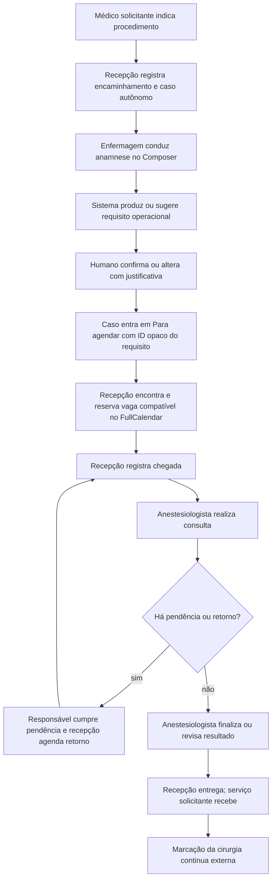
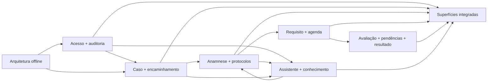

# Antessala — mapa semântico integrado

## Natureza e autoridade

Este arquivo é um hub de integração. Ele conecta os oito Analysts canônicos, mas não
redeclara campos, estados internos, regras clínicas, matrizes ou critérios completos. A
autoridade de uma regra pertence ao Analyst do domínio que a define.

Fontes superiores e complementares:

1. [PRD aprovado](PRD.md) — problema, promessa e leis globais;
2. [índice dos Analysts](ANALYST.md) — localização e contrato de leitura;
3. [Analysts de domínio](domains/) — verdade semântica detalhada;
4. este arquivo — fluxo e dependências entre domínios.

## Problema e goal

Pacientes com necessidades diferentes recebem tratamento semelhante no agendamento da
consulta pré-anestésica. O Antessala organiza o encaminhamento, a entrevista de enfermagem,
a necessidade operacional de agenda, a reserva compatível, a avaliação anestésica, as
pendências e a devolução do resultado — sem assumir a marcação da cirurgia.

## Leis globais

- Cada encaminhamento abre um caso autônomo.
- Não existe paciente longitudinal, `patientId`, deduplicação de pessoa ou evolução entre
  casos.
- A triagem geral do SUS acontece antes e está fora do produto.
- O app não atribui ASA, não declara aptidão anestésica e não substitui decisão médica.
- Gravidade clínica, urgência, prioridade cirúrgica e duração necessária da consulta são
  eixos diferentes.
- Nenhuma doença ou medicação isolada cria urgência automática.
- Ausência de resposta nunca significa resposta negativa.
- Necessidade operacional sugerida é confirmada ou alterada por humano com justificativa.
- Compatibilidade de agenda usa um requisito operacional versionado, nunca um ID de paciente.
- O primeiro boot e o fluxo-base são offline.
- IA é assistiva, isolada em `/assistente` e dispensável para o fluxo.

## Forma da demonstração

Uma única conta sintética oferece todas as ferramentas na sidebar. Isso é uma decisão de
demonstração, não um retrato de autenticação hospitalar. `RECEPCAO`, `ENFERMAGEM`,
`ANESTESIOLOGISTA`, `SOLICITANTE` e `ADMIN` permanecem responsabilidades distintas:
determinam projeção, comando, autoria, escopo e auditoria de cada ação.

O dropdown da conta oferece Configurações, Claro/Escuro/Sistema, Amostra de uso e Sair.
Não há seletor de papel nem necessidade de logout/login para percorrer o caso.

## Fluxo ponta a ponta

## Mapa de domínios

| Domínio | Produz | Consumidores imediatos |
|---|---|---|
| [Acesso e auditoria](domains/ANALYST-acesso-e-auditoria.md) | sessão integrada, responsabilidade da ação, escopo e recibo | todos |
| [Caso e encaminhamento](domains/ANALYST-caso-e-encaminhamento.md) | caso, snapshots, status e handoffs | anamnese, agenda, avaliação, superfícies |
| [Anamnese e catálogos](domains/ANALYST-anamnese-e-catalogos.md) | revisão estruturada, respostas semânticas e protocolo aplicado | classificação, avaliação, Assistente |
| [Classificação e agenda](domains/ANALYST-classificacao-e-agenda.md) | requisito operacional, compatibilidade, slots e booking | recepção, avaliação, superfícies |
| [Avaliação, pendências e handoff](domains/ANALYST-avaliacao-pendencias-e-handoff.md) | encontro, pendência, retorno, resultado e entrega | solicitante, PDF, superfícies |
| [Superfícies e configurações](domains/ANALYST-superficies-e-configuracoes.md) | trabalhos visíveis, navegação e estados de interação | renderer e prova E2E |
| [Arquitetura offline e prova](domains/ANALYST-arquitetura-offline-e-prova.md) | fronteiras de confiança, boot, persistência e rede | todos os Builds |
| [IA, memória e conhecimento](domains/ANALYST-ia-memoria-e-conhecimento.md) | propostas rascunho, proveniência e relações aprovadas | anamnese e avaliação humana |

## Fronteiras críticas

### Caso e anamnese

O caso fornece snapshots de pessoa, encaminhamento, procedimento e solicitante. O Composer
não cria cadastro de paciente e não lê atendimento anterior. Protocolos salvos guardam
estrutura, ordem e configuração de widgets; nunca respostas ou identidade.

### Anamnese e requisito operacional

A revisão final fornece somente dados confirmados ou estados semânticos explícitos. O domínio
de classificação calcula uma proposta; a confirmação/alteração humana publica o requisito
versionado. Nenhuma proposta de IA `DRAFT` participa do cálculo.

### Requisito e agenda

O que informalmente foi chamado de “tipo de paciente ID” é
`schedulingRequirementId + version`. Ele aponta para classe de slot, duração e recursos
necessários daquele caso. A UI transporta IDs opacos; o backend decide compatibilidade. Não
existe `patientId`.

### Agenda DietFlow e Agenda Antessala

A experiência visual e de interação do DietFlow é doadora: FullCalendar v6, mês/semana/dia,
programação acessível, toolbar/dropdowns, busca/filtros, drawer, DnD/resize e preferências.
O domínio Antessala substitui as entidades e regras: caso autônomo, requisito, slot, booking,
capacidade e bloqueio. Atendimento nutricional, plano, tarefas, WhatsApp, financeiro,
recorrência longitudinal e paciente cadastrado não atravessam.

### Anamnese DietFlow e Anamnese Antessala

O Composer doador define a qualidade de uso: editor único, cards empilhados, drag-and-drop,
collapse, delete/undo, drawer multi-select e importação de favoritos/templates. O Antessala
usa seus 14 widgets pré-anestésicos e seus contratos. Os oito widgets nutricionais do
DietFlow são referência técnica/visual, não conteúdo clínico suficiente.

### IA e fluxo principal

`/assistente` é uma rota independente. Ela pode receber contexto autorizado, transcript
sintético digitado e conhecimento aprovado; devolve propostas com origem e explicação.
Aceitar/corrigir produz uma operação normal no draft. Não há painel lateral global, toggle
no header nem IA dentro de card/widget. Sem Gemini, todo o fluxo manual continua.

### Resultado e serviço solicitante

O resultado pertence ao caso e às revisões do domínio de avaliação. A entrega respeita o
escopo do serviço solicitante. Depois dela, a marcação da cirurgia permanece externa.

## Dependências para implementação

As setas indicam consumo; não autorizam um domínio a redefinir o contrato do outro.

## Definition of Done integrada

A implementação só poderá ser chamada completa quando provar, em uma sessão integrada:

- caso sintético inteiro da recepção à entrega;
- responsabilidades, projeções e auditoria corretas em cada ação;
- Composer com 14 widgets, DnD, drawer e protocolo salvo;
- ausência de resposta distinta de negativa;
- requisito explicável e confirmação/override humano;
- FullCalendar com fila, dropdowns, quatro visões, drawer, compatibilidade, DnD/resize
  validados e caminho acessível equivalente;
- conflitos e falta de capacidade tratados sem corromper estado;
- avaliação, pendência, retorno, resultado e recebimento;
- dropdown do usuário, três temas e amostra sintética;
- boot/fluxo-base sem rede;
- um uso real e isolado de Gemini e uma recuperação de conhecimento, ambos assistivos;
- nenhuma identidade longitudinal, evolução, decisão clínica automática ou IA global.

Os critérios detalhados continuam nos oito Analysts; esta lista não os substitui.

## Estado e próximo passo

- PRD: aprovado.
- Oito Analysts: canônicos; sem gates individuais.
- Esta síntese: hub reconciliado, aguardando review final de congruência junto aos Builds.
- Warlog: não existe e não deve ser escrito por quem fez esta reconciliação.
- Próximo passo: reviewer independente lê PRD + 16 contratos + hubs e aponta somente
  incongruências capazes de quebrar o produto ou impedir decomposição.
