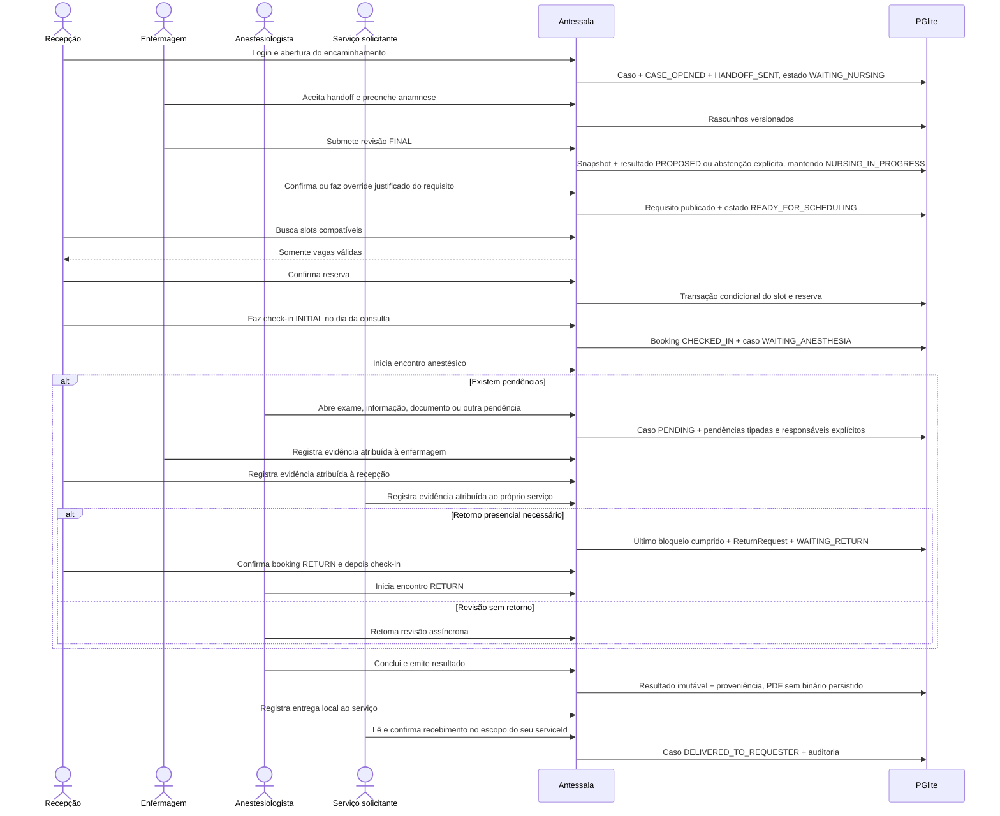
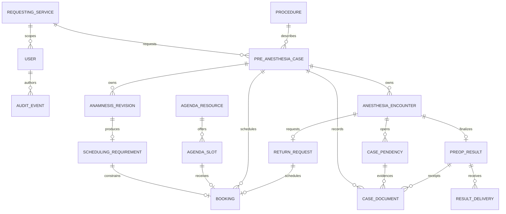
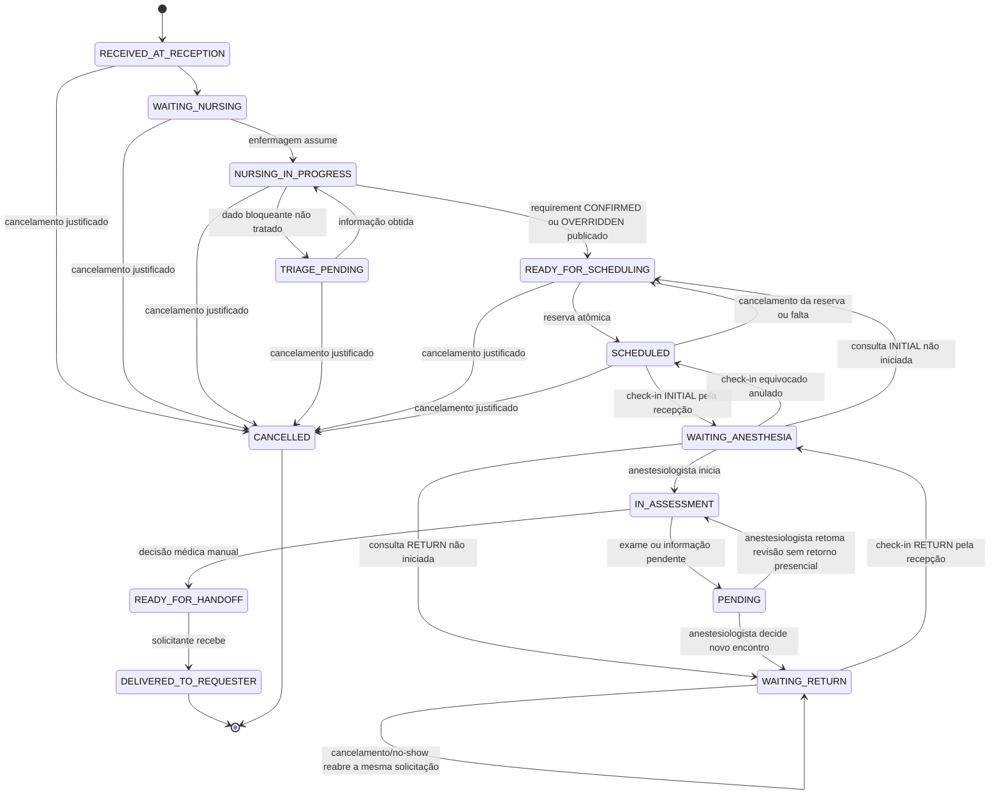
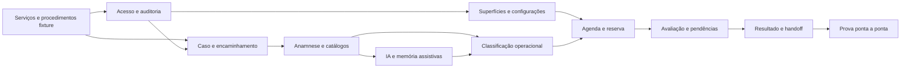

# Analyst: Antessala ponta a ponta

## State

- Source: `hack/PRD.md` v5, decisões diretas de Marco e recon do código
- Route: `analyst_prd`
- Phase budget: `forensic`
- Confidence: `medium` para leis do produto; `low` para domínios sem pesquisa/recon/adversarial
- Created: `2026-08-14`
- Mode: `hybrid`
- Verdict: `INVALIDATED_BY_CHANGE`; IA/memória entrou no MVP e os reviews ainda estão pendentes

Documento invalidado não é fonte normativa para Analyst, Build, Spec, Plan ou código.
Decisão reaproveitada precisa ser reintroduzida, classificada e justificada no artefato dono.

## TL;DR

O MVP é um aplicativo Electron local que acompanha um caso pré-anestésico do
encaminhamento ao recebimento do resultado pelo serviço solicitante. Cinco funções entram
com contas locais: recepção, enfermagem, anestesiologista, solicitante e administrador. O
produto separa dado clínico, requisito operacional de agenda, reserva e decisão médica.
IA pode propor preenchimento e recuperar conhecimento aprovado, sempre como rascunho
auditável que depende de confirmação humana. Este documento está em reconciliação; não
afirma reproduzir o fluxo ou protocolo institucional do HC.

## Phase 0 Grill

| Signal | Verdict | Notes |
|---|---|---|
| Action clear | PASS | Receber encaminhamento, triar, reservar vaga compatível, avaliar e entregar resultado. |
| Persona clear | PASS | Cinco usuários diretos e dois atores externos estão definidos. |
| Input/output clear | PASS | Encaminhamento entra; caso, triagem, reserva, avaliação e resultado são persistidos. |
| Scope clear | PASS | Protótipo local com dados sintéticos; prontuário, cirurgia e integração institucional ficam fora. |
| Objective criteria clear | PASS | Cada etapa possui estado, papel responsável, DTO, permissão, persistência e prova futura. |

## Source And Scope

- Input source: PRD v5 e decisão de Marco de tratar o fluxo descrito como lei do
  hackathon.
- In scope: login local, casos, encaminhamentos, triagem, classificação operacional,
  agenda, avaliação, pendências, retornos, handoff, cadastros mínimos, auditoria e prova.
- Out of scope: triagem geral do SUS, prontuário longitudinal, agenda cirúrgica,
  prescrição, decisão automática de aptidão, dados reais e integrações do hospital.
- Assumption bounded: regras, contas e catálogos específicos da demonstração são fixtures
  sintéticas. Uma versão financiada substituirá a persistência e validará o protocolo com o
  hospital.

## Product Promise

A recepção abre um caso sem interpretar clínica. A enfermagem conduz uma anamnese
estruturada e produz um requisito explicável de agenda. A recepção reserva somente uma vaga
compatível. O anestesiologista registra conclusão ou pendências. O serviço solicitante
recebe e confirma o resultado. Em qualquer momento, o aplicativo mostra quem deve agir,
o que falta e o que já ocorreu.

## Story de Usuario

- Como recepcionista, quero abrir o caso pelo encaminhamento e enxergar apenas a
  consequência operacional da triagem.
- Como enfermeiro, quero registrar respostas sem confundir silêncio, desconhecimento,
  negativa e recusa.
- Como recepcionista, quero escolher entre vagas compatíveis e receber conflito claro se
  outra reserva ocupar a vaga.
- Como anestesiologista, quero ler a origem de cada dado, registrar pendências e concluir
  manualmente a avaliação.
- Como solicitante, quero receber o resultado final e acusar seu recebimento.
- Como administrador, quero preparar contas, serviços, procedimentos e capacidade da
  demonstração sem depender de serviço externo.
- Como profissional autorizado, quero revisar sugestões de IA com origem e decidir o que
  aceito, rejeito ou corrijo sem transformar um caso em regra global.

## Story Tecnica

- Como sistema, devo tratar `CasoPreAnestesico` como agregado raiz e guardar a pessoa como
  snapshot dentro dele, sem tabela longitudinal de pacientes.
- Como sistema, devo autenticar localmente e validar a função no processo principal antes
  de cada leitura ou escrita protegida.
- Como sistema, devo persistir a anamnese versionada, a regra aplicada, o requisito
  operacional, a reserva, a avaliação e os eventos de auditoria.
- Como sistema, devo efetivar uma reserva por transação condicional e chave de
  idempotência.
- Como sistema, devo funcionar no primeiro boot sem rede; uma ação opcional de IA pode usar
  rede com informação clara e falhar sem bloquear caso, agenda ou handoff.

## Current Terrain

O repositório entrega uma casca Electron, PGlite, TIPC, tema, chat cloud, oito widgets
nutricionais, catálogos clínicos locais e exportação PDF. Somente Início, Assistente IA e
Configurações estão roteados. O backend de knowledge está IPC-callable embora sua página
esteja fora das rotas; gravação está dormente e STT está incompleto. Não existem login,
RBAC, telas clínicas, agenda ou entidades canônicas do novo fluxo. O inventário comprovado
vive em [`.context/architecture.yaml`](../.context/architecture.yaml).

`registros`, prioridade e `registro_jornada` estão declarados como legado da hipótese
anterior. O Build deve migrar ou substituir essa superfície; nenhum estado antigo vira lei
do produto. O registry, o composer, o seed offline, os helpers de banco e o PDF são bases
reutilizáveis.

### Dossiês canônicos por domínio

| Domínio | Analyst | Build subsequente |
|---|---|---|
| Caso e encaminhamento | [ANALYST-caso-e-encaminhamento](domains/ANALYST-caso-e-encaminhamento.md) | [BUILD-caso-e-encaminhamento](domains/BUILD-caso-e-encaminhamento.md) |
| Acesso e auditoria | [ANALYST-acesso-e-auditoria](domains/ANALYST-acesso-e-auditoria.md) | [BUILD-acesso-e-auditoria](domains/BUILD-acesso-e-auditoria.md) |
| Anamnese e catálogos | [ANALYST-anamnese-e-catalogos](domains/ANALYST-anamnese-e-catalogos.md) | [BUILD-anamnese-e-catalogos](domains/BUILD-anamnese-e-catalogos.md) |
| Classificação e agenda | [ANALYST-classificacao-e-agenda](domains/ANALYST-classificacao-e-agenda.md) | [BUILD-classificacao-e-agenda](domains/BUILD-classificacao-e-agenda.md) |
| Avaliação, pendências e handoff | [ANALYST-avaliacao-pendencias-e-handoff](domains/ANALYST-avaliacao-pendencias-e-handoff.md) | [BUILD-avaliacao-pendencias-e-handoff](domains/BUILD-avaliacao-pendencias-e-handoff.md) |
| Superfícies e configurações | [ANALYST-superficies-e-configuracoes](domains/ANALYST-superficies-e-configuracoes.md) | [BUILD-superficies-e-configuracoes](domains/BUILD-superficies-e-configuracoes.md) |
| Arquitetura offline e prova | [ANALYST-arquitetura-offline-e-prova](domains/ANALYST-arquitetura-offline-e-prova.md) | [BUILD-arquitetura-offline-e-prova](domains/BUILD-arquitetura-offline-e-prova.md) |
| IA, memória e conhecimento | [ANALYST-ia-memoria-e-conhecimento](domains/ANALYST-ia-memoria-e-conhecimento.md) | [BUILD-ia-memoria-e-conhecimento](domains/BUILD-ia-memoria-e-conhecimento.md) |

## Evidence Matrix

| Path | Lines | Fact | Confidence |
|---|---:|---|---|
| `hack/PRD.md` | 35-70 | O fluxo canônico atravessa recepção, enfermagem, agenda, anestesiologista e solicitante. | high |
| `src/renderer/src/App.tsx` | 13-56 | Há somente três rotas ativas e nenhuma tela clínica. | high |
| `src/renderer/src/componentes/AppSidebar.tsx` | 28-38 | Menu atual expõe Início, IA e Configurações; tema tem três modos. | high |
| `src/renderer/src/paginas/ConfiguracoesPagina.tsx` | 40-225 | Configurações atuais tratam somente provider, token e modelo de IA cloud. | high |
| `src/renderer/src/paginas/Dashboard.tsx` | 13-50 | A home é um esqueleto que aguarda o Analyst. | high |
| `src/main/db/pglite.ts` | 8-48 | PGlite local é a persistência atual. | high |
| `src/main/db/schema.ts` | 9-24 | Configuração existente cobre core e IA, não operação clínica. | high |
| `src/main/db/clinical-schema.ts` | 3-52 | Registro e jornada atuais são legado provisório. | high |
| `src/main/db/clinical-schema.ts` | 54-125 | Catálogos CID, medicamentos, classes, grupos, MET e comorbidades já existem. | high |
| `src/main/db/seed.ts` | 63-150 | Catálogos são verificados por hash e carregados sem rede. | high |
| `src/main/tipc.ts` | 265-335 | Handlers clínicos atuais não possuem contexto de sessão nem RBAC. | high |
| `src/main/tipc.ts` | 338-370 | Somente CID e medicamentos têm busca exposta. | high |
| `src/shared/anamnese/types.ts` | 25-106 | Há contrato headless e envelope JSON versionado reutilizáveis. | high |
| `src/shared/anamnese/registry.ts` | 20-40 | O registry contém oito widgets herdados do DietFlow. | high |
| `src/shared/anamnese/templates.ts` | 5-27 | O catálogo ativo está vazio; o template de oito widgets é legado. | high |
| `src/shared/clinical/risco.ts` | 1-7 | O classificador atual está em quarentena e não é contrato do produto. | high |
| `src/main/export/pdf.ts` | 38-91 | O app já exporta HTML para PDF em sessão isolada e sem rede. | high |
| `tests/e2e/app-flow.spec.ts` | 4-80 | O único E2E prova apenas casca, IA e tema. | high |
| `tests/main/db/clinical-seed.spec.ts` | 37-79 | O seed local possui contagens verificadas e é idempotente. | high |
| `DietFlow:prisma/schema.prisma` | 1101-1145 | O modelo Content liga registros a pacientes; esse vínculo deve ser rejeitado. | high |
| `DietFlow:src/components/composer-universal/ComposerUniversal.tsx` | 31-197 | Palette, factory, renderer e reorder podem inspirar a composição. | high |
| `DietFlow:src/lib/actions/atendimento-workflow-actions.ts` | 459-502 | Transação, lock e reconsulta de conflito são padrões úteis para reserva. | high |

## Implementation Map

| Area | Path | Role | Decision |
|---|---|---|---|
| Context / entry | `hack/PRD.md` | Promessa, atores e fronteira | preserve |
| Context / identity | `src/shared/app-identity.ts` | Nome e identidade do app | reuse |
| Backend / database | `src/main/db/pglite.ts` | Banco embarcado | reuse |
| Backend / schema | `src/main/db/schema.ts` | Bootstrap DDL | adapt to versioned migrations |
| Backend / legacy clinical | `src/main/db/clinical-schema.ts` | Hipótese antiga | replace and migrate explicitly |
| Backend / queries | `src/main/db/query.ts` | Query e transação | reuse with serialized writes |
| Backend / transport | `src/main/tipc.ts` | IPC tipado | split by domain and guard |
| Backend / seed | `src/main/db/seed.ts` | Fixtures e catálogos offline | expand |
| Backend / export | `src/main/export/pdf.ts` | PDF local | reuse |
| Shared / anamnese | `src/shared/anamnese/*` | Widget contract and serialization | adapt to v3 |
| Shared / clinical legacy | `src/shared/clinical/*` | Classificador e parecer antigos | quarantine; no consumer |
| Shared / DTOs | `src/shared/*` | Contratos renderer/main | add domain modules |
| Renderer / routing | `src/renderer/src/App.tsx` | Rotas e casca | replace with authenticated routes |
| Renderer / navigation | `src/renderer/src/componentes/AppSidebar.tsx` | Menu e tema | adapt by role |
| Renderer / composer | `src/renderer/src/anamnese/*` | Formulário em blocos | reuse shell, replace content |
| Renderer / settings | `src/renderer/src/paginas/ConfiguracoesPagina.tsx` | IA cloud herdada | hide from MVP clinical |
| Tests / contract | `tests/shared/anamnese/*` | Schemas e serialization | replace/expand |
| Tests / main | `tests/main/*` | DB, IPC, seed, export | expand by domain |
| Tests / renderer | `tests/renderer/*` | Component states and RBAC | add role surfaces |
| Tests / E2E | `tests/e2e/app-flow.spec.ts` | Shell proof | replace with full synthetic journey |

## Entities And State

### Aggregate roots

```text
ENTITY: Usuario
- Attributes: id, emailNormalized, passwordHash, role, requestingServiceId nullable,
  origin, credentialVersion, version, active, createdAt, updatedAt
- Actions: criar, autenticar, trocar função, redefinir senha, ativar, desativar
- Relations: autor de eventos e operações
- Source of truth: PGlite local
- Runtime states: ACTIVE, INACTIVE
- Invalid states: e-mail duplicado; senha em texto; ausência de função; último ADMIN inativo
  ou rebaixado; conta `FIXTURE` alterada pela administração

ENTITY: CasoPreAnestesico
- Attributes: id, personSnapshot, referralSnapshot, procedureSnapshot,
  requestingServiceId, requestingServiceSnapshot, status, version
- Actions: abrir, corrigir por evento, iniciar triagem, reservar, avaliar, entregar, cancelar
- Relations: 1 anamnese ativa; N revisões; N reservas; N avaliações; N eventos
- Source of truth: PGlite local
- Runtime states: RECEIVED_AT_RECEPTION, WAITING_NURSING, NURSING_IN_PROGRESS,
  TRIAGE_PENDING, READY_FOR_SCHEDULING, SCHEDULED, WAITING_ANESTHESIA,
  IN_ASSESSMENT, PENDING, WAITING_RETURN, READY_FOR_HANDOFF,
  DELIVERED_TO_REQUESTER, CANCELLED
- Invalid states: patientId; deduplicação por pessoa; escopo por nome de serviço; reserva sem
  requisito; entrega sem resultado; responsabilidade persistida divergente do lifecycle

ENTITY: Anamnese
- Attributes: id, caseId, templateVersion, contentVersion, contentJson, status, revision
- Actions: iniciar, salvar rascunho, encerrar captura, corrigir por adendo/revisão sucessora
- Relations: pertence a um caso; subsidia proposta operacional e avaliação médica
- Source of truth: JSONB validado
- Runtime states: DRAFT; CAPTURE_COMPLETE; revisões imutáveis podem ser EFFECTIVE,
  SUPERSEDED ou INVALIDATED
- Invalid states: ausência transformada em negativa; revisão sobrescrita; revisão
  superseded alimentando nova decisão; captura completa confundida com suficiência clínica

ENTITY: RequisitoAgenda
- Attributes: id, caseId, anamnesisRevisionId, slotClass, durationMinutes,
  bufferMinutes, desiredBy, requiredResourceKinds, requiredCapabilities, reasons,
  ruleSetVersion, status, override nullable
- Actions: propor, confirmar, alterar com motivo e substituir decisão operacional sem apagar histórico
- Relations: deriva de uma revisão da anamnese; filtra slots
- Source of truth: snapshot persistido da saída da regra
- Runtime states: PROPOSED, CONFIRMED, OVERRIDDEN, SUPERSEDED; `INCOMPLETE`,
  `HUMAN_DEFINITION_REQUIRED` e `OUT_OF_DEMO_RANGE` são resultados prévios à publicação
- Invalid states: CONFIRMED com pendência bloqueante; saída sem regras explicativas

ENTITY: AgendaSlot
- Attributes: id, templateId, startsAt, consultationEndsAt, endsAt, slotClass,
  resourceIds, status, version
- Actions: criar, bloquear, desbloquear, reservar, liberar
- Relations: zero ou uma reserva ativa
- Source of truth: PGlite local
- Runtime states: AVAILABLE, BOOKED, BLOCKED, EXPIRED
- Invalid states: duas reservas ativas; duração incompatível; intervalo inválido

ENTITY: Reserva
- Attributes: id, caseId, slotId, kind, requirementId nullable, returnRequestId nullable,
  status, idempotencyKey, createdBy, timestamps
- Actions: reservar, cancelar, fazer check-in, marcar falta, concluir ao iniciar encontro
- Relations: pertence a caso e slot
- Source of truth: PGlite local
- Runtime states: CONFIRMED, CHECKED_IN, CANCELLED, COMPLETED, NO_SHOW
- Invalid states: reserva de slot indisponível; caso incompatível; idempotência divergente

ENTITY: EncontroAnestesico
- Attributes: id, caseId, sequence, encounterType, responsibleActor, status,
  assessmentContentV1, version, timestamps
- Actions: iniciar a partir de booking CHECKED_IN, salvar rascunho, aguardar pendência,
  retomar revisão e finalizar resultado
- Relations: N pendências, N ciclos de retorno e N versões de resultado; uma única versão
  corrente por contexto avaliado
- Source of truth: PGlite local
- Runtime states: IN_PROGRESS, WAITING_PENDING, COMPLETED
- Invalid states: conclusão sem autor; edição de versão entregue; aptidão automática

ENTITY: Pendencia
- Attributes: id, encounterId, reviewCycle, kind, ownerRole, targetServiceId nullable,
  impact, targetDate nullable, targetDateBasis nullable, requestContent, evidenceContent nullable,
  status, version, timestamps
- Actions: solicitar, submeter evidência, revisar suficiência, aceitar, reabrir, cancelar ou
  superseder
- Relations: pertence ao encontro; somente impacto `BLOCKS_CURRENT_RESULT` impede emissão;
  evidência submetida exige decisão clínica antes de resolver; tipo não determina retorno
- Source of truth: PGlite local
- Runtime states: REQUESTED, EVIDENCE_SUBMITTED, UNDER_CLINICAL_REVIEW,
  RESOLVED_ACCEPTED, INSUFFICIENT_REOPENED, CANCELLED, SUPERSEDED
- Invalid states: resultado emitido com bloqueio atual não resolvido; submissão tratada como
  suficiência; prazo sem fundamento

ENTITY: CaseDocument
- Attributes: id, caseId, pendencyId nullable, resultId nullable, kind, title, mimeType,
  sizeBytes, contentHash, metadataJson, createdBy, createdAt
- Actions: registrar metadados imutáveis; referenciar em cumprimento; registrar recibo de PDF
- Relations: pertence a um caso e, quando informado, à pendência ou resultado do mesmo caso
- Source of truth: recibo local com declaração explícita sobre retenção e acesso ao conteúdo
- Runtime states: conteúdo acessível ou `CONTENT_NOT_RETAINED`; revisão e suficiência são
  decisões separadas
- Invalid states: vínculo entre casos; metadata/hash chamados de autenticidade, assinatura ou
  conteúdo revisado sem acesso à fonte

ENTITY: ReturnRequest
- Attributes: id, caseId, sourceEncounterId, reviewCycle, triggerPendencyIds,
  necessidade operacional definida ou confirmada pelo anestesiologista, status, version,
  timestamps
- Actions: anestesiologista decide após revisão; recepção reserva; check-in inicia novo ciclo
- Relations: pertence ao caso e encontro de origem; zero ou uma reserva RETURN ativa
- Source of truth: PGlite local
- Runtime states: READY_FOR_BOOKING, BOOKED, CHECKED_IN, CONSUMED
- Invalid states: retorno automático por cumprimento; herança silenciosa do requisito inicial;
  reserva INITIAL; consumo sem booking CHECKED_IN
- Demo rule: duração, data-alvo e recursos são definidos ou confirmados pelo
  anestesiologista; qualquer fallback numérico permanece `DEMO_DECISION`

ENTITY: Resultado
- Attributes: id, caseId, encounterId, status, content, finalizedBy, finalizedAt,
  contentHash
- Actions: finalizar versão, corrigir, aditar, superseder, ler projeção autorizada, exportar
- Relations: pertence ao caso e encontro; N entregas
- Source of truth: snapshot imutável
- Runtime states: DRAFT_IN_ENCOUNTER, FINALIZED, CORRECTED, ADDENDED, SUPERSEDED,
  VOIDED_WITH_REASON
- Invalid states: overwrite/delete de versão finalizada; correção sem autor, motivo ou vínculo;
  entrega sem autorização

`finalizedBy`, `finalizedAt` e `contentHash` comprovam proveniência e integridade local. Não
constituem assinatura digital, certificado profissional ou assinatura jurídica.

ENTITY: EntregaResultado
- Attributes: id, caseId, resultId, recipientSnapshot, channel, status, sentBy,
  sentAt, receivedBy, receivedAt, resultHash, version
- Actions: enviar e confirmar recebimento
- Relations: pertence à versão FINAL do resultado e ao solicitante snapshot
- Source of truth: PGlite local
- Runtime states: READY_FOR_HANDOFF, MADE_AVAILABLE_LOCALLY, SENT, DELIVERY_FAILED,
  ACKNOWLEDGED, SUPERSEDED
- Invalid states: destinatário diferente do caso; `SENT` sem tentativa real; acknowledgement de
  outra versão ou serviço; estado local apresentado como entrega externa

ENTITY: EventoAuditoria
- Attributes: id, actorId, actorRole, action, entityType, entityId, occurredAt, reason, metadata
- Actions: anexar
- Relations: referencia uma operação sensível
- Source of truth: ledger append-only
- Runtime states: immutable
- Invalid states: update, delete ou evento sem ator em operação protegida
```

### Cadastros e fontes de verdade

| Objeto | Classe | Autoria no MVP | Persistência |
|---|---|---|---|
| Usuários | cadastro editável | ADMIN | PGlite |
| Serviços solicitantes | fixture versionada read-only | código/seed | asset + PGlite |
| Procedimentos | fixture versionada read-only | código/seed | asset + PGlite |
| Recursos de agenda | cadastro editável | ADMIN | PGlite |
| Classes/templates de slot | fixture versionada read-only | código/seed | asset + PGlite |
| Slots | projeção materializada de janelas + templates | sistema | PGlite |
| Widgets/templates | configuração clínica versionada | código/fixture; read-only na UI | asset + versão persistida |
| Regras de classificação | regra versionada | código/fixture; read-only na UI | asset + snapshot de execução |
| CID e medicamentos | catálogo read-only | seed versionado | asset + PGlite |
| MET e comorbidades | catálogo read-only | seed versionado | asset + PGlite |
| Exames/documentos solicitados | texto livre estruturado no caso; sem catálogo no MVP | anestesiologista | JSONB validado na pendência |
| Evidências documentais | recibo imutável, sem armazenamento do arquivo | owner da pendência ou export interno | metadados + SHA-256 no PGlite |
| Casos, reservas e avaliações | registro transacional | papéis do fluxo | PGlite |

### Responsabilidade ponta a ponta

Responsabilidade é derivada; não existe `currentOwnerRole` livre no caso. A matriz detalhada
e os comandos vivem no [Analyst de caso](domains/ANALYST-caso-e-encaminhamento.md#atores-e-ownership).

| Estado | Quem age agora |
|---|---|
| `RECEIVED_AT_RECEPTION` | recepção conclui a abertura e o envio do handoff |
| `WAITING_NURSING` | enfermagem aceita o handoff e inicia a triagem |
| `NURSING_IN_PROGRESS`, `TRIAGE_PENDING` | enfermagem |
| `READY_FOR_SCHEDULING`, `SCHEDULED` | recepção |
| `WAITING_ANESTHESIA` | recepção para anulação/interrupção operacional; anestesiologista para iniciar ou registrar impossibilidade de início |
| `IN_ASSESSMENT` | anestesiologista |
| `PENDING` | papéis responsáveis pelas pendências abertas; sem retorno presencial, anestesiologista retoma a revisão |
| `WAITING_RETURN` | recepção até check-in |
| `READY_FOR_HANDOFF` sem entrega `SENT` | recepção registra o envio ao serviço solicitante |
| `READY_FOR_HANDOFF` com entrega `SENT` | serviço solicitante confirma recebimento |
| `DELIVERED_TO_REQUESTER`, `CANCELLED` | terminal, sem dono atual |

## Runtime / Data Flow

### Jornada por ator



### Relações persistidas



### Estado do caso



## Rules And Invariants

### Identidade e acesso

- MUST: cada conta possui um e-mail normalizado único, uma função e um estado.
- MUST: o processo principal resolve o usuário pela sessão; o renderer nunca informa
  `actorId` confiável.
- MUST: senha nunca é persistida em claro nem atravessa DTO, log ou auditoria; a escolha e
  prova do verificador pertencem ao Build.
- MUST: o seed reconcilia uma conta sintética `FIXTURE` ativa por função; a administração
  gerencia somente contas `origin=ADMIN`.
- MUST NOT: alterar por UI/IPC uma conta `FIXTURE` nem desativar ou trocar a função do último
  ADMIN ativo.
- MUST NOT: paciente ou médico solicitante autenticar no MVP.
- IF a conta estiver inativa, THEN login e toda sessão anterior falham.
- MUST: revogação de conta, credencial, papel ou serviço impede commit e resposta protegida
  ainda em voo sob a autoridade anterior.
- MUST: qualquer concorrência administrativa preserva ao menos um `ADMIN` ativo.
- MUST: lista, busca, contagem, paginação, detalhe, erro e identificador restrito não revelam
  existência ou cardinalidade de outro serviço.
- MUST: auditoria administrativa usa allowlist por ação e motivo categórico; não recebe
  texto, field path, hash correlacionável ou conteúdo clínico.
- MUST: append-only vale nas operações normais do aplicativo, não contra acesso direto ao
  diretório local do PGlite.
- IF uma função tentar comando proibido, THEN o handler retorna `FORBIDDEN` e registra a
  tentativa sem incluir dado clínico no log.

### Caso e autoria

- MUST: um encaminhamento abre um novo caso e recebe `caseId` e `referralId` locais próprios.
- MUST: nome repetido não dispara busca, deduplicação ou vínculo longitudinal.
- MUST: pessoa, procedimento e solicitante são snapshots do momento do caso.
- MUST: correção após handoff cria evento e nova versão; nunca apaga autoria anterior.
- MUST NOT: existir `patientId` ou comparação automática com outro caso.
- MUST: `sourceReference` é proveniência, não identidade. Coincidência gera alerta
  não bloqueante; a recepção pode reconhecer o caso existente ou confirmar um novo
  encaminhamento, que sempre recebe caso próprio.
- MUST: toda correção declara os consumidores obsoletos e qual revisão do contexto passa a
  ser corrente; handoff pendente antigo não pode ser aceito silenciosamente.
- MUST: `correctIntake` e `submitFinal` têm vencedor único. Correção vencedora torna a
  submissão obsoleta; submissão vencedora recusa a correção concorrente sem efeito parcial.

### Anamnese

- MUST: `ANSWERED` preservar valor explicitamente obtido, inclusive `false`; `UNKNOWN`,
  `REFUSED`, `NOT_ASKED`, `NOT_APPLICABLE` e `NOT_PERFORMED` explicam ausência de valor.
- MUST: cada resposta registrar informante/fonte, coletor, categoria, horário e método,
  documento, catálogo ou IA quando aplicável.
- MUST: separar `CAPTURE_COMPLETE`, `INFORMATION_RESOLVED`,
  `OPERATIONAL_REQUIREMENT_CONFIRMED` e `MEDICAL_EVALUATION_COMPLETE`.
- MUST: revisão FINAL ser imutável, mas corrigível por adendo ou sucessora vinculada, com
  autoria, motivo e impacto controlado nos derivados.
- MUST NOT: array vazio, silêncio ou default representar resposta negativa.
- MUST NOT: MET de atividade virar capacidade individual; enfermagem/software concluir
  “controle”, aplicabilidade de gravidez, risco, ASA, aptidão ou conduta.
- IF um campo obrigatório estiver `NOT_ASKED`, THEN `CAPTURE_COMPLETE` é recusado.
- IF houver `UNKNOWN`, `REFUSED` ou `NOT_PERFORMED`, THEN a tentativa pode encerrar conforme
  regra local, mas a informação permanece não resolvida e não gera publicação automática.

### Classificação operacional

- MUST: a saída contém tipo de slot, janela desejada, recursos, regra aplicada, fatos
  encontrados e versão do conjunto de regras.
- MUST: gravidade, urgência, prioridade cirúrgica, carga operacional e relação entre
  data-alvo e capacidade permanecem eixos independentes.
- MUST: a UI chama a saída de requisito de agenda, nunca ASA, risco anestésico ou aptidão.
- MUST: regra e override são persistidos como snapshot explicável.
- MUST NOT: gerar recomendação de suspensão medicamentosa ou decisão médica.
- MUST NOT: atribuir minutos universais a `UNKNOWN`, `REFUSED` ou documento pendente.
- MUST: combinação fora do alcance da demo exige definição humana; nenhum cap descarta
  sinal ou força o caso a caber em cinquenta minutos.
- IF a enfermagem sobrescrever a saída, THEN informa valor anterior, novo valor e motivo.
- MUST NOT: alterar silenciosamente uma decisão publicada; nova decisão operacional
  supersede a anterior, preserva histórico e força revalidação de reserva existente.
- UNRESOLVED: correção do conteúdo FINAL da anamnese pertence ao Analyst dono.

### Agenda e concorrência

- MUST: um slot possui início, fim, recurso, tipo e estado.
- MUST: a busca retorna apenas slots disponíveis, ativos e compatíveis.
- MUST: janelas de disponibilidade ficam na mesma data local, de segunda a sexta; “dia
  útil” na demo ignora feriados.
- MUST: recurso `ANESTHESIA_PROFESSIONAL` representa capacidade de pool e não aponta para
  usuário; o encontro carimba o anestesiologista real no start.
- MUST: reserva usa transação, atualização condicional e chave de idempotência.
- MUST: cancelamento libera o slot e preserva a reserva cancelada.
- MUST NOT: calendário visual ser a fonte de verdade.
- IF duas reservas disputarem o mesmo slot, THEN uma vence e a outra recebe conflito
  recuperável com atualização da lista.
- IF o paciente faltar em booking `INITIAL`, THEN a reserva vira `NO_SHOW` e o caso retorna
  a `READY_FOR_SCHEDULING`; IF for `RETURN`, THEN o caso permanece `WAITING_RETURN` e a
  mesma solicitação volta a `READY_FOR_BOOKING`.
- MUST: check-in equivocado pode ser anulado antes do encontro; presença sem início ou
  impossibilidade de iniciar registra interrupção e devolve INITIAL ao agendamento ou
  reabre RETURN. Cancelamento terminal posterior exige fato e motivo distintos.

### Avaliação e handoff

- MUST: somente `ANESTESIOLOGISTA` inicia, altera ou conclui avaliação.
- MUST: conclusão é decisão humana registrada, nunca derivada da triagem.
- MUST: pendência declara objetivo, impacto, responsável, alvo opcional, evidência esperada
  e data-alvo opcional com fundamento.
- MUST: evidência submetida não é suficiência; somente o anestesiologista aceita, reabre,
  cancela ou supersede e decide se retorno é necessário.
- MUST: todo papel com pendência atribuída encontra seu trabalho em `/pendencias`; a query
  filtra `ownerRole` e, para `SOLICITANTE`, o `targetServiceId` da sessão.
- MUST: metadados, conteúdo acessível, hash, origem, assinatura, revisão e suficiência são
  propriedades distintas. Se a demo não retiver conteúdo, declara `CONTENT_NOT_RETAINED`.
- MUST: o anestesiologista define ou confirma duração, buffer, ocupação, prazo e recursos
  do retorno; a necessidade inicial é referência não vinculante. Iniciar o retorno conclui
  o encontro de origem como `COMPLETED/RETURN_STARTED` antes de consumir a solicitação.
- MUST: versão finalizada nunca sofre overwrite/delete; correção, adendo ou supersessão
  criam nova versão vinculada e preservam as anteriores.
- MUST: `finalizedBy + finalizedAt + contentHash` são proveniência e integridade local, não
  assinatura digital; o PDF declara que usa dados sintéticos e não é assinado digitalmente.
- MUST: solicitante não acompanha o caso completo antes do resultado; lê apenas pendência
  explicitamente atribuída ao próprio serviço, resultado final e estado da entrega.
- MUST: mudança do serviço solicitante revoga futuras leituras e comandos do serviço
  anterior, expira stores/worklists e impede resposta em voo ou replay de devolver projeção
  antiga.
- MUST: recepção lê somente status e opera entrega selada; PDF legível fica restrito ao
  anestesiologista e ao solicitante do serviço correto.
- MUST NOT: ADMIN herdar acesso clínico por ser administrador.
- IF houver pendência aberta, THEN a avaliação não conclui.
- IF o solicitante confirmar recebimento, THEN o caso chega a
  `DELIVERED_TO_REQUESTER`.

### Vocabulário operacional

- cancelamento do caso encerra o caso; cancelamento da reserva apenas libera a marcação;
- anulação de check-in corrige presença registrada por engano;
- presença sem início registra comparecimento sem encontro;
- handoff inicial é recepção → enfermagem; entrega final é resultado → solicitante;
- anamnese concluída, proposta operacional, necessidade publicada, booking consumido e
  encontro concluído são fatos distintos.

### Idempotência transversal

- MUST: a intenção idempotente inclui domínio, comando, ator, escopo e conteúdo lógico.
- MUST: mesmo efeito confirmado não se repete; conteúdo divergente sob a mesma chave falha.
- MUST: replay revalida autorização atual; recibo prova efeito e nunca concede acesso.
- MUST: falha sem mutação não vira recibo de efeito e comando fora de ordem não fica em
  buffer; depois do predecessor legítimo, nova tentativa é reavaliada.

### IA, memória e conhecimento

- MUST: gravação/transcrição é opcional, informada e nunca condição para concluir a anamnese.
- MUST: toda sugestão de widget nasce `DRAFT`, com origem e explicação visíveis.
- MUST: profissional autorizado aceita, rejeita ou corrige; somente o valor confirmado entra na anamnese.
- MUST: o motor operacional ignora propostas `DRAFT`.
- MUST: memória global contém apenas relações aprovadas, versionadas, ativas e sem identidade ou narrativa integral da pessoa.
- MUST: promover exemplo de caso para conhecimento global exige ação humana explícita e auditável.
- MUST: RAG e grafo consultam somente conhecimento aprovado; inferência nova permanece sugestão.
- MUST NOT: IA concluir gravidade, urgência, prioridade cirúrgica, duração, ASA, aptidão ou conduta clínica sozinha.
- IF IA, rede, gravação ou memória estiver indisponível, THEN caso, agenda e handoff continuam pelo fluxo manual.

### Offline e segurança

- MUST: boot, login, fixtures, catálogos e fluxo clínico funcionam sem rede.
- MUST: renderer bloqueia carregamento remoto por padrão.
- MUST: uso cloud ocorre somente por ação explícita, finalidade fechada, categorias mínimas
  informadas e dados sintéticos; chat livre e histórico integral não são capacidades.
- MUST: backend legado de knowledge não permanece genericamente alcançável; o Build futuro
  deverá expor apenas as capacidades aprovadas pelo novo Analyst.
- MUST: dados, logs e provas usam somente pessoas sintéticas.
- MUST NOT: token de IA ou senha aparecer em log, exportação ou auditoria.
- MUST NOT: path arbitrário do renderer compor leitura local e egress cloud.
- MUST: erro público usa código opaco e correlação, sem stack, SQL, path ou mensagem externa.

## Architecture Risks

| Severity | Risk | Evidence | Fix direction |
|---|---|---|---|
| critical | RBAC apenas visual expõe todo o IPC | `src/main/tipc.ts:265-400` não possui contexto de sessão | Guard central fail-closed antes de todo handler protegido. |
| high | Schema legado contamina o novo domínio | `src/main/db/clinical-schema.ts:3-52` | Criar tabelas canônicas e migração explícita; não renomear legado silenciosamente. |
| high | Um Mac não simula setores simultâneos | PGlite e sessão são locais | Demo troca de contas sequencialmente; produção multiusuário fica fora da alegação. |
| high | Regras sintéticas podem parecer protocolo clínico | Classificador atual está em quarentena | Copy explícita, regras versionadas, explicação e nenhum termo de aptidão. |
| high | Reserva concorrente pode duplicar vaga | Helpers atuais não oferecem primitive de slot | Constraint + transação condicional + idempotência + teste de corrida. |
| high | Widgets herdados marcam defaults como completos | `tests/shared/anamnese/widgets.spec.ts:28-49` | Novo envelope e semântica de resposta; nenhum default clínico afirmativo. |
| medium | Catálogo de medicamentos é recorte | `src/data/catalogos/README.md:21-38` | Fallback textual explícito e limite declarado; não alegar cobertura nacional. |
| high | IA envia histórico sem anonimização automática | `src/main/ia/cliente.ts:52-108` | Consentimento, minimização, ação explícita e revisão humana no novo domínio. |
| high | Knowledge legado está IPC-callable e promove inferência sem aprovação | `src/main/tipc.ts:373-375` | Router mínimo, estados draft/aprovado e auditoria antes do reuso. |
| medium | Configuração de IA guarda segredo local | `src/main/db/schema.ts:14-24` | Definir proteção do segredo no Build; nunca logar ou exportar token. |
| medium | DDL idempotente não evolui schema existente | `src/main/db/schema.ts:211-233` | Ledger de migrations local e testes de upgrade. |
| medium | TIPC aceita inputs TS sem validação geral | `src/main/tipc.ts:265-400` | Zod compartilhado em todo command/query novo. |

## Blueprint Handoff

> Inventário provisório herdado. Paths, tabelas e componentes pertencem aos Builds; este
> bloco não é fonte de implementação e será retirado quando os Analysts forem reconciliados.

| Path/Area | Action | Reason | Validation |
|---|---|---|---|
| `src/shared/auth/*` | new | Roles, sessão e DTOs | contract and negative RBAC tests |
| `src/main/auth/*` | new | Hash, login and guard | wrong password, inactive and last-admin tests |
| `src/main/db/migrations/*` | new | Versioned canonical schema | fresh install and upgrade tests |
| `src/shared/cases/*` | new | Case/referral contracts | Zod and state-machine tests |
| `src/shared/anamnese/*` | adapt | Pre-anesthesia v3 contracts | round-trip and completeness tests |
| `src/shared/scheduling/*` | new | Requirement, slot and booking | rule, compatibility and race tests |
| `src/shared/evaluation/*` | new | Evaluation/pending/result | transition and immutability tests |
| `src/main/clinical/document-service.ts` | new | Metadata/hash receipts sem binário | same-case, owner and no-bytes tests |
| `src/main/tipc.ts` | split | Domain routers with guards | direct forbidden IPC probes |
| `src/main/db/seed.ts` | expand | Synthetic users/master data/cases/slots | idempotent offline seed |
| `src/renderer/src/App.tsx` | replace composition | Login and role routes | E2E per role |
| `src/renderer/src/paginas/*` | new/adapt | End-to-end surfaces | loading/empty/error/conflict tests |
| `src/renderer/src/paginas/pendencias/*` | new | Worklist compartilhada por owner | role/service isolation tests |
| `src/renderer/src/anamnese/*` | adapt | Fixed clinical composer | keyboard and validation tests |
| `src/main/export/pdf.ts` | reuse | Appointment and result PDF | network isolation and content tests |
| `tests/e2e/*` | expand | Synthetic full journey | referral through acknowledgment |

### Dependency order for formal Build



Os BUILDs de domínio fecham os contratos técnicos. O [BUILD principal](BUILD.md) sintetiza
as dependências. Nenhum deles substitui Spec, Plan ou primeiro teste TDD.

## Acceptance Criteria

- [ ] Uma conta fixture de cada função autentica sem rede.
- [ ] ADMIN cria, desativa, reativa, troca função e redefine senha de uma conta
  `origin=ADMIN`; contas `FIXTURE` rejeitam mutação direta.
- [ ] O último ADMIN ativo não pode ser desativado nem movido para outro papel.
- [ ] Duas mutações administrativas concorrentes não removem todos os administradores.
- [ ] Revogar conta/papel/serviço durante chamada impede commit e resposta protegida antiga.
- [ ] Uma chamada IPC proibida falha mesmo sem passar pela interface.
- [ ] `RECEPCAO` abre dois casos com o mesmo nome e protocolos distintos.
- [ ] `ENFERMAGEM` finaliza a anamnese somente quando todos os campos bloqueantes foram tratados.
- [ ] O requisito persiste versão, explicação, fatos, status e override auditável.
- [ ] Casos sintéticos distintos produzem pelo menos dois tipos de slot diferentes.
- [ ] `RECEPCAO` vê apenas slots compatíveis e reserva um deles.
- [ ] Duas tentativas concorrentes não confirmam o mesmo slot.
- [ ] Cancelamento libera o slot; falta preserva histórico e permite reagendamento.
- [ ] `ANESTESIOLOGISTA` classifica o impacto; somente bloqueio atual não resolvido impede
  a emissão e evidência submetida exige revisão clínica.
- [ ] Cada papel autorizado encontra em `/pendencias` somente itens atribuídos a ele; o
  solicitante recebe apenas itens do seu `serviceId`.
- [ ] Evidência documental não é chamada de verificada sem conteúdo acessível e revisão;
  recibo metadata-only declara `CONTENT_NOT_RETAINED`.
- [ ] Retorno permanece no caso original.
- [ ] `ReturnRequest` contém o requisito operacional completo e o início do retorno fecha o
  encontro de origem como `COMPLETED/RETURN_STARTED`.
- [ ] `SOLICITANTE` lê apenas resultados do próprio serviço e confirma recebimento.
- [ ] Solicitante não infere outro serviço por contagem, busca, paginação, código ou erro.
- [ ] Versão finalizada não muda; correção/adendo cria nova versão, preserva a anterior e
  exige novo handoff quando o conteúdo entregue mudar.
- [ ] Resultado e PDF apresentam autoria, horário e hash como proveniência; nenhuma tela ou
  exportação os chama de assinatura digital.
- [ ] Recepção não visualiza ou salva PDF clínico; opera somente status e entrega selada.
- [ ] ADMIN não lê conteúdo clínico.
- [ ] Primeiro boot, seed, login e jornada sintética funcionam sem acesso à internet.
- [ ] Uma sugestão real de IA mostra origem e explicação, permanece draft e só entra após decisão humana.
- [ ] Uma relação aprovada e versionada é recuperada da memória sem identidade ou narrativa integral de caso.
- [ ] Indisponibilidade de IA/memória não bloqueia o fluxo manual.
- [ ] O E2E percorre encaminhamento, triagem, reserva, avaliação, resultado e recebimento.
- [ ] Nenhuma tela chama requisito operacional de risco clínico, ASA ou aptidão.

## Open Questions

As perguntas abaixo bloqueiam a prontidão dos Analysts e precisam de research ou decisão
explícita antes de assinatura:

- Qual protocolo e quais pesos o HC validará para uso assistencial?
- Quais sistemas institucionais fornecerão identidade, encaminhamento, agenda e prontuário?
- Qual política institucional regerá retenção, consentimento, LGPD e assinatura?
- Qual banco, identidade e arquitetura multiusuário substituirão o PGlite local?
- Quais catálogos licenciados e processos de atualização irão para produção?
- Quais dados podem sair do dispositivo na demonstração, com qual consentimento e por qual provedor?
- Quais relações mínimas podem ser aprovadas como conhecimento sem fingir uma base clínica universal?

## Grill Verdict

- Verdict: `INVALIDATED_BY_CHANGE`
- Why: novo domínio de IA/memória, pesquisas clínicas, recon técnico e adversariais ainda estão pendentes.
- Next stage: corrigir o primeiro artefato indicado no tracker; não promover Build.
- Approval status: `PENDENTE`

## Recommended Next Phase

Executar a próxima pesquisa indicada em [`.context/review/STATUS.md`](../.context/review/STATUS.md),
corrigir o artefato canônico e repetir o adversarial. Warlog, sprints, specs, plans, testes
e código continuam bloqueados.

---

## Contrato de encerramento deste arquivo

- Artefato: `analysis.md` e oito dossiês de domínio
- Próxima fase autorizada após assinatura: Build formal e Critic
- Estado: `INVALIDATED_BY_CHANGE`
- Assinatura de Marco: `PENDENTE`
- Data: `PENDENTE`
- Revisão Git examinada: `PENDENTE`
- Declaração: `PENDENTE`

Declaração exigida: “Aprovo o Analyst completo e autorizo o Build formal.”
