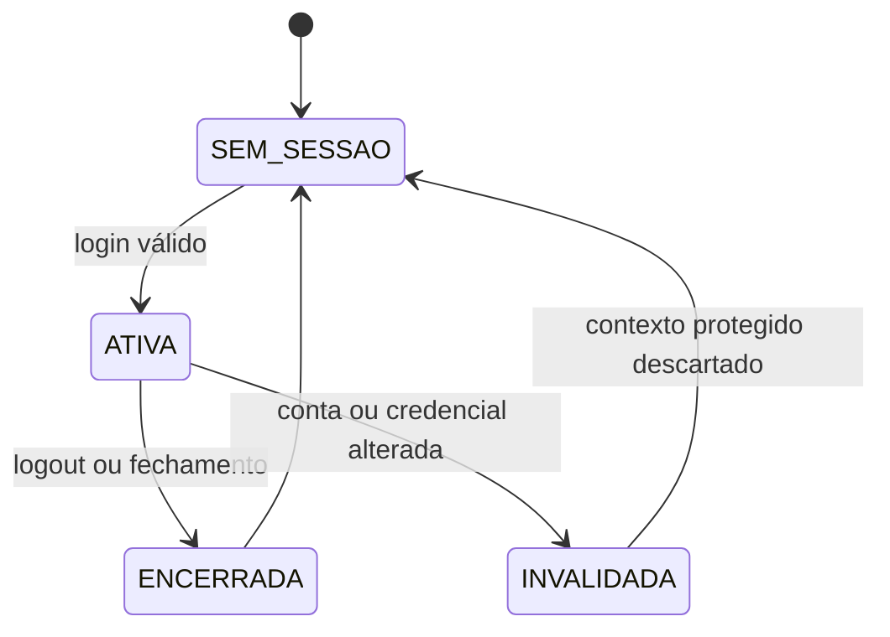

# Analyst — Acesso, papéis e auditoria

## Estado documental

- Papel: `CANONICAL_DOMAIN_CONTRACT`.
- Indexado por: `hack/analysis.md`.
- Gate ou assinatura individual: inexistente.
- Research, recon e adversarial qualificam a maturidade registrada no tracker único.
- Este arquivo é a fonte semântica do domínio. `hack/analysis.md` apenas integra e aponta;
  não substitui, resume com perda nem supera este contrato.

## TL;DR

O MVP usa uma conta local sintética, sem cadastro público. Depois do login, a mesma sessão
abre todas as ferramentas da demonstração. `ADMIN`, `RECEPCAO`, `ENFERMAGEM`,
`ANESTESIOLOGISTA` e `SOLICITANTE` são responsabilidades do fluxo, não cinco identidades da
prova. Conta, sessão e responsabilidade da ação são resolvidas na fronteira confiável e
nunca aceitas do payload.

Cada handler declara uma responsabilidade fixa. A conta integrada pode chamar os handlers
da prova, mas não pode transformar uma ação de recepção em ação clínica enviando um papel.
Projeção, erro, arquivo, PDF, IA, conhecimento e auditoria seguem o contrato do domínio. A
IA cloud usa apenas dados sintéticos por ação explícita na rota própria do Assistente.

O HEAD auditado possui handlers diretamente chamáveis, preload genérico, tokens cloud no
PGlite e backend de conhecimento alcançável. Isso é terreno legado, não contrato autorizado.
Até existir a fronteira canônica, o produto não pode alegar autenticação, RBAC, privacidade
por serviço ou auditoria e não pode receber dado real.

## Phase 0 Grill

| Pergunta | Estado | Resposta |
|---|---|---|
| Quem autentica? | `PRODUCT_LAW` | Uma conta fixture integrada e sintética. |
| Quem decide a responsabilidade da ação? | `PRODUCT_LAW` | O handler no processo confiável; nunca o renderer. |
| Admin é superusuário clínico? | `PRODUCT_LAW` | Não. Admin gerencia operação e auditoria sanitizada. |
| Solicitante acompanha o caso inteiro? | `PRODUCT_LAW` | Não. Cumpre pendência própria e recebe resultado/entrega do próprio serviço. |
| Revogação vale para chamada em voo? | `DEMO_DECISION` | Sim. Nenhum novo commit ou resposta protegida pode usar autoridade revogada. |
| A auditoria prova inviolabilidade local? | `PRODUCT_LAW` | Não. É append-only nas operações normais do app, não tamper-evident contra acesso ao dispositivo. |
| O adversarial foi encerrado? | `UNRESOLVED` | Não. Os 24 cenários precisam ser repetidos no SHA reconciliado. |

## Source And Scope

### Dentro

- login, logout e autoridade local não restaurável;
- uma conta fixture integrada e sintética;
- cinco responsabilidades, capabilities semânticas e escopo por ação;
- não interferência em listas, buscas, contagens, detalhes, erros e identificadores;
- revogação, concorrência e validade da sessão;
- projeções protegidas e descarte de estado efêmero;
- auditoria sanitizada, autoria e limites de integridade;
- autorização de áudio, IA, rede e conhecimento;
- indisponibilidade de handlers legados até serem guardados.

### Fora

- cadastro público, convite, confirmação ou recuperação por e-mail;
- OAuth, SSO, LDAP, Active Directory, MFA ou identidade profissional institucional;
- conta de paciente, prontuário ou dados reais;
- sincronização remota e operação hospitalar multiestação;
- escolha de hash, parâmetros criptográficos, schema físico, locks, DTOs, IPC, componentes,
  migrations e testes;
- política institucional definitiva de LGPD, retenção ou não repúdio.
- CRUD institucional de usuários, segregação real por conta, IdP e troca de papel.

## Current Terrain

Recon do HEAD examinado pelo adversarial:

- não há usuário, login, sessão, papel, capability ou guard canônico;
- o preload aceita canais genéricos e não estabelece identidade;
- handlers clínicos, configuração cloud, chat, PDF, arquivos, memória, RAG e grafo são
  diretamente alcançáveis pelo renderer;
- o cliente cloud envia mensagem e histórico e a configuração duplica token em texto no
  banco local;
- importadores podem ler arquivos locais e devolver texto; combinados ao chat, formam um
  caminho de exfiltração;
- rebuild de grafo pode persistir inferência generativa sem promoção humana;
- exportação atual aceita HTML do renderer, sem vínculo com resultado canônico;
- erros técnicos podem atravessar para a interface;
- PGlite fica no diretório local da aplicação e não resiste a adulteração por quem controla
  o sistema operacional.

Esses fatos são `EVIDENCE_BACKED` sobre o terreno atual. Nenhum vira capacidade do produto
por estar escondido no menu. “Dormente” só é seguro quando não é chamável por um ator sem a
capability correspondente.

## Product Promise

O operador entra uma vez e percorre o fluxo inteiro. A barra lateral organiza ferramentas
por responsabilidade. O processo principal associa cada canal à responsabilidade que o
possui, valida estado e escopo e registra a dupla `conta + responsabilidade`. A sessão
integrada simplifica a apresentação; não vira modelo institucional de autorização.

## Verdades por classificação

### `PRODUCT_LAW`

- existem exatamente cinco responsabilidades canônicas;
- a conta integrada não pertence a uma delas; ela exerce a responsabilidade fixa do
  handler chamado;
- conta, responsabilidade, serviço, autoria e capabilities nunca vêm do payload;
- esconder rota ou botão não autoriza nem desautoriza handler;
- `ADMIN` não herda leitura clínica;
- dados são minimizados antes de atravessar a fronteira de confiança;
- solicitante não recebe listagem ou detalhe geral do caso;
- recepção não lê resultado clínico nem recebe documento legível;
- sugestão de IA e conhecimento não promovido nunca produzem efeito por autorização implícita;
- auditoria não replica conteúdo clínico ou segredo;
- sessão não é restaurada após reinício;
- primeiro boot e fluxo-base funcionam offline.

### `DEMO_DECISION`

- uma conta fixture integrada;
- uma pessoa opera a instalação por vez na apresentação;
- a conta fixture é imutável pela interface;
- ausência de self-service, recuperação, expiração e bloqueio progressivo;
- autoridade corrente fica somente durante a execução da instalação;
- IA cloud, quando usada, recebe apenas dados sintéticos numa intenção explícita;
- identificador exibido ao solicitante é opaco e não revela sequência global;
- auditoria administrativa usa códigos e categorias fechadas.

### `UNRESOLVED`

- IdP, MFA, expiração, lockout, retenção e segregação institucional;
- execução em múltiplas estações/processos numa implantação real;
- proteção do segredo cloud no ambiente de produção;
- fornecedor, região, base legal e tratamento de dados reais;
- resistência a adulteração e não repúdio fora das operações normais do app.

## Atores e fronteiras

| Ator | Responsabilidade autorizada | Proibição central |
|---|---|---|
| `ADMIN` | capacidade, inventários, saúde técnica, tema e auditoria sanitizada | usar a configuração para alterar conteúdo clínico |
| `RECEPCAO` | intake, handoff inicial, agenda, check-in, status e entrega selada | anamnese, avaliação, explicação clínica, transcript e PDF legível |
| `ENFERMAGEM` | coleta estruturada, revisão conforme qualificação e proposta operacional da demo | avaliação médica e promoção de regra global |
| `ANESTESIOLOGISTA` | avaliação, pendência, retorno, resultado, consulta e curadoria de conhecimento | reescrever anamnese final ou escolher vaga |
| `SOLICITANTE` | cumprir pendência atribuída e receber resultado/entrega do próprio serviço | caso geral, outro serviço, anamnese, avaliação, IA e memória |
| Sistema | resolver autoridade, filtrar, redigir, auditar e revogar | inferir papel, clínica ou escopo a partir do renderer |

## Entidades semânticas

### `Account`

Identidade local de demonstração: nome, e-mail normalizado, modo `INTEGRATED_DEMO`, estado,
origem fixture e revisão da autoridade. Senha é segredo verificável, nunca informação
retornável. Conta não é identidade institucional.

### `SessionAuthority`

Autoridade efêmera derivada após login válido. Conhece conta, modo da sessão, revisão e
capabilities da demonstração. Não é restaurada por recibo antigo nem ampliada pelo renderer.

### `ActionResponsibility`

Responsabilidade fixa declarada pelo handler e pelo serviço de domínio. Ela determina o
contrato semântico, a projeção e a autoria do efeito. O renderer não envia
`actingRole`, `papel` ou equivalente. A auditoria registra a conta integrada e a
responsabilidade exercida.

### `CapabilityGrant`

Permissão semântica para uma ação e uma classe de informação. Capability não substitui
estado, ownership ou escopo: todas as condições precisam ser verdadeiras na mesma decisão.

### `ProtectedProjection`

Resposta mínima criada depois do filtro de escopo. Possui validade ligada à autoridade e à
revisão de vínculo usadas para produzi-la. Lista, contagem, busca, paginação, detalhe, arquivo,
erro e estado vazio são projeções e obedecem à mesma regra.

### `AuditEvent`

Fato append-only sobre quem tentou qual ação, sobre qual alvo técnico, quando e com qual
resultado. Usa categorias e valores seguros por ação. Não é jornada clínica, cópia do
agregado, assinatura digital nem prova contra adulteração local.

### `CloudIntent`

Pedido explícito de uso externo que declara ator, finalidade fechada, caso/revisão, categorias
mínimas de dados sintéticos, provedor/modelo e confirmação. Não existe intenção de chat livre,
leitura arbitrária de arquivo ou promoção automática de conhecimento.

## Sessão, revogação e concorrência

| Evento | Resultado obrigatório |
|---|---|
| boot ou reabertura | começa sem autoridade; recibo antigo não autentica |
| login ausente, inativo ou senha errada | mesma resposta pública; motivo interno sanitizado |
| logout | autoridade e projeções protegidas deixam de ser utilizáveis antes do sucesso |
| reset de senha ou desativação | nenhuma mutação confirma e nenhuma nova resposta protegida usa a autoridade anterior |
| mudança do serviço vinculado ao caso | nenhuma resposta nova é emitida ao serviço anterior; worklists e projeções antigas expiram |
| resposta já exibida antes da mudança | não pode ser “desvista”; não autoriza nova leitura, ação ou cache persistente |
| duas instâncias tentam escrever | o invariante de autorização e último admin continua valendo; PoC não aceita dois writers sem coordenação |
| replay de comando | revalida autoridade e escopo atuais; recibo não é credencial |

Para mutação, autoridade, estado do alvo e efeito pertencem a uma única decisão lógica: se
qualquer um mudar antes da confirmação, não existe commit parcial. Para leitura, filtro de
escopo e conteúdo projetado pertencem a uma visão consistente; a autoridade é revalidada
antes da resposta. A forma física de serialização pertence ao Build.

## Matriz semântica de capabilities

| Ação ou informação | RECEPCAO | ENFERMAGEM | ANESTESIOLOGISTA | SOLICITANTE | ADMIN |
|---|:---:|:---:|:---:|:---:|:---:|
| abrir/corrigir/cancelar intake | sim | não | não | não | não |
| ler identidade e encaminhamento necessários | sim | sim | sim | mínimo da pendência própria | não |
| aceitar handoff inicial | não | sim | não | não | não |
| registrar dados da coleta | não | sim, conforme qualificação/supervisão | não | não | não |
| revisar e declarar `CAPTURE_COMPLETE` | não | sim, pela responsabilidade de enfermagem | não | não | não |
| ler anamnese final | não | sim | sim | não | não |
| confirmar/alterar requisito operacional | não | sim, com autoria e justificativa no override | não | não | não |
| ler classe, duração e status operacionais | sim | sim | sim | não | não |
| reservar/reagendar/cancelar/check-in | sim | não | não | não | capacidade, não booking clínico |
| iniciar/salvar/finalizar avaliação | não | não | sim | não | não |
| abrir/cancelar/decidir pendência | não | não | sim | não | não |
| registrar evidência de pendência atribuída | se owner | se owner | se owner | próprio serviço | não |
| ler status do resultado | sim | não | sim | próprio serviço | não |
| ler conteúdo do resultado | não | não | sim | próprio serviço | não |
| exportar PDF legível | não | não | sim | próprio serviço | não |
| disparar/acompanhar entrega selada | sim | não | sim | confirmar próprio serviço | não |
| iniciar/parar captura consentida | não | sim | não | não | não |
| revisar transcript do caso | não | sim | sim, após confirmação humana | não | não |
| gerar proposta de campo | não | sim | não | não | não |
| aceitar/rejeitar/corrigir proposta de anamnese | não | sim, no próprio draft | não | não | não |
| consultar conhecimento aprovado | não | somente para o campo em trabalho | sim | não | estado técnico, sem conteúdo |
| criar relação candidata | não | não | sim | não | não |
| aprovar/versionar/desativar relação | não | não | sim, ação separada | não | não |
| iniciar intenção cloud autorizada | não | para proposta sintética | para consulta sintética | não | não |
| configurar capacidade técnica de IA | não | não | não | não | sim, sem conteúdo clínico |
| consultar auditoria sanitizada e configuração técnica | não | não | não | não | sim |

Cada linha representa permissão diferente. “Acesso clínico”, “IA” ou “configuração” não são
guards genéricos. No modo integrado, elas descrevem a responsabilidade fixa de cada ação,
não o menu disponível para a conta. O Build não pode fundir essas fronteiras.

## Redação e não interferência

| Classe | ADMIN | RECEPCAO | ENFERMAGEM | ANESTESIOLOGISTA | SOLICITANTE |
|---|---|---|---|---|---|
| identidade do caso | nenhuma | mínima operacional | necessária | necessária | mínima da pendência/resultado próprio |
| encaminhamento | nenhum | operacional | necessário à entrevista | completo | resumo mínimo próprio |
| anamnese | nenhuma | nenhuma | completa | final completa | nenhuma |
| explicação da classificação | nenhuma | classe/duração sem causas | completa | completa | nenhuma |
| avaliação | nenhuma | status | status | completa | nenhuma |
| pendência | nenhuma | status/pedido se owner | pedido se owner | completa | pedido próprio |
| resultado | nenhuma | status | nenhum | completo | completo do próprio serviço |
| PDF | nenhum | nenhum | nenhum | legível | legível do próprio serviço |
| áudio/transcript | nenhum | nenhum | caso corrente | confirmado | nenhum |
| IA/conhecimento | saúde/contagem técnica | nenhum | propostas e consulta autorizada | consulta/curadoria | nenhum |
| auditoria | eventos sanitizados | nenhuma | nenhuma | nenhuma | nenhuma |

Não interferência por serviço exige:

- filtrar antes de carregar e projetar, nunca buscar todos e esconder na interface;
- aplicar o mesmo escopo a lista, busca, contagem, paginação, detalhe, pendência, resultado,
  entrega, loading, vazio, erro e existência;
- responder de forma indistinguível para alvo inexistente e alvo de outro serviço;
- não mostrar totais, posições ou códigos que revelem cardinalidade global;
- usar identificador opaco e não sequencial na projeção restrita;
- invalidar store, cache, tela aberta e trabalho em voo quando autoridade ou vínculo mudar;
- impedir que replay devolva projeção histórica não mais autorizada.

## Contrato de auditoria sanitizada

| Categoria | Registra | Valores seguros | Nunca registra |
|---|---|---|---|
| login/logout/revogação | ação, resultado, conta técnica quando conhecida, revisão | código fechado de resultado/motivo | e-mail tentado, senha, hash, token |
| autorização negada | capability tentada, tipo/ID técnico seguro, correlação | `UNAUTHENTICATED`, `FORBIDDEN`, `SCOPE_CHANGED` | payload, existência protegida, conteúdo |
| administração de conta | alvo técnico e categoria alterada | papel, estado, serviço técnico, revisão anterior/nova | senha, hash, nome clínico, texto livre |
| intake/caso | ação, caso técnico, segmentos alterados, estado/revisão | categorias como `PERSON_CONTEXT`, `REQUESTER`, `PROCEDURE` | nome, encaminhamento, field path clínico, motivo livre |
| anamnese/classificação | ação, revisão, contagens e estados | `DRAFT`, `FINAL`, `PROPOSED`, `CONFIRMED`, `OVERRIDDEN` | respostas, diagnóstico, medicamento, alergia, sinal |
| agenda | ação, IDs técnicos, intervalo, classe e transição | estados/códigos operacionais | explicação clínica |
| avaliação/pendência | ação, ownerRole, tipo operacional, contagem, estado | códigos fechados | pedido, evidência, conclusão, documento, hash correlacionável |
| resultado/entrega/PDF | ação, IDs, versão, horário e resultado | estado da entrega/exportação | conteúdo, HTML, PDF, filename, path |
| IA cloud | finalidade, provedor/modelo, categorias e contagens, resultado | códigos de consentimento/rede | prompt, resposta, transcript, token, trecho recuperado |
| conhecimento | relação/fonte técnica, versão, estado, autor/aprovador | `SUGGESTED`, `APPROVED`, `INACTIVE`, `SUPERSEDED` | texto-fonte integral ou narrativa de caso |

O motivo administrativo é código fechado por ação. Justificativa clínica livre permanece no
agregado clínico e só aparece em sua projeção autorizada. A auditoria informa que a ação
ocorreu; não explica a clínica que a motivou.

## Rede, arquivos, PDF e handlers legados

1. O fluxo-base e o boot não usam rede.
2. Uma intenção cloud da PoC é explícita, usa somente dado sintético mínimo, informa
   provedor/finalidade/categorias e exige confirmação humana.
3. Chat livre, envio de histórico integral e egress em background não são capacidades do
   produto.
4. Leitura arbitrária de path fornecido pelo renderer não pode compor uma intenção cloud.
5. Token cloud não integra banco clínico, DTO, log, auditoria ou exportação. Sem fronteira de
   segredo aceita, a capacidade permanece indisponível.
6. Conteúdo generativo de grafo ou memória nasce inativo e exige promoção humana separada.
7. PDF final nasce de resultado canônico autorizado. Renderer não fornece HTML clínico.
8. Recepção opera status e entrega selada sem receber bytes, preview, path ou documento
   legível; anestesiologista e solicitante do serviço correto podem exportar conteúdo.
9. Handler herdado sem sessão, capability, escopo e projeção redigida não pertence ao router
   público do produto, mesmo que tenha arquivo, teste ou tela oculta.
10. Erro público usa código opaco e correlação. Stack, SQL, path, provedor e mensagem interna
    não atravessam para a interface.

## Limite da auditoria local

“Append-only” significa que as operações normais do aplicativo não atualizam nem excluem o
evento e que sucesso e mutação pertencem ao mesmo resultado lógico. Não significa
criptografia em repouso, assinatura, não repúdio ou resistência a um usuário, malware ou
processo com acesso direto ao diretório do PGlite. A PoC não pode alegar essas propriedades.

## Failure And Recovery Matrix

| Falha ou ataque | Resultado obrigatório |
|---|---|
| renderer envia papel, ator ou responsabilidade | campo rejeitado/ignorado; responsabilidade vem do handler |
| rota escondida chama handler legado | indisponível ou negado antes de tocar recurso |
| conta muda durante mutação | nenhuma confirmação com autoridade antiga; operação sem efeito |
| serviço do caso muda durante leitura | nenhuma resposta nova ao serviço antigo; projeções expiram |
| solicitante consulta outro serviço | resposta indistinguível de inexistente e sem cardinalidade |
| cache contém projeção antiga | descartado; não autoriza ação ou nova leitura |
| login inexistente/inativo/senha errada | mesma resposta pública |
| renderer envia HTML para PDF | rejeitado; documento é derivado do resultado canônico |
| recepção tenta abrir/exportar resultado | recebe somente status; conteúdo negado |
| arquivo local é combinado com cloud | intenção inválida; nenhum arquivo arbitrário é lido/enviado |
| LLM produz relação | permanece candidata inativa até promoção humana |
| erro inesperado | código opaco e correlação; detalhe fica no main sanitizado |
| mutação falha | nenhum evento de sucesso; falha auditada sem payload quando seguro |
| PGlite é alterado externamente | fora da garantia append-only; produto não alega integridade contra host |

## Rules And Invariants

1. MUST resolver conta, responsabilidade, serviço e capability fora do payload.
2. MUST aplicar autorização a leitura, mutação, arquivo, PDF, rede, IA e conhecimento.
3. MUST NOT considerar menu, rota ou tipo TypeScript como fronteira de segurança.
4. MUST NOT confirmar mutação se conta, revisão, responsabilidade ou escopo deixarem de corresponder.
5. MUST NOT emitir resposta protegida usando serviço ou vínculo anterior.
6. MUST invalidar estado efêmero protegido em logout, revogação ou mudança de escopo.
7. MUST NOT permitir que a responsabilidade `ADMIN` leia clínica por auditoria, contagem ou erro.
9. MUST aplicar não interferência a todas as formas de consulta e existência.
10. MUST usar identificador restrito que não revele sequência global.
11. MUST restringir recepção a status e entrega selada, sem PDF legível.
12. MUST derivar PDF de resultado canônico e autorizado.
13. MUST registrar somente allowlist sanitizada por categoria de ação.
14. MUST usar motivo administrativo categórico, nunca justificativa clínica livre.
15. MUST revalidar autorização em replay; recibo nunca é credencial.
16. MUST manter sugestão de IA/conhecimento inativa até decisão humana própria.
17. MUST NOT expor caminho genérico de arquivo para cloud.
18. MUST NOT persistir ou duplicar token cloud no banco clínico.
19. MUST apresentar erro público opaco e estável.
20. MUST limitar a promessa append-only às operações normais do aplicativo.
20. MUST começar todo boot sem sessão autenticada.
21. MUST preservar a conta fixture integrada e impedir sua mutação pela interface.
22. MUST registrar `accountId` e `actionResponsibility` em toda mutação auditável.

## Acceptance Scenarios

| # | Cenário | Resultado obrigatório |
|---:|---|---|
| 1 | renderer envia ator/papel falsos | valores ignorados ou rejeitados; responsabilidade do handler aplicada |
| 2 | solicitante lista/busca/conta casos de outro serviço | zero inferência de existência ou cardinalidade |
| 3 | solicitante tenta detalhe de outro serviço | resposta opaca e nenhum dado |
| 4 | serviço errado confirma entrega | falha sem mutação |
| 5 | responsabilidade enviada tenta ampliar handler | nenhum efeito além do contrato fixo do handler |
| 6 | conta é desativada entre leitura e escrita | mutação não confirma |
| 7 | operador tenta alterar a conta fixture pela interface | negado |
| 8 | menu exibe todas as ferramentas | navegação completa sem conceder semântica extra ao payload |
| 9 | fixture recebe mutação direta | negado sem alterar revisão |
| 10 | segundo boot | a mesma conta integrada é reconciliada sem duplicação |
| 11 | login ausente, inativo e senha errada | mesma mensagem e forma pública |
| 12 | app reinicia | exige novo login |
| 13 | recepção tenta ler ou exportar PDF clínico | somente status; conteúdo negado |
| 14 | enfermagem tenta editar após final vigente | negado |
| 15 | solicitante cumpre pendência própria | recebe somente projeção suficiente do pedido |
| 16 | admin consulta auditoria | nenhum nome clínico, field path, texto, hash correlacionável ou segredo |
| 17 | writer falha depois de iniciar mutação | não existe sucesso auditado ou efeito parcial |
| 18 | renderer chama handler herdado diretamente | indisponível/negado antes de DB, arquivo ou rede |
| 19 | intenção cloud tenta histórico ou arquivo arbitrário | rejeitada; somente categorias sintéticas allowlisted |
| 20 | usuário com acesso ao host altera PGlite | limitação é declarada; nenhuma alegação de tamper evidence |
| 21 | mudança de serviço do caso concorre com leitura | nenhuma resposta nova ao serviço antigo; cache expira |
| 22 | payload inclui HTML, path, estado ou horário confiável | dados sensíveis derivados no main ou rejeitados |
| 23 | erro contém SQL/path/provedor | renderer recebe código opaco e correlação |
| 24 | LLM sugere relação de conhecimento | fica inativa até aprovação humana separada |
| 25 | ação percorre recepção, enfermagem e anestesiologia na mesma sessão | auditoria preserva uma conta e três responsabilidades distintas |

## Boundary With Build

Este Analyst define atores, informação, capabilities, escopo, concorrência, revogação,
não interferência, redaction, falhas e limites. O Build será owner de:

- armazenamento e verificação de segredo/senha;
- schema, migrations, constraints, transações, coordenação e prova de dois writers;
- sessão em memória e representação de recibos;
- allowlist do preload, canais IPC, DTOs, errors e guards;
- composição do router público e isolamento de handlers legados;
- descarte de stores/caches e projeções da interface;
- derivação do PDF canônico e entrega selada;
- testes de chamadas diretas, concorrência, rollback e egress.

O Build de acesso traduz estas decisões. Parâmetro criptográfico, nome de tabela, path,
componente ou lock não substitui esta semântica.

## Dependencies And Open Questions

Antes de novo adversarial:

1. caso deve adotar não interferência e validade de projeção após mudança de serviço;
2. avaliação e superfícies devem retirar PDF legível da recepção;
3. arquitetura deve permitir somente intenção cloud explícita e sintética da prova;
4. IA deve consumir esta matriz e deixar de adiar a separação autorizativa ao Build;
5. o hub deve apontar revogação em voo, auditoria allowlisted e limites do PGlite;
6. os 25 cenários precisam de novo ataque no SHA reconciliado.

## Resultado da investigação

Os achados e limites deste domínio são indexados em `hack/analysis.md`. Pendências
institucionais continuam documentadas como fronteira futura e não bloqueiam a PoC sintética.

## Estado de consolidação

- Estado: `CANONICAL_DOMAIN_CONTRACT`.
- Autoridade canônica: este arquivo.
- Gate individual: inexistente.
- Uso futuro: fonte obrigatória do Warlog e de todo Writing Plan que tocar acesso,
  responsabilidade ou auditoria.
