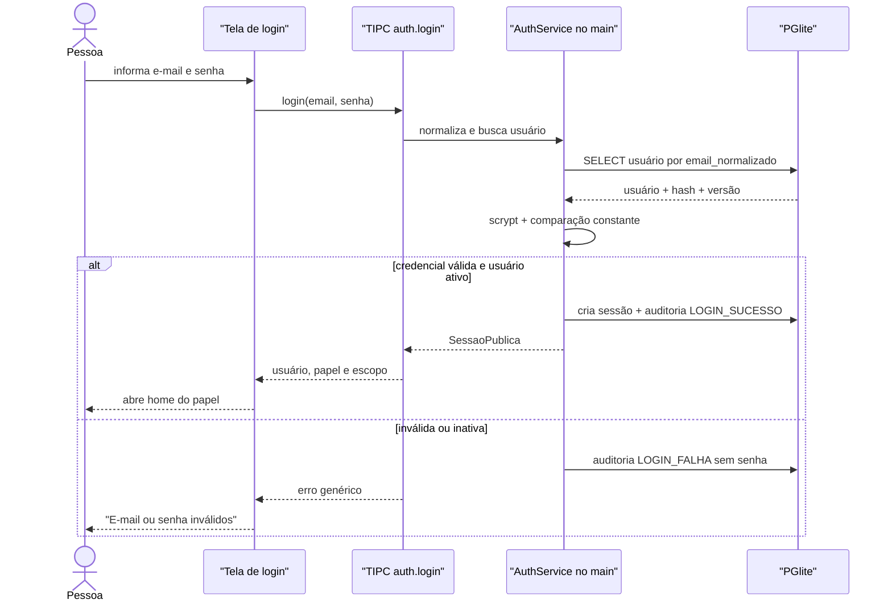
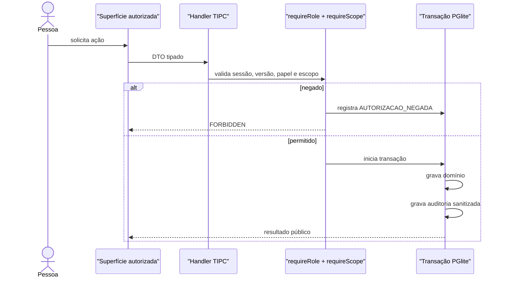
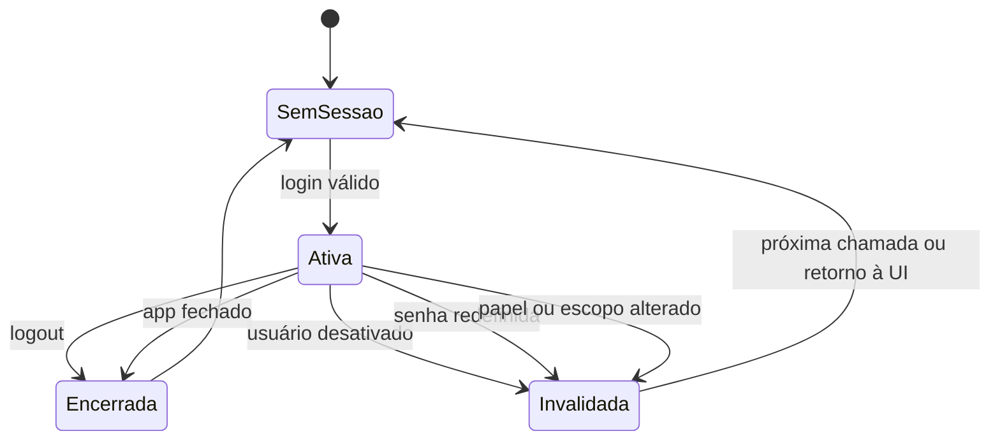

# Analyst: Acesso, papéis e auditoria

## State

- Source: `hack/PRD.md`, decisão explícita de Marco em 14/08/2026 e recon do código atual.
- Route: `analyst_prd`.
- Phase budget: `forensic`.
- Confidence: `high` para o MVP local; não descreve identidade institucional futura.
- Created: `2026-08-14`.
- Content verdict: `ready for human review`.
- Governance state: `AGUARDANDO ASSINATURA DE MARCO`.
- Build correspondente: `hack/domains/BUILD-acesso-e-auditoria.md`.

## TL;DR

O MVP terá autenticação local, sem cadastro público: o administrador cria `nome + e-mail + senha + função`, e cada pessoa entra com essa credencial. Cinco papéis executam o fluxo — `RECEPCAO`, `ENFERMAGEM`, `ANESTESIOLOGISTA`, `SOLICITANTE` e `ADMIN` — com autorização aplicada no processo principal antes de qualquer leitura ou escrita. As contas da apresentação serão fixtures sintéticas, senhas serão armazenadas somente como hash `scrypt`, sessões não sobreviverão ao reinício do aplicativo e toda mutação relevante produzirá auditoria append-only sem copiar conteúdo clínico ou segredos.

O conteúdo deste Analyst está fechado para o MVP, mas não libera o Build enquanto Marco não assinar o contrato ao final.

## Phase 0 Grill

| Signal | Verdict | Notes |
|---|---|---|
| Action clear | `PASS` | Definir quem entra, como entra, o que pode fazer e como provar autoria. |
| Persona clear | `PASS` | Recepção, enfermagem, anestesiologista, solicitante e administrador. |
| Input/output clear | `PASS` | Credencial entra; sessão, autorização e evento de auditoria saem. |
| Scope clear | `PASS` | Login local e RBAC do protótipo; sem confirmação de e-mail, recuperação, SSO ou cadastro público. |
| Objective criteria clear | `PASS` | Uma conta por papel entra, só enxerga suas superfícies e recebe negação também no TIPC quando tenta ação proibida. |

## Source And Scope

### Input source

- O PRD exige separação de responsabilidade, autoria e sequência reconstruível (`hack/PRD.md`, seções **Story Técnica**, **System Pattern / Contract** e **Acceptance Criteria**).
- Marco decidiu: “os logins podem ser criados pelo admin”; para o hack, contas são fixtures e não haverá fluxo de confirmação, convite, recuperação ou cadastro por e-mail.
- O executável atual não possui entidade de usuário, sessão, papel, guard de autorização ou auditoria; os handlers TIPC acessam banco diretamente.

### In scope

- login e logout locais;
- criação, listagem, edição controlada, desativação e redefinição de senha pelo administrador;
- cinco papéis canônicos e seus escopos;
- conta sintética fixture para cada papel;
- hash local de senha;
- sessão única ativa no processo Electron;
- guard obrigatório no processo principal;
- trilha de auditoria append-only;
- menu, rota e ação condicionados ao papel;
- invalidação de sessão após desativação, mudança de papel ou redefinição de senha.

### Out of scope

- cadastro público, convite por e-mail, confirmação de e-mail e recuperação automática;
- OAuth, SSO institucional, LDAP, Active Directory, certificado profissional ou MFA;
- acesso remoto, múltiplos dispositivos e sincronização de sessões;
- conta de paciente;
- autorização do prontuário hospitalar;
- uso de dados ou identidades reais;
- política institucional definitiva de retenção e LGPD.

### Assumptions fixed for the MVP

- O aplicativo roda em um único Mac e uma pessoa usa a sessão por vez.
- Um usuário tem exatamente um papel no MVP. Se a mesma pessoa precisar demonstrar duas funções, usa duas contas sintéticas.
- Toda conta `SOLICITANTE` pertence a exatamente um serviço solicitante; os demais papéis não têm escopo de serviço.
- A sessão termina no logout ou ao fechar/reiniciar o app. Não existe “lembrar de mim”.
- `ADMIN` administra acesso e configuração, mas não recebe acesso clínico implícito.

## Product Promise

Cada integrante da demonstração entra com uma credencial simples preparada localmente e vê apenas o trabalho que lhe pertence. A recepção não lê respostas clínicas; a enfermagem não agenda; o anestesiologista não reescreve a entrevista de enfermagem; o solicitante enxerga somente os casos do seu serviço e o resultado autorizado; o administrador gerencia contas e configuração sem virar um superusuário clínico. Depois, a apresentação consegue reconstruir quem fez cada mudança, em qual papel, quando e sobre qual objeto.

## Story de Usuario

- Como administrador, quero criar uma conta com nome, e-mail, senha e função, para preparar a equipe da demonstração sem depender de e-mail externo.
- Como integrante da recepção, quero entrar e ver somente entradas e agendamentos, para cumprir meu trabalho sem interpretar dados clínicos.
- Como enfermeiro, quero abrir as triagens atribuídas ao meu setor e registrar a anamnese, para produzir a necessidade operacional da vaga.
- Como anestesiologista, quero ver a anamnese preservada e registrar minha própria avaliação, para tomar e explicar uma decisão médica sem apagar autoria anterior.
- Como integrante do serviço solicitante, quero acompanhar somente casos do meu serviço e receber o resultado, para continuar o planejamento do procedimento.
- Como apresentador, quero trocar de papel de forma previsível, para demonstrar o handoff ponta a ponta no mesmo Mac.

## Story Tecnica

Como sistema local, preciso manter usuários, hashes e eventos de auditoria no PGlite; conservar a sessão corrente somente no processo principal; negar no TIPC qualquer ação incompatível com o papel; filtrar também as leituras por escopo; invalidar a sessão quando a credencial mudar; e registrar mutações na mesma transação do dado de domínio, sem persistir senha, token, texto integral de anamnese ou parecer na auditoria.

## Current Terrain

1. A casca ativa possui apenas três rotas e nenhuma tela de login ou provider de sessão (`src/renderer/src/App.tsx:13-56`).
2. A navegação atual é global e idêntica para qualquer pessoa (`src/renderer/src/componentes/AppSidebar.tsx:28-32`, `115-132`).
3. O preload expõe `ipcRenderer.invoke` para qualquer canal recebido do renderer; ele não acrescenta identidade ou papel (`src/preload/index.ts:3-16`).
4. O client TIPC apenas encaminha chamadas ao preload (`src/renderer/src/servicos/client.ts:1-6`).
5. Os handlers atuais executam queries sem sessão e sem guard, inclusive configuração de IA, registros legados, jornada e catálogos (`src/main/tipc.ts:56-129`, `303-370`, `373-399`).
6. O schema atual não contém usuário, credencial, sessão ou auditoria. O core contém somente `config` e `configuracao_ia` antes dos módulos herdados (`src/main/db/schema.ts:8-25`).
7. A tabela `registro_jornada` já demonstra um trigger append-only, mas pertence à hipótese clínica invalidada e não pode ser promovida como auditoria canônica (`src/main/db/clinical-schema.ts:3-9`, `28-52`).
8. O banco e os catálogos já nascem localmente; o seed lê assets versionados e não chama rede (`src/main/db/seed.ts:128-150`).

## Evidence Matrix

| Path | Lines | Fact | Confidence |
|---|---:|---|---|
| `hack/PRD.md` | seção `Users / Actors` | O produto tem recepção, enfermagem, anestesiologista e serviço solicitante como responsáveis distintos. | high |
| `hack/PRD.md` | seção `Story Tecnica` | O produto deve impedir alteração por papel indevido e registrar autoria, horário e motivo. | high |
| `src/renderer/src/App.tsx` | 13-56 | Não há `/login`, gate de sessão nem rotas por papel. | high |
| `src/renderer/src/componentes/AppSidebar.tsx` | 28-32, 115-132 | Menu é estático e não considera sessão ou autorização. | high |
| `src/preload/index.ts` | 3-16 | Bridge atual encaminha canal/args sem identidade. | high |
| `src/renderer/src/servicos/client.ts` | 1-6 | O client TIPC não cria contexto de usuário. | high |
| `src/main/tipc.ts` | 56-129 | Configuração de IA pode ser lida, salva e testada sem guard. | high |
| `src/main/tipc.ts` | 303-370 | Mutação legada e busca de catálogo também não passam por autorização. | high |
| `src/main/tipc.ts` | 373-399 | Router exporta handlers diretamente; não existe wrapper central. | high |
| `src/main/db/schema.ts` | 8-25 | Core atual não persiste usuários, sessões ou auditoria. | high |
| `src/main/db/clinical-schema.ts` | 42-52 | Existe precedente técnico de append-only via trigger, mas só para jornada legada. | high |
| `src/main/db/seed.ts` | 128-150 | Seed local versionado é padrão existente e serve às contas sintéticas. | high |

## Implementation Map

| Area | Path | Role | Decision |
|---|---|---|---|
| Context / entry | `src/renderer/src/main.tsx` | Monta providers globais. | Adicionar `AuthProvider` dentro de tema e antes do router. |
| Context / routes | `src/renderer/src/App.tsx` | Declara casca e rotas. | Separar `/login` público de `ProtectedAppLayout`; redirecionar por sessão/papel. |
| Backend migration | `src/main/db/migrations/NNN_access_audit.sql` | Migração numerada consumida pelo runner da arquitetura. | Entregar somente o DDL de `usuarios`, `sessoes` e `auditoria_eventos`; este domínio não cria runner. |
| Backend bootstrap | `src/main/db/schema.ts` | Bootstrap legado a conter. | Não receber o novo DDL nem ganhar segunda ordem de migrations. |
| Backend seed | `src/main/db/seed.ts` | Primeiro boot local idempotente. | Garantir exatamente cinco contas `origin=FIXTURE`, uma por papel. A conta `SOLICITANTE` referencia o serviço fixture já semeado pelo domínio de anamnese/catálogos; contas `origin=ADMIN` não são removidas pelo seed. |
| Backend auth | `src/main/auth/*` | Área inexistente. | Criar hash, sessão em memória, validação de credencial e guards. |
| Backend IPC | `src/main/tipc.ts` | Router tipado e handlers. | Expor auth/admin/auditoria; envolver handlers de produto com `requireRole`. |
| Shared contracts | `src/shared/auth.ts` | Área inexistente. | Declarar `Papel`, DTOs públicos e matriz de capacidade. |
| Renderer state | `src/renderer/src/auth/*` | Área inexistente. | Provider, hook e gates de rota/ação baseados em `auth.sessao.obter`. |
| Shell | `src/renderer/src/componentes/AppSidebar.tsx` | Menu e tema. | Gerar menu a partir do papel; exibir usuário/papel/logout. |
| Frontend login | `src/renderer/src/paginas/LoginPagina.tsx` | Área inexistente. | Formulário e estados de autenticação, sem links de cadastro/recuperação. |
| Frontend admin | `src/renderer/src/paginas/configuracoes/UsuariosPagina.tsx` | Área inexistente. | CRUD mínimo de contas e reset de senha. |
| Frontend audit | `src/renderer/src/paginas/configuracoes/AuditoriaPagina.tsx` | Área inexistente. | Lista filtrável somente para admin, sem payload clínico. |
| Tests | `tests/main/auth/*`, `tests/renderer/auth/*`, `tests/e2e/*` | Cobertura inexistente. | Provar hash, guards, escopo, fixtures, sessão e cinco jornadas de papel. |

## Entities And State

### ENTITY: Papel

- Attributes: valor imutável entre `ADMIN`, `RECEPCAO`, `ENFERMAGEM`, `ANESTESIOLOGISTA`, `SOLICITANTE`.
- Actions: autoriza uma capacidade; não carrega dados pessoais.
- Relations: um usuário possui um papel; a sessão guarda um snapshot do papel.
- Source of truth: enum compartilhado + `usuarios.papel` com `CHECK` no PGlite.
- Runtime states: ativo como parte de uma sessão ou sem sessão.
- Invalid states to prevent: papel livre em string; múltiplos papéis na mesma conta; solicitante sem serviço; admin herdando dados clínicos por omissão.

### ENTITY: Capability

- Attributes: identificador literal compartilhado, papéis autorizados.
- Actions: derivar capacidades de um papel; autorizar guard e projetar ações da interface.
- Relations: `SessaoPublica` carrega uma lista derivada; `CurrentSession` usa a mesma fonte no main.
- Source of truth: union `Capability` e mapa exaustivo em `src/shared/auth.ts`.
- Invalid states to prevent: capability livre em string; mapa incompleto; renderer inventando capacidade; divergência entre botão e handler.

### ENTITY: Usuario

- Attributes: `id`, `nome_exibicao`, `email`, `email_normalizado`, `senha_hash`, `papel`, `servico_solicitante_id`, `ativo`, `origem`, `credencial_versao`, `criado_por_usuario_id`, timestamps.
- Actions: criar, listar, alterar nome, alterar papel/escopo, desativar, reativar, redefinir senha.
- Relations: pode ter várias sessões e vários eventos de auditoria; solicitante referencia um serviço.
- Source of truth: `usuarios` no PGlite.
- Runtime states: `ATIVO` ou `INATIVO`.
- Invalid states to prevent: e-mail duplicado sem considerar caixa; hash vazio; papel fora do enum; `SOLICITANTE` sem serviço; outro papel com serviço; remoção física; desativação do último admin ativo; auto-desativação da sessão corrente.
  Também são inválidas a troca de função do último `ADMIN` ativo e qualquer mutação
  administrativa de conta `origem=FIXTURE`.

### ENTITY: Sessao

- Attributes: `id`, `usuario_id`, `papel_snapshot`, `servico_snapshot`, `credencial_versao`, `iniciada_em`, `ultimo_uso_em`, `encerrada_em`, `motivo_encerramento`; a projeção pública inclui `capabilities: Capability[]` derivadas do papel.
- Actions: abrir após login, consultar, tocar último uso, encerrar, invalidar.
- Relations: pertence a um usuário; autoria de eventos referencia sessão quando disponível.
- Source of truth: sessão corrente em memória no processo main; `sessoes` é o registro auditável, não um token reutilizável. `CurrentSession` e `ActorContext` são main-only e nunca são importados pelo renderer.
- Runtime states: `ATIVA`, `ENCERRADA_LOGOUT`, `ENCERRADA_APP`, `INVALIDADA_CREDENCIAL`.
- Invalid states to prevent: sessão ativa para usuário inativo; versão divergente; renderer escolher papel; restauração automática após reinício; duas sessões correntes no mesmo processo.

### ENTITY: EventoAuditoria

- Attributes: `id`, `ocorrido_em`, `correlation_id`, `sessao_id`, `usuario_id`, `usuario_nome_snapshot`, `papel_snapshot`, `acao`, `entidade_tipo`, `entidade_id`, `resultado`, `motivo`, `mudancas_json` sanitizado.
- Actions: inserir e consultar; nunca editar ou excluir.
- Relations: pode apontar para usuário e sessão; usa tipo/ID genéricos para objetos de domínio.
- Source of truth: `auditoria_eventos` append-only no PGlite.
- Runtime states: somente `REGISTRADO`.
- Invalid states to prevent: evento sem ação/resultado; UPDATE/DELETE; senha/token/hash/conteúdo clínico integral em `mudancas_json`; auditoria de sucesso fora da transação da mutação.

## Runtime / Data Flow

### Login e sessão

### Guard de uma ação

### Invalidação

## Rules And Invariants

### Credenciais e fixtures

1. `email_normalizado = trim(email).toLowerCase()`; unicidade é aplicada sobre esse valor.
2. Senha aceita entre 8 e 128 caracteres no MVP. Campo vazio, espaços isolados e senha fora do intervalo falham antes do hash.
3. Senha jamais é retornada, auditada, logada ou persistida em texto claro.
4. Hash canônico: `scrypt$16384$8$1$<salt-base64>$<hash-base64>`, salt aleatório de 16 bytes e saída de 64 bytes; verificação usa comparação de tempo constante. Usuário ausente, inativo e senha incorreta percorrem verificação `scrypt` contra hash dummy antes do mesmo erro público.
5. O seed reconcilia exatamente cinco contas sintéticas estáveis e ativas com `origem = FIXTURE`, uma por papel: `admin@antessala.demo`, `recepcao@antessala.demo`, `enfermagem@antessala.demo`, `anestesio@antessala.demo` e `solicitante.gastro@antessala.demo`. A senha de apresentação pode ser `Demo@2026`, mas o banco recebe somente hashes com salts distintos.
6. Contas `FIXTURE` são imutáveis pela administração: a lista mostra badge “Conta da demo” e não oferece editar, trocar papel/escopo/status, redefinir senha, ativar ou desativar. Toda tentativa direta por IPC falha `FIXTURE_IMMUTABLE` sem incrementar versão. O seed é o único writer dessas cinco linhas e as reconcilia no boot.
7. Contas criadas pela administração têm `origem = ADMIN`. O seed não as conta entre as cinco fixtures, não as altera e não as remove; todas as provas de criar, editar, resetar senha, ativar e desativar usam contas `ADMIN`. Não existe botão ou endpoint de cadastro público, confirmação, recuperação ou “esqueci minha senha”.

### Sessão

8. O renderer não envia papel nem escolhe identidade. O main resolve a sessão corrente.
9. Todo boot começa em `SemSessao`, mesmo que existam linhas antigas em `sessoes`.
10. Login válido encerra qualquer sessão corrente antes de abrir outra.
11. Logout limpa a sessão em memória e carimba `encerrada_em`.
12. Cada ação protegida compara `sessao.credencial_versao` com `usuario.credencial_versao` e verifica `ativo = true`.
13. Alterar senha, papel, escopo ou status incrementa `credencial_versao`; a sessão afetada deixa de autorizar imediatamente.

### RBAC e escopo

| Capacidade | RECEPCAO | ENFERMAGEM | ANESTESIOLOGISTA | SOLICITANTE | ADMIN |
|---|:---:|:---:|:---:|:---:|:---:|
| Criar encaminhamento/caso | sim | não | não | não | não |
| Ler identidade e encaminhamento operacional | sim | sim | sim | apenas próprio serviço | não |
| Ler respostas clínicas da anamnese | não | sim | sim | não | não |
| Criar/editar rascunho da anamnese | não | sim | não | não | não |
| Abrir fila de triagem | não | sim | não | não | não |
| Submeter triagem | não | sim | não | não | não |
| Ler categoria operacional da vaga | sim | sim | sim | status sem explicação clínica | não |
| Criar/reagendar/cancelar reserva | sim | não | não | não | não |
| Registrar check-in da consulta | sim | não | não | não | não |
| Criar/editar avaliação anestésica | não | não | sim | não | não |
| Criar pendência/retorno/conclusão médica | não | não | sim | não | não |
| Registrar evidência em pendência atribuída | sim | sim | sim | apenas próprio serviço | não |
| Ler resultado final autorizado | projeção operacional | não | sim | apenas próprio serviço | não |
| Exportar versão final em PDF | sim | não | sim | não | não |
| Registrar envio/handoff local | sim | não | não | não | não |
| Confirmar recebimento do handoff | não | não | não | apenas próprio serviço | não |
| Gerenciar usuários, recursos, janelas e bloqueios | não | não | não | não | sim |
| Ver inventário versionado de serviços/procedimentos/catálogos | não | não | não | não | sim |
| Ler auditoria de segurança sanitizada | não | não | não | não | sim |

14. Permissão de interface e permissão de handler precisam concordar; ocultar um botão nunca substitui o guard.
15. `SOLICITANTE` só lê casos cujo `servico_solicitante_id` coincide com o snapshot da sessão.
16. `ADMIN` não lê anamnese, avaliação ou resultado clínico por ser administrador.
17. A recepção recebe categoria, duração e opções compatíveis; não recebe comorbidades, medicamentos, respostas ou explicação clínica detalhada.
18. Somente a enfermagem usa `clinical:anamnesis:edit` enquanto a anamnese está `DRAFT` e
    executa `submitFinal` para `COMPLETE`. Depois disso não existe escrita na anamnese; o
    anestesiologista apenas lê o snapshot submetido e registra informação própria por
    `assessment:write`.

### Administração de usuários

19. Somente `ADMIN` chama `usuarios.*` e `auditoria.*`.
20. O sistema impede desativar o próprio usuário da sessão e impede desativar **ou trocar a
    função** do último `ADMIN` ativo; o guard conta admins ativos dentro da mesma transação.
21. Usuário nunca é apagado fisicamente; desativação preserva referências e auditoria.
22. Troca para `SOLICITANTE` exige `servico_solicitante_id`; troca para outro papel limpa esse campo.
23. Redefinir senha exige uma nova senha completa; não existe leitura do valor anterior.
24. E-mail de usuário existente não pode ser reutilizado, mesmo se a conta estiver inativa.

### Auditoria

25. Mutação de domínio e evento de sucesso são gravados na mesma transação.
26. Login, logout, falha de login, negação, criação/desativação de usuário, redefinição de senha, alteração de papel e todas as mutações clínicas/operacionais são auditáveis.
27. `mudancas_json` contém nomes de campos e valores operacionais seguros; senha, hash, token, HTML/PDF, anamnese integral, parecer integral e anexos são proibidos.
28. UPDATE e DELETE de `auditoria_eventos` falham por trigger.
29. A consulta de auditoria pagina por `(ocorrido_em, id)` e filtra período, ator, papel, ação, entidade e resultado.
30. A linha de auditoria não substitui a jornada clínica do caso; são trilhas diferentes com consumidores diferentes.

## Architecture Risks

| Severity | Risk | Evidence | Fix direction |
|---|---|---|---|
| critical | Proteger só rotas deixa qualquer handler chamável pelo renderer. | `src/preload/index.ts:3-16`; `src/main/tipc.ts:373-399`. | Guard no main para toda leitura/mutação ativa. |
| high | Sessão persistida no renderer permitiria forjar papel. | Client atual é apenas transporte (`src/renderer/src/servicos/client.ts:1-6`). | Identidade corrente existe somente no main. |
| high | `ADMIN` virar superusuário clínico viola minimização. | PRD separa responsabilidade por setor. | Capacidade explícita; admin sem leitura clínica. |
| high | Auditorar payload integral cria segunda cópia de dados clínicos. | O produto contém anamnese e parecer. | Diffs sanitizados e allowlist por ação. |
| high | Auditoria fora da transação pode afirmar sucesso de escrita que falhou. | Queries atuais são diretas. | Helper transacional único para mutação + evento. |
| medium | Conta fixture com senha conhecida não serve a produção. | Decisão expressa do hackathon. | Rotular fixtures e limitar alegação ao protótipo. |
| medium | Uma sessão por processo não representa estações simultâneas. | Aplicativo Electron local. | Assumir troca sequencial no pitch; IdP/servidor é futuro. |
| medium | DDL clínico legado pode ser confundido com fonte canônica. | `src/main/db/clinical-schema.ts:3-9`. | Novas tabelas e tipos; não ampliar `registros`. |

## Blueprint Handoff

| Path/Area | Action | Reason | Validation |
|---|---|---|---|
| `src/shared/auth.ts` | criar enum, DTOs e capabilities | Uma fonte tipada para main e renderer. | testes de contrato e typecheck. |
| `src/main/db/migrations/NNN_access_audit.sql` | entregar migration numerada | Persistir identidade e prova local pelo runner da arquitetura. | teste de DDL, constraints e append-only. |
| `src/main/db/schema.ts` | conter | Não duplicar DDL nem runner no bootstrap legado. | teste de arquitetura/imports. |
| `src/main/db/seed.ts` | reconciliar cinco usuários fixture | Demo reproduzível sem e-mail sem apagar contas administrativas. | primeiro e segundo boot; cinco `FIXTURE`, extras `ADMIN` preservadas, hashes distintos. |
| `src/main/auth/password.ts` | hash/verificação scrypt | Senha nunca em claro. | vetores, senha incorreta e formato inválido. |
| `src/main/auth/session.ts` | sessão em memória e invalidação | Main é a fronteira de confiança. | boot, login, logout, troca de papel. |
| `src/main/auth/authorize.ts` | `requireSession`, `requireRole`, `requireScope` | RBAC não depende da UI. | matriz positiva e negativa. |
| `src/main/audit/service.ts` | escrita sanitizada transacional | Autoria reconstruível. | payload proibido e rollback. |
| `src/main/tipc.ts` | auth/admin/audit + guards nos domínios | Aplicar contrato a toda chamada. | chamada direta proibida retorna `FORBIDDEN`. |
| `src/renderer/src/auth/*` | provider e gates | Shell reage a sessão, não inventa papel. | testes loading/unauth/invalidated. |
| `src/renderer/src/paginas/LoginPagina.tsx` | login local | Entrada única do app. | E2E das cinco fixtures. |
| `src/renderer/src/paginas/configuracoes/UsuariosPagina.tsx` | administração mínima | Criação exigida por Marco; fixtures são somente leitura. | criar/editar/resetar/desativar conta `ADMIN`; fixture sem controles. |
| `src/renderer/src/paginas/configuracoes/AuditoriaPagina.tsx` | leitura admin | Provar autoria no pitch. | filtros, paginação e ausência de segredo. |

### Contratos que o Build deve preservar

- `LoginInput = { email: string; senha: string }`.
- `Capability` é uma union compartilhada e exaustiva; nenhum consumidor usa capability livre em string.
- `SessaoPublica = { sessaoId; usuario: { id; nome; email; papel; servicoSolicitanteId? }; capabilities: Capability[] }`, sempre derivada do papel pelo main.
- `CurrentSession` e `ActorContext` são contratos main-only; nunca atravessam preload nem são importados pelo renderer.
- `CriarUsuarioInput = { nome; email; senha; papel; servicoSolicitanteId? }`.
- `AtualizarUsuarioInput = { id; nome; papel; servicoSolicitanteId?; ativo; expectedVersion }`.
- `ResetarSenhaInput = { id; novaSenha; expectedVersion }`.
- Nenhum DTO público contém `senha_hash`, hash de sessão ou credenciais de IA.
- Login público retorna somente `INVALID_CREDENTIALS` para usuário ausente, inativo ou senha incorreta. `USER_INACTIVE` existe apenas como motivo interno sanitizado da auditoria e não pertence à union pública.
- Demais erros públicos estáveis: `UNAUTHENTICATED`, `FORBIDDEN`, `EMAIL_IN_USE`,
  `FIXTURE_IMMUTABLE`, `LAST_ADMIN`, `VERSION_CONFLICT`, `VALIDATION_ERROR`.

## Acceptance Criteria

- [ ] Primeiro boot deixa exatamente cinco linhas `origin=FIXTURE`, uma conta ativa por papel, sem senha em claro no banco.
- [ ] Conta extra criada pelo admin usa `origin=ADMIN` e sobrevive ao segundo boot sem ser alterada ou removida pelo seed.
- [ ] Conta `origin=FIXTURE` aparece como conta da demo, não expõe controles de mutação e
      qualquer chamada direta de update/reset/status falha `FIXTURE_IMMUTABLE` sem efeito.
- [ ] Cada fixture entra com a credencial da demo e abre a home correta.
- [ ] Reiniciar o app exige novo login.
- [ ] O administrador cria uma conta com nome, e-mail, senha e função sem enviar e-mail.
- [ ] E-mail duplicado, papel inválido e solicitante sem serviço são recusados.
- [ ] Admin redefine senha e a senha anterior deixa de funcionar.
- [ ] Desativação, troca de papel, troca de escopo ou reset de senha invalidam a sessão afetada.
- [ ] O último administrador ativo não pode ser desativado nem movido para outro papel; o
      administrador corrente não pode ser desativado.
- [ ] Cada papel vê somente sua navegação.
- [ ] Chamada TIPC proibida falha mesmo quando disparada fora da interface.
- [ ] Solicitante nunca recebe caso de outro serviço.
- [ ] Recepção nunca recebe respostas clínicas da anamnese em DTO.
- [ ] Somente enfermagem edita anamnese `DRAFT`; `submitFinal` publica `COMPLETE` e toda
  escrita posterior é negada, mantendo leitura para anestesiologia.
- [ ] Administrador não recebe conteúdo clínico por padrão.
- [ ] Toda mutação crítica registra autor, papel, horário, ação, objeto e resultado.
- [ ] Auditoria não contém senha, hash, token nem conteúdo clínico integral.
- [ ] UPDATE/DELETE de auditoria falham.
- [ ] Testes unitários, de integração, renderer e E2E cobrem caminhos positivos e negativos da matriz.

## Open Questions

Nenhuma decisão do MVP permanece aberta.

Decisões futuras, explicitamente fora do hack:

- qual IdP e protocolo institucional substituem a sessão local;
- como identidade profissional e lotação serão sincronizadas;
- política institucional de expiração, bloqueio, MFA e retenção;
- se uma pessoa poderá acumular papéis em produção;
- como estações simultâneas compartilham estado e revogação.

## Grill Verdict

- Verdict: `ready for human review` quanto ao conteúdo.
- Why: atores, credencial, fixtures, entidades, estados, regras, RBAC, auditoria, fronteira de confiança, falhas e provas estão fechados para o MVP.
- Governance constraint: o Build correspondente existe como blueprint, mas não está autorizado até a assinatura de Marco.
- Next stage: revisar e assinar este Analyst; produzir/revisar o Build correspondente e submetê-lo ao Critic, jamais saltar direto para Spec, Plan ou código.

## Recommended Next Phase

Após a assinatura, consumir este Analyst em `BUILD-acesso-e-auditoria.md` e submeter o Build
ao Critic. O fluxo forense literal é `PRD → Analyst → Build → Critic → Warlog →
Sprints/Minispecs → Spec → Plan → primeiro teste TDD → implementação → QA`. O Build deve
ser reconciliado com os Builds de fluxo, dados clínicos e superfícies antes do Critic, porque
todos chamam o mesmo guard e produzem auditoria.

---

## Contrato de encerramento deste arquivo

- Artefato: `hack/domains/ANALYST-acesso-e-auditoria.md`.
- Conteúdo MVP: `FECHADO`.
- Próxima fase material: `hack/domains/BUILD-acesso-e-auditoria.md`.
- Próxima fase autorizada: `NENHUMA SEM ASSINATURA`.
- Estado: `AGUARDANDO_ASSINATURA`.
- Assinatura de Marco: `PENDENTE`.
- Data: `PENDENTE`.
- Revisão Git examinada: `PENDENTE`.
- Declaração: `PENDENTE`.

Declaração exigida: “Aprovo o Analyst de acesso e auditoria e autorizo seu Build correspondente.”

Sem essa assinatura, o artefato não terminou e não autoriza Spec, Plan, teste ou código.
