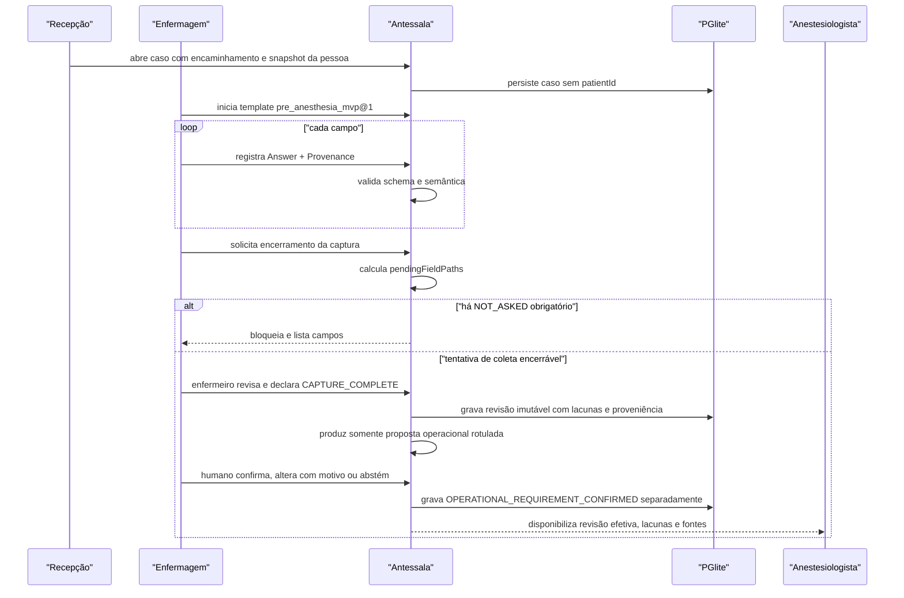

# Analyst — Anamnese pré-anestésica e catálogos

## Estado documental

- Papel: `REFERENCE_APPENDIX`.
- Consumido por: `hack/analysis.md`.
- Gate ou assinatura individual: inexistente.
- Research, recon e adversarial permanecem como histórico de maturidade, não como bloqueio do hack.
- Em conflito, `hack/analysis.md` prevalece e este anexo deve ser corrigido.

## TL;DR

O envelope versionado, o registry, a validação Zod, o composer e os catálogos offline do
Antessala podem ser reutilizados. Os oito widgets herdados do DietFlow não formam uma
anamnese pré-anestésica: três são adaptáveis, um fornece apenas um recorte reaproveitável e
quatro são excluídos. A proposta atual contém 14 grupos de coleta, respostas semânticas,
proveniência por campo e revisões do mesmo caso autônomo; nenhum paciente será cadastrado.
Os grupos, campos e condicionais ainda são candidatos de demonstração, não protocolo
clínico validado. Este artefato permanece aberto até pesquisa clínica, regulatória, de
licenças e review multiprofissional.

## Phase 0 Grill

| Signal | Verdict | Notes |
|---|---|---|
| Action clear | PASS | Coletar dados estruturados para subsidiar uma necessidade operacional e a avaliação médica posterior. |
| Persona clear | PARTIAL | O login é ENFERMAGEM, mas registrar, revisar e encerrar captura exigem qualificação profissional ainda não comprovada no contexto local. |
| Input/output clear | PARTIAL | Encaminhamento, relato e observações entram; a matriz clínica e seus limites ainda exigem pesquisa. |
| Scope clear | PASS | Protótipo local, dados sintéticos, sem paciente mestre, prontuário ou aptidão automática. |
| Objective criteria clear | FAIL | O texto anterior antecipou campos, obrigatoriedade e validações que a pesquisa ainda não legitimou. |

## Source And Scope

- Input source: PRD congelado e implementação existente nos repositórios Antessala e
  DietFlow.
- In scope: caso local, contexto do procedimento, anamnese de enfermagem, catálogos
  embarcados, pendências de dados, resumo por papel, versionamento e exportação.
- Out of scope: protocolo institucional, prontuário longitudinal, histórico entre casos,
  prescrição, decisão de aptidão, recomendação de suspensão medicamentosa e dados reais.
- `PRODUCT_LAW`: a demonstração pode decidir regras operacionais explícitas, sempre
  rotuladas. Regra clínica ou institucional não comprovada permanece `UNRESOLVED`.

## Product Promise

A enfermagem registra uma **coleta estruturada para subsidiar a avaliação
pré-anestésica**, sem transformar silêncio em resposta negativa. O sistema preserva o que
foi dito, medido, observado ou copiado de documento, mostra lacunas e entrega à recepção
somente a necessidade operacional confirmada por humano. O anestesiologista recebe as
revisões efetivas e a origem de cada informação. A coleta não é avaliação anestésica, não
libera procedimento e não decide via aérea, risco, ASA, aptidão ou conduta.

## Story de Usuario

- Como profissional de enfermagem autorizado, quero registrar fatos e saber quais perguntas
  ainda não foram feitas, sem confundir coleta encerrada com informação resolvida.
- Como enfermeiro responsável pela revisão, quero distinguir o que foi coletado por mim ou
  por membro supervisionado antes de declarar `CAPTURE_COMPLETE`.
- Como recepcionista, quero receber apenas a categoria de vaga, o prazo e os recursos, para
  agendar sem interpretar diagnóstico, medicação ou exame.
- Como anestesiologista, quero ler os dados, a fonte e as pendências do caso, para distinguir
  relato, documento, aferição e observação profissional.
- Como paciente, quero que cada novo encaminhamento seja tratado como um caso próprio, sem
  busca, deduplicação ou mistura com uma pessoa de mesmo nome.

## Story Tecnica

Como sistema, o Antessala deve persistir a coleta autônoma do caso, validar estrutura e
preservar proveniência. Texto livre é obrigatório quando nenhum catálogo corresponde; item
parecido nunca vira código verdadeiro. O fluxo separa `CAPTURE_COMPLETE`,
`INFORMATION_RESOLVED`, `OPERATIONAL_REQUIREMENT_CONFIRMED` e
`MEDICAL_EVALUATION_COMPLETE`. Uma revisão final é imutável, mas erro não é incorrigível:
correção cria adendo ou versão substitutiva vinculada, sem apagar o original. O formato
físico, os comandos e a repercussão pós-publicação pertencem ao Build somente depois que a
semântica estiver consolidada no Analyst integrado.

## Current Terrain

O Antessala já possui o envelope `{ _v: 2, blocos }`, oito definições headless, componentes
shadcn, serialização Zod, PGlite e catálogos locais. A anamnese ainda vive dentro de
`registros`, entidade declarada como legado. Os defaults herdados tornam hidratação, sono,
Bristol e adesão “completos” sem coleta, o que viola a semântica do novo produto. O catálogo
ativo de templates está vazio.

O DietFlow comprova a origem: registry de oito widgets, contrato de três camadas, envelope
versionado e `Content.content`. No DietFlow, `patientId NULL` significa template e
`patientId NOT NULL` significa registro preso a paciente. O Antessala reutiliza conteúdo e
contratos, mas corta `patientId`, evolução e todos os dados nutricionais sem pertinência.

## Evidence Matrix

| Path | Lines | Fact | Confidence |
|---|---:|---|---|
| `src/shared/anamnese/types.ts` | 25-41 | O contrato headless já inclui versão, Zod, defaults, completude, vazio e texto. | high |
| `src/shared/anamnese/types.ts` | 43-106 | O envelope persistido é v2 e aceita widget, snapshot e resultado. | high |
| `src/shared/anamnese/serialization.ts` | 78-155 | O parser valida tipo, versão, schema e ID duplicado. | high |
| `src/shared/anamnese/registry.ts` | 20-40 | Existem exatamente oito DTOs/definitions herdados. | high |
| `src/shared/anamnese/templates.ts` | 5-27 | Nenhum template está ativo; o básico é legado. | high |
| `src/main/db/clinical-schema.ts` | 11-25 | A anamnese atual está embutida em `registros`, entidade provisória. | high |
| `src/main/tipc.ts` | 265-313 | O único write clínico cria registro legado ou substitui toda a anamnese. | high |
| `tests/shared/anamnese/widgets.spec.ts` | 28-49 | Quatro defaults podem aparecer completos sem resposta coletada. | high |
| `src/shared/anamnese/widgets/medicacoes.ts` | 19-38 | Medicação atual não guarda ID do catálogo nem proveniência. | high |
| `src/shared/anamnese/widgets/problemas-saude.ts` | 6-17 | Condição atual guarda nome/CID livres, sem identidade do catálogo. | high |
| `src/main/db/clinical-schema.ts` | 61-114 | CID, classes, risco medicamentoso, medicamentos, MET e comorbidades já existem. | high |
| `src/main/db/seed.ts` | 63-94 | Assets clínicos são selados por SHA-256 antes da carga. | high |
| `src/main/db/seed.ts` | 128-150 | O primeiro boot lê somente assets locais. | high |
| `src/data/catalogos/README.md` | 13-38 | Há 14.793 CIDs, 382 medicamentos, 12 grupos, 94 MET e 14 comorbidades; recorte e licença têm limites. | high |
| `DietFlow:src/lib/anamnese/widget-registry.ts` | 53-89 | O DietFlow registra os oito widgets que originaram o port. | high |
| `DietFlow:src/lib/widgets/types.ts` | 70-130 | O contrato DietFlow separa metadata e dados com schema/completude. | high |
| `DietFlow:src/lib/anamnese/types.ts` | 151-162 | `Content.content` usa o mesmo envelope v2. | high |
| `DietFlow:src/lib/anamnese/templates.ts` | 39-79 | O template básico é uma composição fixa dos oito widgets nutricionais. | high |
| `DietFlow:prisma/schema.prisma` | 1101-1145 | `Content` possui ownership e JSON de conteúdo. | high |
| `DietFlow:prisma/schema.prisma` | 1109-1112 | `patientId` opcional separa template de registro ligado ao paciente. | high |
| `DietFlow:prisma/schema.prisma` | 3414-3472 | CID é hierárquico e possui fonte, relevância e status. | high |
| `DietFlow:prisma/schema.prisma` | 3482-3523 | Classes e medicamentos preservam relações e metadados ANVISA. | high |
| `hack/domains/ANALYST-acesso-e-auditoria.md` | 134-140 | O contrato transversal fecha os cinco papéis canônicos. | high |
| `hack/domains/ANALYST-caso-e-encaminhamento.md` | 108-117 | Caso descartável e lifecycle pertencem a `preop_cases`, não à anamnese. | high |

## Evidência externa verificada e seus limites

| Fonte primária | O que sustenta | O que não autoriza |
|---|---|---|
| [COFEN 736/2024](https://www.cofen.gov.br/resolucao-cofen-no-736-de-17-de-janeiro-de-2024/), arts. 4º, 6º, 7º e 8º | Coleta subjetiva/objetiva, atribuições privativas do enfermeiro e participação de técnicos/auxiliares sob supervisão. | Tratar todo login `ENFERMAGEM` como profissional intercambiável ou permitir diagnóstico/conduta médica. |
| [Lei 7.498/1986](https://www.planalto.gov.br/ccivil_03/leis/l7498.htm), arts. 11–15, e [Decreto 94.406/1987](https://www.planalto.gov.br/ccivil_03/decreto/1980-1989/d94406.htm), arts. 8º, 10 e 11 | Diferença legal entre enfermeiro, técnico e auxiliar e necessidade de supervisão. | Definir sozinho o protocolo local de coleta pré-anestésica. |
| [CFM 2.174/2017](https://sistemas.cfm.org.br/normas/visualizar/resolucoes/BR/2017/2174), art. 1º e Anexo II | Avaliação pré-anestésica, via aérea, risco e decisão do ato anestésico pertencem ao anestesiologista. | Transformar a lista médica do anexo em checklist universal da enfermagem. |
| [LGPD](https://www.planalto.gov.br/ccivil_03/_ato2015-2018/2018/lei/l13709.htm), art. 18, III | Dado inexato deve ser corrigível. | Impor overwrite ou um desenho físico específico de adendo. |
| [HL7 DataAbsentReason](https://www.hl7.org/fhir/R5/valueset-data-absent-reason.html) e [HL7 Provenance](https://hl7.org/fhir/provenance.html) | Referência semântica madura para motivos distintos de ausência e proveniência rica. | Virar lei brasileira ou schema obrigatório sem decisão do Build. |
| [WHO Medication Reconciliation](https://www.who.int/publications/m/item/high5s-standard-operating-protocol-medication-reconciliation) e [NICE CG183](https://www.nice.org.uk/guidance/cg183/chapter/Recommendations) | Lista de uso real inclui via, frequência, OTC/fitoterápicos/PRN; alergia exige status e detalhes estruturados. | Criar checklist pré-anestésico universal ou autorizar inferência de causalidade/gravidade. |
| [ANVISA DCB](https://www.gov.br/anvisa/pt-br/assuntos/farmacopeia/dcb), [WHO ATC/DDD](https://www.who.int/tools/atc-ddd-toolkit/atc-classification) e [SIGTAP](https://wiki.saude.gov.br/sigtap/index.php/Download) | Fontes versionadas possíveis para nomenclatura, classificação e procedimentos SUS. | Provar que os bundles atuais são completos, licenciados ou adequados a decisões anestésicas. |

Fontes estrangeiras servem como evidência clínica ou terminológica, não como lei brasileira.
Nenhuma dessas fontes valida os 14 grupos, suas obrigatoriedades, os minutos de agenda ou a
operação específica do hospital.

## Fronteira profissional

O papel autenticado continua `ENFERMAGEM`; ele não apaga a categoria profissional.

| Ação semântica | Enfermeiro | Técnico/auxiliar | Anestesiologista | Software |
|---|---|---|---|---|
| Registrar entrevista e observação compatíveis com protocolo | sim | participa conforme habilitação e supervisão | pode aprofundar | guia e registra fonte |
| Revisar a coleta e declarar `CAPTURE_COMPLETE` | sim | não autonomamente | não substitui o registro de enfermagem | calcula lacunas; não julga suficiência clínica |
| Confirmar necessidade operacional | `UNRESOLVED` | `UNRESOLVED` | não deve ser obrigado a operar agenda | pode sugerir somente como `DEMO_DECISION` |
| Declarar `MEDICAL_EVALUATION_COMPLETE`, ASA, risco, aptidão ou conduta | não | não | sim | proibido |

Para a encenação, a conta `ENFERMAGEM` que revisa/finaliza é explicitamente uma conta de
enfermeiro. Credencial profissional, delegação e supervisão reais continuam `UNRESOLVED` e
precisam de decisão institucional antes de qualquer operação real.

## Entities And State

```text
ENTITY: CasoPreAnestesico
- Attributes: id, personSnapshot, referralSnapshot, procedureSnapshot, requesterSnapshot,
  status, createdAt
- Actions: receber, iniciar/finalizar enfermagem, encaminhar para agenda, agendar, atender,
  registrar pendência/retorno, liberar laudo, entregar ou cancelar
- Relations: 1 encaminhamento, no máximo 1 anamnese, 1 revisão efetiva por vez e revisões
  históricas preservadas, N pendências
- Source of truth: PGlite local do protótipo
- Runtime states: RECEIVED_AT_RECEPTION, WAITING_NURSING, NURSING_IN_PROGRESS,
  TRIAGE_PENDING, READY_FOR_SCHEDULING, SCHEDULED, WAITING_ANESTHESIA, IN_ASSESSMENT,
  PENDING, WAITING_RETURN, READY_FOR_HANDOFF, DELIVERED_TO_REQUESTER, CANCELLED
- Invalid states: patientId; deduplicação por nome; dois casos compartilhando anamnese

ENTITY: Anamnese
- Attributes: id, caseId, envelopeVersion, templateId, templateVersion, status,
  draftVersion, finalRevision
- Actions: iniciar, salvar rascunho, submeter versão final
- Relations: 1 caso, no máximo 1 revisão FINAL efetiva, revisões sucedidas/invalidadas históricas,
  14 widgets e 1 resultado classificatório vigente
- Source of truth: snapshot JSONB validado
- Runtime states: DRAFT, COMPLETE
- Invalid states: COMPLETE com campo obrigatório NOT_ASKED; mais de uma revisão FINAL efetiva;
  overwrite de revisão FINAL; correção sem autoria, motivo e vínculo com a anterior

ENTITY: RespostaClinica
- Attributes: collectionState, value nullable, absenceReason nullable, provenance
- Actions: responder, registrar negativa explícita, ausência, recusa ou observação não realizada
- Relations: pertence a campo de widget
- Source of truth: JSONB da revisão
- Runtime states: ANSWERED, UNKNOWN, NOT_APPLICABLE, NOT_ASKED, REFUSED, NOT_PERFORMED
- Invalid states: valor default fingindo resposta; ausência sem motivo; negativa inferida de
  lista vazia; NOT_PERFORMED tratado como normal ou não aplicável

ENTITY: CatalogItem
- Attributes: catalogId, itemId, label, source, revision, active
- Actions: seed, buscar, referenciar
- Relations: pode ser referenciado por respostas
- Source of truth: asset versionado + tabela PGlite
- Runtime states: ACTIVE, RETIRED
- Invalid states: referência silenciosa a item inexistente; texto livre fingindo item catalogado
```

### Contrato semântico comum de resposta

`ANSWERED` contém um valor conhecido, inclusive `false`, zero ou lista vazia quando esse
valor foi explicitamente obtido. Uma negativa documentada é `ANSWERED(false)`; nunca nasce
de default, silêncio ou lista vazia. Os demais estados explicam ausência de valor:

| Estado | Significado | Pergunta tratada? | Informação resolvida? |
|---|---|:---:|:---:|
| `ANSWERED` | valor documentado, inclusive `false` | sim | sim, se válido |
| `UNKNOWN` | houve tentativa, mas valor não é conhecido | sim | não |
| `REFUSED` | informante recusou responder | sim | não |
| `NOT_ASKED` | pergunta não foi feita | não | não |
| `NOT_APPLICABLE` | regra versionada diz que o elemento não possui valor neste contexto | sim | sim quanto à aplicabilidade |
| `NOT_PERFORMED` | aferição, observação ou teste não foi realizado | sim quanto à tentativa | não |

Campo dependente não vira `NOT_APPLICABLE` quando o controlador é `UNKNOWN`, `REFUSED` ou
`NOT_ASKED`. O template nasce `NOT_ASKED`, sem valor e sem autor fictício.

### Proveniência mínima

Cada resposta registra informante e vínculo, coletor, categoria profissional, data/hora,
roteiro/versão, documento ou método/dispositivo de origem, catálogo/release quando houver e
motivo de ausência. Sugestão automatizada acrescenta provedor, modelo/versão, trecho-fonte,
relações recuperadas e decisão humana. Mutação de lista preserva criação, última alteração e
remoção append-only. Divergências entre relato, documento e observação permanecem visíveis;
uma fonte não sobrescreve silenciosamente a outra.

### Quatro marcos independentes

| Marco | Significado | Autoridade |
|---|---|---|
| `CAPTURE_COMPLETE` | perguntas obrigatórias daquele estágio foram tratadas | enfermeiro na demo; política real `UNRESOLVED` |
| `INFORMATION_RESOLVED` | não resta informação necessária desconhecida, recusada ou não realizada | enfermagem identifica; suficiência clínica é médica |
| `OPERATIONAL_REQUIREMENT_CONFIRMED` | necessidade da agenda da demo foi confirmada ou alterada por humano | `UNRESOLVED`; não pode ser inferida por campo isolado |
| `MEDICAL_EVALUATION_COMPLETE` | avaliação pré-anestésica e decisão médica concluídas | anestesiologista |

`UNKNOWN`, `REFUSED` ou `NOT_PERFORMED` podem encerrar a tentativa de coleta conforme regra
local, mas não tornam a informação resolvida. Esses marcos pertencem ao mesmo caso; não
criam histórico longitudinal entre pessoas ou encaminhamentos.

### Envelope lógico provisório

Este exemplo apenas mostra que a coleta é versionada e composta por blocos. Nomes físicos,
versão, campos derivados e forma de persistência pertencem ao Build futuro.

```ts
type PreAnesthesiaContent = {
  _v: 3
  template: { id: 'pre_anesthesia_mvp'; version: 1 }
  blocks: PreAnesthesiaBlock[]
  listMutationLog: ListMutationReceipt[]
  completedAt: string | null
  completeness: { complete: boolean; pendingFieldPaths: string[] }
}

type PreAnesthesiaBlock<T> = {
  id: string
  type: 'widget'
  widgetType: PreAnesthesiaWidgetType
  schemaVersion: 1
  data: T
  createdAt: string
  updatedAt: string
}
```

## Inventário candidato de grupos da coleta

Os 14 grupos abaixo formam o template da demonstração como `DEMO_DECISION`; não são um
mínimo clínico universal. Campo, obrigatoriedade, wording, população e ramo condicional
continuam `UNRESOLVED` até validação multiprofissional. Os shapes são inventário semântico
para revisar perguntas — não DTOs autorizados.

### 1. `procedure_context@1`

```ts
type ProcedureContextData = {
  indication: Answer<string>
  plannedDate: Answer<string>
  laterality: Answer<'LEFT' | 'RIGHT' | 'BILATERAL'>
  referralNotes: Answer<string>
}

type ProcedureContextProjectionDTO = {
  caseVersion: number
  contextFingerprint: string
  procedure: { catalogId: string; code: string | null; name: string }
  requestingService: { serviceId: string; name: string }
}
```

Procedimento e serviço solicitante são projeções read-only de `preop_cases`; não pertencem
ao JSONB da anamnese e não aceitam `SET_ANSWER`. O header compõe
`ProcedureContextProjectionDTO` em cada leitura. A anamnese persiste somente indicação,
data planejada, lateralidade e notas clínicas. Procedimento, serviço e indicação precisam
estar presentes para finalizar; data e lateralidade admitem `NOT_APPLICABLE` conforme a
matriz abaixo. Consumidores: perguntas condicionais e resumo do caso.

Ao iniciar o draft, a anamnese ancora a revisão conjunta de pessoa, encaminhamento,
procedimento e solicitante. Toda correção aplica a matriz semântica do Analyst de caso:
idade/data de nascimento, sexo, conteúdo do encaminhamento, procedimento ou serviço tornam
os consumidores dependentes `STALE`; correção ortográfica ou de proveniência exige ao menos
reconhecimento explícito. Texto novo nunca é copiado automaticamente para resposta clínica.

Enquanto estiver `DRAFT`, a enfermagem revisa a mudança, preserva respostas não afetadas
com sua proveniência e reconfirma ou corrige as afetadas antes de submeter. `submitFinal` e
`correctIntake` têm vencedor único e comparam a mesma revisão do contexto.

Se o intake incorreto for descoberto depois da revisão final e antes da publicação da
necessidade, a revisão e a proposta derivada tornam-se `INVALIDATED`, deixam de alimentar
agenda, avaliação, PDF, IA ou memória e permanecem históricas. Abre-se novo draft ancorado
no contexto corrigido; somente nova revisão da enfermagem pode voltar a ser efetiva. Isso é
correção dentro do caso, não evolução longitudinal ou edição silenciosa da revisão anterior.

### 2. `allergies@1`

```ts
type AllergiesData = {
  hasAllergy: Answer<boolean>
  items: Array<ProvenancedListItem<{
    id: string
    substance: Answer<string>
    reaction: Answer<string>
    documentedSeverity: Answer<'MILD' | 'MODERATE' | 'SEVERE'>
    occurredAtOrPeriod: Answer<string>
    reactionKind: Answer<'ALLERGY' | 'INTOLERANCE' | 'OTHER_ADVERSE_REACTION'>
  }>>
}
```

Negativa exige pergunta explícita e lista ativa vazia; positivo exige substância e reação
factual. Gravidade e tipo só são registrados quando explicitamente documentados ou
observados, nunca inferidos pelo coletor. O fallback textual permanece disponível.
Consumidor: revisão humana, nunca diagnóstico, urgência ou conduta automática.

### 3. `anesthesia_history@1`

```ts
type AnesthesiaHistoryData = {
  previousAnesthesia: Answer<boolean>
  personalComplication: Answer<boolean>
  personalComplicationDescription: Answer<string>
  difficultAirwayHistory: Answer<boolean>
  postoperativeNauseaVomiting: Answer<boolean>
  familyAnesthesiaComplication: Answer<boolean>
  familyComplicationDescription: Answer<string>
}
```

Descrições são obrigatórias quando a resposta correspondente é positiva. Consumidor:
estimativa de carga e destaque para leitura médica.

### 4. `cardiovascular@1`

```ts
type CardiovascularData = {
  chestPain: Answer<boolean>
  dyspneaAtRest: Answer<boolean>
  syncope: Answer<boolean>
  palpitation: Answer<boolean>
  edema: Answer<boolean>
  knownCardiovascularDisease: Answer<boolean>
  detail: Answer<string>
}
```

`detail` é obrigatório se qualquer item for positivo. Consumidor: carga operacional e
resumo clínico, não ASA/RCRI.

### 5. `respiratory@1`

```ts
type RespiratoryData = {
  dyspnea: Answer<boolean>
  wheezing: Answer<boolean>
  recentRespiratoryInfection: Answer<boolean>
  chronicCough: Answer<boolean>
  sleepApneaDiagnosis: Answer<boolean>
  usesRespiratorySupport: Answer<boolean>
  supportDescription: Answer<string>
  detail: Answer<string>
}
```

O widget `sono` DietFlow não atravessa: somente o fato respiratório relevante é remodelado.

### 6. `functional_capacity@1`

```ts
type FunctionalCapacityData = {
  activity: Answer<{ catalogId: string | null; label: string }>
  limitedBySymptoms: Answer<boolean>
  limitationDescription: Answer<string>
}
```

Registrar atividade relatada e sintomas limitantes. MET, quando exibido, é metadado do
catálogo sobre custo energético médio da atividade; não é valor individual da pessoa, não
entra na resposta clínica e não calcula capacidade, risco ou aptidão. Instrumento como DASI
permanece `UNRESOLVED` até escolha, licença, população e interpretação serem aprovadas.

### 7. `medications@1`

```ts
type MedicationsData = {
  usesMedication: Answer<boolean>
  items: Array<ProvenancedListItem<{
    id: string
    catalogId: string | null
    name: string
    activeIngredient: string | null
    dose: Answer<string>
    route: Answer<string>
    frequency: Answer<string>
    actualUse: Answer<string>
    lastUse: Answer<string>
    reason: Answer<string>
    productKind: Answer<'PRESCRIBED' | 'OTC' | 'HERBAL' | 'SUPPLEMENT' | 'PRN' | 'OTHER'>
    sourceText: string
  }>>
}
```

Adapta `medicacoes`; preserva texto original, uso real, via, frequência, última utilização e
fonte. Inclui prescrito, OTC, fitoterápico, suplemento, PRN e fallback livre. Ausência no
recorte de 382 itens nunca bloqueia o registro. Grupo de “risco”, peso, conduta e orientação
de suspensão/manutenção ficam fora do contrato clínico.

### 8. `diagnoses@1`

```ts
type DiagnosesData = {
  hasDiagnosis: Answer<boolean>
  items: Array<ProvenancedListItem<{
    id: string
    cidId: string | null
    code: string | null
    name: string
    controlStatement: Answer<string>
    currentSymptoms: Answer<boolean>
    detail: Answer<string>
  }>>
}
```

Adapta `problemas_saude`; preserva condição referida/documentada, tratamento, sintomas,
mudança recente e fallback livre. `controlStatement` só reproduz afirmação da fonte; não é
conclusão da enfermagem nem do software. Um array vazio nunca significa “sem diagnóstico”.

### 9. `bleeding_thrombosis@1`

```ts
type BleedingThrombosisData = {
  abnormalBleeding: Answer<boolean>
  easyBruising: Answer<boolean>
  priorThrombosis: Answer<boolean>
  familyBleedingDisorder: Answer<boolean>
  receivesAnticoagulantOrAntiplatelet: Answer<boolean>
  detail: Answer<string>
}
```

Obrigatório perguntar todos os fatos. Detalhe é obrigatório para qualquer positivo.

### 10. `vital_signs@1`

```ts
type VitalSignsData = {
  measuredAt: Answer<string>
  systolicBpMmHg: Answer<number>
  diastolicBpMmHg: Answer<number>
  heartRateBpm: Answer<number>
  oxygenSaturationPct: Answer<number>
  weightKg: Answer<number>
  heightCm: Answer<number>
  temperatureC: Answer<number>
}
```

Cada valor aferido registra autor, data/hora, unidade e, quando pertinente, método ou
dispositivo. Medida não feita usa `NOT_PERFORMED`, não `NOT_APPLICABLE`, normalidade ou
default. Frequência respiratória e dor permanecem `UNRESOLVED` para decisão institucional.

### 11. `habits_substances@1`

```ts
type HabitsSubstancesData = {
  tobacco: Answer<{ status: 'NEVER' | 'FORMER' | 'CURRENT' }>
  tobaccoAmountPerDay: Answer<number>
  tobaccoStoppedAtOrPeriod: Answer<string>
  alcohol: Answer<{ status: 'NEVER' | 'FORMER' | 'CURRENT' }>
  alcoholFrequency: Answer<string>
  recreationalSubstances: Answer<boolean>
  substancesDescription: Answer<string>
  recentUse: Answer<string>
}
```

Tabaco e álcool distinguem nunca, uso anterior e uso atual; quantidade, unidade,
frequência, cessação e última utilização são independentes e admitem desconhecimento ou
recusa. Linguagem não estigmatizante e nenhuma inferência de dependência, risco ou urgência.

### 12. `special_conditions@1`

```ts
type SpecialConditionsData = {
  pregnant: Answer<boolean>
  lactating: Answer<boolean>
  communicationAccommodation: Answer<string>
  mobilityAccommodation: Answer<string>
  legalRepresentativeNeeded: Answer<boolean>
  otherCondition: Answer<string>
}
```

O sistema não infere aplicabilidade por sexo ou gênero. Possibilidade/estado de gravidez e
lactação são independentes, distinguem autorrelato de teste/documento e admitem
`UNKNOWN`/`REFUSED`, conforme política institucional ainda `UNRESOLVED`. Necessidades de
comunicação/mobilidade podem afetar recurso operacional, nunca diagnóstico ou urgência.

### 13. `exams_pending@1`

```ts
type ExamsPendingData = {
  documentsAvailable: Answer<boolean>
  items: Array<ProvenancedListItem<{
    id: string
    kind: 'EXAM' | 'REPORT' | 'INFORMATION'
    name: string
    requestedBy: Answer<string>
    requestedAt: Answer<string>
    dueAt: Answer<string>
    status: 'PRESENT' | 'MISSING' | 'REQUESTED'
    note: Answer<string>
  }>>
}
```

Na triagem, itens ausentes geram pendência de dado. Após consulta anestésica, novos pedidos
usam a entidade de pendência do caso, não reescrevem esta revisão.

### 14. `clinical_notes@1`

```ts
type ClinicalNotesData = {
  note: Answer<string>
}
```

Adapta `observacoes_gerais`, remove HTML arbitrário do DTO e registra autoria. É opcional e
nunca substitui campo estruturado obrigatório.

### Matriz provisória de pesquisa — não normativa

As duas matrizes abaixo preservam o inventário dos campos candidatos, mas **não autorizam
schema, DTO, obrigatoriedade nem implementação**. Qualquer regra incompatível com o
contrato semântico corrigido acima está invalidada. Em especial: `ANSWERED(false)` é valor
legítimo obtido explicitamente; medida não feita usa `NOT_PERFORMED`; `metMin/metMax`,
`controlled` e `pregnancyApplicable` foram retirados do contrato clínico; limites numéricos
e quantidade máxima são `DEMO_DECISION`; campos obrigatórios/condicionais continuam
`UNRESOLVED` até revisão multiprofissional.

### Inventário de validações candidatas do template

| Grupo | Contrato sintático e semântico |
|---|---|
| IDs de bloco/item | UUID/texto opaco não vazio; únicos dentro do envelope/lista |
| Texto curto | trim, 1–200 caracteres |
| Texto descritivo | trim, 1–2.000 caracteres |
| Nota clínica | trim, 1–4.000 caracteres |
| Datas | ISO `YYYY-MM-DD`; `dueAt` não pode preceder `requestedAt` |
| Instantes | ISO 8601 com offset; `measuredAt` não pode estar no futuro da captura |
| Listas clínicas | máximo 100 itens; IDs únicos; ordem preservada |
| Valores catalogados | ID e label precisam corresponder à mesma revisão; fallback usa ID nulo |
| Booleanos | `ANSWERED(true/false)` é válido quando explicitamente obtido; default ou lista vazia não é resposta |
| Defaults | todos os campos `NOT_ASKED`, sem valor e com `provenance=null` |

Refinamentos por widget:

- `procedure_context`: procedimento e serviço vêm somente da projeção read-only do caso;
  indicação usa texto descritivo; data planejada é ISO; lateralidade aceita somente o enum
  e apenas quando aplicável.
- `allergies`: máximo 50 itens; substância 1–200, reação 1–1.000; IDs únicos;
  positivo exige item e negativo exige lista vazia.
- `anesthesia_history`, `cardiovascular` e `respiratory`: detalhe condicionado usa
  1–2.000 caracteres; suporte respiratório positivo exige descrição.
- `functional_capacity`: atividade relatada e limitação preservam texto/fonte; MET fica
  somente como metadado do catálogo e não como valor individual.
- `medications`: máximo 100 itens; nome 1–200, texto de origem 1–500; dose, frequência,
  último uso e motivo usam 1–200 quando respondidos; positivo exige item e negativo exige
  lista vazia.
- `diagnoses`: máximo 100 itens; nome 1–200; código 1–20; positivo exige item e negativo
  exige lista vazia; detalhe é obrigatório para sintomas atuais positivos.
- `bleeding_thrombosis`: qualquer positivo exige detalhe de 1–2.000.
- `vital_signs`: pressão sistólica 20–350 mmHg; diastólica 10–250; frequência 10–300 bpm;
  saturação 0–100%; peso 0,5–600 kg; altura 20–300 cm; temperatura 20–50 °C. Faixa é
  validação de entrada da demo, não interpretação clínica. Quando não aferido, cada campo
  fica `NOT_PERFORMED`, `UNKNOWN` ou `NOT_ASKED`.
- `habits_substances`: tabaco/álcool distinguem `NEVER`, `FORMER` e `CURRENT`; quantidade,
  unidade e temporalidade continuam candidatas à validação institucional.
- `special_conditions`: não existe `pregnancyApplicable`; gravidez e lactação são
  independentes, respeitam recusa e política institucional.
- `exams_pending`: máximo 100 itens; nome 1–200; datas ISO; `PRESENT` exige documento
  disponível e `MISSING/REQUESTED` produz pendência operacional.
- `clinical_notes`: nota opcional; quando respondida usa 1–4.000 caracteres.

### Inventário provisório de completude por `fieldPath`

Legenda:

- `RO-R`: projeção read-only obrigatória do caso; não é `Answer` e não entra no JSONB.
- `R`: resposta obrigatoriamente tratada; `NOT_ASKED` bloqueia. `UNKNOWN`/`REFUSED` tratam a
  pergunta, mas podem gerar pendência.
- `C`: obrigatória quando a condição é verdadeira; quando falsa, o campo deve ser
  `NOT_APPLICABLE`, salvo indicação diferente na tabela.
- `O`: opcional; pode permanecer `NOT_ASKED` sem bloquear. Se preenchida, valida normalmente.
- `I-R`/`I-O`/`I-C`: a mesma semântica aplicada a cada item ativo da lista. Campos escalares
  `I-R` não usam `Answer`, mas exigem valor e recebem proveniência pela mutação do item.

`NOT_APPLICABLE` é aceito **somente** por regra de aplicabilidade versionada. Negativa
explícita é sempre `ANSWERED(false)`, preservando pergunta, escopo e proveniência.
Quando o controlador de um campo `C` está `UNKNOWN` ou `REFUSED`, o dependente pode
permanecer `NOT_ASKED` sem bloquear; a completude reporta o controlador como tratado porém
indeterminado e não inventa aplicabilidade. Se o controlador for corrigido depois, o
dependente volta a obedecer imediatamente ao ramo positivo/negativo.

| `fieldPath` canônico | Classe | Condição de obrigatoriedade / `NOT_APPLICABLE` |
|---|---|---|
| `$case.procedureSnapshot.description` | `RO-R` | Não vazio no caso; projetado no header e usado na completude contextual. |
| `$case.requesterSnapshot.serviceName` | `RO-R` | Não vazio no caso; projetado no header. `serviceId` e nome são obrigatórios. |
| `procedure_context.indication` | `R` | Sem `NOT_APPLICABLE`; `UNKNOWN`/`REFUSED` são tratados e sinalizados. |
| `procedure_context.plannedDate` | `O` | `NOT_APPLICABLE` apenas quando não há data planejada. |
| `procedure_context.laterality` | `O` | `NOT_APPLICABLE` quando o procedimento/sítio não possui lateralidade aplicável. |
| `procedure_context.referralNotes` | `O` | `NOT_APPLICABLE` quando o encaminhamento não traz observação adicional. |
| `allergies.hasAllergy` | `R` | `ANSWERED(false)` exige lista ativa vazia; `ANSWERED(true)` exige ao menos um item. |
| `allergies.items[*].substance` | `I-R` | Todo item ativo; sem `NOT_APPLICABLE`. |
| `allergies.items[*].reaction` | `I-R` | Todo item ativo; `UNKNOWN`/`REFUSED` admitidos, não `NOT_APPLICABLE`. |
| `allergies.items[*].severity` | `I-R` | Todo item ativo; desconhecimento usa estado `UNKNOWN` ou o valor legado `UNKNOWN`, nunca silêncio. |
| `anesthesia_history.previousAnesthesia` | `R` | `ANSWERED(true)` ativa os três fatos pessoais abaixo; `ANSWERED(false)` os torna `NOT_APPLICABLE`. |
| `anesthesia_history.personalComplication`<br>`anesthesia_history.difficultAirwayHistory`<br>`anesthesia_history.postoperativeNauseaVomiting` | `C` | Obrigatórios se `previousAnesthesia=ANSWERED(true)`; `NOT_APPLICABLE` se `previousAnesthesia=ANSWERED(false)`. |
| `anesthesia_history.personalComplicationDescription` | `C` | Obrigatória se `personalComplication=ANSWERED`; `NOT_APPLICABLE` em qualquer outro estado tratado. |
| `anesthesia_history.familyAnesthesiaComplication` | `R` | Independente de anestesia pessoal prévia. |
| `anesthesia_history.familyComplicationDescription` | `C` | Obrigatória se a complicação familiar for positiva; `NOT_APPLICABLE` caso contrário. |
| `cardiovascular.chestPain`<br>`cardiovascular.dyspneaAtRest`<br>`cardiovascular.syncope`<br>`cardiovascular.palpitation`<br>`cardiovascular.edema`<br>`cardiovascular.knownCardiovascularDisease` | `R` | Cada fato precisa ser tratado; sem `NOT_APPLICABLE`. |
| `cardiovascular.detail` | `C` | Obrigatório se qualquer fato cardiovascular for positivo; `NOT_APPLICABLE` se nenhum for positivo. |
| `respiratory.dyspnea`<br>`respiratory.wheezing`<br>`respiratory.recentRespiratoryInfection`<br>`respiratory.chronicCough`<br>`respiratory.sleepApneaDiagnosis`<br>`respiratory.usesRespiratorySupport` | `R` | Cada fato precisa ser tratado; sem `NOT_APPLICABLE`. |
| `respiratory.supportDescription` | `C` | Obrigatória se `usesRespiratorySupport=ANSWERED`; `NOT_APPLICABLE` caso contrário. |
| `respiratory.detail` | `C` | Obrigatório se qualquer fato respiratório for positivo; `NOT_APPLICABLE` se nenhum for positivo. |
| `functional_capacity.activity` | `R` | Seleção catalogada ou fallback livre; incapacidade declarada usa valor explícito versionado, nunca estado de ausência. |
| metadado MET da atividade | `O` | Somente apoio de linguagem do catálogo; não é resposta individual nem entra na completude. |
| `functional_capacity.limitedBySymptoms` | `R` | Sem `NOT_APPLICABLE`. |
| `functional_capacity.limitationDescription` | `C` | Obrigatória se limitação positiva; `NOT_APPLICABLE` caso contrário. |
| `medications.usesMedication` | `R` | `ANSWERED(false)` exige lista ativa vazia; `ANSWERED(true)` exige ao menos um item. |
| `medications.items[*].name`<br>`medications.items[*].sourceText` | `I-R` | Texto não vazio em todo item ativo. |
| `medications.items[*].catalogId`<br>`medications.items[*].activeIngredient` | `I-O` | Escalares nulos no fallback livre; não usam `Answer`. |
| `medications.items[*].dose`<br>`medications.items[*].frequency`<br>`medications.items[*].lastUse` | `I-R` | Cada pergunta é tratada; desconhecimento usa `UNKNOWN`/`REFUSED`, não `NOT_APPLICABLE`. |
| `medications.items[*].reason` | `I-R` | Tratada em cada item; `NOT_APPLICABLE` permitido quando não há motivo informado/aplicável. |
| `diagnoses.hasDiagnosis` | `R` | `ANSWERED(false)` exige lista ativa vazia; `ANSWERED(true)` exige ao menos um item. |
| `diagnoses.items[*].name` | `I-R` | Texto não vazio em todo item ativo. |
| `diagnoses.items[*].cidId`<br>`diagnoses.items[*].code` | `I-O` | Escalares nulos no fallback livre; não usam `Answer`. |
| `diagnoses.items[*].controlStatement` | `I-O` | Somente frase atribuída ao paciente/documento; nunca conclusão da enfermagem/software. |
| `diagnoses.items[*].currentSymptoms` | `I-R` | Sem `NOT_APPLICABLE`; negativo usa `ANSWERED(false)`. |
| `diagnoses.items[*].detail` | `I-C` | Obrigatório se sintomas atuais forem positivos; `NOT_APPLICABLE` caso contrário. |
| `bleeding_thrombosis.abnormalBleeding`<br>`bleeding_thrombosis.easyBruising`<br>`bleeding_thrombosis.priorThrombosis`<br>`bleeding_thrombosis.familyBleedingDisorder`<br>`bleeding_thrombosis.receivesAnticoagulantOrAntiplatelet` | `R` | Cada fato precisa ser tratado; sem `NOT_APPLICABLE`. |
| `bleeding_thrombosis.detail` | `C` | Obrigatório se qualquer fato for positivo; `NOT_APPLICABLE` caso contrário. |
| `vital_signs.measuredAt` | `C` | `ANSWERED` quando qualquer valor foi aferido; ausência de aferição usa `NOT_PERFORMED`. |
| `vital_signs.systolicBpMmHg`<br>`vital_signs.diastolicBpMmHg`<br>`vital_signs.heartRateBpm`<br>`vital_signs.oxygenSaturationPct`<br>`vital_signs.weightKg`<br>`vital_signs.heightCm`<br>`vital_signs.temperatureC` | `C` | Cada medida feita tem valor/unidade/proveniência; medida não feita usa `NOT_PERFORMED`. |
| `habits_substances.tobacco` | `C` | Valor distingue `NEVER`, `FORMER` e `CURRENT`; ausência de coleta não vira nunca fumou. |
| `habits_substances.tobaccoAmountPerDay` | `C` | Tratada se tabaco positivo; `NOT_APPLICABLE` se tabaco negativo. |
| `habits_substances.alcohol` | `C` | Valor distingue `NEVER`, `FORMER` e `CURRENT`. |
| `habits_substances.alcoholFrequency` | `C` | Tratada se álcool positivo; `NOT_APPLICABLE` se álcool negativo. |
| `habits_substances.recreationalSubstances` | `R` | Presença usa `ANSWERED(true)`; ausência confirmada usa `ANSWERED(false)`. |
| `habits_substances.substancesDescription`<br>`habits_substances.recentUse` | `C` | Tratadas se substância recreativa for positiva; `NOT_APPLICABLE` caso contrário. |
| `special_conditions.pregnant`<br>`special_conditions.lactating` | `C` | Independentes; política de pergunta/teste, consentimento e confidencialidade é `UNRESOLVED`. |
| `special_conditions.communicationAccommodation`<br>`special_conditions.mobilityAccommodation` | `R` | `ANSWERED(true)` carrega a necessidade; `ANSWERED(false)` significa nenhuma. Não usar string vazia. |
| `special_conditions.legalRepresentativeNeeded` | `R` | Presença usa `ANSWERED(true)`; ausência confirmada usa `ANSWERED(false)`. |
| `special_conditions.otherCondition` | `O` | Pode ficar `NOT_ASKED`; `ANSWERED(false)` pode registrar explicitamente nenhuma outra condição. |
| `exams_pending.documentsAvailable` | `R` | Qualquer item `PRESENT` exige `ANSWERED(true)`; `ANSWERED(false)` significa nenhum documento disponível. |
| `exams_pending.items[*].kind`<br>`exams_pending.items[*].name`<br>`exams_pending.items[*].status` | `I-R` | Escalares obrigatórios em todo item ativo; não usam `Answer`. |
| `exams_pending.items[*].requestedBy`<br>`exams_pending.items[*].requestedAt` | `I-C` | Tratados quando `status=REQUESTED`; `NOT_APPLICABLE` quando o item não foi solicitado. |
| `exams_pending.items[*].dueAt` | `I-O` | `NOT_APPLICABLE` quando não existe prazo; se respondido, não precede `requestedAt`. |
| `exams_pending.items[*].note` | `I-O` | Pode ficar `NOT_ASKED`; não substitui nome/status. |
| `clinical_notes.note` | `O` | Pode ficar `NOT_ASKED`; nunca satisfaz outro campo. |

Em `allergies`, `medications` e `diagnoses`, controlador positivo exige ao menos um item;
`ANSWERED(false)`, `UNKNOWN` ou `REFUSED` exigem lista ativa vazia. Em `exams_pending`, a lista é
independente: `documentsAvailable=ANSWERED(false)` proíbe apenas item `PRESENT`, mas admite
`MISSING/REQUESTED`; qualquer item `PRESENT` exige controlador positivo. Um item ativo
sempre satisfaz todos os `I-R`/`I-C` aplicáveis e possui ID único. `listMutationLog` e
`itemProvenance` são metadados gerados pelo main, não campos de completude editáveis.

### Operações lógicas candidatas do rascunho

O exemplo abaixo registra a necessidade semântica de alterar respostas e listas com
autoria. Tipos, Zod, paths e granularidade física permanecem inválidos para implementação
até o Build ser refeito.

O renderer nunca envia o envelope inteiro nem um patch JSON arbitrário. A união fechada é:

```ts
type DraftOperation =
  | {
      type: 'SET_ANSWER'
      fieldPath: RootAnswerFieldPath
      answer: AnswerInputForFieldPath
    }
  | {
      type: 'ADD_ITEM'
      listPath: ClinicalListPath
      item: NewItemInputForListPath
      source: ClinicalSource
    }
  | {
      type: 'UPDATE_ITEM'
      listPath: ClinicalListPath
      itemId: string
      patch: NonEmptyItemPatchForListPath
      source: ClinicalSource
    }
  | {
      type: 'REMOVE_ITEM'
      listPath: ClinicalListPath
      itemId: string
      source: ClinicalSource
    }
```

`RootAnswerFieldPath` contém somente os paths sem `items[*]` enumerados na matriz.
`ClinicalListPath` contém exatamente `allergies.items`, `medications.items`,
`diagnoses.items` e `exams_pending.items`. Cada combinação de path possui schema Zod
próprio; não existe `unknown`, `Record<string, unknown>`, path dinâmico nem merge profundo.
`SET_ANSWER` não alcança campo de item. `ADD_ITEM` valida o objeto completo;
`UPDATE_ITEM` aceita patch estrito e não vazio; `REMOVE_ITEM` exige item ativo. O main
injeta autoria e horário, atualiza `itemProvenance` e acrescenta receipt append-only em
`listMutationLog` para toda mutação de lista.

## Classificação dos oito widgets DietFlow

| Widget herdado | Decisão | Destino |
|---|---|---|
| `problemas_saude` | ADAPTAR | `diagnoses@1`, com CID estável, resposta negativa e sintomas atuais. |
| `medicacoes` | ADAPTAR | `medications@1`, com ID catalogado, último uso e origem. |
| `observacoes_gerais` | ADAPTAR | `clinical_notes@1`, texto puro e autoria. |
| `sono` | EXTRAIR RECORTE | Apneia e suporte entram em `respiratory`; ISI-3/ISI-7 ficam fora. |
| `rotina_alimentar` | REJEITAR | Não cumpre promessa pré-anestésica do MVP. |
| `hidratacao` | REJEITAR | Meta hídrica nutricional e default 2 L ficam fora. |
| `bristol` | REJEITAR | Bristol/GI score ficam fora do template do MVP. |
| `adesao` | REJEITAR | Adesão a dieta e estimativa calórica ficam fora. |

## Runtime / Data Flow



## Rules And Invariants

- MUST criar um caso novo para cada encaminhamento.
- MUST NOT buscar, deduplicar ou ligar o caso a uma tabela de pacientes.
- MUST persistir o envelope somente após validação runtime integral.
- MUST registrar provenance em cada resposta.
- MUST registrar provenance append-only em cada adição, alteração ou remoção de item.
- MUST representar explicitamente a resposta negativa.
- MUST bloquear `CAPTURE_COMPLETE` se pergunta obrigatória daquele estágio permanecer
  `NOT_ASKED`.
- MUST permitir `ANSWERED(false)` quando explicitamente obtido.
- MUST permitir `UNKNOWN`, `REFUSED` e `NOT_PERFORMED`; esses estados podem encerrar a
  tentativa, mas nunca viram negativa nem informação resolvida.
- MUST preservar texto livre quando catálogo não encontrar item, com ID catalogado nulo.
- MUST gravar o ID do catálogo quando houver seleção confirmada.
- MUST congelar a revisão usada pela classificação.
- MUST projetar procedimento/serviço do caso como read-only; o widget não duplica esses
  snapshots no JSONB.
- MUST separar captura, resolução informacional, proposta e confirmação operacional; o
  software não publica necessidade de agenda só porque a captura encerrou.
- MUST ancorar o draft na revisão conjunta do contexto e aplicar, a cada correção, a matriz
  de impacto do Analyst de caso a anamnese, classificação, IA e resumo.
- MUST exigir revisão explícita de todo consumidor `STALE` antes de salvar ou submeter.
- MUST garantir vencedor único entre `submitFinal` e `correctIntake`; nenhum resultado
  parcial é aceito.
- MUST NOT sobrescrever revisão FINAL. Nesta PoC, correção posterior é rejeitada; informação
  nova pertence ao encontro ou à evidência de pendência e recebe autoria e horário nesse
  domínio. A revisão FINAL da enfermagem permanece preservada.
- IF a correção ocorrer antes da publicação operacional, THEN invalidar derivados e exigir
  nova confirmação. Depois da publicação, repercussão em requisito/reserva é `UNRESOLVED` e
  nunca pode ocorrer silenciosamente.
- IF a necessidade já estiver publicada, THEN correção material não é escondida por
  override; bloqueia o uso e segue governança ainda `UNRESOLVED` para operação real.
- IF um item catalogado for retirado, THEN manter label e revisão capturados no snapshot.
- IF um procedimento não estiver catalogado, THEN usar `catalogId=null`, preservar nome e
  aplicar o template geral completo.
- MUST NOT produzir ASA, RCRI, aptidão, manejo medicamentoso ou conduta clínica.
- MUST NOT expor diagnóstico, medicação ou nota clínica à recepção.

## Architecture Risks

| Severity | Risk | Evidence | Fix direction |
|---|---|---|---|
| critical | Defaults herdados simulam resposta | `tests/shared/anamnese/widgets.spec.ts:28-49` | Todos os novos campos nascem `NOT_ASKED`. |
| critical | DTO livre perde identidade do catálogo | `src/shared/anamnese/widgets/medicacoes.ts:19-38` | Persistir `catalogId` e snapshot do label. |
| high | Registro legado não representa caso/encaminhamento | `src/main/db/clinical-schema.ts:3-25` | Nova entidade de caso; legado somente leitura/migração. |
| high | Atualização substitui JSONB sem controle de versão | `src/main/tipc.ts:303-313` | Revisões imutáveis + correção vinculada, sem overwrite. |
| high | Correção do caso pode invalidar evidência já finalizada | contrato transversal de contexto | Vencedor único; antes da publicação, invalidar revisão e derivados e exigir nova revisão. |
| high | Catálogo medicamentoso é recorte e licença é pendente | `src/data/catalogos/README.md:27-38` | Alegação limitada à demo; fallback livre; não redistribuir publicamente sem revisão. |
| medium | Blocos snapshot/resultado carregam semântica nutricional | `src/shared/anamnese/types.ts:56-98` | Template pré-anestésico aceita somente widget blocks. |
| medium | HTML histórico pode vazar para export | `src/shared/anamnese/text-formatter.ts:40-62` | DTO novo usa texto puro e escaping no export. |

## Handoff semântico bloqueado

O Build deverá traduzir este domínio em contratos físicos somente depois de pesquisa,
adversarial multiprofissional para operação real. Nenhum path, tabela, DTO, seed, componente ou
constraint deste anexo sobrepõe o BUILD integrado quando depender de `UNRESOLVED` ou
`DEMO_DECISION`.

## Acceptance Criteria

- [ ] Os 14 grupos candidatos estão explicitamente rotulados `DEMO_DECISION`; a seleção
      clínica final permanece aberta.
- [ ] Todo campo começa `NOT_ASKED`; nenhum default clínico conta como resposta.
- [ ] `ANSWERED(false)` explícito é preservado; silêncio/default nunca vira negativa.
- [ ] A captura lista campos não perguntados e separa tentativa encerrada de informação resolvida.
- [ ] A matriz de `fieldPath` é exaustiva e o parser recusa `NOT_APPLICABLE` fora da condição declarada.
- [ ] Medicação e diagnóstico preservam ID de catálogo ou fallback livre explícito.
- [ ] Cada resposta exibe fonte, autor, papel e horário para o anestesiologista.
- [ ] Cada item ativo mostra autoria de criação/última alteração e remoções permanecem no log.
- [ ] `DraftOperation` rejeita path livre, patch vazio, campo desconhecido e mutação de item por `SET_ANSWER`.
- [ ] Tabaco e álcool distinguem nunca, ex e atual sem inventar exposição ausente.
- [ ] Pessoa, encaminhamento, procedimento e serviço vêm da revisão corrente do caso;
      correção aplica a matriz de impacto e bloqueia consumidores obsoletos até revisão.
- [ ] Procedimento sem catálogo preserva texto/fonte e não bloqueia o caso.
- [ ] Encerramento da captura, proposta e confirmação operacional são marcos separados.
- [ ] Revisão final incorreta recebe adendo/substituição rastreável; nunca overwrite.
- [ ] Recepção recebe somente requisito operacional e pendência administrativa.
- [ ] Erro descoberto depois da finalização preserva a versão anterior e controla o impacto
      nos derivados; política pós-publicação continua visivelmente aberta.
- [ ] Um novo encaminhamento cria novo caso mesmo com nome idêntico.
- [ ] O boot carrega catálogos sem rede e o app funciona com dados sintéticos.
- [ ] Nenhuma saída usa ASA, RCRI, aptidão ou orientação de suspensão medicamentosa.

## Catálogos: verdade atual e gate de publicação

| Ativo embarcado | Verdade comprovada | Limite obrigatório |
|---|---|---|
| CID-10, 14.793 itens | snapshot offline e hash versionado | release, tradução, extrator e licença do arquivo exato `UNRESOLVED`; fallback livre obrigatório |
| Medicamentos, 382 itens/1.447 aliases | recorte perioperatório local | não é base ANVISA; ausência nunca bloqueia; DCB/registro/ATC têm finalidades distintas |
| 12 grupos de “risco” | arquivo local com peso/conduta | sem fonte clínica reproduzível; fora do contrato clínico ou fixture não clínica |
| MET, 94 atividades | catálogo offline de atividades | fonte/tradução/licença abertas; apoio de linguagem, não capacidade individual |
| 14 comorbidades/17 CIDs | atalhos locais | `DEMO_DECISION`, não catálogo universal |
| Procedimentos | nenhum catálogo documentado | texto estruturado + fonte até escolha SIGTAP/local/híbrida |
| Exames | nenhum catálogo documentado | inventário textual no MVP |

Qualquer release futuro registra steward, URL, versão/competência, data, idioma, cobertura,
hash do original e do derivado, transformação reproduzível, licença, direito de
redistribuição offline, atualização, depreciação e fallback. Download público não prova
direito de adaptação ou redistribuição.

## Decisões da demonstração

Permanecem `DEMO_DECISION`: exatamente 14 grupos e sua ordem; wording, obrigatoriedade e
ramos; forma física da negativa; critérios para encerrar captura com lacuna; conta
`ENFERMAGEM` representando enfermeiro; QUICK/STANDARD/EXTENDED, minutos, buffers, prazos,
pesos e caps; uso dos recortes de medicamentos, MET e comorbidades; faixas de plausibilidade;
fixtures de procedimento/serviço; recursos de acessibilidade; campos que alimentam a
explicação operacional; e se o sistema sugere ou a enfermagem redige a necessidade.

Toda decisão demonstrativa deve aparecer como não validada na interface, apresentação,
fixtures e testes. Não representa protocolo hospitalar, risco, urgência, ASA, aptidão,
duração real ou necessidade assistencial.

## Open Questions

Continuam `UNRESOLVED`: nome assistencial do formulário; quais profissionais coletam,
revisam e encerram cada grupo; protocolo mínimo por população/procedimento; frequência
respiratória e dor; eventual instrumento funcional; política de gravidez/menores/privacidade;
quando lacunas bloqueiam; origem/licença/atualização de cada catálogo; catálogo de
procedimentos; repercussão de correção após requisito/reserva; divergências entre fontes;
proveniência de IA; quem confirma a necessidade operacional; e compatibilização jurídica
institucional das normas profissionais no fluxo real.

## Resultado da investigação

Os achados e limites deste domínio foram incorporados em `hack/analysis.md`. Pendências
institucionais continuam documentadas como fronteira futura e não bloqueiam a PoC sintética.

## Estado de consolidação

- Estado: `INCORPORATED_IN_ANALYSIS`.
- Autoridade canônica: `hack/analysis.md`.
- Gate individual: inexistente.
- Uso futuro: detalhe semântico para o Writing Plan, sem substituir a síntese.
