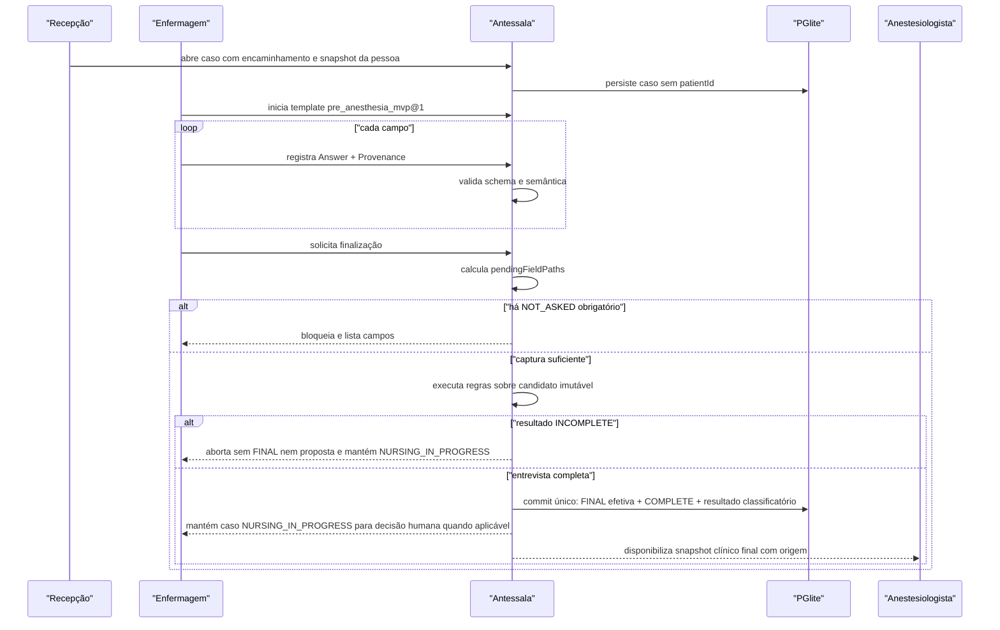

# Analyst — Anamnese pré-anestésica e catálogos

## State

- Source: `hack/PRD.md`, código Antessala e código DietFlow
- Route: `analyst_prd`
- Phase budget: `forensic`
- Confidence: `low` para o conteúdo clínico até pesquisa de fontes e licenças
- Created: `2026-08-14`
- Mode: `hybrid` — recon do legado e construção do contrato do protótipo
- Verdict: `RESEARCH_REQUIRED — ASSINATURA PENDENTE`

## TL;DR

O envelope versionado, o registry, a validação Zod, o composer e os catálogos offline do
Antessala podem ser reutilizados. Os oito widgets herdados do DietFlow não formam uma
anamnese pré-anestésica: três são adaptáveis, um fornece apenas um recorte reaproveitável e
quatro são excluídos. A proposta atual contém 14 widgets, respostas semânticas, proveniência por
campo e um snapshot por caso; nenhum paciente será cadastrado. Este contrato é somente para
a demonstração com dados sintéticos e não constitui protocolo assistencial do HC.

## Phase 0 Grill

| Signal | Verdict | Notes |
|---|---|---|
| Action clear | PASS | Coletar dados suficientes para estimar esforço operacional de agenda. |
| Persona clear | PASS | Enfermagem coleta; recepção consome somente a consequência operacional; anestesiologista lê o snapshot final. |
| Input/output clear | PASS | Encaminhamento + relato + aferições entram; anamnese versionada, pendências e fatos explicáveis saem. |
| Scope clear | PASS | Protótipo local, dados sintéticos, sem paciente mestre, prontuário ou aptidão automática. |
| Objective criteria clear | PASS | DTO, completude, proveniência, catálogo, versão e consumidor estão definidos para cada widget. |

## Source And Scope

- Input source: PRD congelado e implementação existente nos repositórios Antessala e
  DietFlow.
- In scope: caso local, contexto do procedimento, anamnese de enfermagem, catálogos
  embarcados, pendências de dados, resumo por papel, versionamento e exportação.
- Out of scope: protocolo institucional, prontuário longitudinal, histórico entre casos,
  prescrição, decisão de aptidão, recomendação de suspensão medicamentosa e dados reais.
- Assumption: a demonstração decide regras operacionais explícitas. Toda regra clínica ou
  institucional permanece fora da alegação do MVP.

## Product Promise

A enfermagem registra uma entrevista estruturada sem transformar silêncio em resposta
negativa. O sistema preserva o que foi dito, medido ou copiado do encaminhamento, mostra o
que falta e entrega à recepção apenas o requisito de vaga. O anestesiologista recebe o
snapshot e a origem de cada informação. O caso não aponta para uma tabela de pacientes e
nenhum dado é comparado com atendimento anterior.

## Story de Usuario

- Como enfermeiro, quero conduzir uma entrevista única e saber quais perguntas ainda não
  foram feitas, para entregar uma triagem completa sem presumir respostas.
- Como recepcionista, quero receber apenas a categoria de vaga, o prazo e os recursos, para
  agendar sem interpretar diagnóstico, medicação ou exame.
- Como anestesiologista, quero ler os dados, a fonte e as pendências do caso, para distinguir
  relato, documento, aferição e observação profissional.
- Como paciente, quero que cada novo encaminhamento seja tratado como um caso próprio, sem
  busca, deduplicação ou mistura com uma pessoa de mesmo nome.

## Story Tecnica

Como sistema, o Antessala deve persistir uma anamnese autônoma em JSONB, validada por um
registry versionado. Cada resposta carrega estado semântico e proveniência. Catálogos
mestres são assets versionados, carregados no PGlite no primeiro boot e referenciados por ID;
texto livre é preservado como fallback sem fingir correspondência. `submitFinal` rejeita
conteúdo incompleto e, quando aceito, cria uma revisão final efetiva e um resultado
`PROPOSED`, `HUMAN_DEFINITION_REQUIRED` ou `OUT_OF_DEMO_RANGE`. Erro de intake descoberto
antes da publicação invalida essa revisão e seus derivados sem apagar a história e exige
nova revisão da enfermagem.

## Current Terrain

O Antessala já possui o envelope `{ _v: 2, blocos }`, oito definições headless, componentes
shadcn, serialização Zod, PGlite e catálogos locais. A anamnese ainda vive dentro de
`registros`, entidade declarada como legado. Os defaults herdados tornam hidratação, sono,
Bristol e adesão “completos” sem coleta, o que viola a semântica do novo produto. O catálogo
ativo de templates está vazio.

O DietFlow comprova a origem: registry de oito widgets, contrato de três camadas, envelope
versionado e `Content.content`. No DietFlow, `patientId NULL` significa template e
`patientId NOT NULL` significa registro preso a paciente. O Antessala reutiliza conteúdo e
contratos, mas corta `patientId`, evolução e todos os dados nutricionais sem pertinência.

## Evidence Matrix

| Path | Lines | Fact | Confidence |
|---|---:|---|---|
| `src/shared/anamnese/types.ts` | 25-41 | O contrato headless já inclui versão, Zod, defaults, completude, vazio e texto. | high |
| `src/shared/anamnese/types.ts` | 43-106 | O envelope persistido é v2 e aceita widget, snapshot e resultado. | high |
| `src/shared/anamnese/serialization.ts` | 78-155 | O parser valida tipo, versão, schema e ID duplicado. | high |
| `src/shared/anamnese/registry.ts` | 20-40 | Existem exatamente oito DTOs/definitions herdados. | high |
| `src/shared/anamnese/templates.ts` | 5-27 | Nenhum template está ativo; o básico é legado. | high |
| `src/main/db/clinical-schema.ts` | 11-25 | A anamnese atual está embutida em `registros`, entidade provisória. | high |
| `src/main/tipc.ts` | 265-313 | O único write clínico cria registro legado ou substitui toda a anamnese. | high |
| `tests/shared/anamnese/widgets.spec.ts` | 28-49 | Quatro defaults podem aparecer completos sem resposta coletada. | high |
| `src/shared/anamnese/widgets/medicacoes.ts` | 19-38 | Medicação atual não guarda ID do catálogo nem proveniência. | high |
| `src/shared/anamnese/widgets/problemas-saude.ts` | 6-17 | Condição atual guarda nome/CID livres, sem identidade do catálogo. | high |
| `src/main/db/clinical-schema.ts` | 61-114 | CID, classes, risco medicamentoso, medicamentos, MET e comorbidades já existem. | high |
| `src/main/db/seed.ts` | 63-94 | Assets clínicos são selados por SHA-256 antes da carga. | high |
| `src/main/db/seed.ts` | 128-150 | O primeiro boot lê somente assets locais. | high |
| `src/data/catalogos/README.md` | 13-38 | Há 14.793 CIDs, 382 medicamentos, 12 grupos, 94 MET e 14 comorbidades; recorte e licença têm limites. | high |
| `DietFlow:src/lib/anamnese/widget-registry.ts` | 53-89 | O DietFlow registra os oito widgets que originaram o port. | high |
| `DietFlow:src/lib/widgets/types.ts` | 70-130 | O contrato DietFlow separa metadata e dados com schema/completude. | high |
| `DietFlow:src/lib/anamnese/types.ts` | 151-162 | `Content.content` usa o mesmo envelope v2. | high |
| `DietFlow:src/lib/anamnese/templates.ts` | 39-79 | O template básico é uma composição fixa dos oito widgets nutricionais. | high |
| `DietFlow:prisma/schema.prisma` | 1101-1145 | `Content` possui ownership e JSON de conteúdo. | high |
| `DietFlow:prisma/schema.prisma` | 1109-1112 | `patientId` opcional separa template de registro ligado ao paciente. | high |
| `DietFlow:prisma/schema.prisma` | 3414-3472 | CID é hierárquico e possui fonte, relevância e status. | high |
| `DietFlow:prisma/schema.prisma` | 3482-3523 | Classes e medicamentos preservam relações e metadados ANVISA. | high |
| `hack/domains/ANALYST-acesso-e-auditoria.md` | 134-140 | O contrato transversal fecha os cinco papéis canônicos. | high |
| `hack/domains/ANALYST-caso-e-encaminhamento.md` | 108-117 | Caso descartável e lifecycle pertencem a `preop_cases`, não à anamnese. | high |

## Implementation Map

| Area | Path | Role | Decision |
|---|---|---|---|
| Context / entry | `hack/PRD.md` | Promessa e fronteira | preserve |
| Backend contracts | `src/shared/anamnese/types.ts` | Envelope e definition | adapt |
| Validation | `src/shared/anamnese/serialization.ts` | Parser runtime | adapt |
| Widget registry | `src/shared/anamnese/registry.ts` | Registro exaustivo | replace catalog |
| Widget definitions | `src/shared/anamnese/widgets/*` | DTOs herdados | 3 adapt, 1 extract, 4 reject |
| Templates | `src/shared/anamnese/templates.ts` | Composição ativa | replace legacy template |
| Persistence | `src/main/db/clinical-schema.ts` | JSONB e catálogos | migrate away from `registros` |
| Seed | `src/main/db/seed.ts` | Carga offline | reuse |
| Catalog DTO | `src/main/catalogos/dto.ts` | DB → renderer | expand |
| IPC | `src/main/tipc.ts` | Commands/queries | replace clinical handlers |
| Composer shell | `src/renderer/src/anamnese/Composer.tsx` | Ordenação/edição | reuse with fixed template |
| Widget UI | `src/renderer/src/anamnese/widgets/*` | shadcn editors | adapt/create |
| Tests | `tests/shared/anamnese/*` | contrato/round-trip | expand |
| Seed proof | `tests/main/db/clinical-seed.spec.ts` | offline/catalog counts | reuse |
| Renderer proof | `tests/renderer/anamnese/widgets.spec.tsx` | UI dos widgets | expand |

## Entities And State

```text
ENTITY: CasoPreAnestesico
- Attributes: id, personSnapshot, referralSnapshot, procedureSnapshot, requesterSnapshot,
  status, createdAt
- Actions: receber, iniciar/finalizar enfermagem, encaminhar para agenda, agendar, atender,
  registrar pendência/retorno, liberar laudo, entregar ou cancelar
- Relations: 1 encaminhamento, no máximo 1 anamnese e no máximo 1 revisão FINAL, N pendências
- Source of truth: PGlite local do protótipo
- Runtime states: RECEIVED_AT_RECEPTION, WAITING_NURSING, NURSING_IN_PROGRESS,
  TRIAGE_PENDING, READY_FOR_SCHEDULING, SCHEDULED, WAITING_ANESTHESIA, IN_ASSESSMENT,
  PENDING, WAITING_RETURN, READY_FOR_HANDOFF, DELIVERED_TO_REQUESTER, CANCELLED
- Invalid states: patientId; deduplicação por nome; dois casos compartilhando anamnese

ENTITY: Anamnese
- Attributes: id, caseId, envelopeVersion, templateId, templateVersion, status,
  draftVersion, finalRevision
- Actions: iniciar, salvar rascunho, submeter versão final
- Relations: 1 caso, no máximo 1 revisão FINAL efetiva, revisões invalidadas históricas,
  14 widgets e 1 resultado classificatório vigente
- Source of truth: snapshot JSONB validado
- Runtime states: DRAFT, COMPLETE
- Invalid states: COMPLETE com campo obrigatório NOT_ASKED; mais de uma revisão FINAL;
  mutação, reabertura ou rebase depois de COMPLETE

ENTITY: RespostaClinica
- Attributes: status, value, provenance
- Actions: responder, marcar negativo, desconhecido, não aplicável ou recusa
- Relations: pertence a campo de widget
- Source of truth: JSONB da revisão
- Runtime states: ANSWERED, NEGATIVE, UNKNOWN, NOT_APPLICABLE, NOT_ASKED, REFUSED
- Invalid states: value presente fora de ANSWERED; NEGATIVE em campo que não admite negação

ENTITY: CatalogItem
- Attributes: catalogId, itemId, label, source, revision, active
- Actions: seed, buscar, referenciar
- Relations: pode ser referenciado por respostas
- Source of truth: asset versionado + tabela PGlite
- Runtime states: ACTIVE, RETIRED
- Invalid states: referência silenciosa a item inexistente; texto livre fingindo item catalogado
```

### Contrato comum de resposta

```ts
type AnswerStatus =
  | 'ANSWERED'
  | 'NEGATIVE'
  | 'UNKNOWN'
  | 'NOT_APPLICABLE'
  | 'NOT_ASKED'
  | 'REFUSED'

type ClinicalSource =
  | 'PATIENT_REPORT'
  | 'REFERRAL'
  | 'MEASUREMENT'
  | 'PROFESSIONAL_OBSERVATION'

type Provenance = {
  source: ClinicalSource
  actorId: string
  actorRole: 'ADMIN' | 'RECEPCAO' | 'ENFERMAGEM' | 'ANESTESIOLOGISTA' | 'SOLICITANTE'
  capturedAt: string
}

type Answer<T> =
  | { status: 'ANSWERED'; value: T; provenance: Provenance }
  | { status: 'NOT_ASKED'; provenance: null }
  | {
      status: Exclude<AnswerStatus, 'ANSWERED' | 'NOT_ASKED'>
      provenance: Provenance
    }

type ProvenancedListItem<T extends { id: string }> = T & {
  itemProvenance: {
    created: Provenance
    lastUpdated: Provenance
  }
}

type ListItemFieldPath =
  | 'allergies.items[*].substance'
  | 'allergies.items[*].reaction'
  | 'allergies.items[*].severity'
  | 'medications.items[*].catalogId'
  | 'medications.items[*].name'
  | 'medications.items[*].activeIngredient'
  | 'medications.items[*].dose'
  | 'medications.items[*].frequency'
  | 'medications.items[*].lastUse'
  | 'medications.items[*].reason'
  | 'medications.items[*].sourceText'
  | 'diagnoses.items[*].cidId'
  | 'diagnoses.items[*].code'
  | 'diagnoses.items[*].name'
  | 'diagnoses.items[*].controlled'
  | 'diagnoses.items[*].currentSymptoms'
  | 'diagnoses.items[*].detail'
  | 'exams_pending.items[*].kind'
  | 'exams_pending.items[*].name'
  | 'exams_pending.items[*].requestedBy'
  | 'exams_pending.items[*].requestedAt'
  | 'exams_pending.items[*].dueAt'
  | 'exams_pending.items[*].status'
  | 'exams_pending.items[*].note'

type ListMutationReceipt = {
  sequence: number
  listPath: 'allergies.items' | 'medications.items' | 'diagnoses.items' | 'exams_pending.items'
  itemId: string
  operation: 'ADD_ITEM' | 'UPDATE_ITEM' | 'REMOVE_ITEM'
  changedFieldPaths: ListItemFieldPath[]
  provenance: Provenance
}
```

`NOT_ASKED` é o único estado de rascunho. `UNKNOWN` significa que a pergunta foi feita e a
pessoa não soube responder. `REFUSED` significa pergunta feita e resposta recusada.
`NOT_APPLICABLE` só é aceito quando o schema do campo declara essa possibilidade.
`NEGATIVE` é uma resposta explícita, nunca um array vazio.
O template nasce com `NOT_ASKED` e `provenance=null`; ainda não existe autor ou horário.
Ao tratar a pergunta, o main injeta ator, papel e horário confiáveis. Em campos booleanos,
`ANSWERED` representa somente o positivo (`value=true`); o negativo usa `NEGATIVE` e
`ANSWERED false` é inválido.

Campos escalares de um item preservam a autoria da mutação em `itemProvenance`; campos do
item que são `Answer<T>` preservam também a proveniência da própria resposta. Adicionar,
alterar ou remover um item sempre acrescenta um `ListMutationReceipt`. A remoção retira o
item da lista ativa, mas o receipt permanece no snapshot; portanto nem mesmo uma remoção
apaga quem fez o quê e quando.

Os estados do caso acima são o lifecycle canônico ponta a ponta. `DRAFT` e `COMPLETE`
pertencem estritamente ao agregado interno `Anamnese`; não são sinônimos nem substitutos de
estado do caso. `COMPLETE` é terminal no MVP. Os cinco valores de `actorRole` são o contrato
canônico de identidade. Autorização continua por operação: por exemplo, um valor válido
`SOLICITANTE` não ganha acesso à anamnese somente por pertencer à união.

### Envelope canônico

```ts
type PreAnesthesiaContent = {
  _v: 3
  template: { id: 'pre_anesthesia_mvp'; version: 1 }
  blocks: PreAnesthesiaBlock[]
  listMutationLog: ListMutationReceipt[]
  completedAt: string | null
  completeness: { complete: boolean; pendingFieldPaths: string[] }
}

type PreAnesthesiaBlock<T> = {
  id: string
  type: 'widget'
  widgetType: PreAnesthesiaWidgetType
  schemaVersion: 1
  data: T
  createdAt: string
  updatedAt: string
}
```

## Catálogo canônico de widgets

Todos os 14 widgets abaixo pertencem ao template `pre_anesthesia_mvp@1`. A ordem é fixa no
MVP; o composer permite colapsar, mas não remover um widget obrigatório.

### 1. `procedure_context@1`

```ts
type ProcedureContextData = {
  indication: Answer<string>
  plannedDate: Answer<string>
  laterality: Answer<'LEFT' | 'RIGHT' | 'BILATERAL'>
  referralNotes: Answer<string>
}

type ProcedureContextProjectionDTO = {
  caseVersion: number
  contextFingerprint: string
  procedure: { catalogId: string; code: string | null; name: string }
  requestingService: { serviceId: string; name: string }
}
```

Procedimento e serviço solicitante são projeções read-only de `preop_cases`; não pertencem
ao JSONB da anamnese e não aceitam `SET_ANSWER`. O header compõe
`ProcedureContextProjectionDTO` em cada leitura. A anamnese persiste somente indicação,
data planejada, lateralidade e notas clínicas. Procedimento, serviço e indicação precisam
estar presentes para finalizar; data e lateralidade admitem `NOT_APPLICABLE` conforme a
matriz abaixo. Consumidores: perguntas condicionais e resumo do caso.

Ao iniciar o draft, a anamnese ancora a revisão conjunta de pessoa, encaminhamento,
procedimento e solicitante. Toda correção aplica a matriz semântica do Analyst de caso:
idade/data de nascimento, sexo, conteúdo do encaminhamento, procedimento ou serviço tornam
os consumidores dependentes `STALE`; correção ortográfica ou de proveniência exige ao menos
reconhecimento explícito. Texto novo nunca é copiado automaticamente para resposta clínica.

Enquanto estiver `DRAFT`, a enfermagem revisa a mudança, preserva respostas não afetadas
com sua proveniência e reconfirma ou corrige as afetadas antes de submeter. `submitFinal` e
`correctIntake` têm vencedor único e comparam a mesma revisão do contexto.

Se o intake incorreto for descoberto depois da revisão final e antes da publicação da
necessidade, a revisão e a proposta derivada tornam-se `INVALIDATED`, deixam de alimentar
agenda, avaliação, PDF, IA ou memória e permanecem históricas. Abre-se novo draft ancorado
no contexto corrigido; somente nova revisão da enfermagem pode voltar a ser efetiva. Isso é
correção dentro do caso, não evolução longitudinal ou edição silenciosa da revisão anterior.

### 2. `allergies@1`

```ts
type AllergiesData = {
  hasAllergy: Answer<true>
  items: Array<ProvenancedListItem<{
    id: string
    substance: Answer<string>
    reaction: Answer<string>
    severity: Answer<'MILD' | 'MODERATE' | 'SEVERE' | 'UNKNOWN'>
  }>>
}
```

`hasAllergy=NEGATIVE` exige `items=[]`. `ANSWERED true` exige ao menos uma substância;
reação pode ser `UNKNOWN`. Consumidor: carga de revisão e pendências, nunca conduta automática.

### 3. `anesthesia_history@1`

```ts
type AnesthesiaHistoryData = {
  previousAnesthesia: Answer<true>
  personalComplication: Answer<true>
  personalComplicationDescription: Answer<string>
  difficultAirwayHistory: Answer<true>
  postoperativeNauseaVomiting: Answer<true>
  familyAnesthesiaComplication: Answer<true>
  familyComplicationDescription: Answer<string>
}
```

Descrições são obrigatórias quando a resposta correspondente é positiva. Consumidor:
estimativa de carga e destaque para leitura médica.

### 4. `cardiovascular@1`

```ts
type CardiovascularData = {
  chestPain: Answer<true>
  dyspneaAtRest: Answer<true>
  syncope: Answer<true>
  palpitation: Answer<true>
  edema: Answer<true>
  knownCardiovascularDisease: Answer<true>
  detail: Answer<string>
}
```

`detail` é obrigatório se qualquer item for positivo. Consumidor: carga operacional e
resumo clínico, não ASA/RCRI.

### 5. `respiratory@1`

```ts
type RespiratoryData = {
  dyspnea: Answer<true>
  wheezing: Answer<true>
  recentRespiratoryInfection: Answer<true>
  chronicCough: Answer<true>
  sleepApneaDiagnosis: Answer<true>
  usesRespiratorySupport: Answer<true>
  supportDescription: Answer<string>
  detail: Answer<string>
}
```

O widget `sono` DietFlow não atravessa: somente o fato respiratório relevante é remodelado.

### 6. `functional_capacity@1`

```ts
type FunctionalCapacityData = {
  activity: Answer<{ catalogId: string | null; label: string }>
  metMin: Answer<number>
  metMax: Answer<number>
  limitedBySymptoms: Answer<true>
  limitationDescription: Answer<string>
}
```

MET vem do item catalogado quando selecionado; texto livre preserva `catalogId=null` e exige
intervalo informado. Não calcula aptidão. Consumidor: esforço de entrevista e resumo.

### 7. `medications@1`

```ts
type MedicationsData = {
  usesMedication: Answer<true>
  items: Array<ProvenancedListItem<{
    id: string
    catalogId: string | null
    name: string
    activeIngredient: string | null
    dose: Answer<string>
    frequency: Answer<string>
    lastUse: Answer<string>
    reason: Answer<string>
    sourceText: string
  }>>
}
```

Adapta `medicacoes`; preserva ID, princípio ativo, último uso e texto original. Grupo de
risco catalogado pode ser mostrado ao clínico, mas não gera instrução de suspensão.

### 8. `diagnoses@1`

```ts
type DiagnosesData = {
  hasDiagnosis: Answer<true>
  items: Array<ProvenancedListItem<{
    id: string
    cidId: string | null
    code: string | null
    name: string
    controlled: Answer<true>
    currentSymptoms: Answer<true>
    detail: Answer<string>
  }>>
}
```

Adapta `problemas_saude`; preserva a identidade CID quando encontrada e mantém fallback
livre explícito. Um array vazio nunca significa “sem diagnóstico”.

### 9. `bleeding_thrombosis@1`

```ts
type BleedingThrombosisData = {
  abnormalBleeding: Answer<true>
  easyBruising: Answer<true>
  priorThrombosis: Answer<true>
  familyBleedingDisorder: Answer<true>
  receivesAnticoagulantOrAntiplatelet: Answer<true>
  detail: Answer<string>
}
```

Obrigatório perguntar todos os fatos. Detalhe é obrigatório para qualquer positivo.

### 10. `vital_signs@1`

```ts
type VitalSignsData = {
  measuredAt: Answer<string>
  systolicBpMmHg: Answer<number>
  diastolicBpMmHg: Answer<number>
  heartRateBpm: Answer<number>
  oxygenSaturationPct: Answer<number>
  weightKg: Answer<number>
  heightCm: Answer<number>
  temperatureC: Answer<number>
}
```

Cada valor usa `MEASUREMENT`. O widget inteiro pode ser `NOT_APPLICABLE` quando a demo não
simula aferição; valores não são inferidos nem preenchidos com default.

### 11. `habits_substances@1`

```ts
type HabitsSubstancesData = {
  tobacco: Answer<{ current: true }>
  tobaccoAmountPerDay: Answer<number>
  alcohol: Answer<{ current: true }>
  alcoholFrequency: Answer<string>
  recreationalSubstances: Answer<true>
  substancesDescription: Answer<string>
  recentUse: Answer<string>
}
```

`tobacco` e `alcohol` só aceitam `ANSWERED` com `current:true`; ausência de uso é
`NEGATIVE`, nunca `ANSWERED {current:false}`. Quantidade/frequência ficam em respostas
separadas para admitir `UNKNOWN` ou `REFUSED` sem perder o fato de uso atual. Consumidor:
carga de revisão e resumo; nenhuma inferência de risco clínico.

### 12. `special_conditions@1`

```ts
type SpecialConditionsData = {
  pregnancyApplicable: Answer<true>
  pregnant: Answer<true>
  lactating: Answer<true>
  communicationAccommodation: Answer<string>
  mobilityAccommodation: Answer<string>
  legalRepresentativeNeeded: Answer<true>
  otherCondition: Answer<string>
}
```

`pregnant` admite `NOT_APPLICABLE` quando `pregnancyApplicable` for negativo. Necessidades
de comunicação/mobilidade afetam recurso/duração, não diagnóstico.

### 13. `exams_pending@1`

```ts
type ExamsPendingData = {
  documentsAvailable: Answer<true>
  items: Array<ProvenancedListItem<{
    id: string
    kind: 'EXAM' | 'REPORT' | 'INFORMATION'
    name: string
    requestedBy: Answer<string>
    requestedAt: Answer<string>
    dueAt: Answer<string>
    status: 'PRESENT' | 'MISSING' | 'REQUESTED'
    note: Answer<string>
  }>>
}
```

Na triagem, itens ausentes geram pendência de dado. Após consulta anestésica, novos pedidos
usam a entidade de pendência do caso, não reescrevem esta revisão.

### 14. `clinical_notes@1`

```ts
type ClinicalNotesData = {
  note: Answer<string>
}
```

Adapta `observacoes_gerais`, remove HTML arbitrário do DTO e registra autoria. É opcional e
nunca substitui campo estruturado obrigatório.

### Matriz de validação do template

| Grupo | Contrato sintático e semântico |
|---|---|
| IDs de bloco/item | UUID/texto opaco não vazio; únicos dentro do envelope/lista |
| Texto curto | trim, 1–200 caracteres |
| Texto descritivo | trim, 1–2.000 caracteres |
| Nota clínica | trim, 1–4.000 caracteres |
| Datas | ISO `YYYY-MM-DD`; `dueAt` não pode preceder `requestedAt` |
| Instantes | ISO 8601 com offset; `measuredAt` não pode estar no futuro da captura |
| Listas clínicas | máximo 100 itens; IDs únicos; ordem preservada |
| Valores catalogados | ID e label precisam corresponder à mesma revisão; fallback usa ID nulo |
| Booleanos | positivo = `ANSWERED true`; negativo = `NEGATIVE`; `ANSWERED false` é recusado |
| Defaults | todos os campos `NOT_ASKED`, sem valor e com `provenance=null` |

Refinamentos por widget:

- `procedure_context`: procedimento e serviço vêm somente da projeção read-only do caso;
  indicação usa texto descritivo; data planejada é ISO; lateralidade aceita somente o enum
  e apenas quando aplicável.
- `allergies`: máximo 50 itens; substância 1–200, reação 1–1.000; IDs únicos;
  positivo exige item e negativo exige lista vazia.
- `anesthesia_history`, `cardiovascular` e `respiratory`: detalhe condicionado usa
  1–2.000 caracteres; suporte respiratório positivo exige descrição.
- `functional_capacity`: `metMin`/`metMax` entre 0 e 25, com `min <= max`; item
  catalogado copia sua faixa; limitação positiva exige descrição.
- `medications`: máximo 100 itens; nome 1–200, texto de origem 1–500; dose, frequência,
  último uso e motivo usam 1–200 quando respondidos; positivo exige item e negativo exige
  lista vazia.
- `diagnoses`: máximo 100 itens; nome 1–200; código 1–20; positivo exige item e negativo
  exige lista vazia; detalhe é obrigatório para sintomas atuais positivos.
- `bleeding_thrombosis`: qualquer positivo exige detalhe de 1–2.000.
- `vital_signs`: pressão sistólica 20–350 mmHg; diastólica 10–250; frequência 10–300 bpm;
  saturação 0–100%; peso 0,5–600 kg; altura 20–300 cm; temperatura 20–50 °C. Faixa é
  validação de entrada da demo, não interpretação clínica. Quando não aferido, cada campo
  fica explicitamente `NOT_APPLICABLE`, `UNKNOWN` ou `REFUSED`.
- `habits_substances`: `tobacco`/`alcohol` positivos aceitam apenas `{current:true}`;
  quantidade de tabaco é inteiro 0–200/dia; uso positivo de substância recreativa exige
  descrição; frequência e uso recente usam texto curto.
- `special_conditions`: gravidez negativa ou inaplicável impede valor positivo
  contraditório; necessidades preenchidas usam texto descritivo.
- `exams_pending`: máximo 100 itens; nome 1–200; datas ISO; `PRESENT` exige documento
  disponível e `MISSING/REQUESTED` produz pendência operacional.
- `clinical_notes`: nota opcional; quando respondida usa 1–4.000 caracteres.

### Matriz exaustiva de completude por `fieldPath`

Legenda:

- `RO-R`: projeção read-only obrigatória do caso; não é `Answer` e não entra no JSONB.
- `R`: resposta obrigatoriamente tratada; `NOT_ASKED` bloqueia. `UNKNOWN`/`REFUSED` tratam a
  pergunta, mas podem gerar pendência.
- `C`: obrigatória quando a condição é verdadeira; quando falsa, o campo deve ser
  `NOT_APPLICABLE`, salvo indicação diferente na tabela.
- `O`: opcional; pode permanecer `NOT_ASKED` sem bloquear. Se preenchida, valida normalmente.
- `I-R`/`I-O`/`I-C`: a mesma semântica aplicada a cada item ativo da lista. Campos escalares
  `I-R` não usam `Answer`, mas exigem valor e recebem proveniência pela mutação do item.

`NOT_APPLICABLE` é aceito **somente** nas condições abaixo. Estado negativo de qualquer
`Answer<true>` é `NEGATIVE`; `ANSWERED false` nunca é uma forma alternativa.
Quando o controlador de um campo `C` está `UNKNOWN` ou `REFUSED`, o dependente pode
permanecer `NOT_ASKED` sem bloquear; a completude reporta o controlador como tratado porém
indeterminado e não inventa aplicabilidade. Se o controlador for corrigido depois, o
dependente volta a obedecer imediatamente ao ramo positivo/negativo.

| `fieldPath` canônico | Classe | Condição de obrigatoriedade / `NOT_APPLICABLE` |
|---|---|---|
| `$case.procedureSnapshot.description` | `RO-R` | Não vazio no caso; projetado no header e usado na completude contextual. |
| `$case.requesterSnapshot.serviceName` | `RO-R` | Não vazio no caso; projetado no header. `serviceId` e nome são obrigatórios. |
| `procedure_context.indication` | `R` | Sem `NOT_APPLICABLE`; `UNKNOWN`/`REFUSED` são tratados e sinalizados. |
| `procedure_context.plannedDate` | `O` | `NOT_APPLICABLE` apenas quando não há data planejada. |
| `procedure_context.laterality` | `O` | `NOT_APPLICABLE` quando o procedimento/sítio não possui lateralidade aplicável. |
| `procedure_context.referralNotes` | `O` | `NOT_APPLICABLE` quando o encaminhamento não traz observação adicional. |
| `allergies.hasAllergy` | `R` | `NEGATIVE` exige lista ativa vazia; positivo exige ao menos um item. |
| `allergies.items[*].substance` | `I-R` | Todo item ativo; sem `NOT_APPLICABLE`. |
| `allergies.items[*].reaction` | `I-R` | Todo item ativo; `UNKNOWN`/`REFUSED` admitidos, não `NOT_APPLICABLE`. |
| `allergies.items[*].severity` | `I-R` | Todo item ativo; desconhecimento usa estado `UNKNOWN` ou o valor legado `UNKNOWN`, nunca silêncio. |
| `anesthesia_history.previousAnesthesia` | `R` | Positivo ativa os três fatos pessoais abaixo; `NEGATIVE` os torna `NOT_APPLICABLE`. |
| `anesthesia_history.personalComplication`<br>`anesthesia_history.difficultAirwayHistory`<br>`anesthesia_history.postoperativeNauseaVomiting` | `C` | Obrigatórios se `previousAnesthesia=ANSWERED`; `NOT_APPLICABLE` se `previousAnesthesia=NEGATIVE`. |
| `anesthesia_history.personalComplicationDescription` | `C` | Obrigatória se `personalComplication=ANSWERED`; `NOT_APPLICABLE` em qualquer outro estado tratado. |
| `anesthesia_history.familyAnesthesiaComplication` | `R` | Independente de anestesia pessoal prévia. |
| `anesthesia_history.familyComplicationDescription` | `C` | Obrigatória se a complicação familiar for positiva; `NOT_APPLICABLE` caso contrário. |
| `cardiovascular.chestPain`<br>`cardiovascular.dyspneaAtRest`<br>`cardiovascular.syncope`<br>`cardiovascular.palpitation`<br>`cardiovascular.edema`<br>`cardiovascular.knownCardiovascularDisease` | `R` | Cada fato precisa ser tratado; sem `NOT_APPLICABLE`. |
| `cardiovascular.detail` | `C` | Obrigatório se qualquer fato cardiovascular for positivo; `NOT_APPLICABLE` se nenhum for positivo. |
| `respiratory.dyspnea`<br>`respiratory.wheezing`<br>`respiratory.recentRespiratoryInfection`<br>`respiratory.chronicCough`<br>`respiratory.sleepApneaDiagnosis`<br>`respiratory.usesRespiratorySupport` | `R` | Cada fato precisa ser tratado; sem `NOT_APPLICABLE`. |
| `respiratory.supportDescription` | `C` | Obrigatória se `usesRespiratorySupport=ANSWERED`; `NOT_APPLICABLE` caso contrário. |
| `respiratory.detail` | `C` | Obrigatório se qualquer fato respiratório for positivo; `NOT_APPLICABLE` se nenhum for positivo. |
| `functional_capacity.activity` | `R` | Seleção catalogada ou fallback livre; ausência declarada usa `NEGATIVE`. |
| `functional_capacity.metMin`<br>`functional_capacity.metMax` | `C` | Obrigatórios quando `activity=ANSWERED`: copiados do catálogo ou informados no fallback; `NOT_APPLICABLE` quando activity não é respondida positivamente. |
| `functional_capacity.limitedBySymptoms` | `R` | Sem `NOT_APPLICABLE`. |
| `functional_capacity.limitationDescription` | `C` | Obrigatória se limitação positiva; `NOT_APPLICABLE` caso contrário. |
| `medications.usesMedication` | `R` | `NEGATIVE` exige lista ativa vazia; positivo exige ao menos um item. |
| `medications.items[*].name`<br>`medications.items[*].sourceText` | `I-R` | Texto não vazio em todo item ativo. |
| `medications.items[*].catalogId`<br>`medications.items[*].activeIngredient` | `I-O` | Escalares nulos no fallback livre; não usam `Answer`. |
| `medications.items[*].dose`<br>`medications.items[*].frequency`<br>`medications.items[*].lastUse` | `I-R` | Cada pergunta é tratada; desconhecimento usa `UNKNOWN`/`REFUSED`, não `NOT_APPLICABLE`. |
| `medications.items[*].reason` | `I-R` | Tratada em cada item; `NOT_APPLICABLE` permitido quando não há motivo informado/aplicável. |
| `diagnoses.hasDiagnosis` | `R` | `NEGATIVE` exige lista ativa vazia; positivo exige ao menos um item. |
| `diagnoses.items[*].name` | `I-R` | Texto não vazio em todo item ativo. |
| `diagnoses.items[*].cidId`<br>`diagnoses.items[*].code` | `I-O` | Escalares nulos no fallback livre; não usam `Answer`. |
| `diagnoses.items[*].controlled` | `I-R` | Tratada; `NOT_APPLICABLE` somente quando controle não se aplica à condição registrada. |
| `diagnoses.items[*].currentSymptoms` | `I-R` | Sem `NOT_APPLICABLE`; negativo usa `NEGATIVE`. |
| `diagnoses.items[*].detail` | `I-C` | Obrigatório se sintomas atuais forem positivos; `NOT_APPLICABLE` caso contrário. |
| `bleeding_thrombosis.abnormalBleeding`<br>`bleeding_thrombosis.easyBruising`<br>`bleeding_thrombosis.priorThrombosis`<br>`bleeding_thrombosis.familyBleedingDisorder`<br>`bleeding_thrombosis.receivesAnticoagulantOrAntiplatelet` | `R` | Cada fato precisa ser tratado; sem `NOT_APPLICABLE`. |
| `bleeding_thrombosis.detail` | `C` | Obrigatório se qualquer fato for positivo; `NOT_APPLICABLE` caso contrário. |
| `vital_signs.measuredAt` | `R` | `ANSWERED` se qualquer valor foi aferido; `NOT_APPLICABLE` se a demo não simulou aferição. |
| `vital_signs.systolicBpMmHg`<br>`vital_signs.diastolicBpMmHg`<br>`vital_signs.heartRateBpm`<br>`vital_signs.oxygenSaturationPct`<br>`vital_signs.weightKg`<br>`vital_signs.heightCm`<br>`vital_signs.temperatureC` | `R` | Cada campo é tratado; `NOT_APPLICABLE` somente quando aquela aferição não ocorreu, com provenance da decisão. |
| `habits_substances.tobacco` | `R` | Positivo aceita apenas `{current:true}`; ausência de uso é `NEGATIVE`. |
| `habits_substances.tobaccoAmountPerDay` | `C` | Tratada se tabaco positivo; `NOT_APPLICABLE` se tabaco negativo. |
| `habits_substances.alcohol` | `R` | Positivo aceita apenas `{current:true}`; ausência de uso é `NEGATIVE`. |
| `habits_substances.alcoholFrequency` | `C` | Tratada se álcool positivo; `NOT_APPLICABLE` se álcool negativo. |
| `habits_substances.recreationalSubstances` | `R` | Positivo usa `ANSWERED true`; ausência é `NEGATIVE`. |
| `habits_substances.substancesDescription`<br>`habits_substances.recentUse` | `C` | Tratadas se substância recreativa for positiva; `NOT_APPLICABLE` caso contrário. |
| `special_conditions.pregnancyApplicable` | `R` | Positivo significa que perguntas de gravidez/lactação se aplicam; negativo desativa ambas. |
| `special_conditions.pregnant`<br>`special_conditions.lactating` | `C` | Obrigatórias se `pregnancyApplicable=ANSWERED`; `NOT_APPLICABLE` se negativo. |
| `special_conditions.communicationAccommodation`<br>`special_conditions.mobilityAccommodation` | `R` | `ANSWERED` carrega a necessidade; `NEGATIVE` significa nenhuma. Não usar string vazia. |
| `special_conditions.legalRepresentativeNeeded` | `R` | Positivo usa `ANSWERED true`; ausência é `NEGATIVE`. |
| `special_conditions.otherCondition` | `O` | Pode ficar `NOT_ASKED`; `NEGATIVE` pode registrar explicitamente nenhuma outra condição. |
| `exams_pending.documentsAvailable` | `R` | Qualquer item `PRESENT` exige positivo; `NEGATIVE` significa nenhum documento disponível. |
| `exams_pending.items[*].kind`<br>`exams_pending.items[*].name`<br>`exams_pending.items[*].status` | `I-R` | Escalares obrigatórios em todo item ativo; não usam `Answer`. |
| `exams_pending.items[*].requestedBy`<br>`exams_pending.items[*].requestedAt` | `I-C` | Tratados quando `status=REQUESTED`; `NOT_APPLICABLE` quando o item não foi solicitado. |
| `exams_pending.items[*].dueAt` | `I-O` | `NOT_APPLICABLE` quando não existe prazo; se respondido, não precede `requestedAt`. |
| `exams_pending.items[*].note` | `I-O` | Pode ficar `NOT_ASKED`; não substitui nome/status. |
| `clinical_notes.note` | `O` | Pode ficar `NOT_ASKED`; nunca satisfaz outro campo. |

Em `allergies`, `medications` e `diagnoses`, controlador positivo exige ao menos um item;
`NEGATIVE`, `UNKNOWN` ou `REFUSED` exigem lista ativa vazia. Em `exams_pending`, a lista é
independente: `documentsAvailable=NEGATIVE` proíbe apenas item `PRESENT`, mas admite
`MISSING/REQUESTED`; qualquer item `PRESENT` exige controlador positivo. Um item ativo
sempre satisfaz todos os `I-R`/`I-C` aplicáveis e possui ID único. `listMutationLog` e
`itemProvenance` são metadados gerados pelo main, não campos de completude editáveis.

### Contrato de mutação do rascunho

O renderer nunca envia o envelope inteiro nem um patch JSON arbitrário. A união fechada é:

```ts
type DraftOperation =
  | {
      type: 'SET_ANSWER'
      fieldPath: RootAnswerFieldPath
      answer: AnswerInputForFieldPath
    }
  | {
      type: 'ADD_ITEM'
      listPath: ClinicalListPath
      item: NewItemInputForListPath
      source: ClinicalSource
    }
  | {
      type: 'UPDATE_ITEM'
      listPath: ClinicalListPath
      itemId: string
      patch: NonEmptyItemPatchForListPath
      source: ClinicalSource
    }
  | {
      type: 'REMOVE_ITEM'
      listPath: ClinicalListPath
      itemId: string
      source: ClinicalSource
    }
```

`RootAnswerFieldPath` contém somente os paths sem `items[*]` enumerados na matriz.
`ClinicalListPath` contém exatamente `allergies.items`, `medications.items`,
`diagnoses.items` e `exams_pending.items`. Cada combinação de path possui schema Zod
próprio; não existe `unknown`, `Record<string, unknown>`, path dinâmico nem merge profundo.
`SET_ANSWER` não alcança campo de item. `ADD_ITEM` valida o objeto completo;
`UPDATE_ITEM` aceita patch estrito e não vazio; `REMOVE_ITEM` exige item ativo. O main
injeta autoria e horário, atualiza `itemProvenance` e acrescenta receipt append-only em
`listMutationLog` para toda mutação de lista.

## Classificação dos oito widgets DietFlow

| Widget herdado | Decisão | Destino |
|---|---|---|
| `problemas_saude` | ADAPTAR | `diagnoses@1`, com CID estável, resposta negativa e sintomas atuais. |
| `medicacoes` | ADAPTAR | `medications@1`, com ID catalogado, último uso e origem. |
| `observacoes_gerais` | ADAPTAR | `clinical_notes@1`, texto puro e autoria. |
| `sono` | EXTRAIR RECORTE | Apneia e suporte entram em `respiratory`; ISI-3/ISI-7 ficam fora. |
| `rotina_alimentar` | REJEITAR | Não cumpre promessa pré-anestésica do MVP. |
| `hidratacao` | REJEITAR | Meta hídrica nutricional e default 2 L ficam fora. |
| `bristol` | REJEITAR | Bristol/GI score ficam fora do template do MVP. |
| `adesao` | REJEITAR | Adesão a dieta e estimativa calórica ficam fora. |

## Runtime / Data Flow



## Rules And Invariants

- MUST criar um caso novo para cada encaminhamento.
- MUST NOT buscar, deduplicar ou ligar o caso a uma tabela de pacientes.
- MUST persistir o envelope somente após validação runtime integral.
- MUST registrar provenance em cada resposta.
- MUST registrar provenance append-only em cada adição, alteração ou remoção de item.
- MUST representar explicitamente a resposta negativa.
- MUST bloquear finalização se um campo obrigatório permanecer `NOT_ASKED`.
- MUST permitir `UNKNOWN` e `REFUSED`; esses estados podem gerar pendência, nunca valor falso.
- MUST preservar texto livre quando catálogo não encontrar item, com ID catalogado nulo.
- MUST gravar o ID do catálogo quando houver seleção confirmada.
- MUST congelar a revisão usada pela classificação.
- MUST projetar procedimento/serviço do caso como read-only; o widget não duplica esses
  snapshots no JSONB.
- MUST executar `submitFinal` e a classificação da revisão como uma única unidade: sucesso
  cria uma revisão `FINAL` efetiva, muda `DRAFT → COMPLETE` e produz `PROPOSED`,
  `HUMAN_DEFINITION_REQUIRED` ou `OUT_OF_DEMO_RANGE`; `INCOMPLETE` não cria nenhum deles.
- MUST ancorar o draft na revisão conjunta do contexto e aplicar, a cada correção, a matriz
  de impacto do Analyst de caso a anamnese, classificação, IA e resumo.
- MUST exigir revisão explícita de todo consumidor `STALE` antes de salvar ou submeter.
- MUST garantir vencedor único entre `submitFinal` e `correctIntake`; nenhum resultado
  parcial é aceito.
- IF a correção ocorrer depois da revisão final e antes da publicação, THEN invalidar a
  revisão e proposta anteriores, preservar histórico e abrir novo draft coerente.
- IF a necessidade já estiver publicada, THEN correção material não é escondida por
  override; bloqueia o uso e segue governança ainda `UNRESOLVED` para operação real.
- IF um item catalogado for retirado, THEN manter label e revisão capturados no snapshot.
- IF um procedimento não estiver catalogado, THEN usar `catalogId=null`, preservar nome e
  aplicar o template geral completo.
- MUST NOT produzir ASA, RCRI, aptidão, manejo medicamentoso ou conduta clínica.
- MUST NOT expor diagnóstico, medicação ou nota clínica à recepção.

## Architecture Risks

| Severity | Risk | Evidence | Fix direction |
|---|---|---|---|
| critical | Defaults herdados simulam resposta | `tests/shared/anamnese/widgets.spec.ts:28-49` | Todos os novos campos nascem `NOT_ASKED`. |
| critical | DTO livre perde identidade do catálogo | `src/shared/anamnese/widgets/medicacoes.ts:19-38` | Persistir `catalogId` e snapshot do label. |
| high | Registro legado não representa caso/encaminhamento | `src/main/db/clinical-schema.ts:3-25` | Nova entidade de caso; legado somente leitura/migração. |
| high | Atualização substitui JSONB sem controle de versão | `src/main/tipc.ts:303-313` | Commands com versão esperada, um único FINAL e aggregate terminal. |
| high | Correção do caso pode invalidar evidência já finalizada | contrato transversal de contexto | Vencedor único; antes da publicação, invalidar revisão e derivados e exigir nova revisão. |
| high | Catálogo medicamentoso é recorte e licença é pendente | `src/data/catalogos/README.md:27-38` | Alegação limitada à demo; fallback livre; não redistribuir publicamente sem revisão. |
| medium | Blocos snapshot/resultado carregam semântica nutricional | `src/shared/anamnese/types.ts:56-98` | Template pré-anestésico aceita somente widget blocks. |
| medium | HTML histórico pode vazar para export | `src/shared/anamnese/text-formatter.ts:40-62` | DTO novo usa texto puro e escaping no export. |

## Blueprint Handoff

| Path/Area | Action | Reason | Validation |
|---|---|---|---|
| `src/shared/anamnese/types.ts` | Introduzir envelope v3 e resposta semântica | Contrato canônico | testes Zod e round-trip |
| `src/shared/anamnese/widgets/` | Criar 14 definitions v1 | Catálogo exato | contract test parametrizado |
| `src/shared/anamnese/registry.ts` | Registry exaustivo pré-anestésico | Impedir widget fora do catálogo | compile-time exhaustive test |
| `src/shared/anamnese/templates.ts` | Ativar somente `pre_anesthesia_mvp@1` | Template fixo da demo | snapshot do template |
| `src/main/db/migrations/*` | Adicionar anamnese, no máximo uma revisão FINAL e catálogos; consumir `preop_cases` sem recriá-lo | Source of truth tecnicamente versionada, sem evolução clínica | migration/constraint tests |
| `src/main/db/seed.ts` | Seed de procedimento/serviço e revisões de catálogo | Offline | primeiro boot sem fetch |
| `src/main/catalogos/dto.ts` | DTOs de todos os catálogos consumidos | Fronteira tipada | mapping tests |
| `src/main/tipc.ts` | Commands por caso/revisão, queries filtradas por papel | Mutação segura | integration + negative RBAC |
| `src/renderer/src/anamnese/` | Composer fixo e UIs dos 14 widgets | Fluxo de enfermagem | renderer tests |
| `src/main/export/pdf.ts` | Consumir DTO de resumo com proveniência, não HTML clínico arbitrário | Export rastreável sem alegar assinatura digital | PDF contract test |

## Acceptance Criteria

- [ ] O template ativo contém exatamente os 14 widgets e nenhuma peça nutricional rejeitada.
- [ ] Todo campo começa `NOT_ASKED`; nenhum default clínico conta como resposta.
- [ ] O parser recusa `ANSWERED` sem valor e valor fora de `ANSWERED`.
- [ ] Finalização lista todos os campos obrigatórios ainda não perguntados.
- [ ] A matriz de `fieldPath` é exaustiva e o parser recusa `NOT_APPLICABLE` fora da condição declarada.
- [ ] Medicação e diagnóstico preservam ID de catálogo ou fallback livre explícito.
- [ ] Cada resposta exibe fonte, autor, papel e horário para o anestesiologista.
- [ ] Cada item ativo mostra autoria de criação/última alteração e remoções permanecem no log.
- [ ] `DraftOperation` rejeita path livre, patch vazio, campo desconhecido e mutação de item por `SET_ANSWER`.
- [ ] Tabaco e álcool negativos são `NEGATIVE`; `ANSWERED {current:false}` é recusado.
- [ ] Pessoa, encaminhamento, procedimento e serviço vêm da revisão corrente do caso;
      correção aplica a matriz de impacto e bloqueia consumidores obsoletos até revisão.
- [ ] `ProcedureContextProjectionDTO` sempre contém `procedure.catalogId` e
      `requestingService.serviceId`; somente `procedure.code` pode ser nulo.
- [ ] `submitFinal × correctIntake` possui vencedor único para qualquer segmento corrigível.
- [ ] `submitFinal` grava a revisão final efetiva, anamnese `COMPLETE` e um resultado
      classificatório coerente; o caso permanece `NURSING_IN_PROGRESS`.
- [ ] Recepção recebe somente requisito operacional e pendência administrativa.
- [ ] Erro descoberto depois da finalização e antes da publicação invalida revisão/proposta
      anteriores, abre novo draft e impede consumo dos artefatos inválidos.
- [ ] Um novo encaminhamento cria novo caso mesmo com nome idêntico.
- [ ] O boot carrega catálogos sem rede e o app funciona com dados sintéticos.
- [ ] Nenhuma saída usa ASA, RCRI, aptidão ou orientação de suspensão medicamentosa.

## Open Questions

As leis de ausência de resposta, proveniência e confirmação humana são `PRODUCT_LAW`. A
seleção dos 14 widgets, campos obrigatórios, condicionais, faixas e cobertura/licença dos
catálogos permanece `UNRESOLVED` e exige pesquisa antes do Build formal.

## Grill Verdict

- Verdict: `RESEARCH_REQUIRED — ASSINATURA PENDENTE`
- Why: matriz clínica, completude e fontes/licenças ainda não foram pesquisadas.
- Next stage: Build do domínio, somente após assinatura de Marco.

## Recommended Next Phase

Consumir este documento em `BUILD-anamnese-e-catalogos.md`. Nenhuma implementação ou Spec
de minispec é autorizada por este artefato.

---

## Contrato de encerramento deste arquivo

- Artefato: `hack/domains/ANALYST-anamnese-e-catalogos.md`
- Gate: Analyst de anamnese e catálogos → Build do domínio
- Estado: `RESEARCH_REQUIRED — ASSINATURA PENDENTE`
- Assinatura de Marco: `PENDENTE`
- Data da revisão humana: `PENDENTE`
- Revisão Git examinada por Marco: `PENDENTE`
- Declaração de Marco: `PENDENTE`

Declaração exigida: “Aprovo o Analyst de anamnese e catálogos e autorizo seu consumo pelo
Build.”
