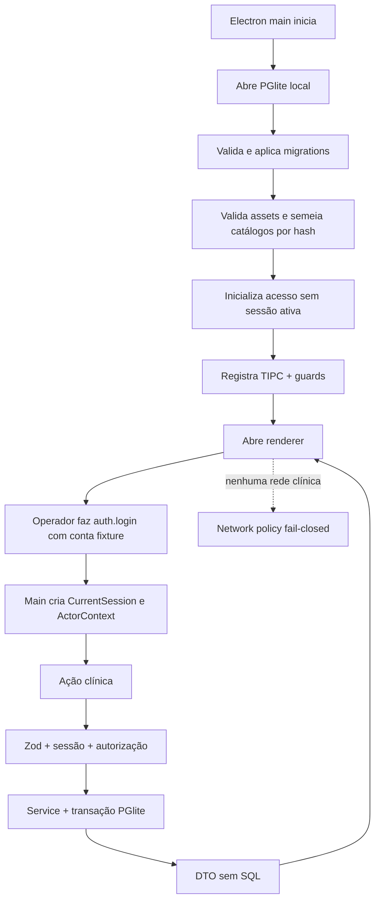

# ANALYST — Arquitetura offline e prova

## State

- Documento: `ANALYST-arquitetura-offline-e-prova.md`
- Estado: `READY_FOR_HUMAN_REVIEW — ASSINATURA PENDENTE`
- Escopo: Electron/PGlite local, migration, seed, catálogos, IPC, guardas, política de rede, segurança e prova.
- Ambiente prometido: um Mac, uma instalação, dados sintéticos, sem integração institucional.

## TL;DR

O Antessala deve iniciar, demonstrar o fluxo clínico e gerar PDF sem internet. PGlite é a fonte canônica local; o renderer nunca toca SQL; todo comando clínico cruza TIPC com validação runtime, `ActorContext` confiável, permissão, transação, idempotência e lock otimista. Migrations substituem o `CREATE TABLE IF NOT EXISTS` como mecanismo evolutivo. Catálogos versionados entram por assets locais e seed por hash. Código de IA pode permanecer no repositório, mas seus handlers ficam fora do router ativo ou respondem `FEATURE_DISABLED` antes de importar qualquer cliente de rede. Backup, restore e reset não são superfícies do MVP; repetição da demo pertence ao harness com diretório temporário.

## Phase 0 Grill

| Pergunta que derruba o produto | Resposta fechada para o MVP |
|---|---|
| O primeiro boot depende da internet? | Não. Esquema, seed, fontes, catálogos e UI vêm do pacote/repositório. |
| Onde está a verdade? | No PGlite local da instalação; renderer e PDF são projeções. |
| Como o schema evolui? | Migrations numeradas, atômicas e registradas em `schema_migrations`. |
| Como provar que não houve chamada externa? | Teste com interceptação fail-closed no Electron e servidor sentinela, além da policy existente. |
| Quem autoriza writes? | A `CurrentSession` autenticada pelo `auth.login` canônico; o main deriva dela o `ActorContext` imutável consumido pelos serviços. |
| A demo possui login real? | Sim, local: cinco contas fixture com e-mail, senha em hash e um papel cada. Não é autenticação institucional. |
| Como repetir a demonstração? | O harness cria um diretório de dados temporário e executa seed determinístico. Não há botão destrutivo no produto. |

## Source And Scope

Fontes normativas:

- `hack/PRD.md:133-168` exige contratos e restringe o MVP a uma demonstração local sem integração inventada.
- `hack/PRD.md:211-239` exige estados, aceite verificável e fluxo ponta a ponta.
- `hack/domains/ANALYST-acesso-e-auditoria.md` e
  `hack/domains/BUILD-acesso-e-auditoria.md` são a fonte canônica de autenticação local,
  contas fixture, `CurrentSession`, `ActorContext`, guards, sessões e auditoria.
- `src/main/db/pglite.ts:12-48` define a persistência embarcada e o diretório do banco.
- `src/main/db/schema.ts:8-24` e `src/main/db/schema.ts:31-164` mostram DDL atual para configuração, IA, RAG e chat.
- `src/main/db/schema.ts:239-246` mostra a criação sequencial de tabelas por `CREATE TABLE IF NOT EXISTS`.
- `src/main/db/seed.ts:63-94`, `src/main/db/seed.ts:128-150` e `src/main/db/seed.ts:157-285` provam assets locais, hash, seed e refresh transacional.
- `src/main/index.ts:32-63`, `src/main/index.ts:154-169` provam isolamento parcial da janela e boot DB → schema → seed → TIPC → UI.
- `src/main/renderer-network-policy.ts:3-69` bloqueia rede no renderer fora do origin de dev.
- `src/main/export/pdf.ts:16-91` endurece a janela de PDF.
- `src/data/catalogos/README.md:13-38` declara volume, origem e limites dos catálogos atuais.

Fora do escopo: Supabase, Stripe, sync entre máquinas, integração HC, autenticação institucional, prontuário real, dados reais, update remoto de catálogos e produção multiusuário.

## Product Promise

Uma pessoa consegue instalar/abrir o app, entrar com uma conta fixture local, percorrer a demonstração com dados locais, fechar e reabrir sem perder os dados e exportar o resultado sem que o primeiro boot ou o fluxo clínico precisem da rede. A sessão não sobrevive ao reinício: reabrir exige novo login.

## Story de Usuário

Como demonstrador, quero abrir o Antessala em qualquer rede ou sem rede e executar o caso completo, para que a apresentação não dependa de serviço externo.

Como avaliador do hackathon, quero entrar com uma das contas fixture e ver claramente qual usuário e papel estão ativos e por que uma ação é permitida ou bloqueada, para distinguir autenticação local demonstrada de integração institucional futura.

## Story Técnica

Como sistema Electron, quero aplicar migrations e seeds locais antes de expor handlers, rejeitar toda entrada inválida no main, bloquear rede não autorizada e produzir evidências automáticas de persistência, segurança e ausência de chamadas externas. Como harness, quero iniciar cada prova em diretório temporário para repetir fixtures sem oferecer reset destrutivo no produto.

## Current Terrain

- **CONFIRMADO:** `src/main/db/pglite.ts:12-48` usa PGlite persistido no diretório de dados da aplicação.
- **CONFIRMADO:** `src/main/index.ts:154-169` inicializa banco, cria tabelas, executa seed e registra TIPC antes de abrir a janela.
- **CONFIRMADO:** `src/main/db/schema.ts:239-246` executa DDL idempotente, mas não mantém ledger de migrations nem versões de schema.
- **CONFIRMADO:** `src/main/db/seed.ts:63-94` lê arquivos locais e calcula hashes; `src/main/db/seed.ts:157-279` atualiza catálogos em transação.
- **CONFIRMADO:** `src/data/catalogos/README.md:13-38` declara 14.793 CIDs, 382 medicamentos, 12 grupos perioperatórios, 94 atividades MET e 14 comorbidades; medicamentos são subconjunto, não ANVISA completa, e há licença pendente.
- **CONFIRMADO:** `src/main/renderer-network-policy.ts:3-69` bloqueia rede no renderer; `tests/main/renderer-network-policy.spec.ts:9-52` cobre o comportamento fail-closed.
- **CONFIRMADO:** `src/main/index.ts:32-63` mantém `contextIsolation: true` e `nodeIntegration: false`, porém usa `sandbox: false`.
- **CONFIRMADO:** `src/main/index.ts:66-111` ainda inicializa configuração opcional de IA; a
  capacidade não pode integrar o grafo ativo do MVP.
- **CONFIRMADO:** `src/main/ia/cliente.ts:52-107` pode chamar Gemini/OpenRouter no main quando solicitado.
- **CONFIRMADO:** `src/main/tipc.ts:265-335` ainda não possui validação runtime e autorização canônicas para writes clínicos.
- **CONFIRMADO:** não há mecanismo canônico de backup/restore/reset nas superfícies auditadas; ele não será criado no MVP.
- **DECISÃO DO MVP:** esconder a página não basta. Canais cloud ficam fora do router ativo
  ou retornam `FEATURE_DISABLED` antes de alcançar o cliente; o grafo ativo do main não
  importa transporte externo.
- **UNPROVEN:** segurança para dados reais, conformidade institucional, criptografia em repouso e recuperação após corrupção física. Não podem ser alegadas.

## Evidence Matrix

| Necessidade | Evidência | Estado | Decisão |
|---|---|---|---|
| Banco embarcado persistente | `src/main/db/pglite.ts:12-48` | Confirmado | Reusar PGlite. |
| Boot ordenado | `src/main/index.ts:154-169` | Confirmado | Inserir migrate antes de seed/handlers. |
| Evolução auditável de schema | `src/main/db/schema.ts:239-246` | Lacuna | Introduzir ledger e migrations numeradas. |
| Seed totalmente local | `src/main/db/seed.ts:63-94`, `128-150` | Confirmado | Preservar assets versionados e hashes. |
| Refresh atômico | `src/main/db/seed.ts:157-279` | Confirmado | Reusar padrão transacional. |
| Limites dos catálogos | `src/data/catalogos/README.md:13-38` | Confirmado | Mostrar versão/cobertura; não prometer base completa. |
| Renderer sem rede | `src/main/renderer-network-policy.ts:3-69` | Confirmado | Manter teste fail-closed. |
| Main ainda pode chamar nuvem | `src/main/ia/cliente.ts:52-107` | Lacuna bloqueante | Retirar canais cloud do router ativo e bloquear import do cliente no grafo do MVP. |
| Segurança da janela | `src/main/index.ts:32-63` | Parcial | Provar sandbox/preload antes de mudar; não declarar hardening completo. |
| PDF offline | `src/main/export/pdf.ts:16-91` | Confirmado | Reusar implementação endurecida. |
| Autorização clínica | `src/main/tipc.ts:265-335` | Lacuna | ActorContext e guard central no main. |
| Repetição determinística | Seed local e diretório de dados configurável | Parcial | Harness cria diretório temporário; produto não expõe reset. |

## Implementation Map

| Camada | Arquivo/área futura | Responsabilidade |
|---|---|---|
| Schema | `src/main/db/migrations/*` | migrations ordenadas e expand-only |
| Runner | `src/main/db/migrate.ts` | lock, checksum, ledger e transação |
| Catálogos | `src/main/db/seed.ts`, `src/data/catalogos/*` | seed por hash e manifesto de versão |
| Acesso canônico | `hack/domains/BUILD-acesso-e-auditoria.md` | owner único de `usuarios`, `sessoes`, `auditoria_eventos`, `auth.login`, `CurrentSession`, `ActorContext` e guards |
| Integração de boot | hook do domínio de acesso | inicia sem sessão, encerra recibos abertos e semeia as cinco contas fixture locais |
| IPC | routers clínicos + `src/main/tipc.ts` | Zod, errors tipados e services |
| Rede | `src/main/network/network-intent.ts` | choke point sem canal público; allowlist vazia no MVP |
| Auditoria | serviço canônico do domínio de acesso | consumir `auditoria_eventos`; esta fatia não cria DDL nem writer paralelo |
| Boot | `src/main/index.ts` | migrate → seed → acesso sem sessão → routers → window |
| Prova | `tests/main/*`, `tests/e2e/*`, `scripts/proof/*` | offline, migrations, guards, persistência e fluxo |

## Entities And State

### `SchemaMigration`

- Campos: `id`, `checksum`, `appliedAt`, `appVersion`.
- Estados: `PENDING → APPLIED`; checksum divergente é `FAILED` e bloqueia boot.
- Regra: migration aplicada não é editada; mudança ganha novo id.

### `CatalogRevision`

- Reusar o ledger de seed existente ou consolidá-lo, sem criar duas fontes.
- Campos: assetKey, kind, hash, contagem, versão, coverage/licença e aplicado em.
- Estados: `ABSENT | CURRENT | STALE | INVALID`.
- Regra: `INVALID` bloqueia aquele catálogo e exibe erro; não baixa correção.
- Manifesto obrigatório: CID, medicamentos, grupos perioperatórios, MET, comorbidades,
  serviços solicitantes, procedimentos, registry dos 14 widgets, template
  `pre_anesthesia_mvp`, regra `demo-workload-v1`, templates de slot, recursos e janelas
  iniciais da demo. Asset sem entrada no manifesto não pode participar do seed nem da UI.

### `CurrentSession` e `ActorContext` canônicos

- O contrato e a implementação pertencem exclusivamente a
  `hack/domains/BUILD-acesso-e-auditoria.md`; esta fatia somente os consome.
- `auth.login` valida e-mail e senha contra `usuarios`, cria a `CurrentSession` em memória
  no main e devolve a `SessaoPublica` redigida.
- O `ActorContext` entregue aos serviços é uma projeção imutável da `CurrentSession`;
  papel, autoria, escopo, `sessionId` e horário nunca vêm do renderer.
- Papéis canônicos: `ADMIN | RECEPCAO | ENFERMAGEM | ANESTESIOLOGISTA | SOLICITANTE`.
- Estados: `SEM_SESSAO | ATIVA | INVALIDADA | ENCERRADA`.
- `sessoes` registra o ciclo como recibo auditável, mas nunca restaura autoridade.
  Todo boot começa `SEM_SESSAO` e exige novo `auth.login`.

### Auditoria consumida

- `auditoria_eventos`, seu DDL, índices, trigger e writer pertencem exclusivamente a
  `hack/domains/BUILD-acesso-e-auditoria.md`.
- `schema_migrations` é o recibo das migrations, inclusive das que rodam antes de existir o
  domínio de acesso. Depois da migration de acesso, seed e falhas de segurança usam o
  writer canônico de auditoria, sem replay artificial dos passos anteriores.
- Nenhum componente deste domínio cria `audit_events`, outro ledger ou outro writer.

### Lifecycle canônico do caso

Esta arquitetura importa o `CaseStatus` e a máquina completa do Analyst de caso; não
redeclara transições. Em especial, `TRIAGE_PENDING` retorna a `NURSING_IN_PROGRESS`,
check-in explícito produz `WAITING_ANESTHESIA` e retorno também passa por check-in. Encontro,
pendência, resultado, entrega e migration possuem estados internos próprios e não
reutilizam `CaseStatus`.

## Runtime / Data Flow

## Rules And Invariants

1. Primeiro boot e fluxo clínico não fazem HTTP, HTTPS, WebSocket, download, telemetry ou load remoto.
2. O boot só abre arquivos empacotados/versionados e o PGlite local.
3. Renderer nunca recebe acesso a PGlite, filesystem irrestrito, token ou papel mutável por payload.
4. Todo write clínico passa por Zod estrito, `ActorContext`, autorização, service transacional, idempotência e versão esperada.
5. Papéis são exatamente `ADMIN | RECEPCAO | ENFERMAGEM | ANESTESIOLOGISTA | SOLICITANTE`.
   `QUICK | STANDARD | EXTENDED` são classes de slot, não papéis nem estados.
6. `ADMIN` administra a demo; não ganha autoridade clínica implícita para finalizar avaliação.
7. `auth.login`, `CurrentSession`, `ActorContext`, usuários, sessões, guards e auditoria são
   consumidos do domínio de acesso; este domínio não os redefine.
8. Todo boot começa sem sessão ativa. `sessoes` nunca é fonte de autoridade no boot.
9. Toda ação auditável usa o writer canônico de `auditoria_eventos`; tabelas paralelas de auditoria são proibidas.
10. Migrations aplicadas são imutáveis e verificadas por checksum antes da abertura da UI; `schema_migrations` é o ledger único.
11. Falha de migration ou seed bloqueia o boot com diagnóstico local; nunca tenta reparar pela internet.
12. Catálogo guarda hash, versão e contagem. A UI não afirma cobertura que o asset não possui.
13. IA em nuvem não participa de classificação, anamnese, agenda, resultado, boot, seed
    ou PDF. Seus canais não pertencem ao router ativo; chamada futura exige novo ciclo de
    produto e alteração explícita da allowlist.
14. Logs contêm ids técnicos, ação, resultado e duração; não contêm conteúdo clínico, snapshots completos ou credenciais.
15. Backup, restore e reset não possuem rota, menu ou handler no MVP.
16. O harness pode apagar somente o seu próprio diretório temporário e recriá-lo por seed; nunca toca o diretório real do usuário.
17. PDF continua com JavaScript e rede desativados e é gerado de DTO canônico do main.
18. Nenhuma prova offline depende de “desligar o Wi-Fi”; ela intercepta e falha qualquer tentativa de rede do app.

## Architecture Risks

| Risco | Severidade | Evidência | Resposta obrigatória |
|---|---|---|---|
| DDL sem ledger divergir silenciosamente | Alta | `src/main/db/schema.ts:239-246` | Migrations + checksum + teste de upgrade. |
| Handler confiar no renderer | Crítica | `src/main/tipc.ts:265-335` | Zod, ActorContext e guard no main. |
| Sessão persistida virar login automático | Crítica | Contrato canônico de acesso | Autoridade somente em memória; boot encerra recibos abertos e exige novo login. |
| Auditoria fragmentar em tabelas concorrentes | Alta | Contrato canônico de acesso | Usar somente `auditoria_eventos`. |
| IA no main escapar da policy do renderer | Crítica | `src/main/ia/cliente.ts:52-107` | Router ativo allowlisted, `FEATURE_DISABLED` no legado e teste do grafo/egress do processo inteiro. |
| `sandbox: false` ampliar impacto do preload | Alta | `src/main/index.ts:32-63` | Threat model e teste antes de habilitar sandbox; não alegar isolamento total. |
| Token persistido como texto | Alta | `src/main/tipc.ts:42-129` | Ocultar/desabilitar IA no MVP ou migrar segredo para armazenamento seguro antes de uso real. |
| Harness apagar dados reais | Alta | Prova precisa de estado limpo | Diretório temporário obrigatório + guard que rejeita o userData real. |
| Medicamentos incompletos/licença pendente | Alta | `src/data/catalogos/README.md:13-38` | Rotular subset e não usar como catálogo institucional. |
| Teste unitário “offline” não provar Electron | Média | testes atuais | E2E com interception/sentinela em app empacotável. |

## Blueprint Handoff

O Build deve fechar:

- formato e runner de migrations, ordem de boot e comportamento em falha;
- manifesto de catálogos e política de seed/reseed sem rede;
- integração com `auth.login`, `CurrentSession`, `ActorContext`, fixtures e matriz de capabilities do domínio de acesso, sem contrato paralelo;
- envelope de erro TIPC, validação e limites de payload;
- isolamento do diretório temporário usado por provas repetíveis;
- composição allowlisted do router, `FEATURE_DISABLED` no legado cloud e negação de cada
  intenção de rede do main e renderer;
- hardening incremental da janela e do preload;
- matriz de testes unitários, integração e E2E com prova negativa de rede;
- reuso do Antessala/DietFlow/EscalaFlow e rejeições explícitas;
- limites do futuro para impedir que o MVP seja vendido como arquitetura hospitalar.

## Acceptance Criteria

- [ ] Banco vazio aplica todas as migrations e registra seus checksums antes de abrir a UI.
- [ ] Banco de versão anterior migra sem perder dados sintéticos válidos.
- [ ] Alterar migration aplicada bloqueia o boot com erro local legível.
- [ ] Seed lê somente assets locais, verifica hash/contagem e é idempotente.
- [ ] Primeiro boot e fluxo ponta a ponta passam com um trap que falha qualquer rede não permitida.
- [ ] Toda ação clínica rejeita payload malformado e papel indevido no main.
- [ ] Renderer não escolhe autoria, papel, horário, estado ou hash; ele envia somente e-mail e senha a `auth.login`.
- [ ] As cinco contas fixture locais autenticam e recebem exatamente um papel cada.
- [ ] `sessoes` registra login, encerramento e invalidação, mas reinício sempre volta sem sessão ativa.
- [ ] Toda auditoria usa `auditoria_eventos`; não existe ledger paralelo.
- [ ] Não existe rota/handler de backup, restore ou reset; o harness recria apenas seu próprio diretório temporário.
- [ ] Logs de teste não contêm conteúdo clínico nem credenciais.
- [ ] PDF final continua sem JavaScript e sem rede.
- [ ] A UI declara que papel, dados e entrega são de demonstração local.

## Open Questions

Não há pergunta bloqueadora para a arquitetura da demo. Antes de qualquer piloto com dados reais, um novo ciclo PRD → Analyst deve decidir autenticação, criptografia, retenção, LGPD, backup seguro, integração, observabilidade, atualização e suporte. Essas decisões não cabem em uma MiniSpec do MVP.

## Grill Verdict

`READY_FOR_HUMAN_REVIEW — ASSINATURA PENDENTE`.

A arquitetura offline está fechada para um Mac e dados sintéticos. Ela é deliberadamente incapaz de sustentar alegações de prontuário, sync, autenticação ou operação hospitalar.

## Recommended Next Phase

Após as assinaturas anteriores e deste Analyst, formalizar
`BUILD-arquitetura-offline-e-prova.md` e submetê-lo ao Critic junto da síntese. Sem
assinatura de Marco, não criar Warlog, MiniSpec, Spec, Plan, teste ou código.

## Contrato de encerramento deste arquivo

- [x] Boot, persistência, migrations, seed, rede, IPC, segurança e prova mapeados.
- [x] Repetição da demo isolada no harness, sem operação destrutiva no produto.
- [x] Reuso, riscos e fronteira futura explícitos.
- [ ] Revisado e assinado por Marco.

- Artefato: `ANALYST-arquitetura-offline-e-prova.md`
- Próxima fase autorizada após as assinaturas anteriores e desta revisão: Build formal e Critic
- Estado: `AGUARDANDO_ASSINATURA`
- Assinatura de Marco: `PENDENTE`
- Data: `PENDENTE`
- Revisão Git examinada: `PENDENTE`
- Declaração: `PENDENTE`

Sem assinatura válida de Marco, este arquivo não terminou e não libera Build.
