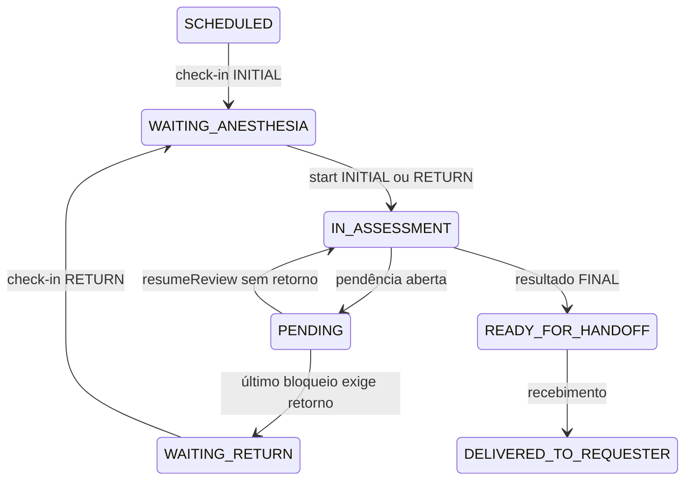
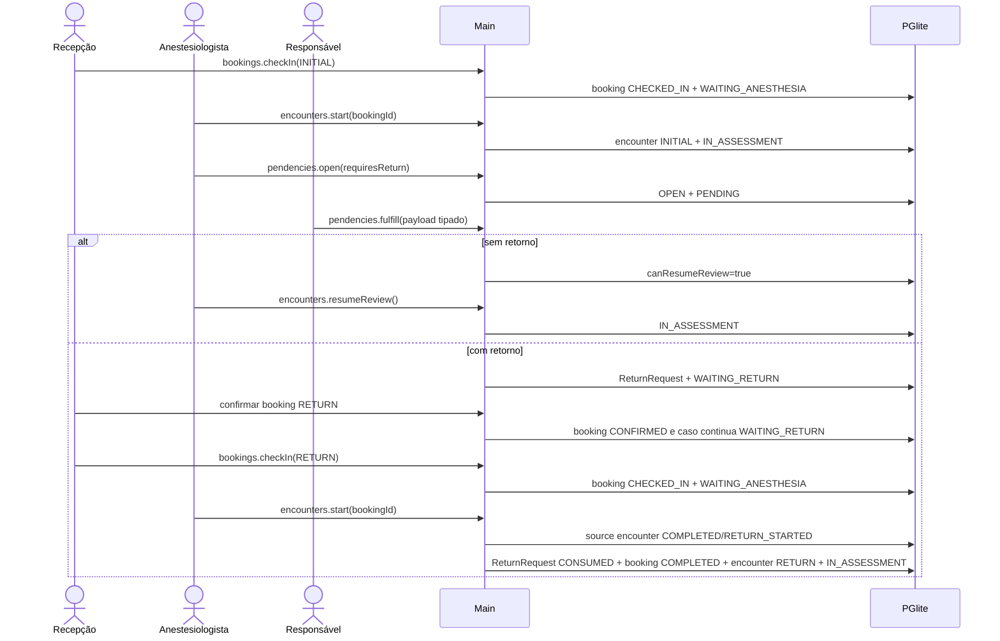
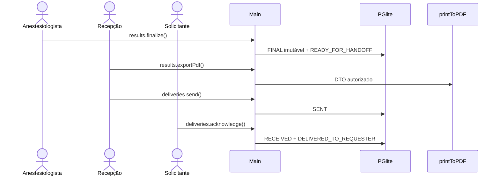

# ANALYST — Avaliação, pendências e handoff

## State

- Documento: `ANALYST-avaliacao-pendencias-e-handoff.md`
- Estado: `RESEARCH_REQUIRED — ASSINATURA PENDENTE`
- Escopo: check-in, encontro anestésico, pendências, retorno, resultado, PDF e entrega.
- Fora deste domínio: classificação inicial, motor de fila, protocolo institucional, integração com o HC e prontuário longitudinal.

## TL;DR

A recepção faz o check-in de um booking `INITIAL` ou `RETURN`; só depois o
anestesiologista inicia o encontro. Toda pendência do MVP é bloqueadora e possui pedido e
cumprimento tipados, responsável, prazo e decisão explícita sobre retorno. O último
bloqueio libera a retomada do mesmo encontro ou cria um `ReturnRequest` para a recepção
agendar. O rascunho vive no encontro. O único resultado persistido é `FINAL`, imutável e
entregue apenas ao serviço solicitante correto.

Autoria humana, isolamento por serviço e proibição de decisão automática são
`PRODUCT_LAW`. Campos da avaliação, tipos de pendência, retorno, prazo, imutabilidade sem
adendo e canais de entrega são `DEMO_DECISION` ou `UNRESOLVED` até pesquisa clínica,
operacional e regulatória.

## Phase 0 Grill

| Pergunta | Decisão do MVP |
|---|---|
| Quem registra a chegada? | `RECEPCAO`, por `scheduling.bookings.checkIn`. |
| Quem inicia a consulta? | Apenas `ANESTESIOLOGISTA`, por `encounters.start` após check-in. |
| Como distinguir consulta e retorno? | `bookingKind: INITIAL | RETURN`; `RETURN` exige `returnRequestId`. |
| Toda pendência bloqueia? | Sim. Não existe `blocking=false`. |
| Quem decide retorno? | O anestesiologista ao abrir a pendência, por `requiresReturn`. |
| Quem cumpre? | O ator de `ownerRole`; solicitante também precisa coincidir com `targetServiceId`. |
| Cumprimento aprova clinicamente? | Não. Retomada e conclusão continuam exclusivas do anestesiologista. |
| Onde fica o rascunho? | Em `assessmentContentV1` no encontro. Não existe resultado `DRAFT`. |
| O resultado final pode ser corrigido? | Não no MVP. Adendo ou correção exigem novo PRD. |

## Source And Scope

- `hack/PRD.md:53-70` define consulta, pendência, retorno e devolução.
- `hack/PRD.md:133-168` exige contratos fechados e proíbe integração inventada.
- `hack/domains/ANALYST-caso-e-encaminhamento.md:258-270` separa check-in de início do encontro.
- `hack/domains/ANALYST-acesso-e-auditoria.md` é a fonte semântica de papéis, capabilities e
  escopo do solicitante.
- `hack/domains/ANALYST-classificacao-e-agenda.md` é a fonte semântica de booking,
  compatibilidade e capacidade.
- `src/main/export/pdf.ts:16-91` e `tests/main/export/pdf.spec.ts:53-150` provam PDF isolado e offline.

O anestesiologista define ou confirma explicitamente classe, duração, capabilities e
data-alvo do retorno conforme seu objetivo atual. O requisito inicial pode aparecer como
referência não vinculante; não é copiado automaticamente. Este domínio não recalcula a
triagem nem transforma necessidade operacional em risco clínico.

## Product Promise

O sistema permite descobrir qual booking teve check-in, quem conduziu cada encontro, o que
faltou, quem devia fornecer, se o caso exige retorno, qual resultado final foi emitido e
qual serviço confirmou o recebimento.

## Story de Usuário

Como recepcionista, quero registrar a chegada e agendar retornos liberados sem iniciar uma
avaliação clínica em nome do anestesiologista.

Como anestesiologista, quero abrir pendências tipadas e decidir se preciso rever a pessoa,
para concluir somente após todos os bloqueios.

Como responsável por uma pendência, quero receber um pedido exato e registrar uma resposta
compatível.

Como solicitante, quero acessar apenas os casos do meu serviço e confirmar o resultado
final recebido.

## Story Técnica

Como sistema local, quero persistir encontros, pendências, pedidos de retorno, resultado,
receipts e entregas ligados ao `caseId`, com autoria de sessão, lock otimista e eventos
append-only, para impedir check-in, retomada, retorno, conclusão ou handoff inválidos.

## Current Terrain

- **CONFIRMADO:** `src/main/db/clinical-schema.ts:3-52` não modela este domínio.
- **CONFIRMADO:** `src/shared/clinical/registro.ts:3-38` contém estados provisórios.
- **CONFIRMADO:** `src/main/tipc.ts:265-335` não possui estes guards e contratos.
- **CONFIRMADO:** `src/renderer/src/App.tsx:13-56` não possui rota de avaliação ou resultado.
- **CONFIRMADO:** `src/main/export/pdf.ts:16-91` atende o PDF sem rede.
- **DECISÃO DA DEMO:** conteúdo clínico manual, sem ASA, aptidão ou protocolo do HC.

## Evidence Matrix

| Necessidade | Evidência | Consequência |
|---|---|---|
| Check-in não é avaliação | `ANALYST-caso-e-encaminhamento.md:258-264` | Comandos e papéis separados. |
| Permissão nasce no main | `ANALYST-acesso-e-auditoria.md` | Payload não escolhe ator, papel ou serviço; detalhes físicos pertencem ao Build. |
| Retorno ocupa agenda | `ANALYST-classificacao-e-agenda.md` | Consumir compatibilidade e capacidade; arquitetura física pertence ao Build. |
| Persistência ausente | `clinical-schema.ts:3-52` | Criar entidades canônicas no PGlite. |
| PDF offline existente | `pdf.ts:16-91` | Projetar somente resultado autorizado. |

## Implementation Map

| Camada | Área | Responsabilidade |
|---|---|---|
| Shared | `src/shared/clinical/assessment.ts` | enums, unions, DTOs e Zod |
| Shared | `src/shared/scheduling/types.ts` | `BookingKind` e vínculo de retorno |
| DB | `src/main/db/migrations/*` | tabelas, constraints, índices e receipts |
| Main | `src/main/clinical/assessment-service.ts` | encontro, pendência, retomada e retorno |
| Main | `src/main/clinical/document-service.ts` | recibos imutáveis de metadados/hash, sem binário |
| Main | `src/main/clinical/result-service.ts` | resultado final e projeções autorizadas |
| Main | `src/main/clinical/delivery-service.ts` | entrega e escopo |
| Main | `src/main/clinical/result-document.ts` | HTML determinístico |
| IPC | router clínico | capability, owner e service guards |
| Renderer | avaliação, `/pendencias`, retorno e resultado | estados e ações autorizadas |
| Tests | unit/service/IPC/E2E | transições, concorrência, redaction e PDF |

## Entities And State

### Capabilities consumidas do acesso

| Operação | Capability | Guarda adicional |
|---|---|---|
| confirmar, reagendar, cancelar e registrar no-show | `scheduling:booking:manage` | `RECEPCAO` |
| fazer check-in | `scheduling:booking:check-in` | `RECEPCAO`; janela do booking |
| ler encontro | `assessment:read` | caso autorizado |
| iniciar, salvar, retomar e finalizar | `assessment:write` | `ANESTESIOLOGISTA` |
| abrir e cancelar pendência | `pendency:manage` | `ANESTESIOLOGISTA` |
| listar/ler pendência atribuída | `case:read:assigned` | `ownerRole` e, se aplicável, serviço |
| registrar documento e cumprir pendência | `pendency:evidence:register` | `ownerRole` e, se aplicável, serviço |
| ler status de resultado | `result:status:read` | `RECEPCAO`, `ANESTESIOLOGISTA` ou `SOLICITANTE`; solicitante exige `requireServiceScope` |
| ler conteúdo de resultado | `result:content:read` | somente `ANESTESIOLOGISTA` ou `SOLICITANTE`; solicitante exige `requireServiceScope` |
| exportar PDF | `result:export` | somente `RECEPCAO` ou `ANESTESIOLOGISTA`; resultado `FINAL` |
| enviar entrega | `delivery:manage` | `RECEPCAO` |
| confirmar recebimento | `delivery:acknowledge` | serviço da sessão |

`ADMIN` não herda permissão clínica. Apenas o anestesiologista abre, decide
`requiresReturn`, cancela pendência, retoma e conclui. Cumprir registra evidência; não
decide suficiência clínica.

`pendencies.listAssigned({ status?, overdue?, cursor?, limit? })` é a query da worklist
compartilhada. Ela devolve página cursorada de `AssignedPendencyDTO`, com contexto
operacional mínimo do caso (`displayCode`, `personName`, `procedureDescription`), pedido
autorizado, prazo/atraso e versão. O main força `ownerRole` da sessão e, para
`SOLICITANTE`, `targetServiceId`; o renderer não escolhe owner, view ou serviço.

Não existe capability `result:read`. `results.getStatus` nunca devolve conteúdo;
`results.getCurrent` é a única query genérica de conteúdo. O service de entrega da
recepção carrega o `FINAL` internamente sob `delivery:manage`, sem conceder à recepção
`result:content:read`.

### Segmento do `CaseStatus`

O enum canônico não muda:



### `Booking`

- `INITIAL` exige `returnRequestId=null`.
- `RETURN` exige `returnRequestId` ativo do mesmo caso.
- Check-in produz `CHECKED_IN`; `encounters.start` consome o booking e o marca `COMPLETED`.
- `COMPLETED` significa que a agenda entregou o atendimento ao encontro; não significa
  conclusão clínica.
- A ocupação física do slot permanece até `slot.endsAt`, mesmo após o booking virar
  `COMPLETED`.
- Cancelamento ou no-show de `RETURN` reabre a mesma solicitação e mantém
  `WAITING_RETURN`.

### `AnesthesiaEncounter`

```text
ENTITY: AnesthesiaEncounter
- Attributes: id, caseId, bookingId, sequence, encounterType, status, reviewCycle,
  completionReason, responsibleActor, assessmentContentV1, version, timestamps.
- States: IN_PROGRESS | WAITING_PENDING | COMPLETED.
- Invalid: start sem booking CHECKED_IN; RETURN sem ReturnRequest; dois encontros ativos;
  edição após COMPLETED; ator escolhido pelo renderer.
```

`reviewCycle` inicia em 1 e aumenta em `resumeReview`. Cada pendência guarda o ciclo.
`completionReason` vale `RETURN_STARTED` ou `RESULT_FINALIZED` quando concluído.

### `CasePendency`

```text
ENTITY: CasePendency
- Attributes: id, caseId, encounterId, reviewCycle, kind, ownerRole,
  targetServiceId, description, requestedPayload, requiresReturn, dueAt, status,
  fulfillmentPayload, authorship, version.
- States: OPEN | FULFILLED | CANCELLED.
- Invalid: item não bloqueador; kind/payload incompatível; owner indevido;
  SOLICITANTE sem targetServiceId; outro owner com targetServiceId; overwrite.
```

Todas são bloqueadoras. `dueAt` é obrigatório. Atraso apenas deriva `overdue=true`.

| Kind | Pedido | Cumprimento |
|---|---|---|
| `EXAM` | nome, pergunta clínica opcional, instrução opcional | `RECEIVED` com documento ou `UNAVAILABLE` com justificativa |
| `INFORMATION` | pergunta, fonte esperada, instrução opcional | resposta, fonte real, documentos opcionais |
| `DOCUMENT` | título, categoria, instrução opcional | ao menos um `documentId`, observação opcional |
| `OTHER` | pedido e instrução opcional | resposta e documentos opcionais |

O cumprimento usa o mesmo discriminante do pedido. Campos extras falham; documentos
pertencem ao mesmo caso e à mesma pendência.

### `CaseDocument`

```text
ENTITY: CaseDocument
- Attributes: id, caseId, pendencyId nullable, resultId nullable, kind, title, mimeType,
  sizeBytes, contentHash, metadata, createdBy, createdAt.
- Kinds: REFERRAL | EXAM | INFORMATION | RESULT_PDF_RECEIPT | OTHER.
- State: recibo imutável de metadados.
- Invalid: bytes ou path local persistidos; hash inválido; update/delete; vínculo entre
  casos; pendencyId/resultId de outro caso; RESULT_PDF_RECEIPT pelo command público.
```

`documents.registerMetadata` recebe somente `caseId`, `pendencyId`, `kind`, `title`,
`mimeType`, `sizeBytes`, `contentHash`, `metadata`, `requestId` e versões esperadas. A UI
pode enviar `kind=EXAM | INFORMATION | OTHER`; `RESULT_PDF_RECEIPT` é reservado ao export
interno. Pode selecionar um arquivo local e calcular SHA-256 no renderer, mas envia ao main apenas
metadados e `contentHash = sha256:<64 hex minúsculos>`; bytes e path nunca atravessam o
contrato nem são persistidos. `title` aceita 1–200 caracteres, `mimeType` 1–120,
`sizeBytes` é inteiro não negativo e `metadata` é o objeto estrito
`{ observedAt: string | null; issuer: string | null; note: string | null }`, com textos de
até 500 caracteres. O command exige `pendency:evidence:register`, pendência `OPEN`, owner e
escopo corretos; a pendência e o caso devem coincidir. `pendencies.fulfill` aceita somente
IDs já registrados para essa pendência. `RESULT_PDF_RECEIPT` é criado internamente pelo
export do resultado, sob `result:export`, com hash e tamanho do PDF gerado; não existe
upload, download ou armazenamento de binário no MVP.

### Regra do último bloqueio

O service considera apenas `encounterId + reviewCycle`:

1. se existe `OPEN`, caso e encontro permanecem `PENDING` e `WAITING_PENDING`;
2. pendência cancelada deixa de exigir retorno;
3. sem `OPEN` e sem pendência `FULFILLED requiresReturn=true`, o caso permanece `PENDING`
   com `canResumeReview=true`; só `encounters.resumeReview` produz `IN_ASSESSMENT`;
4. sem `OPEN` e com ao menos uma pendência `FULFILLED requiresReturn=true`, a transação
   cria um `ReturnRequest READY_FOR_BOOKING`, com todos esses IDs ordenados, e produz
   `WAITING_RETURN`;
5. cumprimento nunca conclui encontro ou resultado.

### `ReturnRequest`

`ReturnRequest` pertence ao caso e ao encontro de origem, referencia as pendências que
justificaram o retorno e possui estados `READY_FOR_BOOKING | BOOKED | CHECKED_IN |
CONSUMED`. Não existe sem pendência cumprida que exija retorno, não aceita booking inicial,
não atravessa casos e não pode ser consumido sem check-in.

Ao criar o pedido, o anestesiologista define ou confirma a necessidade operacional atual:
classe demonstrativa, duração, buffer, ocupação, data-alvo, tipos de recurso e
capabilities. O requisito inicial é apenas referência histórica. A data de dez dias úteis e
as durações `20/35/50` permanecem `DEMO_DECISION` até o research deste domínio; não são
aplicadas como protocolo ou urgência. A recepção seleciona vaga compatível e não recalcula
a decisão. Identidade física, relação com booking e persistência pertencem ao Build.

### Conteúdo do encontro

```ts
type AssessmentNarrative =
  | { state: 'ANSWERED'; text: string }
  | { state: 'NEGATIVE' | 'UNKNOWN' | 'NOT_APPLICABLE'; text: null }

type AssessmentContentV1 = {
  _v: 1
  confirmation: {
    personConfirmed: boolean
    procedureConfirmed: boolean
    note: string | null
  }
  interview: {
    intervalHistory: AssessmentNarrative
    currentSymptoms: AssessmentNarrative
  }
  examination: {
    generalExam: AssessmentNarrative
    airwayExam: AssessmentNarrative
    vitalSignsReview: AssessmentNarrative
    additionalFindings: AssessmentNarrative
  }
  reviewedDocuments: Array<{
    id: string
    kind: 'EXAM' | 'REPORT' | 'OTHER'
    title: string
    observedAt: string | null
    summary: string
    sourceDocumentId: string | null
  }>
  synthesis: {
    summary: string
    limitations: string[]
    nextAction: 'FINALIZE_RESULT' | 'OPEN_PENDING_ITEM'
  }
}
```

Narrativa `ANSWERED` exige 1–4.000 caracteres; outros estados exigem `text=null`.
Notas aceitam até 500, documentos até 50, e listas até 20 itens. O encontro é o único
rascunho persistido.

### Resultado e entrega

```ts
type PreopResultContentV1 = {
  _v: 1
  assessmentSummary: string
  conclusion: string
  recommendations: string[]
  limitations: string[]
  returnInstructions: string | null
}
```

O único estado persistido é `FINAL`. Há no máximo um resultado por caso. `UPDATE`,
`DELETE`, segunda finalização, `DRAFT`, `SUPERSEDED`, adendo e reabertura não existem no
MVP.

`finalizedBy`, `finalizedAt` e `contentHash` registram autoria, horário e integridade local
do conteúdo final. Isso é proveniência, não assinatura digital, certificado profissional ou
assinatura jurídica. O PDF exibe “Protótipo com dados sintéticos — não assinado
digitalmente” e carrega os mesmos identificador, horário e hash.

`ResultDelivery` segue `SENT → RECEIVED`. O destinatário vem do `serviceId` do snapshot do
caso. A sessão `SOLICITANTE` precisa corresponder ao serviço.

`results.getStatus` projeta somente existência/finalização, hash, horários e estado de
entrega, sem propriedade `content`. `results.getCurrent` devolve conteúdo somente ao
anestesiologista ou ao solicitante do serviço correto. `results.getHistory` não existe:
há um único `FINAL` no MVP.

## Runtime / Data Flow



O último passo não libera sala ou anestesiologista: as linhas de ocupação do slot
permanecem até `slot.endsAt`.



## Redaction Contract

| Papel | Encontro | Pendência | Resultado | Entrega |
|---|---|---|---|---|
| `ANESTESIOLOGISTA` | conteúdo completo | pedido/cumprimento completos | status + conteúdo completo | recibo/status |
| `RECEPCAO` | status sem conteúdo | status, dono, prazo; payload só se owner | somente status/metadados; PDF por export interno | gerenciamento |
| `ENFERMAGEM` | status | pedido/formulário somente se owner | nenhum | nenhum |
| `SOLICITANTE` | nenhum | pedido/formulário do próprio serviço | status + conteúdo do próprio serviço | confirmar recebimento |
| `ADMIN` | nenhum | nenhum | nenhum | nenhum |

O main deriva a projeção da sessão. Payload não recebe `role`, `view` nem escopo ampliável.
Metadados de `CaseDocument` acompanham somente a pendência autorizada ou o recibo de export
autorizado; nenhum papel recebe bytes/path, e `ADMIN` não recebe nem os metadados clínicos.

## Rules And Invariants

1. Recepção faz check-in; anestesiologista inicia encontro.
2. `encounters.start` deriva o tipo do booking.
3. Cada booking inicia no máximo um encontro.
4. `encounters.start` marca o booking `COMPLETED`, mas preserva ocupações até `slot.endsAt`.
5. Campo `blocking` e `Record<string, unknown>` são rejeitados.
6. `ownerRole=SOLICITANTE` exige `targetServiceId`; outro owner exige nulo.
7. Apenas o owner cumpre; apenas anestesiologista abre, decide e cancela.
8. Cumprimento não aprova clinicamente.
9. O relógio não muda estado.
10. Sem retorno, `resumeReview` é obrigatório; com retorno, booking `RETURN` é obrigatório.
11. Iniciar `RETURN` fecha o encontro de origem como `COMPLETED/RETURN_STARTED`, consome a
    solicitação e cria o novo encontro na mesma transação.
12. Finalização exige encontro ativo, confirmações e zero pendência `OPEN`.
13. O rascunho vive no encontro; resultado `FINAL` é imutável.
14. Todo command deste domínio usa `requestId + fingerprint + result`.
15. Ator, papel, serviço, horários, hash e estado vêm do main.
16. Redaction ocorre antes do IPC.
17. PDF nasce do resultado autorizado carregado no main; sua autoria/hash são proveniência,
    nunca assinatura digital.
18. `CaseDocument` persiste somente metadados/hash e nunca bytes ou path local.
19. Entrega usa o serviço do snapshot e recebimento exige esse escopo.
20. A demo não envia dados ao HC.
21. `results.getStatus` usa `result:status:read` e nunca possui campo `content`.
22. `results.getCurrent` usa `result:content:read`; recepção nunca o chama.
23. Export e entrega carregam o `FINAL` internamente sob suas capabilities específicas,
    sem criar permissão genérica de conteúdo.

## Architecture Risks

| Severidade | Risco | Fechamento |
|---|---|---|
| crítica | recepção iniciar avaliação | comandos/capabilities separados |
| crítica | payload aberto | unions discriminadas e Zod strict |
| crítica | cumprimento concluir automaticamente | retomada/finalização exclusivas |
| crítica | duplicar retorno, resultado ou command | índices, lock e receipts |
| alta | vazamento entre serviços | `targetServiceId` + scope guard |
| alta | renderer escolher projeção | DTO montado no main |
| alta | alterar resultado entregue | imutabilidade e novo PRD para adendo |

## Blueprint Handoff

O Build deve fechar tabelas, constraints, unions de pendência, DTOs de saída, command
guards, transações, receipts, redaction, PDF e testes adversariais. A ordem de migrations é
fixa: base da agenda com booking `INITIAL`; assessment com `return_requests` e encounters;
integração da agenda com `kind`, `return_request_id` e
`completed_by_encounter_id`.

O handoff inclui `src/main/clinical/document-service.ts` para metadata receipts e
`src/renderer/src/paginas/pendencias/*` para a worklist compartilhada. A superfície consome
o DTO/query canônico deste domínio; não cria outra semântica de owner, documento ou
cumprimento.

## Acceptance Criteria

- [ ] Recepção não inicia encontro; anestesiologista não faz check-in.
- [ ] `INITIAL` e `RETURN` possuem vínculos válidos.
- [ ] `RETURN` sem solicitação ativa falha.
- [ ] Confirmar `RETURN` mantém `WAITING_RETURN`; check-in move para
      `WAITING_ANESTHESIA`.
- [ ] `encounters.start` marca booking `COMPLETED` sem liberar ocupação antes de
      `slot.endsAt`.
- [ ] Booking de retorno é derivado por `scheduling_bookings.return_request_id`; a tabela
      `return_requests` não possui `booking_id`.
- [ ] `blocking` e payload genérico falham.
- [ ] Cada kind aceita apenas seu pedido/cumprimento.
- [ ] Owner ou serviço incorreto não cumpre.
- [ ] Último bloqueio sem retorno só libera `resumeReview`.
- [ ] Último bloqueio com retorno cria uma única solicitação.
- [ ] O anestesiologista define ou confirma classe, duração, buffer, ocupação, prazo,
      recursos e capabilities do retorno; o requisito inicial é referência não vinculante.
- [ ] Iniciar o encontro `RETURN` fecha o encontro de origem como
      `COMPLETED/RETURN_STARTED` antes de consumir a solicitação, no mesmo commit.
- [ ] Cancelamento/no-show reabre a mesma solicitação.
- [ ] `/pendencias` lista somente itens do `ownerRole` corrente e aplica escopo de serviço
      ao solicitante.
- [ ] `documents.registerMetadata` e `pendencies.fulfill` recusam outro owner, outra
      pendência/caso, bytes, path e hash inválido; o banco recebe apenas metadados e SHA-256.
- [ ] Não existe resultado `DRAFT`.
- [ ] Resultado final não pode ser alterado, removido ou repetido.
- [ ] Replay idempotente devolve o mesmo resultado; fingerprint divergente falha.
- [ ] DTOs escondem conteúdo por papel e serviço.
- [ ] `result:read` e `results.getHistory` não existem.
- [ ] `results.getStatus` usa `result:status:read` e seu DTO não possui `content`, nem nulo.
- [ ] `results.getCurrent` usa `result:content:read`, nega recepção e exige
      `requireServiceScope` do solicitante.
- [ ] `results.exportPdf` aceita somente recepção/anestesiologista com `result:export`.
- [ ] `deliveries.send` carrega o `FINAL` internamente sob `delivery:manage` sem conceder
      leitura genérica do conteúdo.
- [ ] PDF continua offline.
- [ ] Resultado e PDF chamam autor/horário/hash de proveniência e declaram que o protótipo
      não possui assinatura digital.
- [ ] Envio e recebimento são eventos distintos.

## Open Questions

O fluxo demonstrativo está descrito, mas sua matéria clínica, pendências, retorno,
resultado e entrega ainda exigem pesquisa antes de poderem ser assinados.

## Grill Verdict

`RESEARCH_REQUIRED — ASSINATURA PENDENTE`.

## Recommended Next Phase

Revisão humana e assinatura de Marco. Nenhuma MiniSpec, Spec, Plan, teste ou código pode
usar este contrato antes dessa assinatura.

## Contrato de conclusão

- [x] Atores, estados, payloads, regras e redaction descritos como proposta.
- [ ] Check-in, encontro, pendência, retorno, resultado e handoff pesquisados e revisados.
- [ ] Revisado e assinado por Marco.

- Artefato: `hack/domains/ANALYST-avaliacao-pendencias-e-handoff.md`
- Próxima fase autorizada: revisão humana
- Status: `RESEARCH_REQUIRED — ASSINATURA PENDENTE`
- Assinatura de Marco: `PENDENTE`
- Data: `PENDENTE`
- Revisão Git examinada: `PENDENTE`
- Declaração: `PENDENTE`

Declaração exigida: “Aprovo o Analyst de avaliação, pendências e handoff e autorizo seu
consumo pelo Build.”
