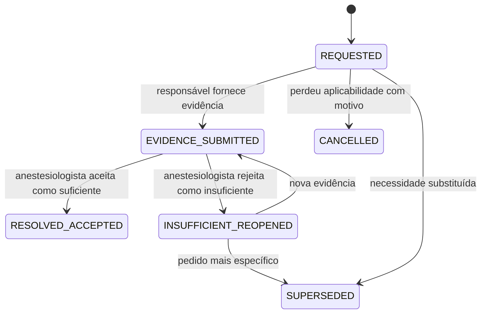
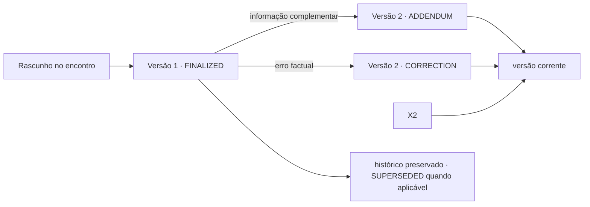
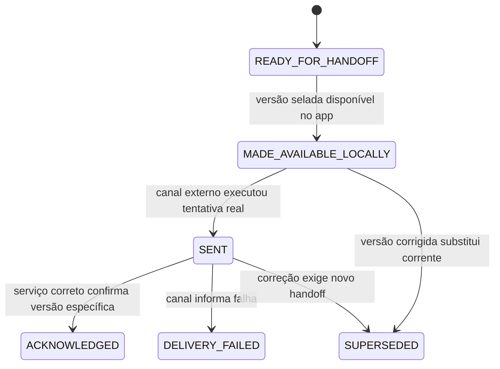

# ANALYST — Avaliação, pendências e handoff

## Estado documental

- Papel: `CANONICAL_DOMAIN_CONTRACT`.
- Indexado por: `hack/analysis.md`.
- Gate ou assinatura individual: inexistente.
- Research, recon e adversarial qualificam a maturidade registrada no tracker único.
- Este arquivo é a fonte semântica do domínio. `hack/analysis.md` apenas integra e aponta;
  não substitui, resume com perda nem supera este contrato.

## TL;DR

A recepção registra a chegada; o anestesiologista conduz e documenta a avaliação médica.
Uma pendência representa uma necessidade não resolvida, mas não é automaticamente um
bloqueio. A submissão de evidência não equivale à sua aceitação clínica. Somente o
anestesiologista decide suficiência, impacto, necessidade de retorno e conclusão.

Uma versão finalizada do resultado nunca é sobrescrita ou apagada. Correção, adendo ou
supersessão produzem outra versão, com autoria, motivo e vínculo com a anterior. O handoff
distingue disponibilidade local, envio real e confirmação de recebimento; funcionamento
offline nunca é descrito como entrega externa.

## Classificação das afirmações

| Marca | Significado |
|---|---|
| `PRODUCT_LAW` | decisão explícita de Marco ou do PRD |
| `EVIDENCE_BACKED` | obrigação ou capacidade sustentada por fonte identificada |
| `DEMO_DECISION` | escolha limitada aos dados sintéticos da prova de conceito |
| `UNRESOLVED` | depende de protocolo, governança ou pesquisa ainda ausente |

Diretrizes profissionais e evidência científica orientam o desenho, mas não são
apresentadas como protocolo do hospital.

## Fontes e limites

- `PRODUCT_LAW`: o produto não atribui ASA, não declara aptidão, não decide urgência ou
  conduta e não marca cirurgia.
- `PRODUCT_LAW`: enfermagem e anestesiologista possuem autorias distintas; o sistema não
  converte anamnese de enfermagem em avaliação médica.
- `EVIDENCE_BACKED`: a regulamentação profissional brasileira atribui ao anestesiologista
  a avaliação pré-anestésica e exige documentação cronológica e autoria profissional.
- `EVIDENCE_BACKED`: o processo de enfermagem possui avaliação e registro próprios, dentro
  de sua competência.
- `EVIDENCE_BACKED`: integridade, autenticidade, confidencialidade e proteção contra
  alteração não autorizada são propriedades distintas; hash isolado não satisfaz todas.
- `UNRESOLVED`: se o Antessala integra prontuário formal, quem custodia os registros, qual
  assinatura é aceita e qual canal realiza entrega real.

Código e Builds podem provar capacidade técnica ou revelar contradições. Eles não definem
conteúdo clínico, validade documental, papel profissional ou regra de retorno.

### Fontes primárias incorporadas

| Fonte | Sustenta | Não sustenta |
|---|---|---|
| [Resolução CFM nº 2.174/2017](https://portal.cfm.org.br/noticias/novas-regras-para-a-pratica-do-ato-anestesico-reforcam-seguranca-do-paciente/) | responsabilidade do anestesiologista e documentação pré-anestésica | workflow, prazo ou retorno automático do Antessala |
| [Código de Ética Médica, Resolução CFM nº 2.217/2018, art. 87](https://www.cem.cfm.org.br/) | cronologia, autoria, data, hora, assinatura e CRM no registro médico | que login e hash sejam assinatura jurídica suficiente |
| [Resolução Cofen nº 736/2024](https://www.cofen.gov.br/resolucao-cofen-no-736-de-17-de-janeiro-de-2024/) | avaliação, processo e documentação próprios da enfermagem | conclusão médica pré-anestésica pela enfermagem |
| [Lei nº 13.787/2018](https://www.planalto.gov.br/ccivil_03/_ato2015-2018/2018/lei/l13787.htm) | integridade, autenticidade, confidencialidade, proteção e retenção de prontuário | que hash sem conteúdo cumpra todas as propriedades |
| [Lei nº 14.063/2020](https://www.planalto.gov.br/ccivil_03/_ato2019-2022/2020/lei/l14063.htm) | classes e requisitos de assinaturas eletrônicas | nível aceito pela instituição para este documento |
| [Portaria MS nº 1.820/2009](https://bvsms.saude.gov.br/bvs/saudelegis/gm/2009/prt1820_13_08_2009.html) | contexto, motivo, identificação, autoria e data no encaminhamento do SUS | canal tecnológico ou estados de entrega do HC |

Diretrizes internacionais e pareceres regionais citados na pesquisa permanecem material de
apoio, não lei nacional nem protocolo institucional. O próximo adversarial deve conferir
vigência, aplicabilidade e texto integral antes de qualquer operação real.

## Promessa do domínio

O sistema deve permitir reconstruir:

1. quem chegou e qual booking originou o encontro;
2. quem praticou cada ato e com qual papel;
3. o que foi investigado, observado, declarado e revisado;
4. qual necessidade ficou pendente e qual seu impacto;
5. quem submeteu evidência e quem julgou sua suficiência;
6. por que houve retomada, retorno, interrupção ou conclusão;
7. qual versão de resultado foi emitida, corrigida ou supersedida;
8. qual versão foi disponibilizada, enviada e reconhecida pelo serviço correto.

## Conceitos que não podem ser fundidos

| Conceito | Significado | Não significa |
|---|---|---|
| Encontro | episódio assistencial conduzido por profissional identificado | slot, booking ou resultado |
| Avaliação | investigação e julgamento clínico documentado | aptidão automática ou cópia da anamnese |
| Pendência | necessidade ainda não resolvida | bloqueio obrigatório |
| Evidência submetida | informação ou documento fornecido | suficiência, autenticidade ou aceitação clínica |
| Retorno | novo encontro decidido pelo anestesiologista | efeito automático de pendência |
| Resultado | comunicação clínica versionada e contextual | autorização para cirurgia ou verdade permanente |
| Handoff | disponibilização e recebimento controlados | marcação da cirurgia ou prova de compreensão |

```text
estado operacional do encontro
≠ estado da avaliação clínica
≠ estado das pendências
≠ estado da agenda
≠ estado do resultado
≠ estado da entrega
```

## Atores e autoridade

| Ato | Autoridade |
|---|---|
| chegada, check-in e agendamento | `RECEPCAO` |
| anamnese e processo de enfermagem | `ENFERMAGEM` |
| iniciar, suspender, retomar e concluir avaliação médica | `ANESTESIOLOGISTA` |
| abrir pendência clínica e decidir seu impacto | `ANESTESIOLOGISTA` |
| submeter evidência | ator ou serviço efetivamente responsável |
| aceitar ou rejeitar suficiência clínica | `ANESTESIOLOGISTA` |
| decidir retorno e sua necessidade operacional | `ANESTESIOLOGISTA` |
| reservar retorno compatível | `RECEPCAO` |
| emitir, corrigir ou aditar resultado | anestesiologista legitimado, com autoria própria |
| reconhecer recebimento | `SOLICITANTE` autenticado e vinculado ao serviço do caso |

`ADMIN` não herda leitura clínica. O renderer nunca escolhe papel, autoria, serviço ou
projeção. A recepção vê estado e opera entrega selada; não recebe conteúdo clínico por
conveniência operacional.

## Encontro e avaliação

O encontro pode começar quando há caso identificável, booking apto ao atendimento,
anestesiologista responsável e confirmação ou divergência documentada de pessoa e
procedimento. O início não exige falsa completude: `UNKNOWN`, `REFUSED` e informação
indisponível podem permanecer quando visíveis e considerados pelo profissional.

Durante o encontro, o anestesiologista pode revisar dados sem assumir autoria alheia,
corrigir o próprio rascunho, registrar limitações, abrir pendências, suspender a avaliação,
decidir revisão documental posterior ou retorno e emitir uma versão de resultado quando
clinicamente possível.

### Razões de encerramento de um encontro

| Razão | Efeito semântico |
|---|---|
| `RESULTADO_FINALIZADO` | uma versão final foi emitida |
| `AGUARDANDO_EVIDENCIA` | avaliação suspensa sem conclusão automática |
| `RETORNO_NECESSARIO` | novo encontro foi decidido |
| `REVISAO_DOCUMENTAL_POSTERIOR` | análise posterior prevista, se admitida pela operação |
| `INTERROMPIDO` | encontro iniciado e não concluído, com motivo |
| `REGISTRO_INVALIDADO` | episódio indevido preservado para auditoria |

Consumir o booking não conclui a avaliação. Interromper encontro, cancelar booking,
suspender avaliação e invalidar registro são fatos diferentes.

## Pendências

### Impacto explícito

Cada pendência declara um impacto decidido pelo anestesiologista:

| Impacto | Consequência |
|---|---|
| `BLOCKS_CURRENT_RESULT` | impede emissão da versão atual até resolução clínica |
| `FOLLOW_UP_WITHOUT_BLOCKING` | permanece visível, mas não impede conclusão contextual |
| `MAY_PREVENT_PROCEDURE` | alerta clínico para decisão externa; não agenda nem cancela cirurgia |
| `OPERATIONAL_ONLY` | tarefa operacional sem se passar por bloqueio clínico |
| `INDETERMINATE_PENDING_REVIEW` | impacto ainda não decidido e não autoriza conclusão silenciosa |

Tipo não determina automaticamente impacto ou retorno. As famílias iniciais — informação,
exame/resultado, documento, avaliação especializada e questão operacional — são
extensíveis e não formam ontologia clínica universal.

### Ciclo semântico



Esses nomes são `DEMO_DECISION` para orientar a PoC; o Build pode propor representação
física somente pelo BUILD integrado.

### Conteúdo mínimo

Uma pendência registra objetivo, motivo, impacto, responsável, serviço-alvo quando
aplicável, evidência esperada, ciclo e histórico de decisões. Data-alvo é opcional. Quando
existir, sua base deve ser declarada como decisão clínica, protocolo institucional,
restrição do solicitante ou decisão de demo.

Submeter evidência jamais fecha pendência, retoma encontro, cria retorno ou emite
resultado automaticamente. A decisão de suficiência é exclusiva do anestesiologista.
Pendência resolvida, cancelada ou supersedida permanece auditável.

## Evidência e documento

O sistema distingue:

1. metadados declarados;
2. conteúdo acessível ao revisor;
3. hash calculado;
4. assinatura eletrônica e sua validação;
5. origem declarada ou confirmada;
6. revisão clínica;
7. decisão de suficiência.

Nenhum item implica automaticamente o seguinte. Hash não prova emissor, veracidade,
assinatura nem suficiência. Quando conteúdo fundamenta decisão, ele deve estar acessível ao
profissional ou possuir referência externa recuperável e controlada.

Se a demonstração não retiver o conteúdo, o recibo deve declarar
`CONTENT_NOT_RETAINED`. Nesse caso o produto não chama o documento de verificado,
autêntico ou revisável posteriormente. Onde bytes, PDFs e documentos externos ficarão é
`UNRESOLVED` institucional e arquitetural.

## Retorno

Retorno é uma nova decisão clínica depois da revisão do que já existe. Não nasce ao abrir
pendência e não é consequência automática do último item respondido.

Quando novo encontro for necessário, o anestesiologista define para esse retorno objetivo,
modalidade, duração estimada, janela desejável e recursos necessários. Nada disso é copiado
automaticamente do requisito inicial. Datas, durações e recursos da demo permanecem
`DEMO_DECISION`, não SLA, protocolo ou urgência.

Múltiplos ciclos são permitidos. Cancelamento ou falta preservam o histórico e exigem nova
decisão sobre continuidade; não reabrem mecanicamente a mesma solicitação para sempre.
Revisão documental sem novo encontro só existe se a política institucional a admitir.

## Resultado versionado

### Conteúdo semântico mínimo da PoC

Uma versão final contém identificação do caso e contexto avaliado, encontro de origem,
autor e registro profissional, data e hora, síntese relevante, fontes consideradas,
limitações/desconhecidos/recusas materialmente relevantes, pendências resolvidas e
pendências não bloqueadoras ainda abertas, conclusão escrita pelo anestesiologista,
recomendações, necessidade de nova avaliação, escopo contextual e relação com versões
anteriores.

Isso não é checklist clínico universal. Sintomas, exame, via aérea, sinais vitais,
medicamentos, alergias, anestesias anteriores, exames e especialistas são condicionais ao
julgamento profissional e ao contrato clínico que ainda exige research.

### Versões e correções



O diagrama é semântico: cada versão finalizada é imutável. Correção, adendo ou supersessão
criam outra versão vinculada, com autor, horário e motivo; nenhuma versão anterior é
apagada. Só uma versão é corrente por contexto avaliado. Conteúdo corrigido que já foi
entregue exige novo handoff.

`finalizedBy`, horário, auditoria e hash são proveniência operacional e integridade técnica
local. Não constituem, isoladamente, assinatura avançada, assinatura qualificada,
certificado profissional, carimbo do tempo ou validação jurídica. O estado de assinatura
é separado e permanece `UNRESOLVED`.

## Handoff e entrega



Em uma PoC exclusivamente local, `MADE_AVAILABLE_LOCALLY` é o máximo que o sistema afirma
sem integração externa. A conta sintética do solicitante pode reconhecer no próprio app a
versão disponível; isso é prova da demo, não prova de transporte institucional.

O destinatário deriva do serviço do caso. Usuário de outro serviço não vê conteúdo nem
reconhece recebimento. A recepção acompanha estado e opera a entrega selada, mas não lê,
visualiza ou exporta conteúdo clínico. O serviço solicitante recebe o resultado; a marcação
da cirurgia continua fora do Antessala.

## Visibilidade por papel

| Papel | Encontro | Pendências | Resultado | Handoff |
|---|---|---|---|---|
| `ANESTESIOLOGISTA` | conteúdo autorizado | pedido, evidência e revisão | versões e conteúdo | estado e recibo |
| `RECEPCAO` | estado operacional | dono, impacto e prazo operacional, sem conteúdo indevido | estado e versão corrente, sem conteúdo | operar entrega selada |
| `ENFERMAGEM` | própria autoria e estado permitido | itens atribuídos e evidência que pode fornecer | sem conteúdo por padrão | sem ação |
| `SOLICITANTE` | sem encontro completo | apenas itens atribuídos ao seu serviço | versão autorizada do próprio serviço | reconhecer versão específica |
| `ADMIN` | sem conteúdo | sem conteúdo | sem conteúdo | auditoria sanitizada |

## Regras e proibições

1. Check-in não inicia avaliação e consumo do booking não conclui encontro.
2. Enfermagem não assume autoria médica; anestesiologista não assume autoria da coleta.
3. Nem toda pendência bloqueia; impacto é decisão explícita do anestesiologista.
4. Evidência submetida não é evidência aceita.
5. Emissão exige zero pendência bloqueadora sem resolução clínica, não zero item aberto.
6. Desconhecido ou recusa visível não vira negativa nem força dado inventado.
7. Retorno é decisão nova e não herda automaticamente duração, janela ou recurso.
8. Nenhum relógio, cumprimento ou último item finaliza encontro ou resultado.
9. Versão finalizada não sofre overwrite ou delete.
10. Correção, adendo e supersessão preservam versões anteriores.
11. Hash não é assinatura, autenticidade clínica nem prova de conteúdo não retido.
12. Handoff local não é apresentado como envio externo.
13. Resultado não atribui ASA, não declara aptidão universal e não marca cirurgia.
14. Caso individual não cria regra clínica global nem evolução entre casos.

## Falhas que o produto deve tornar explícitas

| Situação | Comportamento semântico esperado |
|---|---|
| documento ilegível ou irrelevante | evidência submetida, depois insuficiente/reaberta |
| emissor declarado não confirmado | origem não verificada, sem promoção silenciosa |
| pendência administrativa aberta | pode coexistir com resultado quando não bloqueadora |
| retorno deixa de ser necessário | decisão registrada; nenhum booking automático |
| falta repetida | histórico preservado e nova decisão de continuidade |
| erro após entrega | nova versão corrigida e novo handoff |
| autor original indisponível | substituto legitimado assume autoria própria; política permanece `UNRESOLVED` |
| outro serviço tenta acessar | operação negada sem vazamento de existência/conteúdo |
| app offline | fluxo-base continua; nenhum envio externo é alegado |
| encontro interrompido | razão explícita, sem falso resultado ou conclusão |
| documento-fonte deixa de estar acessível | limitação de auditabilidade fica visível |

## Cenários obrigatórios do próximo adversarial

1. Documento submetido, mas ilegível.
2. Hash confere, mas o emissor declarado é falso.
3. Evidência não responde à pergunta clínica.
4. Pendência administrativa aberta não bloqueia resultado.
5. Pendência clínica não bloqueadora aparece como limitação.
6. Retorno muda depois da revisão.
7. A pessoa falta duas vezes ao retorno.
8. Surge informação nova no segundo ciclo.
9. Erro factual é descoberto após acknowledgement.
10. Autor original está indisponível para corrigir.
11. Recepção tenta exportar conteúdo.
12. Outro serviço tenta reconhecer recebimento.
13. PDF impresso perde validação eletrônica.
14. App offline não enviou nada para fora.
15. Pendência perde aplicabilidade e é cancelada.
16. Pendência é supersedida por outra mais específica.
17. Enfermagem submete evidência e tenta aprovar suficiência médica.
18. Solicitante acessa somente resultado do próprio serviço.
19. Versão corrigida exige novo handoff.
20. Alguém tenta usar o resultado para marcar cirurgia automaticamente.
21. Contexto clínico muda após a avaliação.
22. Documento-fonte deixa de estar acessível.
23. Resultado explicita desconhecidos e recusas relevantes.
24. Encontro iniciado é interrompido sem resultado.
25. Booking é consumido, mas encontro continua clinicamente aberto.

## Fronteira com o Build

Este Analyst define significado, autoridade, estados semânticos, visibilidade, falhas e
proibições. Tabelas, colunas, índices, migrations, DTOs, schemas de validação, IPC,
services, paths, locks, receipts, componentes e testes pertencem ao Build.

O Build canônico deste domínio deve materializar esta mudança; o hub técnico apenas a indexa.
Writing Plans não podem reintroduzir pendência sempre bloqueadora, resultado único ou
entrega externa fictícia.

## Lacunas institucionais

- enquadramento do Antessala como prontuário ou ferramenta auxiliar;
- controlador, custodiante, retenção e direito de acesso/correção;
- vocabulário institucional da conclusão pré-anestésica;
- pendências bloqueadoras e não bloqueadoras no serviço real;
- revisão documental assíncrona e modalidades de retorno admitidas;
- SLA, feriados e disponibilidade operacional;
- guarda e validação de documentos externos;
- assinatura eletrônica aceita e contingência em papel;
- canal real de entrega e política de exportação/impressão;
- correção quando o autor não está disponível e comunicação urgente de versão corrigida;
- tratamento de mudança clínica e urgência/emergência fora do fluxo eletivo.

Nenhuma dessas lacunas pode ser resolvida silenciosamente por enum, constante ou Build.

## Critérios de aceite do Analyst

- [x] Check-in, encontro, avaliação, pendência, retorno, resultado e handoff estão separados.
- [x] Evidência submetida e suficiência clínica são decisões diferentes.
- [x] Pendência não bloqueadora pode coexistir com resultado e permanece visível.
- [x] Data-alvo é opcional e possui fundamento explícito quando usada.
- [x] Retorno possui decisão própria; não herda requisito inicial.
- [x] Documento metadata-only declara `CONTENT_NOT_RETAINED`.
- [x] Resultado finalizado é imutável, mas corrigível por versão sucessora.
- [x] Nova versão entregue exige novo handoff.
- [x] Fluxo offline não declara envio externo inexistente.
- [x] Recepção não recebe conteúdo clínico.
- [x] Limites clínicos e autoria humana estão explícitos.
- [x] Detalhes físicos foram retirados do Analyst.
- [ ] Lacunas institucionais receberam decisão ou limite aceito por Marco.
- [ ] Os 25 cenários foram repetidos no texto corrigido.
- [x] Conteúdo da PoC incorporado ao Analyst integrado; operação real permanece fora do escopo.

## Resultado da investigação

Os achados e limites deste domínio foram incorporados em `hack/analysis.md`. Pendências
institucionais continuam documentadas como fronteira futura e não bloqueiam a PoC sintética.

## Estado de consolidação

- Estado: `CANONICAL_DOMAIN_CONTRACT`.
- Autoridade canônica: este arquivo no domínio de avaliação, pendências e handoff.
- Gate individual: inexistente.
- Uso futuro: fonte obrigatória do Warlog e dos Writing Plans que tocarem avaliação,
  pendências, retorno, resultado ou handoff.
