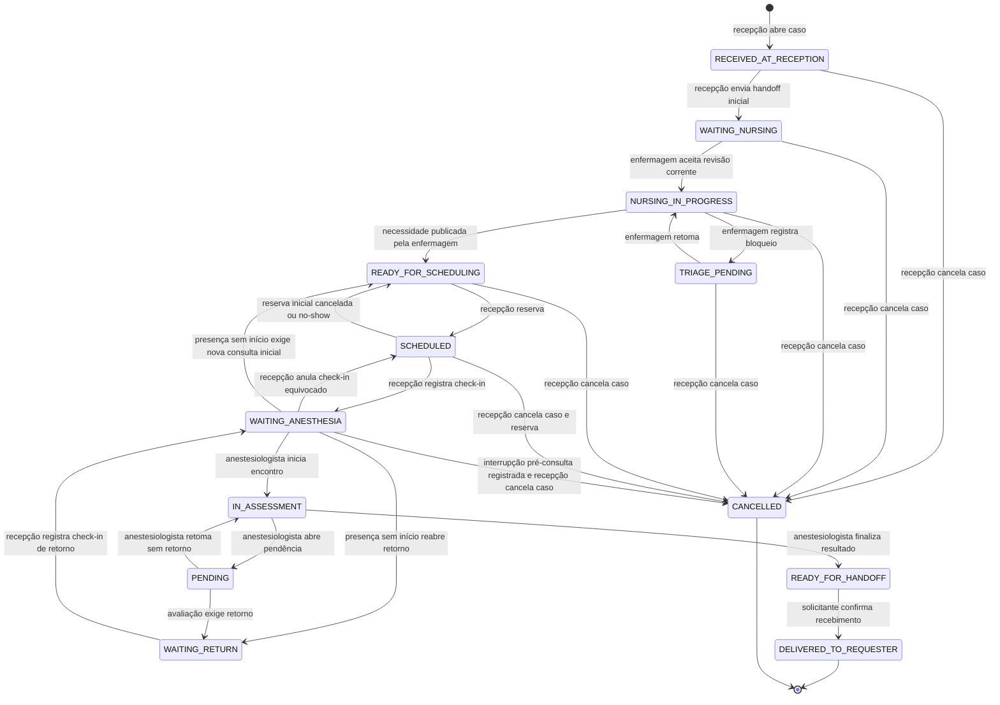

# Analyst — Caso e encaminhamento

## State

- Source: `hack/PRD.md`, leis de Marco e Analysts relacionados
- Route: `analyst_prd`
- Phase budget: `forensic`
- Adversarial reviewed: SHA `9f501a9d67806d3511ebdb9b0a560cd564c27dee`
- Confidence: `high` nas leis de caso autônomo; `medium` no contrato corrigido até novo adversarial
- Verdict: `ADVERSARIAL_REQUIRED`; assinatura de Marco pendente

## TL;DR

O Antessala identifica um caso pré-anestésico, não cadastra um paciente. Cada encaminhamento
abre um caso autônomo, mesmo quando nome, pessoa, procedimento ou referência externa se
repetem. A única repetição que não produz novo efeito é o replay comprovado da mesma intenção
lógica.

`sourceReference` é proveniência e ajuda a localizar uma possível reentrada documental; não
é identidade, não causa merge e não bloqueia um novo encaminhamento. Correções preservam a
história e declaram quais consumidores ficaram obsoletos. Handoff, anamnese, proposta de IA e
necessidade operacional nunca podem continuar silenciosamente ligados a um contexto anterior.

Uma revisão final errada, descoberta antes da publicação da necessidade operacional, pode
ser invalidada com motivo e autoria. Ela permanece histórica, deixa de alimentar agenda e
avaliação e exige nova revisão da enfermagem. Depois do check-in, erro, abandono ou
impossibilidade de iniciar a consulta possuem owner e saída; nenhum caso fica preso em
`WAITING_ANESTHESIA`.

## Phase 0 Grill

| Pergunta | Estado | Resposta |
|---|---|---|
| O que o domínio identifica? | `PRODUCT_LAW` | Um caso local por encaminhamento recebido. |
| O que não existe? | `PRODUCT_LAW` | Paciente mestre, deduplicação por pessoa e evolução entre casos. |
| O que distingue replay de caso novo? | `PRODUCT_LAW` | A mesma intenção lógica, no mesmo comando e escopo; nunca nome ou referência externa isolada. |
| Quem abre e corrige o intake? | `PRODUCT_LAW` | Recepção, sem interpretar ou editar conteúdo clínico. |
| Quem aceita o caso? | `PRODUCT_LAW` | Enfermagem, conhecendo a revisão do contexto recebida. |
| Toda correção tem efeito definido? | `DEMO_DECISION` | Sim; a matriz abaixo declara consumidores obsoletos e reconfirmações. |
| O contrato encerrou o adversarial? | `UNRESOLVED` | Não. Precisa de novo ataque depois da reconciliação transversal. |

## Source And Scope

### Dentro

- identidade local do caso e do encaminhamento;
- snapshots descartáveis da pessoa, encaminhamento, procedimento e solicitante;
- possível reentrada documental sem rejeição automática;
- tentativa lógica, idempotência e comandos fora de ordem;
- correção, impacto semântico e concorrência com submissão final;
- handoff inicial e conhecimento explícito da revisão recebida;
- lifecycle agregado e owners dos comandos;
- invalidação pré-publicação e recuperação após check-in;
- escopo mínimo do serviço solicitante.

### Fora

- cadastro, busca ou histórico longitudinal de paciente;
- triagem geral do SUS;
- conteúdo e completude clínica da anamnese;
- fórmula da necessidade operacional;
- oferta, reserva e concorrência física da agenda;
- avaliação, decisão anestésica e resultado clínico;
- tabelas, colunas, migrations, DTOs físicos, IPC, serviços, locks, componentes e testes.

O caso mantém o lifecycle agregado para que a jornada seja compreensível. Cada transição,
porém, possui um único Analyst dono do comando: este domínio abre/corrige/cancela o caso e
entrega o handoff inicial; anamnese finaliza a entrevista; classificação publica a
necessidade; agenda reserva e registra presença; avaliação inicia a consulta e produz o
resultado; entrega conclui o handoff ao solicitante.

## Current Terrain

Recon no SHA adversarial, sem transformar o legado em requisito:

- o HEAD possui um registro clínico provisório com pessoa embutida, sem encaminhamento,
  papéis ou caso canônico;
- handlers atuais não provam autorização, handoff ou lifecycle novo;
- a casca ativa não possui superfície de entrada de encaminhamento;
- o formato versionado de conteúdo pode ser reaproveitado futuramente, mas `patientId`,
  histórico e deduplicação do DietFlow são incompatíveis com o produto.

Esses fatos são `EVIDENCE_BACKED` sobre o terreno atual. A arquitetura futura pertence ao
Build e não completa nenhuma lacuna deste Analyst.

## Product Promise

A recepção registra o encaminhamento e entrega à enfermagem um caso inequívoco, com origem e
contexto conhecidos, sem procurar ou cadastrar um paciente. Correções chegam aos consumidores
afetados sem reescrever o passado. O serviço solicitante recebe apenas pendências atribuídas
ao próprio serviço e o resultado final; não acompanha o caso inteiro por inferência.

## Verdades por classificação

### `PRODUCT_LAW`

- cada encaminhamento recebido pode abrir um caso autônomo;
- dois casos podem representar a mesma pessoa e manter o mesmo nome;
- nenhuma semelhança de pessoa, procedimento ou referência mescla casos;
- não existe `patientId`, cadastro mestre ou evolução entre casos;
- recepção não interpreta nem escreve anamnese clínica;
- toda ação preserva autoria e nenhuma correção apaga o valor anterior;
- todo estado não terminal possui um ator responsável e uma saída;
- solicitante recebe pendência própria e resultado final, sempre no escopo do serviço.

### `DEMO_DECISION`

- campos mínimos digitados na entrada;
- alerta de possível reentrada por forma normalizada da referência;
- correção pré-publicação com invalidação da revisão final afetada;
- política de recuperação depois do check-in;
- idempotência sem prazo de expiração durante a execução local da PoC;
- projeção mínima usada para cumprir uma pendência atribuída ao solicitante.

### `UNRESOLVED`

- semântica institucional de protocolos e referências externas;
- política institucional para correção depois que a consulta já começou;
- prazo de retenção de recibos idempotentes fora da PoC;
- campos reais que o hospital exigiria no intake.

## Atores e ownership

| Ator | Faz neste domínio | Não pode fazer |
|---|---|---|
| `RECEPCAO` | abrir caso, confirmar que uma referência repetida é novo encaminhamento, corrigir intake, enviar handoff e cancelar administrativamente quando permitido | responder anamnese ou inferir clínica |
| `ENFERMAGEM` | aceitar uma revisão conhecida do caso, reconhecer correção posterior e revisar conteúdo afetado | mudar intake da recepção |
| `ANESTESIOLOGISTA` | iniciar consulta ou registrar que ela não pôde começar após check-in | alterar silenciosamente intake ou handoff anterior |
| `SOLICITANTE` | cumprir pendência atribuída e receber resultado final do próprio serviço | navegar o caso completo antes do resultado |
| `ADMIN` | nenhuma ação sobre conteúdo do caso | ler caso por ser administrador |
| Sistema | garantir identidade, histórico, exclusão mútua, projeção e recuperação | decidir clínica ou transformar referência em identidade |

## Entidades semânticas

### `PreopCase`

Unidade autônoma aberta por um encaminhamento. Possui identidade local inequívoca, código
humano opaco, revisão corrente do contexto, status, histórico e relações com anamnese, agenda,
avaliação e entrega. Não possui relação longitudinal com outro caso.

### `PersonSnapshot`

Identificação descartável daquela entrada: nome, idade ou data de nascimento, sexo informado
e identificador de origem opcional. Serve somente ao caso. Nunca é chave de busca,
deduplicação ou vínculo futuro.

### `ReferralSnapshot`

Representação do encaminhamento recebido: identidade local, referência externa opcional,
datas, descrição e rótulo do documento. A referência original é preservada como proveniência.
Uma forma normalizada pode apoiar busca e alerta, mas nunca provar identidade.

### `ProcedureSnapshot`

Procedimento indicado, revisão do catálogo, lateralidade/local e observação daquela entrada.
Rótulos posteriores do catálogo não reescrevem o caso.

### `RequesterSnapshot`

Serviço, médico e contato de retorno do encaminhamento naquele momento. O ID estável do
serviço define o destino atual; nome ou label não concede acesso.

### `CaseContextRevision`

Versão conjunta dos quatro snapshots aceita como contexto atual. Toda correção cria nova
revisão e declara os segmentos alterados, motivo, autoria e consumidores afetados. Um
consumidor só pode concluir trabalho se sua âncora ainda corresponder à revisão corrente.

### `LogicalCommandAttempt`

Intenção de executar uma ação em um domínio, comando, ator e escopo determinados. Distingue
replay do mesmo efeito de um novo encaminhamento, mesmo quando a referência externa coincide.
O recibo de um efeito não concede acesso nem substitui autorização atual.

### `PossibleReferralReentry`

Alerta não bloqueante de que uma referência semelhante já apareceu no mesmo serviço. A
recepção pode abrir o caso existente quando reconhece replay documental ou confirmar que é
um novo encaminhamento. A segunda escolha sempre cria novo caso e registra a decisão; nunca
mescla pessoas.

### `InitialHandoff`

Entrega da recepção à enfermagem. Registra qual revisão do contexto foi enviada e qual foi
explicitamente aceita. Um handoff pendente não pode representar silenciosamente contexto
antigo.

### `ContextChangeNotice`

Aviso obrigatório criado quando uma correção ocorre depois do aceite inicial. Informa os
segmentos alterados e os consumidores que precisam de revisão, sem transportar anamnese ou
explicação clínica.

### `PrepublicationInvalidation`

Invalidação auditável de uma revisão final e de sua proposta operacional quando o intake
incorreto é descoberto antes da publicação. Preserva o artefato anterior como histórico,
retira sua vigência e exige nova revisão coerente.

### `PreAssessmentInterruption`

Fato registrado depois do check-in e antes do início do encontro: check-in equivocado,
abandono antes da consulta ou impossibilidade de iniciar. Possui autor, motivo, tipo de
consulta e destino operacional explícito.

## Contrato de identidade

1. A identidade canônica é local ao caso; o código humano serve somente à conferência, é
   opaco e não revela sequência ou cardinalidade global a um escopo restrito.
2. Cada abertura lógica nova produz um caso novo, ainda que todos os snapshots coincidam.
3. `sourceReference` é proveniência opcional, não identidade universal.
4. A forma original da referência é preservada. Normalização serve somente à busca e ao
   alerta de possível reentrada.
5. Coincidência da referência nunca rejeita automaticamente, mescla ou aponta para pessoa.
6. A recepção distingue “reabrir o caso já criado” de “novo encaminhamento com referência
   reutilizada”. A segunda opção exige confirmação e gera novo caso.
7. Repetir a mesma intenção lógica comprovada não cria novo efeito; isso é idempotência, não
   deduplicação documental.
8. Homônimos aparecem sempre com código do caso, procedimento e serviço solicitante.

## Handoff e correção concorrente

### Antes do aceite

- uma correção que vence cancela o handoff `SENT` anterior e envia outro ligado à nova
  revisão de contexto;
- o handoff anterior permanece histórico e não pode mais ser aceito;
- o aceite precisa declarar a revisão recebida; revisão antiga falha sem efeito.

### Aceite concorrente com correção

Exatamente uma ação produz efeito sobre a revisão corrente. Se o aceite vencer, a correção
posterior segue o contrato “depois do aceite”. Se a correção vencer, o aceite da revisão
antiga falha e a enfermagem recebe o novo handoff. Nenhum resultado parcial é permitido.

### Depois do aceite

- o handoff recebido permanece prova histórica da revisão que a enfermagem recebeu;
- a correção cria `ContextChangeNotice` e nova revisão corrente;
- a enfermagem precisa reconhecer a mudança antes de finalizar;
- draft, proposta de IA, resumo ou regra afetados seguem a matriz de impacto;
- mudança de serviço altera imediatamente o destino atual e futuras autorizações; histórico
  de acesso anterior permanece apenas na auditoria.

## Matriz semântica de impacto da correção

| Mudança | Efeito mínimo | Consumidores obrigatórios |
|---|---|---|
| data de nascimento, idade ou sexo informado | contexto clínico obsoleto; reavaliar perguntas condicionais e respostas dependentes | anamnese, classificação, IA e resumo |
| texto, indicação, data ou conteúdo do encaminhamento | contexto obsoleto quando muda interpretação; enfermagem precisa revisar | anamnese, classificação, IA e avaliação futura |
| procedimento, lateralidade ou local | contexto integral obsoleto | anamnese, classificação, IA, agenda e avaliação |
| serviço solicitante | destino e escopo mudam imediatamente; handoff pendente é substituído | acesso, handoff, pendências futuras e entrega |
| correção ortográfica de nome | reconfirmar identidade; respostas podem ser preservadas se nenhuma condição mudou | handoff e superfícies de identificação |
| referência externa ou rótulo documental | atualizar proveniência; só invalida consumidores se mudar a interpretação da origem | handoff e auditoria; demais conforme impacto |
| contato operacional | atualizar destino; não invalida resposta clínica por si só | entrega e comunicação operacional |
| qualquer campo lido por regra, pergunta condicional ou proposta de IA | invalidar exatamente o consumidor dependente | owner do consumidor |

“Obsoleto” nunca significa apagar resposta. O consumidor preserva o valor anterior, mostra o
que mudou e exige revisão ou reconfirmação explícita.

## `correctIntake × submitFinal`

`correctIntake` e `submitFinal` são mutuamente excludentes sobre a mesma revisão do contexto:

- `submitFinal` só conclui quando sua âncora e todos os campos consumidos continuam iguais à
  revisão corrente;
- se a correção vencer, a submissão falha como contexto obsoleto e não cria revisão final,
  proposta ou efeito parcial;
- se a submissão vencer, a correção concorrente falha por mudança de estado e não escreve;
- uma nova tentativa explícita de correção pode seguir a remediação pré-publicação abaixo;
- nenhum comando antecipado fica esperando predecessor; falha sem efeito e pode ser tentado
  novamente após o estado legítimo existir.

O Analyst determina o vencedor semântico e o resultado. A forma física de garantir exclusão
mútua pertence ao Build.

## Correção depois da submissão e antes da publicação

Quando um erro de intake é descoberto após a revisão final, mas antes de a necessidade
operacional ser confirmada ou alterada:

1. a recepção registra a correção e o motivo;
2. a revisão final anterior e toda proposta derivada tornam-se `INVALIDATED`;
3. os artefatos permanecem históricos, mas deixam de ser vigentes e não alimentam agenda,
   avaliação, PDF ou memória;
4. o caso permanece com a enfermagem e ganha novo draft ancorado na revisão corrigida;
5. respostas não afetadas podem ser reaproveitadas com proveniência; respostas afetadas
   exigem revisão explícita;
6. a enfermagem produz nova revisão final; somente ela pode originar nova proposta;
7. nenhuma invalidação é chamada de evolução entre casos ou adendo clínico.

Depois da publicação, o conteúdo não é alterado silenciosamente. Uma decisão operacional
pode ser superseded pelo domínio de classificação, mas correção material do intake segue
governança separada e permanece `UNRESOLVED` para operação institucional. Na PoC, erro
material descoberto após publicação bloqueia uso do artefato, exige cancelamento ou
reagendamento explícito e nunca é escondido por override.

## Lifecycle agregado e owners

Este diagrama integra a jornada; não transfere ownership. Agenda é dona de reserva,
check-in, anulação e no-show. Avaliação é dona de início do encontro, pendências,
interrupção por impossibilidade de iniciar e resultado. Caso é dono da identidade e do
cancelamento terminal.

## Recuperação depois do check-in

| Situação antes do encontro | Quem registra | Resultado obrigatório |
|---|---|---|
| check-in da pessoa, caso ou consulta errados | recepção | anula check-in com motivo; booking e caso retornam exatamente ao estado anterior |
| pessoa comparece e sai antes do início | recepção | registra presença sem início; INITIAL volta a `READY_FOR_SCHEDULING`, RETURN reabre a mesma solicitação |
| anestesiologista não pode iniciar | anestesiologista | registra impossibilidade e motivo operacional seguro; INITIAL volta ao agendamento, RETURN reabre a solicitação |
| pessoa ou serviço desiste depois da presença | recepção, após registrar interrupção | cancela o caso com motivo distinto de cancelamento de reserva |

Nenhuma dessas ações declara gravidade, aptidão ou conduta. A anulação não apaga o check-in;
a interrupção preserva comparecimento e autoria. Se não houver encontro iniciado, não existe
resultado anestésico fictício.

## Contrato transversal de idempotência

1. A chave identifica `domínio + comando + ator + escopo + intenção lógica`.
2. Mesmo conteúdo de intenção depois de efeito confirmado produz o mesmo efeito lógico, sem
   segunda mutação.
3. Mesma chave com intenção divergente retorna conflito e nunca executa outra ação.
4. Toda repetição revalida sessão, papel e escopo atuais antes de retornar projeção.
5. O recibo prova que um efeito ocorreu; não é credencial e não autoriza acesso histórico.
6. A resposta diferencia recibo histórico de projeção atual autorizada.
7. Falha sem mutação não consome a intenção como efeito concluído; depois de uma mudança
   legítima de estado, nova tentativa pode ser reavaliada.
8. Comando fora de ordem falha sem buffering e segue a mesma política de nova tentativa.
9. A referência externa nunca substitui esse contrato.

Representação, assinatura do conteúdo, armazenamento e retenção física pertencem ao Build.

## Escopo do solicitante

Sem alterar o PRD, aplica-se a opção de menor privilégio:

- antes do resultado, `SOLICITANTE` não possui listagem geral nem detalhe completo do caso;
- pode ver somente pendência explicitamente atribuída ao próprio serviço, com código do caso,
  nome, procedimento, pedido, prazo e status necessários para cumpri-la;
- não recebe anamnese, classificação, avaliação, transcript, justificativa clínica ou
  pendência de outro owner;
- depois da finalização, recebe o resultado autorizado e o estado da entrega;
- toda leitura ou ação revalida o serviço atual;
- corrigir o serviço revoga futuras leituras/comandos do serviço anterior, redireciona o
  handoff final e impede replay de devolver projeção antiga;
- acesso ocorrido antes da correção permanece apenas como auditoria histórica; cache já
  exibido não pode ser “desvisto”, mas perde validade para nova leitura ou ação;
- nenhuma resposta protegida iniciada sob o serviço anterior pode ser emitida depois da
  correção; worklists, contagens, telas e stores vinculados à revisão antiga expiram.

## Glossário canônico

| Termo | Significado único |
|---|---|
| cancelamento do caso | encerra o caso como `CANCELLED` e exige motivo |
| cancelamento da reserva | libera uma marcação; não encerra o caso por si só |
| anulação de check-in | corrige presença registrada por engano e retorna ao estado anterior |
| presença sem início | comparecimento seguido de abandono ou impedimento antes do encontro |
| handoff inicial | entrega da recepção à enfermagem |
| entrega final | envio do resultado ao serviço solicitante |
| anamnese concluída | revisão final vigente da entrevista |
| proposta operacional | saída ainda não publicada para decisão humana |
| necessidade publicada | decisão operacional confirmada ou alterada, visível à recepção |
| booking consumido | consulta efetivamente iniciada; não significa caso concluído |
| encontro concluído | avaliação encerrada com resultado ou fluxo de pendência definido |

## Failure And Recovery Matrix

| Falha | Resultado | Recuperação |
|---|---|---|
| referência semelhante | alerta não bloqueante | abrir existente ou confirmar novo encaminhamento |
| replay comprovado | nenhum novo efeito | retornar projeção atual se ainda autorizada |
| mesma chave, intenção diferente | conflito | nova intenção usa nova chave |
| comando fora de ordem | falha sem efeito | executar predecessor e tentar novamente |
| correção vence submissão | contexto obsoleto | revisar draft e submeter novamente |
| submissão vence correção concorrente | correção sem efeito | iniciar correção pré-publicação explícita |
| handoff antigo após correção | aceite recusado | aceitar handoff da revisão corrente |
| correção depois do aceite | contexto alterado | reconhecer aviso e revisar consumidores afetados |
| final errada antes da publicação | revisão/proposta invalidadas | corrigir intake e produzir nova revisão |
| mudança de serviço | acesso e destinos anteriores deixam de ser atuais | usar serviço novo; preservar auditoria |
| check-in equivocado | check-in anulado | voltar ao estado anterior |
| presença sem início | consulta não consumida | reagendar, reabrir retorno ou cancelar caso explicitamente |

## Rules And Invariants

1. MUST NOT criar, buscar ou referenciar paciente mestre.
2. MUST criar caso novo para encaminhamento novo, mesmo com snapshots ou referência iguais.
3. MUST NOT usar `sourceReference` normalizada para negar abertura ou mesclar casos.
4. MUST separar possível reentrada documental de replay idempotente.
5. MUST preservar revisão anterior, autor, horário, motivo e segmentos alterados.
6. MUST declarar consumidores obsoletos em toda correção.
7. MUST exigir que handoff e submissão apontem para a revisão corrente do contexto.
8. MUST garantir vencedor único entre correção, aceite e submissão concorrentes.
9. MUST NOT permitir que revisão invalidada alimente agenda, avaliação, PDF, IA ou memória.
10. MUST revalidar autorização em todo replay; recibo nunca concede acesso.
11. MUST NOT armazenar falha sem efeito como se fosse efeito concluído.
12. MUST tratar comando fora de ordem como falha sem buffering e permitir nova tentativa.
13. MUST dar owner e saída a todo estado não terminal.
14. MUST diferenciar cancelamento do caso, cancelamento da reserva e anulação de check-in.
15. MUST restringir solicitante a pendência própria, resultado e entrega do próprio serviço.
16. MUST NOT expor anamnese ou avaliação ao solicitante antes do resultado.
17. MUST preservar autoria de check-in, anulação, comparecimento e interrupção.
18. MUST NOT inventar resultado anestésico quando o encontro não começou.
19. MUST NOT revelar volume global por código, busca, contagem, paginação, vazio ou erro.
20. MUST invalidar projeção efêmera quando autoridade ou serviço do caso mudar.

## Acceptance Scenarios

| # | Cenário | Resultado obrigatório |
|---:|---|---|
| 1 | mesma chave e mesma intenção após resposta perdida | um caso; nenhum segundo efeito; autorização atual revalidada |
| 2 | nova chave e referência igual após dúvida sobre commit | alerta de possível reentrada; recepção escolhe existente ou novo caso |
| 3 | dois encaminhamentos legítimos com mesma referência | dois casos distintos após confirmação de novo encaminhamento |
| 4 | homônimos com referências diferentes ou ausentes | dois casos e códigos distintos |
| 5 | referência ausente | caso abre normalmente |
| 6 | aceite do handoff concorre com correção | um vence; revisão antiga nunca é aceita silenciosamente |
| 7 | `submitFinal` concorre com correção de qualquer segmento | um vence; outro falha sem artefato parcial |
| 8 | erro descoberto após final e antes da publicação | final/proposta anteriores são invalidadas; nova revisão é exigida |
| 9 | cancelamento do caso agendado | caso terminal; reserva cancelada; fatos preservados |
| 10 | no-show de consulta inicial | caso volta ao agendamento |
| 11 | no-show de retorno | mesma solicitação de retorno reabre |
| 12 | check-in equivocado ou presença sem início | há anulação/interrupção e destino explícito; caso não fica preso |
| 13 | serviço A corrigido para B | B rege futuras leituras, handoffs e entrega; A deixa de autorizar |
| 14 | conta do serviço antigo tenta nova leitura | acesso negado sem esconder a auditoria histórica |
| 15 | serviço errado tenta confirmar entrega | falha sem mutação |
| 16 | replay após mudança de papel ou serviço | autorização revalidada; nenhuma projeção antiga vaza |
| 17 | idade, sexo ou encaminhamento muda com draft existente | consumidores afetados ficam obsoletos e exigem revisão |
| 18 | comando chega antes do predecessor e depois é repetido | primeira tentativa falha sem efeito; nova tentativa é reavaliada |
| 19 | leitura do serviço antigo concorre com correção para outro serviço | nenhuma resposta nova usa o vínculo anterior; projeções antigas expiram |
| 20 | solicitante compara códigos e páginas do próprio serviço | não infere quantidade ou ritmo global de outros serviços |

## Boundary With Build

Este Analyst define identidade, estados, atores, resultados de corrida, falhas,
recuperações, privacidade e invariantes. O Build será owner de:

- persistência, schema, constraints, migrations e representação de revisões;
- DTOs, validação runtime, nomes de comandos e canais;
- exclusão mútua física, locks, recibos e retenção;
- componentes, rotas, Surface Blueprints e estratégia de testes;
- prova PGlite de upgrade, concorrência, rollback e autorização.

O Build atual foi escrito antes destas correções e permanece invalidado. Nenhum de seus
detalhes físicos resolve ou substitui este contrato.

## Dependencies And Open Questions

Antes de novo adversarial:

1. anamnese precisa absorver a matriz de impacto e a invalidação pré-publicação;
2. classificação precisa invalidar proposta derivada e impedir publicação de fonte inválida;
3. agenda e avaliação precisam adotar as três recuperações pós-check-in;
4. acesso e superfícies precisam aplicar o escopo mínimo do solicitante;
5. IA precisa tornar propostas e resumos dependentes do contexto `STALE`;
6. `hack/analysis.md` precisa manter owners e glossário únicos;
7. o Build correspondente continua bloqueado e deve ser refeito somente após assinatura.

## Grill Verdict

- Verdict: `ADVERSARIAL_REQUIRED`
- Adversarial result: cinco blockers e seis achados adicionais foram incorporados
  semanticamente; nenhum deles foi tratado como prova de implementação.
- Remaining blockers: reconciliação transversal, novo adversarial no SHA corrigido e
  assinatura de Marco.
- Next stage: nenhum Build, Warlog, Sprint, Spec, Plan, TDD ou código.

## Recommended Next Phase

Reconciliar os Analysts dependentes e repetir o adversarial dos 18 cenários. Somente um novo
review sem blocker pode levar este artefato a `READY_FOR_MARCO`. Nenhuma assinatura é
inferida.

---

## Contrato de encerramento deste arquivo

- Artefato: `hack/domains/ANALYST-caso-e-encaminhamento.md`
- Gate: Analyst de caso e encaminhamento → Build do domínio
- Estado: `ADVERSARIAL_REQUIRED`
- Assinatura de Marco: `PENDENTE`
- Data: `PENDENTE`
- Revisão Git examinada: `PENDENTE`
- Declaração: `PENDENTE`

Declaração futura exigida: “Aprovo o Analyst de caso e encaminhamento e autorizo seu
consumo pelo Build.”
