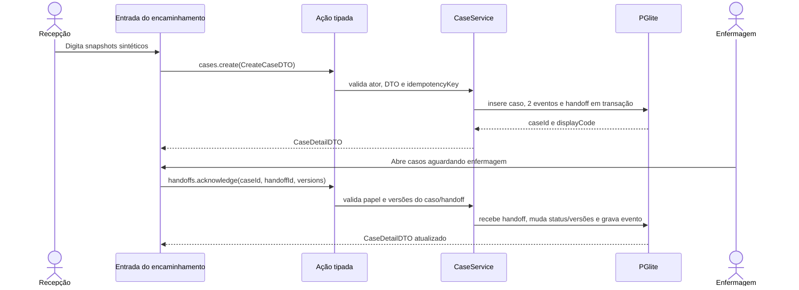
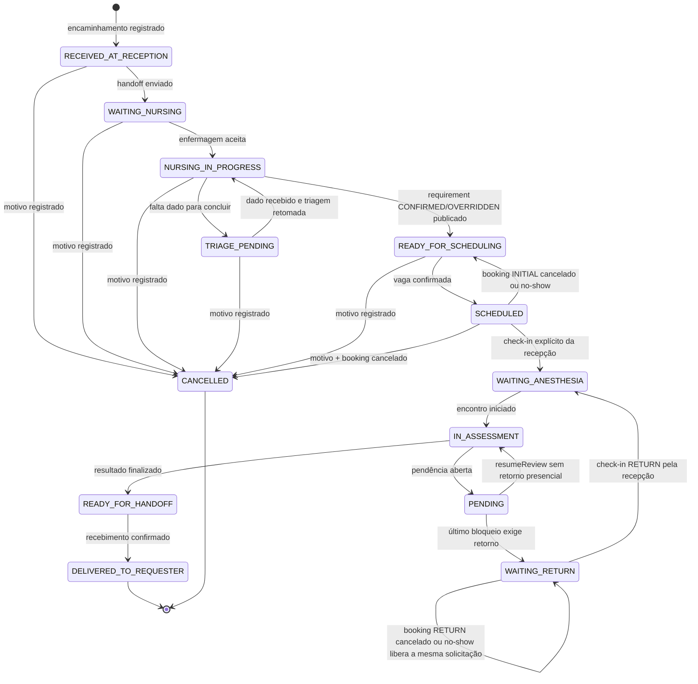

# Analyst: Caso e encaminhamento

## State

- Source: `hack/PRD.md`, ordem de Marco e recon do Antessala/DietFlow
- Route: `analyst_prd`
- Phase budget: `forensic`
- Confidence: `medium`; as leis de caso são estáveis, mas o contrato operacional ainda exige adversarial
- Created: `2026-08-14`
- Verdict: `ADVERSARIAL_REQUIRED`; assinatura de Marco pendente

## TL;DR

O Antessala identifica um **caso pré-anestésico**, não mantém cadastro longitudinal de
paciente. Cada encaminhamento abre um caso novo com snapshots da pessoa, do procedimento e
do solicitante. Homônimos e dois casos da mesma pessoa são válidos; nenhuma busca tenta
deduplicá-los. O `patientId` e a jornada legada não entram no contrato novo.

Caso autônomo, ausência de deduplicação longitudinal e snapshots descartáveis são
`PRODUCT_LAW`. Formato de referência, normalização, janela de check-in, correção e matriz
de cancelamento são `DEMO_DECISION` até revisão adversarial.

## Phase 0 Grill

| Signal | Verdict | Notes |
|---|---|---|
| Action clear | sim | Receber o encaminhamento, abrir o caso e entregá-lo à enfermagem. |
| Persona clear | sim | Recepção cria; enfermagem recebe; os demais papéis leem conforme sua função. |
| Input/output clear | sim | Entra um encaminhamento; sai um caso identificado e um handoff aceito. |
| Scope clear | sim | Começa na recepção. Cadastro longitudinal e prontuário ficam fora. |
| Objective criteria clear | sim | Dois encaminhamentos nunca colapsam no mesmo caso; autoria e handoff são rastreáveis. |

## Source And Scope

- Input source: `hack/PRD.md:53-70`, `hack/PRD.md:144-168` e decisão explícita desta
  frente.
- In scope: identidade do caso, snapshot da pessoa, encaminhamento, procedimento,
  solicitante, correção, homônimos, múltiplos casos, lifecycle inicial e handoff.
- Out of scope: cadastro mestre de paciente, histórico longitudinal, consulta solicitante,
  triagem geral do SUS, classificação da anamnese, reserva e marcação da cirurgia.
- Assumption for demo: todos os dados são sintéticos e digitados no Antessala; nenhuma API
  do HC é alegada.

## Product Promise

A recepção transforma um encaminhamento em um caso inequívoco e o entrega à enfermagem sem
interpretar dados clínicos. O mesmo identificador acompanha todas as etapas posteriores. A
abertura leva menos de uma superfície de formulário e nunca depende de procurar ou cadastrar
um paciente.

## Story de Usuário

Como recepcionista, quero registrar o encaminhamento que tenho em mãos e entregar um caso
identificado à enfermagem, para evitar que homônimos, papéis soltos ou dois procedimentos da
mesma pessoa misturem fluxos diferentes.

Como enfermeiro, quero aceitar um caso com pessoa, procedimento, solicitante e proveniência
visíveis, para iniciar a anamnese certa sem reconstruir a origem no balcão.

## Story Técnica

Como sistema, preciso criar UUIDs locais para o caso e para o encaminhamento, persistir
snapshots versionados, registrar eventos append-only e exigir aceite explícito no handoff
recepção → enfermagem. O sistema não pode criar `patientId`, buscar histórico por pessoa ou
deduplicar pelo nome. Uma referência externa do papel serve apenas para impedir que o mesmo
documento seja digitado duas vezes; ela nunca identifica ou mescla pessoas.

## Current Terrain

O repositório contém uma tabela provisória `registros` com nome, sexo, idade, plano e
anamnese. O próprio arquivo declara que ela não representa o caso canônico. Os handlers
atuais criam e listam esses registros sem ator, encaminhamento, procedimento, solicitante ou
guard de permissão. A UI ativa possui apenas Início, Assistente IA e Configurações; não há
tela de entrada do encaminhamento.

O DietFlow prova duas peças reutilizáveis: JSON versionado para conteúdo e widgets headless.
Seu `Content`, porém, liga registros a `Patient`; essa relação longitudinal deve ser
rejeitada no Antessala.

## Evidence Matrix

| Path | Lines | Fact | Confidence |
|---|---:|---|---|
| `hack/PRD.md` | 53-70 | O fluxo começa no encaminhamento, passa pela recepção e enfermagem e termina no solicitante. | high |
| `hack/PRD.md` | 133-142 | O caso deve manter identidade, autoria, pendências e handoffs. | high |
| `hack/PRD.md` | 157-168 | Prontuário, triagem SUS, cirurgia, integração real e dados reais estão fora. | high |
| `src/main/db/clinical-schema.ts` | 3-25 | `registros` é legado e guarda uma pessoa embutida insuficiente para o fluxo novo. | high |
| `src/main/db/clinical-schema.ts` | 28-52 | A jornada legada é append-only, mas seus estados pertencem à hipótese invalidada. | high |
| `src/shared/clinical/registro.ts` | 3-38 | Tipos atuais se declaram legados e não representam paciente institucional canônico. | high |
| `src/main/tipc.ts` | 265-335 | Handlers atuais não carregam encaminhamento, solicitante, procedimento, ator ou RBAC. | high |
| `src/renderer/src/App.tsx` | 13-56 | Não existe rota para recepção, caso ou encaminhamento. | high |
| `src/renderer/src/paginas/Dashboard.tsx` | 38-50 | A home é um esqueleto neutro sem contrato clínico. | high |
| `src/shared/anamnese/types.ts` | 102-114 | O Antessala já usa envelope JSON versionado para anamnese e template. | high |
| `/Users/marcoantonio/dietflow-app/prisma/schema.prisma` | 1101-1145 | `Content` usa `patientId` e `content Json`; só o formato versionado serve. | high |
| `/Users/marcoantonio/dietflow-app/src/lib/anamnese/types.ts` | 151-162 | A anamnese do DietFlow usa `{ _v: 2, blocos: [...] }`. | high |

## Implementation Map

| Area | Path | Role | Decision |
|---|---|---|---|
| Context / entry | `hack/PRD.md:53-70` | Define começo, atores e saída do fluxo. | preserve |
| Backend contracts | `src/main/db/clinical-schema.ts:3-52` | Contém schema clínico provisório. | replace behind migration; do not extend |
| Services / state | `src/main/tipc.ts:265-335` | Expõe CRUD legado direto. | replace with case service and guarded actions |
| Shared types | `src/shared/clinical/registro.ts:3-38` | Tipos da hipótese anterior. | retire from canonical imports |
| Shells / primitives | `src/renderer/src/componentes/PageHeader.tsx:23-31` | Header aceita breadcrumbs e ações. | reuse |
| Frontend composition | `src/renderer/src/App.tsx:49-56` | Router ativo. | add reception/case routes after signed Plan |
| Tests / proof | `tests/e2e/app-flow.spec.ts:4-80` | Prova apenas casca e temas. | add case/handoff E2E |

## Entities And State

```text
ENTITY: PreopCase
- Attributes: id UUID, displayCode, personSnapshot, referralSnapshot,
  procedureSnapshot, requesterSnapshot, requestingServiceId, status, version,
  openedAt, updatedAt, closedAt.
- Actions: create, read, correct intake, accept handoff, cancel.
- Relations: has many CaseEvent; has many CaseHandoff; owns later anamnesis,
  appointment, assessment and metadata-only CaseDocument records.
- Source of truth: PGlite table preop_cases.
- Runtime states: RECEIVED_AT_RECEPTION, WAITING_NURSING,
  NURSING_IN_PROGRESS, TRIAGE_PENDING, READY_FOR_SCHEDULING, SCHEDULED,
  WAITING_ANESTHESIA, IN_ASSESSMENT, PENDING, WAITING_RETURN,
  READY_FOR_HANDOFF, DELIVERED_TO_REQUESTER, CANCELLED.
- Invalid states: case without referral/person/procedure/requester snapshot;
  two cases sharing one id; delivered without a final result; mutation without
  version match.

ENTITY: PersonSnapshot
- Attributes: `_v: 1`, fullName, birthDate nullable, ageYearsAtOpening, sexReported,
  originIdentifier nullable.
- Actions: capture at intake; correct by append-only correction event somente nos estados
  pré-publicação e enquanto não existe revisão `FINAL/COMPLETE` nem requirement
  `CALCULATED/CONFIRMED/OVERRIDDEN`.
- Relations: embedded in exactly one PreopCase.
- Source of truth: preop_cases.person_snapshot JSONB.
- Runtime states: captured, corrected.
- Invalid states: blank name; age outside 0..130; use as a patient lookup key.

ENTITY: ReferralSnapshot
- Attributes: `_v: 1`, referralId local UUID, sourceReference nullable, issuedAt nullable,
  receivedAt, freeTextReference, sourceDocumentLabel nullable.
- Actions: capture and correct.
- Relations: embedded in one PreopCase.
- Source of truth: preop_cases.referral_snapshot JSONB.
- Invalid states: one command opening no case or more than one case; non-empty source
  reference repeated inside the same requesting service.

ENTITY: ProcedureSnapshot
- Attributes: `_v: 1`, description, catalogId, lateralityOrSite nullable,
  notes nullable, catalogVersion.
- Actions: capture and correct with reason.
- Relations: embedded in one PreopCase.
- Source of truth: preop_cases.procedure_snapshot JSONB.
- Invalid states: catalogId absent/inactive; blank description; free text outside the fixture
  `OUTRO`; catalog label silently changing an old case.

ENTITY: RequesterSnapshot
- Attributes: `_v: 1`, serviceId, serviceCatalogRevision, serviceName, physicianName,
  specialty nullable, returnContact nullable, originIdentifier nullable.
- Actions: capture and correct with reason.
- Relations: embedded in one PreopCase; target of the final handoff.
- Source of truth: preop_cases.requester_snapshot JSONB.
- Invalid states: serviceId absent/inactive; physician blank; handoff to an unnamed target.

ENTITY: CaseEvent
- Attributes: id, caseId, eventType, fromStatus, toStatus, actorSnapshot,
  reason, payload, occurredAt, correlationId, commandId, receiptDomain, receiptId,
  commandEventIndex, sequence.
- Actions: append only.
- Relations: belongs to PreopCase.
- Source of truth: PGlite table case_events.
- Invalid states: update/delete; event without actor; duplicate sequence inside the case;
  receipt tied by FK to the ledger privado de um único domínio.

ENTITY: CaseHandoff
- Attributes: id, caseId, fromRole, toRole, type, payloadSnapshot, status,
  sentBy, sentAt, receivedBy, receivedAt, cancelledBy, cancelledAt, cancellationReason,
  version.
- Actions: send, acknowledge, cancel with the case.
- Relations: belongs to PreopCase.
- Source of truth: PGlite table case_handoffs.
- Runtime states: SENT, RECEIVED, CANCELLED.
- Invalid states: received before sent; same role as origin and destination;
  status/action responsibility changed without event.
```

### Role contract

Os únicos papéis canônicos são `ADMIN | RECEPCAO | ENFERMAGEM |
ANESTESIOLOGISTA | SOLICITANTE`. `ADMIN` opera a demonstração, mas não herda
autoridade clínica. Snapshots de ator preservam um desses valores; labels de UI não viram
enums paralelos. `QUICK | STANDARD | EXTENDED` são classes de slot de agenda, não papéis
nem estados do caso.

### Identity contract

- `caseId` is the only canonical identity across the workflow.
- `displayCode` helps humans confer a case and is unique, but never replaces the UUID.
- `referralId` is another local UUID generated by the main process. It is not typed by the
  user and is not a hospital identifier.
- `sourceReference` is the optional protocol copied from the physical referral. When it is
  present, the normalized pair `(requestingServiceId, sourceReference)` identifies that
  document and prevents only its accidental re-entry.
- Normalização canônica de `sourceReference`: Unicode NFKC, `trim`, colapso de qualquer
  sequência de whitespace para um espaço ASCII e uppercase locale-independent. Pontuação é
  preservada. O snapshot guarda o texto original tratado por trim; a coluna derivada guarda
  somente a forma normalizada.
- `originIdentifier` is copied from the referral when present. It does not create a patient
  table or trigger lookup.
- A new referral always creates a new case, even when all person fields match another case.
- Two referrals with equal clinical/person content and different or absent source references
  create two cases. Repeating the same non-empty source reference for the same service returns
  `DUPLICATE_REFERRAL`; this is document replay protection, not patient deduplication.
- Homonyms are valid. The UI always shows `displayCode`, procedure and requester beside the
  name.
- Two procedures for the same person are two cases. Their records never share an anamnese,
  evaluation, pendency or result.

## Runtime / Data Flow



### Lifecycle



Os estados posteriores à enfermagem pertencem às análises de agenda e avaliação. Este
dossiê fixa apenas a identidade e os invariantes que atravessam essas fases.

### Chegada e cancelamento

Não existe transição por relógio. A recepção executa
`scheduling.bookings.checkIn` sobre uma reserva `INITIAL` ou `RETURN` dentro da janela
fechada `[slot.startsAt - 30 minutos, slot.consultationEndsAt]`, usando o relógio do main.
Fora desse intervalo, o command falha sem escrita. A mesma transação marca a reserva como
`CHECKED_IN`, grava evento e move
`SCHEDULED | WAITING_RETURN → WAITING_ANESTHESIA`. Somente depois o anestesiologista pode
iniciar o encontro.

| Origem do caso | Ator | Destino | Efeitos atômicos |
|---|---|---|---|
| `RECEIVED_AT_RECEPTION`, `WAITING_NURSING`, `NURSING_IN_PROGRESS`, `TRIAGE_PENDING`, `READY_FOR_SCHEDULING` | `RECEPCAO` | `CANCELLED` | motivo obrigatório; cancela handoff aberto; preserva snapshots, rascunho e eventos |
| `SCHEDULED` | `RECEPCAO` | `CANCELLED` | motivo obrigatório; cancela booking confirmado e handoff aberto; libera capacidade |
| `WAITING_ANESTHESIA` ou posterior | ninguém no MVP | sem transição | retorna `INVALID_TRANSITION`; interrupção clínica posterior não é inventada como cancelamento administrativo |

Cancelamento exige `expectedVersion`, `idempotencyKey` e motivo de 10 a 500 caracteres.
Nenhum delete físico é executado.

### Responsibility matrix

Responsabilidade é projeção do estado, handoff e pendências; não é ownership persistido nem
string mutável no caso. `currentRoles` responde exclusivamente “quem pode executar agora o
comando que avança”. `nextRoles` antecipa quem age depois desse comando, sem conceder acesso
antes da hora. No handoff inicial, `CaseHandoff.SENT` destinado à enfermagem mantém
`currentRoles=ENFERMAGEM`, pois o aceite é o comando atual. No handoff final,
`ResultDelivery.SENT` muda a ação corrente em `READY_FOR_HANDOFF`: a recepção deixa de enviar
e o `SOLICITANTE` do serviço correto passa a confirmar o recebimento.

| CaseStatus | `currentRoles` | `nextRoles` | Comando que avança |
|---|---|---|---|
| `RECEIVED_AT_RECEPTION` | `RECEPCAO` | `ENFERMAGEM` | `handoffs.send` dentro da criação |
| `WAITING_NURSING` | `ENFERMAGEM` | `ENFERMAGEM` | `handoffs.acknowledge` pela enfermagem |
| `NURSING_IN_PROGRESS` | `ENFERMAGEM` | `RECEPCAO` | submissão final + cálculo + confirmação/override do requisito |
| `TRIAGE_PENDING` | `ENFERMAGEM` | `ENFERMAGEM` | retomada da triagem após dado recebido |
| `READY_FOR_SCHEDULING` | `RECEPCAO` | `RECEPCAO` | `scheduling.bookings.confirm` |
| `SCHEDULED` | `RECEPCAO` | `ANESTESIOLOGISTA` | `scheduling.bookings.checkIn` |
| `WAITING_ANESTHESIA` | `ANESTESIOLOGISTA` | `ANESTESIOLOGISTA` | `encounters.start` |
| `IN_ASSESSMENT` | `ANESTESIOLOGISTA` | `ANESTESIOLOGISTA` ou dono de pendência | finalizar resultado ou abrir pendências |
| `PENDING` | união de `ownerRole` das pendências bloqueantes abertas; se nenhuma, `ANESTESIOLOGISTA` | `ANESTESIOLOGISTA` ou `RECEPCAO` | registrar evidência; depois `encounters.resumeReview` ou liberar `ReturnRequest` |
| `WAITING_RETURN` | `RECEPCAO` | `ANESTESIOLOGISTA` | reservar retorno e, no dia, `scheduling.bookings.checkIn` |
| `READY_FOR_HANDOFF` sem `ResultDelivery.SENT` | `RECEPCAO` | `SOLICITANTE` | `deliveries.send` |
| `READY_FOR_HANDOFF` com `ResultDelivery.SENT` | `SOLICITANTE` do `requestingServiceId` | nenhum | `deliveries.acknowledge` |
| `DELIVERED_TO_REQUESTER` | nenhum | nenhum | terminal |
| `CANCELLED` | nenhum | nenhum | terminal |

O domínio de acesso filtra o `SOLICITANTE` por `requestingServiceId`; nome de serviço jamais
decide escopo. A lista da enfermagem inclui handoffs `SENT` destinados a ela e
`currentRoles=ENFERMAGEM`, pois aceitar o handoff é a ação atual. Nenhum campo de owner é
persistido ou inferido para autorizar comandos.

### Validation contract

| Campo | Regra MVP |
|---|---|
| `person.fullName` | trim; 2–160 caracteres |
| idade | informar `birthDate` ISO `YYYY-MM-DD`, não futura e que resulte em 0–130 anos na data de recebimento, **ou** idade inteira 0–130; o main calcula `ageYearsAtOpening` quando há data |
| `sexReported` | `FEMALE | MALE | INTERSEX | NOT_INFORMED` |
| `person.originIdentifier` | opcional; trim; 1–100 quando presente; nunca chave de busca/dedup |
| `referral.sourceReference` | opcional; trim; 1–100 quando presente; NFKC + collapse whitespace + uppercase locale-independent na coluna derivada, também limitada a 100; unicidade somente por serviço solicitante; pontuação preservada |
| `referral.issuedAt` | ISO date opcional; não pode ser posterior a `receivedAt` |
| `referral.receivedAt` | ISO `YYYY-MM-DD`, obrigatório e não futuro na data local do app |
| `referral.freeTextReference` | trim; 1–2.000 caracteres |
| `sourceDocumentLabel` | opcional; trim; 1–200 caracteres |
| procedimento | `catalogId` obrigatório e ativo; label/revision vêm do catálogo; descrição livre de 2–200 somente quando `catalogId=OUTRO`; lateralidade/local até 120; notas até 2.000 |
| solicitante | `serviceId` de fixture ativa; revisão e label copiados; médico 2–160; demais textos até 200 |
| `idempotencyKey` | UUID gerado uma vez por tentativa lógica e preservado em retry |
| correção/cancelamento | motivo trim de 10–1.000 para correção e 10–500 para cancelamento |
| estado para `cases.correctIntake` | somente `RECEIVED_AT_RECEPTION`, `WAITING_NURSING`, `NURSING_IN_PROGRESS` ou `TRIAGE_PENDING`, sem revisão `FINAL/COMPLETE` e sem requirement `CALCULATED/CONFIRMED/OVERRIDDEN`; qualquer marco ou `READY_FOR_SCHEDULING+` retorna `INVALID_TRANSITION` |

`displayCode` é gerado no main no formato local `ANT-YYYY-NNNN`, com sequência única no
banco. Ele ajuda a conferência humana, mas UUID continua sendo a chave canônica.

### Contrato de correção da entrada

`cases.correctIntake` aceita patch estrito e não vazio de pessoa, encaminhamento,
procedimento e/ou solicitante somente enquanto o caso está em `RECEIVED_AT_RECEPTION`,
`WAITING_NURSING`, `NURSING_IN_PROGRESS` ou `TRIAGE_PENDING` **e** ainda não existe revisão
de anamnese `FINAL/COMPLETE` nem requirement `CALCULATED/CONFIRMED/OVERRIDDEN`. O estado do
caso sozinho não basta: `NURSING_IN_PROGRESS` persiste entre `submitFinal` e a publicação.
Qualquer um desses marcos retorna `INVALID_TRANSITION` sem escrita. Depois,
`CONFIRMED/OVERRIDDEN` move o caso para `READY_FOR_SCHEDULING`; a demo nunca inventa stale,
reclassificação ou regressão de lifecycle.

Na mesma transação, a correção:

1. valida `expectedCaseVersion`, papel, motivo, um dos quatro estados e ausência de revisão
   `FINAL/COMPLETE` ou requirement `CALCULATED/CONFIRMED/OVERRIDDEN`;
2. preserva `referralId` local e campos não incluídos no patch;
3. resolve novamente labels/revisões de catálogo;
4. recalcula `requestingServiceId`, a referência normalizada e, se `birthDate` ou
   `referral.receivedAt` mudou, `ageYearsAtOpening`; aplica então a unicidade do par;
5. atualiza snapshots, versão e horário como uma única unidade;
6. se procedimento ou solicitante mudou e há anamnese ainda `DRAFT`, antes da publicação do
   requirement, marca o contexto `STALE` e exige rebase pelo contrato de anamnese; esse hook
   nunca roda em `READY_FOR_SCHEDULING` ou estado posterior;
7. grava receipt, evento `INTAKE_CORRECTED` com hashes antigo/novo + campos alterados e
   auditoria sanitizada.

O novo `requestingServiceId` passa a reger imediatamente o escopo do `SOLICITANTE`; label ou
nome jamais substituem o ID na autorização.

## Rules And Invariants

- MUST create exactly one case, one `CASE_OPENED` event em
  `RECEIVED_AT_RECEPTION`, one `HANDOFF_SENT` event que move o caso a
  `WAITING_NURSING`, and one reception-to-nursing handoff in the same transaction.
- MUST persist the actor, role, timestamp and idempotency key for every write.
- MUST compare `version` before correction or transition; stale writes return
  `VERSION_CONFLICT`.
- MUST derive action responsibility from the matrix; `preop_cases` MUST NOT persist owner
  ou `currentOwnerRole`.
- MUST show `displayCode + procedure + requester` anywhere a name can be confused.
- MUST record a correction as a new event with changed paths, before/after dos segmentos,
  hashes e motivo; audit/log transversal recebe apenas metadados sanitizados.
- MUST NOT create, search or reference a patient master.
- MUST NOT merge cases because person snapshots match.
- MUST NOT let reception fill or interpret clinical anamnese fields.
- MUST NOT correct intake, mark stale or reclassify after an anamnese revision reaches
  `FINAL/COMPLETE`, a requirement reaches `CALCULATED/CONFIRMED/OVERRIDDEN` or the case
  reaches `READY_FOR_SCHEDULING`.
- IF a create request repeats the same idempotency key, THEN return the original case.
- IF a non-empty source reference repeats in the same requesting service, THEN return
  `DUPLICATE_REFERRAL` with the existing display code; never compare person fields.
- IF the referral lacks an origin identifier, THEN open the case normally; never synthesize
  a hospital identifier.
- IF a required snapshot field is blank, THEN reject creation with field-level errors.
- IF o `CaseHandoff` inicial está `SENT`, THEN a enfermagem aparece em `currentRoles` porque
  o comando atual é o aceite; custódia documental isolada não é authorization owner.
- IF `ResultDelivery` ainda não existe em `READY_FOR_HANDOFF`, THEN `RECEPCAO` é responsável
  por `deliveries.send`; IF está `SENT`, THEN apenas o `SOLICITANTE` do serviço do caso é
  responsável por `deliveries.acknowledge`.

## Architecture Risks

| Severity | Risk | Evidence | Fix direction |
|---|---|---|---|
| critical | Reusing `registros` would preserve an invalid domain. | `src/main/db/clinical-schema.ts:3-8` | Introduce canonical tables; keep legacy isolated until migration decision. |
| high | Name-based dedup could join homonyms or two procedures. | PRD requires case identity at `hack/PRD.md:133-140`. | New UUID per referral; no patient lookup. |
| high | Current handlers accept writes without actor or runtime DTO guard. | `src/main/tipc.ts:265-335` | Guarded service boundary and Zod parsing. |
| medium | Mutable catalog labels could rewrite historical procedure meaning. | Current catalogs are versioned assets at `src/main/db/seed.ts:63-94`. | Persist procedure label and catalog version as snapshot. |
| medium | Broad lifecycle can drift across domain analyses. | Other phases own scheduling and evaluation. | Shared event vocabulary reviewed in Build; one canonical enum. |

## Blueprint Handoff

| Path/Area | Action | Reason | Validation |
|---|---|---|---|
| `src/shared/clinical/case.ts` | new | DTOs, states, events and Zod schemas. | contract/unit tests |
| `src/main/db/migrations/*` | new | Canonical tables without extending legacy schema. | empty and upgrade DB tests |
| `src/main/clinical/case-service.ts` | new | Transactional case/handoff operations. | integration tests against PGlite |
| `src/main/tipc.ts` | adapt | Register parsed, guarded case actions. | negative RBAC and malformed input tests |
| `src/renderer/src/paginas/recepcao/*` | new | Intake and case list. | renderer + E2E proof |
| `src/renderer/src/paginas/casos/*` | new | Role-scoped case detail and timeline. | state/permission tests |
| `src/main/db/clinical-schema.ts` | contain | Stop new imports and document migration boundary. | architecture check |

## Acceptance Criteria

- [ ] Criar um caso persiste snapshots, dois eventos ordenados e handoff na mesma transação;
  o resultado fica em `WAITING_NURSING` sem apagar `RECEIVED_AT_RECEPTION` da timeline.
- [ ] Repetir a criação com a mesma idempotency key devolve o mesmo `caseId`.
- [ ] Dois encaminhamentos com conteúdo igual e referência externa diferente ou ausente
  criam casos distintos; a mesma referência externa no mesmo serviço é recusada.
- [ ] Dois homônimos permanecem distinguíveis por código, procedimento e solicitante.
- [ ] Nenhuma tabela ou DTO canônico contém `patientId`.
- [ ] Enfermagem só inicia a triagem depois de aceitar o handoff.
- [ ] A fila da enfermagem executa `handoffs.acknowledge` antes de
  `clinicalAnamnesis.start`; tentar iniciar diretamente em `WAITING_NURSING` falha.
- [ ] Recepção não consegue escrever anamnese clínica.
- [ ] Correção exige motivo, versão atual e preserva evento anterior.
- [ ] Correção atualiza serviço/referência derivados junto dos snapshots, preserva
  `referralId` e marca contexto de anamnese `DRAFT` stale quando aplicável.
- [ ] Depois que o requirement `CONFIRMED/OVERRIDDEN` publica
  `READY_FOR_SCHEDULING`, correção de intake retorna `INVALID_TRANSITION` sem stale,
  reclassificação ou regressão do caso.
- [ ] Mesmo em `NURSING_IN_PROGRESS`, revisão `FINAL/COMPLETE` ou requirement
  `CALCULATED/CONFIRMED/OVERRIDDEN` bloqueia correção sem escrita; somente anamnese `DRAFT`
  pode receber stale/rebase.
- [ ] `SOLICITANTE` não lista nem abre caso cujo `requestingServiceId` difere do seu escopo.
- [ ] `sourceReference` equivalente após NFKC/whitespace/uppercase colide no mesmo serviço;
  pontuação diferente permanece diferente.
- [ ] Cancelar em cada estado permitido reverte booking/handoff quando existirem e grava um
  único resultado transacional; estados posteriores recusam.
- [ ] Cancelamento/no-show de booking `INITIAL` devolve o caso a `READY_FOR_SCHEDULING`;
  em `RETURN`, mantém `WAITING_RETURN` e reabre a mesma solicitação.
- [ ] A UI cobre vazio, loading, validação, conflito, sem permissão e sucesso.
- [ ] Check-in da recepção, e não passagem do relógio, move o caso para
  `WAITING_ANESTHESIA` antes do início do encontro e só é aceito entre 30 minutos antes do
  início e `consultationEndsAt`.
- [ ] Em `READY_FOR_HANDOFF`, recepção é responsável antes de `ResultDelivery.SENT`; depois
  do envio, somente o solicitante do serviço correto confirma e encerra o caso.
- [ ] Um E2E sintético prova abertura e aceite do caso sem rede.

## Open Questions

Os invariantes de identidade estão definidos. Intake, correção, cancelamento e handoff
ainda precisam de adversarial antes de qualquer assinatura.

## Grill Verdict

- Verdict: `ADVERSARIAL_REQUIRED`
- Why: promessa e identidade estão definidas; os contratos operacionais ainda precisam ser atacados.
- Next stage: revisão humana; depois, Build técnico.

## Recommended Next Phase

Marco revisa e assina este Analyst. Sem assinatura, o blueprint correspondente permanece
rascunho e nenhuma Spec, Plan, teste ou implementação começa.

---

## Contrato de encerramento deste arquivo

- Artefato: `domains/ANALYST-caso-e-encaminhamento.md`
- Próxima fase autorizada após aprovação: Build do domínio
- Estado: `ADVERSARIAL_REQUIRED`
- Assinatura de Marco: `PENDENTE`
- Data: `PENDENTE`
- Revisão Git examinada: `PENDENTE`
- Declaração: `PENDENTE`

Declaração exigida: “Aprovo o Analyst de caso e encaminhamento e autorizo seu Build.”

Sem assinatura válida de Marco, este Analyst não terminou.
