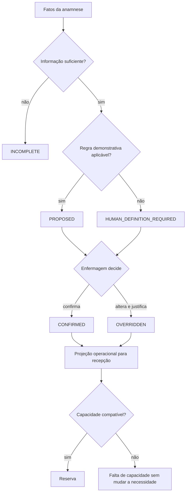

# Analyst — Classificação operacional e agenda

## Estado documental

- Papel: `REFERENCE_APPENDIX`.
- Consumido por: `hack/analysis.md`.
- Gate ou assinatura individual: inexistente.
- Research, recon e adversarial permanecem como histórico de maturidade, não como bloqueio do hack.
- Em conflito, `hack/analysis.md` prevalece e este anexo deve ser corrigido.

## TL;DR

Rápida, normal e estendida são classes sintéticas de capacidade da demonstração. Não são
pulseiras, risco, gravidade, urgência, ASA, aptidão ou prioridade cirúrgica. A regra pode
propor uma necessidade operacional, mas uma pessoa autorizada precisa confirmar ou alterar
essa proposta com justificativa antes de a recepção vê-la.

Os valores `20/35/50`, buffers, pesos, limites, prazos, calendário, recursos e política de
substituição são `DEMO_DECISION`. A pesquisa encontrou evidência de que contexto,
tratamentos, comorbidades e disponibilidade de informação podem influenciar a duração da
consulta, mas não validou os números ou a fórmula do Antessala. `UNKNOWN`, `REFUSED`,
documento pendente e achado clínico não recebem minutos universais.

O contrato possui saídas explícitas para dado incompleto, definição humana necessária e
caso fora do alcance da regra. Falta de capacidade nunca reduz a necessidade. A recepção
recebe somente a consequência operacional publicada, sem os fatos clínicos que a
originaram.

## Phase 0 Grill

| Pergunta | Estado | Resposta |
|---|---|---|
| O que o domínio decide? | `PRODUCT_LAW` | Necessidade operacional da consulta e compatibilidade da vaga. |
| O que ele não decide? | `PRODUCT_LAW` | Gravidade, urgência, prioridade cirúrgica, ASA, aptidão e conduta. |
| Quem publica a necessidade inicial? | `PRODUCT_LAW` | Enfermagem, após confirmar ou alterar a proposta. |
| Quem agenda? | `PRODUCT_LAW` | Recepção, usando somente a projeção operacional. |
| Os números são validados? | `DEMO_DECISION` | Não. São fixtures explícitas para provar o conceito. |
| O funcionamento do HC foi comprovado? | `UNRESOLVED` | Não. O PRD não afirma agenda, SLA ou protocolo institucional atual. |
| O contrato está pronto para Build? | `DEMO_DECISION` | Sim para a PoC sintética: a matriz `demo-workload-v1` abaixo é fechada e não reivindica validade clínica. |

## Source And Scope

### Dentro

- proposta explicável de carga operacional;
- confirmação ou override auditável antes da publicação;
- classes demonstrativas de duração;
- data-alvo administrativa;
- recursos, capabilities, disponibilidade e bloqueios como conceitos;
- compatibilidade, reserva, conflito, cancelamento, reagendamento, check-in e no-show;
- requisito operacional de retorno consumido da avaliação;
- projeção mínima para recepção.

### Fora

- classificação clínica ou de emergência;
- ASA, RCRI, aptidão, prescrição ou suspensão de medicamento;
- prioridade cirúrgica, fila física ou ordem de chamada no dia;
- operação real, escala profissional, calendário ou SLA do hospital;
- definição clínica do retorno, que pertence ao anestesiologista;
- tabelas, SQL, migrations, DTOs físicos, IPC, componentes, locks e testes;
- reutilização do classificador histórico de risco.

## Current Terrain

Recon técnico no SHA pesquisado, sem transformar legado em requisito:

- `src/shared/extensions/motor-fila.ts` mantém o ponto de extensão sem motor ativo;
- `src/shared/clinical/risco.ts` preserva um classificador histórico que mistura ASA,
  Lee/RCRI, MET e rotas clínicas e declara que não é protocolo aprovado;
- `src/main/db/schema.ts`, `src/main/tipc.ts` e `src/renderer/src/App.tsx` não entregam hoje
  agenda clínica, reserva ou superfície do fluxo deste Analyst;
- PGlite, transação local e primitivos de UI existem como capacidade técnica do HEAD, mas
  não escolhem o contrato físico futuro.

Estado: a semântica deste documento é produto a construir; nenhuma capacidade herdada
autoriza reutilizar fila, prioridade ou classificação clínica anteriores.

## Product Promise

A enfermagem transforma a entrevista em uma necessidade operacional explicável. A
recepção recebe duração, ocupação, capabilities, data-alvo e vagas compatíveis sem acessar
comorbidades, medicamentos, exames, respostas, recusa ou transcript. A agenda não modifica
a necessidade para acomodar a oferta: quando falta capacidade, o sistema informa a falta e
preserva a decisão publicada.

## Cinco eixos independentes

| Eixo | Pergunta | Autoridade | Saída admissível no Antessala | Inferência proibida |
|---|---|---|---|---|
| Gravidade clínica | Qual é a intensidade ou instabilidade do quadro? | profissional clínico no fluxo assistencial aplicável | preservar fatos; nunca concluir gravidade | gravidade a partir de classe, minutos ou doença isolada |
| Urgência de atendimento | A avaliação precisa ocorrer mais cedo por razão clínica? | profissional e protocolo assistencial autorizado | nenhum cálculo automático; fluxo externo quando aplicável | `EXTENDED`, sintomas ou data do procedimento virarem urgência |
| Prioridade cirúrgica | Qual procedimento ocorre primeiro? | serviço cirúrgico externo | nenhuma decisão | usar agenda pré-anestésica como fila cirúrgica |
| Carga operacional | Quanto tempo, apoio e recurso a consulta pode exigir? | enfermagem confirma a necessidade inicial; anestesiologista define a do retorno | duração, ocupação e capabilities operacionais | tratar carga como risco, ASA ou aptidão |
| Data-alvo e capacidade | Qual é o alvo administrativo e qual oferta existe? | origem autorizada define o alvo; recepção reserva; admin mantém oferta | alvo, disponibilidade, conflito e falta de capacidade | capacidade disponível reduzir necessidade ou criar urgência |

Quando um conteúdo estiver fora do alcance da regra, o Antessala não cria urgência nem
executa triagem clínica paralela. A enfermagem define manualmente a necessidade operacional
permitida pelo PRD e segue, fora do produto, qualquer fluxo assistencial aplicável.

## Research Evidence Matrix

Pesquisa verificada em `2026-08-14`. Uma fonte internacional ou de outro serviço sustenta
apenas a conclusão estreita registrada abaixo; não descreve o HCFMRP-USP.

| Classificação | Fonte primária | O que sustenta | Limite |
|---|---|---|---|
| `EVIDENCE_BACKED` | [Resolução CFM 2.174/2017](https://sistemas.cfm.org.br/normas/visualizar/resolucoes/BR/2017/2174), art. 1º | conhecer previamente as condições e decidir sobre o ato anestésico cabe ao anestesiologista | não define duração, classe, SLA ou agenda |
| `EVIDENCE_BACKED` | [Resolução COFEN 736/2024](https://www.cofen.gov.br/wp-content/uploads/2024/01/Resolucao-736-2024.pdf), arts. 1º–4º | o Processo de Enfermagem deve ter suporte teórico; instrumentos validados e protocolos baseados em evidências estão entre as bases possíveis | não valida a soma demonstrativa do Antessala |
| `EVIDENCE_BACKED` | [Parecer COFEN 10/2026](https://www.cofen.gov.br/parecer-no-10-2026-camaras-tecnicas-de-enfermagem/), itens 22–28 | não há quota nacional rígida; dimensionamento precisa considerar complexidade e realidade local | não define o tempo da anamnese ou consulta pré-anestésica do HC |
| `EVIDENCE_BACKED` | [Compère et al., 2022](https://pubmed.ncbi.nlm.nih.gov/35180166/) | contexto, tratamentos e comorbidades se associaram à duração; modelo multicêntrico teve desempenho moderado | não valida classes, pesos ou transferência para outro serviço |
| `EVIDENCE_BACKED` | [Dexter et al., 2012](https://pubmed.ncbi.nlm.nih.gov/22190552/) | contagem de medicamentos foi um preditor útil naquele serviço | não valida corte de cinco medicamentos nem incremento de cinco minutos |
| `EVIDENCE_BACKED` | [James e Thampi, 2018](https://pubmed.ncbi.nlm.nih.gov/29416146/) | houve ampla variação de consulta e espera, influenciada também pela organização local | não estabelece template universal de agenda |
| `EVIDENCE_BACKED` | [Correll et al., 2006](https://pubmed.ncbi.nlm.nih.gov/17122589/) | informação faltante pode exigir busca, avaliação adicional, atraso ou cancelamento | não converte documento ausente em minutos fixos |
| `EVIDENCE_BACKED` | [Lei 13.146/2015](https://planalto.gov.br/ccivil_03/_ato2015-2018/2015/lei/l13146.htm), arts. 3º, 24 e 25 | acessibilidade e comunicação precisam ser garantidas nos serviços de saúde | não determina acréscimo uniforme de duração |
| `EVIDENCE_BACKED` | [Fagan et al., 2003](https://pubmed.ncbi.nlm.nih.gov/12911645/) | impacto temporal de interpretação variou conforme o método e o serviço | não sustenta `+10` universal para comunicação |

### Conclusão da pesquisa

É legítimo investigar uma necessidade operacional diferenciada e validar uma regra
prospectivamente. Não é legítimo apresentar a fórmula atual como protocolo clínico,
instrumento validado ou previsão generalizável. Toda relação numérica permanece
`DEMO_DECISION` até calibração local; qualquer futura validação precisará medir erro,
subestimação, sobrestimação, desempenho por subgrupo e impacto na capacidade.

## Verdades por classificação

### `PRODUCT_LAW`

- as cinco dimensões acima são independentes;
- a saída inicial depende de confirmação ou alteração humana;
- recepção recebe consequência operacional, não conteúdo clínico;
- falta de capacidade não muda a necessidade;
- o app não atribui ASA, aptidão, risco, urgência ou prioridade cirúrgica;
- booking incompatível não pode ser confirmado;
- conflito e falta de capacidade são estados visíveis e recuperáveis.

### `EVIDENCE_BACKED`

- duração de avaliação pré-anestésica varia entre pessoas, contextos e serviços;
- quantidade de tratamentos e comorbidades pode contribuir para prever carga, sem precisão
  universal;
- informação indisponível pode exigir busca ou impedir continuidade;
- acessibilidade e comunicação são requisitos legítimos, mas não possuem acréscimo temporal
  uniforme demonstrado;
- decisão anestésica pertence ao anestesiologista.

### `DEMO_DECISION`

- nomes `QUICK`, `STANDARD` e `EXTENDED`;
- durações, buffers e ocupações `20+5`, `35+5` e `50+10`;
- qualquer peso, limiar ou agrupamento da regra demonstrativa;
- cinco ou dez dias úteis, segunda a sexta, feriados ignorados e horizonte de trinta dias;
- timezone `America/Sao_Paulo` e janelas contidas na mesma data;
- recursos e capabilities das fixtures;
- igualdade exata entre classe da necessidade e classe da vaga;
- janela de check-in, momento de no-show e política de atraso;
- grade semanal sem drag-and-drop ou recorrência;
- vocabulário e limites de justificativa.

### `UNRESOLVED`

- quais campos e combinações seriam legítimos em uma regra institucional real;
- distribuição real de duração e capacidade;
- recursos, accommodations e política de substituição reais;
- origem autorizada e SLA de cada data-alvo;
- calendário, feriados, tolerância de atraso e no-show;
- tipos e necessidade operacional dos retornos;
- governança e validação prospectiva de futura regra institucional.

## Entidades semânticas

### `OperationalNeedProposal`

Proposta não publicada produzida a partir de uma revisão final efetiva da anamnese e de uma
revisão conhecida do contexto do caso. Preserva essas âncoras, a versão da regra, as
categorias de sinais utilizadas, os limites encontrados e a sugestão de
duração/capabilities. Nunca contém ASA, risco, urgência ou aptidão.

Estados:

- `PROPOSED`: regra aplicável gerou proposta dentro do alcance demonstrado;
- `INCOMPLETE`: falta informação que o Analyst de anamnese declarou obrigatória;
- `HUMAN_DEFINITION_REQUIRED`: estado semântico, combinação ou caso não pode ser convertido
  de forma segura pela regra;
- `OUT_OF_DEMO_RANGE`: a necessidade não cabe nas três fixtures sem truncamento.
- `INVALIDATED`: a revisão da anamnese ou o contexto-fonte perdeu vigência antes da
  publicação; a proposta permanece histórica e nunca pode ser confirmada.

`INCOMPLETE` não gera requisito. `HUMAN_DEFINITION_REQUIRED` não atribui gravidade: pede
que a enfermagem defina e justifique uma consequência operacional que caiba honestamente
no contrato da demonstração. `OUT_OF_DEMO_RANGE` também não publica requisito nem permite
booking na PoC; permanece como exceção operacional visível até resolução fora do alcance
da demo, sem truncamento e sem criar uma consulta prévia com anestesiologista.

### `OperationalRequirement`

Decisão operacional publicada para recepção. Contém classe demonstrativa, duração,
buffer, ocupação, data-alvo, tipos de recurso, capabilities, autoria, horário, origem da
decisão e versão.

Estados:

- `CONFIRMED`: a enfermagem aceitou a proposta;
- `OVERRIDDEN`: a enfermagem definiu valor diferente e justificou.

Existe apenas uma decisão publicada por caso na PoC. `CONFIRMED` e `OVERRIDDEN` são
terminais e imutáveis; erro percebido depois da publicação fica visível como exceção e não
é corrigido silenciosamente, reclassificado ou devolvido à enfermagem. Correção operacional
pós-publicação e correção do conteúdo `FINAL` pertencem à operação futura. Isso não se
confunde com resultado anestésico: resultado finalizado admite nova versão de correção ou
adendo conforme o domínio de avaliação/handoff.

### `CapacityOffer`

Capacidade combina semanticamente:

- recurso: oferta identificável de profissional, ambiente ou apoio;
- capability: propriedade necessária, como acessibilidade ou apoio de comunicação;
- janela: intervalo em que a oferta pode ser usada;
- bloqueio: retirada explícita de capacidade;
- vaga candidata: intervalo que satisfaz integralmente a necessidade;
- booking: consumo confirmado dessa capacidade por um caso.

Calendário é projeção. A fonte física e a estratégia de concorrência pertencem ao Build.

### `ReturnOperationalNeed`

O anestesiologista define ou confirma explicitamente a duração, o alvo e os recursos do
retorno conforme seu objetivo atual. A necessidade inicial pode aparecer como referência
não vinculante; não é copiada automaticamente. A agenda consome a decisão publicada sem
recalcular sua justificativa clínica.

A decisão nasce depois da revisão clínica que concluiu ser necessário outro encontro.
Modalidade, duração, janela e recursos pertencem ao novo objetivo e não são herdados da
consulta inicial. Cumprimento de pendência, passagem do tempo, no-show ou último item
respondido não criam nem reabrem retorno automaticamente.

## Contrato das três classes

Todos os valores desta tabela são `DEMO_DECISION`.

| Classe | Duração | Buffer | Ocupação | Significado permitido |
|---|---:|---:|---:|---|
| `QUICK` / Rápida | 20 min | 5 min | 25 min | menor duração operacional da fixture |
| `STANDARD` / Normal | 35 min | 5 min | 40 min | duração intermediária da fixture |
| `EXTENDED` / Estendida | 50 min | 10 min | 60 min | maior duração operacional da fixture |

“Rápida” nunca significa urgente. “Estendida” nunca significa grave. O nome exibido sempre
vem acompanhado de “categoria demonstrativa de duração”.

Para a demonstração inicial, `desiredBy` pode usar cinco dias úteis antes de uma data
planejada informada ou dez dias úteis após a triagem quando ela não existir. Esses valores
são alvo administrativo sintético; não expressam urgência, prioridade ou SLA do hospital.
Alvo vencido, alvo fora do horizonte e ausência de capacidade são situações distintas.

## Regra demonstrativa

### Boundary de entrada

O Analyst de anamnese continua owner da completude. A regra recebe
`completeness.pendingFieldPaths` já calculado e somente os paths literais desta seção.
Campo novo, nota livre, CID, nome de doença, nome de medicamento, valor vital ou item fora
da tabela não entra no cálculo por varredura ou semelhança.

### Tratamentos obrigatórios

| Situação | Resultado semântico |
|---|---|
| campo obrigatório `NOT_ASKED` | `INCOMPLETE`; sem requisito |
| `UNKNOWN` ou `REFUSED` | nunca recebe minutos universais; segue a criticidade do campo |
| `ANSWERED(false)` | negativa explícita confirmada; nunca equivale a silêncio ou lista vazia |
| `NOT_APPLICABLE` | aceito somente quando a condição de aplicabilidade estiver satisfeita |
| documento indispensável ausente | pendência; não recebe minutos por padrão |
| accommodation de comunicação ou mobilidade | capability necessária; tempo só se definido pela decisão humana ou futura validação |
| achado fora da matriz aprovada | `HUMAN_DEFINITION_REQUIRED` |
| combinação acima do alcance da demo | `OUT_OF_DEMO_RANGE`; nenhum requisito ou booking na PoC e nenhum truncamento |

### Matriz fechada `demo-workload-v1`

Toda a matriz é `DEMO_DECISION`. Ela demonstra tradução operacional explicável; não é
score clínico, protocolo ou modelo validado.

Predicados auxiliares:

- `positive(a)`: `a.status === 'ANSWERED' && a.value === true`;
- `current(a)`: `a.status === 'ANSWERED' && a.value.current === true`;
- `answeredText(a)`: `a.status === 'ANSWERED' && a.value.trim().length > 0`.

`ANSWERED(false)` não casa. `UNKNOWN`, `REFUSED`, `NOT_PERFORMED` e
`NOT_APPLICABLE` nunca recebem minutos automáticos. Quando ocorrerem em path obrigatório,
a completude ou a definição humana decide antes do motor.

| `signalCode` | `fieldPaths` literais | Predicado | Efeito demonstrativo |
|---|---|---|---|
| `REQUIRED_FIELD_NOT_ASKED` | `completeness.pendingFieldPaths[*]` | lista não vazia | `INCOMPLETE`; nenhum requisito |
| `ALLERGY_REVIEW` | `allergies.hasAllergy` | `positive` | `+5`, grupo `DOMAIN_REVIEW` |
| `ANESTHESIA_HISTORY_REVIEW` | `anesthesia_history.personalComplication`; `anesthesia_history.difficultAirwayHistory`; `anesthesia_history.postoperativeNauseaVomiting`; `anesthesia_history.familyAnesthesiaComplication` | `positive` em qualquer path | `+5`, grupo `DOMAIN_REVIEW` |
| `CARDIOVASCULAR_REVIEW` | `cardiovascular.chestPain`; `cardiovascular.dyspneaAtRest`; `cardiovascular.syncope`; `cardiovascular.palpitation`; `cardiovascular.edema`; `cardiovascular.knownCardiovascularDisease` | `positive` em qualquer path | `+5`, grupo `DOMAIN_REVIEW` |
| `RESPIRATORY_REVIEW` | `respiratory.dyspnea`; `respiratory.wheezing`; `respiratory.recentRespiratoryInfection`; `respiratory.chronicCough`; `respiratory.sleepApneaDiagnosis`; `respiratory.usesRespiratorySupport` | `positive` em qualquer path | `+5`, grupo `DOMAIN_REVIEW` |
| `BLEEDING_THROMBOSIS_REVIEW` | `bleeding_thrombosis.abnormalBleeding`; `bleeding_thrombosis.easyBruising`; `bleeding_thrombosis.priorThrombosis`; `bleeding_thrombosis.familyBleedingDisorder`; `bleeding_thrombosis.receivesAnticoagulantOrAntiplatelet` | `positive` em qualquer path | `+5`, grupo `DOMAIN_REVIEW` |
| `HABITS_SUBSTANCES_REVIEW` | `habits_substances.tobacco`; `habits_substances.alcohol`; `habits_substances.recreationalSubstances` | `current` nos dois primeiros ou `positive` no último | `+5`, grupo `DOMAIN_REVIEW` |
| `SPECIAL_CONDITION_REVIEW` | `special_conditions.pregnant`; `special_conditions.lactating`; `special_conditions.otherCondition` | `positive` nos booleanos ou `answeredText` no texto | `+5`, grupo `DOMAIN_REVIEW` |
| `MEDICATION_VOLUME` | `medications.usesMedication`; `medications.items[*].id` | uso positivo e `items.length >= 5` | `+5` uma vez |
| `DIAGNOSIS_VOLUME` | `diagnoses.hasDiagnosis`; `diagnoses.items[*].id` | diagnóstico positivo e `items.length >= 3` | `+5` uma vez |
| `DOCUMENT_PENDING` | `exams_pending.items[*].status` | existe `MISSING` ou `REQUESTED` | `+0`; explicação/pêndencia, nunca peso |
| `ACCOMMODATION_COMMUNICATION` | `special_conditions.communicationAccommodation` | `answeredText` | grupo `ACCOMMODATION`; `+10` uma vez e `INTERPRETER` |
| `ACCOMMODATION_MOBILITY` | `special_conditions.mobilityAccommodation` | `answeredText` | grupo `ACCOMMODATION`; `+10` uma vez e `ACCESSIBLE_ROOM` |
| `ACCOMMODATION_COMPANION` | `special_conditions.legalRepresentativeNeeded` | `positive` | grupo `ACCOMMODATION`; `+10` uma vez e `COMPANION_SPACE` |
| `DESIRED_BY_PLANNED_DATE` | `procedure_context.plannedDate` | data ISO respondida | `plannedDate - 5` dias úteis da demo |
| `DESIRED_BY_DEFAULT` | `clinical_anamnesis_revisions.completed_at` | data planejada ausente | `completedAt + 10` dias úteis da demo |

O cálculo começa em 20 minutos. `DOMAIN_REVIEW` aplica no máximo três sinais, na ordem da
tabela, totalizando até `+15`; sinais adicionais continuam registrados com
`appliedMinutes=0` e `capReason=DOMAIN_REVIEW_CAP`. Medicação e diagnóstico somam uma vez
cada. `ACCOMMODATION` soma `+10` uma vez, preservando a união das capabilities. Documento
pendente soma zero. Não existe `GLOBAL_50_CAP`: total acima de 50 produz
`OUT_OF_DEMO_RANGE`, sem truncamento.

Mapeamento: `20 → QUICK`; `25–35 → STANDARD`; `40–50 → EXTENDED`. O template normaliza
25/30 para 35 e 40/45 para 50. `desiredBy` é calculado em eixo separado, nunca altera
minutos ou classe e nunca é chamado de urgência ou prioridade.

### Explicação e confirmação

A pessoa clínica que confirma vê:

- versão e natureza demonstrativa da regra;
- categorias de sinais e fontes na anamnese;
- lacunas e limitações;
- sugestão, alternativas permitidas e capabilities;
- aviso de que a saída não representa risco ou protocolo hospitalar.

A enfermagem pode confirmar, alterar ou definir manualmente. Alteração exige justificativa
e preserva proposta e decisão. A regra nunca publica diretamente para recepção.

## Projeção da recepção

A recepção pode receber somente:

- identificador operacional do caso;
- classe demonstrativa;
- duração, buffer e ocupação;
- capabilities e tipos de recurso necessários;
- data-alvo administrativa;
- status e versão da decisão;
- autoria e horário da confirmação;
- opções compatíveis e motivo operacional genérico.

É proibido expor:

- diagnósticos, medicamentos, alergias, sintomas ou exames;
- o domínio clínico que originou um sinal;
- `UNKNOWN`, `REFUSED` ou paths da anamnese;
- notas, transcript, prompt ou saída bruta de IA;
- score, pesos ou explicação clínica detalhada.

## Agenda e capacidade

### Compatibilidade

Uma vaga é compatível quando:

1. cobre toda a ocupação exigida;
2. fornece todos os tipos de recurso;
3. fornece todas as capabilities;
4. pertence a oferta ativa e não bloqueada;
5. não conflita com booking ativo de recurso exclusivo;
6. continua disponível no momento da confirmação.

A demo exige igualdade entre classes. Essa política é conservadora e `DEMO_DECISION`;
capacidade menor nunca satisfaz maior, e uso futuro de capacidade maior para necessidade
menor depende de regra operacional ainda não validada.

### Falta de capacidade

O produto diferencia:

| Situação | Consequência operacional |
|---|---|
| nada publicado no período consultado | fora do horizonte publicado |
| falta capability | capability indisponível |
| recurso retirado por bloqueio | recurso bloqueado |
| vaga consumida entre seleção e confirmação | conflito de reserva |
| nenhuma oferta satisfaz a necessidade | sem capacidade compatível |
| requisito não definido | aguardando definição humana |

Nenhuma dessas situações reduz duração, remove capability, cria urgência ou autoriza vaga
incompatível.

### Reserva e recuperação

- um recurso exclusivo não pode sustentar bookings ativos sobrepostos;
- uma necessidade não mantém duas reservas ativas;
- conflito falha integralmente e mantém o caso disponível para nova escolha;
- cancelamento libera capacidade futura e preserva autoria e motivo;
- reagendamento é explícito, não move a reserva silenciosamente;
- no-show inicial devolve o caso ao agendamento;
- no-show de retorno preserva a solicitação de retorno;
- check-in equivocado pode ser anulado antes do encontro e retorna booking/caso ao estado
  anterior, preservando o fato e o motivo;
- presença sem início ou impossibilidade de iniciar não consome a consulta: INITIAL volta
  ao agendamento e RETURN reabre a mesma solicitação;
- check-in, tolerância de atraso e no-show são políticas de demo exibidas como tais;
- atraso depende de decisão humana, não de uma regra implícita do relógio.

## Atores, ownership e limites

| Ator | Conhece | Decide | Não pode fazer |
|---|---|---|---|
| `ENFERMAGEM` | anamnese, lacunas, proposta e explicação | confirmar ou alterar a proposta antes da publicação | atribuir ASA, aptidão, urgência ou prioridade cirúrgica |
| `RECEPCAO` | projeção operacional e capacidade | reservar, cancelar, reagendar, check-in e no-show conforme política | ler clínica, mudar necessidade ou aceitar vaga incompatível |
| `ANESTESIOLOGISTA` | caso clínico, necessidade reservada e objetivo do retorno | definir necessidade operacional de retorno, conduzir avaliação ou registrar impossibilidade de início | alterar silenciosamente decisão histórica |
| `ADMIN` | recursos, janelas, bloqueios e saúde técnica | manter capacidade da demo | ler clínica ou mudar necessidade do caso |
| `SOLICITANTE` | somente pendência atribuída e resultado autorizado do próprio serviço | cumprir solicitações e receber resultado | acompanhar o caso, reservar ou interpretar requisito da enfermagem |
| Sistema | entrada permitida e regra versionada | propor, validar compatibilidade e detectar conflito | publicar sozinho ou decidir clínica |
| IA | conteúdo explicitamente permitido | sugerir rascunho com origem | escolher pesos, publicar requisito ou agir sobre agenda |

## Failure And Recovery Matrix

| Falha | Estado visível | Recuperação |
|---|---|---|
| campo obrigatório ausente | `INCOMPLETE` | enfermagem completa ou registra estado permitido |
| regra sem cobertura | `HUMAN_DEFINITION_REQUIRED` | enfermagem define e justifica |
| necessidade acima das fixtures | `OUT_OF_DEMO_RANGE` | exceção operacional visível, sem requisito, booking ou truncamento na PoC |
| conflito de reserva | conflito recuperável | atualizar oferta e selecionar outra vaga |
| falta de capability | capability indisponível | preservar necessidade e buscar nova oferta |
| falta dentro do horizonte | fora do horizonte publicado | ampliar consulta ou registrar falta; não inferir inexistência total |
| erro percebido depois da publicação | exceção visível; requirement permanece imutável | fluxo manual fora da PoC; nenhuma reclassificação silenciosa |
| atraso | decisão humana necessária | check-in, reagendamento ou no-show segundo política explícita |
| check-in equivocado | presença anulada com motivo | retornar exatamente ao estado anterior, sem apagar o check-in |
| presença sem encontro | consulta não iniciada | INITIAL volta ao agendamento; RETURN reabre a solicitação |
| fonte da proposta invalidada | `INVALIDATED` | impedir confirmação e aguardar nova revisão/proposta |

## Rules And Invariants

1. MUST NOT chamar ou adaptar `classificarRisco` como motor deste produto.
2. MUST NOT produzir ou armazenar ASA, RCRI, aptidão, gravidade, urgência ou prioridade
   cirúrgica como saída do domínio.
3. MUST rotular toda duração, peso, cap, prazo e fixture como `DEMO_DECISION`.
4. MUST preservar versão da regra, proposta, decisão humana, autoria, horário e motivo.
5. MUST NOT publicar proposta sem confirmação ou alteração humana.
6. MUST NOT atribuir minutos universais a `UNKNOWN`, `REFUSED` ou documento ausente.
7. MUST NOT descartar sinal por ordem editorial ou truncar caso para caber em 50 minutos.
8. MUST separar requisito de capacidade; falta de oferta nunca altera a demanda.
9. MUST separar explicação clínica da projeção mínima da recepção.
10. MUST confirmar apenas vaga integralmente compatível e ainda disponível.
11. MUST impedir sobreposição de recurso exclusivo e duplicidade de booking ativo.
12. MUST preservar cancelamento, conflito, no-show e reagendamento como fatos auditáveis;
    requirement publicado não possui substituição na PoC.
13. MUST tratar `desiredBy` como alvo administrativo, nunca urgência.
14. MUST permitir que o requisito do retorno seja definido ou confirmado pelo
    anestesiologista; requisito inicial é apenas referência.
15. MUST NOT afirmar que a demo reproduz protocolo, agenda ou SLA do HCFMRP-USP.
16. MUST invalidar toda proposta cuja revisão de anamnese ou contexto-fonte perdeu vigência;
    proposta inválida nunca é confirmada, alterada ou publicada.
17. MUST tratar anulação de check-in e presença sem início como fatos distintos de
    cancelamento da reserva e cancelamento do caso.

## Boundary With Build

Este Analyst define conceitos, estados, atores, regras, falhas e proibições. O Build
correspondente será owner de:

- tabelas, colunas, constraints, migrations e seed;
- DTOs, schemas runtime e nomes de canais;
- serviços, transações, locks, idempotência e concorrência física;
- rotas, componentes e Surface Blueprints;
- estratégia, arquivos e comandos de teste.

Nenhum detalhe físico existente no Build atual ganha validade enquanto não for reconciliado
com o contrato integrado e implementado pela minispec correta.

## Acceptance Criteria

- [ ] A UI e os documentos chamam as classes de categorias demonstrativas de duração.
- [ ] Os cinco eixos permanecem separados no comportamento e na linguagem.
- [ ] Campo obrigatório ausente não vira negativa nem requisito.
- [ ] `UNKNOWN`, `REFUSED` e documento pendente não recebem minutos universais.
- [ ] Há saída explícita para definição humana e fora da faixa da demo.
- [ ] Nenhum caso é truncado para caber em 50 minutos.
- [ ] Enfermagem confirma ou altera antes da publicação.
- [ ] Correção pré-publicação invalida proposta derivada e exige nova revisão; a proposta
      anterior não pode ser confirmada.
- [ ] Requirement publicado rejeita correção, nova submissão e reclassificação.
- [ ] Recepção recebe somente consequência operacional.
- [ ] Vaga incompatível nunca é confirmada.
- [ ] Falta de capacidade preserva a necessidade.
- [ ] Conflito, cancelamento, reagendamento, check-in e no-show têm recuperação explícita.
- [ ] Check-in equivocado, abandono e impossibilidade de iniciar não deixam o caso em
      `WAITING_ANESTHESIA` sem saída.
- [ ] Anestesiologista define ou confirma o requisito de retorno.
- [ ] Regra, versão, decisão e override são reconstruíveis.
- [ ] Teste literal cobre todos os `signalCode`, paths, predicados e efeitos da matriz v1.
- [ ] `desiredBy` muda a janela consultada sem mudar duração, gravidade ou prioridade.
- [ ] Nenhum texto afirma validação clínica ou institucional inexistente.
- [ ] Detalhes físicos permanecem exclusivamente no Build.

## Dependencies And Open Questions

Antes do Warlog:

1. O Writing Plan deve consumir literalmente a matriz v1; alteração de path, predicado ou
   efeito exige nova versão da regra.
2. O review final de congruência precisa atacar subestimação, definição humana, capacidade,
   privacidade da explicação e todos os números de demo.
3. Prazo, duração, recursos e capabilities do retorno são consumidos do Analyst integrado
   de avaliação/handoff, sem herança automática.
4. A operação institucional real permanece fora da PoC; qualquer uso real exige estudo
   local de duração, capacidade, calendário, acessibilidade e erro da regra.
5. Erro descoberto depois da publicação permanece fora da PoC e não autoriza reclassificação.

## Resultado da investigação

Os achados e limites deste domínio foram incorporados em `hack/analysis.md`. Pendências
institucionais continuam documentadas como fronteira futura e não bloqueiam a PoC sintética.

## Estado de consolidação

- Estado: `INCORPORATED_IN_ANALYSIS`.
- Autoridade canônica: `hack/analysis.md`.
- Gate individual: inexistente.
- Uso futuro: detalhe semântico para o Writing Plan, sem substituir a síntese.
