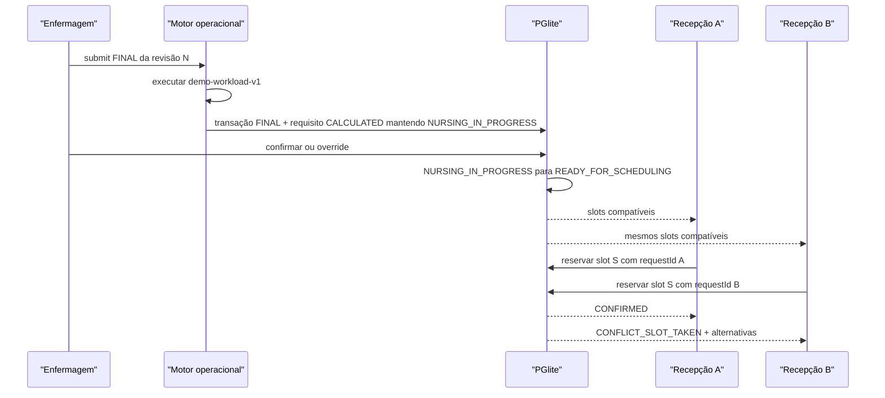

# Analyst — Classificação operacional e agenda

## State

- Source: `hack/PRD.md`, Analyst de anamnese e código Antessala
- Route: `analyst_prd`
- Phase budget: `forensic`
- Confidence: `low` para alegações clínicas ou operacionais; a mecânica é uma decisão de demo
- Created: `2026-08-14`
- Mode: `construction` com isolamento explícito do motor legado
- Verdict: `RESEARCH_REQUIRED`; assinatura de Marco pendente

## TL;DR

Rápida, normal e estendida são requisitos de duração de consulta, não pulseiras, urgência,
ASA, aptidão ou prioridade médica. O MVP calcula carga de revisão com regras demonstrativas
versionadas e explicáveis, permite override justificado e produz uma necessidade de agenda
separada dos dados clínicos. A agenda usa janelas datadas, slots materializados por 30 dias,
ocupação exclusiva de recursos e reserva atômica/idempotente. Nenhuma lógica atual de fila
ou risco é reaproveitada.

`QUICK | STANDARD | EXTENDED`, durações, sinais, pesos, limites, horizonte, calendário,
recursos e SLA são `DEMO_DECISION`, não protocolo institucional. A separação entre
gravidade, urgência, prioridade cirúrgica e duração necessária é `PRODUCT_LAW`.

## Phase 0 Grill

| Signal | Verdict | Notes |
|---|---|---|
| Action clear | PASS | Traduzir anamnese em requisito operacional e reservar slot compatível. |
| Persona clear | PASS | Enfermagem confirma requisito; recepção agenda; anestesiologista atende. |
| Input/output clear | PASS | Revisão final entra; requisito, explicação, slots e reserva saem. |
| Scope clear | PASS | Agenda da consulta pré-anestésica; não fila física nem cirurgia. |
| Objective criteria clear | PASS | Duração, prazo, recursos, compatibilidade, concorrência e falhas têm regras observáveis. |

## Source And Scope

- In scope: cálculo demonstrativo de carga, requisito operacional, confirmação/override,
  templates de slot, recursos, disponibilidade, bloqueios, reserva, reagendamento,
  cancelamento, no-show e pausa explícita da entrevista por dado incompleto.
- Out of scope: classificação clínica, urgência de emergência, ASA/RCRI, aptidão, ordem de
  chamada, mapa cirúrgico, escala profissional real, integração institucional e
  reclassificação depois de requisito publicado ou booking confirmado.
- Assumption: datas, recursos e SLAs são fixtures da demo. A interface nunca os apresenta
  como configuração validada pelo HC.

## Product Promise

A enfermagem termina a entrevista e entrega à recepção um pacote operacional que diz quanto
tempo reservar, até quando, quais recursos mínimos são necessários e por quê. A recepção vê
somente slots compatíveis e não lê a anamnese. Duas recepcionistas não confirmam a mesma
vaga. A revisão `FINAL` e a decisão de publicação são imutáveis no MVP; correção
pós-publicação não inventa transição regressiva e fica fora desta entrega.

## Story de Usuario

- Como enfermeiro, quero confirmar uma necessidade de agenda explicável, para não delegar
  interpretação clínica à recepção.
- Como recepcionista, quero ver uma semana de slots já filtrados, para reservar a vaga certa
  sem conhecer diagnósticos ou medicações.
- Como recepcionista, quero resposta inequívoca quando outra pessoa ocupou a vaga, para
  escolher outra sem criar duplicidade.
- Como anestesiologista, quero saber a duração reservada e as acomodações operacionais, para
  receber o caso na capacidade prevista.

## Story Tecnica

Como sistema, o Antessala deve criar uma execução versionada de regra a partir de uma revisão
imutável da anamnese, persistir apenas sinais e explicações não sensíveis na projeção da
recepção e reservar um slot materializado mediante constraint única, idempotency key e
transação. Calendário é projeção; slot e reserva no PGlite são a fonte de verdade do MVP.

## Current Terrain

Não existe agenda no schema, router ou renderer. O ponto de extensão do motor está vazio e
declara que a hipótese de fila foi invalidada. O legado mantém seis estados e prioridade
1–4, sem ordenação ou transição. Um classificador preservado calcula ASA/RCRI/MET e rotas
“sucinta/plena/encaminhar”, mas o próprio arquivo proíbe seu uso. FullCalendar não está nas
dependências; a casca atual oferece React, shadcn e componentes de tabela/card suficientes
para uma grade semanal do MVP.

## Evidence Matrix

| Path | Lines | Fact | Confidence |
|---|---:|---|---|
| `hack/PRD.md` | 53-70 | Fluxo canônico vai da triagem de enfermagem ao agendamento e consulta. | high |
| `hack/PRD.md` | 157-168 | Fila física, emergência, aptidão e marcação cirúrgica estão fora. | high |
| `src/shared/extensions/motor-fila.ts` | 1-14 | Extension point está vazio e fila anterior foi invalidada. | high |
| `src/shared/clinical/registro.ts` | 11-23 | Estados atuais são compatibilidade da hipótese anterior. | high |
| `src/main/db/clinical-schema.ts` | 22-39 | Prioridade 1–4 e jornada legada são os únicos dados próximos de fila. | high |
| `src/shared/clinical/risco.ts` | 1-7 | Classificador histórico não é protocolo nem requisito de agenda aprovado. | high |
| `src/shared/clinical/risco.ts` | 63-117 | Legado mistura ASA, Lee, MET e rota clínica. | high |
| `src/shared/clinical/risco.ts` | 140-293 | Lógica produz rota clínica, alertas e encaminhamentos; deve permanecer isolada. | high |
| `src/main/db/schema.ts` | 8-205 | Não há tabelas de agenda, recursos, slots ou reservas. | high |
| `src/main/tipc.ts` | 265-400 | Não há handlers de necessidade de agenda ou booking. | high |
| `src/renderer/src/App.tsx` | 13-56 | Não há rota de calendário/agendamento. | high |
| `src/renderer/src/components/ui/table.tsx` | 1-107 | Há tabela shadcn reutilizável. | high |
| `src/renderer/src/components/ui/card.tsx` | 1-95 | Há cards para slots e resumo. | high |
| `package.json` | 35-89 | Stack não inclui FullCalendar. | high |
| `src/main/db/query.ts` | 80-90 | Existe transação explícita; precisa ser curta e protegida contra concorrência. | high |
| `hack/domains/ANALYST-acesso-e-auditoria.md` | 258-280 | RBAC separa leitura da agenda, reserva e dados clínicos. | high |
| `hack/domains/ANALYST-caso-e-encaminhamento.md` | 108-117 | `preop_cases` é a fonte do caso e agenda consome seu lifecycle. | high |

## Implementation Map

| Area | Path | Role | Decision |
|---|---|---|---|
| Product contract | `hack/PRD.md` | Fluxo e exclusões | preserve |
| Anamnese input | `hack/domains/ANALYST-anamnese-e-catalogos.md` | Revisão e campos | consume |
| Legacy risk | `src/shared/clinical/risco.ts` | Hipótese invalidada | reject |
| Legacy journey | `src/shared/clinical/registro.ts` | Compatibilidade | reject as source |
| Queue extension | `src/shared/extensions/motor-fila.ts` | Boundary vazia | replace naming |
| DB schema | `src/main/db/clinical-schema.ts` | PGlite | expand |
| Query transaction | `src/main/db/query.ts` | Atomicidade | reuse carefully |
| IPC | `src/main/tipc.ts` | Commands/queries | add thin domain router |
| Routes | `src/renderer/src/App.tsx` | Navigation | add agenda routes |
| UI primitives | `src/renderer/src/components/ui/` | Calendar/list shell | reuse |
| Tests | `tests/shared/clinical/`, `tests/main/db/` | Domain/persistence | replace legacy assertions |

## Entities And State

```text
ENTITY: SchedulingRequirement
- Attributes: id, caseId, anamnesisRevision, ruleSetVersion, class, durationMinutes,
  desiredBy, resources, reasons, status, override
- Actions: calculate inside final submit, confirm/publish, override/publish
- Relations: 1 case, 1 source revision, N rule executions, 0..1 active booking
- Source of truth: PGlite
- Runtime states: CALCULATED, CONFIRMED, OVERRIDDEN
- Invalid states: confirmed without explanation; source revision mutable; clinical score exposed

ENTITY: SlotTemplate
- Attributes: id, class, durationMinutes, bufferMinutes, resourceKinds, active, version
- Actions: seed, retire
- Relations: generates slots
- Source of truth: versioned demo seed
- Runtime states: ACTIVE, RETIRED
- Invalid states: duration <= 0; class not matching generated slot

ENTITY: Resource
- Attributes: id, kind, name, capabilities, active, version
- Actions: seed, activate, retire
- Relations: availability, blocks, slots
- Source of truth: PGlite demo catalog
- Runtime states: ACTIVE, RETIRED
- Invalid states: retired resource generating new slots; capability usada como kind

ENTITY: AvailabilityWindow
- Attributes: id, templateId/version, startsAt, endsAt, timezone, resourceIds, active, version
- Actions: create dated window, replace, retire, materialize next 30 days
- Relations: one template, exact resource bundle and generated slots
- Source of truth: PGlite
- Runtime states: ACTIVE, RETIRED
- Invalid states: end <= start; recurrence payload; resource bundle without exactly one
  anesthesia professional and one room; overlapping resource capacity

ENTITY: Slot
- Attributes: id, windowId, templateId, startsAt, consultationEndsAt, endsAt, resourceIds,
  status, version
- Actions: materialize, block, unblock, reserve
- Relations: template, resources, 0..1 active reservation
- Source of truth: PGlite; calendar is projection
- Runtime states: AVAILABLE, BOOKED, BLOCKED, EXPIRED
- Invalid states: two active bookings; `endsAt` without consultation + buffer; two slotIds
  occupying the same resource in intervals sobrepostos

ENTITY: Booking
- Attributes: id, kind, caseId, initialRequirementId/returnRequestId, slotId, status,
  requestId, version, timestamps
- Actions: confirm, check-in, cancel, reschedule, mark no-show, consume on encounter start
- Relations: case, slot and exactly one source: triage requirement or return request
- Source of truth: PGlite
- Runtime states: CONFIRMED, CHECKED_IN, CANCELLED, COMPLETED, NO_SHOW
- Invalid states: active booking on incompatible slot; two active bookings for case;
  `RETURN` without ReturnRequest; no-show before consultation end; complete without encounter
```

`ResourceKind = ANESTHESIA_PROFESSIONAL | ROOM | SUPPORT` descreve o que o recurso é.
`ResourceCapability = STANDARD_ROOM | ACCESSIBLE_ROOM | INTERPRETER | COMPANION_SPACE`
descreve o que ele oferece. Os enums nunca compartilham valor. Todo slot combina exatamente
um recurso `ANESTHESIA_PROFESSIONAL`, um `ROOM` e zero ou mais `SUPPORT`; a união de
capabilities do bundle precisa cobrir o requisito.

`ReturnRequest` e seu requisito de retorno pertencem ao domínio
`avaliacao-pendencias-e-handoff`. A agenda consome somente `returnRequestId`, versão e o
requisito operacional publicado por aquele domínio: `requirementId`, `slotClass`,
`durationMinutes`, `bufferMinutes`, `occupiedMinutes`, `desiredBy`,
`requiredResourceKinds` e `requiredCapabilities`. Campo ausente torna a need inválida para
booking. A agenda não cria, conclui nem reinterpreta a solicitação clínica de retorno. A
tabela canônica é `return_requests` e não possui
`booking_id`; a relação é derivada por `scheduling_bookings.return_request_id`.

A topologia de persistência também é fechada: a agenda cria primeiro o booking base
`INITIAL`; assessment cria depois `return_requests` e encounters; somente então uma
migration de integração adiciona ao booking `kind`, `return_request_id`,
`return_request_version` e `completed_by_encounter_id` com as FKs cruzadas.

`CAPACITY_SHORTAGE` não é entidade nem evento persistido. É uma projeção discriminada,
recalculada quando a consulta de slots não encontra capacidade compatível no intervalo
pedido.

`Requirement`, `Slot` e `Booking` têm estados internos estritamente operacionais; nenhum
deles substitui `preop_cases.status`. O lifecycle canônico do caso continua fechado em
`RECEIVED_AT_RECEPTION`, `WAITING_NURSING`, `NURSING_IN_PROGRESS`, `TRIAGE_PENDING`,
`READY_FOR_SCHEDULING`, `SCHEDULED`, `WAITING_ANESTHESIA`, `IN_ASSESSMENT`, `PENDING`,
`WAITING_RETURN`, `READY_FOR_HANDOFF`, `DELIVERED_TO_REQUESTER` e `CANCELLED`. Este domínio
consome `READY_FOR_SCHEDULING`, grava `SCHEDULED` após reserva confirmada e integra o
check-in até `WAITING_ANESTHESIA`; assessment é o único owner de
`WAITING_ANESTHESIA → IN_ASSESSMENT` por `encounters.start`.

`TRIAGE_PENDING` possui uma única semântica: entrevista pausada porque faltam dados
obrigatórios identificados. `clinicalAnamnesis.markPending` move
`NURSING_IN_PROGRESS → TRIAGE_PENDING` com `missingFieldPaths` não vazio e motivo;
`clinicalAnamnesis.resume` move `TRIAGE_PENDING → NURSING_IN_PROGRESS` antes de qualquer
nova edição ou submit. Ele nunca significa “cálculo aguardando confirmação”.

## Contrato das três classes

| Classe | Duração | Buffer | Recursos mínimos | Prazo demonstrativo |
|---|---:|---:|---|---|
| `QUICK` / Rápida | 20 min | 5 min | anestesiologista + sala padrão | até 10 dias úteis |
| `STANDARD` / Normal | 35 min | 5 min | anestesiologista + sala padrão | até 10 dias úteis |
| `EXTENDED` / Estendida | 50 min | 10 min | anestesiologista + sala compatível com acomodações | até 10 dias úteis |

“Rápida” significa menor duração esperada de revisão, não atendimento urgente. O requisito
também leva `desiredBy`: se houver data planejada do procedimento, a demo usa cinco dias
úteis antes; sem data, usa dez dias úteis após a triagem. Esses números são fixtures
editáveis apenas no seed/versionamento da demo, não parâmetros clínicos.

No MVP, “dia útil” significa segunda a sexta-feira no calendário local
`America/Sao_Paulo`; feriados não são modelados. A mesma convenção calcula o prazo do
`ReturnRequest`, fixado em dez dias úteis após sua criação.

## Regra demonstrativa `demo-workload-v1`

A regra mede carga de revisão, não gravidade. Ela recebe somente o envelope candidato a
`FINAL`, aplica a tabela fechada abaixo e devolve saída discriminada. Não varre objetos,
não interpreta “qualquer booleano” e não passa a consumir campo novo sem nova versão.

Predicados auxiliares fechados:

- `reviewBoolean(a)`: `a.status` é `UNKNOWN` ou `REFUSED`, ou é `ANSWERED` com
  `a.value === true`;
- `reviewCurrent(a)`: `a.status` é `UNKNOWN` ou `REFUSED`, ou é `ANSWERED` com
  `a.value.current === true`;
- `answeredText(a)`: `a.status === ANSWERED` e `a.value.trim().length > 0`;
- `NEGATIVE` e `NOT_APPLICABLE` nunca incrementam; `ANSWERED false` é entrada inválida pelo
  contrato da anamnese.

| `signalCode` | `fieldPaths` exatos | Predicado | Minutos / capability |
|---|---|---|---|
| `REQUIRED_FIELD_NOT_ASKED` | `completeness.pendingFieldPaths[*]` | lista não vazia | saída `UNCLASSIFIABLE`; nenhum requisito persistido |
| `ALLERGY_REVIEW` | `allergies.hasAllergy`; `allergies.items[*].severity` | `reviewBoolean(hasAllergy)` ou alguma severity com status `UNKNOWN/REFUSED`, ou `ANSWERED` com valor `UNKNOWN` | `+5`, grupo `DOMAIN_REVIEW` |
| `ANESTHESIA_HISTORY_REVIEW` | `anesthesia_history.previousAnesthesia`; `anesthesia_history.personalComplication`; `anesthesia_history.difficultAirwayHistory`; `anesthesia_history.postoperativeNauseaVomiting`; `anesthesia_history.familyAnesthesiaComplication` | `reviewBoolean` em qualquer path | `+5`, grupo `DOMAIN_REVIEW` |
| `CARDIOVASCULAR_REVIEW` | `cardiovascular.chestPain`; `cardiovascular.dyspneaAtRest`; `cardiovascular.syncope`; `cardiovascular.palpitation`; `cardiovascular.edema`; `cardiovascular.knownCardiovascularDisease` | `reviewBoolean` em qualquer path | `+5`, grupo `DOMAIN_REVIEW` |
| `RESPIRATORY_REVIEW` | `respiratory.dyspnea`; `respiratory.wheezing`; `respiratory.recentRespiratoryInfection`; `respiratory.chronicCough`; `respiratory.sleepApneaDiagnosis`; `respiratory.usesRespiratorySupport` | `reviewBoolean` em qualquer path | `+5`, grupo `DOMAIN_REVIEW` |
| `BLEEDING_THROMBOSIS_REVIEW` | `bleeding_thrombosis.abnormalBleeding`; `bleeding_thrombosis.easyBruising`; `bleeding_thrombosis.priorThrombosis`; `bleeding_thrombosis.familyBleedingDisorder`; `bleeding_thrombosis.receivesAnticoagulantOrAntiplatelet` | `reviewBoolean` em qualquer path | `+5`, grupo `DOMAIN_REVIEW` |
| `HABITS_SUBSTANCES_REVIEW` | `habits_substances.tobacco`; `habits_substances.alcohol`; `habits_substances.recreationalSubstances` | `reviewCurrent(tobacco)` ou `reviewCurrent(alcohol)` ou `reviewBoolean(recreationalSubstances)` | `+5`, grupo `DOMAIN_REVIEW` |
| `SPECIAL_CONDITION_REVIEW` | `special_conditions.pregnant`; `special_conditions.lactating`; `special_conditions.legalRepresentativeNeeded`; `special_conditions.otherCondition` | `reviewBoolean` nos três booleanos, `UNKNOWN/REFUSED` em qualquer path, ou `answeredText(otherCondition)` | `+5`, grupo `DOMAIN_REVIEW` |
| `MEDICATION_VOLUME` | `medications.usesMedication`; `medications.items[*].id` | `usesMedication=ANSWERED true` e `items.length >= 5` | `+5` |
| `DIAGNOSIS_VOLUME` | `diagnoses.hasDiagnosis`; `diagnoses.items[*].id` | `hasDiagnosis=ANSWERED true` e `items.length >= 3` | `+5` |
| `DOCUMENT_PENDING` | `exams_pending.items[*].status` | existe `MISSING` ou `REQUESTED` | `+5` |
| `ACCOMMODATION_COMMUNICATION` | `special_conditions.communicationAccommodation` | `answeredText` | grupo `ACCOMMODATION`: `+10` uma vez; adiciona `INTERPRETER` |
| `ACCOMMODATION_MOBILITY` | `special_conditions.mobilityAccommodation` | `answeredText` | grupo `ACCOMMODATION`: `+10` uma vez; adiciona `ACCESSIBLE_ROOM` |
| `ACCOMMODATION_COMPANION` | `special_conditions.legalRepresentativeNeeded` | `reviewBoolean` | grupo `ACCOMMODATION`: `+10` uma vez; adiciona `COMPANION_SPACE` |
| `DESIRED_BY_PLANNED_DATE` | `procedure_context.plannedDate` | `ANSWERED` com data ISO | `desiredBy = plannedDate - 5 dias úteis` |
| `DESIRED_BY_DEFAULT` | `clinical_anamnesis_revisions.created_at` | plannedDate não `ANSWERED` | `desiredBy = createdAt + 10 dias úteis` |

O cálculo começa em 20 minutos. `DOMAIN_REVIEW` soma no máximo 15 minutos, escolhendo os
três primeiros sinais verdadeiros na ordem da tabela; todos os sinais verdadeiros continuam
registrados com `appliedMinutes=0` e `capReason=DOMAIN_REVIEW_CAP`. Medicação, diagnóstico e
documento somam uma vez cada. O grupo `ACCOMMODATION` soma 10 minutos no total, mesmo com
mais de um sinal, mas preserva a união de capabilities. O total final é limitado a 50;
incrementos cortados registram `appliedMinutes` real e `capReason=GLOBAL_50_CAP`.

Mapeamento do total: 20 → `QUICK`; 25–35 → `STANDARD`; 40–50 → `EXTENDED`. O template
normaliza 25/30 para duração de consulta 35 e 40/45 para 50. Todo requisito exige
`ResourceKind` `ANESTHESIA_PROFESSIONAL` e `ROOM`; capabilities vêm apenas da tabela.
Valores clínicos, CID, nome de medicamento, pressão, saturação, ASA, RCRI e MET nunca
aparecem na projeção da recepção.

`UNKNOWN` e `REFUSED` aumentam tempo porque exigem revisão, não porque representam risco.

### Resultado

```ts
type SlotClass = 'QUICK' | 'STANDARD' | 'EXTENDED'
type ResourceKind = 'ANESTHESIA_PROFESSIONAL' | 'ROOM' | 'SUPPORT'
type ResourceCapability =
  | 'STANDARD_ROOM'
  | 'ACCESSIBLE_ROOM'
  | 'INTERPRETER'
  | 'COMPANION_SPACE'

type RuleSignalDTO = {
  code: string
  sourcePaths: string[]
  matched: boolean
  proposedMinutes: number
  appliedMinutes: number
  capReason: 'DOMAIN_REVIEW_CAP' | 'ACCOMMODATION_GROUP_CAP' | 'GLOBAL_50_CAP' | null
  addedCapabilities: ResourceCapability[]
}

type RuleOutput =
  | {
      kind: 'UNCLASSIFIABLE'
      pendingFieldPaths: string[]
      ruleSet: { id: 'demo-workload'; version: 1 }
    }
  | {
      kind: 'CALCULATED'
      estimatedMinutes: number
      slotClass: SlotClass
      durationMinutes: 20 | 35 | 50
      bufferMinutes: 5 | 10
      desiredBy: string
      requiredResourceKinds: ['ANESTHESIA_PROFESSIONAL', 'ROOM']
      requiredCapabilities: ResourceCapability[]
      signals: RuleSignalDTO[]
      ruleSet: { id: 'demo-workload'; version: 1 }
    }

type RequirementEffectiveDTO = {
  slotClass: SlotClass
  durationMinutes: 20 | 35 | 50
  bufferMinutes: 5 | 10
  occupiedMinutes: 25 | 40 | 60
  desiredBy: string
  requiredResourceKinds: ['ANESTHESIA_PROFESSIONAL', 'ROOM']
  requiredCapabilities: ResourceCapability[]
}

type SchedulingRequirementDTO = {
  id: string
  caseId: string
  caseDisplayId: string
  sourceAnamnesisId: string
  sourceAnamnesisRevision: number
  ruleSet: { id: 'demo-workload'; version: 1 }
  createdAt: string
  version: number
} & (
  | {
      status: 'CALCULATED'
      proposed: RequirementEffectiveDTO
      clinicalSignals: RuleSignalDTO[]
      publishedAt: null
      override: null
    }
  | {
      status: 'CONFIRMED'
      proposed: RequirementEffectiveDTO
      effective: RequirementEffectiveDTO
      operationalReasons: string[]
      publishedAt: string
      override: null
    }
  | {
      status: 'OVERRIDDEN'
      proposed: RequirementEffectiveDTO
      effective: RequirementEffectiveDTO
      operationalReasons: string[]
      publishedAt: string
      override: {
        reason: string
        actorId: string
        actorRole: 'ENFERMAGEM'
        at: string
      }
    }
)
```

`UNCLASSIFIABLE` é resultado fail-closed do motor, não linha de requirement: o submit faz
rollback e mantém a anamnese em rascunho. Recepção recebe somente o DTO publicado, sem
`sourcePaths` clínicos:

```ts
type OperationalRequirementDTO = {
  kind: 'INITIAL'
  requirementId: string
  caseDisplayId: string
  status: 'CONFIRMED' | 'OVERRIDDEN'
  effective: RequirementEffectiveDTO
  explanation: string[]
  version: number
  publishedAt: string
}

type SchedulableNeedDTO =
  | OperationalRequirementDTO
  | {
      kind: 'RETURN'
      returnRequestId: string
      returnRequestVersion: number
      caseId: string
      caseDisplayId: string
      effective: RequirementEffectiveDTO
      explanation: string[]
      publishedAt: string
    }
```

O `RETURN` acima é produzido e versionado pelo domínio de avaliação; a agenda apenas o
consome.

## Pausa, submit e publicação

`TRIAGE_PENDING` é usado antes do submit somente quando a entrevista precisa parar por
dado obrigatório ausente. O command `markPending` registra paths e motivo; `resume` devolve
o caso a `NURSING_IN_PROGRESS`. Nenhum desses commands cria revisão ou requirement.

O submit da triagem e o cálculo são uma única operação transacional e aceitam somente
caso em `NURSING_IN_PROGRESS`:

1. `clinicalAnamnesis.submitFinal` valida o rascunho e monta o candidato imutável.
2. O motor puro calcula dentro da mesma transação.
3. `UNCLASSIFIABLE` reverte tudo: não nasce revisão `FINAL`, requirement nem evento e o
   caso continua `NURSING_IN_PROGRESS`.
4. `CALCULATED` grava revisão `FINAL`, execução e requirement `CALCULATED`; o caso continua
   `NURSING_IN_PROGRESS` no mesmo commit.
5. Não existe command público `scheduling.requirements.calculate` nem segundo passo de
   persistência após finalizar.

Depois, a enfermagem executa exatamente uma decisão de publicação:

- `confirm`: `CALCULATED → CONFIRMED`, move caso
  `NURSING_IN_PROGRESS → READY_FOR_SCHEDULING` e publica a projeção operacional à
  recepção;
- `override`: `CALCULATED → OVERRIDDEN`, exige classe/duração coerentes e justificativa de
  10–1.000 caracteres, faz a mesma transição do caso e publica a projeção;
- confirmar um override, fazer override depois de confirmado ou submeter outra revisão
  depois da publicação é inválido no MVP.

- Somente enfermagem pode fazer override antes de liberar o requisito; recepção e
  anestesiologista não fazem override da triagem.
- Override preserva resultado original, ator, papel, horário e motivo.
- O requirement publicado é imutável. Mudança posterior exige um fluxo futuro
  explicitamente modelado; o MVP não reabre enfermagem, não supersede requirement e não
  altera booking por reclassificação.

## Agenda do MVP

### Fixtures de recursos

- `ANESTHESIOLOGISTA_DEMO_1`: kind `ANESTHESIA_PROFESSIONAL`, sem capability; não é papel de
  autorização.
- `ROOM_STANDARD_1`: kind `ROOM`; capabilities `STANDARD_ROOM`, `COMPANION_SPACE`.
- `ROOM_ACCESSIBLE_1`: kind `ROOM`; capabilities `STANDARD_ROOM`, `ACCESSIBLE_ROOM`,
  `COMPANION_SPACE`.
- `INTERPRETER_DEMO`: kind `SUPPORT`; capability `INTERPRETER`.

`ANESTHESIOLOGISTA_DEMO_1` representa capacidade do pool, não uma conta nem uma agenda
pessoal. `scheduling_resources` não possui `usuarioId`; qualquer sessão com papel
`ANESTESIOLOGISTA` pode abrir a fila comum e iniciar um booking `CHECKED_IN`. O encontro
registra como `responsibleActor` o usuário real que executou `encounters.start`; a UI não
fala em “meus compromissos”.

O MVP não possui regra semanal, editor de recorrência ou DST implícito. Disponibilidade é
uma coleção administrável de janelas **datadas**, com `startsAt`/`endsAt` ISO com offset e
timezone fixa `America/Sao_Paulo`. Fixtures criam janelas datadas da apresentação; o admin
pode criar, substituir ou retirar janelas futuras. Materialização recebe `now` injetado,
considera somente a interseção `[início do dia, início do dia + 30 dias)` e é idempotente
por `windowId|windowVersion|template@version|startsAt|sortedResourceIds`.

Cada `AvailabilityWindow` começa e termina na **mesma data local**, de segunda a sexta, em
`America/Sao_Paulo`. Janela noturna, que cruza meia-noite ou cai em sábado/domingo é
rejeitada; o horizonte de 30 dias limita a materialização, não autoriza uma única janela de
30 dias.

Cada janela escolhe um template e um bundle exato: um anestesiologista, uma sala e apoios
opcionais. O materializador avança pelo bloco total do template:

- `consultationEndsAt = startsAt + durationMinutes`;
- `endsAt = startsAt + durationMinutes + bufferMinutes`;
- o próximo slot começa em `endsAt` e só nasce se seu `endsAt <= window.endsAt`.

Uma vaga QUICK não recebe STANDARD/EXTENDED. Toda criação de slot insere uma ocupação por
recurso com intervalo `[startsAt, endsAt)`. Todo writer de ocupação adquire locks
transacionais estáveis dos recursos em ordem de ID e, ainda sob os locks, consulta a
interseção `existing.startsAt < newEnd AND existing.endsAt > newStart`. Uma colisão vira
`RESOURCE_TIME_CONFLICT` e reverte o lote inteiro. O contrato não depende de extensão do
Postgres indisponível no PGlite embarcado.

Bloqueio administrativo rejeita intervalo com booking `CONFIRMED`, `CHECKED_IN` ou
`COMPLETED` cujo `slot.endsAt` ainda está no futuro. Para slots livres, marca `BLOCKED` e
remove suas ocupações; ao retirar o
bloqueio, rematerializa somente o intervalo afetado. Nenhum bloqueio cancela compromisso.

### Administração de capacidade

Este domínio é owner dos DTOs e commands de recursos, janelas e bloqueios. Todos exigem
`ADMIN`, `requestId`, validação estrita, expected version quando houver mutação e receipt
idempotente:

- recurso: criar, atualizar nome/capabilities, ativar e retirar;
- janela datada: criar, substituir por nova versão e retirar;
- bloqueio: criar e cancelar;
- materialização: reconciliar explicitamente intervalo de até 30 dias.

Recurso retirado não entra em janela nova. Alterar kind é proibido; cria-se outro recurso.
Substituir/retirar janela ou recurso com booking futuro ativo falha sem mutação. Toda ação
bem-sucedida reconcilia slots futuros afetados na mesma transação e retorna contagens
`created | retained | blocked | expired`; nunca deixa rematerialização silenciosa para um
cron.

### Superfície escolhida

O MVP usa uma **grade semanal própria**, sem FullCalendar:

- seletor anterior/hoje/próxima semana;
- colunas por dia útil;
- cards de slot com horário, classe, duração, sala e capabilities;
- filtro aplicado automaticamente pelo requisito;
- alternância “mostrar incompatíveis” somente para explicar por que não podem ser usados;
- drawer lateral com resumo operacional do caso e ação “Reservar”.

Uma lista abaixo da grade é o fallback acessível e aparece também quando não há slot. O
calendário nunca permite drag-and-drop; reagendamento abre o mesmo seletor e confirma a
troca transacional.

`/configuracoes/agenda`, somente `ADMIN`, lista recursos, janelas datadas e bloqueios com
ações criar/substituir/retirar e recibo de rematerialização. Não existe editor semanal ou
recorrente.

## Runtime / Data Flow

```mermaid
stateDiagram-v2
  [*] --> CONFIRMED: "reserva atômica"
  CONFIRMED --> CHECKED_IN: "check-in pela recepção"
  CONFIRMED --> CANCELLED: "cancelar"
  CONFIRMED --> CONFIRMED: "reagendar atomicamente"
  CONFIRMED --> NO_SHOW: "no-show após fim da consulta"
  CHECKED_IN --> COMPLETED: "encounters.start"
  COMPLETED --> [*]: "booking consumido; ocupação física até endsAt"
```





### Lifecycle do booking e do caso

- `INITIAL` exige `requirementId` publicado e proíbe `returnRequestId`; `RETURN` exige
  `returnRequestId` aberto/versionado e proíbe `requirementId`.
- Confirmar `INITIAL` move caso `READY_FOR_SCHEDULING → SCHEDULED`. Confirmar `RETURN`
  muda o request `READY_FOR_BOOKING → BOOKED` e mantém o caso `WAITING_RETURN`; a
  solicitação continua owned pelo domínio de avaliação.
- `scheduling.bookings.checkIn` pertence à `RECEPCAO`, aceita somente `CONFIRMED` e usa o
  relógio do main dentro de `[slot.startsAt - 30 minutos, slot.consultationEndsAt]`; fora
  dessa janela falha sem escrita. Para `INITIAL`, move `SCHEDULED → WAITING_ANESTHESIA`; para `RETURN`,
  muda o request `BOOKED → CHECKED_IN` e move
  `WAITING_RETURN → WAITING_ANESTHESIA`.
- `COMPLETED` não possui command de UI: o serviço do domínio de avaliação o grava quando o
  encontro vinculado começa, exigindo booking `CHECKED_IN` e `encounterId` do caso. A
  mesma transação move o caso a `IN_ASSESSMENT` e, em `RETURN`, o request a `CONSUMED`;
  a ocupação do bundle permanece até `slot.endsAt`.
- `markNoShow` pertence à `RECEPCAO`, aceita somente `CONFIRMED`, exige
  `now >= consultationEndsAt` e motivo de 10–500 caracteres. Em `INITIAL`, devolve o caso a
  `READY_FOR_SCHEDULING`; em `RETURN`, mantém `WAITING_RETURN`. Booking `CHECKED_IN` nunca
  vira `NO_SHOW`.
- Cancelar booking `INITIAL` ativo devolve `SCHEDULED → READY_FOR_SCHEDULING`; cancelar
  `RETURN` mantém `WAITING_RETURN` e libera a mesma ReturnRequest para nova reserva.
  `CHECKED_IN` não pode ser cancelado pela agenda.
- Cancelar o caso é command do domínio do caso. Ele chama `scheduling.cancelForCase` na
  mesma transação e só então grava `preop_cases.status=CANCELLED`; cancelar vaga nunca
  cancela caso implicitamente.

## Rules And Invariants

- MUST NOT chamar o motor legado `classificarRisco`.
- MUST NOT produzir ou armazenar ASA/RCRI como requisito operacional.
- MUST submeter revisão `FINAL` e calcular requirement no mesmo commit; não existe cálculo
  público ou persistência duplicada depois do submit.
- MUST persistir rule set, versão, sinais, minutos e paths de origem.
- MUST separar DTO clínico do DTO de recepção.
- MUST usar somente os papéis `ADMIN`, `RECEPCAO`, `ENFERMAGEM`, `ANESTESIOLOGISTA` e
  `SOLICITANTE`; nomes de recurso da agenda não são papéis.
- MUST receber o caso em `READY_FOR_SCHEDULING` e movê-lo a `SCHEDULED` somente depois da
  reserva confirmada; cancelamento do caso usa `CANCELLED`, não o estado interno do booking.
- MUST tratar `UNCLASSIFIABLE` como falha do submit, sem requirement publicável ou booking.
- MUST exigir confirmação clínica/override antes de publicar slots à recepção.
- MUST retornar somente slots cuja classe, duração e capabilities satisfaçam o requisito.
- MUST manter timestamps em UTC e apresentar `America/Sao_Paulo`.
- MUST aceitar disponibilidade somente na mesma data local, de segunda a sexta; não existe
  calendário de feriados na demo.
- MUST tratar `ANESTHESIA_PROFESSIONAL` como recurso de pool sem vínculo com usuário; a
  autoria real nasce em `encounters.start`.
- MUST impedir dois bookings ativos por slot e dois bookings ativos por caso.
- MUST impedir, por lock transacional por recurso e consulta de interseção no mesmo commit,
  que dois slotIds sobrepostos usem o mesmo recurso.
- MUST tratar `requestId` repetido como a mesma operação e devolver o mesmo resultado.
- IF slot for ocupado entre seleção e confirmação, THEN retornar conflito e alternativas;
  nunca escolher outro automaticamente.
- IF não houver capacidade até `desiredBy`, THEN retornar projeção derivada
  `CAPACITY_SHORTAGE` e manter caso visível; não persistir entidade e nunca encaixar em slot
  incompatível.
- IF booking for cancelado, THEN liberar slot e registrar ator/motivo.
- IF reagendamento for confirmado, THEN cancelar antigo e confirmar novo na mesma transação.
- IF paciente não comparecer, THEN marcar `NO_SHOW`; nova reserva exige ação explícita.
- IF recepção fizer check-in, THEN booking vira `CHECKED_IN` e o caso vira
  `WAITING_ANESTHESIA`, tanto em `INITIAL` quanto em `RETURN`, apenas entre 30 minutos antes
  do início e `consultationEndsAt`.
- IF `encounters.start` consumir o booking, THEN gravar `COMPLETED` com o encounter, mover
  o caso a `IN_ASSESSMENT` e manter a ocupação física até `slot.endsAt`.
- IF regra ou template mudar, THEN nova versão não reinterpreta execução histórica.

## Architecture Risks

| Severity | Risk | Evidence | Fix direction |
|---|---|---|---|
| critical | Reusar algoritmo clínico invalidado | `src/shared/clinical/risco.ts:1-7` | Motor novo em namespace operacional. |
| critical | Dupla reserva | agenda ausente no schema | partial unique indexes + transação + idempotência. |
| high | Misturar recepção e dados clínicos | `src/main/tipc.ts:265-335` não possui RBAC | DTO/query separados e guards no main. |
| high | Edição pós-publicação inventar retorno de estado | lifecycle fechado não possui transição regressiva | bloquear nova revisão após publicação no MVP. |
| high | DDL singleton intercalar transações | `src/main/db/query.ts:80-90` | service lock curto + SQL atômico. |
| medium | Calendário virar fonte de verdade | rota inexistente | slots no DB; UI somente projeção. |
| medium | Duração demo parecer regra hospitalar | sem fonte institucional | badge/demo copy + ruleSet `demo-workload-v1`. |

## Blueprint Handoff

| Path/Area | Action | Reason | Validation |
|---|---|---|---|
| `src/shared/scheduling/` | Criar DTOs e motor puro | Separar agenda de risco legado | rule table tests |
| `src/main/db/migrations/*` | Agenda base → assessment → integração cruzada de booking | Quebrar ciclo de FKs | migration order + constraint tests |
| `src/main/db/seed.ts` | Seed de templates/recursos/disponibilidade | Demo offline | deterministic seed test |
| `src/main/scheduling/` | Services de materialização e booking | Transações e idempotência | concurrency tests |
| `src/main/tipc.ts` | Expor queries/commands por papel | Fronteira segura | contract/RBAC tests |
| `src/renderer/src/paginas/AgendaPagina.tsx` | Grade semanal | Superfície escolhida | renderer/e2e |
| `src/renderer/src/componentes/agenda/` | Cards, filtros e drawer | Composição reutilizável | accessibility tests |
| `tests/shared/scheduling/` | Oráculos de regra | Motor puro | boundary tests |
| `tests/main/db/scheduling*.spec.ts` | Corridas e constraints | Reserva segura | two-client scenarios |

## Acceptance Criteria

- [ ] Mesma revisão e ruleSet sempre produzem o mesmo requisito.
- [ ] Rápida, normal e estendida correspondem a 20, 35 e 50 minutos.
- [ ] A explicação lista todo incremento e sua origem.
- [ ] Submit final + cálculo são atômicos; `NOT_ASKED` retorna `UNCLASSIFIABLE` e não
      persiste revisão final ou requirement.
- [ ] Submit verde mantém `NURSING_IN_PROGRESS`; somente confirm/override move para
      `READY_FOR_SCHEDULING`.
- [ ] `TRIAGE_PENDING` só representa dado incompleto e `resume` retorna a
      `NURSING_IN_PROGRESS`.
- [ ] Recepção não recebe CID, medicação, respostas ou notas clínicas.
- [ ] Override exige papel clínico, classe de origem/destino e justificativa.
- [ ] Grade semanal mostra somente slots compatíveis por padrão.
- [ ] Janela de disponibilidade que cruza data local, sábado ou domingo é rejeitada; toda
      janela válida está contida em uma segunda–sexta de `America/Sao_Paulo`.
- [ ] Ausência de vaga retorna `CAPACITY_SHORTAGE` derivado, sem linha persistida ou encaixe inválido.
- [ ] Duas reservas simultâneas do mesmo slot resultam em uma confirmação e um conflito.
- [ ] Dois materializadores concorrentes não criam slotIds sobrepostos para o mesmo recurso.
- [ ] Repetir o mesmo `requestId` não cria booking adicional.
- [ ] Reagendamento confirma o novo slot e libera o antigo atomicamente.
- [ ] No-show e cancelamento ficam auditáveis e permitem nova ação explícita.
- [ ] Check-in `INITIAL` e `RETURN` move o caso para `WAITING_ANESTHESIA`;
      só é aceito entre `startsAt - 30 min` e `consultationEndsAt`; `encounters.start` grava
      `COMPLETED` e `IN_ASSESSMENT`.
- [ ] Booking `COMPLETED` não libera recurso antes de `slot.endsAt`.
- [ ] Booking `RETURN` consome ReturnRequest do domínio de avaliação sem assumir ownership.
- [ ] Need `RETURN` incompleta é recusada; prazo de retorno usa dez dias úteis de
      segunda–sexta, sem feriados.
- [ ] A fila do anestesiologista é compartilhada: qualquer conta autorizada inicia booking
      checked-in e o encontro registra o ator real, sem vínculo usuário↔recurso.
- [ ] `return_requests` é a tabela canônica e não contém `booking_id`.
- [ ] Migrations aplicam agenda base → assessment → integração sem FK circular.
- [ ] Nenhuma tela ou DTO fala em ASA, aptidão, urgência clínica ou pulseira.

## Open Questions

Recursos, SLAs, duração e disponibilidade são fixtures sintéticas. Sua adequação à prova
de conceito e qualquer relação clínica usada pelo motor ainda exigem pesquisa e
adversarial.

## Grill Verdict

- Verdict: `RESEARCH_REQUIRED`
- Why: motor e capacidade são demonstrativos; precisam ser separados de evidência e revisados antes da assinatura.
- Next stage: Build do domínio após assinatura de Marco.

## Recommended Next Phase

Consumir este documento em `BUILD-classificacao-e-agenda.md`. Não iniciar Spec, Plan, TDD ou
implementação.

---

## Contrato de encerramento deste arquivo

- Artefato: `hack/domains/ANALYST-classificacao-e-agenda.md`
- Gate: Analyst de classificação e agenda → Build do domínio
- Estado: `RESEARCH_REQUIRED`
- Assinatura de Marco: `PENDENTE`
- Data: `PENDENTE`
- Revisão Git examinada: `PENDENTE`
- Declaração: `PENDENTE`

Declaração exigida: “Aprovo o Analyst de classificação e agenda e autorizo seu consumo pelo
Build.”
