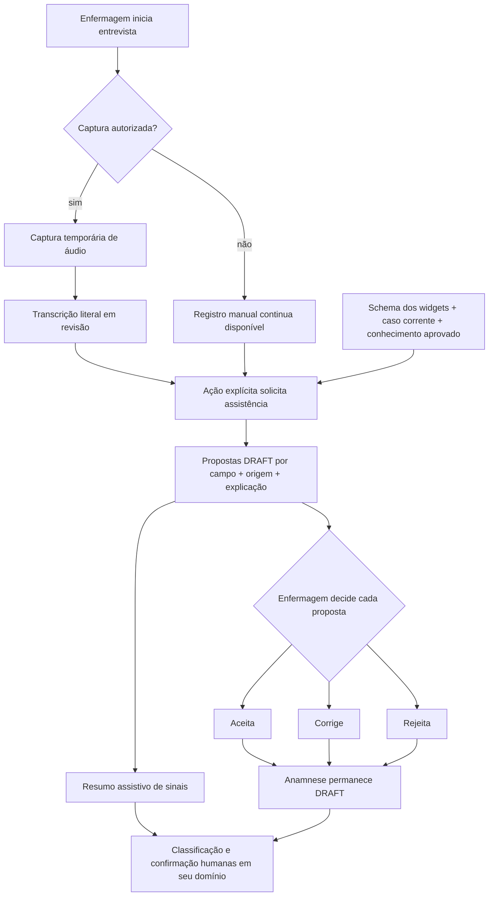

# Analyst — IA, memória e conhecimento

## State

- Estado: `RESEARCH_REQUIRED`.
- Fase: Analyst; este documento não autoriza Build, Spec, Plan, teste ou código.
- Fonte de produto: direção explícita de Marco para a prova de conceito, ainda não
  incorporada a um PRD assinado.
- Pesquisa científica, regulatória, de privacidade e operacional: `PENDENTE`.
- Recon técnico do HEAD: `PARCIAL`, limitado às evidências listadas neste arquivo.
- Adversarial: `PENDENTE`.
- Assinatura de Marco: `PENDENTE`.

## Legenda de autoridade

| Rótulo | Significado |
|---|---|
| `PRODUCT_LAW` | Lei declarada por Marco que nenhuma implementação pode contrariar. |
| `EVIDENCE_BACKED` | Fato verificado no código ou em artefato canônico; não prova validade clínica. |
| `DEMO_DECISION` | Escolha delimitada para a prova de conceito; não descreve protocolo do HC. |
| `UNRESOLVED` | Pesquisa, decisão ou assinatura ainda necessária. |

## TL;DR

O uso concreto de IA no Antessala é assistir a entrevista de enfermagem: transcrever uma
captura consentida, propor valores de campos com a origem visível e resumir sinais que
podem afetar a necessidade operacional da consulta. Cada proposta nasce `DRAFT` e só entra
na anamnese quando a enfermagem a aceita ou corrige. A IA não atribui ASA, gravidade,
urgência, prioridade, aptidão nem conduta.

A memória global contém somente relações mínimas, versionadas e aprovadas por um
profissional autorizado. Um caso nunca vira regra por uso, frequência ou confirmação da
IA. A prova demonstra uma relação criada por pessoa, uma relação sugerida pela IA e uma
consulta real a conhecimento aprovado. O fluxo-base continua funcional sem IA, sem modelo
local e sem rede.

## Phase 0 Grill

| Pergunta | Estado | Resposta atual |
|---|---|---|
| Qual problema a IA resolve? | `DEMO_DECISION` | Reduz digitação e ajuda a revisar a entrevista sem tomar a decisão humana. |
| Quem usa? | `DEMO_DECISION` | Enfermagem usa propostas de campo; anestesiologista consulta e cura relações; admin configura disponibilidade técnica. |
| Entrada e saída estão definidas? | `DEMO_DECISION` | Transcrição, anamnese em rascunho, schema de widgets e conhecimento aprovado entram; propostas rastreáveis saem. |
| A IA decide o caso? | `PRODUCT_LAW` | Não. Toda saída é assistiva, explicável e sujeita a confirmação humana. |
| O fluxo depende de rede? | `PRODUCT_LAW` | Não. Rede é opcional, explícita e incapaz de bloquear caso, agenda ou handoff. |
| Privacidade e consentimento estão comprovados? | `UNRESOLVED` | Não. Exigem pesquisa antes de qualquer dado real. |
| O conhecimento clínico está validado? | `UNRESOLVED` | Não. A demo usa relações sintéticas ou aprovadas e não se apresenta como protocolo. |

O Grill não passa para assinatura enquanto os itens `UNRESOLVED` exigidos para a demo não
forem pesquisados, delimitados e submetidos a adversarial.

## Problema e promessa

### Problema do domínio

A entrevista produz fala livre, respostas estruturadas e sinais dispersos. Digitar tudo
durante a conversa aumenta atrito; copiar uma transcrição sem origem pode inventar certeza;
e transformar decisões de casos em “memória” pode criar uma regra clínica falsa.

### Promessa da prova

- `DEMO_DECISION`: a enfermagem pode capturar fala ou digitar normalmente, revisar a
  transcrição e receber propostas de preenchimento por campo.
- `PRODUCT_LAW`: cada proposta mostra de qual trecho, resposta ou relação aprovada veio.
- `PRODUCT_LAW`: aceitar uma proposta é um ato humano auditável; a IA nunca finaliza a
  anamnese.
- `DEMO_DECISION`: um resumo assistivo reúne sinais relevantes para revisão, duração ou
  recurso, sem produzir a classificação operacional canônica.
- `DEMO_DECISION`: conhecimento aprovado pode ser recuperado por busca textual, RAG ou
  grafo, desde que a resposta devolva sua proveniência e versão.
- `PRODUCT_LAW`: ausência de conhecimento ou resposta da IA nunca vira ausência clínica,
  resposta negativa ou autorização para avançar.

## Escopo

### Dentro da prova de conceito

1. Captura opcional de áudio durante a entrevista, após ação e consentimento explícitos.
2. Transcrição literal, revisável e ligada somente ao caso corrente.
3. Propostas `DRAFT` para campos dos widgets, com fonte e explicação.
4. Aceite, rejeição e correção humana por proposta.
5. Resumo assistivo dos sinais que merecem revisão operacional.
6. Cadastro humano mínimo de relações entre condição, procedimento, necessidade de revisão,
   duração ou recurso.
7. Sugestão de nova relação pela IA a partir de exemplos explicitamente promovidos.
8. Aprovação, versionamento, desativação, consulta e auditoria de relações.
9. Uma demonstração real de proposta por IA e uma demonstração real de recuperação de
   conhecimento aprovado.

### Fora da prova de conceito

- base universal de doenças, medicamentos, procedimentos e condutas;
- aprendizado automático por observação de casos;
- paciente longitudinal, prontuário ou evolução entre encaminhamentos;
- atribuição de ASA, aptidão anestésica, gravidade, urgência ou prioridade cirúrgica;
- recomendação de suspensão de medicamento, exame, diagnóstico ou tratamento;
- resumo enviado diretamente à recepção ou ao serviço solicitante;
- gravação invisível, permanente ou obrigatória;
- promoção automática de transcrição, conversa ou decisão para memória global;
- operação com dados reais antes de pesquisa de consentimento, retenção, LGPD e fornecedor.

## Leis do produto aplicadas ao domínio

1. `PRODUCT_LAW`: o caso é autônomo; a IA não procura nem combina atendimentos anteriores
   da mesma pessoa.
2. `PRODUCT_LAW`: não existe evolução clínica entre casos.
3. `PRODUCT_LAW`: o primeiro boot e o fluxo-base funcionam sem internet.
4. `PRODUCT_LAW`: qualquer rede exige ação explícita e informa provedor, finalidade e dados
   que sairão do computador.
5. `PRODUCT_LAW`: indisponibilidade da IA não bloqueia anamnese, classificação humana,
   agendamento, avaliação ou handoff.
6. `PRODUCT_LAW`: toda saída generativa nasce como rascunho e não produz efeito de domínio
   sem confirmação humana.
7. `PRODUCT_LAW`: o app não atribui ASA, não declara aptidão e não substitui decisão médica.
8. `PRODUCT_LAW`: gravidade, urgência, prioridade cirúrgica e duração necessária da consulta
   são eixos diferentes.
9. `PRODUCT_LAW`: nenhuma doença, medicação ou relação isolada cria urgência automática.
10. `PRODUCT_LAW`: dado de um caso não entra na memória global sem promoção humana explícita.
11. `PRODUCT_LAW`: memória global não guarda identidade nem narrativa integral da pessoa.
12. `PRODUCT_LAW`: inferência sem fonte ou sem compatibilidade com o schema não é exibida
    como dado preenchível.

## Atores e responsabilidades

| Ator | Pode | Não pode |
|---|---|---|
| `ENFERMAGEM` | Solicitar consentimento; iniciar/parar captura; revisar transcrição; aceitar, rejeitar ou corrigir propostas dos campos que coleta. | Finalizar por lote sem revisão; aprovar regra global; enviar conteúdo à nuvem em segundo plano. |
| `ANESTESIOLOGISTA` | Ler a transcrição confirmada no caso; consultar conhecimento aprovado; criar relação manual; aprovar, rejeitar, corrigir, versionar ou desativar relação clínica no escopo da demo. | Alterar a anamnese final; promover caso automaticamente; delegar aprovação à IA. |
| `ADMIN` | Habilitar ou desabilitar a capacidade técnica, selecionar modo permitido e ver saúde sem conteúdo clínico. | Aprovar significado clínico por ser admin; ler transcrições, prompts ou propostas por padrão. |
| `RECEPCAO` | Consumir apenas o requisito operacional já confirmado por humano. | Ler áudio, transcrição, anamnese, propostas, relações ou explicações clínicas. |
| `SOLICITANTE` | Consumir o resultado final entregue conforme seu domínio. | Consultar material de trabalho da entrevista ou memória interna. |
| Pessoa entrevistada | Aceitar ou recusar gravação sem perder atendimento; pedir interrupção da captura. | Operar o aplicativo no MVP. |

`DEMO_DECISION`: o anestesiologista é o aprovador clínico das relações na demonstração.
Essa escolha precisa de adversarial e não prova governança institucional.

## Fluxo canônico

Nenhuma seta da IA aponta diretamente para anamnese `COMPLETE`, necessidade operacional
publicada, reserva, resultado ou handoff.

## Entidades lógicas e campos semânticos

Esta seção define significado, não tabela, arquivo, DTO físico ou canal IPC.

### `CaptureConsent`

- Identifica caso, finalidade da captura, ator que explicou, decisão da pessoa, horário e
  versão do texto de consentimento.
- Estados: `NOT_REQUESTED`, `GRANTED`, `REFUSED`, `REVOKED`.
- `REFUSED` e `REVOKED` mantêm o formulário manual disponível.
- `UNRESOLVED`: texto, base legal e retenção aplicáveis a dados reais.

### `InterviewCapture`

- Pertence a um único caso e a uma sessão de entrevista.
- Mantém estado técnico, duração e vínculo com o consentimento; não entra na memória global.
- Estados: `IDLE`, `RECORDING`, `TRANSCRIBING`, `TRANSCRIBED`, `DISCARDED`, `FAILED`.
- `DEMO_DECISION`: áudio bruto é temporário e descartado após transcrição ou cancelamento;
  não existe galeria de gravações.
- Estado inválido: captura após recusa/revogação, gravação sem indicador visível ou áudio
  associado a mais de um caso.

### `CaseTranscript`

- Guarda texto literal, idioma, origem da captura, estado de revisão, autor da confirmação e
  referências de trecho usadas pelas propostas.
- Estados: `RAW_DRAFT`, `HUMAN_REVIEWED`, `SUPERSEDED`, `DISCARDED`.
- Correção preserva o texto recebido e a decisão humana; não finge que a máquina ouviu a
  versão corrigida.
- Não é anamnese, memória global, regra ou resultado.

### `FieldProposal`

- Aponta para caso, revisão do contexto do intake, revisão do transcript, versão do widget e
  campo-alvo.
- Contém valor semântico proposto, estado de resposta proposto, trechos exatos de origem,
  relações aprovadas consultadas, explicação, provedor/modelo e horário da geração.
- Estados: `DRAFT`, `ACCEPTED`, `REJECTED`, `CORRECTED`, `STALE`, `INVALID`.
- Aceite/correção registra ator, horário e valor efetivamente aplicado.
- Mudar transcript, schema, dado-fonte ou qualquer campo de intake consumido torna a
  proposta não decidida `STALE`.
- `INVALID` nunca pode ser aplicado; `DRAFT` nunca aparece como resposta clínica confirmada.

### `OperationalSignalSummary`

- Lista sinais observados, fontes, lacunas e relações aprovadas relevantes.
- Pode explicar por que um item merece revisão, duração ou recurso; não publica o requisito.
- Não contém score opaco nem transforma “não encontrado” em negativo.
- Estados: `DRAFT`, `HUMAN_ACKNOWLEDGED`, `STALE`, `UNAVAILABLE`.

### `KnowledgeRelation`

- Representa uma relação simples entre um antecedente aprovado — condição, medicamento,
  procedimento ou contexto — e uma consequência operacional limitada a `REVIEW_NEEDED`,
  `DURATION_HINT` ou `RESOURCE_HINT`.
- Campos semânticos: sujeito, relação, objeto/valor, escopo, justificativa, fontes,
  autor, aprovador, versão, vigência, estado e motivo de substituição/desativação.
- Estados: `DRAFT`, `ACTIVE`, `SUPERSEDED`, `INACTIVE`.
- Apenas `ACTIVE` participa de consulta operacional.
- Uma nova versão não altera silenciosamente o significado da versão usada por um caso.
- A relação nunca significa urgência, gravidade, prioridade, aptidão ou conduta.
- `DEMO_DECISION`: na prova sintética, o mesmo anestesiologista pode cadastrar e depois
  aprovar a relação em duas ações explícitas; separação institucional de funções permanece
  `UNRESOLVED`.

### `ApprovedKnowledgeSource`

- Representa catálogo, documento ou referência cuja origem, licença, versão e finalidade
  de uso foram verificadas por humano.
- Estados: `DRAFT`, `ACTIVE`, `SUPERSEDED`, `INACTIVE`.
- Apenas uma versão `ACTIVE` pode sustentar recuperação; toda relação mantém referência à
  versão consultada.
- Desativação remove a fonte de novas consultas sem apagar decisões históricas.
- Fonte importada, resposta de chat e texto sem licença conhecida nunca nascem `ACTIVE`.

### `KnowledgeSuggestion`

- Proposta de relação gerada a partir de exemplos humanos explicitamente promovidos.
- Contém relações candidatas, exemplos de origem, explicação, modelo e decisão humana.
- Estados: `DRAFT`, `REJECTED`, `CORRECTED`, `PROMOTED`, `STALE`.
- `PROMOTED` cria uma versão de `KnowledgeRelation` somente por ação humana; a sugestão não
  vira `ACTIVE` por si.

### `CuratedExample`

- Exemplo estruturado, mínimo e sem identidade, promovido deliberadamente por profissional.
- Distingue fatos de entrada, decisão humana e justificativa; não contém narrativa integral.
- Estados: `DRAFT`, `APPROVED_FOR_DEMO`, `WITHDRAWN`.
- `DEMO_DECISION`: o hack usa somente exemplos sintéticos. Dado real permanece proibido.

## Três níveis que não podem colapsar

| Nível | Conteúdo | Efeito permitido | Proibição |
|---|---|---|---|
| Caso individual | Transcrição, respostas, propostas e decisão daquele encaminhamento. | Assistir o caso atual. | Consultar outro caso ou alimentar memória automaticamente. |
| Exemplo humano | Recorte sintético, mínimo e explicitamente promovido. | Sustentar uma sugestão de relação. | Ser tratado como regra ou carregar identidade/narrativa. |
| Regra global | Relação versionada e aprovada por humano. | Ser recuperada como apoio explicável. | Decidir urgência, aptidão ou requisito sem confirmação humana. |

Contagem de exemplos, repetição de decisões ou “confiança” do modelo não promove nenhum
nível automaticamente.

## O que entra — e não entra — na memória global

### Pode entrar por ação humana explícita

- versão `ACTIVE` de `KnowledgeRelation`, com fonte, justificativa, autor e aprovador;
- versão `ACTIVE` de `ApprovedKnowledgeSource`, se origem e licença forem adequadas;
- `CuratedExample` sintético e mínimo, separado do índice de regras ativas;
- recibos sanitizados de criação, aprovação, correção, substituição e desativação.

### Nunca entra

- nome, identificador, áudio, transcript integral ou narrativa da pessoa;
- snapshot completo de anamnese, encaminhamento, avaliação, resultado ou PDF;
- decisão de caso apenas porque foi confirmada, repetida ou considerada bem-sucedida;
- `FieldProposal` ou `KnowledgeSuggestion` ainda não promovida;
- prompt, resposta livre de chat, token, credencial ou log técnico bruto;
- relação extraída automaticamente de conversa, documento ou grafo.

Promoção explícita cria um novo artefato mínimo e auditável; ela não move nem copia o caso
inteiro para outro repositório.

## Origem, explicação e autoria

Toda saída assistiva deve permitir reconstruir:

1. qual caso e qual versão de entrada foram usados;
2. quais trechos sustentam cada proposta;
3. quais relações `ACTIVE`, com versão, foram recuperadas;
4. qual provedor/modelo produziu a proposta;
5. qual humano aceitou, rejeitou ou corrigiu;
6. o valor proposto e o valor efetivamente aplicado;
7. quando a proposta ficou obsoleta;
8. se houve rede e qual finalidade foi informada.

“A IA achou” não é proveniência. Explicação sem fonte é rascunho inválido.

## Consulta por RAG ou grafo

- `DEMO_DECISION`: a consulta busca apenas fontes aprovadas e versões `ACTIVE`.
- `PRODUCT_LAW`: sugestões, casos e exemplos não aprovados ficam fora do índice ativo.
- `DEMO_DECISION`: a resposta retorna as relações e fontes recuperadas; o texto gerado é uma
  camada de apresentação, não a fonte.
- `PRODUCT_LAW`: busca vazia resulta em “nenhum conhecimento aprovado encontrado”, nunca em
  “não há risco” ou resposta negativa.
- `DEMO_DECISION`: busca textual é fallback válido; embeddings não são requisito do boot.
- `UNRESOLVED`: estratégia final de ranking, conflito entre fontes e limiar de recuperação.

## Rede, privacidade e consentimento

1. `PRODUCT_LAW`: nenhuma chamada de IA ocorre no boot, em autosave, ao trocar de tela ou
   em background.
2. `PRODUCT_LAW`: a ação mostra se é local ou cloud; em cloud, mostra provedor, finalidade e
   categorias de dados enviadas antes da confirmação.
3. `DEMO_DECISION`: a prova usa somente dados sintéticos, inclusive na chamada cloud.
4. `PRODUCT_LAW`: cancelar, negar consentimento ou perder rede mantém o registro manual.
5. `PRODUCT_LAW`: token, áudio, transcript, prompt e resposta não entram em logs técnicos.
6. `DEMO_DECISION`: memória e relações aprovadas permanecem no PGlite local da demo.
7. `UNRESOLVED`: fornecedor permitido, contrato de tratamento, retenção, região, segredo e
   redação jurídica para uso com dados reais.
8. `PRODUCT_LAW`: nenhum modelo de centenas de megabytes é baixado no primeiro boot.

## Permissões e redação por papel

- A fronteira de confiança deriva ator e papel da sessão do main, nunca do payload.
- Toda consulta de caso valida escopo antes de recuperar transcript ou proposta.
- Recepção e solicitante recebem DTOs sem conteúdo clínico deste domínio.
- Admin recebe saúde/configuração, nunca payload clínico por padrão.
- Somente quem possui a responsabilidade do campo pode aplicar uma proposta nesse campo.
- Aprovação de conhecimento e aceitação de campo são capacidades diferentes.
- Auditoria registra metadados e decisões; não replica conteúdo clínico integral.
- Enfermagem pode capturar áudio consentido, revisar transcript, gerar e decidir propostas
  apenas dos campos sob sua responsabilidade.
- Anestesiologista pode ler transcript confirmado, consultar conhecimento aprovado, criar
  relação candidata e, em ação separada, aprovar, versionar ou desativar relação.
- Uma intenção cloud autorizada é diferente de captura, revisão, proposta, decisão de campo,
  consulta de conhecimento e curadoria; nenhuma capability agrega essas ações.
- Admin pode configurar disponibilidade técnica e ver saúde/contagens, mas não iniciar uma
  intenção com conteúdo clínico nem aprovar significado.

A matriz semântica exaustiva de capabilities e redação vive no
`ANALYST-acesso-e-auditoria.md`. O Build poderá nomear contratos físicos, mas não fundir,
redistribuir ou ampliar essas fronteiras.

## Regras e invariantes

1. Uma proposta não aceita não altera o formulário.
2. Aceitar todas por lote é proibido na prova.
3. Proposta incompatível com o estado semântico do campo é `INVALID`.
4. Texto não mencionado não gera `NEGATIVE`; silêncio continua `NOT_ASKED`.
5. “Não sei” e recusa preservam seus estados semânticos; a IA não os normaliza para “não”.
6. Resumo não substitui os campos nem oculta lacunas.
7. Relação sugerida nunca é consultável como ativa.
8. Relação manual também precisa de versão, autor, justificativa e aprovação clínica.
9. Desativar uma relação preserva sua história e os casos que a referenciaram.
10. Relações conflitantes são exibidas como conflito; nenhum peso escolhe verdade sozinho.
11. Editar uma relação ativa cria nova versão; não reescreve auditoria.
12. Memória automática permanece desligada; não existe opt-in implícito.
13. Conversa genérica de chat não é a superfície nem o contrato deste domínio.
14. A IA não consome nome, identificador ou narrativa além do mínimo necessário ao pedido.
15. Falha depois da geração, mas antes da confirmação, não deixa mutação parcial.

## Falhas e comportamento esperado

| Falha | Comportamento obrigatório |
|---|---|
| Microfone negado ou captura falha | Interromper captura, descartar temporário e manter formulário manual. |
| Transcrição indisponível | Não baixar modelo no boot; informar indisponibilidade e permitir digitação. |
| Rede/provedor indisponível | Zero mutação; propostas anteriores continuam identificadas; fluxo-base segue. |
| Saída fora do schema | Marcar `INVALID`, não aplicar e registrar falha sanitizada. |
| Fonte ausente | Não exibir proposta como aplicável. |
| Transcript/schema mudou | Marcar propostas pendentes `STALE`. |
| Intake ou revisão final perdeu vigência | Marcar propostas e resumos dependentes `STALE`; nenhum derivado inválido entra na anamnese, agenda ou memória. |
| RAG/grafo sem resultado | Exibir ausência de conhecimento aprovado, sem inferir negativo. |
| Relações ativas conflitantes | Mostrar conflito e exigir decisão humana; não calcular desempate opaco. |
| Tentativa de promoção automática | Rejeitar e auditar o evento de segurança. |
| Papel sem permissão | Falhar no main sem retornar conteúdo protegido. |
| Segredo ou conteúdo em log | Falha crítica de segurança; prova não pode ser aprovada. |

## Integrações e consumidores

| Domínio consumidor | Contrato lógico consumido |
|---|---|
| Anamnese e catálogos | Propostas de campo, transcript revisado e decisões humanas; nunca escrita direta. |
| Classificação e agenda | Resumo assistivo e relações aprovadas como explicação; requisito continua sob seu motor e confirmação humana. |
| Avaliação e pendências | Leitura do transcript confirmado e das fontes usadas, dentro do caso. |
| Acesso e auditoria | Ator, capabilities, escopo e recibos sanitizados. |
| Superfícies | Consentimento, revisão por proposta, estados de falha e conhecimento versionado. |
| Arquitetura offline | Chamada de rede explícita, fallback offline e nenhuma dependência de boot. |

## Terreno atual comprovado

- `EVIDENCE_BACKED`: `/ia` e o painel lateral de chat estão ativos
  (`src/renderer/src/App.tsx:13-55`).
- `EVIDENCE_BACKED`: o router registra chat cloud, configuração, conversas e todos os
  handlers do chamado router “dormente” de conhecimento (`src/main/tipc.ts:373-390`).
- `EVIDENCE_BACKED`: configuração de IA persiste token no PGlite e Gemini fica habilitado
  por padrão (`src/main/db/schema.ts:14-24`, `src/main/config/app-config.ts:34-43`).
- `EVIDENCE_BACKED`: as tabelas herdadas de memória e grafo não possuem estados de
  aprovação, versão clínica ou proveniência humana suficientes para este contrato
  (`src/main/db/schema.ts:105-163`).
- `EVIDENCE_BACKED`: embeddings não têm adaptador registrado por padrão e retornam `null`,
  mantendo busca textual (`src/main/knowledge/embeddings.ts:1-79`).
- `EVIDENCE_BACKED`: captura de áudio e transcrição local existem como peças isoladas, mas
  os canais `ia.stt.*` não estão no router ativo; o input ativo do chat é somente texto
  (`src/renderer/src/componentes/ai/FlowSpeechInput.tsx:14-66`,
  `src/renderer/src/componentes/IaChatInput.tsx:14-55`, `src/main/tipc.ts:373-409`).
- `EVIDENCE_BACKED`: o catálogo STT aponta para download opcional de 478 MB; isso não pode
  participar do primeiro boot (`src/main/stt/catalog.ts:8-24`,
  `src/main/stt/download.ts:51-79`).

O código atual prova capacidade reaproveitável, não aderência a este Analyst. Chat genérico,
memória de texto livre e extração automática de grafo não satisfazem o produto.

## Critérios de aceite do domínio

- [ ] A pessoa pode recusar gravação e concluir a entrevista pelo caminho manual.
- [ ] Captura consentida produz transcript revisável sem persistir áudio bruto na demo.
- [ ] IA propõe ao menos dois campos com trechos de origem e versão de widget.
- [ ] Enfermagem aceita um, corrige outro e rejeita outro; só os dois primeiros afetam o
      rascunho, com autoria reconstruível.
- [ ] Campo não mencionado permanece `NOT_ASKED`; “não sei” e recusa preservam semântica.
- [ ] Correção de idade, sexo, encaminhamento, procedimento ou serviço torna `STALE` toda
      proposta/resumo que consumiu a revisão anterior e exige nova decisão humana.
- [ ] Resumo mostra sinais, lacunas e relações consultadas sem atribuir ASA, aptidão,
      gravidade, urgência ou prioridade.
- [ ] Uma relação manual é versionada, aprovada e recuperada com fonte e aprovador.
- [ ] Uma sugestão de relação permanece inativa até promoção humana explícita.
- [ ] Uma decisão de caso não cria memória, exemplo ou relação automaticamente.
- [ ] Busca vazia e relações conflitantes não produzem conclusão automática.
- [ ] Cada papel recebe apenas o conteúdo necessário à sua responsabilidade.
- [ ] Falha da IA ou ausência de rede mantém anamnese, agenda, avaliação e handoff utilizáveis.
- [ ] A prova registra ao menos um uso real de IA e um uso real de memória aprovada.
- [ ] Nenhum token, áudio, transcript, prompt ou resposta aparece em log, auditoria ou PDF.

## Pesquisa e adversarial obrigatórios

Antes de mudar o estado para `READY_FOR_MARCO`, pesquisar e verificar:

1. consentimento, indicação visual, revogação e retenção de gravação/transcrição;
2. LGPD, base legal, minimização e direitos para uso com dados reais;
3. políticas de cada provedor sobre retenção, treinamento, região e suboperadores;
4. licença, empacotamento, tamanho e desempenho do STT local escolhido;
5. fontes clínicas ou operacionais licenciáveis para relações da demonstração;
6. quem pode aprovar, corrigir e desativar conhecimento em operação institucional;
7. tratamento de conflito, vigência e revisão periódica de relações;
8. redaction e prevenção de identidade em exemplos promovidos;
9. armazenamento seguro de credencial cloud no Electron;
10. risco de prompt injection por transcript, fonte importada ou documento.

## Perguntas abertas

- `UNRESOLVED`: a prova empacota um STT local pequeno, usa apenas texto digitado como
  fallback ou demonstra o modelo grande já instalado fora do boot?
- `UNRESOLVED`: qual provedor e qual política de dados podem ser demonstrados?
- `UNRESOLVED`: qual conjunto mínimo de relações sintéticas sustenta a demo sem fingir
  protocolo clínico?
- `UNRESOLVED`: qual profissional institucional seria curador; para a demo, mantém-se a
  decisão provisória de anestesiologista aprovador?
- `UNRESOLVED`: operação real exigirá dupla revisão para ativar uma relação ou permitirá
  autor e aprovador iguais em algum escopo?
- `UNRESOLVED`: qual retenção vale para transcript confirmado e recibo de consentimento?
- `UNRESOLVED`: como conflitos entre relações aprovadas serão apresentados sem score opaco?
- `UNRESOLVED`: quais trechos do transcript podem ser enviados ao provedor e como minimizá-los?

## Decisão sobre Build pareado

Este domínio exige Build pareado porque atravessa Electron main/renderer, áudio, PGlite,
rede opcional, segredo, autorização, auditoria, anamnese e conhecimento. Entretanto, o
Build não pode escolher schema, DTOs, IPC, componentes ou retenção antes de a pesquisa e a
assinatura fecharem este Analyst.

O arquivo pareado existe apenas como mapa de terreno e bloqueios:
[BUILD-ia-memoria-e-conhecimento.md](BUILD-ia-memoria-e-conhecimento.md).

## Contrato de encerramento deste arquivo

- Artefato: `hack/domains/ANALYST-ia-memoria-e-conhecimento.md`.
- Estado: `RESEARCH_REQUIRED`.
- Pesquisa obrigatória: `PENDENTE`.
- Adversarial: `PENDENTE`.
- Autoriza Build definitivo: `NÃO`.
- Autoriza implementação: `NÃO`.
- Assinatura de Marco: `PENDENTE`.
- Data: `PENDENTE`.
- Revisão Git examinada: `PENDENTE`.
- Declaração: `PENDENTE`.

Declaração futura exigida: “Aprovo o Analyst de IA, memória e conhecimento e autorizo o
fechamento do Build correspondente.”

Sem pesquisa registrada, adversarial e assinatura válida de Marco, este Analyst não
terminou e não libera nenhuma fase posterior.
