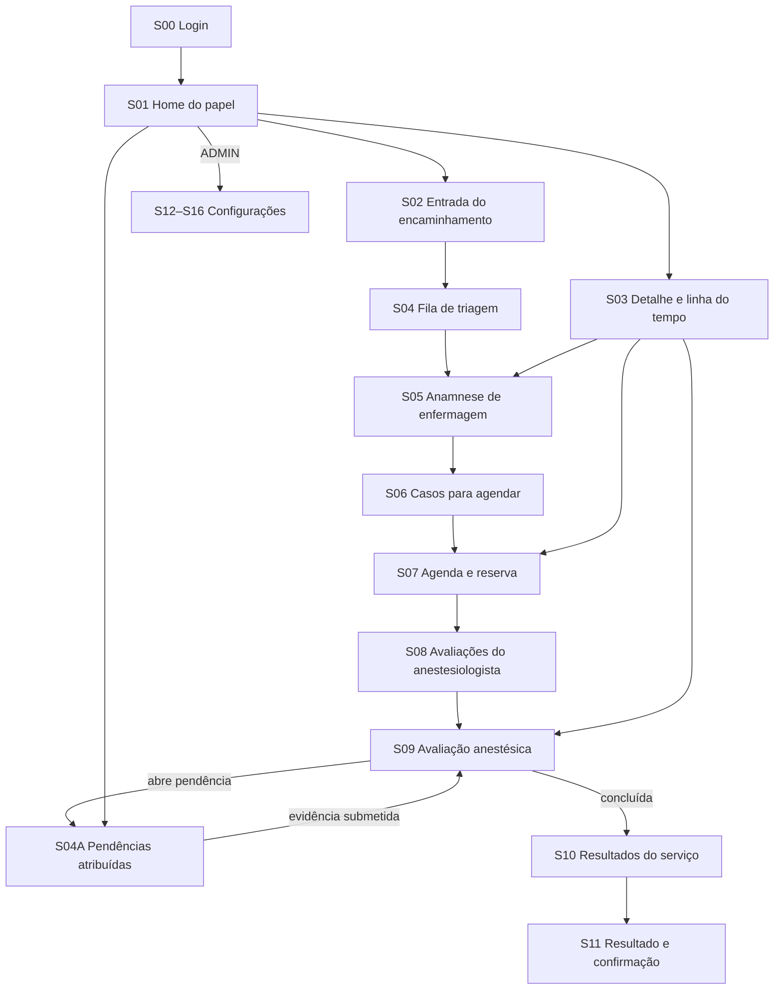
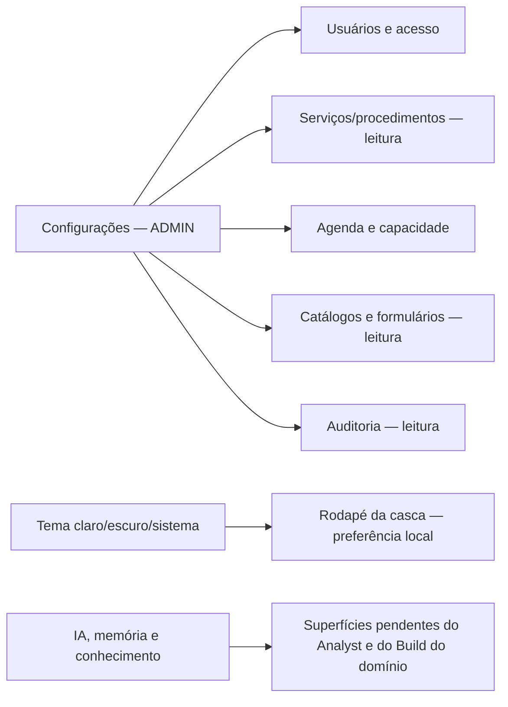
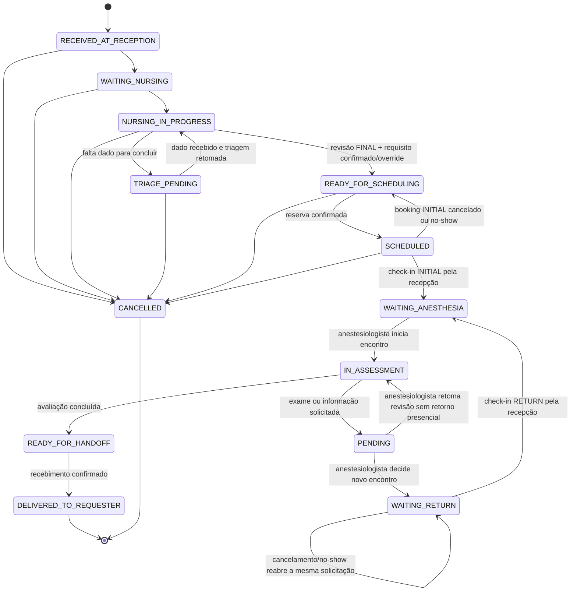

# Analyst: Superfícies, navegação, componentes e configurações

## State

- Source: `hack/PRD.md`, decisão de Marco sobre acesso local e recon do renderer atual.
- Route: `analyst_prd`.
- Phase budget: `forensic`.
- Confidence: `low` enquanto IA/memória e os demais domínios não forem reconciliados.
- Created: `2026-08-14`.
- Review state: `INVALIDATED_BY_CHANGE`.
- Content verdict: `EM REVISÃO`; o catálogo de superfícies está incompleto.
- Governance state: `BLOQUEADO`.
- Build correspondente: `hack/domains/BUILD-superficies-e-configuracoes.md`.

## TL;DR

O produto não cabe nas três rotas herdadas. O MVP exige uma casca autenticada e superfícies explícitas para entrada do encaminhamento, fila de triagem, anamnese, casos prontos para agendar, agenda, avaliação anestésica, pendências/retornos, entrega do resultado e administração. Cada papel recebe uma home e uma navegação próprias; o detalhe do caso é compartilhado, mas compõe seções e ações conforme autorização.

`Configurações` permanece e o catálogo futuro precisa incorporar o uso assistivo de IA,
transcrição e memória aprovado no novo Analyst. O catálogo S00–S16 e seus viewports são
`DEMO_DECISION`; não constituem Surface Blueprints. Esses blueprints só nascem durante o
fechamento do Build, em `hack/surfaces/`.

## Phase 0 Grill

| Signal | Verdict | Notes |
|---|---|---|
| Action clear | `PASS` | Enumerar toda superfície necessária para executar o fluxo do login ao handoff. |
| Persona clear | `PASS` | Cinco papéis autenticados; paciente não usa o app. |
| Input/output clear | `PASS` | Cada tela recebe um estado/DTO e produz uma ação/estado seguinte definido. |
| Scope clear | `PASS` | Desktop Electron para demo; sem portal do paciente, cirurgia ou integração hospitalar. |
| Objective criteria clear | `PASS` | Os cinco papéis completam o cenário ponta a ponta sem rota órfã nem ação de outro papel. |

## Source And Scope

### In scope

- login, logout e casca por papel;
- home operacional por papel;
- listas de trabalho e filtros mínimos;
- entrada do encaminhamento;
- visão compartilhada e role-aware do caso;
- anamnese de enfermagem;
- resumo operacional para recepção;
- procura e confirmação de vaga;
- agenda semanal e alternativa em lista;
- avaliação anestésica, pendência, retorno e conclusão;
- caixa de resultados do solicitante e confirmação de recebimento;
- configurações administrativas;
- inventários versionados de serviços/procedimentos e configuração da capacidade da demo;
- componentes, estados vazios/erro/loading/conflito, responsividade e acessibilidade;
- incorporação futura de IA/memória somente pelos contratos assistivos do domínio canônico.

### Out of scope

- triagem geral do SUS, fila física do dia e classificação de emergência;
- portal/totem do paciente;
- marcação da cirurgia e mapa cirúrgico;
- prontuário completo e evolução longitudinal;
- chat genérico sem vínculo com a entrevista ou com um caso;
- gravação invisível, transcrição sem consentimento ou autopreenchimento sem confirmação;
- editor administrativo de widgets, regras clínicas ou parecer;
- integração com e-mail, WhatsApp, agenda externa ou API do HC;
- backup, restore ou reset como função do produto; limpeza de dados existe apenas no harness de teste;
- viewport de celular como alvo de entrega.

### Assumptions fixed for the MVP

- O alvo primário é Electron em `1280 × 720`; `1024 × 640` deve permanecer funcional.
- O sistema usa dados sintéticos e um único estabelecimento fixture.
- Paciente é identidade embutida no caso, não um cadastro pesquisável ou deduplicado.
- Nome repetido não é conflito; o caso é identificado pelo seu código/ID.
- Usuários são cadastro de acesso editável. Serviços e procedimentos são fixtures versionadas selecionáveis; o profissional solicitante é capturado como snapshot no encaminhamento, não como cadastro. Catálogos clínicos, templates e regras também são assets versionados no MVP.
- A agenda usa `WeeklyAgendaGrid` próprio e lista acessível sobre slots prontos; nenhuma
  biblioteca ou engine de calendário é necessária, e a UI nunca é fonte da capacidade.

## Product Promise

Ao entrar, cada profissional vê imediatamente o trabalho que lhe cabe e consegue levar um caso ao próximo responsável sem reconstruir contexto em outro sistema. A recepção cria o caso, agenda e registra check-in sem ler anamnese; a enfermagem encontra os casos aguardando triagem, submete a revisão final, confirma ou sobrescreve a necessidade calculada e só então a publica; o anestesiologista recebe o caso completo, abre pendências, revisa evidências, decide impacto e retorno ou conclui, mas nunca escolhe a vaga. Somente uma decisão clínica explícita cria a solicitação de retorno; o serviço solicitante recebe a versão autorizada do resultado. O administrador prepara contas e capacidade datada da demonstração e confere as versões dos serviços/procedimentos sem tocar no banco ou em código.

## Story de Usuario

- Como recepcionista, quero uma caixa de entrada e um formulário curto de encaminhamento, para criar o caso e enviá-lo à enfermagem.
- Como enfermeiro, quero uma lista de triagens e um editor que marque completude, para produzir a necessidade operacional sem deixar silêncio parecer resposta negativa.
- Como recepcionista, quero ver apenas vagas compatíveis e confirmar uma delas, para não interpretar dados clínicos.
- Como anestesiologista, quero uma agenda/lista do dia e o detalhe clínico preservado, para concluir, abrir pendência ou solicitar retorno sem assumir o agendamento da recepção.
- Como solicitante, quero uma caixa de resultados do meu serviço, para confirmar recebimento e continuar o planejamento.
- Como administrador, quero preparar acessos, recursos e disponibilidade da demo e conferir a integridade dos cadastros versionados, para não editar o banco manualmente nem alterar regra clínica pela interface.

## Story Tecnica

Como renderer, preciso derivar rota, navegação, componente e ação da sessão/capability; consumir DTOs mínimos por superfície; representar loading, vazio, erro, ausência de vaga, conflito, pendência e conclusão; manter formulários com dirty state e confirmação de saída; e nunca montar ou buscar uma superfície proibida. Como main, preciso fornecer projeções adequadas ao papel e tratar configurações clínicas versionadas como leitura, não como JSON livre editável.

## Current Terrain

1. O router ativo contém somente `/`, `/ia` e `/configuracoes` (`src/renderer/src/App.tsx:13`, `49-56`).
2. A casca injeta um painel de IA em todas as rotas exceto `/ia` (`src/renderer/src/App.tsx:32-45`).
3. A sidebar expõe três itens globais e um seletor de tema acessível (`src/renderer/src/componentes/AppSidebar.tsx:28-38`, `40-83`, `110-141`).
4. O Dashboard afirma ser um esqueleto neutro e não contém papéis, widgets ou agenda (`src/renderer/src/paginas/Dashboard.tsx:13-17`, `38-48`).
5. A página chamada Configurações gerencia somente provider cloud, token, modelo, teste e save (`src/renderer/src/paginas/ConfiguracoesPagina.tsx:40-47`, `83-125`, `128-225`).
6. A própria página avisa que mensagens do assistente saem do computador (`src/renderer/src/paginas/ConfiguracoesPagina.tsx:205-209`); ela não prova consentimento, minimização ou fallback e não pode ser adotada como contrato clínico.
7. O chat herdado possui página, histórico, criação/cópia e painel lateral (`src/renderer/src/paginas/IaPagina.tsx:13-47`, `81-130`; `src/renderer/src/componentes/IaChatPanel.tsx:8-43`).
8. A casca e o tema têm testes reais, mas esses testes congelam as três rotas herdadas e precisarão ser substituídos (`tests/renderer/app-sidebar.spec.tsx:59-105`; `tests/e2e/app-flow.spec.ts:4-30`).
9. O repositório já tem shadcn/Radix para botões, cards, dialogs, tabelas, tabs, forms, sheets, skeletons e alerts (`src/renderer/src/components/ui/`).
10. O Composer existente aceita conteúdo, catálogos, widget types e disabled state (`src/renderer/src/anamnese/Composer.tsx:35-41`, `59-65`).
11. O registro visual mapeia os oito widgets para componentes (`src/renderer/src/anamnese/registry.ts:30-63`), mas o catálogo específico continua deliberadamente vazio (`src/shared/extensions/catalogo-widgets.ts:1-20`).
12. `useApiData` oferece loading/error/reload simples, mas não possui mutation state, cache, cancelamento ou conflito (`src/renderer/src/hooks/useApiData.ts:3-27`).

## Evidence Matrix

| Path | Lines | Fact | Confidence |
|---|---:|---|---|
| `hack/PRD.md` | 56-73 | Fluxo exige recepção, enfermagem, agenda, anestesiologista e handoff. | high |
| `hack/PRD.md` | 83-97 | Usuários diretos e administrador estão definidos; paciente não entra no app. | high |
| `hack/PRD.md` | 252-264 | Cada papel precisa de superfície e estados explícitos; login/admin são obrigatórios. | high |
| `src/renderer/src/App.tsx` | 13, 49-56 | Só existem três rotas ativas. | high |
| `src/renderer/src/App.tsx` | 32-45 | IA lateral é global na casca atual. | high |
| `src/renderer/src/componentes/AppSidebar.tsx` | 28-38 | Navegação atual não cobre o fluxo clínico e tema já tem três modos. | high |
| `src/renderer/src/paginas/Dashboard.tsx` | 13-17, 38-48 | Home atual é placeholder assumido. | high |
| `src/renderer/src/paginas/ConfiguracoesPagina.tsx` | 128-225 | Configurações atuais são apenas IA cloud. | high |
| `src/renderer/src/paginas/ConfiguracoesPagina.tsx` | 205-209 | Uso do assistente transmite mensagens para a nuvem. | high |
| `src/renderer/src/anamnese/Composer.tsx` | 35-41, 95-143 | Composer pode ser reutilizado em tela de triagem. | high |
| `src/renderer/src/anamnese/registry.ts` | 30-63 | Há UI para oito widgets. | high |
| `src/shared/extensions/catalogo-widgets.ts` | 1-20 | Seleção específica não está definida no código. | high |
| `tests/e2e/app-flow.spec.ts` | 4-30 | Prova atual espera exatamente as três rotas herdadas. | high |

## Implementation Map

| Area | Path | Role | Decision |
|---|---|---|---|
| Context / entry | `src/renderer/src/main.tsx` | Providers globais. | Inserir AuthProvider; preservar ThemeProvider/Tooltip/Toaster. |
| Routes | `src/renderer/src/App.tsx` | Router/casca. | Substituir lista de três rotas pelo mapa canônico deste Analyst. |
| Auth contracts | `hack/domains/ANALYST-acesso-e-auditoria.md` | autoridade, capability, escopo, revogação e redaction; DTO físico aguarda Build assinado |
| Agenda contracts | `hack/domains/ANALYST-classificacao-e-agenda.md` | requisito, booking, slots e capacidade sem inventar DTO físico |
| Assessment contracts | `hack/domains/ANALYST-avaliacao-pendencias-e-handoff.md` | encontro, pendência, documento, retorno, resultado e entrega sem depender de Build não assinado |
| Backend projections | `src/main/tipc.ts` | Dados para telas. | Compor routers de casos, agenda, avaliação, configuração; DTO mínimo por papel. |
| Local fetch state | `src/renderer/src/hooks/useApiData.ts` | Loading/error simples. | Reusar só em reads simples; criar `useMutationState` e resource hooks de domínio. |
| Shell | `src/renderer/src/componentes/AppSidebar.tsx` | Menu e tema. | Derivar menu das capabilities específicas da sessão; manter tema; não publicar o chat genérico como superfície clínica. |
| Header | `src/renderer/src/componentes/PageHeader.tsx` | Breadcrumb/actions. | Reusar sem toggle IA; adicionar identificação do caso quando aplicável. |
| UI primitives | `src/renderer/src/components/ui/*` | shadcn/Radix. | Reusar; não criar segundo design system. |
| Anamnese | `src/renderer/src/anamnese/*` | Composer e oito editors. | Reusar dentro da triagem após contratos de widgets. |
| Home | `src/renderer/src/paginas/Dashboard.tsx` | Placeholder. | Substituir por `RoleHomePage`. |
| IA | `src/renderer/src/paginas/IaPagina.tsx`, `IaChatPanel.tsx` | Chat cloud herdado. | Não reutilizar como solução clínica; as superfícies assistivas serão compostas depois que o Analyst de IA fechar. |
| Config atual | `src/renderer/src/paginas/ConfiguracoesPagina.tsx` | Token/modelo IA. | Não é contrato canônico; sua permanência ou substituição depende do Build de IA e da política de rede aprovada. |
| Tests | `tests/renderer/*`, `tests/e2e/app-flow.spec.ts` | Congelam casca atual. | Reescrever para mapa por papel e jornada ponta a ponta. |

## Entities And State

### ENTITY: SurfaceDefinition

- Attributes: `id`, `path`, `label`, `routeAccess`, `navAccess`, `navGroup`, `breadcrumb`, `featureState`; cada regra usa `allOf` e/ou `anyOf` de `Capability`.
- Actions: resolver rota, menu e fallback.
- Relations: o renderer avalia `SessaoPublica.capabilities`; `routeAccess` protege montagem e `navAccess` controla apenas o menu. A página consome um ou mais view DTOs já guardados/redigidos no main.
- Source of truth: `src/renderer/src/navigation/surfaces.ts` tipado.
- Runtime states: `ACTIVE`, `DORMANT`, `REMOVED`.
- Invalid states to prevent: rota ativa sem menu/entrada deliberada; item de menu sem rota; capability só no JSX; chat herdado tratado como superfície clínica sem contrato do domínio de IA.

### ENTITY: ViewState

- Attributes: `loading`, `data`, `error`, `emptyReason`, `isDirty`, `isSubmitting`, `conflict`.
- Actions: load, retry, edit, validate, submit, discard/reload.
- Relations: pertence a uma superfície e a uma versão de DTO.
- Source of truth: hook do domínio; dados persistidos continuam no main/PGlite.
- Runtime states: `LOADING`, `READY`, `EMPTY`, `FILTER_EMPTY`, `VALIDATION_ERROR`, `SUBMITTING`, `ERROR`, `FORBIDDEN`, `VERSION_CONFLICT`.
- Invalid states to prevent: spinner infinito; formulário editável antes de load; mensagem vazia genérica para contextos diferentes; write duplicado por double-click.

### ENTITY: ConfiguracaoOperacional

- Attributes: recursos, janelas datadas e bloqueios de capacidade da demo.
- Actions: listar, ativar/desativar recurso, criar/substituir/retirar janela datada e criar/cancelar bloqueio com versão.
- Relations: materializa slots da agenda; não modifica classes/durações versionadas.
- Source of truth: tabelas `scheduling_resources`, `scheduling_availability_windows` e `scheduling_blocks` do Build de classificação/agenda.
- Runtime states: `ACTIVE`, `RETIRED` ou bloqueio vigente/expirado conforme o contrato de agenda.
- Invalid states to prevent: recurso retirado gerando slot novo; janela inválida/sobreposta; classe/duração alterada pela UI; hard delete de dado já usado.

### ENTITY: ConfiguracaoVersionada

- Attributes: `tipo`, `versao`, `hash`, `quantidade`, `publicada_em`, `status`.
- Actions: consultar no MVP; substituir somente por asset versionado em futura build.
- Relations: catálogos CID/medicamentos/MET e templates/widgets publicados.
- Source of truth: arquivos versionados + seed state local.
- Runtime states: `CARREGADO`, `DIVERGENTE`, `AUSENTE`.
- Invalid states to prevent: editor JSON na interface; alteração clínica sem versão; app operando silenciosamente com asset divergente.

## Runtime / Data Flow

### Jornada de superfícies

### Configurações

### Estados do caso que dirigem as superfícies

As páginas não criam estados paralelos. `loading`, `dirty`, `submitting` e
`version conflict` são estados de interface; o lifecycle acima é estado persistido do
caso. Cancelamento administrativo existe somente até `SCHEDULED`, conforme a matriz do
Analyst de caso; depois do check-in, anulação, presença sem início e impossibilidade de
iniciar possuem recuperação explícita sem inventar resultado clínico.

## Canonical Surface Catalog

### S00 — Login (`/login`)

- Actor: qualquer usuário direto sem sessão.
- Input: e-mail e senha.
- Output: sessão e redirecionamento à home do papel.
- Components: marca Antessala, `LoginForm`, password reveal, submit, error alert.
- States: idle, submitting, generic credential failure and local database error. Conta
  ausente, senha errada e conta inativa usam a mesma mensagem pública; somente auditoria e
  administração distinguem o motivo.
- Forbidden: cadastro, confirmação, recuperação, social login e seleção manual de papel.

### S01 — Home do papel (`/`)

- Actor: todos autenticados.
- Input: `HomeSummaryDTO` já filtrado pelo papel.
- Output: navegação para o próximo conjunto de trabalho.
- Reception: `Novas entradas`, `Aguardando triagem`, `Prontos para agendar`, `Consultas hoje`.
- Nursing: `Aguardando triagem`, `Em rascunho`, `Com pendência de dado`, `Necessidade calculada aguardando decisão`.
- Anesthesiologist: `Hoje`, `Aguardando avaliação`, `Com pendência`, `Retornos`.
- Requester: somente `Pendências atribuídas` e `Resultados novos` do serviço; não existe
  acompanhamento geral do caso antes do resultado.
- Admin: atalhos para usuários, cadastros, capacidade, catálogos e auditoria; nenhuma métrica clínica.
- States: loading skeleton, zero work with role-specific message, error with retry.

### S02 — Entrada do encaminhamento (`/casos/novo`)

- Actor: `RECEPCAO`.
- Input fields: pessoa (`fullName`, data de nascimento **ou** idade, `sexReported`,
  identificador de origem opcional), encaminhamento (`sourceReference` opcional, datas,
  texto e rótulo documental), procedimento e serviço solicitante escolhidos das fixtures,
  mais médico/especialidade/contato. `referralId`, `caseId`, `displayCode`, label e revisão do
  serviço são carimbados pelo main, não digitados.
- Output: caso criado em `WAITING_NURSING` e protocolo visível/imprimível; `RECEIVED_AT_RECEPTION` permanece registrado como evento imediatamente anterior.
- Components: `CaseIntakeForm`, selects de cadastro, resumo antes de confirmar.
- States: pristine, dirty, validation error, submitting, created, possible source-reference
  reentry, catalog unavailable.
- Rule: nome, idade e identificador da pessoa nunca acionam deduplicação. Somente a mesma
  `sourceReference` não vazia dentro do mesmo serviço gera alerta não bloqueante. A
  recepção escolhe abrir o caso existente ou confirma que é novo encaminhamento; a segunda
  escolha sempre cria outro caso e registra o motivo.

### S03 — Detalhe do caso (`/casos/:casoId`)

- Actor: `RECEPCAO`, `ENFERMAGEM` ou `ANESTESIOLOGISTA` conforme responsabilidade.
  `SOLICITANTE` não abre detalhe geral; usa apenas Pendências e Resultado.
- Header: protocolo, paciente embutido, procedimento, serviço, estado, responsáveis atuais e
  próximos derivados do lifecycle.
- Sections: `Resumo`, `Linha do tempo`, e atalhos autorizados para Triagem/Agendamento/Avaliação/Resultado.
- Reception projection omite conteúdo clínico; admin e solicitante não acessam esta rota.
- Actions conforme capability e estado, nunca conforme botão visível. Correção concorrente
  ao submit tem vencedor único. Antes da publicação, erro descoberto depois de `FINAL`
  invalida revisão/proposta com motivo, abre novo draft e devolve o trabalho à enfermagem;
  artefatos inválidos permanecem históricos e nunca alimentam agenda. Cancelamento do caso,
  cancelamento da reserva e anulação de check-in são ações distintas.
- States: loading, not found, forbidden, stale/reload, case closed.
- Timeline is domain journey, not security audit.

### S04 — Fila de triagem (`/triagens`)

- Actor: `ENFERMAGEM`.
- Rows: protocolo, paciente, procedimento, serviço, chegada, completude e status, incluindo
  `PROPOSAL_AWAITING_DECISION` enquanto o caso ainda está `NURSING_IN_PROGRESS` após o
  submit final.
- Filters: busca por protocolo/nome, procedimento, serviço, estado; default “aguardando”.
- Actions: em `WAITING_NURSING`, aceitar primeiro com `handoffs.acknowledge` e, somente após
  a resposta atualizar o caso para `NURSING_IN_PROGRESS`, executar
  `clinicalAnamnesis.start`; em rascunho, continuar triagem. Nenhuma ordenação clínica
  automática é inventada na UI.
- States: loading, no pending cases, no filter results, error.

### S04A — Pendências atribuídas (`/pendencias`)

- Actor: `RECEPCAO`, `ENFERMAGEM`, `ANESTESIOLOGISTA` ou `SOLICITANTE`; a rota pode abrir
  vazia, mas só lista itens em que a sessão é owner. `ADMIN` não acessa.
- Query: `pendencies.listAssigned` retorna a projeção canônica `AssignedPendencyDTO` somente para
  itens `OPEN` cujo `ownerRole` coincide
  com a sessão; para `SOLICITANTE`, também exige `targetServiceId` igual ao serviço da sessão.
- Rows: protocolo, pessoa embutida, procedimento, tipo, pedido autorizado, responsável,
  prazo, atraso derivado e ação. Conteúdo do encontro e anamnese não acompanham a lista.
- Actions: abrir detalhe redigido, registrar metadados/hash de `CaseDocument` e cumprir pela
  união discriminada do kind. Arquivo local pode ser escolhido apenas para calcular SHA-256;
  bytes e path não são enviados nem persistidos.
- Commands: `documents.registerMetadata` e `pendencies.fulfill`, ambos sob
  `pendency:evidence:register`, ownership, escopo, versão e mesmo `caseId/pendencyId`.
- States: loading, sem itens atribuídos, filtro vazio, documento calculando hash, form
  inválido, saving, fulfilled, version conflict, forbidden e erro recuperável.

### S05 — Anamnese de enfermagem (`/casos/:casoId/triagem`)

- Actor: `ENFERMAGEM`; read-only para anestesiologista após submissão.
- Structure: case context, completion summary, Composer de widgets, source/provenance, validation list, ação de submissão final e, depois do cálculo, decisão explícita de confirmar ou sobrescrever com justificativa.
- Output em duas etapas: `clinicalAnamnesis.submitFinal` grava a revisão final efetiva e o
  resultado `PROPOSED`, `HUMAN_DEFINITION_REQUIRED` ou `OUT_OF_DEMO_RANGE`; somente
  `confirm` ou `override` de proposta válida publica a necessidade e move o caso para
  `READY_FOR_SCHEDULING`.
- `TRIAGE_PENDING` significa exclusivamente incompletude registrada por `clinicalAnamnesis.markPending` com paths ausentes e motivo; `resume` volta ao draft `NURSING_IN_PROGRESS`. Submit final nunca produz `TRIAGE_PENDING`.
- Correção aplica a matriz de impacto à revisão conjunta do contexto. Em `DRAFT`, exige
  revisão dos consumidores `STALE`. Depois de `FINAL` e antes da publicação, invalida a
  revisão/proposta anterior e abre novo draft; não edita a final anterior.
- States: loading, draft clean, draft dirty, autosave/saving, incomplete, ready, submit confirmation, proposing atomically, proposal awaiting decision, confirming/overriding, published/read-only, version conflict, save error.
- Não existe prévia de classificação mutável. Antes da submissão há apenas validação/completude; depois dela a tela renderiza o requirement canônico calculado e exige uma decisão auditável.
- A saída clínica e os campos exatos pertencem ao Analyst de widgets/classificação; esta superfície não adiciona campo por conta própria.

### S06 — Casos para agendar (`/agendamentos`)

- Actor: `RECEPCAO`.
- Rows: união discriminada de need `INITIAL` — casos `READY_FOR_SCHEDULING` — e need
  `RETURN` — `ReturnRequest READY_FOR_BOOKING`; cada linha mostra protocolo, pessoa,
  procedimento, categoria operacional, duração requerida, prazo operacional e status de vaga.
- Deliberately omitted: comorbidades, medicamentos, respostas e explicação clínica detalhada.
- Actions: procurar vaga, abrir detalhe operacional.
- States: loading, empty, filter empty, “sem vaga compatível”, error.

### S07 — Agenda e reserva (`/agenda`, `/casos/:casoId/agendamento`)

- Actor: somente `RECEPCAO`. O anestesiologista vê a fila compartilhada de capacidade em
  S08, sem montar a rota operacional de agenda.
- Views: semana visual e lista acessível dos slots compatíveis.
- Input: categoria/duração/prazo do caso; range de datas.
- Output: `BookingDTO` discriminado ou conflito recuperável.
- Components: `ScheduleToolbar`, `WeeklyAgendaGrid`, `AccessibleSlotTable`, `BookingDrawer`.
- States: loading, available, no compatible slot, slot selected, confirming, `CONFIRMED`, `CHECKED_IN`, `CANCELLED`, `COMPLETED`, `NO_SHOW`, concurrent conflict/reload.
- Confirmar, reagendar, cancelar e no-show exigem `scheduling:booking:manage`; check-in é command explícito da `RECEPCAO` sob `scheduling:booking:check-in` e só habilita entre `slot.startsAt - 30 minutos` e `slot.consultationEndsAt`. `COMPLETED` é publicado atomicamente quando o anestesiologista inicia o encounter após o check-in, não por ação desta tela; a occupancy permanece até `slot.endsAt`.
- Antes do encontro, a tela permite anular check-in equivocado com motivo. Presença sem
  início ou impossibilidade registrada devolve INITIAL ao agendamento e reabre RETURN; a
  UI nunca comprime isso em no-show ou resultado clínico.
- Rule: só slots retornados pelo backend como compatíveis podem ser selecionados; UI não calcula capacidade.

### S08 — Avaliações do anestesiologista (`/avaliacoes`)

- Actor: `ANESTESIOLOGISTA`.
- Groups: hoje, próximas, pendentes e retornos do pool. Não existe relação entre a conta e o
  recurso `ANESTHESIA_PROFESSIONAL`; qualquer anestesiologista autorizado inicia um booking
  checked-in, e o encontro registra o ator real.
- Rows: horário, protocolo, paciente, procedimento, categoria/duração, pendência.
- Actions: abrir avaliação; não reagendar.
- States: loading, no cases today, filter empty, error.

### S09 — Avaliação anestésica (`/casos/:casoId/avaliacao`)

- Actor: `ANESTESIOLOGISTA`.
- Read: referral, submitted nursing snapshot, classification provenance, timeline and pending items under `assessment:read`; prior result content, when shown, separately requires `result:content:read`.
- Write: avaliação médica, decisão, pendências, evidências revisadas, impacto explícito,
  necessidade de novo encontro e resultado/handoff versionado.
- Outcomes: save draft, `PENDING`, `WAITING_RETURN` ou `READY_FOR_HANDOFF`.
- States: loading, draft, dirty, incomplete, submitting, pending, return, completed/read-only, version conflict, error.
- Rule: nunca sobrescreve o snapshot FINAL da enfermagem. Informação nova vive no encontro
  ou na evidência da pendência, sempre com autoria. Evidência submetida aguarda revisão; o
  anestesiologista decide suficiência, impacto e necessidade de retorno depois de revisar.
  Somente a `RECEPCAO`, em S06/S07, consulta retornos decididos e confirma a reserva
  `RETURN`. Correção da anamnese final exige revisão sucessora, não adendo médico no
  snapshot de enfermagem.

### S10 — Resultados do serviço (`/resultados`)

- Actor/projeção: `RECEPCAO` com `result:status:read` vê somente status operacional; `ANESTESIOLOGISTA` com `result:content:read` vê conteúdo clínico; `SOLICITANTE` vê conteúdo/entrega somente do `serviceId` da sessão.
- Rows: identificador opaco no escopo, pessoa mínima, procedimento, status atual,
  indicador de novo resultado e data de conclusão; sem sequência ou total global.
- Groups: em avaliação, pendência que requires requester, resultado disponível, recebido.
- Output: navigate to authorized result.
- States: loading, no cases, no new results, filter empty, error.

### S11 — Resultado e handoff (`/casos/:casoId/resultado`)

- Actor: `SOLICITANTE` for matching service; anesthesiologist can review; reception only sees operational status.
- Content: versão corrente autorizada, relação com versões anteriores, pendências/limitações
  pertinentes, autoria, horários e recibo de handoff.
- Actions: recepção abre status com `result:status:read`, registra o envio da entrega com
  `delivery:manage` sem receber bytes, preview, path ou documento legível;
  anestesiologista lê conteúdo e exporta com permissões próprias; solicitante lê e pode
  exportar conteúdo do próprio serviço e confirma recebimento separadamente.
- States: loading, pending/not final, available, confirming, received, and forbidden. Authorized
  exporter additionally has PDF generating/error states.
- Rule: handoff distingue disponibilidade local, tentativa real de envio, falha,
  acknowledgement de versão específica e supersessão. Operação local não finge envio
  externo. Autoria, horário e hash aparecem como proveniência local, nunca assinatura
  digital. Nova versão corrigida exige novo handoff. A confirmação não agenda cirurgia.

### S12 — Usuários e acesso (`/configuracoes/usuarios`)

- Actor: `ADMIN`.
- Content/actions: list, search and create; edit role/scope/status and reset password somente
  para `origin=ADMIN`. Linhas `origin=FIXTURE` mostram badge “Conta da demo”, sem controles
  de mutação.
- Contract: `ANALYST-acesso-e-auditoria.md`.

### S13 — Inventário operacional da demo (`/configuracoes/operacao`)

- Actor: `ADMIN`.
- Read-only fixtures:
  - Serviços: ID, nome, especialidade, source e revision.
  - Procedimentos: ID/código, nome, question set/version, source e revision.
- O profissional solicitante é digitado/copiado para `RequesterSnapshot`; não existe tabela ou CRUD de profissionais no MVP.
- Actions: nenhuma mutação. Reload repete a leitura; não repara seed, não publica e não altera
  serviço ou procedimento.
- Consumers: intake options, requester service scope e procedure-specific question set.
- States: loading, loaded, missing fixture, revision/hash divergent e seed error.

### S14 — Agenda e capacidade (`/configuracoes/agenda`)

- Actor: `ADMIN`.
- Read-only templates: `QUICK = 20 + 5`, `STANDARD = 35 + 5`, `EXTENDED = 50 + 10` minutos.
- Writable capacity: recursos, janelas datadas e bloqueios; relatório/preview derivado da materialização idempotente.
- Class keys, labels, durations, buffers, deadline rules and classification rules are versioned demo fixtures and cannot be edited here.
- States: loading, fixture defaults, dirty, invalid overlap, saving, conflict, preview empty.
- Weekly slot preview is derived; persisted resources/dated windows/blocks are the source of truth. DTOs, validações e actions de capacidade pertencem ao Build de agenda; esta superfície apenas apresenta seus formulários e resultados.

### S15 — Catálogos e formulários (`/configuracoes/catalogos`)

- Actor: `ADMIN`.
- Read-only cards: CID-10, medicamentos/classes, MET, comorbidades, groups; each displays version/hash/count/load status.
- Read-only cards: active widget registry, published triage template and procedure links.
- Actions: somente recarregar a leitura. Não repara/resemeia dados e não oferece JSON editor,
  upload ou publicação clínica no MVP.
- States: loaded, missing, hash divergence, seed error.

### S16 — Auditoria (`/configuracoes/auditoria`)

- Actor: `ADMIN`.
- Content: sanitized security/operation events; filters and cursor pagination.
- Contract: `ANALYST-acesso-e-auditoria.md`.
- No edit/delete/export in MVP.

### Global surfaces

- `403`: session exists but capability/scope is absent; no protected content mounts.
- `404`: route/object not found without leaking whether an unauthorized case exists.
- Fatal boundary: local recovery message, restart action and correlation ID; no raw stack in UI.
- Logout confirmation appears only if current form is dirty; otherwise immediate.

## Navigation By Capability

Os exemplos abaixo são o efeito de `routeAccess/navAccess` sobre
`SessaoPublica.capabilities`, não uma segunda matriz de autorização por enum de papel.
`allOf` exige todas as capabilities; `anyOf`, ao menos uma. Cada item aparece somente quando
`navAccess` passa; `routeAccess` é reavaliado antes da montagem e o main reaplica capability
e escopo em toda leitura e mutação.

| Conta fixture | Primary navigation resultante |
|---|---|
| `RECEPCAO` | Início · Nova entrada · Pendências · Para agendar · Agenda · Resultados (status/handoff) |
| `ENFERMAGEM` | Início · Triagens · Pendências |
| `ANESTESIOLOGISTA` | Início · Avaliações · Pendências · Resultados |
| `SOLICITANTE` | Início · Pendências · Resultados |
| `ADMIN` | Início · Configurações |

Case detail is reached from worklists and need not become a permanent menu item.

## Configuration Decisions

| Domain | Editable in MVP? | Why / source |
|---|---:|---|
| Users, roles, status, password reset | only `origin=ADMIN`; fixtures read-only | Required to prepare extra demo accounts without drifting the five boot fixtures. |
| Services and procedures | no, read-only fixtures | Required as stable synthetic snapshots; changing them needs seed/version review. |
| Requester professionals | no master cadastro | Name/specialty/contact are captured in the referral snapshot. |
| Slot classes/durations/buffers | no, read-only fixtures | `QUICK 20+5`, `STANDARD 35+5`, `EXTENDED 50+10` são `DEMO_DECISION`, ainda sujeitas a pesquisa, adversarial e assinatura. |
| Resources, dated availability windows and blocks | yes | Admin prepares capacity without changing classification semantics or exposing a recurrence editor. |
| CID, medications, MET, comorbidities | no, read-only integrity | Versioned clinical catalogs must not drift through ad-hoc UI. |
| Widget definitions/templates | no, read-only version/link | Clinical form changes require versioned artifact and tests. |
| Classification rules | no | Rule editing is unsafe and outside hack; fixture/version is displayed. |
| Institution/location | no | Single synthetic facility fixture. |
| Theme | local shell selector | Preference of workstation, no business persistence. |
| IA provider/token/model | `UNRESOLVED` | Rede opcional faz parte da prova, mas configuração, segredo e permissões dependem do Analyst/Build de IA. |
| Memory/RAG/import | `UNRESOLVED` | A prova exige recuperação de conhecimento aprovado; a superfície e a allowlist ainda não estão fechadas. |
| Backup/reset/retention | no | Operational tooling outside pitch; reset is test harness only. |

## Rules And Invariants

1. Every active route exists in one typed surface registry with `routeAccess`; every menu entry also has `navAccess`, each expressed with `allOf`/`anyOf`.
2. Sidebar items derive from the same registry; no separate hand-maintained list.
3. Route protection occurs before page mount/data fetch.
4. A hidden item is not authorization; main guards remain mandatory.
5. Every page renders a defined loading, ready, empty/filter-empty, error and forbidden path when applicable.
6. Every mutation disables duplicate submit and reports a stable outcome.
7. Dirty form navigation requires `Salvar e sair`, `Descartar` or `Continuar editando`.
8. `VERSION_CONFLICT` never silently overwrites; reload and compare are offered.
9. Color is secondary: category/status always includes text/icon accessible name.
10. Focus moves to dialog title on open, returns to trigger on close and moves to error summary after invalid submit.
11. All controls have visible label or accessible name; icon-only actions have tooltip and `aria-label`.
12. Tables keep headers; at `1024 × 640`, nonessential columns collapse into row detail instead of horizontal page overflow.
13. Agenda offers a keyboard-operable list view equivalent to the visual week.
14. Target viewports: 1024×640 minimum functional, 1280×720 proof, 1440×900 comfort. Mobile below 768 is not an acceptance target.
15. Theme selector remains `Claro/Escuro/Sistema`; no clinical meaning depends on theme.
16. Chat genérico, Memory legado e painel global não viram produto por reuso automático; somente superfícies assistivas fechadas pelo domínio de IA entram no shell.
17. Patient is not a cadastro. Creating a case embeds a patient snapshot; equal names are allowed.
18. A fixture retired in a new version remains renderable in historical case snapshots but cannot be selected for new cases.
19. Configurations with clinical meaning are versioned/read-only; admin does not edit JSON.
20. Admin settings never expose clinical case content.
21. Reception projections omit anamnese; requester has only assigned pendency and final-result projections for its service; admin projections omit cases.
22. `WeeklyAgendaGrid` and its accessible table display backend-provided `SlotCardDTO[]`; neither derives slot validity.
23. A rota `Configurações` não expõe controles cloud herdados sem contrato aprovado de segredo, rede, permissão e falha segura.
24. Menus são derivados de `SessaoPublica.capabilities` e `navAccess`; `CurrentSession`/`ActorContext` nunca chegam ao renderer, e papel é fixture de concessões, não atalho de autorização.
25. `SOLICITANTE` não possui query geral de casos. Pendência e resultado exigem `serviceId`
    da sessão no main e retornam payload redigido; mudança de serviço revoga leituras e
    replay não devolve projeção antiga.
25a. Logout, revogação, troca de papel/serviço ou mudança do serviço do caso desmontam a
     projeção protegida e limpam store/cache correspondente; resposta em voo revalida o
     escopo antes de aparecer.
25b. Lista, busca, contagem, paginação, vazio, erro e identificador restrito não revelam
     existência ou cardinalidade de outro serviço. Erro inesperado mostra somente código
     opaco e correlação, nunca stack, SQL, path ou mensagem do provedor.
26. S05 não publica na submissão: revisão final efetiva + resultado classificatório são uma
    unidade; apenas `confirm/override` de proposta vigente publica a necessidade.
27. S09 cria pendência com impacto explícito; evidência submetida não é suficiência. Somente
    decisão clínica posterior cria retorno, e somente a recepção agenda, reagenda e registra
    check-in.
28. Os cinco estados de `BookingDTO` — `CONFIRMED`, `CHECKED_IN`, `CANCELLED`, `COMPLETED`, `NO_SHOW` — têm representação explícita e não são comprimidos em booleanos.
29. DTOs/actions de capacidade pertencem ao domínio agenda; configurações só consome e apresenta recursos, janelas datadas, bloqueios e materialização.
30. O produto não expõe backup, restore ou reset. Reset de dados é operação exclusiva do harness de teste.
31. `/agenda` e `/agendamentos` exigem capabilities de operação da recepção; anestesiologista usa `/avaliacoes`.
32. Resultados/handoff usam `anyOf` de status, conteúdo ou entrega para entrada, mas cada leitura e ação exige sua capability exata no main.
33. Correção/cancelamento do caso, check-in, gestão de pendência, registro de evidência, leitura de status/conteúdo, delivery, export e acknowledge nunca compartilham um guard genérico.
34. `correctIntake × submitFinal` tem vencedor único. Se o erro for descoberto depois da
    finalização e antes da publicação, a UI oferece invalidação auditável e nova revisão,
    nunca edição da revisão anterior.
35. Correção de pessoa, encaminhamento, procedimento ou serviço mostra os consumidores
    obsoletos; handoff, anamnese e propostas dependentes exigem revisão explícita.
36. S04 sempre confirma `handoffs.acknowledge` antes de chamar
    `clinicalAnamnesis.start`; visibilidade da linha não substitui a transição.
37. `/pendencias` é a worklist compartilhada por ownership. A query nunca retorna pendência
    de outro papel/serviço, e os commands reaplicam ownership, escopo e versão no main.
38. `CaseDocument` guarda somente metadados e SHA-256; bytes e path local não atravessam o
    command nem são persistidos.
39. S06 une needs `INITIAL` e `RETURN` com discriminante explícito; não converte um em outro.
40. A fila S08 é do pool; recurso de agenda não identifica usuário, e o encounter carimba o
    anestesiologista que iniciou de fato.
41. S11 não possui cancelamento de entrega; `finalizedBy`, `finalizedAt` e `contentHash` são
    proveniência, não assinatura digital.

## Architecture Risks

| Severity | Risk | Evidence | Fix direction |
|---|---|---|---|
| critical | Construir só triagem/fila encerra produto antes do anestesiologista e handoff. | PRD flow `hack/PRD.md:56-73`; current router has no screens (`App.tsx:49-56`). | Implement surface catalog end-to-end before visual polish. |
| critical | Router/sidebar can expose same UI to every role. | `AppSidebar.tsx:28-32`. | Typed surface registry + ProtectedRoute + main guard. |
| high | `Configurações` atuais enviam conteúdo/token cloud sem o contrato de privacidade do novo domínio. | `ConfiguracoesPagina.tsx:205-209`. | Não adotar como está; substituir ou adaptar somente depois do Build de IA. |
| high | Painel global de IA pode receber texto clínico por acidente. | `App.tsx:42`; `IaChatPanel.tsx:8-43`. | Remover o mount global; futuras superfícies precisam ser delimitadas por caso, ator e finalidade. |
| high | Grade semanal criada antes do contrato pode virar fonte de verdade. | No agenda exists in current code. | `SlotCardDTO[]` do backend; grade fina + lista acessível, sem engine. |
| high | Uma tela de caso genérica pode vazar campos entre papéis. | Current app has no role projections. | DTO-specific projections; component sections gated by data/capability. |
| high | Pendência atribuída sem worklist compartilhada fica invisível para recepção, enfermagem ou solicitante. | Quatro papéis podem ser owner pelo contrato de avaliação. | `/pendencias` + query filtrada no main + ownership no command. |
| medium | Existing tests freeze obsolete three-item menu. | `tests/e2e/app-flow.spec.ts:13-30`. | Replace with per-role route and journey tests. |
| medium | `useApiData` lacks mutation/conflict semantics. | `useApiData.ts:3-27`. | Domain resource/mutation hooks with explicit union states. |
| medium | Configuração clínica ad-hoc cria regras sem versão. | Widget registry exists but selection is empty. | Read-only version/hash; publishing outside MVP. |

## Blueprint Handoff

| Path/Area | Action | Reason | Validation |
|---|---|---|---|
| `src/renderer/src/navigation/surfaces.ts` | new registry | One map for paths/nav/capabilities. | registry uniqueness/coverage test. |
| `src/renderer/src/App.tsx` | rebuild route composition | Cobrir o catálogo canônico e retirar o painel global herdado; superfícies assistivas entram por contrato próprio. | per-role router tests. |
| `src/renderer/src/componentes/AppSidebar.tsx` | role-aware nav | Only work of current actor. | accessible role matrix test. |
| `src/renderer/src/paginas/Dashboard.tsx` | role home | Replace placeholder. | five home fixtures. |
| `src/renderer/src/paginas/casos/*` | new | Intake/detail/timeline. | form, DTO redaction, not found/forbidden. |
| `src/renderer/src/paginas/triagens/*` | new | Worklist and anamnese. | widget/completude/dirty/conflict tests. |
| `src/renderer/src/paginas/pendencias/*` | new | Worklist compartilhada por owner e registro de evidência. | role/service scope, metadata-only document and fulfillment tests. |
| `src/renderer/src/paginas/agenda/*` | new | Booking and own weekly-grid/list projection. | no-slot and concurrent conflict. |
| `src/renderer/src/paginas/avaliacoes/*` | new | Medical workflow. | pending/return/complete. |
| `src/renderer/src/paginas/resultados/*` | new | Requester handoff. | service scoping and PDF. |
| `src/renderer/src/paginas/configuracoes/*` | new | Admin users, fixture inventories, capacity, catalog status and audit. | write/read-only boundaries. |
| `src/renderer/src/paginas/ConfiguracoesPagina.tsx` | reavaliar após o Build de IA | Provider, segredo e finalidade de rede ainda não têm contrato aprovado. | nenhum controle cloud herdado sem guard, aviso e fallback. |
| `src/renderer/src/componentes/IaChatPanel.tsx` | não montar globalmente | Não equivale às futuras superfícies assistivas vinculadas ao caso. | scan de mount global + teste de escopo futuro. |
| `tests/renderer/*` | update/new | Component/state matrix. | Vitest. |
| `tests/e2e/app-flow.spec.ts` | replace | Current contract is obsolete. | five-role end-to-end. |

### View DTO boundaries

- `HomeSummaryDTO`: counts/next items already authorized; never raw clinical answers.
- `CaseIntakeOptionsDTO`: active read-only services/procedures and form version; no professional master.
- `CaseOperationalDTO`: identity/referral/category/status + `SchedulingRequirementDTO` e `BookingDTO` importados do Build de agenda.
- `CaseNursingDTO`: identity/referral + editable/submitted anamnese + requirement calculado/publicado canônico; sem cálculo paralelo de renderer.
- `CaseAnesthesiaDTO`: referral + immutable nursing snapshot + os DTOs importados `AnesthesiaEncounterDTO`, `CasePendencyDTO`, `ReturnRequestDTO`, `PreopResultDTO`, `ResultDeliveryDTO` e `AuthorizedResultDTO`.
- `AssignedPendencyDTO`: projeção canônica importada do domínio de avaliação; contém pedido
  autorizado, prazo/atraso e ação discriminada, sem conteúdo do encounter ou anamnese.
- `CaseDocumentDTO`: recibo canônico de metadados, autoria e SHA-256; nunca contém bytes,
  base64, URL ou path local.
- `CaseRequesterDTO`: status do próprio `serviceId`, projeção redigida e resultado/entrega autorizados; nunca recebe coleção global.
- `AgendaWeekDTO`: canonical `SlotCardDTO[]` with opaque `slotId`; UI does not build a reservation from arbitrary timestamps.
- `AdminCatalogStatusDTO`: asset name/version/hash/count/state; no clinical item editor.

## Acceptance Criteria

- [ ] Uma instalação limpa abre `/login`, não a casca clínica.
- [ ] Cada fixture abre uma home e um menu específicos ao papel.
- [ ] Renderer usa somente `SessaoPublica`; testes de `routeAccess/navAccess` cobrem `allOf` parcial/completo e cada alternativa de `anyOf`.
- [ ] O fluxo completo passa por S02 → S05 → S07 → S09 → S11 sem rota improvisada.
- [ ] O detalhe do caso mostra o próximo responsável e apenas seções autorizadas.
- [ ] S03 guarda separadamente correção (`case:intake:correct`), cancelamento (`case:cancel`) e evidência de pendência (`pendency:evidence:register`).
- [ ] Correção e submit concorrentes têm vencedor único; erro descoberto depois da finalização
      e antes da publicação invalida final/proposta anteriores e exige nova revisão.
- [ ] Recepção não vê widgets/respostas clínicas em tela ou payload.
- [ ] Solicitante não possui detalhe/listagem geral; vê somente pendência própria e resultado
      final do serviço atual.
- [ ] Admin não vê casos; vê usuários, operação, agenda, catálogos e auditoria.
- [ ] Usuário `origin=FIXTURE` aparece somente leitura; todos os fluxos administrativos de
      edição/reset/status usam conta `origin=ADMIN`.
- [ ] Entrada permite nomes, conteúdo e referência iguais; referência repetida gera alerta
      e confirmação de novo encaminhamento, nunca bloqueio automático.
- [ ] Triagem diferencia rascunho, incompleto, pronto, submitted, conflito e erro.
- [ ] S04 exige `handoffs.acknowledge` concluído antes de `clinicalAnamnesis.start`.
- [ ] Submit grava revisão final efetiva + resultado classificatório; somente proposta
      vigente confirmada/alterada publica e libera S06.
- [ ] `TRIAGE_PENDING` nasce somente de incompletude com paths/motivo e volta ao draft por `resume`.
- [ ] Correção aplica a matriz de impacto; revisão final inválida permanece histórica e não
      alimenta agenda, enquanto nova revisão é produzida.
- [ ] Agendamento oferece somente slots compatíveis e trata falta de vaga/conflito.
- [ ] S06 mostra em uma única fila discriminada casos `INITIAL READY_FOR_SCHEDULING` e
      retornos `READY_FOR_BOOKING`, sem perder a origem da need.
- [ ] Agenda representa os cinco estados de `BookingDTO`; check-in exige `scheduling:booking:check-in`, separado das demais ações `scheduling:booking:manage`.
- [ ] Check-in equivocado, abandono e impossibilidade de início possuem ações, motivos e
      destinos distintos; nenhum caso fica preso aguardando encontro.
- [ ] Avaliação trata rascunho, pendência, `ReturnRequest` e conclusão; anestesiologista não escolhe vaga de retorno.
- [ ] `/pendencias` mostra a cada papel somente pendências `OPEN` atribuídas; solicitante é
      filtrado também por `serviceId`, e owner incorreto falha mesmo por chamada direta.
- [ ] Documento de evidência persiste somente metadados e SHA-256 do mesmo caso/pendência;
      bytes e path local não entram no payload nem no banco.
- [ ] Handoff pode ser confirmado pelo solicitante; anestesiologista e solicitante do
      serviço correto exportam somente a versão final; recepção nunca recebe PDF legível.
- [ ] S11 permite `deliveries.send` e `deliveries.acknowledge`, não cancelamento; tela e PDF
      chamam autoria/horário/hash de proveniência e declaram ausência de assinatura digital.
- [ ] Resultado de recepção é status-only; delivery selado, conteúdo, export e acknowledge
      têm autorizações independentes.
- [ ] Serviços e procedimentos aparecem com source/revision e sem controles de mutação; profissional solicitante permanece snapshot do encaminhamento.
- [ ] Admin prepara recursos, janelas datadas e bloqueios pelos contratos do domínio agenda; classes/durações/buffers permanecem read-only e a agenda mostra materialização derivada.
- [ ] Catálogos/widgets/regras aparecem com versão e integridade, sem editor clínico.
- [ ] Uso assistivo de IA, memória e transcrição possui superfície, permissão e fallback definidos pelo novo Analyst.
- [ ] Tema claro/escuro/sistema continua acessível no rodapé.
- [ ] Todas as superfícies têm loading, vazio, erro e forbidden pertinentes.
- [ ] Teclado completa login, formulários, dialogs, listas e reserva via list view.
- [ ] 1024×640 não perde ação primária; 1280×720 é a prova visual do pitch.
- [ ] Teste E2E percorre o caso ponta a ponta trocando entre as cinco contas sintéticas.
- [ ] Não existe rota/action de backup, restore ou reset do produto; a limpeza E2E permanece no harness.

## Open Questions

As superfícies de captura, revisão de sugestão e gestão mínima de conhecimento estão
abertas; todas as demais dependem dos contratos de domínio e dos futuros Surface Blueprints.

Futuro, fora do hack:

- operação institucional da IA/transcrição além da prova de conceito;
- portal do paciente e notificações;
- configuração multiunidade e calendário institucional;
- editor versionado de formulários/regras clínicas;
- integração com prontuário, diretório e agenda do HC;
- suporte responsivo real a tablet/celular.

## Grill Verdict

- Verdict: `INVALIDATED_BY_CHANGE`.
- Why: IA, memória, gravação e transcrição passaram a integrar a prova de conceito e ainda não estão compostas nas superfícies.
- Governance constraint: o Build correspondente não pode ser aprovado antes da assinatura deste Analyst.
- Next stage: aguardar os Analysts de domínio, inclusive IA/memória, fecharem campos, regras e permissões; então reconciliar este Analyst. Nenhuma Spec ou Plan nasce agora.

## Recommended Next Phase

Executar primeiro a rodada indicada no tracker. Depois dos Analysts fecharem, este documento
define quais trabalhos precisam de superfície; o Build correspondente e os Surface
Blueprints só nascem no momento previsto pelo workflow.

---

## Contrato de encerramento deste arquivo

- Artefato: `hack/domains/ANALYST-superficies-e-configuracoes.md`.
- Conteúdo MVP: `EM REVISÃO`.
- Próxima fase material: `hack/domains/BUILD-superficies-e-configuracoes.md`.
- Próxima fase autorizada: `NENHUMA SEM ASSINATURA`.
- Estado: `INVALIDATED_BY_CHANGE`.
- Assinatura de Marco: `PENDENTE`.
- Data: `PENDENTE`.
- Revisão Git examinada: `PENDENTE`.
- Declaração: `PENDENTE`.

Declaração exigida: “Aprovo o Analyst de superfícies e configurações e autorizo seu Build correspondente.”

Sem essa assinatura, o artefato não terminou e não autoriza Spec, Plan, teste ou código.
