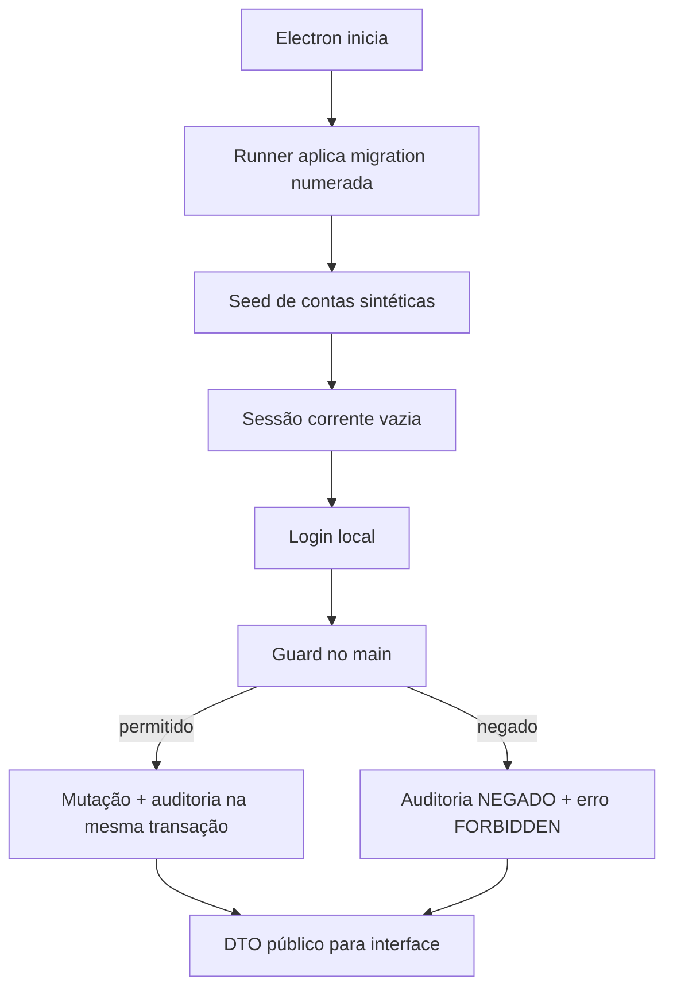

# BUILD — Acesso, papéis e auditoria

## Estado documental

- Papel: `REFERENCE_APPENDIX`.
- Consumido por: `hack/BUILD.md`.
- Gate ou assinatura individual: inexistente.
- Estados antigos de bloqueio foram absorvidos pela reconciliação integrada.
- Em conflito, `hack/BUILD.md` prevalece e este anexo deve ser corrigido.

## Goal

Introduzir uma fronteira de confiança local e pequena: usuários criados pelo admin ou pelo seed, senha com hash, sessão mantida no processo principal, autorização por papel/escopo em todo handler ativo e auditoria append-only. O renderer apenas solicita ações e apresenta capacidades; ele nunca decide quem é o usuário nem valida permissão de forma autoritativa.

## Inputs Consumed

- `hack/PRD.md`: separação de responsabilidades, autoria e fluxo ponta a ponta.
- `hack/domains/ANALYST-acesso-e-auditoria.md`: contrato canônico deste domínio.
- `src/main/db/schema.ts`: bootstrap legado a ser contido pelo runner canônico.
- `src/main/db/seed.ts`: padrão de primeiro boot local.
- `src/main/tipc.ts`: router que precisa de guards.
- `src/preload/index.ts` e `src/renderer/src/servicos/client.ts`: transporte renderer → main.
- `src/renderer/src/App.tsx` e `AppSidebar.tsx`: casca que precisa reagir à sessão.

## Current Terrain

- Não há modelo de usuário/sessão/auditoria no core (`src/main/db/schema.ts:8-25`).
- O preload aceita qualquer nome de canal encaminhado pelo renderer (`src/preload/index.ts:3-16`).
- O router TIPC exporta handlers diretamente, sem contexto ou autorização (`src/main/tipc.ts:373-399`).
- `App.tsx` monta a casca antes de qualquer prova de identidade (`src/renderer/src/App.tsx:15-46`).
- O menu é fixo (`src/renderer/src/componentes/AppSidebar.tsx:28-32`).
- O seed local e idempotente já é o local certo para fixtures (`src/main/db/seed.ts:128-150`).

## Recommended Path

Usar somente recursos já disponíveis no runtime: PGlite, TIPC e `node:crypto`. Não adicionar servidor, Auth.js, Supabase ou serviço de e-mail. O main mantém uma `CurrentSession` em memória e persiste apenas o registro auditável da sessão. Todo handler ativo chama um guard central; toda mutação usa um helper transacional que grava o dado e o evento de auditoria juntos.

O caminho é deliberadamente específico para um protótipo Electron em um único computador. Ele não deve ser divulgado como arquitetura institucional.

## Files / Areas

| Path/Area | Action | Reason | Risk |
|---|---|---|---|
| `src/shared/auth.ts` | new | Enum, DTOs, capabilities e erros compartilhados. | medium |
| `src/main/db/migrations/NNN_access_audit.sql` | deliver migration | Único artefato DDL deste domínio; runner e ledger pertencem à arquitetura. | high |
| `src/main/db/schema.ts` | contain | Não receber este DDL nem criar runner paralelo. | high |
| `src/main/db/seed.ts` | modify | Reconciliar cinco fixtures sem tocar contas `origin=ADMIN`. | high |
| `src/main/auth/password.ts` | new | Hash/verify scrypt isolados e testáveis. | high |
| `src/main/auth/session.ts` | new | Sessão corrente e invalidação. | high |
| `src/main/auth/authorize.ts` | new | Guards de papel e escopo. | critical |
| `src/main/auth/router.ts` | new | Login, sessão atual e logout. | high |
| `src/main/admin/users-router.ts` | new | Administração de usuários. | high |
| `src/main/audit/service.ts` | new | Gravação sanitizada e consulta. | critical |
| `src/main/audit/router.ts` | new | Busca paginada somente admin. | medium |
| `src/main/tipc.ts` | modify | Compor routers e aplicar guards nos handlers ativos. | critical |
| `src/renderer/src/auth/AuthProvider.tsx` | new | Estado de sessão e transições. | high |
| `src/renderer/src/auth/ProtectedRoute.tsx` | new | Rota autenticada e papel permitido. | high |
| `src/renderer/src/paginas/LoginPagina.tsx` | new | Entrada local sem cadastro/recuperação. | medium |
| `src/renderer/src/paginas/configuracoes/UsuariosPagina.tsx` | new | CRUD mínimo do admin. | medium |
| `src/renderer/src/paginas/configuracoes/AuditoriaPagina.tsx` | new | Prova consultável de autoria. | medium |
| `src/renderer/src/App.tsx` | modify | Separar rota pública e casca protegida. | high |
| `src/renderer/src/componentes/AppSidebar.tsx` | modify | Menu por capability, identidade e logout. | medium |
| `tests/main/auth/*` | new | Hash, sessão, guard, escopo e DDL. | low |
| `tests/renderer/auth/*` | new | Login, gates e admin. | low |
| `tests/e2e/access-flow.spec.ts` | new | Cinco contas e tentativas negativas. | medium |

## Contracts

### Product

- Não existe cadastro público.
- Admin cria `nome + e-mail + senha + função` e, para `SOLICITANTE`, escolhe serviço.
- Admin lista usuários, altera nome/função/escopo/status e redefine senha.
- Nenhuma pessoa lê a senha existente.
- Uma conta possui um papel.
- Cada login abre a home daquele papel.
- Logout volta imediatamente para `/login`.
- Fechar o aplicativo encerra a sessão; abrir exige login novo.
- A interface e o main aplicam a mesma matriz RBAC; o main é autoritativo.
- A auditoria mostra autoria e metadados, não duplica conteúdo clínico.

### Shared types

```ts
export const PAPEIS = [
  'ADMIN',
  'RECEPCAO',
  'ENFERMAGEM',
  'ANESTESIOLOGISTA',
  'SOLICITANTE',
] as const

export type Papel = (typeof PAPEIS)[number]
export type OrigemUsuario = 'FIXTURE' | 'ADMIN'
export type Capability = keyof typeof CAPABILITIES
export type LoginPublicErrorCode = 'INVALID_CREDENTIALS'

export interface UsuarioPublico {
  id: string
  nome: string
  email: string
  papel: Papel
  servicoSolicitanteId: string | null
  ativo: boolean
  origem: OrigemUsuario
  versao: number
  criadoEm: string
  atualizadoEm: string
}

export interface SessaoPublica {
  sessaoId: string
  usuario: Pick<
    UsuarioPublico,
    'id' | 'nome' | 'email' | 'papel' | 'servicoSolicitanteId'
  >
  capabilities: Capability[]
  iniciadaEm: string
}

export interface LoginInput { email: string; senha: string }
export interface CriarUsuarioInput {
  nome: string
  email: string
  senha: string
  papel: Papel
  servicoSolicitanteId?: string | null
}
export interface AtualizarUsuarioInput {
  id: string
  nome: string
  papel: Papel
  servicoSolicitanteId?: string | null
  ativo: boolean
  expectedVersion: number
}
export interface ResetarSenhaInput {
  id: string
  novaSenha: string
  expectedVersion: number
}
```

O tipo público não admite `senha`, `senhaHash`, `credencialVersao` ou token. O main deriva
`SessaoPublica.capabilities` exclusivamente de `usuario.papel` pelo mapa canônico; não aceita
capability enviada pelo renderer nem persiste essa projeção como fonte de verdade.

### Backend — schema

O único artefato DDL entregue por este domínio é
`src/main/db/migrations/NNN_access_audit.sql`, migração numerada consumida pelo runner e pelo
ledger de migrations da arquitetura. `src/main/db/schema.ts` permanece contido e não recebe
as tabelas abaixo nem um segundo runner. A migração deve ser equivalente ao contrato abaixo;
nomes podem ser ajustados somente se DTOs e testes continuarem canônicos.

```sql
CREATE TABLE IF NOT EXISTS usuarios (
  id TEXT PRIMARY KEY DEFAULT gen_random_uuid()::text,
  nome_exibicao TEXT NOT NULL CHECK (length(trim(nome_exibicao)) BETWEEN 2 AND 120),
  email TEXT NOT NULL,
  email_normalizado TEXT NOT NULL UNIQUE,
  senha_hash TEXT NOT NULL CHECK (senha_hash LIKE 'scrypt$%'),
  papel TEXT NOT NULL CHECK (papel IN (
    'ADMIN', 'RECEPCAO', 'ENFERMAGEM', 'ANESTESIOLOGISTA', 'SOLICITANTE'
  )),
  servico_solicitante_id TEXT
    REFERENCES catalogo_servicos_solicitantes(id) ON DELETE RESTRICT,
  ativo BOOLEAN NOT NULL DEFAULT TRUE,
  origem TEXT NOT NULL CHECK (origem IN ('FIXTURE', 'ADMIN')),
  credencial_versao INTEGER NOT NULL DEFAULT 1 CHECK (credencial_versao > 0),
  versao INTEGER NOT NULL DEFAULT 1 CHECK (versao > 0),
  criado_por_usuario_id TEXT REFERENCES usuarios(id) ON DELETE RESTRICT,
  criado_em TIMESTAMPTZ NOT NULL DEFAULT NOW(),
  atualizado_em TIMESTAMPTZ NOT NULL DEFAULT NOW(),
  ultimo_login_em TIMESTAMPTZ,
  CHECK (
    (papel = 'SOLICITANTE' AND servico_solicitante_id IS NOT NULL)
    OR (papel <> 'SOLICITANTE' AND servico_solicitante_id IS NULL)
  )
);

CREATE TABLE IF NOT EXISTS sessoes (
  id TEXT PRIMARY KEY DEFAULT gen_random_uuid()::text,
  usuario_id TEXT NOT NULL REFERENCES usuarios(id) ON DELETE RESTRICT,
  papel_snapshot TEXT NOT NULL,
  servico_solicitante_id_snapshot TEXT,
  credencial_versao INTEGER NOT NULL,
  iniciada_em TIMESTAMPTZ NOT NULL DEFAULT NOW(),
  ultimo_uso_em TIMESTAMPTZ NOT NULL DEFAULT NOW(),
  encerrada_em TIMESTAMPTZ,
  motivo_encerramento TEXT CHECK (motivo_encerramento IN (
    'LOGOUT', 'APP_ENCERRADO', 'NOVA_SESSAO', 'CREDENCIAL_INVALIDADA'
  ))
);

CREATE TABLE IF NOT EXISTS auditoria_eventos (
  id BIGSERIAL PRIMARY KEY,
  ocorrido_em TIMESTAMPTZ NOT NULL DEFAULT NOW(),
  correlation_id TEXT NOT NULL,
  sessao_id TEXT REFERENCES sessoes(id) ON DELETE RESTRICT,
  usuario_id TEXT REFERENCES usuarios(id) ON DELETE RESTRICT,
  usuario_nome_snapshot TEXT,
  papel_snapshot TEXT,
  acao TEXT NOT NULL,
  entidade_tipo TEXT NOT NULL,
  entidade_id TEXT,
  resultado TEXT NOT NULL CHECK (resultado IN ('SUCESSO', 'FALHA', 'NEGADO')),
  motivo TEXT,
  mudancas_json JSONB NOT NULL DEFAULT '{}'::jsonb
);

CREATE INDEX IF NOT EXISTS idx_auditoria_tempo
  ON auditoria_eventos(ocorrido_em DESC, id DESC);
CREATE INDEX IF NOT EXISTS idx_auditoria_entidade
  ON auditoria_eventos(entidade_tipo, entidade_id, ocorrido_em DESC);
CREATE INDEX IF NOT EXISTS idx_auditoria_usuario
  ON auditoria_eventos(usuario_id, ocorrido_em DESC);
```

`catalogo_servicos_solicitantes` é criado pelo Build de anamnese/catálogos antes de
`usuarios`. A fatia de acesso não cria nem edita serviços; apenas referencia a fixture
versionada. A Spec não pode implementar esta DDL antes daquela tabela. Essa dependência é
topológica, não uma decisão aberta.

Trigger obrigatório:

```sql
CREATE OR REPLACE FUNCTION bloquear_mutacao_auditoria()
RETURNS trigger AS $$
BEGIN
  RAISE EXCEPTION 'auditoria_eventos é append-only';
END;
$$ LANGUAGE plpgsql;

CREATE TRIGGER auditoria_append_only
BEFORE UPDATE OR DELETE ON auditoria_eventos
FOR EACH ROW EXECUTE FUNCTION bloquear_mutacao_auditoria();
```

### Backend — password

```ts
const PARAMS = { N: 16_384, r: 8, p: 1, keyLength: 64, saltBytes: 16 }

async function hashPassword(plain: string): Promise<string>
async function verifyPassword(plain: string, encoded: string): Promise<boolean>
```

- `hashPassword` valida 8–128 caracteres, gera salt com `randomBytes` e serializa os parâmetros.
- `verifyPassword` rejeita formato desconhecido sem lançar detalhe ao usuário e usa `timingSafeEqual` em buffers do mesmo comprimento.
- Usuário ausente, inativo e senha incorreta executam uma verificação contra hash dummy
  válido antes do mesmo erro público, evitando distinguir existência por um caminho rápido.
- Os três casos retornam publicamente apenas `INVALID_CREDENTIALS`. O main pode auditar o
  motivo interno `USER_NOT_FOUND | USER_INACTIVE | PASSWORD_MISMATCH`; essa union não é
  exportada por `src/shared/auth.ts` nem atravessa o TIPC.
- Logs e mensagens nunca recebem `plain`, encoded hash ou salt.

### Backend — fixture reconciliation

- O seed mantém exatamente cinco linhas `origin=FIXTURE`, todas ativas, com IDs/e-mails
  estáveis e uma por papel canônico.
- O reconcile lê e escreve somente as identidades reservadas das fixtures. Conta criada pelo
  admin recebe `origin=ADMIN` e nunca é atualizada, reclassificada ou removida pelo seed.
- O pós-check conta `WHERE origem = 'FIXTURE'`, exige total 5 e uma ocorrência de cada papel;
  contas extras `origin=ADMIN` são válidas e ficam fora desse denominador.

### Backend — current session

```ts
interface ActorContext {
  actorId: string
  displayName: string
  role: Papel
  requestingServiceId: string | null
}

interface CurrentSession {
  id: string
  usuarioId: string
  nome: string
  email: string
  papel: Papel
  servicoSolicitanteId: string | null
  capabilities: readonly Capability[]
  actorContext: ActorContext
  credencialVersao: number
  iniciadaEm: string
}

function getCurrentSession(): CurrentSession | null
async function requireSession(): Promise<CurrentSession>
async function requireRole(allowed: readonly Papel[]): Promise<CurrentSession>
async function requireServiceScope(casoServicoId: string): Promise<CurrentSession>
async function clearCurrentSession(reason: SessionEndReason): Promise<void>
```

`CurrentSession` e `ActorContext` vivem somente em `src/main/auth/*`: não são declarados em
`src/shared/auth.ts`, não atravessam preload e jamais são importados no renderer. O renderer
recebe apenas `SessaoPublica`. `requireSession` consulta `usuarios.ativo` e
`credencial_versao` antes de autorizar e recompõe capabilities/ator pelo papel confiável.
Pode usar cache curtíssimo somente se toda mudança administrativa chamar invalidação
síncrona; para o MVP, a consulta local por chamada é preferida à possibilidade de permissão
stale.

### Backend — TIPC actions

| Action | Input | Output | Guard |
|---|---|---|---|
| `auth.login` | `LoginInput` | `SessaoPublica` | pública; só endpoint com senha |
| `auth.sessao.obter` | `void` | `SessaoPublica \| null` | pública |
| `auth.logout` | `void` | `{ ok: true }` | sessão |
| `usuarios.listar` | `{ busca?; papel?; ativo?; cursor? }` | página de `UsuarioPublico` | ADMIN |
| `usuarios.criar` | `CriarUsuarioInput` | `UsuarioPublico` | ADMIN |
| `usuarios.atualizar` | `AtualizarUsuarioInput` | `UsuarioPublico` | ADMIN |
| `usuarios.resetarSenha` | `ResetarSenhaInput` | `{ ok: true }` | ADMIN |
| `auditoria.listar` | filtros + cursor | página de `EventoAuditoriaPublico` | ADMIN |

Todos os demais handlers ativos recebem um guard de uma capability declarada. Handlers herdados sem rota ficam fora do router ativo ou recebem `FEATURE_DISABLED`; não permanecem como bypass por estarem “escondidos”.

### Backend — capability map

```ts
export const CAPABILITIES = {
  'home:read': ['ADMIN', 'RECEPCAO', 'ENFERMAGEM', 'ANESTESIOLOGISTA', 'SOLICITANTE'],
  'case:intake:create': ['RECEPCAO'],
  'case:intake:correct': ['RECEPCAO'],
  'case:read': ['RECEPCAO', 'ENFERMAGEM', 'ANESTESIOLOGISTA', 'SOLICITANTE'],
  'case:read:assigned': ['RECEPCAO', 'ENFERMAGEM', 'ANESTESIOLOGISTA', 'SOLICITANTE'],
  'case:cancel': ['RECEPCAO'],
  'handoff:receive': ['ENFERMAGEM'],
  'triage:worklist:read': ['ENFERMAGEM'],
  'clinical:anamnesis:read': ['ENFERMAGEM', 'ANESTESIOLOGISTA'],
  'clinical:anamnesis:edit': ['ENFERMAGEM'],
  'scheduling:queue:read': ['RECEPCAO'],
  'scheduling:read': ['RECEPCAO', 'ANESTESIOLOGISTA'],
  'scheduling:booking:manage': ['RECEPCAO'],
  'scheduling:booking:check-in': ['RECEPCAO'],
  'assessment:read': ['ANESTESIOLOGISTA'],
  'assessment:write': ['ANESTESIOLOGISTA'],
  'pendency:evidence:register': ['RECEPCAO', 'ENFERMAGEM', 'ANESTESIOLOGISTA', 'SOLICITANTE'],
  'pendency:manage': ['ANESTESIOLOGISTA'],
  'result:status:read': ['RECEPCAO', 'ANESTESIOLOGISTA', 'SOLICITANTE'],
  'result:content:read': ['ANESTESIOLOGISTA', 'SOLICITANTE'],
  'result:export': ['RECEPCAO', 'ANESTESIOLOGISTA'],
  'delivery:manage': ['RECEPCAO'],
  'delivery:acknowledge': ['SOLICITANTE'],
  'config:read': ['ADMIN'],
  'scheduling:capacity:manage': ['ADMIN'],
  'users:manage': ['ADMIN'],
  'audit:read': ['ADMIN'],
} as const satisfies Record<string, readonly Papel[]>
```

`SOLICITANTE` ainda passa por `requireServiceScope`; presença na capability não concede acesso
global. `clinical:anamnesis:read` permite ao anestesiologista ler o snapshot submetido, mas
somente a enfermagem possui `clinical:anamnesis:edit` enquanto o registro está `DRAFT`.
`submitFinal` publica `COMPLETE` e encerra qualquer escrita na anamnese; nota médica usa
`assessment:write`.
`scheduling:booking:check-in`, `pendency:evidence:register`, `pendency:manage`,
`result:status:read` e `result:content:read` permanecem capabilities distintas e fail-closed.

### Backend — audit

```ts
interface AuditInput {
  correlationId: string
  action: string
  entityType: string
  entityId?: string
  result: 'SUCESSO' | 'FALHA' | 'NEGADO'
  reason?: string
  safeChanges?: Record<string, string | number | boolean | null>
}

async function mutateWithAudit<T>(
  meta: Omit<AuditInput, 'result'>,
  mutation: (tx: DbTransaction) => Promise<T>,
): Promise<T>
```

- `mutateWithAudit` usa uma única transação e só escreve `SUCESSO` após a mutação.
- Falhas de validação/autorização são auditadas fora da transação abortada, com payload mínimo.
- `safeChanges` nasce de allowlist por action. Uma denylist não é suficiente.
- Login falho registra `entityType = AUTH`, e-mail normalizado e motivo interno sanitizado —
  inclusive `USER_INACTIVE` quando aplicável —, nunca senha. O retorno público continua
  invariavelmente `INVALID_CREDENTIALS`.

### Frontend

#### `AuthProvider`

Estados fechados:

```ts
type AuthState =
  | { status: 'loading' }
  | { status: 'anonymous' }
  | { status: 'authenticated'; session: SessaoPublica }
  | { status: 'error'; message: string }
```

- Na montagem chama `auth.sessao.obter`.
- `UNAUTHENTICATED` em qualquer client call transita para `anonymous` e navega a `/login`.
- `FORBIDDEN` mantém sessão, mostra mensagem e oferece voltar à home; não revela conteúdo da rota.
- Login bem-sucedido substitui history para que “voltar” não exponha formulário preenchido.

#### Login page

- Campos `E-mail` e `Senha`, botão `Entrar`.
- Senha tem alternância mostrar/ocultar acessível.
- Submit por Enter.
- Durante submit: botão desabilitado e `aria-busy`.
- Erro de e-mail/senha é genérico.
- Não há “Criar conta”, “Esqueci”, confirmação ou provedor social.
- Uma caixa “Contas da demonstração” pode existir somente em build de demo, listando papéis/e-mails, nunca hashes; a senha comum pode ser exibida no roteiro do pitch.

#### User administration

- Tabela: nome, e-mail, função, serviço, origem, status, último login, ações.
- Ação primária `Novo acesso` abre dialog com nome/e-mail/senha/função/serviço condicional.
- Editar nunca mostra campo de senha.
- `Redefinir senha` exige nova senha + confirmação.
- Desativar e trocar função exigem confirmação com consequência explícita: sessões serão invalidadas.
- Erro `VERSION_CONFLICT` recarrega a linha e não sobrescreve alteração alheia.

#### Audit page

- Filtros por período, usuário, papel, ação, entidade e resultado.
- Tabela paginada por cursor; detalhes mostram somente `safeChanges`.
- Sem botão editar/excluir/exportar no MVP.

### Validation

#### Unit

- hash produz salts/hashes diferentes para a mesma senha e ambos verificam;
- senha incorreta, hash truncado e parâmetros inválidos falham;
- matriz de capability cobre todas as actions ativas;
- `clinical:anamnesis:edit` autoriza apenas enfermagem em `DRAFT`; depois de `submitFinal`,
  `COMPLETE` recusa toda escrita, enquanto a leitura da anestesiologia continua autorizada;
- sanitizador rejeita chaves como `senha`, `hash`, `token`, `apiKey`, `anamnese`, `parecerHtml`;
- filtros de serviço não permitem `null` como acesso global para solicitante.

#### Database / integration

- constraints de papel/serviço/e-mail;
- seed idempotente mantém exatamente cinco contas `origin=FIXTURE`, uma por papel, e preserva
  qualquer quantidade de contas `origin=ADMIN`;
- senha não aparece em nenhuma coluna fora de `senha_hash` e não é texto claro;
- último admin e auto-desativação falham;
- optimistic version recusa write stale;
- trigger bloqueia UPDATE/DELETE da auditoria;
- rollback da mutação não deixa evento `SUCESSO`.

#### Renderer

- loading não pisca shell protegido;
- anônimo só vê login;
- menus são derivados por papel;
- dialogs validam e preservam foco;
- sessão invalidada volta ao login;
- página proibida não monta componentes que buscariam dados.

#### E2E

1. O harness cria um diretório `userData` temporário e isolado para o Electron e o descarta ao
   terminar; nunca apaga nem “reseta” os dados reais do aplicativo.
2. Entrar com cada fixture e conferir home/menu.
3. Criar usuário admin, sair e entrar com ele.
4. Tentar chamada clínica proibida por papel e esperar `FORBIDDEN`.
5. Alterar papel em outra sessão sequencial, voltar e provar invalidação.
6. Verificar auditoria de login/criação/negação sem segredo.
7. Reiniciar Electron e provar novo login.

## Runtime Sequence



## Sequence

1. Adicionar tipos, errors e capability map compartilhados.
2. Criar DDL/índices/triggers e testes de constraints.
3. Implementar password hashing e seed de fixtures.
4. Implementar current session, login/logout e invalidação.
5. Implementar auditoria e `mutateWithAudit`.
6. Implementar guards e envolver cada handler ativo.
7. Implementar provider/gates de renderer.
8. Implementar login e shell por papel.
9. Implementar administração de usuários e auditoria.
10. Executar integração e E2E negativos antes do caminho feliz completo.

Essa ordem é dependência técnica; o Plan futuro transforma cada passo em tarefa TDD pequena.

## Recommended Next Phase

O BUILD integrado absorve este blueprint e segue para a revisão final de congruência.
O fluxo forense literal é `PRD → Analyst → Build → Critic → Warlog → Sprints/Minispecs →
Spec → Plan → primeiro teste TDD → implementação → QA`. Nenhuma fase posterior é
autorizada enquanto a anterior não estiver fechada no Writing Plan e no QA.

## Rollback / Containment

- Introduzir tabelas novas; não renomear nem remover tabelas herdadas nesta fatia.
- Manter login sob uma flag de desenvolvimento apenas durante implementação. A flag não pode chegar à prova final desligada.
- Se a UI de administração falhar, fixtures ainda permitem demonstração; isso não autoriza remover guards.
- Se auditoria falhar dentro de uma mutação, a mutação inteira falha. Não existe modo “continua sem auditar”.
- Reverter a fatia remove composição de router/provider, mas preserva tabelas adicionadas até uma migração destrutiva explicitamente aprovada.

## Risks

| Risk | Containment |
|---|---|
| TIPC esquecido sem guard | Teste enumera chaves do router ativo e exige policy registrada. |
| Role spoof via input | DTOs de domínio não aceitam `usuarioId`/`papel` como autoria; main injeta sessão. |
| Deadlock/erro ao auditar | Um único helper de transação e testes de rollback. |
| Segredo vazando em log/audit | Allowlist de `safeChanges`, teste adversarial e redaction antes de logger. |
| Sessão stale após admin write | `credencial_versao` comparada em toda chamada. |
| Fixture confundida com segurança de produção | Badge/README “dados sintéticos” e não fazer alegação institucional. |
| Admin clínico acidental | Capability map fail-closed; ausência significa negado. |

## Explicit Non-Goals

- Não implementar e-mail, recuperação, confirmação, MFA, SSO ou servidor.
- Não reutilizar o chat de IA para autenticação ou auditoria.
- Não guardar senha em `config` JSONB.
- Não usar `localStorage` como fonte de sessão.
- Não registrar payload clínico integral na auditoria.
- Não conceder tudo ao admin.

---

## Estado de consolidação

- Estado: `INCORPORATED_IN_BUILD`.
- Autoridade canônica: `hack/BUILD.md`.
- Gate individual: inexistente.
- Uso futuro: detalhe técnico para o Writing Plan, sem substituir a síntese.
