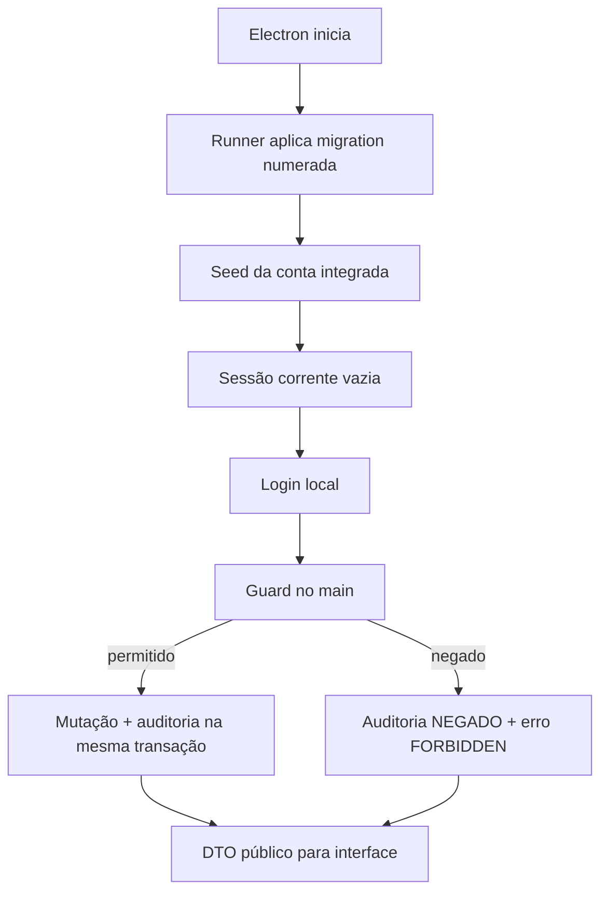

# BUILD — Acesso, papéis e auditoria

## Estado documental

- Papel: `CANONICAL_DOMAIN_BUILD`.
- Indexado por: `hack/BUILD.md`.
- Gate ou assinatura individual: inexistente.
- O estado de maturidade permanece no tracker único; o hub não pode promovê-lo sozinho.
- Este arquivo é a fonte técnica do domínio. `hack/BUILD.md` apenas integra dependências;
  não substitui, resume com perda nem supera este contrato.

## Goal

Introduzir uma fronteira de confiança local e pequena: uma conta fixture integrada, senha
com hash, sessão no processo principal, responsabilidade fixa por handler e auditoria
append-only. O renderer solicita ações e apresenta ferramentas; nunca escolhe identidade,
responsabilidade ou permissão.

## Inputs Consumed

- `hack/PRD.md`: separação de responsabilidades, autoria e fluxo ponta a ponta.
- `hack/domains/ANALYST-acesso-e-auditoria.md`: contrato canônico deste domínio.
- `src/main/db/schema.ts`: bootstrap legado a ser contido pelo runner canônico.
- `src/main/db/seed.ts`: padrão de primeiro boot local.
- `src/main/tipc.ts`: router que precisa de guards.
- `src/preload/index.ts` e `src/renderer/src/servicos/client.ts`: transporte renderer → main.
- `src/renderer/src/App.tsx` e `AppSidebar.tsx`: casca que precisa reagir à sessão.

## Current Terrain

- Não há modelo de usuário/sessão/auditoria no core (`src/main/db/schema.ts:8-25`).
- O preload só encaminha os 17 canais da allowlist (`src/preload/index.ts:1-18` e
  `src/shared/active-ipc-channels.ts`), mas allowlist não autentica usuário nem autoriza ação.
- O router TIPC exporta handlers diretamente, sem contexto ou autorização (`src/main/tipc.ts:373-399`).
- `App.tsx` monta a casca antes de qualquer prova de identidade (`src/renderer/src/App.tsx:15-46`).
- O menu é fixo (`src/renderer/src/componentes/AppSidebar.tsx:28-32`).
- O seed local e idempotente já é o local certo para fixtures (`src/main/db/seed.ts:128-150`).

## Recommended Path

Usar somente recursos já disponíveis no runtime: PGlite, TIPC e `node:crypto`. Não adicionar servidor, Auth.js, Supabase ou serviço de e-mail. O main mantém uma `CurrentSession` em memória e persiste apenas o registro auditável da sessão. Todo handler ativo chama um guard central; toda mutação usa um helper transacional que grava o dado e o evento de auditoria juntos.

O caminho é deliberadamente específico para um protótipo Electron em um único computador. Ele não deve ser divulgado como arquitetura institucional.

## Files / Areas

| Path/Area | Action | Reason | Risk |
|---|---|---|---|
| `src/shared/auth.ts` | new | Enum, DTOs, capabilities e erros compartilhados. | medium |
| `src/main/db/migrations/NNN_access_audit.sql` | deliver migration | Único artefato DDL deste domínio; runner e ledger pertencem à arquitetura. | high |
| `src/main/db/schema.ts` | contain | Não receber este DDL nem criar runner paralelo. | high |
| `src/main/db/seed.ts` | modify | Reconciliar uma fixture integrada e idempotente. | high |
| `src/main/auth/password.ts` | new | Hash/verify scrypt isolados e testáveis. | high |
| `src/main/auth/session.ts` | new | Sessão corrente e invalidação. | high |
| `src/main/auth/authorize.ts` | new | Sessão, responsabilidade fixa por action e guards de estado/escopo. | critical |
| `src/main/auth/router.ts` | new | Login, sessão atual e logout. | high |
| `src/main/audit/service.ts` | new | Gravação sanitizada e consulta. | critical |
| `src/main/audit/router.ts` | new | Busca paginada somente admin. | medium |
| `src/main/tipc.ts` | modify | Compor routers e aplicar guards nos handlers ativos. | critical |
| `src/renderer/src/auth/AuthProvider.tsx` | new | Estado de sessão e transições. | high |
| `src/renderer/src/auth/ProtectedRoute.tsx` | new | Rota autenticada da demonstração integrada. | high |
| `src/renderer/src/paginas/LoginPagina.tsx` | new | Entrada local sem cadastro/recuperação. | medium |
| `src/renderer/src/paginas/configuracoes/UsuariosPagina.tsx` | new | CRUD mínimo do admin. | medium |
| `src/renderer/src/paginas/configuracoes/AuditoriaPagina.tsx` | new | Prova consultável de autoria. | medium |
| `src/renderer/src/App.tsx` | modify | Separar rota pública e casca protegida. | high |
| `src/renderer/src/componentes/AppSidebar.tsx` | modify | Menu por capability, identidade e logout. | medium |
| `tests/main/auth/*` | new | Hash, sessão, guard, escopo e DDL. | low |
| `tests/renderer/auth/*` | new | Login, gates e admin. | low |
| `tests/e2e/access-flow.spec.ts` | new | Login integrado, responsabilidade confiável e tentativas negativas. | medium |

## Contracts

### Product

- Não existe cadastro público.
- O seed cria uma conta `INTEGRATED_DEMO` com nome, e-mail e senha sintéticos.
- A interface não cria, edita, desativa nem troca o papel dessa conta.
- Um login abre a casca com todas as ferramentas agrupadas por responsabilidade.
- Cada action possui uma responsabilidade fixa no main; o renderer não a envia.
- Logout volta imediatamente para `/login`.
- Fechar o aplicativo encerra a sessão; abrir exige login novo.
- A auditoria registra a conta integrada e a responsabilidade exercida.

### Shared types

```ts
export const PAPEIS = [
  'ADMIN',
  'RECEPCAO',
  'ENFERMAGEM',
  'ANESTESIOLOGISTA',
  'SOLICITANTE',
] as const

export type PapelResponsabilidade = (typeof PAPEIS)[number]
export type AccessMode = 'INTEGRATED_DEMO'
export type Capability = keyof typeof CAPABILITIES
export type LoginPublicErrorCode = 'INVALID_CREDENTIALS'

export interface UsuarioPublico {
  id: string
  nome: string
  email: string
  accessMode: AccessMode
  ativo: boolean
  origem: 'FIXTURE'
  versao: number
  criadoEm: string
  atualizadoEm: string
}

export interface SessaoPublica {
  sessaoId: string
  usuario: Pick<
    UsuarioPublico,
    'id' | 'nome' | 'email' | 'accessMode'
  >
  capabilities: Capability[]
  iniciadaEm: string
}

export interface LoginInput { email: string; senha: string }
export interface ActionAuthority {
  accountId: string
  responsibility: PapelResponsabilidade
  capability: Capability
  requestingServiceId?: string
}
```

O tipo público não admite `senha`, `senhaHash`, `credencialVersao`, papel corrente ou token.
O main deriva `SessaoPublica.capabilities` do modo `INTEGRATED_DEMO`. Cada handler combina
uma capability com uma responsabilidade fixa e produz `ActionAuthority`; nenhum desses
valores vem do renderer.

### Backend — schema

O único artefato DDL entregue por este domínio é
`src/main/db/migrations/NNN_access_audit.sql`, migração numerada consumida pelo runner e pelo
ledger de migrations da arquitetura. `src/main/db/schema.ts` permanece contido e não recebe
as tabelas abaixo nem um segundo runner. A migração deve ser equivalente ao contrato abaixo;
nomes podem ser ajustados somente se DTOs e testes continuarem canônicos.

```sql
CREATE TABLE IF NOT EXISTS usuarios (
  id TEXT PRIMARY KEY DEFAULT gen_random_uuid()::text,
  nome_exibicao TEXT NOT NULL CHECK (length(trim(nome_exibicao)) BETWEEN 2 AND 120),
  email TEXT NOT NULL,
  email_normalizado TEXT NOT NULL UNIQUE,
  senha_hash TEXT NOT NULL CHECK (senha_hash LIKE 'scrypt$%'),
  modo_acesso TEXT NOT NULL CHECK (modo_acesso = 'INTEGRATED_DEMO'),
  ativo BOOLEAN NOT NULL DEFAULT TRUE,
  origem TEXT NOT NULL CHECK (origem = 'FIXTURE'),
  credencial_versao INTEGER NOT NULL DEFAULT 1 CHECK (credencial_versao > 0),
  versao INTEGER NOT NULL DEFAULT 1 CHECK (versao > 0),
  criado_em TIMESTAMPTZ NOT NULL DEFAULT NOW(),
  atualizado_em TIMESTAMPTZ NOT NULL DEFAULT NOW(),
  ultimo_login_em TIMESTAMPTZ
);

CREATE TABLE IF NOT EXISTS sessoes (
  id TEXT PRIMARY KEY DEFAULT gen_random_uuid()::text,
  usuario_id TEXT NOT NULL REFERENCES usuarios(id) ON DELETE RESTRICT,
  modo_acesso_snapshot TEXT NOT NULL CHECK (modo_acesso_snapshot = 'INTEGRATED_DEMO'),
  credencial_versao INTEGER NOT NULL,
  iniciada_em TIMESTAMPTZ NOT NULL DEFAULT NOW(),
  ultimo_uso_em TIMESTAMPTZ NOT NULL DEFAULT NOW(),
  encerrada_em TIMESTAMPTZ,
  motivo_encerramento TEXT CHECK (motivo_encerramento IN (
    'LOGOUT', 'APP_ENCERRADO', 'NOVA_SESSAO', 'CREDENCIAL_INVALIDADA'
  ))
);

CREATE TABLE IF NOT EXISTS auditoria_eventos (
  id BIGSERIAL PRIMARY KEY,
  ocorrido_em TIMESTAMPTZ NOT NULL DEFAULT NOW(),
  correlation_id TEXT NOT NULL,
  sessao_id TEXT REFERENCES sessoes(id) ON DELETE RESTRICT,
  usuario_id TEXT REFERENCES usuarios(id) ON DELETE RESTRICT,
  usuario_nome_snapshot TEXT,
  responsabilidade_snapshot TEXT CHECK (responsabilidade_snapshot IN (
    'ADMIN', 'RECEPCAO', 'ENFERMAGEM', 'ANESTESIOLOGISTA', 'SOLICITANTE', 'SYSTEM'
  )),
  acao TEXT NOT NULL,
  entidade_tipo TEXT NOT NULL,
  entidade_id TEXT,
  resultado TEXT NOT NULL CHECK (resultado IN ('SUCESSO', 'FALHA', 'NEGADO')),
  motivo TEXT,
  mudancas_json JSONB NOT NULL DEFAULT '{}'::jsonb
);

CREATE INDEX IF NOT EXISTS idx_auditoria_tempo
  ON auditoria_eventos(ocorrido_em DESC, id DESC);
CREATE INDEX IF NOT EXISTS idx_auditoria_entidade
  ON auditoria_eventos(entidade_tipo, entidade_id, ocorrido_em DESC);
CREATE INDEX IF NOT EXISTS idx_auditoria_usuario
  ON auditoria_eventos(usuario_id, ocorrido_em DESC);
```

Este domínio não depende do catálogo de serviços para autenticar. O serviço solicitante é
escopo do caso e da action; a sessão integrada não carrega um serviço global.

Trigger obrigatório:

```sql
CREATE OR REPLACE FUNCTION bloquear_mutacao_auditoria()
RETURNS trigger AS $$
BEGIN
  RAISE EXCEPTION 'auditoria_eventos é append-only';
END;
$$ LANGUAGE plpgsql;

CREATE TRIGGER auditoria_append_only
BEFORE UPDATE OR DELETE ON auditoria_eventos
FOR EACH ROW EXECUTE FUNCTION bloquear_mutacao_auditoria();
```

### Backend — password

```ts
const PARAMS = { N: 16_384, r: 8, p: 1, keyLength: 64, saltBytes: 16 }

async function hashPassword(plain: string): Promise<string>
async function verifyPassword(plain: string, encoded: string): Promise<boolean>
```

- `hashPassword` valida 8–128 caracteres, gera salt com `randomBytes` e serializa os parâmetros.
- `verifyPassword` rejeita formato desconhecido sem lançar detalhe ao usuário e usa `timingSafeEqual` em buffers do mesmo comprimento.
- Usuário ausente, inativo e senha incorreta executam uma verificação contra hash dummy
  válido antes do mesmo erro público, evitando distinguir existência por um caminho rápido.
- Os três casos retornam publicamente apenas `INVALID_CREDENTIALS`. O main pode auditar o
  motivo interno `USER_NOT_FOUND | USER_INACTIVE | PASSWORD_MISMATCH`; essa union não é
  exportada por `src/shared/auth.ts` nem atravessa o TIPC.
- Logs e mensagens nunca recebem `plain`, encoded hash ou salt.

### Backend — fixture reconciliation

- O seed mantém exatamente uma linha `origin=FIXTURE`, ativa, com ID/e-mail estáveis e
  `modo_acesso=INTEGRATED_DEMO`.
- O reconcile só atualiza a identidade reservada dessa fixture e não cria contas por papel.
- O pós-check exige uma fixture integrada e nenhuma credencial em texto puro.

### Backend — current session

```ts
interface ActorContext {
  actorId: string
  displayName: string
  accessMode: 'INTEGRATED_DEMO'
}

interface CurrentSession {
  id: string
  usuarioId: string
  nome: string
  email: string
  accessMode: 'INTEGRATED_DEMO'
  capabilities: readonly Capability[]
  actorContext: ActorContext
  credencialVersao: number
  iniciadaEm: string
}

function getCurrentSession(): CurrentSession | null
async function requireSession(): Promise<CurrentSession>
async function requireAction(
  action: DomainAction,
  responsibility: PapelResponsabilidade,
): Promise<ActionAuthority>
async function requireCaseScope(caseId: string, action: DomainAction): Promise<ActionAuthority>
async function clearCurrentSession(reason: SessionEndReason): Promise<void>
```

`CurrentSession` e `ActorContext` vivem somente em `src/main/auth/*`: não são declarados em
`src/shared/auth.ts`, não atravessam preload e jamais são importados no renderer. O renderer
recebe apenas `SessaoPublica`. `requireSession` consulta `usuarios.ativo` e
`credencial_versao`. `requireAction` consulta o registry main-only que associa cada action a
uma única responsabilidade e capability.
Pode usar cache curtíssimo somente se toda mudança administrativa chamar invalidação
síncrona; para o MVP, a consulta local por chamada é preferida à possibilidade de permissão
stale.

### Backend — TIPC actions

| Action | Input | Output | Guard |
|---|---|---|---|
| `auth.login` | `LoginInput` | `SessaoPublica` | pública; só endpoint com senha |
| `auth.sessao.obter` | `void` | `SessaoPublica \| null` | pública |
| `auth.logout` | `void` | `{ ok: true }` | sessão |
| `auditoria.listar` | filtros + cursor | página de `EventoAuditoriaPublico` | responsabilidade ADMIN |

Todos os demais handlers ativos recebem um guard de uma capability declarada. Handlers herdados sem rota ficam fora do router ativo ou recebem `FEATURE_DISABLED`; não permanecem como bypass por estarem “escondidos”.

### Backend — capability map

```ts
export const CAPABILITY_RESPONSIBILITY = {
  'home:read': ['ADMIN', 'RECEPCAO', 'ENFERMAGEM', 'ANESTESIOLOGISTA', 'SOLICITANTE'],
  'case:intake:create': ['RECEPCAO'],
  'case:intake:correct': ['RECEPCAO'],
  'case:read': ['RECEPCAO', 'ENFERMAGEM', 'ANESTESIOLOGISTA'],
  'case:read:assigned': ['RECEPCAO', 'ENFERMAGEM', 'ANESTESIOLOGISTA', 'SOLICITANTE'],
  'case:cancel': ['RECEPCAO'],
  'handoff:receive': ['ENFERMAGEM'],
  'triage:worklist:read': ['ENFERMAGEM'],
  'clinical:anamnesis:read': ['ENFERMAGEM', 'ANESTESIOLOGISTA'],
  'clinical:anamnesis:edit': ['ENFERMAGEM'],
  'scheduling:queue:read': ['RECEPCAO'],
  'scheduling:read': ['RECEPCAO', 'ANESTESIOLOGISTA'],
  'scheduling:booking:manage': ['RECEPCAO'],
  'scheduling:booking:check-in': ['RECEPCAO'],
  'assessment:read': ['ANESTESIOLOGISTA'],
  'assessment:write': ['ANESTESIOLOGISTA'],
  'pendency:evidence:register': ['RECEPCAO', 'ENFERMAGEM', 'ANESTESIOLOGISTA', 'SOLICITANTE'],
  'pendency:manage': ['ANESTESIOLOGISTA'],
  'result:status:read': ['RECEPCAO', 'ANESTESIOLOGISTA', 'SOLICITANTE'],
  'result:content:read': ['ANESTESIOLOGISTA', 'SOLICITANTE'],
  'result:export': ['ANESTESIOLOGISTA', 'SOLICITANTE'],
  'delivery:manage': ['RECEPCAO'],
  'delivery:acknowledge': ['SOLICITANTE'],
  'config:read': ['ADMIN'],
  'scheduling:capacity:manage': ['ADMIN'],
  'clinical:protocols:manage': ['ENFERMAGEM'],
  'assistant:use': ['ENFERMAGEM', 'ANESTESIOLOGISTA'],
  'assistant:configure': ['ADMIN'],
  'ai:proposal:generate': ['ENFERMAGEM'],
  'ai:proposal:decide': ['ENFERMAGEM'],
  'ai:config:manage': ['ADMIN'],
  'knowledge:read': ['ENFERMAGEM', 'ANESTESIOLOGISTA'],
  'knowledge:suggest': ['ANESTESIOLOGISTA'],
  'knowledge:approve': ['ANESTESIOLOGISTA'],
  'knowledge:activate': ['ANESTESIOLOGISTA'],
  'audit:read': ['ADMIN'],
} as const satisfies Record<string, readonly PapelResponsabilidade[]>
```

O modo integrado recebe a união dessas capabilities, mas toda action continua presa à
responsabilidade declarada e aos estados do caso. Actions `SOLICITANTE` ainda passam por
escopo do serviço do caso. `clinical:anamnesis:read` permite à responsabilidade
anestesiológica ler o snapshot submetido, mas
somente a enfermagem possui `clinical:anamnesis:edit` enquanto o registro está `DRAFT`.
`submitFinal` publica `COMPLETE` e encerra qualquer escrita na anamnese; nota médica usa
`assessment:write`.
`scheduling:booking:check-in`, `pendency:evidence:register`, `pendency:manage`,
`result:status:read` e `result:content:read` permanecem capabilities distintas e fail-closed.

### Backend — audit

```ts
interface AuditInput {
  correlationId: string
  action: string
  entityType: string
  entityId?: string
  result: 'SUCESSO' | 'FALHA' | 'NEGADO'
  reason?: string
  safeChanges?: Record<string, string | number | boolean | null>
}

async function mutateWithAudit<T>(
  meta: Omit<AuditInput, 'result'>,
  mutation: (tx: DbTransaction) => Promise<T>,
): Promise<T>
```

- `mutateWithAudit` usa uma única transação e só escreve `SUCESSO` após a mutação.
- Falhas de validação/autorização são auditadas fora da transação abortada, com payload mínimo.
- `safeChanges` nasce de allowlist por action. Uma denylist não é suficiente.
- Login falho registra `entityType = AUTH`, e-mail normalizado e motivo interno sanitizado —
  inclusive `USER_INACTIVE` quando aplicável —, nunca senha. O retorno público continua
  invariavelmente `INVALID_CREDENTIALS`.

### Frontend

#### `AuthProvider`

Estados fechados:

```ts
type AuthState =
  | { status: 'loading' }
  | { status: 'anonymous' }
  | { status: 'authenticated'; session: SessaoPublica }
  | { status: 'error'; message: string }
```

- Na montagem chama `auth.sessao.obter`.
- `UNAUTHENTICATED` em qualquer client call transita para `anonymous` e navega a `/login`.
- `FORBIDDEN` mantém sessão, mostra mensagem e oferece voltar à home; não revela conteúdo da rota.
- Login bem-sucedido substitui history para que “voltar” não exponha formulário preenchido.

#### Login page

- Campos `E-mail` e `Senha`, botão `Entrar`.
- Senha tem alternância mostrar/ocultar acessível.
- Submit por Enter.
- Durante submit: botão desabilitado e `aria-busy`.
- Erro de e-mail/senha é genérico.
- Não há “Criar conta”, “Esqueci”, confirmação ou provedor social.
- Uma caixa “Contas da demonstração” pode existir somente em build de demo, listando papéis/e-mails, nunca hashes; a senha comum pode ser exibida no roteiro do pitch.

#### Menu do usuário

- Exibe nome da conta sintética e badge `Demonstração integrada`.
- Abre `Configurações`, seletor `Claro | Escuro | Sistema`, `Amostra de uso` e `Sair`.
- Não oferece troca de papel, criação de usuário nem edição de credencial.
- `Amostra de uso` explica, com dados sintéticos, como percorrer as ferramentas da esquerda.

#### Audit page

- Filtros por período, usuário, papel, ação, entidade e resultado.
- Tabela paginada por cursor; detalhes mostram somente `safeChanges`.
- Sem botão editar/excluir/exportar no MVP.

### Validation

#### Unit

- hash produz salts/hashes diferentes para a mesma senha e ambos verificam;
- senha incorreta, hash truncado e parâmetros inválidos falham;
- matriz de capability cobre todas as actions ativas;
- `clinical:anamnesis:edit` autoriza apenas enfermagem em `DRAFT`; depois de `submitFinal`,
  `COMPLETE` recusa toda escrita, enquanto a leitura da anestesiologia continua autorizada;
- sanitizador rejeita chaves como `senha`, `hash`, `token`, `apiKey`, `anamnese`, `parecerHtml`;
- filtros de serviço não permitem `null` como acesso global para solicitante.

#### Database / integration

- constraints de modo/e-mail;
- seed idempotente mantém exatamente uma conta `origin=FIXTURE` em modo integrado;
- senha não aparece em nenhuma coluna fora de `senha_hash` e não é texto claro;
- optimistic version recusa write stale;
- trigger bloqueia UPDATE/DELETE da auditoria;
- rollback da mutação não deixa evento `SUCESSO`.

#### Renderer

- loading não pisca shell protegido;
- anônimo só vê login;
- menu mostra todas as ferramentas da demonstração;
- cada action auditada carrega a responsabilidade fixa do handler;
- dialogs validam e preservam foco;
- sessão invalidada volta ao login;
- página proibida não monta componentes que buscariam dados.

#### E2E

1. O harness cria um diretório `userData` temporário e isolado para o Electron e o descarta ao
   terminar; nunca apaga nem “reseta” os dados reais do aplicativo.
2. Entrar com a fixture integrada e conferir todos os grupos do menu.
3. Percorrer recepção, enfermagem e anestesiologia sem trocar identidade.
4. Forjar `papel`/`responsibility` no payload e provar que o handler ignora ou rejeita.
5. Verificar auditoria com uma conta e responsabilidades distintas.
6. Reiniciar Electron e provar novo login.

## Runtime Sequence



## Sequence

1. Adicionar tipos, errors e capability map compartilhados.
2. Criar DDL/índices/triggers e testes de constraints.
3. Implementar password hashing e seed da fixture integrada.
4. Implementar current session, login/logout e invalidação.
5. Implementar auditoria e `mutateWithAudit`.
6. Implementar guards e envolver cada handler ativo.
7. Implementar provider/gates de renderer.
8. Implementar login, shell integrada e menu do usuário.
9. Implementar auditoria e sua projeção administrativa sanitizada.
10. Executar integração e E2E negativos antes do caminho feliz completo.

Essa ordem é dependência técnica; o Writing Plan da fatia transforma cada passo em tarefa TDD
pequena, sem redecidir o contrato.

## Recommended Next Phase

O hub `hack/BUILD.md` indexa este blueprint e segue para a revisão final de congruência.
Outra IA criará o Warlog lendo este arquivo integralmente. Não existe Spec intermediária nem
gate individual deste domínio.

## Rollback / Containment

- Introduzir tabelas novas; não renomear nem remover tabelas herdadas nesta fatia.
- Manter login sob uma flag de desenvolvimento apenas durante implementação. A flag não pode chegar à prova final desligada.
- A conta integrada é requisito da prova; falha de login bloqueia a demonstração.
- Se auditoria falhar dentro de uma mutação, a mutação inteira falha. Não existe modo “continua sem auditar”.
- Reverter a fatia remove composição de router/provider, mas preserva tabelas adicionadas até uma migração destrutiva explicitamente aprovada.

## Risks

| Risk | Containment |
|---|---|
| TIPC esquecido sem guard | Teste enumera chaves do router ativo e exige policy registrada. |
| Role spoof via input | DTOs não aceitam `usuarioId`/`papel`; main injeta conta e responsabilidade. |
| Deadlock/erro ao auditar | Um único helper de transação e testes de rollback. |
| Segredo vazando em log/audit | Allowlist de `safeChanges`, teste adversarial e redaction antes de logger. |
| Sessão stale após mudança técnica da fixture | `credencial_versao` comparada em toda chamada. |
| Fixture confundida com segurança de produção | Badge/README “dados sintéticos” e não fazer alegação institucional. |
| Admin clínico acidental | Capability map fail-closed; ausência significa negado. |

## Explicit Non-Goals

- Não implementar e-mail, recuperação, confirmação, MFA, SSO ou servidor.
- Não reutilizar o chat de IA para autenticação ou auditoria.
- Não guardar senha em `config` JSONB.
- Não usar `localStorage` como fonte de sessão.
- Não registrar payload clínico integral na auditoria.
- Não apresentar a conta integrada como modelo de segurança hospitalar.

---

## Estado de consolidação

- Estado: `CANONICAL_DOMAIN_BUILD`.
- Autoridade canônica: este arquivo.
- Gate individual: inexistente.
- Uso futuro: fonte obrigatória do Warlog e dos Writing Plans de acesso e auditoria.
