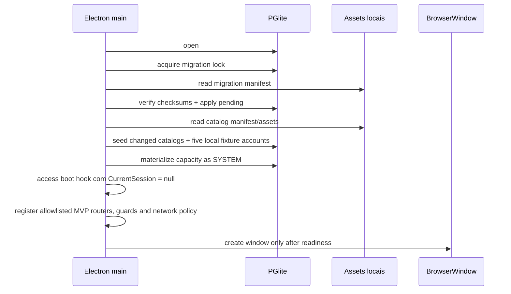

# BUILD — Arquitetura offline e prova

## State

- Documento: blueprint de arquitetura; **não é Plan nem autorização para código**.
- Estado: `DRAFT — BLOCKED_BY_ANALYST_SIGNATURE`.
- Pré-requisito: `ANALYST-arquitetura-offline-e-prova.md` aprovado por Marco.
- Alvo: Electron local em um Mac, PGlite, dados sintéticos e demonstração offline.

## Sources Consumed

- `hack/PRD.md:133-168`, `hack/PRD.md:211-239`.
- `hack/domains/ANALYST-arquitetura-offline-e-prova.md`.
- `hack/domains/ANALYST-acesso-e-auditoria.md` e
  `hack/domains/BUILD-acesso-e-auditoria.md` para todos os contratos de usuário,
  autenticação, sessão, papel, escopo, guard e auditoria.
- `src/main/db/pglite.ts:12-48`, `src/main/db/query.ts:33-99`.
- `src/main/db/schema.ts:8-24`, `src/main/db/schema.ts:31-164`, `src/main/db/schema.ts:239-246`.
- `src/main/db/seed.ts:63-94`, `src/main/db/seed.ts:128-150`, `src/main/db/seed.ts:157-285`.
- `src/main/index.ts:32-111`, `src/main/index.ts:154-169`.
- `src/main/renderer-network-policy.ts:3-69` e `tests/main/renderer-network-policy.spec.ts:9-52`.
- `src/main/export/pdf.ts:16-91` e `tests/main/export/pdf.spec.ts:53-150`.
- `src/data/catalogos/README.md:13-38`.

## Product Blueprint

### Promessa operacional

- O app inicia e executa a demonstração clínica sem conexão.
- A persistência sobrevive ao fechamento normal do app.
- A sessão local autenticada mostra usuário e papel em todas as superfícies protegidas;
  ela não se apresenta como login hospitalar.
- A tela administrativa local mostra versão do schema, revisão dos catálogos e contagens.
- Backup, restore e reset não são superfícies do MVP; o harness usa diretório temporário.
- Falha de migration, seed ou banco interrompe o boot clínico com mensagem acionável; o app não tenta baixar reparo.

### Superfícies

1. **Login local** — recebe e-mail e senha de uma conta real local criada pelo seed ou pelo
   admin; trocar de papel exige logout e login em outra conta.
2. **Indicador de sessão** — exibe usuário, papel e modo `Demonstração local` em todas as telas protegidas.
3. **Configurações da demo** — saúde local e revisões de catálogo, somente leitura.
4. **Diagnóstico de boot** — erro local para migration/seed corrompido; não abre uma UI clínica parcialmente inicializada.
5. **Prova offline** — artefato de teste, não botão de produção, que registra tentativas de rede e resultado do fluxo.

### Estados de interface

| Superfície | Empty | Loading | Error | Blocked | Success |
|---|---|---|---|---|---|
| Login | formulário vazio | autenticando no main | credencial inválida | sessão invalidada | home do papel |
| Saúde local | sem leitura | verificando banco/assets | migration/seed inválido | UI clínica indisponível | versões e contagens |

## Backend Blueprint

### Arquivos-alvo

| Arquivo | Ação | Responsabilidade |
|---|---|---|
| `src/main/db/migrations/manifest.ts` | criar | ids, checksums esperados e ordem imutável |
| `src/main/db/migrations/00x_*.sql` | criar | migrations expand-only por domínio |
| `src/main/db/migrate.ts` | criar | ledger, advisory lock local, transação e falha de boot |
| `src/main/db/schema.ts` | conter | bootstrap mínimo/compatibilidade; não receber novo DDL clínico |
| `src/main/db/seed.ts` | adaptar | rodar após migrations e publicar revisão/contagens |
| `src/main/db/catalog-manifest.ts` | criar | paths, hashes, versão, licença/cobertura e validação |
| `src/shared/auth.ts` | consumir | papéis, `SessaoPublica` e DTOs canônicos do domínio de acesso |
| `src/main/auth/session.ts` | consumir | `CurrentSession` em memória e `ActorContext` derivado, sem papel vindo do renderer |
| `src/main/auth/authorize.ts` | consumir | matriz de capabilities e guard central canônicos |
| `src/main/audit/service.ts` | consumir | writer único de `auditoria_eventos`, pertencente ao domínio de acesso |
| `src/main/ipc/parse-command.ts` | criar | Zod estrito, limite de payload e envelope de erros |
| `src/shared/ipc/channels.ts` | criar | `MVP_CHANNELS`, registry literal único consumido por main/preload/superfícies |
| `src/main/ipc/active-mvp-routers.ts` | criar | allowlist fechada dos únicos handlers registráveis no MVP |
| `src/main/network/network-intent.ts` | criar | choke point interno; allowlist vazia no MVP e sem ação TIPC pública |
| `scripts/check-active-router-network-boundary.ts` | criar | falhar se o grafo ativo importar cliente cloud ou transporte direto |
| `scripts/proof/create-demo-userdata.ts` | criar | diretório temporário guardado + seed determinístico para provas |
| `src/main/index.ts` | adaptar | migrate → seed/cinco fixtures → acesso sem sessão → guards/routers → window |
| `src/main/renderer-network-policy.ts` | manter/adaptar | bloqueio fail-closed do renderer |
| `src/main/export/pdf.ts` | manter | PDF isolado e sem rede |

Nomes/números finais de migrations são decididos no Plan após listar a sequência viva. SQL aplicado nunca é renomeado nem editado.

### Schema de infraestrutura

#### `schema_migrations`

```sql
CREATE TABLE schema_migrations (
  id TEXT PRIMARY KEY,
  checksum TEXT NOT NULL,
  app_version TEXT NOT NULL,
  applied_at TIMESTAMPTZ NOT NULL
);
```

O runner calcula SHA-256 do SQL antes de executar. Se o `id` existe com outro checksum, o boot falha. Cada migration roda em transação; o registro só nasce depois do SQL concluído. `schema_migrations` é o ledger único de migrations.

#### `catalog_seed_state`

Reusar e migrar o ledger atual, se já houver estrutura equivalente; não criar tabela paralela. Contrato mínimo:

| Campo | Contrato |
|---|---|
| `catalog_key` | PK estável para cada asset do manifesto |
| `asset_hash` | SHA-256 do arquivo empacotado |
| `catalog_version` | versão legível do manifesto |
| `row_count` | contagem pós-seed |
| `coverage_note` | `FULL`, `SUBSET` ou `REFERENCE_ONLY` |
| `applied_at` | horário local ISO/DB |

Seed compara hash e contagem. Mudança de asset substitui aquele catálogo em transação. Falha preserva a revisão anterior e bloqueia uso do catálogo inconsistente.

Chaves mínimas do manifesto: `cid10`, `medications`, `perioperative-risk`, `met`,
`comorbidities`, `requesting-services`, `procedures`, `pre-anesthesia-widget-registry`,
`pre-anesthesia-template`, `demo-workload-rule-set`, `slot-templates`, `demo-resources` e
`demo-availability-windows`. Cada entrada declara `kind`, versão, SHA-256, contagem,
coverage, origem e licença/nota de uso. Widgets/template/rule set validam também seus IDs e
versões internos. Serviços/procedimentos e capacidade inicial são fixtures; alterações
operacionais posteriores em recursos/janelas não reescrevem o asset nem seu hash.

#### Acesso e auditoria consumidos, sem DDL paralelo

`hack/domains/BUILD-acesso-e-auditoria.md` é o owner único do DDL, dos índices, dos
triggers e dos serviços de `usuarios`, `sessoes` e `auditoria_eventos`. Esta arquitetura:

- inclui a migration produzida por aquele domínio na sequência do runner;
- chama o hook canônico de boot para iniciar com `CurrentSession = null` e encerrar
  recibos que tenham ficado abertos;
- semeia as cinco contas fixture pelo seed canônico de acesso;
- consome `auth.login`, `CurrentSession`, `ActorContext`, guards e audit service;
- nunca cria DDL, coluna, trigger, writer ou ledger alternativo para essas entidades.

O contrato preciso de campos, constraints, motivos de encerramento, sanitização e
append-only permanece somente no Build de acesso. Divergência entre os dois documentos é
erro de arquitetura; a fatia de acesso prevalece.

### Integração com acesso, papéis e capacidades

```ts
import type { Papel, SessaoPublica } from '@/shared/auth'
import type { CurrentSession, ActorContext } from '@/main/auth/session'

type CaseStatus =
  | 'RECEIVED_AT_RECEPTION'
  | 'WAITING_NURSING'
  | 'NURSING_IN_PROGRESS'
  | 'TRIAGE_PENDING'
  | 'READY_FOR_SCHEDULING'
  | 'SCHEDULED'
  | 'WAITING_ANESTHESIA'
  | 'IN_ASSESSMENT'
  | 'PENDING'
  | 'WAITING_RETURN'
  | 'READY_FOR_HANDOFF'
  | 'DELIVERED_TO_REQUESTER'
  | 'CANCELLED'
```

`Papel`, `SessaoPublica`, `CurrentSession`, `ActorContext`, capabilities e regras de
escopo não são redefinidos aqui. Seus contratos canônicos vivem em
`hack/domains/BUILD-acesso-e-auditoria.md` e devem ser importados pela implementação.

`Papel` é o único nome do enum de papel; `Role` e `CanonicalRole` não existem. Da mesma
forma, channels não são strings espalhadas: `MVP_CHANNELS` é o owner único de IDs como
`clinicalAnamnesis.*`, `catalogs.*`, `pendencies.listAssigned`,
`documents.registerMetadata`, `scheduling.capacity.getConfiguration` e
`config.catalogs.getStatus`. Registry de superfície, router e preload importam os mesmos
literais, e o teste arquitetural falha em alias ou canal não registrado.

- `ADMIN`: migrations/saúde somente leitura na UI. Não herda ações clínicas de anestesista.
- `RECEPCAO`: entrada, correção permitida, agendamento/handoffs conforme seus domínios.
- `ENFERMAGEM`: anamnese/triagem do caso.
- `ANESTESIOLOGISTA`: encontro, pendências e conclusão.
- `SOLICITANTE`: leitura do resultado entregue e confirmação de recebimento.

O renderer envia somente `LoginInput` para `auth.login`. O main valida a senha em hash,
cria a `CurrentSession`, persiste o recibo pelo serviço canônico de acesso e deriva o
`ActorContext` imutável usado pelos serviços. Para demonstrar outro papel, o operador faz
logout e entra com outra conta fixture; não existe troca livre de papel. Nenhuma linha de
`sessoes` restaura autoridade após boot.

`QUICK | STANDARD | EXTENDED` pertencem exclusivamente ao contrato de classe de slot. Não
  entram em `Role`, `CaseStatus`, sessão, migration ou estado de infraestrutura.

### DTOs próprios desta fatia

```ts
type LocalHealthDTO = {
  schemaVersion: string
  migrations: Array<{ id: string; checksum: string; appliedAt: string }>
  catalogs: CatalogStatusDTO[]
  operationalCounts: {
    users: number
    cases: number
    bookings: number
    encounters: number
    results: number
  }
  mode: 'LOCAL_DEMO'
}

type CatalogStatusDTO = {
  key:
    | 'cid10'
    | 'medications'
    | 'perioperative-risk'
    | 'met'
    | 'comorbidities'
    | 'requesting-services'
    | 'procedures'
    | 'pre-anesthesia-widget-registry'
    | 'pre-anesthesia-template'
    | 'demo-workload-rule-set'
    | 'slot-templates'
    | 'demo-resources'
    | 'demo-availability-windows'
  version: string
  assetHash: `sha256:${string}`
  rowCount: number
  coverage: 'FULL' | 'SUBSET' | 'REFERENCE_ONLY'
  status: 'CURRENT' | 'STALE' | 'INVALID'
  source: string
  licenseNote: string
  appliedAt: string
}
```

`LoginInput` e `SessaoPublica` são consumidos sem alteração de
`hack/domains/BUILD-acesso-e-auditoria.md`. Nenhum payload desta fatia aceita papel,
usuário ou autoria.

### Ações TIPC

| Ação | Papel | Contrato |
|---|---|---|
| `auth.login` | pública | ação canônica do domínio de acesso; autentica uma conta local e cria `CurrentSession` |
| `auth.sessao.obter` / `auth.logout` | pública / sessão | ações canônicas do domínio de acesso; consulta ou encerra a sessão |
| `localHealth.get` | `ADMIN`, capability `config:read` | retorna versões/contagens sem segredo |
| `config.catalogs.getStatus` | `ADMIN`, capability `config:read` | retorna `CatalogStatusDTO[]` na ordem do manifesto; nunca linhas clínicas |

As ações próprias desta fatia retornam envelope discriminado. `auth.login`,
`auth.sessao.obter` e `auth.logout` preservam exatamente os inputs e outputs definidos no
Build de acesso:

```ts
type LocalArchitectureResult<T> =
  | { ok: true; data: T }
  | {
      ok: false
      error: {
        code: 'UNAUTHENTICATED' | 'FORBIDDEN' | 'LOCAL_DATA_UNAVAILABLE' | 'INTERNAL_ERROR'
        message: string
        correlationId?: string
      }
    }
```

Stack traces, SQL e payloads não cruzam para o renderer.

### Boot



Falha antes do último passo abre somente uma janela de diagnóstico local ou mostra erro
nativo; nenhum handler clínico fica disponível. Sucesso abre `/login`: o boot nunca
seleciona conta, papel ou sessão automaticamente.

A materialização de boot/seed chama a primitiva interna com
`{ kind: 'SYSTEM', cause: 'BOOT' | 'SEED', runId }`. Não existe sessão nessa etapa, portanto
ela não fabrica `actorId` e não grava `scheduling_command_receipts`, que é ledger exclusivo
de commands USER. Idempotência SYSTEM usa hashes de seed + `generation_key`; o relatório
entra em `LocalHealthDTO`, não em auditoria de usuário.

### Network policy

1. Renderer: manter bloqueio `http:`, `https:`, `ws:` e `wss:`; origin de dev permitido somente quando `is.dev`.
2. PDF: sessão própria, JavaScript desligado e todas as requisições bloqueadas.
3. Main: o router ativo nasce de uma allowlist; transporte externo direto é proibido no
   grafo alcançável. `NetworkIntent` é choke point interno e sua allowlist é vazia.
4. IA: código pode permanecer dormente, mas `IA_TEST_CONNECTION`, `IA_CHAT` e equivalentes
   ficam fora do router ativo. Se algum canal legado precisar permanecer no preload por
   compatibilidade, retorna `FEATURE_DISABLED` antes de importar/chamar o cliente cloud.
5. Nenhum command aceita URL arbitrária, redirect externo ou remote asset.

### Repetição segura da prova

- Não existe ação TIPC, rota ou botão de backup, restore ou reset.
- O harness cria um diretório com `mkdtemp`, passa o path explicitamente ao app de prova e
  rejeita `app.getPath('userData')`, home, raiz ou path não criado por aquela execução.
- Encerrar a prova pode remover somente esse diretório temporário. Uma nova execução aplica
  migrations e seed do zero, produzindo fixtures determinísticas.

## Frontend Blueprint

### Arquivos-alvo

| Arquivo | Responsabilidade |
|---|---|
| `src/renderer/src/auth/AuthProvider.tsx` | consumir sessão canônica do main; não autoriza localmente |
| `src/renderer/src/paginas/LoginPagina.tsx` | consumir `auth.login`; contas fixture usam credenciais locais reais |
| `src/renderer/src/componentes/AppSidebar.tsx` | mostrar usuário/papel e executar logout; nunca trocar papel livremente |
| `src/renderer/src/paginas/ConfiguracoesDemoPagina.tsx` | saúde local e catálogos read-only |
| `src/renderer/src/configuracoes/LocalHealthPanel.tsx` | versões, contagens e limitações |
| `src/renderer/src/App.tsx` | `/login` público e rotas protegidas por sessão canônica |

### Regras de UI

- Usuário e papel ficam no chrome global: `Demonstração local · Enfermagem · Ana Fixture`, por exemplo.
- Trocar de papel exige logout e login com outra conta. Logout invalida queries e não
  abandona formulário sujo sem confirmação.
- UI pode esconder ações por conveniência, mas o main continua sendo o guard real.
- Saúde local mostra `SUBSET` para medicamentos quando o manifesto assim declarar.
- Nenhum botão diz “sincronizar”, “nuvem”, “enviar ao HC” ou “backup seguro” no MVP.
- Não existe controle de backup, restore ou reset na UI.

## Validation Strategy

### Migrations

- banco vazio chega ao schema atual;
- upgrade de cada versão suportada preserva fixtures;
- migration aplicada com checksum divergente bloqueia boot;
- falha no meio faz rollback e não grava ledger;
- duas inicializações concorrentes não aplicam duas vezes.

### Seed/catálogos

- assets existem, hash e contagem conferem;
- segunda execução é no-op;
- asset alterado atualiza somente o catálogo alvo em transação;
- JSON inválido/contagem incorreta preserva revisão anterior e retorna erro;
- nenhuma biblioteca/modelo é baixado.

### IPC e segurança

- schemas rejeitam campos extras, payload grande, enum/id/version inválidos;
- `auth.login` valida as cinco contas fixture locais e rejeita senha inválida sem revelar
  existência da conta;
- cada ação tem teste positivo e negativo por papel;
- `localHealth.get` falha para todos os papéis exceto `ADMIN`;
- `config.catalogs.getStatus` preserva a ordem fechada do manifesto, não retorna linhas de
  catálogo e falha para todos os papéis exceto `ADMIN`;
- `ADMIN` não finaliza resultado clínico;
- actor/timestamp/status/hash enviados pelo renderer são ignorados ou rejeitados;
- reinício encerra recibo aberto em `sessoes`, mantém `CurrentSession = null` e exige novo login;
- todos os writers usam `auditoria_eventos`; teste de arquitetura bloqueia `audit_events` paralelo;
- erros não vazam SQL, path absoluto sensível, token ou conteúdo clínico;
- preload expõe somente métodos tipados necessários.
- main, preload e registry de superfícies importam todos os IDs de `MVP_CHANNELS`; string
  equivalente, alias ou channel ativo fora da allowlist falha no teste arquitetural.
- teste arquitetural falha se um router ativo importar `src/main/ia/cliente.ts`, `fetch`,
  `http(s)` ou outro transporte fora do choke point; teste direto de canais cloud retorna
  `FEATURE_DISABLED` e registra zero tentativa de rede.

### Harness temporário

- diretório temporário nasce vazio, recebe migrations/seed e nunca coincide com userData real;
- guard rejeita path amplo, home, raiz ou diretório não emitido pela execução;
- duas execuções independentes produzem as mesmas fixtures e hashes;
- teardown remove somente o diretório temporário da própria prova.

### Rede

- unit tests existentes da policy do renderer continuam verdes;
- PDF continua bloqueando toda request;
- E2E instrumenta `session.webRequest` e APIs HTTP do main para falhar qualquer tentativa fora da allowlist vazia;
- servidor sentinela local registra zero hits durante boot e fluxo clínico;
- a prova não exige desligar Wi-Fi e não interfere na conversa de desenvolvimento.

### E2E obrigatório

1. diretório de dados vazio → boot → migrations/seed → UI;
2. entrar com cada uma das cinco contas fixture e confirmar ação permitida/bloqueada;
3. executar fluxo sintético canônico, fechar/reabrir e conferir persistência;
4. exportar PDF sem rede;
5. encerrar e repetir a prova em um segundo diretório temporário;
6. capturar relatório `{appVersion, schemaVersion, catalogHashes, networkAttempts, result}` sem dados clínicos.

## Rollout And Rollback

### Rollout

1. ledger/runner de migrations com compatibilidade do schema atual;
2. manifesto e validação de seed;
3. integrar `auth.login`, `CurrentSession`, `ActorContext`, guard e audit service canônicos;
4. routers clínicos migram um domínio por vez;
5. operações da demo;
6. prova Electron offline ponta a ponta;
7. somente depois, conter/remover superfícies legadas com prova de consumidores.

### Rollback

- Migrations são expand-only; rollback volta o binário sem apagar tabelas novas.
- Nova UI fica atrás de rotas registradas somente no slice completo.
- Falha do runner mantém DB na última migration confirmada.
- Falha do seed preserva revisão anterior.
- Nenhum rollback executa `DROP` ou apaga diretório do app.
- Mudança de `sandbox` só entra após teste do preload; se quebrar, reverter configuração sem relaxar `contextIsolation` ou `nodeIntegration`.

## Reuse And Rejection

| Origem | Reusar | Rejeitar |
|---|---|---|
| Antessala | PGlite, helpers SQL, seed local/hash, network policy, PDF isolado, contexto Electron | DDL clínico provisório como schema canônico; handlers sem guard; IA no caminho clínico |
| DietFlow | contratos JSON versionados e assets de catálogo cuja licença/origem estejam documentadas | Postgres/Supabase, `patientId`, histórico longitudinal, auth/billing e fetch de nuvem |
| EscalaFlow | proveniência do uso de `printToPDF` | domínio, banco, escala, IPC amplo e qualquer dependência de produção |

## Future Boundary

Este Build **não suporta nem promete**:

- dois computadores editando o mesmo caso;
- sincronização, resolução de conflito distribuído ou disponibilidade multiusuário;
- autenticação institucional/SSO, assinatura digital ou identidade profissional verificada;
- criptografia/rotação de chaves, retenção, LGPD ou backup institucional;
- integração com agenda, prontuário, mensageria, laboratório ou HC;
- catálogo ANVISA completo/licenciado;
- uso de dados reais ou decisão clínica automática.

Qualquer piloto real reinicia em PRD → Analyst → Build com threat model e contratos institucionais; não é “ligar Supabase” no Plan do MVP.

## Definition Of Build Complete

- [x] Product, Backend e Frontend especificados.
- [x] Arquivos, schema e DTOs próprios declarados; acesso, ações e papéis canônicos consumidos sem redefinição.
- [x] Boot, migrations, seed, rede, isolamento do harness e prova fechados.
- [x] Validação, rollout, rollback, reuso e limites futuros explícitos.
- [ ] Analyst deste domínio assinado por Marco.
- [ ] Build revisado e assinado por Marco.

## Contrato de encerramento deste arquivo

Este blueprint não autoriza MiniSpec, Spec, Plan, teste ou código.

- Artefato: `BUILD-arquitetura-offline-e-prova.md`
- Próxima fase autorizada após assinatura do Analyst, deste Build e do Critic: Warlog-base
- Estado: `AGUARDANDO_ASSINATURA`
- Assinatura do Analyst por Marco: `PENDENTE`
- Assinatura deste Build por Marco: `PENDENTE`
- Data: `PENDENTE`
- Revisão Git examinada: `PENDENTE`
- Declaração: `PENDENTE`

Sem assinaturas válidas de Marco, a arquitetura permanece rascunho bloqueado.
