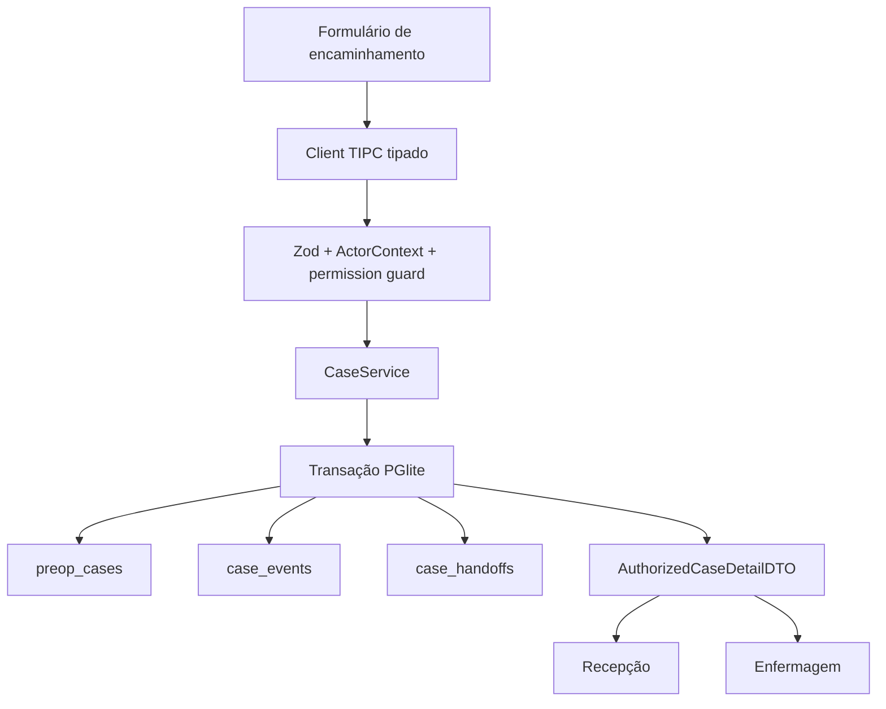

# Build: Caso e encaminhamento

## State

- Sources consumed: `hack/PRD.md`, `domains/ANALYST-caso-e-encaminhamento.md`,
  recon do Antessala e referência de JSON versionado do DietFlow
- Blueprint status: `DRAFT — BLOCKED BY ANALYST SIGNATURE`
- Architecture verdict: `GO` técnico; `NO-GO` de execução sem assinatura de Marco
- This is not Plan: este arquivo fecha contratos e sequência de dependências, não cria
  subtarefas executáveis.

## Sources Consumed

- `hack/PRD.md:53-70`, `hack/PRD.md:133-168`.
- `hack/domains/ANALYST-caso-e-encaminhamento.md`.
- `src/main/db/pglite.ts:12-48`, `src/main/db/query.ts:76-90`.
- `src/main/db/clinical-schema.ts:3-52`, `src/main/tipc.ts:265-335`.
- `src/renderer/src/App.tsx:49-56`.
- `/Users/marcoantonio/dietflow-app/prisma/schema.prisma:1101-1145`, somente para provar
  o formato JSON reutilizável e o vínculo longitudinal rejeitado.

## Goal

Criar a fundação técnica de um caso pré-anestésico autônomo. A recepção registra snapshots
da pessoa, encaminhamento, procedimento e solicitante; o sistema grava evento e handoff
atômicos; a enfermagem aceita o caso. Nenhuma tabela longitudinal de paciente participa.

## Current Terrain

- O PGlite já vive no diretório do app e suporta transações explícitas:
  `src/main/db/pglite.ts:12-48` e `src/main/db/query.ts:76-90`.
- O schema clínico atual se declara legado: `src/main/db/clinical-schema.ts:3-8`.
- `registros` não contém encaminhamento, procedimento, solicitante, ator ou versão de
  concorrência: `src/main/db/clinical-schema.ts:11-25`.
- Os handlers gravam diretamente por TIPC sem contexto de ator:
  `src/main/tipc.ts:265-335`.
- O router não oferece entrada ou detalhe de caso: `src/renderer/src/App.tsx:49-56`.
- O DietFlow vincula conteúdo a `patientId`; essa relação não atravessa:
  `/Users/marcoantonio/dietflow-app/prisma/schema.prisma:1101-1145`.

## Recommended Path

Adicionar tabelas canônicas, um serviço transacional e DTOs validados. Manter o schema
legado isolado durante a transição; não renomear suas tabelas nem convertê-las por efeito
colateral. O renderer consome somente DTOs camelCase. O main process converte linhas SQL e
aplica permissionamento, idempotência e optimistic locking.



## Files / Areas

| Path/Area | Action | Reason | Risk |
|---|---|---|---|
| `src/shared/clinical/case.ts` | create | Tipos, Zod, estados e erros compartilhados. | medium |
| `src/main/auth/session.ts` | consume | `ActorContext` main-only do domínio de acesso; não criar tipo compartilhado paralelo. | high |
| `src/main/db/migrations/NNN-canonical-case.sql` | deliver migration | SQL puro com tabelas e constraints canônicas; número vem do manifest global. | high |
| `src/main/clinical/case-service.ts` | create | Writes atômicos e queries role-scoped. | high |
| `src/main/clinical/case-mappers.ts` | create | snake_case SQL → DTO camelCase. | low |
| `src/main/tipc.ts` | adapt | Registrar ações finas e validadas. | medium |
| `src/renderer/src/servicos/cases.ts` | create | API de renderer sem SQL ou regra de domínio. | low |
| `src/renderer/src/paginas/recepcao/EncaminhamentosPagina.tsx` | create | Lista e empty state da recepção. | medium |
| `src/renderer/src/paginas/recepcao/NovoCasoPagina.tsx` | create | Captura de snapshots. | medium |
| `src/renderer/src/paginas/casos/CasoPagina.tsx` | create | Detalhe, timeline e handoff role-scoped. | medium |
| `src/renderer/src/App.tsx` | adapt | Rotas assinadas pelo mapa de sprints. | medium |
| `src/main/db/clinical-schema.ts` | contain | Impedir que o legado ganhe novas dependências. | high |

## Product Blueprint

- A recepção abre um caso a partir do encaminhamento.
- A recepção pode corrigir dados de entrada com motivo; não escreve anamnese.
- A enfermagem vê casos destinados a ela e aceita o handoff.
- O produto não oferece “buscar paciente”, “paciente já existe” ou “mesclar cadastro”.
- Nome sempre aparece com `displayCode`, procedimento e solicitante.

## Backend Blueprint

### Tables

```sql
CREATE SEQUENCE preop_case_display_code_seq;

CREATE TABLE preop_cases (
  id TEXT PRIMARY KEY,
  display_code TEXT NOT NULL UNIQUE,
  requesting_service_id TEXT NOT NULL
    REFERENCES catalogo_servicos_solicitantes(id) ON DELETE RESTRICT,
  referral_source_reference_normalized TEXT,
  person_snapshot JSONB NOT NULL,
  referral_snapshot JSONB NOT NULL,
  procedure_snapshot JSONB NOT NULL,
  requester_snapshot JSONB NOT NULL,
  status TEXT NOT NULL,
  version INTEGER NOT NULL DEFAULT 1 CHECK (version > 0),
  opened_at TIMESTAMPTZ NOT NULL,
  updated_at TIMESTAMPTZ NOT NULL,
  closed_at TIMESTAMPTZ,
  CHECK (status IN (
    'RECEIVED_AT_RECEPTION', 'WAITING_NURSING', 'NURSING_IN_PROGRESS',
    'TRIAGE_PENDING', 'READY_FOR_SCHEDULING', 'SCHEDULED',
    'WAITING_ANESTHESIA', 'IN_ASSESSMENT', 'PENDING', 'WAITING_RETURN',
    'READY_FOR_HANDOFF', 'DELIVERED_TO_REQUESTER', 'CANCELLED'
  )),
  CHECK (jsonb_typeof(person_snapshot) = 'object'),
  CHECK (jsonb_typeof(referral_snapshot) = 'object'),
  CHECK (jsonb_typeof(procedure_snapshot) = 'object'),
  CHECK (jsonb_typeof(requester_snapshot) = 'object'),
  CHECK (person_snapshot ? '_v' AND person_snapshot ->> '_v' = '1'),
  CHECK (referral_snapshot ? '_v' AND referral_snapshot ->> '_v' = '1'),
  CHECK (procedure_snapshot ? '_v' AND procedure_snapshot ->> '_v' = '1'),
  CHECK (requester_snapshot ? '_v' AND requester_snapshot ->> '_v' = '1'),
  CHECK (
    requester_snapshot ? 'serviceId'
    AND requester_snapshot ->> 'serviceId' = requesting_service_id
  ),
  CHECK (
    (status IN ('DELIVERED_TO_REQUESTER', 'CANCELLED') AND closed_at IS NOT NULL)
    OR (status NOT IN ('DELIVERED_TO_REQUESTER', 'CANCELLED') AND closed_at IS NULL)
  ),
  CHECK (
    referral_source_reference_normalized IS NULL
    OR length(trim(referral_source_reference_normalized)) BETWEEN 1 AND 100
  ),
  UNIQUE (requesting_service_id, referral_source_reference_normalized)
);

CREATE INDEX idx_preop_cases_requesting_service
  ON preop_cases(requesting_service_id, updated_at DESC);

CREATE TABLE case_command_receipts (
  idempotency_key TEXT PRIMARY KEY,
  action TEXT NOT NULL CHECK (action IN (
    'CREATE', 'CORRECT_INTAKE', 'ACKNOWLEDGE_HANDOFF', 'CANCEL'
  )),
  actor_id TEXT NOT NULL REFERENCES usuarios(id) ON DELETE RESTRICT,
  case_id TEXT NOT NULL REFERENCES preop_cases(id) ON DELETE RESTRICT,
  input_fingerprint TEXT NOT NULL,
  result_json JSONB NOT NULL,
  created_at TIMESTAMPTZ NOT NULL DEFAULT NOW(),
  CHECK (jsonb_typeof(result_json) = 'object')
);

CREATE TABLE case_events (
  id BIGSERIAL PRIMARY KEY,
  case_id TEXT NOT NULL REFERENCES preop_cases(id) ON DELETE RESTRICT,
  event_type TEXT NOT NULL CHECK (event_type IN (
    'CASE_OPENED', 'HANDOFF_SENT', 'HANDOFF_ACKNOWLEDGED', 'INTAKE_CORRECTED',
    'ANAMNESIS_CONTEXT_STALE', 'TRIAGE_MARKED_PENDING', 'TRIAGE_RESUMED',
    'ANAMNESIS_FINALIZED', 'REQUIREMENT_CALCULATED', 'REQUIREMENT_CONFIRMED',
    'REQUIREMENT_OVERRIDDEN', 'BOOKING_CONFIRMED', 'BOOKING_CHECKED_IN',
    'BOOKING_CANCELLED', 'BOOKING_RESCHEDULED', 'BOOKING_NO_SHOW',
    'ENCOUNTER_STARTED', 'PENDENCY_OPENED', 'PENDENCY_FULFILLED',
    'PENDENCY_CANCELLED', 'RETURN_REQUEST_CREATED', 'RETURN_REQUEST_BOOKED',
    'RETURN_REQUEST_CHECKED_IN', 'RETURN_REQUEST_CONSUMED',
    'ASSESSMENT_REVIEW_RESUMED', 'RESULT_FINALIZED', 'DELIVERY_SENT',
    'DELIVERY_RECEIVED', 'CASE_CANCELLED'
  )),
  from_status TEXT,
  to_status TEXT NOT NULL,
  actor_snapshot JSONB NOT NULL,
  reason TEXT,
  payload JSONB NOT NULL DEFAULT '{}'::jsonb,
  occurred_at TIMESTAMPTZ NOT NULL,
  correlation_id TEXT NOT NULL,
  command_id TEXT NOT NULL,
  receipt_domain TEXT NOT NULL CHECK (length(trim(receipt_domain)) BETWEEN 1 AND 40),
  receipt_id TEXT NOT NULL CHECK (length(trim(receipt_id)) BETWEEN 1 AND 200),
  command_event_index INTEGER NOT NULL CHECK (command_event_index > 0),
  event_sequence INTEGER NOT NULL CHECK (event_sequence > 0),
  CHECK (length(trim(command_id)) BETWEEN 1 AND 200),
  CHECK (jsonb_typeof(actor_snapshot) = 'object'),
  CHECK (jsonb_typeof(payload) = 'object'),
  UNIQUE (id, case_id),
  UNIQUE (case_id, event_sequence),
  UNIQUE (receipt_domain, receipt_id, command_event_index)
);

CREATE TABLE case_handoffs (
  id TEXT PRIMARY KEY,
  case_id TEXT NOT NULL REFERENCES preop_cases(id) ON DELETE RESTRICT,
  from_role TEXT NOT NULL,
  to_role TEXT NOT NULL,
  handoff_type TEXT NOT NULL,
  payload_snapshot JSONB NOT NULL,
  status TEXT NOT NULL CHECK (status IN ('SENT', 'RECEIVED', 'CANCELLED')),
  sent_by JSONB NOT NULL,
  sent_at TIMESTAMPTZ NOT NULL,
  received_by JSONB,
  received_at TIMESTAMPTZ,
  cancelled_by JSONB,
  cancelled_at TIMESTAMPTZ,
  cancellation_reason TEXT,
  version INTEGER NOT NULL DEFAULT 1 CHECK (version > 0),
  CHECK (
    jsonb_typeof(payload_snapshot) = 'object'
    AND payload_snapshot ? '_v'
    AND payload_snapshot ->> '_v' = '1'
  ),
  CHECK (jsonb_typeof(sent_by) = 'object'),
  CHECK (from_role <> to_role),
  CHECK (from_role IN ('ADMIN', 'RECEPCAO', 'ENFERMAGEM', 'ANESTESIOLOGISTA', 'SOLICITANTE')),
  CHECK (to_role IN ('ADMIN', 'RECEPCAO', 'ENFERMAGEM', 'ANESTESIOLOGISTA', 'SOLICITANTE')),
  CHECK (
    (status = 'SENT'
      AND received_by IS NULL AND received_at IS NULL
      AND cancelled_by IS NULL AND cancelled_at IS NULL AND cancellation_reason IS NULL)
    OR (status = 'RECEIVED'
      AND received_by IS NOT NULL AND received_at IS NOT NULL
      AND cancelled_by IS NULL AND cancelled_at IS NULL AND cancellation_reason IS NULL)
    OR (status = 'CANCELLED'
      AND received_by IS NULL AND received_at IS NULL
      AND cancelled_by IS NOT NULL AND cancelled_at IS NOT NULL
      AND cancellation_reason IS NOT NULL
      AND length(trim(cancellation_reason)) BETWEEN 10 AND 500)
  ),
  UNIQUE (id, case_id)
);
```

`case_events` recebe trigger que rejeita `UPDATE` e `DELETE`, seguindo a intenção
append-only já demonstrada em `src/main/db/clinical-schema.ts:42-52`. `event_sequence` é
global e monotônica dentro do caso, alocada sob lock. `command_id` identifica o comando;
`receipt_domain + receipt_id` aponta para o ledger idempotente do domínio que o executou sem
FK exclusiva a `case_command_receipts`. `command_event_index` ordena os vários eventos do
mesmo receipt.

### DTOs

```ts
import type { Papel } from '@/shared/auth'

type CaseStatus =
  | 'RECEIVED_AT_RECEPTION'
  | 'WAITING_NURSING'
  | 'NURSING_IN_PROGRESS'
  | 'TRIAGE_PENDING'
  | 'READY_FOR_SCHEDULING'
  | 'SCHEDULED'
  | 'WAITING_ANESTHESIA'
  | 'IN_ASSESSMENT'
  | 'PENDING'
  | 'WAITING_RETURN'
  | 'READY_FOR_HANDOFF'
  | 'DELIVERED_TO_REQUESTER'
  | 'CANCELLED'

type SexReported = 'FEMALE' | 'MALE' | 'INTERSEX' | 'NOT_INFORMED'

interface PersonSnapshotDTO {
  _v: 1
  fullName: string
  birthDate: string | null
  ageYearsAtOpening: number
  sexReported: SexReported
  originIdentifier: string | null
}

interface ReferralSnapshotDTO {
  _v: 1
  referralId: string
  sourceReference: string | null
  issuedAt: string | null
  receivedAt: string
  freeTextReference: string
  sourceDocumentLabel: string | null
}

interface ProcedureSnapshotDTO {
  _v: 1
  description: string
  catalogId: string
  catalogVersion: string
  lateralityOrSite: string | null
  notes: string | null
}

interface RequesterSnapshotDTO {
  _v: 1
  serviceId: string
  serviceCatalogRevision: string
  serviceName: string
  physicianName: string
  specialty: string | null
  returnContact: string | null
  originIdentifier: string | null
}

type PersonInputDTO =
  | Omit<PersonSnapshotDTO, '_v' | 'ageYearsAtOpening'> & { birthDate: string }
  | Omit<PersonSnapshotDTO, '_v' | 'birthDate'> & {
      birthDate: null
      ageYearsAtOpening: number
    }

type ReferralInputDTO = Omit<ReferralSnapshotDTO, '_v' | 'referralId'>

interface ProcedureInputDTO {
  catalogId: string
  freeTextDescription: string | null
  lateralityOrSite: string | null
  notes: string | null
}

interface RequesterInputDTO {
  serviceId: string
  physicianName: string
  specialty: string | null
  returnContact: string | null
  originIdentifier: string | null
}

interface CreateCaseDTO {
  person: PersonInputDTO
  referral: ReferralInputDTO
  procedure: ProcedureInputDTO
  requester: RequesterInputDTO
  idempotencyKey: string
}

type AtLeastOne<T> = {
  [K in keyof T]-?: Required<Pick<T, K>> & Partial<Omit<T, K>>
}[keyof T]

type CorrectableIntake = Pick<
  CreateCaseDTO,
  'person' | 'referral' | 'procedure' | 'requester'
>

interface CorrectIntakeDTO {
  caseId: string
  expectedVersion: number
  patch: AtLeastOne<CorrectableIntake>
  reason: string
  idempotencyKey: string
}

interface AcknowledgeHandoffDTO {
  caseId: string
  handoffId: string
  expectedCaseVersion: number
  expectedHandoffVersion: number
  idempotencyKey: string
}

interface CancelCaseDTO {
  caseId: string
  expectedCaseVersion: number
  reason: string
  idempotencyKey: string
}

interface CaseCommandReceiptResult {
  caseId: string
  displayCode: string
  resultingCaseVersion: number
}

type ActorSnapshotDTO = { actorId: string; displayName: string; role: Papel }

type CaseEventPayloadByType = {
  CASE_OPENED: { referralId: string }
  HANDOFF_SENT: { handoffId: string; toRole: Papel }
  HANDOFF_ACKNOWLEDGED: { handoffId: string; byRole: Papel }
  INTAKE_CORRECTED: {
    changedPaths: string[]
    beforeHash: string
    afterHash: string
  }
  ANAMNESIS_CONTEXT_STALE: { anamnesisId: string; contextFingerprint: string }
  TRIAGE_MARKED_PENDING: { anamnesisId: string; missingFieldPaths: string[] }
  TRIAGE_RESUMED: { anamnesisId: string }
  ANAMNESIS_FINALIZED: { anamnesisId: string; revision: 1 }
  REQUIREMENT_CALCULATED: { requirementId: string }
  REQUIREMENT_CONFIRMED: { requirementId: string }
  REQUIREMENT_OVERRIDDEN: { requirementId: string; overrideId: string }
  BOOKING_CONFIRMED: { bookingId: string; kind: 'INITIAL' | 'RETURN' }
  BOOKING_CHECKED_IN: { bookingId: string; kind: 'INITIAL' | 'RETURN' }
  BOOKING_CANCELLED: { bookingId: string }
  BOOKING_RESCHEDULED: { previousBookingId: string; bookingId: string }
  BOOKING_NO_SHOW: { bookingId: string }
  ENCOUNTER_STARTED: { encounterId: string; bookingId: string }
  PENDENCY_OPENED: { pendencyId: string; ownerRole: Papel; requiresReturn: boolean }
  PENDENCY_FULFILLED: { pendencyId: string }
  PENDENCY_CANCELLED: { pendencyId: string }
  RETURN_REQUEST_CREATED: { returnRequestId: string }
  RETURN_REQUEST_BOOKED: { returnRequestId: string; bookingId: string }
  RETURN_REQUEST_CHECKED_IN: { returnRequestId: string; bookingId: string }
  RETURN_REQUEST_CONSUMED: { returnRequestId: string; encounterId: string }
  ASSESSMENT_REVIEW_RESUMED: { encounterId: string; reviewCycle: number }
  RESULT_FINALIZED: { resultId: string; contentHash: string }
  DELIVERY_SENT: { deliveryId: string; targetServiceId: string }
  DELIVERY_RECEIVED: { deliveryId: string; targetServiceId: string }
  CASE_CANCELLED: { cancelledBookingId: string | null; cancelledHandoffId: string | null }
}

type CaseEventDTO = {
  [K in keyof CaseEventPayloadByType]: {
    id: string
    caseId: string
    eventType: K
    fromStatus: CaseStatus | null
    toStatus: CaseStatus
    actor: ActorSnapshotDTO
    reason: string | null
    payload: CaseEventPayloadByType[K]
    occurredAt: string
    correlationId: string
    commandId: string
    receipt: { domain: 'CASE' | 'ANAMNESIS' | 'SCHEDULING' | 'ASSESSMENT'; id: string }
    commandEventIndex: number
    sequence: number
  }
}[keyof CaseEventPayloadByType]

interface CaseHandoffPayloadV1 {
  _v: 1
  caseId: string
  displayCode: string
  procedureDescription: string
  requestingServiceId: string
}

interface CaseHandoffDTO {
  id: string
  caseId: string
  fromRole: Papel
  toRole: Papel
  type: string
  payloadSnapshot: CaseHandoffPayloadV1
  status: 'SENT' | 'RECEIVED' | 'CANCELLED'
  sentBy: ActorSnapshotDTO
  sentAt: string
  receivedBy: ActorSnapshotDTO | null
  receivedAt: string | null
  cancelledBy: ActorSnapshotDTO | null
  cancelledAt: string | null
  cancellationReason: string | null
  version: number
}

interface CaseSummaryDTO {
  id: string
  displayCode: string
  personName: string
  procedureDescription: string
  requesterLabel: string
  status: CaseStatus
  responsibility: {
    currentRoles: Papel[]
    nextRoles: Papel[]
    reasonCode: string
  }
  version: number
  updatedAt: string
}

type CaseDetailCommonDTO = CaseSummaryDTO

type RequesterCaseEventDTO = {
  eventType: 'RESULT_FINALIZED' | 'DELIVERY_SENT' | 'DELIVERY_RECEIVED'
  toStatus: 'READY_FOR_HANDOFF' | 'DELIVERED_TO_REQUESTER'
  occurredAt: string
  sequence: number
}

type AuthorizedCaseDetailDTO =
  | (CaseDetailCommonDTO & {
      view: 'INTAKE'
      person: PersonSnapshotDTO
      referral: ReferralSnapshotDTO
      procedure: ProcedureSnapshotDTO
      requester: RequesterSnapshotDTO
      timeline: CaseEventDTO[]
      openHandoff: CaseHandoffDTO | null
    })
  | (CaseDetailCommonDTO & {
      view: 'CLINICAL_CONTEXT'
      person: PersonSnapshotDTO
      referral: Pick<ReferralSnapshotDTO, '_v' | 'referralId' | 'issuedAt' | 'receivedAt'>
      procedure: ProcedureSnapshotDTO
      requester: Pick<RequesterSnapshotDTO, '_v' | 'serviceId' | 'serviceName' | 'physicianName' | 'specialty'>
      timeline: CaseEventDTO[]
      openHandoff: CaseHandoffDTO | null
    })
  | (CaseDetailCommonDTO & {
      view: 'REQUESTER_SCOPE'
      person: Pick<PersonSnapshotDTO, '_v' | 'fullName' | 'birthDate' | 'ageYearsAtOpening' | 'sexReported'>
      referral: null
      procedure: ProcedureSnapshotDTO
      requester: Pick<RequesterSnapshotDTO, '_v' | 'serviceId' | 'serviceName' | 'physicianName'>
      timeline: RequesterCaseEventDTO[]
      openHandoff: null
    })
```

O main carimba `_v: 1`, calcula idade na data `referral.receivedAt` quando há
`birthDate`, resolve labels/revisions de serviço e procedimento a partir dos IDs e rejeita
label/revision enviados como campos extras. `freeTextDescription` é aceito somente quando o
item `OUTRO` está selecionado. Os limites de string/data/idade são exatamente os da matriz
de validação do Analyst deste domínio.

`birthDate` não pode ser futura e precisa produzir idade de 0 a 130 na data ISO
`referral.receivedAt`; esta também não pode estar no futuro local. `issuedAt`, quando
presente, não supera `receivedAt`. `sourceReference` original recebe trim e permanece no
snapshot. A chave derivada usa, nesta ordem, Unicode NFKC, trim, colapso de qualquer
whitespace para um espaço ASCII e uppercase locale-independent; pontuação não é removida.
Input presente que normalize para vazio ou para mais de 100 caracteres falha, não vira
`null` silenciosamente.

### Actions

| TIPC action | Permission | Input | Output | Atomic effect |
|---|---|---|---|---|
| `cases.create` | `case:intake:create` | `CreateCaseDTO` | `AuthorizedCaseDetailDTO` view `INTAKE` | case + receipt + `CASE_OPENED` + handoff + `HANDOFF_SENT` |
| `cases.listForActor` | `case:read:assigned` | filters/cursor | page of summaries | read only |
| `cases.get` | `case:read` | caseId | `AuthorizedCaseDetailDTO` derivado da sessão | read only |
| `cases.correctIntake` | `case:intake:correct` | `CorrectIntakeDTO` | `AuthorizedCaseDetailDTO` view `INTAKE` | snapshots + derivados + stale/rebase somente de anamnese `DRAFT` + receipt/event |
| `handoffs.acknowledge` | `handoff:receive` | `AcknowledgeHandoffDTO` | `AuthorizedCaseDetailDTO` view `CLINICAL_CONTEXT` | handoff + case status/versions + event |
| `cases.cancel` | `case:cancel` | `CancelCaseDTO` | `AuthorizedCaseDetailDTO` view `INTAKE` | case + booking/handoff aplicáveis + receipt/event/audit |

Every action parses input at runtime, obtains `ActorContext` from the local session boundary
and ignores actor data supplied by the renderer.

Em todo comando pertencente a este domínio, `commandId=idempotencyKey`,
`receiptDomain=CASE`, `receiptId=idempotencyKey` e `commandEventIndex` começa em 1 dentro do
comando; `event_sequence` continua a sequência global do caso sob lock. Comando pertencente
a outro domínio, como check-in, usa seu próprio `commandId` e receipt, mantendo apenas a
referência `receiptDomain + receiptId` — nunca uma FK ao ledger privado de casos.

Para `SOLICITANTE`, `ActorContext.requestingServiceId` é obrigatório. Tanto
`cases.listForActor` quanto `cases.get` acrescentam no SQL
`preop_cases.requesting_service_id = ActorContext.requestingServiceId`; nome/label jamais
autoriza. Acesso a outro serviço retorna a resposta não enumerável canônica e existe teste
negativo com dois serviços. Recepção, enfermagem e anestesia seguem suas projeções por
estado/capability. `currentRoles` é somente quem pode executar a ação atual; não há owner
persistido.

`CaseService` deriva `responsibility` pela matriz do Analyst correspondente. Para
`PENDING`, consulta somente `owner_role` das pendências bloqueantes abertas; nenhum conteúdo
clínico entra na projeção. Não existe coluna `current_owner_role` a ser atualizada ou capaz
de divergir do lifecycle.

Em `READY_FOR_HANDOFF`, a responsabilidade também consulta a entrega derivada: sem delivery,
`RECEPCAO`; delivery `SENT`, `SOLICITANTE` do serviço alvo; delivery `RECEIVED`, nenhuma ação
operacional porque o caso já transiciona atomicamente para `DELIVERED_TO_REQUESTER`. O caso
não precisa de um status intermediário e a recepção não continua aparecendo como owner após
o envio.

### Create transaction

1. Normalize e valide o input; resolva `serviceId` e `catalogId` ativos e copie
   labels/revisions das fixtures. Procedimento livre só existe com `catalogId=OUTRO`.
2. Consulte `case_command_receipts.idempotency_key` pelo `idempotencyKey`. Mesmo action
   `CREATE` + fingerprint devolve `CaseCommandReceiptResult`; action ou fingerprint diferente
   retorna `DUPLICATE_REQUEST`.
3. Se `sourceReference` existir, normalize e verifique a unicidade por
   `requesting_service_id`; conflito retorna `DUPLICATE_REFERRAL`.
4. Gere `caseId` e `referralId` com `crypto.randomUUID()` e obtenha o próximo valor de
   `preop_case_display_code_seq` para `displayCode = ANT-<ano-local>-<sequência padded>`.
5. Insira o caso primeiro em `RECEIVED_AT_RECEPTION`.
6. Insira receipt `CASE`, evento `CASE_OPENED` com `sequence=1/commandEventIndex=1`, handoff
   `SENT` e evento `HANDOFF_SENT` com `sequence=2/commandEventIndex=2`; os eventos carregam
   `commandId=idempotencyKey`, `receiptDomain=CASE` e `receiptId=idempotencyKey`. Atualize o
   caso para `WAITING_NURSING` e versão 2.
7. Grave auditoria sanitizada e commit. Qualquer falha reverte todos os itens.

Uma corrida da mesma `idempotencyKey` ou `sourceReference` perde na constraint, reabre o
receipt/caso existente quando aplicável e retorna o código tipado; nunca cria timeline parcial.
`result_json` contém somente `CaseCommandReceiptResult`, que já é conhecido antes dos IDs
BIGSERIAL dos eventos. No replay, o service usa `caseId` para montar um `AuthorizedCaseDetailDTO`
atual e autorizada; a promessa idempotente é a mesma entidade, não uma projeção clínica
congelada e potencialmente vazada.

### Correct intake transaction

1. Parse estrito exige patch não vazio, motivo 10–1.000 e `idempotencyKey` UUID.
2. Lock do caso e CAS por `expectedVersion`; exige estado em `RECEIVED_AT_RECEPTION |
   WAITING_NURSING | NURSING_IN_PROGRESS | TRIAGE_PENDING` e consulta, na mesma transação,
   revisão/requirement vinculados. Revisão `FINAL/COMPLETE` ou requirement
   `CALCULATED/CONFIRMED/OVERRIDDEN` retorna `INVALID_TRANSITION` antes de qualquer escrita,
   mesmo se o caso ainda está `NURSING_IN_PROGRESS`.
3. Receipt `CORRECT_INTAKE` segue action + fingerprint.
4. Preserve `referralId` e todo segmento ausente. Segmento presente é validado por inteiro;
   labels/revisions vêm do catálogo, nunca do renderer.
5. Recalcule `requesting_service_id` e `referral_source_reference_normalized` junto dos
   snapshots. Se `birthDate` ou `referral.receivedAt` mudou, recalcule também
   `ageYearsAtOpening`; a constraint do par decide corrida/duplicidade.
6. Se procedure/requester mudou e existe anamnese ainda `DRAFT`, antes da publicação do
   requirement, chame `markCaseContextStale(caseId,newCaseVersion)` na mesma transação e
   exija seu rebase. Nenhum conteúdo clínico é copiado para o evento.
7. Atualize snapshots/version/updated_at; aloque o próximo `event_sequence`; grave
   `INTAKE_CORRECTED` com paths, segmentos before/after, hashes e motivo. O DTO da timeline
   aplica projeção por papel; `auditoria_eventos` e logs recebem apenas IDs/hashes. Grave
   auditoria e commit.

Revisão `FINAL/COMPLETE` e requirement `CALCULATED/CONFIRMED/OVERRIDDEN` fecham
`cases.correctIntake` antes mesmo da troca de status do caso. Assim que
`CONFIRMED/OVERRIDDEN` publica `READY_FOR_SCHEDULING`, a fronteira também fica expressa no
lifecycle. O MVP não marca stale, não reclassifica e não regride depois de qualquer desses
marcos.

### Acknowledge handoff transaction

`ENFERMAGEM` confirma um handoff `SENT` dirigido a ela. O service trava caso e handoff,
compara `expectedCaseVersion` e `expectedHandoffVersion`, muda o handoff para `RECEIVED`,
injeta `receivedBy/receivedAt`, incrementa ambas as versões, move o caso
`WAITING_NURSING → NURSING_IN_PROGRESS`, grava receipt `ACKNOWLEDGE_HANDOFF`, próximo evento
global `HANDOFF_ACKNOWLEDGED` e auditoria. Não cria nem atualiza owner.

### Cancellation transaction

Somente `RECEPCAO` cancela casos em `RECEIVED_AT_RECEPTION | WAITING_NURSING |
NURSING_IN_PROGRESS | TRIAGE_PENDING | READY_FOR_SCHEDULING | SCHEDULED`. A transação:

1. valida motivo 10–500, action/fingerprint do receipt e `expectedCaseVersion`, depois trava
   caso, handoff `SENT` e booking ativo, quando existirem;
2. em `SCHEDULED`, chama a primitiva de cancelamento da agenda no mesmo PGlite, muda o
   booking para `CANCELLED` e libera a capacidade derivada; qualquer falha aborta tudo;
3. muda handoff ainda `SENT` para `CANCELLED` com ator/horário/motivo; handoff já recebido é
   preservado;
4. move o caso para `CANCELLED`, define `closed_at`, incrementa versão, grava receipt
   `CANCEL`, próximo evento global `CASE_CANCELLED` e auditoria sanitizada;
5. commit sem delete físico. `WAITING_ANESTHESIA` ou estado posterior retorna
   `INVALID_TRANSITION` antes de escrever.

Toda mudança de booking que possa concorrer com cancelamento também incrementa a versão do
caso na própria transação. Assim `expectedCaseVersion` protege o agregado sem exigir que o
renderer invente versão de relação que não recebeu.

### Explicit check-in contract

Check-in pertence a `scheduling.bookings.checkIn`, nunca a cron ou comparação de horário. A
recepção envia booking/case e versões esperadas; agenda trava ambos, valida booking
`CONFIRMED`, janela permitida e tipo coerente (`INITIAL` com `SCHEDULED`, `RETURN` com
`WAITING_RETURN`), marca `CHECKED_IN`, incrementa versões, move o caso para
`WAITING_ANESTHESIA` e grava o próximo `case_events.sequence` com
`receiptDomain=SCHEDULING`. Somente depois `encounters.start` é permitido.

`ADMIN` administra a demo, mas não herda permissão clínica. `RECEPCAO`, `ENFERMAGEM`,
`ANESTESIOLOGISTA` e `SOLICITANTE` são os únicos papéis operacionais. Estados internos de
handoff permanecem separados de `CaseStatus`; `QUICK | STANDARD | EXTENDED`, quando
consumidos, são classes de slot e nunca estados do caso.

A transição canônica da triagem é `NURSING_IN_PROGRESS → TRIAGE_PENDING →
NURSING_IN_PROGRESS` quando falta e depois chega informação. Somente a enfermagem de volta
em `NURSING_IN_PROGRESS` pode publicar o requirement `CONFIRMED/OVERRIDDEN` e avançar para
`READY_FOR_SCHEDULING`; `TRIAGE_PENDING` não salta diretamente para a agenda. Essa publicação
fecha `cases.correctIntake` de forma irreversível no MVP.

### Errors

| Code | Meaning | UI behavior |
|---|---|---|
| `VALIDATION_ERROR` | Field failed schema. | Show field errors; keep draft. |
| `FORBIDDEN` | Actor lacks permission. | Replace actions with role explanation. |
| `NOT_FOUND` | Case or handoff does not exist/visible. | Route to list with toast. |
| `VERSION_CONFLICT` | `expectedVersion` is stale. | Reload detail and show changed fields. |
| `DUPLICATE_REQUEST` | Same idempotency key has incompatible payload. | Stop and show receipt reference. |
| `DUPLICATE_REFERRAL` | Same non-empty source reference already exists in the requesting service. | Link the existing display code; never compare person fields. |
| `INVALID_TRANSITION` | Event does not match current state. | Keep state; explain allowed next step. |

## Frontend Blueprint

### Reception list

- Columns/cards: code, person, procedure, requester, state, updated time, next action.
- Filters: state and free text over code/name/procedure/requester.
- Empty: “Nenhum encaminhamento registrado”; primary action “Registrar encaminhamento”.
- Loading: structural rows, never a blank page.
- Error: retry action and readable failure.

### New case

- Four sections: Pessoa, Encaminhamento, Procedimento and Solicitante.
- Validate on blur and submit; focus the first invalid field.
- Submit disables only while the request is pending.
- Success navigates to case detail and shows `displayCode`.
- `referralId` and `displayCode` are generated by the main process. The optional
  `sourceReference` is copied from the paper and checked only inside the chosen service.
- No patient search, dedup warning or patient history.

### Case detail

- Header: `displayCode`, person, procedure, requester and responsibility projection.
- Timeline: append-only events and handoff receipts.
- Actions depend on permissions from `AuthorizedCaseDetailDTO`, not duplicated role checks.
- Conflict state offers “Recarregar alterações”; it never overwrites silently.

## Validation Strategy

- Unit: every Zod schema, derived display label and transition predicate.
- Unit table: NFKC/trim/whitespace/uppercase equivalences collide; punctuation distinct does
  not; birth/received/issued dates and `OUTRO` refinement cover every boundary.
- DB integration: snapshot `_v`, requester service equality, global per-case event sequence,
  domain-neutral receipt reference, handoff state CHECKs, idempotency, rollback and stale
  version.
- Permission: positive and negative test for every action, including SOLICITANTE attempting
  list/get across two different service IDs.
- Correction: empty patch/duplicate source fail; os quatro estados aceitam somente sem revisão
  `FINAL/COMPLETE` e sem requirement `CALCULATED/CONFIRMED/OVERRIDDEN`; cada marco e
  `READY_FOR_SCHEDULING+` falha sem escrita, inclusive com caso ainda `NURSING_IN_PROGRESS`;
  correção válida recalcula idade/derivados e marca stale/rebase somente na anamnese `DRAFT`.
- Cancellation: each of the six allowed origins succeeds atomically; booking/handoff failure
  rolls everything back; `WAITING_ANESTHESIA+` remains unchanged.
- Check-in: explicit INITIAL/RETURN success paths and wrong type/window/version failures;
  advancing wall clock alone never changes case or booking.
- Renderer: field errors, empty/loading/error/conflict/forbidden/success.
- E2E: create equal-person cases with different/absent source references, reject a repeated
  non-empty source reference in the same service, accept handoff as nursing and reconstruct
  the two-event opening timeline.
- Regression: legacy `registros` does not appear in new service imports.

## Operations Blueprint

- Migration creates new tables only; no data conversion occurs in this slice.
- Cada prova inicia em `userData` temporário criado pelo harness; reset e exclusão direta do
  banco não são ações do produto.
- Logs contain case ID and event type, never full snapshots.

## Rollout Sequence

1. Land shared schemas and the numbered domain migration consumed by the architecture-owned runner.
2. Add mappers and transactional service.
3. Add guarded TIPC actions and contract tests.
4. Add renderer service and reception surfaces.
5. Add role-scoped case detail and handoff receipt.
6. Add E2E and verify the legacy boundary.

This is dependency order for Build. Plan must later split it into signed executable tasks.

## Rollback And Containment

- New tables are expand-only and isolated from legacy tables.
- New routes can remain unregistered until the minispec is complete.
- A failed UI rollout leaves legacy code untouched.
- Rollback disables new routes/actions; it does not drop data.
- Destructive removal of `registros` requires a later signed migration after consumer proof.

## Risks

| Risk | Mitigation |
|---|---|
| Snapshot JSON drifts. | `_v` in each snapshot, Zod parse and migration function. |
| Two clicks create two cases. | Client idempotency key plus receipt/fingerprint replay. |
| Same paper is entered twice. | Optional normalized source reference unique per service; no person dedup. |
| Actor spoofing from renderer. | Actor comes from main-process session only. |
| Corrections destroy provenance. | Optimistic lock and append-only correction event. |
| Case status conflicts with other domains. | Shared enum reviewed by the Build synthesis before Plan. |
| Legacy becomes accidental fallback. | Import boundary and regression test. |

## Reuse And Rejection

| Origem | Reusar | Rejeitar |
|---|---|---|
| Antessala | PGlite, helpers transacionais, TIPC tipado e componentes de shell | `registros`/jornada provisórios como domínio canônico e writes sem ator confiável |
| DietFlow | envelope JSON versionado e contrato headless onde necessário | `patientId`, cadastro mestre, deduplicação e histórico longitudinal |
| EscalaFlow | nenhuma peça necessária para identidade do caso | schema, atores e regras de escala; PDF pertence ao domínio de resultado |

## Go / No-Go Verdict

- Technical design: `GO`.
- Plan or execution: `NO-GO` until Marco signs both the corresponding Analyst and this
  blueprint, and the main Build reconciles it with actors, widgets, agenda and evaluation.

---

## Contrato de encerramento deste arquivo

- Artefato: `domains/BUILD-caso-e-encaminhamento.md`
- Próxima fase autorizada após aprovação conjunta: inclusão no Build canônico
- Estado: `BLOQUEADO_PELA_ASSINATURA_DO_ANALYST_E_DE_MARCO`
- Assinatura do Analyst por Marco: `PENDENTE`
- Assinatura deste Build por Marco: `PENDENTE`
- Data: `PENDENTE`
- Revisão Git examinada: `PENDENTE`
- Declaração: `PENDENTE`

Declaração exigida: “Aprovo o Build de caso e encaminhamento para síntese canônica.”

Sem assinatura válida de Marco, este Build não terminou e não autoriza Plan ou código.
