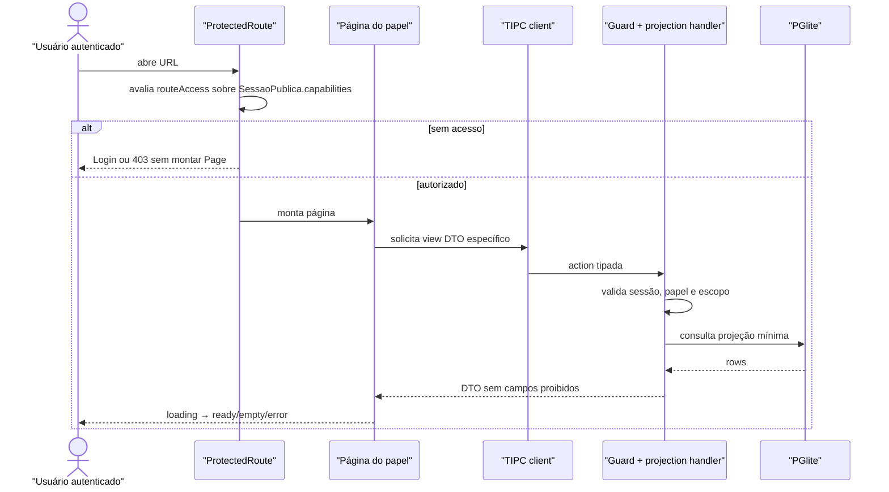
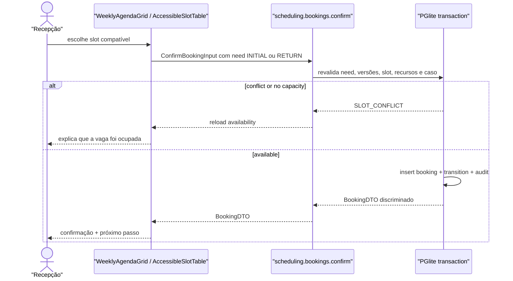

# BUILD — Superfícies, navegação, componentes e configurações

## State

- Tipo: blueprint técnico; não é Spec, Plan ou autorização de código.
- Fonte: `hack/domains/ANALYST-superficies-e-configuracoes.md`.
- Conteúdo: `COMPLETE PARA REVISÃO`.
- Estado de governança: `DRAFT — BLOQUEADO PELA ASSINATURA DO ANALYST`.
- Risco: alto, porque conecta todos os domínios e define projeções de dados por papel.
- Build dependente: `hack/domains/BUILD-acesso-e-auditoria.md` e Builds dos contratos clínicos/agenda.

## Goal

Transformar o esqueleto Electron atual em um produto navegável de ponta a ponta: login, home por papel, entrada, triagem, agendamento, avaliação, handoff e configuração administrativa. A implementação deve usar um registry tipado de superfícies/capabilities, DTOs explícitos por consumidor, componentes shadcn existentes e estados de interface fechados. IA cloud e memória continuam no repositório como código dormente, sem rota, menu, toggle ou montagem no shell do MVP.

## Inputs Consumed

- `hack/PRD.md` — promessa, fluxo e atores.
- `hack/domains/ANALYST-superficies-e-configuracoes.md` — catálogo canônico de superfícies.
- `hack/domains/ANALYST-acesso-e-auditoria.md` — sessão, papel e capabilities.
- `hack/domains/BUILD-acesso-e-auditoria.md` — `SessaoPublica` para o renderer; `CurrentSession`/`ActorContext` somente no main; capabilities e escopo canônicos.
- `hack/domains/BUILD-classificacao-e-agenda.md` — `SchedulingRequirementDTO`, `BookingDTO`, slots, commands e configuração de capacidade.
- `hack/domains/BUILD-avaliacao-pendencias-e-handoff.md` — DTOs e queries canônicos de encounter, pendência atribuída, documento metadata-only, retorno, resultado e entrega.
- `src/renderer/src/App.tsx` — router/casca atual.
- `src/renderer/src/componentes/AppSidebar.tsx` — menu/tema atual.
- `src/renderer/src/componentes/PageHeader.tsx` — header/breadcrumbs reutilizáveis.
- `src/renderer/src/anamnese/*` — Composer e editors reutilizáveis.
- `src/renderer/src/components/ui/*` — primitivos shadcn/Radix.
- `src/main/tipc.ts` — fronteira tipada que fornecerá view DTOs.

## Current Terrain

- Router possui somente `/`, `/ia` e `/configuracoes` (`src/renderer/src/App.tsx:13`, `49-56`).
- Shell monta o painel IA em quase toda rota (`src/renderer/src/App.tsx:32-45`).
- Menu é global e contém exatamente Início, Assistente IA e Configurações (`src/renderer/src/componentes/AppSidebar.tsx:28-32`).
- Configurações atuais são formulário de provider/token/modelo cloud (`src/renderer/src/paginas/ConfiguracoesPagina.tsx:128-225`).
- Dashboard é placeholder autodeclarado (`src/renderer/src/paginas/Dashboard.tsx:13-17`, `38-48`).
- PageHeader já oferece sidebar, breadcrumb, ações e navegação, mas injeta toggle IA (`src/renderer/src/componentes/PageHeader.tsx:74-83`, `149-176`).
- EmptyState é reutilizável, porém só diferencia título/descrição/ação (`src/renderer/src/componentes/EmptyState.tsx:3-18`).
- ErrorBoundary expõe `error.message` cru na UI (`src/renderer/src/componentes/ErrorBoundary.tsx:35-55`); isso não pode continuar em telas clínicas.
- Composer aceita catálogo e modo disabled (`src/renderer/src/anamnese/Composer.tsx:35-41`, `59-65`).
- Não existe grade semanal de agenda no renderer atual; o único shell ativo ainda é o das três rotas herdadas (`src/renderer/src/App.tsx:13`, `49-56`).

## Recommended Path

### 1. Casca dirigida por contrato

Criar um registry único com todas as rotas, capabilities, item de menu e breadcrumbs. O router e a sidebar consomem o mesmo array; não existem listas duplicadas. Uma rota protegida valida sessão/capability antes de montar a página.

### 2. Projeções por papel, não um “Caso completo” universal

O main oferece quatro leituras distintas do caso: operacional, enfermagem, anestesia e solicitante. Cada DTO contém apenas os campos que a superfície usa. Isso elimina a expectativa de que JSX escondido proteja um objeto excessivo.

### 3. Slices visuais por jornada

Páginas usam componentes de domínio pequenos dentro de uma casca comum: header do caso, status/next owner, worklist, form, timeline e drawer. Não criar uma megatela condicional com todos os papéis.

### 4. Agenda como projeção própria

Construir `WeeklyAgendaGrid`, uma grade CSS fina de cinco dias úteis que recebe `SlotCardDTO[]` prontos do backend. Ela não calcula slot, capacidade, compatibilidade ou transição e não introduz biblioteca de calendário. Reservar e reagendar usam ações explícitas com versão; não há drag-and-drop nem resize. `AccessibleSlotTable` consome o mesmo array, preserva a mesma seleção por `slotId` e é caminho operacional equivalente por teclado.

### 5. Configurações administrativas reais

Substituir a página cloud por um layout admin com rotas filhas: usuários, cadastros operacionais, agenda/capacidade, catálogos/formulários e auditoria. Somente usuários `origin=ADMIN`, recursos, janelas datadas e bloqueios são mutáveis; contas `FIXTURE`, demais fixtures e conteúdo clínico versionado são somente leitura. A superfície importa os DTOs/actions de capacidade do domínio agenda e não os redefine.

### 6. IA dormente

Remover imports/mounts ativos de `IaPagina`, `IaChatPanel`, toggle e nav. Preservar arquivos fora da árvore ativa para roadmap, sem credencial e sem chamada involuntária.

## Files / Areas

| Path/Area | Action | Reason | Risk |
|---|---|---|---|
| `src/shared/clinical/case.ts` | consume, do not duplicate | Enum/lifecycle canônico owned by case/referral Build. | critical |
| `src/shared/view-contracts.ts` | new | DTOs e pagination/filter contracts. | high |
| `src/renderer/src/navigation/surfaces.ts` | new | Registry único de rota/menu/capability. | high |
| `src/renderer/src/App.tsx` | rewrite composition | Login público + protected layout + canonical routes. | critical |
| `src/renderer/src/main.tsx` | modify | AuthProvider antes do router. | high |
| `src/renderer/src/componentes/AppSidebar.tsx` | modify | Menu pelas capabilities da sessão, user footer/logout, tema. | high |
| `src/renderer/src/componentes/PageHeader.tsx` | modify | Remover toggle IA; manter breadcrumb/actions. | medium |
| `src/renderer/src/componentes/ErrorBoundary.tsx` | modify | Não expor erro cru; correlation ID/restart. | high |
| `src/renderer/src/componentes/EmptyState.tsx` | extend minimally | Variantes contextuais sem duplicação. | low |
| `src/renderer/src/components/domain/*` | new | CaseHeader, timeline, worklist, status, form shell. | medium |
| `src/renderer/src/paginas/LoginPagina.tsx` | new | Entrada pública única. | high |
| `src/renderer/src/paginas/HomePagina.tsx` | new | Summary por papel. | medium |
| `src/renderer/src/paginas/casos/*` | new | Intake/detail. | high |
| `src/renderer/src/paginas/triagens/*` | new | Queue/editor. | critical |
| `src/renderer/src/paginas/pendencias/*` | new | Assigned worklist + evidence metadata. | high |
| `src/renderer/src/paginas/agenda/*` | new | Fila, grade semanal, lista e reserva. | critical |
| `src/renderer/src/paginas/agenda/WeeklyAgendaGrid.tsx` | new | Projeção semanal própria, sem regra de agenda. | medium |
| `src/renderer/src/paginas/avaliacoes/*` | new | Medical queue/editor. | critical |
| `src/renderer/src/paginas/resultados/*` | new | Requester inbox/handoff. | high |
| `src/renderer/src/paginas/configuracoes/*` | new | Admin pages. | high |
| `src/renderer/src/paginas/IaPagina.tsx` | keep dormant | Roadmap, not MVP route. | low |
| `src/renderer/src/paginas/ConfiguracoesPagina.tsx` | retire/rename dev-only | Cloud form cannot own `/configuracoes`. | medium |
| `src/renderer/src/componentes/IaChatPanel.tsx` | keep dormant | No mount in shell. | low |
| `src/main/tipc.ts` | compose domain routers | Provide view contracts. | critical |
| `tests/renderer/*` | add/update | State/role/component contract. | low |
| `tests/e2e/app-flow.spec.ts` | replace | Current three-route expectation is obsolete. | medium |
| `tests/e2e/role-journey.spec.ts` | new | Five-role ponta a ponta. | high |

## Contracts

### Product

1. O primeiro frame sem sessão é Login, sem flash da casca.
2. Cada papel vê sua home e seu menu.
3. Um caso entra na recepção, passa por triagem, agenda, anestesia e handoff em superfícies nomeadas.
4. O detalhe do caso é role-aware e mostra sempre estado + próximo responsável.
5. Toda lista tem busca/filtros mínimos, empty state real e reload de erro.
6. Toda mutação tem confirmação visível e proteção contra duplo submit.
7. Configuração permite preparar os dados operacionais da demo, mas não editar regras clínicas livres.
8. IA cloud não aparece nem é montada no fluxo.

### Canonical enums

```ts
import type { Capability, SessaoPublica } from '@/shared/auth'
import type { CaseStatus } from '@/shared/clinical/case'
import type {
  BookingDTO,
  ConfirmBookingInput,
  SchedulingRequirementDTO,
  SlotCardDTO,
  SlotClass,
} from '@/shared/scheduling/types'
```

Nenhuma tela persiste label localizada como chave. Labels PT-BR são mapeados na camada de apresentação.
Não existe enum, lista de papel, estado de caso, estado de booking ou classe de slot próprio
desta camada. A navegação usa `SessaoPublica.capabilities`; `CurrentSession` nunca atravessa
o TIPC e permanece main-only. As telas consomem as uniões
discriminadas canônicas sem reduzir estados a labels ou booleanos.

### Surface registry

```ts
interface SurfaceDefinition {
  id: string
  path: string
  label: string
  routeAccess: AccessRule
  navAccess?: AccessRule
  nav?: { group: 'WORK' | 'ADMIN'; order: number; icon: LucideIcon }
  element: React.LazyExoticComponent<React.ComponentType>
}

type NonEmptyCapabilities = readonly [Capability, ...Capability[]]
type AccessRule =
  | { allOf: NonEmptyCapabilities; anyOf?: NonEmptyCapabilities }
  | { allOf?: NonEmptyCapabilities; anyOf: NonEmptyCapabilities }

export const SURFACES: readonly SurfaceDefinition[] = [
  { id: 'home', path: '/', label: 'Início', routeAccess: { allOf: ['home:read'] }, navAccess: { allOf: ['home:read'] }, nav: /* ... */ },
  { id: 'case-new', path: '/casos/novo', label: 'Nova entrada', routeAccess: { allOf: ['case:intake:create'] }, navAccess: { allOf: ['case:intake:create'] }, nav: /* ... */ },
  { id: 'case-detail', path: '/casos/:casoId', label: 'Caso', routeAccess: { allOf: ['case:read'] } },
  { id: 'triages', path: '/triagens', label: 'Triagens', routeAccess: { allOf: ['triage:worklist:read'] }, navAccess: { allOf: ['triage:worklist:read'] }, nav: /* ... */ },
  { id: 'case-triage', path: '/casos/:casoId/triagem', label: 'Triagem', routeAccess: { allOf: ['clinical:anamnesis:read'] } },
  { id: 'pendencies', path: '/pendencias', label: 'Pendências', routeAccess: { allOf: ['case:read:assigned', 'pendency:evidence:register'] }, navAccess: { allOf: ['case:read:assigned', 'pendency:evidence:register'] }, nav: /* ... */ },
  { id: 'booking', path: '/agendamentos', label: 'Para agendar', routeAccess: { allOf: ['scheduling:queue:read', 'scheduling:booking:manage'] }, navAccess: { allOf: ['scheduling:queue:read', 'scheduling:booking:manage'] }, nav: /* ... */ },
  { id: 'agenda', path: '/agenda', label: 'Agenda', routeAccess: { allOf: ['scheduling:read', 'scheduling:booking:manage'] }, navAccess: { allOf: ['scheduling:read', 'scheduling:booking:manage'] }, nav: /* ... */ },
  { id: 'case-booking', path: '/casos/:casoId/agendamento', label: 'Agendamento', routeAccess: { allOf: ['scheduling:read', 'scheduling:booking:manage'] } },
  { id: 'assessments', path: '/avaliacoes', label: 'Avaliações', routeAccess: { allOf: ['assessment:read'] }, navAccess: { allOf: ['assessment:read'] }, nav: /* ... */ },
  { id: 'case-assessment', path: '/casos/:casoId/avaliacao', label: 'Avaliação', routeAccess: { allOf: ['assessment:read'] } },
  { id: 'results', path: '/resultados', label: 'Resultados', routeAccess: { anyOf: ['result:status:read', 'result:content:read', 'delivery:manage', 'delivery:acknowledge'] }, navAccess: { anyOf: ['result:status:read', 'result:content:read', 'delivery:manage', 'delivery:acknowledge'] }, nav: /* ... */ },
  { id: 'case-result', path: '/casos/:casoId/resultado', label: 'Resultado', routeAccess: { anyOf: ['result:status:read', 'result:content:read', 'delivery:manage', 'delivery:acknowledge'] } },
  { id: 'settings', path: '/configuracoes', label: 'Configurações', routeAccess: { anyOf: ['config:read', 'users:manage', 'scheduling:capacity:manage', 'audit:read'] } },
  { id: 'settings-users', path: '/configuracoes/usuarios', label: 'Usuários', routeAccess: { allOf: ['users:manage'] }, navAccess: { allOf: ['users:manage'] }, nav: /* ... */ },
  { id: 'settings-operation', path: '/configuracoes/operacao', label: 'Operação', routeAccess: { allOf: ['config:read'] }, navAccess: { allOf: ['config:read'] }, nav: /* ... */ },
  { id: 'settings-capacity', path: '/configuracoes/agenda', label: 'Agenda', routeAccess: { allOf: ['scheduling:capacity:manage'] }, navAccess: { allOf: ['scheduling:capacity:manage'] }, nav: /* ... */ },
  { id: 'settings-catalogs', path: '/configuracoes/catalogos', label: 'Catálogos', routeAccess: { allOf: ['config:read'] }, navAccess: { allOf: ['config:read'] }, nav: /* ... */ },
  { id: 'settings-audit', path: '/configuracoes/auditoria', label: 'Auditoria', routeAccess: { allOf: ['audit:read'] }, navAccess: { allOf: ['audit:read'] }, nav: /* ... */ },
]
```

Rotas de detalhe usam o mesmo registry, sem `nav`. O menu filtra exclusivamente por
`SessaoPublica.capabilities`; não faz `switch(role)`. `routeAccess` decide montagem da rota;
`navAccess` pode ser mais estreito e decide somente visibilidade. `allOf` exige todas as
capabilities e `anyOf`, ao menos uma. Para `SOLICITANTE`, presença de qualquer capability
de resultado ainda exige `requireServiceScope(session.servicoSolicitanteId)` no
main e a query já retorna a projeção redigida do próprio serviço. A UI nunca recebe a lista
global para ocultar linhas localmente.

### Read state and mutation state

```ts
type ResourceState<T> =
  | { status: 'loading' }
  | { status: 'ready'; data: T }
  | { status: 'empty'; reason: EmptyReason }
  | { status: 'error'; code: string; correlationId?: string }

type MutationState<T> =
  | { status: 'idle' }
  | { status: 'submitting' }
  | { status: 'success'; data: T }
  | { status: 'validation-error'; fields: Record<string, string> }
  | { status: 'version-conflict'; currentVersion: number }
  | { status: 'error'; code: string; correlationId?: string }
```

Não combinar `loading: boolean`, `data?: T` e `error?: string` em estados impossíveis. Hooks de cada domínio expõem unions discriminadas.

### Common DTOs

```ts
interface PageResult<T> {
  items: T[]
  nextCursor: string | null
  totalVisible?: number
}

interface CaseSummaryDTO {
  id: string
  displayCode: string
  personName: string
  procedureDescription: string
  requesterLabel: string
  status: CaseStatus
  responsibility: {
    currentRoles: Role[]
    nextRoles: Role[]
    reasonCode: string
  }
  version: number
  updatedAt: string
}

interface CaseListItemDTO extends CaseSummaryDTO {
  openedAt: string
  appointmentAt: string | null
  slotClass: SlotClass | null
  requiredDurationMinutes: number | null
  hasPendingData: boolean
}
```

`CaseSummaryDTO` é o contrato canônico do Build de caso/encaminhamento. Paciente não possui
`patientId`; detalhes de pessoa, encaminhamento, procedimento e solicitante são snapshots do
`CaseDetailDTO`, nunca joins a uma tabela de pacientes.

### Home projection

```ts
interface HomeCardDTO {
  key: string
  label: string
  count: number
  href: string
  severity: 'neutral' | 'attention'
}

interface HomeSummaryDTO {
  role: Role
  cards: HomeCardDTO[]
  nextItems: CaseListItemDTO[]
  generatedAt: string
}
```

O backend escolhe cards permitidos; frontend não recebe contagens globais para esconder.
Para `ENFERMAGEM`, a projeção distingue `WAITING_NURSING`, rascunho,
`TRIAGE_PENDING` e `CALCULATED_AWAITING_DECISION`; o último continua em
`NURSING_IN_PROGRESS`, mas exige confirm/override e não nova edição.

### Intake projection and mutation

```ts
interface IntakeOptionsDTO {
  services: Array<{ id: string; name: string; specialty: string; revision: string }>
  procedures: Array<{
    id: string
    code: string | null
    name: string
    questionSetId: 'pre_anesthesia_mvp'
    questionSetVersion: 1
    revision: string
  }>
}

interface PersonSnapshotDTO {
  _v: 1
  fullName: string
  birthDate: string | null
  ageYearsAtOpening: number
  sexReported: 'FEMALE' | 'MALE' | 'INTERSEX' | 'NOT_INFORMED'
  originIdentifier: string | null
}
interface ReferralSnapshotDTO {
  _v: 1
  referralId: string
  sourceReference: string | null
  issuedAt: string | null
  receivedAt: string
  freeTextReference: string
  sourceDocumentLabel: string | null
}
interface ProcedureSnapshotDTO {
  _v: 1
  description: string
  catalogId: string
  catalogVersion: string
  lateralityOrSite: string | null
  notes: string | null
}
interface RequesterSnapshotDTO {
  _v: 1
  serviceId: string
  serviceCatalogRevision: string
  serviceName: string
  physicianName: string
  specialty: string | null
  returnContact: string | null
  originIdentifier: string | null
}
type PersonInputDTO =
  | Omit<PersonSnapshotDTO, '_v' | 'ageYearsAtOpening'> & { birthDate: string }
  | Omit<PersonSnapshotDTO, '_v' | 'birthDate'> & {
      birthDate: null
      ageYearsAtOpening: number
    }
type ReferralInputDTO = Omit<ReferralSnapshotDTO, '_v' | 'referralId'>
interface ProcedureInputDTO {
  catalogId: string
  freeTextDescription: string | null
  lateralityOrSite: string | null
  notes: string | null
}
interface RequesterInputDTO {
  serviceId: string
  physicianName: string
  specialty: string | null
  returnContact: string | null
  originIdentifier: string | null
}

interface CreateCaseDTO {
  person: PersonInputDTO
  referral: ReferralInputDTO
  procedure: ProcedureInputDTO
  requester: RequesterInputDTO
  idempotencyKey: string
}
```

O select de serviço/procedimento compõe snapshots e preserva a revisão do catálogo;
`requestingServiceId` também é persistido como projeção/FK para o escopo do
`SOLICITANTE`. Não existe FK de paciente. O profissional solicitante é digitado como
snapshot, sem master cadastro. `referralId` é UUID local gerado no main;
`sourceReference` é o protocolo opcional do papel. Somente a repetição dessa referência no
mesmo serviço é conflito; `person.fullName` e os demais campos da pessoa nunca participam de
deduplicação.

### Case projections by consumer

```ts
import type {
  AnesthesiaEncounterDTO,
  AssignedPendencyDTO,
  AuthorizedResultDTO,
  CaseDocumentDTO,
  CasePendencyDTO,
  PreopResultDTO,
  ResultDeliveryDTO,
  ReturnRequestDTO,
  RequesterActionDTO,
} from '@/shared/clinical/assessment'

interface CaseOperationalDTO {
  case: CaseDetailDTO
  requirement: SchedulingRequirementDTO | null
  booking: BookingDTO | null
}

interface CaseNursingDTO {
  case: CaseDetailDTO
  anamnesisId: string
  anamnese: PreAnesthesiaContent
  draftRevision: number
  currentFinalRevision: number | null
  requirement: SchedulingRequirementDTO | null
  submissionState: 'DRAFT' | 'CALCULATED_AWAITING_DECISION' | 'PUBLISHED'
  submittedAt: string | null
}

interface CaseAnesthesiaDTO {
  case: CaseDetailDTO
  triageSnapshot: {
    anamnesisId: string
    revision: number
    template: { id: 'pre_anesthesia_mvp'; version: 1 }
    submittedAt: string
    submittedByName: string
    content: PreAnesthesiaContent
    slotClass: SlotClass
    explanationItems: string[]
  }
  booking: BookingDTO
  encounter: AnesthesiaEncounterDTO | null
  pendingItems: CasePendencyDTO[]
  returnRequest: ReturnRequestDTO | null
  currentResult: PreopResultDTO | null
  delivery: ResultDeliveryDTO | null
}

interface CaseRequesterDTO {
  case: CaseSummaryDTO
  statusSummary: string
  openRequest: null | RequesterActionDTO
  finalResult: null | AuthorizedResultDTO
  delivery: null | ResultDeliveryDTO
}
```

`CaseDetailDTO` e os snapshots vêm do Build de caso. `PreAnesthesiaContent` e
`SchedulingRequirementDTO` vêm dos Builds de anamnese e classificação/agenda. A superfície
importa do Build de avaliação/handoff `AnesthesiaEncounterDTO`, `AssignedPendencyDTO`,
`CaseDocumentDTO`, `CasePendencyDTO`, `ReturnRequestDTO`, `PreopResultDTO`,
`ResultDeliveryDTO` e `AuthorizedResultDTO`; `RequesterActionDTO` é uma projeção de ação
adicional. Esta camada
compõe as projeções; não redefine estado, conteúdo clínico ou regra de cada agregado. Em
particular, `CaseNursingDTO.requirement` só existe depois do submit final atômico: não há
prévia editável ou outro cálculo de renderer.

`/pendencias` consome diretamente `CursorPage<AssignedPendencyDTO>` de
`pendencies.listAssigned` e os retornos canônicos de `documents.registerMetadata` e
`pendencies.fulfill`. Este Build não cria um segundo DTO de pendência ou documento;
`CaseDocumentDTO` nunca contém bytes, base64 ou path local.

`encounters.list` em S08 é uma worklist compartilhada do pool. Este Build não introduz
`resource.userId`, filtro “meus compromissos” ou join conta↔recurso; qualquer
`ANESTESIOLOGISTA` autorizado pode iniciar um booking `CHECKED_IN`, e o DTO do encontro
devolve o ator real carimbado pelo main.

### Agenda week projection

`SlotCardDTO`, `ConfirmBookingInput`, `SchedulingRequirementDTO` e `BookingDTO` são
importados de `src/shared/scheduling/types.ts`, sem adaptação de semântica. A superfície
também reutiliza diretamente a resposta discriminada de
`scheduling.slots.listCompatible` (`SLOTS | CAPACITY_SHORTAGE`):

```ts
interface AgendaWeekDTO {
  requirement: SchedulingRequirementDTO
  booking: BookingDTO | null
  weekStart: string
  weekEndExclusive: string
  timezone: 'America/Sao_Paulo'
  availability: Awaited<ReturnType<typeof api.scheduling.slots.listCompatible>>
}
```

O renderer nunca envia `startsAt`, `endsAt`, classe, duração, capability ou ator para
confirmar reserva. Ele envia o `ConfirmBookingInput` canônico — `caseId`, versões, `slotId`
e a necessidade discriminada `INITIAL | RETURN` — ao command
`scheduling.bookings.confirm`; o main recarrega e revalida necessidade e slot. A UI renderiza
todos os estados de `BookingDTO`: `CONFIRMED`, `CHECKED_IN`, `CANCELLED`, `COMPLETED` e
`NO_SHOW`.

### `WeeklyAgendaGrid`

```ts
interface WeeklyAgendaGridProps {
  slots: readonly SlotCardDTO[]
  selectedSlotId: string | null
  onSelectSlot: (slotId: string) => void
}
```

- Implementação própria em CSS Grid com segunda a sexta; não adiciona package de calendário.
- Recebe slots prontos e apenas os posiciona por `startsAt`/`endsAt`; não calcula capacidade,
  compatibilidade, classe, duração, buffer, regra ou transição.
- Não possui drag-and-drop nem resize. Clique/Enter em slot selecionável abre
  `BookingDrawer`; reagendamento é command explícito.
- Formata datas com `Intl.DateTimeFormat` e `timeZone: 'America/Sao_Paulo'`.
- `AccessibleSlotTable` recebe o mesmo `dto.slots`, na mesma ordenação, e sincroniza a
  seleção por `slotId`. A tabela continua totalmente operacional se a grade falhar.
- Slot com `compatible=false` aparece desabilitado somente quando o backend deliberadamente
  o inclui para explicação; o main continua sendo a autoridade no command.

### Admin configuration DTOs

```ts
interface OperationalCatalogInventoryDTO {
  services: Array<{
    id: string
    name: string
    specialty: string
    active: boolean
    source: string
    revision: string
  }>
  procedures: Array<{
    id: string
    code: string | null
    name: string
    active: boolean
    questionSetId: 'pre_anesthesia_mvp'
    questionSetVersion: 1
    source: string
    revision: string
  }>
}

interface CatalogStatusDTO {
  key: 'CID10' | 'MEDICATIONS' | 'MET' | 'COMORBIDITIES' | 'WIDGETS' | 'TRIAGE_TEMPLATE' | 'CLASSIFIER'
  version: string
  sha256: string
  itemCount: number
  state: 'LOADED' | 'MISSING' | 'DIVERGENT' | 'ERROR'
  loadedAt: string | null
}
```

Contratos de capacidade são todos importados do owner `src/shared/scheduling/types.ts`:

```ts
import type {
  CancelResourceBlockInput,
  CreateDatedWindowInput,
  CreateResourceBlockInput,
  CreateResourceInput,
  DatedWindowAdminDTO,
  MaterializationReportDTO,
  MaterializeSlotsInput,
  ReplaceDatedWindowInput,
  ResourceAdminDTO,
  ResourceBlockDTO,
  RetireDatedWindowInput,
  UpdateResourceInput,
} from '@/shared/scheduling/types'

interface CapacityConfigurationPageProps {
  resources: readonly ResourceAdminDTO[]
  datedWindows: readonly DatedWindowAdminDTO[]
  blocks: readonly ResourceBlockDTO[]
  lastMaterialization: MaterializationReportDTO | null
}
```

Os formulários apenas coletam os inputs importados e apresentam os DTOs retornados. Eles não
validam recorrência, materializam slots nem inventam um `SchedulingResourceKind` paralelo:
`ResourceKind` e `ResourceCapability` permanecem separados no domínio agenda. Não existe
editor recorrente no MVP; cada janela possui início/fim datados, pode ser substituída ou
retirada e a materialização idempotente cobre no máximo 30 dias.

Somente usuários `origin=ADMIN`, recursos, janelas datadas e bloqueios possuem commands de escrita no admin.
Serviços, procedimentos, profissional solicitante, templates/classes/durações/buffers,
widgets, regras e catálogos não possuem create/update/delete no MVP. O profissional
solicitante existe apenas no `RequesterSnapshotDTO` do caso.

### Backend action map by surface

| Surface | Reads | Mutations | Capability |
|---|---|---|---|
| S01 Home | `home.get` | — | `home:read` |
| S02 Intake | `catalogs.services.search`, `catalogs.procedures.search` | `cases.create` | `case:intake:create` |
| S03 Detail | `cases.get` + projeção do domínio autorizada | `cases.correctIntake` → `case:intake:correct` + estado permitido + ausência de revisão `FINAL/COMPLETE` e requirement `CALCULATED`/publicado; `cases.cancel` → `case:cancel`; `pendencies.fulfill` → `pendency:evidence:register` | `case:read` + escopo na leitura; capability e state gate próprios em cada ação |
| S04 Triage queue | `cases.listForActor` | em `WAITING_NURSING`, `handoffs.acknowledge` → `handoff:receive`; somente após sucesso, `clinicalAnamnesis.start` → `clinical:anamnesis:edit` | `triage:worklist:read`; capability própria em cada ação |
| S04A Assigned pendencies | `pendencies.listAssigned` → `AssignedPendencyDTO` | `documents.registerMetadata`, `pendencies.fulfill` | `case:read:assigned`, `pendency:evidence:register`; ownership/escopo no main |
| S05 Triage | `clinicalAnamnesis.getClinical` | `clinicalAnamnesis.saveDraft/markPending/resume/submitFinal` → `clinical:anamnesis:edit`; `clinicalAnamnesis.rebaseCaseContext` → `clinical:anamnesis:edit` somente em `DRAFT` pré-FINAL após intake corrigido; `scheduling.requirements.confirm/override` → mesma autoria de enfermagem | `clinical:anamnesis:read`; capability e state gate próprios em cada ação |
| S06 Booking queue | `cases.listForActor` para `INITIAL READY_FOR_SCHEDULING` + `returnRequests.listReady` para `RETURN READY_FOR_BOOKING`, preservando discriminante | — | `scheduling:queue:read`; retorno pronto exige `scheduling:booking:manage` |
| S07 Agenda | `scheduling.slots.listCompatible` → `SLOTS | CAPACITY_SHORTAGE` | `scheduling.bookings.confirm/reschedule/cancel/markNoShow` → `scheduling:booking:manage`; `scheduling.bookings.checkIn` → `scheduling:booking:check-in` | `scheduling:read`; capability própria em cada ação |
| S08 Assessment queue | `encounters.list` | `encounters.start` somente após `BookingDTO.CHECKED_IN` | `assessment:read`, `assessment:write` |
| S09 Assessment | `encounters.getClinical` → `assessment:read`; quando existir resultado final, `results.getCurrent` → `result:content:read` | `encounters.saveAssessment/resumeReview` e `results.finalize` → `assessment:write`; `pendencies.open/cancel` → `pendency:manage`; `pendencies.fulfill` → `pendency:evidence:register` | capability própria em cada leitura/ação |
| S10 Results | `results.listForActor` já filtrado pelo `serviceId` da sessão | — | `result:status:read`; conteúdo não acompanha a lista |
| S11 Handoff | `results.getStatus` → `result:status:read`; `results.getCurrent` → `result:content:read` | `deliveries.send` → `delivery:manage`; `deliveries.acknowledge` → `delivery:acknowledge`; `results.exportPdf` → `result:export` | projeção e capability próprias por leitura/ação; não existe cancelamento de entrega |
| S12 Users | `usuarios.listar` | `usuarios.criar`, `usuarios.atualizar`, `usuarios.resetarSenha` | `users:manage` |
| S13 Operation | `catalogs.services.search`, `catalogs.procedures.search` | — | `config:read` |
| S14 Capacity | `scheduling.capacity.getConfiguration` | `scheduling.capacity.resources.create/update`; `scheduling.capacity.windows.create/replace/retire`; `scheduling.capacity.blocks.create/cancel`; `scheduling.capacity.materialize` | `scheduling:capacity:manage` |
| S15 Catalogs | `config.catalogs.getStatus` | — | `config:read` |
| S16 Audit | `auditoria.listar` | — | `audit:read` |

S05 nunca oferece preview mutável: `submitFinal` conclui a revisão `FINAL` e produz o
requirement `CALCULATED` no mesmo commit, mantendo `NURSING_IN_PROGRESS`; apenas
`confirm/override` publica e move para `READY_FOR_SCHEDULING`. `TRIAGE_PENDING` é usado
exclusivamente por `markPending` quando a incompletude está descrita por `missingFieldPaths`
e motivo; `resume` volta ao draft. Se o intake mudar antes da revisão final,
`rebaseCaseContext` atualiza somente o `DRAFT`. Depois de `FINAL + CALCULATED`, não existe
edição, adendo ou rebase. Em S09, o anestesiologista abre a pendência com
`requiresReturn`; quando o último bloqueio é cumprido, o service de avaliação cria o
`ReturnRequestDTO` único. Essa superfície não chama booking. A recepção o encontra em S06,
agenda em S07 e registra o check-in explicitamente antes de `encounters.start`.

S04 não encadeia as duas mutações de forma otimista: aguarda
`handoffs.acknowledge` devolver caso `NURSING_IN_PROGRESS` e versões atualizadas; só então
habilita `clinicalAnamnesis.start`. S04A nunca recebe coleção global para filtrar no JSX.
`pendencies.listAssigned` já aplica owner/serviço e devolve a variante `ASSIGNEE`; papel/view não
vêm do renderer. Os commands reaplicam ownership,
escopo, `caseId`, `pendencyId` e versão. A seleção local de arquivo calcula SHA-256 no
renderer e envia somente o input metadata-only canônico; bytes/base64/path não atravessam o
TIPC nem são persistidos.

`cases.correctIntake` possui defesa dupla: a projeção omite/desabilita a ação se o estado
não é pré-publicação, se já existe revisão `FINAL/COMPLETE` ou se existe requirement
`CALCULATED`/publicado; o main reaplica os três gates atomicamente. Portanto,
`NURSING_IN_PROGRESS` após `submitFinal` não autoriza correção. O MVP não reabre nem
reclassifica requirement calculado ou publicado.

### Frontend composition

#### Shared shell

- `ProtectedAppLayout`: sidebar, main, toast and global error boundary.
- `CapabilitySidebar`: items from registry filtered by `SessaoPublica.capabilities` and each `navAccess`; footer includes name, role label, logout and ThemeSelector.
- `PageHeader`: breadcrumbs/actions only; IA toggle removed.
- `CaseHeader`: protocol, patient snapshot, procedure, state label, next owner.
- `CaseTimeline`: domain events with text/time/actor; respects projection.
- `ResourceStateView`: handles loading/error/empty around list/read pages; forms retain explicit state locally.

#### Worklists

- One `CaseWorklist` component accepts columns/actions as typed config, but DTOs remain role-specific.
- `AssignedPendencyWorklist` consumes only `AssignedPendencyDTO`; it shows kind, authorized
  request, owner, due/overdue, `caseContext.displayCode/personName/procedureDescription` and
  the discriminated fulfillment form. It does not reuse a clinical encounter DTO.
- Desktop table at ≥1200px; compact rows at 1024px.
- Search delayed 250ms and applied by backend for real lists; demo may still return one page.
- Empty and filter-empty have different copy and reset action.

#### Forms

- Use controlled fields + Zod schema shared only for syntactic validation; domain remains validated in main.
- Sticky action bar contains Save/Submit/Cancel as appropriate.
- Error summary links to invalid fields.
- Dirty navigation blocker applies to route change, logout and close window.
- Submit confirmation names irreversible consequence: submitted nursing snapshot, completed medical result, deactivation.
- Documento de pendência selecionado localmente mostra nome, MIME, tamanho e SHA-256 antes
  do envio do metadata receipt; a copy declara “o arquivo não será armazenado”.

#### Resultado e proveniência

- `finalizedBy`, `finalizedAt` e `contentHash` são exibidos como “Autoria”, “Finalizado em” e
  “Integridade (SHA-256)”; nenhuma label usa “assinado” ou “assinatura digital”.
- O preview/export inclui “Protótipo com dados sintéticos — não assinado digitalmente”.
- `ResultDelivery` oferece somente envio `SENT` e confirmação `RECEIVED`; não existe botão,
  menu, dialog ou command de cancelamento.

#### Config layout

- Secondary sidebar or tabs: Usuários, Operação, Agenda, Catálogos, Auditoria.
- Each child route is deep-linkable; `/configuracoes` redirects to `/configuracoes/usuarios`.
- Usuários `origin=FIXTURE` exibem badge “Conta da demo” e nenhuma ação de editar, resetar,
  ativar ou desativar; os forms de gestão abrem somente para `origin=ADMIN`.
- Operação mostra somente inventário, `source` e `revision` dos serviços/procedimentos
  fixtures. Catálogos mostra somente status/version/hash. Nenhuma dessas páginas possui
  create, edit, activate, delete, upload, publish ou JSON textarea.
- Agenda apresenta forms tipados do owner agenda e permite escrever apenas recursos,
  janelas datadas e bloqueios, além de solicitar materialização idempotente. Templates,
  classes, durações e buffers aparecem como referência somente leitura; não há editor de
  recorrência, FullCalendar, drag-and-drop ou resize.
- IA cloud configuration may be kept under an explicitly non-routed development import; it is not a settings tab.
- Não existe página, botão ou TIPC de backup, restore ou reset. Limpeza de dados pertence
  somente ao harness de teste, fora da casca autenticada.

### UX states matrix

| Surface family | Required states |
|---|---|
| Login | idle, submitting, generic credential failure, local DB error |
| Home/worklist | loading, ready, empty, filter-empty, retryable error |
| Detail | loading, ready, not-found/forbidden indistinguishable to unauthorized, stale error |
| Form | loading, pristine, dirty, validation error, submitting, success, conflict, fatal error |
| Agenda | loading, slots, capacity shortage, selected, confirming, conflict, confirmed, checked-in, cancelled, completed, no-show |
| Pendência atribuída | loading, empty, filter-empty, hashing metadata, invalid, saving, fulfilled, conflict, forbidden, error |
| Handoff/PDF | unavailable, available, confirming, received, generating, export error |
| User/capacity write | loading, empty, dialog, invalid, saving, conflict, deactivate/remove warning |
| Read-only fixtures/catalog status | loaded, empty, missing, divergent, read error |

### Responsiveness

- `1280×720`: acceptance/pitch viewport; full sidebar and main actions visible.
- `1024×640`: sidebar may collapse to icons; forms become one column; worklist hides low-priority columns into row detail; primary action remains visible.
- `1440×900+`: content max widths prevent stretched forms; agenda uses available width.
- `<768`: not an acceptance target. Existing Sheet sidebar may remain functional, but no promise de mobile workflow.
- No fixed 380px IA panel remains to steal space.

### Accessibility

- Semantic headings in one hierarchy per page.
- Visible labels on fields; placeholders never replace labels.
- `aria-live=polite` for save/result; `role=alert` for blocking errors.
- Icon-only button: accessible name + tooltip.
- Focus trap/return via Radix Dialog/Sheet.
- Status/class always text + optional icon/color.
- Accessible slot table has the same slots/actions as the visual weekly grid.
- Table row actions reachable by keyboard without hover.
- Contrast verified in light/dark/system.
- Motion respects `prefers-reduced-motion` for drawer/grid transitions.

## Runtime Sequence



### Booking interaction



O check-in é outra interação explícita: a recepção aciona
`scheduling.bookings.checkIn` em um booking `CONFIRMED`, o main valida versões e a janela
`[slot.startsAt - 30 minutos, slot.consultationEndsAt]` e
retorna `BookingDTO.CHECKED_IN`. Só então a avaliação habilita `encounters.start`.

## Validation

### Static/contract

- Registry paths/IDs unique.
- Every `nav` route has a route element, `routeAccess` and `navAccess`; truth-table tests cover empty, `allOf` partial/full and every `anyOf` member.
- Every active TIPC action has capability policy.
- Renderer imports `SessaoPublica`, never `CurrentSession` or `ActorContext`.
- Every canonical lifecycle state has label, next-owner mapping and visual token.
- Every slot class has label without changing key.
- No active code imports `IaPagina`, `IaChatPanel` or IA toggle.

### Renderer unit/integration

- Menus derivados de `SessaoPublica.capabilities`, `routeAccess/navAccess` e cinco homes fixture; nenhum `switch(role)` na sidebar.
- Protected route does not mount child before authorization.
- Worklist loading/empty/filter-empty/error.
- Intake with equal person data, optional source reference and duplicate source reference
  scoped to one requesting service.
- Intake correction allowed only in an eligible pre-publication state with no
  `FINAL/COMPLETE` revision and no `CALCULATED`/published requirement; rejected without
  effect immediately after `submitFinal`, even while case remains `NURSING_IN_PROGRESS`.
- Triage start waits for successful `handoffs.acknowledge`; direct start in
  `WAITING_NURSING` is rejected.
- Nursing dirty/incomplete/rebase pré-FINAL/submit, `CALCULATED_AWAITING_DECISION`, confirm/override, conflict/read-only; nenhuma edição pós-FINAL nem prévia mutável paralela.
- Assigned pendency worklist covers each owner role, requester service isolation,
  metadata-only `CaseDocument`, invalid cross-case reference and no bytes/path in TIPC/DB.
- Agenda grid/list contain same `slotId`s; union shortage, conflict reload e os cinco estados de `BookingDTO`.
- Check-in somente pela recepção e `encounters.start` bloqueado antes de `CHECKED_IN`.
- Assessment marca `requiresReturn`; o service cria `ReturnRequest` após o último bloqueio,
  sem ação direta da página, e o retorno volta à fila da recepção.
- Requester scoped by session `serviceId`, payload redigido, result/PDF states, proveniência
  explicitamente não digital e prova negativa entre serviços.
- Admin forms de usuário/recursos/janelas datadas/bloqueios; fixtures read-only; zero backup/restore/reset no produto.
- Keyboard/focus assertions and no raw error message.

### E2E proof script

1. Reset app data pelo harness de teste (sem rota/action de produto); open at Login.
2. Login RECEPCAO; create synthetic endoscopy referral.
3. Logout/login ENFERMAGEM; acknowledge handoff, start/complete form,
   `submitFinal` → `CALCULATED`, confirm/override `STANDARD` e só então prove o caso
   `READY_FOR_SCHEDULING`.
4. Logout/login RECEPCAO; find only compatible slot, reserve and explicitly check in.
5. Logout/login ANESTESIOLOGISTA; start only after check-in and open a return-required
   pendency. Logout/login as its owner, open `/pendencias`, register metadata/SHA-256 without
   storing bytes and fulfill it; prove the service-generated `ReturnRequest`. Do not choose
   a date/slot in the assessment or pendency surfaces.
6. Logout/login RECEPCAO; see the `RETURN` discriminant in S06, book and check it in;
   logout/login
   ANESTESIOLOGISTA, resume/finish assessment and export the final PDF; reception then
   registers the local/PDF delivery handoff. Prove the PDF says it is not digitally signed.
7. Logout/login SOLICITANTE; see only its service, open result and confirm receipt.
8. Logout/login ADMIN; mutate user/resource/dated-window/block, inspect read-only fixture
   inventories and sanitized audit, and prove no backup/restore/reset surface exists.
9. Repeat with QUICK and EXTENDED fixture cases to prove differentiated availability.
10. Take screenshots at 1280×720 in light and dark for pitch; exercise keyboard list path once.

### Commands future Plan must invoke

- `npm run typecheck`
- targeted `npm test -- <surface>` during TDD
- `npm test`
- `npm run test:e2e`
- `npm run build`

The Plan must not assume these are green before implementation.

## Sequence

1. Land canonical shared enums/view contracts and access foundation.
2. Build AuthProvider, surface registry, ProtectedRoute and role shell.
3. Build main projection handlers before each consuming page.
4. Build Login + Home.
5. Build S02/S03 intake/detail.
6. Build S04/S05 triage around handoff acknowledgment and approved widget contract.
7. Build S04A `/pendencias` from the canonical assessment query/DTO and metadata-only
   document commands.
8. Build S06/S07 booking with availability backend, then `WeeklyAgendaGrid`/list projection.
9. Build S08/S09 assessment.
10. Build S10/S11 requester handoff/PDF.
11. Build S12–S16 admin settings.
12. Remove IA imports from active tree and replace obsolete tests.
13. Run ponta-a-ponta role journey and visual/accessibility proof.

These are topological dependencies, not executable Plan items.

## Rollback / Containment

- Add new pages/routes without deleting dormant IA/memory files.
- Keep current placeholder Dashboard until RoleHome is proven, then replace import atomically.
- Keep `WeeklyAgendaGrid` isolated from `AccessibleSlotTable`; if the grid rendering fails,
  the table remains fully operational. Booking logic stays in the main process.
- New DTO actions coexist temporarily with legacy handlers, but active UI calls only guarded new actions.
- Feature-level rollback returns to previous route component without dropping new tables/data.
- No destructive migration belongs to this Build.

## Risks

| Risk | Containment |
|---|---|
| Role data leak through universal DTO | Separate projection endpoints + shape tests. |
| Surface explosion becomes duplicated pages | Shared shell/worklist/case primitives; keep writes role-specific. |
| Weekly grid becomes business engine | It receives ready `SlotCardDTO[]`; opaque IDs, backend validation, no DnD and equivalent accessible table. |
| IA imported indirectly in header/shell | Static active-import test and removal of toggle. |
| Config UI edits clinical rules unsafely | Read-only version/status; no JSON editor/action. |
| Current tests reward obsolete nav | Replace assertions in same slice as registry. |
| Raw exception leaks clinical detail | Stable code + correlation ID; ErrorBoundary redaction. |
| Responsive polish hides primary action | viewport matrix and sticky action tests. |
| Huge first PR | Future Warlog splits vertical slices after shared foundation; no code before Plan. |

## Explicit Non-Goals

- Não construir chat, RAG, gravação/transcrição ou autopreenchimento.
- Não construir portal do paciente.
- Não transformar admin em leitor clínico.
- Não permitir edição livre de widgets/regras/classificador.
- Não portar a Agenda do DietFlow nem adicionar engine/biblioteca externa de calendário.
- Não derivar regra de slot, capacidade, compatibilidade ou transição no `WeeklyAgendaGrid`.
- Não usar FullCalendar, drag-and-drop ou resize para agendar/reagendar.
- Não oferecer backup, restore ou reset como função, rota ou action do produto.
- Não oferecer hard delete de cadastros referenciados.
- Não garantir mobile ou produção hospitalar.

---

## Contrato de encerramento deste arquivo

- Artefato: `hack/domains/BUILD-superficies-e-configuracoes.md`.
- Analyst de origem: `hack/domains/ANALYST-superficies-e-configuracoes.md`.
- Estado: `DRAFT_BLOQUEADO_POR_ASSINATURA`.
- Autoriza implementação: `NÃO`.
- Assinatura de Marco no Analyst: `PENDENTE`.
- Assinatura de Marco neste Build: `PENDENTE`.
- Data: `PENDENTE`.
- Revisão Git examinada: `PENDENTE`.
- Declaração: `PENDENTE`.

Declaração exigida: “Aprovo o Build de superfícies e configurações para decomposição em Warlog, Sprint, Spec e Plan.”

Sem as duas assinaturas, este blueprint é somente material de revisão e nenhuma linha de código está autorizada.
